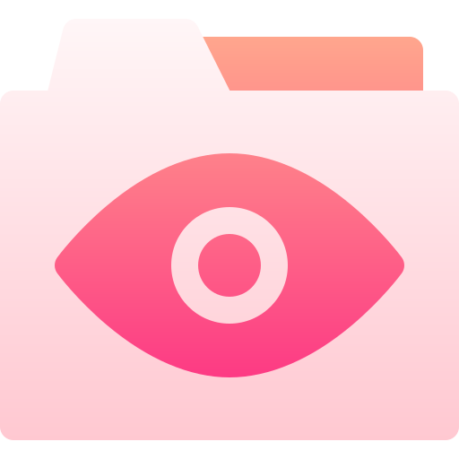
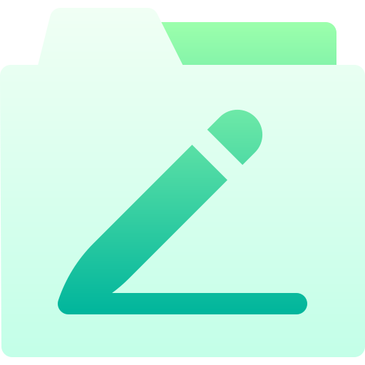
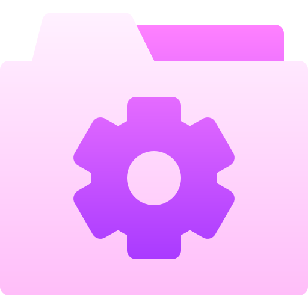

# 🖼️ files-and-document-03 素材庫

[⬅️ 返回主目錄](../../README.md)

| 預覽 (點擊放大) | 檔案資訊 |
| :--- | :--- |
|  | **001-assign.svg** Vector (SVG) | 1.47KB |
|  | **002-bar chart.svg** Vector (SVG) | 1.29KB |
|  | **003-chat.svg** Vector (SVG) | 1.42KB |
|  | **004-forward.svg** Vector (SVG) | 1.25KB |
|  | **005-undo.svg** Vector (SVG) | 1.29KB |
|  | **006-uncorrect.svg** Vector (SVG) | 1.42KB |
|  | **007-correct.svg** Vector (SVG) | 1.32KB |
|  | **008-delete.svg** Vector (SVG) | 1.20KB |
|  | **009-favourite.svg** Vector (SVG) | 1.34KB |
|  | **010-like.svg** Vector (SVG) | 1.31KB |
|  | **011-error.svg** Vector (SVG) | 1.44KB |
|  | **012-search.svg** Vector (SVG) | 1.33KB |
|  | **013-pin.svg** Vector (SVG) | 1.33KB |
|  | **014-view.svg** Vector (SVG) | 1.55KB |
|  | **015-password.svg** Vector (SVG) | 2.75KB |
|  | **016-game.svg** Vector (SVG) | 1.52KB |
|  | **017-icon.svg** Vector (SVG) | 1.69KB |
|  | **018-jigsaw.svg** Vector (SVG) | 1.45KB |
|  | **019-download.svg** Vector (SVG) | 1.39KB |
|  | **020-upload.svg** Vector (SVG) | 1.44KB |
|  | **021-pencil.svg** Vector (SVG) | 1.42KB |
|  | **022-settings.svg** Vector (SVG) | 1.93KB |
|  | **023-recipe.svg** Vector (SVG) | 1.34KB |
|  | **024-video.svg** Vector (SVG) | 1.24KB |
|  | **025-music.svg** Vector (SVG) | 1.36KB |
|  | **026-sound.svg** Vector (SVG) | 1.41KB |
|  | **027-profile.svg** Vector (SVG) | 1.48KB |
|  | **028-key.svg** Vector (SVG) | 1.38KB |
|  | **029-smiley.svg** Vector (SVG) | 1.53KB |
|  | **030-vector.svg** Vector (SVG) | 1.40KB |
|  | **031-email.svg** Vector (SVG) | 1.25KB |
|  | **032-interface.svg** Vector (SVG) | 1.87KB |
|  | **033-cloud.svg** Vector (SVG) | 1.22KB |
|  | **034-corrupted.svg** Vector (SVG) | 1.61KB |
|  | **035-zip.svg** Vector (SVG) | 1.75KB |
|  | **036-idea.svg** Vector (SVG) | 1.53KB |
|  | **037-secure.svg** Vector (SVG) | 1.78KB |
|  | **038-lock.svg** Vector (SVG) | 1.32KB |
|  | **039-notification bell.svg** Vector (SVG) | 1.39KB |
|  | **040-main folder.svg** Vector (SVG) | 1.44KB |
|  | **041-rocket.svg** Vector (SVG) | 1.67KB |
|  | **042-biometric.svg** Vector (SVG) | 2.22KB |
|  | **043-bin.svg** Vector (SVG) | 1.42KB |
|  | **044-clock.svg** Vector (SVG) | 1.66KB |
|  | **045-book.svg** Vector (SVG) | 1.58KB |
|  | **046-folder.svg** Vector (SVG) | 1.24KB |
|  | **047-stopwatch.svg** Vector (SVG) | 1.68KB |
|  | **048-photo.svg** Vector (SVG) | 1.38KB |
|  | **049-coding.svg** Vector (SVG) | 1.67KB |
|  | **050-font.svg** Vector (SVG) | 1.41KB |