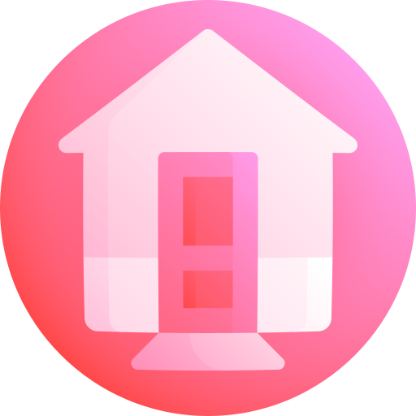
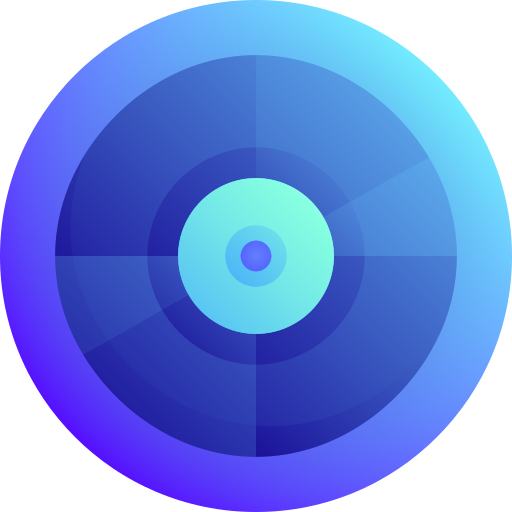
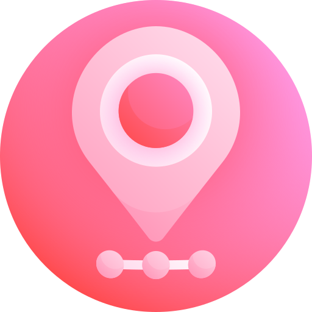
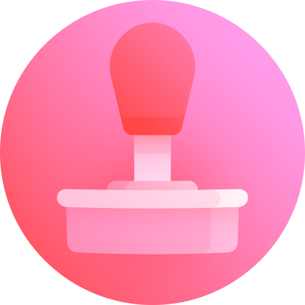

# 🖼️ files-and-document-04

[⬅️ 返回主目錄](../../../../README.md)

| 預覽 | 資訊 |
| :--- | :--- |
|  | **001-mail inbox app.svg** |
|  | **002-speech bubble.svg** |
|  | **003-telephone.svg** |
|  | **004-camera.svg** |
|  | **005-image.svg** |
|  | **006-weather app.svg** |
|  | **007-clock.svg** |
|  | **008-maps.svg** |
|  | **009-tv app.svg** |
|  | **010-notes.svg** |
|  | **011-house.svg** |
|  | **012-daily health app.svg** |
|  | **013-news.svg** |
|  | **014-music.svg** |
|  | **015-folder.svg** |
|  | **016-stock exchange app.svg** |
|  | **017-web browser.svg** |
|  | **018-calendar.svg** |
|  | **019-reminders.svg** |
|  | **020-video calling app.svg** |
|  | **021-podcast.svg** |
|  | **022-wallet passes app.svg** |
|  | **023-app store.svg** |
|  | **024-books.svg** |
|  | **025-settings.svg** |
|  | **026-tips.svg** |
|  | **027-remote control.svg** |
|  | **028-voice message app.svg** |
|  | **029-find my gadget app.svg** |
|  | **030-shortcut script app.svg** |
|  | **031-translate.svg** |
|  | **032-smartwatch app.svg** |
|  | **033-calculator.svg** |
|  | **034-music store app.svg** |
|  | **035-contacts.svg** |
|  | **036-browser.svg** |
|  | **037-bank.svg** |
|  | **038-like.svg** |
|  | **039-twitter.svg** |
|  | **040-youtube.svg** |
|  | **041-whatsapp.svg** |
|  | **042-transport.svg** |
|  | **043-streaming tv app.svg** |
|  | **044-search.svg** |
|  | **045-instagram.svg** |
|  | **046-shopping.svg** |
|  | **047-pin.svg** |
|  | **048-tiktok.svg** |
|  | **049-messenger.svg** |
|  | **050-edition.svg** |
|  | **051-drive.svg** |
|  | **052-snapchat.svg** |
|  | **053-reddit.svg** |
|  | **054-twitch.svg** |
|  | **055-spotify.svg** |
|  | **056-video editing app.svg** |
|  | **057-music maker app.svg** |
|  | **058-tinder.svg** |
|  | **059-slack.svg** |
|  | **060-telegram.svg** |
|  | **061-discord.svg** |
|  | **062-tumblr.svg** |
|  | **063-slide show app.svg** |
|  | **064-movies app.svg** |
|  | **065-pages.svg** |
|  | **066-spreadsheet app.svg** |
|  | **067-mortarboard.svg** |
|  | **068-waze.svg** |
|  | **069-linkedin.svg** |
|  | **070-file hosting.svg** |