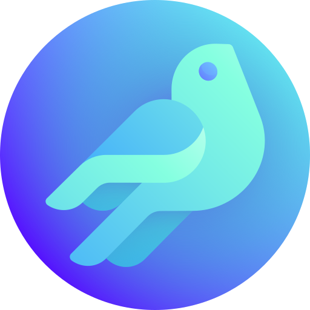

# 🖼️ 素材分類：files-and-document-04

> [🏠 主目錄](../../../../README.md) / **files-and-document-04**

本目錄共有 `70` 個檔案

| 🎨 預覽 (點擊放大) | 📋 檔案詳細資訊 |
| :--- | :--- |
|  | **📂 檔名:** `001-mail inbox app.svg` ✨ **格式:** `Vector (SVG)` ⚖️ **大小:** `4.42KB` 📅 **更新:** `2026-02-27`  🔗 [直接查看原始檔](001-mail%20inbox%20app.svg) |
|  | **📂 檔名:** `002-speech bubble.svg` ✨ **格式:** `Vector (SVG)` ⚖️ **大小:** `4.55KB` 📅 **更新:** `2026-02-27`  🔗 [直接查看原始檔](002-speech%20bubble.svg) |
|  | **📂 檔名:** `003-telephone.svg` ✨ **格式:** `Vector (SVG)` ⚖️ **大小:** `5.13KB` 📅 **更新:** `2026-02-27`  🔗 [直接查看原始檔](003-telephone.svg) |
|  | **📂 檔名:** `004-camera.svg` ✨ **格式:** `Vector (SVG)` ⚖️ **大小:** `7.37KB` 📅 **更新:** `2026-02-27`  🔗 [直接查看原始檔](004-camera.svg) |
|  | **📂 檔名:** `005-image.svg` ✨ **格式:** `Vector (SVG)` ⚖️ **大小:** `9.28KB` 📅 **更新:** `2026-02-27`  🔗 [直接查看原始檔](005-image.svg) |
|  | **📂 檔名:** `006-weather app.svg` ✨ **格式:** `Vector (SVG)` ⚖️ **大小:** `7.09KB` 📅 **更新:** `2026-02-27`  🔗 [直接查看原始檔](006-weather%20app.svg) |
|  | **📂 檔名:** `007-clock.svg` ✨ **格式:** `Vector (SVG)` ⚖️ **大小:** `4.72KB` 📅 **更新:** `2026-02-27`  🔗 [直接查看原始檔](007-clock.svg) |
|  | **📂 檔名:** `008-maps.svg` ✨ **格式:** `Vector (SVG)` ⚖️ **大小:** `4.38KB` 📅 **更新:** `2026-02-27`  🔗 [直接查看原始檔](008-maps.svg) |
|  | **📂 檔名:** `009-tv app.svg` ✨ **格式:** `Vector (SVG)` ⚖️ **大小:** `6.54KB` 📅 **更新:** `2026-02-27`  🔗 [直接查看原始檔](009-tv%20app.svg) |
|  | **📂 檔名:** `010-notes.svg` ✨ **格式:** `Vector (SVG)` ⚖️ **大小:** `6.67KB` 📅 **更新:** `2026-02-27`  🔗 [直接查看原始檔](010-notes.svg) |
|  | **📂 檔名:** `011-house.svg` ✨ **格式:** `Vector (SVG)` ⚖️ **大小:** `6.38KB` 📅 **更新:** `2026-02-27`  🔗 [直接查看原始檔](011-house.svg) |
|  | **📂 檔名:** `012-daily health app.svg` ✨ **格式:** `Vector (SVG)` ⚖️ **大小:** `7.06KB` 📅 **更新:** `2026-02-27`  🔗 [直接查看原始檔](012-daily%20health%20app.svg) |
|  | **📂 檔名:** `013-news.svg` ✨ **格式:** `Vector (SVG)` ⚖️ **大小:** `9.80KB` 📅 **更新:** `2026-02-27`  🔗 [直接查看原始檔](013-news.svg) |
|  | **📂 檔名:** `014-music.svg` ✨ **格式:** `Vector (SVG)` ⚖️ **大小:** `7.14KB` 📅 **更新:** `2026-02-27`  🔗 [直接查看原始檔](014-music.svg) |
|  | **📂 檔名:** `015-folder.svg` ✨ **格式:** `Vector (SVG)` ⚖️ **大小:** `6.48KB` 📅 **更新:** `2026-02-27`  🔗 [直接查看原始檔](015-folder.svg) |
|  | **📂 檔名:** `016-stock exchange app.svg` ✨ **格式:** `Vector (SVG)` ⚖️ **大小:** `4.82KB` 📅 **更新:** `2026-02-27`  🔗 [直接查看原始檔](016-stock%20exchange%20app.svg) |
|  | **📂 檔名:** `017-web browser.svg` ✨ **格式:** `Vector (SVG)` ⚖️ **大小:** `4.77KB` 📅 **更新:** `2026-02-27`  🔗 [直接查看原始檔](017-web%20browser.svg) |
|  | **📂 檔名:** `018-calendar.svg` ✨ **格式:** `Vector (SVG)` ⚖️ **大小:** `8.20KB` 📅 **更新:** `2026-02-27`  🔗 [直接查看原始檔](018-calendar.svg) |
|  | **📂 檔名:** `019-reminders.svg` ✨ **格式:** `Vector (SVG)` ⚖️ **大小:** `13.30KB` 📅 **更新:** `2026-02-27`  🔗 [直接查看原始檔](019-reminders.svg) |
|  | **📂 檔名:** `020-video calling app.svg` ✨ **格式:** `Vector (SVG)` ⚖️ **大小:** `8.42KB` 📅 **更新:** `2026-02-27`  🔗 [直接查看原始檔](020-video%20calling%20app.svg) |
|  | **📂 檔名:** `021-podcast.svg` ✨ **格式:** `Vector (SVG)` ⚖️ **大小:** `9.01KB` 📅 **更新:** `2026-02-27`  🔗 [直接查看原始檔](021-podcast.svg) |
|  | **📂 檔名:** `022-wallet passes app.svg` ✨ **格式:** `Vector (SVG)` ⚖️ **大小:** `5.47KB` 📅 **更新:** `2026-02-27`  🔗 [直接查看原始檔](022-wallet%20passes%20app.svg) |
|  | **📂 檔名:** `023-app store.svg` ✨ **格式:** `Vector (SVG)` ⚖️ **大小:** `7.88KB` 📅 **更新:** `2026-02-27`  🔗 [直接查看原始檔](023-app%20store.svg) |
|  | **📂 檔名:** `024-books.svg` ✨ **格式:** `Vector (SVG)` ⚖️ **大小:** `8.14KB` 📅 **更新:** `2026-02-27`  🔗 [直接查看原始檔](024-books.svg) |
|  | **📂 檔名:** `025-settings.svg` ✨ **格式:** `Vector (SVG)` ⚖️ **大小:** `8.24KB` 📅 **更新:** `2026-02-27`  🔗 [直接查看原始檔](025-settings.svg) |
|  | **📂 檔名:** `026-tips.svg` ✨ **格式:** `Vector (SVG)` ⚖️ **大小:** `6.25KB` 📅 **更新:** `2026-02-27`  🔗 [直接查看原始檔](026-tips.svg) |
|  | **📂 檔名:** `027-remote control.svg` ✨ **格式:** `Vector (SVG)` ⚖️ **大小:** `4.89KB` 📅 **更新:** `2026-02-27`  🔗 [直接查看原始檔](027-remote%20control.svg) |
|  | **📂 檔名:** `028-voice message app.svg` ✨ **格式:** `Vector (SVG)` ⚖️ **大小:** `13.50KB` 📅 **更新:** `2026-02-27`  🔗 [直接查看原始檔](028-voice%20message%20app.svg) |
|  | **📂 檔名:** `029-find my gadget app.svg` ✨ **格式:** `Vector (SVG)` ⚖️ **大小:** `7.68KB` 📅 **更新:** `2026-02-27`  🔗 [直接查看原始檔](029-find%20my%20gadget%20app.svg) |
|  | **📂 檔名:** `030-shortcut script app.svg` ✨ **格式:** `Vector (SVG)` ⚖️ **大小:** `4.76KB` 📅 **更新:** `2026-02-27`  🔗 [直接查看原始檔](030-shortcut%20script%20app.svg) |
|  | **📂 檔名:** `031-translate.svg` ✨ **格式:** `Vector (SVG)` ⚖️ **大小:** `7.00KB` 📅 **更新:** `2026-02-27`  🔗 [直接查看原始檔](031-translate.svg) |
|  | **📂 檔名:** `032-smartwatch app.svg` ✨ **格式:** `Vector (SVG)` ⚖️ **大小:** `6.54KB` 📅 **更新:** `2026-02-27`  🔗 [直接查看原始檔](032-smartwatch%20app.svg) |
|  | **📂 檔名:** `033-calculator.svg` ✨ **格式:** `Vector (SVG)` ⚖️ **大小:** `11.66KB` 📅 **更新:** `2026-02-27`  🔗 [直接查看原始檔](033-calculator.svg) |
|  | **📂 檔名:** `034-music store app.svg` ✨ **格式:** `Vector (SVG)` ⚖️ **大小:** `4.23KB` 📅 **更新:** `2026-02-27`  🔗 [直接查看原始檔](034-music%20store%20app.svg) |
|  | **📂 檔名:** `035-contacts.svg` ✨ **格式:** `Vector (SVG)` ⚖️ **大小:** `10.42KB` 📅 **更新:** `2026-02-27`  🔗 [直接查看原始檔](035-contacts.svg) |
|  | **📂 檔名:** `036-browser.svg` ✨ **格式:** `Vector (SVG)` ⚖️ **大小:** `5.88KB` 📅 **更新:** `2026-02-27`  🔗 [直接查看原始檔](036-browser.svg) |
|  | **📂 檔名:** `037-bank.svg` ✨ **格式:** `Vector (SVG)` ⚖️ **大小:** `7.55KB` 📅 **更新:** `2026-02-27`  🔗 [直接查看原始檔](037-bank.svg) |
|  | **📂 檔名:** `038-like.svg` ✨ **格式:** `Vector (SVG)` ⚖️ **大小:** `5.93KB` 📅 **更新:** `2026-02-27`  🔗 [直接查看原始檔](038-like.svg) |
|  | **📂 檔名:** `039-twitter.svg` ✨ **格式:** `Vector (SVG)` ⚖️ **大小:** `6.32KB` 📅 **更新:** `2026-02-27`  🔗 [直接查看原始檔](039-twitter.svg) |
|  | **📂 檔名:** `040-youtube.svg` ✨ **格式:** `Vector (SVG)` ⚖️ **大小:** `3.55KB` 📅 **更新:** `2026-02-27`  🔗 [直接查看原始檔](040-youtube.svg) |
|  | **📂 檔名:** `041-whatsapp.svg` ✨ **格式:** `Vector (SVG)` ⚖️ **大小:** `4.94KB` 📅 **更新:** `2026-02-27`  🔗 [直接查看原始檔](041-whatsapp.svg) |
|  | **📂 檔名:** `042-transport.svg` ✨ **格式:** `Vector (SVG)` ⚖️ **大小:** `6.36KB` 📅 **更新:** `2026-02-27`  🔗 [直接查看原始檔](042-transport.svg) |
|  | **📂 檔名:** `043-streaming tv app.svg` ✨ **格式:** `Vector (SVG)` ⚖️ **大小:** `8.00KB` 📅 **更新:** `2026-02-27`  🔗 [直接查看原始檔](043-streaming%20tv%20app.svg) |
|  | **📂 檔名:** `044-search.svg` ✨ **格式:** `Vector (SVG)` ⚖️ **大小:** `6.86KB` 📅 **更新:** `2026-02-27`  🔗 [直接查看原始檔](044-search.svg) |
|  | **📂 檔名:** `045-instagram.svg` ✨ **格式:** `Vector (SVG)` ⚖️ **大小:** `6.91KB` 📅 **更新:** `2026-02-27`  🔗 [直接查看原始檔](045-instagram.svg) |
|  | **📂 檔名:** `046-shopping.svg` ✨ **格式:** `Vector (SVG)` ⚖️ **大小:** `5.07KB` 📅 **更新:** `2026-02-27`  🔗 [直接查看原始檔](046-shopping.svg) |
|  | **📂 檔名:** `047-pin.svg` ✨ **格式:** `Vector (SVG)` ⚖️ **大小:** `7.14KB` 📅 **更新:** `2026-02-27`  🔗 [直接查看原始檔](047-pin.svg) |
|  | **📂 檔名:** `048-tiktok.svg` ✨ **格式:** `Vector (SVG)` ⚖️ **大小:** `4.40KB` 📅 **更新:** `2026-02-27`  🔗 [直接查看原始檔](048-tiktok.svg) |
|  | **📂 檔名:** `049-messenger.svg` ✨ **格式:** `Vector (SVG)` ⚖️ **大小:** `3.54KB` 📅 **更新:** `2026-02-27`  🔗 [直接查看原始檔](049-messenger.svg) |
|  | **📂 檔名:** `050-edition.svg` ✨ **格式:** `Vector (SVG)` ⚖️ **大小:** `10.15KB` 📅 **更新:** `2026-02-27`  🔗 [直接查看原始檔](050-edition.svg) |
|  | **📂 檔名:** `051-drive.svg` ✨ **格式:** `Vector (SVG)` ⚖️ **大小:** `9.25KB` 📅 **更新:** `2026-02-27`  🔗 [直接查看原始檔](051-drive.svg) |
|  | **📂 檔名:** `052-snapchat.svg` ✨ **格式:** `Vector (SVG)` ⚖️ **大小:** `7.01KB` 📅 **更新:** `2026-02-27`  🔗 [直接查看原始檔](052-snapchat.svg) |
|  | **📂 檔名:** `053-reddit.svg` ✨ **格式:** `Vector (SVG)` ⚖️ **大小:** `9.12KB` 📅 **更新:** `2026-02-27`  🔗 [直接查看原始檔](053-reddit.svg) |
|  | **📂 檔名:** `054-twitch.svg` ✨ **格式:** `Vector (SVG)` ⚖️ **大小:** `7.88KB` 📅 **更新:** `2026-02-27`  🔗 [直接查看原始檔](054-twitch.svg) |
|  | **📂 檔名:** `055-spotify.svg` ✨ **格式:** `Vector (SVG)` ⚖️ **大小:** `6.79KB` 📅 **更新:** `2026-02-27`  🔗 [直接查看原始檔](055-spotify.svg) |
|  | **📂 檔名:** `056-video editing app.svg` ✨ **格式:** `Vector (SVG)` ⚖️ **大小:** `9.25KB` 📅 **更新:** `2026-02-27`  🔗 [直接查看原始檔](056-video%20editing%20app.svg) |
|  | **📂 檔名:** `057-music maker app.svg` ✨ **格式:** `Vector (SVG)` ⚖️ **大小:** `7.03KB` 📅 **更新:** `2026-02-27`  🔗 [直接查看原始檔](057-music%20maker%20app.svg) |
|  | **📂 檔名:** `058-tinder.svg` ✨ **格式:** `Vector (SVG)` ⚖️ **大小:** `4.35KB` 📅 **更新:** `2026-02-27`  🔗 [直接查看原始檔](058-tinder.svg) |
|  | **📂 檔名:** `059-slack.svg` ✨ **格式:** `Vector (SVG)` ⚖️ **大小:** `7.55KB` 📅 **更新:** `2026-02-27`  🔗 [直接查看原始檔](059-slack.svg) |
|  | **📂 檔名:** `060-telegram.svg` ✨ **格式:** `Vector (SVG)` ⚖️ **大小:** `4.97KB` 📅 **更新:** `2026-02-27`  🔗 [直接查看原始檔](060-telegram.svg) |
|  | **📂 檔名:** `061-discord.svg` ✨ **格式:** `Vector (SVG)` ⚖️ **大小:** `7.22KB` 📅 **更新:** `2026-02-27`  🔗 [直接查看原始檔](061-discord.svg) |
|  | **📂 檔名:** `062-tumblr.svg` ✨ **格式:** `Vector (SVG)` ⚖️ **大小:** `8.32KB` 📅 **更新:** `2026-02-27`  🔗 [直接查看原始檔](062-tumblr.svg) |
|  | **📂 檔名:** `063-slide show app.svg` ✨ **格式:** `Vector (SVG)` ⚖️ **大小:** `7.99KB` 📅 **更新:** `2026-02-27`  🔗 [直接查看原始檔](063-slide%20show%20app.svg) |
|  | **📂 檔名:** `064-movies app.svg` ✨ **格式:** `Vector (SVG)` ⚖️ **大小:** `9.19KB` 📅 **更新:** `2026-02-27`  🔗 [直接查看原始檔](064-movies%20app.svg) |
|  | **📂 檔名:** `065-pages.svg` ✨ **格式:** `Vector (SVG)` ⚖️ **大小:** `7.11KB` 📅 **更新:** `2026-02-27`  🔗 [直接查看原始檔](065-pages.svg) |
|  | **📂 檔名:** `066-spreadsheet app.svg` ✨ **格式:** `Vector (SVG)` ⚖️ **大小:** `6.12KB` 📅 **更新:** `2026-02-27`  🔗 [直接查看原始檔](066-spreadsheet%20app.svg) |
|  | **📂 檔名:** `067-mortarboard.svg` ✨ **格式:** `Vector (SVG)` ⚖️ **大小:** `7.65KB` 📅 **更新:** `2026-02-27`  🔗 [直接查看原始檔](067-mortarboard.svg) |
|  | **📂 檔名:** `068-waze.svg` ✨ **格式:** `Vector (SVG)` ⚖️ **大小:** `7.65KB` 📅 **更新:** `2026-02-27`  🔗 [直接查看原始檔](068-waze.svg) |
|  | **📂 檔名:** `069-linkedin.svg` ✨ **格式:** `Vector (SVG)` ⚖️ **大小:** `11.70KB` 📅 **更新:** `2026-02-27`  🔗 [直接查看原始檔](069-linkedin.svg) |
|  | **📂 檔名:** `070-file hosting.svg` ✨ **格式:** `Vector (SVG)` ⚖️ **大小:** `7.04KB` 📅 **更新:** `2026-02-27`  🔗 [直接查看原始檔](070-file%20hosting.svg) |