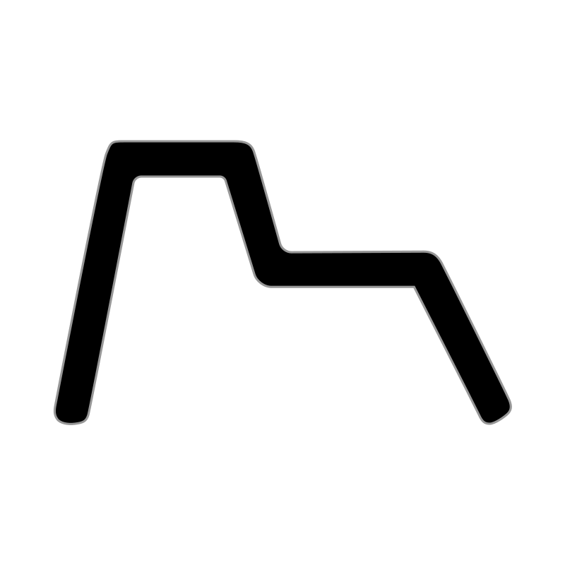
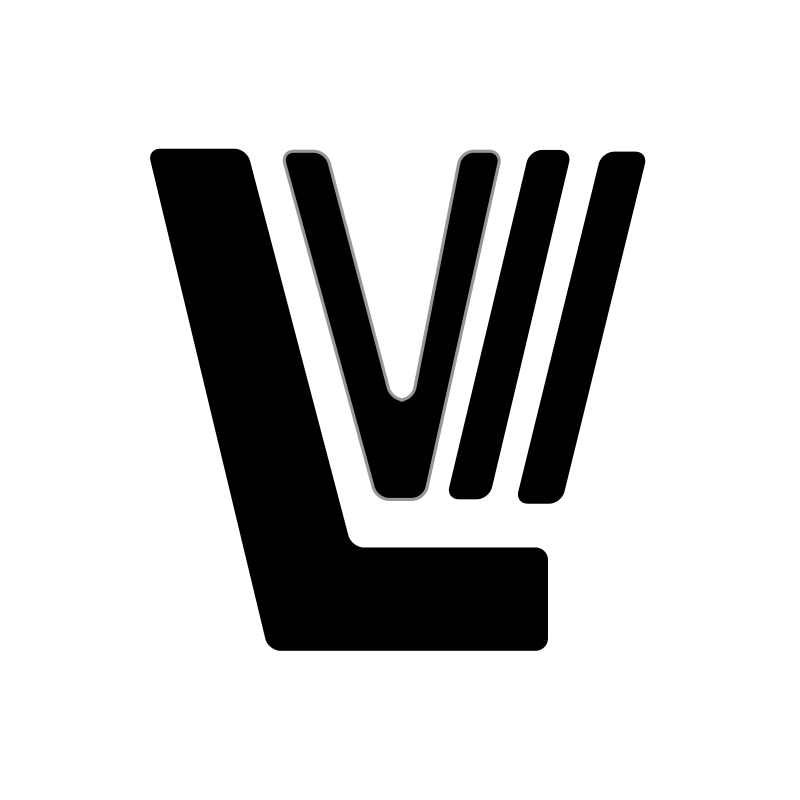
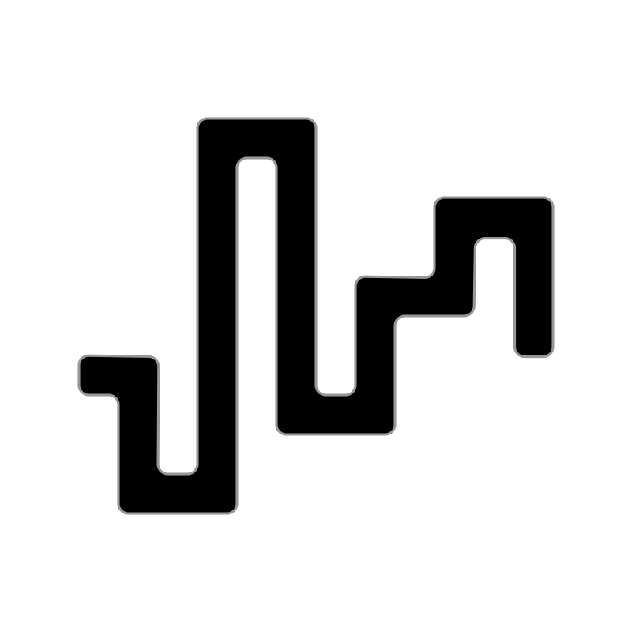
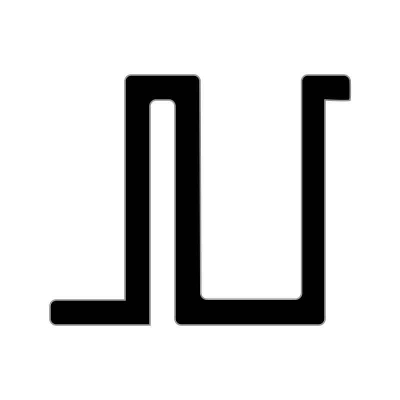
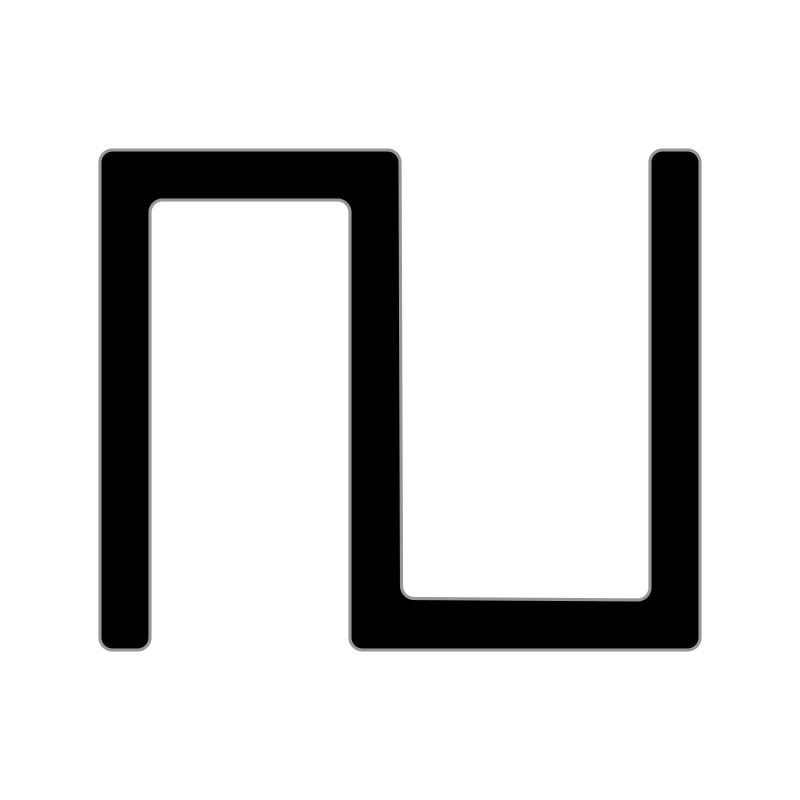

# 🖼️ 素材分類：Fontaudio Line iCons

> [🏠 主目錄](../../../README.md) / [images](../../README.md) / [iCons](../README.md) / **Fontaudio Line iCons**

本目錄共有 `152` 個檔案

| 🎨 預覽 (點擊放大)  | 📋 檔案詳細資訊與連結 |
| :--- | :--- |
|  | **📂 檔名:** `adr.svg` ✨ **格式:** `Vector (SVG)` ⚖️ **大小:** `812.00B` 📅 **更新:** `2026-02-27`  🚀 **jsDelivr Markdown:** `` 🔗 **直接連結 (Url):** <code>https://cdn.jsdelivr.net/gh/barry028/materials@main/images/iCons/Fontaudio%20Line%20iCons/adr.svg</code> 📥 [檢視原始檔](adr.svg) |
|  | **📂 檔名:** `adsr.svg` ✨ **格式:** `Vector (SVG)` ⚖️ **大小:** `862.00B` 📅 **更新:** `2026-02-27`  🚀 **jsDelivr Markdown:** `` 🔗 **直接連結 (Url):** <code>https://cdn.jsdelivr.net/gh/barry028/materials@main/images/iCons/Fontaudio%20Line%20iCons/adsr.svg</code> 📥 [檢視原始檔](adsr.svg) |
|  | **📂 檔名:** `ahdsr.svg` ✨ **格式:** `Vector (SVG)` ⚖️ **大小:** `896.00B` 📅 **更新:** `2026-02-27`  🚀 **jsDelivr Markdown:** `` 🔗 **直接連結 (Url):** <code>https://cdn.jsdelivr.net/gh/barry028/materials@main/images/iCons/Fontaudio%20Line%20iCons/ahdsr.svg</code> 📥 [檢視原始檔](ahdsr.svg) |
|  | **📂 檔名:** `ar.svg` ✨ **格式:** `Vector (SVG)` ⚖️ **大小:** `673.00B` 📅 **更新:** `2026-02-27`  🚀 **jsDelivr Markdown:** `` 🔗 **直接連結 (Url):** <code>https://cdn.jsdelivr.net/gh/barry028/materials@main/images/iCons/Fontaudio%20Line%20iCons/ar.svg</code> 📥 [檢視原始檔](ar.svg) |
|  | **📂 檔名:** `armrecording.svg` ✨ **格式:** `Vector (SVG)` ⚖️ **大小:** `294.00B` 📅 **更新:** `2026-02-27`  🚀 **jsDelivr Markdown:** `` 🔗 **直接連結 (Url):** <code>https://cdn.jsdelivr.net/gh/barry028/materials@main/images/iCons/Fontaudio%20Line%20iCons/armrecording.svg</code> 📥 [檢視原始檔](armrecording.svg) |
|  | **📂 檔名:** `arpchord.svg` ✨ **格式:** `Vector (SVG)` ⚖️ **大小:** `1.16KB` 📅 **更新:** `2026-02-27`  🚀 **jsDelivr Markdown:** `` 🔗 **直接連結 (Url):** <code>https://cdn.jsdelivr.net/gh/barry028/materials@main/images/iCons/Fontaudio%20Line%20iCons/arpchord.svg</code> 📥 [檢視原始檔](arpchord.svg) |
|  | **📂 檔名:** `arpdown.svg` ✨ **格式:** `Vector (SVG)` ⚖️ **大小:** `1.02KB` 📅 **更新:** `2026-02-27`  🚀 **jsDelivr Markdown:** `` 🔗 **直接連結 (Url):** <code>https://cdn.jsdelivr.net/gh/barry028/materials@main/images/iCons/Fontaudio%20Line%20iCons/arpdown.svg</code> 📥 [檢視原始檔](arpdown.svg) |
|  | **📂 檔名:** `arpdownandup.svg` ✨ **格式:** `Vector (SVG)` ⚖️ **大小:** `1.17KB` 📅 **更新:** `2026-02-27`  🚀 **jsDelivr Markdown:** `` 🔗 **直接連結 (Url):** <code>https://cdn.jsdelivr.net/gh/barry028/materials@main/images/iCons/Fontaudio%20Line%20iCons/arpdownandup.svg</code> 📥 [檢視原始檔](arpdownandup.svg) |
|  | **📂 檔名:** `arpdownup.svg` ✨ **格式:** `Vector (SVG)` ⚖️ **大小:** `1.02KB` 📅 **更新:** `2026-02-27`  🚀 **jsDelivr Markdown:** `` 🔗 **直接連結 (Url):** <code>https://cdn.jsdelivr.net/gh/barry028/materials@main/images/iCons/Fontaudio%20Line%20iCons/arpdownup.svg</code> 📥 [檢視原始檔](arpdownup.svg) |
|  | **📂 檔名:** `arpplayorder.svg` ✨ **格式:** `Vector (SVG)` ⚖️ **大小:** `1.17KB` 📅 **更新:** `2026-02-27`  🚀 **jsDelivr Markdown:** `` 🔗 **直接連結 (Url):** <code>https://cdn.jsdelivr.net/gh/barry028/materials@main/images/iCons/Fontaudio%20Line%20iCons/arpplayorder.svg</code> 📥 [檢視原始檔](arpplayorder.svg) |
|  | **📂 檔名:** `arprandom.svg` ✨ **格式:** `Vector (SVG)` ⚖️ **大小:** `1.02KB` 📅 **更新:** `2026-02-27`  🚀 **jsDelivr Markdown:** `` 🔗 **直接連結 (Url):** <code>https://cdn.jsdelivr.net/gh/barry028/materials@main/images/iCons/Fontaudio%20Line%20iCons/arprandom.svg</code> 📥 [檢視原始檔](arprandom.svg) |
|  | **📂 檔名:** `arpup.svg` ✨ **格式:** `Vector (SVG)` ⚖️ **大小:** `1.03KB` 📅 **更新:** `2026-02-27`  🚀 **jsDelivr Markdown:** `` 🔗 **直接連結 (Url):** <code>https://cdn.jsdelivr.net/gh/barry028/materials@main/images/iCons/Fontaudio%20Line%20iCons/arpup.svg</code> 📥 [檢視原始檔](arpup.svg) |
|  | **📂 檔名:** `arpupandown.svg` ✨ **格式:** `Vector (SVG)` ⚖️ **大小:** `1.17KB` 📅 **更新:** `2026-02-27`  🚀 **jsDelivr Markdown:** `` 🔗 **直接連結 (Url):** <code>https://cdn.jsdelivr.net/gh/barry028/materials@main/images/iCons/Fontaudio%20Line%20iCons/arpupandown.svg</code> 📥 [檢視原始檔](arpupandown.svg) |
|  | **📂 檔名:** `arpupdown.svg` ✨ **格式:** `Vector (SVG)` ⚖️ **大小:** `1.02KB` 📅 **更新:** `2026-02-27`  🚀 **jsDelivr Markdown:** `` 🔗 **直接連結 (Url):** <code>https://cdn.jsdelivr.net/gh/barry028/materials@main/images/iCons/Fontaudio%20Line%20iCons/arpupdown.svg</code> 📥 [檢視原始檔](arpupdown.svg) |
|  | **📂 檔名:** `arrows-horz.svg` ✨ **格式:** `Vector (SVG)` ⚖️ **大小:** `513.00B` 📅 **更新:** `2026-02-27`  🚀 **jsDelivr Markdown:** `` 🔗 **直接連結 (Url):** <code>https://cdn.jsdelivr.net/gh/barry028/materials@main/images/iCons/Fontaudio%20Line%20iCons/arrows-horz.svg</code> 📥 [檢視原始檔](arrows-horz.svg) |
|  | **📂 檔名:** `arrows-vert.svg` ✨ **格式:** `Vector (SVG)` ⚖️ **大小:** `517.00B` 📅 **更新:** `2026-02-27`  🚀 **jsDelivr Markdown:** `` 🔗 **直接連結 (Url):** <code>https://cdn.jsdelivr.net/gh/barry028/materials@main/images/iCons/Fontaudio%20Line%20iCons/arrows-vert.svg</code> 📥 [檢視原始檔](arrows-vert.svg) |
|  | **📂 檔名:** `automation-2p.svg` ✨ **格式:** `Vector (SVG)` ⚖️ **大小:** `737.00B` 📅 **更新:** `2026-02-27`  🚀 **jsDelivr Markdown:** `` 🔗 **直接連結 (Url):** <code>https://cdn.jsdelivr.net/gh/barry028/materials@main/images/iCons/Fontaudio%20Line%20iCons/automation-2p.svg</code> 📥 [檢視原始檔](automation-2p.svg) |
|  | **📂 檔名:** `automation-3p.svg` ✨ **格式:** `Vector (SVG)` ⚖️ **大小:** `1020.00B` 📅 **更新:** `2026-02-27`  🚀 **jsDelivr Markdown:** `` 🔗 **直接連結 (Url):** <code>https://cdn.jsdelivr.net/gh/barry028/materials@main/images/iCons/Fontaudio%20Line%20iCons/automation-3p.svg</code> 📥 [檢視原始檔](automation-3p.svg) |
|  | **📂 檔名:** `automation-4p.svg` ✨ **格式:** `Vector (SVG)` ⚖️ **大小:** `1.25KB` 📅 **更新:** `2026-02-27`  🚀 **jsDelivr Markdown:** `` 🔗 **直接連結 (Url):** <code>https://cdn.jsdelivr.net/gh/barry028/materials@main/images/iCons/Fontaudio%20Line%20iCons/automation-4p.svg</code> 📥 [檢視原始檔](automation-4p.svg) |
|  | **📂 檔名:** `backward.svg` ✨ **格式:** `Vector (SVG)` ⚖️ **大小:** `1.02KB` 📅 **更新:** `2026-02-27`  🚀 **jsDelivr Markdown:** `` 🔗 **直接連結 (Url):** <code>https://cdn.jsdelivr.net/gh/barry028/materials@main/images/iCons/Fontaudio%20Line%20iCons/backward.svg</code> 📥 [檢視原始檔](backward.svg) |
|  | **📂 檔名:** `bluetooth.svg` ✨ **格式:** `Vector (SVG)` ⚖️ **大小:** `1.32KB` 📅 **更新:** `2026-02-27`  🚀 **jsDelivr Markdown:** `` 🔗 **直接連結 (Url):** <code>https://cdn.jsdelivr.net/gh/barry028/materials@main/images/iCons/Fontaudio%20Line%20iCons/bluetooth.svg</code> 📥 [檢視原始檔](bluetooth.svg) |
|  | **📂 檔名:** `caret-down.svg` ✨ **格式:** `Vector (SVG)` ⚖️ **大小:** `768.00B` 📅 **更新:** `2026-02-27`  🚀 **jsDelivr Markdown:** `` 🔗 **直接連結 (Url):** <code>https://cdn.jsdelivr.net/gh/barry028/materials@main/images/iCons/Fontaudio%20Line%20iCons/caret-down.svg</code> 📥 [檢視原始檔](caret-down.svg) |
|  | **📂 檔名:** `caret-left.svg` ✨ **格式:** `Vector (SVG)` ⚖️ **大小:** `779.00B` 📅 **更新:** `2026-02-27`  🚀 **jsDelivr Markdown:** `` 🔗 **直接連結 (Url):** <code>https://cdn.jsdelivr.net/gh/barry028/materials@main/images/iCons/Fontaudio%20Line%20iCons/caret-left.svg</code> 📥 [檢視原始檔](caret-left.svg) |
|  | **📂 檔名:** `caret-right.svg` ✨ **格式:** `Vector (SVG)` ⚖️ **大小:** `737.00B` 📅 **更新:** `2026-02-27`  🚀 **jsDelivr Markdown:** `` 🔗 **直接連結 (Url):** <code>https://cdn.jsdelivr.net/gh/barry028/materials@main/images/iCons/Fontaudio%20Line%20iCons/caret-right.svg</code> 📥 [檢視原始檔](caret-right.svg) |
|  | **📂 檔名:** `caret-up.svg` ✨ **格式:** `Vector (SVG)` ⚖️ **大小:** `743.00B` 📅 **更新:** `2026-02-27`  🚀 **jsDelivr Markdown:** `` 🔗 **直接連結 (Url):** <code>https://cdn.jsdelivr.net/gh/barry028/materials@main/images/iCons/Fontaudio%20Line%20iCons/caret-up.svg</code> 📥 [檢視原始檔](caret-up.svg) |
|  | **📂 檔名:** `close.svg` ✨ **格式:** `Vector (SVG)` ⚖️ **大小:** `1021.00B` 📅 **更新:** `2026-02-27`  🚀 **jsDelivr Markdown:** `` 🔗 **直接連結 (Url):** <code>https://cdn.jsdelivr.net/gh/barry028/materials@main/images/iCons/Fontaudio%20Line%20iCons/close.svg</code> 📥 [檢視原始檔](close.svg) |
|  | **📂 檔名:** `copy.svg` ✨ **格式:** `Vector (SVG)` ⚖️ **大小:** `1.47KB` 📅 **更新:** `2026-02-27`  🚀 **jsDelivr Markdown:** `` 🔗 **直接連結 (Url):** <code>https://cdn.jsdelivr.net/gh/barry028/materials@main/images/iCons/Fontaudio%20Line%20iCons/copy.svg</code> 📥 [檢視原始檔](copy.svg) |
|  | **📂 檔名:** `cpu.svg` ✨ **格式:** `Vector (SVG)` ⚖️ **大小:** `1.11KB` 📅 **更新:** `2026-02-27`  🚀 **jsDelivr Markdown:** `` 🔗 **直接連結 (Url):** <code>https://cdn.jsdelivr.net/gh/barry028/materials@main/images/iCons/Fontaudio%20Line%20iCons/cpu.svg</code> 📥 [檢視原始檔](cpu.svg) |
|  | **📂 檔名:** `cutter.svg` ✨ **格式:** `Vector (SVG)` ⚖️ **大小:** `423.00B` 📅 **更新:** `2026-02-27`  🚀 **jsDelivr Markdown:** `` 🔗 **直接連結 (Url):** <code>https://cdn.jsdelivr.net/gh/barry028/materials@main/images/iCons/Fontaudio%20Line%20iCons/cutter.svg</code> 📥 [檢視原始檔](cutter.svg) |
|  | **📂 檔名:** `digital-colon.svg` ✨ **格式:** `Vector (SVG)` ⚖️ **大小:** `549.00B` 📅 **更新:** `2026-02-27`  🚀 **jsDelivr Markdown:** `` 🔗 **直接連結 (Url):** <code>https://cdn.jsdelivr.net/gh/barry028/materials@main/images/iCons/Fontaudio%20Line%20iCons/digital-colon.svg</code> 📥 [檢視原始檔](digital-colon.svg) |
|  | **📂 檔名:** `digital-dot.svg` ✨ **格式:** `Vector (SVG)` ⚖️ **大小:** `416.00B` 📅 **更新:** `2026-02-27`  🚀 **jsDelivr Markdown:** `` 🔗 **直接連結 (Url):** <code>https://cdn.jsdelivr.net/gh/barry028/materials@main/images/iCons/Fontaudio%20Line%20iCons/digital-dot.svg</code> 📥 [檢視原始檔](digital-dot.svg) |
|  | **📂 檔名:** `digital0.svg` ✨ **格式:** `Vector (SVG)` ⚖️ **大小:** `1.59KB` 📅 **更新:** `2026-02-27`  🚀 **jsDelivr Markdown:** `` 🔗 **直接連結 (Url):** <code>https://cdn.jsdelivr.net/gh/barry028/materials@main/images/iCons/Fontaudio%20Line%20iCons/digital0.svg</code> 📥 [檢視原始檔](digital0.svg) |
|  | **📂 檔名:** `digital1.svg` ✨ **格式:** `Vector (SVG)` ⚖️ **大小:** `762.00B` 📅 **更新:** `2026-02-27`  🚀 **jsDelivr Markdown:** `` 🔗 **直接連結 (Url):** <code>https://cdn.jsdelivr.net/gh/barry028/materials@main/images/iCons/Fontaudio%20Line%20iCons/digital1.svg</code> 📥 [檢視原始檔](digital1.svg) |
|  | **📂 檔名:** `digital2.svg` ✨ **格式:** `Vector (SVG)` ⚖️ **大小:** `1.42KB` 📅 **更新:** `2026-02-27`  🚀 **jsDelivr Markdown:** `` 🔗 **直接連結 (Url):** <code>https://cdn.jsdelivr.net/gh/barry028/materials@main/images/iCons/Fontaudio%20Line%20iCons/digital2.svg</code> 📥 [檢視原始檔](digital2.svg) |
|  | **📂 檔名:** `digital3.svg` ✨ **格式:** `Vector (SVG)` ⚖️ **大小:** `1.41KB` 📅 **更新:** `2026-02-27`  🚀 **jsDelivr Markdown:** `` 🔗 **直接連結 (Url):** <code>https://cdn.jsdelivr.net/gh/barry028/materials@main/images/iCons/Fontaudio%20Line%20iCons/digital3.svg</code> 📥 [檢視原始檔](digital3.svg) |
|  | **📂 檔名:** `digital4.svg` ✨ **格式:** `Vector (SVG)` ⚖️ **大小:** `1.26KB` 📅 **更新:** `2026-02-27`  🚀 **jsDelivr Markdown:** `` 🔗 **直接連結 (Url):** <code>https://cdn.jsdelivr.net/gh/barry028/materials@main/images/iCons/Fontaudio%20Line%20iCons/digital4.svg</code> 📥 [檢視原始檔](digital4.svg) |
|  | **📂 檔名:** `digital5.svg` ✨ **格式:** `Vector (SVG)` ⚖️ **大小:** `1.39KB` 📅 **更新:** `2026-02-27`  🚀 **jsDelivr Markdown:** `` 🔗 **直接連結 (Url):** <code>https://cdn.jsdelivr.net/gh/barry028/materials@main/images/iCons/Fontaudio%20Line%20iCons/digital5.svg</code> 📥 [檢視原始檔](digital5.svg) |
|  | **📂 檔名:** `digital6.svg` ✨ **格式:** `Vector (SVG)` ⚖️ **大小:** `1.63KB` 📅 **更新:** `2026-02-27`  🚀 **jsDelivr Markdown:** `` 🔗 **直接連結 (Url):** <code>https://cdn.jsdelivr.net/gh/barry028/materials@main/images/iCons/Fontaudio%20Line%20iCons/digital6.svg</code> 📥 [檢視原始檔](digital6.svg) |
|  | **📂 檔名:** `digital7.svg` ✨ **格式:** `Vector (SVG)` ⚖️ **大小:** `957.00B` 📅 **更新:** `2026-02-27`  🚀 **jsDelivr Markdown:** `` 🔗 **直接連結 (Url):** <code>https://cdn.jsdelivr.net/gh/barry028/materials@main/images/iCons/Fontaudio%20Line%20iCons/digital7.svg</code> 📥 [檢視原始檔](digital7.svg) |
|  | **📂 檔名:** `digital8.svg` ✨ **格式:** `Vector (SVG)` ⚖️ **大小:** `1.88KB` 📅 **更新:** `2026-02-27`  🚀 **jsDelivr Markdown:** `` 🔗 **直接連結 (Url):** <code>https://cdn.jsdelivr.net/gh/barry028/materials@main/images/iCons/Fontaudio%20Line%20iCons/digital8.svg</code> 📥 [檢視原始檔](digital8.svg) |
|  | **📂 檔名:** `digital9.svg` ✨ **格式:** `Vector (SVG)` ⚖️ **大小:** `1.64KB` 📅 **更新:** `2026-02-27`  🚀 **jsDelivr Markdown:** `` 🔗 **直接連結 (Url):** <code>https://cdn.jsdelivr.net/gh/barry028/materials@main/images/iCons/Fontaudio%20Line%20iCons/digital9.svg</code> 📥 [檢視原始檔](digital9.svg) |
|  | **📂 檔名:** `diskio.svg` ✨ **格式:** `Vector (SVG)` ⚖️ **大小:** `1018.00B` 📅 **更新:** `2026-02-27`  🚀 **jsDelivr Markdown:** `` 🔗 **直接連結 (Url):** <code>https://cdn.jsdelivr.net/gh/barry028/materials@main/images/iCons/Fontaudio%20Line%20iCons/diskio.svg</code> 📥 [檢視原始檔](diskio.svg) |
|  | **📂 檔名:** `drumpad.svg` ✨ **格式:** `Vector (SVG)` ⚖️ **大小:** `415.00B` 📅 **更新:** `2026-02-27`  🚀 **jsDelivr Markdown:** `` 🔗 **直接連結 (Url):** <code>https://cdn.jsdelivr.net/gh/barry028/materials@main/images/iCons/Fontaudio%20Line%20iCons/drumpad.svg</code> 📥 [檢視原始檔](drumpad.svg) |
|  | **📂 檔名:** `duplicate.svg` ✨ **格式:** `Vector (SVG)` ⚖️ **大小:** `1.11KB` 📅 **更新:** `2026-02-27`  🚀 **jsDelivr Markdown:** `` 🔗 **直接連結 (Url):** <code>https://cdn.jsdelivr.net/gh/barry028/materials@main/images/iCons/Fontaudio%20Line%20iCons/duplicate.svg</code> 📥 [檢視原始檔](duplicate.svg) |
|  | **📂 檔名:** `eraser.svg` ✨ **格式:** `Vector (SVG)` ⚖️ **大小:** `1.07KB` 📅 **更新:** `2026-02-27`  🚀 **jsDelivr Markdown:** `` 🔗 **直接連結 (Url):** <code>https://cdn.jsdelivr.net/gh/barry028/materials@main/images/iCons/Fontaudio%20Line%20iCons/eraser.svg</code> 📥 [檢視原始檔](eraser.svg) |
|  | **📂 檔名:** `ffwd.svg` ✨ **格式:** `Vector (SVG)` ⚖️ **大小:** `1.29KB` 📅 **更新:** `2026-02-27`  🚀 **jsDelivr Markdown:** `` 🔗 **直接連結 (Url):** <code>https://cdn.jsdelivr.net/gh/barry028/materials@main/images/iCons/Fontaudio%20Line%20iCons/ffwd.svg</code> 📥 [檢視原始檔](ffwd.svg) |
|  | **📂 檔名:** `filter-bandpass.svg` ✨ **格式:** `Vector (SVG)` ⚖️ **大小:** `718.00B` 📅 **更新:** `2026-02-27`  🚀 **jsDelivr Markdown:** `` 🔗 **直接連結 (Url):** <code>https://cdn.jsdelivr.net/gh/barry028/materials@main/images/iCons/Fontaudio%20Line%20iCons/filter-bandpass.svg</code> 📥 [檢視原始檔](filter-bandpass.svg) |
|  | **📂 檔名:** `filter-bell.svg` ✨ **格式:** `Vector (SVG)` ⚖️ **大小:** `1.09KB` 📅 **更新:** `2026-02-27`  🚀 **jsDelivr Markdown:** `` 🔗 **直接連結 (Url):** <code>https://cdn.jsdelivr.net/gh/barry028/materials@main/images/iCons/Fontaudio%20Line%20iCons/filter-bell.svg</code> 📥 [檢視原始檔](filter-bell.svg) |
|  | **📂 檔名:** `filter-bypass.svg` ✨ **格式:** `Vector (SVG)` ⚖️ **大小:** `390.00B` 📅 **更新:** `2026-02-27`  🚀 **jsDelivr Markdown:** `` 🔗 **直接連結 (Url):** <code>https://cdn.jsdelivr.net/gh/barry028/materials@main/images/iCons/Fontaudio%20Line%20iCons/filter-bypass.svg</code> 📥 [檢視原始檔](filter-bypass.svg) |
|  | **📂 檔名:** `filter-highpass.svg` ✨ **格式:** `Vector (SVG)` ⚖️ **大小:** `624.00B` 📅 **更新:** `2026-02-27`  🚀 **jsDelivr Markdown:** `` 🔗 **直接連結 (Url):** <code>https://cdn.jsdelivr.net/gh/barry028/materials@main/images/iCons/Fontaudio%20Line%20iCons/filter-highpass.svg</code> 📥 [檢視原始檔](filter-highpass.svg) |
|  | **📂 檔名:** `filter-lowpass.svg` ✨ **格式:** `Vector (SVG)` ⚖️ **大小:** `620.00B` 📅 **更新:** `2026-02-27`  🚀 **jsDelivr Markdown:** `` 🔗 **直接連結 (Url):** <code>https://cdn.jsdelivr.net/gh/barry028/materials@main/images/iCons/Fontaudio%20Line%20iCons/filter-lowpass.svg</code> 📥 [檢視原始檔](filter-lowpass.svg) |
|  | **📂 檔名:** `filter-notch.svg` ✨ **格式:** `Vector (SVG)` ⚖️ **大小:** `700.00B` 📅 **更新:** `2026-02-27`  🚀 **jsDelivr Markdown:** `` 🔗 **直接連結 (Url):** <code>https://cdn.jsdelivr.net/gh/barry028/materials@main/images/iCons/Fontaudio%20Line%20iCons/filter-notch.svg</code> 📥 [檢視原始檔](filter-notch.svg) |
|  | **📂 檔名:** `filter-rez-highpass.svg` ✨ **格式:** `Vector (SVG)` ⚖️ **大小:** `710.00B` 📅 **更新:** `2026-02-27`  🚀 **jsDelivr Markdown:** `` 🔗 **直接連結 (Url):** <code>https://cdn.jsdelivr.net/gh/barry028/materials@main/images/iCons/Fontaudio%20Line%20iCons/filter-rez-highpass.svg</code> 📥 [檢視原始檔](filter-rez-highpass.svg) |
|  | **📂 檔名:** `filter-rez-lowpass.svg` ✨ **格式:** `Vector (SVG)` ⚖️ **大小:** `714.00B` 📅 **更新:** `2026-02-27`  🚀 **jsDelivr Markdown:** `` 🔗 **直接連結 (Url):** <code>https://cdn.jsdelivr.net/gh/barry028/materials@main/images/iCons/Fontaudio%20Line%20iCons/filter-rez-lowpass.svg</code> 📥 [檢視原始檔](filter-rez-lowpass.svg) |
|  | **📂 檔名:** `filter-shelving-hi.svg` ✨ **格式:** `Vector (SVG)` ⚖️ **大小:** `822.00B` 📅 **更新:** `2026-02-27`  🚀 **jsDelivr Markdown:** `` 🔗 **直接連結 (Url):** <code>https://cdn.jsdelivr.net/gh/barry028/materials@main/images/iCons/Fontaudio%20Line%20iCons/filter-shelving-hi.svg</code> 📥 [檢視原始檔](filter-shelving-hi.svg) |
|  | **📂 檔名:** `filter-shelving-lo.svg` ✨ **格式:** `Vector (SVG)` ⚖️ **大小:** `814.00B` 📅 **更新:** `2026-02-27`  🚀 **jsDelivr Markdown:** `` 🔗 **直接連結 (Url):** <code>https://cdn.jsdelivr.net/gh/barry028/materials@main/images/iCons/Fontaudio%20Line%20iCons/filter-shelving-lo.svg</code> 📥 [檢視原始檔](filter-shelving-lo.svg) |
|  | **📂 檔名:** `foldback.svg` ✨ **格式:** `Vector (SVG)` ⚖️ **大小:** `1.30KB` 📅 **更新:** `2026-02-27`  🚀 **jsDelivr Markdown:** `` 🔗 **直接連結 (Url):** <code>https://cdn.jsdelivr.net/gh/barry028/materials@main/images/iCons/Fontaudio%20Line%20iCons/foldback.svg</code> 📥 [檢視原始檔](foldback.svg) |
|  | **📂 檔名:** `forward.svg` ✨ **格式:** `Vector (SVG)` ⚖️ **大小:** `1.01KB` 📅 **更新:** `2026-02-27`  🚀 **jsDelivr Markdown:** `` 🔗 **直接連結 (Url):** <code>https://cdn.jsdelivr.net/gh/barry028/materials@main/images/iCons/Fontaudio%20Line%20iCons/forward.svg</code> 📥 [檢視原始檔](forward.svg) |
|  | **📂 檔名:** `h-expand.svg` ✨ **格式:** `Vector (SVG)` ⚖️ **大小:** `744.00B` 📅 **更新:** `2026-02-27`  🚀 **jsDelivr Markdown:** `` 🔗 **直接連結 (Url):** <code>https://cdn.jsdelivr.net/gh/barry028/materials@main/images/iCons/Fontaudio%20Line%20iCons/h-expand.svg</code> 📥 [檢視原始檔](h-expand.svg) |
|  | **📂 檔名:** `hardclip.svg` ✨ **格式:** `Vector (SVG)` ⚖️ **大小:** `997.00B` 📅 **更新:** `2026-02-27`  🚀 **jsDelivr Markdown:** `` 🔗 **直接連結 (Url):** <code>https://cdn.jsdelivr.net/gh/barry028/materials@main/images/iCons/Fontaudio%20Line%20iCons/hardclip.svg</code> 📥 [檢視原始檔](hardclip.svg) |
|  | **📂 檔名:** `hardclipcurve.svg` ✨ **格式:** `Vector (SVG)` ⚖️ **大小:** `320.00B` 📅 **更新:** `2026-02-27`  🚀 **jsDelivr Markdown:** `` 🔗 **直接連結 (Url):** <code>https://cdn.jsdelivr.net/gh/barry028/materials@main/images/iCons/Fontaudio%20Line%20iCons/hardclipcurve.svg</code> 📥 [檢視原始檔](hardclipcurve.svg) |
|  | **📂 檔名:** `headphones.svg` ✨ **格式:** `Vector (SVG)` ⚖️ **大小:** `1.41KB` 📅 **更新:** `2026-02-27`  🚀 **jsDelivr Markdown:** `` 🔗 **直接連結 (Url):** <code>https://cdn.jsdelivr.net/gh/barry028/materials@main/images/iCons/Fontaudio%20Line%20iCons/headphones.svg</code> 📥 [檢視原始檔](headphones.svg) |
|  | **📂 檔名:** `keyboard.svg` ✨ **格式:** `Vector (SVG)` ⚖️ **大小:** `1017.00B` 📅 **更新:** `2026-02-27`  🚀 **jsDelivr Markdown:** `` 🔗 **直接連結 (Url):** <code>https://cdn.jsdelivr.net/gh/barry028/materials@main/images/iCons/Fontaudio%20Line%20iCons/keyboard.svg</code> 📥 [檢視原始檔](keyboard.svg) |
|  | **📂 檔名:** `lock.svg` ✨ **格式:** `Vector (SVG)` ⚖️ **大小:** `881.00B` 📅 **更新:** `2026-02-27`  🚀 **jsDelivr Markdown:** `` 🔗 **直接連結 (Url):** <code>https://cdn.jsdelivr.net/gh/barry028/materials@main/images/iCons/Fontaudio%20Line%20iCons/lock.svg</code> 📥 [檢視原始檔](lock.svg) |
|  | **📂 檔名:** `logo-aax.svg` ✨ **格式:** `Vector (SVG)` ⚖️ **大小:** `2.73KB` 📅 **更新:** `2026-02-27`  🚀 **jsDelivr Markdown:** `` 🔗 **直接連結 (Url):** <code>https://cdn.jsdelivr.net/gh/barry028/materials@main/images/iCons/Fontaudio%20Line%20iCons/logo-aax.svg</code> 📥 [檢視原始檔](logo-aax.svg) |
|  | **📂 檔名:** `logo-abletonlink.svg` ✨ **格式:** `Vector (SVG)` ⚖️ **大小:** `2.10KB` 📅 **更新:** `2026-02-27`  🚀 **jsDelivr Markdown:** `` 🔗 **直接連結 (Url):** <code>https://cdn.jsdelivr.net/gh/barry028/materials@main/images/iCons/Fontaudio%20Line%20iCons/logo-abletonlink.svg</code> 📥 [檢視原始檔](logo-abletonlink.svg) |
|  | **📂 檔名:** `logo-au.svg` ✨ **格式:** `Vector (SVG)` ⚖️ **大小:** `7.96KB` 📅 **更新:** `2026-02-27`  🚀 **jsDelivr Markdown:** `` 🔗 **直接連結 (Url):** <code>https://cdn.jsdelivr.net/gh/barry028/materials@main/images/iCons/Fontaudio%20Line%20iCons/logo-au.svg</code> 📥 [檢視原始檔](logo-au.svg) |
|  | **📂 檔名:** `logo-audacity.svg` ✨ **格式:** `Vector (SVG)` ⚖️ **大小:** `1.35KB` 📅 **更新:** `2026-02-27`  🚀 **jsDelivr Markdown:** `` 🔗 **直接連結 (Url):** <code>https://cdn.jsdelivr.net/gh/barry028/materials@main/images/iCons/Fontaudio%20Line%20iCons/logo-audacity.svg</code> 📥 [檢視原始檔](logo-audacity.svg) |
|  | **📂 檔名:** `logo-audiobus.svg` ✨ **格式:** `Vector (SVG)` ⚖️ **大小:** `1.74KB` 📅 **更新:** `2026-02-27`  🚀 **jsDelivr Markdown:** `` 🔗 **直接連結 (Url):** <code>https://cdn.jsdelivr.net/gh/barry028/materials@main/images/iCons/Fontaudio%20Line%20iCons/logo-audiobus.svg</code> 📥 [檢視原始檔](logo-audiobus.svg) |
|  | **📂 檔名:** `logo-cubase.svg` ✨ **格式:** `Vector (SVG)` ⚖️ **大小:** `655.00B` 📅 **更新:** `2026-02-27`  🚀 **jsDelivr Markdown:** `` 🔗 **直接連結 (Url):** <code>https://cdn.jsdelivr.net/gh/barry028/materials@main/images/iCons/Fontaudio%20Line%20iCons/logo-cubase.svg</code> 📥 [檢視原始檔](logo-cubase.svg) |
|  | **📂 檔名:** `logo-fl.svg` ✨ **格式:** `Vector (SVG)` ⚖️ **大小:** `2.02KB` 📅 **更新:** `2026-02-27`  🚀 **jsDelivr Markdown:** `` 🔗 **直接連結 (Url):** <code>https://cdn.jsdelivr.net/gh/barry028/materials@main/images/iCons/Fontaudio%20Line%20iCons/logo-fl.svg</code> 📥 [檢視原始檔](logo-fl.svg) |
|  | **📂 檔名:** `logo-juce.svg` ✨ **格式:** `Vector (SVG)` ⚖️ **大小:** `2.44KB` 📅 **更新:** `2026-02-27`  🚀 **jsDelivr Markdown:** `` 🔗 **直接連結 (Url):** <code>https://cdn.jsdelivr.net/gh/barry028/materials@main/images/iCons/Fontaudio%20Line%20iCons/logo-juce.svg</code> 📥 [檢視原始檔](logo-juce.svg) |
|  | **📂 檔名:** `logo-ladspa.svg` ✨ **格式:** `Vector (SVG)` ⚖️ **大小:** `2.26KB` 📅 **更新:** `2026-02-27`  🚀 **jsDelivr Markdown:** `` 🔗 **直接連結 (Url):** <code>https://cdn.jsdelivr.net/gh/barry028/materials@main/images/iCons/Fontaudio%20Line%20iCons/logo-ladspa.svg</code> 📥 [檢視原始檔](logo-ladspa.svg) |
|  | **📂 檔名:** `logo-live.svg` ✨ **格式:** `Vector (SVG)` ⚖️ **大小:** `1.46KB` 📅 **更新:** `2026-02-27`  🚀 **jsDelivr Markdown:** `` 🔗 **直接連結 (Url):** <code>https://cdn.jsdelivr.net/gh/barry028/materials@main/images/iCons/Fontaudio%20Line%20iCons/logo-live.svg</code> 📥 [檢視原始檔](logo-live.svg) |
|  | **📂 檔名:** `logo-lv2.svg` ✨ **格式:** `Vector (SVG)` ⚖️ **大小:** `1.35KB` 📅 **更新:** `2026-02-27`  🚀 **jsDelivr Markdown:** `` 🔗 **直接連結 (Url):** <code>https://cdn.jsdelivr.net/gh/barry028/materials@main/images/iCons/Fontaudio%20Line%20iCons/logo-lv2.svg</code> 📥 [檢視原始檔](logo-lv2.svg) |
|  | **📂 檔名:** `logo-protools.svg` ✨ **格式:** `Vector (SVG)` ⚖️ **大小:** `882.00B` 📅 **更新:** `2026-02-27`  🚀 **jsDelivr Markdown:** `` 🔗 **直接連結 (Url):** <code>https://cdn.jsdelivr.net/gh/barry028/materials@main/images/iCons/Fontaudio%20Line%20iCons/logo-protools.svg</code> 📥 [檢視原始檔](logo-protools.svg) |
|  | **📂 檔名:** `logo-rackext.svg` ✨ **格式:** `Vector (SVG)` ⚖️ **大小:** `6.56KB` 📅 **更新:** `2026-02-27`  🚀 **jsDelivr Markdown:** `` 🔗 **直接連結 (Url):** <code>https://cdn.jsdelivr.net/gh/barry028/materials@main/images/iCons/Fontaudio%20Line%20iCons/logo-rackext.svg</code> 📥 [檢視原始檔](logo-rackext.svg) |
|  | **📂 檔名:** `logo-reaper.svg` ✨ **格式:** `Vector (SVG)` ⚖️ **大小:** `959.00B` 📅 **更新:** `2026-02-27`  🚀 **jsDelivr Markdown:** `` 🔗 **直接連結 (Url):** <code>https://cdn.jsdelivr.net/gh/barry028/materials@main/images/iCons/Fontaudio%20Line%20iCons/logo-reaper.svg</code> 📥 [檢視原始檔](logo-reaper.svg) |
|  | **📂 檔名:** `logo-reason.svg` ✨ **格式:** `Vector (SVG)` ⚖️ **大小:** `1.42KB` 📅 **更新:** `2026-02-27`  🚀 **jsDelivr Markdown:** `` 🔗 **直接連結 (Url):** <code>https://cdn.jsdelivr.net/gh/barry028/materials@main/images/iCons/Fontaudio%20Line%20iCons/logo-reason.svg</code> 📥 [檢視原始檔](logo-reason.svg) |
|  | **📂 檔名:** `logo-rewire.svg` ✨ **格式:** `Vector (SVG)` ⚖️ **大小:** `2.58KB` 📅 **更新:** `2026-02-27`  🚀 **jsDelivr Markdown:** `` 🔗 **直接連結 (Url):** <code>https://cdn.jsdelivr.net/gh/barry028/materials@main/images/iCons/Fontaudio%20Line%20iCons/logo-rewire.svg</code> 📥 [檢視原始檔](logo-rewire.svg) |
|  | **📂 檔名:** `logo-tracktion.svg` ✨ **格式:** `Vector (SVG)` ⚖️ **大小:** `1.25KB` 📅 **更新:** `2026-02-27`  🚀 **jsDelivr Markdown:** `` 🔗 **直接連結 (Url):** <code>https://cdn.jsdelivr.net/gh/barry028/materials@main/images/iCons/Fontaudio%20Line%20iCons/logo-tracktion.svg</code> 📥 [檢視原始檔](logo-tracktion.svg) |
|  | **📂 檔名:** `logo-waveform.svg` ✨ **格式:** `Vector (SVG)` ⚖️ **大小:** `1.07KB` 📅 **更新:** `2026-02-27`  🚀 **jsDelivr Markdown:** `` 🔗 **直接連結 (Url):** <code>https://cdn.jsdelivr.net/gh/barry028/materials@main/images/iCons/Fontaudio%20Line%20iCons/logo-waveform.svg</code> 📥 [檢視原始檔](logo-waveform.svg) |
|  | **📂 檔名:** `loop.svg` ✨ **格式:** `Vector (SVG)` ⚖️ **大小:** `887.00B` 📅 **更新:** `2026-02-27`  🚀 **jsDelivr Markdown:** `` 🔗 **直接連結 (Url):** <code>https://cdn.jsdelivr.net/gh/barry028/materials@main/images/iCons/Fontaudio%20Line%20iCons/loop.svg</code> 📥 [檢視原始檔](loop.svg) |
|  | **📂 檔名:** `metronome.svg` ✨ **格式:** `Vector (SVG)` ⚖️ **大小:** `1.19KB` 📅 **更新:** `2026-02-27`  🚀 **jsDelivr Markdown:** `` 🔗 **直接連結 (Url):** <code>https://cdn.jsdelivr.net/gh/barry028/materials@main/images/iCons/Fontaudio%20Line%20iCons/metronome.svg</code> 📥 [檢視原始檔](metronome.svg) |
|  | **📂 檔名:** `microphone.svg` ✨ **格式:** `Vector (SVG)` ⚖️ **大小:** `973.00B` 📅 **更新:** `2026-02-27`  🚀 **jsDelivr Markdown:** `` 🔗 **直接連結 (Url):** <code>https://cdn.jsdelivr.net/gh/barry028/materials@main/images/iCons/Fontaudio%20Line%20iCons/microphone.svg</code> 📥 [檢視原始檔](microphone.svg) |
|  | **📂 檔名:** `modrandom.svg` ✨ **格式:** `Vector (SVG)` ⚖️ **大小:** `1.14KB` 📅 **更新:** `2026-02-27`  🚀 **jsDelivr Markdown:** `` 🔗 **直接連結 (Url):** <code>https://cdn.jsdelivr.net/gh/barry028/materials@main/images/iCons/Fontaudio%20Line%20iCons/modrandom.svg</code> 📥 [檢視原始檔](modrandom.svg) |
|  | **📂 檔名:** `modsawdown.svg` ✨ **格式:** `Vector (SVG)` ⚖️ **大小:** `531.00B` 📅 **更新:** `2026-02-27`  🚀 **jsDelivr Markdown:** `` 🔗 **直接連結 (Url):** <code>https://cdn.jsdelivr.net/gh/barry028/materials@main/images/iCons/Fontaudio%20Line%20iCons/modsawdown.svg</code> 📥 [檢視原始檔](modsawdown.svg) |
|  | **📂 檔名:** `modsawup.svg` ✨ **格式:** `Vector (SVG)` ⚖️ **大小:** `526.00B` 📅 **更新:** `2026-02-27`  🚀 **jsDelivr Markdown:** `` 🔗 **直接連結 (Url):** <code>https://cdn.jsdelivr.net/gh/barry028/materials@main/images/iCons/Fontaudio%20Line%20iCons/modsawup.svg</code> 📥 [檢視原始檔](modsawup.svg) |
|  | **📂 檔名:** `modsh.svg` ✨ **格式:** `Vector (SVG)` ⚖️ **大小:** `751.00B` 📅 **更新:** `2026-02-27`  🚀 **jsDelivr Markdown:** `` 🔗 **直接連結 (Url):** <code>https://cdn.jsdelivr.net/gh/barry028/materials@main/images/iCons/Fontaudio%20Line%20iCons/modsh.svg</code> 📥 [檢視原始檔](modsh.svg) |
|  | **📂 檔名:** `modsine.svg` ✨ **格式:** `Vector (SVG)` ⚖️ **大小:** `560.00B` 📅 **更新:** `2026-02-27`  🚀 **jsDelivr Markdown:** `` 🔗 **直接連結 (Url):** <code>https://cdn.jsdelivr.net/gh/barry028/materials@main/images/iCons/Fontaudio%20Line%20iCons/modsine.svg</code> 📥 [檢視原始檔](modsine.svg) |
|  | **📂 檔名:** `modsquare.svg` ✨ **格式:** `Vector (SVG)` ⚖️ **大小:** `712.00B` 📅 **更新:** `2026-02-27`  🚀 **jsDelivr Markdown:** `` 🔗 **直接連結 (Url):** <code>https://cdn.jsdelivr.net/gh/barry028/materials@main/images/iCons/Fontaudio%20Line%20iCons/modsquare.svg</code> 📥 [檢視原始檔](modsquare.svg) |
|  | **📂 檔名:** `modtri.svg` ✨ **格式:** `Vector (SVG)` ⚖️ **大小:** `553.00B` 📅 **更新:** `2026-02-27`  🚀 **jsDelivr Markdown:** `` 🔗 **直接連結 (Url):** <code>https://cdn.jsdelivr.net/gh/barry028/materials@main/images/iCons/Fontaudio%20Line%20iCons/modtri.svg</code> 📥 [檢視原始檔](modtri.svg) |
|  | **📂 檔名:** `modularplug.svg` ✨ **格式:** `Vector (SVG)` ⚖️ **大小:** `810.00B` 📅 **更新:** `2026-02-27`  🚀 **jsDelivr Markdown:** `` 🔗 **直接連結 (Url):** <code>https://cdn.jsdelivr.net/gh/barry028/materials@main/images/iCons/Fontaudio%20Line%20iCons/modularplug.svg</code> 📥 [檢視原始檔](modularplug.svg) |
|  | **📂 檔名:** `mono.svg` ✨ **格式:** `Vector (SVG)` ⚖️ **大小:** `444.00B` 📅 **更新:** `2026-02-27`  🚀 **jsDelivr Markdown:** `` 🔗 **直接連結 (Url):** <code>https://cdn.jsdelivr.net/gh/barry028/materials@main/images/iCons/Fontaudio%20Line%20iCons/mono.svg</code> 📥 [檢視原始檔](mono.svg) |
|  | **📂 檔名:** `mute.svg` ✨ **格式:** `Vector (SVG)` ⚖️ **大小:** `847.00B` 📅 **更新:** `2026-02-27`  🚀 **jsDelivr Markdown:** `` 🔗 **直接連結 (Url):** <code>https://cdn.jsdelivr.net/gh/barry028/materials@main/images/iCons/Fontaudio%20Line%20iCons/mute.svg</code> 📥 [檢視原始檔](mute.svg) |
|  | **📂 檔名:** `next.svg` ✨ **格式:** `Vector (SVG)` ⚖️ **大小:** `876.00B` 📅 **更新:** `2026-02-27`  🚀 **jsDelivr Markdown:** `` 🔗 **直接連結 (Url):** <code>https://cdn.jsdelivr.net/gh/barry028/materials@main/images/iCons/Fontaudio%20Line%20iCons/next.svg</code> 📥 [檢視原始檔](next.svg) |
|  | **📂 檔名:** `open.svg` ✨ **格式:** `Vector (SVG)` ⚖️ **大小:** `1.28KB` 📅 **更新:** `2026-02-27`  🚀 **jsDelivr Markdown:** `` 🔗 **直接連結 (Url):** <code>https://cdn.jsdelivr.net/gh/barry028/materials@main/images/iCons/Fontaudio%20Line%20iCons/open.svg</code> 📥 [檢視原始檔](open.svg) |
|  | **📂 檔名:** `paste.svg` ✨ **格式:** `Vector (SVG)` ⚖️ **大小:** `1.30KB` 📅 **更新:** `2026-02-27`  🚀 **jsDelivr Markdown:** `` 🔗 **直接連結 (Url):** <code>https://cdn.jsdelivr.net/gh/barry028/materials@main/images/iCons/Fontaudio%20Line%20iCons/paste.svg</code> 📥 [檢視原始檔](paste.svg) |
|  | **📂 檔名:** `pause.svg` ✨ **格式:** `Vector (SVG)` ⚖️ **大小:** `1.27KB` 📅 **更新:** `2026-02-27`  🚀 **jsDelivr Markdown:** `` 🔗 **直接連結 (Url):** <code>https://cdn.jsdelivr.net/gh/barry028/materials@main/images/iCons/Fontaudio%20Line%20iCons/pause.svg</code> 📥 [檢視原始檔](pause.svg) |
|  | **📂 檔名:** `pen.svg` ✨ **格式:** `Vector (SVG)` ⚖️ **大小:** `502.00B` 📅 **更新:** `2026-02-27`  🚀 **jsDelivr Markdown:** `` 🔗 **直接連結 (Url):** <code>https://cdn.jsdelivr.net/gh/barry028/materials@main/images/iCons/Fontaudio%20Line%20iCons/pen.svg</code> 📥 [檢視原始檔](pen.svg) |
|  | **📂 檔名:** `phase.svg` ✨ **格式:** `Vector (SVG)` ⚖️ **大小:** `873.00B` 📅 **更新:** `2026-02-27`  🚀 **jsDelivr Markdown:** `` 🔗 **直接連結 (Url):** <code>https://cdn.jsdelivr.net/gh/barry028/materials@main/images/iCons/Fontaudio%20Line%20iCons/phase.svg</code> 📥 [檢視原始檔](phase.svg) |
|  | **📂 檔名:** `play.svg` ✨ **格式:** `Vector (SVG)` ⚖️ **大小:** `723.00B` 📅 **更新:** `2026-02-27`  🚀 **jsDelivr Markdown:** `` 🔗 **直接連結 (Url):** <code>https://cdn.jsdelivr.net/gh/barry028/materials@main/images/iCons/Fontaudio%20Line%20iCons/play.svg</code> 📥 [檢視原始檔](play.svg) |
|  | **📂 檔名:** `pointer.svg` ✨ **格式:** `Vector (SVG)` ⚖️ **大小:** `577.00B` 📅 **更新:** `2026-02-27`  🚀 **jsDelivr Markdown:** `` 🔗 **直接連結 (Url):** <code>https://cdn.jsdelivr.net/gh/barry028/materials@main/images/iCons/Fontaudio%20Line%20iCons/pointer.svg</code> 📥 [檢視原始檔](pointer.svg) |
|  | **📂 檔名:** `powerswitch.svg` ✨ **格式:** `Vector (SVG)` ⚖️ **大小:** `838.00B` 📅 **更新:** `2026-02-27`  🚀 **jsDelivr Markdown:** `` 🔗 **直接連結 (Url):** <code>https://cdn.jsdelivr.net/gh/barry028/materials@main/images/iCons/Fontaudio%20Line%20iCons/powerswitch.svg</code> 📥 [檢視原始檔](powerswitch.svg) |
|  | **📂 檔名:** `preset-a.svg` ✨ **格式:** `Vector (SVG)` ⚖️ **大小:** `859.00B` 📅 **更新:** `2026-02-27`  🚀 **jsDelivr Markdown:** `` 🔗 **直接連結 (Url):** <code>https://cdn.jsdelivr.net/gh/barry028/materials@main/images/iCons/Fontaudio%20Line%20iCons/preset-a.svg</code> 📥 [檢視原始檔](preset-a.svg) |
|  | **📂 檔名:** `preset-ab.svg` ✨ **格式:** `Vector (SVG)` ⚖️ **大小:** `2.03KB` 📅 **更新:** `2026-02-27`  🚀 **jsDelivr Markdown:** `` 🔗 **直接連結 (Url):** <code>https://cdn.jsdelivr.net/gh/barry028/materials@main/images/iCons/Fontaudio%20Line%20iCons/preset-ab.svg</code> 📥 [檢視原始檔](preset-ab.svg) |
|  | **📂 檔名:** `preset-b.svg` ✨ **格式:** `Vector (SVG)` ⚖️ **大小:** `1.50KB` 📅 **更新:** `2026-02-27`  🚀 **jsDelivr Markdown:** `` 🔗 **直接連結 (Url):** <code>https://cdn.jsdelivr.net/gh/barry028/materials@main/images/iCons/Fontaudio%20Line%20iCons/preset-b.svg</code> 📥 [檢視原始檔](preset-b.svg) |
|  | **📂 檔名:** `preset-ba.svg` ✨ **格式:** `Vector (SVG)` ⚖️ **大小:** `2.04KB` 📅 **更新:** `2026-02-27`  🚀 **jsDelivr Markdown:** `` 🔗 **直接連結 (Url):** <code>https://cdn.jsdelivr.net/gh/barry028/materials@main/images/iCons/Fontaudio%20Line%20iCons/preset-ba.svg</code> 📥 [檢視原始檔](preset-ba.svg) |
|  | **📂 檔名:** `prev.svg` ✨ **格式:** `Vector (SVG)` ⚖️ **大小:** `891.00B` 📅 **更新:** `2026-02-27`  🚀 **jsDelivr Markdown:** `` 🔗 **直接連結 (Url):** <code>https://cdn.jsdelivr.net/gh/barry028/materials@main/images/iCons/Fontaudio%20Line%20iCons/prev.svg</code> 📥 [檢視原始檔](prev.svg) |
|  | **📂 檔名:** `punch-in.svg` ✨ **格式:** `Vector (SVG)` ⚖️ **大小:** `603.00B` 📅 **更新:** `2026-02-27`  🚀 **jsDelivr Markdown:** `` 🔗 **直接連結 (Url):** <code>https://cdn.jsdelivr.net/gh/barry028/materials@main/images/iCons/Fontaudio%20Line%20iCons/punch-in.svg</code> 📥 [檢視原始檔](punch-in.svg) |
|  | **📂 檔名:** `punch-out.svg` ✨ **格式:** `Vector (SVG)` ⚖️ **大小:** `608.00B` 📅 **更新:** `2026-02-27`  🚀 **jsDelivr Markdown:** `` 🔗 **直接連結 (Url):** <code>https://cdn.jsdelivr.net/gh/barry028/materials@main/images/iCons/Fontaudio%20Line%20iCons/punch-out.svg</code> 📥 [檢視原始檔](punch-out.svg) |
|  | **📂 檔名:** `ram.svg` ✨ **格式:** `Vector (SVG)` ⚖️ **大小:** `1.26KB` 📅 **更新:** `2026-02-27`  🚀 **jsDelivr Markdown:** `` 🔗 **直接連結 (Url):** <code>https://cdn.jsdelivr.net/gh/barry028/materials@main/images/iCons/Fontaudio%20Line%20iCons/ram.svg</code> 📥 [檢視原始檔](ram.svg) |
|  | **📂 檔名:** `random-1dice.svg` ✨ **格式:** `Vector (SVG)` ⚖️ **大小:** `2.05KB` 📅 **更新:** `2026-02-27`  🚀 **jsDelivr Markdown:** `` 🔗 **直接連結 (Url):** <code>https://cdn.jsdelivr.net/gh/barry028/materials@main/images/iCons/Fontaudio%20Line%20iCons/random-1dice.svg</code> 📥 [檢視原始檔](random-1dice.svg) |
|  | **📂 檔名:** `random-2dice.svg` ✨ **格式:** `Vector (SVG)` ⚖️ **大小:** `1.12KB` 📅 **更新:** `2026-02-27`  🚀 **jsDelivr Markdown:** `` 🔗 **直接連結 (Url):** <code>https://cdn.jsdelivr.net/gh/barry028/materials@main/images/iCons/Fontaudio%20Line%20iCons/random-2dice.svg</code> 📥 [檢視原始檔](random-2dice.svg) |
|  | **📂 檔名:** `record.svg` ✨ **格式:** `Vector (SVG)` ⚖️ **大小:** `431.00B` 📅 **更新:** `2026-02-27`  🚀 **jsDelivr Markdown:** `` 🔗 **直接連結 (Url):** <code>https://cdn.jsdelivr.net/gh/barry028/materials@main/images/iCons/Fontaudio%20Line%20iCons/record.svg</code> 📥 [檢視原始檔](record.svg) |
|  | **📂 檔名:** `redo.svg` ✨ **格式:** `Vector (SVG)` ⚖️ **大小:** `818.00B` 📅 **更新:** `2026-02-27`  🚀 **jsDelivr Markdown:** `` 🔗 **直接連結 (Url):** <code>https://cdn.jsdelivr.net/gh/barry028/materials@main/images/iCons/Fontaudio%20Line%20iCons/redo.svg</code> 📥 [檢視原始檔](redo.svg) |
|  | **📂 檔名:** `repeat-one.svg` ✨ **格式:** `Vector (SVG)` ⚖️ **大小:** `1.67KB` 📅 **更新:** `2026-02-27`  🚀 **jsDelivr Markdown:** `` 🔗 **直接連結 (Url):** <code>https://cdn.jsdelivr.net/gh/barry028/materials@main/images/iCons/Fontaudio%20Line%20iCons/repeat-one.svg</code> 📥 [檢視原始檔](repeat-one.svg) |
|  | **📂 檔名:** `repeat.svg` ✨ **格式:** `Vector (SVG)` ⚖️ **大小:** `1.31KB` 📅 **更新:** `2026-02-27`  🚀 **jsDelivr Markdown:** `` 🔗 **直接連結 (Url):** <code>https://cdn.jsdelivr.net/gh/barry028/materials@main/images/iCons/Fontaudio%20Line%20iCons/repeat.svg</code> 📥 [檢視原始檔](repeat.svg) |
|  | **📂 檔名:** `rew.svg` ✨ **格式:** `Vector (SVG)` ⚖️ **大小:** `1.30KB` 📅 **更新:** `2026-02-27`  🚀 **jsDelivr Markdown:** `` 🔗 **直接連結 (Url):** <code>https://cdn.jsdelivr.net/gh/barry028/materials@main/images/iCons/Fontaudio%20Line%20iCons/rew.svg</code> 📥 [檢視原始檔](rew.svg) |
|  | **📂 檔名:** `roundswitch-off.svg` ✨ **格式:** `Vector (SVG)` ⚖️ **大小:** `1.86KB` 📅 **更新:** `2026-02-27`  🚀 **jsDelivr Markdown:** `` 🔗 **直接連結 (Url):** <code>https://cdn.jsdelivr.net/gh/barry028/materials@main/images/iCons/Fontaudio%20Line%20iCons/roundswitch-off.svg</code> 📥 [檢視原始檔](roundswitch-off.svg) |
|  | **📂 檔名:** `roundswitch-on.svg` ✨ **格式:** `Vector (SVG)` ⚖️ **大小:** `1.87KB` 📅 **更新:** `2026-02-27`  🚀 **jsDelivr Markdown:** `` 🔗 **直接連結 (Url):** <code>https://cdn.jsdelivr.net/gh/barry028/materials@main/images/iCons/Fontaudio%20Line%20iCons/roundswitch-on.svg</code> 📥 [檢視原始檔](roundswitch-on.svg) |
|  | **📂 檔名:** `save.svg` ✨ **格式:** `Vector (SVG)` ⚖️ **大小:** `1.46KB` 📅 **更新:** `2026-02-27`  🚀 **jsDelivr Markdown:** `` 🔗 **直接連結 (Url):** <code>https://cdn.jsdelivr.net/gh/barry028/materials@main/images/iCons/Fontaudio%20Line%20iCons/save.svg</code> 📥 [檢視原始檔](save.svg) |
|  | **📂 檔名:** `saveas.svg` ✨ **格式:** `Vector (SVG)` ⚖️ **大小:** `1.68KB` 📅 **更新:** `2026-02-27`  🚀 **jsDelivr Markdown:** `` 🔗 **直接連結 (Url):** <code>https://cdn.jsdelivr.net/gh/barry028/materials@main/images/iCons/Fontaudio%20Line%20iCons/saveas.svg</code> 📥 [檢視原始檔](saveas.svg) |
|  | **📂 檔名:** `scissors.svg` ✨ **格式:** `Vector (SVG)` ⚖️ **大小:** `1.15KB` 📅 **更新:** `2026-02-27`  🚀 **jsDelivr Markdown:** `` 🔗 **直接連結 (Url):** <code>https://cdn.jsdelivr.net/gh/barry028/materials@main/images/iCons/Fontaudio%20Line%20iCons/scissors.svg</code> 📥 [檢視原始檔](scissors.svg) |
|  | **📂 檔名:** `shuffle.svg` ✨ **格式:** `Vector (SVG)` ⚖️ **大小:** `1.35KB` 📅 **更新:** `2026-02-27`  🚀 **jsDelivr Markdown:** `` 🔗 **直接連結 (Url):** <code>https://cdn.jsdelivr.net/gh/barry028/materials@main/images/iCons/Fontaudio%20Line%20iCons/shuffle.svg</code> 📥 [檢視原始檔](shuffle.svg) |
|  | **📂 檔名:** `slider-round-1.svg` ✨ **格式:** `Vector (SVG)` ⚖️ **大小:** `1.61KB` 📅 **更新:** `2026-02-27`  🚀 **jsDelivr Markdown:** `` 🔗 **直接連結 (Url):** <code>https://cdn.jsdelivr.net/gh/barry028/materials@main/images/iCons/Fontaudio%20Line%20iCons/slider-round-1.svg</code> 📥 [檢視原始檔](slider-round-1.svg) |
|  | **📂 檔名:** `slider-round-2.svg` ✨ **格式:** `Vector (SVG)` ⚖️ **大小:** `1.48KB` 📅 **更新:** `2026-02-27`  🚀 **jsDelivr Markdown:** `` 🔗 **直接連結 (Url):** <code>https://cdn.jsdelivr.net/gh/barry028/materials@main/images/iCons/Fontaudio%20Line%20iCons/slider-round-2.svg</code> 📥 [檢視原始檔](slider-round-2.svg) |
|  | **📂 檔名:** `slider-round-3.svg` ✨ **格式:** `Vector (SVG)` ⚖️ **大小:** `2.11KB` 📅 **更新:** `2026-02-27`  🚀 **jsDelivr Markdown:** `` 🔗 **直接連結 (Url):** <code>https://cdn.jsdelivr.net/gh/barry028/materials@main/images/iCons/Fontaudio%20Line%20iCons/slider-round-3.svg</code> 📥 [檢視原始檔](slider-round-3.svg) |
|  | **📂 檔名:** `sliderhandle-1.svg` ✨ **格式:** `Vector (SVG)` ⚖️ **大小:** `760.00B` 📅 **更新:** `2026-02-27`  🚀 **jsDelivr Markdown:** `` 🔗 **直接連結 (Url):** <code>https://cdn.jsdelivr.net/gh/barry028/materials@main/images/iCons/Fontaudio%20Line%20iCons/sliderhandle-1.svg</code> 📥 [檢視原始檔](sliderhandle-1.svg) |
|  | **📂 檔名:** `sliderhandle-2.svg` ✨ **格式:** `Vector (SVG)` ⚖️ **大小:** `732.00B` 📅 **更新:** `2026-02-27`  🚀 **jsDelivr Markdown:** `` 🔗 **直接連結 (Url):** <code>https://cdn.jsdelivr.net/gh/barry028/materials@main/images/iCons/Fontaudio%20Line%20iCons/sliderhandle-2.svg</code> 📥 [檢視原始檔](sliderhandle-2.svg) |
|  | **📂 檔名:** `softclip.svg` ✨ **格式:** `Vector (SVG)` ⚖️ **大小:** `1.41KB` 📅 **更新:** `2026-02-27`  🚀 **jsDelivr Markdown:** `` 🔗 **直接連結 (Url):** <code>https://cdn.jsdelivr.net/gh/barry028/materials@main/images/iCons/Fontaudio%20Line%20iCons/softclip.svg</code> 📥 [檢視原始檔](softclip.svg) |
|  | **📂 檔名:** `softclipcurve.svg` ✨ **格式:** `Vector (SVG)` ⚖️ **大小:** `609.00B` 📅 **更新:** `2026-02-27`  🚀 **jsDelivr Markdown:** `` 🔗 **直接連結 (Url):** <code>https://cdn.jsdelivr.net/gh/barry028/materials@main/images/iCons/Fontaudio%20Line%20iCons/softclipcurve.svg</code> 📥 [檢視原始檔](softclipcurve.svg) |
|  | **📂 檔名:** `solo.svg` ✨ **格式:** `Vector (SVG)` ⚖️ **大小:** `1.33KB` 📅 **更新:** `2026-02-27`  🚀 **jsDelivr Markdown:** `` 🔗 **直接連結 (Url):** <code>https://cdn.jsdelivr.net/gh/barry028/materials@main/images/iCons/Fontaudio%20Line%20iCons/solo.svg</code> 📥 [檢視原始檔](solo.svg) |
|  | **📂 檔名:** `speaker.svg` ✨ **格式:** `Vector (SVG)` ⚖️ **大小:** `1008.00B` 📅 **更新:** `2026-02-27`  🚀 **jsDelivr Markdown:** `` 🔗 **直接連結 (Url):** <code>https://cdn.jsdelivr.net/gh/barry028/materials@main/images/iCons/Fontaudio%20Line%20iCons/speaker.svg</code> 📥 [檢視原始檔](speaker.svg) |
|  | **📂 檔名:** `squareswitch-off.svg` ✨ **格式:** `Vector (SVG)` ⚖️ **大小:** `1.12KB` 📅 **更新:** `2026-02-27`  🚀 **jsDelivr Markdown:** `` 🔗 **直接連結 (Url):** <code>https://cdn.jsdelivr.net/gh/barry028/materials@main/images/iCons/Fontaudio%20Line%20iCons/squareswitch-off.svg</code> 📥 [檢視原始檔](squareswitch-off.svg) |
|  | **📂 檔名:** `squareswitch-on.svg` ✨ **格式:** `Vector (SVG)` ⚖️ **大小:** `1.12KB` 📅 **更新:** `2026-02-27`  🚀 **jsDelivr Markdown:** `` 🔗 **直接連結 (Url):** <code>https://cdn.jsdelivr.net/gh/barry028/materials@main/images/iCons/Fontaudio%20Line%20iCons/squareswitch-on.svg</code> 📥 [檢視原始檔](squareswitch-on.svg) |
|  | **📂 檔名:** `stereo.svg` ✨ **格式:** `Vector (SVG)` ⚖️ **大小:** `967.00B` 📅 **更新:** `2026-02-27`  🚀 **jsDelivr Markdown:** `` 🔗 **直接連結 (Url):** <code>https://cdn.jsdelivr.net/gh/barry028/materials@main/images/iCons/Fontaudio%20Line%20iCons/stereo.svg</code> 📥 [檢視原始檔](stereo.svg) |
|  | **📂 檔名:** `stop.svg` ✨ **格式:** `Vector (SVG)` ⚖️ **大小:** `826.00B` 📅 **更新:** `2026-02-27`  🚀 **jsDelivr Markdown:** `` 🔗 **直接連結 (Url):** <code>https://cdn.jsdelivr.net/gh/barry028/materials@main/images/iCons/Fontaudio%20Line%20iCons/stop.svg</code> 📥 [檢視原始檔](stop.svg) |
|  | **📂 檔名:** `thunderbolt.svg` ✨ **格式:** `Vector (SVG)` ⚖️ **大小:** `660.00B` 📅 **更新:** `2026-02-27`  🚀 **jsDelivr Markdown:** `` 🔗 **直接連結 (Url):** <code>https://cdn.jsdelivr.net/gh/barry028/materials@main/images/iCons/Fontaudio%20Line%20iCons/thunderbolt.svg</code> 📥 [檢視原始檔](thunderbolt.svg) |
|  | **📂 檔名:** `timeselect.svg` ✨ **格式:** `Vector (SVG)` ⚖️ **大小:** `622.00B` 📅 **更新:** `2026-02-27`  🚀 **jsDelivr Markdown:** `` 🔗 **直接連結 (Url):** <code>https://cdn.jsdelivr.net/gh/barry028/materials@main/images/iCons/Fontaudio%20Line%20iCons/timeselect.svg</code> 📥 [檢視原始檔](timeselect.svg) |
|  | **📂 檔名:** `undo.svg` ✨ **格式:** `Vector (SVG)` ⚖️ **大小:** `808.00B` 📅 **更新:** `2026-02-27`  🚀 **jsDelivr Markdown:** `` 🔗 **直接連結 (Url):** <code>https://cdn.jsdelivr.net/gh/barry028/materials@main/images/iCons/Fontaudio%20Line%20iCons/undo.svg</code> 📥 [檢視原始檔](undo.svg) |
|  | **📂 檔名:** `unlock.svg` ✨ **格式:** `Vector (SVG)` ⚖️ **大小:** `897.00B` 📅 **更新:** `2026-02-27`  🚀 **jsDelivr Markdown:** `` 🔗 **直接連結 (Url):** <code>https://cdn.jsdelivr.net/gh/barry028/materials@main/images/iCons/Fontaudio%20Line%20iCons/unlock.svg</code> 📥 [檢視原始檔](unlock.svg) |
|  | **📂 檔名:** `usb.svg` ✨ **格式:** `Vector (SVG)` ⚖️ **大小:** `1.27KB` 📅 **更新:** `2026-02-27`  🚀 **jsDelivr Markdown:** `` 🔗 **直接連結 (Url):** <code>https://cdn.jsdelivr.net/gh/barry028/materials@main/images/iCons/Fontaudio%20Line%20iCons/usb.svg</code> 📥 [檢視原始檔](usb.svg) |
|  | **📂 檔名:** `v-expand.svg` ✨ **格式:** `Vector (SVG)` ⚖️ **大小:** `753.00B` 📅 **更新:** `2026-02-27`  🚀 **jsDelivr Markdown:** `` 🔗 **直接連結 (Url):** <code>https://cdn.jsdelivr.net/gh/barry028/materials@main/images/iCons/Fontaudio%20Line%20iCons/v-expand.svg</code> 📥 [檢視原始檔](v-expand.svg) |
|  | **📂 檔名:** `vroundswitch-off.svg` ✨ **格式:** `Vector (SVG)` ⚖️ **大小:** `1.87KB` 📅 **更新:** `2026-02-27`  🚀 **jsDelivr Markdown:** `` 🔗 **直接連結 (Url):** <code>https://cdn.jsdelivr.net/gh/barry028/materials@main/images/iCons/Fontaudio%20Line%20iCons/vroundswitch-off.svg</code> 📥 [檢視原始檔](vroundswitch-off.svg) |
|  | **📂 檔名:** `vroundswitch-on.svg` ✨ **格式:** `Vector (SVG)` ⚖️ **大小:** `1.86KB` 📅 **更新:** `2026-02-27`  🚀 **jsDelivr Markdown:** `` 🔗 **直接連結 (Url):** <code>https://cdn.jsdelivr.net/gh/barry028/materials@main/images/iCons/Fontaudio%20Line%20iCons/vroundswitch-on.svg</code> 📥 [檢視原始檔](vroundswitch-on.svg) |
|  | **📂 檔名:** `vsquareswitch-off.svg` ✨ **格式:** `Vector (SVG)` ⚖️ **大小:** `1.12KB` 📅 **更新:** `2026-02-27`  🚀 **jsDelivr Markdown:** `` 🔗 **直接連結 (Url):** <code>https://cdn.jsdelivr.net/gh/barry028/materials@main/images/iCons/Fontaudio%20Line%20iCons/vsquareswitch-off.svg</code> 📥 [檢視原始檔](vsquareswitch-off.svg) |
|  | **📂 檔名:** `vsquareswitch-on.svg` ✨ **格式:** `Vector (SVG)` ⚖️ **大小:** `1.12KB` 📅 **更新:** `2026-02-27`  🚀 **jsDelivr Markdown:** `` 🔗 **直接連結 (Url):** <code>https://cdn.jsdelivr.net/gh/barry028/materials@main/images/iCons/Fontaudio%20Line%20iCons/vsquareswitch-on.svg</code> 📥 [檢視原始檔](vsquareswitch-on.svg) |
|  | **📂 檔名:** `waveform.svg` ✨ **格式:** `Vector (SVG)` ⚖️ **大小:** `1.40KB` 📅 **更新:** `2026-02-27`  🚀 **jsDelivr Markdown:** `` 🔗 **直接連結 (Url):** <code>https://cdn.jsdelivr.net/gh/barry028/materials@main/images/iCons/Fontaudio%20Line%20iCons/waveform.svg</code> 📥 [檢視原始檔](waveform.svg) |
|  | **📂 檔名:** `xlrplug.svg` ✨ **格式:** `Vector (SVG)` ⚖️ **大小:** `732.00B` 📅 **更新:** `2026-02-27`  🚀 **jsDelivr Markdown:** `` 🔗 **直接連結 (Url):** <code>https://cdn.jsdelivr.net/gh/barry028/materials@main/images/iCons/Fontaudio%20Line%20iCons/xlrplug.svg</code> 📥 [檢視原始檔](xlrplug.svg) |
|  | **📂 檔名:** `zoomin.svg` ✨ **格式:** `Vector (SVG)` ⚖️ **大小:** `744.00B` 📅 **更新:** `2026-02-27`  🚀 **jsDelivr Markdown:** `` 🔗 **直接連結 (Url):** <code>https://cdn.jsdelivr.net/gh/barry028/materials@main/images/iCons/Fontaudio%20Line%20iCons/zoomin.svg</code> 📥 [檢視原始檔](zoomin.svg) |
|  | **📂 檔名:** `zoomout.svg` ✨ **格式:** `Vector (SVG)` ⚖️ **大小:** `688.00B` 📅 **更新:** `2026-02-27`  🚀 **jsDelivr Markdown:** `` 🔗 **直接連結 (Url):** <code>https://cdn.jsdelivr.net/gh/barry028/materials@main/images/iCons/Fontaudio%20Line%20iCons/zoomout.svg</code> 📥 [檢視原始檔](zoomout.svg) |