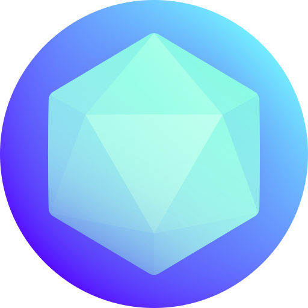
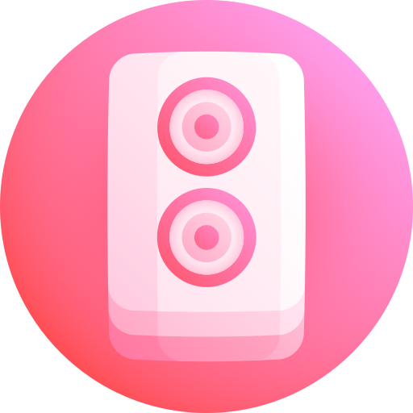
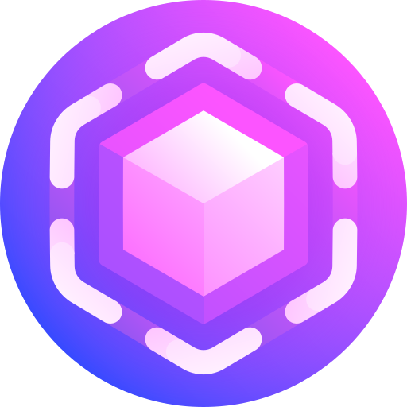
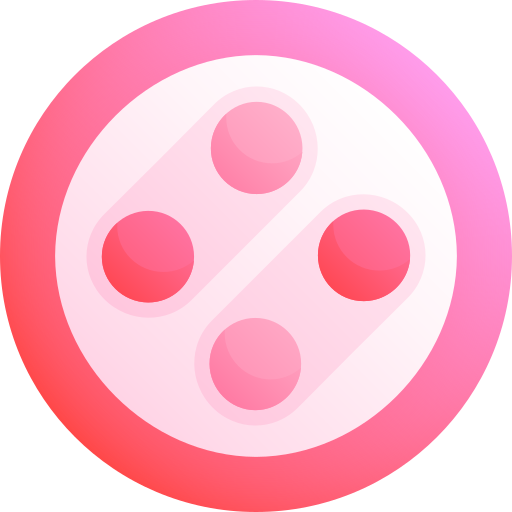

# 🖼️ 素材分類：Gaming

> [🏠 主目錄](../../../README.md) / [images](../../README.md) / [iCons](../README.md) / **Gaming**

本目錄共有 `50` 個檔案

| 🎨 預覽 (點擊放大)  | 📋 檔案詳細資訊與連結 |
| :--- | :--- |
|  | **📂 檔名:** `001-puzzle.svg` ✨ **格式:** `Vector (SVG)` ⚖️ **大小:** `5.08KB` 📅 **更新:** `2026-03-04`  🚀 **jsDelivr Markdown:** `` 🔗 **直接連結 (Url):** <code>https://cdn.jsdelivr.net/gh/barry028/materials@main/images/iCons/Gaming/001-puzzle.svg</code> 📥 [檢視原始檔](001-puzzle.svg) |
|  | **📂 檔名:** `002-dice.svg` ✨ **格式:** `Vector (SVG)` ⚖️ **大小:** `6.47KB` 📅 **更新:** `2026-03-04`  🚀 **jsDelivr Markdown:** `` 🔗 **直接連結 (Url):** <code>https://cdn.jsdelivr.net/gh/barry028/materials@main/images/iCons/Gaming/002-dice.svg</code> 📥 [檢視原始檔](002-dice.svg) |
|  | **📂 檔名:** `003-marble.svg` ✨ **格式:** `Vector (SVG)` ⚖️ **大小:** `10.98KB` 📅 **更新:** `2026-03-04`  🚀 **jsDelivr Markdown:** `` 🔗 **直接連結 (Url):** <code>https://cdn.jsdelivr.net/gh/barry028/materials@main/images/iCons/Gaming/003-marble.svg</code> 📥 [檢視原始檔](003-marble.svg) |
|  | **📂 檔名:** `004-jacks.svg` ✨ **格式:** `Vector (SVG)` ⚖️ **大小:** `6.16KB` 📅 **更新:** `2026-03-04`  🚀 **jsDelivr Markdown:** `` 🔗 **直接連結 (Url):** <code>https://cdn.jsdelivr.net/gh/barry028/materials@main/images/iCons/Gaming/004-jacks.svg</code> 📥 [檢視原始檔](004-jacks.svg) |
|  | **📂 檔名:** `005-collectible.svg` ✨ **格式:** `Vector (SVG)` ⚖️ **大小:** `7.34KB` 📅 **更新:** `2026-03-04`  🚀 **jsDelivr Markdown:** `` 🔗 **直接連結 (Url):** <code>https://cdn.jsdelivr.net/gh/barry028/materials@main/images/iCons/Gaming/005-collectible.svg</code> 📥 [檢視原始檔](005-collectible.svg) |
|  | **📂 檔名:** `006-domino.svg` ✨ **格式:** `Vector (SVG)` ⚖️ **大小:** `9.91KB` 📅 **更新:** `2026-03-04`  🚀 **jsDelivr Markdown:** `` 🔗 **直接連結 (Url):** <code>https://cdn.jsdelivr.net/gh/barry028/materials@main/images/iCons/Gaming/006-domino.svg</code> 📥 [檢視原始檔](006-domino.svg) |
|  | **📂 檔名:** `007-dice cup.svg` ✨ **格式:** `Vector (SVG)` ⚖️ **大小:** `7.03KB` 📅 **更新:** `2026-03-04`  🚀 **jsDelivr Markdown:** `` 🔗 **直接連結 (Url):** <code>https://cdn.jsdelivr.net/gh/barry028/materials@main/images/iCons/Gaming/007-dice%20cup.svg</code> 📥 [檢視原始檔](007-dice%20cup.svg) |
|  | **📂 檔名:** `008-dice.svg` ✨ **格式:** `Vector (SVG)` ⚖️ **大小:** `5.84KB` 📅 **更新:** `2026-03-04`  🚀 **jsDelivr Markdown:** `` 🔗 **直接連結 (Url):** <code>https://cdn.jsdelivr.net/gh/barry028/materials@main/images/iCons/Gaming/008-dice.svg</code> 📥 [檢視原始檔](008-dice.svg) |
|  | **📂 檔名:** `009-anagram.svg` ✨ **格式:** `Vector (SVG)` ⚖️ **大小:** `7.85KB` 📅 **更新:** `2026-03-04`  🚀 **jsDelivr Markdown:** `` 🔗 **直接連結 (Url):** <code>https://cdn.jsdelivr.net/gh/barry028/materials@main/images/iCons/Gaming/009-anagram.svg</code> 📥 [檢視原始檔](009-anagram.svg) |
|  | **📂 檔名:** `010-casino chip.svg` ✨ **格式:** `Vector (SVG)` ⚖️ **大小:** `7.26KB` 📅 **更新:** `2026-03-04`  🚀 **jsDelivr Markdown:** `` 🔗 **直接連結 (Url):** <code>https://cdn.jsdelivr.net/gh/barry028/materials@main/images/iCons/Gaming/010-casino%20chip.svg</code> 📥 [檢視原始檔](010-casino%20chip.svg) |
|  | **📂 檔名:** `011-top hat.svg` ✨ **格式:** `Vector (SVG)` ⚖️ **大小:** `4.48KB` 📅 **更新:** `2026-03-04`  🚀 **jsDelivr Markdown:** `` 🔗 **直接連結 (Url):** <code>https://cdn.jsdelivr.net/gh/barry028/materials@main/images/iCons/Gaming/011-top%20hat.svg</code> 📥 [檢視原始檔](011-top%20hat.svg) |
|  | **📂 檔名:** `012-cards.svg` ✨ **格式:** `Vector (SVG)` ⚖️ **大小:** `6.86KB` 📅 **更新:** `2026-03-04`  🚀 **jsDelivr Markdown:** `` 🔗 **直接連結 (Url):** <code>https://cdn.jsdelivr.net/gh/barry028/materials@main/images/iCons/Gaming/012-cards.svg</code> 📥 [檢視原始檔](012-cards.svg) |
|  | **📂 檔名:** `013-draughts.svg` ✨ **格式:** `Vector (SVG)` ⚖️ **大小:** `6.75KB` 📅 **更新:** `2026-03-04`  🚀 **jsDelivr Markdown:** `` 🔗 **直接連結 (Url):** <code>https://cdn.jsdelivr.net/gh/barry028/materials@main/images/iCons/Gaming/013-draughts.svg</code> 📥 [檢視原始檔](013-draughts.svg) |
|  | **📂 檔名:** `014-mahjong.svg` ✨ **格式:** `Vector (SVG)` ⚖️ **大小:** `8.54KB` 📅 **更新:** `2026-03-04`  🚀 **jsDelivr Markdown:** `` 🔗 **直接連結 (Url):** <code>https://cdn.jsdelivr.net/gh/barry028/materials@main/images/iCons/Gaming/014-mahjong.svg</code> 📥 [檢視原始檔](014-mahjong.svg) |
|  | **📂 檔名:** `015-tangram.svg` ✨ **格式:** `Vector (SVG)` ⚖️ **大小:** `7.57KB` 📅 **更新:** `2026-03-04`  🚀 **jsDelivr Markdown:** `` 🔗 **直接連結 (Url):** <code>https://cdn.jsdelivr.net/gh/barry028/materials@main/images/iCons/Gaming/015-tangram.svg</code> 📥 [檢視原始檔](015-tangram.svg) |
|  | **📂 檔名:** `016-book.svg` ✨ **格式:** `Vector (SVG)` ⚖️ **大小:** `9.90KB` 📅 **更新:** `2026-03-04`  🚀 **jsDelivr Markdown:** `` 🔗 **直接連結 (Url):** <code>https://cdn.jsdelivr.net/gh/barry028/materials@main/images/iCons/Gaming/016-book.svg</code> 📥 [檢視原始檔](016-book.svg) |
|  | **📂 檔名:** `017-pencil.svg` ✨ **格式:** `Vector (SVG)` ⚖️ **大小:** `8.03KB` 📅 **更新:** `2026-03-04`  🚀 **jsDelivr Markdown:** `` 🔗 **直接連結 (Url):** <code>https://cdn.jsdelivr.net/gh/barry028/materials@main/images/iCons/Gaming/017-pencil.svg</code> 📥 [檢視原始檔](017-pencil.svg) |
|  | **📂 檔名:** `018-pawn.svg` ✨ **格式:** `Vector (SVG)` ⚖️ **大小:** `5.83KB` 📅 **更新:** `2026-03-04`  🚀 **jsDelivr Markdown:** `` 🔗 **直接連結 (Url):** <code>https://cdn.jsdelivr.net/gh/barry028/materials@main/images/iCons/Gaming/018-pawn.svg</code> 📥 [檢視原始檔](018-pawn.svg) |
|  | **📂 檔名:** `019-timer.svg` ✨ **格式:** `Vector (SVG)` ⚖️ **大小:** `9.53KB` 📅 **更新:** `2026-03-04`  🚀 **jsDelivr Markdown:** `` 🔗 **直接連結 (Url):** <code>https://cdn.jsdelivr.net/gh/barry028/materials@main/images/iCons/Gaming/019-timer.svg</code> 📥 [檢視原始檔](019-timer.svg) |
|  | **📂 檔名:** `020-shooting game.svg` ✨ **格式:** `Vector (SVG)` ⚖️ **大小:** `5.54KB` 📅 **更新:** `2026-03-04`  🚀 **jsDelivr Markdown:** `` 🔗 **直接連結 (Url):** <code>https://cdn.jsdelivr.net/gh/barry028/materials@main/images/iCons/Gaming/020-shooting%20game.svg</code> 📥 [檢視原始檔](020-shooting%20game.svg) |
|  | **📂 檔名:** `021-action game.svg` ✨ **格式:** `Vector (SVG)` ⚖️ **大小:** `12.97KB` 📅 **更新:** `2026-03-04`  🚀 **jsDelivr Markdown:** `` 🔗 **直接連結 (Url):** <code>https://cdn.jsdelivr.net/gh/barry028/materials@main/images/iCons/Gaming/021-action%20game.svg</code> 📥 [檢視原始檔](021-action%20game.svg) |
|  | **📂 檔名:** `022-coin.svg` ✨ **格式:** `Vector (SVG)` ⚖️ **大小:** `3.79KB` 📅 **更新:** `2026-03-04`  🚀 **jsDelivr Markdown:** `` 🔗 **直接連結 (Url):** <code>https://cdn.jsdelivr.net/gh/barry028/materials@main/images/iCons/Gaming/022-coin.svg</code> 📥 [檢視原始檔](022-coin.svg) |
|  | **📂 檔名:** `023-go.svg` ✨ **格式:** `Vector (SVG)` ⚖️ **大小:** `6.41KB` 📅 **更新:** `2026-03-04`  🚀 **jsDelivr Markdown:** `` 🔗 **直接連結 (Url):** <code>https://cdn.jsdelivr.net/gh/barry028/materials@main/images/iCons/Gaming/023-go.svg</code> 📥 [檢視原始檔](023-go.svg) |
|  | **📂 檔名:** `024-life.svg` ✨ **格式:** `Vector (SVG)` ⚖️ **大小:** `5.00KB` 📅 **更新:** `2026-03-04`  🚀 **jsDelivr Markdown:** `` 🔗 **直接連結 (Url):** <code>https://cdn.jsdelivr.net/gh/barry028/materials@main/images/iCons/Gaming/024-life.svg</code> 📥 [檢視原始檔](024-life.svg) |
|  | **📂 檔名:** `025-game cartridge.svg` ✨ **格式:** `Vector (SVG)` ⚖️ **大小:** `4.50KB` 📅 **更新:** `2026-03-04`  🚀 **jsDelivr Markdown:** `` 🔗 **直接連結 (Url):** <code>https://cdn.jsdelivr.net/gh/barry028/materials@main/images/iCons/Gaming/025-game%20cartridge.svg</code> 📥 [檢視原始檔](025-game%20cartridge.svg) |
|  | **📂 檔名:** `026-cloud.svg` ✨ **格式:** `Vector (SVG)` ⚖️ **大小:** `7.83KB` 📅 **更新:** `2026-03-04`  🚀 **jsDelivr Markdown:** `` 🔗 **直接連結 (Url):** <code>https://cdn.jsdelivr.net/gh/barry028/materials@main/images/iCons/Gaming/026-cloud.svg</code> 📥 [檢視原始檔](026-cloud.svg) |
|  | **📂 檔名:** `027-sports game.svg` ✨ **格式:** `Vector (SVG)` ⚖️ **大小:** `6.88KB` 📅 **更新:** `2026-03-04`  🚀 **jsDelivr Markdown:** `` 🔗 **直接連結 (Url):** <code>https://cdn.jsdelivr.net/gh/barry028/materials@main/images/iCons/Gaming/027-sports%20game.svg</code> 📥 [檢視原始檔](027-sports%20game.svg) |
|  | **📂 檔名:** `028-horror.svg` ✨ **格式:** `Vector (SVG)` ⚖️ **大小:** `10.82KB` 📅 **更新:** `2026-03-04`  🚀 **jsDelivr Markdown:** `` 🔗 **直接連結 (Url):** <code>https://cdn.jsdelivr.net/gh/barry028/materials@main/images/iCons/Gaming/028-horror.svg</code> 📥 [檢視原始檔](028-horror.svg) |
|  | **📂 檔名:** `029-gaming console.svg` ✨ **格式:** `Vector (SVG)` ⚖️ **大小:** `6.12KB` 📅 **更新:** `2026-03-04`  🚀 **jsDelivr Markdown:** `` 🔗 **直接連結 (Url):** <code>https://cdn.jsdelivr.net/gh/barry028/materials@main/images/iCons/Gaming/029-gaming%20console.svg</code> 📥 [檢視原始檔](029-gaming%20console.svg) |
|  | **📂 檔名:** `030-game console.svg` ✨ **格式:** `Vector (SVG)` ⚖️ **大小:** `5.67KB` 📅 **更新:** `2026-03-04`  🚀 **jsDelivr Markdown:** `` 🔗 **直接連結 (Url):** <code>https://cdn.jsdelivr.net/gh/barry028/materials@main/images/iCons/Gaming/030-game%20console.svg</code> 📥 [檢視原始檔](030-game%20console.svg) |
|  | **📂 檔名:** `031-3d.svg` ✨ **格式:** `Vector (SVG)` ⚖️ **大小:** `12.40KB` 📅 **更新:** `2026-03-04`  🚀 **jsDelivr Markdown:** `` 🔗 **直接連結 (Url):** <code>https://cdn.jsdelivr.net/gh/barry028/materials@main/images/iCons/Gaming/031-3d.svg</code> 📥 [檢視原始檔](031-3d.svg) |
|  | **📂 檔名:** `032-adventure game.svg` ✨ **格式:** `Vector (SVG)` ⚖️ **大小:** `11.08KB` 📅 **更新:** `2026-03-04`  🚀 **jsDelivr Markdown:** `` 🔗 **直接連結 (Url):** <code>https://cdn.jsdelivr.net/gh/barry028/materials@main/images/iCons/Gaming/032-adventure%20game.svg</code> 📥 [檢視原始檔](032-adventure%20game.svg) |
|  | **📂 檔名:** `033-racing game.svg` ✨ **格式:** `Vector (SVG)` ⚖️ **大小:** `6.97KB` 📅 **更新:** `2026-03-04`  🚀 **jsDelivr Markdown:** `` 🔗 **直接連結 (Url):** <code>https://cdn.jsdelivr.net/gh/barry028/materials@main/images/iCons/Gaming/033-racing%20game.svg</code> 📥 [檢視原始檔](033-racing%20game.svg) |
|  | **📂 檔名:** `034-game controller.svg` ✨ **格式:** `Vector (SVG)` ⚖️ **大小:** `10.15KB` 📅 **更新:** `2026-03-04`  🚀 **jsDelivr Markdown:** `` 🔗 **直接連結 (Url):** <code>https://cdn.jsdelivr.net/gh/barry028/materials@main/images/iCons/Gaming/034-game%20controller.svg</code> 📥 [檢視原始檔](034-game%20controller.svg) |
|  | **📂 檔名:** `035-remote control.svg` ✨ **格式:** `Vector (SVG)` ⚖️ **大小:** `6.98KB` 📅 **更新:** `2026-03-04`  🚀 **jsDelivr Markdown:** `` 🔗 **直接連結 (Url):** <code>https://cdn.jsdelivr.net/gh/barry028/materials@main/images/iCons/Gaming/035-remote%20control.svg</code> 📥 [檢視原始檔](035-remote%20control.svg) |
|  | **📂 檔名:** `036-handheld console.svg` ✨ **格式:** `Vector (SVG)` ⚖️ **大小:** `8.40KB` 📅 **更新:** `2026-03-04`  🚀 **jsDelivr Markdown:** `` 🔗 **直接連結 (Url):** <code>https://cdn.jsdelivr.net/gh/barry028/materials@main/images/iCons/Gaming/036-handheld%20console.svg</code> 📥 [檢視原始檔](036-handheld%20console.svg) |
|  | **📂 檔名:** `037-competition.svg` ✨ **格式:** `Vector (SVG)` ⚖️ **大小:** `10.11KB` 📅 **更新:** `2026-03-04`  🚀 **jsDelivr Markdown:** `` 🔗 **直接連結 (Url):** <code>https://cdn.jsdelivr.net/gh/barry028/materials@main/images/iCons/Gaming/037-competition.svg</code> 📥 [檢視原始檔](037-competition.svg) |
|  | **📂 檔名:** `038-joystick.svg` ✨ **格式:** `Vector (SVG)` ⚖️ **大小:** `10.49KB` 📅 **更新:** `2026-03-04`  🚀 **jsDelivr Markdown:** `` 🔗 **直接連結 (Url):** <code>https://cdn.jsdelivr.net/gh/barry028/materials@main/images/iCons/Gaming/038-joystick.svg</code> 📥 [檢視原始檔](038-joystick.svg) |
|  | **📂 檔名:** `039-joystick.svg` ✨ **格式:** `Vector (SVG)` ⚖️ **大小:** `7.20KB` 📅 **更新:** `2026-03-04`  🚀 **jsDelivr Markdown:** `` 🔗 **直接連結 (Url):** <code>https://cdn.jsdelivr.net/gh/barry028/materials@main/images/iCons/Gaming/039-joystick.svg</code> 📥 [檢視原始檔](039-joystick.svg) |
|  | **📂 檔名:** `040-game controller.svg` ✨ **格式:** `Vector (SVG)` ⚖️ **大小:** `10.54KB` 📅 **更新:** `2026-03-04`  🚀 **jsDelivr Markdown:** `` 🔗 **直接連結 (Url):** <code>https://cdn.jsdelivr.net/gh/barry028/materials@main/images/iCons/Gaming/040-game%20controller.svg</code> 📥 [檢視原始檔](040-game%20controller.svg) |
|  | **📂 檔名:** `041-tablet.svg` ✨ **格式:** `Vector (SVG)` ⚖️ **大小:** `4.68KB` 📅 **更新:** `2026-03-04`  🚀 **jsDelivr Markdown:** `` 🔗 **直接連結 (Url):** <code>https://cdn.jsdelivr.net/gh/barry028/materials@main/images/iCons/Gaming/041-tablet.svg</code> 📥 [檢視原始檔](041-tablet.svg) |
|  | **📂 檔名:** `042-handheld console.svg` ✨ **格式:** `Vector (SVG)` ⚖️ **大小:** `8.99KB` 📅 **更新:** `2026-03-04`  🚀 **jsDelivr Markdown:** `` 🔗 **直接連結 (Url):** <code>https://cdn.jsdelivr.net/gh/barry028/materials@main/images/iCons/Gaming/042-handheld%20console.svg</code> 📥 [檢視原始檔](042-handheld%20console.svg) |
|  | **📂 檔名:** `043-vr glasses.svg` ✨ **格式:** `Vector (SVG)` ⚖️ **大小:** `5.56KB` 📅 **更新:** `2026-03-04`  🚀 **jsDelivr Markdown:** `` 🔗 **直接連結 (Url):** <code>https://cdn.jsdelivr.net/gh/barry028/materials@main/images/iCons/Gaming/043-vr%20glasses.svg</code> 📥 [檢視原始檔](043-vr%20glasses.svg) |
|  | **📂 檔名:** `044-button.svg` ✨ **格式:** `Vector (SVG)` ⚖️ **大小:** `5.34KB` 📅 **更新:** `2026-03-04`  🚀 **jsDelivr Markdown:** `` 🔗 **直接連結 (Url):** <code>https://cdn.jsdelivr.net/gh/barry028/materials@main/images/iCons/Gaming/044-button.svg</code> 📥 [檢視原始檔](044-button.svg) |
|  | **📂 檔名:** `045-mouse.svg` ✨ **格式:** `Vector (SVG)` ⚖️ **大小:** `7.13KB` 📅 **更新:** `2026-03-04`  🚀 **jsDelivr Markdown:** `` 🔗 **直接連結 (Url):** <code>https://cdn.jsdelivr.net/gh/barry028/materials@main/images/iCons/Gaming/045-mouse.svg</code> 📥 [檢視原始檔](045-mouse.svg) |
|  | **📂 檔名:** `046-mobile game.svg` ✨ **格式:** `Vector (SVG)` ⚖️ **大小:** `6.76KB` 📅 **更新:** `2026-03-04`  🚀 **jsDelivr Markdown:** `` 🔗 **直接連結 (Url):** <code>https://cdn.jsdelivr.net/gh/barry028/materials@main/images/iCons/Gaming/046-mobile%20game.svg</code> 📥 [檢視原始檔](046-mobile%20game.svg) |
|  | **📂 檔名:** `047-game controller.svg` ✨ **格式:** `Vector (SVG)` ⚖️ **大小:** `9.15KB` 📅 **更新:** `2026-03-04`  🚀 **jsDelivr Markdown:** `` 🔗 **直接連結 (Url):** <code>https://cdn.jsdelivr.net/gh/barry028/materials@main/images/iCons/Gaming/047-game%20controller.svg</code> 📥 [檢視原始檔](047-game%20controller.svg) |
|  | **📂 檔名:** `048-computer.svg` ✨ **格式:** `Vector (SVG)` ⚖️ **大小:** `8.69KB` 📅 **更新:** `2026-03-04`  🚀 **jsDelivr Markdown:** `` 🔗 **直接連結 (Url):** <code>https://cdn.jsdelivr.net/gh/barry028/materials@main/images/iCons/Gaming/048-computer.svg</code> 📥 [檢視原始檔](048-computer.svg) |
|  | **📂 檔名:** `049-video card.svg` ✨ **格式:** `Vector (SVG)` ⚖️ **大小:** `14.79KB` 📅 **更新:** `2026-03-04`  🚀 **jsDelivr Markdown:** `` 🔗 **直接連結 (Url):** <code>https://cdn.jsdelivr.net/gh/barry028/materials@main/images/iCons/Gaming/049-video%20card.svg</code> 📥 [檢視原始檔](049-video%20card.svg) |
|  | **📂 檔名:** `050-pc tower.svg` ✨ **格式:** `Vector (SVG)` ⚖️ **大小:** `9.06KB` 📅 **更新:** `2026-03-04`  🚀 **jsDelivr Markdown:** `` 🔗 **直接連結 (Url):** <code>https://cdn.jsdelivr.net/gh/barry028/materials@main/images/iCons/Gaming/050-pc%20tower.svg</code> 📥 [檢視原始檔](050-pc%20tower.svg) |