# 🖼️ 素材分類：Glass 

> [🏠 主目錄](../../../../README.md) / **Glass **

本目錄共有 `98` 個檔案

| 🎨 預覽 (點擊放大) | 📋 檔案詳細資訊與連結 |
| :--- | :--- |
|  | **📂 檔名:** `Achievement.svg` ✨ **格式:** `Vector (SVG)` ⚖️ **大小:** `5.98KB` 📅 **更新:** `2026-02-27`  🔗 **複製 Markdown 語法:** `` 📥 [檢視原始檔](Achievement.svg) |
|  | **📂 檔名:** `Add user.svg` ✨ **格式:** `Vector (SVG)` ⚖️ **大小:** `5.88KB` 📅 **更新:** `2026-02-27`  🔗 **複製 Markdown 語法:** `` 📥 [檢視原始檔](Add%20user.svg) |
|  | **📂 檔名:** `Archive.svg` ✨ **格式:** `Vector (SVG)` ⚖️ **大小:** `5.69KB` 📅 **更新:** `2026-02-27`  🔗 **複製 Markdown 語法:** `` 📥 [檢視原始檔](Archive.svg) |
|  | **📂 檔名:** `Attention-1.svg` ✨ **格式:** `Vector (SVG)` ⚖️ **大小:** `3.35KB` 📅 **更新:** `2026-02-27`  🔗 **複製 Markdown 語法:** `` 📥 [檢視原始檔](Attention-1.svg) |
|  | **📂 檔名:** `Attention.svg` ✨ **格式:** `Vector (SVG)` ⚖️ **大小:** `3.61KB` 📅 **更新:** `2026-02-27`  🔗 **複製 Markdown 語法:** `` 📥 [檢視原始檔](Attention.svg) |
|  | **📂 檔名:** `Auto.svg` ✨ **格式:** `Vector (SVG)` ⚖️ **大小:** `4.83KB` 📅 **更新:** `2026-02-27`  🔗 **複製 Markdown 語法:** `` 📥 [檢視原始檔](Auto.svg) |
|  | **📂 檔名:** `Award.svg` ✨ **格式:** `Vector (SVG)` ⚖️ **大小:** `10.81KB` 📅 **更新:** `2026-02-27`  🔗 **複製 Markdown 語法:** `` 📥 [檢視原始檔](Award.svg) |
|  | **📂 檔名:** `Bag.svg` ✨ **格式:** `Vector (SVG)` ⚖️ **大小:** `3.64KB` 📅 **更新:** `2026-02-27`  🔗 **複製 Markdown 語法:** `` 📥 [檢視原始檔](Bag.svg) |
|  | **📂 檔名:** `Basket.svg` ✨ **格式:** `Vector (SVG)` ⚖️ **大小:** `6.94KB` 📅 **更新:** `2026-02-27`  🔗 **複製 Markdown 語法:** `` 📥 [檢視原始檔](Basket.svg) |
|  | **📂 檔名:** `Bitcoin.svg` ✨ **格式:** `Vector (SVG)` ⚖️ **大小:** `3.95KB` 📅 **更新:** `2026-02-27`  🔗 **複製 Markdown 語法:** `` 📥 [檢視原始檔](Bitcoin.svg) |
|  | **📂 檔名:** `Book.svg` ✨ **格式:** `Vector (SVG)` ⚖️ **大小:** `7.19KB` 📅 **更新:** `2026-02-27`  🔗 **複製 Markdown 語法:** `` 📥 [檢視原始檔](Book.svg) |
|  | **📂 檔名:** `Calculator.svg` ✨ **格式:** `Vector (SVG)` ⚖️ **大小:** `18.00KB` 📅 **更新:** `2026-02-27`  🔗 **複製 Markdown 語法:** `` 📥 [檢視原始檔](Calculator.svg) |
|  | **📂 檔名:** `Calendar-1.svg` ✨ **格式:** `Vector (SVG)` ⚖️ **大小:** `8.99KB` 📅 **更新:** `2026-02-27`  🔗 **複製 Markdown 語法:** `` 📥 [檢視原始檔](Calendar-1.svg) |
|  | **📂 檔名:** `Calendar.svg` ✨ **格式:** `Vector (SVG)` ⚖️ **大小:** `17.88KB` 📅 **更新:** `2026-02-27`  🔗 **複製 Markdown 語法:** `` 📥 [檢視原始檔](Calendar.svg) |
|  | **📂 檔名:** `Camera-1.svg` ✨ **格式:** `Vector (SVG)` ⚖️ **大小:** `3.87KB` 📅 **更新:** `2026-02-27`  🔗 **複製 Markdown 語法:** `` 📥 [檢視原始檔](Camera-1.svg) |
|  | **📂 檔名:** `Camera.svg` ✨ **格式:** `Vector (SVG)` ⚖️ **大小:** `6.70KB` 📅 **更新:** `2026-02-27`  🔗 **複製 Markdown 語法:** `` 📥 [檢視原始檔](Camera.svg) |
|  | **📂 檔名:** `Cards.svg` ✨ **格式:** `Vector (SVG)` ⚖️ **大小:** `4.50KB` 📅 **更新:** `2026-02-27`  🔗 **複製 Markdown 語法:** `` 📥 [檢視原始檔](Cards.svg) |
|  | **📂 檔名:** `Cart.svg` ✨ **格式:** `Vector (SVG)` ⚖️ **大小:** `4.55KB` 📅 **更新:** `2026-02-27`  🔗 **複製 Markdown 語法:** `` 📥 [檢視原始檔](Cart.svg) |
|  | **📂 檔名:** `Chat-1.svg` ✨ **格式:** `Vector (SVG)` ⚖️ **大小:** `7.14KB` 📅 **更新:** `2026-02-27`  🔗 **複製 Markdown 語法:** `` 📥 [檢視原始檔](Chat-1.svg) |
|  | **📂 檔名:** `Chat.svg` ✨ **格式:** `Vector (SVG)` ⚖️ **大小:** `3.65KB` 📅 **更新:** `2026-02-27`  🔗 **複製 Markdown 語法:** `` 📥 [檢視原始檔](Chat.svg) |
|  | **📂 檔名:** `Check.svg` ✨ **格式:** `Vector (SVG)` ⚖️ **大小:** `3.42KB` 📅 **更新:** `2026-02-27`  🔗 **複製 Markdown 語法:** `` 📥 [檢視原始檔](Check.svg) |
|  | **📂 檔名:** `City.svg` ✨ **格式:** `Vector (SVG)` ⚖️ **大小:** `16.58KB` 📅 **更新:** `2026-02-27`  🔗 **複製 Markdown 語法:** `` 📥 [檢視原始檔](City.svg) |
|  | **📂 檔名:** `Close.svg` ✨ **格式:** `Vector (SVG)` ⚖️ **大小:** `5.44KB` 📅 **更新:** `2026-02-27`  🔗 **複製 Markdown 語法:** `` 📥 [檢視原始檔](Close.svg) |
|  | **📂 檔名:** `Console.svg` ✨ **格式:** `Vector (SVG)` ⚖️ **大小:** `6.75KB` 📅 **更新:** `2026-02-27`  🔗 **複製 Markdown 語法:** `` 📥 [檢視原始檔](Console.svg) |
|  | **📂 檔名:** `Crystal.svg` ✨ **格式:** `Vector (SVG)` ⚖️ **大小:** `6.28KB` 📅 **更新:** `2026-02-27`  🔗 **複製 Markdown 語法:** `` 📥 [檢視原始檔](Crystal.svg) |
|  | **📂 檔名:** `Design.svg` ✨ **格式:** `Vector (SVG)` ⚖️ **大小:** `9.98KB` 📅 **更新:** `2026-02-27`  🔗 **複製 Markdown 語法:** `` 📥 [檢視原始檔](Design.svg) |
|  | **📂 檔名:** `Discount.svg` ✨ **格式:** `Vector (SVG)` ⚖️ **大小:** `6.16KB` 📅 **更新:** `2026-02-27`  🔗 **複製 Markdown 語法:** `` 📥 [檢視原始檔](Discount.svg) |
|  | **📂 檔名:** `Doc.svg` ✨ **格式:** `Vector (SVG)` ⚖️ **大小:** `9.21KB` 📅 **更新:** `2026-02-27`  🔗 **複製 Markdown 語法:** `` 📥 [檢視原始檔](Doc.svg) |
|  | **📂 檔名:** `Down.svg` ✨ **格式:** `Vector (SVG)` ⚖️ **大小:** `3.34KB` 📅 **更新:** `2026-02-27`  🔗 **複製 Markdown 語法:** `` 📥 [檢視原始檔](Down.svg) |
|  | **📂 檔名:** `Download.svg` ✨ **格式:** `Vector (SVG)` ⚖️ **大小:** `3.77KB` 📅 **更新:** `2026-02-27`  🔗 **複製 Markdown 語法:** `` 📥 [檢視原始檔](Download.svg) |
|  | **📂 檔名:** `Favorites.svg` ✨ **格式:** `Vector (SVG)` ⚖️ **大小:** `3.52KB` 📅 **更新:** `2026-02-27`  🔗 **複製 Markdown 語法:** `` 📥 [檢視原始檔](Favorites.svg) |
|  | **📂 檔名:** `Filter.svg` ✨ **格式:** `Vector (SVG)` ⚖️ **大小:** `11.79KB` 📅 **更新:** `2026-02-27`  🔗 **複製 Markdown 語法:** `` 📥 [檢視原始檔](Filter.svg) |
|  | **📂 檔名:** `Folder.svg` ✨ **格式:** `Vector (SVG)` ⚖️ **大小:** `5.35KB` 📅 **更新:** `2026-02-27`  🔗 **複製 Markdown 語法:** `` 📥 [檢視原始檔](Folder.svg) |
|  | **📂 檔名:** `Global.svg` ✨ **格式:** `Vector (SVG)` ⚖️ **大小:** `8.03KB` 📅 **更新:** `2026-02-27`  🔗 **複製 Markdown 語法:** `` 📥 [檢視原始檔](Global.svg) |
|  | **📂 檔名:** `Graph.svg` ✨ **格式:** `Vector (SVG)` ⚖️ **大小:** `8.04KB` 📅 **更新:** `2026-02-27`  🔗 **複製 Markdown 語法:** `` 📥 [檢視原始檔](Graph.svg) |
|  | **📂 檔名:** `Group 48095373.svg` ✨ **格式:** `Vector (SVG)` ⚖️ **大小:** `4.62KB` 📅 **更新:** `2026-02-27`  🔗 **複製 Markdown 語法:** `` 📥 [檢視原始檔](Group%2048095373.svg) |
|  | **📂 檔名:** `Health.svg` ✨ **格式:** `Vector (SVG)` ⚖️ **大小:** `7.02KB` 📅 **更新:** `2026-02-27`  🔗 **複製 Markdown 語法:** `` 📥 [檢視原始檔](Health.svg) |
|  | **📂 檔名:** `Home.svg` ✨ **格式:** `Vector (SVG)` ⚖️ **大小:** `3.93KB` 📅 **更新:** `2026-02-27`  🔗 **複製 Markdown 語法:** `` 📥 [檢視原始檔](Home.svg) |
|  | **📂 檔名:** `Id.svg` ✨ **格式:** `Vector (SVG)` ⚖️ **大小:** `10.64KB` 📅 **更新:** `2026-02-27`  🔗 **複製 Markdown 語法:** `` 📥 [檢視原始檔](Id.svg) |
|  | **📂 檔名:** `Locations.svg` ✨ **格式:** `Vector (SVG)` ⚖️ **大小:** `4.02KB` 📅 **更新:** `2026-02-27`  🔗 **複製 Markdown 語法:** `` 📥 [檢視原始檔](Locations.svg) |
|  | **📂 檔名:** `Lock-1.svg` ✨ **格式:** `Vector (SVG)` ⚖️ **大小:** `3.77KB` 📅 **更新:** `2026-02-27`  🔗 **複製 Markdown 語法:** `` 📥 [檢視原始檔](Lock-1.svg) |
|  | **📂 檔名:** `Lock.svg` ✨ **格式:** `Vector (SVG)` ⚖️ **大小:** `4.60KB` 📅 **更新:** `2026-02-27`  🔗 **複製 Markdown 語法:** `` 📥 [檢視原始檔](Lock.svg) |
|  | **📂 檔名:** `Magnifier.svg` ✨ **格式:** `Vector (SVG)` ⚖️ **大小:** `3.37KB` 📅 **更新:** `2026-02-27`  🔗 **複製 Markdown 語法:** `` 📥 [檢視原始檔](Magnifier.svg) |
|  | **📂 檔名:** `Mail.svg` ✨ **格式:** `Vector (SVG)` ⚖️ **大小:** `4.34KB` 📅 **更新:** `2026-02-27`  🔗 **複製 Markdown 語法:** `` 📥 [檢視原始檔](Mail.svg) |
|  | **📂 檔名:** `Map.svg` ✨ **格式:** `Vector (SVG)` ⚖️ **大小:** `9.29KB` 📅 **更新:** `2026-02-27`  🔗 **複製 Markdown 語法:** `` 📥 [檢視原始檔](Map.svg) |
|  | **📂 檔名:** `Message.svg` ✨ **格式:** `Vector (SVG)` ⚖️ **大小:** `7.26KB` 📅 **更新:** `2026-02-27`  🔗 **複製 Markdown 語法:** `` 📥 [檢視原始檔](Message.svg) |
|  | **📂 檔名:** `Money.svg` ✨ **格式:** `Vector (SVG)` ⚖️ **大小:** `5.11KB` 📅 **更新:** `2026-02-27`  🔗 **複製 Markdown 語法:** `` 📥 [檢視原始檔](Money.svg) |
|  | **📂 檔名:** `Monitoring.svg` ✨ **格式:** `Vector (SVG)` ⚖️ **大小:** `6.97KB` 📅 **更新:** `2026-02-27`  🔗 **複製 Markdown 語法:** `` 📥 [檢視原始檔](Monitoring.svg) |
|  | **📂 檔名:** `Moon.svg` ✨ **格式:** `Vector (SVG)` ⚖️ **大小:** `4.58KB` 📅 **更新:** `2026-02-27`  🔗 **複製 Markdown 語法:** `` 📥 [檢視原始檔](Moon.svg) |
|  | **📂 檔名:** `Notebook.svg` ✨ **格式:** `Vector (SVG)` ⚖️ **大小:** `6.90KB` 📅 **更新:** `2026-02-27`  🔗 **複製 Markdown 語法:** `` 📥 [檢視原始檔](Notebook.svg) |
|  | **📂 檔名:** `Notification-1.svg` ✨ **格式:** `Vector (SVG)` ⚖️ **大小:** `7.07KB` 📅 **更新:** `2026-02-27`  🔗 **複製 Markdown 語法:** `` 📥 [檢視原始檔](Notification-1.svg) |
|  | **📂 檔名:** `Notification.svg` ✨ **格式:** `Vector (SVG)` ⚖️ **大小:** `3.79KB` 📅 **更新:** `2026-02-27`  🔗 **複製 Markdown 語法:** `` 📥 [檢視原始檔](Notification.svg) |
|  | **📂 檔名:** `Options.svg` ✨ **格式:** `Vector (SVG)` ⚖️ **大小:** `9.87KB` 📅 **更新:** `2026-02-27`  🔗 **複製 Markdown 語法:** `` 📥 [檢視原始檔](Options.svg) |
|  | **📂 檔名:** `Paperplane.svg` ✨ **格式:** `Vector (SVG)` ⚖️ **大小:** `6.02KB` 📅 **更新:** `2026-02-27`  🔗 **複製 Markdown 語法:** `` 📥 [檢視原始檔](Paperplane.svg) |
|  | **📂 檔名:** `Pencil.svg` ✨ **格式:** `Vector (SVG)` ⚖️ **大小:** `6.38KB` 📅 **更新:** `2026-02-27`  🔗 **複製 Markdown 語法:** `` 📥 [檢視原始檔](Pencil.svg) |
|  | **📂 檔名:** `Picture-1.svg` ✨ **格式:** `Vector (SVG)` ⚖️ **大小:** `4.13KB` 📅 **更新:** `2026-02-27`  🔗 **複製 Markdown 語法:** `` 📥 [檢視原始檔](Picture-1.svg) |
|  | **📂 檔名:** `Picture.svg` ✨ **格式:** `Vector (SVG)` ⚖️ **大小:** `4.79KB` 📅 **更新:** `2026-02-27`  🔗 **複製 Markdown 語法:** `` 📥 [檢視原始檔](Picture.svg) |
|  | **📂 檔名:** `Pie Chart.svg` ✨ **格式:** `Vector (SVG)` ⚖️ **大小:** `4.81KB` 📅 **更新:** `2026-02-27`  🔗 **複製 Markdown 語法:** `` 📥 [檢視原始檔](Pie%20Chart.svg) |
|  | **📂 檔名:** `Plus.svg` ✨ **格式:** `Vector (SVG)` ⚖️ **大小:** `5.18KB` 📅 **更新:** `2026-02-27`  🔗 **複製 Markdown 語法:** `` 📥 [檢視原始檔](Plus.svg) |
|  | **📂 檔名:** `Portfolio.svg` ✨ **格式:** `Vector (SVG)` ⚖️ **大小:** `5.78KB` 📅 **更新:** `2026-02-27`  🔗 **複製 Markdown 語法:** `` 📥 [檢視原始檔](Portfolio.svg) |
|  | **📂 檔名:** `Preferences.svg` ✨ **格式:** `Vector (SVG)` ⚖️ **大小:** `9.90KB` 📅 **更新:** `2026-02-27`  🔗 **複製 Markdown 語法:** `` 📥 [檢視原始檔](Preferences.svg) |
|  | **📂 檔名:** `Profile.svg` ✨ **格式:** `Vector (SVG)` ⚖️ **大小:** `3.88KB` 📅 **更新:** `2026-02-27`  🔗 **複製 Markdown 語法:** `` 📥 [檢視原始檔](Profile.svg) |
|  | **📂 檔名:** `Sad.svg` ✨ **格式:** `Vector (SVG)` ⚖️ **大小:** `4.56KB` 📅 **更新:** `2026-02-27`  🔗 **複製 Markdown 語法:** `` 📥 [檢視原始檔](Sad.svg) |
|  | **📂 檔名:** `Safety.svg` ✨ **格式:** `Vector (SVG)` ⚖️ **大小:** `4.18KB` 📅 **更新:** `2026-02-27`  🔗 **複製 Markdown 語法:** `` 📥 [檢視原始檔](Safety.svg) |
|  | **📂 檔名:** `Security.svg` ✨ **格式:** `Vector (SVG)` ⚖️ **大小:** `4.25KB` 📅 **更新:** `2026-02-27`  🔗 **複製 Markdown 語法:** `` 📥 [檢視原始檔](Security.svg) |
|  | **📂 檔名:** `Select.svg` ✨ **格式:** `Vector (SVG)` ⚖️ **大小:** `7.17KB` 📅 **更新:** `2026-02-27`  🔗 **複製 Markdown 語法:** `` 📥 [檢視原始檔](Select.svg) |
|  | **📂 檔名:** `Settings-1.svg` ✨ **格式:** `Vector (SVG)` ⚖️ **大小:** `5.24KB` 📅 **更新:** `2026-02-27`  🔗 **複製 Markdown 語法:** `` 📥 [檢視原始檔](Settings-1.svg) |
|  | **📂 檔名:** `Settings.svg` ✨ **格式:** `Vector (SVG)` ⚖️ **大小:** `8.64KB` 📅 **更新:** `2026-02-27`  🔗 **複製 Markdown 語法:** `` 📥 [檢視原始檔](Settings.svg) |
|  | **📂 檔名:** `Share.svg` ✨ **格式:** `Vector (SVG)` ⚖️ **大小:** `4.14KB` 📅 **更新:** `2026-02-27`  🔗 **複製 Markdown 語法:** `` 📥 [檢視原始檔](Share.svg) |
|  | **📂 檔名:** `Smile.svg` ✨ **格式:** `Vector (SVG)` ⚖️ **大小:** `4.72KB` 📅 **更新:** `2026-02-27`  🔗 **複製 Markdown 語法:** `` 📥 [檢視原始檔](Smile.svg) |
|  | **📂 檔名:** `Sound.svg` ✨ **格式:** `Vector (SVG)` ⚖️ **大小:** `3.68KB` 📅 **更新:** `2026-02-27`  🔗 **複製 Markdown 語法:** `` 📥 [檢視原始檔](Sound.svg) |
|  | **📂 檔名:** `Stop.svg` ✨ **格式:** `Vector (SVG)` ⚖️ **大小:** `3.24KB` 📅 **更新:** `2026-02-27`  🔗 **複製 Markdown 語法:** `` 📥 [檢視原始檔](Stop.svg) |
|  | **📂 檔名:** `Storage.svg` ✨ **格式:** `Vector (SVG)` ⚖️ **大小:** `12.71KB` 📅 **更新:** `2026-02-27`  🔗 **複製 Markdown 語法:** `` 📥 [檢視原始檔](Storage.svg) |
|  | **📂 檔名:** `Suitcase.svg` ✨ **格式:** `Vector (SVG)` ⚖️ **大小:** `6.29KB` 📅 **更新:** `2026-02-27`  🔗 **複製 Markdown 語法:** `` 📥 [檢視原始檔](Suitcase.svg) |
|  | **📂 檔名:** `Sygnal.svg` ✨ **格式:** `Vector (SVG)` ⚖️ **大小:** `4.14KB` 📅 **更新:** `2026-02-27`  🔗 **複製 Markdown 語法:** `` 📥 [檢視原始檔](Sygnal.svg) |
|  | **📂 檔名:** `Target.svg` ✨ **格式:** `Vector (SVG)` ⚖️ **大小:** `4.06KB` 📅 **更新:** `2026-02-27`  🔗 **複製 Markdown 語法:** `` 📥 [檢視原始檔](Target.svg) |
|  | **📂 檔名:** `Time.svg` ✨ **格式:** `Vector (SVG)` ⚖️ **大小:** `4.35KB` 📅 **更新:** `2026-02-27`  🔗 **複製 Markdown 語法:** `` 📥 [檢視原始檔](Time.svg) |
|  | **📂 檔名:** `Trash.svg` ✨ **格式:** `Vector (SVG)` ⚖️ **大小:** `7.02KB` 📅 **更新:** `2026-02-27`  🔗 **複製 Markdown 語法:** `` 📥 [檢視原始檔](Trash.svg) |
|  | **📂 檔名:** `Type Backround-1.svg` ✨ **格式:** `Vector (SVG)` ⚖️ **大小:** `401.00B` 📅 **更新:** `2026-02-27`  🔗 **複製 Markdown 語法:** `` 📥 [檢視原始檔](Type%20Backround-1.svg) |
|  | **📂 檔名:** `Type Backround-10.svg` ✨ **格式:** `Vector (SVG)` ⚖️ **大小:** `407.00B` 📅 **更新:** `2026-02-27`  🔗 **複製 Markdown 語法:** `` 📥 [檢視原始檔](Type%20Backround-10.svg) |
|  | **📂 檔名:** `Type Backround-11.svg` ✨ **格式:** `Vector (SVG)` ⚖️ **大小:** `401.00B` 📅 **更新:** `2026-02-27`  🔗 **複製 Markdown 語法:** `` 📥 [檢視原始檔](Type%20Backround-11.svg) |
|  | **📂 檔名:** `Type Backround-12.svg` ✨ **格式:** `Vector (SVG)` ⚖️ **大小:** `401.00B` 📅 **更新:** `2026-02-27`  🔗 **複製 Markdown 語法:** `` 📥 [檢視原始檔](Type%20Backround-12.svg) |
|  | **📂 檔名:** `Type Backround-2.svg` ✨ **格式:** `Vector (SVG)` ⚖️ **大小:** `401.00B` 📅 **更新:** `2026-02-27`  🔗 **複製 Markdown 語法:** `` 📥 [檢視原始檔](Type%20Backround-2.svg) |
|  | **📂 檔名:** `Type Backround-3.svg` ✨ **格式:** `Vector (SVG)` ⚖️ **大小:** `401.00B` 📅 **更新:** `2026-02-27`  🔗 **複製 Markdown 語法:** `` 📥 [檢視原始檔](Type%20Backround-3.svg) |
|  | **📂 檔名:** `Type Backround-4.svg` ✨ **格式:** `Vector (SVG)` ⚖️ **大小:** `760.00B` 📅 **更新:** `2026-02-27`  🔗 **複製 Markdown 語法:** `` 📥 [檢視原始檔](Type%20Backround-4.svg) |
|  | **📂 檔名:** `Type Backround-5.svg` ✨ **格式:** `Vector (SVG)` ⚖️ **大小:** `407.00B` 📅 **更新:** `2026-02-27`  🔗 **複製 Markdown 語法:** `` 📥 [檢視原始檔](Type%20Backround-5.svg) |
|  | **📂 檔名:** `Type Backround-6.svg` ✨ **格式:** `Vector (SVG)` ⚖️ **大小:** `401.00B` 📅 **更新:** `2026-02-27`  🔗 **複製 Markdown 語法:** `` 📥 [檢視原始檔](Type%20Backround-6.svg) |
|  | **📂 檔名:** `Type Backround-7.svg` ✨ **格式:** `Vector (SVG)` ⚖️ **大小:** `401.00B` 📅 **更新:** `2026-02-27`  🔗 **複製 Markdown 語法:** `` 📥 [檢視原始檔](Type%20Backround-7.svg) |
|  | **📂 檔名:** `Type Backround-8.svg` ✨ **格式:** `Vector (SVG)` ⚖️ **大小:** `760.00B` 📅 **更新:** `2026-02-27`  🔗 **複製 Markdown 語法:** `` 📥 [檢視原始檔](Type%20Backround-8.svg) |
|  | **📂 檔名:** `Type Backround-9.svg` ✨ **格式:** `Vector (SVG)` ⚖️ **大小:** `760.00B` 📅 **更新:** `2026-02-27`  🔗 **複製 Markdown 語法:** `` 📥 [檢視原始檔](Type%20Backround-9.svg) |
|  | **📂 檔名:** `Type Backround.svg` ✨ **格式:** `Vector (SVG)` ⚖️ **大小:** `401.00B` 📅 **更新:** `2026-02-27`  🔗 **複製 Markdown 語法:** `` 📥 [檢視原始檔](Type%20Backround.svg) |
|  | **📂 檔名:** `USD.svg` ✨ **格式:** `Vector (SVG)` ⚖️ **大小:** `4.36KB` 📅 **更新:** `2026-02-27`  🔗 **複製 Markdown 語法:** `` 📥 [檢視原始檔](USD.svg) |
|  | **📂 檔名:** `Up.svg` ✨ **格式:** `Vector (SVG)` ⚖️ **大小:** `3.31KB` 📅 **更新:** `2026-02-27`  🔗 **複製 Markdown 語法:** `` 📥 [檢視原始檔](Up.svg) |
|  | **📂 檔名:** `User info.svg` ✨ **格式:** `Vector (SVG)` ⚖️ **大小:** `6.92KB` 📅 **更新:** `2026-02-27`  🔗 **複製 Markdown 語法:** `` 📥 [檢視原始檔](User%20info.svg) |
|  | **📂 檔名:** `Users.svg` ✨ **格式:** `Vector (SVG)` ⚖️ **大小:** `5.61KB` 📅 **更新:** `2026-02-27`  🔗 **複製 Markdown 語法:** `` 📥 [檢視原始檔](Users.svg) |
|  | **📂 檔名:** `Video.svg` ✨ **格式:** `Vector (SVG)` ⚖️ **大小:** `4.73KB` 📅 **更新:** `2026-02-27`  🔗 **複製 Markdown 語法:** `` 📥 [檢視原始檔](Video.svg) |
|  | **📂 檔名:** `Wallet.svg` ✨ **格式:** `Vector (SVG)` ⚖️ **大小:** `4.07KB` 📅 **更新:** `2026-02-27`  🔗 **複製 Markdown 語法:** `` 📥 [檢視原始檔](Wallet.svg) |
|  | **📂 檔名:** `Weather.svg` ✨ **格式:** `Vector (SVG)` ⚖️ **大小:** `4.38KB` 📅 **更新:** `2026-02-27`  🔗 **複製 Markdown 語法:** `` 📥 [檢視原始檔](Weather.svg) |