# 🖼️ Glassmorphism  Gallery

[⬅️ 回到首頁](../../README.md)

| 預覽 | 詳細資訊 |
| :--- | :--- |
|  | **Icon_=Apple.svg** Vector (SVG) \| 11.33KB 更新: 2026-02-26 |
|  | **Icon_=Arrow.svg** Vector (SVG) \| 3.47KB 更新: 2026-02-26 |
|  | **Icon_=Avatar.svg** Vector (SVG) \| 4.10KB 更新: 2026-02-26 |
|  | **Icon_=Calculator.svg** Vector (SVG) \| 3.90KB 更新: 2026-02-26 |
|  | **Icon_=Calendar.svg** Vector (SVG) \| 4.53KB 更新: 2026-02-26 |
|  | **Icon_=Clock.svg** Vector (SVG) \| 4.30KB 更新: 2026-02-26 |
|  | **Icon_=Cloud.svg** Vector (SVG) \| 52.19KB 更新: 2026-02-26 |
|  | **Icon_=Controller.svg** Vector (SVG) \| 4.13KB 更新: 2026-02-26 |
|  | **Icon_=Conversation.svg** Vector (SVG) \| 4.03KB 更新: 2026-02-26 |
|  | **Icon_=Crescent.svg** Vector (SVG) \| 7.06KB 更新: 2026-02-26 |
|  | **Icon_=Fingerprint.svg** Vector (SVG) \| 29.58KB 更新: 2026-02-26 |
|  | **Icon_=Folder.svg** Vector (SVG) \| 4.56KB 更新: 2026-02-26 |
|  | **Icon_=Forward.svg** Vector (SVG) \| 3.58KB 更新: 2026-02-26 |
|  | **Icon_=Headphones.svg** Vector (SVG) \| 4.82KB 更新: 2026-02-26 |
|  | **Icon_=House.svg** Vector (SVG) \| 5.85KB 更新: 2026-02-26 |
|  | **Icon_=Key.svg** Vector (SVG) \| 5.78KB 更新: 2026-02-26 |
|  | **Icon_=Layers.svg** Vector (SVG) \| 8.28KB 更新: 2026-02-26 |
|  | **Icon_=Like.svg** Vector (SVG) \| 6.39KB 更新: 2026-02-26 |
|  | **Icon_=Lock.svg** Vector (SVG) \| 6.40KB 更新: 2026-02-26 |
|  | **Icon_=Magnifier.svg** Vector (SVG) \| 5.06KB 更新: 2026-02-26 |
|  | **Icon_=Map.svg** Vector (SVG) \| 5.27KB 更新: 2026-02-26 |
|  | **Icon_=Mastercard.svg** Vector (SVG) \| 3.12KB 更新: 2026-02-26 |
|  | **Icon_=Movie.svg** Vector (SVG) \| 6.86KB 更新: 2026-02-26 |
|  | **Icon_=Note.svg** Vector (SVG) \| 3.90KB 更新: 2026-02-26 |
|  | **Icon_=Pacman.svg** Vector (SVG) \| 6.06KB 更新: 2026-02-26 |
|  | **Icon_=Pen.svg** Vector (SVG) \| 4.90KB 更新: 2026-02-26 |
|  | **Icon_=Pin.svg** Vector (SVG) \| 6.70KB 更新: 2026-02-26 |
|  | **Icon_=Rain.svg** Vector (SVG) \| 6.62KB 更新: 2026-02-26 |
|  | **Icon_=Roll.svg** Vector (SVG) \| 9.97KB 更新: 2026-02-26 |
|  | **Icon_=Tag.svg** Vector (SVG) \| 6.59KB 更新: 2026-02-26 |
|  | **Icon_=Toggle.svg** Vector (SVG) \| 4.49KB 更新: 2026-02-26 |
|  | **Icon_=Wallet.svg** Vector (SVG) \| 5.08KB 更新: 2026-02-26 |
|  | **Icon_=Windows.svg** Vector (SVG) \| 12.12KB 更新: 2026-02-26 |