# 🖼️ 素材分類：Glass

> [🏠 主目錄](../../../../../../README.md) / [images](../../../../../README.md) / [iCons](../../../../README.md) / [Glassmorphism](../../../README.md) / [Glass ](../../README.md) / [Hicon (Free icon pack) - Glass Icons](../README.md) / **Glass**

本目錄共有 `17` 個檔案

| 🎨 預覽 (點擊放大)  | 📋 檔案詳細資訊與連結 |
| :--- | :--- |
|  | **📂 檔名:** `Activity 8.svg` ✨ **格式:** `Vector (SVG)` ⚖️ **大小:** `5.36KB` 📅 **更新:** `2026-03-04`  🚀 **jsDelivr Markdown:** `` 🔗 **直接連結 (Url):** <code>https://cdn.jsdelivr.net/gh/barry028/materials@main/images/iCons/Glassmorphism/Glass%20/Hicon%20%28Free%20icon%20pack%29%20-%20Glass%20Icons/Glass/Activity%208.svg</code> 📥 [檢視原始檔](Activity%208.svg) |
|  | **📂 檔名:** `Bookmark 7.svg` ✨ **格式:** `Vector (SVG)` ⚖️ **大小:** `3.58KB` 📅 **更新:** `2026-03-04`  🚀 **jsDelivr Markdown:** `` 🔗 **直接連結 (Url):** <code>https://cdn.jsdelivr.net/gh/barry028/materials@main/images/iCons/Glassmorphism/Glass%20/Hicon%20%28Free%20icon%20pack%29%20-%20Glass%20Icons/Glass/Bookmark%207.svg</code> 📥 [檢視原始檔](Bookmark%207.svg) |
|  | **📂 檔名:** `Graph.svg` ✨ **格式:** `Vector (SVG)` ⚖️ **大小:** `5.30KB` 📅 **更新:** `2026-03-04`  🚀 **jsDelivr Markdown:** `` 🔗 **直接連結 (Url):** <code>https://cdn.jsdelivr.net/gh/barry028/materials@main/images/iCons/Glassmorphism/Glass%20/Hicon%20%28Free%20icon%20pack%29%20-%20Glass%20Icons/Glass/Graph.svg</code> 📥 [檢視原始檔](Graph.svg) |
|  | **📂 檔名:** `Home 8.svg` ✨ **格式:** `Vector (SVG)` ⚖️ **大小:** `2.78KB` 📅 **更新:** `2026-03-04`  🚀 **jsDelivr Markdown:** `` 🔗 **直接連結 (Url):** <code>https://cdn.jsdelivr.net/gh/barry028/materials@main/images/iCons/Glassmorphism/Glass%20/Hicon%20%28Free%20icon%20pack%29%20-%20Glass%20Icons/Glass/Home%208.svg</code> 📥 [檢視原始檔](Home%208.svg) |
|  | **📂 檔名:** `Image.svg` ✨ **格式:** `Vector (SVG)` ⚖️ **大小:** `4.86KB` 📅 **更新:** `2026-03-04`  🚀 **jsDelivr Markdown:** `` 🔗 **直接連結 (Url):** <code>https://cdn.jsdelivr.net/gh/barry028/materials@main/images/iCons/Glassmorphism/Glass%20/Hicon%20%28Free%20icon%20pack%29%20-%20Glass%20Icons/Glass/Image.svg</code> 📥 [檢視原始檔](Image.svg) |
|  | **📂 檔名:** `Instagram.svg` ✨ **格式:** `Vector (SVG)` ⚖️ **大小:** `4.09KB` 📅 **更新:** `2026-03-04`  🚀 **jsDelivr Markdown:** `` 🔗 **直接連結 (Url):** <code>https://cdn.jsdelivr.net/gh/barry028/materials@main/images/iCons/Glassmorphism/Glass%20/Hicon%20%28Free%20icon%20pack%29%20-%20Glass%20Icons/Glass/Instagram.svg</code> 📥 [檢視原始檔](Instagram.svg) |
|  | **📂 檔名:** `Italic.svg` ✨ **格式:** `Vector (SVG)` ⚖️ **大小:** `4.37KB` 📅 **更新:** `2026-03-04`  🚀 **jsDelivr Markdown:** `` 🔗 **直接連結 (Url):** <code>https://cdn.jsdelivr.net/gh/barry028/materials@main/images/iCons/Glassmorphism/Glass%20/Hicon%20%28Free%20icon%20pack%29%20-%20Glass%20Icons/Glass/Italic.svg</code> 📥 [檢視原始檔](Italic.svg) |
|  | **📂 檔名:** `Keyboard.svg` ✨ **格式:** `Vector (SVG)` ⚖️ **大小:** `4.57KB` 📅 **更新:** `2026-03-04`  🚀 **jsDelivr Markdown:** `` 🔗 **直接連結 (Url):** <code>https://cdn.jsdelivr.net/gh/barry028/materials@main/images/iCons/Glassmorphism/Glass%20/Hicon%20%28Free%20icon%20pack%29%20-%20Glass%20Icons/Glass/Keyboard.svg</code> 📥 [檢視原始檔](Keyboard.svg) |
|  | **📂 檔名:** `Message 68.svg` ✨ **格式:** `Vector (SVG)` ⚖️ **大小:** `4.68KB` 📅 **更新:** `2026-03-04`  🚀 **jsDelivr Markdown:** `` 🔗 **直接連結 (Url):** <code>https://cdn.jsdelivr.net/gh/barry028/materials@main/images/iCons/Glassmorphism/Glass%20/Hicon%20%28Free%20icon%20pack%29%20-%20Glass%20Icons/Glass/Message%2068.svg</code> 📥 [檢視原始檔](Message%2068.svg) |
|  | **📂 檔名:** `Microphone 7.svg` ✨ **格式:** `Vector (SVG)` ⚖️ **大小:** `3.64KB` 📅 **更新:** `2026-03-04`  🚀 **jsDelivr Markdown:** `` 🔗 **直接連結 (Url):** <code>https://cdn.jsdelivr.net/gh/barry028/materials@main/images/iCons/Glassmorphism/Glass%20/Hicon%20%28Free%20icon%20pack%29%20-%20Glass%20Icons/Glass/Microphone%207.svg</code> 📥 [檢視原始檔](Microphone%207.svg) |
|  | **📂 檔名:** `Moon.svg` ✨ **格式:** `Vector (SVG)` ⚖️ **大小:** `2.18KB` 📅 **更新:** `2026-03-04`  🚀 **jsDelivr Markdown:** `` 🔗 **直接連結 (Url):** <code>https://cdn.jsdelivr.net/gh/barry028/materials@main/images/iCons/Glassmorphism/Glass%20/Hicon%20%28Free%20icon%20pack%29%20-%20Glass%20Icons/Glass/Moon.svg</code> 📥 [檢視原始檔](Moon.svg) |
|  | **📂 檔名:** `Notification 4.svg` ✨ **格式:** `Vector (SVG)` ⚖️ **大小:** `3.54KB` 📅 **更新:** `2026-03-04`  🚀 **jsDelivr Markdown:** `` 🔗 **直接連結 (Url):** <code>https://cdn.jsdelivr.net/gh/barry028/materials@main/images/iCons/Glassmorphism/Glass%20/Hicon%20%28Free%20icon%20pack%29%20-%20Glass%20Icons/Glass/Notification%204.svg</code> 📥 [檢視原始檔](Notification%204.svg) |
|  | **📂 檔名:** `Palette.svg` ✨ **格式:** `Vector (SVG)` ⚖️ **大小:** `2.60KB` 📅 **更新:** `2026-03-04`  🚀 **jsDelivr Markdown:** `` 🔗 **直接連結 (Url):** <code>https://cdn.jsdelivr.net/gh/barry028/materials@main/images/iCons/Glassmorphism/Glass%20/Hicon%20%28Free%20icon%20pack%29%20-%20Glass%20Icons/Glass/Palette.svg</code> 📥 [檢視原始檔](Palette.svg) |
|  | **📂 檔名:** `Send 8.svg` ✨ **格式:** `Vector (SVG)` ⚖️ **大小:** `4.96KB` 📅 **更新:** `2026-03-04`  🚀 **jsDelivr Markdown:** `` 🔗 **直接連結 (Url):** <code>https://cdn.jsdelivr.net/gh/barry028/materials@main/images/iCons/Glassmorphism/Glass%20/Hicon%20%28Free%20icon%20pack%29%20-%20Glass%20Icons/Glass/Send%208.svg</code> 📥 [檢視原始檔](Send%208.svg) |
|  | **📂 檔名:** `Show.svg` ✨ **格式:** `Vector (SVG)` ⚖️ **大小:** `3.53KB` 📅 **更新:** `2026-03-04`  🚀 **jsDelivr Markdown:** `` 🔗 **直接連結 (Url):** <code>https://cdn.jsdelivr.net/gh/barry028/materials@main/images/iCons/Glassmorphism/Glass%20/Hicon%20%28Free%20icon%20pack%29%20-%20Glass%20Icons/Glass/Show.svg</code> 📥 [檢視原始檔](Show.svg) |
|  | **📂 檔名:** `Tag.svg` ✨ **格式:** `Vector (SVG)` ⚖️ **大小:** `3.65KB` 📅 **更新:** `2026-03-04`  🚀 **jsDelivr Markdown:** `` 🔗 **直接連結 (Url):** <code>https://cdn.jsdelivr.net/gh/barry028/materials@main/images/iCons/Glassmorphism/Glass%20/Hicon%20%28Free%20icon%20pack%29%20-%20Glass%20Icons/Glass/Tag.svg</code> 📥 [檢視原始檔](Tag.svg) |
|  | **📂 檔名:** `Verified.svg` ✨ **格式:** `Vector (SVG)` ⚖️ **大小:** `3.94KB` 📅 **更新:** `2026-03-04`  🚀 **jsDelivr Markdown:** `` 🔗 **直接連結 (Url):** <code>https://cdn.jsdelivr.net/gh/barry028/materials@main/images/iCons/Glassmorphism/Glass%20/Hicon%20%28Free%20icon%20pack%29%20-%20Glass%20Icons/Glass/Verified.svg</code> 📥 [檢視原始檔](Verified.svg) |