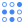

# 🖼️ GoogleCloud Gallery

[⬅️ 回到首頁](../../README.md)

| 預覽 | 詳細資訊 |
| :--- | :--- |
|  | **access-context-manager.svg** VectorxVector | 548.00B 更新: 2026-02-26 |
|  | **administration.svg** VectorxVector | 1.58KB 更新: 2026-02-26 |
|  | **advanced-agent-modeling.svg** VectorxVector | 3.77KB 更新: 2026-02-26 |
|  | **advanced-solutions-lab.svg** VectorxVector | 2.67KB 更新: 2026-02-26 |
|  | **agent-assist.svg** VectorxVector | 1.37KB 更新: 2026-02-26 |
|  | **ai-hub.svg** VectorxVector | 1.12KB 更新: 2026-02-26 |
|  | **ai-platform-unified.svg** VectorxVector | 1.14KB 更新: 2026-02-26 |
|  | **ai-platform.svg** VectorxVector | 1.12KB 更新: 2026-02-26 |
|  | **analytics-hub.svg** VectorxVector | 770.00B 更新: 2026-02-26 |
|  | **anthos-config-management.svg** VectorxVector | 847.00B 更新: 2026-02-26 |
|  | **anthos-service-mesh.svg** VectorxVector | 3.29KB 更新: 2026-02-26 |
|  | **anthos.svg** VectorxVector | 740.00B 更新: 2026-02-26 |
|  | **api-analytics.svg** VectorxVector | 910.00B 更新: 2026-02-26 |
|  | **api-monetization.svg** VectorxVector | 923.00B 更新: 2026-02-26 |
|  | **api.svg** VectorxVector | 1.11KB 更新: 2026-02-26 |
|  | **apigee-api-platform.svg** VectorxVector | 994.00B 更新: 2026-02-26 |
|  | **apigee-sense.svg** VectorxVector | 1.82KB 更新: 2026-02-26 |
|  | **app-engine.svg** VectorxVector | 1.12KB 更新: 2026-02-26 |
|  | **artifact-registry.svg** VectorxVector | 1.97KB 更新: 2026-02-26 |
|  | **asset-inventory.svg** VectorxVector | 816.00B 更新: 2026-02-26 |
|  | **assured-workloads.svg** VectorxVector | 1.01KB 更新: 2026-02-26 |
|  | **automl-natural-language.svg** VectorxVector | 1.13KB 更新: 2026-02-26 |
|  | **automl-tables.svg** VectorxVector | 663.00B 更新: 2026-02-26 |
|  | **automl-translation.svg** VectorxVector | 934.00B 更新: 2026-02-26 |
|  | **automl-video-intelligence.svg** VectorxVector | 868.00B 更新: 2026-02-26 |
|  | **automl-vision.svg** VectorxVector | 501.00B 更新: 2026-02-26 |
|  | **automl.svg** VectorxVector | 709.00B 更新: 2026-02-26 |
|  | **bare-metal-solutions.svg** VectorxVector | 523.00B 更新: 2026-02-26 |
|  | **batch.svg** VectorxVector | 605.00B 更新: 2026-02-26 |
|  | **beyondcorp.svg** VectorxVector | 830.00B 更新: 2026-02-26 |
|  | **bigquery.svg** VectorxVector | 804.00B 更新: 2026-02-26 |
|  | **bigtable.svg** VectorxVector | 2.63KB 更新: 2026-02-26 |
|  | **billing.svg** VectorxVector | 1.67KB 更新: 2026-02-26 |
|  | **binary-authorization.svg** VectorxVector | 623.00B 更新: 2026-02-26 |
|  | **catalog.svg** VectorxVector | 993.00B 更新: 2026-02-26 |
|  | **certificate-authority-service.svg** VectorxVector | 971.00B 更新: 2026-02-26 |
|  | **certificate-manager.svg** VectorxVector | 1.48KB 更新: 2026-02-26 |
|  | **cloud-api-gateway.svg** VectorxVector | 3.16KB 更新: 2026-02-26 |
|  | **cloud-apis.svg** VectorxVector | 978.00B 更新: 2026-02-26 |
|  | **cloud-armor.svg** VectorxVector | 865.00B 更新: 2026-02-26 |
|  | **cloud-asset-inventory.svg** VectorxVector | 887.00B 更新: 2026-02-26 |
|  | **cloud-audit-logs.svg** VectorxVector | 1.27KB 更新: 2026-02-26 |
|  | **cloud-build.svg** VectorxVector | 819.00B 更新: 2026-02-26 |
|  | **cloud-cdn.svg** VectorxVector | 1.35KB 更新: 2026-02-26 |
|  | **cloud-code.svg** VectorxVector | 795.00B 更新: 2026-02-26 |
|  | **cloud-composer.svg** VectorxVector | 653.00B 更新: 2026-02-26 |
|  | **cloud-data-fusion.svg** VectorxVector | 593.00B 更新: 2026-02-26 |
|  | **cloud-deploy.svg** VectorxVector | 462.00B 更新: 2026-02-26 |
|  | **cloud-deployment-manager.svg** VectorxVector | 1.08KB 更新: 2026-02-26 |
|  | **cloud-dns.svg** VectorxVector | 864.00B 更新: 2026-02-26 |
|  | **cloud-domains.svg** VectorxVector | 940.00B 更新: 2026-02-26 |
|  | **cloud-ekm.svg** VectorxVector | 1.44KB 更新: 2026-02-26 |
|  | **cloud-endpoints.svg** VectorxVector | 776.00B 更新: 2026-02-26 |
|  | **cloud-external-ip-addresses.svg** VectorxVector | 725.00B 更新: 2026-02-26 |
|  | **cloud-firewall-rules.svg** VectorxVector | 1.00KB 更新: 2026-02-26 |
|  | **cloud-for-marketing.svg** VectorxVector | 7.34KB 更新: 2026-02-26 |
|  | **cloud-functions.svg** VectorxVector | 1.21KB 更新: 2026-02-26 |
|  | **cloud-generic.svg** VectorxVector | 853.00B 更新: 2026-02-26 |
|  | **cloud-gpu.svg** VectorxVector | 753.00B 更新: 2026-02-26 |
|  | **cloud-healthcare-api.svg** VectorxVector | 1.40KB 更新: 2026-02-26 |
|  | **cloud-healthcare-marketplace.svg** VectorxVector | 760.00B 更新: 2026-02-26 |
|  | **cloud-hsm.svg** VectorxVector | 2.29KB 更新: 2026-02-26 |
|  | **cloud-ids.svg** VectorxVector | 2.05KB 更新: 2026-02-26 |
|  | **cloud-inference-api.svg** VectorxVector | 1.11KB 更新: 2026-02-26 |
|  | **cloud-interconnect.svg** VectorxVector | 694.00B 更新: 2026-02-26 |
|  | **cloud-jobs-api.svg** VectorxVector | 1.17KB 更新: 2026-02-26 |
|  | **cloud-load-balancing.svg** VectorxVector | 1.09KB 更新: 2026-02-26 |
|  | **cloud-logging.svg** VectorxVector | 856.00B 更新: 2026-02-26 |
|  | **cloud-media-edge.svg** VectorxVector | 1.04KB 更新: 2026-02-26 |
|  | **cloud-monitoring.svg** VectorxVector | 789.00B 更新: 2026-02-26 |
|  | **cloud-nat.svg** VectorxVector | 1.16KB 更新: 2026-02-26 |
|  | **cloud-natural-language-api.svg** VectorxVector | 999.00B 更新: 2026-02-26 |
|  | **cloud-network.svg** VectorxVector | 887.00B 更新: 2026-02-26 |
|  | **cloud-ops.svg** VectorxVector | 1.16KB 更新: 2026-02-26 |
|  | **cloud-optimization-ai-fleet-routing-api.svg** VectorxVector | 2.82KB 更新: 2026-02-26 |
|  | **cloud-optimization-ai.svg** VectorxVector | 1.97KB 更新: 2026-02-26 |
|  | **cloud-router.svg** VectorxVector | 376.00B 更新: 2026-02-26 |
|  | **cloud-routes.svg** VectorxVector | 648.00B 更新: 2026-02-26 |
|  | **cloud-run-for-anthos.svg** VectorxVector | 527.00B 更新: 2026-02-26 |
|  | **cloud-run.svg** VectorxVector | 574.00B 更新: 2026-02-26 |
|  | **cloud-scheduler.svg** VectorxVector | 1.21KB 更新: 2026-02-26 |
|  | **cloud-security-scanner.svg** VectorxVector | 764.00B 更新: 2026-02-26 |
|  | **cloud-shell.svg** VectorxVector | 689.00B 更新: 2026-02-26 |
|  | **cloud-spanner.svg** VectorxVector | 1.25KB 更新: 2026-02-26 |
|  | **cloud-sql.svg** VectorxVector | 933.00B 更新: 2026-02-26 |
|  | **cloud-storage.svg** VectorxVector | 958.00B 更新: 2026-02-26 |
|  | **cloud-tasks.svg** VectorxVector | 1.39KB 更新: 2026-02-26 |
|  | **cloud-test-lab.svg** VectorxVector | 1.12KB 更新: 2026-02-26 |
|  | **cloud-tpu.svg** VectorxVector | 2.97KB 更新: 2026-02-26 |
|  | **cloud-translation-api.svg** VectorxVector | 602.00B 更新: 2026-02-26 |
|  | **cloud-vision-api.svg** VectorxVector | 771.00B 更新: 2026-02-26 |
|  | **cloud-vpn.svg** VectorxVector | 810.00B 更新: 2026-02-26 |
|  | **compute-engine.svg** VectorxVector | 1.35KB 更新: 2026-02-26 |
|  | **configuration-management.svg** VectorxVector | 715.00B 更新: 2026-02-26 |
|  | **connectivity-test.svg** VectorxVector | 453.00B 更新: 2026-02-26 |
|  | **connectors.svg** VectorxVector | 666.00B 更新: 2026-02-26 |
|  | **contact-center-ai.svg** VectorxVector | 1.10KB 更新: 2026-02-26 |
|  | **container-optimized-os.svg** VectorxVector | 539.00B 更新: 2026-02-26 |
|  | **container-registry.svg** VectorxVector | 1.98KB 更新: 2026-02-26 |
|  | **data-catalog.svg** VectorxVector | 1.13KB 更新: 2026-02-26 |
|  | **data-labeling.svg** VectorxVector | 924.00B 更新: 2026-02-26 |
|  | **data-layers.svg** VectorxVector | 444.00B 更新: 2026-02-26 |
|  | **data-loss-prevention-api.svg** VectorxVector | 2.79KB 更新: 2026-02-26 |
|  | **data-qna.svg** VectorxVector | 669.00B 更新: 2026-02-26 |
|  | **data-studio.svg** VectorxVector | 721.00B 更新: 2026-02-26 |
|  | **data-transfer.svg** VectorxVector | 746.00B 更新: 2026-02-26 |
|  | **database-migration-service.svg** VectorxVector | 689.00B 更新: 2026-02-26 |
|  | **dataflow.svg** VectorxVector | 1.64KB 更新: 2026-02-26 |
|  | **datalab.svg** VectorxVector | 3.11KB 更新: 2026-02-26 |
|  | **dataplex.svg** VectorxVector | 3.02KB 更新: 2026-02-26 |
|  | **datapol.svg** VectorxVector | 1.52KB 更新: 2026-02-26 |
|  | **dataprep.svg** VectorxVector | 1.28KB 更新: 2026-02-26 |
|  | **dataproc-metastore.svg** VectorxVector | 547.00B 更新: 2026-02-26 |
|  | **dataproc.svg** VectorxVector | 1.80KB 更新: 2026-02-26 |
|  | **datashare.svg** VectorxVector | 964.00B 更新: 2026-02-26 |
|  | **datastore.svg** VectorxVector | 1.99KB 更新: 2026-02-26 |
|  | **datastream.svg** VectorxVector | 2.63KB 更新: 2026-02-26 |
|  | **debugger.svg** VectorxVector | 1.68KB 更新: 2026-02-26 |
|  | **developer-portal.svg** VectorxVector | 716.00B 更新: 2026-02-26 |
|  | **dialogflow-cx.svg** VectorxVector | 2.02KB 更新: 2026-02-26 |
|  | **dialogflow-insights.svg** VectorxVector | 2.99KB 更新: 2026-02-26 |
|  | **dialogflow.svg** VectorxVector | 552.00B 更新: 2026-02-26 |
|  | **document-ai.svg** VectorxVector | 1.01KB 更新: 2026-02-26 |
|  | **early-access-center.svg** VectorxVector | 787.00B 更新: 2026-02-26 |
|  | **error-reporting.svg** VectorxVector | 789.00B 更新: 2026-02-26 |
|  | **eventarc.svg** VectorxVector | 1.41KB 更新: 2026-02-26 |
|  | **filestore.svg** VectorxVector | 669.00B 更新: 2026-02-26 |
|  | **financial-services-marketplace.svg** VectorxVector | 919.00B 更新: 2026-02-26 |
|  | **firestore.svg** VectorxVector | 656.00B 更新: 2026-02-26 |
|  | **fleet-engine.svg** VectorxVector | 2.20KB 更新: 2026-02-26 |
|  | **free-trial.svg** VectorxVector | 1.28KB 更新: 2026-02-26 |
|  | **game-servers.svg** VectorxVector | 5.86KB 更新: 2026-02-26 |
|  | **gce-systems-management.svg** VectorxVector | 2.74KB 更新: 2026-02-26 |
|  | **genomics.svg** VectorxVector | 1.07KB 更新: 2026-02-26 |
|  | **gke-on-prem.svg** VectorxVector | 1.22KB 更新: 2026-02-26 |
|  | **google-cloud-marketplace.svg** VectorxVector | 1.57KB 更新: 2026-02-26 |
|  | **google-kubernetes-engine.svg** VectorxVector | 941.00B 更新: 2026-02-26 |
|  | **google-maps-platform.svg** VectorxVector | 1.17KB 更新: 2026-02-26 |
|  | **healthcare-nlp-api.svg** VectorxVector | 1.10KB 更新: 2026-02-26 |
|  | **home.svg** VectorxVector | 794.00B 更新: 2026-02-26 |
|  | **identity-and-access-management.svg** VectorxVector | 711.00B 更新: 2026-02-26 |
|  | **identity-aware-proxy.svg** VectorxVector | 1.20KB 更新: 2026-02-26 |
|  | **identity-platform.svg** VectorxVector | 734.00B 更新: 2026-02-26 |
|  | **iot-core.svg** VectorxVector | 837.00B 更新: 2026-02-26 |
|  | **iot-edge.svg** VectorxVector | 3.60KB 更新: 2026-02-26 |
|  | **key-access-justifications.svg** VectorxVector | 1.73KB 更新: 2026-02-26 |
|  | **key-management-service.svg** VectorxVector | 739.00B 更新: 2026-02-26 |
|  | **kuberun.svg** VectorxVector | 3.78KB 更新: 2026-02-26 |
|  | **launcher.svg** VectorxVector | 1.32KB 更新: 2026-02-26 |
|  | **local-ssd.svg** VectorxVector | 1.61KB 更新: 2026-02-26 |
|  | **looker.svg** VectorxVector | 1.16KB 更新: 2026-02-26 |
|  | **managed-service-for-microsoft-active-directory.svg** VectorxVector | 855.00B 更新: 2026-02-26 |
|  | **media-translation-api.svg** VectorxVector | 988.00B 更新: 2026-02-26 |
|  | **memorystore.svg** VectorxVector | 1.32KB 更新: 2026-02-26 |
|  | **migrate-for-anthos.svg** VectorxVector | 1.37KB 更新: 2026-02-26 |
|  | **migrate-for-compute-engine.svg** VectorxVector | 4.33KB 更新: 2026-02-26 |
|  | **my-cloud.svg** VectorxVector | 1.48KB 更新: 2026-02-26 |
|  | **network-connectivity-center.svg** VectorxVector | 3.99KB 更新: 2026-02-26 |
|  | **network-intelligence-center.svg** VectorxVector | 3.06KB 更新: 2026-02-26 |
|  | **network-security.svg** VectorxVector | 941.00B 更新: 2026-02-26 |
|  | **network-tiers.svg** VectorxVector | 937.00B 更新: 2026-02-26 |
|  | **network-topology.svg** VectorxVector | 2.32KB 更新: 2026-02-26 |
|  | **onboarding.svg** VectorxVector | 1.06KB 更新: 2026-02-26 |
|  | **os-configuration-management.svg** VectorxVector | 4.22KB 更新: 2026-02-26 |
|  | **os-inventory-management.svg** VectorxVector | 3.64KB 更新: 2026-02-26 |
|  | **os-patch-management.svg** VectorxVector | 3.22KB 更新: 2026-02-26 |
|  | **partner-interconnect.svg** VectorxVector | 863.00B 更新: 2026-02-26 |
|  | **partner-portal.svg** VectorxVector | 2.01KB 更新: 2026-02-26 |
|  | **performance-dashboard.svg** VectorxVector | 5.67KB 更新: 2026-02-26 |
|  | **permissions.svg** VectorxVector | 858.00B 更新: 2026-02-26 |
|  | **persistent-disk.svg** VectorxVector | 606.00B 更新: 2026-02-26 |
|  | **phishing-protection.svg** VectorxVector | 1.34KB 更新: 2026-02-26 |
|  | **policy-analyzer.svg** VectorxVector | 2.12KB 更新: 2026-02-26 |
|  | **premium-network-tier.svg** VectorxVector | 680.00B 更新: 2026-02-26 |
|  | **private-connectivity.svg** VectorxVector | 512.00B 更新: 2026-02-26 |
|  | **private-service-connect.svg** VectorxVector | 1.23KB 更新: 2026-02-26 |
|  | **producer-portal.svg** VectorxVector | 800.00B 更新: 2026-02-26 |
|  | **profiler.svg** VectorxVector | 852.00B 更新: 2026-02-26 |
|  | **project.svg** VectorxVector | 1.56KB 更新: 2026-02-26 |
|  | **pubsub.svg** VectorxVector | 1.39KB 更新: 2026-02-26 |
|  | **quantum-engine.svg** VectorxVector | 1.05KB 更新: 2026-02-26 |
|  | **quotas.svg** VectorxVector | 1.10KB 更新: 2026-02-26 |
|  | **real-world-insights.svg** VectorxVector | 1.73KB 更新: 2026-02-26 |
|  | **recommendations-ai.svg** VectorxVector | 1.20KB 更新: 2026-02-26 |
|  | **release-notes.svg** VectorxVector | 893.00B 更新: 2026-02-26 |
|  | **retail-api.svg** VectorxVector | 777.00B 更新: 2026-02-26 |
|  | **risk-manager.svg** VectorxVector | 2.89KB 更新: 2026-02-26 |
|  | **runtime-config.svg** VectorxVector | 894.00B 更新: 2026-02-26 |
|  | **secret-manager.svg** VectorxVector | 2.68KB 更新: 2026-02-26 |
|  | **security-command-center.svg** VectorxVector | 648.00B 更新: 2026-02-26 |
|  | **security-health-advisor.svg** VectorxVector | 2.45KB 更新: 2026-02-26 |
|  | **security-key-enforcement.svg** VectorxVector | 655.00B 更新: 2026-02-26 |
|  | **security.svg** VectorxVector | 714.00B 更新: 2026-02-26 |
|  | **service-discovery.svg** VectorxVector | 1000.00B 更新: 2026-02-26 |
|  | **speech-to-text.svg** VectorxVector | 1.31KB 更新: 2026-02-26 |
|  | **stackdriver.svg** VectorxVector | 371.00B 更新: 2026-02-26 |
|  | **standard-network-tier.svg** VectorxVector | 2.81KB 更新: 2026-02-26 |
|  | **stream-suite.svg** VectorxVector | 1.07KB 更新: 2026-02-26 |
|  | **support.svg** VectorxVector | 663.00B 更新: 2026-02-26 |
|  | **tensorflow-enterprise.svg** VectorxVector | 639.00B 更新: 2026-02-26 |
|  | **text-to-speech.svg** VectorxVector | 1005.00B 更新: 2026-02-26 |
|  | **tools-for-powershell.svg** VectorxVector | 1.13KB 更新: 2026-02-26 |
|  | **trace.svg** VectorxVector | 763.00B 更新: 2026-02-26 |
|  | **traffic-director.svg** VectorxVector | 874.00B 更新: 2026-02-26 |
|  | **transfer-appliance.svg** VectorxVector | 1.12KB 更新: 2026-02-26 |
|  | **transfer.svg** VectorxVector | 628.00B 更新: 2026-02-26 |
|  | **user-preferences.svg** VectorxVector | 1.60KB 更新: 2026-02-26 |
|  | **vertexai.svg** VectorxVector | 1.94KB 更新: 2026-02-26 |
|  | **video-intelligence-api.svg** VectorxVector | 814.00B 更新: 2026-02-26 |
|  | **virtual-private-cloud.svg** VectorxVector | 1.12KB 更新: 2026-02-26 |
|  | **visual-inspection.svg** VectorxVector | 563.00B 更新: 2026-02-26 |
|  | **vmware-engine.svg** VectorxVector | 1.19KB 更新: 2026-02-26 |
|  | **web-risk.svg** VectorxVector | 914.00B 更新: 2026-02-26 |
|  | **web-security-scanner.svg** VectorxVector | 731.00B 更新: 2026-02-26 |
|  | **workflows.svg** VectorxVector | 1.74KB 更新: 2026-02-26 |
|  | **workload-identity-pool.svg** VectorxVector | 666.00B 更新: 2026-02-26 |