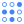

# 🖼️ 素材分類：GoogleCloud

> [🏠 主目錄](../../../README.md) / [images](../../README.md) / [iCons](../README.md) / **GoogleCloud**

本目錄共有 `216` 個檔案

| 🎨 預覽 (點擊放大)  | 📋 檔案詳細資訊與連結 |
| :--- | :--- |
|  | **📂 檔名:** `access-context-manager.svg` ✨ **格式:** `Vector (SVG)` ⚖️ **大小:** `548.00B` 📅 **更新:** `2026-03-04`  🚀 **jsDelivr Markdown:** `` 🔗 **直接連結 (Url):** <code>https://cdn.jsdelivr.net/gh/barry028/materials@main/images/iCons/GoogleCloud/access-context-manager.svg</code> 📥 [檢視原始檔](access-context-manager.svg) |
|  | **📂 檔名:** `administration.svg` ✨ **格式:** `Vector (SVG)` ⚖️ **大小:** `1.58KB` 📅 **更新:** `2026-03-04`  🚀 **jsDelivr Markdown:** `` 🔗 **直接連結 (Url):** <code>https://cdn.jsdelivr.net/gh/barry028/materials@main/images/iCons/GoogleCloud/administration.svg</code> 📥 [檢視原始檔](administration.svg) |
|  | **📂 檔名:** `advanced-agent-modeling.svg` ✨ **格式:** `Vector (SVG)` ⚖️ **大小:** `3.77KB` 📅 **更新:** `2026-03-04`  🚀 **jsDelivr Markdown:** `` 🔗 **直接連結 (Url):** <code>https://cdn.jsdelivr.net/gh/barry028/materials@main/images/iCons/GoogleCloud/advanced-agent-modeling.svg</code> 📥 [檢視原始檔](advanced-agent-modeling.svg) |
|  | **📂 檔名:** `advanced-solutions-lab.svg` ✨ **格式:** `Vector (SVG)` ⚖️ **大小:** `2.67KB` 📅 **更新:** `2026-03-04`  🚀 **jsDelivr Markdown:** `` 🔗 **直接連結 (Url):** <code>https://cdn.jsdelivr.net/gh/barry028/materials@main/images/iCons/GoogleCloud/advanced-solutions-lab.svg</code> 📥 [檢視原始檔](advanced-solutions-lab.svg) |
|  | **📂 檔名:** `agent-assist.svg` ✨ **格式:** `Vector (SVG)` ⚖️ **大小:** `1.37KB` 📅 **更新:** `2026-03-04`  🚀 **jsDelivr Markdown:** `` 🔗 **直接連結 (Url):** <code>https://cdn.jsdelivr.net/gh/barry028/materials@main/images/iCons/GoogleCloud/agent-assist.svg</code> 📥 [檢視原始檔](agent-assist.svg) |
|  | **📂 檔名:** `ai-hub.svg` ✨ **格式:** `Vector (SVG)` ⚖️ **大小:** `1.12KB` 📅 **更新:** `2026-03-04`  🚀 **jsDelivr Markdown:** `` 🔗 **直接連結 (Url):** <code>https://cdn.jsdelivr.net/gh/barry028/materials@main/images/iCons/GoogleCloud/ai-hub.svg</code> 📥 [檢視原始檔](ai-hub.svg) |
|  | **📂 檔名:** `ai-platform-unified.svg` ✨ **格式:** `Vector (SVG)` ⚖️ **大小:** `1.14KB` 📅 **更新:** `2026-03-04`  🚀 **jsDelivr Markdown:** `` 🔗 **直接連結 (Url):** <code>https://cdn.jsdelivr.net/gh/barry028/materials@main/images/iCons/GoogleCloud/ai-platform-unified.svg</code> 📥 [檢視原始檔](ai-platform-unified.svg) |
|  | **📂 檔名:** `ai-platform.svg` ✨ **格式:** `Vector (SVG)` ⚖️ **大小:** `1.12KB` 📅 **更新:** `2026-03-04`  🚀 **jsDelivr Markdown:** `` 🔗 **直接連結 (Url):** <code>https://cdn.jsdelivr.net/gh/barry028/materials@main/images/iCons/GoogleCloud/ai-platform.svg</code> 📥 [檢視原始檔](ai-platform.svg) |
|  | **📂 檔名:** `analytics-hub.svg` ✨ **格式:** `Vector (SVG)` ⚖️ **大小:** `770.00B` 📅 **更新:** `2026-03-04`  🚀 **jsDelivr Markdown:** `` 🔗 **直接連結 (Url):** <code>https://cdn.jsdelivr.net/gh/barry028/materials@main/images/iCons/GoogleCloud/analytics-hub.svg</code> 📥 [檢視原始檔](analytics-hub.svg) |
|  | **📂 檔名:** `anthos-config-management.svg` ✨ **格式:** `Vector (SVG)` ⚖️ **大小:** `847.00B` 📅 **更新:** `2026-03-04`  🚀 **jsDelivr Markdown:** `` 🔗 **直接連結 (Url):** <code>https://cdn.jsdelivr.net/gh/barry028/materials@main/images/iCons/GoogleCloud/anthos-config-management.svg</code> 📥 [檢視原始檔](anthos-config-management.svg) |
|  | **📂 檔名:** `anthos-service-mesh.svg` ✨ **格式:** `Vector (SVG)` ⚖️ **大小:** `3.29KB` 📅 **更新:** `2026-03-04`  🚀 **jsDelivr Markdown:** `` 🔗 **直接連結 (Url):** <code>https://cdn.jsdelivr.net/gh/barry028/materials@main/images/iCons/GoogleCloud/anthos-service-mesh.svg</code> 📥 [檢視原始檔](anthos-service-mesh.svg) |
|  | **📂 檔名:** `anthos.svg` ✨ **格式:** `Vector (SVG)` ⚖️ **大小:** `740.00B` 📅 **更新:** `2026-03-04`  🚀 **jsDelivr Markdown:** `` 🔗 **直接連結 (Url):** <code>https://cdn.jsdelivr.net/gh/barry028/materials@main/images/iCons/GoogleCloud/anthos.svg</code> 📥 [檢視原始檔](anthos.svg) |
|  | **📂 檔名:** `api-analytics.svg` ✨ **格式:** `Vector (SVG)` ⚖️ **大小:** `910.00B` 📅 **更新:** `2026-03-04`  🚀 **jsDelivr Markdown:** `` 🔗 **直接連結 (Url):** <code>https://cdn.jsdelivr.net/gh/barry028/materials@main/images/iCons/GoogleCloud/api-analytics.svg</code> 📥 [檢視原始檔](api-analytics.svg) |
|  | **📂 檔名:** `api-monetization.svg` ✨ **格式:** `Vector (SVG)` ⚖️ **大小:** `923.00B` 📅 **更新:** `2026-03-04`  🚀 **jsDelivr Markdown:** `` 🔗 **直接連結 (Url):** <code>https://cdn.jsdelivr.net/gh/barry028/materials@main/images/iCons/GoogleCloud/api-monetization.svg</code> 📥 [檢視原始檔](api-monetization.svg) |
|  | **📂 檔名:** `api.svg` ✨ **格式:** `Vector (SVG)` ⚖️ **大小:** `1.11KB` 📅 **更新:** `2026-03-04`  🚀 **jsDelivr Markdown:** `` 🔗 **直接連結 (Url):** <code>https://cdn.jsdelivr.net/gh/barry028/materials@main/images/iCons/GoogleCloud/api.svg</code> 📥 [檢視原始檔](api.svg) |
|  | **📂 檔名:** `apigee-api-platform.svg` ✨ **格式:** `Vector (SVG)` ⚖️ **大小:** `994.00B` 📅 **更新:** `2026-03-04`  🚀 **jsDelivr Markdown:** `` 🔗 **直接連結 (Url):** <code>https://cdn.jsdelivr.net/gh/barry028/materials@main/images/iCons/GoogleCloud/apigee-api-platform.svg</code> 📥 [檢視原始檔](apigee-api-platform.svg) |
|  | **📂 檔名:** `apigee-sense.svg` ✨ **格式:** `Vector (SVG)` ⚖️ **大小:** `1.82KB` 📅 **更新:** `2026-03-04`  🚀 **jsDelivr Markdown:** `` 🔗 **直接連結 (Url):** <code>https://cdn.jsdelivr.net/gh/barry028/materials@main/images/iCons/GoogleCloud/apigee-sense.svg</code> 📥 [檢視原始檔](apigee-sense.svg) |
|  | **📂 檔名:** `app-engine.svg` ✨ **格式:** `Vector (SVG)` ⚖️ **大小:** `1.12KB` 📅 **更新:** `2026-03-04`  🚀 **jsDelivr Markdown:** `` 🔗 **直接連結 (Url):** <code>https://cdn.jsdelivr.net/gh/barry028/materials@main/images/iCons/GoogleCloud/app-engine.svg</code> 📥 [檢視原始檔](app-engine.svg) |
|  | **📂 檔名:** `artifact-registry.svg` ✨ **格式:** `Vector (SVG)` ⚖️ **大小:** `1.97KB` 📅 **更新:** `2026-03-04`  🚀 **jsDelivr Markdown:** `` 🔗 **直接連結 (Url):** <code>https://cdn.jsdelivr.net/gh/barry028/materials@main/images/iCons/GoogleCloud/artifact-registry.svg</code> 📥 [檢視原始檔](artifact-registry.svg) |
|  | **📂 檔名:** `asset-inventory.svg` ✨ **格式:** `Vector (SVG)` ⚖️ **大小:** `816.00B` 📅 **更新:** `2026-03-04`  🚀 **jsDelivr Markdown:** `` 🔗 **直接連結 (Url):** <code>https://cdn.jsdelivr.net/gh/barry028/materials@main/images/iCons/GoogleCloud/asset-inventory.svg</code> 📥 [檢視原始檔](asset-inventory.svg) |
|  | **📂 檔名:** `assured-workloads.svg` ✨ **格式:** `Vector (SVG)` ⚖️ **大小:** `1.01KB` 📅 **更新:** `2026-03-04`  🚀 **jsDelivr Markdown:** `` 🔗 **直接連結 (Url):** <code>https://cdn.jsdelivr.net/gh/barry028/materials@main/images/iCons/GoogleCloud/assured-workloads.svg</code> 📥 [檢視原始檔](assured-workloads.svg) |
|  | **📂 檔名:** `automl-natural-language.svg` ✨ **格式:** `Vector (SVG)` ⚖️ **大小:** `1.13KB` 📅 **更新:** `2026-03-04`  🚀 **jsDelivr Markdown:** `` 🔗 **直接連結 (Url):** <code>https://cdn.jsdelivr.net/gh/barry028/materials@main/images/iCons/GoogleCloud/automl-natural-language.svg</code> 📥 [檢視原始檔](automl-natural-language.svg) |
|  | **📂 檔名:** `automl-tables.svg` ✨ **格式:** `Vector (SVG)` ⚖️ **大小:** `663.00B` 📅 **更新:** `2026-03-04`  🚀 **jsDelivr Markdown:** `` 🔗 **直接連結 (Url):** <code>https://cdn.jsdelivr.net/gh/barry028/materials@main/images/iCons/GoogleCloud/automl-tables.svg</code> 📥 [檢視原始檔](automl-tables.svg) |
|  | **📂 檔名:** `automl-translation.svg` ✨ **格式:** `Vector (SVG)` ⚖️ **大小:** `934.00B` 📅 **更新:** `2026-03-04`  🚀 **jsDelivr Markdown:** `` 🔗 **直接連結 (Url):** <code>https://cdn.jsdelivr.net/gh/barry028/materials@main/images/iCons/GoogleCloud/automl-translation.svg</code> 📥 [檢視原始檔](automl-translation.svg) |
|  | **📂 檔名:** `automl-video-intelligence.svg` ✨ **格式:** `Vector (SVG)` ⚖️ **大小:** `868.00B` 📅 **更新:** `2026-03-04`  🚀 **jsDelivr Markdown:** `` 🔗 **直接連結 (Url):** <code>https://cdn.jsdelivr.net/gh/barry028/materials@main/images/iCons/GoogleCloud/automl-video-intelligence.svg</code> 📥 [檢視原始檔](automl-video-intelligence.svg) |
|  | **📂 檔名:** `automl-vision.svg` ✨ **格式:** `Vector (SVG)` ⚖️ **大小:** `501.00B` 📅 **更新:** `2026-03-04`  🚀 **jsDelivr Markdown:** `` 🔗 **直接連結 (Url):** <code>https://cdn.jsdelivr.net/gh/barry028/materials@main/images/iCons/GoogleCloud/automl-vision.svg</code> 📥 [檢視原始檔](automl-vision.svg) |
|  | **📂 檔名:** `automl.svg` ✨ **格式:** `Vector (SVG)` ⚖️ **大小:** `709.00B` 📅 **更新:** `2026-03-04`  🚀 **jsDelivr Markdown:** `` 🔗 **直接連結 (Url):** <code>https://cdn.jsdelivr.net/gh/barry028/materials@main/images/iCons/GoogleCloud/automl.svg</code> 📥 [檢視原始檔](automl.svg) |
|  | **📂 檔名:** `bare-metal-solutions.svg` ✨ **格式:** `Vector (SVG)` ⚖️ **大小:** `523.00B` 📅 **更新:** `2026-03-04`  🚀 **jsDelivr Markdown:** `` 🔗 **直接連結 (Url):** <code>https://cdn.jsdelivr.net/gh/barry028/materials@main/images/iCons/GoogleCloud/bare-metal-solutions.svg</code> 📥 [檢視原始檔](bare-metal-solutions.svg) |
|  | **📂 檔名:** `batch.svg` ✨ **格式:** `Vector (SVG)` ⚖️ **大小:** `605.00B` 📅 **更新:** `2026-03-04`  🚀 **jsDelivr Markdown:** `` 🔗 **直接連結 (Url):** <code>https://cdn.jsdelivr.net/gh/barry028/materials@main/images/iCons/GoogleCloud/batch.svg</code> 📥 [檢視原始檔](batch.svg) |
|  | **📂 檔名:** `beyondcorp.svg` ✨ **格式:** `Vector (SVG)` ⚖️ **大小:** `830.00B` 📅 **更新:** `2026-03-04`  🚀 **jsDelivr Markdown:** `` 🔗 **直接連結 (Url):** <code>https://cdn.jsdelivr.net/gh/barry028/materials@main/images/iCons/GoogleCloud/beyondcorp.svg</code> 📥 [檢視原始檔](beyondcorp.svg) |
|  | **📂 檔名:** `bigquery.svg` ✨ **格式:** `Vector (SVG)` ⚖️ **大小:** `804.00B` 📅 **更新:** `2026-03-04`  🚀 **jsDelivr Markdown:** `` 🔗 **直接連結 (Url):** <code>https://cdn.jsdelivr.net/gh/barry028/materials@main/images/iCons/GoogleCloud/bigquery.svg</code> 📥 [檢視原始檔](bigquery.svg) |
|  | **📂 檔名:** `bigtable.svg` ✨ **格式:** `Vector (SVG)` ⚖️ **大小:** `2.63KB` 📅 **更新:** `2026-03-04`  🚀 **jsDelivr Markdown:** `` 🔗 **直接連結 (Url):** <code>https://cdn.jsdelivr.net/gh/barry028/materials@main/images/iCons/GoogleCloud/bigtable.svg</code> 📥 [檢視原始檔](bigtable.svg) |
|  | **📂 檔名:** `billing.svg` ✨ **格式:** `Vector (SVG)` ⚖️ **大小:** `1.67KB` 📅 **更新:** `2026-03-04`  🚀 **jsDelivr Markdown:** `` 🔗 **直接連結 (Url):** <code>https://cdn.jsdelivr.net/gh/barry028/materials@main/images/iCons/GoogleCloud/billing.svg</code> 📥 [檢視原始檔](billing.svg) |
|  | **📂 檔名:** `binary-authorization.svg` ✨ **格式:** `Vector (SVG)` ⚖️ **大小:** `623.00B` 📅 **更新:** `2026-03-04`  🚀 **jsDelivr Markdown:** `` 🔗 **直接連結 (Url):** <code>https://cdn.jsdelivr.net/gh/barry028/materials@main/images/iCons/GoogleCloud/binary-authorization.svg</code> 📥 [檢視原始檔](binary-authorization.svg) |
|  | **📂 檔名:** `catalog.svg` ✨ **格式:** `Vector (SVG)` ⚖️ **大小:** `993.00B` 📅 **更新:** `2026-03-04`  🚀 **jsDelivr Markdown:** `` 🔗 **直接連結 (Url):** <code>https://cdn.jsdelivr.net/gh/barry028/materials@main/images/iCons/GoogleCloud/catalog.svg</code> 📥 [檢視原始檔](catalog.svg) |
|  | **📂 檔名:** `certificate-authority-service.svg` ✨ **格式:** `Vector (SVG)` ⚖️ **大小:** `971.00B` 📅 **更新:** `2026-03-04`  🚀 **jsDelivr Markdown:** `` 🔗 **直接連結 (Url):** <code>https://cdn.jsdelivr.net/gh/barry028/materials@main/images/iCons/GoogleCloud/certificate-authority-service.svg</code> 📥 [檢視原始檔](certificate-authority-service.svg) |
|  | **📂 檔名:** `certificate-manager.svg` ✨ **格式:** `Vector (SVG)` ⚖️ **大小:** `1.48KB` 📅 **更新:** `2026-03-04`  🚀 **jsDelivr Markdown:** `` 🔗 **直接連結 (Url):** <code>https://cdn.jsdelivr.net/gh/barry028/materials@main/images/iCons/GoogleCloud/certificate-manager.svg</code> 📥 [檢視原始檔](certificate-manager.svg) |
|  | **📂 檔名:** `cloud-api-gateway.svg` ✨ **格式:** `Vector (SVG)` ⚖️ **大小:** `3.16KB` 📅 **更新:** `2026-03-04`  🚀 **jsDelivr Markdown:** `` 🔗 **直接連結 (Url):** <code>https://cdn.jsdelivr.net/gh/barry028/materials@main/images/iCons/GoogleCloud/cloud-api-gateway.svg</code> 📥 [檢視原始檔](cloud-api-gateway.svg) |
|  | **📂 檔名:** `cloud-apis.svg` ✨ **格式:** `Vector (SVG)` ⚖️ **大小:** `978.00B` 📅 **更新:** `2026-03-04`  🚀 **jsDelivr Markdown:** `` 🔗 **直接連結 (Url):** <code>https://cdn.jsdelivr.net/gh/barry028/materials@main/images/iCons/GoogleCloud/cloud-apis.svg</code> 📥 [檢視原始檔](cloud-apis.svg) |
|  | **📂 檔名:** `cloud-armor.svg` ✨ **格式:** `Vector (SVG)` ⚖️ **大小:** `865.00B` 📅 **更新:** `2026-03-04`  🚀 **jsDelivr Markdown:** `` 🔗 **直接連結 (Url):** <code>https://cdn.jsdelivr.net/gh/barry028/materials@main/images/iCons/GoogleCloud/cloud-armor.svg</code> 📥 [檢視原始檔](cloud-armor.svg) |
|  | **📂 檔名:** `cloud-asset-inventory.svg` ✨ **格式:** `Vector (SVG)` ⚖️ **大小:** `887.00B` 📅 **更新:** `2026-03-04`  🚀 **jsDelivr Markdown:** `` 🔗 **直接連結 (Url):** <code>https://cdn.jsdelivr.net/gh/barry028/materials@main/images/iCons/GoogleCloud/cloud-asset-inventory.svg</code> 📥 [檢視原始檔](cloud-asset-inventory.svg) |
|  | **📂 檔名:** `cloud-audit-logs.svg` ✨ **格式:** `Vector (SVG)` ⚖️ **大小:** `1.27KB` 📅 **更新:** `2026-03-04`  🚀 **jsDelivr Markdown:** `` 🔗 **直接連結 (Url):** <code>https://cdn.jsdelivr.net/gh/barry028/materials@main/images/iCons/GoogleCloud/cloud-audit-logs.svg</code> 📥 [檢視原始檔](cloud-audit-logs.svg) |
|  | **📂 檔名:** `cloud-build.svg` ✨ **格式:** `Vector (SVG)` ⚖️ **大小:** `819.00B` 📅 **更新:** `2026-03-04`  🚀 **jsDelivr Markdown:** `` 🔗 **直接連結 (Url):** <code>https://cdn.jsdelivr.net/gh/barry028/materials@main/images/iCons/GoogleCloud/cloud-build.svg</code> 📥 [檢視原始檔](cloud-build.svg) |
|  | **📂 檔名:** `cloud-cdn.svg` ✨ **格式:** `Vector (SVG)` ⚖️ **大小:** `1.35KB` 📅 **更新:** `2026-03-04`  🚀 **jsDelivr Markdown:** `` 🔗 **直接連結 (Url):** <code>https://cdn.jsdelivr.net/gh/barry028/materials@main/images/iCons/GoogleCloud/cloud-cdn.svg</code> 📥 [檢視原始檔](cloud-cdn.svg) |
|  | **📂 檔名:** `cloud-code.svg` ✨ **格式:** `Vector (SVG)` ⚖️ **大小:** `795.00B` 📅 **更新:** `2026-03-04`  🚀 **jsDelivr Markdown:** `` 🔗 **直接連結 (Url):** <code>https://cdn.jsdelivr.net/gh/barry028/materials@main/images/iCons/GoogleCloud/cloud-code.svg</code> 📥 [檢視原始檔](cloud-code.svg) |
|  | **📂 檔名:** `cloud-composer.svg` ✨ **格式:** `Vector (SVG)` ⚖️ **大小:** `653.00B` 📅 **更新:** `2026-03-04`  🚀 **jsDelivr Markdown:** `` 🔗 **直接連結 (Url):** <code>https://cdn.jsdelivr.net/gh/barry028/materials@main/images/iCons/GoogleCloud/cloud-composer.svg</code> 📥 [檢視原始檔](cloud-composer.svg) |
|  | **📂 檔名:** `cloud-data-fusion.svg` ✨ **格式:** `Vector (SVG)` ⚖️ **大小:** `593.00B` 📅 **更新:** `2026-03-04`  🚀 **jsDelivr Markdown:** `` 🔗 **直接連結 (Url):** <code>https://cdn.jsdelivr.net/gh/barry028/materials@main/images/iCons/GoogleCloud/cloud-data-fusion.svg</code> 📥 [檢視原始檔](cloud-data-fusion.svg) |
|  | **📂 檔名:** `cloud-deploy.svg` ✨ **格式:** `Vector (SVG)` ⚖️ **大小:** `462.00B` 📅 **更新:** `2026-03-04`  🚀 **jsDelivr Markdown:** `` 🔗 **直接連結 (Url):** <code>https://cdn.jsdelivr.net/gh/barry028/materials@main/images/iCons/GoogleCloud/cloud-deploy.svg</code> 📥 [檢視原始檔](cloud-deploy.svg) |
|  | **📂 檔名:** `cloud-deployment-manager.svg` ✨ **格式:** `Vector (SVG)` ⚖️ **大小:** `1.08KB` 📅 **更新:** `2026-03-04`  🚀 **jsDelivr Markdown:** `` 🔗 **直接連結 (Url):** <code>https://cdn.jsdelivr.net/gh/barry028/materials@main/images/iCons/GoogleCloud/cloud-deployment-manager.svg</code> 📥 [檢視原始檔](cloud-deployment-manager.svg) |
|  | **📂 檔名:** `cloud-dns.svg` ✨ **格式:** `Vector (SVG)` ⚖️ **大小:** `864.00B` 📅 **更新:** `2026-03-04`  🚀 **jsDelivr Markdown:** `` 🔗 **直接連結 (Url):** <code>https://cdn.jsdelivr.net/gh/barry028/materials@main/images/iCons/GoogleCloud/cloud-dns.svg</code> 📥 [檢視原始檔](cloud-dns.svg) |
|  | **📂 檔名:** `cloud-domains.svg` ✨ **格式:** `Vector (SVG)` ⚖️ **大小:** `940.00B` 📅 **更新:** `2026-03-04`  🚀 **jsDelivr Markdown:** `` 🔗 **直接連結 (Url):** <code>https://cdn.jsdelivr.net/gh/barry028/materials@main/images/iCons/GoogleCloud/cloud-domains.svg</code> 📥 [檢視原始檔](cloud-domains.svg) |
|  | **📂 檔名:** `cloud-ekm.svg` ✨ **格式:** `Vector (SVG)` ⚖️ **大小:** `1.44KB` 📅 **更新:** `2026-03-04`  🚀 **jsDelivr Markdown:** `` 🔗 **直接連結 (Url):** <code>https://cdn.jsdelivr.net/gh/barry028/materials@main/images/iCons/GoogleCloud/cloud-ekm.svg</code> 📥 [檢視原始檔](cloud-ekm.svg) |
|  | **📂 檔名:** `cloud-endpoints.svg` ✨ **格式:** `Vector (SVG)` ⚖️ **大小:** `776.00B` 📅 **更新:** `2026-03-04`  🚀 **jsDelivr Markdown:** `` 🔗 **直接連結 (Url):** <code>https://cdn.jsdelivr.net/gh/barry028/materials@main/images/iCons/GoogleCloud/cloud-endpoints.svg</code> 📥 [檢視原始檔](cloud-endpoints.svg) |
|  | **📂 檔名:** `cloud-external-ip-addresses.svg` ✨ **格式:** `Vector (SVG)` ⚖️ **大小:** `725.00B` 📅 **更新:** `2026-03-04`  🚀 **jsDelivr Markdown:** `` 🔗 **直接連結 (Url):** <code>https://cdn.jsdelivr.net/gh/barry028/materials@main/images/iCons/GoogleCloud/cloud-external-ip-addresses.svg</code> 📥 [檢視原始檔](cloud-external-ip-addresses.svg) |
|  | **📂 檔名:** `cloud-firewall-rules.svg` ✨ **格式:** `Vector (SVG)` ⚖️ **大小:** `1.00KB` 📅 **更新:** `2026-03-04`  🚀 **jsDelivr Markdown:** `` 🔗 **直接連結 (Url):** <code>https://cdn.jsdelivr.net/gh/barry028/materials@main/images/iCons/GoogleCloud/cloud-firewall-rules.svg</code> 📥 [檢視原始檔](cloud-firewall-rules.svg) |
|  | **📂 檔名:** `cloud-for-marketing.svg` ✨ **格式:** `Vector (SVG)` ⚖️ **大小:** `7.34KB` 📅 **更新:** `2026-03-04`  🚀 **jsDelivr Markdown:** `` 🔗 **直接連結 (Url):** <code>https://cdn.jsdelivr.net/gh/barry028/materials@main/images/iCons/GoogleCloud/cloud-for-marketing.svg</code> 📥 [檢視原始檔](cloud-for-marketing.svg) |
|  | **📂 檔名:** `cloud-functions.svg` ✨ **格式:** `Vector (SVG)` ⚖️ **大小:** `1.21KB` 📅 **更新:** `2026-03-04`  🚀 **jsDelivr Markdown:** `` 🔗 **直接連結 (Url):** <code>https://cdn.jsdelivr.net/gh/barry028/materials@main/images/iCons/GoogleCloud/cloud-functions.svg</code> 📥 [檢視原始檔](cloud-functions.svg) |
|  | **📂 檔名:** `cloud-generic.svg` ✨ **格式:** `Vector (SVG)` ⚖️ **大小:** `853.00B` 📅 **更新:** `2026-03-04`  🚀 **jsDelivr Markdown:** `` 🔗 **直接連結 (Url):** <code>https://cdn.jsdelivr.net/gh/barry028/materials@main/images/iCons/GoogleCloud/cloud-generic.svg</code> 📥 [檢視原始檔](cloud-generic.svg) |
|  | **📂 檔名:** `cloud-gpu.svg` ✨ **格式:** `Vector (SVG)` ⚖️ **大小:** `753.00B` 📅 **更新:** `2026-03-04`  🚀 **jsDelivr Markdown:** `` 🔗 **直接連結 (Url):** <code>https://cdn.jsdelivr.net/gh/barry028/materials@main/images/iCons/GoogleCloud/cloud-gpu.svg</code> 📥 [檢視原始檔](cloud-gpu.svg) |
|  | **📂 檔名:** `cloud-healthcare-api.svg` ✨ **格式:** `Vector (SVG)` ⚖️ **大小:** `1.40KB` 📅 **更新:** `2026-03-04`  🚀 **jsDelivr Markdown:** `` 🔗 **直接連結 (Url):** <code>https://cdn.jsdelivr.net/gh/barry028/materials@main/images/iCons/GoogleCloud/cloud-healthcare-api.svg</code> 📥 [檢視原始檔](cloud-healthcare-api.svg) |
|  | **📂 檔名:** `cloud-healthcare-marketplace.svg` ✨ **格式:** `Vector (SVG)` ⚖️ **大小:** `760.00B` 📅 **更新:** `2026-03-04`  🚀 **jsDelivr Markdown:** `` 🔗 **直接連結 (Url):** <code>https://cdn.jsdelivr.net/gh/barry028/materials@main/images/iCons/GoogleCloud/cloud-healthcare-marketplace.svg</code> 📥 [檢視原始檔](cloud-healthcare-marketplace.svg) |
|  | **📂 檔名:** `cloud-hsm.svg` ✨ **格式:** `Vector (SVG)` ⚖️ **大小:** `2.29KB` 📅 **更新:** `2026-03-04`  🚀 **jsDelivr Markdown:** `` 🔗 **直接連結 (Url):** <code>https://cdn.jsdelivr.net/gh/barry028/materials@main/images/iCons/GoogleCloud/cloud-hsm.svg</code> 📥 [檢視原始檔](cloud-hsm.svg) |
|  | **📂 檔名:** `cloud-ids.svg` ✨ **格式:** `Vector (SVG)` ⚖️ **大小:** `2.05KB` 📅 **更新:** `2026-03-04`  🚀 **jsDelivr Markdown:** `` 🔗 **直接連結 (Url):** <code>https://cdn.jsdelivr.net/gh/barry028/materials@main/images/iCons/GoogleCloud/cloud-ids.svg</code> 📥 [檢視原始檔](cloud-ids.svg) |
|  | **📂 檔名:** `cloud-inference-api.svg` ✨ **格式:** `Vector (SVG)` ⚖️ **大小:** `1.11KB` 📅 **更新:** `2026-03-04`  🚀 **jsDelivr Markdown:** `` 🔗 **直接連結 (Url):** <code>https://cdn.jsdelivr.net/gh/barry028/materials@main/images/iCons/GoogleCloud/cloud-inference-api.svg</code> 📥 [檢視原始檔](cloud-inference-api.svg) |
|  | **📂 檔名:** `cloud-interconnect.svg` ✨ **格式:** `Vector (SVG)` ⚖️ **大小:** `694.00B` 📅 **更新:** `2026-03-04`  🚀 **jsDelivr Markdown:** `` 🔗 **直接連結 (Url):** <code>https://cdn.jsdelivr.net/gh/barry028/materials@main/images/iCons/GoogleCloud/cloud-interconnect.svg</code> 📥 [檢視原始檔](cloud-interconnect.svg) |
|  | **📂 檔名:** `cloud-jobs-api.svg` ✨ **格式:** `Vector (SVG)` ⚖️ **大小:** `1.17KB` 📅 **更新:** `2026-03-04`  🚀 **jsDelivr Markdown:** `` 🔗 **直接連結 (Url):** <code>https://cdn.jsdelivr.net/gh/barry028/materials@main/images/iCons/GoogleCloud/cloud-jobs-api.svg</code> 📥 [檢視原始檔](cloud-jobs-api.svg) |
|  | **📂 檔名:** `cloud-load-balancing.svg` ✨ **格式:** `Vector (SVG)` ⚖️ **大小:** `1.09KB` 📅 **更新:** `2026-03-04`  🚀 **jsDelivr Markdown:** `` 🔗 **直接連結 (Url):** <code>https://cdn.jsdelivr.net/gh/barry028/materials@main/images/iCons/GoogleCloud/cloud-load-balancing.svg</code> 📥 [檢視原始檔](cloud-load-balancing.svg) |
|  | **📂 檔名:** `cloud-logging.svg` ✨ **格式:** `Vector (SVG)` ⚖️ **大小:** `856.00B` 📅 **更新:** `2026-03-04`  🚀 **jsDelivr Markdown:** `` 🔗 **直接連結 (Url):** <code>https://cdn.jsdelivr.net/gh/barry028/materials@main/images/iCons/GoogleCloud/cloud-logging.svg</code> 📥 [檢視原始檔](cloud-logging.svg) |
|  | **📂 檔名:** `cloud-media-edge.svg` ✨ **格式:** `Vector (SVG)` ⚖️ **大小:** `1.04KB` 📅 **更新:** `2026-03-04`  🚀 **jsDelivr Markdown:** `` 🔗 **直接連結 (Url):** <code>https://cdn.jsdelivr.net/gh/barry028/materials@main/images/iCons/GoogleCloud/cloud-media-edge.svg</code> 📥 [檢視原始檔](cloud-media-edge.svg) |
|  | **📂 檔名:** `cloud-monitoring.svg` ✨ **格式:** `Vector (SVG)` ⚖️ **大小:** `789.00B` 📅 **更新:** `2026-03-04`  🚀 **jsDelivr Markdown:** `` 🔗 **直接連結 (Url):** <code>https://cdn.jsdelivr.net/gh/barry028/materials@main/images/iCons/GoogleCloud/cloud-monitoring.svg</code> 📥 [檢視原始檔](cloud-monitoring.svg) |
|  | **📂 檔名:** `cloud-nat.svg` ✨ **格式:** `Vector (SVG)` ⚖️ **大小:** `1.16KB` 📅 **更新:** `2026-03-04`  🚀 **jsDelivr Markdown:** `` 🔗 **直接連結 (Url):** <code>https://cdn.jsdelivr.net/gh/barry028/materials@main/images/iCons/GoogleCloud/cloud-nat.svg</code> 📥 [檢視原始檔](cloud-nat.svg) |
|  | **📂 檔名:** `cloud-natural-language-api.svg` ✨ **格式:** `Vector (SVG)` ⚖️ **大小:** `999.00B` 📅 **更新:** `2026-03-04`  🚀 **jsDelivr Markdown:** `` 🔗 **直接連結 (Url):** <code>https://cdn.jsdelivr.net/gh/barry028/materials@main/images/iCons/GoogleCloud/cloud-natural-language-api.svg</code> 📥 [檢視原始檔](cloud-natural-language-api.svg) |
|  | **📂 檔名:** `cloud-network.svg` ✨ **格式:** `Vector (SVG)` ⚖️ **大小:** `887.00B` 📅 **更新:** `2026-03-04`  🚀 **jsDelivr Markdown:** `` 🔗 **直接連結 (Url):** <code>https://cdn.jsdelivr.net/gh/barry028/materials@main/images/iCons/GoogleCloud/cloud-network.svg</code> 📥 [檢視原始檔](cloud-network.svg) |
|  | **📂 檔名:** `cloud-ops.svg` ✨ **格式:** `Vector (SVG)` ⚖️ **大小:** `1.16KB` 📅 **更新:** `2026-03-04`  🚀 **jsDelivr Markdown:** `` 🔗 **直接連結 (Url):** <code>https://cdn.jsdelivr.net/gh/barry028/materials@main/images/iCons/GoogleCloud/cloud-ops.svg</code> 📥 [檢視原始檔](cloud-ops.svg) |
|  | **📂 檔名:** `cloud-optimization-ai-fleet-routing-api.svg` ✨ **格式:** `Vector (SVG)` ⚖️ **大小:** `2.82KB` 📅 **更新:** `2026-03-04`  🚀 **jsDelivr Markdown:** `` 🔗 **直接連結 (Url):** <code>https://cdn.jsdelivr.net/gh/barry028/materials@main/images/iCons/GoogleCloud/cloud-optimization-ai-fleet-routing-api.svg</code> 📥 [檢視原始檔](cloud-optimization-ai-fleet-routing-api.svg) |
|  | **📂 檔名:** `cloud-optimization-ai.svg` ✨ **格式:** `Vector (SVG)` ⚖️ **大小:** `1.97KB` 📅 **更新:** `2026-03-04`  🚀 **jsDelivr Markdown:** `` 🔗 **直接連結 (Url):** <code>https://cdn.jsdelivr.net/gh/barry028/materials@main/images/iCons/GoogleCloud/cloud-optimization-ai.svg</code> 📥 [檢視原始檔](cloud-optimization-ai.svg) |
|  | **📂 檔名:** `cloud-router.svg` ✨ **格式:** `Vector (SVG)` ⚖️ **大小:** `376.00B` 📅 **更新:** `2026-03-04`  🚀 **jsDelivr Markdown:** `` 🔗 **直接連結 (Url):** <code>https://cdn.jsdelivr.net/gh/barry028/materials@main/images/iCons/GoogleCloud/cloud-router.svg</code> 📥 [檢視原始檔](cloud-router.svg) |
|  | **📂 檔名:** `cloud-routes.svg` ✨ **格式:** `Vector (SVG)` ⚖️ **大小:** `648.00B` 📅 **更新:** `2026-03-04`  🚀 **jsDelivr Markdown:** `` 🔗 **直接連結 (Url):** <code>https://cdn.jsdelivr.net/gh/barry028/materials@main/images/iCons/GoogleCloud/cloud-routes.svg</code> 📥 [檢視原始檔](cloud-routes.svg) |
|  | **📂 檔名:** `cloud-run-for-anthos.svg` ✨ **格式:** `Vector (SVG)` ⚖️ **大小:** `527.00B` 📅 **更新:** `2026-03-04`  🚀 **jsDelivr Markdown:** `` 🔗 **直接連結 (Url):** <code>https://cdn.jsdelivr.net/gh/barry028/materials@main/images/iCons/GoogleCloud/cloud-run-for-anthos.svg</code> 📥 [檢視原始檔](cloud-run-for-anthos.svg) |
|  | **📂 檔名:** `cloud-run.svg` ✨ **格式:** `Vector (SVG)` ⚖️ **大小:** `574.00B` 📅 **更新:** `2026-03-04`  🚀 **jsDelivr Markdown:** `` 🔗 **直接連結 (Url):** <code>https://cdn.jsdelivr.net/gh/barry028/materials@main/images/iCons/GoogleCloud/cloud-run.svg</code> 📥 [檢視原始檔](cloud-run.svg) |
|  | **📂 檔名:** `cloud-scheduler.svg` ✨ **格式:** `Vector (SVG)` ⚖️ **大小:** `1.21KB` 📅 **更新:** `2026-03-04`  🚀 **jsDelivr Markdown:** `` 🔗 **直接連結 (Url):** <code>https://cdn.jsdelivr.net/gh/barry028/materials@main/images/iCons/GoogleCloud/cloud-scheduler.svg</code> 📥 [檢視原始檔](cloud-scheduler.svg) |
|  | **📂 檔名:** `cloud-security-scanner.svg` ✨ **格式:** `Vector (SVG)` ⚖️ **大小:** `764.00B` 📅 **更新:** `2026-03-04`  🚀 **jsDelivr Markdown:** `` 🔗 **直接連結 (Url):** <code>https://cdn.jsdelivr.net/gh/barry028/materials@main/images/iCons/GoogleCloud/cloud-security-scanner.svg</code> 📥 [檢視原始檔](cloud-security-scanner.svg) |
|  | **📂 檔名:** `cloud-shell.svg` ✨ **格式:** `Vector (SVG)` ⚖️ **大小:** `689.00B` 📅 **更新:** `2026-03-04`  🚀 **jsDelivr Markdown:** `` 🔗 **直接連結 (Url):** <code>https://cdn.jsdelivr.net/gh/barry028/materials@main/images/iCons/GoogleCloud/cloud-shell.svg</code> 📥 [檢視原始檔](cloud-shell.svg) |
|  | **📂 檔名:** `cloud-spanner.svg` ✨ **格式:** `Vector (SVG)` ⚖️ **大小:** `1.25KB` 📅 **更新:** `2026-03-04`  🚀 **jsDelivr Markdown:** `` 🔗 **直接連結 (Url):** <code>https://cdn.jsdelivr.net/gh/barry028/materials@main/images/iCons/GoogleCloud/cloud-spanner.svg</code> 📥 [檢視原始檔](cloud-spanner.svg) |
|  | **📂 檔名:** `cloud-sql.svg` ✨ **格式:** `Vector (SVG)` ⚖️ **大小:** `933.00B` 📅 **更新:** `2026-03-04`  🚀 **jsDelivr Markdown:** `` 🔗 **直接連結 (Url):** <code>https://cdn.jsdelivr.net/gh/barry028/materials@main/images/iCons/GoogleCloud/cloud-sql.svg</code> 📥 [檢視原始檔](cloud-sql.svg) |
|  | **📂 檔名:** `cloud-storage.svg` ✨ **格式:** `Vector (SVG)` ⚖️ **大小:** `958.00B` 📅 **更新:** `2026-03-04`  🚀 **jsDelivr Markdown:** `` 🔗 **直接連結 (Url):** <code>https://cdn.jsdelivr.net/gh/barry028/materials@main/images/iCons/GoogleCloud/cloud-storage.svg</code> 📥 [檢視原始檔](cloud-storage.svg) |
|  | **📂 檔名:** `cloud-tasks.svg` ✨ **格式:** `Vector (SVG)` ⚖️ **大小:** `1.39KB` 📅 **更新:** `2026-03-04`  🚀 **jsDelivr Markdown:** `` 🔗 **直接連結 (Url):** <code>https://cdn.jsdelivr.net/gh/barry028/materials@main/images/iCons/GoogleCloud/cloud-tasks.svg</code> 📥 [檢視原始檔](cloud-tasks.svg) |
|  | **📂 檔名:** `cloud-test-lab.svg` ✨ **格式:** `Vector (SVG)` ⚖️ **大小:** `1.12KB` 📅 **更新:** `2026-03-04`  🚀 **jsDelivr Markdown:** `` 🔗 **直接連結 (Url):** <code>https://cdn.jsdelivr.net/gh/barry028/materials@main/images/iCons/GoogleCloud/cloud-test-lab.svg</code> 📥 [檢視原始檔](cloud-test-lab.svg) |
|  | **📂 檔名:** `cloud-tpu.svg` ✨ **格式:** `Vector (SVG)` ⚖️ **大小:** `2.97KB` 📅 **更新:** `2026-03-04`  🚀 **jsDelivr Markdown:** `` 🔗 **直接連結 (Url):** <code>https://cdn.jsdelivr.net/gh/barry028/materials@main/images/iCons/GoogleCloud/cloud-tpu.svg</code> 📥 [檢視原始檔](cloud-tpu.svg) |
|  | **📂 檔名:** `cloud-translation-api.svg` ✨ **格式:** `Vector (SVG)` ⚖️ **大小:** `602.00B` 📅 **更新:** `2026-03-04`  🚀 **jsDelivr Markdown:** `` 🔗 **直接連結 (Url):** <code>https://cdn.jsdelivr.net/gh/barry028/materials@main/images/iCons/GoogleCloud/cloud-translation-api.svg</code> 📥 [檢視原始檔](cloud-translation-api.svg) |
|  | **📂 檔名:** `cloud-vision-api.svg` ✨ **格式:** `Vector (SVG)` ⚖️ **大小:** `771.00B` 📅 **更新:** `2026-03-04`  🚀 **jsDelivr Markdown:** `` 🔗 **直接連結 (Url):** <code>https://cdn.jsdelivr.net/gh/barry028/materials@main/images/iCons/GoogleCloud/cloud-vision-api.svg</code> 📥 [檢視原始檔](cloud-vision-api.svg) |
|  | **📂 檔名:** `cloud-vpn.svg` ✨ **格式:** `Vector (SVG)` ⚖️ **大小:** `810.00B` 📅 **更新:** `2026-03-04`  🚀 **jsDelivr Markdown:** `` 🔗 **直接連結 (Url):** <code>https://cdn.jsdelivr.net/gh/barry028/materials@main/images/iCons/GoogleCloud/cloud-vpn.svg</code> 📥 [檢視原始檔](cloud-vpn.svg) |
|  | **📂 檔名:** `compute-engine.svg` ✨ **格式:** `Vector (SVG)` ⚖️ **大小:** `1.35KB` 📅 **更新:** `2026-03-04`  🚀 **jsDelivr Markdown:** `` 🔗 **直接連結 (Url):** <code>https://cdn.jsdelivr.net/gh/barry028/materials@main/images/iCons/GoogleCloud/compute-engine.svg</code> 📥 [檢視原始檔](compute-engine.svg) |
|  | **📂 檔名:** `configuration-management.svg` ✨ **格式:** `Vector (SVG)` ⚖️ **大小:** `715.00B` 📅 **更新:** `2026-03-04`  🚀 **jsDelivr Markdown:** `` 🔗 **直接連結 (Url):** <code>https://cdn.jsdelivr.net/gh/barry028/materials@main/images/iCons/GoogleCloud/configuration-management.svg</code> 📥 [檢視原始檔](configuration-management.svg) |
|  | **📂 檔名:** `connectivity-test.svg` ✨ **格式:** `Vector (SVG)` ⚖️ **大小:** `453.00B` 📅 **更新:** `2026-03-04`  🚀 **jsDelivr Markdown:** `` 🔗 **直接連結 (Url):** <code>https://cdn.jsdelivr.net/gh/barry028/materials@main/images/iCons/GoogleCloud/connectivity-test.svg</code> 📥 [檢視原始檔](connectivity-test.svg) |
|  | **📂 檔名:** `connectors.svg` ✨ **格式:** `Vector (SVG)` ⚖️ **大小:** `666.00B` 📅 **更新:** `2026-03-04`  🚀 **jsDelivr Markdown:** `` 🔗 **直接連結 (Url):** <code>https://cdn.jsdelivr.net/gh/barry028/materials@main/images/iCons/GoogleCloud/connectors.svg</code> 📥 [檢視原始檔](connectors.svg) |
|  | **📂 檔名:** `contact-center-ai.svg` ✨ **格式:** `Vector (SVG)` ⚖️ **大小:** `1.10KB` 📅 **更新:** `2026-03-04`  🚀 **jsDelivr Markdown:** `` 🔗 **直接連結 (Url):** <code>https://cdn.jsdelivr.net/gh/barry028/materials@main/images/iCons/GoogleCloud/contact-center-ai.svg</code> 📥 [檢視原始檔](contact-center-ai.svg) |
|  | **📂 檔名:** `container-optimized-os.svg` ✨ **格式:** `Vector (SVG)` ⚖️ **大小:** `539.00B` 📅 **更新:** `2026-03-04`  🚀 **jsDelivr Markdown:** `` 🔗 **直接連結 (Url):** <code>https://cdn.jsdelivr.net/gh/barry028/materials@main/images/iCons/GoogleCloud/container-optimized-os.svg</code> 📥 [檢視原始檔](container-optimized-os.svg) |
|  | **📂 檔名:** `container-registry.svg` ✨ **格式:** `Vector (SVG)` ⚖️ **大小:** `1.98KB` 📅 **更新:** `2026-03-04`  🚀 **jsDelivr Markdown:** `` 🔗 **直接連結 (Url):** <code>https://cdn.jsdelivr.net/gh/barry028/materials@main/images/iCons/GoogleCloud/container-registry.svg</code> 📥 [檢視原始檔](container-registry.svg) |
|  | **📂 檔名:** `data-catalog.svg` ✨ **格式:** `Vector (SVG)` ⚖️ **大小:** `1.13KB` 📅 **更新:** `2026-03-04`  🚀 **jsDelivr Markdown:** `` 🔗 **直接連結 (Url):** <code>https://cdn.jsdelivr.net/gh/barry028/materials@main/images/iCons/GoogleCloud/data-catalog.svg</code> 📥 [檢視原始檔](data-catalog.svg) |
|  | **📂 檔名:** `data-labeling.svg` ✨ **格式:** `Vector (SVG)` ⚖️ **大小:** `924.00B` 📅 **更新:** `2026-03-04`  🚀 **jsDelivr Markdown:** `` 🔗 **直接連結 (Url):** <code>https://cdn.jsdelivr.net/gh/barry028/materials@main/images/iCons/GoogleCloud/data-labeling.svg</code> 📥 [檢視原始檔](data-labeling.svg) |
|  | **📂 檔名:** `data-layers.svg` ✨ **格式:** `Vector (SVG)` ⚖️ **大小:** `444.00B` 📅 **更新:** `2026-03-04`  🚀 **jsDelivr Markdown:** `` 🔗 **直接連結 (Url):** <code>https://cdn.jsdelivr.net/gh/barry028/materials@main/images/iCons/GoogleCloud/data-layers.svg</code> 📥 [檢視原始檔](data-layers.svg) |
|  | **📂 檔名:** `data-loss-prevention-api.svg` ✨ **格式:** `Vector (SVG)` ⚖️ **大小:** `2.79KB` 📅 **更新:** `2026-03-04`  🚀 **jsDelivr Markdown:** `` 🔗 **直接連結 (Url):** <code>https://cdn.jsdelivr.net/gh/barry028/materials@main/images/iCons/GoogleCloud/data-loss-prevention-api.svg</code> 📥 [檢視原始檔](data-loss-prevention-api.svg) |
|  | **📂 檔名:** `data-qna.svg` ✨ **格式:** `Vector (SVG)` ⚖️ **大小:** `669.00B` 📅 **更新:** `2026-03-04`  🚀 **jsDelivr Markdown:** `` 🔗 **直接連結 (Url):** <code>https://cdn.jsdelivr.net/gh/barry028/materials@main/images/iCons/GoogleCloud/data-qna.svg</code> 📥 [檢視原始檔](data-qna.svg) |
|  | **📂 檔名:** `data-studio.svg` ✨ **格式:** `Vector (SVG)` ⚖️ **大小:** `721.00B` 📅 **更新:** `2026-03-04`  🚀 **jsDelivr Markdown:** `` 🔗 **直接連結 (Url):** <code>https://cdn.jsdelivr.net/gh/barry028/materials@main/images/iCons/GoogleCloud/data-studio.svg</code> 📥 [檢視原始檔](data-studio.svg) |
|  | **📂 檔名:** `data-transfer.svg` ✨ **格式:** `Vector (SVG)` ⚖️ **大小:** `746.00B` 📅 **更新:** `2026-03-04`  🚀 **jsDelivr Markdown:** `` 🔗 **直接連結 (Url):** <code>https://cdn.jsdelivr.net/gh/barry028/materials@main/images/iCons/GoogleCloud/data-transfer.svg</code> 📥 [檢視原始檔](data-transfer.svg) |
|  | **📂 檔名:** `database-migration-service.svg` ✨ **格式:** `Vector (SVG)` ⚖️ **大小:** `689.00B` 📅 **更新:** `2026-03-04`  🚀 **jsDelivr Markdown:** `` 🔗 **直接連結 (Url):** <code>https://cdn.jsdelivr.net/gh/barry028/materials@main/images/iCons/GoogleCloud/database-migration-service.svg</code> 📥 [檢視原始檔](database-migration-service.svg) |
|  | **📂 檔名:** `dataflow.svg` ✨ **格式:** `Vector (SVG)` ⚖️ **大小:** `1.64KB` 📅 **更新:** `2026-03-04`  🚀 **jsDelivr Markdown:** `` 🔗 **直接連結 (Url):** <code>https://cdn.jsdelivr.net/gh/barry028/materials@main/images/iCons/GoogleCloud/dataflow.svg</code> 📥 [檢視原始檔](dataflow.svg) |
|  | **📂 檔名:** `datalab.svg` ✨ **格式:** `Vector (SVG)` ⚖️ **大小:** `3.11KB` 📅 **更新:** `2026-03-04`  🚀 **jsDelivr Markdown:** `` 🔗 **直接連結 (Url):** <code>https://cdn.jsdelivr.net/gh/barry028/materials@main/images/iCons/GoogleCloud/datalab.svg</code> 📥 [檢視原始檔](datalab.svg) |
|  | **📂 檔名:** `dataplex.svg` ✨ **格式:** `Vector (SVG)` ⚖️ **大小:** `3.02KB` 📅 **更新:** `2026-03-04`  🚀 **jsDelivr Markdown:** `` 🔗 **直接連結 (Url):** <code>https://cdn.jsdelivr.net/gh/barry028/materials@main/images/iCons/GoogleCloud/dataplex.svg</code> 📥 [檢視原始檔](dataplex.svg) |
|  | **📂 檔名:** `datapol.svg` ✨ **格式:** `Vector (SVG)` ⚖️ **大小:** `1.52KB` 📅 **更新:** `2026-03-04`  🚀 **jsDelivr Markdown:** `` 🔗 **直接連結 (Url):** <code>https://cdn.jsdelivr.net/gh/barry028/materials@main/images/iCons/GoogleCloud/datapol.svg</code> 📥 [檢視原始檔](datapol.svg) |
|  | **📂 檔名:** `dataprep.svg` ✨ **格式:** `Vector (SVG)` ⚖️ **大小:** `1.28KB` 📅 **更新:** `2026-03-04`  🚀 **jsDelivr Markdown:** `` 🔗 **直接連結 (Url):** <code>https://cdn.jsdelivr.net/gh/barry028/materials@main/images/iCons/GoogleCloud/dataprep.svg</code> 📥 [檢視原始檔](dataprep.svg) |
|  | **📂 檔名:** `dataproc-metastore.svg` ✨ **格式:** `Vector (SVG)` ⚖️ **大小:** `547.00B` 📅 **更新:** `2026-03-04`  🚀 **jsDelivr Markdown:** `` 🔗 **直接連結 (Url):** <code>https://cdn.jsdelivr.net/gh/barry028/materials@main/images/iCons/GoogleCloud/dataproc-metastore.svg</code> 📥 [檢視原始檔](dataproc-metastore.svg) |
|  | **📂 檔名:** `dataproc.svg` ✨ **格式:** `Vector (SVG)` ⚖️ **大小:** `1.80KB` 📅 **更新:** `2026-03-04`  🚀 **jsDelivr Markdown:** `` 🔗 **直接連結 (Url):** <code>https://cdn.jsdelivr.net/gh/barry028/materials@main/images/iCons/GoogleCloud/dataproc.svg</code> 📥 [檢視原始檔](dataproc.svg) |
|  | **📂 檔名:** `datashare.svg` ✨ **格式:** `Vector (SVG)` ⚖️ **大小:** `964.00B` 📅 **更新:** `2026-03-04`  🚀 **jsDelivr Markdown:** `` 🔗 **直接連結 (Url):** <code>https://cdn.jsdelivr.net/gh/barry028/materials@main/images/iCons/GoogleCloud/datashare.svg</code> 📥 [檢視原始檔](datashare.svg) |
|  | **📂 檔名:** `datastore.svg` ✨ **格式:** `Vector (SVG)` ⚖️ **大小:** `1.99KB` 📅 **更新:** `2026-03-04`  🚀 **jsDelivr Markdown:** `` 🔗 **直接連結 (Url):** <code>https://cdn.jsdelivr.net/gh/barry028/materials@main/images/iCons/GoogleCloud/datastore.svg</code> 📥 [檢視原始檔](datastore.svg) |
|  | **📂 檔名:** `datastream.svg` ✨ **格式:** `Vector (SVG)` ⚖️ **大小:** `2.63KB` 📅 **更新:** `2026-03-04`  🚀 **jsDelivr Markdown:** `` 🔗 **直接連結 (Url):** <code>https://cdn.jsdelivr.net/gh/barry028/materials@main/images/iCons/GoogleCloud/datastream.svg</code> 📥 [檢視原始檔](datastream.svg) |
|  | **📂 檔名:** `debugger.svg` ✨ **格式:** `Vector (SVG)` ⚖️ **大小:** `1.68KB` 📅 **更新:** `2026-03-04`  🚀 **jsDelivr Markdown:** `` 🔗 **直接連結 (Url):** <code>https://cdn.jsdelivr.net/gh/barry028/materials@main/images/iCons/GoogleCloud/debugger.svg</code> 📥 [檢視原始檔](debugger.svg) |
|  | **📂 檔名:** `developer-portal.svg` ✨ **格式:** `Vector (SVG)` ⚖️ **大小:** `716.00B` 📅 **更新:** `2026-03-04`  🚀 **jsDelivr Markdown:** `` 🔗 **直接連結 (Url):** <code>https://cdn.jsdelivr.net/gh/barry028/materials@main/images/iCons/GoogleCloud/developer-portal.svg</code> 📥 [檢視原始檔](developer-portal.svg) |
|  | **📂 檔名:** `dialogflow-cx.svg` ✨ **格式:** `Vector (SVG)` ⚖️ **大小:** `2.02KB` 📅 **更新:** `2026-03-04`  🚀 **jsDelivr Markdown:** `` 🔗 **直接連結 (Url):** <code>https://cdn.jsdelivr.net/gh/barry028/materials@main/images/iCons/GoogleCloud/dialogflow-cx.svg</code> 📥 [檢視原始檔](dialogflow-cx.svg) |
|  | **📂 檔名:** `dialogflow-insights.svg` ✨ **格式:** `Vector (SVG)` ⚖️ **大小:** `2.99KB` 📅 **更新:** `2026-03-04`  🚀 **jsDelivr Markdown:** `` 🔗 **直接連結 (Url):** <code>https://cdn.jsdelivr.net/gh/barry028/materials@main/images/iCons/GoogleCloud/dialogflow-insights.svg</code> 📥 [檢視原始檔](dialogflow-insights.svg) |
|  | **📂 檔名:** `dialogflow.svg` ✨ **格式:** `Vector (SVG)` ⚖️ **大小:** `552.00B` 📅 **更新:** `2026-03-04`  🚀 **jsDelivr Markdown:** `` 🔗 **直接連結 (Url):** <code>https://cdn.jsdelivr.net/gh/barry028/materials@main/images/iCons/GoogleCloud/dialogflow.svg</code> 📥 [檢視原始檔](dialogflow.svg) |
|  | **📂 檔名:** `document-ai.svg` ✨ **格式:** `Vector (SVG)` ⚖️ **大小:** `1.01KB` 📅 **更新:** `2026-03-04`  🚀 **jsDelivr Markdown:** `` 🔗 **直接連結 (Url):** <code>https://cdn.jsdelivr.net/gh/barry028/materials@main/images/iCons/GoogleCloud/document-ai.svg</code> 📥 [檢視原始檔](document-ai.svg) |
|  | **📂 檔名:** `early-access-center.svg` ✨ **格式:** `Vector (SVG)` ⚖️ **大小:** `787.00B` 📅 **更新:** `2026-03-04`  🚀 **jsDelivr Markdown:** `` 🔗 **直接連結 (Url):** <code>https://cdn.jsdelivr.net/gh/barry028/materials@main/images/iCons/GoogleCloud/early-access-center.svg</code> 📥 [檢視原始檔](early-access-center.svg) |
|  | **📂 檔名:** `error-reporting.svg` ✨ **格式:** `Vector (SVG)` ⚖️ **大小:** `789.00B` 📅 **更新:** `2026-03-04`  🚀 **jsDelivr Markdown:** `` 🔗 **直接連結 (Url):** <code>https://cdn.jsdelivr.net/gh/barry028/materials@main/images/iCons/GoogleCloud/error-reporting.svg</code> 📥 [檢視原始檔](error-reporting.svg) |
|  | **📂 檔名:** `eventarc.svg` ✨ **格式:** `Vector (SVG)` ⚖️ **大小:** `1.41KB` 📅 **更新:** `2026-03-04`  🚀 **jsDelivr Markdown:** `` 🔗 **直接連結 (Url):** <code>https://cdn.jsdelivr.net/gh/barry028/materials@main/images/iCons/GoogleCloud/eventarc.svg</code> 📥 [檢視原始檔](eventarc.svg) |
|  | **📂 檔名:** `filestore.svg` ✨ **格式:** `Vector (SVG)` ⚖️ **大小:** `669.00B` 📅 **更新:** `2026-03-04`  🚀 **jsDelivr Markdown:** `` 🔗 **直接連結 (Url):** <code>https://cdn.jsdelivr.net/gh/barry028/materials@main/images/iCons/GoogleCloud/filestore.svg</code> 📥 [檢視原始檔](filestore.svg) |
|  | **📂 檔名:** `financial-services-marketplace.svg` ✨ **格式:** `Vector (SVG)` ⚖️ **大小:** `919.00B` 📅 **更新:** `2026-03-04`  🚀 **jsDelivr Markdown:** `` 🔗 **直接連結 (Url):** <code>https://cdn.jsdelivr.net/gh/barry028/materials@main/images/iCons/GoogleCloud/financial-services-marketplace.svg</code> 📥 [檢視原始檔](financial-services-marketplace.svg) |
|  | **📂 檔名:** `firestore.svg` ✨ **格式:** `Vector (SVG)` ⚖️ **大小:** `656.00B` 📅 **更新:** `2026-03-04`  🚀 **jsDelivr Markdown:** `` 🔗 **直接連結 (Url):** <code>https://cdn.jsdelivr.net/gh/barry028/materials@main/images/iCons/GoogleCloud/firestore.svg</code> 📥 [檢視原始檔](firestore.svg) |
|  | **📂 檔名:** `fleet-engine.svg` ✨ **格式:** `Vector (SVG)` ⚖️ **大小:** `2.20KB` 📅 **更新:** `2026-03-04`  🚀 **jsDelivr Markdown:** `` 🔗 **直接連結 (Url):** <code>https://cdn.jsdelivr.net/gh/barry028/materials@main/images/iCons/GoogleCloud/fleet-engine.svg</code> 📥 [檢視原始檔](fleet-engine.svg) |
|  | **📂 檔名:** `free-trial.svg` ✨ **格式:** `Vector (SVG)` ⚖️ **大小:** `1.28KB` 📅 **更新:** `2026-03-04`  🚀 **jsDelivr Markdown:** `` 🔗 **直接連結 (Url):** <code>https://cdn.jsdelivr.net/gh/barry028/materials@main/images/iCons/GoogleCloud/free-trial.svg</code> 📥 [檢視原始檔](free-trial.svg) |
|  | **📂 檔名:** `game-servers.svg` ✨ **格式:** `Vector (SVG)` ⚖️ **大小:** `5.86KB` 📅 **更新:** `2026-03-04`  🚀 **jsDelivr Markdown:** `` 🔗 **直接連結 (Url):** <code>https://cdn.jsdelivr.net/gh/barry028/materials@main/images/iCons/GoogleCloud/game-servers.svg</code> 📥 [檢視原始檔](game-servers.svg) |
|  | **📂 檔名:** `gce-systems-management.svg` ✨ **格式:** `Vector (SVG)` ⚖️ **大小:** `2.74KB` 📅 **更新:** `2026-03-04`  🚀 **jsDelivr Markdown:** `` 🔗 **直接連結 (Url):** <code>https://cdn.jsdelivr.net/gh/barry028/materials@main/images/iCons/GoogleCloud/gce-systems-management.svg</code> 📥 [檢視原始檔](gce-systems-management.svg) |
|  | **📂 檔名:** `genomics.svg` ✨ **格式:** `Vector (SVG)` ⚖️ **大小:** `1.07KB` 📅 **更新:** `2026-03-04`  🚀 **jsDelivr Markdown:** `` 🔗 **直接連結 (Url):** <code>https://cdn.jsdelivr.net/gh/barry028/materials@main/images/iCons/GoogleCloud/genomics.svg</code> 📥 [檢視原始檔](genomics.svg) |
|  | **📂 檔名:** `gke-on-prem.svg` ✨ **格式:** `Vector (SVG)` ⚖️ **大小:** `1.22KB` 📅 **更新:** `2026-03-04`  🚀 **jsDelivr Markdown:** `` 🔗 **直接連結 (Url):** <code>https://cdn.jsdelivr.net/gh/barry028/materials@main/images/iCons/GoogleCloud/gke-on-prem.svg</code> 📥 [檢視原始檔](gke-on-prem.svg) |
|  | **📂 檔名:** `google-cloud-marketplace.svg` ✨ **格式:** `Vector (SVG)` ⚖️ **大小:** `1.57KB` 📅 **更新:** `2026-03-04`  🚀 **jsDelivr Markdown:** `` 🔗 **直接連結 (Url):** <code>https://cdn.jsdelivr.net/gh/barry028/materials@main/images/iCons/GoogleCloud/google-cloud-marketplace.svg</code> 📥 [檢視原始檔](google-cloud-marketplace.svg) |
|  | **📂 檔名:** `google-kubernetes-engine.svg` ✨ **格式:** `Vector (SVG)` ⚖️ **大小:** `941.00B` 📅 **更新:** `2026-03-04`  🚀 **jsDelivr Markdown:** `` 🔗 **直接連結 (Url):** <code>https://cdn.jsdelivr.net/gh/barry028/materials@main/images/iCons/GoogleCloud/google-kubernetes-engine.svg</code> 📥 [檢視原始檔](google-kubernetes-engine.svg) |
|  | **📂 檔名:** `google-maps-platform.svg` ✨ **格式:** `Vector (SVG)` ⚖️ **大小:** `1.17KB` 📅 **更新:** `2026-03-04`  🚀 **jsDelivr Markdown:** `` 🔗 **直接連結 (Url):** <code>https://cdn.jsdelivr.net/gh/barry028/materials@main/images/iCons/GoogleCloud/google-maps-platform.svg</code> 📥 [檢視原始檔](google-maps-platform.svg) |
|  | **📂 檔名:** `healthcare-nlp-api.svg` ✨ **格式:** `Vector (SVG)` ⚖️ **大小:** `1.10KB` 📅 **更新:** `2026-03-04`  🚀 **jsDelivr Markdown:** `` 🔗 **直接連結 (Url):** <code>https://cdn.jsdelivr.net/gh/barry028/materials@main/images/iCons/GoogleCloud/healthcare-nlp-api.svg</code> 📥 [檢視原始檔](healthcare-nlp-api.svg) |
|  | **📂 檔名:** `home.svg` ✨ **格式:** `Vector (SVG)` ⚖️ **大小:** `794.00B` 📅 **更新:** `2026-03-04`  🚀 **jsDelivr Markdown:** `` 🔗 **直接連結 (Url):** <code>https://cdn.jsdelivr.net/gh/barry028/materials@main/images/iCons/GoogleCloud/home.svg</code> 📥 [檢視原始檔](home.svg) |
|  | **📂 檔名:** `identity-and-access-management.svg` ✨ **格式:** `Vector (SVG)` ⚖️ **大小:** `711.00B` 📅 **更新:** `2026-03-04`  🚀 **jsDelivr Markdown:** `` 🔗 **直接連結 (Url):** <code>https://cdn.jsdelivr.net/gh/barry028/materials@main/images/iCons/GoogleCloud/identity-and-access-management.svg</code> 📥 [檢視原始檔](identity-and-access-management.svg) |
|  | **📂 檔名:** `identity-aware-proxy.svg` ✨ **格式:** `Vector (SVG)` ⚖️ **大小:** `1.20KB` 📅 **更新:** `2026-03-04`  🚀 **jsDelivr Markdown:** `` 🔗 **直接連結 (Url):** <code>https://cdn.jsdelivr.net/gh/barry028/materials@main/images/iCons/GoogleCloud/identity-aware-proxy.svg</code> 📥 [檢視原始檔](identity-aware-proxy.svg) |
|  | **📂 檔名:** `identity-platform.svg` ✨ **格式:** `Vector (SVG)` ⚖️ **大小:** `734.00B` 📅 **更新:** `2026-03-04`  🚀 **jsDelivr Markdown:** `` 🔗 **直接連結 (Url):** <code>https://cdn.jsdelivr.net/gh/barry028/materials@main/images/iCons/GoogleCloud/identity-platform.svg</code> 📥 [檢視原始檔](identity-platform.svg) |
|  | **📂 檔名:** `iot-core.svg` ✨ **格式:** `Vector (SVG)` ⚖️ **大小:** `837.00B` 📅 **更新:** `2026-03-04`  🚀 **jsDelivr Markdown:** `` 🔗 **直接連結 (Url):** <code>https://cdn.jsdelivr.net/gh/barry028/materials@main/images/iCons/GoogleCloud/iot-core.svg</code> 📥 [檢視原始檔](iot-core.svg) |
|  | **📂 檔名:** `iot-edge.svg` ✨ **格式:** `Vector (SVG)` ⚖️ **大小:** `3.60KB` 📅 **更新:** `2026-03-04`  🚀 **jsDelivr Markdown:** `` 🔗 **直接連結 (Url):** <code>https://cdn.jsdelivr.net/gh/barry028/materials@main/images/iCons/GoogleCloud/iot-edge.svg</code> 📥 [檢視原始檔](iot-edge.svg) |
|  | **📂 檔名:** `key-access-justifications.svg` ✨ **格式:** `Vector (SVG)` ⚖️ **大小:** `1.73KB` 📅 **更新:** `2026-03-04`  🚀 **jsDelivr Markdown:** `` 🔗 **直接連結 (Url):** <code>https://cdn.jsdelivr.net/gh/barry028/materials@main/images/iCons/GoogleCloud/key-access-justifications.svg</code> 📥 [檢視原始檔](key-access-justifications.svg) |
|  | **📂 檔名:** `key-management-service.svg` ✨ **格式:** `Vector (SVG)` ⚖️ **大小:** `739.00B` 📅 **更新:** `2026-03-04`  🚀 **jsDelivr Markdown:** `` 🔗 **直接連結 (Url):** <code>https://cdn.jsdelivr.net/gh/barry028/materials@main/images/iCons/GoogleCloud/key-management-service.svg</code> 📥 [檢視原始檔](key-management-service.svg) |
|  | **📂 檔名:** `kuberun.svg` ✨ **格式:** `Vector (SVG)` ⚖️ **大小:** `3.78KB` 📅 **更新:** `2026-03-04`  🚀 **jsDelivr Markdown:** `` 🔗 **直接連結 (Url):** <code>https://cdn.jsdelivr.net/gh/barry028/materials@main/images/iCons/GoogleCloud/kuberun.svg</code> 📥 [檢視原始檔](kuberun.svg) |
|  | **📂 檔名:** `launcher.svg` ✨ **格式:** `Vector (SVG)` ⚖️ **大小:** `1.32KB` 📅 **更新:** `2026-03-04`  🚀 **jsDelivr Markdown:** `` 🔗 **直接連結 (Url):** <code>https://cdn.jsdelivr.net/gh/barry028/materials@main/images/iCons/GoogleCloud/launcher.svg</code> 📥 [檢視原始檔](launcher.svg) |
|  | **📂 檔名:** `local-ssd.svg` ✨ **格式:** `Vector (SVG)` ⚖️ **大小:** `1.61KB` 📅 **更新:** `2026-03-04`  🚀 **jsDelivr Markdown:** `` 🔗 **直接連結 (Url):** <code>https://cdn.jsdelivr.net/gh/barry028/materials@main/images/iCons/GoogleCloud/local-ssd.svg</code> 📥 [檢視原始檔](local-ssd.svg) |
|  | **📂 檔名:** `looker.svg` ✨ **格式:** `Vector (SVG)` ⚖️ **大小:** `1.16KB` 📅 **更新:** `2026-03-04`  🚀 **jsDelivr Markdown:** `` 🔗 **直接連結 (Url):** <code>https://cdn.jsdelivr.net/gh/barry028/materials@main/images/iCons/GoogleCloud/looker.svg</code> 📥 [檢視原始檔](looker.svg) |
|  | **📂 檔名:** `managed-service-for-microsoft-active-directory.svg` ✨ **格式:** `Vector (SVG)` ⚖️ **大小:** `855.00B` 📅 **更新:** `2026-03-04`  🚀 **jsDelivr Markdown:** `` 🔗 **直接連結 (Url):** <code>https://cdn.jsdelivr.net/gh/barry028/materials@main/images/iCons/GoogleCloud/managed-service-for-microsoft-active-directory.svg</code> 📥 [檢視原始檔](managed-service-for-microsoft-active-directory.svg) |
|  | **📂 檔名:** `media-translation-api.svg` ✨ **格式:** `Vector (SVG)` ⚖️ **大小:** `988.00B` 📅 **更新:** `2026-03-04`  🚀 **jsDelivr Markdown:** `` 🔗 **直接連結 (Url):** <code>https://cdn.jsdelivr.net/gh/barry028/materials@main/images/iCons/GoogleCloud/media-translation-api.svg</code> 📥 [檢視原始檔](media-translation-api.svg) |
|  | **📂 檔名:** `memorystore.svg` ✨ **格式:** `Vector (SVG)` ⚖️ **大小:** `1.32KB` 📅 **更新:** `2026-03-04`  🚀 **jsDelivr Markdown:** `` 🔗 **直接連結 (Url):** <code>https://cdn.jsdelivr.net/gh/barry028/materials@main/images/iCons/GoogleCloud/memorystore.svg</code> 📥 [檢視原始檔](memorystore.svg) |
|  | **📂 檔名:** `migrate-for-anthos.svg` ✨ **格式:** `Vector (SVG)` ⚖️ **大小:** `1.37KB` 📅 **更新:** `2026-03-04`  🚀 **jsDelivr Markdown:** `` 🔗 **直接連結 (Url):** <code>https://cdn.jsdelivr.net/gh/barry028/materials@main/images/iCons/GoogleCloud/migrate-for-anthos.svg</code> 📥 [檢視原始檔](migrate-for-anthos.svg) |
|  | **📂 檔名:** `migrate-for-compute-engine.svg` ✨ **格式:** `Vector (SVG)` ⚖️ **大小:** `4.33KB` 📅 **更新:** `2026-03-04`  🚀 **jsDelivr Markdown:** `` 🔗 **直接連結 (Url):** <code>https://cdn.jsdelivr.net/gh/barry028/materials@main/images/iCons/GoogleCloud/migrate-for-compute-engine.svg</code> 📥 [檢視原始檔](migrate-for-compute-engine.svg) |
|  | **📂 檔名:** `my-cloud.svg` ✨ **格式:** `Vector (SVG)` ⚖️ **大小:** `1.48KB` 📅 **更新:** `2026-03-04`  🚀 **jsDelivr Markdown:** `` 🔗 **直接連結 (Url):** <code>https://cdn.jsdelivr.net/gh/barry028/materials@main/images/iCons/GoogleCloud/my-cloud.svg</code> 📥 [檢視原始檔](my-cloud.svg) |
|  | **📂 檔名:** `network-connectivity-center.svg` ✨ **格式:** `Vector (SVG)` ⚖️ **大小:** `3.99KB` 📅 **更新:** `2026-03-04`  🚀 **jsDelivr Markdown:** `` 🔗 **直接連結 (Url):** <code>https://cdn.jsdelivr.net/gh/barry028/materials@main/images/iCons/GoogleCloud/network-connectivity-center.svg</code> 📥 [檢視原始檔](network-connectivity-center.svg) |
|  | **📂 檔名:** `network-intelligence-center.svg` ✨ **格式:** `Vector (SVG)` ⚖️ **大小:** `3.06KB` 📅 **更新:** `2026-03-04`  🚀 **jsDelivr Markdown:** `` 🔗 **直接連結 (Url):** <code>https://cdn.jsdelivr.net/gh/barry028/materials@main/images/iCons/GoogleCloud/network-intelligence-center.svg</code> 📥 [檢視原始檔](network-intelligence-center.svg) |
|  | **📂 檔名:** `network-security.svg` ✨ **格式:** `Vector (SVG)` ⚖️ **大小:** `941.00B` 📅 **更新:** `2026-03-04`  🚀 **jsDelivr Markdown:** `` 🔗 **直接連結 (Url):** <code>https://cdn.jsdelivr.net/gh/barry028/materials@main/images/iCons/GoogleCloud/network-security.svg</code> 📥 [檢視原始檔](network-security.svg) |
|  | **📂 檔名:** `network-tiers.svg` ✨ **格式:** `Vector (SVG)` ⚖️ **大小:** `937.00B` 📅 **更新:** `2026-03-04`  🚀 **jsDelivr Markdown:** `` 🔗 **直接連結 (Url):** <code>https://cdn.jsdelivr.net/gh/barry028/materials@main/images/iCons/GoogleCloud/network-tiers.svg</code> 📥 [檢視原始檔](network-tiers.svg) |
|  | **📂 檔名:** `network-topology.svg` ✨ **格式:** `Vector (SVG)` ⚖️ **大小:** `2.32KB` 📅 **更新:** `2026-03-04`  🚀 **jsDelivr Markdown:** `` 🔗 **直接連結 (Url):** <code>https://cdn.jsdelivr.net/gh/barry028/materials@main/images/iCons/GoogleCloud/network-topology.svg</code> 📥 [檢視原始檔](network-topology.svg) |
|  | **📂 檔名:** `onboarding.svg` ✨ **格式:** `Vector (SVG)` ⚖️ **大小:** `1.06KB` 📅 **更新:** `2026-03-04`  🚀 **jsDelivr Markdown:** `` 🔗 **直接連結 (Url):** <code>https://cdn.jsdelivr.net/gh/barry028/materials@main/images/iCons/GoogleCloud/onboarding.svg</code> 📥 [檢視原始檔](onboarding.svg) |
|  | **📂 檔名:** `os-configuration-management.svg` ✨ **格式:** `Vector (SVG)` ⚖️ **大小:** `4.22KB` 📅 **更新:** `2026-03-04`  🚀 **jsDelivr Markdown:** `` 🔗 **直接連結 (Url):** <code>https://cdn.jsdelivr.net/gh/barry028/materials@main/images/iCons/GoogleCloud/os-configuration-management.svg</code> 📥 [檢視原始檔](os-configuration-management.svg) |
|  | **📂 檔名:** `os-inventory-management.svg` ✨ **格式:** `Vector (SVG)` ⚖️ **大小:** `3.64KB` 📅 **更新:** `2026-03-04`  🚀 **jsDelivr Markdown:** `` 🔗 **直接連結 (Url):** <code>https://cdn.jsdelivr.net/gh/barry028/materials@main/images/iCons/GoogleCloud/os-inventory-management.svg</code> 📥 [檢視原始檔](os-inventory-management.svg) |
|  | **📂 檔名:** `os-patch-management.svg` ✨ **格式:** `Vector (SVG)` ⚖️ **大小:** `3.22KB` 📅 **更新:** `2026-03-04`  🚀 **jsDelivr Markdown:** `` 🔗 **直接連結 (Url):** <code>https://cdn.jsdelivr.net/gh/barry028/materials@main/images/iCons/GoogleCloud/os-patch-management.svg</code> 📥 [檢視原始檔](os-patch-management.svg) |
|  | **📂 檔名:** `partner-interconnect.svg` ✨ **格式:** `Vector (SVG)` ⚖️ **大小:** `863.00B` 📅 **更新:** `2026-03-04`  🚀 **jsDelivr Markdown:** `` 🔗 **直接連結 (Url):** <code>https://cdn.jsdelivr.net/gh/barry028/materials@main/images/iCons/GoogleCloud/partner-interconnect.svg</code> 📥 [檢視原始檔](partner-interconnect.svg) |
|  | **📂 檔名:** `partner-portal.svg` ✨ **格式:** `Vector (SVG)` ⚖️ **大小:** `2.01KB` 📅 **更新:** `2026-03-04`  🚀 **jsDelivr Markdown:** `` 🔗 **直接連結 (Url):** <code>https://cdn.jsdelivr.net/gh/barry028/materials@main/images/iCons/GoogleCloud/partner-portal.svg</code> 📥 [檢視原始檔](partner-portal.svg) |
|  | **📂 檔名:** `performance-dashboard.svg` ✨ **格式:** `Vector (SVG)` ⚖️ **大小:** `5.67KB` 📅 **更新:** `2026-03-04`  🚀 **jsDelivr Markdown:** `` 🔗 **直接連結 (Url):** <code>https://cdn.jsdelivr.net/gh/barry028/materials@main/images/iCons/GoogleCloud/performance-dashboard.svg</code> 📥 [檢視原始檔](performance-dashboard.svg) |
|  | **📂 檔名:** `permissions.svg` ✨ **格式:** `Vector (SVG)` ⚖️ **大小:** `858.00B` 📅 **更新:** `2026-03-04`  🚀 **jsDelivr Markdown:** `` 🔗 **直接連結 (Url):** <code>https://cdn.jsdelivr.net/gh/barry028/materials@main/images/iCons/GoogleCloud/permissions.svg</code> 📥 [檢視原始檔](permissions.svg) |
|  | **📂 檔名:** `persistent-disk.svg` ✨ **格式:** `Vector (SVG)` ⚖️ **大小:** `606.00B` 📅 **更新:** `2026-03-04`  🚀 **jsDelivr Markdown:** `` 🔗 **直接連結 (Url):** <code>https://cdn.jsdelivr.net/gh/barry028/materials@main/images/iCons/GoogleCloud/persistent-disk.svg</code> 📥 [檢視原始檔](persistent-disk.svg) |
|  | **📂 檔名:** `phishing-protection.svg` ✨ **格式:** `Vector (SVG)` ⚖️ **大小:** `1.34KB` 📅 **更新:** `2026-03-04`  🚀 **jsDelivr Markdown:** `` 🔗 **直接連結 (Url):** <code>https://cdn.jsdelivr.net/gh/barry028/materials@main/images/iCons/GoogleCloud/phishing-protection.svg</code> 📥 [檢視原始檔](phishing-protection.svg) |
|  | **📂 檔名:** `policy-analyzer.svg` ✨ **格式:** `Vector (SVG)` ⚖️ **大小:** `2.12KB` 📅 **更新:** `2026-03-04`  🚀 **jsDelivr Markdown:** `` 🔗 **直接連結 (Url):** <code>https://cdn.jsdelivr.net/gh/barry028/materials@main/images/iCons/GoogleCloud/policy-analyzer.svg</code> 📥 [檢視原始檔](policy-analyzer.svg) |
|  | **📂 檔名:** `premium-network-tier.svg` ✨ **格式:** `Vector (SVG)` ⚖️ **大小:** `680.00B` 📅 **更新:** `2026-03-04`  🚀 **jsDelivr Markdown:** `` 🔗 **直接連結 (Url):** <code>https://cdn.jsdelivr.net/gh/barry028/materials@main/images/iCons/GoogleCloud/premium-network-tier.svg</code> 📥 [檢視原始檔](premium-network-tier.svg) |
|  | **📂 檔名:** `private-connectivity.svg` ✨ **格式:** `Vector (SVG)` ⚖️ **大小:** `512.00B` 📅 **更新:** `2026-03-04`  🚀 **jsDelivr Markdown:** `` 🔗 **直接連結 (Url):** <code>https://cdn.jsdelivr.net/gh/barry028/materials@main/images/iCons/GoogleCloud/private-connectivity.svg</code> 📥 [檢視原始檔](private-connectivity.svg) |
|  | **📂 檔名:** `private-service-connect.svg` ✨ **格式:** `Vector (SVG)` ⚖️ **大小:** `1.23KB` 📅 **更新:** `2026-03-04`  🚀 **jsDelivr Markdown:** `` 🔗 **直接連結 (Url):** <code>https://cdn.jsdelivr.net/gh/barry028/materials@main/images/iCons/GoogleCloud/private-service-connect.svg</code> 📥 [檢視原始檔](private-service-connect.svg) |
|  | **📂 檔名:** `producer-portal.svg` ✨ **格式:** `Vector (SVG)` ⚖️ **大小:** `800.00B` 📅 **更新:** `2026-03-04`  🚀 **jsDelivr Markdown:** `` 🔗 **直接連結 (Url):** <code>https://cdn.jsdelivr.net/gh/barry028/materials@main/images/iCons/GoogleCloud/producer-portal.svg</code> 📥 [檢視原始檔](producer-portal.svg) |
|  | **📂 檔名:** `profiler.svg` ✨ **格式:** `Vector (SVG)` ⚖️ **大小:** `852.00B` 📅 **更新:** `2026-03-04`  🚀 **jsDelivr Markdown:** `` 🔗 **直接連結 (Url):** <code>https://cdn.jsdelivr.net/gh/barry028/materials@main/images/iCons/GoogleCloud/profiler.svg</code> 📥 [檢視原始檔](profiler.svg) |
|  | **📂 檔名:** `project.svg` ✨ **格式:** `Vector (SVG)` ⚖️ **大小:** `1.56KB` 📅 **更新:** `2026-03-04`  🚀 **jsDelivr Markdown:** `` 🔗 **直接連結 (Url):** <code>https://cdn.jsdelivr.net/gh/barry028/materials@main/images/iCons/GoogleCloud/project.svg</code> 📥 [檢視原始檔](project.svg) |
|  | **📂 檔名:** `pubsub.svg` ✨ **格式:** `Vector (SVG)` ⚖️ **大小:** `1.39KB` 📅 **更新:** `2026-03-04`  🚀 **jsDelivr Markdown:** `` 🔗 **直接連結 (Url):** <code>https://cdn.jsdelivr.net/gh/barry028/materials@main/images/iCons/GoogleCloud/pubsub.svg</code> 📥 [檢視原始檔](pubsub.svg) |
|  | **📂 檔名:** `quantum-engine.svg` ✨ **格式:** `Vector (SVG)` ⚖️ **大小:** `1.05KB` 📅 **更新:** `2026-03-04`  🚀 **jsDelivr Markdown:** `` 🔗 **直接連結 (Url):** <code>https://cdn.jsdelivr.net/gh/barry028/materials@main/images/iCons/GoogleCloud/quantum-engine.svg</code> 📥 [檢視原始檔](quantum-engine.svg) |
|  | **📂 檔名:** `quotas.svg` ✨ **格式:** `Vector (SVG)` ⚖️ **大小:** `1.10KB` 📅 **更新:** `2026-03-04`  🚀 **jsDelivr Markdown:** `` 🔗 **直接連結 (Url):** <code>https://cdn.jsdelivr.net/gh/barry028/materials@main/images/iCons/GoogleCloud/quotas.svg</code> 📥 [檢視原始檔](quotas.svg) |
|  | **📂 檔名:** `real-world-insights.svg` ✨ **格式:** `Vector (SVG)` ⚖️ **大小:** `1.73KB` 📅 **更新:** `2026-03-04`  🚀 **jsDelivr Markdown:** `` 🔗 **直接連結 (Url):** <code>https://cdn.jsdelivr.net/gh/barry028/materials@main/images/iCons/GoogleCloud/real-world-insights.svg</code> 📥 [檢視原始檔](real-world-insights.svg) |
|  | **📂 檔名:** `recommendations-ai.svg` ✨ **格式:** `Vector (SVG)` ⚖️ **大小:** `1.20KB` 📅 **更新:** `2026-03-04`  🚀 **jsDelivr Markdown:** `` 🔗 **直接連結 (Url):** <code>https://cdn.jsdelivr.net/gh/barry028/materials@main/images/iCons/GoogleCloud/recommendations-ai.svg</code> 📥 [檢視原始檔](recommendations-ai.svg) |
|  | **📂 檔名:** `release-notes.svg` ✨ **格式:** `Vector (SVG)` ⚖️ **大小:** `893.00B` 📅 **更新:** `2026-03-04`  🚀 **jsDelivr Markdown:** `` 🔗 **直接連結 (Url):** <code>https://cdn.jsdelivr.net/gh/barry028/materials@main/images/iCons/GoogleCloud/release-notes.svg</code> 📥 [檢視原始檔](release-notes.svg) |
|  | **📂 檔名:** `retail-api.svg` ✨ **格式:** `Vector (SVG)` ⚖️ **大小:** `777.00B` 📅 **更新:** `2026-03-04`  🚀 **jsDelivr Markdown:** `` 🔗 **直接連結 (Url):** <code>https://cdn.jsdelivr.net/gh/barry028/materials@main/images/iCons/GoogleCloud/retail-api.svg</code> 📥 [檢視原始檔](retail-api.svg) |
|  | **📂 檔名:** `risk-manager.svg` ✨ **格式:** `Vector (SVG)` ⚖️ **大小:** `2.89KB` 📅 **更新:** `2026-03-04`  🚀 **jsDelivr Markdown:** `` 🔗 **直接連結 (Url):** <code>https://cdn.jsdelivr.net/gh/barry028/materials@main/images/iCons/GoogleCloud/risk-manager.svg</code> 📥 [檢視原始檔](risk-manager.svg) |
|  | **📂 檔名:** `runtime-config.svg` ✨ **格式:** `Vector (SVG)` ⚖️ **大小:** `894.00B` 📅 **更新:** `2026-03-04`  🚀 **jsDelivr Markdown:** `` 🔗 **直接連結 (Url):** <code>https://cdn.jsdelivr.net/gh/barry028/materials@main/images/iCons/GoogleCloud/runtime-config.svg</code> 📥 [檢視原始檔](runtime-config.svg) |
|  | **📂 檔名:** `secret-manager.svg` ✨ **格式:** `Vector (SVG)` ⚖️ **大小:** `2.68KB` 📅 **更新:** `2026-03-04`  🚀 **jsDelivr Markdown:** `` 🔗 **直接連結 (Url):** <code>https://cdn.jsdelivr.net/gh/barry028/materials@main/images/iCons/GoogleCloud/secret-manager.svg</code> 📥 [檢視原始檔](secret-manager.svg) |
|  | **📂 檔名:** `security-command-center.svg` ✨ **格式:** `Vector (SVG)` ⚖️ **大小:** `648.00B` 📅 **更新:** `2026-03-04`  🚀 **jsDelivr Markdown:** `` 🔗 **直接連結 (Url):** <code>https://cdn.jsdelivr.net/gh/barry028/materials@main/images/iCons/GoogleCloud/security-command-center.svg</code> 📥 [檢視原始檔](security-command-center.svg) |
|  | **📂 檔名:** `security-health-advisor.svg` ✨ **格式:** `Vector (SVG)` ⚖️ **大小:** `2.45KB` 📅 **更新:** `2026-03-04`  🚀 **jsDelivr Markdown:** `` 🔗 **直接連結 (Url):** <code>https://cdn.jsdelivr.net/gh/barry028/materials@main/images/iCons/GoogleCloud/security-health-advisor.svg</code> 📥 [檢視原始檔](security-health-advisor.svg) |
|  | **📂 檔名:** `security-key-enforcement.svg` ✨ **格式:** `Vector (SVG)` ⚖️ **大小:** `655.00B` 📅 **更新:** `2026-03-04`  🚀 **jsDelivr Markdown:** `` 🔗 **直接連結 (Url):** <code>https://cdn.jsdelivr.net/gh/barry028/materials@main/images/iCons/GoogleCloud/security-key-enforcement.svg</code> 📥 [檢視原始檔](security-key-enforcement.svg) |
|  | **📂 檔名:** `security.svg` ✨ **格式:** `Vector (SVG)` ⚖️ **大小:** `714.00B` 📅 **更新:** `2026-03-04`  🚀 **jsDelivr Markdown:** `` 🔗 **直接連結 (Url):** <code>https://cdn.jsdelivr.net/gh/barry028/materials@main/images/iCons/GoogleCloud/security.svg</code> 📥 [檢視原始檔](security.svg) |
|  | **📂 檔名:** `service-discovery.svg` ✨ **格式:** `Vector (SVG)` ⚖️ **大小:** `1000.00B` 📅 **更新:** `2026-03-04`  🚀 **jsDelivr Markdown:** `` 🔗 **直接連結 (Url):** <code>https://cdn.jsdelivr.net/gh/barry028/materials@main/images/iCons/GoogleCloud/service-discovery.svg</code> 📥 [檢視原始檔](service-discovery.svg) |
|  | **📂 檔名:** `speech-to-text.svg` ✨ **格式:** `Vector (SVG)` ⚖️ **大小:** `1.31KB` 📅 **更新:** `2026-03-04`  🚀 **jsDelivr Markdown:** `` 🔗 **直接連結 (Url):** <code>https://cdn.jsdelivr.net/gh/barry028/materials@main/images/iCons/GoogleCloud/speech-to-text.svg</code> 📥 [檢視原始檔](speech-to-text.svg) |
|  | **📂 檔名:** `stackdriver.svg` ✨ **格式:** `Vector (SVG)` ⚖️ **大小:** `371.00B` 📅 **更新:** `2026-03-04`  🚀 **jsDelivr Markdown:** `` 🔗 **直接連結 (Url):** <code>https://cdn.jsdelivr.net/gh/barry028/materials@main/images/iCons/GoogleCloud/stackdriver.svg</code> 📥 [檢視原始檔](stackdriver.svg) |
|  | **📂 檔名:** `standard-network-tier.svg` ✨ **格式:** `Vector (SVG)` ⚖️ **大小:** `2.81KB` 📅 **更新:** `2026-03-04`  🚀 **jsDelivr Markdown:** `` 🔗 **直接連結 (Url):** <code>https://cdn.jsdelivr.net/gh/barry028/materials@main/images/iCons/GoogleCloud/standard-network-tier.svg</code> 📥 [檢視原始檔](standard-network-tier.svg) |
|  | **📂 檔名:** `stream-suite.svg` ✨ **格式:** `Vector (SVG)` ⚖️ **大小:** `1.07KB` 📅 **更新:** `2026-03-04`  🚀 **jsDelivr Markdown:** `` 🔗 **直接連結 (Url):** <code>https://cdn.jsdelivr.net/gh/barry028/materials@main/images/iCons/GoogleCloud/stream-suite.svg</code> 📥 [檢視原始檔](stream-suite.svg) |
|  | **📂 檔名:** `support.svg` ✨ **格式:** `Vector (SVG)` ⚖️ **大小:** `663.00B` 📅 **更新:** `2026-03-04`  🚀 **jsDelivr Markdown:** `` 🔗 **直接連結 (Url):** <code>https://cdn.jsdelivr.net/gh/barry028/materials@main/images/iCons/GoogleCloud/support.svg</code> 📥 [檢視原始檔](support.svg) |
|  | **📂 檔名:** `tensorflow-enterprise.svg` ✨ **格式:** `Vector (SVG)` ⚖️ **大小:** `639.00B` 📅 **更新:** `2026-03-04`  🚀 **jsDelivr Markdown:** `` 🔗 **直接連結 (Url):** <code>https://cdn.jsdelivr.net/gh/barry028/materials@main/images/iCons/GoogleCloud/tensorflow-enterprise.svg</code> 📥 [檢視原始檔](tensorflow-enterprise.svg) |
|  | **📂 檔名:** `text-to-speech.svg` ✨ **格式:** `Vector (SVG)` ⚖️ **大小:** `1005.00B` 📅 **更新:** `2026-03-04`  🚀 **jsDelivr Markdown:** `` 🔗 **直接連結 (Url):** <code>https://cdn.jsdelivr.net/gh/barry028/materials@main/images/iCons/GoogleCloud/text-to-speech.svg</code> 📥 [檢視原始檔](text-to-speech.svg) |
|  | **📂 檔名:** `tools-for-powershell.svg` ✨ **格式:** `Vector (SVG)` ⚖️ **大小:** `1.13KB` 📅 **更新:** `2026-03-04`  🚀 **jsDelivr Markdown:** `` 🔗 **直接連結 (Url):** <code>https://cdn.jsdelivr.net/gh/barry028/materials@main/images/iCons/GoogleCloud/tools-for-powershell.svg</code> 📥 [檢視原始檔](tools-for-powershell.svg) |
|  | **📂 檔名:** `trace.svg` ✨ **格式:** `Vector (SVG)` ⚖️ **大小:** `763.00B` 📅 **更新:** `2026-03-04`  🚀 **jsDelivr Markdown:** `` 🔗 **直接連結 (Url):** <code>https://cdn.jsdelivr.net/gh/barry028/materials@main/images/iCons/GoogleCloud/trace.svg</code> 📥 [檢視原始檔](trace.svg) |
|  | **📂 檔名:** `traffic-director.svg` ✨ **格式:** `Vector (SVG)` ⚖️ **大小:** `874.00B` 📅 **更新:** `2026-03-04`  🚀 **jsDelivr Markdown:** `` 🔗 **直接連結 (Url):** <code>https://cdn.jsdelivr.net/gh/barry028/materials@main/images/iCons/GoogleCloud/traffic-director.svg</code> 📥 [檢視原始檔](traffic-director.svg) |
|  | **📂 檔名:** `transfer-appliance.svg` ✨ **格式:** `Vector (SVG)` ⚖️ **大小:** `1.12KB` 📅 **更新:** `2026-03-04`  🚀 **jsDelivr Markdown:** `` 🔗 **直接連結 (Url):** <code>https://cdn.jsdelivr.net/gh/barry028/materials@main/images/iCons/GoogleCloud/transfer-appliance.svg</code> 📥 [檢視原始檔](transfer-appliance.svg) |
|  | **📂 檔名:** `transfer.svg` ✨ **格式:** `Vector (SVG)` ⚖️ **大小:** `628.00B` 📅 **更新:** `2026-03-04`  🚀 **jsDelivr Markdown:** `` 🔗 **直接連結 (Url):** <code>https://cdn.jsdelivr.net/gh/barry028/materials@main/images/iCons/GoogleCloud/transfer.svg</code> 📥 [檢視原始檔](transfer.svg) |
|  | **📂 檔名:** `user-preferences.svg` ✨ **格式:** `Vector (SVG)` ⚖️ **大小:** `1.60KB` 📅 **更新:** `2026-03-04`  🚀 **jsDelivr Markdown:** `` 🔗 **直接連結 (Url):** <code>https://cdn.jsdelivr.net/gh/barry028/materials@main/images/iCons/GoogleCloud/user-preferences.svg</code> 📥 [檢視原始檔](user-preferences.svg) |
|  | **📂 檔名:** `vertexai.svg` ✨ **格式:** `Vector (SVG)` ⚖️ **大小:** `1.94KB` 📅 **更新:** `2026-03-04`  🚀 **jsDelivr Markdown:** `` 🔗 **直接連結 (Url):** <code>https://cdn.jsdelivr.net/gh/barry028/materials@main/images/iCons/GoogleCloud/vertexai.svg</code> 📥 [檢視原始檔](vertexai.svg) |
|  | **📂 檔名:** `video-intelligence-api.svg` ✨ **格式:** `Vector (SVG)` ⚖️ **大小:** `814.00B` 📅 **更新:** `2026-03-04`  🚀 **jsDelivr Markdown:** `` 🔗 **直接連結 (Url):** <code>https://cdn.jsdelivr.net/gh/barry028/materials@main/images/iCons/GoogleCloud/video-intelligence-api.svg</code> 📥 [檢視原始檔](video-intelligence-api.svg) |
|  | **📂 檔名:** `virtual-private-cloud.svg` ✨ **格式:** `Vector (SVG)` ⚖️ **大小:** `1.12KB` 📅 **更新:** `2026-03-04`  🚀 **jsDelivr Markdown:** `` 🔗 **直接連結 (Url):** <code>https://cdn.jsdelivr.net/gh/barry028/materials@main/images/iCons/GoogleCloud/virtual-private-cloud.svg</code> 📥 [檢視原始檔](virtual-private-cloud.svg) |
|  | **📂 檔名:** `visual-inspection.svg` ✨ **格式:** `Vector (SVG)` ⚖️ **大小:** `563.00B` 📅 **更新:** `2026-03-04`  🚀 **jsDelivr Markdown:** `` 🔗 **直接連結 (Url):** <code>https://cdn.jsdelivr.net/gh/barry028/materials@main/images/iCons/GoogleCloud/visual-inspection.svg</code> 📥 [檢視原始檔](visual-inspection.svg) |
|  | **📂 檔名:** `vmware-engine.svg` ✨ **格式:** `Vector (SVG)` ⚖️ **大小:** `1.19KB` 📅 **更新:** `2026-03-04`  🚀 **jsDelivr Markdown:** `` 🔗 **直接連結 (Url):** <code>https://cdn.jsdelivr.net/gh/barry028/materials@main/images/iCons/GoogleCloud/vmware-engine.svg</code> 📥 [檢視原始檔](vmware-engine.svg) |
|  | **📂 檔名:** `web-risk.svg` ✨ **格式:** `Vector (SVG)` ⚖️ **大小:** `914.00B` 📅 **更新:** `2026-03-04`  🚀 **jsDelivr Markdown:** `` 🔗 **直接連結 (Url):** <code>https://cdn.jsdelivr.net/gh/barry028/materials@main/images/iCons/GoogleCloud/web-risk.svg</code> 📥 [檢視原始檔](web-risk.svg) |
|  | **📂 檔名:** `web-security-scanner.svg` ✨ **格式:** `Vector (SVG)` ⚖️ **大小:** `731.00B` 📅 **更新:** `2026-03-04`  🚀 **jsDelivr Markdown:** `` 🔗 **直接連結 (Url):** <code>https://cdn.jsdelivr.net/gh/barry028/materials@main/images/iCons/GoogleCloud/web-security-scanner.svg</code> 📥 [檢視原始檔](web-security-scanner.svg) |
|  | **📂 檔名:** `workflows.svg` ✨ **格式:** `Vector (SVG)` ⚖️ **大小:** `1.74KB` 📅 **更新:** `2026-03-04`  🚀 **jsDelivr Markdown:** `` 🔗 **直接連結 (Url):** <code>https://cdn.jsdelivr.net/gh/barry028/materials@main/images/iCons/GoogleCloud/workflows.svg</code> 📥 [檢視原始檔](workflows.svg) |
|  | **📂 檔名:** `workload-identity-pool.svg` ✨ **格式:** `Vector (SVG)` ⚖️ **大小:** `666.00B` 📅 **更新:** `2026-03-04`  🚀 **jsDelivr Markdown:** `` 🔗 **直接連結 (Url):** <code>https://cdn.jsdelivr.net/gh/barry028/materials@main/images/iCons/GoogleCloud/workload-identity-pool.svg</code> 📥 [檢視原始檔](workload-identity-pool.svg) |