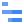

# 🖼️ GoogleCloud

[⬅️ 返回主目錄](../../../README.md)

| 預覽 | 資訊 |
| :--- | :--- |
|  | **access-context-manager.svg** |
|  | **administration.svg** |
|  | **advanced-agent-modeling.svg** |
|  | **advanced-solutions-lab.svg** |
|  | **agent-assist.svg** |
|  | **ai-hub.svg** |
|  | **ai-platform-unified.svg** |
|  | **ai-platform.svg** |
|  | **analytics-hub.svg** |
|  | **anthos-config-management.svg** |
|  | **anthos-service-mesh.svg** |
|  | **anthos.svg** |
|  | **api-analytics.svg** |
|  | **api-monetization.svg** |
|  | **api.svg** |
|  | **apigee-api-platform.svg** |
|  | **apigee-sense.svg** |
|  | **app-engine.svg** |
|  | **artifact-registry.svg** |
|  | **asset-inventory.svg** |
|  | **assured-workloads.svg** |
|  | **automl-natural-language.svg** |
|  | **automl-tables.svg** |
|  | **automl-translation.svg** |
|  | **automl-video-intelligence.svg** |
|  | **automl-vision.svg** |
|  | **automl.svg** |
|  | **bare-metal-solutions.svg** |
|  | **batch.svg** |
|  | **beyondcorp.svg** |
|  | **bigquery.svg** |
|  | **bigtable.svg** |
|  | **billing.svg** |
|  | **binary-authorization.svg** |
|  | **catalog.svg** |
|  | **certificate-authority-service.svg** |
|  | **certificate-manager.svg** |
|  | **cloud-api-gateway.svg** |
|  | **cloud-apis.svg** |
|  | **cloud-armor.svg** |
|  | **cloud-asset-inventory.svg** |
|  | **cloud-audit-logs.svg** |
|  | **cloud-build.svg** |
|  | **cloud-cdn.svg** |
|  | **cloud-code.svg** |
|  | **cloud-composer.svg** |
|  | **cloud-data-fusion.svg** |
|  | **cloud-deploy.svg** |
|  | **cloud-deployment-manager.svg** |
|  | **cloud-dns.svg** |
|  | **cloud-domains.svg** |
|  | **cloud-ekm.svg** |
|  | **cloud-endpoints.svg** |
|  | **cloud-external-ip-addresses.svg** |
|  | **cloud-firewall-rules.svg** |
|  | **cloud-for-marketing.svg** |
|  | **cloud-functions.svg** |
|  | **cloud-generic.svg** |
|  | **cloud-gpu.svg** |
|  | **cloud-healthcare-api.svg** |
|  | **cloud-healthcare-marketplace.svg** |
|  | **cloud-hsm.svg** |
|  | **cloud-ids.svg** |
|  | **cloud-inference-api.svg** |
|  | **cloud-interconnect.svg** |
|  | **cloud-jobs-api.svg** |
|  | **cloud-load-balancing.svg** |
|  | **cloud-logging.svg** |
|  | **cloud-media-edge.svg** |
|  | **cloud-monitoring.svg** |
|  | **cloud-nat.svg** |
|  | **cloud-natural-language-api.svg** |
|  | **cloud-network.svg** |
|  | **cloud-ops.svg** |
|  | **cloud-optimization-ai-fleet-routing-api.svg** |
|  | **cloud-optimization-ai.svg** |
|  | **cloud-router.svg** |
|  | **cloud-routes.svg** |
|  | **cloud-run-for-anthos.svg** |
|  | **cloud-run.svg** |
|  | **cloud-scheduler.svg** |
|  | **cloud-security-scanner.svg** |
|  | **cloud-shell.svg** |
|  | **cloud-spanner.svg** |
|  | **cloud-sql.svg** |
|  | **cloud-storage.svg** |
|  | **cloud-tasks.svg** |
|  | **cloud-test-lab.svg** |
|  | **cloud-tpu.svg** |
|  | **cloud-translation-api.svg** |
|  | **cloud-vision-api.svg** |
|  | **cloud-vpn.svg** |
|  | **compute-engine.svg** |
|  | **configuration-management.svg** |
|  | **connectivity-test.svg** |
|  | **connectors.svg** |
|  | **contact-center-ai.svg** |
|  | **container-optimized-os.svg** |
|  | **container-registry.svg** |
|  | **data-catalog.svg** |
|  | **data-labeling.svg** |
|  | **data-layers.svg** |
|  | **data-loss-prevention-api.svg** |
|  | **data-qna.svg** |
|  | **data-studio.svg** |
|  | **data-transfer.svg** |
|  | **database-migration-service.svg** |
|  | **dataflow.svg** |
|  | **datalab.svg** |
|  | **dataplex.svg** |
|  | **datapol.svg** |
|  | **dataprep.svg** |
|  | **dataproc-metastore.svg** |
|  | **dataproc.svg** |
|  | **datashare.svg** |
|  | **datastore.svg** |
|  | **datastream.svg** |
|  | **debugger.svg** |
|  | **developer-portal.svg** |
|  | **dialogflow-cx.svg** |
|  | **dialogflow-insights.svg** |
|  | **dialogflow.svg** |
|  | **document-ai.svg** |
|  | **early-access-center.svg** |
|  | **error-reporting.svg** |
|  | **eventarc.svg** |
|  | **filestore.svg** |
|  | **financial-services-marketplace.svg** |
|  | **firestore.svg** |
|  | **fleet-engine.svg** |
|  | **free-trial.svg** |
|  | **game-servers.svg** |
|  | **gce-systems-management.svg** |
|  | **genomics.svg** |
|  | **gke-on-prem.svg** |
|  | **google-cloud-marketplace.svg** |
|  | **google-kubernetes-engine.svg** |
|  | **google-maps-platform.svg** |
|  | **healthcare-nlp-api.svg** |
|  | **home.svg** |
|  | **identity-and-access-management.svg** |
|  | **identity-aware-proxy.svg** |
|  | **identity-platform.svg** |
|  | **iot-core.svg** |
|  | **iot-edge.svg** |
|  | **key-access-justifications.svg** |
|  | **key-management-service.svg** |
|  | **kuberun.svg** |
|  | **launcher.svg** |
|  | **local-ssd.svg** |
|  | **looker.svg** |
|  | **managed-service-for-microsoft-active-directory.svg** |
|  | **media-translation-api.svg** |
|  | **memorystore.svg** |
|  | **migrate-for-anthos.svg** |
|  | **migrate-for-compute-engine.svg** |
|  | **my-cloud.svg** |
|  | **network-connectivity-center.svg** |
|  | **network-intelligence-center.svg** |
|  | **network-security.svg** |
|  | **network-tiers.svg** |
|  | **network-topology.svg** |
|  | **onboarding.svg** |
|  | **os-configuration-management.svg** |
|  | **os-inventory-management.svg** |
|  | **os-patch-management.svg** |
|  | **partner-interconnect.svg** |
|  | **partner-portal.svg** |
|  | **performance-dashboard.svg** |
|  | **permissions.svg** |
|  | **persistent-disk.svg** |
|  | **phishing-protection.svg** |
|  | **policy-analyzer.svg** |
|  | **premium-network-tier.svg** |
|  | **private-connectivity.svg** |
|  | **private-service-connect.svg** |
|  | **producer-portal.svg** |
|  | **profiler.svg** |
|  | **project.svg** |
|  | **pubsub.svg** |
|  | **quantum-engine.svg** |
|  | **quotas.svg** |
|  | **real-world-insights.svg** |
|  | **recommendations-ai.svg** |
|  | **release-notes.svg** |
|  | **retail-api.svg** |
|  | **risk-manager.svg** |
|  | **runtime-config.svg** |
|  | **secret-manager.svg** |
|  | **security-command-center.svg** |
|  | **security-health-advisor.svg** |
|  | **security-key-enforcement.svg** |
|  | **security.svg** |
|  | **service-discovery.svg** |
|  | **speech-to-text.svg** |
|  | **stackdriver.svg** |
|  | **standard-network-tier.svg** |
|  | **stream-suite.svg** |
|  | **support.svg** |
|  | **tensorflow-enterprise.svg** |
|  | **text-to-speech.svg** |
|  | **tools-for-powershell.svg** |
|  | **trace.svg** |
|  | **traffic-director.svg** |
|  | **transfer-appliance.svg** |
|  | **transfer.svg** |
|  | **user-preferences.svg** |
|  | **vertexai.svg** |
|  | **video-intelligence-api.svg** |
|  | **virtual-private-cloud.svg** |
|  | **visual-inspection.svg** |
|  | **vmware-engine.svg** |
|  | **web-risk.svg** |
|  | **web-security-scanner.svg** |
|  | **workflows.svg** |
|  | **workload-identity-pool.svg** |