# 🖼️ 素材分類：Icon pack - IconBrew (Community) 2

> [🏠 主目錄](../../../../README.md) / **Icon pack - IconBrew (Community) 2**

本目錄共有 `360` 個檔案

| 🎨 預覽 (點擊放大) | 📋 檔案詳細資訊 |
| :--- | :--- |
| <a href="icon-abc.svg">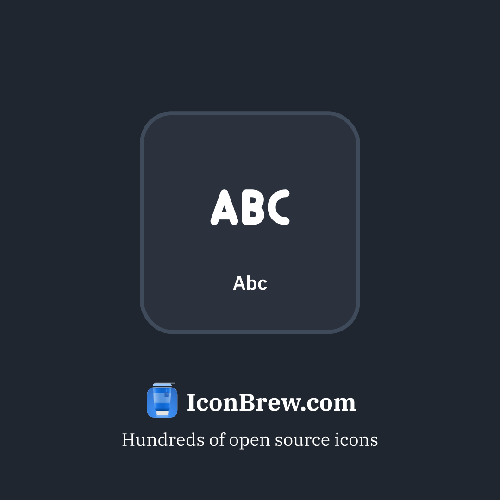</a> | **📂 檔名:** `icon-abc.svg` ✨ **格式:** `Vector (SVG)` ⚖️ **大小:** `190.51KB` 📅 **更新:** `2026-02-27`  🔗 [直接查看原始檔](icon-abc.svg) |
| <a href="icon-academic-book.svg">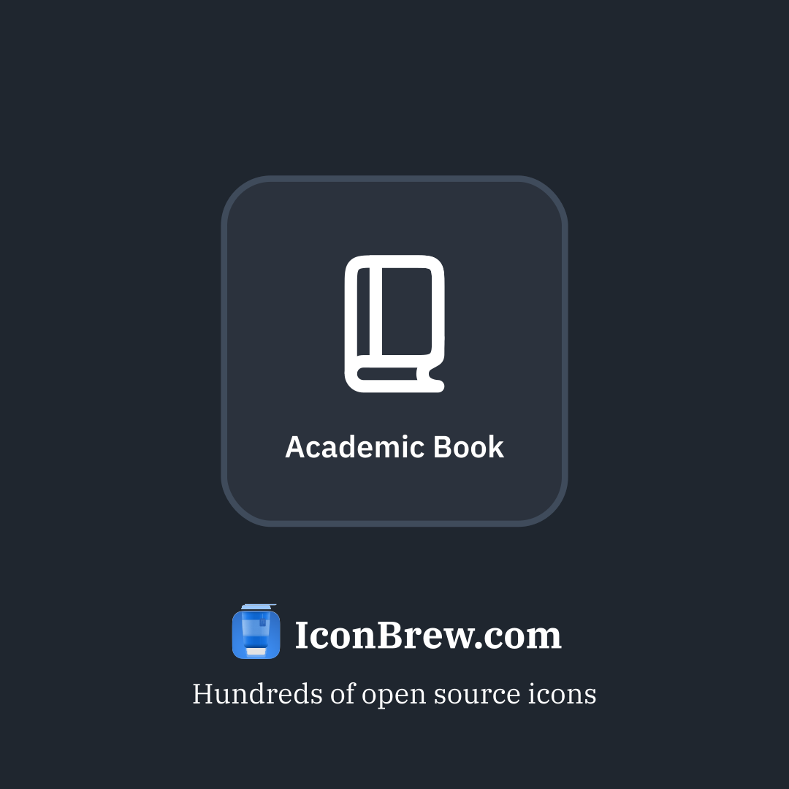</a> | **📂 檔名:** `icon-academic-book.svg` ✨ **格式:** `Vector (SVG)` ⚖️ **大小:** `298.33KB` 📅 **更新:** `2026-02-27`  🔗 [直接查看原始檔](icon-academic-book.svg) |
| <a href="icon-accessibility.svg">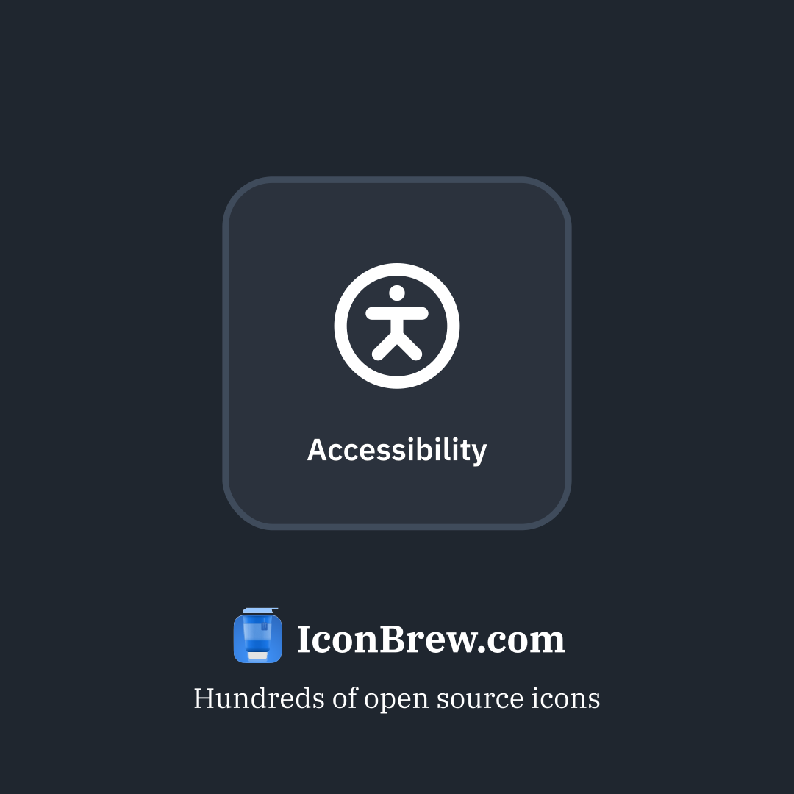</a> | **📂 檔名:** `icon-accessibility.svg` ✨ **格式:** `Vector (SVG)` ⚖️ **大小:** `201.80KB` 📅 **更新:** `2026-02-27`  🔗 [直接查看原始檔](icon-accessibility.svg) |
|  | **📂 檔名:** `icon-activity.svg` ✨ **格式:** `Vector (SVG)` ⚖️ **大小:** `190.04KB` 📅 **更新:** `2026-02-27`  🔗 [直接查看原始檔](icon-activity.svg) |
|  | **📂 檔名:** `icon-add-to-playlist.svg` ✨ **格式:** `Vector (SVG)` ⚖️ **大小:** `198.83KB` 📅 **更新:** `2026-02-27`  🔗 [直接查看原始檔](icon-add-to-playlist.svg) |
|  | **📂 檔名:** `icon-add.svg` ✨ **格式:** `Vector (SVG)` ⚖️ **大小:** `187.15KB` 📅 **更新:** `2026-02-27`  🔗 [直接查看原始檔](icon-add.svg) |
|  | **📂 檔名:** `icon-alarm-clock-2.svg` ✨ **格式:** `Vector (SVG)` ⚖️ **大小:** `197.85KB` 📅 **更新:** `2026-02-27`  🔗 [直接查看原始檔](icon-alarm-clock-2.svg) |
|  | **📂 檔名:** `icon-alarm-clock.svg` ✨ **格式:** `Vector (SVG)` ⚖️ **大小:** `196.06KB` 📅 **更新:** `2026-02-27`  🔗 [直接查看原始檔](icon-alarm-clock.svg) |
|  | **📂 檔名:** `icon-alert-with-circle.svg` ✨ **格式:** `Vector (SVG)` ⚖️ **大小:** `198.95KB` 📅 **更新:** `2026-02-27`  🔗 [直接查看原始檔](icon-alert-with-circle.svg) |
| <a href="icon-algolia.svg">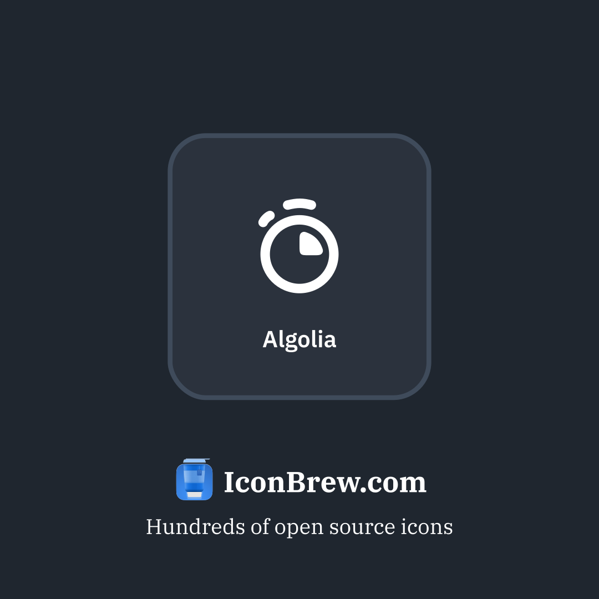</a> | **📂 檔名:** `icon-algolia.svg` ✨ **格式:** `Vector (SVG)` ⚖️ **大小:** `194.64KB` 📅 **更新:** `2026-02-27`  🔗 [直接查看原始檔](icon-algolia.svg) |
|  | **📂 檔名:** `icon-analogue-watch.svg` ✨ **格式:** `Vector (SVG)` ⚖️ **大小:** `204.64KB` 📅 **更新:** `2026-02-27`  🔗 [直接查看原始檔](icon-analogue-watch.svg) |
|  | **📂 檔名:** `icon-apple-watch.svg` ✨ **格式:** `Vector (SVG)` ⚖️ **大小:** `197.94KB` 📅 **更新:** `2026-02-27`  🔗 [直接查看原始檔](icon-apple-watch.svg) |
| <a href="icon-archive.svg">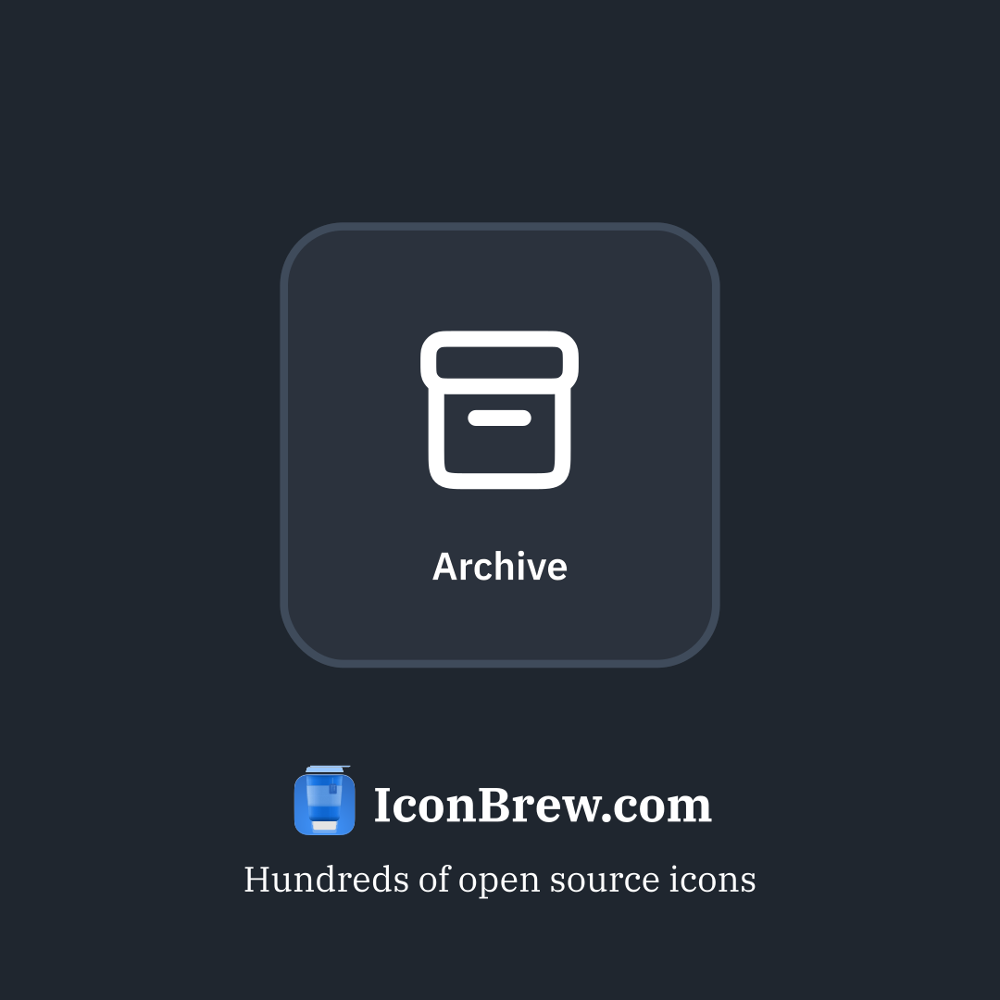</a> | **📂 檔名:** `icon-archive.svg` ✨ **格式:** `Vector (SVG)` ⚖️ **大小:** `191.95KB` 📅 **更新:** `2026-02-27`  🔗 [直接查看原始檔](icon-archive.svg) |
|  | **📂 檔名:** `icon-arrow-bend-left-down.svg` ✨ **格式:** `Vector (SVG)` ⚖️ **大小:** `204.36KB` 📅 **更新:** `2026-02-27`  🔗 [直接查看原始檔](icon-arrow-bend-left-down.svg) |
|  | **📂 檔名:** `icon-arrow-bend-left-up.svg` ✨ **格式:** `Vector (SVG)` ⚖️ **大小:** `202.00KB` 📅 **更新:** `2026-02-27`  🔗 [直接查看原始檔](icon-arrow-bend-left-up.svg) |
| <a href="icon-arrow-bend-right-down.svg">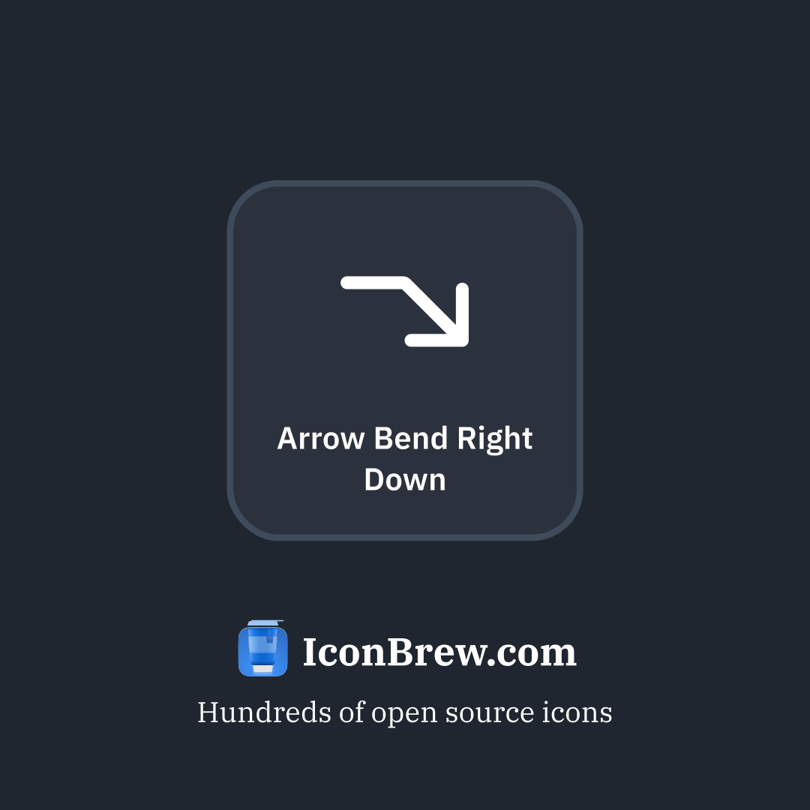</a> | **📂 檔名:** `icon-arrow-bend-right-down.svg` ✨ **格式:** `Vector (SVG)` ⚖️ **大小:** `209.12KB` 📅 **更新:** `2026-02-27`  🔗 [直接查看原始檔](icon-arrow-bend-right-down.svg) |
|  | **📂 檔名:** `icon-arrow-bend-right-up.svg` ✨ **格式:** `Vector (SVG)` ⚖️ **大小:** `206.64KB` 📅 **更新:** `2026-02-27`  🔗 [直接查看原始檔](icon-arrow-bend-right-up.svg) |
|  | **📂 檔名:** `icon-arrow-bottom-right.svg` ✨ **格式:** `Vector (SVG)` ⚖️ **大小:** `206.69KB` 📅 **更新:** `2026-02-27`  🔗 [直接查看原始檔](icon-arrow-bottom-right.svg) |
|  | **📂 檔名:** `icon-arrow-circle-backward-five.svg` ✨ **格式:** `Vector (SVG)` ⚖️ **大小:** `212.49KB` 📅 **更新:** `2026-02-27`  🔗 [直接查看原始檔](icon-arrow-circle-backward-five.svg) |
| <a href="icon-arrow-circle-backward-fiveteen.svg">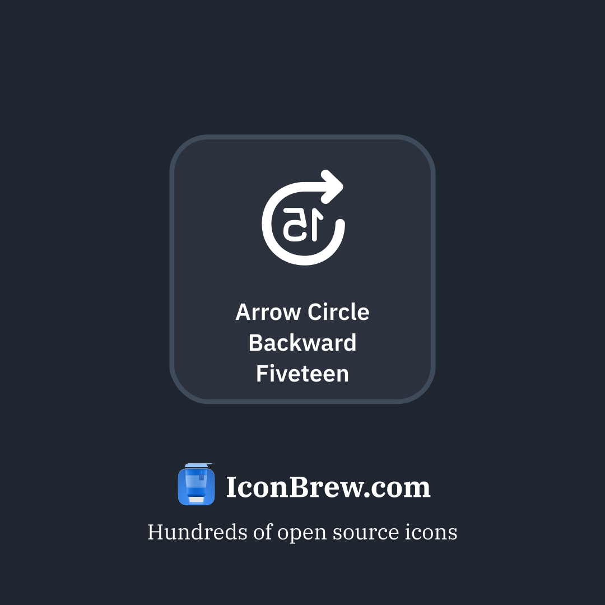</a> | **📂 檔名:** `icon-arrow-circle-backward-fiveteen.svg` ✨ **格式:** `Vector (SVG)` ⚖️ **大小:** `218.72KB` 📅 **更新:** `2026-02-27`  🔗 [直接查看原始檔](icon-arrow-circle-backward-fiveteen.svg) |
| <a href="icon-arrow-circle-backward-ten.svg">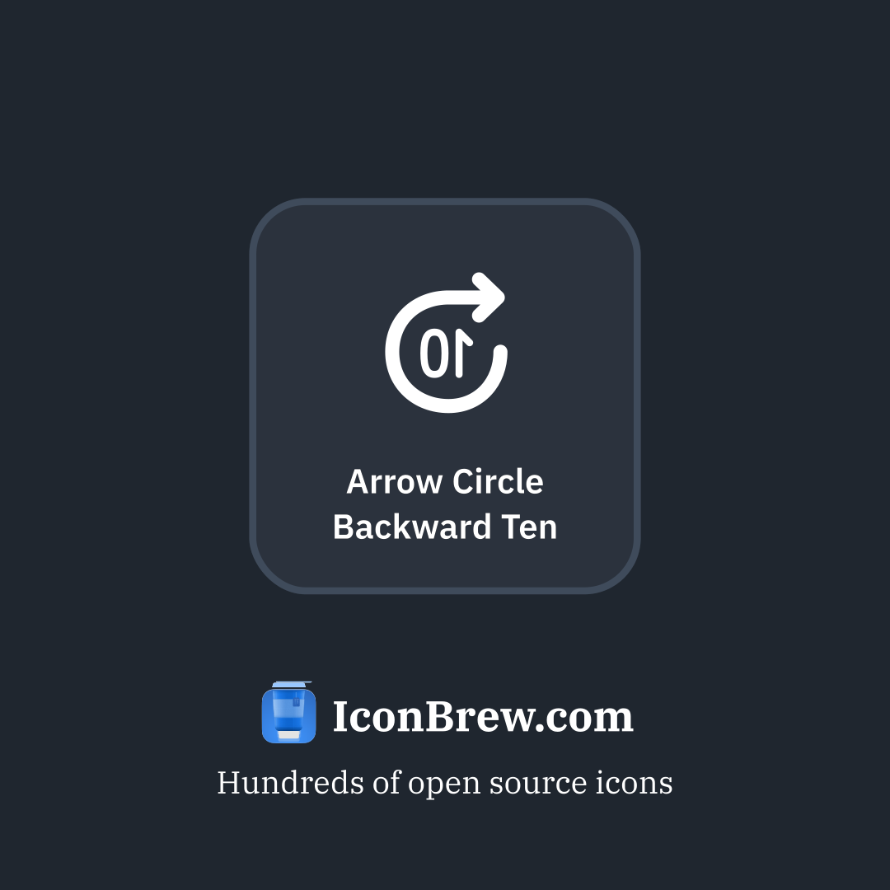</a> | **📂 檔名:** `icon-arrow-circle-backward-ten.svg` ✨ **格式:** `Vector (SVG)` ⚖️ **大小:** `212.42KB` 📅 **更新:** `2026-02-27`  🔗 [直接查看原始檔](icon-arrow-circle-backward-ten.svg) |
| <a href="icon-arrow-circle-backward-twenty.svg">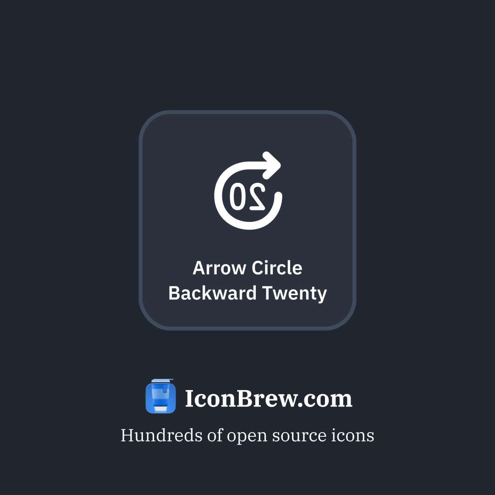</a> | **📂 檔名:** `icon-arrow-circle-backward-twenty.svg` ✨ **格式:** `Vector (SVG)` ⚖️ **大小:** `214.37KB` 📅 **更新:** `2026-02-27`  🔗 [直接查看原始檔](icon-arrow-circle-backward-twenty.svg) |
| <a href="icon-arrow-circle-backward.svg">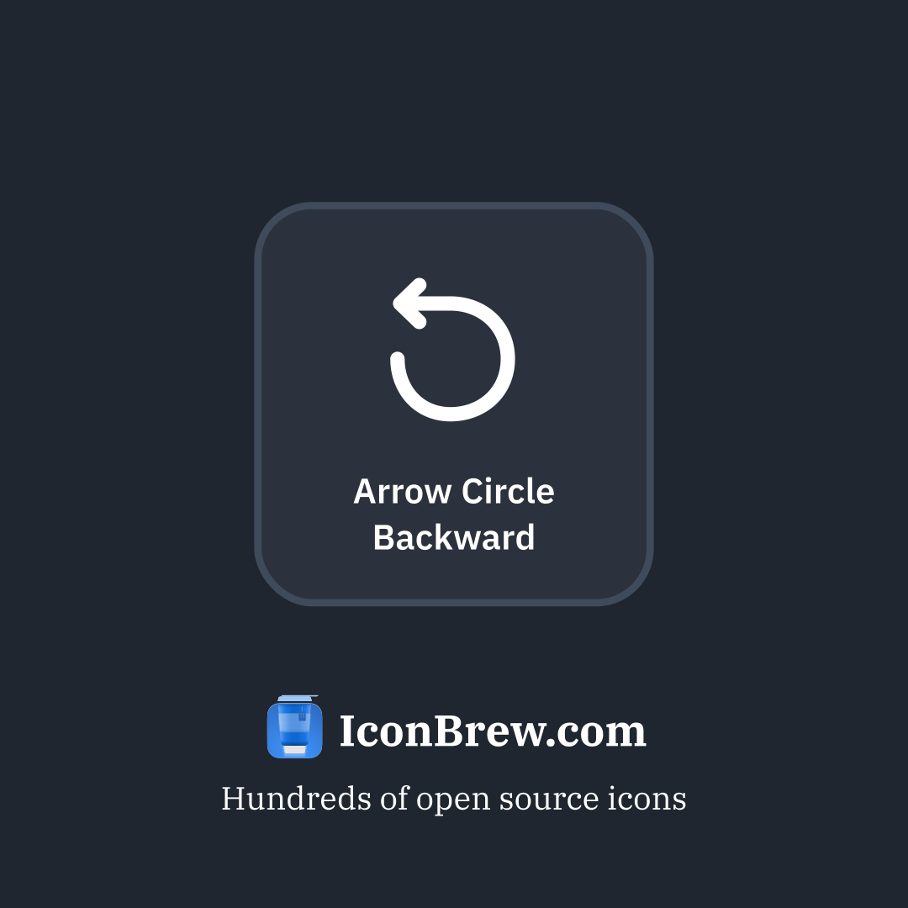</a> | **📂 檔名:** `icon-arrow-circle-backward.svg` ✨ **格式:** `Vector (SVG)` ⚖️ **大小:** `208.57KB` 📅 **更新:** `2026-02-27`  🔗 [直接查看原始檔](icon-arrow-circle-backward.svg) |
|  | **📂 檔名:** `icon-arrow-circle-bckwards-thirty-1.svg` ✨ **格式:** `Vector (SVG)` ⚖️ **大小:** `213.97KB` 📅 **更新:** `2026-02-27`  🔗 [直接查看原始檔](icon-arrow-circle-bckwards-thirty-1.svg) |
|  | **📂 檔名:** `icon-arrow-circle-bckwards-thirty.svg` ✨ **格式:** `Vector (SVG)` ⚖️ **大小:** `213.97KB` 📅 **更新:** `2026-02-27`  🔗 [直接查看原始檔](icon-arrow-circle-bckwards-thirty.svg) |
| <a href="icon-arrow-circle-forward-five.svg">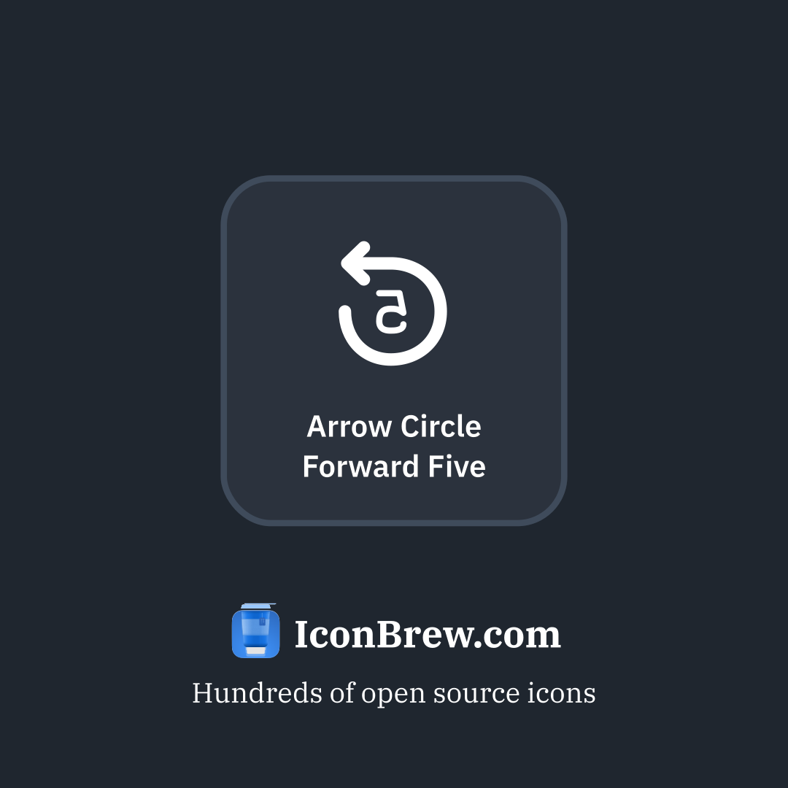</a> | **📂 檔名:** `icon-arrow-circle-forward-five.svg` ✨ **格式:** `Vector (SVG)` ⚖️ **大小:** `208.71KB` 📅 **更新:** `2026-02-27`  🔗 [直接查看原始檔](icon-arrow-circle-forward-five.svg) |
|  | **📂 檔名:** `icon-arrow-circle-forward-fiveteen.svg` ✨ **格式:** `Vector (SVG)` ⚖️ **大小:** `214.83KB` 📅 **更新:** `2026-02-27`  🔗 [直接查看原始檔](icon-arrow-circle-forward-fiveteen.svg) |
|  | **📂 檔名:** `icon-arrow-circle-forward-ten.svg` ✨ **格式:** `Vector (SVG)` ⚖️ **大小:** `208.63KB` 📅 **更新:** `2026-02-27`  🔗 [直接查看原始檔](icon-arrow-circle-forward-ten.svg) |
| <a href="icon-arrow-circle-forward-thirty.svg">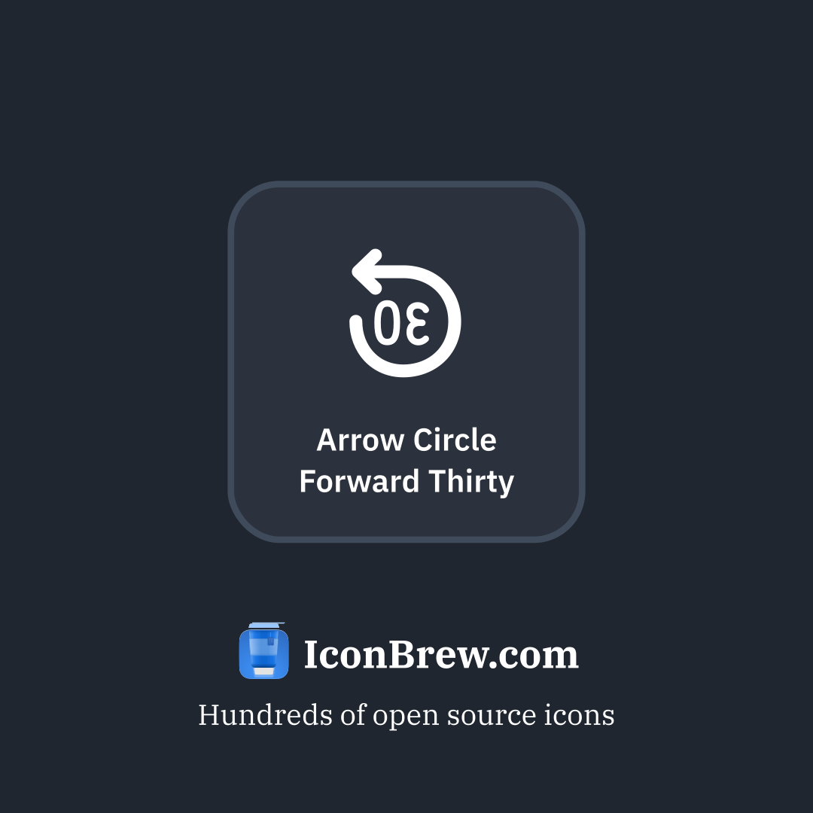</a> | **📂 檔名:** `icon-arrow-circle-forward-thirty.svg` ✨ **格式:** `Vector (SVG)` ⚖️ **大小:** `209.68KB` 📅 **更新:** `2026-02-27`  🔗 [直接查看原始檔](icon-arrow-circle-forward-thirty.svg) |
| <a href="icon-arrow-circle-forward-twenty.svg">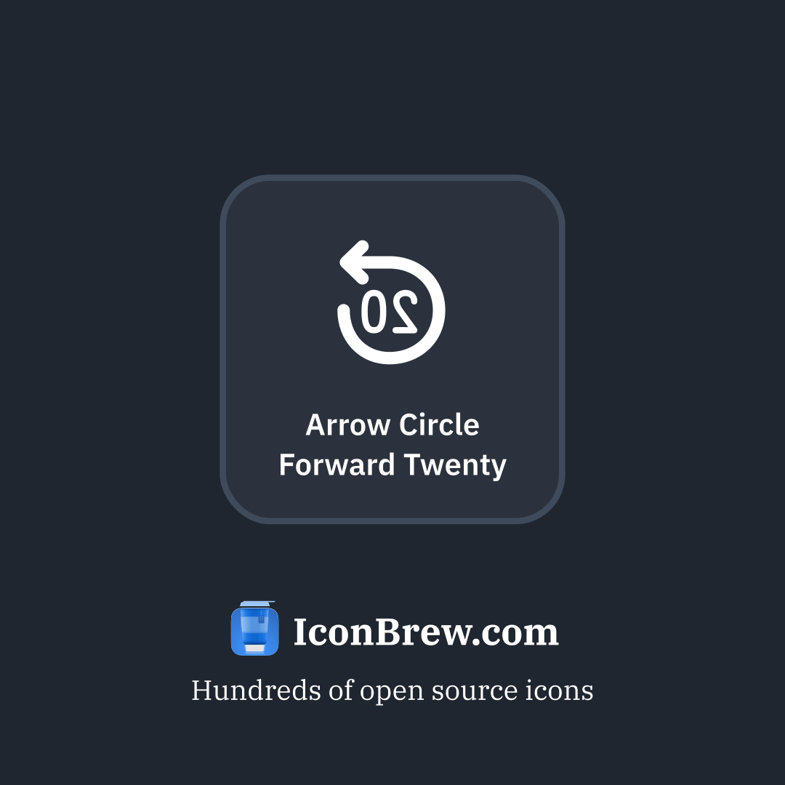</a> | **📂 檔名:** `icon-arrow-circle-forward-twenty.svg` ✨ **格式:** `Vector (SVG)` ⚖️ **大小:** `210.72KB` 📅 **更新:** `2026-02-27`  🔗 [直接查看原始檔](icon-arrow-circle-forward-twenty.svg) |
| <a href="icon-arrow-circle-forward.svg">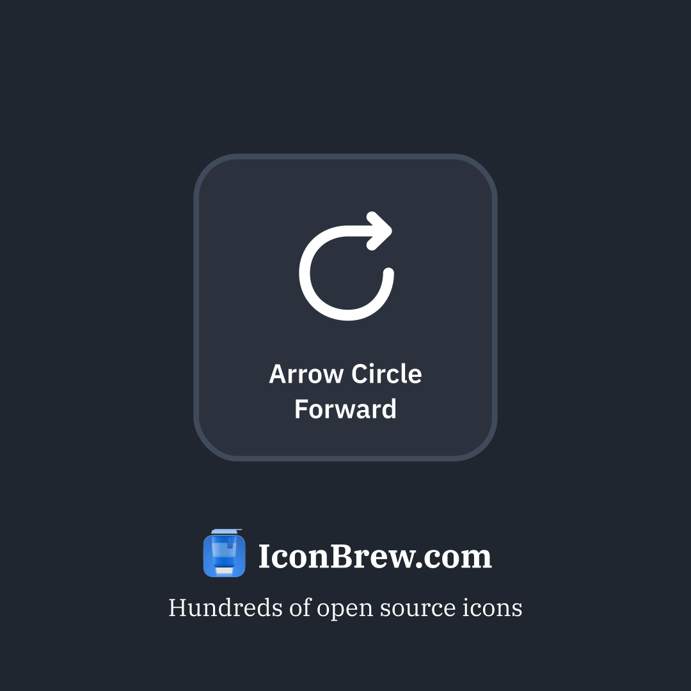</a> | **📂 檔名:** `icon-arrow-circle-forward.svg` ✨ **格式:** `Vector (SVG)` ⚖️ **大小:** `204.74KB` 📅 **更新:** `2026-02-27`  🔗 [直接查看原始檔](icon-arrow-circle-forward.svg) |
| <a href="icon-arrow-down-left.svg">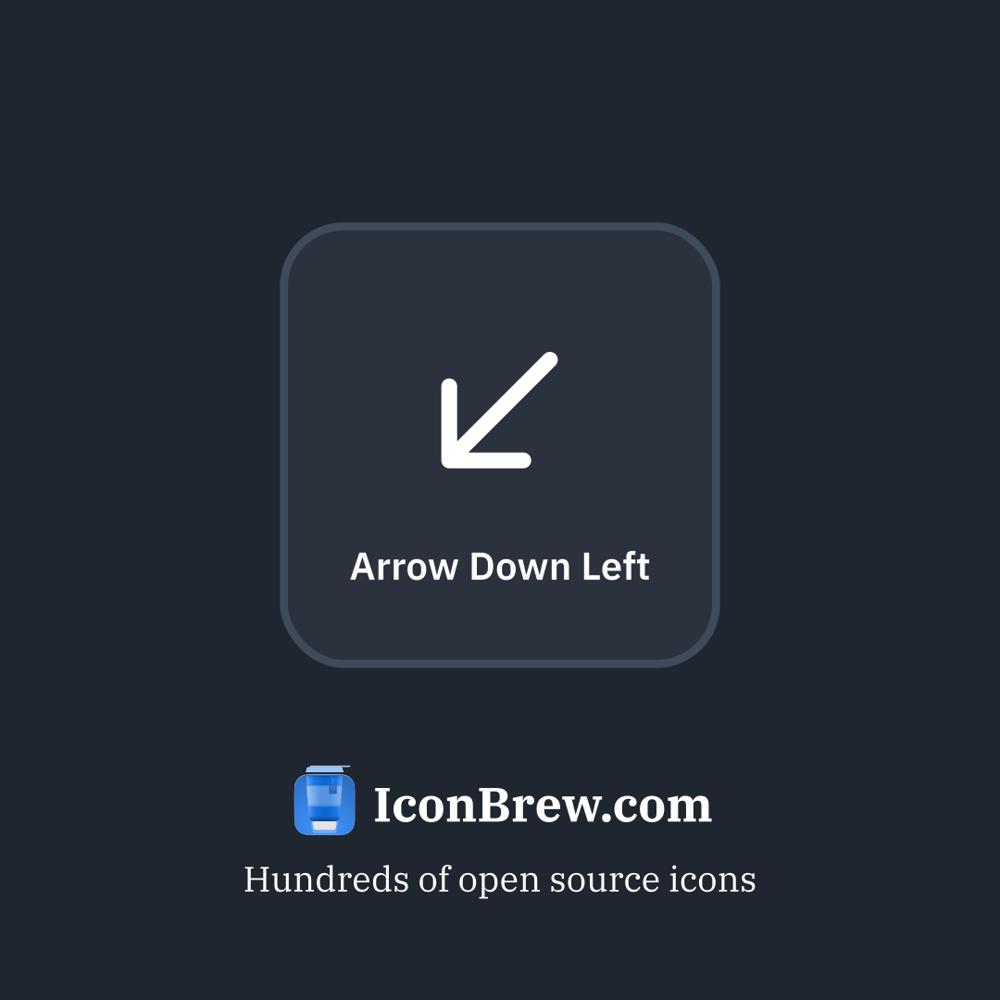</a> | **📂 檔名:** `icon-arrow-down-left.svg` ✨ **格式:** `Vector (SVG)` ⚖️ **大小:** `196.84KB` 📅 **更新:** `2026-02-27`  🔗 [直接查看原始檔](icon-arrow-down-left.svg) |
|  | **📂 檔名:** `icon-arrow-down.svg` ✨ **格式:** `Vector (SVG)` ⚖️ **大小:** `193.49KB` 📅 **更新:** `2026-02-27`  🔗 [直接查看原始檔](icon-arrow-down.svg) |
| <a href="icon-arrow-left.svg">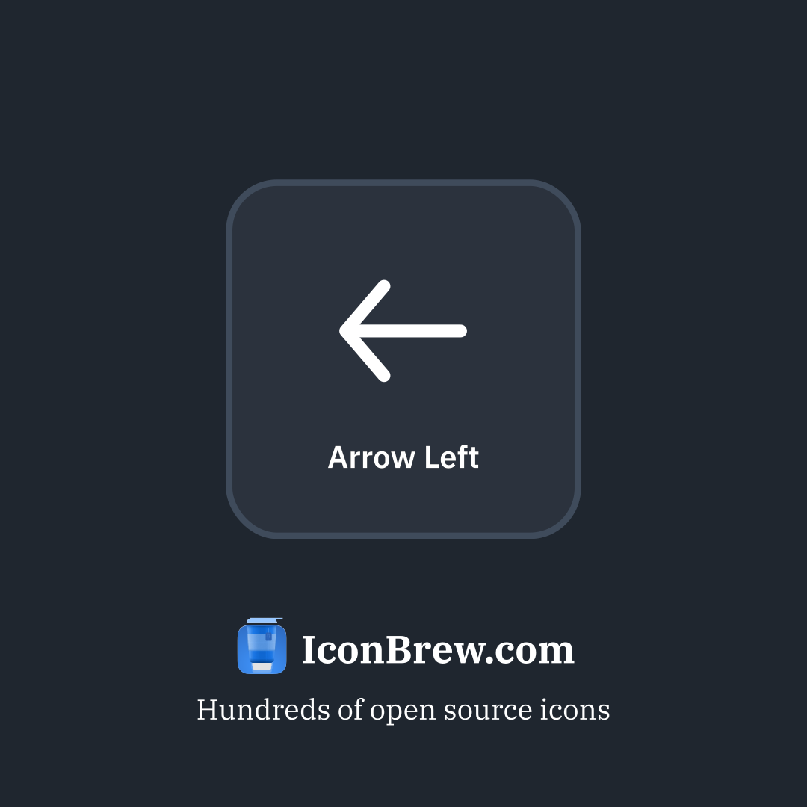</a> | **📂 檔名:** `icon-arrow-left.svg` ✨ **格式:** `Vector (SVG)` ⚖️ **大小:** `191.58KB` 📅 **更新:** `2026-02-27`  🔗 [直接查看原始檔](icon-arrow-left.svg) |
|  | **📂 檔名:** `icon-arrow-right.svg` ✨ **格式:** `Vector (SVG)` ⚖️ **大小:** `196.27KB` 📅 **更新:** `2026-02-27`  🔗 [直接查看原始檔](icon-arrow-right.svg) |
| <a href="icon-arrow-switch.svg">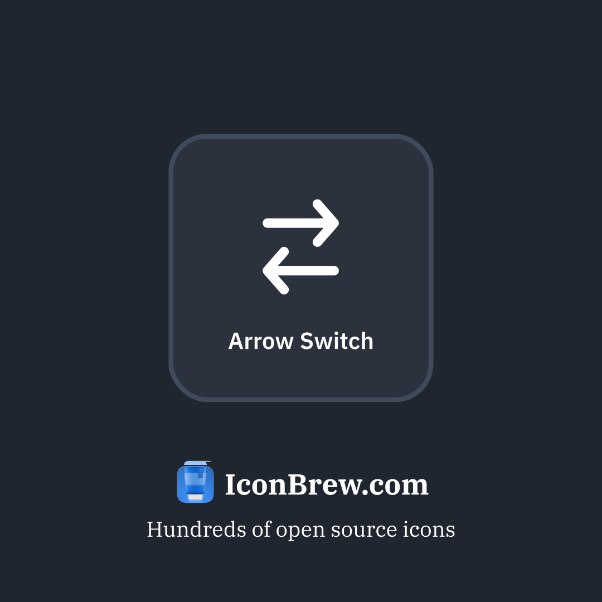</a> | **📂 檔名:** `icon-arrow-switch.svg` ✨ **格式:** `Vector (SVG)` ⚖️ **大小:** `196.11KB` 📅 **更新:** `2026-02-27`  🔗 [直接查看原始檔](icon-arrow-switch.svg) |
|  | **📂 檔名:** `icon-arrow-thick-down.svg` ✨ **格式:** `Vector (SVG)` ⚖️ **大小:** `198.43KB` 📅 **更新:** `2026-02-27`  🔗 [直接查看原始檔](icon-arrow-thick-down.svg) |
| <a href="icon-arrow-thick-left.svg">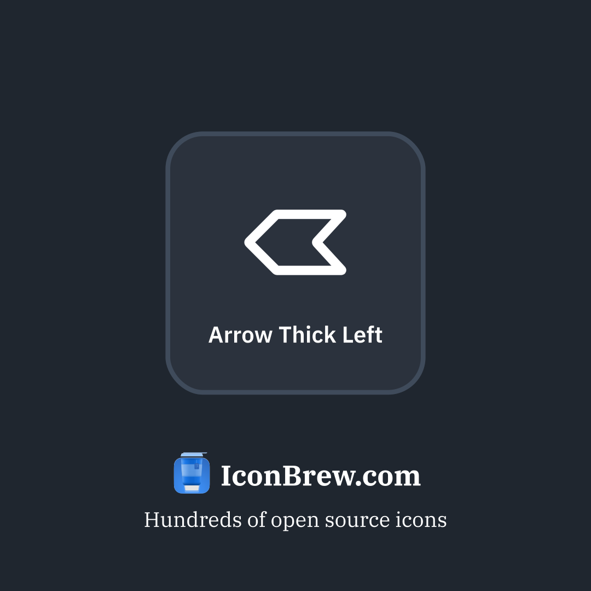</a> | **📂 檔名:** `icon-arrow-thick-left.svg` ✨ **格式:** `Vector (SVG)` ⚖️ **大小:** `196.55KB` 📅 **更新:** `2026-02-27`  🔗 [直接查看原始檔](icon-arrow-thick-left.svg) |
| <a href="icon-arrow-thick-right.svg">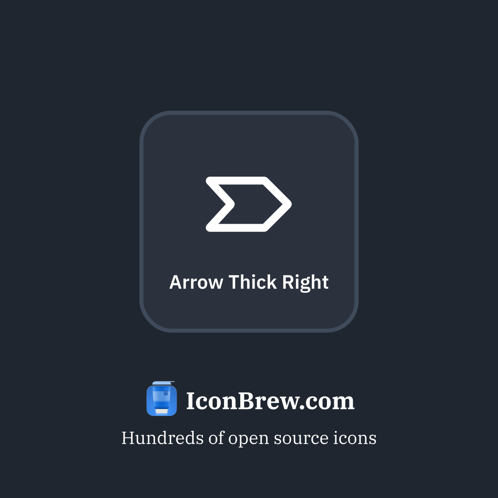</a> | **📂 檔名:** `icon-arrow-thick-right.svg` ✨ **格式:** `Vector (SVG)` ⚖️ **大小:** `201.20KB` 📅 **更新:** `2026-02-27`  🔗 [直接查看原始檔](icon-arrow-thick-right.svg) |
|  | **📂 檔名:** `icon-arrow-thick-up.svg` ✨ **格式:** `Vector (SVG)` ⚖️ **大小:** `196.05KB` 📅 **更新:** `2026-02-27`  🔗 [直接查看原始檔](icon-arrow-thick-up.svg) |
| <a href="icon-arrow-up-left.svg">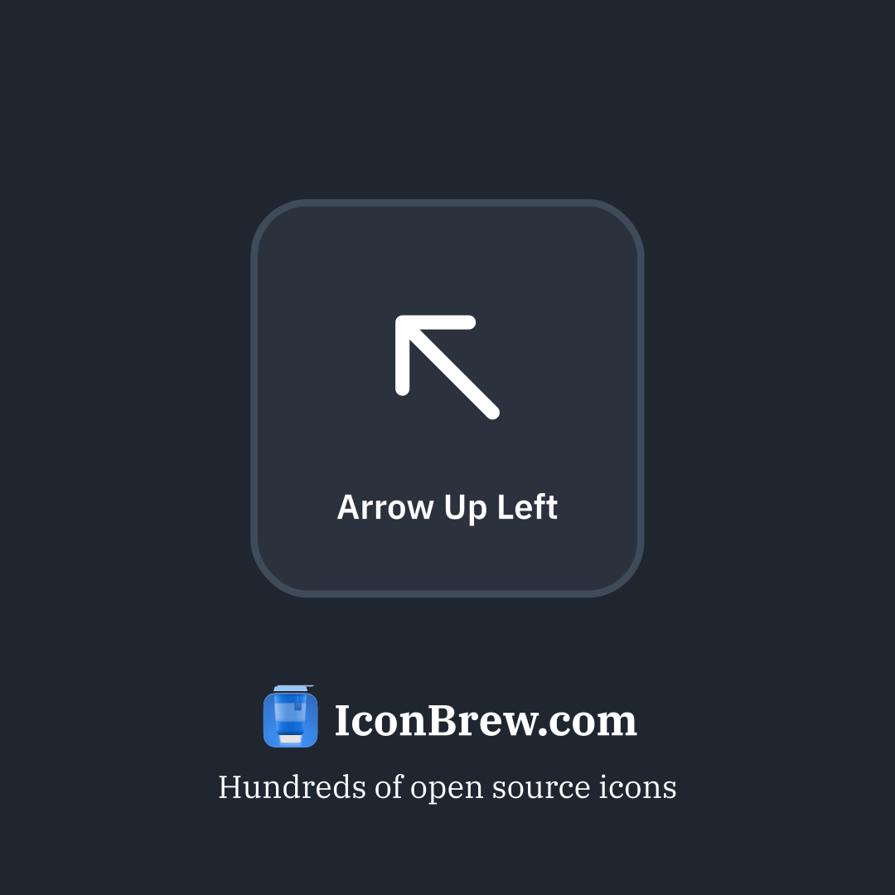</a> | **📂 檔名:** `icon-arrow-up-left.svg` ✨ **格式:** `Vector (SVG)` ⚖️ **大小:** `194.64KB` 📅 **更新:** `2026-02-27`  🔗 [直接查看原始檔](icon-arrow-up-left.svg) |
|  | **📂 檔名:** `icon-arrow-up-right.svg` ✨ **格式:** `Vector (SVG)` ⚖️ **大小:** `199.30KB` 📅 **更新:** `2026-02-27`  🔗 [直接查看原始檔](icon-arrow-up-right.svg) |
|  | **📂 檔名:** `icon-arrow-up.svg` ✨ **格式:** `Vector (SVG)` ⚖️ **大小:** `191.09KB` 📅 **更新:** `2026-02-27`  🔗 [直接查看原始檔](icon-arrow-up.svg) |
| <a href="icon-bank.svg">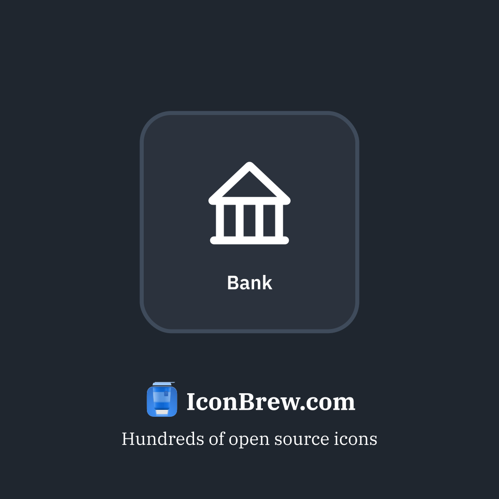</a> | **📂 檔名:** `icon-bank.svg` ✨ **格式:** `Vector (SVG)` ⚖️ **大小:** `190.05KB` 📅 **更新:** `2026-02-27`  🔗 [直接查看原始檔](icon-bank.svg) |
|  | **📂 檔名:** `icon-basketball.svg` ✨ **格式:** `Vector (SVG)` ⚖️ **大小:** `199.23KB` 📅 **更新:** `2026-02-27`  🔗 [直接查看原始檔](icon-basketball.svg) |
| <a href="icon-battery-horizontal-charging.svg">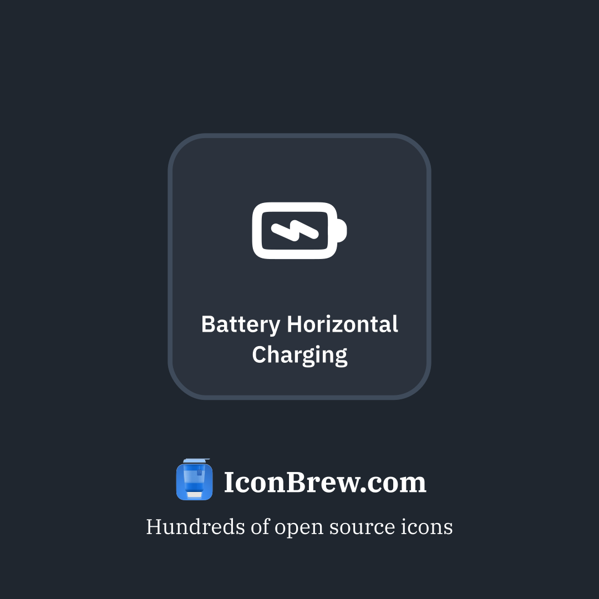</a> | **📂 檔名:** `icon-battery-horizontal-charging.svg` ✨ **格式:** `Vector (SVG)` ⚖️ **大小:** `221.34KB` 📅 **更新:** `2026-02-27`  🔗 [直接查看原始檔](icon-battery-horizontal-charging.svg) |
|  | **📂 檔名:** `icon-battery-horizontal-empty.svg` ✨ **格式:** `Vector (SVG)` ⚖️ **大小:** `209.49KB` 📅 **更新:** `2026-02-27`  🔗 [直接查看原始檔](icon-battery-horizontal-empty.svg) |
| <a href="icon-battery-horizontal-full-horizontal.svg">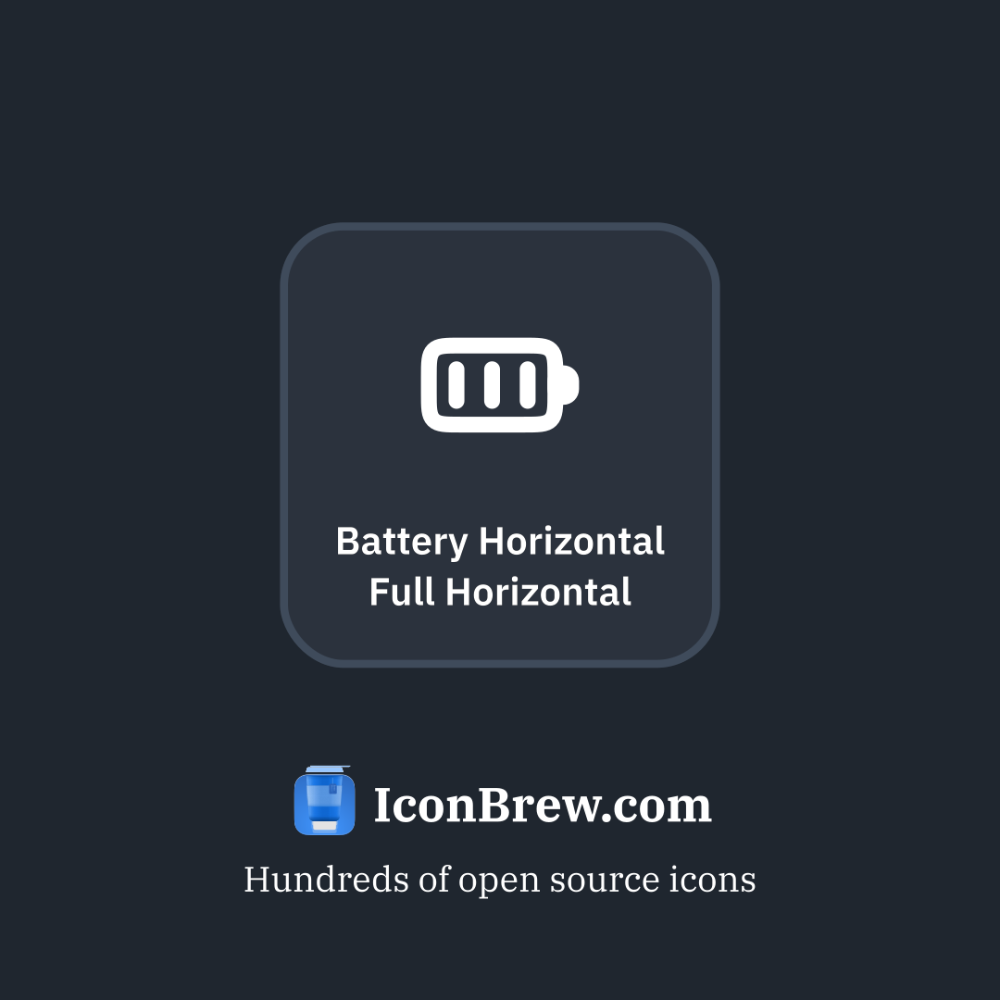</a> | **📂 檔名:** `icon-battery-horizontal-full-horizontal.svg` ✨ **格式:** `Vector (SVG)` ⚖️ **大小:** `217.57KB` 📅 **更新:** `2026-02-27`  🔗 [直接查看原始檔](icon-battery-horizontal-full-horizontal.svg) |
| <a href="icon-battery-horizontal-low.svg">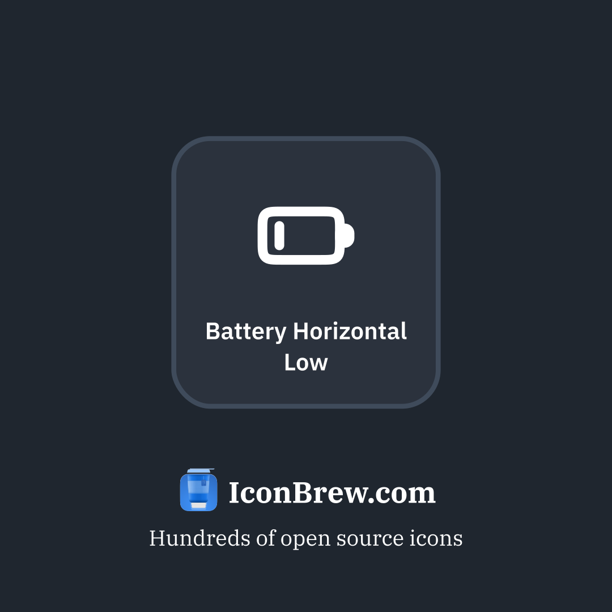</a> | **📂 檔名:** `icon-battery-horizontal-low.svg` ✨ **格式:** `Vector (SVG)` ⚖️ **大小:** `207.60KB` 📅 **更新:** `2026-02-27`  🔗 [直接查看原始檔](icon-battery-horizontal-low.svg) |
| <a href="icon-battery-horizontal-medium.svg">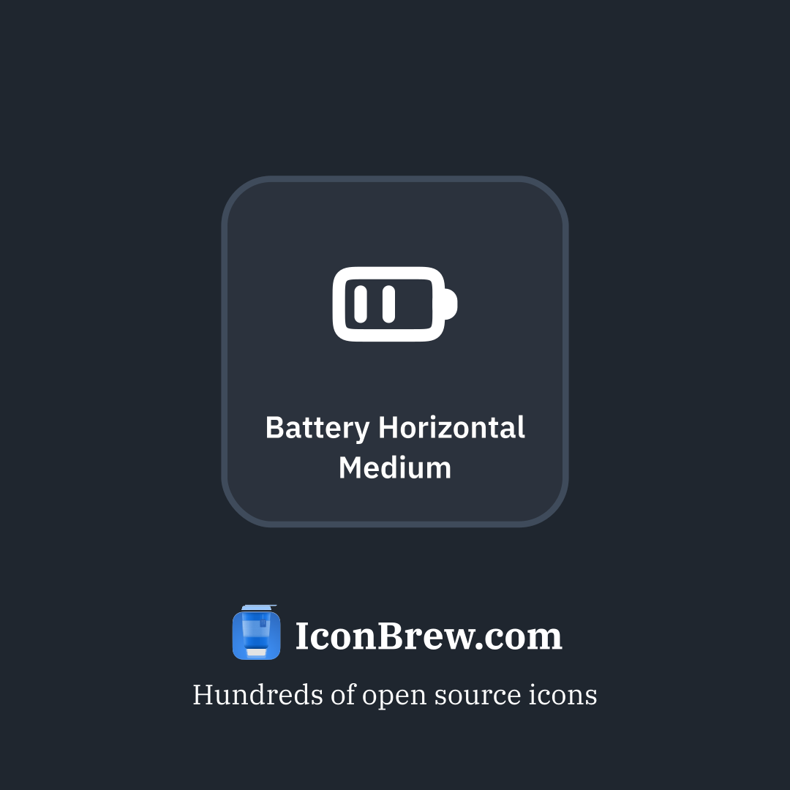</a> | **📂 檔名:** `icon-battery-horizontal-medium.svg` ✨ **格式:** `Vector (SVG)` ⚖️ **大小:** `212.78KB` 📅 **更新:** `2026-02-27`  🔗 [直接查看原始檔](icon-battery-horizontal-medium.svg) |
|  | **📂 檔名:** `icon-battery-vertical-charging.svg` ✨ **格式:** `Vector (SVG)` ⚖️ **大小:** `219.53KB` 📅 **更新:** `2026-02-27`  🔗 [直接查看原始檔](icon-battery-vertical-charging.svg) |
| <a href="icon-battery-vertical-empty.svg">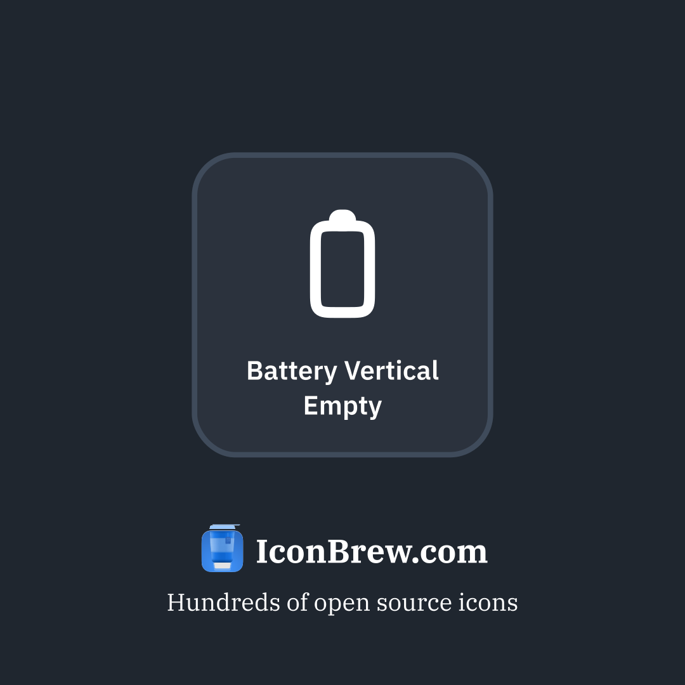</a> | **📂 檔名:** `icon-battery-vertical-empty.svg` ✨ **格式:** `Vector (SVG)` ⚖️ **大小:** `208.05KB` 📅 **更新:** `2026-02-27`  🔗 [直接查看原始檔](icon-battery-vertical-empty.svg) |
|  | **📂 檔名:** `icon-battery-vertical-full.svg` ✨ **格式:** `Vector (SVG)` ⚖️ **大小:** `205.27KB` 📅 **更新:** `2026-02-27`  🔗 [直接查看原始檔](icon-battery-vertical-full.svg) |
|  | **📂 檔名:** `icon-battery-vertical-medium.svg` ✨ **格式:** `Vector (SVG)` ⚖️ **大小:** `211.36KB` 📅 **更新:** `2026-02-27`  🔗 [直接查看原始檔](icon-battery-vertical-medium.svg) |
|  | **📂 檔名:** `icon-beaker.svg` ✨ **格式:** `Vector (SVG)` ⚖️ **大小:** `194.17KB` 📅 **更新:** `2026-02-27`  🔗 [直接查看原始檔](icon-beaker.svg) |
|  | **📂 檔名:** `icon-bell.svg` ✨ **格式:** `Vector (SVG)` ⚖️ **大小:** `189.26KB` 📅 **更新:** `2026-02-27`  🔗 [直接查看原始檔](icon-bell.svg) |
|  | **📂 檔名:** `icon-bold.svg` ✨ **格式:** `Vector (SVG)` ⚖️ **大小:** `194.34KB` 📅 **更新:** `2026-02-27`  🔗 [直接查看原始檔](icon-bold.svg) |
| <a href="icon-bool-exclude.svg">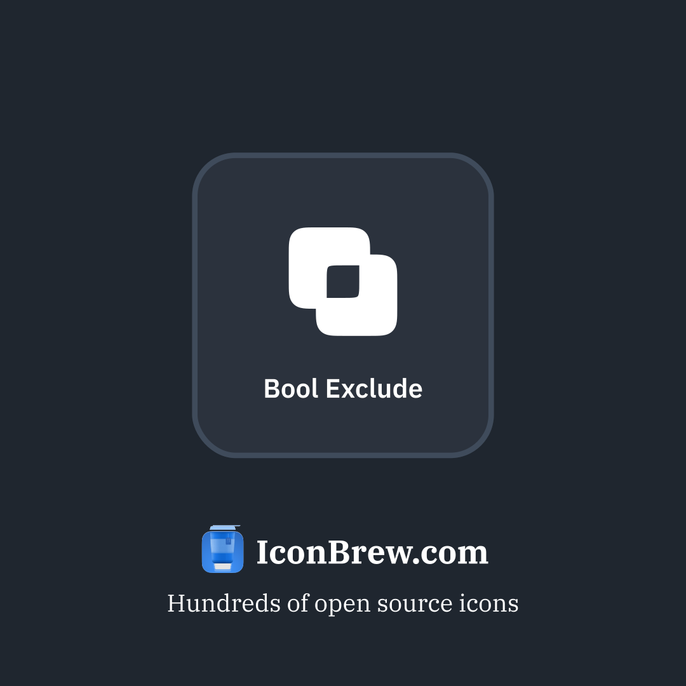</a> | **📂 檔名:** `icon-bool-exclude.svg` ✨ **格式:** `Vector (SVG)` ⚖️ **大小:** `203.76KB` 📅 **更新:** `2026-02-27`  🔗 [直接查看原始檔](icon-bool-exclude.svg) |
|  | **📂 檔名:** `icon-bool-intersect.svg` ✨ **格式:** `Vector (SVG)` ⚖️ **大小:** `205.15KB` 📅 **更新:** `2026-02-27`  🔗 [直接查看原始檔](icon-bool-intersect.svg) |
| <a href="icon-bool-subtract.svg">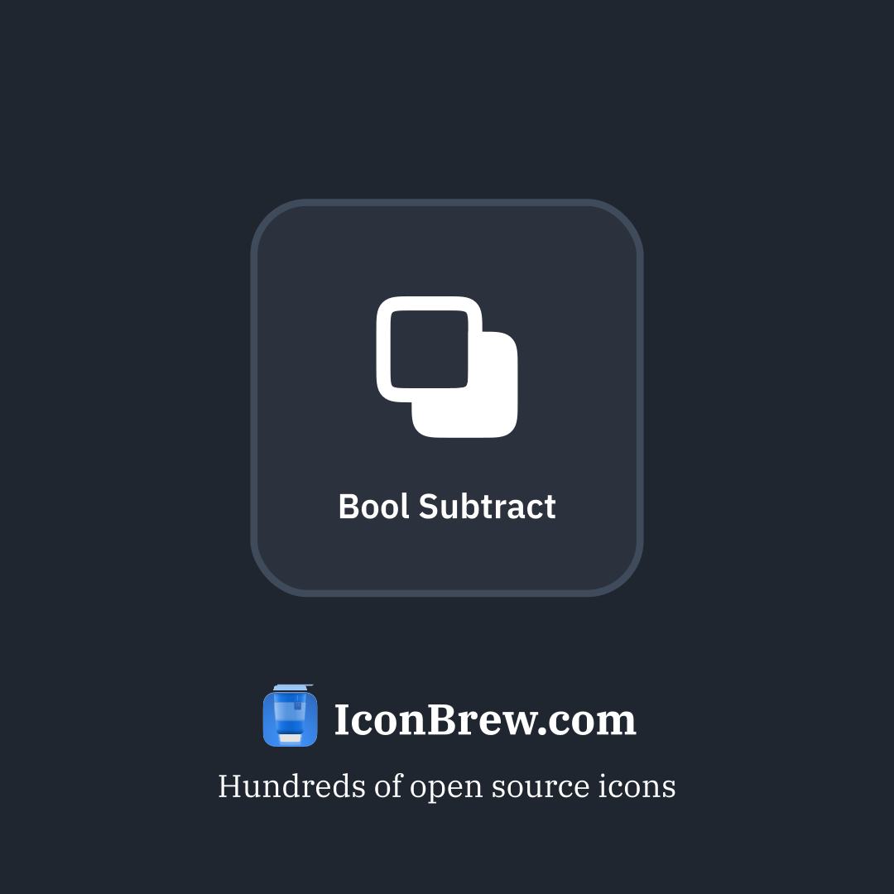</a> | **📂 檔名:** `icon-bool-subtract.svg` ✨ **格式:** `Vector (SVG)` ⚖️ **大小:** `205.30KB` 📅 **更新:** `2026-02-27`  🔗 [直接查看原始檔](icon-bool-subtract.svg) |
| <a href="icon-bool-union.svg">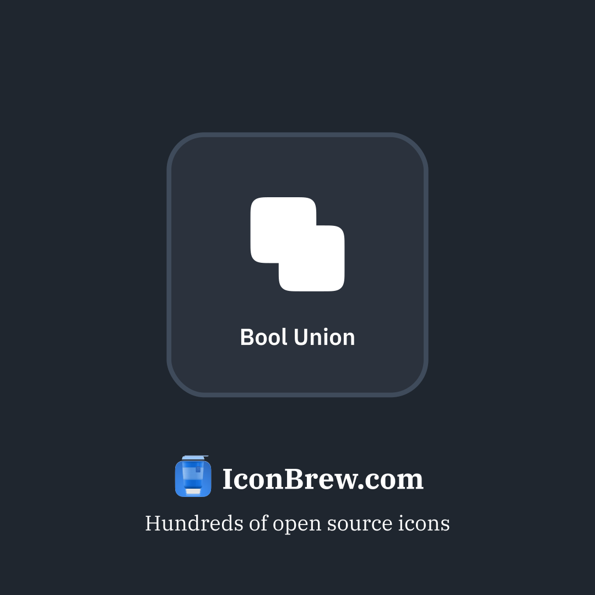</a> | **📂 檔名:** `icon-bool-union.svg` ✨ **格式:** `Vector (SVG)` ⚖️ **大小:** `201.05KB` 📅 **更新:** `2026-02-27`  🔗 [直接查看原始檔](icon-bool-union.svg) |
|  | **📂 檔名:** `icon-border-all.svg` ✨ **格式:** `Vector (SVG)` ⚖️ **大小:** `194.47KB` 📅 **更新:** `2026-02-27`  🔗 [直接查看原始檔](icon-border-all.svg) |
| <a href="icon-border-bottom.svg">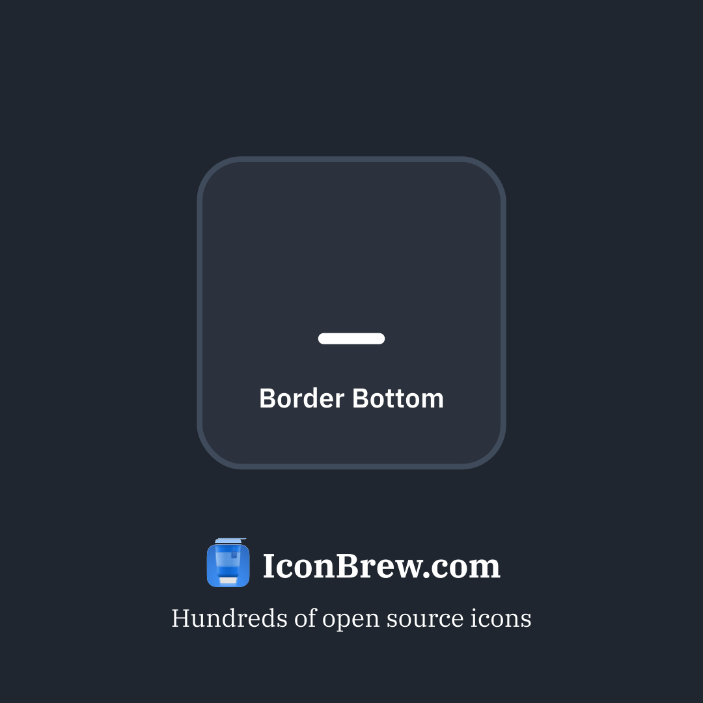</a> | **📂 檔名:** `icon-border-bottom.svg` ✨ **格式:** `Vector (SVG)` ⚖️ **大小:** `203.37KB` 📅 **更新:** `2026-02-27`  🔗 [直接查看原始檔](icon-border-bottom.svg) |
|  | **📂 檔名:** `icon-border-horizontal.svg` ✨ **格式:** `Vector (SVG)` ⚖️ **大小:** `204.16KB` 📅 **更新:** `2026-02-27`  🔗 [直接查看原始檔](icon-border-horizontal.svg) |
|  | **📂 檔名:** `icon-border-left.svg` ✨ **格式:** `Vector (SVG)` ⚖️ **大小:** `196.57KB` 📅 **更新:** `2026-02-27`  🔗 [直接查看原始檔](icon-border-left.svg) |
| <a href="icon-border-right.svg">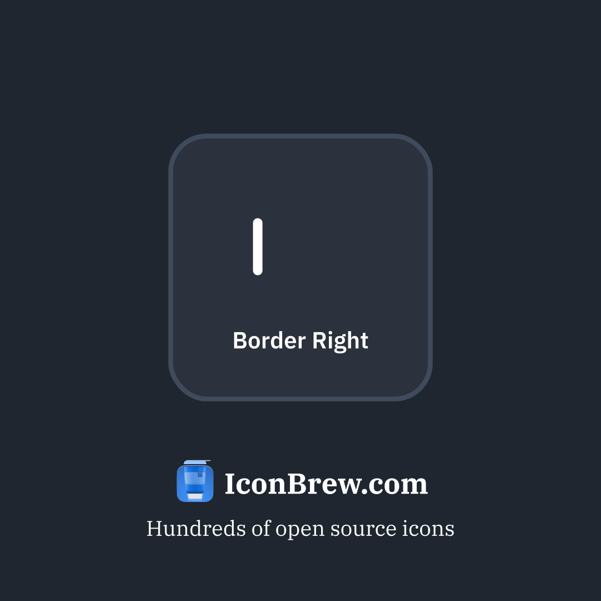</a> | **📂 檔名:** `icon-border-right.svg` ✨ **格式:** `Vector (SVG)` ⚖️ **大小:** `201.34KB` 📅 **更新:** `2026-02-27`  🔗 [直接查看原始檔](icon-border-right.svg) |
| <a href="icon-border-top.svg">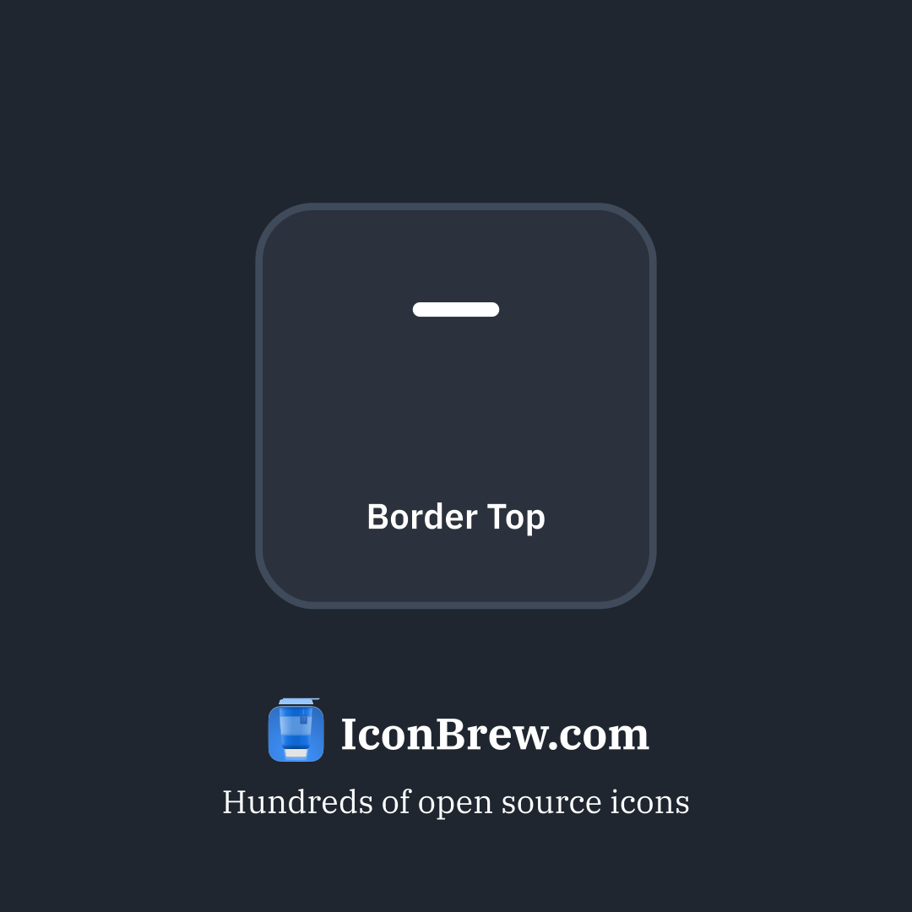</a> | **📂 檔名:** `icon-border-top.svg` ✨ **格式:** `Vector (SVG)` ⚖️ **大小:** `197.38KB` 📅 **更新:** `2026-02-27`  🔗 [直接查看原始檔](icon-border-top.svg) |
| <a href="icon-border-vertical.svg">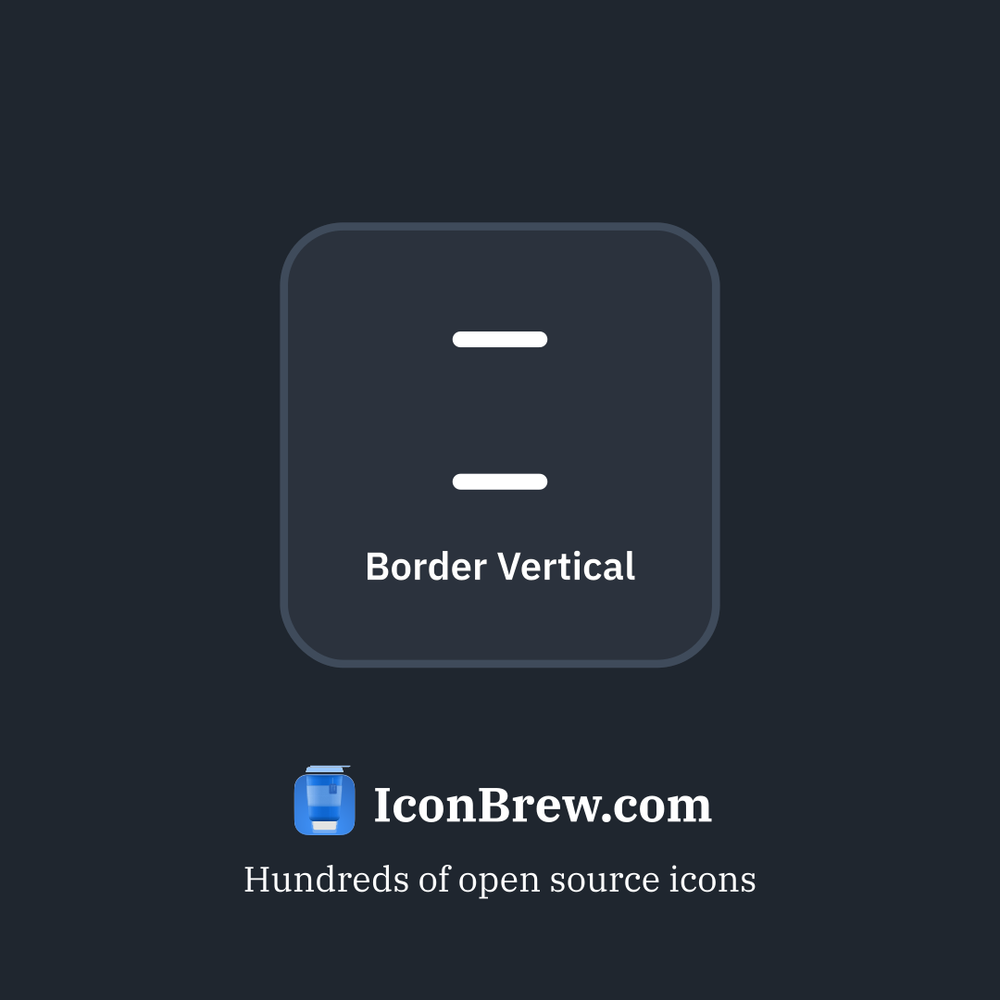</a> | **📂 檔名:** `icon-border-vertical.svg` ✨ **格式:** `Vector (SVG)` ⚖️ **大小:** `202.40KB` 📅 **更新:** `2026-02-27`  🔗 [直接查看原始檔](icon-border-vertical.svg) |
| <a href="icon-brightness-down.svg">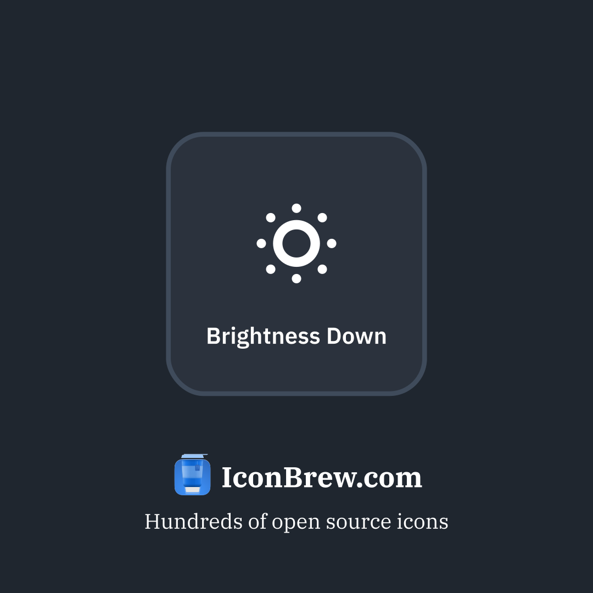</a> | **📂 檔名:** `icon-brightness-down.svg` ✨ **格式:** `Vector (SVG)` ⚖️ **大小:** `209.12KB` 📅 **更新:** `2026-02-27`  🔗 [直接查看原始檔](icon-brightness-down.svg) |
|  | **📂 檔名:** `icon-brightness-up.svg` ✨ **格式:** `Vector (SVG)` ⚖️ **大小:** `205.39KB` 📅 **更新:** `2026-02-27`  🔗 [直接查看原始檔](icon-brightness-up.svg) |
|  | **📂 檔名:** `icon-bullet-list.svg` ✨ **格式:** `Vector (SVG)` ⚖️ **大小:** `195.73KB` 📅 **更新:** `2026-02-27`  🔗 [直接查看原始檔](icon-bullet-list.svg) |
|  | **📂 檔名:** `icon-burger-menu.svg` ✨ **格式:** `Vector (SVG)` ⚖️ **大小:** `200.02KB` 📅 **更新:** `2026-02-27`  🔗 [直接查看原始檔](icon-burger-menu.svg) |
|  | **📂 檔名:** `icon-calculator.svg` ✨ **格式:** `Vector (SVG)` ⚖️ **大小:** `199.50KB` 📅 **更新:** `2026-02-27`  🔗 [直接查看原始檔](icon-calculator.svg) |
|  | **📂 檔名:** `icon-calendar-2-booking.svg` ✨ **格式:** `Vector (SVG)` ⚖️ **大小:** `212.61KB` 📅 **更新:** `2026-02-27`  🔗 [直接查看原始檔](icon-calendar-2-booking.svg) |
|  | **📂 檔名:** `icon-calendar-2.svg` ✨ **格式:** `Vector (SVG)` ⚖️ **大小:** `249.37KB` 📅 **更新:** `2026-02-27`  🔗 [直接查看原始檔](icon-calendar-2.svg) |
| <a href="icon-calendar-booking.svg">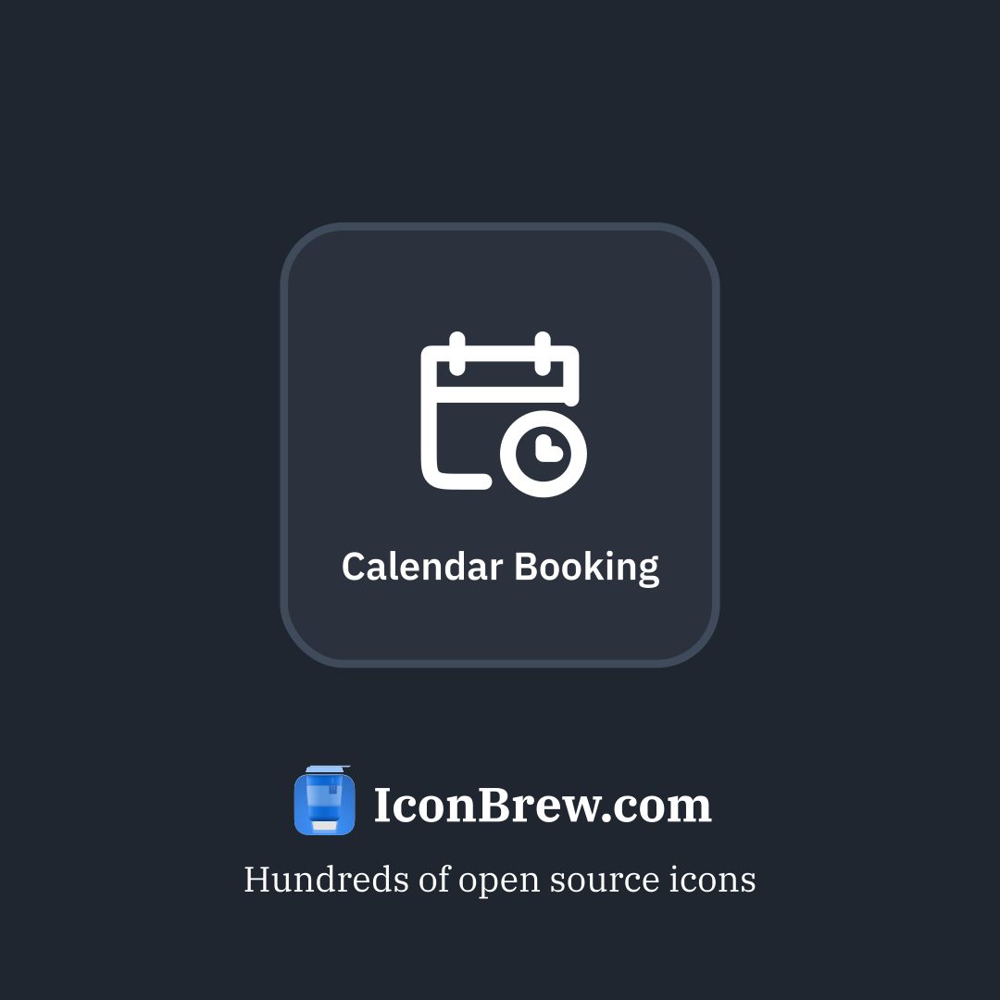</a> | **📂 檔名:** `icon-calendar-booking.svg` ✨ **格式:** `Vector (SVG)` ⚖️ **大小:** `209.94KB` 📅 **更新:** `2026-02-27`  🔗 [直接查看原始檔](icon-calendar-booking.svg) |
|  | **📂 檔名:** `icon-calendar.svg` ✨ **格式:** `Vector (SVG)` ⚖️ **大小:** `245.92KB` 📅 **更新:** `2026-02-27`  🔗 [直接查看原始檔](icon-calendar.svg) |
|  | **📂 檔名:** `icon-camera.svg` ✨ **格式:** `Vector (SVG)` ⚖️ **大小:** `195.87KB` 📅 **更新:** `2026-02-27`  🔗 [直接查看原始檔](icon-camera.svg) |
| <a href="icon-capitalise-text.svg">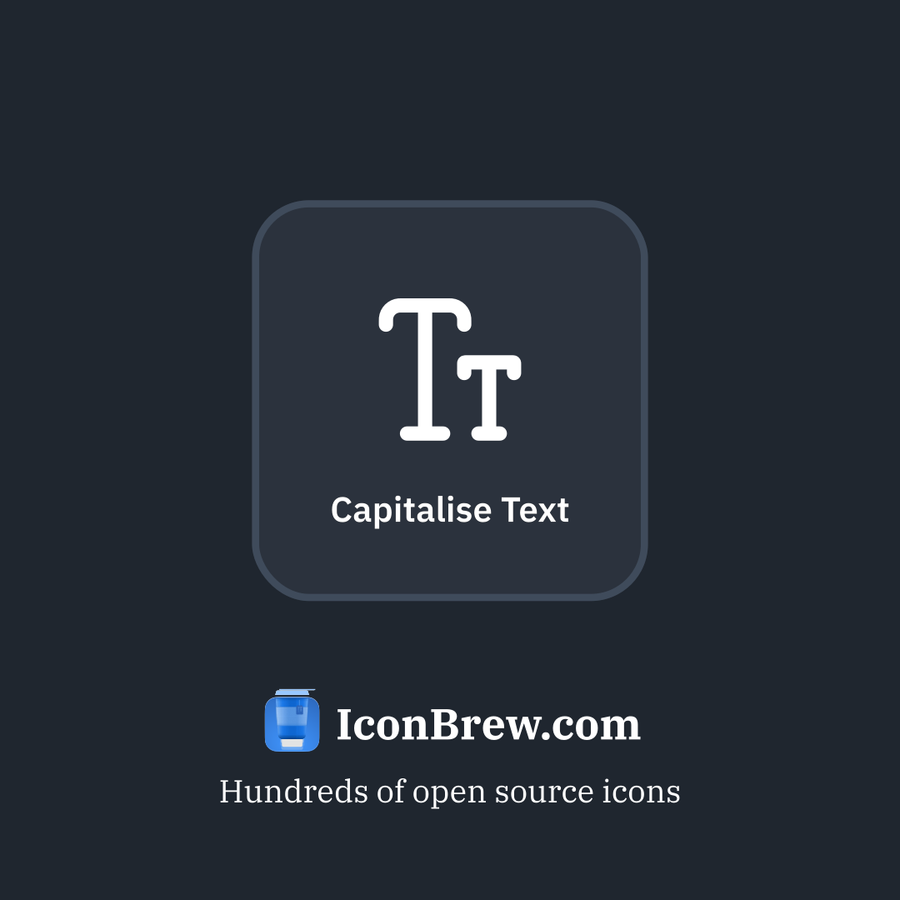</a> | **📂 檔名:** `icon-capitalise-text.svg` ✨ **格式:** `Vector (SVG)` ⚖️ **大小:** `203.19KB` 📅 **更新:** `2026-02-27`  🔗 [直接查看原始檔](icon-capitalise-text.svg) |
|  | **📂 檔名:** `icon-car.svg` ✨ **格式:** `Vector (SVG)` ⚖️ **大小:** `189.47KB` 📅 **更新:** `2026-02-27`  🔗 [直接查看原始檔](icon-car.svg) |
|  | **📂 檔名:** `icon-categories.svg` ✨ **格式:** `Vector (SVG)` ⚖️ **大小:** `203.59KB` 📅 **更新:** `2026-02-27`  🔗 [直接查看原始檔](icon-categories.svg) |
| <a href="icon-chart-bar.svg">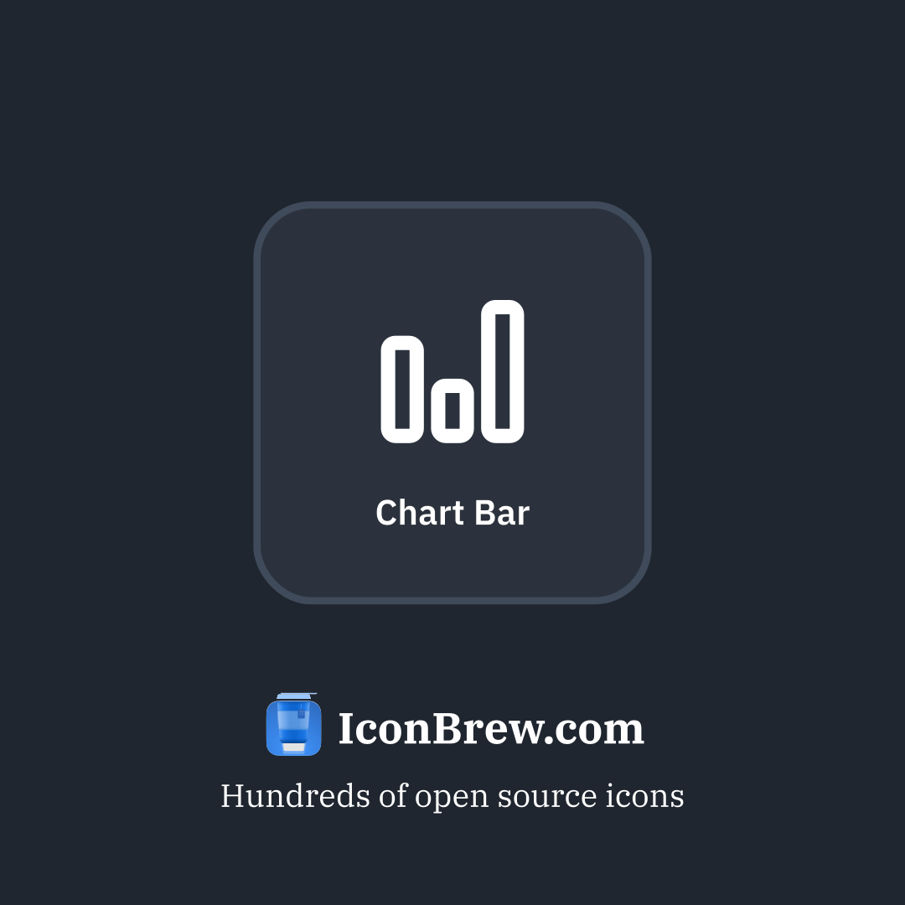</a> | **📂 檔名:** `icon-chart-bar.svg` ✨ **格式:** `Vector (SVG)` ⚖️ **大小:** `195.52KB` 📅 **更新:** `2026-02-27`  🔗 [直接查看原始檔](icon-chart-bar.svg) |
|  | **📂 檔名:** `icon-chart-pie.svg` ✨ **格式:** `Vector (SVG)` ⚖️ **大小:** `196.13KB` 📅 **更新:** `2026-02-27`  🔗 [直接查看原始檔](icon-chart-pie.svg) |
| <a href="icon-check-with-circle.svg">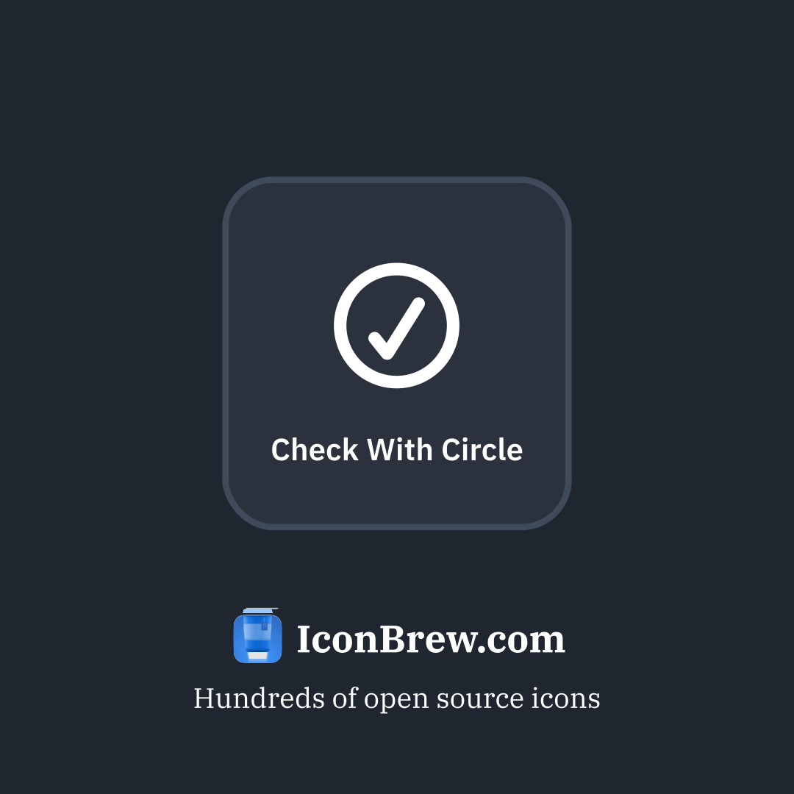</a> | **📂 檔名:** `icon-check-with-circle.svg` ✨ **格式:** `Vector (SVG)` ⚖️ **大小:** `202.32KB` 📅 **更新:** `2026-02-27`  🔗 [直接查看原始檔](icon-check-with-circle.svg) |
|  | **📂 檔名:** `icon-check.svg` ✨ **格式:** `Vector (SVG)` ⚖️ **大小:** `190.99KB` 📅 **更新:** `2026-02-27`  🔗 [直接查看原始檔](icon-check.svg) |
| <a href="icon-chevron-double-down.svg">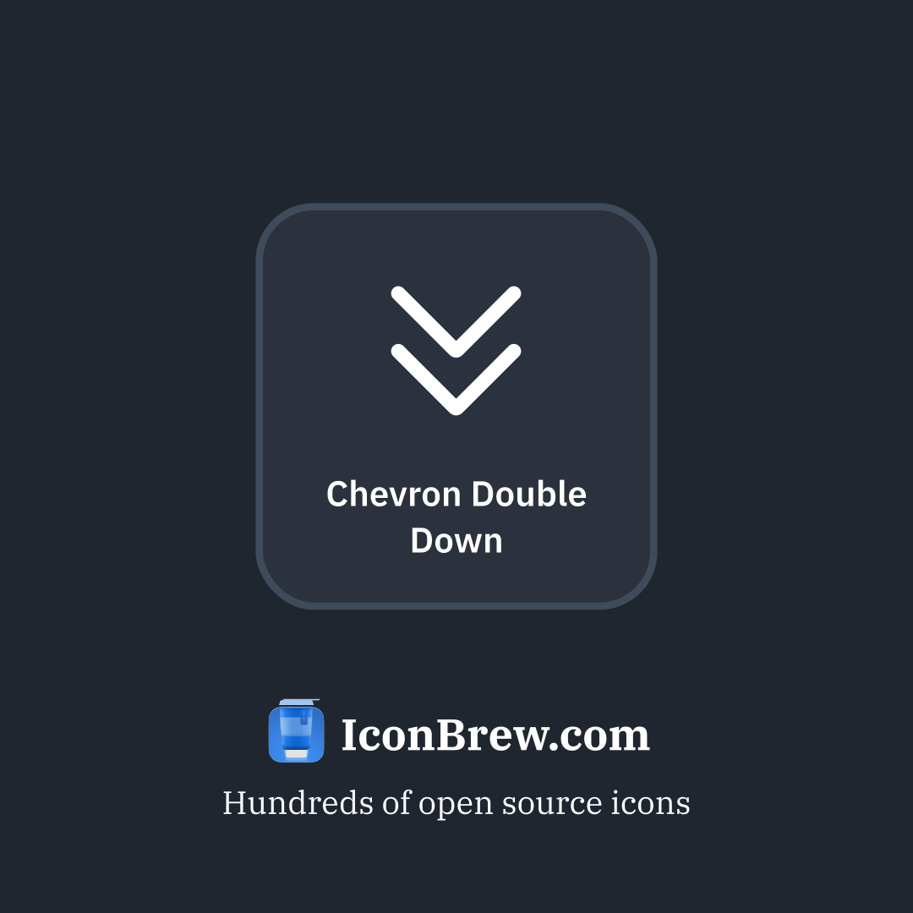</a> | **📂 檔名:** `icon-chevron-double-down.svg` ✨ **格式:** `Vector (SVG)` ⚖️ **大小:** `207.59KB` 📅 **更新:** `2026-02-27`  🔗 [直接查看原始檔](icon-chevron-double-down.svg) |
|  | **📂 檔名:** `icon-chevron-double-left.svg` ✨ **格式:** `Vector (SVG)` ⚖️ **大小:** `205.70KB` 📅 **更新:** `2026-02-27`  🔗 [直接查看原始檔](icon-chevron-double-left.svg) |
| <a href="icon-chevron-double-right.svg">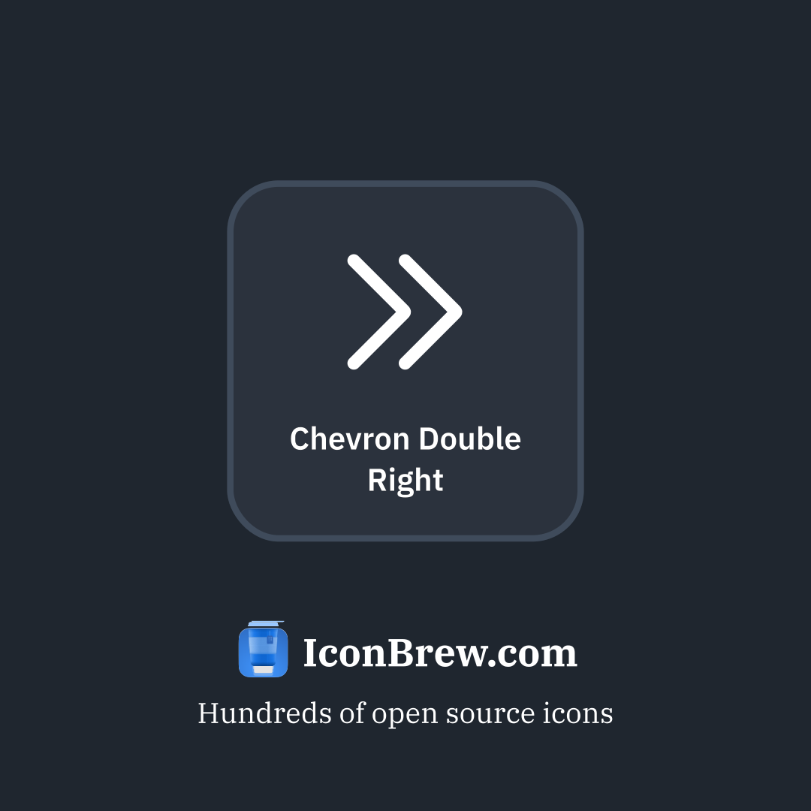</a> | **📂 檔名:** `icon-chevron-double-right.svg` ✨ **格式:** `Vector (SVG)` ⚖️ **大小:** `210.43KB` 📅 **更新:** `2026-02-27`  🔗 [直接查看原始檔](icon-chevron-double-right.svg) |
| <a href="icon-chevron-double-up.svg">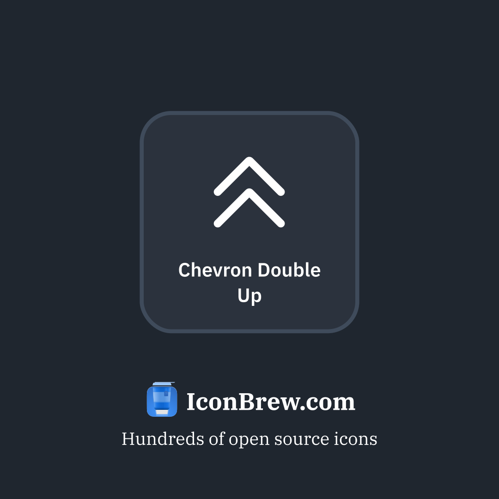</a> | **📂 檔名:** `icon-chevron-double-up.svg` ✨ **格式:** `Vector (SVG)` ⚖️ **大小:** `205.21KB` 📅 **更新:** `2026-02-27`  🔗 [直接查看原始檔](icon-chevron-double-up.svg) |
|  | **📂 檔名:** `icon-chevron-down.svg` ✨ **格式:** `Vector (SVG)` ⚖️ **大小:** `198.81KB` 📅 **更新:** `2026-02-27`  🔗 [直接查看原始檔](icon-chevron-down.svg) |
|  | **📂 檔名:** `icon-chevron-left.svg` ✨ **格式:** `Vector (SVG)` ⚖️ **大小:** `196.95KB` 📅 **更新:** `2026-02-27`  🔗 [直接查看原始檔](icon-chevron-left.svg) |
|  | **📂 檔名:** `icon-chevron-right.svg` ✨ **格式:** `Vector (SVG)` ⚖️ **大小:** `201.59KB` 📅 **更新:** `2026-02-27`  🔗 [直接查看原始檔](icon-chevron-right.svg) |
|  | **📂 檔名:** `icon-chevron-up.svg` ✨ **格式:** `Vector (SVG)` ⚖️ **大小:** `196.21KB` 📅 **更新:** `2026-02-27`  🔗 [直接查看原始檔](icon-chevron-up.svg) |
| <a href="icon-chip.svg">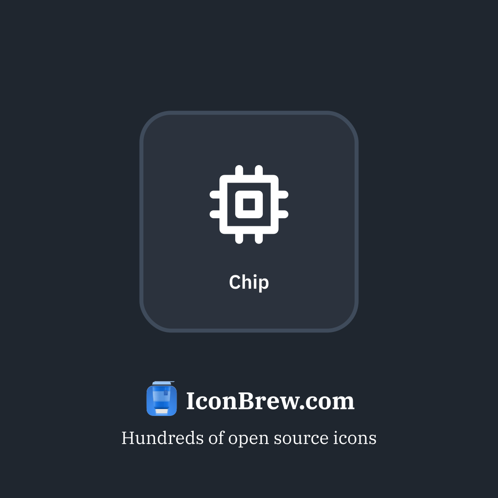</a> | **📂 檔名:** `icon-chip.svg` ✨ **格式:** `Vector (SVG)` ⚖️ **大小:** `190.09KB` 📅 **更新:** `2026-02-27`  🔗 [直接查看原始檔](icon-chip.svg) |
|  | **📂 檔名:** `icon-chromatica.svg` ✨ **格式:** `Vector (SVG)` ⚖️ **大小:** `201.87KB` 📅 **更新:** `2026-02-27`  🔗 [直接查看原始檔](icon-chromatica.svg) |
|  | **📂 檔名:** `icon-chromecast.svg` ✨ **格式:** `Vector (SVG)` ⚖️ **大小:** `201.81KB` 📅 **更新:** `2026-02-27`  🔗 [直接查看原始檔](icon-chromecast.svg) |
|  | **📂 檔名:** `icon-circle-circle-down.svg` ✨ **格式:** `Vector (SVG)` ⚖️ **大小:** `205.17KB` 📅 **更新:** `2026-02-27`  🔗 [直接查看原始檔](icon-circle-circle-down.svg) |
|  | **📂 檔名:** `icon-circle-circle-left.svg` ✨ **格式:** `Vector (SVG)` ⚖️ **大小:** `203.31KB` 📅 **更新:** `2026-02-27`  🔗 [直接查看原始檔](icon-circle-circle-left.svg) |
|  | **📂 檔名:** `icon-circle-circle-right.svg` ✨ **格式:** `Vector (SVG)` ⚖️ **大小:** `208.05KB` 📅 **更新:** `2026-02-27`  🔗 [直接查看原始檔](icon-circle-circle-right.svg) |
|  | **📂 檔名:** `icon-circle-circle-up.svg` ✨ **格式:** `Vector (SVG)` ⚖️ **大小:** `202.62KB` 📅 **更新:** `2026-02-27`  🔗 [直接查看原始檔](icon-circle-circle-up.svg) |
|  | **📂 檔名:** `icon-circle-circle.svg` ✨ **格式:** `Vector (SVG)` ⚖️ **大小:** `199.59KB` 📅 **更新:** `2026-02-27`  🔗 [直接查看原始檔](icon-circle-circle.svg) |
|  | **📂 檔名:** `icon-circle-square.svg` ✨ **格式:** `Vector (SVG)` ⚖️ **大小:** `202.55KB` 📅 **更新:** `2026-02-27`  🔗 [直接查看原始檔](icon-circle-square.svg) |
| <a href="icon-circle-triangle.svg">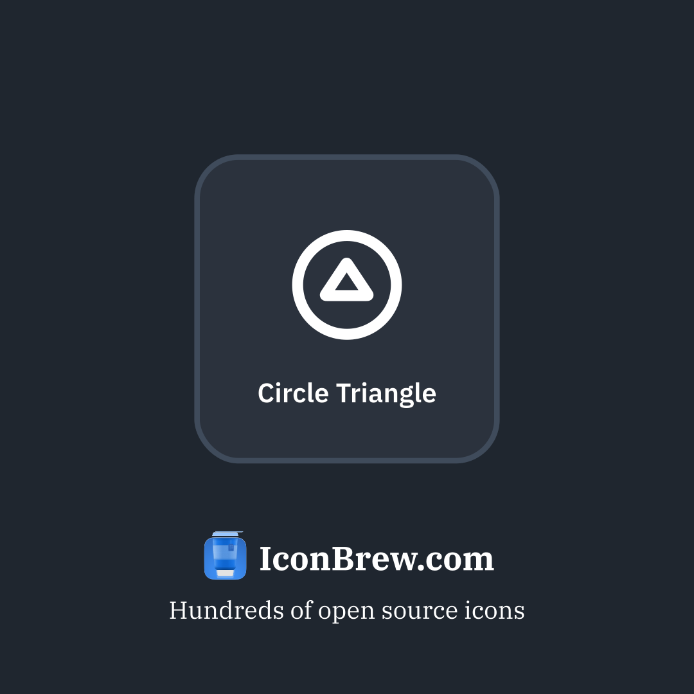</a> | **📂 檔名:** `icon-circle-triangle.svg` ✨ **格式:** `Vector (SVG)` ⚖️ **大小:** `203.55KB` 📅 **更新:** `2026-02-27`  🔗 [直接查看原始檔](icon-circle-triangle.svg) |
|  | **📂 檔名:** `icon-circle-with-blocks.svg` ✨ **格式:** `Vector (SVG)` ⚖️ **大小:** `205.52KB` 📅 **更新:** `2026-02-27`  🔗 [直接查看原始檔](icon-circle-with-blocks.svg) |
|  | **📂 檔名:** `icon-circle-with-cross.svg` ✨ **格式:** `Vector (SVG)` ⚖️ **大小:** `205.37KB` 📅 **更新:** `2026-02-27`  🔗 [直接查看原始檔](icon-circle-with-cross.svg) |
|  | **📂 檔名:** `icon-circle.svg` ✨ **格式:** `Vector (SVG)` ⚖️ **大小:** `191.29KB` 📅 **更新:** `2026-02-27`  🔗 [直接查看原始檔](icon-circle.svg) |
|  | **📂 檔名:** `icon-clarus-the-dogcow.svg` ✨ **格式:** `Vector (SVG)` ⚖️ **大小:** `210.35KB` 📅 **更新:** `2026-02-27`  🔗 [直接查看原始檔](icon-clarus-the-dogcow.svg) |
|  | **📂 檔名:** `icon-clipboard-empty.svg` ✨ **格式:** `Vector (SVG)` ⚖️ **大小:** `202.70KB` 📅 **更新:** `2026-02-27`  🔗 [直接查看原始檔](icon-clipboard-empty.svg) |
|  | **📂 檔名:** `icon-clipboard-full.svg` ✨ **格式:** `Vector (SVG)` ⚖️ **大小:** `200.03KB` 📅 **更新:** `2026-02-27`  🔗 [直接查看原始檔](icon-clipboard-full.svg) |
|  | **📂 檔名:** `icon-clock.svg` ✨ **格式:** `Vector (SVG)` ⚖️ **大小:** `190.21KB` 📅 **更新:** `2026-02-27`  🔗 [直接查看原始檔](icon-clock.svg) |
|  | **📂 檔名:** `icon-close-full-screen-arrow-1.svg` ✨ **格式:** `Vector (SVG)` ⚖️ **大小:** `210.59KB` 📅 **更新:** `2026-02-27`  🔗 [直接查看原始檔](icon-close-full-screen-arrow-1.svg) |
|  | **📂 檔名:** `icon-close-full-screen-arrow.svg` ✨ **格式:** `Vector (SVG)` ⚖️ **大小:** `210.62KB` 📅 **更新:** `2026-02-27`  🔗 [直接查看原始檔](icon-close-full-screen-arrow.svg) |
| <a href="icon-close.svg">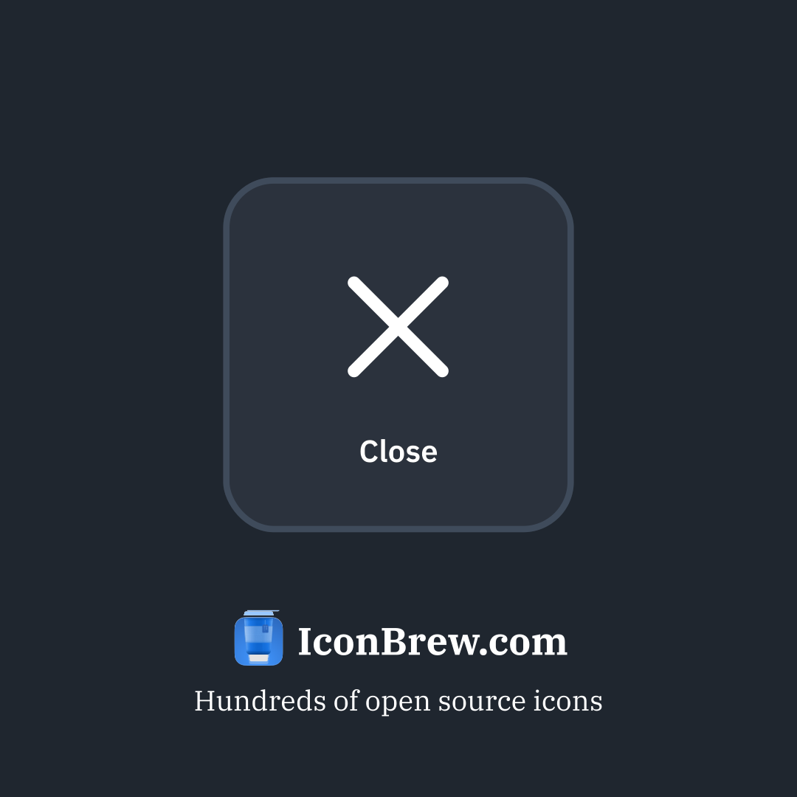</a> | **📂 檔名:** `icon-close.svg` ✨ **格式:** `Vector (SVG)` ⚖️ **大小:** `193.00KB` 📅 **更新:** `2026-02-27`  🔗 [直接查看原始檔](icon-close.svg) |
|  | **📂 檔名:** `icon-cloud.svg` ✨ **格式:** `Vector (SVG)` ⚖️ **大小:** `191.21KB` 📅 **更新:** `2026-02-27`  🔗 [直接查看原始檔](icon-cloud.svg) |
| <a href="icon-command.svg">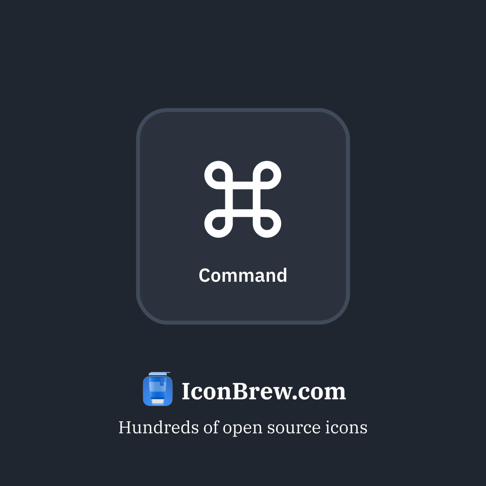</a> | **📂 檔名:** `icon-command.svg` ✨ **格式:** `Vector (SVG)` ⚖️ **大小:** `196.92KB` 📅 **更新:** `2026-02-27`  🔗 [直接查看原始檔](icon-command.svg) |
|  | **📂 檔名:** `icon-connections.svg` ✨ **格式:** `Vector (SVG)` ⚖️ **大小:** `203.34KB` 📅 **更新:** `2026-02-27`  🔗 [直接查看原始檔](icon-connections.svg) |
|  | **📂 檔名:** `icon-connectivity.svg` ✨ **格式:** `Vector (SVG)` ⚖️ **大小:** `198.48KB` 📅 **更新:** `2026-02-27`  🔗 [直接查看原始檔](icon-connectivity.svg) |
| <a href="icon-contrast.svg">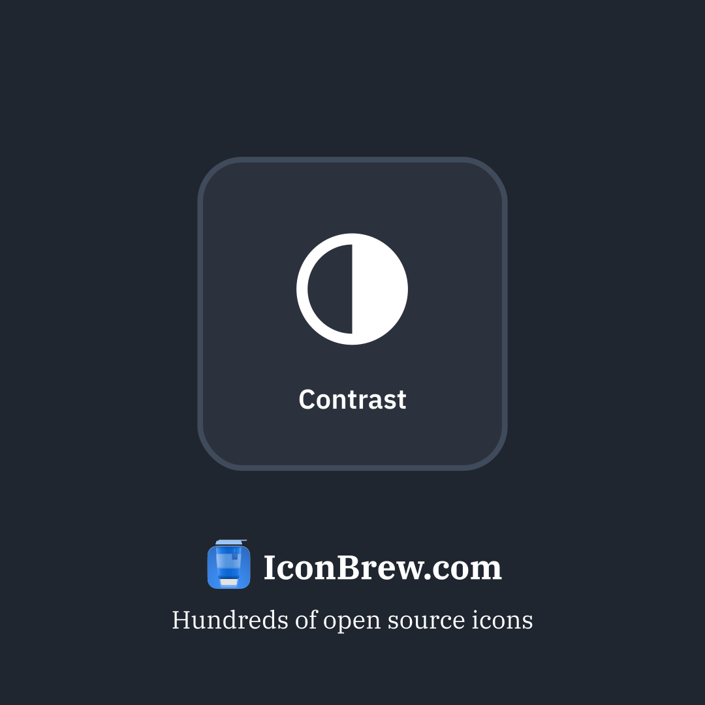</a> | **📂 檔名:** `icon-contrast.svg` ✨ **格式:** `Vector (SVG)` ⚖️ **大小:** `195.73KB` 📅 **更新:** `2026-02-27`  🔗 [直接查看原始檔](icon-contrast.svg) |
| <a href="icon-creative-cloud.svg">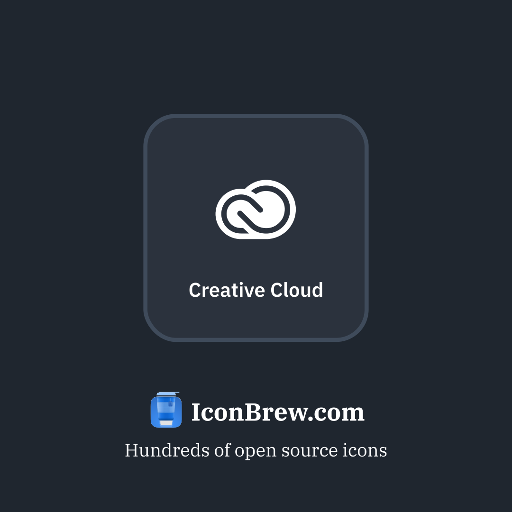</a> | **📂 檔名:** `icon-creative-cloud.svg` ✨ **格式:** `Vector (SVG)` ⚖️ **大小:** `204.74KB` 📅 **更新:** `2026-02-27`  🔗 [直接查看原始檔](icon-creative-cloud.svg) |
| <a href="icon-credit-card.svg">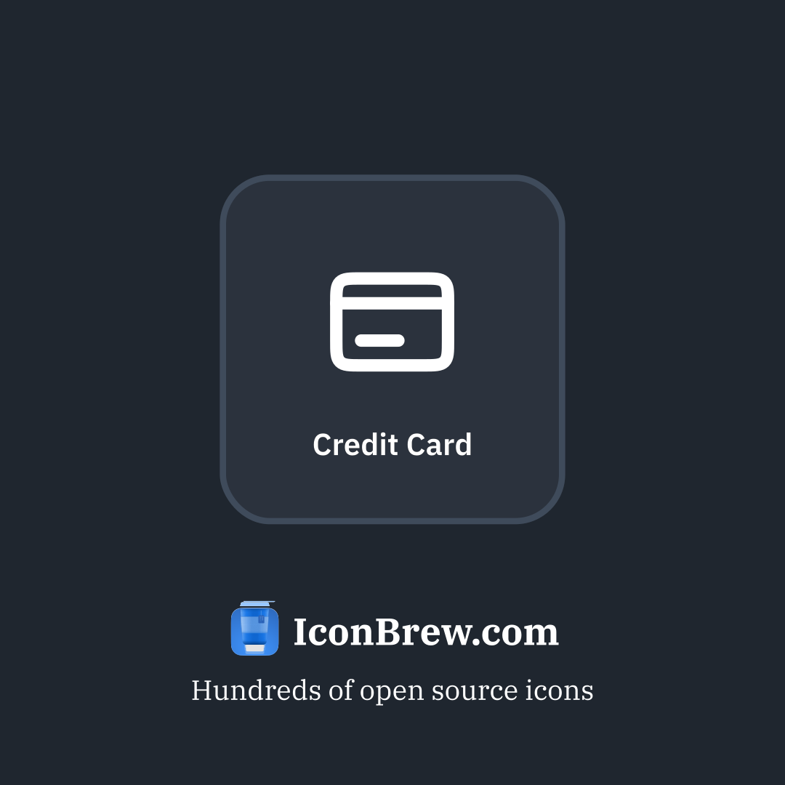</a> | **📂 檔名:** `icon-credit-card.svg` ✨ **格式:** `Vector (SVG)` ⚖️ **大小:** `198.56KB` 📅 **更新:** `2026-02-27`  🔗 [直接查看原始檔](icon-credit-card.svg) |
|  | **📂 檔名:** `icon-cross-with-circle.svg` ✨ **格式:** `Vector (SVG)` ⚖️ **大小:** `205.37KB` 📅 **更新:** `2026-02-27`  🔗 [直接查看原始檔](icon-cross-with-circle.svg) |
|  | **📂 檔名:** `icon-crown.svg` ✨ **格式:** `Vector (SVG)` ⚖️ **大小:** `190.18KB` 📅 **更新:** `2026-02-27`  🔗 [直接查看原始檔](icon-crown.svg) |
|  | **📂 檔名:** `icon-cursor-default.svg` ✨ **格式:** `Vector (SVG)` ⚖️ **大小:** `202.15KB` 📅 **更新:** `2026-02-27`  🔗 [直接查看原始檔](icon-cursor-default.svg) |
|  | **📂 檔名:** `icon-cursor-pointer.svg` ✨ **格式:** `Vector (SVG)` ⚖️ **大小:** `202.77KB` 📅 **更新:** `2026-02-27`  🔗 [直接查看原始檔](icon-cursor-pointer.svg) |
|  | **📂 檔名:** `icon-dashboard-one-is-filled.svg` ✨ **格式:** `Vector (SVG)` ⚖️ **大小:** `214.33KB` 📅 **更新:** `2026-02-27`  🔗 [直接查看原始檔](icon-dashboard-one-is-filled.svg) |
|  | **📂 檔名:** `icon-dashboard.svg` ✨ **格式:** `Vector (SVG)` ⚖️ **大小:** `199.75KB` 📅 **更新:** `2026-02-27`  🔗 [直接查看原始檔](icon-dashboard.svg) |
| <a href="icon-databse.svg">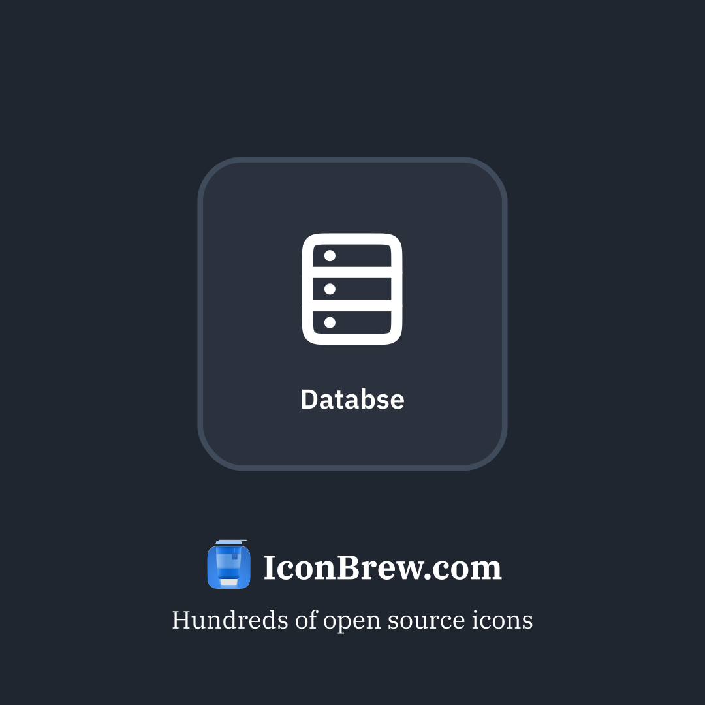</a> | **📂 檔名:** `icon-databse.svg` ✨ **格式:** `Vector (SVG)` ⚖️ **大小:** `197.47KB` 📅 **更新:** `2026-02-27`  🔗 [直接查看原始檔](icon-databse.svg) |
| <a href="icon-display-zoom.svg">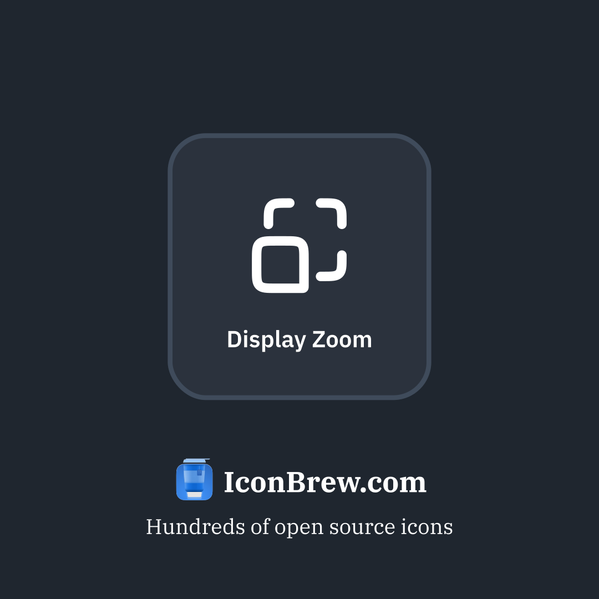</a> | **📂 檔名:** `icon-display-zoom.svg` ✨ **格式:** `Vector (SVG)` ⚖️ **大小:** `200.70KB` 📅 **更新:** `2026-02-27`  🔗 [直接查看原始檔](icon-display-zoom.svg) |
| <a href="icon-document-code.svg"></a> | **📂 檔名:** `icon-document-code.svg` ✨ **格式:** `Vector (SVG)` ⚖️ **大小:** `205.55KB` 📅 **更新:** `2026-02-27`  🔗 [直接查看原始檔](icon-document-code.svg) |
|  | **📂 檔名:** `icon-document-photo.svg` ✨ **格式:** `Vector (SVG)` ⚖️ **大小:** `205.04KB` 📅 **更新:** `2026-02-27`  🔗 [直接查看原始檔](icon-document-photo.svg) |
|  | **📂 檔名:** `icon-document-text.svg` ✨ **格式:** `Vector (SVG)` ⚖️ **大小:** `200.32KB` 📅 **更新:** `2026-02-27`  🔗 [直接查看原始檔](icon-document-text.svg) |
|  | **📂 檔名:** `icon-document-video.svg` ✨ **格式:** `Vector (SVG)` ⚖️ **大小:** `204.45KB` 📅 **更新:** `2026-02-27`  🔗 [直接查看原始檔](icon-document-video.svg) |
| <a href="icon-document.svg"></a> | **📂 檔名:** `icon-document.svg` ✨ **格式:** `Vector (SVG)` ⚖️ **大小:** `196.51KB` 📅 **更新:** `2026-02-27`  🔗 [直接查看原始檔](icon-document.svg) |
|  | **📂 檔名:** `icon-dot-matrix.svg` ✨ **格式:** `Vector (SVG)` ⚖️ **大小:** `194.06KB` 📅 **更新:** `2026-02-27`  🔗 [直接查看原始檔](icon-dot-matrix.svg) |
| <a href="icon-dot.svg"></a> | **📂 檔名:** `icon-dot.svg` ✨ **格式:** `Vector (SVG)` ⚖️ **大小:** `187.68KB` 📅 **更新:** `2026-02-27`  🔗 [直接查看原始檔](icon-dot.svg) |
|  | **📂 檔名:** `icon-download.svg` ✨ **格式:** `Vector (SVG)` ⚖️ **大小:** `195.44KB` 📅 **更新:** `2026-02-27`  🔗 [直接查看原始檔](icon-download.svg) |
|  | **📂 檔名:** `icon-dpad.svg` ✨ **格式:** `Vector (SVG)` ⚖️ **大小:** `192.71KB` 📅 **更新:** `2026-02-27`  🔗 [直接查看原始檔](icon-dpad.svg) |
|  | **📂 檔名:** `icon-earth.svg` ✨ **格式:** `Vector (SVG)` ⚖️ **大小:** `189.18KB` 📅 **更新:** `2026-02-27`  🔗 [直接查看原始檔](icon-earth.svg) |
| <a href="icon-ellipses-horizontal.svg"></a> | **📂 檔名:** `icon-ellipses-horizontal.svg` ✨ **格式:** `Vector (SVG)` ⚖️ **大小:** `205.87KB` 📅 **更新:** `2026-02-27`  🔗 [直接查看原始檔](icon-ellipses-horizontal.svg) |
| <a href="icon-ellipses-vertical.svg"></a> | **📂 檔名:** `icon-ellipses-vertical.svg` ✨ **格式:** `Vector (SVG)` ⚖️ **大小:** `204.25KB` 📅 **更新:** `2026-02-27`  🔗 [直接查看原始檔](icon-ellipses-vertical.svg) |
|  | **📂 檔名:** `icon-email.svg` ✨ **格式:** `Vector (SVG)` ⚖️ **大小:** `189.74KB` 📅 **更新:** `2026-02-27`  🔗 [直接查看原始檔](icon-email.svg) |
|  | **📂 檔名:** `icon-entertainment.svg` ✨ **格式:** `Vector (SVG)` ⚖️ **大小:** `199.40KB` 📅 **更新:** `2026-02-27`  🔗 [直接查看原始檔](icon-entertainment.svg) |
|  | **📂 檔名:** `icon-equal.svg` ✨ **格式:** `Vector (SVG)` ⚖️ **大小:** `189.00KB` 📅 **更新:** `2026-02-27`  🔗 [直接查看原始檔](icon-equal.svg) |
|  | **📂 檔名:** `icon-euro-with-circle.svg` ✨ **格式:** `Vector (SVG)` ⚖️ **大小:** `199.48KB` 📅 **更新:** `2026-02-27`  🔗 [直接查看原始檔](icon-euro-with-circle.svg) |
|  | **📂 檔名:** `icon-euro.svg` ✨ **格式:** `Vector (SVG)` ⚖️ **大小:** `188.05KB` 📅 **更新:** `2026-02-27`  🔗 [直接查看原始檔](icon-euro.svg) |
| <a href="icon-exclamation-mark.svg"></a> | **📂 檔名:** `icon-exclamation-mark.svg` ✨ **格式:** `Vector (SVG)` ⚖️ **大小:** `201.05KB` 📅 **更新:** `2026-02-27`  🔗 [直接查看原始檔](icon-exclamation-mark.svg) |
|  | **📂 檔名:** `icon-expand-horizontal.svg` ✨ **格式:** `Vector (SVG)` ⚖️ **大小:** `201.51KB` 📅 **更新:** `2026-02-27`  🔗 [直接查看原始檔](icon-expand-horizontal.svg) |
|  | **📂 檔名:** `icon-expand-vertical.svg` ✨ **格式:** `Vector (SVG)` ⚖️ **大小:** `200.08KB` 📅 **更新:** `2026-02-27`  🔗 [直接查看原始檔](icon-expand-vertical.svg) |
|  | **📂 檔名:** `icon-eye.svg` ✨ **格式:** `Vector (SVG)` ⚖️ **大小:** `186.65KB` 📅 **更新:** `2026-02-27`  🔗 [直接查看原始檔](icon-eye.svg) |
|  | **📂 檔名:** `icon-figma.svg` ✨ **格式:** `Vector (SVG)` ⚖️ **大小:** `193.35KB` 📅 **更新:** `2026-02-27`  🔗 [直接查看原始檔](icon-figma.svg) |
| <a href="icon-film.svg"></a> | **📂 檔名:** `icon-film.svg` ✨ **格式:** `Vector (SVG)` ⚖️ **大小:** `187.15KB` 📅 **更新:** `2026-02-27`  🔗 [直接查看原始檔](icon-film.svg) |
|  | **📂 檔名:** `icon-filters.svg` ✨ **格式:** `Vector (SVG)` ⚖️ **大小:** `191.24KB` 📅 **更新:** `2026-02-27`  🔗 [直接查看原始檔](icon-filters.svg) |
| <a href="icon-flag.svg"></a> | **📂 檔名:** `icon-flag.svg` ✨ **格式:** `Vector (SVG)` ⚖️ **大小:** `190.76KB` 📅 **更新:** `2026-02-27`  🔗 [直接查看原始檔](icon-flag.svg) |
|  | **📂 檔名:** `icon-flame.svg` ✨ **格式:** `Vector (SVG)` ⚖️ **大小:** `190.54KB` 📅 **更新:** `2026-02-27`  🔗 [直接查看原始檔](icon-flame.svg) |
| <a href="icon-folder-2.svg"></a> | **📂 檔名:** `icon-folder-2.svg` ✨ **格式:** `Vector (SVG)` ⚖️ **大小:** `193.07KB` 📅 **更新:** `2026-02-27`  🔗 [直接查看原始檔](icon-folder-2.svg) |
| <a href="icon-folder-add.svg"></a> | **📂 檔名:** `icon-folder-add.svg` ✨ **格式:** `Vector (SVG)` ⚖️ **大小:** `194.85KB` 📅 **更新:** `2026-02-27`  🔗 [直接查看原始檔](icon-folder-add.svg) |
| <a href="icon-folder-alert.svg"></a> | **📂 檔名:** `icon-folder-alert.svg` ✨ **格式:** `Vector (SVG)` ⚖️ **大小:** `195.81KB` 📅 **更新:** `2026-02-27`  🔗 [直接查看原始檔](icon-folder-alert.svg) |
| <a href="icon-folder-cross.svg"></a> | **📂 檔名:** `icon-folder-cross.svg` ✨ **格式:** `Vector (SVG)` ⚖️ **大小:** `202.08KB` 📅 **更新:** `2026-02-27`  🔗 [直接查看原始檔](icon-folder-cross.svg) |
| <a href="icon-folder-minus.svg"></a> | **📂 檔名:** `icon-folder-minus.svg` ✨ **格式:** `Vector (SVG)` ⚖️ **大小:** `197.77KB` 📅 **更新:** `2026-02-27`  🔗 [直接查看原始檔](icon-folder-minus.svg) |
| <a href="icon-folder-tick.svg"></a> | **📂 檔名:** `icon-folder-tick.svg` ✨ **格式:** `Vector (SVG)` ⚖️ **大小:** `194.82KB` 📅 **更新:** `2026-02-27`  🔗 [直接查看原始檔](icon-folder-tick.svg) |
| <a href="icon-folder.svg"></a> | **📂 檔名:** `icon-folder.svg` ✨ **格式:** `Vector (SVG)` ⚖️ **大小:** `191.22KB` 📅 **更新:** `2026-02-27`  🔗 [直接查看原始檔](icon-folder.svg) |
|  | **📂 檔名:** `icon-folders.svg` ✨ **格式:** `Vector (SVG)` ⚖️ **大小:** `194.74KB` 📅 **更新:** `2026-02-27`  🔗 [直接查看原始檔](icon-folders.svg) |
| <a href="icon-full-screen-arrow.svg"></a> | **📂 檔名:** `icon-full-screen-arrow.svg` ✨ **格式:** `Vector (SVG)` ⚖️ **大小:** `201.10KB` 📅 **更新:** `2026-02-27`  🔗 [直接查看原始檔](icon-full-screen-arrow.svg) |
| <a href="icon-full-screen.svg"></a> | **📂 檔名:** `icon-full-screen.svg` ✨ **格式:** `Vector (SVG)` ⚖️ **大小:** `196.82KB` 📅 **更新:** `2026-02-27`  🔗 [直接查看原始檔](icon-full-screen.svg) |
| <a href="icon-games.svg"></a> | **📂 檔名:** `icon-games.svg` ✨ **格式:** `Vector (SVG)` ⚖️ **大小:** `197.42KB` 📅 **更新:** `2026-02-27`  🔗 [直接查看原始檔](icon-games.svg) |
|  | **📂 檔名:** `icon-github.svg` ✨ **格式:** `Vector (SVG)` ⚖️ **大小:** `192.25KB` 📅 **更新:** `2026-02-27`  🔗 [直接查看原始檔](icon-github.svg) |
|  | **📂 檔名:** `icon-globe.svg` ✨ **格式:** `Vector (SVG)` ⚖️ **大小:** `192.82KB` 📅 **更新:** `2026-02-27`  🔗 [直接查看原始檔](icon-globe.svg) |
|  | **📂 檔名:** `icon-graph-line-down.svg` ✨ **格式:** `Vector (SVG)` ⚖️ **大小:** `201.38KB` 📅 **更新:** `2026-02-27`  🔗 [直接查看原始檔](icon-graph-line-down.svg) |
|  | **📂 檔名:** `icon-graph-line-up.svg` ✨ **格式:** `Vector (SVG)` ⚖️ **大小:** `198.98KB` 📅 **更新:** `2026-02-27`  🔗 [直接查看原始檔](icon-graph-line-up.svg) |
| <a href="icon-graphics-and-design.svg"></a> | **📂 檔名:** `icon-graphics-and-design.svg` ✨ **格式:** `Vector (SVG)` ⚖️ **大小:** `213.72KB` 📅 **更新:** `2026-02-27`  🔗 [直接查看原始檔](icon-graphics-and-design.svg) |
|  | **📂 檔名:** `icon-grid.svg` ✨ **格式:** `Vector (SVG)` ⚖️ **大小:** `189.57KB` 📅 **更新:** `2026-02-27`  🔗 [直接查看原始檔](icon-grid.svg) |
| <a href="icon-hammer.svg"></a> | **📂 檔名:** `icon-hammer.svg` ✨ **格式:** `Vector (SVG)` ⚖️ **大小:** `193.37KB` 📅 **更新:** `2026-02-27`  🔗 [直接查看原始檔](icon-hammer.svg) |
| <a href="icon-headphones.svg"></a> | **📂 檔名:** `icon-headphones.svg` ✨ **格式:** `Vector (SVG)` ⚖️ **大小:** `201.26KB` 📅 **更新:** `2026-02-27`  🔗 [直接查看原始檔](icon-headphones.svg) |
| <a href="icon-health-and-fitness.svg"></a> | **📂 檔名:** `icon-health-and-fitness.svg` ✨ **格式:** `Vector (SVG)` ⚖️ **大小:** `204.21KB` 📅 **更新:** `2026-02-27`  🔗 [直接查看原始檔](icon-health-and-fitness.svg) |
|  | **📂 檔名:** `icon-heartbeat-monitor.svg` ✨ **格式:** `Vector (SVG)` ⚖️ **大小:** `204.75KB` 📅 **更新:** `2026-02-27`  🔗 [直接查看原始檔](icon-heartbeat-monitor.svg) |
|  | **📂 檔名:** `icon-helm.svg` ✨ **格式:** `Vector (SVG)` ⚖️ **大小:** `188.30KB` 📅 **更新:** `2026-02-27`  🔗 [直接查看原始檔](icon-helm.svg) |
| <a href="icon-helmet-with-lights.svg"></a> | **📂 檔名:** `icon-helmet-with-lights.svg` ✨ **格式:** `Vector (SVG)` ⚖️ **大小:** `204.20KB` 📅 **更新:** `2026-02-27`  🔗 [直接查看原始檔](icon-helmet-with-lights.svg) |
|  | **📂 檔名:** `icon-helmet.svg` ✨ **格式:** `Vector (SVG)` ⚖️ **大小:** `191.06KB` 📅 **更新:** `2026-02-27`  🔗 [直接查看原始檔](icon-helmet.svg) |
|  | **📂 檔名:** `icon-hoops.svg` ✨ **格式:** `Vector (SVG)` ⚖️ **大小:** `194.22KB` 📅 **更新:** `2026-02-27`  🔗 [直接查看原始檔](icon-hoops.svg) |
| <a href="icon-hot-brew.svg"></a> | **📂 檔名:** `icon-hot-brew.svg` ✨ **格式:** `Vector (SVG)` ⚖️ **大小:** `193.82KB` 📅 **更新:** `2026-02-27`  🔗 [直接查看原始檔](icon-hot-brew.svg) |
| <a href="icon-house.svg"></a> | **📂 檔名:** `icon-house.svg` ✨ **格式:** `Vector (SVG)` ⚖️ **大小:** `193.35KB` 📅 **更新:** `2026-02-27`  🔗 [直接查看原始檔](icon-house.svg) |
|  | **📂 檔名:** `icon-hug-content-horizontal.svg` ✨ **格式:** `Vector (SVG)` ⚖️ **大小:** `210.26KB` 📅 **更新:** `2026-02-27`  🔗 [直接查看原始檔](icon-hug-content-horizontal.svg) |
|  | **📂 檔名:** `icon-hug-content-vertical.svg` ✨ **格式:** `Vector (SVG)` ⚖️ **大小:** `208.63KB` 📅 **更新:** `2026-02-27`  🔗 [直接查看原始檔](icon-hug-content-vertical.svg) |
|  | **📂 檔名:** `icon-icon-brew.svg` ✨ **格式:** `Vector (SVG)` ⚖️ **大小:** `195.55KB` 📅 **更新:** `2026-02-27`  🔗 [直接查看原始檔](icon-icon-brew.svg) |
|  | **📂 檔名:** `icon-inbox-tray.svg` ✨ **格式:** `Vector (SVG)` ⚖️ **大小:** `194.26KB` 📅 **更新:** `2026-02-27`  🔗 [直接查看原始檔](icon-inbox-tray.svg) |
|  | **📂 檔名:** `icon-internet-browser.svg` ✨ **格式:** `Vector (SVG)` ⚖️ **大小:** `206.46KB` 📅 **更新:** `2026-02-27`  🔗 [直接查看原始檔](icon-internet-browser.svg) |
| <a href="icon-iphone.svg"></a> | **📂 檔名:** `icon-iphone.svg` ✨ **格式:** `Vector (SVG)` ⚖️ **大小:** `192.77KB` 📅 **更新:** `2026-02-27`  🔗 [直接查看原始檔](icon-iphone.svg) |
| <a href="icon-italic.svg"></a> | **📂 檔名:** `icon-italic.svg` ✨ **格式:** `Vector (SVG)` ⚖️ **大小:** `189.69KB` 📅 **更新:** `2026-02-27`  🔗 [直接查看原始檔](icon-italic.svg) |
|  | **📂 檔名:** `icon-key.svg` ✨ **格式:** `Vector (SVG)` ⚖️ **大小:** `187.02KB` 📅 **更新:** `2026-02-27`  🔗 [直接查看原始檔](icon-key.svg) |
|  | **📂 檔名:** `icon-laptop.svg` ✨ **格式:** `Vector (SVG)` ⚖️ **大小:** `192.01KB` 📅 **更新:** `2026-02-27`  🔗 [直接查看原始檔](icon-laptop.svg) |
|  | **📂 檔名:** `icon-layout-bottom.svg` ✨ **格式:** `Vector (SVG)` ⚖️ **大小:** `201.03KB` 📅 **更新:** `2026-02-27`  🔗 [直接查看原始檔](icon-layout-bottom.svg) |
|  | **📂 檔名:** `icon-layout-left.svg` ✨ **格式:** `Vector (SVG)` ⚖️ **大小:** `194.27KB` 📅 **更新:** `2026-02-27`  🔗 [直接查看原始檔](icon-layout-left.svg) |
|  | **📂 檔名:** `icon-layout-right.svg` ✨ **格式:** `Vector (SVG)` ⚖️ **大小:** `198.98KB` 📅 **更新:** `2026-02-27`  🔗 [直接查看原始檔](icon-layout-right.svg) |
| <a href="icon-layout-top.svg"></a> | **📂 檔名:** `icon-layout-top.svg` ✨ **格式:** `Vector (SVG)` ⚖️ **大小:** `195.04KB` 📅 **更新:** `2026-02-27`  🔗 [直接查看原始檔](icon-layout-top.svg) |
|  | **📂 檔名:** `icon-life-buoy.svg` ✨ **格式:** `Vector (SVG)` ⚖️ **大小:** `194.09KB` 📅 **更新:** `2026-02-27`  🔗 [直接查看原始檔](icon-life-buoy.svg) |
|  | **📂 檔名:** `icon-light-bulb.svg` ✨ **格式:** `Vector (SVG)` ⚖️ **大小:** `196.63KB` 📅 **更新:** `2026-02-27`  🔗 [直接查看原始檔](icon-light-bulb.svg) |
| <a href="icon-lightning.svg"></a> | **📂 檔名:** `icon-lightning.svg` ✨ **格式:** `Vector (SVG)` ⚖️ **大小:** `197.81KB` 📅 **更新:** `2026-02-27`  🔗 [直接查看原始檔](icon-lightning.svg) |
|  | **📂 檔名:** `icon-lights-off.svg` ✨ **格式:** `Vector (SVG)` ⚖️ **大小:** `196.86KB` 📅 **更新:** `2026-02-27`  🔗 [直接查看原始檔](icon-lights-off.svg) |
|  | **📂 檔名:** `icon-lights-on.svg` ✨ **格式:** `Vector (SVG)` ⚖️ **大小:** `197.19KB` 📅 **更新:** `2026-02-27`  🔗 [直接查看原始檔](icon-lights-on.svg) |
|  | **📂 檔名:** `icon-line-chart-down-arrow.svg` ✨ **格式:** `Vector (SVG)` ⚖️ **大小:** `204.45KB` 📅 **更新:** `2026-02-27`  🔗 [直接查看原始檔](icon-line-chart-down-arrow.svg) |
| <a href="icon-line-chart-down.svg"></a> | **📂 檔名:** `icon-line-chart-down.svg` ✨ **格式:** `Vector (SVG)` ⚖️ **大小:** `199.69KB` 📅 **更新:** `2026-02-27`  🔗 [直接查看原始檔](icon-line-chart-down.svg) |
|  | **📂 檔名:** `icon-line-chart-up-arrow.svg` ✨ **格式:** `Vector (SVG)` ⚖️ **大小:** `202.08KB` 📅 **更新:** `2026-02-27`  🔗 [直接查看原始檔](icon-line-chart-up-arrow.svg) |
| <a href="icon-line-chart-up.svg"></a> | **📂 檔名:** `icon-line-chart-up.svg` ✨ **格式:** `Vector (SVG)` ⚖️ **大小:** `197.37KB` 📅 **更新:** `2026-02-27`  🔗 [直接查看原始檔](icon-line-chart-up.svg) |
|  | **📂 檔名:** `icon-line-weight.svg` ✨ **格式:** `Vector (SVG)` ⚖️ **大小:** `200.17KB` 📅 **更新:** `2026-02-27`  🔗 [直接查看原始檔](icon-line-weight.svg) |
|  | **📂 檔名:** `icon-link.svg` ✨ **格式:** `Vector (SVG)` ⚖️ **大小:** `186.24KB` 📅 **更新:** `2026-02-27`  🔗 [直接查看原始檔](icon-link.svg) |
|  | **📂 檔名:** `icon-location.svg` ✨ **格式:** `Vector (SVG)` ⚖️ **大小:** `195.71KB` 📅 **更新:** `2026-02-27`  🔗 [直接查看原始檔](icon-location.svg) |
|  | **📂 檔名:** `icon-locked.svg` ✨ **格式:** `Vector (SVG)` ⚖️ **大小:** `192.62KB` 📅 **更新:** `2026-02-27`  🔗 [直接查看原始檔](icon-locked.svg) |
| <a href="icon-mac-mini.svg"></a> | **📂 檔名:** `icon-mac-mini.svg` ✨ **格式:** `Vector (SVG)` ⚖️ **大小:** `191.65KB` 📅 **更新:** `2026-02-27`  🔗 [直接查看原始檔](icon-mac-mini.svg) |
| <a href="icon-mac-window.svg"></a> | **📂 檔名:** `icon-mac-window.svg` ✨ **格式:** `Vector (SVG)` ⚖️ **大小:** `195.94KB` 📅 **更新:** `2026-02-27`  🔗 [直接查看原始檔](icon-mac-window.svg) |
| <a href="icon-magic-wand.svg"></a> | **📂 檔名:** `icon-magic-wand.svg` ✨ **格式:** `Vector (SVG)` ⚖️ **大小:** `199.19KB` 📅 **更新:** `2026-02-27`  🔗 [直接查看原始檔](icon-magic-wand.svg) |
|  | **📂 檔名:** `icon-map-folded.svg` ✨ **格式:** `Vector (SVG)` ⚖️ **大小:** `196.41KB` 📅 **更新:** `2026-02-27`  🔗 [直接查看原始檔](icon-map-folded.svg) |
|  | **📂 檔名:** `icon-masonery.svg` ✨ **格式:** `Vector (SVG)` ⚖️ **大小:** `196.46KB` 📅 **更新:** `2026-02-27`  🔗 [直接查看原始檔](icon-masonery.svg) |
| <a href="icon-medical.svg"></a> | **📂 檔名:** `icon-medical.svg` ✨ **格式:** `Vector (SVG)` ⚖️ **大小:** `193.95KB` 📅 **更新:** `2026-02-27`  🔗 [直接查看原始檔](icon-medical.svg) |
|  | **📂 檔名:** `icon-message-bubble-with-ellipses.svg` ✨ **格式:** `Vector (SVG)` ⚖️ **大小:** `227.09KB` 📅 **更新:** `2026-02-27`  🔗 [直接查看原始檔](icon-message-bubble-with-ellipses.svg) |
|  | **📂 檔名:** `icon-message-bubble.svg` ✨ **格式:** `Vector (SVG)` ⚖️ **大小:** `212.12KB` 📅 **更新:** `2026-02-27`  🔗 [直接查看原始檔](icon-message-bubble.svg) |
|  | **📂 檔名:** `icon-microphone.svg` ✨ **格式:** `Vector (SVG)` ⚖️ **大小:** `198.24KB` 📅 **更新:** `2026-02-27`  🔗 [直接查看原始檔](icon-microphone.svg) |
|  | **📂 檔名:** `icon-money-note.svg` ✨ **格式:** `Vector (SVG)` ⚖️ **大小:** `196.30KB` 📅 **更新:** `2026-02-27`  🔗 [直接查看原始檔](icon-money-note.svg) |
| <a href="icon-moon.svg"></a> | **📂 檔名:** `icon-moon.svg` ✨ **格式:** `Vector (SVG)` ⚖️ **大小:** `191.28KB` 📅 **更新:** `2026-02-27`  🔗 [直接查看原始檔](icon-moon.svg) |
| <a href="icon-mouse-rectangular-wired.svg"></a> | **📂 檔名:** `icon-mouse-rectangular-wired.svg` ✨ **格式:** `Vector (SVG)` ⚖️ **大小:** `217.31KB` 📅 **更新:** `2026-02-27`  🔗 [直接查看原始檔](icon-mouse-rectangular-wired.svg) |
| <a href="icon-mouse-rectangular.svg"></a> | **📂 檔名:** `icon-mouse-rectangular.svg` ✨ **格式:** `Vector (SVG)` ⚖️ **大小:** `210.89KB` 📅 **更新:** `2026-02-27`  🔗 [直接查看原始檔](icon-mouse-rectangular.svg) |
| <a href="icon-mouse-rounded-wired.svg"></a> | **📂 檔名:** `icon-mouse-rounded-wired.svg` ✨ **格式:** `Vector (SVG)` ⚖️ **大小:** `210.52KB` 📅 **更新:** `2026-02-27`  🔗 [直接查看原始檔](icon-mouse-rounded-wired.svg) |
|  | **📂 檔名:** `icon-mouse-rounded.svg` ✨ **格式:** `Vector (SVG)` ⚖️ **大小:** `204.06KB` 📅 **更新:** `2026-02-27`  🔗 [直接查看原始檔](icon-mouse-rounded.svg) |
| <a href="icon-music-note.svg"></a> | **📂 檔名:** `icon-music-note.svg` ✨ **格式:** `Vector (SVG)` ⚖️ **大小:** `196.78KB` 📅 **更新:** `2026-02-27`  🔗 [直接查看原始檔](icon-music-note.svg) |
| <a href="icon-music.svg"></a> | **📂 檔名:** `icon-music.svg` ✨ **格式:** `Vector (SVG)` ⚖️ **大小:** `191.40KB` 📅 **更新:** `2026-02-27`  🔗 [直接查看原始檔](icon-music.svg) |
|  | **📂 檔名:** `icon-news.svg` ✨ **格式:** `Vector (SVG)` ⚖️ **大小:** `190.44KB` 📅 **更新:** `2026-02-27`  🔗 [直接查看原始檔](icon-news.svg) |
| <a href="icon-numbers.svg"></a> | **📂 檔名:** `icon-numbers.svg` ✨ **格式:** `Vector (SVG)` ⚖️ **大小:** `246.51KB` 📅 **更新:** `2026-02-27`  🔗 [直接查看原始檔](icon-numbers.svg) |
|  | **📂 檔名:** `icon-open-source.svg` ✨ **格式:** `Vector (SVG)` ⚖️ **大小:** `202.05KB` 📅 **更新:** `2026-02-27`  🔗 [直接查看原始檔](icon-open-source.svg) |
| <a href="icon-option.svg"></a> | **📂 檔名:** `icon-option.svg` ✨ **格式:** `Vector (SVG)` ⚖️ **大小:** `192.43KB` 📅 **更新:** `2026-02-27`  🔗 [直接查看原始檔](icon-option.svg) |
|  | **📂 檔名:** `icon-outbox-tray.svg` ✨ **格式:** `Vector (SVG)` ⚖️ **大小:** `197.12KB` 📅 **更新:** `2026-02-27`  🔗 [直接查看原始檔](icon-outbox-tray.svg) |
|  | **📂 檔名:** `icon-padding-all.svg` ✨ **格式:** `Vector (SVG)` ⚖️ **大小:** `198.09KB` 📅 **更新:** `2026-02-27`  🔗 [直接查看原始檔](icon-padding-all.svg) |
|  | **📂 檔名:** `icon-padding-bottom.svg` ✨ **格式:** `Vector (SVG)` ⚖️ **大小:** `207.13KB` 📅 **更新:** `2026-02-27`  🔗 [直接查看原始檔](icon-padding-bottom.svg) |
| <a href="icon-padding-horizontal.svg"></a> | **📂 檔名:** `icon-padding-horizontal.svg` ✨ **格式:** `Vector (SVG)` ⚖️ **大小:** `207.83KB` 📅 **更新:** `2026-02-27`  🔗 [直接查看原始檔](icon-padding-horizontal.svg) |
| <a href="icon-padding-left.svg"></a> | **📂 檔名:** `icon-padding-left.svg` ✨ **格式:** `Vector (SVG)` ⚖️ **大小:** `200.27KB` 📅 **更新:** `2026-02-27`  🔗 [直接查看原始檔](icon-padding-left.svg) |
|  | **📂 檔名:** `icon-padding-right.svg` ✨ **格式:** `Vector (SVG)` ⚖️ **大小:** `205.02KB` 📅 **更新:** `2026-02-27`  🔗 [直接查看原始檔](icon-padding-right.svg) |
| <a href="icon-padding-top.svg"></a> | **📂 檔名:** `icon-padding-top.svg` ✨ **格式:** `Vector (SVG)` ⚖️ **大小:** `201.04KB` 📅 **更新:** `2026-02-27`  🔗 [直接查看原始檔](icon-padding-top.svg) |
|  | **📂 檔名:** `icon-padding-vertical.svg` ✨ **格式:** `Vector (SVG)` ⚖️ **大小:** `206.17KB` 📅 **更新:** `2026-02-27`  🔗 [直接查看原始檔](icon-padding-vertical.svg) |
| <a href="icon-pause.svg"></a> | **📂 檔名:** `icon-pause.svg` ✨ **格式:** `Vector (SVG)` ⚖️ **大小:** `193.30KB` 📅 **更新:** `2026-02-27`  🔗 [直接查看原始檔](icon-pause.svg) |
| <a href="icon-peace.svg"></a> | **📂 檔名:** `icon-peace.svg` ✨ **格式:** `Vector (SVG)` ⚖️ **大小:** `193.37KB` 📅 **更新:** `2026-02-27`  🔗 [直接查看原始檔](icon-peace.svg) |
|  | **📂 檔名:** `icon-pencil-tip.svg` ✨ **格式:** `Vector (SVG)` ⚖️ **大小:** `194.26KB` 📅 **更新:** `2026-02-27`  🔗 [直接查看原始檔](icon-pencil-tip.svg) |
|  | **📂 檔名:** `icon-pencil.svg` ✨ **格式:** `Vector (SVG)` ⚖️ **大小:** `191.77KB` 📅 **更新:** `2026-02-27`  🔗 [直接查看原始檔](icon-pencil.svg) |
|  | **📂 檔名:** `icon-person.svg` ✨ **格式:** `Vector (SVG)` ⚖️ **大小:** `194.06KB` 📅 **更新:** `2026-02-27`  🔗 [直接查看原始檔](icon-person.svg) |
|  | **📂 檔名:** `icon-pharmacy.svg` ✨ **格式:** `Vector (SVG)` ⚖️ **大小:** `195.81KB` 📅 **更新:** `2026-02-27`  🔗 [直接查看原始檔](icon-pharmacy.svg) |
| <a href="icon-phone-call-in.svg"></a> | **📂 檔名:** `icon-phone-call-in.svg` ✨ **格式:** `Vector (SVG)` ⚖️ **大小:** `198.18KB` 📅 **更新:** `2026-02-27`  🔗 [直接查看原始檔](icon-phone-call-in.svg) |
|  | **📂 檔名:** `icon-phone-call-out.svg` ✨ **格式:** `Vector (SVG)` ⚖️ **大小:** `201.03KB` 📅 **更新:** `2026-02-27`  🔗 [直接查看原始檔](icon-phone-call-out.svg) |
|  | **📂 檔名:** `icon-phone-call-transfer.svg` ✨ **格式:** `Vector (SVG)` ⚖️ **大小:** `207.21KB` 📅 **更新:** `2026-02-27`  🔗 [直接查看原始檔](icon-phone-call-transfer.svg) |
|  | **📂 檔名:** `icon-phone-call.svg` ✨ **格式:** `Vector (SVG)` ⚖️ **大小:** `196.71KB` 📅 **更新:** `2026-02-27`  🔗 [直接查看原始檔](icon-phone-call.svg) |
|  | **📂 檔名:** `icon-phone-signal.svg` ✨ **格式:** `Vector (SVG)` ⚖️ **大小:** `203.14KB` 📅 **更新:** `2026-02-27`  🔗 [直接查看原始檔](icon-phone-signal.svg) |
|  | **📂 檔名:** `icon-photo.svg` ✨ **格式:** `Vector (SVG)` ⚖️ **大小:** `191.79KB` 📅 **更新:** `2026-02-27`  🔗 [直接查看原始檔](icon-photo.svg) |
| <a href="icon-pin.svg"></a> | **📂 檔名:** `icon-pin.svg` ✨ **格式:** `Vector (SVG)` ⚖️ **大小:** `187.47KB` 📅 **更新:** `2026-02-27`  🔗 [直接查看原始檔](icon-pin.svg) |
| <a href="icon-plane-landing.svg"></a> | **📂 檔名:** `icon-plane-landing.svg` ✨ **格式:** `Vector (SVG)` ⚖️ **大小:** `203.05KB` 📅 **更新:** `2026-02-27`  🔗 [直接查看原始檔](icon-plane-landing.svg) |
|  | **📂 檔名:** `icon-plane-take-off.svg` ✨ **格式:** `Vector (SVG)` ⚖️ **大小:** `199.67KB` 📅 **更新:** `2026-02-27`  🔗 [直接查看原始檔](icon-plane-take-off.svg) |
| <a href="icon-play.svg"></a> | **📂 檔名:** `icon-play.svg` ✨ **格式:** `Vector (SVG)` ⚖️ **大小:** `188.36KB` 📅 **更新:** `2026-02-27`  🔗 [直接查看原始檔](icon-play.svg) |
|  | **📂 檔名:** `icon-pocket.svg` ✨ **格式:** `Vector (SVG)` ⚖️ **大小:** `192.89KB` 📅 **更新:** `2026-02-27`  🔗 [直接查看原始檔](icon-pocket.svg) |
|  | **📂 檔名:** `icon-power.svg` ✨ **格式:** `Vector (SVG)` ⚖️ **大小:** `190.94KB` 📅 **更新:** `2026-02-27`  🔗 [直接查看原始檔](icon-power.svg) |
| <a href="icon-presentation-graph.svg"></a> | **📂 檔名:** `icon-presentation-graph.svg` ✨ **格式:** `Vector (SVG)` ⚖️ **大小:** `209.63KB` 📅 **更新:** `2026-02-27`  🔗 [直接查看原始檔](icon-presentation-graph.svg) |
|  | **📂 檔名:** `icon-presentation.svg` ✨ **格式:** `Vector (SVG)` ⚖️ **大小:** `201.68KB` 📅 **更新:** `2026-02-27`  🔗 [直接查看原始檔](icon-presentation.svg) |
|  | **📂 檔名:** `icon-productivity.svg` ✨ **格式:** `Vector (SVG)` ⚖️ **大小:** `197.28KB` 📅 **更新:** `2026-02-27`  🔗 [直接查看原始檔](icon-productivity.svg) |
|  | **📂 檔名:** `icon-question-mark-with-circle.svg` ✨ **格式:** `Vector (SVG)` ⚖️ **大小:** `212.76KB` 📅 **更新:** `2026-02-27`  🔗 [直接查看原始檔](icon-question-mark-with-circle.svg) |
|  | **📂 檔名:** `icon-radio-pole.svg` ✨ **格式:** `Vector (SVG)` ⚖️ **大小:** `198.84KB` 📅 **更新:** `2026-02-27`  🔗 [直接查看原始檔](icon-radio-pole.svg) |
|  | **📂 檔名:** `icon-radio.svg` ✨ **格式:** `Vector (SVG)` ⚖️ **大小:** `192.55KB` 📅 **更新:** `2026-02-27`  🔗 [直接查看原始檔](icon-radio.svg) |
|  | **📂 檔名:** `icon-receipt.svg` ✨ **格式:** `Vector (SVG)` ⚖️ **大小:** `195.37KB` 📅 **更新:** `2026-02-27`  🔗 [直接查看原始檔](icon-receipt.svg) |
|  | **📂 檔名:** `icon-rectangle-contract.svg` ✨ **格式:** `Vector (SVG)` ⚖️ **大小:** `211.27KB` 📅 **更新:** `2026-02-27`  🔗 [直接查看原始檔](icon-rectangle-contract.svg) |
| <a href="icon-rectangle-expand.svg"></a> | **📂 檔名:** `icon-rectangle-expand.svg` ✨ **格式:** `Vector (SVG)` ⚖️ **大小:** `207.00KB` 📅 **更新:** `2026-02-27`  🔗 [直接查看原始檔](icon-rectangle-expand.svg) |
| <a href="icon-rectangle-left-filled-rounded.svg"></a> | **📂 檔名:** `icon-rectangle-left-filled-rounded.svg` ✨ **格式:** `Vector (SVG)` ⚖️ **大小:** `220.58KB` 📅 **更新:** `2026-02-27`  🔗 [直接查看原始檔](icon-rectangle-left-filled-rounded.svg) |
| <a href="icon-rectangle-left-filled.svg"></a> | **📂 檔名:** `icon-rectangle-left-filled.svg` ✨ **格式:** `Vector (SVG)` ⚖️ **大小:** `208.86KB` 📅 **更新:** `2026-02-27`  🔗 [直接查看原始檔](icon-rectangle-left-filled.svg) |
| <a href="icon-rectangle-on-rectangle-horizontal.svg"></a> | **📂 檔名:** `icon-rectangle-on-rectangle-horizontal.svg` ✨ **格式:** `Vector (SVG)` ⚖️ **大小:** `230.63KB` 📅 **更新:** `2026-02-27`  🔗 [直接查看原始檔](icon-rectangle-on-rectangle-horizontal.svg) |
|  | **📂 檔名:** `icon-rectangle-on-rectangle-vertical.svg` ✨ **格式:** `Vector (SVG)` ⚖️ **大小:** `228.77KB` 📅 **更新:** `2026-02-27`  🔗 [直接查看原始檔](icon-rectangle-on-rectangle-vertical.svg) |
| <a href="icon-rectangle-right-filled-rounded.svg"></a> | **📂 檔名:** `icon-rectangle-right-filled-rounded.svg` ✨ **格式:** `Vector (SVG)` ⚖️ **大小:** `225.32KB` 📅 **更新:** `2026-02-27`  🔗 [直接查看原始檔](icon-rectangle-right-filled-rounded.svg) |
|  | **📂 檔名:** `icon-rectangle-right-filled.svg` ✨ **格式:** `Vector (SVG)` ⚖️ **大小:** `213.77KB` 📅 **更新:** `2026-02-27`  🔗 [直接查看原始檔](icon-rectangle-right-filled.svg) |
| <a href="icon-rectangle-small-with-blocks.svg"></a> | **📂 檔名:** `icon-rectangle-small-with-blocks.svg` ✨ **格式:** `Vector (SVG)` ⚖️ **大小:** `221.18KB` 📅 **更新:** `2026-02-27`  🔗 [直接查看原始檔](icon-rectangle-small-with-blocks.svg) |
|  | **📂 檔名:** `icon-rectangle-with-blocks.svg` ✨ **格式:** `Vector (SVG)` ⚖️ **大小:** `213.26KB` 📅 **更新:** `2026-02-27`  🔗 [直接查看原始檔](icon-rectangle-with-blocks.svg) |
|  | **📂 檔名:** `icon-rectangle.svg` ✨ **格式:** `Vector (SVG)` ⚖️ **大小:** `199.99KB` 📅 **更新:** `2026-02-27`  🔗 [直接查看原始檔](icon-rectangle.svg) |
|  | **📂 檔名:** `icon-recycle-triangle.svg` ✨ **格式:** `Vector (SVG)` ⚖️ **大小:** `206.63KB` 📅 **更新:** `2026-02-27`  🔗 [直接查看原始檔](icon-recycle-triangle.svg) |
|  | **📂 檔名:** `icon-return-down.svg` ✨ **格式:** `Vector (SVG)` ⚖️ **大小:** `196.28KB` 📅 **更新:** `2026-02-27`  🔗 [直接查看原始檔](icon-return-down.svg) |
|  | **📂 檔名:** `icon-return-left.svg` ✨ **格式:** `Vector (SVG)` ⚖️ **大小:** `194.27KB` 📅 **更新:** `2026-02-27`  🔗 [直接查看原始檔](icon-return-left.svg) |
| <a href="icon-return-right.svg"></a> | **📂 檔名:** `icon-return-right.svg` ✨ **格式:** `Vector (SVG)` ⚖️ **大小:** `199.10KB` 📅 **更新:** `2026-02-27`  🔗 [直接查看原始檔](icon-return-right.svg) |
| <a href="icon-return-up.svg"></a> | **📂 檔名:** `icon-return-up.svg` ✨ **格式:** `Vector (SVG)` ⚖️ **大小:** `193.98KB` 📅 **更新:** `2026-02-27`  🔗 [直接查看原始檔](icon-return-up.svg) |
|  | **📂 檔名:** `icon-retweet.svg` ✨ **格式:** `Vector (SVG)` ⚖️ **大小:** `193.58KB` 📅 **更新:** `2026-02-27`  🔗 [直接查看原始檔](icon-retweet.svg) |
| <a href="icon-ribbon-add.svg"></a> | **📂 檔名:** `icon-ribbon-add.svg` ✨ **格式:** `Vector (SVG)` ⚖️ **大小:** `196.31KB` 📅 **更新:** `2026-02-27`  🔗 [直接查看原始檔](icon-ribbon-add.svg) |
|  | **📂 檔名:** `icon-ribbon.svg` ✨ **格式:** `Vector (SVG)` ⚖️ **大小:** `192.62KB` 📅 **更新:** `2026-02-27`  🔗 [直接查看原始檔](icon-ribbon.svg) |
|  | **📂 檔名:** `icon-rocket.svg` ✨ **格式:** `Vector (SVG)` ⚖️ **大小:** `193.31KB` 📅 **更新:** `2026-02-27`  🔗 [直接查看原始檔](icon-rocket.svg) |
|  | **📂 檔名:** `icon-rudder-wheel.svg` ✨ **格式:** `Vector (SVG)` ⚖️ **大小:** `198.60KB` 📅 **更新:** `2026-02-27`  🔗 [直接查看原始檔](icon-rudder-wheel.svg) |
|  | **📂 檔名:** `icon-ruler.svg` ✨ **格式:** `Vector (SVG)` ⚖️ **大小:** `189.95KB` 📅 **更新:** `2026-02-27`  🔗 [直接查看原始檔](icon-ruler.svg) |
|  | **📂 檔名:** `icon-scale-circle.svg` ✨ **格式:** `Vector (SVG)` ⚖️ **大小:** `201.47KB` 📅 **更新:** `2026-02-27`  🔗 [直接查看原始檔](icon-scale-circle.svg) |
| <a href="icon-scale.svg"></a> | **📂 檔名:** `icon-scale.svg` ✨ **格式:** `Vector (SVG)` ⚖️ **大小:** `193.03KB` 📅 **更新:** `2026-02-27`  🔗 [直接查看原始檔](icon-scale.svg) |
|  | **📂 檔名:** `icon-search.svg` ✨ **格式:** `Vector (SVG)` ⚖️ **大小:** `194.30KB` 📅 **更新:** `2026-02-27`  🔗 [直接查看原始檔](icon-search.svg) |
| <a href="icon-share-arrow.svg"></a> | **📂 檔名:** `icon-share-arrow.svg` ✨ **格式:** `Vector (SVG)` ⚖️ **大小:** `196.95KB` 📅 **更新:** `2026-02-27`  🔗 [直接查看原始檔](icon-share-arrow.svg) |
|  | **📂 檔名:** `icon-share-cirlce.svg` ✨ **格式:** `Vector (SVG)` ⚖️ **大小:** `200.32KB` 📅 **更新:** `2026-02-27`  🔗 [直接查看原始檔](icon-share-cirlce.svg) |
|  | **📂 檔名:** `icon-share.svg` ✨ **格式:** `Vector (SVG)` ⚖️ **大小:** `192.87KB` 📅 **更新:** `2026-02-27`  🔗 [直接查看原始檔](icon-share.svg) |
| <a href="icon-sharing.svg"></a> | **📂 檔名:** `icon-sharing.svg` ✨ **格式:** `Vector (SVG)` ⚖️ **大小:** `197.33KB` 📅 **更新:** `2026-02-27`  🔗 [直接查看原始檔](icon-sharing.svg) |
|  | **📂 檔名:** `icon-shield.svg` ✨ **格式:** `Vector (SVG)` ⚖️ **大小:** `192.84KB` 📅 **更新:** `2026-02-27`  🔗 [直接查看原始檔](icon-shield.svg) |
| <a href="icon-shopping-basket.svg"></a> | **📂 檔名:** `icon-shopping-basket.svg` ✨ **格式:** `Vector (SVG)` ⚖️ **大小:** `210.42KB` 📅 **更新:** `2026-02-27`  🔗 [直接查看原始檔](icon-shopping-basket.svg) |
| <a href="icon-shopping-cart-empty.svg"></a> | **📂 檔名:** `icon-shopping-cart-empty.svg` ✨ **格式:** `Vector (SVG)` ⚖️ **大小:** `210.60KB` 📅 **更新:** `2026-02-27`  🔗 [直接查看原始檔](icon-shopping-cart-empty.svg) |
|  | **📂 檔名:** `icon-shopping-cart-full.svg` ✨ **格式:** `Vector (SVG)` ⚖️ **大小:** `208.16KB` 📅 **更新:** `2026-02-27`  🔗 [直接查看原始檔](icon-shopping-cart-full.svg) |
| <a href="icon-side-bar-left.svg"></a> | **📂 檔名:** `icon-side-bar-left.svg` ✨ **格式:** `Vector (SVG)` ⚖️ **大小:** `200.43KB` 📅 **更新:** `2026-02-27`  🔗 [直接查看原始檔](icon-side-bar-left.svg) |
|  | **📂 檔名:** `icon-side-bar-right.svg` ✨ **格式:** `Vector (SVG)` ⚖️ **大小:** `205.15KB` 📅 **更新:** `2026-02-27`  🔗 [直接查看原始檔](icon-side-bar-right.svg) |
|  | **📂 檔名:** `icon-soda-can.svg` ✨ **格式:** `Vector (SVG)` ⚖️ **大小:** `199.28KB` 📅 **更新:** `2026-02-27`  🔗 [直接查看原始檔](icon-soda-can.svg) |
|  | **📂 檔名:** `icon-spacing-horizontal.svg` ✨ **格式:** `Vector (SVG)` ⚖️ **大小:** `209.31KB` 📅 **更新:** `2026-02-27`  🔗 [直接查看原始檔](icon-spacing-horizontal.svg) |
|  | **📂 檔名:** `icon-spacing-vertical.svg` ✨ **格式:** `Vector (SVG)` ⚖️ **大小:** `207.61KB` 📅 **更新:** `2026-02-27`  🔗 [直接查看原始檔](icon-spacing-vertical.svg) |
|  | **📂 檔名:** `icon-sparks.svg` ✨ **格式:** `Vector (SVG)` ⚖️ **大小:** `195.00KB` 📅 **更新:** `2026-02-27`  🔗 [直接查看原始檔](icon-sparks.svg) |
|  | **📂 檔名:** `icon-splash.svg` ✨ **格式:** `Vector (SVG)` ⚖️ **大小:** `194.72KB` 📅 **更新:** `2026-02-27`  🔗 [直接查看原始檔](icon-splash.svg) |
|  | **📂 檔名:** `icon-sports.svg` ✨ **格式:** `Vector (SVG)` ⚖️ **大小:** `195.18KB` 📅 **更新:** `2026-02-27`  🔗 [直接查看原始檔](icon-sports.svg) |
|  | **📂 檔名:** `icon-spotify.svg` ✨ **格式:** `Vector (SVG)` ⚖️ **大小:** `193.34KB` 📅 **更新:** `2026-02-27`  🔗 [直接查看原始檔](icon-spotify.svg) |
| <a href="icon-sprout.svg"></a> | **📂 檔名:** `icon-sprout.svg` ✨ **格式:** `Vector (SVG)` ⚖️ **大小:** `193.32KB` 📅 **更新:** `2026-02-27`  🔗 [直接查看原始檔](icon-sprout.svg) |
|  | **📂 檔名:** `icon-square-and-pencil.svg` ✨ **格式:** `Vector (SVG)` ⚖️ **大小:** `205.81KB` 📅 **更新:** `2026-02-27`  🔗 [直接查看原始檔](icon-square-and-pencil.svg) |
| <a href="icon-square.svg"></a> | **📂 檔名:** `icon-square.svg` ✨ **格式:** `Vector (SVG)` ⚖️ **大小:** `194.50KB` 📅 **更新:** `2026-02-27`  🔗 [直接查看原始檔](icon-square.svg) |
| <a href="icon-stack-horizontal.svg"></a> | **📂 檔名:** `icon-stack-horizontal.svg` ✨ **格式:** `Vector (SVG)` ⚖️ **大小:** `203.39KB` 📅 **更新:** `2026-02-27`  🔗 [直接查看原始檔](icon-stack-horizontal.svg) |
|  | **📂 檔名:** `icon-stack-vertical.svg` ✨ **格式:** `Vector (SVG)` ⚖️ **大小:** `201.61KB` 📅 **更新:** `2026-02-27`  🔗 [直接查看原始檔](icon-stack-vertical.svg) |
|  | **📂 檔名:** `icon-star.svg` ✨ **格式:** `Vector (SVG)` ⚖️ **大小:** `190.67KB` 📅 **更新:** `2026-02-27`  🔗 [直接查看原始檔](icon-star.svg) |
|  | **📂 檔名:** `icon-statement.svg` ✨ **格式:** `Vector (SVG)` ⚖️ **大小:** `197.98KB` 📅 **更新:** `2026-02-27`  🔗 [直接查看原始檔](icon-statement.svg) |
| <a href="icon-stop.svg"></a> | **📂 檔名:** `icon-stop.svg` ✨ **格式:** `Vector (SVG)` ⚖️ **大小:** `191.10KB` 📅 **更新:** `2026-02-27`  🔗 [直接查看原始檔](icon-stop.svg) |
|  | **📂 檔名:** `icon-store.svg` ✨ **格式:** `Vector (SVG)` ⚖️ **大小:** `193.55KB` 📅 **更新:** `2026-02-27`  🔗 [直接查看原始檔](icon-store.svg) |
|  | **📂 檔名:** `icon-strikethrough.svg` ✨ **格式:** `Vector (SVG)` ⚖️ **大小:** `203.04KB` 📅 **更新:** `2026-02-27`  🔗 [直接查看原始檔](icon-strikethrough.svg) |
|  | **📂 檔名:** `icon-stroke-width.svg` ✨ **格式:** `Vector (SVG)` ⚖️ **大小:** `197.47KB` 📅 **更新:** `2026-02-27`  🔗 [直接查看原始檔](icon-stroke-width.svg) |
|  | **📂 檔名:** `icon-tab-bottom.svg` ✨ **格式:** `Vector (SVG)` ⚖️ **大小:** `198.14KB` 📅 **更新:** `2026-02-27`  🔗 [直接查看原始檔](icon-tab-bottom.svg) |
| <a href="icon-tab-left-compact.svg"></a> | **📂 檔名:** `icon-tab-left-compact.svg` ✨ **格式:** `Vector (SVG)` ⚖️ **大小:** `203.89KB` 📅 **更新:** `2026-02-27`  🔗 [直接查看原始檔](icon-tab-left-compact.svg) |
| <a href="icon-tab-left.svg"></a> | **📂 檔名:** `icon-tab-left.svg` ✨ **格式:** `Vector (SVG)` ⚖️ **大小:** `191.54KB` 📅 **更新:** `2026-02-27`  🔗 [直接查看原始檔](icon-tab-left.svg) |
| <a href="icon-tab-right-compact.svg"></a> | **📂 檔名:** `icon-tab-right-compact.svg` ✨ **格式:** `Vector (SVG)` ⚖️ **大小:** `208.59KB` 📅 **更新:** `2026-02-27`  🔗 [直接查看原始檔](icon-tab-right-compact.svg) |
|  | **📂 檔名:** `icon-tab-right.svg` ✨ **格式:** `Vector (SVG)` ⚖️ **大小:** `196.24KB` 📅 **更新:** `2026-02-27`  🔗 [直接查看原始檔](icon-tab-right.svg) |
|  | **📂 檔名:** `icon-tabcells-add.svg` ✨ **格式:** `Vector (SVG)` ⚖️ **大小:** `199.64KB` 📅 **更新:** `2026-02-27`  🔗 [直接查看原始檔](icon-tabcells-add.svg) |
|  | **📂 檔名:** `icon-tabcells.svg` ✨ **格式:** `Vector (SVG)` ⚖️ **大小:** `195.94KB` 📅 **更新:** `2026-02-27`  🔗 [直接查看原始檔](icon-tabcells.svg) |
|  | **📂 檔名:** `icon-tag.svg` ✨ **格式:** `Vector (SVG)` ⚖️ **大小:** `191.60KB` 📅 **更新:** `2026-02-27`  🔗 [直接查看原始檔](icon-tag.svg) |
| <a href="icon-tags.svg"></a> | **📂 檔名:** `icon-tags.svg` ✨ **格式:** `Vector (SVG)` ⚖️ **大小:** `194.42KB` 📅 **更新:** `2026-02-27`  🔗 [直接查看原始檔](icon-tags.svg) |
|  | **📂 檔名:** `icon-take-away.svg` ✨ **格式:** `Vector (SVG)` ⚖️ **大小:** `193.16KB` 📅 **更新:** `2026-02-27`  🔗 [直接查看原始檔](icon-take-away.svg) |
|  | **📂 檔名:** `icon-target.svg` ✨ **格式:** `Vector (SVG)` ⚖️ **大小:** `194.39KB` 📅 **更新:** `2026-02-27`  🔗 [直接查看原始檔](icon-target.svg) |
|  | **📂 檔名:** `icon-taylor-swift.svg` ✨ **格式:** `Vector (SVG)` ⚖️ **大小:** `197.47KB` 📅 **更新:** `2026-02-27`  🔗 [直接查看原始檔](icon-taylor-swift.svg) |
|  | **📂 檔名:** `icon-text-align-center.svg` ✨ **格式:** `Vector (SVG)` ⚖️ **大小:** `203.16KB` 📅 **更新:** `2026-02-27`  🔗 [直接查看原始檔](icon-text-align-center.svg) |
|  | **📂 檔名:** `icon-text-align-justified.svg` ✨ **格式:** `Vector (SVG)` ⚖️ **大小:** `206.18KB` 📅 **更新:** `2026-02-27`  🔗 [直接查看原始檔](icon-text-align-justified.svg) |
|  | **📂 檔名:** `icon-text-align-left.svg` ✨ **格式:** `Vector (SVG)` ⚖️ **大小:** `197.79KB` 📅 **更新:** `2026-02-27`  🔗 [直接查看原始檔](icon-text-align-left.svg) |
| <a href="icon-text-align-right.svg"></a> | **📂 檔名:** `icon-text-align-right.svg` ✨ **格式:** `Vector (SVG)` ⚖️ **大小:** `202.53KB` 📅 **更新:** `2026-02-27`  🔗 [直接查看原始檔](icon-text-align-right.svg) |
|  | **📂 檔名:** `icon-text.svg` ✨ **格式:** `Vector (SVG)` ⚖️ **大小:** `187.49KB` 📅 **更新:** `2026-02-27`  🔗 [直接查看原始檔](icon-text.svg) |
|  | **📂 檔名:** `icon-tornado.svg` ✨ **格式:** `Vector (SVG)` ⚖️ **大小:** `194.44KB` 📅 **更新:** `2026-02-27`  🔗 [直接查看原始檔](icon-tornado.svg) |
|  | **📂 檔名:** `icon-trash-with-lines.svg` ✨ **格式:** `Vector (SVG)` ⚖️ **大小:** `202.29KB` 📅 **更新:** `2026-02-27`  🔗 [直接查看原始檔](icon-trash-with-lines.svg) |
|  | **📂 檔名:** `icon-trash.svg` ✨ **格式:** `Vector (SVG)` ⚖️ **大小:** `191.55KB` 📅 **更新:** `2026-02-27`  🔗 [直接查看原始檔](icon-trash.svg) |
|  | **📂 檔名:** `icon-tray-and-arrow-down.svg` ✨ **格式:** `Vector (SVG)` ⚖️ **大小:** `201.00KB` 📅 **更新:** `2026-02-27`  🔗 [直接查看原始檔](icon-tray-and-arrow-down.svg) |
|  | **📂 檔名:** `icon-tray-and-arrow-left.svg` ✨ **格式:** `Vector (SVG)` ⚖️ **大小:** `199.36KB` 📅 **更新:** `2026-02-27`  🔗 [直接查看原始檔](icon-tray-and-arrow-left.svg) |
|  | **📂 檔名:** `icon-tray-and-arrow-right.svg` ✨ **格式:** `Vector (SVG)` ⚖️ **大小:** `204.05KB` 📅 **更新:** `2026-02-27`  🔗 [直接查看原始檔](icon-tray-and-arrow-right.svg) |
|  | **📂 檔名:** `icon-tray-and-arrow-up.svg` ✨ **格式:** `Vector (SVG)` ⚖️ **大小:** `198.59KB` 📅 **更新:** `2026-02-27`  🔗 [直接查看原始檔](icon-tray-and-arrow-up.svg) |
|  | **📂 檔名:** `icon-tray-full.svg` ✨ **格式:** `Vector (SVG)` ⚖️ **大小:** `190.89KB` 📅 **更新:** `2026-02-27`  🔗 [直接查看原始檔](icon-tray-full.svg) |
|  | **📂 檔名:** `icon-tray-stacked.svg` ✨ **格式:** `Vector (SVG)` ⚖️ **大小:** `200.65KB` 📅 **更新:** `2026-02-27`  🔗 [直接查看原始檔](icon-tray-stacked.svg) |
|  | **📂 檔名:** `icon-tray.svg` ✨ **格式:** `Vector (SVG)` ⚖️ **大小:** `188.65KB` 📅 **更新:** `2026-02-27`  🔗 [直接查看原始檔](icon-tray.svg) |
|  | **📂 檔名:** `icon-tree-map-down.svg` ✨ **格式:** `Vector (SVG)` ⚖️ **大小:** `199.75KB` 📅 **更新:** `2026-02-27`  🔗 [直接查看原始檔](icon-tree-map-down.svg) |
| <a href="icon-tree-map-left.svg"></a> | **📂 檔名:** `icon-tree-map-left.svg` ✨ **格式:** `Vector (SVG)` ⚖️ **大小:** `198.03KB` 📅 **更新:** `2026-02-27`  🔗 [直接查看原始檔](icon-tree-map-left.svg) |
|  | **📂 檔名:** `icon-tree-map-right.svg` ✨ **格式:** `Vector (SVG)` ⚖️ **大小:** `202.69KB` 📅 **更新:** `2026-02-27`  🔗 [直接查看原始檔](icon-tree-map-right.svg) |
| <a href="icon-tree-map-up.svg"></a> | **📂 檔名:** `icon-tree-map-up.svg` ✨ **格式:** `Vector (SVG)` ⚖️ **大小:** `197.53KB` 📅 **更新:** `2026-02-27`  🔗 [直接查看原始檔](icon-tree-map-up.svg) |
| <a href="icon-triangle-down-filled.svg"></a> | **📂 檔名:** `icon-triangle-down-filled.svg` ✨ **格式:** `Vector (SVG)` ⚖️ **大小:** `206.67KB` 📅 **更新:** `2026-02-27`  🔗 [直接查看原始檔](icon-triangle-down-filled.svg) |
|  | **📂 檔名:** `icon-triangle-down-outline.svg` ✨ **格式:** `Vector (SVG)` ⚖️ **大小:** `209.66KB` 📅 **更新:** `2026-02-27`  🔗 [直接查看原始檔](icon-triangle-down-outline.svg) |
|  | **📂 檔名:** `icon-triangle-equilateral.svg` ✨ **格式:** `Vector (SVG)` ⚖️ **大小:** `208.47KB` 📅 **更新:** `2026-02-27`  🔗 [直接查看原始檔](icon-triangle-equilateral.svg) |
|  | **📂 檔名:** `icon-triangle-left-filled.svg` ✨ **格式:** `Vector (SVG)` ⚖️ **大小:** `204.94KB` 📅 **更新:** `2026-02-27`  🔗 [直接查看原始檔](icon-triangle-left-filled.svg) |
| <a href="icon-triangle-left-outline.svg"></a> | **📂 檔名:** `icon-triangle-left-outline.svg` ✨ **格式:** `Vector (SVG)` ⚖️ **大小:** `207.97KB` 📅 **更新:** `2026-02-27`  🔗 [直接查看原始檔](icon-triangle-left-outline.svg) |
| <a href="icon-triangle-right-filled.svg"></a> | **📂 檔名:** `icon-triangle-right-filled.svg` ✨ **格式:** `Vector (SVG)` ⚖️ **大小:** `209.74KB` 📅 **更新:** `2026-02-27`  🔗 [直接查看原始檔](icon-triangle-right-filled.svg) |
| <a href="icon-triangle-right-outline.svg"></a> | **📂 檔名:** `icon-triangle-right-outline.svg` ✨ **格式:** `Vector (SVG)` ⚖️ **大小:** `212.68KB` 📅 **更新:** `2026-02-27`  🔗 [直接查看原始檔](icon-triangle-right-outline.svg) |
| <a href="icon-triangle-up-filled.svg"></a> | **📂 檔名:** `icon-triangle-up-filled.svg` ✨ **格式:** `Vector (SVG)` ⚖️ **大小:** `204.43KB` 📅 **更新:** `2026-02-27`  🔗 [直接查看原始檔](icon-triangle-up-filled.svg) |
| <a href="icon-triangle-up-outline.svg"></a> | **📂 檔名:** `icon-triangle-up-outline.svg` ✨ **格式:** `Vector (SVG)` ⚖️ **大小:** `207.44KB` 📅 **更新:** `2026-02-27`  🔗 [直接查看原始檔](icon-triangle-up-outline.svg) |
| <a href="icon-triangle-with-blocks.svg"></a> | **📂 檔名:** `icon-triangle-with-blocks.svg` ✨ **格式:** `Vector (SVG)` ⚖️ **大小:** `209.37KB` 📅 **更新:** `2026-02-27`  🔗 [直接查看原始檔](icon-triangle-with-blocks.svg) |
|  | **📂 檔名:** `icon-triangle.svg` ✨ **格式:** `Vector (SVG)` ⚖️ **大小:** `196.01KB` 📅 **更新:** `2026-02-27`  🔗 [直接查看原始檔](icon-triangle.svg) |
|  | **📂 檔名:** `icon-truck.svg` ✨ **格式:** `Vector (SVG)` ⚖️ **大小:** `189.48KB` 📅 **更新:** `2026-02-27`  🔗 [直接查看原始檔](icon-truck.svg) |
| <a href="loader.svg"></a> | **📂 檔名:** `loader.svg` ✨ **格式:** `Vector (SVG)` ⚖️ **大小:** `192.74KB` 📅 **更新:** `2026-02-27`  🔗 [直接查看原始檔](loader.svg) |
|  | **📂 檔名:** `night.svg` ✨ **格式:** `Vector (SVG)` ⚖️ **大小:** `193.03KB` 📅 **更新:** `2026-02-27`  🔗 [直接查看原始檔](night.svg) |
| <a href="wind.svg"></a> | **📂 檔名:** `wind.svg` ✨ **格式:** `Vector (SVG)` ⚖️ **大小:** `188.19KB` 📅 **更新:** `2026-02-27`  🔗 [直接查看原始檔](wind.svg) |