# 🖼️ 素材分類：Iconbrew 

> [🏠 主目錄](../../../README.md) / [images](../../README.md) / [iCons](../README.md) / **Iconbrew **

本目錄共有 `1134` 個檔案

| 🎨 預覽 (點擊放大)  | 📋 檔案詳細資訊與連結 |
| :--- | :--- |
|  | **📂 檔名:** `abc-18px.svg` ✨ **格式:** `Vector (SVG)` ⚖️ **大小:** `3.08KB` 📅 **更新:** `2026-02-27`  🚀 **jsDelivr Markdown:** `` 🔗 **直接連結 (Url):** <code>https://cdn.jsdelivr.net/gh/barry028/materials@main/images/iCons/Iconbrew%20/abc-18px.svg</code> 📥 [檢視原始檔](abc-18px.svg) |
|  | **📂 檔名:** `abc-24px.svg` ✨ **格式:** `Vector (SVG)` ⚖️ **大小:** `3.06KB` 📅 **更新:** `2026-02-27`  🚀 **jsDelivr Markdown:** `` 🔗 **直接連結 (Url):** <code>https://cdn.jsdelivr.net/gh/barry028/materials@main/images/iCons/Iconbrew%20/abc-24px.svg</code> 📥 [檢視原始檔](abc-24px.svg) |
|  | **📂 檔名:** `abc.svg` ✨ **格式:** `Vector (SVG)` ⚖️ **大小:** `6.17KB` 📅 **更新:** `2026-02-27`  🚀 **jsDelivr Markdown:** `` 🔗 **直接連結 (Url):** <code>https://cdn.jsdelivr.net/gh/barry028/materials@main/images/iCons/Iconbrew%20/abc.svg</code> 📥 [檢視原始檔](abc.svg) |
|  | **📂 檔名:** `academic-book-18px.svg` ✨ **格式:** `Vector (SVG)` ⚖️ **大小:** `40.59KB` 📅 **更新:** `2026-02-27`  🚀 **jsDelivr Markdown:** `` 🔗 **直接連結 (Url):** <code>https://cdn.jsdelivr.net/gh/barry028/materials@main/images/iCons/Iconbrew%20/academic-book-18px.svg</code> 📥 [檢視原始檔](academic-book-18px.svg) |
|  | **📂 檔名:** `academic-book-24px.svg` ✨ **格式:** `Vector (SVG)` ⚖️ **大小:** `69.43KB` 📅 **更新:** `2026-02-27`  🚀 **jsDelivr Markdown:** `` 🔗 **直接連結 (Url):** <code>https://cdn.jsdelivr.net/gh/barry028/materials@main/images/iCons/Iconbrew%20/academic-book-24px.svg</code> 📥 [檢視原始檔](academic-book-24px.svg) |
|  | **📂 檔名:** `academic-book.svg` ✨ **格式:** `Vector (SVG)` ⚖️ **大小:** `110.09KB` 📅 **更新:** `2026-02-27`  🚀 **jsDelivr Markdown:** `` 🔗 **直接連結 (Url):** <code>https://cdn.jsdelivr.net/gh/barry028/materials@main/images/iCons/Iconbrew%20/academic-book.svg</code> 📥 [檢視原始檔](academic-book.svg) |
|  | **📂 檔名:** `accessibility-18px.svg` ✨ **格式:** `Vector (SVG)` ⚖️ **大小:** `551.00B` 📅 **更新:** `2026-02-27`  🚀 **jsDelivr Markdown:** `` 🔗 **直接連結 (Url):** <code>https://cdn.jsdelivr.net/gh/barry028/materials@main/images/iCons/Iconbrew%20/accessibility-18px.svg</code> 📥 [檢視原始檔](accessibility-18px.svg) |
|  | **📂 檔名:** `accessibility-24px.svg` ✨ **格式:** `Vector (SVG)` ⚖️ **大小:** `466.00B` 📅 **更新:** `2026-02-27`  🚀 **jsDelivr Markdown:** `` 🔗 **直接連結 (Url):** <code>https://cdn.jsdelivr.net/gh/barry028/materials@main/images/iCons/Iconbrew%20/accessibility-24px.svg</code> 📥 [檢視原始檔](accessibility-24px.svg) |
|  | **📂 檔名:** `accessibility.svg` ✨ **格式:** `Vector (SVG)` ⚖️ **大小:** `1.02KB` 📅 **更新:** `2026-02-27`  🚀 **jsDelivr Markdown:** `` 🔗 **直接連結 (Url):** <code>https://cdn.jsdelivr.net/gh/barry028/materials@main/images/iCons/Iconbrew%20/accessibility.svg</code> 📥 [檢視原始檔](accessibility.svg) |
|  | **📂 檔名:** `activity-18px.svg` ✨ **格式:** `Vector (SVG)` ⚖️ **大小:** `568.00B` 📅 **更新:** `2026-02-27`  🚀 **jsDelivr Markdown:** `` 🔗 **直接連結 (Url):** <code>https://cdn.jsdelivr.net/gh/barry028/materials@main/images/iCons/Iconbrew%20/activity-18px.svg</code> 📥 [檢視原始檔](activity-18px.svg) |
|  | **📂 檔名:** `activity-24px.svg` ✨ **格式:** `Vector (SVG)` ⚖️ **大小:** `565.00B` 📅 **更新:** `2026-02-27`  🚀 **jsDelivr Markdown:** `` 🔗 **直接連結 (Url):** <code>https://cdn.jsdelivr.net/gh/barry028/materials@main/images/iCons/Iconbrew%20/activity-24px.svg</code> 📥 [檢視原始檔](activity-24px.svg) |
|  | **📂 檔名:** `activity.svg` ✨ **格式:** `Vector (SVG)` ⚖️ **大小:** `1.11KB` 📅 **更新:** `2026-02-27`  🚀 **jsDelivr Markdown:** `` 🔗 **直接連結 (Url):** <code>https://cdn.jsdelivr.net/gh/barry028/materials@main/images/iCons/Iconbrew%20/activity.svg</code> 📥 [檢視原始檔](activity.svg) |
|  | **📂 檔名:** `add-18px.svg` ✨ **格式:** `Vector (SVG)` ⚖️ **大小:** `352.00B` 📅 **更新:** `2026-02-27`  🚀 **jsDelivr Markdown:** `` 🔗 **直接連結 (Url):** <code>https://cdn.jsdelivr.net/gh/barry028/materials@main/images/iCons/Iconbrew%20/add-18px.svg</code> 📥 [檢視原始檔](add-18px.svg) |
|  | **📂 檔名:** `add-24px.svg` ✨ **格式:** `Vector (SVG)` ⚖️ **大小:** `365.00B` 📅 **更新:** `2026-02-27`  🚀 **jsDelivr Markdown:** `` 🔗 **直接連結 (Url):** <code>https://cdn.jsdelivr.net/gh/barry028/materials@main/images/iCons/Iconbrew%20/add-24px.svg</code> 📥 [檢視原始檔](add-24px.svg) |
|  | **📂 檔名:** `add-to-playlist-18px.svg` ✨ **格式:** `Vector (SVG)` ⚖️ **大小:** `416.00B` 📅 **更新:** `2026-02-27`  🚀 **jsDelivr Markdown:** `` 🔗 **直接連結 (Url):** <code>https://cdn.jsdelivr.net/gh/barry028/materials@main/images/iCons/Iconbrew%20/add-to-playlist-18px.svg</code> 📥 [檢視原始檔](add-to-playlist-18px.svg) |
| <a href="add-to-playlist-24px.svg">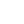</a> | **📂 檔名:** `add-to-playlist-24px.svg` ✨ **格式:** `Vector (SVG)` ⚖️ **大小:** `437.00B` 📅 **更新:** `2026-02-27`  🚀 **jsDelivr Markdown:** `` 🔗 **直接連結 (Url):** <code>https://cdn.jsdelivr.net/gh/barry028/materials@main/images/iCons/Iconbrew%20/add-to-playlist-24px.svg</code> 📥 [檢視原始檔](add-to-playlist-24px.svg) |
|  | **📂 檔名:** `add-to-playlist.svg` ✨ **格式:** `Vector (SVG)` ⚖️ **大小:** `876.00B` 📅 **更新:** `2026-02-27`  🚀 **jsDelivr Markdown:** `` 🔗 **直接連結 (Url):** <code>https://cdn.jsdelivr.net/gh/barry028/materials@main/images/iCons/Iconbrew%20/add-to-playlist.svg</code> 📥 [檢視原始檔](add-to-playlist.svg) |
|  | **📂 檔名:** `add.svg` ✨ **格式:** `Vector (SVG)` ⚖️ **大小:** `722.00B` 📅 **更新:** `2026-02-27`  🚀 **jsDelivr Markdown:** `` 🔗 **直接連結 (Url):** <code>https://cdn.jsdelivr.net/gh/barry028/materials@main/images/iCons/Iconbrew%20/add.svg</code> 📥 [檢視原始檔](add.svg) |
|  | **📂 檔名:** `airplay-18px.svg` ✨ **格式:** `Vector (SVG)` ⚖️ **大小:** `1.02KB` 📅 **更新:** `2026-02-27`  🚀 **jsDelivr Markdown:** `` 🔗 **直接連結 (Url):** <code>https://cdn.jsdelivr.net/gh/barry028/materials@main/images/iCons/Iconbrew%20/airplay-18px.svg</code> 📥 [檢視原始檔](airplay-18px.svg) |
|  | **📂 檔名:** `airplay-24px.svg` ✨ **格式:** `Vector (SVG)` ⚖️ **大小:** `1.07KB` 📅 **更新:** `2026-02-27`  🚀 **jsDelivr Markdown:** `` 🔗 **直接連結 (Url):** <code>https://cdn.jsdelivr.net/gh/barry028/materials@main/images/iCons/Iconbrew%20/airplay-24px.svg</code> 📥 [檢視原始檔](airplay-24px.svg) |
|  | **📂 檔名:** `airplay.svg` ✨ **格式:** `Vector (SVG)` ⚖️ **大小:** `2.10KB` 📅 **更新:** `2026-02-27`  🚀 **jsDelivr Markdown:** `` 🔗 **直接連結 (Url):** <code>https://cdn.jsdelivr.net/gh/barry028/materials@main/images/iCons/Iconbrew%20/airplay.svg</code> 📥 [檢視原始檔](airplay.svg) |
|  | **📂 檔名:** `alarm-clock-18px.svg` ✨ **格式:** `Vector (SVG)` ⚖️ **大小:** `765.00B` 📅 **更新:** `2026-02-27`  🚀 **jsDelivr Markdown:** `` 🔗 **直接連結 (Url):** <code>https://cdn.jsdelivr.net/gh/barry028/materials@main/images/iCons/Iconbrew%20/alarm-clock-18px.svg</code> 📥 [檢視原始檔](alarm-clock-18px.svg) |
|  | **📂 檔名:** `alarm-clock-2-18px.svg` ✨ **格式:** `Vector (SVG)` ⚖️ **大小:** `605.00B` 📅 **更新:** `2026-02-27`  🚀 **jsDelivr Markdown:** `` 🔗 **直接連結 (Url):** <code>https://cdn.jsdelivr.net/gh/barry028/materials@main/images/iCons/Iconbrew%20/alarm-clock-2-18px.svg</code> 📥 [檢視原始檔](alarm-clock-2-18px.svg) |
|  | **📂 檔名:** `alarm-clock-2-24px.svg` ✨ **格式:** `Vector (SVG)` ⚖️ **大小:** `533.00B` 📅 **更新:** `2026-02-27`  🚀 **jsDelivr Markdown:** `` 🔗 **直接連結 (Url):** <code>https://cdn.jsdelivr.net/gh/barry028/materials@main/images/iCons/Iconbrew%20/alarm-clock-2-24px.svg</code> 📥 [檢視原始檔](alarm-clock-2-24px.svg) |
|  | **📂 檔名:** `alarm-clock-2.svg` ✨ **格式:** `Vector (SVG)` ⚖️ **大小:** `1.13KB` 📅 **更新:** `2026-02-27`  🚀 **jsDelivr Markdown:** `` 🔗 **直接連結 (Url):** <code>https://cdn.jsdelivr.net/gh/barry028/materials@main/images/iCons/Iconbrew%20/alarm-clock-2.svg</code> 📥 [檢視原始檔](alarm-clock-2.svg) |
|  | **📂 檔名:** `alarm-clock-24px.svg` ✨ **格式:** `Vector (SVG)` ⚖️ **大小:** `682.00B` 📅 **更新:** `2026-02-27`  🚀 **jsDelivr Markdown:** `` 🔗 **直接連結 (Url):** <code>https://cdn.jsdelivr.net/gh/barry028/materials@main/images/iCons/Iconbrew%20/alarm-clock-24px.svg</code> 📥 [檢視原始檔](alarm-clock-24px.svg) |
|  | **📂 檔名:** `alarm-clock.svg` ✨ **格式:** `Vector (SVG)` ⚖️ **大小:** `1.44KB` 📅 **更新:** `2026-02-27`  🚀 **jsDelivr Markdown:** `` 🔗 **直接連結 (Url):** <code>https://cdn.jsdelivr.net/gh/barry028/materials@main/images/iCons/Iconbrew%20/alarm-clock.svg</code> 📥 [檢視原始檔](alarm-clock.svg) |
|  | **📂 檔名:** `alert-with-circle-18px.svg` ✨ **格式:** `Vector (SVG)` ⚖️ **大小:** `538.00B` 📅 **更新:** `2026-02-27`  🚀 **jsDelivr Markdown:** `` 🔗 **直接連結 (Url):** <code>https://cdn.jsdelivr.net/gh/barry028/materials@main/images/iCons/Iconbrew%20/alert-with-circle-18px.svg</code> 📥 [檢視原始檔](alert-with-circle-18px.svg) |
|  | **📂 檔名:** `alert-with-circle-24px.svg` ✨ **格式:** `Vector (SVG)` ⚖️ **大小:** `459.00B` 📅 **更新:** `2026-02-27`  🚀 **jsDelivr Markdown:** `` 🔗 **直接連結 (Url):** <code>https://cdn.jsdelivr.net/gh/barry028/materials@main/images/iCons/Iconbrew%20/alert-with-circle-24px.svg</code> 📥 [檢視原始檔](alert-with-circle-24px.svg) |
|  | **📂 檔名:** `alert-with-circle.svg` ✨ **格式:** `Vector (SVG)` ⚖️ **大小:** `1.00KB` 📅 **更新:** `2026-02-27`  🚀 **jsDelivr Markdown:** `` 🔗 **直接連結 (Url):** <code>https://cdn.jsdelivr.net/gh/barry028/materials@main/images/iCons/Iconbrew%20/alert-with-circle.svg</code> 📥 [檢視原始檔](alert-with-circle.svg) |
|  | **📂 檔名:** `algolia-18px.svg` ✨ **格式:** `Vector (SVG)` ⚖️ **大小:** `834.00B` 📅 **更新:** `2026-02-27`  🚀 **jsDelivr Markdown:** `` 🔗 **直接連結 (Url):** <code>https://cdn.jsdelivr.net/gh/barry028/materials@main/images/iCons/Iconbrew%20/algolia-18px.svg</code> 📥 [檢視原始檔](algolia-18px.svg) |
|  | **📂 檔名:** `algolia-24px.svg` ✨ **格式:** `Vector (SVG)` ⚖️ **大小:** `902.00B` 📅 **更新:** `2026-02-27`  🚀 **jsDelivr Markdown:** `` 🔗 **直接連結 (Url):** <code>https://cdn.jsdelivr.net/gh/barry028/materials@main/images/iCons/Iconbrew%20/algolia-24px.svg</code> 📥 [檢視原始檔](algolia-24px.svg) |
|  | **📂 檔名:** `algolia.svg` ✨ **格式:** `Vector (SVG)` ⚖️ **大小:** `1.66KB` 📅 **更新:** `2026-02-27`  🚀 **jsDelivr Markdown:** `` 🔗 **直接連結 (Url):** <code>https://cdn.jsdelivr.net/gh/barry028/materials@main/images/iCons/Iconbrew%20/algolia.svg</code> 📥 [檢視原始檔](algolia.svg) |
|  | **📂 檔名:** `analogue-watch-18px.svg` ✨ **格式:** `Vector (SVG)` ⚖️ **大小:** `1.11KB` 📅 **更新:** `2026-02-27`  🚀 **jsDelivr Markdown:** `` 🔗 **直接連結 (Url):** <code>https://cdn.jsdelivr.net/gh/barry028/materials@main/images/iCons/Iconbrew%20/analogue-watch-18px.svg</code> 📥 [檢視原始檔](analogue-watch-18px.svg) |
|  | **📂 檔名:** `analogue-watch-24px.svg` ✨ **格式:** `Vector (SVG)` ⚖️ **大小:** `1.01KB` 📅 **更新:** `2026-02-27`  🚀 **jsDelivr Markdown:** `` 🔗 **直接連結 (Url):** <code>https://cdn.jsdelivr.net/gh/barry028/materials@main/images/iCons/Iconbrew%20/analogue-watch-24px.svg</code> 📥 [檢視原始檔](analogue-watch-24px.svg) |
|  | **📂 檔名:** `analogue-watch.svg` ✨ **格式:** `Vector (SVG)` ⚖️ **大小:** `2.15KB` 📅 **更新:** `2026-02-27`  🚀 **jsDelivr Markdown:** `` 🔗 **直接連結 (Url):** <code>https://cdn.jsdelivr.net/gh/barry028/materials@main/images/iCons/Iconbrew%20/analogue-watch.svg</code> 📥 [檢視原始檔](analogue-watch.svg) |
|  | **📂 檔名:** `angular-18px.svg` ✨ **格式:** `Vector (SVG)` ⚖️ **大小:** `1017.00B` 📅 **更新:** `2026-02-27`  🚀 **jsDelivr Markdown:** `` 🔗 **直接連結 (Url):** <code>https://cdn.jsdelivr.net/gh/barry028/materials@main/images/iCons/Iconbrew%20/angular-18px.svg</code> 📥 [檢視原始檔](angular-18px.svg) |
|  | **📂 檔名:** `angular-24px.svg` ✨ **格式:** `Vector (SVG)` ⚖️ **大小:** `1.01KB` 📅 **更新:** `2026-02-27`  🚀 **jsDelivr Markdown:** `` 🔗 **直接連結 (Url):** <code>https://cdn.jsdelivr.net/gh/barry028/materials@main/images/iCons/Iconbrew%20/angular-24px.svg</code> 📥 [檢視原始檔](angular-24px.svg) |
|  | **📂 檔名:** `angular.svg` ✨ **格式:** `Vector (SVG)` ⚖️ **大小:** `1.99KB` 📅 **更新:** `2026-02-27`  🚀 **jsDelivr Markdown:** `` 🔗 **直接連結 (Url):** <code>https://cdn.jsdelivr.net/gh/barry028/materials@main/images/iCons/Iconbrew%20/angular.svg</code> 📥 [檢視原始檔](angular.svg) |
|  | **📂 檔名:** `apple-18px.svg` ✨ **格式:** `Vector (SVG)` ⚖️ **大小:** `1.04KB` 📅 **更新:** `2026-02-27`  🚀 **jsDelivr Markdown:** `` 🔗 **直接連結 (Url):** <code>https://cdn.jsdelivr.net/gh/barry028/materials@main/images/iCons/Iconbrew%20/apple-18px.svg</code> 📥 [檢視原始檔](apple-18px.svg) |
|  | **📂 檔名:** `apple-24px.svg` ✨ **格式:** `Vector (SVG)` ⚖️ **大小:** `1.01KB` 📅 **更新:** `2026-02-27`  🚀 **jsDelivr Markdown:** `` 🔗 **直接連結 (Url):** <code>https://cdn.jsdelivr.net/gh/barry028/materials@main/images/iCons/Iconbrew%20/apple-24px.svg</code> 📥 [檢視原始檔](apple-24px.svg) |
|  | **📂 檔名:** `apple-watch-18px.svg` ✨ **格式:** `Vector (SVG)` ⚖️ **大小:** `2.08KB` 📅 **更新:** `2026-02-27`  🚀 **jsDelivr Markdown:** `` 🔗 **直接連結 (Url):** <code>https://cdn.jsdelivr.net/gh/barry028/materials@main/images/iCons/Iconbrew%20/apple-watch-18px.svg</code> 📥 [檢視原始檔](apple-watch-18px.svg) |
|  | **📂 檔名:** `apple-watch-24px.svg` ✨ **格式:** `Vector (SVG)` ⚖️ **大小:** `2.17KB` 📅 **更新:** `2026-02-27`  🚀 **jsDelivr Markdown:** `` 🔗 **直接連結 (Url):** <code>https://cdn.jsdelivr.net/gh/barry028/materials@main/images/iCons/Iconbrew%20/apple-watch-24px.svg</code> 📥 [檢視原始檔](apple-watch-24px.svg) |
|  | **📂 檔名:** `apple-watch.svg` ✨ **格式:** `Vector (SVG)` ⚖️ **大小:** `4.16KB` 📅 **更新:** `2026-02-27`  🚀 **jsDelivr Markdown:** `` 🔗 **直接連結 (Url):** <code>https://cdn.jsdelivr.net/gh/barry028/materials@main/images/iCons/Iconbrew%20/apple-watch.svg</code> 📥 [檢視原始檔](apple-watch.svg) |
|  | **📂 檔名:** `apple.svg` ✨ **格式:** `Vector (SVG)` ⚖️ **大小:** `2.05KB` 📅 **更新:** `2026-02-27`  🚀 **jsDelivr Markdown:** `` 🔗 **直接連結 (Url):** <code>https://cdn.jsdelivr.net/gh/barry028/materials@main/images/iCons/Iconbrew%20/apple.svg</code> 📥 [檢視原始檔](apple.svg) |
|  | **📂 檔名:** `archive-18px.svg` ✨ **格式:** `Vector (SVG)` ⚖️ **大小:** `976.00B` 📅 **更新:** `2026-02-27`  🚀 **jsDelivr Markdown:** `` 🔗 **直接連結 (Url):** <code>https://cdn.jsdelivr.net/gh/barry028/materials@main/images/iCons/Iconbrew%20/archive-18px.svg</code> 📥 [檢視原始檔](archive-18px.svg) |
|  | **📂 檔名:** `archive-24px.svg` ✨ **格式:** `Vector (SVG)` ⚖️ **大小:** `1.11KB` 📅 **更新:** `2026-02-27`  🚀 **jsDelivr Markdown:** `` 🔗 **直接連結 (Url):** <code>https://cdn.jsdelivr.net/gh/barry028/materials@main/images/iCons/Iconbrew%20/archive-24px.svg</code> 📥 [檢視原始檔](archive-24px.svg) |
|  | **📂 檔名:** `archive.svg` ✨ **格式:** `Vector (SVG)` ⚖️ **大小:** `2.11KB` 📅 **更新:** `2026-02-27`  🚀 **jsDelivr Markdown:** `` 🔗 **直接連結 (Url):** <code>https://cdn.jsdelivr.net/gh/barry028/materials@main/images/iCons/Iconbrew%20/archive.svg</code> 📥 [檢視原始檔](archive.svg) |
|  | **📂 檔名:** `arrow-bend-left-down-18px.svg` ✨ **格式:** `Vector (SVG)` ⚖️ **大小:** `473.00B` 📅 **更新:** `2026-02-27`  🚀 **jsDelivr Markdown:** `` 🔗 **直接連結 (Url):** <code>https://cdn.jsdelivr.net/gh/barry028/materials@main/images/iCons/Iconbrew%20/arrow-bend-left-down-18px.svg</code> 📥 [檢視原始檔](arrow-bend-left-down-18px.svg) |
|  | **📂 檔名:** `arrow-bend-left-down-24px.svg` ✨ **格式:** `Vector (SVG)` ⚖️ **大小:** `472.00B` 📅 **更新:** `2026-02-27`  🚀 **jsDelivr Markdown:** `` 🔗 **直接連結 (Url):** <code>https://cdn.jsdelivr.net/gh/barry028/materials@main/images/iCons/Iconbrew%20/arrow-bend-left-down-24px.svg</code> 📥 [檢視原始檔](arrow-bend-left-down-24px.svg) |
|  | **📂 檔名:** `arrow-bend-left-down.svg` ✨ **格式:** `Vector (SVG)` ⚖️ **大小:** `966.00B` 📅 **更新:** `2026-02-27`  🚀 **jsDelivr Markdown:** `` 🔗 **直接連結 (Url):** <code>https://cdn.jsdelivr.net/gh/barry028/materials@main/images/iCons/Iconbrew%20/arrow-bend-left-down.svg</code> 📥 [檢視原始檔](arrow-bend-left-down.svg) |
|  | **📂 檔名:** `arrow-bend-left-up-18px.svg` ✨ **格式:** `Vector (SVG)` ⚖️ **大小:** `476.00B` 📅 **更新:** `2026-02-27`  🚀 **jsDelivr Markdown:** `` 🔗 **直接連結 (Url):** <code>https://cdn.jsdelivr.net/gh/barry028/materials@main/images/iCons/Iconbrew%20/arrow-bend-left-up-18px.svg</code> 📥 [檢視原始檔](arrow-bend-left-up-18px.svg) |
|  | **📂 檔名:** `arrow-bend-left-up-24px.svg` ✨ **格式:** `Vector (SVG)` ⚖️ **大小:** `475.00B` 📅 **更新:** `2026-02-27`  🚀 **jsDelivr Markdown:** `` 🔗 **直接連結 (Url):** <code>https://cdn.jsdelivr.net/gh/barry028/materials@main/images/iCons/Iconbrew%20/arrow-bend-left-up-24px.svg</code> 📥 [檢視原始檔](arrow-bend-left-up-24px.svg) |
|  | **📂 檔名:** `arrow-bend-left-up.svg` ✨ **格式:** `Vector (SVG)` ⚖️ **大小:** `970.00B` 📅 **更新:** `2026-02-27`  🚀 **jsDelivr Markdown:** `` 🔗 **直接連結 (Url):** <code>https://cdn.jsdelivr.net/gh/barry028/materials@main/images/iCons/Iconbrew%20/arrow-bend-left-up.svg</code> 📥 [檢視原始檔](arrow-bend-left-up.svg) |
|  | **📂 檔名:** `arrow-bend-right-down-18px.svg` ✨ **格式:** `Vector (SVG)` ⚖️ **大小:** `474.00B` 📅 **更新:** `2026-02-27`  🚀 **jsDelivr Markdown:** `` 🔗 **直接連結 (Url):** <code>https://cdn.jsdelivr.net/gh/barry028/materials@main/images/iCons/Iconbrew%20/arrow-bend-right-down-18px.svg</code> 📥 [檢視原始檔](arrow-bend-right-down-18px.svg) |
|  | **📂 檔名:** `arrow-bend-right-down-24px.svg` ✨ **格式:** `Vector (SVG)` ⚖️ **大小:** `474.00B` 📅 **更新:** `2026-02-27`  🚀 **jsDelivr Markdown:** `` 🔗 **直接連結 (Url):** <code>https://cdn.jsdelivr.net/gh/barry028/materials@main/images/iCons/Iconbrew%20/arrow-bend-right-down-24px.svg</code> 📥 [檢視原始檔](arrow-bend-right-down-24px.svg) |
|  | **📂 檔名:** `arrow-bend-right-down.svg` ✨ **格式:** `Vector (SVG)` ⚖️ **大小:** `968.00B` 📅 **更新:** `2026-02-27`  🚀 **jsDelivr Markdown:** `` 🔗 **直接連結 (Url):** <code>https://cdn.jsdelivr.net/gh/barry028/materials@main/images/iCons/Iconbrew%20/arrow-bend-right-down.svg</code> 📥 [檢視原始檔](arrow-bend-right-down.svg) |
|  | **📂 檔名:** `arrow-bend-right-up-18px.svg` ✨ **格式:** `Vector (SVG)` ⚖️ **大小:** `477.00B` 📅 **更新:** `2026-02-27`  🚀 **jsDelivr Markdown:** `` 🔗 **直接連結 (Url):** <code>https://cdn.jsdelivr.net/gh/barry028/materials@main/images/iCons/Iconbrew%20/arrow-bend-right-up-18px.svg</code> 📥 [檢視原始檔](arrow-bend-right-up-18px.svg) |
|  | **📂 檔名:** `arrow-bend-right-up-24px.svg` ✨ **格式:** `Vector (SVG)` ⚖️ **大小:** `477.00B` 📅 **更新:** `2026-02-27`  🚀 **jsDelivr Markdown:** `` 🔗 **直接連結 (Url):** <code>https://cdn.jsdelivr.net/gh/barry028/materials@main/images/iCons/Iconbrew%20/arrow-bend-right-up-24px.svg</code> 📥 [檢視原始檔](arrow-bend-right-up-24px.svg) |
|  | **📂 檔名:** `arrow-bend-right-up.svg` ✨ **格式:** `Vector (SVG)` ⚖️ **大小:** `972.00B` 📅 **更新:** `2026-02-27`  🚀 **jsDelivr Markdown:** `` 🔗 **直接連結 (Url):** <code>https://cdn.jsdelivr.net/gh/barry028/materials@main/images/iCons/Iconbrew%20/arrow-bend-right-up.svg</code> 📥 [檢視原始檔](arrow-bend-right-up.svg) |
|  | **📂 檔名:** `arrow-bottom-right-18px.svg` ✨ **格式:** `Vector (SVG)` ⚖️ **大小:** `573.00B` 📅 **更新:** `2026-02-27`  🚀 **jsDelivr Markdown:** `` 🔗 **直接連結 (Url):** <code>https://cdn.jsdelivr.net/gh/barry028/materials@main/images/iCons/Iconbrew%20/arrow-bottom-right-18px.svg</code> 📥 [檢視原始檔](arrow-bottom-right-18px.svg) |
|  | **📂 檔名:** `arrow-bottom-right-24px.svg` ✨ **格式:** `Vector (SVG)` ⚖️ **大小:** `598.00B` 📅 **更新:** `2026-02-27`  🚀 **jsDelivr Markdown:** `` 🔗 **直接連結 (Url):** <code>https://cdn.jsdelivr.net/gh/barry028/materials@main/images/iCons/Iconbrew%20/arrow-bottom-right-24px.svg</code> 📥 [檢視原始檔](arrow-bottom-right-24px.svg) |
|  | **📂 檔名:** `arrow-bottom-right.svg` ✨ **格式:** `Vector (SVG)` ⚖️ **大小:** `1.13KB` 📅 **更新:** `2026-02-27`  🚀 **jsDelivr Markdown:** `` 🔗 **直接連結 (Url):** <code>https://cdn.jsdelivr.net/gh/barry028/materials@main/images/iCons/Iconbrew%20/arrow-bottom-right.svg</code> 📥 [檢視原始檔](arrow-bottom-right.svg) |
|  | **📂 檔名:** `arrow-circle-backward-18px.svg` ✨ **格式:** `Vector (SVG)` ⚖️ **大小:** `659.00B` 📅 **更新:** `2026-02-27`  🚀 **jsDelivr Markdown:** `` 🔗 **直接連結 (Url):** <code>https://cdn.jsdelivr.net/gh/barry028/materials@main/images/iCons/Iconbrew%20/arrow-circle-backward-18px.svg</code> 📥 [檢視原始檔](arrow-circle-backward-18px.svg) |
|  | **📂 檔名:** `arrow-circle-backward-24px.svg` ✨ **格式:** `Vector (SVG)` ⚖️ **大小:** `702.00B` 📅 **更新:** `2026-02-27`  🚀 **jsDelivr Markdown:** `` 🔗 **直接連結 (Url):** <code>https://cdn.jsdelivr.net/gh/barry028/materials@main/images/iCons/Iconbrew%20/arrow-circle-backward-24px.svg</code> 📥 [檢視原始檔](arrow-circle-backward-24px.svg) |
|  | **📂 檔名:** `arrow-circle-backward-five-18px.svg` ✨ **格式:** `Vector (SVG)` ⚖️ **大小:** `963.00B` 📅 **更新:** `2026-02-27`  🚀 **jsDelivr Markdown:** `` 🔗 **直接連結 (Url):** <code>https://cdn.jsdelivr.net/gh/barry028/materials@main/images/iCons/Iconbrew%20/arrow-circle-backward-five-18px.svg</code> 📥 [檢視原始檔](arrow-circle-backward-five-18px.svg) |
|  | **📂 檔名:** `arrow-circle-backward-five-24px.svg` ✨ **格式:** `Vector (SVG)` ⚖️ **大小:** `1015.00B` 📅 **更新:** `2026-02-27`  🚀 **jsDelivr Markdown:** `` 🔗 **直接連結 (Url):** <code>https://cdn.jsdelivr.net/gh/barry028/materials@main/images/iCons/Iconbrew%20/arrow-circle-backward-five-24px.svg</code> 📥 [檢視原始檔](arrow-circle-backward-five-24px.svg) |
|  | **📂 檔名:** `arrow-circle-backward-five.svg` ✨ **格式:** `Vector (SVG)` ⚖️ **大小:** `1.90KB` 📅 **更新:** `2026-02-27`  🚀 **jsDelivr Markdown:** `` 🔗 **直接連結 (Url):** <code>https://cdn.jsdelivr.net/gh/barry028/materials@main/images/iCons/Iconbrew%20/arrow-circle-backward-five.svg</code> 📥 [檢視原始檔](arrow-circle-backward-five.svg) |
|  | **📂 檔名:** `arrow-circle-backward-fiveteen-18px.svg` ✨ **格式:** `Vector (SVG)` ⚖️ **大小:** `986.00B` 📅 **更新:** `2026-02-27`  🚀 **jsDelivr Markdown:** `` 🔗 **直接連結 (Url):** <code>https://cdn.jsdelivr.net/gh/barry028/materials@main/images/iCons/Iconbrew%20/arrow-circle-backward-fiveteen-18px.svg</code> 📥 [檢視原始檔](arrow-circle-backward-fiveteen-18px.svg) |
|  | **📂 檔名:** `arrow-circle-backward-fiveteen-24px.svg` ✨ **格式:** `Vector (SVG)` ⚖️ **大小:** `1006.00B` 📅 **更新:** `2026-02-27`  🚀 **jsDelivr Markdown:** `` 🔗 **直接連結 (Url):** <code>https://cdn.jsdelivr.net/gh/barry028/materials@main/images/iCons/Iconbrew%20/arrow-circle-backward-fiveteen-24px.svg</code> 📥 [檢視原始檔](arrow-circle-backward-fiveteen-24px.svg) |
|  | **📂 檔名:** `arrow-circle-backward-fiveteen.svg` ✨ **格式:** `Vector (SVG)` ⚖️ **大小:** `1.92KB` 📅 **更新:** `2026-02-27`  🚀 **jsDelivr Markdown:** `` 🔗 **直接連結 (Url):** <code>https://cdn.jsdelivr.net/gh/barry028/materials@main/images/iCons/Iconbrew%20/arrow-circle-backward-fiveteen.svg</code> 📥 [檢視原始檔](arrow-circle-backward-fiveteen.svg) |
|  | **📂 檔名:** `arrow-circle-backward-ten-18px.svg` ✨ **格式:** `Vector (SVG)` ⚖️ **大小:** `914.00B` 📅 **更新:** `2026-02-27`  🚀 **jsDelivr Markdown:** `` 🔗 **直接連結 (Url):** <code>https://cdn.jsdelivr.net/gh/barry028/materials@main/images/iCons/Iconbrew%20/arrow-circle-backward-ten-18px.svg</code> 📥 [檢視原始檔](arrow-circle-backward-ten-18px.svg) |
|  | **📂 檔名:** `arrow-circle-backward-ten-24px.svg` ✨ **格式:** `Vector (SVG)` ⚖️ **大小:** `960.00B` 📅 **更新:** `2026-02-27`  🚀 **jsDelivr Markdown:** `` 🔗 **直接連結 (Url):** <code>https://cdn.jsdelivr.net/gh/barry028/materials@main/images/iCons/Iconbrew%20/arrow-circle-backward-ten-24px.svg</code> 📥 [檢視原始檔](arrow-circle-backward-ten-24px.svg) |
|  | **📂 檔名:** `arrow-circle-backward-ten.svg` ✨ **格式:** `Vector (SVG)` ⚖️ **大小:** `1.80KB` 📅 **更新:** `2026-02-27`  🚀 **jsDelivr Markdown:** `` 🔗 **直接連結 (Url):** <code>https://cdn.jsdelivr.net/gh/barry028/materials@main/images/iCons/Iconbrew%20/arrow-circle-backward-ten.svg</code> 📥 [檢視原始檔](arrow-circle-backward-ten.svg) |
|  | **📂 檔名:** `arrow-circle-backward-twenty-18px.svg` ✨ **格式:** `Vector (SVG)` ⚖️ **大小:** `1.02KB` 📅 **更新:** `2026-02-27`  🚀 **jsDelivr Markdown:** `` 🔗 **直接連結 (Url):** <code>https://cdn.jsdelivr.net/gh/barry028/materials@main/images/iCons/Iconbrew%20/arrow-circle-backward-twenty-18px.svg</code> 📥 [檢視原始檔](arrow-circle-backward-twenty-18px.svg) |
|  | **📂 檔名:** `arrow-circle-backward-twenty-24px.svg` ✨ **格式:** `Vector (SVG)` ⚖️ **大小:** `1017.00B` 📅 **更新:** `2026-02-27`  🚀 **jsDelivr Markdown:** `` 🔗 **直接連結 (Url):** <code>https://cdn.jsdelivr.net/gh/barry028/materials@main/images/iCons/Iconbrew%20/arrow-circle-backward-twenty-24px.svg</code> 📥 [檢視原始檔](arrow-circle-backward-twenty-24px.svg) |
|  | **📂 檔名:** `arrow-circle-backward-twenty.svg` ✨ **格式:** `Vector (SVG)` ⚖️ **大小:** `1.96KB` 📅 **更新:** `2026-02-27`  🚀 **jsDelivr Markdown:** `` 🔗 **直接連結 (Url):** <code>https://cdn.jsdelivr.net/gh/barry028/materials@main/images/iCons/Iconbrew%20/arrow-circle-backward-twenty.svg</code> 📥 [檢視原始檔](arrow-circle-backward-twenty.svg) |
|  | **📂 檔名:** `arrow-circle-backward.svg` ✨ **格式:** `Vector (SVG)` ⚖️ **大小:** `1.35KB` 📅 **更新:** `2026-02-27`  🚀 **jsDelivr Markdown:** `` 🔗 **直接連結 (Url):** <code>https://cdn.jsdelivr.net/gh/barry028/materials@main/images/iCons/Iconbrew%20/arrow-circle-backward.svg</code> 📥 [檢視原始檔](arrow-circle-backward.svg) |
|  | **📂 檔名:** `arrow-circle-bckwards-thirty-18px-1.svg` ✨ **格式:** `Vector (SVG)` ⚖️ **大小:** `1.24KB` 📅 **更新:** `2026-02-27`  🚀 **jsDelivr Markdown:** `` 🔗 **直接連結 (Url):** <code>https://cdn.jsdelivr.net/gh/barry028/materials@main/images/iCons/Iconbrew%20/arrow-circle-bckwards-thirty-18px-1.svg</code> 📥 [檢視原始檔](arrow-circle-bckwards-thirty-18px-1.svg) |
|  | **📂 檔名:** `arrow-circle-bckwards-thirty-18px.svg` ✨ **格式:** `Vector (SVG)` ⚖️ **大小:** `1.24KB` 📅 **更新:** `2026-02-27`  🚀 **jsDelivr Markdown:** `` 🔗 **直接連結 (Url):** <code>https://cdn.jsdelivr.net/gh/barry028/materials@main/images/iCons/Iconbrew%20/arrow-circle-bckwards-thirty-18px.svg</code> 📥 [檢視原始檔](arrow-circle-bckwards-thirty-18px.svg) |
|  | **📂 檔名:** `arrow-circle-bckwards-thirty-24px-1.svg` ✨ **格式:** `Vector (SVG)` ⚖️ **大小:** `1.13KB` 📅 **更新:** `2026-02-27`  🚀 **jsDelivr Markdown:** `` 🔗 **直接連結 (Url):** <code>https://cdn.jsdelivr.net/gh/barry028/materials@main/images/iCons/Iconbrew%20/arrow-circle-bckwards-thirty-24px-1.svg</code> 📥 [檢視原始檔](arrow-circle-bckwards-thirty-24px-1.svg) |
|  | **📂 檔名:** `arrow-circle-bckwards-thirty-24px.svg` ✨ **格式:** `Vector (SVG)` ⚖️ **大小:** `1.13KB` 📅 **更新:** `2026-02-27`  🚀 **jsDelivr Markdown:** `` 🔗 **直接連結 (Url):** <code>https://cdn.jsdelivr.net/gh/barry028/materials@main/images/iCons/Iconbrew%20/arrow-circle-bckwards-thirty-24px.svg</code> 📥 [檢視原始檔](arrow-circle-bckwards-thirty-24px.svg) |
|  | **📂 檔名:** `arrow-circle-bckwards-thirty.svg` ✨ **格式:** `Vector (SVG)` ⚖️ **大小:** `2.36KB` 📅 **更新:** `2026-02-27`  🚀 **jsDelivr Markdown:** `` 🔗 **直接連結 (Url):** <code>https://cdn.jsdelivr.net/gh/barry028/materials@main/images/iCons/Iconbrew%20/arrow-circle-bckwards-thirty.svg</code> 📥 [檢視原始檔](arrow-circle-bckwards-thirty.svg) |
|  | **📂 檔名:** `arrow-circle-forward-18px.svg` ✨ **格式:** `Vector (SVG)` ⚖️ **大小:** `494.00B` 📅 **更新:** `2026-02-27`  🚀 **jsDelivr Markdown:** `` 🔗 **直接連結 (Url):** <code>https://cdn.jsdelivr.net/gh/barry028/materials@main/images/iCons/Iconbrew%20/arrow-circle-forward-18px.svg</code> 📥 [檢視原始檔](arrow-circle-forward-18px.svg) |
|  | **📂 檔名:** `arrow-circle-forward-24px.svg` ✨ **格式:** `Vector (SVG)` ⚖️ **大小:** `535.00B` 📅 **更新:** `2026-02-27`  🚀 **jsDelivr Markdown:** `` 🔗 **直接連結 (Url):** <code>https://cdn.jsdelivr.net/gh/barry028/materials@main/images/iCons/Iconbrew%20/arrow-circle-forward-24px.svg</code> 📥 [檢視原始檔](arrow-circle-forward-24px.svg) |
|  | **📂 檔名:** `arrow-circle-forward-five-18px.svg` ✨ **格式:** `Vector (SVG)` ⚖️ **大小:** `931.00B` 📅 **更新:** `2026-02-27`  🚀 **jsDelivr Markdown:** `` 🔗 **直接連結 (Url):** <code>https://cdn.jsdelivr.net/gh/barry028/materials@main/images/iCons/Iconbrew%20/arrow-circle-forward-five-18px.svg</code> 📥 [檢視原始檔](arrow-circle-forward-five-18px.svg) |
|  | **📂 檔名:** `arrow-circle-forward-five-24px.svg` ✨ **格式:** `Vector (SVG)` ⚖️ **大小:** `995.00B` 📅 **更新:** `2026-02-27`  🚀 **jsDelivr Markdown:** `` 🔗 **直接連結 (Url):** <code>https://cdn.jsdelivr.net/gh/barry028/materials@main/images/iCons/Iconbrew%20/arrow-circle-forward-five-24px.svg</code> 📥 [檢視原始檔](arrow-circle-forward-five-24px.svg) |
|  | **📂 檔名:** `arrow-circle-forward-five.svg` ✨ **格式:** `Vector (SVG)` ⚖️ **大小:** `1.91KB` 📅 **更新:** `2026-02-27`  🚀 **jsDelivr Markdown:** `` 🔗 **直接連結 (Url):** <code>https://cdn.jsdelivr.net/gh/barry028/materials@main/images/iCons/Iconbrew%20/arrow-circle-forward-five.svg</code> 📥 [檢視原始檔](arrow-circle-forward-five.svg) |
|  | **📂 檔名:** `arrow-circle-forward-fiveteen-18px.svg` ✨ **格式:** `Vector (SVG)` ⚖️ **大小:** `954.00B` 📅 **更新:** `2026-02-27`  🚀 **jsDelivr Markdown:** `` 🔗 **直接連結 (Url):** <code>https://cdn.jsdelivr.net/gh/barry028/materials@main/images/iCons/Iconbrew%20/arrow-circle-forward-fiveteen-18px.svg</code> 📥 [檢視原始檔](arrow-circle-forward-fiveteen-18px.svg) |
|  | **📂 檔名:** `arrow-circle-forward-fiveteen-24px.svg` ✨ **格式:** `Vector (SVG)` ⚖️ **大小:** `964.00B` 📅 **更新:** `2026-02-27`  🚀 **jsDelivr Markdown:** `` 🔗 **直接連結 (Url):** <code>https://cdn.jsdelivr.net/gh/barry028/materials@main/images/iCons/Iconbrew%20/arrow-circle-forward-fiveteen-24px.svg</code> 📥 [檢視原始檔](arrow-circle-forward-fiveteen-24px.svg) |
|  | **📂 檔名:** `arrow-circle-forward-fiveteen.svg` ✨ **格式:** `Vector (SVG)` ⚖️ **大小:** `1.95KB` 📅 **更新:** `2026-02-27`  🚀 **jsDelivr Markdown:** `` 🔗 **直接連結 (Url):** <code>https://cdn.jsdelivr.net/gh/barry028/materials@main/images/iCons/Iconbrew%20/arrow-circle-forward-fiveteen.svg</code> 📥 [檢視原始檔](arrow-circle-forward-fiveteen.svg) |
|  | **📂 檔名:** `arrow-circle-forward-ten-18px.svg` ✨ **格式:** `Vector (SVG)` ⚖️ **大小:** `882.00B` 📅 **更新:** `2026-02-27`  🚀 **jsDelivr Markdown:** `` 🔗 **直接連結 (Url):** <code>https://cdn.jsdelivr.net/gh/barry028/materials@main/images/iCons/Iconbrew%20/arrow-circle-forward-ten-18px.svg</code> 📥 [檢視原始檔](arrow-circle-forward-ten-18px.svg) |
|  | **📂 檔名:** `arrow-circle-forward-ten-24px.svg` ✨ **格式:** `Vector (SVG)` ⚖️ **大小:** `928.00B` 📅 **更新:** `2026-02-27`  🚀 **jsDelivr Markdown:** `` 🔗 **直接連結 (Url):** <code>https://cdn.jsdelivr.net/gh/barry028/materials@main/images/iCons/Iconbrew%20/arrow-circle-forward-ten-24px.svg</code> 📥 [檢視原始檔](arrow-circle-forward-ten-24px.svg) |
|  | **📂 檔名:** `arrow-circle-forward-ten.svg` ✨ **格式:** `Vector (SVG)` ⚖️ **大小:** `1.82KB` 📅 **更新:** `2026-02-27`  🚀 **jsDelivr Markdown:** `` 🔗 **直接連結 (Url):** <code>https://cdn.jsdelivr.net/gh/barry028/materials@main/images/iCons/Iconbrew%20/arrow-circle-forward-ten.svg</code> 📥 [檢視原始檔](arrow-circle-forward-ten.svg) |
|  | **📂 檔名:** `arrow-circle-forward-thirty-18px.svg` ✨ **格式:** `Vector (SVG)` ⚖️ **大小:** `1.21KB` 📅 **更新:** `2026-02-27`  🚀 **jsDelivr Markdown:** `` 🔗 **直接連結 (Url):** <code>https://cdn.jsdelivr.net/gh/barry028/materials@main/images/iCons/Iconbrew%20/arrow-circle-forward-thirty-18px.svg</code> 📥 [檢視原始檔](arrow-circle-forward-thirty-18px.svg) |
|  | **📂 檔名:** `arrow-circle-forward-thirty-24px.svg` ✨ **格式:** `Vector (SVG)` ⚖️ **大小:** `1.11KB` 📅 **更新:** `2026-02-27`  🚀 **jsDelivr Markdown:** `` 🔗 **直接連結 (Url):** <code>https://cdn.jsdelivr.net/gh/barry028/materials@main/images/iCons/Iconbrew%20/arrow-circle-forward-thirty-24px.svg</code> 📥 [檢視原始檔](arrow-circle-forward-thirty-24px.svg) |
|  | **📂 檔名:** `arrow-circle-forward-thirty.svg` ✨ **格式:** `Vector (SVG)` ⚖️ **大小:** `2.43KB` 📅 **更新:** `2026-02-27`  🚀 **jsDelivr Markdown:** `` 🔗 **直接連結 (Url):** <code>https://cdn.jsdelivr.net/gh/barry028/materials@main/images/iCons/Iconbrew%20/arrow-circle-forward-thirty.svg</code> 📥 [檢視原始檔](arrow-circle-forward-thirty.svg) |
|  | **📂 檔名:** `arrow-circle-forward-twenty-18px.svg` ✨ **格式:** `Vector (SVG)` ⚖️ **大小:** `1012.00B` 📅 **更新:** `2026-02-27`  🚀 **jsDelivr Markdown:** `` 🔗 **直接連結 (Url):** <code>https://cdn.jsdelivr.net/gh/barry028/materials@main/images/iCons/Iconbrew%20/arrow-circle-forward-twenty-18px.svg</code> 📥 [檢視原始檔](arrow-circle-forward-twenty-18px.svg) |
|  | **📂 檔名:** `arrow-circle-forward-twenty-24px.svg` ✨ **格式:** `Vector (SVG)` ⚖️ **大小:** `1.04KB` 📅 **更新:** `2026-02-27`  🚀 **jsDelivr Markdown:** `` 🔗 **直接連結 (Url):** <code>https://cdn.jsdelivr.net/gh/barry028/materials@main/images/iCons/Iconbrew%20/arrow-circle-forward-twenty-24px.svg</code> 📥 [檢視原始檔](arrow-circle-forward-twenty-24px.svg) |
|  | **📂 檔名:** `arrow-circle-forward-twenty.svg` ✨ **格式:** `Vector (SVG)` ⚖️ **大小:** `2.05KB` 📅 **更新:** `2026-02-27`  🚀 **jsDelivr Markdown:** `` 🔗 **直接連結 (Url):** <code>https://cdn.jsdelivr.net/gh/barry028/materials@main/images/iCons/Iconbrew%20/arrow-circle-forward-twenty.svg</code> 📥 [檢視原始檔](arrow-circle-forward-twenty.svg) |
|  | **📂 檔名:** `arrow-circle-forward.svg` ✨ **格式:** `Vector (SVG)` ⚖️ **大小:** `1.04KB` 📅 **更新:** `2026-02-27`  🚀 **jsDelivr Markdown:** `` 🔗 **直接連結 (Url):** <code>https://cdn.jsdelivr.net/gh/barry028/materials@main/images/iCons/Iconbrew%20/arrow-circle-forward.svg</code> 📥 [檢視原始檔](arrow-circle-forward.svg) |
|  | **📂 檔名:** `arrow-down-18px.svg` ✨ **格式:** `Vector (SVG)` ⚖️ **大小:** `356.00B` 📅 **更新:** `2026-02-27`  🚀 **jsDelivr Markdown:** `` 🔗 **直接連結 (Url):** <code>https://cdn.jsdelivr.net/gh/barry028/materials@main/images/iCons/Iconbrew%20/arrow-down-18px.svg</code> 📥 [檢視原始檔](arrow-down-18px.svg) |
|  | **📂 檔名:** `arrow-down-24px.svg` ✨ **格式:** `Vector (SVG)` ⚖️ **大小:** `377.00B` 📅 **更新:** `2026-02-27`  🚀 **jsDelivr Markdown:** `` 🔗 **直接連結 (Url):** <code>https://cdn.jsdelivr.net/gh/barry028/materials@main/images/iCons/Iconbrew%20/arrow-down-24px.svg</code> 📥 [檢視原始檔](arrow-down-24px.svg) |
|  | **📂 檔名:** `arrow-down-left-18px.svg` ✨ **格式:** `Vector (SVG)` ⚖️ **大小:** `406.00B` 📅 **更新:** `2026-02-27`  🚀 **jsDelivr Markdown:** `` 🔗 **直接連結 (Url):** <code>https://cdn.jsdelivr.net/gh/barry028/materials@main/images/iCons/Iconbrew%20/arrow-down-left-18px.svg</code> 📥 [檢視原始檔](arrow-down-left-18px.svg) |
|  | **📂 檔名:** `arrow-down-left-24px.svg` ✨ **格式:** `Vector (SVG)` ⚖️ **大小:** `420.00B` 📅 **更新:** `2026-02-27`  🚀 **jsDelivr Markdown:** `` 🔗 **直接連結 (Url):** <code>https://cdn.jsdelivr.net/gh/barry028/materials@main/images/iCons/Iconbrew%20/arrow-down-left-24px.svg</code> 📥 [檢視原始檔](arrow-down-left-24px.svg) |
|  | **📂 檔名:** `arrow-down-left.svg` ✨ **格式:** `Vector (SVG)` ⚖️ **大小:** `845.00B` 📅 **更新:** `2026-02-27`  🚀 **jsDelivr Markdown:** `` 🔗 **直接連結 (Url):** <code>https://cdn.jsdelivr.net/gh/barry028/materials@main/images/iCons/Iconbrew%20/arrow-down-left.svg</code> 📥 [檢視原始檔](arrow-down-left.svg) |
|  | **📂 檔名:** `arrow-down.svg` ✨ **格式:** `Vector (SVG)` ⚖️ **大小:** `752.00B` 📅 **更新:** `2026-02-27`  🚀 **jsDelivr Markdown:** `` 🔗 **直接連結 (Url):** <code>https://cdn.jsdelivr.net/gh/barry028/materials@main/images/iCons/Iconbrew%20/arrow-down.svg</code> 📥 [檢視原始檔](arrow-down.svg) |
|  | **📂 檔名:** `arrow-left-18px.svg` ✨ **格式:** `Vector (SVG)` ⚖️ **大小:** `352.00B` 📅 **更新:** `2026-02-27`  🚀 **jsDelivr Markdown:** `` 🔗 **直接連結 (Url):** <code>https://cdn.jsdelivr.net/gh/barry028/materials@main/images/iCons/Iconbrew%20/arrow-left-18px.svg</code> 📥 [檢視原始檔](arrow-left-18px.svg) |
|  | **📂 檔名:** `arrow-left-24px.svg` ✨ **格式:** `Vector (SVG)` ⚖️ **大小:** `373.00B` 📅 **更新:** `2026-02-27`  🚀 **jsDelivr Markdown:** `` 🔗 **直接連結 (Url):** <code>https://cdn.jsdelivr.net/gh/barry028/materials@main/images/iCons/Iconbrew%20/arrow-left-24px.svg</code> 📥 [檢視原始檔](arrow-left-24px.svg) |
|  | **📂 檔名:** `arrow-left.svg` ✨ **格式:** `Vector (SVG)` ⚖️ **大小:** `751.00B` 📅 **更新:** `2026-02-27`  🚀 **jsDelivr Markdown:** `` 🔗 **直接連結 (Url):** <code>https://cdn.jsdelivr.net/gh/barry028/materials@main/images/iCons/Iconbrew%20/arrow-left.svg</code> 📥 [檢視原始檔](arrow-left.svg) |
|  | **📂 檔名:** `arrow-right-18px.svg` ✨ **格式:** `Vector (SVG)` ⚖️ **大小:** `354.00B` 📅 **更新:** `2026-02-27`  🚀 **jsDelivr Markdown:** `` 🔗 **直接連結 (Url):** <code>https://cdn.jsdelivr.net/gh/barry028/materials@main/images/iCons/Iconbrew%20/arrow-right-18px.svg</code> 📥 [檢視原始檔](arrow-right-18px.svg) |
|  | **📂 檔名:** `arrow-right-24px.svg` ✨ **格式:** `Vector (SVG)` ⚖️ **大小:** `384.00B` 📅 **更新:** `2026-02-27`  🚀 **jsDelivr Markdown:** `` 🔗 **直接連結 (Url):** <code>https://cdn.jsdelivr.net/gh/barry028/materials@main/images/iCons/Iconbrew%20/arrow-right-24px.svg</code> 📥 [檢視原始檔](arrow-right-24px.svg) |
|  | **📂 檔名:** `arrow-right.svg` ✨ **格式:** `Vector (SVG)` ⚖️ **大小:** `757.00B` 📅 **更新:** `2026-02-27`  🚀 **jsDelivr Markdown:** `` 🔗 **直接連結 (Url):** <code>https://cdn.jsdelivr.net/gh/barry028/materials@main/images/iCons/Iconbrew%20/arrow-right.svg</code> 📥 [檢視原始檔](arrow-right.svg) |
|  | **📂 檔名:** `arrow-switch-18px.svg` ✨ **格式:** `Vector (SVG)` ⚖️ **大小:** `507.00B` 📅 **更新:** `2026-02-27`  🚀 **jsDelivr Markdown:** `` 🔗 **直接連結 (Url):** <code>https://cdn.jsdelivr.net/gh/barry028/materials@main/images/iCons/Iconbrew%20/arrow-switch-18px.svg</code> 📥 [檢視原始檔](arrow-switch-18px.svg) |
|  | **📂 檔名:** `arrow-switch-24px.svg` ✨ **格式:** `Vector (SVG)` ⚖️ **大小:** `502.00B` 📅 **更新:** `2026-02-27`  🚀 **jsDelivr Markdown:** `` 🔗 **直接連結 (Url):** <code>https://cdn.jsdelivr.net/gh/barry028/materials@main/images/iCons/Iconbrew%20/arrow-switch-24px.svg</code> 📥 [檢視原始檔](arrow-switch-24px.svg) |
|  | **📂 檔名:** `arrow-switch.svg` ✨ **格式:** `Vector (SVG)` ⚖️ **大小:** `1.01KB` 📅 **更新:** `2026-02-27`  🚀 **jsDelivr Markdown:** `` 🔗 **直接連結 (Url):** <code>https://cdn.jsdelivr.net/gh/barry028/materials@main/images/iCons/Iconbrew%20/arrow-switch.svg</code> 📥 [檢視原始檔](arrow-switch.svg) |
|  | **📂 檔名:** `arrow-thick-down-18px.svg` ✨ **格式:** `Vector (SVG)` ⚖️ **大小:** `953.00B` 📅 **更新:** `2026-02-27`  🚀 **jsDelivr Markdown:** `` 🔗 **直接連結 (Url):** <code>https://cdn.jsdelivr.net/gh/barry028/materials@main/images/iCons/Iconbrew%20/arrow-thick-down-18px.svg</code> 📥 [檢視原始檔](arrow-thick-down-18px.svg) |
|  | **📂 檔名:** `arrow-thick-down-24px.svg` ✨ **格式:** `Vector (SVG)` ⚖️ **大小:** `953.00B` 📅 **更新:** `2026-02-27`  🚀 **jsDelivr Markdown:** `` 🔗 **直接連結 (Url):** <code>https://cdn.jsdelivr.net/gh/barry028/materials@main/images/iCons/Iconbrew%20/arrow-thick-down-24px.svg</code> 📥 [檢視原始檔](arrow-thick-down-24px.svg) |
|  | **📂 檔名:** `arrow-thick-down.svg` ✨ **格式:** `Vector (SVG)` ⚖️ **大小:** `1.89KB` 📅 **更新:** `2026-02-27`  🚀 **jsDelivr Markdown:** `` 🔗 **直接連結 (Url):** <code>https://cdn.jsdelivr.net/gh/barry028/materials@main/images/iCons/Iconbrew%20/arrow-thick-down.svg</code> 📥 [檢視原始檔](arrow-thick-down.svg) |
|  | **📂 檔名:** `arrow-thick-left-18px.svg` ✨ **格式:** `Vector (SVG)` ⚖️ **大小:** `908.00B` 📅 **更新:** `2026-02-27`  🚀 **jsDelivr Markdown:** `` 🔗 **直接連結 (Url):** <code>https://cdn.jsdelivr.net/gh/barry028/materials@main/images/iCons/Iconbrew%20/arrow-thick-left-18px.svg</code> 📥 [檢視原始檔](arrow-thick-left-18px.svg) |
|  | **📂 檔名:** `arrow-thick-left-24px.svg` ✨ **格式:** `Vector (SVG)` ⚖️ **大小:** `948.00B` 📅 **更新:** `2026-02-27`  🚀 **jsDelivr Markdown:** `` 🔗 **直接連結 (Url):** <code>https://cdn.jsdelivr.net/gh/barry028/materials@main/images/iCons/Iconbrew%20/arrow-thick-left-24px.svg</code> 📥 [檢視原始檔](arrow-thick-left-24px.svg) |
|  | **📂 檔名:** `arrow-thick-left.svg` ✨ **格式:** `Vector (SVG)` ⚖️ **大小:** `1.84KB` 📅 **更新:** `2026-02-27`  🚀 **jsDelivr Markdown:** `` 🔗 **直接連結 (Url):** <code>https://cdn.jsdelivr.net/gh/barry028/materials@main/images/iCons/Iconbrew%20/arrow-thick-left.svg</code> 📥 [檢視原始檔](arrow-thick-left.svg) |
|  | **📂 檔名:** `arrow-thick-right-18px.svg` ✨ **格式:** `Vector (SVG)` ⚖️ **大小:** `919.00B` 📅 **更新:** `2026-02-27`  🚀 **jsDelivr Markdown:** `` 🔗 **直接連結 (Url):** <code>https://cdn.jsdelivr.net/gh/barry028/materials@main/images/iCons/Iconbrew%20/arrow-thick-right-18px.svg</code> 📥 [檢視原始檔](arrow-thick-right-18px.svg) |
|  | **📂 檔名:** `arrow-thick-right-24px.svg` ✨ **格式:** `Vector (SVG)` ⚖️ **大小:** `947.00B` 📅 **更新:** `2026-02-27`  🚀 **jsDelivr Markdown:** `` 🔗 **直接連結 (Url):** <code>https://cdn.jsdelivr.net/gh/barry028/materials@main/images/iCons/Iconbrew%20/arrow-thick-right-24px.svg</code> 📥 [檢視原始檔](arrow-thick-right-24px.svg) |
|  | **📂 檔名:** `arrow-thick-right.svg` ✨ **格式:** `Vector (SVG)` ⚖️ **大小:** `1.84KB` 📅 **更新:** `2026-02-27`  🚀 **jsDelivr Markdown:** `` 🔗 **直接連結 (Url):** <code>https://cdn.jsdelivr.net/gh/barry028/materials@main/images/iCons/Iconbrew%20/arrow-thick-right.svg</code> 📥 [檢視原始檔](arrow-thick-right.svg) |
|  | **📂 檔名:** `arrow-thick-up-18px.svg` ✨ **格式:** `Vector (SVG)` ⚖️ **大小:** `946.00B` 📅 **更新:** `2026-02-27`  🚀 **jsDelivr Markdown:** `` 🔗 **直接連結 (Url):** <code>https://cdn.jsdelivr.net/gh/barry028/materials@main/images/iCons/Iconbrew%20/arrow-thick-up-18px.svg</code> 📥 [檢視原始檔](arrow-thick-up-18px.svg) |
|  | **📂 檔名:** `arrow-thick-up-24px.svg` ✨ **格式:** `Vector (SVG)` ⚖️ **大小:** `947.00B` 📅 **更新:** `2026-02-27`  🚀 **jsDelivr Markdown:** `` 🔗 **直接連結 (Url):** <code>https://cdn.jsdelivr.net/gh/barry028/materials@main/images/iCons/Iconbrew%20/arrow-thick-up-24px.svg</code> 📥 [檢視原始檔](arrow-thick-up-24px.svg) |
|  | **📂 檔名:** `arrow-thick-up.svg` ✨ **格式:** `Vector (SVG)` ⚖️ **大小:** `1.88KB` 📅 **更新:** `2026-02-27`  🚀 **jsDelivr Markdown:** `` 🔗 **直接連結 (Url):** <code>https://cdn.jsdelivr.net/gh/barry028/materials@main/images/iCons/Iconbrew%20/arrow-thick-up.svg</code> 📥 [檢視原始檔](arrow-thick-up.svg) |
|  | **📂 檔名:** `arrow-up-18px.svg` ✨ **格式:** `Vector (SVG)` ⚖️ **大小:** `350.00B` 📅 **更新:** `2026-02-27`  🚀 **jsDelivr Markdown:** `` 🔗 **直接連結 (Url):** <code>https://cdn.jsdelivr.net/gh/barry028/materials@main/images/iCons/Iconbrew%20/arrow-up-18px.svg</code> 📥 [檢視原始檔](arrow-up-18px.svg) |
|  | **📂 檔名:** `arrow-up-24px.svg` ✨ **格式:** `Vector (SVG)` ⚖️ **大小:** `382.00B` 📅 **更新:** `2026-02-27`  🚀 **jsDelivr Markdown:** `` 🔗 **直接連結 (Url):** <code>https://cdn.jsdelivr.net/gh/barry028/materials@main/images/iCons/Iconbrew%20/arrow-up-24px.svg</code> 📥 [檢視原始檔](arrow-up-24px.svg) |
|  | **📂 檔名:** `arrow-up-left-18px.svg` ✨ **格式:** `Vector (SVG)` ⚖️ **大小:** `573.00B` 📅 **更新:** `2026-02-27`  🚀 **jsDelivr Markdown:** `` 🔗 **直接連結 (Url):** <code>https://cdn.jsdelivr.net/gh/barry028/materials@main/images/iCons/Iconbrew%20/arrow-up-left-18px.svg</code> 📥 [檢視原始檔](arrow-up-left-18px.svg) |
|  | **📂 檔名:** `arrow-up-left-24px.svg` ✨ **格式:** `Vector (SVG)` ⚖️ **大小:** `592.00B` 📅 **更新:** `2026-02-27`  🚀 **jsDelivr Markdown:** `` 🔗 **直接連結 (Url):** <code>https://cdn.jsdelivr.net/gh/barry028/materials@main/images/iCons/Iconbrew%20/arrow-up-left-24px.svg</code> 📥 [檢視原始檔](arrow-up-left-24px.svg) |
|  | **📂 檔名:** `arrow-up-left.svg` ✨ **格式:** `Vector (SVG)` ⚖️ **大小:** `1.13KB` 📅 **更新:** `2026-02-27`  🚀 **jsDelivr Markdown:** `` 🔗 **直接連結 (Url):** <code>https://cdn.jsdelivr.net/gh/barry028/materials@main/images/iCons/Iconbrew%20/arrow-up-left.svg</code> 📥 [檢視原始檔](arrow-up-left.svg) |
|  | **📂 檔名:** `arrow-up-right-18px.svg` ✨ **格式:** `Vector (SVG)` ⚖️ **大小:** `575.00B` 📅 **更新:** `2026-02-27`  🚀 **jsDelivr Markdown:** `` 🔗 **直接連結 (Url):** <code>https://cdn.jsdelivr.net/gh/barry028/materials@main/images/iCons/Iconbrew%20/arrow-up-right-18px.svg</code> 📥 [檢視原始檔](arrow-up-right-18px.svg) |
|  | **📂 檔名:** `arrow-up-right-24px.svg` ✨ **格式:** `Vector (SVG)` ⚖️ **大小:** `597.00B` 📅 **更新:** `2026-02-27`  🚀 **jsDelivr Markdown:** `` 🔗 **直接連結 (Url):** <code>https://cdn.jsdelivr.net/gh/barry028/materials@main/images/iCons/Iconbrew%20/arrow-up-right-24px.svg</code> 📥 [檢視原始檔](arrow-up-right-24px.svg) |
|  | **📂 檔名:** `arrow-up-right.svg` ✨ **格式:** `Vector (SVG)` ⚖️ **大小:** `1.13KB` 📅 **更新:** `2026-02-27`  🚀 **jsDelivr Markdown:** `` 🔗 **直接連結 (Url):** <code>https://cdn.jsdelivr.net/gh/barry028/materials@main/images/iCons/Iconbrew%20/arrow-up-right.svg</code> 📥 [檢視原始檔](arrow-up-right.svg) |
|  | **📂 檔名:** `arrow-up.svg` ✨ **格式:** `Vector (SVG)` ⚖️ **大小:** `752.00B` 📅 **更新:** `2026-02-27`  🚀 **jsDelivr Markdown:** `` 🔗 **直接連結 (Url):** <code>https://cdn.jsdelivr.net/gh/barry028/materials@main/images/iCons/Iconbrew%20/arrow-up.svg</code> 📥 [檢視原始檔](arrow-up.svg) |
|  | **📂 檔名:** `bank-18px.svg` ✨ **格式:** `Vector (SVG)` ⚖️ **大小:** `736.00B` 📅 **更新:** `2026-02-27`  🚀 **jsDelivr Markdown:** `` 🔗 **直接連結 (Url):** <code>https://cdn.jsdelivr.net/gh/barry028/materials@main/images/iCons/Iconbrew%20/bank-18px.svg</code> 📥 [檢視原始檔](bank-18px.svg) |
|  | **📂 檔名:** `bank-24px.svg` ✨ **格式:** `Vector (SVG)` ⚖️ **大小:** `724.00B` 📅 **更新:** `2026-02-27`  🚀 **jsDelivr Markdown:** `` 🔗 **直接連結 (Url):** <code>https://cdn.jsdelivr.net/gh/barry028/materials@main/images/iCons/Iconbrew%20/bank-24px.svg</code> 📥 [檢視原始檔](bank-24px.svg) |
|  | **📂 檔名:** `bank.svg` ✨ **格式:** `Vector (SVG)` ⚖️ **大小:** `1.46KB` 📅 **更新:** `2026-02-27`  🚀 **jsDelivr Markdown:** `` 🔗 **直接連結 (Url):** <code>https://cdn.jsdelivr.net/gh/barry028/materials@main/images/iCons/Iconbrew%20/bank.svg</code> 📥 [檢視原始檔](bank.svg) |
|  | **📂 檔名:** `basketball-18px.svg` ✨ **格式:** `Vector (SVG)` ⚖️ **大小:** `894.00B` 📅 **更新:** `2026-02-27`  🚀 **jsDelivr Markdown:** `` 🔗 **直接連結 (Url):** <code>https://cdn.jsdelivr.net/gh/barry028/materials@main/images/iCons/Iconbrew%20/basketball-18px.svg</code> 📥 [檢視原始檔](basketball-18px.svg) |
|  | **📂 檔名:** `basketball-24px.svg` ✨ **格式:** `Vector (SVG)` ⚖️ **大小:** `962.00B` 📅 **更新:** `2026-02-27`  🚀 **jsDelivr Markdown:** `` 🔗 **直接連結 (Url):** <code>https://cdn.jsdelivr.net/gh/barry028/materials@main/images/iCons/Iconbrew%20/basketball-24px.svg</code> 📥 [檢視原始檔](basketball-24px.svg) |
|  | **📂 檔名:** `basketball.svg` ✨ **格式:** `Vector (SVG)` ⚖️ **大小:** `1.82KB` 📅 **更新:** `2026-02-27`  🚀 **jsDelivr Markdown:** `` 🔗 **直接連結 (Url):** <code>https://cdn.jsdelivr.net/gh/barry028/materials@main/images/iCons/Iconbrew%20/basketball.svg</code> 📥 [檢視原始檔](basketball.svg) |
|  | **📂 檔名:** `battery-horizontal-charging-18px.svg` ✨ **格式:** `Vector (SVG)` ⚖️ **大小:** `954.00B` 📅 **更新:** `2026-02-27`  🚀 **jsDelivr Markdown:** `` 🔗 **直接連結 (Url):** <code>https://cdn.jsdelivr.net/gh/barry028/materials@main/images/iCons/Iconbrew%20/battery-horizontal-charging-18px.svg</code> 📥 [檢視原始檔](battery-horizontal-charging-18px.svg) |
|  | **📂 檔名:** `battery-horizontal-charging-24px.svg` ✨ **格式:** `Vector (SVG)` ⚖️ **大小:** `1007.00B` 📅 **更新:** `2026-02-27`  🚀 **jsDelivr Markdown:** `` 🔗 **直接連結 (Url):** <code>https://cdn.jsdelivr.net/gh/barry028/materials@main/images/iCons/Iconbrew%20/battery-horizontal-charging-24px.svg</code> 📥 [檢視原始檔](battery-horizontal-charging-24px.svg) |
|  | **📂 檔名:** `battery-horizontal-charging.svg` ✨ **格式:** `Vector (SVG)` ⚖️ **大小:** `1.97KB` 📅 **更新:** `2026-02-27`  🚀 **jsDelivr Markdown:** `` 🔗 **直接連結 (Url):** <code>https://cdn.jsdelivr.net/gh/barry028/materials@main/images/iCons/Iconbrew%20/battery-horizontal-charging.svg</code> 📥 [檢視原始檔](battery-horizontal-charging.svg) |
|  | **📂 檔名:** `battery-horizontal-empty-18px.svg` ✨ **格式:** `Vector (SVG)` ⚖️ **大小:** `840.00B` 📅 **更新:** `2026-02-27`  🚀 **jsDelivr Markdown:** `` 🔗 **直接連結 (Url):** <code>https://cdn.jsdelivr.net/gh/barry028/materials@main/images/iCons/Iconbrew%20/battery-horizontal-empty-18px.svg</code> 📥 [檢視原始檔](battery-horizontal-empty-18px.svg) |
|  | **📂 檔名:** `battery-horizontal-empty-24px.svg` ✨ **格式:** `Vector (SVG)` ⚖️ **大小:** `865.00B` 📅 **更新:** `2026-02-27`  🚀 **jsDelivr Markdown:** `` 🔗 **直接連結 (Url):** <code>https://cdn.jsdelivr.net/gh/barry028/materials@main/images/iCons/Iconbrew%20/battery-horizontal-empty-24px.svg</code> 📥 [檢視原始檔](battery-horizontal-empty-24px.svg) |
|  | **📂 檔名:** `battery-horizontal-empty.svg` ✨ **格式:** `Vector (SVG)` ⚖️ **大小:** `1.71KB` 📅 **更新:** `2026-02-27`  🚀 **jsDelivr Markdown:** `` 🔗 **直接連結 (Url):** <code>https://cdn.jsdelivr.net/gh/barry028/materials@main/images/iCons/Iconbrew%20/battery-horizontal-empty.svg</code> 📥 [檢視原始檔](battery-horizontal-empty.svg) |
|  | **📂 檔名:** `battery-horizontal-full-horizontal-18px.svg` ✨ **格式:** `Vector (SVG)` ⚖️ **大小:** `955.00B` 📅 **更新:** `2026-02-27`  🚀 **jsDelivr Markdown:** `` 🔗 **直接連結 (Url):** <code>https://cdn.jsdelivr.net/gh/barry028/materials@main/images/iCons/Iconbrew%20/battery-horizontal-full-horizontal-18px.svg</code> 📥 [檢視原始檔](battery-horizontal-full-horizontal-18px.svg) |
|  | **📂 檔名:** `battery-horizontal-full-horizontal-24px.svg` ✨ **格式:** `Vector (SVG)` ⚖️ **大小:** `987.00B` 📅 **更新:** `2026-02-27`  🚀 **jsDelivr Markdown:** `` 🔗 **直接連結 (Url):** <code>https://cdn.jsdelivr.net/gh/barry028/materials@main/images/iCons/Iconbrew%20/battery-horizontal-full-horizontal-24px.svg</code> 📥 [檢視原始檔](battery-horizontal-full-horizontal-24px.svg) |
|  | **📂 檔名:** `battery-horizontal-full-horizontal.svg` ✨ **格式:** `Vector (SVG)` ⚖️ **大小:** `1.94KB` 📅 **更新:** `2026-02-27`  🚀 **jsDelivr Markdown:** `` 🔗 **直接連結 (Url):** <code>https://cdn.jsdelivr.net/gh/barry028/materials@main/images/iCons/Iconbrew%20/battery-horizontal-full-horizontal.svg</code> 📥 [檢視原始檔](battery-horizontal-full-horizontal.svg) |
|  | **📂 檔名:** `battery-horizontal-low-18px.svg` ✨ **格式:** `Vector (SVG)` ⚖️ **大小:** `928.00B` 📅 **更新:** `2026-02-27`  🚀 **jsDelivr Markdown:** `` 🔗 **直接連結 (Url):** <code>https://cdn.jsdelivr.net/gh/barry028/materials@main/images/iCons/Iconbrew%20/battery-horizontal-low-18px.svg</code> 📥 [檢視原始檔](battery-horizontal-low-18px.svg) |
|  | **📂 檔名:** `battery-horizontal-low-24px.svg` ✨ **格式:** `Vector (SVG)` ⚖️ **大小:** `967.00B` 📅 **更新:** `2026-02-27`  🚀 **jsDelivr Markdown:** `` 🔗 **直接連結 (Url):** <code>https://cdn.jsdelivr.net/gh/barry028/materials@main/images/iCons/Iconbrew%20/battery-horizontal-low-24px.svg</code> 📥 [檢視原始檔](battery-horizontal-low-24px.svg) |
|  | **📂 檔名:** `battery-horizontal-low.svg` ✨ **格式:** `Vector (SVG)` ⚖️ **大小:** `1.90KB` 📅 **更新:** `2026-02-27`  🚀 **jsDelivr Markdown:** `` 🔗 **直接連結 (Url):** <code>https://cdn.jsdelivr.net/gh/barry028/materials@main/images/iCons/Iconbrew%20/battery-horizontal-low.svg</code> 📥 [檢視原始檔](battery-horizontal-low.svg) |
|  | **📂 檔名:** `battery-horizontal-medium-18px.svg` ✨ **格式:** `Vector (SVG)` ⚖️ **大小:** `941.00B` 📅 **更新:** `2026-02-27`  🚀 **jsDelivr Markdown:** `` 🔗 **直接連結 (Url):** <code>https://cdn.jsdelivr.net/gh/barry028/materials@main/images/iCons/Iconbrew%20/battery-horizontal-medium-18px.svg</code> 📥 [檢視原始檔](battery-horizontal-medium-18px.svg) |
|  | **📂 檔名:** `battery-horizontal-medium-24px.svg` ✨ **格式:** `Vector (SVG)` ⚖️ **大小:** `976.00B` 📅 **更新:** `2026-02-27`  🚀 **jsDelivr Markdown:** `` 🔗 **直接連結 (Url):** <code>https://cdn.jsdelivr.net/gh/barry028/materials@main/images/iCons/Iconbrew%20/battery-horizontal-medium-24px.svg</code> 📥 [檢視原始檔](battery-horizontal-medium-24px.svg) |
|  | **📂 檔名:** `battery-horizontal-medium.svg` ✨ **格式:** `Vector (SVG)` ⚖️ **大小:** `1.92KB` 📅 **更新:** `2026-02-27`  🚀 **jsDelivr Markdown:** `` 🔗 **直接連結 (Url):** <code>https://cdn.jsdelivr.net/gh/barry028/materials@main/images/iCons/Iconbrew%20/battery-horizontal-medium.svg</code> 📥 [檢視原始檔](battery-horizontal-medium.svg) |
|  | **📂 檔名:** `battery-vertical-charging-18px.svg` ✨ **格式:** `Vector (SVG)` ⚖️ **大小:** `983.00B` 📅 **更新:** `2026-02-27`  🚀 **jsDelivr Markdown:** `` 🔗 **直接連結 (Url):** <code>https://cdn.jsdelivr.net/gh/barry028/materials@main/images/iCons/Iconbrew%20/battery-vertical-charging-18px.svg</code> 📥 [檢視原始檔](battery-vertical-charging-18px.svg) |
|  | **📂 檔名:** `battery-vertical-charging-24px.svg` ✨ **格式:** `Vector (SVG)` ⚖️ **大小:** `1.01KB` 📅 **更新:** `2026-02-27`  🚀 **jsDelivr Markdown:** `` 🔗 **直接連結 (Url):** <code>https://cdn.jsdelivr.net/gh/barry028/materials@main/images/iCons/Iconbrew%20/battery-vertical-charging-24px.svg</code> 📥 [檢視原始檔](battery-vertical-charging-24px.svg) |
|  | **📂 檔名:** `battery-vertical-charging.svg` ✨ **格式:** `Vector (SVG)` ⚖️ **大小:** `1.95KB` 📅 **更新:** `2026-02-27`  🚀 **jsDelivr Markdown:** `` 🔗 **直接連結 (Url):** <code>https://cdn.jsdelivr.net/gh/barry028/materials@main/images/iCons/Iconbrew%20/battery-vertical-charging.svg</code> 📥 [檢視原始檔](battery-vertical-charging.svg) |
|  | **📂 檔名:** `battery-vertical-empty-18px.svg` ✨ **格式:** `Vector (SVG)` ⚖️ **大小:** `1023.00B` 📅 **更新:** `2026-02-27`  🚀 **jsDelivr Markdown:** `` 🔗 **直接連結 (Url):** <code>https://cdn.jsdelivr.net/gh/barry028/materials@main/images/iCons/Iconbrew%20/battery-vertical-empty-18px.svg</code> 📥 [檢視原始檔](battery-vertical-empty-18px.svg) |
|  | **📂 檔名:** `battery-vertical-empty-24px.svg` ✨ **格式:** `Vector (SVG)` ⚖️ **大小:** `1.02KB` 📅 **更新:** `2026-02-27`  🚀 **jsDelivr Markdown:** `` 🔗 **直接連結 (Url):** <code>https://cdn.jsdelivr.net/gh/barry028/materials@main/images/iCons/Iconbrew%20/battery-vertical-empty-24px.svg</code> 📥 [檢視原始檔](battery-vertical-empty-24px.svg) |
|  | **📂 檔名:** `battery-vertical-empty.svg` ✨ **格式:** `Vector (SVG)` ⚖️ **大小:** `2.04KB` 📅 **更新:** `2026-02-27`  🚀 **jsDelivr Markdown:** `` 🔗 **直接連結 (Url):** <code>https://cdn.jsdelivr.net/gh/barry028/materials@main/images/iCons/Iconbrew%20/battery-vertical-empty.svg</code> 📥 [檢視原始檔](battery-vertical-empty.svg) |
|  | **📂 檔名:** `battery-vertical-full-18px.svg` ✨ **格式:** `Vector (SVG)` ⚖️ **大小:** `1.12KB` 📅 **更新:** `2026-02-27`  🚀 **jsDelivr Markdown:** `` 🔗 **直接連結 (Url):** <code>https://cdn.jsdelivr.net/gh/barry028/materials@main/images/iCons/Iconbrew%20/battery-vertical-full-18px.svg</code> 📥 [檢視原始檔](battery-vertical-full-18px.svg) |
|  | **📂 檔名:** `battery-vertical-full-24px.svg` ✨ **格式:** `Vector (SVG)` ⚖️ **大小:** `1.15KB` 📅 **更新:** `2026-02-27`  🚀 **jsDelivr Markdown:** `` 🔗 **直接連結 (Url):** <code>https://cdn.jsdelivr.net/gh/barry028/materials@main/images/iCons/Iconbrew%20/battery-vertical-full-24px.svg</code> 📥 [檢視原始檔](battery-vertical-full-24px.svg) |
|  | **📂 檔名:** `battery-vertical-full.svg` ✨ **格式:** `Vector (SVG)` ⚖️ **大小:** `2.31KB` 📅 **更新:** `2026-02-27`  🚀 **jsDelivr Markdown:** `` 🔗 **直接連結 (Url):** <code>https://cdn.jsdelivr.net/gh/barry028/materials@main/images/iCons/Iconbrew%20/battery-vertical-full.svg</code> 📥 [檢視原始檔](battery-vertical-full.svg) |
|  | **📂 檔名:** `battery-vertical-low.svg` ✨ **格式:** `Vector (SVG)` ⚖️ **大小:** `2.24KB` 📅 **更新:** `2026-02-27`  🚀 **jsDelivr Markdown:** `` 🔗 **直接連結 (Url):** <code>https://cdn.jsdelivr.net/gh/barry028/materials@main/images/iCons/Iconbrew%20/battery-vertical-low.svg</code> 📥 [檢視原始檔](battery-vertical-low.svg) |
|  | **📂 檔名:** `battery-vertical-medium-18px.svg` ✨ **格式:** `Vector (SVG)` ⚖️ **大小:** `1.11KB` 📅 **更新:** `2026-02-27`  🚀 **jsDelivr Markdown:** `` 🔗 **直接連結 (Url):** <code>https://cdn.jsdelivr.net/gh/barry028/materials@main/images/iCons/Iconbrew%20/battery-vertical-medium-18px.svg</code> 📥 [檢視原始檔](battery-vertical-medium-18px.svg) |
|  | **📂 檔名:** `battery-vertical-medium-24px.svg` ✨ **格式:** `Vector (SVG)` ⚖️ **大小:** `1.14KB` 📅 **更新:** `2026-02-27`  🚀 **jsDelivr Markdown:** `` 🔗 **直接連結 (Url):** <code>https://cdn.jsdelivr.net/gh/barry028/materials@main/images/iCons/Iconbrew%20/battery-vertical-medium-24px.svg</code> 📥 [檢視原始檔](battery-vertical-medium-24px.svg) |
|  | **📂 檔名:** `battery-vertical-medium.svg` ✨ **格式:** `Vector (SVG)` ⚖️ **大小:** `2.27KB` 📅 **更新:** `2026-02-27`  🚀 **jsDelivr Markdown:** `` 🔗 **直接連結 (Url):** <code>https://cdn.jsdelivr.net/gh/barry028/materials@main/images/iCons/Iconbrew%20/battery-vertical-medium.svg</code> 📥 [檢視原始檔](battery-vertical-medium.svg) |
|  | **📂 檔名:** `beaker-18px.svg` ✨ **格式:** `Vector (SVG)` ⚖️ **大小:** `952.00B` 📅 **更新:** `2026-02-27`  🚀 **jsDelivr Markdown:** `` 🔗 **直接連結 (Url):** <code>https://cdn.jsdelivr.net/gh/barry028/materials@main/images/iCons/Iconbrew%20/beaker-18px.svg</code> 📥 [檢視原始檔](beaker-18px.svg) |
|  | **📂 檔名:** `beaker-24px.svg` ✨ **格式:** `Vector (SVG)` ⚖️ **大小:** `930.00B` 📅 **更新:** `2026-02-27`  🚀 **jsDelivr Markdown:** `` 🔗 **直接連結 (Url):** <code>https://cdn.jsdelivr.net/gh/barry028/materials@main/images/iCons/Iconbrew%20/beaker-24px.svg</code> 📥 [檢視原始檔](beaker-24px.svg) |
|  | **📂 檔名:** `beaker.svg` ✨ **格式:** `Vector (SVG)` ⚖️ **大小:** `1.86KB` 📅 **更新:** `2026-02-27`  🚀 **jsDelivr Markdown:** `` 🔗 **直接連結 (Url):** <code>https://cdn.jsdelivr.net/gh/barry028/materials@main/images/iCons/Iconbrew%20/beaker.svg</code> 📥 [檢視原始檔](beaker.svg) |
|  | **📂 檔名:** `bell-18px.svg` ✨ **格式:** `Vector (SVG)` ⚖️ **大小:** `908.00B` 📅 **更新:** `2026-02-27`  🚀 **jsDelivr Markdown:** `` 🔗 **直接連結 (Url):** <code>https://cdn.jsdelivr.net/gh/barry028/materials@main/images/iCons/Iconbrew%20/bell-18px.svg</code> 📥 [檢視原始檔](bell-18px.svg) |
|  | **📂 檔名:** `bell-24px.svg` ✨ **格式:** `Vector (SVG)` ⚖️ **大小:** `945.00B` 📅 **更新:** `2026-02-27`  🚀 **jsDelivr Markdown:** `` 🔗 **直接連結 (Url):** <code>https://cdn.jsdelivr.net/gh/barry028/materials@main/images/iCons/Iconbrew%20/bell-24px.svg</code> 📥 [檢視原始檔](bell-24px.svg) |
|  | **📂 檔名:** `bell.svg` ✨ **格式:** `Vector (SVG)` ⚖️ **大小:** `1.80KB` 📅 **更新:** `2026-02-27`  🚀 **jsDelivr Markdown:** `` 🔗 **直接連結 (Url):** <code>https://cdn.jsdelivr.net/gh/barry028/materials@main/images/iCons/Iconbrew%20/bell.svg</code> 📥 [檢視原始檔](bell.svg) |
|  | **📂 檔名:** `bold-18px.svg` ✨ **格式:** `Vector (SVG)` ⚖️ **大小:** `4.54KB` 📅 **更新:** `2026-02-27`  🚀 **jsDelivr Markdown:** `` 🔗 **直接連結 (Url):** <code>https://cdn.jsdelivr.net/gh/barry028/materials@main/images/iCons/Iconbrew%20/bold-18px.svg</code> 📥 [檢視原始檔](bold-18px.svg) |
|  | **📂 檔名:** `bold-24px.svg` ✨ **格式:** `Vector (SVG)` ⚖️ **大小:** `4.06KB` 📅 **更新:** `2026-02-27`  🚀 **jsDelivr Markdown:** `` 🔗 **直接連結 (Url):** <code>https://cdn.jsdelivr.net/gh/barry028/materials@main/images/iCons/Iconbrew%20/bold-24px.svg</code> 📥 [檢視原始檔](bold-24px.svg) |
|  | **📂 檔名:** `bold.svg` ✨ **格式:** `Vector (SVG)` ⚖️ **大小:** `8.63KB` 📅 **更新:** `2026-02-27`  🚀 **jsDelivr Markdown:** `` 🔗 **直接連結 (Url):** <code>https://cdn.jsdelivr.net/gh/barry028/materials@main/images/iCons/Iconbrew%20/bold.svg</code> 📥 [檢視原始檔](bold.svg) |
|  | **📂 檔名:** `bool-exclude-18px.svg` ✨ **格式:** `Vector (SVG)` ⚖️ **大小:** `4.45KB` 📅 **更新:** `2026-02-27`  🚀 **jsDelivr Markdown:** `` 🔗 **直接連結 (Url):** <code>https://cdn.jsdelivr.net/gh/barry028/materials@main/images/iCons/Iconbrew%20/bool-exclude-18px.svg</code> 📥 [檢視原始檔](bool-exclude-18px.svg) |
|  | **📂 檔名:** `bool-exclude-24px.svg` ✨ **格式:** `Vector (SVG)` ⚖️ **大小:** `4.21KB` 📅 **更新:** `2026-02-27`  🚀 **jsDelivr Markdown:** `` 🔗 **直接連結 (Url):** <code>https://cdn.jsdelivr.net/gh/barry028/materials@main/images/iCons/Iconbrew%20/bool-exclude-24px.svg</code> 📥 [檢視原始檔](bool-exclude-24px.svg) |
|  | **📂 檔名:** `bool-exclude.svg` ✨ **格式:** `Vector (SVG)` ⚖️ **大小:** `8.78KB` 📅 **更新:** `2026-02-27`  🚀 **jsDelivr Markdown:** `` 🔗 **直接連結 (Url):** <code>https://cdn.jsdelivr.net/gh/barry028/materials@main/images/iCons/Iconbrew%20/bool-exclude.svg</code> 📥 [檢視原始檔](bool-exclude.svg) |
|  | **📂 檔名:** `bool-intersect-18px.svg` ✨ **格式:** `Vector (SVG)` ⚖️ **大小:** `1.97KB` 📅 **更新:** `2026-02-27`  🚀 **jsDelivr Markdown:** `` 🔗 **直接連結 (Url):** <code>https://cdn.jsdelivr.net/gh/barry028/materials@main/images/iCons/Iconbrew%20/bool-intersect-18px.svg</code> 📥 [檢視原始檔](bool-intersect-18px.svg) |
|  | **📂 檔名:** `bool-intersect-24px.svg` ✨ **格式:** `Vector (SVG)` ⚖️ **大小:** `1.81KB` 📅 **更新:** `2026-02-27`  🚀 **jsDelivr Markdown:** `` 🔗 **直接連結 (Url):** <code>https://cdn.jsdelivr.net/gh/barry028/materials@main/images/iCons/Iconbrew%20/bool-intersect-24px.svg</code> 📥 [檢視原始檔](bool-intersect-24px.svg) |
|  | **📂 檔名:** `bool-intersect.svg` ✨ **格式:** `Vector (SVG)` ⚖️ **大小:** `3.88KB` 📅 **更新:** `2026-02-27`  🚀 **jsDelivr Markdown:** `` 🔗 **直接連結 (Url):** <code>https://cdn.jsdelivr.net/gh/barry028/materials@main/images/iCons/Iconbrew%20/bool-intersect.svg</code> 📥 [檢視原始檔](bool-intersect.svg) |
|  | **📂 檔名:** `bool-subtract-18px.svg` ✨ **格式:** `Vector (SVG)` ⚖️ **大小:** `2.64KB` 📅 **更新:** `2026-02-27`  🚀 **jsDelivr Markdown:** `` 🔗 **直接連結 (Url):** <code>https://cdn.jsdelivr.net/gh/barry028/materials@main/images/iCons/Iconbrew%20/bool-subtract-18px.svg</code> 📥 [檢視原始檔](bool-subtract-18px.svg) |
|  | **📂 檔名:** `bool-subtract-24px.svg` ✨ **格式:** `Vector (SVG)` ⚖️ **大小:** `2.64KB` 📅 **更新:** `2026-02-27`  🚀 **jsDelivr Markdown:** `` 🔗 **直接連結 (Url):** <code>https://cdn.jsdelivr.net/gh/barry028/materials@main/images/iCons/Iconbrew%20/bool-subtract-24px.svg</code> 📥 [檢視原始檔](bool-subtract-24px.svg) |
|  | **📂 檔名:** `bool-subtract.svg` ✨ **格式:** `Vector (SVG)` ⚖️ **大小:** `5.36KB` 📅 **更新:** `2026-02-27`  🚀 **jsDelivr Markdown:** `` 🔗 **直接連結 (Url):** <code>https://cdn.jsdelivr.net/gh/barry028/materials@main/images/iCons/Iconbrew%20/bool-subtract.svg</code> 📥 [檢視原始檔](bool-subtract.svg) |
|  | **📂 檔名:** `bool-union-18px.svg` ✨ **格式:** `Vector (SVG)` ⚖️ **大小:** `835.00B` 📅 **更新:** `2026-02-27`  🚀 **jsDelivr Markdown:** `` 🔗 **直接連結 (Url):** <code>https://cdn.jsdelivr.net/gh/barry028/materials@main/images/iCons/Iconbrew%20/bool-union-18px.svg</code> 📥 [檢視原始檔](bool-union-18px.svg) |
|  | **📂 檔名:** `bool-union-24px.svg` ✨ **格式:** `Vector (SVG)` ⚖️ **大小:** `3.34KB` 📅 **更新:** `2026-02-27`  🚀 **jsDelivr Markdown:** `` 🔗 **直接連結 (Url):** <code>https://cdn.jsdelivr.net/gh/barry028/materials@main/images/iCons/Iconbrew%20/bool-union-24px.svg</code> 📥 [檢視原始檔](bool-union-24px.svg) |
|  | **📂 檔名:** `bool-union.svg` ✨ **格式:** `Vector (SVG)` ⚖️ **大小:** `4.21KB` 📅 **更新:** `2026-02-27`  🚀 **jsDelivr Markdown:** `` 🔗 **直接連結 (Url):** <code>https://cdn.jsdelivr.net/gh/barry028/materials@main/images/iCons/Iconbrew%20/bool-union.svg</code> 📥 [檢視原始檔](bool-union.svg) |
|  | **📂 檔名:** `border-all-18px.svg` ✨ **格式:** `Vector (SVG)` ⚖️ **大小:** `345.00B` 📅 **更新:** `2026-02-27`  🚀 **jsDelivr Markdown:** `` 🔗 **直接連結 (Url):** <code>https://cdn.jsdelivr.net/gh/barry028/materials@main/images/iCons/Iconbrew%20/border-all-18px.svg</code> 📥 [檢視原始檔](border-all-18px.svg) |
|  | **📂 檔名:** `border-all-24px.svg` ✨ **格式:** `Vector (SVG)` ⚖️ **大小:** `405.00B` 📅 **更新:** `2026-02-27`  🚀 **jsDelivr Markdown:** `` 🔗 **直接連結 (Url):** <code>https://cdn.jsdelivr.net/gh/barry028/materials@main/images/iCons/Iconbrew%20/border-all-24px.svg</code> 📥 [檢視原始檔](border-all-24px.svg) |
|  | **📂 檔名:** `border-all.svg` ✨ **格式:** `Vector (SVG)` ⚖️ **大小:** `749.00B` 📅 **更新:** `2026-02-27`  🚀 **jsDelivr Markdown:** `` 🔗 **直接連結 (Url):** <code>https://cdn.jsdelivr.net/gh/barry028/materials@main/images/iCons/Iconbrew%20/border-all.svg</code> 📥 [檢視原始檔](border-all.svg) |
|  | **📂 檔名:** `border-bottom-18px.svg` ✨ **格式:** `Vector (SVG)` ⚖️ **大小:** `164.00B` 📅 **更新:** `2026-02-27`  🚀 **jsDelivr Markdown:** `` 🔗 **直接連結 (Url):** <code>https://cdn.jsdelivr.net/gh/barry028/materials@main/images/iCons/Iconbrew%20/border-bottom-18px.svg</code> 📥 [檢視原始檔](border-bottom-18px.svg) |
|  | **📂 檔名:** `border-bottom-24px.svg` ✨ **格式:** `Vector (SVG)` ⚖️ **大小:** `179.00B` 📅 **更新:** `2026-02-27`  🚀 **jsDelivr Markdown:** `` 🔗 **直接連結 (Url):** <code>https://cdn.jsdelivr.net/gh/barry028/materials@main/images/iCons/Iconbrew%20/border-bottom-24px.svg</code> 📥 [檢視原始檔](border-bottom-24px.svg) |
|  | **📂 檔名:** `border-bottom.svg` ✨ **格式:** `Vector (SVG)` ⚖️ **大小:** `338.00B` 📅 **更新:** `2026-02-27`  🚀 **jsDelivr Markdown:** `` 🔗 **直接連結 (Url):** <code>https://cdn.jsdelivr.net/gh/barry028/materials@main/images/iCons/Iconbrew%20/border-bottom.svg</code> 📥 [檢視原始檔](border-bottom.svg) |
|  | **📂 檔名:** `border-horizontal-18px.svg` ✨ **格式:** `Vector (SVG)` ⚖️ **大小:** `224.00B` 📅 **更新:** `2026-02-27`  🚀 **jsDelivr Markdown:** `` 🔗 **直接連結 (Url):** <code>https://cdn.jsdelivr.net/gh/barry028/materials@main/images/iCons/Iconbrew%20/border-horizontal-18px.svg</code> 📥 [檢視原始檔](border-horizontal-18px.svg) |
|  | **📂 檔名:** `border-horizontal-24px.svg` ✨ **格式:** `Vector (SVG)` ⚖️ **大小:** `254.00B` 📅 **更新:** `2026-02-27`  🚀 **jsDelivr Markdown:** `` 🔗 **直接連結 (Url):** <code>https://cdn.jsdelivr.net/gh/barry028/materials@main/images/iCons/Iconbrew%20/border-horizontal-24px.svg</code> 📥 [檢視原始檔](border-horizontal-24px.svg) |
|  | **📂 檔名:** `border-horizontal.svg` ✨ **格式:** `Vector (SVG)` ⚖️ **大小:** `475.00B` 📅 **更新:** `2026-02-27`  🚀 **jsDelivr Markdown:** `` 🔗 **直接連結 (Url):** <code>https://cdn.jsdelivr.net/gh/barry028/materials@main/images/iCons/Iconbrew%20/border-horizontal.svg</code> 📥 [檢視原始檔](border-horizontal.svg) |
|  | **📂 檔名:** `border-left-18px.svg` ✨ **格式:** `Vector (SVG)` ⚖️ **大小:** `164.00B` 📅 **更新:** `2026-02-27`  🚀 **jsDelivr Markdown:** `` 🔗 **直接連結 (Url):** <code>https://cdn.jsdelivr.net/gh/barry028/materials@main/images/iCons/Iconbrew%20/border-left-18px.svg</code> 📥 [檢視原始檔](border-left-18px.svg) |
|  | **📂 檔名:** `border-left-24px.svg` ✨ **格式:** `Vector (SVG)` ⚖️ **大小:** `179.00B` 📅 **更新:** `2026-02-27`  🚀 **jsDelivr Markdown:** `` 🔗 **直接連結 (Url):** <code>https://cdn.jsdelivr.net/gh/barry028/materials@main/images/iCons/Iconbrew%20/border-left-24px.svg</code> 📥 [檢視原始檔](border-left-24px.svg) |
|  | **📂 檔名:** `border-left.svg` ✨ **格式:** `Vector (SVG)` ⚖️ **大小:** `338.00B` 📅 **更新:** `2026-02-27`  🚀 **jsDelivr Markdown:** `` 🔗 **直接連結 (Url):** <code>https://cdn.jsdelivr.net/gh/barry028/materials@main/images/iCons/Iconbrew%20/border-left.svg</code> 📥 [檢視原始檔](border-left.svg) |
|  | **📂 檔名:** `border-right-18px.svg` ✨ **格式:** `Vector (SVG)` ⚖️ **大小:** `163.00B` 📅 **更新:** `2026-02-27`  🚀 **jsDelivr Markdown:** `` 🔗 **直接連結 (Url):** <code>https://cdn.jsdelivr.net/gh/barry028/materials@main/images/iCons/Iconbrew%20/border-right-18px.svg</code> 📥 [檢視原始檔](border-right-18px.svg) |
|  | **📂 檔名:** `border-right-24px.svg` ✨ **格式:** `Vector (SVG)` ⚖️ **大小:** `178.00B` 📅 **更新:** `2026-02-27`  🚀 **jsDelivr Markdown:** `` 🔗 **直接連結 (Url):** <code>https://cdn.jsdelivr.net/gh/barry028/materials@main/images/iCons/Iconbrew%20/border-right-24px.svg</code> 📥 [檢視原始檔](border-right-24px.svg) |
|  | **📂 檔名:** `border-right.svg` ✨ **格式:** `Vector (SVG)` ⚖️ **大小:** `337.00B` 📅 **更新:** `2026-02-27`  🚀 **jsDelivr Markdown:** `` 🔗 **直接連結 (Url):** <code>https://cdn.jsdelivr.net/gh/barry028/materials@main/images/iCons/Iconbrew%20/border-right.svg</code> 📥 [檢視原始檔](border-right.svg) |
|  | **📂 檔名:** `border-top-18px.svg` ✨ **格式:** `Vector (SVG)` ⚖️ **大小:** `163.00B` 📅 **更新:** `2026-02-27`  🚀 **jsDelivr Markdown:** `` 🔗 **直接連結 (Url):** <code>https://cdn.jsdelivr.net/gh/barry028/materials@main/images/iCons/Iconbrew%20/border-top-18px.svg</code> 📥 [檢視原始檔](border-top-18px.svg) |
|  | **📂 檔名:** `border-top-24px.svg` ✨ **格式:** `Vector (SVG)` ⚖️ **大小:** `178.00B` 📅 **更新:** `2026-02-27`  🚀 **jsDelivr Markdown:** `` 🔗 **直接連結 (Url):** <code>https://cdn.jsdelivr.net/gh/barry028/materials@main/images/iCons/Iconbrew%20/border-top-24px.svg</code> 📥 [檢視原始檔](border-top-24px.svg) |
|  | **📂 檔名:** `border-top.svg` ✨ **格式:** `Vector (SVG)` ⚖️ **大小:** `342.00B` 📅 **更新:** `2026-02-27`  🚀 **jsDelivr Markdown:** `` 🔗 **直接連結 (Url):** <code>https://cdn.jsdelivr.net/gh/barry028/materials@main/images/iCons/Iconbrew%20/border-top.svg</code> 📥 [檢視原始檔](border-top.svg) |
|  | **📂 檔名:** `border-vertical-18px.svg` ✨ **格式:** `Vector (SVG)` ⚖️ **大小:** `224.00B` 📅 **更新:** `2026-02-27`  🚀 **jsDelivr Markdown:** `` 🔗 **直接連結 (Url):** <code>https://cdn.jsdelivr.net/gh/barry028/materials@main/images/iCons/Iconbrew%20/border-vertical-18px.svg</code> 📥 [檢視原始檔](border-vertical-18px.svg) |
|  | **📂 檔名:** `border-vertical-24px.svg` ✨ **格式:** `Vector (SVG)` ⚖️ **大小:** `254.00B` 📅 **更新:** `2026-02-27`  🚀 **jsDelivr Markdown:** `` 🔗 **直接連結 (Url):** <code>https://cdn.jsdelivr.net/gh/barry028/materials@main/images/iCons/Iconbrew%20/border-vertical-24px.svg</code> 📥 [檢視原始檔](border-vertical-24px.svg) |
|  | **📂 檔名:** `border-vertical.svg` ✨ **格式:** `Vector (SVG)` ⚖️ **大小:** `474.00B` 📅 **更新:** `2026-02-27`  🚀 **jsDelivr Markdown:** `` 🔗 **直接連結 (Url):** <code>https://cdn.jsdelivr.net/gh/barry028/materials@main/images/iCons/Iconbrew%20/border-vertical.svg</code> 📥 [檢視原始檔](border-vertical.svg) |
|  | **📂 檔名:** `brightness-down-18px.svg` ✨ **格式:** `Vector (SVG)` ⚖️ **大小:** `1.87KB` 📅 **更新:** `2026-02-27`  🚀 **jsDelivr Markdown:** `` 🔗 **直接連結 (Url):** <code>https://cdn.jsdelivr.net/gh/barry028/materials@main/images/iCons/Iconbrew%20/brightness-down-18px.svg</code> 📥 [檢視原始檔](brightness-down-18px.svg) |
|  | **📂 檔名:** `brightness-down-24px.svg` ✨ **格式:** `Vector (SVG)` ⚖️ **大小:** `1.45KB` 📅 **更新:** `2026-02-27`  🚀 **jsDelivr Markdown:** `` 🔗 **直接連結 (Url):** <code>https://cdn.jsdelivr.net/gh/barry028/materials@main/images/iCons/Iconbrew%20/brightness-down-24px.svg</code> 📥 [檢視原始檔](brightness-down-24px.svg) |
|  | **📂 檔名:** `brightness-down.svg` ✨ **格式:** `Vector (SVG)` ⚖️ **大小:** `3.33KB` 📅 **更新:** `2026-02-27`  🚀 **jsDelivr Markdown:** `` 🔗 **直接連結 (Url):** <code>https://cdn.jsdelivr.net/gh/barry028/materials@main/images/iCons/Iconbrew%20/brightness-down.svg</code> 📥 [檢視原始檔](brightness-down.svg) |
|  | **📂 檔名:** `brightness-up-18px.svg` ✨ **格式:** `Vector (SVG)` ⚖️ **大小:** `385.00B` 📅 **更新:** `2026-02-27`  🚀 **jsDelivr Markdown:** `` 🔗 **直接連結 (Url):** <code>https://cdn.jsdelivr.net/gh/barry028/materials@main/images/iCons/Iconbrew%20/brightness-up-18px.svg</code> 📥 [檢視原始檔](brightness-up-18px.svg) |
|  | **📂 檔名:** `brightness-up-24px.svg` ✨ **格式:** `Vector (SVG)` ⚖️ **大小:** `347.00B` 📅 **更新:** `2026-02-27`  🚀 **jsDelivr Markdown:** `` 🔗 **直接連結 (Url):** <code>https://cdn.jsdelivr.net/gh/barry028/materials@main/images/iCons/Iconbrew%20/brightness-up-24px.svg</code> 📥 [檢視原始檔](brightness-up-24px.svg) |
|  | **📂 檔名:** `brightness-up.svg` ✨ **格式:** `Vector (SVG)` ⚖️ **大小:** `733.00B` 📅 **更新:** `2026-02-27`  🚀 **jsDelivr Markdown:** `` 🔗 **直接連結 (Url):** <code>https://cdn.jsdelivr.net/gh/barry028/materials@main/images/iCons/Iconbrew%20/brightness-up.svg</code> 📥 [檢視原始檔](brightness-up.svg) |
|  | **📂 檔名:** `bullet-list-18px.svg` ✨ **格式:** `Vector (SVG)` ⚖️ **大小:** `774.00B` 📅 **更新:** `2026-02-27`  🚀 **jsDelivr Markdown:** `` 🔗 **直接連結 (Url):** <code>https://cdn.jsdelivr.net/gh/barry028/materials@main/images/iCons/Iconbrew%20/bullet-list-18px.svg</code> 📥 [檢視原始檔](bullet-list-18px.svg) |
|  | **📂 檔名:** `bullet-list-24px.svg` ✨ **格式:** `Vector (SVG)` ⚖️ **大小:** `741.00B` 📅 **更新:** `2026-02-27`  🚀 **jsDelivr Markdown:** `` 🔗 **直接連結 (Url):** <code>https://cdn.jsdelivr.net/gh/barry028/materials@main/images/iCons/Iconbrew%20/bullet-list-24px.svg</code> 📥 [檢視原始檔](bullet-list-24px.svg) |
|  | **📂 檔名:** `bullet-list.svg` ✨ **格式:** `Vector (SVG)` ⚖️ **大小:** `1.54KB` 📅 **更新:** `2026-02-27`  🚀 **jsDelivr Markdown:** `` 🔗 **直接連結 (Url):** <code>https://cdn.jsdelivr.net/gh/barry028/materials@main/images/iCons/Iconbrew%20/bullet-list.svg</code> 📥 [檢視原始檔](bullet-list.svg) |
|  | **📂 檔名:** `burger-menu-18px.svg` ✨ **格式:** `Vector (SVG)` ⚖️ **大小:** `324.00B` 📅 **更新:** `2026-02-27`  🚀 **jsDelivr Markdown:** `` 🔗 **直接連結 (Url):** <code>https://cdn.jsdelivr.net/gh/barry028/materials@main/images/iCons/Iconbrew%20/burger-menu-18px.svg</code> 📥 [檢視原始檔](burger-menu-18px.svg) |
|  | **📂 檔名:** `burger-menu-24px.svg` ✨ **格式:** `Vector (SVG)` ⚖️ **大小:** `342.00B` 📅 **更新:** `2026-02-27`  🚀 **jsDelivr Markdown:** `` 🔗 **直接連結 (Url):** <code>https://cdn.jsdelivr.net/gh/barry028/materials@main/images/iCons/Iconbrew%20/burger-menu-24px.svg</code> 📥 [檢視原始檔](burger-menu-24px.svg) |
|  | **📂 檔名:** `burger-menu.svg` ✨ **格式:** `Vector (SVG)` ⚖️ **大小:** `689.00B` 📅 **更新:** `2026-02-27`  🚀 **jsDelivr Markdown:** `` 🔗 **直接連結 (Url):** <code>https://cdn.jsdelivr.net/gh/barry028/materials@main/images/iCons/Iconbrew%20/burger-menu.svg</code> 📥 [檢視原始檔](burger-menu.svg) |
|  | **📂 檔名:** `calculator-18px.svg` ✨ **格式:** `Vector (SVG)` ⚖️ **大小:** `1.92KB` 📅 **更新:** `2026-02-27`  🚀 **jsDelivr Markdown:** `` 🔗 **直接連結 (Url):** <code>https://cdn.jsdelivr.net/gh/barry028/materials@main/images/iCons/Iconbrew%20/calculator-18px.svg</code> 📥 [檢視原始檔](calculator-18px.svg) |
|  | **📂 檔名:** `calculator-24px.svg` ✨ **格式:** `Vector (SVG)` ⚖️ **大小:** `1.92KB` 📅 **更新:** `2026-02-27`  🚀 **jsDelivr Markdown:** `` 🔗 **直接連結 (Url):** <code>https://cdn.jsdelivr.net/gh/barry028/materials@main/images/iCons/Iconbrew%20/calculator-24px.svg</code> 📥 [檢視原始檔](calculator-24px.svg) |
|  | **📂 檔名:** `calculator.svg` ✨ **格式:** `Vector (SVG)` ⚖️ **大小:** `3.97KB` 📅 **更新:** `2026-02-27`  🚀 **jsDelivr Markdown:** `` 🔗 **直接連結 (Url):** <code>https://cdn.jsdelivr.net/gh/barry028/materials@main/images/iCons/Iconbrew%20/calculator.svg</code> 📥 [檢視原始檔](calculator.svg) |
|  | **📂 檔名:** `calendar-18px.svg` ✨ **格式:** `Vector (SVG)` ⚖️ **大小:** `50.34KB` 📅 **更新:** `2026-02-27`  🚀 **jsDelivr Markdown:** `` 🔗 **直接連結 (Url):** <code>https://cdn.jsdelivr.net/gh/barry028/materials@main/images/iCons/Iconbrew%20/calendar-18px.svg</code> 📥 [檢視原始檔](calendar-18px.svg) |
|  | **📂 檔名:** `calendar-2-18px.svg` ✨ **格式:** `Vector (SVG)` ⚖️ **大小:** `52.52KB` 📅 **更新:** `2026-02-27`  🚀 **jsDelivr Markdown:** `` 🔗 **直接連結 (Url):** <code>https://cdn.jsdelivr.net/gh/barry028/materials@main/images/iCons/Iconbrew%20/calendar-2-18px.svg</code> 📥 [檢視原始檔](calendar-2-18px.svg) |
|  | **📂 檔名:** `calendar-2-24px.svg` ✨ **格式:** `Vector (SVG)` ⚖️ **大小:** `39.44KB` 📅 **更新:** `2026-02-27`  🚀 **jsDelivr Markdown:** `` 🔗 **直接連結 (Url):** <code>https://cdn.jsdelivr.net/gh/barry028/materials@main/images/iCons/Iconbrew%20/calendar-2-24px.svg</code> 📥 [檢視原始檔](calendar-2-24px.svg) |
|  | **📂 檔名:** `calendar-2-booking-18px.svg` ✨ **格式:** `Vector (SVG)` ⚖️ **大小:** `2.06KB` 📅 **更新:** `2026-02-27`  🚀 **jsDelivr Markdown:** `` 🔗 **直接連結 (Url):** <code>https://cdn.jsdelivr.net/gh/barry028/materials@main/images/iCons/Iconbrew%20/calendar-2-booking-18px.svg</code> 📥 [檢視原始檔](calendar-2-booking-18px.svg) |
|  | **📂 檔名:** `calendar-2-booking-24px.svg` ✨ **格式:** `Vector (SVG)` ⚖️ **大小:** `1.38KB` 📅 **更新:** `2026-02-27`  🚀 **jsDelivr Markdown:** `` 🔗 **直接連結 (Url):** <code>https://cdn.jsdelivr.net/gh/barry028/materials@main/images/iCons/Iconbrew%20/calendar-2-booking-24px.svg</code> 📥 [檢視原始檔](calendar-2-booking-24px.svg) |
|  | **📂 檔名:** `calendar-2-booking.svg` ✨ **格式:** `Vector (SVG)` ⚖️ **大小:** `3.55KB` 📅 **更新:** `2026-02-27`  🚀 **jsDelivr Markdown:** `` 🔗 **直接連結 (Url):** <code>https://cdn.jsdelivr.net/gh/barry028/materials@main/images/iCons/Iconbrew%20/calendar-2-booking.svg</code> 📥 [檢視原始檔](calendar-2-booking.svg) |
|  | **📂 檔名:** `calendar-2.svg` ✨ **格式:** `Vector (SVG)` ⚖️ **大小:** `92.10KB` 📅 **更新:** `2026-02-27`  🚀 **jsDelivr Markdown:** `` 🔗 **直接連結 (Url):** <code>https://cdn.jsdelivr.net/gh/barry028/materials@main/images/iCons/Iconbrew%20/calendar-2.svg</code> 📥 [檢視原始檔](calendar-2.svg) |
|  | **📂 檔名:** `calendar-24px.svg` ✨ **格式:** `Vector (SVG)` ⚖️ **大小:** `38.08KB` 📅 **更新:** `2026-02-27`  🚀 **jsDelivr Markdown:** `` 🔗 **直接連結 (Url):** <code>https://cdn.jsdelivr.net/gh/barry028/materials@main/images/iCons/Iconbrew%20/calendar-24px.svg</code> 📥 [檢視原始檔](calendar-24px.svg) |
|  | **📂 檔名:** `calendar-booking-18px.svg` ✨ **格式:** `Vector (SVG)` ⚖️ **大小:** `938.00B` 📅 **更新:** `2026-02-27`  🚀 **jsDelivr Markdown:** `` 🔗 **直接連結 (Url):** <code>https://cdn.jsdelivr.net/gh/barry028/materials@main/images/iCons/Iconbrew%20/calendar-booking-18px.svg</code> 📥 [檢視原始檔](calendar-booking-18px.svg) |
|  | **📂 檔名:** `calendar-booking-24px.svg` ✨ **格式:** `Vector (SVG)` ⚖️ **大小:** `910.00B` 📅 **更新:** `2026-02-27`  🚀 **jsDelivr Markdown:** `` 🔗 **直接連結 (Url):** <code>https://cdn.jsdelivr.net/gh/barry028/materials@main/images/iCons/Iconbrew%20/calendar-booking-24px.svg</code> 📥 [檢視原始檔](calendar-booking-24px.svg) |
|  | **📂 檔名:** `calendar-booking.svg` ✨ **格式:** `Vector (SVG)` ⚖️ **大小:** `1.84KB` 📅 **更新:** `2026-02-27`  🚀 **jsDelivr Markdown:** `` 🔗 **直接連結 (Url):** <code>https://cdn.jsdelivr.net/gh/barry028/materials@main/images/iCons/Iconbrew%20/calendar-booking.svg</code> 📥 [檢視原始檔](calendar-booking.svg) |
|  | **📂 檔名:** `calendar.svg` ✨ **格式:** `Vector (SVG)` ⚖️ **大小:** `88.48KB` 📅 **更新:** `2026-02-27`  🚀 **jsDelivr Markdown:** `` 🔗 **直接連結 (Url):** <code>https://cdn.jsdelivr.net/gh/barry028/materials@main/images/iCons/Iconbrew%20/calendar.svg</code> 📥 [檢視原始檔](calendar.svg) |
|  | **📂 檔名:** `camera-18px.svg` ✨ **格式:** `Vector (SVG)` ⚖️ **大小:** `1.55KB` 📅 **更新:** `2026-02-27`  🚀 **jsDelivr Markdown:** `` 🔗 **直接連結 (Url):** <code>https://cdn.jsdelivr.net/gh/barry028/materials@main/images/iCons/Iconbrew%20/camera-18px.svg</code> 📥 [檢視原始檔](camera-18px.svg) |
|  | **📂 檔名:** `camera-24px.svg` ✨ **格式:** `Vector (SVG)` ⚖️ **大小:** `1.75KB` 📅 **更新:** `2026-02-27`  🚀 **jsDelivr Markdown:** `` 🔗 **直接連結 (Url):** <code>https://cdn.jsdelivr.net/gh/barry028/materials@main/images/iCons/Iconbrew%20/camera-24px.svg</code> 📥 [檢視原始檔](camera-24px.svg) |
|  | **📂 檔名:** `camera.svg` ✨ **格式:** `Vector (SVG)` ⚖️ **大小:** `3.34KB` 📅 **更新:** `2026-02-27`  🚀 **jsDelivr Markdown:** `` 🔗 **直接連結 (Url):** <code>https://cdn.jsdelivr.net/gh/barry028/materials@main/images/iCons/Iconbrew%20/camera.svg</code> 📥 [檢視原始檔](camera.svg) |
|  | **📂 檔名:** `capitalise-text-18px.svg` ✨ **格式:** `Vector (SVG)` ⚖️ **大小:** `1.02KB` 📅 **更新:** `2026-02-27`  🚀 **jsDelivr Markdown:** `` 🔗 **直接連結 (Url):** <code>https://cdn.jsdelivr.net/gh/barry028/materials@main/images/iCons/Iconbrew%20/capitalise-text-18px.svg</code> 📥 [檢視原始檔](capitalise-text-18px.svg) |
|  | **📂 檔名:** `capitalise-text-24px.svg` ✨ **格式:** `Vector (SVG)` ⚖️ **大小:** `986.00B` 📅 **更新:** `2026-02-27`  🚀 **jsDelivr Markdown:** `` 🔗 **直接連結 (Url):** <code>https://cdn.jsdelivr.net/gh/barry028/materials@main/images/iCons/Iconbrew%20/capitalise-text-24px.svg</code> 📥 [檢視原始檔](capitalise-text-24px.svg) |
|  | **📂 檔名:** `capitalise-text.svg` ✨ **格式:** `Vector (SVG)` ⚖️ **大小:** `2.01KB` 📅 **更新:** `2026-02-27`  🚀 **jsDelivr Markdown:** `` 🔗 **直接連結 (Url):** <code>https://cdn.jsdelivr.net/gh/barry028/materials@main/images/iCons/Iconbrew%20/capitalise-text.svg</code> 📥 [檢視原始檔](capitalise-text.svg) |
|  | **📂 檔名:** `car-18px.svg` ✨ **格式:** `Vector (SVG)` ⚖️ **大小:** `1.39KB` 📅 **更新:** `2026-02-27`  🚀 **jsDelivr Markdown:** `` 🔗 **直接連結 (Url):** <code>https://cdn.jsdelivr.net/gh/barry028/materials@main/images/iCons/Iconbrew%20/car-18px.svg</code> 📥 [檢視原始檔](car-18px.svg) |
|  | **📂 檔名:** `car-24px.svg` ✨ **格式:** `Vector (SVG)` ⚖️ **大小:** `1.20KB` 📅 **更新:** `2026-02-27`  🚀 **jsDelivr Markdown:** `` 🔗 **直接連結 (Url):** <code>https://cdn.jsdelivr.net/gh/barry028/materials@main/images/iCons/Iconbrew%20/car-24px.svg</code> 📥 [檢視原始檔](car-24px.svg) |
|  | **📂 檔名:** `car.svg` ✨ **格式:** `Vector (SVG)` ⚖️ **大小:** `2.63KB` 📅 **更新:** `2026-02-27`  🚀 **jsDelivr Markdown:** `` 🔗 **直接連結 (Url):** <code>https://cdn.jsdelivr.net/gh/barry028/materials@main/images/iCons/Iconbrew%20/car.svg</code> 📥 [檢視原始檔](car.svg) |
|  | **📂 檔名:** `categories-18px.svg` ✨ **格式:** `Vector (SVG)` ⚖️ **大小:** `411.00B` 📅 **更新:** `2026-02-27`  🚀 **jsDelivr Markdown:** `` 🔗 **直接連結 (Url):** <code>https://cdn.jsdelivr.net/gh/barry028/materials@main/images/iCons/Iconbrew%20/categories-18px.svg</code> 📥 [檢視原始檔](categories-18px.svg) |
|  | **📂 檔名:** `categories-24px.svg` ✨ **格式:** `Vector (SVG)` ⚖️ **大小:** `336.00B` 📅 **更新:** `2026-02-27`  🚀 **jsDelivr Markdown:** `` 🔗 **直接連結 (Url):** <code>https://cdn.jsdelivr.net/gh/barry028/materials@main/images/iCons/Iconbrew%20/categories-24px.svg</code> 📥 [檢視原始檔](categories-24px.svg) |
|  | **📂 檔名:** `categories.svg` ✨ **格式:** `Vector (SVG)` ⚖️ **大小:** `729.00B` 📅 **更新:** `2026-02-27`  🚀 **jsDelivr Markdown:** `` 🔗 **直接連結 (Url):** <code>https://cdn.jsdelivr.net/gh/barry028/materials@main/images/iCons/Iconbrew%20/categories.svg</code> 📥 [檢視原始檔](categories.svg) |
|  | **📂 檔名:** `chart-bar-18px.svg` ✨ **格式:** `Vector (SVG)` ⚖️ **大小:** `2.11KB` 📅 **更新:** `2026-02-27`  🚀 **jsDelivr Markdown:** `` 🔗 **直接連結 (Url):** <code>https://cdn.jsdelivr.net/gh/barry028/materials@main/images/iCons/Iconbrew%20/chart-bar-18px.svg</code> 📥 [檢視原始檔](chart-bar-18px.svg) |
|  | **📂 檔名:** `chart-bar-24px.svg` ✨ **格式:** `Vector (SVG)` ⚖️ **大小:** `568.00B` 📅 **更新:** `2026-02-27`  🚀 **jsDelivr Markdown:** `` 🔗 **直接連結 (Url):** <code>https://cdn.jsdelivr.net/gh/barry028/materials@main/images/iCons/Iconbrew%20/chart-bar-24px.svg</code> 📥 [檢視原始檔](chart-bar-24px.svg) |
|  | **📂 檔名:** `chart-bar.svg` ✨ **格式:** `Vector (SVG)` ⚖️ **大小:** `2.65KB` 📅 **更新:** `2026-02-27`  🚀 **jsDelivr Markdown:** `` 🔗 **直接連結 (Url):** <code>https://cdn.jsdelivr.net/gh/barry028/materials@main/images/iCons/Iconbrew%20/chart-bar.svg</code> 📥 [檢視原始檔](chart-bar.svg) |
|  | **📂 檔名:** `chart-pie-18px.svg` ✨ **格式:** `Vector (SVG)` ⚖️ **大小:** `812.00B` 📅 **更新:** `2026-02-27`  🚀 **jsDelivr Markdown:** `` 🔗 **直接連結 (Url):** <code>https://cdn.jsdelivr.net/gh/barry028/materials@main/images/iCons/Iconbrew%20/chart-pie-18px.svg</code> 📥 [檢視原始檔](chart-pie-18px.svg) |
|  | **📂 檔名:** `chart-pie-24px.svg` ✨ **格式:** `Vector (SVG)` ⚖️ **大小:** `2.02KB` 📅 **更新:** `2026-02-27`  🚀 **jsDelivr Markdown:** `` 🔗 **直接連結 (Url):** <code>https://cdn.jsdelivr.net/gh/barry028/materials@main/images/iCons/Iconbrew%20/chart-pie-24px.svg</code> 📥 [檢視原始檔](chart-pie-24px.svg) |
|  | **📂 檔名:** `chart-pie.svg` ✨ **格式:** `Vector (SVG)` ⚖️ **大小:** `2.80KB` 📅 **更新:** `2026-02-27`  🚀 **jsDelivr Markdown:** `` 🔗 **直接連結 (Url):** <code>https://cdn.jsdelivr.net/gh/barry028/materials@main/images/iCons/Iconbrew%20/chart-pie.svg</code> 📥 [檢視原始檔](chart-pie.svg) |
|  | **📂 檔名:** `check-18px.svg` ✨ **格式:** `Vector (SVG)` ⚖️ **大小:** `404.00B` 📅 **更新:** `2026-02-27`  🚀 **jsDelivr Markdown:** `` 🔗 **直接連結 (Url):** <code>https://cdn.jsdelivr.net/gh/barry028/materials@main/images/iCons/Iconbrew%20/check-18px.svg</code> 📥 [檢視原始檔](check-18px.svg) |
|  | **📂 檔名:** `check-24px.svg` ✨ **格式:** `Vector (SVG)` ⚖️ **大小:** `426.00B` 📅 **更新:** `2026-02-27`  🚀 **jsDelivr Markdown:** `` 🔗 **直接連結 (Url):** <code>https://cdn.jsdelivr.net/gh/barry028/materials@main/images/iCons/Iconbrew%20/check-24px.svg</code> 📥 [檢視原始檔](check-24px.svg) |
|  | **📂 檔名:** `check-with-circle-18px.svg` ✨ **格式:** `Vector (SVG)` ⚖️ **大小:** `510.00B` 📅 **更新:** `2026-02-27`  🚀 **jsDelivr Markdown:** `` 🔗 **直接連結 (Url):** <code>https://cdn.jsdelivr.net/gh/barry028/materials@main/images/iCons/Iconbrew%20/check-with-circle-18px.svg</code> 📥 [檢視原始檔](check-with-circle-18px.svg) |
|  | **📂 檔名:** `check-with-circle-24px.svg` ✨ **格式:** `Vector (SVG)` ⚖️ **大小:** `531.00B` 📅 **更新:** `2026-02-27`  🚀 **jsDelivr Markdown:** `` 🔗 **直接連結 (Url):** <code>https://cdn.jsdelivr.net/gh/barry028/materials@main/images/iCons/Iconbrew%20/check-with-circle-24px.svg</code> 📥 [檢視原始檔](check-with-circle-24px.svg) |
|  | **📂 檔名:** `check-with-circle.svg` ✨ **格式:** `Vector (SVG)` ⚖️ **大小:** `1.04KB` 📅 **更新:** `2026-02-27`  🚀 **jsDelivr Markdown:** `` 🔗 **直接連結 (Url):** <code>https://cdn.jsdelivr.net/gh/barry028/materials@main/images/iCons/Iconbrew%20/check-with-circle.svg</code> 📥 [檢視原始檔](check-with-circle.svg) |
|  | **📂 檔名:** `check.svg` ✨ **格式:** `Vector (SVG)` ⚖️ **大小:** `853.00B` 📅 **更新:** `2026-02-27`  🚀 **jsDelivr Markdown:** `` 🔗 **直接連結 (Url):** <code>https://cdn.jsdelivr.net/gh/barry028/materials@main/images/iCons/Iconbrew%20/check.svg</code> 📥 [檢視原始檔](check.svg) |
|  | **📂 檔名:** `chevron-double-down-18px.svg` ✨ **格式:** `Vector (SVG)` ⚖️ **大小:** `631.00B` 📅 **更新:** `2026-02-27`  🚀 **jsDelivr Markdown:** `` 🔗 **直接連結 (Url):** <code>https://cdn.jsdelivr.net/gh/barry028/materials@main/images/iCons/Iconbrew%20/chevron-double-down-18px.svg</code> 📥 [檢視原始檔](chevron-double-down-18px.svg) |
|  | **📂 檔名:** `chevron-double-down-24px.svg` ✨ **格式:** `Vector (SVG)` ⚖️ **大小:** `669.00B` 📅 **更新:** `2026-02-27`  🚀 **jsDelivr Markdown:** `` 🔗 **直接連結 (Url):** <code>https://cdn.jsdelivr.net/gh/barry028/materials@main/images/iCons/Iconbrew%20/chevron-double-down-24px.svg</code> 📥 [檢視原始檔](chevron-double-down-24px.svg) |
|  | **📂 檔名:** `chevron-double-down.svg` ✨ **格式:** `Vector (SVG)` ⚖️ **大小:** `1.29KB` 📅 **更新:** `2026-02-27`  🚀 **jsDelivr Markdown:** `` 🔗 **直接連結 (Url):** <code>https://cdn.jsdelivr.net/gh/barry028/materials@main/images/iCons/Iconbrew%20/chevron-double-down.svg</code> 📥 [檢視原始檔](chevron-double-down.svg) |
|  | **📂 檔名:** `chevron-double-left-18px.svg` ✨ **格式:** `Vector (SVG)` ⚖️ **大小:** `633.00B` 📅 **更新:** `2026-02-27`  🚀 **jsDelivr Markdown:** `` 🔗 **直接連結 (Url):** <code>https://cdn.jsdelivr.net/gh/barry028/materials@main/images/iCons/Iconbrew%20/chevron-double-left-18px.svg</code> 📥 [檢視原始檔](chevron-double-left-18px.svg) |
|  | **📂 檔名:** `chevron-double-left-24px.svg` ✨ **格式:** `Vector (SVG)` ⚖️ **大小:** `671.00B` 📅 **更新:** `2026-02-27`  🚀 **jsDelivr Markdown:** `` 🔗 **直接連結 (Url):** <code>https://cdn.jsdelivr.net/gh/barry028/materials@main/images/iCons/Iconbrew%20/chevron-double-left-24px.svg</code> 📥 [檢視原始檔](chevron-double-left-24px.svg) |
|  | **📂 檔名:** `chevron-double-left.svg` ✨ **格式:** `Vector (SVG)` ⚖️ **大小:** `1.29KB` 📅 **更新:** `2026-02-27`  🚀 **jsDelivr Markdown:** `` 🔗 **直接連結 (Url):** <code>https://cdn.jsdelivr.net/gh/barry028/materials@main/images/iCons/Iconbrew%20/chevron-double-left.svg</code> 📥 [檢視原始檔](chevron-double-left.svg) |
|  | **📂 檔名:** `chevron-double-right-18px.svg` ✨ **格式:** `Vector (SVG)` ⚖️ **大小:** `631.00B` 📅 **更新:** `2026-02-27`  🚀 **jsDelivr Markdown:** `` 🔗 **直接連結 (Url):** <code>https://cdn.jsdelivr.net/gh/barry028/materials@main/images/iCons/Iconbrew%20/chevron-double-right-18px.svg</code> 📥 [檢視原始檔](chevron-double-right-18px.svg) |
|  | **📂 檔名:** `chevron-double-right-24px.svg` ✨ **格式:** `Vector (SVG)` ⚖️ **大小:** `669.00B` 📅 **更新:** `2026-02-27`  🚀 **jsDelivr Markdown:** `` 🔗 **直接連結 (Url):** <code>https://cdn.jsdelivr.net/gh/barry028/materials@main/images/iCons/Iconbrew%20/chevron-double-right-24px.svg</code> 📥 [檢視原始檔](chevron-double-right-24px.svg) |
|  | **📂 檔名:** `chevron-double-right.svg` ✨ **格式:** `Vector (SVG)` ⚖️ **大小:** `1.29KB` 📅 **更新:** `2026-02-27`  🚀 **jsDelivr Markdown:** `` 🔗 **直接連結 (Url):** <code>https://cdn.jsdelivr.net/gh/barry028/materials@main/images/iCons/Iconbrew%20/chevron-double-right.svg</code> 📥 [檢視原始檔](chevron-double-right.svg) |
|  | **📂 檔名:** `chevron-double-up-18px.svg` ✨ **格式:** `Vector (SVG)` ⚖️ **大小:** `633.00B` 📅 **更新:** `2026-02-27`  🚀 **jsDelivr Markdown:** `` 🔗 **直接連結 (Url):** <code>https://cdn.jsdelivr.net/gh/barry028/materials@main/images/iCons/Iconbrew%20/chevron-double-up-18px.svg</code> 📥 [檢視原始檔](chevron-double-up-18px.svg) |
|  | **📂 檔名:** `chevron-double-up-24px.svg` ✨ **格式:** `Vector (SVG)` ⚖️ **大小:** `671.00B` 📅 **更新:** `2026-02-27`  🚀 **jsDelivr Markdown:** `` 🔗 **直接連結 (Url):** <code>https://cdn.jsdelivr.net/gh/barry028/materials@main/images/iCons/Iconbrew%20/chevron-double-up-24px.svg</code> 📥 [檢視原始檔](chevron-double-up-24px.svg) |
|  | **📂 檔名:** `chevron-double-up.svg` ✨ **格式:** `Vector (SVG)` ⚖️ **大小:** `1.30KB` 📅 **更新:** `2026-02-27`  🚀 **jsDelivr Markdown:** `` 🔗 **直接連結 (Url):** <code>https://cdn.jsdelivr.net/gh/barry028/materials@main/images/iCons/Iconbrew%20/chevron-double-up.svg</code> 📥 [檢視原始檔](chevron-double-up.svg) |
|  | **📂 檔名:** `chevron-down-18px.svg` ✨ **格式:** `Vector (SVG)` ⚖️ **大小:** `619.00B` 📅 **更新:** `2026-02-27`  🚀 **jsDelivr Markdown:** `` 🔗 **直接連結 (Url):** <code>https://cdn.jsdelivr.net/gh/barry028/materials@main/images/iCons/Iconbrew%20/chevron-down-18px.svg</code> 📥 [檢視原始檔](chevron-down-18px.svg) |
|  | **📂 檔名:** `chevron-down-24px.svg` ✨ **格式:** `Vector (SVG)` ⚖️ **大小:** `841.00B` 📅 **更新:** `2026-02-27`  🚀 **jsDelivr Markdown:** `` 🔗 **直接連結 (Url):** <code>https://cdn.jsdelivr.net/gh/barry028/materials@main/images/iCons/Iconbrew%20/chevron-down-24px.svg</code> 📥 [檢視原始檔](chevron-down-24px.svg) |
|  | **📂 檔名:** `chevron-down.svg` ✨ **格式:** `Vector (SVG)` ⚖️ **大小:** `1.44KB` 📅 **更新:** `2026-02-27`  🚀 **jsDelivr Markdown:** `` 🔗 **直接連結 (Url):** <code>https://cdn.jsdelivr.net/gh/barry028/materials@main/images/iCons/Iconbrew%20/chevron-down.svg</code> 📥 [檢視原始檔](chevron-down.svg) |
|  | **📂 檔名:** `chevron-left-18px.svg` ✨ **格式:** `Vector (SVG)` ⚖️ **大小:** `620.00B` 📅 **更新:** `2026-02-27`  🚀 **jsDelivr Markdown:** `` 🔗 **直接連結 (Url):** <code>https://cdn.jsdelivr.net/gh/barry028/materials@main/images/iCons/Iconbrew%20/chevron-left-18px.svg</code> 📥 [檢視原始檔](chevron-left-18px.svg) |
|  | **📂 檔名:** `chevron-left-24px.svg` ✨ **格式:** `Vector (SVG)` ⚖️ **大小:** `844.00B` 📅 **更新:** `2026-02-27`  🚀 **jsDelivr Markdown:** `` 🔗 **直接連結 (Url):** <code>https://cdn.jsdelivr.net/gh/barry028/materials@main/images/iCons/Iconbrew%20/chevron-left-24px.svg</code> 📥 [檢視原始檔](chevron-left-24px.svg) |
|  | **📂 檔名:** `chevron-left.svg` ✨ **格式:** `Vector (SVG)` ⚖️ **大小:** `1.43KB` 📅 **更新:** `2026-02-27`  🚀 **jsDelivr Markdown:** `` 🔗 **直接連結 (Url):** <code>https://cdn.jsdelivr.net/gh/barry028/materials@main/images/iCons/Iconbrew%20/chevron-left.svg</code> 📥 [檢視原始檔](chevron-left.svg) |
|  | **📂 檔名:** `chevron-right-18px.svg` ✨ **格式:** `Vector (SVG)` ⚖️ **大小:** `612.00B` 📅 **更新:** `2026-02-27`  🚀 **jsDelivr Markdown:** `` 🔗 **直接連結 (Url):** <code>https://cdn.jsdelivr.net/gh/barry028/materials@main/images/iCons/Iconbrew%20/chevron-right-18px.svg</code> 📥 [檢視原始檔](chevron-right-18px.svg) |
|  | **📂 檔名:** `chevron-right-24px.svg` ✨ **格式:** `Vector (SVG)` ⚖️ **大小:** `834.00B` 📅 **更新:** `2026-02-27`  🚀 **jsDelivr Markdown:** `` 🔗 **直接連結 (Url):** <code>https://cdn.jsdelivr.net/gh/barry028/materials@main/images/iCons/Iconbrew%20/chevron-right-24px.svg</code> 📥 [檢視原始檔](chevron-right-24px.svg) |
|  | **📂 檔名:** `chevron-right.svg` ✨ **格式:** `Vector (SVG)` ⚖️ **大小:** `1.27KB` 📅 **更新:** `2026-02-27`  🚀 **jsDelivr Markdown:** `` 🔗 **直接連結 (Url):** <code>https://cdn.jsdelivr.net/gh/barry028/materials@main/images/iCons/Iconbrew%20/chevron-right.svg</code> 📥 [檢視原始檔](chevron-right.svg) |
|  | **📂 檔名:** `chevron-up-18px.svg` ✨ **格式:** `Vector (SVG)` ⚖️ **大小:** `447.00B` 📅 **更新:** `2026-02-27`  🚀 **jsDelivr Markdown:** `` 🔗 **直接連結 (Url):** <code>https://cdn.jsdelivr.net/gh/barry028/materials@main/images/iCons/Iconbrew%20/chevron-up-18px.svg</code> 📥 [檢視原始檔](chevron-up-18px.svg) |
|  | **📂 檔名:** `chevron-up-24px.svg` ✨ **格式:** `Vector (SVG)` ⚖️ **大小:** `671.00B` 📅 **更新:** `2026-02-27`  🚀 **jsDelivr Markdown:** `` 🔗 **直接連結 (Url):** <code>https://cdn.jsdelivr.net/gh/barry028/materials@main/images/iCons/Iconbrew%20/chevron-up-24px.svg</code> 📥 [檢視原始檔](chevron-up-24px.svg) |
|  | **📂 檔名:** `chevron-up.svg` ✨ **格式:** `Vector (SVG)` ⚖️ **大小:** `1.11KB` 📅 **更新:** `2026-02-27`  🚀 **jsDelivr Markdown:** `` 🔗 **直接連結 (Url):** <code>https://cdn.jsdelivr.net/gh/barry028/materials@main/images/iCons/Iconbrew%20/chevron-up.svg</code> 📥 [檢視原始檔](chevron-up.svg) |
|  | **📂 檔名:** `chip-18px.svg` ✨ **格式:** `Vector (SVG)` ⚖️ **大小:** `1.49KB` 📅 **更新:** `2026-02-27`  🚀 **jsDelivr Markdown:** `` 🔗 **直接連結 (Url):** <code>https://cdn.jsdelivr.net/gh/barry028/materials@main/images/iCons/Iconbrew%20/chip-18px.svg</code> 📥 [檢視原始檔](chip-18px.svg) |
|  | **📂 檔名:** `chip-24px.svg` ✨ **格式:** `Vector (SVG)` ⚖️ **大小:** `1.13KB` 📅 **更新:** `2026-02-27`  🚀 **jsDelivr Markdown:** `` 🔗 **直接連結 (Url):** <code>https://cdn.jsdelivr.net/gh/barry028/materials@main/images/iCons/Iconbrew%20/chip-24px.svg</code> 📥 [檢視原始檔](chip-24px.svg) |
|  | **📂 檔名:** `chip.svg` ✨ **格式:** `Vector (SVG)` ⚖️ **大小:** `2.66KB` 📅 **更新:** `2026-02-27`  🚀 **jsDelivr Markdown:** `` 🔗 **直接連結 (Url):** <code>https://cdn.jsdelivr.net/gh/barry028/materials@main/images/iCons/Iconbrew%20/chip.svg</code> 📥 [檢視原始檔](chip.svg) |
|  | **📂 檔名:** `chromatica-18px.svg` ✨ **格式:** `Vector (SVG)` ⚖️ **大小:** `2.46KB` 📅 **更新:** `2026-02-27`  🚀 **jsDelivr Markdown:** `` 🔗 **直接連結 (Url):** <code>https://cdn.jsdelivr.net/gh/barry028/materials@main/images/iCons/Iconbrew%20/chromatica-18px.svg</code> 📥 [檢視原始檔](chromatica-18px.svg) |
|  | **📂 檔名:** `chromatica-24px.svg` ✨ **格式:** `Vector (SVG)` ⚖️ **大小:** `2.93KB` 📅 **更新:** `2026-02-27`  🚀 **jsDelivr Markdown:** `` 🔗 **直接連結 (Url):** <code>https://cdn.jsdelivr.net/gh/barry028/materials@main/images/iCons/Iconbrew%20/chromatica-24px.svg</code> 📥 [檢視原始檔](chromatica-24px.svg) |
|  | **📂 檔名:** `chromatica.svg` ✨ **格式:** `Vector (SVG)` ⚖️ **大小:** `5.41KB` 📅 **更新:** `2026-02-27`  🚀 **jsDelivr Markdown:** `` 🔗 **直接連結 (Url):** <code>https://cdn.jsdelivr.net/gh/barry028/materials@main/images/iCons/Iconbrew%20/chromatica.svg</code> 📥 [檢視原始檔](chromatica.svg) |
|  | **📂 檔名:** `chromecast-18px.svg` ✨ **格式:** `Vector (SVG)` ⚖️ **大小:** `791.00B` 📅 **更新:** `2026-02-27`  🚀 **jsDelivr Markdown:** `` 🔗 **直接連結 (Url):** <code>https://cdn.jsdelivr.net/gh/barry028/materials@main/images/iCons/Iconbrew%20/chromecast-18px.svg</code> 📥 [檢視原始檔](chromecast-18px.svg) |
|  | **📂 檔名:** `chromecast-24px.svg` ✨ **格式:** `Vector (SVG)` ⚖️ **大小:** `870.00B` 📅 **更新:** `2026-02-27`  🚀 **jsDelivr Markdown:** `` 🔗 **直接連結 (Url):** <code>https://cdn.jsdelivr.net/gh/barry028/materials@main/images/iCons/Iconbrew%20/chromecast-24px.svg</code> 📥 [檢視原始檔](chromecast-24px.svg) |
|  | **📂 檔名:** `chromecast.svg` ✨ **格式:** `Vector (SVG)` ⚖️ **大小:** `1.62KB` 📅 **更新:** `2026-02-27`  🚀 **jsDelivr Markdown:** `` 🔗 **直接連結 (Url):** <code>https://cdn.jsdelivr.net/gh/barry028/materials@main/images/iCons/Iconbrew%20/chromecast.svg</code> 📥 [檢視原始檔](chromecast.svg) |
|  | **📂 檔名:** `circle-18px.svg` ✨ **格式:** `Vector (SVG)` ⚖️ **大小:** `298.00B` 📅 **更新:** `2026-02-27`  🚀 **jsDelivr Markdown:** `` 🔗 **直接連結 (Url):** <code>https://cdn.jsdelivr.net/gh/barry028/materials@main/images/iCons/Iconbrew%20/circle-18px.svg</code> 📥 [檢視原始檔](circle-18px.svg) |
|  | **📂 檔名:** `circle-24px.svg` ✨ **格式:** `Vector (SVG)` ⚖️ **大小:** `315.00B` 📅 **更新:** `2026-02-27`  🚀 **jsDelivr Markdown:** `` 🔗 **直接連結 (Url):** <code>https://cdn.jsdelivr.net/gh/barry028/materials@main/images/iCons/Iconbrew%20/circle-24px.svg</code> 📥 [檢視原始檔](circle-24px.svg) |
|  | **📂 檔名:** `circle-circle-18px.svg` ✨ **格式:** `Vector (SVG)` ⚖️ **大小:** `434.00B` 📅 **更新:** `2026-02-27`  🚀 **jsDelivr Markdown:** `` 🔗 **直接連結 (Url):** <code>https://cdn.jsdelivr.net/gh/barry028/materials@main/images/iCons/Iconbrew%20/circle-circle-18px.svg</code> 📥 [檢視原始檔](circle-circle-18px.svg) |
|  | **📂 檔名:** `circle-circle-24px.svg` ✨ **格式:** `Vector (SVG)` ⚖️ **大小:** `491.00B` 📅 **更新:** `2026-02-27`  🚀 **jsDelivr Markdown:** `` 🔗 **直接連結 (Url):** <code>https://cdn.jsdelivr.net/gh/barry028/materials@main/images/iCons/Iconbrew%20/circle-circle-24px.svg</code> 📥 [檢視原始檔](circle-circle-24px.svg) |
|  | **📂 檔名:** `circle-circle-down-18px.svg` ✨ **格式:** `Vector (SVG)` ⚖️ **大小:** `846.00B` 📅 **更新:** `2026-02-27`  🚀 **jsDelivr Markdown:** `` 🔗 **直接連結 (Url):** <code>https://cdn.jsdelivr.net/gh/barry028/materials@main/images/iCons/Iconbrew%20/circle-circle-down-18px.svg</code> 📥 [檢視原始檔](circle-circle-down-18px.svg) |
|  | **📂 檔名:** `circle-circle-down-24px.svg` ✨ **格式:** `Vector (SVG)` ⚖️ **大小:** `848.00B` 📅 **更新:** `2026-02-27`  🚀 **jsDelivr Markdown:** `` 🔗 **直接連結 (Url):** <code>https://cdn.jsdelivr.net/gh/barry028/materials@main/images/iCons/Iconbrew%20/circle-circle-down-24px.svg</code> 📥 [檢視原始檔](circle-circle-down-24px.svg) |
|  | **📂 檔名:** `circle-circle-down.svg` ✨ **格式:** `Vector (SVG)` ⚖️ **大小:** `1.67KB` 📅 **更新:** `2026-02-27`  🚀 **jsDelivr Markdown:** `` 🔗 **直接連結 (Url):** <code>https://cdn.jsdelivr.net/gh/barry028/materials@main/images/iCons/Iconbrew%20/circle-circle-down.svg</code> 📥 [檢視原始檔](circle-circle-down.svg) |
|  | **📂 檔名:** `circle-circle-left-18px.svg` ✨ **格式:** `Vector (SVG)` ⚖️ **大小:** `849.00B` 📅 **更新:** `2026-02-27`  🚀 **jsDelivr Markdown:** `` 🔗 **直接連結 (Url):** <code>https://cdn.jsdelivr.net/gh/barry028/materials@main/images/iCons/Iconbrew%20/circle-circle-left-18px.svg</code> 📥 [檢視原始檔](circle-circle-left-18px.svg) |
|  | **📂 檔名:** `circle-circle-left-24px.svg` ✨ **格式:** `Vector (SVG)` ⚖️ **大小:** `848.00B` 📅 **更新:** `2026-02-27`  🚀 **jsDelivr Markdown:** `` 🔗 **直接連結 (Url):** <code>https://cdn.jsdelivr.net/gh/barry028/materials@main/images/iCons/Iconbrew%20/circle-circle-left-24px.svg</code> 📥 [檢視原始檔](circle-circle-left-24px.svg) |
|  | **📂 檔名:** `circle-circle-left.svg` ✨ **格式:** `Vector (SVG)` ⚖️ **大小:** `1.67KB` 📅 **更新:** `2026-02-27`  🚀 **jsDelivr Markdown:** `` 🔗 **直接連結 (Url):** <code>https://cdn.jsdelivr.net/gh/barry028/materials@main/images/iCons/Iconbrew%20/circle-circle-left.svg</code> 📥 [檢視原始檔](circle-circle-left.svg) |
|  | **📂 檔名:** `circle-circle-right-18px.svg` ✨ **格式:** `Vector (SVG)` ⚖️ **大小:** `838.00B` 📅 **更新:** `2026-02-27`  🚀 **jsDelivr Markdown:** `` 🔗 **直接連結 (Url):** <code>https://cdn.jsdelivr.net/gh/barry028/materials@main/images/iCons/Iconbrew%20/circle-circle-right-18px.svg</code> 📥 [檢視原始檔](circle-circle-right-18px.svg) |
|  | **📂 檔名:** `circle-circle-right-24px.svg` ✨ **格式:** `Vector (SVG)` ⚖️ **大小:** `840.00B` 📅 **更新:** `2026-02-27`  🚀 **jsDelivr Markdown:** `` 🔗 **直接連結 (Url):** <code>https://cdn.jsdelivr.net/gh/barry028/materials@main/images/iCons/Iconbrew%20/circle-circle-right-24px.svg</code> 📥 [檢視原始檔](circle-circle-right-24px.svg) |
|  | **📂 檔名:** `circle-circle-right.svg` ✨ **格式:** `Vector (SVG)` ⚖️ **大小:** `1.66KB` 📅 **更新:** `2026-02-27`  🚀 **jsDelivr Markdown:** `` 🔗 **直接連結 (Url):** <code>https://cdn.jsdelivr.net/gh/barry028/materials@main/images/iCons/Iconbrew%20/circle-circle-right.svg</code> 📥 [檢視原始檔](circle-circle-right.svg) |
|  | **📂 檔名:** `circle-circle-up-18px.svg` ✨ **格式:** `Vector (SVG)` ⚖️ **大小:** `642.00B` 📅 **更新:** `2026-02-27`  🚀 **jsDelivr Markdown:** `` 🔗 **直接連結 (Url):** <code>https://cdn.jsdelivr.net/gh/barry028/materials@main/images/iCons/Iconbrew%20/circle-circle-up-18px.svg</code> 📥 [檢視原始檔](circle-circle-up-18px.svg) |
|  | **📂 檔名:** `circle-circle-up-24px.svg` ✨ **格式:** `Vector (SVG)` ⚖️ **大小:** `642.00B` 📅 **更新:** `2026-02-27`  🚀 **jsDelivr Markdown:** `` 🔗 **直接連結 (Url):** <code>https://cdn.jsdelivr.net/gh/barry028/materials@main/images/iCons/Iconbrew%20/circle-circle-up-24px.svg</code> 📥 [檢視原始檔](circle-circle-up-24px.svg) |
|  | **📂 檔名:** `circle-circle-up.svg` ✨ **格式:** `Vector (SVG)` ⚖️ **大小:** `1.28KB` 📅 **更新:** `2026-02-27`  🚀 **jsDelivr Markdown:** `` 🔗 **直接連結 (Url):** <code>https://cdn.jsdelivr.net/gh/barry028/materials@main/images/iCons/Iconbrew%20/circle-circle-up.svg</code> 📥 [檢視原始檔](circle-circle-up.svg) |
|  | **📂 檔名:** `circle-circle.svg` ✨ **格式:** `Vector (SVG)` ⚖️ **大小:** `962.00B` 📅 **更新:** `2026-02-27`  🚀 **jsDelivr Markdown:** `` 🔗 **直接連結 (Url):** <code>https://cdn.jsdelivr.net/gh/barry028/materials@main/images/iCons/Iconbrew%20/circle-circle.svg</code> 📥 [檢視原始檔](circle-circle.svg) |
|  | **📂 檔名:** `circle-square-18px.svg` ✨ **格式:** `Vector (SVG)` ⚖️ **大小:** `658.00B` 📅 **更新:** `2026-02-27`  🚀 **jsDelivr Markdown:** `` 🔗 **直接連結 (Url):** <code>https://cdn.jsdelivr.net/gh/barry028/materials@main/images/iCons/Iconbrew%20/circle-square-18px.svg</code> 📥 [檢視原始檔](circle-square-18px.svg) |
|  | **📂 檔名:** `circle-square-24px.svg` ✨ **格式:** `Vector (SVG)` ⚖️ **大小:** `859.00B` 📅 **更新:** `2026-02-27`  🚀 **jsDelivr Markdown:** `` 🔗 **直接連結 (Url):** <code>https://cdn.jsdelivr.net/gh/barry028/materials@main/images/iCons/Iconbrew%20/circle-square-24px.svg</code> 📥 [檢視原始檔](circle-square-24px.svg) |
|  | **📂 檔名:** `circle-square.svg` ✨ **格式:** `Vector (SVG)` ⚖️ **大小:** `1.52KB` 📅 **更新:** `2026-02-27`  🚀 **jsDelivr Markdown:** `` 🔗 **直接連結 (Url):** <code>https://cdn.jsdelivr.net/gh/barry028/materials@main/images/iCons/Iconbrew%20/circle-square.svg</code> 📥 [檢視原始檔](circle-square.svg) |
|  | **📂 檔名:** `circle-triangle-18px.svg` ✨ **格式:** `Vector (SVG)` ⚖️ **大小:** `644.00B` 📅 **更新:** `2026-02-27`  🚀 **jsDelivr Markdown:** `` 🔗 **直接連結 (Url):** <code>https://cdn.jsdelivr.net/gh/barry028/materials@main/images/iCons/Iconbrew%20/circle-triangle-18px.svg</code> 📥 [檢視原始檔](circle-triangle-18px.svg) |
|  | **📂 檔名:** `circle-triangle-24px.svg` ✨ **格式:** `Vector (SVG)` ⚖️ **大小:** `670.00B` 📅 **更新:** `2026-02-27`  🚀 **jsDelivr Markdown:** `` 🔗 **直接連結 (Url):** <code>https://cdn.jsdelivr.net/gh/barry028/materials@main/images/iCons/Iconbrew%20/circle-triangle-24px.svg</code> 📥 [檢視原始檔](circle-triangle-24px.svg) |
|  | **📂 檔名:** `circle-triangle.svg` ✨ **格式:** `Vector (SVG)` ⚖️ **大小:** `1.31KB` 📅 **更新:** `2026-02-27`  🚀 **jsDelivr Markdown:** `` 🔗 **直接連結 (Url):** <code>https://cdn.jsdelivr.net/gh/barry028/materials@main/images/iCons/Iconbrew%20/circle-triangle.svg</code> 📥 [檢視原始檔](circle-triangle.svg) |
|  | **📂 檔名:** `circle-with-blocks-18px.svg` ✨ **格式:** `Vector (SVG)` ⚖️ **大小:** `1.97KB` 📅 **更新:** `2026-02-27`  🚀 **jsDelivr Markdown:** `` 🔗 **直接連結 (Url):** <code>https://cdn.jsdelivr.net/gh/barry028/materials@main/images/iCons/Iconbrew%20/circle-with-blocks-18px.svg</code> 📥 [檢視原始檔](circle-with-blocks-18px.svg) |
|  | **📂 檔名:** `circle-with-blocks-24px.svg` ✨ **格式:** `Vector (SVG)` ⚖️ **大小:** `934.00B` 📅 **更新:** `2026-02-27`  🚀 **jsDelivr Markdown:** `` 🔗 **直接連結 (Url):** <code>https://cdn.jsdelivr.net/gh/barry028/materials@main/images/iCons/Iconbrew%20/circle-with-blocks-24px.svg</code> 📥 [檢視原始檔](circle-with-blocks-24px.svg) |
|  | **📂 檔名:** `circle-with-blocks.svg` ✨ **格式:** `Vector (SVG)` ⚖️ **大小:** `2.94KB` 📅 **更新:** `2026-02-27`  🚀 **jsDelivr Markdown:** `` 🔗 **直接連結 (Url):** <code>https://cdn.jsdelivr.net/gh/barry028/materials@main/images/iCons/Iconbrew%20/circle-with-blocks.svg</code> 📥 [檢視原始檔](circle-with-blocks.svg) |
|  | **📂 檔名:** `circle-with-cross-18px.svg` ✨ **格式:** `Vector (SVG)` ⚖️ **大小:** `421.00B` 📅 **更新:** `2026-02-27`  🚀 **jsDelivr Markdown:** `` 🔗 **直接連結 (Url):** <code>https://cdn.jsdelivr.net/gh/barry028/materials@main/images/iCons/Iconbrew%20/circle-with-cross-18px.svg</code> 📥 [檢視原始檔](circle-with-cross-18px.svg) |
|  | **📂 檔名:** `circle-with-cross-24px.svg` ✨ **格式:** `Vector (SVG)` ⚖️ **大小:** `448.00B` 📅 **更新:** `2026-02-27`  🚀 **jsDelivr Markdown:** `` 🔗 **直接連結 (Url):** <code>https://cdn.jsdelivr.net/gh/barry028/materials@main/images/iCons/Iconbrew%20/circle-with-cross-24px.svg</code> 📥 [檢視原始檔](circle-with-cross-24px.svg) |
|  | **📂 檔名:** `circle-with-cross.svg` ✨ **格式:** `Vector (SVG)` ⚖️ **大小:** `891.00B` 📅 **更新:** `2026-02-27`  🚀 **jsDelivr Markdown:** `` 🔗 **直接連結 (Url):** <code>https://cdn.jsdelivr.net/gh/barry028/materials@main/images/iCons/Iconbrew%20/circle-with-cross.svg</code> 📥 [檢視原始檔](circle-with-cross.svg) |
|  | **📂 檔名:** `circle.svg` ✨ **格式:** `Vector (SVG)` ⚖️ **大小:** `633.00B` 📅 **更新:** `2026-02-27`  🚀 **jsDelivr Markdown:** `` 🔗 **直接連結 (Url):** <code>https://cdn.jsdelivr.net/gh/barry028/materials@main/images/iCons/Iconbrew%20/circle.svg</code> 📥 [檢視原始檔](circle.svg) |
|  | **📂 檔名:** `clarus-the-dogcow-18px.svg` ✨ **格式:** `Vector (SVG)` ⚖️ **大小:** `1.92KB` 📅 **更新:** `2026-02-27`  🚀 **jsDelivr Markdown:** `` 🔗 **直接連結 (Url):** <code>https://cdn.jsdelivr.net/gh/barry028/materials@main/images/iCons/Iconbrew%20/clarus-the-dogcow-18px.svg</code> 📥 [檢視原始檔](clarus-the-dogcow-18px.svg) |
|  | **📂 檔名:** `clarus-the-dogcow-24px.svg` ✨ **格式:** `Vector (SVG)` ⚖️ **大小:** `1.78KB` 📅 **更新:** `2026-02-27`  🚀 **jsDelivr Markdown:** `` 🔗 **直接連結 (Url):** <code>https://cdn.jsdelivr.net/gh/barry028/materials@main/images/iCons/Iconbrew%20/clarus-the-dogcow-24px.svg</code> 📥 [檢視原始檔](clarus-the-dogcow-24px.svg) |
|  | **📂 檔名:** `clarus-the-dogcow.svg` ✨ **格式:** `Vector (SVG)` ⚖️ **大小:** `3.75KB` 📅 **更新:** `2026-02-27`  🚀 **jsDelivr Markdown:** `` 🔗 **直接連結 (Url):** <code>https://cdn.jsdelivr.net/gh/barry028/materials@main/images/iCons/Iconbrew%20/clarus-the-dogcow.svg</code> 📥 [檢視原始檔](clarus-the-dogcow.svg) |
|  | **📂 檔名:** `clipboard-empty-18px.svg` ✨ **格式:** `Vector (SVG)` ⚖️ **大小:** `837.00B` 📅 **更新:** `2026-02-27`  🚀 **jsDelivr Markdown:** `` 🔗 **直接連結 (Url):** <code>https://cdn.jsdelivr.net/gh/barry028/materials@main/images/iCons/Iconbrew%20/clipboard-empty-18px.svg</code> 📥 [檢視原始檔](clipboard-empty-18px.svg) |
|  | **📂 檔名:** `clipboard-empty-24px.svg` ✨ **格式:** `Vector (SVG)` ⚖️ **大小:** `848.00B` 📅 **更新:** `2026-02-27`  🚀 **jsDelivr Markdown:** `` 🔗 **直接連結 (Url):** <code>https://cdn.jsdelivr.net/gh/barry028/materials@main/images/iCons/Iconbrew%20/clipboard-empty-24px.svg</code> 📥 [檢視原始檔](clipboard-empty-24px.svg) |
|  | **📂 檔名:** `clipboard-empty.svg` ✨ **格式:** `Vector (SVG)` ⚖️ **大小:** `1.68KB` 📅 **更新:** `2026-02-27`  🚀 **jsDelivr Markdown:** `` 🔗 **直接連結 (Url):** <code>https://cdn.jsdelivr.net/gh/barry028/materials@main/images/iCons/Iconbrew%20/clipboard-empty.svg</code> 📥 [檢視原始檔](clipboard-empty.svg) |
|  | **📂 檔名:** `clipboard-full-18px.svg` ✨ **格式:** `Vector (SVG)` ⚖️ **大小:** `948.00B` 📅 **更新:** `2026-02-27`  🚀 **jsDelivr Markdown:** `` 🔗 **直接連結 (Url):** <code>https://cdn.jsdelivr.net/gh/barry028/materials@main/images/iCons/Iconbrew%20/clipboard-full-18px.svg</code> 📥 [檢視原始檔](clipboard-full-18px.svg) |
|  | **📂 檔名:** `clipboard-full-24px.svg` ✨ **格式:** `Vector (SVG)` ⚖️ **大小:** `1.12KB` 📅 **更新:** `2026-02-27`  🚀 **jsDelivr Markdown:** `` 🔗 **直接連結 (Url):** <code>https://cdn.jsdelivr.net/gh/barry028/materials@main/images/iCons/Iconbrew%20/clipboard-full-24px.svg</code> 📥 [檢視原始檔](clipboard-full-24px.svg) |
|  | **📂 檔名:** `clipboard-full.svg` ✨ **格式:** `Vector (SVG)` ⚖️ **大小:** `2.09KB` 📅 **更新:** `2026-02-27`  🚀 **jsDelivr Markdown:** `` 🔗 **直接連結 (Url):** <code>https://cdn.jsdelivr.net/gh/barry028/materials@main/images/iCons/Iconbrew%20/clipboard-full.svg</code> 📥 [檢視原始檔](clipboard-full.svg) |
|  | **📂 檔名:** `clock-18px.svg` ✨ **格式:** `Vector (SVG)` ⚖️ **大小:** `399.00B` 📅 **更新:** `2026-02-27`  🚀 **jsDelivr Markdown:** `` 🔗 **直接連結 (Url):** <code>https://cdn.jsdelivr.net/gh/barry028/materials@main/images/iCons/Iconbrew%20/clock-18px.svg</code> 📥 [檢視原始檔](clock-18px.svg) |
|  | **📂 檔名:** `clock-24px.svg` ✨ **格式:** `Vector (SVG)` ⚖️ **大小:** `325.00B` 📅 **更新:** `2026-02-27`  🚀 **jsDelivr Markdown:** `` 🔗 **直接連結 (Url):** <code>https://cdn.jsdelivr.net/gh/barry028/materials@main/images/iCons/Iconbrew%20/clock-24px.svg</code> 📥 [檢視原始檔](clock-24px.svg) |
|  | **📂 檔名:** `clock.svg` ✨ **格式:** `Vector (SVG)` ⚖️ **大小:** `726.00B` 📅 **更新:** `2026-02-27`  🚀 **jsDelivr Markdown:** `` 🔗 **直接連結 (Url):** <code>https://cdn.jsdelivr.net/gh/barry028/materials@main/images/iCons/Iconbrew%20/clock.svg</code> 📥 [檢視原始檔](clock.svg) |
|  | **📂 檔名:** `close-18px.svg` ✨ **格式:** `Vector (SVG)` ⚖️ **大小:** `346.00B` 📅 **更新:** `2026-02-27`  🚀 **jsDelivr Markdown:** `` 🔗 **直接連結 (Url):** <code>https://cdn.jsdelivr.net/gh/barry028/materials@main/images/iCons/Iconbrew%20/close-18px.svg</code> 📥 [檢視原始檔](close-18px.svg) |
|  | **📂 檔名:** `close-24px.svg` ✨ **格式:** `Vector (SVG)` ⚖️ **大小:** `363.00B` 📅 **更新:** `2026-02-27`  🚀 **jsDelivr Markdown:** `` 🔗 **直接連結 (Url):** <code>https://cdn.jsdelivr.net/gh/barry028/materials@main/images/iCons/Iconbrew%20/close-24px.svg</code> 📥 [檢視原始檔](close-24px.svg) |
|  | **📂 檔名:** `close-full-screen-arrow-18px-1.svg` ✨ **格式:** `Vector (SVG)` ⚖️ **大小:** `424.00B` 📅 **更新:** `2026-02-27`  🚀 **jsDelivr Markdown:** `` 🔗 **直接連結 (Url):** <code>https://cdn.jsdelivr.net/gh/barry028/materials@main/images/iCons/Iconbrew%20/close-full-screen-arrow-18px-1.svg</code> 📥 [檢視原始檔](close-full-screen-arrow-18px-1.svg) |
|  | **📂 檔名:** `close-full-screen-arrow-18px.svg` ✨ **格式:** `Vector (SVG)` ⚖️ **大小:** `424.00B` 📅 **更新:** `2026-02-27`  🚀 **jsDelivr Markdown:** `` 🔗 **直接連結 (Url):** <code>https://cdn.jsdelivr.net/gh/barry028/materials@main/images/iCons/Iconbrew%20/close-full-screen-arrow-18px.svg</code> 📥 [檢視原始檔](close-full-screen-arrow-18px.svg) |
|  | **📂 檔名:** `close-full-screen-arrow-24px-1.svg` ✨ **格式:** `Vector (SVG)` ⚖️ **大小:** `469.00B` 📅 **更新:** `2026-02-27`  🚀 **jsDelivr Markdown:** `` 🔗 **直接連結 (Url):** <code>https://cdn.jsdelivr.net/gh/barry028/materials@main/images/iCons/Iconbrew%20/close-full-screen-arrow-24px-1.svg</code> 📥 [檢視原始檔](close-full-screen-arrow-24px-1.svg) |
|  | **📂 檔名:** `close-full-screen-arrow-24px.svg` ✨ **格式:** `Vector (SVG)` ⚖️ **大小:** `469.00B` 📅 **更新:** `2026-02-27`  🚀 **jsDelivr Markdown:** `` 🔗 **直接連結 (Url):** <code>https://cdn.jsdelivr.net/gh/barry028/materials@main/images/iCons/Iconbrew%20/close-full-screen-arrow-24px.svg</code> 📥 [檢視原始檔](close-full-screen-arrow-24px.svg) |
|  | **📂 檔名:** `close-full-screen-arrow.svg` ✨ **格式:** `Vector (SVG)` ⚖️ **大小:** `871.00B` 📅 **更新:** `2026-02-27`  🚀 **jsDelivr Markdown:** `` 🔗 **直接連結 (Url):** <code>https://cdn.jsdelivr.net/gh/barry028/materials@main/images/iCons/Iconbrew%20/close-full-screen-arrow.svg</code> 📥 [檢視原始檔](close-full-screen-arrow.svg) |
|  | **📂 檔名:** `close.svg` ✨ **格式:** `Vector (SVG)` ⚖️ **大小:** `737.00B` 📅 **更新:** `2026-02-27`  🚀 **jsDelivr Markdown:** `` 🔗 **直接連結 (Url):** <code>https://cdn.jsdelivr.net/gh/barry028/materials@main/images/iCons/Iconbrew%20/close.svg</code> 📥 [檢視原始檔](close.svg) |
|  | **📂 檔名:** `cloud-18px.svg` ✨ **格式:** `Vector (SVG)` ⚖️ **大小:** `554.00B` 📅 **更新:** `2026-02-27`  🚀 **jsDelivr Markdown:** `` 🔗 **直接連結 (Url):** <code>https://cdn.jsdelivr.net/gh/barry028/materials@main/images/iCons/Iconbrew%20/cloud-18px.svg</code> 📥 [檢視原始檔](cloud-18px.svg) |
|  | **📂 檔名:** `cloud-24px.svg` ✨ **格式:** `Vector (SVG)` ⚖️ **大小:** `596.00B` 📅 **更新:** `2026-02-27`  🚀 **jsDelivr Markdown:** `` 🔗 **直接連結 (Url):** <code>https://cdn.jsdelivr.net/gh/barry028/materials@main/images/iCons/Iconbrew%20/cloud-24px.svg</code> 📥 [檢視原始檔](cloud-24px.svg) |
|  | **📂 檔名:** `cloud.svg` ✨ **格式:** `Vector (SVG)` ⚖️ **大小:** `1.16KB` 📅 **更新:** `2026-02-27`  🚀 **jsDelivr Markdown:** `` 🔗 **直接連結 (Url):** <code>https://cdn.jsdelivr.net/gh/barry028/materials@main/images/iCons/Iconbrew%20/cloud.svg</code> 📥 [檢視原始檔](cloud.svg) |
|  | **📂 檔名:** `command-18px.svg` ✨ **格式:** `Vector (SVG)` ⚖️ **大小:** `949.00B` 📅 **更新:** `2026-02-27`  🚀 **jsDelivr Markdown:** `` 🔗 **直接連結 (Url):** <code>https://cdn.jsdelivr.net/gh/barry028/materials@main/images/iCons/Iconbrew%20/command-18px.svg</code> 📥 [檢視原始檔](command-18px.svg) |
|  | **📂 檔名:** `command-24px.svg` ✨ **格式:** `Vector (SVG)` ⚖️ **大小:** `871.00B` 📅 **更新:** `2026-02-27`  🚀 **jsDelivr Markdown:** `` 🔗 **直接連結 (Url):** <code>https://cdn.jsdelivr.net/gh/barry028/materials@main/images/iCons/Iconbrew%20/command-24px.svg</code> 📥 [檢視原始檔](command-24px.svg) |
|  | **📂 檔名:** `command.svg` ✨ **格式:** `Vector (SVG)` ⚖️ **大小:** `1.69KB` 📅 **更新:** `2026-02-27`  🚀 **jsDelivr Markdown:** `` 🔗 **直接連結 (Url):** <code>https://cdn.jsdelivr.net/gh/barry028/materials@main/images/iCons/Iconbrew%20/command.svg</code> 📥 [檢視原始檔](command.svg) |
|  | **📂 檔名:** `connections-18px.svg` ✨ **格式:** `Vector (SVG)` ⚖️ **大小:** `1.30KB` 📅 **更新:** `2026-02-27`  🚀 **jsDelivr Markdown:** `` 🔗 **直接連結 (Url):** <code>https://cdn.jsdelivr.net/gh/barry028/materials@main/images/iCons/Iconbrew%20/connections-18px.svg</code> 📥 [檢視原始檔](connections-18px.svg) |
|  | **📂 檔名:** `connections-24px.svg` ✨ **格式:** `Vector (SVG)` ⚖️ **大小:** `1.27KB` 📅 **更新:** `2026-02-27`  🚀 **jsDelivr Markdown:** `` 🔗 **直接連結 (Url):** <code>https://cdn.jsdelivr.net/gh/barry028/materials@main/images/iCons/Iconbrew%20/connections-24px.svg</code> 📥 [檢視原始檔](connections-24px.svg) |
|  | **📂 檔名:** `connections.svg` ✨ **格式:** `Vector (SVG)` ⚖️ **大小:** `2.64KB` 📅 **更新:** `2026-02-27`  🚀 **jsDelivr Markdown:** `` 🔗 **直接連結 (Url):** <code>https://cdn.jsdelivr.net/gh/barry028/materials@main/images/iCons/Iconbrew%20/connections.svg</code> 📥 [檢視原始檔](connections.svg) |
|  | **📂 檔名:** `connectivity-18px.svg` ✨ **格式:** `Vector (SVG)` ⚖️ **大小:** `840.00B` 📅 **更新:** `2026-02-27`  🚀 **jsDelivr Markdown:** `` 🔗 **直接連結 (Url):** <code>https://cdn.jsdelivr.net/gh/barry028/materials@main/images/iCons/Iconbrew%20/connectivity-18px.svg</code> 📥 [檢視原始檔](connectivity-18px.svg) |
|  | **📂 檔名:** `connectivity-24px.svg` ✨ **格式:** `Vector (SVG)` ⚖️ **大小:** `799.00B` 📅 **更新:** `2026-02-27`  🚀 **jsDelivr Markdown:** `` 🔗 **直接連結 (Url):** <code>https://cdn.jsdelivr.net/gh/barry028/materials@main/images/iCons/Iconbrew%20/connectivity-24px.svg</code> 📥 [檢視原始檔](connectivity-24px.svg) |
|  | **📂 檔名:** `connectivity.svg` ✨ **格式:** `Vector (SVG)` ⚖️ **大小:** `1.65KB` 📅 **更新:** `2026-02-27`  🚀 **jsDelivr Markdown:** `` 🔗 **直接連結 (Url):** <code>https://cdn.jsdelivr.net/gh/barry028/materials@main/images/iCons/Iconbrew%20/connectivity.svg</code> 📥 [檢視原始檔](connectivity.svg) |
|  | **📂 檔名:** `contrast-18px.svg` ✨ **格式:** `Vector (SVG)` ⚖️ **大小:** `433.00B` 📅 **更新:** `2026-02-27`  🚀 **jsDelivr Markdown:** `` 🔗 **直接連結 (Url):** <code>https://cdn.jsdelivr.net/gh/barry028/materials@main/images/iCons/Iconbrew%20/contrast-18px.svg</code> 📥 [檢視原始檔](contrast-18px.svg) |
|  | **📂 檔名:** `contrast-24px.svg` ✨ **格式:** `Vector (SVG)` ⚖️ **大小:** `442.00B` 📅 **更新:** `2026-02-27`  🚀 **jsDelivr Markdown:** `` 🔗 **直接連結 (Url):** <code>https://cdn.jsdelivr.net/gh/barry028/materials@main/images/iCons/Iconbrew%20/contrast-24px.svg</code> 📥 [檢視原始檔](contrast-24px.svg) |
|  | **📂 檔名:** `contrast.svg` ✨ **格式:** `Vector (SVG)` ⚖️ **大小:** `899.00B` 📅 **更新:** `2026-02-27`  🚀 **jsDelivr Markdown:** `` 🔗 **直接連結 (Url):** <code>https://cdn.jsdelivr.net/gh/barry028/materials@main/images/iCons/Iconbrew%20/contrast.svg</code> 📥 [檢視原始檔](contrast.svg) |
|  | **📂 檔名:** `creative-cloud-18px.svg` ✨ **格式:** `Vector (SVG)` ⚖️ **大小:** `3.28KB` 📅 **更新:** `2026-02-27`  🚀 **jsDelivr Markdown:** `` 🔗 **直接連結 (Url):** <code>https://cdn.jsdelivr.net/gh/barry028/materials@main/images/iCons/Iconbrew%20/creative-cloud-18px.svg</code> 📥 [檢視原始檔](creative-cloud-18px.svg) |
|  | **📂 檔名:** `creative-cloud-24px.svg` ✨ **格式:** `Vector (SVG)` ⚖️ **大小:** `3.29KB` 📅 **更新:** `2026-02-27`  🚀 **jsDelivr Markdown:** `` 🔗 **直接連結 (Url):** <code>https://cdn.jsdelivr.net/gh/barry028/materials@main/images/iCons/Iconbrew%20/creative-cloud-24px.svg</code> 📥 [檢視原始檔](creative-cloud-24px.svg) |
|  | **📂 檔名:** `creative-cloud.svg` ✨ **格式:** `Vector (SVG)` ⚖️ **大小:** `6.56KB` 📅 **更新:** `2026-02-27`  🚀 **jsDelivr Markdown:** `` 🔗 **直接連結 (Url):** <code>https://cdn.jsdelivr.net/gh/barry028/materials@main/images/iCons/Iconbrew%20/creative-cloud.svg</code> 📥 [檢視原始檔](creative-cloud.svg) |
|  | **📂 檔名:** `credit-card-18px.svg` ✨ **格式:** `Vector (SVG)` ⚖️ **大小:** `846.00B` 📅 **更新:** `2026-02-27`  🚀 **jsDelivr Markdown:** `` 🔗 **直接連結 (Url):** <code>https://cdn.jsdelivr.net/gh/barry028/materials@main/images/iCons/Iconbrew%20/credit-card-18px.svg</code> 📥 [檢視原始檔](credit-card-18px.svg) |
|  | **📂 檔名:** `credit-card-24px.svg` ✨ **格式:** `Vector (SVG)` ⚖️ **大小:** `826.00B` 📅 **更新:** `2026-02-27`  🚀 **jsDelivr Markdown:** `` 🔗 **直接連結 (Url):** <code>https://cdn.jsdelivr.net/gh/barry028/materials@main/images/iCons/Iconbrew%20/credit-card-24px.svg</code> 📥 [檢視原始檔](credit-card-24px.svg) |
|  | **📂 檔名:** `credit-card.svg` ✨ **格式:** `Vector (SVG)` ⚖️ **大小:** `1.67KB` 📅 **更新:** `2026-02-27`  🚀 **jsDelivr Markdown:** `` 🔗 **直接連結 (Url):** <code>https://cdn.jsdelivr.net/gh/barry028/materials@main/images/iCons/Iconbrew%20/credit-card.svg</code> 📥 [檢視原始檔](credit-card.svg) |
|  | **📂 檔名:** `cross-with-circle-18px.svg` ✨ **格式:** `Vector (SVG)` ⚖️ **大小:** `416.00B` 📅 **更新:** `2026-02-27`  🚀 **jsDelivr Markdown:** `` 🔗 **直接連結 (Url):** <code>https://cdn.jsdelivr.net/gh/barry028/materials@main/images/iCons/Iconbrew%20/cross-with-circle-18px.svg</code> 📥 [檢視原始檔](cross-with-circle-18px.svg) |
|  | **📂 檔名:** `cross-with-circle-24px.svg` ✨ **格式:** `Vector (SVG)` ⚖️ **大小:** `450.00B` 📅 **更新:** `2026-02-27`  🚀 **jsDelivr Markdown:** `` 🔗 **直接連結 (Url):** <code>https://cdn.jsdelivr.net/gh/barry028/materials@main/images/iCons/Iconbrew%20/cross-with-circle-24px.svg</code> 📥 [檢視原始檔](cross-with-circle-24px.svg) |
|  | **📂 檔名:** `cross-with-circle.svg` ✨ **格式:** `Vector (SVG)` ⚖️ **大小:** `890.00B` 📅 **更新:** `2026-02-27`  🚀 **jsDelivr Markdown:** `` 🔗 **直接連結 (Url):** <code>https://cdn.jsdelivr.net/gh/barry028/materials@main/images/iCons/Iconbrew%20/cross-with-circle.svg</code> 📥 [檢視原始檔](cross-with-circle.svg) |
|  | **📂 檔名:** `crown-18px.svg` ✨ **格式:** `Vector (SVG)` ⚖️ **大小:** `479.00B` 📅 **更新:** `2026-02-27`  🚀 **jsDelivr Markdown:** `` 🔗 **直接連結 (Url):** <code>https://cdn.jsdelivr.net/gh/barry028/materials@main/images/iCons/Iconbrew%20/crown-18px.svg</code> 📥 [檢視原始檔](crown-18px.svg) |
|  | **📂 檔名:** `crown-24px.svg` ✨ **格式:** `Vector (SVG)` ⚖️ **大小:** `448.00B` 📅 **更新:** `2026-02-27`  🚀 **jsDelivr Markdown:** `` 🔗 **直接連結 (Url):** <code>https://cdn.jsdelivr.net/gh/barry028/materials@main/images/iCons/Iconbrew%20/crown-24px.svg</code> 📥 [檢視原始檔](crown-24px.svg) |
|  | **📂 檔名:** `crown.svg` ✨ **格式:** `Vector (SVG)` ⚖️ **大小:** `925.00B` 📅 **更新:** `2026-02-27`  🚀 **jsDelivr Markdown:** `` 🔗 **直接連結 (Url):** <code>https://cdn.jsdelivr.net/gh/barry028/materials@main/images/iCons/Iconbrew%20/crown.svg</code> 📥 [檢視原始檔](crown.svg) |
|  | **📂 檔名:** `css-3.svg` ✨ **格式:** `Vector (SVG)` ⚖️ **大小:** `2.63KB` 📅 **更新:** `2026-02-27`  🚀 **jsDelivr Markdown:** `` 🔗 **直接連結 (Url):** <code>https://cdn.jsdelivr.net/gh/barry028/materials@main/images/iCons/Iconbrew%20/css-3.svg</code> 📥 [檢視原始檔](css-3.svg) |
|  | **📂 檔名:** `cursor-default-18px.svg` ✨ **格式:** `Vector (SVG)` ⚖️ **大小:** `521.00B` 📅 **更新:** `2026-02-27`  🚀 **jsDelivr Markdown:** `` 🔗 **直接連結 (Url):** <code>https://cdn.jsdelivr.net/gh/barry028/materials@main/images/iCons/Iconbrew%20/cursor-default-18px.svg</code> 📥 [檢視原始檔](cursor-default-18px.svg) |
|  | **📂 檔名:** `cursor-default-24px.svg` ✨ **格式:** `Vector (SVG)` ⚖️ **大小:** `1.11KB` 📅 **更新:** `2026-02-27`  🚀 **jsDelivr Markdown:** `` 🔗 **直接連結 (Url):** <code>https://cdn.jsdelivr.net/gh/barry028/materials@main/images/iCons/Iconbrew%20/cursor-default-24px.svg</code> 📥 [檢視原始檔](cursor-default-24px.svg) |
|  | **📂 檔名:** `cursor-default.svg` ✨ **格式:** `Vector (SVG)` ⚖️ **大小:** `1.64KB` 📅 **更新:** `2026-02-27`  🚀 **jsDelivr Markdown:** `` 🔗 **直接連結 (Url):** <code>https://cdn.jsdelivr.net/gh/barry028/materials@main/images/iCons/Iconbrew%20/cursor-default.svg</code> 📥 [檢視原始檔](cursor-default.svg) |
|  | **📂 檔名:** `cursor-pointer-18px.svg` ✨ **格式:** `Vector (SVG)` ⚖️ **大小:** `783.00B` 📅 **更新:** `2026-02-27`  🚀 **jsDelivr Markdown:** `` 🔗 **直接連結 (Url):** <code>https://cdn.jsdelivr.net/gh/barry028/materials@main/images/iCons/Iconbrew%20/cursor-pointer-18px.svg</code> 📥 [檢視原始檔](cursor-pointer-18px.svg) |
|  | **📂 檔名:** `cursor-pointer-24px.svg` ✨ **格式:** `Vector (SVG)` ⚖️ **大小:** `818.00B` 📅 **更新:** `2026-02-27`  🚀 **jsDelivr Markdown:** `` 🔗 **直接連結 (Url):** <code>https://cdn.jsdelivr.net/gh/barry028/materials@main/images/iCons/Iconbrew%20/cursor-pointer-24px.svg</code> 📥 [檢視原始檔](cursor-pointer-24px.svg) |
|  | **📂 檔名:** `cursor-pointer.svg` ✨ **格式:** `Vector (SVG)` ⚖️ **大小:** `1.58KB` 📅 **更新:** `2026-02-27`  🚀 **jsDelivr Markdown:** `` 🔗 **直接連結 (Url):** <code>https://cdn.jsdelivr.net/gh/barry028/materials@main/images/iCons/Iconbrew%20/cursor-pointer.svg</code> 📥 [檢視原始檔](cursor-pointer.svg) |
|  | **📂 檔名:** `dashboard-18px.svg` ✨ **格式:** `Vector (SVG)` ⚖️ **大小:** `1.82KB` 📅 **更新:** `2026-02-27`  🚀 **jsDelivr Markdown:** `` 🔗 **直接連結 (Url):** <code>https://cdn.jsdelivr.net/gh/barry028/materials@main/images/iCons/Iconbrew%20/dashboard-18px.svg</code> 📥 [檢視原始檔](dashboard-18px.svg) |
|  | **📂 檔名:** `dashboard-24px.svg` ✨ **格式:** `Vector (SVG)` ⚖️ **大小:** `763.00B` 📅 **更新:** `2026-02-27`  🚀 **jsDelivr Markdown:** `` 🔗 **直接連結 (Url):** <code>https://cdn.jsdelivr.net/gh/barry028/materials@main/images/iCons/Iconbrew%20/dashboard-24px.svg</code> 📥 [檢視原始檔](dashboard-24px.svg) |
|  | **📂 檔名:** `dashboard-one-is-filled-18px.svg` ✨ **格式:** `Vector (SVG)` ⚖️ **大小:** `1.83KB` 📅 **更新:** `2026-02-27`  🚀 **jsDelivr Markdown:** `` 🔗 **直接連結 (Url):** <code>https://cdn.jsdelivr.net/gh/barry028/materials@main/images/iCons/Iconbrew%20/dashboard-one-is-filled-18px.svg</code> 📥 [檢視原始檔](dashboard-one-is-filled-18px.svg) |
| <a href="dashboard-one-is-filled-24px.svg">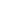</a> | **📂 檔名:** `dashboard-one-is-filled-24px.svg` ✨ **格式:** `Vector (SVG)` ⚖️ **大小:** `1.17KB` 📅 **更新:** `2026-02-27`  🚀 **jsDelivr Markdown:** `` 🔗 **直接連結 (Url):** <code>https://cdn.jsdelivr.net/gh/barry028/materials@main/images/iCons/Iconbrew%20/dashboard-one-is-filled-24px.svg</code> 📥 [檢視原始檔](dashboard-one-is-filled-24px.svg) |
| <a href="dashboard-one-is-filled.svg">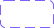</a> | **📂 檔名:** `dashboard-one-is-filled.svg` ✨ **格式:** `Vector (SVG)` ⚖️ **大小:** `3.06KB` 📅 **更新:** `2026-02-27`  🚀 **jsDelivr Markdown:** `` 🔗 **直接連結 (Url):** <code>https://cdn.jsdelivr.net/gh/barry028/materials@main/images/iCons/Iconbrew%20/dashboard-one-is-filled.svg</code> 📥 [檢視原始檔](dashboard-one-is-filled.svg) |
|  | **📂 檔名:** `dashboard.svg` ✨ **格式:** `Vector (SVG)` ⚖️ **大小:** `2.62KB` 📅 **更新:** `2026-02-27`  🚀 **jsDelivr Markdown:** `` 🔗 **直接連結 (Url):** <code>https://cdn.jsdelivr.net/gh/barry028/materials@main/images/iCons/Iconbrew%20/dashboard.svg</code> 📥 [檢視原始檔](dashboard.svg) |
|  | **📂 檔名:** `databse-18px.svg` ✨ **格式:** `Vector (SVG)` ⚖️ **大小:** `1.10KB` 📅 **更新:** `2026-02-27`  🚀 **jsDelivr Markdown:** `` 🔗 **直接連結 (Url):** <code>https://cdn.jsdelivr.net/gh/barry028/materials@main/images/iCons/Iconbrew%20/databse-18px.svg</code> 📥 [檢視原始檔](databse-18px.svg) |
|  | **📂 檔名:** `databse-24px.svg` ✨ **格式:** `Vector (SVG)` ⚖️ **大小:** `1.09KB` 📅 **更新:** `2026-02-27`  🚀 **jsDelivr Markdown:** `` 🔗 **直接連結 (Url):** <code>https://cdn.jsdelivr.net/gh/barry028/materials@main/images/iCons/Iconbrew%20/databse-24px.svg</code> 📥 [檢視原始檔](databse-24px.svg) |
|  | **📂 檔名:** `databse.svg` ✨ **格式:** `Vector (SVG)` ⚖️ **大小:** `2.28KB` 📅 **更新:** `2026-02-27`  🚀 **jsDelivr Markdown:** `` 🔗 **直接連結 (Url):** <code>https://cdn.jsdelivr.net/gh/barry028/materials@main/images/iCons/Iconbrew%20/databse.svg</code> 📥 [檢視原始檔](databse.svg) |
| <a href="display-zoom-18px.svg">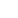</a> | **📂 檔名:** `display-zoom-18px.svg` ✨ **格式:** `Vector (SVG)` ⚖️ **大小:** `943.00B` 📅 **更新:** `2026-02-27`  🚀 **jsDelivr Markdown:** `` 🔗 **直接連結 (Url):** <code>https://cdn.jsdelivr.net/gh/barry028/materials@main/images/iCons/Iconbrew%20/display-zoom-18px.svg</code> 📥 [檢視原始檔](display-zoom-18px.svg) |
|  | **📂 檔名:** `display-zoom-24px.svg` ✨ **格式:** `Vector (SVG)` ⚖️ **大小:** `905.00B` 📅 **更新:** `2026-02-27`  🚀 **jsDelivr Markdown:** `` 🔗 **直接連結 (Url):** <code>https://cdn.jsdelivr.net/gh/barry028/materials@main/images/iCons/Iconbrew%20/display-zoom-24px.svg</code> 📥 [檢視原始檔](display-zoom-24px.svg) |
|  | **📂 檔名:** `display-zoom.svg` ✨ **格式:** `Vector (SVG)` ⚖️ **大小:** `1.85KB` 📅 **更新:** `2026-02-27`  🚀 **jsDelivr Markdown:** `` 🔗 **直接連結 (Url):** <code>https://cdn.jsdelivr.net/gh/barry028/materials@main/images/iCons/Iconbrew%20/display-zoom.svg</code> 📥 [檢視原始檔](display-zoom.svg) |
|  | **📂 檔名:** `document-18px.svg` ✨ **格式:** `Vector (SVG)` ⚖️ **大小:** `835.00B` 📅 **更新:** `2026-02-27`  🚀 **jsDelivr Markdown:** `` 🔗 **直接連結 (Url):** <code>https://cdn.jsdelivr.net/gh/barry028/materials@main/images/iCons/Iconbrew%20/document-18px.svg</code> 📥 [檢視原始檔](document-18px.svg) |
|  | **📂 檔名:** `document-24px.svg` ✨ **格式:** `Vector (SVG)` ⚖️ **大小:** `797.00B` 📅 **更新:** `2026-02-27`  🚀 **jsDelivr Markdown:** `` 🔗 **直接連結 (Url):** <code>https://cdn.jsdelivr.net/gh/barry028/materials@main/images/iCons/Iconbrew%20/document-24px.svg</code> 📥 [檢視原始檔](document-24px.svg) |
|  | **📂 檔名:** `document-code-18px.svg` ✨ **格式:** `Vector (SVG)` ⚖️ **大小:** `1.47KB` 📅 **更新:** `2026-02-27`  🚀 **jsDelivr Markdown:** `` 🔗 **直接連結 (Url):** <code>https://cdn.jsdelivr.net/gh/barry028/materials@main/images/iCons/Iconbrew%20/document-code-18px.svg</code> 📥 [檢視原始檔](document-code-18px.svg) |
|  | **📂 檔名:** `document-code-24px.svg` ✨ **格式:** `Vector (SVG)` ⚖️ **大小:** `1.45KB` 📅 **更新:** `2026-02-27`  🚀 **jsDelivr Markdown:** `` 🔗 **直接連結 (Url):** <code>https://cdn.jsdelivr.net/gh/barry028/materials@main/images/iCons/Iconbrew%20/document-code-24px.svg</code> 📥 [檢視原始檔](document-code-24px.svg) |
|  | **📂 檔名:** `document-code.svg` ✨ **格式:** `Vector (SVG)` ⚖️ **大小:** `2.99KB` 📅 **更新:** `2026-02-27`  🚀 **jsDelivr Markdown:** `` 🔗 **直接連結 (Url):** <code>https://cdn.jsdelivr.net/gh/barry028/materials@main/images/iCons/Iconbrew%20/document-code.svg</code> 📥 [檢視原始檔](document-code.svg) |
|  | **📂 檔名:** `document-photo-18px.svg` ✨ **格式:** `Vector (SVG)` ⚖️ **大小:** `2.70KB` 📅 **更新:** `2026-02-27`  🚀 **jsDelivr Markdown:** `` 🔗 **直接連結 (Url):** <code>https://cdn.jsdelivr.net/gh/barry028/materials@main/images/iCons/Iconbrew%20/document-photo-18px.svg</code> 📥 [檢視原始檔](document-photo-18px.svg) |
|  | **📂 檔名:** `document-photo-24px.svg` ✨ **格式:** `Vector (SVG)` ⚖️ **大小:** `1.45KB` 📅 **更新:** `2026-02-27`  🚀 **jsDelivr Markdown:** `` 🔗 **直接連結 (Url):** <code>https://cdn.jsdelivr.net/gh/barry028/materials@main/images/iCons/Iconbrew%20/document-photo-24px.svg</code> 📥 [檢視原始檔](document-photo-24px.svg) |
|  | **📂 檔名:** `document-photo.svg` ✨ **格式:** `Vector (SVG)` ⚖️ **大小:** `4.27KB` 📅 **更新:** `2026-02-27`  🚀 **jsDelivr Markdown:** `` 🔗 **直接連結 (Url):** <code>https://cdn.jsdelivr.net/gh/barry028/materials@main/images/iCons/Iconbrew%20/document-photo.svg</code> 📥 [檢視原始檔](document-photo.svg) |
|  | **📂 檔名:** `document-text-18px.svg` ✨ **格式:** `Vector (SVG)` ⚖️ **大小:** `1.04KB` 📅 **更新:** `2026-02-27`  🚀 **jsDelivr Markdown:** `` 🔗 **直接連結 (Url):** <code>https://cdn.jsdelivr.net/gh/barry028/materials@main/images/iCons/Iconbrew%20/document-text-18px.svg</code> 📥 [檢視原始檔](document-text-18px.svg) |
|  | **📂 檔名:** `document-text-24px.svg` ✨ **格式:** `Vector (SVG)` ⚖️ **大小:** `1.03KB` 📅 **更新:** `2026-02-27`  🚀 **jsDelivr Markdown:** `` 🔗 **直接連結 (Url):** <code>https://cdn.jsdelivr.net/gh/barry028/materials@main/images/iCons/Iconbrew%20/document-text-24px.svg</code> 📥 [檢視原始檔](document-text-24px.svg) |
|  | **📂 檔名:** `document-text.svg` ✨ **格式:** `Vector (SVG)` ⚖️ **大小:** `2.15KB` 📅 **更新:** `2026-02-27`  🚀 **jsDelivr Markdown:** `` 🔗 **直接連結 (Url):** <code>https://cdn.jsdelivr.net/gh/barry028/materials@main/images/iCons/Iconbrew%20/document-text.svg</code> 📥 [檢視原始檔](document-text.svg) |
|  | **📂 檔名:** `document-video-18px.svg` ✨ **格式:** `Vector (SVG)` ⚖️ **大小:** `1.28KB` 📅 **更新:** `2026-02-27`  🚀 **jsDelivr Markdown:** `` 🔗 **直接連結 (Url):** <code>https://cdn.jsdelivr.net/gh/barry028/materials@main/images/iCons/Iconbrew%20/document-video-18px.svg</code> 📥 [檢視原始檔](document-video-18px.svg) |
|  | **📂 檔名:** `document-video-24px.svg` ✨ **格式:** `Vector (SVG)` ⚖️ **大小:** `1.27KB` 📅 **更新:** `2026-02-27`  🚀 **jsDelivr Markdown:** `` 🔗 **直接連結 (Url):** <code>https://cdn.jsdelivr.net/gh/barry028/materials@main/images/iCons/Iconbrew%20/document-video-24px.svg</code> 📥 [檢視原始檔](document-video-24px.svg) |
|  | **📂 檔名:** `document-video.svg` ✨ **格式:** `Vector (SVG)` ⚖️ **大小:** `2.62KB` 📅 **更新:** `2026-02-27`  🚀 **jsDelivr Markdown:** `` 🔗 **直接連結 (Url):** <code>https://cdn.jsdelivr.net/gh/barry028/materials@main/images/iCons/Iconbrew%20/document-video.svg</code> 📥 [檢視原始檔](document-video.svg) |
|  | **📂 檔名:** `document.svg` ✨ **格式:** `Vector (SVG)` ⚖️ **大小:** `1.63KB` 📅 **更新:** `2026-02-27`  🚀 **jsDelivr Markdown:** `` 🔗 **直接連結 (Url):** <code>https://cdn.jsdelivr.net/gh/barry028/materials@main/images/iCons/Iconbrew%20/document.svg</code> 📥 [檢視原始檔](document.svg) |
| <a href="dot-18px.svg">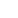</a> | **📂 檔名:** `dot-18px.svg` ✨ **格式:** `Vector (SVG)` ⚖️ **大小:** `385.00B` 📅 **更新:** `2026-02-27`  🚀 **jsDelivr Markdown:** `` 🔗 **直接連結 (Url):** <code>https://cdn.jsdelivr.net/gh/barry028/materials@main/images/iCons/Iconbrew%20/dot-18px.svg</code> 📥 [檢視原始檔](dot-18px.svg) |
|  | **📂 檔名:** `dot-24px.svg` ✨ **格式:** `Vector (SVG)` ⚖️ **大小:** `396.00B` 📅 **更新:** `2026-02-27`  🚀 **jsDelivr Markdown:** `` 🔗 **直接連結 (Url):** <code>https://cdn.jsdelivr.net/gh/barry028/materials@main/images/iCons/Iconbrew%20/dot-24px.svg</code> 📥 [檢視原始檔](dot-24px.svg) |
|  | **📂 檔名:** `dot-matrix-18px.svg` ✨ **格式:** `Vector (SVG)` ⚖️ **大小:** `1.63KB` 📅 **更新:** `2026-02-27`  🚀 **jsDelivr Markdown:** `` 🔗 **直接連結 (Url):** <code>https://cdn.jsdelivr.net/gh/barry028/materials@main/images/iCons/Iconbrew%20/dot-matrix-18px.svg</code> 📥 [檢視原始檔](dot-matrix-18px.svg) |
|  | **📂 檔名:** `dot-matrix-24px.svg` ✨ **格式:** `Vector (SVG)` ⚖️ **大小:** `1.36KB` 📅 **更新:** `2026-02-27`  🚀 **jsDelivr Markdown:** `` 🔗 **直接連結 (Url):** <code>https://cdn.jsdelivr.net/gh/barry028/materials@main/images/iCons/Iconbrew%20/dot-matrix-24px.svg</code> 📥 [檢視原始檔](dot-matrix-24px.svg) |
|  | **📂 檔名:** `dot-matrix.svg` ✨ **格式:** `Vector (SVG)` ⚖️ **大小:** `3.05KB` 📅 **更新:** `2026-02-27`  🚀 **jsDelivr Markdown:** `` 🔗 **直接連結 (Url):** <code>https://cdn.jsdelivr.net/gh/barry028/materials@main/images/iCons/Iconbrew%20/dot-matrix.svg</code> 📥 [檢視原始檔](dot-matrix.svg) |
|  | **📂 檔名:** `dot.svg` ✨ **格式:** `Vector (SVG)` ⚖️ **大小:** `810.00B` 📅 **更新:** `2026-02-27`  🚀 **jsDelivr Markdown:** `` 🔗 **直接連結 (Url):** <code>https://cdn.jsdelivr.net/gh/barry028/materials@main/images/iCons/Iconbrew%20/dot.svg</code> 📥 [檢視原始檔](dot.svg) |
|  | **📂 檔名:** `download-18px.svg` ✨ **格式:** `Vector (SVG)` ⚖️ **大小:** `642.00B` 📅 **更新:** `2026-02-27`  🚀 **jsDelivr Markdown:** `` 🔗 **直接連結 (Url):** <code>https://cdn.jsdelivr.net/gh/barry028/materials@main/images/iCons/Iconbrew%20/download-18px.svg</code> 📥 [檢視原始檔](download-18px.svg) |
|  | **📂 檔名:** `download-24px.svg` ✨ **格式:** `Vector (SVG)` ⚖️ **大小:** `595.00B` 📅 **更新:** `2026-02-27`  🚀 **jsDelivr Markdown:** `` 🔗 **直接連結 (Url):** <code>https://cdn.jsdelivr.net/gh/barry028/materials@main/images/iCons/Iconbrew%20/download-24px.svg</code> 📥 [檢視原始檔](download-24px.svg) |
|  | **📂 檔名:** `download.svg` ✨ **格式:** `Vector (SVG)` ⚖️ **大小:** `1.21KB` 📅 **更新:** `2026-02-27`  🚀 **jsDelivr Markdown:** `` 🔗 **直接連結 (Url):** <code>https://cdn.jsdelivr.net/gh/barry028/materials@main/images/iCons/Iconbrew%20/download.svg</code> 📥 [檢視原始檔](download.svg) |
|  | **📂 檔名:** `dpad-18px.svg` ✨ **格式:** `Vector (SVG)` ⚖️ **大小:** `2.52KB` 📅 **更新:** `2026-02-27`  🚀 **jsDelivr Markdown:** `` 🔗 **直接連結 (Url):** <code>https://cdn.jsdelivr.net/gh/barry028/materials@main/images/iCons/Iconbrew%20/dpad-18px.svg</code> 📥 [檢視原始檔](dpad-18px.svg) |
|  | **📂 檔名:** `dpad-24px.svg` ✨ **格式:** `Vector (SVG)` ⚖️ **大小:** `3.16KB` 📅 **更新:** `2026-02-27`  🚀 **jsDelivr Markdown:** `` 🔗 **直接連結 (Url):** <code>https://cdn.jsdelivr.net/gh/barry028/materials@main/images/iCons/Iconbrew%20/dpad-24px.svg</code> 📥 [檢視原始檔](dpad-24px.svg) |
|  | **📂 檔名:** `dpad.svg` ✨ **格式:** `Vector (SVG)` ⚖️ **大小:** `5.76KB` 📅 **更新:** `2026-02-27`  🚀 **jsDelivr Markdown:** `` 🔗 **直接連結 (Url):** <code>https://cdn.jsdelivr.net/gh/barry028/materials@main/images/iCons/Iconbrew%20/dpad.svg</code> 📥 [檢視原始檔](dpad.svg) |
|  | **📂 檔名:** `earth-18px.svg` ✨ **格式:** `Vector (SVG)` ⚖️ **大小:** `1.46KB` 📅 **更新:** `2026-02-27`  🚀 **jsDelivr Markdown:** `` 🔗 **直接連結 (Url):** <code>https://cdn.jsdelivr.net/gh/barry028/materials@main/images/iCons/Iconbrew%20/earth-18px.svg</code> 📥 [檢視原始檔](earth-18px.svg) |
|  | **📂 檔名:** `earth-24px.svg` ✨ **格式:** `Vector (SVG)` ⚖️ **大小:** `1.36KB` 📅 **更新:** `2026-02-27`  🚀 **jsDelivr Markdown:** `` 🔗 **直接連結 (Url):** <code>https://cdn.jsdelivr.net/gh/barry028/materials@main/images/iCons/Iconbrew%20/earth-24px.svg</code> 📥 [檢視原始檔](earth-24px.svg) |
|  | **📂 檔名:** `earth.svg` ✨ **格式:** `Vector (SVG)` ⚖️ **大小:** `2.84KB` 📅 **更新:** `2026-02-27`  🚀 **jsDelivr Markdown:** `` 🔗 **直接連結 (Url):** <code>https://cdn.jsdelivr.net/gh/barry028/materials@main/images/iCons/Iconbrew%20/earth.svg</code> 📥 [檢視原始檔](earth.svg) |
|  | **📂 檔名:** `ellipses-horizontal-18px.svg` ✨ **格式:** `Vector (SVG)` ⚖️ **大小:** `654.00B` 📅 **更新:** `2026-02-27`  🚀 **jsDelivr Markdown:** `` 🔗 **直接連結 (Url):** <code>https://cdn.jsdelivr.net/gh/barry028/materials@main/images/iCons/Iconbrew%20/ellipses-horizontal-18px.svg</code> 📥 [檢視原始檔](ellipses-horizontal-18px.svg) |
|  | **📂 檔名:** `ellipses-horizontal-24px.svg` ✨ **格式:** `Vector (SVG)` ⚖️ **大小:** `677.00B` 📅 **更新:** `2026-02-27`  🚀 **jsDelivr Markdown:** `` 🔗 **直接連結 (Url):** <code>https://cdn.jsdelivr.net/gh/barry028/materials@main/images/iCons/Iconbrew%20/ellipses-horizontal-24px.svg</code> 📥 [檢視原始檔](ellipses-horizontal-24px.svg) |
|  | **📂 檔名:** `ellipses-horizontal.svg` ✨ **格式:** `Vector (SVG)` ⚖️ **大小:** `1.35KB` 📅 **更新:** `2026-02-27`  🚀 **jsDelivr Markdown:** `` 🔗 **直接連結 (Url):** <code>https://cdn.jsdelivr.net/gh/barry028/materials@main/images/iCons/Iconbrew%20/ellipses-horizontal.svg</code> 📥 [檢視原始檔](ellipses-horizontal.svg) |
|  | **📂 檔名:** `ellipses-vertical-18px.svg` ✨ **格式:** `Vector (SVG)` ⚖️ **大小:** `838.00B` 📅 **更新:** `2026-02-27`  🚀 **jsDelivr Markdown:** `` 🔗 **直接連結 (Url):** <code>https://cdn.jsdelivr.net/gh/barry028/materials@main/images/iCons/Iconbrew%20/ellipses-vertical-18px.svg</code> 📥 [檢視原始檔](ellipses-vertical-18px.svg) |
|  | **📂 檔名:** `ellipses-vertical-24px.svg` ✨ **格式:** `Vector (SVG)` ⚖️ **大小:** `692.00B` 📅 **更新:** `2026-02-27`  🚀 **jsDelivr Markdown:** `` 🔗 **直接連結 (Url):** <code>https://cdn.jsdelivr.net/gh/barry028/materials@main/images/iCons/Iconbrew%20/ellipses-vertical-24px.svg</code> 📥 [檢視原始檔](ellipses-vertical-24px.svg) |
|  | **📂 檔名:** `ellipses-vertical.svg` ✨ **格式:** `Vector (SVG)` ⚖️ **大小:** `1.38KB` 📅 **更新:** `2026-02-27`  🚀 **jsDelivr Markdown:** `` 🔗 **直接連結 (Url):** <code>https://cdn.jsdelivr.net/gh/barry028/materials@main/images/iCons/Iconbrew%20/ellipses-vertical.svg</code> 📥 [檢視原始檔](ellipses-vertical.svg) |
|  | **📂 檔名:** `email-18px.svg` ✨ **格式:** `Vector (SVG)` ⚖️ **大小:** `825.00B` 📅 **更新:** `2026-02-27`  🚀 **jsDelivr Markdown:** `` 🔗 **直接連結 (Url):** <code>https://cdn.jsdelivr.net/gh/barry028/materials@main/images/iCons/Iconbrew%20/email-18px.svg</code> 📥 [檢視原始檔](email-18px.svg) |
|  | **📂 檔名:** `email-24px.svg` ✨ **格式:** `Vector (SVG)` ⚖️ **大小:** `1.10KB` 📅 **更新:** `2026-02-27`  🚀 **jsDelivr Markdown:** `` 🔗 **直接連結 (Url):** <code>https://cdn.jsdelivr.net/gh/barry028/materials@main/images/iCons/Iconbrew%20/email-24px.svg</code> 📥 [檢視原始檔](email-24px.svg) |
|  | **📂 檔名:** `email.svg` ✨ **格式:** `Vector (SVG)` ⚖️ **大小:** `1.90KB` 📅 **更新:** `2026-02-27`  🚀 **jsDelivr Markdown:** `` 🔗 **直接連結 (Url):** <code>https://cdn.jsdelivr.net/gh/barry028/materials@main/images/iCons/Iconbrew%20/email.svg</code> 📥 [檢視原始檔](email.svg) |
|  | **📂 檔名:** `entertainment-18px.svg` ✨ **格式:** `Vector (SVG)` ⚖️ **大小:** `901.00B` 📅 **更新:** `2026-02-27`  🚀 **jsDelivr Markdown:** `` 🔗 **直接連結 (Url):** <code>https://cdn.jsdelivr.net/gh/barry028/materials@main/images/iCons/Iconbrew%20/entertainment-18px.svg</code> 📥 [檢視原始檔](entertainment-18px.svg) |
|  | **📂 檔名:** `entertainment-24px.svg` ✨ **格式:** `Vector (SVG)` ⚖️ **大小:** `866.00B` 📅 **更新:** `2026-02-27`  🚀 **jsDelivr Markdown:** `` 🔗 **直接連結 (Url):** <code>https://cdn.jsdelivr.net/gh/barry028/materials@main/images/iCons/Iconbrew%20/entertainment-24px.svg</code> 📥 [檢視原始檔](entertainment-24px.svg) |
|  | **📂 檔名:** `entertainment.svg` ✨ **格式:** `Vector (SVG)` ⚖️ **大小:** `1.76KB` 📅 **更新:** `2026-02-27`  🚀 **jsDelivr Markdown:** `` 🔗 **直接連結 (Url):** <code>https://cdn.jsdelivr.net/gh/barry028/materials@main/images/iCons/Iconbrew%20/entertainment.svg</code> 📥 [檢視原始檔](entertainment.svg) |
|  | **📂 檔名:** `equal-18px.svg` ✨ **格式:** `Vector (SVG)` ⚖️ **大小:** `317.00B` 📅 **更新:** `2026-02-27`  🚀 **jsDelivr Markdown:** `` 🔗 **直接連結 (Url):** <code>https://cdn.jsdelivr.net/gh/barry028/materials@main/images/iCons/Iconbrew%20/equal-18px.svg</code> 📥 [檢視原始檔](equal-18px.svg) |
|  | **📂 檔名:** `equal-24px.svg` ✨ **格式:** `Vector (SVG)` ⚖️ **大小:** `334.00B` 📅 **更新:** `2026-02-27`  🚀 **jsDelivr Markdown:** `` 🔗 **直接連結 (Url):** <code>https://cdn.jsdelivr.net/gh/barry028/materials@main/images/iCons/Iconbrew%20/equal-24px.svg</code> 📥 [檢視原始檔](equal-24px.svg) |
| <a href="equal.svg">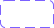</a> | **📂 檔名:** `equal.svg` ✨ **格式:** `Vector (SVG)` ⚖️ **大小:** `669.00B` 📅 **更新:** `2026-02-27`  🚀 **jsDelivr Markdown:** `` 🔗 **直接連結 (Url):** <code>https://cdn.jsdelivr.net/gh/barry028/materials@main/images/iCons/Iconbrew%20/equal.svg</code> 📥 [檢視原始檔](equal.svg) |
|  | **📂 檔名:** `euro-18px.svg` ✨ **格式:** `Vector (SVG)` ⚖️ **大小:** `517.00B` 📅 **更新:** `2026-02-27`  🚀 **jsDelivr Markdown:** `` 🔗 **直接連結 (Url):** <code>https://cdn.jsdelivr.net/gh/barry028/materials@main/images/iCons/Iconbrew%20/euro-18px.svg</code> 📥 [檢視原始檔](euro-18px.svg) |
|  | **📂 檔名:** `euro-24px.svg` ✨ **格式:** `Vector (SVG)` ⚖️ **大小:** `489.00B` 📅 **更新:** `2026-02-27`  🚀 **jsDelivr Markdown:** `` 🔗 **直接連結 (Url):** <code>https://cdn.jsdelivr.net/gh/barry028/materials@main/images/iCons/Iconbrew%20/euro-24px.svg</code> 📥 [檢視原始檔](euro-24px.svg) |
|  | **📂 檔名:** `euro-with-circle-18px.svg` ✨ **格式:** `Vector (SVG)` ⚖️ **大小:** `749.00B` 📅 **更新:** `2026-02-27`  🚀 **jsDelivr Markdown:** `` 🔗 **直接連結 (Url):** <code>https://cdn.jsdelivr.net/gh/barry028/materials@main/images/iCons/Iconbrew%20/euro-with-circle-18px.svg</code> 📥 [檢視原始檔](euro-with-circle-18px.svg) |
|  | **📂 檔名:** `euro-with-circle-24px.svg` ✨ **格式:** `Vector (SVG)` ⚖️ **大小:** `651.00B` 📅 **更新:** `2026-02-27`  🚀 **jsDelivr Markdown:** `` 🔗 **直接連結 (Url):** <code>https://cdn.jsdelivr.net/gh/barry028/materials@main/images/iCons/Iconbrew%20/euro-with-circle-24px.svg</code> 📥 [檢視原始檔](euro-with-circle-24px.svg) |
|  | **📂 檔名:** `euro-with-circle.svg` ✨ **格式:** `Vector (SVG)` ⚖️ **大小:** `1.38KB` 📅 **更新:** `2026-02-27`  🚀 **jsDelivr Markdown:** `` 🔗 **直接連結 (Url):** <code>https://cdn.jsdelivr.net/gh/barry028/materials@main/images/iCons/Iconbrew%20/euro-with-circle.svg</code> 📥 [檢視原始檔](euro-with-circle.svg) |
|  | **📂 檔名:** `euro.svg` ✨ **格式:** `Vector (SVG)` ⚖️ **大小:** `1.01KB` 📅 **更新:** `2026-02-27`  🚀 **jsDelivr Markdown:** `` 🔗 **直接連結 (Url):** <code>https://cdn.jsdelivr.net/gh/barry028/materials@main/images/iCons/Iconbrew%20/euro.svg</code> 📥 [檢視原始檔](euro.svg) |
|  | **📂 檔名:** `exclamation-mark-18px.svg` ✨ **格式:** `Vector (SVG)` ⚖️ **大小:** `471.00B` 📅 **更新:** `2026-02-27`  🚀 **jsDelivr Markdown:** `` 🔗 **直接連結 (Url):** <code>https://cdn.jsdelivr.net/gh/barry028/materials@main/images/iCons/Iconbrew%20/exclamation-mark-18px.svg</code> 📥 [檢視原始檔](exclamation-mark-18px.svg) |
|  | **📂 檔名:** `exclamation-mark-24px.svg` ✨ **格式:** `Vector (SVG)` ⚖️ **大小:** `372.00B` 📅 **更新:** `2026-02-27`  🚀 **jsDelivr Markdown:** `` 🔗 **直接連結 (Url):** <code>https://cdn.jsdelivr.net/gh/barry028/materials@main/images/iCons/Iconbrew%20/exclamation-mark-24px.svg</code> 📥 [檢視原始檔](exclamation-mark-24px.svg) |
|  | **📂 檔名:** `exclamation-mark.svg` ✨ **格式:** `Vector (SVG)` ⚖️ **大小:** `867.00B` 📅 **更新:** `2026-02-27`  🚀 **jsDelivr Markdown:** `` 🔗 **直接連結 (Url):** <code>https://cdn.jsdelivr.net/gh/barry028/materials@main/images/iCons/Iconbrew%20/exclamation-mark.svg</code> 📥 [檢視原始檔](exclamation-mark.svg) |
|  | **📂 檔名:** `expand-horizontal-18px.svg` ✨ **格式:** `Vector (SVG)` ⚖️ **大小:** `578.00B` 📅 **更新:** `2026-02-27`  🚀 **jsDelivr Markdown:** `` 🔗 **直接連結 (Url):** <code>https://cdn.jsdelivr.net/gh/barry028/materials@main/images/iCons/Iconbrew%20/expand-horizontal-18px.svg</code> 📥 [檢視原始檔](expand-horizontal-18px.svg) |
|  | **📂 檔名:** `expand-horizontal-24px.svg` ✨ **格式:** `Vector (SVG)` ⚖️ **大小:** `588.00B` 📅 **更新:** `2026-02-27`  🚀 **jsDelivr Markdown:** `` 🔗 **直接連結 (Url):** <code>https://cdn.jsdelivr.net/gh/barry028/materials@main/images/iCons/Iconbrew%20/expand-horizontal-24px.svg</code> 📥 [檢視原始檔](expand-horizontal-24px.svg) |
|  | **📂 檔名:** `expand-horizontal.svg` ✨ **格式:** `Vector (SVG)` ⚖️ **大小:** `1.17KB` 📅 **更新:** `2026-02-27`  🚀 **jsDelivr Markdown:** `` 🔗 **直接連結 (Url):** <code>https://cdn.jsdelivr.net/gh/barry028/materials@main/images/iCons/Iconbrew%20/expand-horizontal.svg</code> 📥 [檢視原始檔](expand-horizontal.svg) |
|  | **📂 檔名:** `expand-vertical-18px.svg` ✨ **格式:** `Vector (SVG)` ⚖️ **大小:** `748.00B` 📅 **更新:** `2026-02-27`  🚀 **jsDelivr Markdown:** `` 🔗 **直接連結 (Url):** <code>https://cdn.jsdelivr.net/gh/barry028/materials@main/images/iCons/Iconbrew%20/expand-vertical-18px.svg</code> 📥 [檢視原始檔](expand-vertical-18px.svg) |
|  | **📂 檔名:** `expand-vertical-24px.svg` ✨ **格式:** `Vector (SVG)` ⚖️ **大小:** `758.00B` 📅 **更新:** `2026-02-27`  🚀 **jsDelivr Markdown:** `` 🔗 **直接連結 (Url):** <code>https://cdn.jsdelivr.net/gh/barry028/materials@main/images/iCons/Iconbrew%20/expand-vertical-24px.svg</code> 📥 [檢視原始檔](expand-vertical-24px.svg) |
|  | **📂 檔名:** `expand-vertical.svg` ✨ **格式:** `Vector (SVG)` ⚖️ **大小:** `1.48KB` 📅 **更新:** `2026-02-27`  🚀 **jsDelivr Markdown:** `` 🔗 **直接連結 (Url):** <code>https://cdn.jsdelivr.net/gh/barry028/materials@main/images/iCons/Iconbrew%20/expand-vertical.svg</code> 📥 [檢視原始檔](expand-vertical.svg) |
|  | **📂 檔名:** `eye-18px.svg` ✨ **格式:** `Vector (SVG)` ⚖️ **大小:** `418.00B` 📅 **更新:** `2026-02-27`  🚀 **jsDelivr Markdown:** `` 🔗 **直接連結 (Url):** <code>https://cdn.jsdelivr.net/gh/barry028/materials@main/images/iCons/Iconbrew%20/eye-18px.svg</code> 📥 [檢視原始檔](eye-18px.svg) |
|  | **📂 檔名:** `eye-24px.svg` ✨ **格式:** `Vector (SVG)` ⚖️ **大小:** `451.00B` 📅 **更新:** `2026-02-27`  🚀 **jsDelivr Markdown:** `` 🔗 **直接連結 (Url):** <code>https://cdn.jsdelivr.net/gh/barry028/materials@main/images/iCons/Iconbrew%20/eye-24px.svg</code> 📥 [檢視原始檔](eye-24px.svg) |
|  | **📂 檔名:** `eye.svg` ✨ **格式:** `Vector (SVG)` ⚖️ **大小:** `895.00B` 📅 **更新:** `2026-02-27`  🚀 **jsDelivr Markdown:** `` 🔗 **直接連結 (Url):** <code>https://cdn.jsdelivr.net/gh/barry028/materials@main/images/iCons/Iconbrew%20/eye.svg</code> 📥 [檢視原始檔](eye.svg) |
|  | **📂 檔名:** `figma-18px.svg` ✨ **格式:** `Vector (SVG)` ⚖️ **大小:** `985.00B` 📅 **更新:** `2026-02-27`  🚀 **jsDelivr Markdown:** `` 🔗 **直接連結 (Url):** <code>https://cdn.jsdelivr.net/gh/barry028/materials@main/images/iCons/Iconbrew%20/figma-18px.svg</code> 📥 [檢視原始檔](figma-18px.svg) |
|  | **📂 檔名:** `figma-24px.svg` ✨ **格式:** `Vector (SVG)` ⚖️ **大小:** `1.00KB` 📅 **更新:** `2026-02-27`  🚀 **jsDelivr Markdown:** `` 🔗 **直接連結 (Url):** <code>https://cdn.jsdelivr.net/gh/barry028/materials@main/images/iCons/Iconbrew%20/figma-24px.svg</code> 📥 [檢視原始檔](figma-24px.svg) |
|  | **📂 檔名:** `figma.svg` ✨ **格式:** `Vector (SVG)` ⚖️ **大小:** `1.94KB` 📅 **更新:** `2026-02-27`  🚀 **jsDelivr Markdown:** `` 🔗 **直接連結 (Url):** <code>https://cdn.jsdelivr.net/gh/barry028/materials@main/images/iCons/Iconbrew%20/figma.svg</code> 📥 [檢視原始檔](figma.svg) |
|  | **📂 檔名:** `film-18px.svg` ✨ **格式:** `Vector (SVG)` ⚖️ **大小:** `662.00B` 📅 **更新:** `2026-02-27`  🚀 **jsDelivr Markdown:** `` 🔗 **直接連結 (Url):** <code>https://cdn.jsdelivr.net/gh/barry028/materials@main/images/iCons/Iconbrew%20/film-18px.svg</code> 📥 [檢視原始檔](film-18px.svg) |
|  | **📂 檔名:** `film-24px.svg` ✨ **格式:** `Vector (SVG)` ⚖️ **大小:** `610.00B` 📅 **更新:** `2026-02-27`  🚀 **jsDelivr Markdown:** `` 🔗 **直接連結 (Url):** <code>https://cdn.jsdelivr.net/gh/barry028/materials@main/images/iCons/Iconbrew%20/film-24px.svg</code> 📥 [檢視原始檔](film-24px.svg) |
|  | **📂 檔名:** `film.svg` ✨ **格式:** `Vector (SVG)` ⚖️ **大小:** `1.27KB` 📅 **更新:** `2026-02-27`  🚀 **jsDelivr Markdown:** `` 🔗 **直接連結 (Url):** <code>https://cdn.jsdelivr.net/gh/barry028/materials@main/images/iCons/Iconbrew%20/film.svg</code> 📥 [檢視原始檔](film.svg) |
|  | **📂 檔名:** `filters-18px.svg` ✨ **格式:** `Vector (SVG)` ⚖️ **大小:** `539.00B` 📅 **更新:** `2026-02-27`  🚀 **jsDelivr Markdown:** `` 🔗 **直接連結 (Url):** <code>https://cdn.jsdelivr.net/gh/barry028/materials@main/images/iCons/Iconbrew%20/filters-18px.svg</code> 📥 [檢視原始檔](filters-18px.svg) |
|  | **📂 檔名:** `filters-24px.svg` ✨ **格式:** `Vector (SVG)` ⚖️ **大小:** `396.00B` 📅 **更新:** `2026-02-27`  🚀 **jsDelivr Markdown:** `` 🔗 **直接連結 (Url):** <code>https://cdn.jsdelivr.net/gh/barry028/materials@main/images/iCons/Iconbrew%20/filters-24px.svg</code> 📥 [檢視原始檔](filters-24px.svg) |
| <a href="filters.svg">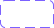</a> | **📂 檔名:** `filters.svg` ✨ **格式:** `Vector (SVG)` ⚖️ **大小:** `958.00B` 📅 **更新:** `2026-02-27`  🚀 **jsDelivr Markdown:** `` 🔗 **直接連結 (Url):** <code>https://cdn.jsdelivr.net/gh/barry028/materials@main/images/iCons/Iconbrew%20/filters.svg</code> 📥 [檢視原始檔](filters.svg) |
|  | **📂 檔名:** `flag-18px.svg` ✨ **格式:** `Vector (SVG)` ⚖️ **大小:** `752.00B` 📅 **更新:** `2026-02-27`  🚀 **jsDelivr Markdown:** `` 🔗 **直接連結 (Url):** <code>https://cdn.jsdelivr.net/gh/barry028/materials@main/images/iCons/Iconbrew%20/flag-18px.svg</code> 📥 [檢視原始檔](flag-18px.svg) |
|  | **📂 檔名:** `flag-24px.svg` ✨ **格式:** `Vector (SVG)` ⚖️ **大小:** `748.00B` 📅 **更新:** `2026-02-27`  🚀 **jsDelivr Markdown:** `` 🔗 **直接連結 (Url):** <code>https://cdn.jsdelivr.net/gh/barry028/materials@main/images/iCons/Iconbrew%20/flag-24px.svg</code> 📥 [檢視原始檔](flag-24px.svg) |
|  | **📂 檔名:** `flag.svg` ✨ **格式:** `Vector (SVG)` ⚖️ **大小:** `1.44KB` 📅 **更新:** `2026-02-27`  🚀 **jsDelivr Markdown:** `` 🔗 **直接連結 (Url):** <code>https://cdn.jsdelivr.net/gh/barry028/materials@main/images/iCons/Iconbrew%20/flag.svg</code> 📥 [檢視原始檔](flag.svg) |
|  | **📂 檔名:** `flame-18px.svg` ✨ **格式:** `Vector (SVG)` ⚖️ **大小:** `729.00B` 📅 **更新:** `2026-02-27`  🚀 **jsDelivr Markdown:** `` 🔗 **直接連結 (Url):** <code>https://cdn.jsdelivr.net/gh/barry028/materials@main/images/iCons/Iconbrew%20/flame-18px.svg</code> 📥 [檢視原始檔](flame-18px.svg) |
|  | **📂 檔名:** `flame-24px.svg` ✨ **格式:** `Vector (SVG)` ⚖️ **大小:** `744.00B` 📅 **更新:** `2026-02-27`  🚀 **jsDelivr Markdown:** `` 🔗 **直接連結 (Url):** <code>https://cdn.jsdelivr.net/gh/barry028/materials@main/images/iCons/Iconbrew%20/flame-24px.svg</code> 📥 [檢視原始檔](flame-24px.svg) |
|  | **📂 檔名:** `flame.svg` ✨ **格式:** `Vector (SVG)` ⚖️ **大小:** `1.45KB` 📅 **更新:** `2026-02-27`  🚀 **jsDelivr Markdown:** `` 🔗 **直接連結 (Url):** <code>https://cdn.jsdelivr.net/gh/barry028/materials@main/images/iCons/Iconbrew%20/flame.svg</code> 📥 [檢視原始檔](flame.svg) |
|  | **📂 檔名:** `folder-18px.svg` ✨ **格式:** `Vector (SVG)` ⚖️ **大小:** `744.00B` 📅 **更新:** `2026-02-27`  🚀 **jsDelivr Markdown:** `` 🔗 **直接連結 (Url):** <code>https://cdn.jsdelivr.net/gh/barry028/materials@main/images/iCons/Iconbrew%20/folder-18px.svg</code> 📥 [檢視原始檔](folder-18px.svg) |
|  | **📂 檔名:** `folder-2-18px.svg` ✨ **格式:** `Vector (SVG)` ⚖️ **大小:** `671.00B` 📅 **更新:** `2026-02-27`  🚀 **jsDelivr Markdown:** `` 🔗 **直接連結 (Url):** <code>https://cdn.jsdelivr.net/gh/barry028/materials@main/images/iCons/Iconbrew%20/folder-2-18px.svg</code> 📥 [檢視原始檔](folder-2-18px.svg) |
|  | **📂 檔名:** `folder-2-24px.svg` ✨ **格式:** `Vector (SVG)` ⚖️ **大小:** `651.00B` 📅 **更新:** `2026-02-27`  🚀 **jsDelivr Markdown:** `` 🔗 **直接連結 (Url):** <code>https://cdn.jsdelivr.net/gh/barry028/materials@main/images/iCons/Iconbrew%20/folder-2-24px.svg</code> 📥 [檢視原始檔](folder-2-24px.svg) |
|  | **📂 檔名:** `folder-2.svg` ✨ **格式:** `Vector (SVG)` ⚖️ **大小:** `1.30KB` 📅 **更新:** `2026-02-27`  🚀 **jsDelivr Markdown:** `` 🔗 **直接連結 (Url):** <code>https://cdn.jsdelivr.net/gh/barry028/materials@main/images/iCons/Iconbrew%20/folder-2.svg</code> 📥 [檢視原始檔](folder-2.svg) |
|  | **📂 檔名:** `folder-24px.svg` ✨ **格式:** `Vector (SVG)` ⚖️ **大小:** `685.00B` 📅 **更新:** `2026-02-27`  🚀 **jsDelivr Markdown:** `` 🔗 **直接連結 (Url):** <code>https://cdn.jsdelivr.net/gh/barry028/materials@main/images/iCons/Iconbrew%20/folder-24px.svg</code> 📥 [檢視原始檔](folder-24px.svg) |
|  | **📂 檔名:** `folder-add-18px.svg` ✨ **格式:** `Vector (SVG)` ⚖️ **大小:** `740.00B` 📅 **更新:** `2026-02-27`  🚀 **jsDelivr Markdown:** `` 🔗 **直接連結 (Url):** <code>https://cdn.jsdelivr.net/gh/barry028/materials@main/images/iCons/Iconbrew%20/folder-add-18px.svg</code> 📥 [檢視原始檔](folder-add-18px.svg) |
|  | **📂 檔名:** `folder-add-24px.svg` ✨ **格式:** `Vector (SVG)` ⚖️ **大小:** `717.00B` 📅 **更新:** `2026-02-27`  🚀 **jsDelivr Markdown:** `` 🔗 **直接連結 (Url):** <code>https://cdn.jsdelivr.net/gh/barry028/materials@main/images/iCons/Iconbrew%20/folder-add-24px.svg</code> 📥 [檢視原始檔](folder-add-24px.svg) |
|  | **📂 檔名:** `folder-add.svg` ✨ **格式:** `Vector (SVG)` ⚖️ **大小:** `1.46KB` 📅 **更新:** `2026-02-27`  🚀 **jsDelivr Markdown:** `` 🔗 **直接連結 (Url):** <code>https://cdn.jsdelivr.net/gh/barry028/materials@main/images/iCons/Iconbrew%20/folder-add.svg</code> 📥 [檢視原始檔](folder-add.svg) |
|  | **📂 檔名:** `folder-alert-18px.svg` ✨ **格式:** `Vector (SVG)` ⚖️ **大小:** `890.00B` 📅 **更新:** `2026-02-27`  🚀 **jsDelivr Markdown:** `` 🔗 **直接連結 (Url):** <code>https://cdn.jsdelivr.net/gh/barry028/materials@main/images/iCons/Iconbrew%20/folder-alert-18px.svg</code> 📥 [檢視原始檔](folder-alert-18px.svg) |
|  | **📂 檔名:** `folder-alert-24px.svg` ✨ **格式:** `Vector (SVG)` ⚖️ **大小:** `977.00B` 📅 **更新:** `2026-02-27`  🚀 **jsDelivr Markdown:** `` 🔗 **直接連結 (Url):** <code>https://cdn.jsdelivr.net/gh/barry028/materials@main/images/iCons/Iconbrew%20/folder-alert-24px.svg</code> 📥 [檢視原始檔](folder-alert-24px.svg) |
|  | **📂 檔名:** `folder-alert.svg` ✨ **格式:** `Vector (SVG)` ⚖️ **大小:** `1.86KB` 📅 **更新:** `2026-02-27`  🚀 **jsDelivr Markdown:** `` 🔗 **直接連結 (Url):** <code>https://cdn.jsdelivr.net/gh/barry028/materials@main/images/iCons/Iconbrew%20/folder-alert.svg</code> 📥 [檢視原始檔](folder-alert.svg) |
|  | **📂 檔名:** `folder-cross-18px.svg` ✨ **格式:** `Vector (SVG)` ⚖️ **大小:** `804.00B` 📅 **更新:** `2026-02-27`  🚀 **jsDelivr Markdown:** `` 🔗 **直接連結 (Url):** <code>https://cdn.jsdelivr.net/gh/barry028/materials@main/images/iCons/Iconbrew%20/folder-cross-18px.svg</code> 📥 [檢視原始檔](folder-cross-18px.svg) |
|  | **📂 檔名:** `folder-cross-24px.svg` ✨ **格式:** `Vector (SVG)` ⚖️ **大小:** `892.00B` 📅 **更新:** `2026-02-27`  🚀 **jsDelivr Markdown:** `` 🔗 **直接連結 (Url):** <code>https://cdn.jsdelivr.net/gh/barry028/materials@main/images/iCons/Iconbrew%20/folder-cross-24px.svg</code> 📥 [檢視原始檔](folder-cross-24px.svg) |
|  | **📂 檔名:** `folder-cross.svg` ✨ **格式:** `Vector (SVG)` ⚖️ **大小:** `1.69KB` 📅 **更新:** `2026-02-27`  🚀 **jsDelivr Markdown:** `` 🔗 **直接連結 (Url):** <code>https://cdn.jsdelivr.net/gh/barry028/materials@main/images/iCons/Iconbrew%20/folder-cross.svg</code> 📥 [檢視原始檔](folder-cross.svg) |
|  | **📂 檔名:** `folder-minus-18px.svg` ✨ **格式:** `Vector (SVG)` ⚖️ **大小:** `731.00B` 📅 **更新:** `2026-02-27`  🚀 **jsDelivr Markdown:** `` 🔗 **直接連結 (Url):** <code>https://cdn.jsdelivr.net/gh/barry028/materials@main/images/iCons/Iconbrew%20/folder-minus-18px.svg</code> 📥 [檢視原始檔](folder-minus-18px.svg) |
|  | **📂 檔名:** `folder-minus-24px.svg` ✨ **格式:** `Vector (SVG)` ⚖️ **大小:** `704.00B` 📅 **更新:** `2026-02-27`  🚀 **jsDelivr Markdown:** `` 🔗 **直接連結 (Url):** <code>https://cdn.jsdelivr.net/gh/barry028/materials@main/images/iCons/Iconbrew%20/folder-minus-24px.svg</code> 📥 [檢視原始檔](folder-minus-24px.svg) |
|  | **📂 檔名:** `folder-minus.svg` ✨ **格式:** `Vector (SVG)` ⚖️ **大小:** `1.44KB` 📅 **更新:** `2026-02-27`  🚀 **jsDelivr Markdown:** `` 🔗 **直接連結 (Url):** <code>https://cdn.jsdelivr.net/gh/barry028/materials@main/images/iCons/Iconbrew%20/folder-minus.svg</code> 📥 [檢視原始檔](folder-minus.svg) |
|  | **📂 檔名:** `folder-tick-18px.svg` ✨ **格式:** `Vector (SVG)` ⚖️ **大小:** `774.00B` 📅 **更新:** `2026-02-27`  🚀 **jsDelivr Markdown:** `` 🔗 **直接連結 (Url):** <code>https://cdn.jsdelivr.net/gh/barry028/materials@main/images/iCons/Iconbrew%20/folder-tick-18px.svg</code> 📥 [檢視原始檔](folder-tick-18px.svg) |
|  | **📂 檔名:** `folder-tick-24px.svg` ✨ **格式:** `Vector (SVG)` ⚖️ **大小:** `739.00B` 📅 **更新:** `2026-02-27`  🚀 **jsDelivr Markdown:** `` 🔗 **直接連結 (Url):** <code>https://cdn.jsdelivr.net/gh/barry028/materials@main/images/iCons/Iconbrew%20/folder-tick-24px.svg</code> 📥 [檢視原始檔](folder-tick-24px.svg) |
|  | **📂 檔名:** `folder-tick.svg` ✨ **格式:** `Vector (SVG)` ⚖️ **大小:** `1.57KB` 📅 **更新:** `2026-02-27`  🚀 **jsDelivr Markdown:** `` 🔗 **直接連結 (Url):** <code>https://cdn.jsdelivr.net/gh/barry028/materials@main/images/iCons/Iconbrew%20/folder-tick.svg</code> 📥 [檢視原始檔](folder-tick.svg) |
|  | **📂 檔名:** `folder.svg` ✨ **格式:** `Vector (SVG)` ⚖️ **大小:** `1.43KB` 📅 **更新:** `2026-02-27`  🚀 **jsDelivr Markdown:** `` 🔗 **直接連結 (Url):** <code>https://cdn.jsdelivr.net/gh/barry028/materials@main/images/iCons/Iconbrew%20/folder.svg</code> 📥 [檢視原始檔](folder.svg) |
|  | **📂 檔名:** `folders-18px.svg` ✨ **格式:** `Vector (SVG)` ⚖️ **大小:** `945.00B` 📅 **更新:** `2026-02-27`  🚀 **jsDelivr Markdown:** `` 🔗 **直接連結 (Url):** <code>https://cdn.jsdelivr.net/gh/barry028/materials@main/images/iCons/Iconbrew%20/folders-18px.svg</code> 📥 [檢視原始檔](folders-18px.svg) |
|  | **📂 檔名:** `folders-24px.svg` ✨ **格式:** `Vector (SVG)` ⚖️ **大小:** `1.14KB` 📅 **更新:** `2026-02-27`  🚀 **jsDelivr Markdown:** `` 🔗 **直接連結 (Url):** <code>https://cdn.jsdelivr.net/gh/barry028/materials@main/images/iCons/Iconbrew%20/folders-24px.svg</code> 📥 [檢視原始檔](folders-24px.svg) |
|  | **📂 檔名:** `folders.svg` ✨ **格式:** `Vector (SVG)` ⚖️ **大小:** `2.02KB` 📅 **更新:** `2026-02-27`  🚀 **jsDelivr Markdown:** `` 🔗 **直接連結 (Url):** <code>https://cdn.jsdelivr.net/gh/barry028/materials@main/images/iCons/Iconbrew%20/folders.svg</code> 📥 [檢視原始檔](folders.svg) |
|  | **📂 檔名:** `full-screen-18px.svg` ✨ **格式:** `Vector (SVG)` ⚖️ **大小:** `714.00B` 📅 **更新:** `2026-02-27`  🚀 **jsDelivr Markdown:** `` 🔗 **直接連結 (Url):** <code>https://cdn.jsdelivr.net/gh/barry028/materials@main/images/iCons/Iconbrew%20/full-screen-18px.svg</code> 📥 [檢視原始檔](full-screen-18px.svg) |
|  | **📂 檔名:** `full-screen-24px.svg` ✨ **格式:** `Vector (SVG)` ⚖️ **大小:** `703.00B` 📅 **更新:** `2026-02-27`  🚀 **jsDelivr Markdown:** `` 🔗 **直接連結 (Url):** <code>https://cdn.jsdelivr.net/gh/barry028/materials@main/images/iCons/Iconbrew%20/full-screen-24px.svg</code> 📥 [檢視原始檔](full-screen-24px.svg) |
|  | **📂 檔名:** `full-screen-arrow-18px.svg` ✨ **格式:** `Vector (SVG)` ⚖️ **大小:** `462.00B` 📅 **更新:** `2026-02-27`  🚀 **jsDelivr Markdown:** `` 🔗 **直接連結 (Url):** <code>https://cdn.jsdelivr.net/gh/barry028/materials@main/images/iCons/Iconbrew%20/full-screen-arrow-18px.svg</code> 📥 [檢視原始檔](full-screen-arrow-18px.svg) |
|  | **📂 檔名:** `full-screen-arrow-24px.svg` ✨ **格式:** `Vector (SVG)` ⚖️ **大小:** `414.00B` 📅 **更新:** `2026-02-27`  🚀 **jsDelivr Markdown:** `` 🔗 **直接連結 (Url):** <code>https://cdn.jsdelivr.net/gh/barry028/materials@main/images/iCons/Iconbrew%20/full-screen-arrow-24px.svg</code> 📥 [檢視原始檔](full-screen-arrow-24px.svg) |
|  | **📂 檔名:** `full-screen-arrow.svg` ✨ **格式:** `Vector (SVG)` ⚖️ **大小:** `893.00B` 📅 **更新:** `2026-02-27`  🚀 **jsDelivr Markdown:** `` 🔗 **直接連結 (Url):** <code>https://cdn.jsdelivr.net/gh/barry028/materials@main/images/iCons/Iconbrew%20/full-screen-arrow.svg</code> 📥 [檢視原始檔](full-screen-arrow.svg) |
|  | **📂 檔名:** `full-screen.svg` ✨ **格式:** `Vector (SVG)` ⚖️ **大小:** `1.42KB` 📅 **更新:** `2026-02-27`  🚀 **jsDelivr Markdown:** `` 🔗 **直接連結 (Url):** <code>https://cdn.jsdelivr.net/gh/barry028/materials@main/images/iCons/Iconbrew%20/full-screen.svg</code> 📥 [檢視原始檔](full-screen.svg) |
|  | **📂 檔名:** `games-18px.svg` ✨ **格式:** `Vector (SVG)` ⚖️ **大小:** `2.62KB` 📅 **更新:** `2026-02-27`  🚀 **jsDelivr Markdown:** `` 🔗 **直接連結 (Url):** <code>https://cdn.jsdelivr.net/gh/barry028/materials@main/images/iCons/Iconbrew%20/games-18px.svg</code> 📥 [檢視原始檔](games-18px.svg) |
|  | **📂 檔名:** `games-24px.svg` ✨ **格式:** `Vector (SVG)` ⚖️ **大小:** `2.74KB` 📅 **更新:** `2026-02-27`  🚀 **jsDelivr Markdown:** `` 🔗 **直接連結 (Url):** <code>https://cdn.jsdelivr.net/gh/barry028/materials@main/images/iCons/Iconbrew%20/games-24px.svg</code> 📥 [檢視原始檔](games-24px.svg) |
|  | **📂 檔名:** `games.svg` ✨ **格式:** `Vector (SVG)` ⚖️ **大小:** `5.39KB` 📅 **更新:** `2026-02-27`  🚀 **jsDelivr Markdown:** `` 🔗 **直接連結 (Url):** <code>https://cdn.jsdelivr.net/gh/barry028/materials@main/images/iCons/Iconbrew%20/games.svg</code> 📥 [檢視原始檔](games.svg) |
|  | **📂 檔名:** `github-18px.svg` ✨ **格式:** `Vector (SVG)` ⚖️ **大小:** `1.14KB` 📅 **更新:** `2026-02-27`  🚀 **jsDelivr Markdown:** `` 🔗 **直接連結 (Url):** <code>https://cdn.jsdelivr.net/gh/barry028/materials@main/images/iCons/Iconbrew%20/github-18px.svg</code> 📥 [檢視原始檔](github-18px.svg) |
|  | **📂 檔名:** `github-24px.svg` ✨ **格式:** `Vector (SVG)` ⚖️ **大小:** `1.30KB` 📅 **更新:** `2026-02-27`  🚀 **jsDelivr Markdown:** `` 🔗 **直接連結 (Url):** <code>https://cdn.jsdelivr.net/gh/barry028/materials@main/images/iCons/Iconbrew%20/github-24px.svg</code> 📥 [檢視原始檔](github-24px.svg) |
|  | **📂 檔名:** `globe-18px.svg` ✨ **格式:** `Vector (SVG)` ⚖️ **大小:** `826.00B` 📅 **更新:** `2026-02-27`  🚀 **jsDelivr Markdown:** `` 🔗 **直接連結 (Url):** <code>https://cdn.jsdelivr.net/gh/barry028/materials@main/images/iCons/Iconbrew%20/globe-18px.svg</code> 📥 [檢視原始檔](globe-18px.svg) |
|  | **📂 檔名:** `globe-24px.svg` ✨ **格式:** `Vector (SVG)` ⚖️ **大小:** `811.00B` 📅 **更新:** `2026-02-27`  🚀 **jsDelivr Markdown:** `` 🔗 **直接連結 (Url):** <code>https://cdn.jsdelivr.net/gh/barry028/materials@main/images/iCons/Iconbrew%20/globe-24px.svg</code> 📥 [檢視原始檔](globe-24px.svg) |
|  | **📂 檔名:** `globe.svg` ✨ **格式:** `Vector (SVG)` ⚖️ **大小:** `1.64KB` 📅 **更新:** `2026-02-27`  🚀 **jsDelivr Markdown:** `` 🔗 **直接連結 (Url):** <code>https://cdn.jsdelivr.net/gh/barry028/materials@main/images/iCons/Iconbrew%20/globe.svg</code> 📥 [檢視原始檔](globe.svg) |
|  | **📂 檔名:** `graph-line-down-18px.svg` ✨ **格式:** `Vector (SVG)` ⚖️ **大小:** `875.00B` 📅 **更新:** `2026-02-27`  🚀 **jsDelivr Markdown:** `` 🔗 **直接連結 (Url):** <code>https://cdn.jsdelivr.net/gh/barry028/materials@main/images/iCons/Iconbrew%20/graph-line-down-18px.svg</code> 📥 [檢視原始檔](graph-line-down-18px.svg) |
|  | **📂 檔名:** `graph-line-down-24px.svg` ✨ **格式:** `Vector (SVG)` ⚖️ **大小:** `1.00KB` 📅 **更新:** `2026-02-27`  🚀 **jsDelivr Markdown:** `` 🔗 **直接連結 (Url):** <code>https://cdn.jsdelivr.net/gh/barry028/materials@main/images/iCons/Iconbrew%20/graph-line-down-24px.svg</code> 📥 [檢視原始檔](graph-line-down-24px.svg) |
|  | **📂 檔名:** `graph-line-down.svg` ✨ **格式:** `Vector (SVG)` ⚖️ **大小:** `1.88KB` 📅 **更新:** `2026-02-27`  🚀 **jsDelivr Markdown:** `` 🔗 **直接連結 (Url):** <code>https://cdn.jsdelivr.net/gh/barry028/materials@main/images/iCons/Iconbrew%20/graph-line-down.svg</code> 📥 [檢視原始檔](graph-line-down.svg) |
|  | **📂 檔名:** `graph-line-up-18px.svg` ✨ **格式:** `Vector (SVG)` ⚖️ **大小:** `871.00B` 📅 **更新:** `2026-02-27`  🚀 **jsDelivr Markdown:** `` 🔗 **直接連結 (Url):** <code>https://cdn.jsdelivr.net/gh/barry028/materials@main/images/iCons/Iconbrew%20/graph-line-up-18px.svg</code> 📥 [檢視原始檔](graph-line-up-18px.svg) |
|  | **📂 檔名:** `graph-line-up-24px.svg` ✨ **格式:** `Vector (SVG)` ⚖️ **大小:** `1.01KB` 📅 **更新:** `2026-02-27`  🚀 **jsDelivr Markdown:** `` 🔗 **直接連結 (Url):** <code>https://cdn.jsdelivr.net/gh/barry028/materials@main/images/iCons/Iconbrew%20/graph-line-up-24px.svg</code> 📥 [檢視原始檔](graph-line-up-24px.svg) |
|  | **📂 檔名:** `graph-line-up.svg` ✨ **格式:** `Vector (SVG)` ⚖️ **大小:** `1.89KB` 📅 **更新:** `2026-02-27`  🚀 **jsDelivr Markdown:** `` 🔗 **直接連結 (Url):** <code>https://cdn.jsdelivr.net/gh/barry028/materials@main/images/iCons/Iconbrew%20/graph-line-up.svg</code> 📥 [檢視原始檔](graph-line-up.svg) |
|  | **📂 檔名:** `graphics-and-design-18px.svg` ✨ **格式:** `Vector (SVG)` ⚖️ **大小:** `1.98KB` 📅 **更新:** `2026-02-27`  🚀 **jsDelivr Markdown:** `` 🔗 **直接連結 (Url):** <code>https://cdn.jsdelivr.net/gh/barry028/materials@main/images/iCons/Iconbrew%20/graphics-and-design-18px.svg</code> 📥 [檢視原始檔](graphics-and-design-18px.svg) |
|  | **📂 檔名:** `graphics-and-design-24px.svg` ✨ **格式:** `Vector (SVG)` ⚖️ **大小:** `1.25KB` 📅 **更新:** `2026-02-27`  🚀 **jsDelivr Markdown:** `` 🔗 **直接連結 (Url):** <code>https://cdn.jsdelivr.net/gh/barry028/materials@main/images/iCons/Iconbrew%20/graphics-and-design-24px.svg</code> 📥 [檢視原始檔](graphics-and-design-24px.svg) |
|  | **📂 檔名:** `graphics-and-design.svg` ✨ **格式:** `Vector (SVG)` ⚖️ **大小:** `3.29KB` 📅 **更新:** `2026-02-27`  🚀 **jsDelivr Markdown:** `` 🔗 **直接連結 (Url):** <code>https://cdn.jsdelivr.net/gh/barry028/materials@main/images/iCons/Iconbrew%20/graphics-and-design.svg</code> 📥 [檢視原始檔](graphics-and-design.svg) |
|  | **📂 檔名:** `grid-18px.svg` ✨ **格式:** `Vector (SVG)` ⚖️ **大小:** `721.00B` 📅 **更新:** `2026-02-27`  🚀 **jsDelivr Markdown:** `` 🔗 **直接連結 (Url):** <code>https://cdn.jsdelivr.net/gh/barry028/materials@main/images/iCons/Iconbrew%20/grid-18px.svg</code> 📥 [檢視原始檔](grid-18px.svg) |
|  | **📂 檔名:** `grid-24px.svg` ✨ **格式:** `Vector (SVG)` ⚖️ **大小:** `671.00B` 📅 **更新:** `2026-02-27`  🚀 **jsDelivr Markdown:** `` 🔗 **直接連結 (Url):** <code>https://cdn.jsdelivr.net/gh/barry028/materials@main/images/iCons/Iconbrew%20/grid-24px.svg</code> 📥 [檢視原始檔](grid-24px.svg) |
|  | **📂 檔名:** `grid.svg` ✨ **格式:** `Vector (SVG)` ⚖️ **大小:** `1.39KB` 📅 **更新:** `2026-02-27`  🚀 **jsDelivr Markdown:** `` 🔗 **直接連結 (Url):** <code>https://cdn.jsdelivr.net/gh/barry028/materials@main/images/iCons/Iconbrew%20/grid.svg</code> 📥 [檢視原始檔](grid.svg) |
| <a href="hammer-18px.svg">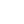</a> | **📂 檔名:** `hammer-18px.svg` ✨ **格式:** `Vector (SVG)` ⚖️ **大小:** `1.13KB` 📅 **更新:** `2026-02-27`  🚀 **jsDelivr Markdown:** `` 🔗 **直接連結 (Url):** <code>https://cdn.jsdelivr.net/gh/barry028/materials@main/images/iCons/Iconbrew%20/hammer-18px.svg</code> 📥 [檢視原始檔](hammer-18px.svg) |
|  | **📂 檔名:** `hammer-24px.svg` ✨ **格式:** `Vector (SVG)` ⚖️ **大小:** `1.13KB` 📅 **更新:** `2026-02-27`  🚀 **jsDelivr Markdown:** `` 🔗 **直接連結 (Url):** <code>https://cdn.jsdelivr.net/gh/barry028/materials@main/images/iCons/Iconbrew%20/hammer-24px.svg</code> 📥 [檢視原始檔](hammer-24px.svg) |
|  | **📂 檔名:** `hammer.svg` ✨ **格式:** `Vector (SVG)` ⚖️ **大小:** `2.28KB` 📅 **更新:** `2026-02-27`  🚀 **jsDelivr Markdown:** `` 🔗 **直接連結 (Url):** <code>https://cdn.jsdelivr.net/gh/barry028/materials@main/images/iCons/Iconbrew%20/hammer.svg</code> 📥 [檢視原始檔](hammer.svg) |
|  | **📂 檔名:** `hash-18px.svg` ✨ **格式:** `Vector (SVG)` ⚖️ **大小:** `1.08KB` 📅 **更新:** `2026-02-27`  🚀 **jsDelivr Markdown:** `` 🔗 **直接連結 (Url):** <code>https://cdn.jsdelivr.net/gh/barry028/materials@main/images/iCons/Iconbrew%20/hash-18px.svg</code> 📥 [檢視原始檔](hash-18px.svg) |
|  | **📂 檔名:** `hash-24px.svg` ✨ **格式:** `Vector (SVG)` ⚖️ **大小:** `1.11KB` 📅 **更新:** `2026-02-27`  🚀 **jsDelivr Markdown:** `` 🔗 **直接連結 (Url):** <code>https://cdn.jsdelivr.net/gh/barry028/materials@main/images/iCons/Iconbrew%20/hash-24px.svg</code> 📥 [檢視原始檔](hash-24px.svg) |
|  | **📂 檔名:** `hash.svg` ✨ **格式:** `Vector (SVG)` ⚖️ **大小:** `2.06KB` 📅 **更新:** `2026-02-27`  🚀 **jsDelivr Markdown:** `` 🔗 **直接連結 (Url):** <code>https://cdn.jsdelivr.net/gh/barry028/materials@main/images/iCons/Iconbrew%20/hash.svg</code> 📥 [檢視原始檔](hash.svg) |
|  | **📂 檔名:** `headphones-18px.svg` ✨ **格式:** `Vector (SVG)` ⚖️ **大小:** `643.00B` 📅 **更新:** `2026-02-27`  🚀 **jsDelivr Markdown:** `` 🔗 **直接連結 (Url):** <code>https://cdn.jsdelivr.net/gh/barry028/materials@main/images/iCons/Iconbrew%20/headphones-18px.svg</code> 📥 [檢視原始檔](headphones-18px.svg) |
|  | **📂 檔名:** `headphones-24px.svg` ✨ **格式:** `Vector (SVG)` ⚖️ **大小:** `695.00B` 📅 **更新:** `2026-02-27`  🚀 **jsDelivr Markdown:** `` 🔗 **直接連結 (Url):** <code>https://cdn.jsdelivr.net/gh/barry028/materials@main/images/iCons/Iconbrew%20/headphones-24px.svg</code> 📥 [檢視原始檔](headphones-24px.svg) |
|  | **📂 檔名:** `headphones.svg` ✨ **格式:** `Vector (SVG)` ⚖️ **大小:** `1.33KB` 📅 **更新:** `2026-02-27`  🚀 **jsDelivr Markdown:** `` 🔗 **直接連結 (Url):** <code>https://cdn.jsdelivr.net/gh/barry028/materials@main/images/iCons/Iconbrew%20/headphones.svg</code> 📥 [檢視原始檔](headphones.svg) |
|  | **📂 檔名:** `health-and-fitness-18px.svg` ✨ **格式:** `Vector (SVG)` ⚖️ **大小:** `827.00B` 📅 **更新:** `2026-02-27`  🚀 **jsDelivr Markdown:** `` 🔗 **直接連結 (Url):** <code>https://cdn.jsdelivr.net/gh/barry028/materials@main/images/iCons/Iconbrew%20/health-and-fitness-18px.svg</code> 📥 [檢視原始檔](health-and-fitness-18px.svg) |
|  | **📂 檔名:** `health-and-fitness-24px.svg` ✨ **格式:** `Vector (SVG)` ⚖️ **大小:** `662.00B` 📅 **更新:** `2026-02-27`  🚀 **jsDelivr Markdown:** `` 🔗 **直接連結 (Url):** <code>https://cdn.jsdelivr.net/gh/barry028/materials@main/images/iCons/Iconbrew%20/health-and-fitness-24px.svg</code> 📥 [檢視原始檔](health-and-fitness-24px.svg) |
|  | **📂 檔名:** `health-and-fitness.svg` ✨ **格式:** `Vector (SVG)` ⚖️ **大小:** `1.48KB` 📅 **更新:** `2026-02-27`  🚀 **jsDelivr Markdown:** `` 🔗 **直接連結 (Url):** <code>https://cdn.jsdelivr.net/gh/barry028/materials@main/images/iCons/Iconbrew%20/health-and-fitness.svg</code> 📥 [檢視原始檔](health-and-fitness.svg) |
|  | **📂 檔名:** `heartbeat-monitor-18px.svg` ✨ **格式:** `Vector (SVG)` ⚖️ **大小:** `595.00B` 📅 **更新:** `2026-02-27`  🚀 **jsDelivr Markdown:** `` 🔗 **直接連結 (Url):** <code>https://cdn.jsdelivr.net/gh/barry028/materials@main/images/iCons/Iconbrew%20/heartbeat-monitor-18px.svg</code> 📥 [檢視原始檔](heartbeat-monitor-18px.svg) |
|  | **📂 檔名:** `heartbeat-monitor-24px.svg` ✨ **格式:** `Vector (SVG)` ⚖️ **大小:** `610.00B` 📅 **更新:** `2026-02-27`  🚀 **jsDelivr Markdown:** `` 🔗 **直接連結 (Url):** <code>https://cdn.jsdelivr.net/gh/barry028/materials@main/images/iCons/Iconbrew%20/heartbeat-monitor-24px.svg</code> 📥 [檢視原始檔](heartbeat-monitor-24px.svg) |
|  | **📂 檔名:** `heartbeat-monitor.svg` ✨ **格式:** `Vector (SVG)` ⚖️ **大小:** `1.19KB` 📅 **更新:** `2026-02-27`  🚀 **jsDelivr Markdown:** `` 🔗 **直接連結 (Url):** <code>https://cdn.jsdelivr.net/gh/barry028/materials@main/images/iCons/Iconbrew%20/heartbeat-monitor.svg</code> 📥 [檢視原始檔](heartbeat-monitor.svg) |
|  | **📂 檔名:** `helm-18px.svg` ✨ **格式:** `Vector (SVG)` ⚖️ **大小:** `408.00B` 📅 **更新:** `2026-02-27`  🚀 **jsDelivr Markdown:** `` 🔗 **直接連結 (Url):** <code>https://cdn.jsdelivr.net/gh/barry028/materials@main/images/iCons/Iconbrew%20/helm-18px.svg</code> 📥 [檢視原始檔](helm-18px.svg) |
|  | **📂 檔名:** `helm-24px.svg` ✨ **格式:** `Vector (SVG)` ⚖️ **大小:** `509.00B` 📅 **更新:** `2026-02-27`  🚀 **jsDelivr Markdown:** `` 🔗 **直接連結 (Url):** <code>https://cdn.jsdelivr.net/gh/barry028/materials@main/images/iCons/Iconbrew%20/helm-24px.svg</code> 📥 [檢視原始檔](helm-24px.svg) |
|  | **📂 檔名:** `helm.svg` ✨ **格式:** `Vector (SVG)` ⚖️ **大小:** `921.00B` 📅 **更新:** `2026-02-27`  🚀 **jsDelivr Markdown:** `` 🔗 **直接連結 (Url):** <code>https://cdn.jsdelivr.net/gh/barry028/materials@main/images/iCons/Iconbrew%20/helm.svg</code> 📥 [檢視原始檔](helm.svg) |
|  | **📂 檔名:** `helmet-18px.svg` ✨ **格式:** `Vector (SVG)` ⚖️ **大小:** `2.33KB` 📅 **更新:** `2026-02-27`  🚀 **jsDelivr Markdown:** `` 🔗 **直接連結 (Url):** <code>https://cdn.jsdelivr.net/gh/barry028/materials@main/images/iCons/Iconbrew%20/helmet-18px.svg</code> 📥 [檢視原始檔](helmet-18px.svg) |
|  | **📂 檔名:** `helmet-24px.svg` ✨ **格式:** `Vector (SVG)` ⚖️ **大小:** `513.00B` 📅 **更新:** `2026-02-27`  🚀 **jsDelivr Markdown:** `` 🔗 **直接連結 (Url):** <code>https://cdn.jsdelivr.net/gh/barry028/materials@main/images/iCons/Iconbrew%20/helmet-24px.svg</code> 📥 [檢視原始檔](helmet-24px.svg) |
|  | **📂 檔名:** `helmet-with-lights-18px.svg` ✨ **格式:** `Vector (SVG)` ⚖️ **大小:** `641.00B` 📅 **更新:** `2026-02-27`  🚀 **jsDelivr Markdown:** `` 🔗 **直接連結 (Url):** <code>https://cdn.jsdelivr.net/gh/barry028/materials@main/images/iCons/Iconbrew%20/helmet-with-lights-18px.svg</code> 📥 [檢視原始檔](helmet-with-lights-18px.svg) |
|  | **📂 檔名:** `helmet-with-lights-24px.svg` ✨ **格式:** `Vector (SVG)` ⚖️ **大小:** `609.00B` 📅 **更新:** `2026-02-27`  🚀 **jsDelivr Markdown:** `` 🔗 **直接連結 (Url):** <code>https://cdn.jsdelivr.net/gh/barry028/materials@main/images/iCons/Iconbrew%20/helmet-with-lights-24px.svg</code> 📥 [檢視原始檔](helmet-with-lights-24px.svg) |
|  | **📂 檔名:** `helmet-with-lights.svg` ✨ **格式:** `Vector (SVG)` ⚖️ **大小:** `1.27KB` 📅 **更新:** `2026-02-27`  🚀 **jsDelivr Markdown:** `` 🔗 **直接連結 (Url):** <code>https://cdn.jsdelivr.net/gh/barry028/materials@main/images/iCons/Iconbrew%20/helmet-with-lights.svg</code> 📥 [檢視原始檔](helmet-with-lights.svg) |
|  | **📂 檔名:** `helmet.svg` ✨ **格式:** `Vector (SVG)` ⚖️ **大小:** `2.83KB` 📅 **更新:** `2026-02-27`  🚀 **jsDelivr Markdown:** `` 🔗 **直接連結 (Url):** <code>https://cdn.jsdelivr.net/gh/barry028/materials@main/images/iCons/Iconbrew%20/helmet.svg</code> 📥 [檢視原始檔](helmet.svg) |
|  | **📂 檔名:** `hoops-18px.svg` ✨ **格式:** `Vector (SVG)` ⚖️ **大小:** `1.79KB` 📅 **更新:** `2026-02-27`  🚀 **jsDelivr Markdown:** `` 🔗 **直接連結 (Url):** <code>https://cdn.jsdelivr.net/gh/barry028/materials@main/images/iCons/Iconbrew%20/hoops-18px.svg</code> 📥 [檢視原始檔](hoops-18px.svg) |
|  | **📂 檔名:** `hoops-24px.svg` ✨ **格式:** `Vector (SVG)` ⚖️ **大小:** `1.82KB` 📅 **更新:** `2026-02-27`  🚀 **jsDelivr Markdown:** `` 🔗 **直接連結 (Url):** <code>https://cdn.jsdelivr.net/gh/barry028/materials@main/images/iCons/Iconbrew%20/hoops-24px.svg</code> 📥 [檢視原始檔](hoops-24px.svg) |
|  | **📂 檔名:** `hoops.svg` ✨ **格式:** `Vector (SVG)` ⚖️ **大小:** `3.61KB` 📅 **更新:** `2026-02-27`  🚀 **jsDelivr Markdown:** `` 🔗 **直接連結 (Url):** <code>https://cdn.jsdelivr.net/gh/barry028/materials@main/images/iCons/Iconbrew%20/hoops.svg</code> 📥 [檢視原始檔](hoops.svg) |
|  | **📂 檔名:** `hot-brew-18px.svg` ✨ **格式:** `Vector (SVG)` ⚖️ **大小:** `1.58KB` 📅 **更新:** `2026-02-27`  🚀 **jsDelivr Markdown:** `` 🔗 **直接連結 (Url):** <code>https://cdn.jsdelivr.net/gh/barry028/materials@main/images/iCons/Iconbrew%20/hot-brew-18px.svg</code> 📥 [檢視原始檔](hot-brew-18px.svg) |
|  | **📂 檔名:** `hot-brew-24px.svg` ✨ **格式:** `Vector (SVG)` ⚖️ **大小:** `1.53KB` 📅 **更新:** `2026-02-27`  🚀 **jsDelivr Markdown:** `` 🔗 **直接連結 (Url):** <code>https://cdn.jsdelivr.net/gh/barry028/materials@main/images/iCons/Iconbrew%20/hot-brew-24px.svg</code> 📥 [檢視原始檔](hot-brew-24px.svg) |
|  | **📂 檔名:** `hot-brew.svg` ✨ **格式:** `Vector (SVG)` ⚖️ **大小:** `3.13KB` 📅 **更新:** `2026-02-27`  🚀 **jsDelivr Markdown:** `` 🔗 **直接連結 (Url):** <code>https://cdn.jsdelivr.net/gh/barry028/materials@main/images/iCons/Iconbrew%20/hot-brew.svg</code> 📥 [檢視原始檔](hot-brew.svg) |
|  | **📂 檔名:** `house-18px.svg` ✨ **格式:** `Vector (SVG)` ⚖️ **大小:** `1.03KB` 📅 **更新:** `2026-02-27`  🚀 **jsDelivr Markdown:** `` 🔗 **直接連結 (Url):** <code>https://cdn.jsdelivr.net/gh/barry028/materials@main/images/iCons/Iconbrew%20/house-18px.svg</code> 📥 [檢視原始檔](house-18px.svg) |
|  | **📂 檔名:** `house-24px.svg` ✨ **格式:** `Vector (SVG)` ⚖️ **大小:** `1.14KB` 📅 **更新:** `2026-02-27`  🚀 **jsDelivr Markdown:** `` 🔗 **直接連結 (Url):** <code>https://cdn.jsdelivr.net/gh/barry028/materials@main/images/iCons/Iconbrew%20/house-24px.svg</code> 📥 [檢視原始檔](house-24px.svg) |
|  | **📂 檔名:** `house.svg` ✨ **格式:** `Vector (SVG)` ⚖️ **大小:** `2.20KB` 📅 **更新:** `2026-02-27`  🚀 **jsDelivr Markdown:** `` 🔗 **直接連結 (Url):** <code>https://cdn.jsdelivr.net/gh/barry028/materials@main/images/iCons/Iconbrew%20/house.svg</code> 📥 [檢視原始檔](house.svg) |
|  | **📂 檔名:** `html-5.svg` ✨ **格式:** `Vector (SVG)` ⚖️ **大小:** `1.75KB` 📅 **更新:** `2026-02-27`  🚀 **jsDelivr Markdown:** `` 🔗 **直接連結 (Url):** <code>https://cdn.jsdelivr.net/gh/barry028/materials@main/images/iCons/Iconbrew%20/html-5.svg</code> 📥 [檢視原始檔](html-5.svg) |
|  | **📂 檔名:** `hug-content-horizontal-18px.svg` ✨ **格式:** `Vector (SVG)` ⚖️ **大小:** `563.00B` 📅 **更新:** `2026-02-27`  🚀 **jsDelivr Markdown:** `` 🔗 **直接連結 (Url):** <code>https://cdn.jsdelivr.net/gh/barry028/materials@main/images/iCons/Iconbrew%20/hug-content-horizontal-18px.svg</code> 📥 [檢視原始檔](hug-content-horizontal-18px.svg) |
|  | **📂 檔名:** `hug-content-horizontal-24px.svg` ✨ **格式:** `Vector (SVG)` ⚖️ **大小:** `572.00B` 📅 **更新:** `2026-02-27`  🚀 **jsDelivr Markdown:** `` 🔗 **直接連結 (Url):** <code>https://cdn.jsdelivr.net/gh/barry028/materials@main/images/iCons/Iconbrew%20/hug-content-horizontal-24px.svg</code> 📥 [檢視原始檔](hug-content-horizontal-24px.svg) |
|  | **📂 檔名:** `hug-content-horizontal.svg` ✨ **格式:** `Vector (SVG)` ⚖️ **大小:** `1.14KB` 📅 **更新:** `2026-02-27`  🚀 **jsDelivr Markdown:** `` 🔗 **直接連結 (Url):** <code>https://cdn.jsdelivr.net/gh/barry028/materials@main/images/iCons/Iconbrew%20/hug-content-horizontal.svg</code> 📥 [檢視原始檔](hug-content-horizontal.svg) |
|  | **📂 檔名:** `hug-content-vertical-18px.svg` ✨ **格式:** `Vector (SVG)` ⚖️ **大小:** `733.00B` 📅 **更新:** `2026-02-27`  🚀 **jsDelivr Markdown:** `` 🔗 **直接連結 (Url):** <code>https://cdn.jsdelivr.net/gh/barry028/materials@main/images/iCons/Iconbrew%20/hug-content-vertical-18px.svg</code> 📥 [檢視原始檔](hug-content-vertical-18px.svg) |
|  | **📂 檔名:** `hug-content-vertical-24px.svg` ✨ **格式:** `Vector (SVG)` ⚖️ **大小:** `742.00B` 📅 **更新:** `2026-02-27`  🚀 **jsDelivr Markdown:** `` 🔗 **直接連結 (Url):** <code>https://cdn.jsdelivr.net/gh/barry028/materials@main/images/iCons/Iconbrew%20/hug-content-vertical-24px.svg</code> 📥 [檢視原始檔](hug-content-vertical-24px.svg) |
|  | **📂 檔名:** `hug-content-vertical.svg` ✨ **格式:** `Vector (SVG)` ⚖️ **大小:** `1.46KB` 📅 **更新:** `2026-02-27`  🚀 **jsDelivr Markdown:** `` 🔗 **直接連結 (Url):** <code>https://cdn.jsdelivr.net/gh/barry028/materials@main/images/iCons/Iconbrew%20/hug-content-vertical.svg</code> 📥 [檢視原始檔](hug-content-vertical.svg) |
|  | **📂 檔名:** `icon-brew-18px.svg` ✨ **格式:** `Vector (SVG)` ⚖️ **大小:** `808.00B` 📅 **更新:** `2026-02-27`  🚀 **jsDelivr Markdown:** `` 🔗 **直接連結 (Url):** <code>https://cdn.jsdelivr.net/gh/barry028/materials@main/images/iCons/Iconbrew%20/icon-brew-18px.svg</code> 📥 [檢視原始檔](icon-brew-18px.svg) |
|  | **📂 檔名:** `icon-brew-24px.svg` ✨ **格式:** `Vector (SVG)` ⚖️ **大小:** `876.00B` 📅 **更新:** `2026-02-27`  🚀 **jsDelivr Markdown:** `` 🔗 **直接連結 (Url):** <code>https://cdn.jsdelivr.net/gh/barry028/materials@main/images/iCons/Iconbrew%20/icon-brew-24px.svg</code> 📥 [檢視原始檔](icon-brew-24px.svg) |
|  | **📂 檔名:** `icon-brew.svg` ✨ **格式:** `Vector (SVG)` ⚖️ **大小:** `1.65KB` 📅 **更新:** `2026-02-27`  🚀 **jsDelivr Markdown:** `` 🔗 **直接連結 (Url):** <code>https://cdn.jsdelivr.net/gh/barry028/materials@main/images/iCons/Iconbrew%20/icon-brew.svg</code> 📥 [檢視原始檔](icon-brew.svg) |
|  | **📂 檔名:** `icon-template.svg` ✨ **格式:** `Vector (SVG)` ⚖️ **大小:** `1.73KB` 📅 **更新:** `2026-02-27`  🚀 **jsDelivr Markdown:** `` 🔗 **直接連結 (Url):** <code>https://cdn.jsdelivr.net/gh/barry028/materials@main/images/iCons/Iconbrew%20/icon-template.svg</code> 📥 [檢視原始檔](icon-template.svg) |
|  | **📂 檔名:** `inbox-tray-18px.svg` ✨ **格式:** `Vector (SVG)` ⚖️ **大小:** `1.43KB` 📅 **更新:** `2026-02-27`  🚀 **jsDelivr Markdown:** `` 🔗 **直接連結 (Url):** <code>https://cdn.jsdelivr.net/gh/barry028/materials@main/images/iCons/Iconbrew%20/inbox-tray-18px.svg</code> 📥 [檢視原始檔](inbox-tray-18px.svg) |
|  | **📂 檔名:** `inbox-tray-24px.svg` ✨ **格式:** `Vector (SVG)` ⚖️ **大小:** `1.59KB` 📅 **更新:** `2026-02-27`  🚀 **jsDelivr Markdown:** `` 🔗 **直接連結 (Url):** <code>https://cdn.jsdelivr.net/gh/barry028/materials@main/images/iCons/Iconbrew%20/inbox-tray-24px.svg</code> 📥 [檢視原始檔](inbox-tray-24px.svg) |
|  | **📂 檔名:** `inbox-tray.svg` ✨ **格式:** `Vector (SVG)` ⚖️ **大小:** `3.06KB` 📅 **更新:** `2026-02-27`  🚀 **jsDelivr Markdown:** `` 🔗 **直接連結 (Url):** <code>https://cdn.jsdelivr.net/gh/barry028/materials@main/images/iCons/Iconbrew%20/inbox-tray.svg</code> 📥 [檢視原始檔](inbox-tray.svg) |
|  | **📂 檔名:** `internet-browser-18px.svg` ✨ **格式:** `Vector (SVG)` ⚖️ **大小:** `597.00B` 📅 **更新:** `2026-02-27`  🚀 **jsDelivr Markdown:** `` 🔗 **直接連結 (Url):** <code>https://cdn.jsdelivr.net/gh/barry028/materials@main/images/iCons/Iconbrew%20/internet-browser-18px.svg</code> 📥 [檢視原始檔](internet-browser-18px.svg) |
|  | **📂 檔名:** `internet-browser-24px.svg` ✨ **格式:** `Vector (SVG)` ⚖️ **大小:** `2.73KB` 📅 **更新:** `2026-02-27`  🚀 **jsDelivr Markdown:** `` 🔗 **直接連結 (Url):** <code>https://cdn.jsdelivr.net/gh/barry028/materials@main/images/iCons/Iconbrew%20/internet-browser-24px.svg</code> 📥 [檢視原始檔](internet-browser-24px.svg) |
|  | **📂 檔名:** `internet-browser.svg` ✨ **格式:** `Vector (SVG)` ⚖️ **大小:** `3.32KB` 📅 **更新:** `2026-02-27`  🚀 **jsDelivr Markdown:** `` 🔗 **直接連結 (Url):** <code>https://cdn.jsdelivr.net/gh/barry028/materials@main/images/iCons/Iconbrew%20/internet-browser.svg</code> 📥 [檢視原始檔](internet-browser.svg) |
|  | **📂 檔名:** `iphone-18px.svg` ✨ **格式:** `Vector (SVG)` ⚖️ **大小:** `865.00B` 📅 **更新:** `2026-02-27`  🚀 **jsDelivr Markdown:** `` 🔗 **直接連結 (Url):** <code>https://cdn.jsdelivr.net/gh/barry028/materials@main/images/iCons/Iconbrew%20/iphone-18px.svg</code> 📥 [檢視原始檔](iphone-18px.svg) |
|  | **📂 檔名:** `iphone-24px.svg` ✨ **格式:** `Vector (SVG)` ⚖️ **大小:** `770.00B` 📅 **更新:** `2026-02-27`  🚀 **jsDelivr Markdown:** `` 🔗 **直接連結 (Url):** <code>https://cdn.jsdelivr.net/gh/barry028/materials@main/images/iCons/Iconbrew%20/iphone-24px.svg</code> 📥 [檢視原始檔](iphone-24px.svg) |
|  | **📂 檔名:** `iphone.svg` ✨ **格式:** `Vector (SVG)` ⚖️ **大小:** `1.61KB` 📅 **更新:** `2026-02-27`  🚀 **jsDelivr Markdown:** `` 🔗 **直接連結 (Url):** <code>https://cdn.jsdelivr.net/gh/barry028/materials@main/images/iCons/Iconbrew%20/iphone.svg</code> 📥 [檢視原始檔](iphone.svg) |
|  | **📂 檔名:** `italic-18px.svg` ✨ **格式:** `Vector (SVG)` ⚖️ **大小:** `364.00B` 📅 **更新:** `2026-02-27`  🚀 **jsDelivr Markdown:** `` 🔗 **直接連結 (Url):** <code>https://cdn.jsdelivr.net/gh/barry028/materials@main/images/iCons/Iconbrew%20/italic-18px.svg</code> 📥 [檢視原始檔](italic-18px.svg) |
|  | **📂 檔名:** `italic-24px.svg` ✨ **格式:** `Vector (SVG)` ⚖️ **大小:** `362.00B` 📅 **更新:** `2026-02-27`  🚀 **jsDelivr Markdown:** `` 🔗 **直接連結 (Url):** <code>https://cdn.jsdelivr.net/gh/barry028/materials@main/images/iCons/Iconbrew%20/italic-24px.svg</code> 📥 [檢視原始檔](italic-24px.svg) |
|  | **📂 檔名:** `italic.svg` ✨ **格式:** `Vector (SVG)` ⚖️ **大小:** `750.00B` 📅 **更新:** `2026-02-27`  🚀 **jsDelivr Markdown:** `` 🔗 **直接連結 (Url):** <code>https://cdn.jsdelivr.net/gh/barry028/materials@main/images/iCons/Iconbrew%20/italic.svg</code> 📥 [檢視原始檔](italic.svg) |
|  | **📂 檔名:** `key-18px.svg` ✨ **格式:** `Vector (SVG)` ⚖️ **大小:** `570.00B` 📅 **更新:** `2026-02-27`  🚀 **jsDelivr Markdown:** `` 🔗 **直接連結 (Url):** <code>https://cdn.jsdelivr.net/gh/barry028/materials@main/images/iCons/Iconbrew%20/key-18px.svg</code> 📥 [檢視原始檔](key-18px.svg) |
|  | **📂 檔名:** `key-24px.svg` ✨ **格式:** `Vector (SVG)` ⚖️ **大小:** `509.00B` 📅 **更新:** `2026-02-27`  🚀 **jsDelivr Markdown:** `` 🔗 **直接連結 (Url):** <code>https://cdn.jsdelivr.net/gh/barry028/materials@main/images/iCons/Iconbrew%20/key-24px.svg</code> 📥 [檢視原始檔](key-24px.svg) |
|  | **📂 檔名:** `key.svg` ✨ **格式:** `Vector (SVG)` ⚖️ **大小:** `1.02KB` 📅 **更新:** `2026-02-27`  🚀 **jsDelivr Markdown:** `` 🔗 **直接連結 (Url):** <code>https://cdn.jsdelivr.net/gh/barry028/materials@main/images/iCons/Iconbrew%20/key.svg</code> 📥 [檢視原始檔](key.svg) |
|  | **📂 檔名:** `laptop-18px.svg` ✨ **格式:** `Vector (SVG)` ⚖️ **大小:** `325.00B` 📅 **更新:** `2026-02-27`  🚀 **jsDelivr Markdown:** `` 🔗 **直接連結 (Url):** <code>https://cdn.jsdelivr.net/gh/barry028/materials@main/images/iCons/Iconbrew%20/laptop-18px.svg</code> 📥 [檢視原始檔](laptop-18px.svg) |
|  | **📂 檔名:** `laptop-24px.svg` ✨ **格式:** `Vector (SVG)` ⚖️ **大小:** `340.00B` 📅 **更新:** `2026-02-27`  🚀 **jsDelivr Markdown:** `` 🔗 **直接連結 (Url):** <code>https://cdn.jsdelivr.net/gh/barry028/materials@main/images/iCons/Iconbrew%20/laptop-24px.svg</code> 📥 [檢視原始檔](laptop-24px.svg) |
|  | **📂 檔名:** `laptop.svg` ✨ **格式:** `Vector (SVG)` ⚖️ **大小:** `673.00B` 📅 **更新:** `2026-02-27`  🚀 **jsDelivr Markdown:** `` 🔗 **直接連結 (Url):** <code>https://cdn.jsdelivr.net/gh/barry028/materials@main/images/iCons/Iconbrew%20/laptop.svg</code> 📥 [檢視原始檔](laptop.svg) |
|  | **📂 檔名:** `layout-bottom-18px.svg` ✨ **格式:** `Vector (SVG)` ⚖️ **大小:** `564.00B` 📅 **更新:** `2026-02-27`  🚀 **jsDelivr Markdown:** `` 🔗 **直接連結 (Url):** <code>https://cdn.jsdelivr.net/gh/barry028/materials@main/images/iCons/Iconbrew%20/layout-bottom-18px.svg</code> 📥 [檢視原始檔](layout-bottom-18px.svg) |
|  | **📂 檔名:** `layout-bottom-24px.svg` ✨ **格式:** `Vector (SVG)` ⚖️ **大小:** `451.00B` 📅 **更新:** `2026-02-27`  🚀 **jsDelivr Markdown:** `` 🔗 **直接連結 (Url):** <code>https://cdn.jsdelivr.net/gh/barry028/materials@main/images/iCons/Iconbrew%20/layout-bottom-24px.svg</code> 📥 [檢視原始檔](layout-bottom-24px.svg) |
|  | **📂 檔名:** `layout-bottom.svg` ✨ **格式:** `Vector (SVG)` ⚖️ **大小:** `1016.00B` 📅 **更新:** `2026-02-27`  🚀 **jsDelivr Markdown:** `` 🔗 **直接連結 (Url):** <code>https://cdn.jsdelivr.net/gh/barry028/materials@main/images/iCons/Iconbrew%20/layout-bottom.svg</code> 📥 [檢視原始檔](layout-bottom.svg) |
|  | **📂 檔名:** `layout-left-18px.svg` ✨ **格式:** `Vector (SVG)` ⚖️ **大小:** `570.00B` 📅 **更新:** `2026-02-27`  🚀 **jsDelivr Markdown:** `` 🔗 **直接連結 (Url):** <code>https://cdn.jsdelivr.net/gh/barry028/materials@main/images/iCons/Iconbrew%20/layout-left-18px.svg</code> 📥 [檢視原始檔](layout-left-18px.svg) |
|  | **📂 檔名:** `layout-left-24px.svg` ✨ **格式:** `Vector (SVG)` ⚖️ **大小:** `449.00B` 📅 **更新:** `2026-02-27`  🚀 **jsDelivr Markdown:** `` 🔗 **直接連結 (Url):** <code>https://cdn.jsdelivr.net/gh/barry028/materials@main/images/iCons/Iconbrew%20/layout-left-24px.svg</code> 📥 [檢視原始檔](layout-left-24px.svg) |
|  | **📂 檔名:** `layout-left.svg` ✨ **格式:** `Vector (SVG)` ⚖️ **大小:** `1017.00B` 📅 **更新:** `2026-02-27`  🚀 **jsDelivr Markdown:** `` 🔗 **直接連結 (Url):** <code>https://cdn.jsdelivr.net/gh/barry028/materials@main/images/iCons/Iconbrew%20/layout-left.svg</code> 📥 [檢視原始檔](layout-left.svg) |
|  | **📂 檔名:** `layout-right-18px.svg` ✨ **格式:** `Vector (SVG)` ⚖️ **大小:** `568.00B` 📅 **更新:** `2026-02-27`  🚀 **jsDelivr Markdown:** `` 🔗 **直接連結 (Url):** <code>https://cdn.jsdelivr.net/gh/barry028/materials@main/images/iCons/Iconbrew%20/layout-right-18px.svg</code> 📥 [檢視原始檔](layout-right-18px.svg) |
|  | **📂 檔名:** `layout-right-24px.svg` ✨ **格式:** `Vector (SVG)` ⚖️ **大小:** `449.00B` 📅 **更新:** `2026-02-27`  🚀 **jsDelivr Markdown:** `` 🔗 **直接連結 (Url):** <code>https://cdn.jsdelivr.net/gh/barry028/materials@main/images/iCons/Iconbrew%20/layout-right-24px.svg</code> 📥 [檢視原始檔](layout-right-24px.svg) |
|  | **📂 檔名:** `layout-right.svg` ✨ **格式:** `Vector (SVG)` ⚖️ **大小:** `1016.00B` 📅 **更新:** `2026-02-27`  🚀 **jsDelivr Markdown:** `` 🔗 **直接連結 (Url):** <code>https://cdn.jsdelivr.net/gh/barry028/materials@main/images/iCons/Iconbrew%20/layout-right.svg</code> 📥 [檢視原始檔](layout-right.svg) |
|  | **📂 檔名:** `layout-top-18px.svg` ✨ **格式:** `Vector (SVG)` ⚖️ **大小:** `562.00B` 📅 **更新:** `2026-02-27`  🚀 **jsDelivr Markdown:** `` 🔗 **直接連結 (Url):** <code>https://cdn.jsdelivr.net/gh/barry028/materials@main/images/iCons/Iconbrew%20/layout-top-18px.svg</code> 📥 [檢視原始檔](layout-top-18px.svg) |
|  | **📂 檔名:** `layout-top-24px.svg` ✨ **格式:** `Vector (SVG)` ⚖️ **大小:** `449.00B` 📅 **更新:** `2026-02-27`  🚀 **jsDelivr Markdown:** `` 🔗 **直接連結 (Url):** <code>https://cdn.jsdelivr.net/gh/barry028/materials@main/images/iCons/Iconbrew%20/layout-top-24px.svg</code> 📥 [檢視原始檔](layout-top-24px.svg) |
|  | **📂 檔名:** `layout-top.svg` ✨ **格式:** `Vector (SVG)` ⚖️ **大小:** `1016.00B` 📅 **更新:** `2026-02-27`  🚀 **jsDelivr Markdown:** `` 🔗 **直接連結 (Url):** <code>https://cdn.jsdelivr.net/gh/barry028/materials@main/images/iCons/Iconbrew%20/layout-top.svg</code> 📥 [檢視原始檔](layout-top.svg) |
|  | **📂 檔名:** `life-buoy-18px.svg` ✨ **格式:** `Vector (SVG)` ⚖️ **大小:** `297.00B` 📅 **更新:** `2026-02-27`  🚀 **jsDelivr Markdown:** `` 🔗 **直接連結 (Url):** <code>https://cdn.jsdelivr.net/gh/barry028/materials@main/images/iCons/Iconbrew%20/life-buoy-18px.svg</code> 📥 [檢視原始檔](life-buoy-18px.svg) |
|  | **📂 檔名:** `life-buoy-24px.svg` ✨ **格式:** `Vector (SVG)` ⚖️ **大小:** `464.00B` 📅 **更新:** `2026-02-27`  🚀 **jsDelivr Markdown:** `` 🔗 **直接連結 (Url):** <code>https://cdn.jsdelivr.net/gh/barry028/materials@main/images/iCons/Iconbrew%20/life-buoy-24px.svg</code> 📥 [檢視原始檔](life-buoy-24px.svg) |
|  | **📂 檔名:** `life-buoy.svg` ✨ **格式:** `Vector (SVG)` ⚖️ **大小:** `794.00B` 📅 **更新:** `2026-02-27`  🚀 **jsDelivr Markdown:** `` 🔗 **直接連結 (Url):** <code>https://cdn.jsdelivr.net/gh/barry028/materials@main/images/iCons/Iconbrew%20/life-buoy.svg</code> 📥 [檢視原始檔](life-buoy.svg) |
|  | **📂 檔名:** `light-bulb-18px.svg` ✨ **格式:** `Vector (SVG)` ⚖️ **大小:** `624.00B` 📅 **更新:** `2026-02-27`  🚀 **jsDelivr Markdown:** `` 🔗 **直接連結 (Url):** <code>https://cdn.jsdelivr.net/gh/barry028/materials@main/images/iCons/Iconbrew%20/light-bulb-18px.svg</code> 📥 [檢視原始檔](light-bulb-18px.svg) |
|  | **📂 檔名:** `light-bulb-24px.svg` ✨ **格式:** `Vector (SVG)` ⚖️ **大小:** `599.00B` 📅 **更新:** `2026-02-27`  🚀 **jsDelivr Markdown:** `` 🔗 **直接連結 (Url):** <code>https://cdn.jsdelivr.net/gh/barry028/materials@main/images/iCons/Iconbrew%20/light-bulb-24px.svg</code> 📥 [檢視原始檔](light-bulb-24px.svg) |
|  | **📂 檔名:** `light-bulb.svg` ✨ **格式:** `Vector (SVG)` ⚖️ **大小:** `1.20KB` 📅 **更新:** `2026-02-27`  🚀 **jsDelivr Markdown:** `` 🔗 **直接連結 (Url):** <code>https://cdn.jsdelivr.net/gh/barry028/materials@main/images/iCons/Iconbrew%20/light-bulb.svg</code> 📥 [檢視原始檔](light-bulb.svg) |
|  | **📂 檔名:** `lightning-18px.svg` ✨ **格式:** `Vector (SVG)` ⚖️ **大小:** `382.00B` 📅 **更新:** `2026-02-27`  🚀 **jsDelivr Markdown:** `` 🔗 **直接連結 (Url):** <code>https://cdn.jsdelivr.net/gh/barry028/materials@main/images/iCons/Iconbrew%20/lightning-18px.svg</code> 📥 [檢視原始檔](lightning-18px.svg) |
|  | **📂 檔名:** `lightning-24px.svg` ✨ **格式:** `Vector (SVG)` ⚖️ **大小:** `395.00B` 📅 **更新:** `2026-02-27`  🚀 **jsDelivr Markdown:** `` 🔗 **直接連結 (Url):** <code>https://cdn.jsdelivr.net/gh/barry028/materials@main/images/iCons/Iconbrew%20/lightning-24px.svg</code> 📥 [檢視原始檔](lightning-24px.svg) |
|  | **📂 檔名:** `lightning.svg` ✨ **格式:** `Vector (SVG)` ⚖️ **大小:** `796.00B` 📅 **更新:** `2026-02-27`  🚀 **jsDelivr Markdown:** `` 🔗 **直接連結 (Url):** <code>https://cdn.jsdelivr.net/gh/barry028/materials@main/images/iCons/Iconbrew%20/lightning.svg</code> 📥 [檢視原始檔](lightning.svg) |
|  | **📂 檔名:** `lights-off-18px.svg` ✨ **格式:** `Vector (SVG)` ⚖️ **大小:** `745.00B` 📅 **更新:** `2026-02-27`  🚀 **jsDelivr Markdown:** `` 🔗 **直接連結 (Url):** <code>https://cdn.jsdelivr.net/gh/barry028/materials@main/images/iCons/Iconbrew%20/lights-off-18px.svg</code> 📥 [檢視原始檔](lights-off-18px.svg) |
|  | **📂 檔名:** `lights-off-24px.svg` ✨ **格式:** `Vector (SVG)` ⚖️ **大小:** `688.00B` 📅 **更新:** `2026-02-27`  🚀 **jsDelivr Markdown:** `` 🔗 **直接連結 (Url):** <code>https://cdn.jsdelivr.net/gh/barry028/materials@main/images/iCons/Iconbrew%20/lights-off-24px.svg</code> 📥 [檢視原始檔](lights-off-24px.svg) |
|  | **📂 檔名:** `lights-off.svg` ✨ **格式:** `Vector (SVG)` ⚖️ **大小:** `1.43KB` 📅 **更新:** `2026-02-27`  🚀 **jsDelivr Markdown:** `` 🔗 **直接連結 (Url):** <code>https://cdn.jsdelivr.net/gh/barry028/materials@main/images/iCons/Iconbrew%20/lights-off.svg</code> 📥 [檢視原始檔](lights-off.svg) |
|  | **📂 檔名:** `lights-on-18px.svg` ✨ **格式:** `Vector (SVG)` ⚖️ **大小:** `827.00B` 📅 **更新:** `2026-02-27`  🚀 **jsDelivr Markdown:** `` 🔗 **直接連結 (Url):** <code>https://cdn.jsdelivr.net/gh/barry028/materials@main/images/iCons/Iconbrew%20/lights-on-18px.svg</code> 📥 [檢視原始檔](lights-on-18px.svg) |
|  | **📂 檔名:** `lights-on-24px.svg` ✨ **格式:** `Vector (SVG)` ⚖️ **大小:** `723.00B` 📅 **更新:** `2026-02-27`  🚀 **jsDelivr Markdown:** `` 🔗 **直接連結 (Url):** <code>https://cdn.jsdelivr.net/gh/barry028/materials@main/images/iCons/Iconbrew%20/lights-on-24px.svg</code> 📥 [檢視原始檔](lights-on-24px.svg) |
|  | **📂 檔名:** `lights-on.svg` ✨ **格式:** `Vector (SVG)` ⚖️ **大小:** `1.55KB` 📅 **更新:** `2026-02-27`  🚀 **jsDelivr Markdown:** `` 🔗 **直接連結 (Url):** <code>https://cdn.jsdelivr.net/gh/barry028/materials@main/images/iCons/Iconbrew%20/lights-on.svg</code> 📥 [檢視原始檔](lights-on.svg) |
|  | **📂 檔名:** `line-chart-down-18px.svg` ✨ **格式:** `Vector (SVG)` ⚖️ **大小:** `389.00B` 📅 **更新:** `2026-02-27`  🚀 **jsDelivr Markdown:** `` 🔗 **直接連結 (Url):** <code>https://cdn.jsdelivr.net/gh/barry028/materials@main/images/iCons/Iconbrew%20/line-chart-down-18px.svg</code> 📥 [檢視原始檔](line-chart-down-18px.svg) |
|  | **📂 檔名:** `line-chart-down-24px.svg` ✨ **格式:** `Vector (SVG)` ⚖️ **大小:** `483.00B` 📅 **更新:** `2026-02-27`  🚀 **jsDelivr Markdown:** `` 🔗 **直接連結 (Url):** <code>https://cdn.jsdelivr.net/gh/barry028/materials@main/images/iCons/Iconbrew%20/line-chart-down-24px.svg</code> 📥 [檢視原始檔](line-chart-down-24px.svg) |
|  | **📂 檔名:** `line-chart-down-arrow-18px.svg` ✨ **格式:** `Vector (SVG)` ⚖️ **大小:** `417.00B` 📅 **更新:** `2026-02-27`  🚀 **jsDelivr Markdown:** `` 🔗 **直接連結 (Url):** <code>https://cdn.jsdelivr.net/gh/barry028/materials@main/images/iCons/Iconbrew%20/line-chart-down-arrow-18px.svg</code> 📥 [檢視原始檔](line-chart-down-arrow-18px.svg) |
|  | **📂 檔名:** `line-chart-down-arrow-24px.svg` ✨ **格式:** `Vector (SVG)` ⚖️ **大小:** `501.00B` 📅 **更新:** `2026-02-27`  🚀 **jsDelivr Markdown:** `` 🔗 **直接連結 (Url):** <code>https://cdn.jsdelivr.net/gh/barry028/materials@main/images/iCons/Iconbrew%20/line-chart-down-arrow-24px.svg</code> 📥 [檢視原始檔](line-chart-down-arrow-24px.svg) |
|  | **📂 檔名:** `line-chart-down-arrow.svg` ✨ **格式:** `Vector (SVG)` ⚖️ **大小:** `914.00B` 📅 **更新:** `2026-02-27`  🚀 **jsDelivr Markdown:** `` 🔗 **直接連結 (Url):** <code>https://cdn.jsdelivr.net/gh/barry028/materials@main/images/iCons/Iconbrew%20/line-chart-down-arrow.svg</code> 📥 [檢視原始檔](line-chart-down-arrow.svg) |
|  | **📂 檔名:** `line-chart-down.svg` ✨ **格式:** `Vector (SVG)` ⚖️ **大小:** `867.00B` 📅 **更新:** `2026-02-27`  🚀 **jsDelivr Markdown:** `` 🔗 **直接連結 (Url):** <code>https://cdn.jsdelivr.net/gh/barry028/materials@main/images/iCons/Iconbrew%20/line-chart-down.svg</code> 📥 [檢視原始檔](line-chart-down.svg) |
|  | **📂 檔名:** `line-chart-up-18px.svg` ✨ **格式:** `Vector (SVG)` ⚖️ **大小:** `538.00B` 📅 **更新:** `2026-02-27`  🚀 **jsDelivr Markdown:** `` 🔗 **直接連結 (Url):** <code>https://cdn.jsdelivr.net/gh/barry028/materials@main/images/iCons/Iconbrew%20/line-chart-up-18px.svg</code> 📥 [檢視原始檔](line-chart-up-18px.svg) |
|  | **📂 檔名:** `line-chart-up-24px.svg` ✨ **格式:** `Vector (SVG)` ⚖️ **大小:** `483.00B` 📅 **更新:** `2026-02-27`  🚀 **jsDelivr Markdown:** `` 🔗 **直接連結 (Url):** <code>https://cdn.jsdelivr.net/gh/barry028/materials@main/images/iCons/Iconbrew%20/line-chart-up-24px.svg</code> 📥 [檢視原始檔](line-chart-up-24px.svg) |
|  | **📂 檔名:** `line-chart-up-arrow-18px.svg` ✨ **格式:** `Vector (SVG)` ⚖️ **大小:** `416.00B` 📅 **更新:** `2026-02-27`  🚀 **jsDelivr Markdown:** `` 🔗 **直接連結 (Url):** <code>https://cdn.jsdelivr.net/gh/barry028/materials@main/images/iCons/Iconbrew%20/line-chart-up-arrow-18px.svg</code> 📥 [檢視原始檔](line-chart-up-arrow-18px.svg) |
|  | **📂 檔名:** `line-chart-up-arrow-24px.svg` ✨ **格式:** `Vector (SVG)` ⚖️ **大小:** `499.00B` 📅 **更新:** `2026-02-27`  🚀 **jsDelivr Markdown:** `` 🔗 **直接連結 (Url):** <code>https://cdn.jsdelivr.net/gh/barry028/materials@main/images/iCons/Iconbrew%20/line-chart-up-arrow-24px.svg</code> 📥 [檢視原始檔](line-chart-up-arrow-24px.svg) |
|  | **📂 檔名:** `line-chart-up-arrow.svg` ✨ **格式:** `Vector (SVG)` ⚖️ **大小:** `914.00B` 📅 **更新:** `2026-02-27`  🚀 **jsDelivr Markdown:** `` 🔗 **直接連結 (Url):** <code>https://cdn.jsdelivr.net/gh/barry028/materials@main/images/iCons/Iconbrew%20/line-chart-up-arrow.svg</code> 📥 [檢視原始檔](line-chart-up-arrow.svg) |
|  | **📂 檔名:** `line-chart-up.svg` ✨ **格式:** `Vector (SVG)` ⚖️ **大小:** `1.02KB` 📅 **更新:** `2026-02-27`  🚀 **jsDelivr Markdown:** `` 🔗 **直接連結 (Url):** <code>https://cdn.jsdelivr.net/gh/barry028/materials@main/images/iCons/Iconbrew%20/line-chart-up.svg</code> 📥 [檢視原始檔](line-chart-up.svg) |
|  | **📂 檔名:** `line-weight-18px.svg` ✨ **格式:** `Vector (SVG)` ⚖️ **大小:** `2.41KB` 📅 **更新:** `2026-02-27`  🚀 **jsDelivr Markdown:** `` 🔗 **直接連結 (Url):** <code>https://cdn.jsdelivr.net/gh/barry028/materials@main/images/iCons/Iconbrew%20/line-weight-18px.svg</code> 📥 [檢視原始檔](line-weight-18px.svg) |
|  | **📂 檔名:** `line-weight-24px.svg` ✨ **格式:** `Vector (SVG)` ⚖️ **大小:** `2.49KB` 📅 **更新:** `2026-02-27`  🚀 **jsDelivr Markdown:** `` 🔗 **直接連結 (Url):** <code>https://cdn.jsdelivr.net/gh/barry028/materials@main/images/iCons/Iconbrew%20/line-weight-24px.svg</code> 📥 [檢視原始檔](line-weight-24px.svg) |
|  | **📂 檔名:** `line-weight.svg` ✨ **格式:** `Vector (SVG)` ⚖️ **大小:** `5.22KB` 📅 **更新:** `2026-02-27`  🚀 **jsDelivr Markdown:** `` 🔗 **直接連結 (Url):** <code>https://cdn.jsdelivr.net/gh/barry028/materials@main/images/iCons/Iconbrew%20/line-weight.svg</code> 📥 [檢視原始檔](line-weight.svg) |
|  | **📂 檔名:** `link-18px.svg` ✨ **格式:** `Vector (SVG)` ⚖️ **大小:** `604.00B` 📅 **更新:** `2026-02-27`  🚀 **jsDelivr Markdown:** `` 🔗 **直接連結 (Url):** <code>https://cdn.jsdelivr.net/gh/barry028/materials@main/images/iCons/Iconbrew%20/link-18px.svg</code> 📥 [檢視原始檔](link-18px.svg) |
|  | **📂 檔名:** `link-24px.svg` ✨ **格式:** `Vector (SVG)` ⚖️ **大小:** `528.00B` 📅 **更新:** `2026-02-27`  🚀 **jsDelivr Markdown:** `` 🔗 **直接連結 (Url):** <code>https://cdn.jsdelivr.net/gh/barry028/materials@main/images/iCons/Iconbrew%20/link-24px.svg</code> 📥 [檢視原始檔](link-24px.svg) |
|  | **📂 檔名:** `link.svg` ✨ **格式:** `Vector (SVG)` ⚖️ **大小:** `1.14KB` 📅 **更新:** `2026-02-27`  🚀 **jsDelivr Markdown:** `` 🔗 **直接連結 (Url):** <code>https://cdn.jsdelivr.net/gh/barry028/materials@main/images/iCons/Iconbrew%20/link.svg</code> 📥 [檢視原始檔](link.svg) |
|  | **📂 檔名:** `loader-18px.svg` ✨ **格式:** `Vector (SVG)` ⚖️ **大小:** `340.00B` 📅 **更新:** `2026-02-27`  🚀 **jsDelivr Markdown:** `` 🔗 **直接連結 (Url):** <code>https://cdn.jsdelivr.net/gh/barry028/materials@main/images/iCons/Iconbrew%20/loader-18px.svg</code> 📥 [檢視原始檔](loader-18px.svg) |
|  | **📂 檔名:** `loader-24px.svg` ✨ **格式:** `Vector (SVG)` ⚖️ **大小:** `259.00B` 📅 **更新:** `2026-02-27`  🚀 **jsDelivr Markdown:** `` 🔗 **直接連結 (Url):** <code>https://cdn.jsdelivr.net/gh/barry028/materials@main/images/iCons/Iconbrew%20/loader-24px.svg</code> 📥 [檢視原始檔](loader-24px.svg) |
|  | **📂 檔名:** `loader.svg` ✨ **格式:** `Vector (SVG)` ⚖️ **大小:** `598.00B` 📅 **更新:** `2026-02-27`  🚀 **jsDelivr Markdown:** `` 🔗 **直接連結 (Url):** <code>https://cdn.jsdelivr.net/gh/barry028/materials@main/images/iCons/Iconbrew%20/loader.svg</code> 📥 [檢視原始檔](loader.svg) |
|  | **📂 檔名:** `location-18px.svg` ✨ **格式:** `Vector (SVG)` ⚖️ **大小:** `757.00B` 📅 **更新:** `2026-02-27`  🚀 **jsDelivr Markdown:** `` 🔗 **直接連結 (Url):** <code>https://cdn.jsdelivr.net/gh/barry028/materials@main/images/iCons/Iconbrew%20/location-18px.svg</code> 📥 [檢視原始檔](location-18px.svg) |
|  | **📂 檔名:** `location-24px.svg` ✨ **格式:** `Vector (SVG)` ⚖️ **大小:** `759.00B` 📅 **更新:** `2026-02-27`  🚀 **jsDelivr Markdown:** `` 🔗 **直接連結 (Url):** <code>https://cdn.jsdelivr.net/gh/barry028/materials@main/images/iCons/Iconbrew%20/location-24px.svg</code> 📥 [檢視原始檔](location-24px.svg) |
|  | **📂 檔名:** `location.svg` ✨ **格式:** `Vector (SVG)` ⚖️ **大小:** `1.51KB` 📅 **更新:** `2026-02-27`  🚀 **jsDelivr Markdown:** `` 🔗 **直接連結 (Url):** <code>https://cdn.jsdelivr.net/gh/barry028/materials@main/images/iCons/Iconbrew%20/location.svg</code> 📥 [檢視原始檔](location.svg) |
|  | **📂 檔名:** `locked-18px.svg` ✨ **格式:** `Vector (SVG)` ⚖️ **大小:** `717.00B` 📅 **更新:** `2026-02-27`  🚀 **jsDelivr Markdown:** `` 🔗 **直接連結 (Url):** <code>https://cdn.jsdelivr.net/gh/barry028/materials@main/images/iCons/Iconbrew%20/locked-18px.svg</code> 📥 [檢視原始檔](locked-18px.svg) |
|  | **📂 檔名:** `locked-24px.svg` ✨ **格式:** `Vector (SVG)` ⚖️ **大小:** `689.00B` 📅 **更新:** `2026-02-27`  🚀 **jsDelivr Markdown:** `` 🔗 **直接連結 (Url):** <code>https://cdn.jsdelivr.net/gh/barry028/materials@main/images/iCons/Iconbrew%20/locked-24px.svg</code> 📥 [檢視原始檔](locked-24px.svg) |
|  | **📂 檔名:** `locked.svg` ✨ **格式:** `Vector (SVG)` ⚖️ **大小:** `1.42KB` 📅 **更新:** `2026-02-27`  🚀 **jsDelivr Markdown:** `` 🔗 **直接連結 (Url):** <code>https://cdn.jsdelivr.net/gh/barry028/materials@main/images/iCons/Iconbrew%20/locked.svg</code> 📥 [檢視原始檔](locked.svg) |
|  | **📂 檔名:** `mac-mini-18px.svg` ✨ **格式:** `Vector (SVG)` ⚖️ **大小:** `620.00B` 📅 **更新:** `2026-02-27`  🚀 **jsDelivr Markdown:** `` 🔗 **直接連結 (Url):** <code>https://cdn.jsdelivr.net/gh/barry028/materials@main/images/iCons/Iconbrew%20/mac-mini-18px.svg</code> 📥 [檢視原始檔](mac-mini-18px.svg) |
|  | **📂 檔名:** `mac-mini-24px.svg` ✨ **格式:** `Vector (SVG)` ⚖️ **大小:** `619.00B` 📅 **更新:** `2026-02-27`  🚀 **jsDelivr Markdown:** `` 🔗 **直接連結 (Url):** <code>https://cdn.jsdelivr.net/gh/barry028/materials@main/images/iCons/Iconbrew%20/mac-mini-24px.svg</code> 📥 [檢視原始檔](mac-mini-24px.svg) |
|  | **📂 檔名:** `mac-mini.svg` ✨ **格式:** `Vector (SVG)` ⚖️ **大小:** `1.22KB` 📅 **更新:** `2026-02-27`  🚀 **jsDelivr Markdown:** `` 🔗 **直接連結 (Url):** <code>https://cdn.jsdelivr.net/gh/barry028/materials@main/images/iCons/Iconbrew%20/mac-mini.svg</code> 📥 [檢視原始檔](mac-mini.svg) |
|  | **📂 檔名:** `mac-window-18px.svg` ✨ **格式:** `Vector (SVG)` ⚖️ **大小:** `1.53KB` 📅 **更新:** `2026-02-27`  🚀 **jsDelivr Markdown:** `` 🔗 **直接連結 (Url):** <code>https://cdn.jsdelivr.net/gh/barry028/materials@main/images/iCons/Iconbrew%20/mac-window-18px.svg</code> 📥 [檢視原始檔](mac-window-18px.svg) |
|  | **📂 檔名:** `mac-window-24px.svg` ✨ **格式:** `Vector (SVG)` ⚖️ **大小:** `843.00B` 📅 **更新:** `2026-02-27`  🚀 **jsDelivr Markdown:** `` 🔗 **直接連結 (Url):** <code>https://cdn.jsdelivr.net/gh/barry028/materials@main/images/iCons/Iconbrew%20/mac-window-24px.svg</code> 📥 [檢視原始檔](mac-window-24px.svg) |
|  | **📂 檔名:** `mac-window.svg` ✨ **格式:** `Vector (SVG)` ⚖️ **大小:** `2.43KB` 📅 **更新:** `2026-02-27`  🚀 **jsDelivr Markdown:** `` 🔗 **直接連結 (Url):** <code>https://cdn.jsdelivr.net/gh/barry028/materials@main/images/iCons/Iconbrew%20/mac-window.svg</code> 📥 [檢視原始檔](mac-window.svg) |
|  | **📂 檔名:** `macintosh.svg` ✨ **格式:** `Vector (SVG)` ⚖️ **大小:** `2.82KB` 📅 **更新:** `2026-02-27`  🚀 **jsDelivr Markdown:** `` 🔗 **直接連結 (Url):** <code>https://cdn.jsdelivr.net/gh/barry028/materials@main/images/iCons/Iconbrew%20/macintosh.svg</code> 📥 [檢視原始檔](macintosh.svg) |
|  | **📂 檔名:** `magic-wand-18px.svg` ✨ **格式:** `Vector (SVG)` ⚖️ **大小:** `1.02KB` 📅 **更新:** `2026-02-27`  🚀 **jsDelivr Markdown:** `` 🔗 **直接連結 (Url):** <code>https://cdn.jsdelivr.net/gh/barry028/materials@main/images/iCons/Iconbrew%20/magic-wand-18px.svg</code> 📥 [檢視原始檔](magic-wand-18px.svg) |
|  | **📂 檔名:** `magic-wand-24px.svg` ✨ **格式:** `Vector (SVG)` ⚖️ **大小:** `738.00B` 📅 **更新:** `2026-02-27`  🚀 **jsDelivr Markdown:** `` 🔗 **直接連結 (Url):** <code>https://cdn.jsdelivr.net/gh/barry028/materials@main/images/iCons/Iconbrew%20/magic-wand-24px.svg</code> 📥 [檢視原始檔](magic-wand-24px.svg) |
|  | **📂 檔名:** `magic-wand.svg` ✨ **格式:** `Vector (SVG)` ⚖️ **大小:** `1.75KB` 📅 **更新:** `2026-02-27`  🚀 **jsDelivr Markdown:** `` 🔗 **直接連結 (Url):** <code>https://cdn.jsdelivr.net/gh/barry028/materials@main/images/iCons/Iconbrew%20/magic-wand.svg</code> 📥 [檢視原始檔](magic-wand.svg) |
|  | **📂 檔名:** `map-folded-18px.svg` ✨ **格式:** `Vector (SVG)` ⚖️ **大小:** `782.00B` 📅 **更新:** `2026-02-27`  🚀 **jsDelivr Markdown:** `` 🔗 **直接連結 (Url):** <code>https://cdn.jsdelivr.net/gh/barry028/materials@main/images/iCons/Iconbrew%20/map-folded-18px.svg</code> 📥 [檢視原始檔](map-folded-18px.svg) |
|  | **📂 檔名:** `map-folded-24px.svg` ✨ **格式:** `Vector (SVG)` ⚖️ **大小:** `645.00B` 📅 **更新:** `2026-02-27`  🚀 **jsDelivr Markdown:** `` 🔗 **直接連結 (Url):** <code>https://cdn.jsdelivr.net/gh/barry028/materials@main/images/iCons/Iconbrew%20/map-folded-24px.svg</code> 📥 [檢視原始檔](map-folded-24px.svg) |
|  | **📂 檔名:** `map-folded.svg` ✨ **格式:** `Vector (SVG)` ⚖️ **大小:** `1.36KB` 📅 **更新:** `2026-02-27`  🚀 **jsDelivr Markdown:** `` 🔗 **直接連結 (Url):** <code>https://cdn.jsdelivr.net/gh/barry028/materials@main/images/iCons/Iconbrew%20/map-folded.svg</code> 📥 [檢視原始檔](map-folded.svg) |
|  | **📂 檔名:** `masonery-18px.svg` ✨ **格式:** `Vector (SVG)` ⚖️ **大小:** `653.00B` 📅 **更新:** `2026-02-27`  🚀 **jsDelivr Markdown:** `` 🔗 **直接連結 (Url):** <code>https://cdn.jsdelivr.net/gh/barry028/materials@main/images/iCons/Iconbrew%20/masonery-18px.svg</code> 📥 [檢視原始檔](masonery-18px.svg) |
|  | **📂 檔名:** `masonery-24px.svg` ✨ **格式:** `Vector (SVG)` ⚖️ **大小:** `688.00B` 📅 **更新:** `2026-02-27`  🚀 **jsDelivr Markdown:** `` 🔗 **直接連結 (Url):** <code>https://cdn.jsdelivr.net/gh/barry028/materials@main/images/iCons/Iconbrew%20/masonery-24px.svg</code> 📥 [檢視原始檔](masonery-24px.svg) |
|  | **📂 檔名:** `masonery.svg` ✨ **格式:** `Vector (SVG)` ⚖️ **大小:** `1.33KB` 📅 **更新:** `2026-02-27`  🚀 **jsDelivr Markdown:** `` 🔗 **直接連結 (Url):** <code>https://cdn.jsdelivr.net/gh/barry028/materials@main/images/iCons/Iconbrew%20/masonery.svg</code> 📥 [檢視原始檔](masonery.svg) |
|  | **📂 檔名:** `medical-18px.svg` ✨ **格式:** `Vector (SVG)` ⚖️ **大小:** `1.07KB` 📅 **更新:** `2026-02-27`  🚀 **jsDelivr Markdown:** `` 🔗 **直接連結 (Url):** <code>https://cdn.jsdelivr.net/gh/barry028/materials@main/images/iCons/Iconbrew%20/medical-18px.svg</code> 📥 [檢視原始檔](medical-18px.svg) |
|  | **📂 檔名:** `medical-24px.svg` ✨ **格式:** `Vector (SVG)` ⚖️ **大小:** `1.03KB` 📅 **更新:** `2026-02-27`  🚀 **jsDelivr Markdown:** `` 🔗 **直接連結 (Url):** <code>https://cdn.jsdelivr.net/gh/barry028/materials@main/images/iCons/Iconbrew%20/medical-24px.svg</code> 📥 [檢視原始檔](medical-24px.svg) |
|  | **📂 檔名:** `medical.svg` ✨ **格式:** `Vector (SVG)` ⚖️ **大小:** `2.13KB` 📅 **更新:** `2026-02-27`  🚀 **jsDelivr Markdown:** `` 🔗 **直接連結 (Url):** <code>https://cdn.jsdelivr.net/gh/barry028/materials@main/images/iCons/Iconbrew%20/medical.svg</code> 📥 [檢視原始檔](medical.svg) |
|  | **📂 檔名:** `message-bubble-18px.svg` ✨ **格式:** `Vector (SVG)` ⚖️ **大小:** `2.23KB` 📅 **更新:** `2026-02-27`  🚀 **jsDelivr Markdown:** `` 🔗 **直接連結 (Url):** <code>https://cdn.jsdelivr.net/gh/barry028/materials@main/images/iCons/Iconbrew%20/message-bubble-18px.svg</code> 📥 [檢視原始檔](message-bubble-18px.svg) |
|  | **📂 檔名:** `message-bubble-24px.svg` ✨ **格式:** `Vector (SVG)` ⚖️ **大小:** `2.37KB` 📅 **更新:** `2026-02-27`  🚀 **jsDelivr Markdown:** `` 🔗 **直接連結 (Url):** <code>https://cdn.jsdelivr.net/gh/barry028/materials@main/images/iCons/Iconbrew%20/message-bubble-24px.svg</code> 📥 [檢視原始檔](message-bubble-24px.svg) |
|  | **📂 檔名:** `message-bubble-with-ellipses-18px.svg` ✨ **格式:** `Vector (SVG)` ⚖️ **大小:** `2.92KB` 📅 **更新:** `2026-02-27`  🚀 **jsDelivr Markdown:** `` 🔗 **直接連結 (Url):** <code>https://cdn.jsdelivr.net/gh/barry028/materials@main/images/iCons/Iconbrew%20/message-bubble-with-ellipses-18px.svg</code> 📥 [檢視原始檔](message-bubble-with-ellipses-18px.svg) |
|  | **📂 檔名:** `message-bubble-with-ellipses-24px.svg` ✨ **格式:** `Vector (SVG)` ⚖️ **大小:** `2.78KB` 📅 **更新:** `2026-02-27`  🚀 **jsDelivr Markdown:** `` 🔗 **直接連結 (Url):** <code>https://cdn.jsdelivr.net/gh/barry028/materials@main/images/iCons/Iconbrew%20/message-bubble-with-ellipses-24px.svg</code> 📥 [檢視原始檔](message-bubble-with-ellipses-24px.svg) |
|  | **📂 檔名:** `message-bubble-with-ellipses.svg` ✨ **格式:** `Vector (SVG)` ⚖️ **大小:** `5.74KB` 📅 **更新:** `2026-02-27`  🚀 **jsDelivr Markdown:** `` 🔗 **直接連結 (Url):** <code>https://cdn.jsdelivr.net/gh/barry028/materials@main/images/iCons/Iconbrew%20/message-bubble-with-ellipses.svg</code> 📥 [檢視原始檔](message-bubble-with-ellipses.svg) |
|  | **📂 檔名:** `message-bubble.svg` ✨ **格式:** `Vector (SVG)` ⚖️ **大小:** `4.64KB` 📅 **更新:** `2026-02-27`  🚀 **jsDelivr Markdown:** `` 🔗 **直接連結 (Url):** <code>https://cdn.jsdelivr.net/gh/barry028/materials@main/images/iCons/Iconbrew%20/message-bubble.svg</code> 📥 [檢視原始檔](message-bubble.svg) |
|  | **📂 檔名:** `message-empty-center-18px.svg` ✨ **格式:** `Vector (SVG)` ⚖️ **大小:** `1.08KB` 📅 **更新:** `2026-02-27`  🚀 **jsDelivr Markdown:** `` 🔗 **直接連結 (Url):** <code>https://cdn.jsdelivr.net/gh/barry028/materials@main/images/iCons/Iconbrew%20/message-empty-center-18px.svg</code> 📥 [檢視原始檔](message-empty-center-18px.svg) |
|  | **📂 檔名:** `message-empty-center-24px.svg` ✨ **格式:** `Vector (SVG)` ⚖️ **大小:** `1012.00B` 📅 **更新:** `2026-02-27`  🚀 **jsDelivr Markdown:** `` 🔗 **直接連結 (Url):** <code>https://cdn.jsdelivr.net/gh/barry028/materials@main/images/iCons/Iconbrew%20/message-empty-center-24px.svg</code> 📥 [檢視原始檔](message-empty-center-24px.svg) |
|  | **📂 檔名:** `message-empty-center.svg` ✨ **格式:** `Vector (SVG)` ⚖️ **大小:** `2.07KB` 📅 **更新:** `2026-02-27`  🚀 **jsDelivr Markdown:** `` 🔗 **直接連結 (Url):** <code>https://cdn.jsdelivr.net/gh/barry028/materials@main/images/iCons/Iconbrew%20/message-empty-center.svg</code> 📥 [檢視原始檔](message-empty-center.svg) |
|  | **📂 檔名:** `message-empty-left-18px.svg` ✨ **格式:** `Vector (SVG)` ⚖️ **大小:** `659.00B` 📅 **更新:** `2026-02-27`  🚀 **jsDelivr Markdown:** `` 🔗 **直接連結 (Url):** <code>https://cdn.jsdelivr.net/gh/barry028/materials@main/images/iCons/Iconbrew%20/message-empty-left-18px.svg</code> 📥 [檢視原始檔](message-empty-left-18px.svg) |
|  | **📂 檔名:** `message-empty-left-24px.svg` ✨ **格式:** `Vector (SVG)` ⚖️ **大小:** `563.00B` 📅 **更新:** `2026-02-27`  🚀 **jsDelivr Markdown:** `` 🔗 **直接連結 (Url):** <code>https://cdn.jsdelivr.net/gh/barry028/materials@main/images/iCons/Iconbrew%20/message-empty-left-24px.svg</code> 📥 [檢視原始檔](message-empty-left-24px.svg) |
|  | **📂 檔名:** `message-empty-left.svg` ✨ **格式:** `Vector (SVG)` ⚖️ **大小:** `1.20KB` 📅 **更新:** `2026-02-27`  🚀 **jsDelivr Markdown:** `` 🔗 **直接連結 (Url):** <code>https://cdn.jsdelivr.net/gh/barry028/materials@main/images/iCons/Iconbrew%20/message-empty-left.svg</code> 📥 [檢視原始檔](message-empty-left.svg) |
|  | **📂 檔名:** `message-empty-right-18px.svg` ✨ **格式:** `Vector (SVG)` ⚖️ **大小:** `672.00B` 📅 **更新:** `2026-02-27`  🚀 **jsDelivr Markdown:** `` 🔗 **直接連結 (Url):** <code>https://cdn.jsdelivr.net/gh/barry028/materials@main/images/iCons/Iconbrew%20/message-empty-right-18px.svg</code> 📥 [檢視原始檔](message-empty-right-18px.svg) |
|  | **📂 檔名:** `message-empty-right-24px.svg` ✨ **格式:** `Vector (SVG)` ⚖️ **大小:** `557.00B` 📅 **更新:** `2026-02-27`  🚀 **jsDelivr Markdown:** `` 🔗 **直接連結 (Url):** <code>https://cdn.jsdelivr.net/gh/barry028/materials@main/images/iCons/Iconbrew%20/message-empty-right-24px.svg</code> 📥 [檢視原始檔](message-empty-right-24px.svg) |
|  | **📂 檔名:** `message-empty-right.svg` ✨ **格式:** `Vector (SVG)` ⚖️ **大小:** `1.20KB` 📅 **更新:** `2026-02-27`  🚀 **jsDelivr Markdown:** `` 🔗 **直接連結 (Url):** <code>https://cdn.jsdelivr.net/gh/barry028/materials@main/images/iCons/Iconbrew%20/message-empty-right.svg</code> 📥 [檢視原始檔](message-empty-right.svg) |
|  | **📂 檔名:** `message-with-star-18px.svg` ✨ **格式:** `Vector (SVG)` ⚖️ **大小:** `1.50KB` 📅 **更新:** `2026-02-27`  🚀 **jsDelivr Markdown:** `` 🔗 **直接連結 (Url):** <code>https://cdn.jsdelivr.net/gh/barry028/materials@main/images/iCons/Iconbrew%20/message-with-star-18px.svg</code> 📥 [檢視原始檔](message-with-star-18px.svg) |
|  | **📂 檔名:** `message-with-star-24px.svg` ✨ **格式:** `Vector (SVG)` ⚖️ **大小:** `1.40KB` 📅 **更新:** `2026-02-27`  🚀 **jsDelivr Markdown:** `` 🔗 **直接連結 (Url):** <code>https://cdn.jsdelivr.net/gh/barry028/materials@main/images/iCons/Iconbrew%20/message-with-star-24px.svg</code> 📥 [檢視原始檔](message-with-star-24px.svg) |
|  | **📂 檔名:** `message-with-star.svg` ✨ **格式:** `Vector (SVG)` ⚖️ **大小:** `2.89KB` 📅 **更新:** `2026-02-27`  🚀 **jsDelivr Markdown:** `` 🔗 **直接連結 (Url):** <code>https://cdn.jsdelivr.net/gh/barry028/materials@main/images/iCons/Iconbrew%20/message-with-star.svg</code> 📥 [檢視原始檔](message-with-star.svg) |
|  | **📂 檔名:** `message-with-text-18px.svg` ✨ **格式:** `Vector (SVG)` ⚖️ **大小:** `1.55KB` 📅 **更新:** `2026-02-27`  🚀 **jsDelivr Markdown:** `` 🔗 **直接連結 (Url):** <code>https://cdn.jsdelivr.net/gh/barry028/materials@main/images/iCons/Iconbrew%20/message-with-text-18px.svg</code> 📥 [檢視原始檔](message-with-text-18px.svg) |
|  | **📂 檔名:** `message-with-text-24px.svg` ✨ **格式:** `Vector (SVG)` ⚖️ **大小:** `1.44KB` 📅 **更新:** `2026-02-27`  🚀 **jsDelivr Markdown:** `` 🔗 **直接連結 (Url):** <code>https://cdn.jsdelivr.net/gh/barry028/materials@main/images/iCons/Iconbrew%20/message-with-text-24px.svg</code> 📥 [檢視原始檔](message-with-text-24px.svg) |
|  | **📂 檔名:** `message-with-text.svg` ✨ **格式:** `Vector (SVG)` ⚖️ **大小:** `2.96KB` 📅 **更新:** `2026-02-27`  🚀 **jsDelivr Markdown:** `` 🔗 **直接連結 (Url):** <code>https://cdn.jsdelivr.net/gh/barry028/materials@main/images/iCons/Iconbrew%20/message-with-text.svg</code> 📥 [檢視原始檔](message-with-text.svg) |
|  | **📂 檔名:** `microphone-18px.svg` ✨ **格式:** `Vector (SVG)` ⚖️ **大小:** `474.00B` 📅 **更新:** `2026-02-27`  🚀 **jsDelivr Markdown:** `` 🔗 **直接連結 (Url):** <code>https://cdn.jsdelivr.net/gh/barry028/materials@main/images/iCons/Iconbrew%20/microphone-18px.svg</code> 📥 [檢視原始檔](microphone-18px.svg) |
|  | **📂 檔名:** `microphone-24px.svg` ✨ **格式:** `Vector (SVG)` ⚖️ **大小:** `423.00B` 📅 **更新:** `2026-02-27`  🚀 **jsDelivr Markdown:** `` 🔗 **直接連結 (Url):** <code>https://cdn.jsdelivr.net/gh/barry028/materials@main/images/iCons/Iconbrew%20/microphone-24px.svg</code> 📥 [檢視原始檔](microphone-24px.svg) |
|  | **📂 檔名:** `microphone.svg` ✨ **格式:** `Vector (SVG)` ⚖️ **大小:** `908.00B` 📅 **更新:** `2026-02-27`  🚀 **jsDelivr Markdown:** `` 🔗 **直接連結 (Url):** <code>https://cdn.jsdelivr.net/gh/barry028/materials@main/images/iCons/Iconbrew%20/microphone.svg</code> 📥 [檢視原始檔](microphone.svg) |
|  | **📂 檔名:** `money-note-18px.svg` ✨ **格式:** `Vector (SVG)` ⚖️ **大小:** `1.05KB` 📅 **更新:** `2026-02-27`  🚀 **jsDelivr Markdown:** `` 🔗 **直接連結 (Url):** <code>https://cdn.jsdelivr.net/gh/barry028/materials@main/images/iCons/Iconbrew%20/money-note-18px.svg</code> 📥 [檢視原始檔](money-note-18px.svg) |
|  | **📂 檔名:** `money-note-24px.svg` ✨ **格式:** `Vector (SVG)` ⚖️ **大小:** `852.00B` 📅 **更新:** `2026-02-27`  🚀 **jsDelivr Markdown:** `` 🔗 **直接連結 (Url):** <code>https://cdn.jsdelivr.net/gh/barry028/materials@main/images/iCons/Iconbrew%20/money-note-24px.svg</code> 📥 [檢視原始檔](money-note-24px.svg) |
|  | **📂 檔名:** `money-note.svg` ✨ **格式:** `Vector (SVG)` ⚖️ **大小:** `1.94KB` 📅 **更新:** `2026-02-27`  🚀 **jsDelivr Markdown:** `` 🔗 **直接連結 (Url):** <code>https://cdn.jsdelivr.net/gh/barry028/materials@main/images/iCons/Iconbrew%20/money-note.svg</code> 📥 [檢視原始檔](money-note.svg) |
|  | **📂 檔名:** `moon-18px.svg` ✨ **格式:** `Vector (SVG)` ⚖️ **大小:** `1.88KB` 📅 **更新:** `2026-02-27`  🚀 **jsDelivr Markdown:** `` 🔗 **直接連結 (Url):** <code>https://cdn.jsdelivr.net/gh/barry028/materials@main/images/iCons/Iconbrew%20/moon-18px.svg</code> 📥 [檢視原始檔](moon-18px.svg) |
|  | **📂 檔名:** `moon-24px.svg` ✨ **格式:** `Vector (SVG)` ⚖️ **大小:** `1.84KB` 📅 **更新:** `2026-02-27`  🚀 **jsDelivr Markdown:** `` 🔗 **直接連結 (Url):** <code>https://cdn.jsdelivr.net/gh/barry028/materials@main/images/iCons/Iconbrew%20/moon-24px.svg</code> 📥 [檢視原始檔](moon-24px.svg) |
|  | **📂 檔名:** `moon.svg` ✨ **格式:** `Vector (SVG)` ⚖️ **大小:** `3.74KB` 📅 **更新:** `2026-02-27`  🚀 **jsDelivr Markdown:** `` 🔗 **直接連結 (Url):** <code>https://cdn.jsdelivr.net/gh/barry028/materials@main/images/iCons/Iconbrew%20/moon.svg</code> 📥 [檢視原始檔](moon.svg) |
|  | **📂 檔名:** `mouse-rectangular-18px.svg` ✨ **格式:** `Vector (SVG)` ⚖️ **大小:** `634.00B` 📅 **更新:** `2026-02-27`  🚀 **jsDelivr Markdown:** `` 🔗 **直接連結 (Url):** <code>https://cdn.jsdelivr.net/gh/barry028/materials@main/images/iCons/Iconbrew%20/mouse-rectangular-18px.svg</code> 📥 [檢視原始檔](mouse-rectangular-18px.svg) |
|  | **📂 檔名:** `mouse-rectangular-24px.svg` ✨ **格式:** `Vector (SVG)` ⚖️ **大小:** `624.00B` 📅 **更新:** `2026-02-27`  🚀 **jsDelivr Markdown:** `` 🔗 **直接連結 (Url):** <code>https://cdn.jsdelivr.net/gh/barry028/materials@main/images/iCons/Iconbrew%20/mouse-rectangular-24px.svg</code> 📥 [檢視原始檔](mouse-rectangular-24px.svg) |
|  | **📂 檔名:** `mouse-rectangular-wired-18px.svg` ✨ **格式:** `Vector (SVG)` ⚖️ **大小:** `1.02KB` 📅 **更新:** `2026-02-27`  🚀 **jsDelivr Markdown:** `` 🔗 **直接連結 (Url):** <code>https://cdn.jsdelivr.net/gh/barry028/materials@main/images/iCons/Iconbrew%20/mouse-rectangular-wired-18px.svg</code> 📥 [檢視原始檔](mouse-rectangular-wired-18px.svg) |
|  | **📂 檔名:** `mouse-rectangular-wired-24px.svg` ✨ **格式:** `Vector (SVG)` ⚖️ **大小:** `981.00B` 📅 **更新:** `2026-02-27`  🚀 **jsDelivr Markdown:** `` 🔗 **直接連結 (Url):** <code>https://cdn.jsdelivr.net/gh/barry028/materials@main/images/iCons/Iconbrew%20/mouse-rectangular-wired-24px.svg</code> 📥 [檢視原始檔](mouse-rectangular-wired-24px.svg) |
|  | **📂 檔名:** `mouse-rectangular-wired.svg` ✨ **格式:** `Vector (SVG)` ⚖️ **大小:** `2.03KB` 📅 **更新:** `2026-02-27`  🚀 **jsDelivr Markdown:** `` 🔗 **直接連結 (Url):** <code>https://cdn.jsdelivr.net/gh/barry028/materials@main/images/iCons/Iconbrew%20/mouse-rectangular-wired.svg</code> 📥 [檢視原始檔](mouse-rectangular-wired.svg) |
|  | **📂 檔名:** `mouse-rectangular.svg` ✨ **格式:** `Vector (SVG)` ⚖️ **大小:** `1.26KB` 📅 **更新:** `2026-02-27`  🚀 **jsDelivr Markdown:** `` 🔗 **直接連結 (Url):** <code>https://cdn.jsdelivr.net/gh/barry028/materials@main/images/iCons/Iconbrew%20/mouse-rectangular.svg</code> 📥 [檢視原始檔](mouse-rectangular.svg) |
|  | **📂 檔名:** `mouse-rounded-18px.svg` ✨ **格式:** `Vector (SVG)` ⚖️ **大小:** `478.00B` 📅 **更新:** `2026-02-27`  🚀 **jsDelivr Markdown:** `` 🔗 **直接連結 (Url):** <code>https://cdn.jsdelivr.net/gh/barry028/materials@main/images/iCons/Iconbrew%20/mouse-rounded-18px.svg</code> 📥 [檢視原始檔](mouse-rounded-18px.svg) |
|  | **📂 檔名:** `mouse-rounded-24px.svg` ✨ **格式:** `Vector (SVG)` ⚖️ **大小:** `478.00B` 📅 **更新:** `2026-02-27`  🚀 **jsDelivr Markdown:** `` 🔗 **直接連結 (Url):** <code>https://cdn.jsdelivr.net/gh/barry028/materials@main/images/iCons/Iconbrew%20/mouse-rounded-24px.svg</code> 📥 [檢視原始檔](mouse-rounded-24px.svg) |
|  | **📂 檔名:** `mouse-rounded-wired-18px.svg` ✨ **格式:** `Vector (SVG)` ⚖️ **大小:** `818.00B` 📅 **更新:** `2026-02-27`  🚀 **jsDelivr Markdown:** `` 🔗 **直接連結 (Url):** <code>https://cdn.jsdelivr.net/gh/barry028/materials@main/images/iCons/Iconbrew%20/mouse-rounded-wired-18px.svg</code> 📥 [檢視原始檔](mouse-rounded-wired-18px.svg) |
|  | **📂 檔名:** `mouse-rounded-wired-24px.svg` ✨ **格式:** `Vector (SVG)` ⚖️ **大小:** `833.00B` 📅 **更新:** `2026-02-27`  🚀 **jsDelivr Markdown:** `` 🔗 **直接連結 (Url):** <code>https://cdn.jsdelivr.net/gh/barry028/materials@main/images/iCons/Iconbrew%20/mouse-rounded-wired-24px.svg</code> 📥 [檢視原始檔](mouse-rounded-wired-24px.svg) |
|  | **📂 檔名:** `mouse-rounded-wired.svg` ✨ **格式:** `Vector (SVG)` ⚖️ **大小:** `1.65KB` 📅 **更新:** `2026-02-27`  🚀 **jsDelivr Markdown:** `` 🔗 **直接連結 (Url):** <code>https://cdn.jsdelivr.net/gh/barry028/materials@main/images/iCons/Iconbrew%20/mouse-rounded-wired.svg</code> 📥 [檢視原始檔](mouse-rounded-wired.svg) |
|  | **📂 檔名:** `mouse-rounded.svg` ✨ **格式:** `Vector (SVG)` ⚖️ **大小:** `988.00B` 📅 **更新:** `2026-02-27`  🚀 **jsDelivr Markdown:** `` 🔗 **直接連結 (Url):** <code>https://cdn.jsdelivr.net/gh/barry028/materials@main/images/iCons/Iconbrew%20/mouse-rounded.svg</code> 📥 [檢視原始檔](mouse-rounded.svg) |
|  | **📂 檔名:** `music-18px.svg` ✨ **格式:** `Vector (SVG)` ⚖️ **大小:** `925.00B` 📅 **更新:** `2026-02-27`  🚀 **jsDelivr Markdown:** `` 🔗 **直接連結 (Url):** <code>https://cdn.jsdelivr.net/gh/barry028/materials@main/images/iCons/Iconbrew%20/music-18px.svg</code> 📥 [檢視原始檔](music-18px.svg) |
|  | **📂 檔名:** `music-24px.svg` ✨ **格式:** `Vector (SVG)` ⚖️ **大小:** `886.00B` 📅 **更新:** `2026-02-27`  🚀 **jsDelivr Markdown:** `` 🔗 **直接連結 (Url):** <code>https://cdn.jsdelivr.net/gh/barry028/materials@main/images/iCons/Iconbrew%20/music-24px.svg</code> 📥 [檢視原始檔](music-24px.svg) |
|  | **📂 檔名:** `music-note-18px.svg` ✨ **格式:** `Vector (SVG)` ⚖️ **大小:** `436.00B` 📅 **更新:** `2026-02-27`  🚀 **jsDelivr Markdown:** `` 🔗 **直接連結 (Url):** <code>https://cdn.jsdelivr.net/gh/barry028/materials@main/images/iCons/Iconbrew%20/music-note-18px.svg</code> 📥 [檢視原始檔](music-note-18px.svg) |
|  | **📂 檔名:** `music-note-24px.svg` ✨ **格式:** `Vector (SVG)` ⚖️ **大小:** `460.00B` 📅 **更新:** `2026-02-27`  🚀 **jsDelivr Markdown:** `` 🔗 **直接連結 (Url):** <code>https://cdn.jsdelivr.net/gh/barry028/materials@main/images/iCons/Iconbrew%20/music-note-24px.svg</code> 📥 [檢視原始檔](music-note-24px.svg) |
|  | **📂 檔名:** `music-note.svg` ✨ **格式:** `Vector (SVG)` ⚖️ **大小:** `958.00B` 📅 **更新:** `2026-02-27`  🚀 **jsDelivr Markdown:** `` 🔗 **直接連結 (Url):** <code>https://cdn.jsdelivr.net/gh/barry028/materials@main/images/iCons/Iconbrew%20/music-note.svg</code> 📥 [檢視原始檔](music-note.svg) |
|  | **📂 檔名:** `music.svg` ✨ **格式:** `Vector (SVG)` ⚖️ **大小:** `1.66KB` 📅 **更新:** `2026-02-27`  🚀 **jsDelivr Markdown:** `` 🔗 **直接連結 (Url):** <code>https://cdn.jsdelivr.net/gh/barry028/materials@main/images/iCons/Iconbrew%20/music.svg</code> 📥 [檢視原始檔](music.svg) |
|  | **📂 檔名:** `news-18px.svg` ✨ **格式:** `Vector (SVG)` ⚖️ **大小:** `890.00B` 📅 **更新:** `2026-02-27`  🚀 **jsDelivr Markdown:** `` 🔗 **直接連結 (Url):** <code>https://cdn.jsdelivr.net/gh/barry028/materials@main/images/iCons/Iconbrew%20/news-18px.svg</code> 📥 [檢視原始檔](news-18px.svg) |
|  | **📂 檔名:** `news-24px.svg` ✨ **格式:** `Vector (SVG)` ⚖️ **大小:** `1.14KB` 📅 **更新:** `2026-02-27`  🚀 **jsDelivr Markdown:** `` 🔗 **直接連結 (Url):** <code>https://cdn.jsdelivr.net/gh/barry028/materials@main/images/iCons/Iconbrew%20/news-24px.svg</code> 📥 [檢視原始檔](news-24px.svg) |
|  | **📂 檔名:** `news.svg` ✨ **格式:** `Vector (SVG)` ⚖️ **大小:** `2.01KB` 📅 **更新:** `2026-02-27`  🚀 **jsDelivr Markdown:** `` 🔗 **直接連結 (Url):** <code>https://cdn.jsdelivr.net/gh/barry028/materials@main/images/iCons/Iconbrew%20/news.svg</code> 📥 [檢視原始檔](news.svg) |
|  | **📂 檔名:** `night-18px.svg` ✨ **格式:** `Vector (SVG)` ⚖️ **大小:** `2.03KB` 📅 **更新:** `2026-02-27`  🚀 **jsDelivr Markdown:** `` 🔗 **直接連結 (Url):** <code>https://cdn.jsdelivr.net/gh/barry028/materials@main/images/iCons/Iconbrew%20/night-18px.svg</code> 📥 [檢視原始檔](night-18px.svg) |
|  | **📂 檔名:** `night-24px.svg` ✨ **格式:** `Vector (SVG)` ⚖️ **大小:** `1.95KB` 📅 **更新:** `2026-02-27`  🚀 **jsDelivr Markdown:** `` 🔗 **直接連結 (Url):** <code>https://cdn.jsdelivr.net/gh/barry028/materials@main/images/iCons/Iconbrew%20/night-24px.svg</code> 📥 [檢視原始檔](night-24px.svg) |
|  | **📂 檔名:** `night.svg` ✨ **格式:** `Vector (SVG)` ⚖️ **大小:** `3.99KB` 📅 **更新:** `2026-02-27`  🚀 **jsDelivr Markdown:** `` 🔗 **直接連結 (Url):** <code>https://cdn.jsdelivr.net/gh/barry028/materials@main/images/iCons/Iconbrew%20/night.svg</code> 📥 [檢視原始檔](night.svg) |
|  | **📂 檔名:** `numbers-18px.svg` ✨ **格式:** `Vector (SVG)` ⚖️ **大小:** `51.91KB` 📅 **更新:** `2026-02-27`  🚀 **jsDelivr Markdown:** `` 🔗 **直接連結 (Url):** <code>https://cdn.jsdelivr.net/gh/barry028/materials@main/images/iCons/Iconbrew%20/numbers-18px.svg</code> 📥 [檢視原始檔](numbers-18px.svg) |
|  | **📂 檔名:** `numbers-24px.svg` ✨ **格式:** `Vector (SVG)` ⚖️ **大小:** `52.47KB` 📅 **更新:** `2026-02-27`  🚀 **jsDelivr Markdown:** `` 🔗 **直接連結 (Url):** <code>https://cdn.jsdelivr.net/gh/barry028/materials@main/images/iCons/Iconbrew%20/numbers-24px.svg</code> 📥 [檢視原始檔](numbers-24px.svg) |
|  | **📂 檔名:** `numbers.svg` ✨ **格式:** `Vector (SVG)` ⚖️ **大小:** `95.48KB` 📅 **更新:** `2026-02-27`  🚀 **jsDelivr Markdown:** `` 🔗 **直接連結 (Url):** <code>https://cdn.jsdelivr.net/gh/barry028/materials@main/images/iCons/Iconbrew%20/numbers.svg</code> 📥 [檢視原始檔](numbers.svg) |
|  | **📂 檔名:** `nuxt.svg` ✨ **格式:** `Vector (SVG)` ⚖️ **大小:** `1.37KB` 📅 **更新:** `2026-02-27`  🚀 **jsDelivr Markdown:** `` 🔗 **直接連結 (Url):** <code>https://cdn.jsdelivr.net/gh/barry028/materials@main/images/iCons/Iconbrew%20/nuxt.svg</code> 📥 [檢視原始檔](nuxt.svg) |
|  | **📂 檔名:** `open-source-18px.svg` ✨ **格式:** `Vector (SVG)` ⚖️ **大小:** `506.00B` 📅 **更新:** `2026-02-27`  🚀 **jsDelivr Markdown:** `` 🔗 **直接連結 (Url):** <code>https://cdn.jsdelivr.net/gh/barry028/materials@main/images/iCons/Iconbrew%20/open-source-18px.svg</code> 📥 [檢視原始檔](open-source-18px.svg) |
|  | **📂 檔名:** `open-source-24px.svg` ✨ **格式:** `Vector (SVG)` ⚖️ **大小:** `516.00B` 📅 **更新:** `2026-02-27`  🚀 **jsDelivr Markdown:** `` 🔗 **直接連結 (Url):** <code>https://cdn.jsdelivr.net/gh/barry028/materials@main/images/iCons/Iconbrew%20/open-source-24px.svg</code> 📥 [檢視原始檔](open-source-24px.svg) |
|  | **📂 檔名:** `open-source.svg` ✨ **格式:** `Vector (SVG)` ⚖️ **大小:** `1.01KB` 📅 **更新:** `2026-02-27`  🚀 **jsDelivr Markdown:** `` 🔗 **直接連結 (Url):** <code>https://cdn.jsdelivr.net/gh/barry028/materials@main/images/iCons/Iconbrew%20/open-source.svg</code> 📥 [檢視原始檔](open-source.svg) |
|  | **📂 檔名:** `option-18px.svg` ✨ **格式:** `Vector (SVG)` ⚖️ **大小:** `464.00B` 📅 **更新:** `2026-02-27`  🚀 **jsDelivr Markdown:** `` 🔗 **直接連結 (Url):** <code>https://cdn.jsdelivr.net/gh/barry028/materials@main/images/iCons/Iconbrew%20/option-18px.svg</code> 📥 [檢視原始檔](option-18px.svg) |
|  | **📂 檔名:** `option-24px.svg` ✨ **格式:** `Vector (SVG)` ⚖️ **大小:** `464.00B` 📅 **更新:** `2026-02-27`  🚀 **jsDelivr Markdown:** `` 🔗 **直接連結 (Url):** <code>https://cdn.jsdelivr.net/gh/barry028/materials@main/images/iCons/Iconbrew%20/option-24px.svg</code> 📥 [檢視原始檔](option-24px.svg) |
|  | **📂 檔名:** `option.svg` ✨ **格式:** `Vector (SVG)` ⚖️ **大小:** `947.00B` 📅 **更新:** `2026-02-27`  🚀 **jsDelivr Markdown:** `` 🔗 **直接連結 (Url):** <code>https://cdn.jsdelivr.net/gh/barry028/materials@main/images/iCons/Iconbrew%20/option.svg</code> 📥 [檢視原始檔](option.svg) |
|  | **📂 檔名:** `outbox-tray-18px.svg` ✨ **格式:** `Vector (SVG)` ⚖️ **大小:** `1.42KB` 📅 **更新:** `2026-02-27`  🚀 **jsDelivr Markdown:** `` 🔗 **直接連結 (Url):** <code>https://cdn.jsdelivr.net/gh/barry028/materials@main/images/iCons/Iconbrew%20/outbox-tray-18px.svg</code> 📥 [檢視原始檔](outbox-tray-18px.svg) |
|  | **📂 檔名:** `outbox-tray-24px.svg` ✨ **格式:** `Vector (SVG)` ⚖️ **大小:** `1.60KB` 📅 **更新:** `2026-02-27`  🚀 **jsDelivr Markdown:** `` 🔗 **直接連結 (Url):** <code>https://cdn.jsdelivr.net/gh/barry028/materials@main/images/iCons/Iconbrew%20/outbox-tray-24px.svg</code> 📥 [檢視原始檔](outbox-tray-24px.svg) |
|  | **📂 檔名:** `outbox-tray.svg` ✨ **格式:** `Vector (SVG)` ⚖️ **大小:** `3.07KB` 📅 **更新:** `2026-02-27`  🚀 **jsDelivr Markdown:** `` 🔗 **直接連結 (Url):** <code>https://cdn.jsdelivr.net/gh/barry028/materials@main/images/iCons/Iconbrew%20/outbox-tray.svg</code> 📥 [檢視原始檔](outbox-tray.svg) |
|  | **📂 檔名:** `padding-all-18px.svg` ✨ **格式:** `Vector (SVG)` ⚖️ **大小:** `663.00B` 📅 **更新:** `2026-02-27`  🚀 **jsDelivr Markdown:** `` 🔗 **直接連結 (Url):** <code>https://cdn.jsdelivr.net/gh/barry028/materials@main/images/iCons/Iconbrew%20/padding-all-18px.svg</code> 📥 [檢視原始檔](padding-all-18px.svg) |
|  | **📂 檔名:** `padding-all-24px.svg` ✨ **格式:** `Vector (SVG)` ⚖️ **大小:** `805.00B` 📅 **更新:** `2026-02-27`  🚀 **jsDelivr Markdown:** `` 🔗 **直接連結 (Url):** <code>https://cdn.jsdelivr.net/gh/barry028/materials@main/images/iCons/Iconbrew%20/padding-all-24px.svg</code> 📥 [檢視原始檔](padding-all-24px.svg) |
|  | **📂 檔名:** `padding-all.svg` ✨ **格式:** `Vector (SVG)` ⚖️ **大小:** `1.45KB` 📅 **更新:** `2026-02-27`  🚀 **jsDelivr Markdown:** `` 🔗 **直接連結 (Url):** <code>https://cdn.jsdelivr.net/gh/barry028/materials@main/images/iCons/Iconbrew%20/padding-all.svg</code> 📥 [檢視原始檔](padding-all.svg) |
|  | **📂 檔名:** `padding-bottom-18px.svg` ✨ **格式:** `Vector (SVG)` ⚖️ **大小:** `493.00B` 📅 **更新:** `2026-02-27`  🚀 **jsDelivr Markdown:** `` 🔗 **直接連結 (Url):** <code>https://cdn.jsdelivr.net/gh/barry028/materials@main/images/iCons/Iconbrew%20/padding-bottom-18px.svg</code> 📥 [檢視原始檔](padding-bottom-18px.svg) |
|  | **📂 檔名:** `padding-bottom-24px.svg` ✨ **格式:** `Vector (SVG)` ⚖️ **大小:** `579.00B` 📅 **更新:** `2026-02-27`  🚀 **jsDelivr Markdown:** `` 🔗 **直接連結 (Url):** <code>https://cdn.jsdelivr.net/gh/barry028/materials@main/images/iCons/Iconbrew%20/padding-bottom-24px.svg</code> 📥 [檢視原始檔](padding-bottom-24px.svg) |
|  | **📂 檔名:** `padding-bottom.svg` ✨ **格式:** `Vector (SVG)` ⚖️ **大小:** `1.06KB` 📅 **更新:** `2026-02-27`  🚀 **jsDelivr Markdown:** `` 🔗 **直接連結 (Url):** <code>https://cdn.jsdelivr.net/gh/barry028/materials@main/images/iCons/Iconbrew%20/padding-bottom.svg</code> 📥 [檢視原始檔](padding-bottom.svg) |
|  | **📂 檔名:** `padding-horizontal-18px.svg` ✨ **格式:** `Vector (SVG)` ⚖️ **大小:** `499.00B` 📅 **更新:** `2026-02-27`  🚀 **jsDelivr Markdown:** `` 🔗 **直接連結 (Url):** <code>https://cdn.jsdelivr.net/gh/barry028/materials@main/images/iCons/Iconbrew%20/padding-horizontal-18px.svg</code> 📥 [檢視原始檔](padding-horizontal-18px.svg) |
|  | **📂 檔名:** `padding-horizontal-24px.svg` ✨ **格式:** `Vector (SVG)` ⚖️ **大小:** `654.00B` 📅 **更新:** `2026-02-27`  🚀 **jsDelivr Markdown:** `` 🔗 **直接連結 (Url):** <code>https://cdn.jsdelivr.net/gh/barry028/materials@main/images/iCons/Iconbrew%20/padding-horizontal-24px.svg</code> 📥 [檢視原始檔](padding-horizontal-24px.svg) |
|  | **📂 檔名:** `padding-horizontal.svg` ✨ **格式:** `Vector (SVG)` ⚖️ **大小:** `1.14KB` 📅 **更新:** `2026-02-27`  🚀 **jsDelivr Markdown:** `` 🔗 **直接連結 (Url):** <code>https://cdn.jsdelivr.net/gh/barry028/materials@main/images/iCons/Iconbrew%20/padding-horizontal.svg</code> 📥 [檢視原始檔](padding-horizontal.svg) |
|  | **📂 檔名:** `padding-left-18px.svg` ✨ **格式:** `Vector (SVG)` ⚖️ **大小:** `485.00B` 📅 **更新:** `2026-02-27`  🚀 **jsDelivr Markdown:** `` 🔗 **直接連結 (Url):** <code>https://cdn.jsdelivr.net/gh/barry028/materials@main/images/iCons/Iconbrew%20/padding-left-18px.svg</code> 📥 [檢視原始檔](padding-left-18px.svg) |
|  | **📂 檔名:** `padding-left-24px.svg` ✨ **格式:** `Vector (SVG)` ⚖️ **大小:** `578.00B` 📅 **更新:** `2026-02-27`  🚀 **jsDelivr Markdown:** `` 🔗 **直接連結 (Url):** <code>https://cdn.jsdelivr.net/gh/barry028/materials@main/images/iCons/Iconbrew%20/padding-left-24px.svg</code> 📥 [檢視原始檔](padding-left-24px.svg) |
|  | **📂 檔名:** `padding-left.svg` ✨ **格式:** `Vector (SVG)` ⚖️ **大小:** `1.05KB` 📅 **更新:** `2026-02-27`  🚀 **jsDelivr Markdown:** `` 🔗 **直接連結 (Url):** <code>https://cdn.jsdelivr.net/gh/barry028/materials@main/images/iCons/Iconbrew%20/padding-left.svg</code> 📥 [檢視原始檔](padding-left.svg) |
|  | **📂 檔名:** `padding-right-18px.svg` ✨ **格式:** `Vector (SVG)` ⚖️ **大小:** `486.00B` 📅 **更新:** `2026-02-27`  🚀 **jsDelivr Markdown:** `` 🔗 **直接連結 (Url):** <code>https://cdn.jsdelivr.net/gh/barry028/materials@main/images/iCons/Iconbrew%20/padding-right-18px.svg</code> 📥 [檢視原始檔](padding-right-18px.svg) |
|  | **📂 檔名:** `padding-right-24px.svg` ✨ **格式:** `Vector (SVG)` ⚖️ **大小:** `579.00B` 📅 **更新:** `2026-02-27`  🚀 **jsDelivr Markdown:** `` 🔗 **直接連結 (Url):** <code>https://cdn.jsdelivr.net/gh/barry028/materials@main/images/iCons/Iconbrew%20/padding-right-24px.svg</code> 📥 [檢視原始檔](padding-right-24px.svg) |
|  | **📂 檔名:** `padding-right.svg` ✨ **格式:** `Vector (SVG)` ⚖️ **大小:** `1.05KB` 📅 **更新:** `2026-02-27`  🚀 **jsDelivr Markdown:** `` 🔗 **直接連結 (Url):** <code>https://cdn.jsdelivr.net/gh/barry028/materials@main/images/iCons/Iconbrew%20/padding-right.svg</code> 📥 [檢視原始檔](padding-right.svg) |
|  | **📂 檔名:** `padding-top-18px.svg` ✨ **格式:** `Vector (SVG)` ⚖️ **大小:** `481.00B` 📅 **更新:** `2026-02-27`  🚀 **jsDelivr Markdown:** `` 🔗 **直接連結 (Url):** <code>https://cdn.jsdelivr.net/gh/barry028/materials@main/images/iCons/Iconbrew%20/padding-top-18px.svg</code> 📥 [檢視原始檔](padding-top-18px.svg) |
|  | **📂 檔名:** `padding-top-24px.svg` ✨ **格式:** `Vector (SVG)` ⚖️ **大小:** `578.00B` 📅 **更新:** `2026-02-27`  🚀 **jsDelivr Markdown:** `` 🔗 **直接連結 (Url):** <code>https://cdn.jsdelivr.net/gh/barry028/materials@main/images/iCons/Iconbrew%20/padding-top-24px.svg</code> 📥 [檢視原始檔](padding-top-24px.svg) |
|  | **📂 檔名:** `padding-top.svg` ✨ **格式:** `Vector (SVG)` ⚖️ **大小:** `1.04KB` 📅 **更新:** `2026-02-27`  🚀 **jsDelivr Markdown:** `` 🔗 **直接連結 (Url):** <code>https://cdn.jsdelivr.net/gh/barry028/materials@main/images/iCons/Iconbrew%20/padding-top.svg</code> 📥 [檢視原始檔](padding-top.svg) |
|  | **📂 檔名:** `padding-vertical-18px.svg` ✨ **格式:** `Vector (SVG)` ⚖️ **大小:** `542.00B` 📅 **更新:** `2026-02-27`  🚀 **jsDelivr Markdown:** `` 🔗 **直接連結 (Url):** <code>https://cdn.jsdelivr.net/gh/barry028/materials@main/images/iCons/Iconbrew%20/padding-vertical-18px.svg</code> 📥 [檢視原始檔](padding-vertical-18px.svg) |
|  | **📂 檔名:** `padding-vertical-24px.svg` ✨ **格式:** `Vector (SVG)` ⚖️ **大小:** `654.00B` 📅 **更新:** `2026-02-27`  🚀 **jsDelivr Markdown:** `` 🔗 **直接連結 (Url):** <code>https://cdn.jsdelivr.net/gh/barry028/materials@main/images/iCons/Iconbrew%20/padding-vertical-24px.svg</code> 📥 [檢視原始檔](padding-vertical-24px.svg) |
|  | **📂 檔名:** `padding-vertical.svg` ✨ **格式:** `Vector (SVG)` ⚖️ **大小:** `1.18KB` 📅 **更新:** `2026-02-27`  🚀 **jsDelivr Markdown:** `` 🔗 **直接連結 (Url):** <code>https://cdn.jsdelivr.net/gh/barry028/materials@main/images/iCons/Iconbrew%20/padding-vertical.svg</code> 📥 [檢視原始檔](padding-vertical.svg) |
|  | **📂 檔名:** `pause-18px.svg` ✨ **格式:** `Vector (SVG)` ⚖️ **大小:** `360.00B` 📅 **更新:** `2026-02-27`  🚀 **jsDelivr Markdown:** `` 🔗 **直接連結 (Url):** <code>https://cdn.jsdelivr.net/gh/barry028/materials@main/images/iCons/Iconbrew%20/pause-18px.svg</code> 📥 [檢視原始檔](pause-18px.svg) |
|  | **📂 檔名:** `pause-24px.svg` ✨ **格式:** `Vector (SVG)` ⚖️ **大小:** `358.00B` 📅 **更新:** `2026-02-27`  🚀 **jsDelivr Markdown:** `` 🔗 **直接連結 (Url):** <code>https://cdn.jsdelivr.net/gh/barry028/materials@main/images/iCons/Iconbrew%20/pause-24px.svg</code> 📥 [檢視原始檔](pause-24px.svg) |
|  | **📂 檔名:** `pause.svg` ✨ **格式:** `Vector (SVG)` ⚖️ **大小:** `733.00B` 📅 **更新:** `2026-02-27`  🚀 **jsDelivr Markdown:** `` 🔗 **直接連結 (Url):** <code>https://cdn.jsdelivr.net/gh/barry028/materials@main/images/iCons/Iconbrew%20/pause.svg</code> 📥 [檢視原始檔](pause.svg) |
|  | **📂 檔名:** `peace-18px.svg` ✨ **格式:** `Vector (SVG)` ⚖️ **大小:** `339.00B` 📅 **更新:** `2026-02-27`  🚀 **jsDelivr Markdown:** `` 🔗 **直接連結 (Url):** <code>https://cdn.jsdelivr.net/gh/barry028/materials@main/images/iCons/Iconbrew%20/peace-18px.svg</code> 📥 [檢視原始檔](peace-18px.svg) |
|  | **📂 檔名:** `peace-24px.svg` ✨ **格式:** `Vector (SVG)` ⚖️ **大小:** `367.00B` 📅 **更新:** `2026-02-27`  🚀 **jsDelivr Markdown:** `` 🔗 **直接連結 (Url):** <code>https://cdn.jsdelivr.net/gh/barry028/materials@main/images/iCons/Iconbrew%20/peace-24px.svg</code> 📥 [檢視原始檔](peace-24px.svg) |
|  | **📂 檔名:** `peace.svg` ✨ **格式:** `Vector (SVG)` ⚖️ **大小:** `743.00B` 📅 **更新:** `2026-02-27`  🚀 **jsDelivr Markdown:** `` 🔗 **直接連結 (Url):** <code>https://cdn.jsdelivr.net/gh/barry028/materials@main/images/iCons/Iconbrew%20/peace.svg</code> 📥 [檢視原始檔](peace.svg) |
|  | **📂 檔名:** `pencil-18px.svg` ✨ **格式:** `Vector (SVG)` ⚖️ **大小:** `939.00B` 📅 **更新:** `2026-02-27`  🚀 **jsDelivr Markdown:** `` 🔗 **直接連結 (Url):** <code>https://cdn.jsdelivr.net/gh/barry028/materials@main/images/iCons/Iconbrew%20/pencil-18px.svg</code> 📥 [檢視原始檔](pencil-18px.svg) |
|  | **📂 檔名:** `pencil-24px.svg` ✨ **格式:** `Vector (SVG)` ⚖️ **大小:** `1.02KB` 📅 **更新:** `2026-02-27`  🚀 **jsDelivr Markdown:** `` 🔗 **直接連結 (Url):** <code>https://cdn.jsdelivr.net/gh/barry028/materials@main/images/iCons/Iconbrew%20/pencil-24px.svg</code> 📥 [檢視原始檔](pencil-24px.svg) |
|  | **📂 檔名:** `pencil-tip-18px.svg` ✨ **格式:** `Vector (SVG)` ⚖️ **大小:** `626.00B` 📅 **更新:** `2026-02-27`  🚀 **jsDelivr Markdown:** `` 🔗 **直接連結 (Url):** <code>https://cdn.jsdelivr.net/gh/barry028/materials@main/images/iCons/Iconbrew%20/pencil-tip-18px.svg</code> 📥 [檢視原始檔](pencil-tip-18px.svg) |
|  | **📂 檔名:** `pencil-tip-24px.svg` ✨ **格式:** `Vector (SVG)` ⚖️ **大小:** `650.00B` 📅 **更新:** `2026-02-27`  🚀 **jsDelivr Markdown:** `` 🔗 **直接連結 (Url):** <code>https://cdn.jsdelivr.net/gh/barry028/materials@main/images/iCons/Iconbrew%20/pencil-tip-24px.svg</code> 📥 [檢視原始檔](pencil-tip-24px.svg) |
|  | **📂 檔名:** `pencil-tip.svg` ✨ **格式:** `Vector (SVG)` ⚖️ **大小:** `1.28KB` 📅 **更新:** `2026-02-27`  🚀 **jsDelivr Markdown:** `` 🔗 **直接連結 (Url):** <code>https://cdn.jsdelivr.net/gh/barry028/materials@main/images/iCons/Iconbrew%20/pencil-tip.svg</code> 📥 [檢視原始檔](pencil-tip.svg) |
|  | **📂 檔名:** `pencil.svg` ✨ **格式:** `Vector (SVG)` ⚖️ **大小:** `1.95KB` 📅 **更新:** `2026-02-27`  🚀 **jsDelivr Markdown:** `` 🔗 **直接連結 (Url):** <code>https://cdn.jsdelivr.net/gh/barry028/materials@main/images/iCons/Iconbrew%20/pencil.svg</code> 📥 [檢視原始檔](pencil.svg) |
|  | **📂 檔名:** `person-18px.svg` ✨ **格式:** `Vector (SVG)` ⚖️ **大小:** `365.00B` 📅 **更新:** `2026-02-27`  🚀 **jsDelivr Markdown:** `` 🔗 **直接連結 (Url):** <code>https://cdn.jsdelivr.net/gh/barry028/materials@main/images/iCons/Iconbrew%20/person-18px.svg</code> 📥 [檢視原始檔](person-18px.svg) |
|  | **📂 檔名:** `person-24px.svg` ✨ **格式:** `Vector (SVG)` ⚖️ **大小:** `420.00B` 📅 **更新:** `2026-02-27`  🚀 **jsDelivr Markdown:** `` 🔗 **直接連結 (Url):** <code>https://cdn.jsdelivr.net/gh/barry028/materials@main/images/iCons/Iconbrew%20/person-24px.svg</code> 📥 [檢視原始檔](person-24px.svg) |
|  | **📂 檔名:** `person.svg` ✨ **格式:** `Vector (SVG)` ⚖️ **大小:** `800.00B` 📅 **更新:** `2026-02-27`  🚀 **jsDelivr Markdown:** `` 🔗 **直接連結 (Url):** <code>https://cdn.jsdelivr.net/gh/barry028/materials@main/images/iCons/Iconbrew%20/person.svg</code> 📥 [檢視原始檔](person.svg) |
|  | **📂 檔名:** `pharmacy-18px.svg` ✨ **格式:** `Vector (SVG)` ⚖️ **大小:** `544.00B` 📅 **更新:** `2026-02-27`  🚀 **jsDelivr Markdown:** `` 🔗 **直接連結 (Url):** <code>https://cdn.jsdelivr.net/gh/barry028/materials@main/images/iCons/Iconbrew%20/pharmacy-18px.svg</code> 📥 [檢視原始檔](pharmacy-18px.svg) |
|  | **📂 檔名:** `pharmacy-24px.svg` ✨ **格式:** `Vector (SVG)` ⚖️ **大小:** `502.00B` 📅 **更新:** `2026-02-27`  🚀 **jsDelivr Markdown:** `` 🔗 **直接連結 (Url):** <code>https://cdn.jsdelivr.net/gh/barry028/materials@main/images/iCons/Iconbrew%20/pharmacy-24px.svg</code> 📥 [檢視原始檔](pharmacy-24px.svg) |
|  | **📂 檔名:** `pharmacy.svg` ✨ **格式:** `Vector (SVG)` ⚖️ **大小:** `1.04KB` 📅 **更新:** `2026-02-27`  🚀 **jsDelivr Markdown:** `` 🔗 **直接連結 (Url):** <code>https://cdn.jsdelivr.net/gh/barry028/materials@main/images/iCons/Iconbrew%20/pharmacy.svg</code> 📥 [檢視原始檔](pharmacy.svg) |
|  | **📂 檔名:** `phone-call-18px.svg` ✨ **格式:** `Vector (SVG)` ⚖️ **大小:** `803.00B` 📅 **更新:** `2026-02-27`  🚀 **jsDelivr Markdown:** `` 🔗 **直接連結 (Url):** <code>https://cdn.jsdelivr.net/gh/barry028/materials@main/images/iCons/Iconbrew%20/phone-call-18px.svg</code> 📥 [檢視原始檔](phone-call-18px.svg) |
|  | **📂 檔名:** `phone-call-24px.svg` ✨ **格式:** `Vector (SVG)` ⚖️ **大小:** `812.00B` 📅 **更新:** `2026-02-27`  🚀 **jsDelivr Markdown:** `` 🔗 **直接連結 (Url):** <code>https://cdn.jsdelivr.net/gh/barry028/materials@main/images/iCons/Iconbrew%20/phone-call-24px.svg</code> 📥 [檢視原始檔](phone-call-24px.svg) |
|  | **📂 檔名:** `phone-call-in-18px.svg` ✨ **格式:** `Vector (SVG)` ⚖️ **大小:** `926.00B` 📅 **更新:** `2026-02-27`  🚀 **jsDelivr Markdown:** `` 🔗 **直接連結 (Url):** <code>https://cdn.jsdelivr.net/gh/barry028/materials@main/images/iCons/Iconbrew%20/phone-call-in-18px.svg</code> 📥 [檢視原始檔](phone-call-in-18px.svg) |
|  | **📂 檔名:** `phone-call-in-24px.svg` ✨ **格式:** `Vector (SVG)` ⚖️ **大小:** `971.00B` 📅 **更新:** `2026-02-27`  🚀 **jsDelivr Markdown:** `` 🔗 **直接連結 (Url):** <code>https://cdn.jsdelivr.net/gh/barry028/materials@main/images/iCons/Iconbrew%20/phone-call-in-24px.svg</code> 📥 [檢視原始檔](phone-call-in-24px.svg) |
|  | **📂 檔名:** `phone-call-in.svg` ✨ **格式:** `Vector (SVG)` ⚖️ **大小:** `1.87KB` 📅 **更新:** `2026-02-27`  🚀 **jsDelivr Markdown:** `` 🔗 **直接連結 (Url):** <code>https://cdn.jsdelivr.net/gh/barry028/materials@main/images/iCons/Iconbrew%20/phone-call-in.svg</code> 📥 [檢視原始檔](phone-call-in.svg) |
|  | **📂 檔名:** `phone-call-out-18px.svg` ✨ **格式:** `Vector (SVG)` ⚖️ **大小:** `926.00B` 📅 **更新:** `2026-02-27`  🚀 **jsDelivr Markdown:** `` 🔗 **直接連結 (Url):** <code>https://cdn.jsdelivr.net/gh/barry028/materials@main/images/iCons/Iconbrew%20/phone-call-out-18px.svg</code> 📥 [檢視原始檔](phone-call-out-18px.svg) |
|  | **📂 檔名:** `phone-call-out-24px.svg` ✨ **格式:** `Vector (SVG)` ⚖️ **大小:** `971.00B` 📅 **更新:** `2026-02-27`  🚀 **jsDelivr Markdown:** `` 🔗 **直接連結 (Url):** <code>https://cdn.jsdelivr.net/gh/barry028/materials@main/images/iCons/Iconbrew%20/phone-call-out-24px.svg</code> 📥 [檢視原始檔](phone-call-out-24px.svg) |
|  | **📂 檔名:** `phone-call-out.svg` ✨ **格式:** `Vector (SVG)` ⚖️ **大小:** `1.84KB` 📅 **更新:** `2026-02-27`  🚀 **jsDelivr Markdown:** `` 🔗 **直接連結 (Url):** <code>https://cdn.jsdelivr.net/gh/barry028/materials@main/images/iCons/Iconbrew%20/phone-call-out.svg</code> 📥 [檢視原始檔](phone-call-out.svg) |
|  | **📂 檔名:** `phone-call-transfer-18px.svg` ✨ **格式:** `Vector (SVG)` ⚖️ **大小:** `1009.00B` 📅 **更新:** `2026-02-27`  🚀 **jsDelivr Markdown:** `` 🔗 **直接連結 (Url):** <code>https://cdn.jsdelivr.net/gh/barry028/materials@main/images/iCons/Iconbrew%20/phone-call-transfer-18px.svg</code> 📥 [檢視原始檔](phone-call-transfer-18px.svg) |
|  | **📂 檔名:** `phone-call-transfer-24px.svg` ✨ **格式:** `Vector (SVG)` ⚖️ **大小:** `1.00KB` 📅 **更新:** `2026-02-27`  🚀 **jsDelivr Markdown:** `` 🔗 **直接連結 (Url):** <code>https://cdn.jsdelivr.net/gh/barry028/materials@main/images/iCons/Iconbrew%20/phone-call-transfer-24px.svg</code> 📥 [檢視原始檔](phone-call-transfer-24px.svg) |
|  | **📂 檔名:** `phone-call-transfer.svg` ✨ **格式:** `Vector (SVG)` ⚖️ **大小:** `2.00KB` 📅 **更新:** `2026-02-27`  🚀 **jsDelivr Markdown:** `` 🔗 **直接連結 (Url):** <code>https://cdn.jsdelivr.net/gh/barry028/materials@main/images/iCons/Iconbrew%20/phone-call-transfer.svg</code> 📥 [檢視原始檔](phone-call-transfer.svg) |
|  | **📂 檔名:** `phone-call.svg` ✨ **格式:** `Vector (SVG)` ⚖️ **大小:** `1.58KB` 📅 **更新:** `2026-02-27`  🚀 **jsDelivr Markdown:** `` 🔗 **直接連結 (Url):** <code>https://cdn.jsdelivr.net/gh/barry028/materials@main/images/iCons/Iconbrew%20/phone-call.svg</code> 📥 [檢視原始檔](phone-call.svg) |
|  | **📂 檔名:** `phone-signal-18px.svg` ✨ **格式:** `Vector (SVG)` ⚖️ **大小:** `2.13KB` 📅 **更新:** `2026-02-27`  🚀 **jsDelivr Markdown:** `` 🔗 **直接連結 (Url):** <code>https://cdn.jsdelivr.net/gh/barry028/materials@main/images/iCons/Iconbrew%20/phone-signal-18px.svg</code> 📥 [檢視原始檔](phone-signal-18px.svg) |
|  | **📂 檔名:** `phone-signal-24px.svg` ✨ **格式:** `Vector (SVG)` ⚖️ **大小:** `568.00B` 📅 **更新:** `2026-02-27`  🚀 **jsDelivr Markdown:** `` 🔗 **直接連結 (Url):** <code>https://cdn.jsdelivr.net/gh/barry028/materials@main/images/iCons/Iconbrew%20/phone-signal-24px.svg</code> 📥 [檢視原始檔](phone-signal-24px.svg) |
| <a href="phone-signal.svg">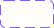</a> | **📂 檔名:** `phone-signal.svg` ✨ **格式:** `Vector (SVG)` ⚖️ **大小:** `2.64KB` 📅 **更新:** `2026-02-27`  🚀 **jsDelivr Markdown:** `` 🔗 **直接連結 (Url):** <code>https://cdn.jsdelivr.net/gh/barry028/materials@main/images/iCons/Iconbrew%20/phone-signal.svg</code> 📥 [檢視原始檔](phone-signal.svg) |
|  | **📂 檔名:** `photo-18px.svg` ✨ **格式:** `Vector (SVG)` ⚖️ **大小:** `951.00B` 📅 **更新:** `2026-02-27`  🚀 **jsDelivr Markdown:** `` 🔗 **直接連結 (Url):** <code>https://cdn.jsdelivr.net/gh/barry028/materials@main/images/iCons/Iconbrew%20/photo-18px.svg</code> 📥 [檢視原始檔](photo-18px.svg) |
|  | **📂 檔名:** `photo-24px.svg` ✨ **格式:** `Vector (SVG)` ⚖️ **大小:** `933.00B` 📅 **更新:** `2026-02-27`  🚀 **jsDelivr Markdown:** `` 🔗 **直接連結 (Url):** <code>https://cdn.jsdelivr.net/gh/barry028/materials@main/images/iCons/Iconbrew%20/photo-24px.svg</code> 📥 [檢視原始檔](photo-24px.svg) |
|  | **📂 檔名:** `photo.svg` ✨ **格式:** `Vector (SVG)` ⚖️ **大小:** `1.86KB` 📅 **更新:** `2026-02-27`  🚀 **jsDelivr Markdown:** `` 🔗 **直接連結 (Url):** <code>https://cdn.jsdelivr.net/gh/barry028/materials@main/images/iCons/Iconbrew%20/photo.svg</code> 📥 [檢視原始檔](photo.svg) |
|  | **📂 檔名:** `pin-18px.svg` ✨ **格式:** `Vector (SVG)` ⚖️ **大小:** `1.18KB` 📅 **更新:** `2026-02-27`  🚀 **jsDelivr Markdown:** `` 🔗 **直接連結 (Url):** <code>https://cdn.jsdelivr.net/gh/barry028/materials@main/images/iCons/Iconbrew%20/pin-18px.svg</code> 📥 [檢視原始檔](pin-18px.svg) |
|  | **📂 檔名:** `pin-24px.svg` ✨ **格式:** `Vector (SVG)` ⚖️ **大小:** `1.31KB` 📅 **更新:** `2026-02-27`  🚀 **jsDelivr Markdown:** `` 🔗 **直接連結 (Url):** <code>https://cdn.jsdelivr.net/gh/barry028/materials@main/images/iCons/Iconbrew%20/pin-24px.svg</code> 📥 [檢視原始檔](pin-24px.svg) |
|  | **📂 檔名:** `pin.svg` ✨ **格式:** `Vector (SVG)` ⚖️ **大小:** `2.51KB` 📅 **更新:** `2026-02-27`  🚀 **jsDelivr Markdown:** `` 🔗 **直接連結 (Url):** <code>https://cdn.jsdelivr.net/gh/barry028/materials@main/images/iCons/Iconbrew%20/pin.svg</code> 📥 [檢視原始檔](pin.svg) |
|  | **📂 檔名:** `plane-landing-18px.svg` ✨ **格式:** `Vector (SVG)` ⚖️ **大小:** `1.13KB` 📅 **更新:** `2026-02-27`  🚀 **jsDelivr Markdown:** `` 🔗 **直接連結 (Url):** <code>https://cdn.jsdelivr.net/gh/barry028/materials@main/images/iCons/Iconbrew%20/plane-landing-18px.svg</code> 📥 [檢視原始檔](plane-landing-18px.svg) |
|  | **📂 檔名:** `plane-landing-24px.svg` ✨ **格式:** `Vector (SVG)` ⚖️ **大小:** `1.37KB` 📅 **更新:** `2026-02-27`  🚀 **jsDelivr Markdown:** `` 🔗 **直接連結 (Url):** <code>https://cdn.jsdelivr.net/gh/barry028/materials@main/images/iCons/Iconbrew%20/plane-landing-24px.svg</code> 📥 [檢視原始檔](plane-landing-24px.svg) |
|  | **📂 檔名:** `plane-landing.svg` ✨ **格式:** `Vector (SVG)` ⚖️ **大小:** `2.53KB` 📅 **更新:** `2026-02-27`  🚀 **jsDelivr Markdown:** `` 🔗 **直接連結 (Url):** <code>https://cdn.jsdelivr.net/gh/barry028/materials@main/images/iCons/Iconbrew%20/plane-landing.svg</code> 📥 [檢視原始檔](plane-landing.svg) |
|  | **📂 檔名:** `plane-take-off-18px.svg` ✨ **格式:** `Vector (SVG)` ⚖️ **大小:** `1.12KB` 📅 **更新:** `2026-02-27`  🚀 **jsDelivr Markdown:** `` 🔗 **直接連結 (Url):** <code>https://cdn.jsdelivr.net/gh/barry028/materials@main/images/iCons/Iconbrew%20/plane-take-off-18px.svg</code> 📥 [檢視原始檔](plane-take-off-18px.svg) |
|  | **📂 檔名:** `plane-take-off-24px.svg` ✨ **格式:** `Vector (SVG)` ⚖️ **大小:** `1.36KB` 📅 **更新:** `2026-02-27`  🚀 **jsDelivr Markdown:** `` 🔗 **直接連結 (Url):** <code>https://cdn.jsdelivr.net/gh/barry028/materials@main/images/iCons/Iconbrew%20/plane-take-off-24px.svg</code> 📥 [檢視原始檔](plane-take-off-24px.svg) |
|  | **📂 檔名:** `plane-take-off.svg` ✨ **格式:** `Vector (SVG)` ⚖️ **大小:** `2.50KB` 📅 **更新:** `2026-02-27`  🚀 **jsDelivr Markdown:** `` 🔗 **直接連結 (Url):** <code>https://cdn.jsdelivr.net/gh/barry028/materials@main/images/iCons/Iconbrew%20/plane-take-off.svg</code> 📥 [檢視原始檔](plane-take-off.svg) |
|  | **📂 檔名:** `play-18px.svg` ✨ **格式:** `Vector (SVG)` ⚖️ **大小:** `605.00B` 📅 **更新:** `2026-02-27`  🚀 **jsDelivr Markdown:** `` 🔗 **直接連結 (Url):** <code>https://cdn.jsdelivr.net/gh/barry028/materials@main/images/iCons/Iconbrew%20/play-18px.svg</code> 📥 [檢視原始檔](play-18px.svg) |
|  | **📂 檔名:** `play-24px.svg` ✨ **格式:** `Vector (SVG)` ⚖️ **大小:** `623.00B` 📅 **更新:** `2026-02-27`  🚀 **jsDelivr Markdown:** `` 🔗 **直接連結 (Url):** <code>https://cdn.jsdelivr.net/gh/barry028/materials@main/images/iCons/Iconbrew%20/play-24px.svg</code> 📥 [檢視原始檔](play-24px.svg) |
|  | **📂 檔名:** `play.svg` ✨ **格式:** `Vector (SVG)` ⚖️ **大小:** `1.22KB` 📅 **更新:** `2026-02-27`  🚀 **jsDelivr Markdown:** `` 🔗 **直接連結 (Url):** <code>https://cdn.jsdelivr.net/gh/barry028/materials@main/images/iCons/Iconbrew%20/play.svg</code> 📥 [檢視原始檔](play.svg) |
|  | **📂 檔名:** `pocket-18px.svg` ✨ **格式:** `Vector (SVG)` ⚖️ **大小:** `839.00B` 📅 **更新:** `2026-02-27`  🚀 **jsDelivr Markdown:** `` 🔗 **直接連結 (Url):** <code>https://cdn.jsdelivr.net/gh/barry028/materials@main/images/iCons/Iconbrew%20/pocket-18px.svg</code> 📥 [檢視原始檔](pocket-18px.svg) |
|  | **📂 檔名:** `pocket-24px.svg` ✨ **格式:** `Vector (SVG)` ⚖️ **大小:** `1.12KB` 📅 **更新:** `2026-02-27`  🚀 **jsDelivr Markdown:** `` 🔗 **直接連結 (Url):** <code>https://cdn.jsdelivr.net/gh/barry028/materials@main/images/iCons/Iconbrew%20/pocket-24px.svg</code> 📥 [檢視原始檔](pocket-24px.svg) |
|  | **📂 檔名:** `pocket.svg` ✨ **格式:** `Vector (SVG)` ⚖️ **大小:** `1.98KB` 📅 **更新:** `2026-02-27`  🚀 **jsDelivr Markdown:** `` 🔗 **直接連結 (Url):** <code>https://cdn.jsdelivr.net/gh/barry028/materials@main/images/iCons/Iconbrew%20/pocket.svg</code> 📥 [檢視原始檔](pocket.svg) |
|  | **📂 檔名:** `power-18px.svg` ✨ **格式:** `Vector (SVG)` ⚖️ **大小:** `578.00B` 📅 **更新:** `2026-02-27`  🚀 **jsDelivr Markdown:** `` 🔗 **直接連結 (Url):** <code>https://cdn.jsdelivr.net/gh/barry028/materials@main/images/iCons/Iconbrew%20/power-18px.svg</code> 📥 [檢視原始檔](power-18px.svg) |
|  | **📂 檔名:** `power-24px.svg` ✨ **格式:** `Vector (SVG)` ⚖️ **大小:** `560.00B` 📅 **更新:** `2026-02-27`  🚀 **jsDelivr Markdown:** `` 🔗 **直接連結 (Url):** <code>https://cdn.jsdelivr.net/gh/barry028/materials@main/images/iCons/Iconbrew%20/power-24px.svg</code> 📥 [檢視原始檔](power-24px.svg) |
|  | **📂 檔名:** `power.svg` ✨ **格式:** `Vector (SVG)` ⚖️ **大小:** `1.10KB` 📅 **更新:** `2026-02-27`  🚀 **jsDelivr Markdown:** `` 🔗 **直接連結 (Url):** <code>https://cdn.jsdelivr.net/gh/barry028/materials@main/images/iCons/Iconbrew%20/power.svg</code> 📥 [檢視原始檔](power.svg) |
|  | **📂 檔名:** `presentation-18px.svg` ✨ **格式:** `Vector (SVG)` ⚖️ **大小:** `463.00B` 📅 **更新:** `2026-02-27`  🚀 **jsDelivr Markdown:** `` 🔗 **直接連結 (Url):** <code>https://cdn.jsdelivr.net/gh/barry028/materials@main/images/iCons/Iconbrew%20/presentation-18px.svg</code> 📥 [檢視原始檔](presentation-18px.svg) |
|  | **📂 檔名:** `presentation-24px.svg` ✨ **格式:** `Vector (SVG)` ⚖️ **大小:** `384.00B` 📅 **更新:** `2026-02-27`  🚀 **jsDelivr Markdown:** `` 🔗 **直接連結 (Url):** <code>https://cdn.jsdelivr.net/gh/barry028/materials@main/images/iCons/Iconbrew%20/presentation-24px.svg</code> 📥 [檢視原始檔](presentation-24px.svg) |
|  | **📂 檔名:** `presentation-graph-18px.svg` ✨ **格式:** `Vector (SVG)` ⚖️ **大小:** `548.00B` 📅 **更新:** `2026-02-27`  🚀 **jsDelivr Markdown:** `` 🔗 **直接連結 (Url):** <code>https://cdn.jsdelivr.net/gh/barry028/materials@main/images/iCons/Iconbrew%20/presentation-graph-18px.svg</code> 📥 [檢視原始檔](presentation-graph-18px.svg) |
|  | **📂 檔名:** `presentation-graph-24px.svg` ✨ **格式:** `Vector (SVG)` ⚖️ **大小:** `445.00B` 📅 **更新:** `2026-02-27`  🚀 **jsDelivr Markdown:** `` 🔗 **直接連結 (Url):** <code>https://cdn.jsdelivr.net/gh/barry028/materials@main/images/iCons/Iconbrew%20/presentation-graph-24px.svg</code> 📥 [檢視原始檔](presentation-graph-24px.svg) |
|  | **📂 檔名:** `presentation-graph.svg` ✨ **格式:** `Vector (SVG)` ⚖️ **大小:** `998.00B` 📅 **更新:** `2026-02-27`  🚀 **jsDelivr Markdown:** `` 🔗 **直接連結 (Url):** <code>https://cdn.jsdelivr.net/gh/barry028/materials@main/images/iCons/Iconbrew%20/presentation-graph.svg</code> 📥 [檢視原始檔](presentation-graph.svg) |
|  | **📂 檔名:** `presentation.svg` ✨ **格式:** `Vector (SVG)` ⚖️ **大小:** `849.00B` 📅 **更新:** `2026-02-27`  🚀 **jsDelivr Markdown:** `` 🔗 **直接連結 (Url):** <code>https://cdn.jsdelivr.net/gh/barry028/materials@main/images/iCons/Iconbrew%20/presentation.svg</code> 📥 [檢視原始檔](presentation.svg) |
|  | **📂 檔名:** `productivity-18px.svg` ✨ **格式:** `Vector (SVG)` ⚖️ **大小:** `871.00B` 📅 **更新:** `2026-02-27`  🚀 **jsDelivr Markdown:** `` 🔗 **直接連結 (Url):** <code>https://cdn.jsdelivr.net/gh/barry028/materials@main/images/iCons/Iconbrew%20/productivity-18px.svg</code> 📥 [檢視原始檔](productivity-18px.svg) |
|  | **📂 檔名:** `productivity-24px.svg` ✨ **格式:** `Vector (SVG)` ⚖️ **大小:** `891.00B` 📅 **更新:** `2026-02-27`  🚀 **jsDelivr Markdown:** `` 🔗 **直接連結 (Url):** <code>https://cdn.jsdelivr.net/gh/barry028/materials@main/images/iCons/Iconbrew%20/productivity-24px.svg</code> 📥 [檢視原始檔](productivity-24px.svg) |
|  | **📂 檔名:** `productivity.svg` ✨ **格式:** `Vector (SVG)` ⚖️ **大小:** `1.73KB` 📅 **更新:** `2026-02-27`  🚀 **jsDelivr Markdown:** `` 🔗 **直接連結 (Url):** <code>https://cdn.jsdelivr.net/gh/barry028/materials@main/images/iCons/Iconbrew%20/productivity.svg</code> 📥 [檢視原始檔](productivity.svg) |
|  | **📂 檔名:** `protein-structure.svg` ✨ **格式:** `Vector (SVG)` ⚖️ **大小:** `1.73KB` 📅 **更新:** `2026-02-27`  🚀 **jsDelivr Markdown:** `` 🔗 **直接連結 (Url):** <code>https://cdn.jsdelivr.net/gh/barry028/materials@main/images/iCons/Iconbrew%20/protein-structure.svg</code> 📥 [檢視原始檔](protein-structure.svg) |
|  | **📂 檔名:** `question-mark-with-circle-18px.svg` ✨ **格式:** `Vector (SVG)` ⚖️ **大小:** `1.32KB` 📅 **更新:** `2026-02-27`  🚀 **jsDelivr Markdown:** `` 🔗 **直接連結 (Url):** <code>https://cdn.jsdelivr.net/gh/barry028/materials@main/images/iCons/Iconbrew%20/question-mark-with-circle-18px.svg</code> 📥 [檢視原始檔](question-mark-with-circle-18px.svg) |
|  | **📂 檔名:** `question-mark-with-circle-24px.svg` ✨ **格式:** `Vector (SVG)` ⚖️ **大小:** `1.34KB` 📅 **更新:** `2026-02-27`  🚀 **jsDelivr Markdown:** `` 🔗 **直接連結 (Url):** <code>https://cdn.jsdelivr.net/gh/barry028/materials@main/images/iCons/Iconbrew%20/question-mark-with-circle-24px.svg</code> 📥 [檢視原始檔](question-mark-with-circle-24px.svg) |
|  | **📂 檔名:** `question-mark-with-circle.svg` ✨ **格式:** `Vector (SVG)` ⚖️ **大小:** `2.63KB` 📅 **更新:** `2026-02-27`  🚀 **jsDelivr Markdown:** `` 🔗 **直接連結 (Url):** <code>https://cdn.jsdelivr.net/gh/barry028/materials@main/images/iCons/Iconbrew%20/question-mark-with-circle.svg</code> 📥 [檢視原始檔](question-mark-with-circle.svg) |
|  | **📂 檔名:** `radio-18px.svg` ✨ **格式:** `Vector (SVG)` ⚖️ **大小:** `1.10KB` 📅 **更新:** `2026-02-27`  🚀 **jsDelivr Markdown:** `` 🔗 **直接連結 (Url):** <code>https://cdn.jsdelivr.net/gh/barry028/materials@main/images/iCons/Iconbrew%20/radio-18px.svg</code> 📥 [檢視原始檔](radio-18px.svg) |
|  | **📂 檔名:** `radio-24px.svg` ✨ **格式:** `Vector (SVG)` ⚖️ **大小:** `1.19KB` 📅 **更新:** `2026-02-27`  🚀 **jsDelivr Markdown:** `` 🔗 **直接連結 (Url):** <code>https://cdn.jsdelivr.net/gh/barry028/materials@main/images/iCons/Iconbrew%20/radio-24px.svg</code> 📥 [檢視原始檔](radio-24px.svg) |
|  | **📂 檔名:** `radio-pole-18px.svg` ✨ **格式:** `Vector (SVG)` ⚖️ **大小:** `1.20KB` 📅 **更新:** `2026-02-27`  🚀 **jsDelivr Markdown:** `` 🔗 **直接連結 (Url):** <code>https://cdn.jsdelivr.net/gh/barry028/materials@main/images/iCons/Iconbrew%20/radio-pole-18px.svg</code> 📥 [檢視原始檔](radio-pole-18px.svg) |
|  | **📂 檔名:** `radio-pole-24px.svg` ✨ **格式:** `Vector (SVG)` ⚖️ **大小:** `1.32KB` 📅 **更新:** `2026-02-27`  🚀 **jsDelivr Markdown:** `` 🔗 **直接連結 (Url):** <code>https://cdn.jsdelivr.net/gh/barry028/materials@main/images/iCons/Iconbrew%20/radio-pole-24px.svg</code> 📥 [檢視原始檔](radio-pole-24px.svg) |
|  | **📂 檔名:** `radio-pole.svg` ✨ **格式:** `Vector (SVG)` ⚖️ **大小:** `2.53KB` 📅 **更新:** `2026-02-27`  🚀 **jsDelivr Markdown:** `` 🔗 **直接連結 (Url):** <code>https://cdn.jsdelivr.net/gh/barry028/materials@main/images/iCons/Iconbrew%20/radio-pole.svg</code> 📥 [檢視原始檔](radio-pole.svg) |
|  | **📂 檔名:** `radio.svg` ✨ **格式:** `Vector (SVG)` ⚖️ **大小:** `2.32KB` 📅 **更新:** `2026-02-27`  🚀 **jsDelivr Markdown:** `` 🔗 **直接連結 (Url):** <code>https://cdn.jsdelivr.net/gh/barry028/materials@main/images/iCons/Iconbrew%20/radio.svg</code> 📥 [檢視原始檔](radio.svg) |
|  | **📂 檔名:** `react-18px.svg` ✨ **格式:** `Vector (SVG)` ⚖️ **大小:** `6.17KB` 📅 **更新:** `2026-02-27`  🚀 **jsDelivr Markdown:** `` 🔗 **直接連結 (Url):** <code>https://cdn.jsdelivr.net/gh/barry028/materials@main/images/iCons/Iconbrew%20/react-18px.svg</code> 📥 [檢視原始檔](react-18px.svg) |
|  | **📂 檔名:** `react-24px.svg` ✨ **格式:** `Vector (SVG)` ⚖️ **大小:** `6.06KB` 📅 **更新:** `2026-02-27`  🚀 **jsDelivr Markdown:** `` 🔗 **直接連結 (Url):** <code>https://cdn.jsdelivr.net/gh/barry028/materials@main/images/iCons/Iconbrew%20/react-24px.svg</code> 📥 [檢視原始檔](react-24px.svg) |
|  | **📂 檔名:** `react.svg` ✨ **格式:** `Vector (SVG)` ⚖️ **大小:** `12.19KB` 📅 **更新:** `2026-02-27`  🚀 **jsDelivr Markdown:** `` 🔗 **直接連結 (Url):** <code>https://cdn.jsdelivr.net/gh/barry028/materials@main/images/iCons/Iconbrew%20/react.svg</code> 📥 [檢視原始檔](react.svg) |
|  | **📂 檔名:** `receipt-18px.svg` ✨ **格式:** `Vector (SVG)` ⚖️ **大小:** `1.57KB` 📅 **更新:** `2026-02-27`  🚀 **jsDelivr Markdown:** `` 🔗 **直接連結 (Url):** <code>https://cdn.jsdelivr.net/gh/barry028/materials@main/images/iCons/Iconbrew%20/receipt-18px.svg</code> 📥 [檢視原始檔](receipt-18px.svg) |
|  | **📂 檔名:** `receipt-24px.svg` ✨ **格式:** `Vector (SVG)` ⚖️ **大小:** `1.44KB` 📅 **更新:** `2026-02-27`  🚀 **jsDelivr Markdown:** `` 🔗 **直接連結 (Url):** <code>https://cdn.jsdelivr.net/gh/barry028/materials@main/images/iCons/Iconbrew%20/receipt-24px.svg</code> 📥 [檢視原始檔](receipt-24px.svg) |
|  | **📂 檔名:** `receipt.svg` ✨ **格式:** `Vector (SVG)` ⚖️ **大小:** `3.08KB` 📅 **更新:** `2026-02-27`  🚀 **jsDelivr Markdown:** `` 🔗 **直接連結 (Url):** <code>https://cdn.jsdelivr.net/gh/barry028/materials@main/images/iCons/Iconbrew%20/receipt.svg</code> 📥 [檢視原始檔](receipt.svg) |
|  | **📂 檔名:** `rectangle-18px.svg` ✨ **格式:** `Vector (SVG)` ⚖️ **大小:** `452.00B` 📅 **更新:** `2026-02-27`  🚀 **jsDelivr Markdown:** `` 🔗 **直接連結 (Url):** <code>https://cdn.jsdelivr.net/gh/barry028/materials@main/images/iCons/Iconbrew%20/rectangle-18px.svg</code> 📥 [檢視原始檔](rectangle-18px.svg) |
|  | **📂 檔名:** `rectangle-24px.svg` ✨ **格式:** `Vector (SVG)` ⚖️ **大小:** `678.00B` 📅 **更新:** `2026-02-27`  🚀 **jsDelivr Markdown:** `` 🔗 **直接連結 (Url):** <code>https://cdn.jsdelivr.net/gh/barry028/materials@main/images/iCons/Iconbrew%20/rectangle-24px.svg</code> 📥 [檢視原始檔](rectangle-24px.svg) |
|  | **📂 檔名:** `rectangle-contract-18px.svg` ✨ **格式:** `Vector (SVG)` ⚖️ **大小:** `866.00B` 📅 **更新:** `2026-02-27`  🚀 **jsDelivr Markdown:** `` 🔗 **直接連結 (Url):** <code>https://cdn.jsdelivr.net/gh/barry028/materials@main/images/iCons/Iconbrew%20/rectangle-contract-18px.svg</code> 📥 [檢視原始檔](rectangle-contract-18px.svg) |
|  | **📂 檔名:** `rectangle-contract-24px.svg` ✨ **格式:** `Vector (SVG)` ⚖️ **大小:** `487.00B` 📅 **更新:** `2026-02-27`  🚀 **jsDelivr Markdown:** `` 🔗 **直接連結 (Url):** <code>https://cdn.jsdelivr.net/gh/barry028/materials@main/images/iCons/Iconbrew%20/rectangle-contract-24px.svg</code> 📥 [檢視原始檔](rectangle-contract-24px.svg) |
|  | **📂 檔名:** `rectangle-contract.svg` ✨ **格式:** `Vector (SVG)` ⚖️ **大小:** `1.36KB` 📅 **更新:** `2026-02-27`  🚀 **jsDelivr Markdown:** `` 🔗 **直接連結 (Url):** <code>https://cdn.jsdelivr.net/gh/barry028/materials@main/images/iCons/Iconbrew%20/rectangle-contract.svg</code> 📥 [檢視原始檔](rectangle-contract.svg) |
|  | **📂 檔名:** `rectangle-expand-18px.svg` ✨ **格式:** `Vector (SVG)` ⚖️ **大小:** `866.00B` 📅 **更新:** `2026-02-27`  🚀 **jsDelivr Markdown:** `` 🔗 **直接連結 (Url):** <code>https://cdn.jsdelivr.net/gh/barry028/materials@main/images/iCons/Iconbrew%20/rectangle-expand-18px.svg</code> 📥 [檢視原始檔](rectangle-expand-18px.svg) |
|  | **📂 檔名:** `rectangle-expand-24px.svg` ✨ **格式:** `Vector (SVG)` ⚖️ **大小:** `485.00B` 📅 **更新:** `2026-02-27`  🚀 **jsDelivr Markdown:** `` 🔗 **直接連結 (Url):** <code>https://cdn.jsdelivr.net/gh/barry028/materials@main/images/iCons/Iconbrew%20/rectangle-expand-24px.svg</code> 📥 [檢視原始檔](rectangle-expand-24px.svg) |
|  | **📂 檔名:** `rectangle-expand.svg` ✨ **格式:** `Vector (SVG)` ⚖️ **大小:** `1.35KB` 📅 **更新:** `2026-02-27`  🚀 **jsDelivr Markdown:** `` 🔗 **直接連結 (Url):** <code>https://cdn.jsdelivr.net/gh/barry028/materials@main/images/iCons/Iconbrew%20/rectangle-expand.svg</code> 📥 [檢視原始檔](rectangle-expand.svg) |
|  | **📂 檔名:** `rectangle-left-filled-18px.svg` ✨ **格式:** `Vector (SVG)` ⚖️ **大小:** `858.00B` 📅 **更新:** `2026-02-27`  🚀 **jsDelivr Markdown:** `` 🔗 **直接連結 (Url):** <code>https://cdn.jsdelivr.net/gh/barry028/materials@main/images/iCons/Iconbrew%20/rectangle-left-filled-18px.svg</code> 📥 [檢視原始檔](rectangle-left-filled-18px.svg) |
|  | **📂 檔名:** `rectangle-left-filled-24px.svg` ✨ **格式:** `Vector (SVG)` ⚖️ **大小:** `619.00B` 📅 **更新:** `2026-02-27`  🚀 **jsDelivr Markdown:** `` 🔗 **直接連結 (Url):** <code>https://cdn.jsdelivr.net/gh/barry028/materials@main/images/iCons/Iconbrew%20/rectangle-left-filled-24px.svg</code> 📥 [檢視原始檔](rectangle-left-filled-24px.svg) |
|  | **📂 檔名:** `rectangle-left-filled-rounded-18px.svg` ✨ **格式:** `Vector (SVG)` ⚖️ **大小:** `858.00B` 📅 **更新:** `2026-02-27`  🚀 **jsDelivr Markdown:** `` 🔗 **直接連結 (Url):** <code>https://cdn.jsdelivr.net/gh/barry028/materials@main/images/iCons/Iconbrew%20/rectangle-left-filled-rounded-18px.svg</code> 📥 [檢視原始檔](rectangle-left-filled-rounded-18px.svg) |
|  | **📂 檔名:** `rectangle-left-filled-rounded-24px.svg` ✨ **格式:** `Vector (SVG)` ⚖️ **大小:** `881.00B` 📅 **更新:** `2026-02-27`  🚀 **jsDelivr Markdown:** `` 🔗 **直接連結 (Url):** <code>https://cdn.jsdelivr.net/gh/barry028/materials@main/images/iCons/Iconbrew%20/rectangle-left-filled-rounded-24px.svg</code> 📥 [檢視原始檔](rectangle-left-filled-rounded-24px.svg) |
|  | **📂 檔名:** `rectangle-left-filled-rounded.svg` ✨ **格式:** `Vector (SVG)` ⚖️ **大小:** `1.74KB` 📅 **更新:** `2026-02-27`  🚀 **jsDelivr Markdown:** `` 🔗 **直接連結 (Url):** <code>https://cdn.jsdelivr.net/gh/barry028/materials@main/images/iCons/Iconbrew%20/rectangle-left-filled-rounded.svg</code> 📥 [檢視原始檔](rectangle-left-filled-rounded.svg) |
|  | **📂 檔名:** `rectangle-left-filled.svg` ✨ **格式:** `Vector (SVG)` ⚖️ **大小:** `1.48KB` 📅 **更新:** `2026-02-27`  🚀 **jsDelivr Markdown:** `` 🔗 **直接連結 (Url):** <code>https://cdn.jsdelivr.net/gh/barry028/materials@main/images/iCons/Iconbrew%20/rectangle-left-filled.svg</code> 📥 [檢視原始檔](rectangle-left-filled.svg) |
|  | **📂 檔名:** `rectangle-on-rectangle-horizontal-18px.svg` ✨ **格式:** `Vector (SVG)` ⚖️ **大小:** `884.00B` 📅 **更新:** `2026-02-27`  🚀 **jsDelivr Markdown:** `` 🔗 **直接連結 (Url):** <code>https://cdn.jsdelivr.net/gh/barry028/materials@main/images/iCons/Iconbrew%20/rectangle-on-rectangle-horizontal-18px.svg</code> 📥 [檢視原始檔](rectangle-on-rectangle-horizontal-18px.svg) |
|  | **📂 檔名:** `rectangle-on-rectangle-horizontal-24px.svg` ✨ **格式:** `Vector (SVG)` ⚖️ **大小:** `906.00B` 📅 **更新:** `2026-02-27`  🚀 **jsDelivr Markdown:** `` 🔗 **直接連結 (Url):** <code>https://cdn.jsdelivr.net/gh/barry028/materials@main/images/iCons/Iconbrew%20/rectangle-on-rectangle-horizontal-24px.svg</code> 📥 [檢視原始檔](rectangle-on-rectangle-horizontal-24px.svg) |
|  | **📂 檔名:** `rectangle-on-rectangle-horizontal.svg` ✨ **格式:** `Vector (SVG)` ⚖️ **大小:** `1.79KB` 📅 **更新:** `2026-02-27`  🚀 **jsDelivr Markdown:** `` 🔗 **直接連結 (Url):** <code>https://cdn.jsdelivr.net/gh/barry028/materials@main/images/iCons/Iconbrew%20/rectangle-on-rectangle-horizontal.svg</code> 📥 [檢視原始檔](rectangle-on-rectangle-horizontal.svg) |
|  | **📂 檔名:** `rectangle-on-rectangle-vertical-18px.svg` ✨ **格式:** `Vector (SVG)` ⚖️ **大小:** `856.00B` 📅 **更新:** `2026-02-27`  🚀 **jsDelivr Markdown:** `` 🔗 **直接連結 (Url):** <code>https://cdn.jsdelivr.net/gh/barry028/materials@main/images/iCons/Iconbrew%20/rectangle-on-rectangle-vertical-18px.svg</code> 📥 [檢視原始檔](rectangle-on-rectangle-vertical-18px.svg) |
|  | **📂 檔名:** `rectangle-on-rectangle-vertical-24px.svg` ✨ **格式:** `Vector (SVG)` ⚖️ **大小:** `855.00B` 📅 **更新:** `2026-02-27`  🚀 **jsDelivr Markdown:** `` 🔗 **直接連結 (Url):** <code>https://cdn.jsdelivr.net/gh/barry028/materials@main/images/iCons/Iconbrew%20/rectangle-on-rectangle-vertical-24px.svg</code> 📥 [檢視原始檔](rectangle-on-rectangle-vertical-24px.svg) |
|  | **📂 檔名:** `rectangle-on-rectangle-vertical.svg` ✨ **格式:** `Vector (SVG)` ⚖️ **大小:** `1.72KB` 📅 **更新:** `2026-02-27`  🚀 **jsDelivr Markdown:** `` 🔗 **直接連結 (Url):** <code>https://cdn.jsdelivr.net/gh/barry028/materials@main/images/iCons/Iconbrew%20/rectangle-on-rectangle-vertical.svg</code> 📥 [檢視原始檔](rectangle-on-rectangle-vertical.svg) |
|  | **📂 檔名:** `rectangle-right-filled-18px.svg` ✨ **格式:** `Vector (SVG)` ⚖️ **大小:** `762.00B` 📅 **更新:** `2026-02-27`  🚀 **jsDelivr Markdown:** `` 🔗 **直接連結 (Url):** <code>https://cdn.jsdelivr.net/gh/barry028/materials@main/images/iCons/Iconbrew%20/rectangle-right-filled-18px.svg</code> 📥 [檢視原始檔](rectangle-right-filled-18px.svg) |
|  | **📂 檔名:** `rectangle-right-filled-24px.svg` ✨ **格式:** `Vector (SVG)` ⚖️ **大小:** `748.00B` 📅 **更新:** `2026-02-27`  🚀 **jsDelivr Markdown:** `` 🔗 **直接連結 (Url):** <code>https://cdn.jsdelivr.net/gh/barry028/materials@main/images/iCons/Iconbrew%20/rectangle-right-filled-24px.svg</code> 📥 [檢視原始檔](rectangle-right-filled-24px.svg) |
|  | **📂 檔名:** `rectangle-right-filled-rounded-18px.svg` ✨ **格式:** `Vector (SVG)` ⚖️ **大小:** `736.00B` 📅 **更新:** `2026-02-27`  🚀 **jsDelivr Markdown:** `` 🔗 **直接連結 (Url):** <code>https://cdn.jsdelivr.net/gh/barry028/materials@main/images/iCons/Iconbrew%20/rectangle-right-filled-rounded-18px.svg</code> 📥 [檢視原始檔](rectangle-right-filled-rounded-18px.svg) |
|  | **📂 檔名:** `rectangle-right-filled-rounded-24px.svg` ✨ **格式:** `Vector (SVG)` ⚖️ **大小:** `888.00B` 📅 **更新:** `2026-02-27`  🚀 **jsDelivr Markdown:** `` 🔗 **直接連結 (Url):** <code>https://cdn.jsdelivr.net/gh/barry028/materials@main/images/iCons/Iconbrew%20/rectangle-right-filled-rounded-24px.svg</code> 📥 [檢視原始檔](rectangle-right-filled-rounded-24px.svg) |
|  | **📂 檔名:** `rectangle-right-filled-rounded.svg` ✨ **格式:** `Vector (SVG)` ⚖️ **大小:** `1.62KB` 📅 **更新:** `2026-02-27`  🚀 **jsDelivr Markdown:** `` 🔗 **直接連結 (Url):** <code>https://cdn.jsdelivr.net/gh/barry028/materials@main/images/iCons/Iconbrew%20/rectangle-right-filled-rounded.svg</code> 📥 [檢視原始檔](rectangle-right-filled-rounded.svg) |
|  | **📂 檔名:** `rectangle-right-filled.svg` ✨ **格式:** `Vector (SVG)` ⚖️ **大小:** `1.50KB` 📅 **更新:** `2026-02-27`  🚀 **jsDelivr Markdown:** `` 🔗 **直接連結 (Url):** <code>https://cdn.jsdelivr.net/gh/barry028/materials@main/images/iCons/Iconbrew%20/rectangle-right-filled.svg</code> 📥 [檢視原始檔](rectangle-right-filled.svg) |
|  | **📂 檔名:** `rectangle-small-with-blocks-18px.svg` ✨ **格式:** `Vector (SVG)` ⚖️ **大小:** `1.23KB` 📅 **更新:** `2026-02-27`  🚀 **jsDelivr Markdown:** `` 🔗 **直接連結 (Url):** <code>https://cdn.jsdelivr.net/gh/barry028/materials@main/images/iCons/Iconbrew%20/rectangle-small-with-blocks-18px.svg</code> 📥 [檢視原始檔](rectangle-small-with-blocks-18px.svg) |
|  | **📂 檔名:** `rectangle-small-with-blocks-24px.svg` ✨ **格式:** `Vector (SVG)` ⚖️ **大小:** `1.13KB` 📅 **更新:** `2026-02-27`  🚀 **jsDelivr Markdown:** `` 🔗 **直接連結 (Url):** <code>https://cdn.jsdelivr.net/gh/barry028/materials@main/images/iCons/Iconbrew%20/rectangle-small-with-blocks-24px.svg</code> 📥 [檢視原始檔](rectangle-small-with-blocks-24px.svg) |
|  | **📂 檔名:** `rectangle-small-with-blocks.svg` ✨ **格式:** `Vector (SVG)` ⚖️ **大小:** `2.43KB` 📅 **更新:** `2026-02-27`  🚀 **jsDelivr Markdown:** `` 🔗 **直接連結 (Url):** <code>https://cdn.jsdelivr.net/gh/barry028/materials@main/images/iCons/Iconbrew%20/rectangle-small-with-blocks.svg</code> 📥 [檢視原始檔](rectangle-small-with-blocks.svg) |
|  | **📂 檔名:** `rectangle-with-blocks-18px.svg` ✨ **格式:** `Vector (SVG)` ⚖️ **大小:** `1.65KB` 📅 **更新:** `2026-02-27`  🚀 **jsDelivr Markdown:** `` 🔗 **直接連結 (Url):** <code>https://cdn.jsdelivr.net/gh/barry028/materials@main/images/iCons/Iconbrew%20/rectangle-with-blocks-18px.svg</code> 📥 [檢視原始檔](rectangle-with-blocks-18px.svg) |
|  | **📂 檔名:** `rectangle-with-blocks-24px.svg` ✨ **格式:** `Vector (SVG)` ⚖️ **大小:** `650.00B` 📅 **更新:** `2026-02-27`  🚀 **jsDelivr Markdown:** `` 🔗 **直接連結 (Url):** <code>https://cdn.jsdelivr.net/gh/barry028/materials@main/images/iCons/Iconbrew%20/rectangle-with-blocks-24px.svg</code> 📥 [檢視原始檔](rectangle-with-blocks-24px.svg) |
| <a href="rectangle-with-blocks.svg">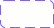</a> | **📂 檔名:** `rectangle-with-blocks.svg` ✨ **格式:** `Vector (SVG)` ⚖️ **大小:** `2.34KB` 📅 **更新:** `2026-02-27`  🚀 **jsDelivr Markdown:** `` 🔗 **直接連結 (Url):** <code>https://cdn.jsdelivr.net/gh/barry028/materials@main/images/iCons/Iconbrew%20/rectangle-with-blocks.svg</code> 📥 [檢視原始檔](rectangle-with-blocks.svg) |
|  | **📂 檔名:** `rectangle.svg` ✨ **格式:** `Vector (SVG)` ⚖️ **大小:** `1.11KB` 📅 **更新:** `2026-02-27`  🚀 **jsDelivr Markdown:** `` 🔗 **直接連結 (Url):** <code>https://cdn.jsdelivr.net/gh/barry028/materials@main/images/iCons/Iconbrew%20/rectangle.svg</code> 📥 [檢視原始檔](rectangle.svg) |
|  | **📂 檔名:** `recycle-triangle-18px.svg` ✨ **格式:** `Vector (SVG)` ⚖️ **大小:** `1.07KB` 📅 **更新:** `2026-02-27`  🚀 **jsDelivr Markdown:** `` 🔗 **直接連結 (Url):** <code>https://cdn.jsdelivr.net/gh/barry028/materials@main/images/iCons/Iconbrew%20/recycle-triangle-18px.svg</code> 📥 [檢視原始檔](recycle-triangle-18px.svg) |
|  | **📂 檔名:** `recycle-triangle-24px.svg` ✨ **格式:** `Vector (SVG)` ⚖️ **大小:** `1.08KB` 📅 **更新:** `2026-02-27`  🚀 **jsDelivr Markdown:** `` 🔗 **直接連結 (Url):** <code>https://cdn.jsdelivr.net/gh/barry028/materials@main/images/iCons/Iconbrew%20/recycle-triangle-24px.svg</code> 📥 [檢視原始檔](recycle-triangle-24px.svg) |
| <a href="recycle-triangle.svg">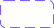</a> | **📂 檔名:** `recycle-triangle.svg` ✨ **格式:** `Vector (SVG)` ⚖️ **大小:** `2.17KB` 📅 **更新:** `2026-02-27`  🚀 **jsDelivr Markdown:** `` 🔗 **直接連結 (Url):** <code>https://cdn.jsdelivr.net/gh/barry028/materials@main/images/iCons/Iconbrew%20/recycle-triangle.svg</code> 📥 [檢視原始檔](recycle-triangle.svg) |
|  | **📂 檔名:** `return-down-18px.svg` ✨ **格式:** `Vector (SVG)` ⚖️ **大小:** `754.00B` 📅 **更新:** `2026-02-27`  🚀 **jsDelivr Markdown:** `` 🔗 **直接連結 (Url):** <code>https://cdn.jsdelivr.net/gh/barry028/materials@main/images/iCons/Iconbrew%20/return-down-18px.svg</code> 📥 [檢視原始檔](return-down-18px.svg) |
|  | **📂 檔名:** `return-down-24px.svg` ✨ **格式:** `Vector (SVG)` ⚖️ **大小:** `688.00B` 📅 **更新:** `2026-02-27`  🚀 **jsDelivr Markdown:** `` 🔗 **直接連結 (Url):** <code>https://cdn.jsdelivr.net/gh/barry028/materials@main/images/iCons/Iconbrew%20/return-down-24px.svg</code> 📥 [檢視原始檔](return-down-24px.svg) |
|  | **📂 檔名:** `return-down.svg` ✨ **格式:** `Vector (SVG)` ⚖️ **大小:** `1.43KB` 📅 **更新:** `2026-02-27`  🚀 **jsDelivr Markdown:** `` 🔗 **直接連結 (Url):** <code>https://cdn.jsdelivr.net/gh/barry028/materials@main/images/iCons/Iconbrew%20/return-down.svg</code> 📥 [檢視原始檔](return-down.svg) |
|  | **📂 檔名:** `return-left-18px.svg` ✨ **格式:** `Vector (SVG)` ⚖️ **大小:** `579.00B` 📅 **更新:** `2026-02-27`  🚀 **jsDelivr Markdown:** `` 🔗 **直接連結 (Url):** <code>https://cdn.jsdelivr.net/gh/barry028/materials@main/images/iCons/Iconbrew%20/return-left-18px.svg</code> 📥 [檢視原始檔](return-left-18px.svg) |
|  | **📂 檔名:** `return-left-24px.svg` ✨ **格式:** `Vector (SVG)` ⚖️ **大小:** `513.00B` 📅 **更新:** `2026-02-27`  🚀 **jsDelivr Markdown:** `` 🔗 **直接連結 (Url):** <code>https://cdn.jsdelivr.net/gh/barry028/materials@main/images/iCons/Iconbrew%20/return-left-24px.svg</code> 📥 [檢視原始檔](return-left-24px.svg) |
|  | **📂 檔名:** `return-left.svg` ✨ **格式:** `Vector (SVG)` ⚖️ **大小:** `1.12KB` 📅 **更新:** `2026-02-27`  🚀 **jsDelivr Markdown:** `` 🔗 **直接連結 (Url):** <code>https://cdn.jsdelivr.net/gh/barry028/materials@main/images/iCons/Iconbrew%20/return-left.svg</code> 📥 [檢視原始檔](return-left.svg) |
|  | **📂 檔名:** `return-right-18px.svg` ✨ **格式:** `Vector (SVG)` ⚖️ **大小:** `736.00B` 📅 **更新:** `2026-02-27`  🚀 **jsDelivr Markdown:** `` 🔗 **直接連結 (Url):** <code>https://cdn.jsdelivr.net/gh/barry028/materials@main/images/iCons/Iconbrew%20/return-right-18px.svg</code> 📥 [檢視原始檔](return-right-18px.svg) |
|  | **📂 檔名:** `return-right-24px.svg` ✨ **格式:** `Vector (SVG)` ⚖️ **大小:** `682.00B` 📅 **更新:** `2026-02-27`  🚀 **jsDelivr Markdown:** `` 🔗 **直接連結 (Url):** <code>https://cdn.jsdelivr.net/gh/barry028/materials@main/images/iCons/Iconbrew%20/return-right-24px.svg</code> 📥 [檢視原始檔](return-right-24px.svg) |
|  | **📂 檔名:** `return-right.svg` ✨ **格式:** `Vector (SVG)` ⚖️ **大小:** `1.43KB` 📅 **更新:** `2026-02-27`  🚀 **jsDelivr Markdown:** `` 🔗 **直接連結 (Url):** <code>https://cdn.jsdelivr.net/gh/barry028/materials@main/images/iCons/Iconbrew%20/return-right.svg</code> 📥 [檢視原始檔](return-right.svg) |
|  | **📂 檔名:** `return-up-18px.svg` ✨ **格式:** `Vector (SVG)` ⚖️ **大小:** `777.00B` 📅 **更新:** `2026-02-27`  🚀 **jsDelivr Markdown:** `` 🔗 **直接連結 (Url):** <code>https://cdn.jsdelivr.net/gh/barry028/materials@main/images/iCons/Iconbrew%20/return-up-18px.svg</code> 📥 [檢視原始檔](return-up-18px.svg) |
|  | **📂 檔名:** `return-up-24px.svg` ✨ **格式:** `Vector (SVG)` ⚖️ **大小:** `704.00B` 📅 **更新:** `2026-02-27`  🚀 **jsDelivr Markdown:** `` 🔗 **直接連結 (Url):** <code>https://cdn.jsdelivr.net/gh/barry028/materials@main/images/iCons/Iconbrew%20/return-up-24px.svg</code> 📥 [檢視原始檔](return-up-24px.svg) |
|  | **📂 檔名:** `return-up.svg` ✨ **格式:** `Vector (SVG)` ⚖️ **大小:** `1.45KB` 📅 **更新:** `2026-02-27`  🚀 **jsDelivr Markdown:** `` 🔗 **直接連結 (Url):** <code>https://cdn.jsdelivr.net/gh/barry028/materials@main/images/iCons/Iconbrew%20/return-up.svg</code> 📥 [檢視原始檔](return-up.svg) |
|  | **📂 檔名:** `retweet-18px.svg` ✨ **格式:** `Vector (SVG)` ⚖️ **大小:** `728.00B` 📅 **更新:** `2026-02-27`  🚀 **jsDelivr Markdown:** `` 🔗 **直接連結 (Url):** <code>https://cdn.jsdelivr.net/gh/barry028/materials@main/images/iCons/Iconbrew%20/retweet-18px.svg</code> 📥 [檢視原始檔](retweet-18px.svg) |
|  | **📂 檔名:** `retweet-24px.svg` ✨ **格式:** `Vector (SVG)` ⚖️ **大小:** `748.00B` 📅 **更新:** `2026-02-27`  🚀 **jsDelivr Markdown:** `` 🔗 **直接連結 (Url):** <code>https://cdn.jsdelivr.net/gh/barry028/materials@main/images/iCons/Iconbrew%20/retweet-24px.svg</code> 📥 [檢視原始檔](retweet-24px.svg) |
| <a href="retweet.svg">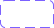</a> | **📂 檔名:** `retweet.svg` ✨ **格式:** `Vector (SVG)` ⚖️ **大小:** `1.55KB` 📅 **更新:** `2026-02-27`  🚀 **jsDelivr Markdown:** `` 🔗 **直接連結 (Url):** <code>https://cdn.jsdelivr.net/gh/barry028/materials@main/images/iCons/Iconbrew%20/retweet.svg</code> 📥 [檢視原始檔](retweet.svg) |
|  | **📂 檔名:** `ribbon-18px.svg` ✨ **格式:** `Vector (SVG)` ⚖️ **大小:** `689.00B` 📅 **更新:** `2026-02-27`  🚀 **jsDelivr Markdown:** `` 🔗 **直接連結 (Url):** <code>https://cdn.jsdelivr.net/gh/barry028/materials@main/images/iCons/Iconbrew%20/ribbon-18px.svg</code> 📥 [檢視原始檔](ribbon-18px.svg) |
|  | **📂 檔名:** `ribbon-24px.svg` ✨ **格式:** `Vector (SVG)` ⚖️ **大小:** `676.00B` 📅 **更新:** `2026-02-27`  🚀 **jsDelivr Markdown:** `` 🔗 **直接連結 (Url):** <code>https://cdn.jsdelivr.net/gh/barry028/materials@main/images/iCons/Iconbrew%20/ribbon-24px.svg</code> 📥 [檢視原始檔](ribbon-24px.svg) |
|  | **📂 檔名:** `ribbon-add-18px.svg` ✨ **格式:** `Vector (SVG)` ⚖️ **大小:** `698.00B` 📅 **更新:** `2026-02-27`  🚀 **jsDelivr Markdown:** `` 🔗 **直接連結 (Url):** <code>https://cdn.jsdelivr.net/gh/barry028/materials@main/images/iCons/Iconbrew%20/ribbon-add-18px.svg</code> 📥 [檢視原始檔](ribbon-add-18px.svg) |
|  | **📂 檔名:** `ribbon-add-24px.svg` ✨ **格式:** `Vector (SVG)` ⚖️ **大小:** `710.00B` 📅 **更新:** `2026-02-27`  🚀 **jsDelivr Markdown:** `` 🔗 **直接連結 (Url):** <code>https://cdn.jsdelivr.net/gh/barry028/materials@main/images/iCons/Iconbrew%20/ribbon-add-24px.svg</code> 📥 [檢視原始檔](ribbon-add-24px.svg) |
|  | **📂 檔名:** `ribbon-add.svg` ✨ **格式:** `Vector (SVG)` ⚖️ **大小:** `1.40KB` 📅 **更新:** `2026-02-27`  🚀 **jsDelivr Markdown:** `` 🔗 **直接連結 (Url):** <code>https://cdn.jsdelivr.net/gh/barry028/materials@main/images/iCons/Iconbrew%20/ribbon-add.svg</code> 📥 [檢視原始檔](ribbon-add.svg) |
|  | **📂 檔名:** `ribbon.svg` ✨ **格式:** `Vector (SVG)` ⚖️ **大小:** `1.35KB` 📅 **更新:** `2026-02-27`  🚀 **jsDelivr Markdown:** `` 🔗 **直接連結 (Url):** <code>https://cdn.jsdelivr.net/gh/barry028/materials@main/images/iCons/Iconbrew%20/ribbon.svg</code> 📥 [檢視原始檔](ribbon.svg) |
|  | **📂 檔名:** `rocket-18px.svg` ✨ **格式:** `Vector (SVG)` ⚖️ **大小:** `1.17KB` 📅 **更新:** `2026-02-27`  🚀 **jsDelivr Markdown:** `` 🔗 **直接連結 (Url):** <code>https://cdn.jsdelivr.net/gh/barry028/materials@main/images/iCons/Iconbrew%20/rocket-18px.svg</code> 📥 [檢視原始檔](rocket-18px.svg) |
|  | **📂 檔名:** `rocket-24px.svg` ✨ **格式:** `Vector (SVG)` ⚖️ **大小:** `1.16KB` 📅 **更新:** `2026-02-27`  🚀 **jsDelivr Markdown:** `` 🔗 **直接連結 (Url):** <code>https://cdn.jsdelivr.net/gh/barry028/materials@main/images/iCons/Iconbrew%20/rocket-24px.svg</code> 📥 [檢視原始檔](rocket-24px.svg) |
|  | **📂 檔名:** `rocket.svg` ✨ **格式:** `Vector (SVG)` ⚖️ **大小:** `2.39KB` 📅 **更新:** `2026-02-27`  🚀 **jsDelivr Markdown:** `` 🔗 **直接連結 (Url):** <code>https://cdn.jsdelivr.net/gh/barry028/materials@main/images/iCons/Iconbrew%20/rocket.svg</code> 📥 [檢視原始檔](rocket.svg) |
|  | **📂 檔名:** `rudder-wheel-18px.svg` ✨ **格式:** `Vector (SVG)` ⚖️ **大小:** `638.00B` 📅 **更新:** `2026-02-27`  🚀 **jsDelivr Markdown:** `` 🔗 **直接連結 (Url):** <code>https://cdn.jsdelivr.net/gh/barry028/materials@main/images/iCons/Iconbrew%20/rudder-wheel-18px.svg</code> 📥 [檢視原始檔](rudder-wheel-18px.svg) |
|  | **📂 檔名:** `rudder-wheel-24px.svg` ✨ **格式:** `Vector (SVG)` ⚖️ **大小:** `399.00B` 📅 **更新:** `2026-02-27`  🚀 **jsDelivr Markdown:** `` 🔗 **直接連結 (Url):** <code>https://cdn.jsdelivr.net/gh/barry028/materials@main/images/iCons/Iconbrew%20/rudder-wheel-24px.svg</code> 📥 [檢視原始檔](rudder-wheel-24px.svg) |
|  | **📂 檔名:** `rudder-wheel.svg` ✨ **格式:** `Vector (SVG)` ⚖️ **大小:** `1.03KB` 📅 **更新:** `2026-02-27`  🚀 **jsDelivr Markdown:** `` 🔗 **直接連結 (Url):** <code>https://cdn.jsdelivr.net/gh/barry028/materials@main/images/iCons/Iconbrew%20/rudder-wheel.svg</code> 📥 [檢視原始檔](rudder-wheel.svg) |
|  | **📂 檔名:** `ruler-18px.svg` ✨ **格式:** `Vector (SVG)` ⚖️ **大小:** `901.00B` 📅 **更新:** `2026-02-27`  🚀 **jsDelivr Markdown:** `` 🔗 **直接連結 (Url):** <code>https://cdn.jsdelivr.net/gh/barry028/materials@main/images/iCons/Iconbrew%20/ruler-18px.svg</code> 📥 [檢視原始檔](ruler-18px.svg) |
|  | **📂 檔名:** `ruler-24px.svg` ✨ **格式:** `Vector (SVG)` ⚖️ **大小:** `916.00B` 📅 **更新:** `2026-02-27`  🚀 **jsDelivr Markdown:** `` 🔗 **直接連結 (Url):** <code>https://cdn.jsdelivr.net/gh/barry028/materials@main/images/iCons/Iconbrew%20/ruler-24px.svg</code> 📥 [檢視原始檔](ruler-24px.svg) |
|  | **📂 檔名:** `ruler.svg` ✨ **格式:** `Vector (SVG)` ⚖️ **大小:** `1.82KB` 📅 **更新:** `2026-02-27`  🚀 **jsDelivr Markdown:** `` 🔗 **直接連結 (Url):** <code>https://cdn.jsdelivr.net/gh/barry028/materials@main/images/iCons/Iconbrew%20/ruler.svg</code> 📥 [檢視原始檔](ruler.svg) |
|  | **📂 檔名:** `scale-18px.svg` ✨ **格式:** `Vector (SVG)` ⚖️ **大小:** `554.00B` 📅 **更新:** `2026-02-27`  🚀 **jsDelivr Markdown:** `` 🔗 **直接連結 (Url):** <code>https://cdn.jsdelivr.net/gh/barry028/materials@main/images/iCons/Iconbrew%20/scale-18px.svg</code> 📥 [檢視原始檔](scale-18px.svg) |
|  | **📂 檔名:** `scale-24px.svg` ✨ **格式:** `Vector (SVG)` ⚖️ **大小:** `514.00B` 📅 **更新:** `2026-02-27`  🚀 **jsDelivr Markdown:** `` 🔗 **直接連結 (Url):** <code>https://cdn.jsdelivr.net/gh/barry028/materials@main/images/iCons/Iconbrew%20/scale-24px.svg</code> 📥 [檢視原始檔](scale-24px.svg) |
|  | **📂 檔名:** `scale-circle-18px.svg` ✨ **格式:** `Vector (SVG)` ⚖️ **大小:** `776.00B` 📅 **更新:** `2026-02-27`  🚀 **jsDelivr Markdown:** `` 🔗 **直接連結 (Url):** <code>https://cdn.jsdelivr.net/gh/barry028/materials@main/images/iCons/Iconbrew%20/scale-circle-18px.svg</code> 📥 [檢視原始檔](scale-circle-18px.svg) |
|  | **📂 檔名:** `scale-circle-24px.svg` ✨ **格式:** `Vector (SVG)` ⚖️ **大小:** `722.00B` 📅 **更新:** `2026-02-27`  🚀 **jsDelivr Markdown:** `` 🔗 **直接連結 (Url):** <code>https://cdn.jsdelivr.net/gh/barry028/materials@main/images/iCons/Iconbrew%20/scale-circle-24px.svg</code> 📥 [檢視原始檔](scale-circle-24px.svg) |
|  | **📂 檔名:** `scale-circle.svg` ✨ **格式:** `Vector (SVG)` ⚖️ **大小:** `1.44KB` 📅 **更新:** `2026-02-27`  🚀 **jsDelivr Markdown:** `` 🔗 **直接連結 (Url):** <code>https://cdn.jsdelivr.net/gh/barry028/materials@main/images/iCons/Iconbrew%20/scale-circle.svg</code> 📥 [檢視原始檔](scale-circle.svg) |
|  | **📂 檔名:** `scale.svg` ✨ **格式:** `Vector (SVG)` ⚖️ **大小:** `1.06KB` 📅 **更新:** `2026-02-27`  🚀 **jsDelivr Markdown:** `` 🔗 **直接連結 (Url):** <code>https://cdn.jsdelivr.net/gh/barry028/materials@main/images/iCons/Iconbrew%20/scale.svg</code> 📥 [檢視原始檔](scale.svg) |
|  | **📂 檔名:** `search-18px.svg` ✨ **格式:** `Vector (SVG)` ⚖️ **大小:** `523.00B` 📅 **更新:** `2026-02-27`  🚀 **jsDelivr Markdown:** `` 🔗 **直接連結 (Url):** <code>https://cdn.jsdelivr.net/gh/barry028/materials@main/images/iCons/Iconbrew%20/search-18px.svg</code> 📥 [檢視原始檔](search-18px.svg) |
|  | **📂 檔名:** `search-24px.svg` ✨ **格式:** `Vector (SVG)` ⚖️ **大小:** `443.00B` 📅 **更新:** `2026-02-27`  🚀 **jsDelivr Markdown:** `` 🔗 **直接連結 (Url):** <code>https://cdn.jsdelivr.net/gh/barry028/materials@main/images/iCons/Iconbrew%20/search-24px.svg</code> 📥 [檢視原始檔](search-24px.svg) |
|  | **📂 檔名:** `search.svg` ✨ **格式:** `Vector (SVG)` ⚖️ **大小:** `993.00B` 📅 **更新:** `2026-02-27`  🚀 **jsDelivr Markdown:** `` 🔗 **直接連結 (Url):** <code>https://cdn.jsdelivr.net/gh/barry028/materials@main/images/iCons/Iconbrew%20/search.svg</code> 📥 [檢視原始檔](search.svg) |
|  | **📂 檔名:** `share-18px.svg` ✨ **格式:** `Vector (SVG)` ⚖️ **大小:** `740.00B` 📅 **更新:** `2026-02-27`  🚀 **jsDelivr Markdown:** `` 🔗 **直接連結 (Url):** <code>https://cdn.jsdelivr.net/gh/barry028/materials@main/images/iCons/Iconbrew%20/share-18px.svg</code> 📥 [檢視原始檔](share-18px.svg) |
|  | **📂 檔名:** `share-24px.svg` ✨ **格式:** `Vector (SVG)` ⚖️ **大小:** `791.00B` 📅 **更新:** `2026-02-27`  🚀 **jsDelivr Markdown:** `` 🔗 **直接連結 (Url):** <code>https://cdn.jsdelivr.net/gh/barry028/materials@main/images/iCons/Iconbrew%20/share-24px.svg</code> 📥 [檢視原始檔](share-24px.svg) |
|  | **📂 檔名:** `share-arrow-18px.svg` ✨ **格式:** `Vector (SVG)` ⚖️ **大小:** `320.00B` 📅 **更新:** `2026-02-27`  🚀 **jsDelivr Markdown:** `` 🔗 **直接連結 (Url):** <code>https://cdn.jsdelivr.net/gh/barry028/materials@main/images/iCons/Iconbrew%20/share-arrow-18px.svg</code> 📥 [檢視原始檔](share-arrow-18px.svg) |
|  | **📂 檔名:** `share-arrow-24px.svg` ✨ **格式:** `Vector (SVG)` ⚖️ **大小:** `332.00B` 📅 **更新:** `2026-02-27`  🚀 **jsDelivr Markdown:** `` 🔗 **直接連結 (Url):** <code>https://cdn.jsdelivr.net/gh/barry028/materials@main/images/iCons/Iconbrew%20/share-arrow-24px.svg</code> 📥 [檢視原始檔](share-arrow-24px.svg) |
|  | **📂 檔名:** `share-arrow.svg` ✨ **格式:** `Vector (SVG)` ⚖️ **大小:** `645.00B` 📅 **更新:** `2026-02-27`  🚀 **jsDelivr Markdown:** `` 🔗 **直接連結 (Url):** <code>https://cdn.jsdelivr.net/gh/barry028/materials@main/images/iCons/Iconbrew%20/share-arrow.svg</code> 📥 [檢視原始檔](share-arrow.svg) |
|  | **📂 檔名:** `share-cirlce-18px.svg` ✨ **格式:** `Vector (SVG)` ⚖️ **大小:** `399.00B` 📅 **更新:** `2026-02-27`  🚀 **jsDelivr Markdown:** `` 🔗 **直接連結 (Url):** <code>https://cdn.jsdelivr.net/gh/barry028/materials@main/images/iCons/Iconbrew%20/share-cirlce-18px.svg</code> 📥 [檢視原始檔](share-cirlce-18px.svg) |
|  | **📂 檔名:** `share-cirlce-24px.svg` ✨ **格式:** `Vector (SVG)` ⚖️ **大小:** `414.00B` 📅 **更新:** `2026-02-27`  🚀 **jsDelivr Markdown:** `` 🔗 **直接連結 (Url):** <code>https://cdn.jsdelivr.net/gh/barry028/materials@main/images/iCons/Iconbrew%20/share-cirlce-24px.svg</code> 📥 [檢視原始檔](share-cirlce-24px.svg) |
|  | **📂 檔名:** `share-cirlce.svg` ✨ **格式:** `Vector (SVG)` ⚖️ **大小:** `803.00B` 📅 **更新:** `2026-02-27`  🚀 **jsDelivr Markdown:** `` 🔗 **直接連結 (Url):** <code>https://cdn.jsdelivr.net/gh/barry028/materials@main/images/iCons/Iconbrew%20/share-cirlce.svg</code> 📥 [檢視原始檔](share-cirlce.svg) |
|  | **📂 檔名:** `share.svg` ✨ **格式:** `Vector (SVG)` ⚖️ **大小:** `1.50KB` 📅 **更新:** `2026-02-27`  🚀 **jsDelivr Markdown:** `` 🔗 **直接連結 (Url):** <code>https://cdn.jsdelivr.net/gh/barry028/materials@main/images/iCons/Iconbrew%20/share.svg</code> 📥 [檢視原始檔](share.svg) |
|  | **📂 檔名:** `sharing-18px.svg` ✨ **格式:** `Vector (SVG)` ⚖️ **大小:** `1.19KB` 📅 **更新:** `2026-02-27`  🚀 **jsDelivr Markdown:** `` 🔗 **直接連結 (Url):** <code>https://cdn.jsdelivr.net/gh/barry028/materials@main/images/iCons/Iconbrew%20/sharing-18px.svg</code> 📥 [檢視原始檔](sharing-18px.svg) |
|  | **📂 檔名:** `sharing-24px.svg` ✨ **格式:** `Vector (SVG)` ⚖️ **大小:** `1.14KB` 📅 **更新:** `2026-02-27`  🚀 **jsDelivr Markdown:** `` 🔗 **直接連結 (Url):** <code>https://cdn.jsdelivr.net/gh/barry028/materials@main/images/iCons/Iconbrew%20/sharing-24px.svg</code> 📥 [檢視原始檔](sharing-24px.svg) |
|  | **📂 檔名:** `sharing.svg` ✨ **格式:** `Vector (SVG)` ⚖️ **大小:** `2.39KB` 📅 **更新:** `2026-02-27`  🚀 **jsDelivr Markdown:** `` 🔗 **直接連結 (Url):** <code>https://cdn.jsdelivr.net/gh/barry028/materials@main/images/iCons/Iconbrew%20/sharing.svg</code> 📥 [檢視原始檔](sharing.svg) |
|  | **📂 檔名:** `shield-18px.svg` ✨ **格式:** `Vector (SVG)` ⚖️ **大小:** `1.05KB` 📅 **更新:** `2026-02-27`  🚀 **jsDelivr Markdown:** `` 🔗 **直接連結 (Url):** <code>https://cdn.jsdelivr.net/gh/barry028/materials@main/images/iCons/Iconbrew%20/shield-18px.svg</code> 📥 [檢視原始檔](shield-18px.svg) |
|  | **📂 檔名:** `shield-24px.svg` ✨ **格式:** `Vector (SVG)` ⚖️ **大小:** `1014.00B` 📅 **更新:** `2026-02-27`  🚀 **jsDelivr Markdown:** `` 🔗 **直接連結 (Url):** <code>https://cdn.jsdelivr.net/gh/barry028/materials@main/images/iCons/Iconbrew%20/shield-24px.svg</code> 📥 [檢視原始檔](shield-24px.svg) |
|  | **📂 檔名:** `shield.svg` ✨ **格式:** `Vector (SVG)` ⚖️ **大小:** `2.07KB` 📅 **更新:** `2026-02-27`  🚀 **jsDelivr Markdown:** `` 🔗 **直接連結 (Url):** <code>https://cdn.jsdelivr.net/gh/barry028/materials@main/images/iCons/Iconbrew%20/shield.svg</code> 📥 [檢視原始檔](shield.svg) |
|  | **📂 檔名:** `shopping-basket -18px.svg` ✨ **格式:** `Vector (SVG)` ⚖️ **大小:** `845.00B` 📅 **更新:** `2026-02-27`  🚀 **jsDelivr Markdown:** `` 🔗 **直接連結 (Url):** <code>https://cdn.jsdelivr.net/gh/barry028/materials@main/images/iCons/Iconbrew%20/shopping-basket%20-18px.svg</code> 📥 [檢視原始檔](shopping-basket%20-18px.svg) |
|  | **📂 檔名:** `shopping-basket -24px.svg` ✨ **格式:** `Vector (SVG)` ⚖️ **大小:** `871.00B` 📅 **更新:** `2026-02-27`  🚀 **jsDelivr Markdown:** `` 🔗 **直接連結 (Url):** <code>https://cdn.jsdelivr.net/gh/barry028/materials@main/images/iCons/Iconbrew%20/shopping-basket%20-24px.svg</code> 📥 [檢視原始檔](shopping-basket%20-24px.svg) |
|  | **📂 檔名:** `shopping-basket.svg` ✨ **格式:** `Vector (SVG)` ⚖️ **大小:** `1.71KB` 📅 **更新:** `2026-02-27`  🚀 **jsDelivr Markdown:** `` 🔗 **直接連結 (Url):** <code>https://cdn.jsdelivr.net/gh/barry028/materials@main/images/iCons/Iconbrew%20/shopping-basket.svg</code> 📥 [檢視原始檔](shopping-basket.svg) |
|  | **📂 檔名:** `shopping-cart-empty-18px.svg` ✨ **格式:** `Vector (SVG)` ⚖️ **大小:** `1.13KB` 📅 **更新:** `2026-02-27`  🚀 **jsDelivr Markdown:** `` 🔗 **直接連結 (Url):** <code>https://cdn.jsdelivr.net/gh/barry028/materials@main/images/iCons/Iconbrew%20/shopping-cart-empty-18px.svg</code> 📥 [檢視原始檔](shopping-cart-empty-18px.svg) |
|  | **📂 檔名:** `shopping-cart-empty-24px.svg` ✨ **格式:** `Vector (SVG)` ⚖️ **大小:** `1.18KB` 📅 **更新:** `2026-02-27`  🚀 **jsDelivr Markdown:** `` 🔗 **直接連結 (Url):** <code>https://cdn.jsdelivr.net/gh/barry028/materials@main/images/iCons/Iconbrew%20/shopping-cart-empty-24px.svg</code> 📥 [檢視原始檔](shopping-cart-empty-24px.svg) |
|  | **📂 檔名:** `shopping-cart-empty.svg` ✨ **格式:** `Vector (SVG)` ⚖️ **大小:** `2.34KB` 📅 **更新:** `2026-02-27`  🚀 **jsDelivr Markdown:** `` 🔗 **直接連結 (Url):** <code>https://cdn.jsdelivr.net/gh/barry028/materials@main/images/iCons/Iconbrew%20/shopping-cart-empty.svg</code> 📥 [檢視原始檔](shopping-cart-empty.svg) |
|  | **📂 檔名:** `shopping-cart-full-18px.svg` ✨ **格式:** `Vector (SVG)` ⚖️ **大小:** `1.39KB` 📅 **更新:** `2026-02-27`  🚀 **jsDelivr Markdown:** `` 🔗 **直接連結 (Url):** <code>https://cdn.jsdelivr.net/gh/barry028/materials@main/images/iCons/Iconbrew%20/shopping-cart-full-18px.svg</code> 📥 [檢視原始檔](shopping-cart-full-18px.svg) |
|  | **📂 檔名:** `shopping-cart-full-24px.svg` ✨ **格式:** `Vector (SVG)` ⚖️ **大小:** `1.63KB` 📅 **更新:** `2026-02-27`  🚀 **jsDelivr Markdown:** `` 🔗 **直接連結 (Url):** <code>https://cdn.jsdelivr.net/gh/barry028/materials@main/images/iCons/Iconbrew%20/shopping-cart-full-24px.svg</code> 📥 [檢視原始檔](shopping-cart-full-24px.svg) |
| <a href="shopping-cart-full.svg">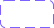</a> | **📂 檔名:** `shopping-cart-full.svg` ✨ **格式:** `Vector (SVG)` ⚖️ **大小:** `3.09KB` 📅 **更新:** `2026-02-27`  🚀 **jsDelivr Markdown:** `` 🔗 **直接連結 (Url):** <code>https://cdn.jsdelivr.net/gh/barry028/materials@main/images/iCons/Iconbrew%20/shopping-cart-full.svg</code> 📥 [檢視原始檔](shopping-cart-full.svg) |
|  | **📂 檔名:** `side-bar-left-18px.svg` ✨ **格式:** `Vector (SVG)` ⚖️ **大小:** `1.03KB` 📅 **更新:** `2026-02-27`  🚀 **jsDelivr Markdown:** `` 🔗 **直接連結 (Url):** <code>https://cdn.jsdelivr.net/gh/barry028/materials@main/images/iCons/Iconbrew%20/side-bar-left-18px.svg</code> 📥 [檢視原始檔](side-bar-left-18px.svg) |
|  | **📂 檔名:** `side-bar-left-24px.svg` ✨ **格式:** `Vector (SVG)` ⚖️ **大小:** `1.03KB` 📅 **更新:** `2026-02-27`  🚀 **jsDelivr Markdown:** `` 🔗 **直接連結 (Url):** <code>https://cdn.jsdelivr.net/gh/barry028/materials@main/images/iCons/Iconbrew%20/side-bar-left-24px.svg</code> 📥 [檢視原始檔](side-bar-left-24px.svg) |
|  | **📂 檔名:** `side-bar-left.svg` ✨ **格式:** `Vector (SVG)` ⚖️ **大小:** `2.07KB` 📅 **更新:** `2026-02-27`  🚀 **jsDelivr Markdown:** `` 🔗 **直接連結 (Url):** <code>https://cdn.jsdelivr.net/gh/barry028/materials@main/images/iCons/Iconbrew%20/side-bar-left.svg</code> 📥 [檢視原始檔](side-bar-left.svg) |
|  | **📂 檔名:** `side-bar-right-18px.svg` ✨ **格式:** `Vector (SVG)` ⚖️ **大小:** `1.03KB` 📅 **更新:** `2026-02-27`  🚀 **jsDelivr Markdown:** `` 🔗 **直接連結 (Url):** <code>https://cdn.jsdelivr.net/gh/barry028/materials@main/images/iCons/Iconbrew%20/side-bar-right-18px.svg</code> 📥 [檢視原始檔](side-bar-right-18px.svg) |
|  | **📂 檔名:** `side-bar-right-24px.svg` ✨ **格式:** `Vector (SVG)` ⚖️ **大小:** `1.04KB` 📅 **更新:** `2026-02-27`  🚀 **jsDelivr Markdown:** `` 🔗 **直接連結 (Url):** <code>https://cdn.jsdelivr.net/gh/barry028/materials@main/images/iCons/Iconbrew%20/side-bar-right-24px.svg</code> 📥 [檢視原始檔](side-bar-right-24px.svg) |
|  | **📂 檔名:** `side-bar-right.svg` ✨ **格式:** `Vector (SVG)` ⚖️ **大小:** `2.08KB` 📅 **更新:** `2026-02-27`  🚀 **jsDelivr Markdown:** `` 🔗 **直接連結 (Url):** <code>https://cdn.jsdelivr.net/gh/barry028/materials@main/images/iCons/Iconbrew%20/side-bar-right.svg</code> 📥 [檢視原始檔](side-bar-right.svg) |
|  | **📂 檔名:** `soda-can-18px.svg` ✨ **格式:** `Vector (SVG)` ⚖️ **大小:** `2.10KB` 📅 **更新:** `2026-02-27`  🚀 **jsDelivr Markdown:** `` 🔗 **直接連結 (Url):** <code>https://cdn.jsdelivr.net/gh/barry028/materials@main/images/iCons/Iconbrew%20/soda-can-18px.svg</code> 📥 [檢視原始檔](soda-can-18px.svg) |
|  | **📂 檔名:** `soda-can-24px.svg` ✨ **格式:** `Vector (SVG)` ⚖️ **大小:** `1.96KB` 📅 **更新:** `2026-02-27`  🚀 **jsDelivr Markdown:** `` 🔗 **直接連結 (Url):** <code>https://cdn.jsdelivr.net/gh/barry028/materials@main/images/iCons/Iconbrew%20/soda-can-24px.svg</code> 📥 [檢視原始檔](soda-can-24px.svg) |
|  | **📂 檔名:** `soda-can.svg` ✨ **格式:** `Vector (SVG)` ⚖️ **大小:** `4.05KB` 📅 **更新:** `2026-02-27`  🚀 **jsDelivr Markdown:** `` 🔗 **直接連結 (Url):** <code>https://cdn.jsdelivr.net/gh/barry028/materials@main/images/iCons/Iconbrew%20/soda-can.svg</code> 📥 [檢視原始檔](soda-can.svg) |
|  | **📂 檔名:** `spacing-horizontal-18px.svg` ✨ **格式:** `Vector (SVG)` ⚖️ **大小:** `570.00B` 📅 **更新:** `2026-02-27`  🚀 **jsDelivr Markdown:** `` 🔗 **直接連結 (Url):** <code>https://cdn.jsdelivr.net/gh/barry028/materials@main/images/iCons/Iconbrew%20/spacing-horizontal-18px.svg</code> 📥 [檢視原始檔](spacing-horizontal-18px.svg) |
|  | **📂 檔名:** `spacing-horizontal-24px.svg` ✨ **格式:** `Vector (SVG)` ⚖️ **大小:** `556.00B` 📅 **更新:** `2026-02-27`  🚀 **jsDelivr Markdown:** `` 🔗 **直接連結 (Url):** <code>https://cdn.jsdelivr.net/gh/barry028/materials@main/images/iCons/Iconbrew%20/spacing-horizontal-24px.svg</code> 📥 [檢視原始檔](spacing-horizontal-24px.svg) |
|  | **📂 檔名:** `spacing-horizontal.svg` ✨ **格式:** `Vector (SVG)` ⚖️ **大小:** `1.10KB` 📅 **更新:** `2026-02-27`  🚀 **jsDelivr Markdown:** `` 🔗 **直接連結 (Url):** <code>https://cdn.jsdelivr.net/gh/barry028/materials@main/images/iCons/Iconbrew%20/spacing-horizontal.svg</code> 📥 [檢視原始檔](spacing-horizontal.svg) |
| <a href="spacing-vertical-18px.svg">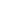</a> | **📂 檔名:** `spacing-vertical-18px.svg` ✨ **格式:** `Vector (SVG)` ⚖️ **大小:** `566.00B` 📅 **更新:** `2026-02-27`  🚀 **jsDelivr Markdown:** `` 🔗 **直接連結 (Url):** <code>https://cdn.jsdelivr.net/gh/barry028/materials@main/images/iCons/Iconbrew%20/spacing-vertical-18px.svg</code> 📥 [檢視原始檔](spacing-vertical-18px.svg) |
|  | **📂 檔名:** `spacing-vertical-24px.svg` ✨ **格式:** `Vector (SVG)` ⚖️ **大小:** `556.00B` 📅 **更新:** `2026-02-27`  🚀 **jsDelivr Markdown:** `` 🔗 **直接連結 (Url):** <code>https://cdn.jsdelivr.net/gh/barry028/materials@main/images/iCons/Iconbrew%20/spacing-vertical-24px.svg</code> 📥 [檢視原始檔](spacing-vertical-24px.svg) |
| <a href="spacing-vertical.svg">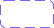</a> | **📂 檔名:** `spacing-vertical.svg` ✨ **格式:** `Vector (SVG)` ⚖️ **大小:** `1.09KB` 📅 **更新:** `2026-02-27`  🚀 **jsDelivr Markdown:** `` 🔗 **直接連結 (Url):** <code>https://cdn.jsdelivr.net/gh/barry028/materials@main/images/iCons/Iconbrew%20/spacing-vertical.svg</code> 📥 [檢視原始檔](spacing-vertical.svg) |
|  | **📂 檔名:** `sparks-18px.svg` ✨ **格式:** `Vector (SVG)` ⚖️ **大小:** `1.23KB` 📅 **更新:** `2026-02-27`  🚀 **jsDelivr Markdown:** `` 🔗 **直接連結 (Url):** <code>https://cdn.jsdelivr.net/gh/barry028/materials@main/images/iCons/Iconbrew%20/sparks-18px.svg</code> 📥 [檢視原始檔](sparks-18px.svg) |
|  | **📂 檔名:** `sparks-24px.svg` ✨ **格式:** `Vector (SVG)` ⚖️ **大小:** `1.53KB` 📅 **更新:** `2026-02-27`  🚀 **jsDelivr Markdown:** `` 🔗 **直接連結 (Url):** <code>https://cdn.jsdelivr.net/gh/barry028/materials@main/images/iCons/Iconbrew%20/sparks-24px.svg</code> 📥 [檢視原始檔](sparks-24px.svg) |
|  | **📂 檔名:** `sparks.svg` ✨ **格式:** `Vector (SVG)` ⚖️ **大小:** `2.78KB` 📅 **更新:** `2026-02-27`  🚀 **jsDelivr Markdown:** `` 🔗 **直接連結 (Url):** <code>https://cdn.jsdelivr.net/gh/barry028/materials@main/images/iCons/Iconbrew%20/sparks.svg</code> 📥 [檢視原始檔](sparks.svg) |
| <a href="splash-18px.svg">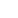</a> | **📂 檔名:** `splash-18px.svg` ✨ **格式:** `Vector (SVG)` ⚖️ **大小:** `1005.00B` 📅 **更新:** `2026-02-27`  🚀 **jsDelivr Markdown:** `` 🔗 **直接連結 (Url):** <code>https://cdn.jsdelivr.net/gh/barry028/materials@main/images/iCons/Iconbrew%20/splash-18px.svg</code> 📥 [檢視原始檔](splash-18px.svg) |
| <a href="splash-24px.svg">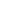</a> | **📂 檔名:** `splash-24px.svg` ✨ **格式:** `Vector (SVG)` ⚖️ **大小:** `996.00B` 📅 **更新:** `2026-02-27`  🚀 **jsDelivr Markdown:** `` 🔗 **直接連結 (Url):** <code>https://cdn.jsdelivr.net/gh/barry028/materials@main/images/iCons/Iconbrew%20/splash-24px.svg</code> 📥 [檢視原始檔](splash-24px.svg) |
| <a href="splash.svg">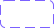</a> | **📂 檔名:** `splash.svg` ✨ **格式:** `Vector (SVG)` ⚖️ **大小:** `1.90KB` 📅 **更新:** `2026-02-27`  🚀 **jsDelivr Markdown:** `` 🔗 **直接連結 (Url):** <code>https://cdn.jsdelivr.net/gh/barry028/materials@main/images/iCons/Iconbrew%20/splash.svg</code> 📥 [檢視原始檔](splash.svg) |
|  | **📂 檔名:** `sports-18px.svg` ✨ **格式:** `Vector (SVG)` ⚖️ **大小:** `1.07KB` 📅 **更新:** `2026-02-27`  🚀 **jsDelivr Markdown:** `` 🔗 **直接連結 (Url):** <code>https://cdn.jsdelivr.net/gh/barry028/materials@main/images/iCons/Iconbrew%20/sports-18px.svg</code> 📥 [檢視原始檔](sports-18px.svg) |
|  | **📂 檔名:** `sports-24px.svg` ✨ **格式:** `Vector (SVG)` ⚖️ **大小:** `1.19KB` 📅 **更新:** `2026-02-27`  🚀 **jsDelivr Markdown:** `` 🔗 **直接連結 (Url):** <code>https://cdn.jsdelivr.net/gh/barry028/materials@main/images/iCons/Iconbrew%20/sports-24px.svg</code> 📥 [檢視原始檔](sports-24px.svg) |
|  | **📂 檔名:** `sports.svg` ✨ **格式:** `Vector (SVG)` ⚖️ **大小:** `2.27KB` 📅 **更新:** `2026-02-27`  🚀 **jsDelivr Markdown:** `` 🔗 **直接連結 (Url):** <code>https://cdn.jsdelivr.net/gh/barry028/materials@main/images/iCons/Iconbrew%20/sports.svg</code> 📥 [檢視原始檔](sports.svg) |
|  | **📂 檔名:** `spotify-18px.svg` ✨ **格式:** `Vector (SVG)` ⚖️ **大小:** `860.00B` 📅 **更新:** `2026-02-27`  🚀 **jsDelivr Markdown:** `` 🔗 **直接連結 (Url):** <code>https://cdn.jsdelivr.net/gh/barry028/materials@main/images/iCons/Iconbrew%20/spotify-18px.svg</code> 📥 [檢視原始檔](spotify-18px.svg) |
|  | **📂 檔名:** `spotify-24px.svg` ✨ **格式:** `Vector (SVG)` ⚖️ **大小:** `873.00B` 📅 **更新:** `2026-02-27`  🚀 **jsDelivr Markdown:** `` 🔗 **直接連結 (Url):** <code>https://cdn.jsdelivr.net/gh/barry028/materials@main/images/iCons/Iconbrew%20/spotify-24px.svg</code> 📥 [檢視原始檔](spotify-24px.svg) |
|  | **📂 檔名:** `spotify.svg` ✨ **格式:** `Vector (SVG)` ⚖️ **大小:** `1.69KB` 📅 **更新:** `2026-02-27`  🚀 **jsDelivr Markdown:** `` 🔗 **直接連結 (Url):** <code>https://cdn.jsdelivr.net/gh/barry028/materials@main/images/iCons/Iconbrew%20/spotify.svg</code> 📥 [檢視原始檔](spotify.svg) |
|  | **📂 檔名:** `sprout-18px.svg` ✨ **格式:** `Vector (SVG)` ⚖️ **大小:** `915.00B` 📅 **更新:** `2026-02-27`  🚀 **jsDelivr Markdown:** `` 🔗 **直接連結 (Url):** <code>https://cdn.jsdelivr.net/gh/barry028/materials@main/images/iCons/Iconbrew%20/sprout-18px.svg</code> 📥 [檢視原始檔](sprout-18px.svg) |
|  | **📂 檔名:** `sprout-24px.svg` ✨ **格式:** `Vector (SVG)` ⚖️ **大小:** `1.02KB` 📅 **更新:** `2026-02-27`  🚀 **jsDelivr Markdown:** `` 🔗 **直接連結 (Url):** <code>https://cdn.jsdelivr.net/gh/barry028/materials@main/images/iCons/Iconbrew%20/sprout-24px.svg</code> 📥 [檢視原始檔](sprout-24px.svg) |
|  | **📂 檔名:** `sprout.svg` ✨ **格式:** `Vector (SVG)` ⚖️ **大小:** `1.93KB` 📅 **更新:** `2026-02-27`  🚀 **jsDelivr Markdown:** `` 🔗 **直接連結 (Url):** <code>https://cdn.jsdelivr.net/gh/barry028/materials@main/images/iCons/Iconbrew%20/sprout.svg</code> 📥 [檢視原始檔](sprout.svg) |
|  | **📂 檔名:** `square-18px.svg` ✨ **格式:** `Vector (SVG)` ⚖️ **大小:** `607.00B` 📅 **更新:** `2026-02-27`  🚀 **jsDelivr Markdown:** `` 🔗 **直接連結 (Url):** <code>https://cdn.jsdelivr.net/gh/barry028/materials@main/images/iCons/Iconbrew%20/square-18px.svg</code> 📥 [檢視原始檔](square-18px.svg) |
|  | **📂 檔名:** `square-24px.svg` ✨ **格式:** `Vector (SVG)` ⚖️ **大小:** `564.00B` 📅 **更新:** `2026-02-27`  🚀 **jsDelivr Markdown:** `` 🔗 **直接連結 (Url):** <code>https://cdn.jsdelivr.net/gh/barry028/materials@main/images/iCons/Iconbrew%20/square-24px.svg</code> 📥 [檢視原始檔](square-24px.svg) |
|  | **📂 檔名:** `square-and-pencil-18px.svg` ✨ **格式:** `Vector (SVG)` ⚖️ **大小:** `1.18KB` 📅 **更新:** `2026-02-27`  🚀 **jsDelivr Markdown:** `` 🔗 **直接連結 (Url):** <code>https://cdn.jsdelivr.net/gh/barry028/materials@main/images/iCons/Iconbrew%20/square-and-pencil-18px.svg</code> 📥 [檢視原始檔](square-and-pencil-18px.svg) |
|  | **📂 檔名:** `square-and-pencil-24px.svg` ✨ **格式:** `Vector (SVG)` ⚖️ **大小:** `1.11KB` 📅 **更新:** `2026-02-27`  🚀 **jsDelivr Markdown:** `` 🔗 **直接連結 (Url):** <code>https://cdn.jsdelivr.net/gh/barry028/materials@main/images/iCons/Iconbrew%20/square-and-pencil-24px.svg</code> 📥 [檢視原始檔](square-and-pencil-24px.svg) |
|  | **📂 檔名:** `square-and-pencil.svg` ✨ **格式:** `Vector (SVG)` ⚖️ **大小:** `2.28KB` 📅 **更新:** `2026-02-27`  🚀 **jsDelivr Markdown:** `` 🔗 **直接連結 (Url):** <code>https://cdn.jsdelivr.net/gh/barry028/materials@main/images/iCons/Iconbrew%20/square-and-pencil.svg</code> 📥 [檢視原始檔](square-and-pencil.svg) |
|  | **📂 檔名:** `square.svg` ✨ **格式:** `Vector (SVG)` ⚖️ **大小:** `1.17KB` 📅 **更新:** `2026-02-27`  🚀 **jsDelivr Markdown:** `` 🔗 **直接連結 (Url):** <code>https://cdn.jsdelivr.net/gh/barry028/materials@main/images/iCons/Iconbrew%20/square.svg</code> 📥 [檢視原始檔](square.svg) |
|  | **📂 檔名:** `stack-horizontal-18px.svg` ✨ **格式:** `Vector (SVG)` ⚖️ **大小:** `1.40KB` 📅 **更新:** `2026-02-27`  🚀 **jsDelivr Markdown:** `` 🔗 **直接連結 (Url):** <code>https://cdn.jsdelivr.net/gh/barry028/materials@main/images/iCons/Iconbrew%20/stack-horizontal-18px.svg</code> 📥 [檢視原始檔](stack-horizontal-18px.svg) |
|  | **📂 檔名:** `stack-horizontal-24px.svg` ✨ **格式:** `Vector (SVG)` ⚖️ **大小:** `1.57KB` 📅 **更新:** `2026-02-27`  🚀 **jsDelivr Markdown:** `` 🔗 **直接連結 (Url):** <code>https://cdn.jsdelivr.net/gh/barry028/materials@main/images/iCons/Iconbrew%20/stack-horizontal-24px.svg</code> 📥 [檢視原始檔](stack-horizontal-24px.svg) |
|  | **📂 檔名:** `stack-horizontal.svg` ✨ **格式:** `Vector (SVG)` ⚖️ **大小:** `3.01KB` 📅 **更新:** `2026-02-27`  🚀 **jsDelivr Markdown:** `` 🔗 **直接連結 (Url):** <code>https://cdn.jsdelivr.net/gh/barry028/materials@main/images/iCons/Iconbrew%20/stack-horizontal.svg</code> 📥 [檢視原始檔](stack-horizontal.svg) |
|  | **📂 檔名:** `stack-vertical-18px.svg` ✨ **格式:** `Vector (SVG)` ⚖️ **大小:** `1.58KB` 📅 **更新:** `2026-02-27`  🚀 **jsDelivr Markdown:** `` 🔗 **直接連結 (Url):** <code>https://cdn.jsdelivr.net/gh/barry028/materials@main/images/iCons/Iconbrew%20/stack-vertical-18px.svg</code> 📥 [檢視原始檔](stack-vertical-18px.svg) |
|  | **📂 檔名:** `stack-vertical-24px.svg` ✨ **格式:** `Vector (SVG)` ⚖️ **大小:** `1.80KB` 📅 **更新:** `2026-02-27`  🚀 **jsDelivr Markdown:** `` 🔗 **直接連結 (Url):** <code>https://cdn.jsdelivr.net/gh/barry028/materials@main/images/iCons/Iconbrew%20/stack-vertical-24px.svg</code> 📥 [檢視原始檔](stack-vertical-24px.svg) |
|  | **📂 檔名:** `stack-vertical.svg` ✨ **格式:** `Vector (SVG)` ⚖️ **大小:** `3.40KB` 📅 **更新:** `2026-02-27`  🚀 **jsDelivr Markdown:** `` 🔗 **直接連結 (Url):** <code>https://cdn.jsdelivr.net/gh/barry028/materials@main/images/iCons/Iconbrew%20/stack-vertical.svg</code> 📥 [檢視原始檔](stack-vertical.svg) |
|  | **📂 檔名:** `star-18px.svg` ✨ **格式:** `Vector (SVG)` ⚖️ **大小:** `1.41KB` 📅 **更新:** `2026-02-27`  🚀 **jsDelivr Markdown:** `` 🔗 **直接連結 (Url):** <code>https://cdn.jsdelivr.net/gh/barry028/materials@main/images/iCons/Iconbrew%20/star-18px.svg</code> 📥 [檢視原始檔](star-18px.svg) |
|  | **📂 檔名:** `star-24px.svg` ✨ **格式:** `Vector (SVG)` ⚖️ **大小:** `1.42KB` 📅 **更新:** `2026-02-27`  🚀 **jsDelivr Markdown:** `` 🔗 **直接連結 (Url):** <code>https://cdn.jsdelivr.net/gh/barry028/materials@main/images/iCons/Iconbrew%20/star-24px.svg</code> 📥 [檢視原始檔](star-24px.svg) |
|  | **📂 檔名:** `statement-18px.svg` ✨ **格式:** `Vector (SVG)` ⚖️ **大小:** `709.00B` 📅 **更新:** `2026-02-27`  🚀 **jsDelivr Markdown:** `` 🔗 **直接連結 (Url):** <code>https://cdn.jsdelivr.net/gh/barry028/materials@main/images/iCons/Iconbrew%20/statement-18px.svg</code> 📥 [檢視原始檔](statement-18px.svg) |
|  | **📂 檔名:** `statement-24px.svg` ✨ **格式:** `Vector (SVG)` ⚖️ **大小:** `694.00B` 📅 **更新:** `2026-02-27`  🚀 **jsDelivr Markdown:** `` 🔗 **直接連結 (Url):** <code>https://cdn.jsdelivr.net/gh/barry028/materials@main/images/iCons/Iconbrew%20/statement-24px.svg</code> 📥 [檢視原始檔](statement-24px.svg) |
|  | **📂 檔名:** `statement.svg` ✨ **格式:** `Vector (SVG)` ⚖️ **大小:** `1.41KB` 📅 **更新:** `2026-02-27`  🚀 **jsDelivr Markdown:** `` 🔗 **直接連結 (Url):** <code>https://cdn.jsdelivr.net/gh/barry028/materials@main/images/iCons/Iconbrew%20/statement.svg</code> 📥 [檢視原始檔](statement.svg) |
|  | **📂 檔名:** `stop-18px.svg` ✨ **格式:** `Vector (SVG)` ⚖️ **大小:** `316.00B` 📅 **更新:** `2026-02-27`  🚀 **jsDelivr Markdown:** `` 🔗 **直接連結 (Url):** <code>https://cdn.jsdelivr.net/gh/barry028/materials@main/images/iCons/Iconbrew%20/stop-18px.svg</code> 📥 [檢視原始檔](stop-18px.svg) |
|  | **📂 檔名:** `stop-24px.svg` ✨ **格式:** `Vector (SVG)` ⚖️ **大小:** `333.00B` 📅 **更新:** `2026-02-27`  🚀 **jsDelivr Markdown:** `` 🔗 **直接連結 (Url):** <code>https://cdn.jsdelivr.net/gh/barry028/materials@main/images/iCons/Iconbrew%20/stop-24px.svg</code> 📥 [檢視原始檔](stop-24px.svg) |
|  | **📂 檔名:** `stop.svg` ✨ **格式:** `Vector (SVG)` ⚖️ **大小:** `664.00B` 📅 **更新:** `2026-02-27`  🚀 **jsDelivr Markdown:** `` 🔗 **直接連結 (Url):** <code>https://cdn.jsdelivr.net/gh/barry028/materials@main/images/iCons/Iconbrew%20/stop.svg</code> 📥 [檢視原始檔](stop.svg) |
|  | **📂 檔名:** `store-18px.svg` ✨ **格式:** `Vector (SVG)` ⚖️ **大小:** `1.26KB` 📅 **更新:** `2026-02-27`  🚀 **jsDelivr Markdown:** `` 🔗 **直接連結 (Url):** <code>https://cdn.jsdelivr.net/gh/barry028/materials@main/images/iCons/Iconbrew%20/store-18px.svg</code> 📥 [檢視原始檔](store-18px.svg) |
|  | **📂 檔名:** `store-24px.svg` ✨ **格式:** `Vector (SVG)` ⚖️ **大小:** `1.38KB` 📅 **更新:** `2026-02-27`  🚀 **jsDelivr Markdown:** `` 🔗 **直接連結 (Url):** <code>https://cdn.jsdelivr.net/gh/barry028/materials@main/images/iCons/Iconbrew%20/store-24px.svg</code> 📥 [檢視原始檔](store-24px.svg) |
|  | **📂 檔名:** `store.svg` ✨ **格式:** `Vector (SVG)` ⚖️ **大小:** `2.66KB` 📅 **更新:** `2026-02-27`  🚀 **jsDelivr Markdown:** `` 🔗 **直接連結 (Url):** <code>https://cdn.jsdelivr.net/gh/barry028/materials@main/images/iCons/Iconbrew%20/store.svg</code> 📥 [檢視原始檔](store.svg) |
|  | **📂 檔名:** `strikethrough-18px.svg` ✨ **格式:** `Vector (SVG)` ⚖️ **大小:** `666.00B` 📅 **更新:** `2026-02-27`  🚀 **jsDelivr Markdown:** `` 🔗 **直接連結 (Url):** <code>https://cdn.jsdelivr.net/gh/barry028/materials@main/images/iCons/Iconbrew%20/strikethrough-18px.svg</code> 📥 [檢視原始檔](strikethrough-18px.svg) |
|  | **📂 檔名:** `strikethrough-24px.svg` ✨ **格式:** `Vector (SVG)` ⚖️ **大小:** `650.00B` 📅 **更新:** `2026-02-27`  🚀 **jsDelivr Markdown:** `` 🔗 **直接連結 (Url):** <code>https://cdn.jsdelivr.net/gh/barry028/materials@main/images/iCons/Iconbrew%20/strikethrough-24px.svg</code> 📥 [檢視原始檔](strikethrough-24px.svg) |
|  | **📂 檔名:** `strikethrough.svg` ✨ **格式:** `Vector (SVG)` ⚖️ **大小:** `1.31KB` 📅 **更新:** `2026-02-27`  🚀 **jsDelivr Markdown:** `` 🔗 **直接連結 (Url):** <code>https://cdn.jsdelivr.net/gh/barry028/materials@main/images/iCons/Iconbrew%20/strikethrough.svg</code> 📥 [檢視原始檔](strikethrough.svg) |
|  | **📂 檔名:** `stroke-width-18px.svg` ✨ **格式:** `Vector (SVG)` ⚖️ **大小:** `320.00B` 📅 **更新:** `2026-02-27`  🚀 **jsDelivr Markdown:** `` 🔗 **直接連結 (Url):** <code>https://cdn.jsdelivr.net/gh/barry028/materials@main/images/iCons/Iconbrew%20/stroke-width-18px.svg</code> 📥 [檢視原始檔](stroke-width-18px.svg) |
|  | **📂 檔名:** `stroke-width-24px.svg` ✨ **格式:** `Vector (SVG)` ⚖️ **大小:** `341.00B` 📅 **更新:** `2026-02-27`  🚀 **jsDelivr Markdown:** `` 🔗 **直接連結 (Url):** <code>https://cdn.jsdelivr.net/gh/barry028/materials@main/images/iCons/Iconbrew%20/stroke-width-24px.svg</code> 📥 [檢視原始檔](stroke-width-24px.svg) |
|  | **📂 檔名:** `stroke-width.svg` ✨ **格式:** `Vector (SVG)` ⚖️ **大小:** `659.00B` 📅 **更新:** `2026-02-27`  🚀 **jsDelivr Markdown:** `` 🔗 **直接連結 (Url):** <code>https://cdn.jsdelivr.net/gh/barry028/materials@main/images/iCons/Iconbrew%20/stroke-width.svg</code> 📥 [檢視原始檔](stroke-width.svg) |
|  | **📂 檔名:** `subtitles.svg` ✨ **格式:** `Vector (SVG)` ⚖️ **大小:** `3.28KB` 📅 **更新:** `2026-02-27`  🚀 **jsDelivr Markdown:** `` 🔗 **直接連結 (Url):** <code>https://cdn.jsdelivr.net/gh/barry028/materials@main/images/iCons/Iconbrew%20/subtitles.svg</code> 📥 [檢視原始檔](subtitles.svg) |
|  | **📂 檔名:** `tab-bottom-18px.svg` ✨ **格式:** `Vector (SVG)` ⚖️ **大小:** `381.00B` 📅 **更新:** `2026-02-27`  🚀 **jsDelivr Markdown:** `` 🔗 **直接連結 (Url):** <code>https://cdn.jsdelivr.net/gh/barry028/materials@main/images/iCons/Iconbrew%20/tab-bottom-18px.svg</code> 📥 [檢視原始檔](tab-bottom-18px.svg) |
|  | **📂 檔名:** `tab-bottom-24px.svg` ✨ **格式:** `Vector (SVG)` ⚖️ **大小:** `388.00B` 📅 **更新:** `2026-02-27`  🚀 **jsDelivr Markdown:** `` 🔗 **直接連結 (Url):** <code>https://cdn.jsdelivr.net/gh/barry028/materials@main/images/iCons/Iconbrew%20/tab-bottom-24px.svg</code> 📥 [檢視原始檔](tab-bottom-24px.svg) |
|  | **📂 檔名:** `tab-bottom.svg` ✨ **格式:** `Vector (SVG)` ⚖️ **大小:** `820.00B` 📅 **更新:** `2026-02-27`  🚀 **jsDelivr Markdown:** `` 🔗 **直接連結 (Url):** <code>https://cdn.jsdelivr.net/gh/barry028/materials@main/images/iCons/Iconbrew%20/tab-bottom.svg</code> 📥 [檢視原始檔](tab-bottom.svg) |
|  | **📂 檔名:** `tab-left-18px.svg` ✨ **格式:** `Vector (SVG)` ⚖️ **大小:** `544.00B` 📅 **更新:** `2026-02-27`  🚀 **jsDelivr Markdown:** `` 🔗 **直接連結 (Url):** <code>https://cdn.jsdelivr.net/gh/barry028/materials@main/images/iCons/Iconbrew%20/tab-left-18px.svg</code> 📥 [檢視原始檔](tab-left-18px.svg) |
|  | **📂 檔名:** `tab-left-24px.svg` ✨ **格式:** `Vector (SVG)` ⚖️ **大小:** `551.00B` 📅 **更新:** `2026-02-27`  🚀 **jsDelivr Markdown:** `` 🔗 **直接連結 (Url):** <code>https://cdn.jsdelivr.net/gh/barry028/materials@main/images/iCons/Iconbrew%20/tab-left-24px.svg</code> 📥 [檢視原始檔](tab-left-24px.svg) |
|  | **📂 檔名:** `tab-left-compact-18px.svg` ✨ **格式:** `Vector (SVG)` ⚖️ **大小:** `369.00B` 📅 **更新:** `2026-02-27`  🚀 **jsDelivr Markdown:** `` 🔗 **直接連結 (Url):** <code>https://cdn.jsdelivr.net/gh/barry028/materials@main/images/iCons/Iconbrew%20/tab-left-compact-18px.svg</code> 📥 [檢視原始檔](tab-left-compact-18px.svg) |
|  | **📂 檔名:** `tab-left-compact-24px.svg` ✨ **格式:** `Vector (SVG)` ⚖️ **大小:** `389.00B` 📅 **更新:** `2026-02-27`  🚀 **jsDelivr Markdown:** `` 🔗 **直接連結 (Url):** <code>https://cdn.jsdelivr.net/gh/barry028/materials@main/images/iCons/Iconbrew%20/tab-left-compact-24px.svg</code> 📥 [檢視原始檔](tab-left-compact-24px.svg) |
|  | **📂 檔名:** `tab-left-compact.svg` ✨ **格式:** `Vector (SVG)` ⚖️ **大小:** `783.00B` 📅 **更新:** `2026-02-27`  🚀 **jsDelivr Markdown:** `` 🔗 **直接連結 (Url):** <code>https://cdn.jsdelivr.net/gh/barry028/materials@main/images/iCons/Iconbrew%20/tab-left-compact.svg</code> 📥 [檢視原始檔](tab-left-compact.svg) |
|  | **📂 檔名:** `tab-left.svg` ✨ **格式:** `Vector (SVG)` ⚖️ **大小:** `1.08KB` 📅 **更新:** `2026-02-27`  🚀 **jsDelivr Markdown:** `` 🔗 **直接連結 (Url):** <code>https://cdn.jsdelivr.net/gh/barry028/materials@main/images/iCons/Iconbrew%20/tab-left.svg</code> 📥 [檢視原始檔](tab-left.svg) |
|  | **📂 檔名:** `tab-right-18px.svg` ✨ **格式:** `Vector (SVG)` ⚖️ **大小:** `571.00B` 📅 **更新:** `2026-02-27`  🚀 **jsDelivr Markdown:** `` 🔗 **直接連結 (Url):** <code>https://cdn.jsdelivr.net/gh/barry028/materials@main/images/iCons/Iconbrew%20/tab-right-18px.svg</code> 📥 [檢視原始檔](tab-right-18px.svg) |
|  | **📂 檔名:** `tab-right-24px.svg` ✨ **格式:** `Vector (SVG)` ⚖️ **大小:** `558.00B` 📅 **更新:** `2026-02-27`  🚀 **jsDelivr Markdown:** `` 🔗 **直接連結 (Url):** <code>https://cdn.jsdelivr.net/gh/barry028/materials@main/images/iCons/Iconbrew%20/tab-right-24px.svg</code> 📥 [檢視原始檔](tab-right-24px.svg) |
|  | **📂 檔名:** `tab-right-compact-18px.svg` ✨ **格式:** `Vector (SVG)` ⚖️ **大小:** `372.00B` 📅 **更新:** `2026-02-27`  🚀 **jsDelivr Markdown:** `` 🔗 **直接連結 (Url):** <code>https://cdn.jsdelivr.net/gh/barry028/materials@main/images/iCons/Iconbrew%20/tab-right-compact-18px.svg</code> 📥 [檢視原始檔](tab-right-compact-18px.svg) |
|  | **📂 檔名:** `tab-right-compact-24px.svg` ✨ **格式:** `Vector (SVG)` ⚖️ **大小:** `392.00B` 📅 **更新:** `2026-02-27`  🚀 **jsDelivr Markdown:** `` 🔗 **直接連結 (Url):** <code>https://cdn.jsdelivr.net/gh/barry028/materials@main/images/iCons/Iconbrew%20/tab-right-compact-24px.svg</code> 📥 [檢視原始檔](tab-right-compact-24px.svg) |
|  | **📂 檔名:** `tab-right-compact.svg` ✨ **格式:** `Vector (SVG)` ⚖️ **大小:** `786.00B` 📅 **更新:** `2026-02-27`  🚀 **jsDelivr Markdown:** `` 🔗 **直接連結 (Url):** <code>https://cdn.jsdelivr.net/gh/barry028/materials@main/images/iCons/Iconbrew%20/tab-right-compact.svg</code> 📥 [檢視原始檔](tab-right-compact.svg) |
|  | **📂 檔名:** `tab-right.svg` ✨ **格式:** `Vector (SVG)` ⚖️ **大小:** `1.15KB` 📅 **更新:** `2026-02-27`  🚀 **jsDelivr Markdown:** `` 🔗 **直接連結 (Url):** <code>https://cdn.jsdelivr.net/gh/barry028/materials@main/images/iCons/Iconbrew%20/tab-right.svg</code> 📥 [檢視原始檔](tab-right.svg) |
|  | **📂 檔名:** `tabcells-18px.svg` ✨ **格式:** `Vector (SVG)` ⚖️ **大小:** `657.00B` 📅 **更新:** `2026-02-27`  🚀 **jsDelivr Markdown:** `` 🔗 **直接連結 (Url):** <code>https://cdn.jsdelivr.net/gh/barry028/materials@main/images/iCons/Iconbrew%20/tabcells-18px.svg</code> 📥 [檢視原始檔](tabcells-18px.svg) |
|  | **📂 檔名:** `tabcells-24px.svg` ✨ **格式:** `Vector (SVG)` ⚖️ **大小:** `644.00B` 📅 **更新:** `2026-02-27`  🚀 **jsDelivr Markdown:** `` 🔗 **直接連結 (Url):** <code>https://cdn.jsdelivr.net/gh/barry028/materials@main/images/iCons/Iconbrew%20/tabcells-24px.svg</code> 📥 [檢視原始檔](tabcells-24px.svg) |
|  | **📂 檔名:** `tabcells-add-18px.svg` ✨ **格式:** `Vector (SVG)` ⚖️ **大小:** `745.00B` 📅 **更新:** `2026-02-27`  🚀 **jsDelivr Markdown:** `` 🔗 **直接連結 (Url):** <code>https://cdn.jsdelivr.net/gh/barry028/materials@main/images/iCons/Iconbrew%20/tabcells-add-18px.svg</code> 📥 [檢視原始檔](tabcells-add-18px.svg) |
|  | **📂 檔名:** `tabcells-add-24px.svg` ✨ **格式:** `Vector (SVG)` ⚖️ **大小:** `721.00B` 📅 **更新:** `2026-02-27`  🚀 **jsDelivr Markdown:** `` 🔗 **直接連結 (Url):** <code>https://cdn.jsdelivr.net/gh/barry028/materials@main/images/iCons/Iconbrew%20/tabcells-add-24px.svg</code> 📥 [檢視原始檔](tabcells-add-24px.svg) |
|  | **📂 檔名:** `tabcells-add.svg` ✨ **格式:** `Vector (SVG)` ⚖️ **大小:** `1.46KB` 📅 **更新:** `2026-02-27`  🚀 **jsDelivr Markdown:** `` 🔗 **直接連結 (Url):** <code>https://cdn.jsdelivr.net/gh/barry028/materials@main/images/iCons/Iconbrew%20/tabcells-add.svg</code> 📥 [檢視原始檔](tabcells-add.svg) |
|  | **📂 檔名:** `tabcells.svg` ✨ **格式:** `Vector (SVG)` ⚖️ **大小:** `1.30KB` 📅 **更新:** `2026-02-27`  🚀 **jsDelivr Markdown:** `` 🔗 **直接連結 (Url):** <code>https://cdn.jsdelivr.net/gh/barry028/materials@main/images/iCons/Iconbrew%20/tabcells.svg</code> 📥 [檢視原始檔](tabcells.svg) |
|  | **📂 檔名:** `tag-18px.svg` ✨ **格式:** `Vector (SVG)` ⚖️ **大小:** `1.21KB` 📅 **更新:** `2026-02-27`  🚀 **jsDelivr Markdown:** `` 🔗 **直接連結 (Url):** <code>https://cdn.jsdelivr.net/gh/barry028/materials@main/images/iCons/Iconbrew%20/tag-18px.svg</code> 📥 [檢視原始檔](tag-18px.svg) |
|  | **📂 檔名:** `tag-24px.svg` ✨ **格式:** `Vector (SVG)` ⚖️ **大小:** `1.22KB` 📅 **更新:** `2026-02-27`  🚀 **jsDelivr Markdown:** `` 🔗 **直接連結 (Url):** <code>https://cdn.jsdelivr.net/gh/barry028/materials@main/images/iCons/Iconbrew%20/tag-24px.svg</code> 📥 [檢視原始檔](tag-24px.svg) |
|  | **📂 檔名:** `tag.svg` ✨ **格式:** `Vector (SVG)` ⚖️ **大小:** `2.59KB` 📅 **更新:** `2026-02-27`  🚀 **jsDelivr Markdown:** `` 🔗 **直接連結 (Url):** <code>https://cdn.jsdelivr.net/gh/barry028/materials@main/images/iCons/Iconbrew%20/tag.svg</code> 📥 [檢視原始檔](tag.svg) |
|  | **📂 檔名:** `tags-18px.svg` ✨ **格式:** `Vector (SVG)` ⚖️ **大小:** `1.24KB` 📅 **更新:** `2026-02-27`  🚀 **jsDelivr Markdown:** `` 🔗 **直接連結 (Url):** <code>https://cdn.jsdelivr.net/gh/barry028/materials@main/images/iCons/Iconbrew%20/tags-18px.svg</code> 📥 [檢視原始檔](tags-18px.svg) |
|  | **📂 檔名:** `tags-24px.svg` ✨ **格式:** `Vector (SVG)` ⚖️ **大小:** `1.40KB` 📅 **更新:** `2026-02-27`  🚀 **jsDelivr Markdown:** `` 🔗 **直接連結 (Url):** <code>https://cdn.jsdelivr.net/gh/barry028/materials@main/images/iCons/Iconbrew%20/tags-24px.svg</code> 📥 [檢視原始檔](tags-24px.svg) |
|  | **📂 檔名:** `tags.svg` ✨ **格式:** `Vector (SVG)` ⚖️ **大小:** `2.67KB` 📅 **更新:** `2026-02-27`  🚀 **jsDelivr Markdown:** `` 🔗 **直接連結 (Url):** <code>https://cdn.jsdelivr.net/gh/barry028/materials@main/images/iCons/Iconbrew%20/tags.svg</code> 📥 [檢視原始檔](tags.svg) |
|  | **📂 檔名:** `take-away-18px.svg` ✨ **格式:** `Vector (SVG)` ⚖️ **大小:** `801.00B` 📅 **更新:** `2026-02-27`  🚀 **jsDelivr Markdown:** `` 🔗 **直接連結 (Url):** <code>https://cdn.jsdelivr.net/gh/barry028/materials@main/images/iCons/Iconbrew%20/take-away-18px.svg</code> 📥 [檢視原始檔](take-away-18px.svg) |
|  | **📂 檔名:** `take-away-24px.svg` ✨ **格式:** `Vector (SVG)` ⚖️ **大小:** `808.00B` 📅 **更新:** `2026-02-27`  🚀 **jsDelivr Markdown:** `` 🔗 **直接連結 (Url):** <code>https://cdn.jsdelivr.net/gh/barry028/materials@main/images/iCons/Iconbrew%20/take-away-24px.svg</code> 📥 [檢視原始檔](take-away-24px.svg) |
|  | **📂 檔名:** `take-away.svg` ✨ **格式:** `Vector (SVG)` ⚖️ **大小:** `1.58KB` 📅 **更新:** `2026-02-27`  🚀 **jsDelivr Markdown:** `` 🔗 **直接連結 (Url):** <code>https://cdn.jsdelivr.net/gh/barry028/materials@main/images/iCons/Iconbrew%20/take-away.svg</code> 📥 [檢視原始檔](take-away.svg) |
|  | **📂 檔名:** `target-18px.svg` ✨ **格式:** `Vector (SVG)` ⚖️ **大小:** `644.00B` 📅 **更新:** `2026-02-27`  🚀 **jsDelivr Markdown:** `` 🔗 **直接連結 (Url):** <code>https://cdn.jsdelivr.net/gh/barry028/materials@main/images/iCons/Iconbrew%20/target-18px.svg</code> 📥 [檢視原始檔](target-18px.svg) |
|  | **📂 檔名:** `target-24px.svg` ✨ **格式:** `Vector (SVG)` ⚖️ **大小:** `588.00B` 📅 **更新:** `2026-02-27`  🚀 **jsDelivr Markdown:** `` 🔗 **直接連結 (Url):** <code>https://cdn.jsdelivr.net/gh/barry028/materials@main/images/iCons/Iconbrew%20/target-24px.svg</code> 📥 [檢視原始檔](target-24px.svg) |
|  | **📂 檔名:** `target.svg` ✨ **格式:** `Vector (SVG)` ⚖️ **大小:** `1.21KB` 📅 **更新:** `2026-02-27`  🚀 **jsDelivr Markdown:** `` 🔗 **直接連結 (Url):** <code>https://cdn.jsdelivr.net/gh/barry028/materials@main/images/iCons/Iconbrew%20/target.svg</code> 📥 [檢視原始檔](target.svg) |
|  | **📂 檔名:** `taylor-swift-18px-1.svg` ✨ **格式:** `Vector (SVG)` ⚖️ **大小:** `2.28KB` 📅 **更新:** `2026-02-27`  🚀 **jsDelivr Markdown:** `` 🔗 **直接連結 (Url):** <code>https://cdn.jsdelivr.net/gh/barry028/materials@main/images/iCons/Iconbrew%20/taylor-swift-18px-1.svg</code> 📥 [檢視原始檔](taylor-swift-18px-1.svg) |
|  | **📂 檔名:** `taylor-swift-18px.svg` ✨ **格式:** `Vector (SVG)` ⚖️ **大小:** `2.29KB` 📅 **更新:** `2026-02-27`  🚀 **jsDelivr Markdown:** `` 🔗 **直接連結 (Url):** <code>https://cdn.jsdelivr.net/gh/barry028/materials@main/images/iCons/Iconbrew%20/taylor-swift-18px.svg</code> 📥 [檢視原始檔](taylor-swift-18px.svg) |
|  | **📂 檔名:** `taylor-swift-24px.svg` ✨ **格式:** `Vector (SVG)` ⚖️ **大小:** `2.24KB` 📅 **更新:** `2026-02-27`  🚀 **jsDelivr Markdown:** `` 🔗 **直接連結 (Url):** <code>https://cdn.jsdelivr.net/gh/barry028/materials@main/images/iCons/Iconbrew%20/taylor-swift-24px.svg</code> 📥 [檢視原始檔](taylor-swift-24px.svg) |
|  | **📂 檔名:** `taylor-swift.svg` ✨ **格式:** `Vector (SVG)` ⚖️ **大小:** `4.50KB` 📅 **更新:** `2026-02-27`  🚀 **jsDelivr Markdown:** `` 🔗 **直接連結 (Url):** <code>https://cdn.jsdelivr.net/gh/barry028/materials@main/images/iCons/Iconbrew%20/taylor-swift.svg</code> 📥 [檢視原始檔](taylor-swift.svg) |
|  | **📂 檔名:** `text-18px.svg` ✨ **格式:** `Vector (SVG)` ⚖️ **大小:** `500.00B` 📅 **更新:** `2026-02-27`  🚀 **jsDelivr Markdown:** `` 🔗 **直接連結 (Url):** <code>https://cdn.jsdelivr.net/gh/barry028/materials@main/images/iCons/Iconbrew%20/text-18px.svg</code> 📥 [檢視原始檔](text-18px.svg) |
|  | **📂 檔名:** `text-24px.svg` ✨ **格式:** `Vector (SVG)` ⚖️ **大小:** `593.00B` 📅 **更新:** `2026-02-27`  🚀 **jsDelivr Markdown:** `` 🔗 **直接連結 (Url):** <code>https://cdn.jsdelivr.net/gh/barry028/materials@main/images/iCons/Iconbrew%20/text-24px.svg</code> 📥 [檢視原始檔](text-24px.svg) |
|  | **📂 檔名:** `text-align-center-18px.svg` ✨ **格式:** `Vector (SVG)` ⚖️ **大小:** `485.00B` 📅 **更新:** `2026-02-27`  🚀 **jsDelivr Markdown:** `` 🔗 **直接連結 (Url):** <code>https://cdn.jsdelivr.net/gh/barry028/materials@main/images/iCons/Iconbrew%20/text-align-center-18px.svg</code> 📥 [檢視原始檔](text-align-center-18px.svg) |
|  | **📂 檔名:** `text-align-center-24px.svg` ✨ **格式:** `Vector (SVG)` ⚖️ **大小:** `569.00B` 📅 **更新:** `2026-02-27`  🚀 **jsDelivr Markdown:** `` 🔗 **直接連結 (Url):** <code>https://cdn.jsdelivr.net/gh/barry028/materials@main/images/iCons/Iconbrew%20/text-align-center-24px.svg</code> 📥 [檢視原始檔](text-align-center-24px.svg) |
|  | **📂 檔名:** `text-align-center.svg` ✨ **格式:** `Vector (SVG)` ⚖️ **大小:** `1.05KB` 📅 **更新:** `2026-02-27`  🚀 **jsDelivr Markdown:** `` 🔗 **直接連結 (Url):** <code>https://cdn.jsdelivr.net/gh/barry028/materials@main/images/iCons/Iconbrew%20/text-align-center.svg</code> 📥 [檢視原始檔](text-align-center.svg) |
|  | **📂 檔名:** `text-align-justified-18px.svg` ✨ **格式:** `Vector (SVG)` ⚖️ **大小:** `485.00B` 📅 **更新:** `2026-02-27`  🚀 **jsDelivr Markdown:** `` 🔗 **直接連結 (Url):** <code>https://cdn.jsdelivr.net/gh/barry028/materials@main/images/iCons/Iconbrew%20/text-align-justified-18px.svg</code> 📥 [檢視原始檔](text-align-justified-18px.svg) |
|  | **📂 檔名:** `text-align-justified-24px.svg` ✨ **格式:** `Vector (SVG)` ⚖️ **大小:** `553.00B` 📅 **更新:** `2026-02-27`  🚀 **jsDelivr Markdown:** `` 🔗 **直接連結 (Url):** <code>https://cdn.jsdelivr.net/gh/barry028/materials@main/images/iCons/Iconbrew%20/text-align-justified-24px.svg</code> 📥 [檢視原始檔](text-align-justified-24px.svg) |
|  | **📂 檔名:** `text-align-justified.svg` ✨ **格式:** `Vector (SVG)` ⚖️ **大小:** `1.03KB` 📅 **更新:** `2026-02-27`  🚀 **jsDelivr Markdown:** `` 🔗 **直接連結 (Url):** <code>https://cdn.jsdelivr.net/gh/barry028/materials@main/images/iCons/Iconbrew%20/text-align-justified.svg</code> 📥 [檢視原始檔](text-align-justified.svg) |
|  | **📂 檔名:** `text-align-left-18px.svg` ✨ **格式:** `Vector (SVG)` ⚖️ **大小:** `483.00B` 📅 **更新:** `2026-02-27`  🚀 **jsDelivr Markdown:** `` 🔗 **直接連結 (Url):** <code>https://cdn.jsdelivr.net/gh/barry028/materials@main/images/iCons/Iconbrew%20/text-align-left-18px.svg</code> 📥 [檢視原始檔](text-align-left-18px.svg) |
|  | **📂 檔名:** `text-align-left-24px.svg` ✨ **格式:** `Vector (SVG)` ⚖️ **大小:** `557.00B` 📅 **更新:** `2026-02-27`  🚀 **jsDelivr Markdown:** `` 🔗 **直接連結 (Url):** <code>https://cdn.jsdelivr.net/gh/barry028/materials@main/images/iCons/Iconbrew%20/text-align-left-24px.svg</code> 📥 [檢視原始檔](text-align-left-24px.svg) |
|  | **📂 檔名:** `text-align-left.svg` ✨ **格式:** `Vector (SVG)` ⚖️ **大小:** `1.04KB` 📅 **更新:** `2026-02-27`  🚀 **jsDelivr Markdown:** `` 🔗 **直接連結 (Url):** <code>https://cdn.jsdelivr.net/gh/barry028/materials@main/images/iCons/Iconbrew%20/text-align-left.svg</code> 📥 [檢視原始檔](text-align-left.svg) |
|  | **📂 檔名:** `text-align-right-18px.svg` ✨ **格式:** `Vector (SVG)` ⚖️ **大小:** `485.00B` 📅 **更新:** `2026-02-27`  🚀 **jsDelivr Markdown:** `` 🔗 **直接連結 (Url):** <code>https://cdn.jsdelivr.net/gh/barry028/materials@main/images/iCons/Iconbrew%20/text-align-right-18px.svg</code> 📥 [檢視原始檔](text-align-right-18px.svg) |
|  | **📂 檔名:** `text-align-right-24px.svg` ✨ **格式:** `Vector (SVG)` ⚖️ **大小:** `559.00B` 📅 **更新:** `2026-02-27`  🚀 **jsDelivr Markdown:** `` 🔗 **直接連結 (Url):** <code>https://cdn.jsdelivr.net/gh/barry028/materials@main/images/iCons/Iconbrew%20/text-align-right-24px.svg</code> 📥 [檢視原始檔](text-align-right-24px.svg) |
|  | **📂 檔名:** `text-align-right.svg` ✨ **格式:** `Vector (SVG)` ⚖️ **大小:** `1.04KB` 📅 **更新:** `2026-02-27`  🚀 **jsDelivr Markdown:** `` 🔗 **直接連結 (Url):** <code>https://cdn.jsdelivr.net/gh/barry028/materials@main/images/iCons/Iconbrew%20/text-align-right.svg</code> 📥 [檢視原始檔](text-align-right.svg) |
|  | **📂 檔名:** `text.svg` ✨ **格式:** `Vector (SVG)` ⚖️ **大小:** `1.10KB` 📅 **更新:** `2026-02-27`  🚀 **jsDelivr Markdown:** `` 🔗 **直接連結 (Url):** <code>https://cdn.jsdelivr.net/gh/barry028/materials@main/images/iCons/Iconbrew%20/text.svg</code> 📥 [檢視原始檔](text.svg) |
|  | **📂 檔名:** `tornado-18px.svg` ✨ **格式:** `Vector (SVG)` ⚖️ **大小:** `522.00B` 📅 **更新:** `2026-02-27`  🚀 **jsDelivr Markdown:** `` 🔗 **直接連結 (Url):** <code>https://cdn.jsdelivr.net/gh/barry028/materials@main/images/iCons/Iconbrew%20/tornado-18px.svg</code> 📥 [檢視原始檔](tornado-18px.svg) |
|  | **📂 檔名:** `tornado-24px.svg` ✨ **格式:** `Vector (SVG)` ⚖️ **大小:** `547.00B` 📅 **更新:** `2026-02-27`  🚀 **jsDelivr Markdown:** `` 🔗 **直接連結 (Url):** <code>https://cdn.jsdelivr.net/gh/barry028/materials@main/images/iCons/Iconbrew%20/tornado-24px.svg</code> 📥 [檢視原始檔](tornado-24px.svg) |
|  | **📂 檔名:** `tornado.svg` ✨ **格式:** `Vector (SVG)` ⚖️ **大小:** `1003.00B` 📅 **更新:** `2026-02-27`  🚀 **jsDelivr Markdown:** `` 🔗 **直接連結 (Url):** <code>https://cdn.jsdelivr.net/gh/barry028/materials@main/images/iCons/Iconbrew%20/tornado.svg</code> 📥 [檢視原始檔](tornado.svg) |
|  | **📂 檔名:** `trash-18px.svg` ✨ **格式:** `Vector (SVG)` ⚖️ **大小:** `769.00B` 📅 **更新:** `2026-02-27`  🚀 **jsDelivr Markdown:** `` 🔗 **直接連結 (Url):** <code>https://cdn.jsdelivr.net/gh/barry028/materials@main/images/iCons/Iconbrew%20/trash-18px.svg</code> 📥 [檢視原始檔](trash-18px.svg) |
|  | **📂 檔名:** `trash-24px.svg` ✨ **格式:** `Vector (SVG)` ⚖️ **大小:** `959.00B` 📅 **更新:** `2026-02-27`  🚀 **jsDelivr Markdown:** `` 🔗 **直接連結 (Url):** <code>https://cdn.jsdelivr.net/gh/barry028/materials@main/images/iCons/Iconbrew%20/trash-24px.svg</code> 📥 [檢視原始檔](trash-24px.svg) |
|  | **📂 檔名:** `trash-with-lines-18px.svg` ✨ **格式:** `Vector (SVG)` ⚖️ **大小:** `1005.00B` 📅 **更新:** `2026-02-27`  🚀 **jsDelivr Markdown:** `` 🔗 **直接連結 (Url):** <code>https://cdn.jsdelivr.net/gh/barry028/materials@main/images/iCons/Iconbrew%20/trash-with-lines-18px.svg</code> 📥 [檢視原始檔](trash-with-lines-18px.svg) |
|  | **📂 檔名:** `trash-with-lines-24px.svg` ✨ **格式:** `Vector (SVG)` ⚖️ **大小:** `1.28KB` 📅 **更新:** `2026-02-27`  🚀 **jsDelivr Markdown:** `` 🔗 **直接連結 (Url):** <code>https://cdn.jsdelivr.net/gh/barry028/materials@main/images/iCons/Iconbrew%20/trash-with-lines-24px.svg</code> 📥 [檢視原始檔](trash-with-lines-24px.svg) |
|  | **📂 檔名:** `trash-with-lines.svg` ✨ **格式:** `Vector (SVG)` ⚖️ **大小:** `2.32KB` 📅 **更新:** `2026-02-27`  🚀 **jsDelivr Markdown:** `` 🔗 **直接連結 (Url):** <code>https://cdn.jsdelivr.net/gh/barry028/materials@main/images/iCons/Iconbrew%20/trash-with-lines.svg</code> 📥 [檢視原始檔](trash-with-lines.svg) |
|  | **📂 檔名:** `trash.svg` ✨ **格式:** `Vector (SVG)` ⚖️ **大小:** `1.71KB` 📅 **更新:** `2026-02-27`  🚀 **jsDelivr Markdown:** `` 🔗 **直接連結 (Url):** <code>https://cdn.jsdelivr.net/gh/barry028/materials@main/images/iCons/Iconbrew%20/trash.svg</code> 📥 [檢視原始檔](trash.svg) |
|  | **📂 檔名:** `tray-18px.svg` ✨ **格式:** `Vector (SVG)` ⚖️ **大小:** `1.25KB` 📅 **更新:** `2026-02-27`  🚀 **jsDelivr Markdown:** `` 🔗 **直接連結 (Url):** <code>https://cdn.jsdelivr.net/gh/barry028/materials@main/images/iCons/Iconbrew%20/tray-18px.svg</code> 📥 [檢視原始檔](tray-18px.svg) |
|  | **📂 檔名:** `tray-24px.svg` ✨ **格式:** `Vector (SVG)` ⚖️ **大小:** `1.23KB` 📅 **更新:** `2026-02-27`  🚀 **jsDelivr Markdown:** `` 🔗 **直接連結 (Url):** <code>https://cdn.jsdelivr.net/gh/barry028/materials@main/images/iCons/Iconbrew%20/tray-24px.svg</code> 📥 [檢視原始檔](tray-24px.svg) |
|  | **📂 檔名:** `tray-and-arrow-down-18px.svg` ✨ **格式:** `Vector (SVG)` ⚖️ **大小:** `630.00B` 📅 **更新:** `2026-02-27`  🚀 **jsDelivr Markdown:** `` 🔗 **直接連結 (Url):** <code>https://cdn.jsdelivr.net/gh/barry028/materials@main/images/iCons/Iconbrew%20/tray-and-arrow-down-18px.svg</code> 📥 [檢視原始檔](tray-and-arrow-down-18px.svg) |
|  | **📂 檔名:** `tray-and-arrow-down-24px.svg` ✨ **格式:** `Vector (SVG)` ⚖️ **大小:** `601.00B` 📅 **更新:** `2026-02-27`  🚀 **jsDelivr Markdown:** `` 🔗 **直接連結 (Url):** <code>https://cdn.jsdelivr.net/gh/barry028/materials@main/images/iCons/Iconbrew%20/tray-and-arrow-down-24px.svg</code> 📥 [檢視原始檔](tray-and-arrow-down-24px.svg) |
|  | **📂 檔名:** `tray-and-arrow-down.svg` ✨ **格式:** `Vector (SVG)` ⚖️ **大小:** `1.21KB` 📅 **更新:** `2026-02-27`  🚀 **jsDelivr Markdown:** `` 🔗 **直接連結 (Url):** <code>https://cdn.jsdelivr.net/gh/barry028/materials@main/images/iCons/Iconbrew%20/tray-and-arrow-down.svg</code> 📥 [檢視原始檔](tray-and-arrow-down.svg) |
|  | **📂 檔名:** `tray-and-arrow-left-18px.svg` ✨ **格式:** `Vector (SVG)` ⚖️ **大小:** `831.00B` 📅 **更新:** `2026-02-27`  🚀 **jsDelivr Markdown:** `` 🔗 **直接連結 (Url):** <code>https://cdn.jsdelivr.net/gh/barry028/materials@main/images/iCons/Iconbrew%20/tray-and-arrow-left-18px.svg</code> 📥 [檢視原始檔](tray-and-arrow-left-18px.svg) |
|  | **📂 檔名:** `tray-and-arrow-left-24px.svg` ✨ **格式:** `Vector (SVG)` ⚖️ **大小:** `800.00B` 📅 **更新:** `2026-02-27`  🚀 **jsDelivr Markdown:** `` 🔗 **直接連結 (Url):** <code>https://cdn.jsdelivr.net/gh/barry028/materials@main/images/iCons/Iconbrew%20/tray-and-arrow-left-24px.svg</code> 📥 [檢視原始檔](tray-and-arrow-left-24px.svg) |
|  | **📂 檔名:** `tray-and-arrow-left.svg` ✨ **格式:** `Vector (SVG)` ⚖️ **大小:** `1.55KB` 📅 **更新:** `2026-02-27`  🚀 **jsDelivr Markdown:** `` 🔗 **直接連結 (Url):** <code>https://cdn.jsdelivr.net/gh/barry028/materials@main/images/iCons/Iconbrew%20/tray-and-arrow-left.svg</code> 📥 [檢視原始檔](tray-and-arrow-left.svg) |
|  | **📂 檔名:** `tray-and-arrow-right-18px.svg` ✨ **格式:** `Vector (SVG)` ⚖️ **大小:** `809.00B` 📅 **更新:** `2026-02-27`  🚀 **jsDelivr Markdown:** `` 🔗 **直接連結 (Url):** <code>https://cdn.jsdelivr.net/gh/barry028/materials@main/images/iCons/Iconbrew%20/tray-and-arrow-right-18px.svg</code> 📥 [檢視原始檔](tray-and-arrow-right-18px.svg) |
|  | **📂 檔名:** `tray-and-arrow-right-24px.svg` ✨ **格式:** `Vector (SVG)` ⚖️ **大小:** `780.00B` 📅 **更新:** `2026-02-27`  🚀 **jsDelivr Markdown:** `` 🔗 **直接連結 (Url):** <code>https://cdn.jsdelivr.net/gh/barry028/materials@main/images/iCons/Iconbrew%20/tray-and-arrow-right-24px.svg</code> 📥 [檢視原始檔](tray-and-arrow-right-24px.svg) |
|  | **📂 檔名:** `tray-and-arrow-right.svg` ✨ **格式:** `Vector (SVG)` ⚖️ **大小:** `1.48KB` 📅 **更新:** `2026-02-27`  🚀 **jsDelivr Markdown:** `` 🔗 **直接連結 (Url):** <code>https://cdn.jsdelivr.net/gh/barry028/materials@main/images/iCons/Iconbrew%20/tray-and-arrow-right.svg</code> 📥 [檢視原始檔](tray-and-arrow-right.svg) |
|  | **📂 檔名:** `tray-and-arrow-up-18px.svg` ✨ **格式:** `Vector (SVG)` ⚖️ **大小:** `613.00B` 📅 **更新:** `2026-02-27`  🚀 **jsDelivr Markdown:** `` 🔗 **直接連結 (Url):** <code>https://cdn.jsdelivr.net/gh/barry028/materials@main/images/iCons/Iconbrew%20/tray-and-arrow-up-18px.svg</code> 📥 [檢視原始檔](tray-and-arrow-up-18px.svg) |
|  | **📂 檔名:** `tray-and-arrow-up-24px.svg` ✨ **格式:** `Vector (SVG)` ⚖️ **大小:** `595.00B` 📅 **更新:** `2026-02-27`  🚀 **jsDelivr Markdown:** `` 🔗 **直接連結 (Url):** <code>https://cdn.jsdelivr.net/gh/barry028/materials@main/images/iCons/Iconbrew%20/tray-and-arrow-up-24px.svg</code> 📥 [檢視原始檔](tray-and-arrow-up-24px.svg) |
|  | **📂 檔名:** `tray-and-arrow-up.svg` ✨ **格式:** `Vector (SVG)` ⚖️ **大小:** `1.19KB` 📅 **更新:** `2026-02-27`  🚀 **jsDelivr Markdown:** `` 🔗 **直接連結 (Url):** <code>https://cdn.jsdelivr.net/gh/barry028/materials@main/images/iCons/Iconbrew%20/tray-and-arrow-up.svg</code> 📥 [檢視原始檔](tray-and-arrow-up.svg) |
|  | **📂 檔名:** `tray-full-18px.svg` ✨ **格式:** `Vector (SVG)` ⚖️ **大小:** `1.38KB` 📅 **更新:** `2026-02-27`  🚀 **jsDelivr Markdown:** `` 🔗 **直接連結 (Url):** <code>https://cdn.jsdelivr.net/gh/barry028/materials@main/images/iCons/Iconbrew%20/tray-full-18px.svg</code> 📥 [檢視原始檔](tray-full-18px.svg) |
|  | **📂 檔名:** `tray-full-24px.svg` ✨ **格式:** `Vector (SVG)` ⚖️ **大小:** `1.34KB` 📅 **更新:** `2026-02-27`  🚀 **jsDelivr Markdown:** `` 🔗 **直接連結 (Url):** <code>https://cdn.jsdelivr.net/gh/barry028/materials@main/images/iCons/Iconbrew%20/tray-full-24px.svg</code> 📥 [檢視原始檔](tray-full-24px.svg) |
|  | **📂 檔名:** `tray-full.svg` ✨ **格式:** `Vector (SVG)` ⚖️ **大小:** `2.75KB` 📅 **更新:** `2026-02-27`  🚀 **jsDelivr Markdown:** `` 🔗 **直接連結 (Url):** <code>https://cdn.jsdelivr.net/gh/barry028/materials@main/images/iCons/Iconbrew%20/tray-full.svg</code> 📥 [檢視原始檔](tray-full.svg) |
|  | **📂 檔名:** `tray-stacked-18px.svg` ✨ **格式:** `Vector (SVG)` ⚖️ **大小:** `1.44KB` 📅 **更新:** `2026-02-27`  🚀 **jsDelivr Markdown:** `` 🔗 **直接連結 (Url):** <code>https://cdn.jsdelivr.net/gh/barry028/materials@main/images/iCons/Iconbrew%20/tray-stacked-18px.svg</code> 📥 [檢視原始檔](tray-stacked-18px.svg) |
|  | **📂 檔名:** `tray-stacked-24px.svg` ✨ **格式:** `Vector (SVG)` ⚖️ **大小:** `1.77KB` 📅 **更新:** `2026-02-27`  🚀 **jsDelivr Markdown:** `` 🔗 **直接連結 (Url):** <code>https://cdn.jsdelivr.net/gh/barry028/materials@main/images/iCons/Iconbrew%20/tray-stacked-24px.svg</code> 📥 [檢視原始檔](tray-stacked-24px.svg) |
|  | **📂 檔名:** `tray-stacked.svg` ✨ **格式:** `Vector (SVG)` ⚖️ **大小:** `3.31KB` 📅 **更新:** `2026-02-27`  🚀 **jsDelivr Markdown:** `` 🔗 **直接連結 (Url):** <code>https://cdn.jsdelivr.net/gh/barry028/materials@main/images/iCons/Iconbrew%20/tray-stacked.svg</code> 📥 [檢視原始檔](tray-stacked.svg) |
|  | **📂 檔名:** `tray.svg` ✨ **格式:** `Vector (SVG)` ⚖️ **大小:** `2.50KB` 📅 **更新:** `2026-02-27`  🚀 **jsDelivr Markdown:** `` 🔗 **直接連結 (Url):** <code>https://cdn.jsdelivr.net/gh/barry028/materials@main/images/iCons/Iconbrew%20/tray.svg</code> 📥 [檢視原始檔](tray.svg) |
|  | **📂 檔名:** `tree-map-down-18px.svg` ✨ **格式:** `Vector (SVG)` ⚖️ **大小:** `931.00B` 📅 **更新:** `2026-02-27`  🚀 **jsDelivr Markdown:** `` 🔗 **直接連結 (Url):** <code>https://cdn.jsdelivr.net/gh/barry028/materials@main/images/iCons/Iconbrew%20/tree-map-down-18px.svg</code> 📥 [檢視原始檔](tree-map-down-18px.svg) |
|  | **📂 檔名:** `tree-map-down-24px.svg` ✨ **格式:** `Vector (SVG)` ⚖️ **大小:** `977.00B` 📅 **更新:** `2026-02-27`  🚀 **jsDelivr Markdown:** `` 🔗 **直接連結 (Url):** <code>https://cdn.jsdelivr.net/gh/barry028/materials@main/images/iCons/Iconbrew%20/tree-map-down-24px.svg</code> 📥 [檢視原始檔](tree-map-down-24px.svg) |
|  | **📂 檔名:** `tree-map-down.svg` ✨ **格式:** `Vector (SVG)` ⚖️ **大小:** `1.92KB` 📅 **更新:** `2026-02-27`  🚀 **jsDelivr Markdown:** `` 🔗 **直接連結 (Url):** <code>https://cdn.jsdelivr.net/gh/barry028/materials@main/images/iCons/Iconbrew%20/tree-map-down.svg</code> 📥 [檢視原始檔](tree-map-down.svg) |
|  | **📂 檔名:** `tree-map-left-18px.svg` ✨ **格式:** `Vector (SVG)` ⚖️ **大小:** `1.07KB` 📅 **更新:** `2026-02-27`  🚀 **jsDelivr Markdown:** `` 🔗 **直接連結 (Url):** <code>https://cdn.jsdelivr.net/gh/barry028/materials@main/images/iCons/Iconbrew%20/tree-map-left-18px.svg</code> 📥 [檢視原始檔](tree-map-left-18px.svg) |
|  | **📂 檔名:** `tree-map-left-24px.svg` ✨ **格式:** `Vector (SVG)` ⚖️ **大小:** `1.12KB` 📅 **更新:** `2026-02-27`  🚀 **jsDelivr Markdown:** `` 🔗 **直接連結 (Url):** <code>https://cdn.jsdelivr.net/gh/barry028/materials@main/images/iCons/Iconbrew%20/tree-map-left-24px.svg</code> 📥 [檢視原始檔](tree-map-left-24px.svg) |
|  | **📂 檔名:** `tree-map-left.svg` ✨ **格式:** `Vector (SVG)` ⚖️ **大小:** `2.26KB` 📅 **更新:** `2026-02-27`  🚀 **jsDelivr Markdown:** `` 🔗 **直接連結 (Url):** <code>https://cdn.jsdelivr.net/gh/barry028/materials@main/images/iCons/Iconbrew%20/tree-map-left.svg</code> 📥 [檢視原始檔](tree-map-left.svg) |
|  | **📂 檔名:** `tree-map-right-18px.svg` ✨ **格式:** `Vector (SVG)` ⚖️ **大小:** `1.24KB` 📅 **更新:** `2026-02-27`  🚀 **jsDelivr Markdown:** `` 🔗 **直接連結 (Url):** <code>https://cdn.jsdelivr.net/gh/barry028/materials@main/images/iCons/Iconbrew%20/tree-map-right-18px.svg</code> 📥 [檢視原始檔](tree-map-right-18px.svg) |
|  | **📂 檔名:** `tree-map-right-24px.svg` ✨ **格式:** `Vector (SVG)` ⚖️ **大小:** `1.12KB` 📅 **更新:** `2026-02-27`  🚀 **jsDelivr Markdown:** `` 🔗 **直接連結 (Url):** <code>https://cdn.jsdelivr.net/gh/barry028/materials@main/images/iCons/Iconbrew%20/tree-map-right-24px.svg</code> 📥 [檢視原始檔](tree-map-right-24px.svg) |
|  | **📂 檔名:** `tree-map-right.svg` ✨ **格式:** `Vector (SVG)` ⚖️ **大小:** `2.55KB` 📅 **更新:** `2026-02-27`  🚀 **jsDelivr Markdown:** `` 🔗 **直接連結 (Url):** <code>https://cdn.jsdelivr.net/gh/barry028/materials@main/images/iCons/Iconbrew%20/tree-map-right.svg</code> 📥 [檢視原始檔](tree-map-right.svg) |
|  | **📂 檔名:** `tree-map-up-18px.svg` ✨ **格式:** `Vector (SVG)` ⚖️ **大小:** `1.08KB` 📅 **更新:** `2026-02-27`  🚀 **jsDelivr Markdown:** `` 🔗 **直接連結 (Url):** <code>https://cdn.jsdelivr.net/gh/barry028/materials@main/images/iCons/Iconbrew%20/tree-map-up-18px.svg</code> 📥 [檢視原始檔](tree-map-up-18px.svg) |
|  | **📂 檔名:** `tree-map-up-24px.svg` ✨ **格式:** `Vector (SVG)` ⚖️ **大小:** `1.12KB` 📅 **更新:** `2026-02-27`  🚀 **jsDelivr Markdown:** `` 🔗 **直接連結 (Url):** <code>https://cdn.jsdelivr.net/gh/barry028/materials@main/images/iCons/Iconbrew%20/tree-map-up-24px.svg</code> 📥 [檢視原始檔](tree-map-up-24px.svg) |
|  | **📂 檔名:** `tree-map-up.svg` ✨ **格式:** `Vector (SVG)` ⚖️ **大小:** `2.26KB` 📅 **更新:** `2026-02-27`  🚀 **jsDelivr Markdown:** `` 🔗 **直接連結 (Url):** <code>https://cdn.jsdelivr.net/gh/barry028/materials@main/images/iCons/Iconbrew%20/tree-map-up.svg</code> 📥 [檢視原始檔](tree-map-up.svg) |
|  | **📂 檔名:** `triangle-18px.svg` ✨ **格式:** `Vector (SVG)` ⚖️ **大小:** `609.00B` 📅 **更新:** `2026-02-27`  🚀 **jsDelivr Markdown:** `` 🔗 **直接連結 (Url):** <code>https://cdn.jsdelivr.net/gh/barry028/materials@main/images/iCons/Iconbrew%20/triangle-18px.svg</code> 📥 [檢視原始檔](triangle-18px.svg) |
|  | **📂 檔名:** `triangle-24px.svg` ✨ **格式:** `Vector (SVG)` ⚖️ **大小:** `637.00B` 📅 **更新:** `2026-02-27`  🚀 **jsDelivr Markdown:** `` 🔗 **直接連結 (Url):** <code>https://cdn.jsdelivr.net/gh/barry028/materials@main/images/iCons/Iconbrew%20/triangle-24px.svg</code> 📥 [檢視原始檔](triangle-24px.svg) |
|  | **📂 檔名:** `triangle-down-filled-18px.svg` ✨ **格式:** `Vector (SVG)` ⚖️ **大小:** `597.00B` 📅 **更新:** `2026-02-27`  🚀 **jsDelivr Markdown:** `` 🔗 **直接連結 (Url):** <code>https://cdn.jsdelivr.net/gh/barry028/materials@main/images/iCons/Iconbrew%20/triangle-down-filled-18px.svg</code> 📥 [檢視原始檔](triangle-down-filled-18px.svg) |
|  | **📂 檔名:** `triangle-down-filled-24px.svg` ✨ **格式:** `Vector (SVG)` ⚖️ **大小:** `600.00B` 📅 **更新:** `2026-02-27`  🚀 **jsDelivr Markdown:** `` 🔗 **直接連結 (Url):** <code>https://cdn.jsdelivr.net/gh/barry028/materials@main/images/iCons/Iconbrew%20/triangle-down-filled-24px.svg</code> 📥 [檢視原始檔](triangle-down-filled-24px.svg) |
|  | **📂 檔名:** `triangle-down-filled.svg` ✨ **格式:** `Vector (SVG)` ⚖️ **大小:** `1.19KB` 📅 **更新:** `2026-02-27`  🚀 **jsDelivr Markdown:** `` 🔗 **直接連結 (Url):** <code>https://cdn.jsdelivr.net/gh/barry028/materials@main/images/iCons/Iconbrew%20/triangle-down-filled.svg</code> 📥 [檢視原始檔](triangle-down-filled.svg) |
|  | **📂 檔名:** `triangle-down-outline-18px.svg` ✨ **格式:** `Vector (SVG)` ⚖️ **大小:** `468.00B` 📅 **更新:** `2026-02-27`  🚀 **jsDelivr Markdown:** `` 🔗 **直接連結 (Url):** <code>https://cdn.jsdelivr.net/gh/barry028/materials@main/images/iCons/Iconbrew%20/triangle-down-outline-18px.svg</code> 📥 [檢視原始檔](triangle-down-outline-18px.svg) |
|  | **📂 檔名:** `triangle-down-outline-24px.svg` ✨ **格式:** `Vector (SVG)` ⚖️ **大小:** `457.00B` 📅 **更新:** `2026-02-27`  🚀 **jsDelivr Markdown:** `` 🔗 **直接連結 (Url):** <code>https://cdn.jsdelivr.net/gh/barry028/materials@main/images/iCons/Iconbrew%20/triangle-down-outline-24px.svg</code> 📥 [檢視原始檔](triangle-down-outline-24px.svg) |
|  | **📂 檔名:** `triangle-down-outline.svg` ✨ **格式:** `Vector (SVG)` ⚖️ **大小:** `919.00B` 📅 **更新:** `2026-02-27`  🚀 **jsDelivr Markdown:** `` 🔗 **直接連結 (Url):** <code>https://cdn.jsdelivr.net/gh/barry028/materials@main/images/iCons/Iconbrew%20/triangle-down-outline.svg</code> 📥 [檢視原始檔](triangle-down-outline.svg) |
|  | **📂 檔名:** `triangle-equilateral-18px.svg` ✨ **格式:** `Vector (SVG)` ⚖️ **大小:** `619.00B` 📅 **更新:** `2026-02-27`  🚀 **jsDelivr Markdown:** `` 🔗 **直接連結 (Url):** <code>https://cdn.jsdelivr.net/gh/barry028/materials@main/images/iCons/Iconbrew%20/triangle-equilateral-18px.svg</code> 📥 [檢視原始檔](triangle-equilateral-18px.svg) |
|  | **📂 檔名:** `triangle-equilateral-24px.svg` ✨ **格式:** `Vector (SVG)` ⚖️ **大小:** `610.00B` 📅 **更新:** `2026-02-27`  🚀 **jsDelivr Markdown:** `` 🔗 **直接連結 (Url):** <code>https://cdn.jsdelivr.net/gh/barry028/materials@main/images/iCons/Iconbrew%20/triangle-equilateral-24px.svg</code> 📥 [檢視原始檔](triangle-equilateral-24px.svg) |
|  | **📂 檔名:** `triangle-equilateral.svg` ✨ **格式:** `Vector (SVG)` ⚖️ **大小:** `1.22KB` 📅 **更新:** `2026-02-27`  🚀 **jsDelivr Markdown:** `` 🔗 **直接連結 (Url):** <code>https://cdn.jsdelivr.net/gh/barry028/materials@main/images/iCons/Iconbrew%20/triangle-equilateral.svg</code> 📥 [檢視原始檔](triangle-equilateral.svg) |
|  | **📂 檔名:** `triangle-left-filled-18px.svg` ✨ **格式:** `Vector (SVG)` ⚖️ **大小:** `603.00B` 📅 **更新:** `2026-02-27`  🚀 **jsDelivr Markdown:** `` 🔗 **直接連結 (Url):** <code>https://cdn.jsdelivr.net/gh/barry028/materials@main/images/iCons/Iconbrew%20/triangle-left-filled-18px.svg</code> 📥 [檢視原始檔](triangle-left-filled-18px.svg) |
|  | **📂 檔名:** `triangle-left-filled-24px.svg` ✨ **格式:** `Vector (SVG)` ⚖️ **大小:** `606.00B` 📅 **更新:** `2026-02-27`  🚀 **jsDelivr Markdown:** `` 🔗 **直接連結 (Url):** <code>https://cdn.jsdelivr.net/gh/barry028/materials@main/images/iCons/Iconbrew%20/triangle-left-filled-24px.svg</code> 📥 [檢視原始檔](triangle-left-filled-24px.svg) |
|  | **📂 檔名:** `triangle-left-filled.svg` ✨ **格式:** `Vector (SVG)` ⚖️ **大小:** `1.20KB` 📅 **更新:** `2026-02-27`  🚀 **jsDelivr Markdown:** `` 🔗 **直接連結 (Url):** <code>https://cdn.jsdelivr.net/gh/barry028/materials@main/images/iCons/Iconbrew%20/triangle-left-filled.svg</code> 📥 [檢視原始檔](triangle-left-filled.svg) |
|  | **📂 檔名:** `triangle-left-outline-18px.svg` ✨ **格式:** `Vector (SVG)` ⚖️ **大小:** `464.00B` 📅 **更新:** `2026-02-27`  🚀 **jsDelivr Markdown:** `` 🔗 **直接連結 (Url):** <code>https://cdn.jsdelivr.net/gh/barry028/materials@main/images/iCons/Iconbrew%20/triangle-left-outline-18px.svg</code> 📥 [檢視原始檔](triangle-left-outline-18px.svg) |
|  | **📂 檔名:** `triangle-left-outline-24px.svg` ✨ **格式:** `Vector (SVG)` ⚖️ **大小:** `459.00B` 📅 **更新:** `2026-02-27`  🚀 **jsDelivr Markdown:** `` 🔗 **直接連結 (Url):** <code>https://cdn.jsdelivr.net/gh/barry028/materials@main/images/iCons/Iconbrew%20/triangle-left-outline-24px.svg</code> 📥 [檢視原始檔](triangle-left-outline-24px.svg) |
|  | **📂 檔名:** `triangle-left-outline.svg` ✨ **格式:** `Vector (SVG)` ⚖️ **大小:** `918.00B` 📅 **更新:** `2026-02-27`  🚀 **jsDelivr Markdown:** `` 🔗 **直接連結 (Url):** <code>https://cdn.jsdelivr.net/gh/barry028/materials@main/images/iCons/Iconbrew%20/triangle-left-outline.svg</code> 📥 [檢視原始檔](triangle-left-outline.svg) |
|  | **📂 檔名:** `triangle-right-filled-18px.svg` ✨ **格式:** `Vector (SVG)` ⚖️ **大小:** `595.00B` 📅 **更新:** `2026-02-27`  🚀 **jsDelivr Markdown:** `` 🔗 **直接連結 (Url):** <code>https://cdn.jsdelivr.net/gh/barry028/materials@main/images/iCons/Iconbrew%20/triangle-right-filled-18px.svg</code> 📥 [檢視原始檔](triangle-right-filled-18px.svg) |
|  | **📂 檔名:** `triangle-right-filled-24px.svg` ✨ **格式:** `Vector (SVG)` ⚖️ **大小:** `596.00B` 📅 **更新:** `2026-02-27`  🚀 **jsDelivr Markdown:** `` 🔗 **直接連結 (Url):** <code>https://cdn.jsdelivr.net/gh/barry028/materials@main/images/iCons/Iconbrew%20/triangle-right-filled-24px.svg</code> 📥 [檢視原始檔](triangle-right-filled-24px.svg) |
|  | **📂 檔名:** `triangle-right-filled.svg` ✨ **格式:** `Vector (SVG)` ⚖️ **大小:** `1.19KB` 📅 **更新:** `2026-02-27`  🚀 **jsDelivr Markdown:** `` 🔗 **直接連結 (Url):** <code>https://cdn.jsdelivr.net/gh/barry028/materials@main/images/iCons/Iconbrew%20/triangle-right-filled.svg</code> 📥 [檢視原始檔](triangle-right-filled.svg) |
|  | **📂 檔名:** `triangle-right-outline-18px.svg` ✨ **格式:** `Vector (SVG)` ⚖️ **大小:** `446.00B` 📅 **更新:** `2026-02-27`  🚀 **jsDelivr Markdown:** `` 🔗 **直接連結 (Url):** <code>https://cdn.jsdelivr.net/gh/barry028/materials@main/images/iCons/Iconbrew%20/triangle-right-outline-18px.svg</code> 📥 [檢視原始檔](triangle-right-outline-18px.svg) |
|  | **📂 檔名:** `triangle-right-outline-24px.svg` ✨ **格式:** `Vector (SVG)` ⚖️ **大小:** `453.00B` 📅 **更新:** `2026-02-27`  🚀 **jsDelivr Markdown:** `` 🔗 **直接連結 (Url):** <code>https://cdn.jsdelivr.net/gh/barry028/materials@main/images/iCons/Iconbrew%20/triangle-right-outline-24px.svg</code> 📥 [檢視原始檔](triangle-right-outline-24px.svg) |
|  | **📂 檔名:** `triangle-right-outline.svg` ✨ **格式:** `Vector (SVG)` ⚖️ **大小:** `898.00B` 📅 **更新:** `2026-02-27`  🚀 **jsDelivr Markdown:** `` 🔗 **直接連結 (Url):** <code>https://cdn.jsdelivr.net/gh/barry028/materials@main/images/iCons/Iconbrew%20/triangle-right-outline.svg</code> 📥 [檢視原始檔](triangle-right-outline.svg) |
|  | **📂 檔名:** `triangle-up-filled-18px.svg` ✨ **格式:** `Vector (SVG)` ⚖️ **大小:** `598.00B` 📅 **更新:** `2026-02-27`  🚀 **jsDelivr Markdown:** `` 🔗 **直接連結 (Url):** <code>https://cdn.jsdelivr.net/gh/barry028/materials@main/images/iCons/Iconbrew%20/triangle-up-filled-18px.svg</code> 📥 [檢視原始檔](triangle-up-filled-18px.svg) |
|  | **📂 檔名:** `triangle-up-filled-24px.svg` ✨ **格式:** `Vector (SVG)` ⚖️ **大小:** `596.00B` 📅 **更新:** `2026-02-27`  🚀 **jsDelivr Markdown:** `` 🔗 **直接連結 (Url):** <code>https://cdn.jsdelivr.net/gh/barry028/materials@main/images/iCons/Iconbrew%20/triangle-up-filled-24px.svg</code> 📥 [檢視原始檔](triangle-up-filled-24px.svg) |
|  | **📂 檔名:** `triangle-up-filled.svg` ✨ **格式:** `Vector (SVG)` ⚖️ **大小:** `1.19KB` 📅 **更新:** `2026-02-27`  🚀 **jsDelivr Markdown:** `` 🔗 **直接連結 (Url):** <code>https://cdn.jsdelivr.net/gh/barry028/materials@main/images/iCons/Iconbrew%20/triangle-up-filled.svg</code> 📥 [檢視原始檔](triangle-up-filled.svg) |
|  | **📂 檔名:** `triangle-up-outline-18px.svg` ✨ **格式:** `Vector (SVG)` ⚖️ **大小:** `459.00B` 📅 **更新:** `2026-02-27`  🚀 **jsDelivr Markdown:** `` 🔗 **直接連結 (Url):** <code>https://cdn.jsdelivr.net/gh/barry028/materials@main/images/iCons/Iconbrew%20/triangle-up-outline-18px.svg</code> 📥 [檢視原始檔](triangle-up-outline-18px.svg) |
|  | **📂 檔名:** `triangle-up-outline-24px.svg` ✨ **格式:** `Vector (SVG)` ⚖️ **大小:** `458.00B` 📅 **更新:** `2026-02-27`  🚀 **jsDelivr Markdown:** `` 🔗 **直接連結 (Url):** <code>https://cdn.jsdelivr.net/gh/barry028/materials@main/images/iCons/Iconbrew%20/triangle-up-outline-24px.svg</code> 📥 [檢視原始檔](triangle-up-outline-24px.svg) |
|  | **📂 檔名:** `triangle-up-outline.svg` ✨ **格式:** `Vector (SVG)` ⚖️ **大小:** `905.00B` 📅 **更新:** `2026-02-27`  🚀 **jsDelivr Markdown:** `` 🔗 **直接連結 (Url):** <code>https://cdn.jsdelivr.net/gh/barry028/materials@main/images/iCons/Iconbrew%20/triangle-up-outline.svg</code> 📥 [檢視原始檔](triangle-up-outline.svg) |
|  | **📂 檔名:** `triangle-with-blocks-18px.svg` ✨ **格式:** `Vector (SVG)` ⚖️ **大小:** `1.29KB` 📅 **更新:** `2026-02-27`  🚀 **jsDelivr Markdown:** `` 🔗 **直接連結 (Url):** <code>https://cdn.jsdelivr.net/gh/barry028/materials@main/images/iCons/Iconbrew%20/triangle-with-blocks-18px.svg</code> 📥 [檢視原始檔](triangle-with-blocks-18px.svg) |
|  | **📂 檔名:** `triangle-with-blocks-24px.svg` ✨ **格式:** `Vector (SVG)` ⚖️ **大小:** `577.00B` 📅 **更新:** `2026-02-27`  🚀 **jsDelivr Markdown:** `` 🔗 **直接連結 (Url):** <code>https://cdn.jsdelivr.net/gh/barry028/materials@main/images/iCons/Iconbrew%20/triangle-with-blocks-24px.svg</code> 📥 [檢視原始檔](triangle-with-blocks-24px.svg) |
|  | **📂 檔名:** `triangle-with-blocks.svg` ✨ **格式:** `Vector (SVG)` ⚖️ **大小:** `1.91KB` 📅 **更新:** `2026-02-27`  🚀 **jsDelivr Markdown:** `` 🔗 **直接連結 (Url):** <code>https://cdn.jsdelivr.net/gh/barry028/materials@main/images/iCons/Iconbrew%20/triangle-with-blocks.svg</code> 📥 [檢視原始檔](triangle-with-blocks.svg) |
|  | **📂 檔名:** `triangle.svg` ✨ **格式:** `Vector (SVG)` ⚖️ **大小:** `1.23KB` 📅 **更新:** `2026-02-27`  🚀 **jsDelivr Markdown:** `` 🔗 **直接連結 (Url):** <code>https://cdn.jsdelivr.net/gh/barry028/materials@main/images/iCons/Iconbrew%20/triangle.svg</code> 📥 [檢視原始檔](triangle.svg) |
|  | **📂 檔名:** `truck-18px.svg` ✨ **格式:** `Vector (SVG)` ⚖️ **大小:** `1.13KB` 📅 **更新:** `2026-02-27`  🚀 **jsDelivr Markdown:** `` 🔗 **直接連結 (Url):** <code>https://cdn.jsdelivr.net/gh/barry028/materials@main/images/iCons/Iconbrew%20/truck-18px.svg</code> 📥 [檢視原始檔](truck-18px.svg) |
|  | **📂 檔名:** `truck-24px.svg` ✨ **格式:** `Vector (SVG)` ⚖️ **大小:** `1.17KB` 📅 **更新:** `2026-02-27`  🚀 **jsDelivr Markdown:** `` 🔗 **直接連結 (Url):** <code>https://cdn.jsdelivr.net/gh/barry028/materials@main/images/iCons/Iconbrew%20/truck-24px.svg</code> 📥 [檢視原始檔](truck-24px.svg) |
|  | **📂 檔名:** `truck.svg` ✨ **格式:** `Vector (SVG)` ⚖️ **大小:** `2.36KB` 📅 **更新:** `2026-02-27`  🚀 **jsDelivr Markdown:** `` 🔗 **直接連結 (Url):** <code>https://cdn.jsdelivr.net/gh/barry028/materials@main/images/iCons/Iconbrew%20/truck.svg</code> 📥 [檢視原始檔](truck.svg) |
|  | **📂 檔名:** `underline.svg` ✨ **格式:** `Vector (SVG)` ⚖️ **大小:** `788.00B` 📅 **更新:** `2026-02-27`  🚀 **jsDelivr Markdown:** `` 🔗 **直接連結 (Url):** <code>https://cdn.jsdelivr.net/gh/barry028/materials@main/images/iCons/Iconbrew%20/underline.svg</code> 📥 [檢視原始檔](underline.svg) |
|  | **📂 檔名:** `unlocked.svg` ✨ **格式:** `Vector (SVG)` ⚖️ **大小:** `34.49KB` 📅 **更新:** `2026-02-27`  🚀 **jsDelivr Markdown:** `` 🔗 **直接連結 (Url):** <code>https://cdn.jsdelivr.net/gh/barry028/materials@main/images/iCons/Iconbrew%20/unlocked.svg</code> 📥 [檢視原始檔](unlocked.svg) |
|  | **📂 檔名:** `upload-to-cloud.svg` ✨ **格式:** `Vector (SVG)` ⚖️ **大小:** `1.57KB` 📅 **更新:** `2026-02-27`  🚀 **jsDelivr Markdown:** `` 🔗 **直接連結 (Url):** <code>https://cdn.jsdelivr.net/gh/barry028/materials@main/images/iCons/Iconbrew%20/upload-to-cloud.svg</code> 📥 [檢視原始檔](upload-to-cloud.svg) |
|  | **📂 檔名:** `user.svg` ✨ **格式:** `Vector (SVG)` ⚖️ **大小:** `1.58KB` 📅 **更新:** `2026-02-27`  🚀 **jsDelivr Markdown:** `` 🔗 **直接連結 (Url):** <code>https://cdn.jsdelivr.net/gh/barry028/materials@main/images/iCons/Iconbrew%20/user.svg</code> 📥 [檢視原始檔](user.svg) |
|  | **📂 檔名:** `view-as-gallery.svg` ✨ **格式:** `Vector (SVG)` ⚖️ **大小:** `2.74KB` 📅 **更新:** `2026-02-27`  🚀 **jsDelivr Markdown:** `` 🔗 **直接連結 (Url):** <code>https://cdn.jsdelivr.net/gh/barry028/materials@main/images/iCons/Iconbrew%20/view-as-gallery.svg</code> 📥 [檢視原始檔](view-as-gallery.svg) |
|  | **📂 檔名:** `view-as-list.svg` ✨ **格式:** `Vector (SVG)` ⚖️ **大小:** `1.23KB` 📅 **更新:** `2026-02-27`  🚀 **jsDelivr Markdown:** `` 🔗 **直接連結 (Url):** <code>https://cdn.jsdelivr.net/gh/barry028/materials@main/images/iCons/Iconbrew%20/view-as-list.svg</code> 📥 [檢視原始檔](view-as-list.svg) |
|  | **📂 檔名:** `vue-18px.svg` ✨ **格式:** `Vector (SVG)` ⚖️ **大小:** `248.00B` 📅 **更新:** `2026-02-27`  🚀 **jsDelivr Markdown:** `` 🔗 **直接連結 (Url):** <code>https://cdn.jsdelivr.net/gh/barry028/materials@main/images/iCons/Iconbrew%20/vue-18px.svg</code> 📥 [檢視原始檔](vue-18px.svg) |
|  | **📂 檔名:** `vue-24px.svg` ✨ **格式:** `Vector (SVG)` ⚖️ **大小:** `243.00B` 📅 **更新:** `2026-02-27`  🚀 **jsDelivr Markdown:** `` 🔗 **直接連結 (Url):** <code>https://cdn.jsdelivr.net/gh/barry028/materials@main/images/iCons/Iconbrew%20/vue-24px.svg</code> 📥 [檢視原始檔](vue-24px.svg) |
|  | **📂 檔名:** `vue.svg` ✨ **格式:** `Vector (SVG)` ⚖️ **大小:** `499.00B` 📅 **更新:** `2026-02-27`  🚀 **jsDelivr Markdown:** `` 🔗 **直接連結 (Url):** <code>https://cdn.jsdelivr.net/gh/barry028/materials@main/images/iCons/Iconbrew%20/vue.svg</code> 📥 [檢視原始檔](vue.svg) |
|  | **📂 檔名:** `wallet-pass.svg` ✨ **格式:** `Vector (SVG)` ⚖️ **大小:** `2.58KB` 📅 **更新:** `2026-02-27`  🚀 **jsDelivr Markdown:** `` 🔗 **直接連結 (Url):** <code>https://cdn.jsdelivr.net/gh/barry028/materials@main/images/iCons/Iconbrew%20/wallet-pass.svg</code> 📥 [檢視原始檔](wallet-pass.svg) |
|  | **📂 檔名:** `wallet.svg` ✨ **格式:** `Vector (SVG)` ⚖️ **大小:** `1.58KB` 📅 **更新:** `2026-02-27`  🚀 **jsDelivr Markdown:** `` 🔗 **直接連結 (Url):** <code>https://cdn.jsdelivr.net/gh/barry028/materials@main/images/iCons/Iconbrew%20/wallet.svg</code> 📥 [檢視原始檔](wallet.svg) |
|  | **📂 檔名:** `weather.svg` ✨ **格式:** `Vector (SVG)` ⚖️ **大小:** `1.83KB` 📅 **更新:** `2026-02-27`  🚀 **jsDelivr Markdown:** `` 🔗 **直接連結 (Url):** <code>https://cdn.jsdelivr.net/gh/barry028/materials@main/images/iCons/Iconbrew%20/weather.svg</code> 📥 [檢視原始檔](weather.svg) |
|  | **📂 檔名:** `website-with-image.svg` ✨ **格式:** `Vector (SVG)` ⚖️ **大小:** `2.37KB` 📅 **更新:** `2026-02-27`  🚀 **jsDelivr Markdown:** `` 🔗 **直接連結 (Url):** <code>https://cdn.jsdelivr.net/gh/barry028/materials@main/images/iCons/Iconbrew%20/website-with-image.svg</code> 📥 [檢視原始檔](website-with-image.svg) |
|  | **📂 檔名:** `website-with-text.svg` ✨ **格式:** `Vector (SVG)` ⚖️ **大小:** `1.16KB` 📅 **更新:** `2026-02-27`  🚀 **jsDelivr Markdown:** `` 🔗 **直接連結 (Url):** <code>https://cdn.jsdelivr.net/gh/barry028/materials@main/images/iCons/Iconbrew%20/website-with-text.svg</code> 📥 [檢視原始檔](website-with-text.svg) |
|  | **📂 檔名:** `wesbite-scaffolding.svg` ✨ **格式:** `Vector (SVG)` ⚖️ **大小:** `1.27KB` 📅 **更新:** `2026-02-27`  🚀 **jsDelivr Markdown:** `` 🔗 **直接連結 (Url):** <code>https://cdn.jsdelivr.net/gh/barry028/materials@main/images/iCons/Iconbrew%20/wesbite-scaffolding.svg</code> 📥 [檢視原始檔](wesbite-scaffolding.svg) |
|  | **📂 檔名:** `widgets.svg` ✨ **格式:** `Vector (SVG)` ⚖️ **大小:** `2.87KB` 📅 **更新:** `2026-02-27`  🚀 **jsDelivr Markdown:** `` 🔗 **直接連結 (Url):** <code>https://cdn.jsdelivr.net/gh/barry028/materials@main/images/iCons/Iconbrew%20/widgets.svg</code> 📥 [檢視原始檔](widgets.svg) |
|  | **📂 檔名:** `wind-18px.svg` ✨ **格式:** `Vector (SVG)` ⚖️ **大小:** `564.00B` 📅 **更新:** `2026-02-27`  🚀 **jsDelivr Markdown:** `` 🔗 **直接連結 (Url):** <code>https://cdn.jsdelivr.net/gh/barry028/materials@main/images/iCons/Iconbrew%20/wind-18px.svg</code> 📥 [檢視原始檔](wind-18px.svg) |
|  | **📂 檔名:** `wind-24px.svg` ✨ **格式:** `Vector (SVG)` ⚖️ **大小:** `698.00B` 📅 **更新:** `2026-02-27`  🚀 **jsDelivr Markdown:** `` 🔗 **直接連結 (Url):** <code>https://cdn.jsdelivr.net/gh/barry028/materials@main/images/iCons/Iconbrew%20/wind-24px.svg</code> 📥 [檢視原始檔](wind-24px.svg) |
|  | **📂 檔名:** `wind.svg` ✨ **格式:** `Vector (SVG)` ⚖️ **大小:** `1.07KB` 📅 **更新:** `2026-02-27`  🚀 **jsDelivr Markdown:** `` 🔗 **直接連結 (Url):** <code>https://cdn.jsdelivr.net/gh/barry028/materials@main/images/iCons/Iconbrew%20/wind.svg</code> 📥 [檢視原始檔](wind.svg) |
|  | **📂 檔名:** `windows-window.svg` ✨ **格式:** `Vector (SVG)` ⚖️ **大小:** `1.83KB` 📅 **更新:** `2026-02-27`  🚀 **jsDelivr Markdown:** `` 🔗 **直接連結 (Url):** <code>https://cdn.jsdelivr.net/gh/barry028/materials@main/images/iCons/Iconbrew%20/windows-window.svg</code> 📥 [檢視原始檔](windows-window.svg) |
|  | **📂 檔名:** `x1.svg` ✨ **格式:** `Vector (SVG)` ⚖️ **大小:** `74.35KB` 📅 **更新:** `2026-02-27`  🚀 **jsDelivr Markdown:** `` 🔗 **直接連結 (Url):** <code>https://cdn.jsdelivr.net/gh/barry028/materials@main/images/iCons/Iconbrew%20/x1.svg</code> 📥 [檢視原始檔](x1.svg) |
|  | **📂 檔名:** `x2.svg` ✨ **格式:** `Vector (SVG)` ⚖️ **大小:** `74.35KB` 📅 **更新:** `2026-02-27`  🚀 **jsDelivr Markdown:** `` 🔗 **直接連結 (Url):** <code>https://cdn.jsdelivr.net/gh/barry028/materials@main/images/iCons/Iconbrew%20/x2.svg</code> 📥 [檢視原始檔](x2.svg) |