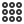
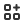
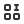
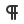

# 🖼️ 素材分類：Iconos Ikon 

> [🏠 主目錄](../../../README.md) / [images](../../README.md) / [iCons](../README.md) / **Iconos Ikon **

本目錄共有 `736` 個檔案

| 🎨 預覽 (點擊放大) | 📋 檔案詳細資訊與連結 |
| :--- | :--- |
|  | **📂 檔名:** `Alignbar_1.svg` ✨ **格式:** `Vector (SVG)` ⚖️ **大小:** `709.00B` | 📅 **更新:** `2026-02-27`  🚀 **jsDelivr Markdown:** `` 🔗 **直接連結 (Url):** `https://cdn.jsdelivr.netbarry028/materials@main/images/iCons/Iconos%20Ikon%20/Alignbar_1.svg` 📥 [檢視原始檔](Alignbar_1.svg) |
|  | **📂 檔名:** `Alignbar_10.svg` ✨ **格式:** `Vector (SVG)` ⚖️ **大小:** `583.00B` | 📅 **更新:** `2026-02-27`  🚀 **jsDelivr Markdown:** `` 🔗 **直接連結 (Url):** `https://cdn.jsdelivr.netbarry028/materials@main/images/iCons/Iconos%20Ikon%20/Alignbar_10.svg` 📥 [檢視原始檔](Alignbar_10.svg) |
|  | **📂 檔名:** `Alignbar_11.svg` ✨ **格式:** `Vector (SVG)` ⚖️ **大小:** `588.00B` | 📅 **更新:** `2026-02-27`  🚀 **jsDelivr Markdown:** `` 🔗 **直接連結 (Url):** `https://cdn.jsdelivr.netbarry028/materials@main/images/iCons/Iconos%20Ikon%20/Alignbar_11.svg` 📥 [檢視原始檔](Alignbar_11.svg) |
|  | **📂 檔名:** `Alignbar_12.svg` ✨ **格式:** `Vector (SVG)` ⚖️ **大小:** `463.00B` | 📅 **更新:** `2026-02-27`  🚀 **jsDelivr Markdown:** `` 🔗 **直接連結 (Url):** `https://cdn.jsdelivr.netbarry028/materials@main/images/iCons/Iconos%20Ikon%20/Alignbar_12.svg` 📥 [檢視原始檔](Alignbar_12.svg) |
|  | **📂 檔名:** `Alignbar_13.svg` ✨ **格式:** `Vector (SVG)` ⚖️ **大小:** `446.00B` | 📅 **更新:** `2026-02-27`  🚀 **jsDelivr Markdown:** `` 🔗 **直接連結 (Url):** `https://cdn.jsdelivr.netbarry028/materials@main/images/iCons/Iconos%20Ikon%20/Alignbar_13.svg` 📥 [檢視原始檔](Alignbar_13.svg) |
|  | **📂 檔名:** `Alignbar_2.svg` ✨ **格式:** `Vector (SVG)` ⚖️ **大小:** `692.00B` | 📅 **更新:** `2026-02-27`  🚀 **jsDelivr Markdown:** `` 🔗 **直接連結 (Url):** `https://cdn.jsdelivr.netbarry028/materials@main/images/iCons/Iconos%20Ikon%20/Alignbar_2.svg` 📥 [檢視原始檔](Alignbar_2.svg) |
|  | **📂 檔名:** `Alignbar_3.svg` ✨ **格式:** `Vector (SVG)` ⚖️ **大小:** `713.00B` | 📅 **更新:** `2026-02-27`  🚀 **jsDelivr Markdown:** `` 🔗 **直接連結 (Url):** `https://cdn.jsdelivr.netbarry028/materials@main/images/iCons/Iconos%20Ikon%20/Alignbar_3.svg` 📥 [檢視原始檔](Alignbar_3.svg) |
|  | **📂 檔名:** `Alignbar_4.svg` ✨ **格式:** `Vector (SVG)` ⚖️ **大小:** `722.00B` | 📅 **更新:** `2026-02-27`  🚀 **jsDelivr Markdown:** `` 🔗 **直接連結 (Url):** `https://cdn.jsdelivr.netbarry028/materials@main/images/iCons/Iconos%20Ikon%20/Alignbar_4.svg` 📥 [檢視原始檔](Alignbar_4.svg) |
|  | **📂 檔名:** `Alignbar_5.svg` ✨ **格式:** `Vector (SVG)` ⚖️ **大小:** `601.00B` | 📅 **更新:** `2026-02-27`  🚀 **jsDelivr Markdown:** `` 🔗 **直接連結 (Url):** `https://cdn.jsdelivr.netbarry028/materials@main/images/iCons/Iconos%20Ikon%20/Alignbar_5.svg` 📥 [檢視原始檔](Alignbar_5.svg) |
|  | **📂 檔名:** `Alignbar_6-1.svg` ✨ **格式:** `Vector (SVG)` ⚖️ **大小:** `587.00B` | 📅 **更新:** `2026-02-27`  🚀 **jsDelivr Markdown:** `` 🔗 **直接連結 (Url):** `https://cdn.jsdelivr.netbarry028/materials@main/images/iCons/Iconos%20Ikon%20/Alignbar_6-1.svg` 📥 [檢視原始檔](Alignbar_6-1.svg) |
|  | **📂 檔名:** `Alignbar_6.svg` ✨ **格式:** `Vector (SVG)` ⚖️ **大小:** `586.00B` | 📅 **更新:** `2026-02-27`  🚀 **jsDelivr Markdown:** `` 🔗 **直接連結 (Url):** `https://cdn.jsdelivr.netbarry028/materials@main/images/iCons/Iconos%20Ikon%20/Alignbar_6.svg` 📥 [檢視原始檔](Alignbar_6.svg) |
|  | **📂 檔名:** `Alignbar_7.svg` ✨ **格式:** `Vector (SVG)` ⚖️ **大小:** `609.00B` | 📅 **更新:** `2026-02-27`  🚀 **jsDelivr Markdown:** `` 🔗 **直接連結 (Url):** `https://cdn.jsdelivr.netbarry028/materials@main/images/iCons/Iconos%20Ikon%20/Alignbar_7.svg` 📥 [檢視原始檔](Alignbar_7.svg) |
|  | **📂 檔名:** `Alignbar_8.svg` ✨ **格式:** `Vector (SVG)` ⚖️ **大小:** `563.00B` | 📅 **更新:** `2026-02-27`  🚀 **jsDelivr Markdown:** `` 🔗 **直接連結 (Url):** `https://cdn.jsdelivr.netbarry028/materials@main/images/iCons/Iconos%20Ikon%20/Alignbar_8.svg` 📥 [檢視原始檔](Alignbar_8.svg) |
|  | **📂 檔名:** `Alignbar_9.svg` ✨ **格式:** `Vector (SVG)` ⚖️ **大小:** `554.00B` | 📅 **更新:** `2026-02-27`  🚀 **jsDelivr Markdown:** `` 🔗 **直接連結 (Url):** `https://cdn.jsdelivr.netbarry028/materials@main/images/iCons/Iconos%20Ikon%20/Alignbar_9.svg` 📥 [檢視原始檔](Alignbar_9.svg) |
|  | **📂 檔名:** `Alignbox-1.svg` ✨ **格式:** `Vector (SVG)` ⚖️ **大小:** `455.00B` | 📅 **更新:** `2026-02-27`  🚀 **jsDelivr Markdown:** `` 🔗 **直接連結 (Url):** `https://cdn.jsdelivr.netbarry028/materials@main/images/iCons/Iconos%20Ikon%20/Alignbox-1.svg` 📥 [檢視原始檔](Alignbox-1.svg) |
|  | **📂 檔名:** `Alignbox-2.svg` ✨ **格式:** `Vector (SVG)` ⚖️ **大小:** `444.00B` | 📅 **更新:** `2026-02-27`  🚀 **jsDelivr Markdown:** `` 🔗 **直接連結 (Url):** `https://cdn.jsdelivr.netbarry028/materials@main/images/iCons/Iconos%20Ikon%20/Alignbox-2.svg` 📥 [檢視原始檔](Alignbox-2.svg) |
|  | **📂 檔名:** `Alignbox-3.svg` ✨ **格式:** `Vector (SVG)` ⚖️ **大小:** `433.00B` | 📅 **更新:** `2026-02-27`  🚀 **jsDelivr Markdown:** `` 🔗 **直接連結 (Url):** `https://cdn.jsdelivr.netbarry028/materials@main/images/iCons/Iconos%20Ikon%20/Alignbox-3.svg` 📥 [檢視原始檔](Alignbox-3.svg) |
|  | **📂 檔名:** `Alignbox-4.svg` ✨ **格式:** `Vector (SVG)` ⚖️ **大小:** `444.00B` | 📅 **更新:** `2026-02-27`  🚀 **jsDelivr Markdown:** `` 🔗 **直接連結 (Url):** `https://cdn.jsdelivr.netbarry028/materials@main/images/iCons/Iconos%20Ikon%20/Alignbox-4.svg` 📥 [檢視原始檔](Alignbox-4.svg) |
|  | **📂 檔名:** `Alignbox-5.svg` ✨ **格式:** `Vector (SVG)` ⚖️ **大小:** `448.00B` | 📅 **更新:** `2026-02-27`  🚀 **jsDelivr Markdown:** `` 🔗 **直接連結 (Url):** `https://cdn.jsdelivr.netbarry028/materials@main/images/iCons/Iconos%20Ikon%20/Alignbox-5.svg` 📥 [檢視原始檔](Alignbox-5.svg) |
|  | **📂 檔名:** `Alignbox-6.svg` ✨ **格式:** `Vector (SVG)` ⚖️ **大小:** `440.00B` | 📅 **更新:** `2026-02-27`  🚀 **jsDelivr Markdown:** `` 🔗 **直接連結 (Url):** `https://cdn.jsdelivr.netbarry028/materials@main/images/iCons/Iconos%20Ikon%20/Alignbox-6.svg` 📥 [檢視原始檔](Alignbox-6.svg) |
|  | **📂 檔名:** `Alignbox-7.svg` ✨ **格式:** `Vector (SVG)` ⚖️ **大小:** `451.00B` | 📅 **更新:** `2026-02-27`  🚀 **jsDelivr Markdown:** `` 🔗 **直接連結 (Url):** `https://cdn.jsdelivr.netbarry028/materials@main/images/iCons/Iconos%20Ikon%20/Alignbox-7.svg` 📥 [檢視原始檔](Alignbox-7.svg) |
|  | **📂 檔名:** `Alignbox-8.svg` ✨ **格式:** `Vector (SVG)` ⚖️ **大小:** `441.00B` | 📅 **更新:** `2026-02-27`  🚀 **jsDelivr Markdown:** `` 🔗 **直接連結 (Url):** `https://cdn.jsdelivr.netbarry028/materials@main/images/iCons/Iconos%20Ikon%20/Alignbox-8.svg` 📥 [檢視原始檔](Alignbox-8.svg) |
|  | **📂 檔名:** `Alignbox-9.svg` ✨ **格式:** `Vector (SVG)` ⚖️ **大小:** `1.16KB` | 📅 **更新:** `2026-02-27`  🚀 **jsDelivr Markdown:** `` 🔗 **直接連結 (Url):** `https://cdn.jsdelivr.netbarry028/materials@main/images/iCons/Iconos%20Ikon%20/Alignbox-9.svg` 📥 [檢視原始檔](Alignbox-9.svg) |
|  | **📂 檔名:** `Arrow 1.svg` ✨ **格式:** `Vector (SVG)` ⚖️ **大小:** `1.45KB` | 📅 **更新:** `2026-02-27`  🚀 **jsDelivr Markdown:** `` 🔗 **直接連結 (Url):** `https://cdn.jsdelivr.netbarry028/materials@main/images/iCons/Iconos%20Ikon%20/Arrow%201.svg` 📥 [檢視原始檔](Arrow%201.svg) |
|  | **📂 檔名:** `Arrow 10.svg` ✨ **格式:** `Vector (SVG)` ⚖️ **大小:** `261.00B` | 📅 **更新:** `2026-02-27`  🚀 **jsDelivr Markdown:** `` 🔗 **直接連結 (Url):** `https://cdn.jsdelivr.netbarry028/materials@main/images/iCons/Iconos%20Ikon%20/Arrow%2010.svg` 📥 [檢視原始檔](Arrow%2010.svg) |
|  | **📂 檔名:** `Arrow 100.svg` ✨ **格式:** `Vector (SVG)` ⚖️ **大小:** `1.13KB` | 📅 **更新:** `2026-02-27`  🚀 **jsDelivr Markdown:** `` 🔗 **直接連結 (Url):** `https://cdn.jsdelivr.netbarry028/materials@main/images/iCons/Iconos%20Ikon%20/Arrow%20100.svg` 📥 [檢視原始檔](Arrow%20100.svg) |
|  | **📂 檔名:** `Arrow 101.svg` ✨ **格式:** `Vector (SVG)` ⚖️ **大小:** `1.12KB` | 📅 **更新:** `2026-02-27`  🚀 **jsDelivr Markdown:** `` 🔗 **直接連結 (Url):** `https://cdn.jsdelivr.netbarry028/materials@main/images/iCons/Iconos%20Ikon%20/Arrow%20101.svg` 📥 [檢視原始檔](Arrow%20101.svg) |
|  | **📂 檔名:** `Arrow 102.svg` ✨ **格式:** `Vector (SVG)` ⚖️ **大小:** `1017.00B` | 📅 **更新:** `2026-02-27`  🚀 **jsDelivr Markdown:** `` 🔗 **直接連結 (Url):** `https://cdn.jsdelivr.netbarry028/materials@main/images/iCons/Iconos%20Ikon%20/Arrow%20102.svg` 📥 [檢視原始檔](Arrow%20102.svg) |
|  | **📂 檔名:** `Arrow 103.svg` ✨ **格式:** `Vector (SVG)` ⚖️ **大小:** `1.02KB` | 📅 **更新:** `2026-02-27`  🚀 **jsDelivr Markdown:** `` 🔗 **直接連結 (Url):** `https://cdn.jsdelivr.netbarry028/materials@main/images/iCons/Iconos%20Ikon%20/Arrow%20103.svg` 📥 [檢視原始檔](Arrow%20103.svg) |
|  | **📂 檔名:** `Arrow 104.svg` ✨ **格式:** `Vector (SVG)` ⚖️ **大小:** `1.02KB` | 📅 **更新:** `2026-02-27`  🚀 **jsDelivr Markdown:** `` 🔗 **直接連結 (Url):** `https://cdn.jsdelivr.netbarry028/materials@main/images/iCons/Iconos%20Ikon%20/Arrow%20104.svg` 📥 [檢視原始檔](Arrow%20104.svg) |
|  | **📂 檔名:** `Arrow 105.svg` ✨ **格式:** `Vector (SVG)` ⚖️ **大小:** `1.07KB` | 📅 **更新:** `2026-02-27`  🚀 **jsDelivr Markdown:** `` 🔗 **直接連結 (Url):** `https://cdn.jsdelivr.netbarry028/materials@main/images/iCons/Iconos%20Ikon%20/Arrow%20105.svg` 📥 [檢視原始檔](Arrow%20105.svg) |
|  | **📂 檔名:** `Arrow 106.svg` ✨ **格式:** `Vector (SVG)` ⚖️ **大小:** `1.06KB` | 📅 **更新:** `2026-02-27`  🚀 **jsDelivr Markdown:** `` 🔗 **直接連結 (Url):** `https://cdn.jsdelivr.netbarry028/materials@main/images/iCons/Iconos%20Ikon%20/Arrow%20106.svg` 📥 [檢視原始檔](Arrow%20106.svg) |
|  | **📂 檔名:** `Arrow 107.svg` ✨ **格式:** `Vector (SVG)` ⚖️ **大小:** `1018.00B` | 📅 **更新:** `2026-02-27`  🚀 **jsDelivr Markdown:** `` 🔗 **直接連結 (Url):** `https://cdn.jsdelivr.netbarry028/materials@main/images/iCons/Iconos%20Ikon%20/Arrow%20107.svg` 📥 [檢視原始檔](Arrow%20107.svg) |
|  | **📂 檔名:** `Arrow 108.svg` ✨ **格式:** `Vector (SVG)` ⚖️ **大小:** `1.07KB` | 📅 **更新:** `2026-02-27`  🚀 **jsDelivr Markdown:** `` 🔗 **直接連結 (Url):** `https://cdn.jsdelivr.netbarry028/materials@main/images/iCons/Iconos%20Ikon%20/Arrow%20108.svg` 📥 [檢視原始檔](Arrow%20108.svg) |
|  | **📂 檔名:** `Arrow 109.svg` ✨ **格式:** `Vector (SVG)` ⚖️ **大小:** `1.07KB` | 📅 **更新:** `2026-02-27`  🚀 **jsDelivr Markdown:** `` 🔗 **直接連結 (Url):** `https://cdn.jsdelivr.netbarry028/materials@main/images/iCons/Iconos%20Ikon%20/Arrow%20109.svg` 📥 [檢視原始檔](Arrow%20109.svg) |
|  | **📂 檔名:** `Arrow 11.svg` ✨ **格式:** `Vector (SVG)` ⚖️ **大小:** `717.00B` | 📅 **更新:** `2026-02-27`  🚀 **jsDelivr Markdown:** `` 🔗 **直接連結 (Url):** `https://cdn.jsdelivr.netbarry028/materials@main/images/iCons/Iconos%20Ikon%20/Arrow%2011.svg` 📥 [檢視原始檔](Arrow%2011.svg) |
|  | **📂 檔名:** `Arrow 110.svg` ✨ **格式:** `Vector (SVG)` ⚖️ **大小:** `1.17KB` | 📅 **更新:** `2026-02-27`  🚀 **jsDelivr Markdown:** `` 🔗 **直接連結 (Url):** `https://cdn.jsdelivr.netbarry028/materials@main/images/iCons/Iconos%20Ikon%20/Arrow%20110.svg` 📥 [檢視原始檔](Arrow%20110.svg) |
|  | **📂 檔名:** `Arrow 111.svg` ✨ **格式:** `Vector (SVG)` ⚖️ **大小:** `1.17KB` | 📅 **更新:** `2026-02-27`  🚀 **jsDelivr Markdown:** `` 🔗 **直接連結 (Url):** `https://cdn.jsdelivr.netbarry028/materials@main/images/iCons/Iconos%20Ikon%20/Arrow%20111.svg` 📥 [檢視原始檔](Arrow%20111.svg) |
|  | **📂 檔名:** `Arrow 112.svg` ✨ **格式:** `Vector (SVG)` ⚖️ **大小:** `1.15KB` | 📅 **更新:** `2026-02-27`  🚀 **jsDelivr Markdown:** `` 🔗 **直接連結 (Url):** `https://cdn.jsdelivr.netbarry028/materials@main/images/iCons/Iconos%20Ikon%20/Arrow%20112.svg` 📥 [檢視原始檔](Arrow%20112.svg) |
|  | **📂 檔名:** `Arrow 113.svg` ✨ **格式:** `Vector (SVG)` ⚖️ **大小:** `1.17KB` | 📅 **更新:** `2026-02-27`  🚀 **jsDelivr Markdown:** `` 🔗 **直接連結 (Url):** `https://cdn.jsdelivr.netbarry028/materials@main/images/iCons/Iconos%20Ikon%20/Arrow%20113.svg` 📥 [檢視原始檔](Arrow%20113.svg) |
|  | **📂 檔名:** `Arrow 114.svg` ✨ **格式:** `Vector (SVG)` ⚖️ **大小:** `1.17KB` | 📅 **更新:** `2026-02-27`  🚀 **jsDelivr Markdown:** `` 🔗 **直接連結 (Url):** `https://cdn.jsdelivr.netbarry028/materials@main/images/iCons/Iconos%20Ikon%20/Arrow%20114.svg` 📥 [檢視原始檔](Arrow%20114.svg) |
|  | **📂 檔名:** `Arrow 115.svg` ✨ **格式:** `Vector (SVG)` ⚖️ **大小:** `1.12KB` | 📅 **更新:** `2026-02-27`  🚀 **jsDelivr Markdown:** `` 🔗 **直接連結 (Url):** `https://cdn.jsdelivr.netbarry028/materials@main/images/iCons/Iconos%20Ikon%20/Arrow%20115.svg` 📥 [檢視原始檔](Arrow%20115.svg) |
|  | **📂 檔名:** `Arrow 116.svg` ✨ **格式:** `Vector (SVG)` ⚖️ **大小:** `1.08KB` | 📅 **更新:** `2026-02-27`  🚀 **jsDelivr Markdown:** `` 🔗 **直接連結 (Url):** `https://cdn.jsdelivr.netbarry028/materials@main/images/iCons/Iconos%20Ikon%20/Arrow%20116.svg` 📥 [檢視原始檔](Arrow%20116.svg) |
|  | **📂 檔名:** `Arrow 117.svg` ✨ **格式:** `Vector (SVG)` ⚖️ **大小:** `1.17KB` | 📅 **更新:** `2026-02-27`  🚀 **jsDelivr Markdown:** `` 🔗 **直接連結 (Url):** `https://cdn.jsdelivr.netbarry028/materials@main/images/iCons/Iconos%20Ikon%20/Arrow%20117.svg` 📥 [檢視原始檔](Arrow%20117.svg) |
|  | **📂 檔名:** `Arrow 118.svg` ✨ **格式:** `Vector (SVG)` ⚖️ **大小:** `1.17KB` | 📅 **更新:** `2026-02-27`  🚀 **jsDelivr Markdown:** `` 🔗 **直接連結 (Url):** `https://cdn.jsdelivr.netbarry028/materials@main/images/iCons/Iconos%20Ikon%20/Arrow%20118.svg` 📥 [檢視原始檔](Arrow%20118.svg) |
|  | **📂 檔名:** `Arrow 119.svg` ✨ **格式:** `Vector (SVG)` ⚖️ **大小:** `1.08KB` | 📅 **更新:** `2026-02-27`  🚀 **jsDelivr Markdown:** `` 🔗 **直接連結 (Url):** `https://cdn.jsdelivr.netbarry028/materials@main/images/iCons/Iconos%20Ikon%20/Arrow%20119.svg` 📥 [檢視原始檔](Arrow%20119.svg) |
|  | **📂 檔名:** `Arrow 12.svg` ✨ **格式:** `Vector (SVG)` ⚖️ **大小:** `717.00B` | 📅 **更新:** `2026-02-27`  🚀 **jsDelivr Markdown:** `` 🔗 **直接連結 (Url):** `https://cdn.jsdelivr.netbarry028/materials@main/images/iCons/Iconos%20Ikon%20/Arrow%2012.svg` 📥 [檢視原始檔](Arrow%2012.svg) |
|  | **📂 檔名:** `Arrow 120.svg` ✨ **格式:** `Vector (SVG)` ⚖️ **大小:** `1.09KB` | 📅 **更新:** `2026-02-27`  🚀 **jsDelivr Markdown:** `` 🔗 **直接連結 (Url):** `https://cdn.jsdelivr.netbarry028/materials@main/images/iCons/Iconos%20Ikon%20/Arrow%20120.svg` 📥 [檢視原始檔](Arrow%20120.svg) |
|  | **📂 檔名:** `Arrow 121.svg` ✨ **格式:** `Vector (SVG)` ⚖️ **大小:** `1.09KB` | 📅 **更新:** `2026-02-27`  🚀 **jsDelivr Markdown:** `` 🔗 **直接連結 (Url):** `https://cdn.jsdelivr.netbarry028/materials@main/images/iCons/Iconos%20Ikon%20/Arrow%20121.svg` 📥 [檢視原始檔](Arrow%20121.svg) |
|  | **📂 檔名:** `Arrow 122.svg` ✨ **格式:** `Vector (SVG)` ⚖️ **大小:** `1.14KB` | 📅 **更新:** `2026-02-27`  🚀 **jsDelivr Markdown:** `` 🔗 **直接連結 (Url):** `https://cdn.jsdelivr.netbarry028/materials@main/images/iCons/Iconos%20Ikon%20/Arrow%20122.svg` 📥 [檢視原始檔](Arrow%20122.svg) |
|  | **📂 檔名:** `Arrow 123.svg` ✨ **格式:** `Vector (SVG)` ⚖️ **大小:** `1.14KB` | 📅 **更新:** `2026-02-27`  🚀 **jsDelivr Markdown:** `` 🔗 **直接連結 (Url):** `https://cdn.jsdelivr.netbarry028/materials@main/images/iCons/Iconos%20Ikon%20/Arrow%20123.svg` 📥 [檢視原始檔](Arrow%20123.svg) |
|  | **📂 檔名:** `Arrow 124.svg` ✨ **格式:** `Vector (SVG)` ⚖️ **大小:** `1.13KB` | 📅 **更新:** `2026-02-27`  🚀 **jsDelivr Markdown:** `` 🔗 **直接連結 (Url):** `https://cdn.jsdelivr.netbarry028/materials@main/images/iCons/Iconos%20Ikon%20/Arrow%20124.svg` 📥 [檢視原始檔](Arrow%20124.svg) |
|  | **📂 檔名:** `Arrow 125.svg` ✨ **格式:** `Vector (SVG)` ⚖️ **大小:** `1.14KB` | 📅 **更新:** `2026-02-27`  🚀 **jsDelivr Markdown:** `` 🔗 **直接連結 (Url):** `https://cdn.jsdelivr.netbarry028/materials@main/images/iCons/Iconos%20Ikon%20/Arrow%20125.svg` 📥 [檢視原始檔](Arrow%20125.svg) |
|  | **📂 檔名:** `Arrow 126.svg` ✨ **格式:** `Vector (SVG)` ⚖️ **大小:** `1.74KB` | 📅 **更新:** `2026-02-27`  🚀 **jsDelivr Markdown:** `` 🔗 **直接連結 (Url):** `https://cdn.jsdelivr.netbarry028/materials@main/images/iCons/Iconos%20Ikon%20/Arrow%20126.svg` 📥 [檢視原始檔](Arrow%20126.svg) |
|  | **📂 檔名:** `Arrow 127.svg` ✨ **格式:** `Vector (SVG)` ⚖️ **大小:** `1.65KB` | 📅 **更新:** `2026-02-27`  🚀 **jsDelivr Markdown:** `` 🔗 **直接連結 (Url):** `https://cdn.jsdelivr.netbarry028/materials@main/images/iCons/Iconos%20Ikon%20/Arrow%20127.svg` 📥 [檢視原始檔](Arrow%20127.svg) |
|  | **📂 檔名:** `Arrow 128.svg` ✨ **格式:** `Vector (SVG)` ⚖️ **大小:** `1.73KB` | 📅 **更新:** `2026-02-27`  🚀 **jsDelivr Markdown:** `` 🔗 **直接連結 (Url):** `https://cdn.jsdelivr.netbarry028/materials@main/images/iCons/Iconos%20Ikon%20/Arrow%20128.svg` 📥 [檢視原始檔](Arrow%20128.svg) |
|  | **📂 檔名:** `Arrow 129.svg` ✨ **格式:** `Vector (SVG)` ⚖️ **大小:** `1.65KB` | 📅 **更新:** `2026-02-27`  🚀 **jsDelivr Markdown:** `` 🔗 **直接連結 (Url):** `https://cdn.jsdelivr.netbarry028/materials@main/images/iCons/Iconos%20Ikon%20/Arrow%20129.svg` 📥 [檢視原始檔](Arrow%20129.svg) |
|  | **📂 檔名:** `Arrow 13.svg` ✨ **格式:** `Vector (SVG)` ⚖️ **大小:** `715.00B` | 📅 **更新:** `2026-02-27`  🚀 **jsDelivr Markdown:** `` 🔗 **直接連結 (Url):** `https://cdn.jsdelivr.netbarry028/materials@main/images/iCons/Iconos%20Ikon%20/Arrow%2013.svg` 📥 [檢視原始檔](Arrow%2013.svg) |
|  | **📂 檔名:** `Arrow 130.svg` ✨ **格式:** `Vector (SVG)` ⚖️ **大小:** `1.74KB` | 📅 **更新:** `2026-02-27`  🚀 **jsDelivr Markdown:** `` 🔗 **直接連結 (Url):** `https://cdn.jsdelivr.netbarry028/materials@main/images/iCons/Iconos%20Ikon%20/Arrow%20130.svg` 📥 [檢視原始檔](Arrow%20130.svg) |
|  | **📂 檔名:** `Arrow 131.svg` ✨ **格式:** `Vector (SVG)` ⚖️ **大小:** `1.73KB` | 📅 **更新:** `2026-02-27`  🚀 **jsDelivr Markdown:** `` 🔗 **直接連結 (Url):** `https://cdn.jsdelivr.netbarry028/materials@main/images/iCons/Iconos%20Ikon%20/Arrow%20131.svg` 📥 [檢視原始檔](Arrow%20131.svg) |
|  | **📂 檔名:** `Arrow 132.svg` ✨ **格式:** `Vector (SVG)` ⚖️ **大小:** `1.73KB` | 📅 **更新:** `2026-02-27`  🚀 **jsDelivr Markdown:** `` 🔗 **直接連結 (Url):** `https://cdn.jsdelivr.netbarry028/materials@main/images/iCons/Iconos%20Ikon%20/Arrow%20132.svg` 📥 [檢視原始檔](Arrow%20132.svg) |
|  | **📂 檔名:** `Arrow 133.svg` ✨ **格式:** `Vector (SVG)` ⚖️ **大小:** `1.73KB` | 📅 **更新:** `2026-02-27`  🚀 **jsDelivr Markdown:** `` 🔗 **直接連結 (Url):** `https://cdn.jsdelivr.netbarry028/materials@main/images/iCons/Iconos%20Ikon%20/Arrow%20133.svg` 📥 [檢視原始檔](Arrow%20133.svg) |
|  | **📂 檔名:** `Arrow 134.svg` ✨ **格式:** `Vector (SVG)` ⚖️ **大小:** `1.65KB` | 📅 **更新:** `2026-02-27`  🚀 **jsDelivr Markdown:** `` 🔗 **直接連結 (Url):** `https://cdn.jsdelivr.netbarry028/materials@main/images/iCons/Iconos%20Ikon%20/Arrow%20134.svg` 📥 [檢視原始檔](Arrow%20134.svg) |
|  | **📂 檔名:** `Arrow 135.svg` ✨ **格式:** `Vector (SVG)` ⚖️ **大小:** `1.65KB` | 📅 **更新:** `2026-02-27`  🚀 **jsDelivr Markdown:** `` 🔗 **直接連結 (Url):** `https://cdn.jsdelivr.netbarry028/materials@main/images/iCons/Iconos%20Ikon%20/Arrow%20135.svg` 📥 [檢視原始檔](Arrow%20135.svg) |
|  | **📂 檔名:** `Arrow 136.svg` ✨ **格式:** `Vector (SVG)` ⚖️ **大小:** `1.65KB` | 📅 **更新:** `2026-02-27`  🚀 **jsDelivr Markdown:** `` 🔗 **直接連結 (Url):** `https://cdn.jsdelivr.netbarry028/materials@main/images/iCons/Iconos%20Ikon%20/Arrow%20136.svg` 📥 [檢視原始檔](Arrow%20136.svg) |
|  | **📂 檔名:** `Arrow 137.svg` ✨ **格式:** `Vector (SVG)` ⚖️ **大小:** `1.65KB` | 📅 **更新:** `2026-02-27`  🚀 **jsDelivr Markdown:** `` 🔗 **直接連結 (Url):** `https://cdn.jsdelivr.netbarry028/materials@main/images/iCons/Iconos%20Ikon%20/Arrow%20137.svg` 📥 [檢視原始檔](Arrow%20137.svg) |
|  | **📂 檔名:** `Arrow 138.svg` ✨ **格式:** `Vector (SVG)` ⚖️ **大小:** `1.06KB` | 📅 **更新:** `2026-02-27`  🚀 **jsDelivr Markdown:** `` 🔗 **直接連結 (Url):** `https://cdn.jsdelivr.netbarry028/materials@main/images/iCons/Iconos%20Ikon%20/Arrow%20138.svg` 📥 [檢視原始檔](Arrow%20138.svg) |
|  | **📂 檔名:** `Arrow 139.svg` ✨ **格式:** `Vector (SVG)` ⚖️ **大小:** `998.00B` | 📅 **更新:** `2026-02-27`  🚀 **jsDelivr Markdown:** `` 🔗 **直接連結 (Url):** `https://cdn.jsdelivr.netbarry028/materials@main/images/iCons/Iconos%20Ikon%20/Arrow%20139.svg` 📥 [檢視原始檔](Arrow%20139.svg) |
|  | **📂 檔名:** `Arrow 14.svg` ✨ **格式:** `Vector (SVG)` ⚖️ **大小:** `715.00B` | 📅 **更新:** `2026-02-27`  🚀 **jsDelivr Markdown:** `` 🔗 **直接連結 (Url):** `https://cdn.jsdelivr.netbarry028/materials@main/images/iCons/Iconos%20Ikon%20/Arrow%2014.svg` 📥 [檢視原始檔](Arrow%2014.svg) |
|  | **📂 檔名:** `Arrow 140.svg` ✨ **格式:** `Vector (SVG)` ⚖️ **大小:** `1.06KB` | 📅 **更新:** `2026-02-27`  🚀 **jsDelivr Markdown:** `` 🔗 **直接連結 (Url):** `https://cdn.jsdelivr.netbarry028/materials@main/images/iCons/Iconos%20Ikon%20/Arrow%20140.svg` 📥 [檢視原始檔](Arrow%20140.svg) |
|  | **📂 檔名:** `Arrow 141.svg` ✨ **格式:** `Vector (SVG)` ⚖️ **大小:** `998.00B` | 📅 **更新:** `2026-02-27`  🚀 **jsDelivr Markdown:** `` 🔗 **直接連結 (Url):** `https://cdn.jsdelivr.netbarry028/materials@main/images/iCons/Iconos%20Ikon%20/Arrow%20141.svg` 📥 [檢視原始檔](Arrow%20141.svg) |
|  | **📂 檔名:** `Arrow 142.svg` ✨ **格式:** `Vector (SVG)` ⚖️ **大小:** `1.06KB` | 📅 **更新:** `2026-02-27`  🚀 **jsDelivr Markdown:** `` 🔗 **直接連結 (Url):** `https://cdn.jsdelivr.netbarry028/materials@main/images/iCons/Iconos%20Ikon%20/Arrow%20142.svg` 📥 [檢視原始檔](Arrow%20142.svg) |
|  | **📂 檔名:** `Arrow 143.svg` ✨ **格式:** `Vector (SVG)` ⚖️ **大小:** `1001.00B` | 📅 **更新:** `2026-02-27`  🚀 **jsDelivr Markdown:** `` 🔗 **直接連結 (Url):** `https://cdn.jsdelivr.netbarry028/materials@main/images/iCons/Iconos%20Ikon%20/Arrow%20143.svg` 📥 [檢視原始檔](Arrow%20143.svg) |
|  | **📂 檔名:** `Arrow 144.svg` ✨ **格式:** `Vector (SVG)` ⚖️ **大小:** `1.06KB` | 📅 **更新:** `2026-02-27`  🚀 **jsDelivr Markdown:** `` 🔗 **直接連結 (Url):** `https://cdn.jsdelivr.netbarry028/materials@main/images/iCons/Iconos%20Ikon%20/Arrow%20144.svg` 📥 [檢視原始檔](Arrow%20144.svg) |
|  | **📂 檔名:** `Arrow 145.svg` ✨ **格式:** `Vector (SVG)` ⚖️ **大小:** `1001.00B` | 📅 **更新:** `2026-02-27`  🚀 **jsDelivr Markdown:** `` 🔗 **直接連結 (Url):** `https://cdn.jsdelivr.netbarry028/materials@main/images/iCons/Iconos%20Ikon%20/Arrow%20145.svg` 📥 [檢視原始檔](Arrow%20145.svg) |
|  | **📂 檔名:** `Arrow 146.svg` ✨ **格式:** `Vector (SVG)` ⚖️ **大小:** `641.00B` | 📅 **更新:** `2026-02-27`  🚀 **jsDelivr Markdown:** `` 🔗 **直接連結 (Url):** `https://cdn.jsdelivr.netbarry028/materials@main/images/iCons/Iconos%20Ikon%20/Arrow%20146.svg` 📥 [檢視原始檔](Arrow%20146.svg) |
|  | **📂 檔名:** `Arrow 147.svg` ✨ **格式:** `Vector (SVG)` ⚖️ **大小:** `629.00B` | 📅 **更新:** `2026-02-27`  🚀 **jsDelivr Markdown:** `` 🔗 **直接連結 (Url):** `https://cdn.jsdelivr.netbarry028/materials@main/images/iCons/Iconos%20Ikon%20/Arrow%20147.svg` 📥 [檢視原始檔](Arrow%20147.svg) |
|  | **📂 檔名:** `Arrow 148.svg` ✨ **格式:** `Vector (SVG)` ⚖️ **大小:** `617.00B` | 📅 **更新:** `2026-02-27`  🚀 **jsDelivr Markdown:** `` 🔗 **直接連結 (Url):** `https://cdn.jsdelivr.netbarry028/materials@main/images/iCons/Iconos%20Ikon%20/Arrow%20148.svg` 📥 [檢視原始檔](Arrow%20148.svg) |
|  | **📂 檔名:** `Arrow 15.svg` ✨ **格式:** `Vector (SVG)` ⚖️ **大小:** `699.00B` | 📅 **更新:** `2026-02-27`  🚀 **jsDelivr Markdown:** `` 🔗 **直接連結 (Url):** `https://cdn.jsdelivr.netbarry028/materials@main/images/iCons/Iconos%20Ikon%20/Arrow%2015.svg` 📥 [檢視原始檔](Arrow%2015.svg) |
|  | **📂 檔名:** `Arrow 150.svg` ✨ **格式:** `Vector (SVG)` ⚖️ **大小:** `1.35KB` | 📅 **更新:** `2026-02-27`  🚀 **jsDelivr Markdown:** `` 🔗 **直接連結 (Url):** `https://cdn.jsdelivr.netbarry028/materials@main/images/iCons/Iconos%20Ikon%20/Arrow%20150.svg` 📥 [檢視原始檔](Arrow%20150.svg) |
|  | **📂 檔名:** `Arrow 152.svg` ✨ **格式:** `Vector (SVG)` ⚖️ **大小:** `778.00B` | 📅 **更新:** `2026-02-27`  🚀 **jsDelivr Markdown:** `` 🔗 **直接連結 (Url):** `https://cdn.jsdelivr.netbarry028/materials@main/images/iCons/Iconos%20Ikon%20/Arrow%20152.svg` 📥 [檢視原始檔](Arrow%20152.svg) |
|  | **📂 檔名:** `Arrow 153.svg` ✨ **格式:** `Vector (SVG)` ⚖️ **大小:** `773.00B` | 📅 **更新:** `2026-02-27`  🚀 **jsDelivr Markdown:** `` 🔗 **直接連結 (Url):** `https://cdn.jsdelivr.netbarry028/materials@main/images/iCons/Iconos%20Ikon%20/Arrow%20153.svg` 📥 [檢視原始檔](Arrow%20153.svg) |
|  | **📂 檔名:** `Arrow 154.svg` ✨ **格式:** `Vector (SVG)` ⚖️ **大小:** `1.12KB` | 📅 **更新:** `2026-02-27`  🚀 **jsDelivr Markdown:** `` 🔗 **直接連結 (Url):** `https://cdn.jsdelivr.netbarry028/materials@main/images/iCons/Iconos%20Ikon%20/Arrow%20154.svg` 📥 [檢視原始檔](Arrow%20154.svg) |
|  | **📂 檔名:** `Arrow 155.svg` ✨ **格式:** `Vector (SVG)` ⚖️ **大小:** `834.00B` | 📅 **更新:** `2026-02-27`  🚀 **jsDelivr Markdown:** `` 🔗 **直接連結 (Url):** `https://cdn.jsdelivr.netbarry028/materials@main/images/iCons/Iconos%20Ikon%20/Arrow%20155.svg` 📥 [檢視原始檔](Arrow%20155.svg) |
|  | **📂 檔名:** `Arrow 156.svg` ✨ **格式:** `Vector (SVG)` ⚖️ **大小:** `835.00B` | 📅 **更新:** `2026-02-27`  🚀 **jsDelivr Markdown:** `` 🔗 **直接連結 (Url):** `https://cdn.jsdelivr.netbarry028/materials@main/images/iCons/Iconos%20Ikon%20/Arrow%20156.svg` 📥 [檢視原始檔](Arrow%20156.svg) |
|  | **📂 檔名:** `Arrow 157.svg` ✨ **格式:** `Vector (SVG)` ⚖️ **大小:** `816.00B` | 📅 **更新:** `2026-02-27`  🚀 **jsDelivr Markdown:** `` 🔗 **直接連結 (Url):** `https://cdn.jsdelivr.netbarry028/materials@main/images/iCons/Iconos%20Ikon%20/Arrow%20157.svg` 📥 [檢視原始檔](Arrow%20157.svg) |
|  | **📂 檔名:** `Arrow 158.svg` ✨ **格式:** `Vector (SVG)` ⚖️ **大小:** `820.00B` | 📅 **更新:** `2026-02-27`  🚀 **jsDelivr Markdown:** `` 🔗 **直接連結 (Url):** `https://cdn.jsdelivr.netbarry028/materials@main/images/iCons/Iconos%20Ikon%20/Arrow%20158.svg` 📥 [檢視原始檔](Arrow%20158.svg) |
|  | **📂 檔名:** `Arrow 159.svg` ✨ **格式:** `Vector (SVG)` ⚖️ **大小:** `573.00B` | 📅 **更新:** `2026-02-27`  🚀 **jsDelivr Markdown:** `` 🔗 **直接連結 (Url):** `https://cdn.jsdelivr.netbarry028/materials@main/images/iCons/Iconos%20Ikon%20/Arrow%20159.svg` 📥 [檢視原始檔](Arrow%20159.svg) |
|  | **📂 檔名:** `Arrow 16.svg` ✨ **格式:** `Vector (SVG)` ⚖️ **大小:** `673.00B` | 📅 **更新:** `2026-02-27`  🚀 **jsDelivr Markdown:** `` 🔗 **直接連結 (Url):** `https://cdn.jsdelivr.netbarry028/materials@main/images/iCons/Iconos%20Ikon%20/Arrow%2016.svg` 📥 [檢視原始檔](Arrow%2016.svg) |
|  | **📂 檔名:** `Arrow 160.svg` ✨ **格式:** `Vector (SVG)` ⚖️ **大小:** `572.00B` | 📅 **更新:** `2026-02-27`  🚀 **jsDelivr Markdown:** `` 🔗 **直接連結 (Url):** `https://cdn.jsdelivr.netbarry028/materials@main/images/iCons/Iconos%20Ikon%20/Arrow%20160.svg` 📥 [檢視原始檔](Arrow%20160.svg) |
|  | **📂 檔名:** `Arrow 161.svg` ✨ **格式:** `Vector (SVG)` ⚖️ **大小:** `590.00B` | 📅 **更新:** `2026-02-27`  🚀 **jsDelivr Markdown:** `` 🔗 **直接連結 (Url):** `https://cdn.jsdelivr.netbarry028/materials@main/images/iCons/Iconos%20Ikon%20/Arrow%20161.svg` 📥 [檢視原始檔](Arrow%20161.svg) |
|  | **📂 檔名:** `Arrow 162.svg` ✨ **格式:** `Vector (SVG)` ⚖️ **大小:** `591.00B` | 📅 **更新:** `2026-02-27`  🚀 **jsDelivr Markdown:** `` 🔗 **直接連結 (Url):** `https://cdn.jsdelivr.netbarry028/materials@main/images/iCons/Iconos%20Ikon%20/Arrow%20162.svg` 📥 [檢視原始檔](Arrow%20162.svg) |
|  | **📂 檔名:** `Arrow 163.svg` ✨ **格式:** `Vector (SVG)` ⚖️ **大小:** `718.00B` | 📅 **更新:** `2026-02-27`  🚀 **jsDelivr Markdown:** `` 🔗 **直接連結 (Url):** `https://cdn.jsdelivr.netbarry028/materials@main/images/iCons/Iconos%20Ikon%20/Arrow%20163.svg` 📥 [檢視原始檔](Arrow%20163.svg) |
|  | **📂 檔名:** `Arrow 164.svg` ✨ **格式:** `Vector (SVG)` ⚖️ **大小:** `719.00B` | 📅 **更新:** `2026-02-27`  🚀 **jsDelivr Markdown:** `` 🔗 **直接連結 (Url):** `https://cdn.jsdelivr.netbarry028/materials@main/images/iCons/Iconos%20Ikon%20/Arrow%20164.svg` 📥 [檢視原始檔](Arrow%20164.svg) |
|  | **📂 檔名:** `Arrow 165.svg` ✨ **格式:** `Vector (SVG)` ⚖️ **大小:** `736.00B` | 📅 **更新:** `2026-02-27`  🚀 **jsDelivr Markdown:** `` 🔗 **直接連結 (Url):** `https://cdn.jsdelivr.netbarry028/materials@main/images/iCons/Iconos%20Ikon%20/Arrow%20165.svg` 📥 [檢視原始檔](Arrow%20165.svg) |
|  | **📂 檔名:** `Arrow 166.svg` ✨ **格式:** `Vector (SVG)` ⚖️ **大小:** `736.00B` | 📅 **更新:** `2026-02-27`  🚀 **jsDelivr Markdown:** `` 🔗 **直接連結 (Url):** `https://cdn.jsdelivr.netbarry028/materials@main/images/iCons/Iconos%20Ikon%20/Arrow%20166.svg` 📥 [檢視原始檔](Arrow%20166.svg) |
|  | **📂 檔名:** `Arrow 167.svg` ✨ **格式:** `Vector (SVG)` ⚖️ **大小:** `798.00B` | 📅 **更新:** `2026-02-27`  🚀 **jsDelivr Markdown:** `` 🔗 **直接連結 (Url):** `https://cdn.jsdelivr.netbarry028/materials@main/images/iCons/Iconos%20Ikon%20/Arrow%20167.svg` 📥 [檢視原始檔](Arrow%20167.svg) |
|  | **📂 檔名:** `Arrow 168.svg` ✨ **格式:** `Vector (SVG)` ⚖️ **大小:** `801.00B` | 📅 **更新:** `2026-02-27`  🚀 **jsDelivr Markdown:** `` 🔗 **直接連結 (Url):** `https://cdn.jsdelivr.netbarry028/materials@main/images/iCons/Iconos%20Ikon%20/Arrow%20168.svg` 📥 [檢視原始檔](Arrow%20168.svg) |
|  | **📂 檔名:** `Arrow 169.svg` ✨ **格式:** `Vector (SVG)` ⚖️ **大小:** `794.00B` | 📅 **更新:** `2026-02-27`  🚀 **jsDelivr Markdown:** `` 🔗 **直接連結 (Url):** `https://cdn.jsdelivr.netbarry028/materials@main/images/iCons/Iconos%20Ikon%20/Arrow%20169.svg` 📥 [檢視原始檔](Arrow%20169.svg) |
|  | **📂 檔名:** `Arrow 17.svg` ✨ **格式:** `Vector (SVG)` ⚖️ **大小:** `664.00B` | 📅 **更新:** `2026-02-27`  🚀 **jsDelivr Markdown:** `` 🔗 **直接連結 (Url):** `https://cdn.jsdelivr.netbarry028/materials@main/images/iCons/Iconos%20Ikon%20/Arrow%2017.svg` 📥 [檢視原始檔](Arrow%2017.svg) |
|  | **📂 檔名:** `Arrow 170.svg` ✨ **格式:** `Vector (SVG)` ⚖️ **大小:** `791.00B` | 📅 **更新:** `2026-02-27`  🚀 **jsDelivr Markdown:** `` 🔗 **直接連結 (Url):** `https://cdn.jsdelivr.netbarry028/materials@main/images/iCons/Iconos%20Ikon%20/Arrow%20170.svg` 📥 [檢視原始檔](Arrow%20170.svg) |
|  | **📂 檔名:** `Arrow 171.svg` ✨ **格式:** `Vector (SVG)` ⚖️ **大小:** `801.00B` | 📅 **更新:** `2026-02-27`  🚀 **jsDelivr Markdown:** `` 🔗 **直接連結 (Url):** `https://cdn.jsdelivr.netbarry028/materials@main/images/iCons/Iconos%20Ikon%20/Arrow%20171.svg` 📥 [檢視原始檔](Arrow%20171.svg) |
|  | **📂 檔名:** `Arrow 172.svg` ✨ **格式:** `Vector (SVG)` ⚖️ **大小:** `797.00B` | 📅 **更新:** `2026-02-27`  🚀 **jsDelivr Markdown:** `` 🔗 **直接連結 (Url):** `https://cdn.jsdelivr.netbarry028/materials@main/images/iCons/Iconos%20Ikon%20/Arrow%20172.svg` 📥 [檢視原始檔](Arrow%20172.svg) |
|  | **📂 檔名:** `Arrow 173.svg` ✨ **格式:** `Vector (SVG)` ⚖️ **大小:** `789.00B` | 📅 **更新:** `2026-02-27`  🚀 **jsDelivr Markdown:** `` 🔗 **直接連結 (Url):** `https://cdn.jsdelivr.netbarry028/materials@main/images/iCons/Iconos%20Ikon%20/Arrow%20173.svg` 📥 [檢視原始檔](Arrow%20173.svg) |
|  | **📂 檔名:** `Arrow 174.svg` ✨ **格式:** `Vector (SVG)` ⚖️ **大小:** `794.00B` | 📅 **更新:** `2026-02-27`  🚀 **jsDelivr Markdown:** `` 🔗 **直接連結 (Url):** `https://cdn.jsdelivr.netbarry028/materials@main/images/iCons/Iconos%20Ikon%20/Arrow%20174.svg` 📥 [檢視原始檔](Arrow%20174.svg) |
|  | **📂 檔名:** `Arrow 175.svg` ✨ **格式:** `Vector (SVG)` ⚖️ **大小:** `663.00B` | 📅 **更新:** `2026-02-27`  🚀 **jsDelivr Markdown:** `` 🔗 **直接連結 (Url):** `https://cdn.jsdelivr.netbarry028/materials@main/images/iCons/Iconos%20Ikon%20/Arrow%20175.svg` 📥 [檢視原始檔](Arrow%20175.svg) |
|  | **📂 檔名:** `Arrow 176.svg` ✨ **格式:** `Vector (SVG)` ⚖️ **大小:** `663.00B` | 📅 **更新:** `2026-02-27`  🚀 **jsDelivr Markdown:** `` 🔗 **直接連結 (Url):** `https://cdn.jsdelivr.netbarry028/materials@main/images/iCons/Iconos%20Ikon%20/Arrow%20176.svg` 📥 [檢視原始檔](Arrow%20176.svg) |
|  | **📂 檔名:** `Arrow 177.svg` ✨ **格式:** `Vector (SVG)` ⚖️ **大小:** `663.00B` | 📅 **更新:** `2026-02-27`  🚀 **jsDelivr Markdown:** `` 🔗 **直接連結 (Url):** `https://cdn.jsdelivr.netbarry028/materials@main/images/iCons/Iconos%20Ikon%20/Arrow%20177.svg` 📥 [檢視原始檔](Arrow%20177.svg) |
|  | **📂 檔名:** `Arrow 178.svg` ✨ **格式:** `Vector (SVG)` ⚖️ **大小:** `663.00B` | 📅 **更新:** `2026-02-27`  🚀 **jsDelivr Markdown:** `` 🔗 **直接連結 (Url):** `https://cdn.jsdelivr.netbarry028/materials@main/images/iCons/Iconos%20Ikon%20/Arrow%20178.svg` 📥 [檢視原始檔](Arrow%20178.svg) |
|  | **📂 檔名:** `Arrow 179.svg` ✨ **格式:** `Vector (SVG)` ⚖️ **大小:** `663.00B` | 📅 **更新:** `2026-02-27`  🚀 **jsDelivr Markdown:** `` 🔗 **直接連結 (Url):** `https://cdn.jsdelivr.netbarry028/materials@main/images/iCons/Iconos%20Ikon%20/Arrow%20179.svg` 📥 [檢視原始檔](Arrow%20179.svg) |
|  | **📂 檔名:** `Arrow 18.svg` ✨ **格式:** `Vector (SVG)` ⚖️ **大小:** `659.00B` | 📅 **更新:** `2026-02-27`  🚀 **jsDelivr Markdown:** `` 🔗 **直接連結 (Url):** `https://cdn.jsdelivr.netbarry028/materials@main/images/iCons/Iconos%20Ikon%20/Arrow%2018.svg` 📥 [檢視原始檔](Arrow%2018.svg) |
|  | **📂 檔名:** `Arrow 181.svg` ✨ **格式:** `Vector (SVG)` ⚖️ **大小:** `659.00B` | 📅 **更新:** `2026-02-27`  🚀 **jsDelivr Markdown:** `` 🔗 **直接連結 (Url):** `https://cdn.jsdelivr.netbarry028/materials@main/images/iCons/Iconos%20Ikon%20/Arrow%20181.svg` 📥 [檢視原始檔](Arrow%20181.svg) |
|  | **📂 檔名:** `Arrow 182.svg` ✨ **格式:** `Vector (SVG)` ⚖️ **大小:** `663.00B` | 📅 **更新:** `2026-02-27`  🚀 **jsDelivr Markdown:** `` 🔗 **直接連結 (Url):** `https://cdn.jsdelivr.netbarry028/materials@main/images/iCons/Iconos%20Ikon%20/Arrow%20182.svg` 📥 [檢視原始檔](Arrow%20182.svg) |
|  | **📂 檔名:** `Arrow 183.svg` ✨ **格式:** `Vector (SVG)` ⚖️ **大小:** `883.00B` | 📅 **更新:** `2026-02-27`  🚀 **jsDelivr Markdown:** `` 🔗 **直接連結 (Url):** `https://cdn.jsdelivr.netbarry028/materials@main/images/iCons/Iconos%20Ikon%20/Arrow%20183.svg` 📥 [檢視原始檔](Arrow%20183.svg) |
|  | **📂 檔名:** `Arrow 184.svg` ✨ **格式:** `Vector (SVG)` ⚖️ **大小:** `886.00B` | 📅 **更新:** `2026-02-27`  🚀 **jsDelivr Markdown:** `` 🔗 **直接連結 (Url):** `https://cdn.jsdelivr.netbarry028/materials@main/images/iCons/Iconos%20Ikon%20/Arrow%20184.svg` 📥 [檢視原始檔](Arrow%20184.svg) |
|  | **📂 檔名:** `Arrow 185.svg` ✨ **格式:** `Vector (SVG)` ⚖️ **大小:** `879.00B` | 📅 **更新:** `2026-02-27`  🚀 **jsDelivr Markdown:** `` 🔗 **直接連結 (Url):** `https://cdn.jsdelivr.netbarry028/materials@main/images/iCons/Iconos%20Ikon%20/Arrow%20185.svg` 📥 [檢視原始檔](Arrow%20185.svg) |
|  | **📂 檔名:** `Arrow 186.svg` ✨ **格式:** `Vector (SVG)` ⚖️ **大小:** `876.00B` | 📅 **更新:** `2026-02-27`  🚀 **jsDelivr Markdown:** `` 🔗 **直接連結 (Url):** `https://cdn.jsdelivr.netbarry028/materials@main/images/iCons/Iconos%20Ikon%20/Arrow%20186.svg` 📥 [檢視原始檔](Arrow%20186.svg) |
|  | **📂 檔名:** `Arrow 187.svg` ✨ **格式:** `Vector (SVG)` ⚖️ **大小:** `886.00B` | 📅 **更新:** `2026-02-27`  🚀 **jsDelivr Markdown:** `` 🔗 **直接連結 (Url):** `https://cdn.jsdelivr.netbarry028/materials@main/images/iCons/Iconos%20Ikon%20/Arrow%20187.svg` 📥 [檢視原始檔](Arrow%20187.svg) |
|  | **📂 檔名:** `Arrow 188.svg` ✨ **格式:** `Vector (SVG)` ⚖️ **大小:** `882.00B` | 📅 **更新:** `2026-02-27`  🚀 **jsDelivr Markdown:** `` 🔗 **直接連結 (Url):** `https://cdn.jsdelivr.netbarry028/materials@main/images/iCons/Iconos%20Ikon%20/Arrow%20188.svg` 📥 [檢視原始檔](Arrow%20188.svg) |
|  | **📂 檔名:** `Arrow 189.svg` ✨ **格式:** `Vector (SVG)` ⚖️ **大小:** `874.00B` | 📅 **更新:** `2026-02-27`  🚀 **jsDelivr Markdown:** `` 🔗 **直接連結 (Url):** `https://cdn.jsdelivr.netbarry028/materials@main/images/iCons/Iconos%20Ikon%20/Arrow%20189.svg` 📥 [檢視原始檔](Arrow%20189.svg) |
|  | **📂 檔名:** `Arrow 19.svg` ✨ **格式:** `Vector (SVG)` ⚖️ **大小:** `804.00B` | 📅 **更新:** `2026-02-27`  🚀 **jsDelivr Markdown:** `` 🔗 **直接連結 (Url):** `https://cdn.jsdelivr.netbarry028/materials@main/images/iCons/Iconos%20Ikon%20/Arrow%2019.svg` 📥 [檢視原始檔](Arrow%2019.svg) |
|  | **📂 檔名:** `Arrow 190.svg` ✨ **格式:** `Vector (SVG)` ⚖️ **大小:** `879.00B` | 📅 **更新:** `2026-02-27`  🚀 **jsDelivr Markdown:** `` 🔗 **直接連結 (Url):** `https://cdn.jsdelivr.netbarry028/materials@main/images/iCons/Iconos%20Ikon%20/Arrow%20190.svg` 📥 [檢視原始檔](Arrow%20190.svg) |
|  | **📂 檔名:** `Arrow 191.svg` ✨ **格式:** `Vector (SVG)` ⚖️ **大小:** `650.00B` | 📅 **更新:** `2026-02-27`  🚀 **jsDelivr Markdown:** `` 🔗 **直接連結 (Url):** `https://cdn.jsdelivr.netbarry028/materials@main/images/iCons/Iconos%20Ikon%20/Arrow%20191.svg` 📥 [檢視原始檔](Arrow%20191.svg) |
|  | **📂 檔名:** `Arrow 192.svg` ✨ **格式:** `Vector (SVG)` ⚖️ **大小:** `654.00B` | 📅 **更新:** `2026-02-27`  🚀 **jsDelivr Markdown:** `` 🔗 **直接連結 (Url):** `https://cdn.jsdelivr.netbarry028/materials@main/images/iCons/Iconos%20Ikon%20/Arrow%20192.svg` 📥 [檢視原始檔](Arrow%20192.svg) |
|  | **📂 檔名:** `Arrow 193.svg` ✨ **格式:** `Vector (SVG)` ⚖️ **大小:** `646.00B` | 📅 **更新:** `2026-02-27`  🚀 **jsDelivr Markdown:** `` 🔗 **直接連結 (Url):** `https://cdn.jsdelivr.netbarry028/materials@main/images/iCons/Iconos%20Ikon%20/Arrow%20193.svg` 📥 [檢視原始檔](Arrow%20193.svg) |
|  | **📂 檔名:** `Arrow 194.svg` ✨ **格式:** `Vector (SVG)` ⚖️ **大小:** `650.00B` | 📅 **更新:** `2026-02-27`  🚀 **jsDelivr Markdown:** `` 🔗 **直接連結 (Url):** `https://cdn.jsdelivr.netbarry028/materials@main/images/iCons/Iconos%20Ikon%20/Arrow%20194.svg` 📥 [檢視原始檔](Arrow%20194.svg) |
|  | **📂 檔名:** `Arrow 195.svg` ✨ **格式:** `Vector (SVG)` ⚖️ **大小:** `1.50KB` | 📅 **更新:** `2026-02-27`  🚀 **jsDelivr Markdown:** `` 🔗 **直接連結 (Url):** `https://cdn.jsdelivr.netbarry028/materials@main/images/iCons/Iconos%20Ikon%20/Arrow%20195.svg` 📥 [檢視原始檔](Arrow%20195.svg) |
|  | **📂 檔名:** `Arrow 196.svg` ✨ **格式:** `Vector (SVG)` ⚖️ **大小:** `369.00B` | 📅 **更新:** `2026-02-27`  🚀 **jsDelivr Markdown:** `` 🔗 **直接連結 (Url):** `https://cdn.jsdelivr.netbarry028/materials@main/images/iCons/Iconos%20Ikon%20/Arrow%20196.svg` 📥 [檢視原始檔](Arrow%20196.svg) |
|  | **📂 檔名:** `Arrow 197.svg` ✨ **格式:** `Vector (SVG)` ⚖️ **大小:** `370.00B` | 📅 **更新:** `2026-02-27`  🚀 **jsDelivr Markdown:** `` 🔗 **直接連結 (Url):** `https://cdn.jsdelivr.netbarry028/materials@main/images/iCons/Iconos%20Ikon%20/Arrow%20197.svg` 📥 [檢視原始檔](Arrow%20197.svg) |
|  | **📂 檔名:** `Arrow 198.svg` ✨ **格式:** `Vector (SVG)` ⚖️ **大小:** `614.00B` | 📅 **更新:** `2026-02-27`  🚀 **jsDelivr Markdown:** `` 🔗 **直接連結 (Url):** `https://cdn.jsdelivr.netbarry028/materials@main/images/iCons/Iconos%20Ikon%20/Arrow%20198.svg` 📥 [檢視原始檔](Arrow%20198.svg) |
|  | **📂 檔名:** `Arrow 199.svg` ✨ **格式:** `Vector (SVG)` ⚖️ **大小:** `681.00B` | 📅 **更新:** `2026-02-27`  🚀 **jsDelivr Markdown:** `` 🔗 **直接連結 (Url):** `https://cdn.jsdelivr.netbarry028/materials@main/images/iCons/Iconos%20Ikon%20/Arrow%20199.svg` 📥 [檢視原始檔](Arrow%20199.svg) |
|  | **📂 檔名:** `Arrow 2.svg` ✨ **格式:** `Vector (SVG)` ⚖️ **大小:** `1.46KB` | 📅 **更新:** `2026-02-27`  🚀 **jsDelivr Markdown:** `` 🔗 **直接連結 (Url):** `https://cdn.jsdelivr.netbarry028/materials@main/images/iCons/Iconos%20Ikon%20/Arrow%202.svg` 📥 [檢視原始檔](Arrow%202.svg) |
|  | **📂 檔名:** `Arrow 200.svg` ✨ **格式:** `Vector (SVG)` ⚖️ **大小:** `556.00B` | 📅 **更新:** `2026-02-27`  🚀 **jsDelivr Markdown:** `` 🔗 **直接連結 (Url):** `https://cdn.jsdelivr.netbarry028/materials@main/images/iCons/Iconos%20Ikon%20/Arrow%20200.svg` 📥 [檢視原始檔](Arrow%20200.svg) |
|  | **📂 檔名:** `Arrow 201.svg` ✨ **格式:** `Vector (SVG)` ⚖️ **大小:** `662.00B` | 📅 **更新:** `2026-02-27`  🚀 **jsDelivr Markdown:** `` 🔗 **直接連結 (Url):** `https://cdn.jsdelivr.netbarry028/materials@main/images/iCons/Iconos%20Ikon%20/Arrow%20201.svg` 📥 [檢視原始檔](Arrow%20201.svg) |
|  | **📂 檔名:** `Arrow 202.svg` ✨ **格式:** `Vector (SVG)` ⚖️ **大小:** `659.00B` | 📅 **更新:** `2026-02-27`  🚀 **jsDelivr Markdown:** `` 🔗 **直接連結 (Url):** `https://cdn.jsdelivr.netbarry028/materials@main/images/iCons/Iconos%20Ikon%20/Arrow%20202.svg` 📥 [檢視原始檔](Arrow%20202.svg) |
|  | **📂 檔名:** `Arrow 203.svg` ✨ **格式:** `Vector (SVG)` ⚖️ **大小:** `1.05KB` | 📅 **更新:** `2026-02-27`  🚀 **jsDelivr Markdown:** `` 🔗 **直接連結 (Url):** `https://cdn.jsdelivr.netbarry028/materials@main/images/iCons/Iconos%20Ikon%20/Arrow%20203.svg` 📥 [檢視原始檔](Arrow%20203.svg) |
|  | **📂 檔名:** `Arrow 204.svg` ✨ **格式:** `Vector (SVG)` ⚖️ **大小:** `910.00B` | 📅 **更新:** `2026-02-27`  🚀 **jsDelivr Markdown:** `` 🔗 **直接連結 (Url):** `https://cdn.jsdelivr.netbarry028/materials@main/images/iCons/Iconos%20Ikon%20/Arrow%20204.svg` 📥 [檢視原始檔](Arrow%20204.svg) |
|  | **📂 檔名:** `Arrow 205.svg` ✨ **格式:** `Vector (SVG)` ⚖️ **大小:** `917.00B` | 📅 **更新:** `2026-02-27`  🚀 **jsDelivr Markdown:** `` 🔗 **直接連結 (Url):** `https://cdn.jsdelivr.netbarry028/materials@main/images/iCons/Iconos%20Ikon%20/Arrow%20205.svg` 📥 [檢視原始檔](Arrow%20205.svg) |
|  | **📂 檔名:** `Arrow 206.svg` ✨ **格式:** `Vector (SVG)` ⚖️ **大小:** `940.00B` | 📅 **更新:** `2026-02-27`  🚀 **jsDelivr Markdown:** `` 🔗 **直接連結 (Url):** `https://cdn.jsdelivr.netbarry028/materials@main/images/iCons/Iconos%20Ikon%20/Arrow%20206.svg` 📥 [檢視原始檔](Arrow%20206.svg) |
|  | **📂 檔名:** `Arrow 207.svg` ✨ **格式:** `Vector (SVG)` ⚖️ **大小:** `939.00B` | 📅 **更新:** `2026-02-27`  🚀 **jsDelivr Markdown:** `` 🔗 **直接連結 (Url):** `https://cdn.jsdelivr.netbarry028/materials@main/images/iCons/Iconos%20Ikon%20/Arrow%20207.svg` 📥 [檢視原始檔](Arrow%20207.svg) |
|  | **📂 檔名:** `Arrow 208.svg` ✨ **格式:** `Vector (SVG)` ⚖️ **大小:** `1.47KB` | 📅 **更新:** `2026-02-27`  🚀 **jsDelivr Markdown:** `` 🔗 **直接連結 (Url):** `https://cdn.jsdelivr.netbarry028/materials@main/images/iCons/Iconos%20Ikon%20/Arrow%20208.svg` 📥 [檢視原始檔](Arrow%20208.svg) |
|  | **📂 檔名:** `Arrow 21.svg` ✨ **格式:** `Vector (SVG)` ⚖️ **大小:** `804.00B` | 📅 **更新:** `2026-02-27`  🚀 **jsDelivr Markdown:** `` 🔗 **直接連結 (Url):** `https://cdn.jsdelivr.netbarry028/materials@main/images/iCons/Iconos%20Ikon%20/Arrow%2021.svg` 📥 [檢視原始檔](Arrow%2021.svg) |
|  | **📂 檔名:** `Arrow 22.svg` ✨ **格式:** `Vector (SVG)` ⚖️ **大小:** `805.00B` | 📅 **更新:** `2026-02-27`  🚀 **jsDelivr Markdown:** `` 🔗 **直接連結 (Url):** `https://cdn.jsdelivr.netbarry028/materials@main/images/iCons/Iconos%20Ikon%20/Arrow%2022.svg` 📥 [檢視原始檔](Arrow%2022.svg) |
|  | **📂 檔名:** `Arrow 24.svg` ✨ **格式:** `Vector (SVG)` ⚖️ **大小:** `711.00B` | 📅 **更新:** `2026-02-27`  🚀 **jsDelivr Markdown:** `` 🔗 **直接連結 (Url):** `https://cdn.jsdelivr.netbarry028/materials@main/images/iCons/Iconos%20Ikon%20/Arrow%2024.svg` 📥 [檢視原始檔](Arrow%2024.svg) |
|  | **📂 檔名:** `Arrow 25.svg` ✨ **格式:** `Vector (SVG)` ⚖️ **大小:** `684.00B` | 📅 **更新:** `2026-02-27`  🚀 **jsDelivr Markdown:** `` 🔗 **直接連結 (Url):** `https://cdn.jsdelivr.netbarry028/materials@main/images/iCons/Iconos%20Ikon%20/Arrow%2025.svg` 📥 [檢視原始檔](Arrow%2025.svg) |
|  | **📂 檔名:** `Arrow 26.svg` ✨ **格式:** `Vector (SVG)` ⚖️ **大小:** `684.00B` | 📅 **更新:** `2026-02-27`  🚀 **jsDelivr Markdown:** `` 🔗 **直接連結 (Url):** `https://cdn.jsdelivr.netbarry028/materials@main/images/iCons/Iconos%20Ikon%20/Arrow%2026.svg` 📥 [檢視原始檔](Arrow%2026.svg) |
|  | **📂 檔名:** `Arrow 27.svg` ✨ **格式:** `Vector (SVG)` ⚖️ **大小:** `679.00B` | 📅 **更新:** `2026-02-27`  🚀 **jsDelivr Markdown:** `` 🔗 **直接連結 (Url):** `https://cdn.jsdelivr.netbarry028/materials@main/images/iCons/Iconos%20Ikon%20/Arrow%2027.svg` 📥 [檢視原始檔](Arrow%2027.svg) |
|  | **📂 檔名:** `Arrow 28.svg` ✨ **格式:** `Vector (SVG)` ⚖️ **大小:** `515.00B` | 📅 **更新:** `2026-02-27`  🚀 **jsDelivr Markdown:** `` 🔗 **直接連結 (Url):** `https://cdn.jsdelivr.netbarry028/materials@main/images/iCons/Iconos%20Ikon%20/Arrow%2028.svg` 📥 [檢視原始檔](Arrow%2028.svg) |
|  | **📂 檔名:** `Arrow 29.svg` ✨ **格式:** `Vector (SVG)` ⚖️ **大小:** `517.00B` | 📅 **更新:** `2026-02-27`  🚀 **jsDelivr Markdown:** `` 🔗 **直接連結 (Url):** `https://cdn.jsdelivr.netbarry028/materials@main/images/iCons/Iconos%20Ikon%20/Arrow%2029.svg` 📥 [檢視原始檔](Arrow%2029.svg) |
|  | **📂 檔名:** `Arrow 3.svg` ✨ **格式:** `Vector (SVG)` ⚖️ **大小:** `260.00B` | 📅 **更新:** `2026-02-27`  🚀 **jsDelivr Markdown:** `` 🔗 **直接連結 (Url):** `https://cdn.jsdelivr.netbarry028/materials@main/images/iCons/Iconos%20Ikon%20/Arrow%203.svg` 📥 [檢視原始檔](Arrow%203.svg) |
|  | **📂 檔名:** `Arrow 30.svg` ✨ **格式:** `Vector (SVG)` ⚖️ **大小:** `524.00B` | 📅 **更新:** `2026-02-27`  🚀 **jsDelivr Markdown:** `` 🔗 **直接連結 (Url):** `https://cdn.jsdelivr.netbarry028/materials@main/images/iCons/Iconos%20Ikon%20/Arrow%2030.svg` 📥 [檢視原始檔](Arrow%2030.svg) |
|  | **📂 檔名:** `Arrow 31.svg` ✨ **格式:** `Vector (SVG)` ⚖️ **大小:** `528.00B` | 📅 **更新:** `2026-02-27`  🚀 **jsDelivr Markdown:** `` 🔗 **直接連結 (Url):** `https://cdn.jsdelivr.netbarry028/materials@main/images/iCons/Iconos%20Ikon%20/Arrow%2031.svg` 📥 [檢視原始檔](Arrow%2031.svg) |
|  | **📂 檔名:** `Arrow 32.svg` ✨ **格式:** `Vector (SVG)` ⚖️ **大小:** `518.00B` | 📅 **更新:** `2026-02-27`  🚀 **jsDelivr Markdown:** `` 🔗 **直接連結 (Url):** `https://cdn.jsdelivr.netbarry028/materials@main/images/iCons/Iconos%20Ikon%20/Arrow%2032.svg` 📥 [檢視原始檔](Arrow%2032.svg) |
|  | **📂 檔名:** `Arrow 33.svg` ✨ **格式:** `Vector (SVG)` ⚖️ **大小:** `522.00B` | 📅 **更新:** `2026-02-27`  🚀 **jsDelivr Markdown:** `` 🔗 **直接連結 (Url):** `https://cdn.jsdelivr.netbarry028/materials@main/images/iCons/Iconos%20Ikon%20/Arrow%2033.svg` 📥 [檢視原始檔](Arrow%2033.svg) |
|  | **📂 檔名:** `Arrow 34.svg` ✨ **格式:** `Vector (SVG)` ⚖️ **大小:** `521.00B` | 📅 **更新:** `2026-02-27`  🚀 **jsDelivr Markdown:** `` 🔗 **直接連結 (Url):** `https://cdn.jsdelivr.netbarry028/materials@main/images/iCons/Iconos%20Ikon%20/Arrow%2034.svg` 📥 [檢視原始檔](Arrow%2034.svg) |
|  | **📂 檔名:** `Arrow 35.svg` ✨ **格式:** `Vector (SVG)` ⚖️ **大小:** `523.00B` | 📅 **更新:** `2026-02-27`  🚀 **jsDelivr Markdown:** `` 🔗 **直接連結 (Url):** `https://cdn.jsdelivr.netbarry028/materials@main/images/iCons/Iconos%20Ikon%20/Arrow%2035.svg` 📥 [檢視原始檔](Arrow%2035.svg) |
|  | **📂 檔名:** `Arrow 36.svg` ✨ **格式:** `Vector (SVG)` ⚖️ **大小:** `652.00B` | 📅 **更新:** `2026-02-27`  🚀 **jsDelivr Markdown:** `` 🔗 **直接連結 (Url):** `https://cdn.jsdelivr.netbarry028/materials@main/images/iCons/Iconos%20Ikon%20/Arrow%2036.svg` 📥 [檢視原始檔](Arrow%2036.svg) |
|  | **📂 檔名:** `Arrow 37.svg` ✨ **格式:** `Vector (SVG)` ⚖️ **大小:** `653.00B` | 📅 **更新:** `2026-02-27`  🚀 **jsDelivr Markdown:** `` 🔗 **直接連結 (Url):** `https://cdn.jsdelivr.netbarry028/materials@main/images/iCons/Iconos%20Ikon%20/Arrow%2037.svg` 📥 [檢視原始檔](Arrow%2037.svg) |
|  | **📂 檔名:** `Arrow 38.svg` ✨ **格式:** `Vector (SVG)` ⚖️ **大小:** `679.00B` | 📅 **更新:** `2026-02-27`  🚀 **jsDelivr Markdown:** `` 🔗 **直接連結 (Url):** `https://cdn.jsdelivr.netbarry028/materials@main/images/iCons/Iconos%20Ikon%20/Arrow%2038.svg` 📥 [檢視原始檔](Arrow%2038.svg) |
|  | **📂 檔名:** `Arrow 39.svg` ✨ **格式:** `Vector (SVG)` ⚖️ **大小:** `740.00B` | 📅 **更新:** `2026-02-27`  🚀 **jsDelivr Markdown:** `` 🔗 **直接連結 (Url):** `https://cdn.jsdelivr.netbarry028/materials@main/images/iCons/Iconos%20Ikon%20/Arrow%2039.svg` 📥 [檢視原始檔](Arrow%2039.svg) |
|  | **📂 檔名:** `Arrow 4.svg` ✨ **格式:** `Vector (SVG)` ⚖️ **大小:** `260.00B` | 📅 **更新:** `2026-02-27`  🚀 **jsDelivr Markdown:** `` 🔗 **直接連結 (Url):** `https://cdn.jsdelivr.netbarry028/materials@main/images/iCons/Iconos%20Ikon%20/Arrow%204.svg` 📥 [檢視原始檔](Arrow%204.svg) |
|  | **📂 檔名:** `Arrow 40.svg` ✨ **格式:** `Vector (SVG)` ⚖️ **大小:** `674.00B` | 📅 **更新:** `2026-02-27`  🚀 **jsDelivr Markdown:** `` 🔗 **直接連結 (Url):** `https://cdn.jsdelivr.netbarry028/materials@main/images/iCons/Iconos%20Ikon%20/Arrow%2040.svg` 📥 [檢視原始檔](Arrow%2040.svg) |
|  | **📂 檔名:** `Arrow 41.svg` ✨ **格式:** `Vector (SVG)` ⚖️ **大小:** `675.00B` | 📅 **更新:** `2026-02-27`  🚀 **jsDelivr Markdown:** `` 🔗 **直接連結 (Url):** `https://cdn.jsdelivr.netbarry028/materials@main/images/iCons/Iconos%20Ikon%20/Arrow%2041.svg` 📥 [檢視原始檔](Arrow%2041.svg) |
|  | **📂 檔名:** `Arrow 42.svg` ✨ **格式:** `Vector (SVG)` ⚖️ **大小:** `749.00B` | 📅 **更新:** `2026-02-27`  🚀 **jsDelivr Markdown:** `` 🔗 **直接連結 (Url):** `https://cdn.jsdelivr.netbarry028/materials@main/images/iCons/Iconos%20Ikon%20/Arrow%2042.svg` 📥 [檢視原始檔](Arrow%2042.svg) |
|  | **📂 檔名:** `Arrow 43.svg` ✨ **格式:** `Vector (SVG)` ⚖️ **大小:** `676.00B` | 📅 **更新:** `2026-02-27`  🚀 **jsDelivr Markdown:** `` 🔗 **直接連結 (Url):** `https://cdn.jsdelivr.netbarry028/materials@main/images/iCons/Iconos%20Ikon%20/Arrow%2043.svg` 📥 [檢視原始檔](Arrow%2043.svg) |
|  | **📂 檔名:** `Arrow 44.svg` ✨ **格式:** `Vector (SVG)` ⚖️ **大小:** `742.00B` | 📅 **更新:** `2026-02-27`  🚀 **jsDelivr Markdown:** `` 🔗 **直接連結 (Url):** `https://cdn.jsdelivr.netbarry028/materials@main/images/iCons/Iconos%20Ikon%20/Arrow%2044.svg` 📥 [檢視原始檔](Arrow%2044.svg) |
|  | **📂 檔名:** `Arrow 45.svg` ✨ **格式:** `Vector (SVG)` ⚖️ **大小:** `743.00B` | 📅 **更新:** `2026-02-27`  🚀 **jsDelivr Markdown:** `` 🔗 **直接連結 (Url):** `https://cdn.jsdelivr.netbarry028/materials@main/images/iCons/Iconos%20Ikon%20/Arrow%2045.svg` 📥 [檢視原始檔](Arrow%2045.svg) |
|  | **📂 檔名:** `Arrow 47.svg` ✨ **格式:** `Vector (SVG)` ⚖️ **大小:** `751.00B` | 📅 **更新:** `2026-02-27`  🚀 **jsDelivr Markdown:** `` 🔗 **直接連結 (Url):** `https://cdn.jsdelivr.netbarry028/materials@main/images/iCons/Iconos%20Ikon%20/Arrow%2047.svg` 📥 [檢視原始檔](Arrow%2047.svg) |
|  | **📂 檔名:** `Arrow 49.svg` ✨ **格式:** `Vector (SVG)` ⚖️ **大小:** `850.00B` | 📅 **更新:** `2026-02-27`  🚀 **jsDelivr Markdown:** `` 🔗 **直接連結 (Url):** `https://cdn.jsdelivr.netbarry028/materials@main/images/iCons/Iconos%20Ikon%20/Arrow%2049.svg` 📥 [檢視原始檔](Arrow%2049.svg) |
|  | **📂 檔名:** `Arrow 5.svg` ✨ **格式:** `Vector (SVG)` ⚖️ **大小:** `263.00B` | 📅 **更新:** `2026-02-27`  🚀 **jsDelivr Markdown:** `` 🔗 **直接連結 (Url):** `https://cdn.jsdelivr.netbarry028/materials@main/images/iCons/Iconos%20Ikon%20/Arrow%205.svg` 📥 [檢視原始檔](Arrow%205.svg) |
|  | **📂 檔名:** `Arrow 50.svg` ✨ **格式:** `Vector (SVG)` ⚖️ **大小:** `746.00B` | 📅 **更新:** `2026-02-27`  🚀 **jsDelivr Markdown:** `` 🔗 **直接連結 (Url):** `https://cdn.jsdelivr.netbarry028/materials@main/images/iCons/Iconos%20Ikon%20/Arrow%2050.svg` 📥 [檢視原始檔](Arrow%2050.svg) |
|  | **📂 檔名:** `Arrow 51.svg` ✨ **格式:** `Vector (SVG)` ⚖️ **大小:** `747.00B` | 📅 **更新:** `2026-02-27`  🚀 **jsDelivr Markdown:** `` 🔗 **直接連結 (Url):** `https://cdn.jsdelivr.netbarry028/materials@main/images/iCons/Iconos%20Ikon%20/Arrow%2051.svg` 📥 [檢視原始檔](Arrow%2051.svg) |
|  | **📂 檔名:** `Arrow 52.svg` ✨ **格式:** `Vector (SVG)` ⚖️ **大小:** `799.00B` | 📅 **更新:** `2026-02-27`  🚀 **jsDelivr Markdown:** `` 🔗 **直接連結 (Url):** `https://cdn.jsdelivr.netbarry028/materials@main/images/iCons/Iconos%20Ikon%20/Arrow%2052.svg` 📥 [檢視原始檔](Arrow%2052.svg) |
|  | **📂 檔名:** `Arrow 53.svg` ✨ **格式:** `Vector (SVG)` ⚖️ **大小:** `748.00B` | 📅 **更新:** `2026-02-27`  🚀 **jsDelivr Markdown:** `` 🔗 **直接連結 (Url):** `https://cdn.jsdelivr.netbarry028/materials@main/images/iCons/Iconos%20Ikon%20/Arrow%2053.svg` 📥 [檢視原始檔](Arrow%2053.svg) |
|  | **📂 檔名:** `Arrow 54.svg` ✨ **格式:** `Vector (SVG)` ⚖️ **大小:** `865.00B` | 📅 **更新:** `2026-02-27`  🚀 **jsDelivr Markdown:** `` 🔗 **直接連結 (Url):** `https://cdn.jsdelivr.netbarry028/materials@main/images/iCons/Iconos%20Ikon%20/Arrow%2054.svg` 📥 [檢視原始檔](Arrow%2054.svg) |
|  | **📂 檔名:** `Arrow 55.svg` ✨ **格式:** `Vector (SVG)` ⚖️ **大小:** `853.00B` | 📅 **更新:** `2026-02-27`  🚀 **jsDelivr Markdown:** `` 🔗 **直接連結 (Url):** `https://cdn.jsdelivr.netbarry028/materials@main/images/iCons/Iconos%20Ikon%20/Arrow%2055.svg` 📥 [檢視原始檔](Arrow%2055.svg) |
|  | **📂 檔名:** `Arrow 56.svg` ✨ **格式:** `Vector (SVG)` ⚖️ **大小:** `883.00B` | 📅 **更新:** `2026-02-27`  🚀 **jsDelivr Markdown:** `` 🔗 **直接連結 (Url):** `https://cdn.jsdelivr.netbarry028/materials@main/images/iCons/Iconos%20Ikon%20/Arrow%2056.svg` 📥 [檢視原始檔](Arrow%2056.svg) |
|  | **📂 檔名:** `Arrow 57.svg` ✨ **格式:** `Vector (SVG)` ⚖️ **大小:** `883.00B` | 📅 **更新:** `2026-02-27`  🚀 **jsDelivr Markdown:** `` 🔗 **直接連結 (Url):** `https://cdn.jsdelivr.netbarry028/materials@main/images/iCons/Iconos%20Ikon%20/Arrow%2057.svg` 📥 [檢視原始檔](Arrow%2057.svg) |
|  | **📂 檔名:** `Arrow 58.svg` ✨ **格式:** `Vector (SVG)` ⚖️ **大小:** `904.00B` | 📅 **更新:** `2026-02-27`  🚀 **jsDelivr Markdown:** `` 🔗 **直接連結 (Url):** `https://cdn.jsdelivr.netbarry028/materials@main/images/iCons/Iconos%20Ikon%20/Arrow%2058.svg` 📥 [檢視原始檔](Arrow%2058.svg) |
|  | **📂 檔名:** `Arrow 59.svg` ✨ **格式:** `Vector (SVG)` ⚖️ **大小:** `902.00B` | 📅 **更新:** `2026-02-27`  🚀 **jsDelivr Markdown:** `` 🔗 **直接連結 (Url):** `https://cdn.jsdelivr.netbarry028/materials@main/images/iCons/Iconos%20Ikon%20/Arrow%2059.svg` 📥 [檢視原始檔](Arrow%2059.svg) |
|  | **📂 檔名:** `Arrow 6.svg` ✨ **格式:** `Vector (SVG)` ⚖️ **大小:** `260.00B` | 📅 **更新:** `2026-02-27`  🚀 **jsDelivr Markdown:** `` 🔗 **直接連結 (Url):** `https://cdn.jsdelivr.netbarry028/materials@main/images/iCons/Iconos%20Ikon%20/Arrow%206.svg` 📥 [檢視原始檔](Arrow%206.svg) |
|  | **📂 檔名:** `Arrow 60.svg` ✨ **格式:** `Vector (SVG)` ⚖️ **大小:** `902.00B` | 📅 **更新:** `2026-02-27`  🚀 **jsDelivr Markdown:** `` 🔗 **直接連結 (Url):** `https://cdn.jsdelivr.netbarry028/materials@main/images/iCons/Iconos%20Ikon%20/Arrow%2060.svg` 📥 [檢視原始檔](Arrow%2060.svg) |
|  | **📂 檔名:** `Arrow 61.svg` ✨ **格式:** `Vector (SVG)` ⚖️ **大小:** `904.00B` | 📅 **更新:** `2026-02-27`  🚀 **jsDelivr Markdown:** `` 🔗 **直接連結 (Url):** `https://cdn.jsdelivr.netbarry028/materials@main/images/iCons/Iconos%20Ikon%20/Arrow%2061.svg` 📥 [檢視原始檔](Arrow%2061.svg) |
|  | **📂 檔名:** `Arrow 62.svg` ✨ **格式:** `Vector (SVG)` ⚖️ **大小:** `1.06KB` | 📅 **更新:** `2026-02-27`  🚀 **jsDelivr Markdown:** `` 🔗 **直接連結 (Url):** `https://cdn.jsdelivr.netbarry028/materials@main/images/iCons/Iconos%20Ikon%20/Arrow%2062.svg` 📥 [檢視原始檔](Arrow%2062.svg) |
|  | **📂 檔名:** `Arrow 63.svg` ✨ **格式:** `Vector (SVG)` ⚖️ **大小:** `631.00B` | 📅 **更新:** `2026-02-27`  🚀 **jsDelivr Markdown:** `` 🔗 **直接連結 (Url):** `https://cdn.jsdelivr.netbarry028/materials@main/images/iCons/Iconos%20Ikon%20/Arrow%2063.svg` 📥 [檢視原始檔](Arrow%2063.svg) |
|  | **📂 檔名:** `Arrow 64.svg` ✨ **格式:** `Vector (SVG)` ⚖️ **大小:** `1.06KB` | 📅 **更新:** `2026-02-27`  🚀 **jsDelivr Markdown:** `` 🔗 **直接連結 (Url):** `https://cdn.jsdelivr.netbarry028/materials@main/images/iCons/Iconos%20Ikon%20/Arrow%2064.svg` 📥 [檢視原始檔](Arrow%2064.svg) |
|  | **📂 檔名:** `Arrow 65.svg` ✨ **格式:** `Vector (SVG)` ⚖️ **大小:** `1.06KB` | 📅 **更新:** `2026-02-27`  🚀 **jsDelivr Markdown:** `` 🔗 **直接連結 (Url):** `https://cdn.jsdelivr.netbarry028/materials@main/images/iCons/Iconos%20Ikon%20/Arrow%2065.svg` 📥 [檢視原始檔](Arrow%2065.svg) |
|  | **📂 檔名:** `Arrow 66.svg` ✨ **格式:** `Vector (SVG)` ⚖️ **大小:** `1.22KB` | 📅 **更新:** `2026-02-27`  🚀 **jsDelivr Markdown:** `` 🔗 **直接連結 (Url):** `https://cdn.jsdelivr.netbarry028/materials@main/images/iCons/Iconos%20Ikon%20/Arrow%2066.svg` 📥 [檢視原始檔](Arrow%2066.svg) |
|  | **📂 檔名:** `Arrow 67.svg` ✨ **格式:** `Vector (SVG)` ⚖️ **大小:** `1.22KB` | 📅 **更新:** `2026-02-27`  🚀 **jsDelivr Markdown:** `` 🔗 **直接連結 (Url):** `https://cdn.jsdelivr.netbarry028/materials@main/images/iCons/Iconos%20Ikon%20/Arrow%2067.svg` 📥 [檢視原始檔](Arrow%2067.svg) |
|  | **📂 檔名:** `Arrow 68.svg` ✨ **格式:** `Vector (SVG)` ⚖️ **大小:** `1.21KB` | 📅 **更新:** `2026-02-27`  🚀 **jsDelivr Markdown:** `` 🔗 **直接連結 (Url):** `https://cdn.jsdelivr.netbarry028/materials@main/images/iCons/Iconos%20Ikon%20/Arrow%2068.svg` 📥 [檢視原始檔](Arrow%2068.svg) |
|  | **📂 檔名:** `Arrow 69.svg` ✨ **格式:** `Vector (SVG)` ⚖️ **大小:** `1.19KB` | 📅 **更新:** `2026-02-27`  🚀 **jsDelivr Markdown:** `` 🔗 **直接連結 (Url):** `https://cdn.jsdelivr.netbarry028/materials@main/images/iCons/Iconos%20Ikon%20/Arrow%2069.svg` 📥 [檢視原始檔](Arrow%2069.svg) |
|  | **📂 檔名:** `Arrow 7.svg` ✨ **格式:** `Vector (SVG)` ⚖️ **大小:** `251.00B` | 📅 **更新:** `2026-02-27`  🚀 **jsDelivr Markdown:** `` 🔗 **直接連結 (Url):** `https://cdn.jsdelivr.netbarry028/materials@main/images/iCons/Iconos%20Ikon%20/Arrow%207.svg` 📥 [檢視原始檔](Arrow%207.svg) |
|  | **📂 檔名:** `Arrow 70.svg` ✨ **格式:** `Vector (SVG)` ⚖️ **大小:** `993.00B` | 📅 **更新:** `2026-02-27`  🚀 **jsDelivr Markdown:** `` 🔗 **直接連結 (Url):** `https://cdn.jsdelivr.netbarry028/materials@main/images/iCons/Iconos%20Ikon%20/Arrow%2070.svg` 📥 [檢視原始檔](Arrow%2070.svg) |
|  | **📂 檔名:** `Arrow 71.svg` ✨ **格式:** `Vector (SVG)` ⚖️ **大小:** `992.00B` | 📅 **更新:** `2026-02-27`  🚀 **jsDelivr Markdown:** `` 🔗 **直接連結 (Url):** `https://cdn.jsdelivr.netbarry028/materials@main/images/iCons/Iconos%20Ikon%20/Arrow%2071.svg` 📥 [檢視原始檔](Arrow%2071.svg) |
|  | **📂 檔名:** `Arrow 72.svg` ✨ **格式:** `Vector (SVG)` ⚖️ **大小:** `1005.00B` | 📅 **更新:** `2026-02-27`  🚀 **jsDelivr Markdown:** `` 🔗 **直接連結 (Url):** `https://cdn.jsdelivr.netbarry028/materials@main/images/iCons/Iconos%20Ikon%20/Arrow%2072.svg` 📥 [檢視原始檔](Arrow%2072.svg) |
|  | **📂 檔名:** `Arrow 73.svg` ✨ **格式:** `Vector (SVG)` ⚖️ **大小:** `1009.00B` | 📅 **更新:** `2026-02-27`  🚀 **jsDelivr Markdown:** `` 🔗 **直接連結 (Url):** `https://cdn.jsdelivr.netbarry028/materials@main/images/iCons/Iconos%20Ikon%20/Arrow%2073.svg` 📥 [檢視原始檔](Arrow%2073.svg) |
|  | **📂 檔名:** `Arrow 74.svg` ✨ **格式:** `Vector (SVG)` ⚖️ **大小:** `810.00B` | 📅 **更新:** `2026-02-27`  🚀 **jsDelivr Markdown:** `` 🔗 **直接連結 (Url):** `https://cdn.jsdelivr.netbarry028/materials@main/images/iCons/Iconos%20Ikon%20/Arrow%2074.svg` 📥 [檢視原始檔](Arrow%2074.svg) |
|  | **📂 檔名:** `Arrow 75.svg` ✨ **格式:** `Vector (SVG)` ⚖️ **大小:** `548.00B` | 📅 **更新:** `2026-02-27`  🚀 **jsDelivr Markdown:** `` 🔗 **直接連結 (Url):** `https://cdn.jsdelivr.netbarry028/materials@main/images/iCons/Iconos%20Ikon%20/Arrow%2075.svg` 📥 [檢視原始檔](Arrow%2075.svg) |
|  | **📂 檔名:** `Arrow 76.svg` ✨ **格式:** `Vector (SVG)` ⚖️ **大小:** `543.00B` | 📅 **更新:** `2026-02-27`  🚀 **jsDelivr Markdown:** `` 🔗 **直接連結 (Url):** `https://cdn.jsdelivr.netbarry028/materials@main/images/iCons/Iconos%20Ikon%20/Arrow%2076.svg` 📥 [檢視原始檔](Arrow%2076.svg) |
|  | **📂 檔名:** `Arrow 77.svg` ✨ **格式:** `Vector (SVG)` ⚖️ **大小:** `544.00B` | 📅 **更新:** `2026-02-27`  🚀 **jsDelivr Markdown:** `` 🔗 **直接連結 (Url):** `https://cdn.jsdelivr.netbarry028/materials@main/images/iCons/Iconos%20Ikon%20/Arrow%2077.svg` 📥 [檢視原始檔](Arrow%2077.svg) |
|  | **📂 檔名:** `Arrow 78.svg` ✨ **格式:** `Vector (SVG)` ⚖️ **大小:** `936.00B` | 📅 **更新:** `2026-02-27`  🚀 **jsDelivr Markdown:** `` 🔗 **直接連結 (Url):** `https://cdn.jsdelivr.netbarry028/materials@main/images/iCons/Iconos%20Ikon%20/Arrow%2078.svg` 📥 [檢視原始檔](Arrow%2078.svg) |
|  | **📂 檔名:** `Arrow 79.svg` ✨ **格式:** `Vector (SVG)` ⚖️ **大小:** `929.00B` | 📅 **更新:** `2026-02-27`  🚀 **jsDelivr Markdown:** `` 🔗 **直接連結 (Url):** `https://cdn.jsdelivr.netbarry028/materials@main/images/iCons/Iconos%20Ikon%20/Arrow%2079.svg` 📥 [檢視原始檔](Arrow%2079.svg) |
|  | **📂 檔名:** `Arrow 8.svg` ✨ **格式:** `Vector (SVG)` ⚖️ **大小:** `259.00B` | 📅 **更新:** `2026-02-27`  🚀 **jsDelivr Markdown:** `` 🔗 **直接連結 (Url):** `https://cdn.jsdelivr.netbarry028/materials@main/images/iCons/Iconos%20Ikon%20/Arrow%208.svg` 📥 [檢視原始檔](Arrow%208.svg) |
|  | **📂 檔名:** `Arrow 80.svg` ✨ **格式:** `Vector (SVG)` ⚖️ **大小:** `972.00B` | 📅 **更新:** `2026-02-27`  🚀 **jsDelivr Markdown:** `` 🔗 **直接連結 (Url):** `https://cdn.jsdelivr.netbarry028/materials@main/images/iCons/Iconos%20Ikon%20/Arrow%2080.svg` 📥 [檢視原始檔](Arrow%2080.svg) |
|  | **📂 檔名:** `Arrow 81.svg` ✨ **格式:** `Vector (SVG)` ⚖️ **大小:** `981.00B` | 📅 **更新:** `2026-02-27`  🚀 **jsDelivr Markdown:** `` 🔗 **直接連結 (Url):** `https://cdn.jsdelivr.netbarry028/materials@main/images/iCons/Iconos%20Ikon%20/Arrow%2081.svg` 📥 [檢視原始檔](Arrow%2081.svg) |
|  | **📂 檔名:** `Arrow 82.svg` ✨ **格式:** `Vector (SVG)` ⚖️ **大小:** `962.00B` | 📅 **更新:** `2026-02-27`  🚀 **jsDelivr Markdown:** `` 🔗 **直接連結 (Url):** `https://cdn.jsdelivr.netbarry028/materials@main/images/iCons/Iconos%20Ikon%20/Arrow%2082.svg` 📥 [檢視原始檔](Arrow%2082.svg) |
|  | **📂 檔名:** `Arrow 86.svg` ✨ **格式:** `Vector (SVG)` ⚖️ **大小:** `882.00B` | 📅 **更新:** `2026-02-27`  🚀 **jsDelivr Markdown:** `` 🔗 **直接連結 (Url):** `https://cdn.jsdelivr.netbarry028/materials@main/images/iCons/Iconos%20Ikon%20/Arrow%2086.svg` 📥 [檢視原始檔](Arrow%2086.svg) |
|  | **📂 檔名:** `Arrow 87.svg` ✨ **格式:** `Vector (SVG)` ⚖️ **大小:** `877.00B` | 📅 **更新:** `2026-02-27`  🚀 **jsDelivr Markdown:** `` 🔗 **直接連結 (Url):** `https://cdn.jsdelivr.netbarry028/materials@main/images/iCons/Iconos%20Ikon%20/Arrow%2087.svg` 📥 [檢視原始檔](Arrow%2087.svg) |
|  | **📂 檔名:** `Arrow 88.svg` ✨ **格式:** `Vector (SVG)` ⚖️ **大小:** `894.00B` | 📅 **更新:** `2026-02-27`  🚀 **jsDelivr Markdown:** `` 🔗 **直接連結 (Url):** `https://cdn.jsdelivr.netbarry028/materials@main/images/iCons/Iconos%20Ikon%20/Arrow%2088.svg` 📥 [檢視原始檔](Arrow%2088.svg) |
|  | **📂 檔名:** `Arrow 89.svg` ✨ **格式:** `Vector (SVG)` ⚖️ **大小:** `887.00B` | 📅 **更新:** `2026-02-27`  🚀 **jsDelivr Markdown:** `` 🔗 **直接連結 (Url):** `https://cdn.jsdelivr.netbarry028/materials@main/images/iCons/Iconos%20Ikon%20/Arrow%2089.svg` 📥 [檢視原始檔](Arrow%2089.svg) |
|  | **📂 檔名:** `Arrow 9.svg` ✨ **格式:** `Vector (SVG)` ⚖️ **大小:** `259.00B` | 📅 **更新:** `2026-02-27`  🚀 **jsDelivr Markdown:** `` 🔗 **直接連結 (Url):** `https://cdn.jsdelivr.netbarry028/materials@main/images/iCons/Iconos%20Ikon%20/Arrow%209.svg` 📥 [檢視原始檔](Arrow%209.svg) |
|  | **📂 檔名:** `Arrow 90.svg` ✨ **格式:** `Vector (SVG)` ⚖️ **大小:** `941.00B` | 📅 **更新:** `2026-02-27`  🚀 **jsDelivr Markdown:** `` 🔗 **直接連結 (Url):** `https://cdn.jsdelivr.netbarry028/materials@main/images/iCons/Iconos%20Ikon%20/Arrow%2090.svg` 📥 [檢視原始檔](Arrow%2090.svg) |
|  | **📂 檔名:** `Arrow 91.svg` ✨ **格式:** `Vector (SVG)` ⚖️ **大小:** `940.00B` | 📅 **更新:** `2026-02-27`  🚀 **jsDelivr Markdown:** `` 🔗 **直接連結 (Url):** `https://cdn.jsdelivr.netbarry028/materials@main/images/iCons/Iconos%20Ikon%20/Arrow%2091.svg` 📥 [檢視原始檔](Arrow%2091.svg) |
|  | **📂 檔名:** `Arrow 93.svg` ✨ **格式:** `Vector (SVG)` ⚖️ **大小:** `946.00B` | 📅 **更新:** `2026-02-27`  🚀 **jsDelivr Markdown:** `` 🔗 **直接連結 (Url):** `https://cdn.jsdelivr.netbarry028/materials@main/images/iCons/Iconos%20Ikon%20/Arrow%2093.svg` 📥 [檢視原始檔](Arrow%2093.svg) |
|  | **📂 檔名:** `Arrow 94.svg` ✨ **格式:** `Vector (SVG)` ⚖️ **大小:** `1.03KB` | 📅 **更新:** `2026-02-27`  🚀 **jsDelivr Markdown:** `` 🔗 **直接連結 (Url):** `https://cdn.jsdelivr.netbarry028/materials@main/images/iCons/Iconos%20Ikon%20/Arrow%2094.svg` 📥 [檢視原始檔](Arrow%2094.svg) |
|  | **📂 檔名:** `Arrow 95.svg` ✨ **格式:** `Vector (SVG)` ⚖️ **大小:** `1.04KB` | 📅 **更新:** `2026-02-27`  🚀 **jsDelivr Markdown:** `` 🔗 **直接連結 (Url):** `https://cdn.jsdelivr.netbarry028/materials@main/images/iCons/Iconos%20Ikon%20/Arrow%2095.svg` 📥 [檢視原始檔](Arrow%2095.svg) |
|  | **📂 檔名:** `Arrow 96.svg` ✨ **格式:** `Vector (SVG)` ⚖️ **大小:** `1.05KB` | 📅 **更新:** `2026-02-27`  🚀 **jsDelivr Markdown:** `` 🔗 **直接連結 (Url):** `https://cdn.jsdelivr.netbarry028/materials@main/images/iCons/Iconos%20Ikon%20/Arrow%2096.svg` 📥 [檢視原始檔](Arrow%2096.svg) |
|  | **📂 檔名:** `Arrow 97.svg` ✨ **格式:** `Vector (SVG)` ⚖️ **大小:** `1.04KB` | 📅 **更新:** `2026-02-27`  🚀 **jsDelivr Markdown:** `` 🔗 **直接連結 (Url):** `https://cdn.jsdelivr.netbarry028/materials@main/images/iCons/Iconos%20Ikon%20/Arrow%2097.svg` 📥 [檢視原始檔](Arrow%2097.svg) |
|  | **📂 檔名:** `Arrow 98.svg` ✨ **格式:** `Vector (SVG)` ⚖️ **大小:** `1.08KB` | 📅 **更新:** `2026-02-27`  🚀 **jsDelivr Markdown:** `` 🔗 **直接連結 (Url):** `https://cdn.jsdelivr.netbarry028/materials@main/images/iCons/Iconos%20Ikon%20/Arrow%2098.svg` 📥 [檢視原始檔](Arrow%2098.svg) |
|  | **📂 檔名:** `Arrow 99.svg` ✨ **格式:** `Vector (SVG)` ⚖️ **大小:** `1.08KB` | 📅 **更新:** `2026-02-27`  🚀 **jsDelivr Markdown:** `` 🔗 **直接連結 (Url):** `https://cdn.jsdelivr.netbarry028/materials@main/images/iCons/Iconos%20Ikon%20/Arrow%2099.svg` 📥 [檢視原始檔](Arrow%2099.svg) |
|  | **📂 檔名:** `Arrow.svg` ✨ **格式:** `Vector (SVG)` ⚖️ **大小:** `975.00B` | 📅 **更新:** `2026-02-27`  🚀 **jsDelivr Markdown:** `` 🔗 **直接連結 (Url):** `https://cdn.jsdelivr.netbarry028/materials@main/images/iCons/Iconos%20Ikon%20/Arrow.svg` 📥 [檢視原始檔](Arrow.svg) |
|  | **📂 檔名:** `Calendar-1.svg` ✨ **格式:** `Vector (SVG)` ⚖️ **大小:** `1.58KB` | 📅 **更新:** `2026-02-27`  🚀 **jsDelivr Markdown:** `` 🔗 **直接連結 (Url):** `https://cdn.jsdelivr.netbarry028/materials@main/images/iCons/Iconos%20Ikon%20/Calendar-1.svg` 📥 [檢視原始檔](Calendar-1.svg) |
|  | **📂 檔名:** `Calendar-2.svg` ✨ **格式:** `Vector (SVG)` ⚖️ **大小:** `1.28KB` | 📅 **更新:** `2026-02-27`  🚀 **jsDelivr Markdown:** `` 🔗 **直接連結 (Url):** `https://cdn.jsdelivr.netbarry028/materials@main/images/iCons/Iconos%20Ikon%20/Calendar-2.svg` 📥 [檢視原始檔](Calendar-2.svg) |
|  | **📂 檔名:** `Calendar.svg` ✨ **格式:** `Vector (SVG)` ⚖️ **大小:** `331.00B` | 📅 **更新:** `2026-02-27`  🚀 **jsDelivr Markdown:** `` 🔗 **直接連結 (Url):** `https://cdn.jsdelivr.netbarry028/materials@main/images/iCons/Iconos%20Ikon%20/Calendar.svg` 📥 [檢視原始檔](Calendar.svg) |
|  | **📂 檔名:** `Clock 1.svg` ✨ **格式:** `Vector (SVG)` ⚖️ **大小:** `551.00B` | 📅 **更新:** `2026-02-27`  🚀 **jsDelivr Markdown:** `` 🔗 **直接連結 (Url):** `https://cdn.jsdelivr.netbarry028/materials@main/images/iCons/Iconos%20Ikon%20/Clock%201.svg` 📥 [檢視原始檔](Clock%201.svg) |
|  | **📂 檔名:** `Clock 10.svg` ✨ **格式:** `Vector (SVG)` ⚖️ **大小:** `634.00B` | 📅 **更新:** `2026-02-27`  🚀 **jsDelivr Markdown:** `` 🔗 **直接連結 (Url):** `https://cdn.jsdelivr.netbarry028/materials@main/images/iCons/Iconos%20Ikon%20/Clock%2010.svg` 📥 [檢視原始檔](Clock%2010.svg) |
|  | **📂 檔名:** `Clock 11.svg` ✨ **格式:** `Vector (SVG)` ⚖️ **大小:** `644.00B` | 📅 **更新:** `2026-02-27`  🚀 **jsDelivr Markdown:** `` 🔗 **直接連結 (Url):** `https://cdn.jsdelivr.netbarry028/materials@main/images/iCons/Iconos%20Ikon%20/Clock%2011.svg` 📥 [檢視原始檔](Clock%2011.svg) |
|  | **📂 檔名:** `Clock 12.svg` ✨ **格式:** `Vector (SVG)` ⚖️ **大小:** `682.00B` | 📅 **更新:** `2026-02-27`  🚀 **jsDelivr Markdown:** `` 🔗 **直接連結 (Url):** `https://cdn.jsdelivr.netbarry028/materials@main/images/iCons/Iconos%20Ikon%20/Clock%2012.svg` 📥 [檢視原始檔](Clock%2012.svg) |
|  | **📂 檔名:** `Clock 13.svg` ✨ **格式:** `Vector (SVG)` ⚖️ **大小:** `515.00B` | 📅 **更新:** `2026-02-27`  🚀 **jsDelivr Markdown:** `` 🔗 **直接連結 (Url):** `https://cdn.jsdelivr.netbarry028/materials@main/images/iCons/Iconos%20Ikon%20/Clock%2013.svg` 📥 [檢視原始檔](Clock%2013.svg) |
|  | **📂 檔名:** `Clock 14.svg` ✨ **格式:** `Vector (SVG)` ⚖️ **大小:** `475.00B` | 📅 **更新:** `2026-02-27`  🚀 **jsDelivr Markdown:** `` 🔗 **直接連結 (Url):** `https://cdn.jsdelivr.netbarry028/materials@main/images/iCons/Iconos%20Ikon%20/Clock%2014.svg` 📥 [檢視原始檔](Clock%2014.svg) |
|  | **📂 檔名:** `Clock 15.svg` ✨ **格式:** `Vector (SVG)` ⚖️ **大小:** `473.00B` | 📅 **更新:** `2026-02-27`  🚀 **jsDelivr Markdown:** `` 🔗 **直接連結 (Url):** `https://cdn.jsdelivr.netbarry028/materials@main/images/iCons/Iconos%20Ikon%20/Clock%2015.svg` 📥 [檢視原始檔](Clock%2015.svg) |
|  | **📂 檔名:** `Clock 16.svg` ✨ **格式:** `Vector (SVG)` ⚖️ **大小:** `509.00B` | 📅 **更新:** `2026-02-27`  🚀 **jsDelivr Markdown:** `` 🔗 **直接連結 (Url):** `https://cdn.jsdelivr.netbarry028/materials@main/images/iCons/Iconos%20Ikon%20/Clock%2016.svg` 📥 [檢視原始檔](Clock%2016.svg) |
|  | **📂 檔名:** `Clock 17.svg` ✨ **格式:** `Vector (SVG)` ⚖️ **大小:** `627.00B` | 📅 **更新:** `2026-02-27`  🚀 **jsDelivr Markdown:** `` 🔗 **直接連結 (Url):** `https://cdn.jsdelivr.netbarry028/materials@main/images/iCons/Iconos%20Ikon%20/Clock%2017.svg` 📥 [檢視原始檔](Clock%2017.svg) |
|  | **📂 檔名:** `Clock 18.svg` ✨ **格式:** `Vector (SVG)` ⚖️ **大小:** `625.00B` | 📅 **更新:** `2026-02-27`  🚀 **jsDelivr Markdown:** `` 🔗 **直接連結 (Url):** `https://cdn.jsdelivr.netbarry028/materials@main/images/iCons/Iconos%20Ikon%20/Clock%2018.svg` 📥 [檢視原始檔](Clock%2018.svg) |
|  | **📂 檔名:** `Clock 19.svg` ✨ **格式:** `Vector (SVG)` ⚖️ **大小:** `575.00B` | 📅 **更新:** `2026-02-27`  🚀 **jsDelivr Markdown:** `` 🔗 **直接連結 (Url):** `https://cdn.jsdelivr.netbarry028/materials@main/images/iCons/Iconos%20Ikon%20/Clock%2019.svg` 📥 [檢視原始檔](Clock%2019.svg) |
|  | **📂 檔名:** `Clock 2.svg` ✨ **格式:** `Vector (SVG)` ⚖️ **大小:** `517.00B` | 📅 **更新:** `2026-02-27`  🚀 **jsDelivr Markdown:** `` 🔗 **直接連結 (Url):** `https://cdn.jsdelivr.netbarry028/materials@main/images/iCons/Iconos%20Ikon%20/Clock%202.svg` 📥 [檢視原始檔](Clock%202.svg) |
|  | **📂 檔名:** `Clock 20.svg` ✨ **格式:** `Vector (SVG)` ⚖️ **大小:** `564.00B` | 📅 **更新:** `2026-02-27`  🚀 **jsDelivr Markdown:** `` 🔗 **直接連結 (Url):** `https://cdn.jsdelivr.netbarry028/materials@main/images/iCons/Iconos%20Ikon%20/Clock%2020.svg` 📥 [檢視原始檔](Clock%2020.svg) |
|  | **📂 檔名:** `Clock 21.svg` ✨ **格式:** `Vector (SVG)` ⚖️ **大小:** `569.00B` | 📅 **更新:** `2026-02-27`  🚀 **jsDelivr Markdown:** `` 🔗 **直接連結 (Url):** `https://cdn.jsdelivr.netbarry028/materials@main/images/iCons/Iconos%20Ikon%20/Clock%2021.svg` 📥 [檢視原始檔](Clock%2021.svg) |
|  | **📂 檔名:** `Clock 22.svg` ✨ **格式:** `Vector (SVG)` ⚖️ **大小:** `569.00B` | 📅 **更新:** `2026-02-27`  🚀 **jsDelivr Markdown:** `` 🔗 **直接連結 (Url):** `https://cdn.jsdelivr.netbarry028/materials@main/images/iCons/Iconos%20Ikon%20/Clock%2022.svg` 📥 [檢視原始檔](Clock%2022.svg) |
|  | **📂 檔名:** `Clock 23.svg` ✨ **格式:** `Vector (SVG)` ⚖️ **大小:** `643.00B` | 📅 **更新:** `2026-02-27`  🚀 **jsDelivr Markdown:** `` 🔗 **直接連結 (Url):** `https://cdn.jsdelivr.netbarry028/materials@main/images/iCons/Iconos%20Ikon%20/Clock%2023.svg` 📥 [檢視原始檔](Clock%2023.svg) |
|  | **📂 檔名:** `Clock 24.svg` ✨ **格式:** `Vector (SVG)` ⚖️ **大小:** `640.00B` | 📅 **更新:** `2026-02-27`  🚀 **jsDelivr Markdown:** `` 🔗 **直接連結 (Url):** `https://cdn.jsdelivr.netbarry028/materials@main/images/iCons/Iconos%20Ikon%20/Clock%2024.svg` 📥 [檢視原始檔](Clock%2024.svg) |
|  | **📂 檔名:** `Clock 26.svg` ✨ **格式:** `Vector (SVG)` ⚖️ **大小:** `547.00B` | 📅 **更新:** `2026-02-27`  🚀 **jsDelivr Markdown:** `` 🔗 **直接連結 (Url):** `https://cdn.jsdelivr.netbarry028/materials@main/images/iCons/Iconos%20Ikon%20/Clock%2026.svg` 📥 [檢視原始檔](Clock%2026.svg) |
|  | **📂 檔名:** `Clock 27.svg` ✨ **格式:** `Vector (SVG)` ⚖️ **大小:** `482.00B` | 📅 **更新:** `2026-02-27`  🚀 **jsDelivr Markdown:** `` 🔗 **直接連結 (Url):** `https://cdn.jsdelivr.netbarry028/materials@main/images/iCons/Iconos%20Ikon%20/Clock%2027.svg` 📥 [檢視原始檔](Clock%2027.svg) |
|  | **📂 檔名:** `Clock 28.svg` ✨ **格式:** `Vector (SVG)` ⚖️ **大小:** `1.15KB` | 📅 **更新:** `2026-02-27`  🚀 **jsDelivr Markdown:** `` 🔗 **直接連結 (Url):** `https://cdn.jsdelivr.netbarry028/materials@main/images/iCons/Iconos%20Ikon%20/Clock%2028.svg` 📥 [檢視原始檔](Clock%2028.svg) |
|  | **📂 檔名:** `Clock 29.svg` ✨ **格式:** `Vector (SVG)` ⚖️ **大小:** `1.49KB` | 📅 **更新:** `2026-02-27`  🚀 **jsDelivr Markdown:** `` 🔗 **直接連結 (Url):** `https://cdn.jsdelivr.netbarry028/materials@main/images/iCons/Iconos%20Ikon%20/Clock%2029.svg` 📥 [檢視原始檔](Clock%2029.svg) |
|  | **📂 檔名:** `Clock 3.svg` ✨ **格式:** `Vector (SVG)` ⚖️ **大小:** `519.00B` | 📅 **更新:** `2026-02-27`  🚀 **jsDelivr Markdown:** `` 🔗 **直接連結 (Url):** `https://cdn.jsdelivr.netbarry028/materials@main/images/iCons/Iconos%20Ikon%20/Clock%203.svg` 📥 [檢視原始檔](Clock%203.svg) |
|  | **📂 檔名:** `Clock 30.svg` ✨ **格式:** `Vector (SVG)` ⚖️ **大小:** `1.35KB` | 📅 **更新:** `2026-02-27`  🚀 **jsDelivr Markdown:** `` 🔗 **直接連結 (Url):** `https://cdn.jsdelivr.netbarry028/materials@main/images/iCons/Iconos%20Ikon%20/Clock%2030.svg` 📥 [檢視原始檔](Clock%2030.svg) |
|  | **📂 檔名:** `Clock 31.svg` ✨ **格式:** `Vector (SVG)` ⚖️ **大小:** `1.26KB` | 📅 **更新:** `2026-02-27`  🚀 **jsDelivr Markdown:** `` 🔗 **直接連結 (Url):** `https://cdn.jsdelivr.netbarry028/materials@main/images/iCons/Iconos%20Ikon%20/Clock%2031.svg` 📥 [檢視原始檔](Clock%2031.svg) |
|  | **📂 檔名:** `Clock 32.svg` ✨ **格式:** `Vector (SVG)` ⚖️ **大小:** `1.26KB` | 📅 **更新:** `2026-02-27`  🚀 **jsDelivr Markdown:** `` 🔗 **直接連結 (Url):** `https://cdn.jsdelivr.netbarry028/materials@main/images/iCons/Iconos%20Ikon%20/Clock%2032.svg` 📥 [檢視原始檔](Clock%2032.svg) |
|  | **📂 檔名:** `Clock 33.svg` ✨ **格式:** `Vector (SVG)` ⚖️ **大小:** `1.03KB` | 📅 **更新:** `2026-02-27`  🚀 **jsDelivr Markdown:** `` 🔗 **直接連結 (Url):** `https://cdn.jsdelivr.netbarry028/materials@main/images/iCons/Iconos%20Ikon%20/Clock%2033.svg` 📥 [檢視原始檔](Clock%2033.svg) |
|  | **📂 檔名:** `Clock 34.svg` ✨ **格式:** `Vector (SVG)` ⚖️ **大小:** `1.16KB` | 📅 **更新:** `2026-02-27`  🚀 **jsDelivr Markdown:** `` 🔗 **直接連結 (Url):** `https://cdn.jsdelivr.netbarry028/materials@main/images/iCons/Iconos%20Ikon%20/Clock%2034.svg` 📥 [檢視原始檔](Clock%2034.svg) |
|  | **📂 檔名:** `Clock 35.svg` ✨ **格式:** `Vector (SVG)` ⚖️ **大小:** `1.34KB` | 📅 **更新:** `2026-02-27`  🚀 **jsDelivr Markdown:** `` 🔗 **直接連結 (Url):** `https://cdn.jsdelivr.netbarry028/materials@main/images/iCons/Iconos%20Ikon%20/Clock%2035.svg` 📥 [檢視原始檔](Clock%2035.svg) |
|  | **📂 檔名:** `Clock 36.svg` ✨ **格式:** `Vector (SVG)` ⚖️ **大小:** `1.05KB` | 📅 **更新:** `2026-02-27`  🚀 **jsDelivr Markdown:** `` 🔗 **直接連結 (Url):** `https://cdn.jsdelivr.netbarry028/materials@main/images/iCons/Iconos%20Ikon%20/Clock%2036.svg` 📥 [檢視原始檔](Clock%2036.svg) |
|  | **📂 檔名:** `Clock 37.svg` ✨ **格式:** `Vector (SVG)` ⚖️ **大小:** `1.28KB` | 📅 **更新:** `2026-02-27`  🚀 **jsDelivr Markdown:** `` 🔗 **直接連結 (Url):** `https://cdn.jsdelivr.netbarry028/materials@main/images/iCons/Iconos%20Ikon%20/Clock%2037.svg` 📥 [檢視原始檔](Clock%2037.svg) |
|  | **📂 檔名:** `Clock 38.svg` ✨ **格式:** `Vector (SVG)` ⚖️ **大小:** `1.28KB` | 📅 **更新:** `2026-02-27`  🚀 **jsDelivr Markdown:** `` 🔗 **直接連結 (Url):** `https://cdn.jsdelivr.netbarry028/materials@main/images/iCons/Iconos%20Ikon%20/Clock%2038.svg` 📥 [檢視原始檔](Clock%2038.svg) |
|  | **📂 檔名:** `Clock 39.svg` ✨ **格式:** `Vector (SVG)` ⚖️ **大小:** `1.50KB` | 📅 **更新:** `2026-02-27`  🚀 **jsDelivr Markdown:** `` 🔗 **直接連結 (Url):** `https://cdn.jsdelivr.netbarry028/materials@main/images/iCons/Iconos%20Ikon%20/Clock%2039.svg` 📥 [檢視原始檔](Clock%2039.svg) |
|  | **📂 檔名:** `Clock 4.svg` ✨ **格式:** `Vector (SVG)` ⚖️ **大小:** `545.00B` | 📅 **更新:** `2026-02-27`  🚀 **jsDelivr Markdown:** `` 🔗 **直接連結 (Url):** `https://cdn.jsdelivr.netbarry028/materials@main/images/iCons/Iconos%20Ikon%20/Clock%204.svg` 📥 [檢視原始檔](Clock%204.svg) |
|  | **📂 檔名:** `Clock 40.svg` ✨ **格式:** `Vector (SVG)` ⚖️ **大小:** `1.28KB` | 📅 **更新:** `2026-02-27`  🚀 **jsDelivr Markdown:** `` 🔗 **直接連結 (Url):** `https://cdn.jsdelivr.netbarry028/materials@main/images/iCons/Iconos%20Ikon%20/Clock%2040.svg` 📥 [檢視原始檔](Clock%2040.svg) |
|  | **📂 檔名:** `Clock 41.svg` ✨ **格式:** `Vector (SVG)` ⚖️ **大小:** `1.08KB` | 📅 **更新:** `2026-02-27`  🚀 **jsDelivr Markdown:** `` 🔗 **直接連結 (Url):** `https://cdn.jsdelivr.netbarry028/materials@main/images/iCons/Iconos%20Ikon%20/Clock%2041.svg` 📥 [檢視原始檔](Clock%2041.svg) |
|  | **📂 檔名:** `Clock 42.svg` ✨ **格式:** `Vector (SVG)` ⚖️ **大小:** `1.20KB` | 📅 **更新:** `2026-02-27`  🚀 **jsDelivr Markdown:** `` 🔗 **直接連結 (Url):** `https://cdn.jsdelivr.netbarry028/materials@main/images/iCons/Iconos%20Ikon%20/Clock%2042.svg` 📥 [檢視原始檔](Clock%2042.svg) |
|  | **📂 檔名:** `Clock 43.svg` ✨ **格式:** `Vector (SVG)` ⚖️ **大小:** `849.00B` | 📅 **更新:** `2026-02-27`  🚀 **jsDelivr Markdown:** `` 🔗 **直接連結 (Url):** `https://cdn.jsdelivr.netbarry028/materials@main/images/iCons/Iconos%20Ikon%20/Clock%2043.svg` 📥 [檢視原始檔](Clock%2043.svg) |
|  | **📂 檔名:** `Clock 44.svg` ✨ **格式:** `Vector (SVG)` ⚖️ **大小:** `1.06KB` | 📅 **更新:** `2026-02-27`  🚀 **jsDelivr Markdown:** `` 🔗 **直接連結 (Url):** `https://cdn.jsdelivr.netbarry028/materials@main/images/iCons/Iconos%20Ikon%20/Clock%2044.svg` 📥 [檢視原始檔](Clock%2044.svg) |
|  | **📂 檔名:** `Clock 45.svg` ✨ **格式:** `Vector (SVG)` ⚖️ **大小:** `1.42KB` | 📅 **更新:** `2026-02-27`  🚀 **jsDelivr Markdown:** `` 🔗 **直接連結 (Url):** `https://cdn.jsdelivr.netbarry028/materials@main/images/iCons/Iconos%20Ikon%20/Clock%2045.svg` 📥 [檢視原始檔](Clock%2045.svg) |
|  | **📂 檔名:** `Clock 46.svg` ✨ **格式:** `Vector (SVG)` ⚖️ **大小:** `1.16KB` | 📅 **更新:** `2026-02-27`  🚀 **jsDelivr Markdown:** `` 🔗 **直接連結 (Url):** `https://cdn.jsdelivr.netbarry028/materials@main/images/iCons/Iconos%20Ikon%20/Clock%2046.svg` 📥 [檢視原始檔](Clock%2046.svg) |
|  | **📂 檔名:** `Clock 47.svg` ✨ **格式:** `Vector (SVG)` ⚖️ **大小:** `1.19KB` | 📅 **更新:** `2026-02-27`  🚀 **jsDelivr Markdown:** `` 🔗 **直接連結 (Url):** `https://cdn.jsdelivr.netbarry028/materials@main/images/iCons/Iconos%20Ikon%20/Clock%2047.svg` 📥 [檢視原始檔](Clock%2047.svg) |
|  | **📂 檔名:** `Clock 48.svg` ✨ **格式:** `Vector (SVG)` ⚖️ **大小:** `1.24KB` | 📅 **更新:** `2026-02-27`  🚀 **jsDelivr Markdown:** `` 🔗 **直接連結 (Url):** `https://cdn.jsdelivr.netbarry028/materials@main/images/iCons/Iconos%20Ikon%20/Clock%2048.svg` 📥 [檢視原始檔](Clock%2048.svg) |
|  | **📂 檔名:** `Clock 49.svg` ✨ **格式:** `Vector (SVG)` ⚖️ **大小:** `958.00B` | 📅 **更新:** `2026-02-27`  🚀 **jsDelivr Markdown:** `` 🔗 **直接連結 (Url):** `https://cdn.jsdelivr.netbarry028/materials@main/images/iCons/Iconos%20Ikon%20/Clock%2049.svg` 📥 [檢視原始檔](Clock%2049.svg) |
|  | **📂 檔名:** `Clock 5.svg` ✨ **格式:** `Vector (SVG)` ⚖️ **大小:** `640.00B` | 📅 **更新:** `2026-02-27`  🚀 **jsDelivr Markdown:** `` 🔗 **直接連結 (Url):** `https://cdn.jsdelivr.netbarry028/materials@main/images/iCons/Iconos%20Ikon%20/Clock%205.svg` 📥 [檢視原始檔](Clock%205.svg) |
|  | **📂 檔名:** `Clock 50.svg` ✨ **格式:** `Vector (SVG)` ⚖️ **大小:** `1.16KB` | 📅 **更新:** `2026-02-27`  🚀 **jsDelivr Markdown:** `` 🔗 **直接連結 (Url):** `https://cdn.jsdelivr.netbarry028/materials@main/images/iCons/Iconos%20Ikon%20/Clock%2050.svg` 📥 [檢視原始檔](Clock%2050.svg) |
|  | **📂 檔名:** `Clock 51.svg` ✨ **格式:** `Vector (SVG)` ⚖️ **大小:** `1.53KB` | 📅 **更新:** `2026-02-27`  🚀 **jsDelivr Markdown:** `` 🔗 **直接連結 (Url):** `https://cdn.jsdelivr.netbarry028/materials@main/images/iCons/Iconos%20Ikon%20/Clock%2051.svg` 📥 [檢視原始檔](Clock%2051.svg) |
|  | **📂 檔名:** `Clock 52.svg` ✨ **格式:** `Vector (SVG)` ⚖️ **大小:** `1.38KB` | 📅 **更新:** `2026-02-27`  🚀 **jsDelivr Markdown:** `` 🔗 **直接連結 (Url):** `https://cdn.jsdelivr.netbarry028/materials@main/images/iCons/Iconos%20Ikon%20/Clock%2052.svg` 📥 [檢視原始檔](Clock%2052.svg) |
|  | **📂 檔名:** `Clock 53.svg` ✨ **格式:** `Vector (SVG)` ⚖️ **大小:** `1.58KB` | 📅 **更新:** `2026-02-27`  🚀 **jsDelivr Markdown:** `` 🔗 **直接連結 (Url):** `https://cdn.jsdelivr.netbarry028/materials@main/images/iCons/Iconos%20Ikon%20/Clock%2053.svg` 📥 [檢視原始檔](Clock%2053.svg) |
|  | **📂 檔名:** `Clock 54.svg` ✨ **格式:** `Vector (SVG)` ⚖️ **大小:** `1.12KB` | 📅 **更新:** `2026-02-27`  🚀 **jsDelivr Markdown:** `` 🔗 **直接連結 (Url):** `https://cdn.jsdelivr.netbarry028/materials@main/images/iCons/Iconos%20Ikon%20/Clock%2054.svg` 📥 [檢視原始檔](Clock%2054.svg) |
|  | **📂 檔名:** `Clock 55.svg` ✨ **格式:** `Vector (SVG)` ⚖️ **大小:** `1.35KB` | 📅 **更新:** `2026-02-27`  🚀 **jsDelivr Markdown:** `` 🔗 **直接連結 (Url):** `https://cdn.jsdelivr.netbarry028/materials@main/images/iCons/Iconos%20Ikon%20/Clock%2055.svg` 📥 [檢視原始檔](Clock%2055.svg) |
|  | **📂 檔名:** `Clock 56.svg` ✨ **格式:** `Vector (SVG)` ⚖️ **大小:** `1.35KB` | 📅 **更新:** `2026-02-27`  🚀 **jsDelivr Markdown:** `` 🔗 **直接連結 (Url):** `https://cdn.jsdelivr.netbarry028/materials@main/images/iCons/Iconos%20Ikon%20/Clock%2056.svg` 📥 [檢視原始檔](Clock%2056.svg) |
|  | **📂 檔名:** `Clock 57.svg` ✨ **格式:** `Vector (SVG)` ⚖️ **大小:** `1.71KB` | 📅 **更新:** `2026-02-27`  🚀 **jsDelivr Markdown:** `` 🔗 **直接連結 (Url):** `https://cdn.jsdelivr.netbarry028/materials@main/images/iCons/Iconos%20Ikon%20/Clock%2057.svg` 📥 [檢視原始檔](Clock%2057.svg) |
|  | **📂 檔名:** `Clock 6.svg` ✨ **格式:** `Vector (SVG)` ⚖️ **大小:** `681.00B` | 📅 **更新:** `2026-02-27`  🚀 **jsDelivr Markdown:** `` 🔗 **直接連結 (Url):** `https://cdn.jsdelivr.netbarry028/materials@main/images/iCons/Iconos%20Ikon%20/Clock%206.svg` 📥 [檢視原始檔](Clock%206.svg) |
|  | **📂 檔名:** `Clock 7.svg` ✨ **格式:** `Vector (SVG)` ⚖️ **大小:** `634.00B` | 📅 **更新:** `2026-02-27`  🚀 **jsDelivr Markdown:** `` 🔗 **直接連結 (Url):** `https://cdn.jsdelivr.netbarry028/materials@main/images/iCons/Iconos%20Ikon%20/Clock%207.svg` 📥 [檢視原始檔](Clock%207.svg) |
|  | **📂 檔名:** `Clock 8.svg` ✨ **格式:** `Vector (SVG)` ⚖️ **大小:** `603.00B` | 📅 **更新:** `2026-02-27`  🚀 **jsDelivr Markdown:** `` 🔗 **直接連結 (Url):** `https://cdn.jsdelivr.netbarry028/materials@main/images/iCons/Iconos%20Ikon%20/Clock%208.svg` 📥 [檢視原始檔](Clock%208.svg) |
|  | **📂 檔名:** `Clock 9.svg` ✨ **格式:** `Vector (SVG)` ⚖️ **大小:** `607.00B` | 📅 **更新:** `2026-02-27`  🚀 **jsDelivr Markdown:** `` 🔗 **直接連結 (Url):** `https://cdn.jsdelivr.netbarry028/materials@main/images/iCons/Iconos%20Ikon%20/Clock%209.svg` 📥 [檢視原始檔](Clock%209.svg) |
|  | **📂 檔名:** `Doc 1.svg` ✨ **格式:** `Vector (SVG)` ⚖️ **大小:** `563.00B` | 📅 **更新:** `2026-02-27`  🚀 **jsDelivr Markdown:** `` 🔗 **直接連結 (Url):** `https://cdn.jsdelivr.netbarry028/materials@main/images/iCons/Iconos%20Ikon%20/Doc%201.svg` 📥 [檢視原始檔](Doc%201.svg) |
|  | **📂 檔名:** `Doc 10.svg` ✨ **格式:** `Vector (SVG)` ⚖️ **大小:** `757.00B` | 📅 **更新:** `2026-02-27`  🚀 **jsDelivr Markdown:** `` 🔗 **直接連結 (Url):** `https://cdn.jsdelivr.netbarry028/materials@main/images/iCons/Iconos%20Ikon%20/Doc%2010.svg` 📥 [檢視原始檔](Doc%2010.svg) |
|  | **📂 檔名:** `Doc 11.svg` ✨ **格式:** `Vector (SVG)` ⚖️ **大小:** `869.00B` | 📅 **更新:** `2026-02-27`  🚀 **jsDelivr Markdown:** `` 🔗 **直接連結 (Url):** `https://cdn.jsdelivr.netbarry028/materials@main/images/iCons/Iconos%20Ikon%20/Doc%2011.svg` 📥 [檢視原始檔](Doc%2011.svg) |
|  | **📂 檔名:** `Doc 12.svg` ✨ **格式:** `Vector (SVG)` ⚖️ **大小:** `717.00B` | 📅 **更新:** `2026-02-27`  🚀 **jsDelivr Markdown:** `` 🔗 **直接連結 (Url):** `https://cdn.jsdelivr.netbarry028/materials@main/images/iCons/Iconos%20Ikon%20/Doc%2012.svg` 📥 [檢視原始檔](Doc%2012.svg) |
|  | **📂 檔名:** `Doc 13.svg` ✨ **格式:** `Vector (SVG)` ⚖️ **大小:** `918.00B` | 📅 **更新:** `2026-02-27`  🚀 **jsDelivr Markdown:** `` 🔗 **直接連結 (Url):** `https://cdn.jsdelivr.netbarry028/materials@main/images/iCons/Iconos%20Ikon%20/Doc%2013.svg` 📥 [檢視原始檔](Doc%2013.svg) |
|  | **📂 檔名:** `Doc 14.svg` ✨ **格式:** `Vector (SVG)` ⚖️ **大小:** `773.00B` | 📅 **更新:** `2026-02-27`  🚀 **jsDelivr Markdown:** `` 🔗 **直接連結 (Url):** `https://cdn.jsdelivr.netbarry028/materials@main/images/iCons/Iconos%20Ikon%20/Doc%2014.svg` 📥 [檢視原始檔](Doc%2014.svg) |
|  | **📂 檔名:** `Doc 15.svg` ✨ **格式:** `Vector (SVG)` ⚖️ **大小:** `956.00B` | 📅 **更新:** `2026-02-27`  🚀 **jsDelivr Markdown:** `` 🔗 **直接連結 (Url):** `https://cdn.jsdelivr.netbarry028/materials@main/images/iCons/Iconos%20Ikon%20/Doc%2015.svg` 📥 [檢視原始檔](Doc%2015.svg) |
|  | **📂 檔名:** `Doc 16.svg` ✨ **格式:** `Vector (SVG)` ⚖️ **大小:** `908.00B` | 📅 **更新:** `2026-02-27`  🚀 **jsDelivr Markdown:** `` 🔗 **直接連結 (Url):** `https://cdn.jsdelivr.netbarry028/materials@main/images/iCons/Iconos%20Ikon%20/Doc%2016.svg` 📥 [檢視原始檔](Doc%2016.svg) |
|  | **📂 檔名:** `Doc 17.svg` ✨ **格式:** `Vector (SVG)` ⚖️ **大小:** `613.00B` | 📅 **更新:** `2026-02-27`  🚀 **jsDelivr Markdown:** `` 🔗 **直接連結 (Url):** `https://cdn.jsdelivr.netbarry028/materials@main/images/iCons/Iconos%20Ikon%20/Doc%2017.svg` 📥 [檢視原始檔](Doc%2017.svg) |
|  | **📂 檔名:** `Doc 18.svg` ✨ **格式:** `Vector (SVG)` ⚖️ **大小:** `779.00B` | 📅 **更新:** `2026-02-27`  🚀 **jsDelivr Markdown:** `` 🔗 **直接連結 (Url):** `https://cdn.jsdelivr.netbarry028/materials@main/images/iCons/Iconos%20Ikon%20/Doc%2018.svg` 📥 [檢視原始檔](Doc%2018.svg) |
|  | **📂 檔名:** `Doc 19.svg` ✨ **格式:** `Vector (SVG)` ⚖️ **大小:** `709.00B` | 📅 **更新:** `2026-02-27`  🚀 **jsDelivr Markdown:** `` 🔗 **直接連結 (Url):** `https://cdn.jsdelivr.netbarry028/materials@main/images/iCons/Iconos%20Ikon%20/Doc%2019.svg` 📥 [檢視原始檔](Doc%2019.svg) |
|  | **📂 檔名:** `Doc 2.svg` ✨ **格式:** `Vector (SVG)` ⚖️ **大小:** `763.00B` | 📅 **更新:** `2026-02-27`  🚀 **jsDelivr Markdown:** `` 🔗 **直接連結 (Url):** `https://cdn.jsdelivr.netbarry028/materials@main/images/iCons/Iconos%20Ikon%20/Doc%202.svg` 📥 [檢視原始檔](Doc%202.svg) |
|  | **📂 檔名:** `Doc 20.svg` ✨ **格式:** `Vector (SVG)` ⚖️ **大小:** `771.00B` | 📅 **更新:** `2026-02-27`  🚀 **jsDelivr Markdown:** `` 🔗 **直接連結 (Url):** `https://cdn.jsdelivr.netbarry028/materials@main/images/iCons/Iconos%20Ikon%20/Doc%2020.svg` 📥 [檢視原始檔](Doc%2020.svg) |
|  | **📂 檔名:** `Doc 21.svg` ✨ **格式:** `Vector (SVG)` ⚖️ **大小:** `701.00B` | 📅 **更新:** `2026-02-27`  🚀 **jsDelivr Markdown:** `` 🔗 **直接連結 (Url):** `https://cdn.jsdelivr.netbarry028/materials@main/images/iCons/Iconos%20Ikon%20/Doc%2021.svg` 📥 [檢視原始檔](Doc%2021.svg) |
|  | **📂 檔名:** `Doc 22.svg` ✨ **格式:** `Vector (SVG)` ⚖️ **大小:** `965.00B` | 📅 **更新:** `2026-02-27`  🚀 **jsDelivr Markdown:** `` 🔗 **直接連結 (Url):** `https://cdn.jsdelivr.netbarry028/materials@main/images/iCons/Iconos%20Ikon%20/Doc%2022.svg` 📥 [檢視原始檔](Doc%2022.svg) |
|  | **📂 檔名:** `Doc 23.svg` ✨ **格式:** `Vector (SVG)` ⚖️ **大小:** `1.01KB` | 📅 **更新:** `2026-02-27`  🚀 **jsDelivr Markdown:** `` 🔗 **直接連結 (Url):** `https://cdn.jsdelivr.netbarry028/materials@main/images/iCons/Iconos%20Ikon%20/Doc%2023.svg` 📥 [檢視原始檔](Doc%2023.svg) |
|  | **📂 檔名:** `Doc 24.svg` ✨ **格式:** `Vector (SVG)` ⚖️ **大小:** `951.00B` | 📅 **更新:** `2026-02-27`  🚀 **jsDelivr Markdown:** `` 🔗 **直接連結 (Url):** `https://cdn.jsdelivr.netbarry028/materials@main/images/iCons/Iconos%20Ikon%20/Doc%2024.svg` 📥 [檢視原始檔](Doc%2024.svg) |
|  | **📂 檔名:** `Doc 25.svg` ✨ **格式:** `Vector (SVG)` ⚖️ **大小:** `875.00B` | 📅 **更新:** `2026-02-27`  🚀 **jsDelivr Markdown:** `` 🔗 **直接連結 (Url):** `https://cdn.jsdelivr.netbarry028/materials@main/images/iCons/Iconos%20Ikon%20/Doc%2025.svg` 📥 [檢視原始檔](Doc%2025.svg) |
|  | **📂 檔名:** `Doc 26.svg` ✨ **格式:** `Vector (SVG)` ⚖️ **大小:** `732.00B` | 📅 **更新:** `2026-02-27`  🚀 **jsDelivr Markdown:** `` 🔗 **直接連結 (Url):** `https://cdn.jsdelivr.netbarry028/materials@main/images/iCons/Iconos%20Ikon%20/Doc%2026.svg` 📥 [檢視原始檔](Doc%2026.svg) |
|  | **📂 檔名:** `Doc 3.svg` ✨ **格式:** `Vector (SVG)` ⚖️ **大小:** `810.00B` | 📅 **更新:** `2026-02-27`  🚀 **jsDelivr Markdown:** `` 🔗 **直接連結 (Url):** `https://cdn.jsdelivr.netbarry028/materials@main/images/iCons/Iconos%20Ikon%20/Doc%203.svg` 📥 [檢視原始檔](Doc%203.svg) |
|  | **📂 檔名:** `Doc 4.svg` ✨ **格式:** `Vector (SVG)` ⚖️ **大小:** `1.01KB` | 📅 **更新:** `2026-02-27`  🚀 **jsDelivr Markdown:** `` 🔗 **直接連結 (Url):** `https://cdn.jsdelivr.netbarry028/materials@main/images/iCons/Iconos%20Ikon%20/Doc%204.svg` 📥 [檢視原始檔](Doc%204.svg) |
|  | **📂 檔名:** `Doc 5.svg` ✨ **格式:** `Vector (SVG)` ⚖️ **大小:** `807.00B` | 📅 **更新:** `2026-02-27`  🚀 **jsDelivr Markdown:** `` 🔗 **直接連結 (Url):** `https://cdn.jsdelivr.netbarry028/materials@main/images/iCons/Iconos%20Ikon%20/Doc%205.svg` 📥 [檢視原始檔](Doc%205.svg) |
|  | **📂 檔名:** `Doc 6.svg` ✨ **格式:** `Vector (SVG)` ⚖️ **大小:** `656.00B` | 📅 **更新:** `2026-02-27`  🚀 **jsDelivr Markdown:** `` 🔗 **直接連結 (Url):** `https://cdn.jsdelivr.netbarry028/materials@main/images/iCons/Iconos%20Ikon%20/Doc%206.svg` 📥 [檢視原始檔](Doc%206.svg) |
|  | **📂 檔名:** `Doc 7.svg` ✨ **格式:** `Vector (SVG)` ⚖️ **大小:** `829.00B` | 📅 **更新:** `2026-02-27`  🚀 **jsDelivr Markdown:** `` 🔗 **直接連結 (Url):** `https://cdn.jsdelivr.netbarry028/materials@main/images/iCons/Iconos%20Ikon%20/Doc%207.svg` 📥 [檢視原始檔](Doc%207.svg) |
|  | **📂 檔名:** `Doc 8.svg` ✨ **格式:** `Vector (SVG)` ⚖️ **大小:** `837.00B` | 📅 **更新:** `2026-02-27`  🚀 **jsDelivr Markdown:** `` 🔗 **直接連結 (Url):** `https://cdn.jsdelivr.netbarry028/materials@main/images/iCons/Iconos%20Ikon%20/Doc%208.svg` 📥 [檢視原始檔](Doc%208.svg) |
|  | **📂 檔名:** `Doc 9.svg` ✨ **格式:** `Vector (SVG)` ⚖️ **大小:** `680.00B` | 📅 **更新:** `2026-02-27`  🚀 **jsDelivr Markdown:** `` 🔗 **直接連結 (Url):** `https://cdn.jsdelivr.netbarry028/materials@main/images/iCons/Iconos%20Ikon%20/Doc%209.svg` 📥 [檢視原始檔](Doc%209.svg) |
|  | **📂 檔名:** `Fold 1.svg` ✨ **格式:** `Vector (SVG)` ⚖️ **大小:** `332.00B` | 📅 **更新:** `2026-02-27`  🚀 **jsDelivr Markdown:** `` 🔗 **直接連結 (Url):** `https://cdn.jsdelivr.netbarry028/materials@main/images/iCons/Iconos%20Ikon%20/Fold%201.svg` 📥 [檢視原始檔](Fold%201.svg) |
|  | **📂 檔名:** `Fold 10.svg` ✨ **格式:** `Vector (SVG)` ⚖️ **大小:** `1.03KB` | 📅 **更新:** `2026-02-27`  🚀 **jsDelivr Markdown:** `` 🔗 **直接連結 (Url):** `https://cdn.jsdelivr.netbarry028/materials@main/images/iCons/Iconos%20Ikon%20/Fold%2010.svg` 📥 [檢視原始檔](Fold%2010.svg) |
|  | **📂 檔名:** `Fold 11.svg` ✨ **格式:** `Vector (SVG)` ⚖️ **大小:** `1.14KB` | 📅 **更新:** `2026-02-27`  🚀 **jsDelivr Markdown:** `` 🔗 **直接連結 (Url):** `https://cdn.jsdelivr.netbarry028/materials@main/images/iCons/Iconos%20Ikon%20/Fold%2011.svg` 📥 [檢視原始檔](Fold%2011.svg) |
|  | **📂 檔名:** `Fold 12.svg` ✨ **格式:** `Vector (SVG)` ⚖️ **大小:** `1.03KB` | 📅 **更新:** `2026-02-27`  🚀 **jsDelivr Markdown:** `` 🔗 **直接連結 (Url):** `https://cdn.jsdelivr.netbarry028/materials@main/images/iCons/Iconos%20Ikon%20/Fold%2012.svg` 📥 [檢視原始檔](Fold%2012.svg) |
|  | **📂 檔名:** `Fold 13.svg` ✨ **格式:** `Vector (SVG)` ⚖️ **大小:** `682.00B` | 📅 **更新:** `2026-02-27`  🚀 **jsDelivr Markdown:** `` 🔗 **直接連結 (Url):** `https://cdn.jsdelivr.netbarry028/materials@main/images/iCons/Iconos%20Ikon%20/Fold%2013.svg` 📥 [檢視原始檔](Fold%2013.svg) |
|  | **📂 檔名:** `Fold 14.svg` ✨ **格式:** `Vector (SVG)` ⚖️ **大小:** `798.00B` | 📅 **更新:** `2026-02-27`  🚀 **jsDelivr Markdown:** `` 🔗 **直接連結 (Url):** `https://cdn.jsdelivr.netbarry028/materials@main/images/iCons/Iconos%20Ikon%20/Fold%2014.svg` 📥 [檢視原始檔](Fold%2014.svg) |
|  | **📂 檔名:** `Fold 15.svg` ✨ **格式:** `Vector (SVG)` ⚖️ **大小:** `680.00B` | 📅 **更新:** `2026-02-27`  🚀 **jsDelivr Markdown:** `` 🔗 **直接連結 (Url):** `https://cdn.jsdelivr.netbarry028/materials@main/images/iCons/Iconos%20Ikon%20/Fold%2015.svg` 📥 [檢視原始檔](Fold%2015.svg) |
|  | **📂 檔名:** `Fold 16.svg` ✨ **格式:** `Vector (SVG)` ⚖️ **大小:** `807.00B` | 📅 **更新:** `2026-02-27`  🚀 **jsDelivr Markdown:** `` 🔗 **直接連結 (Url):** `https://cdn.jsdelivr.netbarry028/materials@main/images/iCons/Iconos%20Ikon%20/Fold%2016.svg` 📥 [檢視原始檔](Fold%2016.svg) |
|  | **📂 檔名:** `Fold 17.svg` ✨ **格式:** `Vector (SVG)` ⚖️ **大小:** `923.00B` | 📅 **更新:** `2026-02-27`  🚀 **jsDelivr Markdown:** `` 🔗 **直接連結 (Url):** `https://cdn.jsdelivr.netbarry028/materials@main/images/iCons/Iconos%20Ikon%20/Fold%2017.svg` 📥 [檢視原始檔](Fold%2017.svg) |
|  | **📂 檔名:** `Fold 18.svg` ✨ **格式:** `Vector (SVG)` ⚖️ **大小:** `805.00B` | 📅 **更新:** `2026-02-27`  🚀 **jsDelivr Markdown:** `` 🔗 **直接連結 (Url):** `https://cdn.jsdelivr.netbarry028/materials@main/images/iCons/Iconos%20Ikon%20/Fold%2018.svg` 📥 [檢視原始檔](Fold%2018.svg) |
|  | **📂 檔名:** `Fold 19.svg` ✨ **格式:** `Vector (SVG)` ⚖️ **大小:** `779.00B` | 📅 **更新:** `2026-02-27`  🚀 **jsDelivr Markdown:** `` 🔗 **直接連結 (Url):** `https://cdn.jsdelivr.netbarry028/materials@main/images/iCons/Iconos%20Ikon%20/Fold%2019.svg` 📥 [檢視原始檔](Fold%2019.svg) |
|  | **📂 檔名:** `Fold 2.svg` ✨ **格式:** `Vector (SVG)` ⚖️ **大小:** `390.00B` | 📅 **更新:** `2026-02-27`  🚀 **jsDelivr Markdown:** `` 🔗 **直接連結 (Url):** `https://cdn.jsdelivr.netbarry028/materials@main/images/iCons/Iconos%20Ikon%20/Fold%202.svg` 📥 [檢視原始檔](Fold%202.svg) |
|  | **📂 檔名:** `Fold 20.svg` ✨ **格式:** `Vector (SVG)` ⚖️ **大小:** `895.00B` | 📅 **更新:** `2026-02-27`  🚀 **jsDelivr Markdown:** `` 🔗 **直接連結 (Url):** `https://cdn.jsdelivr.netbarry028/materials@main/images/iCons/Iconos%20Ikon%20/Fold%2020.svg` 📥 [檢視原始檔](Fold%2020.svg) |
|  | **📂 檔名:** `Fold 21.svg` ✨ **格式:** `Vector (SVG)` ⚖️ **大小:** `777.00B` | 📅 **更新:** `2026-02-27`  🚀 **jsDelivr Markdown:** `` 🔗 **直接連結 (Url):** `https://cdn.jsdelivr.netbarry028/materials@main/images/iCons/Iconos%20Ikon%20/Fold%2021.svg` 📥 [檢視原始檔](Fold%2021.svg) |
|  | **📂 檔名:** `Fold 3.svg` ✨ **格式:** `Vector (SVG)` ⚖️ **大小:** `332.00B` | 📅 **更新:** `2026-02-27`  🚀 **jsDelivr Markdown:** `` 🔗 **直接連結 (Url):** `https://cdn.jsdelivr.netbarry028/materials@main/images/iCons/Iconos%20Ikon%20/Fold%203.svg` 📥 [檢視原始檔](Fold%203.svg) |
|  | **📂 檔名:** `Fold 4.svg` ✨ **格式:** `Vector (SVG)` ⚖️ **大小:** `833.00B` | 📅 **更新:** `2026-02-27`  🚀 **jsDelivr Markdown:** `` 🔗 **直接連結 (Url):** `https://cdn.jsdelivr.netbarry028/materials@main/images/iCons/Iconos%20Ikon%20/Fold%204.svg` 📥 [檢視原始檔](Fold%204.svg) |
|  | **📂 檔名:** `Fold 5.svg` ✨ **格式:** `Vector (SVG)` ⚖️ **大小:** `949.00B` | 📅 **更新:** `2026-02-27`  🚀 **jsDelivr Markdown:** `` 🔗 **直接連結 (Url):** `https://cdn.jsdelivr.netbarry028/materials@main/images/iCons/Iconos%20Ikon%20/Fold%205.svg` 📥 [檢視原始檔](Fold%205.svg) |
|  | **📂 檔名:** `Fold 6.svg` ✨ **格式:** `Vector (SVG)` ⚖️ **大小:** `831.00B` | 📅 **更新:** `2026-02-27`  🚀 **jsDelivr Markdown:** `` 🔗 **直接連結 (Url):** `https://cdn.jsdelivr.netbarry028/materials@main/images/iCons/Iconos%20Ikon%20/Fold%206.svg` 📥 [檢視原始檔](Fold%206.svg) |
|  | **📂 檔名:** `Fold 7.svg` ✨ **格式:** `Vector (SVG)` ⚖️ **大小:** `855.00B` | 📅 **更新:** `2026-02-27`  🚀 **jsDelivr Markdown:** `` 🔗 **直接連結 (Url):** `https://cdn.jsdelivr.netbarry028/materials@main/images/iCons/Iconos%20Ikon%20/Fold%207.svg` 📥 [檢視原始檔](Fold%207.svg) |
|  | **📂 檔名:** `Fold 8.svg` ✨ **格式:** `Vector (SVG)` ⚖️ **大小:** `971.00B` | 📅 **更新:** `2026-02-27`  🚀 **jsDelivr Markdown:** `` 🔗 **直接連結 (Url):** `https://cdn.jsdelivr.netbarry028/materials@main/images/iCons/Iconos%20Ikon%20/Fold%208.svg` 📥 [檢視原始檔](Fold%208.svg) |
|  | **📂 檔名:** `Fold 9.svg` ✨ **格式:** `Vector (SVG)` ⚖️ **大小:** `853.00B` | 📅 **更新:** `2026-02-27`  🚀 **jsDelivr Markdown:** `` 🔗 **直接連結 (Url):** `https://cdn.jsdelivr.netbarry028/materials@main/images/iCons/Iconos%20Ikon%20/Fold%209.svg` 📥 [檢視原始檔](Fold%209.svg) |
|  | **📂 檔名:** `Interface0.svg` ✨ **格式:** `Vector (SVG)` ⚖️ **大小:** `710.00B` | 📅 **更新:** `2026-02-27`  🚀 **jsDelivr Markdown:** `` 🔗 **直接連結 (Url):** `https://cdn.jsdelivr.netbarry028/materials@main/images/iCons/Iconos%20Ikon%20/Interface0.svg` 📥 [檢視原始檔](Interface0.svg) |
|  | **📂 檔名:** `Interface1.svg` ✨ **格式:** `Vector (SVG)` ⚖️ **大小:** `723.00B` | 📅 **更新:** `2026-02-27`  🚀 **jsDelivr Markdown:** `` 🔗 **直接連結 (Url):** `https://cdn.jsdelivr.netbarry028/materials@main/images/iCons/Iconos%20Ikon%20/Interface1.svg` 📥 [檢視原始檔](Interface1.svg) |
|  | **📂 檔名:** `Interface10.svg` ✨ **格式:** `Vector (SVG)` ⚖️ **大小:** `908.00B` | 📅 **更新:** `2026-02-27`  🚀 **jsDelivr Markdown:** `` 🔗 **直接連結 (Url):** `https://cdn.jsdelivr.netbarry028/materials@main/images/iCons/Iconos%20Ikon%20/Interface10.svg` 📥 [檢視原始檔](Interface10.svg) |
|  | **📂 檔名:** `Interface100.svg` ✨ **格式:** `Vector (SVG)` ⚖️ **大小:** `1.01KB` | 📅 **更新:** `2026-02-27`  🚀 **jsDelivr Markdown:** `` 🔗 **直接連結 (Url):** `https://cdn.jsdelivr.netbarry028/materials@main/images/iCons/Iconos%20Ikon%20/Interface100.svg` 📥 [檢視原始檔](Interface100.svg) |
|  | **📂 檔名:** `Interface101.svg` ✨ **格式:** `Vector (SVG)` ⚖️ **大小:** `972.00B` | 📅 **更新:** `2026-02-27`  🚀 **jsDelivr Markdown:** `` 🔗 **直接連結 (Url):** `https://cdn.jsdelivr.netbarry028/materials@main/images/iCons/Iconos%20Ikon%20/Interface101.svg` 📥 [檢視原始檔](Interface101.svg) |
|  | **📂 檔名:** `Interface102.svg` ✨ **格式:** `Vector (SVG)` ⚖️ **大小:** `874.00B` | 📅 **更新:** `2026-02-27`  🚀 **jsDelivr Markdown:** `` 🔗 **直接連結 (Url):** `https://cdn.jsdelivr.netbarry028/materials@main/images/iCons/Iconos%20Ikon%20/Interface102.svg` 📥 [檢視原始檔](Interface102.svg) |
|  | **📂 檔名:** `Interface103.svg` ✨ **格式:** `Vector (SVG)` ⚖️ **大小:** `830.00B` | 📅 **更新:** `2026-02-27`  🚀 **jsDelivr Markdown:** `` 🔗 **直接連結 (Url):** `https://cdn.jsdelivr.netbarry028/materials@main/images/iCons/Iconos%20Ikon%20/Interface103.svg` 📥 [檢視原始檔](Interface103.svg) |
|  | **📂 檔名:** `Interface104.svg` ✨ **格式:** `Vector (SVG)` ⚖️ **大小:** `775.00B` | 📅 **更新:** `2026-02-27`  🚀 **jsDelivr Markdown:** `` 🔗 **直接連結 (Url):** `https://cdn.jsdelivr.netbarry028/materials@main/images/iCons/Iconos%20Ikon%20/Interface104.svg` 📥 [檢視原始檔](Interface104.svg) |
|  | **📂 檔名:** `Interface105.svg` ✨ **格式:** `Vector (SVG)` ⚖️ **大小:** `779.00B` | 📅 **更新:** `2026-02-27`  🚀 **jsDelivr Markdown:** `` 🔗 **直接連結 (Url):** `https://cdn.jsdelivr.netbarry028/materials@main/images/iCons/Iconos%20Ikon%20/Interface105.svg` 📥 [檢視原始檔](Interface105.svg) |
|  | **📂 檔名:** `Interface106.svg` ✨ **格式:** `Vector (SVG)` ⚖️ **大小:** `917.00B` | 📅 **更新:** `2026-02-27`  🚀 **jsDelivr Markdown:** `` 🔗 **直接連結 (Url):** `https://cdn.jsdelivr.netbarry028/materials@main/images/iCons/Iconos%20Ikon%20/Interface106.svg` 📥 [檢視原始檔](Interface106.svg) |
|  | **📂 檔名:** `Interface107.svg` ✨ **格式:** `Vector (SVG)` ⚖️ **大小:** `854.00B` | 📅 **更新:** `2026-02-27`  🚀 **jsDelivr Markdown:** `` 🔗 **直接連結 (Url):** `https://cdn.jsdelivr.netbarry028/materials@main/images/iCons/Iconos%20Ikon%20/Interface107.svg` 📥 [檢視原始檔](Interface107.svg) |
|  | **📂 檔名:** `Interface108.svg` ✨ **格式:** `Vector (SVG)` ⚖️ **大小:** `1.23KB` | 📅 **更新:** `2026-02-27`  🚀 **jsDelivr Markdown:** `` 🔗 **直接連結 (Url):** `https://cdn.jsdelivr.netbarry028/materials@main/images/iCons/Iconos%20Ikon%20/Interface108.svg` 📥 [檢視原始檔](Interface108.svg) |
|  | **📂 檔名:** `Interface109.svg` ✨ **格式:** `Vector (SVG)` ⚖️ **大小:** `4.46KB` | 📅 **更新:** `2026-02-27`  🚀 **jsDelivr Markdown:** `` 🔗 **直接連結 (Url):** `https://cdn.jsdelivr.netbarry028/materials@main/images/iCons/Iconos%20Ikon%20/Interface109.svg` 📥 [檢視原始檔](Interface109.svg) |
|  | **📂 檔名:** `Interface11.svg` ✨ **格式:** `Vector (SVG)` ⚖️ **大小:** `359.00B` | 📅 **更新:** `2026-02-27`  🚀 **jsDelivr Markdown:** `` 🔗 **直接連結 (Url):** `https://cdn.jsdelivr.netbarry028/materials@main/images/iCons/Iconos%20Ikon%20/Interface11.svg` 📥 [檢視原始檔](Interface11.svg) |
|  | **📂 檔名:** `Interface111.svg` ✨ **格式:** `Vector (SVG)` ⚖️ **大小:** `4.57KB` | 📅 **更新:** `2026-02-27`  🚀 **jsDelivr Markdown:** `` 🔗 **直接連結 (Url):** `https://cdn.jsdelivr.netbarry028/materials@main/images/iCons/Iconos%20Ikon%20/Interface111.svg` 📥 [檢視原始檔](Interface111.svg) |
|  | **📂 檔名:** `Interface112.svg` ✨ **格式:** `Vector (SVG)` ⚖️ **大小:** `4.56KB` | 📅 **更新:** `2026-02-27`  🚀 **jsDelivr Markdown:** `` 🔗 **直接連結 (Url):** `https://cdn.jsdelivr.netbarry028/materials@main/images/iCons/Iconos%20Ikon%20/Interface112.svg` 📥 [檢視原始檔](Interface112.svg) |
|  | **📂 檔名:** `Interface113.svg` ✨ **格式:** `Vector (SVG)` ⚖️ **大小:** `552.00B` | 📅 **更新:** `2026-02-27`  🚀 **jsDelivr Markdown:** `` 🔗 **直接連結 (Url):** `https://cdn.jsdelivr.netbarry028/materials@main/images/iCons/Iconos%20Ikon%20/Interface113.svg` 📥 [檢視原始檔](Interface113.svg) |
|  | **📂 檔名:** `Interface114.svg` ✨ **格式:** `Vector (SVG)` ⚖️ **大小:** `726.00B` | 📅 **更新:** `2026-02-27`  🚀 **jsDelivr Markdown:** `` 🔗 **直接連結 (Url):** `https://cdn.jsdelivr.netbarry028/materials@main/images/iCons/Iconos%20Ikon%20/Interface114.svg` 📥 [檢視原始檔](Interface114.svg) |
|  | **📂 檔名:** `Interface115.svg` ✨ **格式:** `Vector (SVG)` ⚖️ **大小:** `409.00B` | 📅 **更新:** `2026-02-27`  🚀 **jsDelivr Markdown:** `` 🔗 **直接連結 (Url):** `https://cdn.jsdelivr.netbarry028/materials@main/images/iCons/Iconos%20Ikon%20/Interface115.svg` 📥 [檢視原始檔](Interface115.svg) |
|  | **📂 檔名:** `Interface116.svg` ✨ **格式:** `Vector (SVG)` ⚖️ **大小:** `256.00B` | 📅 **更新:** `2026-02-27`  🚀 **jsDelivr Markdown:** `` 🔗 **直接連結 (Url):** `https://cdn.jsdelivr.netbarry028/materials@main/images/iCons/Iconos%20Ikon%20/Interface116.svg` 📥 [檢視原始檔](Interface116.svg) |
|  | **📂 檔名:** `Interface117.svg` ✨ **格式:** `Vector (SVG)` ⚖️ **大小:** `712.00B` | 📅 **更新:** `2026-02-27`  🚀 **jsDelivr Markdown:** `` 🔗 **直接連結 (Url):** `https://cdn.jsdelivr.netbarry028/materials@main/images/iCons/Iconos%20Ikon%20/Interface117.svg` 📥 [檢視原始檔](Interface117.svg) |
|  | **📂 檔名:** `Interface118.svg` ✨ **格式:** `Vector (SVG)` ⚖️ **大小:** `620.00B` | 📅 **更新:** `2026-02-27`  🚀 **jsDelivr Markdown:** `` 🔗 **直接連結 (Url):** `https://cdn.jsdelivr.netbarry028/materials@main/images/iCons/Iconos%20Ikon%20/Interface118.svg` 📥 [檢視原始檔](Interface118.svg) |
|  | **📂 檔名:** `Interface119.svg` ✨ **格式:** `Vector (SVG)` ⚖️ **大小:** `519.00B` | 📅 **更新:** `2026-02-27`  🚀 **jsDelivr Markdown:** `` 🔗 **直接連結 (Url):** `https://cdn.jsdelivr.netbarry028/materials@main/images/iCons/Iconos%20Ikon%20/Interface119.svg` 📥 [檢視原始檔](Interface119.svg) |
|  | **📂 檔名:** `Interface12.svg` ✨ **格式:** `Vector (SVG)` ⚖️ **大小:** `295.00B` | 📅 **更新:** `2026-02-27`  🚀 **jsDelivr Markdown:** `` 🔗 **直接連結 (Url):** `https://cdn.jsdelivr.netbarry028/materials@main/images/iCons/Iconos%20Ikon%20/Interface12.svg` 📥 [檢視原始檔](Interface12.svg) |
|  | **📂 檔名:** `Interface120.svg` ✨ **格式:** `Vector (SVG)` ⚖️ **大小:** `745.00B` | 📅 **更新:** `2026-02-27`  🚀 **jsDelivr Markdown:** `` 🔗 **直接連結 (Url):** `https://cdn.jsdelivr.netbarry028/materials@main/images/iCons/Iconos%20Ikon%20/Interface120.svg` 📥 [檢視原始檔](Interface120.svg) |
|  | **📂 檔名:** `Interface121.svg` ✨ **格式:** `Vector (SVG)` ⚖️ **大小:** `653.00B` | 📅 **更新:** `2026-02-27`  🚀 **jsDelivr Markdown:** `` 🔗 **直接連結 (Url):** `https://cdn.jsdelivr.netbarry028/materials@main/images/iCons/Iconos%20Ikon%20/Interface121.svg` 📥 [檢視原始檔](Interface121.svg) |
|  | **📂 檔名:** `Interface122.svg` ✨ **格式:** `Vector (SVG)` ⚖️ **大小:** `519.00B` | 📅 **更新:** `2026-02-27`  🚀 **jsDelivr Markdown:** `` 🔗 **直接連結 (Url):** `https://cdn.jsdelivr.netbarry028/materials@main/images/iCons/Iconos%20Ikon%20/Interface122.svg` 📥 [檢視原始檔](Interface122.svg) |
|  | **📂 檔名:** `Interface123.svg` ✨ **格式:** `Vector (SVG)` ⚖️ **大小:** `745.00B` | 📅 **更新:** `2026-02-27`  🚀 **jsDelivr Markdown:** `` 🔗 **直接連結 (Url):** `https://cdn.jsdelivr.netbarry028/materials@main/images/iCons/Iconos%20Ikon%20/Interface123.svg` 📥 [檢視原始檔](Interface123.svg) |
|  | **📂 檔名:** `Interface124.svg` ✨ **格式:** `Vector (SVG)` ⚖️ **大小:** `653.00B` | 📅 **更新:** `2026-02-27`  🚀 **jsDelivr Markdown:** `` 🔗 **直接連結 (Url):** `https://cdn.jsdelivr.netbarry028/materials@main/images/iCons/Iconos%20Ikon%20/Interface124.svg` 📥 [檢視原始檔](Interface124.svg) |
|  | **📂 檔名:** `Interface125.svg` ✨ **格式:** `Vector (SVG)` ⚖️ **大小:** `497.00B` | 📅 **更新:** `2026-02-27`  🚀 **jsDelivr Markdown:** `` 🔗 **直接連結 (Url):** `https://cdn.jsdelivr.netbarry028/materials@main/images/iCons/Iconos%20Ikon%20/Interface125.svg` 📥 [檢視原始檔](Interface125.svg) |
|  | **📂 檔名:** `Interface126.svg` ✨ **格式:** `Vector (SVG)` ⚖️ **大小:** `733.00B` | 📅 **更新:** `2026-02-27`  🚀 **jsDelivr Markdown:** `` 🔗 **直接連結 (Url):** `https://cdn.jsdelivr.netbarry028/materials@main/images/iCons/Iconos%20Ikon%20/Interface126.svg` 📥 [檢視原始檔](Interface126.svg) |
|  | **📂 檔名:** `Interface127.svg` ✨ **格式:** `Vector (SVG)` ⚖️ **大小:** `617.00B` | 📅 **更新:** `2026-02-27`  🚀 **jsDelivr Markdown:** `` 🔗 **直接連結 (Url):** `https://cdn.jsdelivr.netbarry028/materials@main/images/iCons/Iconos%20Ikon%20/Interface127.svg` 📥 [檢視原始檔](Interface127.svg) |
|  | **📂 檔名:** `Interface128.svg` ✨ **格式:** `Vector (SVG)` ⚖️ **大小:** `781.00B` | 📅 **更新:** `2026-02-27`  🚀 **jsDelivr Markdown:** `` 🔗 **直接連結 (Url):** `https://cdn.jsdelivr.netbarry028/materials@main/images/iCons/Iconos%20Ikon%20/Interface128.svg` 📥 [檢視原始檔](Interface128.svg) |
|  | **📂 檔名:** `Interface129.svg` ✨ **格式:** `Vector (SVG)` ⚖️ **大小:** `398.00B` | 📅 **更新:** `2026-02-27`  🚀 **jsDelivr Markdown:** `` 🔗 **直接連結 (Url):** `https://cdn.jsdelivr.netbarry028/materials@main/images/iCons/Iconos%20Ikon%20/Interface129.svg` 📥 [檢視原始檔](Interface129.svg) |
|  | **📂 檔名:** `Interface13.svg` ✨ **格式:** `Vector (SVG)` ⚖️ **大小:** `898.00B` | 📅 **更新:** `2026-02-27`  🚀 **jsDelivr Markdown:** `` 🔗 **直接連結 (Url):** `https://cdn.jsdelivr.netbarry028/materials@main/images/iCons/Iconos%20Ikon%20/Interface13.svg` 📥 [檢視原始檔](Interface13.svg) |
|  | **📂 檔名:** `Interface130.svg` ✨ **格式:** `Vector (SVG)` ⚖️ **大小:** `537.00B` | 📅 **更新:** `2026-02-27`  🚀 **jsDelivr Markdown:** `` 🔗 **直接連結 (Url):** `https://cdn.jsdelivr.netbarry028/materials@main/images/iCons/Iconos%20Ikon%20/Interface130.svg` 📥 [檢視原始檔](Interface130.svg) |
|  | **📂 檔名:** `Interface131.svg` ✨ **格式:** `Vector (SVG)` ⚖️ **大小:** `392.00B` | 📅 **更新:** `2026-02-27`  🚀 **jsDelivr Markdown:** `` 🔗 **直接連結 (Url):** `https://cdn.jsdelivr.netbarry028/materials@main/images/iCons/Iconos%20Ikon%20/Interface131.svg` 📥 [檢視原始檔](Interface131.svg) |
|  | **📂 檔名:** `Interface132.svg` ✨ **格式:** `Vector (SVG)` ⚖️ **大小:** `791.00B` | 📅 **更新:** `2026-02-27`  🚀 **jsDelivr Markdown:** `` 🔗 **直接連結 (Url):** `https://cdn.jsdelivr.netbarry028/materials@main/images/iCons/Iconos%20Ikon%20/Interface132.svg` 📥 [檢視原始檔](Interface132.svg) |
|  | **📂 檔名:** `Interface133.svg` ✨ **格式:** `Vector (SVG)` ⚖️ **大小:** `646.00B` | 📅 **更新:** `2026-02-27`  🚀 **jsDelivr Markdown:** `` 🔗 **直接連結 (Url):** `https://cdn.jsdelivr.netbarry028/materials@main/images/iCons/Iconos%20Ikon%20/Interface133.svg` 📥 [檢視原始檔](Interface133.svg) |
|  | **📂 檔名:** `Interface134.svg` ✨ **格式:** `Vector (SVG)` ⚖️ **大小:** `1020.00B` | 📅 **更新:** `2026-02-27`  🚀 **jsDelivr Markdown:** `` 🔗 **直接連結 (Url):** `https://cdn.jsdelivr.netbarry028/materials@main/images/iCons/Iconos%20Ikon%20/Interface134.svg` 📥 [檢視原始檔](Interface134.svg) |
|  | **📂 檔名:** `Interface135.svg` ✨ **格式:** `Vector (SVG)` ⚖️ **大小:** `823.00B` | 📅 **更新:** `2026-02-27`  🚀 **jsDelivr Markdown:** `` 🔗 **直接連結 (Url):** `https://cdn.jsdelivr.netbarry028/materials@main/images/iCons/Iconos%20Ikon%20/Interface135.svg` 📥 [檢視原始檔](Interface135.svg) |
|  | **📂 檔名:** `Interface136.svg` ✨ **格式:** `Vector (SVG)` ⚖️ **大小:** `796.00B` | 📅 **更新:** `2026-02-27`  🚀 **jsDelivr Markdown:** `` 🔗 **直接連結 (Url):** `https://cdn.jsdelivr.netbarry028/materials@main/images/iCons/Iconos%20Ikon%20/Interface136.svg` 📥 [檢視原始檔](Interface136.svg) |
|  | **📂 檔名:** `Interface137.svg` ✨ **格式:** `Vector (SVG)` ⚖️ **大小:** `925.00B` | 📅 **更新:** `2026-02-27`  🚀 **jsDelivr Markdown:** `` 🔗 **直接連結 (Url):** `https://cdn.jsdelivr.netbarry028/materials@main/images/iCons/Iconos%20Ikon%20/Interface137.svg` 📥 [檢視原始檔](Interface137.svg) |
|  | **📂 檔名:** `Interface138.svg` ✨ **格式:** `Vector (SVG)` ⚖️ **大小:** `756.00B` | 📅 **更新:** `2026-02-27`  🚀 **jsDelivr Markdown:** `` 🔗 **直接連結 (Url):** `https://cdn.jsdelivr.netbarry028/materials@main/images/iCons/Iconos%20Ikon%20/Interface138.svg` 📥 [檢視原始檔](Interface138.svg) |
|  | **📂 檔名:** `Interface139.svg` ✨ **格式:** `Vector (SVG)` ⚖️ **大小:** `1.10KB` | 📅 **更新:** `2026-02-27`  🚀 **jsDelivr Markdown:** `` 🔗 **直接連結 (Url):** `https://cdn.jsdelivr.netbarry028/materials@main/images/iCons/Iconos%20Ikon%20/Interface139.svg` 📥 [檢視原始檔](Interface139.svg) |
|  | **📂 檔名:** `Interface14.svg` ✨ **格式:** `Vector (SVG)` ⚖️ **大小:** `775.00B` | 📅 **更新:** `2026-02-27`  🚀 **jsDelivr Markdown:** `` 🔗 **直接連結 (Url):** `https://cdn.jsdelivr.netbarry028/materials@main/images/iCons/Iconos%20Ikon%20/Interface14.svg` 📥 [檢視原始檔](Interface14.svg) |
|  | **📂 檔名:** `Interface140.svg` ✨ **格式:** `Vector (SVG)` ⚖️ **大小:** `931.00B` | 📅 **更新:** `2026-02-27`  🚀 **jsDelivr Markdown:** `` 🔗 **直接連結 (Url):** `https://cdn.jsdelivr.netbarry028/materials@main/images/iCons/Iconos%20Ikon%20/Interface140.svg` 📥 [檢視原始檔](Interface140.svg) |
|  | **📂 檔名:** `Interface141.svg` ✨ **格式:** `Vector (SVG)` ⚖️ **大小:** `594.00B` | 📅 **更新:** `2026-02-27`  🚀 **jsDelivr Markdown:** `` 🔗 **直接連結 (Url):** `https://cdn.jsdelivr.netbarry028/materials@main/images/iCons/Iconos%20Ikon%20/Interface141.svg` 📥 [檢視原始檔](Interface141.svg) |
|  | **📂 檔名:** `Interface142.svg` ✨ **格式:** `Vector (SVG)` ⚖️ **大小:** `916.00B` | 📅 **更新:** `2026-02-27`  🚀 **jsDelivr Markdown:** `` 🔗 **直接連結 (Url):** `https://cdn.jsdelivr.netbarry028/materials@main/images/iCons/Iconos%20Ikon%20/Interface142.svg` 📥 [檢視原始檔](Interface142.svg) |
|  | **📂 檔名:** `Interface143.svg` ✨ **格式:** `Vector (SVG)` ⚖️ **大小:** `601.00B` | 📅 **更新:** `2026-02-27`  🚀 **jsDelivr Markdown:** `` 🔗 **直接連結 (Url):** `https://cdn.jsdelivr.netbarry028/materials@main/images/iCons/Iconos%20Ikon%20/Interface143.svg` 📥 [檢視原始檔](Interface143.svg) |
|  | **📂 檔名:** `Interface144.svg` ✨ **格式:** `Vector (SVG)` ⚖️ **大小:** `862.00B` | 📅 **更新:** `2026-02-27`  🚀 **jsDelivr Markdown:** `` 🔗 **直接連結 (Url):** `https://cdn.jsdelivr.netbarry028/materials@main/images/iCons/Iconos%20Ikon%20/Interface144.svg` 📥 [檢視原始檔](Interface144.svg) |
|  | **📂 檔名:** `Interface145.svg` ✨ **格式:** `Vector (SVG)` ⚖️ **大小:** `720.00B` | 📅 **更新:** `2026-02-27`  🚀 **jsDelivr Markdown:** `` 🔗 **直接連結 (Url):** `https://cdn.jsdelivr.netbarry028/materials@main/images/iCons/Iconos%20Ikon%20/Interface145.svg` 📥 [檢視原始檔](Interface145.svg) |
|  | **📂 檔名:** `Interface146.svg` ✨ **格式:** `Vector (SVG)` ⚖️ **大小:** `885.00B` | 📅 **更新:** `2026-02-27`  🚀 **jsDelivr Markdown:** `` 🔗 **直接連結 (Url):** `https://cdn.jsdelivr.netbarry028/materials@main/images/iCons/Iconos%20Ikon%20/Interface146.svg` 📥 [檢視原始檔](Interface146.svg) |
|  | **📂 檔名:** `Interface147.svg` ✨ **格式:** `Vector (SVG)` ⚖️ **大小:** `877.00B` | 📅 **更新:** `2026-02-27`  🚀 **jsDelivr Markdown:** `` 🔗 **直接連結 (Url):** `https://cdn.jsdelivr.netbarry028/materials@main/images/iCons/Iconos%20Ikon%20/Interface147.svg` 📥 [檢視原始檔](Interface147.svg) |
|  | **📂 檔名:** `Interface148.svg` ✨ **格式:** `Vector (SVG)` ⚖️ **大小:** `785.00B` | 📅 **更新:** `2026-02-27`  🚀 **jsDelivr Markdown:** `` 🔗 **直接連結 (Url):** `https://cdn.jsdelivr.netbarry028/materials@main/images/iCons/Iconos%20Ikon%20/Interface148.svg` 📥 [檢視原始檔](Interface148.svg) |
|  | **📂 檔名:** `Interface149.svg` ✨ **格式:** `Vector (SVG)` ⚖️ **大小:** `258.00B` | 📅 **更新:** `2026-02-27`  🚀 **jsDelivr Markdown:** `` 🔗 **直接連結 (Url):** `https://cdn.jsdelivr.netbarry028/materials@main/images/iCons/Iconos%20Ikon%20/Interface149.svg` 📥 [檢視原始檔](Interface149.svg) |
|  | **📂 檔名:** `Interface15.svg` ✨ **格式:** `Vector (SVG)` ⚖️ **大小:** `219.00B` | 📅 **更新:** `2026-02-27`  🚀 **jsDelivr Markdown:** `` 🔗 **直接連結 (Url):** `https://cdn.jsdelivr.netbarry028/materials@main/images/iCons/Iconos%20Ikon%20/Interface15.svg` 📥 [檢視原始檔](Interface15.svg) |
|  | **📂 檔名:** `Interface150.svg` ✨ **格式:** `Vector (SVG)` ⚖️ **大小:** `640.00B` | 📅 **更新:** `2026-02-27`  🚀 **jsDelivr Markdown:** `` 🔗 **直接連結 (Url):** `https://cdn.jsdelivr.netbarry028/materials@main/images/iCons/Iconos%20Ikon%20/Interface150.svg` 📥 [檢視原始檔](Interface150.svg) |
|  | **📂 檔名:** `Interface151.svg` ✨ **格式:** `Vector (SVG)` ⚖️ **大小:** `796.00B` | 📅 **更新:** `2026-02-27`  🚀 **jsDelivr Markdown:** `` 🔗 **直接連結 (Url):** `https://cdn.jsdelivr.netbarry028/materials@main/images/iCons/Iconos%20Ikon%20/Interface151.svg` 📥 [檢視原始檔](Interface151.svg) |
|  | **📂 檔名:** `Interface152.svg` ✨ **格式:** `Vector (SVG)` ⚖️ **大小:** `778.00B` | 📅 **更新:** `2026-02-27`  🚀 **jsDelivr Markdown:** `` 🔗 **直接連結 (Url):** `https://cdn.jsdelivr.netbarry028/materials@main/images/iCons/Iconos%20Ikon%20/Interface152.svg` 📥 [檢視原始檔](Interface152.svg) |
|  | **📂 檔名:** `Interface153.svg` ✨ **格式:** `Vector (SVG)` ⚖️ **大小:** `715.00B` | 📅 **更新:** `2026-02-27`  🚀 **jsDelivr Markdown:** `` 🔗 **直接連結 (Url):** `https://cdn.jsdelivr.netbarry028/materials@main/images/iCons/Iconos%20Ikon%20/Interface153.svg` 📥 [檢視原始檔](Interface153.svg) |
|  | **📂 檔名:** `Interface154.svg` ✨ **格式:** `Vector (SVG)` ⚖️ **大小:** `781.00B` | 📅 **更新:** `2026-02-27`  🚀 **jsDelivr Markdown:** `` 🔗 **直接連結 (Url):** `https://cdn.jsdelivr.netbarry028/materials@main/images/iCons/Iconos%20Ikon%20/Interface154.svg` 📥 [檢視原始檔](Interface154.svg) |
|  | **📂 檔名:** `Interface155.svg` ✨ **格式:** `Vector (SVG)` ⚖️ **大小:** `965.00B` | 📅 **更新:** `2026-02-27`  🚀 **jsDelivr Markdown:** `` 🔗 **直接連結 (Url):** `https://cdn.jsdelivr.netbarry028/materials@main/images/iCons/Iconos%20Ikon%20/Interface155.svg` 📥 [檢視原始檔](Interface155.svg) |
|  | **📂 檔名:** `Interface156.svg` ✨ **格式:** `Vector (SVG)` ⚖️ **大小:** `1.07KB` | 📅 **更新:** `2026-02-27`  🚀 **jsDelivr Markdown:** `` 🔗 **直接連結 (Url):** `https://cdn.jsdelivr.netbarry028/materials@main/images/iCons/Iconos%20Ikon%20/Interface156.svg` 📥 [檢視原始檔](Interface156.svg) |
|  | **📂 檔名:** `Interface157.svg` ✨ **格式:** `Vector (SVG)` ⚖️ **大小:** `1.07KB` | 📅 **更新:** `2026-02-27`  🚀 **jsDelivr Markdown:** `` 🔗 **直接連結 (Url):** `https://cdn.jsdelivr.netbarry028/materials@main/images/iCons/Iconos%20Ikon%20/Interface157.svg` 📥 [檢視原始檔](Interface157.svg) |
|  | **📂 檔名:** `Interface158.svg` ✨ **格式:** `Vector (SVG)` ⚖️ **大小:** `1.33KB` | 📅 **更新:** `2026-02-27`  🚀 **jsDelivr Markdown:** `` 🔗 **直接連結 (Url):** `https://cdn.jsdelivr.netbarry028/materials@main/images/iCons/Iconos%20Ikon%20/Interface158.svg` 📥 [檢視原始檔](Interface158.svg) |
|  | **📂 檔名:** `Interface159.svg` ✨ **格式:** `Vector (SVG)` ⚖️ **大小:** `1.35KB` | 📅 **更新:** `2026-02-27`  🚀 **jsDelivr Markdown:** `` 🔗 **直接連結 (Url):** `https://cdn.jsdelivr.netbarry028/materials@main/images/iCons/Iconos%20Ikon%20/Interface159.svg` 📥 [檢視原始檔](Interface159.svg) |
|  | **📂 檔名:** `Interface16.svg` ✨ **格式:** `Vector (SVG)` ⚖️ **大小:** `274.00B` | 📅 **更新:** `2026-02-27`  🚀 **jsDelivr Markdown:** `` 🔗 **直接連結 (Url):** `https://cdn.jsdelivr.netbarry028/materials@main/images/iCons/Iconos%20Ikon%20/Interface16.svg` 📥 [檢視原始檔](Interface16.svg) |
|  | **📂 檔名:** `Interface160.svg` ✨ **格式:** `Vector (SVG)` ⚖️ **大小:** `1.14KB` | 📅 **更新:** `2026-02-27`  🚀 **jsDelivr Markdown:** `` 🔗 **直接連結 (Url):** `https://cdn.jsdelivr.netbarry028/materials@main/images/iCons/Iconos%20Ikon%20/Interface160.svg` 📥 [檢視原始檔](Interface160.svg) |
|  | **📂 檔名:** `Interface161.svg` ✨ **格式:** `Vector (SVG)` ⚖️ **大小:** `626.00B` | 📅 **更新:** `2026-02-27`  🚀 **jsDelivr Markdown:** `` 🔗 **直接連結 (Url):** `https://cdn.jsdelivr.netbarry028/materials@main/images/iCons/Iconos%20Ikon%20/Interface161.svg` 📥 [檢視原始檔](Interface161.svg) |
|  | **📂 檔名:** `Interface162.svg` ✨ **格式:** `Vector (SVG)` ⚖️ **大小:** `1.40KB` | 📅 **更新:** `2026-02-27`  🚀 **jsDelivr Markdown:** `` 🔗 **直接連結 (Url):** `https://cdn.jsdelivr.netbarry028/materials@main/images/iCons/Iconos%20Ikon%20/Interface162.svg` 📥 [檢視原始檔](Interface162.svg) |
|  | **📂 檔名:** `Interface163.svg` ✨ **格式:** `Vector (SVG)` ⚖️ **大小:** `1.23KB` | 📅 **更新:** `2026-02-27`  🚀 **jsDelivr Markdown:** `` 🔗 **直接連結 (Url):** `https://cdn.jsdelivr.netbarry028/materials@main/images/iCons/Iconos%20Ikon%20/Interface163.svg` 📥 [檢視原始檔](Interface163.svg) |
|  | **📂 檔名:** `Interface164.svg` ✨ **格式:** `Vector (SVG)` ⚖️ **大小:** `1.21KB` | 📅 **更新:** `2026-02-27`  🚀 **jsDelivr Markdown:** `` 🔗 **直接連結 (Url):** `https://cdn.jsdelivr.netbarry028/materials@main/images/iCons/Iconos%20Ikon%20/Interface164.svg` 📥 [檢視原始檔](Interface164.svg) |
|  | **📂 檔名:** `Interface165.svg` ✨ **格式:** `Vector (SVG)` ⚖️ **大小:** `1.12KB` | 📅 **更新:** `2026-02-27`  🚀 **jsDelivr Markdown:** `` 🔗 **直接連結 (Url):** `https://cdn.jsdelivr.netbarry028/materials@main/images/iCons/Iconos%20Ikon%20/Interface165.svg` 📥 [檢視原始檔](Interface165.svg) |
|  | **📂 檔名:** `Interface166.svg` ✨ **格式:** `Vector (SVG)` ⚖️ **大小:** `1.06KB` | 📅 **更新:** `2026-02-27`  🚀 **jsDelivr Markdown:** `` 🔗 **直接連結 (Url):** `https://cdn.jsdelivr.netbarry028/materials@main/images/iCons/Iconos%20Ikon%20/Interface166.svg` 📥 [檢視原始檔](Interface166.svg) |
|  | **📂 檔名:** `Interface167.svg` ✨ **格式:** `Vector (SVG)` ⚖️ **大小:** `1.40KB` | 📅 **更新:** `2026-02-27`  🚀 **jsDelivr Markdown:** `` 🔗 **直接連結 (Url):** `https://cdn.jsdelivr.netbarry028/materials@main/images/iCons/Iconos%20Ikon%20/Interface167.svg` 📥 [檢視原始檔](Interface167.svg) |
|  | **📂 檔名:** `Interface168.svg` ✨ **格式:** `Vector (SVG)` ⚖️ **大小:** `1.06KB` | 📅 **更新:** `2026-02-27`  🚀 **jsDelivr Markdown:** `` 🔗 **直接連結 (Url):** `https://cdn.jsdelivr.netbarry028/materials@main/images/iCons/Iconos%20Ikon%20/Interface168.svg` 📥 [檢視原始檔](Interface168.svg) |
|  | **📂 檔名:** `Interface169.svg` ✨ **格式:** `Vector (SVG)` ⚖️ **大小:** `1.09KB` | 📅 **更新:** `2026-02-27`  🚀 **jsDelivr Markdown:** `` 🔗 **直接連結 (Url):** `https://cdn.jsdelivr.netbarry028/materials@main/images/iCons/Iconos%20Ikon%20/Interface169.svg` 📥 [檢視原始檔](Interface169.svg) |
|  | **📂 檔名:** `Interface17.svg` ✨ **格式:** `Vector (SVG)` ⚖️ **大小:** `225.00B` | 📅 **更新:** `2026-02-27`  🚀 **jsDelivr Markdown:** `` 🔗 **直接連結 (Url):** `https://cdn.jsdelivr.netbarry028/materials@main/images/iCons/Iconos%20Ikon%20/Interface17.svg` 📥 [檢視原始檔](Interface17.svg) |
|  | **📂 檔名:** `Interface170.svg` ✨ **格式:** `Vector (SVG)` ⚖️ **大小:** `738.00B` | 📅 **更新:** `2026-02-27`  🚀 **jsDelivr Markdown:** `` 🔗 **直接連結 (Url):** `https://cdn.jsdelivr.netbarry028/materials@main/images/iCons/Iconos%20Ikon%20/Interface170.svg` 📥 [檢視原始檔](Interface170.svg) |
|  | **📂 檔名:** `Interface171.svg` ✨ **格式:** `Vector (SVG)` ⚖️ **大小:** `1023.00B` | 📅 **更新:** `2026-02-27`  🚀 **jsDelivr Markdown:** `` 🔗 **直接連結 (Url):** `https://cdn.jsdelivr.netbarry028/materials@main/images/iCons/Iconos%20Ikon%20/Interface171.svg` 📥 [檢視原始檔](Interface171.svg) |
|  | **📂 檔名:** `Interface172.svg` ✨ **格式:** `Vector (SVG)` ⚖️ **大小:** `875.00B` | 📅 **更新:** `2026-02-27`  🚀 **jsDelivr Markdown:** `` 🔗 **直接連結 (Url):** `https://cdn.jsdelivr.netbarry028/materials@main/images/iCons/Iconos%20Ikon%20/Interface172.svg` 📥 [檢視原始檔](Interface172.svg) |
|  | **📂 檔名:** `Interface173.svg` ✨ **格式:** `Vector (SVG)` ⚖️ **大小:** `1.22KB` | 📅 **更新:** `2026-02-27`  🚀 **jsDelivr Markdown:** `` 🔗 **直接連結 (Url):** `https://cdn.jsdelivr.netbarry028/materials@main/images/iCons/Iconos%20Ikon%20/Interface173.svg` 📥 [檢視原始檔](Interface173.svg) |
|  | **📂 檔名:** `Interface174.svg` ✨ **格式:** `Vector (SVG)` ⚖️ **大小:** `1.03KB` | 📅 **更新:** `2026-02-27`  🚀 **jsDelivr Markdown:** `` 🔗 **直接連結 (Url):** `https://cdn.jsdelivr.netbarry028/materials@main/images/iCons/Iconos%20Ikon%20/Interface174.svg` 📥 [檢視原始檔](Interface174.svg) |
|  | **📂 檔名:** `Interface175.svg` ✨ **格式:** `Vector (SVG)` ⚖️ **大小:** `1.02KB` | 📅 **更新:** `2026-02-27`  🚀 **jsDelivr Markdown:** `` 🔗 **直接連結 (Url):** `https://cdn.jsdelivr.netbarry028/materials@main/images/iCons/Iconos%20Ikon%20/Interface175.svg` 📥 [檢視原始檔](Interface175.svg) |
|  | **📂 檔名:** `Interface176.svg` ✨ **格式:** `Vector (SVG)` ⚖️ **大小:** `1.33KB` | 📅 **更新:** `2026-02-27`  🚀 **jsDelivr Markdown:** `` 🔗 **直接連結 (Url):** `https://cdn.jsdelivr.netbarry028/materials@main/images/iCons/Iconos%20Ikon%20/Interface176.svg` 📥 [檢視原始檔](Interface176.svg) |
|  | **📂 檔名:** `Interface177.svg` ✨ **格式:** `Vector (SVG)` ⚖️ **大小:** `998.00B` | 📅 **更新:** `2026-02-27`  🚀 **jsDelivr Markdown:** `` 🔗 **直接連結 (Url):** `https://cdn.jsdelivr.netbarry028/materials@main/images/iCons/Iconos%20Ikon%20/Interface177.svg` 📥 [檢視原始檔](Interface177.svg) |
|  | **📂 檔名:** `Interface178.svg` ✨ **格式:** `Vector (SVG)` ⚖️ **大小:** `1.04KB` | 📅 **更新:** `2026-02-27`  🚀 **jsDelivr Markdown:** `` 🔗 **直接連結 (Url):** `https://cdn.jsdelivr.netbarry028/materials@main/images/iCons/Iconos%20Ikon%20/Interface178.svg` 📥 [檢視原始檔](Interface178.svg) |
|  | **📂 檔名:** `Interface179.svg` ✨ **格式:** `Vector (SVG)` ⚖️ **大小:** `344.00B` | 📅 **更新:** `2026-02-27`  🚀 **jsDelivr Markdown:** `` 🔗 **直接連結 (Url):** `https://cdn.jsdelivr.netbarry028/materials@main/images/iCons/Iconos%20Ikon%20/Interface179.svg` 📥 [檢視原始檔](Interface179.svg) |
|  | **📂 檔名:** `Interface18.svg` ✨ **格式:** `Vector (SVG)` ⚖️ **大小:** `923.00B` | 📅 **更新:** `2026-02-27`  🚀 **jsDelivr Markdown:** `` 🔗 **直接連結 (Url):** `https://cdn.jsdelivr.netbarry028/materials@main/images/iCons/Iconos%20Ikon%20/Interface18.svg` 📥 [檢視原始檔](Interface18.svg) |
|  | **📂 檔名:** `Interface180.svg` ✨ **格式:** `Vector (SVG)` ⚖️ **大小:** `890.00B` | 📅 **更新:** `2026-02-27`  🚀 **jsDelivr Markdown:** `` 🔗 **直接連結 (Url):** `https://cdn.jsdelivr.netbarry028/materials@main/images/iCons/Iconos%20Ikon%20/Interface180.svg` 📥 [檢視原始檔](Interface180.svg) |
|  | **📂 檔名:** `Interface181.svg` ✨ **格式:** `Vector (SVG)` ⚖️ **大小:** `745.00B` | 📅 **更新:** `2026-02-27`  🚀 **jsDelivr Markdown:** `` 🔗 **直接連結 (Url):** `https://cdn.jsdelivr.netbarry028/materials@main/images/iCons/Iconos%20Ikon%20/Interface181.svg` 📥 [檢視原始檔](Interface181.svg) |
|  | **📂 檔名:** `Interface182.svg` ✨ **格式:** `Vector (SVG)` ⚖️ **大小:** `1.10KB` | 📅 **更新:** `2026-02-27`  🚀 **jsDelivr Markdown:** `` 🔗 **直接連結 (Url):** `https://cdn.jsdelivr.netbarry028/materials@main/images/iCons/Iconos%20Ikon%20/Interface182.svg` 📥 [檢視原始檔](Interface182.svg) |
|  | **📂 檔名:** `Interface183.svg` ✨ **格式:** `Vector (SVG)` ⚖️ **大小:** `900.00B` | 📅 **更新:** `2026-02-27`  🚀 **jsDelivr Markdown:** `` 🔗 **直接連結 (Url):** `https://cdn.jsdelivr.netbarry028/materials@main/images/iCons/Iconos%20Ikon%20/Interface183.svg` 📥 [檢視原始檔](Interface183.svg) |
|  | **📂 檔名:** `Interface184.svg` ✨ **格式:** `Vector (SVG)` ⚖️ **大小:** `1.52KB` | 📅 **更新:** `2026-02-27`  🚀 **jsDelivr Markdown:** `` 🔗 **直接連結 (Url):** `https://cdn.jsdelivr.netbarry028/materials@main/images/iCons/Iconos%20Ikon%20/Interface184.svg` 📥 [檢視原始檔](Interface184.svg) |
|  | **📂 檔名:** `Interface185.svg` ✨ **格式:** `Vector (SVG)` ⚖️ **大小:** `1.06KB` | 📅 **更新:** `2026-02-27`  🚀 **jsDelivr Markdown:** `` 🔗 **直接連結 (Url):** `https://cdn.jsdelivr.netbarry028/materials@main/images/iCons/Iconos%20Ikon%20/Interface185.svg` 📥 [檢視原始檔](Interface185.svg) |
|  | **📂 檔名:** `Interface186.svg` ✨ **格式:** `Vector (SVG)` ⚖️ **大小:** `923.00B` | 📅 **更新:** `2026-02-27`  🚀 **jsDelivr Markdown:** `` 🔗 **直接連結 (Url):** `https://cdn.jsdelivr.netbarry028/materials@main/images/iCons/Iconos%20Ikon%20/Interface186.svg` 📥 [檢視原始檔](Interface186.svg) |
|  | **📂 檔名:** `Interface187.svg` ✨ **格式:** `Vector (SVG)` ⚖️ **大小:** `1.07KB` | 📅 **更新:** `2026-02-27`  🚀 **jsDelivr Markdown:** `` 🔗 **直接連結 (Url):** `https://cdn.jsdelivr.netbarry028/materials@main/images/iCons/Iconos%20Ikon%20/Interface187.svg` 📥 [檢視原始檔](Interface187.svg) |
|  | **📂 檔名:** `Interface188.svg` ✨ **格式:** `Vector (SVG)` ⚖️ **大小:** `1.10KB` | 📅 **更新:** `2026-02-27`  🚀 **jsDelivr Markdown:** `` 🔗 **直接連結 (Url):** `https://cdn.jsdelivr.netbarry028/materials@main/images/iCons/Iconos%20Ikon%20/Interface188.svg` 📥 [檢視原始檔](Interface188.svg) |
|  | **📂 檔名:** `Interface189.svg` ✨ **格式:** `Vector (SVG)` ⚖️ **大小:** `1.28KB` | 📅 **更新:** `2026-02-27`  🚀 **jsDelivr Markdown:** `` 🔗 **直接連結 (Url):** `https://cdn.jsdelivr.netbarry028/materials@main/images/iCons/Iconos%20Ikon%20/Interface189.svg` 📥 [檢視原始檔](Interface189.svg) |
|  | **📂 檔名:** `Interface19.svg` ✨ **格式:** `Vector (SVG)` ⚖️ **大小:** `1.02KB` | 📅 **更新:** `2026-02-27`  🚀 **jsDelivr Markdown:** `` 🔗 **直接連結 (Url):** `https://cdn.jsdelivr.netbarry028/materials@main/images/iCons/Iconos%20Ikon%20/Interface19.svg` 📥 [檢視原始檔](Interface19.svg) |
|  | **📂 檔名:** `Interface190.svg` ✨ **格式:** `Vector (SVG)` ⚖️ **大小:** `1.52KB` | 📅 **更新:** `2026-02-27`  🚀 **jsDelivr Markdown:** `` 🔗 **直接連結 (Url):** `https://cdn.jsdelivr.netbarry028/materials@main/images/iCons/Iconos%20Ikon%20/Interface190.svg` 📥 [檢視原始檔](Interface190.svg) |
|  | **📂 檔名:** `Interface191.svg` ✨ **格式:** `Vector (SVG)` ⚖️ **大小:** `2.02KB` | 📅 **更新:** `2026-02-27`  🚀 **jsDelivr Markdown:** `` 🔗 **直接連結 (Url):** `https://cdn.jsdelivr.netbarry028/materials@main/images/iCons/Iconos%20Ikon%20/Interface191.svg` 📥 [檢視原始檔](Interface191.svg) |
|  | **📂 檔名:** `Interface192.svg` ✨ **格式:** `Vector (SVG)` ⚖️ **大小:** `905.00B` | 📅 **更新:** `2026-02-27`  🚀 **jsDelivr Markdown:** `` 🔗 **直接連結 (Url):** `https://cdn.jsdelivr.netbarry028/materials@main/images/iCons/Iconos%20Ikon%20/Interface192.svg` 📥 [檢視原始檔](Interface192.svg) |
|  | **📂 檔名:** `Interface193.svg` ✨ **格式:** `Vector (SVG)` ⚖️ **大小:** `1.55KB` | 📅 **更新:** `2026-02-27`  🚀 **jsDelivr Markdown:** `` 🔗 **直接連結 (Url):** `https://cdn.jsdelivr.netbarry028/materials@main/images/iCons/Iconos%20Ikon%20/Interface193.svg` 📥 [檢視原始檔](Interface193.svg) |
|  | **📂 檔名:** `Interface194.svg` ✨ **格式:** `Vector (SVG)` ⚖️ **大小:** `1007.00B` | 📅 **更新:** `2026-02-27`  🚀 **jsDelivr Markdown:** `` 🔗 **直接連結 (Url):** `https://cdn.jsdelivr.netbarry028/materials@main/images/iCons/Iconos%20Ikon%20/Interface194.svg` 📥 [檢視原始檔](Interface194.svg) |
|  | **📂 檔名:** `Interface195.svg` ✨ **格式:** `Vector (SVG)` ⚖️ **大小:** `2.14KB` | 📅 **更新:** `2026-02-27`  🚀 **jsDelivr Markdown:** `` 🔗 **直接連結 (Url):** `https://cdn.jsdelivr.netbarry028/materials@main/images/iCons/Iconos%20Ikon%20/Interface195.svg` 📥 [檢視原始檔](Interface195.svg) |
|  | **📂 檔名:** `Interface196.svg` ✨ **格式:** `Vector (SVG)` ⚖️ **大小:** `1.48KB` | 📅 **更新:** `2026-02-27`  🚀 **jsDelivr Markdown:** `` 🔗 **直接連結 (Url):** `https://cdn.jsdelivr.netbarry028/materials@main/images/iCons/Iconos%20Ikon%20/Interface196.svg` 📥 [檢視原始檔](Interface196.svg) |
|  | **📂 檔名:** `Interface197.svg` ✨ **格式:** `Vector (SVG)` ⚖️ **大小:** `1.69KB` | 📅 **更新:** `2026-02-27`  🚀 **jsDelivr Markdown:** `` 🔗 **直接連結 (Url):** `https://cdn.jsdelivr.netbarry028/materials@main/images/iCons/Iconos%20Ikon%20/Interface197.svg` 📥 [檢視原始檔](Interface197.svg) |
|  | **📂 檔名:** `Interface198.svg` ✨ **格式:** `Vector (SVG)` ⚖️ **大小:** `873.00B` | 📅 **更新:** `2026-02-27`  🚀 **jsDelivr Markdown:** `` 🔗 **直接連結 (Url):** `https://cdn.jsdelivr.netbarry028/materials@main/images/iCons/Iconos%20Ikon%20/Interface198.svg` 📥 [檢視原始檔](Interface198.svg) |
|  | **📂 檔名:** `Interface199.svg` ✨ **格式:** `Vector (SVG)` ⚖️ **大小:** `726.00B` | 📅 **更新:** `2026-02-27`  🚀 **jsDelivr Markdown:** `` 🔗 **直接連結 (Url):** `https://cdn.jsdelivr.netbarry028/materials@main/images/iCons/Iconos%20Ikon%20/Interface199.svg` 📥 [檢視原始檔](Interface199.svg) |
|  | **📂 檔名:** `Interface2.svg` ✨ **格式:** `Vector (SVG)` ⚖️ **大小:** `635.00B` | 📅 **更新:** `2026-02-27`  🚀 **jsDelivr Markdown:** `` 🔗 **直接連結 (Url):** `https://cdn.jsdelivr.netbarry028/materials@main/images/iCons/Iconos%20Ikon%20/Interface2.svg` 📥 [檢視原始檔](Interface2.svg) |
|  | **📂 檔名:** `Interface20.svg` ✨ **格式:** `Vector (SVG)` ⚖️ **大小:** `248.00B` | 📅 **更新:** `2026-02-27`  🚀 **jsDelivr Markdown:** `` 🔗 **直接連結 (Url):** `https://cdn.jsdelivr.netbarry028/materials@main/images/iCons/Iconos%20Ikon%20/Interface20.svg` 📥 [檢視原始檔](Interface20.svg) |
|  | **📂 檔名:** `Interface200.svg` ✨ **格式:** `Vector (SVG)` ⚖️ **大小:** `849.00B` | 📅 **更新:** `2026-02-27`  🚀 **jsDelivr Markdown:** `` 🔗 **直接連結 (Url):** `https://cdn.jsdelivr.netbarry028/materials@main/images/iCons/Iconos%20Ikon%20/Interface200.svg` 📥 [檢視原始檔](Interface200.svg) |
|  | **📂 檔名:** `Interface201.svg` ✨ **格式:** `Vector (SVG)` ⚖️ **大小:** `1.97KB` | 📅 **更新:** `2026-02-27`  🚀 **jsDelivr Markdown:** `` 🔗 **直接連結 (Url):** `https://cdn.jsdelivr.netbarry028/materials@main/images/iCons/Iconos%20Ikon%20/Interface201.svg` 📥 [檢視原始檔](Interface201.svg) |
|  | **📂 檔名:** `Interface202.svg` ✨ **格式:** `Vector (SVG)` ⚖️ **大小:** `1.97KB` | 📅 **更新:** `2026-02-27`  🚀 **jsDelivr Markdown:** `` 🔗 **直接連結 (Url):** `https://cdn.jsdelivr.netbarry028/materials@main/images/iCons/Iconos%20Ikon%20/Interface202.svg` 📥 [檢視原始檔](Interface202.svg) |
|  | **📂 檔名:** `Interface203.svg` ✨ **格式:** `Vector (SVG)` ⚖️ **大小:** `1.97KB` | 📅 **更新:** `2026-02-27`  🚀 **jsDelivr Markdown:** `` 🔗 **直接連結 (Url):** `https://cdn.jsdelivr.netbarry028/materials@main/images/iCons/Iconos%20Ikon%20/Interface203.svg` 📥 [檢視原始檔](Interface203.svg) |
|  | **📂 檔名:** `Interface204.svg` ✨ **格式:** `Vector (SVG)` ⚖️ **大小:** `1.97KB` | 📅 **更新:** `2026-02-27`  🚀 **jsDelivr Markdown:** `` 🔗 **直接連結 (Url):** `https://cdn.jsdelivr.netbarry028/materials@main/images/iCons/Iconos%20Ikon%20/Interface204.svg` 📥 [檢視原始檔](Interface204.svg) |
|  | **📂 檔名:** `Interface205.svg` ✨ **格式:** `Vector (SVG)` ⚖️ **大小:** `1.07KB` | 📅 **更新:** `2026-02-27`  🚀 **jsDelivr Markdown:** `` 🔗 **直接連結 (Url):** `https://cdn.jsdelivr.netbarry028/materials@main/images/iCons/Iconos%20Ikon%20/Interface205.svg` 📥 [檢視原始檔](Interface205.svg) |
|  | **📂 檔名:** `Interface206.svg` ✨ **格式:** `Vector (SVG)` ⚖️ **大小:** `518.00B` | 📅 **更新:** `2026-02-27`  🚀 **jsDelivr Markdown:** `` 🔗 **直接連結 (Url):** `https://cdn.jsdelivr.netbarry028/materials@main/images/iCons/Iconos%20Ikon%20/Interface206.svg` 📥 [檢視原始檔](Interface206.svg) |
|  | **📂 檔名:** `Interface207.svg` ✨ **格式:** `Vector (SVG)` ⚖️ **大小:** `287.00B` | 📅 **更新:** `2026-02-27`  🚀 **jsDelivr Markdown:** `` 🔗 **直接連結 (Url):** `https://cdn.jsdelivr.netbarry028/materials@main/images/iCons/Iconos%20Ikon%20/Interface207.svg` 📥 [檢視原始檔](Interface207.svg) |
|  | **📂 檔名:** `Interface208.svg` ✨ **格式:** `Vector (SVG)` ⚖️ **大小:** `358.00B` | 📅 **更新:** `2026-02-27`  🚀 **jsDelivr Markdown:** `` 🔗 **直接連結 (Url):** `https://cdn.jsdelivr.netbarry028/materials@main/images/iCons/Iconos%20Ikon%20/Interface208.svg` 📥 [檢視原始檔](Interface208.svg) |
|  | **📂 檔名:** `Interface209.svg` ✨ **格式:** `Vector (SVG)` ⚖️ **大小:** `667.00B` | 📅 **更新:** `2026-02-27`  🚀 **jsDelivr Markdown:** `` 🔗 **直接連結 (Url):** `https://cdn.jsdelivr.netbarry028/materials@main/images/iCons/Iconos%20Ikon%20/Interface209.svg` 📥 [檢視原始檔](Interface209.svg) |
|  | **📂 檔名:** `Interface21.svg` ✨ **格式:** `Vector (SVG)` ⚖️ **大小:** `240.00B` | 📅 **更新:** `2026-02-27`  🚀 **jsDelivr Markdown:** `` 🔗 **直接連結 (Url):** `https://cdn.jsdelivr.netbarry028/materials@main/images/iCons/Iconos%20Ikon%20/Interface21.svg` 📥 [檢視原始檔](Interface21.svg) |
|  | **📂 檔名:** `Interface210.svg` ✨ **格式:** `Vector (SVG)` ⚖️ **大小:** `667.00B` | 📅 **更新:** `2026-02-27`  🚀 **jsDelivr Markdown:** `` 🔗 **直接連結 (Url):** `https://cdn.jsdelivr.netbarry028/materials@main/images/iCons/Iconos%20Ikon%20/Interface210.svg` 📥 [檢視原始檔](Interface210.svg) |
|  | **📂 檔名:** `Interface211.svg` ✨ **格式:** `Vector (SVG)` ⚖️ **大小:** `734.00B` | 📅 **更新:** `2026-02-27`  🚀 **jsDelivr Markdown:** `` 🔗 **直接連結 (Url):** `https://cdn.jsdelivr.netbarry028/materials@main/images/iCons/Iconos%20Ikon%20/Interface211.svg` 📥 [檢視原始檔](Interface211.svg) |
|  | **📂 檔名:** `Interface212.svg` ✨ **格式:** `Vector (SVG)` ⚖️ **大小:** `687.00B` | 📅 **更新:** `2026-02-27`  🚀 **jsDelivr Markdown:** `` 🔗 **直接連結 (Url):** `https://cdn.jsdelivr.netbarry028/materials@main/images/iCons/Iconos%20Ikon%20/Interface212.svg` 📥 [檢視原始檔](Interface212.svg) |
|  | **📂 檔名:** `Interface213.svg` ✨ **格式:** `Vector (SVG)` ⚖️ **大小:** `1.55KB` | 📅 **更新:** `2026-02-27`  🚀 **jsDelivr Markdown:** `` 🔗 **直接連結 (Url):** `https://cdn.jsdelivr.netbarry028/materials@main/images/iCons/Iconos%20Ikon%20/Interface213.svg` 📥 [檢視原始檔](Interface213.svg) |
|  | **📂 檔名:** `Interface214.svg` ✨ **格式:** `Vector (SVG)` ⚖️ **大小:** `1.93KB` | 📅 **更新:** `2026-02-27`  🚀 **jsDelivr Markdown:** `` 🔗 **直接連結 (Url):** `https://cdn.jsdelivr.netbarry028/materials@main/images/iCons/Iconos%20Ikon%20/Interface214.svg` 📥 [檢視原始檔](Interface214.svg) |
|  | **📂 檔名:** `Interface215.svg` ✨ **格式:** `Vector (SVG)` ⚖️ **大小:** `752.00B` | 📅 **更新:** `2026-02-27`  🚀 **jsDelivr Markdown:** `` 🔗 **直接連結 (Url):** `https://cdn.jsdelivr.netbarry028/materials@main/images/iCons/Iconos%20Ikon%20/Interface215.svg` 📥 [檢視原始檔](Interface215.svg) |
|  | **📂 檔名:** `Interface216.svg` ✨ **格式:** `Vector (SVG)` ⚖️ **大小:** `2.08KB` | 📅 **更新:** `2026-02-27`  🚀 **jsDelivr Markdown:** `` 🔗 **直接連結 (Url):** `https://cdn.jsdelivr.netbarry028/materials@main/images/iCons/Iconos%20Ikon%20/Interface216.svg` 📥 [檢視原始檔](Interface216.svg) |
|  | **📂 檔名:** `Interface217.svg` ✨ **格式:** `Vector (SVG)` ⚖️ **大小:** `606.00B` | 📅 **更新:** `2026-02-27`  🚀 **jsDelivr Markdown:** `` 🔗 **直接連結 (Url):** `https://cdn.jsdelivr.netbarry028/materials@main/images/iCons/Iconos%20Ikon%20/Interface217.svg` 📥 [檢視原始檔](Interface217.svg) |
|  | **📂 檔名:** `Interface218.svg` ✨ **格式:** `Vector (SVG)` ⚖️ **大小:** `1.27KB` | 📅 **更新:** `2026-02-27`  🚀 **jsDelivr Markdown:** `` 🔗 **直接連結 (Url):** `https://cdn.jsdelivr.netbarry028/materials@main/images/iCons/Iconos%20Ikon%20/Interface218.svg` 📥 [檢視原始檔](Interface218.svg) |
|  | **📂 檔名:** `Interface219.svg` ✨ **格式:** `Vector (SVG)` ⚖️ **大小:** `481.00B` | 📅 **更新:** `2026-02-27`  🚀 **jsDelivr Markdown:** `` 🔗 **直接連結 (Url):** `https://cdn.jsdelivr.netbarry028/materials@main/images/iCons/Iconos%20Ikon%20/Interface219.svg` 📥 [檢視原始檔](Interface219.svg) |
|  | **📂 檔名:** `Interface22.svg` ✨ **格式:** `Vector (SVG)` ⚖️ **大小:** `337.00B` | 📅 **更新:** `2026-02-27`  🚀 **jsDelivr Markdown:** `` 🔗 **直接連結 (Url):** `https://cdn.jsdelivr.netbarry028/materials@main/images/iCons/Iconos%20Ikon%20/Interface22.svg` 📥 [檢視原始檔](Interface22.svg) |
|  | **📂 檔名:** `Interface220.svg` ✨ **格式:** `Vector (SVG)` ⚖️ **大小:** `491.00B` | 📅 **更新:** `2026-02-27`  🚀 **jsDelivr Markdown:** `` 🔗 **直接連結 (Url):** `https://cdn.jsdelivr.netbarry028/materials@main/images/iCons/Iconos%20Ikon%20/Interface220.svg` 📥 [檢視原始檔](Interface220.svg) |
|  | **📂 檔名:** `Interface221.svg` ✨ **格式:** `Vector (SVG)` ⚖️ **大小:** `848.00B` | 📅 **更新:** `2026-02-27`  🚀 **jsDelivr Markdown:** `` 🔗 **直接連結 (Url):** `https://cdn.jsdelivr.netbarry028/materials@main/images/iCons/Iconos%20Ikon%20/Interface221.svg` 📥 [檢視原始檔](Interface221.svg) |
|  | **📂 檔名:** `Interface222.svg` ✨ **格式:** `Vector (SVG)` ⚖️ **大小:** `978.00B` | 📅 **更新:** `2026-02-27`  🚀 **jsDelivr Markdown:** `` 🔗 **直接連結 (Url):** `https://cdn.jsdelivr.netbarry028/materials@main/images/iCons/Iconos%20Ikon%20/Interface222.svg` 📥 [檢視原始檔](Interface222.svg) |
|  | **📂 檔名:** `Interface223.svg` ✨ **格式:** `Vector (SVG)` ⚖️ **大小:** `1.04KB` | 📅 **更新:** `2026-02-27`  🚀 **jsDelivr Markdown:** `` 🔗 **直接連結 (Url):** `https://cdn.jsdelivr.netbarry028/materials@main/images/iCons/Iconos%20Ikon%20/Interface223.svg` 📥 [檢視原始檔](Interface223.svg) |
|  | **📂 檔名:** `Interface224.svg` ✨ **格式:** `Vector (SVG)` ⚖️ **大小:** `2.17KB` | 📅 **更新:** `2026-02-27`  🚀 **jsDelivr Markdown:** `` 🔗 **直接連結 (Url):** `https://cdn.jsdelivr.netbarry028/materials@main/images/iCons/Iconos%20Ikon%20/Interface224.svg` 📥 [檢視原始檔](Interface224.svg) |
|  | **📂 檔名:** `Interface225.svg` ✨ **格式:** `Vector (SVG)` ⚖️ **大小:** `333.00B` | 📅 **更新:** `2026-02-27`  🚀 **jsDelivr Markdown:** `` 🔗 **直接連結 (Url):** `https://cdn.jsdelivr.netbarry028/materials@main/images/iCons/Iconos%20Ikon%20/Interface225.svg` 📥 [檢視原始檔](Interface225.svg) |
|  | **📂 檔名:** `Interface226.svg` ✨ **格式:** `Vector (SVG)` ⚖️ **大小:** `512.00B` | 📅 **更新:** `2026-02-27`  🚀 **jsDelivr Markdown:** `` 🔗 **直接連結 (Url):** `https://cdn.jsdelivr.netbarry028/materials@main/images/iCons/Iconos%20Ikon%20/Interface226.svg` 📥 [檢視原始檔](Interface226.svg) |
|  | **📂 檔名:** `Interface227.svg` ✨ **格式:** `Vector (SVG)` ⚖️ **大小:** `542.00B` | 📅 **更新:** `2026-02-27`  🚀 **jsDelivr Markdown:** `` 🔗 **直接連結 (Url):** `https://cdn.jsdelivr.netbarry028/materials@main/images/iCons/Iconos%20Ikon%20/Interface227.svg` 📥 [檢視原始檔](Interface227.svg) |
|  | **📂 檔名:** `Interface228.svg` ✨ **格式:** `Vector (SVG)` ⚖️ **大小:** `1.32KB` | 📅 **更新:** `2026-02-27`  🚀 **jsDelivr Markdown:** `` 🔗 **直接連結 (Url):** `https://cdn.jsdelivr.netbarry028/materials@main/images/iCons/Iconos%20Ikon%20/Interface228.svg` 📥 [檢視原始檔](Interface228.svg) |
|  | **📂 檔名:** `Interface229.svg` ✨ **格式:** `Vector (SVG)` ⚖️ **大小:** `1.25KB` | 📅 **更新:** `2026-02-27`  🚀 **jsDelivr Markdown:** `` 🔗 **直接連結 (Url):** `https://cdn.jsdelivr.netbarry028/materials@main/images/iCons/Iconos%20Ikon%20/Interface229.svg` 📥 [檢視原始檔](Interface229.svg) |
|  | **📂 檔名:** `Interface23.svg` ✨ **格式:** `Vector (SVG)` ⚖️ **大小:** `374.00B` | 📅 **更新:** `2026-02-27`  🚀 **jsDelivr Markdown:** `` 🔗 **直接連結 (Url):** `https://cdn.jsdelivr.netbarry028/materials@main/images/iCons/Iconos%20Ikon%20/Interface23.svg` 📥 [檢視原始檔](Interface23.svg) |
|  | **📂 檔名:** `Interface230.svg` ✨ **格式:** `Vector (SVG)` ⚖️ **大小:** `877.00B` | 📅 **更新:** `2026-02-27`  🚀 **jsDelivr Markdown:** `` 🔗 **直接連結 (Url):** `https://cdn.jsdelivr.netbarry028/materials@main/images/iCons/Iconos%20Ikon%20/Interface230.svg` 📥 [檢視原始檔](Interface230.svg) |
|  | **📂 檔名:** `Interface231.svg` ✨ **格式:** `Vector (SVG)` ⚖️ **大小:** `789.00B` | 📅 **更新:** `2026-02-27`  🚀 **jsDelivr Markdown:** `` 🔗 **直接連結 (Url):** `https://cdn.jsdelivr.netbarry028/materials@main/images/iCons/Iconos%20Ikon%20/Interface231.svg` 📥 [檢視原始檔](Interface231.svg) |
|  | **📂 檔名:** `Interface232.svg` ✨ **格式:** `Vector (SVG)` ⚖️ **大小:** `1.23KB` | 📅 **更新:** `2026-02-27`  🚀 **jsDelivr Markdown:** `` 🔗 **直接連結 (Url):** `https://cdn.jsdelivr.netbarry028/materials@main/images/iCons/Iconos%20Ikon%20/Interface232.svg` 📥 [檢視原始檔](Interface232.svg) |
|  | **📂 檔名:** `Interface233.svg` ✨ **格式:** `Vector (SVG)` ⚖️ **大小:** `6.56KB` | 📅 **更新:** `2026-02-27`  🚀 **jsDelivr Markdown:** `` 🔗 **直接連結 (Url):** `https://cdn.jsdelivr.netbarry028/materials@main/images/iCons/Iconos%20Ikon%20/Interface233.svg` 📥 [檢視原始檔](Interface233.svg) |
|  | **📂 檔名:** `Interface234.svg` ✨ **格式:** `Vector (SVG)` ⚖️ **大小:** `8.55KB` | 📅 **更新:** `2026-02-27`  🚀 **jsDelivr Markdown:** `` 🔗 **直接連結 (Url):** `https://cdn.jsdelivr.netbarry028/materials@main/images/iCons/Iconos%20Ikon%20/Interface234.svg` 📥 [檢視原始檔](Interface234.svg) |
|  | **📂 檔名:** `Interface235.svg` ✨ **格式:** `Vector (SVG)` ⚖️ **大小:** `6.53KB` | 📅 **更新:** `2026-02-27`  🚀 **jsDelivr Markdown:** `` 🔗 **直接連結 (Url):** `https://cdn.jsdelivr.netbarry028/materials@main/images/iCons/Iconos%20Ikon%20/Interface235.svg` 📥 [檢視原始檔](Interface235.svg) |
|  | **📂 檔名:** `Interface236.svg` ✨ **格式:** `Vector (SVG)` ⚖️ **大小:** `14.20KB` | 📅 **更新:** `2026-02-27`  🚀 **jsDelivr Markdown:** `` 🔗 **直接連結 (Url):** `https://cdn.jsdelivr.netbarry028/materials@main/images/iCons/Iconos%20Ikon%20/Interface236.svg` 📥 [檢視原始檔](Interface236.svg) |
|  | **📂 檔名:** `Interface237.svg` ✨ **格式:** `Vector (SVG)` ⚖️ **大小:** `269.00B` | 📅 **更新:** `2026-02-27`  🚀 **jsDelivr Markdown:** `` 🔗 **直接連結 (Url):** `https://cdn.jsdelivr.netbarry028/materials@main/images/iCons/Iconos%20Ikon%20/Interface237.svg` 📥 [檢視原始檔](Interface237.svg) |
|  | **📂 檔名:** `Interface238.svg` ✨ **格式:** `Vector (SVG)` ⚖️ **大小:** `714.00B` | 📅 **更新:** `2026-02-27`  🚀 **jsDelivr Markdown:** `` 🔗 **直接連結 (Url):** `https://cdn.jsdelivr.netbarry028/materials@main/images/iCons/Iconos%20Ikon%20/Interface238.svg` 📥 [檢視原始檔](Interface238.svg) |
|  | **📂 檔名:** `Interface239.svg` ✨ **格式:** `Vector (SVG)` ⚖️ **大小:** `569.00B` | 📅 **更新:** `2026-02-27`  🚀 **jsDelivr Markdown:** `` 🔗 **直接連結 (Url):** `https://cdn.jsdelivr.netbarry028/materials@main/images/iCons/Iconos%20Ikon%20/Interface239.svg` 📥 [檢視原始檔](Interface239.svg) |
|  | **📂 檔名:** `Interface24.svg` ✨ **格式:** `Vector (SVG)` ⚖️ **大小:** `359.00B` | 📅 **更新:** `2026-02-27`  🚀 **jsDelivr Markdown:** `` 🔗 **直接連結 (Url):** `https://cdn.jsdelivr.netbarry028/materials@main/images/iCons/Iconos%20Ikon%20/Interface24.svg` 📥 [檢視原始檔](Interface24.svg) |
|  | **📂 檔名:** `Interface240.svg` ✨ **格式:** `Vector (SVG)` ⚖️ **大小:** `942.00B` | 📅 **更新:** `2026-02-27`  🚀 **jsDelivr Markdown:** `` 🔗 **直接連結 (Url):** `https://cdn.jsdelivr.netbarry028/materials@main/images/iCons/Iconos%20Ikon%20/Interface240.svg` 📥 [檢視原始檔](Interface240.svg) |
|  | **📂 檔名:** `Interface241.svg` ✨ **格式:** `Vector (SVG)` ⚖️ **大小:** `720.00B` | 📅 **更新:** `2026-02-27`  🚀 **jsDelivr Markdown:** `` 🔗 **直接連結 (Url):** `https://cdn.jsdelivr.netbarry028/materials@main/images/iCons/Iconos%20Ikon%20/Interface241.svg` 📥 [檢視原始檔](Interface241.svg) |
|  | **📂 檔名:** `Interface242.svg` ✨ **格式:** `Vector (SVG)` ⚖️ **大小:** `769.00B` | 📅 **更新:** `2026-02-27`  🚀 **jsDelivr Markdown:** `` 🔗 **直接連結 (Url):** `https://cdn.jsdelivr.netbarry028/materials@main/images/iCons/Iconos%20Ikon%20/Interface242.svg` 📥 [檢視原始檔](Interface242.svg) |
|  | **📂 檔名:** `Interface243.svg` ✨ **格式:** `Vector (SVG)` ⚖️ **大小:** `634.00B` | 📅 **更新:** `2026-02-27`  🚀 **jsDelivr Markdown:** `` 🔗 **直接連結 (Url):** `https://cdn.jsdelivr.netbarry028/materials@main/images/iCons/Iconos%20Ikon%20/Interface243.svg` 📥 [檢視原始檔](Interface243.svg) |
|  | **📂 檔名:** `Interface244.svg` ✨ **格式:** `Vector (SVG)` ⚖️ **大小:** `733.00B` | 📅 **更新:** `2026-02-27`  🚀 **jsDelivr Markdown:** `` 🔗 **直接連結 (Url):** `https://cdn.jsdelivr.netbarry028/materials@main/images/iCons/Iconos%20Ikon%20/Interface244.svg` 📥 [檢視原始檔](Interface244.svg) |
|  | **📂 檔名:** `Interface245.svg` ✨ **格式:** `Vector (SVG)` ⚖️ **大小:** `816.00B` | 📅 **更新:** `2026-02-27`  🚀 **jsDelivr Markdown:** `` 🔗 **直接連結 (Url):** `https://cdn.jsdelivr.netbarry028/materials@main/images/iCons/Iconos%20Ikon%20/Interface245.svg` 📥 [檢視原始檔](Interface245.svg) |
|  | **📂 檔名:** `Interface246.svg` ✨ **格式:** `Vector (SVG)` ⚖️ **大小:** `652.00B` | 📅 **更新:** `2026-02-27`  🚀 **jsDelivr Markdown:** `` 🔗 **直接連結 (Url):** `https://cdn.jsdelivr.netbarry028/materials@main/images/iCons/Iconos%20Ikon%20/Interface246.svg` 📥 [檢視原始檔](Interface246.svg) |
|  | **📂 檔名:** `Interface247.svg` ✨ **格式:** `Vector (SVG)` ⚖️ **大小:** `775.00B` | 📅 **更新:** `2026-02-27`  🚀 **jsDelivr Markdown:** `` 🔗 **直接連結 (Url):** `https://cdn.jsdelivr.netbarry028/materials@main/images/iCons/Iconos%20Ikon%20/Interface247.svg` 📥 [檢視原始檔](Interface247.svg) |
|  | **📂 檔名:** `Interface248.svg` ✨ **格式:** `Vector (SVG)` ⚖️ **大小:** `542.00B` | 📅 **更新:** `2026-02-27`  🚀 **jsDelivr Markdown:** `` 🔗 **直接連結 (Url):** `https://cdn.jsdelivr.netbarry028/materials@main/images/iCons/Iconos%20Ikon%20/Interface248.svg` 📥 [檢視原始檔](Interface248.svg) |
|  | **📂 檔名:** `Interface249.svg` ✨ **格式:** `Vector (SVG)` ⚖️ **大小:** `633.00B` | 📅 **更新:** `2026-02-27`  🚀 **jsDelivr Markdown:** `` 🔗 **直接連結 (Url):** `https://cdn.jsdelivr.netbarry028/materials@main/images/iCons/Iconos%20Ikon%20/Interface249.svg` 📥 [檢視原始檔](Interface249.svg) |
|  | **📂 檔名:** `Interface25.svg` ✨ **格式:** `Vector (SVG)` ⚖️ **大小:** `755.00B` | 📅 **更新:** `2026-02-27`  🚀 **jsDelivr Markdown:** `` 🔗 **直接連結 (Url):** `https://cdn.jsdelivr.netbarry028/materials@main/images/iCons/Iconos%20Ikon%20/Interface25.svg` 📥 [檢視原始檔](Interface25.svg) |
|  | **📂 檔名:** `Interface250.svg` ✨ **格式:** `Vector (SVG)` ⚖️ **大小:** `1.10KB` | 📅 **更新:** `2026-02-27`  🚀 **jsDelivr Markdown:** `` 🔗 **直接連結 (Url):** `https://cdn.jsdelivr.netbarry028/materials@main/images/iCons/Iconos%20Ikon%20/Interface250.svg` 📥 [檢視原始檔](Interface250.svg) |
|  | **📂 檔名:** `Interface251.svg` ✨ **格式:** `Vector (SVG)` ⚖️ **大小:** `915.00B` | 📅 **更新:** `2026-02-27`  🚀 **jsDelivr Markdown:** `` 🔗 **直接連結 (Url):** `https://cdn.jsdelivr.netbarry028/materials@main/images/iCons/Iconos%20Ikon%20/Interface251.svg` 📥 [檢視原始檔](Interface251.svg) |
|  | **📂 檔名:** `Interface252.svg` ✨ **格式:** `Vector (SVG)` ⚖️ **大小:** `1.10KB` | 📅 **更新:** `2026-02-27`  🚀 **jsDelivr Markdown:** `` 🔗 **直接連結 (Url):** `https://cdn.jsdelivr.netbarry028/materials@main/images/iCons/Iconos%20Ikon%20/Interface252.svg` 📥 [檢視原始檔](Interface252.svg) |
|  | **📂 檔名:** `Interface253.svg` ✨ **格式:** `Vector (SVG)` ⚖️ **大小:** `637.00B` | 📅 **更新:** `2026-02-27`  🚀 **jsDelivr Markdown:** `` 🔗 **直接連結 (Url):** `https://cdn.jsdelivr.netbarry028/materials@main/images/iCons/Iconos%20Ikon%20/Interface253.svg` 📥 [檢視原始檔](Interface253.svg) |
|  | **📂 檔名:** `Interface254.svg` ✨ **格式:** `Vector (SVG)` ⚖️ **大小:** `622.00B` | 📅 **更新:** `2026-02-27`  🚀 **jsDelivr Markdown:** `` 🔗 **直接連結 (Url):** `https://cdn.jsdelivr.netbarry028/materials@main/images/iCons/Iconos%20Ikon%20/Interface254.svg` 📥 [檢視原始檔](Interface254.svg) |
|  | **📂 檔名:** `Interface255.svg` ✨ **格式:** `Vector (SVG)` ⚖️ **大小:** `577.00B` | 📅 **更新:** `2026-02-27`  🚀 **jsDelivr Markdown:** `` 🔗 **直接連結 (Url):** `https://cdn.jsdelivr.netbarry028/materials@main/images/iCons/Iconos%20Ikon%20/Interface255.svg` 📥 [檢視原始檔](Interface255.svg) |
|  | **📂 檔名:** `Interface256.svg` ✨ **格式:** `Vector (SVG)` ⚖️ **大小:** `667.00B` | 📅 **更新:** `2026-02-27`  🚀 **jsDelivr Markdown:** `` 🔗 **直接連結 (Url):** `https://cdn.jsdelivr.netbarry028/materials@main/images/iCons/Iconos%20Ikon%20/Interface256.svg` 📥 [檢視原始檔](Interface256.svg) |
|  | **📂 檔名:** `Interface257.svg` ✨ **格式:** `Vector (SVG)` ⚖️ **大小:** `522.00B` | 📅 **更新:** `2026-02-27`  🚀 **jsDelivr Markdown:** `` 🔗 **直接連結 (Url):** `https://cdn.jsdelivr.netbarry028/materials@main/images/iCons/Iconos%20Ikon%20/Interface257.svg` 📥 [檢視原始檔](Interface257.svg) |
|  | **📂 檔名:** `Interface258.svg` ✨ **格式:** `Vector (SVG)` ⚖️ **大小:** `890.00B` | 📅 **更新:** `2026-02-27`  🚀 **jsDelivr Markdown:** `` 🔗 **直接連結 (Url):** `https://cdn.jsdelivr.netbarry028/materials@main/images/iCons/Iconos%20Ikon%20/Interface258.svg` 📥 [檢視原始檔](Interface258.svg) |
|  | **📂 檔名:** `Interface259.svg` ✨ **格式:** `Vector (SVG)` ⚖️ **大小:** `699.00B` | 📅 **更新:** `2026-02-27`  🚀 **jsDelivr Markdown:** `` 🔗 **直接連結 (Url):** `https://cdn.jsdelivr.netbarry028/materials@main/images/iCons/Iconos%20Ikon%20/Interface259.svg` 📥 [檢視原始檔](Interface259.svg) |
|  | **📂 檔名:** `Interface26.svg` ✨ **格式:** `Vector (SVG)` ⚖️ **大小:** `356.00B` | 📅 **更新:** `2026-02-27`  🚀 **jsDelivr Markdown:** `` 🔗 **直接連結 (Url):** `https://cdn.jsdelivr.netbarry028/materials@main/images/iCons/Iconos%20Ikon%20/Interface26.svg` 📥 [檢視原始檔](Interface26.svg) |
|  | **📂 檔名:** `Interface260.svg` ✨ **格式:** `Vector (SVG)` ⚖️ **大小:** `381.00B` | 📅 **更新:** `2026-02-27`  🚀 **jsDelivr Markdown:** `` 🔗 **直接連結 (Url):** `https://cdn.jsdelivr.netbarry028/materials@main/images/iCons/Iconos%20Ikon%20/Interface260.svg` 📥 [檢視原始檔](Interface260.svg) |
|  | **📂 檔名:** `Interface261.svg` ✨ **格式:** `Vector (SVG)` ⚖️ **大小:** `501.00B` | 📅 **更新:** `2026-02-27`  🚀 **jsDelivr Markdown:** `` 🔗 **直接連結 (Url):** `https://cdn.jsdelivr.netbarry028/materials@main/images/iCons/Iconos%20Ikon%20/Interface261.svg` 📥 [檢視原始檔](Interface261.svg) |
|  | **📂 檔名:** `Interface262.svg` ✨ **格式:** `Vector (SVG)` ⚖️ **大小:** `596.00B` | 📅 **更新:** `2026-02-27`  🚀 **jsDelivr Markdown:** `` 🔗 **直接連結 (Url):** `https://cdn.jsdelivr.netbarry028/materials@main/images/iCons/Iconos%20Ikon%20/Interface262.svg` 📥 [檢視原始檔](Interface262.svg) |
|  | **📂 檔名:** `Interface263.svg` ✨ **格式:** `Vector (SVG)` ⚖️ **大小:** `858.00B` | 📅 **更新:** `2026-02-27`  🚀 **jsDelivr Markdown:** `` 🔗 **直接連結 (Url):** `https://cdn.jsdelivr.netbarry028/materials@main/images/iCons/Iconos%20Ikon%20/Interface263.svg` 📥 [檢視原始檔](Interface263.svg) |
|  | **📂 檔名:** `Interface264.svg` ✨ **格式:** `Vector (SVG)` ⚖️ **大小:** `739.00B` | 📅 **更新:** `2026-02-27`  🚀 **jsDelivr Markdown:** `` 🔗 **直接連結 (Url):** `https://cdn.jsdelivr.netbarry028/materials@main/images/iCons/Iconos%20Ikon%20/Interface264.svg` 📥 [檢視原始檔](Interface264.svg) |
|  | **📂 檔名:** `Interface265.svg` ✨ **格式:** `Vector (SVG)` ⚖️ **大小:** `774.00B` | 📅 **更新:** `2026-02-27`  🚀 **jsDelivr Markdown:** `` 🔗 **直接連結 (Url):** `https://cdn.jsdelivr.netbarry028/materials@main/images/iCons/Iconos%20Ikon%20/Interface265.svg` 📥 [檢視原始檔](Interface265.svg) |
|  | **📂 檔名:** `Interface266.svg` ✨ **格式:** `Vector (SVG)` ⚖️ **大小:** `1012.00B` | 📅 **更新:** `2026-02-27`  🚀 **jsDelivr Markdown:** `` 🔗 **直接連結 (Url):** `https://cdn.jsdelivr.netbarry028/materials@main/images/iCons/Iconos%20Ikon%20/Interface266.svg` 📥 [檢視原始檔](Interface266.svg) |
|  | **📂 檔名:** `Interface267.svg` ✨ **格式:** `Vector (SVG)` ⚖️ **大小:** `893.00B` | 📅 **更新:** `2026-02-27`  🚀 **jsDelivr Markdown:** `` 🔗 **直接連結 (Url):** `https://cdn.jsdelivr.netbarry028/materials@main/images/iCons/Iconos%20Ikon%20/Interface267.svg` 📥 [檢視原始檔](Interface267.svg) |
|  | **📂 檔名:** `Interface268.svg` ✨ **格式:** `Vector (SVG)` ⚖️ **大小:** `519.00B` | 📅 **更新:** `2026-02-27`  🚀 **jsDelivr Markdown:** `` 🔗 **直接連結 (Url):** `https://cdn.jsdelivr.netbarry028/materials@main/images/iCons/Iconos%20Ikon%20/Interface268.svg` 📥 [檢視原始檔](Interface268.svg) |
|  | **📂 檔名:** `Interface269.svg` ✨ **格式:** `Vector (SVG)` ⚖️ **大小:** `745.00B` | 📅 **更新:** `2026-02-27`  🚀 **jsDelivr Markdown:** `` 🔗 **直接連結 (Url):** `https://cdn.jsdelivr.netbarry028/materials@main/images/iCons/Iconos%20Ikon%20/Interface269.svg` 📥 [檢視原始檔](Interface269.svg) |
|  | **📂 檔名:** `Interface27.svg` ✨ **格式:** `Vector (SVG)` ⚖️ **大小:** `349.00B` | 📅 **更新:** `2026-02-27`  🚀 **jsDelivr Markdown:** `` 🔗 **直接連結 (Url):** `https://cdn.jsdelivr.netbarry028/materials@main/images/iCons/Iconos%20Ikon%20/Interface27.svg` 📥 [檢視原始檔](Interface27.svg) |
|  | **📂 檔名:** `Interface270.svg` ✨ **格式:** `Vector (SVG)` ⚖️ **大小:** `653.00B` | 📅 **更新:** `2026-02-27`  🚀 **jsDelivr Markdown:** `` 🔗 **直接連結 (Url):** `https://cdn.jsdelivr.netbarry028/materials@main/images/iCons/Iconos%20Ikon%20/Interface270.svg` 📥 [檢視原始檔](Interface270.svg) |
|  | **📂 檔名:** `Interface271.svg` ✨ **格式:** `Vector (SVG)` ⚖️ **大小:** `945.00B` | 📅 **更新:** `2026-02-27`  🚀 **jsDelivr Markdown:** `` 🔗 **直接連結 (Url):** `https://cdn.jsdelivr.netbarry028/materials@main/images/iCons/Iconos%20Ikon%20/Interface271.svg` 📥 [檢視原始檔](Interface271.svg) |
|  | **📂 檔名:** `Interface272.svg` ✨ **格式:** `Vector (SVG)` ⚖️ **大小:** `1.15KB` | 📅 **更新:** `2026-02-27`  🚀 **jsDelivr Markdown:** `` 🔗 **直接連結 (Url):** `https://cdn.jsdelivr.netbarry028/materials@main/images/iCons/Iconos%20Ikon%20/Interface272.svg` 📥 [檢視原始檔](Interface272.svg) |
|  | **📂 檔名:** `Interface273.svg` ✨ **格式:** `Vector (SVG)` ⚖️ **大小:** `1.19KB` | 📅 **更新:** `2026-02-27`  🚀 **jsDelivr Markdown:** `` 🔗 **直接連結 (Url):** `https://cdn.jsdelivr.netbarry028/materials@main/images/iCons/Iconos%20Ikon%20/Interface273.svg` 📥 [檢視原始檔](Interface273.svg) |
|  | **📂 檔名:** `Interface274.svg` ✨ **格式:** `Vector (SVG)` ⚖️ **大小:** `2.61KB` | 📅 **更新:** `2026-02-27`  🚀 **jsDelivr Markdown:** `` 🔗 **直接連結 (Url):** `https://cdn.jsdelivr.netbarry028/materials@main/images/iCons/Iconos%20Ikon%20/Interface274.svg` 📥 [檢視原始檔](Interface274.svg) |
|  | **📂 檔名:** `Interface275.svg` ✨ **格式:** `Vector (SVG)` ⚖️ **大小:** `2.58KB` | 📅 **更新:** `2026-02-27`  🚀 **jsDelivr Markdown:** `` 🔗 **直接連結 (Url):** `https://cdn.jsdelivr.netbarry028/materials@main/images/iCons/Iconos%20Ikon%20/Interface275.svg` 📥 [檢視原始檔](Interface275.svg) |
|  | **📂 檔名:** `Interface276.svg` ✨ **格式:** `Vector (SVG)` ⚖️ **大小:** `1.00KB` | 📅 **更新:** `2026-02-27`  🚀 **jsDelivr Markdown:** `` 🔗 **直接連結 (Url):** `https://cdn.jsdelivr.netbarry028/materials@main/images/iCons/Iconos%20Ikon%20/Interface276.svg` 📥 [檢視原始檔](Interface276.svg) |
|  | **📂 檔名:** `Interface277.svg` ✨ **格式:** `Vector (SVG)` ⚖️ **大小:** `891.00B` | 📅 **更新:** `2026-02-27`  🚀 **jsDelivr Markdown:** `` 🔗 **直接連結 (Url):** `https://cdn.jsdelivr.netbarry028/materials@main/images/iCons/Iconos%20Ikon%20/Interface277.svg` 📥 [檢視原始檔](Interface277.svg) |
|  | **📂 檔名:** `Interface278.svg` ✨ **格式:** `Vector (SVG)` ⚖️ **大小:** `1.02KB` | 📅 **更新:** `2026-02-27`  🚀 **jsDelivr Markdown:** `` 🔗 **直接連結 (Url):** `https://cdn.jsdelivr.netbarry028/materials@main/images/iCons/Iconos%20Ikon%20/Interface278.svg` 📥 [檢視原始檔](Interface278.svg) |
|  | **📂 檔名:** `Interface279.svg` ✨ **格式:** `Vector (SVG)` ⚖️ **大小:** `1.10KB` | 📅 **更新:** `2026-02-27`  🚀 **jsDelivr Markdown:** `` 🔗 **直接連結 (Url):** `https://cdn.jsdelivr.netbarry028/materials@main/images/iCons/Iconos%20Ikon%20/Interface279.svg` 📥 [檢視原始檔](Interface279.svg) |
|  | **📂 檔名:** `Interface28.svg` ✨ **格式:** `Vector (SVG)` ⚖️ **大小:** `328.00B` | 📅 **更新:** `2026-02-27`  🚀 **jsDelivr Markdown:** `` 🔗 **直接連結 (Url):** `https://cdn.jsdelivr.netbarry028/materials@main/images/iCons/Iconos%20Ikon%20/Interface28.svg` 📥 [檢視原始檔](Interface28.svg) |
|  | **📂 檔名:** `Interface280.svg` ✨ **格式:** `Vector (SVG)` ⚖️ **大小:** `1.31KB` | 📅 **更新:** `2026-02-27`  🚀 **jsDelivr Markdown:** `` 🔗 **直接連結 (Url):** `https://cdn.jsdelivr.netbarry028/materials@main/images/iCons/Iconos%20Ikon%20/Interface280.svg` 📥 [檢視原始檔](Interface280.svg) |
|  | **📂 檔名:** `Interface281.svg` ✨ **格式:** `Vector (SVG)` ⚖️ **大小:** `226.00B` | 📅 **更新:** `2026-02-27`  🚀 **jsDelivr Markdown:** `` 🔗 **直接連結 (Url):** `https://cdn.jsdelivr.netbarry028/materials@main/images/iCons/Iconos%20Ikon%20/Interface281.svg` 📥 [檢視原始檔](Interface281.svg) |
|  | **📂 檔名:** `Interface282.svg` ✨ **格式:** `Vector (SVG)` ⚖️ **大小:** `524.00B` | 📅 **更新:** `2026-02-27`  🚀 **jsDelivr Markdown:** `` 🔗 **直接連結 (Url):** `https://cdn.jsdelivr.netbarry028/materials@main/images/iCons/Iconos%20Ikon%20/Interface282.svg` 📥 [檢視原始檔](Interface282.svg) |
|  | **📂 檔名:** `Interface283.svg` ✨ **格式:** `Vector (SVG)` ⚖️ **大小:** `629.00B` | 📅 **更新:** `2026-02-27`  🚀 **jsDelivr Markdown:** `` 🔗 **直接連結 (Url):** `https://cdn.jsdelivr.netbarry028/materials@main/images/iCons/Iconos%20Ikon%20/Interface283.svg` 📥 [檢視原始檔](Interface283.svg) |
|  | **📂 檔名:** `Interface284.svg` ✨ **格式:** `Vector (SVG)` ⚖️ **大小:** `816.00B` | 📅 **更新:** `2026-02-27`  🚀 **jsDelivr Markdown:** `` 🔗 **直接連結 (Url):** `https://cdn.jsdelivr.netbarry028/materials@main/images/iCons/Iconos%20Ikon%20/Interface284.svg` 📥 [檢視原始檔](Interface284.svg) |
|  | **📂 檔名:** `Interface285.svg` ✨ **格式:** `Vector (SVG)` ⚖️ **大小:** `429.00B` | 📅 **更新:** `2026-02-27`  🚀 **jsDelivr Markdown:** `` 🔗 **直接連結 (Url):** `https://cdn.jsdelivr.netbarry028/materials@main/images/iCons/Iconos%20Ikon%20/Interface285.svg` 📥 [檢視原始檔](Interface285.svg) |
|  | **📂 檔名:** `Interface286.svg` ✨ **格式:** `Vector (SVG)` ⚖️ **大小:** `530.00B` | 📅 **更新:** `2026-02-27`  🚀 **jsDelivr Markdown:** `` 🔗 **直接連結 (Url):** `https://cdn.jsdelivr.netbarry028/materials@main/images/iCons/Iconos%20Ikon%20/Interface286.svg` 📥 [檢視原始檔](Interface286.svg) |
|  | **📂 檔名:** `Interface287.svg` ✨ **格式:** `Vector (SVG)` ⚖️ **大小:** `551.00B` | 📅 **更新:** `2026-02-27`  🚀 **jsDelivr Markdown:** `` 🔗 **直接連結 (Url):** `https://cdn.jsdelivr.netbarry028/materials@main/images/iCons/Iconos%20Ikon%20/Interface287.svg` 📥 [檢視原始檔](Interface287.svg) |
|  | **📂 檔名:** `Interface288.svg` ✨ **格式:** `Vector (SVG)` ⚖️ **大小:** `974.00B` | 📅 **更新:** `2026-02-27`  🚀 **jsDelivr Markdown:** `` 🔗 **直接連結 (Url):** `https://cdn.jsdelivr.netbarry028/materials@main/images/iCons/Iconos%20Ikon%20/Interface288.svg` 📥 [檢視原始檔](Interface288.svg) |
|  | **📂 檔名:** `Interface29.svg` ✨ **格式:** `Vector (SVG)` ⚖️ **大小:** `700.00B` | 📅 **更新:** `2026-02-27`  🚀 **jsDelivr Markdown:** `` 🔗 **直接連結 (Url):** `https://cdn.jsdelivr.netbarry028/materials@main/images/iCons/Iconos%20Ikon%20/Interface29.svg` 📥 [檢視原始檔](Interface29.svg) |
|  | **📂 檔名:** `Interface3.svg` ✨ **格式:** `Vector (SVG)` ⚖️ **大小:** `688.00B` | 📅 **更新:** `2026-02-27`  🚀 **jsDelivr Markdown:** `` 🔗 **直接連結 (Url):** `https://cdn.jsdelivr.netbarry028/materials@main/images/iCons/Iconos%20Ikon%20/Interface3.svg` 📥 [檢視原始檔](Interface3.svg) |
|  | **📂 檔名:** `Interface30.svg` ✨ **格式:** `Vector (SVG)` ⚖️ **大小:** `724.00B` | 📅 **更新:** `2026-02-27`  🚀 **jsDelivr Markdown:** `` 🔗 **直接連結 (Url):** `https://cdn.jsdelivr.netbarry028/materials@main/images/iCons/Iconos%20Ikon%20/Interface30.svg` 📥 [檢視原始檔](Interface30.svg) |
|  | **📂 檔名:** `Interface31.svg` ✨ **格式:** `Vector (SVG)` ⚖️ **大小:** `356.00B` | 📅 **更新:** `2026-02-27`  🚀 **jsDelivr Markdown:** `` 🔗 **直接連結 (Url):** `https://cdn.jsdelivr.netbarry028/materials@main/images/iCons/Iconos%20Ikon%20/Interface31.svg` 📥 [檢視原始檔](Interface31.svg) |
|  | **📂 檔名:** `Interface32.svg` ✨ **格式:** `Vector (SVG)` ⚖️ **大小:** `337.00B` | 📅 **更新:** `2026-02-27`  🚀 **jsDelivr Markdown:** `` 🔗 **直接連結 (Url):** `https://cdn.jsdelivr.netbarry028/materials@main/images/iCons/Iconos%20Ikon%20/Interface32.svg` 📥 [檢視原始檔](Interface32.svg) |
|  | **📂 檔名:** `Interface33.svg` ✨ **格式:** `Vector (SVG)` ⚖️ **大小:** `700.00B` | 📅 **更新:** `2026-02-27`  🚀 **jsDelivr Markdown:** `` 🔗 **直接連結 (Url):** `https://cdn.jsdelivr.netbarry028/materials@main/images/iCons/Iconos%20Ikon%20/Interface33.svg` 📥 [檢視原始檔](Interface33.svg) |
|  | **📂 檔名:** `Interface34.svg` ✨ **格式:** `Vector (SVG)` ⚖️ **大小:** `736.00B` | 📅 **更新:** `2026-02-27`  🚀 **jsDelivr Markdown:** `` 🔗 **直接連結 (Url):** `https://cdn.jsdelivr.netbarry028/materials@main/images/iCons/Iconos%20Ikon%20/Interface34.svg` 📥 [檢視原始檔](Interface34.svg) |
|  | **📂 檔名:** `Interface35.svg` ✨ **格式:** `Vector (SVG)` ⚖️ **大小:** `328.00B` | 📅 **更新:** `2026-02-27`  🚀 **jsDelivr Markdown:** `` 🔗 **直接連結 (Url):** `https://cdn.jsdelivr.netbarry028/materials@main/images/iCons/Iconos%20Ikon%20/Interface35.svg` 📥 [檢視原始檔](Interface35.svg) |
|  | **📂 檔名:** `Interface36.svg` ✨ **格式:** `Vector (SVG)` ⚖️ **大小:** `351.00B` | 📅 **更新:** `2026-02-27`  🚀 **jsDelivr Markdown:** `` 🔗 **直接連結 (Url):** `https://cdn.jsdelivr.netbarry028/materials@main/images/iCons/Iconos%20Ikon%20/Interface36.svg` 📥 [檢視原始檔](Interface36.svg) |
|  | **📂 檔名:** `Interface37.svg` ✨ **格式:** `Vector (SVG)` ⚖️ **大小:** `572.00B` | 📅 **更新:** `2026-02-27`  🚀 **jsDelivr Markdown:** `` 🔗 **直接連結 (Url):** `https://cdn.jsdelivr.netbarry028/materials@main/images/iCons/Iconos%20Ikon%20/Interface37.svg` 📥 [檢視原始檔](Interface37.svg) |
|  | **📂 檔名:** `Interface38.svg` ✨ **格式:** `Vector (SVG)` ⚖️ **大小:** `2.20KB` | 📅 **更新:** `2026-02-27`  🚀 **jsDelivr Markdown:** `` 🔗 **直接連結 (Url):** `https://cdn.jsdelivr.netbarry028/materials@main/images/iCons/Iconos%20Ikon%20/Interface38.svg` 📥 [檢視原始檔](Interface38.svg) |
|  | **📂 檔名:** `Interface39.svg` ✨ **格式:** `Vector (SVG)` ⚖️ **大小:** `2.20KB` | 📅 **更新:** `2026-02-27`  🚀 **jsDelivr Markdown:** `` 🔗 **直接連結 (Url):** `https://cdn.jsdelivr.netbarry028/materials@main/images/iCons/Iconos%20Ikon%20/Interface39.svg` 📥 [檢視原始檔](Interface39.svg) |
|  | **📂 檔名:** `Interface4.svg` ✨ **格式:** `Vector (SVG)` ⚖️ **大小:** `696.00B` | 📅 **更新:** `2026-02-27`  🚀 **jsDelivr Markdown:** `` 🔗 **直接連結 (Url):** `https://cdn.jsdelivr.netbarry028/materials@main/images/iCons/Iconos%20Ikon%20/Interface4.svg` 📥 [檢視原始檔](Interface4.svg) |
|  | **📂 檔名:** `Interface40.svg` ✨ **格式:** `Vector (SVG)` ⚖️ **大小:** `446.00B` | 📅 **更新:** `2026-02-27`  🚀 **jsDelivr Markdown:** `` 🔗 **直接連結 (Url):** `https://cdn.jsdelivr.netbarry028/materials@main/images/iCons/Iconos%20Ikon%20/Interface40.svg` 📥 [檢視原始檔](Interface40.svg) |
|  | **📂 檔名:** `Interface41.svg` ✨ **格式:** `Vector (SVG)` ⚖️ **大小:** `992.00B` | 📅 **更新:** `2026-02-27`  🚀 **jsDelivr Markdown:** `` 🔗 **直接連結 (Url):** `https://cdn.jsdelivr.netbarry028/materials@main/images/iCons/Iconos%20Ikon%20/Interface41.svg` 📥 [檢視原始檔](Interface41.svg) |
|  | **📂 檔名:** `Interface42.svg` ✨ **格式:** `Vector (SVG)` ⚖️ **大小:** `280.00B` | 📅 **更新:** `2026-02-27`  🚀 **jsDelivr Markdown:** `` 🔗 **直接連結 (Url):** `https://cdn.jsdelivr.netbarry028/materials@main/images/iCons/Iconos%20Ikon%20/Interface42.svg` 📥 [檢視原始檔](Interface42.svg) |
|  | **📂 檔名:** `Interface43.svg` ✨ **格式:** `Vector (SVG)` ⚖️ **大小:** `1.04KB` | 📅 **更新:** `2026-02-27`  🚀 **jsDelivr Markdown:** `` 🔗 **直接連結 (Url):** `https://cdn.jsdelivr.netbarry028/materials@main/images/iCons/Iconos%20Ikon%20/Interface43.svg` 📥 [檢視原始檔](Interface43.svg) |
|  | **📂 檔名:** `Interface44.svg` ✨ **格式:** `Vector (SVG)` ⚖️ **大小:** `1.04KB` | 📅 **更新:** `2026-02-27`  🚀 **jsDelivr Markdown:** `` 🔗 **直接連結 (Url):** `https://cdn.jsdelivr.netbarry028/materials@main/images/iCons/Iconos%20Ikon%20/Interface44.svg` 📥 [檢視原始檔](Interface44.svg) |
|  | **📂 檔名:** `Interface45.svg` ✨ **格式:** `Vector (SVG)` ⚖️ **大小:** `489.00B` | 📅 **更新:** `2026-02-27`  🚀 **jsDelivr Markdown:** `` 🔗 **直接連結 (Url):** `https://cdn.jsdelivr.netbarry028/materials@main/images/iCons/Iconos%20Ikon%20/Interface45.svg` 📥 [檢視原始檔](Interface45.svg) |
|  | **📂 檔名:** `Interface46.svg` ✨ **格式:** `Vector (SVG)` ⚖️ **大小:** `583.00B` | 📅 **更新:** `2026-02-27`  🚀 **jsDelivr Markdown:** `` 🔗 **直接連結 (Url):** `https://cdn.jsdelivr.netbarry028/materials@main/images/iCons/Iconos%20Ikon%20/Interface46.svg` 📥 [檢視原始檔](Interface46.svg) |
|  | **📂 檔名:** `Interface47.svg` ✨ **格式:** `Vector (SVG)` ⚖️ **大小:** `587.00B` | 📅 **更新:** `2026-02-27`  🚀 **jsDelivr Markdown:** `` 🔗 **直接連結 (Url):** `https://cdn.jsdelivr.netbarry028/materials@main/images/iCons/Iconos%20Ikon%20/Interface47.svg` 📥 [檢視原始檔](Interface47.svg) |
|  | **📂 檔名:** `Interface48.svg` ✨ **格式:** `Vector (SVG)` ⚖️ **大小:** `610.00B` | 📅 **更新:** `2026-02-27`  🚀 **jsDelivr Markdown:** `` 🔗 **直接連結 (Url):** `https://cdn.jsdelivr.netbarry028/materials@main/images/iCons/Iconos%20Ikon%20/Interface48.svg` 📥 [檢視原始檔](Interface48.svg) |
|  | **📂 檔名:** `Interface49.svg` ✨ **格式:** `Vector (SVG)` ⚖️ **大小:** `762.00B` | 📅 **更新:** `2026-02-27`  🚀 **jsDelivr Markdown:** `` 🔗 **直接連結 (Url):** `https://cdn.jsdelivr.netbarry028/materials@main/images/iCons/Iconos%20Ikon%20/Interface49.svg` 📥 [檢視原始檔](Interface49.svg) |
|  | **📂 檔名:** `Interface5.svg` ✨ **格式:** `Vector (SVG)` ⚖️ **大小:** `1012.00B` | 📅 **更新:** `2026-02-27`  🚀 **jsDelivr Markdown:** `` 🔗 **直接連結 (Url):** `https://cdn.jsdelivr.netbarry028/materials@main/images/iCons/Iconos%20Ikon%20/Interface5.svg` 📥 [檢視原始檔](Interface5.svg) |
|  | **📂 檔名:** `Interface50.svg` ✨ **格式:** `Vector (SVG)` ⚖️ **大小:** `927.00B` | 📅 **更新:** `2026-02-27`  🚀 **jsDelivr Markdown:** `` 🔗 **直接連結 (Url):** `https://cdn.jsdelivr.netbarry028/materials@main/images/iCons/Iconos%20Ikon%20/Interface50.svg` 📥 [檢視原始檔](Interface50.svg) |
|  | **📂 檔名:** `Interface51.svg` ✨ **格式:** `Vector (SVG)` ⚖️ **大小:** `453.00B` | 📅 **更新:** `2026-02-27`  🚀 **jsDelivr Markdown:** `` 🔗 **直接連結 (Url):** `https://cdn.jsdelivr.netbarry028/materials@main/images/iCons/Iconos%20Ikon%20/Interface51.svg` 📥 [檢視原始檔](Interface51.svg) |
|  | **📂 檔名:** `Interface52.svg` ✨ **格式:** `Vector (SVG)` ⚖️ **大小:** `1.18KB` | 📅 **更新:** `2026-02-27`  🚀 **jsDelivr Markdown:** `` 🔗 **直接連結 (Url):** `https://cdn.jsdelivr.netbarry028/materials@main/images/iCons/Iconos%20Ikon%20/Interface52.svg` 📥 [檢視原始檔](Interface52.svg) |
|  | **📂 檔名:** `Interface53.svg` ✨ **格式:** `Vector (SVG)` ⚖️ **大小:** `1.17KB` | 📅 **更新:** `2026-02-27`  🚀 **jsDelivr Markdown:** `` 🔗 **直接連結 (Url):** `https://cdn.jsdelivr.netbarry028/materials@main/images/iCons/Iconos%20Ikon%20/Interface53.svg` 📥 [檢視原始檔](Interface53.svg) |
|  | **📂 檔名:** `Interface54.svg` ✨ **格式:** `Vector (SVG)` ⚖️ **大小:** `1.19KB` | 📅 **更新:** `2026-02-27`  🚀 **jsDelivr Markdown:** `` 🔗 **直接連結 (Url):** `https://cdn.jsdelivr.netbarry028/materials@main/images/iCons/Iconos%20Ikon%20/Interface54.svg` 📥 [檢視原始檔](Interface54.svg) |
|  | **📂 檔名:** `Interface55.svg` ✨ **格式:** `Vector (SVG)` ⚖️ **大小:** `514.00B` | 📅 **更新:** `2026-02-27`  🚀 **jsDelivr Markdown:** `` 🔗 **直接連結 (Url):** `https://cdn.jsdelivr.netbarry028/materials@main/images/iCons/Iconos%20Ikon%20/Interface55.svg` 📥 [檢視原始檔](Interface55.svg) |
|  | **📂 檔名:** `Interface56.svg` ✨ **格式:** `Vector (SVG)` ⚖️ **大小:** `848.00B` | 📅 **更新:** `2026-02-27`  🚀 **jsDelivr Markdown:** `` 🔗 **直接連結 (Url):** `https://cdn.jsdelivr.netbarry028/materials@main/images/iCons/Iconos%20Ikon%20/Interface56.svg` 📥 [檢視原始檔](Interface56.svg) |
|  | **📂 檔名:** `Interface57.svg` ✨ **格式:** `Vector (SVG)` ⚖️ **大小:** `1.29KB` | 📅 **更新:** `2026-02-27`  🚀 **jsDelivr Markdown:** `` 🔗 **直接連結 (Url):** `https://cdn.jsdelivr.netbarry028/materials@main/images/iCons/Iconos%20Ikon%20/Interface57.svg` 📥 [檢視原始檔](Interface57.svg) |
|  | **📂 檔名:** `Interface58.svg` ✨ **格式:** `Vector (SVG)` ⚖️ **大小:** `1.97KB` | 📅 **更新:** `2026-02-27`  🚀 **jsDelivr Markdown:** `` 🔗 **直接連結 (Url):** `https://cdn.jsdelivr.netbarry028/materials@main/images/iCons/Iconos%20Ikon%20/Interface58.svg` 📥 [檢視原始檔](Interface58.svg) |
|  | **📂 檔名:** `Interface59.svg` ✨ **格式:** `Vector (SVG)` ⚖️ **大小:** `2.27KB` | 📅 **更新:** `2026-02-27`  🚀 **jsDelivr Markdown:** `` 🔗 **直接連結 (Url):** `https://cdn.jsdelivr.netbarry028/materials@main/images/iCons/Iconos%20Ikon%20/Interface59.svg` 📥 [檢視原始檔](Interface59.svg) |
|  | **📂 檔名:** `Interface6.svg` ✨ **格式:** `Vector (SVG)` ⚖️ **大小:** `984.00B` | 📅 **更新:** `2026-02-27`  🚀 **jsDelivr Markdown:** `` 🔗 **直接連結 (Url):** `https://cdn.jsdelivr.netbarry028/materials@main/images/iCons/Iconos%20Ikon%20/Interface6.svg` 📥 [檢視原始檔](Interface6.svg) |
|  | **📂 檔名:** `Interface60.svg` ✨ **格式:** `Vector (SVG)` ⚖️ **大小:** `1.48KB` | 📅 **更新:** `2026-02-27`  🚀 **jsDelivr Markdown:** `` 🔗 **直接連結 (Url):** `https://cdn.jsdelivr.netbarry028/materials@main/images/iCons/Iconos%20Ikon%20/Interface60.svg` 📥 [檢視原始檔](Interface60.svg) |
|  | **📂 檔名:** `Interface61.svg` ✨ **格式:** `Vector (SVG)` ⚖️ **大小:** `1.65KB` | 📅 **更新:** `2026-02-27`  🚀 **jsDelivr Markdown:** `` 🔗 **直接連結 (Url):** `https://cdn.jsdelivr.netbarry028/materials@main/images/iCons/Iconos%20Ikon%20/Interface61.svg` 📥 [檢視原始檔](Interface61.svg) |
|  | **📂 檔名:** `Interface62.svg` ✨ **格式:** `Vector (SVG)` ⚖️ **大小:** `1.31KB` | 📅 **更新:** `2026-02-27`  🚀 **jsDelivr Markdown:** `` 🔗 **直接連結 (Url):** `https://cdn.jsdelivr.netbarry028/materials@main/images/iCons/Iconos%20Ikon%20/Interface62.svg` 📥 [檢視原始檔](Interface62.svg) |
|  | **📂 檔名:** `Interface63.svg` ✨ **格式:** `Vector (SVG)` ⚖️ **大小:** `1.25KB` | 📅 **更新:** `2026-02-27`  🚀 **jsDelivr Markdown:** `` 🔗 **直接連結 (Url):** `https://cdn.jsdelivr.netbarry028/materials@main/images/iCons/Iconos%20Ikon%20/Interface63.svg` 📥 [檢視原始檔](Interface63.svg) |
|  | **📂 檔名:** `Interface64.svg` ✨ **格式:** `Vector (SVG)` ⚖️ **大小:** `776.00B` | 📅 **更新:** `2026-02-27`  🚀 **jsDelivr Markdown:** `` 🔗 **直接連結 (Url):** `https://cdn.jsdelivr.netbarry028/materials@main/images/iCons/Iconos%20Ikon%20/Interface64.svg` 📥 [檢視原始檔](Interface64.svg) |
|  | **📂 檔名:** `Interface65.svg` ✨ **格式:** `Vector (SVG)` ⚖️ **大小:** `2.07KB` | 📅 **更新:** `2026-02-27`  🚀 **jsDelivr Markdown:** `` 🔗 **直接連結 (Url):** `https://cdn.jsdelivr.netbarry028/materials@main/images/iCons/Iconos%20Ikon%20/Interface65.svg` 📥 [檢視原始檔](Interface65.svg) |
|  | **📂 檔名:** `Interface66.svg` ✨ **格式:** `Vector (SVG)` ⚖️ **大小:** `2.07KB` | 📅 **更新:** `2026-02-27`  🚀 **jsDelivr Markdown:** `` 🔗 **直接連結 (Url):** `https://cdn.jsdelivr.netbarry028/materials@main/images/iCons/Iconos%20Ikon%20/Interface66.svg` 📥 [檢視原始檔](Interface66.svg) |
|  | **📂 檔名:** `Interface67.svg` ✨ **格式:** `Vector (SVG)` ⚖️ **大小:** `2.20KB` | 📅 **更新:** `2026-02-27`  🚀 **jsDelivr Markdown:** `` 🔗 **直接連結 (Url):** `https://cdn.jsdelivr.netbarry028/materials@main/images/iCons/Iconos%20Ikon%20/Interface67.svg` 📥 [檢視原始檔](Interface67.svg) |
|  | **📂 檔名:** `Interface68.svg` ✨ **格式:** `Vector (SVG)` ⚖️ **大小:** `2.07KB` | 📅 **更新:** `2026-02-27`  🚀 **jsDelivr Markdown:** `` 🔗 **直接連結 (Url):** `https://cdn.jsdelivr.netbarry028/materials@main/images/iCons/Iconos%20Ikon%20/Interface68.svg` 📥 [檢視原始檔](Interface68.svg) |
|  | **📂 檔名:** `Interface69.svg` ✨ **格式:** `Vector (SVG)` ⚖️ **大小:** `748.00B` | 📅 **更新:** `2026-02-27`  🚀 **jsDelivr Markdown:** `` 🔗 **直接連結 (Url):** `https://cdn.jsdelivr.netbarry028/materials@main/images/iCons/Iconos%20Ikon%20/Interface69.svg` 📥 [檢視原始檔](Interface69.svg) |
|  | **📂 檔名:** `Interface7.svg` ✨ **格式:** `Vector (SVG)` ⚖️ **大小:** `566.00B` | 📅 **更新:** `2026-02-27`  🚀 **jsDelivr Markdown:** `` 🔗 **直接連結 (Url):** `https://cdn.jsdelivr.netbarry028/materials@main/images/iCons/Iconos%20Ikon%20/Interface7.svg` 📥 [檢視原始檔](Interface7.svg) |
|  | **📂 檔名:** `Interface8.svg` ✨ **格式:** `Vector (SVG)` ⚖️ **大小:** `1.14KB` | 📅 **更新:** `2026-02-27`  🚀 **jsDelivr Markdown:** `` 🔗 **直接連結 (Url):** `https://cdn.jsdelivr.netbarry028/materials@main/images/iCons/Iconos%20Ikon%20/Interface8.svg` 📥 [檢視原始檔](Interface8.svg) |
|  | **📂 檔名:** `Interface80.svg` ✨ **格式:** `Vector (SVG)` ⚖️ **大小:** `1.10KB` | 📅 **更新:** `2026-02-27`  🚀 **jsDelivr Markdown:** `` 🔗 **直接連結 (Url):** `https://cdn.jsdelivr.netbarry028/materials@main/images/iCons/Iconos%20Ikon%20/Interface80.svg` 📥 [檢視原始檔](Interface80.svg) |
|  | **📂 檔名:** `Interface81.svg` ✨ **格式:** `Vector (SVG)` ⚖️ **大小:** `746.00B` | 📅 **更新:** `2026-02-27`  🚀 **jsDelivr Markdown:** `` 🔗 **直接連結 (Url):** `https://cdn.jsdelivr.netbarry028/materials@main/images/iCons/Iconos%20Ikon%20/Interface81.svg` 📥 [檢視原始檔](Interface81.svg) |
|  | **📂 檔名:** `Interface82.svg` ✨ **格式:** `Vector (SVG)` ⚖️ **大小:** `703.00B` | 📅 **更新:** `2026-02-27`  🚀 **jsDelivr Markdown:** `` 🔗 **直接連結 (Url):** `https://cdn.jsdelivr.netbarry028/materials@main/images/iCons/Iconos%20Ikon%20/Interface82.svg` 📥 [檢視原始檔](Interface82.svg) |
|  | **📂 檔名:** `Interface83.svg` ✨ **格式:** `Vector (SVG)` ⚖️ **大小:** `383.00B` | 📅 **更新:** `2026-02-27`  🚀 **jsDelivr Markdown:** `` 🔗 **直接連結 (Url):** `https://cdn.jsdelivr.netbarry028/materials@main/images/iCons/Iconos%20Ikon%20/Interface83.svg` 📥 [檢視原始檔](Interface83.svg) |
|  | **📂 檔名:** `Interface84.svg` ✨ **格式:** `Vector (SVG)` ⚖️ **大小:** `383.00B` | 📅 **更新:** `2026-02-27`  🚀 **jsDelivr Markdown:** `` 🔗 **直接連結 (Url):** `https://cdn.jsdelivr.netbarry028/materials@main/images/iCons/Iconos%20Ikon%20/Interface84.svg` 📥 [檢視原始檔](Interface84.svg) |
|  | **📂 檔名:** `Interface85.svg` ✨ **格式:** `Vector (SVG)` ⚖️ **大小:** `804.00B` | 📅 **更新:** `2026-02-27`  🚀 **jsDelivr Markdown:** `` 🔗 **直接連結 (Url):** `https://cdn.jsdelivr.netbarry028/materials@main/images/iCons/Iconos%20Ikon%20/Interface85.svg` 📥 [檢視原始檔](Interface85.svg) |
|  | **📂 檔名:** `Interface86.svg` ✨ **格式:** `Vector (SVG)` ⚖️ **大小:** `740.00B` | 📅 **更新:** `2026-02-27`  🚀 **jsDelivr Markdown:** `` 🔗 **直接連結 (Url):** `https://cdn.jsdelivr.netbarry028/materials@main/images/iCons/Iconos%20Ikon%20/Interface86.svg` 📥 [檢視原始檔](Interface86.svg) |
|  | **📂 檔名:** `Interface87.svg` ✨ **格式:** `Vector (SVG)` ⚖️ **大小:** `837.00B` | 📅 **更新:** `2026-02-27`  🚀 **jsDelivr Markdown:** `` 🔗 **直接連結 (Url):** `https://cdn.jsdelivr.netbarry028/materials@main/images/iCons/Iconos%20Ikon%20/Interface87.svg` 📥 [檢視原始檔](Interface87.svg) |
|  | **📂 檔名:** `Interface88.svg` ✨ **格式:** `Vector (SVG)` ⚖️ **大小:** `805.00B` | 📅 **更新:** `2026-02-27`  🚀 **jsDelivr Markdown:** `` 🔗 **直接連結 (Url):** `https://cdn.jsdelivr.netbarry028/materials@main/images/iCons/Iconos%20Ikon%20/Interface88.svg` 📥 [檢視原始檔](Interface88.svg) |
|  | **📂 檔名:** `Interface89.svg` ✨ **格式:** `Vector (SVG)` ⚖️ **大小:** `819.00B` | 📅 **更新:** `2026-02-27`  🚀 **jsDelivr Markdown:** `` 🔗 **直接連結 (Url):** `https://cdn.jsdelivr.netbarry028/materials@main/images/iCons/Iconos%20Ikon%20/Interface89.svg` 📥 [檢視原始檔](Interface89.svg) |
|  | **📂 檔名:** `Interface9.svg` ✨ **格式:** `Vector (SVG)` ⚖️ **大小:** `1.17KB` | 📅 **更新:** `2026-02-27`  🚀 **jsDelivr Markdown:** `` 🔗 **直接連結 (Url):** `https://cdn.jsdelivr.netbarry028/materials@main/images/iCons/Iconos%20Ikon%20/Interface9.svg` 📥 [檢視原始檔](Interface9.svg) |
|  | **📂 檔名:** `Interface90.svg` ✨ **格式:** `Vector (SVG)` ⚖️ **大小:** `1.08KB` | 📅 **更新:** `2026-02-27`  🚀 **jsDelivr Markdown:** `` 🔗 **直接連結 (Url):** `https://cdn.jsdelivr.netbarry028/materials@main/images/iCons/Iconos%20Ikon%20/Interface90.svg` 📥 [檢視原始檔](Interface90.svg) |
|  | **📂 檔名:** `Interface91.svg` ✨ **格式:** `Vector (SVG)` ⚖️ **大小:** `1.19KB` | 📅 **更新:** `2026-02-27`  🚀 **jsDelivr Markdown:** `` 🔗 **直接連結 (Url):** `https://cdn.jsdelivr.netbarry028/materials@main/images/iCons/Iconos%20Ikon%20/Interface91.svg` 📥 [檢視原始檔](Interface91.svg) |
|  | **📂 檔名:** `Interface92.svg` ✨ **格式:** `Vector (SVG)` ⚖️ **大小:** `1.13KB` | 📅 **更新:** `2026-02-27`  🚀 **jsDelivr Markdown:** `` 🔗 **直接連結 (Url):** `https://cdn.jsdelivr.netbarry028/materials@main/images/iCons/Iconos%20Ikon%20/Interface92.svg` 📥 [檢視原始檔](Interface92.svg) |
|  | **📂 檔名:** `Interface93.svg` ✨ **格式:** `Vector (SVG)` ⚖️ **大小:** `1.14KB` | 📅 **更新:** `2026-02-27`  🚀 **jsDelivr Markdown:** `` 🔗 **直接連結 (Url):** `https://cdn.jsdelivr.netbarry028/materials@main/images/iCons/Iconos%20Ikon%20/Interface93.svg` 📥 [檢視原始檔](Interface93.svg) |
|  | **📂 檔名:** `Interface94.svg` ✨ **格式:** `Vector (SVG)` ⚖️ **大小:** `1.28KB` | 📅 **更新:** `2026-02-27`  🚀 **jsDelivr Markdown:** `` 🔗 **直接連結 (Url):** `https://cdn.jsdelivr.netbarry028/materials@main/images/iCons/Iconos%20Ikon%20/Interface94.svg` 📥 [檢視原始檔](Interface94.svg) |
|  | **📂 檔名:** `Interface95.svg` ✨ **格式:** `Vector (SVG)` ⚖️ **大小:** `1.22KB` | 📅 **更新:** `2026-02-27`  🚀 **jsDelivr Markdown:** `` 🔗 **直接連結 (Url):** `https://cdn.jsdelivr.netbarry028/materials@main/images/iCons/Iconos%20Ikon%20/Interface95.svg` 📥 [檢視原始檔](Interface95.svg) |
|  | **📂 檔名:** `Interface96.svg` ✨ **格式:** `Vector (SVG)` ⚖️ **大小:** `1004.00B` | 📅 **更新:** `2026-02-27`  🚀 **jsDelivr Markdown:** `` 🔗 **直接連結 (Url):** `https://cdn.jsdelivr.netbarry028/materials@main/images/iCons/Iconos%20Ikon%20/Interface96.svg` 📥 [檢視原始檔](Interface96.svg) |
|  | **📂 檔名:** `Interface97.svg` ✨ **格式:** `Vector (SVG)` ⚖️ **大小:** `960.00B` | 📅 **更新:** `2026-02-27`  🚀 **jsDelivr Markdown:** `` 🔗 **直接連結 (Url):** `https://cdn.jsdelivr.netbarry028/materials@main/images/iCons/Iconos%20Ikon%20/Interface97.svg` 📥 [檢視原始檔](Interface97.svg) |
|  | **📂 檔名:** `Interface98.svg` ✨ **格式:** `Vector (SVG)` ⚖️ **大小:** `954.00B` | 📅 **更新:** `2026-02-27`  🚀 **jsDelivr Markdown:** `` 🔗 **直接連結 (Url):** `https://cdn.jsdelivr.netbarry028/materials@main/images/iCons/Iconos%20Ikon%20/Interface98.svg` 📥 [檢視原始檔](Interface98.svg) |
|  | **📂 檔名:** `Interface99.svg` ✨ **格式:** `Vector (SVG)` ⚖️ **大小:** `909.00B` | 📅 **更新:** `2026-02-27`  🚀 **jsDelivr Markdown:** `` 🔗 **直接連結 (Url):** `https://cdn.jsdelivr.netbarry028/materials@main/images/iCons/Iconos%20Ikon%20/Interface99.svg` 📥 [檢視原始檔](Interface99.svg) |
|  | **📂 檔名:** `MediaControl 1.svg` ✨ **格式:** `Vector (SVG)` ⚖️ **大小:** `2.20KB` | 📅 **更新:** `2026-02-27`  🚀 **jsDelivr Markdown:** `` 🔗 **直接連結 (Url):** `https://cdn.jsdelivr.netbarry028/materials@main/images/iCons/Iconos%20Ikon%20/MediaControl%201.svg` 📥 [檢視原始檔](MediaControl%201.svg) |
|  | **📂 檔名:** `MediaControl 10.svg` ✨ **格式:** `Vector (SVG)` ⚖️ **大小:** `446.00B` | 📅 **更新:** `2026-02-27`  🚀 **jsDelivr Markdown:** `` 🔗 **直接連結 (Url):** `https://cdn.jsdelivr.netbarry028/materials@main/images/iCons/Iconos%20Ikon%20/MediaControl%2010.svg` 📥 [檢視原始檔](MediaControl%2010.svg) |
|  | **📂 檔名:** `MediaControl 11.svg` ✨ **格式:** `Vector (SVG)` ⚖️ **大小:** `442.00B` | 📅 **更新:** `2026-02-27`  🚀 **jsDelivr Markdown:** `` 🔗 **直接連結 (Url):** `https://cdn.jsdelivr.netbarry028/materials@main/images/iCons/Iconos%20Ikon%20/MediaControl%2011.svg` 📥 [檢視原始檔](MediaControl%2011.svg) |
|  | **📂 檔名:** `MediaControl 13.svg` ✨ **格式:** `Vector (SVG)` ⚖️ **大小:** `628.00B` | 📅 **更新:** `2026-02-27`  🚀 **jsDelivr Markdown:** `` 🔗 **直接連結 (Url):** `https://cdn.jsdelivr.netbarry028/materials@main/images/iCons/Iconos%20Ikon%20/MediaControl%2013.svg` 📥 [檢視原始檔](MediaControl%2013.svg) |
|  | **📂 檔名:** `MediaControl 14.svg` ✨ **格式:** `Vector (SVG)` ⚖️ **大小:** `637.00B` | 📅 **更新:** `2026-02-27`  🚀 **jsDelivr Markdown:** `` 🔗 **直接連結 (Url):** `https://cdn.jsdelivr.netbarry028/materials@main/images/iCons/Iconos%20Ikon%20/MediaControl%2014.svg` 📥 [檢視原始檔](MediaControl%2014.svg) |
|  | **📂 檔名:** `MediaControl 15.svg` ✨ **格式:** `Vector (SVG)` ⚖️ **大小:** `561.00B` | 📅 **更新:** `2026-02-27`  🚀 **jsDelivr Markdown:** `` 🔗 **直接連結 (Url):** `https://cdn.jsdelivr.netbarry028/materials@main/images/iCons/Iconos%20Ikon%20/MediaControl%2015.svg` 📥 [檢視原始檔](MediaControl%2015.svg) |
|  | **📂 檔名:** `MediaControl 16.svg` ✨ **格式:** `Vector (SVG)` ⚖️ **大小:** `559.00B` | 📅 **更新:** `2026-02-27`  🚀 **jsDelivr Markdown:** `` 🔗 **直接連結 (Url):** `https://cdn.jsdelivr.netbarry028/materials@main/images/iCons/Iconos%20Ikon%20/MediaControl%2016.svg` 📥 [檢視原始檔](MediaControl%2016.svg) |
|  | **📂 檔名:** `MediaControl 17.svg` ✨ **格式:** `Vector (SVG)` ⚖️ **大小:** `677.00B` | 📅 **更新:** `2026-02-27`  🚀 **jsDelivr Markdown:** `` 🔗 **直接連結 (Url):** `https://cdn.jsdelivr.netbarry028/materials@main/images/iCons/Iconos%20Ikon%20/MediaControl%2017.svg` 📥 [檢視原始檔](MediaControl%2017.svg) |
|  | **📂 檔名:** `MediaControl 18.svg` ✨ **格式:** `Vector (SVG)` ⚖️ **大小:** `680.00B` | 📅 **更新:** `2026-02-27`  🚀 **jsDelivr Markdown:** `` 🔗 **直接連結 (Url):** `https://cdn.jsdelivr.netbarry028/materials@main/images/iCons/Iconos%20Ikon%20/MediaControl%2018.svg` 📥 [檢視原始檔](MediaControl%2018.svg) |
|  | **📂 檔名:** `MediaControl 19.svg` ✨ **格式:** `Vector (SVG)` ⚖️ **大小:** `951.00B` | 📅 **更新:** `2026-02-27`  🚀 **jsDelivr Markdown:** `` 🔗 **直接連結 (Url):** `https://cdn.jsdelivr.netbarry028/materials@main/images/iCons/Iconos%20Ikon%20/MediaControl%2019.svg` 📥 [檢視原始檔](MediaControl%2019.svg) |
|  | **📂 檔名:** `MediaControl 2.svg` ✨ **格式:** `Vector (SVG)` ⚖️ **大小:** `1.30KB` | 📅 **更新:** `2026-02-27`  🚀 **jsDelivr Markdown:** `` 🔗 **直接連結 (Url):** `https://cdn.jsdelivr.netbarry028/materials@main/images/iCons/Iconos%20Ikon%20/MediaControl%202.svg` 📥 [檢視原始檔](MediaControl%202.svg) |
|  | **📂 檔名:** `MediaControl 20.svg` ✨ **格式:** `Vector (SVG)` ⚖️ **大小:** `948.00B` | 📅 **更新:** `2026-02-27`  🚀 **jsDelivr Markdown:** `` 🔗 **直接連結 (Url):** `https://cdn.jsdelivr.netbarry028/materials@main/images/iCons/Iconos%20Ikon%20/MediaControl%2020.svg` 📥 [檢視原始檔](MediaControl%2020.svg) |
|  | **📂 檔名:** `MediaControl 21.svg` ✨ **格式:** `Vector (SVG)` ⚖️ **大小:** `944.00B` | 📅 **更新:** `2026-02-27`  🚀 **jsDelivr Markdown:** `` 🔗 **直接連結 (Url):** `https://cdn.jsdelivr.netbarry028/materials@main/images/iCons/Iconos%20Ikon%20/MediaControl%2021.svg` 📥 [檢視原始檔](MediaControl%2021.svg) |
|  | **📂 檔名:** `MediaControl 22.svg` ✨ **格式:** `Vector (SVG)` ⚖️ **大小:** `964.00B` | 📅 **更新:** `2026-02-27`  🚀 **jsDelivr Markdown:** `` 🔗 **直接連結 (Url):** `https://cdn.jsdelivr.netbarry028/materials@main/images/iCons/Iconos%20Ikon%20/MediaControl%2022.svg` 📥 [檢視原始檔](MediaControl%2022.svg) |
|  | **📂 檔名:** `MediaControl 23.svg` ✨ **格式:** `Vector (SVG)` ⚖️ **大小:** `590.00B` | 📅 **更新:** `2026-02-27`  🚀 **jsDelivr Markdown:** `` 🔗 **直接連結 (Url):** `https://cdn.jsdelivr.netbarry028/materials@main/images/iCons/Iconos%20Ikon%20/MediaControl%2023.svg` 📥 [檢視原始檔](MediaControl%2023.svg) |
|  | **📂 檔名:** `MediaControl 24.svg` ✨ **格式:** `Vector (SVG)` ⚖️ **大小:** `585.00B` | 📅 **更新:** `2026-02-27`  🚀 **jsDelivr Markdown:** `` 🔗 **直接連結 (Url):** `https://cdn.jsdelivr.netbarry028/materials@main/images/iCons/Iconos%20Ikon%20/MediaControl%2024.svg` 📥 [檢視原始檔](MediaControl%2024.svg) |
|  | **📂 檔名:** `MediaControl 25.svg` ✨ **格式:** `Vector (SVG)` ⚖️ **大小:** `596.00B` | 📅 **更新:** `2026-02-27`  🚀 **jsDelivr Markdown:** `` 🔗 **直接連結 (Url):** `https://cdn.jsdelivr.netbarry028/materials@main/images/iCons/Iconos%20Ikon%20/MediaControl%2025.svg` 📥 [檢視原始檔](MediaControl%2025.svg) |
|  | **📂 檔名:** `MediaControl 26.svg` ✨ **格式:** `Vector (SVG)` ⚖️ **大小:** `617.00B` | 📅 **更新:** `2026-02-27`  🚀 **jsDelivr Markdown:** `` 🔗 **直接連結 (Url):** `https://cdn.jsdelivr.netbarry028/materials@main/images/iCons/Iconos%20Ikon%20/MediaControl%2026.svg` 📥 [檢視原始檔](MediaControl%2026.svg) |
|  | **📂 檔名:** `MediaControl 27.svg` ✨ **格式:** `Vector (SVG)` ⚖️ **大小:** `1.09KB` | 📅 **更新:** `2026-02-27`  🚀 **jsDelivr Markdown:** `` 🔗 **直接連結 (Url):** `https://cdn.jsdelivr.netbarry028/materials@main/images/iCons/Iconos%20Ikon%20/MediaControl%2027.svg` 📥 [檢視原始檔](MediaControl%2027.svg) |
|  | **📂 檔名:** `MediaControl 28.svg` ✨ **格式:** `Vector (SVG)` ⚖️ **大小:** `1.09KB` | 📅 **更新:** `2026-02-27`  🚀 **jsDelivr Markdown:** `` 🔗 **直接連結 (Url):** `https://cdn.jsdelivr.netbarry028/materials@main/images/iCons/Iconos%20Ikon%20/MediaControl%2028.svg` 📥 [檢視原始檔](MediaControl%2028.svg) |
|  | **📂 檔名:** `MediaControl 29.svg` ✨ **格式:** `Vector (SVG)` ⚖️ **大小:** `885.00B` | 📅 **更新:** `2026-02-27`  🚀 **jsDelivr Markdown:** `` 🔗 **直接連結 (Url):** `https://cdn.jsdelivr.netbarry028/materials@main/images/iCons/Iconos%20Ikon%20/MediaControl%2029.svg` 📥 [檢視原始檔](MediaControl%2029.svg) |
|  | **📂 檔名:** `MediaControl 3.svg` ✨ **格式:** `Vector (SVG)` ⚖️ **大小:** `1.22KB` | 📅 **更新:** `2026-02-27`  🚀 **jsDelivr Markdown:** `` 🔗 **直接連結 (Url):** `https://cdn.jsdelivr.netbarry028/materials@main/images/iCons/Iconos%20Ikon%20/MediaControl%203.svg` 📥 [檢視原始檔](MediaControl%203.svg) |
|  | **📂 檔名:** `MediaControl 31.svg` ✨ **格式:** `Vector (SVG)` ⚖️ **大小:** `1.40KB` | 📅 **更新:** `2026-02-27`  🚀 **jsDelivr Markdown:** `` 🔗 **直接連結 (Url):** `https://cdn.jsdelivr.netbarry028/materials@main/images/iCons/Iconos%20Ikon%20/MediaControl%2031.svg` 📥 [檢視原始檔](MediaControl%2031.svg) |
|  | **📂 檔名:** `MediaControl 32.svg` ✨ **格式:** `Vector (SVG)` ⚖️ **大小:** `1.05KB` | 📅 **更新:** `2026-02-27`  🚀 **jsDelivr Markdown:** `` 🔗 **直接連結 (Url):** `https://cdn.jsdelivr.netbarry028/materials@main/images/iCons/Iconos%20Ikon%20/MediaControl%2032.svg` 📥 [檢視原始檔](MediaControl%2032.svg) |
|  | **📂 檔名:** `MediaControl 33.svg` ✨ **格式:** `Vector (SVG)` ⚖️ **大小:** `823.00B` | 📅 **更新:** `2026-02-27`  🚀 **jsDelivr Markdown:** `` 🔗 **直接連結 (Url):** `https://cdn.jsdelivr.netbarry028/materials@main/images/iCons/Iconos%20Ikon%20/MediaControl%2033.svg` 📥 [檢視原始檔](MediaControl%2033.svg) |
|  | **📂 檔名:** `MediaControl 34.svg` ✨ **格式:** `Vector (SVG)` ⚖️ **大小:** `1.27KB` | 📅 **更新:** `2026-02-27`  🚀 **jsDelivr Markdown:** `` 🔗 **直接連結 (Url):** `https://cdn.jsdelivr.netbarry028/materials@main/images/iCons/Iconos%20Ikon%20/MediaControl%2034.svg` 📥 [檢視原始檔](MediaControl%2034.svg) |
|  | **📂 檔名:** `MediaControl 35.svg` ✨ **格式:** `Vector (SVG)` ⚖️ **大小:** `1.29KB` | 📅 **更新:** `2026-02-27`  🚀 **jsDelivr Markdown:** `` 🔗 **直接連結 (Url):** `https://cdn.jsdelivr.netbarry028/materials@main/images/iCons/Iconos%20Ikon%20/MediaControl%2035.svg` 📥 [檢視原始檔](MediaControl%2035.svg) |
|  | **📂 檔名:** `MediaControl 36.svg` ✨ **格式:** `Vector (SVG)` ⚖️ **大小:** `402.00B` | 📅 **更新:** `2026-02-27`  🚀 **jsDelivr Markdown:** `` 🔗 **直接連結 (Url):** `https://cdn.jsdelivr.netbarry028/materials@main/images/iCons/Iconos%20Ikon%20/MediaControl%2036.svg` 📥 [檢視原始檔](MediaControl%2036.svg) |
|  | **📂 檔名:** `MediaControl 37.svg` ✨ **格式:** `Vector (SVG)` ⚖️ **大小:** `783.00B` | 📅 **更新:** `2026-02-27`  🚀 **jsDelivr Markdown:** `` 🔗 **直接連結 (Url):** `https://cdn.jsdelivr.netbarry028/materials@main/images/iCons/Iconos%20Ikon%20/MediaControl%2037.svg` 📥 [檢視原始檔](MediaControl%2037.svg) |
|  | **📂 檔名:** `MediaControl 38.svg` ✨ **格式:** `Vector (SVG)` ⚖️ **大小:** `636.00B` | 📅 **更新:** `2026-02-27`  🚀 **jsDelivr Markdown:** `` 🔗 **直接連結 (Url):** `https://cdn.jsdelivr.netbarry028/materials@main/images/iCons/Iconos%20Ikon%20/MediaControl%2038.svg` 📥 [檢視原始檔](MediaControl%2038.svg) |
|  | **📂 檔名:** `MediaControl 39.svg` ✨ **格式:** `Vector (SVG)` ⚖️ **大小:** `856.00B` | 📅 **更新:** `2026-02-27`  🚀 **jsDelivr Markdown:** `` 🔗 **直接連結 (Url):** `https://cdn.jsdelivr.netbarry028/materials@main/images/iCons/Iconos%20Ikon%20/MediaControl%2039.svg` 📥 [檢視原始檔](MediaControl%2039.svg) |
|  | **📂 檔名:** `MediaControl 4.svg` ✨ **格式:** `Vector (SVG)` ⚖️ **大小:** `2.67KB` | 📅 **更新:** `2026-02-27`  🚀 **jsDelivr Markdown:** `` 🔗 **直接連結 (Url):** `https://cdn.jsdelivr.netbarry028/materials@main/images/iCons/Iconos%20Ikon%20/MediaControl%204.svg` 📥 [檢視原始檔](MediaControl%204.svg) |
|  | **📂 檔名:** `MediaControl 40.svg` ✨ **格式:** `Vector (SVG)` ⚖️ **大小:** `187.00B` | 📅 **更新:** `2026-02-27`  🚀 **jsDelivr Markdown:** `` 🔗 **直接連結 (Url):** `https://cdn.jsdelivr.netbarry028/materials@main/images/iCons/Iconos%20Ikon%20/MediaControl%2040.svg` 📥 [檢視原始檔](MediaControl%2040.svg) |
|  | **📂 檔名:** `MediaControl 41.svg` ✨ **格式:** `Vector (SVG)` ⚖️ **大小:** `730.00B` | 📅 **更新:** `2026-02-27`  🚀 **jsDelivr Markdown:** `` 🔗 **直接連結 (Url):** `https://cdn.jsdelivr.netbarry028/materials@main/images/iCons/Iconos%20Ikon%20/MediaControl%2041.svg` 📥 [檢視原始檔](MediaControl%2041.svg) |
|  | **📂 檔名:** `MediaControl 42.svg` ✨ **格式:** `Vector (SVG)` ⚖️ **大小:** `750.00B` | 📅 **更新:** `2026-02-27`  🚀 **jsDelivr Markdown:** `` 🔗 **直接連結 (Url):** `https://cdn.jsdelivr.netbarry028/materials@main/images/iCons/Iconos%20Ikon%20/MediaControl%2042.svg` 📥 [檢視原始檔](MediaControl%2042.svg) |
|  | **📂 檔名:** `MediaControl 43.svg` ✨ **格式:** `Vector (SVG)` ⚖️ **大小:** `686.00B` | 📅 **更新:** `2026-02-27`  🚀 **jsDelivr Markdown:** `` 🔗 **直接連結 (Url):** `https://cdn.jsdelivr.netbarry028/materials@main/images/iCons/Iconos%20Ikon%20/MediaControl%2043.svg` 📥 [檢視原始檔](MediaControl%2043.svg) |
|  | **📂 檔名:** `MediaControl 44.svg` ✨ **格式:** `Vector (SVG)` ⚖️ **大小:** `1.19KB` | 📅 **更新:** `2026-02-27`  🚀 **jsDelivr Markdown:** `` 🔗 **直接連結 (Url):** `https://cdn.jsdelivr.netbarry028/materials@main/images/iCons/Iconos%20Ikon%20/MediaControl%2044.svg` 📥 [檢視原始檔](MediaControl%2044.svg) |
|  | **📂 檔名:** `MediaControl 45.svg` ✨ **格式:** `Vector (SVG)` ⚖️ **大小:** `1.53KB` | 📅 **更新:** `2026-02-27`  🚀 **jsDelivr Markdown:** `` 🔗 **直接連結 (Url):** `https://cdn.jsdelivr.netbarry028/materials@main/images/iCons/Iconos%20Ikon%20/MediaControl%2045.svg` 📥 [檢視原始檔](MediaControl%2045.svg) |
|  | **📂 檔名:** `MediaControl 46.svg` ✨ **格式:** `Vector (SVG)` ⚖️ **大小:** `738.00B` | 📅 **更新:** `2026-02-27`  🚀 **jsDelivr Markdown:** `` 🔗 **直接連結 (Url):** `https://cdn.jsdelivr.netbarry028/materials@main/images/iCons/Iconos%20Ikon%20/MediaControl%2046.svg` 📥 [檢視原始檔](MediaControl%2046.svg) |
|  | **📂 檔名:** `MediaControl 47.svg` ✨ **格式:** `Vector (SVG)` ⚖️ **大小:** `1.20KB` | 📅 **更新:** `2026-02-27`  🚀 **jsDelivr Markdown:** `` 🔗 **直接連結 (Url):** `https://cdn.jsdelivr.netbarry028/materials@main/images/iCons/Iconos%20Ikon%20/MediaControl%2047.svg` 📥 [檢視原始檔](MediaControl%2047.svg) |
|  | **📂 檔名:** `MediaControl 48.svg` ✨ **格式:** `Vector (SVG)` ⚖️ **大小:** `1.24KB` | 📅 **更新:** `2026-02-27`  🚀 **jsDelivr Markdown:** `` 🔗 **直接連結 (Url):** `https://cdn.jsdelivr.netbarry028/materials@main/images/iCons/Iconos%20Ikon%20/MediaControl%2048.svg` 📥 [檢視原始檔](MediaControl%2048.svg) |
|  | **📂 檔名:** `MediaControl 49.svg` ✨ **格式:** `Vector (SVG)` ⚖️ **大小:** `878.00B` | 📅 **更新:** `2026-02-27`  🚀 **jsDelivr Markdown:** `` 🔗 **直接連結 (Url):** `https://cdn.jsdelivr.netbarry028/materials@main/images/iCons/Iconos%20Ikon%20/MediaControl%2049.svg` 📥 [檢視原始檔](MediaControl%2049.svg) |
|  | **📂 檔名:** `MediaControl 5.svg` ✨ **格式:** `Vector (SVG)` ⚖️ **大小:** `2.69KB` | 📅 **更新:** `2026-02-27`  🚀 **jsDelivr Markdown:** `` 🔗 **直接連結 (Url):** `https://cdn.jsdelivr.netbarry028/materials@main/images/iCons/Iconos%20Ikon%20/MediaControl%205.svg` 📥 [檢視原始檔](MediaControl%205.svg) |
|  | **📂 檔名:** `MediaControl 50.svg` ✨ **格式:** `Vector (SVG)` ⚖️ **大小:** `1.40KB` | 📅 **更新:** `2026-02-27`  🚀 **jsDelivr Markdown:** `` 🔗 **直接連結 (Url):** `https://cdn.jsdelivr.netbarry028/materials@main/images/iCons/Iconos%20Ikon%20/MediaControl%2050.svg` 📥 [檢視原始檔](MediaControl%2050.svg) |
|  | **📂 檔名:** `MediaControl 51.svg` ✨ **格式:** `Vector (SVG)` ⚖️ **大小:** `778.00B` | 📅 **更新:** `2026-02-27`  🚀 **jsDelivr Markdown:** `` 🔗 **直接連結 (Url):** `https://cdn.jsdelivr.netbarry028/materials@main/images/iCons/Iconos%20Ikon%20/MediaControl%2051.svg` 📥 [檢視原始檔](MediaControl%2051.svg) |
|  | **📂 檔名:** `MediaControl 52.svg` ✨ **格式:** `Vector (SVG)` ⚖️ **大小:** `852.00B` | 📅 **更新:** `2026-02-27`  🚀 **jsDelivr Markdown:** `` 🔗 **直接連結 (Url):** `https://cdn.jsdelivr.netbarry028/materials@main/images/iCons/Iconos%20Ikon%20/MediaControl%2052.svg` 📥 [檢視原始檔](MediaControl%2052.svg) |
|  | **📂 檔名:** `MediaControl 53.svg` ✨ **格式:** `Vector (SVG)` ⚖️ **大小:** `1.35KB` | 📅 **更新:** `2026-02-27`  🚀 **jsDelivr Markdown:** `` 🔗 **直接連結 (Url):** `https://cdn.jsdelivr.netbarry028/materials@main/images/iCons/Iconos%20Ikon%20/MediaControl%2053.svg` 📥 [檢視原始檔](MediaControl%2053.svg) |
|  | **📂 檔名:** `MediaControl 54.svg` ✨ **格式:** `Vector (SVG)` ⚖️ **大小:** `1.35KB` | 📅 **更新:** `2026-02-27`  🚀 **jsDelivr Markdown:** `` 🔗 **直接連結 (Url):** `https://cdn.jsdelivr.netbarry028/materials@main/images/iCons/Iconos%20Ikon%20/MediaControl%2054.svg` 📥 [檢視原始檔](MediaControl%2054.svg) |
|  | **📂 檔名:** `MediaControl 55.svg` ✨ **格式:** `Vector (SVG)` ⚖️ **大小:** `994.00B` | 📅 **更新:** `2026-02-27`  🚀 **jsDelivr Markdown:** `` 🔗 **直接連結 (Url):** `https://cdn.jsdelivr.netbarry028/materials@main/images/iCons/Iconos%20Ikon%20/MediaControl%2055.svg` 📥 [檢視原始檔](MediaControl%2055.svg) |
|  | **📂 檔名:** `MediaControl 56-1.svg` ✨ **格式:** `Vector (SVG)` ⚖️ **大小:** `907.00B` | 📅 **更新:** `2026-02-27`  🚀 **jsDelivr Markdown:** `` 🔗 **直接連結 (Url):** `https://cdn.jsdelivr.netbarry028/materials@main/images/iCons/Iconos%20Ikon%20/MediaControl%2056-1.svg` 📥 [檢視原始檔](MediaControl%2056-1.svg) |
|  | **📂 檔名:** `MediaControl 56.svg` ✨ **格式:** `Vector (SVG)` ⚖️ **大小:** `441.00B` | 📅 **更新:** `2026-02-27`  🚀 **jsDelivr Markdown:** `` 🔗 **直接連結 (Url):** `https://cdn.jsdelivr.netbarry028/materials@main/images/iCons/Iconos%20Ikon%20/MediaControl%2056.svg` 📥 [檢視原始檔](MediaControl%2056.svg) |
|  | **📂 檔名:** `MediaControl 57.svg` ✨ **格式:** `Vector (SVG)` ⚖️ **大小:** `903.00B` | 📅 **更新:** `2026-02-27`  🚀 **jsDelivr Markdown:** `` 🔗 **直接連結 (Url):** `https://cdn.jsdelivr.netbarry028/materials@main/images/iCons/Iconos%20Ikon%20/MediaControl%2057.svg` 📥 [檢視原始檔](MediaControl%2057.svg) |
|  | **📂 檔名:** `MediaControl 58.svg` ✨ **格式:** `Vector (SVG)` ⚖️ **大小:** `908.00B` | 📅 **更新:** `2026-02-27`  🚀 **jsDelivr Markdown:** `` 🔗 **直接連結 (Url):** `https://cdn.jsdelivr.netbarry028/materials@main/images/iCons/Iconos%20Ikon%20/MediaControl%2058.svg` 📥 [檢視原始檔](MediaControl%2058.svg) |
|  | **📂 檔名:** `MediaControl 59.svg` ✨ **格式:** `Vector (SVG)` ⚖️ **大小:** `908.00B` | 📅 **更新:** `2026-02-27`  🚀 **jsDelivr Markdown:** `` 🔗 **直接連結 (Url):** `https://cdn.jsdelivr.netbarry028/materials@main/images/iCons/Iconos%20Ikon%20/MediaControl%2059.svg` 📥 [檢視原始檔](MediaControl%2059.svg) |
|  | **📂 檔名:** `MediaControl 6.svg` ✨ **格式:** `Vector (SVG)` ⚖️ **大小:** `2.77KB` | 📅 **更新:** `2026-02-27`  🚀 **jsDelivr Markdown:** `` 🔗 **直接連結 (Url):** `https://cdn.jsdelivr.netbarry028/materials@main/images/iCons/Iconos%20Ikon%20/MediaControl%206.svg` 📥 [檢視原始檔](MediaControl%206.svg) |
|  | **📂 檔名:** `MediaControl 60.svg` ✨ **格式:** `Vector (SVG)` ⚖️ **大小:** `908.00B` | 📅 **更新:** `2026-02-27`  🚀 **jsDelivr Markdown:** `` 🔗 **直接連結 (Url):** `https://cdn.jsdelivr.netbarry028/materials@main/images/iCons/Iconos%20Ikon%20/MediaControl%2060.svg` 📥 [檢視原始檔](MediaControl%2060.svg) |
|  | **📂 檔名:** `MediaControl 62.svg` ✨ **格式:** `Vector (SVG)` ⚖️ **大小:** `907.00B` | 📅 **更新:** `2026-02-27`  🚀 **jsDelivr Markdown:** `` 🔗 **直接連結 (Url):** `https://cdn.jsdelivr.netbarry028/materials@main/images/iCons/Iconos%20Ikon%20/MediaControl%2062.svg` 📥 [檢視原始檔](MediaControl%2062.svg) |
|  | **📂 檔名:** `MediaControl 63.svg` ✨ **格式:** `Vector (SVG)` ⚖️ **大小:** `899.00B` | 📅 **更新:** `2026-02-27`  🚀 **jsDelivr Markdown:** `` 🔗 **直接連結 (Url):** `https://cdn.jsdelivr.netbarry028/materials@main/images/iCons/Iconos%20Ikon%20/MediaControl%2063.svg` 📥 [檢視原始檔](MediaControl%2063.svg) |
|  | **📂 檔名:** `MediaControl 7.svg` ✨ **格式:** `Vector (SVG)` ⚖️ **大小:** `2.79KB` | 📅 **更新:** `2026-02-27`  🚀 **jsDelivr Markdown:** `` 🔗 **直接連結 (Url):** `https://cdn.jsdelivr.netbarry028/materials@main/images/iCons/Iconos%20Ikon%20/MediaControl%207.svg` 📥 [檢視原始檔](MediaControl%207.svg) |
|  | **📂 檔名:** `MediaControl 8.svg` ✨ **格式:** `Vector (SVG)` ⚖️ **大小:** `1.38KB` | 📅 **更新:** `2026-02-27`  🚀 **jsDelivr Markdown:** `` 🔗 **直接連結 (Url):** `https://cdn.jsdelivr.netbarry028/materials@main/images/iCons/Iconos%20Ikon%20/MediaControl%208.svg` 📥 [檢視原始檔](MediaControl%208.svg) |
|  | **📂 檔名:** `MediaControl 9.svg` ✨ **格式:** `Vector (SVG)` ⚖️ **大小:** `1.47KB` | 📅 **更新:** `2026-02-27`  🚀 **jsDelivr Markdown:** `` 🔗 **直接連結 (Url):** `https://cdn.jsdelivr.netbarry028/materials@main/images/iCons/Iconos%20Ikon%20/MediaControl%209.svg` 📥 [檢視原始檔](MediaControl%209.svg) |
|  | **📂 檔名:** `Property 1=Default.svg` ✨ **格式:** `Vector (SVG)` ⚖️ **大小:** `805.00B` | 📅 **更新:** `2026-02-27`  🚀 **jsDelivr Markdown:** `` 🔗 **直接連結 (Url):** `https://cdn.jsdelivr.netbarry028/materials@main/images/iCons/Iconos%20Ikon%20/Property%201%3DDefault.svg` 📥 [檢視原始檔](Property%201%3DDefault.svg) |
|  | **📂 檔名:** `Property 1=Interface70.svg` ✨ **格式:** `Vector (SVG)` ⚖️ **大小:** `780.00B` | 📅 **更新:** `2026-02-27`  🚀 **jsDelivr Markdown:** `` 🔗 **直接連結 (Url):** `https://cdn.jsdelivr.netbarry028/materials@main/images/iCons/Iconos%20Ikon%20/Property%201%3DInterface70.svg` 📥 [檢視原始檔](Property%201%3DInterface70.svg) |
|  | **📂 檔名:** `Property 1=Interface71.svg` ✨ **格式:** `Vector (SVG)` ⚖️ **大小:** `1.02KB` | 📅 **更新:** `2026-02-27`  🚀 **jsDelivr Markdown:** `` 🔗 **直接連結 (Url):** `https://cdn.jsdelivr.netbarry028/materials@main/images/iCons/Iconos%20Ikon%20/Property%201%3DInterface71.svg` 📥 [檢視原始檔](Property%201%3DInterface71.svg) |
|  | **📂 檔名:** `Property 1=Interface72.svg` ✨ **格式:** `Vector (SVG)` ⚖️ **大小:** `906.00B` | 📅 **更新:** `2026-02-27`  🚀 **jsDelivr Markdown:** `` 🔗 **直接連結 (Url):** `https://cdn.jsdelivr.netbarry028/materials@main/images/iCons/Iconos%20Ikon%20/Property%201%3DInterface72.svg` 📥 [檢視原始檔](Property%201%3DInterface72.svg) |
|  | **📂 檔名:** `Property 1=Interface73.svg` ✨ **格式:** `Vector (SVG)` ⚖️ **大小:** `760.00B` | 📅 **更新:** `2026-02-27`  🚀 **jsDelivr Markdown:** `` 🔗 **直接連結 (Url):** `https://cdn.jsdelivr.netbarry028/materials@main/images/iCons/Iconos%20Ikon%20/Property%201%3DInterface73.svg` 📥 [檢視原始檔](Property%201%3DInterface73.svg) |
|  | **📂 檔名:** `Property 1=Interface74.svg` ✨ **格式:** `Vector (SVG)` ⚖️ **大小:** `1.01KB` | 📅 **更新:** `2026-02-27`  🚀 **jsDelivr Markdown:** `` 🔗 **直接連結 (Url):** `https://cdn.jsdelivr.netbarry028/materials@main/images/iCons/Iconos%20Ikon%20/Property%201%3DInterface74.svg` 📥 [檢視原始檔](Property%201%3DInterface74.svg) |
|  | **📂 檔名:** `Property 1=Interface75.svg` ✨ **格式:** `Vector (SVG)` ⚖️ **大小:** `900.00B` | 📅 **更新:** `2026-02-27`  🚀 **jsDelivr Markdown:** `` 🔗 **直接連結 (Url):** `https://cdn.jsdelivr.netbarry028/materials@main/images/iCons/Iconos%20Ikon%20/Property%201%3DInterface75.svg` 📥 [檢視原始檔](Property%201%3DInterface75.svg) |
|  | **📂 檔名:** `Property 1=Interface76.svg` ✨ **格式:** `Vector (SVG)` ⚖️ **大小:** `766.00B` | 📅 **更新:** `2026-02-27`  🚀 **jsDelivr Markdown:** `` 🔗 **直接連結 (Url):** `https://cdn.jsdelivr.netbarry028/materials@main/images/iCons/Iconos%20Ikon%20/Property%201%3DInterface76.svg` 📥 [檢視原始檔](Property%201%3DInterface76.svg) |
|  | **📂 檔名:** `Property 1=Interface77.svg` ✨ **格式:** `Vector (SVG)` ⚖️ **大小:** `634.00B` | 📅 **更新:** `2026-02-27`  🚀 **jsDelivr Markdown:** `` 🔗 **直接連結 (Url):** `https://cdn.jsdelivr.netbarry028/materials@main/images/iCons/Iconos%20Ikon%20/Property%201%3DInterface77.svg` 📥 [檢視原始檔](Property%201%3DInterface77.svg) |
|  | **📂 檔名:** `Property 1=Interface78.svg` ✨ **格式:** `Vector (SVG)` ⚖️ **大小:** `640.00B` | 📅 **更新:** `2026-02-27`  🚀 **jsDelivr Markdown:** `` 🔗 **直接連結 (Url):** `https://cdn.jsdelivr.netbarry028/materials@main/images/iCons/Iconos%20Ikon%20/Property%201%3DInterface78.svg` 📥 [檢視原始檔](Property%201%3DInterface78.svg) |
|  | **📂 檔名:** `Property 1=Interface79.svg` ✨ **格式:** `Vector (SVG)` ⚖️ **大小:** `656.00B` | 📅 **更新:** `2026-02-27`  🚀 **jsDelivr Markdown:** `` 🔗 **直接連結 (Url):** `https://cdn.jsdelivr.netbarry028/materials@main/images/iCons/Iconos%20Ikon%20/Property%201%3DInterface79.svg` 📥 [檢視原始檔](Property%201%3DInterface79.svg) |
|  | **📂 檔名:** `Property 1=Variant2.svg` ✨ **格式:** `Vector (SVG)` ⚖️ **大小:** `758.00B` | 📅 **更新:** `2026-02-27`  🚀 **jsDelivr Markdown:** `` 🔗 **直接連結 (Url):** `https://cdn.jsdelivr.netbarry028/materials@main/images/iCons/Iconos%20Ikon%20/Property%201%3DVariant2.svg` 📥 [檢視原始檔](Property%201%3DVariant2.svg) |
|  | **📂 檔名:** `Property 1=calendar 10.svg` ✨ **格式:** `Vector (SVG)` ⚖️ **大小:** `850.00B` | 📅 **更新:** `2026-02-27`  🚀 **jsDelivr Markdown:** `` 🔗 **直接連結 (Url):** `https://cdn.jsdelivr.netbarry028/materials@main/images/iCons/Iconos%20Ikon%20/Property%201%3Dcalendar%2010.svg` 📥 [檢視原始檔](Property%201%3Dcalendar%2010.svg) |
|  | **📂 檔名:** `Property 1=calendar 11.svg` ✨ **格式:** `Vector (SVG)` ⚖️ **大小:** `1.64KB` | 📅 **更新:** `2026-02-27`  🚀 **jsDelivr Markdown:** `` 🔗 **直接連結 (Url):** `https://cdn.jsdelivr.netbarry028/materials@main/images/iCons/Iconos%20Ikon%20/Property%201%3Dcalendar%2011.svg` 📥 [檢視原始檔](Property%201%3Dcalendar%2011.svg) |
|  | **📂 檔名:** `Property 1=calendar 12.svg` ✨ **格式:** `Vector (SVG)` ⚖️ **大小:** `1.38KB` | 📅 **更新:** `2026-02-27`  🚀 **jsDelivr Markdown:** `` 🔗 **直接連結 (Url):** `https://cdn.jsdelivr.netbarry028/materials@main/images/iCons/Iconos%20Ikon%20/Property%201%3Dcalendar%2012.svg` 📥 [檢視原始檔](Property%201%3Dcalendar%2012.svg) |
|  | **📂 檔名:** `Property 1=calendar 13.svg` ✨ **格式:** `Vector (SVG)` ⚖️ **大小:** `1.09KB` | 📅 **更新:** `2026-02-27`  🚀 **jsDelivr Markdown:** `` 🔗 **直接連結 (Url):** `https://cdn.jsdelivr.netbarry028/materials@main/images/iCons/Iconos%20Ikon%20/Property%201%3Dcalendar%2013.svg` 📥 [檢視原始檔](Property%201%3Dcalendar%2013.svg) |
|  | **📂 檔名:** `Property 1=calendar 14.svg` ✨ **格式:** `Vector (SVG)` ⚖️ **大小:** `746.00B` | 📅 **更新:** `2026-02-27`  🚀 **jsDelivr Markdown:** `` 🔗 **直接連結 (Url):** `https://cdn.jsdelivr.netbarry028/materials@main/images/iCons/Iconos%20Ikon%20/Property%201%3Dcalendar%2014.svg` 📥 [檢視原始檔](Property%201%3Dcalendar%2014.svg) |
|  | **📂 檔名:** `Property 1=calendar 16.svg` ✨ **格式:** `Vector (SVG)` ⚖️ **大小:** `897.00B` | 📅 **更新:** `2026-02-27`  🚀 **jsDelivr Markdown:** `` 🔗 **直接連結 (Url):** `https://cdn.jsdelivr.netbarry028/materials@main/images/iCons/Iconos%20Ikon%20/Property%201%3Dcalendar%2016.svg` 📥 [檢視原始檔](Property%201%3Dcalendar%2016.svg) |
|  | **📂 檔名:** `Property 1=calendar 18.svg` ✨ **格式:** `Vector (SVG)` ⚖️ **大小:** `602.00B` | 📅 **更新:** `2026-02-27`  🚀 **jsDelivr Markdown:** `` 🔗 **直接連結 (Url):** `https://cdn.jsdelivr.netbarry028/materials@main/images/iCons/Iconos%20Ikon%20/Property%201%3Dcalendar%2018.svg` 📥 [檢視原始檔](Property%201%3Dcalendar%2018.svg) |
|  | **📂 檔名:** `Property 1=calendar 7.svg` ✨ **格式:** `Vector (SVG)` ⚖️ **大小:** `739.00B` | 📅 **更新:** `2026-02-27`  🚀 **jsDelivr Markdown:** `` 🔗 **直接連結 (Url):** `https://cdn.jsdelivr.netbarry028/materials@main/images/iCons/Iconos%20Ikon%20/Property%201%3Dcalendar%207.svg` 📥 [檢視原始檔](Property%201%3Dcalendar%207.svg) |
|  | **📂 檔名:** `Property 1=calendar 8.svg` ✨ **格式:** `Vector (SVG)` ⚖️ **大小:** `953.00B` | 📅 **更新:** `2026-02-27`  🚀 **jsDelivr Markdown:** `` 🔗 **直接連結 (Url):** `https://cdn.jsdelivr.netbarry028/materials@main/images/iCons/Iconos%20Ikon%20/Property%201%3Dcalendar%208.svg` 📥 [檢視原始檔](Property%201%3Dcalendar%208.svg) |
|  | **📂 檔名:** `Property 1=calendar 9.svg` ✨ **格式:** `Vector (SVG)` ⚖️ **大小:** `530.00B` | 📅 **更新:** `2026-02-27`  🚀 **jsDelivr Markdown:** `` 🔗 **直接連結 (Url):** `https://cdn.jsdelivr.netbarry028/materials@main/images/iCons/Iconos%20Ikon%20/Property%201%3Dcalendar%209.svg` 📥 [檢視原始檔](Property%201%3Dcalendar%209.svg) |
|  | **📂 檔名:** `User - 1.svg` ✨ **格式:** `Vector (SVG)` ⚖️ **大小:** `923.00B` | 📅 **更新:** `2026-02-27`  🚀 **jsDelivr Markdown:** `` 🔗 **直接連結 (Url):** `https://cdn.jsdelivr.netbarry028/materials@main/images/iCons/Iconos%20Ikon%20/User%20-%201.svg` 📥 [檢視原始檔](User%20-%201.svg) |
|  | **📂 檔名:** `User - 10.svg` ✨ **格式:** `Vector (SVG)` ⚖️ **大小:** `1.14KB` | 📅 **更新:** `2026-02-27`  🚀 **jsDelivr Markdown:** `` 🔗 **直接連結 (Url):** `https://cdn.jsdelivr.netbarry028/materials@main/images/iCons/Iconos%20Ikon%20/User%20-%2010.svg` 📥 [檢視原始檔](User%20-%2010.svg) |
|  | **📂 檔名:** `User - 11.svg` ✨ **格式:** `Vector (SVG)` ⚖️ **大小:** `973.00B` | 📅 **更新:** `2026-02-27`  🚀 **jsDelivr Markdown:** `` 🔗 **直接連結 (Url):** `https://cdn.jsdelivr.netbarry028/materials@main/images/iCons/Iconos%20Ikon%20/User%20-%2011.svg` 📥 [檢視原始檔](User%20-%2011.svg) |
|  | **📂 檔名:** `User - 12.svg` ✨ **格式:** `Vector (SVG)` ⚖️ **大小:** `1.26KB` | 📅 **更新:** `2026-02-27`  🚀 **jsDelivr Markdown:** `` 🔗 **直接連結 (Url):** `https://cdn.jsdelivr.netbarry028/materials@main/images/iCons/Iconos%20Ikon%20/User%20-%2012.svg` 📥 [檢視原始檔](User%20-%2012.svg) |
|  | **📂 檔名:** `User - 13.svg` ✨ **格式:** `Vector (SVG)` ⚖️ **大小:** `1.12KB` | 📅 **更新:** `2026-02-27`  🚀 **jsDelivr Markdown:** `` 🔗 **直接連結 (Url):** `https://cdn.jsdelivr.netbarry028/materials@main/images/iCons/Iconos%20Ikon%20/User%20-%2013.svg` 📥 [檢視原始檔](User%20-%2013.svg) |
|  | **📂 檔名:** `User - 14.svg` ✨ **格式:** `Vector (SVG)` ⚖️ **大小:** `1.30KB` | 📅 **更新:** `2026-02-27`  🚀 **jsDelivr Markdown:** `` 🔗 **直接連結 (Url):** `https://cdn.jsdelivr.netbarry028/materials@main/images/iCons/Iconos%20Ikon%20/User%20-%2014.svg` 📥 [檢視原始檔](User%20-%2014.svg) |
|  | **📂 檔名:** `User - 15.svg` ✨ **格式:** `Vector (SVG)` ⚖️ **大小:** `1.16KB` | 📅 **更新:** `2026-02-27`  🚀 **jsDelivr Markdown:** `` 🔗 **直接連結 (Url):** `https://cdn.jsdelivr.netbarry028/materials@main/images/iCons/Iconos%20Ikon%20/User%20-%2015.svg` 📥 [檢視原始檔](User%20-%2015.svg) |
|  | **📂 檔名:** `User - 16.svg` ✨ **格式:** `Vector (SVG)` ⚖️ **大小:** `976.00B` | 📅 **更新:** `2026-02-27`  🚀 **jsDelivr Markdown:** `` 🔗 **直接連結 (Url):** `https://cdn.jsdelivr.netbarry028/materials@main/images/iCons/Iconos%20Ikon%20/User%20-%2016.svg` 📥 [檢視原始檔](User%20-%2016.svg) |
|  | **📂 檔名:** `User - 17.svg` ✨ **格式:** `Vector (SVG)` ⚖️ **大小:** `1.22KB` | 📅 **更新:** `2026-02-27`  🚀 **jsDelivr Markdown:** `` 🔗 **直接連結 (Url):** `https://cdn.jsdelivr.netbarry028/materials@main/images/iCons/Iconos%20Ikon%20/User%20-%2017.svg` 📥 [檢視原始檔](User%20-%2017.svg) |
|  | **📂 檔名:** `User - 18.svg` ✨ **格式:** `Vector (SVG)` ⚖️ **大小:** `1.09KB` | 📅 **更新:** `2026-02-27`  🚀 **jsDelivr Markdown:** `` 🔗 **直接連結 (Url):** `https://cdn.jsdelivr.netbarry028/materials@main/images/iCons/Iconos%20Ikon%20/User%20-%2018.svg` 📥 [檢視原始檔](User%20-%2018.svg) |
|  | **📂 檔名:** `User - 19.svg` ✨ **格式:** `Vector (SVG)` ⚖️ **大小:** `1.26KB` | 📅 **更新:** `2026-02-27`  🚀 **jsDelivr Markdown:** `` 🔗 **直接連結 (Url):** `https://cdn.jsdelivr.netbarry028/materials@main/images/iCons/Iconos%20Ikon%20/User%20-%2019.svg` 📥 [檢視原始檔](User%20-%2019.svg) |
|  | **📂 檔名:** `User - 2.svg` ✨ **格式:** `Vector (SVG)` ⚖️ **大小:** `1.12KB` | 📅 **更新:** `2026-02-27`  🚀 **jsDelivr Markdown:** `` 🔗 **直接連結 (Url):** `https://cdn.jsdelivr.netbarry028/materials@main/images/iCons/Iconos%20Ikon%20/User%20-%202.svg` 📥 [檢視原始檔](User%20-%202.svg) |
|  | **📂 檔名:** `User - 20.svg` ✨ **格式:** `Vector (SVG)` ⚖️ **大小:** `1.08KB` | 📅 **更新:** `2026-02-27`  🚀 **jsDelivr Markdown:** `` 🔗 **直接連結 (Url):** `https://cdn.jsdelivr.netbarry028/materials@main/images/iCons/Iconos%20Ikon%20/User%20-%2020.svg` 📥 [檢視原始檔](User%20-%2020.svg) |
|  | **📂 檔名:** `User - 21.svg` ✨ **格式:** `Vector (SVG)` ⚖️ **大小:** `630.00B` | 📅 **更新:** `2026-02-27`  🚀 **jsDelivr Markdown:** `` 🔗 **直接連結 (Url):** `https://cdn.jsdelivr.netbarry028/materials@main/images/iCons/Iconos%20Ikon%20/User%20-%2021.svg` 📥 [檢視原始檔](User%20-%2021.svg) |
|  | **📂 檔名:** `User - 22.svg` ✨ **格式:** `Vector (SVG)` ⚖️ **大小:** `917.00B` | 📅 **更新:** `2026-02-27`  🚀 **jsDelivr Markdown:** `` 🔗 **直接連結 (Url):** `https://cdn.jsdelivr.netbarry028/materials@main/images/iCons/Iconos%20Ikon%20/User%20-%2022.svg` 📥 [檢視原始檔](User%20-%2022.svg) |
|  | **📂 檔名:** `User - 23.svg` ✨ **格式:** `Vector (SVG)` ⚖️ **大小:** `773.00B` | 📅 **更新:** `2026-02-27`  🚀 **jsDelivr Markdown:** `` 🔗 **直接連結 (Url):** `https://cdn.jsdelivr.netbarry028/materials@main/images/iCons/Iconos%20Ikon%20/User%20-%2023.svg` 📥 [檢視原始檔](User%20-%2023.svg) |
|  | **📂 檔名:** `User - 24.svg` ✨ **格式:** `Vector (SVG)` ⚖️ **大小:** `945.00B` | 📅 **更新:** `2026-02-27`  🚀 **jsDelivr Markdown:** `` 🔗 **直接連結 (Url):** `https://cdn.jsdelivr.netbarry028/materials@main/images/iCons/Iconos%20Ikon%20/User%20-%2024.svg` 📥 [檢視原始檔](User%20-%2024.svg) |
|  | **📂 檔名:** `User - 25.svg` ✨ **格式:** `Vector (SVG)` ⚖️ **大小:** `879.00B` | 📅 **更新:** `2026-02-27`  🚀 **jsDelivr Markdown:** `` 🔗 **直接連結 (Url):** `https://cdn.jsdelivr.netbarry028/materials@main/images/iCons/Iconos%20Ikon%20/User%20-%2025.svg` 📥 [檢視原始檔](User%20-%2025.svg) |
|  | **📂 檔名:** `User - 26.svg` ✨ **格式:** `Vector (SVG)` ⚖️ **大小:** `653.00B` | 📅 **更新:** `2026-02-27`  🚀 **jsDelivr Markdown:** `` 🔗 **直接連結 (Url):** `https://cdn.jsdelivr.netbarry028/materials@main/images/iCons/Iconos%20Ikon%20/User%20-%2026.svg` 📥 [檢視原始檔](User%20-%2026.svg) |
|  | **📂 檔名:** `User - 27.svg` ✨ **格式:** `Vector (SVG)` ⚖️ **大小:** `935.00B` | 📅 **更新:** `2026-02-27`  🚀 **jsDelivr Markdown:** `` 🔗 **直接連結 (Url):** `https://cdn.jsdelivr.netbarry028/materials@main/images/iCons/Iconos%20Ikon%20/User%20-%2027.svg` 📥 [檢視原始檔](User%20-%2027.svg) |
|  | **📂 檔名:** `User - 28.svg` ✨ **格式:** `Vector (SVG)` ⚖️ **大小:** `791.00B` | 📅 **更新:** `2026-02-27`  🚀 **jsDelivr Markdown:** `` 🔗 **直接連結 (Url):** `https://cdn.jsdelivr.netbarry028/materials@main/images/iCons/Iconos%20Ikon%20/User%20-%2028.svg` 📥 [檢視原始檔](User%20-%2028.svg) |
|  | **📂 檔名:** `User - 29.svg` ✨ **格式:** `Vector (SVG)` ⚖️ **大小:** `963.00B` | 📅 **更新:** `2026-02-27`  🚀 **jsDelivr Markdown:** `` 🔗 **直接連結 (Url):** `https://cdn.jsdelivr.netbarry028/materials@main/images/iCons/Iconos%20Ikon%20/User%20-%2029.svg` 📥 [檢視原始檔](User%20-%2029.svg) |
|  | **📂 檔名:** `User - 3.svg` ✨ **格式:** `Vector (SVG)` ⚖️ **大小:** `1015.00B` | 📅 **更新:** `2026-02-27`  🚀 **jsDelivr Markdown:** `` 🔗 **直接連結 (Url):** `https://cdn.jsdelivr.netbarry028/materials@main/images/iCons/Iconos%20Ikon%20/User%20-%203.svg` 📥 [檢視原始檔](User%20-%203.svg) |
|  | **📂 檔名:** `User - 30.svg` ✨ **格式:** `Vector (SVG)` ⚖️ **大小:** `903.00B` | 📅 **更新:** `2026-02-27`  🚀 **jsDelivr Markdown:** `` 🔗 **直接連結 (Url):** `https://cdn.jsdelivr.netbarry028/materials@main/images/iCons/Iconos%20Ikon%20/User%20-%2030.svg` 📥 [檢視原始檔](User%20-%2030.svg) |
|  | **📂 檔名:** `User - 31.svg` ✨ **格式:** `Vector (SVG)` ⚖️ **大小:** `637.00B` | 📅 **更新:** `2026-02-27`  🚀 **jsDelivr Markdown:** `` 🔗 **直接連結 (Url):** `https://cdn.jsdelivr.netbarry028/materials@main/images/iCons/Iconos%20Ikon%20/User%20-%2031.svg` 📥 [檢視原始檔](User%20-%2031.svg) |
|  | **📂 檔名:** `User - 32.svg` ✨ **格式:** `Vector (SVG)` ⚖️ **大小:** `912.00B` | 📅 **更新:** `2026-02-27`  🚀 **jsDelivr Markdown:** `` 🔗 **直接連結 (Url):** `https://cdn.jsdelivr.netbarry028/materials@main/images/iCons/Iconos%20Ikon%20/User%20-%2032.svg` 📥 [檢視原始檔](User%20-%2032.svg) |
|  | **📂 檔名:** `User - 33.svg` ✨ **格式:** `Vector (SVG)` ⚖️ **大小:** `774.00B` | 📅 **更新:** `2026-02-27`  🚀 **jsDelivr Markdown:** `` 🔗 **直接連結 (Url):** `https://cdn.jsdelivr.netbarry028/materials@main/images/iCons/Iconos%20Ikon%20/User%20-%2033.svg` 📥 [檢視原始檔](User%20-%2033.svg) |
|  | **📂 檔名:** `User - 34.svg` ✨ **格式:** `Vector (SVG)` ⚖️ **大小:** `949.00B` | 📅 **更新:** `2026-02-27`  🚀 **jsDelivr Markdown:** `` 🔗 **直接連結 (Url):** `https://cdn.jsdelivr.netbarry028/materials@main/images/iCons/Iconos%20Ikon%20/User%20-%2034.svg` 📥 [檢視原始檔](User%20-%2034.svg) |
|  | **📂 檔名:** `User - 35.svg` ✨ **格式:** `Vector (SVG)` ⚖️ **大小:** `880.00B` | 📅 **更新:** `2026-02-27`  🚀 **jsDelivr Markdown:** `` 🔗 **直接連結 (Url):** `https://cdn.jsdelivr.netbarry028/materials@main/images/iCons/Iconos%20Ikon%20/User%20-%2035.svg` 📥 [檢視原始檔](User%20-%2035.svg) |
|  | **📂 檔名:** `User - 36.svg` ✨ **格式:** `Vector (SVG)` ⚖️ **大小:** `1.01KB` | 📅 **更新:** `2026-02-27`  🚀 **jsDelivr Markdown:** `` 🔗 **直接連結 (Url):** `https://cdn.jsdelivr.netbarry028/materials@main/images/iCons/Iconos%20Ikon%20/User%20-%2036.svg` 📥 [檢視原始檔](User%20-%2036.svg) |
|  | **📂 檔名:** `User - 37.svg` ✨ **格式:** `Vector (SVG)` ⚖️ **大小:** `717.00B` | 📅 **更新:** `2026-02-27`  🚀 **jsDelivr Markdown:** `` 🔗 **直接連結 (Url):** `https://cdn.jsdelivr.netbarry028/materials@main/images/iCons/Iconos%20Ikon%20/User%20-%2037.svg` 📥 [檢視原始檔](User%20-%2037.svg) |
|  | **📂 檔名:** `User - 38.svg` ✨ **格式:** `Vector (SVG)` ⚖️ **大小:** `777.00B` | 📅 **更新:** `2026-02-27`  🚀 **jsDelivr Markdown:** `` 🔗 **直接連結 (Url):** `https://cdn.jsdelivr.netbarry028/materials@main/images/iCons/Iconos%20Ikon%20/User%20-%2038.svg` 📥 [檢視原始檔](User%20-%2038.svg) |
|  | **📂 檔名:** `User - 39.svg` ✨ **格式:** `Vector (SVG)` ⚖️ **大小:** `756.00B` | 📅 **更新:** `2026-02-27`  🚀 **jsDelivr Markdown:** `` 🔗 **直接連結 (Url):** `https://cdn.jsdelivr.netbarry028/materials@main/images/iCons/Iconos%20Ikon%20/User%20-%2039.svg` 📥 [檢視原始檔](User%20-%2039.svg) |
|  | **📂 檔名:** `User - 4.svg` ✨ **格式:** `Vector (SVG)` ⚖️ **大小:** `1.21KB` | 📅 **更新:** `2026-02-27`  🚀 **jsDelivr Markdown:** `` 🔗 **直接連結 (Url):** `https://cdn.jsdelivr.netbarry028/materials@main/images/iCons/Iconos%20Ikon%20/User%20-%204.svg` 📥 [檢視原始檔](User%20-%204.svg) |
|  | **📂 檔名:** `User - 40.svg` ✨ **格式:** `Vector (SVG)` ⚖️ **大小:** `1.38KB` | 📅 **更新:** `2026-02-27`  🚀 **jsDelivr Markdown:** `` 🔗 **直接連結 (Url):** `https://cdn.jsdelivr.netbarry028/materials@main/images/iCons/Iconos%20Ikon%20/User%20-%2040.svg` 📥 [檢視原始檔](User%20-%2040.svg) |
|  | **📂 檔名:** `User - 5.svg` ✨ **格式:** `Vector (SVG)` ⚖️ **大小:** `1.11KB` | 📅 **更新:** `2026-02-27`  🚀 **jsDelivr Markdown:** `` 🔗 **直接連結 (Url):** `https://cdn.jsdelivr.netbarry028/materials@main/images/iCons/Iconos%20Ikon%20/User%20-%205.svg` 📥 [檢視原始檔](User%20-%205.svg) |
|  | **📂 檔名:** `User - 6.svg` ✨ **格式:** `Vector (SVG)` ⚖️ **大小:** `932.00B` | 📅 **更新:** `2026-02-27`  🚀 **jsDelivr Markdown:** `` 🔗 **直接連結 (Url):** `https://cdn.jsdelivr.netbarry028/materials@main/images/iCons/Iconos%20Ikon%20/User%20-%206.svg` 📥 [檢視原始檔](User%20-%206.svg) |
|  | **📂 檔名:** `User - 7.svg` ✨ **格式:** `Vector (SVG)` ⚖️ **大小:** `1.17KB` | 📅 **更新:** `2026-02-27`  🚀 **jsDelivr Markdown:** `` 🔗 **直接連結 (Url):** `https://cdn.jsdelivr.netbarry028/materials@main/images/iCons/Iconos%20Ikon%20/User%20-%207.svg` 📥 [檢視原始檔](User%20-%207.svg) |
|  | **📂 檔名:** `User - 8.svg` ✨ **格式:** `Vector (SVG)` ⚖️ **大小:** `1.04KB` | 📅 **更新:** `2026-02-27`  🚀 **jsDelivr Markdown:** `` 🔗 **直接連結 (Url):** `https://cdn.jsdelivr.netbarry028/materials@main/images/iCons/Iconos%20Ikon%20/User%20-%208.svg` 📥 [檢視原始檔](User%20-%208.svg) |
|  | **📂 檔名:** `User - 9.svg` ✨ **格式:** `Vector (SVG)` ⚖️ **大小:** `1.22KB` | 📅 **更新:** `2026-02-27`  🚀 **jsDelivr Markdown:** `` 🔗 **直接連結 (Url):** `https://cdn.jsdelivr.netbarry028/materials@main/images/iCons/Iconos%20Ikon%20/User%20-%209.svg` 📥 [檢視原始檔](User%20-%209.svg) |
|  | **📂 檔名:** `calendar 1.svg` ✨ **格式:** `Vector (SVG)` ⚖️ **大小:** `624.00B` | 📅 **更新:** `2026-02-27`  🚀 **jsDelivr Markdown:** `` 🔗 **直接連結 (Url):** `https://cdn.jsdelivr.netbarry028/materials@main/images/iCons/Iconos%20Ikon%20/calendar%201.svg` 📥 [檢視原始檔](calendar%201.svg) |
|  | **📂 檔名:** `calendar 15.svg` ✨ **格式:** `Vector (SVG)` ⚖️ **大小:** `920.00B` | 📅 **更新:** `2026-02-27`  🚀 **jsDelivr Markdown:** `` 🔗 **直接連結 (Url):** `https://cdn.jsdelivr.netbarry028/materials@main/images/iCons/Iconos%20Ikon%20/calendar%2015.svg` 📥 [檢視原始檔](calendar%2015.svg) |
|  | **📂 檔名:** `calendar 17.svg` ✨ **格式:** `Vector (SVG)` ⚖️ **大小:** `1.28KB` | 📅 **更新:** `2026-02-27`  🚀 **jsDelivr Markdown:** `` 🔗 **直接連結 (Url):** `https://cdn.jsdelivr.netbarry028/materials@main/images/iCons/Iconos%20Ikon%20/calendar%2017.svg` 📥 [檢視原始檔](calendar%2017.svg) |
|  | **📂 檔名:** `calendar 2.svg` ✨ **格式:** `Vector (SVG)` ⚖️ **大小:** `841.00B` | 📅 **更新:** `2026-02-27`  🚀 **jsDelivr Markdown:** `` 🔗 **直接連結 (Url):** `https://cdn.jsdelivr.netbarry028/materials@main/images/iCons/Iconos%20Ikon%20/calendar%202.svg` 📥 [檢視原始檔](calendar%202.svg) |
|  | **📂 檔名:** `calendar 3.svg` ✨ **格式:** `Vector (SVG)` ⚖️ **大小:** `473.00B` | 📅 **更新:** `2026-02-27`  🚀 **jsDelivr Markdown:** `` 🔗 **直接連結 (Url):** `https://cdn.jsdelivr.netbarry028/materials@main/images/iCons/Iconos%20Ikon%20/calendar%203.svg` 📥 [檢視原始檔](calendar%203.svg) |
|  | **📂 檔名:** `calendar 4.svg` ✨ **格式:** `Vector (SVG)` ⚖️ **大小:** `647.00B` | 📅 **更新:** `2026-02-27`  🚀 **jsDelivr Markdown:** `` 🔗 **直接連結 (Url):** `https://cdn.jsdelivr.netbarry028/materials@main/images/iCons/Iconos%20Ikon%20/calendar%204.svg` 📥 [檢視原始檔](calendar%204.svg) |
|  | **📂 檔名:** `calendar 5.svg` ✨ **格式:** `Vector (SVG)` ⚖️ **大小:** `1.55KB` | 📅 **更新:** `2026-02-27`  🚀 **jsDelivr Markdown:** `` 🔗 **直接連結 (Url):** `https://cdn.jsdelivr.netbarry028/materials@main/images/iCons/Iconos%20Ikon%20/calendar%205.svg` 📥 [檢視原始檔](calendar%205.svg) |
|  | **📂 檔名:** `calendar 6.svg` ✨ **格式:** `Vector (SVG)` ⚖️ **大小:** `445.00B` | 📅 **更新:** `2026-02-27`  🚀 **jsDelivr Markdown:** `` 🔗 **直接連結 (Url):** `https://cdn.jsdelivr.netbarry028/materials@main/images/iCons/Iconos%20Ikon%20/calendar%206.svg` 📥 [檢視原始檔](calendar%206.svg) |