# 🖼️ 素材分類：Isometric 3D Interface iCons

> [🏠 主目錄](../../../README.md) / [images](../../README.md) / [iCons](../README.md) / **Isometric 3D Interface iCons**

本目錄共有 `50` 個檔案

| 🎨 預覽 (點擊放大)  | 📋 檔案詳細資訊與連結 |
| :--- | :--- |
| <a href="adjust.svg">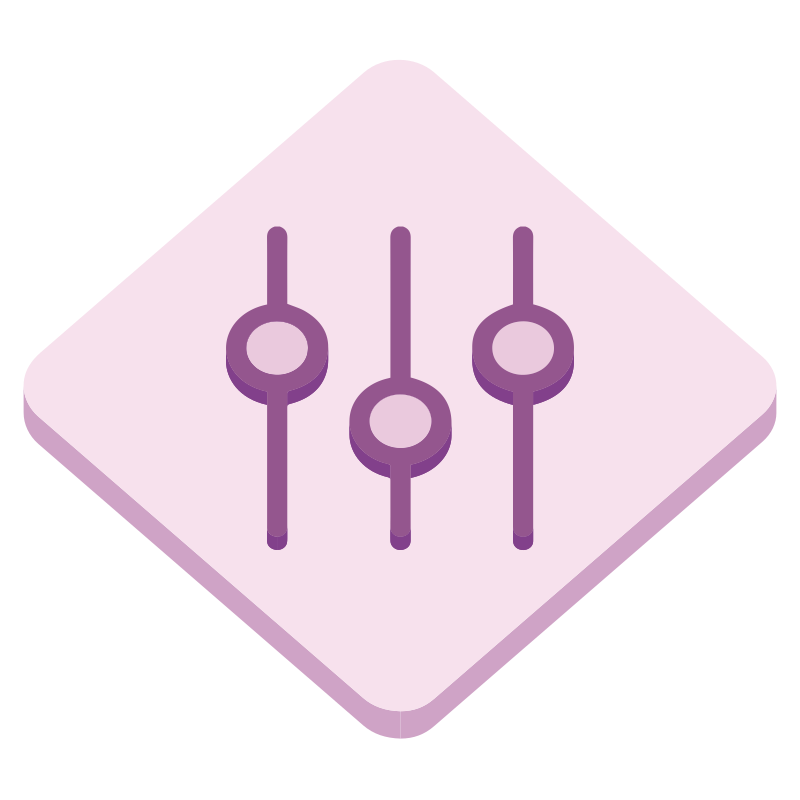</a> | **📂 檔名:** `adjust.svg` ✨ **格式:** `Vector (SVG)` ⚖️ **大小:** `18.40KB` 📅 **更新:** `2026-03-02`  🚀 **jsDelivr Markdown:** `` 🔗 **直接連結 (Url):** <code>https://cdn.jsdelivr.net/gh/barry028/materials@main/images/iCons/Isometric%203D%20Interface%20iCons/adjust.svg</code> 📥 [檢視原始檔](adjust.svg) |
| <a href="application.svg">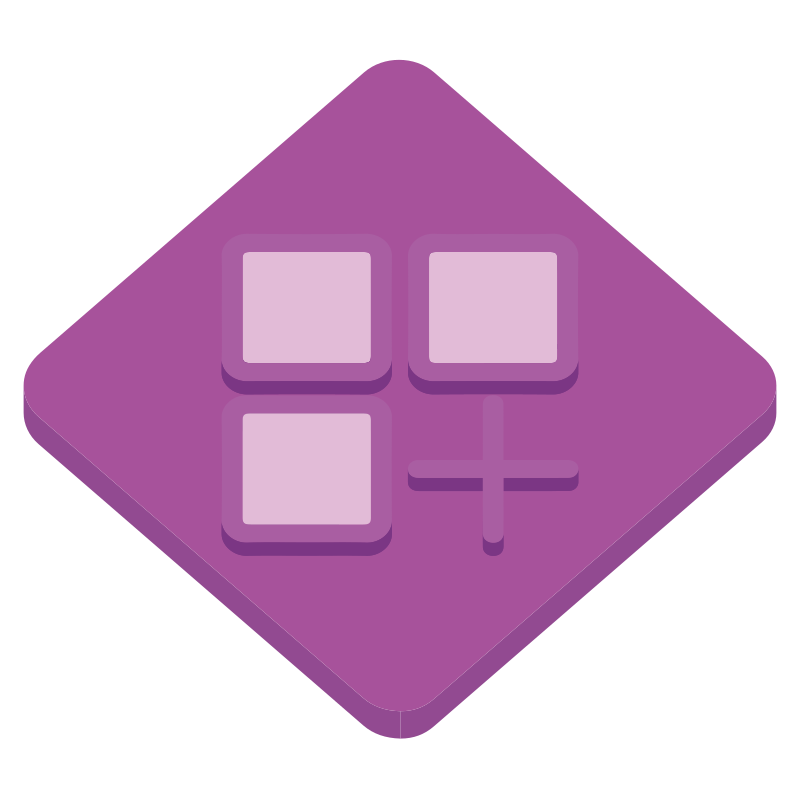</a> | **📂 檔名:** `application.svg` ✨ **格式:** `Vector (SVG)` ⚖️ **大小:** `19.50KB` 📅 **更新:** `2026-03-02`  🚀 **jsDelivr Markdown:** `` 🔗 **直接連結 (Url):** <code>https://cdn.jsdelivr.net/gh/barry028/materials@main/images/iCons/Isometric%203D%20Interface%20iCons/application.svg</code> 📥 [檢視原始檔](application.svg) |
| <a href="bluetooth.svg">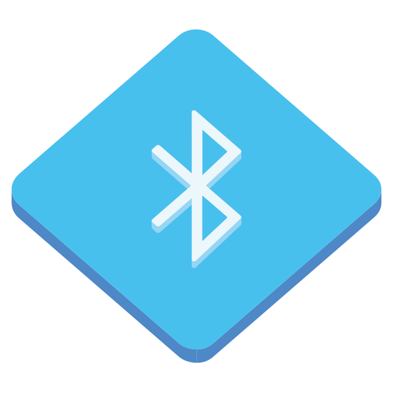</a> | **📂 檔名:** `bluetooth.svg` ✨ **格式:** `Vector (SVG)` ⚖️ **大小:** `6.63KB` 📅 **更新:** `2026-03-02`  🚀 **jsDelivr Markdown:** `` 🔗 **直接連結 (Url):** <code>https://cdn.jsdelivr.net/gh/barry028/materials@main/images/iCons/Isometric%203D%20Interface%20iCons/bluetooth.svg</code> 📥 [檢視原始檔](bluetooth.svg) |
|  | **📂 檔名:** `bookmark.svg` ✨ **格式:** `Vector (SVG)` ⚖️ **大小:** `8.89KB` 📅 **更新:** `2026-03-02`  🚀 **jsDelivr Markdown:** `` 🔗 **直接連結 (Url):** <code>https://cdn.jsdelivr.net/gh/barry028/materials@main/images/iCons/Isometric%203D%20Interface%20iCons/bookmark.svg</code> 📥 [檢視原始檔](bookmark.svg) |
| <a href="browse.svg">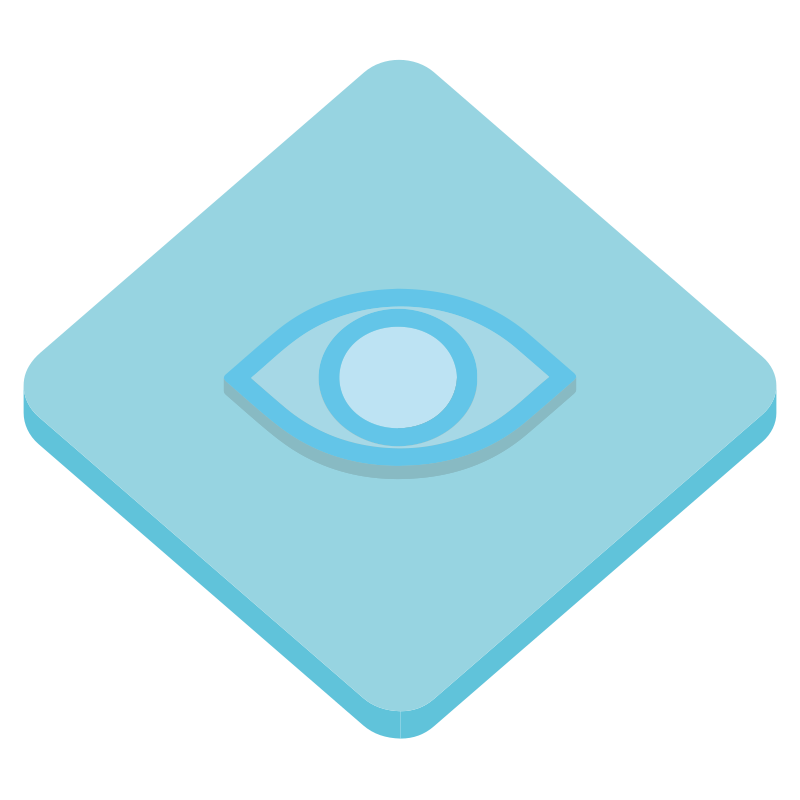</a> | **📂 檔名:** `browse.svg` ✨ **格式:** `Vector (SVG)` ⚖️ **大小:** `10.12KB` 📅 **更新:** `2026-03-02`  🚀 **jsDelivr Markdown:** `` 🔗 **直接連結 (Url):** <code>https://cdn.jsdelivr.net/gh/barry028/materials@main/images/iCons/Isometric%203D%20Interface%20iCons/browse.svg</code> 📥 [檢視原始檔](browse.svg) |
| <a href="calculator.svg">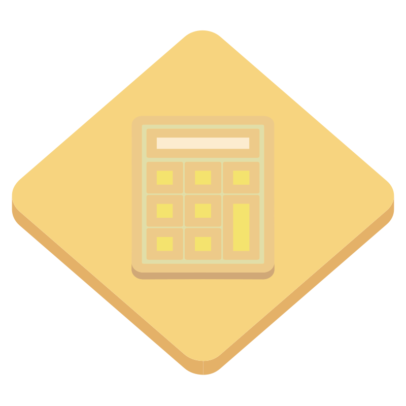</a> | **📂 檔名:** `calculator.svg` ✨ **格式:** `Vector (SVG)` ⚖️ **大小:** `12.19KB` 📅 **更新:** `2026-03-02`  🚀 **jsDelivr Markdown:** `` 🔗 **直接連結 (Url):** <code>https://cdn.jsdelivr.net/gh/barry028/materials@main/images/iCons/Isometric%203D%20Interface%20iCons/calculator.svg</code> 📥 [檢視原始檔](calculator.svg) |
| <a href="cd.svg">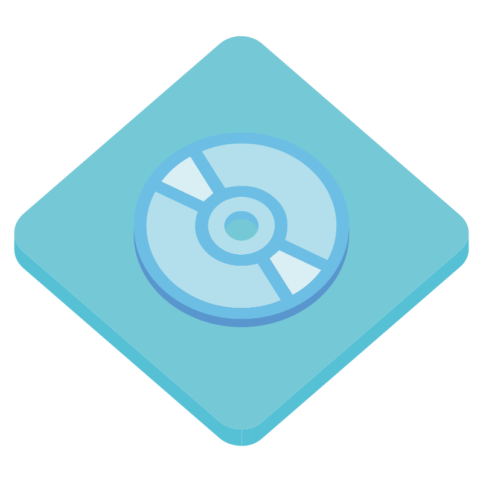</a> | **📂 檔名:** `cd.svg` ✨ **格式:** `Vector (SVG)` ⚖️ **大小:** `15.94KB` 📅 **更新:** `2026-03-02`  🚀 **jsDelivr Markdown:** `` 🔗 **直接連結 (Url):** <code>https://cdn.jsdelivr.net/gh/barry028/materials@main/images/iCons/Isometric%203D%20Interface%20iCons/cd.svg</code> 📥 [檢視原始檔](cd.svg) |
| <a href="cloud.svg">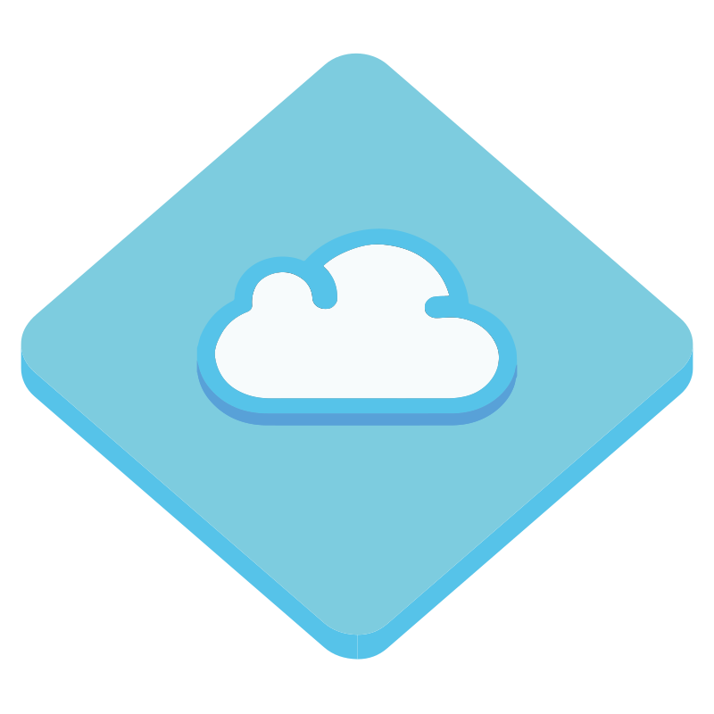</a> | **📂 檔名:** `cloud.svg` ✨ **格式:** `Vector (SVG)` ⚖️ **大小:** `16.03KB` 📅 **更新:** `2026-03-02`  🚀 **jsDelivr Markdown:** `` 🔗 **直接連結 (Url):** <code>https://cdn.jsdelivr.net/gh/barry028/materials@main/images/iCons/Isometric%203D%20Interface%20iCons/cloud.svg</code> 📥 [檢視原始檔](cloud.svg) |
|  | **📂 檔名:** `collect.svg` ✨ **格式:** `Vector (SVG)` ⚖️ **大小:** `13.00KB` 📅 **更新:** `2026-03-02`  🚀 **jsDelivr Markdown:** `` 🔗 **直接連結 (Url):** <code>https://cdn.jsdelivr.net/gh/barry028/materials@main/images/iCons/Isometric%203D%20Interface%20iCons/collect.svg</code> 📥 [檢視原始檔](collect.svg) |
|  | **📂 檔名:** `delete.svg` ✨ **格式:** `Vector (SVG)` ⚖️ **大小:** `18.78KB` 📅 **更新:** `2026-03-02`  🚀 **jsDelivr Markdown:** `` 🔗 **直接連結 (Url):** <code>https://cdn.jsdelivr.net/gh/barry028/materials@main/images/iCons/Isometric%203D%20Interface%20iCons/delete.svg</code> 📥 [檢視原始檔](delete.svg) |
|  | **📂 檔名:** `dial.svg` ✨ **格式:** `Vector (SVG)` ⚖️ **大小:** `14.71KB` 📅 **更新:** `2026-03-02`  🚀 **jsDelivr Markdown:** `` 🔗 **直接連結 (Url):** <code>https://cdn.jsdelivr.net/gh/barry028/materials@main/images/iCons/Isometric%203D%20Interface%20iCons/dial.svg</code> 📥 [檢視原始檔](dial.svg) |
|  | **📂 檔名:** `document.svg` ✨ **格式:** `Vector (SVG)` ⚖️ **大小:** `12.78KB` 📅 **更新:** `2026-03-02`  🚀 **jsDelivr Markdown:** `` 🔗 **直接連結 (Url):** <code>https://cdn.jsdelivr.net/gh/barry028/materials@main/images/iCons/Isometric%203D%20Interface%20iCons/document.svg</code> 📥 [檢視原始檔](document.svg) |
|  | **📂 檔名:** `earphone.svg` ✨ **格式:** `Vector (SVG)` ⚖️ **大小:** `10.18KB` 📅 **更新:** `2026-03-02`  🚀 **jsDelivr Markdown:** `` 🔗 **直接連結 (Url):** <code>https://cdn.jsdelivr.net/gh/barry028/materials@main/images/iCons/Isometric%203D%20Interface%20iCons/earphone.svg</code> 📥 [檢視原始檔](earphone.svg) |
| <a href="female.svg">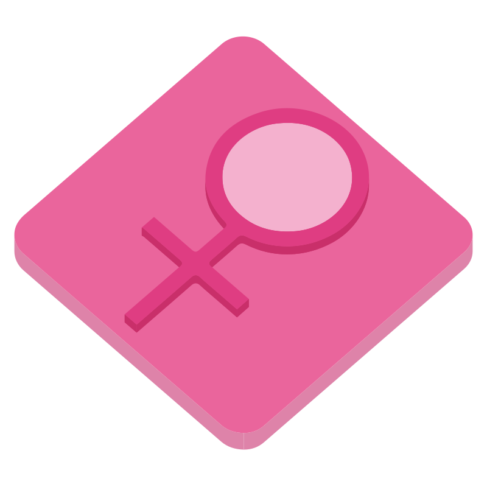</a> | **📂 檔名:** `female.svg` ✨ **格式:** `Vector (SVG)` ⚖️ **大小:** `12.86KB` 📅 **更新:** `2026-03-02`  🚀 **jsDelivr Markdown:** `` 🔗 **直接連結 (Url):** <code>https://cdn.jsdelivr.net/gh/barry028/materials@main/images/iCons/Isometric%203D%20Interface%20iCons/female.svg</code> 📥 [檢視原始檔](female.svg) |
|  | **📂 檔名:** `folder.svg` ✨ **格式:** `Vector (SVG)` ⚖️ **大小:** `12.21KB` 📅 **更新:** `2026-03-02`  🚀 **jsDelivr Markdown:** `` 🔗 **直接連結 (Url):** <code>https://cdn.jsdelivr.net/gh/barry028/materials@main/images/iCons/Isometric%203D%20Interface%20iCons/folder.svg</code> 📥 [檢視原始檔](folder.svg) |
|  | **📂 檔名:** `forward.svg` ✨ **格式:** `Vector (SVG)` ⚖️ **大小:** `13.32KB` 📅 **更新:** `2026-03-02`  🚀 **jsDelivr Markdown:** `` 🔗 **直接連結 (Url):** <code>https://cdn.jsdelivr.net/gh/barry028/materials@main/images/iCons/Isometric%203D%20Interface%20iCons/forward.svg</code> 📥 [檢視原始檔](forward.svg) |
| <a href="front-page.svg">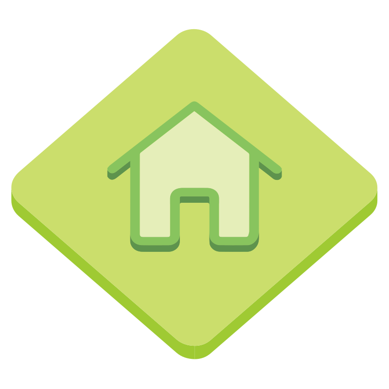</a> | **📂 檔名:** `front-page.svg` ✨ **格式:** `Vector (SVG)` ⚖️ **大小:** `15.67KB` 📅 **更新:** `2026-03-02`  🚀 **jsDelivr Markdown:** `` 🔗 **直接連結 (Url):** <code>https://cdn.jsdelivr.net/gh/barry028/materials@main/images/iCons/Isometric%203D%20Interface%20iCons/front-page.svg</code> 📥 [檢視原始檔](front-page.svg) |
|  | **📂 檔名:** `gift.svg` ✨ **格式:** `Vector (SVG)` ⚖️ **大小:** `9.55KB` 📅 **更新:** `2026-03-02`  🚀 **jsDelivr Markdown:** `` 🔗 **直接連結 (Url):** <code>https://cdn.jsdelivr.net/gh/barry028/materials@main/images/iCons/Isometric%203D%20Interface%20iCons/gift.svg</code> 📥 [檢視原始檔](gift.svg) |
|  | **📂 檔名:** `hint.svg` ✨ **格式:** `Vector (SVG)` ⚖️ **大小:** `17.35KB` 📅 **更新:** `2026-03-02`  🚀 **jsDelivr Markdown:** `` 🔗 **直接連結 (Url):** <code>https://cdn.jsdelivr.net/gh/barry028/materials@main/images/iCons/Isometric%203D%20Interface%20iCons/hint.svg</code> 📥 [檢視原始檔](hint.svg) |
|  | **📂 檔名:** `information (1).svg` ✨ **格式:** `Vector (SVG)` ⚖️ **大小:** `16.74KB` 📅 **更新:** `2026-03-02`  🚀 **jsDelivr Markdown:** `` 🔗 **直接連結 (Url):** <code>https://cdn.jsdelivr.net/gh/barry028/materials@main/images/iCons/Isometric%203D%20Interface%20iCons/information%20%281%29.svg</code> 📥 [檢視原始檔](information%20%281%29.svg) |
|  | **📂 檔名:** `information.svg` ✨ **格式:** `Vector (SVG)` ⚖️ **大小:** `15.09KB` 📅 **更新:** `2026-03-02`  🚀 **jsDelivr Markdown:** `` 🔗 **直接連結 (Url):** <code>https://cdn.jsdelivr.net/gh/barry028/materials@main/images/iCons/Isometric%203D%20Interface%20iCons/information.svg</code> 📥 [檢視原始檔](information.svg) |
|  | **📂 檔名:** `key.svg` ✨ **格式:** `Vector (SVG)` ⚖️ **大小:** `18.46KB` 📅 **更新:** `2026-03-02`  🚀 **jsDelivr Markdown:** `` 🔗 **直接連結 (Url):** <code>https://cdn.jsdelivr.net/gh/barry028/materials@main/images/iCons/Isometric%203D%20Interface%20iCons/key.svg</code> 📥 [檢視原始檔](key.svg) |
| <a href="like.svg">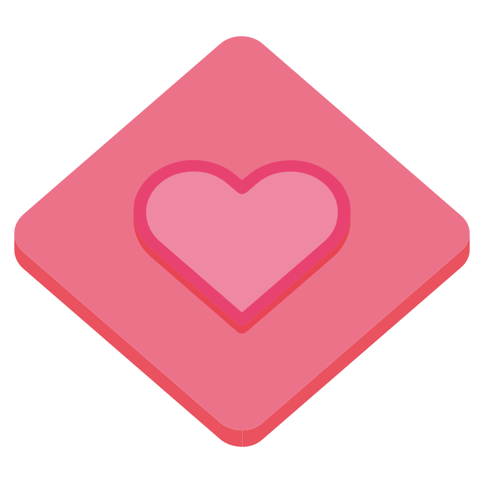</a> | **📂 檔名:** `like.svg` ✨ **格式:** `Vector (SVG)` ⚖️ **大小:** `7.17KB` 📅 **更新:** `2026-03-02`  🚀 **jsDelivr Markdown:** `` 🔗 **直接連結 (Url):** <code>https://cdn.jsdelivr.net/gh/barry028/materials@main/images/iCons/Isometric%203D%20Interface%20iCons/like.svg</code> 📥 [檢視原始檔](like.svg) |
| <a href="link.svg">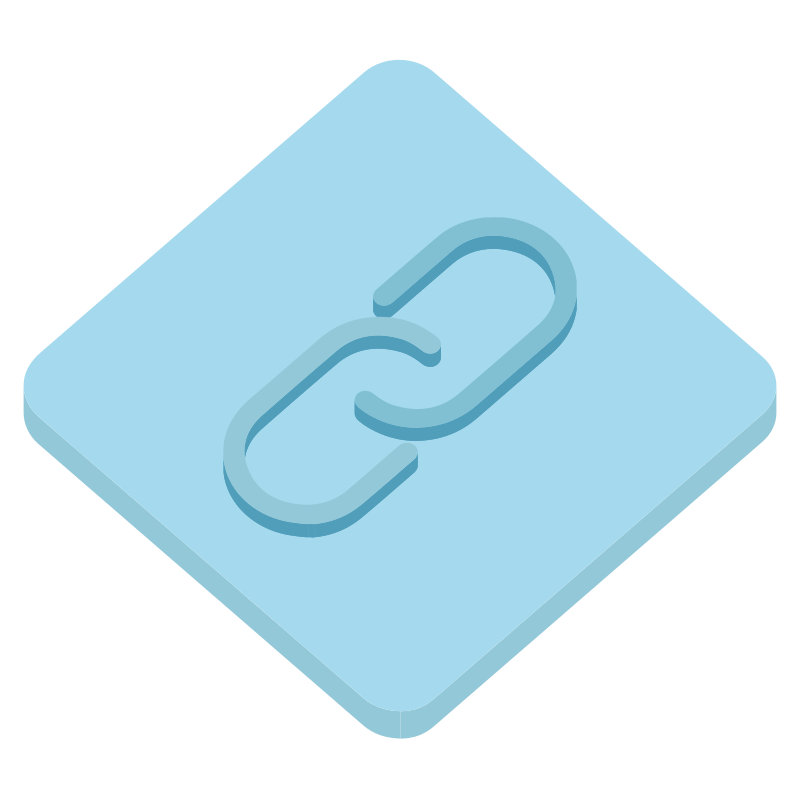</a> | **📂 檔名:** `link.svg` ✨ **格式:** `Vector (SVG)` ⚖️ **大小:** `12.76KB` 📅 **更新:** `2026-03-02`  🚀 **jsDelivr Markdown:** `` 🔗 **直接連結 (Url):** <code>https://cdn.jsdelivr.net/gh/barry028/materials@main/images/iCons/Isometric%203D%20Interface%20iCons/link.svg</code> 📥 [檢視原始檔](link.svg) |
|  | **📂 檔名:** `location.svg` ✨ **格式:** `Vector (SVG)` ⚖️ **大小:** `17.14KB` 📅 **更新:** `2026-03-02`  🚀 **jsDelivr Markdown:** `` 🔗 **直接連結 (Url):** <code>https://cdn.jsdelivr.net/gh/barry028/materials@main/images/iCons/Isometric%203D%20Interface%20iCons/location.svg</code> 📥 [檢視原始檔](location.svg) |
|  | **📂 檔名:** `lock.svg` ✨ **格式:** `Vector (SVG)` ⚖️ **大小:** `16.99KB` 📅 **更新:** `2026-03-02`  🚀 **jsDelivr Markdown:** `` 🔗 **直接連結 (Url):** <code>https://cdn.jsdelivr.net/gh/barry028/materials@main/images/iCons/Isometric%203D%20Interface%20iCons/lock.svg</code> 📥 [檢視原始檔](lock.svg) |
| <a href="male.svg">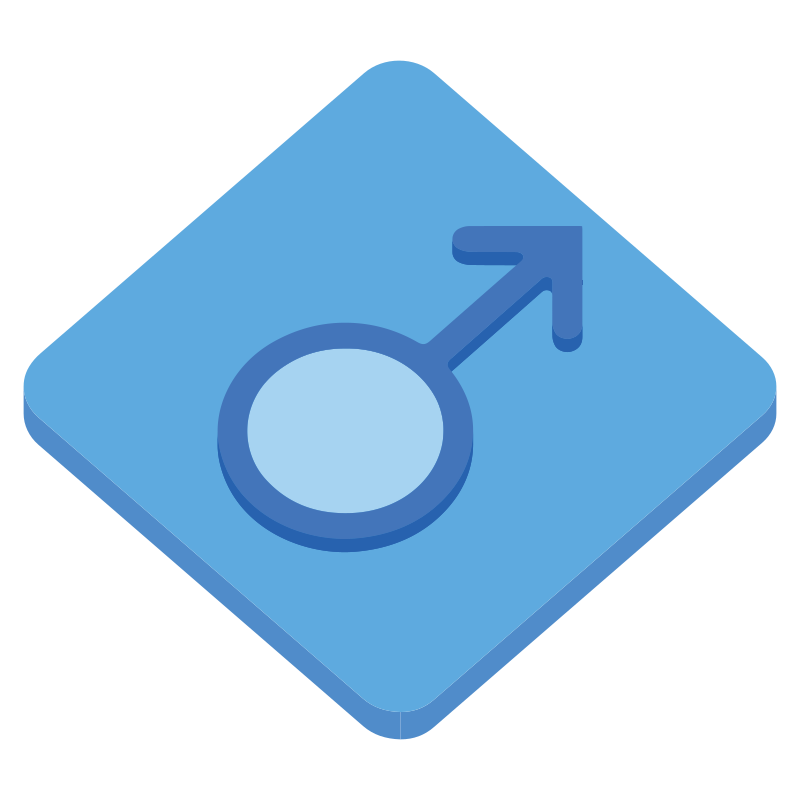</a> | **📂 檔名:** `male.svg` ✨ **格式:** `Vector (SVG)` ⚖️ **大小:** `13.17KB` 📅 **更新:** `2026-03-02`  🚀 **jsDelivr Markdown:** `` 🔗 **直接連結 (Url):** <code>https://cdn.jsdelivr.net/gh/barry028/materials@main/images/iCons/Isometric%203D%20Interface%20iCons/male.svg</code> 📥 [檢視原始檔](male.svg) |
|  | **📂 檔名:** `menu.svg` ✨ **格式:** `Vector (SVG)` ⚖️ **大小:** `11.43KB` 📅 **更新:** `2026-03-02`  🚀 **jsDelivr Markdown:** `` 🔗 **直接連結 (Url):** <code>https://cdn.jsdelivr.net/gh/barry028/materials@main/images/iCons/Isometric%203D%20Interface%20iCons/menu.svg</code> 📥 [檢視原始檔](menu.svg) |
|  | **📂 檔名:** `mike.svg` ✨ **格式:** `Vector (SVG)` ⚖️ **大小:** `15.88KB` 📅 **更新:** `2026-03-02`  🚀 **jsDelivr Markdown:** `` 🔗 **直接連結 (Url):** <code>https://cdn.jsdelivr.net/gh/barry028/materials@main/images/iCons/Isometric%203D%20Interface%20iCons/mike.svg</code> 📥 [檢視原始檔](mike.svg) |
|  | **📂 檔名:** `music.svg` ✨ **格式:** `Vector (SVG)` ⚖️ **大小:** `16.38KB` 📅 **更新:** `2026-03-02`  🚀 **jsDelivr Markdown:** `` 🔗 **直接連結 (Url):** <code>https://cdn.jsdelivr.net/gh/barry028/materials@main/images/iCons/Isometric%203D%20Interface%20iCons/music.svg</code> 📥 [檢視原始檔](music.svg) |
|  | **📂 檔名:** `pen.svg` ✨ **格式:** `Vector (SVG)` ⚖️ **大小:** `12.58KB` 📅 **更新:** `2026-03-02`  🚀 **jsDelivr Markdown:** `` 🔗 **直接連結 (Url):** <code>https://cdn.jsdelivr.net/gh/barry028/materials@main/images/iCons/Isometric%203D%20Interface%20iCons/pen.svg</code> 📥 [檢視原始檔](pen.svg) |
|  | **📂 檔名:** `personal.svg` ✨ **格式:** `Vector (SVG)` ⚖️ **大小:** `16.98KB` 📅 **更新:** `2026-03-02`  🚀 **jsDelivr Markdown:** `` 🔗 **直接連結 (Url):** <code>https://cdn.jsdelivr.net/gh/barry028/materials@main/images/iCons/Isometric%203D%20Interface%20iCons/personal.svg</code> 📥 [檢視原始檔](personal.svg) |
|  | **📂 檔名:** `picture.svg` ✨ **格式:** `Vector (SVG)` ⚖️ **大小:** `10.68KB` 📅 **更新:** `2026-03-02`  🚀 **jsDelivr Markdown:** `` 🔗 **直接連結 (Url):** <code>https://cdn.jsdelivr.net/gh/barry028/materials@main/images/iCons/Isometric%203D%20Interface%20iCons/picture.svg</code> 📥 [檢視原始檔](picture.svg) |
| <a href="play.svg">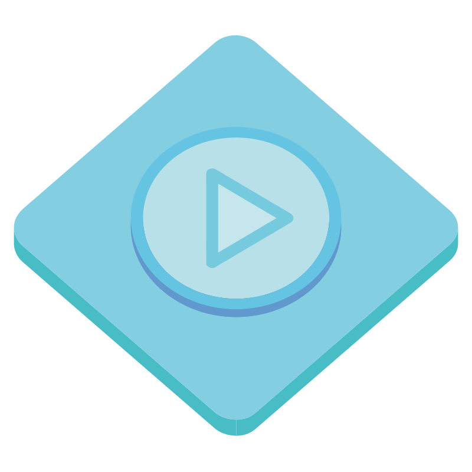</a> | **📂 檔名:** `play.svg` ✨ **格式:** `Vector (SVG)` ⚖️ **大小:** `6.87KB` 📅 **更新:** `2026-03-02`  🚀 **jsDelivr Markdown:** `` 🔗 **直接連結 (Url):** <code>https://cdn.jsdelivr.net/gh/barry028/materials@main/images/iCons/Isometric%203D%20Interface%20iCons/play.svg</code> 📥 [檢視原始檔](play.svg) |
| <a href="report.svg">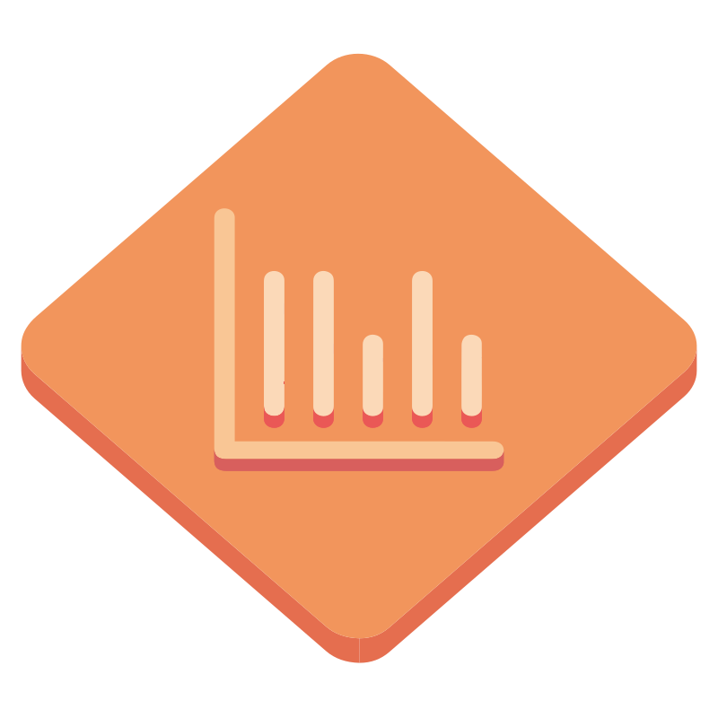</a> | **📂 檔名:** `report.svg` ✨ **格式:** `Vector (SVG)` ⚖️ **大小:** `14.52KB` 📅 **更新:** `2026-03-02`  🚀 **jsDelivr Markdown:** `` 🔗 **直接連結 (Url):** <code>https://cdn.jsdelivr.net/gh/barry028/materials@main/images/iCons/Isometric%203D%20Interface%20iCons/report.svg</code> 📥 [檢視原始檔](report.svg) |
|  | **📂 檔名:** `search.svg` ✨ **格式:** `Vector (SVG)` ⚖️ **大小:** `9.61KB` 📅 **更新:** `2026-03-02`  🚀 **jsDelivr Markdown:** `` 🔗 **直接連結 (Url):** <code>https://cdn.jsdelivr.net/gh/barry028/materials@main/images/iCons/Isometric%203D%20Interface%20iCons/search.svg</code> 📥 [檢視原始檔](search.svg) |
| <a href="set-up.svg">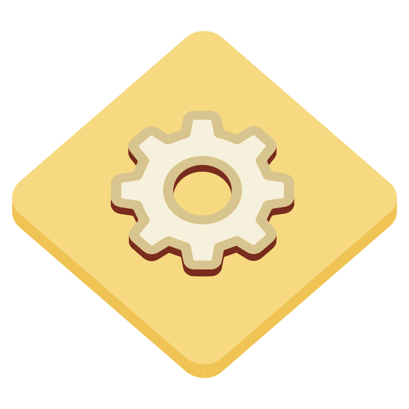</a> | **📂 檔名:** `set-up.svg` ✨ **格式:** `Vector (SVG)` ⚖️ **大小:** `21.96KB` 📅 **更新:** `2026-03-02`  🚀 **jsDelivr Markdown:** `` 🔗 **直接連結 (Url):** <code>https://cdn.jsdelivr.net/gh/barry028/materials@main/images/iCons/Isometric%203D%20Interface%20iCons/set-up.svg</code> 📥 [檢視原始檔](set-up.svg) |
| <a href="share.svg">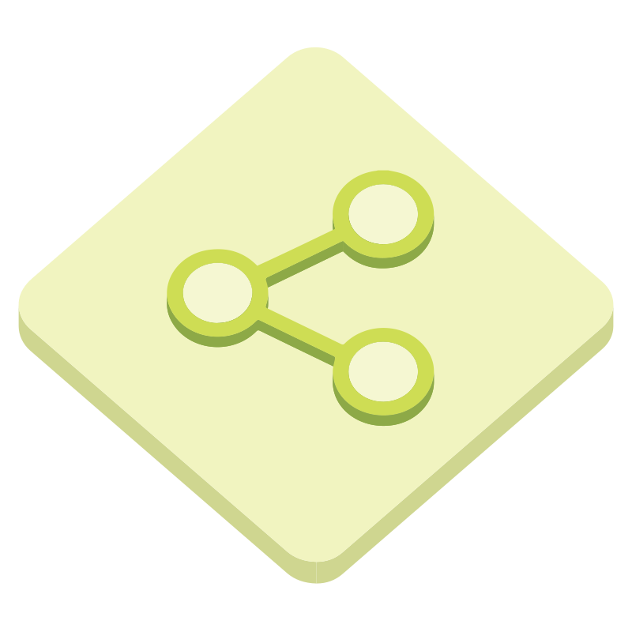</a> | **📂 檔名:** `share.svg` ✨ **格式:** `Vector (SVG)` ⚖️ **大小:** `17.98KB` 📅 **更新:** `2026-03-02`  🚀 **jsDelivr Markdown:** `` 🔗 **直接連結 (Url):** <code>https://cdn.jsdelivr.net/gh/barry028/materials@main/images/iCons/Isometric%203D%20Interface%20iCons/share.svg</code> 📥 [檢視原始檔](share.svg) |
| <a href="shopping.svg">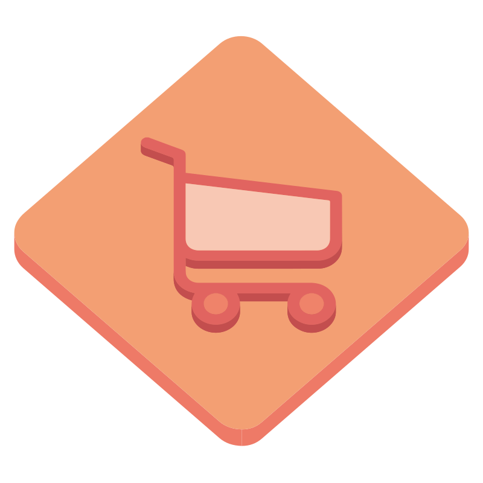</a> | **📂 檔名:** `shopping.svg` ✨ **格式:** `Vector (SVG)` ⚖️ **大小:** `16.04KB` 📅 **更新:** `2026-03-02`  🚀 **jsDelivr Markdown:** `` 🔗 **直接連結 (Url):** <code>https://cdn.jsdelivr.net/gh/barry028/materials@main/images/iCons/Isometric%203D%20Interface%20iCons/shopping.svg</code> 📥 [檢視原始檔](shopping.svg) |
|  | **📂 檔名:** `sound.svg` ✨ **格式:** `Vector (SVG)` ⚖️ **大小:** `15.45KB` 📅 **更新:** `2026-03-02`  🚀 **jsDelivr Markdown:** `` 🔗 **直接連結 (Url):** <code>https://cdn.jsdelivr.net/gh/barry028/materials@main/images/iCons/Isometric%203D%20Interface%20iCons/sound.svg</code> 📥 [檢視原始檔](sound.svg) |
|  | **📂 檔名:** `subscription.svg` ✨ **格式:** `Vector (SVG)` ⚖️ **大小:** `12.48KB` 📅 **更新:** `2026-03-02`  🚀 **jsDelivr Markdown:** `` 🔗 **直接連結 (Url):** <code>https://cdn.jsdelivr.net/gh/barry028/materials@main/images/iCons/Isometric%203D%20Interface%20iCons/subscription.svg</code> 📥 [檢視原始檔](subscription.svg) |
| <a href="switch.svg">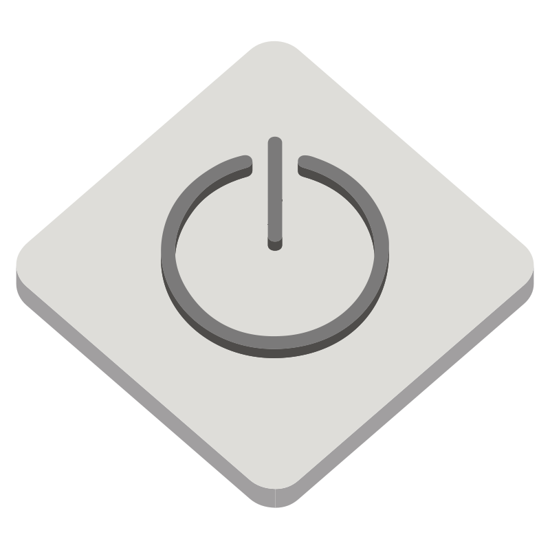</a> | **📂 檔名:** `switch.svg` ✨ **格式:** `Vector (SVG)` ⚖️ **大小:** `7.52KB` 📅 **更新:** `2026-03-02`  🚀 **jsDelivr Markdown:** `` 🔗 **直接連結 (Url):** <code>https://cdn.jsdelivr.net/gh/barry028/materials@main/images/iCons/Isometric%203D%20Interface%20iCons/switch.svg</code> 📥 [檢視原始檔](switch.svg) |
|  | **📂 檔名:** `take-pictures.svg` ✨ **格式:** `Vector (SVG)` ⚖️ **大小:** `10.93KB` 📅 **更新:** `2026-03-02`  🚀 **jsDelivr Markdown:** `` 🔗 **直接連結 (Url):** <code>https://cdn.jsdelivr.net/gh/barry028/materials@main/images/iCons/Isometric%203D%20Interface%20iCons/take-pictures.svg</code> 📥 [檢視原始檔](take-pictures.svg) |
| <a href="the-internet.svg">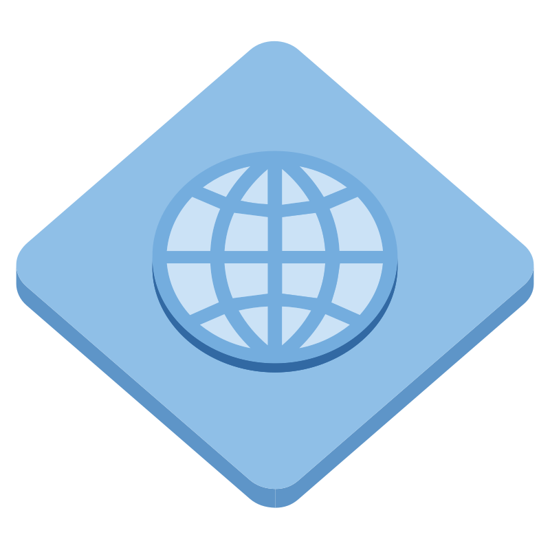</a> | **📂 檔名:** `the-internet.svg` ✨ **格式:** `Vector (SVG)` ⚖️ **大小:** `6.63KB` 📅 **更新:** `2026-03-02`  🚀 **jsDelivr Markdown:** `` 🔗 **直接連結 (Url):** <code>https://cdn.jsdelivr.net/gh/barry028/materials@main/images/iCons/Isometric%203D%20Interface%20iCons/the-internet.svg</code> 📥 [檢視原始檔](the-internet.svg) |
|  | **📂 檔名:** `thumbs-up.svg` ✨ **格式:** `Vector (SVG)` ⚖️ **大小:** `18.58KB` 📅 **更新:** `2026-03-02`  🚀 **jsDelivr Markdown:** `` 🔗 **直接連結 (Url):** <code>https://cdn.jsdelivr.net/gh/barry028/materials@main/images/iCons/Isometric%203D%20Interface%20iCons/thumbs-up.svg</code> 📥 [檢視原始檔](thumbs-up.svg) |
| <a href="time.svg">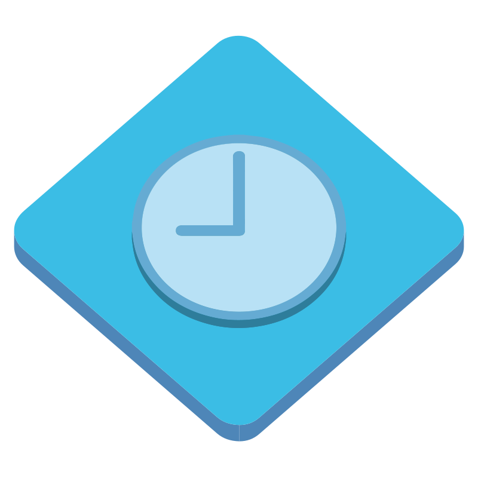</a> | **📂 檔名:** `time.svg` ✨ **格式:** `Vector (SVG)` ⚖️ **大小:** `13.08KB` 📅 **更新:** `2026-03-02`  🚀 **jsDelivr Markdown:** `` 🔗 **直接連結 (Url):** <code>https://cdn.jsdelivr.net/gh/barry028/materials@main/images/iCons/Isometric%203D%20Interface%20iCons/time.svg</code> 📥 [檢視原始檔](time.svg) |
|  | **📂 檔名:** `trophy.svg` ✨ **格式:** `Vector (SVG)` ⚖️ **大小:** `9.61KB` 📅 **更新:** `2026-03-02`  🚀 **jsDelivr Markdown:** `` 🔗 **直接連結 (Url):** <code>https://cdn.jsdelivr.net/gh/barry028/materials@main/images/iCons/Isometric%203D%20Interface%20iCons/trophy.svg</code> 📥 [檢視原始檔](trophy.svg) |
| <a href="value.svg">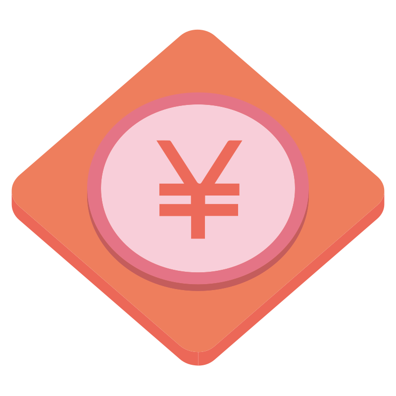</a> | **📂 檔名:** `value.svg` ✨ **格式:** `Vector (SVG)` ⚖️ **大小:** `4.59KB` 📅 **更新:** `2026-03-02`  🚀 **jsDelivr Markdown:** `` 🔗 **直接連結 (Url):** <code>https://cdn.jsdelivr.net/gh/barry028/materials@main/images/iCons/Isometric%203D%20Interface%20iCons/value.svg</code> 📥 [檢視原始檔](value.svg) |
| <a href="video.svg">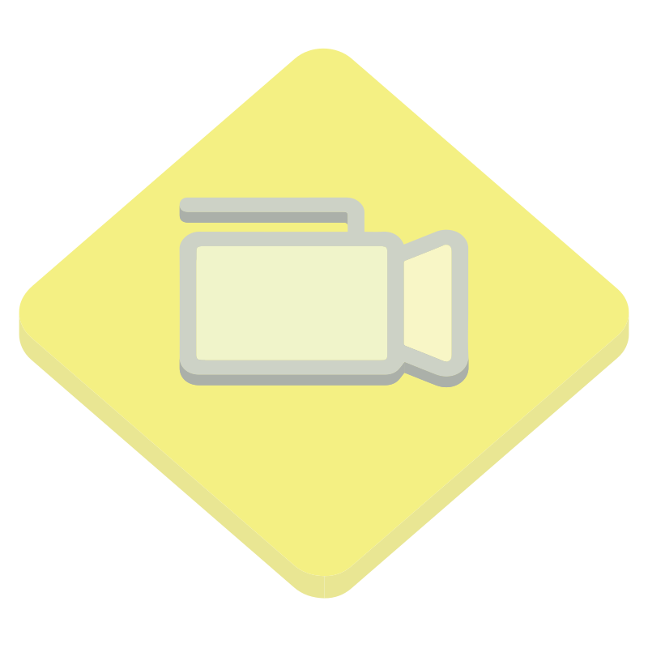</a> | **📂 檔名:** `video.svg` ✨ **格式:** `Vector (SVG)` ⚖️ **大小:** `12.20KB` 📅 **更新:** `2026-03-02`  🚀 **jsDelivr Markdown:** `` 🔗 **直接連結 (Url):** <code>https://cdn.jsdelivr.net/gh/barry028/materials@main/images/iCons/Isometric%203D%20Interface%20iCons/video.svg</code> 📥 [檢視原始檔](video.svg) |
| <a href="wifi.svg">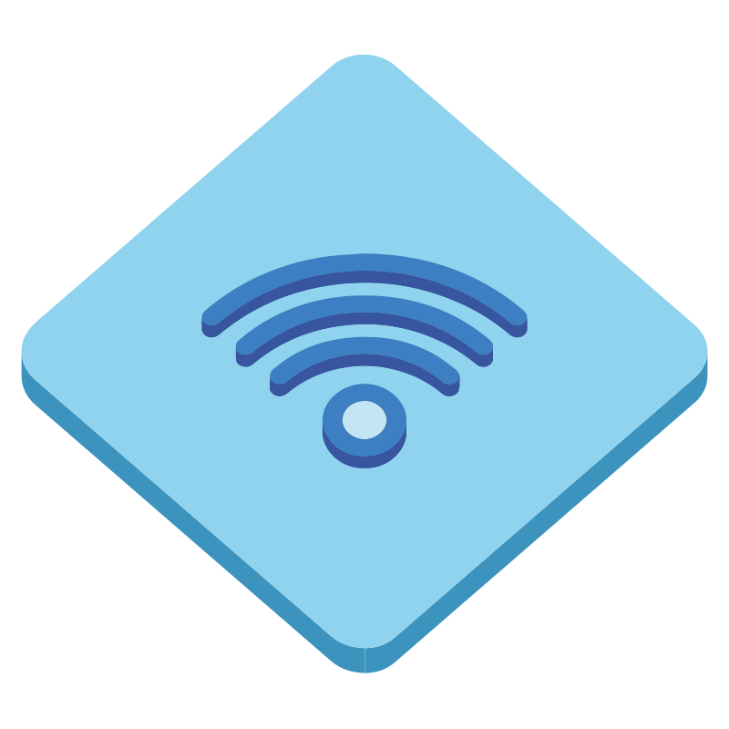</a> | **📂 檔名:** `wifi.svg` ✨ **格式:** `Vector (SVG)` ⚖️ **大小:** `16.96KB` 📅 **更新:** `2026-03-02`  🚀 **jsDelivr Markdown:** `` 🔗 **直接連結 (Url):** <code>https://cdn.jsdelivr.net/gh/barry028/materials@main/images/iCons/Isometric%203D%20Interface%20iCons/wifi.svg</code> 📥 [檢視原始檔](wifi.svg) |