# 🖼️ 素材分類：Krita Sharp Interface iCons

> [🏠 主目錄](../../../README.md) / [images](../../README.md) / [iCons](../README.md) / **Krita Sharp Interface iCons**

本目錄共有 `191` 個檔案

| 🎨 預覽 (點擊放大)  | 📋 檔案詳細資訊與連結 |
| :--- | :--- |
|  | **📂 檔名:** `activate-next-layer.svg` ✨ **格式:** `Vector (SVG)` ⚖️ **大小:** `2.84KB` 📅 **更新:** `2026-02-28`  🚀 **jsDelivr Markdown:** `` 🔗 **直接連結 (Url):** <code>https://cdn.jsdelivr.net/gh/barry028/materials@main/images/iCons/Krita%20Sharp%20Interface%20iCons/activate-next-layer.svg</code> 📥 [檢視原始檔](activate-next-layer.svg) |
|  | **📂 檔名:** `activate-previous-layer.svg` ✨ **格式:** `Vector (SVG)` ⚖️ **大小:** `2.84KB` 📅 **更新:** `2026-02-28`  🚀 **jsDelivr Markdown:** `` 🔗 **直接連結 (Url):** <code>https://cdn.jsdelivr.net/gh/barry028/materials@main/images/iCons/Krita%20Sharp%20Interface%20iCons/activate-previous-layer.svg</code> 📥 [檢視原始檔](activate-previous-layer.svg) |
|  | **📂 檔名:** `addblankframe-16.svg` ✨ **格式:** `Vector (SVG)` ⚖️ **大小:** `1.79KB` 📅 **更新:** `2026-02-28`  🚀 **jsDelivr Markdown:** `` 🔗 **直接連結 (Url):** <code>https://cdn.jsdelivr.net/gh/barry028/materials@main/images/iCons/Krita%20Sharp%20Interface%20iCons/addblankframe-16.svg</code> 📥 [檢視原始檔](addblankframe-16.svg) |
|  | **📂 檔名:** `addblankframe.svg` ✨ **格式:** `Vector (SVG)` ⚖️ **大小:** `1.81KB` 📅 **更新:** `2026-02-28`  🚀 **jsDelivr Markdown:** `` 🔗 **直接連結 (Url):** <code>https://cdn.jsdelivr.net/gh/barry028/materials@main/images/iCons/Krita%20Sharp%20Interface%20iCons/addblankframe.svg</code> 📥 [檢視原始檔](addblankframe.svg) |
|  | **📂 檔名:** `addduplicateframe.svg` ✨ **格式:** `Vector (SVG)` ⚖️ **大小:** `2.05KB` 📅 **更新:** `2026-02-28`  🚀 **jsDelivr Markdown:** `` 🔗 **直接連結 (Url):** <code>https://cdn.jsdelivr.net/gh/barry028/materials@main/images/iCons/Krita%20Sharp%20Interface%20iCons/addduplicateframe.svg</code> 📥 [檢視原始檔](addduplicateframe.svg) |
| <a href="all-layers.svg">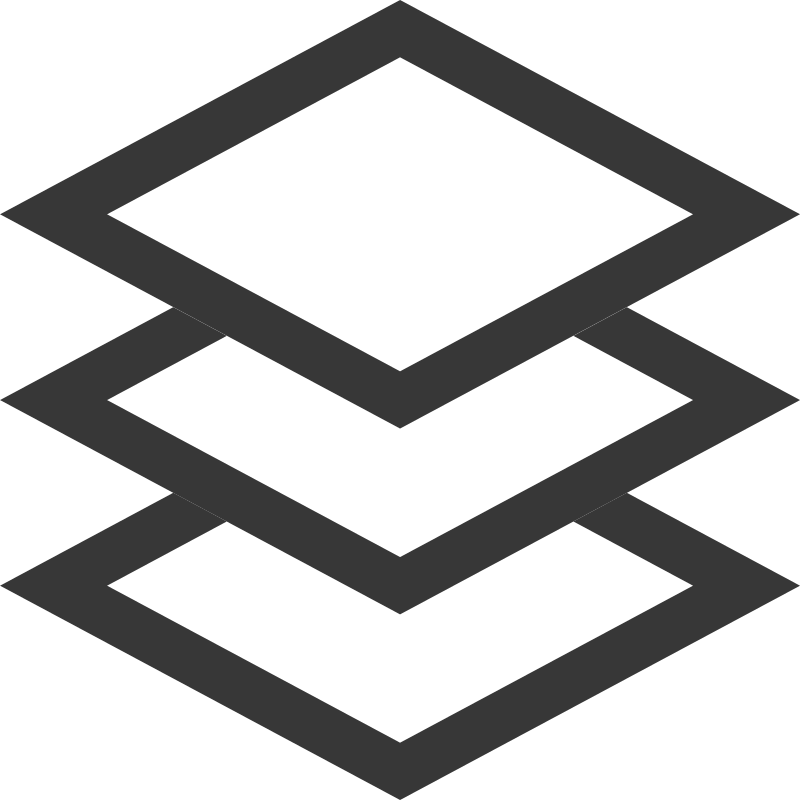</a> | **📂 檔名:** `all-layers.svg` ✨ **格式:** `Vector (SVG)` ⚖️ **大小:** `889.00B` 📅 **更新:** `2026-02-28`  🚀 **jsDelivr Markdown:** `` 🔗 **直接連結 (Url):** <code>https://cdn.jsdelivr.net/gh/barry028/materials@main/images/iCons/Krita%20Sharp%20Interface%20iCons/all-layers.svg</code> 📥 [檢視原始檔](all-layers.svg) |
| <a href="alpha-into-mask.svg">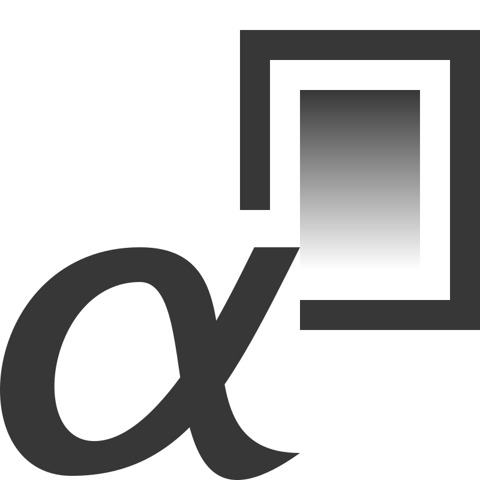</a> | **📂 檔名:** `alpha-into-mask.svg` ✨ **格式:** `Vector (SVG)` ⚖️ **大小:** `3.46KB` 📅 **更新:** `2026-02-28`  🚀 **jsDelivr Markdown:** `` 🔗 **直接連結 (Url):** <code>https://cdn.jsdelivr.net/gh/barry028/materials@main/images/iCons/Krita%20Sharp%20Interface%20iCons/alpha-into-mask.svg</code> 📥 [檢視原始檔](alpha-into-mask.svg) |
|  | **📂 檔名:** `animation-pause.svg` ✨ **格式:** `Vector (SVG)` ⚖️ **大小:** `2.73KB` 📅 **更新:** `2026-02-28`  🚀 **jsDelivr Markdown:** `` 🔗 **直接連結 (Url):** <code>https://cdn.jsdelivr.net/gh/barry028/materials@main/images/iCons/Krita%20Sharp%20Interface%20iCons/animation-pause.svg</code> 📥 [檢視原始檔](animation-pause.svg) |
|  | **📂 檔名:** `animation-play.svg` ✨ **格式:** `Vector (SVG)` ⚖️ **大小:** `1.45KB` 📅 **更新:** `2026-02-28`  🚀 **jsDelivr Markdown:** `` 🔗 **直接連結 (Url):** <code>https://cdn.jsdelivr.net/gh/barry028/materials@main/images/iCons/Krita%20Sharp%20Interface%20iCons/animation-play.svg</code> 📥 [檢視原始檔](animation-play.svg) |
|  | **📂 檔名:** `animation-stop.svg` ✨ **格式:** `Vector (SVG)` ⚖️ **大小:** `2.72KB` 📅 **更新:** `2026-02-28`  🚀 **jsDelivr Markdown:** `` 🔗 **直接連結 (Url):** <code>https://cdn.jsdelivr.net/gh/barry028/materials@main/images/iCons/Krita%20Sharp%20Interface%20iCons/animation-stop.svg</code> 📥 [檢視原始檔](animation-stop.svg) |
|  | **📂 檔名:** `arrow-down.svg` ✨ **格式:** `Vector (SVG)` ⚖️ **大小:** `1.58KB` 📅 **更新:** `2026-02-28`  🚀 **jsDelivr Markdown:** `` 🔗 **直接連結 (Url):** <code>https://cdn.jsdelivr.net/gh/barry028/materials@main/images/iCons/Krita%20Sharp%20Interface%20iCons/arrow-down.svg</code> 📥 [檢視原始檔](arrow-down.svg) |
| <a href="arrow-downleft.svg">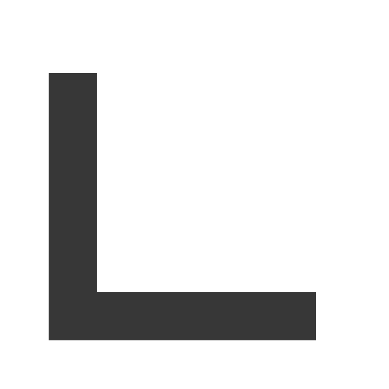</a> | **📂 檔名:** `arrow-downleft.svg` ✨ **格式:** `Vector (SVG)` ⚖️ **大小:** `1.62KB` 📅 **更新:** `2026-02-28`  🚀 **jsDelivr Markdown:** `` 🔗 **直接連結 (Url):** <code>https://cdn.jsdelivr.net/gh/barry028/materials@main/images/iCons/Krita%20Sharp%20Interface%20iCons/arrow-downleft.svg</code> 📥 [檢視原始檔](arrow-downleft.svg) |
| <a href="arrow-downright.svg">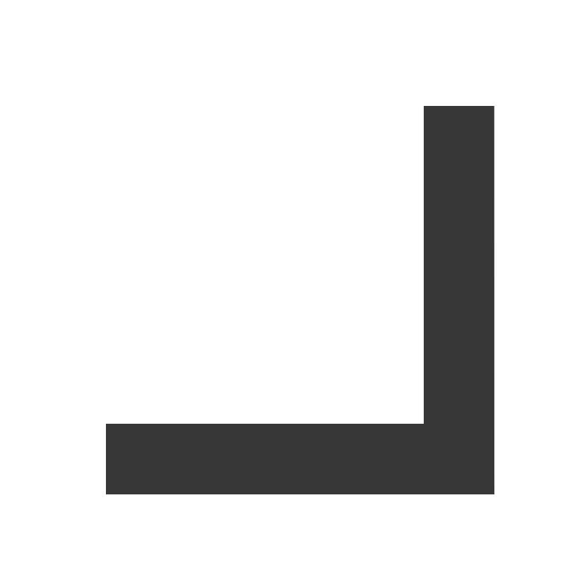</a> | **📂 檔名:** `arrow-downright.svg` ✨ **格式:** `Vector (SVG)` ⚖️ **大小:** `1.63KB` 📅 **更新:** `2026-02-28`  🚀 **jsDelivr Markdown:** `` 🔗 **直接連結 (Url):** <code>https://cdn.jsdelivr.net/gh/barry028/materials@main/images/iCons/Krita%20Sharp%20Interface%20iCons/arrow-downright.svg</code> 📥 [檢視原始檔](arrow-downright.svg) |
| <a href="arrow-left.svg">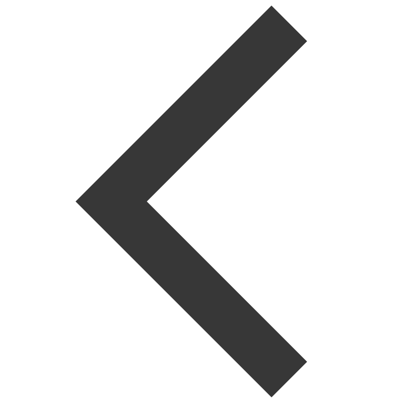</a> | **📂 檔名:** `arrow-left.svg` ✨ **格式:** `Vector (SVG)` ⚖️ **大小:** `1.59KB` 📅 **更新:** `2026-02-28`  🚀 **jsDelivr Markdown:** `` 🔗 **直接連結 (Url):** <code>https://cdn.jsdelivr.net/gh/barry028/materials@main/images/iCons/Krita%20Sharp%20Interface%20iCons/arrow-left.svg</code> 📥 [檢視原始檔](arrow-left.svg) |
|  | **📂 檔名:** `arrow-right.svg` ✨ **格式:** `Vector (SVG)` ⚖️ **大小:** `1.59KB` 📅 **更新:** `2026-02-28`  🚀 **jsDelivr Markdown:** `` 🔗 **直接連結 (Url):** <code>https://cdn.jsdelivr.net/gh/barry028/materials@main/images/iCons/Krita%20Sharp%20Interface%20iCons/arrow-right.svg</code> 📥 [檢視原始檔](arrow-right.svg) |
| <a href="arrow-topleft.svg">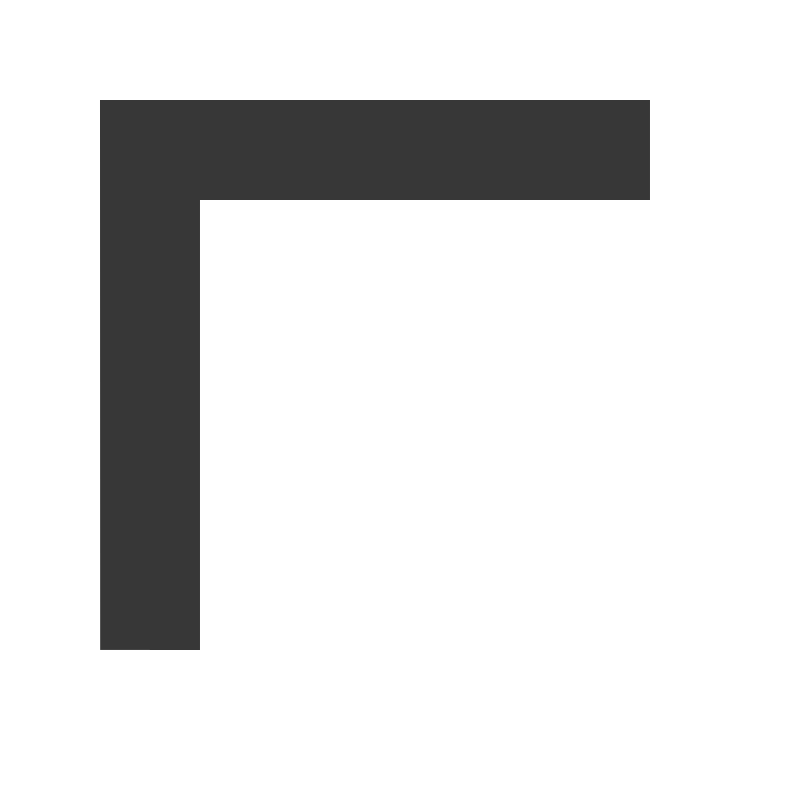</a> | **📂 檔名:** `arrow-topleft.svg` ✨ **格式:** `Vector (SVG)` ⚖️ **大小:** `1.63KB` 📅 **更新:** `2026-02-28`  🚀 **jsDelivr Markdown:** `` 🔗 **直接連結 (Url):** <code>https://cdn.jsdelivr.net/gh/barry028/materials@main/images/iCons/Krita%20Sharp%20Interface%20iCons/arrow-topleft.svg</code> 📥 [檢視原始檔](arrow-topleft.svg) |
| <a href="arrow-topright.svg">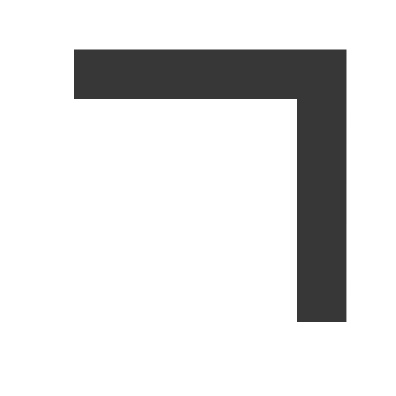</a> | **📂 檔名:** `arrow-topright.svg` ✨ **格式:** `Vector (SVG)` ⚖️ **大小:** `1.63KB` 📅 **更新:** `2026-02-28`  🚀 **jsDelivr Markdown:** `` 🔗 **直接連結 (Url):** <code>https://cdn.jsdelivr.net/gh/barry028/materials@main/images/iCons/Krita%20Sharp%20Interface%20iCons/arrow-topright.svg</code> 📥 [檢視原始檔](arrow-topright.svg) |
| <a href="arrow-up.svg">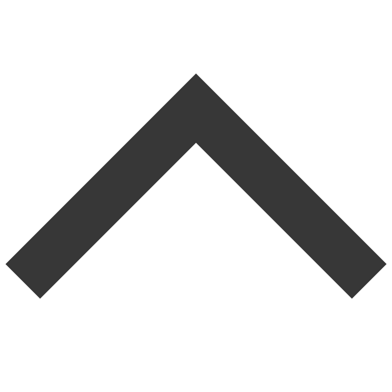</a> | **📂 檔名:** `arrow-up.svg` ✨ **格式:** `Vector (SVG)` ⚖️ **大小:** `1.59KB` 📅 **更新:** `2026-02-28`  🚀 **jsDelivr Markdown:** `` 🔗 **直接連結 (Url):** <code>https://cdn.jsdelivr.net/gh/barry028/materials@main/images/iCons/Krita%20Sharp%20Interface%20iCons/arrow-up.svg</code> 📥 [檢視原始檔](arrow-up.svg) |
|  | **📂 檔名:** `audio-none.svg` ✨ **格式:** `Vector (SVG)` ⚖️ **大小:** `3.44KB` 📅 **更新:** `2026-02-28`  🚀 **jsDelivr Markdown:** `` 🔗 **直接連結 (Url):** <code>https://cdn.jsdelivr.net/gh/barry028/materials@main/images/iCons/Krita%20Sharp%20Interface%20iCons/audio-none.svg</code> 📥 [檢視原始檔](audio-none.svg) |
|  | **📂 檔名:** `audio-volume-high.svg` ✨ **格式:** `Vector (SVG)` ⚖️ **大小:** `3.63KB` 📅 **更新:** `2026-02-28`  🚀 **jsDelivr Markdown:** `` 🔗 **直接連結 (Url):** <code>https://cdn.jsdelivr.net/gh/barry028/materials@main/images/iCons/Krita%20Sharp%20Interface%20iCons/audio-volume-high.svg</code> 📥 [檢視原始檔](audio-volume-high.svg) |
|  | **📂 檔名:** `audio-volume-mute.svg` ✨ **格式:** `Vector (SVG)` ⚖️ **大小:** `3.62KB` 📅 **更新:** `2026-02-28`  🚀 **jsDelivr Markdown:** `` 🔗 **直接連結 (Url):** <code>https://cdn.jsdelivr.net/gh/barry028/materials@main/images/iCons/Krita%20Sharp%20Interface%20iCons/audio-volume-mute.svg</code> 📥 [檢視原始檔](audio-volume-mute.svg) |
|  | **📂 檔名:** `auto-key-off.svg` ✨ **格式:** `Vector (SVG)` ⚖️ **大小:** `3.54KB` 📅 **更新:** `2026-02-28`  🚀 **jsDelivr Markdown:** `` 🔗 **直接連結 (Url):** <code>https://cdn.jsdelivr.net/gh/barry028/materials@main/images/iCons/Krita%20Sharp%20Interface%20iCons/auto-key-off.svg</code> 📥 [檢視原始檔](auto-key-off.svg) |
|  | **📂 檔名:** `auto-key-on.svg` ✨ **格式:** `Vector (SVG)` ⚖️ **大小:** `29.11KB` 📅 **更新:** `2026-02-28`  🚀 **jsDelivr Markdown:** `` 🔗 **直接連結 (Url):** <code>https://cdn.jsdelivr.net/gh/barry028/materials@main/images/iCons/Krita%20Sharp%20Interface%20iCons/auto-key-on.svg</code> 📥 [檢視原始檔](auto-key-on.svg) |
| <a href="autolevels.svg">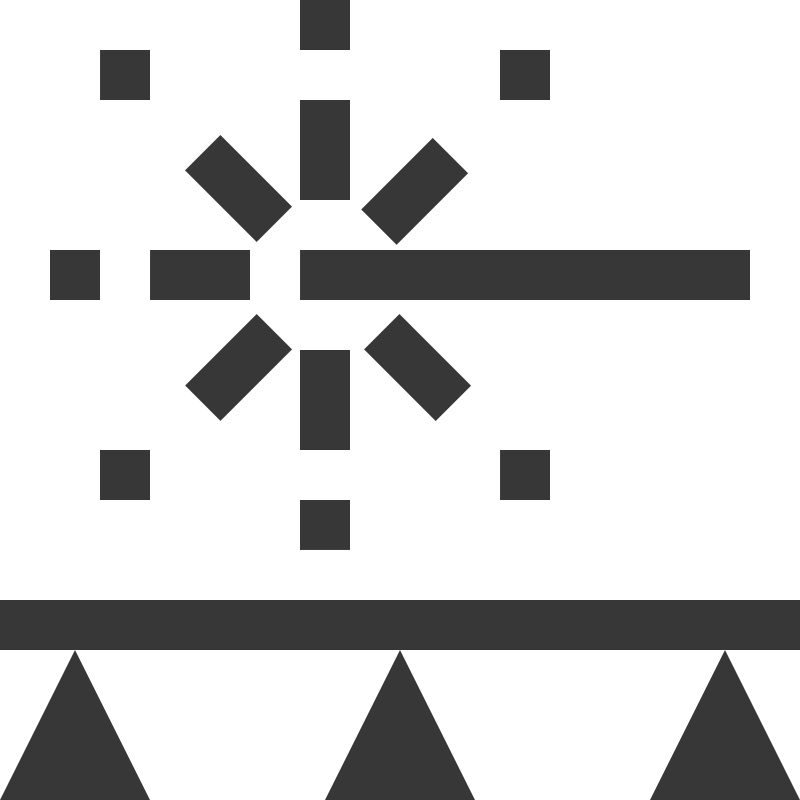</a> | **📂 檔名:** `autolevels.svg` ✨ **格式:** `Vector (SVG)` ⚖️ **大小:** `1.02KB` 📅 **更新:** `2026-02-28`  🚀 **jsDelivr Markdown:** `` 🔗 **直接連結 (Url):** <code>https://cdn.jsdelivr.net/gh/barry028/materials@main/images/iCons/Krita%20Sharp%20Interface%20iCons/autolevels.svg</code> 📥 [檢視原始檔](autolevels.svg) |
| <a href="bookmarks.svg">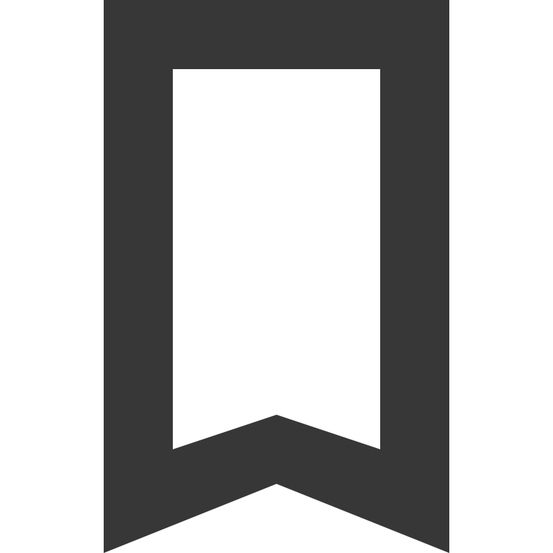</a> | **📂 檔名:** `bookmarks.svg` ✨ **格式:** `Vector (SVG)` ⚖️ **大小:** `1.53KB` 📅 **更新:** `2026-02-28`  🚀 **jsDelivr Markdown:** `` 🔗 **直接連結 (Url):** <code>https://cdn.jsdelivr.net/gh/barry028/materials@main/images/iCons/Krita%20Sharp%20Interface%20iCons/bookmarks.svg</code> 📥 [檢視原始檔](bookmarks.svg) |
| <a href="bundle-archive.svg">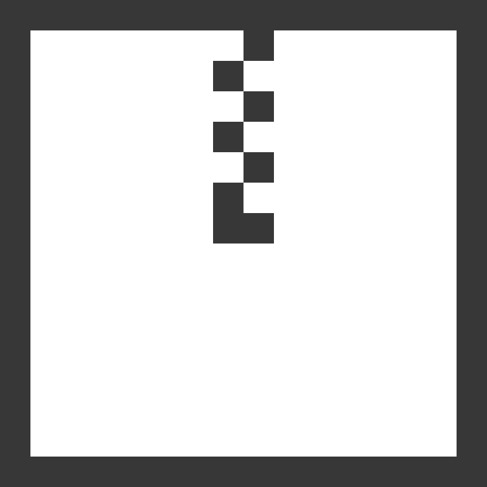</a> | **📂 檔名:** `bundle-archive.svg` ✨ **格式:** `Vector (SVG)` ⚖️ **大小:** `1012.00B` 📅 **更新:** `2026-02-28`  🚀 **jsDelivr Markdown:** `` 🔗 **直接連結 (Url):** <code>https://cdn.jsdelivr.net/gh/barry028/materials@main/images/iCons/Krita%20Sharp%20Interface%20iCons/bundle-archive.svg</code> 📥 [檢視原始檔](bundle-archive.svg) |
|  | **📂 檔名:** `camera-photo.svg` ✨ **格式:** `Vector (SVG)` ⚖️ **大小:** `3.84KB` 📅 **更新:** `2026-02-28`  🚀 **jsDelivr Markdown:** `` 🔗 **直接連結 (Url):** <code>https://cdn.jsdelivr.net/gh/barry028/materials@main/images/iCons/Krita%20Sharp%20Interface%20iCons/camera-photo.svg</code> 📥 [檢視原始檔](camera-photo.svg) |
|  | **📂 檔名:** `chain-broken-icon.svg` ✨ **格式:** `Vector (SVG)` ⚖️ **大小:** `2.67KB` 📅 **更新:** `2026-02-28`  🚀 **jsDelivr Markdown:** `` 🔗 **直接連結 (Url):** <code>https://cdn.jsdelivr.net/gh/barry028/materials@main/images/iCons/Krita%20Sharp%20Interface%20iCons/chain-broken-icon.svg</code> 📥 [檢視原始檔](chain-broken-icon.svg) |
|  | **📂 檔名:** `chain-icon.svg` ✨ **格式:** `Vector (SVG)` ⚖️ **大小:** `2.67KB` 📅 **更新:** `2026-02-28`  🚀 **jsDelivr Markdown:** `` 🔗 **直接連結 (Url):** <code>https://cdn.jsdelivr.net/gh/barry028/materials@main/images/iCons/Krita%20Sharp%20Interface%20iCons/chain-icon.svg</code> 📥 [檢視原始檔](chain-icon.svg) |
|  | **📂 檔名:** `close-tab.svg` ✨ **格式:** `Vector (SVG)` ⚖️ **大小:** `1.85KB` 📅 **更新:** `2026-02-28`  🚀 **jsDelivr Markdown:** `` 🔗 **直接連結 (Url):** <code>https://cdn.jsdelivr.net/gh/barry028/materials@main/images/iCons/Krita%20Sharp%20Interface%20iCons/close-tab.svg</code> 📥 [檢視原始檔](close-tab.svg) |
|  | **📂 檔名:** `color-adjustement-mode-channels.svg` ✨ **格式:** `Vector (SVG)` ⚖️ **大小:** `1.53KB` 📅 **更新:** `2026-02-28`  🚀 **jsDelivr Markdown:** `` 🔗 **直接連結 (Url):** <code>https://cdn.jsdelivr.net/gh/barry028/materials@main/images/iCons/Krita%20Sharp%20Interface%20iCons/color-adjustement-mode-channels.svg</code> 📥 [檢視原始檔](color-adjustement-mode-channels.svg) |
|  | **📂 檔名:** `color-adjustement-mode-lightness.svg` ✨ **格式:** `Vector (SVG)` ⚖️ **大小:** `776.00B` 📅 **更新:** `2026-02-28`  🚀 **jsDelivr Markdown:** `` 🔗 **直接連結 (Url):** <code>https://cdn.jsdelivr.net/gh/barry028/materials@main/images/iCons/Krita%20Sharp%20Interface%20iCons/color-adjustement-mode-lightness.svg</code> 📥 [檢視原始檔](color-adjustement-mode-lightness.svg) |
| <a href="color-to-alpha.svg">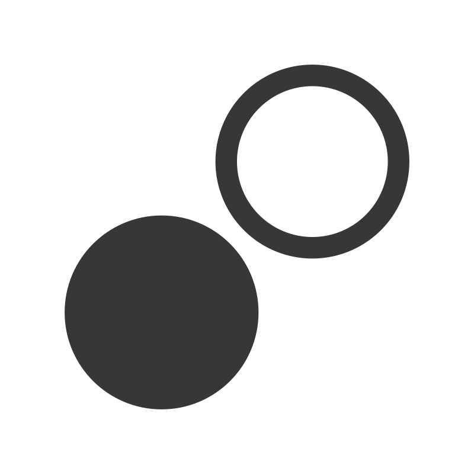</a> | **📂 檔名:** `color-to-alpha.svg` ✨ **格式:** `Vector (SVG)` ⚖️ **大小:** `4.60KB` 📅 **更新:** `2026-02-28`  🚀 **jsDelivr Markdown:** `` 🔗 **直接連結 (Url):** <code>https://cdn.jsdelivr.net/gh/barry028/materials@main/images/iCons/Krita%20Sharp%20Interface%20iCons/color-to-alpha.svg</code> 📥 [檢視原始檔](color-to-alpha.svg) |
| <a href="config-canvas-input.svg">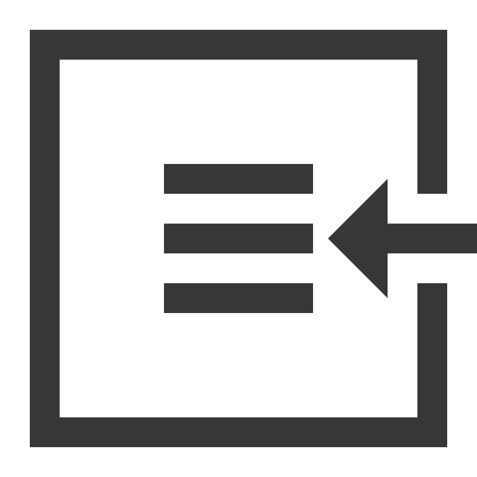</a> | **📂 檔名:** `config-canvas-input.svg` ✨ **格式:** `Vector (SVG)` ⚖️ **大小:** `2.96KB` 📅 **更新:** `2026-02-28`  🚀 **jsDelivr Markdown:** `` 🔗 **直接連結 (Url):** <code>https://cdn.jsdelivr.net/gh/barry028/materials@main/images/iCons/Krita%20Sharp%20Interface%20iCons/config-canvas-input.svg</code> 📥 [檢視原始檔](config-canvas-input.svg) |
| <a href="config-canvas-only.svg">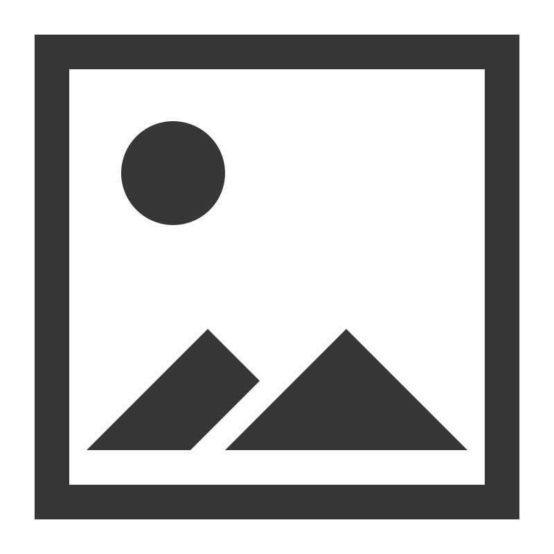</a> | **📂 檔名:** `config-canvas-only.svg` ✨ **格式:** `Vector (SVG)` ⚖️ **大小:** `2.15KB` 📅 **更新:** `2026-02-28`  🚀 **jsDelivr Markdown:** `` 🔗 **直接連結 (Url):** <code>https://cdn.jsdelivr.net/gh/barry028/materials@main/images/iCons/Krita%20Sharp%20Interface%20iCons/config-canvas-only.svg</code> 📥 [檢視原始檔](config-canvas-only.svg) |
| <a href="config-color-manage.svg">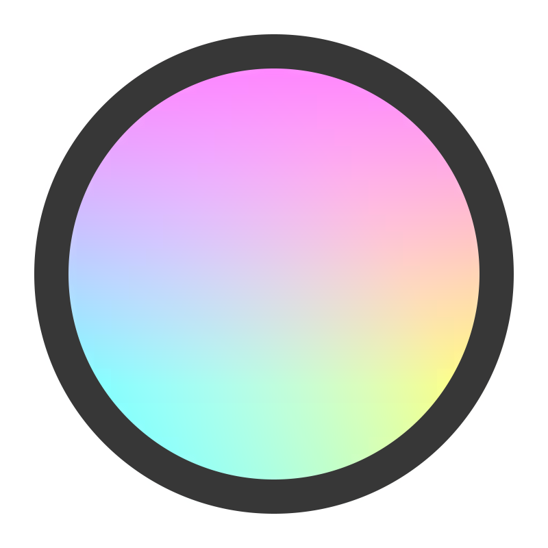</a> | **📂 檔名:** `config-color-manage.svg` ✨ **格式:** `Vector (SVG)` ⚖️ **大小:** `3.97KB` 📅 **更新:** `2026-02-28`  🚀 **jsDelivr Markdown:** `` 🔗 **直接連結 (Url):** <code>https://cdn.jsdelivr.net/gh/barry028/materials@main/images/iCons/Krita%20Sharp%20Interface%20iCons/config-color-manage.svg</code> 📥 [檢視原始檔](config-color-manage.svg) |
| <a href="config-display.svg">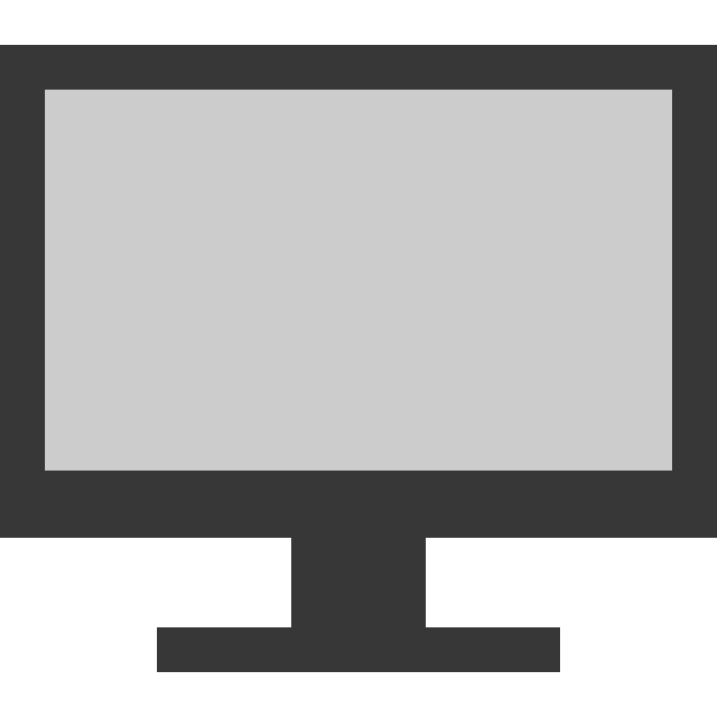</a> | **📂 檔名:** `config-display.svg` ✨ **格式:** `Vector (SVG)` ⚖️ **大小:** `2.63KB` 📅 **更新:** `2026-02-28`  🚀 **jsDelivr Markdown:** `` 🔗 **直接連結 (Url):** <code>https://cdn.jsdelivr.net/gh/barry028/materials@main/images/iCons/Krita%20Sharp%20Interface%20iCons/config-display.svg</code> 📥 [檢視原始檔](config-display.svg) |
| <a href="config-general.svg">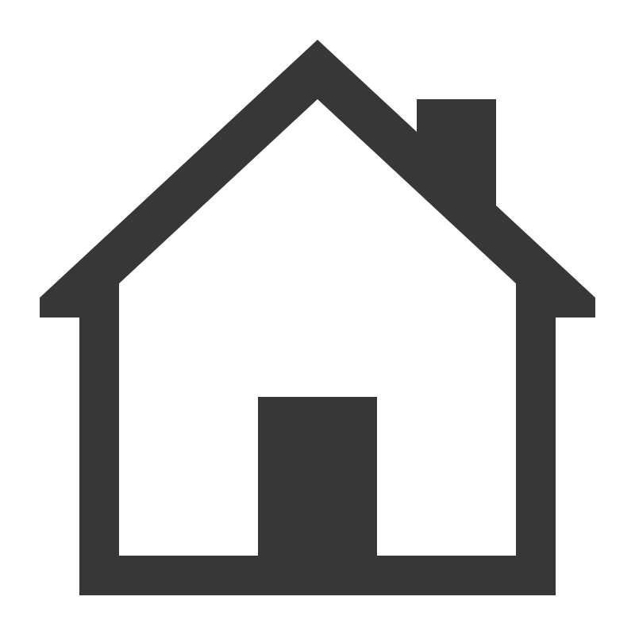</a> | **📂 檔名:** `config-general.svg` ✨ **格式:** `Vector (SVG)` ⚖️ **大小:** `2.91KB` 📅 **更新:** `2026-02-28`  🚀 **jsDelivr Markdown:** `` 🔗 **直接連結 (Url):** <code>https://cdn.jsdelivr.net/gh/barry028/materials@main/images/iCons/Krita%20Sharp%20Interface%20iCons/config-general.svg</code> 📥 [檢視原始檔](config-general.svg) |
| <a href="config-keyboard.svg">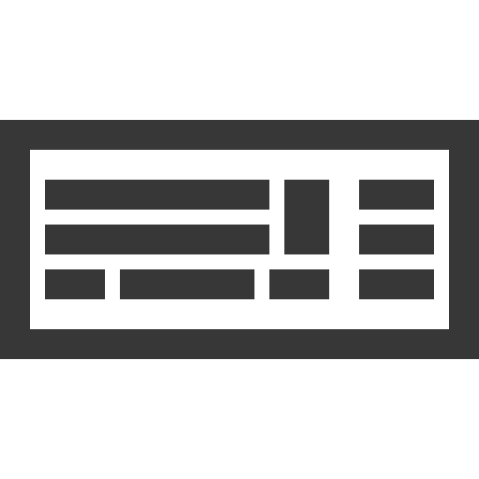</a> | **📂 檔名:** `config-keyboard.svg` ✨ **格式:** `Vector (SVG)` ⚖️ **大小:** `4.26KB` 📅 **更新:** `2026-02-28`  🚀 **jsDelivr Markdown:** `` 🔗 **直接連結 (Url):** <code>https://cdn.jsdelivr.net/gh/barry028/materials@main/images/iCons/Krita%20Sharp%20Interface%20iCons/config-keyboard.svg</code> 📥 [檢視原始檔](config-keyboard.svg) |
| <a href="config-performance.svg">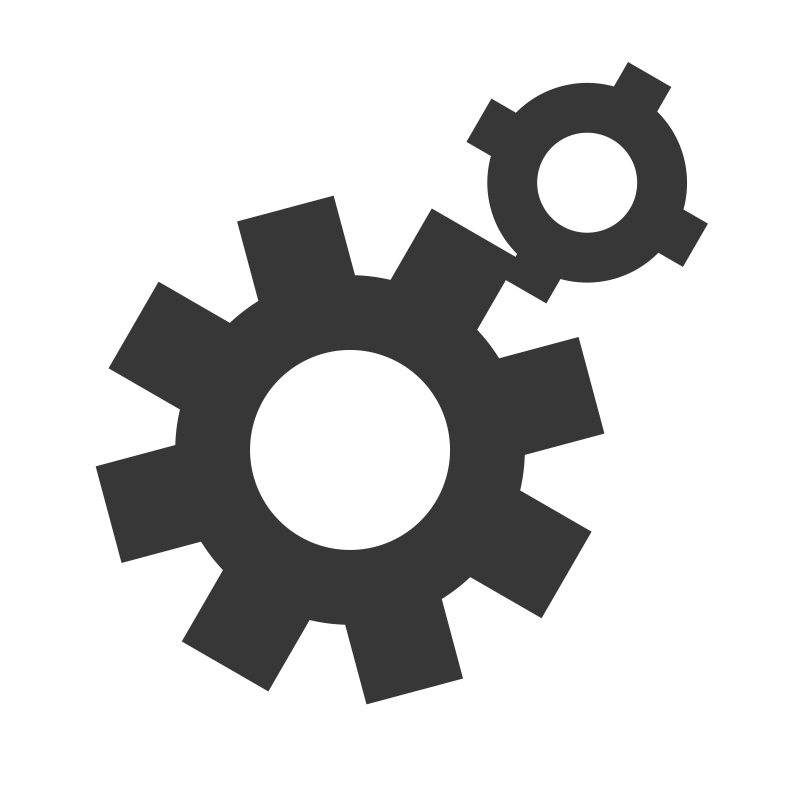</a> | **📂 檔名:** `config-performance.svg` ✨ **格式:** `Vector (SVG)` ⚖️ **大小:** `3.21KB` 📅 **更新:** `2026-02-28`  🚀 **jsDelivr Markdown:** `` 🔗 **直接連結 (Url):** <code>https://cdn.jsdelivr.net/gh/barry028/materials@main/images/iCons/Krita%20Sharp%20Interface%20iCons/config-performance.svg</code> 📥 [檢視原始檔](config-performance.svg) |
| <a href="config-popup-palette.svg">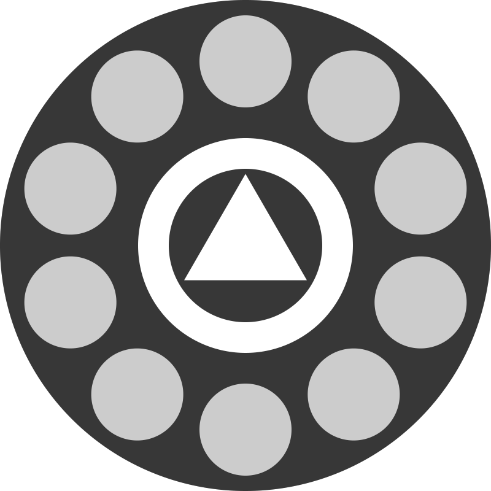</a> | **📂 檔名:** `config-popup-palette.svg` ✨ **格式:** `Vector (SVG)` ⚖️ **大小:** `3.02KB` 📅 **更新:** `2026-02-28`  🚀 **jsDelivr Markdown:** `` 🔗 **直接連結 (Url):** <code>https://cdn.jsdelivr.net/gh/barry028/materials@main/images/iCons/Krita%20Sharp%20Interface%20iCons/config-popup-palette.svg</code> 📥 [檢視原始檔](config-popup-palette.svg) |
|  | **📂 檔名:** `config-tablet.svg` ✨ **格式:** `Vector (SVG)` ⚖️ **大小:** `2.53KB` 📅 **更新:** `2026-02-28`  🚀 **jsDelivr Markdown:** `` 🔗 **直接連結 (Url):** <code>https://cdn.jsdelivr.net/gh/barry028/materials@main/images/iCons/Krita%20Sharp%20Interface%20iCons/config-tablet.svg</code> 📥 [檢視原始檔](config-tablet.svg) |
|  | **📂 檔名:** `configure-thicker.svg` ✨ **格式:** `Vector (SVG)` ⚖️ **大小:** `1.63KB` 📅 **更新:** `2026-02-28`  🚀 **jsDelivr Markdown:** `` 🔗 **直接連結 (Url):** <code>https://cdn.jsdelivr.net/gh/barry028/materials@main/images/iCons/Krita%20Sharp%20Interface%20iCons/configure-thicker.svg</code> 📥 [檢視原始檔](configure-thicker.svg) |
| <a href="contiguous-selection.svg">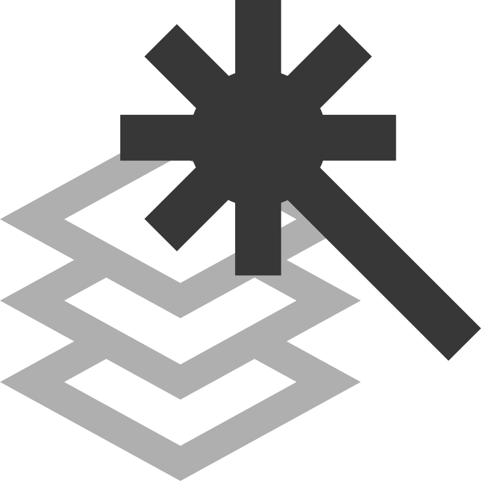</a> | **📂 檔名:** `contiguous-selection.svg` ✨ **格式:** `Vector (SVG)` ⚖️ **大小:** `1.61KB` 📅 **更新:** `2026-02-28`  🚀 **jsDelivr Markdown:** `` 🔗 **直接連結 (Url):** <code>https://cdn.jsdelivr.net/gh/barry028/materials@main/images/iCons/Krita%20Sharp%20Interface%20iCons/contiguous-selection.svg</code> 📥 [檢視原始檔](contiguous-selection.svg) |
| <a href="convert-to-filelayer.svg">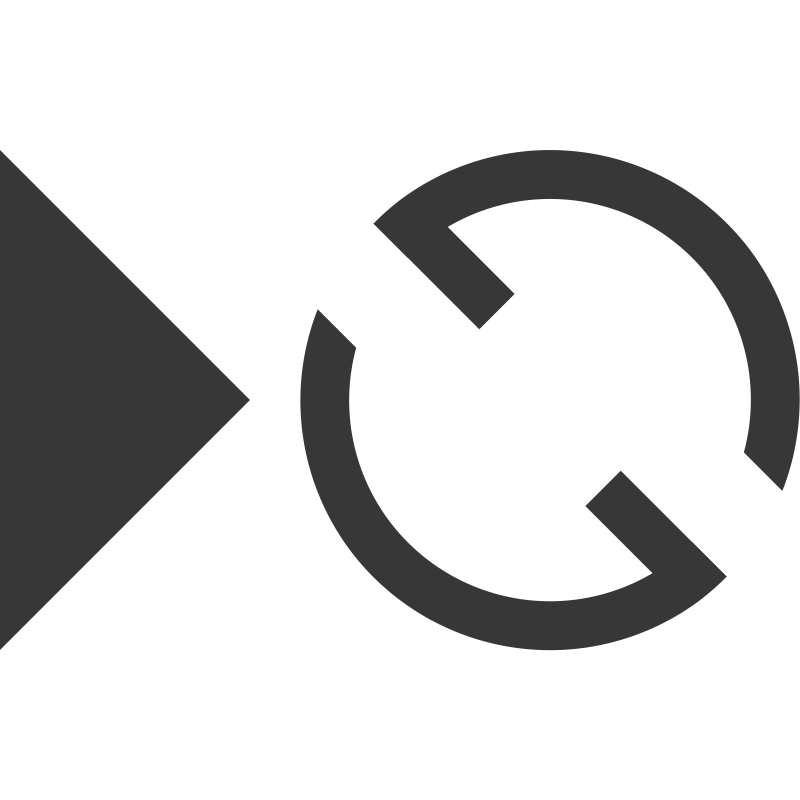</a> | **📂 檔名:** `convert-to-filelayer.svg` ✨ **格式:** `Vector (SVG)` ⚖️ **大小:** `3.42KB` 📅 **更新:** `2026-02-28`  🚀 **jsDelivr Markdown:** `` 🔗 **直接連結 (Url):** <code>https://cdn.jsdelivr.net/gh/barry028/materials@main/images/iCons/Krita%20Sharp%20Interface%20iCons/convert-to-filelayer.svg</code> 📥 [檢視原始檔](convert-to-filelayer.svg) |
| <a href="convert-to-filtermask.svg">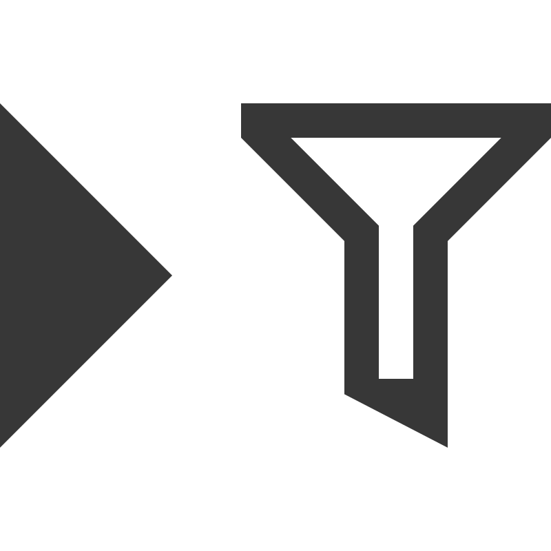</a> | **📂 檔名:** `convert-to-filtermask.svg` ✨ **格式:** `Vector (SVG)` ⚖️ **大小:** `1.80KB` 📅 **更新:** `2026-02-28`  🚀 **jsDelivr Markdown:** `` 🔗 **直接連結 (Url):** <code>https://cdn.jsdelivr.net/gh/barry028/materials@main/images/iCons/Krita%20Sharp%20Interface%20iCons/convert-to-filtermask.svg</code> 📥 [檢視原始檔](convert-to-filtermask.svg) |
| <a href="convert-to-paintlayer.svg">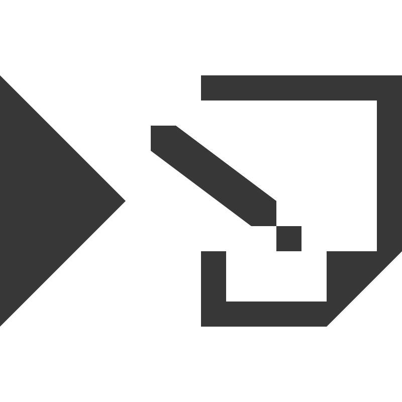</a> | **📂 檔名:** `convert-to-paintlayer.svg` ✨ **格式:** `Vector (SVG)` ⚖️ **大小:** `2.55KB` 📅 **更新:** `2026-02-28`  🚀 **jsDelivr Markdown:** `` 🔗 **直接連結 (Url):** <code>https://cdn.jsdelivr.net/gh/barry028/materials@main/images/iCons/Krita%20Sharp%20Interface%20iCons/convert-to-paintlayer.svg</code> 📥 [檢視原始檔](convert-to-paintlayer.svg) |
| <a href="convert-to-selectionmask.svg">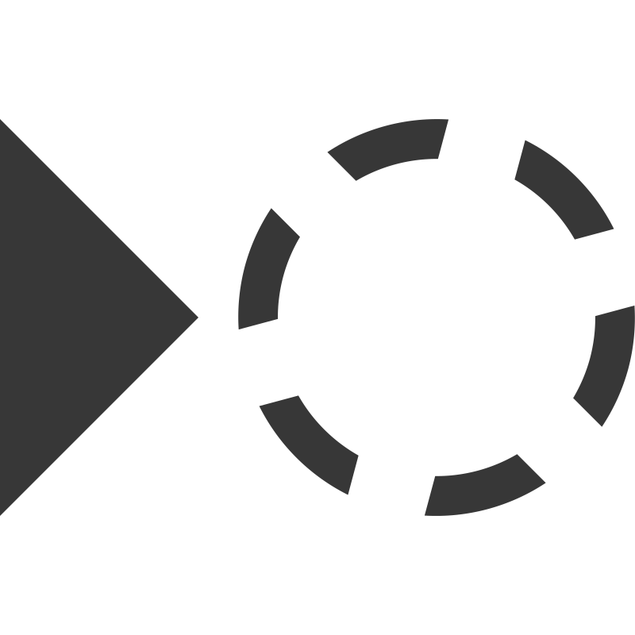</a> | **📂 檔名:** `convert-to-selectionmask.svg` ✨ **格式:** `Vector (SVG)` ⚖️ **大小:** `3.08KB` 📅 **更新:** `2026-02-28`  🚀 **jsDelivr Markdown:** `` 🔗 **直接連結 (Url):** <code>https://cdn.jsdelivr.net/gh/barry028/materials@main/images/iCons/Krita%20Sharp%20Interface%20iCons/convert-to-selectionmask.svg</code> 📥 [檢視原始檔](convert-to-selectionmask.svg) |
| <a href="convert-to-transparencymask.svg">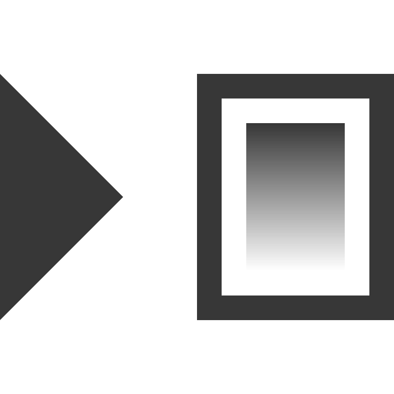</a> | **📂 檔名:** `convert-to-transparencymask.svg` ✨ **格式:** `Vector (SVG)` ⚖️ **大小:** `3.29KB` 📅 **更新:** `2026-02-28`  🚀 **jsDelivr Markdown:** `` 🔗 **直接連結 (Url):** <code>https://cdn.jsdelivr.net/gh/barry028/materials@main/images/iCons/Krita%20Sharp%20Interface%20iCons/convert-to-transparencymask.svg</code> 📥 [檢視原始檔](convert-to-transparencymask.svg) |
| <a href="current-layer.svg">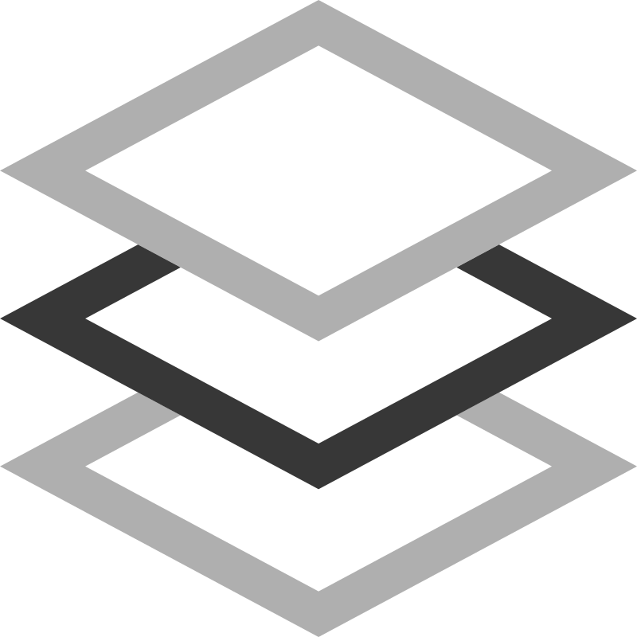</a> | **📂 檔名:** `current-layer.svg` ✨ **格式:** `Vector (SVG)` ⚖️ **大小:** `925.00B` 📅 **更新:** `2026-02-28`  🚀 **jsDelivr Markdown:** `` 🔗 **直接連結 (Url):** <code>https://cdn.jsdelivr.net/gh/barry028/materials@main/images/iCons/Krita%20Sharp%20Interface%20iCons/current-layer.svg</code> 📥 [檢視原始檔](current-layer.svg) |
| <a href="cut-item.svg">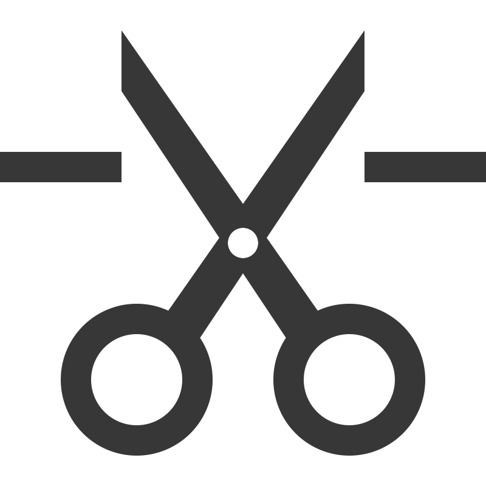</a> | **📂 檔名:** `cut-item.svg` ✨ **格式:** `Vector (SVG)` ⚖️ **大小:** `2.83KB` 📅 **更新:** `2026-02-28`  🚀 **jsDelivr Markdown:** `` 🔗 **直接連結 (Url):** <code>https://cdn.jsdelivr.net/gh/barry028/materials@main/images/iCons/Krita%20Sharp%20Interface%20iCons/cut-item.svg</code> 📥 [檢視原始檔](cut-item.svg) |
|  | **📂 檔名:** `deletekeyframe.svg` ✨ **格式:** `Vector (SVG)` ⚖️ **大小:** `2.80KB` 📅 **更新:** `2026-02-28`  🚀 **jsDelivr Markdown:** `` 🔗 **直接連結 (Url):** <code>https://cdn.jsdelivr.net/gh/barry028/materials@main/images/iCons/Krita%20Sharp%20Interface%20iCons/deletekeyframe.svg</code> 📥 [檢視原始檔](deletekeyframe.svg) |
|  | **📂 檔名:** `dialog-cancel-16.svg` ✨ **格式:** `Vector (SVG)` ⚖️ **大小:** `2.62KB` 📅 **更新:** `2026-02-28`  🚀 **jsDelivr Markdown:** `` 🔗 **直接連結 (Url):** <code>https://cdn.jsdelivr.net/gh/barry028/materials@main/images/iCons/Krita%20Sharp%20Interface%20iCons/dialog-cancel-16.svg</code> 📥 [檢視原始檔](dialog-cancel-16.svg) |
|  | **📂 檔名:** `dialog-cancel.svg` ✨ **格式:** `Vector (SVG)` ⚖️ **大小:** `2.00KB` 📅 **更新:** `2026-02-28`  🚀 **jsDelivr Markdown:** `` 🔗 **直接連結 (Url):** <code>https://cdn.jsdelivr.net/gh/barry028/materials@main/images/iCons/Krita%20Sharp%20Interface%20iCons/dialog-cancel.svg</code> 📥 [檢視原始檔](dialog-cancel.svg) |
|  | **📂 檔名:** `different-regions.svg` ✨ **格式:** `Vector (SVG)` ⚖️ **大小:** `697.00B` 📅 **更新:** `2026-02-28`  🚀 **jsDelivr Markdown:** `` 🔗 **直接連結 (Url):** <code>https://cdn.jsdelivr.net/gh/barry028/materials@main/images/iCons/Krita%20Sharp%20Interface%20iCons/different-regions.svg</code> 📥 [檢視原始檔](different-regions.svg) |
|  | **📂 檔名:** `document-edit.svg` ✨ **格式:** `Vector (SVG)` ⚖️ **大小:** `804.00B` 📅 **更新:** `2026-02-28`  🚀 **jsDelivr Markdown:** `` 🔗 **直接連結 (Url):** <code>https://cdn.jsdelivr.net/gh/barry028/materials@main/images/iCons/Krita%20Sharp%20Interface%20iCons/document-edit.svg</code> 📥 [檢視原始檔](document-edit.svg) |
| <a href="document-export-16.svg">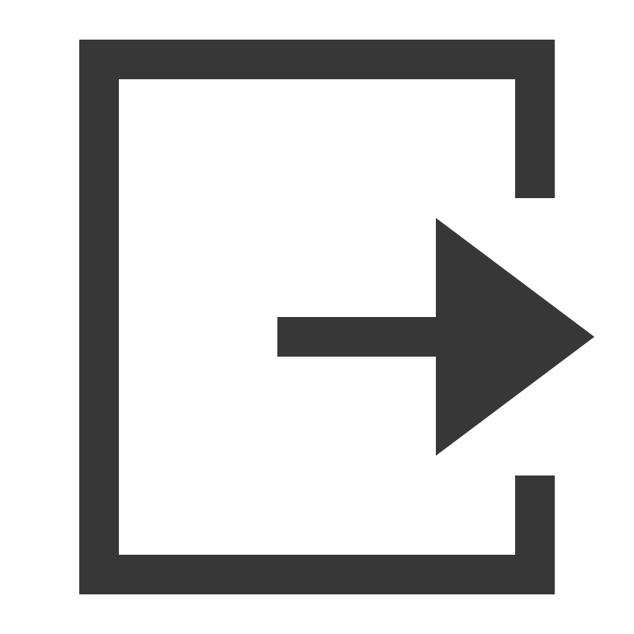</a> | **📂 檔名:** `document-export-16.svg` ✨ **格式:** `Vector (SVG)` ⚖️ **大小:** `2.20KB` 📅 **更新:** `2026-02-28`  🚀 **jsDelivr Markdown:** `` 🔗 **直接連結 (Url):** <code>https://cdn.jsdelivr.net/gh/barry028/materials@main/images/iCons/Krita%20Sharp%20Interface%20iCons/document-export-16.svg</code> 📥 [檢視原始檔](document-export-16.svg) |
|  | **📂 檔名:** `document-export.svg` ✨ **格式:** `Vector (SVG)` ⚖️ **大小:** `2.41KB` 📅 **更新:** `2026-02-28`  🚀 **jsDelivr Markdown:** `` 🔗 **直接連結 (Url):** <code>https://cdn.jsdelivr.net/gh/barry028/materials@main/images/iCons/Krita%20Sharp%20Interface%20iCons/document-export.svg</code> 📥 [檢視原始檔](document-export.svg) |
| <a href="document-import-16.svg">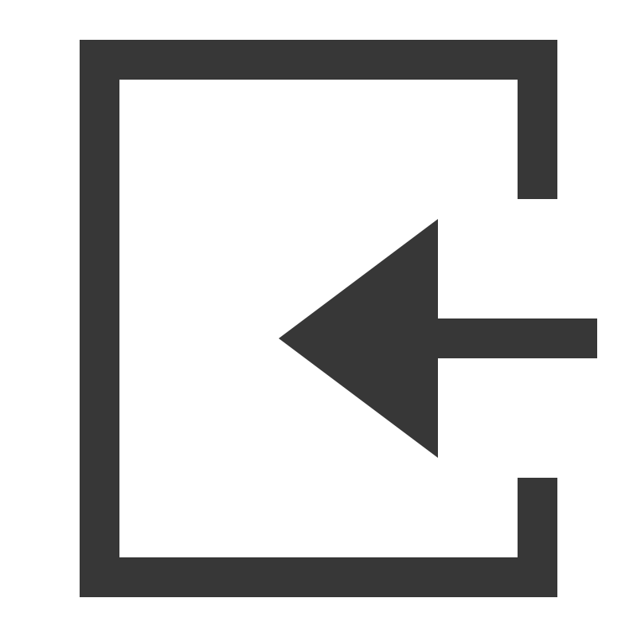</a> | **📂 檔名:** `document-import-16.svg` ✨ **格式:** `Vector (SVG)` ⚖️ **大小:** `2.20KB` 📅 **更新:** `2026-02-28`  🚀 **jsDelivr Markdown:** `` 🔗 **直接連結 (Url):** <code>https://cdn.jsdelivr.net/gh/barry028/materials@main/images/iCons/Krita%20Sharp%20Interface%20iCons/document-import-16.svg</code> 📥 [檢視原始檔](document-import-16.svg) |
| <a href="document-import.svg">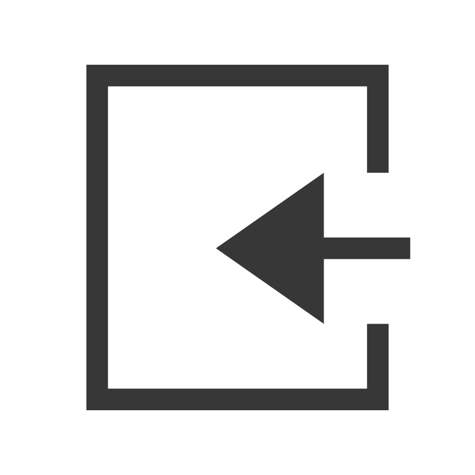</a> | **📂 檔名:** `document-import.svg` ✨ **格式:** `Vector (SVG)` ⚖️ **大小:** `2.41KB` 📅 **更新:** `2026-02-28`  🚀 **jsDelivr Markdown:** `` 🔗 **直接連結 (Url):** <code>https://cdn.jsdelivr.net/gh/barry028/materials@main/images/iCons/Krita%20Sharp%20Interface%20iCons/document-import.svg</code> 📥 [檢視原始檔](document-import.svg) |
| <a href="document-save-16.svg">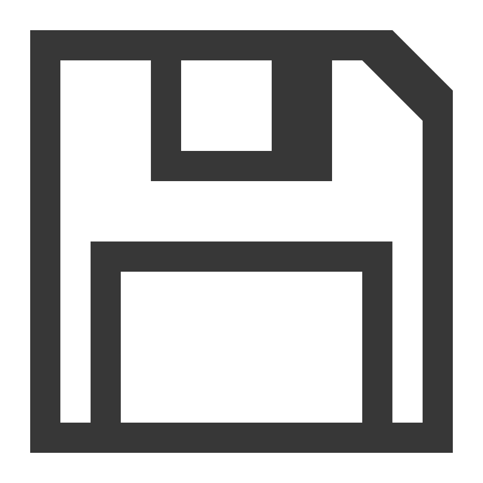</a> | **📂 檔名:** `document-save-16.svg` ✨ **格式:** `Vector (SVG)` ⚖️ **大小:** `1.88KB` 📅 **更新:** `2026-02-28`  🚀 **jsDelivr Markdown:** `` 🔗 **直接連結 (Url):** <code>https://cdn.jsdelivr.net/gh/barry028/materials@main/images/iCons/Krita%20Sharp%20Interface%20iCons/document-save-16.svg</code> 📥 [檢視原始檔](document-save-16.svg) |
|  | **📂 檔名:** `dropframe.svg` ✨ **格式:** `Vector (SVG)` ⚖️ **大小:** `3.51KB` 📅 **更新:** `2026-02-28`  🚀 **jsDelivr Markdown:** `` 🔗 **直接連結 (Url):** <code>https://cdn.jsdelivr.net/gh/barry028/materials@main/images/iCons/Krita%20Sharp%20Interface%20iCons/dropframe.svg</code> 📥 [檢視原始檔](dropframe.svg) |
|  | **📂 檔名:** `droppedframes.svg` ✨ **格式:** `Vector (SVG)` ⚖️ **大小:** `3.52KB` 📅 **更新:** `2026-02-28`  🚀 **jsDelivr Markdown:** `` 🔗 **直接連結 (Url):** <code>https://cdn.jsdelivr.net/gh/barry028/materials@main/images/iCons/Krita%20Sharp%20Interface%20iCons/droppedframes.svg</code> 📥 [檢視原始檔](droppedframes.svg) |
| <a href="duplicateitem.svg">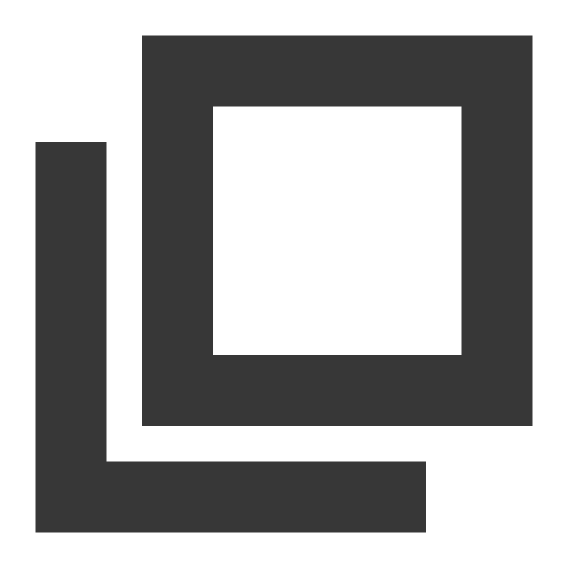</a> | **📂 檔名:** `duplicateitem.svg` ✨ **格式:** `Vector (SVG)` ⚖️ **大小:** `1.96KB` 📅 **更新:** `2026-02-28`  🚀 **jsDelivr Markdown:** `` 🔗 **直接連結 (Url):** <code>https://cdn.jsdelivr.net/gh/barry028/materials@main/images/iCons/Krita%20Sharp%20Interface%20iCons/duplicateitem.svg</code> 📥 [檢視原始檔](duplicateitem.svg) |
| <a href="edit-clear-16.svg">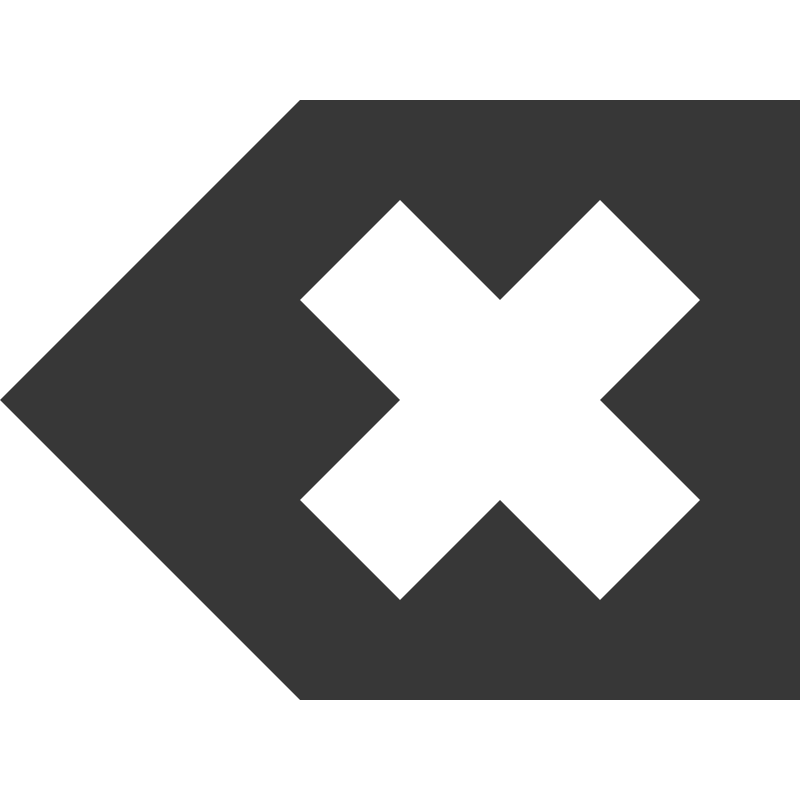</a> | **📂 檔名:** `edit-clear-16.svg` ✨ **格式:** `Vector (SVG)` ⚖️ **大小:** `1.60KB` 📅 **更新:** `2026-02-28`  🚀 **jsDelivr Markdown:** `` 🔗 **直接連結 (Url):** <code>https://cdn.jsdelivr.net/gh/barry028/materials@main/images/iCons/Krita%20Sharp%20Interface%20iCons/edit-clear-16.svg</code> 📥 [檢視原始檔](edit-clear-16.svg) |
|  | **📂 檔名:** `edit-cut.svg` ✨ **格式:** `Vector (SVG)` ⚖️ **大小:** `2.65KB` 📅 **更新:** `2026-02-28`  🚀 **jsDelivr Markdown:** `` 🔗 **直接連結 (Url):** <code>https://cdn.jsdelivr.net/gh/barry028/materials@main/images/iCons/Krita%20Sharp%20Interface%20iCons/edit-cut.svg</code> 📥 [檢視原始檔](edit-cut.svg) |
|  | **📂 檔名:** `edit-delete.svg` ✨ **格式:** `Vector (SVG)` ⚖️ **大小:** `2.12KB` 📅 **更新:** `2026-02-28`  🚀 **jsDelivr Markdown:** `` 🔗 **直接連結 (Url):** <code>https://cdn.jsdelivr.net/gh/barry028/materials@main/images/iCons/Krita%20Sharp%20Interface%20iCons/edit-delete.svg</code> 📥 [檢視原始檔](edit-delete.svg) |
|  | **📂 檔名:** `edit-paste-16.svg` ✨ **格式:** `Vector (SVG)` ⚖️ **大小:** `1.57KB` 📅 **更新:** `2026-02-28`  🚀 **jsDelivr Markdown:** `` 🔗 **直接連結 (Url):** <code>https://cdn.jsdelivr.net/gh/barry028/materials@main/images/iCons/Krita%20Sharp%20Interface%20iCons/edit-paste-16.svg</code> 📥 [檢視原始檔](edit-paste-16.svg) |
| <a href="edit-redo.svg">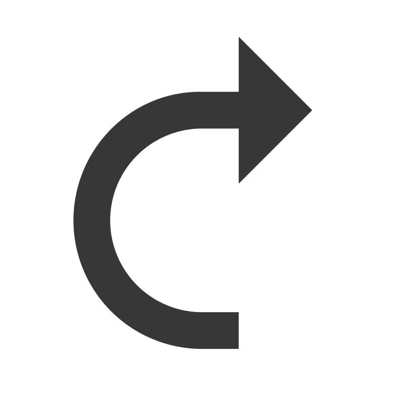</a> | **📂 檔名:** `edit-redo.svg` ✨ **格式:** `Vector (SVG)` ⚖️ **大小:** `1.88KB` 📅 **更新:** `2026-02-28`  🚀 **jsDelivr Markdown:** `` 🔗 **直接連結 (Url):** <code>https://cdn.jsdelivr.net/gh/barry028/materials@main/images/iCons/Krita%20Sharp%20Interface%20iCons/edit-redo.svg</code> 📥 [檢視原始檔](edit-redo.svg) |
| <a href="edit-undo.svg">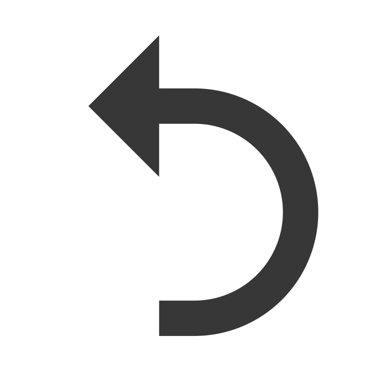</a> | **📂 檔名:** `edit-undo.svg` ✨ **格式:** `Vector (SVG)` ⚖️ **大小:** `1.85KB` 📅 **更新:** `2026-02-28`  🚀 **jsDelivr Markdown:** `` 🔗 **直接連結 (Url):** <code>https://cdn.jsdelivr.net/gh/barry028/materials@main/images/iCons/Krita%20Sharp%20Interface%20iCons/edit-undo.svg</code> 📥 [檢視原始檔](edit-undo.svg) |
| <a href="extended-color-selector.svg">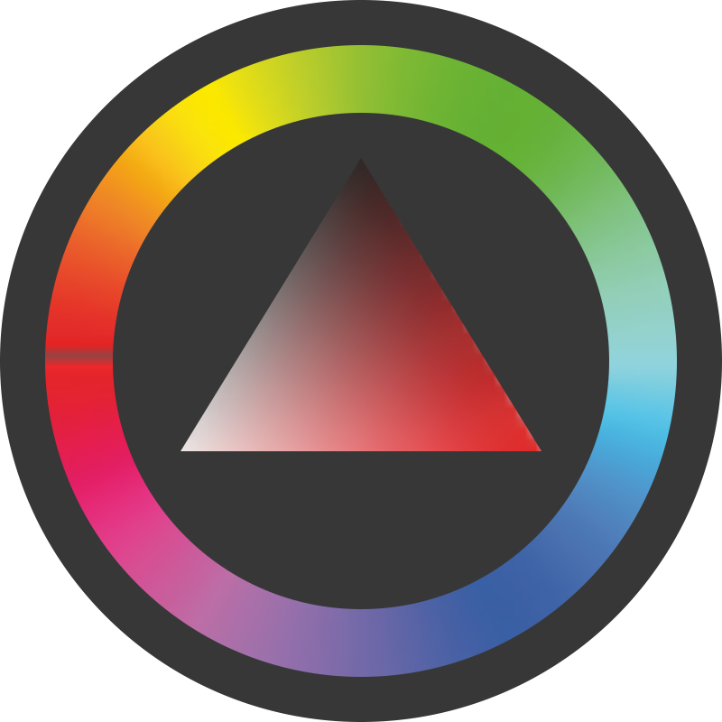</a> | **📂 檔名:** `extended-color-selector.svg` ✨ **格式:** `Vector (SVG)` ⚖️ **大小:** `12.26KB` 📅 **更新:** `2026-02-28`  🚀 **jsDelivr Markdown:** `` 🔗 **直接連結 (Url):** <code>https://cdn.jsdelivr.net/gh/barry028/materials@main/images/iCons/Krita%20Sharp%20Interface%20iCons/extended-color-selector.svg</code> 📥 [檢視原始檔](extended-color-selector.svg) |
| <a href="filter-apply-again.svg">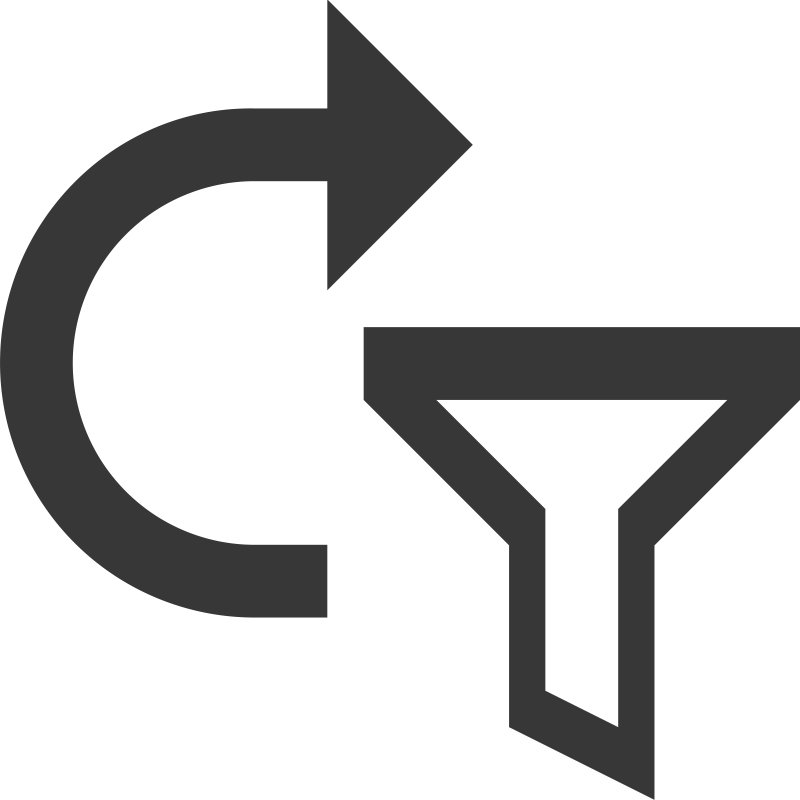</a> | **📂 檔名:** `filter-apply-again.svg` ✨ **格式:** `Vector (SVG)` ⚖️ **大小:** `2.30KB` 📅 **更新:** `2026-02-28`  🚀 **jsDelivr Markdown:** `` 🔗 **直接連結 (Url):** <code>https://cdn.jsdelivr.net/gh/barry028/materials@main/images/iCons/Krita%20Sharp%20Interface%20iCons/filter-apply-again.svg</code> 📥 [檢視原始檔](filter-apply-again.svg) |
| <a href="filter-color-curves.svg">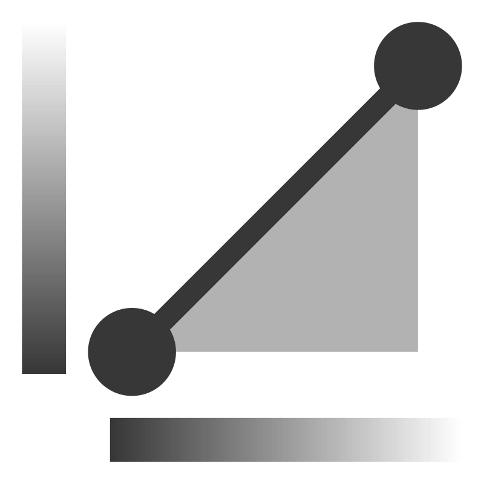</a> | **📂 檔名:** `filter-color-curves.svg` ✨ **格式:** `Vector (SVG)` ⚖️ **大小:** `7.36KB` 📅 **更新:** `2026-02-28`  🚀 **jsDelivr Markdown:** `` 🔗 **直接連結 (Url):** <code>https://cdn.jsdelivr.net/gh/barry028/materials@main/images/iCons/Krita%20Sharp%20Interface%20iCons/filter-color-curves.svg</code> 📥 [檢視原始檔](filter-color-curves.svg) |
| <a href="filter-invert.svg">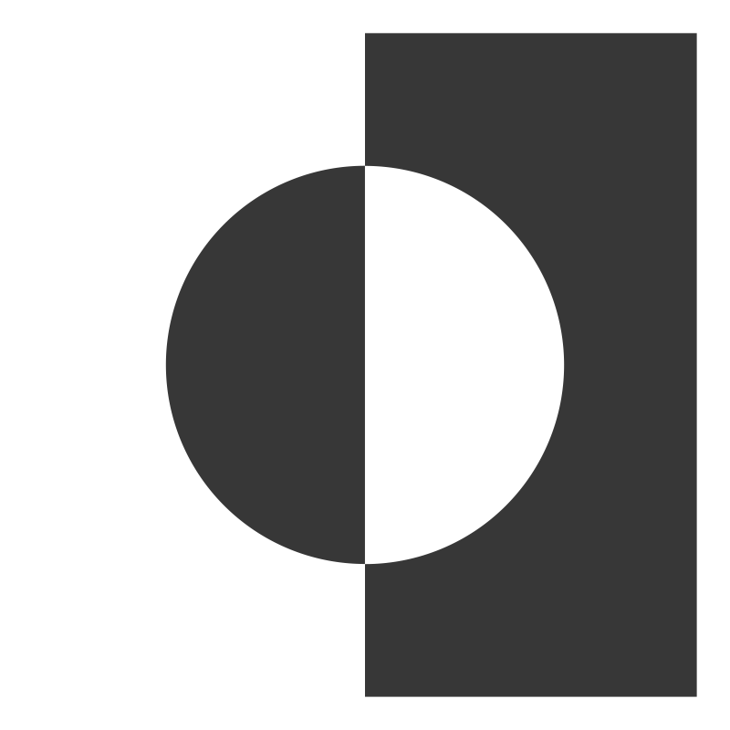</a> | **📂 檔名:** `filter-invert.svg` ✨ **格式:** `Vector (SVG)` ⚖️ **大小:** `2.05KB` 📅 **更新:** `2026-02-28`  🚀 **jsDelivr Markdown:** `` 🔗 **直接連結 (Url):** <code>https://cdn.jsdelivr.net/gh/barry028/materials@main/images/iCons/Krita%20Sharp%20Interface%20iCons/filter-invert.svg</code> 📥 [檢視原始檔](filter-invert.svg) |
| <a href="filter-levels.svg">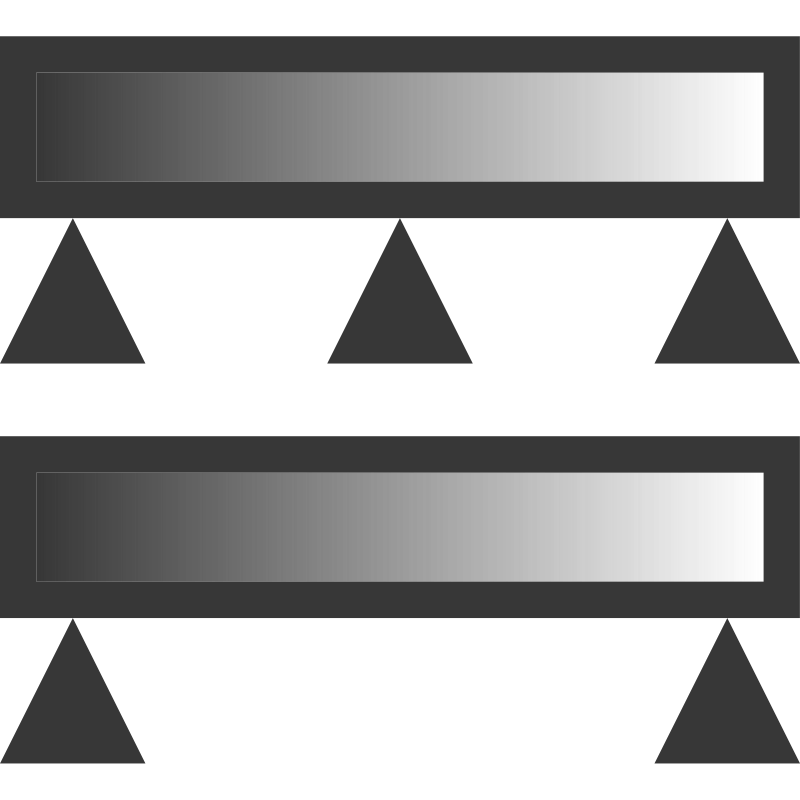</a> | **📂 檔名:** `filter-levels.svg` ✨ **格式:** `Vector (SVG)` ⚖️ **大小:** `4.76KB` 📅 **更新:** `2026-02-28`  🚀 **jsDelivr Markdown:** `` 🔗 **直接連結 (Url):** <code>https://cdn.jsdelivr.net/gh/barry028/materials@main/images/iCons/Krita%20Sharp%20Interface%20iCons/filter-levels.svg</code> 📥 [檢視原始檔](filter-levels.svg) |
| <a href="filter-threshold.svg">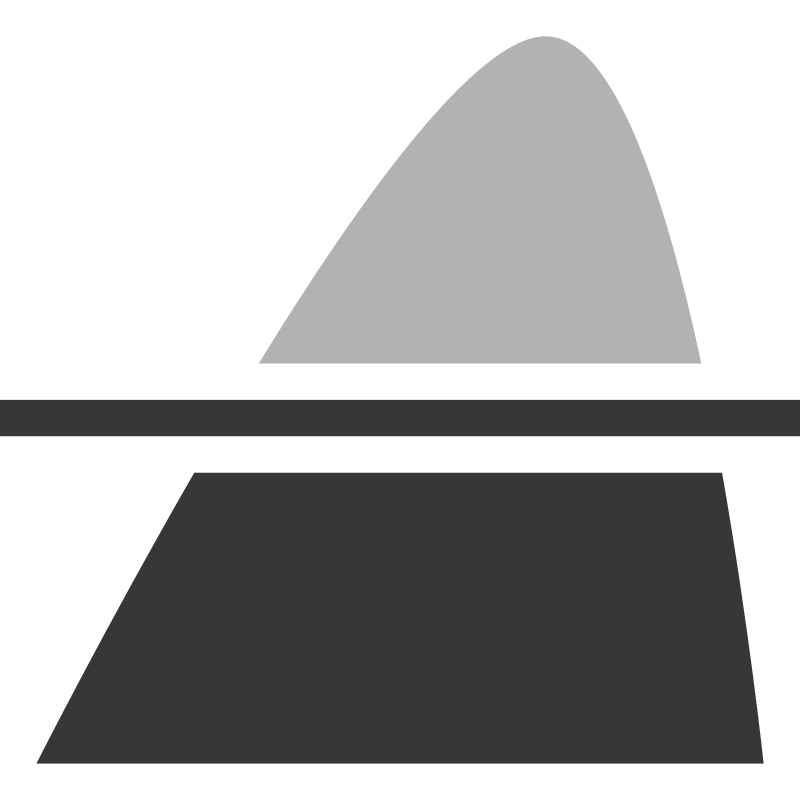</a> | **📂 檔名:** `filter-threshold.svg` ✨ **格式:** `Vector (SVG)` ⚖️ **大小:** `2.21KB` 📅 **更新:** `2026-02-28`  🚀 **jsDelivr Markdown:** `` 🔗 **直接連結 (Url):** <code>https://cdn.jsdelivr.net/gh/barry028/materials@main/images/iCons/Krita%20Sharp%20Interface%20iCons/filter-threshold.svg</code> 📥 [檢視原始檔](filter-threshold.svg) |
|  | **📂 檔名:** `firstframe.svg` ✨ **格式:** `Vector (SVG)` ⚖️ **大小:** `2.64KB` 📅 **更新:** `2026-02-28`  🚀 **jsDelivr Markdown:** `` 🔗 **直接連結 (Url):** <code>https://cdn.jsdelivr.net/gh/barry028/materials@main/images/iCons/Krita%20Sharp%20Interface%20iCons/firstframe.svg</code> 📥 [檢視原始檔](firstframe.svg) |
| <a href="flip-angle-h.svg">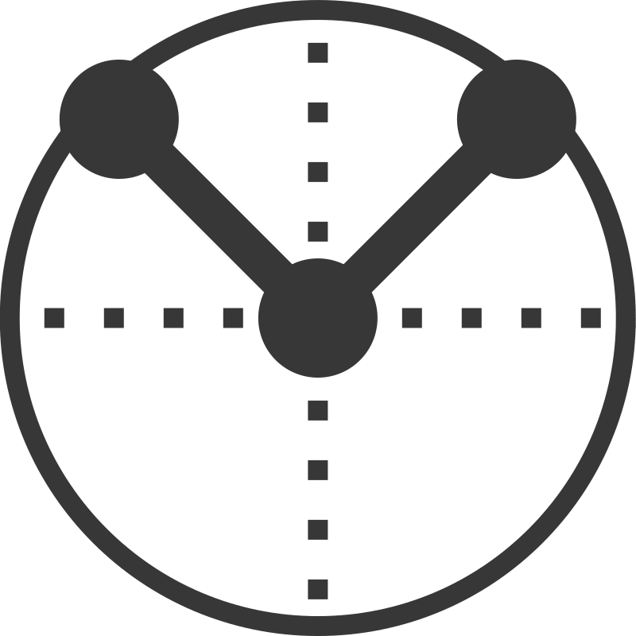</a> | **📂 檔名:** `flip-angle-h.svg` ✨ **格式:** `Vector (SVG)` ⚖️ **大小:** `1.13KB` 📅 **更新:** `2026-02-28`  🚀 **jsDelivr Markdown:** `` 🔗 **直接連結 (Url):** <code>https://cdn.jsdelivr.net/gh/barry028/materials@main/images/iCons/Krita%20Sharp%20Interface%20iCons/flip-angle-h.svg</code> 📥 [檢視原始檔](flip-angle-h.svg) |
| <a href="flip-angle-hv.svg">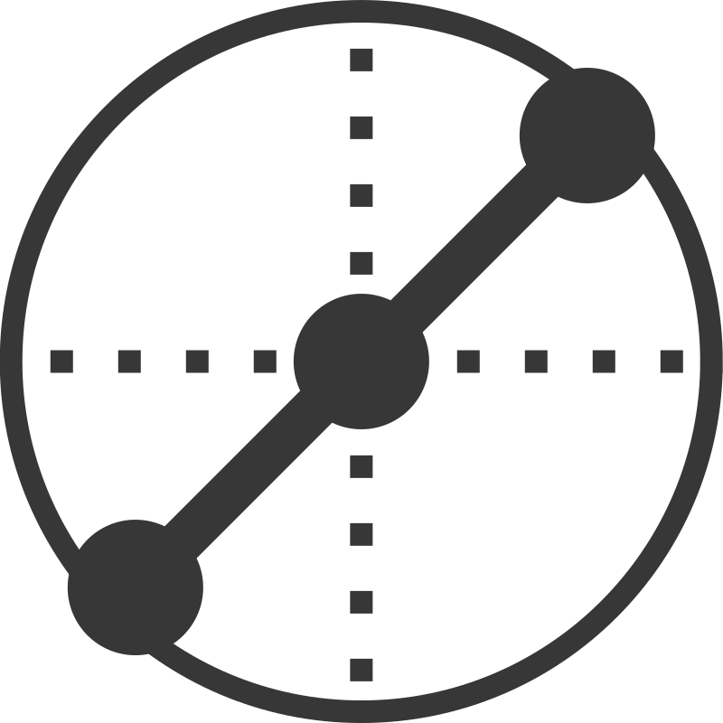</a> | **📂 檔名:** `flip-angle-hv.svg` ✨ **格式:** `Vector (SVG)` ⚖️ **大小:** `1.13KB` 📅 **更新:** `2026-02-28`  🚀 **jsDelivr Markdown:** `` 🔗 **直接連結 (Url):** <code>https://cdn.jsdelivr.net/gh/barry028/materials@main/images/iCons/Krita%20Sharp%20Interface%20iCons/flip-angle-hv.svg</code> 📥 [檢視原始檔](flip-angle-hv.svg) |
| <a href="flip-angle-v.svg">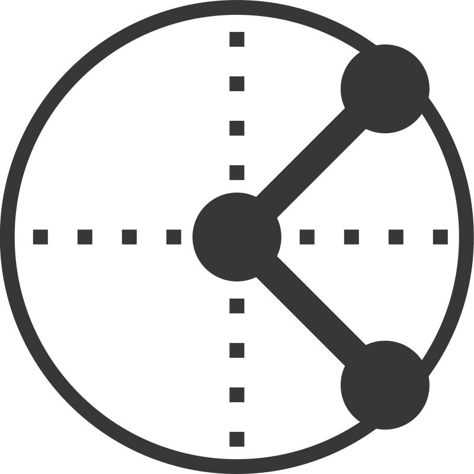</a> | **📂 檔名:** `flip-angle-v.svg` ✨ **格式:** `Vector (SVG)` ⚖️ **大小:** `1.13KB` 📅 **更新:** `2026-02-28`  🚀 **jsDelivr Markdown:** `` 🔗 **直接連結 (Url):** <code>https://cdn.jsdelivr.net/gh/barry028/materials@main/images/iCons/Krita%20Sharp%20Interface%20iCons/flip-angle-v.svg</code> 📥 [檢視原始檔](flip-angle-v.svg) |
|  | **📂 檔名:** `gamut-mask-off.svg` ✨ **格式:** `Vector (SVG)` ⚖️ **大小:** `2.40KB` 📅 **更新:** `2026-02-28`  🚀 **jsDelivr Markdown:** `` 🔗 **直接連結 (Url):** <code>https://cdn.jsdelivr.net/gh/barry028/materials@main/images/iCons/Krita%20Sharp%20Interface%20iCons/gamut-mask-off.svg</code> 📥 [檢視原始檔](gamut-mask-off.svg) |
|  | **📂 檔名:** `gamut-mask-on.svg` ✨ **格式:** `Vector (SVG)` ⚖️ **大小:** `31.32KB` 📅 **更新:** `2026-02-28`  🚀 **jsDelivr Markdown:** `` 🔗 **直接連結 (Url):** <code>https://cdn.jsdelivr.net/gh/barry028/materials@main/images/iCons/Krita%20Sharp%20Interface%20iCons/gamut-mask-on.svg</code> 📥 [檢視原始檔](gamut-mask-on.svg) |
|  | **📂 檔名:** `gmic.svg` ✨ **格式:** `Vector (SVG)` ⚖️ **大小:** `7.02KB` 📅 **更新:** `2026-02-28`  🚀 **jsDelivr Markdown:** `` 🔗 **直接連結 (Url):** <code>https://cdn.jsdelivr.net/gh/barry028/materials@main/images/iCons/Krita%20Sharp%20Interface%20iCons/gmic.svg</code> 📥 [檢視原始檔](gmic.svg) |
|  | **📂 檔名:** `hamburger-menu-dots.svg` ✨ **格式:** `Vector (SVG)` ⚖️ **大小:** `429.00B` 📅 **更新:** `2026-02-28`  🚀 **jsDelivr Markdown:** `` 🔗 **直接連結 (Url):** <code>https://cdn.jsdelivr.net/gh/barry028/materials@main/images/iCons/Krita%20Sharp%20Interface%20iCons/hamburger-menu-dots.svg</code> 📥 [檢視原始檔](hamburger-menu-dots.svg) |
| <a href="histogram-linear.svg">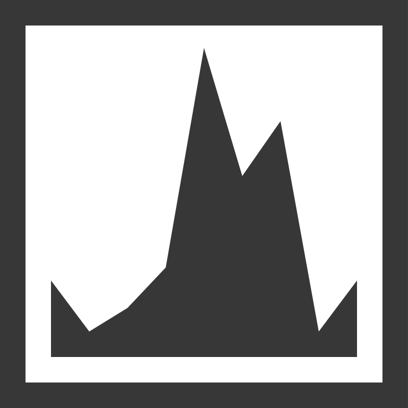</a> | **📂 檔名:** `histogram-linear.svg` ✨ **格式:** `Vector (SVG)` ⚖️ **大小:** `708.00B` 📅 **更新:** `2026-02-28`  🚀 **jsDelivr Markdown:** `` 🔗 **直接連結 (Url):** <code>https://cdn.jsdelivr.net/gh/barry028/materials@main/images/iCons/Krita%20Sharp%20Interface%20iCons/histogram-linear.svg</code> 📥 [檢視原始檔](histogram-linear.svg) |
| <a href="histogram-logarithmic.svg">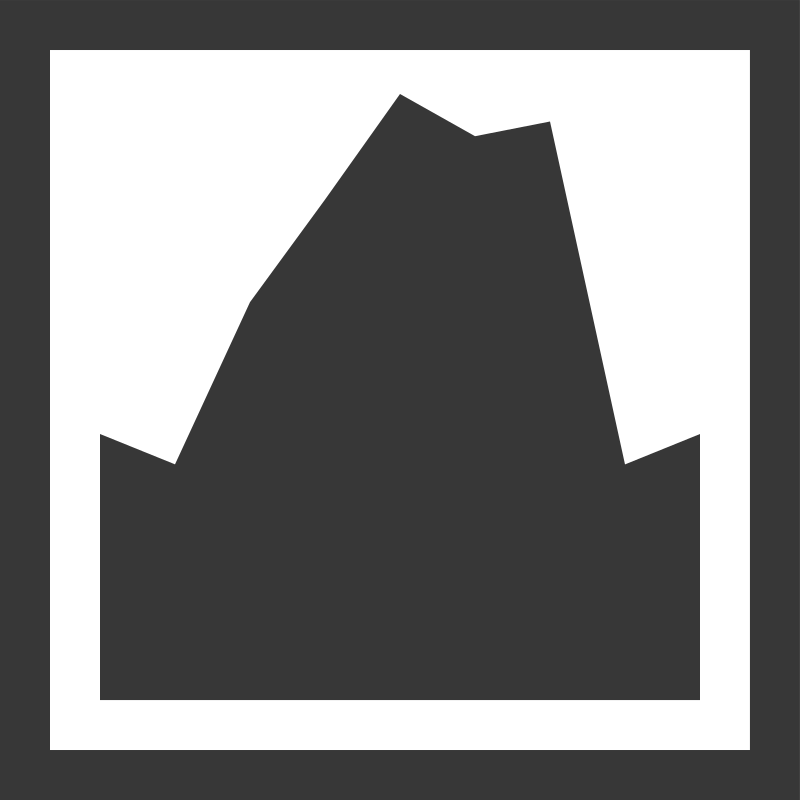</a> | **📂 檔名:** `histogram-logarithmic.svg` ✨ **格式:** `Vector (SVG)` ⚖️ **大小:** `717.00B` 📅 **更新:** `2026-02-28`  🚀 **jsDelivr Markdown:** `` 🔗 **直接連結 (Url):** <code>https://cdn.jsdelivr.net/gh/barry028/materials@main/images/iCons/Krita%20Sharp%20Interface%20iCons/histogram-logarithmic.svg</code> 📥 [檢視原始檔](histogram-logarithmic.svg) |
| <a href="histogram-show-all.svg">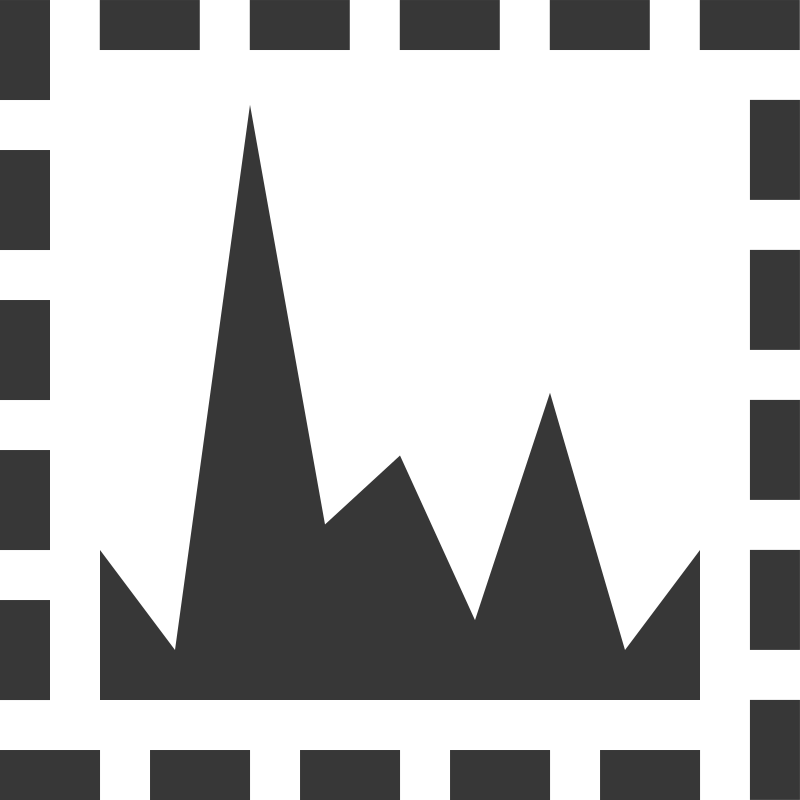</a> | **📂 檔名:** `histogram-show-all.svg` ✨ **格式:** `Vector (SVG)` ⚖️ **大小:** `727.00B` 📅 **更新:** `2026-02-28`  🚀 **jsDelivr Markdown:** `` 🔗 **直接連結 (Url):** <code>https://cdn.jsdelivr.net/gh/barry028/materials@main/images/iCons/Krita%20Sharp%20Interface%20iCons/histogram-show-all.svg</code> 📥 [檢視原始檔](histogram-show-all.svg) |
|  | **📂 檔名:** `histogram-show-best.svg` ✨ **格式:** `Vector (SVG)` ⚖️ **大小:** `718.00B` 📅 **更新:** `2026-02-28`  🚀 **jsDelivr Markdown:** `` 🔗 **直接連結 (Url):** <code>https://cdn.jsdelivr.net/gh/barry028/materials@main/images/iCons/Krita%20Sharp%20Interface%20iCons/histogram-show-best.svg</code> 📥 [檢視原始檔](histogram-show-best.svg) |
| <a href="import-as-filtermask.svg">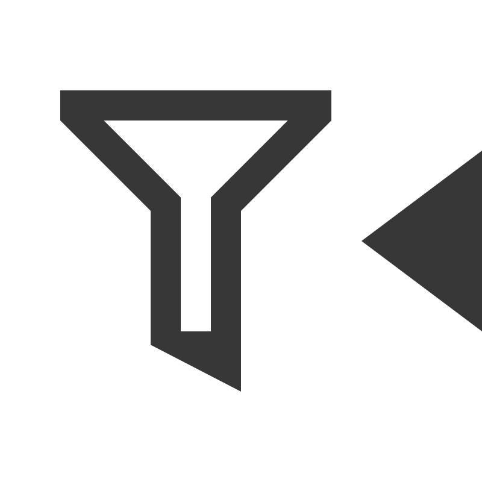</a> | **📂 檔名:** `import-as-filtermask.svg` ✨ **格式:** `Vector (SVG)` ⚖️ **大小:** `1.80KB` 📅 **更新:** `2026-02-28`  🚀 **jsDelivr Markdown:** `` 🔗 **直接連結 (Url):** <code>https://cdn.jsdelivr.net/gh/barry028/materials@main/images/iCons/Krita%20Sharp%20Interface%20iCons/import-as-filtermask.svg</code> 📥 [檢視原始檔](import-as-filtermask.svg) |
| <a href="import-as-paintlayer.svg">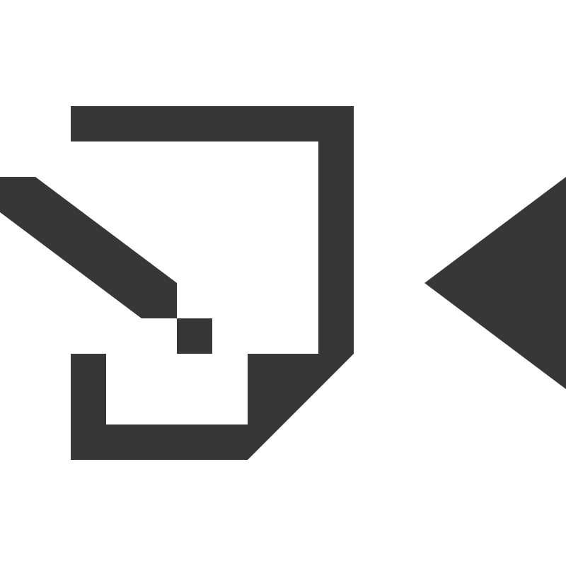</a> | **📂 檔名:** `import-as-paintlayer.svg` ✨ **格式:** `Vector (SVG)` ⚖️ **大小:** `2.55KB` 📅 **更新:** `2026-02-28`  🚀 **jsDelivr Markdown:** `` 🔗 **直接連結 (Url):** <code>https://cdn.jsdelivr.net/gh/barry028/materials@main/images/iCons/Krita%20Sharp%20Interface%20iCons/import-as-paintlayer.svg</code> 📥 [檢視原始檔](import-as-paintlayer.svg) |
|  | **📂 檔名:** `import-as-selectionmask.svg` ✨ **格式:** `Vector (SVG)` ⚖️ **大小:** `3.08KB` 📅 **更新:** `2026-02-28`  🚀 **jsDelivr Markdown:** `` 🔗 **直接連結 (Url):** <code>https://cdn.jsdelivr.net/gh/barry028/materials@main/images/iCons/Krita%20Sharp%20Interface%20iCons/import-as-selectionmask.svg</code> 📥 [檢視原始檔](import-as-selectionmask.svg) |
| <a href="import-as-transparencymask.svg">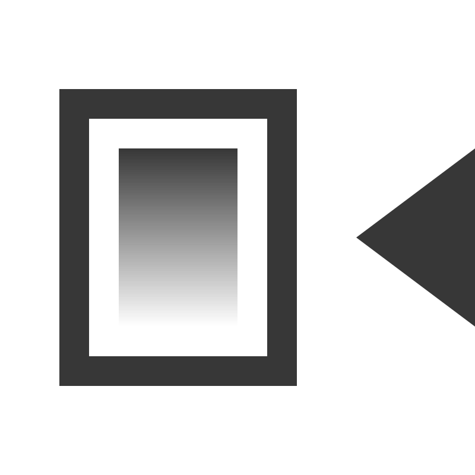</a> | **📂 檔名:** `import-as-transparencymask.svg` ✨ **格式:** `Vector (SVG)` ⚖️ **大小:** `3.29KB` 📅 **更新:** `2026-02-28`  🚀 **jsDelivr Markdown:** `` 🔗 **直接連結 (Url):** <code>https://cdn.jsdelivr.net/gh/barry028/materials@main/images/iCons/Krita%20Sharp%20Interface%20iCons/import-as-transparencymask.svg</code> 📥 [檢視原始檔](import-as-transparencymask.svg) |
|  | **📂 檔名:** `infinity.svg` ✨ **格式:** `Vector (SVG)` ⚖️ **大小:** `2.39KB` 📅 **更新:** `2026-02-28`  🚀 **jsDelivr Markdown:** `` 🔗 **直接連結 (Url):** <code>https://cdn.jsdelivr.net/gh/barry028/materials@main/images/iCons/Krita%20Sharp%20Interface%20iCons/infinity.svg</code> 📥 [檢視原始檔](infinity.svg) |
|  | **📂 檔名:** `interpolation-bezier.svg` ✨ **格式:** `Vector (SVG)` ⚖️ **大小:** `28.91KB` 📅 **更新:** `2026-02-28`  🚀 **jsDelivr Markdown:** `` 🔗 **直接連結 (Url):** <code>https://cdn.jsdelivr.net/gh/barry028/materials@main/images/iCons/Krita%20Sharp%20Interface%20iCons/interpolation-bezier.svg</code> 📥 [檢視原始檔](interpolation-bezier.svg) |
| <a href="interpolation-constant.svg">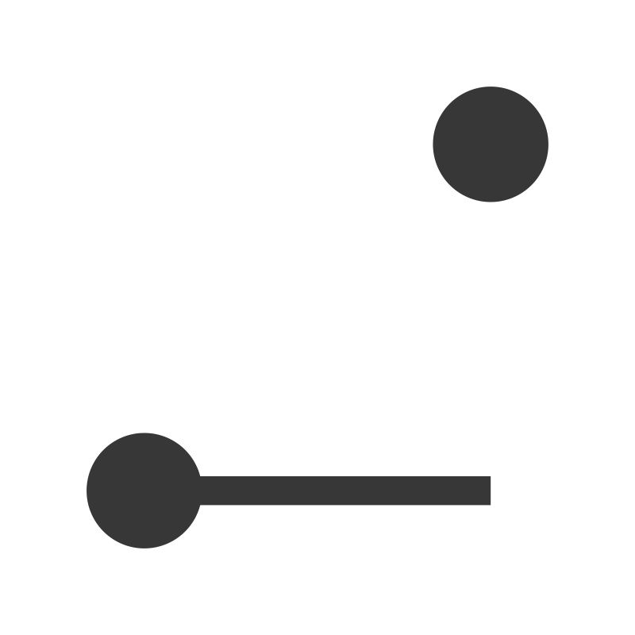</a> | **📂 檔名:** `interpolation-constant.svg` ✨ **格式:** `Vector (SVG)` ⚖️ **大小:** `28.90KB` 📅 **更新:** `2026-02-28`  🚀 **jsDelivr Markdown:** `` 🔗 **直接連結 (Url):** <code>https://cdn.jsdelivr.net/gh/barry028/materials@main/images/iCons/Krita%20Sharp%20Interface%20iCons/interpolation-constant.svg</code> 📥 [檢視原始檔](interpolation-constant.svg) |
| <a href="interpolation-linear.svg">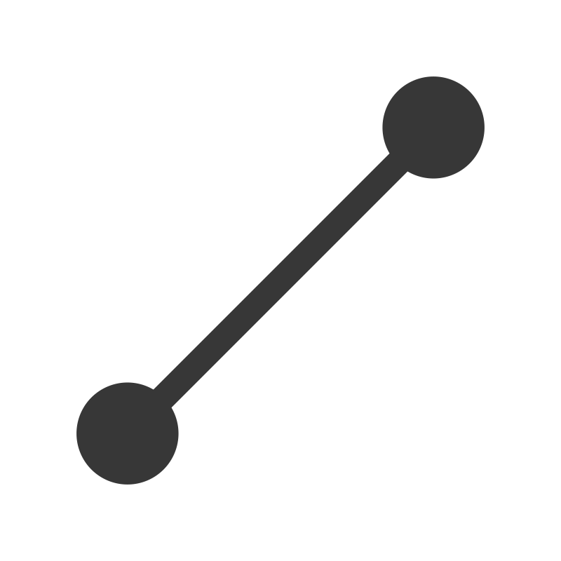</a> | **📂 檔名:** `interpolation-linear.svg` ✨ **格式:** `Vector (SVG)` ⚖️ **大小:** `28.91KB` 📅 **更新:** `2026-02-28`  🚀 **jsDelivr Markdown:** `` 🔗 **直接連結 (Url):** <code>https://cdn.jsdelivr.net/gh/barry028/materials@main/images/iCons/Krita%20Sharp%20Interface%20iCons/interpolation-linear.svg</code> 📥 [檢視原始檔](interpolation-linear.svg) |
| <a href="interpolation-sharp.svg">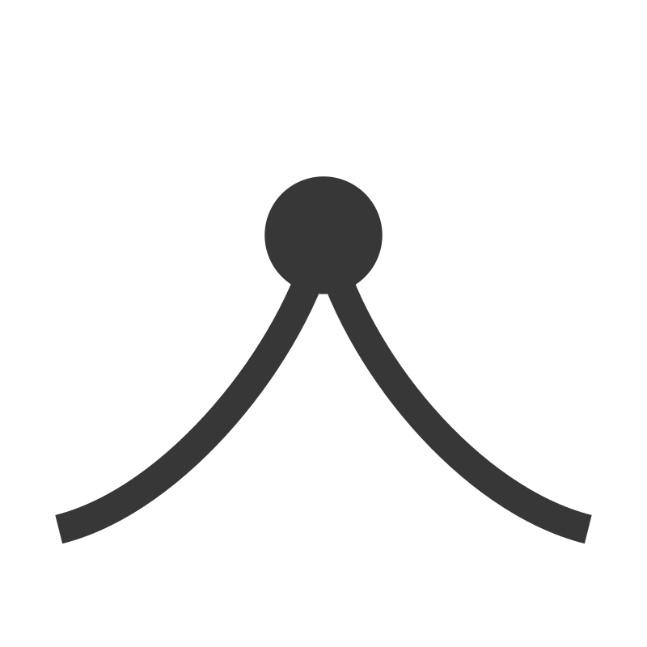</a> | **📂 檔名:** `interpolation-sharp.svg` ✨ **格式:** `Vector (SVG)` ⚖️ **大小:** `28.55KB` 📅 **更新:** `2026-02-28`  🚀 **jsDelivr Markdown:** `` 🔗 **直接連結 (Url):** <code>https://cdn.jsdelivr.net/gh/barry028/materials@main/images/iCons/Krita%20Sharp%20Interface%20iCons/interpolation-sharp.svg</code> 📥 [檢視原始檔](interpolation-sharp.svg) |
|  | **📂 檔名:** `interpolation-smooth.svg` ✨ **格式:** `Vector (SVG)` ⚖️ **大小:** `28.54KB` 📅 **更新:** `2026-02-28`  🚀 **jsDelivr Markdown:** `` 🔗 **直接連結 (Url):** <code>https://cdn.jsdelivr.net/gh/barry028/materials@main/images/iCons/Krita%20Sharp%20Interface%20iCons/interpolation-smooth.svg</code> 📥 [檢視原始檔](interpolation-smooth.svg) |
| <a href="keyframe-add.svg">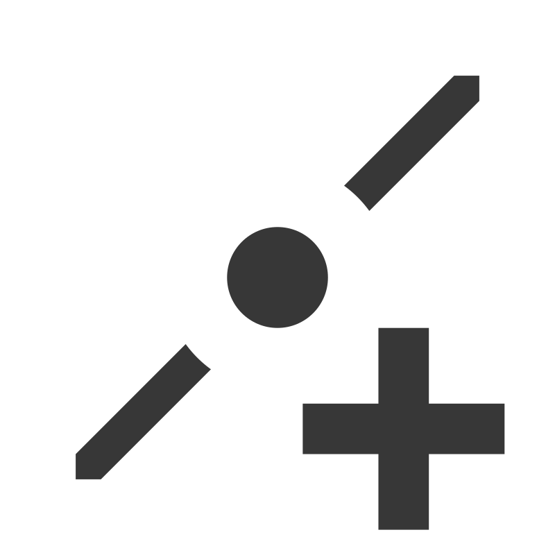</a> | **📂 檔名:** `keyframe-add.svg` ✨ **格式:** `Vector (SVG)` ⚖️ **大小:** `5.33KB` 📅 **更新:** `2026-02-28`  🚀 **jsDelivr Markdown:** `` 🔗 **直接連結 (Url):** <code>https://cdn.jsdelivr.net/gh/barry028/materials@main/images/iCons/Krita%20Sharp%20Interface%20iCons/keyframe-add.svg</code> 📥 [檢視原始檔](keyframe-add.svg) |
| <a href="keyframe-remove.svg">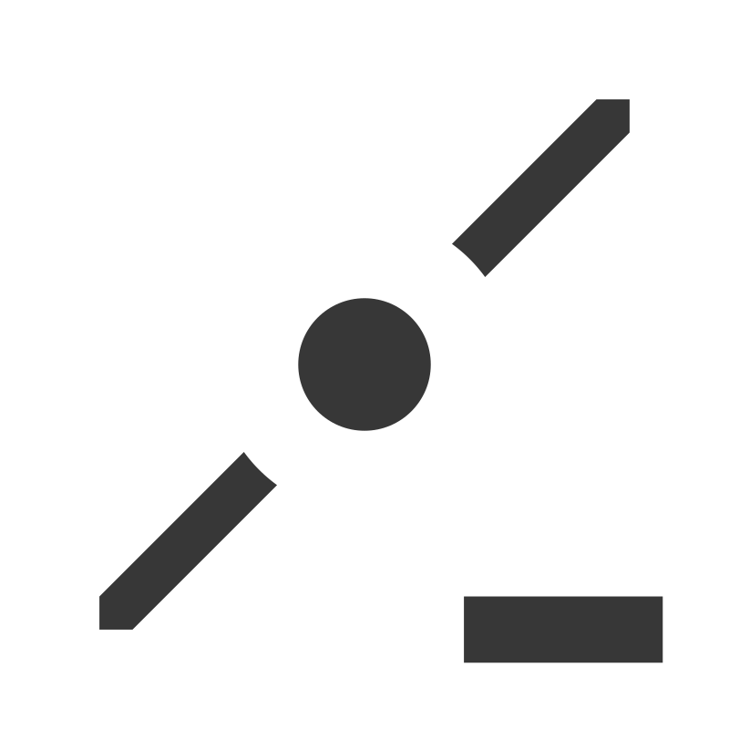</a> | **📂 檔名:** `keyframe-remove.svg` ✨ **格式:** `Vector (SVG)` ⚖️ **大小:** `4.67KB` 📅 **更新:** `2026-02-28`  🚀 **jsDelivr Markdown:** `` 🔗 **直接連結 (Url):** <code>https://cdn.jsdelivr.net/gh/barry028/materials@main/images/iCons/Krita%20Sharp%20Interface%20iCons/keyframe-remove.svg</code> 📥 [檢視原始檔](keyframe-remove.svg) |
|  | **📂 檔名:** `landscape.svg` ✨ **格式:** `Vector (SVG)` ⚖️ **大小:** `2.78KB` 📅 **更新:** `2026-02-28`  🚀 **jsDelivr Markdown:** `` 🔗 **直接連結 (Url):** <code>https://cdn.jsdelivr.net/gh/barry028/materials@main/images/iCons/Krita%20Sharp%20Interface%20iCons/landscape.svg</code> 📥 [檢視原始檔](landscape.svg) |
| <a href="lastframe.svg">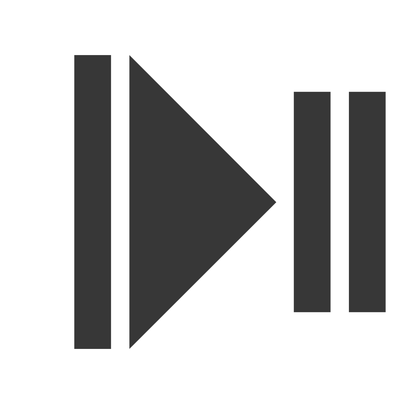</a> | **📂 檔名:** `lastframe.svg` ✨ **格式:** `Vector (SVG)` ⚖️ **大小:** `2.63KB` 📅 **更新:** `2026-02-28`  🚀 **jsDelivr Markdown:** `` 🔗 **直接連結 (Url):** <code>https://cdn.jsdelivr.net/gh/barry028/materials@main/images/iCons/Krita%20Sharp%20Interface%20iCons/lastframe.svg</code> 📥 [檢視原始檔](lastframe.svg) |
|  | **📂 檔名:** `layer-animated.svg` ✨ **格式:** `Vector (SVG)` ⚖️ **大小:** `1.87KB` 📅 **更新:** `2026-02-28`  🚀 **jsDelivr Markdown:** `` 🔗 **直接連結 (Url):** <code>https://cdn.jsdelivr.net/gh/barry028/materials@main/images/iCons/Krita%20Sharp%20Interface%20iCons/layer-animated.svg</code> 📥 [檢視原始檔](layer-animated.svg) |
|  | **📂 檔名:** `layer-locked.svg` ✨ **格式:** `Vector (SVG)` ⚖️ **大小:** `1.53KB` 📅 **更新:** `2026-02-28`  🚀 **jsDelivr Markdown:** `` 🔗 **直接連結 (Url):** <code>https://cdn.jsdelivr.net/gh/barry028/materials@main/images/iCons/Krita%20Sharp%20Interface%20iCons/layer-locked.svg</code> 📥 [檢視原始檔](layer-locked.svg) |
|  | **📂 檔名:** `layer-style-disabled.svg` ✨ **格式:** `Vector (SVG)` ⚖️ **大小:** `1.81KB` 📅 **更新:** `2026-02-28`  🚀 **jsDelivr Markdown:** `` 🔗 **直接連結 (Url):** <code>https://cdn.jsdelivr.net/gh/barry028/materials@main/images/iCons/Krita%20Sharp%20Interface%20iCons/layer-style-disabled.svg</code> 📥 [檢視原始檔](layer-style-disabled.svg) |
|  | **📂 檔名:** `layer-style-enabled.svg` ✨ **格式:** `Vector (SVG)` ⚖️ **大小:** `2.95KB` 📅 **更新:** `2026-02-28`  🚀 **jsDelivr Markdown:** `` 🔗 **直接連結 (Url):** <code>https://cdn.jsdelivr.net/gh/barry028/materials@main/images/iCons/Krita%20Sharp%20Interface%20iCons/layer-style-enabled.svg</code> 📥 [檢視原始檔](layer-style-enabled.svg) |
|  | **📂 檔名:** `layer-unlocked.svg` ✨ **格式:** `Vector (SVG)` ⚖️ **大小:** `1.50KB` 📅 **更新:** `2026-02-28`  🚀 **jsDelivr Markdown:** `` 🔗 **直接連結 (Url):** <code>https://cdn.jsdelivr.net/gh/barry028/materials@main/images/iCons/Krita%20Sharp%20Interface%20iCons/layer-unlocked.svg</code> 📥 [檢視原始檔](layer-unlocked.svg) |
|  | **📂 檔名:** `list-add-22.svg` ✨ **格式:** `Vector (SVG)` ⚖️ **大小:** `1.58KB` 📅 **更新:** `2026-02-28`  🚀 **jsDelivr Markdown:** `` 🔗 **直接連結 (Url):** <code>https://cdn.jsdelivr.net/gh/barry028/materials@main/images/iCons/Krita%20Sharp%20Interface%20iCons/list-add-22.svg</code> 📥 [檢視原始檔](list-add-22.svg) |
|  | **📂 檔名:** `list-add.svg` ✨ **格式:** `Vector (SVG)` ⚖️ **大小:** `2.22KB` 📅 **更新:** `2026-02-28`  🚀 **jsDelivr Markdown:** `` 🔗 **直接連結 (Url):** <code>https://cdn.jsdelivr.net/gh/barry028/materials@main/images/iCons/Krita%20Sharp%20Interface%20iCons/list-add.svg</code> 📥 [檢視原始檔](list-add.svg) |
| <a href="local-selection-active.svg">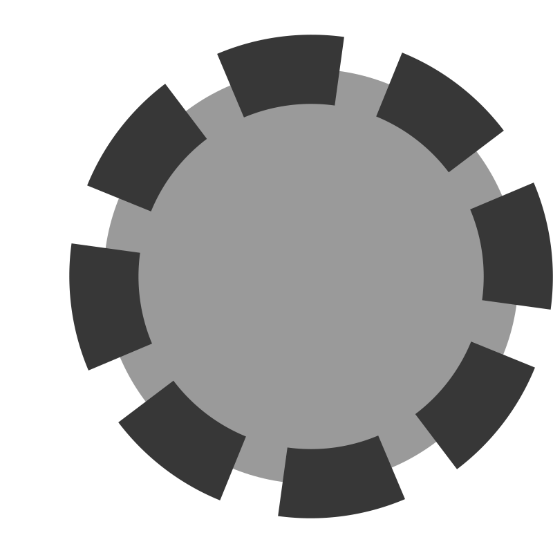</a> | **📂 檔名:** `local-selection-active.svg` ✨ **格式:** `Vector (SVG)` ⚖️ **大小:** `2.29KB` 📅 **更新:** `2026-02-28`  🚀 **jsDelivr Markdown:** `` 🔗 **直接連結 (Url):** <code>https://cdn.jsdelivr.net/gh/barry028/materials@main/images/iCons/Krita%20Sharp%20Interface%20iCons/local-selection-active.svg</code> 📥 [檢視原始檔](local-selection-active.svg) |
| <a href="local-selection-inactive.svg">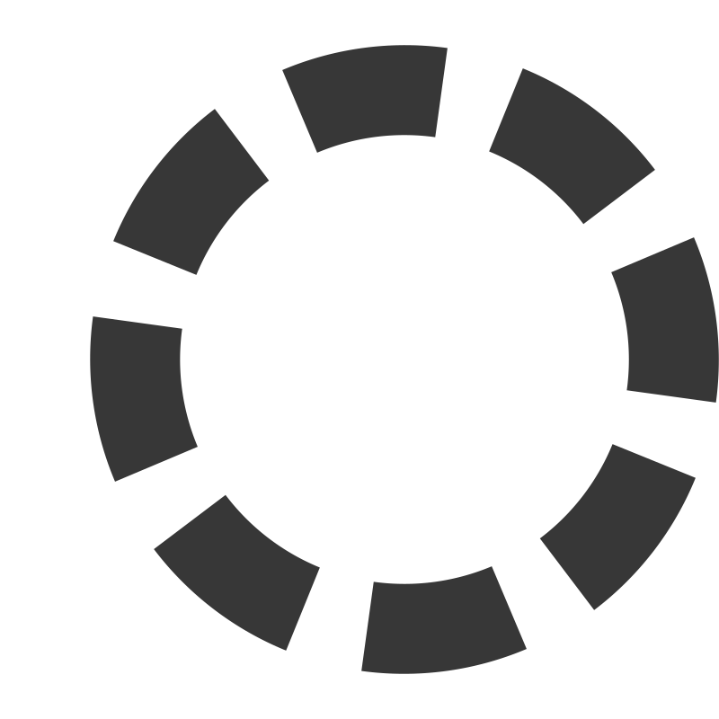</a> | **📂 檔名:** `local-selection-inactive.svg` ✨ **格式:** `Vector (SVG)` ⚖️ **大小:** `2.03KB` 📅 **更新:** `2026-02-28`  🚀 **jsDelivr Markdown:** `` 🔗 **直接連結 (Url):** <code>https://cdn.jsdelivr.net/gh/barry028/materials@main/images/iCons/Krita%20Sharp%20Interface%20iCons/local-selection-inactive.svg</code> 📥 [檢視原始檔](local-selection-inactive.svg) |
|  | **📂 檔名:** `locked.svg` ✨ **格式:** `Vector (SVG)` ⚖️ **大小:** `1.53KB` 📅 **更新:** `2026-02-28`  🚀 **jsDelivr Markdown:** `` 🔗 **直接連結 (Url):** <code>https://cdn.jsdelivr.net/gh/barry028/materials@main/images/iCons/Krita%20Sharp%20Interface%20iCons/locked.svg</code> 📥 [檢視原始檔](locked.svg) |
|  | **📂 檔名:** `media-playback-start.svg` ✨ **格式:** `Vector (SVG)` ⚖️ **大小:** `2.06KB` 📅 **更新:** `2026-02-28`  🚀 **jsDelivr Markdown:** `` 🔗 **直接連結 (Url):** <code>https://cdn.jsdelivr.net/gh/barry028/materials@main/images/iCons/Krita%20Sharp%20Interface%20iCons/media-playback-start.svg</code> 📥 [檢視原始檔](media-playback-start.svg) |
| <a href="media-playback-stop.svg">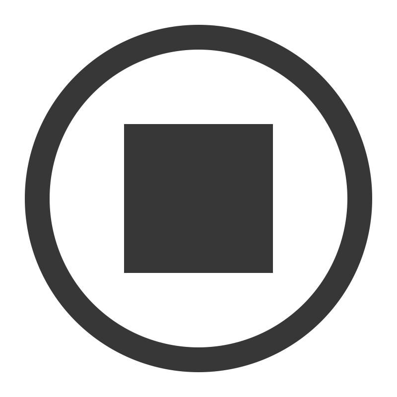</a> | **📂 檔名:** `media-playback-stop.svg` ✨ **格式:** `Vector (SVG)` ⚖️ **大小:** `2.08KB` 📅 **更新:** `2026-02-28`  🚀 **jsDelivr Markdown:** `` 🔗 **直接連結 (Url):** <code>https://cdn.jsdelivr.net/gh/barry028/materials@main/images/iCons/Krita%20Sharp%20Interface%20iCons/media-playback-stop.svg</code> 📥 [檢視原始檔](media-playback-stop.svg) |
|  | **📂 檔名:** `media-record.svg` ✨ **格式:** `Vector (SVG)` ⚖️ **大小:** `2.07KB` 📅 **更新:** `2026-02-28`  🚀 **jsDelivr Markdown:** `` 🔗 **直接連結 (Url):** <code>https://cdn.jsdelivr.net/gh/barry028/materials@main/images/iCons/Krita%20Sharp%20Interface%20iCons/media-record.svg</code> 📥 [檢視原始檔](media-record.svg) |
| <a href="merge-layer-below.svg">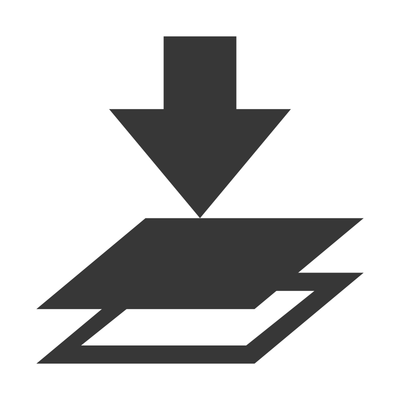</a> | **📂 檔名:** `merge-layer-below.svg` ✨ **格式:** `Vector (SVG)` ⚖️ **大小:** `3.99KB` 📅 **更新:** `2026-02-28`  🚀 **jsDelivr Markdown:** `` 🔗 **直接連結 (Url):** <code>https://cdn.jsdelivr.net/gh/barry028/materials@main/images/iCons/Krita%20Sharp%20Interface%20iCons/merge-layer-below.svg</code> 📥 [檢視原始檔](merge-layer-below.svg) |
| <a href="mirror-view-16.svg">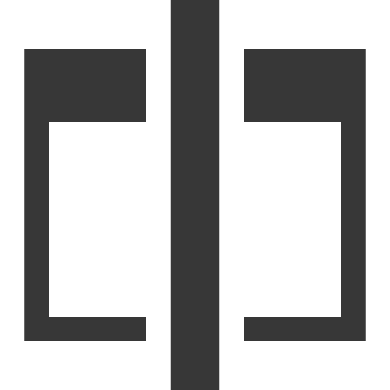</a> | **📂 檔名:** `mirror-view-16.svg` ✨ **格式:** `Vector (SVG)` ⚖️ **大小:** `2.41KB` 📅 **更新:** `2026-02-28`  🚀 **jsDelivr Markdown:** `` 🔗 **直接連結 (Url):** <code>https://cdn.jsdelivr.net/gh/barry028/materials@main/images/iCons/Krita%20Sharp%20Interface%20iCons/mirror-view-16.svg</code> 📥 [檢視原始檔](mirror-view-16.svg) |
| <a href="mirror-view-around-cursor-16.svg">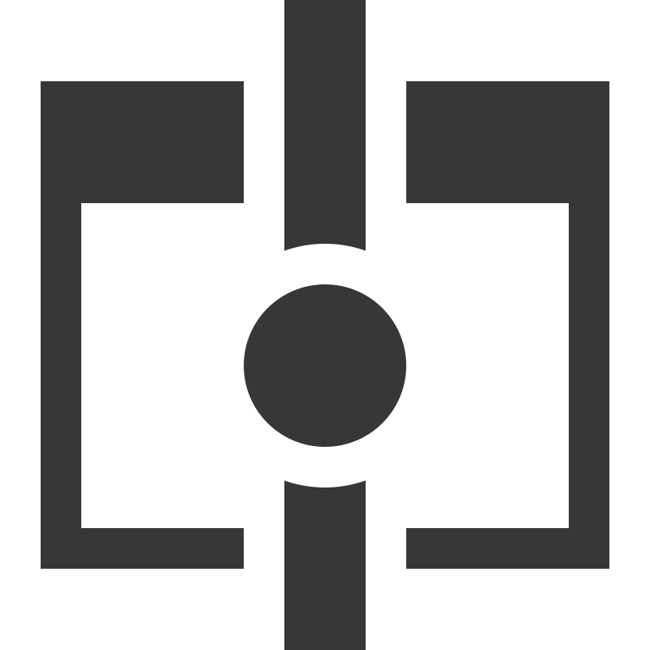</a> | **📂 檔名:** `mirror-view-around-cursor-16.svg` ✨ **格式:** `Vector (SVG)` ⚖️ **大小:** `3.10KB` 📅 **更新:** `2026-02-28`  🚀 **jsDelivr Markdown:** `` 🔗 **直接連結 (Url):** <code>https://cdn.jsdelivr.net/gh/barry028/materials@main/images/iCons/Krita%20Sharp%20Interface%20iCons/mirror-view-around-cursor-16.svg</code> 📥 [檢視原始檔](mirror-view-around-cursor-16.svg) |
| <a href="mirror-view-around-cursor.svg">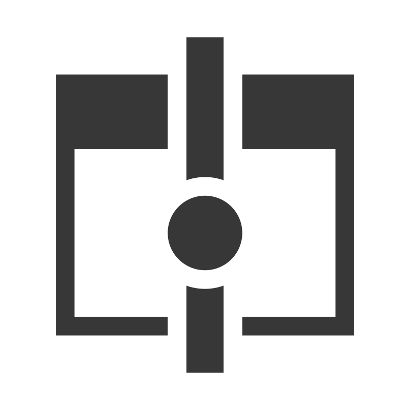</a> | **📂 檔名:** `mirror-view-around-cursor.svg` ✨ **格式:** `Vector (SVG)` ⚖️ **大小:** `4.58KB` 📅 **更新:** `2026-02-28`  🚀 **jsDelivr Markdown:** `` 🔗 **直接連結 (Url):** <code>https://cdn.jsdelivr.net/gh/barry028/materials@main/images/iCons/Krita%20Sharp%20Interface%20iCons/mirror-view-around-cursor.svg</code> 📥 [檢視原始檔](mirror-view-around-cursor.svg) |
|  | **📂 檔名:** `mirror-view.svg` ✨ **格式:** `Vector (SVG)` ⚖️ **大小:** `4.26KB` 📅 **更新:** `2026-02-28`  🚀 **jsDelivr Markdown:** `` 🔗 **直接連結 (Url):** <code>https://cdn.jsdelivr.net/gh/barry028/materials@main/images/iCons/Krita%20Sharp%20Interface%20iCons/mirror-view.svg</code> 📥 [檢視原始檔](mirror-view.svg) |
|  | **📂 檔名:** `nextframe.svg` ✨ **格式:** `Vector (SVG)` ⚖️ **大小:** `27.98KB` 📅 **更新:** `2026-02-28`  🚀 **jsDelivr Markdown:** `` 🔗 **直接連結 (Url):** <code>https://cdn.jsdelivr.net/gh/barry028/materials@main/images/iCons/Krita%20Sharp%20Interface%20iCons/nextframe.svg</code> 📥 [檢視原始檔](nextframe.svg) |
|  | **📂 檔名:** `nextkeyframe.svg` ✨ **格式:** `Vector (SVG)` ⚖️ **大小:** `2.47KB` 📅 **更新:** `2026-02-28`  🚀 **jsDelivr Markdown:** `` 🔗 **直接連結 (Url):** <code>https://cdn.jsdelivr.net/gh/barry028/materials@main/images/iCons/Krita%20Sharp%20Interface%20iCons/nextkeyframe.svg</code> 📥 [檢視原始檔](nextkeyframe.svg) |
| <a href="novisible.svg">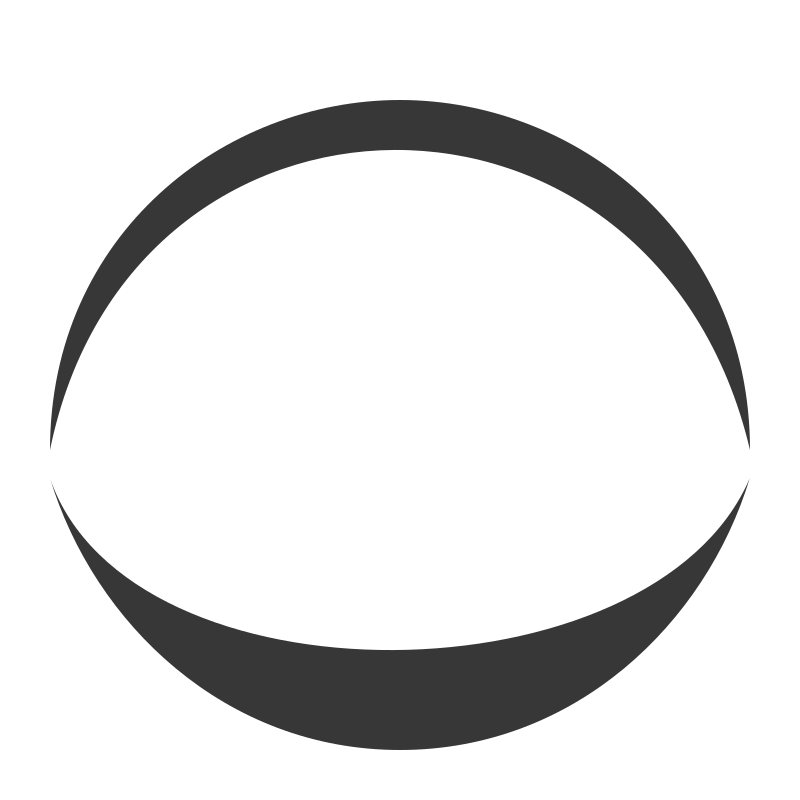</a> | **📂 檔名:** `novisible.svg` ✨ **格式:** `Vector (SVG)` ⚖️ **大小:** `1.59KB` 📅 **更新:** `2026-02-28`  🚀 **jsDelivr Markdown:** `` 🔗 **直接連結 (Url):** <code>https://cdn.jsdelivr.net/gh/barry028/materials@main/images/iCons/Krita%20Sharp%20Interface%20iCons/novisible.svg</code> 📥 [檢視原始檔](novisible.svg) |
| <a href="palette-edit.svg">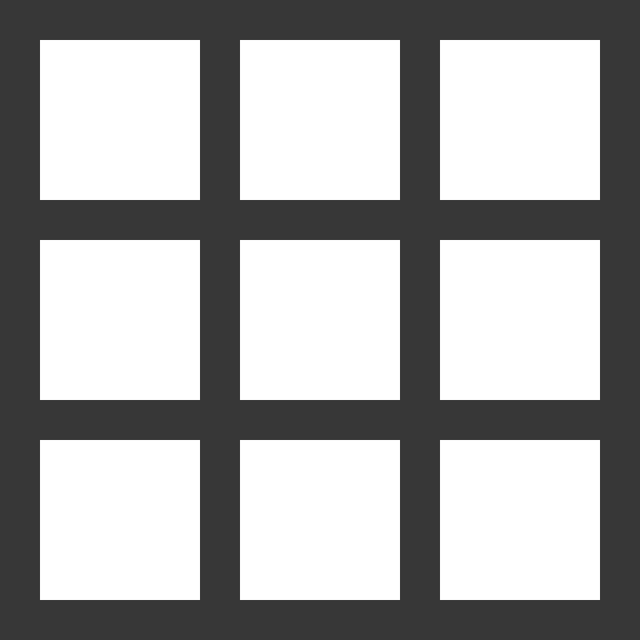</a> | **📂 檔名:** `palette-edit.svg` ✨ **格式:** `Vector (SVG)` ⚖️ **大小:** `1.62KB` 📅 **更新:** `2026-02-28`  🚀 **jsDelivr Markdown:** `` 🔗 **直接連結 (Url):** <code>https://cdn.jsdelivr.net/gh/barry028/materials@main/images/iCons/Krita%20Sharp%20Interface%20iCons/palette-edit.svg</code> 📥 [檢視原始檔](palette-edit.svg) |
|  | **📂 檔名:** `palette-library.svg` ✨ **格式:** `Vector (SVG)` ⚖️ **大小:** `2.91KB` 📅 **更新:** `2026-02-28`  🚀 **jsDelivr Markdown:** `` 🔗 **直接連結 (Url):** <code>https://cdn.jsdelivr.net/gh/barry028/materials@main/images/iCons/Krita%20Sharp%20Interface%20iCons/palette-library.svg</code> 📥 [檢視原始檔](palette-library.svg) |
| <a href="passthrough-disabled.svg">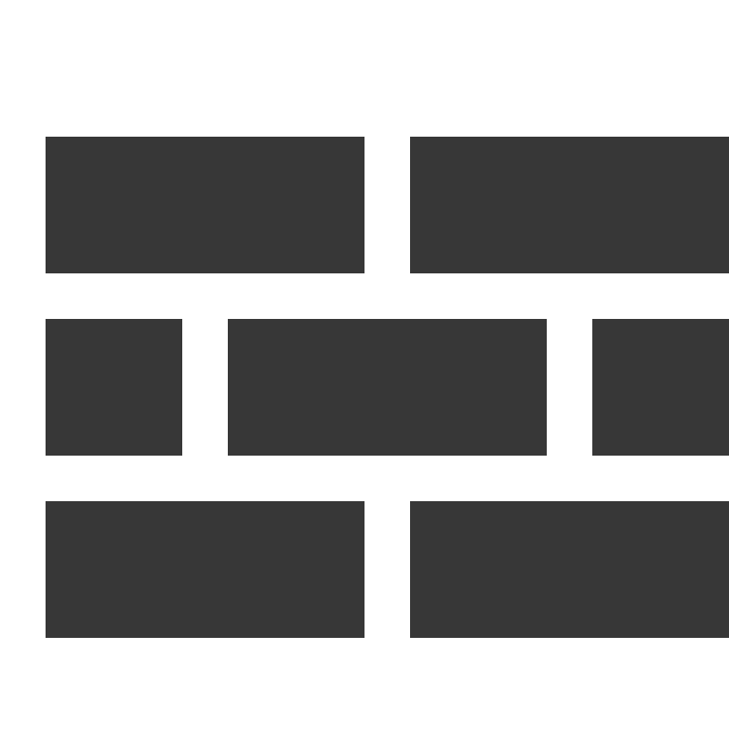</a> | **📂 檔名:** `passthrough-disabled.svg` ✨ **格式:** `Vector (SVG)` ⚖️ **大小:** `3.01KB` 📅 **更新:** `2026-02-28`  🚀 **jsDelivr Markdown:** `` 🔗 **直接連結 (Url):** <code>https://cdn.jsdelivr.net/gh/barry028/materials@main/images/iCons/Krita%20Sharp%20Interface%20iCons/passthrough-disabled.svg</code> 📥 [檢視原始檔](passthrough-disabled.svg) |
| <a href="passthrough-enabled.svg">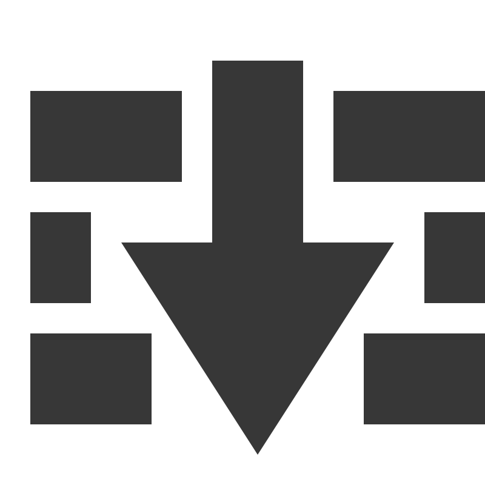</a> | **📂 檔名:** `passthrough-enabled.svg` ✨ **格式:** `Vector (SVG)` ⚖️ **大小:** `3.02KB` 📅 **更新:** `2026-02-28`  🚀 **jsDelivr Markdown:** `` 🔗 **直接連結 (Url):** <code>https://cdn.jsdelivr.net/gh/barry028/materials@main/images/iCons/Krita%20Sharp%20Interface%20iCons/passthrough-enabled.svg</code> 📥 [檢視原始檔](passthrough-enabled.svg) |
| <a href="portrait.svg">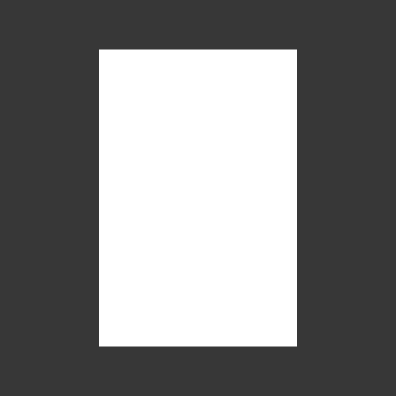</a> | **📂 檔名:** `portrait.svg` ✨ **格式:** `Vector (SVG)` ⚖️ **大小:** `2.78KB` 📅 **更新:** `2026-02-28`  🚀 **jsDelivr Markdown:** `` 🔗 **直接連結 (Url):** <code>https://cdn.jsdelivr.net/gh/barry028/materials@main/images/iCons/Krita%20Sharp%20Interface%20iCons/portrait.svg</code> 📥 [檢視原始檔](portrait.svg) |
| <a href="preset-switcher.svg">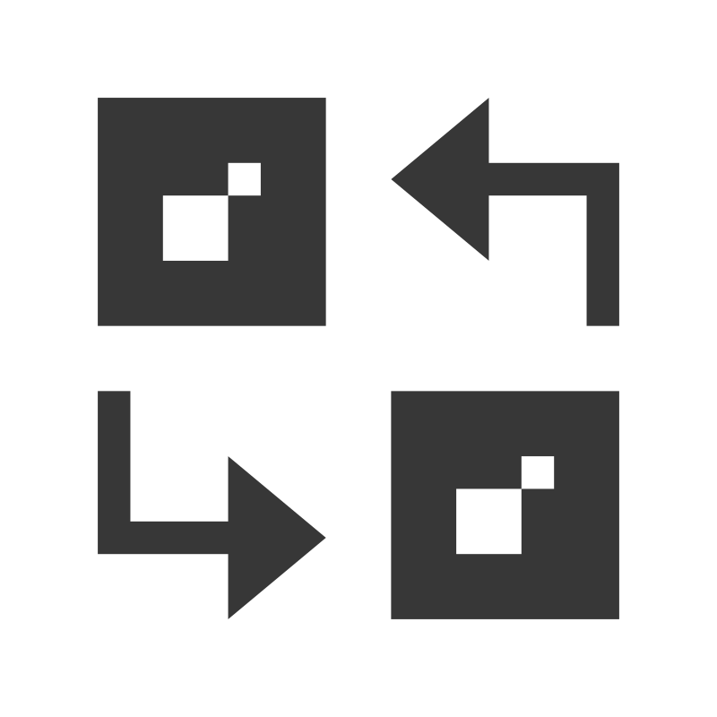</a> | **📂 檔名:** `preset-switcher.svg` ✨ **格式:** `Vector (SVG)` ⚖️ **大小:** `4.47KB` 📅 **更新:** `2026-02-28`  🚀 **jsDelivr Markdown:** `` 🔗 **直接連結 (Url):** <code>https://cdn.jsdelivr.net/gh/barry028/materials@main/images/iCons/Krita%20Sharp%20Interface%20iCons/preset-switcher.svg</code> 📥 [檢視原始檔](preset-switcher.svg) |
|  | **📂 檔名:** `prevframe.svg` ✨ **格式:** `Vector (SVG)` ⚖️ **大小:** `2.52KB` 📅 **更新:** `2026-02-28`  🚀 **jsDelivr Markdown:** `` 🔗 **直接連結 (Url):** <code>https://cdn.jsdelivr.net/gh/barry028/materials@main/images/iCons/Krita%20Sharp%20Interface%20iCons/prevframe.svg</code> 📥 [檢視原始檔](prevframe.svg) |
|  | **📂 檔名:** `prevkeyframe.svg` ✨ **格式:** `Vector (SVG)` ⚖️ **大小:** `2.44KB` 📅 **更新:** `2026-02-28`  🚀 **jsDelivr Markdown:** `` 🔗 **直接連結 (Url):** <code>https://cdn.jsdelivr.net/gh/barry028/materials@main/images/iCons/Krita%20Sharp%20Interface%20iCons/prevkeyframe.svg</code> 📥 [檢視原始檔](prevkeyframe.svg) |
|  | **📂 檔名:** `python.svg` ✨ **格式:** `Vector (SVG)` ⚖️ **大小:** `3.05KB` 📅 **更新:** `2026-02-28`  🚀 **jsDelivr Markdown:** `` 🔗 **直接連結 (Url):** <code>https://cdn.jsdelivr.net/gh/barry028/materials@main/images/iCons/Krita%20Sharp%20Interface%20iCons/python.svg</code> 📥 [檢視原始檔](python.svg) |
| <a href="ratio.svg">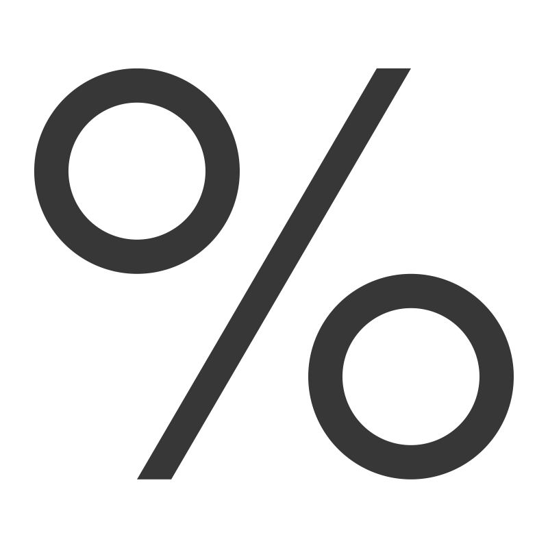</a> | **📂 檔名:** `ratio.svg` ✨ **格式:** `Vector (SVG)` ⚖️ **大小:** `4.33KB` 📅 **更新:** `2026-02-28`  🚀 **jsDelivr Markdown:** `` 🔗 **直接連結 (Url):** <code>https://cdn.jsdelivr.net/gh/barry028/materials@main/images/iCons/Krita%20Sharp%20Interface%20iCons/ratio.svg</code> 📥 [檢視原始檔](ratio.svg) |
|  | **📂 檔名:** `region-filling-boundary-fill.svg` ✨ **格式:** `Vector (SVG)` ⚖️ **大小:** `1.23KB` 📅 **更新:** `2026-02-28`  🚀 **jsDelivr Markdown:** `` 🔗 **直接連結 (Url):** <code>https://cdn.jsdelivr.net/gh/barry028/materials@main/images/iCons/Krita%20Sharp%20Interface%20iCons/region-filling-boundary-fill.svg</code> 📥 [檢視原始檔](region-filling-boundary-fill.svg) |
|  | **📂 檔名:** `region-filling-flood-fill.svg` ✨ **格式:** `Vector (SVG)` ⚖️ **大小:** `1.15KB` 📅 **更新:** `2026-02-28`  🚀 **jsDelivr Markdown:** `` 🔗 **直接連結 (Url):** <code>https://cdn.jsdelivr.net/gh/barry028/materials@main/images/iCons/Krita%20Sharp%20Interface%20iCons/region-filling-flood-fill.svg</code> 📥 [檢視原始檔](region-filling-flood-fill.svg) |
|  | **📂 檔名:** `reload-preset-16.svg` ✨ **格式:** `Vector (SVG)` ⚖️ **大小:** `1.94KB` 📅 **更新:** `2026-02-28`  🚀 **jsDelivr Markdown:** `` 🔗 **直接連結 (Url):** <code>https://cdn.jsdelivr.net/gh/barry028/materials@main/images/iCons/Krita%20Sharp%20Interface%20iCons/reload-preset-16.svg</code> 📥 [檢視原始檔](reload-preset-16.svg) |
|  | **📂 檔名:** `reload-preset.svg` ✨ **格式:** `Vector (SVG)` ⚖️ **大小:** `2.28KB` 📅 **更新:** `2026-02-28`  🚀 **jsDelivr Markdown:** `` 🔗 **直接連結 (Url):** <code>https://cdn.jsdelivr.net/gh/barry028/materials@main/images/iCons/Krita%20Sharp%20Interface%20iCons/reload-preset.svg</code> 📥 [檢視原始檔](reload-preset.svg) |
|  | **📂 檔名:** `rotate-canvas-left.svg` ✨ **格式:** `Vector (SVG)` ⚖️ **大小:** `5.15KB` 📅 **更新:** `2026-02-28`  🚀 **jsDelivr Markdown:** `` 🔗 **直接連結 (Url):** <code>https://cdn.jsdelivr.net/gh/barry028/materials@main/images/iCons/Krita%20Sharp%20Interface%20iCons/rotate-canvas-left.svg</code> 📥 [檢視原始檔](rotate-canvas-left.svg) |
|  | **📂 檔名:** `rotate-canvas-right.svg` ✨ **格式:** `Vector (SVG)` ⚖️ **大小:** `5.13KB` 📅 **更新:** `2026-02-28`  🚀 **jsDelivr Markdown:** `` 🔗 **直接連結 (Url):** <code>https://cdn.jsdelivr.net/gh/barry028/materials@main/images/iCons/Krita%20Sharp%20Interface%20iCons/rotate-canvas-right.svg</code> 📥 [檢視原始檔](rotate-canvas-right.svg) |
|  | **📂 檔名:** `rotation-reset.svg` ✨ **格式:** `Vector (SVG)` ⚖️ **大小:** `7.36KB` 📅 **更新:** `2026-02-28`  🚀 **jsDelivr Markdown:** `` 🔗 **直接連結 (Url):** <code>https://cdn.jsdelivr.net/gh/barry028/materials@main/images/iCons/Krita%20Sharp%20Interface%20iCons/rotation-reset.svg</code> 📥 [檢視原始檔](rotation-reset.svg) |
|  | **📂 檔名:** `sample-screen.svg` ✨ **格式:** `Vector (SVG)` ⚖️ **大小:** `1.76KB` 📅 **更新:** `2026-02-28`  🚀 **jsDelivr Markdown:** `` 🔗 **直接連結 (Url):** <code>https://cdn.jsdelivr.net/gh/barry028/materials@main/images/iCons/Krita%20Sharp%20Interface%20iCons/sample-screen.svg</code> 📥 [檢視原始檔](sample-screen.svg) |
| <a href="select-all.svg">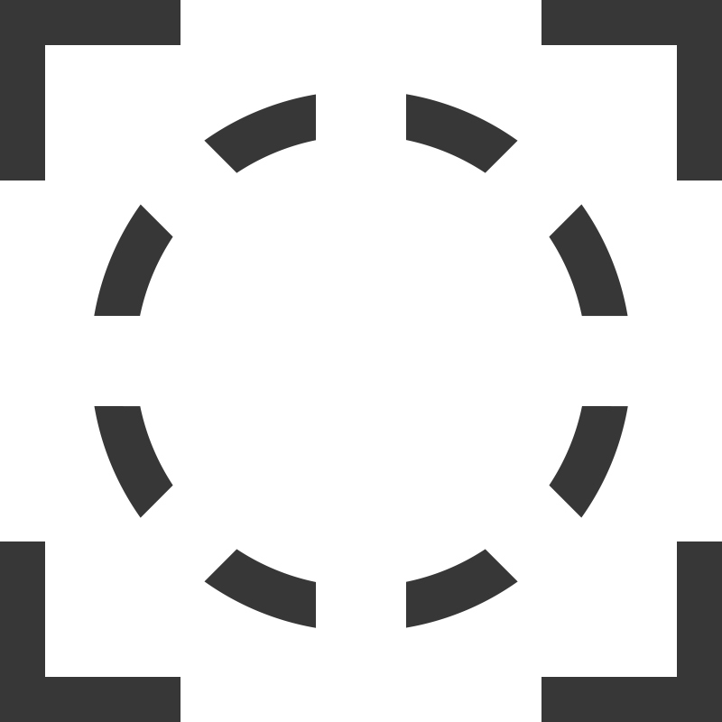</a> | **📂 檔名:** `select-all.svg` ✨ **格式:** `Vector (SVG)` ⚖️ **大小:** `2.61KB` 📅 **更新:** `2026-02-28`  🚀 **jsDelivr Markdown:** `` 🔗 **直接連結 (Url):** <code>https://cdn.jsdelivr.net/gh/barry028/materials@main/images/iCons/Krita%20Sharp%20Interface%20iCons/select-all.svg</code> 📥 [檢視原始檔](select-all.svg) |
|  | **📂 檔名:** `select-clear.svg` ✨ **格式:** `Vector (SVG)` ⚖️ **大小:** `2.82KB` 📅 **更新:** `2026-02-28`  🚀 **jsDelivr Markdown:** `` 🔗 **直接連結 (Url):** <code>https://cdn.jsdelivr.net/gh/barry028/materials@main/images/iCons/Krita%20Sharp%20Interface%20iCons/select-clear.svg</code> 📥 [檢視原始檔](select-clear.svg) |
| <a href="select-pixel.svg">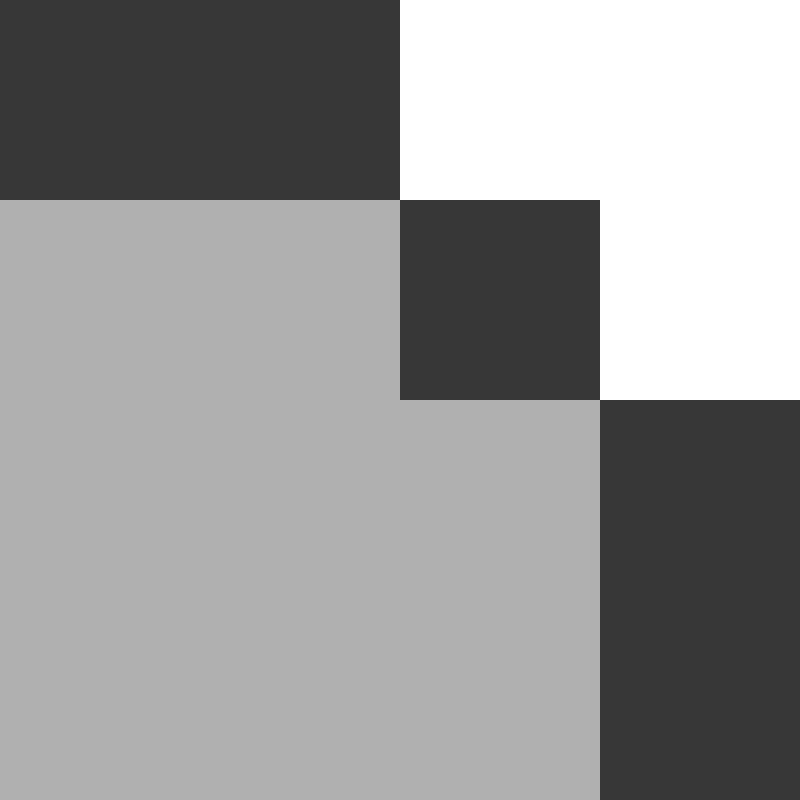</a> | **📂 檔名:** `select-pixel.svg` ✨ **格式:** `Vector (SVG)` ⚖️ **大小:** `1.59KB` 📅 **更新:** `2026-02-28`  🚀 **jsDelivr Markdown:** `` 🔗 **直接連結 (Url):** <code>https://cdn.jsdelivr.net/gh/barry028/materials@main/images/iCons/Krita%20Sharp%20Interface%20iCons/select-pixel.svg</code> 📥 [檢視原始檔](select-pixel.svg) |
| <a href="select-shape.svg">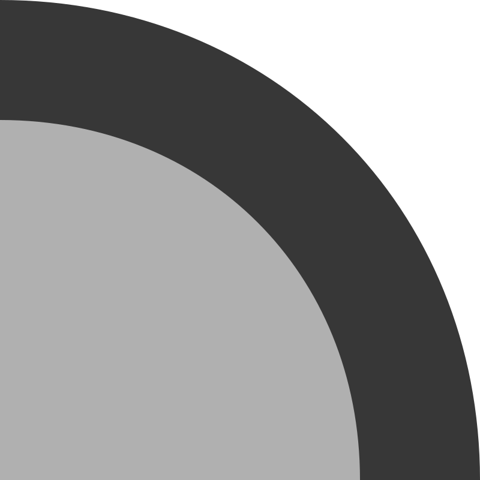</a> | **📂 檔名:** `select-shape.svg` ✨ **格式:** `Vector (SVG)` ⚖️ **大小:** `1.62KB` 📅 **更新:** `2026-02-28`  🚀 **jsDelivr Markdown:** `` 🔗 **直接連結 (Url):** <code>https://cdn.jsdelivr.net/gh/barry028/materials@main/images/iCons/Krita%20Sharp%20Interface%20iCons/select-shape.svg</code> 📥 [檢視原始檔](select-shape.svg) |
|  | **📂 檔名:** `selection-add.svg` ✨ **格式:** `Vector (SVG)` ⚖️ **大小:** `1.79KB` 📅 **更新:** `2026-02-28`  🚀 **jsDelivr Markdown:** `` 🔗 **直接連結 (Url):** <code>https://cdn.jsdelivr.net/gh/barry028/materials@main/images/iCons/Krita%20Sharp%20Interface%20iCons/selection-add.svg</code> 📥 [檢視原始檔](selection-add.svg) |
|  | **📂 檔名:** `selection-info.svg` ✨ **格式:** `Vector (SVG)` ⚖️ **大小:** `2.26KB` 📅 **更新:** `2026-02-28`  🚀 **jsDelivr Markdown:** `` 🔗 **直接連結 (Url):** <code>https://cdn.jsdelivr.net/gh/barry028/materials@main/images/iCons/Krita%20Sharp%20Interface%20iCons/selection-info.svg</code> 📥 [檢視原始檔](selection-info.svg) |
| <a href="selection-intersect.svg">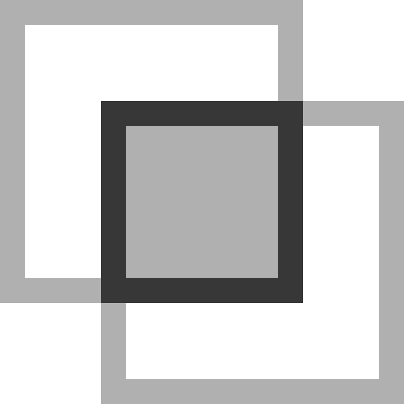</a> | **📂 檔名:** `selection-intersect.svg` ✨ **格式:** `Vector (SVG)` ⚖️ **大小:** `1.90KB` 📅 **更新:** `2026-02-28`  🚀 **jsDelivr Markdown:** `` 🔗 **直接連結 (Url):** <code>https://cdn.jsdelivr.net/gh/barry028/materials@main/images/iCons/Krita%20Sharp%20Interface%20iCons/selection-intersect.svg</code> 📥 [檢視原始檔](selection-intersect.svg) |
| <a href="selection-mode-ants.svg">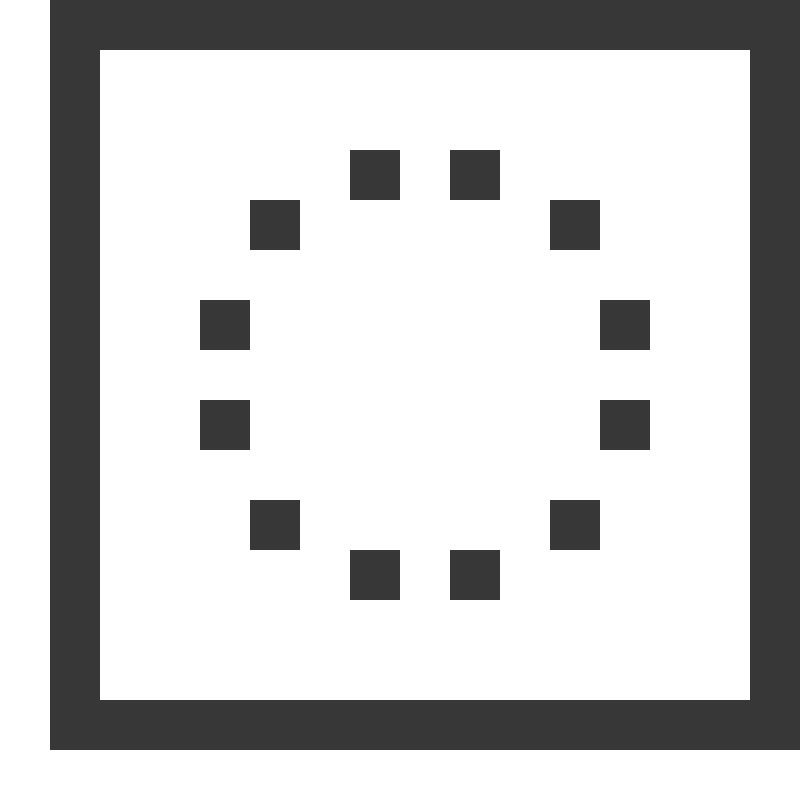</a> | **📂 檔名:** `selection-mode-ants.svg` ✨ **格式:** `Vector (SVG)` ⚖️ **大小:** `5.73KB` 📅 **更新:** `2026-02-28`  🚀 **jsDelivr Markdown:** `` 🔗 **直接連結 (Url):** <code>https://cdn.jsdelivr.net/gh/barry028/materials@main/images/iCons/Krita%20Sharp%20Interface%20iCons/selection-mode-ants.svg</code> 📥 [檢視原始檔](selection-mode-ants.svg) |
| <a href="selection-mode-invisible.svg">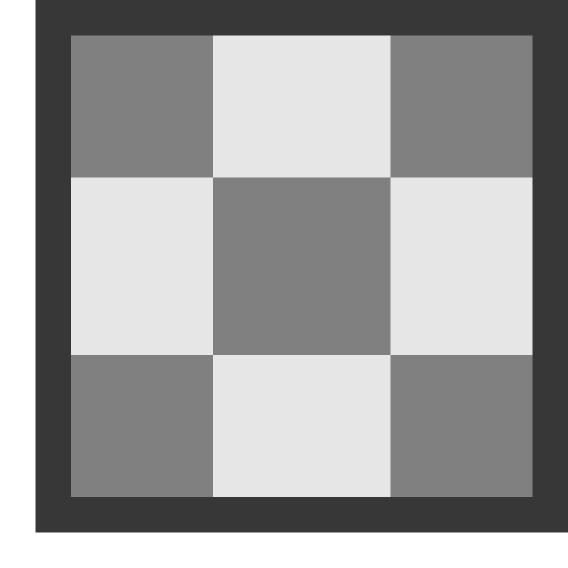</a> | **📂 檔名:** `selection-mode-invisible.svg` ✨ **格式:** `Vector (SVG)` ⚖️ **大小:** `4.19KB` 📅 **更新:** `2026-02-28`  🚀 **jsDelivr Markdown:** `` 🔗 **直接連結 (Url):** <code>https://cdn.jsdelivr.net/gh/barry028/materials@main/images/iCons/Krita%20Sharp%20Interface%20iCons/selection-mode-invisible.svg</code> 📥 [檢視原始檔](selection-mode-invisible.svg) |
| <a href="selection-mode-mask.svg">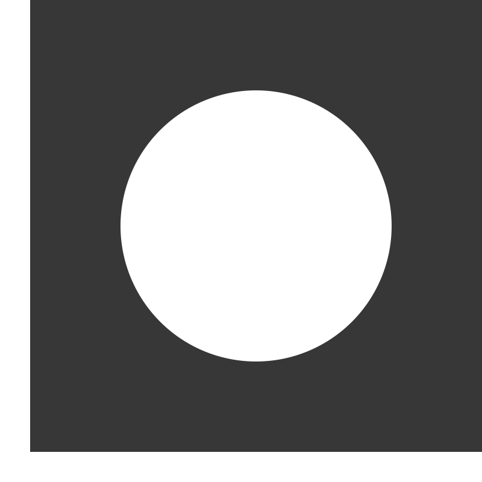</a> | **📂 檔名:** `selection-mode-mask.svg` ✨ **格式:** `Vector (SVG)` ⚖️ **大小:** `2.60KB` 📅 **更新:** `2026-02-28`  🚀 **jsDelivr Markdown:** `` 🔗 **直接連結 (Url):** <code>https://cdn.jsdelivr.net/gh/barry028/materials@main/images/iCons/Krita%20Sharp%20Interface%20iCons/selection-mode-mask.svg</code> 📥 [檢視原始檔](selection-mode-mask.svg) |
|  | **📂 檔名:** `selection-replace.svg` ✨ **格式:** `Vector (SVG)` ⚖️ **大小:** `1.82KB` 📅 **更新:** `2026-02-28`  🚀 **jsDelivr Markdown:** `` 🔗 **直接連結 (Url):** <code>https://cdn.jsdelivr.net/gh/barry028/materials@main/images/iCons/Krita%20Sharp%20Interface%20iCons/selection-replace.svg</code> 📥 [檢視原始檔](selection-replace.svg) |
| <a href="selection-subtract.svg">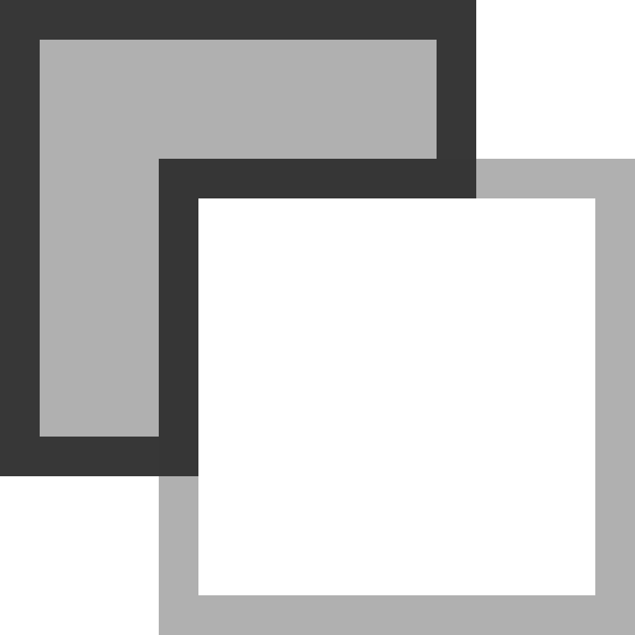</a> | **📂 檔名:** `selection-subtract.svg` ✨ **格式:** `Vector (SVG)` ⚖️ **大小:** `2.10KB` 📅 **更新:** `2026-02-28`  🚀 **jsDelivr Markdown:** `` 🔗 **直接連結 (Url):** <code>https://cdn.jsdelivr.net/gh/barry028/materials@main/images/iCons/Krita%20Sharp%20Interface%20iCons/selection-subtract.svg</code> 📥 [檢視原始檔](selection-subtract.svg) |
| <a href="selection-symmetric-difference.svg">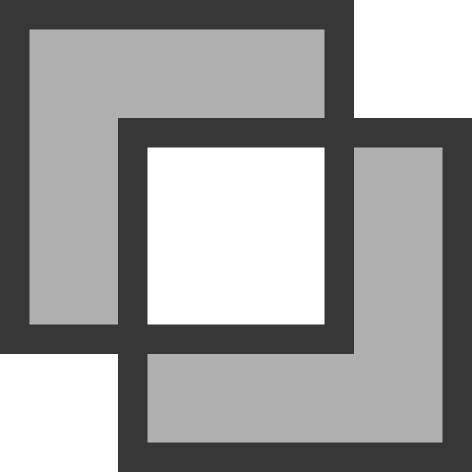</a> | **📂 檔名:** `selection-symmetric-difference.svg` ✨ **格式:** `Vector (SVG)` ⚖️ **大小:** `2.38KB` 📅 **更新:** `2026-02-28`  🚀 **jsDelivr Markdown:** `` 🔗 **直接連結 (Url):** <code>https://cdn.jsdelivr.net/gh/barry028/materials@main/images/iCons/Krita%20Sharp%20Interface%20iCons/selection-symmetric-difference.svg</code> 📥 [檢視原始檔](selection-symmetric-difference.svg) |
|  | **📂 檔名:** `showcoloring.svg` ✨ **格式:** `Vector (SVG)` ⚖️ **大小:** `32.96KB` 📅 **更新:** `2026-02-28`  🚀 **jsDelivr Markdown:** `` 🔗 **直接連結 (Url):** <code>https://cdn.jsdelivr.net/gh/barry028/materials@main/images/iCons/Krita%20Sharp%20Interface%20iCons/showcoloring.svg</code> 📥 [檢視原始檔](showcoloring.svg) |
| <a href="showcoloringoff.svg">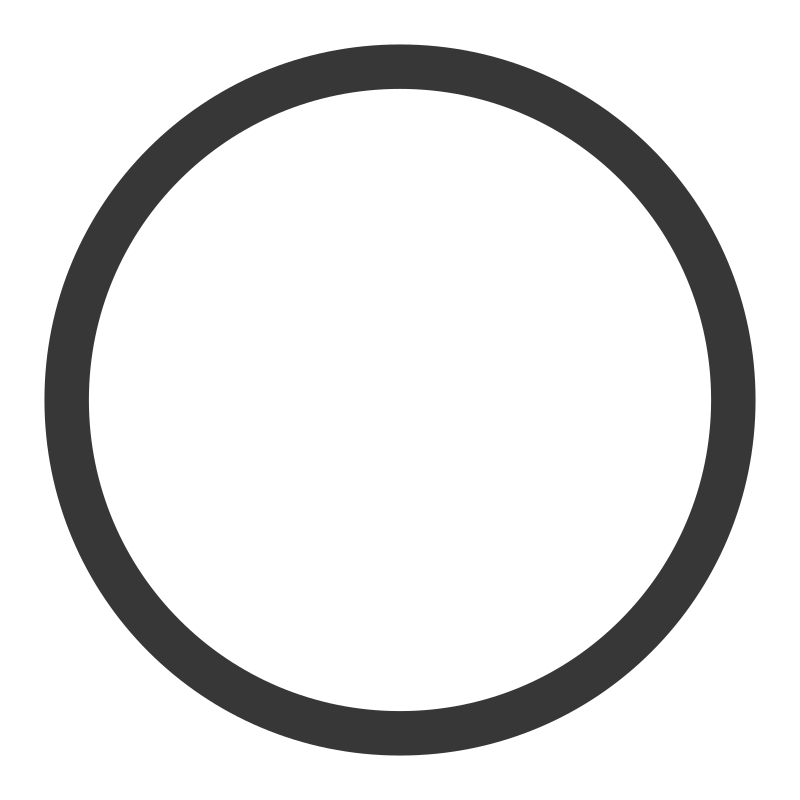</a> | **📂 檔名:** `showcoloringoff.svg` ✨ **格式:** `Vector (SVG)` ⚖️ **大小:** `32.31KB` 📅 **更新:** `2026-02-28`  🚀 **jsDelivr Markdown:** `` 🔗 **直接連結 (Url):** <code>https://cdn.jsdelivr.net/gh/barry028/materials@main/images/iCons/Krita%20Sharp%20Interface%20iCons/showcoloringoff.svg</code> 📥 [檢視原始檔](showcoloringoff.svg) |
| <a href="showmarks.svg">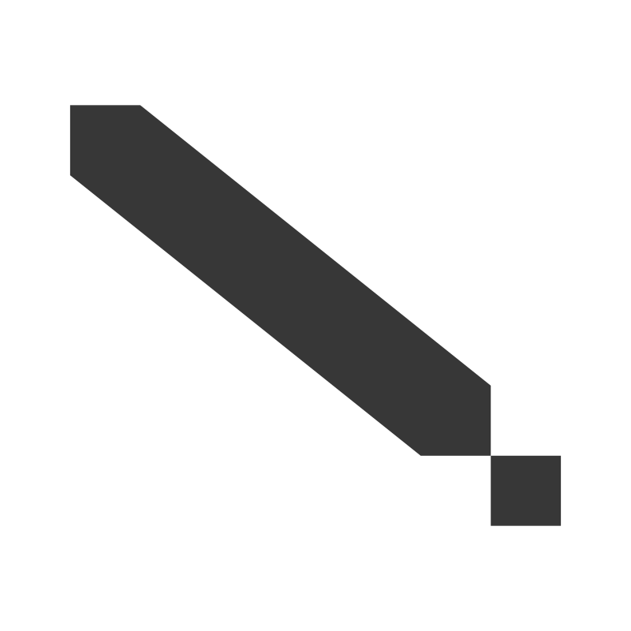</a> | **📂 檔名:** `showmarks.svg` ✨ **格式:** `Vector (SVG)` ⚖️ **大小:** `32.08KB` 📅 **更新:** `2026-02-28`  🚀 **jsDelivr Markdown:** `` 🔗 **直接連結 (Url):** <code>https://cdn.jsdelivr.net/gh/barry028/materials@main/images/iCons/Krita%20Sharp%20Interface%20iCons/showmarks.svg</code> 📥 [檢視原始檔](showmarks.svg) |
|  | **📂 檔名:** `showmarksoff.svg` ✨ **格式:** `Vector (SVG)` ⚖️ **大小:** `32.34KB` 📅 **更新:** `2026-02-28`  🚀 **jsDelivr Markdown:** `` 🔗 **直接連結 (Url):** <code>https://cdn.jsdelivr.net/gh/barry028/materials@main/images/iCons/Krita%20Sharp%20Interface%20iCons/showmarksoff.svg</code> 📥 [檢視原始檔](showmarksoff.svg) |
| <a href="sidebaricon.svg">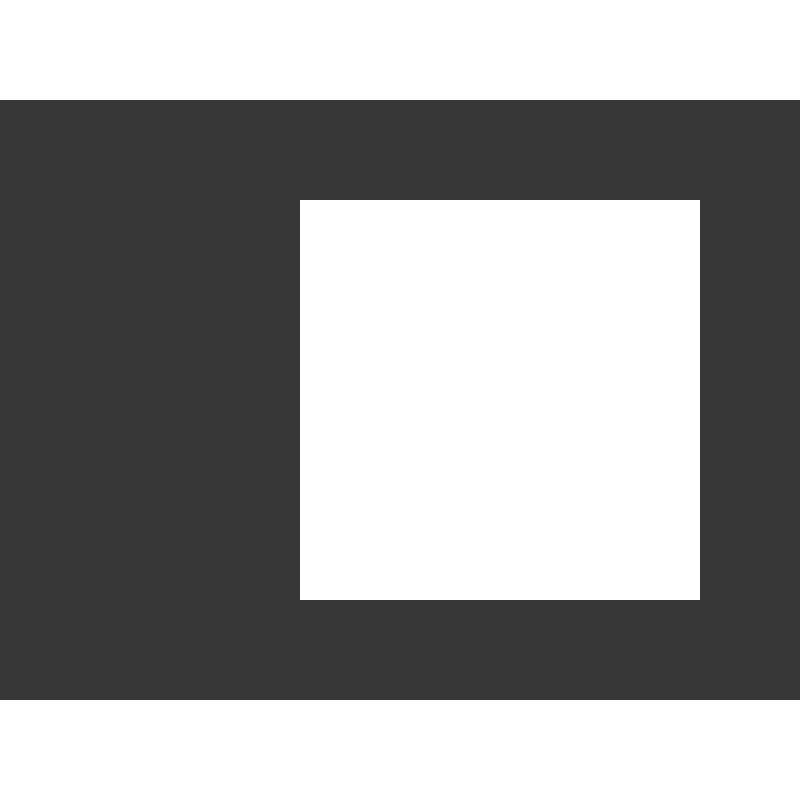</a> | **📂 檔名:** `sidebaricon.svg` ✨ **格式:** `Vector (SVG)` ⚖️ **大小:** `1.50KB` 📅 **更新:** `2026-02-28`  🚀 **jsDelivr Markdown:** `` 🔗 **直接連結 (Url):** <code>https://cdn.jsdelivr.net/gh/barry028/materials@main/images/iCons/Krita%20Sharp%20Interface%20iCons/sidebaricon.svg</code> 📥 [檢視原始檔](sidebaricon.svg) |
|  | **📂 檔名:** `similar-regions.svg` ✨ **格式:** `Vector (SVG)` ⚖️ **大小:** `803.00B` 📅 **更新:** `2026-02-28`  🚀 **jsDelivr Markdown:** `` 🔗 **直接連結 (Url):** <code>https://cdn.jsdelivr.net/gh/barry028/materials@main/images/iCons/Krita%20Sharp%20Interface%20iCons/similar-regions.svg</code> 📥 [檢視原始檔](similar-regions.svg) |
|  | **📂 檔名:** `similar-selection.svg` ✨ **格式:** `Vector (SVG)` ⚖️ **大小:** `1.89KB` 📅 **更新:** `2026-02-28`  🚀 **jsDelivr Markdown:** `` 🔗 **直接連結 (Url):** <code>https://cdn.jsdelivr.net/gh/barry028/materials@main/images/iCons/Krita%20Sharp%20Interface%20iCons/similar-selection.svg</code> 📥 [檢視原始檔](similar-selection.svg) |
| <a href="smoothing-basic.svg">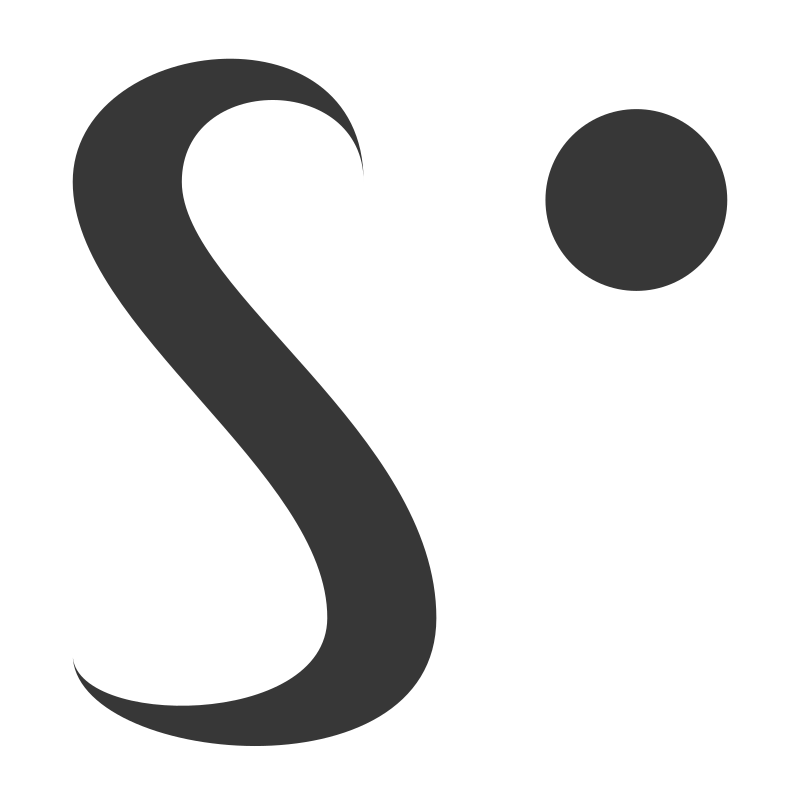</a> | **📂 檔名:** `smoothing-basic.svg` ✨ **格式:** `Vector (SVG)` ⚖️ **大小:** `4.14KB` 📅 **更新:** `2026-02-28`  🚀 **jsDelivr Markdown:** `` 🔗 **直接連結 (Url):** <code>https://cdn.jsdelivr.net/gh/barry028/materials@main/images/iCons/Krita%20Sharp%20Interface%20iCons/smoothing-basic.svg</code> 📥 [檢視原始檔](smoothing-basic.svg) |
|  | **📂 檔名:** `smoothing-no.svg` ✨ **格式:** `Vector (SVG)` ⚖️ **大小:** `3.98KB` 📅 **更新:** `2026-02-28`  🚀 **jsDelivr Markdown:** `` 🔗 **直接連結 (Url):** <code>https://cdn.jsdelivr.net/gh/barry028/materials@main/images/iCons/Krita%20Sharp%20Interface%20iCons/smoothing-no.svg</code> 📥 [檢視原始檔](smoothing-no.svg) |
|  | **📂 檔名:** `smoothing-stabilizer.svg` ✨ **格式:** `Vector (SVG)` ⚖️ **大小:** `5.39KB` 📅 **更新:** `2026-02-28`  🚀 **jsDelivr Markdown:** `` 🔗 **直接連結 (Url):** <code>https://cdn.jsdelivr.net/gh/barry028/materials@main/images/iCons/Krita%20Sharp%20Interface%20iCons/smoothing-stabilizer.svg</code> 📥 [檢視原始檔](smoothing-stabilizer.svg) |
| <a href="smoothing-weighted.svg">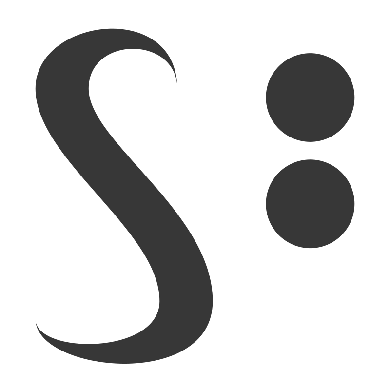</a> | **📂 檔名:** `smoothing-weighted.svg` ✨ **格式:** `Vector (SVG)` ⚖️ **大小:** `4.77KB` 📅 **更新:** `2026-02-28`  🚀 **jsDelivr Markdown:** `` 🔗 **直接連結 (Url):** <code>https://cdn.jsdelivr.net/gh/barry028/materials@main/images/iCons/Krita%20Sharp%20Interface%20iCons/smoothing-weighted.svg</code> 📥 [檢視原始檔](smoothing-weighted.svg) |
| <a href="sort-by-hue.svg">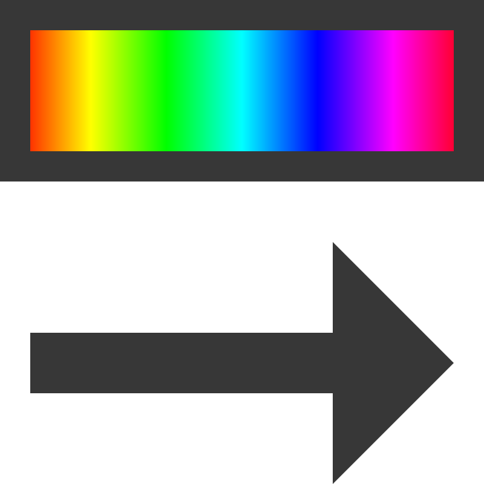</a> | **📂 檔名:** `sort-by-hue.svg` ✨ **格式:** `Vector (SVG)` ⚖️ **大小:** `2.43KB` 📅 **更新:** `2026-02-28`  🚀 **jsDelivr Markdown:** `` 🔗 **直接連結 (Url):** <code>https://cdn.jsdelivr.net/gh/barry028/materials@main/images/iCons/Krita%20Sharp%20Interface%20iCons/sort-by-hue.svg</code> 📥 [檢視原始檔](sort-by-hue.svg) |
| <a href="sort-by-value.svg">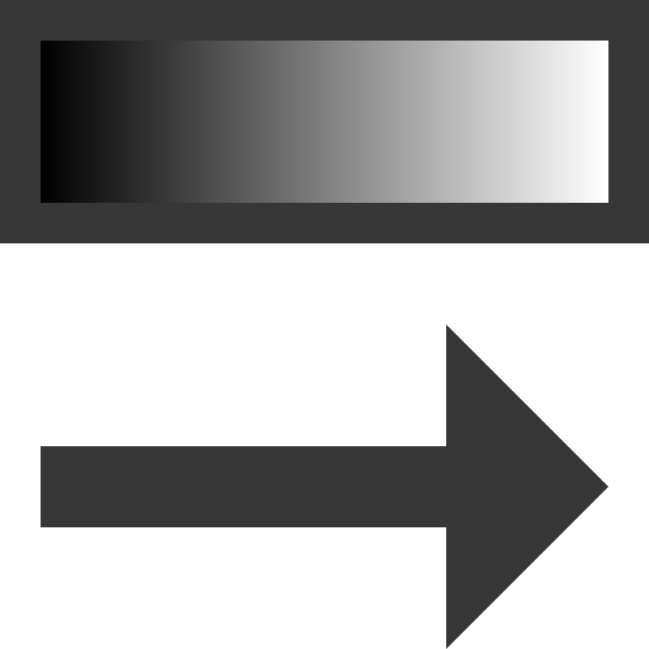</a> | **📂 檔名:** `sort-by-value.svg` ✨ **格式:** `Vector (SVG)` ⚖️ **大小:** `1.99KB` 📅 **更新:** `2026-02-28`  🚀 **jsDelivr Markdown:** `` 🔗 **直接連結 (Url):** <code>https://cdn.jsdelivr.net/gh/barry028/materials@main/images/iCons/Krita%20Sharp%20Interface%20iCons/sort-by-value.svg</code> 📥 [檢視原始檔](sort-by-value.svg) |
| <a href="split-layer.svg">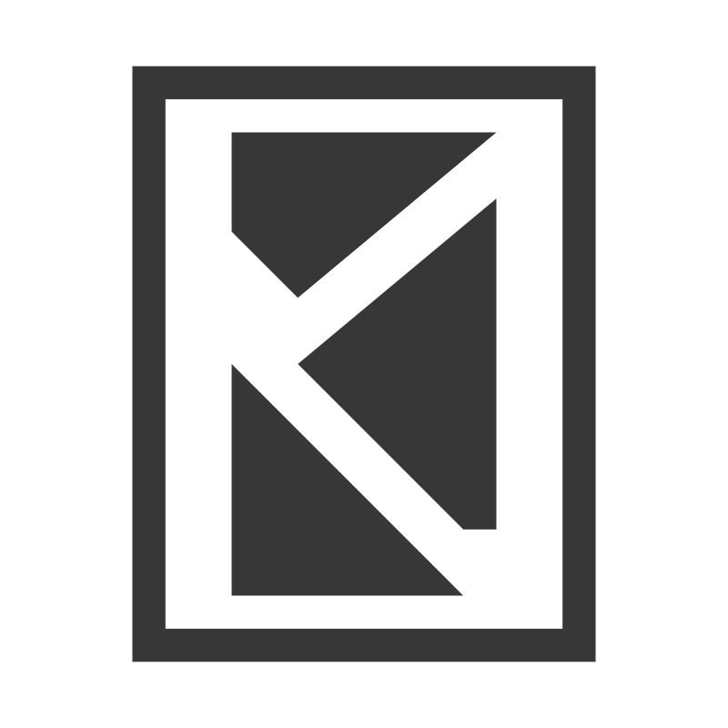</a> | **📂 檔名:** `split-layer.svg` ✨ **格式:** `Vector (SVG)` ⚖️ **大小:** `4.65KB` 📅 **更新:** `2026-02-28`  🚀 **jsDelivr Markdown:** `` 🔗 **直接連結 (Url):** <code>https://cdn.jsdelivr.net/gh/barry028/materials@main/images/iCons/Krita%20Sharp%20Interface%20iCons/split-layer.svg</code> 📥 [檢視原始檔](split-layer.svg) |
| <a href="stop-at-boundary.svg">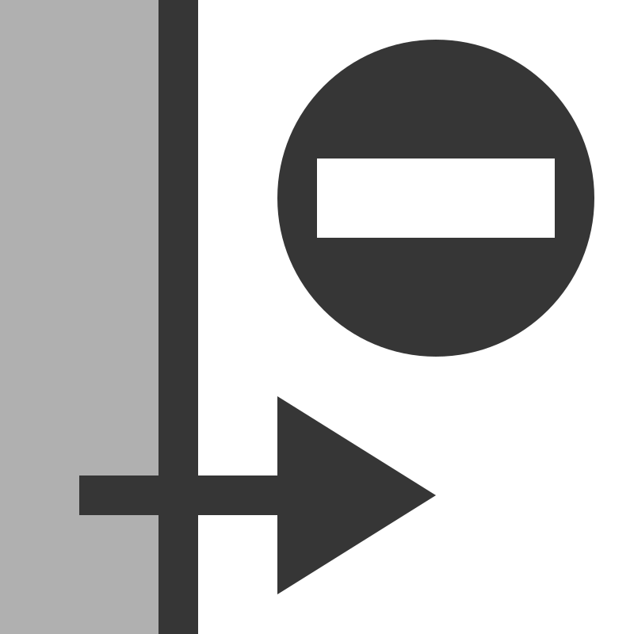</a> | **📂 檔名:** `stop-at-boundary.svg` ✨ **格式:** `Vector (SVG)` ⚖️ **大小:** `898.00B` 📅 **更新:** `2026-02-28`  🚀 **jsDelivr Markdown:** `` 🔗 **直接連結 (Url):** <code>https://cdn.jsdelivr.net/gh/barry028/materials@main/images/iCons/Krita%20Sharp%20Interface%20iCons/stop-at-boundary.svg</code> 📥 [檢視原始檔](stop-at-boundary.svg) |
|  | **📂 檔名:** `system-help.svg` ✨ **格式:** `Vector (SVG)` ⚖️ **大小:** `2.65KB` 📅 **更新:** `2026-02-28`  🚀 **jsDelivr Markdown:** `` 🔗 **直接連結 (Url):** <code>https://cdn.jsdelivr.net/gh/barry028/materials@main/images/iCons/Krita%20Sharp%20Interface%20iCons/system-help.svg</code> 📥 [檢視原始檔](system-help.svg) |
| <a href="transparency-disabled.svg">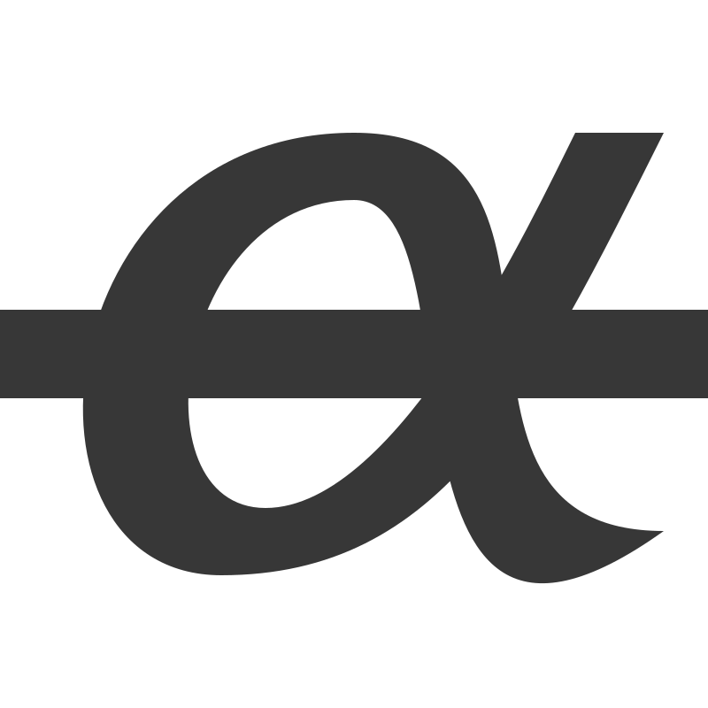</a> | **📂 檔名:** `transparency-disabled.svg` ✨ **格式:** `Vector (SVG)` ⚖️ **大小:** `1.73KB` 📅 **更新:** `2026-02-28`  🚀 **jsDelivr Markdown:** `` 🔗 **直接連結 (Url):** <code>https://cdn.jsdelivr.net/gh/barry028/materials@main/images/iCons/Krita%20Sharp%20Interface%20iCons/transparency-disabled.svg</code> 📥 [檢視原始檔](transparency-disabled.svg) |
|  | **📂 檔名:** `transparency-enabled.svg` ✨ **格式:** `Vector (SVG)` ⚖️ **大小:** `1.45KB` 📅 **更新:** `2026-02-28`  🚀 **jsDelivr Markdown:** `` 🔗 **直接連結 (Url):** <code>https://cdn.jsdelivr.net/gh/barry028/materials@main/images/iCons/Krita%20Sharp%20Interface%20iCons/transparency-enabled.svg</code> 📥 [檢視原始檔](transparency-enabled.svg) |
| <a href="trim-to-image.svg">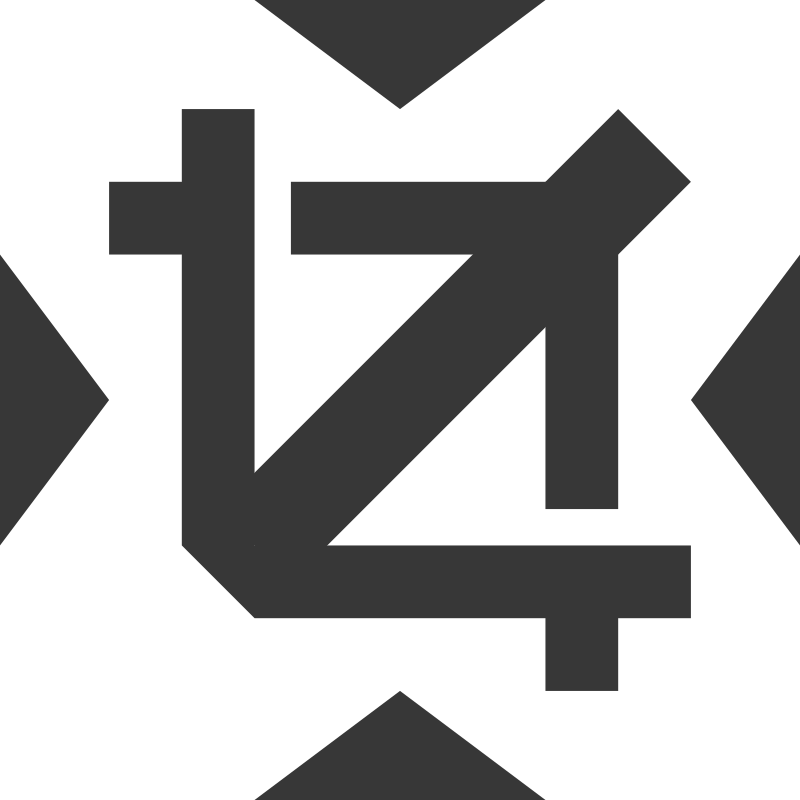</a> | **📂 檔名:** `trim-to-image.svg` ✨ **格式:** `Vector (SVG)` ⚖️ **大小:** `5.25KB` 📅 **更新:** `2026-02-28`  🚀 **jsDelivr Markdown:** `` 🔗 **直接連結 (Url):** <code>https://cdn.jsdelivr.net/gh/barry028/materials@main/images/iCons/Krita%20Sharp%20Interface%20iCons/trim-to-image.svg</code> 📥 [檢視原始檔](trim-to-image.svg) |
|  | **📂 檔名:** `unlocked.svg` ✨ **格式:** `Vector (SVG)` ⚖️ **大小:** `1.50KB` 📅 **更新:** `2026-02-28`  🚀 **jsDelivr Markdown:** `` 🔗 **直接連結 (Url):** <code>https://cdn.jsdelivr.net/gh/barry028/materials@main/images/iCons/Krita%20Sharp%20Interface%20iCons/unlocked.svg</code> 📥 [檢視原始檔](unlocked.svg) |
|  | **📂 檔名:** `updatecolorize.svg` ✨ **格式:** `Vector (SVG)` ⚖️ **大小:** `1.94KB` 📅 **更新:** `2026-02-28`  🚀 **jsDelivr Markdown:** `` 🔗 **直接連結 (Url):** <code>https://cdn.jsdelivr.net/gh/barry028/materials@main/images/iCons/Krita%20Sharp%20Interface%20iCons/updatecolorize.svg</code> 📥 [檢視原始檔](updatecolorize.svg) |
|  | **📂 檔名:** `user-identity.svg` ✨ **格式:** `Vector (SVG)` ⚖️ **大小:** `1.82KB` 📅 **更新:** `2026-02-28`  🚀 **jsDelivr Markdown:** `` 🔗 **直接連結 (Url):** <code>https://cdn.jsdelivr.net/gh/barry028/materials@main/images/iCons/Krita%20Sharp%20Interface%20iCons/user-identity.svg</code> 📥 [檢視原始檔](user-identity.svg) |
|  | **📂 檔名:** `view-filter.svg` ✨ **格式:** `Vector (SVG)` ⚖️ **大小:** `2.71KB` 📅 **更新:** `2026-02-28`  🚀 **jsDelivr Markdown:** `` 🔗 **直接連結 (Url):** <code>https://cdn.jsdelivr.net/gh/barry028/materials@main/images/iCons/Krita%20Sharp%20Interface%20iCons/view-filter.svg</code> 📥 [檢視原始檔](view-filter.svg) |
| <a href="view-list-details.svg">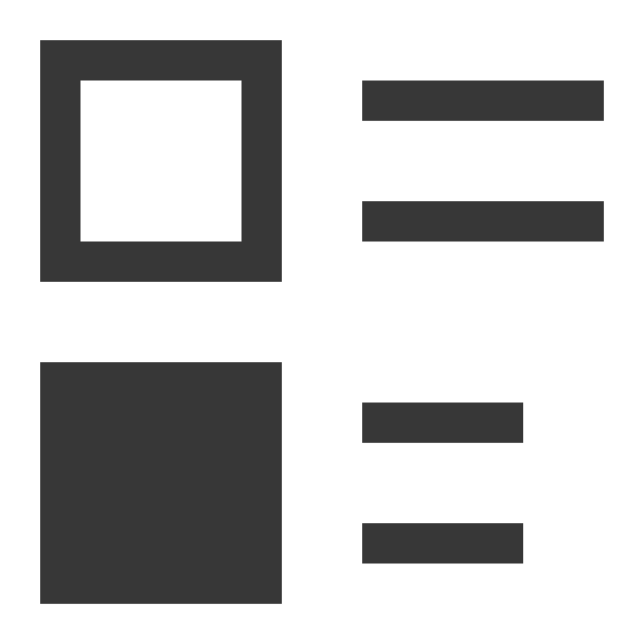</a> | **📂 檔名:** `view-list-details.svg` ✨ **格式:** `Vector (SVG)` ⚖️ **大小:** `2.34KB` 📅 **更新:** `2026-02-28`  🚀 **jsDelivr Markdown:** `` 🔗 **直接連結 (Url):** <code>https://cdn.jsdelivr.net/gh/barry028/materials@main/images/iCons/Krita%20Sharp%20Interface%20iCons/view-list-details.svg</code> 📥 [檢視原始檔](view-list-details.svg) |
|  | **📂 檔名:** `view-list-text-16.svg` ✨ **格式:** `Vector (SVG)` ⚖️ **大小:** `1.75KB` 📅 **更新:** `2026-02-28`  🚀 **jsDelivr Markdown:** `` 🔗 **直接連結 (Url):** <code>https://cdn.jsdelivr.net/gh/barry028/materials@main/images/iCons/Krita%20Sharp%20Interface%20iCons/view-list-text-16.svg</code> 📥 [檢視原始檔](view-list-text-16.svg) |
|  | **📂 檔名:** `view-preview.svg` ✨ **格式:** `Vector (SVG)` ⚖️ **大小:** `1.90KB` 📅 **更新:** `2026-02-28`  🚀 **jsDelivr Markdown:** `` 🔗 **直接連結 (Url):** <code>https://cdn.jsdelivr.net/gh/barry028/materials@main/images/iCons/Krita%20Sharp%20Interface%20iCons/view-preview.svg</code> 📥 [檢視原始檔](view-preview.svg) |
|  | **📂 檔名:** `visible.svg` ✨ **格式:** `Vector (SVG)` ⚖️ **大小:** `1.86KB` 📅 **更新:** `2026-02-28`  🚀 **jsDelivr Markdown:** `` 🔗 **直接連結 (Url):** <code>https://cdn.jsdelivr.net/gh/barry028/materials@main/images/iCons/Krita%20Sharp%20Interface%20iCons/visible.svg</code> 📥 [檢視原始檔](visible.svg) |
| <a href="warning.svg">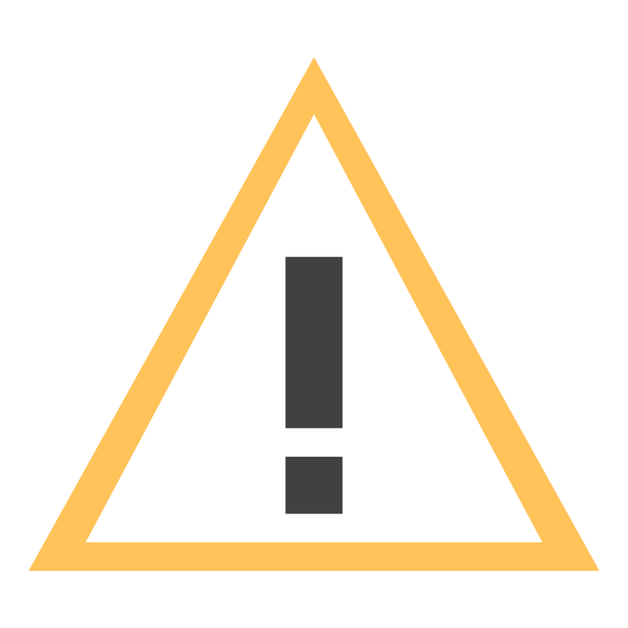</a> | **📂 檔名:** `warning.svg` ✨ **格式:** `Vector (SVG)` ⚖️ **大小:** `4.21KB` 📅 **更新:** `2026-02-28`  🚀 **jsDelivr Markdown:** `` 🔗 **直接連結 (Url):** <code>https://cdn.jsdelivr.net/gh/barry028/materials@main/images/iCons/Krita%20Sharp%20Interface%20iCons/warning.svg</code> 📥 [檢視原始檔](warning.svg) |
| <a href="wheel-light.svg">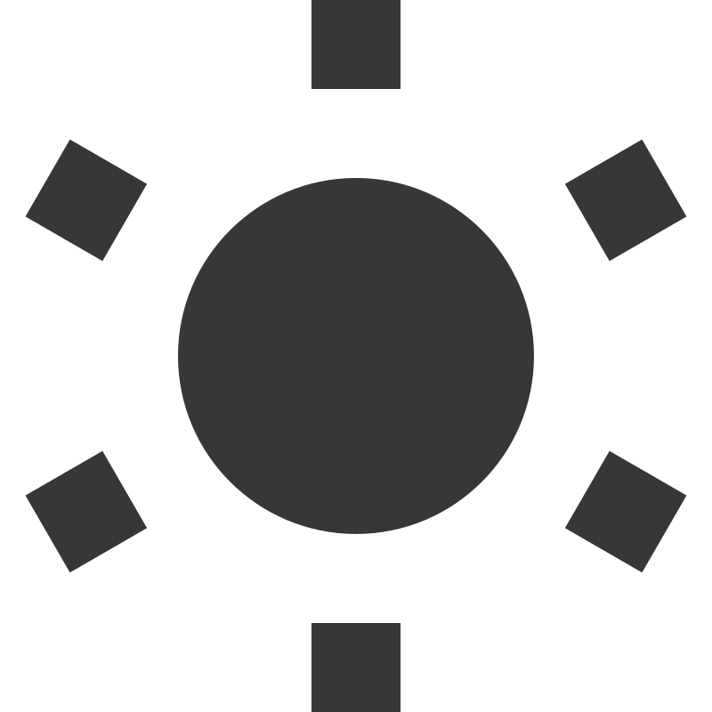</a> | **📂 檔名:** `wheel-light.svg` ✨ **格式:** `Vector (SVG)` ⚖️ **大小:** `2.66KB` 📅 **更新:** `2026-02-28`  🚀 **jsDelivr Markdown:** `` 🔗 **直接連結 (Url):** <code>https://cdn.jsdelivr.net/gh/barry028/materials@main/images/iCons/Krita%20Sharp%20Interface%20iCons/wheel-light.svg</code> 📥 [檢視原始檔](wheel-light.svg) |
| <a href="wheel-rings.svg">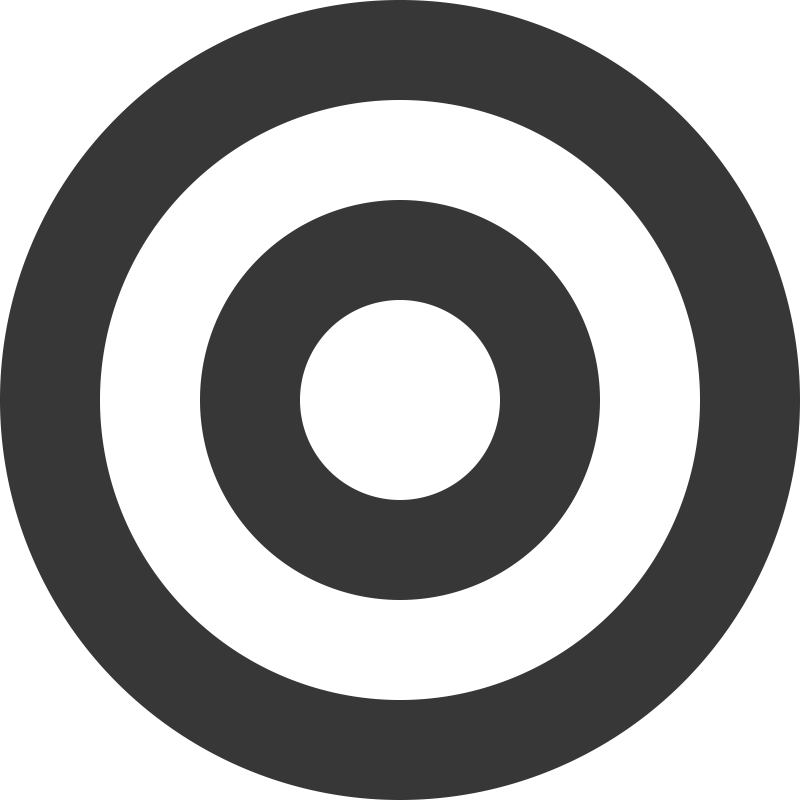</a> | **📂 檔名:** `wheel-rings.svg` ✨ **格式:** `Vector (SVG)` ⚖️ **大小:** `2.18KB` 📅 **更新:** `2026-02-28`  🚀 **jsDelivr Markdown:** `` 🔗 **直接連結 (Url):** <code>https://cdn.jsdelivr.net/gh/barry028/materials@main/images/iCons/Krita%20Sharp%20Interface%20iCons/wheel-rings.svg</code> 📥 [檢視原始檔](wheel-rings.svg) |
|  | **📂 檔名:** `wheel-sectors.svg` ✨ **格式:** `Vector (SVG)` ⚖️ **大小:** `2.84KB` 📅 **更新:** `2026-02-28`  🚀 **jsDelivr Markdown:** `` 🔗 **直接連結 (Url):** <code>https://cdn.jsdelivr.net/gh/barry028/materials@main/images/iCons/Krita%20Sharp%20Interface%20iCons/wheel-sectors.svg</code> 📥 [檢視原始檔](wheel-sectors.svg) |
| <a href="workspace-chooser.svg">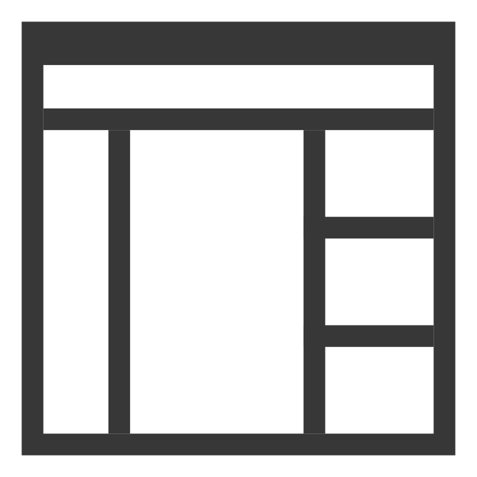</a> | **📂 檔名:** `workspace-chooser.svg` ✨ **格式:** `Vector (SVG)` ⚖️ **大小:** `2.80KB` 📅 **更新:** `2026-02-28`  🚀 **jsDelivr Markdown:** `` 🔗 **直接連結 (Url):** <code>https://cdn.jsdelivr.net/gh/barry028/materials@main/images/iCons/Krita%20Sharp%20Interface%20iCons/workspace-chooser.svg</code> 📥 [檢視原始檔](workspace-chooser.svg) |
| <a href="wraparound.svg">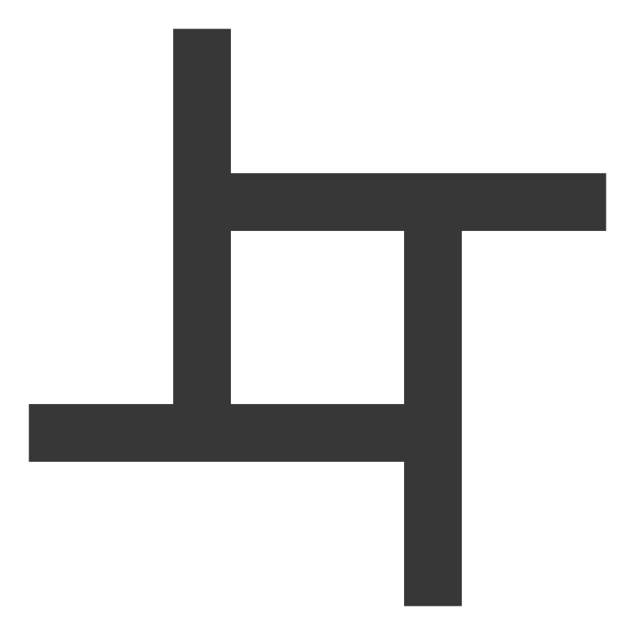</a> | **📂 檔名:** `wraparound.svg` ✨ **格式:** `Vector (SVG)` ⚖️ **大小:** `3.57KB` 📅 **更新:** `2026-02-28`  🚀 **jsDelivr Markdown:** `` 🔗 **直接連結 (Url):** <code>https://cdn.jsdelivr.net/gh/barry028/materials@main/images/iCons/Krita%20Sharp%20Interface%20iCons/wraparound.svg</code> 📥 [檢視原始檔](wraparound.svg) |
| <a href="zoom-fit-curve.svg">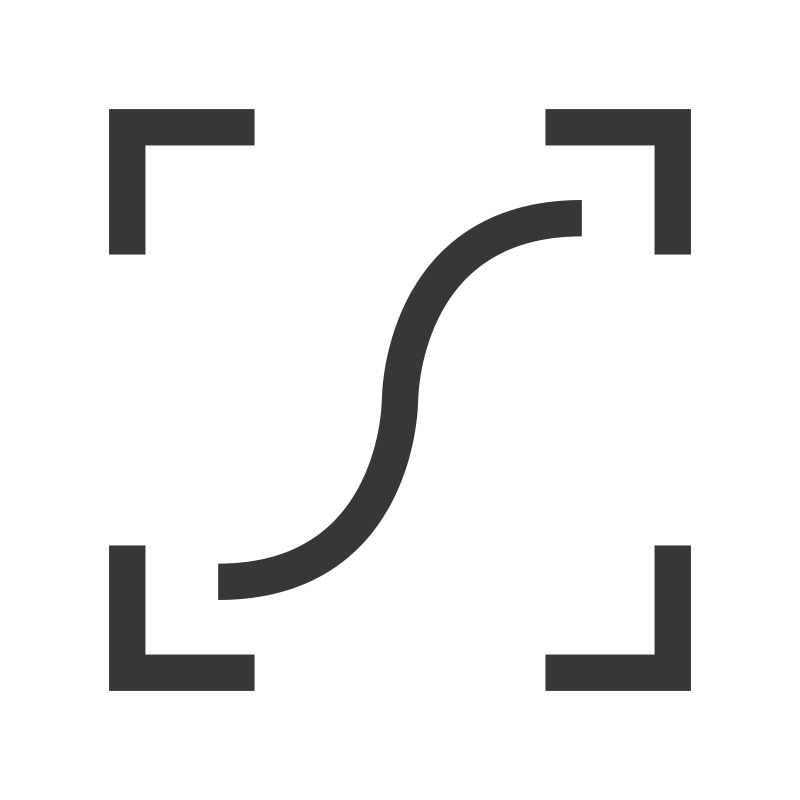</a> | **📂 檔名:** `zoom-fit-curve.svg` ✨ **格式:** `Vector (SVG)` ⚖️ **大小:** `4.09KB` 📅 **更新:** `2026-02-28`  🚀 **jsDelivr Markdown:** `` 🔗 **直接連結 (Url):** <code>https://cdn.jsdelivr.net/gh/barry028/materials@main/images/iCons/Krita%20Sharp%20Interface%20iCons/zoom-fit-curve.svg</code> 📥 [檢視原始檔](zoom-fit-curve.svg) |
| <a href="zoom-fit.svg">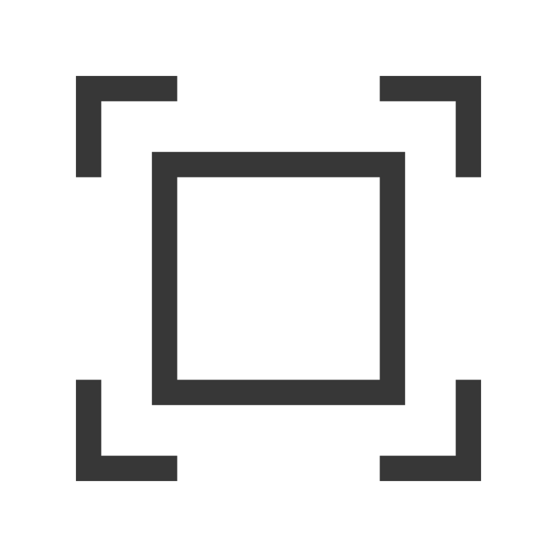</a> | **📂 檔名:** `zoom-fit.svg` ✨ **格式:** `Vector (SVG)` ⚖️ **大小:** `4.48KB` 📅 **更新:** `2026-02-28`  🚀 **jsDelivr Markdown:** `` 🔗 **直接連結 (Url):** <code>https://cdn.jsdelivr.net/gh/barry028/materials@main/images/iCons/Krita%20Sharp%20Interface%20iCons/zoom-fit.svg</code> 📥 [檢視原始檔](zoom-fit.svg) |
|  | **📂 檔名:** `zoom-horizontal.svg` ✨ **格式:** `Vector (SVG)` ⚖️ **大小:** `4.92KB` 📅 **更新:** `2026-02-28`  🚀 **jsDelivr Markdown:** `` 🔗 **直接連結 (Url):** <code>https://cdn.jsdelivr.net/gh/barry028/materials@main/images/iCons/Krita%20Sharp%20Interface%20iCons/zoom-horizontal.svg</code> 📥 [檢視原始檔](zoom-horizontal.svg) |
|  | **📂 檔名:** `zoom-vertical.svg` ✨ **格式:** `Vector (SVG)` ⚖️ **大小:** `4.96KB` 📅 **更新:** `2026-02-28`  🚀 **jsDelivr Markdown:** `` 🔗 **直接連結 (Url):** <code>https://cdn.jsdelivr.net/gh/barry028/materials@main/images/iCons/Krita%20Sharp%20Interface%20iCons/zoom-vertical.svg</code> 📥 [檢視原始檔](zoom-vertical.svg) |