# 🖼️ 素材分類：KritaiCon

> [🏠 主目錄](../../../README.md) / [images](../../README.md) / [iCons](../README.md) / **KritaiCon**

本目錄共有 `283` 個檔案

| 🎨 預覽 (點擊放大)  | 📋 檔案詳細資訊與連結 |
| :--- | :--- |
|  | **📂 檔名:** `16_dark_align-horizontal-right.svg` ✨ **格式:** `Vector (SVG)` ⚖️ **大小:** `223.00B` 📅 **更新:** `2026-02-27`  🚀 **jsDelivr Markdown:** <code></code> 🔗 **直接連結 (Url):** <code>https://cdn.jsdelivr.net/gh/barry028/materials@main/images/iCons/KritaiCon/16_dark_align-horizontal-right.svg</code> 📥 [檢視原始檔](16_dark_align-horizontal-right.svg) |
|  | **📂 檔名:** `16_dark_align-vertical-bottom.svg` ✨ **格式:** `Vector (SVG)` ⚖️ **大小:** `3.14KB` 📅 **更新:** `2026-02-27`  🚀 **jsDelivr Markdown:** <code></code> 🔗 **直接連結 (Url):** <code>https://cdn.jsdelivr.net/gh/barry028/materials@main/images/iCons/KritaiCon/16_dark_align-vertical-bottom.svg</code> 📥 [檢視原始檔](16_dark_align-vertical-bottom.svg) |
|  | **📂 檔名:** `16_dark_align-vertical-center.svg` ✨ **格式:** `Vector (SVG)` ⚖️ **大小:** `3.14KB` 📅 **更新:** `2026-02-27`  🚀 **jsDelivr Markdown:** <code></code> 🔗 **直接連結 (Url):** <code>https://cdn.jsdelivr.net/gh/barry028/materials@main/images/iCons/KritaiCon/16_dark_align-vertical-center.svg</code> 📥 [檢視原始檔](16_dark_align-vertical-center.svg) |
|  | **📂 檔名:** `16_dark_application-x-krz.svg` ✨ **格式:** `Vector (SVG)` ⚖️ **大小:** `1.83KB` 📅 **更新:** `2026-02-27`  🚀 **jsDelivr Markdown:** <code></code> 🔗 **直接連結 (Url):** <code>https://cdn.jsdelivr.net/gh/barry028/materials@main/images/iCons/KritaiCon/16_dark_application-x-krz.svg</code> 📥 [檢視原始檔](16_dark_application-x-krz.svg) |
|  | **📂 檔名:** `16_dark_character-set.svg` ✨ **格式:** `Vector (SVG)` ⚖️ **大小:** `2.97KB` 📅 **更新:** `2026-02-27`  🚀 **jsDelivr Markdown:** <code></code> 🔗 **直接連結 (Url):** <code>https://cdn.jsdelivr.net/gh/barry028/materials@main/images/iCons/KritaiCon/16_dark_character-set.svg</code> 📥 [檢視原始檔](16_dark_character-set.svg) |
|  | **📂 檔名:** `16_dark_draw-arrow-back.svg` ✨ **格式:** `Vector (SVG)` ⚖️ **大小:** `2.80KB` 📅 **更新:** `2026-02-27`  🚀 **jsDelivr Markdown:** <code></code> 🔗 **直接連結 (Url):** <code>https://cdn.jsdelivr.net/gh/barry028/materials@main/images/iCons/KritaiCon/16_dark_draw-arrow-back.svg</code> 📥 [檢視原始檔](16_dark_draw-arrow-back.svg) |
|  | **📂 檔名:** `16_dark_draw-arrow-down.svg` ✨ **格式:** `Vector (SVG)` ⚖️ **大小:** `2.80KB` 📅 **更新:** `2026-02-27`  🚀 **jsDelivr Markdown:** <code></code> 🔗 **直接連結 (Url):** <code>https://cdn.jsdelivr.net/gh/barry028/materials@main/images/iCons/KritaiCon/16_dark_draw-arrow-down.svg</code> 📥 [檢視原始檔](16_dark_draw-arrow-down.svg) |
|  | **📂 檔名:** `16_dark_draw-arrow-forward.svg` ✨ **格式:** `Vector (SVG)` ⚖️ **大小:** `2.80KB` 📅 **更新:** `2026-02-27`  🚀 **jsDelivr Markdown:** <code></code> 🔗 **直接連結 (Url):** <code>https://cdn.jsdelivr.net/gh/barry028/materials@main/images/iCons/KritaiCon/16_dark_draw-arrow-forward.svg</code> 📥 [檢視原始檔](16_dark_draw-arrow-forward.svg) |
|  | **📂 檔名:** `16_dark_draw-arrow-up.svg` ✨ **格式:** `Vector (SVG)` ⚖️ **大小:** `2.79KB` 📅 **更新:** `2026-02-27`  🚀 **jsDelivr Markdown:** <code></code> 🔗 **直接連結 (Url):** <code>https://cdn.jsdelivr.net/gh/barry028/materials@main/images/iCons/KritaiCon/16_dark_draw-arrow-up.svg</code> 📥 [檢視原始檔](16_dark_draw-arrow-up.svg) |
|  | **📂 檔名:** `16_dark_draw-freehand.svg` ✨ **格式:** `Vector (SVG)` ⚖️ **大小:** `3.85KB` 📅 **更新:** `2026-02-27`  🚀 **jsDelivr Markdown:** <code></code> 🔗 **直接連結 (Url):** <code>https://cdn.jsdelivr.net/gh/barry028/materials@main/images/iCons/KritaiCon/16_dark_draw-freehand.svg</code> 📥 [檢視原始檔](16_dark_draw-freehand.svg) |
|  | **📂 檔名:** `16_dark_edit-rename.svg` ✨ **格式:** `Vector (SVG)` ⚖️ **大小:** `3.00KB` 📅 **更新:** `2026-02-27`  🚀 **jsDelivr Markdown:** <code></code> 🔗 **直接連結 (Url):** <code>https://cdn.jsdelivr.net/gh/barry028/materials@main/images/iCons/KritaiCon/16_dark_edit-rename.svg</code> 📥 [檢視原始檔](16_dark_edit-rename.svg) |
|  | **📂 檔名:** `16_dark_edit-select-all.svg` ✨ **格式:** `Vector (SVG)` ⚖️ **大小:** `4.21KB` 📅 **更新:** `2026-02-27`  🚀 **jsDelivr Markdown:** <code></code> 🔗 **直接連結 (Url):** <code>https://cdn.jsdelivr.net/gh/barry028/materials@main/images/iCons/KritaiCon/16_dark_edit-select-all.svg</code> 📥 [檢視原始檔](16_dark_edit-select-all.svg) |
|  | **📂 檔名:** `16_dark_format-indent-less.svg` ✨ **格式:** `Vector (SVG)` ⚖️ **大小:** `3.03KB` 📅 **更新:** `2026-02-27`  🚀 **jsDelivr Markdown:** <code></code> 🔗 **直接連結 (Url):** <code>https://cdn.jsdelivr.net/gh/barry028/materials@main/images/iCons/KritaiCon/16_dark_format-indent-less.svg</code> 📥 [檢視原始檔](16_dark_format-indent-less.svg) |
|  | **📂 檔名:** `16_dark_format-indent-more.svg` ✨ **格式:** `Vector (SVG)` ⚖️ **大小:** `3.06KB` 📅 **更新:** `2026-02-27`  🚀 **jsDelivr Markdown:** <code></code> 🔗 **直接連結 (Url):** <code>https://cdn.jsdelivr.net/gh/barry028/materials@main/images/iCons/KritaiCon/16_dark_format-indent-more.svg</code> 📥 [檢視原始檔](16_dark_format-indent-more.svg) |
|  | **📂 檔名:** `16_dark_format-justify-center.svg` ✨ **格式:** `Vector (SVG)` ⚖️ **大小:** `3.12KB` 📅 **更新:** `2026-02-27`  🚀 **jsDelivr Markdown:** <code></code> 🔗 **直接連結 (Url):** <code>https://cdn.jsdelivr.net/gh/barry028/materials@main/images/iCons/KritaiCon/16_dark_format-justify-center.svg</code> 📥 [檢視原始檔](16_dark_format-justify-center.svg) |
|  | **📂 檔名:** `16_dark_format-justify-fill.svg` ✨ **格式:** `Vector (SVG)` ⚖️ **大小:** `3.12KB` 📅 **更新:** `2026-02-27`  🚀 **jsDelivr Markdown:** <code></code> 🔗 **直接連結 (Url):** <code>https://cdn.jsdelivr.net/gh/barry028/materials@main/images/iCons/KritaiCon/16_dark_format-justify-fill.svg</code> 📥 [檢視原始檔](16_dark_format-justify-fill.svg) |
| <a href="16_dark_format-justify-left.svg">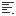</a> | **📂 檔名:** `16_dark_format-justify-left.svg` ✨ **格式:** `Vector (SVG)` ⚖️ **大小:** `4.70KB` 📅 **更新:** `2026-02-27`  🚀 **jsDelivr Markdown:** <code></code> 🔗 **直接連結 (Url):** <code>https://cdn.jsdelivr.net/gh/barry028/materials@main/images/iCons/KritaiCon/16_dark_format-justify-left.svg</code> 📥 [檢視原始檔](16_dark_format-justify-left.svg) |
|  | **📂 檔名:** `16_dark_format-justify-right.svg` ✨ **格式:** `Vector (SVG)` ⚖️ **大小:** `4.87KB` 📅 **更新:** `2026-02-27`  🚀 **jsDelivr Markdown:** <code></code> 🔗 **直接連結 (Url):** <code>https://cdn.jsdelivr.net/gh/barry028/materials@main/images/iCons/KritaiCon/16_dark_format-justify-right.svg</code> 📥 [檢視原始檔](16_dark_format-justify-right.svg) |
|  | **📂 檔名:** `16_dark_format-list-ordered.svg` ✨ **格式:** `Vector (SVG)` ⚖️ **大小:** `3.41KB` 📅 **更新:** `2026-02-27`  🚀 **jsDelivr Markdown:** <code></code> 🔗 **直接連結 (Url):** <code>https://cdn.jsdelivr.net/gh/barry028/materials@main/images/iCons/KritaiCon/16_dark_format-list-ordered.svg</code> 📥 [檢視原始檔](16_dark_format-list-ordered.svg) |
|  | **📂 檔名:** `16_dark_format-stroke-color.svg` ✨ **格式:** `Vector (SVG)` ⚖️ **大小:** `3.97KB` 📅 **更新:** `2026-02-27`  🚀 **jsDelivr Markdown:** <code></code> 🔗 **直接連結 (Url):** <code>https://cdn.jsdelivr.net/gh/barry028/materials@main/images/iCons/KritaiCon/16_dark_format-stroke-color.svg</code> 📥 [檢視原始檔](16_dark_format-stroke-color.svg) |
|  | **📂 檔名:** `16_dark_format-text-bold.svg` ✨ **格式:** `Vector (SVG)` ⚖️ **大小:** `3.19KB` 📅 **更新:** `2026-02-27`  🚀 **jsDelivr Markdown:** <code></code> 🔗 **直接連結 (Url):** <code>https://cdn.jsdelivr.net/gh/barry028/materials@main/images/iCons/KritaiCon/16_dark_format-text-bold.svg</code> 📥 [檢視原始檔](16_dark_format-text-bold.svg) |
|  | **📂 檔名:** `16_dark_format-text-color.svg` ✨ **格式:** `Vector (SVG)` ⚖️ **大小:** `3.10KB` 📅 **更新:** `2026-02-27`  🚀 **jsDelivr Markdown:** <code></code> 🔗 **直接連結 (Url):** <code>https://cdn.jsdelivr.net/gh/barry028/materials@main/images/iCons/KritaiCon/16_dark_format-text-color.svg</code> 📥 [檢視原始檔](16_dark_format-text-color.svg) |
|  | **📂 檔名:** `16_dark_format-text-direction-rtl.svg` ✨ **格式:** `Vector (SVG)` ⚖️ **大小:** `4.75KB` 📅 **更新:** `2026-02-27`  🚀 **jsDelivr Markdown:** <code></code> 🔗 **直接連結 (Url):** <code>https://cdn.jsdelivr.net/gh/barry028/materials@main/images/iCons/KritaiCon/16_dark_format-text-direction-rtl.svg</code> 📥 [檢視原始檔](16_dark_format-text-direction-rtl.svg) |
|  | **📂 檔名:** `16_dark_format-text-italic.svg` ✨ **格式:** `Vector (SVG)` ⚖️ **大小:** `3.38KB` 📅 **更新:** `2026-02-27`  🚀 **jsDelivr Markdown:** <code></code> 🔗 **直接連結 (Url):** <code>https://cdn.jsdelivr.net/gh/barry028/materials@main/images/iCons/KritaiCon/16_dark_format-text-italic.svg</code> 📥 [檢視原始檔](16_dark_format-text-italic.svg) |
|  | **📂 檔名:** `16_dark_format-text-strikethrough.svg` ✨ **格式:** `Vector (SVG)` ⚖️ **大小:** `3.03KB` 📅 **更新:** `2026-02-27`  🚀 **jsDelivr Markdown:** <code></code> 🔗 **直接連結 (Url):** <code>https://cdn.jsdelivr.net/gh/barry028/materials@main/images/iCons/KritaiCon/16_dark_format-text-strikethrough.svg</code> 📥 [檢視原始檔](16_dark_format-text-strikethrough.svg) |
|  | **📂 檔名:** `16_dark_format-text-subscript.svg` ✨ **格式:** `Vector (SVG)` ⚖️ **大小:** `19.23KB` 📅 **更新:** `2026-02-27`  🚀 **jsDelivr Markdown:** <code></code> 🔗 **直接連結 (Url):** <code>https://cdn.jsdelivr.net/gh/barry028/materials@main/images/iCons/KritaiCon/16_dark_format-text-subscript.svg</code> 📥 [檢視原始檔](16_dark_format-text-subscript.svg) |
| <a href="16_dark_format-text-superscript.svg">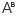</a> | **📂 檔名:** `16_dark_format-text-superscript.svg` ✨ **格式:** `Vector (SVG)` ⚖️ **大小:** `3.63KB` 📅 **更新:** `2026-02-27`  🚀 **jsDelivr Markdown:** <code></code> 🔗 **直接連結 (Url):** <code>https://cdn.jsdelivr.net/gh/barry028/materials@main/images/iCons/KritaiCon/16_dark_format-text-superscript.svg</code> 📥 [檢視原始檔](16_dark_format-text-superscript.svg) |
|  | **📂 檔名:** `16_dark_format-text-underline.svg` ✨ **格式:** `Vector (SVG)` ⚖️ **大小:** `3.24KB` 📅 **更新:** `2026-02-27`  🚀 **jsDelivr Markdown:** <code></code> 🔗 **直接連結 (Url):** <code>https://cdn.jsdelivr.net/gh/barry028/materials@main/images/iCons/KritaiCon/16_dark_format-text-underline.svg</code> 📥 [檢視原始檔](16_dark_format-text-underline.svg) |
|  | **📂 檔名:** `16_dark_insert-text.svg` ✨ **格式:** `Vector (SVG)` ⚖️ **大小:** `5.04KB` 📅 **更新:** `2026-02-27`  🚀 **jsDelivr Markdown:** <code></code> 🔗 **直接連結 (Url):** <code>https://cdn.jsdelivr.net/gh/barry028/materials@main/images/iCons/KritaiCon/16_dark_insert-text.svg</code> 📥 [檢視原始檔](16_dark_insert-text.svg) |
|  | **📂 檔名:** `16_dark_media-floppy.svg` ✨ **格式:** `Vector (SVG)` ⚖️ **大小:** `3.00KB` 📅 **更新:** `2026-02-27`  🚀 **jsDelivr Markdown:** <code></code> 🔗 **直接連結 (Url):** <code>https://cdn.jsdelivr.net/gh/barry028/materials@main/images/iCons/KritaiCon/16_dark_media-floppy.svg</code> 📥 [檢視原始檔](16_dark_media-floppy.svg) |
|  | **📂 檔名:** `16_dark_object-align-horizontal-center-calligra.svg` ✨ **格式:** `Vector (SVG)` ⚖️ **大小:** `3.18KB` 📅 **更新:** `2026-02-27`  🚀 **jsDelivr Markdown:** <code></code> 🔗 **直接連結 (Url):** <code>https://cdn.jsdelivr.net/gh/barry028/materials@main/images/iCons/KritaiCon/16_dark_object-align-horizontal-center-calligra.svg</code> 📥 [檢視原始檔](16_dark_object-align-horizontal-center-calligra.svg) |
|  | **📂 檔名:** `16_dark_object-align-horizontal-left-calligra.svg` ✨ **格式:** `Vector (SVG)` ⚖️ **大小:** `3.10KB` 📅 **更新:** `2026-02-27`  🚀 **jsDelivr Markdown:** <code></code> 🔗 **直接連結 (Url):** <code>https://cdn.jsdelivr.net/gh/barry028/materials@main/images/iCons/KritaiCon/16_dark_object-align-horizontal-left-calligra.svg</code> 📥 [檢視原始檔](16_dark_object-align-horizontal-left-calligra.svg) |
|  | **📂 檔名:** `16_dark_object-align-vertical-top-calligra.svg` ✨ **格式:** `Vector (SVG)` ⚖️ **大小:** `3.00KB` 📅 **更新:** `2026-02-27`  🚀 **jsDelivr Markdown:** <code></code> 🔗 **直接連結 (Url):** <code>https://cdn.jsdelivr.net/gh/barry028/materials@main/images/iCons/KritaiCon/16_dark_object-align-vertical-top-calligra.svg</code> 📥 [檢視原始檔](16_dark_object-align-vertical-top-calligra.svg) |
|  | **📂 檔名:** `16_dark_object-group-calligra.svg` ✨ **格式:** `Vector (SVG)` ⚖️ **大小:** `3.23KB` 📅 **更新:** `2026-02-27`  🚀 **jsDelivr Markdown:** <code></code> 🔗 **直接連結 (Url):** <code>https://cdn.jsdelivr.net/gh/barry028/materials@main/images/iCons/KritaiCon/16_dark_object-group-calligra.svg</code> 📥 [檢視原始檔](16_dark_object-group-calligra.svg) |
|  | **📂 檔名:** `16_dark_shape-choose.svg` ✨ **格式:** `Vector (SVG)` ⚖️ **大小:** `3.60KB` 📅 **更新:** `2026-02-27`  🚀 **jsDelivr Markdown:** <code></code> 🔗 **直接連結 (Url):** <code>https://cdn.jsdelivr.net/gh/barry028/materials@main/images/iCons/KritaiCon/16_dark_shape-choose.svg</code> 📥 [檢視原始檔](16_dark_shape-choose.svg) |
|  | **📂 檔名:** `16_dark_snap-extension.svg` ✨ **格式:** `Vector (SVG)` ⚖️ **大小:** `3.41KB` 📅 **更新:** `2026-02-27`  🚀 **jsDelivr Markdown:** <code></code> 🔗 **直接連結 (Url):** <code>https://cdn.jsdelivr.net/gh/barry028/materials@main/images/iCons/KritaiCon/16_dark_snap-extension.svg</code> 📥 [檢視原始檔](16_dark_snap-extension.svg) |
| <a href="16_dark_snap-guideline.svg">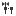</a> | **📂 檔名:** `16_dark_snap-guideline.svg` ✨ **格式:** `Vector (SVG)` ⚖️ **大小:** `4.09KB` 📅 **更新:** `2026-02-27`  🚀 **jsDelivr Markdown:** <code></code> 🔗 **直接連結 (Url):** <code>https://cdn.jsdelivr.net/gh/barry028/materials@main/images/iCons/KritaiCon/16_dark_snap-guideline.svg</code> 📥 [檢視原始檔](16_dark_snap-guideline.svg) |
|  | **📂 檔名:** `16_dark_snap-intersection.svg` ✨ **格式:** `Vector (SVG)` ⚖️ **大小:** `3.07KB` 📅 **更新:** `2026-02-27`  🚀 **jsDelivr Markdown:** <code></code> 🔗 **直接連結 (Url):** <code>https://cdn.jsdelivr.net/gh/barry028/materials@main/images/iCons/KritaiCon/16_dark_snap-intersection.svg</code> 📥 [檢視原始檔](16_dark_snap-intersection.svg) |
| <a href="16_dark_snap-node.svg">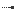</a> | **📂 檔名:** `16_dark_snap-node.svg` ✨ **格式:** `Vector (SVG)` ⚖️ **大小:** `3.59KB` 📅 **更新:** `2026-02-27`  🚀 **jsDelivr Markdown:** <code></code> 🔗 **直接連結 (Url):** <code>https://cdn.jsdelivr.net/gh/barry028/materials@main/images/iCons/KritaiCon/16_dark_snap-node.svg</code> 📥 [檢視原始檔](16_dark_snap-node.svg) |
|  | **📂 檔名:** `16_dark_split.svg` ✨ **格式:** `Vector (SVG)` ⚖️ **大小:** `2.88KB` 📅 **更新:** `2026-02-27`  🚀 **jsDelivr Markdown:** <code></code> 🔗 **直接連結 (Url):** <code>https://cdn.jsdelivr.net/gh/barry028/materials@main/images/iCons/KritaiCon/16_dark_split.svg</code> 📥 [檢視原始檔](16_dark_split.svg) |
|  | **📂 檔名:** `16_dark_tab-new.svg` ✨ **格式:** `Vector (SVG)` ⚖️ **大小:** `3.29KB` 📅 **更新:** `2026-02-27`  🚀 **jsDelivr Markdown:** <code></code> 🔗 **直接連結 (Url):** <code>https://cdn.jsdelivr.net/gh/barry028/materials@main/images/iCons/KritaiCon/16_dark_tab-new.svg</code> 📥 [檢視原始檔](16_dark_tab-new.svg) |
|  | **📂 檔名:** `16_dark_transform-move.svg` ✨ **格式:** `Vector (SVG)` ⚖️ **大小:** `3.33KB` 📅 **更新:** `2026-02-27`  🚀 **jsDelivr Markdown:** <code></code> 🔗 **直接連結 (Url):** <code>https://cdn.jsdelivr.net/gh/barry028/materials@main/images/iCons/KritaiCon/16_dark_transform-move.svg</code> 📥 [檢視原始檔](16_dark_transform-move.svg) |
|  | **📂 檔名:** `16_dark_trash-empty.svg` ✨ **格式:** `Vector (SVG)` ⚖️ **大小:** `2.92KB` 📅 **更新:** `2026-02-27`  🚀 **jsDelivr Markdown:** <code></code> 🔗 **直接連結 (Url):** <code>https://cdn.jsdelivr.net/gh/barry028/materials@main/images/iCons/KritaiCon/16_dark_trash-empty.svg</code> 📥 [檢視原始檔](16_dark_trash-empty.svg) |
|  | **📂 檔名:** `16_dark_warning.svg` ✨ **格式:** `Vector (SVG)` ⚖️ **大小:** `3.14KB` 📅 **更新:** `2026-02-27`  🚀 **jsDelivr Markdown:** <code></code> 🔗 **直接連結 (Url):** <code>https://cdn.jsdelivr.net/gh/barry028/materials@main/images/iCons/KritaiCon/16_dark_warning.svg</code> 📥 [檢視原始檔](16_dark_warning.svg) |
|  | **📂 檔名:** `16_dark_zoom-fit-best.svg` ✨ **格式:** `Vector (SVG)` ⚖️ **大小:** `3.16KB` 📅 **更新:** `2026-02-27`  🚀 **jsDelivr Markdown:** <code></code> 🔗 **直接連結 (Url):** <code>https://cdn.jsdelivr.net/gh/barry028/materials@main/images/iCons/KritaiCon/16_dark_zoom-fit-best.svg</code> 📥 [檢視原始檔](16_dark_zoom-fit-best.svg) |
| <a href="16_light_align-horizontal-right.svg">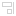</a> | **📂 檔名:** `16_light_align-horizontal-right.svg` ✨ **格式:** `Vector (SVG)` ⚖️ **大小:** `3.10KB` 📅 **更新:** `2026-02-27`  🚀 **jsDelivr Markdown:** <code></code> 🔗 **直接連結 (Url):** <code>https://cdn.jsdelivr.net/gh/barry028/materials@main/images/iCons/KritaiCon/16_light_align-horizontal-right.svg</code> 📥 [檢視原始檔](16_light_align-horizontal-right.svg) |
| <a href="16_light_align-vertical-bottom.svg">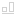</a> | **📂 檔名:** `16_light_align-vertical-bottom.svg` ✨ **格式:** `Vector (SVG)` ⚖️ **大小:** `3.14KB` 📅 **更新:** `2026-02-27`  🚀 **jsDelivr Markdown:** <code></code> 🔗 **直接連結 (Url):** <code>https://cdn.jsdelivr.net/gh/barry028/materials@main/images/iCons/KritaiCon/16_light_align-vertical-bottom.svg</code> 📥 [檢視原始檔](16_light_align-vertical-bottom.svg) |
|  | **📂 檔名:** `16_light_align-vertical-center.svg` ✨ **格式:** `Vector (SVG)` ⚖️ **大小:** `3.14KB` 📅 **更新:** `2026-02-27`  🚀 **jsDelivr Markdown:** <code></code> 🔗 **直接連結 (Url):** <code>https://cdn.jsdelivr.net/gh/barry028/materials@main/images/iCons/KritaiCon/16_light_align-vertical-center.svg</code> 📥 [檢視原始檔](16_light_align-vertical-center.svg) |
|  | **📂 檔名:** `16_light_application-x-krita.svg` ✨ **格式:** `Vector (SVG)` ⚖️ **大小:** `1.48KB` 📅 **更新:** `2026-02-27`  🚀 **jsDelivr Markdown:** <code></code> 🔗 **直接連結 (Url):** <code>https://cdn.jsdelivr.net/gh/barry028/materials@main/images/iCons/KritaiCon/16_light_application-x-krita.svg</code> 📥 [檢視原始檔](16_light_application-x-krita.svg) |
|  | **📂 檔名:** `16_light_application-x-krz.svg` ✨ **格式:** `Vector (SVG)` ⚖️ **大小:** `1.83KB` 📅 **更新:** `2026-02-27`  🚀 **jsDelivr Markdown:** <code></code> 🔗 **直接連結 (Url):** <code>https://cdn.jsdelivr.net/gh/barry028/materials@main/images/iCons/KritaiCon/16_light_application-x-krz.svg</code> 📥 [檢視原始檔](16_light_application-x-krz.svg) |
|  | **📂 檔名:** `16_light_application-x-wmf.svg` ✨ **格式:** `Vector (SVG)` ⚖️ **大小:** `3.78KB` 📅 **更新:** `2026-02-27`  🚀 **jsDelivr Markdown:** <code></code> 🔗 **直接連結 (Url):** <code>https://cdn.jsdelivr.net/gh/barry028/materials@main/images/iCons/KritaiCon/16_light_application-x-wmf.svg</code> 📥 [檢視原始檔](16_light_application-x-wmf.svg) |
|  | **📂 檔名:** `16_light_character-set.svg` ✨ **格式:** `Vector (SVG)` ⚖️ **大小:** `2.97KB` 📅 **更新:** `2026-02-27`  🚀 **jsDelivr Markdown:** <code></code> 🔗 **直接連結 (Url):** <code>https://cdn.jsdelivr.net/gh/barry028/materials@main/images/iCons/KritaiCon/16_light_character-set.svg</code> 📥 [檢視原始檔](16_light_character-set.svg) |
|  | **📂 檔名:** `16_light_draw-arrow-back.svg` ✨ **格式:** `Vector (SVG)` ⚖️ **大小:** `2.80KB` 📅 **更新:** `2026-02-27`  🚀 **jsDelivr Markdown:** <code></code> 🔗 **直接連結 (Url):** <code>https://cdn.jsdelivr.net/gh/barry028/materials@main/images/iCons/KritaiCon/16_light_draw-arrow-back.svg</code> 📥 [檢視原始檔](16_light_draw-arrow-back.svg) |
|  | **📂 檔名:** `16_light_draw-arrow-down.svg` ✨ **格式:** `Vector (SVG)` ⚖️ **大小:** `2.80KB` 📅 **更新:** `2026-02-27`  🚀 **jsDelivr Markdown:** <code></code> 🔗 **直接連結 (Url):** <code>https://cdn.jsdelivr.net/gh/barry028/materials@main/images/iCons/KritaiCon/16_light_draw-arrow-down.svg</code> 📥 [檢視原始檔](16_light_draw-arrow-down.svg) |
|  | **📂 檔名:** `16_light_draw-arrow-forward.svg` ✨ **格式:** `Vector (SVG)` ⚖️ **大小:** `2.80KB` 📅 **更新:** `2026-02-27`  🚀 **jsDelivr Markdown:** <code></code> 🔗 **直接連結 (Url):** <code>https://cdn.jsdelivr.net/gh/barry028/materials@main/images/iCons/KritaiCon/16_light_draw-arrow-forward.svg</code> 📥 [檢視原始檔](16_light_draw-arrow-forward.svg) |
|  | **📂 檔名:** `16_light_draw-arrow-up.svg` ✨ **格式:** `Vector (SVG)` ⚖️ **大小:** `2.79KB` 📅 **更新:** `2026-02-27`  🚀 **jsDelivr Markdown:** <code></code> 🔗 **直接連結 (Url):** <code>https://cdn.jsdelivr.net/gh/barry028/materials@main/images/iCons/KritaiCon/16_light_draw-arrow-up.svg</code> 📥 [檢視原始檔](16_light_draw-arrow-up.svg) |
|  | **📂 檔名:** `16_light_draw-freehand.svg` ✨ **格式:** `Vector (SVG)` ⚖️ **大小:** `3.85KB` 📅 **更新:** `2026-02-27`  🚀 **jsDelivr Markdown:** <code></code> 🔗 **直接連結 (Url):** <code>https://cdn.jsdelivr.net/gh/barry028/materials@main/images/iCons/KritaiCon/16_light_draw-freehand.svg</code> 📥 [檢視原始檔](16_light_draw-freehand.svg) |
|  | **📂 檔名:** `16_light_edit-rename.svg` ✨ **格式:** `Vector (SVG)` ⚖️ **大小:** `3.00KB` 📅 **更新:** `2026-02-27`  🚀 **jsDelivr Markdown:** <code></code> 🔗 **直接連結 (Url):** <code>https://cdn.jsdelivr.net/gh/barry028/materials@main/images/iCons/KritaiCon/16_light_edit-rename.svg</code> 📥 [檢視原始檔](16_light_edit-rename.svg) |
|  | **📂 檔名:** `16_light_edit-select-all.svg` ✨ **格式:** `Vector (SVG)` ⚖️ **大小:** `4.21KB` 📅 **更新:** `2026-02-27`  🚀 **jsDelivr Markdown:** <code></code> 🔗 **直接連結 (Url):** <code>https://cdn.jsdelivr.net/gh/barry028/materials@main/images/iCons/KritaiCon/16_light_edit-select-all.svg</code> 📥 [檢視原始檔](16_light_edit-select-all.svg) |
|  | **📂 檔名:** `16_light_format-indent-less.svg` ✨ **格式:** `Vector (SVG)` ⚖️ **大小:** `3.03KB` 📅 **更新:** `2026-02-27`  🚀 **jsDelivr Markdown:** <code></code> 🔗 **直接連結 (Url):** <code>https://cdn.jsdelivr.net/gh/barry028/materials@main/images/iCons/KritaiCon/16_light_format-indent-less.svg</code> 📥 [檢視原始檔](16_light_format-indent-less.svg) |
|  | **📂 檔名:** `16_light_format-indent-more.svg` ✨ **格式:** `Vector (SVG)` ⚖️ **大小:** `3.06KB` 📅 **更新:** `2026-02-27`  🚀 **jsDelivr Markdown:** <code></code> 🔗 **直接連結 (Url):** <code>https://cdn.jsdelivr.net/gh/barry028/materials@main/images/iCons/KritaiCon/16_light_format-indent-more.svg</code> 📥 [檢視原始檔](16_light_format-indent-more.svg) |
|  | **📂 檔名:** `16_light_format-justify-center.svg` ✨ **格式:** `Vector (SVG)` ⚖️ **大小:** `3.12KB` 📅 **更新:** `2026-02-27`  🚀 **jsDelivr Markdown:** <code></code> 🔗 **直接連結 (Url):** <code>https://cdn.jsdelivr.net/gh/barry028/materials@main/images/iCons/KritaiCon/16_light_format-justify-center.svg</code> 📥 [檢視原始檔](16_light_format-justify-center.svg) |
|  | **📂 檔名:** `16_light_format-justify-fill.svg` ✨ **格式:** `Vector (SVG)` ⚖️ **大小:** `3.12KB` 📅 **更新:** `2026-02-27`  🚀 **jsDelivr Markdown:** <code></code> 🔗 **直接連結 (Url):** <code>https://cdn.jsdelivr.net/gh/barry028/materials@main/images/iCons/KritaiCon/16_light_format-justify-fill.svg</code> 📥 [檢視原始檔](16_light_format-justify-fill.svg) |
|  | **📂 檔名:** `16_light_format-justify-left.svg` ✨ **格式:** `Vector (SVG)` ⚖️ **大小:** `4.70KB` 📅 **更新:** `2026-02-27`  🚀 **jsDelivr Markdown:** <code></code> 🔗 **直接連結 (Url):** <code>https://cdn.jsdelivr.net/gh/barry028/materials@main/images/iCons/KritaiCon/16_light_format-justify-left.svg</code> 📥 [檢視原始檔](16_light_format-justify-left.svg) |
|  | **📂 檔名:** `16_light_format-justify-right.svg` ✨ **格式:** `Vector (SVG)` ⚖️ **大小:** `4.87KB` 📅 **更新:** `2026-02-27`  🚀 **jsDelivr Markdown:** <code></code> 🔗 **直接連結 (Url):** <code>https://cdn.jsdelivr.net/gh/barry028/materials@main/images/iCons/KritaiCon/16_light_format-justify-right.svg</code> 📥 [檢視原始檔](16_light_format-justify-right.svg) |
| <a href="16_light_format-list-ordered.svg">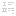</a> | **📂 檔名:** `16_light_format-list-ordered.svg` ✨ **格式:** `Vector (SVG)` ⚖️ **大小:** `3.41KB` 📅 **更新:** `2026-02-27`  🚀 **jsDelivr Markdown:** <code></code> 🔗 **直接連結 (Url):** <code>https://cdn.jsdelivr.net/gh/barry028/materials@main/images/iCons/KritaiCon/16_light_format-list-ordered.svg</code> 📥 [檢視原始檔](16_light_format-list-ordered.svg) |
|  | **📂 檔名:** `16_light_format-stroke-color.svg` ✨ **格式:** `Vector (SVG)` ⚖️ **大小:** `3.97KB` 📅 **更新:** `2026-02-27`  🚀 **jsDelivr Markdown:** <code></code> 🔗 **直接連結 (Url):** <code>https://cdn.jsdelivr.net/gh/barry028/materials@main/images/iCons/KritaiCon/16_light_format-stroke-color.svg</code> 📥 [檢視原始檔](16_light_format-stroke-color.svg) |
|  | **📂 檔名:** `16_light_format-text-bold.svg` ✨ **格式:** `Vector (SVG)` ⚖️ **大小:** `3.19KB` 📅 **更新:** `2026-02-27`  🚀 **jsDelivr Markdown:** <code></code> 🔗 **直接連結 (Url):** <code>https://cdn.jsdelivr.net/gh/barry028/materials@main/images/iCons/KritaiCon/16_light_format-text-bold.svg</code> 📥 [檢視原始檔](16_light_format-text-bold.svg) |
|  | **📂 檔名:** `16_light_format-text-color.svg` ✨ **格式:** `Vector (SVG)` ⚖️ **大小:** `3.10KB` 📅 **更新:** `2026-02-27`  🚀 **jsDelivr Markdown:** <code></code> 🔗 **直接連結 (Url):** <code>https://cdn.jsdelivr.net/gh/barry028/materials@main/images/iCons/KritaiCon/16_light_format-text-color.svg</code> 📥 [檢視原始檔](16_light_format-text-color.svg) |
|  | **📂 檔名:** `16_light_format-text-direction-rtl.svg` ✨ **格式:** `Vector (SVG)` ⚖️ **大小:** `4.75KB` 📅 **更新:** `2026-02-27`  🚀 **jsDelivr Markdown:** <code></code> 🔗 **直接連結 (Url):** <code>https://cdn.jsdelivr.net/gh/barry028/materials@main/images/iCons/KritaiCon/16_light_format-text-direction-rtl.svg</code> 📥 [檢視原始檔](16_light_format-text-direction-rtl.svg) |
|  | **📂 檔名:** `16_light_format-text-italic.svg` ✨ **格式:** `Vector (SVG)` ⚖️ **大小:** `3.38KB` 📅 **更新:** `2026-02-27`  🚀 **jsDelivr Markdown:** <code></code> 🔗 **直接連結 (Url):** <code>https://cdn.jsdelivr.net/gh/barry028/materials@main/images/iCons/KritaiCon/16_light_format-text-italic.svg</code> 📥 [檢視原始檔](16_light_format-text-italic.svg) |
|  | **📂 檔名:** `16_light_format-text-strikethrough.svg` ✨ **格式:** `Vector (SVG)` ⚖️ **大小:** `3.03KB` 📅 **更新:** `2026-02-27`  🚀 **jsDelivr Markdown:** <code></code> 🔗 **直接連結 (Url):** <code>https://cdn.jsdelivr.net/gh/barry028/materials@main/images/iCons/KritaiCon/16_light_format-text-strikethrough.svg</code> 📥 [檢視原始檔](16_light_format-text-strikethrough.svg) |
|  | **📂 檔名:** `16_light_format-text-subscript.svg` ✨ **格式:** `Vector (SVG)` ⚖️ **大小:** `19.23KB` 📅 **更新:** `2026-02-27`  🚀 **jsDelivr Markdown:** <code></code> 🔗 **直接連結 (Url):** <code>https://cdn.jsdelivr.net/gh/barry028/materials@main/images/iCons/KritaiCon/16_light_format-text-subscript.svg</code> 📥 [檢視原始檔](16_light_format-text-subscript.svg) |
|  | **📂 檔名:** `16_light_format-text-superscript.svg` ✨ **格式:** `Vector (SVG)` ⚖️ **大小:** `3.63KB` 📅 **更新:** `2026-02-27`  🚀 **jsDelivr Markdown:** <code></code> 🔗 **直接連結 (Url):** <code>https://cdn.jsdelivr.net/gh/barry028/materials@main/images/iCons/KritaiCon/16_light_format-text-superscript.svg</code> 📥 [檢視原始檔](16_light_format-text-superscript.svg) |
|  | **📂 檔名:** `16_light_format-text-underline.svg` ✨ **格式:** `Vector (SVG)` ⚖️ **大小:** `3.24KB` 📅 **更新:** `2026-02-27`  🚀 **jsDelivr Markdown:** <code></code> 🔗 **直接連結 (Url):** <code>https://cdn.jsdelivr.net/gh/barry028/materials@main/images/iCons/KritaiCon/16_light_format-text-underline.svg</code> 📥 [檢視原始檔](16_light_format-text-underline.svg) |
| <a href="16_light_insert-text.svg">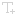</a> | **📂 檔名:** `16_light_insert-text.svg` ✨ **格式:** `Vector (SVG)` ⚖️ **大小:** `5.04KB` 📅 **更新:** `2026-02-27`  🚀 **jsDelivr Markdown:** <code></code> 🔗 **直接連結 (Url):** <code>https://cdn.jsdelivr.net/gh/barry028/materials@main/images/iCons/KritaiCon/16_light_insert-text.svg</code> 📥 [檢視原始檔](16_light_insert-text.svg) |
|  | **📂 檔名:** `16_light_list-remove.svg` ✨ **格式:** `Vector (SVG)` ⚖️ **大小:** `3.03KB` 📅 **更新:** `2026-02-27`  🚀 **jsDelivr Markdown:** <code></code> 🔗 **直接連結 (Url):** <code>https://cdn.jsdelivr.net/gh/barry028/materials@main/images/iCons/KritaiCon/16_light_list-remove.svg</code> 📥 [檢視原始檔](16_light_list-remove.svg) |
|  | **📂 檔名:** `16_light_media-floppy.svg` ✨ **格式:** `Vector (SVG)` ⚖️ **大小:** `3.00KB` 📅 **更新:** `2026-02-27`  🚀 **jsDelivr Markdown:** <code></code> 🔗 **直接連結 (Url):** <code>https://cdn.jsdelivr.net/gh/barry028/materials@main/images/iCons/KritaiCon/16_light_media-floppy.svg</code> 📥 [檢視原始檔](16_light_media-floppy.svg) |
|  | **📂 檔名:** `16_light_object-align-horizontal-center-calligra.svg` ✨ **格式:** `Vector (SVG)` ⚖️ **大小:** `3.18KB` 📅 **更新:** `2026-02-27`  🚀 **jsDelivr Markdown:** <code></code> 🔗 **直接連結 (Url):** <code>https://cdn.jsdelivr.net/gh/barry028/materials@main/images/iCons/KritaiCon/16_light_object-align-horizontal-center-calligra.svg</code> 📥 [檢視原始檔](16_light_object-align-horizontal-center-calligra.svg) |
| <a href="16_light_object-align-horizontal-left-calligra.svg">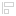</a> | **📂 檔名:** `16_light_object-align-horizontal-left-calligra.svg` ✨ **格式:** `Vector (SVG)` ⚖️ **大小:** `3.10KB` 📅 **更新:** `2026-02-27`  🚀 **jsDelivr Markdown:** <code></code> 🔗 **直接連結 (Url):** <code>https://cdn.jsdelivr.net/gh/barry028/materials@main/images/iCons/KritaiCon/16_light_object-align-horizontal-left-calligra.svg</code> 📥 [檢視原始檔](16_light_object-align-horizontal-left-calligra.svg) |
| <a href="16_light_object-align-vertical-top-calligra.svg">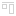</a> | **📂 檔名:** `16_light_object-align-vertical-top-calligra.svg` ✨ **格式:** `Vector (SVG)` ⚖️ **大小:** `3.00KB` 📅 **更新:** `2026-02-27`  🚀 **jsDelivr Markdown:** <code></code> 🔗 **直接連結 (Url):** <code>https://cdn.jsdelivr.net/gh/barry028/materials@main/images/iCons/KritaiCon/16_light_object-align-vertical-top-calligra.svg</code> 📥 [檢視原始檔](16_light_object-align-vertical-top-calligra.svg) |
|  | **📂 檔名:** `16_light_object-group-calligra.svg` ✨ **格式:** `Vector (SVG)` ⚖️ **大小:** `3.23KB` 📅 **更新:** `2026-02-27`  🚀 **jsDelivr Markdown:** <code></code> 🔗 **直接連結 (Url):** <code>https://cdn.jsdelivr.net/gh/barry028/materials@main/images/iCons/KritaiCon/16_light_object-group-calligra.svg</code> 📥 [檢視原始檔](16_light_object-group-calligra.svg) |
|  | **📂 檔名:** `16_light_shape-choose.svg` ✨ **格式:** `Vector (SVG)` ⚖️ **大小:** `3.60KB` 📅 **更新:** `2026-02-27`  🚀 **jsDelivr Markdown:** <code></code> 🔗 **直接連結 (Url):** <code>https://cdn.jsdelivr.net/gh/barry028/materials@main/images/iCons/KritaiCon/16_light_shape-choose.svg</code> 📥 [檢視原始檔](16_light_shape-choose.svg) |
|  | **📂 檔名:** `16_light_snap-extension.svg` ✨ **格式:** `Vector (SVG)` ⚖️ **大小:** `3.41KB` 📅 **更新:** `2026-02-27`  🚀 **jsDelivr Markdown:** <code></code> 🔗 **直接連結 (Url):** <code>https://cdn.jsdelivr.net/gh/barry028/materials@main/images/iCons/KritaiCon/16_light_snap-extension.svg</code> 📥 [檢視原始檔](16_light_snap-extension.svg) |
| <a href="16_light_snap-guideline.svg">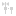</a> | **📂 檔名:** `16_light_snap-guideline.svg` ✨ **格式:** `Vector (SVG)` ⚖️ **大小:** `4.09KB` 📅 **更新:** `2026-02-27`  🚀 **jsDelivr Markdown:** <code></code> 🔗 **直接連結 (Url):** <code>https://cdn.jsdelivr.net/gh/barry028/materials@main/images/iCons/KritaiCon/16_light_snap-guideline.svg</code> 📥 [檢視原始檔](16_light_snap-guideline.svg) |
|  | **📂 檔名:** `16_light_snap-intersection.svg` ✨ **格式:** `Vector (SVG)` ⚖️ **大小:** `3.07KB` 📅 **更新:** `2026-02-27`  🚀 **jsDelivr Markdown:** <code></code> 🔗 **直接連結 (Url):** <code>https://cdn.jsdelivr.net/gh/barry028/materials@main/images/iCons/KritaiCon/16_light_snap-intersection.svg</code> 📥 [檢視原始檔](16_light_snap-intersection.svg) |
|  | **📂 檔名:** `16_light_snap-node.svg` ✨ **格式:** `Vector (SVG)` ⚖️ **大小:** `3.59KB` 📅 **更新:** `2026-02-27`  🚀 **jsDelivr Markdown:** <code></code> 🔗 **直接連結 (Url):** <code>https://cdn.jsdelivr.net/gh/barry028/materials@main/images/iCons/KritaiCon/16_light_snap-node.svg</code> 📥 [檢視原始檔](16_light_snap-node.svg) |
|  | **📂 檔名:** `16_light_split.svg` ✨ **格式:** `Vector (SVG)` ⚖️ **大小:** `2.88KB` 📅 **更新:** `2026-02-27`  🚀 **jsDelivr Markdown:** <code></code> 🔗 **直接連結 (Url):** <code>https://cdn.jsdelivr.net/gh/barry028/materials@main/images/iCons/KritaiCon/16_light_split.svg</code> 📥 [檢視原始檔](16_light_split.svg) |
|  | **📂 檔名:** `16_light_tab-close.svg` ✨ **格式:** `Vector (SVG)` ⚖️ **大小:** `3.05KB` 📅 **更新:** `2026-02-27`  🚀 **jsDelivr Markdown:** <code></code> 🔗 **直接連結 (Url):** <code>https://cdn.jsdelivr.net/gh/barry028/materials@main/images/iCons/KritaiCon/16_light_tab-close.svg</code> 📥 [檢視原始檔](16_light_tab-close.svg) |
|  | **📂 檔名:** `16_light_tab-new.svg` ✨ **格式:** `Vector (SVG)` ⚖️ **大小:** `3.29KB` 📅 **更新:** `2026-02-27`  🚀 **jsDelivr Markdown:** <code></code> 🔗 **直接連結 (Url):** <code>https://cdn.jsdelivr.net/gh/barry028/materials@main/images/iCons/KritaiCon/16_light_tab-new.svg</code> 📥 [檢視原始檔](16_light_tab-new.svg) |
|  | **📂 檔名:** `16_light_transform-move.svg` ✨ **格式:** `Vector (SVG)` ⚖️ **大小:** `3.33KB` 📅 **更新:** `2026-02-27`  🚀 **jsDelivr Markdown:** <code></code> 🔗 **直接連結 (Url):** <code>https://cdn.jsdelivr.net/gh/barry028/materials@main/images/iCons/KritaiCon/16_light_transform-move.svg</code> 📥 [檢視原始檔](16_light_transform-move.svg) |
|  | **📂 檔名:** `16_light_trash-empty.svg` ✨ **格式:** `Vector (SVG)` ⚖️ **大小:** `2.92KB` 📅 **更新:** `2026-02-27`  🚀 **jsDelivr Markdown:** <code></code> 🔗 **直接連結 (Url):** <code>https://cdn.jsdelivr.net/gh/barry028/materials@main/images/iCons/KritaiCon/16_light_trash-empty.svg</code> 📥 [檢視原始檔](16_light_trash-empty.svg) |
|  | **📂 檔名:** `16_light_warning.svg` ✨ **格式:** `Vector (SVG)` ⚖️ **大小:** `3.14KB` 📅 **更新:** `2026-02-27`  🚀 **jsDelivr Markdown:** <code></code> 🔗 **直接連結 (Url):** <code>https://cdn.jsdelivr.net/gh/barry028/materials@main/images/iCons/KritaiCon/16_light_warning.svg</code> 📥 [檢視原始檔](16_light_warning.svg) |
|  | **📂 檔名:** `16_light_zoom-fit-best.svg` ✨ **格式:** `Vector (SVG)` ⚖️ **大小:** `3.16KB` 📅 **更新:** `2026-02-27`  🚀 **jsDelivr Markdown:** <code></code> 🔗 **直接連結 (Url):** <code>https://cdn.jsdelivr.net/gh/barry028/materials@main/images/iCons/KritaiCon/16_light_zoom-fit-best.svg</code> 📥 [檢視原始檔](16_light_zoom-fit-best.svg) |
|  | **📂 檔名:** `22_dark_align-horizontal-right.svg` ✨ **格式:** `Vector (SVG)` ⚖️ **大小:** `3.31KB` 📅 **更新:** `2026-02-27`  🚀 **jsDelivr Markdown:** <code></code> 🔗 **直接連結 (Url):** <code>https://cdn.jsdelivr.net/gh/barry028/materials@main/images/iCons/KritaiCon/22_dark_align-horizontal-right.svg</code> 📥 [檢視原始檔](22_dark_align-horizontal-right.svg) |
|  | **📂 檔名:** `22_dark_align-vertical-bottom.svg` ✨ **格式:** `Vector (SVG)` ⚖️ **大小:** `3.36KB` 📅 **更新:** `2026-02-27`  🚀 **jsDelivr Markdown:** <code></code> 🔗 **直接連結 (Url):** <code>https://cdn.jsdelivr.net/gh/barry028/materials@main/images/iCons/KritaiCon/22_dark_align-vertical-bottom.svg</code> 📥 [檢視原始檔](22_dark_align-vertical-bottom.svg) |
|  | **📂 檔名:** `22_dark_align-vertical-center.svg` ✨ **格式:** `Vector (SVG)` ⚖️ **大小:** `3.39KB` 📅 **更新:** `2026-02-27`  🚀 **jsDelivr Markdown:** <code></code> 🔗 **直接連結 (Url):** <code>https://cdn.jsdelivr.net/gh/barry028/materials@main/images/iCons/KritaiCon/22_dark_align-vertical-center.svg</code> 📥 [檢視原始檔](22_dark_align-vertical-center.svg) |
|  | **📂 檔名:** `22_dark_application-x-krz.svg` ✨ **格式:** `Vector (SVG)` ⚖️ **大小:** `3.74KB` 📅 **更新:** `2026-02-27`  🚀 **jsDelivr Markdown:** <code></code> 🔗 **直接連結 (Url):** <code>https://cdn.jsdelivr.net/gh/barry028/materials@main/images/iCons/KritaiCon/22_dark_application-x-krz.svg</code> 📥 [檢視原始檔](22_dark_application-x-krz.svg) |
|  | **📂 檔名:** `22_dark_character-set.svg` ✨ **格式:** `Vector (SVG)` ⚖️ **大小:** `4.03KB` 📅 **更新:** `2026-02-27`  🚀 **jsDelivr Markdown:** <code></code> 🔗 **直接連結 (Url):** <code>https://cdn.jsdelivr.net/gh/barry028/materials@main/images/iCons/KritaiCon/22_dark_character-set.svg</code> 📥 [檢視原始檔](22_dark_character-set.svg) |
|  | **📂 檔名:** `22_dark_draw-arrow-back.svg` ✨ **格式:** `Vector (SVG)` ⚖️ **大小:** `6.80KB` 📅 **更新:** `2026-02-27`  🚀 **jsDelivr Markdown:** <code></code> 🔗 **直接連結 (Url):** <code>https://cdn.jsdelivr.net/gh/barry028/materials@main/images/iCons/KritaiCon/22_dark_draw-arrow-back.svg</code> 📥 [檢視原始檔](22_dark_draw-arrow-back.svg) |
|  | **📂 檔名:** `22_dark_draw-arrow-down.svg` ✨ **格式:** `Vector (SVG)` ⚖️ **大小:** `7.28KB` 📅 **更新:** `2026-02-27`  🚀 **jsDelivr Markdown:** <code></code> 🔗 **直接連結 (Url):** <code>https://cdn.jsdelivr.net/gh/barry028/materials@main/images/iCons/KritaiCon/22_dark_draw-arrow-down.svg</code> 📥 [檢視原始檔](22_dark_draw-arrow-down.svg) |
|  | **📂 檔名:** `22_dark_draw-arrow-forward.svg` ✨ **格式:** `Vector (SVG)` ⚖️ **大小:** `7.83KB` 📅 **更新:** `2026-02-27`  🚀 **jsDelivr Markdown:** <code></code> 🔗 **直接連結 (Url):** <code>https://cdn.jsdelivr.net/gh/barry028/materials@main/images/iCons/KritaiCon/22_dark_draw-arrow-forward.svg</code> 📥 [檢視原始檔](22_dark_draw-arrow-forward.svg) |
|  | **📂 檔名:** `22_dark_draw-arrow-up.svg` ✨ **格式:** `Vector (SVG)` ⚖️ **大小:** `6.49KB` 📅 **更新:** `2026-02-27`  🚀 **jsDelivr Markdown:** <code></code> 🔗 **直接連結 (Url):** <code>https://cdn.jsdelivr.net/gh/barry028/materials@main/images/iCons/KritaiCon/22_dark_draw-arrow-up.svg</code> 📥 [檢視原始檔](22_dark_draw-arrow-up.svg) |
|  | **📂 檔名:** `22_dark_draw-freehand.svg` ✨ **格式:** `Vector (SVG)` ⚖️ **大小:** `5.09KB` 📅 **更新:** `2026-02-27`  🚀 **jsDelivr Markdown:** <code></code> 🔗 **直接連結 (Url):** <code>https://cdn.jsdelivr.net/gh/barry028/materials@main/images/iCons/KritaiCon/22_dark_draw-freehand.svg</code> 📥 [檢視原始檔](22_dark_draw-freehand.svg) |
|  | **📂 檔名:** `22_dark_edit-rename.svg` ✨ **格式:** `Vector (SVG)` ⚖️ **大小:** `5.74KB` 📅 **更新:** `2026-02-27`  🚀 **jsDelivr Markdown:** <code></code> 🔗 **直接連結 (Url):** <code>https://cdn.jsdelivr.net/gh/barry028/materials@main/images/iCons/KritaiCon/22_dark_edit-rename.svg</code> 📥 [檢視原始檔](22_dark_edit-rename.svg) |
|  | **📂 檔名:** `22_dark_edit-select-all.svg` ✨ **格式:** `Vector (SVG)` ⚖️ **大小:** `3.31KB` 📅 **更新:** `2026-02-27`  🚀 **jsDelivr Markdown:** <code></code> 🔗 **直接連結 (Url):** <code>https://cdn.jsdelivr.net/gh/barry028/materials@main/images/iCons/KritaiCon/22_dark_edit-select-all.svg</code> 📥 [檢視原始檔](22_dark_edit-select-all.svg) |
|  | **📂 檔名:** `22_dark_format-indent-less.svg` ✨ **格式:** `Vector (SVG)` ⚖️ **大小:** `3.25KB` 📅 **更新:** `2026-02-27`  🚀 **jsDelivr Markdown:** <code></code> 🔗 **直接連結 (Url):** <code>https://cdn.jsdelivr.net/gh/barry028/materials@main/images/iCons/KritaiCon/22_dark_format-indent-less.svg</code> 📥 [檢視原始檔](22_dark_format-indent-less.svg) |
|  | **📂 檔名:** `22_dark_format-indent-more.svg` ✨ **格式:** `Vector (SVG)` ⚖️ **大小:** `3.13KB` 📅 **更新:** `2026-02-27`  🚀 **jsDelivr Markdown:** <code></code> 🔗 **直接連結 (Url):** <code>https://cdn.jsdelivr.net/gh/barry028/materials@main/images/iCons/KritaiCon/22_dark_format-indent-more.svg</code> 📥 [檢視原始檔](22_dark_format-indent-more.svg) |
|  | **📂 檔名:** `22_dark_format-justify-center.svg` ✨ **格式:** `Vector (SVG)` ⚖️ **大小:** `3.11KB` 📅 **更新:** `2026-02-27`  🚀 **jsDelivr Markdown:** <code></code> 🔗 **直接連結 (Url):** <code>https://cdn.jsdelivr.net/gh/barry028/materials@main/images/iCons/KritaiCon/22_dark_format-justify-center.svg</code> 📥 [檢視原始檔](22_dark_format-justify-center.svg) |
| <a href="22_dark_format-justify-fill.svg">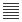</a> | **📂 檔名:** `22_dark_format-justify-fill.svg` ✨ **格式:** `Vector (SVG)` ⚖️ **大小:** `3.12KB` 📅 **更新:** `2026-02-27`  🚀 **jsDelivr Markdown:** <code></code> 🔗 **直接連結 (Url):** <code>https://cdn.jsdelivr.net/gh/barry028/materials@main/images/iCons/KritaiCon/22_dark_format-justify-fill.svg</code> 📥 [檢視原始檔](22_dark_format-justify-fill.svg) |
|  | **📂 檔名:** `22_dark_format-justify-left.svg` ✨ **格式:** `Vector (SVG)` ⚖️ **大小:** `3.35KB` 📅 **更新:** `2026-02-27`  🚀 **jsDelivr Markdown:** <code></code> 🔗 **直接連結 (Url):** <code>https://cdn.jsdelivr.net/gh/barry028/materials@main/images/iCons/KritaiCon/22_dark_format-justify-left.svg</code> 📥 [檢視原始檔](22_dark_format-justify-left.svg) |
|  | **📂 檔名:** `22_dark_format-justify-right.svg` ✨ **格式:** `Vector (SVG)` ⚖️ **大小:** `3.31KB` 📅 **更新:** `2026-02-27`  🚀 **jsDelivr Markdown:** <code></code> 🔗 **直接連結 (Url):** <code>https://cdn.jsdelivr.net/gh/barry028/materials@main/images/iCons/KritaiCon/22_dark_format-justify-right.svg</code> 📥 [檢視原始檔](22_dark_format-justify-right.svg) |
|  | **📂 檔名:** `22_dark_format-list-ordered.svg` ✨ **格式:** `Vector (SVG)` ⚖️ **大小:** `3.22KB` 📅 **更新:** `2026-02-27`  🚀 **jsDelivr Markdown:** <code></code> 🔗 **直接連結 (Url):** <code>https://cdn.jsdelivr.net/gh/barry028/materials@main/images/iCons/KritaiCon/22_dark_format-list-ordered.svg</code> 📥 [檢視原始檔](22_dark_format-list-ordered.svg) |
|  | **📂 檔名:** `22_dark_format-stroke-color.svg` ✨ **格式:** `Vector (SVG)` ⚖️ **大小:** `3.18KB` 📅 **更新:** `2026-02-27`  🚀 **jsDelivr Markdown:** <code></code> 🔗 **直接連結 (Url):** <code>https://cdn.jsdelivr.net/gh/barry028/materials@main/images/iCons/KritaiCon/22_dark_format-stroke-color.svg</code> 📥 [檢視原始檔](22_dark_format-stroke-color.svg) |
|  | **📂 檔名:** `22_dark_format-text-bold.svg` ✨ **格式:** `Vector (SVG)` ⚖️ **大小:** `3.40KB` 📅 **更新:** `2026-02-27`  🚀 **jsDelivr Markdown:** <code></code> 🔗 **直接連結 (Url):** <code>https://cdn.jsdelivr.net/gh/barry028/materials@main/images/iCons/KritaiCon/22_dark_format-text-bold.svg</code> 📥 [檢視原始檔](22_dark_format-text-bold.svg) |
|  | **📂 檔名:** `22_dark_format-text-color.svg` ✨ **格式:** `Vector (SVG)` ⚖️ **大小:** `3.92KB` 📅 **更新:** `2026-02-27`  🚀 **jsDelivr Markdown:** <code></code> 🔗 **直接連結 (Url):** <code>https://cdn.jsdelivr.net/gh/barry028/materials@main/images/iCons/KritaiCon/22_dark_format-text-color.svg</code> 📥 [檢視原始檔](22_dark_format-text-color.svg) |
|  | **📂 檔名:** `22_dark_format-text-direction-rtl.svg` ✨ **格式:** `Vector (SVG)` ⚖️ **大小:** `3.43KB` 📅 **更新:** `2026-02-27`  🚀 **jsDelivr Markdown:** <code></code> 🔗 **直接連結 (Url):** <code>https://cdn.jsdelivr.net/gh/barry028/materials@main/images/iCons/KritaiCon/22_dark_format-text-direction-rtl.svg</code> 📥 [檢視原始檔](22_dark_format-text-direction-rtl.svg) |
|  | **📂 檔名:** `22_dark_format-text-italic.svg` ✨ **格式:** `Vector (SVG)` ⚖️ **大小:** `3.28KB` 📅 **更新:** `2026-02-27`  🚀 **jsDelivr Markdown:** <code></code> 🔗 **直接連結 (Url):** <code>https://cdn.jsdelivr.net/gh/barry028/materials@main/images/iCons/KritaiCon/22_dark_format-text-italic.svg</code> 📥 [檢視原始檔](22_dark_format-text-italic.svg) |
|  | **📂 檔名:** `22_dark_format-text-strikethrough.svg` ✨ **格式:** `Vector (SVG)` ⚖️ **大小:** `3.22KB` 📅 **更新:** `2026-02-27`  🚀 **jsDelivr Markdown:** <code></code> 🔗 **直接連結 (Url):** <code>https://cdn.jsdelivr.net/gh/barry028/materials@main/images/iCons/KritaiCon/22_dark_format-text-strikethrough.svg</code> 📥 [檢視原始檔](22_dark_format-text-strikethrough.svg) |
|  | **📂 檔名:** `22_dark_format-text-subscript.svg` ✨ **格式:** `Vector (SVG)` ⚖️ **大小:** `3.86KB` 📅 **更新:** `2026-02-27`  🚀 **jsDelivr Markdown:** <code></code> 🔗 **直接連結 (Url):** <code>https://cdn.jsdelivr.net/gh/barry028/materials@main/images/iCons/KritaiCon/22_dark_format-text-subscript.svg</code> 📥 [檢視原始檔](22_dark_format-text-subscript.svg) |
|  | **📂 檔名:** `22_dark_format-text-superscript.svg` ✨ **格式:** `Vector (SVG)` ⚖️ **大小:** `3.75KB` 📅 **更新:** `2026-02-27`  🚀 **jsDelivr Markdown:** <code></code> 🔗 **直接連結 (Url):** <code>https://cdn.jsdelivr.net/gh/barry028/materials@main/images/iCons/KritaiCon/22_dark_format-text-superscript.svg</code> 📥 [檢視原始檔](22_dark_format-text-superscript.svg) |
|  | **📂 檔名:** `22_dark_format-text-underline.svg` ✨ **格式:** `Vector (SVG)` ⚖️ **大小:** `3.38KB` 📅 **更新:** `2026-02-27`  🚀 **jsDelivr Markdown:** <code></code> 🔗 **直接連結 (Url):** <code>https://cdn.jsdelivr.net/gh/barry028/materials@main/images/iCons/KritaiCon/22_dark_format-text-underline.svg</code> 📥 [檢視原始檔](22_dark_format-text-underline.svg) |
| <a href="22_dark_insert-text.svg">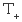</a> | **📂 檔名:** `22_dark_insert-text.svg` ✨ **格式:** `Vector (SVG)` ⚖️ **大小:** `3.11KB` 📅 **更新:** `2026-02-27`  🚀 **jsDelivr Markdown:** <code></code> 🔗 **直接連結 (Url):** <code>https://cdn.jsdelivr.net/gh/barry028/materials@main/images/iCons/KritaiCon/22_dark_insert-text.svg</code> 📥 [檢視原始檔](22_dark_insert-text.svg) |
|  | **📂 檔名:** `22_dark_media-floppy.svg` ✨ **格式:** `Vector (SVG)` ⚖️ **大小:** `7.89KB` 📅 **更新:** `2026-02-27`  🚀 **jsDelivr Markdown:** <code></code> 🔗 **直接連結 (Url):** <code>https://cdn.jsdelivr.net/gh/barry028/materials@main/images/iCons/KritaiCon/22_dark_media-floppy.svg</code> 📥 [檢視原始檔](22_dark_media-floppy.svg) |
|  | **📂 檔名:** `22_dark_object-align-horizontal-center-calligra.svg` ✨ **格式:** `Vector (SVG)` ⚖️ **大小:** `3.49KB` 📅 **更新:** `2026-02-27`  🚀 **jsDelivr Markdown:** <code></code> 🔗 **直接連結 (Url):** <code>https://cdn.jsdelivr.net/gh/barry028/materials@main/images/iCons/KritaiCon/22_dark_object-align-horizontal-center-calligra.svg</code> 📥 [檢視原始檔](22_dark_object-align-horizontal-center-calligra.svg) |
|  | **📂 檔名:** `22_dark_object-align-horizontal-left-calligra.svg` ✨ **格式:** `Vector (SVG)` ⚖️ **大小:** `3.32KB` 📅 **更新:** `2026-02-27`  🚀 **jsDelivr Markdown:** <code></code> 🔗 **直接連結 (Url):** <code>https://cdn.jsdelivr.net/gh/barry028/materials@main/images/iCons/KritaiCon/22_dark_object-align-horizontal-left-calligra.svg</code> 📥 [檢視原始檔](22_dark_object-align-horizontal-left-calligra.svg) |
|  | **📂 檔名:** `22_dark_object-align-vertical-top-calligra.svg` ✨ **格式:** `Vector (SVG)` ⚖️ **大小:** `3.31KB` 📅 **更新:** `2026-02-27`  🚀 **jsDelivr Markdown:** <code></code> 🔗 **直接連結 (Url):** <code>https://cdn.jsdelivr.net/gh/barry028/materials@main/images/iCons/KritaiCon/22_dark_object-align-vertical-top-calligra.svg</code> 📥 [檢視原始檔](22_dark_object-align-vertical-top-calligra.svg) |
|  | **📂 檔名:** `22_dark_object-group-calligra.svg` ✨ **格式:** `Vector (SVG)` ⚖️ **大小:** `3.96KB` 📅 **更新:** `2026-02-27`  🚀 **jsDelivr Markdown:** <code></code> 🔗 **直接連結 (Url):** <code>https://cdn.jsdelivr.net/gh/barry028/materials@main/images/iCons/KritaiCon/22_dark_object-group-calligra.svg</code> 📥 [檢視原始檔](22_dark_object-group-calligra.svg) |
|  | **📂 檔名:** `22_dark_shape-choose.svg` ✨ **格式:** `Vector (SVG)` ⚖️ **大小:** `3.30KB` 📅 **更新:** `2026-02-27`  🚀 **jsDelivr Markdown:** <code></code> 🔗 **直接連結 (Url):** <code>https://cdn.jsdelivr.net/gh/barry028/materials@main/images/iCons/KritaiCon/22_dark_shape-choose.svg</code> 📥 [檢視原始檔](22_dark_shape-choose.svg) |
| <a href="22_dark_snap-extension.svg">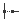</a> | **📂 檔名:** `22_dark_snap-extension.svg` ✨ **格式:** `Vector (SVG)` ⚖️ **大小:** `3.30KB` 📅 **更新:** `2026-02-27`  🚀 **jsDelivr Markdown:** <code></code> 🔗 **直接連結 (Url):** <code>https://cdn.jsdelivr.net/gh/barry028/materials@main/images/iCons/KritaiCon/22_dark_snap-extension.svg</code> 📥 [檢視原始檔](22_dark_snap-extension.svg) |
| <a href="22_dark_snap-guideline.svg">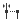</a> | **📂 檔名:** `22_dark_snap-guideline.svg` ✨ **格式:** `Vector (SVG)` ⚖️ **大小:** `3.36KB` 📅 **更新:** `2026-02-27`  🚀 **jsDelivr Markdown:** <code></code> 🔗 **直接連結 (Url):** <code>https://cdn.jsdelivr.net/gh/barry028/materials@main/images/iCons/KritaiCon/22_dark_snap-guideline.svg</code> 📥 [檢視原始檔](22_dark_snap-guideline.svg) |
|  | **📂 檔名:** `22_dark_snap-intersection.svg` ✨ **格式:** `Vector (SVG)` ⚖️ **大小:** `3.43KB` 📅 **更新:** `2026-02-27`  🚀 **jsDelivr Markdown:** <code></code> 🔗 **直接連結 (Url):** <code>https://cdn.jsdelivr.net/gh/barry028/materials@main/images/iCons/KritaiCon/22_dark_snap-intersection.svg</code> 📥 [檢視原始檔](22_dark_snap-intersection.svg) |
|  | **📂 檔名:** `22_dark_snap-node.svg` ✨ **格式:** `Vector (SVG)` ⚖️ **大小:** `3.32KB` 📅 **更新:** `2026-02-27`  🚀 **jsDelivr Markdown:** <code></code> 🔗 **直接連結 (Url):** <code>https://cdn.jsdelivr.net/gh/barry028/materials@main/images/iCons/KritaiCon/22_dark_snap-node.svg</code> 📥 [檢視原始檔](22_dark_snap-node.svg) |
|  | **📂 檔名:** `22_dark_snap-orthogonal.svg` ✨ **格式:** `Vector (SVG)` ⚖️ **大小:** `3.49KB` 📅 **更新:** `2026-02-27`  🚀 **jsDelivr Markdown:** <code></code> 🔗 **直接連結 (Url):** <code>https://cdn.jsdelivr.net/gh/barry028/materials@main/images/iCons/KritaiCon/22_dark_snap-orthogonal.svg</code> 📥 [檢視原始檔](22_dark_snap-orthogonal.svg) |
|  | **📂 檔名:** `22_dark_split.svg` ✨ **格式:** `Vector (SVG)` ⚖️ **大小:** `3.22KB` 📅 **更新:** `2026-02-27`  🚀 **jsDelivr Markdown:** <code></code> 🔗 **直接連結 (Url):** <code>https://cdn.jsdelivr.net/gh/barry028/materials@main/images/iCons/KritaiCon/22_dark_split.svg</code> 📥 [檢視原始檔](22_dark_split.svg) |
|  | **📂 檔名:** `22_dark_tab-new.svg` ✨ **格式:** `Vector (SVG)` ⚖️ **大小:** `3.48KB` 📅 **更新:** `2026-02-27`  🚀 **jsDelivr Markdown:** <code></code> 🔗 **直接連結 (Url):** <code>https://cdn.jsdelivr.net/gh/barry028/materials@main/images/iCons/KritaiCon/22_dark_tab-new.svg</code> 📥 [檢視原始檔](22_dark_tab-new.svg) |
|  | **📂 檔名:** `22_dark_transform-move.svg` ✨ **格式:** `Vector (SVG)` ⚖️ **大小:** `3.56KB` 📅 **更新:** `2026-02-27`  🚀 **jsDelivr Markdown:** <code></code> 🔗 **直接連結 (Url):** <code>https://cdn.jsdelivr.net/gh/barry028/materials@main/images/iCons/KritaiCon/22_dark_transform-move.svg</code> 📥 [檢視原始檔](22_dark_transform-move.svg) |
|  | **📂 檔名:** `22_dark_trash-empty.svg` ✨ **格式:** `Vector (SVG)` ⚖️ **大小:** `3.50KB` 📅 **更新:** `2026-02-27`  🚀 **jsDelivr Markdown:** <code></code> 🔗 **直接連結 (Url):** <code>https://cdn.jsdelivr.net/gh/barry028/materials@main/images/iCons/KritaiCon/22_dark_trash-empty.svg</code> 📥 [檢視原始檔](22_dark_trash-empty.svg) |
|  | **📂 檔名:** `22_dark_zoom-fit-best.svg` ✨ **格式:** `Vector (SVG)` ⚖️ **大小:** `4.89KB` 📅 **更新:** `2026-02-27`  🚀 **jsDelivr Markdown:** <code></code> 🔗 **直接連結 (Url):** <code>https://cdn.jsdelivr.net/gh/barry028/materials@main/images/iCons/KritaiCon/22_dark_zoom-fit-best.svg</code> 📥 [檢視原始檔](22_dark_zoom-fit-best.svg) |
| <a href="22_light_align-horizontal-right.svg">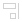</a> | **📂 檔名:** `22_light_align-horizontal-right.svg` ✨ **格式:** `Vector (SVG)` ⚖️ **大小:** `3.31KB` 📅 **更新:** `2026-02-27`  🚀 **jsDelivr Markdown:** <code></code> 🔗 **直接連結 (Url):** <code>https://cdn.jsdelivr.net/gh/barry028/materials@main/images/iCons/KritaiCon/22_light_align-horizontal-right.svg</code> 📥 [檢視原始檔](22_light_align-horizontal-right.svg) |
| <a href="22_light_align-vertical-bottom.svg">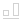</a> | **📂 檔名:** `22_light_align-vertical-bottom.svg` ✨ **格式:** `Vector (SVG)` ⚖️ **大小:** `3.36KB` 📅 **更新:** `2026-02-27`  🚀 **jsDelivr Markdown:** <code></code> 🔗 **直接連結 (Url):** <code>https://cdn.jsdelivr.net/gh/barry028/materials@main/images/iCons/KritaiCon/22_light_align-vertical-bottom.svg</code> 📥 [檢視原始檔](22_light_align-vertical-bottom.svg) |
|  | **📂 檔名:** `22_light_align-vertical-center.svg` ✨ **格式:** `Vector (SVG)` ⚖️ **大小:** `3.39KB` 📅 **更新:** `2026-02-27`  🚀 **jsDelivr Markdown:** <code></code> 🔗 **直接連結 (Url):** <code>https://cdn.jsdelivr.net/gh/barry028/materials@main/images/iCons/KritaiCon/22_light_align-vertical-center.svg</code> 📥 [檢視原始檔](22_light_align-vertical-center.svg) |
|  | **📂 檔名:** `22_light_application-x-krita.svg` ✨ **格式:** `Vector (SVG)` ⚖️ **大小:** `3.39KB` 📅 **更新:** `2026-02-27`  🚀 **jsDelivr Markdown:** <code></code> 🔗 **直接連結 (Url):** <code>https://cdn.jsdelivr.net/gh/barry028/materials@main/images/iCons/KritaiCon/22_light_application-x-krita.svg</code> 📥 [檢視原始檔](22_light_application-x-krita.svg) |
|  | **📂 檔名:** `22_light_application-x-krz.svg` ✨ **格式:** `Vector (SVG)` ⚖️ **大小:** `3.74KB` 📅 **更新:** `2026-02-27`  🚀 **jsDelivr Markdown:** <code></code> 🔗 **直接連結 (Url):** <code>https://cdn.jsdelivr.net/gh/barry028/materials@main/images/iCons/KritaiCon/22_light_application-x-krz.svg</code> 📥 [檢視原始檔](22_light_application-x-krz.svg) |
| <a href="22_light_application-x-wmf.svg">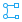</a> | **📂 檔名:** `22_light_application-x-wmf.svg` ✨ **格式:** `Vector (SVG)` ⚖️ **大小:** `4.93KB` 📅 **更新:** `2026-02-27`  🚀 **jsDelivr Markdown:** <code></code> 🔗 **直接連結 (Url):** <code>https://cdn.jsdelivr.net/gh/barry028/materials@main/images/iCons/KritaiCon/22_light_application-x-wmf.svg</code> 📥 [檢視原始檔](22_light_application-x-wmf.svg) |
| <a href="22_light_character-set.svg">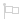</a> | **📂 檔名:** `22_light_character-set.svg` ✨ **格式:** `Vector (SVG)` ⚖️ **大小:** `3.88KB` 📅 **更新:** `2026-02-27`  🚀 **jsDelivr Markdown:** <code></code> 🔗 **直接連結 (Url):** <code>https://cdn.jsdelivr.net/gh/barry028/materials@main/images/iCons/KritaiCon/22_light_character-set.svg</code> 📥 [檢視原始檔](22_light_character-set.svg) |
|  | **📂 檔名:** `22_light_draw-arrow-back.svg` ✨ **格式:** `Vector (SVG)` ⚖️ **大小:** `6.80KB` 📅 **更新:** `2026-02-27`  🚀 **jsDelivr Markdown:** <code></code> 🔗 **直接連結 (Url):** <code>https://cdn.jsdelivr.net/gh/barry028/materials@main/images/iCons/KritaiCon/22_light_draw-arrow-back.svg</code> 📥 [檢視原始檔](22_light_draw-arrow-back.svg) |
|  | **📂 檔名:** `22_light_draw-arrow-down.svg` ✨ **格式:** `Vector (SVG)` ⚖️ **大小:** `7.28KB` 📅 **更新:** `2026-02-27`  🚀 **jsDelivr Markdown:** <code></code> 🔗 **直接連結 (Url):** <code>https://cdn.jsdelivr.net/gh/barry028/materials@main/images/iCons/KritaiCon/22_light_draw-arrow-down.svg</code> 📥 [檢視原始檔](22_light_draw-arrow-down.svg) |
|  | **📂 檔名:** `22_light_draw-arrow-forward.svg` ✨ **格式:** `Vector (SVG)` ⚖️ **大小:** `7.83KB` 📅 **更新:** `2026-02-27`  🚀 **jsDelivr Markdown:** <code></code> 🔗 **直接連結 (Url):** <code>https://cdn.jsdelivr.net/gh/barry028/materials@main/images/iCons/KritaiCon/22_light_draw-arrow-forward.svg</code> 📥 [檢視原始檔](22_light_draw-arrow-forward.svg) |
|  | **📂 檔名:** `22_light_draw-arrow-up.svg` ✨ **格式:** `Vector (SVG)` ⚖️ **大小:** `6.49KB` 📅 **更新:** `2026-02-27`  🚀 **jsDelivr Markdown:** <code></code> 🔗 **直接連結 (Url):** <code>https://cdn.jsdelivr.net/gh/barry028/materials@main/images/iCons/KritaiCon/22_light_draw-arrow-up.svg</code> 📥 [檢視原始檔](22_light_draw-arrow-up.svg) |
|  | **📂 檔名:** `22_light_draw-freehand.svg` ✨ **格式:** `Vector (SVG)` ⚖️ **大小:** `5.09KB` 📅 **更新:** `2026-02-27`  🚀 **jsDelivr Markdown:** <code></code> 🔗 **直接連結 (Url):** <code>https://cdn.jsdelivr.net/gh/barry028/materials@main/images/iCons/KritaiCon/22_light_draw-freehand.svg</code> 📥 [檢視原始檔](22_light_draw-freehand.svg) |
|  | **📂 檔名:** `22_light_edit-rename.svg` ✨ **格式:** `Vector (SVG)` ⚖️ **大小:** `5.74KB` 📅 **更新:** `2026-02-27`  🚀 **jsDelivr Markdown:** <code></code> 🔗 **直接連結 (Url):** <code>https://cdn.jsdelivr.net/gh/barry028/materials@main/images/iCons/KritaiCon/22_light_edit-rename.svg</code> 📥 [檢視原始檔](22_light_edit-rename.svg) |
| <a href="22_light_edit-select-all.svg">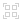</a> | **📂 檔名:** `22_light_edit-select-all.svg` ✨ **格式:** `Vector (SVG)` ⚖️ **大小:** `3.33KB` 📅 **更新:** `2026-02-27`  🚀 **jsDelivr Markdown:** <code></code> 🔗 **直接連結 (Url):** <code>https://cdn.jsdelivr.net/gh/barry028/materials@main/images/iCons/KritaiCon/22_light_edit-select-all.svg</code> 📥 [檢視原始檔](22_light_edit-select-all.svg) |
|  | **📂 檔名:** `22_light_format-indent-less.svg` ✨ **格式:** `Vector (SVG)` ⚖️ **大小:** `3.25KB` 📅 **更新:** `2026-02-27`  🚀 **jsDelivr Markdown:** <code></code> 🔗 **直接連結 (Url):** <code>https://cdn.jsdelivr.net/gh/barry028/materials@main/images/iCons/KritaiCon/22_light_format-indent-less.svg</code> 📥 [檢視原始檔](22_light_format-indent-less.svg) |
|  | **📂 檔名:** `22_light_format-indent-more.svg` ✨ **格式:** `Vector (SVG)` ⚖️ **大小:** `3.13KB` 📅 **更新:** `2026-02-27`  🚀 **jsDelivr Markdown:** <code></code> 🔗 **直接連結 (Url):** <code>https://cdn.jsdelivr.net/gh/barry028/materials@main/images/iCons/KritaiCon/22_light_format-indent-more.svg</code> 📥 [檢視原始檔](22_light_format-indent-more.svg) |
|  | **📂 檔名:** `22_light_format-justify-center.svg` ✨ **格式:** `Vector (SVG)` ⚖️ **大小:** `3.11KB` 📅 **更新:** `2026-02-27`  🚀 **jsDelivr Markdown:** <code></code> 🔗 **直接連結 (Url):** <code>https://cdn.jsdelivr.net/gh/barry028/materials@main/images/iCons/KritaiCon/22_light_format-justify-center.svg</code> 📥 [檢視原始檔](22_light_format-justify-center.svg) |
|  | **📂 檔名:** `22_light_format-justify-fill.svg` ✨ **格式:** `Vector (SVG)` ⚖️ **大小:** `3.12KB` 📅 **更新:** `2026-02-27`  🚀 **jsDelivr Markdown:** <code></code> 🔗 **直接連結 (Url):** <code>https://cdn.jsdelivr.net/gh/barry028/materials@main/images/iCons/KritaiCon/22_light_format-justify-fill.svg</code> 📥 [檢視原始檔](22_light_format-justify-fill.svg) |
|  | **📂 檔名:** `22_light_format-justify-left.svg` ✨ **格式:** `Vector (SVG)` ⚖️ **大小:** `3.35KB` 📅 **更新:** `2026-02-27`  🚀 **jsDelivr Markdown:** <code></code> 🔗 **直接連結 (Url):** <code>https://cdn.jsdelivr.net/gh/barry028/materials@main/images/iCons/KritaiCon/22_light_format-justify-left.svg</code> 📥 [檢視原始檔](22_light_format-justify-left.svg) |
|  | **📂 檔名:** `22_light_format-justify-right.svg` ✨ **格式:** `Vector (SVG)` ⚖️ **大小:** `3.31KB` 📅 **更新:** `2026-02-27`  🚀 **jsDelivr Markdown:** <code></code> 🔗 **直接連結 (Url):** <code>https://cdn.jsdelivr.net/gh/barry028/materials@main/images/iCons/KritaiCon/22_light_format-justify-right.svg</code> 📥 [檢視原始檔](22_light_format-justify-right.svg) |
| <a href="22_light_format-list-ordered.svg">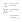</a> | **📂 檔名:** `22_light_format-list-ordered.svg` ✨ **格式:** `Vector (SVG)` ⚖️ **大小:** `3.22KB` 📅 **更新:** `2026-02-27`  🚀 **jsDelivr Markdown:** <code></code> 🔗 **直接連結 (Url):** <code>https://cdn.jsdelivr.net/gh/barry028/materials@main/images/iCons/KritaiCon/22_light_format-list-ordered.svg</code> 📥 [檢視原始檔](22_light_format-list-ordered.svg) |
|  | **📂 檔名:** `22_light_format-stroke-color.svg` ✨ **格式:** `Vector (SVG)` ⚖️ **大小:** `3.18KB` 📅 **更新:** `2026-02-27`  🚀 **jsDelivr Markdown:** <code></code> 🔗 **直接連結 (Url):** <code>https://cdn.jsdelivr.net/gh/barry028/materials@main/images/iCons/KritaiCon/22_light_format-stroke-color.svg</code> 📥 [檢視原始檔](22_light_format-stroke-color.svg) |
|  | **📂 檔名:** `22_light_format-text-bold.svg` ✨ **格式:** `Vector (SVG)` ⚖️ **大小:** `3.40KB` 📅 **更新:** `2026-02-27`  🚀 **jsDelivr Markdown:** <code></code> 🔗 **直接連結 (Url):** <code>https://cdn.jsdelivr.net/gh/barry028/materials@main/images/iCons/KritaiCon/22_light_format-text-bold.svg</code> 📥 [檢視原始檔](22_light_format-text-bold.svg) |
|  | **📂 檔名:** `22_light_format-text-color.svg` ✨ **格式:** `Vector (SVG)` ⚖️ **大小:** `3.92KB` 📅 **更新:** `2026-02-27`  🚀 **jsDelivr Markdown:** <code></code> 🔗 **直接連結 (Url):** <code>https://cdn.jsdelivr.net/gh/barry028/materials@main/images/iCons/KritaiCon/22_light_format-text-color.svg</code> 📥 [檢視原始檔](22_light_format-text-color.svg) |
|  | **📂 檔名:** `22_light_format-text-direction-rtl.svg` ✨ **格式:** `Vector (SVG)` ⚖️ **大小:** `3.43KB` 📅 **更新:** `2026-02-27`  🚀 **jsDelivr Markdown:** <code></code> 🔗 **直接連結 (Url):** <code>https://cdn.jsdelivr.net/gh/barry028/materials@main/images/iCons/KritaiCon/22_light_format-text-direction-rtl.svg</code> 📥 [檢視原始檔](22_light_format-text-direction-rtl.svg) |
|  | **📂 檔名:** `22_light_format-text-italic.svg` ✨ **格式:** `Vector (SVG)` ⚖️ **大小:** `3.28KB` 📅 **更新:** `2026-02-27`  🚀 **jsDelivr Markdown:** <code></code> 🔗 **直接連結 (Url):** <code>https://cdn.jsdelivr.net/gh/barry028/materials@main/images/iCons/KritaiCon/22_light_format-text-italic.svg</code> 📥 [檢視原始檔](22_light_format-text-italic.svg) |
|  | **📂 檔名:** `22_light_format-text-strikethrough.svg` ✨ **格式:** `Vector (SVG)` ⚖️ **大小:** `3.22KB` 📅 **更新:** `2026-02-27`  🚀 **jsDelivr Markdown:** <code></code> 🔗 **直接連結 (Url):** <code>https://cdn.jsdelivr.net/gh/barry028/materials@main/images/iCons/KritaiCon/22_light_format-text-strikethrough.svg</code> 📥 [檢視原始檔](22_light_format-text-strikethrough.svg) |
|  | **📂 檔名:** `22_light_format-text-subscript.svg` ✨ **格式:** `Vector (SVG)` ⚖️ **大小:** `3.86KB` 📅 **更新:** `2026-02-27`  🚀 **jsDelivr Markdown:** <code></code> 🔗 **直接連結 (Url):** <code>https://cdn.jsdelivr.net/gh/barry028/materials@main/images/iCons/KritaiCon/22_light_format-text-subscript.svg</code> 📥 [檢視原始檔](22_light_format-text-subscript.svg) |
|  | **📂 檔名:** `22_light_format-text-superscript.svg` ✨ **格式:** `Vector (SVG)` ⚖️ **大小:** `3.75KB` 📅 **更新:** `2026-02-27`  🚀 **jsDelivr Markdown:** <code></code> 🔗 **直接連結 (Url):** <code>https://cdn.jsdelivr.net/gh/barry028/materials@main/images/iCons/KritaiCon/22_light_format-text-superscript.svg</code> 📥 [檢視原始檔](22_light_format-text-superscript.svg) |
|  | **📂 檔名:** `22_light_format-text-underline.svg` ✨ **格式:** `Vector (SVG)` ⚖️ **大小:** `3.38KB` 📅 **更新:** `2026-02-27`  🚀 **jsDelivr Markdown:** <code></code> 🔗 **直接連結 (Url):** <code>https://cdn.jsdelivr.net/gh/barry028/materials@main/images/iCons/KritaiCon/22_light_format-text-underline.svg</code> 📥 [檢視原始檔](22_light_format-text-underline.svg) |
|  | **📂 檔名:** `22_light_insert-text.svg` ✨ **格式:** `Vector (SVG)` ⚖️ **大小:** `3.11KB` 📅 **更新:** `2026-02-27`  🚀 **jsDelivr Markdown:** <code></code> 🔗 **直接連結 (Url):** <code>https://cdn.jsdelivr.net/gh/barry028/materials@main/images/iCons/KritaiCon/22_light_insert-text.svg</code> 📥 [檢視原始檔](22_light_insert-text.svg) |
|  | **📂 檔名:** `22_light_list-remove.svg` ✨ **格式:** `Vector (SVG)` ⚖️ **大小:** `4.32KB` 📅 **更新:** `2026-02-27`  🚀 **jsDelivr Markdown:** <code></code> 🔗 **直接連結 (Url):** <code>https://cdn.jsdelivr.net/gh/barry028/materials@main/images/iCons/KritaiCon/22_light_list-remove.svg</code> 📥 [檢視原始檔](22_light_list-remove.svg) |
|  | **📂 檔名:** `22_light_media-floppy.svg` ✨ **格式:** `Vector (SVG)` ⚖️ **大小:** `7.89KB` 📅 **更新:** `2026-02-27`  🚀 **jsDelivr Markdown:** <code></code> 🔗 **直接連結 (Url):** <code>https://cdn.jsdelivr.net/gh/barry028/materials@main/images/iCons/KritaiCon/22_light_media-floppy.svg</code> 📥 [檢視原始檔](22_light_media-floppy.svg) |
|  | **📂 檔名:** `22_light_object-align-horizontal-center-calligra.svg` ✨ **格式:** `Vector (SVG)` ⚖️ **大小:** `3.49KB` 📅 **更新:** `2026-02-27`  🚀 **jsDelivr Markdown:** <code></code> 🔗 **直接連結 (Url):** <code>https://cdn.jsdelivr.net/gh/barry028/materials@main/images/iCons/KritaiCon/22_light_object-align-horizontal-center-calligra.svg</code> 📥 [檢視原始檔](22_light_object-align-horizontal-center-calligra.svg) |
| <a href="22_light_object-align-horizontal-left-calligra.svg">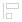</a> | **📂 檔名:** `22_light_object-align-horizontal-left-calligra.svg` ✨ **格式:** `Vector (SVG)` ⚖️ **大小:** `3.32KB` 📅 **更新:** `2026-02-27`  🚀 **jsDelivr Markdown:** <code></code> 🔗 **直接連結 (Url):** <code>https://cdn.jsdelivr.net/gh/barry028/materials@main/images/iCons/KritaiCon/22_light_object-align-horizontal-left-calligra.svg</code> 📥 [檢視原始檔](22_light_object-align-horizontal-left-calligra.svg) |
| <a href="22_light_object-align-vertical-top-calligra.svg">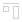</a> | **📂 檔名:** `22_light_object-align-vertical-top-calligra.svg` ✨ **格式:** `Vector (SVG)` ⚖️ **大小:** `3.31KB` 📅 **更新:** `2026-02-27`  🚀 **jsDelivr Markdown:** <code></code> 🔗 **直接連結 (Url):** <code>https://cdn.jsdelivr.net/gh/barry028/materials@main/images/iCons/KritaiCon/22_light_object-align-vertical-top-calligra.svg</code> 📥 [檢視原始檔](22_light_object-align-vertical-top-calligra.svg) |
|  | **📂 檔名:** `22_light_object-group-calligra.svg` ✨ **格式:** `Vector (SVG)` ⚖️ **大小:** `3.96KB` 📅 **更新:** `2026-02-27`  🚀 **jsDelivr Markdown:** <code></code> 🔗 **直接連結 (Url):** <code>https://cdn.jsdelivr.net/gh/barry028/materials@main/images/iCons/KritaiCon/22_light_object-group-calligra.svg</code> 📥 [檢視原始檔](22_light_object-group-calligra.svg) |
|  | **📂 檔名:** `22_light_shape-choose.svg` ✨ **格式:** `Vector (SVG)` ⚖️ **大小:** `3.30KB` 📅 **更新:** `2026-02-27`  🚀 **jsDelivr Markdown:** <code></code> 🔗 **直接連結 (Url):** <code>https://cdn.jsdelivr.net/gh/barry028/materials@main/images/iCons/KritaiCon/22_light_shape-choose.svg</code> 📥 [檢視原始檔](22_light_shape-choose.svg) |
|  | **📂 檔名:** `22_light_snap-extension.svg` ✨ **格式:** `Vector (SVG)` ⚖️ **大小:** `3.30KB` 📅 **更新:** `2026-02-27`  🚀 **jsDelivr Markdown:** <code></code> 🔗 **直接連結 (Url):** <code>https://cdn.jsdelivr.net/gh/barry028/materials@main/images/iCons/KritaiCon/22_light_snap-extension.svg</code> 📥 [檢視原始檔](22_light_snap-extension.svg) |
| <a href="22_light_snap-guideline.svg">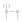</a> | **📂 檔名:** `22_light_snap-guideline.svg` ✨ **格式:** `Vector (SVG)` ⚖️ **大小:** `3.36KB` 📅 **更新:** `2026-02-27`  🚀 **jsDelivr Markdown:** <code></code> 🔗 **直接連結 (Url):** <code>https://cdn.jsdelivr.net/gh/barry028/materials@main/images/iCons/KritaiCon/22_light_snap-guideline.svg</code> 📥 [檢視原始檔](22_light_snap-guideline.svg) |
|  | **📂 檔名:** `22_light_snap-intersection.svg` ✨ **格式:** `Vector (SVG)` ⚖️ **大小:** `3.43KB` 📅 **更新:** `2026-02-27`  🚀 **jsDelivr Markdown:** <code></code> 🔗 **直接連結 (Url):** <code>https://cdn.jsdelivr.net/gh/barry028/materials@main/images/iCons/KritaiCon/22_light_snap-intersection.svg</code> 📥 [檢視原始檔](22_light_snap-intersection.svg) |
|  | **📂 檔名:** `22_light_snap-node.svg` ✨ **格式:** `Vector (SVG)` ⚖️ **大小:** `3.32KB` 📅 **更新:** `2026-02-27`  🚀 **jsDelivr Markdown:** <code></code> 🔗 **直接連結 (Url):** <code>https://cdn.jsdelivr.net/gh/barry028/materials@main/images/iCons/KritaiCon/22_light_snap-node.svg</code> 📥 [檢視原始檔](22_light_snap-node.svg) |
| <a href="22_light_snap-orthogonal.svg">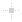</a> | **📂 檔名:** `22_light_snap-orthogonal.svg` ✨ **格式:** `Vector (SVG)` ⚖️ **大小:** `3.49KB` 📅 **更新:** `2026-02-27`  🚀 **jsDelivr Markdown:** <code></code> 🔗 **直接連結 (Url):** <code>https://cdn.jsdelivr.net/gh/barry028/materials@main/images/iCons/KritaiCon/22_light_snap-orthogonal.svg</code> 📥 [檢視原始檔](22_light_snap-orthogonal.svg) |
|  | **📂 檔名:** `22_light_split.svg` ✨ **格式:** `Vector (SVG)` ⚖️ **大小:** `3.22KB` 📅 **更新:** `2026-02-27`  🚀 **jsDelivr Markdown:** <code></code> 🔗 **直接連結 (Url):** <code>https://cdn.jsdelivr.net/gh/barry028/materials@main/images/iCons/KritaiCon/22_light_split.svg</code> 📥 [檢視原始檔](22_light_split.svg) |
|  | **📂 檔名:** `22_light_tab-close.svg` ✨ **格式:** `Vector (SVG)` ⚖️ **大小:** `3.54KB` 📅 **更新:** `2026-02-27`  🚀 **jsDelivr Markdown:** <code></code> 🔗 **直接連結 (Url):** <code>https://cdn.jsdelivr.net/gh/barry028/materials@main/images/iCons/KritaiCon/22_light_tab-close.svg</code> 📥 [檢視原始檔](22_light_tab-close.svg) |
|  | **📂 檔名:** `22_light_tab-new.svg` ✨ **格式:** `Vector (SVG)` ⚖️ **大小:** `3.48KB` 📅 **更新:** `2026-02-27`  🚀 **jsDelivr Markdown:** <code></code> 🔗 **直接連結 (Url):** <code>https://cdn.jsdelivr.net/gh/barry028/materials@main/images/iCons/KritaiCon/22_light_tab-new.svg</code> 📥 [檢視原始檔](22_light_tab-new.svg) |
|  | **📂 檔名:** `22_light_transform-move.svg` ✨ **格式:** `Vector (SVG)` ⚖️ **大小:** `3.56KB` 📅 **更新:** `2026-02-27`  🚀 **jsDelivr Markdown:** <code></code> 🔗 **直接連結 (Url):** <code>https://cdn.jsdelivr.net/gh/barry028/materials@main/images/iCons/KritaiCon/22_light_transform-move.svg</code> 📥 [檢視原始檔](22_light_transform-move.svg) |
|  | **📂 檔名:** `22_light_trash-empty.svg` ✨ **格式:** `Vector (SVG)` ⚖️ **大小:** `3.50KB` 📅 **更新:** `2026-02-27`  🚀 **jsDelivr Markdown:** <code></code> 🔗 **直接連結 (Url):** <code>https://cdn.jsdelivr.net/gh/barry028/materials@main/images/iCons/KritaiCon/22_light_trash-empty.svg</code> 📥 [檢視原始檔](22_light_trash-empty.svg) |
|  | **📂 檔名:** `22_light_zoom-fit-best.svg` ✨ **格式:** `Vector (SVG)` ⚖️ **大小:** `4.89KB` 📅 **更新:** `2026-02-27`  🚀 **jsDelivr Markdown:** <code></code> 🔗 **直接連結 (Url):** <code>https://cdn.jsdelivr.net/gh/barry028/materials@main/images/iCons/KritaiCon/22_light_zoom-fit-best.svg</code> 📥 [檢視原始檔](22_light_zoom-fit-best.svg) |
|  | **📂 檔名:** `24_dark_align-horizontal-center.svg` ✨ **格式:** `Vector (SVG)` ⚖️ **大小:** `3.27KB` 📅 **更新:** `2026-02-27`  🚀 **jsDelivr Markdown:** <code></code> 🔗 **直接連結 (Url):** <code>https://cdn.jsdelivr.net/gh/barry028/materials@main/images/iCons/KritaiCon/24_dark_align-horizontal-center.svg</code> 📥 [檢視原始檔](24_dark_align-horizontal-center.svg) |
|  | **📂 檔名:** `24_dark_align-horizontal-left.svg` ✨ **格式:** `Vector (SVG)` ⚖️ **大小:** `3.19KB` 📅 **更新:** `2026-02-27`  🚀 **jsDelivr Markdown:** <code></code> 🔗 **直接連結 (Url):** <code>https://cdn.jsdelivr.net/gh/barry028/materials@main/images/iCons/KritaiCon/24_dark_align-horizontal-left.svg</code> 📥 [檢視原始檔](24_dark_align-horizontal-left.svg) |
|  | **📂 檔名:** `24_dark_align-horizontal-right.svg` ✨ **格式:** `Vector (SVG)` ⚖️ **大小:** `3.19KB` 📅 **更新:** `2026-02-27`  🚀 **jsDelivr Markdown:** <code></code> 🔗 **直接連結 (Url):** <code>https://cdn.jsdelivr.net/gh/barry028/materials@main/images/iCons/KritaiCon/24_dark_align-horizontal-right.svg</code> 📥 [檢視原始檔](24_dark_align-horizontal-right.svg) |
|  | **📂 檔名:** `24_dark_align-vertical-bottom.svg` ✨ **格式:** `Vector (SVG)` ⚖️ **大小:** `3.19KB` 📅 **更新:** `2026-02-27`  🚀 **jsDelivr Markdown:** <code></code> 🔗 **直接連結 (Url):** <code>https://cdn.jsdelivr.net/gh/barry028/materials@main/images/iCons/KritaiCon/24_dark_align-vertical-bottom.svg</code> 📥 [檢視原始檔](24_dark_align-vertical-bottom.svg) |
|  | **📂 檔名:** `24_dark_align-vertical-center.svg` ✨ **格式:** `Vector (SVG)` ⚖️ **大小:** `3.27KB` 📅 **更新:** `2026-02-27`  🚀 **jsDelivr Markdown:** <code></code> 🔗 **直接連結 (Url):** <code>https://cdn.jsdelivr.net/gh/barry028/materials@main/images/iCons/KritaiCon/24_dark_align-vertical-center.svg</code> 📥 [檢視原始檔](24_dark_align-vertical-center.svg) |
|  | **📂 檔名:** `24_dark_align-vertical-top.svg` ✨ **格式:** `Vector (SVG)` ⚖️ **大小:** `3.19KB` 📅 **更新:** `2026-02-27`  🚀 **jsDelivr Markdown:** <code></code> 🔗 **直接連結 (Url):** <code>https://cdn.jsdelivr.net/gh/barry028/materials@main/images/iCons/KritaiCon/24_dark_align-vertical-top.svg</code> 📥 [檢視原始檔](24_dark_align-vertical-top.svg) |
|  | **📂 檔名:** `24_dark_character-set.svg` ✨ **格式:** `Vector (SVG)` ⚖️ **大小:** `3.81KB` 📅 **更新:** `2026-02-27`  🚀 **jsDelivr Markdown:** <code></code> 🔗 **直接連結 (Url):** <code>https://cdn.jsdelivr.net/gh/barry028/materials@main/images/iCons/KritaiCon/24_dark_character-set.svg</code> 📥 [檢視原始檔](24_dark_character-set.svg) |
|  | **📂 檔名:** `24_dark_draw-arrow-back.svg` ✨ **格式:** `Vector (SVG)` ⚖️ **大小:** `14.93KB` 📅 **更新:** `2026-02-27`  🚀 **jsDelivr Markdown:** <code></code> 🔗 **直接連結 (Url):** <code>https://cdn.jsdelivr.net/gh/barry028/materials@main/images/iCons/KritaiCon/24_dark_draw-arrow-back.svg</code> 📥 [檢視原始檔](24_dark_draw-arrow-back.svg) |
|  | **📂 檔名:** `24_dark_draw-arrow-down.svg` ✨ **格式:** `Vector (SVG)` ⚖️ **大小:** `3.95KB` 📅 **更新:** `2026-02-27`  🚀 **jsDelivr Markdown:** <code></code> 🔗 **直接連結 (Url):** <code>https://cdn.jsdelivr.net/gh/barry028/materials@main/images/iCons/KritaiCon/24_dark_draw-arrow-down.svg</code> 📥 [檢視原始檔](24_dark_draw-arrow-down.svg) |
|  | **📂 檔名:** `24_dark_draw-arrow-forward.svg` ✨ **格式:** `Vector (SVG)` ⚖️ **大小:** `3.94KB` 📅 **更新:** `2026-02-27`  🚀 **jsDelivr Markdown:** <code></code> 🔗 **直接連結 (Url):** <code>https://cdn.jsdelivr.net/gh/barry028/materials@main/images/iCons/KritaiCon/24_dark_draw-arrow-forward.svg</code> 📥 [檢視原始檔](24_dark_draw-arrow-forward.svg) |
|  | **📂 檔名:** `24_dark_draw-arrow-up.svg` ✨ **格式:** `Vector (SVG)` ⚖️ **大小:** `14.89KB` 📅 **更新:** `2026-02-27`  🚀 **jsDelivr Markdown:** <code></code> 🔗 **直接連結 (Url):** <code>https://cdn.jsdelivr.net/gh/barry028/materials@main/images/iCons/KritaiCon/24_dark_draw-arrow-up.svg</code> 📥 [檢視原始檔](24_dark_draw-arrow-up.svg) |
|  | **📂 檔名:** `24_dark_draw-freehand.svg` ✨ **格式:** `Vector (SVG)` ⚖️ **大小:** `5.20KB` 📅 **更新:** `2026-02-27`  🚀 **jsDelivr Markdown:** <code></code> 🔗 **直接連結 (Url):** <code>https://cdn.jsdelivr.net/gh/barry028/materials@main/images/iCons/KritaiCon/24_dark_draw-freehand.svg</code> 📥 [檢視原始檔](24_dark_draw-freehand.svg) |
|  | **📂 檔名:** `24_dark_edit-rename.svg` ✨ **格式:** `Vector (SVG)` ⚖️ **大小:** `9.30KB` 📅 **更新:** `2026-02-27`  🚀 **jsDelivr Markdown:** <code></code> 🔗 **直接連結 (Url):** <code>https://cdn.jsdelivr.net/gh/barry028/materials@main/images/iCons/KritaiCon/24_dark_edit-rename.svg</code> 📥 [檢視原始檔](24_dark_edit-rename.svg) |
| <a href="24_dark_edit-select-all.svg">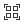</a> | **📂 檔名:** `24_dark_edit-select-all.svg` ✨ **格式:** `Vector (SVG)` ⚖️ **大小:** `3.67KB` 📅 **更新:** `2026-02-27`  🚀 **jsDelivr Markdown:** <code></code> 🔗 **直接連結 (Url):** <code>https://cdn.jsdelivr.net/gh/barry028/materials@main/images/iCons/KritaiCon/24_dark_edit-select-all.svg</code> 📥 [檢視原始檔](24_dark_edit-select-all.svg) |
|  | **📂 檔名:** `24_dark_format-indent-less.svg` ✨ **格式:** `Vector (SVG)` ⚖️ **大小:** `3.53KB` 📅 **更新:** `2026-02-27`  🚀 **jsDelivr Markdown:** <code></code> 🔗 **直接連結 (Url):** <code>https://cdn.jsdelivr.net/gh/barry028/materials@main/images/iCons/KritaiCon/24_dark_format-indent-less.svg</code> 📥 [檢視原始檔](24_dark_format-indent-less.svg) |
|  | **📂 檔名:** `24_dark_format-indent-more.svg` ✨ **格式:** `Vector (SVG)` ⚖️ **大小:** `3.40KB` 📅 **更新:** `2026-02-27`  🚀 **jsDelivr Markdown:** <code></code> 🔗 **直接連結 (Url):** <code>https://cdn.jsdelivr.net/gh/barry028/materials@main/images/iCons/KritaiCon/24_dark_format-indent-more.svg</code> 📥 [檢視原始檔](24_dark_format-indent-more.svg) |
|  | **📂 檔名:** `24_dark_format-justify-center.svg` ✨ **格式:** `Vector (SVG)` ⚖️ **大小:** `3.39KB` 📅 **更新:** `2026-02-27`  🚀 **jsDelivr Markdown:** <code></code> 🔗 **直接連結 (Url):** <code>https://cdn.jsdelivr.net/gh/barry028/materials@main/images/iCons/KritaiCon/24_dark_format-justify-center.svg</code> 📥 [檢視原始檔](24_dark_format-justify-center.svg) |
|  | **📂 檔名:** `24_dark_format-justify-fill.svg` ✨ **格式:** `Vector (SVG)` ⚖️ **大小:** `3.39KB` 📅 **更新:** `2026-02-27`  🚀 **jsDelivr Markdown:** <code></code> 🔗 **直接連結 (Url):** <code>https://cdn.jsdelivr.net/gh/barry028/materials@main/images/iCons/KritaiCon/24_dark_format-justify-fill.svg</code> 📥 [檢視原始檔](24_dark_format-justify-fill.svg) |
|  | **📂 檔名:** `24_dark_format-justify-left.svg` ✨ **格式:** `Vector (SVG)` ⚖️ **大小:** `3.65KB` 📅 **更新:** `2026-02-27`  🚀 **jsDelivr Markdown:** <code></code> 🔗 **直接連結 (Url):** <code>https://cdn.jsdelivr.net/gh/barry028/materials@main/images/iCons/KritaiCon/24_dark_format-justify-left.svg</code> 📥 [檢視原始檔](24_dark_format-justify-left.svg) |
|  | **📂 檔名:** `24_dark_format-justify-right.svg` ✨ **格式:** `Vector (SVG)` ⚖️ **大小:** `3.61KB` 📅 **更新:** `2026-02-27`  🚀 **jsDelivr Markdown:** <code></code> 🔗 **直接連結 (Url):** <code>https://cdn.jsdelivr.net/gh/barry028/materials@main/images/iCons/KritaiCon/24_dark_format-justify-right.svg</code> 📥 [檢視原始檔](24_dark_format-justify-right.svg) |
| <a href="24_dark_format-list-ordered.svg">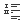</a> | **📂 檔名:** `24_dark_format-list-ordered.svg` ✨ **格式:** `Vector (SVG)` ⚖️ **大小:** `3.50KB` 📅 **更新:** `2026-02-27`  🚀 **jsDelivr Markdown:** <code></code> 🔗 **直接連結 (Url):** <code>https://cdn.jsdelivr.net/gh/barry028/materials@main/images/iCons/KritaiCon/24_dark_format-list-ordered.svg</code> 📥 [檢視原始檔](24_dark_format-list-ordered.svg) |
|  | **📂 檔名:** `24_dark_format-stroke-color.svg` ✨ **格式:** `Vector (SVG)` ⚖️ **大小:** `3.51KB` 📅 **更新:** `2026-02-27`  🚀 **jsDelivr Markdown:** <code></code> 🔗 **直接連結 (Url):** <code>https://cdn.jsdelivr.net/gh/barry028/materials@main/images/iCons/KritaiCon/24_dark_format-stroke-color.svg</code> 📥 [檢視原始檔](24_dark_format-stroke-color.svg) |
|  | **📂 檔名:** `24_dark_format-text-bold.svg` ✨ **格式:** `Vector (SVG)` ⚖️ **大小:** `3.67KB` 📅 **更新:** `2026-02-27`  🚀 **jsDelivr Markdown:** <code></code> 🔗 **直接連結 (Url):** <code>https://cdn.jsdelivr.net/gh/barry028/materials@main/images/iCons/KritaiCon/24_dark_format-text-bold.svg</code> 📥 [檢視原始檔](24_dark_format-text-bold.svg) |
|  | **📂 檔名:** `24_dark_format-text-color.svg` ✨ **格式:** `Vector (SVG)` ⚖️ **大小:** `3.88KB` 📅 **更新:** `2026-02-27`  🚀 **jsDelivr Markdown:** <code></code> 🔗 **直接連結 (Url):** <code>https://cdn.jsdelivr.net/gh/barry028/materials@main/images/iCons/KritaiCon/24_dark_format-text-color.svg</code> 📥 [檢視原始檔](24_dark_format-text-color.svg) |
|  | **📂 檔名:** `24_dark_format-text-direction-rtl.svg` ✨ **格式:** `Vector (SVG)` ⚖️ **大小:** `3.44KB` 📅 **更新:** `2026-02-27`  🚀 **jsDelivr Markdown:** <code></code> 🔗 **直接連結 (Url):** <code>https://cdn.jsdelivr.net/gh/barry028/materials@main/images/iCons/KritaiCon/24_dark_format-text-direction-rtl.svg</code> 📥 [檢視原始檔](24_dark_format-text-direction-rtl.svg) |
|  | **📂 檔名:** `24_dark_format-text-italic.svg` ✨ **格式:** `Vector (SVG)` ⚖️ **大小:** `3.55KB` 📅 **更新:** `2026-02-27`  🚀 **jsDelivr Markdown:** <code></code> 🔗 **直接連結 (Url):** <code>https://cdn.jsdelivr.net/gh/barry028/materials@main/images/iCons/KritaiCon/24_dark_format-text-italic.svg</code> 📥 [檢視原始檔](24_dark_format-text-italic.svg) |
|  | **📂 檔名:** `24_dark_format-text-strikethrough.svg` ✨ **格式:** `Vector (SVG)` ⚖️ **大小:** `3.88KB` 📅 **更新:** `2026-02-27`  🚀 **jsDelivr Markdown:** <code></code> 🔗 **直接連結 (Url):** <code>https://cdn.jsdelivr.net/gh/barry028/materials@main/images/iCons/KritaiCon/24_dark_format-text-strikethrough.svg</code> 📥 [檢視原始檔](24_dark_format-text-strikethrough.svg) |
|  | **📂 檔名:** `24_dark_format-text-subscript.svg` ✨ **格式:** `Vector (SVG)` ⚖️ **大小:** `4.45KB` 📅 **更新:** `2026-02-27`  🚀 **jsDelivr Markdown:** <code></code> 🔗 **直接連結 (Url):** <code>https://cdn.jsdelivr.net/gh/barry028/materials@main/images/iCons/KritaiCon/24_dark_format-text-subscript.svg</code> 📥 [檢視原始檔](24_dark_format-text-subscript.svg) |
|  | **📂 檔名:** `24_dark_format-text-superscript.svg` ✨ **格式:** `Vector (SVG)` ⚖️ **大小:** `4.32KB` 📅 **更新:** `2026-02-27`  🚀 **jsDelivr Markdown:** <code></code> 🔗 **直接連結 (Url):** <code>https://cdn.jsdelivr.net/gh/barry028/materials@main/images/iCons/KritaiCon/24_dark_format-text-superscript.svg</code> 📥 [檢視原始檔](24_dark_format-text-superscript.svg) |
|  | **📂 檔名:** `24_dark_format-text-underline.svg` ✨ **格式:** `Vector (SVG)` ⚖️ **大小:** `3.95KB` 📅 **更新:** `2026-02-27`  🚀 **jsDelivr Markdown:** <code></code> 🔗 **直接連結 (Url):** <code>https://cdn.jsdelivr.net/gh/barry028/materials@main/images/iCons/KritaiCon/24_dark_format-text-underline.svg</code> 📥 [檢視原始檔](24_dark_format-text-underline.svg) |
| <a href="24_dark_insert-text.svg">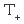</a> | **📂 檔名:** `24_dark_insert-text.svg` ✨ **格式:** `Vector (SVG)` ⚖️ **大小:** `3.66KB` 📅 **更新:** `2026-02-27`  🚀 **jsDelivr Markdown:** <code></code> 🔗 **直接連結 (Url):** <code>https://cdn.jsdelivr.net/gh/barry028/materials@main/images/iCons/KritaiCon/24_dark_insert-text.svg</code> 📥 [檢視原始檔](24_dark_insert-text.svg) |
|  | **📂 檔名:** `24_dark_snap-extension.svg` ✨ **格式:** `Vector (SVG)` ⚖️ **大小:** `4.84KB` 📅 **更新:** `2026-02-27`  🚀 **jsDelivr Markdown:** <code></code> 🔗 **直接連結 (Url):** <code>https://cdn.jsdelivr.net/gh/barry028/materials@main/images/iCons/KritaiCon/24_dark_snap-extension.svg</code> 📥 [檢視原始檔](24_dark_snap-extension.svg) |
| <a href="24_dark_snap-guideline.svg">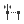</a> | **📂 檔名:** `24_dark_snap-guideline.svg` ✨ **格式:** `Vector (SVG)` ⚖️ **大小:** `4.95KB` 📅 **更新:** `2026-02-27`  🚀 **jsDelivr Markdown:** <code></code> 🔗 **直接連結 (Url):** <code>https://cdn.jsdelivr.net/gh/barry028/materials@main/images/iCons/KritaiCon/24_dark_snap-guideline.svg</code> 📥 [檢視原始檔](24_dark_snap-guideline.svg) |
|  | **📂 檔名:** `24_dark_snap-intersection.svg` ✨ **格式:** `Vector (SVG)` ⚖️ **大小:** `4.94KB` 📅 **更新:** `2026-02-27`  🚀 **jsDelivr Markdown:** <code></code> 🔗 **直接連結 (Url):** <code>https://cdn.jsdelivr.net/gh/barry028/materials@main/images/iCons/KritaiCon/24_dark_snap-intersection.svg</code> 📥 [檢視原始檔](24_dark_snap-intersection.svg) |
|  | **📂 檔名:** `24_dark_snap-node.svg` ✨ **格式:** `Vector (SVG)` ⚖️ **大小:** `4.85KB` 📅 **更新:** `2026-02-27`  🚀 **jsDelivr Markdown:** <code></code> 🔗 **直接連結 (Url):** <code>https://cdn.jsdelivr.net/gh/barry028/materials@main/images/iCons/KritaiCon/24_dark_snap-node.svg</code> 📥 [檢視原始檔](24_dark_snap-node.svg) |
|  | **📂 檔名:** `24_dark_snap-orthogonal.svg` ✨ **格式:** `Vector (SVG)` ⚖️ **大小:** `4.97KB` 📅 **更新:** `2026-02-27`  🚀 **jsDelivr Markdown:** <code></code> 🔗 **直接連結 (Url):** <code>https://cdn.jsdelivr.net/gh/barry028/materials@main/images/iCons/KritaiCon/24_dark_snap-orthogonal.svg</code> 📥 [檢視原始檔](24_dark_snap-orthogonal.svg) |
|  | **📂 檔名:** `24_dark_split.svg` ✨ **格式:** `Vector (SVG)` ⚖️ **大小:** `4.79KB` 📅 **更新:** `2026-02-27`  🚀 **jsDelivr Markdown:** <code></code> 🔗 **直接連結 (Url):** <code>https://cdn.jsdelivr.net/gh/barry028/materials@main/images/iCons/KritaiCon/24_dark_split.svg</code> 📥 [檢視原始檔](24_dark_split.svg) |
|  | **📂 檔名:** `24_dark_tab-new.svg` ✨ **格式:** `Vector (SVG)` ⚖️ **大小:** `4.75KB` 📅 **更新:** `2026-02-27`  🚀 **jsDelivr Markdown:** <code></code> 🔗 **直接連結 (Url):** <code>https://cdn.jsdelivr.net/gh/barry028/materials@main/images/iCons/KritaiCon/24_dark_tab-new.svg</code> 📥 [檢視原始檔](24_dark_tab-new.svg) |
|  | **📂 檔名:** `24_dark_transform-move.svg` ✨ **格式:** `Vector (SVG)` ⚖️ **大小:** `4.46KB` 📅 **更新:** `2026-02-27`  🚀 **jsDelivr Markdown:** <code></code> 🔗 **直接連結 (Url):** <code>https://cdn.jsdelivr.net/gh/barry028/materials@main/images/iCons/KritaiCon/24_dark_transform-move.svg</code> 📥 [檢視原始檔](24_dark_transform-move.svg) |
|  | **📂 檔名:** `24_dark_trash-empty.svg` ✨ **格式:** `Vector (SVG)` ⚖️ **大小:** `4.40KB` 📅 **更新:** `2026-02-27`  🚀 **jsDelivr Markdown:** <code></code> 🔗 **直接連結 (Url):** <code>https://cdn.jsdelivr.net/gh/barry028/materials@main/images/iCons/KritaiCon/24_dark_trash-empty.svg</code> 📥 [檢視原始檔](24_dark_trash-empty.svg) |
|  | **📂 檔名:** `24_dark_zoom-fit-best.svg` ✨ **格式:** `Vector (SVG)` ⚖️ **大小:** `4.85KB` 📅 **更新:** `2026-02-27`  🚀 **jsDelivr Markdown:** <code></code> 🔗 **直接連結 (Url):** <code>https://cdn.jsdelivr.net/gh/barry028/materials@main/images/iCons/KritaiCon/24_dark_zoom-fit-best.svg</code> 📥 [檢視原始檔](24_dark_zoom-fit-best.svg) |
|  | **📂 檔名:** `24_light_align-horizontal-center.svg` ✨ **格式:** `Vector (SVG)` ⚖️ **大小:** `3.27KB` 📅 **更新:** `2026-02-27`  🚀 **jsDelivr Markdown:** <code></code> 🔗 **直接連結 (Url):** <code>https://cdn.jsdelivr.net/gh/barry028/materials@main/images/iCons/KritaiCon/24_light_align-horizontal-center.svg</code> 📥 [檢視原始檔](24_light_align-horizontal-center.svg) |
| <a href="24_light_align-horizontal-left.svg">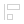</a> | **📂 檔名:** `24_light_align-horizontal-left.svg` ✨ **格式:** `Vector (SVG)` ⚖️ **大小:** `3.19KB` 📅 **更新:** `2026-02-27`  🚀 **jsDelivr Markdown:** <code></code> 🔗 **直接連結 (Url):** <code>https://cdn.jsdelivr.net/gh/barry028/materials@main/images/iCons/KritaiCon/24_light_align-horizontal-left.svg</code> 📥 [檢視原始檔](24_light_align-horizontal-left.svg) |
| <a href="24_light_align-horizontal-right.svg">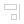</a> | **📂 檔名:** `24_light_align-horizontal-right.svg` ✨ **格式:** `Vector (SVG)` ⚖️ **大小:** `3.19KB` 📅 **更新:** `2026-02-27`  🚀 **jsDelivr Markdown:** <code></code> 🔗 **直接連結 (Url):** <code>https://cdn.jsdelivr.net/gh/barry028/materials@main/images/iCons/KritaiCon/24_light_align-horizontal-right.svg</code> 📥 [檢視原始檔](24_light_align-horizontal-right.svg) |
| <a href="24_light_align-vertical-bottom.svg">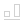</a> | **📂 檔名:** `24_light_align-vertical-bottom.svg` ✨ **格式:** `Vector (SVG)` ⚖️ **大小:** `3.19KB` 📅 **更新:** `2026-02-27`  🚀 **jsDelivr Markdown:** <code></code> 🔗 **直接連結 (Url):** <code>https://cdn.jsdelivr.net/gh/barry028/materials@main/images/iCons/KritaiCon/24_light_align-vertical-bottom.svg</code> 📥 [檢視原始檔](24_light_align-vertical-bottom.svg) |
|  | **📂 檔名:** `24_light_align-vertical-center.svg` ✨ **格式:** `Vector (SVG)` ⚖️ **大小:** `3.27KB` 📅 **更新:** `2026-02-27`  🚀 **jsDelivr Markdown:** <code></code> 🔗 **直接連結 (Url):** <code>https://cdn.jsdelivr.net/gh/barry028/materials@main/images/iCons/KritaiCon/24_light_align-vertical-center.svg</code> 📥 [檢視原始檔](24_light_align-vertical-center.svg) |
| <a href="24_light_align-vertical-top.svg">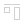</a> | **📂 檔名:** `24_light_align-vertical-top.svg` ✨ **格式:** `Vector (SVG)` ⚖️ **大小:** `3.19KB` 📅 **更新:** `2026-02-27`  🚀 **jsDelivr Markdown:** <code></code> 🔗 **直接連結 (Url):** <code>https://cdn.jsdelivr.net/gh/barry028/materials@main/images/iCons/KritaiCon/24_light_align-vertical-top.svg</code> 📥 [檢視原始檔](24_light_align-vertical-top.svg) |
| <a href="24_light_character-set.svg">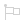</a> | **📂 檔名:** `24_light_character-set.svg` ✨ **格式:** `Vector (SVG)` ⚖️ **大小:** `3.81KB` 📅 **更新:** `2026-02-27`  🚀 **jsDelivr Markdown:** <code></code> 🔗 **直接連結 (Url):** <code>https://cdn.jsdelivr.net/gh/barry028/materials@main/images/iCons/KritaiCon/24_light_character-set.svg</code> 📥 [檢視原始檔](24_light_character-set.svg) |
|  | **📂 檔名:** `24_light_draw-arrow-back.svg` ✨ **格式:** `Vector (SVG)` ⚖️ **大小:** `14.93KB` 📅 **更新:** `2026-02-27`  🚀 **jsDelivr Markdown:** <code></code> 🔗 **直接連結 (Url):** <code>https://cdn.jsdelivr.net/gh/barry028/materials@main/images/iCons/KritaiCon/24_light_draw-arrow-back.svg</code> 📥 [檢視原始檔](24_light_draw-arrow-back.svg) |
|  | **📂 檔名:** `24_light_draw-arrow-down.svg` ✨ **格式:** `Vector (SVG)` ⚖️ **大小:** `3.95KB` 📅 **更新:** `2026-02-27`  🚀 **jsDelivr Markdown:** <code></code> 🔗 **直接連結 (Url):** <code>https://cdn.jsdelivr.net/gh/barry028/materials@main/images/iCons/KritaiCon/24_light_draw-arrow-down.svg</code> 📥 [檢視原始檔](24_light_draw-arrow-down.svg) |
|  | **📂 檔名:** `24_light_draw-arrow-forward.svg` ✨ **格式:** `Vector (SVG)` ⚖️ **大小:** `3.94KB` 📅 **更新:** `2026-02-27`  🚀 **jsDelivr Markdown:** <code></code> 🔗 **直接連結 (Url):** <code>https://cdn.jsdelivr.net/gh/barry028/materials@main/images/iCons/KritaiCon/24_light_draw-arrow-forward.svg</code> 📥 [檢視原始檔](24_light_draw-arrow-forward.svg) |
|  | **📂 檔名:** `24_light_draw-arrow-up.svg` ✨ **格式:** `Vector (SVG)` ⚖️ **大小:** `14.89KB` 📅 **更新:** `2026-02-27`  🚀 **jsDelivr Markdown:** <code></code> 🔗 **直接連結 (Url):** <code>https://cdn.jsdelivr.net/gh/barry028/materials@main/images/iCons/KritaiCon/24_light_draw-arrow-up.svg</code> 📥 [檢視原始檔](24_light_draw-arrow-up.svg) |
|  | **📂 檔名:** `24_light_draw-freehand.svg` ✨ **格式:** `Vector (SVG)` ⚖️ **大小:** `5.20KB` 📅 **更新:** `2026-02-27`  🚀 **jsDelivr Markdown:** <code></code> 🔗 **直接連結 (Url):** <code>https://cdn.jsdelivr.net/gh/barry028/materials@main/images/iCons/KritaiCon/24_light_draw-freehand.svg</code> 📥 [檢視原始檔](24_light_draw-freehand.svg) |
|  | **📂 檔名:** `24_light_edit-rename.svg` ✨ **格式:** `Vector (SVG)` ⚖️ **大小:** `9.30KB` 📅 **更新:** `2026-02-27`  🚀 **jsDelivr Markdown:** <code></code> 🔗 **直接連結 (Url):** <code>https://cdn.jsdelivr.net/gh/barry028/materials@main/images/iCons/KritaiCon/24_light_edit-rename.svg</code> 📥 [檢視原始檔](24_light_edit-rename.svg) |
|  | **📂 檔名:** `24_light_edit-select-all.svg` ✨ **格式:** `Vector (SVG)` ⚖️ **大小:** `3.67KB` 📅 **更新:** `2026-02-27`  🚀 **jsDelivr Markdown:** <code></code> 🔗 **直接連結 (Url):** <code>https://cdn.jsdelivr.net/gh/barry028/materials@main/images/iCons/KritaiCon/24_light_edit-select-all.svg</code> 📥 [檢視原始檔](24_light_edit-select-all.svg) |
|  | **📂 檔名:** `24_light_format-indent-less.svg` ✨ **格式:** `Vector (SVG)` ⚖️ **大小:** `3.53KB` 📅 **更新:** `2026-02-27`  🚀 **jsDelivr Markdown:** <code></code> 🔗 **直接連結 (Url):** <code>https://cdn.jsdelivr.net/gh/barry028/materials@main/images/iCons/KritaiCon/24_light_format-indent-less.svg</code> 📥 [檢視原始檔](24_light_format-indent-less.svg) |
|  | **📂 檔名:** `24_light_format-indent-more.svg` ✨ **格式:** `Vector (SVG)` ⚖️ **大小:** `3.40KB` 📅 **更新:** `2026-02-27`  🚀 **jsDelivr Markdown:** <code></code> 🔗 **直接連結 (Url):** <code>https://cdn.jsdelivr.net/gh/barry028/materials@main/images/iCons/KritaiCon/24_light_format-indent-more.svg</code> 📥 [檢視原始檔](24_light_format-indent-more.svg) |
|  | **📂 檔名:** `24_light_format-justify-center.svg` ✨ **格式:** `Vector (SVG)` ⚖️ **大小:** `3.39KB` 📅 **更新:** `2026-02-27`  🚀 **jsDelivr Markdown:** <code></code> 🔗 **直接連結 (Url):** <code>https://cdn.jsdelivr.net/gh/barry028/materials@main/images/iCons/KritaiCon/24_light_format-justify-center.svg</code> 📥 [檢視原始檔](24_light_format-justify-center.svg) |
|  | **📂 檔名:** `24_light_format-justify-fill.svg` ✨ **格式:** `Vector (SVG)` ⚖️ **大小:** `3.39KB` 📅 **更新:** `2026-02-27`  🚀 **jsDelivr Markdown:** <code></code> 🔗 **直接連結 (Url):** <code>https://cdn.jsdelivr.net/gh/barry028/materials@main/images/iCons/KritaiCon/24_light_format-justify-fill.svg</code> 📥 [檢視原始檔](24_light_format-justify-fill.svg) |
|  | **📂 檔名:** `24_light_format-justify-left.svg` ✨ **格式:** `Vector (SVG)` ⚖️ **大小:** `3.65KB` 📅 **更新:** `2026-02-27`  🚀 **jsDelivr Markdown:** <code></code> 🔗 **直接連結 (Url):** <code>https://cdn.jsdelivr.net/gh/barry028/materials@main/images/iCons/KritaiCon/24_light_format-justify-left.svg</code> 📥 [檢視原始檔](24_light_format-justify-left.svg) |
|  | **📂 檔名:** `24_light_format-justify-right.svg` ✨ **格式:** `Vector (SVG)` ⚖️ **大小:** `3.61KB` 📅 **更新:** `2026-02-27`  🚀 **jsDelivr Markdown:** <code></code> 🔗 **直接連結 (Url):** <code>https://cdn.jsdelivr.net/gh/barry028/materials@main/images/iCons/KritaiCon/24_light_format-justify-right.svg</code> 📥 [檢視原始檔](24_light_format-justify-right.svg) |
|  | **📂 檔名:** `24_light_format-list-ordered.svg` ✨ **格式:** `Vector (SVG)` ⚖️ **大小:** `3.50KB` 📅 **更新:** `2026-02-27`  🚀 **jsDelivr Markdown:** <code></code> 🔗 **直接連結 (Url):** <code>https://cdn.jsdelivr.net/gh/barry028/materials@main/images/iCons/KritaiCon/24_light_format-list-ordered.svg</code> 📥 [檢視原始檔](24_light_format-list-ordered.svg) |
|  | **📂 檔名:** `24_light_format-stroke-color.svg` ✨ **格式:** `Vector (SVG)` ⚖️ **大小:** `3.51KB` 📅 **更新:** `2026-02-27`  🚀 **jsDelivr Markdown:** <code></code> 🔗 **直接連結 (Url):** <code>https://cdn.jsdelivr.net/gh/barry028/materials@main/images/iCons/KritaiCon/24_light_format-stroke-color.svg</code> 📥 [檢視原始檔](24_light_format-stroke-color.svg) |
|  | **📂 檔名:** `24_light_format-text-bold.svg` ✨ **格式:** `Vector (SVG)` ⚖️ **大小:** `3.67KB` 📅 **更新:** `2026-02-27`  🚀 **jsDelivr Markdown:** <code></code> 🔗 **直接連結 (Url):** <code>https://cdn.jsdelivr.net/gh/barry028/materials@main/images/iCons/KritaiCon/24_light_format-text-bold.svg</code> 📥 [檢視原始檔](24_light_format-text-bold.svg) |
|  | **📂 檔名:** `24_light_format-text-color.svg` ✨ **格式:** `Vector (SVG)` ⚖️ **大小:** `3.88KB` 📅 **更新:** `2026-02-27`  🚀 **jsDelivr Markdown:** <code></code> 🔗 **直接連結 (Url):** <code>https://cdn.jsdelivr.net/gh/barry028/materials@main/images/iCons/KritaiCon/24_light_format-text-color.svg</code> 📥 [檢視原始檔](24_light_format-text-color.svg) |
|  | **📂 檔名:** `24_light_format-text-direction-rtl.svg` ✨ **格式:** `Vector (SVG)` ⚖️ **大小:** `3.44KB` 📅 **更新:** `2026-02-27`  🚀 **jsDelivr Markdown:** <code></code> 🔗 **直接連結 (Url):** <code>https://cdn.jsdelivr.net/gh/barry028/materials@main/images/iCons/KritaiCon/24_light_format-text-direction-rtl.svg</code> 📥 [檢視原始檔](24_light_format-text-direction-rtl.svg) |
|  | **📂 檔名:** `24_light_format-text-italic.svg` ✨ **格式:** `Vector (SVG)` ⚖️ **大小:** `3.55KB` 📅 **更新:** `2026-02-27`  🚀 **jsDelivr Markdown:** <code></code> 🔗 **直接連結 (Url):** <code>https://cdn.jsdelivr.net/gh/barry028/materials@main/images/iCons/KritaiCon/24_light_format-text-italic.svg</code> 📥 [檢視原始檔](24_light_format-text-italic.svg) |
|  | **📂 檔名:** `24_light_format-text-strikethrough.svg` ✨ **格式:** `Vector (SVG)` ⚖️ **大小:** `3.88KB` 📅 **更新:** `2026-02-27`  🚀 **jsDelivr Markdown:** <code></code> 🔗 **直接連結 (Url):** <code>https://cdn.jsdelivr.net/gh/barry028/materials@main/images/iCons/KritaiCon/24_light_format-text-strikethrough.svg</code> 📥 [檢視原始檔](24_light_format-text-strikethrough.svg) |
|  | **📂 檔名:** `24_light_format-text-subscript.svg` ✨ **格式:** `Vector (SVG)` ⚖️ **大小:** `4.45KB` 📅 **更新:** `2026-02-27`  🚀 **jsDelivr Markdown:** <code></code> 🔗 **直接連結 (Url):** <code>https://cdn.jsdelivr.net/gh/barry028/materials@main/images/iCons/KritaiCon/24_light_format-text-subscript.svg</code> 📥 [檢視原始檔](24_light_format-text-subscript.svg) |
|  | **📂 檔名:** `24_light_format-text-superscript.svg` ✨ **格式:** `Vector (SVG)` ⚖️ **大小:** `4.32KB` 📅 **更新:** `2026-02-27`  🚀 **jsDelivr Markdown:** <code></code> 🔗 **直接連結 (Url):** <code>https://cdn.jsdelivr.net/gh/barry028/materials@main/images/iCons/KritaiCon/24_light_format-text-superscript.svg</code> 📥 [檢視原始檔](24_light_format-text-superscript.svg) |
|  | **📂 檔名:** `24_light_format-text-underline.svg` ✨ **格式:** `Vector (SVG)` ⚖️ **大小:** `3.95KB` 📅 **更新:** `2026-02-27`  🚀 **jsDelivr Markdown:** <code></code> 🔗 **直接連結 (Url):** <code>https://cdn.jsdelivr.net/gh/barry028/materials@main/images/iCons/KritaiCon/24_light_format-text-underline.svg</code> 📥 [檢視原始檔](24_light_format-text-underline.svg) |
|  | **📂 檔名:** `24_light_insert-text.svg` ✨ **格式:** `Vector (SVG)` ⚖️ **大小:** `3.66KB` 📅 **更新:** `2026-02-27`  🚀 **jsDelivr Markdown:** <code></code> 🔗 **直接連結 (Url):** <code>https://cdn.jsdelivr.net/gh/barry028/materials@main/images/iCons/KritaiCon/24_light_insert-text.svg</code> 📥 [檢視原始檔](24_light_insert-text.svg) |
|  | **📂 檔名:** `24_light_list-remove.svg` ✨ **格式:** `Vector (SVG)` ⚖️ **大小:** `3.83KB` 📅 **更新:** `2026-02-27`  🚀 **jsDelivr Markdown:** <code></code> 🔗 **直接連結 (Url):** <code>https://cdn.jsdelivr.net/gh/barry028/materials@main/images/iCons/KritaiCon/24_light_list-remove.svg</code> 📥 [檢視原始檔](24_light_list-remove.svg) |
| <a href="24_light_snap-extension.svg">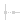</a> | **📂 檔名:** `24_light_snap-extension.svg` ✨ **格式:** `Vector (SVG)` ⚖️ **大小:** `4.84KB` 📅 **更新:** `2026-02-27`  🚀 **jsDelivr Markdown:** <code></code> 🔗 **直接連結 (Url):** <code>https://cdn.jsdelivr.net/gh/barry028/materials@main/images/iCons/KritaiCon/24_light_snap-extension.svg</code> 📥 [檢視原始檔](24_light_snap-extension.svg) |
|  | **📂 檔名:** `24_light_snap-guideline.svg` ✨ **格式:** `Vector (SVG)` ⚖️ **大小:** `4.95KB` 📅 **更新:** `2026-02-27`  🚀 **jsDelivr Markdown:** <code></code> 🔗 **直接連結 (Url):** <code>https://cdn.jsdelivr.net/gh/barry028/materials@main/images/iCons/KritaiCon/24_light_snap-guideline.svg</code> 📥 [檢視原始檔](24_light_snap-guideline.svg) |
|  | **📂 檔名:** `24_light_snap-intersection.svg` ✨ **格式:** `Vector (SVG)` ⚖️ **大小:** `4.94KB` 📅 **更新:** `2026-02-27`  🚀 **jsDelivr Markdown:** <code></code> 🔗 **直接連結 (Url):** <code>https://cdn.jsdelivr.net/gh/barry028/materials@main/images/iCons/KritaiCon/24_light_snap-intersection.svg</code> 📥 [檢視原始檔](24_light_snap-intersection.svg) |
| <a href="24_light_snap-node.svg">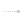</a> | **📂 檔名:** `24_light_snap-node.svg` ✨ **格式:** `Vector (SVG)` ⚖️ **大小:** `4.85KB` 📅 **更新:** `2026-02-27`  🚀 **jsDelivr Markdown:** <code></code> 🔗 **直接連結 (Url):** <code>https://cdn.jsdelivr.net/gh/barry028/materials@main/images/iCons/KritaiCon/24_light_snap-node.svg</code> 📥 [檢視原始檔](24_light_snap-node.svg) |
|  | **📂 檔名:** `24_light_snap-orthogonal.svg` ✨ **格式:** `Vector (SVG)` ⚖️ **大小:** `4.97KB` 📅 **更新:** `2026-02-27`  🚀 **jsDelivr Markdown:** <code></code> 🔗 **直接連結 (Url):** <code>https://cdn.jsdelivr.net/gh/barry028/materials@main/images/iCons/KritaiCon/24_light_snap-orthogonal.svg</code> 📥 [檢視原始檔](24_light_snap-orthogonal.svg) |
|  | **📂 檔名:** `24_light_split.svg` ✨ **格式:** `Vector (SVG)` ⚖️ **大小:** `4.79KB` 📅 **更新:** `2026-02-27`  🚀 **jsDelivr Markdown:** <code></code> 🔗 **直接連結 (Url):** <code>https://cdn.jsdelivr.net/gh/barry028/materials@main/images/iCons/KritaiCon/24_light_split.svg</code> 📥 [檢視原始檔](24_light_split.svg) |
|  | **📂 檔名:** `24_light_tab-close.svg` ✨ **格式:** `Vector (SVG)` ⚖️ **大小:** `4.22KB` 📅 **更新:** `2026-02-27`  🚀 **jsDelivr Markdown:** <code></code> 🔗 **直接連結 (Url):** <code>https://cdn.jsdelivr.net/gh/barry028/materials@main/images/iCons/KritaiCon/24_light_tab-close.svg</code> 📥 [檢視原始檔](24_light_tab-close.svg) |
|  | **📂 檔名:** `24_light_tab-new.svg` ✨ **格式:** `Vector (SVG)` ⚖️ **大小:** `4.75KB` 📅 **更新:** `2026-02-27`  🚀 **jsDelivr Markdown:** <code></code> 🔗 **直接連結 (Url):** <code>https://cdn.jsdelivr.net/gh/barry028/materials@main/images/iCons/KritaiCon/24_light_tab-new.svg</code> 📥 [檢視原始檔](24_light_tab-new.svg) |
|  | **📂 檔名:** `24_light_transform-move.svg` ✨ **格式:** `Vector (SVG)` ⚖️ **大小:** `4.46KB` 📅 **更新:** `2026-02-27`  🚀 **jsDelivr Markdown:** <code></code> 🔗 **直接連結 (Url):** <code>https://cdn.jsdelivr.net/gh/barry028/materials@main/images/iCons/KritaiCon/24_light_transform-move.svg</code> 📥 [檢視原始檔](24_light_transform-move.svg) |
|  | **📂 檔名:** `24_light_trash-empty.svg` ✨ **格式:** `Vector (SVG)` ⚖️ **大小:** `4.40KB` 📅 **更新:** `2026-02-27`  🚀 **jsDelivr Markdown:** <code></code> 🔗 **直接連結 (Url):** <code>https://cdn.jsdelivr.net/gh/barry028/materials@main/images/iCons/KritaiCon/24_light_trash-empty.svg</code> 📥 [檢視原始檔](24_light_trash-empty.svg) |
|  | **📂 檔名:** `24_light_zoom-fit-best.svg` ✨ **格式:** `Vector (SVG)` ⚖️ **大小:** `4.85KB` 📅 **更新:** `2026-02-27`  🚀 **jsDelivr Markdown:** <code></code> 🔗 **直接連結 (Url):** <code>https://cdn.jsdelivr.net/gh/barry028/materials@main/images/iCons/KritaiCon/24_light_zoom-fit-best.svg</code> 📥 [檢視原始檔](24_light_zoom-fit-best.svg) |
|  | **📂 檔名:** `32_dark_application-x-krita.svg` ✨ **格式:** `Vector (SVG)` ⚖️ **大小:** `5.30KB` 📅 **更新:** `2026-02-27`  🚀 **jsDelivr Markdown:** <code></code> 🔗 **直接連結 (Url):** <code>https://cdn.jsdelivr.net/gh/barry028/materials@main/images/iCons/KritaiCon/32_dark_application-x-krita.svg</code> 📥 [檢視原始檔](32_dark_application-x-krita.svg) |
|  | **📂 檔名:** `32_dark_application-x-krz.svg` ✨ **格式:** `Vector (SVG)` ⚖️ **大小:** `8.90KB` 📅 **更新:** `2026-02-27`  🚀 **jsDelivr Markdown:** <code></code> 🔗 **直接連結 (Url):** <code>https://cdn.jsdelivr.net/gh/barry028/materials@main/images/iCons/KritaiCon/32_dark_application-x-krz.svg</code> 📥 [檢視原始檔](32_dark_application-x-krz.svg) |
|  | **📂 檔名:** `32_light_application-x-krita.svg` ✨ **格式:** `Vector (SVG)` ⚖️ **大小:** `5.31KB` 📅 **更新:** `2026-02-27`  🚀 **jsDelivr Markdown:** <code></code> 🔗 **直接連結 (Url):** <code>https://cdn.jsdelivr.net/gh/barry028/materials@main/images/iCons/KritaiCon/32_light_application-x-krita.svg</code> 📥 [檢視原始檔](32_light_application-x-krita.svg) |
|  | **📂 檔名:** `32_light_application-x-krz.svg` ✨ **格式:** `Vector (SVG)` ⚖️ **大小:** `8.90KB` 📅 **更新:** `2026-02-27`  🚀 **jsDelivr Markdown:** <code></code> 🔗 **直接連結 (Url):** <code>https://cdn.jsdelivr.net/gh/barry028/materials@main/images/iCons/KritaiCon/32_light_application-x-krz.svg</code> 📥 [檢視原始檔](32_light_application-x-krz.svg) |
|  | **📂 檔名:** `32_light_application-x-wmf.svg` ✨ **格式:** `Vector (SVG)` ⚖️ **大小:** `8.17KB` 📅 **更新:** `2026-02-27`  🚀 **jsDelivr Markdown:** <code></code> 🔗 **直接連結 (Url):** <code>https://cdn.jsdelivr.net/gh/barry028/materials@main/images/iCons/KritaiCon/32_light_application-x-wmf.svg</code> 📥 [檢視原始檔](32_light_application-x-wmf.svg) |
|  | **📂 檔名:** `48_light_klipper.svg` ✨ **格式:** `Vector (SVG)` ⚖️ **大小:** `9.54KB` 📅 **更新:** `2026-02-27`  🚀 **jsDelivr Markdown:** <code></code> 🔗 **直接連結 (Url):** <code>https://cdn.jsdelivr.net/gh/barry028/materials@main/images/iCons/KritaiCon/48_light_klipper.svg</code> 📥 [檢視原始檔](48_light_klipper.svg) |
|  | **📂 檔名:** `64_dark_application-x-krita.svg` ✨ **格式:** `Vector (SVG)` ⚖️ **大小:** `3.72KB` 📅 **更新:** `2026-02-27`  🚀 **jsDelivr Markdown:** <code></code> 🔗 **直接連結 (Url):** <code>https://cdn.jsdelivr.net/gh/barry028/materials@main/images/iCons/KritaiCon/64_dark_application-x-krita.svg</code> 📥 [檢視原始檔](64_dark_application-x-krita.svg) |
|  | **📂 檔名:** `64_dark_application-x-krz.svg` ✨ **格式:** `Vector (SVG)` ⚖️ **大小:** `6.54KB` 📅 **更新:** `2026-02-27`  🚀 **jsDelivr Markdown:** <code></code> 🔗 **直接連結 (Url):** <code>https://cdn.jsdelivr.net/gh/barry028/materials@main/images/iCons/KritaiCon/64_dark_application-x-krz.svg</code> 📥 [檢視原始檔](64_dark_application-x-krz.svg) |
|  | **📂 檔名:** `64_light_application-x-krita.svg` ✨ **格式:** `Vector (SVG)` ⚖️ **大小:** `3.70KB` 📅 **更新:** `2026-02-27`  🚀 **jsDelivr Markdown:** <code></code> 🔗 **直接連結 (Url):** <code>https://cdn.jsdelivr.net/gh/barry028/materials@main/images/iCons/KritaiCon/64_light_application-x-krita.svg</code> 📥 [檢視原始檔](64_light_application-x-krita.svg) |
|  | **📂 檔名:** `64_light_application-x-krz.svg` ✨ **格式:** `Vector (SVG)` ⚖️ **大小:** `6.53KB` 📅 **更新:** `2026-02-27`  🚀 **jsDelivr Markdown:** <code></code> 🔗 **直接連結 (Url):** <code>https://cdn.jsdelivr.net/gh/barry028/materials@main/images/iCons/KritaiCon/64_light_application-x-krz.svg</code> 📥 [檢視原始檔](64_light_application-x-krz.svg) |
|  | **📂 檔名:** `64_light_application-x-wmf.svg` ✨ **格式:** `Vector (SVG)` ⚖️ **大小:** `6.89KB` 📅 **更新:** `2026-02-27`  🚀 **jsDelivr Markdown:** <code></code> 🔗 **直接連結 (Url):** <code>https://cdn.jsdelivr.net/gh/barry028/materials@main/images/iCons/KritaiCon/64_light_application-x-wmf.svg</code> 📥 [檢視原始檔](64_light_application-x-wmf.svg) |