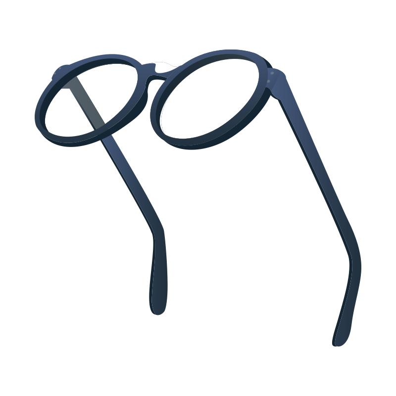
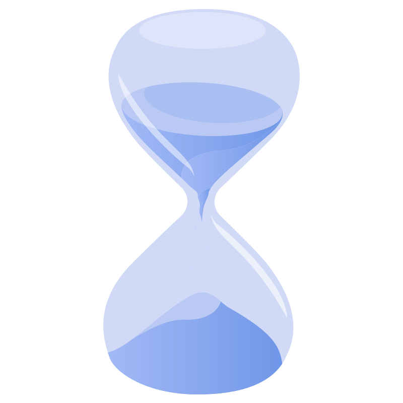
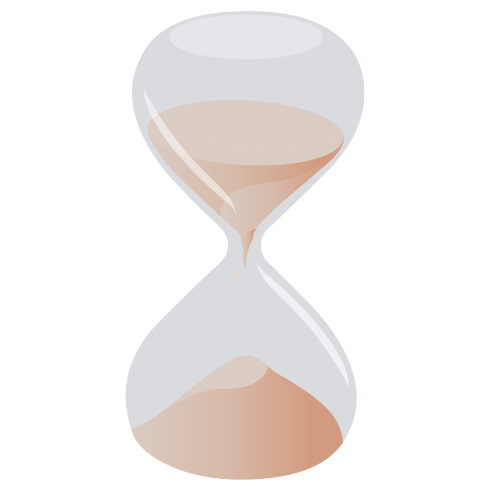
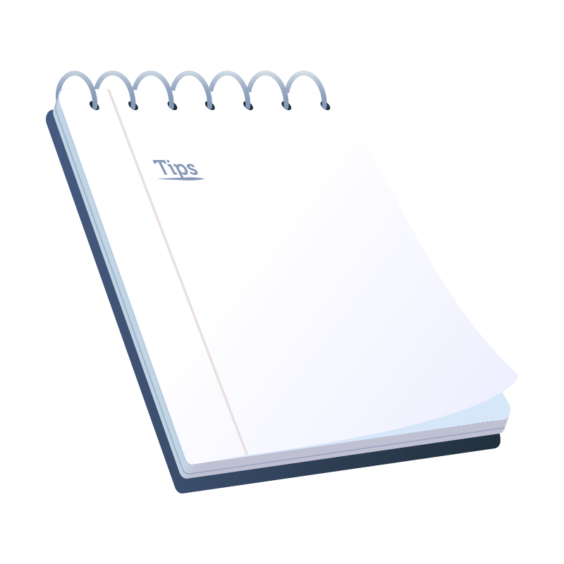
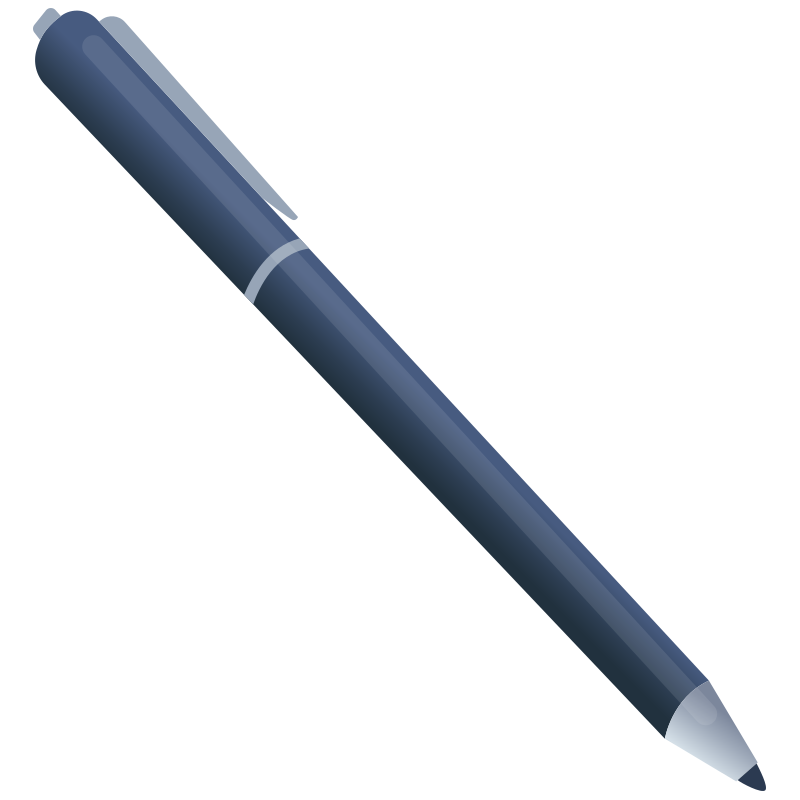

# 🖼️ Learns Gallery

[⬅️ 回到首頁](../../README.md)

| 預覽 | 詳細資訊 |
| :--- | :--- |
|  | **Arrival Flag.1.svg** Vector (SVG) \| 23.50KB 更新: 2026-02-26 |
|  | **Arrival Flag.svg** Vector (SVG) \| 23.55KB 更新: 2026-02-26 |
|  | **Book Close.1.svg** Vector (SVG) \| 2.45KB 更新: 2026-02-26 |
|  | **Book Close.svg** Vector (SVG) \| 2.40KB 更新: 2026-02-26 |
|  | **Books.1.svg** Vector (SVG) \| 9.41KB 更新: 2026-02-26 |
|  | **Books.svg** Vector (SVG) \| 9.42KB 更新: 2026-02-26 |
|  | **Certificate.1.svg** Vector (SVG) \| 5.53KB 更新: 2026-02-26 |
|  | **Certificate.svg** Vector (SVG) \| 5.44KB 更新: 2026-02-26 |
|  | **Diskette Save.1.svg** Vector (SVG) \| 5.92KB 更新: 2026-02-26 |
|  | **Diskette Save.svg** Vector (SVG) \| 5.93KB 更新: 2026-02-26 |
|  | **Earth Globe.1.svg** Vector (SVG) \| 141.18KB 更新: 2026-02-26 |
|  | **Earth Globe.svg** Vector (SVG) \| 141.22KB 更新: 2026-02-26 |
|  | **Finger Click.1.svg** Vector (SVG) \| 3.44KB 更新: 2026-02-26 |
|  | **Finger Click.svg** Vector (SVG) \| 3.44KB 更新: 2026-02-26 |
|  | **Flying Paper 2.1.svg** Vector (SVG) \| 1.27KB 更新: 2026-02-26 |
|  | **Flying Paper 2.svg** Vector (SVG) \| 1.27KB 更新: 2026-02-26 |
|  | **Flying Paper.1.svg** Vector (SVG) \| 3.99KB 更新: 2026-02-26 |
|  | **Flying Paper.svg** Vector (SVG) \| 3.99KB 更新: 2026-02-26 |
|  | **Flying Sheet.1.svg** Vector (SVG) \| 25.38KB 更新: 2026-02-26 |
|  | **Flying Sheet.svg** Vector (SVG) \| 25.39KB 更新: 2026-02-26 |
|  | **Glasses.1.svg** Vector (SVG) \| 31.61KB 更新: 2026-02-26 |
|  | **Glasses.svg** Vector (SVG) \| 31.60KB 更新: 2026-02-26 |
|  | **Hourglass.1.svg** Vector (SVG) \| 8.86KB 更新: 2026-02-26 |
|  | **Hourglass.svg** Vector (SVG) \| 8.87KB 更新: 2026-02-26 |
|  | **Magnifying Glass.1.svg** Vector (SVG) \| 7.82KB 更新: 2026-02-26 |
|  | **Magnifying Glass.svg** Vector (SVG) \| 7.82KB 更新: 2026-02-26 |
|  | **Mouse Click.1.svg** Vector (SVG) \| 2.48KB 更新: 2026-02-26 |
|  | **Mouse Click.svg** Vector (SVG) \| 2.47KB 更新: 2026-02-26 |
|  | **Notepad.1.svg** Vector (SVG) \| 14.32KB 更新: 2026-02-26 |
|  | **Notepad.svg** Vector (SVG) \| 14.33KB 更新: 2026-02-26 |
|  | **Open Book Desk.1.svg** Vector (SVG) \| 26.37KB 更新: 2026-02-26 |
|  | **Open Book Desk.svg** Vector (SVG) \| 26.37KB 更新: 2026-02-26 |
|  | **Open Book.1.svg** Vector (SVG) \| 17.77KB 更新: 2026-02-26 |
|  | **Open Book.svg** Vector (SVG) \| 17.78KB 更新: 2026-02-26 |
|  | **Pen.1.svg** Vector (SVG) \| 2.30KB 更新: 2026-02-26 |
|  | **Pen.svg** Vector (SVG) \| 2.30KB 更新: 2026-02-26 |
|  | **Pencil.1.svg** Vector (SVG) \| 3.27KB 更新: 2026-02-26 |
|  | **Pencil.svg** Vector (SVG) \| 3.21KB 更新: 2026-02-26 |
|  | **Pop UP.1.svg** Vector (SVG) \| 2.41KB 更新: 2026-02-26 |
|  | **Pop UP.svg** Vector (SVG) \| 1.79KB 更新: 2026-02-26 |
|  | **Question Mark.1.svg** Vector (SVG) \| 5.62KB 更新: 2026-02-26 |
|  | **Question Mark.svg** Vector (SVG) \| 4.83KB 更新: 2026-02-26 |
|  | **Send.1.svg** Vector (SVG) \| 1.27KB 更新: 2026-02-26 |
|  | **Send.svg** Vector (SVG) \| 1.44KB 更新: 2026-02-26 |
|  | **Table Clock 2 1.svg** Vector (SVG) \| 198.49KB 更新: 2026-02-26 |
|  | **Table Clock.svg** Vector (SVG) \| 593.97KB 更新: 2026-02-26 |
|  | **Thumb UP.1.svg** Vector (SVG) \| 11.15KB 更新: 2026-02-26 |
|  | **Thumb UP.svg** Vector (SVG) \| 11.41KB 更新: 2026-02-26 |
|  | **Writing Quill.1.svg** Vector (SVG) \| 3.30KB 更新: 2026-02-26 |
|  | **Writing Quill.svg** Vector (SVG) \| 3.30KB 更新: 2026-02-26 |