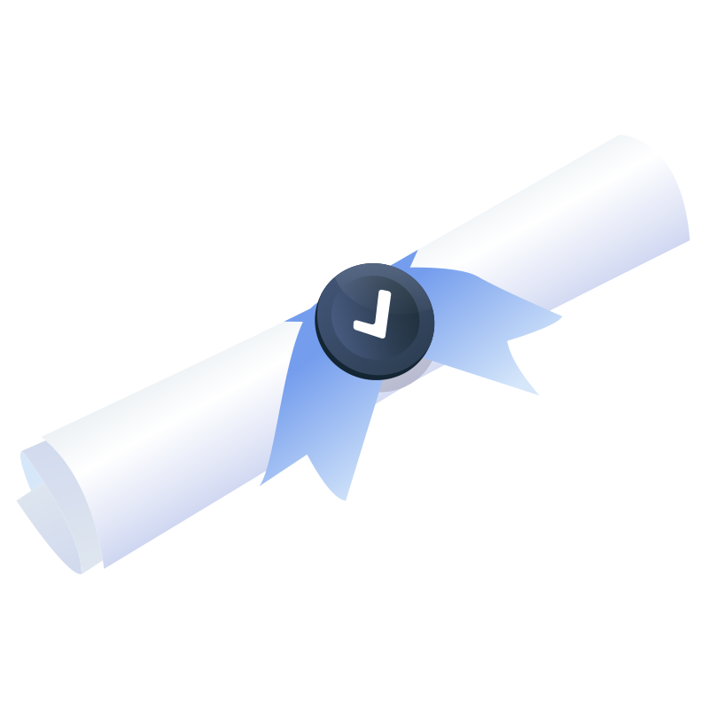
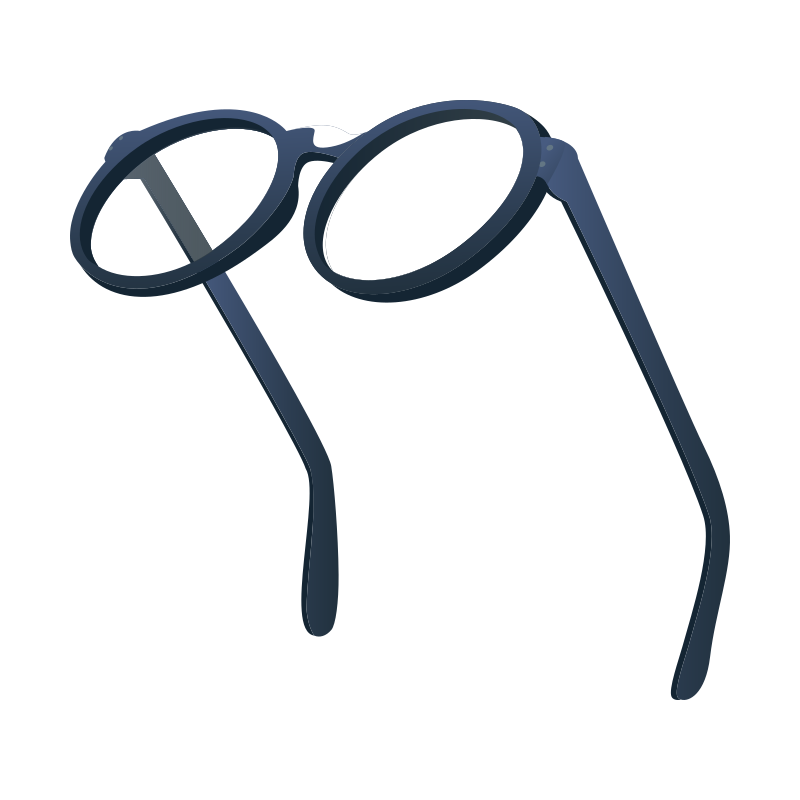
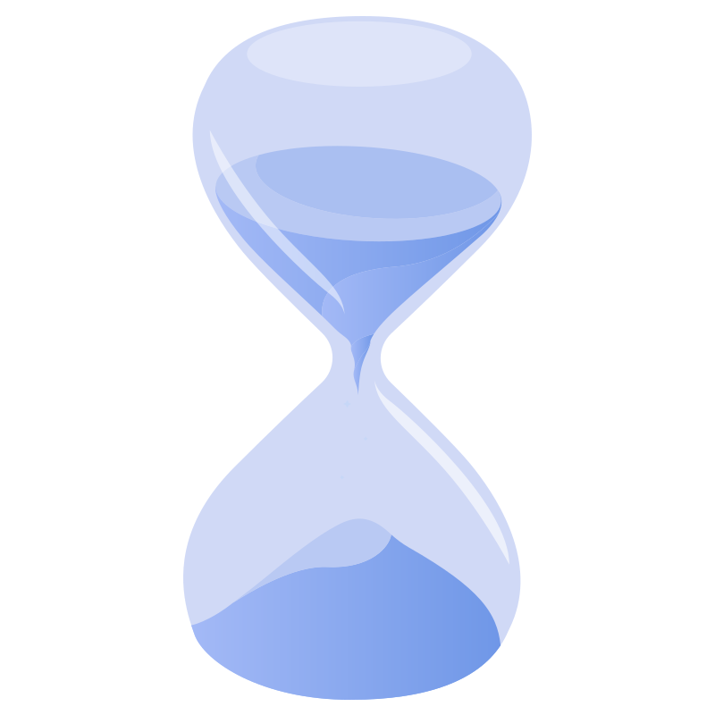
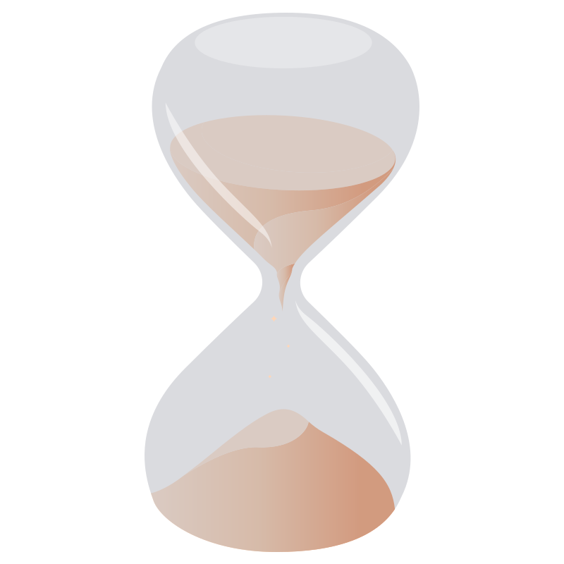
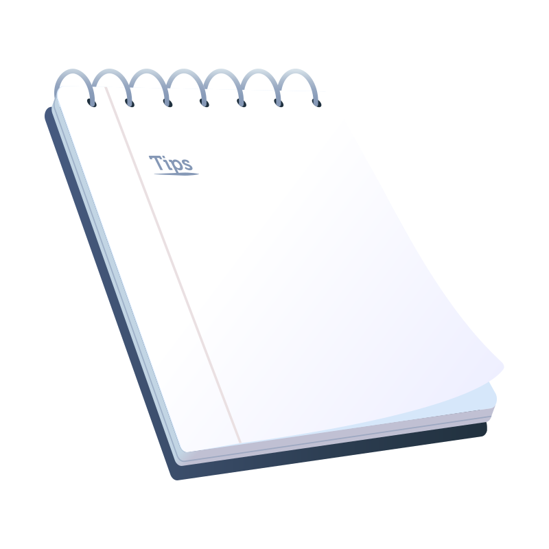

# 🖼️ 素材分類：Learns

> [🏠 主目錄](../../../README.md) / [images](../../README.md) / [iCons](../README.md) / **Learns**

本目錄共有 `50` 個檔案

| 🎨 預覽 (點擊放大)  | 📋 檔案詳細資訊與連結 |
| :--- | :--- |
|  | **📂 檔名:** `Arrival Flag.1.svg` ✨ **格式:** `Vector (SVG)` ⚖️ **大小:** `23.50KB` 📅 **更新:** `2026-03-03`  🚀 **jsDelivr Markdown:** `` 🔗 **直接連結 (Url):** <code>https://cdn.jsdelivr.net/gh/barry028/materials@main/images/iCons/Learns/Arrival%20Flag.1.svg</code> 📥 [檢視原始檔](Arrival%20Flag.1.svg) |
|  | **📂 檔名:** `Arrival Flag.svg` ✨ **格式:** `Vector (SVG)` ⚖️ **大小:** `23.55KB` 📅 **更新:** `2026-03-03`  🚀 **jsDelivr Markdown:** `` 🔗 **直接連結 (Url):** <code>https://cdn.jsdelivr.net/gh/barry028/materials@main/images/iCons/Learns/Arrival%20Flag.svg</code> 📥 [檢視原始檔](Arrival%20Flag.svg) |
|  | **📂 檔名:** `Book Close.1.svg` ✨ **格式:** `Vector (SVG)` ⚖️ **大小:** `2.45KB` 📅 **更新:** `2026-03-03`  🚀 **jsDelivr Markdown:** `` 🔗 **直接連結 (Url):** <code>https://cdn.jsdelivr.net/gh/barry028/materials@main/images/iCons/Learns/Book%20Close.1.svg</code> 📥 [檢視原始檔](Book%20Close.1.svg) |
|  | **📂 檔名:** `Book Close.svg` ✨ **格式:** `Vector (SVG)` ⚖️ **大小:** `2.40KB` 📅 **更新:** `2026-03-03`  🚀 **jsDelivr Markdown:** `` 🔗 **直接連結 (Url):** <code>https://cdn.jsdelivr.net/gh/barry028/materials@main/images/iCons/Learns/Book%20Close.svg</code> 📥 [檢視原始檔](Book%20Close.svg) |
|  | **📂 檔名:** `Books.1.svg` ✨ **格式:** `Vector (SVG)` ⚖️ **大小:** `9.41KB` 📅 **更新:** `2026-03-03`  🚀 **jsDelivr Markdown:** `` 🔗 **直接連結 (Url):** <code>https://cdn.jsdelivr.net/gh/barry028/materials@main/images/iCons/Learns/Books.1.svg</code> 📥 [檢視原始檔](Books.1.svg) |
|  | **📂 檔名:** `Books.svg` ✨ **格式:** `Vector (SVG)` ⚖️ **大小:** `9.42KB` 📅 **更新:** `2026-03-03`  🚀 **jsDelivr Markdown:** `` 🔗 **直接連結 (Url):** <code>https://cdn.jsdelivr.net/gh/barry028/materials@main/images/iCons/Learns/Books.svg</code> 📥 [檢視原始檔](Books.svg) |
|  | **📂 檔名:** `Certificate.1.svg` ✨ **格式:** `Vector (SVG)` ⚖️ **大小:** `5.53KB` 📅 **更新:** `2026-03-03`  🚀 **jsDelivr Markdown:** `` 🔗 **直接連結 (Url):** <code>https://cdn.jsdelivr.net/gh/barry028/materials@main/images/iCons/Learns/Certificate.1.svg</code> 📥 [檢視原始檔](Certificate.1.svg) |
|  | **📂 檔名:** `Certificate.svg` ✨ **格式:** `Vector (SVG)` ⚖️ **大小:** `5.44KB` 📅 **更新:** `2026-03-03`  🚀 **jsDelivr Markdown:** `` 🔗 **直接連結 (Url):** <code>https://cdn.jsdelivr.net/gh/barry028/materials@main/images/iCons/Learns/Certificate.svg</code> 📥 [檢視原始檔](Certificate.svg) |
|  | **📂 檔名:** `Diskette Save.1.svg` ✨ **格式:** `Vector (SVG)` ⚖️ **大小:** `5.92KB` 📅 **更新:** `2026-03-03`  🚀 **jsDelivr Markdown:** `` 🔗 **直接連結 (Url):** <code>https://cdn.jsdelivr.net/gh/barry028/materials@main/images/iCons/Learns/Diskette%20Save.1.svg</code> 📥 [檢視原始檔](Diskette%20Save.1.svg) |
|  | **📂 檔名:** `Diskette Save.svg` ✨ **格式:** `Vector (SVG)` ⚖️ **大小:** `5.93KB` 📅 **更新:** `2026-03-03`  🚀 **jsDelivr Markdown:** `` 🔗 **直接連結 (Url):** <code>https://cdn.jsdelivr.net/gh/barry028/materials@main/images/iCons/Learns/Diskette%20Save.svg</code> 📥 [檢視原始檔](Diskette%20Save.svg) |
|  | **📂 檔名:** `Earth Globe.1.svg` ✨ **格式:** `Vector (SVG)` ⚖️ **大小:** `141.18KB` 📅 **更新:** `2026-03-03`  🚀 **jsDelivr Markdown:** `` 🔗 **直接連結 (Url):** <code>https://cdn.jsdelivr.net/gh/barry028/materials@main/images/iCons/Learns/Earth%20Globe.1.svg</code> 📥 [檢視原始檔](Earth%20Globe.1.svg) |
|  | **📂 檔名:** `Earth Globe.svg` ✨ **格式:** `Vector (SVG)` ⚖️ **大小:** `141.22KB` 📅 **更新:** `2026-03-03`  🚀 **jsDelivr Markdown:** `` 🔗 **直接連結 (Url):** <code>https://cdn.jsdelivr.net/gh/barry028/materials@main/images/iCons/Learns/Earth%20Globe.svg</code> 📥 [檢視原始檔](Earth%20Globe.svg) |
|  | **📂 檔名:** `Finger Click.1.svg` ✨ **格式:** `Vector (SVG)` ⚖️ **大小:** `3.44KB` 📅 **更新:** `2026-03-03`  🚀 **jsDelivr Markdown:** `` 🔗 **直接連結 (Url):** <code>https://cdn.jsdelivr.net/gh/barry028/materials@main/images/iCons/Learns/Finger%20Click.1.svg</code> 📥 [檢視原始檔](Finger%20Click.1.svg) |
|  | **📂 檔名:** `Finger Click.svg` ✨ **格式:** `Vector (SVG)` ⚖️ **大小:** `3.44KB` 📅 **更新:** `2026-03-03`  🚀 **jsDelivr Markdown:** `` 🔗 **直接連結 (Url):** <code>https://cdn.jsdelivr.net/gh/barry028/materials@main/images/iCons/Learns/Finger%20Click.svg</code> 📥 [檢視原始檔](Finger%20Click.svg) |
|  | **📂 檔名:** `Flying Paper 2.1.svg` ✨ **格式:** `Vector (SVG)` ⚖️ **大小:** `1.27KB` 📅 **更新:** `2026-03-03`  🚀 **jsDelivr Markdown:** `` 🔗 **直接連結 (Url):** <code>https://cdn.jsdelivr.net/gh/barry028/materials@main/images/iCons/Learns/Flying%20Paper%202.1.svg</code> 📥 [檢視原始檔](Flying%20Paper%202.1.svg) |
|  | **📂 檔名:** `Flying Paper 2.svg` ✨ **格式:** `Vector (SVG)` ⚖️ **大小:** `1.27KB` 📅 **更新:** `2026-03-03`  🚀 **jsDelivr Markdown:** `` 🔗 **直接連結 (Url):** <code>https://cdn.jsdelivr.net/gh/barry028/materials@main/images/iCons/Learns/Flying%20Paper%202.svg</code> 📥 [檢視原始檔](Flying%20Paper%202.svg) |
|  | **📂 檔名:** `Flying Paper.1.svg` ✨ **格式:** `Vector (SVG)` ⚖️ **大小:** `3.99KB` 📅 **更新:** `2026-03-03`  🚀 **jsDelivr Markdown:** `` 🔗 **直接連結 (Url):** <code>https://cdn.jsdelivr.net/gh/barry028/materials@main/images/iCons/Learns/Flying%20Paper.1.svg</code> 📥 [檢視原始檔](Flying%20Paper.1.svg) |
|  | **📂 檔名:** `Flying Paper.svg` ✨ **格式:** `Vector (SVG)` ⚖️ **大小:** `3.99KB` 📅 **更新:** `2026-03-03`  🚀 **jsDelivr Markdown:** `` 🔗 **直接連結 (Url):** <code>https://cdn.jsdelivr.net/gh/barry028/materials@main/images/iCons/Learns/Flying%20Paper.svg</code> 📥 [檢視原始檔](Flying%20Paper.svg) |
|  | **📂 檔名:** `Flying Sheet.1.svg` ✨ **格式:** `Vector (SVG)` ⚖️ **大小:** `25.38KB` 📅 **更新:** `2026-03-03`  🚀 **jsDelivr Markdown:** `` 🔗 **直接連結 (Url):** <code>https://cdn.jsdelivr.net/gh/barry028/materials@main/images/iCons/Learns/Flying%20Sheet.1.svg</code> 📥 [檢視原始檔](Flying%20Sheet.1.svg) |
|  | **📂 檔名:** `Flying Sheet.svg` ✨ **格式:** `Vector (SVG)` ⚖️ **大小:** `25.39KB` 📅 **更新:** `2026-03-03`  🚀 **jsDelivr Markdown:** `` 🔗 **直接連結 (Url):** <code>https://cdn.jsdelivr.net/gh/barry028/materials@main/images/iCons/Learns/Flying%20Sheet.svg</code> 📥 [檢視原始檔](Flying%20Sheet.svg) |
|  | **📂 檔名:** `Glasses.1.svg` ✨ **格式:** `Vector (SVG)` ⚖️ **大小:** `31.61KB` 📅 **更新:** `2026-03-03`  🚀 **jsDelivr Markdown:** `` 🔗 **直接連結 (Url):** <code>https://cdn.jsdelivr.net/gh/barry028/materials@main/images/iCons/Learns/Glasses.1.svg</code> 📥 [檢視原始檔](Glasses.1.svg) |
|  | **📂 檔名:** `Glasses.svg` ✨ **格式:** `Vector (SVG)` ⚖️ **大小:** `31.60KB` 📅 **更新:** `2026-03-03`  🚀 **jsDelivr Markdown:** `` 🔗 **直接連結 (Url):** <code>https://cdn.jsdelivr.net/gh/barry028/materials@main/images/iCons/Learns/Glasses.svg</code> 📥 [檢視原始檔](Glasses.svg) |
|  | **📂 檔名:** `Hourglass.1.svg` ✨ **格式:** `Vector (SVG)` ⚖️ **大小:** `8.86KB` 📅 **更新:** `2026-03-03`  🚀 **jsDelivr Markdown:** `` 🔗 **直接連結 (Url):** <code>https://cdn.jsdelivr.net/gh/barry028/materials@main/images/iCons/Learns/Hourglass.1.svg</code> 📥 [檢視原始檔](Hourglass.1.svg) |
|  | **📂 檔名:** `Hourglass.svg` ✨ **格式:** `Vector (SVG)` ⚖️ **大小:** `8.87KB` 📅 **更新:** `2026-03-03`  🚀 **jsDelivr Markdown:** `` 🔗 **直接連結 (Url):** <code>https://cdn.jsdelivr.net/gh/barry028/materials@main/images/iCons/Learns/Hourglass.svg</code> 📥 [檢視原始檔](Hourglass.svg) |
|  | **📂 檔名:** `Magnifying Glass.1.svg` ✨ **格式:** `Vector (SVG)` ⚖️ **大小:** `7.82KB` 📅 **更新:** `2026-03-03`  🚀 **jsDelivr Markdown:** `` 🔗 **直接連結 (Url):** <code>https://cdn.jsdelivr.net/gh/barry028/materials@main/images/iCons/Learns/Magnifying%20Glass.1.svg</code> 📥 [檢視原始檔](Magnifying%20Glass.1.svg) |
|  | **📂 檔名:** `Magnifying Glass.svg` ✨ **格式:** `Vector (SVG)` ⚖️ **大小:** `7.82KB` 📅 **更新:** `2026-03-03`  🚀 **jsDelivr Markdown:** `` 🔗 **直接連結 (Url):** <code>https://cdn.jsdelivr.net/gh/barry028/materials@main/images/iCons/Learns/Magnifying%20Glass.svg</code> 📥 [檢視原始檔](Magnifying%20Glass.svg) |
|  | **📂 檔名:** `Mouse Click.1.svg` ✨ **格式:** `Vector (SVG)` ⚖️ **大小:** `2.48KB` 📅 **更新:** `2026-03-03`  🚀 **jsDelivr Markdown:** `` 🔗 **直接連結 (Url):** <code>https://cdn.jsdelivr.net/gh/barry028/materials@main/images/iCons/Learns/Mouse%20Click.1.svg</code> 📥 [檢視原始檔](Mouse%20Click.1.svg) |
|  | **📂 檔名:** `Mouse Click.svg` ✨ **格式:** `Vector (SVG)` ⚖️ **大小:** `2.47KB` 📅 **更新:** `2026-03-03`  🚀 **jsDelivr Markdown:** `` 🔗 **直接連結 (Url):** <code>https://cdn.jsdelivr.net/gh/barry028/materials@main/images/iCons/Learns/Mouse%20Click.svg</code> 📥 [檢視原始檔](Mouse%20Click.svg) |
|  | **📂 檔名:** `Notepad.1.svg` ✨ **格式:** `Vector (SVG)` ⚖️ **大小:** `14.32KB` 📅 **更新:** `2026-03-03`  🚀 **jsDelivr Markdown:** `` 🔗 **直接連結 (Url):** <code>https://cdn.jsdelivr.net/gh/barry028/materials@main/images/iCons/Learns/Notepad.1.svg</code> 📥 [檢視原始檔](Notepad.1.svg) |
|  | **📂 檔名:** `Notepad.svg` ✨ **格式:** `Vector (SVG)` ⚖️ **大小:** `14.33KB` 📅 **更新:** `2026-03-03`  🚀 **jsDelivr Markdown:** `` 🔗 **直接連結 (Url):** <code>https://cdn.jsdelivr.net/gh/barry028/materials@main/images/iCons/Learns/Notepad.svg</code> 📥 [檢視原始檔](Notepad.svg) |
|  | **📂 檔名:** `Open Book Desk.1.svg` ✨ **格式:** `Vector (SVG)` ⚖️ **大小:** `26.37KB` 📅 **更新:** `2026-03-03`  🚀 **jsDelivr Markdown:** `` 🔗 **直接連結 (Url):** <code>https://cdn.jsdelivr.net/gh/barry028/materials@main/images/iCons/Learns/Open%20Book%20Desk.1.svg</code> 📥 [檢視原始檔](Open%20Book%20Desk.1.svg) |
|  | **📂 檔名:** `Open Book Desk.svg` ✨ **格式:** `Vector (SVG)` ⚖️ **大小:** `26.37KB` 📅 **更新:** `2026-03-03`  🚀 **jsDelivr Markdown:** `` 🔗 **直接連結 (Url):** <code>https://cdn.jsdelivr.net/gh/barry028/materials@main/images/iCons/Learns/Open%20Book%20Desk.svg</code> 📥 [檢視原始檔](Open%20Book%20Desk.svg) |
|  | **📂 檔名:** `Open Book.1.svg` ✨ **格式:** `Vector (SVG)` ⚖️ **大小:** `17.77KB` 📅 **更新:** `2026-03-03`  🚀 **jsDelivr Markdown:** `` 🔗 **直接連結 (Url):** <code>https://cdn.jsdelivr.net/gh/barry028/materials@main/images/iCons/Learns/Open%20Book.1.svg</code> 📥 [檢視原始檔](Open%20Book.1.svg) |
|  | **📂 檔名:** `Open Book.svg` ✨ **格式:** `Vector (SVG)` ⚖️ **大小:** `17.78KB` 📅 **更新:** `2026-03-03`  🚀 **jsDelivr Markdown:** `` 🔗 **直接連結 (Url):** <code>https://cdn.jsdelivr.net/gh/barry028/materials@main/images/iCons/Learns/Open%20Book.svg</code> 📥 [檢視原始檔](Open%20Book.svg) |
|  | **📂 檔名:** `Pen.1.svg` ✨ **格式:** `Vector (SVG)` ⚖️ **大小:** `2.30KB` 📅 **更新:** `2026-03-03`  🚀 **jsDelivr Markdown:** `` 🔗 **直接連結 (Url):** <code>https://cdn.jsdelivr.net/gh/barry028/materials@main/images/iCons/Learns/Pen.1.svg</code> 📥 [檢視原始檔](Pen.1.svg) |
|  | **📂 檔名:** `Pen.svg` ✨ **格式:** `Vector (SVG)` ⚖️ **大小:** `2.30KB` 📅 **更新:** `2026-03-03`  🚀 **jsDelivr Markdown:** `` 🔗 **直接連結 (Url):** <code>https://cdn.jsdelivr.net/gh/barry028/materials@main/images/iCons/Learns/Pen.svg</code> 📥 [檢視原始檔](Pen.svg) |
|  | **📂 檔名:** `Pencil.1.svg` ✨ **格式:** `Vector (SVG)` ⚖️ **大小:** `3.27KB` 📅 **更新:** `2026-03-03`  🚀 **jsDelivr Markdown:** `` 🔗 **直接連結 (Url):** <code>https://cdn.jsdelivr.net/gh/barry028/materials@main/images/iCons/Learns/Pencil.1.svg</code> 📥 [檢視原始檔](Pencil.1.svg) |
|  | **📂 檔名:** `Pencil.svg` ✨ **格式:** `Vector (SVG)` ⚖️ **大小:** `3.21KB` 📅 **更新:** `2026-03-03`  🚀 **jsDelivr Markdown:** `` 🔗 **直接連結 (Url):** <code>https://cdn.jsdelivr.net/gh/barry028/materials@main/images/iCons/Learns/Pencil.svg</code> 📥 [檢視原始檔](Pencil.svg) |
|  | **📂 檔名:** `Pop UP.1.svg` ✨ **格式:** `Vector (SVG)` ⚖️ **大小:** `2.41KB` 📅 **更新:** `2026-03-03`  🚀 **jsDelivr Markdown:** `` 🔗 **直接連結 (Url):** <code>https://cdn.jsdelivr.net/gh/barry028/materials@main/images/iCons/Learns/Pop%20UP.1.svg</code> 📥 [檢視原始檔](Pop%20UP.1.svg) |
|  | **📂 檔名:** `Pop UP.svg` ✨ **格式:** `Vector (SVG)` ⚖️ **大小:** `1.79KB` 📅 **更新:** `2026-03-03`  🚀 **jsDelivr Markdown:** `` 🔗 **直接連結 (Url):** <code>https://cdn.jsdelivr.net/gh/barry028/materials@main/images/iCons/Learns/Pop%20UP.svg</code> 📥 [檢視原始檔](Pop%20UP.svg) |
|  | **📂 檔名:** `Question Mark.1.svg` ✨ **格式:** `Vector (SVG)` ⚖️ **大小:** `5.62KB` 📅 **更新:** `2026-03-03`  🚀 **jsDelivr Markdown:** `` 🔗 **直接連結 (Url):** <code>https://cdn.jsdelivr.net/gh/barry028/materials@main/images/iCons/Learns/Question%20Mark.1.svg</code> 📥 [檢視原始檔](Question%20Mark.1.svg) |
|  | **📂 檔名:** `Question Mark.svg` ✨ **格式:** `Vector (SVG)` ⚖️ **大小:** `4.83KB` 📅 **更新:** `2026-03-03`  🚀 **jsDelivr Markdown:** `` 🔗 **直接連結 (Url):** <code>https://cdn.jsdelivr.net/gh/barry028/materials@main/images/iCons/Learns/Question%20Mark.svg</code> 📥 [檢視原始檔](Question%20Mark.svg) |
|  | **📂 檔名:** `Send.1.svg` ✨ **格式:** `Vector (SVG)` ⚖️ **大小:** `1.27KB` 📅 **更新:** `2026-03-03`  🚀 **jsDelivr Markdown:** `` 🔗 **直接連結 (Url):** <code>https://cdn.jsdelivr.net/gh/barry028/materials@main/images/iCons/Learns/Send.1.svg</code> 📥 [檢視原始檔](Send.1.svg) |
|  | **📂 檔名:** `Send.svg` ✨ **格式:** `Vector (SVG)` ⚖️ **大小:** `1.44KB` 📅 **更新:** `2026-03-03`  🚀 **jsDelivr Markdown:** `` 🔗 **直接連結 (Url):** <code>https://cdn.jsdelivr.net/gh/barry028/materials@main/images/iCons/Learns/Send.svg</code> 📥 [檢視原始檔](Send.svg) |
|  | **📂 檔名:** `Table Clock 2 1.svg` ✨ **格式:** `Vector (SVG)` ⚖️ **大小:** `198.49KB` 📅 **更新:** `2026-03-03`  🚀 **jsDelivr Markdown:** `` 🔗 **直接連結 (Url):** <code>https://cdn.jsdelivr.net/gh/barry028/materials@main/images/iCons/Learns/Table%20Clock%202%201.svg</code> 📥 [檢視原始檔](Table%20Clock%202%201.svg) |
|  | **📂 檔名:** `Table Clock.svg` ✨ **格式:** `Vector (SVG)` ⚖️ **大小:** `593.97KB` 📅 **更新:** `2026-03-03`  🚀 **jsDelivr Markdown:** `` 🔗 **直接連結 (Url):** <code>https://cdn.jsdelivr.net/gh/barry028/materials@main/images/iCons/Learns/Table%20Clock.svg</code> 📥 [檢視原始檔](Table%20Clock.svg) |
|  | **📂 檔名:** `Thumb UP.1.svg` ✨ **格式:** `Vector (SVG)` ⚖️ **大小:** `11.15KB` 📅 **更新:** `2026-03-03`  🚀 **jsDelivr Markdown:** `` 🔗 **直接連結 (Url):** <code>https://cdn.jsdelivr.net/gh/barry028/materials@main/images/iCons/Learns/Thumb%20UP.1.svg</code> 📥 [檢視原始檔](Thumb%20UP.1.svg) |
|  | **📂 檔名:** `Thumb UP.svg` ✨ **格式:** `Vector (SVG)` ⚖️ **大小:** `11.41KB` 📅 **更新:** `2026-03-03`  🚀 **jsDelivr Markdown:** `` 🔗 **直接連結 (Url):** <code>https://cdn.jsdelivr.net/gh/barry028/materials@main/images/iCons/Learns/Thumb%20UP.svg</code> 📥 [檢視原始檔](Thumb%20UP.svg) |
|  | **📂 檔名:** `Writing Quill.1.svg` ✨ **格式:** `Vector (SVG)` ⚖️ **大小:** `3.30KB` 📅 **更新:** `2026-03-03`  🚀 **jsDelivr Markdown:** `` 🔗 **直接連結 (Url):** <code>https://cdn.jsdelivr.net/gh/barry028/materials@main/images/iCons/Learns/Writing%20Quill.1.svg</code> 📥 [檢視原始檔](Writing%20Quill.1.svg) |
|  | **📂 檔名:** `Writing Quill.svg` ✨ **格式:** `Vector (SVG)` ⚖️ **大小:** `3.30KB` 📅 **更新:** `2026-03-03`  🚀 **jsDelivr Markdown:** `` 🔗 **直接連結 (Url):** <code>https://cdn.jsdelivr.net/gh/barry028/materials@main/images/iCons/Learns/Writing%20Quill.svg</code> 📥 [檢視原始檔](Writing%20Quill.svg) |