# 🖼️ 素材分類：Macos Big Sur

> [🏠 主目錄](../../../README.md) / [images](../../README.md) / [iCons](../README.md) / **Macos Big Sur**

本目錄共有 `70` 個檔案

| 🎨 預覽 (點擊放大)  | 📋 檔案詳細資訊與連結 |
| :--- | :--- |
|  | **📂 檔名:** `Activity Monitor.svg` ✨ **格式:** `Vector (SVG)` ⚖️ **大小:** `1.00MB` 📅 **更新:** `2026-03-04`  🚀 **jsDelivr Markdown:** `` 🔗 **直接連結 (Url):** <code>https://cdn.jsdelivr.net/gh/barry028/materials@main/images/iCons/Macos%20Big%20Sur/Activity%20Monitor.svg</code> 📥 [檢視原始檔](Activity%20Monitor.svg) |
|  | **📂 檔名:** `Airport Utility.svg` ✨ **格式:** `Vector (SVG)` ⚖️ **大小:** `895.73KB` 📅 **更新:** `2026-03-04`  🚀 **jsDelivr Markdown:** `` 🔗 **直接連結 (Url):** <code>https://cdn.jsdelivr.net/gh/barry028/materials@main/images/iCons/Macos%20Big%20Sur/Airport%20Utility.svg</code> 📥 [檢視原始檔](Airport%20Utility.svg) |
|  | **📂 檔名:** `App Store.svg` ✨ **格式:** `Vector (SVG)` ⚖️ **大小:** `935.45KB` 📅 **更新:** `2026-03-04`  🚀 **jsDelivr Markdown:** `` 🔗 **直接連結 (Url):** <code>https://cdn.jsdelivr.net/gh/barry028/materials@main/images/iCons/Macos%20Big%20Sur/App%20Store.svg</code> 📥 [檢視原始檔](App%20Store.svg) |
|  | **📂 檔名:** `Audio MIDI Setup.svg` ✨ **格式:** `Vector (SVG)` ⚖️ **大小:** `840.21KB` 📅 **更新:** `2026-03-04`  🚀 **jsDelivr Markdown:** `` 🔗 **直接連結 (Url):** <code>https://cdn.jsdelivr.net/gh/barry028/materials@main/images/iCons/Macos%20Big%20Sur/Audio%20MIDI%20Setup.svg</code> 📥 [檢視原始檔](Audio%20MIDI%20Setup.svg) |
|  | **📂 檔名:** `Bluetooth File Exchange.svg` ✨ **格式:** `Vector (SVG)` ⚖️ **大小:** `868.19KB` 📅 **更新:** `2026-03-04`  🚀 **jsDelivr Markdown:** `` 🔗 **直接連結 (Url):** <code>https://cdn.jsdelivr.net/gh/barry028/materials@main/images/iCons/Macos%20Big%20Sur/Bluetooth%20File%20Exchange.svg</code> 📥 [檢視原始檔](Bluetooth%20File%20Exchange.svg) |
|  | **📂 檔名:** `Books.svg` ✨ **格式:** `Vector (SVG)` ⚖️ **大小:** `748.81KB` 📅 **更新:** `2026-03-04`  🚀 **jsDelivr Markdown:** `` 🔗 **直接連結 (Url):** <code>https://cdn.jsdelivr.net/gh/barry028/materials@main/images/iCons/Macos%20Big%20Sur/Books.svg</code> 📥 [檢視原始檔](Books.svg) |
|  | **📂 檔名:** `Calculator.svg` ✨ **格式:** `Vector (SVG)` ⚖️ **大小:** `395.19KB` 📅 **更新:** `2026-03-04`  🚀 **jsDelivr Markdown:** `` 🔗 **直接連結 (Url):** <code>https://cdn.jsdelivr.net/gh/barry028/materials@main/images/iCons/Macos%20Big%20Sur/Calculator.svg</code> 📥 [檢視原始檔](Calculator.svg) |
|  | **📂 檔名:** `Calendar.svg` ✨ **格式:** `Vector (SVG)` ⚖️ **大小:** `1.04MB` 📅 **更新:** `2026-03-04`  🚀 **jsDelivr Markdown:** `` 🔗 **直接連結 (Url):** <code>https://cdn.jsdelivr.net/gh/barry028/materials@main/images/iCons/Macos%20Big%20Sur/Calendar.svg</code> 📥 [檢視原始檔](Calendar.svg) |
|  | **📂 檔名:** `Chess.svg` ✨ **格式:** `Vector (SVG)` ⚖️ **大小:** `1.13MB` 📅 **更新:** `2026-03-04`  🚀 **jsDelivr Markdown:** `` 🔗 **直接連結 (Url):** <code>https://cdn.jsdelivr.net/gh/barry028/materials@main/images/iCons/Macos%20Big%20Sur/Chess.svg</code> 📥 [檢視原始檔](Chess.svg) |
| <a href="Clock.svg">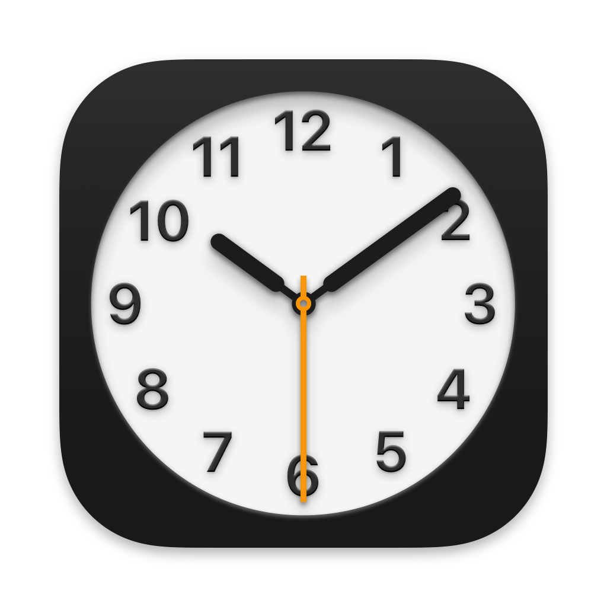</a> | **📂 檔名:** `Clock.svg` ✨ **格式:** `Vector (SVG)` ⚖️ **大小:** `358.39KB` 📅 **更新:** `2026-03-04`  🚀 **jsDelivr Markdown:** `` 🔗 **直接連結 (Url):** <code>https://cdn.jsdelivr.net/gh/barry028/materials@main/images/iCons/Macos%20Big%20Sur/Clock.svg</code> 📥 [檢視原始檔](Clock.svg) |
|  | **📂 檔名:** `ColorSync Utility.svg` ✨ **格式:** `Vector (SVG)` ⚖️ **大小:** `781.66KB` 📅 **更新:** `2026-03-04`  🚀 **jsDelivr Markdown:** `` 🔗 **直接連結 (Url):** <code>https://cdn.jsdelivr.net/gh/barry028/materials@main/images/iCons/Macos%20Big%20Sur/ColorSync%20Utility.svg</code> 📥 [檢視原始檔](ColorSync%20Utility.svg) |
| <a href="Console.svg">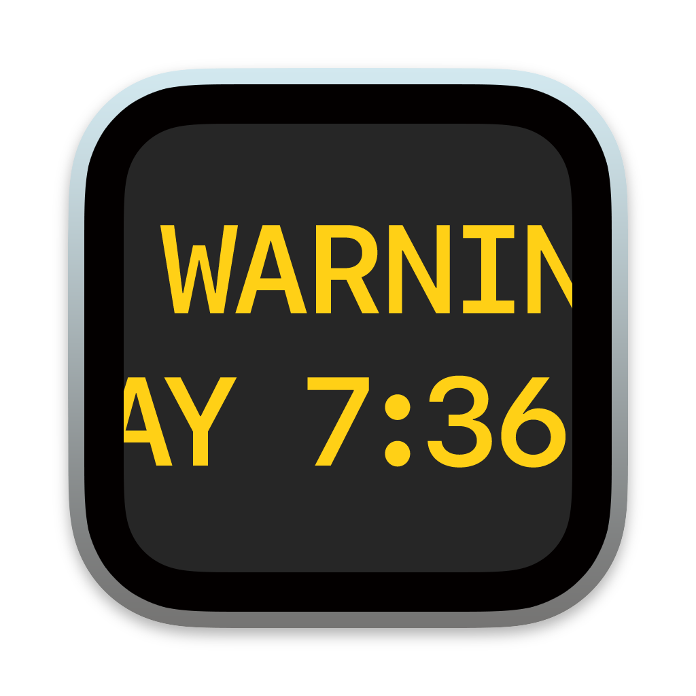</a> | **📂 檔名:** `Console.svg` ✨ **格式:** `Vector (SVG)` ⚖️ **大小:** `116.34KB` 📅 **更新:** `2026-03-04`  🚀 **jsDelivr Markdown:** `` 🔗 **直接連結 (Url):** <code>https://cdn.jsdelivr.net/gh/barry028/materials@main/images/iCons/Macos%20Big%20Sur/Console.svg</code> 📥 [檢視原始檔](Console.svg) |
|  | **📂 檔名:** `Contacts.svg` ✨ **格式:** `Vector (SVG)` ⚖️ **大小:** `1.13MB` 📅 **更新:** `2026-03-04`  🚀 **jsDelivr Markdown:** `` 🔗 **直接連結 (Url):** <code>https://cdn.jsdelivr.net/gh/barry028/materials@main/images/iCons/Macos%20Big%20Sur/Contacts.svg</code> 📥 [檢視原始檔](Contacts.svg) |
|  | **📂 檔名:** `Dictionary.svg` ✨ **格式:** `Vector (SVG)` ⚖️ **大小:** `1.00MB` 📅 **更新:** `2026-03-04`  🚀 **jsDelivr Markdown:** `` 🔗 **直接連結 (Url):** <code>https://cdn.jsdelivr.net/gh/barry028/materials@main/images/iCons/Macos%20Big%20Sur/Dictionary.svg</code> 📥 [檢視原始檔](Dictionary.svg) |
|  | **📂 檔名:** `Digital Color Meter.svg` ✨ **格式:** `Vector (SVG)` ⚖️ **大小:** `803.00KB` 📅 **更新:** `2026-03-04`  🚀 **jsDelivr Markdown:** `` 🔗 **直接連結 (Url):** <code>https://cdn.jsdelivr.net/gh/barry028/materials@main/images/iCons/Macos%20Big%20Sur/Digital%20Color%20Meter.svg</code> 📥 [檢視原始檔](Digital%20Color%20Meter.svg) |
|  | **📂 檔名:** `Disk Utility.svg` ✨ **格式:** `Vector (SVG)` ⚖️ **大小:** `1.11MB` 📅 **更新:** `2026-03-04`  🚀 **jsDelivr Markdown:** `` 🔗 **直接連結 (Url):** <code>https://cdn.jsdelivr.net/gh/barry028/materials@main/images/iCons/Macos%20Big%20Sur/Disk%20Utility.svg</code> 📥 [檢視原始檔](Disk%20Utility.svg) |
|  | **📂 檔名:** `Document.svg` ✨ **格式:** `Vector (SVG)` ⚖️ **大小:** `510.08KB` 📅 **更新:** `2026-03-04`  🚀 **jsDelivr Markdown:** `` 🔗 **直接連結 (Url):** <code>https://cdn.jsdelivr.net/gh/barry028/materials@main/images/iCons/Macos%20Big%20Sur/Document.svg</code> 📥 [檢視原始檔](Document.svg) |
|  | **📂 檔名:** `FaceTime.svg` ✨ **格式:** `Vector (SVG)` ⚖️ **大小:** `876.38KB` 📅 **更新:** `2026-03-04`  🚀 **jsDelivr Markdown:** `` 🔗 **直接連結 (Url):** <code>https://cdn.jsdelivr.net/gh/barry028/materials@main/images/iCons/Macos%20Big%20Sur/FaceTime.svg</code> 📥 [檢視原始檔](FaceTime.svg) |
|  | **📂 檔名:** `Figma.svg` ✨ **格式:** `Vector (SVG)` ⚖️ **大小:** `639.42KB` 📅 **更新:** `2026-03-04`  🚀 **jsDelivr Markdown:** `` 🔗 **直接連結 (Url):** <code>https://cdn.jsdelivr.net/gh/barry028/materials@main/images/iCons/Macos%20Big%20Sur/Figma.svg</code> 📥 [檢視原始檔](Figma.svg) |
|  | **📂 檔名:** `Final Cut Pro.svg` ✨ **格式:** `Vector (SVG)` ⚖️ **大小:** `1.15MB` 📅 **更新:** `2026-03-04`  🚀 **jsDelivr Markdown:** `` 🔗 **直接連結 (Url):** <code>https://cdn.jsdelivr.net/gh/barry028/materials@main/images/iCons/Macos%20Big%20Sur/Final%20Cut%20Pro.svg</code> 📥 [檢視原始檔](Final%20Cut%20Pro.svg) |
|  | **📂 檔名:** `Find My.svg` ✨ **格式:** `Vector (SVG)` ⚖️ **大小:** `489.90KB` 📅 **更新:** `2026-03-04`  🚀 **jsDelivr Markdown:** `` 🔗 **直接連結 (Url):** <code>https://cdn.jsdelivr.net/gh/barry028/materials@main/images/iCons/Macos%20Big%20Sur/Find%20My.svg</code> 📥 [檢視原始檔](Find%20My.svg) |
|  | **📂 檔名:** `Finder.svg` ✨ **格式:** `Vector (SVG)` ⚖️ **大小:** `897.38KB` 📅 **更新:** `2026-03-04`  🚀 **jsDelivr Markdown:** `` 🔗 **直接連結 (Url):** <code>https://cdn.jsdelivr.net/gh/barry028/materials@main/images/iCons/Macos%20Big%20Sur/Finder.svg</code> 📥 [檢視原始檔](Finder.svg) |
| <a href="Folder.svg">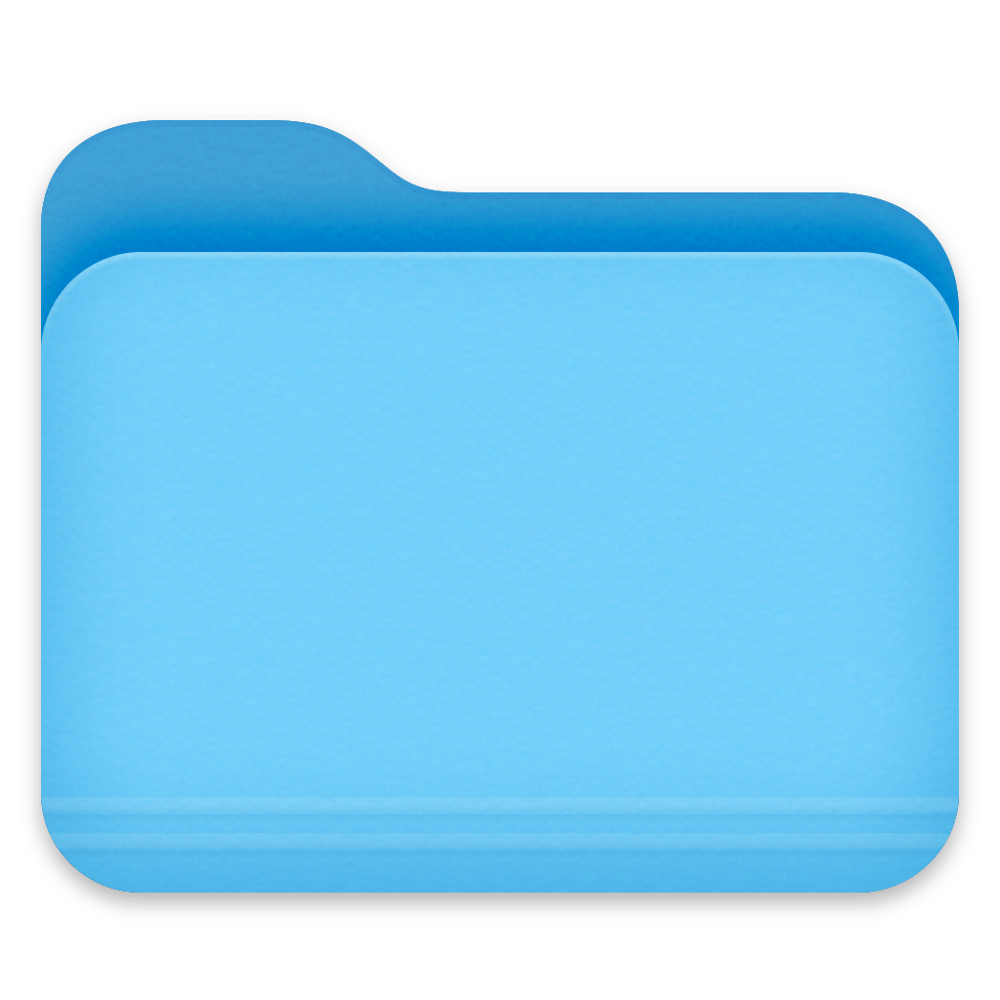</a> | **📂 檔名:** `Folder.svg` ✨ **格式:** `Vector (SVG)` ⚖️ **大小:** `1.15MB` 📅 **更新:** `2026-03-04`  🚀 **jsDelivr Markdown:** `` 🔗 **直接連結 (Url):** <code>https://cdn.jsdelivr.net/gh/barry028/materials@main/images/iCons/Macos%20Big%20Sur/Folder.svg</code> 📥 [檢視原始檔](Folder.svg) |
|  | **📂 檔名:** `Font Book.svg` ✨ **格式:** `Vector (SVG)` ⚖️ **大小:** `1.24MB` 📅 **更新:** `2026-03-04`  🚀 **jsDelivr Markdown:** `` 🔗 **直接連結 (Url):** <code>https://cdn.jsdelivr.net/gh/barry028/materials@main/images/iCons/Macos%20Big%20Sur/Font%20Book.svg</code> 📥 [檢視原始檔](Font%20Book.svg) |
| <a href="Freeform.svg">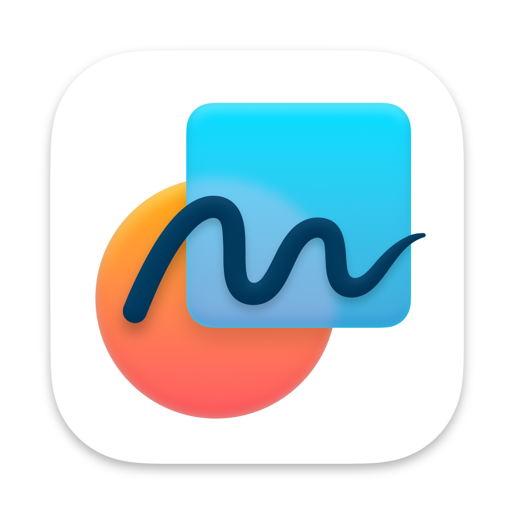</a> | **📂 檔名:** `Freeform.svg` ✨ **格式:** `Vector (SVG)` ⚖️ **大小:** `503.81KB` 📅 **更新:** `2026-03-04`  🚀 **jsDelivr Markdown:** `` 🔗 **直接連結 (Url):** <code>https://cdn.jsdelivr.net/gh/barry028/materials@main/images/iCons/Macos%20Big%20Sur/Freeform.svg</code> 📥 [檢視原始檔](Freeform.svg) |
|  | **📂 檔名:** `GarageBand.svg` ✨ **格式:** `Vector (SVG)` ⚖️ **大小:** `1.59MB` 📅 **更新:** `2026-03-04`  🚀 **jsDelivr Markdown:** `` 🔗 **直接連結 (Url):** <code>https://cdn.jsdelivr.net/gh/barry028/materials@main/images/iCons/Macos%20Big%20Sur/GarageBand.svg</code> 📥 [檢視原始檔](GarageBand.svg) |
| <a href="Grapher.svg">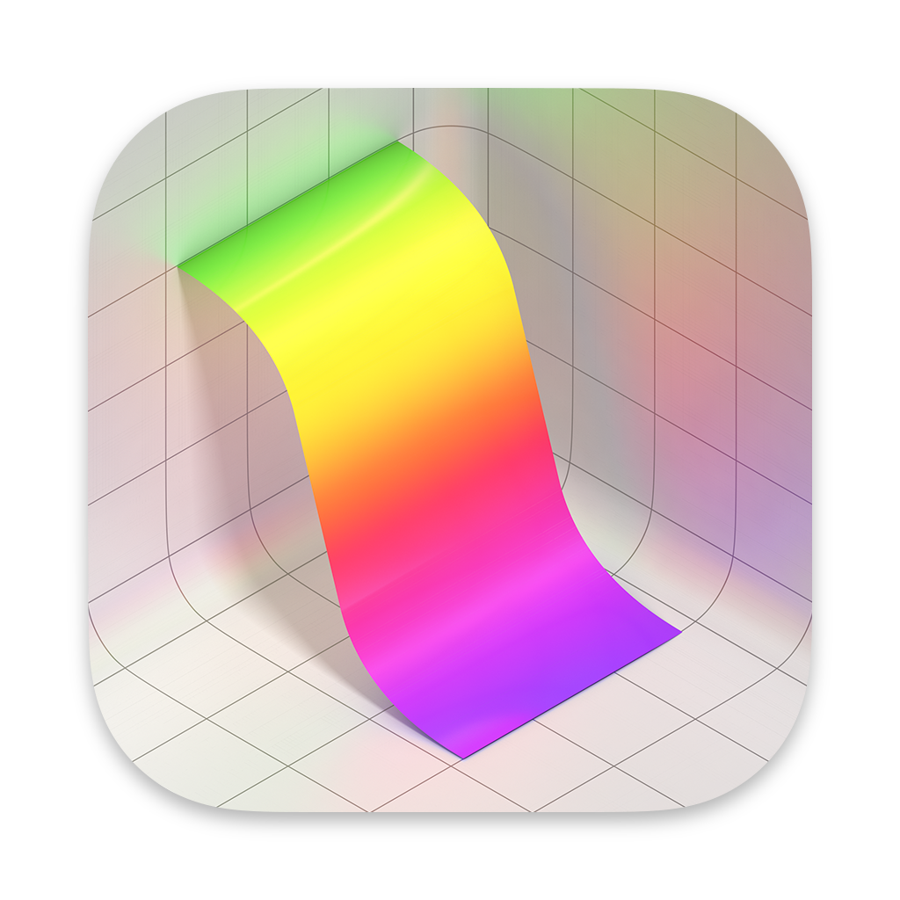</a> | **📂 檔名:** `Grapher.svg` ✨ **格式:** `Vector (SVG)` ⚖️ **大小:** `1.31MB` 📅 **更新:** `2026-03-04`  🚀 **jsDelivr Markdown:** `` 🔗 **直接連結 (Url):** <code>https://cdn.jsdelivr.net/gh/barry028/materials@main/images/iCons/Macos%20Big%20Sur/Grapher.svg</code> 📥 [檢視原始檔](Grapher.svg) |
|  | **📂 檔名:** `Home.svg` ✨ **格式:** `Vector (SVG)` ⚖️ **大小:** `696.94KB` 📅 **更新:** `2026-03-04`  🚀 **jsDelivr Markdown:** `` 🔗 **直接連結 (Url):** <code>https://cdn.jsdelivr.net/gh/barry028/materials@main/images/iCons/Macos%20Big%20Sur/Home.svg</code> 📥 [檢視原始檔](Home.svg) |
|  | **📂 檔名:** `Image Capture.svg` ✨ **格式:** `Vector (SVG)` ⚖️ **大小:** `1.21MB` 📅 **更新:** `2026-03-04`  🚀 **jsDelivr Markdown:** `` 🔗 **直接連結 (Url):** <code>https://cdn.jsdelivr.net/gh/barry028/materials@main/images/iCons/Macos%20Big%20Sur/Image%20Capture.svg</code> 📥 [檢視原始檔](Image%20Capture.svg) |
|  | **📂 檔名:** `Keychain Access.svg` ✨ **格式:** `Vector (SVG)` ⚖️ **大小:** `462.90KB` 📅 **更新:** `2026-03-04`  🚀 **jsDelivr Markdown:** `` 🔗 **直接連結 (Url):** <code>https://cdn.jsdelivr.net/gh/barry028/materials@main/images/iCons/Macos%20Big%20Sur/Keychain%20Access.svg</code> 📥 [檢視原始檔](Keychain%20Access.svg) |
| <a href="Keynote.svg">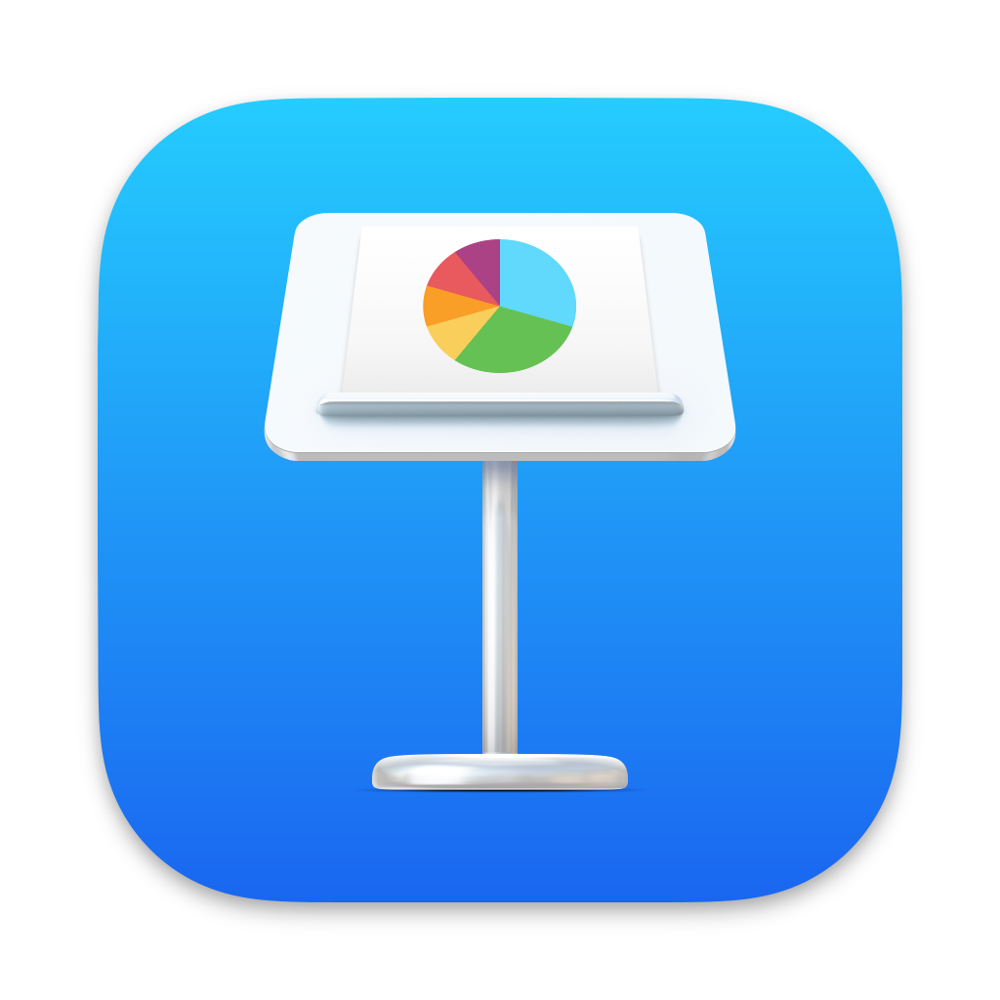</a> | **📂 檔名:** `Keynote.svg` ✨ **格式:** `Vector (SVG)` ⚖️ **大小:** `224.93KB` 📅 **更新:** `2026-03-04`  🚀 **jsDelivr Markdown:** `` 🔗 **直接連結 (Url):** <code>https://cdn.jsdelivr.net/gh/barry028/materials@main/images/iCons/Macos%20Big%20Sur/Keynote.svg</code> 📥 [檢視原始檔](Keynote.svg) |
| <a href="Launchpad.svg">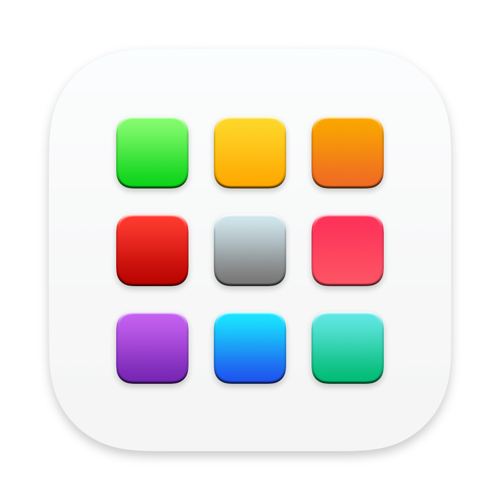</a> | **📂 檔名:** `Launchpad.svg` ✨ **格式:** `Vector (SVG)` ⚖️ **大小:** `453.32KB` 📅 **更新:** `2026-03-04`  🚀 **jsDelivr Markdown:** `` 🔗 **直接連結 (Url):** <code>https://cdn.jsdelivr.net/gh/barry028/materials@main/images/iCons/Macos%20Big%20Sur/Launchpad.svg</code> 📥 [檢視原始檔](Launchpad.svg) |
|  | **📂 檔名:** `Mail.svg` ✨ **格式:** `Vector (SVG)` ⚖️ **大小:** `952.64KB` 📅 **更新:** `2026-03-04`  🚀 **jsDelivr Markdown:** `` 🔗 **直接連結 (Url):** <code>https://cdn.jsdelivr.net/gh/barry028/materials@main/images/iCons/Macos%20Big%20Sur/Mail.svg</code> 📥 [檢視原始檔](Mail.svg) |
|  | **📂 檔名:** `Maps.svg` ✨ **格式:** `Vector (SVG)` ⚖️ **大小:** `883.78KB` 📅 **更新:** `2026-03-04`  🚀 **jsDelivr Markdown:** `` 🔗 **直接連結 (Url):** <code>https://cdn.jsdelivr.net/gh/barry028/materials@main/images/iCons/Macos%20Big%20Sur/Maps.svg</code> 📥 [檢視原始檔](Maps.svg) |
|  | **📂 檔名:** `Messages.svg` ✨ **格式:** `Vector (SVG)` ⚖️ **大小:** `520.57KB` 📅 **更新:** `2026-03-04`  🚀 **jsDelivr Markdown:** `` 🔗 **直接連結 (Url):** <code>https://cdn.jsdelivr.net/gh/barry028/materials@main/images/iCons/Macos%20Big%20Sur/Messages.svg</code> 📥 [檢視原始檔](Messages.svg) |
|  | **📂 檔名:** `Migration Assistant.svg` ✨ **格式:** `Vector (SVG)` ⚖️ **大小:** `528.11KB` 📅 **更新:** `2026-03-04`  🚀 **jsDelivr Markdown:** `` 🔗 **直接連結 (Url):** <code>https://cdn.jsdelivr.net/gh/barry028/materials@main/images/iCons/Macos%20Big%20Sur/Migration%20Assistant.svg</code> 📥 [檢視原始檔](Migration%20Assistant.svg) |
|  | **📂 檔名:** `Mission Control.svg` ✨ **格式:** `Vector (SVG)` ⚖️ **大小:** `119.50KB` 📅 **更新:** `2026-03-04`  🚀 **jsDelivr Markdown:** `` 🔗 **直接連結 (Url):** <code>https://cdn.jsdelivr.net/gh/barry028/materials@main/images/iCons/Macos%20Big%20Sur/Mission%20Control.svg</code> 📥 [檢視原始檔](Mission%20Control.svg) |
|  | **📂 檔名:** `Music.svg` ✨ **格式:** `Vector (SVG)` ⚖️ **大小:** `114.84KB` 📅 **更新:** `2026-03-04`  🚀 **jsDelivr Markdown:** `` 🔗 **直接連結 (Url):** <code>https://cdn.jsdelivr.net/gh/barry028/materials@main/images/iCons/Macos%20Big%20Sur/Music.svg</code> 📥 [檢視原始檔](Music.svg) |
| <a href="News.svg">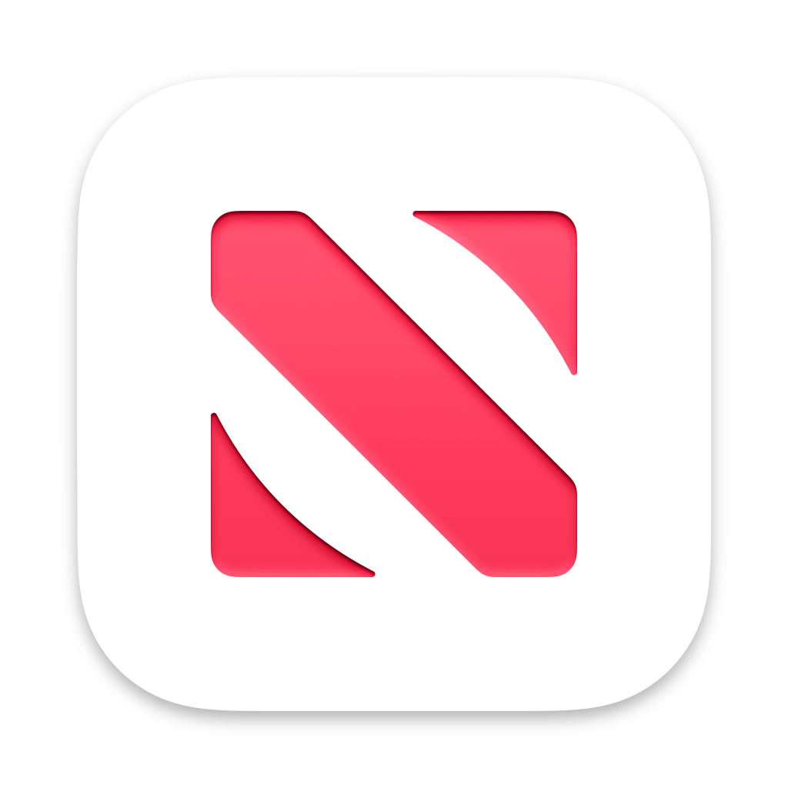</a> | **📂 檔名:** `News.svg` ✨ **格式:** `Vector (SVG)` ⚖️ **大小:** `227.30KB` 📅 **更新:** `2026-03-04`  🚀 **jsDelivr Markdown:** `` 🔗 **直接連結 (Url):** <code>https://cdn.jsdelivr.net/gh/barry028/materials@main/images/iCons/Macos%20Big%20Sur/News.svg</code> 📥 [檢視原始檔](News.svg) |
|  | **📂 檔名:** `No App.svg` ✨ **格式:** `Vector (SVG)` ⚖️ **大小:** `180.14KB` 📅 **更新:** `2026-03-04`  🚀 **jsDelivr Markdown:** `` 🔗 **直接連結 (Url):** <code>https://cdn.jsdelivr.net/gh/barry028/materials@main/images/iCons/Macos%20Big%20Sur/No%20App.svg</code> 📥 [檢視原始檔](No%20App.svg) |
|  | **📂 檔名:** `Notes.svg` ✨ **格式:** `Vector (SVG)` ⚖️ **大小:** `619.87KB` 📅 **更新:** `2026-03-04`  🚀 **jsDelivr Markdown:** `` 🔗 **直接連結 (Url):** <code>https://cdn.jsdelivr.net/gh/barry028/materials@main/images/iCons/Macos%20Big%20Sur/Notes.svg</code> 📥 [檢視原始檔](Notes.svg) |
|  | **📂 檔名:** `Numbers.svg` ✨ **格式:** `Vector (SVG)` ⚖️ **大小:** `594.85KB` 📅 **更新:** `2026-03-04`  🚀 **jsDelivr Markdown:** `` 🔗 **直接連結 (Url):** <code>https://cdn.jsdelivr.net/gh/barry028/materials@main/images/iCons/Macos%20Big%20Sur/Numbers.svg</code> 📥 [檢視原始檔](Numbers.svg) |
|  | **📂 檔名:** `Pages.svg` ✨ **格式:** `Vector (SVG)` ⚖️ **大小:** `327.10KB` 📅 **更新:** `2026-03-04`  🚀 **jsDelivr Markdown:** `` 🔗 **直接連結 (Url):** <code>https://cdn.jsdelivr.net/gh/barry028/materials@main/images/iCons/Macos%20Big%20Sur/Pages.svg</code> 📥 [檢視原始檔](Pages.svg) |
|  | **📂 檔名:** `Photo Booth.svg` ✨ **格式:** `Vector (SVG)` ⚖️ **大小:** `211.14KB` 📅 **更新:** `2026-03-04`  🚀 **jsDelivr Markdown:** `` 🔗 **直接連結 (Url):** <code>https://cdn.jsdelivr.net/gh/barry028/materials@main/images/iCons/Macos%20Big%20Sur/Photo%20Booth.svg</code> 📥 [檢視原始檔](Photo%20Booth.svg) |
| <a href="Photos.svg">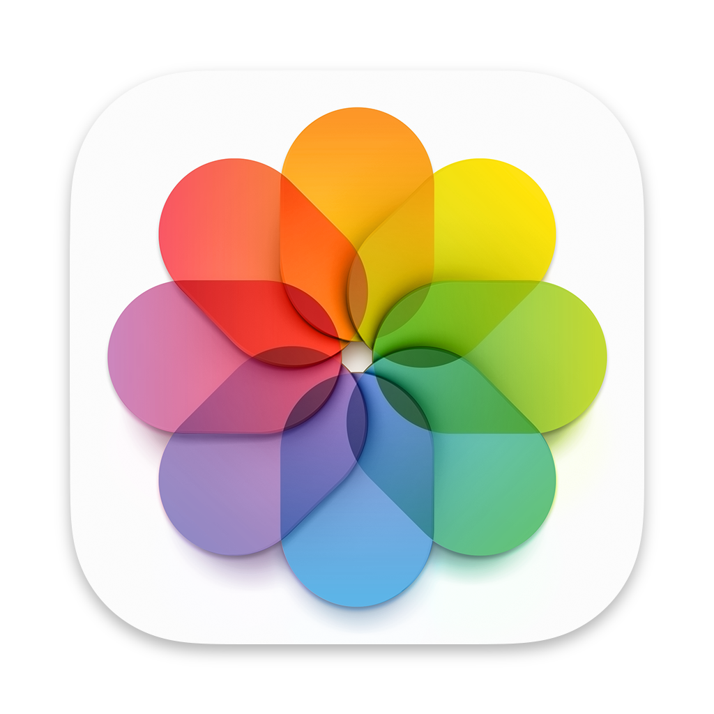</a> | **📂 檔名:** `Photos.svg` ✨ **格式:** `Vector (SVG)` ⚖️ **大小:** `903.74KB` 📅 **更新:** `2026-03-04`  🚀 **jsDelivr Markdown:** `` 🔗 **直接連結 (Url):** <code>https://cdn.jsdelivr.net/gh/barry028/materials@main/images/iCons/Macos%20Big%20Sur/Photos.svg</code> 📥 [檢視原始檔](Photos.svg) |
|  | **📂 檔名:** `Podcasts.svg` ✨ **格式:** `Vector (SVG)` ⚖️ **大小:** `945.10KB` 📅 **更新:** `2026-03-04`  🚀 **jsDelivr Markdown:** `` 🔗 **直接連結 (Url):** <code>https://cdn.jsdelivr.net/gh/barry028/materials@main/images/iCons/Macos%20Big%20Sur/Podcasts.svg</code> 📥 [檢視原始檔](Podcasts.svg) |
| <a href="Preview.svg">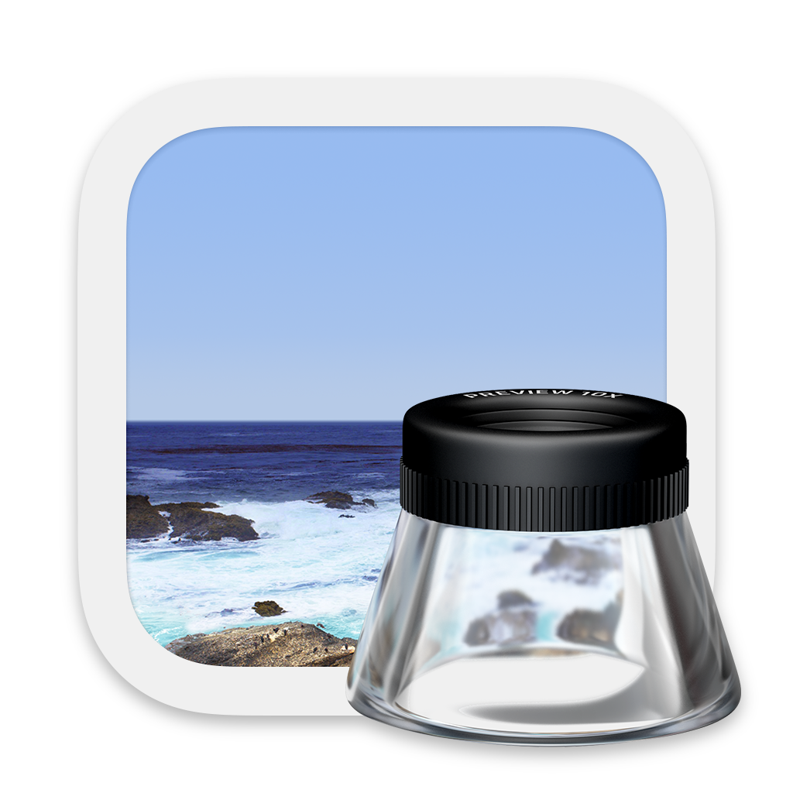</a> | **📂 檔名:** `Preview.svg` ✨ **格式:** `Vector (SVG)` ⚖️ **大小:** `1014.75KB` 📅 **更新:** `2026-03-04`  🚀 **jsDelivr Markdown:** `` 🔗 **直接連結 (Url):** <code>https://cdn.jsdelivr.net/gh/barry028/materials@main/images/iCons/Macos%20Big%20Sur/Preview.svg</code> 📥 [檢視原始檔](Preview.svg) |
|  | **📂 檔名:** `QuickTime Player.svg` ✨ **格式:** `Vector (SVG)` ⚖️ **大小:** `987.68KB` 📅 **更新:** `2026-03-04`  🚀 **jsDelivr Markdown:** `` 🔗 **直接連結 (Url):** <code>https://cdn.jsdelivr.net/gh/barry028/materials@main/images/iCons/Macos%20Big%20Sur/QuickTime%20Player.svg</code> 📥 [檢視原始檔](QuickTime%20Player.svg) |
| <a href="Reminders.svg">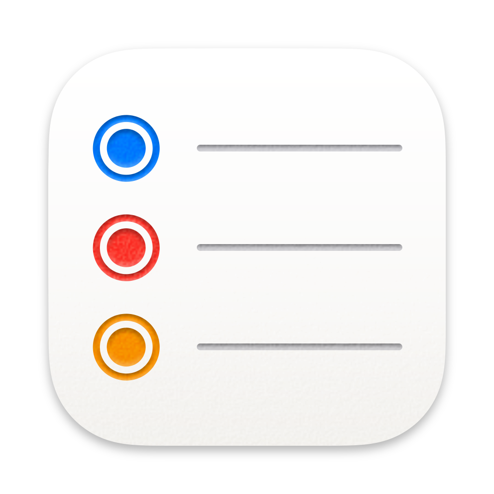</a> | **📂 檔名:** `Reminders.svg` ✨ **格式:** `Vector (SVG)` ⚖️ **大小:** `382.36KB` 📅 **更新:** `2026-03-04`  🚀 **jsDelivr Markdown:** `` 🔗 **直接連結 (Url):** <code>https://cdn.jsdelivr.net/gh/barry028/materials@main/images/iCons/Macos%20Big%20Sur/Reminders.svg</code> 📥 [檢視原始檔](Reminders.svg) |
|  | **📂 檔名:** `Safari.svg` ✨ **格式:** `Vector (SVG)` ⚖️ **大小:** `589.90KB` 📅 **更新:** `2026-03-04`  🚀 **jsDelivr Markdown:** `` 🔗 **直接連結 (Url):** <code>https://cdn.jsdelivr.net/gh/barry028/materials@main/images/iCons/Macos%20Big%20Sur/Safari.svg</code> 📥 [檢視原始檔](Safari.svg) |
|  | **📂 檔名:** `Screenshot.svg` ✨ **格式:** `Vector (SVG)` ⚖️ **大小:** `266.54KB` 📅 **更新:** `2026-03-04`  🚀 **jsDelivr Markdown:** `` 🔗 **直接連結 (Url):** <code>https://cdn.jsdelivr.net/gh/barry028/materials@main/images/iCons/Macos%20Big%20Sur/Screenshot.svg</code> 📥 [檢視原始檔](Screenshot.svg) |
|  | **📂 檔名:** `Script Editor.svg` ✨ **格式:** `Vector (SVG)` ⚖️ **大小:** `492.27KB` 📅 **更新:** `2026-03-04`  🚀 **jsDelivr Markdown:** `` 🔗 **直接連結 (Url):** <code>https://cdn.jsdelivr.net/gh/barry028/materials@main/images/iCons/Macos%20Big%20Sur/Script%20Editor.svg</code> 📥 [檢視原始檔](Script%20Editor.svg) |
| <a href="Settings.svg">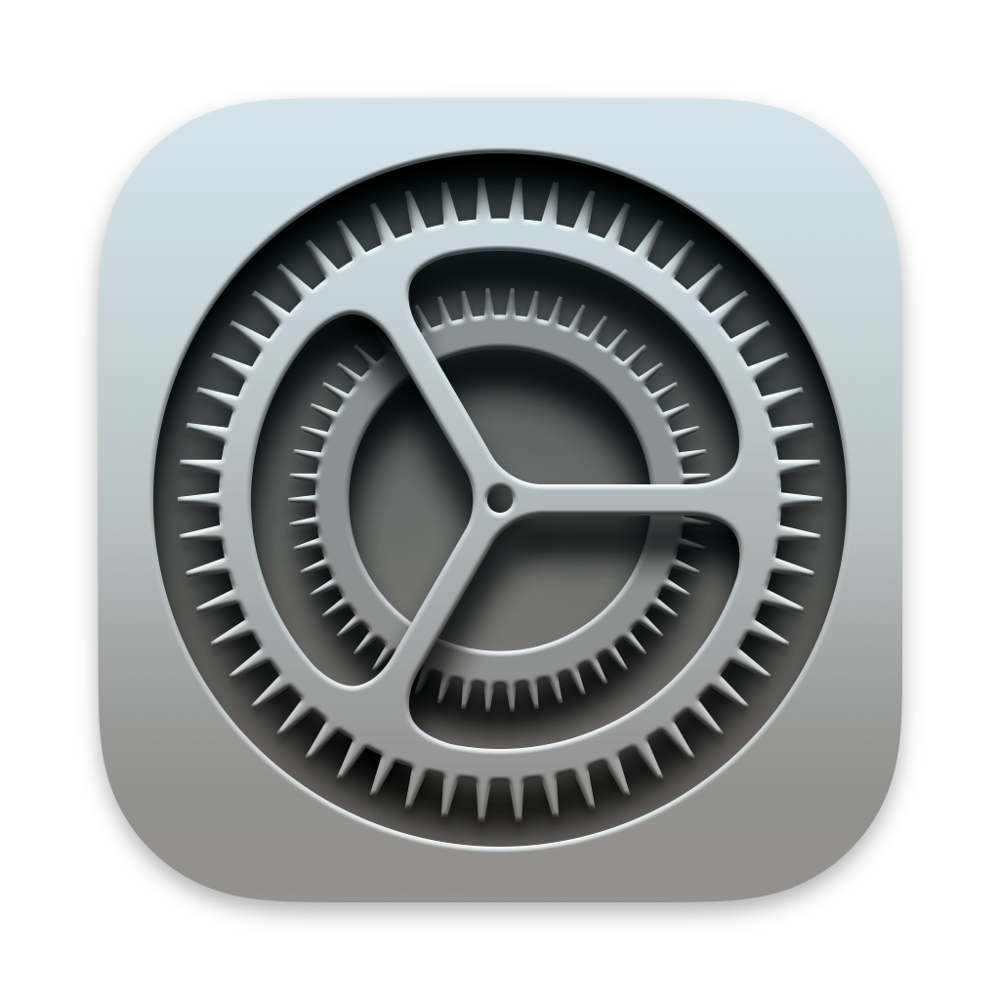</a> | **📂 檔名:** `Settings.svg` ✨ **格式:** `Vector (SVG)` ⚖️ **大小:** `788.01KB` 📅 **更新:** `2026-03-04`  🚀 **jsDelivr Markdown:** `` 🔗 **直接連結 (Url):** <code>https://cdn.jsdelivr.net/gh/barry028/materials@main/images/iCons/Macos%20Big%20Sur/Settings.svg</code> 📥 [檢視原始檔](Settings.svg) |
|  | **📂 檔名:** `Shortcuts.svg` ✨ **格式:** `Vector (SVG)` ⚖️ **大小:** `438.54KB` 📅 **更新:** `2026-03-04`  🚀 **jsDelivr Markdown:** `` 🔗 **直接連結 (Url):** <code>https://cdn.jsdelivr.net/gh/barry028/materials@main/images/iCons/Macos%20Big%20Sur/Shortcuts.svg</code> 📥 [檢視原始檔](Shortcuts.svg) |
| <a href="Siri.svg">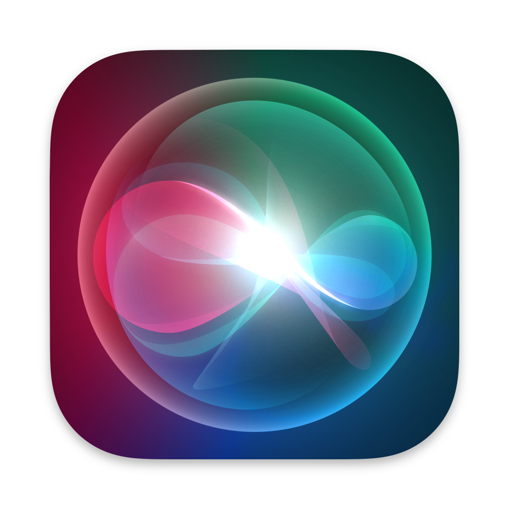</a> | **📂 檔名:** `Siri.svg` ✨ **格式:** `Vector (SVG)` ⚖️ **大小:** `1.34MB` 📅 **更新:** `2026-03-04`  🚀 **jsDelivr Markdown:** `` 🔗 **直接連結 (Url):** <code>https://cdn.jsdelivr.net/gh/barry028/materials@main/images/iCons/Macos%20Big%20Sur/Siri.svg</code> 📥 [檢視原始檔](Siri.svg) |
|  | **📂 檔名:** `Stickies.svg` ✨ **格式:** `Vector (SVG)` ⚖️ **大小:** `234.95KB` 📅 **更新:** `2026-03-04`  🚀 **jsDelivr Markdown:** `` 🔗 **直接連結 (Url):** <code>https://cdn.jsdelivr.net/gh/barry028/materials@main/images/iCons/Macos%20Big%20Sur/Stickies.svg</code> 📥 [檢視原始檔](Stickies.svg) |
| <a href="Stocks.svg">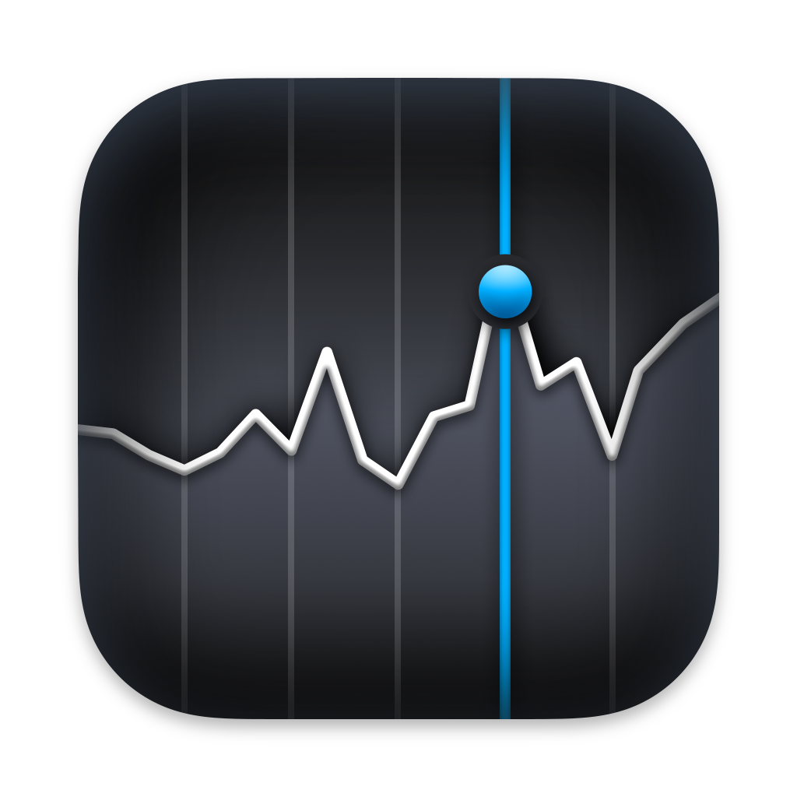</a> | **📂 檔名:** `Stocks.svg` ✨ **格式:** `Vector (SVG)` ⚖️ **大小:** `808.98KB` 📅 **更新:** `2026-03-04`  🚀 **jsDelivr Markdown:** `` 🔗 **直接連結 (Url):** <code>https://cdn.jsdelivr.net/gh/barry028/materials@main/images/iCons/Macos%20Big%20Sur/Stocks.svg</code> 📥 [檢視原始檔](Stocks.svg) |
|  | **📂 檔名:** `Swift Playgrounds.svg` ✨ **格式:** `Vector (SVG)` ⚖️ **大小:** `387.67KB` 📅 **更新:** `2026-03-04`  🚀 **jsDelivr Markdown:** `` 🔗 **直接連結 (Url):** <code>https://cdn.jsdelivr.net/gh/barry028/materials@main/images/iCons/Macos%20Big%20Sur/Swift%20Playgrounds.svg</code> 📥 [檢視原始檔](Swift%20Playgrounds.svg) |
|  | **📂 檔名:** `System Information.svg` ✨ **格式:** `Vector (SVG)` ⚖️ **大小:** `413.32KB` 📅 **更新:** `2026-03-04`  🚀 **jsDelivr Markdown:** `` 🔗 **直接連結 (Url):** <code>https://cdn.jsdelivr.net/gh/barry028/materials@main/images/iCons/Macos%20Big%20Sur/System%20Information.svg</code> 📥 [檢視原始檔](System%20Information.svg) |
|  | **📂 檔名:** `TV.svg` ✨ **格式:** `Vector (SVG)` ⚖️ **大小:** `764.55KB` 📅 **更新:** `2026-03-04`  🚀 **jsDelivr Markdown:** `` 🔗 **直接連結 (Url):** <code>https://cdn.jsdelivr.net/gh/barry028/materials@main/images/iCons/Macos%20Big%20Sur/TV.svg</code> 📥 [檢視原始檔](TV.svg) |
|  | **📂 檔名:** `Terminal.svg` ✨ **格式:** `Vector (SVG)` ⚖️ **大小:** `94.91KB` 📅 **更新:** `2026-03-04`  🚀 **jsDelivr Markdown:** `` 🔗 **直接連結 (Url):** <code>https://cdn.jsdelivr.net/gh/barry028/materials@main/images/iCons/Macos%20Big%20Sur/Terminal.svg</code> 📥 [檢視原始檔](Terminal.svg) |
|  | **📂 檔名:** `TextEdit.svg` ✨ **格式:** `Vector (SVG)` ⚖️ **大小:** `784.53KB` 📅 **更新:** `2026-03-04`  🚀 **jsDelivr Markdown:** `` 🔗 **直接連結 (Url):** <code>https://cdn.jsdelivr.net/gh/barry028/materials@main/images/iCons/Macos%20Big%20Sur/TextEdit.svg</code> 📥 [檢視原始檔](TextEdit.svg) |
|  | **📂 檔名:** `Time Machine.svg` ✨ **格式:** `Vector (SVG)` ⚖️ **大小:** `740.58KB` 📅 **更新:** `2026-03-04`  🚀 **jsDelivr Markdown:** `` 🔗 **直接連結 (Url):** <code>https://cdn.jsdelivr.net/gh/barry028/materials@main/images/iCons/Macos%20Big%20Sur/Time%20Machine.svg</code> 📥 [檢視原始檔](Time%20Machine.svg) |
|  | **📂 檔名:** `Trash Empty.svg` ✨ **格式:** `Vector (SVG)` ⚖️ **大小:** `364.90KB` 📅 **更新:** `2026-03-04`  🚀 **jsDelivr Markdown:** `` 🔗 **直接連結 (Url):** <code>https://cdn.jsdelivr.net/gh/barry028/materials@main/images/iCons/Macos%20Big%20Sur/Trash%20Empty.svg</code> 📥 [檢視原始檔](Trash%20Empty.svg) |
|  | **📂 檔名:** `Trash Full.svg` ✨ **格式:** `Vector (SVG)` ⚖️ **大小:** `431.52KB` 📅 **更新:** `2026-03-04`  🚀 **jsDelivr Markdown:** `` 🔗 **直接連結 (Url):** <code>https://cdn.jsdelivr.net/gh/barry028/materials@main/images/iCons/Macos%20Big%20Sur/Trash%20Full.svg</code> 📥 [檢視原始檔](Trash%20Full.svg) |
|  | **📂 檔名:** `Voice Memos.svg` ✨ **格式:** `Vector (SVG)` ⚖️ **大小:** `719.06KB` 📅 **更新:** `2026-03-04`  🚀 **jsDelivr Markdown:** `` 🔗 **直接連結 (Url):** <code>https://cdn.jsdelivr.net/gh/barry028/materials@main/images/iCons/Macos%20Big%20Sur/Voice%20Memos.svg</code> 📥 [檢視原始檔](Voice%20Memos.svg) |
|  | **📂 檔名:** `VoiceOver Utility.svg` ✨ **格式:** `Vector (SVG)` ⚖️ **大小:** `911.53KB` 📅 **更新:** `2026-03-04`  🚀 **jsDelivr Markdown:** `` 🔗 **直接連結 (Url):** <code>https://cdn.jsdelivr.net/gh/barry028/materials@main/images/iCons/Macos%20Big%20Sur/VoiceOver%20Utility.svg</code> 📥 [檢視原始檔](VoiceOver%20Utility.svg) |
|  | **📂 檔名:** `Weather.svg` ✨ **格式:** `Vector (SVG)` ⚖️ **大小:** `351.92KB` 📅 **更新:** `2026-03-04`  🚀 **jsDelivr Markdown:** `` 🔗 **直接連結 (Url):** <code>https://cdn.jsdelivr.net/gh/barry028/materials@main/images/iCons/Macos%20Big%20Sur/Weather.svg</code> 📥 [檢視原始檔](Weather.svg) |
| <a href="Xcode.svg">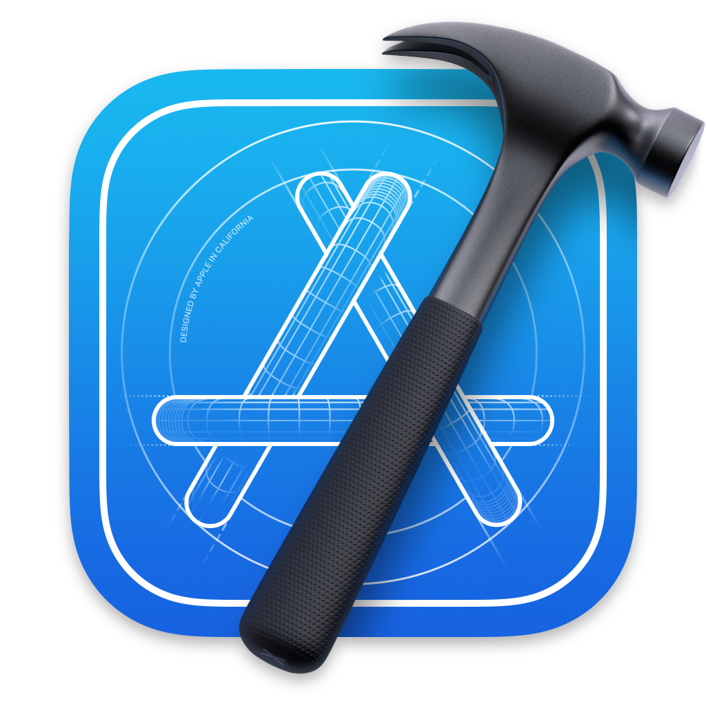</a> | **📂 檔名:** `Xcode.svg` ✨ **格式:** `Vector (SVG)` ⚖️ **大小:** `1.46MB` 📅 **更新:** `2026-03-04`  🚀 **jsDelivr Markdown:** `` 🔗 **直接連結 (Url):** <code>https://cdn.jsdelivr.net/gh/barry028/materials@main/images/iCons/Macos%20Big%20Sur/Xcode.svg</code> 📥 [檢視原始檔](Xcode.svg) |
|  | **📂 檔名:** `iMovie.svg` ✨ **格式:** `Vector (SVG)` ⚖️ **大小:** `563.10KB` 📅 **更新:** `2026-03-04`  🚀 **jsDelivr Markdown:** `` 🔗 **直接連結 (Url):** <code>https://cdn.jsdelivr.net/gh/barry028/materials@main/images/iCons/Macos%20Big%20Sur/iMovie.svg</code> 📥 [檢視原始檔](iMovie.svg) |