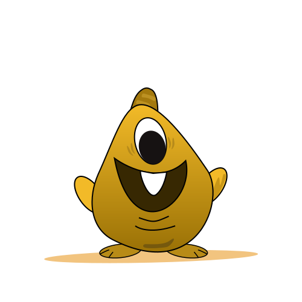

# 🖼️ 素材分類：Monstars

> [🏠 主目錄](../../../README.md) / [images](../../README.md) / [iCons](../README.md) / **Monstars**

本目錄共有 `28` 個檔案

| 🎨 預覽 (點擊放大)  | 📋 檔案詳細資訊與連結 |
| :--- | :--- |
|  | **📂 檔名:** `Baby Teeth Monster With One Horn.svg` ✨ **格式:** `Vector (SVG)` ⚖️ **大小:** `5.65KB` 📅 **更新:** `2026-03-03`  🚀 **jsDelivr Markdown:** `` 🔗 **直接連結 (Url):** <code>https://cdn.jsdelivr.net/gh/barry028/materials@main/images/iCons/Monstars/Baby%20Teeth%20Monster%20With%20One%20Horn.svg</code> 📥 [檢視原始檔](Baby%20Teeth%20Monster%20With%20One%20Horn.svg) |
|  | **📂 檔名:** `Cute One Eye Ghost Monster With Baby Teeth.svg` ✨ **格式:** `Vector (SVG)` ⚖️ **大小:** `1.50KB` 📅 **更新:** `2026-03-03`  🚀 **jsDelivr Markdown:** `` 🔗 **直接連結 (Url):** <code>https://cdn.jsdelivr.net/gh/barry028/materials@main/images/iCons/Monstars/Cute%20One%20Eye%20Ghost%20Monster%20With%20Baby%20Teeth.svg</code> 📥 [檢視原始檔](Cute%20One%20Eye%20Ghost%20Monster%20With%20Baby%20Teeth.svg) |
|  | **📂 檔名:** `Cute Pink Eye Monster With One Horn.svg` ✨ **格式:** `Vector (SVG)` ⚖️ **大小:** `3.67KB` 📅 **更新:** `2026-03-03`  🚀 **jsDelivr Markdown:** `` 🔗 **直接連結 (Url):** <code>https://cdn.jsdelivr.net/gh/barry028/materials@main/images/iCons/Monstars/Cute%20Pink%20Eye%20Monster%20With%20One%20Horn.svg</code> 📥 [檢視原始檔](Cute%20Pink%20Eye%20Monster%20With%20One%20Horn.svg) |
|  | **📂 檔名:** `Cute Purple Monster With Big Smile And Teeth.svg` ✨ **格式:** `Vector (SVG)` ⚖️ **大小:** `3.95KB` 📅 **更新:** `2026-03-03`  🚀 **jsDelivr Markdown:** `` 🔗 **直接連結 (Url):** <code>https://cdn.jsdelivr.net/gh/barry028/materials@main/images/iCons/Monstars/Cute%20Purple%20Monster%20With%20Big%20Smile%20And%20Teeth.svg</code> 📥 [檢視原始檔](Cute%20Purple%20Monster%20With%20Big%20Smile%20And%20Teeth.svg) |
|  | **📂 檔名:** `Cute Purple Monster With Happy Smile.svg` ✨ **格式:** `Vector (SVG)` ⚖️ **大小:** `4.58KB` 📅 **更新:** `2026-03-03`  🚀 **jsDelivr Markdown:** `` 🔗 **直接連結 (Url):** <code>https://cdn.jsdelivr.net/gh/barry028/materials@main/images/iCons/Monstars/Cute%20Purple%20Monster%20With%20Happy%20Smile.svg</code> 📥 [檢視原始檔](Cute%20Purple%20Monster%20With%20Happy%20Smile.svg) |
|  | **📂 檔名:** `Cute Purple Monster With Two Horns And Cute Teeth.svg` ✨ **格式:** `Vector (SVG)` ⚖️ **大小:** `6.93KB` 📅 **更新:** `2026-03-03`  🚀 **jsDelivr Markdown:** `` 🔗 **直接連結 (Url):** <code>https://cdn.jsdelivr.net/gh/barry028/materials@main/images/iCons/Monstars/Cute%20Purple%20Monster%20With%20Two%20Horns%20And%20Cute%20Teeth.svg</code> 📥 [檢視原始檔](Cute%20Purple%20Monster%20With%20Two%20Horns%20And%20Cute%20Teeth.svg) |
|  | **📂 檔名:** `Devil Cute Monster With Sharp Teeth And Small Feet.svg` ✨ **格式:** `Vector (SVG)` ⚖️ **大小:** `6.17KB` 📅 **更新:** `2026-03-03`  🚀 **jsDelivr Markdown:** `` 🔗 **直接連結 (Url):** <code>https://cdn.jsdelivr.net/gh/barry028/materials@main/images/iCons/Monstars/Devil%20Cute%20Monster%20With%20Sharp%20Teeth%20And%20Small%20Feet.svg</code> 📥 [檢視原始檔](Devil%20Cute%20Monster%20With%20Sharp%20Teeth%20And%20Small%20Feet.svg) |
|  | **📂 檔名:** `Devil Monster With Cute Baby Teeths.svg` ✨ **格式:** `Vector (SVG)` ⚖️ **大小:** `5.75KB` 📅 **更新:** `2026-03-03`  🚀 **jsDelivr Markdown:** `` 🔗 **直接連結 (Url):** <code>https://cdn.jsdelivr.net/gh/barry028/materials@main/images/iCons/Monstars/Devil%20Monster%20With%20Cute%20Baby%20Teeths.svg</code> 📥 [檢視原始檔](Devil%20Monster%20With%20Cute%20Baby%20Teeths.svg) |
|  | **📂 檔名:** `Green Cute Monster With Baby Teeth.svg` ✨ **格式:** `Vector (SVG)` ⚖️ **大小:** `6.20KB` 📅 **更新:** `2026-03-03`  🚀 **jsDelivr Markdown:** `` 🔗 **直接連結 (Url):** <code>https://cdn.jsdelivr.net/gh/barry028/materials@main/images/iCons/Monstars/Green%20Cute%20Monster%20With%20Baby%20Teeth.svg</code> 📥 [檢視原始檔](Green%20Cute%20Monster%20With%20Baby%20Teeth.svg) |
|  | **📂 檔名:** `Green Cute Monster With Huge Teeth.svg` ✨ **格式:** `Vector (SVG)` ⚖️ **大小:** `6.55KB` 📅 **更新:** `2026-03-03`  🚀 **jsDelivr Markdown:** `` 🔗 **直接連結 (Url):** <code>https://cdn.jsdelivr.net/gh/barry028/materials@main/images/iCons/Monstars/Green%20Cute%20Monster%20With%20Huge%20Teeth.svg</code> 📥 [檢視原始檔](Green%20Cute%20Monster%20With%20Huge%20Teeth.svg) |
|  | **📂 檔名:** `Green Monster With Two Teeth And Spike Hairs.svg` ✨ **格式:** `Vector (SVG)` ⚖️ **大小:** `7.74KB` 📅 **更新:** `2026-03-03`  🚀 **jsDelivr Markdown:** `` 🔗 **直接連結 (Url):** <code>https://cdn.jsdelivr.net/gh/barry028/materials@main/images/iCons/Monstars/Green%20Monster%20With%20Two%20Teeth%20And%20Spike%20Hairs.svg</code> 📥 [檢視原始檔](Green%20Monster%20With%20Two%20Teeth%20And%20Spike%20Hairs.svg) |
|  | **📂 檔名:** `Happy Devil Monster With One Teeth.svg` ✨ **格式:** `Vector (SVG)` ⚖️ **大小:** `5.69KB` 📅 **更新:** `2026-03-03`  🚀 **jsDelivr Markdown:** `` 🔗 **直接連結 (Url):** <code>https://cdn.jsdelivr.net/gh/barry028/materials@main/images/iCons/Monstars/Happy%20Devil%20Monster%20With%20One%20Teeth.svg</code> 📥 [檢視原始檔](Happy%20Devil%20Monster%20With%20One%20Teeth.svg) |
|  | **📂 檔名:** `Happy Monster With UP Down Teeth.svg` ✨ **格式:** `Vector (SVG)` ⚖️ **大小:** `8.29KB` 📅 **更新:** `2026-03-03`  🚀 **jsDelivr Markdown:** `` 🔗 **直接連結 (Url):** <code>https://cdn.jsdelivr.net/gh/barry028/materials@main/images/iCons/Monstars/Happy%20Monster%20With%20UP%20Down%20Teeth.svg</code> 📥 [檢視原始檔](Happy%20Monster%20With%20UP%20Down%20Teeth.svg) |
|  | **📂 檔名:** `Huge Monster With Baby Teeth.svg` ✨ **格式:** `Vector (SVG)` ⚖️ **大小:** `6.60KB` 📅 **更新:** `2026-03-03`  🚀 **jsDelivr Markdown:** `` 🔗 **直接連結 (Url):** <code>https://cdn.jsdelivr.net/gh/barry028/materials@main/images/iCons/Monstars/Huge%20Monster%20With%20Baby%20Teeth.svg</code> 📥 [檢視原始檔](Huge%20Monster%20With%20Baby%20Teeth.svg) |
|  | **📂 檔名:** `Huge Monster With Sharp Teeth.svg` ✨ **格式:** `Vector (SVG)` ⚖️ **大小:** `7.35KB` 📅 **更新:** `2026-03-03`  🚀 **jsDelivr Markdown:** `` 🔗 **直接連結 (Url):** <code>https://cdn.jsdelivr.net/gh/barry028/materials@main/images/iCons/Monstars/Huge%20Monster%20With%20Sharp%20Teeth.svg</code> 📥 [檢視原始檔](Huge%20Monster%20With%20Sharp%20Teeth.svg) |
|  | **📂 檔名:** `Kid Robot Monster With Huge Smile And One Eye And Horn.svg` ✨ **格式:** `Vector (SVG)` ⚖️ **大小:** `3.65KB` 📅 **更新:** `2026-03-03`  🚀 **jsDelivr Markdown:** `` 🔗 **直接連結 (Url):** <code>https://cdn.jsdelivr.net/gh/barry028/materials@main/images/iCons/Monstars/Kid%20Robot%20Monster%20With%20Huge%20Smile%20And%20One%20Eye%20And%20Horn.svg</code> 📥 [檢視原始檔](Kid%20Robot%20Monster%20With%20Huge%20Smile%20And%20One%20Eye%20And%20Horn.svg) |
|  | **📂 檔名:** `One Eye Cute Smile Robot Monster.svg` ✨ **格式:** `Vector (SVG)` ⚖️ **大小:** `1.72KB` 📅 **更新:** `2026-03-03`  🚀 **jsDelivr Markdown:** `` 🔗 **直接連結 (Url):** <code>https://cdn.jsdelivr.net/gh/barry028/materials@main/images/iCons/Monstars/One%20Eye%20Cute%20Smile%20Robot%20Monster.svg</code> 📥 [檢視原始檔](One%20Eye%20Cute%20Smile%20Robot%20Monster.svg) |
|  | **📂 檔名:** `One Eye Monster With Cute Face And Teeth.svg` ✨ **格式:** `Vector (SVG)` ⚖️ **大小:** `5.75KB` 📅 **更新:** `2026-03-03`  🚀 **jsDelivr Markdown:** `` 🔗 **直接連結 (Url):** <code>https://cdn.jsdelivr.net/gh/barry028/materials@main/images/iCons/Monstars/One%20Eye%20Monster%20With%20Cute%20Face%20And%20Teeth.svg</code> 📥 [檢視原始檔](One%20Eye%20Monster%20With%20Cute%20Face%20And%20Teeth.svg) |
|  | **📂 檔名:** `One Eye Pink Cute Monster.svg` ✨ **格式:** `Vector (SVG)` ⚖️ **大小:** `3.86KB` 📅 **更新:** `2026-03-03`  🚀 **jsDelivr Markdown:** `` 🔗 **直接連結 (Url):** <code>https://cdn.jsdelivr.net/gh/barry028/materials@main/images/iCons/Monstars/One%20Eye%20Pink%20Cute%20Monster.svg</code> 📥 [檢視原始檔](One%20Eye%20Pink%20Cute%20Monster.svg) |
|  | **📂 檔名:** `Pink Monster With One Eye And Sharp Teeth.svg` ✨ **格式:** `Vector (SVG)` ⚖️ **大小:** `4.22KB` 📅 **更新:** `2026-03-03`  🚀 **jsDelivr Markdown:** `` 🔗 **直接連結 (Url):** <code>https://cdn.jsdelivr.net/gh/barry028/materials@main/images/iCons/Monstars/Pink%20Monster%20With%20One%20Eye%20And%20Sharp%20Teeth.svg</code> 📥 [檢視原始檔](Pink%20Monster%20With%20One%20Eye%20And%20Sharp%20Teeth.svg) |
|  | **📂 檔名:** `Robot Monster With One Eye And Roller.svg` ✨ **格式:** `Vector (SVG)` ⚖️ **大小:** `1.50KB` 📅 **更新:** `2026-03-03`  🚀 **jsDelivr Markdown:** `` 🔗 **直接連結 (Url):** <code>https://cdn.jsdelivr.net/gh/barry028/materials@main/images/iCons/Monstars/Robot%20Monster%20With%20One%20Eye%20And%20Roller.svg</code> 📥 [檢視原始檔](Robot%20Monster%20With%20One%20Eye%20And%20Roller.svg) |
|  | **📂 檔名:** `Skinny Green Monster With Big Legs And One Eye.svg` ✨ **格式:** `Vector (SVG)` ⚖️ **大小:** `1014.00B` 📅 **更新:** `2026-03-03`  🚀 **jsDelivr Markdown:** `` 🔗 **直接連結 (Url):** <code>https://cdn.jsdelivr.net/gh/barry028/materials@main/images/iCons/Monstars/Skinny%20Green%20Monster%20With%20Big%20Legs%20And%20One%20Eye.svg</code> 📥 [檢視原始檔](Skinny%20Green%20Monster%20With%20Big%20Legs%20And%20One%20Eye.svg) |
|  | **📂 檔名:** `Skinny Green Monster With Cute Smile And Baby Teeth Small Legs.svg` ✨ **格式:** `Vector (SVG)` ⚖️ **大小:** `1.16KB` 📅 **更新:** `2026-03-03`  🚀 **jsDelivr Markdown:** `` 🔗 **直接連結 (Url):** <code>https://cdn.jsdelivr.net/gh/barry028/materials@main/images/iCons/Monstars/Skinny%20Green%20Monster%20With%20Cute%20Smile%20And%20Baby%20Teeth%20Small%20Legs.svg</code> 📥 [檢視原始檔](Skinny%20Green%20Monster%20With%20Cute%20Smile%20And%20Baby%20Teeth%20Small%20Legs.svg) |
|  | **📂 檔名:** `Skinny Green Monster With Eye And Happy Smile.svg` ✨ **格式:** `Vector (SVG)` ⚖️ **大小:** `1.65KB` 📅 **更新:** `2026-03-03`  🚀 **jsDelivr Markdown:** `` 🔗 **直接連結 (Url):** <code>https://cdn.jsdelivr.net/gh/barry028/materials@main/images/iCons/Monstars/Skinny%20Green%20Monster%20With%20Eye%20And%20Happy%20Smile.svg</code> 📥 [檢視原始檔](Skinny%20Green%20Monster%20With%20Eye%20And%20Happy%20Smile.svg) |
|  | **📂 檔名:** `Skinny Green Monster With One Eye And Horn.svg` ✨ **格式:** `Vector (SVG)` ⚖️ **大小:** `2.27KB` 📅 **更新:** `2026-03-03`  🚀 **jsDelivr Markdown:** `` 🔗 **直接連結 (Url):** <code>https://cdn.jsdelivr.net/gh/barry028/materials@main/images/iCons/Monstars/Skinny%20Green%20Monster%20With%20One%20Eye%20And%20Horn.svg</code> 📥 [檢視原始檔](Skinny%20Green%20Monster%20With%20One%20Eye%20And%20Horn.svg) |
|  | **📂 檔名:** `Three Eye Robot Monster.svg` ✨ **格式:** `Vector (SVG)` ⚖️ **大小:** `2.01KB` 📅 **更新:** `2026-03-03`  🚀 **jsDelivr Markdown:** `` 🔗 **直接連結 (Url):** <code>https://cdn.jsdelivr.net/gh/barry028/materials@main/images/iCons/Monstars/Three%20Eye%20Robot%20Monster.svg</code> 📥 [檢視原始檔](Three%20Eye%20Robot%20Monster.svg) |
|  | **📂 檔名:** `Two Horn One Eye Pink Monster.svg` ✨ **格式:** `Vector (SVG)` ⚖️ **大小:** `3.89KB` 📅 **更新:** `2026-03-03`  🚀 **jsDelivr Markdown:** `` 🔗 **直接連結 (Url):** <code>https://cdn.jsdelivr.net/gh/barry028/materials@main/images/iCons/Monstars/Two%20Horn%20One%20Eye%20Pink%20Monster.svg</code> 📥 [檢視原始檔](Two%20Horn%20One%20Eye%20Pink%20Monster.svg) |
|  | **📂 檔名:** `baby-teeth-monster-with-one-horn.svg` ✨ **格式:** `Vector (SVG)` ⚖️ **大小:** `5.51KB` 📅 **更新:** `2026-03-03`  🚀 **jsDelivr Markdown:** `` 🔗 **直接連結 (Url):** <code>https://cdn.jsdelivr.net/gh/barry028/materials@main/images/iCons/Monstars/baby-teeth-monster-with-one-horn.svg</code> 📥 [檢視原始檔](baby-teeth-monster-with-one-horn.svg) |