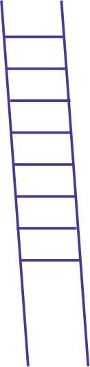
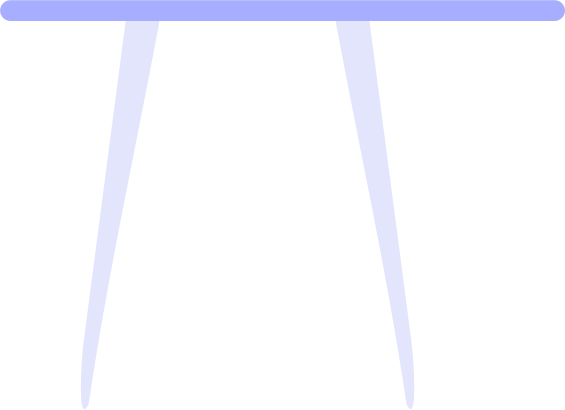

# 🖼️ 素材分類：Background

> [🏠 主目錄](../../../../../README.md) / **Background**

本目錄共有 `7` 個檔案

| 🎨 預覽 (點擊放大) | 📋 檔案詳細資訊 |
| :--- | :--- |
|  | **📂 檔名:** `Chair_1.svg` ✨ **格式:** `Vector (SVG)` ⚖️ **大小:** `783.00B` 📅 **更新:** `2026-02-27`  🔗 [直接查看原始檔](Chair_1.svg) |
|  | **📂 檔名:** `Chair_2.svg` ✨ **格式:** `Vector (SVG)` ⚖️ **大小:** `1.04KB` 📅 **更新:** `2026-02-27`  🔗 [直接查看原始檔](Chair_2.svg) |
|  | **📂 檔名:** `Coffee.svg` ✨ **格式:** `Vector (SVG)` ⚖️ **大小:** `980.00B` 📅 **更新:** `2026-02-27`  🔗 [直接查看原始檔](Coffee.svg) |
|  | **📂 檔名:** `Ladder.svg` ✨ **格式:** `Vector (SVG)` ⚖️ **大小:** `926.00B` 📅 **更新:** `2026-02-27`  🔗 [直接查看原始檔](Ladder.svg) |
|  | **📂 檔名:** `Lamp.svg` ✨ **格式:** `Vector (SVG)` ⚖️ **大小:** `1.71KB` 📅 **更新:** `2026-02-27`  🔗 [直接查看原始檔](Lamp.svg) |
|  | **📂 檔名:** `Mop.svg` ✨ **格式:** `Vector (SVG)` ⚖️ **大小:** `546.00B` 📅 **更新:** `2026-02-27`  🔗 [直接查看原始檔](Mop.svg) |
|  | **📂 檔名:** `Table.svg` ✨ **格式:** `Vector (SVG)` ⚖️ **大小:** `1020.00B` 📅 **更新:** `2026-02-27`  🔗 [直接查看原始檔](Table.svg) |