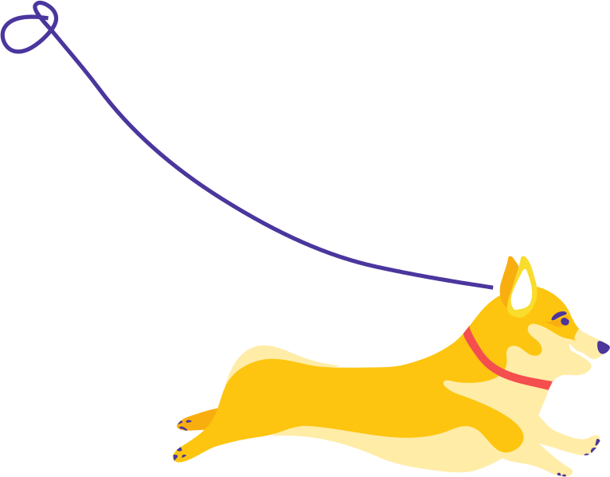
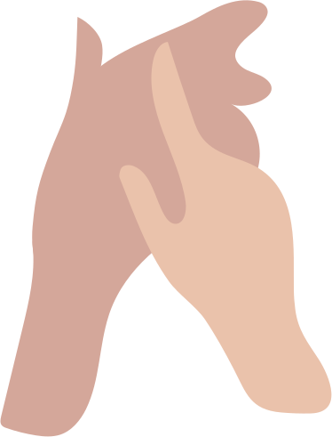
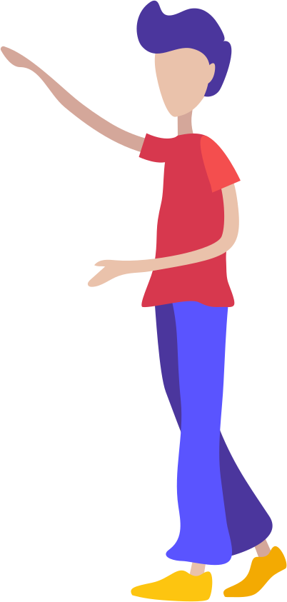
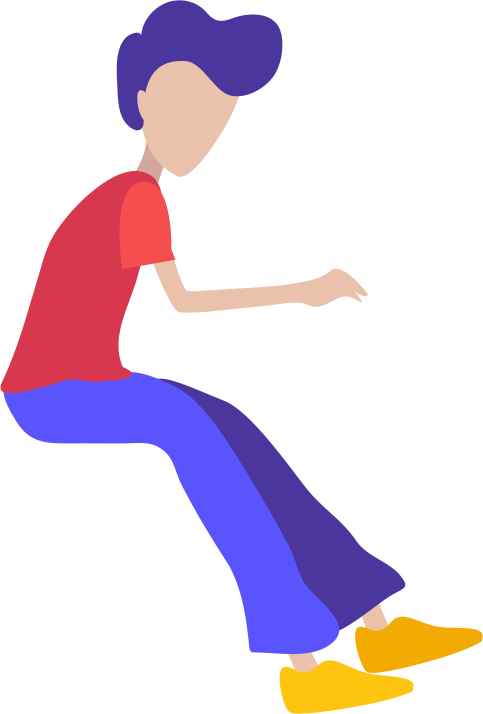
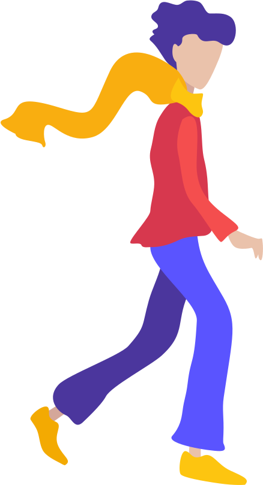
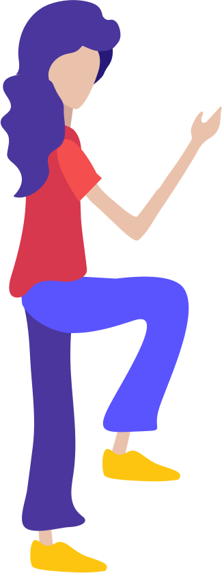
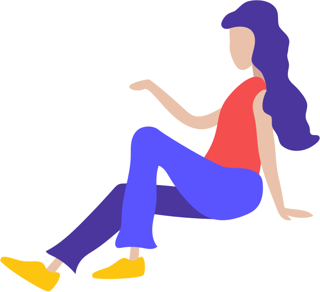

# 🖼️ 素材分類：Characters

> [🏠 主目錄](../../../../../README.md) / [images](../../../../README.md) / [iCons](../../../README.md) / [Palse Illustrations](../../README.md) / [Pulse Illustration Kit](../README.md) / **Characters**

本目錄共有 `16` 個檔案

| 🎨 預覽 (點擊放大)  | 📋 檔案詳細資訊與連結 |
| :--- | :--- |
|  | **📂 檔名:** `Dog.svg` ✨ **格式:** `Vector (SVG)` ⚖️ **大小:** `10.37KB` 📅 **更新:** `2026-03-04`  🚀 **jsDelivr Markdown:** `` 🔗 **直接連結 (Url):** <code>https://cdn.jsdelivr.net/gh/barry028/materials@main/images/iCons/Palse%20Illustrations/Pulse%20Illustration%20Kit/Characters/Dog.svg</code> 📥 [檢視原始檔](Dog.svg) |
|  | **📂 檔名:** `Hands.svg` ✨ **格式:** `Vector (SVG)` ⚖️ **大小:** `2.20KB` 📅 **更新:** `2026-03-04`  🚀 **jsDelivr Markdown:** `` 🔗 **直接連結 (Url):** <code>https://cdn.jsdelivr.net/gh/barry028/materials@main/images/iCons/Palse%20Illustrations/Pulse%20Illustration%20Kit/Characters/Hands.svg</code> 📥 [檢視原始檔](Hands.svg) |
|  | **📂 檔名:** `Man_1.svg` ✨ **格式:** `Vector (SVG)` ⚖️ **大小:** `4.37KB` 📅 **更新:** `2026-03-04`  🚀 **jsDelivr Markdown:** `` 🔗 **直接連結 (Url):** <code>https://cdn.jsdelivr.net/gh/barry028/materials@main/images/iCons/Palse%20Illustrations/Pulse%20Illustration%20Kit/Characters/Man_1.svg</code> 📥 [檢視原始檔](Man_1.svg) |
|  | **📂 檔名:** `Man_2.svg` ✨ **格式:** `Vector (SVG)` ⚖️ **大小:** `4.37KB` 📅 **更新:** `2026-03-04`  🚀 **jsDelivr Markdown:** `` 🔗 **直接連結 (Url):** <code>https://cdn.jsdelivr.net/gh/barry028/materials@main/images/iCons/Palse%20Illustrations/Pulse%20Illustration%20Kit/Characters/Man_2.svg</code> 📥 [檢視原始檔](Man_2.svg) |
|  | **📂 檔名:** `Man_3.svg` ✨ **格式:** `Vector (SVG)` ⚖️ **大小:** `4.57KB` 📅 **更新:** `2026-03-04`  🚀 **jsDelivr Markdown:** `` 🔗 **直接連結 (Url):** <code>https://cdn.jsdelivr.net/gh/barry028/materials@main/images/iCons/Palse%20Illustrations/Pulse%20Illustration%20Kit/Characters/Man_3.svg</code> 📥 [檢視原始檔](Man_3.svg) |
|  | **📂 檔名:** `Man_4.svg` ✨ **格式:** `Vector (SVG)` ⚖️ **大小:** `4.30KB` 📅 **更新:** `2026-03-04`  🚀 **jsDelivr Markdown:** `` 🔗 **直接連結 (Url):** <code>https://cdn.jsdelivr.net/gh/barry028/materials@main/images/iCons/Palse%20Illustrations/Pulse%20Illustration%20Kit/Characters/Man_4.svg</code> 📥 [檢視原始檔](Man_4.svg) |
|  | **📂 檔名:** `Man_5.svg` ✨ **格式:** `Vector (SVG)` ⚖️ **大小:** `2.28KB` 📅 **更新:** `2026-03-04`  🚀 **jsDelivr Markdown:** `` 🔗 **直接連結 (Url):** <code>https://cdn.jsdelivr.net/gh/barry028/materials@main/images/iCons/Palse%20Illustrations/Pulse%20Illustration%20Kit/Characters/Man_5.svg</code> 📥 [檢視原始檔](Man_5.svg) |
|  | **📂 檔名:** `Man_6.svg` ✨ **格式:** `Vector (SVG)` ⚖️ **大小:** `4.91KB` 📅 **更新:** `2026-03-04`  🚀 **jsDelivr Markdown:** `` 🔗 **直接連結 (Url):** <code>https://cdn.jsdelivr.net/gh/barry028/materials@main/images/iCons/Palse%20Illustrations/Pulse%20Illustration%20Kit/Characters/Man_6.svg</code> 📥 [檢視原始檔](Man_6.svg) |
|  | **📂 檔名:** `Man_7.svg` ✨ **格式:** `Vector (SVG)` ⚖️ **大小:** `4.46KB` 📅 **更新:** `2026-03-04`  🚀 **jsDelivr Markdown:** `` 🔗 **直接連結 (Url):** <code>https://cdn.jsdelivr.net/gh/barry028/materials@main/images/iCons/Palse%20Illustrations/Pulse%20Illustration%20Kit/Characters/Man_7.svg</code> 📥 [檢視原始檔](Man_7.svg) |
|  | **📂 檔名:** `Woman_1.svg` ✨ **格式:** `Vector (SVG)` ⚖️ **大小:** `5.23KB` 📅 **更新:** `2026-03-04`  🚀 **jsDelivr Markdown:** `` 🔗 **直接連結 (Url):** <code>https://cdn.jsdelivr.net/gh/barry028/materials@main/images/iCons/Palse%20Illustrations/Pulse%20Illustration%20Kit/Characters/Woman_1.svg</code> 📥 [檢視原始檔](Woman_1.svg) |
|  | **📂 檔名:** `Woman_2.svg` ✨ **格式:** `Vector (SVG)` ⚖️ **大小:** `5.77KB` 📅 **更新:** `2026-03-04`  🚀 **jsDelivr Markdown:** `` 🔗 **直接連結 (Url):** <code>https://cdn.jsdelivr.net/gh/barry028/materials@main/images/iCons/Palse%20Illustrations/Pulse%20Illustration%20Kit/Characters/Woman_2.svg</code> 📥 [檢視原始檔](Woman_2.svg) |
|  | **📂 檔名:** `Woman_3.svg` ✨ **格式:** `Vector (SVG)` ⚖️ **大小:** `5.52KB` 📅 **更新:** `2026-03-04`  🚀 **jsDelivr Markdown:** `` 🔗 **直接連結 (Url):** <code>https://cdn.jsdelivr.net/gh/barry028/materials@main/images/iCons/Palse%20Illustrations/Pulse%20Illustration%20Kit/Characters/Woman_3.svg</code> 📥 [檢視原始檔](Woman_3.svg) |
|  | **📂 檔名:** `Woman_4.svg` ✨ **格式:** `Vector (SVG)` ⚖️ **大小:** `5.39KB` 📅 **更新:** `2026-03-04`  🚀 **jsDelivr Markdown:** `` 🔗 **直接連結 (Url):** <code>https://cdn.jsdelivr.net/gh/barry028/materials@main/images/iCons/Palse%20Illustrations/Pulse%20Illustration%20Kit/Characters/Woman_4.svg</code> 📥 [檢視原始檔](Woman_4.svg) |
|  | **📂 檔名:** `Woman_5.svg` ✨ **格式:** `Vector (SVG)` ⚖️ **大小:** `5.73KB` 📅 **更新:** `2026-03-04`  🚀 **jsDelivr Markdown:** `` 🔗 **直接連結 (Url):** <code>https://cdn.jsdelivr.net/gh/barry028/materials@main/images/iCons/Palse%20Illustrations/Pulse%20Illustration%20Kit/Characters/Woman_5.svg</code> 📥 [檢視原始檔](Woman_5.svg) |
|  | **📂 檔名:** `Woman_6.svg` ✨ **格式:** `Vector (SVG)` ⚖️ **大小:** `4.13KB` 📅 **更新:** `2026-03-04`  🚀 **jsDelivr Markdown:** `` 🔗 **直接連結 (Url):** <code>https://cdn.jsdelivr.net/gh/barry028/materials@main/images/iCons/Palse%20Illustrations/Pulse%20Illustration%20Kit/Characters/Woman_6.svg</code> 📥 [檢視原始檔](Woman_6.svg) |
|  | **📂 檔名:** `Woman_7.svg` ✨ **格式:** `Vector (SVG)` ⚖️ **大小:** `4.92KB` 📅 **更新:** `2026-03-04`  🚀 **jsDelivr Markdown:** `` 🔗 **直接連結 (Url):** <code>https://cdn.jsdelivr.net/gh/barry028/materials@main/images/iCons/Palse%20Illustrations/Pulse%20Illustration%20Kit/Characters/Woman_7.svg</code> 📥 [檢視原始檔](Woman_7.svg) |