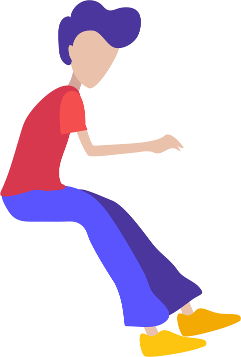

# 🖼️ Characters

[⬅️ 返回主目錄](../../../../../README.md)

| 預覽 | 資訊 |
| :--- | :--- |
|  | **Dog.svg** |
|  | **Hands.svg** |
|  | **Man_1.svg** |
|  | **Man_2.svg** |
|  | **Man_3.svg** |
|  | **Man_4.svg** |
|  | **Man_5.svg** |
|  | **Man_6.svg** |
|  | **Man_7.svg** |
|  | **Woman_1.svg** |
|  | **Woman_2.svg** |
|  | **Woman_3.svg** |
|  | **Woman_4.svg** |
|  | **Woman_5.svg** |
|  | **Woman_6.svg** |
|  | **Woman_7.svg** |