# 🖼️ 素材分類：Nature

> [🏠 主目錄](../../../../../README.md) / [images](../../../../README.md) / [iCons](../../../README.md) / [Palse Illustrations](../../README.md) / [Pulse Illustration Kit](../README.md) / **Nature**

本目錄共有 `37` 個檔案

| 🎨 預覽 (點擊放大) | 📋 檔案詳細資訊與連結 |
| :--- | :--- |
|  | **📂 檔名:** `Bird.svg` ✨ **格式:** `Vector (SVG)` ⚖️ **大小:** `1.61KB` 📅 **更新:** `2026-02-27`  🚀 **jsDelivr Markdown:** `` 🔗 **直接連結 (Url):** `https://cdn.jsdelivr.net/ghbarry028/materials@main/images/iCons/Palse%20Illustrations/Pulse%20Illustration%20Kit/Nature/Bird.svg` 📥 [檢視原始檔](Bird.svg) |
| <a href="Cloud_1.svg">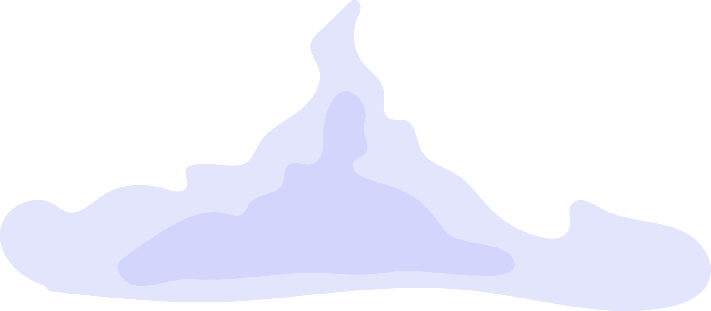</a> | **📂 檔名:** `Cloud_1.svg` ✨ **格式:** `Vector (SVG)` ⚖️ **大小:** `2.50KB` 📅 **更新:** `2026-02-27`  🚀 **jsDelivr Markdown:** `` 🔗 **直接連結 (Url):** `https://cdn.jsdelivr.net/ghbarry028/materials@main/images/iCons/Palse%20Illustrations/Pulse%20Illustration%20Kit/Nature/Cloud_1.svg` 📥 [檢視原始檔](Cloud_1.svg) |
| <a href="Cloud_2.svg">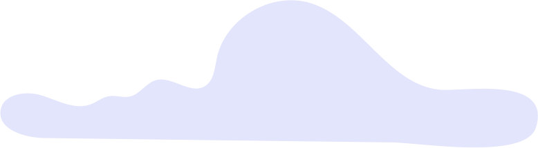</a> | **📂 檔名:** `Cloud_2.svg` ✨ **格式:** `Vector (SVG)` ⚖️ **大小:** `631.00B` 📅 **更新:** `2026-02-27`  🚀 **jsDelivr Markdown:** `` 🔗 **直接連結 (Url):** `https://cdn.jsdelivr.net/ghbarry028/materials@main/images/iCons/Palse%20Illustrations/Pulse%20Illustration%20Kit/Nature/Cloud_2.svg` 📥 [檢視原始檔](Cloud_2.svg) |
| <a href="Cloud_3.svg">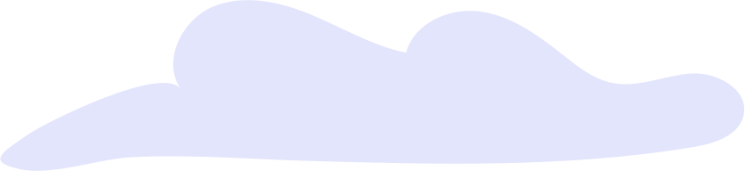</a> | **📂 檔名:** `Cloud_3.svg` ✨ **格式:** `Vector (SVG)` ⚖️ **大小:** `698.00B` 📅 **更新:** `2026-02-27`  🚀 **jsDelivr Markdown:** `` 🔗 **直接連結 (Url):** `https://cdn.jsdelivr.net/ghbarry028/materials@main/images/iCons/Palse%20Illustrations/Pulse%20Illustration%20Kit/Nature/Cloud_3.svg` 📥 [檢視原始檔](Cloud_3.svg) |
| <a href="Cloud_4.svg">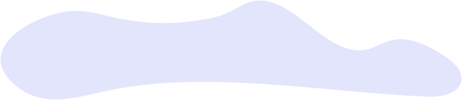</a> | **📂 檔名:** `Cloud_4.svg` ✨ **格式:** `Vector (SVG)` ⚖️ **大小:** `628.00B` 📅 **更新:** `2026-02-27`  🚀 **jsDelivr Markdown:** `` 🔗 **直接連結 (Url):** `https://cdn.jsdelivr.net/ghbarry028/materials@main/images/iCons/Palse%20Illustrations/Pulse%20Illustration%20Kit/Nature/Cloud_4.svg` 📥 [檢視原始檔](Cloud_4.svg) |
| <a href="Ground_1.svg">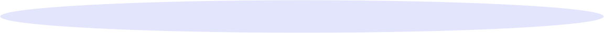</a> | **📂 檔名:** `Ground_1.svg` ✨ **格式:** `Vector (SVG)` ⚖️ **大小:** `335.00B` 📅 **更新:** `2026-02-27`  🚀 **jsDelivr Markdown:** `` 🔗 **直接連結 (Url):** `https://cdn.jsdelivr.net/ghbarry028/materials@main/images/iCons/Palse%20Illustrations/Pulse%20Illustration%20Kit/Nature/Ground_1.svg` 📥 [檢視原始檔](Ground_1.svg) |
|  | **📂 檔名:** `Ground_2.svg` ✨ **格式:** `Vector (SVG)` ⚖️ **大小:** `302.00B` 📅 **更新:** `2026-02-27`  🚀 **jsDelivr Markdown:** `` 🔗 **直接連結 (Url):** `https://cdn.jsdelivr.net/ghbarry028/materials@main/images/iCons/Palse%20Illustrations/Pulse%20Illustration%20Kit/Nature/Ground_2.svg` 📥 [檢視原始檔](Ground_2.svg) |
|  | **📂 檔名:** `Ground_3.svg` ✨ **格式:** `Vector (SVG)` ⚖️ **大小:** `341.00B` 📅 **更新:** `2026-02-27`  🚀 **jsDelivr Markdown:** `` 🔗 **直接連結 (Url):** `https://cdn.jsdelivr.net/ghbarry028/materials@main/images/iCons/Palse%20Illustrations/Pulse%20Illustration%20Kit/Nature/Ground_3.svg` 📥 [檢視原始檔](Ground_3.svg) |
| <a href="Ground_4.svg">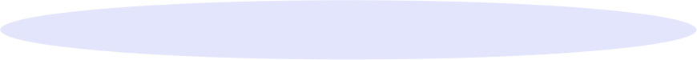</a> | **📂 檔名:** `Ground_4.svg` ✨ **格式:** `Vector (SVG)` ⚖️ **大小:** `336.00B` 📅 **更新:** `2026-02-27`  🚀 **jsDelivr Markdown:** `` 🔗 **直接連結 (Url):** `https://cdn.jsdelivr.net/ghbarry028/materials@main/images/iCons/Palse%20Illustrations/Pulse%20Illustration%20Kit/Nature/Ground_4.svg` 📥 [檢視原始檔](Ground_4.svg) |
|  | **📂 檔名:** `Leaves_1.svg` ✨ **格式:** `Vector (SVG)` ⚖️ **大小:** `2.01KB` 📅 **更新:** `2026-02-27`  🚀 **jsDelivr Markdown:** `` 🔗 **直接連結 (Url):** `https://cdn.jsdelivr.net/ghbarry028/materials@main/images/iCons/Palse%20Illustrations/Pulse%20Illustration%20Kit/Nature/Leaves_1.svg` 📥 [檢視原始檔](Leaves_1.svg) |
|  | **📂 檔名:** `Leaves_2.svg` ✨ **格式:** `Vector (SVG)` ⚖️ **大小:** `4.05KB` 📅 **更新:** `2026-02-27`  🚀 **jsDelivr Markdown:** `` 🔗 **直接連結 (Url):** `https://cdn.jsdelivr.net/ghbarry028/materials@main/images/iCons/Palse%20Illustrations/Pulse%20Illustration%20Kit/Nature/Leaves_2.svg` 📥 [檢視原始檔](Leaves_2.svg) |
| <a href="Plant_1.svg">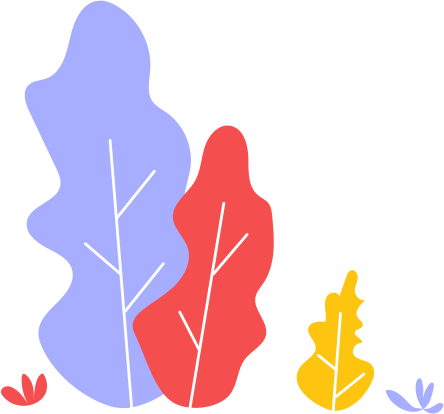</a> | **📂 檔名:** `Plant_1.svg` ✨ **格式:** `Vector (SVG)` ⚖️ **大小:** `6.08KB` 📅 **更新:** `2026-02-27`  🚀 **jsDelivr Markdown:** `` 🔗 **直接連結 (Url):** `https://cdn.jsdelivr.net/ghbarry028/materials@main/images/iCons/Palse%20Illustrations/Pulse%20Illustration%20Kit/Nature/Plant_1.svg` 📥 [檢視原始檔](Plant_1.svg) |
| <a href="Plant_10.svg">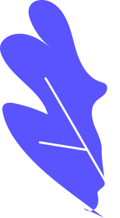</a> | **📂 檔名:** `Plant_10.svg` ✨ **格式:** `Vector (SVG)` ⚖️ **大小:** `2.00KB` 📅 **更新:** `2026-02-27`  🚀 **jsDelivr Markdown:** `` 🔗 **直接連結 (Url):** `https://cdn.jsdelivr.net/ghbarry028/materials@main/images/iCons/Palse%20Illustrations/Pulse%20Illustration%20Kit/Nature/Plant_10.svg` 📥 [檢視原始檔](Plant_10.svg) |
| <a href="Plant_11.svg">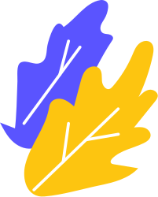</a> | **📂 檔名:** `Plant_11.svg` ✨ **格式:** `Vector (SVG)` ⚖️ **大小:** `3.38KB` 📅 **更新:** `2026-02-27`  🚀 **jsDelivr Markdown:** `` 🔗 **直接連結 (Url):** `https://cdn.jsdelivr.net/ghbarry028/materials@main/images/iCons/Palse%20Illustrations/Pulse%20Illustration%20Kit/Nature/Plant_11.svg` 📥 [檢視原始檔](Plant_11.svg) |
| <a href="Plant_12.svg">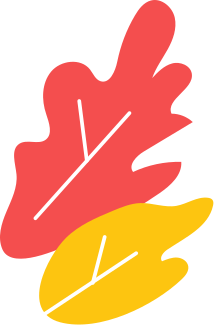</a> | **📂 檔名:** `Plant_12.svg` ✨ **格式:** `Vector (SVG)` ⚖️ **大小:** `3.08KB` 📅 **更新:** `2026-02-27`  🚀 **jsDelivr Markdown:** `` 🔗 **直接連結 (Url):** `https://cdn.jsdelivr.net/ghbarry028/materials@main/images/iCons/Palse%20Illustrations/Pulse%20Illustration%20Kit/Nature/Plant_12.svg` 📥 [檢視原始檔](Plant_12.svg) |
| <a href="Plant_13.svg">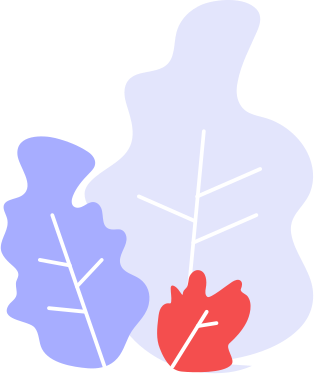</a> | **📂 檔名:** `Plant_13.svg` ✨ **格式:** `Vector (SVG)` ⚖️ **大小:** `6.31KB` 📅 **更新:** `2026-02-27`  🚀 **jsDelivr Markdown:** `` 🔗 **直接連結 (Url):** `https://cdn.jsdelivr.net/ghbarry028/materials@main/images/iCons/Palse%20Illustrations/Pulse%20Illustration%20Kit/Nature/Plant_13.svg` 📥 [檢視原始檔](Plant_13.svg) |
| <a href="Plant_14.svg">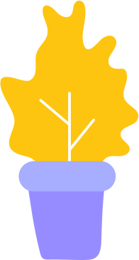</a> | **📂 檔名:** `Plant_14.svg` ✨ **格式:** `Vector (SVG)` ⚖️ **大小:** `2.48KB` 📅 **更新:** `2026-02-27`  🚀 **jsDelivr Markdown:** `` 🔗 **直接連結 (Url):** `https://cdn.jsdelivr.net/ghbarry028/materials@main/images/iCons/Palse%20Illustrations/Pulse%20Illustration%20Kit/Nature/Plant_14.svg` 📥 [檢視原始檔](Plant_14.svg) |
| <a href="Plant_15.svg">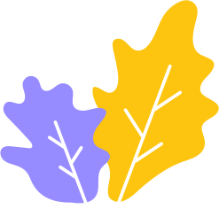</a> | **📂 檔名:** `Plant_15.svg` ✨ **格式:** `Vector (SVG)` ⚖️ **大小:** `4.55KB` 📅 **更新:** `2026-02-27`  🚀 **jsDelivr Markdown:** `` 🔗 **直接連結 (Url):** `https://cdn.jsdelivr.net/ghbarry028/materials@main/images/iCons/Palse%20Illustrations/Pulse%20Illustration%20Kit/Nature/Plant_15.svg` 📥 [檢視原始檔](Plant_15.svg) |
| <a href="Plant_16.svg">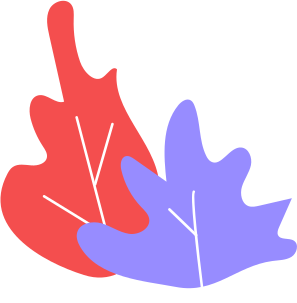</a> | **📂 檔名:** `Plant_16.svg` ✨ **格式:** `Vector (SVG)` ⚖️ **大小:** `2.97KB` 📅 **更新:** `2026-02-27`  🚀 **jsDelivr Markdown:** `` 🔗 **直接連結 (Url):** `https://cdn.jsdelivr.net/ghbarry028/materials@main/images/iCons/Palse%20Illustrations/Pulse%20Illustration%20Kit/Nature/Plant_16.svg` 📥 [檢視原始檔](Plant_16.svg) |
| <a href="Plant_17.svg">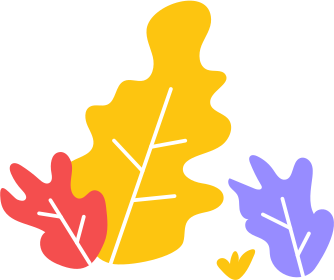</a> | **📂 檔名:** `Plant_17.svg` ✨ **格式:** `Vector (SVG)` ⚖️ **大小:** `5.69KB` 📅 **更新:** `2026-02-27`  🚀 **jsDelivr Markdown:** `` 🔗 **直接連結 (Url):** `https://cdn.jsdelivr.net/ghbarry028/materials@main/images/iCons/Palse%20Illustrations/Pulse%20Illustration%20Kit/Nature/Plant_17.svg` 📥 [檢視原始檔](Plant_17.svg) |
|  | **📂 檔名:** `Plant_18.svg` ✨ **格式:** `Vector (SVG)` ⚖️ **大小:** `5.33KB` 📅 **更新:** `2026-02-27`  🚀 **jsDelivr Markdown:** `` 🔗 **直接連結 (Url):** `https://cdn.jsdelivr.net/ghbarry028/materials@main/images/iCons/Palse%20Illustrations/Pulse%20Illustration%20Kit/Nature/Plant_18.svg` 📥 [檢視原始檔](Plant_18.svg) |
| <a href="Plant_19.svg">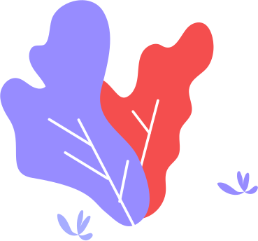</a> | **📂 檔名:** `Plant_19.svg` ✨ **格式:** `Vector (SVG)` ⚖️ **大小:** `4.35KB` 📅 **更新:** `2026-02-27`  🚀 **jsDelivr Markdown:** `` 🔗 **直接連結 (Url):** `https://cdn.jsdelivr.net/ghbarry028/materials@main/images/iCons/Palse%20Illustrations/Pulse%20Illustration%20Kit/Nature/Plant_19.svg` 📥 [檢視原始檔](Plant_19.svg) |
| <a href="Plant_2.svg">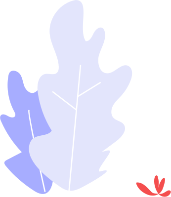</a> | **📂 檔名:** `Plant_2.svg` ✨ **格式:** `Vector (SVG)` ⚖️ **大小:** `3.71KB` 📅 **更新:** `2026-02-27`  🚀 **jsDelivr Markdown:** `` 🔗 **直接連結 (Url):** `https://cdn.jsdelivr.net/ghbarry028/materials@main/images/iCons/Palse%20Illustrations/Pulse%20Illustration%20Kit/Nature/Plant_2.svg` 📥 [檢視原始檔](Plant_2.svg) |
| <a href="Plant_20.svg">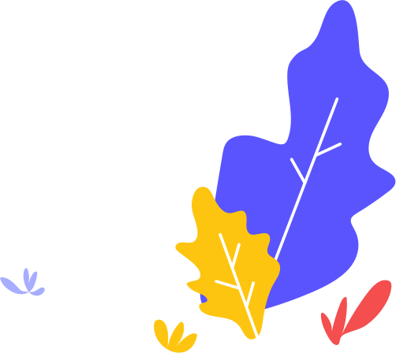</a> | **📂 檔名:** `Plant_20.svg` ✨ **格式:** `Vector (SVG)` ⚖️ **大小:** `5.39KB` 📅 **更新:** `2026-02-27`  🚀 **jsDelivr Markdown:** `` 🔗 **直接連結 (Url):** `https://cdn.jsdelivr.net/ghbarry028/materials@main/images/iCons/Palse%20Illustrations/Pulse%20Illustration%20Kit/Nature/Plant_20.svg` 📥 [檢視原始檔](Plant_20.svg) |
|  | **📂 檔名:** `Plant_21.svg` ✨ **格式:** `Vector (SVG)` ⚖️ **大小:** `5.97KB` 📅 **更新:** `2026-02-27`  🚀 **jsDelivr Markdown:** `` 🔗 **直接連結 (Url):** `https://cdn.jsdelivr.net/ghbarry028/materials@main/images/iCons/Palse%20Illustrations/Pulse%20Illustration%20Kit/Nature/Plant_21.svg` 📥 [檢視原始檔](Plant_21.svg) |
| <a href="Plant_22.svg">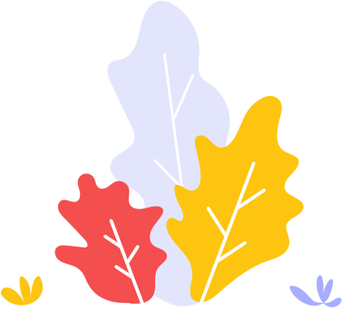</a> | **📂 檔名:** `Plant_22.svg` ✨ **格式:** `Vector (SVG)` ⚖️ **大小:** `6.95KB` 📅 **更新:** `2026-02-27`  🚀 **jsDelivr Markdown:** `` 🔗 **直接連結 (Url):** `https://cdn.jsdelivr.net/ghbarry028/materials@main/images/iCons/Palse%20Illustrations/Pulse%20Illustration%20Kit/Nature/Plant_22.svg` 📥 [檢視原始檔](Plant_22.svg) |
| <a href="Plant_23.svg">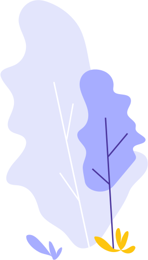</a> | **📂 檔名:** `Plant_23.svg` ✨ **格式:** `Vector (SVG)` ⚖️ **大小:** `4.19KB` 📅 **更新:** `2026-02-27`  🚀 **jsDelivr Markdown:** `` 🔗 **直接連結 (Url):** `https://cdn.jsdelivr.net/ghbarry028/materials@main/images/iCons/Palse%20Illustrations/Pulse%20Illustration%20Kit/Nature/Plant_23.svg` 📥 [檢視原始檔](Plant_23.svg) |
| <a href="Plant_24.svg">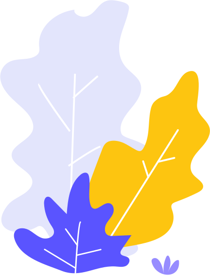</a> | **📂 檔名:** `Plant_24.svg` ✨ **格式:** `Vector (SVG)` ⚖️ **大小:** `5.86KB` 📅 **更新:** `2026-02-27`  🚀 **jsDelivr Markdown:** `` 🔗 **直接連結 (Url):** `https://cdn.jsdelivr.net/ghbarry028/materials@main/images/iCons/Palse%20Illustrations/Pulse%20Illustration%20Kit/Nature/Plant_24.svg` 📥 [檢視原始檔](Plant_24.svg) |
| <a href="Plant_25.svg">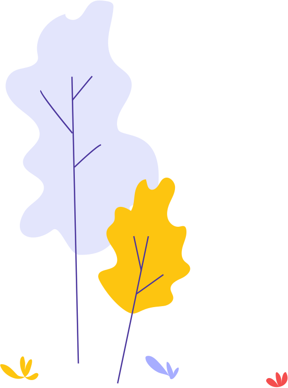</a> | **📂 檔名:** `Plant_25.svg` ✨ **格式:** `Vector (SVG)` ⚖️ **大小:** `5.77KB` 📅 **更新:** `2026-02-27`  🚀 **jsDelivr Markdown:** `` 🔗 **直接連結 (Url):** `https://cdn.jsdelivr.net/ghbarry028/materials@main/images/iCons/Palse%20Illustrations/Pulse%20Illustration%20Kit/Nature/Plant_25.svg` 📥 [檢視原始檔](Plant_25.svg) |
| <a href="Plant_26.svg">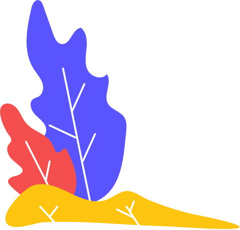</a> | **📂 檔名:** `Plant_26.svg` ✨ **格式:** `Vector (SVG)` ⚖️ **大小:** `4.49KB` 📅 **更新:** `2026-02-27`  🚀 **jsDelivr Markdown:** `` 🔗 **直接連結 (Url):** `https://cdn.jsdelivr.net/ghbarry028/materials@main/images/iCons/Palse%20Illustrations/Pulse%20Illustration%20Kit/Nature/Plant_26.svg` 📥 [檢視原始檔](Plant_26.svg) |
| <a href="Plant_3.svg">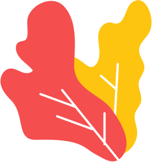</a> | **📂 檔名:** `Plant_3.svg` ✨ **格式:** `Vector (SVG)` ⚖️ **大小:** `2.91KB` 📅 **更新:** `2026-02-27`  🚀 **jsDelivr Markdown:** `` 🔗 **直接連結 (Url):** `https://cdn.jsdelivr.net/ghbarry028/materials@main/images/iCons/Palse%20Illustrations/Pulse%20Illustration%20Kit/Nature/Plant_3.svg` 📥 [檢視原始檔](Plant_3.svg) |
| <a href="Plant_4.svg">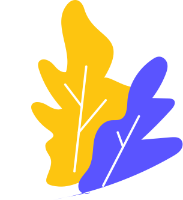</a> | **📂 檔名:** `Plant_4.svg` ✨ **格式:** `Vector (SVG)` ⚖️ **大小:** `3.79KB` 📅 **更新:** `2026-02-27`  🚀 **jsDelivr Markdown:** `` 🔗 **直接連結 (Url):** `https://cdn.jsdelivr.net/ghbarry028/materials@main/images/iCons/Palse%20Illustrations/Pulse%20Illustration%20Kit/Nature/Plant_4.svg` 📥 [檢視原始檔](Plant_4.svg) |
| <a href="Plant_5.svg">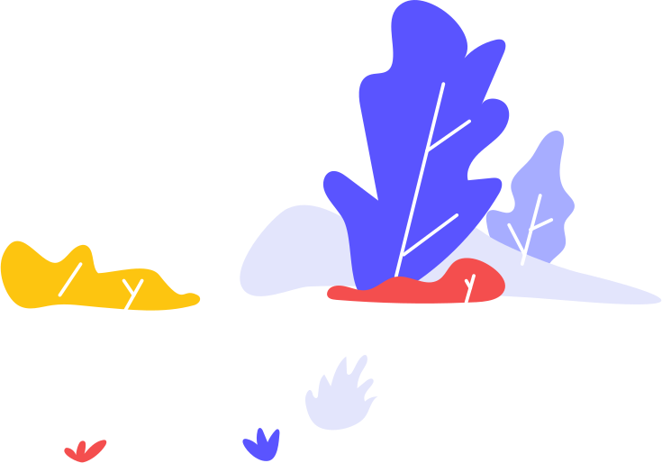</a> | **📂 檔名:** `Plant_5.svg` ✨ **格式:** `Vector (SVG)` ⚖️ **大小:** `7.20KB` 📅 **更新:** `2026-02-27`  🚀 **jsDelivr Markdown:** `` 🔗 **直接連結 (Url):** `https://cdn.jsdelivr.net/ghbarry028/materials@main/images/iCons/Palse%20Illustrations/Pulse%20Illustration%20Kit/Nature/Plant_5.svg` 📥 [檢視原始檔](Plant_5.svg) |
| <a href="Plant_6.svg">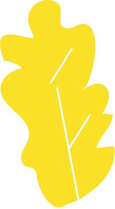</a> | **📂 檔名:** `Plant_6.svg` ✨ **格式:** `Vector (SVG)` ⚖️ **大小:** `3.27KB` 📅 **更新:** `2026-02-27`  🚀 **jsDelivr Markdown:** `` 🔗 **直接連結 (Url):** `https://cdn.jsdelivr.net/ghbarry028/materials@main/images/iCons/Palse%20Illustrations/Pulse%20Illustration%20Kit/Nature/Plant_6.svg` 📥 [檢視原始檔](Plant_6.svg) |
|  | **📂 檔名:** `Plant_7.svg` ✨ **格式:** `Vector (SVG)` ⚖️ **大小:** `1.58KB` 📅 **更新:** `2026-02-27`  🚀 **jsDelivr Markdown:** `` 🔗 **直接連結 (Url):** `https://cdn.jsdelivr.net/ghbarry028/materials@main/images/iCons/Palse%20Illustrations/Pulse%20Illustration%20Kit/Nature/Plant_7.svg` 📥 [檢視原始檔](Plant_7.svg) |
| <a href="Plant_8.svg">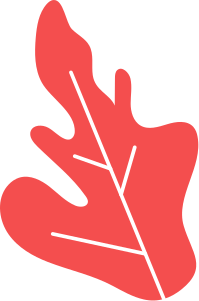</a> | **📂 檔名:** `Plant_8.svg` ✨ **格式:** `Vector (SVG)` ⚖️ **大小:** `2.90KB` 📅 **更新:** `2026-02-27`  🚀 **jsDelivr Markdown:** `` 🔗 **直接連結 (Url):** `https://cdn.jsdelivr.net/ghbarry028/materials@main/images/iCons/Palse%20Illustrations/Pulse%20Illustration%20Kit/Nature/Plant_8.svg` 📥 [檢視原始檔](Plant_8.svg) |
| <a href="Plant_9.svg">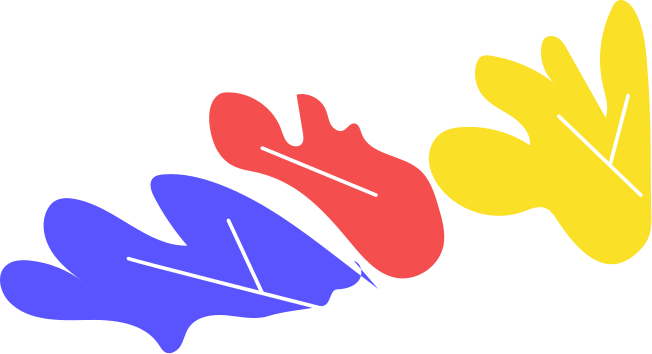</a> | **📂 檔名:** `Plant_9.svg` ✨ **格式:** `Vector (SVG)` ⚖️ **大小:** `5.17KB` 📅 **更新:** `2026-02-27`  🚀 **jsDelivr Markdown:** `` 🔗 **直接連結 (Url):** `https://cdn.jsdelivr.net/ghbarry028/materials@main/images/iCons/Palse%20Illustrations/Pulse%20Illustration%20Kit/Nature/Plant_9.svg` 📥 [檢視原始檔](Plant_9.svg) |