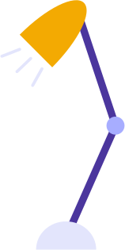
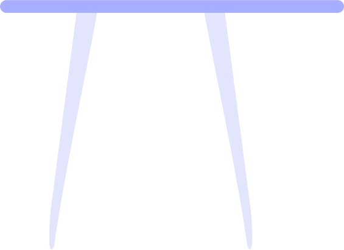
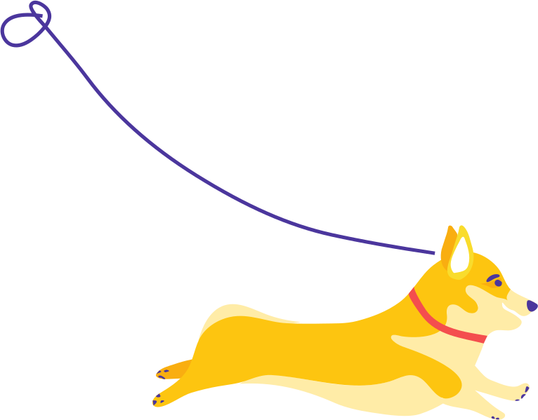
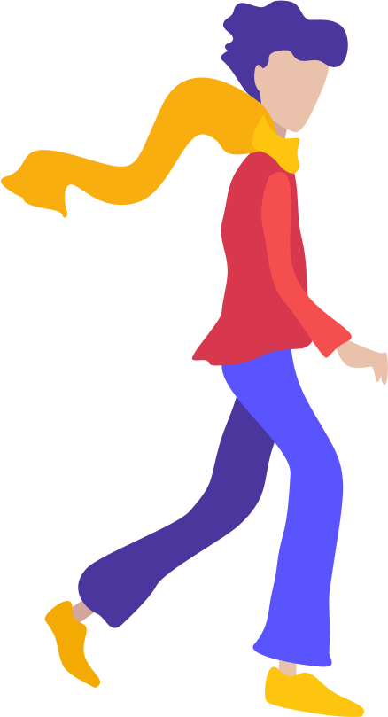

# 📂 目錄：Pulse Illustration Kit

> [🏠 主目錄](../../../../README.md) / [images](../../../README.md) / [iCons](../../README.md) / [Palse Illustrations](../README.md) / **Pulse Illustration Kit**

此目錄目前沒有直接存放圖片，請選擇下方子分類：

### 🗂️ 子分類列表

| 分類名稱 | 封面預覽 | 統計 |
| :--- | :--- | :--- |
| [📠**Background**](Background/README.md) | &nbsp;&nbsp;&nbsp;&nbsp;&nbsp;&nbsp; | 共 `7` 張 |
| [📠**Characters**](Characters/README.md) | &nbsp;&nbsp;&nbsp;&nbsp;&nbsp;&nbsp;&nbsp;&nbsp;&nbsp; | 共 `16` 張 |
| [📠**Nature**](Nature/README.md) | &nbsp;&nbsp;&nbsp;&nbsp;&nbsp;&nbsp;&nbsp;&nbsp;&nbsp; | 共 `37` 張 |
| [📠**UI**](UI/README.md) | &nbsp;&nbsp;&nbsp;&nbsp;&nbsp;&nbsp;&nbsp;&nbsp;&nbsp; | 共 `43` 張 |