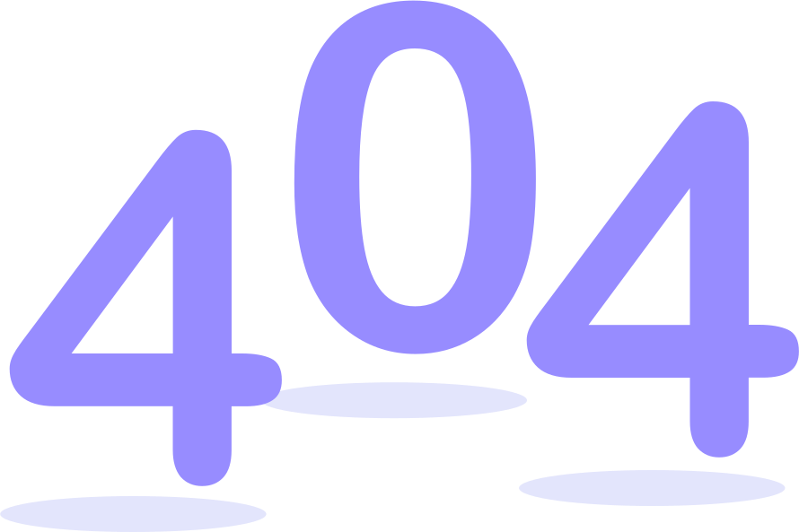
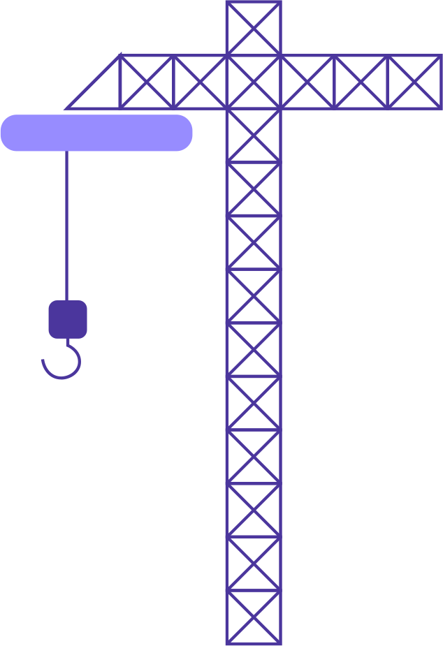
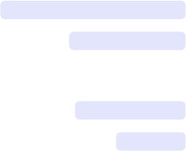
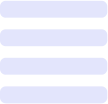
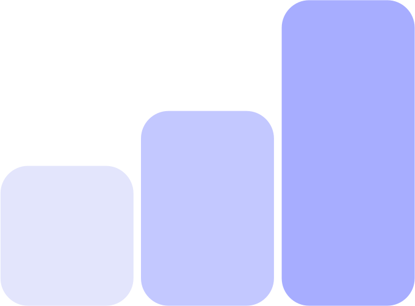
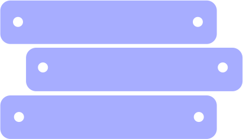
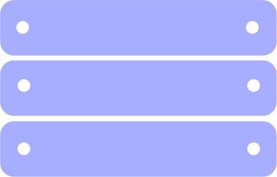

# 🖼️ UI Gallery

[⬅️ 回到首頁](../../README.md)

| 預覽 | 詳細資訊 |
| :--- | :--- |
|  | **404_Error.svg** Vector (SVG) \| 3.33KB 更新: 2026-02-26 |
|  | **Brush.svg** Vector (SVG) \| 880.00B 更新: 2026-02-26 |
|  | **Button_1.svg** Vector (SVG) \| 1.32KB 更新: 2026-02-26 |
|  | **Button_2.svg** Vector (SVG) \| 970.00B 更新: 2026-02-26 |
|  | **Button_3.svg** Vector (SVG) \| 1.36KB 更新: 2026-02-26 |
|  | **Button_4.svg** Vector (SVG) \| 773.00B 更新: 2026-02-26 |
|  | **Button_5.svg** Vector (SVG) \| 1.97KB 更新: 2026-02-26 |
|  | **Button_6.svg** Vector (SVG) \| 863.00B 更新: 2026-02-26 |
|  | **Button_7.svg** Vector (SVG) \| 1.13KB 更新: 2026-02-26 |
|  | **Button_8.svg** Vector (SVG) \| 2.03KB 更新: 2026-02-26 |
|  | **Button_9.svg** Vector (SVG) \| 1006.00B 更新: 2026-02-26 |
|  | **Calendar.svg** Vector (SVG) \| 13.07KB 更新: 2026-02-26 |
|  | **Cards.svg** Vector (SVG) \| 2.55KB 更新: 2026-02-26 |
|  | **Cash.svg** Vector (SVG) \| 1.11KB 更新: 2026-02-26 |
|  | **Chart.svg** Vector (SVG) \| 1.67KB 更新: 2026-02-26 |
|  | **Chat_1.svg** Vector (SVG) \| 7.69KB 更新: 2026-02-26 |
|  | **Chat_2.svg** Vector (SVG) \| 925.00B 更新: 2026-02-26 |
|  | **Computer.svg** Vector (SVG) \| 1.36KB 更新: 2026-02-26 |
|  | **Crane.svg** Vector (SVG) \| 7.52KB 更新: 2026-02-26 |
|  | **Desktop.svg** Vector (SVG) \| 5.04KB 更新: 2026-02-26 |
|  | **E-commerce_Mobile.svg** Vector (SVG) \| 4.17KB 更新: 2026-02-26 |
|  | **Element_1.svg** Vector (SVG) \| 938.00B 更新: 2026-02-26 |
|  | **Element_2.svg** Vector (SVG) \| 819.00B 更新: 2026-02-26 |
|  | **Growth.svg** Vector (SVG) \| 759.00B 更新: 2026-02-26 |
|  | **Infographic_Desktop.svg** Vector (SVG) \| 8.37KB 更新: 2026-02-26 |
|  | **Laptop_1.svg** Vector (SVG) \| 669.00B 更新: 2026-02-26 |
|  | **Laptop_2.svg** Vector (SVG) \| 571.00B 更新: 2026-02-26 |
|  | **Laptop_4_.svg** Vector (SVG) \| 5.05KB 更新: 2026-02-26 |
|  | **Line.svg** Vector (SVG) \| 9.35KB 更新: 2026-02-26 |
|  | **Location.svg** Vector (SVG) \| 709.00B 更新: 2026-02-26 |
|  | **Mobile.svg** Vector (SVG) \| 1.84KB 更新: 2026-02-26 |
|  | **Paint.svg** Vector (SVG) \| 757.00B 更新: 2026-02-26 |
|  | **Phone_1.svg** Vector (SVG) \| 3.22KB 更新: 2026-02-26 |
|  | **Phone_2.svg** Vector (SVG) \| 1.34KB 更新: 2026-02-26 |
|  | **Rocket.svg** Vector (SVG) \| 2.68KB 更新: 2026-02-26 |
|  | **Server_1.svg** Vector (SVG) \| 1.83KB 更新: 2026-02-26 |
|  | **Server_2.svg** Vector (SVG) \| 1.95KB 更新: 2026-02-26 |
|  | **Shopping_Cart.svg** Vector (SVG) \| 4.19KB 更新: 2026-02-26 |
|  | **Shopping_bag.svg** Vector (SVG) \| 841.00B 更新: 2026-02-26 |
|  | **Tablet_1.svg** Vector (SVG) \| 1.33KB 更新: 2026-02-26 |
|  | **Tablet_2.svg** Vector (SVG) \| 3.05KB 更新: 2026-02-26 |
|  | **Tabs.svg** Vector (SVG) \| 4.86KB 更新: 2026-02-26 |
|  | **Wifi.svg** Vector (SVG) \| 519.00B 更新: 2026-02-26 |