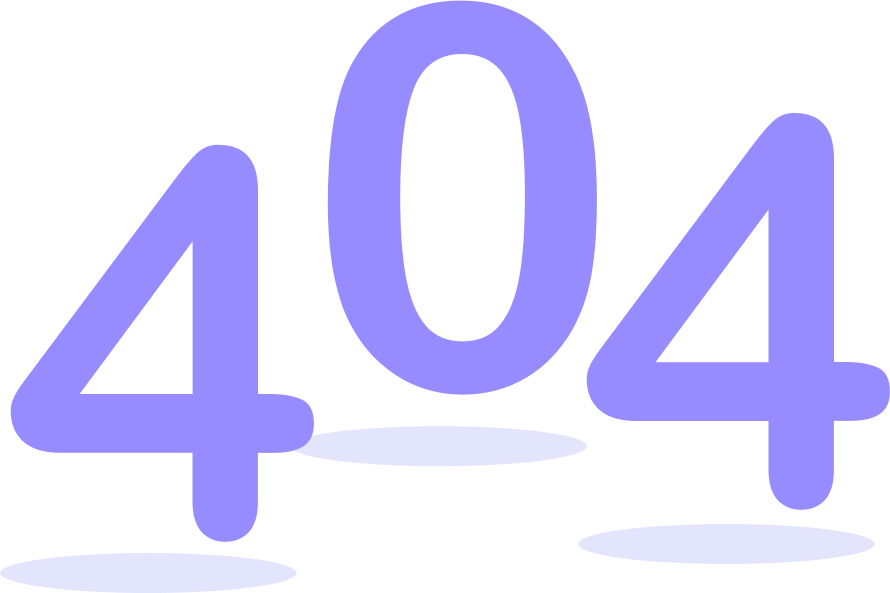
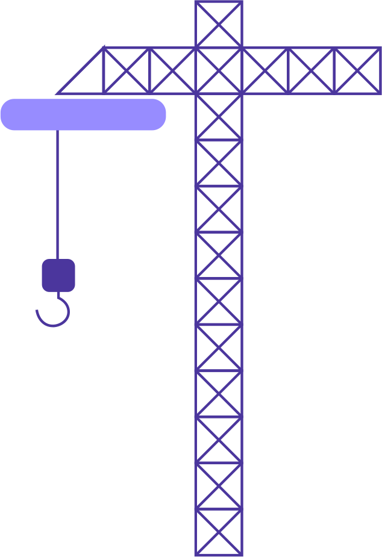
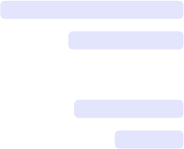
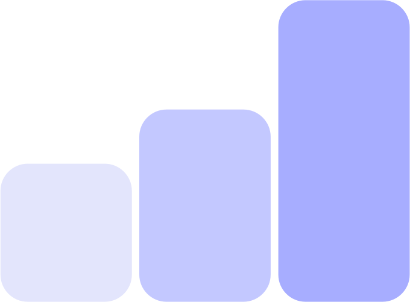
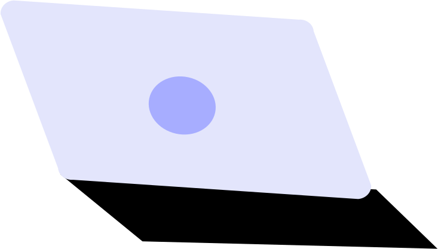
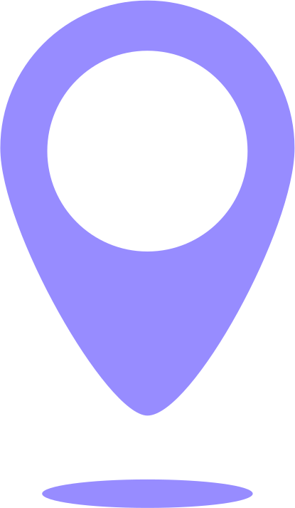
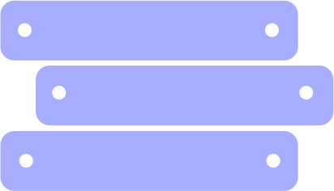
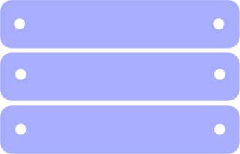

# 🖼️ 素材分類：UI

> [🏠 主目錄](../../../../../README.md) / [images](../../../../README.md) / [iCons](../../../README.md) / [Palse Illustrations](../../README.md) / [Pulse Illustration Kit](../README.md) / **UI**

本目錄共有 `43` 個檔案

| 🎨 預覽 (點擊放大)  | 📋 檔案詳細資訊與連結 |
| :--- | :--- |
|  | **📂 檔名:** `404_Error.svg` ✨ **格式:** `Vector (SVG)` ⚖️ **大小:** `3.33KB` 📅 **更新:** `2026-03-04`  🚀 **jsDelivr Markdown:** `` 🔗 **直接連結 (Url):** <code>https://cdn.jsdelivr.net/gh/barry028/materials@main/images/iCons/Palse%20Illustrations/Pulse%20Illustration%20Kit/UI/404_Error.svg</code> 📥 [檢視原始檔](404_Error.svg) |
|  | **📂 檔名:** `Brush.svg` ✨ **格式:** `Vector (SVG)` ⚖️ **大小:** `880.00B` 📅 **更新:** `2026-03-04`  🚀 **jsDelivr Markdown:** `` 🔗 **直接連結 (Url):** <code>https://cdn.jsdelivr.net/gh/barry028/materials@main/images/iCons/Palse%20Illustrations/Pulse%20Illustration%20Kit/UI/Brush.svg</code> 📥 [檢視原始檔](Brush.svg) |
|  | **📂 檔名:** `Button_1.svg` ✨ **格式:** `Vector (SVG)` ⚖️ **大小:** `1.32KB` 📅 **更新:** `2026-03-04`  🚀 **jsDelivr Markdown:** `` 🔗 **直接連結 (Url):** <code>https://cdn.jsdelivr.net/gh/barry028/materials@main/images/iCons/Palse%20Illustrations/Pulse%20Illustration%20Kit/UI/Button_1.svg</code> 📥 [檢視原始檔](Button_1.svg) |
|  | **📂 檔名:** `Button_2.svg` ✨ **格式:** `Vector (SVG)` ⚖️ **大小:** `970.00B` 📅 **更新:** `2026-03-04`  🚀 **jsDelivr Markdown:** `` 🔗 **直接連結 (Url):** <code>https://cdn.jsdelivr.net/gh/barry028/materials@main/images/iCons/Palse%20Illustrations/Pulse%20Illustration%20Kit/UI/Button_2.svg</code> 📥 [檢視原始檔](Button_2.svg) |
|  | **📂 檔名:** `Button_3.svg` ✨ **格式:** `Vector (SVG)` ⚖️ **大小:** `1.36KB` 📅 **更新:** `2026-03-04`  🚀 **jsDelivr Markdown:** `` 🔗 **直接連結 (Url):** <code>https://cdn.jsdelivr.net/gh/barry028/materials@main/images/iCons/Palse%20Illustrations/Pulse%20Illustration%20Kit/UI/Button_3.svg</code> 📥 [檢視原始檔](Button_3.svg) |
|  | **📂 檔名:** `Button_4.svg` ✨ **格式:** `Vector (SVG)` ⚖️ **大小:** `773.00B` 📅 **更新:** `2026-03-04`  🚀 **jsDelivr Markdown:** `` 🔗 **直接連結 (Url):** <code>https://cdn.jsdelivr.net/gh/barry028/materials@main/images/iCons/Palse%20Illustrations/Pulse%20Illustration%20Kit/UI/Button_4.svg</code> 📥 [檢視原始檔](Button_4.svg) |
|  | **📂 檔名:** `Button_5.svg` ✨ **格式:** `Vector (SVG)` ⚖️ **大小:** `1.97KB` 📅 **更新:** `2026-03-04`  🚀 **jsDelivr Markdown:** `` 🔗 **直接連結 (Url):** <code>https://cdn.jsdelivr.net/gh/barry028/materials@main/images/iCons/Palse%20Illustrations/Pulse%20Illustration%20Kit/UI/Button_5.svg</code> 📥 [檢視原始檔](Button_5.svg) |
|  | **📂 檔名:** `Button_6.svg` ✨ **格式:** `Vector (SVG)` ⚖️ **大小:** `863.00B` 📅 **更新:** `2026-03-04`  🚀 **jsDelivr Markdown:** `` 🔗 **直接連結 (Url):** <code>https://cdn.jsdelivr.net/gh/barry028/materials@main/images/iCons/Palse%20Illustrations/Pulse%20Illustration%20Kit/UI/Button_6.svg</code> 📥 [檢視原始檔](Button_6.svg) |
|  | **📂 檔名:** `Button_7.svg` ✨ **格式:** `Vector (SVG)` ⚖️ **大小:** `1.13KB` 📅 **更新:** `2026-03-04`  🚀 **jsDelivr Markdown:** `` 🔗 **直接連結 (Url):** <code>https://cdn.jsdelivr.net/gh/barry028/materials@main/images/iCons/Palse%20Illustrations/Pulse%20Illustration%20Kit/UI/Button_7.svg</code> 📥 [檢視原始檔](Button_7.svg) |
|  | **📂 檔名:** `Button_8.svg` ✨ **格式:** `Vector (SVG)` ⚖️ **大小:** `2.03KB` 📅 **更新:** `2026-03-04`  🚀 **jsDelivr Markdown:** `` 🔗 **直接連結 (Url):** <code>https://cdn.jsdelivr.net/gh/barry028/materials@main/images/iCons/Palse%20Illustrations/Pulse%20Illustration%20Kit/UI/Button_8.svg</code> 📥 [檢視原始檔](Button_8.svg) |
|  | **📂 檔名:** `Button_9.svg` ✨ **格式:** `Vector (SVG)` ⚖️ **大小:** `1006.00B` 📅 **更新:** `2026-03-04`  🚀 **jsDelivr Markdown:** `` 🔗 **直接連結 (Url):** <code>https://cdn.jsdelivr.net/gh/barry028/materials@main/images/iCons/Palse%20Illustrations/Pulse%20Illustration%20Kit/UI/Button_9.svg</code> 📥 [檢視原始檔](Button_9.svg) |
|  | **📂 檔名:** `Calendar.svg` ✨ **格式:** `Vector (SVG)` ⚖️ **大小:** `13.07KB` 📅 **更新:** `2026-03-04`  🚀 **jsDelivr Markdown:** `` 🔗 **直接連結 (Url):** <code>https://cdn.jsdelivr.net/gh/barry028/materials@main/images/iCons/Palse%20Illustrations/Pulse%20Illustration%20Kit/UI/Calendar.svg</code> 📥 [檢視原始檔](Calendar.svg) |
|  | **📂 檔名:** `Cards.svg` ✨ **格式:** `Vector (SVG)` ⚖️ **大小:** `2.55KB` 📅 **更新:** `2026-03-04`  🚀 **jsDelivr Markdown:** `` 🔗 **直接連結 (Url):** <code>https://cdn.jsdelivr.net/gh/barry028/materials@main/images/iCons/Palse%20Illustrations/Pulse%20Illustration%20Kit/UI/Cards.svg</code> 📥 [檢視原始檔](Cards.svg) |
|  | **📂 檔名:** `Cash.svg` ✨ **格式:** `Vector (SVG)` ⚖️ **大小:** `1.11KB` 📅 **更新:** `2026-03-04`  🚀 **jsDelivr Markdown:** `` 🔗 **直接連結 (Url):** <code>https://cdn.jsdelivr.net/gh/barry028/materials@main/images/iCons/Palse%20Illustrations/Pulse%20Illustration%20Kit/UI/Cash.svg</code> 📥 [檢視原始檔](Cash.svg) |
|  | **📂 檔名:** `Chart.svg` ✨ **格式:** `Vector (SVG)` ⚖️ **大小:** `1.67KB` 📅 **更新:** `2026-03-04`  🚀 **jsDelivr Markdown:** `` 🔗 **直接連結 (Url):** <code>https://cdn.jsdelivr.net/gh/barry028/materials@main/images/iCons/Palse%20Illustrations/Pulse%20Illustration%20Kit/UI/Chart.svg</code> 📥 [檢視原始檔](Chart.svg) |
|  | **📂 檔名:** `Chat_1.svg` ✨ **格式:** `Vector (SVG)` ⚖️ **大小:** `7.69KB` 📅 **更新:** `2026-03-04`  🚀 **jsDelivr Markdown:** `` 🔗 **直接連結 (Url):** <code>https://cdn.jsdelivr.net/gh/barry028/materials@main/images/iCons/Palse%20Illustrations/Pulse%20Illustration%20Kit/UI/Chat_1.svg</code> 📥 [檢視原始檔](Chat_1.svg) |
|  | **📂 檔名:** `Chat_2.svg` ✨ **格式:** `Vector (SVG)` ⚖️ **大小:** `925.00B` 📅 **更新:** `2026-03-04`  🚀 **jsDelivr Markdown:** `` 🔗 **直接連結 (Url):** <code>https://cdn.jsdelivr.net/gh/barry028/materials@main/images/iCons/Palse%20Illustrations/Pulse%20Illustration%20Kit/UI/Chat_2.svg</code> 📥 [檢視原始檔](Chat_2.svg) |
|  | **📂 檔名:** `Computer.svg` ✨ **格式:** `Vector (SVG)` ⚖️ **大小:** `1.36KB` 📅 **更新:** `2026-03-04`  🚀 **jsDelivr Markdown:** `` 🔗 **直接連結 (Url):** <code>https://cdn.jsdelivr.net/gh/barry028/materials@main/images/iCons/Palse%20Illustrations/Pulse%20Illustration%20Kit/UI/Computer.svg</code> 📥 [檢視原始檔](Computer.svg) |
|  | **📂 檔名:** `Crane.svg` ✨ **格式:** `Vector (SVG)` ⚖️ **大小:** `7.52KB` 📅 **更新:** `2026-03-04`  🚀 **jsDelivr Markdown:** `` 🔗 **直接連結 (Url):** <code>https://cdn.jsdelivr.net/gh/barry028/materials@main/images/iCons/Palse%20Illustrations/Pulse%20Illustration%20Kit/UI/Crane.svg</code> 📥 [檢視原始檔](Crane.svg) |
|  | **📂 檔名:** `Desktop.svg` ✨ **格式:** `Vector (SVG)` ⚖️ **大小:** `5.04KB` 📅 **更新:** `2026-03-04`  🚀 **jsDelivr Markdown:** `` 🔗 **直接連結 (Url):** <code>https://cdn.jsdelivr.net/gh/barry028/materials@main/images/iCons/Palse%20Illustrations/Pulse%20Illustration%20Kit/UI/Desktop.svg</code> 📥 [檢視原始檔](Desktop.svg) |
|  | **📂 檔名:** `E-commerce_Mobile.svg` ✨ **格式:** `Vector (SVG)` ⚖️ **大小:** `4.17KB` 📅 **更新:** `2026-03-04`  🚀 **jsDelivr Markdown:** `` 🔗 **直接連結 (Url):** <code>https://cdn.jsdelivr.net/gh/barry028/materials@main/images/iCons/Palse%20Illustrations/Pulse%20Illustration%20Kit/UI/E-commerce_Mobile.svg</code> 📥 [檢視原始檔](E-commerce_Mobile.svg) |
|  | **📂 檔名:** `Element_1.svg` ✨ **格式:** `Vector (SVG)` ⚖️ **大小:** `938.00B` 📅 **更新:** `2026-03-04`  🚀 **jsDelivr Markdown:** `` 🔗 **直接連結 (Url):** <code>https://cdn.jsdelivr.net/gh/barry028/materials@main/images/iCons/Palse%20Illustrations/Pulse%20Illustration%20Kit/UI/Element_1.svg</code> 📥 [檢視原始檔](Element_1.svg) |
|  | **📂 檔名:** `Element_2.svg` ✨ **格式:** `Vector (SVG)` ⚖️ **大小:** `819.00B` 📅 **更新:** `2026-03-04`  🚀 **jsDelivr Markdown:** `` 🔗 **直接連結 (Url):** <code>https://cdn.jsdelivr.net/gh/barry028/materials@main/images/iCons/Palse%20Illustrations/Pulse%20Illustration%20Kit/UI/Element_2.svg</code> 📥 [檢視原始檔](Element_2.svg) |
|  | **📂 檔名:** `Growth.svg` ✨ **格式:** `Vector (SVG)` ⚖️ **大小:** `759.00B` 📅 **更新:** `2026-03-04`  🚀 **jsDelivr Markdown:** `` 🔗 **直接連結 (Url):** <code>https://cdn.jsdelivr.net/gh/barry028/materials@main/images/iCons/Palse%20Illustrations/Pulse%20Illustration%20Kit/UI/Growth.svg</code> 📥 [檢視原始檔](Growth.svg) |
|  | **📂 檔名:** `Infographic_Desktop.svg` ✨ **格式:** `Vector (SVG)` ⚖️ **大小:** `8.37KB` 📅 **更新:** `2026-03-04`  🚀 **jsDelivr Markdown:** `` 🔗 **直接連結 (Url):** <code>https://cdn.jsdelivr.net/gh/barry028/materials@main/images/iCons/Palse%20Illustrations/Pulse%20Illustration%20Kit/UI/Infographic_Desktop.svg</code> 📥 [檢視原始檔](Infographic_Desktop.svg) |
|  | **📂 檔名:** `Laptop_1.svg` ✨ **格式:** `Vector (SVG)` ⚖️ **大小:** `669.00B` 📅 **更新:** `2026-03-04`  🚀 **jsDelivr Markdown:** `` 🔗 **直接連結 (Url):** <code>https://cdn.jsdelivr.net/gh/barry028/materials@main/images/iCons/Palse%20Illustrations/Pulse%20Illustration%20Kit/UI/Laptop_1.svg</code> 📥 [檢視原始檔](Laptop_1.svg) |
|  | **📂 檔名:** `Laptop_2.svg` ✨ **格式:** `Vector (SVG)` ⚖️ **大小:** `571.00B` 📅 **更新:** `2026-03-04`  🚀 **jsDelivr Markdown:** `` 🔗 **直接連結 (Url):** <code>https://cdn.jsdelivr.net/gh/barry028/materials@main/images/iCons/Palse%20Illustrations/Pulse%20Illustration%20Kit/UI/Laptop_2.svg</code> 📥 [檢視原始檔](Laptop_2.svg) |
|  | **📂 檔名:** `Laptop_4_.svg` ✨ **格式:** `Vector (SVG)` ⚖️ **大小:** `5.05KB` 📅 **更新:** `2026-03-04`  🚀 **jsDelivr Markdown:** `` 🔗 **直接連結 (Url):** <code>https://cdn.jsdelivr.net/gh/barry028/materials@main/images/iCons/Palse%20Illustrations/Pulse%20Illustration%20Kit/UI/Laptop_4_.svg</code> 📥 [檢視原始檔](Laptop_4_.svg) |
|  | **📂 檔名:** `Line.svg` ✨ **格式:** `Vector (SVG)` ⚖️ **大小:** `9.35KB` 📅 **更新:** `2026-03-04`  🚀 **jsDelivr Markdown:** `` 🔗 **直接連結 (Url):** <code>https://cdn.jsdelivr.net/gh/barry028/materials@main/images/iCons/Palse%20Illustrations/Pulse%20Illustration%20Kit/UI/Line.svg</code> 📥 [檢視原始檔](Line.svg) |
|  | **📂 檔名:** `Location.svg` ✨ **格式:** `Vector (SVG)` ⚖️ **大小:** `709.00B` 📅 **更新:** `2026-03-04`  🚀 **jsDelivr Markdown:** `` 🔗 **直接連結 (Url):** <code>https://cdn.jsdelivr.net/gh/barry028/materials@main/images/iCons/Palse%20Illustrations/Pulse%20Illustration%20Kit/UI/Location.svg</code> 📥 [檢視原始檔](Location.svg) |
|  | **📂 檔名:** `Mobile.svg` ✨ **格式:** `Vector (SVG)` ⚖️ **大小:** `1.84KB` 📅 **更新:** `2026-03-04`  🚀 **jsDelivr Markdown:** `` 🔗 **直接連結 (Url):** <code>https://cdn.jsdelivr.net/gh/barry028/materials@main/images/iCons/Palse%20Illustrations/Pulse%20Illustration%20Kit/UI/Mobile.svg</code> 📥 [檢視原始檔](Mobile.svg) |
|  | **📂 檔名:** `Paint.svg` ✨ **格式:** `Vector (SVG)` ⚖️ **大小:** `757.00B` 📅 **更新:** `2026-03-04`  🚀 **jsDelivr Markdown:** `` 🔗 **直接連結 (Url):** <code>https://cdn.jsdelivr.net/gh/barry028/materials@main/images/iCons/Palse%20Illustrations/Pulse%20Illustration%20Kit/UI/Paint.svg</code> 📥 [檢視原始檔](Paint.svg) |
|  | **📂 檔名:** `Phone_1.svg` ✨ **格式:** `Vector (SVG)` ⚖️ **大小:** `3.22KB` 📅 **更新:** `2026-03-04`  🚀 **jsDelivr Markdown:** `` 🔗 **直接連結 (Url):** <code>https://cdn.jsdelivr.net/gh/barry028/materials@main/images/iCons/Palse%20Illustrations/Pulse%20Illustration%20Kit/UI/Phone_1.svg</code> 📥 [檢視原始檔](Phone_1.svg) |
|  | **📂 檔名:** `Phone_2.svg` ✨ **格式:** `Vector (SVG)` ⚖️ **大小:** `1.34KB` 📅 **更新:** `2026-03-04`  🚀 **jsDelivr Markdown:** `` 🔗 **直接連結 (Url):** <code>https://cdn.jsdelivr.net/gh/barry028/materials@main/images/iCons/Palse%20Illustrations/Pulse%20Illustration%20Kit/UI/Phone_2.svg</code> 📥 [檢視原始檔](Phone_2.svg) |
|  | **📂 檔名:** `Rocket.svg` ✨ **格式:** `Vector (SVG)` ⚖️ **大小:** `2.68KB` 📅 **更新:** `2026-03-04`  🚀 **jsDelivr Markdown:** `` 🔗 **直接連結 (Url):** <code>https://cdn.jsdelivr.net/gh/barry028/materials@main/images/iCons/Palse%20Illustrations/Pulse%20Illustration%20Kit/UI/Rocket.svg</code> 📥 [檢視原始檔](Rocket.svg) |
|  | **📂 檔名:** `Server_1.svg` ✨ **格式:** `Vector (SVG)` ⚖️ **大小:** `1.83KB` 📅 **更新:** `2026-03-04`  🚀 **jsDelivr Markdown:** `` 🔗 **直接連結 (Url):** <code>https://cdn.jsdelivr.net/gh/barry028/materials@main/images/iCons/Palse%20Illustrations/Pulse%20Illustration%20Kit/UI/Server_1.svg</code> 📥 [檢視原始檔](Server_1.svg) |
|  | **📂 檔名:** `Server_2.svg` ✨ **格式:** `Vector (SVG)` ⚖️ **大小:** `1.95KB` 📅 **更新:** `2026-03-04`  🚀 **jsDelivr Markdown:** `` 🔗 **直接連結 (Url):** <code>https://cdn.jsdelivr.net/gh/barry028/materials@main/images/iCons/Palse%20Illustrations/Pulse%20Illustration%20Kit/UI/Server_2.svg</code> 📥 [檢視原始檔](Server_2.svg) |
|  | **📂 檔名:** `Shopping_Cart.svg` ✨ **格式:** `Vector (SVG)` ⚖️ **大小:** `4.19KB` 📅 **更新:** `2026-03-04`  🚀 **jsDelivr Markdown:** `` 🔗 **直接連結 (Url):** <code>https://cdn.jsdelivr.net/gh/barry028/materials@main/images/iCons/Palse%20Illustrations/Pulse%20Illustration%20Kit/UI/Shopping_Cart.svg</code> 📥 [檢視原始檔](Shopping_Cart.svg) |
|  | **📂 檔名:** `Shopping_bag.svg` ✨ **格式:** `Vector (SVG)` ⚖️ **大小:** `841.00B` 📅 **更新:** `2026-03-04`  🚀 **jsDelivr Markdown:** `` 🔗 **直接連結 (Url):** <code>https://cdn.jsdelivr.net/gh/barry028/materials@main/images/iCons/Palse%20Illustrations/Pulse%20Illustration%20Kit/UI/Shopping_bag.svg</code> 📥 [檢視原始檔](Shopping_bag.svg) |
|  | **📂 檔名:** `Tablet_1.svg` ✨ **格式:** `Vector (SVG)` ⚖️ **大小:** `1.33KB` 📅 **更新:** `2026-03-04`  🚀 **jsDelivr Markdown:** `` 🔗 **直接連結 (Url):** <code>https://cdn.jsdelivr.net/gh/barry028/materials@main/images/iCons/Palse%20Illustrations/Pulse%20Illustration%20Kit/UI/Tablet_1.svg</code> 📥 [檢視原始檔](Tablet_1.svg) |
|  | **📂 檔名:** `Tablet_2.svg` ✨ **格式:** `Vector (SVG)` ⚖️ **大小:** `3.05KB` 📅 **更新:** `2026-03-04`  🚀 **jsDelivr Markdown:** `` 🔗 **直接連結 (Url):** <code>https://cdn.jsdelivr.net/gh/barry028/materials@main/images/iCons/Palse%20Illustrations/Pulse%20Illustration%20Kit/UI/Tablet_2.svg</code> 📥 [檢視原始檔](Tablet_2.svg) |
|  | **📂 檔名:** `Tabs.svg` ✨ **格式:** `Vector (SVG)` ⚖️ **大小:** `4.86KB` 📅 **更新:** `2026-03-04`  🚀 **jsDelivr Markdown:** `` 🔗 **直接連結 (Url):** <code>https://cdn.jsdelivr.net/gh/barry028/materials@main/images/iCons/Palse%20Illustrations/Pulse%20Illustration%20Kit/UI/Tabs.svg</code> 📥 [檢視原始檔](Tabs.svg) |
|  | **📂 檔名:** `Wifi.svg` ✨ **格式:** `Vector (SVG)` ⚖️ **大小:** `519.00B` 📅 **更新:** `2026-03-04`  🚀 **jsDelivr Markdown:** `` 🔗 **直接連結 (Url):** <code>https://cdn.jsdelivr.net/gh/barry028/materials@main/images/iCons/Palse%20Illustrations/Pulse%20Illustration%20Kit/UI/Wifi.svg</code> 📥 [檢視原始檔](Wifi.svg) |