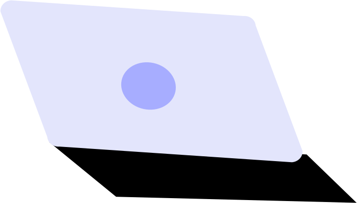

# 🖼️ UI 素材庫

[⬅️ 返回主目錄](../../../../../README.md)

| 預覽 (點擊放大) | 檔案資訊 |
| :--- | :--- |
|  | **404_Error.svg** Vector (SVG) | 3.33KB |
|  | **Brush.svg** Vector (SVG) | 880.00B |
|  | **Button_1.svg** Vector (SVG) | 1.32KB |
|  | **Button_2.svg** Vector (SVG) | 970.00B |
|  | **Button_3.svg** Vector (SVG) | 1.36KB |
|  | **Button_4.svg** Vector (SVG) | 773.00B |
|  | **Button_5.svg** Vector (SVG) | 1.97KB |
|  | **Button_6.svg** Vector (SVG) | 863.00B |
|  | **Button_7.svg** Vector (SVG) | 1.13KB |
|  | **Button_8.svg** Vector (SVG) | 2.03KB |
|  | **Button_9.svg** Vector (SVG) | 1006.00B |
|  | **Calendar.svg** Vector (SVG) | 13.07KB |
|  | **Cards.svg** Vector (SVG) | 2.55KB |
|  | **Cash.svg** Vector (SVG) | 1.11KB |
|  | **Chart.svg** Vector (SVG) | 1.67KB |
|  | **Chat_1.svg** Vector (SVG) | 7.69KB |
|  | **Chat_2.svg** Vector (SVG) | 925.00B |
|  | **Computer.svg** Vector (SVG) | 1.36KB |
|  | **Crane.svg** Vector (SVG) | 7.52KB |
|  | **Desktop.svg** Vector (SVG) | 5.04KB |
|  | **E-commerce_Mobile.svg** Vector (SVG) | 4.17KB |
|  | **Element_1.svg** Vector (SVG) | 938.00B |
|  | **Element_2.svg** Vector (SVG) | 819.00B |
|  | **Growth.svg** Vector (SVG) | 759.00B |
|  | **Infographic_Desktop.svg** Vector (SVG) | 8.37KB |
|  | **Laptop_1.svg** Vector (SVG) | 669.00B |
|  | **Laptop_2.svg** Vector (SVG) | 571.00B |
|  | **Laptop_4_.svg** Vector (SVG) | 5.05KB |
|  | **Line.svg** Vector (SVG) | 9.35KB |
|  | **Location.svg** Vector (SVG) | 709.00B |
|  | **Mobile.svg** Vector (SVG) | 1.84KB |
|  | **Paint.svg** Vector (SVG) | 757.00B |
|  | **Phone_1.svg** Vector (SVG) | 3.22KB |
|  | **Phone_2.svg** Vector (SVG) | 1.34KB |
|  | **Rocket.svg** Vector (SVG) | 2.68KB |
|  | **Server_1.svg** Vector (SVG) | 1.83KB |
|  | **Server_2.svg** Vector (SVG) | 1.95KB |
|  | **Shopping_Cart.svg** Vector (SVG) | 4.19KB |
|  | **Shopping_bag.svg** Vector (SVG) | 841.00B |
|  | **Tablet_1.svg** Vector (SVG) | 1.33KB |
|  | **Tablet_2.svg** Vector (SVG) | 3.05KB |
|  | **Tabs.svg** Vector (SVG) | 4.86KB |
|  | **Wifi.svg** Vector (SVG) | 519.00B |