# 🖼️ Payment And Credit Card  素材庫

[⬅️ 返回主目錄](../../README.md)

| 預覽 (點擊放大) | 檔案資訊 |
| :--- | :--- |
|  | **ACH Transfer.svg** Vector (SVG) | 28.71KB |
|  | **Adyen.svg** Vector (SVG) | 22.90KB |
| <a href="Affirm.svg">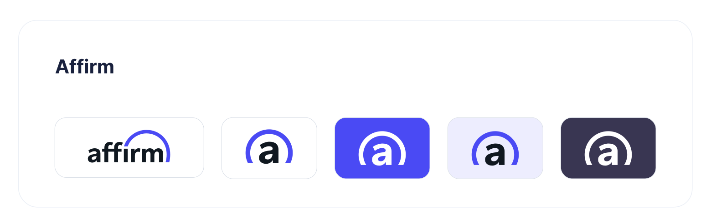</a> | **Affirm.svg** Vector (SVG) | 19.15KB |
| <a href="Airtm.svg">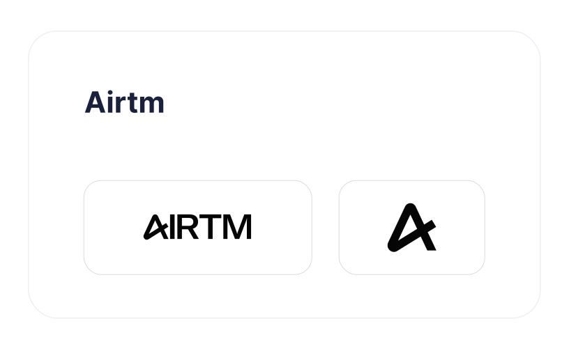</a> | **Airtm.svg** Vector (SVG) | 8.79KB |
|  | **Alipay +.svg** Vector (SVG) | 25.94KB |
|  | **Amazon Pay.svg** Vector (SVG) | 43.82KB |
|  | **American Express.svg** Vector (SVG) | 26.61KB |
|  | **Ant Group.svg** Vector (SVG) | 27.86KB |
|  | **Apple Pay.svg** Vector (SVG) | 28.52KB |
| <a href="Authorize.Net.svg">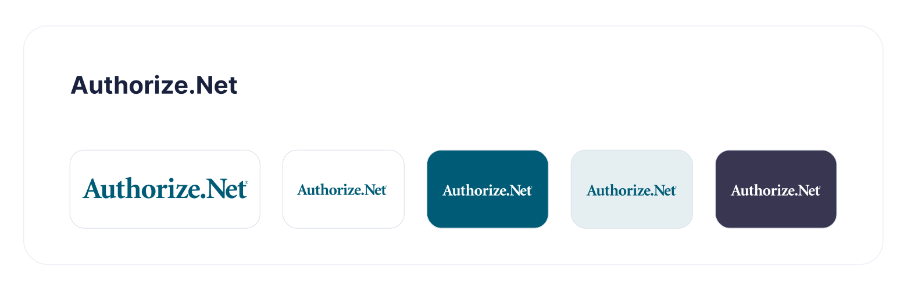</a> | **Authorize.Net.svg** Vector (SVG) | 58.07KB |
| <a href="BBVA.svg">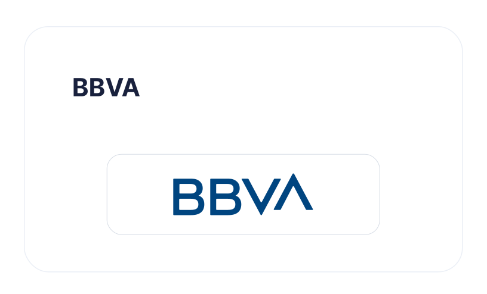</a> | **BBVA.svg** Vector (SVG) | 8.47KB |
|  | **BNB Chain.svg** Vector (SVG) | 23.55KB |
|  | **BNP Paribas.svg** Vector (SVG) | 39.71KB |
|  | **Bank Of America.svg** Vector (SVG) | 18.25KB |
|  | **Barclays.svg** Vector (SVG) | 19.82KB |
|  | **Binance USD.svg** Vector (SVG) | 24.34KB |
| <a href="Binance.svg">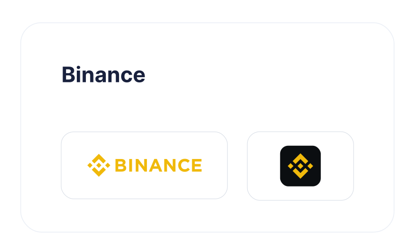</a> | **Binance.svg** Vector (SVG) | 13.29KB |
|  | **Bitcoin.svg** Vector (SVG) | 26.43KB |
| <a href="Bitpay.svg">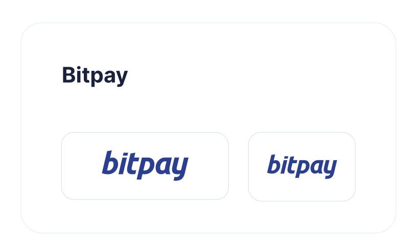</a> | **Bitpay.svg** Vector (SVG) | 20.03KB |
| <a href="Braintree.svg">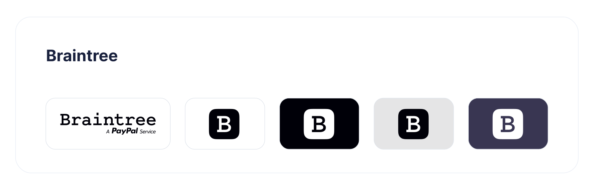</a> | **Braintree.svg** Vector (SVG) | 33.57KB |
| <a href="Brex.svg">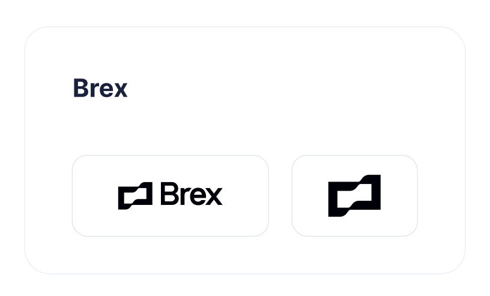</a> | **Brex.svg** Vector (SVG) | 9.37KB |
|  | **Capital One.svg** Vector (SVG) | 20.68KB |
|  | **Cash App.svg** Vector (SVG) | 24.62KB |
| <a href="Chase.svg">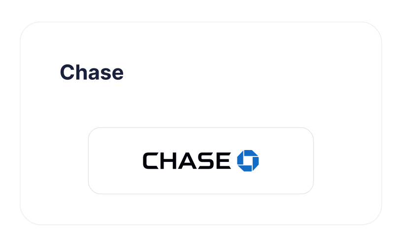</a> | **Chase.svg** Vector (SVG) | 10.68KB |
|  | **Checkout.com.svg** Vector (SVG) | 25.93KB |
| <a href="Chime.svg">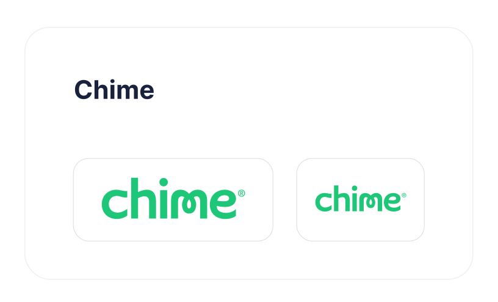</a> | **Chime.svg** Vector (SVG) | 27.33KB |
|  | **China Construction Bank.svg** Vector (SVG) | 59.83KB |
| <a href="Cirrus.svg">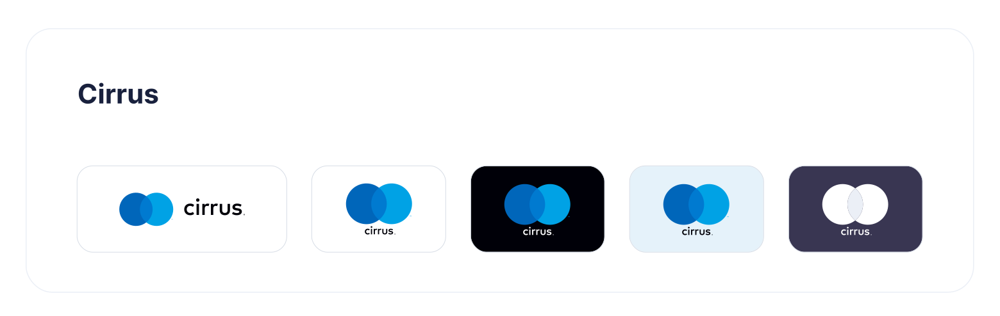</a> | **Cirrus.svg** Vector (SVG) | 46.50KB |
| <a href="Citi.svg">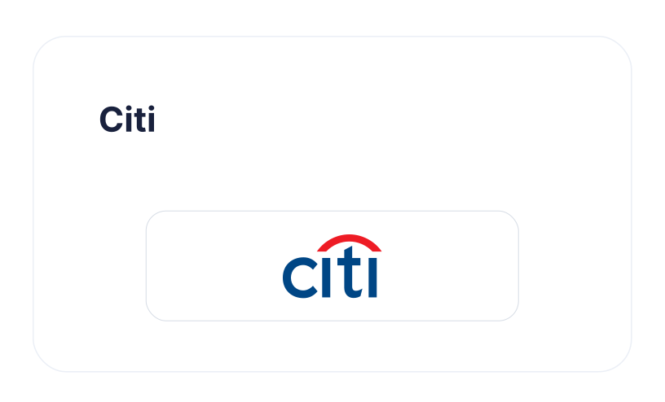</a> | **Citi.svg** Vector (SVG) | 6.87KB |
| <a href="Coinbase.svg">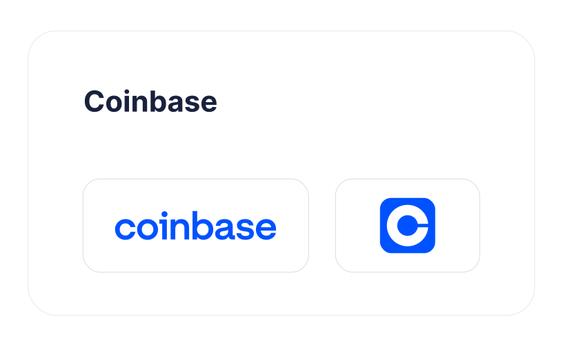</a> | **Coinbase.svg** Vector (SVG) | 16.86KB |
|  | **Crypto.com.svg** Vector (SVG) | 18.44KB |
|  | **Deutsche Bank.svg** Vector (SVG) | 18.92KB |
|  | **Dinners Club.svg** Vector (SVG) | 191.39KB |
|  | **Discover-1.svg** Vector (SVG) | 13.84KB |
|  | **Discover.svg** Vector (SVG) | 37.66KB |
|  | **Elo.svg** Vector (SVG) | 21.95KB |
| <a href="Ethereum.svg">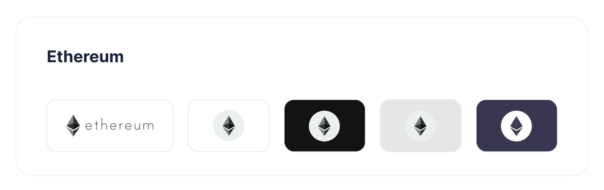</a> | **Ethereum.svg** Vector (SVG) | 36.78KB |
|  | **Fifth Third Bank.svg** Vector (SVG) | 18.74KB |
| <a href="Fiserv..svg">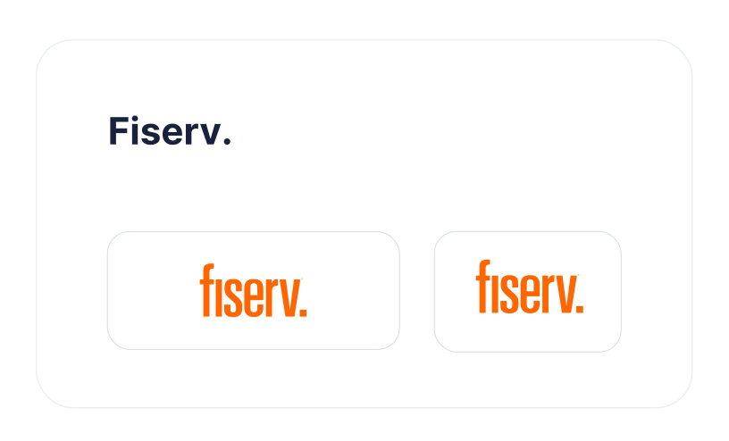</a> | **Fiserv..svg** Vector (SVG) | 13.63KB |
| <a href="Giropay.svg">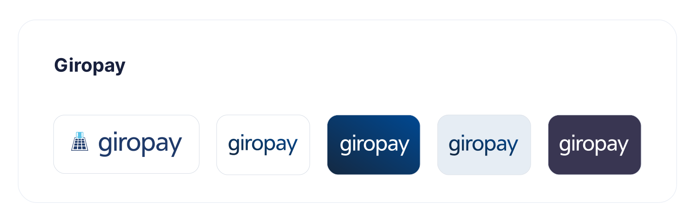</a> | **Giropay.svg** Vector (SVG) | 55.11KB |
|  | **Goldman Sachs.svg** Vector (SVG) | 33.45KB |
|  | **Google Pay.svg** Vector (SVG) | 31.41KB |
| <a href="HSBC.svg">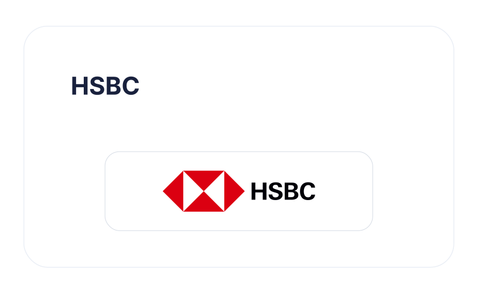</a> | **HSBC.svg** Vector (SVG) | 9.22KB |
|  | **Huntington Bank.svg** Vector (SVG) | 17.79KB |
|  | **ING.svg** Vector (SVG) | 78.59KB |
|  | **Industrial and Commercial Bank of China.svg** Vector (SVG) | 31.91KB |
| <a href="Interac.svg">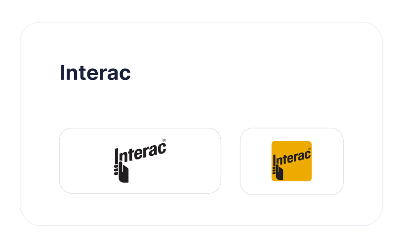</a> | **Interac.svg** Vector (SVG) | 23.87KB |
|  | **Japan Credit Bureau.svg** Vector (SVG) | 28.53KB |
|  | **Klarna.svg** Vector (SVG) | 21.71KB |
| <a href="Kraken.svg">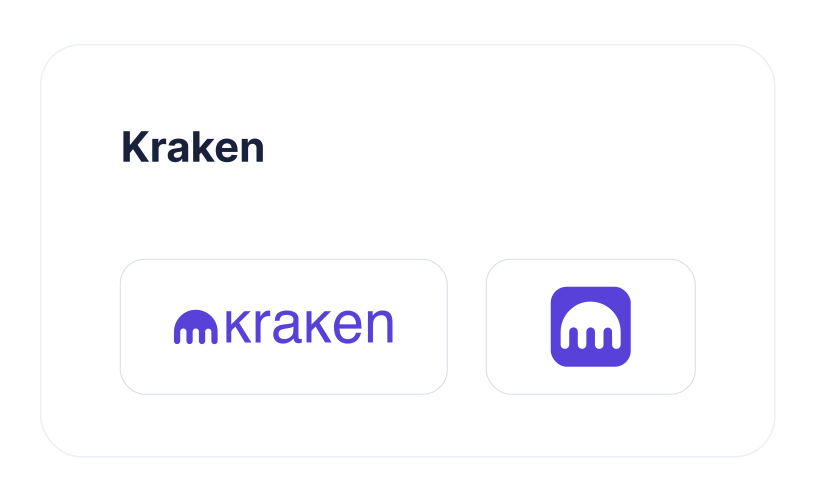</a> | **Kraken.svg** Vector (SVG) | 17.94KB |
|  | **Litecoin.svg** Vector (SVG) | 25.41KB |
|  | **Maestro.svg** Vector (SVG) | 57.26KB |
|  | **Mastercard.svg** Vector (SVG) | 27.77KB |
|  | **Mercado Pago.svg** Vector (SVG) | 87.00KB |
|  | **Mercury.svg** Vector (SVG) | 28.13KB |
|  | **Meta Pay.svg** Vector (SVG) | 38.01KB |
|  | **Mitsubishi UFJ.svg** Vector (SVG) | 12.79KB |
| <a href="NCR.svg">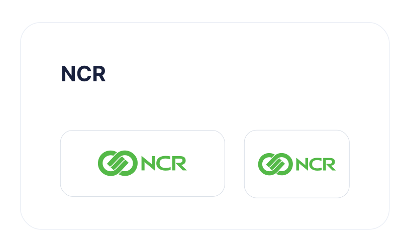</a> | **NCR.svg** Vector (SVG) | 12.55KB |
|  | **NorthOne.svg** Vector (SVG) | 16.80KB |
|  | **PNC Bank.svg** Vector (SVG) | 11.77KB |
|  | **POLi.svg** Vector (SVG) | 32.85KB |
| <a href="PayPal-1.svg">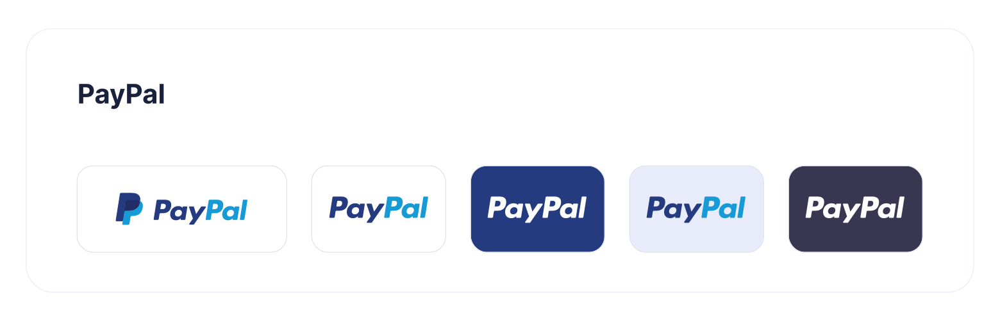</a> | **PayPal-1.svg** Vector (SVG) | 33.69KB |
|  | **PayPal.svg** Vector (SVG) | 33.69KB |
|  | **Payconiq by Bancontact.svg** Vector (SVG) | 52.17KB |
|  | **Payline Data.svg** Vector (SVG) | 77.18KB |
|  | **Payoneer.svg** Vector (SVG) | 35.15KB |
|  | **Paysafe.svg** Vector (SVG) | 32.87KB |
|  | **Revolut.svg** Vector (SVG) | 13.32KB |
| <a href="Ripple.svg">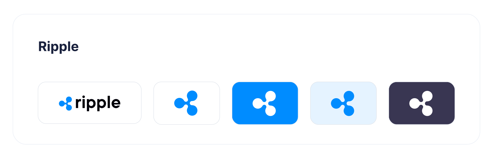</a> | **Ripple.svg** Vector (SVG) | 23.91KB |
| <a href="SEPA.svg">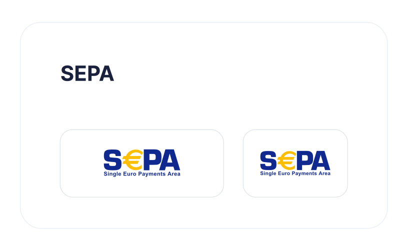</a> | **SEPA.svg** Vector (SVG) | 47.50KB |
| <a href="SWIFT.svg">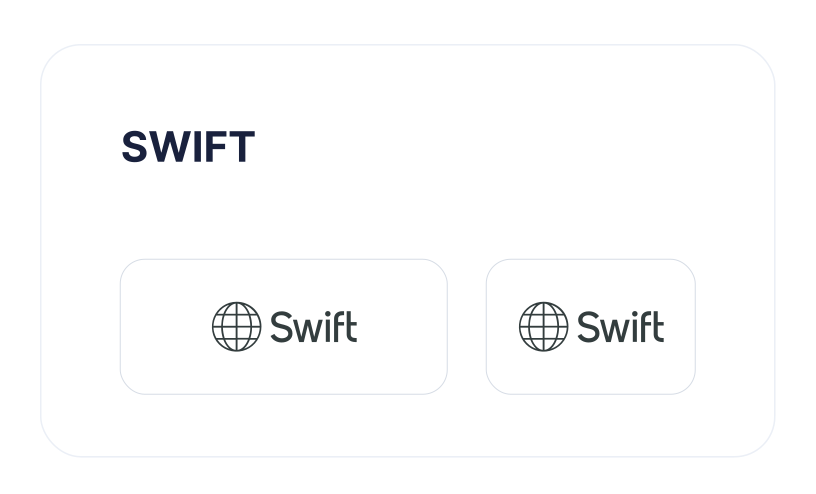</a> | **SWIFT.svg** Vector (SVG) | 13.21KB |
|  | **Samsung Pay.svg** Vector (SVG) | 40.27KB |
|  | **Santander.svg** Vector (SVG) | 17.10KB |
|  | **Section-1.svg** Vector (SVG) | 17.81KB |
|  | **Section-2.svg** Vector (SVG) | 16.49KB |
|  | **Section-3.svg** Vector (SVG) | 11.40KB |
|  | **Section-4.svg** Vector (SVG) | 18.54KB |
|  | **Section-5.svg** Vector (SVG) | 4.70KB |
|  | **Section-6.svg** Vector (SVG) | 5.17KB |
|  | **Section-7.svg** Vector (SVG) | 12.47KB |
|  | **Section-8.svg** Vector (SVG) | 14.86KB |
|  | **Section.svg** Vector (SVG) | 14.62KB |
|  | **Shop Pay.svg** Vector (SVG) | 44.54KB |
| <a href="Skrill.svg">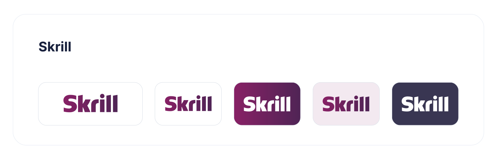</a> | **Skrill.svg** Vector (SVG) | 20.42KB |
| <a href="Sofort.svg">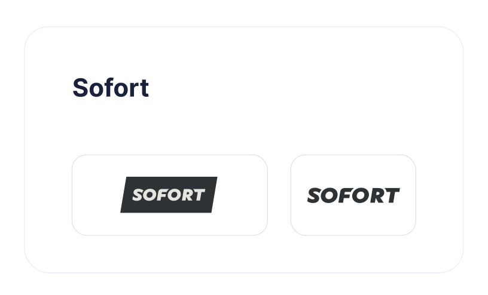</a> | **Sofort.svg** Vector (SVG) | 14.47KB |
|  | **Solana.svg** Vector (SVG) | 30.87KB |
| <a href="Square.svg">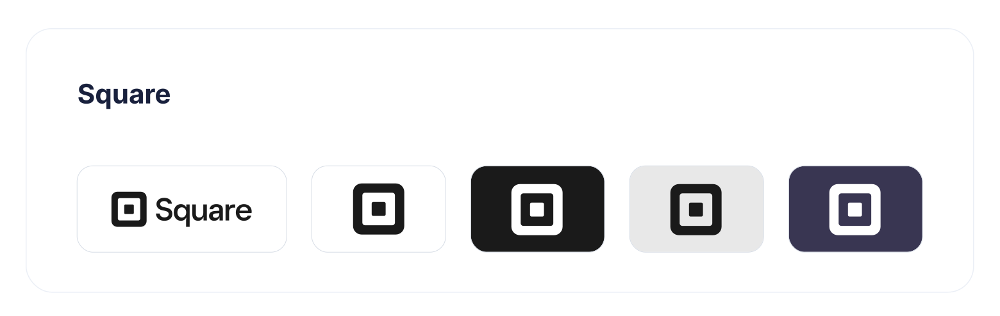</a> | **Square.svg** Vector (SVG) | 20.76KB |
|  | **Stax Payments.svg** Vector (SVG) | 20.44KB |
|  | **Stripe.svg** Vector (SVG) | 25.21KB |
|  | **Sumitomo Mitsui.svg** Vector (SVG) | 19.72KB |
| <a href="Synchrony.svg">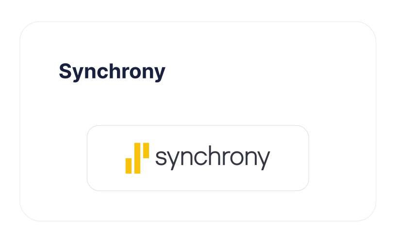</a> | **Synchrony.svg** Vector (SVG) | 12.42KB |
| <a href="Tether.svg">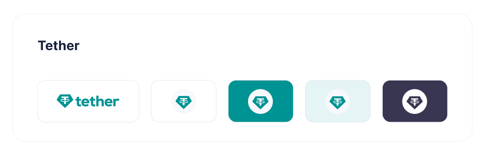</a> | **Tether.svg** Vector (SVG) | 20.87KB |
|  | **TrueUSD.svg** Vector (SVG) | 35.03KB |
|  | **U.S. Bank.svg** Vector (SVG) | 13.97KB |
|  | **UBS.svg** Vector (SVG) | 12.98KB |
|  | **USD Coin.svg** Vector (SVG) | 31.36KB |
|  | **Union Pay.svg** Vector (SVG) | 91.82KB |
| <a href="Venmo.svg">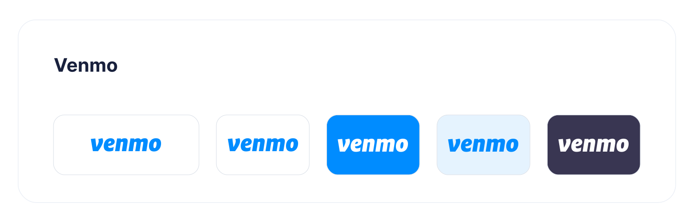</a> | **Venmo.svg** Vector (SVG) | 22.79KB |
|  | **Verifone.svg** Vector (SVG) | 14.70KB |
|  | **Visa.svg** Vector (SVG) | 16.74KB |
|  | **We Chat Pay.svg** Vector (SVG) | 27.10KB |
|  | **Wells Fargo.svg** Vector (SVG) | 16.11KB |
|  | **Wire Transfer.svg** Vector (SVG) | 25.41KB |
|  | **Wise.svg** Vector (SVG) | 10.19KB |
|  | **Wrap.svg** Vector (SVG) | 17.42KB |
|  | **Zelle.svg** Vector (SVG) | 12.00KB |
|  | **nu (Nubank).svg** Vector (SVG) | 13.54KB |