# 🖼️ 素材分類：Payment And Credit Card

> [🏠 主目錄](../../../README.md) / [images](../../README.md) / [iCons](../README.md) / **Payment And Credit Card**

本目錄共有 `107` 個檔案

| 🎨 預覽 (點擊放大)  | 📋 檔案詳細資訊與連結 |
| :--- | :--- |
|  | **📂 檔名:** `ACH Transfer.svg` ✨ **格式:** `Vector (SVG)` ⚖️ **大小:** `28.71KB` 📅 **更新:** `2026-03-04`  🚀 **jsDelivr Markdown:** `` 🔗 **直接連結 (Url):** <code>https://cdn.jsdelivr.net/gh/barry028/materials@main/images/iCons/Payment%20And%20Credit%20Card/ACH%20Transfer.svg</code> 📥 [檢視原始檔](ACH%20Transfer.svg) |
| <a href="Adyen.svg">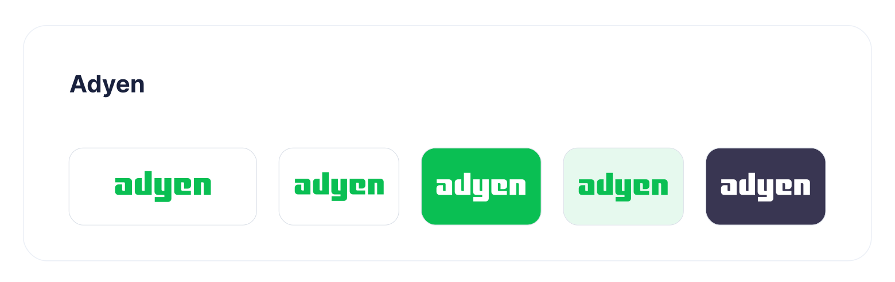</a> | **📂 檔名:** `Adyen.svg` ✨ **格式:** `Vector (SVG)` ⚖️ **大小:** `22.90KB` 📅 **更新:** `2026-03-04`  🚀 **jsDelivr Markdown:** `` 🔗 **直接連結 (Url):** <code>https://cdn.jsdelivr.net/gh/barry028/materials@main/images/iCons/Payment%20And%20Credit%20Card/Adyen.svg</code> 📥 [檢視原始檔](Adyen.svg) |
| <a href="Affirm.svg">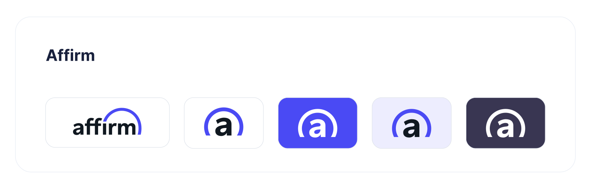</a> | **📂 檔名:** `Affirm.svg` ✨ **格式:** `Vector (SVG)` ⚖️ **大小:** `19.15KB` 📅 **更新:** `2026-03-04`  🚀 **jsDelivr Markdown:** `` 🔗 **直接連結 (Url):** <code>https://cdn.jsdelivr.net/gh/barry028/materials@main/images/iCons/Payment%20And%20Credit%20Card/Affirm.svg</code> 📥 [檢視原始檔](Affirm.svg) |
| <a href="Airtm.svg">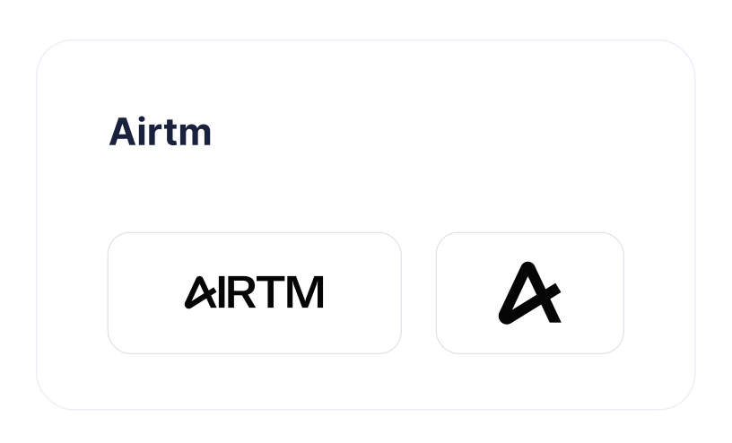</a> | **📂 檔名:** `Airtm.svg` ✨ **格式:** `Vector (SVG)` ⚖️ **大小:** `8.79KB` 📅 **更新:** `2026-03-04`  🚀 **jsDelivr Markdown:** `` 🔗 **直接連結 (Url):** <code>https://cdn.jsdelivr.net/gh/barry028/materials@main/images/iCons/Payment%20And%20Credit%20Card/Airtm.svg</code> 📥 [檢視原始檔](Airtm.svg) |
|  | **📂 檔名:** `Alipay +.svg` ✨ **格式:** `Vector (SVG)` ⚖️ **大小:** `25.94KB` 📅 **更新:** `2026-03-04`  🚀 **jsDelivr Markdown:** `` 🔗 **直接連結 (Url):** <code>https://cdn.jsdelivr.net/gh/barry028/materials@main/images/iCons/Payment%20And%20Credit%20Card/Alipay%20%2B.svg</code> 📥 [檢視原始檔](Alipay%20%2B.svg) |
|  | **📂 檔名:** `Amazon Pay.svg` ✨ **格式:** `Vector (SVG)` ⚖️ **大小:** `43.82KB` 📅 **更新:** `2026-03-04`  🚀 **jsDelivr Markdown:** `` 🔗 **直接連結 (Url):** <code>https://cdn.jsdelivr.net/gh/barry028/materials@main/images/iCons/Payment%20And%20Credit%20Card/Amazon%20Pay.svg</code> 📥 [檢視原始檔](Amazon%20Pay.svg) |
|  | **📂 檔名:** `American Express.svg` ✨ **格式:** `Vector (SVG)` ⚖️ **大小:** `26.61KB` 📅 **更新:** `2026-03-04`  🚀 **jsDelivr Markdown:** `` 🔗 **直接連結 (Url):** <code>https://cdn.jsdelivr.net/gh/barry028/materials@main/images/iCons/Payment%20And%20Credit%20Card/American%20Express.svg</code> 📥 [檢視原始檔](American%20Express.svg) |
|  | **📂 檔名:** `Ant Group.svg` ✨ **格式:** `Vector (SVG)` ⚖️ **大小:** `27.86KB` 📅 **更新:** `2026-03-04`  🚀 **jsDelivr Markdown:** `` 🔗 **直接連結 (Url):** <code>https://cdn.jsdelivr.net/gh/barry028/materials@main/images/iCons/Payment%20And%20Credit%20Card/Ant%20Group.svg</code> 📥 [檢視原始檔](Ant%20Group.svg) |
|  | **📂 檔名:** `Apple Pay.svg` ✨ **格式:** `Vector (SVG)` ⚖️ **大小:** `28.52KB` 📅 **更新:** `2026-03-04`  🚀 **jsDelivr Markdown:** `` 🔗 **直接連結 (Url):** <code>https://cdn.jsdelivr.net/gh/barry028/materials@main/images/iCons/Payment%20And%20Credit%20Card/Apple%20Pay.svg</code> 📥 [檢視原始檔](Apple%20Pay.svg) |
| <a href="Authorize.Net.svg">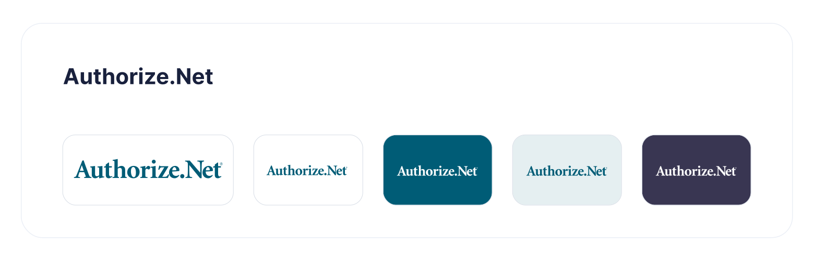</a> | **📂 檔名:** `Authorize.Net.svg` ✨ **格式:** `Vector (SVG)` ⚖️ **大小:** `58.07KB` 📅 **更新:** `2026-03-04`  🚀 **jsDelivr Markdown:** `` 🔗 **直接連結 (Url):** <code>https://cdn.jsdelivr.net/gh/barry028/materials@main/images/iCons/Payment%20And%20Credit%20Card/Authorize.Net.svg</code> 📥 [檢視原始檔](Authorize.Net.svg) |
| <a href="BBVA.svg">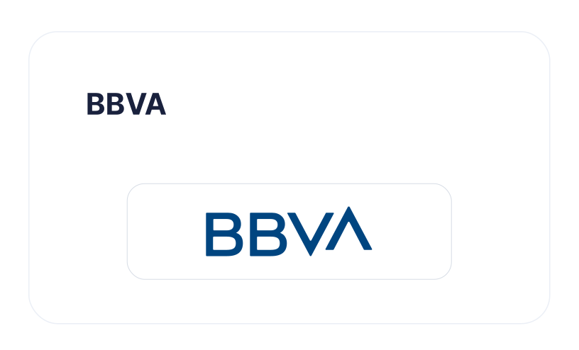</a> | **📂 檔名:** `BBVA.svg` ✨ **格式:** `Vector (SVG)` ⚖️ **大小:** `8.47KB` 📅 **更新:** `2026-03-04`  🚀 **jsDelivr Markdown:** `` 🔗 **直接連結 (Url):** <code>https://cdn.jsdelivr.net/gh/barry028/materials@main/images/iCons/Payment%20And%20Credit%20Card/BBVA.svg</code> 📥 [檢視原始檔](BBVA.svg) |
|  | **📂 檔名:** `BNB Chain.svg` ✨ **格式:** `Vector (SVG)` ⚖️ **大小:** `23.55KB` 📅 **更新:** `2026-03-04`  🚀 **jsDelivr Markdown:** `` 🔗 **直接連結 (Url):** <code>https://cdn.jsdelivr.net/gh/barry028/materials@main/images/iCons/Payment%20And%20Credit%20Card/BNB%20Chain.svg</code> 📥 [檢視原始檔](BNB%20Chain.svg) |
|  | **📂 檔名:** `BNP Paribas.svg` ✨ **格式:** `Vector (SVG)` ⚖️ **大小:** `39.71KB` 📅 **更新:** `2026-03-04`  🚀 **jsDelivr Markdown:** `` 🔗 **直接連結 (Url):** <code>https://cdn.jsdelivr.net/gh/barry028/materials@main/images/iCons/Payment%20And%20Credit%20Card/BNP%20Paribas.svg</code> 📥 [檢視原始檔](BNP%20Paribas.svg) |
|  | **📂 檔名:** `Bank Of America.svg` ✨ **格式:** `Vector (SVG)` ⚖️ **大小:** `18.25KB` 📅 **更新:** `2026-03-04`  🚀 **jsDelivr Markdown:** `` 🔗 **直接連結 (Url):** <code>https://cdn.jsdelivr.net/gh/barry028/materials@main/images/iCons/Payment%20And%20Credit%20Card/Bank%20Of%20America.svg</code> 📥 [檢視原始檔](Bank%20Of%20America.svg) |
|  | **📂 檔名:** `Barclays.svg` ✨ **格式:** `Vector (SVG)` ⚖️ **大小:** `19.82KB` 📅 **更新:** `2026-03-04`  🚀 **jsDelivr Markdown:** `` 🔗 **直接連結 (Url):** <code>https://cdn.jsdelivr.net/gh/barry028/materials@main/images/iCons/Payment%20And%20Credit%20Card/Barclays.svg</code> 📥 [檢視原始檔](Barclays.svg) |
|  | **📂 檔名:** `Binance USD.svg` ✨ **格式:** `Vector (SVG)` ⚖️ **大小:** `24.34KB` 📅 **更新:** `2026-03-04`  🚀 **jsDelivr Markdown:** `` 🔗 **直接連結 (Url):** <code>https://cdn.jsdelivr.net/gh/barry028/materials@main/images/iCons/Payment%20And%20Credit%20Card/Binance%20USD.svg</code> 📥 [檢視原始檔](Binance%20USD.svg) |
| <a href="Binance.svg">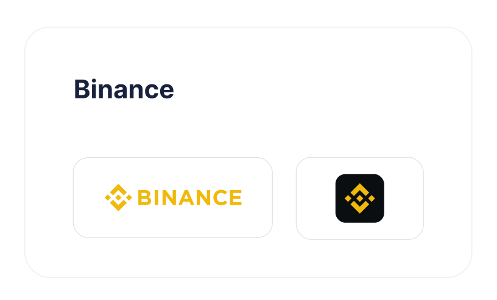</a> | **📂 檔名:** `Binance.svg` ✨ **格式:** `Vector (SVG)` ⚖️ **大小:** `13.29KB` 📅 **更新:** `2026-03-04`  🚀 **jsDelivr Markdown:** `` 🔗 **直接連結 (Url):** <code>https://cdn.jsdelivr.net/gh/barry028/materials@main/images/iCons/Payment%20And%20Credit%20Card/Binance.svg</code> 📥 [檢視原始檔](Binance.svg) |
| <a href="Bitcoin.svg">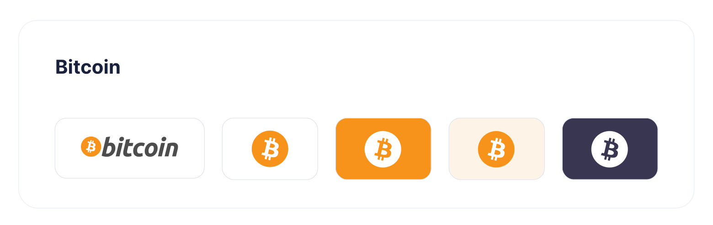</a> | **📂 檔名:** `Bitcoin.svg` ✨ **格式:** `Vector (SVG)` ⚖️ **大小:** `26.43KB` 📅 **更新:** `2026-03-04`  🚀 **jsDelivr Markdown:** `` 🔗 **直接連結 (Url):** <code>https://cdn.jsdelivr.net/gh/barry028/materials@main/images/iCons/Payment%20And%20Credit%20Card/Bitcoin.svg</code> 📥 [檢視原始檔](Bitcoin.svg) |
| <a href="Bitpay.svg">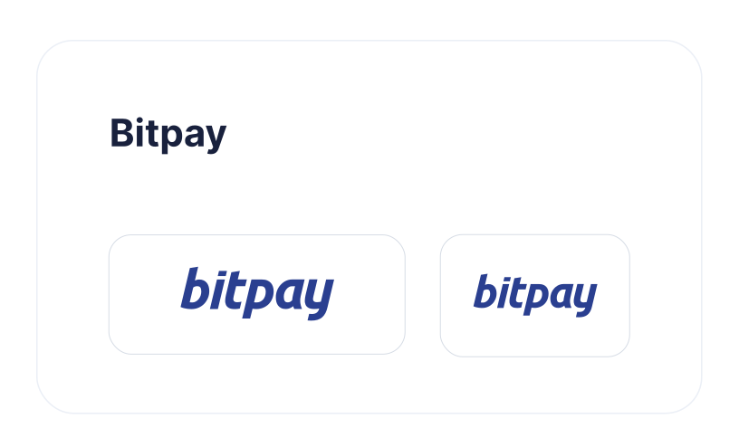</a> | **📂 檔名:** `Bitpay.svg` ✨ **格式:** `Vector (SVG)` ⚖️ **大小:** `20.03KB` 📅 **更新:** `2026-03-04`  🚀 **jsDelivr Markdown:** `` 🔗 **直接連結 (Url):** <code>https://cdn.jsdelivr.net/gh/barry028/materials@main/images/iCons/Payment%20And%20Credit%20Card/Bitpay.svg</code> 📥 [檢視原始檔](Bitpay.svg) |
| <a href="Braintree.svg">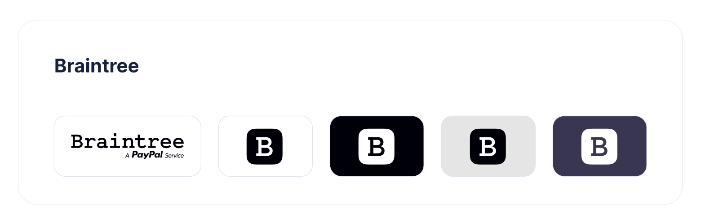</a> | **📂 檔名:** `Braintree.svg` ✨ **格式:** `Vector (SVG)` ⚖️ **大小:** `33.57KB` 📅 **更新:** `2026-03-04`  🚀 **jsDelivr Markdown:** `` 🔗 **直接連結 (Url):** <code>https://cdn.jsdelivr.net/gh/barry028/materials@main/images/iCons/Payment%20And%20Credit%20Card/Braintree.svg</code> 📥 [檢視原始檔](Braintree.svg) |
| <a href="Brex.svg">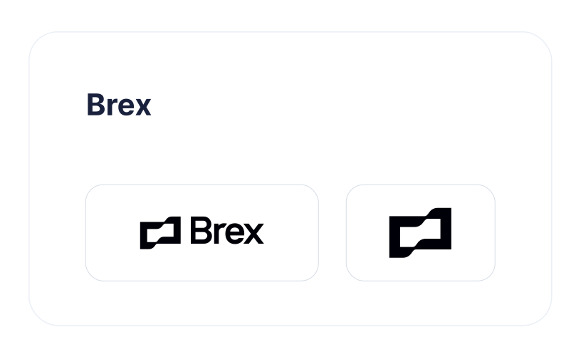</a> | **📂 檔名:** `Brex.svg` ✨ **格式:** `Vector (SVG)` ⚖️ **大小:** `9.37KB` 📅 **更新:** `2026-03-04`  🚀 **jsDelivr Markdown:** `` 🔗 **直接連結 (Url):** <code>https://cdn.jsdelivr.net/gh/barry028/materials@main/images/iCons/Payment%20And%20Credit%20Card/Brex.svg</code> 📥 [檢視原始檔](Brex.svg) |
|  | **📂 檔名:** `Capital One.svg` ✨ **格式:** `Vector (SVG)` ⚖️ **大小:** `20.68KB` 📅 **更新:** `2026-03-04`  🚀 **jsDelivr Markdown:** `` 🔗 **直接連結 (Url):** <code>https://cdn.jsdelivr.net/gh/barry028/materials@main/images/iCons/Payment%20And%20Credit%20Card/Capital%20One.svg</code> 📥 [檢視原始檔](Capital%20One.svg) |
|  | **📂 檔名:** `Cash App.svg` ✨ **格式:** `Vector (SVG)` ⚖️ **大小:** `24.62KB` 📅 **更新:** `2026-03-04`  🚀 **jsDelivr Markdown:** `` 🔗 **直接連結 (Url):** <code>https://cdn.jsdelivr.net/gh/barry028/materials@main/images/iCons/Payment%20And%20Credit%20Card/Cash%20App.svg</code> 📥 [檢視原始檔](Cash%20App.svg) |
| <a href="Chase.svg">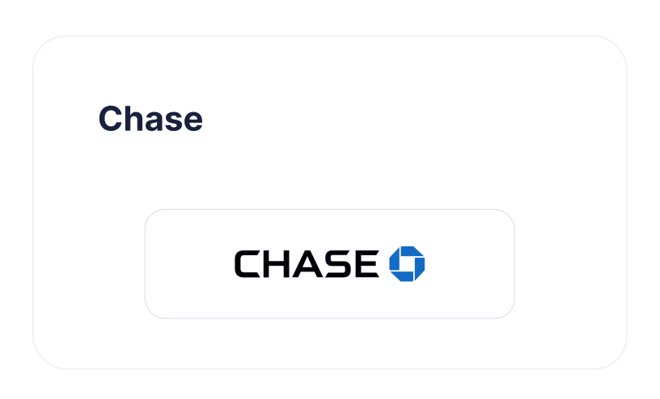</a> | **📂 檔名:** `Chase.svg` ✨ **格式:** `Vector (SVG)` ⚖️ **大小:** `10.68KB` 📅 **更新:** `2026-03-04`  🚀 **jsDelivr Markdown:** `` 🔗 **直接連結 (Url):** <code>https://cdn.jsdelivr.net/gh/barry028/materials@main/images/iCons/Payment%20And%20Credit%20Card/Chase.svg</code> 📥 [檢視原始檔](Chase.svg) |
|  | **📂 檔名:** `Checkout.com.svg` ✨ **格式:** `Vector (SVG)` ⚖️ **大小:** `25.93KB` 📅 **更新:** `2026-03-04`  🚀 **jsDelivr Markdown:** `` 🔗 **直接連結 (Url):** <code>https://cdn.jsdelivr.net/gh/barry028/materials@main/images/iCons/Payment%20And%20Credit%20Card/Checkout.com.svg</code> 📥 [檢視原始檔](Checkout.com.svg) |
| <a href="Chime.svg">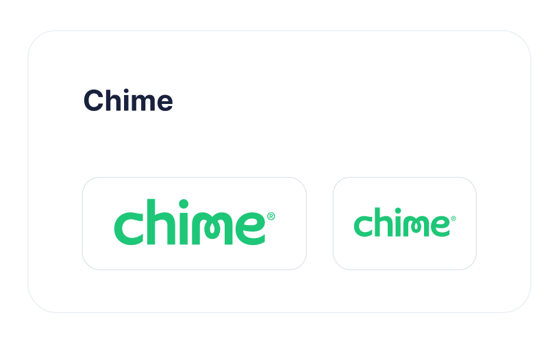</a> | **📂 檔名:** `Chime.svg` ✨ **格式:** `Vector (SVG)` ⚖️ **大小:** `27.33KB` 📅 **更新:** `2026-03-04`  🚀 **jsDelivr Markdown:** `` 🔗 **直接連結 (Url):** <code>https://cdn.jsdelivr.net/gh/barry028/materials@main/images/iCons/Payment%20And%20Credit%20Card/Chime.svg</code> 📥 [檢視原始檔](Chime.svg) |
|  | **📂 檔名:** `China Construction Bank.svg` ✨ **格式:** `Vector (SVG)` ⚖️ **大小:** `59.83KB` 📅 **更新:** `2026-03-04`  🚀 **jsDelivr Markdown:** `` 🔗 **直接連結 (Url):** <code>https://cdn.jsdelivr.net/gh/barry028/materials@main/images/iCons/Payment%20And%20Credit%20Card/China%20Construction%20Bank.svg</code> 📥 [檢視原始檔](China%20Construction%20Bank.svg) |
| <a href="Cirrus.svg">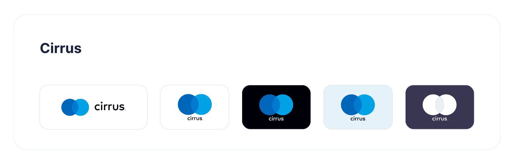</a> | **📂 檔名:** `Cirrus.svg` ✨ **格式:** `Vector (SVG)` ⚖️ **大小:** `46.50KB` 📅 **更新:** `2026-03-04`  🚀 **jsDelivr Markdown:** `` 🔗 **直接連結 (Url):** <code>https://cdn.jsdelivr.net/gh/barry028/materials@main/images/iCons/Payment%20And%20Credit%20Card/Cirrus.svg</code> 📥 [檢視原始檔](Cirrus.svg) |
| <a href="Citi.svg">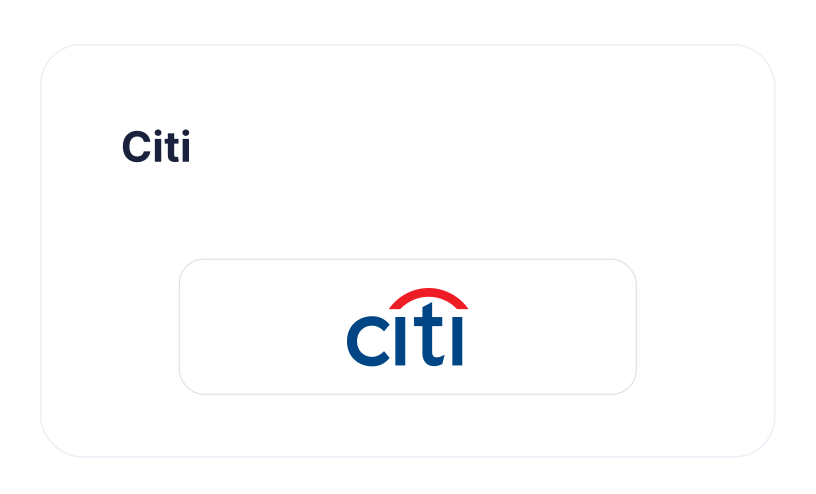</a> | **📂 檔名:** `Citi.svg` ✨ **格式:** `Vector (SVG)` ⚖️ **大小:** `6.87KB` 📅 **更新:** `2026-03-04`  🚀 **jsDelivr Markdown:** `` 🔗 **直接連結 (Url):** <code>https://cdn.jsdelivr.net/gh/barry028/materials@main/images/iCons/Payment%20And%20Credit%20Card/Citi.svg</code> 📥 [檢視原始檔](Citi.svg) |
| <a href="Coinbase.svg">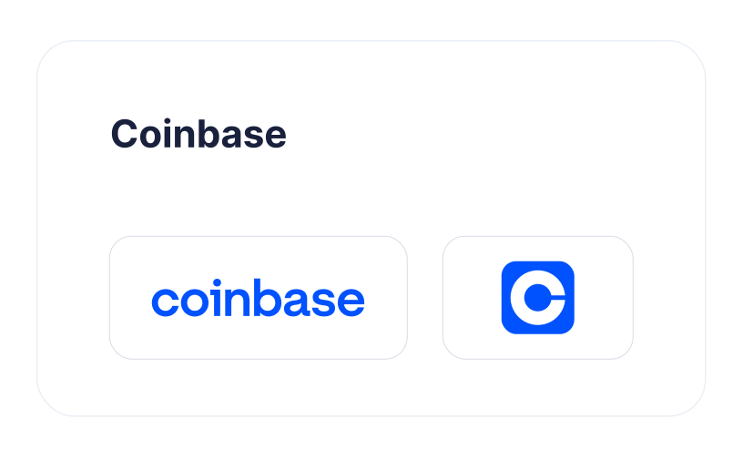</a> | **📂 檔名:** `Coinbase.svg` ✨ **格式:** `Vector (SVG)` ⚖️ **大小:** `16.86KB` 📅 **更新:** `2026-03-04`  🚀 **jsDelivr Markdown:** `` 🔗 **直接連結 (Url):** <code>https://cdn.jsdelivr.net/gh/barry028/materials@main/images/iCons/Payment%20And%20Credit%20Card/Coinbase.svg</code> 📥 [檢視原始檔](Coinbase.svg) |
|  | **📂 檔名:** `Crypto.com.svg` ✨ **格式:** `Vector (SVG)` ⚖️ **大小:** `18.44KB` 📅 **更新:** `2026-03-04`  🚀 **jsDelivr Markdown:** `` 🔗 **直接連結 (Url):** <code>https://cdn.jsdelivr.net/gh/barry028/materials@main/images/iCons/Payment%20And%20Credit%20Card/Crypto.com.svg</code> 📥 [檢視原始檔](Crypto.com.svg) |
|  | **📂 檔名:** `Deutsche Bank.svg` ✨ **格式:** `Vector (SVG)` ⚖️ **大小:** `18.92KB` 📅 **更新:** `2026-03-04`  🚀 **jsDelivr Markdown:** `` 🔗 **直接連結 (Url):** <code>https://cdn.jsdelivr.net/gh/barry028/materials@main/images/iCons/Payment%20And%20Credit%20Card/Deutsche%20Bank.svg</code> 📥 [檢視原始檔](Deutsche%20Bank.svg) |
|  | **📂 檔名:** `Dinners Club.svg` ✨ **格式:** `Vector (SVG)` ⚖️ **大小:** `191.39KB` 📅 **更新:** `2026-03-04`  🚀 **jsDelivr Markdown:** `` 🔗 **直接連結 (Url):** <code>https://cdn.jsdelivr.net/gh/barry028/materials@main/images/iCons/Payment%20And%20Credit%20Card/Dinners%20Club.svg</code> 📥 [檢視原始檔](Dinners%20Club.svg) |
|  | **📂 檔名:** `Discover-1.svg` ✨ **格式:** `Vector (SVG)` ⚖️ **大小:** `13.84KB` 📅 **更新:** `2026-03-04`  🚀 **jsDelivr Markdown:** `` 🔗 **直接連結 (Url):** <code>https://cdn.jsdelivr.net/gh/barry028/materials@main/images/iCons/Payment%20And%20Credit%20Card/Discover-1.svg</code> 📥 [檢視原始檔](Discover-1.svg) |
| <a href="Discover.svg">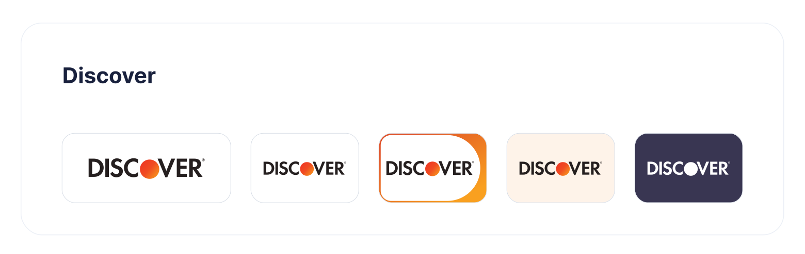</a> | **📂 檔名:** `Discover.svg` ✨ **格式:** `Vector (SVG)` ⚖️ **大小:** `37.66KB` 📅 **更新:** `2026-03-04`  🚀 **jsDelivr Markdown:** `` 🔗 **直接連結 (Url):** <code>https://cdn.jsdelivr.net/gh/barry028/materials@main/images/iCons/Payment%20And%20Credit%20Card/Discover.svg</code> 📥 [檢視原始檔](Discover.svg) |
| <a href="Elo.svg">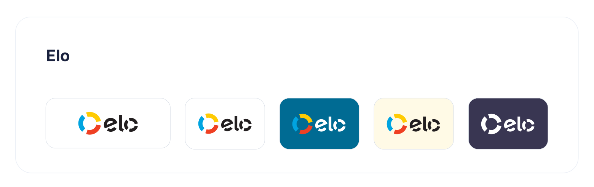</a> | **📂 檔名:** `Elo.svg` ✨ **格式:** `Vector (SVG)` ⚖️ **大小:** `21.95KB` 📅 **更新:** `2026-03-04`  🚀 **jsDelivr Markdown:** `` 🔗 **直接連結 (Url):** <code>https://cdn.jsdelivr.net/gh/barry028/materials@main/images/iCons/Payment%20And%20Credit%20Card/Elo.svg</code> 📥 [檢視原始檔](Elo.svg) |
| <a href="Ethereum.svg">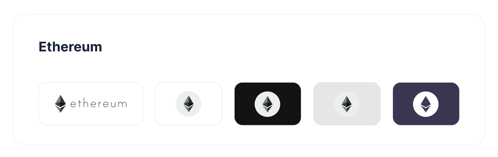</a> | **📂 檔名:** `Ethereum.svg` ✨ **格式:** `Vector (SVG)` ⚖️ **大小:** `36.78KB` 📅 **更新:** `2026-03-04`  🚀 **jsDelivr Markdown:** `` 🔗 **直接連結 (Url):** <code>https://cdn.jsdelivr.net/gh/barry028/materials@main/images/iCons/Payment%20And%20Credit%20Card/Ethereum.svg</code> 📥 [檢視原始檔](Ethereum.svg) |
|  | **📂 檔名:** `Fifth Third Bank.svg` ✨ **格式:** `Vector (SVG)` ⚖️ **大小:** `18.74KB` 📅 **更新:** `2026-03-04`  🚀 **jsDelivr Markdown:** `` 🔗 **直接連結 (Url):** <code>https://cdn.jsdelivr.net/gh/barry028/materials@main/images/iCons/Payment%20And%20Credit%20Card/Fifth%20Third%20Bank.svg</code> 📥 [檢視原始檔](Fifth%20Third%20Bank.svg) |
| <a href="Fiserv..svg">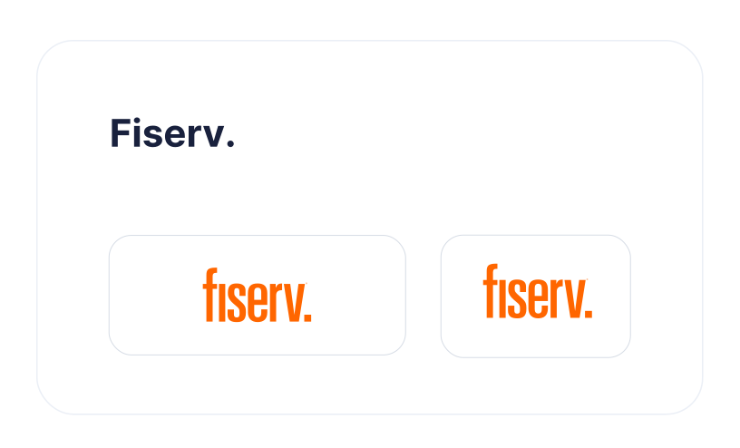</a> | **📂 檔名:** `Fiserv..svg` ✨ **格式:** `Vector (SVG)` ⚖️ **大小:** `13.63KB` 📅 **更新:** `2026-03-04`  🚀 **jsDelivr Markdown:** `` 🔗 **直接連結 (Url):** <code>https://cdn.jsdelivr.net/gh/barry028/materials@main/images/iCons/Payment%20And%20Credit%20Card/Fiserv..svg</code> 📥 [檢視原始檔](Fiserv..svg) |
| <a href="Giropay.svg">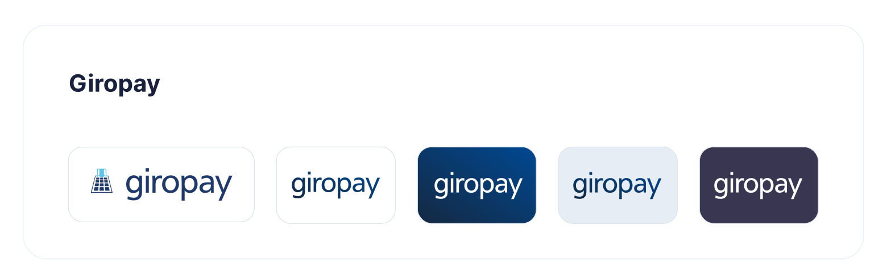</a> | **📂 檔名:** `Giropay.svg` ✨ **格式:** `Vector (SVG)` ⚖️ **大小:** `55.11KB` 📅 **更新:** `2026-03-04`  🚀 **jsDelivr Markdown:** `` 🔗 **直接連結 (Url):** <code>https://cdn.jsdelivr.net/gh/barry028/materials@main/images/iCons/Payment%20And%20Credit%20Card/Giropay.svg</code> 📥 [檢視原始檔](Giropay.svg) |
|  | **📂 檔名:** `Goldman Sachs.svg` ✨ **格式:** `Vector (SVG)` ⚖️ **大小:** `33.45KB` 📅 **更新:** `2026-03-04`  🚀 **jsDelivr Markdown:** `` 🔗 **直接連結 (Url):** <code>https://cdn.jsdelivr.net/gh/barry028/materials@main/images/iCons/Payment%20And%20Credit%20Card/Goldman%20Sachs.svg</code> 📥 [檢視原始檔](Goldman%20Sachs.svg) |
|  | **📂 檔名:** `Google Pay.svg` ✨ **格式:** `Vector (SVG)` ⚖️ **大小:** `31.41KB` 📅 **更新:** `2026-03-04`  🚀 **jsDelivr Markdown:** `` 🔗 **直接連結 (Url):** <code>https://cdn.jsdelivr.net/gh/barry028/materials@main/images/iCons/Payment%20And%20Credit%20Card/Google%20Pay.svg</code> 📥 [檢視原始檔](Google%20Pay.svg) |
| <a href="HSBC.svg">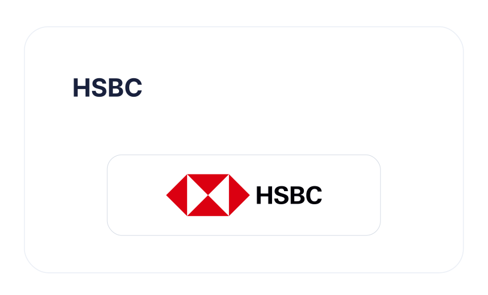</a> | **📂 檔名:** `HSBC.svg` ✨ **格式:** `Vector (SVG)` ⚖️ **大小:** `9.22KB` 📅 **更新:** `2026-03-04`  🚀 **jsDelivr Markdown:** `` 🔗 **直接連結 (Url):** <code>https://cdn.jsdelivr.net/gh/barry028/materials@main/images/iCons/Payment%20And%20Credit%20Card/HSBC.svg</code> 📥 [檢視原始檔](HSBC.svg) |
|  | **📂 檔名:** `Huntington Bank.svg` ✨ **格式:** `Vector (SVG)` ⚖️ **大小:** `17.79KB` 📅 **更新:** `2026-03-04`  🚀 **jsDelivr Markdown:** `` 🔗 **直接連結 (Url):** <code>https://cdn.jsdelivr.net/gh/barry028/materials@main/images/iCons/Payment%20And%20Credit%20Card/Huntington%20Bank.svg</code> 📥 [檢視原始檔](Huntington%20Bank.svg) |
|  | **📂 檔名:** `ING.svg` ✨ **格式:** `Vector (SVG)` ⚖️ **大小:** `78.59KB` 📅 **更新:** `2026-03-04`  🚀 **jsDelivr Markdown:** `` 🔗 **直接連結 (Url):** <code>https://cdn.jsdelivr.net/gh/barry028/materials@main/images/iCons/Payment%20And%20Credit%20Card/ING.svg</code> 📥 [檢視原始檔](ING.svg) |
|  | **📂 檔名:** `Industrial and Commercial Bank of China.svg` ✨ **格式:** `Vector (SVG)` ⚖️ **大小:** `31.91KB` 📅 **更新:** `2026-03-04`  🚀 **jsDelivr Markdown:** `` 🔗 **直接連結 (Url):** <code>https://cdn.jsdelivr.net/gh/barry028/materials@main/images/iCons/Payment%20And%20Credit%20Card/Industrial%20and%20Commercial%20Bank%20of%20China.svg</code> 📥 [檢視原始檔](Industrial%20and%20Commercial%20Bank%20of%20China.svg) |
| <a href="Interac.svg">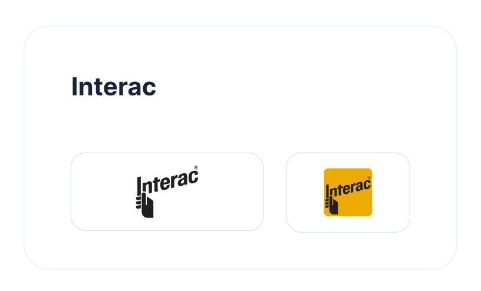</a> | **📂 檔名:** `Interac.svg` ✨ **格式:** `Vector (SVG)` ⚖️ **大小:** `23.87KB` 📅 **更新:** `2026-03-04`  🚀 **jsDelivr Markdown:** `` 🔗 **直接連結 (Url):** <code>https://cdn.jsdelivr.net/gh/barry028/materials@main/images/iCons/Payment%20And%20Credit%20Card/Interac.svg</code> 📥 [檢視原始檔](Interac.svg) |
|  | **📂 檔名:** `Japan Credit Bureau.svg` ✨ **格式:** `Vector (SVG)` ⚖️ **大小:** `28.53KB` 📅 **更新:** `2026-03-04`  🚀 **jsDelivr Markdown:** `` 🔗 **直接連結 (Url):** <code>https://cdn.jsdelivr.net/gh/barry028/materials@main/images/iCons/Payment%20And%20Credit%20Card/Japan%20Credit%20Bureau.svg</code> 📥 [檢視原始檔](Japan%20Credit%20Bureau.svg) |
| <a href="Klarna.svg">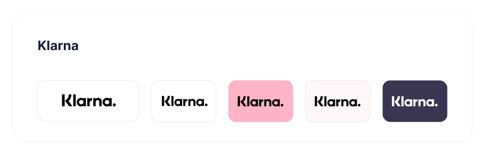</a> | **📂 檔名:** `Klarna.svg` ✨ **格式:** `Vector (SVG)` ⚖️ **大小:** `21.71KB` 📅 **更新:** `2026-03-04`  🚀 **jsDelivr Markdown:** `` 🔗 **直接連結 (Url):** <code>https://cdn.jsdelivr.net/gh/barry028/materials@main/images/iCons/Payment%20And%20Credit%20Card/Klarna.svg</code> 📥 [檢視原始檔](Klarna.svg) |
|  | **📂 檔名:** `Kraken.svg` ✨ **格式:** `Vector (SVG)` ⚖️ **大小:** `17.94KB` 📅 **更新:** `2026-03-04`  🚀 **jsDelivr Markdown:** `` 🔗 **直接連結 (Url):** <code>https://cdn.jsdelivr.net/gh/barry028/materials@main/images/iCons/Payment%20And%20Credit%20Card/Kraken.svg</code> 📥 [檢視原始檔](Kraken.svg) |
| <a href="Litecoin.svg">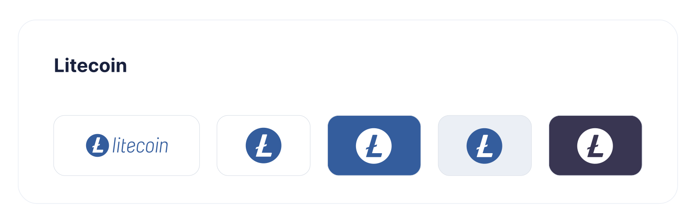</a> | **📂 檔名:** `Litecoin.svg` ✨ **格式:** `Vector (SVG)` ⚖️ **大小:** `25.41KB` 📅 **更新:** `2026-03-04`  🚀 **jsDelivr Markdown:** `` 🔗 **直接連結 (Url):** <code>https://cdn.jsdelivr.net/gh/barry028/materials@main/images/iCons/Payment%20And%20Credit%20Card/Litecoin.svg</code> 📥 [檢視原始檔](Litecoin.svg) |
| <a href="Maestro.svg">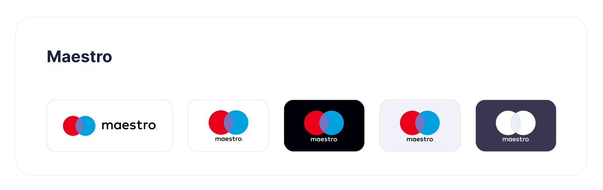</a> | **📂 檔名:** `Maestro.svg` ✨ **格式:** `Vector (SVG)` ⚖️ **大小:** `57.26KB` 📅 **更新:** `2026-03-04`  🚀 **jsDelivr Markdown:** `` 🔗 **直接連結 (Url):** <code>https://cdn.jsdelivr.net/gh/barry028/materials@main/images/iCons/Payment%20And%20Credit%20Card/Maestro.svg</code> 📥 [檢視原始檔](Maestro.svg) |
| <a href="Mastercard.svg">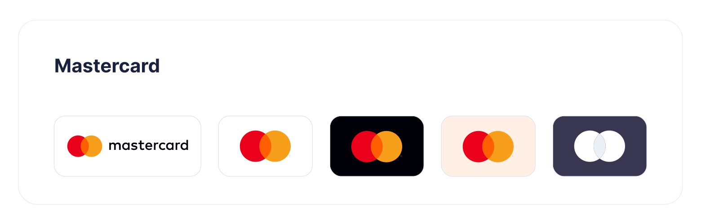</a> | **📂 檔名:** `Mastercard.svg` ✨ **格式:** `Vector (SVG)` ⚖️ **大小:** `27.77KB` 📅 **更新:** `2026-03-04`  🚀 **jsDelivr Markdown:** `` 🔗 **直接連結 (Url):** <code>https://cdn.jsdelivr.net/gh/barry028/materials@main/images/iCons/Payment%20And%20Credit%20Card/Mastercard.svg</code> 📥 [檢視原始檔](Mastercard.svg) |
|  | **📂 檔名:** `Mercado Pago.svg` ✨ **格式:** `Vector (SVG)` ⚖️ **大小:** `87.00KB` 📅 **更新:** `2026-03-04`  🚀 **jsDelivr Markdown:** `` 🔗 **直接連結 (Url):** <code>https://cdn.jsdelivr.net/gh/barry028/materials@main/images/iCons/Payment%20And%20Credit%20Card/Mercado%20Pago.svg</code> 📥 [檢視原始檔](Mercado%20Pago.svg) |
| <a href="Mercury.svg">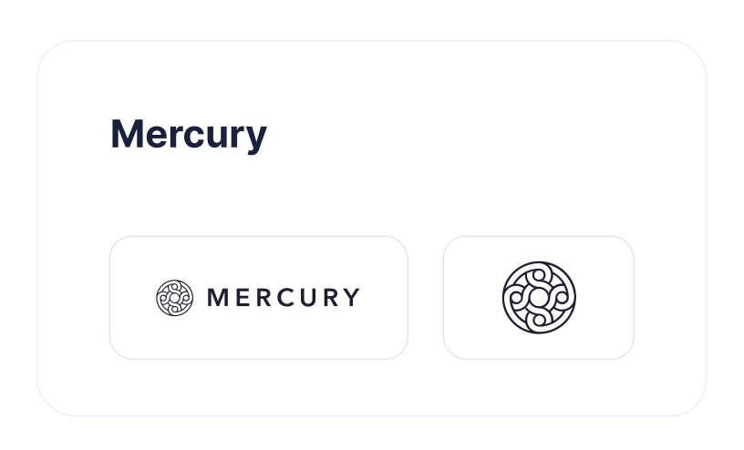</a> | **📂 檔名:** `Mercury.svg` ✨ **格式:** `Vector (SVG)` ⚖️ **大小:** `28.13KB` 📅 **更新:** `2026-03-04`  🚀 **jsDelivr Markdown:** `` 🔗 **直接連結 (Url):** <code>https://cdn.jsdelivr.net/gh/barry028/materials@main/images/iCons/Payment%20And%20Credit%20Card/Mercury.svg</code> 📥 [檢視原始檔](Mercury.svg) |
|  | **📂 檔名:** `Meta Pay.svg` ✨ **格式:** `Vector (SVG)` ⚖️ **大小:** `38.01KB` 📅 **更新:** `2026-03-04`  🚀 **jsDelivr Markdown:** `` 🔗 **直接連結 (Url):** <code>https://cdn.jsdelivr.net/gh/barry028/materials@main/images/iCons/Payment%20And%20Credit%20Card/Meta%20Pay.svg</code> 📥 [檢視原始檔](Meta%20Pay.svg) |
|  | **📂 檔名:** `Mitsubishi UFJ.svg` ✨ **格式:** `Vector (SVG)` ⚖️ **大小:** `12.79KB` 📅 **更新:** `2026-03-04`  🚀 **jsDelivr Markdown:** `` 🔗 **直接連結 (Url):** <code>https://cdn.jsdelivr.net/gh/barry028/materials@main/images/iCons/Payment%20And%20Credit%20Card/Mitsubishi%20UFJ.svg</code> 📥 [檢視原始檔](Mitsubishi%20UFJ.svg) |
| <a href="NCR.svg">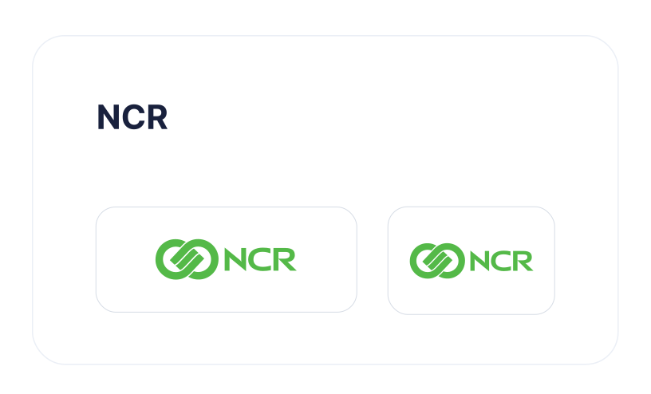</a> | **📂 檔名:** `NCR.svg` ✨ **格式:** `Vector (SVG)` ⚖️ **大小:** `12.55KB` 📅 **更新:** `2026-03-04`  🚀 **jsDelivr Markdown:** `` 🔗 **直接連結 (Url):** <code>https://cdn.jsdelivr.net/gh/barry028/materials@main/images/iCons/Payment%20And%20Credit%20Card/NCR.svg</code> 📥 [檢視原始檔](NCR.svg) |
| <a href="NorthOne.svg">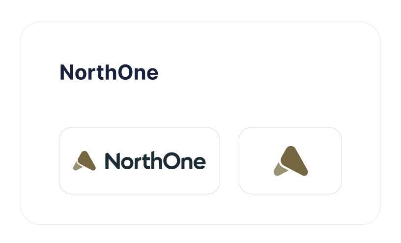</a> | **📂 檔名:** `NorthOne.svg` ✨ **格式:** `Vector (SVG)` ⚖️ **大小:** `16.80KB` 📅 **更新:** `2026-03-04`  🚀 **jsDelivr Markdown:** `` 🔗 **直接連結 (Url):** <code>https://cdn.jsdelivr.net/gh/barry028/materials@main/images/iCons/Payment%20And%20Credit%20Card/NorthOne.svg</code> 📥 [檢視原始檔](NorthOne.svg) |
|  | **📂 檔名:** `PNC Bank.svg` ✨ **格式:** `Vector (SVG)` ⚖️ **大小:** `11.77KB` 📅 **更新:** `2026-03-04`  🚀 **jsDelivr Markdown:** `` 🔗 **直接連結 (Url):** <code>https://cdn.jsdelivr.net/gh/barry028/materials@main/images/iCons/Payment%20And%20Credit%20Card/PNC%20Bank.svg</code> 📥 [檢視原始檔](PNC%20Bank.svg) |
| <a href="POLi.svg">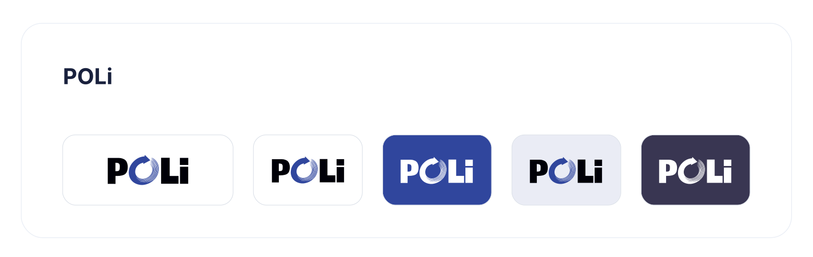</a> | **📂 檔名:** `POLi.svg` ✨ **格式:** `Vector (SVG)` ⚖️ **大小:** `32.85KB` 📅 **更新:** `2026-03-04`  🚀 **jsDelivr Markdown:** `` 🔗 **直接連結 (Url):** <code>https://cdn.jsdelivr.net/gh/barry028/materials@main/images/iCons/Payment%20And%20Credit%20Card/POLi.svg</code> 📥 [檢視原始檔](POLi.svg) |
|  | **📂 檔名:** `PayPal-1.svg` ✨ **格式:** `Vector (SVG)` ⚖️ **大小:** `33.69KB` 📅 **更新:** `2026-03-04`  🚀 **jsDelivr Markdown:** `` 🔗 **直接連結 (Url):** <code>https://cdn.jsdelivr.net/gh/barry028/materials@main/images/iCons/Payment%20And%20Credit%20Card/PayPal-1.svg</code> 📥 [檢視原始檔](PayPal-1.svg) |
|  | **📂 檔名:** `PayPal.svg` ✨ **格式:** `Vector (SVG)` ⚖️ **大小:** `33.69KB` 📅 **更新:** `2026-03-04`  🚀 **jsDelivr Markdown:** `` 🔗 **直接連結 (Url):** <code>https://cdn.jsdelivr.net/gh/barry028/materials@main/images/iCons/Payment%20And%20Credit%20Card/PayPal.svg</code> 📥 [檢視原始檔](PayPal.svg) |
|  | **📂 檔名:** `Payconiq by Bancontact.svg` ✨ **格式:** `Vector (SVG)` ⚖️ **大小:** `52.17KB` 📅 **更新:** `2026-03-04`  🚀 **jsDelivr Markdown:** `` 🔗 **直接連結 (Url):** <code>https://cdn.jsdelivr.net/gh/barry028/materials@main/images/iCons/Payment%20And%20Credit%20Card/Payconiq%20by%20Bancontact.svg</code> 📥 [檢視原始檔](Payconiq%20by%20Bancontact.svg) |
|  | **📂 檔名:** `Payline Data.svg` ✨ **格式:** `Vector (SVG)` ⚖️ **大小:** `77.18KB` 📅 **更新:** `2026-03-04`  🚀 **jsDelivr Markdown:** `` 🔗 **直接連結 (Url):** <code>https://cdn.jsdelivr.net/gh/barry028/materials@main/images/iCons/Payment%20And%20Credit%20Card/Payline%20Data.svg</code> 📥 [檢視原始檔](Payline%20Data.svg) |
| <a href="Payoneer.svg">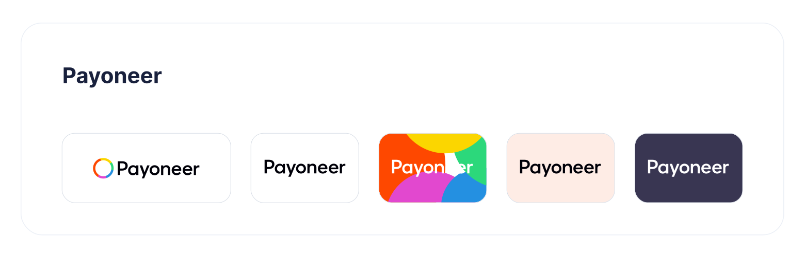</a> | **📂 檔名:** `Payoneer.svg` ✨ **格式:** `Vector (SVG)` ⚖️ **大小:** `35.15KB` 📅 **更新:** `2026-03-04`  🚀 **jsDelivr Markdown:** `` 🔗 **直接連結 (Url):** <code>https://cdn.jsdelivr.net/gh/barry028/materials@main/images/iCons/Payment%20And%20Credit%20Card/Payoneer.svg</code> 📥 [檢視原始檔](Payoneer.svg) |
| <a href="Paysafe.svg">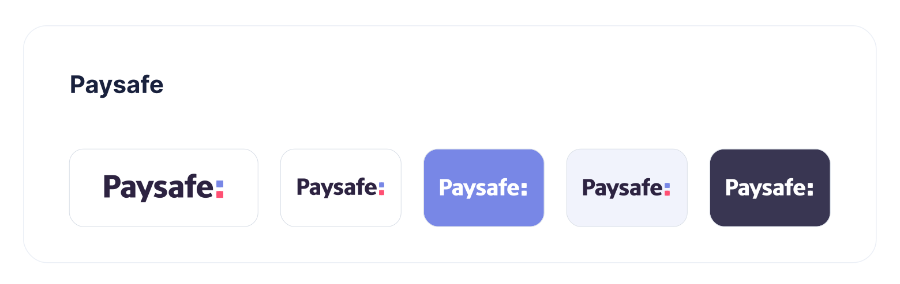</a> | **📂 檔名:** `Paysafe.svg` ✨ **格式:** `Vector (SVG)` ⚖️ **大小:** `32.87KB` 📅 **更新:** `2026-03-04`  🚀 **jsDelivr Markdown:** `` 🔗 **直接連結 (Url):** <code>https://cdn.jsdelivr.net/gh/barry028/materials@main/images/iCons/Payment%20And%20Credit%20Card/Paysafe.svg</code> 📥 [檢視原始檔](Paysafe.svg) |
| <a href="Revolut.svg">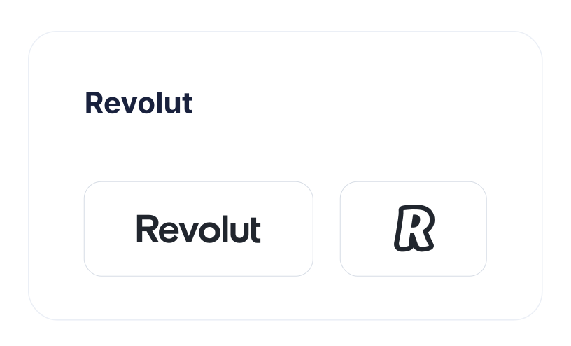</a> | **📂 檔名:** `Revolut.svg` ✨ **格式:** `Vector (SVG)` ⚖️ **大小:** `13.32KB` 📅 **更新:** `2026-03-04`  🚀 **jsDelivr Markdown:** `` 🔗 **直接連結 (Url):** <code>https://cdn.jsdelivr.net/gh/barry028/materials@main/images/iCons/Payment%20And%20Credit%20Card/Revolut.svg</code> 📥 [檢視原始檔](Revolut.svg) |
| <a href="Ripple.svg">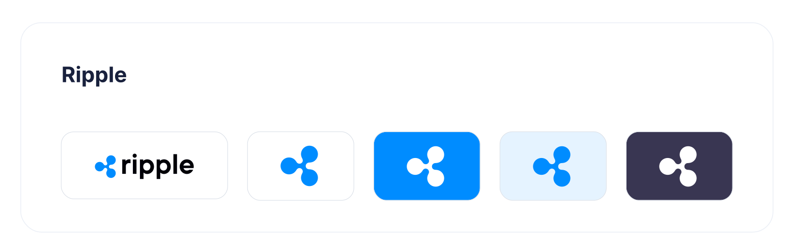</a> | **📂 檔名:** `Ripple.svg` ✨ **格式:** `Vector (SVG)` ⚖️ **大小:** `23.91KB` 📅 **更新:** `2026-03-04`  🚀 **jsDelivr Markdown:** `` 🔗 **直接連結 (Url):** <code>https://cdn.jsdelivr.net/gh/barry028/materials@main/images/iCons/Payment%20And%20Credit%20Card/Ripple.svg</code> 📥 [檢視原始檔](Ripple.svg) |
| <a href="SEPA.svg">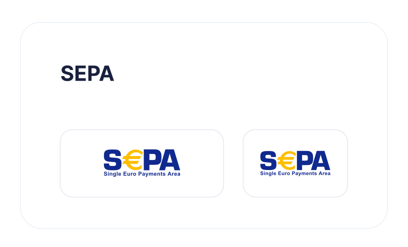</a> | **📂 檔名:** `SEPA.svg` ✨ **格式:** `Vector (SVG)` ⚖️ **大小:** `47.50KB` 📅 **更新:** `2026-03-04`  🚀 **jsDelivr Markdown:** `` 🔗 **直接連結 (Url):** <code>https://cdn.jsdelivr.net/gh/barry028/materials@main/images/iCons/Payment%20And%20Credit%20Card/SEPA.svg</code> 📥 [檢視原始檔](SEPA.svg) |
| <a href="SWIFT.svg">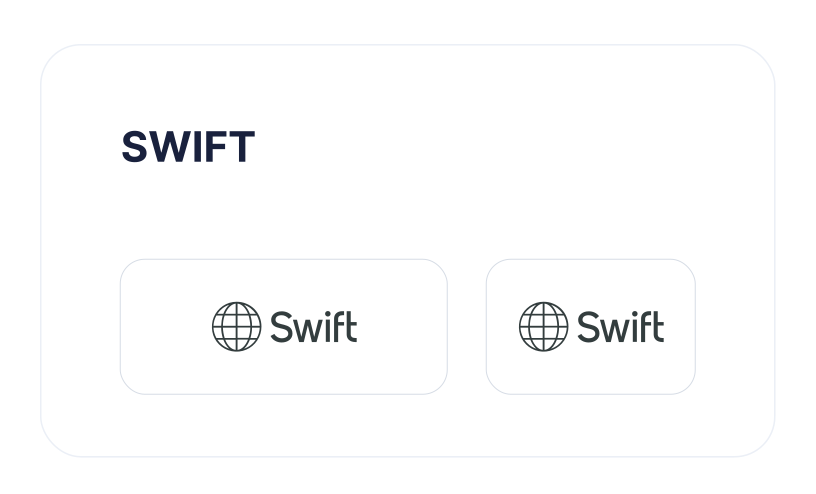</a> | **📂 檔名:** `SWIFT.svg` ✨ **格式:** `Vector (SVG)` ⚖️ **大小:** `13.21KB` 📅 **更新:** `2026-03-04`  🚀 **jsDelivr Markdown:** `` 🔗 **直接連結 (Url):** <code>https://cdn.jsdelivr.net/gh/barry028/materials@main/images/iCons/Payment%20And%20Credit%20Card/SWIFT.svg</code> 📥 [檢視原始檔](SWIFT.svg) |
|  | **📂 檔名:** `Samsung Pay.svg` ✨ **格式:** `Vector (SVG)` ⚖️ **大小:** `40.27KB` 📅 **更新:** `2026-03-04`  🚀 **jsDelivr Markdown:** `` 🔗 **直接連結 (Url):** <code>https://cdn.jsdelivr.net/gh/barry028/materials@main/images/iCons/Payment%20And%20Credit%20Card/Samsung%20Pay.svg</code> 📥 [檢視原始檔](Samsung%20Pay.svg) |
| <a href="Santander.svg">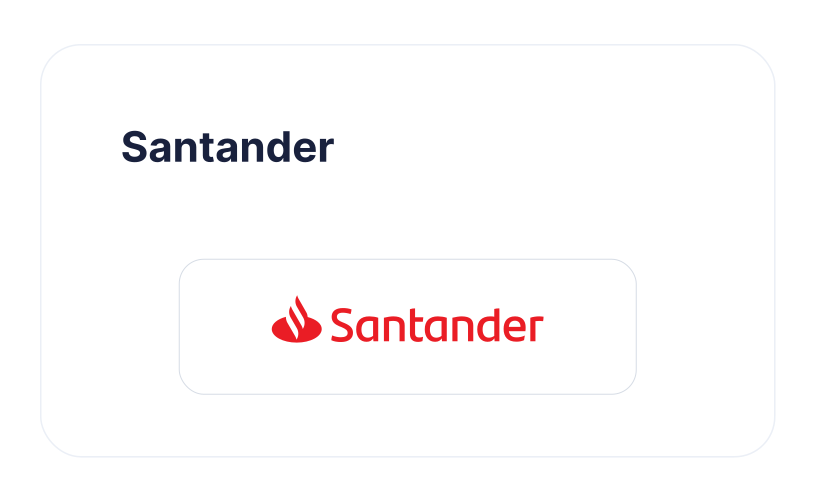</a> | **📂 檔名:** `Santander.svg` ✨ **格式:** `Vector (SVG)` ⚖️ **大小:** `17.10KB` 📅 **更新:** `2026-03-04`  🚀 **jsDelivr Markdown:** `` 🔗 **直接連結 (Url):** <code>https://cdn.jsdelivr.net/gh/barry028/materials@main/images/iCons/Payment%20And%20Credit%20Card/Santander.svg</code> 📥 [檢視原始檔](Santander.svg) |
|  | **📂 檔名:** `Section-1.svg` ✨ **格式:** `Vector (SVG)` ⚖️ **大小:** `17.81KB` 📅 **更新:** `2026-03-04`  🚀 **jsDelivr Markdown:** `` 🔗 **直接連結 (Url):** <code>https://cdn.jsdelivr.net/gh/barry028/materials@main/images/iCons/Payment%20And%20Credit%20Card/Section-1.svg</code> 📥 [檢視原始檔](Section-1.svg) |
|  | **📂 檔名:** `Section-2.svg` ✨ **格式:** `Vector (SVG)` ⚖️ **大小:** `16.49KB` 📅 **更新:** `2026-03-04`  🚀 **jsDelivr Markdown:** `` 🔗 **直接連結 (Url):** <code>https://cdn.jsdelivr.net/gh/barry028/materials@main/images/iCons/Payment%20And%20Credit%20Card/Section-2.svg</code> 📥 [檢視原始檔](Section-2.svg) |
|  | **📂 檔名:** `Section-3.svg` ✨ **格式:** `Vector (SVG)` ⚖️ **大小:** `11.40KB` 📅 **更新:** `2026-03-04`  🚀 **jsDelivr Markdown:** `` 🔗 **直接連結 (Url):** <code>https://cdn.jsdelivr.net/gh/barry028/materials@main/images/iCons/Payment%20And%20Credit%20Card/Section-3.svg</code> 📥 [檢視原始檔](Section-3.svg) |
|  | **📂 檔名:** `Section-4.svg` ✨ **格式:** `Vector (SVG)` ⚖️ **大小:** `18.54KB` 📅 **更新:** `2026-03-04`  🚀 **jsDelivr Markdown:** `` 🔗 **直接連結 (Url):** <code>https://cdn.jsdelivr.net/gh/barry028/materials@main/images/iCons/Payment%20And%20Credit%20Card/Section-4.svg</code> 📥 [檢視原始檔](Section-4.svg) |
|  | **📂 檔名:** `Section-5.svg` ✨ **格式:** `Vector (SVG)` ⚖️ **大小:** `4.70KB` 📅 **更新:** `2026-03-04`  🚀 **jsDelivr Markdown:** `` 🔗 **直接連結 (Url):** <code>https://cdn.jsdelivr.net/gh/barry028/materials@main/images/iCons/Payment%20And%20Credit%20Card/Section-5.svg</code> 📥 [檢視原始檔](Section-5.svg) |
|  | **📂 檔名:** `Section-6.svg` ✨ **格式:** `Vector (SVG)` ⚖️ **大小:** `5.17KB` 📅 **更新:** `2026-03-04`  🚀 **jsDelivr Markdown:** `` 🔗 **直接連結 (Url):** <code>https://cdn.jsdelivr.net/gh/barry028/materials@main/images/iCons/Payment%20And%20Credit%20Card/Section-6.svg</code> 📥 [檢視原始檔](Section-6.svg) |
|  | **📂 檔名:** `Section-7.svg` ✨ **格式:** `Vector (SVG)` ⚖️ **大小:** `12.47KB` 📅 **更新:** `2026-03-04`  🚀 **jsDelivr Markdown:** `` 🔗 **直接連結 (Url):** <code>https://cdn.jsdelivr.net/gh/barry028/materials@main/images/iCons/Payment%20And%20Credit%20Card/Section-7.svg</code> 📥 [檢視原始檔](Section-7.svg) |
|  | **📂 檔名:** `Section-8.svg` ✨ **格式:** `Vector (SVG)` ⚖️ **大小:** `14.86KB` 📅 **更新:** `2026-03-04`  🚀 **jsDelivr Markdown:** `` 🔗 **直接連結 (Url):** <code>https://cdn.jsdelivr.net/gh/barry028/materials@main/images/iCons/Payment%20And%20Credit%20Card/Section-8.svg</code> 📥 [檢視原始檔](Section-8.svg) |
|  | **📂 檔名:** `Section.svg` ✨ **格式:** `Vector (SVG)` ⚖️ **大小:** `14.62KB` 📅 **更新:** `2026-03-04`  🚀 **jsDelivr Markdown:** `` 🔗 **直接連結 (Url):** <code>https://cdn.jsdelivr.net/gh/barry028/materials@main/images/iCons/Payment%20And%20Credit%20Card/Section.svg</code> 📥 [檢視原始檔](Section.svg) |
|  | **📂 檔名:** `Shop Pay.svg` ✨ **格式:** `Vector (SVG)` ⚖️ **大小:** `44.54KB` 📅 **更新:** `2026-03-04`  🚀 **jsDelivr Markdown:** `` 🔗 **直接連結 (Url):** <code>https://cdn.jsdelivr.net/gh/barry028/materials@main/images/iCons/Payment%20And%20Credit%20Card/Shop%20Pay.svg</code> 📥 [檢視原始檔](Shop%20Pay.svg) |
| <a href="Skrill.svg">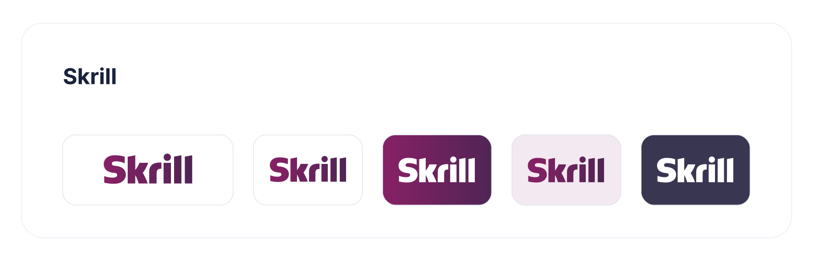</a> | **📂 檔名:** `Skrill.svg` ✨ **格式:** `Vector (SVG)` ⚖️ **大小:** `20.42KB` 📅 **更新:** `2026-03-04`  🚀 **jsDelivr Markdown:** `` 🔗 **直接連結 (Url):** <code>https://cdn.jsdelivr.net/gh/barry028/materials@main/images/iCons/Payment%20And%20Credit%20Card/Skrill.svg</code> 📥 [檢視原始檔](Skrill.svg) |
| <a href="Sofort.svg">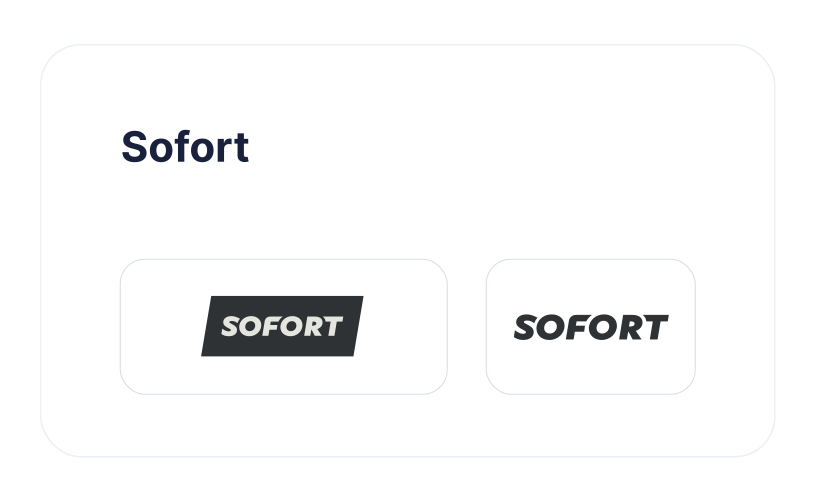</a> | **📂 檔名:** `Sofort.svg` ✨ **格式:** `Vector (SVG)` ⚖️ **大小:** `14.47KB` 📅 **更新:** `2026-03-04`  🚀 **jsDelivr Markdown:** `` 🔗 **直接連結 (Url):** <code>https://cdn.jsdelivr.net/gh/barry028/materials@main/images/iCons/Payment%20And%20Credit%20Card/Sofort.svg</code> 📥 [檢視原始檔](Sofort.svg) |
| <a href="Solana.svg">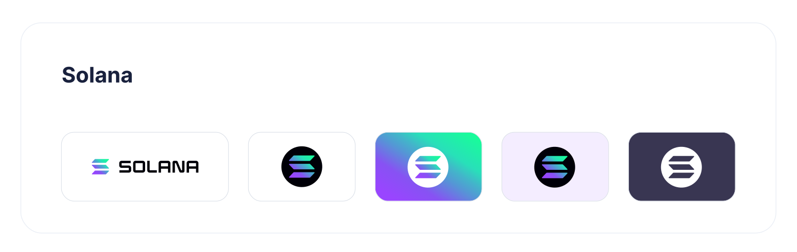</a> | **📂 檔名:** `Solana.svg` ✨ **格式:** `Vector (SVG)` ⚖️ **大小:** `30.87KB` 📅 **更新:** `2026-03-04`  🚀 **jsDelivr Markdown:** `` 🔗 **直接連結 (Url):** <code>https://cdn.jsdelivr.net/gh/barry028/materials@main/images/iCons/Payment%20And%20Credit%20Card/Solana.svg</code> 📥 [檢視原始檔](Solana.svg) |
| <a href="Square.svg">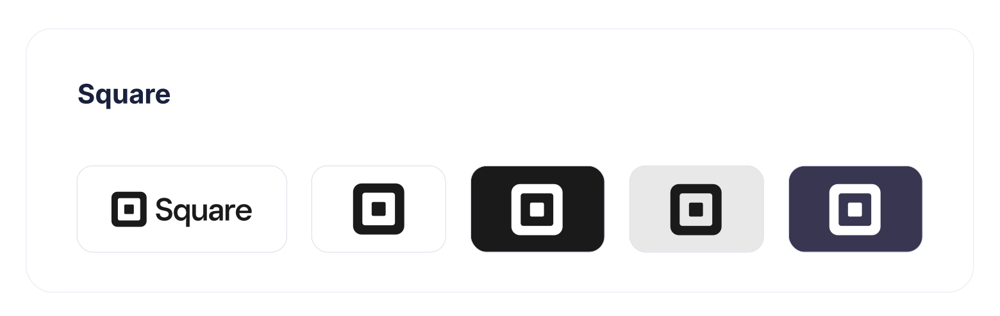</a> | **📂 檔名:** `Square.svg` ✨ **格式:** `Vector (SVG)` ⚖️ **大小:** `20.76KB` 📅 **更新:** `2026-03-04`  🚀 **jsDelivr Markdown:** `` 🔗 **直接連結 (Url):** <code>https://cdn.jsdelivr.net/gh/barry028/materials@main/images/iCons/Payment%20And%20Credit%20Card/Square.svg</code> 📥 [檢視原始檔](Square.svg) |
|  | **📂 檔名:** `Stax Payments.svg` ✨ **格式:** `Vector (SVG)` ⚖️ **大小:** `20.44KB` 📅 **更新:** `2026-03-04`  🚀 **jsDelivr Markdown:** `` 🔗 **直接連結 (Url):** <code>https://cdn.jsdelivr.net/gh/barry028/materials@main/images/iCons/Payment%20And%20Credit%20Card/Stax%20Payments.svg</code> 📥 [檢視原始檔](Stax%20Payments.svg) |
| <a href="Stripe.svg">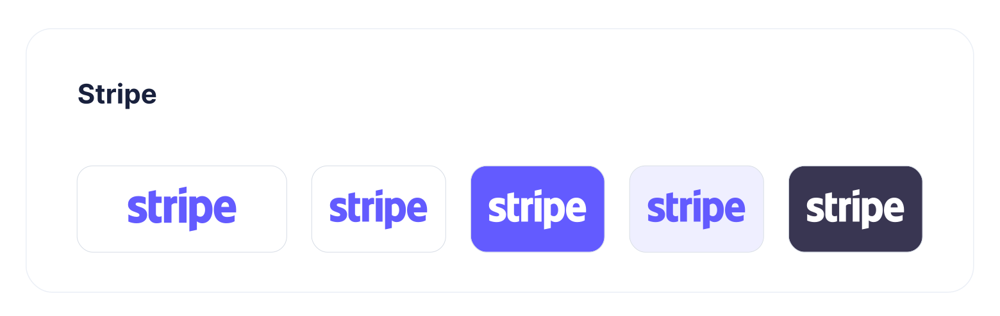</a> | **📂 檔名:** `Stripe.svg` ✨ **格式:** `Vector (SVG)` ⚖️ **大小:** `25.21KB` 📅 **更新:** `2026-03-04`  🚀 **jsDelivr Markdown:** `` 🔗 **直接連結 (Url):** <code>https://cdn.jsdelivr.net/gh/barry028/materials@main/images/iCons/Payment%20And%20Credit%20Card/Stripe.svg</code> 📥 [檢視原始檔](Stripe.svg) |
|  | **📂 檔名:** `Sumitomo Mitsui.svg` ✨ **格式:** `Vector (SVG)` ⚖️ **大小:** `19.72KB` 📅 **更新:** `2026-03-04`  🚀 **jsDelivr Markdown:** `` 🔗 **直接連結 (Url):** <code>https://cdn.jsdelivr.net/gh/barry028/materials@main/images/iCons/Payment%20And%20Credit%20Card/Sumitomo%20Mitsui.svg</code> 📥 [檢視原始檔](Sumitomo%20Mitsui.svg) |
| <a href="Synchrony.svg">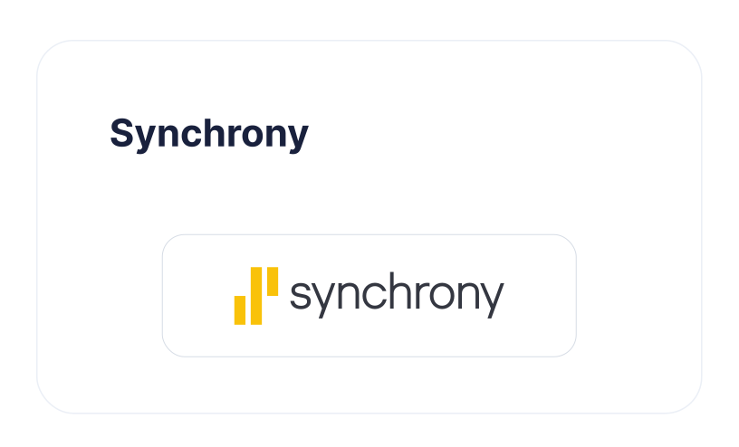</a> | **📂 檔名:** `Synchrony.svg` ✨ **格式:** `Vector (SVG)` ⚖️ **大小:** `12.42KB` 📅 **更新:** `2026-03-04`  🚀 **jsDelivr Markdown:** `` 🔗 **直接連結 (Url):** <code>https://cdn.jsdelivr.net/gh/barry028/materials@main/images/iCons/Payment%20And%20Credit%20Card/Synchrony.svg</code> 📥 [檢視原始檔](Synchrony.svg) |
| <a href="Tether.svg">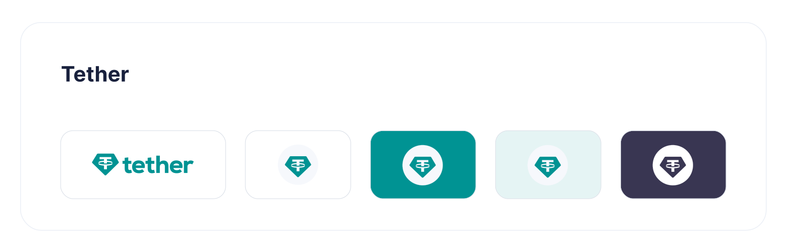</a> | **📂 檔名:** `Tether.svg` ✨ **格式:** `Vector (SVG)` ⚖️ **大小:** `20.87KB` 📅 **更新:** `2026-03-04`  🚀 **jsDelivr Markdown:** `` 🔗 **直接連結 (Url):** <code>https://cdn.jsdelivr.net/gh/barry028/materials@main/images/iCons/Payment%20And%20Credit%20Card/Tether.svg</code> 📥 [檢視原始檔](Tether.svg) |
|  | **📂 檔名:** `TrueUSD.svg` ✨ **格式:** `Vector (SVG)` ⚖️ **大小:** `35.03KB` 📅 **更新:** `2026-03-04`  🚀 **jsDelivr Markdown:** `` 🔗 **直接連結 (Url):** <code>https://cdn.jsdelivr.net/gh/barry028/materials@main/images/iCons/Payment%20And%20Credit%20Card/TrueUSD.svg</code> 📥 [檢視原始檔](TrueUSD.svg) |
|  | **📂 檔名:** `U.S. Bank.svg` ✨ **格式:** `Vector (SVG)` ⚖️ **大小:** `13.97KB` 📅 **更新:** `2026-03-04`  🚀 **jsDelivr Markdown:** `` 🔗 **直接連結 (Url):** <code>https://cdn.jsdelivr.net/gh/barry028/materials@main/images/iCons/Payment%20And%20Credit%20Card/U.S.%20Bank.svg</code> 📥 [檢視原始檔](U.S.%20Bank.svg) |
|  | **📂 檔名:** `UBS.svg` ✨ **格式:** `Vector (SVG)` ⚖️ **大小:** `12.98KB` 📅 **更新:** `2026-03-04`  🚀 **jsDelivr Markdown:** `` 🔗 **直接連結 (Url):** <code>https://cdn.jsdelivr.net/gh/barry028/materials@main/images/iCons/Payment%20And%20Credit%20Card/UBS.svg</code> 📥 [檢視原始檔](UBS.svg) |
|  | **📂 檔名:** `USD Coin.svg` ✨ **格式:** `Vector (SVG)` ⚖️ **大小:** `31.36KB` 📅 **更新:** `2026-03-04`  🚀 **jsDelivr Markdown:** `` 🔗 **直接連結 (Url):** <code>https://cdn.jsdelivr.net/gh/barry028/materials@main/images/iCons/Payment%20And%20Credit%20Card/USD%20Coin.svg</code> 📥 [檢視原始檔](USD%20Coin.svg) |
|  | **📂 檔名:** `Union Pay.svg` ✨ **格式:** `Vector (SVG)` ⚖️ **大小:** `91.82KB` 📅 **更新:** `2026-03-04`  🚀 **jsDelivr Markdown:** `` 🔗 **直接連結 (Url):** <code>https://cdn.jsdelivr.net/gh/barry028/materials@main/images/iCons/Payment%20And%20Credit%20Card/Union%20Pay.svg</code> 📥 [檢視原始檔](Union%20Pay.svg) |
| <a href="Venmo.svg">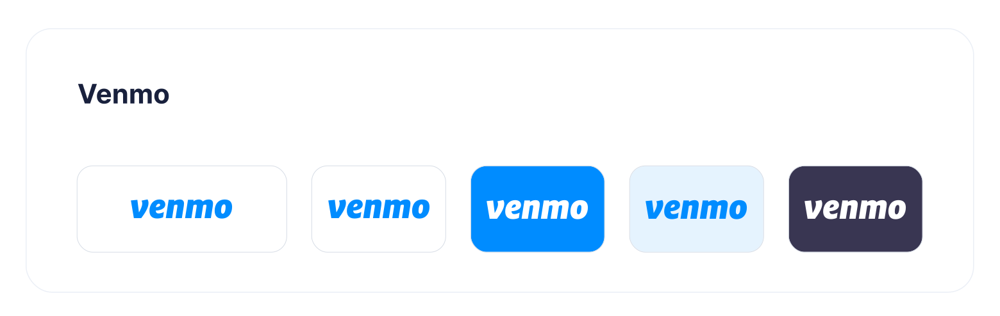</a> | **📂 檔名:** `Venmo.svg` ✨ **格式:** `Vector (SVG)` ⚖️ **大小:** `22.79KB` 📅 **更新:** `2026-03-04`  🚀 **jsDelivr Markdown:** `` 🔗 **直接連結 (Url):** <code>https://cdn.jsdelivr.net/gh/barry028/materials@main/images/iCons/Payment%20And%20Credit%20Card/Venmo.svg</code> 📥 [檢視原始檔](Venmo.svg) |
| <a href="Verifone.svg">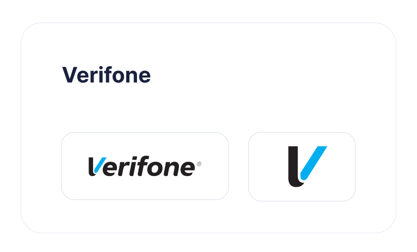</a> | **📂 檔名:** `Verifone.svg` ✨ **格式:** `Vector (SVG)` ⚖️ **大小:** `14.70KB` 📅 **更新:** `2026-03-04`  🚀 **jsDelivr Markdown:** `` 🔗 **直接連結 (Url):** <code>https://cdn.jsdelivr.net/gh/barry028/materials@main/images/iCons/Payment%20And%20Credit%20Card/Verifone.svg</code> 📥 [檢視原始檔](Verifone.svg) |
|  | **📂 檔名:** `Visa.svg` ✨ **格式:** `Vector (SVG)` ⚖️ **大小:** `16.74KB` 📅 **更新:** `2026-03-04`  🚀 **jsDelivr Markdown:** `` 🔗 **直接連結 (Url):** <code>https://cdn.jsdelivr.net/gh/barry028/materials@main/images/iCons/Payment%20And%20Credit%20Card/Visa.svg</code> 📥 [檢視原始檔](Visa.svg) |
|  | **📂 檔名:** `We Chat Pay.svg` ✨ **格式:** `Vector (SVG)` ⚖️ **大小:** `27.10KB` 📅 **更新:** `2026-03-04`  🚀 **jsDelivr Markdown:** `` 🔗 **直接連結 (Url):** <code>https://cdn.jsdelivr.net/gh/barry028/materials@main/images/iCons/Payment%20And%20Credit%20Card/We%20Chat%20Pay.svg</code> 📥 [檢視原始檔](We%20Chat%20Pay.svg) |
|  | **📂 檔名:** `Wells Fargo.svg` ✨ **格式:** `Vector (SVG)` ⚖️ **大小:** `16.11KB` 📅 **更新:** `2026-03-04`  🚀 **jsDelivr Markdown:** `` 🔗 **直接連結 (Url):** <code>https://cdn.jsdelivr.net/gh/barry028/materials@main/images/iCons/Payment%20And%20Credit%20Card/Wells%20Fargo.svg</code> 📥 [檢視原始檔](Wells%20Fargo.svg) |
|  | **📂 檔名:** `Wire Transfer.svg` ✨ **格式:** `Vector (SVG)` ⚖️ **大小:** `25.41KB` 📅 **更新:** `2026-03-04`  🚀 **jsDelivr Markdown:** `` 🔗 **直接連結 (Url):** <code>https://cdn.jsdelivr.net/gh/barry028/materials@main/images/iCons/Payment%20And%20Credit%20Card/Wire%20Transfer.svg</code> 📥 [檢視原始檔](Wire%20Transfer.svg) |
| <a href="Wise.svg">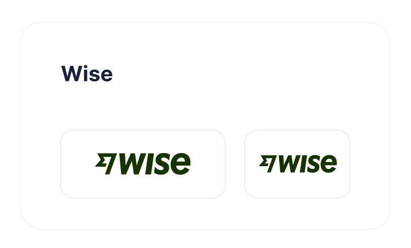</a> | **📂 檔名:** `Wise.svg` ✨ **格式:** `Vector (SVG)` ⚖️ **大小:** `10.19KB` 📅 **更新:** `2026-03-04`  🚀 **jsDelivr Markdown:** `` 🔗 **直接連結 (Url):** <code>https://cdn.jsdelivr.net/gh/barry028/materials@main/images/iCons/Payment%20And%20Credit%20Card/Wise.svg</code> 📥 [檢視原始檔](Wise.svg) |
|  | **📂 檔名:** `Wrap.svg` ✨ **格式:** `Vector (SVG)` ⚖️ **大小:** `17.42KB` 📅 **更新:** `2026-03-04`  🚀 **jsDelivr Markdown:** `` 🔗 **直接連結 (Url):** <code>https://cdn.jsdelivr.net/gh/barry028/materials@main/images/iCons/Payment%20And%20Credit%20Card/Wrap.svg</code> 📥 [檢視原始檔](Wrap.svg) |
| <a href="Zelle.svg">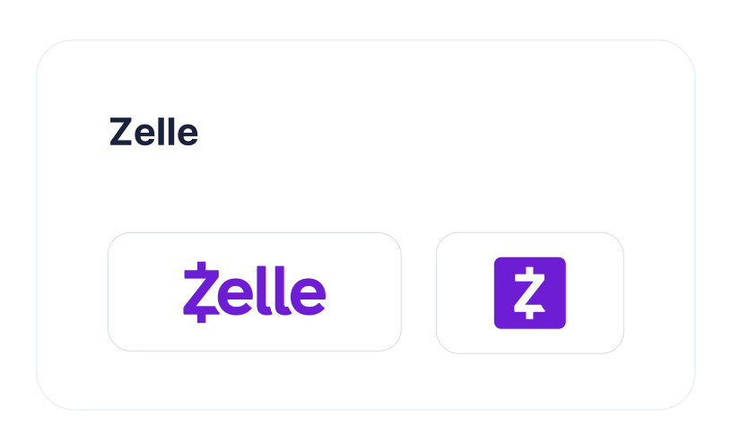</a> | **📂 檔名:** `Zelle.svg` ✨ **格式:** `Vector (SVG)` ⚖️ **大小:** `12.00KB` 📅 **更新:** `2026-03-04`  🚀 **jsDelivr Markdown:** `` 🔗 **直接連結 (Url):** <code>https://cdn.jsdelivr.net/gh/barry028/materials@main/images/iCons/Payment%20And%20Credit%20Card/Zelle.svg</code> 📥 [檢視原始檔](Zelle.svg) |
|  | **📂 檔名:** `nu (Nubank).svg` ✨ **格式:** `Vector (SVG)` ⚖️ **大小:** `13.54KB` 📅 **更新:** `2026-03-04`  🚀 **jsDelivr Markdown:** `` 🔗 **直接連結 (Url):** <code>https://cdn.jsdelivr.net/gh/barry028/materials@main/images/iCons/Payment%20And%20Credit%20Card/nu%20%28Nubank%29.svg</code> 📥 [檢視原始檔](nu%20%28Nubank%29.svg) |