# 🖼️ 素材分類：Action

> [🏠 主目錄](../../../../README.md) / [images](../../../README.md) / [iCons](../../README.md) / [Pixel](../README.md) / **Action**

本目錄共有 `162` 個檔案

| 🎨 預覽 (點擊放大) | 📋 檔案詳細資訊與連結 |
| :--- | :--- |
| <a href="accommodate-svgrepo-com.svg">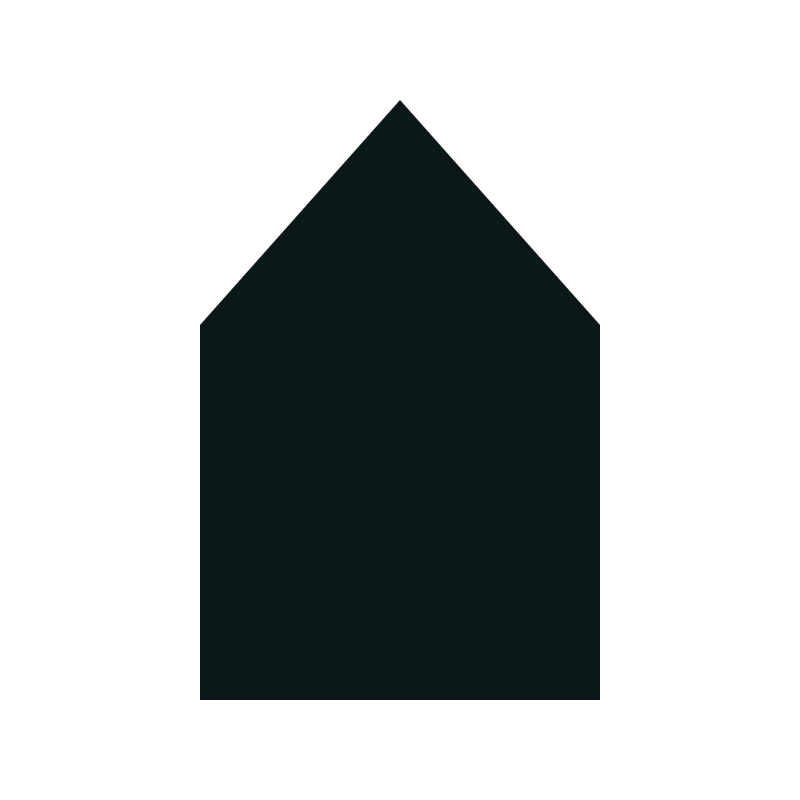</a> | **📂 檔名:** `accommodate-svgrepo-com.svg` ✨ **格式:** `Vector (SVG)` ⚖️ **大小:** `446.00B` | 📅 **更新:** `2026-02-27`  🚀 **jsDelivr Markdown:** `` 🔗 **直接連結 (Url):** `https://cdn.jsdelivr.netbarry028/materials@main/images/iCons/Pixel/Action/accommodate-svgrepo-com.svg` 📥 [檢視原始檔](accommodate-svgrepo-com.svg) |
|  | **📂 檔名:** `add-svgrepo-com.svg` ✨ **格式:** `Vector (SVG)` ⚖️ **大小:** `460.00B` | 📅 **更新:** `2026-02-27`  🚀 **jsDelivr Markdown:** `` 🔗 **直接連結 (Url):** `https://cdn.jsdelivr.netbarry028/materials@main/images/iCons/Pixel/Action/add-svgrepo-com.svg` 📥 [檢視原始檔](add-svgrepo-com.svg) |
| <a href="adjust-svgrepo-com.svg">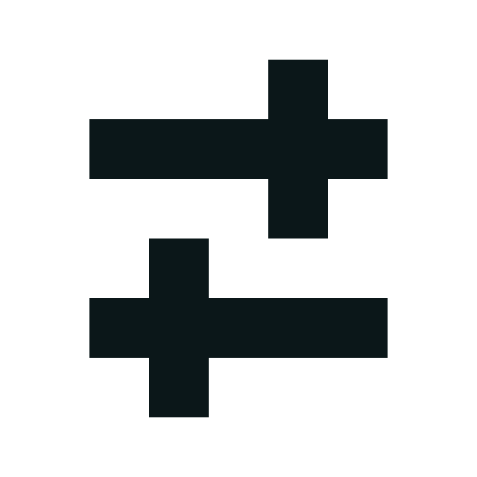</a> | **📂 檔名:** `adjust-svgrepo-com.svg` ✨ **格式:** `Vector (SVG)` ⚖️ **大小:** `497.00B` | 📅 **更新:** `2026-02-27`  🚀 **jsDelivr Markdown:** `` 🔗 **直接連結 (Url):** `https://cdn.jsdelivr.netbarry028/materials@main/images/iCons/Pixel/Action/adjust-svgrepo-com.svg` 📥 [檢視原始檔](adjust-svgrepo-com.svg) |
|  | **📂 檔名:** `alarm-svgrepo-com.svg` ✨ **格式:** `Vector (SVG)` ⚖️ **大小:** `469.00B` | 📅 **更新:** `2026-02-27`  🚀 **jsDelivr Markdown:** `` 🔗 **直接連結 (Url):** `https://cdn.jsdelivr.netbarry028/materials@main/images/iCons/Pixel/Action/alarm-svgrepo-com.svg` 📥 [檢視原始檔](alarm-svgrepo-com.svg) |
|  | **📂 檔名:** `alert-svgrepo-com.svg` ✨ **格式:** `Vector (SVG)` ⚖️ **大小:** `460.00B` | 📅 **更新:** `2026-02-27`  🚀 **jsDelivr Markdown:** `` 🔗 **直接連結 (Url):** `https://cdn.jsdelivr.netbarry028/materials@main/images/iCons/Pixel/Action/alert-svgrepo-com.svg` 📥 [檢視原始檔](alert-svgrepo-com.svg) |
|  | **📂 檔名:** `anchor-svgrepo-com.svg` ✨ **格式:** `Vector (SVG)` ⚖️ **大小:** `500.00B` | 📅 **更新:** `2026-02-27`  🚀 **jsDelivr Markdown:** `` 🔗 **直接連結 (Url):** `https://cdn.jsdelivr.netbarry028/materials@main/images/iCons/Pixel/Action/anchor-svgrepo-com.svg` 📥 [檢視原始檔](anchor-svgrepo-com.svg) |
|  | **📂 檔名:** `arrest-svgrepo-com.svg` ✨ **格式:** `Vector (SVG)` ⚖️ **大小:** `475.00B` | 📅 **更新:** `2026-02-27`  🚀 **jsDelivr Markdown:** `` 🔗 **直接連結 (Url):** `https://cdn.jsdelivr.netbarry028/materials@main/images/iCons/Pixel/Action/arrest-svgrepo-com.svg` 📥 [檢視原始檔](arrest-svgrepo-com.svg) |
| <a href="ascend-svgrepo-com.svg">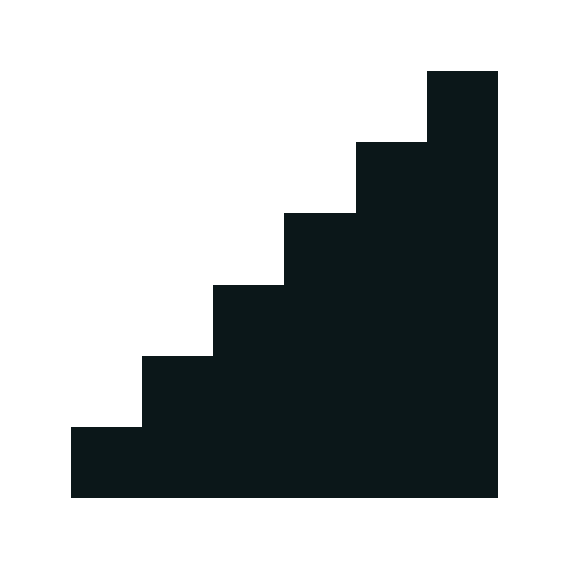</a> | **📂 檔名:** `ascend-svgrepo-com.svg` ✨ **格式:** `Vector (SVG)` ⚖️ **大小:** `464.00B` | 📅 **更新:** `2026-02-27`  🚀 **jsDelivr Markdown:** `` 🔗 **直接連結 (Url):** `https://cdn.jsdelivr.netbarry028/materials@main/images/iCons/Pixel/Action/ascend-svgrepo-com.svg` 📥 [檢視原始檔](ascend-svgrepo-com.svg) |
|  | **📂 檔名:** `ask-svgrepo-com.svg` ✨ **格式:** `Vector (SVG)` ⚖️ **大小:** `471.00B` | 📅 **更新:** `2026-02-27`  🚀 **jsDelivr Markdown:** `` 🔗 **直接連結 (Url):** `https://cdn.jsdelivr.netbarry028/materials@main/images/iCons/Pixel/Action/ask-svgrepo-com.svg` 📥 [檢視原始檔](ask-svgrepo-com.svg) |
|  | **📂 檔名:** `attract-svgrepo-com.svg` ✨ **格式:** `Vector (SVG)` ⚖️ **大小:** `489.00B` | 📅 **更新:** `2026-02-27`  🚀 **jsDelivr Markdown:** `` 🔗 **直接連結 (Url):** `https://cdn.jsdelivr.netbarry028/materials@main/images/iCons/Pixel/Action/attract-svgrepo-com.svg` 📥 [檢視原始檔](attract-svgrepo-com.svg) |
|  | **📂 檔名:** `bake-svgrepo-com.svg` ✨ **格式:** `Vector (SVG)` ⚖️ **大小:** `456.00B` | 📅 **更新:** `2026-02-27`  🚀 **jsDelivr Markdown:** `` 🔗 **直接連結 (Url):** `https://cdn.jsdelivr.netbarry028/materials@main/images/iCons/Pixel/Action/bake-svgrepo-com.svg` 📥 [檢視原始檔](bake-svgrepo-com.svg) |
|  | **📂 檔名:** `barbecue-svgrepo-com.svg` ✨ **格式:** `Vector (SVG)` ⚖️ **大小:** `482.00B` | 📅 **更新:** `2026-02-27`  🚀 **jsDelivr Markdown:** `` 🔗 **直接連結 (Url):** `https://cdn.jsdelivr.netbarry028/materials@main/images/iCons/Pixel/Action/barbecue-svgrepo-com.svg` 📥 [檢視原始檔](barbecue-svgrepo-com.svg) |
|  | **📂 檔名:** `believe-svgrepo-com.svg` ✨ **格式:** `Vector (SVG)` ⚖️ **大小:** `476.00B` | 📅 **更新:** `2026-02-27`  🚀 **jsDelivr Markdown:** `` 🔗 **直接連結 (Url):** `https://cdn.jsdelivr.netbarry028/materials@main/images/iCons/Pixel/Action/believe-svgrepo-com.svg` 📥 [檢視原始檔](believe-svgrepo-com.svg) |
|  | **📂 檔名:** `bite-svgrepo-com.svg` ✨ **格式:** `Vector (SVG)` ⚖️ **大小:** `500.00B` | 📅 **更新:** `2026-02-27`  🚀 **jsDelivr Markdown:** `` 🔗 **直接連結 (Url):** `https://cdn.jsdelivr.netbarry028/materials@main/images/iCons/Pixel/Action/bite-svgrepo-com.svg` 📥 [檢視原始檔](bite-svgrepo-com.svg) |
|  | **📂 檔名:** `blaze-svgrepo-com.svg` ✨ **格式:** `Vector (SVG)` ⚖️ **大小:** `468.00B` | 📅 **更新:** `2026-02-27`  🚀 **jsDelivr Markdown:** `` 🔗 **直接連結 (Url):** `https://cdn.jsdelivr.netbarry028/materials@main/images/iCons/Pixel/Action/blaze-svgrepo-com.svg` 📥 [檢視原始檔](blaze-svgrepo-com.svg) |
|  | **📂 檔名:** `bloom-svgrepo-com.svg` ✨ **格式:** `Vector (SVG)` ⚖️ **大小:** `479.00B` | 📅 **更新:** `2026-02-27`  🚀 **jsDelivr Markdown:** `` 🔗 **直接連結 (Url):** `https://cdn.jsdelivr.netbarry028/materials@main/images/iCons/Pixel/Action/bloom-svgrepo-com.svg` 📥 [檢視原始檔](bloom-svgrepo-com.svg) |
| <a href="blow-svgrepo-com.svg">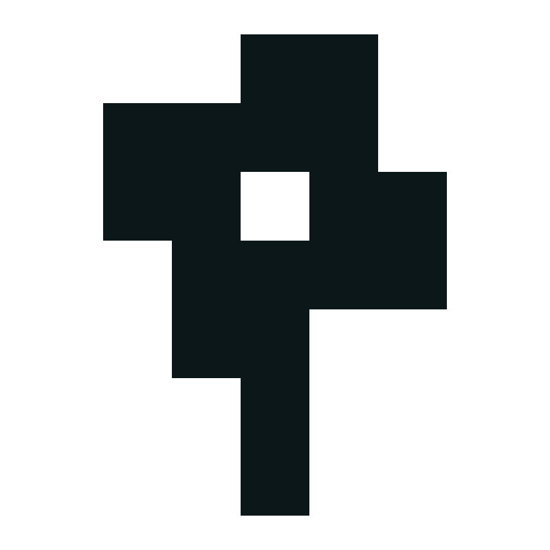</a> | **📂 檔名:** `blow-svgrepo-com.svg` ✨ **格式:** `Vector (SVG)` ⚖️ **大小:** `482.00B` | 📅 **更新:** `2026-02-27`  🚀 **jsDelivr Markdown:** `` 🔗 **直接連結 (Url):** `https://cdn.jsdelivr.netbarry028/materials@main/images/iCons/Pixel/Action/blow-svgrepo-com.svg` 📥 [檢視原始檔](blow-svgrepo-com.svg) |
|  | **📂 檔名:** `bookmark-svgrepo-com.svg` ✨ **格式:** `Vector (SVG)` ⚖️ **大小:** `448.00B` | 📅 **更新:** `2026-02-27`  🚀 **jsDelivr Markdown:** `` 🔗 **直接連結 (Url):** `https://cdn.jsdelivr.netbarry028/materials@main/images/iCons/Pixel/Action/bookmark-svgrepo-com.svg` 📥 [檢視原始檔](bookmark-svgrepo-com.svg) |
|  | **📂 檔名:** `broadcast-svgrepo-com.svg` ✨ **格式:** `Vector (SVG)` ⚖️ **大小:** `474.00B` | 📅 **更新:** `2026-02-27`  🚀 **jsDelivr Markdown:** `` 🔗 **直接連結 (Url):** `https://cdn.jsdelivr.netbarry028/materials@main/images/iCons/Pixel/Action/broadcast-svgrepo-com.svg` 📥 [檢視原始檔](broadcast-svgrepo-com.svg) |
| <a href="build-svgrepo-com.svg">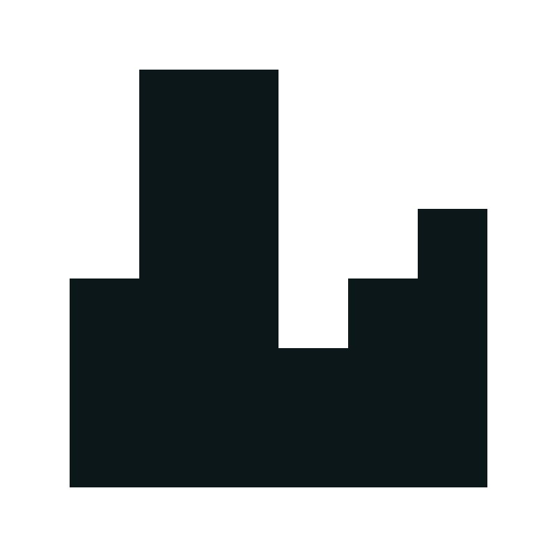</a> | **📂 檔名:** `build-svgrepo-com.svg` ✨ **格式:** `Vector (SVG)` ⚖️ **大小:** `461.00B` | 📅 **更新:** `2026-02-27`  🚀 **jsDelivr Markdown:** `` 🔗 **直接連結 (Url):** `https://cdn.jsdelivr.netbarry028/materials@main/images/iCons/Pixel/Action/build-svgrepo-com.svg` 📥 [檢視原始檔](build-svgrepo-com.svg) |
|  | **📂 檔名:** `caffeinate-svgrepo-com.svg` ✨ **格式:** `Vector (SVG)` ⚖️ **大小:** `445.00B` | 📅 **更新:** `2026-02-27`  🚀 **jsDelivr Markdown:** `` 🔗 **直接連結 (Url):** `https://cdn.jsdelivr.netbarry028/materials@main/images/iCons/Pixel/Action/caffeinate-svgrepo-com.svg` 📥 [檢視原始檔](caffeinate-svgrepo-com.svg) |
|  | **📂 檔名:** `calculate-svgrepo-com.svg` ✨ **格式:** `Vector (SVG)` ⚖️ **大小:** `550.00B` | 📅 **更新:** `2026-02-27`  🚀 **jsDelivr Markdown:** `` 🔗 **直接連結 (Url):** `https://cdn.jsdelivr.netbarry028/materials@main/images/iCons/Pixel/Action/calculate-svgrepo-com.svg` 📥 [檢視原始檔](calculate-svgrepo-com.svg) |
|  | **📂 檔名:** `call-svgrepo-com.svg` ✨ **格式:** `Vector (SVG)` ⚖️ **大小:** `468.00B` | 📅 **更新:** `2026-02-27`  🚀 **jsDelivr Markdown:** `` 🔗 **直接連結 (Url):** `https://cdn.jsdelivr.netbarry028/materials@main/images/iCons/Pixel/Action/call-svgrepo-com.svg` 📥 [檢視原始檔](call-svgrepo-com.svg) |
| <a href="camp-svgrepo-com.svg">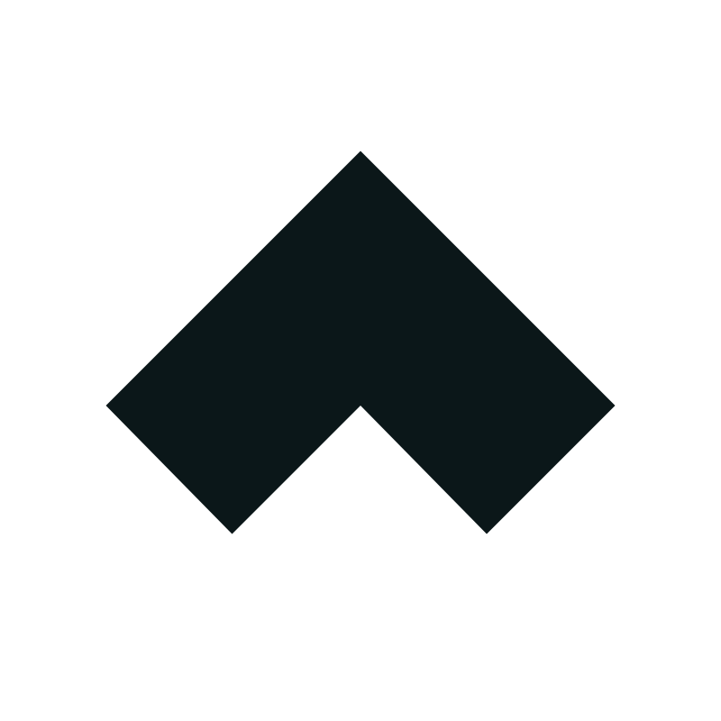</a> | **📂 檔名:** `camp-svgrepo-com.svg` ✨ **格式:** `Vector (SVG)` ⚖️ **大小:** `479.00B` | 📅 **更新:** `2026-02-27`  🚀 **jsDelivr Markdown:** `` 🔗 **直接連結 (Url):** `https://cdn.jsdelivr.netbarry028/materials@main/images/iCons/Pixel/Action/camp-svgrepo-com.svg` 📥 [檢視原始檔](camp-svgrepo-com.svg) |
|  | **📂 檔名:** `capture-svgrepo-com.svg` ✨ **格式:** `Vector (SVG)` ⚖️ **大小:** `457.00B` | 📅 **更新:** `2026-02-27`  🚀 **jsDelivr Markdown:** `` 🔗 **直接連結 (Url):** `https://cdn.jsdelivr.netbarry028/materials@main/images/iCons/Pixel/Action/capture-svgrepo-com.svg` 📥 [檢視原始檔](capture-svgrepo-com.svg) |
|  | **📂 檔名:** `celebrate-svgrepo-com.svg` ✨ **格式:** `Vector (SVG)` ⚖️ **大小:** `478.00B` | 📅 **更新:** `2026-02-27`  🚀 **jsDelivr Markdown:** `` 🔗 **直接連結 (Url):** `https://cdn.jsdelivr.netbarry028/materials@main/images/iCons/Pixel/Action/celebrate-svgrepo-com.svg` 📥 [檢視原始檔](celebrate-svgrepo-com.svg) |
|  | **📂 檔名:** `charge-svgrepo-com.svg` ✨ **格式:** `Vector (SVG)` ⚖️ **大小:** `468.00B` | 📅 **更新:** `2026-02-27`  🚀 **jsDelivr Markdown:** `` 🔗 **直接連結 (Url):** `https://cdn.jsdelivr.netbarry028/materials@main/images/iCons/Pixel/Action/charge-svgrepo-com.svg` 📥 [檢視原始檔](charge-svgrepo-com.svg) |
|  | **📂 檔名:** `chop-svgrepo-com.svg` ✨ **格式:** `Vector (SVG)` ⚖️ **大小:** `479.00B` | 📅 **更新:** `2026-02-27`  🚀 **jsDelivr Markdown:** `` 🔗 **直接連結 (Url):** `https://cdn.jsdelivr.netbarry028/materials@main/images/iCons/Pixel/Action/chop-svgrepo-com.svg` 📥 [檢視原始檔](chop-svgrepo-com.svg) |
|  | **📂 檔名:** `clamber-svgrepo-com.svg` ✨ **格式:** `Vector (SVG)` ⚖️ **大小:** `478.00B` | 📅 **更新:** `2026-02-27`  🚀 **jsDelivr Markdown:** `` 🔗 **直接連結 (Url):** `https://cdn.jsdelivr.netbarry028/materials@main/images/iCons/Pixel/Action/clamber-svgrepo-com.svg` 📥 [檢視原始檔](clamber-svgrepo-com.svg) |
|  | **📂 檔名:** `climb-svgrepo-com.svg` ✨ **格式:** `Vector (SVG)` ⚖️ **大小:** `594.00B` | 📅 **更新:** `2026-02-27`  🚀 **jsDelivr Markdown:** `` 🔗 **直接連結 (Url):** `https://cdn.jsdelivr.netbarry028/materials@main/images/iCons/Pixel/Action/climb-svgrepo-com.svg` 📥 [檢視原始檔](climb-svgrepo-com.svg) |
|  | **📂 檔名:** `close-svgrepo-com.svg` ✨ **格式:** `Vector (SVG)` ⚖️ **大小:** `477.00B` | 📅 **更新:** `2026-02-27`  🚀 **jsDelivr Markdown:** `` 🔗 **直接連結 (Url):** `https://cdn.jsdelivr.netbarry028/materials@main/images/iCons/Pixel/Action/close-svgrepo-com.svg` 📥 [檢視原始檔](close-svgrepo-com.svg) |
| <a href="code-svgrepo-com.svg">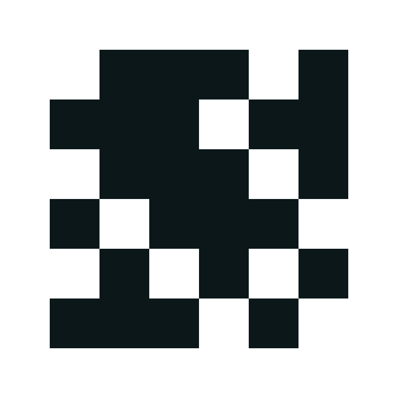</a> | **📂 檔名:** `code-svgrepo-com.svg` ✨ **格式:** `Vector (SVG)` ⚖️ **大小:** `587.00B` | 📅 **更新:** `2026-02-27`  🚀 **jsDelivr Markdown:** `` 🔗 **直接連結 (Url):** `https://cdn.jsdelivr.netbarry028/materials@main/images/iCons/Pixel/Action/code-svgrepo-com.svg` 📥 [檢視原始檔](code-svgrepo-com.svg) |
|  | **📂 檔名:** `collect-svgrepo-com.svg` ✨ **格式:** `Vector (SVG)` ⚖️ **大小:** `479.00B` | 📅 **更新:** `2026-02-27`  🚀 **jsDelivr Markdown:** `` 🔗 **直接連結 (Url):** `https://cdn.jsdelivr.netbarry028/materials@main/images/iCons/Pixel/Action/collect-svgrepo-com.svg` 📥 [檢視原始檔](collect-svgrepo-com.svg) |
| <a href="condemn-svgrepo-com.svg">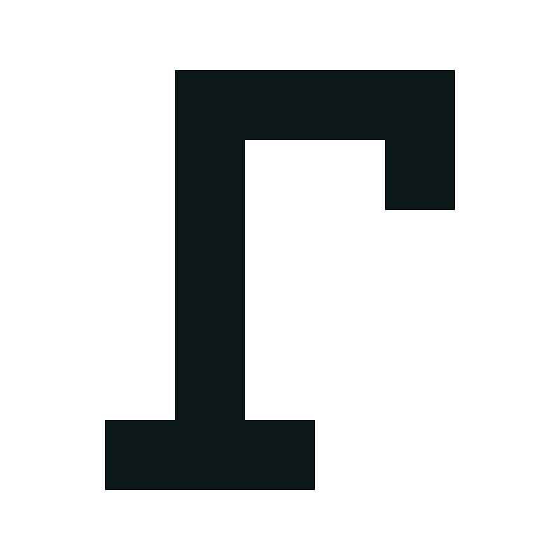</a> | **📂 檔名:** `condemn-svgrepo-com.svg` ✨ **格式:** `Vector (SVG)` ⚖️ **大小:** `459.00B` | 📅 **更新:** `2026-02-27`  🚀 **jsDelivr Markdown:** `` 🔗 **直接連結 (Url):** `https://cdn.jsdelivr.netbarry028/materials@main/images/iCons/Pixel/Action/condemn-svgrepo-com.svg` 📥 [檢視原始檔](condemn-svgrepo-com.svg) |
| <a href="connect-svgrepo-com.svg">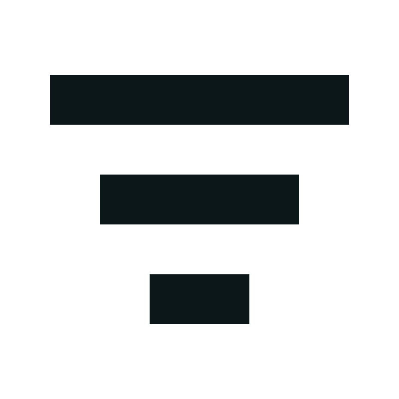</a> | **📂 檔名:** `connect-svgrepo-com.svg` ✨ **格式:** `Vector (SVG)` ⚖️ **大小:** `476.00B` | 📅 **更新:** `2026-02-27`  🚀 **jsDelivr Markdown:** `` 🔗 **直接連結 (Url):** `https://cdn.jsdelivr.netbarry028/materials@main/images/iCons/Pixel/Action/connect-svgrepo-com.svg` 📥 [檢視原始檔](connect-svgrepo-com.svg) |
| <a href="cook-svgrepo-com.svg">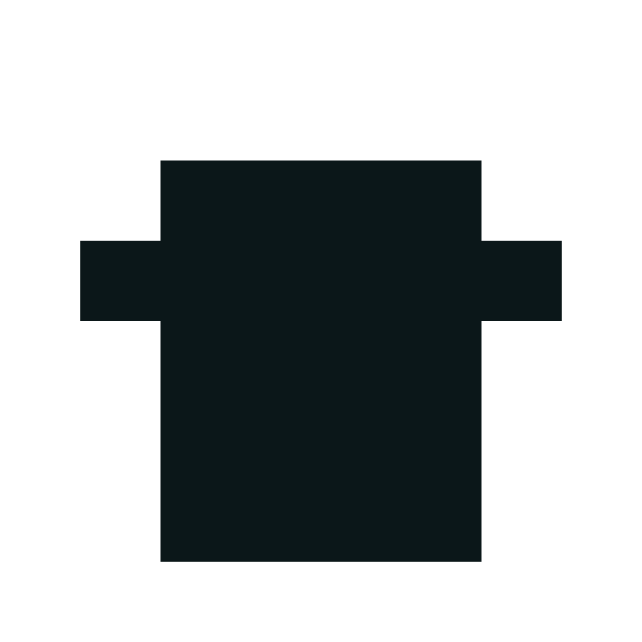</a> | **📂 檔名:** `cook-svgrepo-com.svg` ✨ **格式:** `Vector (SVG)` ⚖️ **大小:** `461.00B` | 📅 **更新:** `2026-02-27`  🚀 **jsDelivr Markdown:** `` 🔗 **直接連結 (Url):** `https://cdn.jsdelivr.netbarry028/materials@main/images/iCons/Pixel/Action/cook-svgrepo-com.svg` 📥 [檢視原始檔](cook-svgrepo-com.svg) |
|  | **📂 檔名:** `copy-svgrepo-com.svg` ✨ **格式:** `Vector (SVG)` ⚖️ **大小:** `463.00B` | 📅 **更新:** `2026-02-27`  🚀 **jsDelivr Markdown:** `` 🔗 **直接連結 (Url):** `https://cdn.jsdelivr.netbarry028/materials@main/images/iCons/Pixel/Action/copy-svgrepo-com.svg` 📥 [檢視原始檔](copy-svgrepo-com.svg) |
|  | **📂 檔名:** `create-svgrepo-com.svg` ✨ **格式:** `Vector (SVG)` ⚖️ **大小:** `444.00B` | 📅 **更新:** `2026-02-27`  🚀 **jsDelivr Markdown:** `` 🔗 **直接連結 (Url):** `https://cdn.jsdelivr.netbarry028/materials@main/images/iCons/Pixel/Action/create-svgrepo-com.svg` 📥 [檢視原始檔](create-svgrepo-com.svg) |
| <a href="crop-svgrepo-com.svg">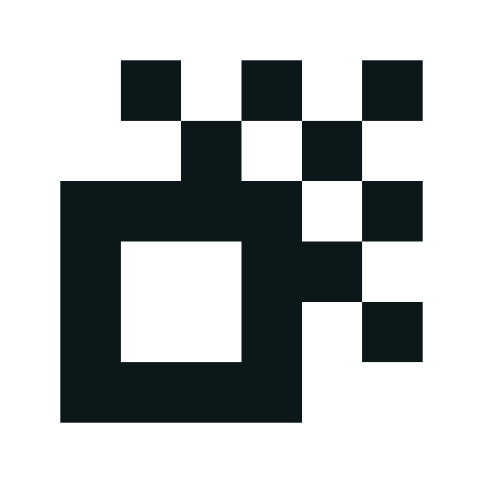</a> | **📂 檔名:** `crop-svgrepo-com.svg` ✨ **格式:** `Vector (SVG)` ⚖️ **大小:** `578.00B` | 📅 **更新:** `2026-02-27`  🚀 **jsDelivr Markdown:** `` 🔗 **直接連結 (Url):** `https://cdn.jsdelivr.netbarry028/materials@main/images/iCons/Pixel/Action/crop-svgrepo-com.svg` 📥 [檢視原始檔](crop-svgrepo-com.svg) |
|  | **📂 檔名:** `cry-svgrepo-com.svg` ✨ **格式:** `Vector (SVG)` ⚖️ **大小:** `455.00B` | 📅 **更新:** `2026-02-27`  🚀 **jsDelivr Markdown:** `` 🔗 **直接連結 (Url):** `https://cdn.jsdelivr.netbarry028/materials@main/images/iCons/Pixel/Action/cry-svgrepo-com.svg` 📥 [檢視原始檔](cry-svgrepo-com.svg) |
|  | **📂 檔名:** `cut-svgrepo-com.svg` ✨ **格式:** `Vector (SVG)` ⚖️ **大小:** `582.00B` | 📅 **更新:** `2026-02-27`  🚀 **jsDelivr Markdown:** `` 🔗 **直接連結 (Url):** `https://cdn.jsdelivr.netbarry028/materials@main/images/iCons/Pixel/Action/cut-svgrepo-com.svg` 📥 [檢視原始檔](cut-svgrepo-com.svg) |
| <a href="dazzle-svgrepo-com.svg">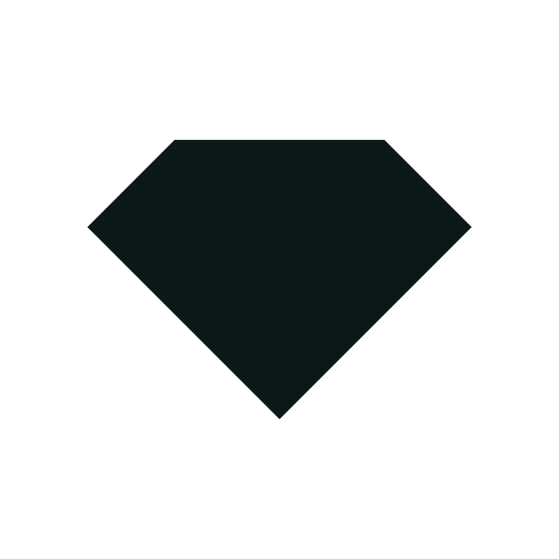</a> | **📂 檔名:** `dazzle-svgrepo-com.svg` ✨ **格式:** `Vector (SVG)` ⚖️ **大小:** `455.00B` | 📅 **更新:** `2026-02-27`  🚀 **jsDelivr Markdown:** `` 🔗 **直接連結 (Url):** `https://cdn.jsdelivr.netbarry028/materials@main/images/iCons/Pixel/Action/dazzle-svgrepo-com.svg` 📥 [檢視原始檔](dazzle-svgrepo-com.svg) |
| <a href="decorate-svgrepo-com.svg">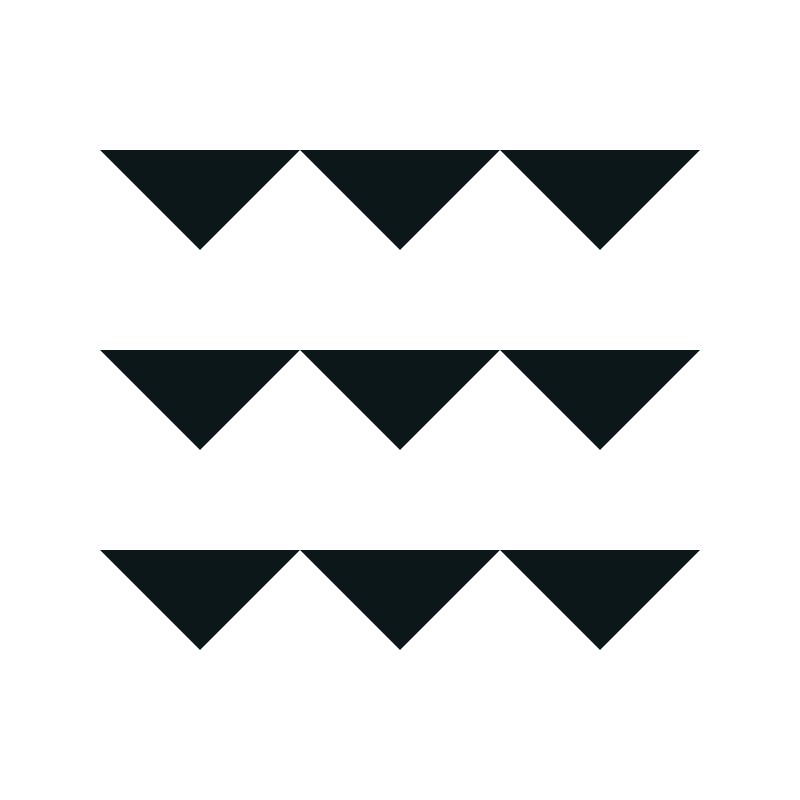</a> | **📂 檔名:** `decorate-svgrepo-com.svg` ✨ **格式:** `Vector (SVG)` ⚖️ **大小:** `602.00B` | 📅 **更新:** `2026-02-27`  🚀 **jsDelivr Markdown:** `` 🔗 **直接連結 (Url):** `https://cdn.jsdelivr.netbarry028/materials@main/images/iCons/Pixel/Action/decorate-svgrepo-com.svg` 📥 [檢視原始檔](decorate-svgrepo-com.svg) |
|  | **📂 檔名:** `defend-svgrepo-com.svg` ✨ **格式:** `Vector (SVG)` ⚖️ **大小:** `448.00B` | 📅 **更新:** `2026-02-27`  🚀 **jsDelivr Markdown:** `` 🔗 **直接連結 (Url):** `https://cdn.jsdelivr.netbarry028/materials@main/images/iCons/Pixel/Action/defend-svgrepo-com.svg` 📥 [檢視原始檔](defend-svgrepo-com.svg) |
|  | **📂 檔名:** `develop-svgrepo-com.svg` ✨ **格式:** `Vector (SVG)` ⚖️ **大小:** `571.00B` | 📅 **更新:** `2026-02-27`  🚀 **jsDelivr Markdown:** `` 🔗 **直接連結 (Url):** `https://cdn.jsdelivr.netbarry028/materials@main/images/iCons/Pixel/Action/develop-svgrepo-com.svg` 📥 [檢視原始檔](develop-svgrepo-com.svg) |
|  | **📂 檔名:** `die-svgrepo-com.svg` ✨ **格式:** `Vector (SVG)` ⚖️ **大小:** `459.00B` | 📅 **更新:** `2026-02-27`  🚀 **jsDelivr Markdown:** `` 🔗 **直接連結 (Url):** `https://cdn.jsdelivr.netbarry028/materials@main/images/iCons/Pixel/Action/die-svgrepo-com.svg` 📥 [檢視原始檔](die-svgrepo-com.svg) |
|  | **📂 檔名:** `dig-svgrepo-com.svg` ✨ **格式:** `Vector (SVG)` ⚖️ **大小:** `502.00B` | 📅 **更新:** `2026-02-27`  🚀 **jsDelivr Markdown:** `` 🔗 **直接連結 (Url):** `https://cdn.jsdelivr.netbarry028/materials@main/images/iCons/Pixel/Action/dig-svgrepo-com.svg` 📥 [檢視原始檔](dig-svgrepo-com.svg) |
|  | **📂 檔名:** `divide-svgrepo-com.svg` ✨ **格式:** `Vector (SVG)` ⚖️ **大小:** `481.00B` | 📅 **更新:** `2026-02-27`  🚀 **jsDelivr Markdown:** `` 🔗 **直接連結 (Url):** `https://cdn.jsdelivr.netbarry028/materials@main/images/iCons/Pixel/Action/divide-svgrepo-com.svg` 📥 [檢視原始檔](divide-svgrepo-com.svg) |
|  | **📂 檔名:** `download-svgrepo-com.svg` ✨ **格式:** `Vector (SVG)` ⚖️ **大小:** `529.00B` | 📅 **更新:** `2026-02-27`  🚀 **jsDelivr Markdown:** `` 🔗 **直接連結 (Url):** `https://cdn.jsdelivr.netbarry028/materials@main/images/iCons/Pixel/Action/download-svgrepo-com.svg` 📥 [檢視原始檔](download-svgrepo-com.svg) |
|  | **📂 檔名:** `dream-svgrepo-com.svg` ✨ **格式:** `Vector (SVG)` ⚖️ **大小:** `460.00B` | 📅 **更新:** `2026-02-27`  🚀 **jsDelivr Markdown:** `` 🔗 **直接連結 (Url):** `https://cdn.jsdelivr.netbarry028/materials@main/images/iCons/Pixel/Action/dream-svgrepo-com.svg` 📥 [檢視原始檔](dream-svgrepo-com.svg) |
| <a href="drill-svgrepo-com.svg">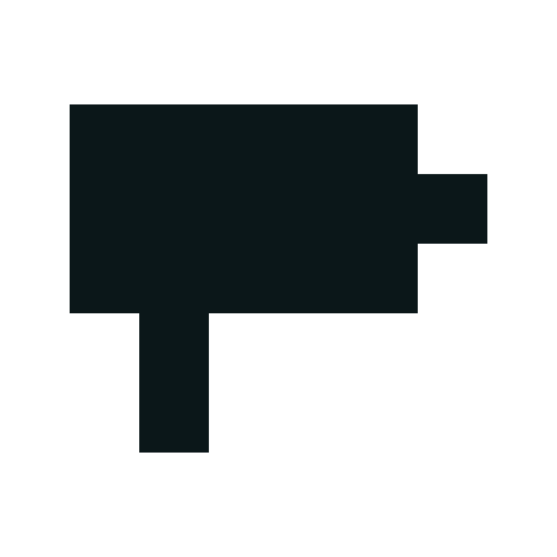</a> | **📂 檔名:** `drill-svgrepo-com.svg` ✨ **格式:** `Vector (SVG)` ⚖️ **大小:** `460.00B` | 📅 **更新:** `2026-02-27`  🚀 **jsDelivr Markdown:** `` 🔗 **直接連結 (Url):** `https://cdn.jsdelivr.netbarry028/materials@main/images/iCons/Pixel/Action/drill-svgrepo-com.svg` 📥 [檢視原始檔](drill-svgrepo-com.svg) |
|  | **📂 檔名:** `drink-svgrepo-com.svg` ✨ **格式:** `Vector (SVG)` ⚖️ **大小:** `512.00B` | 📅 **更新:** `2026-02-27`  🚀 **jsDelivr Markdown:** `` 🔗 **直接連結 (Url):** `https://cdn.jsdelivr.netbarry028/materials@main/images/iCons/Pixel/Action/drink-svgrepo-com.svg` 📥 [檢視原始檔](drink-svgrepo-com.svg) |
| <a href="drive-svgrepo-com.svg">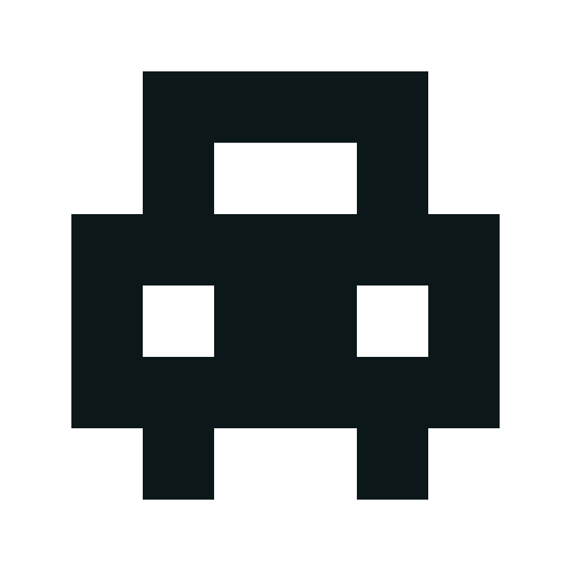</a> | **📂 檔名:** `drive-svgrepo-com.svg` ✨ **格式:** `Vector (SVG)` ⚖️ **大小:** `525.00B` | 📅 **更新:** `2026-02-27`  🚀 **jsDelivr Markdown:** `` 🔗 **直接連結 (Url):** `https://cdn.jsdelivr.netbarry028/materials@main/images/iCons/Pixel/Action/drive-svgrepo-com.svg` 📥 [檢視原始檔](drive-svgrepo-com.svg) |
| <a href="drown-svgrepo-com.svg">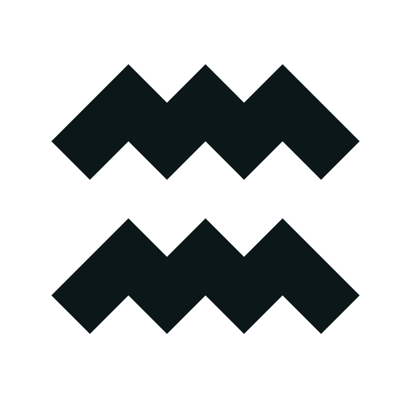</a> | **📂 檔名:** `drown-svgrepo-com.svg` ✨ **格式:** `Vector (SVG)` ⚖️ **大小:** `572.00B` | 📅 **更新:** `2026-02-27`  🚀 **jsDelivr Markdown:** `` 🔗 **直接連結 (Url):** `https://cdn.jsdelivr.netbarry028/materials@main/images/iCons/Pixel/Action/drown-svgrepo-com.svg` 📥 [檢視原始檔](drown-svgrepo-com.svg) |
|  | **📂 檔名:** `eat-svgrepo-com.svg` ✨ **格式:** `Vector (SVG)` ⚖️ **大小:** `481.00B` | 📅 **更新:** `2026-02-27`  🚀 **jsDelivr Markdown:** `` 🔗 **直接連結 (Url):** `https://cdn.jsdelivr.netbarry028/materials@main/images/iCons/Pixel/Action/eat-svgrepo-com.svg` 📥 [檢視原始檔](eat-svgrepo-com.svg) |
|  | **📂 檔名:** `enlarge-svgrepo-com.svg` ✨ **格式:** `Vector (SVG)` ⚖️ **大小:** `494.00B` | 📅 **更新:** `2026-02-27`  🚀 **jsDelivr Markdown:** `` 🔗 **直接連結 (Url):** `https://cdn.jsdelivr.netbarry028/materials@main/images/iCons/Pixel/Action/enlarge-svgrepo-com.svg` 📥 [檢視原始檔](enlarge-svgrepo-com.svg) |
| <a href="enter-svgrepo-com.svg">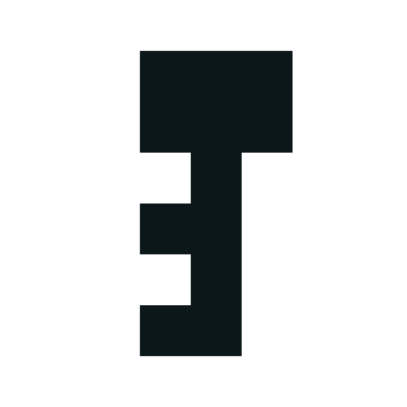</a> | **📂 檔名:** `enter-svgrepo-com.svg` ✨ **格式:** `Vector (SVG)` ⚖️ **大小:** `468.00B` | 📅 **更新:** `2026-02-27`  🚀 **jsDelivr Markdown:** `` 🔗 **直接連結 (Url):** `https://cdn.jsdelivr.netbarry028/materials@main/images/iCons/Pixel/Action/enter-svgrepo-com.svg` 📥 [檢視原始檔](enter-svgrepo-com.svg) |
|  | **📂 檔名:** `equal-svgrepo-com.svg` ✨ **格式:** `Vector (SVG)` ⚖️ **大小:** `457.00B` | 📅 **更新:** `2026-02-27`  🚀 **jsDelivr Markdown:** `` 🔗 **直接連結 (Url):** `https://cdn.jsdelivr.netbarry028/materials@main/images/iCons/Pixel/Action/equal-svgrepo-com.svg` 📥 [檢視原始檔](equal-svgrepo-com.svg) |
| <a href="explode-svgrepo-com.svg">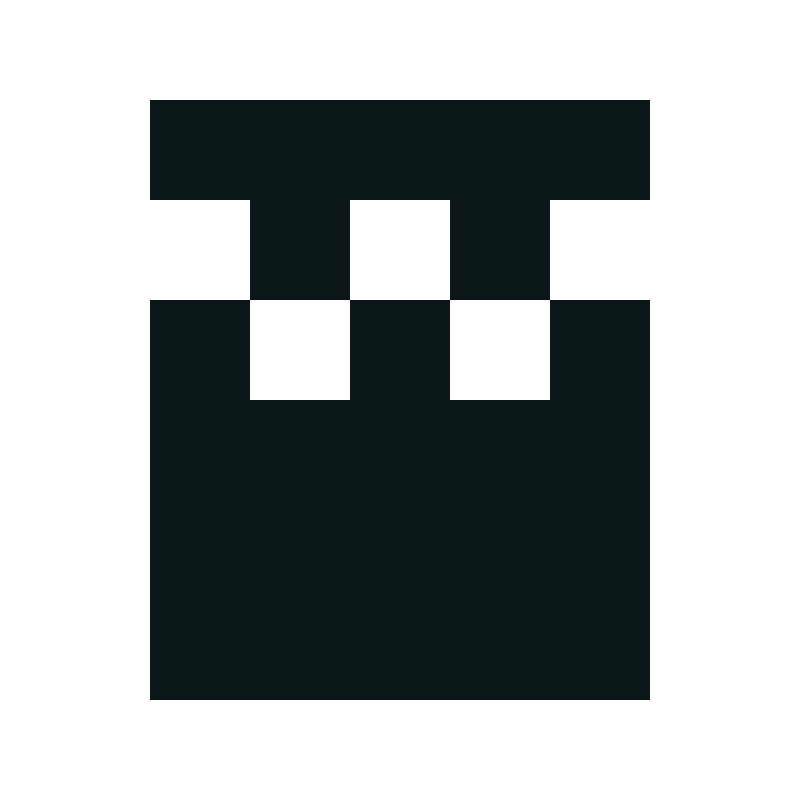</a> | **📂 檔名:** `explode-svgrepo-com.svg` ✨ **格式:** `Vector (SVG)` ⚖️ **大小:** `500.00B` | 📅 **更新:** `2026-02-27`  🚀 **jsDelivr Markdown:** `` 🔗 **直接連結 (Url):** `https://cdn.jsdelivr.netbarry028/materials@main/images/iCons/Pixel/Action/explode-svgrepo-com.svg` 📥 [檢視原始檔](explode-svgrepo-com.svg) |
|  | **📂 檔名:** `explore-svgrepo-com.svg` ✨ **格式:** `Vector (SVG)` ⚖️ **大小:** `496.00B` | 📅 **更新:** `2026-02-27`  🚀 **jsDelivr Markdown:** `` 🔗 **直接連結 (Url):** `https://cdn.jsdelivr.netbarry028/materials@main/images/iCons/Pixel/Action/explore-svgrepo-com.svg` 📥 [檢視原始檔](explore-svgrepo-com.svg) |
|  | **📂 檔名:** `fight-svgrepo-com.svg` ✨ **格式:** `Vector (SVG)` ⚖️ **大小:** `592.00B` | 📅 **更新:** `2026-02-27`  🚀 **jsDelivr Markdown:** `` 🔗 **直接連結 (Url):** `https://cdn.jsdelivr.netbarry028/materials@main/images/iCons/Pixel/Action/fight-svgrepo-com.svg` 📥 [檢視原始檔](fight-svgrepo-com.svg) |
|  | **📂 檔名:** `film-svgrepo-com.svg` ✨ **格式:** `Vector (SVG)` ⚖️ **大小:** `479.00B` | 📅 **更新:** `2026-02-27`  🚀 **jsDelivr Markdown:** `` 🔗 **直接連結 (Url):** `https://cdn.jsdelivr.netbarry028/materials@main/images/iCons/Pixel/Action/film-svgrepo-com.svg` 📥 [檢視原始檔](film-svgrepo-com.svg) |
|  | **📂 檔名:** `find-svgrepo-com.svg` ✨ **格式:** `Vector (SVG)` ⚖️ **大小:** `486.00B` | 📅 **更新:** `2026-02-27`  🚀 **jsDelivr Markdown:** `` 🔗 **直接連結 (Url):** `https://cdn.jsdelivr.netbarry028/materials@main/images/iCons/Pixel/Action/find-svgrepo-com.svg` 📥 [檢視原始檔](find-svgrepo-com.svg) |
|  | **📂 檔名:** `finish-svgrepo-com.svg` ✨ **格式:** `Vector (SVG)` ⚖️ **大小:** `623.00B` | 📅 **更新:** `2026-02-27`  🚀 **jsDelivr Markdown:** `` 🔗 **直接連結 (Url):** `https://cdn.jsdelivr.netbarry028/materials@main/images/iCons/Pixel/Action/finish-svgrepo-com.svg` 📥 [檢視原始檔](finish-svgrepo-com.svg) |
| <a href="fit-svgrepo-com.svg">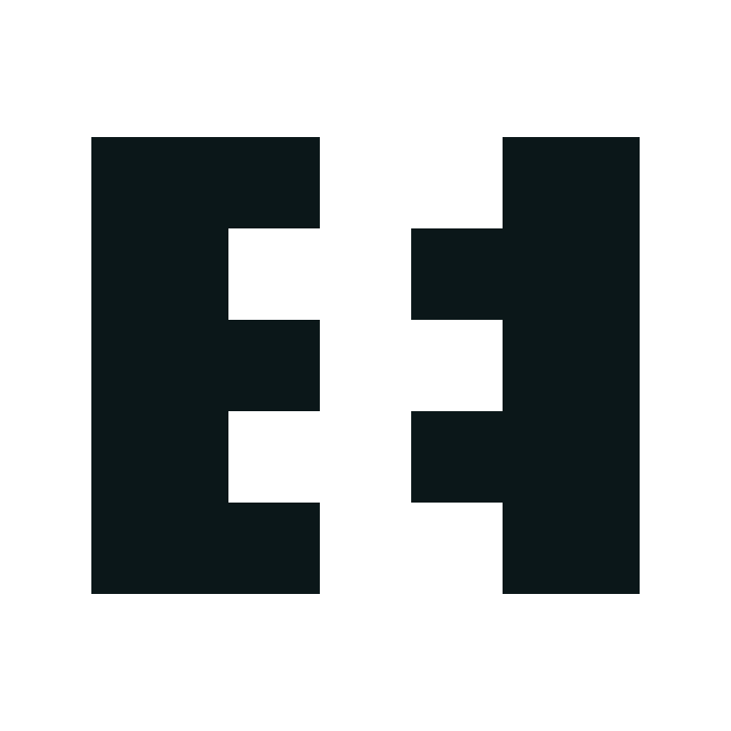</a> | **📂 檔名:** `fit-svgrepo-com.svg` ✨ **格式:** `Vector (SVG)` ⚖️ **大小:** `490.00B` | 📅 **更新:** `2026-02-27`  🚀 **jsDelivr Markdown:** `` 🔗 **直接連結 (Url):** `https://cdn.jsdelivr.netbarry028/materials@main/images/iCons/Pixel/Action/fit-svgrepo-com.svg` 📥 [檢視原始檔](fit-svgrepo-com.svg) |
|  | **📂 檔名:** `flag-svgrepo-com.svg` ✨ **格式:** `Vector (SVG)` ⚖️ **大小:** `446.00B` | 📅 **更新:** `2026-02-27`  🚀 **jsDelivr Markdown:** `` 🔗 **直接連結 (Url):** `https://cdn.jsdelivr.netbarry028/materials@main/images/iCons/Pixel/Action/flag-svgrepo-com.svg` 📥 [檢視原始檔](flag-svgrepo-com.svg) |
|  | **📂 檔名:** `forbid-svgrepo-com.svg` ✨ **格式:** `Vector (SVG)` ⚖️ **大小:** `578.00B` | 📅 **更新:** `2026-02-27`  🚀 **jsDelivr Markdown:** `` 🔗 **直接連結 (Url):** `https://cdn.jsdelivr.netbarry028/materials@main/images/iCons/Pixel/Action/forbid-svgrepo-com.svg` 📥 [檢視原始檔](forbid-svgrepo-com.svg) |
|  | **📂 檔名:** `forward-svgrepo-com.svg` ✨ **格式:** `Vector (SVG)` ⚖️ **大小:** `500.00B` | 📅 **更新:** `2026-02-27`  🚀 **jsDelivr Markdown:** `` 🔗 **直接連結 (Url):** `https://cdn.jsdelivr.netbarry028/materials@main/images/iCons/Pixel/Action/forward-svgrepo-com.svg` 📥 [檢視原始檔](forward-svgrepo-com.svg) |
| <a href="gamble-svgrepo-com.svg">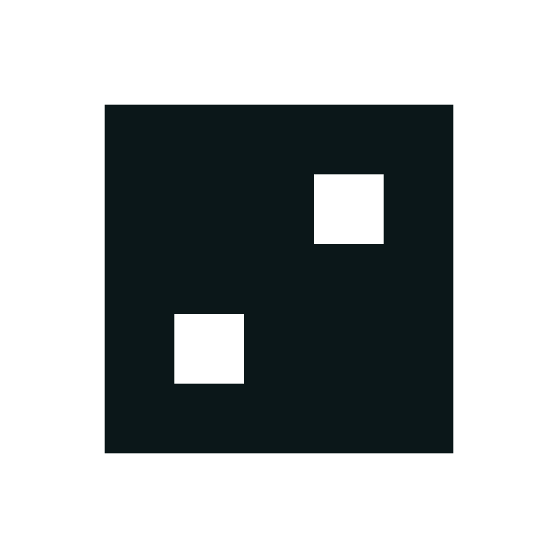</a> | **📂 檔名:** `gamble-svgrepo-com.svg` ✨ **格式:** `Vector (SVG)` ⚖️ **大小:** `477.00B` | 📅 **更新:** `2026-02-27`  🚀 **jsDelivr Markdown:** `` 🔗 **直接連結 (Url):** `https://cdn.jsdelivr.netbarry028/materials@main/images/iCons/Pixel/Action/gamble-svgrepo-com.svg` 📥 [檢視原始檔](gamble-svgrepo-com.svg) |
| <a href="game-svgrepo-com.svg">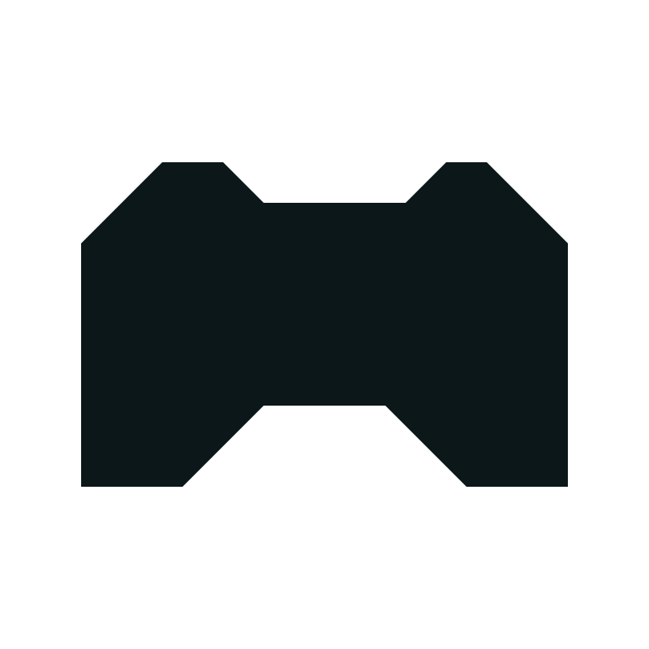</a> | **📂 檔名:** `game-svgrepo-com.svg` ✨ **格式:** `Vector (SVG)` ⚖️ **大小:** `479.00B` | 📅 **更新:** `2026-02-27`  🚀 **jsDelivr Markdown:** `` 🔗 **直接連結 (Url):** `https://cdn.jsdelivr.netbarry028/materials@main/images/iCons/Pixel/Action/game-svgrepo-com.svg` 📥 [檢視原始檔](game-svgrepo-com.svg) |
|  | **📂 檔名:** `give-svgrepo-com.svg` ✨ **格式:** `Vector (SVG)` ⚖️ **大小:** `493.00B` | 📅 **更新:** `2026-02-27`  🚀 **jsDelivr Markdown:** `` 🔗 **直接連結 (Url):** `https://cdn.jsdelivr.netbarry028/materials@main/images/iCons/Pixel/Action/give-svgrepo-com.svg` 📥 [檢視原始檔](give-svgrepo-com.svg) |
|  | **📂 檔名:** `go-svgrepo-com.svg` ✨ **格式:** `Vector (SVG)` ⚖️ **大小:** `529.00B` | 📅 **更新:** `2026-02-27`  🚀 **jsDelivr Markdown:** `` 🔗 **直接連結 (Url):** `https://cdn.jsdelivr.netbarry028/materials@main/images/iCons/Pixel/Action/go-svgrepo-com.svg` 📥 [檢視原始檔](go-svgrepo-com.svg) |
| <a href="groom-svgrepo-com.svg">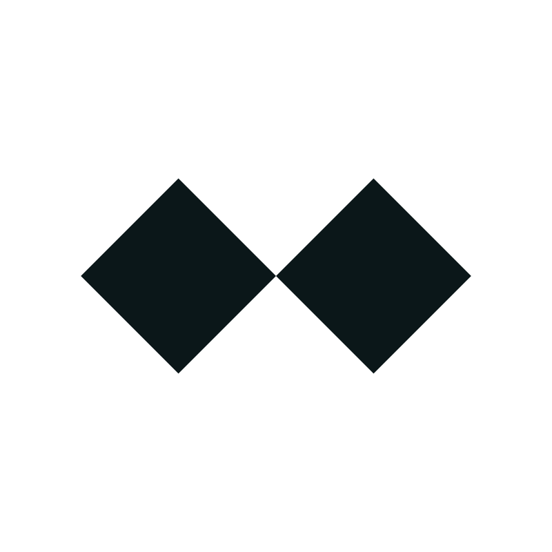</a> | **📂 檔名:** `groom-svgrepo-com.svg` ✨ **格式:** `Vector (SVG)` ⚖️ **大小:** `542.00B` | 📅 **更新:** `2026-02-27`  🚀 **jsDelivr Markdown:** `` 🔗 **直接連結 (Url):** `https://cdn.jsdelivr.netbarry028/materials@main/images/iCons/Pixel/Action/groom-svgrepo-com.svg` 📥 [檢視原始檔](groom-svgrepo-com.svg) |
| <a href="grow-svgrepo-com.svg">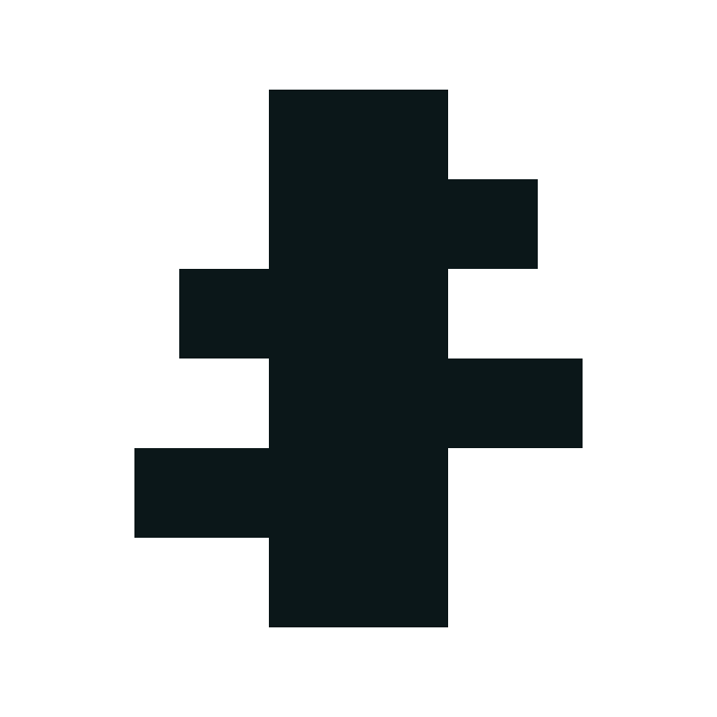</a> | **📂 檔名:** `grow-svgrepo-com.svg` ✨ **格式:** `Vector (SVG)` ⚖️ **大小:** `479.00B` | 📅 **更新:** `2026-02-27`  🚀 **jsDelivr Markdown:** `` 🔗 **直接連結 (Url):** `https://cdn.jsdelivr.netbarry028/materials@main/images/iCons/Pixel/Action/grow-svgrepo-com.svg` 📥 [檢視原始檔](grow-svgrepo-com.svg) |
|  | **📂 檔名:** `hack-svgrepo-com.svg` ✨ **格式:** `Vector (SVG)` ⚖️ **大小:** `485.00B` | 📅 **更新:** `2026-02-27`  🚀 **jsDelivr Markdown:** `` 🔗 **直接連結 (Url):** `https://cdn.jsdelivr.netbarry028/materials@main/images/iCons/Pixel/Action/hack-svgrepo-com.svg` 📥 [檢視原始檔](hack-svgrepo-com.svg) |
|  | **📂 檔名:** `hammer-svgrepo-com.svg` ✨ **格式:** `Vector (SVG)` ⚖️ **大小:** `536.00B` | 📅 **更新:** `2026-02-27`  🚀 **jsDelivr Markdown:** `` 🔗 **直接連結 (Url):** `https://cdn.jsdelivr.netbarry028/materials@main/images/iCons/Pixel/Action/hammer-svgrepo-com.svg` 📥 [檢視原始檔](hammer-svgrepo-com.svg) |
|  | **📂 檔名:** `hang-svgrepo-com.svg` ✨ **格式:** `Vector (SVG)` ⚖️ **大小:** `464.00B` | 📅 **更新:** `2026-02-27`  🚀 **jsDelivr Markdown:** `` 🔗 **直接連結 (Url):** `https://cdn.jsdelivr.netbarry028/materials@main/images/iCons/Pixel/Action/hang-svgrepo-com.svg` 📥 [檢視原始檔](hang-svgrepo-com.svg) |
|  | **📂 檔名:** `harvest-svgrepo-com.svg` ✨ **格式:** `Vector (SVG)` ⚖️ **大小:** `475.00B` | 📅 **更新:** `2026-02-27`  🚀 **jsDelivr Markdown:** `` 🔗 **直接連結 (Url):** `https://cdn.jsdelivr.netbarry028/materials@main/images/iCons/Pixel/Action/harvest-svgrepo-com.svg` 📥 [檢視原始檔](harvest-svgrepo-com.svg) |
| <a href="home-svgrepo-com.svg">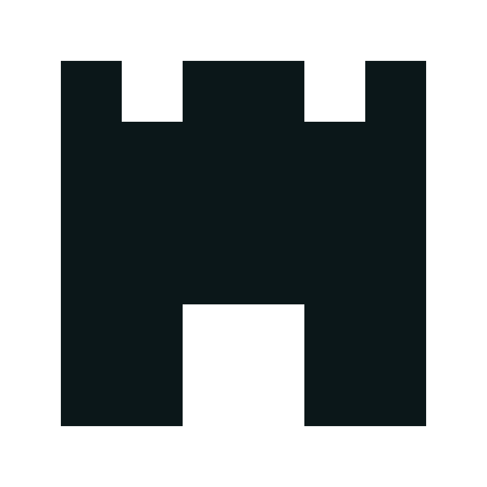</a> | **📂 檔名:** `home-svgrepo-com.svg` ✨ **格式:** `Vector (SVG)` ⚖️ **大小:** `467.00B` | 📅 **更新:** `2026-02-27`  🚀 **jsDelivr Markdown:** `` 🔗 **直接連結 (Url):** `https://cdn.jsdelivr.netbarry028/materials@main/images/iCons/Pixel/Action/home-svgrepo-com.svg` 📥 [檢視原始檔](home-svgrepo-com.svg) |
| <a href="hurt-svgrepo-com.svg">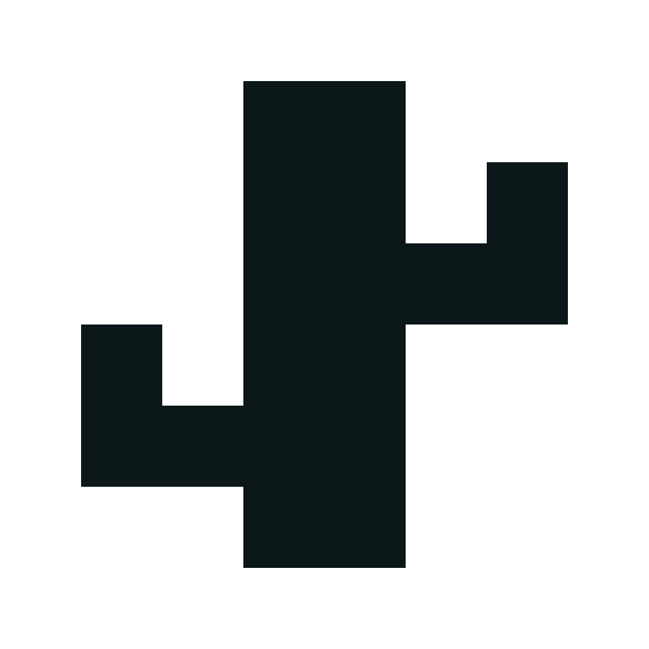</a> | **📂 檔名:** `hurt-svgrepo-com.svg` ✨ **格式:** `Vector (SVG)` ⚖️ **大小:** `468.00B` | 📅 **更新:** `2026-02-27`  🚀 **jsDelivr Markdown:** `` 🔗 **直接連結 (Url):** `https://cdn.jsdelivr.netbarry028/materials@main/images/iCons/Pixel/Action/hurt-svgrepo-com.svg` 📥 [檢視原始檔](hurt-svgrepo-com.svg) |
|  | **📂 檔名:** `join-svgrepo-com.svg` ✨ **格式:** `Vector (SVG)` ⚖️ **大小:** `463.00B` | 📅 **更新:** `2026-02-27`  🚀 **jsDelivr Markdown:** `` 🔗 **直接連結 (Url):** `https://cdn.jsdelivr.netbarry028/materials@main/images/iCons/Pixel/Action/join-svgrepo-com.svg` 📥 [檢視原始檔](join-svgrepo-com.svg) |
|  | **📂 檔名:** `keep-svgrepo-com.svg` ✨ **格式:** `Vector (SVG)` ⚖️ **大小:** `480.00B` | 📅 **更新:** `2026-02-27`  🚀 **jsDelivr Markdown:** `` 🔗 **直接連結 (Url):** `https://cdn.jsdelivr.netbarry028/materials@main/images/iCons/Pixel/Action/keep-svgrepo-com.svg` 📥 [檢視原始檔](keep-svgrepo-com.svg) |
|  | **📂 檔名:** `kill-svgrepo-com.svg` ✨ **格式:** `Vector (SVG)` ⚖️ **大小:** `461.00B` | 📅 **更新:** `2026-02-27`  🚀 **jsDelivr Markdown:** `` 🔗 **直接連結 (Url):** `https://cdn.jsdelivr.netbarry028/materials@main/images/iCons/Pixel/Action/kill-svgrepo-com.svg` 📥 [檢視原始檔](kill-svgrepo-com.svg) |
|  | **📂 檔名:** `kiss-svgrepo-com.svg` ✨ **格式:** `Vector (SVG)` ⚖️ **大小:** `468.00B` | 📅 **更新:** `2026-02-27`  🚀 **jsDelivr Markdown:** `` 🔗 **直接連結 (Url):** `https://cdn.jsdelivr.netbarry028/materials@main/images/iCons/Pixel/Action/kiss-svgrepo-com.svg` 📥 [檢視原始檔](kiss-svgrepo-com.svg) |
| <a href="label-svgrepo-com.svg">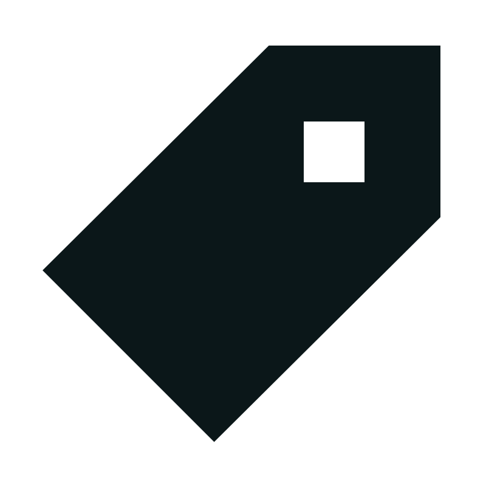</a> | **📂 檔名:** `label-svgrepo-com.svg` ✨ **格式:** `Vector (SVG)` ⚖️ **大小:** `481.00B` | 📅 **更新:** `2026-02-27`  🚀 **jsDelivr Markdown:** `` 🔗 **直接連結 (Url):** `https://cdn.jsdelivr.netbarry028/materials@main/images/iCons/Pixel/Action/label-svgrepo-com.svg` 📥 [檢視原始檔](label-svgrepo-com.svg) |
|  | **📂 檔名:** `launch-svgrepo-com.svg` ✨ **格式:** `Vector (SVG)` ⚖️ **大小:** `467.00B` | 📅 **更新:** `2026-02-27`  🚀 **jsDelivr Markdown:** `` 🔗 **直接連結 (Url):** `https://cdn.jsdelivr.netbarry028/materials@main/images/iCons/Pixel/Action/launch-svgrepo-com.svg` 📥 [檢視原始檔](launch-svgrepo-com.svg) |
|  | **📂 檔名:** `lift-svgrepo-com.svg` ✨ **格式:** `Vector (SVG)` ⚖️ **大小:** `497.00B` | 📅 **更新:** `2026-02-27`  🚀 **jsDelivr Markdown:** `` 🔗 **直接連結 (Url):** `https://cdn.jsdelivr.netbarry028/materials@main/images/iCons/Pixel/Action/lift-svgrepo-com.svg` 📥 [檢視原始檔](lift-svgrepo-com.svg) |
|  | **📂 檔名:** `link-svgrepo-com.svg` ✨ **格式:** `Vector (SVG)` ⚖️ **大小:** `481.00B` | 📅 **更新:** `2026-02-27`  🚀 **jsDelivr Markdown:** `` 🔗 **直接連結 (Url):** `https://cdn.jsdelivr.netbarry028/materials@main/images/iCons/Pixel/Action/link-svgrepo-com.svg` 📥 [檢視原始檔](link-svgrepo-com.svg) |
|  | **📂 檔名:** `listen-svgrepo-com.svg` ✨ **格式:** `Vector (SVG)` ⚖️ **大小:** `474.00B` | 📅 **更新:** `2026-02-27`  🚀 **jsDelivr Markdown:** `` 🔗 **直接連結 (Url):** `https://cdn.jsdelivr.netbarry028/materials@main/images/iCons/Pixel/Action/listen-svgrepo-com.svg` 📥 [檢視原始檔](listen-svgrepo-com.svg) |
| <a href="locate-svgrepo-com.svg">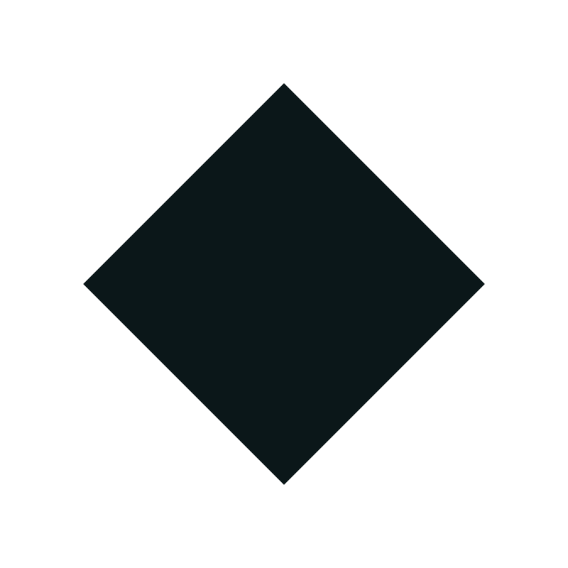</a> | **📂 檔名:** `locate-svgrepo-com.svg` ✨ **格式:** `Vector (SVG)` ⚖️ **大小:** `473.00B` | 📅 **更新:** `2026-02-27`  🚀 **jsDelivr Markdown:** `` 🔗 **直接連結 (Url):** `https://cdn.jsdelivr.netbarry028/materials@main/images/iCons/Pixel/Action/locate-svgrepo-com.svg` 📥 [檢視原始檔](locate-svgrepo-com.svg) |
|  | **📂 檔名:** `love-svgrepo-com.svg` ✨ **格式:** `Vector (SVG)` ⚖️ **大小:** `465.00B` | 📅 **更新:** `2026-02-27`  🚀 **jsDelivr Markdown:** `` 🔗 **直接連結 (Url):** `https://cdn.jsdelivr.netbarry028/materials@main/images/iCons/Pixel/Action/love-svgrepo-com.svg` 📥 [檢視原始檔](love-svgrepo-com.svg) |
|  | **📂 檔名:** `marry-svgrepo-com.svg` ✨ **格式:** `Vector (SVG)` ⚖️ **大小:** `461.00B` | 📅 **更新:** `2026-02-27`  🚀 **jsDelivr Markdown:** `` 🔗 **直接連結 (Url):** `https://cdn.jsdelivr.netbarry028/materials@main/images/iCons/Pixel/Action/marry-svgrepo-com.svg` 📥 [檢視原始檔](marry-svgrepo-com.svg) |
|  | **📂 檔名:** `merge-svgrepo-com.svg` ✨ **格式:** `Vector (SVG)` ⚖️ **大小:** `536.00B` | 📅 **更新:** `2026-02-27`  🚀 **jsDelivr Markdown:** `` 🔗 **直接連結 (Url):** `https://cdn.jsdelivr.netbarry028/materials@main/images/iCons/Pixel/Action/merge-svgrepo-com.svg` 📥 [檢視原始檔](merge-svgrepo-com.svg) |
|  | **📂 檔名:** `narrow-svgrepo-com.svg` ✨ **格式:** `Vector (SVG)` ⚖️ **大小:** `452.00B` | 📅 **更新:** `2026-02-27`  🚀 **jsDelivr Markdown:** `` 🔗 **直接連結 (Url):** `https://cdn.jsdelivr.netbarry028/materials@main/images/iCons/Pixel/Action/narrow-svgrepo-com.svg` 📥 [檢視原始檔](narrow-svgrepo-com.svg) |
|  | **📂 檔名:** `navigate-svgrepo-com.svg` ✨ **格式:** `Vector (SVG)` ⚖️ **大小:** `550.00B` | 📅 **更新:** `2026-02-27`  🚀 **jsDelivr Markdown:** `` 🔗 **直接連結 (Url):** `https://cdn.jsdelivr.netbarry028/materials@main/images/iCons/Pixel/Action/navigate-svgrepo-com.svg` 📥 [檢視原始檔](navigate-svgrepo-com.svg) |
| <a href="open-svgrepo-com.svg">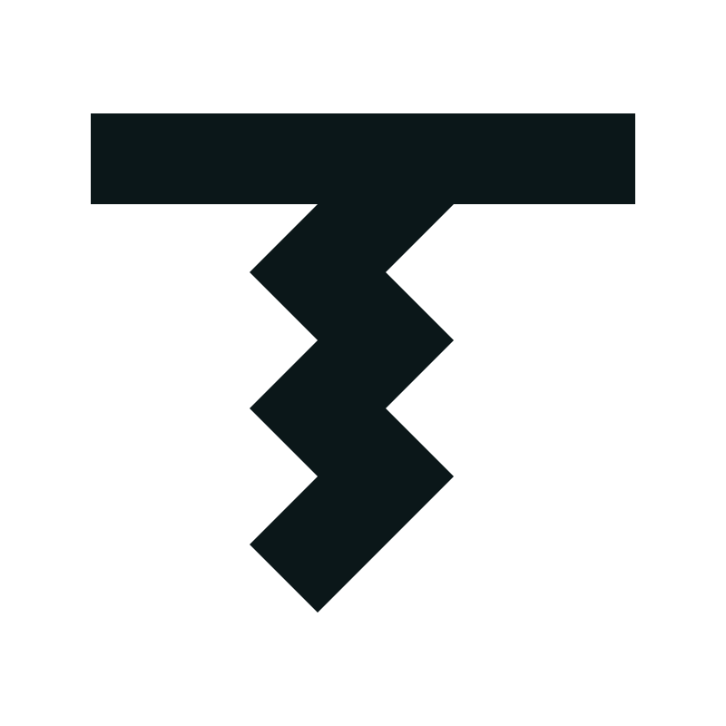</a> | **📂 檔名:** `open-svgrepo-com.svg` ✨ **格式:** `Vector (SVG)` ⚖️ **大小:** `492.00B` | 📅 **更新:** `2026-02-27`  🚀 **jsDelivr Markdown:** `` 🔗 **直接連結 (Url):** `https://cdn.jsdelivr.netbarry028/materials@main/images/iCons/Pixel/Action/open-svgrepo-com.svg` 📥 [檢視原始檔](open-svgrepo-com.svg) |
|  | **📂 檔名:** `pause-svgrepo-com.svg` ✨ **格式:** `Vector (SVG)` ⚖️ **大小:** `457.00B` | 📅 **更新:** `2026-02-27`  🚀 **jsDelivr Markdown:** `` 🔗 **直接連結 (Url):** `https://cdn.jsdelivr.netbarry028/materials@main/images/iCons/Pixel/Action/pause-svgrepo-com.svg` 📥 [檢視原始檔](pause-svgrepo-com.svg) |
|  | **📂 檔名:** `pay-svgrepo-com.svg` ✨ **格式:** `Vector (SVG)` ⚖️ **大小:** `458.00B` | 📅 **更新:** `2026-02-27`  🚀 **jsDelivr Markdown:** `` 🔗 **直接連結 (Url):** `https://cdn.jsdelivr.netbarry028/materials@main/images/iCons/Pixel/Action/pay-svgrepo-com.svg` 📥 [檢視原始檔](pay-svgrepo-com.svg) |
|  | **📂 檔名:** `perform-svgrepo-com.svg` ✨ **格式:** `Vector (SVG)` ⚖️ **大小:** `504.00B` | 📅 **更新:** `2026-02-27`  🚀 **jsDelivr Markdown:** `` 🔗 **直接連結 (Url):** `https://cdn.jsdelivr.netbarry028/materials@main/images/iCons/Pixel/Action/perform-svgrepo-com.svg` 📥 [檢視原始檔](perform-svgrepo-com.svg) |
|  | **📂 檔名:** `photograph-svgrepo-com.svg` ✨ **格式:** `Vector (SVG)` ⚖️ **大小:** `471.00B` | 📅 **更新:** `2026-02-27`  🚀 **jsDelivr Markdown:** `` 🔗 **直接連結 (Url):** `https://cdn.jsdelivr.netbarry028/materials@main/images/iCons/Pixel/Action/photograph-svgrepo-com.svg` 📥 [檢視原始檔](photograph-svgrepo-com.svg) |
| <a href="pin-svgrepo-com.svg">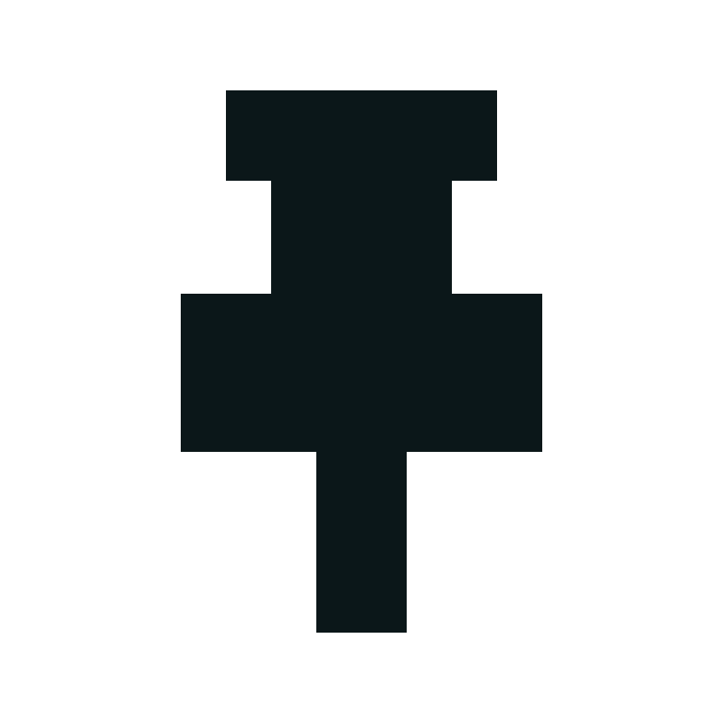</a> | **📂 檔名:** `pin-svgrepo-com.svg` ✨ **格式:** `Vector (SVG)` ⚖️ **大小:** `471.00B` | 📅 **更新:** `2026-02-27`  🚀 **jsDelivr Markdown:** `` 🔗 **直接連結 (Url):** `https://cdn.jsdelivr.netbarry028/materials@main/images/iCons/Pixel/Action/pin-svgrepo-com.svg` 📥 [檢視原始檔](pin-svgrepo-com.svg) |
| <a href="ping-svgrepo-com.svg">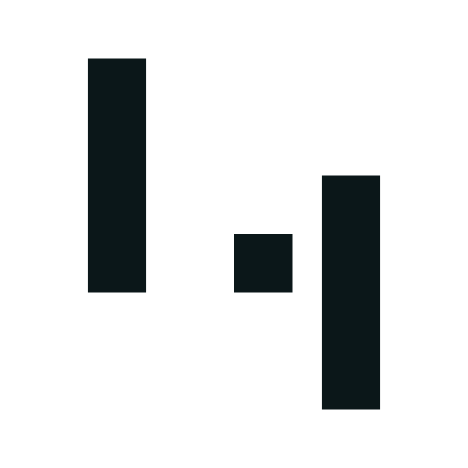</a> | **📂 檔名:** `ping-svgrepo-com.svg` ✨ **格式:** `Vector (SVG)` ⚖️ **大小:** `478.00B` | 📅 **更新:** `2026-02-27`  🚀 **jsDelivr Markdown:** `` 🔗 **直接連結 (Url):** `https://cdn.jsdelivr.netbarry028/materials@main/images/iCons/Pixel/Action/ping-svgrepo-com.svg` 📥 [檢視原始檔](ping-svgrepo-com.svg) |
| <a href="plug-svgrepo-com.svg">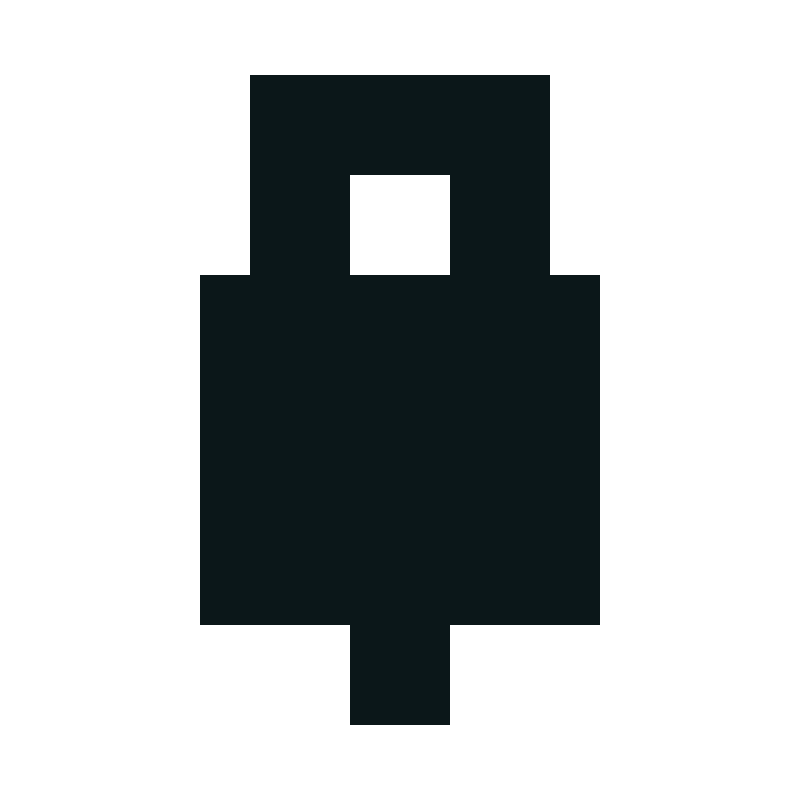</a> | **📂 檔名:** `plug-svgrepo-com.svg` ✨ **格式:** `Vector (SVG)` ⚖️ **大小:** `478.00B` | 📅 **更新:** `2026-02-27`  🚀 **jsDelivr Markdown:** `` 🔗 **直接連結 (Url):** `https://cdn.jsdelivr.netbarry028/materials@main/images/iCons/Pixel/Action/plug-svgrepo-com.svg` 📥 [檢視原始檔](plug-svgrepo-com.svg) |
|  | **📂 檔名:** `point-svgrepo-com.svg` ✨ **格式:** `Vector (SVG)` ⚖️ **大小:** `527.00B` | 📅 **更新:** `2026-02-27`  🚀 **jsDelivr Markdown:** `` 🔗 **直接連結 (Url):** `https://cdn.jsdelivr.netbarry028/materials@main/images/iCons/Pixel/Action/point-svgrepo-com.svg` 📥 [檢視原始檔](point-svgrepo-com.svg) |
|  | **📂 檔名:** `power-svgrepo-com.svg` ✨ **格式:** `Vector (SVG)` ⚖️ **大小:** `468.00B` | 📅 **更新:** `2026-02-27`  🚀 **jsDelivr Markdown:** `` 🔗 **直接連結 (Url):** `https://cdn.jsdelivr.netbarry028/materials@main/images/iCons/Pixel/Action/power-svgrepo-com.svg` 📥 [檢視原始檔](power-svgrepo-com.svg) |
| <a href="prank-svgrepo-com.svg">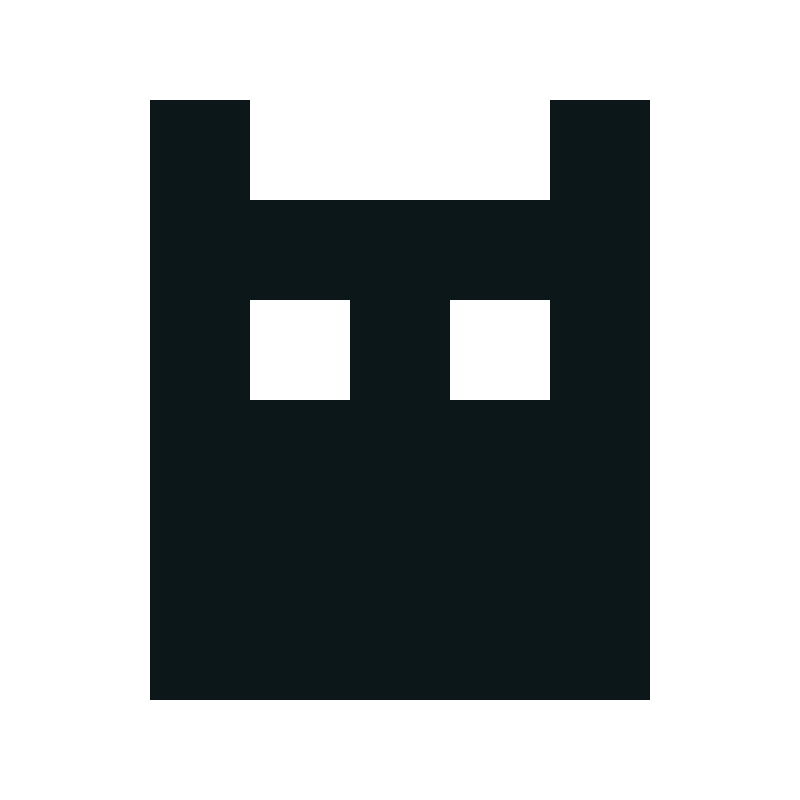</a> | **📂 檔名:** `prank-svgrepo-com.svg` ✨ **格式:** `Vector (SVG)` ⚖️ **大小:** `488.00B` | 📅 **更新:** `2026-02-27`  🚀 **jsDelivr Markdown:** `` 🔗 **直接連結 (Url):** `https://cdn.jsdelivr.netbarry028/materials@main/images/iCons/Pixel/Action/prank-svgrepo-com.svg` 📥 [檢視原始檔](prank-svgrepo-com.svg) |
| <a href="press-svgrepo-com.svg">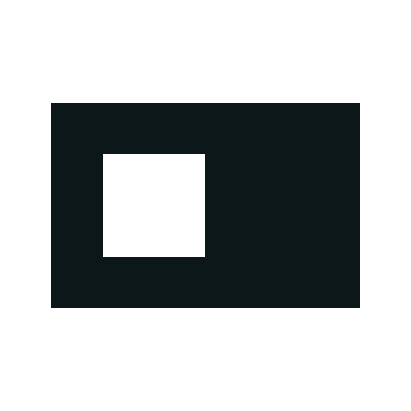</a> | **📂 檔名:** `press-svgrepo-com.svg` ✨ **格式:** `Vector (SVG)` ⚖️ **大小:** `457.00B` | 📅 **更新:** `2026-02-27`  🚀 **jsDelivr Markdown:** `` 🔗 **直接連結 (Url):** `https://cdn.jsdelivr.netbarry028/materials@main/images/iCons/Pixel/Action/press-svgrepo-com.svg` 📥 [檢視原始檔](press-svgrepo-com.svg) |
|  | **📂 檔名:** `primp-svgrepo-com.svg` ✨ **格式:** `Vector (SVG)` ⚖️ **大小:** `582.00B` | 📅 **更新:** `2026-02-27`  🚀 **jsDelivr Markdown:** `` 🔗 **直接連結 (Url):** `https://cdn.jsdelivr.netbarry028/materials@main/images/iCons/Pixel/Action/primp-svgrepo-com.svg` 📥 [檢視原始檔](primp-svgrepo-com.svg) |
|  | **📂 檔名:** `print-svgrepo-com.svg` ✨ **格式:** `Vector (SVG)` ⚖️ **大小:** `458.00B` | 📅 **更新:** `2026-02-27`  🚀 **jsDelivr Markdown:** `` 🔗 **直接連結 (Url):** `https://cdn.jsdelivr.netbarry028/materials@main/images/iCons/Pixel/Action/print-svgrepo-com.svg` 📥 [檢視原始檔](print-svgrepo-com.svg) |
|  | **📂 檔名:** `produce-svgrepo-com.svg` ✨ **格式:** `Vector (SVG)` ⚖️ **大小:** `460.00B` | 📅 **更新:** `2026-02-27`  🚀 **jsDelivr Markdown:** `` 🔗 **直接連結 (Url):** `https://cdn.jsdelivr.netbarry028/materials@main/images/iCons/Pixel/Action/produce-svgrepo-com.svg` 📥 [檢視原始檔](produce-svgrepo-com.svg) |
|  | **📂 檔名:** `protect-svgrepo-com.svg` ✨ **格式:** `Vector (SVG)` ⚖️ **大小:** `509.00B` | 📅 **更新:** `2026-02-27`  🚀 **jsDelivr Markdown:** `` 🔗 **直接連結 (Url):** `https://cdn.jsdelivr.netbarry028/materials@main/images/iCons/Pixel/Action/protect-svgrepo-com.svg` 📥 [檢視原始檔](protect-svgrepo-com.svg) |
| <a href="push-svgrepo-com.svg">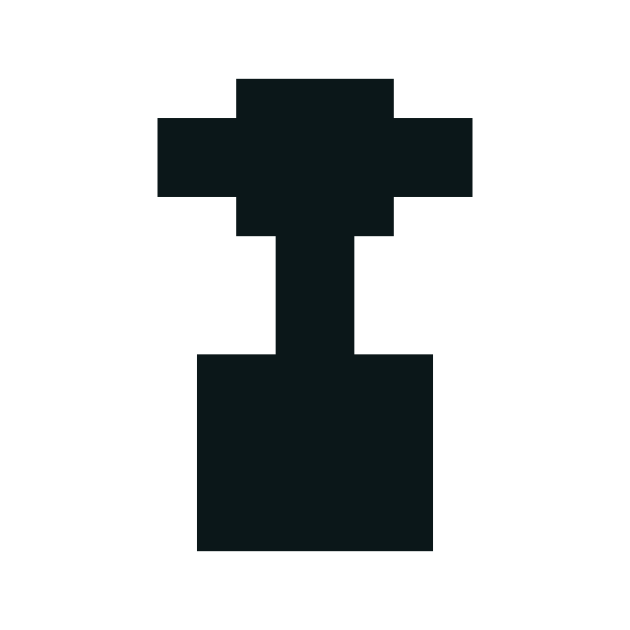</a> | **📂 檔名:** `push-svgrepo-com.svg` ✨ **格式:** `Vector (SVG)` ⚖️ **大小:** `479.00B` | 📅 **更新:** `2026-02-27`  🚀 **jsDelivr Markdown:** `` 🔗 **直接連結 (Url):** `https://cdn.jsdelivr.netbarry028/materials@main/images/iCons/Pixel/Action/push-svgrepo-com.svg` 📥 [檢視原始檔](push-svgrepo-com.svg) |
| <a href="race-svgrepo-com.svg">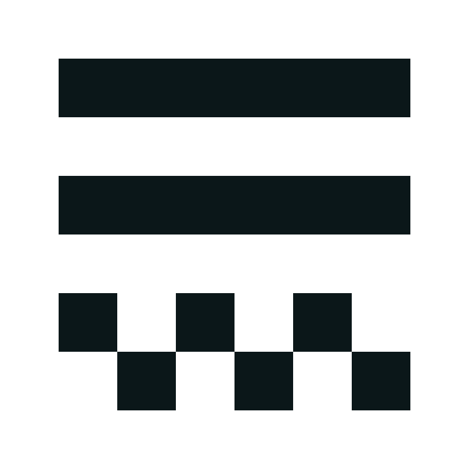</a> | **📂 檔名:** `race-svgrepo-com.svg` ✨ **格式:** `Vector (SVG)` ⚖️ **大小:** `892.00B` | 📅 **更新:** `2026-02-27`  🚀 **jsDelivr Markdown:** `` 🔗 **直接連結 (Url):** `https://cdn.jsdelivr.netbarry028/materials@main/images/iCons/Pixel/Action/race-svgrepo-com.svg` 📥 [檢視原始檔](race-svgrepo-com.svg) |
|  | **📂 檔名:** `rain-svgrepo-com.svg` ✨ **格式:** `Vector (SVG)` ⚖️ **大小:** `585.00B` | 📅 **更新:** `2026-02-27`  🚀 **jsDelivr Markdown:** `` 🔗 **直接連結 (Url):** `https://cdn.jsdelivr.netbarry028/materials@main/images/iCons/Pixel/Action/rain-svgrepo-com.svg` 📥 [檢視原始檔](rain-svgrepo-com.svg) |
|  | **📂 檔名:** `record-svgrepo-com.svg` ✨ **格式:** `Vector (SVG)` ⚖️ **大小:** `440.00B` | 📅 **更新:** `2026-02-27`  🚀 **jsDelivr Markdown:** `` 🔗 **直接連結 (Url):** `https://cdn.jsdelivr.netbarry028/materials@main/images/iCons/Pixel/Action/record-svgrepo-com.svg` 📥 [檢視原始檔](record-svgrepo-com.svg) |
|  | **📂 檔名:** `redo-svgrepo-com.svg` ✨ **格式:** `Vector (SVG)` ⚖️ **大小:** `527.00B` | 📅 **更新:** `2026-02-27`  🚀 **jsDelivr Markdown:** `` 🔗 **直接連結 (Url):** `https://cdn.jsdelivr.netbarry028/materials@main/images/iCons/Pixel/Action/redo-svgrepo-com.svg` 📥 [檢視原始檔](redo-svgrepo-com.svg) |
| <a href="reflect-svgrepo-com.svg">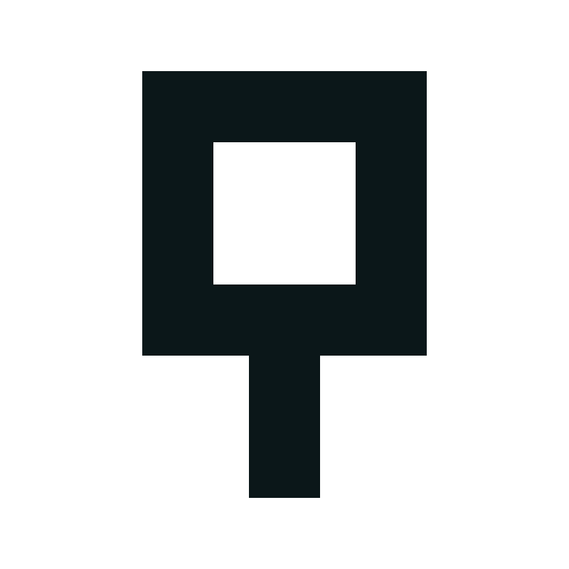</a> | **📂 檔名:** `reflect-svgrepo-com.svg` ✨ **格式:** `Vector (SVG)` ⚖️ **大小:** `469.00B` | 📅 **更新:** `2026-02-27`  🚀 **jsDelivr Markdown:** `` 🔗 **直接連結 (Url):** `https://cdn.jsdelivr.netbarry028/materials@main/images/iCons/Pixel/Action/reflect-svgrepo-com.svg` 📥 [檢視原始檔](reflect-svgrepo-com.svg) |
| <a href="reply-svgrepo-com.svg">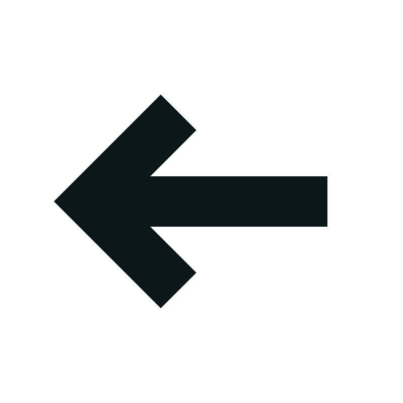</a> | **📂 檔名:** `reply-svgrepo-com.svg` ✨ **格式:** `Vector (SVG)` ⚖️ **大小:** `515.00B` | 📅 **更新:** `2026-02-27`  🚀 **jsDelivr Markdown:** `` 🔗 **直接連結 (Url):** `https://cdn.jsdelivr.netbarry028/materials@main/images/iCons/Pixel/Action/reply-svgrepo-com.svg` 📥 [檢視原始檔](reply-svgrepo-com.svg) |
|  | **📂 檔名:** `report-svgrepo-com.svg` ✨ **格式:** `Vector (SVG)` ⚖️ **大小:** `477.00B` | 📅 **更新:** `2026-02-27`  🚀 **jsDelivr Markdown:** `` 🔗 **直接連結 (Url):** `https://cdn.jsdelivr.netbarry028/materials@main/images/iCons/Pixel/Action/report-svgrepo-com.svg` 📥 [檢視原始檔](report-svgrepo-com.svg) |
| <a href="resize-svgrepo-com.svg">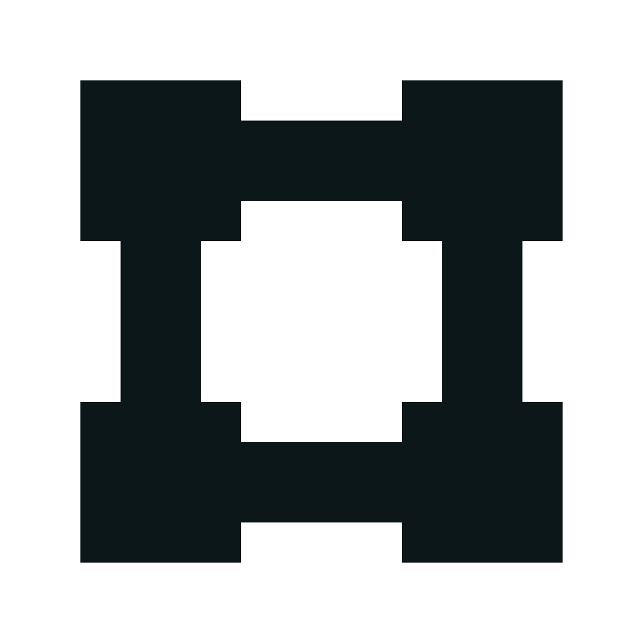</a> | **📂 檔名:** `resize-svgrepo-com.svg` ✨ **格式:** `Vector (SVG)` ⚖️ **大小:** `517.00B` | 📅 **更新:** `2026-02-27`  🚀 **jsDelivr Markdown:** `` 🔗 **直接連結 (Url):** `https://cdn.jsdelivr.netbarry028/materials@main/images/iCons/Pixel/Action/resize-svgrepo-com.svg` 📥 [檢視原始檔](resize-svgrepo-com.svg) |
|  | **📂 檔名:** `rewind-svgrepo-com.svg` ✨ **格式:** `Vector (SVG)` ⚖️ **大小:** `499.00B` | 📅 **更新:** `2026-02-27`  🚀 **jsDelivr Markdown:** `` 🔗 **直接連結 (Url):** `https://cdn.jsdelivr.netbarry028/materials@main/images/iCons/Pixel/Action/rewind-svgrepo-com.svg` 📥 [檢視原始檔](rewind-svgrepo-com.svg) |
| <a href="rule-svgrepo-com.svg">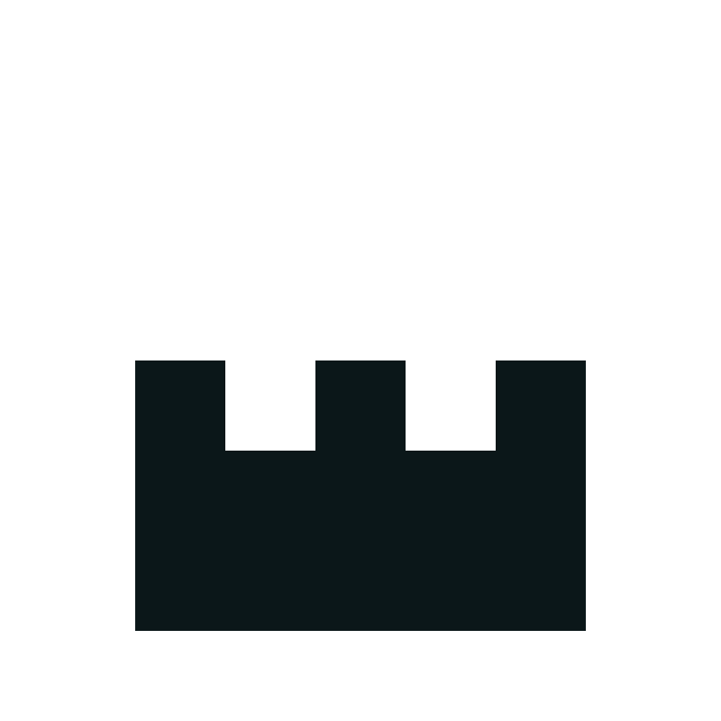</a> | **📂 檔名:** `rule-svgrepo-com.svg` ✨ **格式:** `Vector (SVG)` ⚖️ **大小:** `460.00B` | 📅 **更新:** `2026-02-27`  🚀 **jsDelivr Markdown:** `` 🔗 **直接連結 (Url):** `https://cdn.jsdelivr.netbarry028/materials@main/images/iCons/Pixel/Action/rule-svgrepo-com.svg` 📥 [檢視原始檔](rule-svgrepo-com.svg) |
|  | **📂 檔名:** `save-svgrepo-com.svg` ✨ **格式:** `Vector (SVG)` ⚖️ **大小:** `534.00B` | 📅 **更新:** `2026-02-27`  🚀 **jsDelivr Markdown:** `` 🔗 **直接連結 (Url):** `https://cdn.jsdelivr.netbarry028/materials@main/images/iCons/Pixel/Action/save-svgrepo-com.svg` 📥 [檢視原始檔](save-svgrepo-com.svg) |
|  | **📂 檔名:** `saw-svgrepo-com.svg` ✨ **格式:** `Vector (SVG)` ⚖️ **大小:** `514.00B` | 📅 **更新:** `2026-02-27`  🚀 **jsDelivr Markdown:** `` 🔗 **直接連結 (Url):** `https://cdn.jsdelivr.netbarry028/materials@main/images/iCons/Pixel/Action/saw-svgrepo-com.svg` 📥 [檢視原始檔](saw-svgrepo-com.svg) |
| <a href="scare-svgrepo-com.svg">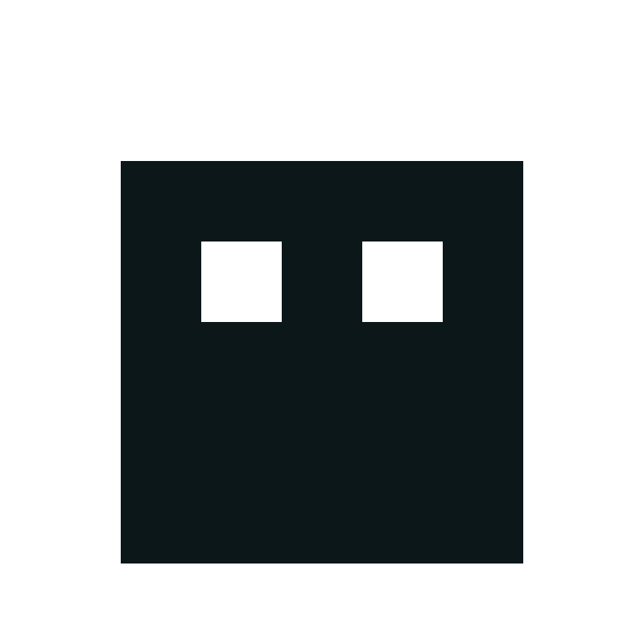</a> | **📂 檔名:** `scare-svgrepo-com.svg` ✨ **格式:** `Vector (SVG)` ⚖️ **大小:** `477.00B` | 📅 **更新:** `2026-02-27`  🚀 **jsDelivr Markdown:** `` 🔗 **直接連結 (Url):** `https://cdn.jsdelivr.netbarry028/materials@main/images/iCons/Pixel/Action/scare-svgrepo-com.svg` 📥 [檢視原始檔](scare-svgrepo-com.svg) |
| <a href="schedule-svgrepo-com.svg">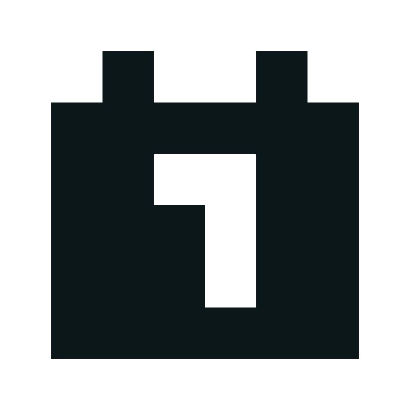</a> | **📂 檔名:** `schedule-svgrepo-com.svg` ✨ **格式:** `Vector (SVG)` ⚖️ **大小:** `484.00B` | 📅 **更新:** `2026-02-27`  🚀 **jsDelivr Markdown:** `` 🔗 **直接連結 (Url):** `https://cdn.jsdelivr.netbarry028/materials@main/images/iCons/Pixel/Action/schedule-svgrepo-com.svg` 📥 [檢視原始檔](schedule-svgrepo-com.svg) |
| <a href="search-svgrepo-com.svg">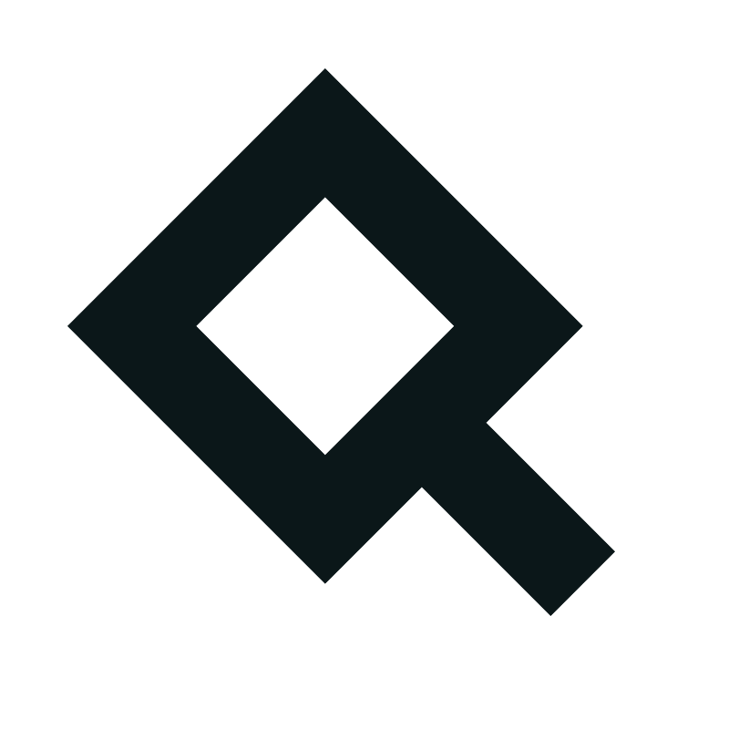</a> | **📂 檔名:** `search-svgrepo-com.svg` ✨ **格式:** `Vector (SVG)` ⚖️ **大小:** `605.00B` | 📅 **更新:** `2026-02-27`  🚀 **jsDelivr Markdown:** `` 🔗 **直接連結 (Url):** `https://cdn.jsdelivr.netbarry028/materials@main/images/iCons/Pixel/Action/search-svgrepo-com.svg` 📥 [檢視原始檔](search-svgrepo-com.svg) |
|  | **📂 檔名:** `send-svgrepo-com.svg` ✨ **格式:** `Vector (SVG)` ⚖️ **大小:** `497.00B` | 📅 **更新:** `2026-02-27`  🚀 **jsDelivr Markdown:** `` 🔗 **直接連結 (Url):** `https://cdn.jsdelivr.netbarry028/materials@main/images/iCons/Pixel/Action/send-svgrepo-com.svg` 📥 [檢視原始檔](send-svgrepo-com.svg) |
| <a href="shine-svgrepo-com.svg">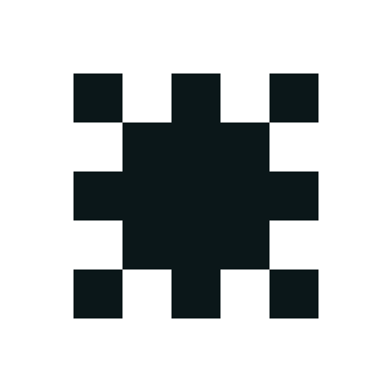</a> | **📂 檔名:** `shine-svgrepo-com.svg` ✨ **格式:** `Vector (SVG)` ⚖️ **大小:** `549.00B` | 📅 **更新:** `2026-02-27`  🚀 **jsDelivr Markdown:** `` 🔗 **直接連結 (Url):** `https://cdn.jsdelivr.netbarry028/materials@main/images/iCons/Pixel/Action/shine-svgrepo-com.svg` 📥 [檢視原始檔](shine-svgrepo-com.svg) |
|  | **📂 檔名:** `sit-svgrepo-com.svg` ✨ **格式:** `Vector (SVG)` ⚖️ **大小:** `457.00B` | 📅 **更新:** `2026-02-27`  🚀 **jsDelivr Markdown:** `` 🔗 **直接連結 (Url):** `https://cdn.jsdelivr.netbarry028/materials@main/images/iCons/Pixel/Action/sit-svgrepo-com.svg` 📥 [檢視原始檔](sit-svgrepo-com.svg) |
|  | **📂 檔名:** `sleep-svgrepo-com.svg` ✨ **格式:** `Vector (SVG)` ⚖️ **大小:** `456.00B` | 📅 **更新:** `2026-02-27`  🚀 **jsDelivr Markdown:** `` 🔗 **直接連結 (Url):** `https://cdn.jsdelivr.netbarry028/materials@main/images/iCons/Pixel/Action/sleep-svgrepo-com.svg` 📥 [檢視原始檔](sleep-svgrepo-com.svg) |
|  | **📂 檔名:** `smell-svgrepo-com.svg` ✨ **格式:** `Vector (SVG)` ⚖️ **大小:** `466.00B` | 📅 **更新:** `2026-02-27`  🚀 **jsDelivr Markdown:** `` 🔗 **直接連結 (Url):** `https://cdn.jsdelivr.netbarry028/materials@main/images/iCons/Pixel/Action/smell-svgrepo-com.svg` 📥 [檢視原始檔](smell-svgrepo-com.svg) |
|  | **📂 檔名:** `smoke-svgrepo-com.svg` ✨ **格式:** `Vector (SVG)` ⚖️ **大小:** `463.00B` | 📅 **更新:** `2026-02-27`  🚀 **jsDelivr Markdown:** `` 🔗 **直接連結 (Url):** `https://cdn.jsdelivr.netbarry028/materials@main/images/iCons/Pixel/Action/smoke-svgrepo-com.svg` 📥 [檢視原始檔](smoke-svgrepo-com.svg) |
| <a href="solve-svgrepo-com.svg">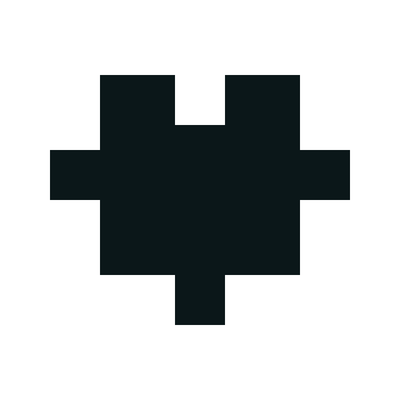</a> | **📂 檔名:** `solve-svgrepo-com.svg` ✨ **格式:** `Vector (SVG)` ⚖️ **大小:** `478.00B` | 📅 **更新:** `2026-02-27`  🚀 **jsDelivr Markdown:** `` 🔗 **直接連結 (Url):** `https://cdn.jsdelivr.netbarry028/materials@main/images/iCons/Pixel/Action/solve-svgrepo-com.svg` 📥 [檢視原始檔](solve-svgrepo-com.svg) |
|  | **📂 檔名:** `sound-svgrepo-com.svg` ✨ **格式:** `Vector (SVG)` ⚖️ **大小:** `487.00B` | 📅 **更新:** `2026-02-27`  🚀 **jsDelivr Markdown:** `` 🔗 **直接連結 (Url):** `https://cdn.jsdelivr.netbarry028/materials@main/images/iCons/Pixel/Action/sound-svgrepo-com.svg` 📥 [檢視原始檔](sound-svgrepo-com.svg) |
|  | **📂 檔名:** `spin-svgrepo-com.svg` ✨ **格式:** `Vector (SVG)` ⚖️ **大小:** `460.00B` | 📅 **更新:** `2026-02-27`  🚀 **jsDelivr Markdown:** `` 🔗 **直接連結 (Url):** `https://cdn.jsdelivr.netbarry028/materials@main/images/iCons/Pixel/Action/spin-svgrepo-com.svg` 📥 [檢視原始檔](spin-svgrepo-com.svg) |
| <a href="spook-svgrepo-com.svg">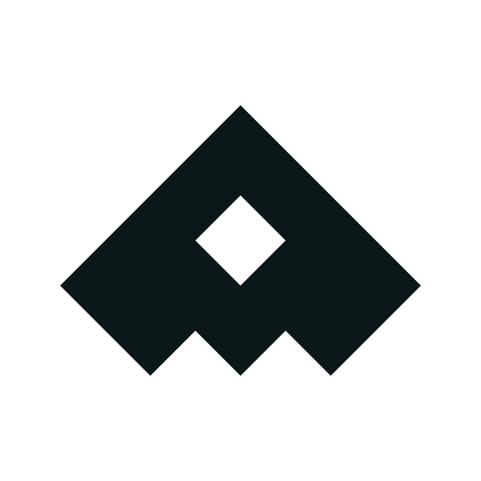</a> | **📂 檔名:** `spook-svgrepo-com.svg` ✨ **格式:** `Vector (SVG)` ⚖️ **大小:** `491.00B` | 📅 **更新:** `2026-02-27`  🚀 **jsDelivr Markdown:** `` 🔗 **直接連結 (Url):** `https://cdn.jsdelivr.netbarry028/materials@main/images/iCons/Pixel/Action/spook-svgrepo-com.svg` 📥 [檢視原始檔](spook-svgrepo-com.svg) |
| <a href="stack-svgrepo-com.svg">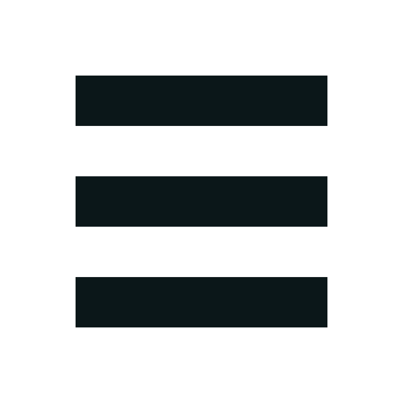</a> | **📂 檔名:** `stack-svgrepo-com.svg` ✨ **格式:** `Vector (SVG)` ⚖️ **大小:** `473.00B` | 📅 **更新:** `2026-02-27`  🚀 **jsDelivr Markdown:** `` 🔗 **直接連結 (Url):** `https://cdn.jsdelivr.netbarry028/materials@main/images/iCons/Pixel/Action/stack-svgrepo-com.svg` 📥 [檢視原始檔](stack-svgrepo-com.svg) |
|  | **📂 檔名:** `stamp-svgrepo-com.svg` ✨ **格式:** `Vector (SVG)` ⚖️ **大小:** `526.00B` | 📅 **更新:** `2026-02-27`  🚀 **jsDelivr Markdown:** `` 🔗 **直接連結 (Url):** `https://cdn.jsdelivr.netbarry028/materials@main/images/iCons/Pixel/Action/stamp-svgrepo-com.svg` 📥 [檢視原始檔](stamp-svgrepo-com.svg) |
| <a href="steam-svgrepo-com.svg">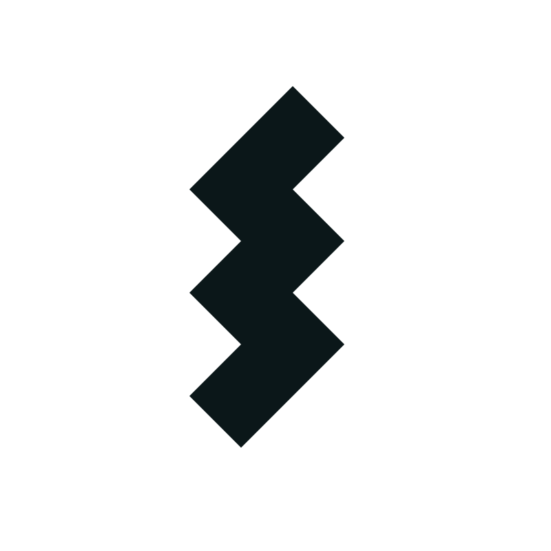</a> | **📂 檔名:** `steam-svgrepo-com.svg` ✨ **格式:** `Vector (SVG)` ⚖️ **大小:** `487.00B` | 📅 **更新:** `2026-02-27`  🚀 **jsDelivr Markdown:** `` 🔗 **直接連結 (Url):** `https://cdn.jsdelivr.netbarry028/materials@main/images/iCons/Pixel/Action/steam-svgrepo-com.svg` 📥 [檢視原始檔](steam-svgrepo-com.svg) |
|  | **📂 檔名:** `stop-svgrepo-com.svg` ✨ **格式:** `Vector (SVG)` ⚖️ **大小:** `497.00B` | 📅 **更新:** `2026-02-27`  🚀 **jsDelivr Markdown:** `` 🔗 **直接連結 (Url):** `https://cdn.jsdelivr.netbarry028/materials@main/images/iCons/Pixel/Action/stop-svgrepo-com.svg` 📥 [檢視原始檔](stop-svgrepo-com.svg) |
| <a href="store-svgrepo-com.svg">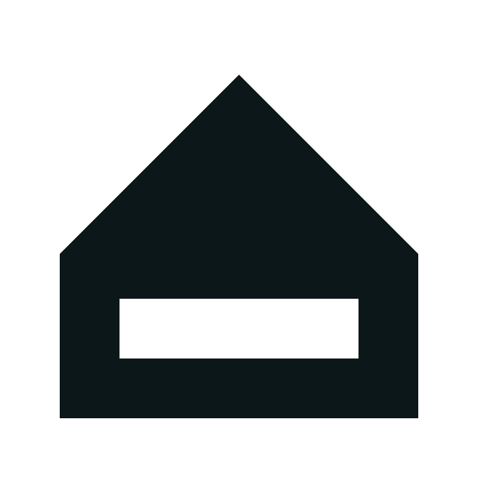</a> | **📂 檔名:** `store-svgrepo-com.svg` ✨ **格式:** `Vector (SVG)` ⚖️ **大小:** `468.00B` | 📅 **更新:** `2026-02-27`  🚀 **jsDelivr Markdown:** `` 🔗 **直接連結 (Url):** `https://cdn.jsdelivr.netbarry028/materials@main/images/iCons/Pixel/Action/store-svgrepo-com.svg` 📥 [檢視原始檔](store-svgrepo-com.svg) |
|  | **📂 檔名:** `strike-svgrepo-com.svg` ✨ **格式:** `Vector (SVG)` ⚖️ **大小:** `517.00B` | 📅 **更新:** `2026-02-27`  🚀 **jsDelivr Markdown:** `` 🔗 **直接連結 (Url):** `https://cdn.jsdelivr.netbarry028/materials@main/images/iCons/Pixel/Action/strike-svgrepo-com.svg` 📥 [檢視原始檔](strike-svgrepo-com.svg) |
|  | **📂 檔名:** `subtract-svgrepo-com.svg` ✨ **格式:** `Vector (SVG)` ⚖️ **大小:** `441.00B` | 📅 **更新:** `2026-02-27`  🚀 **jsDelivr Markdown:** `` 🔗 **直接連結 (Url):** `https://cdn.jsdelivr.netbarry028/materials@main/images/iCons/Pixel/Action/subtract-svgrepo-com.svg` 📥 [檢視原始檔](subtract-svgrepo-com.svg) |
|  | **📂 檔名:** `swim-svgrepo-com.svg` ✨ **格式:** `Vector (SVG)` ⚖️ **大小:** `503.00B` | 📅 **更新:** `2026-02-27`  🚀 **jsDelivr Markdown:** `` 🔗 **直接連結 (Url):** `https://cdn.jsdelivr.netbarry028/materials@main/images/iCons/Pixel/Action/swim-svgrepo-com.svg` 📥 [檢視原始檔](swim-svgrepo-com.svg) |
|  | **📂 檔名:** `tag-svgrepo-com.svg` ✨ **格式:** `Vector (SVG)` ⚖️ **大小:** `517.00B` | 📅 **更新:** `2026-02-27`  🚀 **jsDelivr Markdown:** `` 🔗 **直接連結 (Url):** `https://cdn.jsdelivr.netbarry028/materials@main/images/iCons/Pixel/Action/tag-svgrepo-com.svg` 📥 [檢視原始檔](tag-svgrepo-com.svg) |
| <a href="target-svgrepo-com.svg">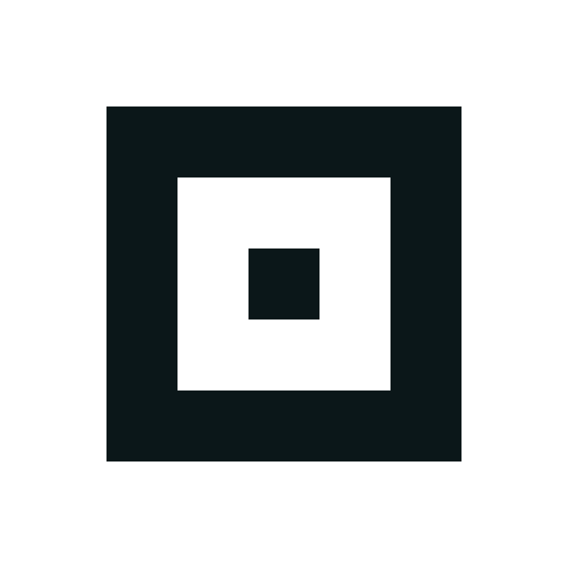</a> | **📂 檔名:** `target-svgrepo-com.svg` ✨ **格式:** `Vector (SVG)` ⚖️ **大小:** `478.00B` | 📅 **更新:** `2026-02-27`  🚀 **jsDelivr Markdown:** `` 🔗 **直接連結 (Url):** `https://cdn.jsdelivr.netbarry028/materials@main/images/iCons/Pixel/Action/target-svgrepo-com.svg` 📥 [檢視原始檔](target-svgrepo-com.svg) |
|  | **📂 檔名:** `time-svgrepo-com.svg` ✨ **格式:** `Vector (SVG)` ⚖️ **大小:** `494.00B` | 📅 **更新:** `2026-02-27`  🚀 **jsDelivr Markdown:** `` 🔗 **直接連結 (Url):** `https://cdn.jsdelivr.netbarry028/materials@main/images/iCons/Pixel/Action/time-svgrepo-com.svg` 📥 [檢視原始檔](time-svgrepo-com.svg) |
|  | **📂 檔名:** `travel-svgrepo-com.svg` ✨ **格式:** `Vector (SVG)` ⚖️ **大小:** `464.00B` | 📅 **更新:** `2026-02-27`  🚀 **jsDelivr Markdown:** `` 🔗 **直接連結 (Url):** `https://cdn.jsdelivr.netbarry028/materials@main/images/iCons/Pixel/Action/travel-svgrepo-com.svg` 📥 [檢視原始檔](travel-svgrepo-com.svg) |
|  | **📂 檔名:** `type-svgrepo-com.svg` ✨ **格式:** `Vector (SVG)` ⚖️ **大小:** `470.00B` | 📅 **更新:** `2026-02-27`  🚀 **jsDelivr Markdown:** `` 🔗 **直接連結 (Url):** `https://cdn.jsdelivr.netbarry028/materials@main/images/iCons/Pixel/Action/type-svgrepo-com.svg` 📥 [檢視原始檔](type-svgrepo-com.svg) |
|  | **📂 檔名:** `undo-svgrepo-com.svg` ✨ **格式:** `Vector (SVG)` ⚖️ **大小:** `526.00B` | 📅 **更新:** `2026-02-27`  🚀 **jsDelivr Markdown:** `` 🔗 **直接連結 (Url):** `https://cdn.jsdelivr.netbarry028/materials@main/images/iCons/Pixel/Action/undo-svgrepo-com.svg` 📥 [檢視原始檔](undo-svgrepo-com.svg) |
| <a href="unlock-svgrepo-com.svg">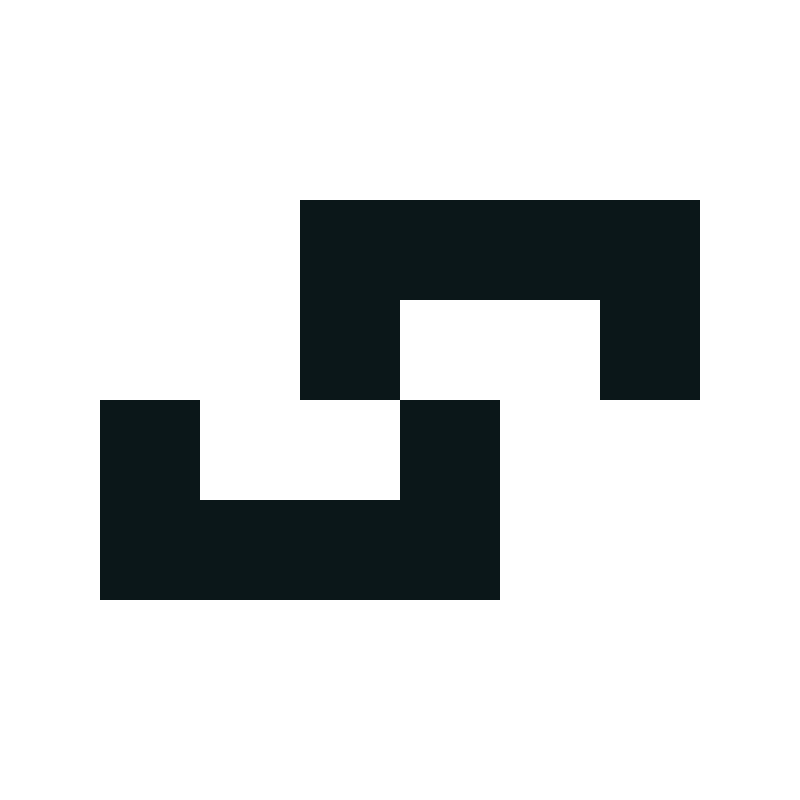</a> | **📂 檔名:** `unlock-svgrepo-com.svg` ✨ **格式:** `Vector (SVG)` ⚖️ **大小:** `475.00B` | 📅 **更新:** `2026-02-27`  🚀 **jsDelivr Markdown:** `` 🔗 **直接連結 (Url):** `https://cdn.jsdelivr.netbarry028/materials@main/images/iCons/Pixel/Action/unlock-svgrepo-com.svg` 📥 [檢視原始檔](unlock-svgrepo-com.svg) |
| <a href="upload-svgrepo-com.svg">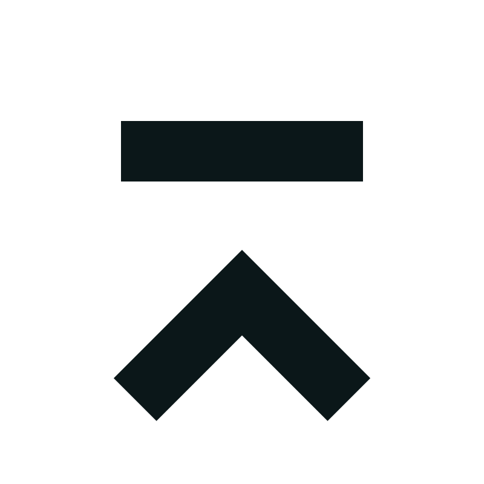</a> | **📂 檔名:** `upload-svgrepo-com.svg` ✨ **格式:** `Vector (SVG)` ⚖️ **大小:** `533.00B` | 📅 **更新:** `2026-02-27`  🚀 **jsDelivr Markdown:** `` 🔗 **直接連結 (Url):** `https://cdn.jsdelivr.netbarry028/materials@main/images/iCons/Pixel/Action/upload-svgrepo-com.svg` 📥 [檢視原始檔](upload-svgrepo-com.svg) |
| <a href="urbanize-svgrepo-com.svg">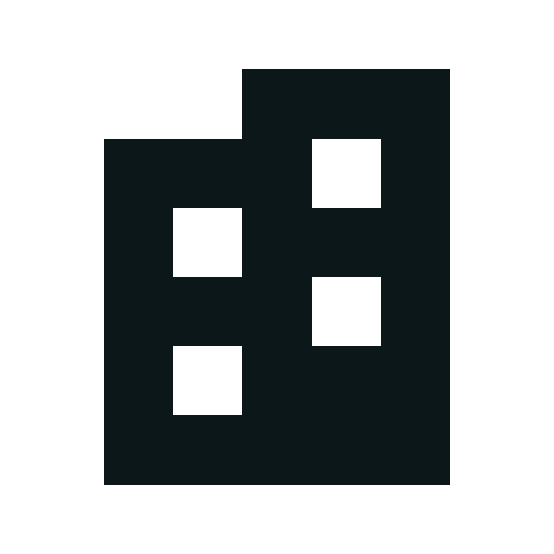</a> | **📂 檔名:** `urbanize-svgrepo-com.svg` ✨ **格式:** `Vector (SVG)` ⚖️ **大小:** `520.00B` | 📅 **更新:** `2026-02-27`  🚀 **jsDelivr Markdown:** `` 🔗 **直接連結 (Url):** `https://cdn.jsdelivr.netbarry028/materials@main/images/iCons/Pixel/Action/urbanize-svgrepo-com.svg` 📥 [檢視原始檔](urbanize-svgrepo-com.svg) |
|  | **📂 檔名:** `use-svgrepo-com.svg` ✨ **格式:** `Vector (SVG)` ⚖️ **大小:** `525.00B` | 📅 **更新:** `2026-02-27`  🚀 **jsDelivr Markdown:** `` 🔗 **直接連結 (Url):** `https://cdn.jsdelivr.netbarry028/materials@main/images/iCons/Pixel/Action/use-svgrepo-com.svg` 📥 [檢視原始檔](use-svgrepo-com.svg) |
| <a href="wait-svgrepo-com.svg">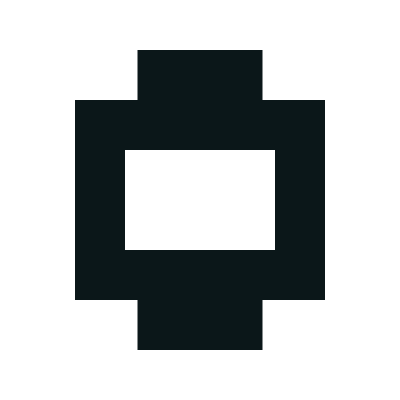</a> | **📂 檔名:** `wait-svgrepo-com.svg` ✨ **格式:** `Vector (SVG)` ⚖️ **大小:** `479.00B` | 📅 **更新:** `2026-02-27`  🚀 **jsDelivr Markdown:** `` 🔗 **直接連結 (Url):** `https://cdn.jsdelivr.netbarry028/materials@main/images/iCons/Pixel/Action/wait-svgrepo-com.svg` 📥 [檢視原始檔](wait-svgrepo-com.svg) |
| <a href="watch-svgrepo-com.svg">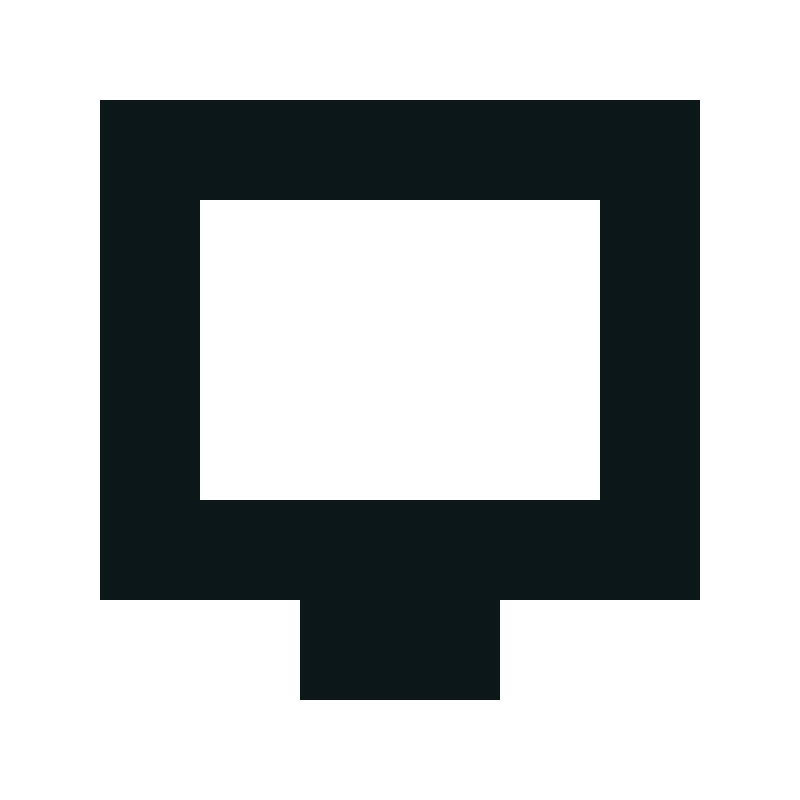</a> | **📂 檔名:** `watch-svgrepo-com.svg` ✨ **格式:** `Vector (SVG)` ⚖️ **大小:** `465.00B` | 📅 **更新:** `2026-02-27`  🚀 **jsDelivr Markdown:** `` 🔗 **直接連結 (Url):** `https://cdn.jsdelivr.netbarry028/materials@main/images/iCons/Pixel/Action/watch-svgrepo-com.svg` 📥 [檢視原始檔](watch-svgrepo-com.svg) |
|  | **📂 檔名:** `wear-svgrepo-com.svg` ✨ **格式:** `Vector (SVG)` ⚖️ **大小:** `459.00B` | 📅 **更新:** `2026-02-27`  🚀 **jsDelivr Markdown:** `` 🔗 **直接連結 (Url):** `https://cdn.jsdelivr.netbarry028/materials@main/images/iCons/Pixel/Action/wear-svgrepo-com.svg` 📥 [檢視原始檔](wear-svgrepo-com.svg) |
| <a href="weld-svgrepo-com.svg">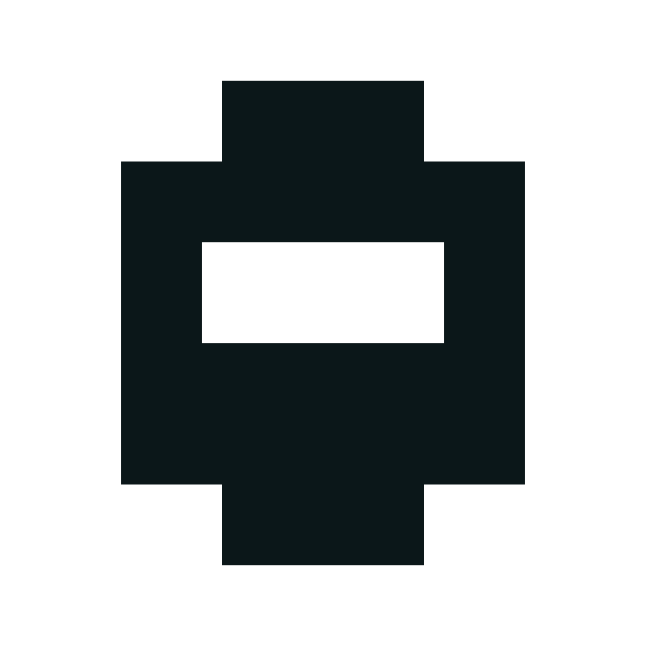</a> | **📂 檔名:** `weld-svgrepo-com.svg` ✨ **格式:** `Vector (SVG)` ⚖️ **大小:** `479.00B` | 📅 **更新:** `2026-02-27`  🚀 **jsDelivr Markdown:** `` 🔗 **直接連結 (Url):** `https://cdn.jsdelivr.netbarry028/materials@main/images/iCons/Pixel/Action/weld-svgrepo-com.svg` 📥 [檢視原始檔](weld-svgrepo-com.svg) |
|  | **📂 檔名:** `win-svgrepo-com.svg` ✨ **格式:** `Vector (SVG)` ⚖️ **大小:** `450.00B` | 📅 **更新:** `2026-02-27`  🚀 **jsDelivr Markdown:** `` 🔗 **直接連結 (Url):** `https://cdn.jsdelivr.netbarry028/materials@main/images/iCons/Pixel/Action/win-svgrepo-com.svg` 📥 [檢視原始檔](win-svgrepo-com.svg) |
|  | **📂 檔名:** `wonder-svgrepo-com.svg` ✨ **格式:** `Vector (SVG)` ⚖️ **大小:** `451.00B` | 📅 **更新:** `2026-02-27`  🚀 **jsDelivr Markdown:** `` 🔗 **直接連結 (Url):** `https://cdn.jsdelivr.netbarry028/materials@main/images/iCons/Pixel/Action/wonder-svgrepo-com.svg` 📥 [檢視原始檔](wonder-svgrepo-com.svg) |
|  | **📂 檔名:** `write-svgrepo-com.svg` ✨ **格式:** `Vector (SVG)` ⚖️ **大小:** `502.00B` | 📅 **更新:** `2026-02-27`  🚀 **jsDelivr Markdown:** `` 🔗 **直接連結 (Url):** `https://cdn.jsdelivr.netbarry028/materials@main/images/iCons/Pixel/Action/write-svgrepo-com.svg` 📥 [檢視原始檔](write-svgrepo-com.svg) |