# 🖼️ 素材分類：Base

> [🏠 主目錄](../../../../README.md) / [images](../../../README.md) / [iCons](../../README.md) / [Pixel](../README.md) / **Base**

本目錄共有 `189` 個檔案

| 🎨 預覽 (點擊放大)  | 📋 檔案詳細資訊與連結 |
| :--- | :--- |
|  | **📂 檔名:** `Designed by Tom for Basedash.svg` ✨ **格式:** `Vector (SVG)` ⚖️ **大小:** `24.88KB` 📅 **更新:** `2026-03-04`  🚀 **jsDelivr Markdown:** `` 🔗 **直接連結 (Url):** <code>https://cdn.jsdelivr.net/gh/barry028/materials@main/images/iCons/Pixel/Base/Designed%20by%20Tom%20for%20Basedash.svg</code> 📥 [檢視原始檔](Designed%20by%20Tom%20for%20Basedash.svg) |
|  | **📂 檔名:** `accordionDown.svg` ✨ **格式:** `Vector (SVG)` ⚖️ **大小:** `546.00B` 📅 **更新:** `2026-03-04`  🚀 **jsDelivr Markdown:** `` 🔗 **直接連結 (Url):** <code>https://cdn.jsdelivr.net/gh/barry028/materials@main/images/iCons/Pixel/Base/accordionDown.svg</code> 📥 [檢視原始檔](accordionDown.svg) |
|  | **📂 檔名:** `accordionLeft.svg` ✨ **格式:** `Vector (SVG)` ⚖️ **大小:** `566.00B` 📅 **更新:** `2026-03-04`  🚀 **jsDelivr Markdown:** `` 🔗 **直接連結 (Url):** <code>https://cdn.jsdelivr.net/gh/barry028/materials@main/images/iCons/Pixel/Base/accordionLeft.svg</code> 📥 [檢視原始檔](accordionLeft.svg) |
|  | **📂 檔名:** `accordionRight.svg` ✨ **格式:** `Vector (SVG)` ⚖️ **大小:** `574.00B` 📅 **更新:** `2026-03-04`  🚀 **jsDelivr Markdown:** `` 🔗 **直接連結 (Url):** <code>https://cdn.jsdelivr.net/gh/barry028/materials@main/images/iCons/Pixel/Base/accordionRight.svg</code> 📥 [檢視原始檔](accordionRight.svg) |
|  | **📂 檔名:** `accordionUp.svg` ✨ **格式:** `Vector (SVG)` ⚖️ **大小:** `544.00B` 📅 **更新:** `2026-03-04`  🚀 **jsDelivr Markdown:** `` 🔗 **直接連結 (Url):** <code>https://cdn.jsdelivr.net/gh/barry028/materials@main/images/iCons/Pixel/Base/accordionUp.svg</code> 📥 [檢視原始檔](accordionUp.svg) |
|  | **📂 檔名:** `action.svg` ✨ **格式:** `Vector (SVG)` ⚖️ **大小:** `1.59KB` 📅 **更新:** `2026-03-04`  🚀 **jsDelivr Markdown:** `` 🔗 **直接連結 (Url):** <code>https://cdn.jsdelivr.net/gh/barry028/materials@main/images/iCons/Pixel/Base/action.svg</code> 📥 [檢視原始檔](action.svg) |
|  | **📂 檔名:** `activity.svg` ✨ **格式:** `Vector (SVG)` ⚖️ **大小:** `857.00B` 📅 **更新:** `2026-03-04`  🚀 **jsDelivr Markdown:** `` 🔗 **直接連結 (Url):** <code>https://cdn.jsdelivr.net/gh/barry028/materials@main/images/iCons/Pixel/Base/activity.svg</code> 📥 [檢視原始檔](activity.svg) |
|  | **📂 檔名:** `add.svg` ✨ **格式:** `Vector (SVG)` ⚖️ **大小:** `420.00B` 📅 **更新:** `2026-03-04`  🚀 **jsDelivr Markdown:** `` 🔗 **直接連結 (Url):** <code>https://cdn.jsdelivr.net/gh/barry028/materials@main/images/iCons/Pixel/Base/add.svg</code> 📥 [檢視原始檔](add.svg) |
| <a href="addAction.svg">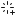</a> | **📂 檔名:** `addAction.svg` ✨ **格式:** `Vector (SVG)` ⚖️ **大小:** `1.63KB` 📅 **更新:** `2026-03-04`  🚀 **jsDelivr Markdown:** `` 🔗 **直接連結 (Url):** <code>https://cdn.jsdelivr.net/gh/barry028/materials@main/images/iCons/Pixel/Base/addAction.svg</code> 📥 [檢視原始檔](addAction.svg) |
|  | **📂 檔名:** `addApp.svg` ✨ **格式:** `Vector (SVG)` ⚖️ **大小:** `937.00B` 📅 **更新:** `2026-03-04`  🚀 **jsDelivr Markdown:** `` 🔗 **直接連結 (Url):** <code>https://cdn.jsdelivr.net/gh/barry028/materials@main/images/iCons/Pixel/Base/addApp.svg</code> 📥 [檢視原始檔](addApp.svg) |
|  | **📂 檔名:** `addConnection.svg` ✨ **格式:** `Vector (SVG)` ⚖️ **大小:** `1.84KB` 📅 **更新:** `2026-03-04`  🚀 **jsDelivr Markdown:** `` 🔗 **直接連結 (Url):** <code>https://cdn.jsdelivr.net/gh/barry028/materials@main/images/iCons/Pixel/Base/addConnection.svg</code> 📥 [檢視原始檔](addConnection.svg) |
| <a href="addFilter.svg">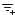</a> | **📂 檔名:** `addFilter.svg` ✨ **格式:** `Vector (SVG)` ⚖️ **大小:** `896.00B` 📅 **更新:** `2026-03-04`  🚀 **jsDelivr Markdown:** `` 🔗 **直接連結 (Url):** <code>https://cdn.jsdelivr.net/gh/barry028/materials@main/images/iCons/Pixel/Base/addFilter.svg</code> 📥 [檢視原始檔](addFilter.svg) |
|  | **📂 檔名:** `addFolder.svg` ✨ **格式:** `Vector (SVG)` ⚖️ **大小:** `785.00B` 📅 **更新:** `2026-03-04`  🚀 **jsDelivr Markdown:** `` 🔗 **直接連結 (Url):** <code>https://cdn.jsdelivr.net/gh/barry028/materials@main/images/iCons/Pixel/Base/addFolder.svg</code> 📥 [檢視原始檔](addFolder.svg) |
| <a href="addQuery.svg">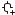</a> | **📂 檔名:** `addQuery.svg` ✨ **格式:** `Vector (SVG)` ⚖️ **大小:** `1.00KB` 📅 **更新:** `2026-03-04`  🚀 **jsDelivr Markdown:** `` 🔗 **直接連結 (Url):** <code>https://cdn.jsdelivr.net/gh/barry028/materials@main/images/iCons/Pixel/Base/addQuery.svg</code> 📥 [檢視原始檔](addQuery.svg) |
|  | **📂 檔名:** `addTable.svg` ✨ **格式:** `Vector (SVG)` ⚖️ **大小:** `856.00B` 📅 **更新:** `2026-03-04`  🚀 **jsDelivr Markdown:** `` 🔗 **直接連結 (Url):** <code>https://cdn.jsdelivr.net/gh/barry028/materials@main/images/iCons/Pixel/Base/addTable.svg</code> 📥 [檢視原始檔](addTable.svg) |
| <a href="addTag.svg">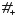</a> | **📂 檔名:** `addTag.svg` ✨ **格式:** `Vector (SVG)` ⚖️ **大小:** `1.32KB` 📅 **更新:** `2026-03-04`  🚀 **jsDelivr Markdown:** `` 🔗 **直接連結 (Url):** <code>https://cdn.jsdelivr.net/gh/barry028/materials@main/images/iCons/Pixel/Base/addTag.svg</code> 📥 [檢視原始檔](addTag.svg) |
|  | **📂 檔名:** `addUser.svg` ✨ **格式:** `Vector (SVG)` ⚖️ **大小:** `875.00B` 📅 **更新:** `2026-03-04`  🚀 **jsDelivr Markdown:** `` 🔗 **直接連結 (Url):** <code>https://cdn.jsdelivr.net/gh/barry028/materials@main/images/iCons/Pixel/Base/addUser.svg</code> 📥 [檢視原始檔](addUser.svg) |
|  | **📂 檔名:** `addView.svg` ✨ **格式:** `Vector (SVG)` ⚖️ **大小:** `805.00B` 📅 **更新:** `2026-03-04`  🚀 **jsDelivr Markdown:** `` 🔗 **直接連結 (Url):** <code>https://cdn.jsdelivr.net/gh/barry028/materials@main/images/iCons/Pixel/Base/addView.svg</code> 📥 [檢視原始檔](addView.svg) |
|  | **📂 檔名:** `after.svg` ✨ **格式:** `Vector (SVG)` ⚖️ **大小:** `613.00B` 📅 **更新:** `2026-03-04`  🚀 **jsDelivr Markdown:** `` 🔗 **直接連結 (Url):** <code>https://cdn.jsdelivr.net/gh/barry028/materials@main/images/iCons/Pixel/Base/after.svg</code> 📥 [檢視原始檔](after.svg) |
|  | **📂 檔名:** `airtable.svg` ✨ **格式:** `Vector (SVG)` ⚖️ **大小:** `829.00B` 📅 **更新:** `2026-03-04`  🚀 **jsDelivr Markdown:** `` 🔗 **直接連結 (Url):** <code>https://cdn.jsdelivr.net/gh/barry028/materials@main/images/iCons/Pixel/Base/airtable.svg</code> 📥 [檢視原始檔](airtable.svg) |
|  | **📂 檔名:** `alert.svg` ✨ **格式:** `Vector (SVG)` ⚖️ **大小:** `730.00B` 📅 **更新:** `2026-03-04`  🚀 **jsDelivr Markdown:** `` 🔗 **直接連結 (Url):** <code>https://cdn.jsdelivr.net/gh/barry028/materials@main/images/iCons/Pixel/Base/alert.svg</code> 📥 [檢視原始檔](alert.svg) |
|  | **📂 檔名:** `app.svg` ✨ **格式:** `Vector (SVG)` ⚖️ **大小:** `651.00B` 📅 **更新:** `2026-03-04`  🚀 **jsDelivr Markdown:** `` 🔗 **直接連結 (Url):** <code>https://cdn.jsdelivr.net/gh/barry028/materials@main/images/iCons/Pixel/Base/app.svg</code> 📥 [檢視原始檔](app.svg) |
|  | **📂 檔名:** `arrowDown.svg` ✨ **格式:** `Vector (SVG)` ⚖️ **大小:** `540.00B` 📅 **更新:** `2026-03-04`  🚀 **jsDelivr Markdown:** `` 🔗 **直接連結 (Url):** <code>https://cdn.jsdelivr.net/gh/barry028/materials@main/images/iCons/Pixel/Base/arrowDown.svg</code> 📥 [檢視原始檔](arrowDown.svg) |
|  | **📂 檔名:** `arrowLeft.svg` ✨ **格式:** `Vector (SVG)` ⚖️ **大小:** `550.00B` 📅 **更新:** `2026-03-04`  🚀 **jsDelivr Markdown:** `` 🔗 **直接連結 (Url):** <code>https://cdn.jsdelivr.net/gh/barry028/materials@main/images/iCons/Pixel/Base/arrowLeft.svg</code> 📥 [檢視原始檔](arrowLeft.svg) |
|  | **📂 檔名:** `arrowRight.svg` ✨ **格式:** `Vector (SVG)` ⚖️ **大小:** `544.00B` 📅 **更新:** `2026-03-04`  🚀 **jsDelivr Markdown:** `` 🔗 **直接連結 (Url):** <code>https://cdn.jsdelivr.net/gh/barry028/materials@main/images/iCons/Pixel/Base/arrowRight.svg</code> 📥 [檢視原始檔](arrowRight.svg) |
|  | **📂 檔名:** `arrowUp.svg` ✨ **格式:** `Vector (SVG)` ⚖️ **大小:** `546.00B` 📅 **更新:** `2026-03-04`  🚀 **jsDelivr Markdown:** `` 🔗 **直接連結 (Url):** <code>https://cdn.jsdelivr.net/gh/barry028/materials@main/images/iCons/Pixel/Base/arrowUp.svg</code> 📥 [檢視原始檔](arrowUp.svg) |
| <a href="auto.svg">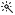</a> | **📂 檔名:** `auto.svg` ✨ **格式:** `Vector (SVG)` ⚖️ **大小:** `1.82KB` 📅 **更新:** `2026-03-04`  🚀 **jsDelivr Markdown:** `` 🔗 **直接連結 (Url):** <code>https://cdn.jsdelivr.net/gh/barry028/materials@main/images/iCons/Pixel/Base/auto.svg</code> 📥 [檢視原始檔](auto.svg) |
|  | **📂 檔名:** `back.svg` ✨ **格式:** `Vector (SVG)` ⚖️ **大小:** `619.00B` 📅 **更新:** `2026-03-04`  🚀 **jsDelivr Markdown:** `` 🔗 **直接連結 (Url):** <code>https://cdn.jsdelivr.net/gh/barry028/materials@main/images/iCons/Pixel/Base/back.svg</code> 📥 [檢視原始檔](back.svg) |
|  | **📂 檔名:** `barChart.svg` ✨ **格式:** `Vector (SVG)` ⚖️ **大小:** `789.00B` 📅 **更新:** `2026-03-04`  🚀 **jsDelivr Markdown:** `` 🔗 **直接連結 (Url):** <code>https://cdn.jsdelivr.net/gh/barry028/materials@main/images/iCons/Pixel/Base/barChart.svg</code> 📥 [檢視原始檔](barChart.svg) |
|  | **📂 檔名:** `basedash.svg` ✨ **格式:** `Vector (SVG)` ⚖️ **大小:** `693.00B` 📅 **更新:** `2026-03-04`  🚀 **jsDelivr Markdown:** `` 🔗 **直接連結 (Url):** <code>https://cdn.jsdelivr.net/gh/barry028/materials@main/images/iCons/Pixel/Base/basedash.svg</code> 📥 [檢視原始檔](basedash.svg) |
|  | **📂 檔名:** `before.svg` ✨ **格式:** `Vector (SVG)` ⚖️ **大小:** `626.00B` 📅 **更新:** `2026-03-04`  🚀 **jsDelivr Markdown:** `` 🔗 **直接連結 (Url):** <code>https://cdn.jsdelivr.net/gh/barry028/materials@main/images/iCons/Pixel/Base/before.svg</code> 📥 [檢視原始檔](before.svg) |
|  | **📂 檔名:** `between.svg` ✨ **格式:** `Vector (SVG)` ⚖️ **大小:** `1.03KB` 📅 **更新:** `2026-03-04`  🚀 **jsDelivr Markdown:** `` 🔗 **直接連結 (Url):** <code>https://cdn.jsdelivr.net/gh/barry028/materials@main/images/iCons/Pixel/Base/between.svg</code> 📥 [檢視原始檔](between.svg) |
|  | **📂 檔名:** `caretDown.svg` ✨ **格式:** `Vector (SVG)` ⚖️ **大小:** `517.00B` 📅 **更新:** `2026-03-04`  🚀 **jsDelivr Markdown:** `` 🔗 **直接連結 (Url):** <code>https://cdn.jsdelivr.net/gh/barry028/materials@main/images/iCons/Pixel/Base/caretDown.svg</code> 📥 [檢視原始檔](caretDown.svg) |
|  | **📂 檔名:** `caretLeft.svg` ✨ **格式:** `Vector (SVG)` ⚖️ **大小:** `488.00B` 📅 **更新:** `2026-03-04`  🚀 **jsDelivr Markdown:** `` 🔗 **直接連結 (Url):** <code>https://cdn.jsdelivr.net/gh/barry028/materials@main/images/iCons/Pixel/Base/caretLeft.svg</code> 📥 [檢視原始檔](caretLeft.svg) |
|  | **📂 檔名:** `caretRight.svg` ✨ **格式:** `Vector (SVG)` ⚖️ **大小:** `488.00B` 📅 **更新:** `2026-03-04`  🚀 **jsDelivr Markdown:** `` 🔗 **直接連結 (Url):** <code>https://cdn.jsdelivr.net/gh/barry028/materials@main/images/iCons/Pixel/Base/caretRight.svg</code> 📥 [檢視原始檔](caretRight.svg) |
|  | **📂 檔名:** `caretUp.svg` ✨ **格式:** `Vector (SVG)` ⚖️ **大小:** `488.00B` 📅 **更新:** `2026-03-04`  🚀 **jsDelivr Markdown:** `` 🔗 **直接連結 (Url):** <code>https://cdn.jsdelivr.net/gh/barry028/materials@main/images/iCons/Pixel/Base/caretUp.svg</code> 📥 [檢視原始檔](caretUp.svg) |
|  | **📂 檔名:** `cellHeight.svg` ✨ **格式:** `Vector (SVG)` ⚖️ **大小:** `1.17KB` 📅 **更新:** `2026-03-04`  🚀 **jsDelivr Markdown:** `` 🔗 **直接連結 (Url):** <code>https://cdn.jsdelivr.net/gh/barry028/materials@main/images/iCons/Pixel/Base/cellHeight.svg</code> 📥 [檢視原始檔](cellHeight.svg) |
|  | **📂 檔名:** `chart.svg` ✨ **格式:** `Vector (SVG)` ⚖️ **大小:** `532.00B` 📅 **更新:** `2026-03-04`  🚀 **jsDelivr Markdown:** `` 🔗 **直接連結 (Url):** <code>https://cdn.jsdelivr.net/gh/barry028/materials@main/images/iCons/Pixel/Base/chart.svg</code> 📥 [檢視原始檔](chart.svg) |
|  | **📂 檔名:** `chat.svg` ✨ **格式:** `Vector (SVG)` ⚖️ **大小:** `518.00B` 📅 **更新:** `2026-03-04`  🚀 **jsDelivr Markdown:** `` 🔗 **直接連結 (Url):** <code>https://cdn.jsdelivr.net/gh/barry028/materials@main/images/iCons/Pixel/Base/chat.svg</code> 📥 [檢視原始檔](chat.svg) |
|  | **📂 檔名:** `check.svg` ✨ **格式:** `Vector (SVG)` ⚖️ **大小:** `486.00B` 📅 **更新:** `2026-03-04`  🚀 **jsDelivr Markdown:** `` 🔗 **直接連結 (Url):** <code>https://cdn.jsdelivr.net/gh/barry028/materials@main/images/iCons/Pixel/Base/check.svg</code> 📥 [檢視原始檔](check.svg) |
|  | **📂 檔名:** `checkboxOff.svg` ✨ **格式:** `Vector (SVG)` ⚖️ **大小:** `323.00B` 📅 **更新:** `2026-03-04`  🚀 **jsDelivr Markdown:** `` 🔗 **直接連結 (Url):** <code>https://cdn.jsdelivr.net/gh/barry028/materials@main/images/iCons/Pixel/Base/checkboxOff.svg</code> 📥 [檢視原始檔](checkboxOff.svg) |
|  | **📂 檔名:** `checkboxOn.svg` ✨ **格式:** `Vector (SVG)` ⚖️ **大小:** `623.00B` 📅 **更新:** `2026-03-04`  🚀 **jsDelivr Markdown:** `` 🔗 **直接連結 (Url):** <code>https://cdn.jsdelivr.net/gh/barry028/materials@main/images/iCons/Pixel/Base/checkboxOn.svg</code> 📥 [檢視原始檔](checkboxOn.svg) |
|  | **📂 檔名:** `close.svg` ✨ **格式:** `Vector (SVG)` ⚖️ **大小:** `941.00B` 📅 **更新:** `2026-03-04`  🚀 **jsDelivr Markdown:** `` 🔗 **直接連結 (Url):** <code>https://cdn.jsdelivr.net/gh/barry028/materials@main/images/iCons/Pixel/Base/close.svg</code> 📥 [檢視原始檔](close.svg) |
|  | **📂 檔名:** `cloud.svg` ✨ **格式:** `Vector (SVG)` ⚖️ **大小:** `1.16KB` 📅 **更新:** `2026-03-04`  🚀 **jsDelivr Markdown:** `` 🔗 **直接連結 (Url):** <code>https://cdn.jsdelivr.net/gh/barry028/materials@main/images/iCons/Pixel/Base/cloud.svg</code> 📥 [檢視原始檔](cloud.svg) |
| <a href="collapse.svg">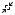</a> | **📂 檔名:** `collapse.svg` ✨ **格式:** `Vector (SVG)` ⚖️ **大小:** `1.05KB` 📅 **更新:** `2026-03-04`  🚀 **jsDelivr Markdown:** `` 🔗 **直接連結 (Url):** <code>https://cdn.jsdelivr.net/gh/barry028/materials@main/images/iCons/Pixel/Base/collapse.svg</code> 📥 [檢視原始檔](collapse.svg) |
|  | **📂 檔名:** `collapseDown.svg` ✨ **格式:** `Vector (SVG)` ⚖️ **大小:** `720.00B` 📅 **更新:** `2026-03-04`  🚀 **jsDelivr Markdown:** `` 🔗 **直接連結 (Url):** <code>https://cdn.jsdelivr.net/gh/barry028/materials@main/images/iCons/Pixel/Base/collapseDown.svg</code> 📥 [檢視原始檔](collapseDown.svg) |
|  | **📂 檔名:** `collapseLeft.svg` ✨ **格式:** `Vector (SVG)` ⚖️ **大小:** `723.00B` 📅 **更新:** `2026-03-04`  🚀 **jsDelivr Markdown:** `` 🔗 **直接連結 (Url):** <code>https://cdn.jsdelivr.net/gh/barry028/materials@main/images/iCons/Pixel/Base/collapseLeft.svg</code> 📥 [檢視原始檔](collapseLeft.svg) |
| <a href="collapseRight.svg">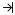</a> | **📂 檔名:** `collapseRight.svg` ✨ **格式:** `Vector (SVG)` ⚖️ **大小:** `729.00B` 📅 **更新:** `2026-03-04`  🚀 **jsDelivr Markdown:** `` 🔗 **直接連結 (Url):** <code>https://cdn.jsdelivr.net/gh/barry028/materials@main/images/iCons/Pixel/Base/collapseRight.svg</code> 📥 [檢視原始檔](collapseRight.svg) |
|  | **📂 檔名:** `collapseUp.svg` ✨ **格式:** `Vector (SVG)` ⚖️ **大小:** `717.00B` 📅 **更新:** `2026-03-04`  🚀 **jsDelivr Markdown:** `` 🔗 **直接連結 (Url):** <code>https://cdn.jsdelivr.net/gh/barry028/materials@main/images/iCons/Pixel/Base/collapseUp.svg</code> 📥 [檢視原始檔](collapseUp.svg) |
|  | **📂 檔名:** `connection.svg` ✨ **格式:** `Vector (SVG)` ⚖️ **大小:** `1.90KB` 📅 **更新:** `2026-03-04`  🚀 **jsDelivr Markdown:** `` 🔗 **直接連結 (Url):** <code>https://cdn.jsdelivr.net/gh/barry028/materials@main/images/iCons/Pixel/Base/connection.svg</code> 📥 [檢視原始檔](connection.svg) |
|  | **📂 檔名:** `contains.svg` ✨ **格式:** `Vector (SVG)` ⚖️ **大小:** `544.00B` 📅 **更新:** `2026-03-04`  🚀 **jsDelivr Markdown:** `` 🔗 **直接連結 (Url):** <code>https://cdn.jsdelivr.net/gh/barry028/materials@main/images/iCons/Pixel/Base/contains.svg</code> 📥 [檢視原始檔](contains.svg) |
|  | **📂 檔名:** `copy.svg` ✨ **格式:** `Vector (SVG)` ⚖️ **大小:** `555.00B` 📅 **更新:** `2026-03-04`  🚀 **jsDelivr Markdown:** `` 🔗 **直接連結 (Url):** <code>https://cdn.jsdelivr.net/gh/barry028/materials@main/images/iCons/Pixel/Base/copy.svg</code> 📥 [檢視原始檔](copy.svg) |
|  | **📂 檔名:** `dataTypeArray.svg` ✨ **格式:** `Vector (SVG)` ⚖️ **大小:** `609.00B` 📅 **更新:** `2026-03-04`  🚀 **jsDelivr Markdown:** `` 🔗 **直接連結 (Url):** <code>https://cdn.jsdelivr.net/gh/barry028/materials@main/images/iCons/Pixel/Base/dataTypeArray.svg</code> 📥 [檢視原始檔](dataTypeArray.svg) |
|  | **📂 檔名:** `dataTypeBoolean.svg` ✨ **格式:** `Vector (SVG)` ⚖️ **大小:** `675.00B` 📅 **更新:** `2026-03-04`  🚀 **jsDelivr Markdown:** `` 🔗 **直接連結 (Url):** <code>https://cdn.jsdelivr.net/gh/barry028/materials@main/images/iCons/Pixel/Base/dataTypeBoolean.svg</code> 📥 [檢視原始檔](dataTypeBoolean.svg) |
|  | **📂 檔名:** `dataTypeDate.svg` ✨ **格式:** `Vector (SVG)` ⚖️ **大小:** `589.00B` 📅 **更新:** `2026-03-04`  🚀 **jsDelivr Markdown:** `` 🔗 **直接連結 (Url):** <code>https://cdn.jsdelivr.net/gh/barry028/materials@main/images/iCons/Pixel/Base/dataTypeDate.svg</code> 📥 [檢視原始檔](dataTypeDate.svg) |
|  | **📂 檔名:** `dataTypeDollar.svg` ✨ **格式:** `Vector (SVG)` ⚖️ **大小:** `808.00B` 📅 **更新:** `2026-03-04`  🚀 **jsDelivr Markdown:** `` 🔗 **直接連結 (Url):** <code>https://cdn.jsdelivr.net/gh/barry028/materials@main/images/iCons/Pixel/Base/dataTypeDollar.svg</code> 📥 [檢視原始檔](dataTypeDollar.svg) |
|  | **📂 檔名:** `dataTypeEnum.svg` ✨ **格式:** `Vector (SVG)` ⚖️ **大小:** `640.00B` 📅 **更新:** `2026-03-04`  🚀 **jsDelivr Markdown:** `` 🔗 **直接連結 (Url):** <code>https://cdn.jsdelivr.net/gh/barry028/materials@main/images/iCons/Pixel/Base/dataTypeEnum.svg</code> 📥 [檢視原始檔](dataTypeEnum.svg) |
|  | **📂 檔名:** `dataTypeEuro.svg` ✨ **格式:** `Vector (SVG)` ⚖️ **大小:** `1.03KB` 📅 **更新:** `2026-03-04`  🚀 **jsDelivr Markdown:** `` 🔗 **直接連結 (Url):** <code>https://cdn.jsdelivr.net/gh/barry028/materials@main/images/iCons/Pixel/Base/dataTypeEuro.svg</code> 📥 [檢視原始檔](dataTypeEuro.svg) |
|  | **📂 檔名:** `dataTypeForeignKey.svg` ✨ **格式:** `Vector (SVG)` ⚖️ **大小:** `450.00B` 📅 **更新:** `2026-03-04`  🚀 **jsDelivr Markdown:** `` 🔗 **直接連結 (Url):** <code>https://cdn.jsdelivr.net/gh/barry028/materials@main/images/iCons/Pixel/Base/dataTypeForeignKey.svg</code> 📥 [檢視原始檔](dataTypeForeignKey.svg) |
|  | **📂 檔名:** `dataTypeFormula.svg` ✨ **格式:** `Vector (SVG)` ⚖️ **大小:** `600.00B` 📅 **更新:** `2026-03-04`  🚀 **jsDelivr Markdown:** `` 🔗 **直接連結 (Url):** <code>https://cdn.jsdelivr.net/gh/barry028/materials@main/images/iCons/Pixel/Base/dataTypeFormula.svg</code> 📥 [檢視原始檔](dataTypeFormula.svg) |
|  | **📂 檔名:** `dataTypeHtml.svg` ✨ **格式:** `Vector (SVG)` ⚖️ **大小:** `1.02KB` 📅 **更新:** `2026-03-04`  🚀 **jsDelivr Markdown:** `` 🔗 **直接連結 (Url):** <code>https://cdn.jsdelivr.net/gh/barry028/materials@main/images/iCons/Pixel/Base/dataTypeHtml.svg</code> 📥 [檢視原始檔](dataTypeHtml.svg) |
|  | **📂 檔名:** `dataTypeImage.svg` ✨ **格式:** `Vector (SVG)` ⚖️ **大小:** `784.00B` 📅 **更新:** `2026-03-04`  🚀 **jsDelivr Markdown:** `` 🔗 **直接連結 (Url):** <code>https://cdn.jsdelivr.net/gh/barry028/materials@main/images/iCons/Pixel/Base/dataTypeImage.svg</code> 📥 [檢視原始檔](dataTypeImage.svg) |
|  | **📂 檔名:** `dataTypeJson.svg` ✨ **格式:** `Vector (SVG)` ⚖️ **大小:** `1.26KB` 📅 **更新:** `2026-03-04`  🚀 **jsDelivr Markdown:** `` 🔗 **直接連結 (Url):** <code>https://cdn.jsdelivr.net/gh/barry028/materials@main/images/iCons/Pixel/Base/dataTypeJson.svg</code> 📥 [檢視原始檔](dataTypeJson.svg) |
|  | **📂 檔名:** `dataTypeLink.svg` ✨ **格式:** `Vector (SVG)` ⚖️ **大小:** `1.37KB` 📅 **更新:** `2026-03-04`  🚀 **jsDelivr Markdown:** `` 🔗 **直接連結 (Url):** <code>https://cdn.jsdelivr.net/gh/barry028/materials@main/images/iCons/Pixel/Base/dataTypeLink.svg</code> 📥 [檢視原始檔](dataTypeLink.svg) |
| <a href="dataTypeNumber.svg">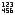</a> | **📂 檔名:** `dataTypeNumber.svg` ✨ **格式:** `Vector (SVG)` ⚖️ **大小:** `1.55KB` 📅 **更新:** `2026-03-04`  🚀 **jsDelivr Markdown:** `` 🔗 **直接連結 (Url):** <code>https://cdn.jsdelivr.net/gh/barry028/materials@main/images/iCons/Pixel/Base/dataTypeNumber.svg</code> 📥 [檢視原始檔](dataTypeNumber.svg) |
|  | **📂 檔名:** `dataTypePercentage.svg` ✨ **格式:** `Vector (SVG)` ⚖️ **大小:** `842.00B` 📅 **更新:** `2026-03-04`  🚀 **jsDelivr Markdown:** `` 🔗 **直接連結 (Url):** <code>https://cdn.jsdelivr.net/gh/barry028/materials@main/images/iCons/Pixel/Base/dataTypePercentage.svg</code> 📥 [檢視原始檔](dataTypePercentage.svg) |
|  | **📂 檔名:** `dataTypePrimaryKey.svg` ✨ **格式:** `Vector (SVG)` ⚖️ **大小:** `552.00B` 📅 **更新:** `2026-03-04`  🚀 **jsDelivr Markdown:** `` 🔗 **直接連結 (Url):** <code>https://cdn.jsdelivr.net/gh/barry028/materials@main/images/iCons/Pixel/Base/dataTypePrimaryKey.svg</code> 📥 [檢視原始檔](dataTypePrimaryKey.svg) |
|  | **📂 檔名:** `dataTypeText.svg` ✨ **格式:** `Vector (SVG)` ⚖️ **大小:** `494.00B` 📅 **更新:** `2026-03-04`  🚀 **jsDelivr Markdown:** `` 🔗 **直接連結 (Url):** <code>https://cdn.jsdelivr.net/gh/barry028/materials@main/images/iCons/Pixel/Base/dataTypeText.svg</code> 📥 [檢視原始檔](dataTypeText.svg) |
|  | **📂 檔名:** `database.svg` ✨ **格式:** `Vector (SVG)` ⚖️ **大小:** `1.73KB` 📅 **更新:** `2026-03-04`  🚀 **jsDelivr Markdown:** `` 🔗 **直接連結 (Url):** <code>https://cdn.jsdelivr.net/gh/barry028/materials@main/images/iCons/Pixel/Base/database.svg</code> 📥 [檢視原始檔](database.svg) |
|  | **📂 檔名:** `delete.svg` ✨ **格式:** `Vector (SVG)` ⚖️ **大小:** `527.00B` 📅 **更新:** `2026-03-04`  🚀 **jsDelivr Markdown:** `` 🔗 **直接連結 (Url):** <code>https://cdn.jsdelivr.net/gh/barry028/materials@main/images/iCons/Pixel/Base/delete.svg</code> 📥 [檢視原始檔](delete.svg) |
|  | **📂 檔名:** `disconnected.svg` ✨ **格式:** `Vector (SVG)` ⚖️ **大小:** `1.60KB` 📅 **更新:** `2026-03-04`  🚀 **jsDelivr Markdown:** `` 🔗 **直接連結 (Url):** <code>https://cdn.jsdelivr.net/gh/barry028/materials@main/images/iCons/Pixel/Base/disconnected.svg</code> 📥 [檢視原始檔](disconnected.svg) |
|  | **📂 檔名:** `dismiss.svg` ✨ **格式:** `Vector (SVG)` ⚖️ **大小:** `547.00B` 📅 **更新:** `2026-03-04`  🚀 **jsDelivr Markdown:** `` 🔗 **直接連結 (Url):** <code>https://cdn.jsdelivr.net/gh/barry028/materials@main/images/iCons/Pixel/Base/dismiss.svg</code> 📥 [檢視原始檔](dismiss.svg) |
| <a href="dividedBy.svg">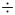</a> | **📂 檔名:** `dividedBy.svg` ✨ **格式:** `Vector (SVG)` ⚖️ **大小:** `634.00B` 📅 **更新:** `2026-03-04`  🚀 **jsDelivr Markdown:** `` 🔗 **直接連結 (Url):** <code>https://cdn.jsdelivr.net/gh/barry028/materials@main/images/iCons/Pixel/Base/dividedBy.svg</code> 📥 [檢視原始檔](dividedBy.svg) |
|  | **📂 檔名:** `documentation.svg` ✨ **格式:** `Vector (SVG)` ⚖️ **大小:** `911.00B` 📅 **更新:** `2026-03-04`  🚀 **jsDelivr Markdown:** `` 🔗 **直接連結 (Url):** <code>https://cdn.jsdelivr.net/gh/barry028/materials@main/images/iCons/Pixel/Base/documentation.svg</code> 📥 [檢視原始檔](documentation.svg) |
|  | **📂 檔名:** `doesNotContain.svg` ✨ **格式:** `Vector (SVG)` ⚖️ **大小:** `1.03KB` 📅 **更新:** `2026-03-04`  🚀 **jsDelivr Markdown:** `` 🔗 **直接連結 (Url):** <code>https://cdn.jsdelivr.net/gh/barry028/materials@main/images/iCons/Pixel/Base/doesNotContain.svg</code> 📥 [檢視原始檔](doesNotContain.svg) |
|  | **📂 檔名:** `doesNotEqual.svg` ✨ **格式:** `Vector (SVG)` ⚖️ **大小:** `827.00B` 📅 **更新:** `2026-03-04`  🚀 **jsDelivr Markdown:** `` 🔗 **直接連結 (Url):** <code>https://cdn.jsdelivr.net/gh/barry028/materials@main/images/iCons/Pixel/Base/doesNotEqual.svg</code> 📥 [檢視原始檔](doesNotEqual.svg) |
|  | **📂 檔名:** `dot.svg` ✨ **格式:** `Vector (SVG)` ⚖️ **大小:** `249.00B` 📅 **更新:** `2026-03-04`  🚀 **jsDelivr Markdown:** `` 🔗 **直接連結 (Url):** <code>https://cdn.jsdelivr.net/gh/barry028/materials@main/images/iCons/Pixel/Base/dot.svg</code> 📥 [檢視原始檔](dot.svg) |
|  | **📂 檔名:** `doubleCaretDown.svg` ✨ **格式:** `Vector (SVG)` ⚖️ **大小:** `805.00B` 📅 **更新:** `2026-03-04`  🚀 **jsDelivr Markdown:** `` 🔗 **直接連結 (Url):** <code>https://cdn.jsdelivr.net/gh/barry028/materials@main/images/iCons/Pixel/Base/doubleCaretDown.svg</code> 📥 [檢視原始檔](doubleCaretDown.svg) |
|  | **📂 檔名:** `doubleCaretLeft.svg` ✨ **格式:** `Vector (SVG)` ⚖️ **大小:** `805.00B` 📅 **更新:** `2026-03-04`  🚀 **jsDelivr Markdown:** `` 🔗 **直接連結 (Url):** <code>https://cdn.jsdelivr.net/gh/barry028/materials@main/images/iCons/Pixel/Base/doubleCaretLeft.svg</code> 📥 [檢視原始檔](doubleCaretLeft.svg) |
|  | **📂 檔名:** `doubleCaretRight.svg` ✨ **格式:** `Vector (SVG)` ⚖️ **大小:** `805.00B` 📅 **更新:** `2026-03-04`  🚀 **jsDelivr Markdown:** `` 🔗 **直接連結 (Url):** <code>https://cdn.jsdelivr.net/gh/barry028/materials@main/images/iCons/Pixel/Base/doubleCaretRight.svg</code> 📥 [檢視原始檔](doubleCaretRight.svg) |
|  | **📂 檔名:** `doubleCaretUp.svg` ✨ **格式:** `Vector (SVG)` ⚖️ **大小:** `805.00B` 📅 **更新:** `2026-03-04`  🚀 **jsDelivr Markdown:** `` 🔗 **直接連結 (Url):** <code>https://cdn.jsdelivr.net/gh/barry028/materials@main/images/iCons/Pixel/Base/doubleCaretUp.svg</code> 📥 [檢視原始檔](doubleCaretUp.svg) |
|  | **📂 檔名:** `download.svg` ✨ **格式:** `Vector (SVG)` ⚖️ **大小:** `747.00B` 📅 **更新:** `2026-03-04`  🚀 **jsDelivr Markdown:** `` 🔗 **直接連結 (Url):** <code>https://cdn.jsdelivr.net/gh/barry028/materials@main/images/iCons/Pixel/Base/download.svg</code> 📥 [檢視原始檔](download.svg) |
|  | **📂 檔名:** `draggable.svg` ✨ **格式:** `Vector (SVG)` ⚖️ **大小:** `865.00B` 📅 **更新:** `2026-03-04`  🚀 **jsDelivr Markdown:** `` 🔗 **直接連結 (Url):** <code>https://cdn.jsdelivr.net/gh/barry028/materials@main/images/iCons/Pixel/Base/draggable.svg</code> 📥 [檢視原始檔](draggable.svg) |
|  | **📂 檔名:** `edit.svg` ✨ **格式:** `Vector (SVG)` ⚖️ **大小:** `596.00B` 📅 **更新:** `2026-03-04`  🚀 **jsDelivr Markdown:** `` 🔗 **直接連結 (Url):** <code>https://cdn.jsdelivr.net/gh/barry028/materials@main/images/iCons/Pixel/Base/edit.svg</code> 📥 [檢視原始檔](edit.svg) |
|  | **📂 檔名:** `email.svg` ✨ **格式:** `Vector (SVG)` ⚖️ **大小:** `510.00B` 📅 **更新:** `2026-03-04`  🚀 **jsDelivr Markdown:** `` 🔗 **直接連結 (Url):** <code>https://cdn.jsdelivr.net/gh/barry028/materials@main/images/iCons/Pixel/Base/email.svg</code> 📥 [檢視原始檔](email.svg) |
|  | **📂 檔名:** `emoji.svg` ✨ **格式:** `Vector (SVG)` ⚖️ **大小:** `1.64KB` 📅 **更新:** `2026-03-04`  🚀 **jsDelivr Markdown:** `` 🔗 **直接連結 (Url):** <code>https://cdn.jsdelivr.net/gh/barry028/materials@main/images/iCons/Pixel/Base/emoji.svg</code> 📥 [檢視原始檔](emoji.svg) |
|  | **📂 檔名:** `equals.svg` ✨ **格式:** `Vector (SVG)` ⚖️ **大小:** `422.00B` 📅 **更新:** `2026-03-04`  🚀 **jsDelivr Markdown:** `` 🔗 **直接連結 (Url):** <code>https://cdn.jsdelivr.net/gh/barry028/materials@main/images/iCons/Pixel/Base/equals.svg</code> 📥 [檢視原始檔](equals.svg) |
|  | **📂 檔名:** `expand.svg` ✨ **格式:** `Vector (SVG)` ⚖️ **大小:** `1.18KB` 📅 **更新:** `2026-03-04`  🚀 **jsDelivr Markdown:** `` 🔗 **直接連結 (Url):** <code>https://cdn.jsdelivr.net/gh/barry028/materials@main/images/iCons/Pixel/Base/expand.svg</code> 📥 [檢視原始檔](expand.svg) |
|  | **📂 檔名:** `export.svg` ✨ **格式:** `Vector (SVG)` ⚖️ **大小:** `790.00B` 📅 **更新:** `2026-03-04`  🚀 **jsDelivr Markdown:** `` 🔗 **直接連結 (Url):** <code>https://cdn.jsdelivr.net/gh/barry028/materials@main/images/iCons/Pixel/Base/export.svg</code> 📥 [檢視原始檔](export.svg) |
|  | **📂 檔名:** `externalLink.svg` ✨ **格式:** `Vector (SVG)` ⚖️ **大小:** `685.00B` 📅 **更新:** `2026-03-04`  🚀 **jsDelivr Markdown:** `` 🔗 **直接連結 (Url):** <code>https://cdn.jsdelivr.net/gh/barry028/materials@main/images/iCons/Pixel/Base/externalLink.svg</code> 📥 [檢視原始檔](externalLink.svg) |
|  | **📂 檔名:** `eyeClosed.svg` ✨ **格式:** `Vector (SVG)` ⚖️ **大小:** `2.79KB` 📅 **更新:** `2026-03-04`  🚀 **jsDelivr Markdown:** `` 🔗 **直接連結 (Url):** <code>https://cdn.jsdelivr.net/gh/barry028/materials@main/images/iCons/Pixel/Base/eyeClosed.svg</code> 📥 [檢視原始檔](eyeClosed.svg) |
|  | **📂 檔名:** `eyeOpen.svg` ✨ **格式:** `Vector (SVG)` ⚖️ **大小:** `2.30KB` 📅 **更新:** `2026-03-04`  🚀 **jsDelivr Markdown:** `` 🔗 **直接連結 (Url):** <code>https://cdn.jsdelivr.net/gh/barry028/materials@main/images/iCons/Pixel/Base/eyeOpen.svg</code> 📥 [檢視原始檔](eyeOpen.svg) |
|  | **📂 檔名:** `favoriteOff.svg` ✨ **格式:** `Vector (SVG)` ⚖️ **大小:** `1.07KB` 📅 **更新:** `2026-03-04`  🚀 **jsDelivr Markdown:** `` 🔗 **直接連結 (Url):** <code>https://cdn.jsdelivr.net/gh/barry028/materials@main/images/iCons/Pixel/Base/favoriteOff.svg</code> 📥 [檢視原始檔](favoriteOff.svg) |
|  | **📂 檔名:** `favoriteOn.svg` ✨ **格式:** `Vector (SVG)` ⚖️ **大小:** `742.00B` 📅 **更新:** `2026-03-04`  🚀 **jsDelivr Markdown:** `` 🔗 **直接連結 (Url):** <code>https://cdn.jsdelivr.net/gh/barry028/materials@main/images/iCons/Pixel/Base/favoriteOn.svg</code> 📥 [檢視原始檔](favoriteOn.svg) |
|  | **📂 檔名:** `file.svg` ✨ **格式:** `Vector (SVG)` ⚖️ **大小:** `422.00B` 📅 **更新:** `2026-03-04`  🚀 **jsDelivr Markdown:** `` 🔗 **直接連結 (Url):** <code>https://cdn.jsdelivr.net/gh/barry028/materials@main/images/iCons/Pixel/Base/file.svg</code> 📥 [檢視原始檔](file.svg) |
|  | **📂 檔名:** `filter.svg` ✨ **格式:** `Vector (SVG)` ⚖️ **大小:** `547.00B` 📅 **更新:** `2026-03-04`  🚀 **jsDelivr Markdown:** `` 🔗 **直接連結 (Url):** <code>https://cdn.jsdelivr.net/gh/barry028/materials@main/images/iCons/Pixel/Base/filter.svg</code> 📥 [檢視原始檔](filter.svg) |
|  | **📂 檔名:** `focus.svg` ✨ **格式:** `Vector (SVG)` ⚖️ **大小:** `836.00B` 📅 **更新:** `2026-03-04`  🚀 **jsDelivr Markdown:** `` 🔗 **直接連結 (Url):** <code>https://cdn.jsdelivr.net/gh/barry028/materials@main/images/iCons/Pixel/Base/focus.svg</code> 📥 [檢視原始檔](focus.svg) |
|  | **📂 檔名:** `folder.svg` ✨ **格式:** `Vector (SVG)` ⚖️ **大小:** `511.00B` 📅 **更新:** `2026-03-04`  🚀 **jsDelivr Markdown:** `` 🔗 **直接連結 (Url):** <code>https://cdn.jsdelivr.net/gh/barry028/materials@main/images/iCons/Pixel/Base/folder.svg</code> 📥 [檢視原始檔](folder.svg) |
|  | **📂 檔名:** `folderOpen.svg` ✨ **格式:** `Vector (SVG)` ⚖️ **大小:** `719.00B` 📅 **更新:** `2026-03-04`  🚀 **jsDelivr Markdown:** `` 🔗 **直接連結 (Url):** <code>https://cdn.jsdelivr.net/gh/barry028/materials@main/images/iCons/Pixel/Base/folderOpen.svg</code> 📥 [檢視原始檔](folderOpen.svg) |
|  | **📂 檔名:** `formView.svg` ✨ **格式:** `Vector (SVG)` ⚖️ **大小:** `718.00B` 📅 **更新:** `2026-03-04`  🚀 **jsDelivr Markdown:** `` 🔗 **直接連結 (Url):** <code>https://cdn.jsdelivr.net/gh/barry028/materials@main/images/iCons/Pixel/Base/formView.svg</code> 📥 [檢視原始檔](formView.svg) |
|  | **📂 檔名:** `forward.svg` ✨ **格式:** `Vector (SVG)` ⚖️ **大小:** `611.00B` 📅 **更新:** `2026-03-04`  🚀 **jsDelivr Markdown:** `` 🔗 **直接連結 (Url):** <code>https://cdn.jsdelivr.net/gh/barry028/materials@main/images/iCons/Pixel/Base/forward.svg</code> 📥 [檢視原始檔](forward.svg) |
|  | **📂 檔名:** `globeApac.svg` ✨ **格式:** `Vector (SVG)` ⚖️ **大小:** `1.90KB` 📅 **更新:** `2026-03-04`  🚀 **jsDelivr Markdown:** `` 🔗 **直接連結 (Url):** <code>https://cdn.jsdelivr.net/gh/barry028/materials@main/images/iCons/Pixel/Base/globeApac.svg</code> 📥 [檢視原始檔](globeApac.svg) |
|  | **📂 檔名:** `globeIndia.svg` ✨ **格式:** `Vector (SVG)` ⚖️ **大小:** `1.68KB` 📅 **更新:** `2026-03-04`  🚀 **jsDelivr Markdown:** `` 🔗 **直接連結 (Url):** <code>https://cdn.jsdelivr.net/gh/barry028/materials@main/images/iCons/Pixel/Base/globeIndia.svg</code> 📥 [檢視原始檔](globeIndia.svg) |
|  | **📂 檔名:** `globeMidEast.svg` ✨ **格式:** `Vector (SVG)` ⚖️ **大小:** `1.79KB` 📅 **更新:** `2026-03-04`  🚀 **jsDelivr Markdown:** `` 🔗 **直接連結 (Url):** <code>https://cdn.jsdelivr.net/gh/barry028/materials@main/images/iCons/Pixel/Base/globeMidEast.svg</code> 📥 [檢視原始檔](globeMidEast.svg) |
|  | **📂 檔名:** `globeUsEu.svg` ✨ **格式:** `Vector (SVG)` ⚖️ **大小:** `1.50KB` 📅 **更新:** `2026-03-04`  🚀 **jsDelivr Markdown:** `` 🔗 **直接連結 (Url):** <code>https://cdn.jsdelivr.net/gh/barry028/materials@main/images/iCons/Pixel/Base/globeUsEu.svg</code> 📥 [檢視原始檔](globeUsEu.svg) |
|  | **📂 檔名:** `greaterThan.svg` ✨ **格式:** `Vector (SVG)` ⚖️ **大小:** `527.00B` 📅 **更新:** `2026-03-04`  🚀 **jsDelivr Markdown:** `` 🔗 **直接連結 (Url):** <code>https://cdn.jsdelivr.net/gh/barry028/materials@main/images/iCons/Pixel/Base/greaterThan.svg</code> 📥 [檢視原始檔](greaterThan.svg) |
|  | **📂 檔名:** `greaterThanOrEqualTo.svg` ✨ **格式:** `Vector (SVG)` ⚖️ **大小:** `662.00B` 📅 **更新:** `2026-03-04`  🚀 **jsDelivr Markdown:** `` 🔗 **直接連結 (Url):** <code>https://cdn.jsdelivr.net/gh/barry028/materials@main/images/iCons/Pixel/Base/greaterThanOrEqualTo.svg</code> 📥 [檢視原始檔](greaterThanOrEqualTo.svg) |
|  | **📂 檔名:** `gridView.svg` ✨ **格式:** `Vector (SVG)` ⚖️ **大小:** `755.00B` 📅 **更新:** `2026-03-04`  🚀 **jsDelivr Markdown:** `` 🔗 **直接連結 (Url):** <code>https://cdn.jsdelivr.net/gh/barry028/materials@main/images/iCons/Pixel/Base/gridView.svg</code> 📥 [檢視原始檔](gridView.svg) |
|  | **📂 檔名:** `home.svg` ✨ **格式:** `Vector (SVG)` ⚖️ **大小:** `544.00B` 📅 **更新:** `2026-03-04`  🚀 **jsDelivr Markdown:** `` 🔗 **直接連結 (Url):** <code>https://cdn.jsdelivr.net/gh/barry028/materials@main/images/iCons/Pixel/Base/home.svg</code> 📥 [檢視原始檔](home.svg) |
|  | **📂 檔名:** `import.svg` ✨ **格式:** `Vector (SVG)` ⚖️ **大小:** `805.00B` 📅 **更新:** `2026-03-04`  🚀 **jsDelivr Markdown:** `` 🔗 **直接連結 (Url):** <code>https://cdn.jsdelivr.net/gh/barry028/materials@main/images/iCons/Pixel/Base/import.svg</code> 📥 [檢視原始檔](import.svg) |
|  | **📂 檔名:** `info.svg` ✨ **格式:** `Vector (SVG)` ⚖️ **大小:** `670.00B` 📅 **更新:** `2026-03-04`  🚀 **jsDelivr Markdown:** `` 🔗 **直接連結 (Url):** <code>https://cdn.jsdelivr.net/gh/barry028/materials@main/images/iCons/Pixel/Base/info.svg</code> 📥 [檢視原始檔](info.svg) |
|  | **📂 檔名:** `isNotBetween.svg` ✨ **格式:** `Vector (SVG)` ⚖️ **大小:** `814.00B` 📅 **更新:** `2026-03-04`  🚀 **jsDelivr Markdown:** `` 🔗 **直接連結 (Url):** <code>https://cdn.jsdelivr.net/gh/barry028/materials@main/images/iCons/Pixel/Base/isNotBetween.svg</code> 📥 [檢視原始檔](isNotBetween.svg) |
|  | **📂 檔名:** `isNotNull.svg` ✨ **格式:** `Vector (SVG)` ⚖️ **大小:** `2.76KB` 📅 **更新:** `2026-03-04`  🚀 **jsDelivr Markdown:** `` 🔗 **直接連結 (Url):** <code>https://cdn.jsdelivr.net/gh/barry028/materials@main/images/iCons/Pixel/Base/isNotNull.svg</code> 📥 [檢視原始檔](isNotNull.svg) |
|  | **📂 檔名:** `isNotSet.svg` ✨ **格式:** `Vector (SVG)` ⚖️ **大小:** `657.00B` 📅 **更新:** `2026-03-04`  🚀 **jsDelivr Markdown:** `` 🔗 **直接連結 (Url):** <code>https://cdn.jsdelivr.net/gh/barry028/materials@main/images/iCons/Pixel/Base/isNotSet.svg</code> 📥 [檢視原始檔](isNotSet.svg) |
|  | **📂 檔名:** `isNull.svg` ✨ **格式:** `Vector (SVG)` ⚖️ **大小:** `2.71KB` 📅 **更新:** `2026-03-04`  🚀 **jsDelivr Markdown:** `` 🔗 **直接連結 (Url):** <code>https://cdn.jsdelivr.net/gh/barry028/materials@main/images/iCons/Pixel/Base/isNull.svg</code> 📥 [檢視原始檔](isNull.svg) |
|  | **📂 檔名:** `isSet.svg` ✨ **格式:** `Vector (SVG)` ⚖️ **大小:** `435.00B` 📅 **更新:** `2026-03-04`  🚀 **jsDelivr Markdown:** `` 🔗 **直接連結 (Url):** <code>https://cdn.jsdelivr.net/gh/barry028/materials@main/images/iCons/Pixel/Base/isSet.svg</code> 📥 [檢視原始檔](isSet.svg) |
|  | **📂 檔名:** `joinTables.svg` ✨ **格式:** `Vector (SVG)` ⚖️ **大小:** `1.01KB` 📅 **更新:** `2026-03-04`  🚀 **jsDelivr Markdown:** `` 🔗 **直接連結 (Url):** <code>https://cdn.jsdelivr.net/gh/barry028/materials@main/images/iCons/Pixel/Base/joinTables.svg</code> 📥 [檢視原始檔](joinTables.svg) |
|  | **📂 檔名:** `jumpTo.svg` ✨ **格式:** `Vector (SVG)` ⚖️ **大小:** `806.00B` 📅 **更新:** `2026-03-04`  🚀 **jsDelivr Markdown:** `` 🔗 **直接連結 (Url):** <code>https://cdn.jsdelivr.net/gh/barry028/materials@main/images/iCons/Pixel/Base/jumpTo.svg</code> 📥 [檢視原始檔](jumpTo.svg) |
|  | **📂 檔名:** `kanbanView.svg` ✨ **格式:** `Vector (SVG)` ⚖️ **大小:** `985.00B` 📅 **更新:** `2026-03-04`  🚀 **jsDelivr Markdown:** `` 🔗 **直接連結 (Url):** <code>https://cdn.jsdelivr.net/gh/barry028/materials@main/images/iCons/Pixel/Base/kanbanView.svg</code> 📥 [檢視原始檔](kanbanView.svg) |
|  | **📂 檔名:** `keyboard.svg` ✨ **格式:** `Vector (SVG)` ⚖️ **大小:** `434.00B` 📅 **更新:** `2026-03-04`  🚀 **jsDelivr Markdown:** `` 🔗 **直接連結 (Url):** <code>https://cdn.jsdelivr.net/gh/barry028/materials@main/images/iCons/Pixel/Base/keyboard.svg</code> 📥 [檢視原始檔](keyboard.svg) |
|  | **📂 檔名:** `keyboardCommand.svg` ✨ **格式:** `Vector (SVG)` ⚖️ **大小:** `865.00B` 📅 **更新:** `2026-03-04`  🚀 **jsDelivr Markdown:** `` 🔗 **直接連結 (Url):** <code>https://cdn.jsdelivr.net/gh/barry028/materials@main/images/iCons/Pixel/Base/keyboardCommand.svg</code> 📥 [檢視原始檔](keyboardCommand.svg) |
|  | **📂 檔名:** `keyboardControl.svg` ✨ **格式:** `Vector (SVG)` ⚖️ **大小:** `488.00B` 📅 **更新:** `2026-03-04`  🚀 **jsDelivr Markdown:** `` 🔗 **直接連結 (Url):** <code>https://cdn.jsdelivr.net/gh/barry028/materials@main/images/iCons/Pixel/Base/keyboardControl.svg</code> 📥 [檢視原始檔](keyboardControl.svg) |
|  | **📂 檔名:** `keyboardEsc.svg` ✨ **格式:** `Vector (SVG)` ⚖️ **大小:** `870.00B` 📅 **更新:** `2026-03-04`  🚀 **jsDelivr Markdown:** `` 🔗 **直接連結 (Url):** <code>https://cdn.jsdelivr.net/gh/barry028/materials@main/images/iCons/Pixel/Base/keyboardEsc.svg</code> 📥 [檢視原始檔](keyboardEsc.svg) |
|  | **📂 檔名:** `keyboardLetterF.svg` ✨ **格式:** `Vector (SVG)` ⚖️ **大小:** `390.00B` 📅 **更新:** `2026-03-04`  🚀 **jsDelivr Markdown:** `` 🔗 **直接連結 (Url):** <code>https://cdn.jsdelivr.net/gh/barry028/materials@main/images/iCons/Pixel/Base/keyboardLetterF.svg</code> 📥 [檢視原始檔](keyboardLetterF.svg) |
|  | **📂 檔名:** `keyboardLetterK.svg` ✨ **格式:** `Vector (SVG)` ⚖️ **大小:** `562.00B` 📅 **更新:** `2026-03-04`  🚀 **jsDelivr Markdown:** `` 🔗 **直接連結 (Url):** <code>https://cdn.jsdelivr.net/gh/barry028/materials@main/images/iCons/Pixel/Base/keyboardLetterK.svg</code> 📥 [檢視原始檔](keyboardLetterK.svg) |
|  | **📂 檔名:** `keyboardLetterS.svg` ✨ **格式:** `Vector (SVG)` ⚖️ **大小:** `613.00B` 📅 **更新:** `2026-03-04`  🚀 **jsDelivr Markdown:** `` 🔗 **直接連結 (Url):** <code>https://cdn.jsdelivr.net/gh/barry028/materials@main/images/iCons/Pixel/Base/keyboardLetterS.svg</code> 📥 [檢視原始檔](keyboardLetterS.svg) |
|  | **📂 檔名:** `keyboardOption.svg` ✨ **格式:** `Vector (SVG)` ⚖️ **大小:** `534.00B` 📅 **更新:** `2026-03-04`  🚀 **jsDelivr Markdown:** `` 🔗 **直接連結 (Url):** <code>https://cdn.jsdelivr.net/gh/barry028/materials@main/images/iCons/Pixel/Base/keyboardOption.svg</code> 📥 [檢視原始檔](keyboardOption.svg) |
|  | **📂 檔名:** `keyboardReturn.svg` ✨ **格式:** `Vector (SVG)` ⚖️ **大小:** `670.00B` 📅 **更新:** `2026-03-04`  🚀 **jsDelivr Markdown:** `` 🔗 **直接連結 (Url):** <code>https://cdn.jsdelivr.net/gh/barry028/materials@main/images/iCons/Pixel/Base/keyboardReturn.svg</code> 📥 [檢視原始檔](keyboardReturn.svg) |
|  | **📂 檔名:** `keyboardShift.svg` ✨ **格式:** `Vector (SVG)` ⚖️ **大小:** `656.00B` 📅 **更新:** `2026-03-04`  🚀 **jsDelivr Markdown:** `` 🔗 **直接連結 (Url):** <code>https://cdn.jsdelivr.net/gh/barry028/materials@main/images/iCons/Pixel/Base/keyboardShift.svg</code> 📥 [檢視原始檔](keyboardShift.svg) |
|  | **📂 檔名:** `lessThan.svg` ✨ **格式:** `Vector (SVG)` ⚖️ **大小:** `516.00B` 📅 **更新:** `2026-03-04`  🚀 **jsDelivr Markdown:** `` 🔗 **直接連結 (Url):** <code>https://cdn.jsdelivr.net/gh/barry028/materials@main/images/iCons/Pixel/Base/lessThan.svg</code> 📥 [檢視原始檔](lessThan.svg) |
|  | **📂 檔名:** `lessThanOrEqualTo.svg` ✨ **格式:** `Vector (SVG)` ⚖️ **大小:** `656.00B` 📅 **更新:** `2026-03-04`  🚀 **jsDelivr Markdown:** `` 🔗 **直接連結 (Url):** <code>https://cdn.jsdelivr.net/gh/barry028/materials@main/images/iCons/Pixel/Base/lessThanOrEqualTo.svg</code> 📥 [檢視原始檔](lessThanOrEqualTo.svg) |
|  | **📂 檔名:** `lineChart.svg` ✨ **格式:** `Vector (SVG)` ⚖️ **大小:** `725.00B` 📅 **更新:** `2026-03-04`  🚀 **jsDelivr Markdown:** `` 🔗 **直接連結 (Url):** <code>https://cdn.jsdelivr.net/gh/barry028/materials@main/images/iCons/Pixel/Base/lineChart.svg</code> 📥 [檢視原始檔](lineChart.svg) |
|  | **📂 檔名:** `listView.svg` ✨ **格式:** `Vector (SVG)` ⚖️ **大小:** `623.00B` 📅 **更新:** `2026-03-04`  🚀 **jsDelivr Markdown:** `` 🔗 **直接連結 (Url):** <code>https://cdn.jsdelivr.net/gh/barry028/materials@main/images/iCons/Pixel/Base/listView.svg</code> 📥 [檢視原始檔](listView.svg) |
|  | **📂 檔名:** `location.svg` ✨ **格式:** `Vector (SVG)` ⚖️ **大小:** `1.02KB` 📅 **更新:** `2026-03-04`  🚀 **jsDelivr Markdown:** `` 🔗 **直接連結 (Url):** <code>https://cdn.jsdelivr.net/gh/barry028/materials@main/images/iCons/Pixel/Base/location.svg</code> 📥 [檢視原始檔](location.svg) |
|  | **📂 檔名:** `locked.svg` ✨ **格式:** `Vector (SVG)` ⚖️ **大小:** `506.00B` 📅 **更新:** `2026-03-04`  🚀 **jsDelivr Markdown:** `` 🔗 **直接連結 (Url):** <code>https://cdn.jsdelivr.net/gh/barry028/materials@main/images/iCons/Pixel/Base/locked.svg</code> 📥 [檢視原始檔](locked.svg) |
|  | **📂 檔名:** `logout.svg` ✨ **格式:** `Vector (SVG)` ⚖️ **大小:** `836.00B` 📅 **更新:** `2026-03-04`  🚀 **jsDelivr Markdown:** `` 🔗 **直接連結 (Url):** <code>https://cdn.jsdelivr.net/gh/barry028/materials@main/images/iCons/Pixel/Base/logout.svg</code> 📥 [檢視原始檔](logout.svg) |
|  | **📂 檔名:** `mariaDb.svg` ✨ **格式:** `Vector (SVG)` ⚖️ **大小:** `1.47KB` 📅 **更新:** `2026-03-04`  🚀 **jsDelivr Markdown:** `` 🔗 **直接連結 (Url):** <code>https://cdn.jsdelivr.net/gh/barry028/materials@main/images/iCons/Pixel/Base/mariaDb.svg</code> 📥 [檢視原始檔](mariaDb.svg) |
|  | **📂 檔名:** `menu.svg` ✨ **格式:** `Vector (SVG)` ⚖️ **大小:** `552.00B` 📅 **更新:** `2026-03-04`  🚀 **jsDelivr Markdown:** `` 🔗 **直接連結 (Url):** <code>https://cdn.jsdelivr.net/gh/barry028/materials@main/images/iCons/Pixel/Base/menu.svg</code> 📥 [檢視原始檔](menu.svg) |
|  | **📂 檔名:** `minus.svg` ✨ **格式:** `Vector (SVG)` ⚖️ **大小:** `295.00B` 📅 **更新:** `2026-03-04`  🚀 **jsDelivr Markdown:** `` 🔗 **直接連結 (Url):** <code>https://cdn.jsdelivr.net/gh/barry028/materials@main/images/iCons/Pixel/Base/minus.svg</code> 📥 [檢視原始檔](minus.svg) |
|  | **📂 檔名:** `more.svg` ✨ **格式:** `Vector (SVG)` ⚖️ **大小:** `607.00B` 📅 **更新:** `2026-03-04`  🚀 **jsDelivr Markdown:** `` 🔗 **直接連結 (Url):** <code>https://cdn.jsdelivr.net/gh/barry028/materials@main/images/iCons/Pixel/Base/more.svg</code> 📥 [檢視原始檔](more.svg) |
|  | **📂 檔名:** `mySql.svg` ✨ **格式:** `Vector (SVG)` ⚖️ **大小:** `3.16KB` 📅 **更新:** `2026-03-04`  🚀 **jsDelivr Markdown:** `` 🔗 **直接連結 (Url):** <code>https://cdn.jsdelivr.net/gh/barry028/materials@main/images/iCons/Pixel/Base/mySql.svg</code> 📥 [檢視原始檔](mySql.svg) |
|  | **📂 檔名:** `noSqLdb.svg` ✨ **格式:** `Vector (SVG)` ⚖️ **大小:** `1.11KB` 📅 **更新:** `2026-03-04`  🚀 **jsDelivr Markdown:** `` 🔗 **直接連結 (Url):** <code>https://cdn.jsdelivr.net/gh/barry028/materials@main/images/iCons/Pixel/Base/noSqLdb.svg</code> 📥 [檢視原始檔](noSqLdb.svg) |
|  | **📂 檔名:** `notificiations.svg` ✨ **格式:** `Vector (SVG)` ⚖️ **大小:** `841.00B` 📅 **更新:** `2026-03-04`  🚀 **jsDelivr Markdown:** `` 🔗 **直接連結 (Url):** <code>https://cdn.jsdelivr.net/gh/barry028/materials@main/images/iCons/Pixel/Base/notificiations.svg</code> 📥 [檢視原始檔](notificiations.svg) |
|  | **📂 檔名:** `onOrAfter.svg` ✨ **格式:** `Vector (SVG)` ⚖️ **大小:** `750.00B` 📅 **更新:** `2026-03-04`  🚀 **jsDelivr Markdown:** `` 🔗 **直接連結 (Url):** <code>https://cdn.jsdelivr.net/gh/barry028/materials@main/images/iCons/Pixel/Base/onOrAfter.svg</code> 📥 [檢視原始檔](onOrAfter.svg) |
|  | **📂 檔名:** `onOrBefore.svg` ✨ **格式:** `Vector (SVG)` ⚖️ **大小:** `769.00B` 📅 **更新:** `2026-03-04`  🚀 **jsDelivr Markdown:** `` 🔗 **直接連結 (Url):** <code>https://cdn.jsdelivr.net/gh/barry028/materials@main/images/iCons/Pixel/Base/onOrBefore.svg</code> 📥 [檢視原始檔](onOrBefore.svg) |
|  | **📂 檔名:** `pause.svg` ✨ **格式:** `Vector (SVG)` ⚖️ **大小:** `440.00B` 📅 **更新:** `2026-03-04`  🚀 **jsDelivr Markdown:** `` 🔗 **直接連結 (Url):** <code>https://cdn.jsdelivr.net/gh/barry028/materials@main/images/iCons/Pixel/Base/pause.svg</code> 📥 [檢視原始檔](pause.svg) |
|  | **📂 檔名:** `phone.svg` ✨ **格式:** `Vector (SVG)` ⚖️ **大小:** `1.09KB` 📅 **更新:** `2026-03-04`  🚀 **jsDelivr Markdown:** `` 🔗 **直接連結 (Url):** <code>https://cdn.jsdelivr.net/gh/barry028/materials@main/images/iCons/Pixel/Base/phone.svg</code> 📥 [檢視原始檔](phone.svg) |
|  | **📂 檔名:** `pin.svg` ✨ **格式:** `Vector (SVG)` ⚖️ **大小:** `13.42KB` 📅 **更新:** `2026-03-04`  🚀 **jsDelivr Markdown:** `` 🔗 **直接連結 (Url):** <code>https://cdn.jsdelivr.net/gh/barry028/materials@main/images/iCons/Pixel/Base/pin.svg</code> 📥 [檢視原始檔](pin.svg) |
| <a href="placeholder.svg">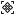</a> | **📂 檔名:** `placeholder.svg` ✨ **格式:** `Vector (SVG)` ⚖️ **大小:** `2.42KB` 📅 **更新:** `2026-03-04`  🚀 **jsDelivr Markdown:** `` 🔗 **直接連結 (Url):** <code>https://cdn.jsdelivr.net/gh/barry028/materials@main/images/iCons/Pixel/Base/placeholder.svg</code> 📥 [檢視原始檔](placeholder.svg) |
|  | **📂 檔名:** `play.svg` ✨ **格式:** `Vector (SVG)` ⚖️ **大小:** `397.00B` 📅 **更新:** `2026-03-04`  🚀 **jsDelivr Markdown:** `` 🔗 **直接連結 (Url):** <code>https://cdn.jsdelivr.net/gh/barry028/materials@main/images/iCons/Pixel/Base/play.svg</code> 📥 [檢視原始檔](play.svg) |
|  | **📂 檔名:** `postgres.svg` ✨ **格式:** `Vector (SVG)` ⚖️ **大小:** `2.22KB` 📅 **更新:** `2026-03-04`  🚀 **jsDelivr Markdown:** `` 🔗 **直接連結 (Url):** <code>https://cdn.jsdelivr.net/gh/barry028/materials@main/images/iCons/Pixel/Base/postgres.svg</code> 📥 [檢視原始檔](postgres.svg) |
|  | **📂 檔名:** `preferences.svg` ✨ **格式:** `Vector (SVG)` ⚖️ **大小:** `869.00B` 📅 **更新:** `2026-03-04`  🚀 **jsDelivr Markdown:** `` 🔗 **直接連結 (Url):** <code>https://cdn.jsdelivr.net/gh/barry028/materials@main/images/iCons/Pixel/Base/preferences.svg</code> 📥 [檢視原始檔](preferences.svg) |
|  | **📂 檔名:** `primaryAttribute.svg` ✨ **格式:** `Vector (SVG)` ⚖️ **大小:** `849.00B` 📅 **更新:** `2026-03-04`  🚀 **jsDelivr Markdown:** `` 🔗 **直接連結 (Url):** <code>https://cdn.jsdelivr.net/gh/barry028/materials@main/images/iCons/Pixel/Base/primaryAttribute.svg</code> 📥 [檢視原始檔](primaryAttribute.svg) |
| <a href="progress.svg">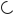</a> | **📂 檔名:** `progress.svg` ✨ **格式:** `Vector (SVG)` ⚖️ **大小:** `1.01KB` 📅 **更新:** `2026-03-04`  🚀 **jsDelivr Markdown:** `` 🔗 **直接連結 (Url):** <code>https://cdn.jsdelivr.net/gh/barry028/materials@main/images/iCons/Pixel/Base/progress.svg</code> 📥 [檢視原始檔](progress.svg) |
|  | **📂 檔名:** `query.svg` ✨ **格式:** `Vector (SVG)` ⚖️ **大小:** `1.18KB` 📅 **更新:** `2026-03-04`  🚀 **jsDelivr Markdown:** `` 🔗 **直接連結 (Url):** <code>https://cdn.jsdelivr.net/gh/barry028/materials@main/images/iCons/Pixel/Base/query.svg</code> 📥 [檢視原始檔](query.svg) |
|  | **📂 檔名:** `question.svg` ✨ **格式:** `Vector (SVG)` ⚖️ **大小:** `1.41KB` 📅 **更新:** `2026-03-04`  🚀 **jsDelivr Markdown:** `` 🔗 **直接連結 (Url):** <code>https://cdn.jsdelivr.net/gh/barry028/materials@main/images/iCons/Pixel/Base/question.svg</code> 📥 [檢視原始檔](question.svg) |
|  | **📂 檔名:** `radioOff.svg` ✨ **格式:** `Vector (SVG)` ⚖️ **大小:** `407.00B` 📅 **更新:** `2026-03-04`  🚀 **jsDelivr Markdown:** `` 🔗 **直接連結 (Url):** <code>https://cdn.jsdelivr.net/gh/barry028/materials@main/images/iCons/Pixel/Base/radioOff.svg</code> 📥 [檢視原始檔](radioOff.svg) |
|  | **📂 檔名:** `radioOn.svg` ✨ **格式:** `Vector (SVG)` ⚖️ **大小:** `537.00B` 📅 **更新:** `2026-03-04`  🚀 **jsDelivr Markdown:** `` 🔗 **直接連結 (Url):** <code>https://cdn.jsdelivr.net/gh/barry028/materials@main/images/iCons/Pixel/Base/radioOn.svg</code> 📥 [檢視原始檔](radioOn.svg) |
|  | **📂 檔名:** `redo.svg` ✨ **格式:** `Vector (SVG)` ⚖️ **大小:** `667.00B` 📅 **更新:** `2026-03-04`  🚀 **jsDelivr Markdown:** `` 🔗 **直接連結 (Url):** <code>https://cdn.jsdelivr.net/gh/barry028/materials@main/images/iCons/Pixel/Base/redo.svg</code> 📥 [檢視原始檔](redo.svg) |
|  | **📂 檔名:** `redshift.svg` ✨ **格式:** `Vector (SVG)` ⚖️ **大小:** `345.00B` 📅 **更新:** `2026-03-04`  🚀 **jsDelivr Markdown:** `` 🔗 **直接連結 (Url):** <code>https://cdn.jsdelivr.net/gh/barry028/materials@main/images/iCons/Pixel/Base/redshift.svg</code> 📥 [檢視原始檔](redshift.svg) |
|  | **📂 檔名:** `refresh.svg` ✨ **格式:** `Vector (SVG)` ⚖️ **大小:** `629.00B` 📅 **更新:** `2026-03-04`  🚀 **jsDelivr Markdown:** `` 🔗 **直接連結 (Url):** <code>https://cdn.jsdelivr.net/gh/barry028/materials@main/images/iCons/Pixel/Base/refresh.svg</code> 📥 [檢視原始檔](refresh.svg) |
|  | **📂 檔名:** `richtext.svg` ✨ **格式:** `Vector (SVG)` ⚖️ **大小:** `798.00B` 📅 **更新:** `2026-03-04`  🚀 **jsDelivr Markdown:** `` 🔗 **直接連結 (Url):** <code>https://cdn.jsdelivr.net/gh/barry028/materials@main/images/iCons/Pixel/Base/richtext.svg</code> 📥 [檢視原始檔](richtext.svg) |
|  | **📂 檔名:** `role.svg` ✨ **格式:** `Vector (SVG)` ⚖️ **大小:** `762.00B` 📅 **更新:** `2026-03-04`  🚀 **jsDelivr Markdown:** `` 🔗 **直接連結 (Url):** <code>https://cdn.jsdelivr.net/gh/barry028/materials@main/images/iCons/Pixel/Base/role.svg</code> 📥 [檢視原始檔](role.svg) |
|  | **📂 檔名:** `search.svg` ✨ **格式:** `Vector (SVG)` ⚖️ **大小:** `715.00B` 📅 **更新:** `2026-03-04`  🚀 **jsDelivr Markdown:** `` 🔗 **直接連結 (Url):** <code>https://cdn.jsdelivr.net/gh/barry028/materials@main/images/iCons/Pixel/Base/search.svg</code> 📥 [檢視原始檔](search.svg) |
|  | **📂 檔名:** `send.svg` ✨ **格式:** `Vector (SVG)` ⚖️ **大小:** `714.00B` 📅 **更新:** `2026-03-04`  🚀 **jsDelivr Markdown:** `` 🔗 **直接連結 (Url):** <code>https://cdn.jsdelivr.net/gh/barry028/materials@main/images/iCons/Pixel/Base/send.svg</code> 📥 [檢視原始檔](send.svg) |
|  | **📂 檔名:** `settings.svg` ✨ **格式:** `Vector (SVG)` ⚖️ **大小:** `2.11KB` 📅 **更新:** `2026-03-04`  🚀 **jsDelivr Markdown:** `` 🔗 **直接連結 (Url):** <code>https://cdn.jsdelivr.net/gh/barry028/materials@main/images/iCons/Pixel/Base/settings.svg</code> 📥 [檢視原始檔](settings.svg) |
|  | **📂 檔名:** `share.svg` ✨ **格式:** `Vector (SVG)` ⚖️ **大小:** `842.00B` 📅 **更新:** `2026-03-04`  🚀 **jsDelivr Markdown:** `` 🔗 **直接連結 (Url):** <code>https://cdn.jsdelivr.net/gh/barry028/materials@main/images/iCons/Pixel/Base/share.svg</code> 📥 [檢視原始檔](share.svg) |
|  | **📂 檔名:** `sortAscending.svg` ✨ **格式:** `Vector (SVG)` ⚖️ **大小:** `1003.00B` 📅 **更新:** `2026-03-04`  🚀 **jsDelivr Markdown:** `` 🔗 **直接連結 (Url):** <code>https://cdn.jsdelivr.net/gh/barry028/materials@main/images/iCons/Pixel/Base/sortAscending.svg</code> 📥 [檢視原始檔](sortAscending.svg) |
|  | **📂 檔名:** `sortDescending.svg` ✨ **格式:** `Vector (SVG)` ⚖️ **大小:** `957.00B` 📅 **更新:** `2026-03-04`  🚀 **jsDelivr Markdown:** `` 🔗 **直接連結 (Url):** <code>https://cdn.jsdelivr.net/gh/barry028/materials@main/images/iCons/Pixel/Base/sortDescending.svg</code> 📥 [檢視原始檔](sortDescending.svg) |
|  | **📂 檔名:** `sortDown-1.svg` ✨ **格式:** `Vector (SVG)` ⚖️ **大小:** `1.23KB` 📅 **更新:** `2026-03-04`  🚀 **jsDelivr Markdown:** `` 🔗 **直接連結 (Url):** <code>https://cdn.jsdelivr.net/gh/barry028/materials@main/images/iCons/Pixel/Base/sortDown-1.svg</code> 📥 [檢視原始檔](sortDown-1.svg) |
|  | **📂 檔名:** `sortDown.svg` ✨ **格式:** `Vector (SVG)` ⚖️ **大小:** `1.24KB` 📅 **更新:** `2026-03-04`  🚀 **jsDelivr Markdown:** `` 🔗 **直接連結 (Url):** <code>https://cdn.jsdelivr.net/gh/barry028/materials@main/images/iCons/Pixel/Base/sortDown.svg</code> 📥 [檢視原始檔](sortDown.svg) |
|  | **📂 檔名:** `sqLdb.svg` ✨ **格式:** `Vector (SVG)` ⚖️ **大小:** `800.00B` 📅 **更新:** `2026-03-04`  🚀 **jsDelivr Markdown:** `` 🔗 **直接連結 (Url):** <code>https://cdn.jsdelivr.net/gh/barry028/materials@main/images/iCons/Pixel/Base/sqLdb.svg</code> 📥 [檢視原始檔](sqLdb.svg) |
|  | **📂 檔名:** `sqlServer.svg` ✨ **格式:** `Vector (SVG)` ⚖️ **大小:** `1.96KB` 📅 **更新:** `2026-03-04`  🚀 **jsDelivr Markdown:** `` 🔗 **直接連結 (Url):** <code>https://cdn.jsdelivr.net/gh/barry028/materials@main/images/iCons/Pixel/Base/sqlServer.svg</code> 📥 [檢視原始檔](sqlServer.svg) |
|  | **📂 檔名:** `supabase.svg` ✨ **格式:** `Vector (SVG)` ⚖️ **大小:** `611.00B` 📅 **更新:** `2026-03-04`  🚀 **jsDelivr Markdown:** `` 🔗 **直接連結 (Url):** <code>https://cdn.jsdelivr.net/gh/barry028/materials@main/images/iCons/Pixel/Base/supabase.svg</code> 📥 [檢視原始檔](supabase.svg) |
|  | **📂 檔名:** `table.svg` ✨ **格式:** `Vector (SVG)` ⚖️ **大小:** `447.00B` 📅 **更新:** `2026-03-04`  🚀 **jsDelivr Markdown:** `` 🔗 **直接連結 (Url):** <code>https://cdn.jsdelivr.net/gh/barry028/materials@main/images/iCons/Pixel/Base/table.svg</code> 📥 [檢視原始檔](table.svg) |
|  | **📂 檔名:** `tag.svg` ✨ **格式:** `Vector (SVG)` ⚖️ **大小:** `1016.00B` 📅 **更新:** `2026-03-04`  🚀 **jsDelivr Markdown:** `` 🔗 **直接連結 (Url):** <code>https://cdn.jsdelivr.net/gh/barry028/materials@main/images/iCons/Pixel/Base/tag.svg</code> 📥 [檢視原始檔](tag.svg) |
|  | **📂 檔名:** `team.svg` ✨ **格式:** `Vector (SVG)` ⚖️ **大小:** `1.28KB` 📅 **更新:** `2026-03-04`  🚀 **jsDelivr Markdown:** `` 🔗 **直接連結 (Url):** <code>https://cdn.jsdelivr.net/gh/barry028/materials@main/images/iCons/Pixel/Base/team.svg</code> 📥 [檢視原始檔](team.svg) |
|  | **📂 檔名:** `time.svg` ✨ **格式:** `Vector (SVG)` ⚖️ **大小:** `631.00B` 📅 **更新:** `2026-03-04`  🚀 **jsDelivr Markdown:** `` 🔗 **直接連結 (Url):** <code>https://cdn.jsdelivr.net/gh/barry028/materials@main/images/iCons/Pixel/Base/time.svg</code> 📥 [檢視原始檔](time.svg) |
|  | **📂 檔名:** `times.svg` ✨ **格式:** `Vector (SVG)` ⚖️ **大小:** `684.00B` 📅 **更新:** `2026-03-04`  🚀 **jsDelivr Markdown:** `` 🔗 **直接連結 (Url):** <code>https://cdn.jsdelivr.net/gh/barry028/materials@main/images/iCons/Pixel/Base/times.svg</code> 📥 [檢視原始檔](times.svg) |
|  | **📂 檔名:** `toggleBottom.svg` ✨ **格式:** `Vector (SVG)` ⚖️ **大小:** `460.00B` 📅 **更新:** `2026-03-04`  🚀 **jsDelivr Markdown:** `` 🔗 **直接連結 (Url):** <code>https://cdn.jsdelivr.net/gh/barry028/materials@main/images/iCons/Pixel/Base/toggleBottom.svg</code> 📥 [檢視原始檔](toggleBottom.svg) |
|  | **📂 檔名:** `toggleLeft.svg` ✨ **格式:** `Vector (SVG)` ⚖️ **大小:** `486.00B` 📅 **更新:** `2026-03-04`  🚀 **jsDelivr Markdown:** `` 🔗 **直接連結 (Url):** <code>https://cdn.jsdelivr.net/gh/barry028/materials@main/images/iCons/Pixel/Base/toggleLeft.svg</code> 📥 [檢視原始檔](toggleLeft.svg) |
|  | **📂 檔名:** `toggleRight.svg` ✨ **格式:** `Vector (SVG)` ⚖️ **大小:** `493.00B` 📅 **更新:** `2026-03-04`  🚀 **jsDelivr Markdown:** `` 🔗 **直接連結 (Url):** <code>https://cdn.jsdelivr.net/gh/barry028/materials@main/images/iCons/Pixel/Base/toggleRight.svg</code> 📥 [檢視原始檔](toggleRight.svg) |
|  | **📂 檔名:** `toggleTop.svg` ✨ **格式:** `Vector (SVG)` ⚖️ **大小:** `457.00B` 📅 **更新:** `2026-03-04`  🚀 **jsDelivr Markdown:** `` 🔗 **直接連結 (Url):** <code>https://cdn.jsdelivr.net/gh/barry028/materials@main/images/iCons/Pixel/Base/toggleTop.svg</code> 📥 [檢視原始檔](toggleTop.svg) |
|  | **📂 檔名:** `undo.svg` ✨ **格式:** `Vector (SVG)` ⚖️ **大小:** `670.00B` 📅 **更新:** `2026-03-04`  🚀 **jsDelivr Markdown:** `` 🔗 **直接連結 (Url):** <code>https://cdn.jsdelivr.net/gh/barry028/materials@main/images/iCons/Pixel/Base/undo.svg</code> 📥 [檢視原始檔](undo.svg) |
|  | **📂 檔名:** `unlock.svg` ✨ **格式:** `Vector (SVG)` ⚖️ **大小:** `555.00B` 📅 **更新:** `2026-03-04`  🚀 **jsDelivr Markdown:** `` 🔗 **直接連結 (Url):** <code>https://cdn.jsdelivr.net/gh/barry028/materials@main/images/iCons/Pixel/Base/unlock.svg</code> 📥 [檢視原始檔](unlock.svg) |
|  | **📂 檔名:** `upload.svg` ✨ **格式:** `Vector (SVG)` ⚖️ **大小:** `762.00B` 📅 **更新:** `2026-03-04`  🚀 **jsDelivr Markdown:** `` 🔗 **直接連結 (Url):** <code>https://cdn.jsdelivr.net/gh/barry028/materials@main/images/iCons/Pixel/Base/upload.svg</code> 📥 [檢視原始檔](upload.svg) |
|  | **📂 檔名:** `user.svg` ✨ **格式:** `Vector (SVG)` ⚖️ **大小:** `667.00B` 📅 **更新:** `2026-03-04`  🚀 **jsDelivr Markdown:** `` 🔗 **直接連結 (Url):** <code>https://cdn.jsdelivr.net/gh/barry028/materials@main/images/iCons/Pixel/Base/user.svg</code> 📥 [檢視原始檔](user.svg) |
|  | **📂 檔名:** `view.svg` ✨ **格式:** `Vector (SVG)` ⚖️ **大小:** `439.00B` 📅 **更新:** `2026-03-04`  🚀 **jsDelivr Markdown:** `` 🔗 **直接連結 (Url):** <code>https://cdn.jsdelivr.net/gh/barry028/materials@main/images/iCons/Pixel/Base/view.svg</code> 📥 [檢視原始檔](view.svg) |
|  | **📂 檔名:** `viewOnly.svg` ✨ **格式:** `Vector (SVG)` ⚖️ **大小:** `1022.00B` 📅 **更新:** `2026-03-04`  🚀 **jsDelivr Markdown:** `` 🔗 **直接連結 (Url):** <code>https://cdn.jsdelivr.net/gh/barry028/materials@main/images/iCons/Pixel/Base/viewOnly.svg</code> 📥 [檢視原始檔](viewOnly.svg) |