# 🖼️ 素材分類：16

> [🏠 主目錄](../../../../../../README.md) / [images](../../../../../README.md) / [iCons](../../../../README.md) / [Pixel](../../../README.md) / [Breeze](../../README.md) / [Actions ](../README.md) / **16**

本目錄共有 `798` 個檔案

| 🎨 預覽 (點擊放大)  | 📋 檔案詳細資訊與連結 |
| :--- | :--- |
|  | **📂 檔名:** `accept_signal.svg` ✨ **格式:** `Vector (SVG)` ⚖️ **大小:** `510.00B` 📅 **更新:** `2026-03-04`  🚀 **jsDelivr Markdown:** `` 🔗 **直接連結 (Url):** <code>https://cdn.jsdelivr.net/gh/barry028/materials@main/images/iCons/Pixel/Breeze/Actions%20/16/accept_signal.svg</code> 📥 [檢視原始檔](accept_signal.svg) |
|  | **📂 檔名:** `add-subtitle.svg` ✨ **格式:** `Vector (SVG)` ⚖️ **大小:** `373.00B` 📅 **更新:** `2026-03-04`  🚀 **jsDelivr Markdown:** `` 🔗 **直接連結 (Url):** <code>https://cdn.jsdelivr.net/gh/barry028/materials@main/images/iCons/Pixel/Breeze/Actions%20/16/add-subtitle.svg</code> 📥 [檢視原始檔](add-subtitle.svg) |
|  | **📂 檔名:** `address-book-new.svg` ✨ **格式:** `Vector (SVG)` ⚖️ **大小:** `526.00B` 📅 **更新:** `2026-03-04`  🚀 **jsDelivr Markdown:** `` 🔗 **直接連結 (Url):** <code>https://cdn.jsdelivr.net/gh/barry028/materials@main/images/iCons/Pixel/Breeze/Actions%20/16/address-book-new.svg</code> 📥 [檢視原始檔](address-book-new.svg) |
|  | **📂 檔名:** `adjustcol.svg` ✨ **格式:** `Vector (SVG)` ⚖️ **大小:** `587.00B` 📅 **更新:** `2026-03-04`  🚀 **jsDelivr Markdown:** `` 🔗 **直接連結 (Url):** <code>https://cdn.jsdelivr.net/gh/barry028/materials@main/images/iCons/Pixel/Breeze/Actions%20/16/adjustcol.svg</code> 📥 [檢視原始檔](adjustcol.svg) |
|  | **📂 檔名:** `adjustrow.svg` ✨ **格式:** `Vector (SVG)` ⚖️ **大小:** `586.00B` 📅 **更新:** `2026-03-04`  🚀 **jsDelivr Markdown:** `` 🔗 **直接連結 (Url):** <code>https://cdn.jsdelivr.net/gh/barry028/materials@main/images/iCons/Pixel/Breeze/Actions%20/16/adjustrow.svg</code> 📥 [檢視原始檔](adjustrow.svg) |
|  | **📂 檔名:** `aggregation.svg` ✨ **格式:** `Vector (SVG)` ⚖️ **大小:** `653.00B` 📅 **更新:** `2026-03-04`  🚀 **jsDelivr Markdown:** `` 🔗 **直接連結 (Url):** <code>https://cdn.jsdelivr.net/gh/barry028/materials@main/images/iCons/Pixel/Breeze/Actions%20/16/aggregation.svg</code> 📥 [檢視原始檔](aggregation.svg) |
|  | **📂 檔名:** `akonadi-phone-home.svg` ✨ **格式:** `Vector (SVG)` ⚖️ **大小:** `611.00B` 📅 **更新:** `2026-03-04`  🚀 **jsDelivr Markdown:** `` 🔗 **直接連結 (Url):** <code>https://cdn.jsdelivr.net/gh/barry028/materials@main/images/iCons/Pixel/Breeze/Actions%20/16/akonadi-phone-home.svg</code> 📥 [檢視原始檔](akonadi-phone-home.svg) |
|  | **📂 檔名:** `align-horizontal-baseline.svg` ✨ **格式:** `Vector (SVG)` ⚖️ **大小:** `1.62KB` 📅 **更新:** `2026-03-04`  🚀 **jsDelivr Markdown:** `` 🔗 **直接連結 (Url):** <code>https://cdn.jsdelivr.net/gh/barry028/materials@main/images/iCons/Pixel/Breeze/Actions%20/16/align-horizontal-baseline.svg</code> 📥 [檢視原始檔](align-horizontal-baseline.svg) |
|  | **📂 檔名:** `align-horizontal-bottom-out.svg` ✨ **格式:** `Vector (SVG)` ⚖️ **大小:** `585.00B` 📅 **更新:** `2026-03-04`  🚀 **jsDelivr Markdown:** `` 🔗 **直接連結 (Url):** <code>https://cdn.jsdelivr.net/gh/barry028/materials@main/images/iCons/Pixel/Breeze/Actions%20/16/align-horizontal-bottom-out.svg</code> 📥 [檢視原始檔](align-horizontal-bottom-out.svg) |
|  | **📂 檔名:** `align-horizontal-left-out.svg` ✨ **格式:** `Vector (SVG)` ⚖️ **大小:** `549.00B` 📅 **更新:** `2026-03-04`  🚀 **jsDelivr Markdown:** `` 🔗 **直接連結 (Url):** <code>https://cdn.jsdelivr.net/gh/barry028/materials@main/images/iCons/Pixel/Breeze/Actions%20/16/align-horizontal-left-out.svg</code> 📥 [檢視原始檔](align-horizontal-left-out.svg) |
|  | **📂 檔名:** `align-horizontal-left-to-anchor.svg` ✨ **格式:** `Vector (SVG)` ⚖️ **大小:** `547.00B` 📅 **更新:** `2026-03-04`  🚀 **jsDelivr Markdown:** `` 🔗 **直接連結 (Url):** <code>https://cdn.jsdelivr.net/gh/barry028/materials@main/images/iCons/Pixel/Breeze/Actions%20/16/align-horizontal-left-to-anchor.svg</code> 📥 [檢視原始檔](align-horizontal-left-to-anchor.svg) |
|  | **📂 檔名:** `align-horizontal-right-out.svg` ✨ **格式:** `Vector (SVG)` ⚖️ **大小:** `551.00B` 📅 **更新:** `2026-03-04`  🚀 **jsDelivr Markdown:** `` 🔗 **直接連結 (Url):** <code>https://cdn.jsdelivr.net/gh/barry028/materials@main/images/iCons/Pixel/Breeze/Actions%20/16/align-horizontal-right-out.svg</code> 📥 [檢視原始檔](align-horizontal-right-out.svg) |
|  | **📂 檔名:** `align-horizontal-right-to-anchor.svg` ✨ **格式:** `Vector (SVG)` ⚖️ **大小:** `549.00B` 📅 **更新:** `2026-03-04`  🚀 **jsDelivr Markdown:** `` 🔗 **直接連結 (Url):** <code>https://cdn.jsdelivr.net/gh/barry028/materials@main/images/iCons/Pixel/Breeze/Actions%20/16/align-horizontal-right-to-anchor.svg</code> 📥 [檢視原始檔](align-horizontal-right-to-anchor.svg) |
|  | **📂 檔名:** `align-horizontal-right.svg` ✨ **格式:** `Vector (SVG)` ⚖️ **大小:** `520.00B` 📅 **更新:** `2026-03-04`  🚀 **jsDelivr Markdown:** `` 🔗 **直接連結 (Url):** <code>https://cdn.jsdelivr.net/gh/barry028/materials@main/images/iCons/Pixel/Breeze/Actions%20/16/align-horizontal-right.svg</code> 📥 [檢視原始檔](align-horizontal-right.svg) |
|  | **📂 檔名:** `align-horizontal-top-out.svg` ✨ **格式:** `Vector (SVG)` ⚖️ **大小:** `549.00B` 📅 **更新:** `2026-03-04`  🚀 **jsDelivr Markdown:** `` 🔗 **直接連結 (Url):** <code>https://cdn.jsdelivr.net/gh/barry028/materials@main/images/iCons/Pixel/Breeze/Actions%20/16/align-horizontal-top-out.svg</code> 📥 [檢視原始檔](align-horizontal-top-out.svg) |
|  | **📂 檔名:** `align-vertical-baseline.svg` ✨ **格式:** `Vector (SVG)` ⚖️ **大小:** `1.60KB` 📅 **更新:** `2026-03-04`  🚀 **jsDelivr Markdown:** `` 🔗 **直接連結 (Url):** <code>https://cdn.jsdelivr.net/gh/barry028/materials@main/images/iCons/Pixel/Breeze/Actions%20/16/align-vertical-baseline.svg</code> 📥 [檢視原始檔](align-vertical-baseline.svg) |
|  | **📂 檔名:** `align-vertical-bottom-out.svg` ✨ **格式:** `Vector (SVG)` ⚖️ **大小:** `551.00B` 📅 **更新:** `2026-03-04`  🚀 **jsDelivr Markdown:** `` 🔗 **直接連結 (Url):** <code>https://cdn.jsdelivr.net/gh/barry028/materials@main/images/iCons/Pixel/Breeze/Actions%20/16/align-vertical-bottom-out.svg</code> 📥 [檢視原始檔](align-vertical-bottom-out.svg) |
|  | **📂 檔名:** `align-vertical-bottom.svg` ✨ **格式:** `Vector (SVG)` ⚖️ **大小:** `520.00B` 📅 **更新:** `2026-03-04`  🚀 **jsDelivr Markdown:** `` 🔗 **直接連結 (Url):** <code>https://cdn.jsdelivr.net/gh/barry028/materials@main/images/iCons/Pixel/Breeze/Actions%20/16/align-vertical-bottom.svg</code> 📥 [檢視原始檔](align-vertical-bottom.svg) |
|  | **📂 檔名:** `align-vertical-center.svg` ✨ **格式:** `Vector (SVG)` ⚖️ **大小:** `573.00B` 📅 **更新:** `2026-03-04`  🚀 **jsDelivr Markdown:** `` 🔗 **直接連結 (Url):** <code>https://cdn.jsdelivr.net/gh/barry028/materials@main/images/iCons/Pixel/Breeze/Actions%20/16/align-vertical-center.svg</code> 📥 [檢視原始檔](align-vertical-center.svg) |
|  | **📂 檔名:** `align-vertical-top-out.svg` ✨ **格式:** `Vector (SVG)` ⚖️ **大小:** `552.00B` 📅 **更新:** `2026-03-04`  🚀 **jsDelivr Markdown:** `` 🔗 **直接連結 (Url):** <code>https://cdn.jsdelivr.net/gh/barry028/materials@main/images/iCons/Pixel/Breeze/Actions%20/16/align-vertical-top-out.svg</code> 📥 [檢視原始檔](align-vertical-top-out.svg) |
|  | **📂 檔名:** `align-vertical-top.svg` ✨ **格式:** `Vector (SVG)` ⚖️ **大小:** `511.00B` 📅 **更新:** `2026-03-04`  🚀 **jsDelivr Markdown:** `` 🔗 **直接連結 (Url):** <code>https://cdn.jsdelivr.net/gh/barry028/materials@main/images/iCons/Pixel/Breeze/Actions%20/16/align-vertical-top.svg</code> 📥 [檢視原始檔](align-vertical-top.svg) |
|  | **📂 檔名:** `amarok_cart_add.svg` ✨ **格式:** `Vector (SVG)` ⚖️ **大小:** `1.01KB` 📅 **更新:** `2026-03-04`  🚀 **jsDelivr Markdown:** `` 🔗 **直接連結 (Url):** <code>https://cdn.jsdelivr.net/gh/barry028/materials@main/images/iCons/Pixel/Breeze/Actions%20/16/amarok_cart_add.svg</code> 📥 [檢視原始檔](amarok_cart_add.svg) |
|  | **📂 檔名:** `amarok_cart_view.svg` ✨ **格式:** `Vector (SVG)` ⚖️ **大小:** `971.00B` 📅 **更新:** `2026-03-04`  🚀 **jsDelivr Markdown:** `` 🔗 **直接連結 (Url):** <code>https://cdn.jsdelivr.net/gh/barry028/materials@main/images/iCons/Pixel/Breeze/Actions%20/16/amarok_cart_view.svg</code> 📥 [檢視原始檔](amarok_cart_view.svg) |
|  | **📂 檔名:** `amarok_change_language.svg` ✨ **格式:** `Vector (SVG)` ⚖️ **大小:** `593.00B` 📅 **更新:** `2026-03-04`  🚀 **jsDelivr Markdown:** `` 🔗 **直接連結 (Url):** <code>https://cdn.jsdelivr.net/gh/barry028/materials@main/images/iCons/Pixel/Breeze/Actions%20/16/amarok_change_language.svg</code> 📥 [檢視原始檔](amarok_change_language.svg) |
|  | **📂 檔名:** `anchor.svg` ✨ **格式:** `Vector (SVG)` ⚖️ **大小:** `1.06KB` 📅 **更新:** `2026-03-04`  🚀 **jsDelivr Markdown:** `` 🔗 **直接連結 (Url):** <code>https://cdn.jsdelivr.net/gh/barry028/materials@main/images/iCons/Pixel/Breeze/Actions%20/16/anchor.svg</code> 📥 [檢視原始檔](anchor.svg) |
|  | **📂 檔名:** `application-exit.svg` ✨ **格式:** `Vector (SVG)` ⚖️ **大小:** `457.00B` 📅 **更新:** `2026-03-04`  🚀 **jsDelivr Markdown:** `` 🔗 **直接連結 (Url):** <code>https://cdn.jsdelivr.net/gh/barry028/materials@main/images/iCons/Pixel/Breeze/Actions%20/16/application-exit.svg</code> 📥 [檢視原始檔](application-exit.svg) |
|  | **📂 檔名:** `application-menu.svg` ✨ **格式:** `Vector (SVG)` ⚖️ **大小:** `443.00B` 📅 **更新:** `2026-03-04`  🚀 **jsDelivr Markdown:** `` 🔗 **直接連結 (Url):** <code>https://cdn.jsdelivr.net/gh/barry028/materials@main/images/iCons/Pixel/Breeze/Actions%20/16/application-menu.svg</code> 📥 [檢視原始檔](application-menu.svg) |
|  | **📂 檔名:** `archive-insert.svg` ✨ **格式:** `Vector (SVG)` ⚖️ **大小:** `380.00B` 📅 **更新:** `2026-03-04`  🚀 **jsDelivr Markdown:** `` 🔗 **直接連結 (Url):** <code>https://cdn.jsdelivr.net/gh/barry028/materials@main/images/iCons/Pixel/Breeze/Actions%20/16/archive-insert.svg</code> 📥 [檢視原始檔](archive-insert.svg) |
|  | **📂 檔名:** `archive-remove.svg` ✨ **格式:** `Vector (SVG)` ⚖️ **大小:** `504.00B` 📅 **更新:** `2026-03-04`  🚀 **jsDelivr Markdown:** `` 🔗 **直接連結 (Url):** <code>https://cdn.jsdelivr.net/gh/barry028/materials@main/images/iCons/Pixel/Breeze/Actions%20/16/archive-remove.svg</code> 📥 [檢視原始檔](archive-remove.svg) |
|  | **📂 檔名:** `association.svg` ✨ **格式:** `Vector (SVG)` ⚖️ **大小:** `370.00B` 📅 **更新:** `2026-03-04`  🚀 **jsDelivr Markdown:** `` 🔗 **直接連結 (Url):** <code>https://cdn.jsdelivr.net/gh/barry028/materials@main/images/iCons/Pixel/Breeze/Actions%20/16/association.svg</code> 📥 [檢視原始檔](association.svg) |
|  | **📂 檔名:** `atmosphere.svg` ✨ **格式:** `Vector (SVG)` ⚖️ **大小:** `29.31KB` 📅 **更新:** `2026-03-04`  🚀 **jsDelivr Markdown:** `` 🔗 **直接連結 (Url):** <code>https://cdn.jsdelivr.net/gh/barry028/materials@main/images/iCons/Pixel/Breeze/Actions%20/16/atmosphere.svg</code> 📥 [檢視原始檔](atmosphere.svg) |
|  | **📂 檔名:** `autocorrection.svg` ✨ **格式:** `Vector (SVG)` ⚖️ **大小:** `696.00B` 📅 **更新:** `2026-03-04`  🚀 **jsDelivr Markdown:** `` 🔗 **直接連結 (Url):** <code>https://cdn.jsdelivr.net/gh/barry028/materials@main/images/iCons/Pixel/Breeze/Actions%20/16/autocorrection.svg</code> 📥 [檢視原始檔](autocorrection.svg) |
|  | **📂 檔名:** `automated-tasks.svg` ✨ **格式:** `Vector (SVG)` ⚖️ **大小:** `745.00B` 📅 **更新:** `2026-03-04`  🚀 **jsDelivr Markdown:** `` 🔗 **直接連結 (Url):** <code>https://cdn.jsdelivr.net/gh/barry028/materials@main/images/iCons/Pixel/Breeze/Actions%20/16/automated-tasks.svg</code> 📥 [檢視原始檔](automated-tasks.svg) |
|  | **📂 檔名:** `backup.svg` ✨ **格式:** `Vector (SVG)` ⚖️ **大小:** `778.00B` 📅 **更新:** `2026-03-04`  🚀 **jsDelivr Markdown:** `` 🔗 **直接連結 (Url):** <code>https://cdn.jsdelivr.net/gh/barry028/materials@main/images/iCons/Pixel/Breeze/Actions%20/16/backup.svg</code> 📥 [檢視原始檔](backup.svg) |
|  | **📂 檔名:** `black_sum.svg` ✨ **格式:** `Vector (SVG)` ⚖️ **大小:** `603.00B` 📅 **更新:** `2026-03-04`  🚀 **jsDelivr Markdown:** `` 🔗 **直接連結 (Url):** <code>https://cdn.jsdelivr.net/gh/barry028/materials@main/images/iCons/Pixel/Breeze/Actions%20/16/black_sum.svg</code> 📥 [檢視原始檔](black_sum.svg) |
|  | **📂 檔名:** `bookmark-edit.svg` ✨ **格式:** `Vector (SVG)` ⚖️ **大小:** `522.00B` 📅 **更新:** `2026-03-04`  🚀 **jsDelivr Markdown:** `` 🔗 **直接連結 (Url):** <code>https://cdn.jsdelivr.net/gh/barry028/materials@main/images/iCons/Pixel/Breeze/Actions%20/16/bookmark-edit.svg</code> 📥 [檢視原始檔](bookmark-edit.svg) |
|  | **📂 檔名:** `bookmark-new.svg` ✨ **格式:** `Vector (SVG)` ⚖️ **大小:** `508.00B` 📅 **更新:** `2026-03-04`  🚀 **jsDelivr Markdown:** `` 🔗 **直接連結 (Url):** <code>https://cdn.jsdelivr.net/gh/barry028/materials@main/images/iCons/Pixel/Breeze/Actions%20/16/bookmark-new.svg</code> 📥 [檢視原始檔](bookmark-new.svg) |
|  | **📂 檔名:** `bookmark-remove.svg` ✨ **格式:** `Vector (SVG)` ⚖️ **大小:** `759.00B` 📅 **更新:** `2026-03-04`  🚀 **jsDelivr Markdown:** `` 🔗 **直接連結 (Url):** <code>https://cdn.jsdelivr.net/gh/barry028/materials@main/images/iCons/Pixel/Breeze/Actions%20/16/bookmark-remove.svg</code> 📥 [檢視原始檔](bookmark-remove.svg) |
|  | **📂 檔名:** `bordertool.svg` ✨ **格式:** `Vector (SVG)` ⚖️ **大小:** `925.00B` 📅 **更新:** `2026-03-04`  🚀 **jsDelivr Markdown:** `` 🔗 **直接連結 (Url):** <code>https://cdn.jsdelivr.net/gh/barry028/materials@main/images/iCons/Pixel/Breeze/Actions%20/16/bordertool.svg</code> 📥 [檢視原始檔](bordertool.svg) |
|  | **📂 檔名:** `builder-view-left-pane-symbolic.svg` ✨ **格式:** `Vector (SVG)` ⚖️ **大小:** `442.00B` 📅 **更新:** `2026-03-04`  🚀 **jsDelivr Markdown:** `` 🔗 **直接連結 (Url):** <code>https://cdn.jsdelivr.net/gh/barry028/materials@main/images/iCons/Pixel/Breeze/Actions%20/16/builder-view-left-pane-symbolic.svg</code> 📥 [檢視原始檔](builder-view-left-pane-symbolic.svg) |
|  | **📂 檔名:** `call-start.svg` ✨ **格式:** `Vector (SVG)` ⚖️ **大小:** `1.11KB` 📅 **更新:** `2026-03-04`  🚀 **jsDelivr Markdown:** `` 🔗 **直接連結 (Url):** <code>https://cdn.jsdelivr.net/gh/barry028/materials@main/images/iCons/Pixel/Breeze/Actions%20/16/call-start.svg</code> 📥 [檢視原始檔](call-start.svg) |
|  | **📂 檔名:** `call-stop.svg` ✨ **格式:** `Vector (SVG)` ⚖️ **大小:** `632.00B` 📅 **更新:** `2026-03-04`  🚀 **jsDelivr Markdown:** `` 🔗 **直接連結 (Url):** <code>https://cdn.jsdelivr.net/gh/barry028/materials@main/images/iCons/Pixel/Breeze/Actions%20/16/call-stop.svg</code> 📥 [檢視原始檔](call-stop.svg) |
|  | **📂 檔名:** `call-voicemail.svg` ✨ **格式:** `Vector (SVG)` ⚖️ **大小:** `773.00B` 📅 **更新:** `2026-03-04`  🚀 **jsDelivr Markdown:** `` 🔗 **直接連結 (Url):** <code>https://cdn.jsdelivr.net/gh/barry028/materials@main/images/iCons/Pixel/Breeze/Actions%20/16/call-voicemail.svg</code> 📥 [檢視原始檔](call-voicemail.svg) |
|  | **📂 檔名:** `category.svg` ✨ **格式:** `Vector (SVG)` ⚖️ **大小:** `587.00B` 📅 **更新:** `2026-03-04`  🚀 **jsDelivr Markdown:** `` 🔗 **直接連結 (Url):** <code>https://cdn.jsdelivr.net/gh/barry028/materials@main/images/iCons/Pixel/Breeze/Actions%20/16/category.svg</code> 📥 [檢視原始檔](category.svg) |
|  | **📂 檔名:** `category2parent.svg` ✨ **格式:** `Vector (SVG)` ⚖️ **大小:** `896.00B` 📅 **更新:** `2026-03-04`  🚀 **jsDelivr Markdown:** `` 🔗 **直接連結 (Url):** <code>https://cdn.jsdelivr.net/gh/barry028/materials@main/images/iCons/Pixel/Breeze/Actions%20/16/category2parent.svg</code> 📥 [檢視原始檔](category2parent.svg) |
|  | **📂 檔名:** `character-set.svg` ✨ **格式:** `Vector (SVG)` ⚖️ **大小:** `496.00B` 📅 **更新:** `2026-03-04`  🚀 **jsDelivr Markdown:** `` 🔗 **直接連結 (Url):** <code>https://cdn.jsdelivr.net/gh/barry028/materials@main/images/iCons/Pixel/Breeze/Actions%20/16/character-set.svg</code> 📥 [檢視原始檔](character-set.svg) |
|  | **📂 檔名:** `check_constraint.svg` ✨ **格式:** `Vector (SVG)` ⚖️ **大小:** `549.00B` 📅 **更新:** `2026-03-04`  🚀 **jsDelivr Markdown:** `` 🔗 **直接連結 (Url):** <code>https://cdn.jsdelivr.net/gh/barry028/materials@main/images/iCons/Pixel/Breeze/Actions%20/16/check_constraint.svg</code> 📥 [檢視原始檔](check_constraint.svg) |
|  | **📂 檔名:** `child2category.svg` ✨ **格式:** `Vector (SVG)` ⚖️ **大小:** `783.00B` 📅 **更新:** `2026-03-04`  🚀 **jsDelivr Markdown:** `` 🔗 **直接連結 (Url):** <code>https://cdn.jsdelivr.net/gh/barry028/materials@main/images/iCons/Pixel/Breeze/Actions%20/16/child2category.svg</code> 📥 [檢視原始檔](child2category.svg) |
|  | **📂 檔名:** `choice-rhomb.svg` ✨ **格式:** `Vector (SVG)` ⚖️ **大小:** `442.00B` 📅 **更新:** `2026-03-04`  🚀 **jsDelivr Markdown:** `` 🔗 **直接連結 (Url):** <code>https://cdn.jsdelivr.net/gh/barry028/materials@main/images/iCons/Pixel/Breeze/Actions%20/16/choice-rhomb.svg</code> 📥 [檢視原始檔](choice-rhomb.svg) |
|  | **📂 檔名:** `chronometer-pause.svg` ✨ **格式:** `Vector (SVG)` ⚖️ **大小:** `919.00B` 📅 **更新:** `2026-03-04`  🚀 **jsDelivr Markdown:** `` 🔗 **直接連結 (Url):** <code>https://cdn.jsdelivr.net/gh/barry028/materials@main/images/iCons/Pixel/Breeze/Actions%20/16/chronometer-pause.svg</code> 📥 [檢視原始檔](chronometer-pause.svg) |
|  | **📂 檔名:** `chronometer.svg` ✨ **格式:** `Vector (SVG)` ⚖️ **大小:** `1020.00B` 📅 **更新:** `2026-03-04`  🚀 **jsDelivr Markdown:** `` 🔗 **直接連結 (Url):** <code>https://cdn.jsdelivr.net/gh/barry028/materials@main/images/iCons/Pixel/Breeze/Actions%20/16/chronometer.svg</code> 📥 [檢視原始檔](chronometer.svg) |
|  | **📂 檔名:** `circular-arrow-shape.svg` ✨ **格式:** `Vector (SVG)` ⚖️ **大小:** `702.00B` 📅 **更新:** `2026-03-04`  🚀 **jsDelivr Markdown:** `` 🔗 **直接連結 (Url):** <code>https://cdn.jsdelivr.net/gh/barry028/materials@main/images/iCons/Pixel/Breeze/Actions%20/16/circular-arrow-shape.svg</code> 📥 [檢視原始檔](circular-arrow-shape.svg) |
|  | **📂 檔名:** `code-block.svg` ✨ **格式:** `Vector (SVG)` ⚖️ **大小:** `440.00B` 📅 **更新:** `2026-03-04`  🚀 **jsDelivr Markdown:** `` 🔗 **直接連結 (Url):** <code>https://cdn.jsdelivr.net/gh/barry028/materials@main/images/iCons/Pixel/Breeze/Actions%20/16/code-block.svg</code> 📥 [檢視原始檔](code-block.svg) |
|  | **📂 檔名:** `code-class.svg` ✨ **格式:** `Vector (SVG)` ⚖️ **大小:** `570.00B` 📅 **更新:** `2026-03-04`  🚀 **jsDelivr Markdown:** `` 🔗 **直接連結 (Url):** <code>https://cdn.jsdelivr.net/gh/barry028/materials@main/images/iCons/Pixel/Breeze/Actions%20/16/code-class.svg</code> 📥 [檢視原始檔](code-class.svg) |
| <a href="code-context.svg">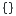</a> | **📂 檔名:** `code-context.svg` ✨ **格式:** `Vector (SVG)` ⚖️ **大小:** `1.18KB` 📅 **更新:** `2026-03-04`  🚀 **jsDelivr Markdown:** `` 🔗 **直接連結 (Url):** <code>https://cdn.jsdelivr.net/gh/barry028/materials@main/images/iCons/Pixel/Breeze/Actions%20/16/code-context.svg</code> 📥 [檢視原始檔](code-context.svg) |
|  | **📂 檔名:** `code-function.svg` ✨ **格式:** `Vector (SVG)` ⚖️ **大小:** `505.00B` 📅 **更新:** `2026-03-04`  🚀 **jsDelivr Markdown:** `` 🔗 **直接連結 (Url):** <code>https://cdn.jsdelivr.net/gh/barry028/materials@main/images/iCons/Pixel/Breeze/Actions%20/16/code-function.svg</code> 📥 [檢視原始檔](code-function.svg) |
|  | **📂 檔名:** `code-typedef.svg` ✨ **格式:** `Vector (SVG)` ⚖️ **大小:** `704.00B` 📅 **更新:** `2026-03-04`  🚀 **jsDelivr Markdown:** `` 🔗 **直接連結 (Url):** <code>https://cdn.jsdelivr.net/gh/barry028/materials@main/images/iCons/Pixel/Breeze/Actions%20/16/code-typedef.svg</code> 📥 [檢視原始檔](code-typedef.svg) |
|  | **📂 檔名:** `code-variable.svg` ✨ **格式:** `Vector (SVG)` ⚖️ **大小:** `511.00B` 📅 **更新:** `2026-03-04`  🚀 **jsDelivr Markdown:** `` 🔗 **直接連結 (Url):** <code>https://cdn.jsdelivr.net/gh/barry028/materials@main/images/iCons/Pixel/Breeze/Actions%20/16/code-variable.svg</code> 📥 [檢視原始檔](code-variable.svg) |
|  | **📂 檔名:** `collapse-all.svg` ✨ **格式:** `Vector (SVG)` ⚖️ **大小:** `341.00B` 📅 **更新:** `2026-03-04`  🚀 **jsDelivr Markdown:** `` 🔗 **直接連結 (Url):** <code>https://cdn.jsdelivr.net/gh/barry028/materials@main/images/iCons/Pixel/Breeze/Actions%20/16/collapse-all.svg</code> 📥 [檢視原始檔](collapse-all.svg) |
|  | **📂 檔名:** `color-gradient.svg` ✨ **格式:** `Vector (SVG)` ⚖️ **大小:** `1.79KB` 📅 **更新:** `2026-03-04`  🚀 **jsDelivr Markdown:** `` 🔗 **直接連結 (Url):** <code>https://cdn.jsdelivr.net/gh/barry028/materials@main/images/iCons/Pixel/Breeze/Actions%20/16/color-gradient.svg</code> 📥 [檢視原始檔](color-gradient.svg) |
|  | **📂 檔名:** `color-management.svg` ✨ **格式:** `Vector (SVG)` ⚖️ **大小:** `9.17KB` 📅 **更新:** `2026-03-04`  🚀 **jsDelivr Markdown:** `` 🔗 **直接連結 (Url):** <code>https://cdn.jsdelivr.net/gh/barry028/materials@main/images/iCons/Pixel/Breeze/Actions%20/16/color-management.svg</code> 📥 [檢視原始檔](color-management.svg) |
|  | **📂 檔名:** `color-mode-hue-shift-positive.svg` ✨ **格式:** `Vector (SVG)` ⚖️ **大小:** `5.53KB` 📅 **更新:** `2026-03-04`  🚀 **jsDelivr Markdown:** `` 🔗 **直接連結 (Url):** <code>https://cdn.jsdelivr.net/gh/barry028/materials@main/images/iCons/Pixel/Breeze/Actions%20/16/color-mode-hue-shift-positive.svg</code> 📥 [檢視原始檔](color-mode-hue-shift-positive.svg) |
|  | **📂 檔名:** `color-mode-invert-image.svg` ✨ **格式:** `Vector (SVG)` ⚖️ **大小:** `683.00B` 📅 **更新:** `2026-03-04`  🚀 **jsDelivr Markdown:** `` 🔗 **直接連結 (Url):** <code>https://cdn.jsdelivr.net/gh/barry028/materials@main/images/iCons/Pixel/Breeze/Actions%20/16/color-mode-invert-image.svg</code> 📥 [檢視原始檔](color-mode-invert-image.svg) |
|  | **📂 檔名:** `color-picker-black.svg` ✨ **格式:** `Vector (SVG)` ⚖️ **大小:** `1.42KB` 📅 **更新:** `2026-03-04`  🚀 **jsDelivr Markdown:** `` 🔗 **直接連結 (Url):** <code>https://cdn.jsdelivr.net/gh/barry028/materials@main/images/iCons/Pixel/Breeze/Actions%20/16/color-picker-black.svg</code> 📥 [檢視原始檔](color-picker-black.svg) |
|  | **📂 檔名:** `color-picker-white.svg` ✨ **格式:** `Vector (SVG)` ⚖️ **大小:** `1.70KB` 📅 **更新:** `2026-03-04`  🚀 **jsDelivr Markdown:** `` 🔗 **直接連結 (Url):** <code>https://cdn.jsdelivr.net/gh/barry028/materials@main/images/iCons/Pixel/Breeze/Actions%20/16/color-picker-white.svg</code> 📥 [檢視原始檔](color-picker-white.svg) |
|  | **📂 檔名:** `color-picker.svg` ✨ **格式:** `Vector (SVG)` ⚖️ **大小:** `741.00B` 📅 **更新:** `2026-03-04`  🚀 **jsDelivr Markdown:** `` 🔗 **直接連結 (Url):** <code>https://cdn.jsdelivr.net/gh/barry028/materials@main/images/iCons/Pixel/Breeze/Actions%20/16/color-picker.svg</code> 📥 [檢視原始檔](color-picker.svg) |
|  | **📂 檔名:** `colors-chromablue.svg` ✨ **格式:** `Vector (SVG)` ⚖️ **大小:** `402.00B` 📅 **更新:** `2026-03-04`  🚀 **jsDelivr Markdown:** `` 🔗 **直接連結 (Url):** <code>https://cdn.jsdelivr.net/gh/barry028/materials@main/images/iCons/Pixel/Breeze/Actions%20/16/colors-chromablue.svg</code> 📥 [檢視原始檔](colors-chromablue.svg) |
|  | **📂 檔名:** `colors-chromagreen.svg` ✨ **格式:** `Vector (SVG)` ⚖️ **大小:** `402.00B` 📅 **更新:** `2026-03-04`  🚀 **jsDelivr Markdown:** `` 🔗 **直接連結 (Url):** <code>https://cdn.jsdelivr.net/gh/barry028/materials@main/images/iCons/Pixel/Breeze/Actions%20/16/colors-chromagreen.svg</code> 📥 [檢視原始檔](colors-chromagreen.svg) |
|  | **📂 檔名:** `colors-chromared.svg` ✨ **格式:** `Vector (SVG)` ⚖️ **大小:** `402.00B` 📅 **更新:** `2026-03-04`  🚀 **jsDelivr Markdown:** `` 🔗 **直接連結 (Url):** <code>https://cdn.jsdelivr.net/gh/barry028/materials@main/images/iCons/Pixel/Breeze/Actions%20/16/colors-chromared.svg</code> 📥 [檢視原始檔](colors-chromared.svg) |
|  | **📂 檔名:** `colors-luma.svg` ✨ **格式:** `Vector (SVG)` ⚖️ **大小:** `2.57KB` 📅 **更新:** `2026-03-04`  🚀 **jsDelivr Markdown:** `` 🔗 **直接連結 (Url):** <code>https://cdn.jsdelivr.net/gh/barry028/materials@main/images/iCons/Pixel/Breeze/Actions%20/16/colors-luma.svg</code> 📥 [檢視原始檔](colors-luma.svg) |
|  | **📂 檔名:** `combined_fragment.svg` ✨ **格式:** `Vector (SVG)` ⚖️ **大小:** `458.00B` 📅 **更新:** `2026-03-04`  🚀 **jsDelivr Markdown:** `` 🔗 **直接連結 (Url):** <code>https://cdn.jsdelivr.net/gh/barry028/materials@main/images/iCons/Pixel/Breeze/Actions%20/16/combined_fragment.svg</code> 📥 [檢視原始檔](combined_fragment.svg) |
|  | **📂 檔名:** `compass.svg` ✨ **格式:** `Vector (SVG)` ⚖️ **大小:** `678.00B` 📅 **更新:** `2026-03-04`  🚀 **jsDelivr Markdown:** `` 🔗 **直接連結 (Url):** <code>https://cdn.jsdelivr.net/gh/barry028/materials@main/images/iCons/Pixel/Breeze/Actions%20/16/compass.svg</code> 📥 [檢視原始檔](compass.svg) |
|  | **📂 檔名:** `composition.svg` ✨ **格式:** `Vector (SVG)` ⚖️ **大小:** `482.00B` 📅 **更新:** `2026-03-04`  🚀 **jsDelivr Markdown:** `` 🔗 **直接連結 (Url):** <code>https://cdn.jsdelivr.net/gh/barry028/materials@main/images/iCons/Pixel/Breeze/Actions%20/16/composition.svg</code> 📥 [檢視原始檔](composition.svg) |
|  | **📂 檔名:** `configure.svg` ✨ **格式:** `Vector (SVG)` ⚖️ **大小:** `989.00B` 📅 **更新:** `2026-03-04`  🚀 **jsDelivr Markdown:** `` 🔗 **直接連結 (Url):** <code>https://cdn.jsdelivr.net/gh/barry028/materials@main/images/iCons/Pixel/Breeze/Actions%20/16/configure.svg</code> 📥 [檢視原始檔](configure.svg) |
|  | **📂 檔名:** `containment.svg` ✨ **格式:** `Vector (SVG)` ⚖️ **大小:** `832.00B` 📅 **更新:** `2026-03-04`  🚀 **jsDelivr Markdown:** `` 🔗 **直接連結 (Url):** <code>https://cdn.jsdelivr.net/gh/barry028/materials@main/images/iCons/Pixel/Breeze/Actions%20/16/containment.svg</code> 📥 [檢視原始檔](containment.svg) |
|  | **📂 檔名:** `crosshairs.svg` ✨ **格式:** `Vector (SVG)` ⚖️ **大小:** `806.00B` 📅 **更新:** `2026-03-04`  🚀 **jsDelivr Markdown:** `` 🔗 **直接連結 (Url):** <code>https://cdn.jsdelivr.net/gh/barry028/materials@main/images/iCons/Pixel/Breeze/Actions%20/16/crosshairs.svg</code> 📥 [檢視原始檔](crosshairs.svg) |
|  | **📂 檔名:** `curve-connector.svg` ✨ **格式:** `Vector (SVG)` ⚖️ **大小:** `1.62KB` 📅 **更新:** `2026-03-04`  🚀 **jsDelivr Markdown:** `` 🔗 **直接連結 (Url):** <code>https://cdn.jsdelivr.net/gh/barry028/materials@main/images/iCons/Pixel/Breeze/Actions%20/16/curve-connector.svg</code> 📥 [檢視原始檔](curve-connector.svg) |
|  | **📂 檔名:** `dashboard-show.svg` ✨ **格式:** `Vector (SVG)` ⚖️ **大小:** `449.00B` 📅 **更新:** `2026-03-04`  🚀 **jsDelivr Markdown:** `` 🔗 **直接連結 (Url):** <code>https://cdn.jsdelivr.net/gh/barry028/materials@main/images/iCons/Pixel/Breeze/Actions%20/16/dashboard-show.svg</code> 📥 [檢視原始檔](dashboard-show.svg) |
|  | **📂 檔名:** `database-index.svg` ✨ **格式:** `Vector (SVG)` ⚖️ **大小:** `581.00B` 📅 **更新:** `2026-03-04`  🚀 **jsDelivr Markdown:** `` 🔗 **直接連結 (Url):** <code>https://cdn.jsdelivr.net/gh/barry028/materials@main/images/iCons/Pixel/Breeze/Actions%20/16/database-index.svg</code> 📥 [檢視原始檔](database-index.svg) |
|  | **📂 檔名:** `debug-execute-from-cursor.svg` ✨ **格式:** `Vector (SVG)` ⚖️ **大小:** `506.00B` 📅 **更新:** `2026-03-04`  🚀 **jsDelivr Markdown:** `` 🔗 **直接連結 (Url):** <code>https://cdn.jsdelivr.net/gh/barry028/materials@main/images/iCons/Pixel/Breeze/Actions%20/16/debug-execute-from-cursor.svg</code> 📥 [檢視原始檔](debug-execute-from-cursor.svg) |
|  | **📂 檔名:** `debug-run.svg` ✨ **格式:** `Vector (SVG)` ⚖️ **大小:** `495.00B` 📅 **更新:** `2026-03-04`  🚀 **jsDelivr Markdown:** `` 🔗 **直接連結 (Url):** <code>https://cdn.jsdelivr.net/gh/barry028/materials@main/images/iCons/Pixel/Breeze/Actions%20/16/debug-run.svg</code> 📥 [檢視原始檔](debug-run.svg) |
|  | **📂 檔名:** `debug-step-instruction.svg` ✨ **格式:** `Vector (SVG)` ⚖️ **大小:** `4.23KB` 📅 **更新:** `2026-03-04`  🚀 **jsDelivr Markdown:** `` 🔗 **直接連結 (Url):** <code>https://cdn.jsdelivr.net/gh/barry028/materials@main/images/iCons/Pixel/Breeze/Actions%20/16/debug-step-instruction.svg</code> 📥 [檢視原始檔](debug-step-instruction.svg) |
|  | **📂 檔名:** `debug-step-into-instruction.svg` ✨ **格式:** `Vector (SVG)` ⚖️ **大小:** `4.79KB` 📅 **更新:** `2026-03-04`  🚀 **jsDelivr Markdown:** `` 🔗 **直接連結 (Url):** <code>https://cdn.jsdelivr.net/gh/barry028/materials@main/images/iCons/Pixel/Breeze/Actions%20/16/debug-step-into-instruction.svg</code> 📥 [檢視原始檔](debug-step-into-instruction.svg) |
|  | **📂 檔名:** `debug-step-into.svg` ✨ **格式:** `Vector (SVG)` ⚖️ **大小:** `4.66KB` 📅 **更新:** `2026-03-04`  🚀 **jsDelivr Markdown:** `` 🔗 **直接連結 (Url):** <code>https://cdn.jsdelivr.net/gh/barry028/materials@main/images/iCons/Pixel/Breeze/Actions%20/16/debug-step-into.svg</code> 📥 [檢視原始檔](debug-step-into.svg) |
|  | **📂 檔名:** `debug-step-out.svg` ✨ **格式:** `Vector (SVG)` ⚖️ **大小:** `5.00KB` 📅 **更新:** `2026-03-04`  🚀 **jsDelivr Markdown:** `` 🔗 **直接連結 (Url):** <code>https://cdn.jsdelivr.net/gh/barry028/materials@main/images/iCons/Pixel/Breeze/Actions%20/16/debug-step-out.svg</code> 📥 [檢視原始檔](debug-step-out.svg) |
|  | **📂 檔名:** `debug-step-over.svg` ✨ **格式:** `Vector (SVG)` ⚖️ **大小:** `4.09KB` 📅 **更新:** `2026-03-04`  🚀 **jsDelivr Markdown:** `` 🔗 **直接連結 (Url):** <code>https://cdn.jsdelivr.net/gh/barry028/materials@main/images/iCons/Pixel/Breeze/Actions%20/16/debug-step-over.svg</code> 📥 [檢視原始檔](debug-step-over.svg) |
|  | **📂 檔名:** `deep-history.svg` ✨ **格式:** `Vector (SVG)` ⚖️ **大小:** `836.00B` 📅 **更新:** `2026-03-04`  🚀 **jsDelivr Markdown:** `` 🔗 **直接連結 (Url):** <code>https://cdn.jsdelivr.net/gh/barry028/materials@main/images/iCons/Pixel/Breeze/Actions%20/16/deep-history.svg</code> 📥 [檢視原始檔](deep-history.svg) |
|  | **📂 檔名:** `delete-comment.svg` ✨ **格式:** `Vector (SVG)` ⚖️ **大小:** `681.00B` 📅 **更新:** `2026-03-04`  🚀 **jsDelivr Markdown:** `` 🔗 **直接連結 (Url):** <code>https://cdn.jsdelivr.net/gh/barry028/materials@main/images/iCons/Pixel/Breeze/Actions%20/16/delete-comment.svg</code> 📥 [檢視原始檔](delete-comment.svg) |
|  | **📂 檔名:** `delete-table-row.svg` ✨ **格式:** `Vector (SVG)` ⚖️ **大小:** `801.00B` 📅 **更新:** `2026-03-04`  🚀 **jsDelivr Markdown:** `` 🔗 **直接連結 (Url):** <code>https://cdn.jsdelivr.net/gh/barry028/materials@main/images/iCons/Pixel/Breeze/Actions%20/16/delete-table-row.svg</code> 📥 [檢視原始檔](delete-table-row.svg) |
|  | **📂 檔名:** `deletecell.svg` ✨ **格式:** `Vector (SVG)` ⚖️ **大小:** `900.00B` 📅 **更新:** `2026-03-04`  🚀 **jsDelivr Markdown:** `` 🔗 **直接連結 (Url):** <code>https://cdn.jsdelivr.net/gh/barry028/materials@main/images/iCons/Pixel/Breeze/Actions%20/16/deletecell.svg</code> 📥 [檢視原始檔](deletecell.svg) |
|  | **📂 檔名:** `dependency.svg` ✨ **格式:** `Vector (SVG)` ⚖️ **大小:** `522.00B` 📅 **更新:** `2026-03-04`  🚀 **jsDelivr Markdown:** `` 🔗 **直接連結 (Url):** <code>https://cdn.jsdelivr.net/gh/barry028/materials@main/images/iCons/Pixel/Breeze/Actions%20/16/dependency.svg</code> 📥 [檢視原始檔](dependency.svg) |
|  | **📂 檔名:** `dialog-cancel.svg` ✨ **格式:** `Vector (SVG)` ⚖️ **大小:** `766.00B` 📅 **更新:** `2026-03-04`  🚀 **jsDelivr Markdown:** `` 🔗 **直接連結 (Url):** <code>https://cdn.jsdelivr.net/gh/barry028/materials@main/images/iCons/Pixel/Breeze/Actions%20/16/dialog-cancel.svg</code> 📥 [檢視原始檔](dialog-cancel.svg) |
|  | **📂 檔名:** `dialog-input-devices.svg` ✨ **格式:** `Vector (SVG)` ⚖️ **大小:** `663.00B` 📅 **更新:** `2026-03-04`  🚀 **jsDelivr Markdown:** `` 🔗 **直接連結 (Url):** <code>https://cdn.jsdelivr.net/gh/barry028/materials@main/images/iCons/Pixel/Breeze/Actions%20/16/dialog-input-devices.svg</code> 📥 [檢視原始檔](dialog-input-devices.svg) |
|  | **📂 檔名:** `dialog-layers.svg` ✨ **格式:** `Vector (SVG)` ⚖️ **大小:** `445.00B` 📅 **更新:** `2026-03-04`  🚀 **jsDelivr Markdown:** `` 🔗 **直接連結 (Url):** <code>https://cdn.jsdelivr.net/gh/barry028/materials@main/images/iCons/Pixel/Breeze/Actions%20/16/dialog-layers.svg</code> 📥 [檢視原始檔](dialog-layers.svg) |
|  | **📂 檔名:** `dialog-messages.svg` ✨ **格式:** `Vector (SVG)` ⚖️ **大小:** `422.00B` 📅 **更新:** `2026-03-04`  🚀 **jsDelivr Markdown:** `` 🔗 **直接連結 (Url):** <code>https://cdn.jsdelivr.net/gh/barry028/materials@main/images/iCons/Pixel/Breeze/Actions%20/16/dialog-messages.svg</code> 📥 [檢視原始檔](dialog-messages.svg) |
|  | **📂 檔名:** `dialog-ok-apply.svg` ✨ **格式:** `Vector (SVG)` ⚖️ **大小:** `504.00B` 📅 **更新:** `2026-03-04`  🚀 **jsDelivr Markdown:** `` 🔗 **直接連結 (Url):** <code>https://cdn.jsdelivr.net/gh/barry028/materials@main/images/iCons/Pixel/Breeze/Actions%20/16/dialog-ok-apply.svg</code> 📥 [檢視原始檔](dialog-ok-apply.svg) |
|  | **📂 檔名:** `dialog-rows-and-columns.svg` ✨ **格式:** `Vector (SVG)` ⚖️ **大小:** `472.00B` 📅 **更新:** `2026-03-04`  🚀 **jsDelivr Markdown:** `` 🔗 **直接連結 (Url):** <code>https://cdn.jsdelivr.net/gh/barry028/materials@main/images/iCons/Pixel/Breeze/Actions%20/16/dialog-rows-and-columns.svg</code> 📥 [檢視原始檔](dialog-rows-and-columns.svg) |
|  | **📂 檔名:** `dialog-tile-clones.svg` ✨ **格式:** `Vector (SVG)` ⚖️ **大小:** `863.00B` 📅 **更新:** `2026-03-04`  🚀 **jsDelivr Markdown:** `` 🔗 **直接連結 (Url):** <code>https://cdn.jsdelivr.net/gh/barry028/materials@main/images/iCons/Pixel/Breeze/Actions%20/16/dialog-tile-clones.svg</code> 📥 [檢視原始檔](dialog-tile-clones.svg) |
|  | **📂 檔名:** `distribute-horizontal-center.svg` ✨ **格式:** `Vector (SVG)` ⚖️ **大小:** `645.00B` 📅 **更新:** `2026-03-04`  🚀 **jsDelivr Markdown:** `` 🔗 **直接連結 (Url):** <code>https://cdn.jsdelivr.net/gh/barry028/materials@main/images/iCons/Pixel/Breeze/Actions%20/16/distribute-horizontal-center.svg</code> 📥 [檢視原始檔](distribute-horizontal-center.svg) |
|  | **📂 檔名:** `distribute-horizontal-equal.svg` ✨ **格式:** `Vector (SVG)` ⚖️ **大小:** `698.00B` 📅 **更新:** `2026-03-04`  🚀 **jsDelivr Markdown:** `` 🔗 **直接連結 (Url):** <code>https://cdn.jsdelivr.net/gh/barry028/materials@main/images/iCons/Pixel/Breeze/Actions%20/16/distribute-horizontal-equal.svg</code> 📥 [檢視原始檔](distribute-horizontal-equal.svg) |
|  | **📂 檔名:** `distribute-horizontal-left.svg` ✨ **格式:** `Vector (SVG)` ⚖️ **大小:** `614.00B` 📅 **更新:** `2026-03-04`  🚀 **jsDelivr Markdown:** `` 🔗 **直接連結 (Url):** <code>https://cdn.jsdelivr.net/gh/barry028/materials@main/images/iCons/Pixel/Breeze/Actions%20/16/distribute-horizontal-left.svg</code> 📥 [檢視原始檔](distribute-horizontal-left.svg) |
|  | **📂 檔名:** `distribute-horizontal-margin.svg` ✨ **格式:** `Vector (SVG)` ⚖️ **大小:** `551.00B` 📅 **更新:** `2026-03-04`  🚀 **jsDelivr Markdown:** `` 🔗 **直接連結 (Url):** <code>https://cdn.jsdelivr.net/gh/barry028/materials@main/images/iCons/Pixel/Breeze/Actions%20/16/distribute-horizontal-margin.svg</code> 📥 [檢視原始檔](distribute-horizontal-margin.svg) |
|  | **📂 檔名:** `distribute-horizontal-page.svg` ✨ **格式:** `Vector (SVG)` ⚖️ **大小:** `1.11KB` 📅 **更新:** `2026-03-04`  🚀 **jsDelivr Markdown:** `` 🔗 **直接連結 (Url):** <code>https://cdn.jsdelivr.net/gh/barry028/materials@main/images/iCons/Pixel/Breeze/Actions%20/16/distribute-horizontal-page.svg</code> 📥 [檢視原始檔](distribute-horizontal-page.svg) |
|  | **📂 檔名:** `distribute-horizontal-right.svg` ✨ **格式:** `Vector (SVG)` ⚖️ **大小:** `650.00B` 📅 **更新:** `2026-03-04`  🚀 **jsDelivr Markdown:** `` 🔗 **直接連結 (Url):** <code>https://cdn.jsdelivr.net/gh/barry028/materials@main/images/iCons/Pixel/Breeze/Actions%20/16/distribute-horizontal-right.svg</code> 📥 [檢視原始檔](distribute-horizontal-right.svg) |
|  | **📂 檔名:** `distribute-vertical-center.svg` ✨ **格式:** `Vector (SVG)` ⚖️ **大小:** `1.93KB` 📅 **更新:** `2026-03-04`  🚀 **jsDelivr Markdown:** `` 🔗 **直接連結 (Url):** <code>https://cdn.jsdelivr.net/gh/barry028/materials@main/images/iCons/Pixel/Breeze/Actions%20/16/distribute-vertical-center.svg</code> 📥 [檢視原始檔](distribute-vertical-center.svg) |
|  | **📂 檔名:** `distribute-vertical-equal.svg` ✨ **格式:** `Vector (SVG)` ⚖️ **大小:** `634.00B` 📅 **更新:** `2026-03-04`  🚀 **jsDelivr Markdown:** `` 🔗 **直接連結 (Url):** <code>https://cdn.jsdelivr.net/gh/barry028/materials@main/images/iCons/Pixel/Breeze/Actions%20/16/distribute-vertical-equal.svg</code> 📥 [檢視原始檔](distribute-vertical-equal.svg) |
|  | **📂 檔名:** `distribute-vertical-margin.svg` ✨ **格式:** `Vector (SVG)` ⚖️ **大小:** `551.00B` 📅 **更新:** `2026-03-04`  🚀 **jsDelivr Markdown:** `` 🔗 **直接連結 (Url):** <code>https://cdn.jsdelivr.net/gh/barry028/materials@main/images/iCons/Pixel/Breeze/Actions%20/16/distribute-vertical-margin.svg</code> 📥 [檢視原始檔](distribute-vertical-margin.svg) |
|  | **📂 檔名:** `distribute-vertical-page.svg` ✨ **格式:** `Vector (SVG)` ⚖️ **大小:** `1.12KB` 📅 **更新:** `2026-03-04`  🚀 **jsDelivr Markdown:** `` 🔗 **直接連結 (Url):** <code>https://cdn.jsdelivr.net/gh/barry028/materials@main/images/iCons/Pixel/Breeze/Actions%20/16/distribute-vertical-page.svg</code> 📥 [檢視原始檔](distribute-vertical-page.svg) |
|  | **📂 檔名:** `distribute-vertical.svg` ✨ **格式:** `Vector (SVG)` ⚖️ **大小:** `568.00B` 📅 **更新:** `2026-03-04`  🚀 **jsDelivr Markdown:** `` 🔗 **直接連結 (Url):** <code>https://cdn.jsdelivr.net/gh/barry028/materials@main/images/iCons/Pixel/Breeze/Actions%20/16/distribute-vertical.svg</code> 📥 [檢視原始檔](distribute-vertical.svg) |
|  | **📂 檔名:** `document-close.svg` ✨ **格式:** `Vector (SVG)` ⚖️ **大小:** `652.00B` 📅 **更新:** `2026-03-04`  🚀 **jsDelivr Markdown:** `` 🔗 **直接連結 (Url):** <code>https://cdn.jsdelivr.net/gh/barry028/materials@main/images/iCons/Pixel/Breeze/Actions%20/16/document-close.svg</code> 📥 [檢視原始檔](document-close.svg) |
| <a href="document-compareleft.svg">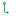</a> | **📂 檔名:** `document-compareleft.svg` ✨ **格式:** `Vector (SVG)` ⚖️ **大小:** `720.00B` 📅 **更新:** `2026-03-04`  🚀 **jsDelivr Markdown:** `` 🔗 **直接連結 (Url):** <code>https://cdn.jsdelivr.net/gh/barry028/materials@main/images/iCons/Pixel/Breeze/Actions%20/16/document-compareleft.svg</code> 📥 [檢視原始檔](document-compareleft.svg) |
| <a href="document-compareright.svg">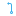</a> | **📂 檔名:** `document-compareright.svg` ✨ **格式:** `Vector (SVG)` ⚖️ **大小:** `827.00B` 📅 **更新:** `2026-03-04`  🚀 **jsDelivr Markdown:** `` 🔗 **直接連結 (Url):** <code>https://cdn.jsdelivr.net/gh/barry028/materials@main/images/iCons/Pixel/Breeze/Actions%20/16/document-compareright.svg</code> 📥 [檢視原始檔](document-compareright.svg) |
|  | **📂 檔名:** `document-edit-decrypt-verify.svg` ✨ **格式:** `Vector (SVG)` ⚖️ **大小:** `865.00B` 📅 **更新:** `2026-03-04`  🚀 **jsDelivr Markdown:** `` 🔗 **直接連結 (Url):** <code>https://cdn.jsdelivr.net/gh/barry028/materials@main/images/iCons/Pixel/Breeze/Actions%20/16/document-edit-decrypt-verify.svg</code> 📥 [檢視原始檔](document-edit-decrypt-verify.svg) |
|  | **📂 檔名:** `document-edit-decrypt.svg` ✨ **格式:** `Vector (SVG)` ⚖️ **大小:** `600.00B` 📅 **更新:** `2026-03-04`  🚀 **jsDelivr Markdown:** `` 🔗 **直接連結 (Url):** <code>https://cdn.jsdelivr.net/gh/barry028/materials@main/images/iCons/Pixel/Breeze/Actions%20/16/document-edit-decrypt.svg</code> 📥 [檢視原始檔](document-edit-decrypt.svg) |
|  | **📂 檔名:** `document-edit-encrypt.svg` ✨ **格式:** `Vector (SVG)` ⚖️ **大小:** `648.00B` 📅 **更新:** `2026-03-04`  🚀 **jsDelivr Markdown:** `` 🔗 **直接連結 (Url):** <code>https://cdn.jsdelivr.net/gh/barry028/materials@main/images/iCons/Pixel/Breeze/Actions%20/16/document-edit-encrypt.svg</code> 📥 [檢視原始檔](document-edit-encrypt.svg) |
|  | **📂 檔名:** `document-edit-sign-encrypt.svg` ✨ **格式:** `Vector (SVG)` ⚖️ **大小:** `685.00B` 📅 **更新:** `2026-03-04`  🚀 **jsDelivr Markdown:** `` 🔗 **直接連結 (Url):** <code>https://cdn.jsdelivr.net/gh/barry028/materials@main/images/iCons/Pixel/Breeze/Actions%20/16/document-edit-sign-encrypt.svg</code> 📥 [檢視原始檔](document-edit-sign-encrypt.svg) |
|  | **📂 檔名:** `document-edit-sign.svg` ✨ **格式:** `Vector (SVG)` ⚖️ **大小:** `600.00B` 📅 **更新:** `2026-03-04`  🚀 **jsDelivr Markdown:** `` 🔗 **直接連結 (Url):** <code>https://cdn.jsdelivr.net/gh/barry028/materials@main/images/iCons/Pixel/Breeze/Actions%20/16/document-edit-sign.svg</code> 📥 [檢視原始檔](document-edit-sign.svg) |
|  | **📂 檔名:** `document-edit.svg` ✨ **格式:** `Vector (SVG)` ⚖️ **大小:** `883.00B` 📅 **更新:** `2026-03-04`  🚀 **jsDelivr Markdown:** `` 🔗 **直接連結 (Url):** <code>https://cdn.jsdelivr.net/gh/barry028/materials@main/images/iCons/Pixel/Breeze/Actions%20/16/document-edit.svg</code> 📥 [檢視原始檔](document-edit.svg) |
|  | **📂 檔名:** `document-encrypted.svg` ✨ **格式:** `Vector (SVG)` ⚖️ **大小:** `522.00B` 📅 **更新:** `2026-03-04`  🚀 **jsDelivr Markdown:** `` 🔗 **直接連結 (Url):** <code>https://cdn.jsdelivr.net/gh/barry028/materials@main/images/iCons/Pixel/Breeze/Actions%20/16/document-encrypted.svg</code> 📥 [檢視原始檔](document-encrypted.svg) |
|  | **📂 檔名:** `document-export.svg` ✨ **格式:** `Vector (SVG)` ⚖️ **大小:** `595.00B` 📅 **更新:** `2026-03-04`  🚀 **jsDelivr Markdown:** `` 🔗 **直接連結 (Url):** <code>https://cdn.jsdelivr.net/gh/barry028/materials@main/images/iCons/Pixel/Breeze/Actions%20/16/document-export.svg</code> 📥 [檢視原始檔](document-export.svg) |
|  | **📂 檔名:** `document-import.svg` ✨ **格式:** `Vector (SVG)` ⚖️ **大小:** `558.00B` 📅 **更新:** `2026-03-04`  🚀 **jsDelivr Markdown:** `` 🔗 **直接連結 (Url):** <code>https://cdn.jsdelivr.net/gh/barry028/materials@main/images/iCons/Pixel/Breeze/Actions%20/16/document-import.svg</code> 📥 [檢視原始檔](document-import.svg) |
|  | **📂 檔名:** `document-new-from-template.svg` ✨ **格式:** `Vector (SVG)` ⚖️ **大小:** `777.00B` 📅 **更新:** `2026-03-04`  🚀 **jsDelivr Markdown:** `` 🔗 **直接連結 (Url):** <code>https://cdn.jsdelivr.net/gh/barry028/materials@main/images/iCons/Pixel/Breeze/Actions%20/16/document-new-from-template.svg</code> 📥 [檢視原始檔](document-new-from-template.svg) |
|  | **📂 檔名:** `document-new.svg` ✨ **格式:** `Vector (SVG)` ⚖️ **大小:** `546.00B` 📅 **更新:** `2026-03-04`  🚀 **jsDelivr Markdown:** `` 🔗 **直接連結 (Url):** <code>https://cdn.jsdelivr.net/gh/barry028/materials@main/images/iCons/Pixel/Breeze/Actions%20/16/document-new.svg</code> 📥 [檢視原始檔](document-new.svg) |
|  | **📂 檔名:** `document-open-folder.svg` ✨ **格式:** `Vector (SVG)` ⚖️ **大小:** `603.00B` 📅 **更新:** `2026-03-04`  🚀 **jsDelivr Markdown:** `` 🔗 **直接連結 (Url):** <code>https://cdn.jsdelivr.net/gh/barry028/materials@main/images/iCons/Pixel/Breeze/Actions%20/16/document-open-folder.svg</code> 📥 [檢視原始檔](document-open-folder.svg) |
|  | **📂 檔名:** `document-open-remote.svg` ✨ **格式:** `Vector (SVG)` ⚖️ **大小:** `730.00B` 📅 **更新:** `2026-03-04`  🚀 **jsDelivr Markdown:** `` 🔗 **直接連結 (Url):** <code>https://cdn.jsdelivr.net/gh/barry028/materials@main/images/iCons/Pixel/Breeze/Actions%20/16/document-open-remote.svg</code> 📥 [檢視原始檔](document-open-remote.svg) |
|  | **📂 檔名:** `document-open.svg` ✨ **格式:** `Vector (SVG)` ⚖️ **大小:** `526.00B` 📅 **更新:** `2026-03-04`  🚀 **jsDelivr Markdown:** `` 🔗 **直接連結 (Url):** <code>https://cdn.jsdelivr.net/gh/barry028/materials@main/images/iCons/Pixel/Breeze/Actions%20/16/document-open.svg</code> 📥 [檢視原始檔](document-open.svg) |
|  | **📂 檔名:** `document-page-setup-symbolic.svg` ✨ **格式:** `Vector (SVG)` ⚖️ **大小:** `1.01KB` 📅 **更新:** `2026-03-04`  🚀 **jsDelivr Markdown:** `` 🔗 **直接連結 (Url):** <code>https://cdn.jsdelivr.net/gh/barry028/materials@main/images/iCons/Pixel/Breeze/Actions%20/16/document-page-setup-symbolic.svg</code> 📥 [檢視原始檔](document-page-setup-symbolic.svg) |
|  | **📂 檔名:** `document-preview-archive.svg` ✨ **格式:** `Vector (SVG)` ⚖️ **大小:** `1010.00B` 📅 **更新:** `2026-03-04`  🚀 **jsDelivr Markdown:** `` 🔗 **直接連結 (Url):** <code>https://cdn.jsdelivr.net/gh/barry028/materials@main/images/iCons/Pixel/Breeze/Actions%20/16/document-preview-archive.svg</code> 📥 [檢視原始檔](document-preview-archive.svg) |
|  | **📂 檔名:** `document-print-direct.svg` ✨ **格式:** `Vector (SVG)` ⚖️ **大小:** `665.00B` 📅 **更新:** `2026-03-04`  🚀 **jsDelivr Markdown:** `` 🔗 **直接連結 (Url):** <code>https://cdn.jsdelivr.net/gh/barry028/materials@main/images/iCons/Pixel/Breeze/Actions%20/16/document-print-direct.svg</code> 📥 [檢視原始檔](document-print-direct.svg) |
|  | **📂 檔名:** `document-print.svg` ✨ **格式:** `Vector (SVG)` ⚖️ **大小:** `689.00B` 📅 **更新:** `2026-03-04`  🚀 **jsDelivr Markdown:** `` 🔗 **直接連結 (Url):** <code>https://cdn.jsdelivr.net/gh/barry028/materials@main/images/iCons/Pixel/Breeze/Actions%20/16/document-print.svg</code> 📥 [檢視原始檔](document-print.svg) |
|  | **📂 檔名:** `document-properties.svg` ✨ **格式:** `Vector (SVG)` ⚖️ **大小:** `543.00B` 📅 **更新:** `2026-03-04`  🚀 **jsDelivr Markdown:** `` 🔗 **直接連結 (Url):** <code>https://cdn.jsdelivr.net/gh/barry028/materials@main/images/iCons/Pixel/Breeze/Actions%20/16/document-properties.svg</code> 📥 [檢視原始檔](document-properties.svg) |
|  | **📂 檔名:** `document-replace.svg` ✨ **格式:** `Vector (SVG)` ⚖️ **大小:** `942.00B` 📅 **更新:** `2026-03-04`  🚀 **jsDelivr Markdown:** `` 🔗 **直接連結 (Url):** <code>https://cdn.jsdelivr.net/gh/barry028/materials@main/images/iCons/Pixel/Breeze/Actions%20/16/document-replace.svg</code> 📥 [檢視原始檔](document-replace.svg) |
|  | **📂 檔名:** `document-save-all.svg` ✨ **格式:** `Vector (SVG)` ⚖️ **大小:** `760.00B` 📅 **更新:** `2026-03-04`  🚀 **jsDelivr Markdown:** `` 🔗 **直接連結 (Url):** <code>https://cdn.jsdelivr.net/gh/barry028/materials@main/images/iCons/Pixel/Breeze/Actions%20/16/document-save-all.svg</code> 📥 [檢視原始檔](document-save-all.svg) |
|  | **📂 檔名:** `document-save-as.svg` ✨ **格式:** `Vector (SVG)` ⚖️ **大小:** `917.00B` 📅 **更新:** `2026-03-04`  🚀 **jsDelivr Markdown:** `` 🔗 **直接連結 (Url):** <code>https://cdn.jsdelivr.net/gh/barry028/materials@main/images/iCons/Pixel/Breeze/Actions%20/16/document-save-as.svg</code> 📥 [檢視原始檔](document-save-as.svg) |
|  | **📂 檔名:** `document-save.svg` ✨ **格式:** `Vector (SVG)` ⚖️ **大小:** `733.00B` 📅 **更新:** `2026-03-04`  🚀 **jsDelivr Markdown:** `` 🔗 **直接連結 (Url):** <code>https://cdn.jsdelivr.net/gh/barry028/materials@main/images/iCons/Pixel/Breeze/Actions%20/16/document-save.svg</code> 📥 [檢視原始檔](document-save.svg) |
|  | **📂 檔名:** `document-scan.svg` ✨ **格式:** `Vector (SVG)` ⚖️ **大小:** `479.00B` 📅 **更新:** `2026-03-04`  🚀 **jsDelivr Markdown:** `` 🔗 **直接連結 (Url):** <code>https://cdn.jsdelivr.net/gh/barry028/materials@main/images/iCons/Pixel/Breeze/Actions%20/16/document-scan.svg</code> 📥 [檢視原始檔](document-scan.svg) |
|  | **📂 檔名:** `document-send.svg` ✨ **格式:** `Vector (SVG)` ⚖️ **大小:** `430.00B` 📅 **更新:** `2026-03-04`  🚀 **jsDelivr Markdown:** `` 🔗 **直接連結 (Url):** <code>https://cdn.jsdelivr.net/gh/barry028/materials@main/images/iCons/Pixel/Breeze/Actions%20/16/document-send.svg</code> 📥 [檢視原始檔](document-send.svg) |
|  | **📂 檔名:** `document-share.svg` ✨ **格式:** `Vector (SVG)` ⚖️ **大小:** `1.32KB` 📅 **更新:** `2026-03-04`  🚀 **jsDelivr Markdown:** `` 🔗 **直接連結 (Url):** <code>https://cdn.jsdelivr.net/gh/barry028/materials@main/images/iCons/Pixel/Breeze/Actions%20/16/document-share.svg</code> 📥 [檢視原始檔](document-share.svg) |
|  | **📂 檔名:** `document-swap.svg` ✨ **格式:** `Vector (SVG)` ⚖️ **大小:** `960.00B` 📅 **更新:** `2026-03-04`  🚀 **jsDelivr Markdown:** `` 🔗 **直接連結 (Url):** <code>https://cdn.jsdelivr.net/gh/barry028/materials@main/images/iCons/Pixel/Breeze/Actions%20/16/document-swap.svg</code> 📥 [檢視原始檔](document-swap.svg) |
|  | **📂 檔名:** `document-unequal.svg` ✨ **格式:** `Vector (SVG)` ⚖️ **大小:** `1.05KB` 📅 **更新:** `2026-03-04`  🚀 **jsDelivr Markdown:** `` 🔗 **直接連結 (Url):** <code>https://cdn.jsdelivr.net/gh/barry028/materials@main/images/iCons/Pixel/Breeze/Actions%20/16/document-unequal.svg</code> 📥 [檢視原始檔](document-unequal.svg) |
|  | **📂 檔名:** `download-later.svg` ✨ **格式:** `Vector (SVG)` ⚖️ **大小:** `622.00B` 📅 **更新:** `2026-03-04`  🚀 **jsDelivr Markdown:** `` 🔗 **直接連結 (Url):** <code>https://cdn.jsdelivr.net/gh/barry028/materials@main/images/iCons/Pixel/Breeze/Actions%20/16/download-later.svg</code> 📥 [檢視原始檔](download-later.svg) |
|  | **📂 檔名:** `drag-handle-symbolic.svg` ✨ **格式:** `Vector (SVG)` ⚖️ **大小:** `396.00B` 📅 **更新:** `2026-03-04`  🚀 **jsDelivr Markdown:** `` 🔗 **直接連結 (Url):** <code>https://cdn.jsdelivr.net/gh/barry028/materials@main/images/iCons/Pixel/Breeze/Actions%20/16/drag-handle-symbolic.svg</code> 📥 [檢視原始檔](drag-handle-symbolic.svg) |
|  | **📂 檔名:** `draw-arrow.svg` ✨ **格式:** `Vector (SVG)` ⚖️ **大小:** `314.00B` 📅 **更新:** `2026-03-04`  🚀 **jsDelivr Markdown:** `` 🔗 **直接連結 (Url):** <code>https://cdn.jsdelivr.net/gh/barry028/materials@main/images/iCons/Pixel/Breeze/Actions%20/16/draw-arrow.svg</code> 📥 [檢視原始檔](draw-arrow.svg) |
|  | **📂 檔名:** `draw-bezier-curves.svg` ✨ **格式:** `Vector (SVG)` ⚖️ **大小:** `1.37KB` 📅 **更新:** `2026-03-04`  🚀 **jsDelivr Markdown:** `` 🔗 **直接連結 (Url):** <code>https://cdn.jsdelivr.net/gh/barry028/materials@main/images/iCons/Pixel/Breeze/Actions%20/16/draw-bezier-curves.svg</code> 📥 [檢視原始檔](draw-bezier-curves.svg) |
|  | **📂 檔名:** `draw-brush.svg` ✨ **格式:** `Vector (SVG)` ⚖️ **大小:** `900.00B` 📅 **更新:** `2026-03-04`  🚀 **jsDelivr Markdown:** `` 🔗 **直接連結 (Url):** <code>https://cdn.jsdelivr.net/gh/barry028/materials@main/images/iCons/Pixel/Breeze/Actions%20/16/draw-brush.svg</code> 📥 [檢視原始檔](draw-brush.svg) |
|  | **📂 檔名:** `draw-circle.svg` ✨ **格式:** `Vector (SVG)` ⚖️ **大小:** `578.00B` 📅 **更新:** `2026-03-04`  🚀 **jsDelivr Markdown:** `` 🔗 **直接連結 (Url):** <code>https://cdn.jsdelivr.net/gh/barry028/materials@main/images/iCons/Pixel/Breeze/Actions%20/16/draw-circle.svg</code> 📥 [檢視原始檔](draw-circle.svg) |
|  | **📂 檔名:** `draw-connector.svg` ✨ **格式:** `Vector (SVG)` ⚖️ **大小:** `775.00B` 📅 **更新:** `2026-03-04`  🚀 **jsDelivr Markdown:** `` 🔗 **直接連結 (Url):** <code>https://cdn.jsdelivr.net/gh/barry028/materials@main/images/iCons/Pixel/Breeze/Actions%20/16/draw-connector.svg</code> 📥 [檢視原始檔](draw-connector.svg) |
|  | **📂 檔名:** `draw-cross.svg` ✨ **格式:** `Vector (SVG)` ⚖️ **大小:** `658.00B` 📅 **更新:** `2026-03-04`  🚀 **jsDelivr Markdown:** `` 🔗 **直接連結 (Url):** <code>https://cdn.jsdelivr.net/gh/barry028/materials@main/images/iCons/Pixel/Breeze/Actions%20/16/draw-cross.svg</code> 📥 [檢視原始檔](draw-cross.svg) |
|  | **📂 檔名:** `draw-cuboid.svg` ✨ **格式:** `Vector (SVG)` ⚖️ **大小:** `1.78KB` 📅 **更新:** `2026-03-04`  🚀 **jsDelivr Markdown:** `` 🔗 **直接連結 (Url):** <code>https://cdn.jsdelivr.net/gh/barry028/materials@main/images/iCons/Pixel/Breeze/Actions%20/16/draw-cuboid.svg</code> 📥 [檢視原始檔](draw-cuboid.svg) |
|  | **📂 檔名:** `draw-donut.svg` ✨ **格式:** `Vector (SVG)` ⚖️ **大小:** `1.39KB` 📅 **更新:** `2026-03-04`  🚀 **jsDelivr Markdown:** `` 🔗 **直接連結 (Url):** <code>https://cdn.jsdelivr.net/gh/barry028/materials@main/images/iCons/Pixel/Breeze/Actions%20/16/draw-donut.svg</code> 📥 [檢視原始檔](draw-donut.svg) |
|  | **📂 檔名:** `draw-ellipse-arc.svg` ✨ **格式:** `Vector (SVG)` ⚖️ **大小:** `798.00B` 📅 **更新:** `2026-03-04`  🚀 **jsDelivr Markdown:** `` 🔗 **直接連結 (Url):** <code>https://cdn.jsdelivr.net/gh/barry028/materials@main/images/iCons/Pixel/Breeze/Actions%20/16/draw-ellipse-arc.svg</code> 📥 [檢視原始檔](draw-ellipse-arc.svg) |
|  | **📂 檔名:** `draw-ellipse-segment.svg` ✨ **格式:** `Vector (SVG)` ⚖️ **大小:** `1.20KB` 📅 **更新:** `2026-03-04`  🚀 **jsDelivr Markdown:** `` 🔗 **直接連結 (Url):** <code>https://cdn.jsdelivr.net/gh/barry028/materials@main/images/iCons/Pixel/Breeze/Actions%20/16/draw-ellipse-segment.svg</code> 📥 [檢視原始檔](draw-ellipse-segment.svg) |
|  | **📂 檔名:** `draw-ellipse.svg` ✨ **格式:** `Vector (SVG)` ⚖️ **大小:** `912.00B` 📅 **更新:** `2026-03-04`  🚀 **jsDelivr Markdown:** `` 🔗 **直接連結 (Url):** <code>https://cdn.jsdelivr.net/gh/barry028/materials@main/images/iCons/Pixel/Breeze/Actions%20/16/draw-ellipse.svg</code> 📥 [檢視原始檔](draw-ellipse.svg) |
|  | **📂 檔名:** `draw-eraser.svg` ✨ **格式:** `Vector (SVG)` ⚖️ **大小:** `419.00B` 📅 **更新:** `2026-03-04`  🚀 **jsDelivr Markdown:** `` 🔗 **直接連結 (Url):** <code>https://cdn.jsdelivr.net/gh/barry028/materials@main/images/iCons/Pixel/Breeze/Actions%20/16/draw-eraser.svg</code> 📥 [檢視原始檔](draw-eraser.svg) |
|  | **📂 檔名:** `draw-freehand.svg` ✨ **格式:** `Vector (SVG)` ⚖️ **大小:** `1.93KB` 📅 **更新:** `2026-03-04`  🚀 **jsDelivr Markdown:** `` 🔗 **直接連結 (Url):** <code>https://cdn.jsdelivr.net/gh/barry028/materials@main/images/iCons/Pixel/Breeze/Actions%20/16/draw-freehand.svg</code> 📥 [檢視原始檔](draw-freehand.svg) |
|  | **📂 檔名:** `draw-halfcircle1.svg` ✨ **格式:** `Vector (SVG)` ⚖️ **大小:** `971.00B` 📅 **更新:** `2026-03-04`  🚀 **jsDelivr Markdown:** `` 🔗 **直接連結 (Url):** <code>https://cdn.jsdelivr.net/gh/barry028/materials@main/images/iCons/Pixel/Breeze/Actions%20/16/draw-halfcircle1.svg</code> 📥 [檢視原始檔](draw-halfcircle1.svg) |
|  | **📂 檔名:** `draw-halfcircle3.svg` ✨ **格式:** `Vector (SVG)` ⚖️ **大小:** `848.00B` 📅 **更新:** `2026-03-04`  🚀 **jsDelivr Markdown:** `` 🔗 **直接連結 (Url):** <code>https://cdn.jsdelivr.net/gh/barry028/materials@main/images/iCons/Pixel/Breeze/Actions%20/16/draw-halfcircle3.svg</code> 📥 [檢視原始檔](draw-halfcircle3.svg) |
|  | **📂 檔名:** `draw-halfcircle4.svg` ✨ **格式:** `Vector (SVG)` ⚖️ **大小:** `972.00B` 📅 **更新:** `2026-03-04`  🚀 **jsDelivr Markdown:** `` 🔗 **直接連結 (Url):** <code>https://cdn.jsdelivr.net/gh/barry028/materials@main/images/iCons/Pixel/Breeze/Actions%20/16/draw-halfcircle4.svg</code> 📥 [檢視原始檔](draw-halfcircle4.svg) |
|  | **📂 檔名:** `draw-highlight.svg` ✨ **格式:** `Vector (SVG)` ⚖️ **大小:** `368.00B` 📅 **更新:** `2026-03-04`  🚀 **jsDelivr Markdown:** `` 🔗 **直接連結 (Url):** <code>https://cdn.jsdelivr.net/gh/barry028/materials@main/images/iCons/Pixel/Breeze/Actions%20/16/draw-highlight.svg</code> 📥 [檢視原始檔](draw-highlight.svg) |
|  | **📂 檔名:** `draw-line.svg` ✨ **格式:** `Vector (SVG)` ⚖️ **大小:** `569.00B` 📅 **更新:** `2026-03-04`  🚀 **jsDelivr Markdown:** `` 🔗 **直接連結 (Url):** <code>https://cdn.jsdelivr.net/gh/barry028/materials@main/images/iCons/Pixel/Breeze/Actions%20/16/draw-line.svg</code> 📥 [檢視原始檔](draw-line.svg) |
|  | **📂 檔名:** `draw-path.svg` ✨ **格式:** `Vector (SVG)` ⚖️ **大小:** `1.04KB` 📅 **更新:** `2026-03-04`  🚀 **jsDelivr Markdown:** `` 🔗 **直接連結 (Url):** <code>https://cdn.jsdelivr.net/gh/barry028/materials@main/images/iCons/Pixel/Breeze/Actions%20/16/draw-path.svg</code> 📥 [檢視原始檔](draw-path.svg) |
|  | **📂 檔名:** `draw-polygon-star.svg` ✨ **格式:** `Vector (SVG)` ⚖️ **大小:** `2.74KB` 📅 **更新:** `2026-03-04`  🚀 **jsDelivr Markdown:** `` 🔗 **直接連結 (Url):** <code>https://cdn.jsdelivr.net/gh/barry028/materials@main/images/iCons/Pixel/Breeze/Actions%20/16/draw-polygon-star.svg</code> 📥 [檢視原始檔](draw-polygon-star.svg) |
|  | **📂 檔名:** `draw-rectangle.svg` ✨ **格式:** `Vector (SVG)` ⚖️ **大小:** `463.00B` 📅 **更新:** `2026-03-04`  🚀 **jsDelivr Markdown:** `` 🔗 **直接連結 (Url):** <code>https://cdn.jsdelivr.net/gh/barry028/materials@main/images/iCons/Pixel/Breeze/Actions%20/16/draw-rectangle.svg</code> 📥 [檢視原始檔](draw-rectangle.svg) |
|  | **📂 檔名:** `draw-spiral.svg` ✨ **格式:** `Vector (SVG)` ⚖️ **大小:** `809.00B` 📅 **更新:** `2026-03-04`  🚀 **jsDelivr Markdown:** `` 🔗 **直接連結 (Url):** <code>https://cdn.jsdelivr.net/gh/barry028/materials@main/images/iCons/Pixel/Breeze/Actions%20/16/draw-spiral.svg</code> 📥 [檢視原始檔](draw-spiral.svg) |
|  | **📂 檔名:** `draw-square-inverted-corners.svg` ✨ **格式:** `Vector (SVG)` ⚖️ **大小:** `1.41KB` 📅 **更新:** `2026-03-04`  🚀 **jsDelivr Markdown:** `` 🔗 **直接連結 (Url):** <code>https://cdn.jsdelivr.net/gh/barry028/materials@main/images/iCons/Pixel/Breeze/Actions%20/16/draw-square-inverted-corners.svg</code> 📥 [檢視原始檔](draw-square-inverted-corners.svg) |
|  | **📂 檔名:** `draw-text.svg` ✨ **格式:** `Vector (SVG)` ⚖️ **大小:** `377.00B` 📅 **更新:** `2026-03-04`  🚀 **jsDelivr Markdown:** `` 🔗 **直接連結 (Url):** <code>https://cdn.jsdelivr.net/gh/barry028/materials@main/images/iCons/Pixel/Breeze/Actions%20/16/draw-text.svg</code> 📥 [檢視原始檔](draw-text.svg) |
|  | **📂 檔名:** `draw-triangle1.svg` ✨ **格式:** `Vector (SVG)` ⚖️ **大小:** `599.00B` 📅 **更新:** `2026-03-04`  🚀 **jsDelivr Markdown:** `` 🔗 **直接連結 (Url):** <code>https://cdn.jsdelivr.net/gh/barry028/materials@main/images/iCons/Pixel/Breeze/Actions%20/16/draw-triangle1.svg</code> 📥 [檢視原始檔](draw-triangle1.svg) |
|  | **📂 檔名:** `draw-triangle2.svg` ✨ **格式:** `Vector (SVG)` ⚖️ **大小:** `604.00B` 📅 **更新:** `2026-03-04`  🚀 **jsDelivr Markdown:** `` 🔗 **直接連結 (Url):** <code>https://cdn.jsdelivr.net/gh/barry028/materials@main/images/iCons/Pixel/Breeze/Actions%20/16/draw-triangle2.svg</code> 📥 [檢視原始檔](draw-triangle2.svg) |
|  | **📂 檔名:** `draw-triangle3.svg` ✨ **格式:** `Vector (SVG)` ⚖️ **大小:** `603.00B` 📅 **更新:** `2026-03-04`  🚀 **jsDelivr Markdown:** `` 🔗 **直接連結 (Url):** <code>https://cdn.jsdelivr.net/gh/barry028/materials@main/images/iCons/Pixel/Breeze/Actions%20/16/draw-triangle3.svg</code> 📥 [檢視原始檔](draw-triangle3.svg) |
|  | **📂 檔名:** `edit-bomb.svg` ✨ **格式:** `Vector (SVG)` ⚖️ **大小:** `826.00B` 📅 **更新:** `2026-03-04`  🚀 **jsDelivr Markdown:** `` 🔗 **直接連結 (Url):** <code>https://cdn.jsdelivr.net/gh/barry028/materials@main/images/iCons/Pixel/Breeze/Actions%20/16/edit-bomb.svg</code> 📥 [檢視原始檔](edit-bomb.svg) |
|  | **📂 檔名:** `edit-clear-history.svg` ✨ **格式:** `Vector (SVG)` ⚖️ **大小:** `1.30KB` 📅 **更新:** `2026-03-04`  🚀 **jsDelivr Markdown:** `` 🔗 **直接連結 (Url):** <code>https://cdn.jsdelivr.net/gh/barry028/materials@main/images/iCons/Pixel/Breeze/Actions%20/16/edit-clear-history.svg</code> 📥 [檢視原始檔](edit-clear-history.svg) |
|  | **📂 檔名:** `edit-clear.svg` ✨ **格式:** `Vector (SVG)` ⚖️ **大小:** `673.00B` 📅 **更新:** `2026-03-04`  🚀 **jsDelivr Markdown:** `` 🔗 **直接連結 (Url):** <code>https://cdn.jsdelivr.net/gh/barry028/materials@main/images/iCons/Pixel/Breeze/Actions%20/16/edit-clear.svg</code> 📥 [檢視原始檔](edit-clear.svg) |
|  | **📂 檔名:** `edit-clone-unlink.svg` ✨ **格式:** `Vector (SVG)` ⚖️ **大小:** `744.00B` 📅 **更新:** `2026-03-04`  🚀 **jsDelivr Markdown:** `` 🔗 **直接連結 (Url):** <code>https://cdn.jsdelivr.net/gh/barry028/materials@main/images/iCons/Pixel/Breeze/Actions%20/16/edit-clone-unlink.svg</code> 📥 [檢視原始檔](edit-clone-unlink.svg) |
|  | **📂 檔名:** `edit-clone.svg` ✨ **格式:** `Vector (SVG)` ⚖️ **大小:** `814.00B` 📅 **更新:** `2026-03-04`  🚀 **jsDelivr Markdown:** `` 🔗 **直接連結 (Url):** <code>https://cdn.jsdelivr.net/gh/barry028/materials@main/images/iCons/Pixel/Breeze/Actions%20/16/edit-clone.svg</code> 📥 [檢視原始檔](edit-clone.svg) |
|  | **📂 檔名:** `edit-copy-path.svg` ✨ **格式:** `Vector (SVG)` ⚖️ **大小:** `656.00B` 📅 **更新:** `2026-03-04`  🚀 **jsDelivr Markdown:** `` 🔗 **直接連結 (Url):** <code>https://cdn.jsdelivr.net/gh/barry028/materials@main/images/iCons/Pixel/Breeze/Actions%20/16/edit-copy-path.svg</code> 📥 [檢視原始檔](edit-copy-path.svg) |
|  | **📂 檔名:** `edit-copy.svg` ✨ **格式:** `Vector (SVG)` ⚖️ **大小:** `534.00B` 📅 **更新:** `2026-03-04`  🚀 **jsDelivr Markdown:** `` 🔗 **直接連結 (Url):** <code>https://cdn.jsdelivr.net/gh/barry028/materials@main/images/iCons/Pixel/Breeze/Actions%20/16/edit-copy.svg</code> 📥 [檢視原始檔](edit-copy.svg) |
|  | **📂 檔名:** `edit-cut.svg` ✨ **格式:** `Vector (SVG)` ⚖️ **大小:** `1.67KB` 📅 **更新:** `2026-03-04`  🚀 **jsDelivr Markdown:** `` 🔗 **直接連結 (Url):** <code>https://cdn.jsdelivr.net/gh/barry028/materials@main/images/iCons/Pixel/Breeze/Actions%20/16/edit-cut.svg</code> 📥 [檢視原始檔](edit-cut.svg) |
|  | **📂 檔名:** `edit-delete-shred.svg` ✨ **格式:** `Vector (SVG)` ⚖️ **大小:** `808.00B` 📅 **更新:** `2026-03-04`  🚀 **jsDelivr Markdown:** `` 🔗 **直接連結 (Url):** <code>https://cdn.jsdelivr.net/gh/barry028/materials@main/images/iCons/Pixel/Breeze/Actions%20/16/edit-delete-shred.svg</code> 📥 [檢視原始檔](edit-delete-shred.svg) |
|  | **📂 檔名:** `edit-delete.svg` ✨ **格式:** `Vector (SVG)` ⚖️ **大小:** `417.00B` 📅 **更新:** `2026-03-04`  🚀 **jsDelivr Markdown:** `` 🔗 **直接連結 (Url):** <code>https://cdn.jsdelivr.net/gh/barry028/materials@main/images/iCons/Pixel/Breeze/Actions%20/16/edit-delete.svg</code> 📥 [檢視原始檔](edit-delete.svg) |
|  | **📂 檔名:** `edit-download.svg` ✨ **格式:** `Vector (SVG)` ⚖️ **大小:** `605.00B` 📅 **更新:** `2026-03-04`  🚀 **jsDelivr Markdown:** `` 🔗 **直接連結 (Url):** <code>https://cdn.jsdelivr.net/gh/barry028/materials@main/images/iCons/Pixel/Breeze/Actions%20/16/edit-download.svg</code> 📥 [檢視原始檔](edit-download.svg) |
|  | **📂 檔名:** `edit-find-replace.svg` ✨ **格式:** `Vector (SVG)` ⚖️ **大小:** `1.86KB` 📅 **更新:** `2026-03-04`  🚀 **jsDelivr Markdown:** `` 🔗 **直接連結 (Url):** <code>https://cdn.jsdelivr.net/gh/barry028/materials@main/images/iCons/Pixel/Breeze/Actions%20/16/edit-find-replace.svg</code> 📥 [檢視原始檔](edit-find-replace.svg) |
|  | **📂 檔名:** `edit-find.svg` ✨ **格式:** `Vector (SVG)` ⚖️ **大小:** `684.00B` 📅 **更新:** `2026-03-04`  🚀 **jsDelivr Markdown:** `` 🔗 **直接連結 (Url):** <code>https://cdn.jsdelivr.net/gh/barry028/materials@main/images/iCons/Pixel/Breeze/Actions%20/16/edit-find.svg</code> 📥 [檢視原始檔](edit-find.svg) |
|  | **📂 檔名:** `edit-image-face-add.svg` ✨ **格式:** `Vector (SVG)` ⚖️ **大小:** `920.00B` 📅 **更新:** `2026-03-04`  🚀 **jsDelivr Markdown:** `` 🔗 **直接連結 (Url):** <code>https://cdn.jsdelivr.net/gh/barry028/materials@main/images/iCons/Pixel/Breeze/Actions%20/16/edit-image-face-add.svg</code> 📥 [檢視原始檔](edit-image-face-add.svg) |
|  | **📂 檔名:** `edit-image-face-recognize.svg` ✨ **格式:** `Vector (SVG)` ⚖️ **大小:** `2.23KB` 📅 **更新:** `2026-03-04`  🚀 **jsDelivr Markdown:** `` 🔗 **直接連結 (Url):** <code>https://cdn.jsdelivr.net/gh/barry028/materials@main/images/iCons/Pixel/Breeze/Actions%20/16/edit-image-face-recognize.svg</code> 📥 [檢視原始檔](edit-image-face-recognize.svg) |
|  | **📂 檔名:** `edit-image-face-show.svg` ✨ **格式:** `Vector (SVG)` ⚖️ **大小:** `895.00B` 📅 **更新:** `2026-03-04`  🚀 **jsDelivr Markdown:** `` 🔗 **直接連結 (Url):** <code>https://cdn.jsdelivr.net/gh/barry028/materials@main/images/iCons/Pixel/Breeze/Actions%20/16/edit-image-face-show.svg</code> 📥 [檢視原始檔](edit-image-face-show.svg) |
|  | **📂 檔名:** `edit-line-width.svg` ✨ **格式:** `Vector (SVG)` ⚖️ **大小:** `342.00B` 📅 **更新:** `2026-03-04`  🚀 **jsDelivr Markdown:** `` 🔗 **直接連結 (Url):** <code>https://cdn.jsdelivr.net/gh/barry028/materials@main/images/iCons/Pixel/Breeze/Actions%20/16/edit-line-width.svg</code> 📥 [檢視原始檔](edit-line-width.svg) |
|  | **📂 檔名:** `edit-move.svg` ✨ **格式:** `Vector (SVG)` ⚖️ **大小:** `622.00B` 📅 **更新:** `2026-03-04`  🚀 **jsDelivr Markdown:** `` 🔗 **直接連結 (Url):** <code>https://cdn.jsdelivr.net/gh/barry028/materials@main/images/iCons/Pixel/Breeze/Actions%20/16/edit-move.svg</code> 📥 [檢視原始檔](edit-move.svg) |
|  | **📂 檔名:** `edit-node.svg` ✨ **格式:** `Vector (SVG)` ⚖️ **大小:** `851.00B` 📅 **更新:** `2026-03-04`  🚀 **jsDelivr Markdown:** `` 🔗 **直接連結 (Url):** <code>https://cdn.jsdelivr.net/gh/barry028/materials@main/images/iCons/Pixel/Breeze/Actions%20/16/edit-node.svg</code> 📥 [檢視原始檔](edit-node.svg) |
|  | **📂 檔名:** `edit-opacity.svg` ✨ **格式:** `Vector (SVG)` ⚖️ **大小:** `776.00B` 📅 **更新:** `2026-03-04`  🚀 **jsDelivr Markdown:** `` 🔗 **直接連結 (Url):** <code>https://cdn.jsdelivr.net/gh/barry028/materials@main/images/iCons/Pixel/Breeze/Actions%20/16/edit-opacity.svg</code> 📥 [檢視原始檔](edit-opacity.svg) |
|  | **📂 檔名:** `edit-paste-style.svg` ✨ **格式:** `Vector (SVG)` ⚖️ **大小:** `511.00B` 📅 **更新:** `2026-03-04`  🚀 **jsDelivr Markdown:** `` 🔗 **直接連結 (Url):** <code>https://cdn.jsdelivr.net/gh/barry028/materials@main/images/iCons/Pixel/Breeze/Actions%20/16/edit-paste-style.svg</code> 📥 [檢視原始檔](edit-paste-style.svg) |
|  | **📂 檔名:** `edit-redo.svg` ✨ **格式:** `Vector (SVG)` ⚖️ **大小:** `695.00B` 📅 **更新:** `2026-03-04`  🚀 **jsDelivr Markdown:** `` 🔗 **直接連結 (Url):** <code>https://cdn.jsdelivr.net/gh/barry028/materials@main/images/iCons/Pixel/Breeze/Actions%20/16/edit-redo.svg</code> 📥 [檢視原始檔](edit-redo.svg) |
|  | **📂 檔名:** `edit-select-all-layers.svg` ✨ **格式:** `Vector (SVG)` ⚖️ **大小:** `689.00B` 📅 **更新:** `2026-03-04`  🚀 **jsDelivr Markdown:** `` 🔗 **直接連結 (Url):** <code>https://cdn.jsdelivr.net/gh/barry028/materials@main/images/iCons/Pixel/Breeze/Actions%20/16/edit-select-all-layers.svg</code> 📥 [檢視原始檔](edit-select-all-layers.svg) |
|  | **📂 檔名:** `edit-select-all.svg` ✨ **格式:** `Vector (SVG)` ⚖️ **大小:** `757.00B` 📅 **更新:** `2026-03-04`  🚀 **jsDelivr Markdown:** `` 🔗 **直接連結 (Url):** <code>https://cdn.jsdelivr.net/gh/barry028/materials@main/images/iCons/Pixel/Breeze/Actions%20/16/edit-select-all.svg</code> 📥 [檢視原始檔](edit-select-all.svg) |
|  | **📂 檔名:** `edit-select-none.svg` ✨ **格式:** `Vector (SVG)` ⚖️ **大小:** `1017.00B` 📅 **更新:** `2026-03-04`  🚀 **jsDelivr Markdown:** `` 🔗 **直接連結 (Url):** <code>https://cdn.jsdelivr.net/gh/barry028/materials@main/images/iCons/Pixel/Breeze/Actions%20/16/edit-select-none.svg</code> 📥 [檢視原始檔](edit-select-none.svg) |
|  | **📂 檔名:** `edit-select-original.svg` ✨ **格式:** `Vector (SVG)` ⚖️ **大小:** `955.00B` 📅 **更新:** `2026-03-04`  🚀 **jsDelivr Markdown:** `` 🔗 **直接連結 (Url):** <code>https://cdn.jsdelivr.net/gh/barry028/materials@main/images/iCons/Pixel/Breeze/Actions%20/16/edit-select-original.svg</code> 📥 [檢視原始檔](edit-select-original.svg) |
|  | **📂 檔名:** `edit-select-text.svg` ✨ **格式:** `Vector (SVG)` ⚖️ **大小:** `361.00B` 📅 **更新:** `2026-03-04`  🚀 **jsDelivr Markdown:** `` 🔗 **直接連結 (Url):** <code>https://cdn.jsdelivr.net/gh/barry028/materials@main/images/iCons/Pixel/Breeze/Actions%20/16/edit-select-text.svg</code> 📥 [檢視原始檔](edit-select-text.svg) |
|  | **📂 檔名:** `edit-select.svg` ✨ **格式:** `Vector (SVG)` ⚖️ **大小:** `464.00B` 📅 **更新:** `2026-03-04`  🚀 **jsDelivr Markdown:** `` 🔗 **直接連結 (Url):** <code>https://cdn.jsdelivr.net/gh/barry028/materials@main/images/iCons/Pixel/Breeze/Actions%20/16/edit-select.svg</code> 📥 [檢視原始檔](edit-select.svg) |
|  | **📂 檔名:** `edit-table-cell-merge.svg` ✨ **格式:** `Vector (SVG)` ⚖️ **大小:** `793.00B` 📅 **更新:** `2026-03-04`  🚀 **jsDelivr Markdown:** `` 🔗 **直接連結 (Url):** <code>https://cdn.jsdelivr.net/gh/barry028/materials@main/images/iCons/Pixel/Breeze/Actions%20/16/edit-table-cell-merge.svg</code> 📥 [檢視原始檔](edit-table-cell-merge.svg) |
|  | **📂 檔名:** `edit-table-cell-split.svg` ✨ **格式:** `Vector (SVG)` ⚖️ **大小:** `1.20KB` 📅 **更新:** `2026-03-04`  🚀 **jsDelivr Markdown:** `` 🔗 **直接連結 (Url):** <code>https://cdn.jsdelivr.net/gh/barry028/materials@main/images/iCons/Pixel/Breeze/Actions%20/16/edit-table-cell-split.svg</code> 📥 [檢視原始檔](edit-table-cell-split.svg) |
|  | **📂 檔名:** `edit-table-insert-column-left.svg` ✨ **格式:** `Vector (SVG)` ⚖️ **大小:** `936.00B` 📅 **更新:** `2026-03-04`  🚀 **jsDelivr Markdown:** `` 🔗 **直接連結 (Url):** <code>https://cdn.jsdelivr.net/gh/barry028/materials@main/images/iCons/Pixel/Breeze/Actions%20/16/edit-table-insert-column-left.svg</code> 📥 [檢視原始檔](edit-table-insert-column-left.svg) |
|  | **📂 檔名:** `edit-table-insert-column-right.svg` ✨ **格式:** `Vector (SVG)` ⚖️ **大小:** `930.00B` 📅 **更新:** `2026-03-04`  🚀 **jsDelivr Markdown:** `` 🔗 **直接連結 (Url):** <code>https://cdn.jsdelivr.net/gh/barry028/materials@main/images/iCons/Pixel/Breeze/Actions%20/16/edit-table-insert-column-right.svg</code> 📥 [檢視原始檔](edit-table-insert-column-right.svg) |
|  | **📂 檔名:** `edit-table-insert-row-above.svg` ✨ **格式:** `Vector (SVG)` ⚖️ **大小:** `936.00B` 📅 **更新:** `2026-03-04`  🚀 **jsDelivr Markdown:** `` 🔗 **直接連結 (Url):** <code>https://cdn.jsdelivr.net/gh/barry028/materials@main/images/iCons/Pixel/Breeze/Actions%20/16/edit-table-insert-row-above.svg</code> 📥 [檢視原始檔](edit-table-insert-row-above.svg) |
|  | **📂 檔名:** `edit-table-insert-row-under.svg` ✨ **格式:** `Vector (SVG)` ⚖️ **大小:** `945.00B` 📅 **更新:** `2026-03-04`  🚀 **jsDelivr Markdown:** `` 🔗 **直接連結 (Url):** <code>https://cdn.jsdelivr.net/gh/barry028/materials@main/images/iCons/Pixel/Breeze/Actions%20/16/edit-table-insert-row-under.svg</code> 📥 [檢視原始檔](edit-table-insert-row-under.svg) |
|  | **📂 檔名:** `edit-text-frame-update.svg` ✨ **格式:** `Vector (SVG)` ⚖️ **大小:** `777.00B` 📅 **更新:** `2026-03-04`  🚀 **jsDelivr Markdown:** `` 🔗 **直接連結 (Url):** <code>https://cdn.jsdelivr.net/gh/barry028/materials@main/images/iCons/Pixel/Breeze/Actions%20/16/edit-text-frame-update.svg</code> 📥 [檢視原始檔](edit-text-frame-update.svg) |
|  | **📂 檔名:** `edit-undo.svg` ✨ **格式:** `Vector (SVG)` ⚖️ **大小:** `694.00B` 📅 **更新:** `2026-03-04`  🚀 **jsDelivr Markdown:** `` 🔗 **直接連結 (Url):** <code>https://cdn.jsdelivr.net/gh/barry028/materials@main/images/iCons/Pixel/Breeze/Actions%20/16/edit-undo.svg</code> 📥 [檢視原始檔](edit-undo.svg) |
|  | **📂 檔名:** `entity.svg` ✨ **格式:** `Vector (SVG)` ⚖️ **大小:** `442.00B` 📅 **更新:** `2026-03-04`  🚀 **jsDelivr Markdown:** `` 🔗 **直接連結 (Url):** <code>https://cdn.jsdelivr.net/gh/barry028/materials@main/images/iCons/Pixel/Breeze/Actions%20/16/entity.svg</code> 📥 [檢視原始檔](entity.svg) |
|  | **📂 檔名:** `escape-direction-down.svg` ✨ **格式:** `Vector (SVG)` ⚖️ **大小:** `1.19KB` 📅 **更新:** `2026-03-04`  🚀 **jsDelivr Markdown:** `` 🔗 **直接連結 (Url):** <code>https://cdn.jsdelivr.net/gh/barry028/materials@main/images/iCons/Pixel/Breeze/Actions%20/16/escape-direction-down.svg</code> 📥 [檢視原始檔](escape-direction-down.svg) |
|  | **📂 檔名:** `escape-direction-horizontal.svg` ✨ **格式:** `Vector (SVG)` ⚖️ **大小:** `1.28KB` 📅 **更新:** `2026-03-04`  🚀 **jsDelivr Markdown:** `` 🔗 **直接連結 (Url):** <code>https://cdn.jsdelivr.net/gh/barry028/materials@main/images/iCons/Pixel/Breeze/Actions%20/16/escape-direction-horizontal.svg</code> 📥 [檢視原始檔](escape-direction-horizontal.svg) |
|  | **📂 檔名:** `escape-direction-right.svg` ✨ **格式:** `Vector (SVG)` ⚖️ **大小:** `1.18KB` 📅 **更新:** `2026-03-04`  🚀 **jsDelivr Markdown:** `` 🔗 **直接連結 (Url):** <code>https://cdn.jsdelivr.net/gh/barry028/materials@main/images/iCons/Pixel/Breeze/Actions%20/16/escape-direction-right.svg</code> 📥 [檢視原始檔](escape-direction-right.svg) |
|  | **📂 檔名:** `escape-direction-up.svg` ✨ **格式:** `Vector (SVG)` ⚖️ **大小:** `1.18KB` 📅 **更新:** `2026-03-04`  🚀 **jsDelivr Markdown:** `` 🔗 **直接連結 (Url):** <code>https://cdn.jsdelivr.net/gh/barry028/materials@main/images/iCons/Pixel/Breeze/Actions%20/16/escape-direction-up.svg</code> 📥 [檢視原始檔](escape-direction-up.svg) |
|  | **📂 檔名:** `escape-direction-vertical.svg` ✨ **格式:** `Vector (SVG)` ⚖️ **大小:** `1.28KB` 📅 **更新:** `2026-03-04`  🚀 **jsDelivr Markdown:** `` 🔗 **直接連結 (Url):** <code>https://cdn.jsdelivr.net/gh/barry028/materials@main/images/iCons/Pixel/Breeze/Actions%20/16/escape-direction-vertical.svg</code> 📥 [檢視原始檔](escape-direction-vertical.svg) |
|  | **📂 檔名:** `exception.svg` ✨ **格式:** `Vector (SVG)` ⚖️ **大小:** `454.00B` 📅 **更新:** `2026-03-04`  🚀 **jsDelivr Markdown:** `` 🔗 **直接連結 (Url):** <code>https://cdn.jsdelivr.net/gh/barry028/materials@main/images/iCons/Pixel/Breeze/Actions%20/16/exception.svg</code> 📥 [檢視原始檔](exception.svg) |
|  | **📂 檔名:** `expand-all.svg` ✨ **格式:** `Vector (SVG)` ⚖️ **大小:** `340.00B` 📅 **更新:** `2026-03-04`  🚀 **jsDelivr Markdown:** `` 🔗 **直接連結 (Url):** <code>https://cdn.jsdelivr.net/gh/barry028/materials@main/images/iCons/Pixel/Breeze/Actions%20/16/expand-all.svg</code> 📥 [檢視原始檔](expand-all.svg) |
|  | **📂 檔名:** `favorite-genres-amarok.svg` ✨ **格式:** `Vector (SVG)` ⚖️ **大小:** `1.08KB` 📅 **更新:** `2026-03-04`  🚀 **jsDelivr Markdown:** `` 🔗 **直接連結 (Url):** <code>https://cdn.jsdelivr.net/gh/barry028/materials@main/images/iCons/Pixel/Breeze/Actions%20/16/favorite-genres-amarok.svg</code> 📥 [檢視原始檔](favorite-genres-amarok.svg) |
|  | **📂 檔名:** `filename-and-amarok.svg` ✨ **格式:** `Vector (SVG)` ⚖️ **大小:** `2.89KB` 📅 **更新:** `2026-03-04`  🚀 **jsDelivr Markdown:** `` 🔗 **直接連結 (Url):** <code>https://cdn.jsdelivr.net/gh/barry028/materials@main/images/iCons/Pixel/Breeze/Actions%20/16/filename-and-amarok.svg</code> 📥 [檢視原始檔](filename-and-amarok.svg) |
|  | **📂 檔名:** `filename-bpm-amarok.svg` ✨ **格式:** `Vector (SVG)` ⚖️ **大小:** `912.00B` 📅 **更新:** `2026-03-04`  🚀 **jsDelivr Markdown:** `` 🔗 **直接連結 (Url):** <code>https://cdn.jsdelivr.net/gh/barry028/materials@main/images/iCons/Pixel/Breeze/Actions%20/16/filename-bpm-amarok.svg</code> 📥 [檢視原始檔](filename-bpm-amarok.svg) |
|  | **📂 檔名:** `filename-discnumber-amarok.svg` ✨ **格式:** `Vector (SVG)` ⚖️ **大小:** `810.00B` 📅 **更新:** `2026-03-04`  🚀 **jsDelivr Markdown:** `` 🔗 **直接連結 (Url):** <code>https://cdn.jsdelivr.net/gh/barry028/materials@main/images/iCons/Pixel/Breeze/Actions%20/16/filename-discnumber-amarok.svg</code> 📥 [檢視原始檔](filename-discnumber-amarok.svg) |
|  | **📂 檔名:** `filename-divider.svg` ✨ **格式:** `Vector (SVG)` ⚖️ **大小:** `370.00B` 📅 **更新:** `2026-03-04`  🚀 **jsDelivr Markdown:** `` 🔗 **直接連結 (Url):** <code>https://cdn.jsdelivr.net/gh/barry028/materials@main/images/iCons/Pixel/Breeze/Actions%20/16/filename-divider.svg</code> 📥 [檢視原始檔](filename-divider.svg) |
|  | **📂 檔名:** `filename-dot-amarok.svg` ✨ **格式:** `Vector (SVG)` ⚖️ **大小:** `413.00B` 📅 **更新:** `2026-03-04`  🚀 **jsDelivr Markdown:** `` 🔗 **直接連結 (Url):** <code>https://cdn.jsdelivr.net/gh/barry028/materials@main/images/iCons/Pixel/Breeze/Actions%20/16/filename-dot-amarok.svg</code> 📥 [檢視原始檔](filename-dot-amarok.svg) |
|  | **📂 檔名:** `filename-filetype-amarok.svg` ✨ **格式:** `Vector (SVG)` ⚖️ **大小:** `694.00B` 📅 **更新:** `2026-03-04`  🚀 **jsDelivr Markdown:** `` 🔗 **直接連結 (Url):** <code>https://cdn.jsdelivr.net/gh/barry028/materials@main/images/iCons/Pixel/Breeze/Actions%20/16/filename-filetype-amarok.svg</code> 📥 [檢視原始檔](filename-filetype-amarok.svg) |
|  | **📂 檔名:** `filename-group-length.svg` ✨ **格式:** `Vector (SVG)` ⚖️ **大小:** `876.00B` 📅 **更新:** `2026-03-04`  🚀 **jsDelivr Markdown:** `` 🔗 **直接連結 (Url):** <code>https://cdn.jsdelivr.net/gh/barry028/materials@main/images/iCons/Pixel/Breeze/Actions%20/16/filename-group-length.svg</code> 📥 [檢視原始檔](filename-group-length.svg) |
|  | **📂 檔名:** `filename-group-tracks.svg` ✨ **格式:** `Vector (SVG)` ⚖️ **大小:** `827.00B` 📅 **更新:** `2026-03-04`  🚀 **jsDelivr Markdown:** `` 🔗 **直接連結 (Url):** <code>https://cdn.jsdelivr.net/gh/barry028/materials@main/images/iCons/Pixel/Breeze/Actions%20/16/filename-group-tracks.svg</code> 📥 [檢視原始檔](filename-group-tracks.svg) |
|  | **📂 檔名:** `filename-moodbar.svg` ✨ **格式:** `Vector (SVG)` ⚖️ **大小:** `435.00B` 📅 **更新:** `2026-03-04`  🚀 **jsDelivr Markdown:** `` 🔗 **直接連結 (Url):** <code>https://cdn.jsdelivr.net/gh/barry028/materials@main/images/iCons/Pixel/Breeze/Actions%20/16/filename-moodbar.svg</code> 📥 [檢視原始檔](filename-moodbar.svg) |
|  | **📂 檔名:** `filename-slash-amarok.svg` ✨ **格式:** `Vector (SVG)` ⚖️ **大小:** `448.00B` 📅 **更新:** `2026-03-04`  🚀 **jsDelivr Markdown:** `` 🔗 **直接連結 (Url):** <code>https://cdn.jsdelivr.net/gh/barry028/materials@main/images/iCons/Pixel/Breeze/Actions%20/16/filename-slash-amarok.svg</code> 📥 [檢視原始檔](filename-slash-amarok.svg) |
|  | **📂 檔名:** `filename-underscore-amarok.svg` ✨ **格式:** `Vector (SVG)` ⚖️ **大小:** `375.00B` 📅 **更新:** `2026-03-04`  🚀 **jsDelivr Markdown:** `` 🔗 **直接連結 (Url):** <code>https://cdn.jsdelivr.net/gh/barry028/materials@main/images/iCons/Pixel/Breeze/Actions%20/16/filename-underscore-amarok.svg</code> 📥 [檢視原始檔](filename-underscore-amarok.svg) |
|  | **📂 檔名:** `fill-color.svg` ✨ **格式:** `Vector (SVG)` ⚖️ **大小:** `1.08KB` 📅 **更新:** `2026-03-04`  🚀 **jsDelivr Markdown:** `` 🔗 **直接連結 (Url):** <code>https://cdn.jsdelivr.net/gh/barry028/materials@main/images/iCons/Pixel/Breeze/Actions%20/16/fill-color.svg</code> 📥 [檢視原始檔](fill-color.svg) |
|  | **📂 檔名:** `fill-rule-even-odd.svg` ✨ **格式:** `Vector (SVG)` ⚖️ **大小:** `458.00B` 📅 **更新:** `2026-03-04`  🚀 **jsDelivr Markdown:** `` 🔗 **直接連結 (Url):** <code>https://cdn.jsdelivr.net/gh/barry028/materials@main/images/iCons/Pixel/Breeze/Actions%20/16/fill-rule-even-odd.svg</code> 📥 [檢視原始檔](fill-rule-even-odd.svg) |
|  | **📂 檔名:** `fill-rule-nonzero.svg` ✨ **格式:** `Vector (SVG)` ⚖️ **大小:** `536.00B` 📅 **更新:** `2026-03-04`  🚀 **jsDelivr Markdown:** `` 🔗 **直接連結 (Url):** <code>https://cdn.jsdelivr.net/gh/barry028/materials@main/images/iCons/Pixel/Breeze/Actions%20/16/fill-rule-nonzero.svg</code> 📥 [檢視原始檔](fill-rule-nonzero.svg) |
|  | **📂 檔名:** `final_activity.svg` ✨ **格式:** `Vector (SVG)` ⚖️ **大小:** `785.00B` 📅 **更新:** `2026-03-04`  🚀 **jsDelivr Markdown:** `` 🔗 **直接連結 (Url):** <code>https://cdn.jsdelivr.net/gh/barry028/materials@main/images/iCons/Pixel/Breeze/Actions%20/16/final_activity.svg</code> 📥 [檢視原始檔](final_activity.svg) |
|  | **📂 檔名:** `flag-green.svg` ✨ **格式:** `Vector (SVG)` ⚖️ **大小:** `524.00B` 📅 **更新:** `2026-03-04`  🚀 **jsDelivr Markdown:** `` 🔗 **直接連結 (Url):** <code>https://cdn.jsdelivr.net/gh/barry028/materials@main/images/iCons/Pixel/Breeze/Actions%20/16/flag-green.svg</code> 📥 [檢視原始檔](flag-green.svg) |
|  | **📂 檔名:** `flag-red.svg` ✨ **格式:** `Vector (SVG)` ⚖️ **大小:** `524.00B` 📅 **更新:** `2026-03-04`  🚀 **jsDelivr Markdown:** `` 🔗 **直接連結 (Url):** <code>https://cdn.jsdelivr.net/gh/barry028/materials@main/images/iCons/Pixel/Breeze/Actions%20/16/flag-red.svg</code> 📥 [檢視原始檔](flag-red.svg) |
|  | **📂 檔名:** `flag-yellow.svg` ✨ **格式:** `Vector (SVG)` ⚖️ **大小:** `524.00B` 📅 **更新:** `2026-03-04`  🚀 **jsDelivr Markdown:** `` 🔗 **直接連結 (Url):** <code>https://cdn.jsdelivr.net/gh/barry028/materials@main/images/iCons/Pixel/Breeze/Actions%20/16/flag-yellow.svg</code> 📥 [檢視原始檔](flag-yellow.svg) |
|  | **📂 檔名:** `flag.svg` ✨ **格式:** `Vector (SVG)` ⚖️ **大小:** `421.00B` 📅 **更新:** `2026-03-04`  🚀 **jsDelivr Markdown:** `` 🔗 **直接連結 (Url):** <code>https://cdn.jsdelivr.net/gh/barry028/materials@main/images/iCons/Pixel/Breeze/Actions%20/16/flag.svg</code> 📥 [檢視原始檔](flag.svg) |
|  | **📂 檔名:** `flash.svg` ✨ **格式:** `Vector (SVG)` ⚖️ **大小:** `513.00B` 📅 **更新:** `2026-03-04`  🚀 **jsDelivr Markdown:** `` 🔗 **直接連結 (Url):** <code>https://cdn.jsdelivr.net/gh/barry028/materials@main/images/iCons/Pixel/Breeze/Actions%20/16/flash.svg</code> 📥 [檢視原始檔](flash.svg) |
|  | **📂 檔名:** `flashlight-off.svg` ✨ **格式:** `Vector (SVG)` ⚖️ **大小:** `927.00B` 📅 **更新:** `2026-03-04`  🚀 **jsDelivr Markdown:** `` 🔗 **直接連結 (Url):** <code>https://cdn.jsdelivr.net/gh/barry028/materials@main/images/iCons/Pixel/Breeze/Actions%20/16/flashlight-off.svg</code> 📥 [檢視原始檔](flashlight-off.svg) |
|  | **📂 檔名:** `flashlight-on.svg` ✨ **格式:** `Vector (SVG)` ⚖️ **大小:** `723.00B` 📅 **更新:** `2026-03-04`  🚀 **jsDelivr Markdown:** `` 🔗 **直接連結 (Url):** <code>https://cdn.jsdelivr.net/gh/barry028/materials@main/images/iCons/Pixel/Breeze/Actions%20/16/flashlight-on.svg</code> 📥 [檢視原始檔](flashlight-on.svg) |
|  | **📂 檔名:** `folder-new.svg` ✨ **格式:** `Vector (SVG)` ⚖️ **大小:** `700.00B` 📅 **更新:** `2026-03-04`  🚀 **jsDelivr Markdown:** `` 🔗 **直接連結 (Url):** <code>https://cdn.jsdelivr.net/gh/barry028/materials@main/images/iCons/Pixel/Breeze/Actions%20/16/folder-new.svg</code> 📥 [檢視原始檔](folder-new.svg) |
|  | **📂 檔名:** `folder-open-recent.svg` ✨ **格式:** `Vector (SVG)` ⚖️ **大小:** `544.00B` 📅 **更新:** `2026-03-04`  🚀 **jsDelivr Markdown:** `` 🔗 **直接連結 (Url):** <code>https://cdn.jsdelivr.net/gh/barry028/materials@main/images/iCons/Pixel/Breeze/Actions%20/16/folder-open-recent.svg</code> 📥 [檢視原始檔](folder-open-recent.svg) |
|  | **📂 檔名:** `folder-stash.svg` ✨ **格式:** `Vector (SVG)` ⚖️ **大小:** `719.00B` 📅 **更新:** `2026-03-04`  🚀 **jsDelivr Markdown:** `` 🔗 **直接連結 (Url):** <code>https://cdn.jsdelivr.net/gh/barry028/materials@main/images/iCons/Pixel/Breeze/Actions%20/16/folder-stash.svg</code> 📥 [檢視原始檔](folder-stash.svg) |
|  | **📂 檔名:** `folder-sync.svg` ✨ **格式:** `Vector (SVG)` ⚖️ **大小:** `1.10KB` 📅 **更新:** `2026-03-04`  🚀 **jsDelivr Markdown:** `` 🔗 **直接連結 (Url):** <code>https://cdn.jsdelivr.net/gh/barry028/materials@main/images/iCons/Pixel/Breeze/Actions%20/16/folder-sync.svg</code> 📥 [檢視原始檔](folder-sync.svg) |
|  | **📂 檔名:** `font-disable.svg` ✨ **格式:** `Vector (SVG)` ⚖️ **大小:** `834.00B` 📅 **更新:** `2026-03-04`  🚀 **jsDelivr Markdown:** `` 🔗 **直接連結 (Url):** <code>https://cdn.jsdelivr.net/gh/barry028/materials@main/images/iCons/Pixel/Breeze/Actions%20/16/font-disable.svg</code> 📥 [檢視原始檔](font-disable.svg) |
|  | **📂 檔名:** `font-enable.svg` ✨ **格式:** `Vector (SVG)` ⚖️ **大小:** `494.00B` 📅 **更新:** `2026-03-04`  🚀 **jsDelivr Markdown:** `` 🔗 **直接連結 (Url):** <code>https://cdn.jsdelivr.net/gh/barry028/materials@main/images/iCons/Pixel/Breeze/Actions%20/16/font-enable.svg</code> 📥 [檢視原始檔](font-enable.svg) |
|  | **📂 檔名:** `foreign_green.svg` ✨ **格式:** `Vector (SVG)` ⚖️ **大小:** `956.00B` 📅 **更新:** `2026-03-04`  🚀 **jsDelivr Markdown:** `` 🔗 **直接連結 (Url):** <code>https://cdn.jsdelivr.net/gh/barry028/materials@main/images/iCons/Pixel/Breeze/Actions%20/16/foreign_green.svg</code> 📥 [檢視原始檔](foreign_green.svg) |
|  | **📂 檔名:** `foreign_red.svg` ✨ **格式:** `Vector (SVG)` ⚖️ **大小:** `1.21KB` 📅 **更新:** `2026-03-04`  🚀 **jsDelivr Markdown:** `` 🔗 **直接連結 (Url):** <code>https://cdn.jsdelivr.net/gh/barry028/materials@main/images/iCons/Pixel/Breeze/Actions%20/16/foreign_red.svg</code> 📥 [檢視原始檔](foreign_red.svg) |
|  | **📂 檔名:** `foreignkey_constraint.svg` ✨ **格式:** `Vector (SVG)` ⚖️ **大小:** `368.00B` 📅 **更新:** `2026-03-04`  🚀 **jsDelivr Markdown:** `` 🔗 **直接連結 (Url):** <code>https://cdn.jsdelivr.net/gh/barry028/materials@main/images/iCons/Pixel/Breeze/Actions%20/16/foreignkey_constraint.svg</code> 📥 [檢視原始檔](foreignkey_constraint.svg) |
|  | **📂 檔名:** `fork.svg` ✨ **格式:** `Vector (SVG)` ⚖️ **大小:** `538.00B` 📅 **更新:** `2026-03-04`  🚀 **jsDelivr Markdown:** `` 🔗 **直接連結 (Url):** <code>https://cdn.jsdelivr.net/gh/barry028/materials@main/images/iCons/Pixel/Breeze/Actions%20/16/fork.svg</code> 📥 [檢視原始檔](fork.svg) |
|  | **📂 檔名:** `format-add-node.svg` ✨ **格式:** `Vector (SVG)` ⚖️ **大小:** `1.01KB` 📅 **更新:** `2026-03-04`  🚀 **jsDelivr Markdown:** `` 🔗 **直接連結 (Url):** <code>https://cdn.jsdelivr.net/gh/barry028/materials@main/images/iCons/Pixel/Breeze/Actions%20/16/format-add-node.svg</code> 📥 [檢視原始檔](format-add-node.svg) |
|  | **📂 檔名:** `format-align-vertical-bottom.svg` ✨ **格式:** `Vector (SVG)` ⚖️ **大小:** `427.00B` 📅 **更新:** `2026-03-04`  🚀 **jsDelivr Markdown:** `` 🔗 **直接連結 (Url):** <code>https://cdn.jsdelivr.net/gh/barry028/materials@main/images/iCons/Pixel/Breeze/Actions%20/16/format-align-vertical-bottom.svg</code> 📥 [檢視原始檔](format-align-vertical-bottom.svg) |
|  | **📂 檔名:** `format-align-vertical-center.svg` ✨ **格式:** `Vector (SVG)` ⚖️ **大小:** `490.00B` 📅 **更新:** `2026-03-04`  🚀 **jsDelivr Markdown:** `` 🔗 **直接連結 (Url):** <code>https://cdn.jsdelivr.net/gh/barry028/materials@main/images/iCons/Pixel/Breeze/Actions%20/16/format-align-vertical-center.svg</code> 📥 [檢視原始檔](format-align-vertical-center.svg) |
|  | **📂 檔名:** `format-align-vertical-top.svg` ✨ **格式:** `Vector (SVG)` ⚖️ **大小:** `423.00B` 📅 **更新:** `2026-03-04`  🚀 **jsDelivr Markdown:** `` 🔗 **直接連結 (Url):** <code>https://cdn.jsdelivr.net/gh/barry028/materials@main/images/iCons/Pixel/Breeze/Actions%20/16/format-align-vertical-top.svg</code> 📥 [檢視原始檔](format-align-vertical-top.svg) |
|  | **📂 檔名:** `format-border-set-all.svg` ✨ **格式:** `Vector (SVG)` ⚖️ **大小:** `599.00B` 📅 **更新:** `2026-03-04`  🚀 **jsDelivr Markdown:** `` 🔗 **直接連結 (Url):** <code>https://cdn.jsdelivr.net/gh/barry028/materials@main/images/iCons/Pixel/Breeze/Actions%20/16/format-border-set-all.svg</code> 📥 [檢視原始檔](format-border-set-all.svg) |
|  | **📂 檔名:** `format-border-set-bottom.svg` ✨ **格式:** `Vector (SVG)` ⚖️ **大小:** `643.00B` 📅 **更新:** `2026-03-04`  🚀 **jsDelivr Markdown:** `` 🔗 **直接連結 (Url):** <code>https://cdn.jsdelivr.net/gh/barry028/materials@main/images/iCons/Pixel/Breeze/Actions%20/16/format-border-set-bottom.svg</code> 📥 [檢視原始檔](format-border-set-bottom.svg) |
|  | **📂 檔名:** `format-border-set-diagonal-bl-tr.svg` ✨ **格式:** `Vector (SVG)` ⚖️ **大小:** `679.00B` 📅 **更新:** `2026-03-04`  🚀 **jsDelivr Markdown:** `` 🔗 **直接連結 (Url):** <code>https://cdn.jsdelivr.net/gh/barry028/materials@main/images/iCons/Pixel/Breeze/Actions%20/16/format-border-set-diagonal-bl-tr.svg</code> 📥 [檢視原始檔](format-border-set-diagonal-bl-tr.svg) |
|  | **📂 檔名:** `format-border-set-diagonal-tl-br.svg` ✨ **格式:** `Vector (SVG)` ⚖️ **大小:** `678.00B` 📅 **更新:** `2026-03-04`  🚀 **jsDelivr Markdown:** `` 🔗 **直接連結 (Url):** <code>https://cdn.jsdelivr.net/gh/barry028/materials@main/images/iCons/Pixel/Breeze/Actions%20/16/format-border-set-diagonal-tl-br.svg</code> 📥 [檢視原始檔](format-border-set-diagonal-tl-br.svg) |
|  | **📂 檔名:** `format-border-set-external.svg` ✨ **格式:** `Vector (SVG)` ⚖️ **大小:** `730.00B` 📅 **更新:** `2026-03-04`  🚀 **jsDelivr Markdown:** `` 🔗 **直接連結 (Url):** <code>https://cdn.jsdelivr.net/gh/barry028/materials@main/images/iCons/Pixel/Breeze/Actions%20/16/format-border-set-external.svg</code> 📥 [檢視原始檔](format-border-set-external.svg) |
|  | **📂 檔名:** `format-border-set-internal-horizontal.svg` ✨ **格式:** `Vector (SVG)` ⚖️ **大小:** `668.00B` 📅 **更新:** `2026-03-04`  🚀 **jsDelivr Markdown:** `` 🔗 **直接連結 (Url):** <code>https://cdn.jsdelivr.net/gh/barry028/materials@main/images/iCons/Pixel/Breeze/Actions%20/16/format-border-set-internal-horizontal.svg</code> 📥 [檢視原始檔](format-border-set-internal-horizontal.svg) |
|  | **📂 檔名:** `format-border-set-internal-vertical.svg` ✨ **格式:** `Vector (SVG)` ⚖️ **大小:** `640.00B` 📅 **更新:** `2026-03-04`  🚀 **jsDelivr Markdown:** `` 🔗 **直接連結 (Url):** <code>https://cdn.jsdelivr.net/gh/barry028/materials@main/images/iCons/Pixel/Breeze/Actions%20/16/format-border-set-internal-vertical.svg</code> 📥 [檢視原始檔](format-border-set-internal-vertical.svg) |
|  | **📂 檔名:** `format-border-set-internal.svg` ✨ **格式:** `Vector (SVG)` ⚖️ **大小:** `688.00B` 📅 **更新:** `2026-03-04`  🚀 **jsDelivr Markdown:** `` 🔗 **直接連結 (Url):** <code>https://cdn.jsdelivr.net/gh/barry028/materials@main/images/iCons/Pixel/Breeze/Actions%20/16/format-border-set-internal.svg</code> 📥 [檢視原始檔](format-border-set-internal.svg) |
|  | **📂 檔名:** `format-border-set-top.svg` ✨ **格式:** `Vector (SVG)` ⚖️ **大小:** `670.00B` 📅 **更新:** `2026-03-04`  🚀 **jsDelivr Markdown:** `` 🔗 **直接連結 (Url):** <code>https://cdn.jsdelivr.net/gh/barry028/materials@main/images/iCons/Pixel/Breeze/Actions%20/16/format-border-set-top.svg</code> 📥 [檢視原始檔](format-border-set-top.svg) |
|  | **📂 檔名:** `format-border-style.svg` ✨ **格式:** `Vector (SVG)` ⚖️ **大小:** `520.00B` 📅 **更新:** `2026-03-04`  🚀 **jsDelivr Markdown:** `` 🔗 **直接連結 (Url):** <code>https://cdn.jsdelivr.net/gh/barry028/materials@main/images/iCons/Pixel/Breeze/Actions%20/16/format-border-style.svg</code> 📥 [檢視原始檔](format-border-style.svg) |
|  | **📂 檔名:** `format-break-node.svg` ✨ **格式:** `Vector (SVG)` ⚖️ **大小:** `999.00B` 📅 **更新:** `2026-03-04`  🚀 **jsDelivr Markdown:** `` 🔗 **直接連結 (Url):** <code>https://cdn.jsdelivr.net/gh/barry028/materials@main/images/iCons/Pixel/Breeze/Actions%20/16/format-break-node.svg</code> 📥 [檢視原始檔](format-break-node.svg) |
|  | **📂 檔名:** `format-connect-node.svg` ✨ **格式:** `Vector (SVG)` ⚖️ **大小:** `999.00B` 📅 **更新:** `2026-03-04`  🚀 **jsDelivr Markdown:** `` 🔗 **直接連結 (Url):** <code>https://cdn.jsdelivr.net/gh/barry028/materials@main/images/iCons/Pixel/Breeze/Actions%20/16/format-connect-node.svg</code> 📥 [檢視原始檔](format-connect-node.svg) |
|  | **📂 檔名:** `format-disconnect-node.svg` ✨ **格式:** `Vector (SVG)` ⚖️ **大小:** `983.00B` 📅 **更新:** `2026-03-04`  🚀 **jsDelivr Markdown:** `` 🔗 **直接連結 (Url):** <code>https://cdn.jsdelivr.net/gh/barry028/materials@main/images/iCons/Pixel/Breeze/Actions%20/16/format-disconnect-node.svg</code> 📥 [檢視原始檔](format-disconnect-node.svg) |
|  | **📂 檔名:** `format-font-size-less.svg` ✨ **格式:** `Vector (SVG)` ⚖️ **大小:** `725.00B` 📅 **更新:** `2026-03-04`  🚀 **jsDelivr Markdown:** `` 🔗 **直接連結 (Url):** <code>https://cdn.jsdelivr.net/gh/barry028/materials@main/images/iCons/Pixel/Breeze/Actions%20/16/format-font-size-less.svg</code> 📥 [檢視原始檔](format-font-size-less.svg) |
|  | **📂 檔名:** `format-font-size-more.svg` ✨ **格式:** `Vector (SVG)` ⚖️ **大小:** `731.00B` 📅 **更新:** `2026-03-04`  🚀 **jsDelivr Markdown:** `` 🔗 **直接連結 (Url):** <code>https://cdn.jsdelivr.net/gh/barry028/materials@main/images/iCons/Pixel/Breeze/Actions%20/16/format-font-size-more.svg</code> 📥 [檢視原始檔](format-font-size-more.svg) |
|  | **📂 檔名:** `format-join-node.svg` ✨ **格式:** `Vector (SVG)` ⚖️ **大小:** `1007.00B` 📅 **更新:** `2026-03-04`  🚀 **jsDelivr Markdown:** `` 🔗 **直接連結 (Url):** <code>https://cdn.jsdelivr.net/gh/barry028/materials@main/images/iCons/Pixel/Breeze/Actions%20/16/format-join-node.svg</code> 📥 [檢視原始檔](format-join-node.svg) |
|  | **📂 檔名:** `format-justify-fill.svg` ✨ **格式:** `Vector (SVG)` ⚖️ **大小:** `568.00B` 📅 **更新:** `2026-03-04`  🚀 **jsDelivr Markdown:** `` 🔗 **直接連結 (Url):** <code>https://cdn.jsdelivr.net/gh/barry028/materials@main/images/iCons/Pixel/Breeze/Actions%20/16/format-justify-fill.svg</code> 📥 [檢視原始檔](format-justify-fill.svg) |
|  | **📂 檔名:** `format-justify-left.svg` ✨ **格式:** `Vector (SVG)` ⚖️ **大小:** `553.00B` 📅 **更新:** `2026-03-04`  🚀 **jsDelivr Markdown:** `` 🔗 **直接連結 (Url):** <code>https://cdn.jsdelivr.net/gh/barry028/materials@main/images/iCons/Pixel/Breeze/Actions%20/16/format-justify-left.svg</code> 📥 [檢視原始檔](format-justify-left.svg) |
|  | **📂 檔名:** `format-justify-right.svg` ✨ **格式:** `Vector (SVG)` ⚖️ **大小:** `552.00B` 📅 **更新:** `2026-03-04`  🚀 **jsDelivr Markdown:** `` 🔗 **直接連結 (Url):** <code>https://cdn.jsdelivr.net/gh/barry028/materials@main/images/iCons/Pixel/Breeze/Actions%20/16/format-justify-right.svg</code> 📥 [檢視原始檔](format-justify-right.svg) |
|  | **📂 檔名:** `format-line-spacing-double.svg` ✨ **格式:** `Vector (SVG)` ⚖️ **大小:** `491.00B` 📅 **更新:** `2026-03-04`  🚀 **jsDelivr Markdown:** `` 🔗 **直接連結 (Url):** <code>https://cdn.jsdelivr.net/gh/barry028/materials@main/images/iCons/Pixel/Breeze/Actions%20/16/format-line-spacing-double.svg</code> 📥 [檢視原始檔](format-line-spacing-double.svg) |
|  | **📂 檔名:** `format-line-spacing-triple.svg` ✨ **格式:** `Vector (SVG)` ⚖️ **大小:** `491.00B` 📅 **更新:** `2026-03-04`  🚀 **jsDelivr Markdown:** `` 🔗 **直接連結 (Url):** <code>https://cdn.jsdelivr.net/gh/barry028/materials@main/images/iCons/Pixel/Breeze/Actions%20/16/format-line-spacing-triple.svg</code> 📥 [檢視原始檔](format-line-spacing-triple.svg) |
| <a href="format-list-ordered.svg">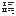</a> | **📂 檔名:** `format-list-ordered.svg` ✨ **格式:** `Vector (SVG)` ⚖️ **大小:** `810.00B` 📅 **更新:** `2026-03-04`  🚀 **jsDelivr Markdown:** `` 🔗 **直接連結 (Url):** <code>https://cdn.jsdelivr.net/gh/barry028/materials@main/images/iCons/Pixel/Breeze/Actions%20/16/format-list-ordered.svg</code> 📥 [檢視原始檔](format-list-ordered.svg) |
| <a href="format-number-percent.svg">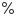</a> | **📂 檔名:** `format-number-percent.svg` ✨ **格式:** `Vector (SVG)` ⚖️ **大小:** `948.00B` 📅 **更新:** `2026-03-04`  🚀 **jsDelivr Markdown:** `` 🔗 **直接連結 (Url):** <code>https://cdn.jsdelivr.net/gh/barry028/materials@main/images/iCons/Pixel/Breeze/Actions%20/16/format-number-percent.svg</code> 📥 [檢視原始檔](format-number-percent.svg) |
|  | **📂 檔名:** `format-precision-less.svg` ✨ **格式:** `Vector (SVG)` ⚖️ **大小:** `1.29KB` 📅 **更新:** `2026-03-04`  🚀 **jsDelivr Markdown:** `` 🔗 **直接連結 (Url):** <code>https://cdn.jsdelivr.net/gh/barry028/materials@main/images/iCons/Pixel/Breeze/Actions%20/16/format-precision-less.svg</code> 📥 [檢視原始檔](format-precision-less.svg) |
|  | **📂 檔名:** `format-precision-more.svg` ✨ **格式:** `Vector (SVG)` ⚖️ **大小:** `1.12KB` 📅 **更新:** `2026-03-04`  🚀 **jsDelivr Markdown:** `` 🔗 **直接連結 (Url):** <code>https://cdn.jsdelivr.net/gh/barry028/materials@main/images/iCons/Pixel/Breeze/Actions%20/16/format-precision-more.svg</code> 📥 [檢視原始檔](format-precision-more.svg) |
| <a href="format-remove-node.svg">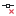</a> | **📂 檔名:** `format-remove-node.svg` ✨ **格式:** `Vector (SVG)` ⚖️ **大小:** `816.00B` 📅 **更新:** `2026-03-04`  🚀 **jsDelivr Markdown:** `` 🔗 **直接連結 (Url):** <code>https://cdn.jsdelivr.net/gh/barry028/materials@main/images/iCons/Pixel/Breeze/Actions%20/16/format-remove-node.svg</code> 📥 [檢視原始檔](format-remove-node.svg) |
|  | **📂 檔名:** `format-text-blockquote.svg` ✨ **格式:** `Vector (SVG)` ⚖️ **大小:** `509.00B` 📅 **更新:** `2026-03-04`  🚀 **jsDelivr Markdown:** `` 🔗 **直接連結 (Url):** <code>https://cdn.jsdelivr.net/gh/barry028/materials@main/images/iCons/Pixel/Breeze/Actions%20/16/format-text-blockquote.svg</code> 📥 [檢視原始檔](format-text-blockquote.svg) |
|  | **📂 檔名:** `format-text-bold.svg` ✨ **格式:** `Vector (SVG)` ⚖️ **大小:** `982.00B` 📅 **更新:** `2026-03-04`  🚀 **jsDelivr Markdown:** `` 🔗 **直接連結 (Url):** <code>https://cdn.jsdelivr.net/gh/barry028/materials@main/images/iCons/Pixel/Breeze/Actions%20/16/format-text-bold.svg</code> 📥 [檢視原始檔](format-text-bold.svg) |
|  | **📂 檔名:** `format-text-code.svg` ✨ **格式:** `Vector (SVG)` ⚖️ **大小:** `655.00B` 📅 **更新:** `2026-03-04`  🚀 **jsDelivr Markdown:** `` 🔗 **直接連結 (Url):** <code>https://cdn.jsdelivr.net/gh/barry028/materials@main/images/iCons/Pixel/Breeze/Actions%20/16/format-text-code.svg</code> 📥 [檢視原始檔](format-text-code.svg) |
|  | **📂 檔名:** `format-text-color.svg` ✨ **格式:** `Vector (SVG)` ⚖️ **大小:** `646.00B` 📅 **更新:** `2026-03-04`  🚀 **jsDelivr Markdown:** `` 🔗 **直接連結 (Url):** <code>https://cdn.jsdelivr.net/gh/barry028/materials@main/images/iCons/Pixel/Breeze/Actions%20/16/format-text-color.svg</code> 📥 [檢視原始檔](format-text-color.svg) |
|  | **📂 檔名:** `format-text-direction-horizontal.svg` ✨ **格式:** `Vector (SVG)` ⚖️ **大小:** `762.00B` 📅 **更新:** `2026-03-04`  🚀 **jsDelivr Markdown:** `` 🔗 **直接連結 (Url):** <code>https://cdn.jsdelivr.net/gh/barry028/materials@main/images/iCons/Pixel/Breeze/Actions%20/16/format-text-direction-horizontal.svg</code> 📥 [檢視原始檔](format-text-direction-horizontal.svg) |
|  | **📂 檔名:** `format-text-direction-ltr.svg` ✨ **格式:** `Vector (SVG)` ⚖️ **大小:** `585.00B` 📅 **更新:** `2026-03-04`  🚀 **jsDelivr Markdown:** `` 🔗 **直接連結 (Url):** <code>https://cdn.jsdelivr.net/gh/barry028/materials@main/images/iCons/Pixel/Breeze/Actions%20/16/format-text-direction-ltr.svg</code> 📥 [檢視原始檔](format-text-direction-ltr.svg) |
|  | **📂 檔名:** `format-text-direction-vertical.svg` ✨ **格式:** `Vector (SVG)` ⚖️ **大小:** `754.00B` 📅 **更新:** `2026-03-04`  🚀 **jsDelivr Markdown:** `` 🔗 **直接連結 (Url):** <code>https://cdn.jsdelivr.net/gh/barry028/materials@main/images/iCons/Pixel/Breeze/Actions%20/16/format-text-direction-vertical.svg</code> 📥 [檢視原始檔](format-text-direction-vertical.svg) |
|  | **📂 檔名:** `format-text-italic.svg` ✨ **格式:** `Vector (SVG)` ⚖️ **大小:** `520.00B` 📅 **更新:** `2026-03-04`  🚀 **jsDelivr Markdown:** `` 🔗 **直接連結 (Url):** <code>https://cdn.jsdelivr.net/gh/barry028/materials@main/images/iCons/Pixel/Breeze/Actions%20/16/format-text-italic.svg</code> 📥 [檢視原始檔](format-text-italic.svg) |
|  | **📂 檔名:** `format-text-lowercase.svg` ✨ **格式:** `Vector (SVG)` ⚖️ **大小:** `1.29KB` 📅 **更新:** `2026-03-04`  🚀 **jsDelivr Markdown:** `` 🔗 **直接連結 (Url):** <code>https://cdn.jsdelivr.net/gh/barry028/materials@main/images/iCons/Pixel/Breeze/Actions%20/16/format-text-lowercase.svg</code> 📥 [檢視原始檔](format-text-lowercase.svg) |
|  | **📂 檔名:** `format-text-strikethrough.svg` ✨ **格式:** `Vector (SVG)` ⚖️ **大小:** `712.00B` 📅 **更新:** `2026-03-04`  🚀 **jsDelivr Markdown:** `` 🔗 **直接連結 (Url):** <code>https://cdn.jsdelivr.net/gh/barry028/materials@main/images/iCons/Pixel/Breeze/Actions%20/16/format-text-strikethrough.svg</code> 📥 [檢視原始檔](format-text-strikethrough.svg) |
|  | **📂 檔名:** `format-text-subscript.svg` ✨ **格式:** `Vector (SVG)` ⚖️ **大小:** `1016.00B` 📅 **更新:** `2026-03-04`  🚀 **jsDelivr Markdown:** `` 🔗 **直接連結 (Url):** <code>https://cdn.jsdelivr.net/gh/barry028/materials@main/images/iCons/Pixel/Breeze/Actions%20/16/format-text-subscript.svg</code> 📥 [檢視原始檔](format-text-subscript.svg) |
| <a href="format-text-superscript.svg">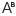</a> | **📂 檔名:** `format-text-superscript.svg` ✨ **格式:** `Vector (SVG)` ⚖️ **大小:** `970.00B` 📅 **更新:** `2026-03-04`  🚀 **jsDelivr Markdown:** `` 🔗 **直接連結 (Url):** <code>https://cdn.jsdelivr.net/gh/barry028/materials@main/images/iCons/Pixel/Breeze/Actions%20/16/format-text-superscript.svg</code> 📥 [檢視原始檔](format-text-superscript.svg) |
|  | **📂 檔名:** `format-text-symbol.svg` ✨ **格式:** `Vector (SVG)` ⚖️ **大小:** `781.00B` 📅 **更新:** `2026-03-04`  🚀 **jsDelivr Markdown:** `` 🔗 **直接連結 (Url):** <code>https://cdn.jsdelivr.net/gh/barry028/materials@main/images/iCons/Pixel/Breeze/Actions%20/16/format-text-symbol.svg</code> 📥 [檢視原始檔](format-text-symbol.svg) |
|  | **📂 檔名:** `format-text-underline-squiggle.svg` ✨ **格式:** `Vector (SVG)` ⚖️ **大小:** `1.00KB` 📅 **更新:** `2026-03-04`  🚀 **jsDelivr Markdown:** `` 🔗 **直接連結 (Url):** <code>https://cdn.jsdelivr.net/gh/barry028/materials@main/images/iCons/Pixel/Breeze/Actions%20/16/format-text-underline-squiggle.svg</code> 📥 [檢視原始檔](format-text-underline-squiggle.svg) |
|  | **📂 檔名:** `format-text-underline.svg` ✨ **格式:** `Vector (SVG)` ⚖️ **大小:** `601.00B` 📅 **更新:** `2026-03-04`  🚀 **jsDelivr Markdown:** `` 🔗 **直接連結 (Url):** <code>https://cdn.jsdelivr.net/gh/barry028/materials@main/images/iCons/Pixel/Breeze/Actions%20/16/format-text-underline.svg</code> 📥 [檢視原始檔](format-text-underline.svg) |
|  | **📂 檔名:** `format-text-uppercase.svg` ✨ **格式:** `Vector (SVG)` ⚖️ **大小:** `1.44KB` 📅 **更新:** `2026-03-04`  🚀 **jsDelivr Markdown:** `` 🔗 **直接連結 (Url):** <code>https://cdn.jsdelivr.net/gh/barry028/materials@main/images/iCons/Pixel/Breeze/Actions%20/16/format-text-uppercase.svg</code> 📥 [檢視原始檔](format-text-uppercase.svg) |
| <a href="formula.svg">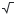</a> | **📂 檔名:** `formula.svg` ✨ **格式:** `Vector (SVG)` ⚖️ **大小:** `529.00B` 📅 **更新:** `2026-03-04`  🚀 **jsDelivr Markdown:** `` 🔗 **直接連結 (Url):** <code>https://cdn.jsdelivr.net/gh/barry028/materials@main/images/iCons/Pixel/Breeze/Actions%20/16/formula.svg</code> 📥 [檢視原始檔](formula.svg) |
|  | **📂 檔名:** `games-achievements.svg` ✨ **格式:** `Vector (SVG)` ⚖️ **大小:** `571.00B` 📅 **更新:** `2026-03-04`  🚀 **jsDelivr Markdown:** `` 🔗 **直接連結 (Url):** <code>https://cdn.jsdelivr.net/gh/barry028/materials@main/images/iCons/Pixel/Breeze/Actions%20/16/games-achievements.svg</code> 📥 [檢視原始檔](games-achievements.svg) |
|  | **📂 檔名:** `games-config-tiles.svg` ✨ **格式:** `Vector (SVG)` ⚖️ **大小:** `402.00B` 📅 **更新:** `2026-03-04`  🚀 **jsDelivr Markdown:** `` 🔗 **直接連結 (Url):** <code>https://cdn.jsdelivr.net/gh/barry028/materials@main/images/iCons/Pixel/Breeze/Actions%20/16/games-config-tiles.svg</code> 📥 [檢視原始檔](games-config-tiles.svg) |
|  | **📂 檔名:** `games-hint.svg` ✨ **格式:** `Vector (SVG)` ⚖️ **大小:** `792.00B` 📅 **更新:** `2026-03-04`  🚀 **jsDelivr Markdown:** `` 🔗 **直接連結 (Url):** <code>https://cdn.jsdelivr.net/gh/barry028/materials@main/images/iCons/Pixel/Breeze/Actions%20/16/games-hint.svg</code> 📥 [檢視原始檔](games-hint.svg) |
|  | **📂 檔名:** `games-solve.svg` ✨ **格式:** `Vector (SVG)` ⚖️ **大小:** `606.00B` 📅 **更新:** `2026-03-04`  🚀 **jsDelivr Markdown:** `` 🔗 **直接連結 (Url):** <code>https://cdn.jsdelivr.net/gh/barry028/materials@main/images/iCons/Pixel/Breeze/Actions%20/16/games-solve.svg</code> 📥 [檢視原始檔](games-solve.svg) |
|  | **📂 檔名:** `generalise.svg` ✨ **格式:** `Vector (SVG)` ⚖️ **大小:** `671.00B` 📅 **更新:** `2026-03-04`  🚀 **jsDelivr Markdown:** `` 🔗 **直接連結 (Url):** <code>https://cdn.jsdelivr.net/gh/barry028/materials@main/images/iCons/Pixel/Breeze/Actions%20/16/generalise.svg</code> 📥 [檢視原始檔](generalise.svg) |
|  | **📂 檔名:** `globe.svg` ✨ **格式:** `Vector (SVG)` ⚖️ **大小:** `20.20KB` 📅 **更新:** `2026-03-04`  🚀 **jsDelivr Markdown:** `` 🔗 **直接連結 (Url):** <code>https://cdn.jsdelivr.net/gh/barry028/materials@main/images/iCons/Pixel/Breeze/Actions%20/16/globe.svg</code> 📥 [檢視原始檔](globe.svg) |
|  | **📂 檔名:** `gnumeric-autofilter-delete.svg` ✨ **格式:** `Vector (SVG)` ⚖️ **大小:** `785.00B` 📅 **更新:** `2026-03-04`  🚀 **jsDelivr Markdown:** `` 🔗 **直接連結 (Url):** <code>https://cdn.jsdelivr.net/gh/barry028/materials@main/images/iCons/Pixel/Breeze/Actions%20/16/gnumeric-autofilter-delete.svg</code> 📥 [檢視原始檔](gnumeric-autofilter-delete.svg) |
|  | **📂 檔名:** `gnumeric-component-insert-shaped.svg` ✨ **格式:** `Vector (SVG)` ⚖️ **大小:** `847.00B` 📅 **更新:** `2026-03-04`  🚀 **jsDelivr Markdown:** `` 🔗 **直接連結 (Url):** <code>https://cdn.jsdelivr.net/gh/barry028/materials@main/images/iCons/Pixel/Breeze/Actions%20/16/gnumeric-component-insert-shaped.svg</code> 📥 [檢視原始檔](gnumeric-component-insert-shaped.svg) |
|  | **📂 檔名:** `gnumeric-data-slicer.svg` ✨ **格式:** `Vector (SVG)` ⚖️ **大小:** `953.00B` 📅 **更新:** `2026-03-04`  🚀 **jsDelivr Markdown:** `` 🔗 **直接連結 (Url):** <code>https://cdn.jsdelivr.net/gh/barry028/materials@main/images/iCons/Pixel/Breeze/Actions%20/16/gnumeric-data-slicer.svg</code> 📥 [檢視原始檔](gnumeric-data-slicer.svg) |
|  | **📂 檔名:** `gnumeric-formulaguru.svg` ✨ **格式:** `Vector (SVG)` ⚖️ **大小:** `793.00B` 📅 **更新:** `2026-03-04`  🚀 **jsDelivr Markdown:** `` 🔗 **直接連結 (Url):** <code>https://cdn.jsdelivr.net/gh/barry028/materials@main/images/iCons/Pixel/Breeze/Actions%20/16/gnumeric-formulaguru.svg</code> 📥 [檢視原始檔](gnumeric-formulaguru.svg) |
|  | **📂 檔名:** `gnumeric-link-external.svg` ✨ **格式:** `Vector (SVG)` ⚖️ **大小:** `584.00B` 📅 **更新:** `2026-03-04`  🚀 **jsDelivr Markdown:** `` 🔗 **直接連結 (Url):** <code>https://cdn.jsdelivr.net/gh/barry028/materials@main/images/iCons/Pixel/Breeze/Actions%20/16/gnumeric-link-external.svg</code> 📥 [檢視原始檔](gnumeric-link-external.svg) |
|  | **📂 檔名:** `gnumeric-link-internal.svg` ✨ **格式:** `Vector (SVG)` ⚖️ **大小:** `790.00B` 📅 **更新:** `2026-03-04`  🚀 **jsDelivr Markdown:** `` 🔗 **直接連結 (Url):** <code>https://cdn.jsdelivr.net/gh/barry028/materials@main/images/iCons/Pixel/Breeze/Actions%20/16/gnumeric-link-internal.svg</code> 📥 [檢視原始檔](gnumeric-link-internal.svg) |
|  | **📂 檔名:** `gnumeric-pagesetup-hf-page.svg` ✨ **格式:** `Vector (SVG)` ⚖️ **大小:** `717.00B` 📅 **更新:** `2026-03-04`  🚀 **jsDelivr Markdown:** `` 🔗 **直接連結 (Url):** <code>https://cdn.jsdelivr.net/gh/barry028/materials@main/images/iCons/Pixel/Breeze/Actions%20/16/gnumeric-pagesetup-hf-page.svg</code> 📥 [檢視原始檔](gnumeric-pagesetup-hf-page.svg) |
|  | **📂 檔名:** `gnumeric-pagesetup-hf-pages.svg` ✨ **格式:** `Vector (SVG)` ⚖️ **大小:** `929.00B` 📅 **更新:** `2026-03-04`  🚀 **jsDelivr Markdown:** `` 🔗 **直接連結 (Url):** <code>https://cdn.jsdelivr.net/gh/barry028/materials@main/images/iCons/Pixel/Breeze/Actions%20/16/gnumeric-pagesetup-hf-pages.svg</code> 📥 [檢視原始檔](gnumeric-pagesetup-hf-pages.svg) |
|  | **📂 檔名:** `gnumeric-pivottable.svg` ✨ **格式:** `Vector (SVG)` ⚖️ **大小:** `649.00B` 📅 **更新:** `2026-03-04`  🚀 **jsDelivr Markdown:** `` 🔗 **直接連結 (Url):** <code>https://cdn.jsdelivr.net/gh/barry028/materials@main/images/iCons/Pixel/Breeze/Actions%20/16/gnumeric-pivottable.svg</code> 📥 [檢視原始檔](gnumeric-pivottable.svg) |
|  | **📂 檔名:** `go-bottom.svg` ✨ **格式:** `Vector (SVG)` ⚖️ **大小:** `452.00B` 📅 **更新:** `2026-03-04`  🚀 **jsDelivr Markdown:** `` 🔗 **直接連結 (Url):** <code>https://cdn.jsdelivr.net/gh/barry028/materials@main/images/iCons/Pixel/Breeze/Actions%20/16/go-bottom.svg</code> 📥 [檢視原始檔](go-bottom.svg) |
|  | **📂 檔名:** `go-down-skip.svg` ✨ **格式:** `Vector (SVG)` ⚖️ **大小:** `418.00B` 📅 **更新:** `2026-03-04`  🚀 **jsDelivr Markdown:** `` 🔗 **直接連結 (Url):** <code>https://cdn.jsdelivr.net/gh/barry028/materials@main/images/iCons/Pixel/Breeze/Actions%20/16/go-down-skip.svg</code> 📥 [檢視原始檔](go-down-skip.svg) |
|  | **📂 檔名:** `go-down.svg` ✨ **格式:** `Vector (SVG)` ⚖️ **大小:** `332.00B` 📅 **更新:** `2026-03-04`  🚀 **jsDelivr Markdown:** `` 🔗 **直接連結 (Url):** <code>https://cdn.jsdelivr.net/gh/barry028/materials@main/images/iCons/Pixel/Breeze/Actions%20/16/go-down.svg</code> 📥 [檢視原始檔](go-down.svg) |
|  | **📂 檔名:** `go-first.svg` ✨ **格式:** `Vector (SVG)` ⚖️ **大小:** `450.00B` 📅 **更新:** `2026-03-04`  🚀 **jsDelivr Markdown:** `` 🔗 **直接連結 (Url):** <code>https://cdn.jsdelivr.net/gh/barry028/materials@main/images/iCons/Pixel/Breeze/Actions%20/16/go-first.svg</code> 📥 [檢視原始檔](go-first.svg) |
|  | **📂 檔名:** `go-home.svg` ✨ **格式:** `Vector (SVG)` ⚖️ **大小:** `837.00B` 📅 **更新:** `2026-03-04`  🚀 **jsDelivr Markdown:** `` 🔗 **直接連結 (Url):** <code>https://cdn.jsdelivr.net/gh/barry028/materials@main/images/iCons/Pixel/Breeze/Actions%20/16/go-home.svg</code> 📥 [檢視原始檔](go-home.svg) |
|  | **📂 檔名:** `go-jump-declaration.svg` ✨ **格式:** `Vector (SVG)` ⚖️ **大小:** `592.00B` 📅 **更新:** `2026-03-04`  🚀 **jsDelivr Markdown:** `` 🔗 **直接連結 (Url):** <code>https://cdn.jsdelivr.net/gh/barry028/materials@main/images/iCons/Pixel/Breeze/Actions%20/16/go-jump-declaration.svg</code> 📥 [檢視原始檔](go-jump-declaration.svg) |
|  | **📂 檔名:** `go-jump-definition.svg` ✨ **格式:** `Vector (SVG)` ⚖️ **大小:** `630.00B` 📅 **更新:** `2026-03-04`  🚀 **jsDelivr Markdown:** `` 🔗 **直接連結 (Url):** <code>https://cdn.jsdelivr.net/gh/barry028/materials@main/images/iCons/Pixel/Breeze/Actions%20/16/go-jump-definition.svg</code> 📥 [檢視原始檔](go-jump-definition.svg) |
|  | **📂 檔名:** `go-jump-today.svg` ✨ **格式:** `Vector (SVG)` ⚖️ **大小:** `717.00B` 📅 **更新:** `2026-03-04`  🚀 **jsDelivr Markdown:** `` 🔗 **直接連結 (Url):** <code>https://cdn.jsdelivr.net/gh/barry028/materials@main/images/iCons/Pixel/Breeze/Actions%20/16/go-jump-today.svg</code> 📥 [檢視原始檔](go-jump-today.svg) |
|  | **📂 檔名:** `go-jump.svg` ✨ **格式:** `Vector (SVG)` ⚖️ **大小:** `391.00B` 📅 **更新:** `2026-03-04`  🚀 **jsDelivr Markdown:** `` 🔗 **直接連結 (Url):** <code>https://cdn.jsdelivr.net/gh/barry028/materials@main/images/iCons/Pixel/Breeze/Actions%20/16/go-jump.svg</code> 📥 [檢視原始檔](go-jump.svg) |
|  | **📂 檔名:** `go-next-context.svg` ✨ **格式:** `Vector (SVG)` ⚖️ **大小:** `1.08KB` 📅 **更新:** `2026-03-04`  🚀 **jsDelivr Markdown:** `` 🔗 **直接連結 (Url):** <code>https://cdn.jsdelivr.net/gh/barry028/materials@main/images/iCons/Pixel/Breeze/Actions%20/16/go-next-context.svg</code> 📥 [檢視原始檔](go-next-context.svg) |
|  | **📂 檔名:** `go-next-skip.svg` ✨ **格式:** `Vector (SVG)` ⚖️ **大小:** `416.00B` 📅 **更新:** `2026-03-04`  🚀 **jsDelivr Markdown:** `` 🔗 **直接連結 (Url):** <code>https://cdn.jsdelivr.net/gh/barry028/materials@main/images/iCons/Pixel/Breeze/Actions%20/16/go-next-skip.svg</code> 📥 [檢視原始檔](go-next-skip.svg) |
|  | **📂 檔名:** `go-next-use.svg` ✨ **格式:** `Vector (SVG)` ⚖️ **大小:** `399.00B` 📅 **更新:** `2026-03-04`  🚀 **jsDelivr Markdown:** `` 🔗 **直接連結 (Url):** <code>https://cdn.jsdelivr.net/gh/barry028/materials@main/images/iCons/Pixel/Breeze/Actions%20/16/go-next-use.svg</code> 📥 [檢視原始檔](go-next-use.svg) |
|  | **📂 檔名:** `go-parent-folder.svg` ✨ **格式:** `Vector (SVG)` ⚖️ **大小:** `866.00B` 📅 **更新:** `2026-03-04`  🚀 **jsDelivr Markdown:** `` 🔗 **直接連結 (Url):** <code>https://cdn.jsdelivr.net/gh/barry028/materials@main/images/iCons/Pixel/Breeze/Actions%20/16/go-parent-folder.svg</code> 📥 [檢視原始檔](go-parent-folder.svg) |
|  | **📂 檔名:** `go-previous-context.svg` ✨ **格式:** `Vector (SVG)` ⚖️ **大小:** `1.13KB` 📅 **更新:** `2026-03-04`  🚀 **jsDelivr Markdown:** `` 🔗 **直接連結 (Url):** <code>https://cdn.jsdelivr.net/gh/barry028/materials@main/images/iCons/Pixel/Breeze/Actions%20/16/go-previous-context.svg</code> 📥 [檢視原始檔](go-previous-context.svg) |
|  | **📂 檔名:** `go-previous-skip.svg` ✨ **格式:** `Vector (SVG)` ⚖️ **大小:** `417.00B` 📅 **更新:** `2026-03-04`  🚀 **jsDelivr Markdown:** `` 🔗 **直接連結 (Url):** <code>https://cdn.jsdelivr.net/gh/barry028/materials@main/images/iCons/Pixel/Breeze/Actions%20/16/go-previous-skip.svg</code> 📥 [檢視原始檔](go-previous-skip.svg) |
|  | **📂 檔名:** `go-previous-use.svg` ✨ **格式:** `Vector (SVG)` ⚖️ **大小:** `504.00B` 📅 **更新:** `2026-03-04`  🚀 **jsDelivr Markdown:** `` 🔗 **直接連結 (Url):** <code>https://cdn.jsdelivr.net/gh/barry028/materials@main/images/iCons/Pixel/Breeze/Actions%20/16/go-previous-use.svg</code> 📥 [檢視原始檔](go-previous-use.svg) |
|  | **📂 檔名:** `go-up-skip.svg` ✨ **格式:** `Vector (SVG)` ⚖️ **大小:** `419.00B` 📅 **更新:** `2026-03-04`  🚀 **jsDelivr Markdown:** `` 🔗 **直接連結 (Url):** <code>https://cdn.jsdelivr.net/gh/barry028/materials@main/images/iCons/Pixel/Breeze/Actions%20/16/go-up-skip.svg</code> 📥 [檢視原始檔](go-up-skip.svg) |
|  | **📂 檔名:** `go-up.svg` ✨ **格式:** `Vector (SVG)` ⚖️ **大小:** `333.00B` 📅 **更新:** `2026-03-04`  🚀 **jsDelivr Markdown:** `` 🔗 **直接連結 (Url):** <code>https://cdn.jsdelivr.net/gh/barry028/materials@main/images/iCons/Pixel/Breeze/Actions%20/16/go-up.svg</code> 📥 [檢視原始檔](go-up.svg) |
|  | **📂 檔名:** `grid-axonometric.svg` ✨ **格式:** `Vector (SVG)` ⚖️ **大小:** `1.88KB` 📅 **更新:** `2026-03-04`  🚀 **jsDelivr Markdown:** `` 🔗 **直接連結 (Url):** <code>https://cdn.jsdelivr.net/gh/barry028/materials@main/images/iCons/Pixel/Breeze/Actions%20/16/grid-axonometric.svg</code> 📥 [檢視原始檔](grid-axonometric.svg) |
|  | **📂 檔名:** `gtk-index.svg` ✨ **格式:** `Vector (SVG)` ⚖️ **大小:** `865.00B` 📅 **更新:** `2026-03-04`  🚀 **jsDelivr Markdown:** `` 🔗 **直接連結 (Url):** <code>https://cdn.jsdelivr.net/gh/barry028/materials@main/images/iCons/Pixel/Breeze/Actions%20/16/gtk-index.svg</code> 📥 [檢視原始檔](gtk-index.svg) |
|  | **📂 檔名:** `help-about.svg` ✨ **格式:** `Vector (SVG)` ⚖️ **大小:** `495.00B` 📅 **更新:** `2026-03-04`  🚀 **jsDelivr Markdown:** `` 🔗 **直接連結 (Url):** <code>https://cdn.jsdelivr.net/gh/barry028/materials@main/images/iCons/Pixel/Breeze/Actions%20/16/help-about.svg</code> 📥 [檢視原始檔](help-about.svg) |
|  | **📂 檔名:** `help-contents.svg` ✨ **格式:** `Vector (SVG)` ⚖️ **大小:** `1.22KB` 📅 **更新:** `2026-03-04`  🚀 **jsDelivr Markdown:** `` 🔗 **直接連結 (Url):** <code>https://cdn.jsdelivr.net/gh/barry028/materials@main/images/iCons/Pixel/Breeze/Actions%20/16/help-contents.svg</code> 📥 [檢視原始檔](help-contents.svg) |
|  | **📂 檔名:** `help-donate-brl.svg` ✨ **格式:** `Vector (SVG)` ⚖️ **大小:** `593.00B` 📅 **更新:** `2026-03-04`  🚀 **jsDelivr Markdown:** `` 🔗 **直接連結 (Url):** <code>https://cdn.jsdelivr.net/gh/barry028/materials@main/images/iCons/Pixel/Breeze/Actions%20/16/help-donate-brl.svg</code> 📥 [檢視原始檔](help-donate-brl.svg) |
|  | **📂 檔名:** `help-donate-chf.svg` ✨ **格式:** `Vector (SVG)` ⚖️ **大小:** `475.00B` 📅 **更新:** `2026-03-04`  🚀 **jsDelivr Markdown:** `` 🔗 **直接連結 (Url):** <code>https://cdn.jsdelivr.net/gh/barry028/materials@main/images/iCons/Pixel/Breeze/Actions%20/16/help-donate-chf.svg</code> 📥 [檢視原始檔](help-donate-chf.svg) |
|  | **📂 檔名:** `help-donate-eur.svg` ✨ **格式:** `Vector (SVG)` ⚖️ **大小:** `471.00B` 📅 **更新:** `2026-03-04`  🚀 **jsDelivr Markdown:** `` 🔗 **直接連結 (Url):** <code>https://cdn.jsdelivr.net/gh/barry028/materials@main/images/iCons/Pixel/Breeze/Actions%20/16/help-donate-eur.svg</code> 📥 [檢視原始檔](help-donate-eur.svg) |
|  | **📂 檔名:** `help-donate-gbp.svg` ✨ **格式:** `Vector (SVG)` ⚖️ **大小:** `397.00B` 📅 **更新:** `2026-03-04`  🚀 **jsDelivr Markdown:** `` 🔗 **直接連結 (Url):** <code>https://cdn.jsdelivr.net/gh/barry028/materials@main/images/iCons/Pixel/Breeze/Actions%20/16/help-donate-gbp.svg</code> 📥 [檢視原始檔](help-donate-gbp.svg) |
|  | **📂 檔名:** `help-donate-inr.svg` ✨ **格式:** `Vector (SVG)` ⚖️ **大小:** `429.00B` 📅 **更新:** `2026-03-04`  🚀 **jsDelivr Markdown:** `` 🔗 **直接連結 (Url):** <code>https://cdn.jsdelivr.net/gh/barry028/materials@main/images/iCons/Pixel/Breeze/Actions%20/16/help-donate-inr.svg</code> 📥 [檢視原始檔](help-donate-inr.svg) |
| <a href="help-donate-jpy.svg">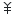</a> | **📂 檔名:** `help-donate-jpy.svg` ✨ **格式:** `Vector (SVG)` ⚖️ **大小:** `360.00B` 📅 **更新:** `2026-03-04`  🚀 **jsDelivr Markdown:** `` 🔗 **直接連結 (Url):** <code>https://cdn.jsdelivr.net/gh/barry028/materials@main/images/iCons/Pixel/Breeze/Actions%20/16/help-donate-jpy.svg</code> 📥 [檢視原始檔](help-donate-jpy.svg) |
|  | **📂 檔名:** `help-donate-pln.svg` ✨ **格式:** `Vector (SVG)` ⚖️ **大小:** `399.00B` 📅 **更新:** `2026-03-04`  🚀 **jsDelivr Markdown:** `` 🔗 **直接連結 (Url):** <code>https://cdn.jsdelivr.net/gh/barry028/materials@main/images/iCons/Pixel/Breeze/Actions%20/16/help-donate-pln.svg</code> 📥 [檢視原始檔](help-donate-pln.svg) |
| <a href="help-donate-rub.svg">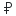</a> | **📂 檔名:** `help-donate-rub.svg` ✨ **格式:** `Vector (SVG)` ⚖️ **大小:** `343.00B` 📅 **更新:** `2026-03-04`  🚀 **jsDelivr Markdown:** `` 🔗 **直接連結 (Url):** <code>https://cdn.jsdelivr.net/gh/barry028/materials@main/images/iCons/Pixel/Breeze/Actions%20/16/help-donate-rub.svg</code> 📥 [檢視原始檔](help-donate-rub.svg) |
|  | **📂 檔名:** `help-donate-sek.svg` ✨ **格式:** `Vector (SVG)` ⚖️ **大小:** `484.00B` 📅 **更新:** `2026-03-04`  🚀 **jsDelivr Markdown:** `` 🔗 **直接連結 (Url):** <code>https://cdn.jsdelivr.net/gh/barry028/materials@main/images/iCons/Pixel/Breeze/Actions%20/16/help-donate-sek.svg</code> 📥 [檢視原始檔](help-donate-sek.svg) |
|  | **📂 檔名:** `help-donate-try.svg` ✨ **格式:** `Vector (SVG)` ⚖️ **大小:** `409.00B` 📅 **更新:** `2026-03-04`  🚀 **jsDelivr Markdown:** `` 🔗 **直接連結 (Url):** <code>https://cdn.jsdelivr.net/gh/barry028/materials@main/images/iCons/Pixel/Breeze/Actions%20/16/help-donate-try.svg</code> 📥 [檢視原始檔](help-donate-try.svg) |
|  | **📂 檔名:** `help-donate-uah.svg` ✨ **格式:** `Vector (SVG)` ⚖️ **大小:** `861.00B` 📅 **更新:** `2026-03-04`  🚀 **jsDelivr Markdown:** `` 🔗 **直接連結 (Url):** <code>https://cdn.jsdelivr.net/gh/barry028/materials@main/images/iCons/Pixel/Breeze/Actions%20/16/help-donate-uah.svg</code> 📥 [檢視原始檔](help-donate-uah.svg) |
|  | **📂 檔名:** `help-donate-usd.svg` ✨ **格式:** `Vector (SVG)` ⚖️ **大小:** `476.00B` 📅 **更新:** `2026-03-04`  🚀 **jsDelivr Markdown:** `` 🔗 **直接連結 (Url):** <code>https://cdn.jsdelivr.net/gh/barry028/materials@main/images/iCons/Pixel/Breeze/Actions%20/16/help-donate-usd.svg</code> 📥 [檢視原始檔](help-donate-usd.svg) |
|  | **📂 檔名:** `help-whatsthis.svg` ✨ **格式:** `Vector (SVG)` ⚖️ **大小:** `867.00B` 📅 **更新:** `2026-03-04`  🚀 **jsDelivr Markdown:** `` 🔗 **直接連結 (Url):** <code>https://cdn.jsdelivr.net/gh/barry028/materials@main/images/iCons/Pixel/Breeze/Actions%20/16/help-whatsthis.svg</code> 📥 [檢視原始檔](help-whatsthis.svg) |
|  | **📂 檔名:** `im-ban-kick-user.svg` ✨ **格式:** `Vector (SVG)` ⚖️ **大小:** `788.00B` 📅 **更新:** `2026-03-04`  🚀 **jsDelivr Markdown:** `` 🔗 **直接連結 (Url):** <code>https://cdn.jsdelivr.net/gh/barry028/materials@main/images/iCons/Pixel/Breeze/Actions%20/16/im-ban-kick-user.svg</code> 📥 [檢視原始檔](im-ban-kick-user.svg) |
|  | **📂 檔名:** `im-icq.svg` ✨ **格式:** `Vector (SVG)` ⚖️ **大小:** `2.34KB` 📅 **更新:** `2026-03-04`  🚀 **jsDelivr Markdown:** `` 🔗 **直接連結 (Url):** <code>https://cdn.jsdelivr.net/gh/barry028/materials@main/images/iCons/Pixel/Breeze/Actions%20/16/im-icq.svg</code> 📥 [檢視原始檔](im-icq.svg) |
|  | **📂 檔名:** `im-identi.ca.svg` ✨ **格式:** `Vector (SVG)` ⚖️ **大小:** `939.00B` 📅 **更新:** `2026-03-04`  🚀 **jsDelivr Markdown:** `` 🔗 **直接連結 (Url):** <code>https://cdn.jsdelivr.net/gh/barry028/materials@main/images/iCons/Pixel/Breeze/Actions%20/16/im-identi.ca.svg</code> 📥 [檢視原始檔](im-identi.ca.svg) |
|  | **📂 檔名:** `im-kick-user.svg` ✨ **格式:** `Vector (SVG)` ⚖️ **大小:** `863.00B` 📅 **更新:** `2026-03-04`  🚀 **jsDelivr Markdown:** `` 🔗 **直接連結 (Url):** <code>https://cdn.jsdelivr.net/gh/barry028/materials@main/images/iCons/Pixel/Breeze/Actions%20/16/im-kick-user.svg</code> 📥 [檢視原始檔](im-kick-user.svg) |
|  | **📂 檔名:** `im-msn.svg` ✨ **格式:** `Vector (SVG)` ⚖️ **大小:** `385.00B` 📅 **更新:** `2026-03-04`  🚀 **jsDelivr Markdown:** `` 🔗 **直接連結 (Url):** <code>https://cdn.jsdelivr.net/gh/barry028/materials@main/images/iCons/Pixel/Breeze/Actions%20/16/im-msn.svg</code> 📥 [檢視原始檔](im-msn.svg) |
|  | **📂 檔名:** `im-skype.svg` ✨ **格式:** `Vector (SVG)` ⚖️ **大小:** `1.81KB` 📅 **更新:** `2026-03-04`  🚀 **jsDelivr Markdown:** `` 🔗 **直接連結 (Url):** <code>https://cdn.jsdelivr.net/gh/barry028/materials@main/images/iCons/Pixel/Breeze/Actions%20/16/im-skype.svg</code> 📥 [檢視原始檔](im-skype.svg) |
|  | **📂 檔名:** `im-twitter.svg` ✨ **格式:** `Vector (SVG)` ⚖️ **大小:** `1.55KB` 📅 **更新:** `2026-03-04`  🚀 **jsDelivr Markdown:** `` 🔗 **直接連結 (Url):** <code>https://cdn.jsdelivr.net/gh/barry028/materials@main/images/iCons/Pixel/Breeze/Actions%20/16/im-twitter.svg</code> 📥 [檢視原始檔](im-twitter.svg) |
|  | **📂 檔名:** `im-user-away.svg` ✨ **格式:** `Vector (SVG)` ⚖️ **大小:** `398.00B` 📅 **更新:** `2026-03-04`  🚀 **jsDelivr Markdown:** `` 🔗 **直接連結 (Url):** <code>https://cdn.jsdelivr.net/gh/barry028/materials@main/images/iCons/Pixel/Breeze/Actions%20/16/im-user-away.svg</code> 📥 [檢視原始檔](im-user-away.svg) |
|  | **📂 檔名:** `im-user-busy.svg` ✨ **格式:** `Vector (SVG)` ⚖️ **大小:** `417.00B` 📅 **更新:** `2026-03-04`  🚀 **jsDelivr Markdown:** `` 🔗 **直接連結 (Url):** <code>https://cdn.jsdelivr.net/gh/barry028/materials@main/images/iCons/Pixel/Breeze/Actions%20/16/im-user-busy.svg</code> 📥 [檢視原始檔](im-user-busy.svg) |
|  | **📂 檔名:** `im-user-offline.svg` ✨ **格式:** `Vector (SVG)` ⚖️ **大小:** `759.00B` 📅 **更新:** `2026-03-04`  🚀 **jsDelivr Markdown:** `` 🔗 **直接連結 (Url):** <code>https://cdn.jsdelivr.net/gh/barry028/materials@main/images/iCons/Pixel/Breeze/Actions%20/16/im-user-offline.svg</code> 📥 [檢視原始檔](im-user-offline.svg) |
|  | **📂 檔名:** `im-user-online.svg` ✨ **格式:** `Vector (SVG)` ⚖️ **大小:** `613.00B` 📅 **更新:** `2026-03-04`  🚀 **jsDelivr Markdown:** `` 🔗 **直接連結 (Url):** <code>https://cdn.jsdelivr.net/gh/barry028/materials@main/images/iCons/Pixel/Breeze/Actions%20/16/im-user-online.svg</code> 📥 [檢視原始檔](im-user-online.svg) |
|  | **📂 檔名:** `im-user.svg` ✨ **格式:** `Vector (SVG)` ⚖️ **大小:** `675.00B` 📅 **更新:** `2026-03-04`  🚀 **jsDelivr Markdown:** `` 🔗 **直接連結 (Url):** <code>https://cdn.jsdelivr.net/gh/barry028/materials@main/images/iCons/Pixel/Breeze/Actions%20/16/im-user.svg</code> 📥 [檢視原始檔](im-user.svg) |
|  | **📂 檔名:** `im-yahoo.svg` ✨ **格式:** `Vector (SVG)` ⚖️ **大小:** `1.04KB` 📅 **更新:** `2026-03-04`  🚀 **jsDelivr Markdown:** `` 🔗 **直接連結 (Url):** <code>https://cdn.jsdelivr.net/gh/barry028/materials@main/images/iCons/Pixel/Breeze/Actions%20/16/im-yahoo.svg</code> 📥 [檢視原始檔](im-yahoo.svg) |
|  | **📂 檔名:** `im-youtube.svg` ✨ **格式:** `Vector (SVG)` ⚖️ **大小:** `500.00B` 📅 **更新:** `2026-03-04`  🚀 **jsDelivr Markdown:** `` 🔗 **直接連結 (Url):** <code>https://cdn.jsdelivr.net/gh/barry028/materials@main/images/iCons/Pixel/Breeze/Actions%20/16/im-youtube.svg</code> 📥 [檢視原始檔](im-youtube.svg) |
|  | **📂 檔名:** `input-mouse-click-middle.svg` ✨ **格式:** `Vector (SVG)` ⚖️ **大小:** `583.00B` 📅 **更新:** `2026-03-04`  🚀 **jsDelivr Markdown:** `` 🔗 **直接連結 (Url):** <code>https://cdn.jsdelivr.net/gh/barry028/materials@main/images/iCons/Pixel/Breeze/Actions%20/16/input-mouse-click-middle.svg</code> 📥 [檢視原始檔](input-mouse-click-middle.svg) |
|  | **📂 檔名:** `input-mouse-click-right.svg` ✨ **格式:** `Vector (SVG)` ⚖️ **大小:** `569.00B` 📅 **更新:** `2026-03-04`  🚀 **jsDelivr Markdown:** `` 🔗 **直接連結 (Url):** <code>https://cdn.jsdelivr.net/gh/barry028/materials@main/images/iCons/Pixel/Breeze/Actions%20/16/input-mouse-click-right.svg</code> 📥 [檢視原始檔](input-mouse-click-right.svg) |
|  | **📂 檔名:** `insert-button.svg` ✨ **格式:** `Vector (SVG)` ⚖️ **大小:** `748.00B` 📅 **更新:** `2026-03-04`  🚀 **jsDelivr Markdown:** `` 🔗 **直接連結 (Url):** <code>https://cdn.jsdelivr.net/gh/barry028/materials@main/images/iCons/Pixel/Breeze/Actions%20/16/insert-button.svg</code> 📥 [檢視原始檔](insert-button.svg) |
|  | **📂 檔名:** `insert-endnote.svg` ✨ **格式:** `Vector (SVG)` ⚖️ **大小:** `945.00B` 📅 **更新:** `2026-03-04`  🚀 **jsDelivr Markdown:** `` 🔗 **直接連結 (Url):** <code>https://cdn.jsdelivr.net/gh/barry028/materials@main/images/iCons/Pixel/Breeze/Actions%20/16/insert-endnote.svg</code> 📥 [檢視原始檔](insert-endnote.svg) |
|  | **📂 檔名:** `insert-horizontal-rule.svg` ✨ **格式:** `Vector (SVG)` ⚖️ **大小:** `581.00B` 📅 **更新:** `2026-03-04`  🚀 **jsDelivr Markdown:** `` 🔗 **直接連結 (Url):** <code>https://cdn.jsdelivr.net/gh/barry028/materials@main/images/iCons/Pixel/Breeze/Actions%20/16/insert-horizontal-rule.svg</code> 📥 [檢視原始檔](insert-horizontal-rule.svg) |
| <a href="insert-link.svg">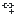</a> | **📂 檔名:** `insert-link.svg` ✨ **格式:** `Vector (SVG)` ⚖️ **大小:** `650.00B` 📅 **更新:** `2026-03-04`  🚀 **jsDelivr Markdown:** `` 🔗 **直接連結 (Url):** <code>https://cdn.jsdelivr.net/gh/barry028/materials@main/images/iCons/Pixel/Breeze/Actions%20/16/insert-link.svg</code> 📥 [檢視原始檔](insert-link.svg) |
|  | **📂 檔名:** `insert-math-expression.svg` ✨ **格式:** `Vector (SVG)` ⚖️ **大小:** `768.00B` 📅 **更新:** `2026-03-04`  🚀 **jsDelivr Markdown:** `` 🔗 **直接連結 (Url):** <code>https://cdn.jsdelivr.net/gh/barry028/materials@main/images/iCons/Pixel/Breeze/Actions%20/16/insert-math-expression.svg</code> 📥 [檢視原始檔](insert-math-expression.svg) |
|  | **📂 檔名:** `insert-more-mark.svg` ✨ **格式:** `Vector (SVG)` ⚖️ **大小:** `699.00B` 📅 **更新:** `2026-03-04`  🚀 **jsDelivr Markdown:** `` 🔗 **直接連結 (Url):** <code>https://cdn.jsdelivr.net/gh/barry028/materials@main/images/iCons/Pixel/Breeze/Actions%20/16/insert-more-mark.svg</code> 📥 [檢視原始檔](insert-more-mark.svg) |
|  | **📂 檔名:** `insert-page-break.svg` ✨ **格式:** `Vector (SVG)` ⚖️ **大小:** `816.00B` 📅 **更新:** `2026-03-04`  🚀 **jsDelivr Markdown:** `` 🔗 **直接連結 (Url):** <code>https://cdn.jsdelivr.net/gh/barry028/materials@main/images/iCons/Pixel/Breeze/Actions%20/16/insert-page-break.svg</code> 📥 [檢視原始檔](insert-page-break.svg) |
|  | **📂 檔名:** `insert-table-of-contents.svg` ✨ **格式:** `Vector (SVG)` ⚖️ **大小:** `1.04KB` 📅 **更新:** `2026-03-04`  🚀 **jsDelivr Markdown:** `` 🔗 **直接連結 (Url):** <code>https://cdn.jsdelivr.net/gh/barry028/materials@main/images/iCons/Pixel/Breeze/Actions%20/16/insert-table-of-contents.svg</code> 📥 [檢視原始檔](insert-table-of-contents.svg) |
|  | **📂 檔名:** `insert-text-frame.svg` ✨ **格式:** `Vector (SVG)` ⚖️ **大小:** `636.00B` 📅 **更新:** `2026-03-04`  🚀 **jsDelivr Markdown:** `` 🔗 **直接連結 (Url):** <code>https://cdn.jsdelivr.net/gh/barry028/materials@main/images/iCons/Pixel/Breeze/Actions%20/16/insert-text-frame.svg</code> 📥 [檢視原始檔](insert-text-frame.svg) |
|  | **📂 檔名:** `insert-text.svg` ✨ **格式:** `Vector (SVG)` ⚖️ **大小:** `565.00B` 📅 **更新:** `2026-03-04`  🚀 **jsDelivr Markdown:** `` 🔗 **直接連結 (Url):** <code>https://cdn.jsdelivr.net/gh/barry028/materials@main/images/iCons/Pixel/Breeze/Actions%20/16/insert-text.svg</code> 📥 [檢視原始檔](insert-text.svg) |
|  | **📂 檔名:** `irc-channel-active.svg` ✨ **格式:** `Vector (SVG)` ⚖️ **大小:** `844.00B` 📅 **更新:** `2026-03-04`  🚀 **jsDelivr Markdown:** `` 🔗 **直接連結 (Url):** <code>https://cdn.jsdelivr.net/gh/barry028/materials@main/images/iCons/Pixel/Breeze/Actions%20/16/irc-channel-active.svg</code> 📥 [檢視原始檔](irc-channel-active.svg) |
|  | **📂 檔名:** `irc-channel-inactive.svg` ✨ **格式:** `Vector (SVG)` ⚖️ **大小:** `1.09KB` 📅 **更新:** `2026-03-04`  🚀 **jsDelivr Markdown:** `` 🔗 **直接連結 (Url):** <code>https://cdn.jsdelivr.net/gh/barry028/materials@main/images/iCons/Pixel/Breeze/Actions%20/16/irc-channel-inactive.svg</code> 📥 [檢視原始檔](irc-channel-inactive.svg) |
|  | **📂 檔名:** `join.svg` ✨ **格式:** `Vector (SVG)` ⚖️ **大小:** `1.14KB` 📅 **更新:** `2026-03-04`  🚀 **jsDelivr Markdown:** `` 🔗 **直接連結 (Url):** <code>https://cdn.jsdelivr.net/gh/barry028/materials@main/images/iCons/Pixel/Breeze/Actions%20/16/join.svg</code> 📥 [檢視原始檔](join.svg) |
|  | **📂 檔名:** `journal-new.svg` ✨ **格式:** `Vector (SVG)` ⚖️ **大小:** `599.00B` 📅 **更新:** `2026-03-04`  🚀 **jsDelivr Markdown:** `` 🔗 **直接連結 (Url):** <code>https://cdn.jsdelivr.net/gh/barry028/materials@main/images/iCons/Pixel/Breeze/Actions%20/16/journal-new.svg</code> 📥 [檢視原始檔](journal-new.svg) |
|  | **📂 檔名:** `junction.svg` ✨ **格式:** `Vector (SVG)` ⚖️ **大小:** `1.37KB` 📅 **更新:** `2026-03-04`  🚀 **jsDelivr Markdown:** `` 🔗 **直接連結 (Url):** <code>https://cdn.jsdelivr.net/gh/barry028/materials@main/images/iCons/Pixel/Breeze/Actions%20/16/junction.svg</code> 📥 [檢視原始檔](junction.svg) |
|  | **📂 檔名:** `kdenlive-ripple.svg` ✨ **格式:** `Vector (SVG)` ⚖️ **大小:** `411.00B` 📅 **更新:** `2026-03-04`  🚀 **jsDelivr Markdown:** `` 🔗 **直接連結 (Url):** <code>https://cdn.jsdelivr.net/gh/barry028/materials@main/images/iCons/Pixel/Breeze/Actions%20/16/kdenlive-ripple.svg</code> 📥 [檢視原始檔](kdenlive-ripple.svg) |
|  | **📂 檔名:** `kdenlive-rolling.svg` ✨ **格式:** `Vector (SVG)` ⚖️ **大小:** `624.00B` 📅 **更新:** `2026-03-04`  🚀 **jsDelivr Markdown:** `` 🔗 **直接連結 (Url):** <code>https://cdn.jsdelivr.net/gh/barry028/materials@main/images/iCons/Pixel/Breeze/Actions%20/16/kdenlive-rolling.svg</code> 📥 [檢視原始檔](kdenlive-rolling.svg) |
|  | **📂 檔名:** `kdenlive-slide.svg` ✨ **格式:** `Vector (SVG)` ⚖️ **大小:** `627.00B` 📅 **更新:** `2026-03-04`  🚀 **jsDelivr Markdown:** `` 🔗 **直接連結 (Url):** <code>https://cdn.jsdelivr.net/gh/barry028/materials@main/images/iCons/Pixel/Breeze/Actions%20/16/kdenlive-slide.svg</code> 📥 [檢視原始檔](kdenlive-slide.svg) |
|  | **📂 檔名:** `kdenlive-slip.svg` ✨ **格式:** `Vector (SVG)` ⚖️ **大小:** `424.00B` 📅 **更新:** `2026-03-04`  🚀 **jsDelivr Markdown:** `` 🔗 **直接連結 (Url):** <code>https://cdn.jsdelivr.net/gh/barry028/materials@main/images/iCons/Pixel/Breeze/Actions%20/16/kdenlive-slip.svg</code> 📥 [檢視原始檔](kdenlive-slip.svg) |
|  | **📂 檔名:** `key-enter.svg` ✨ **格式:** `Vector (SVG)` ⚖️ **大小:** `507.00B` 📅 **更新:** `2026-03-04`  🚀 **jsDelivr Markdown:** `` 🔗 **直接連結 (Url):** <code>https://cdn.jsdelivr.net/gh/barry028/materials@main/images/iCons/Pixel/Breeze/Actions%20/16/key-enter.svg</code> 📥 [檢視原始檔](key-enter.svg) |
|  | **📂 檔名:** `keyframe-add.svg` ✨ **格式:** `Vector (SVG)` ⚖️ **大小:** `835.00B` 📅 **更新:** `2026-03-04`  🚀 **jsDelivr Markdown:** `` 🔗 **直接連結 (Url):** <code>https://cdn.jsdelivr.net/gh/barry028/materials@main/images/iCons/Pixel/Breeze/Actions%20/16/keyframe-add.svg</code> 📥 [檢視原始檔](keyframe-add.svg) |
|  | **📂 檔名:** `keyframe-disable.svg` ✨ **格式:** `Vector (SVG)` ⚖️ **大小:** `1.21KB` 📅 **更新:** `2026-03-04`  🚀 **jsDelivr Markdown:** `` 🔗 **直接連結 (Url):** <code>https://cdn.jsdelivr.net/gh/barry028/materials@main/images/iCons/Pixel/Breeze/Actions%20/16/keyframe-disable.svg</code> 📥 [檢視原始檔](keyframe-disable.svg) |
|  | **📂 檔名:** `keyframe-duplicate.svg` ✨ **格式:** `Vector (SVG)` ⚖️ **大小:** `1.54KB` 📅 **更新:** `2026-03-04`  🚀 **jsDelivr Markdown:** `` 🔗 **直接連結 (Url):** <code>https://cdn.jsdelivr.net/gh/barry028/materials@main/images/iCons/Pixel/Breeze/Actions%20/16/keyframe-duplicate.svg</code> 📥 [檢視原始檔](keyframe-duplicate.svg) |
|  | **📂 檔名:** `keyframe-previous.svg` ✨ **格式:** `Vector (SVG)` ⚖️ **大小:** `810.00B` 📅 **更新:** `2026-03-04`  🚀 **jsDelivr Markdown:** `` 🔗 **直接連結 (Url):** <code>https://cdn.jsdelivr.net/gh/barry028/materials@main/images/iCons/Pixel/Breeze/Actions%20/16/keyframe-previous.svg</code> 📥 [檢視原始檔](keyframe-previous.svg) |
|  | **📂 檔名:** `keyframe-remove.svg` ✨ **格式:** `Vector (SVG)` ⚖️ **大小:** `844.00B` 📅 **更新:** `2026-03-04`  🚀 **jsDelivr Markdown:** `` 🔗 **直接連結 (Url):** <code>https://cdn.jsdelivr.net/gh/barry028/materials@main/images/iCons/Pixel/Breeze/Actions%20/16/keyframe-remove.svg</code> 📥 [檢視原始檔](keyframe-remove.svg) |
|  | **📂 檔名:** `keyframe.svg` ✨ **格式:** `Vector (SVG)` ⚖️ **大小:** `826.00B` 📅 **更新:** `2026-03-04`  🚀 **jsDelivr Markdown:** `` 🔗 **直接連結 (Url):** <code>https://cdn.jsdelivr.net/gh/barry028/materials@main/images/iCons/Pixel/Breeze/Actions%20/16/keyframe.svg</code> 📥 [檢視原始檔](keyframe.svg) |
|  | **📂 檔名:** `kmouth-phrasebook.svg` ✨ **格式:** `Vector (SVG)` ⚖️ **大小:** `507.00B` 📅 **更新:** `2026-03-04`  🚀 **jsDelivr Markdown:** `` 🔗 **直接連結 (Url):** <code>https://cdn.jsdelivr.net/gh/barry028/materials@main/images/iCons/Pixel/Breeze/Actions%20/16/kmouth-phrasebook.svg</code> 📥 [檢視原始檔](kmouth-phrasebook.svg) |
|  | **📂 檔名:** `kontact-import-wizard.svg` ✨ **格式:** `Vector (SVG)` ⚖️ **大小:** `596.00B` 📅 **更新:** `2026-03-04`  🚀 **jsDelivr Markdown:** `` 🔗 **直接連結 (Url):** <code>https://cdn.jsdelivr.net/gh/barry028/materials@main/images/iCons/Pixel/Breeze/Actions%20/16/kontact-import-wizard.svg</code> 📥 [檢視原始檔](kontact-import-wizard.svg) |
|  | **📂 檔名:** `kr_comparedirs.svg` ✨ **格式:** `Vector (SVG)` ⚖️ **大小:** `1.04KB` 📅 **更新:** `2026-03-04`  🚀 **jsDelivr Markdown:** `` 🔗 **直接連結 (Url):** <code>https://cdn.jsdelivr.net/gh/barry028/materials@main/images/iCons/Pixel/Breeze/Actions%20/16/kr_comparedirs.svg</code> 📥 [檢視原始檔](kr_comparedirs.svg) |
|  | **📂 檔名:** `kr_diskusage.svg` ✨ **格式:** `Vector (SVG)` ⚖️ **大小:** `1.26KB` 📅 **更新:** `2026-03-04`  🚀 **jsDelivr Markdown:** `` 🔗 **直接連結 (Url):** <code>https://cdn.jsdelivr.net/gh/barry028/materials@main/images/iCons/Pixel/Breeze/Actions%20/16/kr_diskusage.svg</code> 📥 [檢視原始檔](kr_diskusage.svg) |
|  | **📂 檔名:** `kr_mountman.svg` ✨ **格式:** `Vector (SVG)` ⚖️ **大小:** `1015.00B` 📅 **更新:** `2026-03-04`  🚀 **jsDelivr Markdown:** `` 🔗 **直接連結 (Url):** <code>https://cdn.jsdelivr.net/gh/barry028/materials@main/images/iCons/Pixel/Breeze/Actions%20/16/kr_mountman.svg</code> 📥 [檢視原始檔](kr_mountman.svg) |
|  | **📂 檔名:** `kr_syncbrowse_off.svg` ✨ **格式:** `Vector (SVG)` ⚖️ **大小:** `1.09KB` 📅 **更新:** `2026-03-04`  🚀 **jsDelivr Markdown:** `` 🔗 **直接連結 (Url):** <code>https://cdn.jsdelivr.net/gh/barry028/materials@main/images/iCons/Pixel/Breeze/Actions%20/16/kr_syncbrowse_off.svg</code> 📥 [檢視原始檔](kr_syncbrowse_off.svg) |
|  | **📂 檔名:** `kr_syncbrowse_on.svg` ✨ **格式:** `Vector (SVG)` ⚖️ **大小:** `1.06KB` 📅 **更新:** `2026-03-04`  🚀 **jsDelivr Markdown:** `` 🔗 **直接連結 (Url):** <code>https://cdn.jsdelivr.net/gh/barry028/materials@main/images/iCons/Pixel/Breeze/Actions%20/16/kr_syncbrowse_on.svg</code> 📥 [檢視原始檔](kr_syncbrowse_on.svg) |
|  | **📂 檔名:** `kr_unselect.svg` ✨ **格式:** `Vector (SVG)` ⚖️ **大小:** `802.00B` 📅 **更新:** `2026-03-04`  🚀 **jsDelivr Markdown:** `` 🔗 **直接連結 (Url):** <code>https://cdn.jsdelivr.net/gh/barry028/materials@main/images/iCons/Pixel/Breeze/Actions%20/16/kr_unselect.svg</code> 📥 [檢視原始檔](kr_unselect.svg) |
|  | **📂 檔名:** `kruler-east.svg` ✨ **格式:** `Vector (SVG)` ⚖️ **大小:** `525.00B` 📅 **更新:** `2026-03-04`  🚀 **jsDelivr Markdown:** `` 🔗 **直接連結 (Url):** <code>https://cdn.jsdelivr.net/gh/barry028/materials@main/images/iCons/Pixel/Breeze/Actions%20/16/kruler-east.svg</code> 📥 [檢視原始檔](kruler-east.svg) |
|  | **📂 檔名:** `kruler-west.svg` ✨ **格式:** `Vector (SVG)` ⚖️ **大小:** `515.00B` 📅 **更新:** `2026-03-04`  🚀 **jsDelivr Markdown:** `` 🔗 **直接連結 (Url):** <code>https://cdn.jsdelivr.net/gh/barry028/materials@main/images/iCons/Pixel/Breeze/Actions%20/16/kruler-west.svg</code> 📥 [檢視原始檔](kruler-west.svg) |
|  | **📂 檔名:** `kt-set-max-upload-speed.svg` ✨ **格式:** `Vector (SVG)` ⚖️ **大小:** `557.00B` 📅 **更新:** `2026-03-04`  🚀 **jsDelivr Markdown:** `` 🔗 **直接連結 (Url):** <code>https://cdn.jsdelivr.net/gh/barry028/materials@main/images/iCons/Pixel/Breeze/Actions%20/16/kt-set-max-upload-speed.svg</code> 📥 [檢視原始檔](kt-set-max-upload-speed.svg) |
|  | **📂 檔名:** `labplot-editbreaklayout.svg` ✨ **格式:** `Vector (SVG)` ⚖️ **大小:** `791.00B` 📅 **更新:** `2026-03-04`  🚀 **jsDelivr Markdown:** `` 🔗 **直接連結 (Url):** <code>https://cdn.jsdelivr.net/gh/barry028/materials@main/images/iCons/Pixel/Breeze/Actions%20/16/labplot-editbreaklayout.svg</code> 📥 [檢視原始檔](labplot-editbreaklayout.svg) |
|  | **📂 檔名:** `labplot-editgrid.svg` ✨ **格式:** `Vector (SVG)` ⚖️ **大小:** `764.00B` 📅 **更新:** `2026-03-04`  🚀 **jsDelivr Markdown:** `` 🔗 **直接連結 (Url):** <code>https://cdn.jsdelivr.net/gh/barry028/materials@main/images/iCons/Pixel/Breeze/Actions%20/16/labplot-editgrid.svg</code> 📥 [檢視原始檔](labplot-editgrid.svg) |
|  | **📂 檔名:** `labplot-edithlayout.svg` ✨ **格式:** `Vector (SVG)` ⚖️ **大小:** `698.00B` 📅 **更新:** `2026-03-04`  🚀 **jsDelivr Markdown:** `` 🔗 **直接連結 (Url):** <code>https://cdn.jsdelivr.net/gh/barry028/materials@main/images/iCons/Pixel/Breeze/Actions%20/16/labplot-edithlayout.svg</code> 📥 [檢視原始檔](labplot-edithlayout.svg) |
|  | **📂 檔名:** `labplot-editvlayout.svg` ✨ **格式:** `Vector (SVG)` ⚖️ **大小:** `698.00B` 📅 **更新:** `2026-03-04`  🚀 **jsDelivr Markdown:** `` 🔗 **直接連結 (Url):** <code>https://cdn.jsdelivr.net/gh/barry028/materials@main/images/iCons/Pixel/Breeze/Actions%20/16/labplot-editvlayout.svg</code> 📥 [檢視原始檔](labplot-editvlayout.svg) |
|  | **📂 檔名:** `layer-bottom.svg` ✨ **格式:** `Vector (SVG)` ⚖️ **大小:** `856.00B` 📅 **更新:** `2026-03-04`  🚀 **jsDelivr Markdown:** `` 🔗 **直接連結 (Url):** <code>https://cdn.jsdelivr.net/gh/barry028/materials@main/images/iCons/Pixel/Breeze/Actions%20/16/layer-bottom.svg</code> 📥 [檢視原始檔](layer-bottom.svg) |
|  | **📂 檔名:** `layer-delete.svg` ✨ **格式:** `Vector (SVG)` ⚖️ **大小:** `770.00B` 📅 **更新:** `2026-03-04`  🚀 **jsDelivr Markdown:** `` 🔗 **直接連結 (Url):** <code>https://cdn.jsdelivr.net/gh/barry028/materials@main/images/iCons/Pixel/Breeze/Actions%20/16/layer-delete.svg</code> 📥 [檢視原始檔](layer-delete.svg) |
|  | **📂 檔名:** `layer-duplicate.svg` ✨ **格式:** `Vector (SVG)` ⚖️ **大小:** `488.00B` 📅 **更新:** `2026-03-04`  🚀 **jsDelivr Markdown:** `` 🔗 **直接連結 (Url):** <code>https://cdn.jsdelivr.net/gh/barry028/materials@main/images/iCons/Pixel/Breeze/Actions%20/16/layer-duplicate.svg</code> 📥 [檢視原始檔](layer-duplicate.svg) |
|  | **📂 檔名:** `layer-lower.svg` ✨ **格式:** `Vector (SVG)` ⚖️ **大小:** `882.00B` 📅 **更新:** `2026-03-04`  🚀 **jsDelivr Markdown:** `` 🔗 **直接連結 (Url):** <code>https://cdn.jsdelivr.net/gh/barry028/materials@main/images/iCons/Pixel/Breeze/Actions%20/16/layer-lower.svg</code> 📥 [檢視原始檔](layer-lower.svg) |
|  | **📂 檔名:** `layer-new.svg` ✨ **格式:** `Vector (SVG)` ⚖️ **大小:** `615.00B` 📅 **更新:** `2026-03-04`  🚀 **jsDelivr Markdown:** `` 🔗 **直接連結 (Url):** <code>https://cdn.jsdelivr.net/gh/barry028/materials@main/images/iCons/Pixel/Breeze/Actions%20/16/layer-new.svg</code> 📥 [檢視原始檔](layer-new.svg) |
|  | **📂 檔名:** `layer-next.svg` ✨ **格式:** `Vector (SVG)` ⚖️ **大小:** `639.00B` 📅 **更新:** `2026-03-04`  🚀 **jsDelivr Markdown:** `` 🔗 **直接連結 (Url):** <code>https://cdn.jsdelivr.net/gh/barry028/materials@main/images/iCons/Pixel/Breeze/Actions%20/16/layer-next.svg</code> 📥 [檢視原始檔](layer-next.svg) |
|  | **📂 檔名:** `layer-previous.svg` ✨ **格式:** `Vector (SVG)` ⚖️ **大小:** `661.00B` 📅 **更新:** `2026-03-04`  🚀 **jsDelivr Markdown:** `` 🔗 **直接連結 (Url):** <code>https://cdn.jsdelivr.net/gh/barry028/materials@main/images/iCons/Pixel/Breeze/Actions%20/16/layer-previous.svg</code> 📥 [檢視原始檔](layer-previous.svg) |
|  | **📂 檔名:** `layer-raise.svg` ✨ **格式:** `Vector (SVG)` ⚖️ **大小:** `790.00B` 📅 **更新:** `2026-03-04`  🚀 **jsDelivr Markdown:** `` 🔗 **直接連結 (Url):** <code>https://cdn.jsdelivr.net/gh/barry028/materials@main/images/iCons/Pixel/Breeze/Actions%20/16/layer-raise.svg</code> 📥 [檢視原始檔](layer-raise.svg) |
|  | **📂 檔名:** `layer-visible-on.svg` ✨ **格式:** `Vector (SVG)` ⚖️ **大小:** `443.00B` 📅 **更新:** `2026-03-04`  🚀 **jsDelivr Markdown:** `` 🔗 **直接連結 (Url):** <code>https://cdn.jsdelivr.net/gh/barry028/materials@main/images/iCons/Pixel/Breeze/Actions%20/16/layer-visible-on.svg</code> 📥 [檢視原始檔](layer-visible-on.svg) |
|  | **📂 檔名:** `lines-connector.svg` ✨ **格式:** `Vector (SVG)` ⚖️ **大小:** `792.00B` 📅 **更新:** `2026-03-04`  🚀 **jsDelivr Markdown:** `` 🔗 **直接連結 (Url):** <code>https://cdn.jsdelivr.net/gh/barry028/materials@main/images/iCons/Pixel/Breeze/Actions%20/16/lines-connector.svg</code> 📥 [檢視原始檔](lines-connector.svg) |
|  | **📂 檔名:** `link.svg` ✨ **格式:** `Vector (SVG)` ⚖️ **大小:** `976.00B` 📅 **更新:** `2026-03-04`  🚀 **jsDelivr Markdown:** `` 🔗 **直接連結 (Url):** <code>https://cdn.jsdelivr.net/gh/barry028/materials@main/images/iCons/Pixel/Breeze/Actions%20/16/link.svg</code> 📥 [檢視原始檔](link.svg) |
|  | **📂 檔名:** `list-add-font.svg` ✨ **格式:** `Vector (SVG)` ⚖️ **大小:** `400.00B` 📅 **更新:** `2026-03-04`  🚀 **jsDelivr Markdown:** `` 🔗 **直接連結 (Url):** <code>https://cdn.jsdelivr.net/gh/barry028/materials@main/images/iCons/Pixel/Breeze/Actions%20/16/list-add-font.svg</code> 📥 [檢視原始檔](list-add-font.svg) |
|  | **📂 檔名:** `list-remove-symbolic.svg` ✨ **格式:** `Vector (SVG)` ⚖️ **大小:** `2.07KB` 📅 **更新:** `2026-03-04`  🚀 **jsDelivr Markdown:** `` 🔗 **直接連結 (Url):** <code>https://cdn.jsdelivr.net/gh/barry028/materials@main/images/iCons/Pixel/Breeze/Actions%20/16/list-remove-symbolic.svg</code> 📥 [檢視原始檔](list-remove-symbolic.svg) |
|  | **📂 檔名:** `list-remove-user.svg` ✨ **格式:** `Vector (SVG)` ⚖️ **大小:** `681.00B` 📅 **更新:** `2026-03-04`  🚀 **jsDelivr Markdown:** `` 🔗 **直接連結 (Url):** <code>https://cdn.jsdelivr.net/gh/barry028/materials@main/images/iCons/Pixel/Breeze/Actions%20/16/list-remove-user.svg</code> 📥 [檢視原始檔](list-remove-user.svg) |
|  | **📂 檔名:** `list-remove.svg` ✨ **格式:** `Vector (SVG)` ⚖️ **大小:** `361.00B` 📅 **更新:** `2026-03-04`  🚀 **jsDelivr Markdown:** `` 🔗 **直接連結 (Url):** <code>https://cdn.jsdelivr.net/gh/barry028/materials@main/images/iCons/Pixel/Breeze/Actions%20/16/list-remove.svg</code> 📥 [檢視原始檔](list-remove.svg) |
|  | **📂 檔名:** `love-amarok.svg` ✨ **格式:** `Vector (SVG)` ⚖️ **大小:** `846.00B` 📅 **更新:** `2026-03-04`  🚀 **jsDelivr Markdown:** `` 🔗 **直接連結 (Url):** <code>https://cdn.jsdelivr.net/gh/barry028/materials@main/images/iCons/Pixel/Breeze/Actions%20/16/love-amarok.svg</code> 📥 [檢視原始檔](love-amarok.svg) |
|  | **📂 檔名:** `mail-attachment.svg` ✨ **格式:** `Vector (SVG)` ⚖️ **大小:** `928.00B` 📅 **更新:** `2026-03-04`  🚀 **jsDelivr Markdown:** `` 🔗 **直接連結 (Url):** <code>https://cdn.jsdelivr.net/gh/barry028/materials@main/images/iCons/Pixel/Breeze/Actions%20/16/mail-attachment.svg</code> 📥 [檢視原始檔](mail-attachment.svg) |
|  | **📂 檔名:** `mail-encrypted-part.svg` ✨ **格式:** `Vector (SVG)` ⚖️ **大小:** `849.00B` 📅 **更新:** `2026-03-04`  🚀 **jsDelivr Markdown:** `` 🔗 **直接連結 (Url):** <code>https://cdn.jsdelivr.net/gh/barry028/materials@main/images/iCons/Pixel/Breeze/Actions%20/16/mail-encrypted-part.svg</code> 📥 [檢視原始檔](mail-encrypted-part.svg) |
|  | **📂 檔名:** `mail-forward.svg` ✨ **格式:** `Vector (SVG)` ⚖️ **大小:** `461.00B` 📅 **更新:** `2026-03-04`  🚀 **jsDelivr Markdown:** `` 🔗 **直接連結 (Url):** <code>https://cdn.jsdelivr.net/gh/barry028/materials@main/images/iCons/Pixel/Breeze/Actions%20/16/mail-forward.svg</code> 📥 [檢視原始檔](mail-forward.svg) |
|  | **📂 檔名:** `mail-forwarded-replied.svg` ✨ **格式:** `Vector (SVG)` ⚖️ **大小:** `501.00B` 📅 **更新:** `2026-03-04`  🚀 **jsDelivr Markdown:** `` 🔗 **直接連結 (Url):** <code>https://cdn.jsdelivr.net/gh/barry028/materials@main/images/iCons/Pixel/Breeze/Actions%20/16/mail-forwarded-replied.svg</code> 📥 [檢視原始檔](mail-forwarded-replied.svg) |
|  | **📂 檔名:** `mail-invitation.svg` ✨ **格式:** `Vector (SVG)` ⚖️ **大小:** `905.00B` 📅 **更新:** `2026-03-04`  🚀 **jsDelivr Markdown:** `` 🔗 **直接連結 (Url):** <code>https://cdn.jsdelivr.net/gh/barry028/materials@main/images/iCons/Pixel/Breeze/Actions%20/16/mail-invitation.svg</code> 📥 [檢視原始檔](mail-invitation.svg) |
|  | **📂 檔名:** `mail-mark-important.svg` ✨ **格式:** `Vector (SVG)` ⚖️ **大小:** `920.00B` 📅 **更新:** `2026-03-04`  🚀 **jsDelivr Markdown:** `` 🔗 **直接連結 (Url):** <code>https://cdn.jsdelivr.net/gh/barry028/materials@main/images/iCons/Pixel/Breeze/Actions%20/16/mail-mark-important.svg</code> 📥 [檢視原始檔](mail-mark-important.svg) |
|  | **📂 檔名:** `mail-mark-junk.svg` ✨ **格式:** `Vector (SVG)` ⚖️ **大小:** `885.00B` 📅 **更新:** `2026-03-04`  🚀 **jsDelivr Markdown:** `` 🔗 **直接連結 (Url):** <code>https://cdn.jsdelivr.net/gh/barry028/materials@main/images/iCons/Pixel/Breeze/Actions%20/16/mail-mark-junk.svg</code> 📥 [檢視原始檔](mail-mark-junk.svg) |
|  | **📂 檔名:** `mail-mark-notjunk.svg` ✨ **格式:** `Vector (SVG)` ⚖️ **大小:** `746.00B` 📅 **更新:** `2026-03-04`  🚀 **jsDelivr Markdown:** `` 🔗 **直接連結 (Url):** <code>https://cdn.jsdelivr.net/gh/barry028/materials@main/images/iCons/Pixel/Breeze/Actions%20/16/mail-mark-notjunk.svg</code> 📥 [檢視原始檔](mail-mark-notjunk.svg) |
|  | **📂 檔名:** `mail-mark-unread-new.svg` ✨ **格式:** `Vector (SVG)` ⚖️ **大小:** `914.00B` 📅 **更新:** `2026-03-04`  🚀 **jsDelivr Markdown:** `` 🔗 **直接連結 (Url):** <code>https://cdn.jsdelivr.net/gh/barry028/materials@main/images/iCons/Pixel/Breeze/Actions%20/16/mail-mark-unread-new.svg</code> 📥 [檢視原始檔](mail-mark-unread-new.svg) |
|  | **📂 檔名:** `mail-mark-unread.svg` ✨ **格式:** `Vector (SVG)` ⚖️ **大小:** `673.00B` 📅 **更新:** `2026-03-04`  🚀 **jsDelivr Markdown:** `` 🔗 **直接連結 (Url):** <code>https://cdn.jsdelivr.net/gh/barry028/materials@main/images/iCons/Pixel/Breeze/Actions%20/16/mail-mark-unread.svg</code> 📥 [檢視原始檔](mail-mark-unread.svg) |
|  | **📂 檔名:** `mail-meeting-request-reply.svg` ✨ **格式:** `Vector (SVG)` ⚖️ **大小:** `971.00B` 📅 **更新:** `2026-03-04`  🚀 **jsDelivr Markdown:** `` 🔗 **直接連結 (Url):** <code>https://cdn.jsdelivr.net/gh/barry028/materials@main/images/iCons/Pixel/Breeze/Actions%20/16/mail-meeting-request-reply.svg</code> 📥 [檢視原始檔](mail-meeting-request-reply.svg) |
| <a href="mail-message-new-list.svg">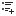</a> | **📂 檔名:** `mail-message-new-list.svg` ✨ **格式:** `Vector (SVG)` ⚖️ **大小:** `859.00B` 📅 **更新:** `2026-03-04`  🚀 **jsDelivr Markdown:** `` 🔗 **直接連結 (Url):** <code>https://cdn.jsdelivr.net/gh/barry028/materials@main/images/iCons/Pixel/Breeze/Actions%20/16/mail-message-new-list.svg</code> 📥 [檢視原始檔](mail-message-new-list.svg) |
|  | **📂 檔名:** `mail-message-new.svg` ✨ **格式:** `Vector (SVG)` ⚖️ **大小:** `714.00B` 📅 **更新:** `2026-03-04`  🚀 **jsDelivr Markdown:** `` 🔗 **直接連結 (Url):** <code>https://cdn.jsdelivr.net/gh/barry028/materials@main/images/iCons/Pixel/Breeze/Actions%20/16/mail-message-new.svg</code> 📥 [檢視原始檔](mail-message-new.svg) |
|  | **📂 檔名:** `mail-queue.svg` ✨ **格式:** `Vector (SVG)` ⚖️ **大小:** `906.00B` 📅 **更新:** `2026-03-04`  🚀 **jsDelivr Markdown:** `` 🔗 **直接連結 (Url):** <code>https://cdn.jsdelivr.net/gh/barry028/materials@main/images/iCons/Pixel/Breeze/Actions%20/16/mail-queue.svg</code> 📥 [檢視原始檔](mail-queue.svg) |
|  | **📂 檔名:** `mail-receive.svg` ✨ **格式:** `Vector (SVG)` ⚖️ **大小:** `741.00B` 📅 **更新:** `2026-03-04`  🚀 **jsDelivr Markdown:** `` 🔗 **直接連結 (Url):** <code>https://cdn.jsdelivr.net/gh/barry028/materials@main/images/iCons/Pixel/Breeze/Actions%20/16/mail-receive.svg</code> 📥 [檢視原始檔](mail-receive.svg) |
|  | **📂 檔名:** `mail-reply-author.svg` ✨ **格式:** `Vector (SVG)` ⚖️ **大小:** `694.00B` 📅 **更新:** `2026-03-04`  🚀 **jsDelivr Markdown:** `` 🔗 **直接連結 (Url):** <code>https://cdn.jsdelivr.net/gh/barry028/materials@main/images/iCons/Pixel/Breeze/Actions%20/16/mail-reply-author.svg</code> 📥 [檢視原始檔](mail-reply-author.svg) |
|  | **📂 檔名:** `mail-reply-custom-all.svg` ✨ **格式:** `Vector (SVG)` ⚖️ **大小:** `767.00B` 📅 **更新:** `2026-03-04`  🚀 **jsDelivr Markdown:** `` 🔗 **直接連結 (Url):** <code>https://cdn.jsdelivr.net/gh/barry028/materials@main/images/iCons/Pixel/Breeze/Actions%20/16/mail-reply-custom-all.svg</code> 📥 [檢視原始檔](mail-reply-custom-all.svg) |
|  | **📂 檔名:** `mail-reply-custom.svg` ✨ **格式:** `Vector (SVG)` ⚖️ **大小:** `702.00B` 📅 **更新:** `2026-03-04`  🚀 **jsDelivr Markdown:** `` 🔗 **直接連結 (Url):** <code>https://cdn.jsdelivr.net/gh/barry028/materials@main/images/iCons/Pixel/Breeze/Actions%20/16/mail-reply-custom.svg</code> 📥 [檢視原始檔](mail-reply-custom.svg) |
|  | **📂 檔名:** `mail-reply-list.svg` ✨ **格式:** `Vector (SVG)` ⚖️ **大小:** `612.00B` 📅 **更新:** `2026-03-04`  🚀 **jsDelivr Markdown:** `` 🔗 **直接連結 (Url):** <code>https://cdn.jsdelivr.net/gh/barry028/materials@main/images/iCons/Pixel/Breeze/Actions%20/16/mail-reply-list.svg</code> 📥 [檢視原始檔](mail-reply-list.svg) |
|  | **📂 檔名:** `mail-reply-sender.svg` ✨ **格式:** `Vector (SVG)` ⚖️ **大小:** `378.00B` 📅 **更新:** `2026-03-04`  🚀 **jsDelivr Markdown:** `` 🔗 **直接連結 (Url):** <code>https://cdn.jsdelivr.net/gh/barry028/materials@main/images/iCons/Pixel/Breeze/Actions%20/16/mail-reply-sender.svg</code> 📥 [檢視原始檔](mail-reply-sender.svg) |
|  | **📂 檔名:** `mail-signature-unknown.svg` ✨ **格式:** `Vector (SVG)` ⚖️ **大小:** `730.00B` 📅 **更新:** `2026-03-04`  🚀 **jsDelivr Markdown:** `` 🔗 **直接連結 (Url):** <code>https://cdn.jsdelivr.net/gh/barry028/materials@main/images/iCons/Pixel/Breeze/Actions%20/16/mail-signature-unknown.svg</code> 📥 [檢視原始檔](mail-signature-unknown.svg) |
|  | **📂 檔名:** `mail-signed-full.svg` ✨ **格式:** `Vector (SVG)` ⚖️ **大小:** `669.00B` 📅 **更新:** `2026-03-04`  🚀 **jsDelivr Markdown:** `` 🔗 **直接連結 (Url):** <code>https://cdn.jsdelivr.net/gh/barry028/materials@main/images/iCons/Pixel/Breeze/Actions%20/16/mail-signed-full.svg</code> 📥 [檢視原始檔](mail-signed-full.svg) |
|  | **📂 檔名:** `mail-signed-part.svg` ✨ **格式:** `Vector (SVG)` ⚖️ **大小:** `731.00B` 📅 **更新:** `2026-03-04`  🚀 **jsDelivr Markdown:** `` 🔗 **直接連結 (Url):** <code>https://cdn.jsdelivr.net/gh/barry028/materials@main/images/iCons/Pixel/Breeze/Actions%20/16/mail-signed-part.svg</code> 📥 [檢視原始檔](mail-signed-part.svg) |
|  | **📂 檔名:** `mail-tagged.svg` ✨ **格式:** `Vector (SVG)` ⚖️ **大小:** `686.00B` 📅 **更新:** `2026-03-04`  🚀 **jsDelivr Markdown:** `` 🔗 **直接連結 (Url):** <code>https://cdn.jsdelivr.net/gh/barry028/materials@main/images/iCons/Pixel/Breeze/Actions%20/16/mail-tagged.svg</code> 📥 [檢視原始檔](mail-tagged.svg) |
|  | **📂 檔名:** `markasblank.svg` ✨ **格式:** `Vector (SVG)` ⚖️ **大小:** `579.00B` 📅 **更新:** `2026-03-04`  🚀 **jsDelivr Markdown:** `` 🔗 **直接連結 (Url):** <code>https://cdn.jsdelivr.net/gh/barry028/materials@main/images/iCons/Pixel/Breeze/Actions%20/16/markasblank.svg</code> 📥 [檢視原始檔](markasblank.svg) |
|  | **📂 檔名:** `measure.svg` ✨ **格式:** `Vector (SVG)` ⚖️ **大小:** `570.00B` 📅 **更新:** `2026-03-04`  🚀 **jsDelivr Markdown:** `` 🔗 **直接連結 (Url):** <code>https://cdn.jsdelivr.net/gh/barry028/materials@main/images/iCons/Pixel/Breeze/Actions%20/16/measure.svg</code> 📥 [檢視原始檔](measure.svg) |
|  | **📂 檔名:** `media-album-cover-manager-amarok.svg` ✨ **格式:** `Vector (SVG)` ⚖️ **大小:** `366.00B` 📅 **更新:** `2026-03-04`  🚀 **jsDelivr Markdown:** `` 🔗 **直接連結 (Url):** <code>https://cdn.jsdelivr.net/gh/barry028/materials@main/images/iCons/Pixel/Breeze/Actions%20/16/media-album-cover-manager-amarok.svg</code> 📥 [檢視原始檔](media-album-cover-manager-amarok.svg) |
|  | **📂 檔名:** `media-album-track.svg` ✨ **格式:** `Vector (SVG)` ⚖️ **大小:** `611.00B` 📅 **更新:** `2026-03-04`  🚀 **jsDelivr Markdown:** `` 🔗 **直接連結 (Url):** <code>https://cdn.jsdelivr.net/gh/barry028/materials@main/images/iCons/Pixel/Breeze/Actions%20/16/media-album-track.svg</code> 📥 [檢視原始檔](media-album-track.svg) |
|  | **📂 檔名:** `media-eject.svg` ✨ **格式:** `Vector (SVG)` ⚖️ **大小:** `289.00B` 📅 **更新:** `2026-03-04`  🚀 **jsDelivr Markdown:** `` 🔗 **直接連結 (Url):** <code>https://cdn.jsdelivr.net/gh/barry028/materials@main/images/iCons/Pixel/Breeze/Actions%20/16/media-eject.svg</code> 📥 [檢視原始檔](media-eject.svg) |
|  | **📂 檔名:** `media-mount.svg` ✨ **格式:** `Vector (SVG)` ⚖️ **大小:** `289.00B` 📅 **更新:** `2026-03-04`  🚀 **jsDelivr Markdown:** `` 🔗 **直接連結 (Url):** <code>https://cdn.jsdelivr.net/gh/barry028/materials@main/images/iCons/Pixel/Breeze/Actions%20/16/media-mount.svg</code> 📥 [檢視原始檔](media-mount.svg) |
|  | **📂 檔名:** `media-playback-pause.svg` ✨ **格式:** `Vector (SVG)` ⚖️ **大小:** `290.00B` 📅 **更新:** `2026-03-04`  🚀 **jsDelivr Markdown:** `` 🔗 **直接連結 (Url):** <code>https://cdn.jsdelivr.net/gh/barry028/materials@main/images/iCons/Pixel/Breeze/Actions%20/16/media-playback-pause.svg</code> 📥 [檢視原始檔](media-playback-pause.svg) |
|  | **📂 檔名:** `media-playback-start.svg` ✨ **格式:** `Vector (SVG)` ⚖️ **大小:** `275.00B` 📅 **更新:** `2026-03-04`  🚀 **jsDelivr Markdown:** `` 🔗 **直接連結 (Url):** <code>https://cdn.jsdelivr.net/gh/barry028/materials@main/images/iCons/Pixel/Breeze/Actions%20/16/media-playback-start.svg</code> 📥 [檢視原始檔](media-playback-start.svg) |
|  | **📂 檔名:** `media-playback-stop.svg` ✨ **格式:** `Vector (SVG)` ⚖️ **大小:** `277.00B` 📅 **更新:** `2026-03-04`  🚀 **jsDelivr Markdown:** `` 🔗 **直接連結 (Url):** <code>https://cdn.jsdelivr.net/gh/barry028/materials@main/images/iCons/Pixel/Breeze/Actions%20/16/media-playback-stop.svg</code> 📥 [檢視原始檔](media-playback-stop.svg) |
| <a href="media-playlist-append.svg">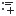</a> | **📂 檔名:** `media-playlist-append.svg` ✨ **格式:** `Vector (SVG)` ⚖️ **大小:** `674.00B` 📅 **更新:** `2026-03-04`  🚀 **jsDelivr Markdown:** `` 🔗 **直接連結 (Url):** <code>https://cdn.jsdelivr.net/gh/barry028/materials@main/images/iCons/Pixel/Breeze/Actions%20/16/media-playlist-append.svg</code> 📥 [檢視原始檔](media-playlist-append.svg) |
|  | **📂 檔名:** `media-playlist-play.svg` ✨ **格式:** `Vector (SVG)` ⚖️ **大小:** `665.00B` 📅 **更新:** `2026-03-04`  🚀 **jsDelivr Markdown:** `` 🔗 **直接連結 (Url):** <code>https://cdn.jsdelivr.net/gh/barry028/materials@main/images/iCons/Pixel/Breeze/Actions%20/16/media-playlist-play.svg</code> 📥 [檢視原始檔](media-playlist-play.svg) |
|  | **📂 檔名:** `media-playlist-shuffle.svg` ✨ **格式:** `Vector (SVG)` ⚖️ **大小:** `644.00B` 📅 **更新:** `2026-03-04`  🚀 **jsDelivr Markdown:** `` 🔗 **直接連結 (Url):** <code>https://cdn.jsdelivr.net/gh/barry028/materials@main/images/iCons/Pixel/Breeze/Actions%20/16/media-playlist-shuffle.svg</code> 📥 [檢視原始檔](media-playlist-shuffle.svg) |
|  | **📂 檔名:** `media-random-albums-amarok.svg` ✨ **格式:** `Vector (SVG)` ⚖️ **大小:** `697.00B` 📅 **更新:** `2026-03-04`  🚀 **jsDelivr Markdown:** `` 🔗 **直接連結 (Url):** <code>https://cdn.jsdelivr.net/gh/barry028/materials@main/images/iCons/Pixel/Breeze/Actions%20/16/media-random-albums-amarok.svg</code> 📥 [檢視原始檔](media-random-albums-amarok.svg) |
| <a href="media-random-tracks-amarok.svg">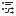</a> | **📂 檔名:** `media-random-tracks-amarok.svg` ✨ **格式:** `Vector (SVG)` ⚖️ **大小:** `880.00B` 📅 **更新:** `2026-03-04`  🚀 **jsDelivr Markdown:** `` 🔗 **直接連結 (Url):** <code>https://cdn.jsdelivr.net/gh/barry028/materials@main/images/iCons/Pixel/Breeze/Actions%20/16/media-random-tracks-amarok.svg</code> 📥 [檢視原始檔](media-random-tracks-amarok.svg) |
|  | **📂 檔名:** `media-record.svg` ✨ **格式:** `Vector (SVG)` ⚖️ **大小:** `164.00B` 📅 **更新:** `2026-03-04`  🚀 **jsDelivr Markdown:** `` 🔗 **直接連結 (Url):** <code>https://cdn.jsdelivr.net/gh/barry028/materials@main/images/iCons/Pixel/Breeze/Actions%20/16/media-record.svg</code> 📥 [檢視原始檔](media-record.svg) |
|  | **📂 檔名:** `media-repeat-album-amarok.svg` ✨ **格式:** `Vector (SVG)` ⚖️ **大小:** `635.00B` 📅 **更新:** `2026-03-04`  🚀 **jsDelivr Markdown:** `` 🔗 **直接連結 (Url):** <code>https://cdn.jsdelivr.net/gh/barry028/materials@main/images/iCons/Pixel/Breeze/Actions%20/16/media-repeat-album-amarok.svg</code> 📥 [檢視原始檔](media-repeat-album-amarok.svg) |
|  | **📂 檔名:** `media-repeat-none.svg` ✨ **格式:** `Vector (SVG)` ⚖️ **大小:** `788.00B` 📅 **更新:** `2026-03-04`  🚀 **jsDelivr Markdown:** `` 🔗 **直接連結 (Url):** <code>https://cdn.jsdelivr.net/gh/barry028/materials@main/images/iCons/Pixel/Breeze/Actions%20/16/media-repeat-none.svg</code> 📥 [檢視原始檔](media-repeat-none.svg) |
|  | **📂 檔名:** `media-repeat-playlist-amarok.svg` ✨ **格式:** `Vector (SVG)` ⚖️ **大小:** `818.00B` 📅 **更新:** `2026-03-04`  🚀 **jsDelivr Markdown:** `` 🔗 **直接連結 (Url):** <code>https://cdn.jsdelivr.net/gh/barry028/materials@main/images/iCons/Pixel/Breeze/Actions%20/16/media-repeat-playlist-amarok.svg</code> 📥 [檢視原始檔](media-repeat-playlist-amarok.svg) |
| <a href="media-repeat-single.svg">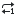</a> | **📂 檔名:** `media-repeat-single.svg` ✨ **格式:** `Vector (SVG)` ⚖️ **大小:** `496.00B` 📅 **更新:** `2026-03-04`  🚀 **jsDelivr Markdown:** `` 🔗 **直接連結 (Url):** <code>https://cdn.jsdelivr.net/gh/barry028/materials@main/images/iCons/Pixel/Breeze/Actions%20/16/media-repeat-single.svg</code> 📥 [檢視原始檔](media-repeat-single.svg) |
|  | **📂 檔名:** `media-seek-forward.svg` ✨ **格式:** `Vector (SVG)` ⚖️ **大小:** `287.00B` 📅 **更新:** `2026-03-04`  🚀 **jsDelivr Markdown:** `` 🔗 **直接連結 (Url):** <code>https://cdn.jsdelivr.net/gh/barry028/materials@main/images/iCons/Pixel/Breeze/Actions%20/16/media-seek-forward.svg</code> 📥 [檢視原始檔](media-seek-forward.svg) |
|  | **📂 檔名:** `media-skip-backward.svg` ✨ **格式:** `Vector (SVG)` ⚖️ **大小:** `322.00B` 📅 **更新:** `2026-03-04`  🚀 **jsDelivr Markdown:** `` 🔗 **直接連結 (Url):** <code>https://cdn.jsdelivr.net/gh/barry028/materials@main/images/iCons/Pixel/Breeze/Actions%20/16/media-skip-backward.svg</code> 📥 [檢視原始檔](media-skip-backward.svg) |
|  | **📂 檔名:** `media-skip-forward.svg` ✨ **格式:** `Vector (SVG)` ⚖️ **大小:** `304.00B` 📅 **更新:** `2026-03-04`  🚀 **jsDelivr Markdown:** `` 🔗 **直接連結 (Url):** <code>https://cdn.jsdelivr.net/gh/barry028/materials@main/images/iCons/Pixel/Breeze/Actions%20/16/media-skip-forward.svg</code> 📥 [檢視原始檔](media-skip-forward.svg) |
|  | **📂 檔名:** `media-track-queue-amarok.svg` ✨ **格式:** `Vector (SVG)` ⚖️ **大小:** `876.00B` 📅 **更新:** `2026-03-04`  🚀 **jsDelivr Markdown:** `` 🔗 **直接連結 (Url):** <code>https://cdn.jsdelivr.net/gh/barry028/materials@main/images/iCons/Pixel/Breeze/Actions%20/16/media-track-queue-amarok.svg</code> 📥 [檢視原始檔](media-track-queue-amarok.svg) |
|  | **📂 檔名:** `media-track-show-active.svg` ✨ **格式:** `Vector (SVG)` ⚖️ **大小:** `917.00B` 📅 **更新:** `2026-03-04`  🚀 **jsDelivr Markdown:** `` 🔗 **直接連結 (Url):** <code>https://cdn.jsdelivr.net/gh/barry028/materials@main/images/iCons/Pixel/Breeze/Actions%20/16/media-track-show-active.svg</code> 📥 [檢視原始檔](media-track-show-active.svg) |
|  | **📂 檔名:** `media-view-subtitles-symbolic.svg` ✨ **格式:** `Vector (SVG)` ⚖️ **大小:** `2.14KB` 📅 **更新:** `2026-03-04`  🚀 **jsDelivr Markdown:** `` 🔗 **直接連結 (Url):** <code>https://cdn.jsdelivr.net/gh/barry028/materials@main/images/iCons/Pixel/Breeze/Actions%20/16/media-view-subtitles-symbolic.svg</code> 📥 [檢視原始檔](media-view-subtitles-symbolic.svg) |
|  | **📂 檔名:** `meeting-attending-tentative.svg` ✨ **格式:** `Vector (SVG)` ⚖️ **大小:** `918.00B` 📅 **更新:** `2026-03-04`  🚀 **jsDelivr Markdown:** `` 🔗 **直接連結 (Url):** <code>https://cdn.jsdelivr.net/gh/barry028/materials@main/images/iCons/Pixel/Breeze/Actions%20/16/meeting-attending-tentative.svg</code> 📥 [檢視原始檔](meeting-attending-tentative.svg) |
|  | **📂 檔名:** `meeting-participant-request-response.svg` ✨ **格式:** `Vector (SVG)` ⚖️ **大小:** `1.12KB` 📅 **更新:** `2026-03-04`  🚀 **jsDelivr Markdown:** `` 🔗 **直接連結 (Url):** <code>https://cdn.jsdelivr.net/gh/barry028/materials@main/images/iCons/Pixel/Breeze/Actions%20/16/meeting-participant-request-response.svg</code> 📥 [檢視原始檔](meeting-participant-request-response.svg) |
|  | **📂 檔名:** `merge.svg` ✨ **格式:** `Vector (SVG)` ⚖️ **大小:** `405.00B` 📅 **更新:** `2026-03-04`  🚀 **jsDelivr Markdown:** `` 🔗 **直接連結 (Url):** <code>https://cdn.jsdelivr.net/gh/barry028/materials@main/images/iCons/Pixel/Breeze/Actions%20/16/merge.svg</code> 📥 [檢視原始檔](merge.svg) |
|  | **📂 檔名:** `mergecell-horizontal.svg` ✨ **格式:** `Vector (SVG)` ⚖️ **大小:** `701.00B` 📅 **更新:** `2026-03-04`  🚀 **jsDelivr Markdown:** `` 🔗 **直接連結 (Url):** <code>https://cdn.jsdelivr.net/gh/barry028/materials@main/images/iCons/Pixel/Breeze/Actions%20/16/mergecell-horizontal.svg</code> 📥 [檢視原始檔](mergecell-horizontal.svg) |
|  | **📂 檔名:** `mergecell-vertical.svg` ✨ **格式:** `Vector (SVG)` ⚖️ **大小:** `701.00B` 📅 **更新:** `2026-03-04`  🚀 **jsDelivr Markdown:** `` 🔗 **直接連結 (Url):** <code>https://cdn.jsdelivr.net/gh/barry028/materials@main/images/iCons/Pixel/Breeze/Actions%20/16/mergecell-vertical.svg</code> 📥 [檢視原始檔](mergecell-vertical.svg) |
|  | **📂 檔名:** `messagebox_warning.svg` ✨ **格式:** `Vector (SVG)` ⚖️ **大小:** `633.00B` 📅 **更新:** `2026-03-04`  🚀 **jsDelivr Markdown:** `` 🔗 **直接連結 (Url):** <code>https://cdn.jsdelivr.net/gh/barry028/materials@main/images/iCons/Pixel/Breeze/Actions%20/16/messagebox_warning.svg</code> 📥 [檢視原始檔](messagebox_warning.svg) |
|  | **📂 檔名:** `milestone.svg` ✨ **格式:** `Vector (SVG)` ⚖️ **大小:** `605.00B` 📅 **更新:** `2026-03-04`  🚀 **jsDelivr Markdown:** `` 🔗 **直接連結 (Url):** <code>https://cdn.jsdelivr.net/gh/barry028/materials@main/images/iCons/Pixel/Breeze/Actions%20/16/milestone.svg</code> 📥 [檢視原始檔](milestone.svg) |
|  | **📂 檔名:** `minuet-chords.svg` ✨ **格式:** `Vector (SVG)` ⚖️ **大小:** `2.64KB` 📅 **更新:** `2026-03-04`  🚀 **jsDelivr Markdown:** `` 🔗 **直接連結 (Url):** <code>https://cdn.jsdelivr.net/gh/barry028/materials@main/images/iCons/Pixel/Breeze/Actions%20/16/minuet-chords.svg</code> 📥 [檢視原始檔](minuet-chords.svg) |
|  | **📂 檔名:** `minuet-intervals.svg` ✨ **格式:** `Vector (SVG)` ⚖️ **大小:** `2.43KB` 📅 **更新:** `2026-03-04`  🚀 **jsDelivr Markdown:** `` 🔗 **直接連結 (Url):** <code>https://cdn.jsdelivr.net/gh/barry028/materials@main/images/iCons/Pixel/Breeze/Actions%20/16/minuet-intervals.svg</code> 📥 [檢視原始檔](minuet-intervals.svg) |
|  | **📂 檔名:** `minuet-rhythms.svg` ✨ **格式:** `Vector (SVG)` ⚖️ **大小:** `1.25KB` 📅 **更新:** `2026-03-04`  🚀 **jsDelivr Markdown:** `` 🔗 **直接連結 (Url):** <code>https://cdn.jsdelivr.net/gh/barry028/materials@main/images/iCons/Pixel/Breeze/Actions%20/16/minuet-rhythms.svg</code> 📥 [檢視原始檔](minuet-rhythms.svg) |
|  | **📂 檔名:** `minuet-scales.svg` ✨ **格式:** `Vector (SVG)` ⚖️ **大小:** `1.86KB` 📅 **更新:** `2026-03-04`  🚀 **jsDelivr Markdown:** `` 🔗 **直接連結 (Url):** <code>https://cdn.jsdelivr.net/gh/barry028/materials@main/images/iCons/Pixel/Breeze/Actions%20/16/minuet-scales.svg</code> 📥 [檢視原始檔](minuet-scales.svg) |
|  | **📂 檔名:** `mode1.svg` ✨ **格式:** `Vector (SVG)` ⚖️ **大小:** `875.00B` 📅 **更新:** `2026-03-04`  🚀 **jsDelivr Markdown:** `` 🔗 **直接連結 (Url):** <code>https://cdn.jsdelivr.net/gh/barry028/materials@main/images/iCons/Pixel/Breeze/Actions%20/16/mode1.svg</code> 📥 [檢視原始檔](mode1.svg) |
|  | **📂 檔名:** `mode2.svg` ✨ **格式:** `Vector (SVG)` ⚖️ **大小:** `878.00B` 📅 **更新:** `2026-03-04`  🚀 **jsDelivr Markdown:** `` 🔗 **直接連結 (Url):** <code>https://cdn.jsdelivr.net/gh/barry028/materials@main/images/iCons/Pixel/Breeze/Actions%20/16/mode2.svg</code> 📥 [檢視原始檔](mode2.svg) |
|  | **📂 檔名:** `mode3.svg` ✨ **格式:** `Vector (SVG)` ⚖️ **大小:** `933.00B` 📅 **更新:** `2026-03-04`  🚀 **jsDelivr Markdown:** `` 🔗 **直接連結 (Url):** <code>https://cdn.jsdelivr.net/gh/barry028/materials@main/images/iCons/Pixel/Breeze/Actions%20/16/mode3.svg</code> 📥 [檢視原始檔](mode3.svg) |
|  | **📂 檔名:** `mode5.svg` ✨ **格式:** `Vector (SVG)` ⚖️ **大小:** `928.00B` 📅 **更新:** `2026-03-04`  🚀 **jsDelivr Markdown:** `` 🔗 **直接連結 (Url):** <code>https://cdn.jsdelivr.net/gh/barry028/materials@main/images/iCons/Pixel/Breeze/Actions%20/16/mode5.svg</code> 📥 [檢視原始檔](mode5.svg) |
|  | **📂 檔名:** `network-connect.svg` ✨ **格式:** `Vector (SVG)` ⚖️ **大小:** `586.00B` 📅 **更新:** `2026-03-04`  🚀 **jsDelivr Markdown:** `` 🔗 **直接連結 (Url):** <code>https://cdn.jsdelivr.net/gh/barry028/materials@main/images/iCons/Pixel/Breeze/Actions%20/16/network-connect.svg</code> 📥 [檢視原始檔](network-connect.svg) |
|  | **📂 檔名:** `network-disconnect.svg` ✨ **格式:** `Vector (SVG)` ⚖️ **大小:** `1.00KB` 📅 **更新:** `2026-03-04`  🚀 **jsDelivr Markdown:** `` 🔗 **直接連結 (Url):** <code>https://cdn.jsdelivr.net/gh/barry028/materials@main/images/iCons/Pixel/Breeze/Actions%20/16/network-disconnect.svg</code> 📥 [檢視原始檔](network-disconnect.svg) |
|  | **📂 檔名:** `new-audio-alarm.svg` ✨ **格式:** `Vector (SVG)` ⚖️ **大小:** `541.00B` 📅 **更新:** `2026-03-04`  🚀 **jsDelivr Markdown:** `` 🔗 **直接連結 (Url):** <code>https://cdn.jsdelivr.net/gh/barry028/materials@main/images/iCons/Pixel/Breeze/Actions%20/16/new-audio-alarm.svg</code> 📥 [檢視原始檔](new-audio-alarm.svg) |
|  | **📂 檔名:** `news-subscribe.svg` ✨ **格式:** `Vector (SVG)` ⚖️ **大小:** `415.00B` 📅 **更新:** `2026-03-04`  🚀 **jsDelivr Markdown:** `` 🔗 **直接連結 (Url):** <code>https://cdn.jsdelivr.net/gh/barry028/materials@main/images/iCons/Pixel/Breeze/Actions%20/16/news-subscribe.svg</code> 📥 [檢視原始檔](news-subscribe.svg) |
|  | **📂 檔名:** `news-unsubscribe.svg` ✨ **格式:** `Vector (SVG)` ⚖️ **大小:** `617.00B` 📅 **更新:** `2026-03-04`  🚀 **jsDelivr Markdown:** `` 🔗 **直接連結 (Url):** <code>https://cdn.jsdelivr.net/gh/barry028/materials@main/images/iCons/Pixel/Breeze/Actions%20/16/news-unsubscribe.svg</code> 📥 [檢視原始檔](news-unsubscribe.svg) |
|  | **📂 檔名:** `node-segment-curve.svg` ✨ **格式:** `Vector (SVG)` ⚖️ **大小:** `741.00B` 📅 **更新:** `2026-03-04`  🚀 **jsDelivr Markdown:** `` 🔗 **直接連結 (Url):** <code>https://cdn.jsdelivr.net/gh/barry028/materials@main/images/iCons/Pixel/Breeze/Actions%20/16/node-segment-curve.svg</code> 📥 [檢視原始檔](node-segment-curve.svg) |
|  | **📂 檔名:** `node-segment-line.svg` ✨ **格式:** `Vector (SVG)` ⚖️ **大小:** `751.00B` 📅 **更新:** `2026-03-04`  🚀 **jsDelivr Markdown:** `` 🔗 **直接連結 (Url):** <code>https://cdn.jsdelivr.net/gh/barry028/materials@main/images/iCons/Pixel/Breeze/Actions%20/16/node-segment-line.svg</code> 📥 [檢視原始檔](node-segment-line.svg) |
|  | **📂 檔名:** `node-transform.svg` ✨ **格式:** `Vector (SVG)` ⚖️ **大小:** `1.04KB` 📅 **更新:** `2026-03-04`  🚀 **jsDelivr Markdown:** `` 🔗 **直接連結 (Url):** <code>https://cdn.jsdelivr.net/gh/barry028/materials@main/images/iCons/Pixel/Breeze/Actions%20/16/node-transform.svg</code> 📥 [檢視原始檔](node-transform.svg) |
|  | **📂 檔名:** `node-type-cusp.svg` ✨ **格式:** `Vector (SVG)` ⚖️ **大小:** `1.02KB` 📅 **更新:** `2026-03-04`  🚀 **jsDelivr Markdown:** `` 🔗 **直接連結 (Url):** <code>https://cdn.jsdelivr.net/gh/barry028/materials@main/images/iCons/Pixel/Breeze/Actions%20/16/node-type-cusp.svg</code> 📥 [檢視原始檔](node-type-cusp.svg) |
|  | **📂 檔名:** `node-type-symmetric.svg` ✨ **格式:** `Vector (SVG)` ⚖️ **大小:** `1.42KB` 📅 **更新:** `2026-03-04`  🚀 **jsDelivr Markdown:** `` 🔗 **直接連結 (Url):** <code>https://cdn.jsdelivr.net/gh/barry028/materials@main/images/iCons/Pixel/Breeze/Actions%20/16/node-type-symmetric.svg</code> 📥 [檢視原始檔](node-type-symmetric.svg) |
|  | **📂 檔名:** `node.svg` ✨ **格式:** `Vector (SVG)` ⚖️ **大小:** `982.00B` 📅 **更新:** `2026-03-04`  🚀 **jsDelivr Markdown:** `` 🔗 **直接連結 (Url):** <code>https://cdn.jsdelivr.net/gh/barry028/materials@main/images/iCons/Pixel/Breeze/Actions%20/16/node.svg</code> 📥 [檢視原始檔](node.svg) |
|  | **📂 檔名:** `notifications-disabled.svg` ✨ **格式:** `Vector (SVG)` ⚖️ **大小:** `1.13KB` 📅 **更新:** `2026-03-04`  🚀 **jsDelivr Markdown:** `` 🔗 **直接連結 (Url):** <code>https://cdn.jsdelivr.net/gh/barry028/materials@main/images/iCons/Pixel/Breeze/Actions%20/16/notifications-disabled.svg</code> 📥 [檢視原始檔](notifications-disabled.svg) |
|  | **📂 檔名:** `object-columns.svg` ✨ **格式:** `Vector (SVG)` ⚖️ **大小:** `552.00B` 📅 **更新:** `2026-03-04`  🚀 **jsDelivr Markdown:** `` 🔗 **直接連結 (Url):** <code>https://cdn.jsdelivr.net/gh/barry028/materials@main/images/iCons/Pixel/Breeze/Actions%20/16/object-columns.svg</code> 📥 [檢視原始檔](object-columns.svg) |
|  | **📂 檔名:** `object-flip-vertical.svg` ✨ **格式:** `Vector (SVG)` ⚖️ **大小:** `716.00B` 📅 **更新:** `2026-03-04`  🚀 **jsDelivr Markdown:** `` 🔗 **直接連結 (Url):** <code>https://cdn.jsdelivr.net/gh/barry028/materials@main/images/iCons/Pixel/Breeze/Actions%20/16/object-flip-vertical.svg</code> 📥 [檢視原始檔](object-flip-vertical.svg) |
|  | **📂 檔名:** `object-group.svg` ✨ **格式:** `Vector (SVG)` ⚖️ **大小:** `619.00B` 📅 **更新:** `2026-03-04`  🚀 **jsDelivr Markdown:** `` 🔗 **直接連結 (Url):** <code>https://cdn.jsdelivr.net/gh/barry028/materials@main/images/iCons/Pixel/Breeze/Actions%20/16/object-group.svg</code> 📥 [檢視原始檔](object-group.svg) |
|  | **📂 檔名:** `object-order-back.svg` ✨ **格式:** `Vector (SVG)` ⚖️ **大小:** `757.00B` 📅 **更新:** `2026-03-04`  🚀 **jsDelivr Markdown:** `` 🔗 **直接連結 (Url):** <code>https://cdn.jsdelivr.net/gh/barry028/materials@main/images/iCons/Pixel/Breeze/Actions%20/16/object-order-back.svg</code> 📥 [檢視原始檔](object-order-back.svg) |
|  | **📂 檔名:** `object-order-front.svg` ✨ **格式:** `Vector (SVG)` ⚖️ **大小:** `773.00B` 📅 **更新:** `2026-03-04`  🚀 **jsDelivr Markdown:** `` 🔗 **直接連結 (Url):** <code>https://cdn.jsdelivr.net/gh/barry028/materials@main/images/iCons/Pixel/Breeze/Actions%20/16/object-order-front.svg</code> 📥 [檢視原始檔](object-order-front.svg) |
|  | **📂 檔名:** `object-order-lower.svg` ✨ **格式:** `Vector (SVG)` ⚖️ **大小:** `711.00B` 📅 **更新:** `2026-03-04`  🚀 **jsDelivr Markdown:** `` 🔗 **直接連結 (Url):** <code>https://cdn.jsdelivr.net/gh/barry028/materials@main/images/iCons/Pixel/Breeze/Actions%20/16/object-order-lower.svg</code> 📥 [檢視原始檔](object-order-lower.svg) |
|  | **📂 檔名:** `object-order-raise.svg` ✨ **格式:** `Vector (SVG)` ⚖️ **大小:** `773.00B` 📅 **更新:** `2026-03-04`  🚀 **jsDelivr Markdown:** `` 🔗 **直接連結 (Url):** <code>https://cdn.jsdelivr.net/gh/barry028/materials@main/images/iCons/Pixel/Breeze/Actions%20/16/object-order-raise.svg</code> 📥 [檢視原始檔](object-order-raise.svg) |
|  | **📂 檔名:** `object-rotate-left.svg` ✨ **格式:** `Vector (SVG)` ⚖️ **大小:** `1.19KB` 📅 **更新:** `2026-03-04`  🚀 **jsDelivr Markdown:** `` 🔗 **直接連結 (Url):** <code>https://cdn.jsdelivr.net/gh/barry028/materials@main/images/iCons/Pixel/Breeze/Actions%20/16/object-rotate-left.svg</code> 📥 [檢視原始檔](object-rotate-left.svg) |
|  | **📂 檔名:** `object-rows.svg` ✨ **格式:** `Vector (SVG)` ⚖️ **大小:** `552.00B` 📅 **更新:** `2026-03-04`  🚀 **jsDelivr Markdown:** `` 🔗 **直接連結 (Url):** <code>https://cdn.jsdelivr.net/gh/barry028/materials@main/images/iCons/Pixel/Breeze/Actions%20/16/object-rows.svg</code> 📥 [檢視原始檔](object-rows.svg) |
|  | **📂 檔名:** `object-stroke-style.svg` ✨ **格式:** `Vector (SVG)` ⚖️ **大小:** `776.00B` 📅 **更新:** `2026-03-04`  🚀 **jsDelivr Markdown:** `` 🔗 **直接連結 (Url):** <code>https://cdn.jsdelivr.net/gh/barry028/materials@main/images/iCons/Pixel/Breeze/Actions%20/16/object-stroke-style.svg</code> 📥 [檢視原始檔](object-stroke-style.svg) |
|  | **📂 檔名:** `object-to-path.svg` ✨ **格式:** `Vector (SVG)` ⚖️ **大小:** `1.20KB` 📅 **更新:** `2026-03-04`  🚀 **jsDelivr Markdown:** `` 🔗 **直接連結 (Url):** <code>https://cdn.jsdelivr.net/gh/barry028/materials@main/images/iCons/Pixel/Breeze/Actions%20/16/object-to-path.svg</code> 📥 [檢視原始檔](object-to-path.svg) |
|  | **📂 檔名:** `object-ungroup.svg` ✨ **格式:** `Vector (SVG)` ⚖️ **大小:** `745.00B` 📅 **更新:** `2026-03-04`  🚀 **jsDelivr Markdown:** `` 🔗 **直接連結 (Url):** <code>https://cdn.jsdelivr.net/gh/barry028/materials@main/images/iCons/Pixel/Breeze/Actions%20/16/object-ungroup.svg</code> 📥 [檢視原始檔](object-ungroup.svg) |
|  | **📂 檔名:** `office-chart-area-percentage.svg` ✨ **格式:** `Vector (SVG)` ⚖️ **大小:** `1.33KB` 📅 **更新:** `2026-03-04`  🚀 **jsDelivr Markdown:** `` 🔗 **直接連結 (Url):** <code>https://cdn.jsdelivr.net/gh/barry028/materials@main/images/iCons/Pixel/Breeze/Actions%20/16/office-chart-area-percentage.svg</code> 📥 [檢視原始檔](office-chart-area-percentage.svg) |
|  | **📂 檔名:** `office-chart-area-stacked.svg` ✨ **格式:** `Vector (SVG)` ⚖️ **大小:** `1.30KB` 📅 **更新:** `2026-03-04`  🚀 **jsDelivr Markdown:** `` 🔗 **直接連結 (Url):** <code>https://cdn.jsdelivr.net/gh/barry028/materials@main/images/iCons/Pixel/Breeze/Actions%20/16/office-chart-area-stacked.svg</code> 📥 [檢視原始檔](office-chart-area-stacked.svg) |
|  | **📂 檔名:** `office-chart-area.svg` ✨ **格式:** `Vector (SVG)` ⚖️ **大小:** `1.40KB` 📅 **更新:** `2026-03-04`  🚀 **jsDelivr Markdown:** `` 🔗 **直接連結 (Url):** <code>https://cdn.jsdelivr.net/gh/barry028/materials@main/images/iCons/Pixel/Breeze/Actions%20/16/office-chart-area.svg</code> 📥 [檢視原始檔](office-chart-area.svg) |
|  | **📂 檔名:** `office-chart-bar-stacked.svg` ✨ **格式:** `Vector (SVG)` ⚖️ **大小:** `440.00B` 📅 **更新:** `2026-03-04`  🚀 **jsDelivr Markdown:** `` 🔗 **直接連結 (Url):** <code>https://cdn.jsdelivr.net/gh/barry028/materials@main/images/iCons/Pixel/Breeze/Actions%20/16/office-chart-bar-stacked.svg</code> 📥 [檢視原始檔](office-chart-bar-stacked.svg) |
|  | **📂 檔名:** `office-chart-bar.svg` ✨ **格式:** `Vector (SVG)` ⚖️ **大小:** `513.00B` 📅 **更新:** `2026-03-04`  🚀 **jsDelivr Markdown:** `` 🔗 **直接連結 (Url):** <code>https://cdn.jsdelivr.net/gh/barry028/materials@main/images/iCons/Pixel/Breeze/Actions%20/16/office-chart-bar.svg</code> 📥 [檢視原始檔](office-chart-bar.svg) |
|  | **📂 檔名:** `office-chart-line-percentage.svg` ✨ **格式:** `Vector (SVG)` ⚖️ **大小:** `1.34KB` 📅 **更新:** `2026-03-04`  🚀 **jsDelivr Markdown:** `` 🔗 **直接連結 (Url):** <code>https://cdn.jsdelivr.net/gh/barry028/materials@main/images/iCons/Pixel/Breeze/Actions%20/16/office-chart-line-percentage.svg</code> 📥 [檢視原始檔](office-chart-line-percentage.svg) |
|  | **📂 檔名:** `office-chart-line-stacked.svg` ✨ **格式:** `Vector (SVG)` ⚖️ **大小:** `1.09KB` 📅 **更新:** `2026-03-04`  🚀 **jsDelivr Markdown:** `` 🔗 **直接連結 (Url):** <code>https://cdn.jsdelivr.net/gh/barry028/materials@main/images/iCons/Pixel/Breeze/Actions%20/16/office-chart-line-stacked.svg</code> 📥 [檢視原始檔](office-chart-line-stacked.svg) |
|  | **📂 檔名:** `office-chart-polar.svg` ✨ **格式:** `Vector (SVG)` ⚖️ **大小:** `2.11KB` 📅 **更新:** `2026-03-04`  🚀 **jsDelivr Markdown:** `` 🔗 **直接連結 (Url):** <code>https://cdn.jsdelivr.net/gh/barry028/materials@main/images/iCons/Pixel/Breeze/Actions%20/16/office-chart-polar.svg</code> 📥 [檢視原始檔](office-chart-polar.svg) |
|  | **📂 檔名:** `office-chart-scatter.svg` ✨ **格式:** `Vector (SVG)` ⚖️ **大小:** `967.00B` 📅 **更新:** `2026-03-04`  🚀 **jsDelivr Markdown:** `` 🔗 **直接連結 (Url):** <code>https://cdn.jsdelivr.net/gh/barry028/materials@main/images/iCons/Pixel/Breeze/Actions%20/16/office-chart-scatter.svg</code> 📥 [檢視原始檔](office-chart-scatter.svg) |
|  | **📂 檔名:** `overflow-menu.svg` ✨ **格式:** `Vector (SVG)` ⚖️ **大小:** `1.94KB` 📅 **更新:** `2026-03-04`  🚀 **jsDelivr Markdown:** `` 🔗 **直接連結 (Url):** <code>https://cdn.jsdelivr.net/gh/barry028/materials@main/images/iCons/Pixel/Breeze/Actions%20/16/overflow-menu.svg</code> 📥 [檢視原始檔](overflow-menu.svg) |
|  | **📂 檔名:** `page-2sides.svg` ✨ **格式:** `Vector (SVG)` ⚖️ **大小:** `377.00B` 📅 **更新:** `2026-03-04`  🚀 **jsDelivr Markdown:** `` 🔗 **直接連結 (Url):** <code>https://cdn.jsdelivr.net/gh/barry028/materials@main/images/iCons/Pixel/Breeze/Actions%20/16/page-2sides.svg</code> 📥 [檢視原始檔](page-2sides.svg) |
|  | **📂 檔名:** `page-3sides.svg` ✨ **格式:** `Vector (SVG)` ⚖️ **大小:** `390.00B` 📅 **更新:** `2026-03-04`  🚀 **jsDelivr Markdown:** `` 🔗 **直接連結 (Url):** <code>https://cdn.jsdelivr.net/gh/barry028/materials@main/images/iCons/Pixel/Breeze/Actions%20/16/page-3sides.svg</code> 📥 [檢視原始檔](page-3sides.svg) |
|  | **📂 檔名:** `page-4sides.svg` ✨ **格式:** `Vector (SVG)` ⚖️ **大小:** `403.00B` 📅 **更新:** `2026-03-04`  🚀 **jsDelivr Markdown:** `` 🔗 **直接連結 (Url):** <code>https://cdn.jsdelivr.net/gh/barry028/materials@main/images/iCons/Pixel/Breeze/Actions%20/16/page-4sides.svg</code> 📥 [檢視原始檔](page-4sides.svg) |
|  | **📂 檔名:** `page-simple.svg` ✨ **格式:** `Vector (SVG)` ⚖️ **大小:** `364.00B` 📅 **更新:** `2026-03-04`  🚀 **jsDelivr Markdown:** `` 🔗 **直接連結 (Url):** <code>https://cdn.jsdelivr.net/gh/barry028/materials@main/images/iCons/Pixel/Breeze/Actions%20/16/page-simple.svg</code> 📥 [檢視原始檔](page-simple.svg) |
|  | **📂 檔名:** `paint-gradient-radial.svg` ✨ **格式:** `Vector (SVG)` ⚖️ **大小:** `1.44KB` 📅 **更新:** `2026-03-04`  🚀 **jsDelivr Markdown:** `` 🔗 **直接連結 (Url):** <code>https://cdn.jsdelivr.net/gh/barry028/materials@main/images/iCons/Pixel/Breeze/Actions%20/16/paint-gradient-radial.svg</code> 📥 [檢視原始檔](paint-gradient-radial.svg) |
|  | **📂 檔名:** `paint-none.svg` ✨ **格式:** `Vector (SVG)` ⚖️ **大小:** `526.00B` 📅 **更新:** `2026-03-04`  🚀 **jsDelivr Markdown:** `` 🔗 **直接連結 (Url):** <code>https://cdn.jsdelivr.net/gh/barry028/materials@main/images/iCons/Pixel/Breeze/Actions%20/16/paint-none.svg</code> 📥 [檢視原始檔](paint-none.svg) |
|  | **📂 檔名:** `paint-pattern.svg` ✨ **格式:** `Vector (SVG)` ⚖️ **大小:** `880.00B` 📅 **更新:** `2026-03-04`  🚀 **jsDelivr Markdown:** `` 🔗 **直接連結 (Url):** <code>https://cdn.jsdelivr.net/gh/barry028/materials@main/images/iCons/Pixel/Breeze/Actions%20/16/paint-pattern.svg</code> 📥 [檢視原始檔](paint-pattern.svg) |
|  | **📂 檔名:** `paint-unknown.svg` ✨ **格式:** `Vector (SVG)` ⚖️ **大小:** `452.00B` 📅 **更新:** `2026-03-04`  🚀 **jsDelivr Markdown:** `` 🔗 **直接連結 (Url):** <code>https://cdn.jsdelivr.net/gh/barry028/materials@main/images/iCons/Pixel/Breeze/Actions%20/16/paint-unknown.svg</code> 📥 [檢視原始檔](paint-unknown.svg) |
|  | **📂 檔名:** `pan-down-symbolic.svg` ✨ **格式:** `Vector (SVG)` ⚖️ **大小:** `3.49KB` 📅 **更新:** `2026-03-04`  🚀 **jsDelivr Markdown:** `` 🔗 **直接連結 (Url):** <code>https://cdn.jsdelivr.net/gh/barry028/materials@main/images/iCons/Pixel/Breeze/Actions%20/16/pan-down-symbolic.svg</code> 📥 [檢視原始檔](pan-down-symbolic.svg) |
|  | **📂 檔名:** `pan-end-symbolic.svg` ✨ **格式:** `Vector (SVG)` ⚖️ **大小:** `3.43KB` 📅 **更新:** `2026-03-04`  🚀 **jsDelivr Markdown:** `` 🔗 **直接連結 (Url):** <code>https://cdn.jsdelivr.net/gh/barry028/materials@main/images/iCons/Pixel/Breeze/Actions%20/16/pan-end-symbolic.svg</code> 📥 [檢視原始檔](pan-end-symbolic.svg) |
|  | **📂 檔名:** `pan-start-symbolic.svg` ✨ **格式:** `Vector (SVG)` ⚖️ **大小:** `3.44KB` 📅 **更新:** `2026-03-04`  🚀 **jsDelivr Markdown:** `` 🔗 **直接連結 (Url):** <code>https://cdn.jsdelivr.net/gh/barry028/materials@main/images/iCons/Pixel/Breeze/Actions%20/16/pan-start-symbolic.svg</code> 📥 [檢視原始檔](pan-start-symbolic.svg) |
|  | **📂 檔名:** `pan-up-symbolic.svg` ✨ **格式:** `Vector (SVG)` ⚖️ **大小:** `3.49KB` 📅 **更新:** `2026-03-04`  🚀 **jsDelivr Markdown:** `` 🔗 **直接連結 (Url):** <code>https://cdn.jsdelivr.net/gh/barry028/materials@main/images/iCons/Pixel/Breeze/Actions%20/16/pan-up-symbolic.svg</code> 📥 [檢視原始檔](pan-up-symbolic.svg) |
|  | **📂 檔名:** `panel-fit-height.svg` ✨ **格式:** `Vector (SVG)` ⚖️ **大小:** `2.82KB` 📅 **更新:** `2026-03-04`  🚀 **jsDelivr Markdown:** `` 🔗 **直接連結 (Url):** <code>https://cdn.jsdelivr.net/gh/barry028/materials@main/images/iCons/Pixel/Breeze/Actions%20/16/panel-fit-height.svg</code> 📥 [檢視原始檔](panel-fit-height.svg) |
|  | **📂 檔名:** `panel-fit-width.svg` ✨ **格式:** `Vector (SVG)` ⚖️ **大小:** `2.81KB` 📅 **更新:** `2026-03-04`  🚀 **jsDelivr Markdown:** `` 🔗 **直接連結 (Url):** <code>https://cdn.jsdelivr.net/gh/barry028/materials@main/images/iCons/Pixel/Breeze/Actions%20/16/panel-fit-width.svg</code> 📥 [檢視原始檔](panel-fit-width.svg) |
|  | **📂 檔名:** `paper-color.svg` ✨ **格式:** `Vector (SVG)` ⚖️ **大小:** `1.15KB` 📅 **更新:** `2026-03-04`  🚀 **jsDelivr Markdown:** `` 🔗 **直接連結 (Url):** <code>https://cdn.jsdelivr.net/gh/barry028/materials@main/images/iCons/Pixel/Breeze/Actions%20/16/paper-color.svg</code> 📥 [檢視原始檔](paper-color.svg) |
|  | **📂 檔名:** `password-copy.svg` ✨ **格式:** `Vector (SVG)` ⚖️ **大小:** `807.00B` 📅 **更新:** `2026-03-04`  🚀 **jsDelivr Markdown:** `` 🔗 **直接連結 (Url):** <code>https://cdn.jsdelivr.net/gh/barry028/materials@main/images/iCons/Pixel/Breeze/Actions%20/16/password-copy.svg</code> 📥 [檢視原始檔](password-copy.svg) |
|  | **📂 檔名:** `path-break-apart.svg` ✨ **格式:** `Vector (SVG)` ⚖️ **大小:** `1.08KB` 📅 **更新:** `2026-03-04`  🚀 **jsDelivr Markdown:** `` 🔗 **直接連結 (Url):** <code>https://cdn.jsdelivr.net/gh/barry028/materials@main/images/iCons/Pixel/Breeze/Actions%20/16/path-break-apart.svg</code> 📥 [檢視原始檔](path-break-apart.svg) |
|  | **📂 檔名:** `path-combine.svg` ✨ **格式:** `Vector (SVG)` ⚖️ **大小:** `1.45KB` 📅 **更新:** `2026-03-04`  🚀 **jsDelivr Markdown:** `` 🔗 **直接連結 (Url):** <code>https://cdn.jsdelivr.net/gh/barry028/materials@main/images/iCons/Pixel/Breeze/Actions%20/16/path-combine.svg</code> 📥 [檢視原始檔](path-combine.svg) |
|  | **📂 檔名:** `path-division.svg` ✨ **格式:** `Vector (SVG)` ⚖️ **大小:** `1.70KB` 📅 **更新:** `2026-03-04`  🚀 **jsDelivr Markdown:** `` 🔗 **直接連結 (Url):** <code>https://cdn.jsdelivr.net/gh/barry028/materials@main/images/iCons/Pixel/Breeze/Actions%20/16/path-division.svg</code> 📥 [檢視原始檔](path-division.svg) |
|  | **📂 檔名:** `path-exclusion.svg` ✨ **格式:** `Vector (SVG)` ⚖️ **大小:** `1.04KB` 📅 **更新:** `2026-03-04`  🚀 **jsDelivr Markdown:** `` 🔗 **直接連結 (Url):** <code>https://cdn.jsdelivr.net/gh/barry028/materials@main/images/iCons/Pixel/Breeze/Actions%20/16/path-exclusion.svg</code> 📥 [檢視原始檔](path-exclusion.svg) |
|  | **📂 檔名:** `path-inset.svg` ✨ **格式:** `Vector (SVG)` ⚖️ **大小:** `693.00B` 📅 **更新:** `2026-03-04`  🚀 **jsDelivr Markdown:** `` 🔗 **直接連結 (Url):** <code>https://cdn.jsdelivr.net/gh/barry028/materials@main/images/iCons/Pixel/Breeze/Actions%20/16/path-inset.svg</code> 📥 [檢視原始檔](path-inset.svg) |
|  | **📂 檔名:** `path-intersection.svg` ✨ **格式:** `Vector (SVG)` ⚖️ **大小:** `2.07KB` 📅 **更新:** `2026-03-04`  🚀 **jsDelivr Markdown:** `` 🔗 **直接連結 (Url):** <code>https://cdn.jsdelivr.net/gh/barry028/materials@main/images/iCons/Pixel/Breeze/Actions%20/16/path-intersection.svg</code> 📥 [檢視原始檔](path-intersection.svg) |
|  | **📂 檔名:** `path-mask-edit.svg` ✨ **格式:** `Vector (SVG)` ⚖️ **大小:** `435.00B` 📅 **更新:** `2026-03-04`  🚀 **jsDelivr Markdown:** `` 🔗 **直接連結 (Url):** <code>https://cdn.jsdelivr.net/gh/barry028/materials@main/images/iCons/Pixel/Breeze/Actions%20/16/path-mask-edit.svg</code> 📥 [檢視原始檔](path-mask-edit.svg) |
|  | **📂 檔名:** `path-mode-polyline-paraxial.svg` ✨ **格式:** `Vector (SVG)` ⚖️ **大小:** `682.00B` 📅 **更新:** `2026-03-04`  🚀 **jsDelivr Markdown:** `` 🔗 **直接連結 (Url):** <code>https://cdn.jsdelivr.net/gh/barry028/materials@main/images/iCons/Pixel/Breeze/Actions%20/16/path-mode-polyline-paraxial.svg</code> 📥 [檢視原始檔](path-mode-polyline-paraxial.svg) |
| <a href="path-mode-polyline.svg">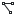</a> | **📂 檔名:** `path-mode-polyline.svg` ✨ **格式:** `Vector (SVG)` ⚖️ **大小:** `610.00B` 📅 **更新:** `2026-03-04`  🚀 **jsDelivr Markdown:** `` 🔗 **直接連結 (Url):** <code>https://cdn.jsdelivr.net/gh/barry028/materials@main/images/iCons/Pixel/Breeze/Actions%20/16/path-mode-polyline.svg</code> 📥 [檢視原始檔](path-mode-polyline.svg) |
|  | **📂 檔名:** `path-offset-linked.svg` ✨ **格式:** `Vector (SVG)` ⚖️ **大小:** `948.00B` 📅 **更新:** `2026-03-04`  🚀 **jsDelivr Markdown:** `` 🔗 **直接連結 (Url):** <code>https://cdn.jsdelivr.net/gh/barry028/materials@main/images/iCons/Pixel/Breeze/Actions%20/16/path-offset-linked.svg</code> 📥 [檢視原始檔](path-offset-linked.svg) |
|  | **📂 檔名:** `path-outset.svg` ✨ **格式:** `Vector (SVG)` ⚖️ **大小:** `694.00B` 📅 **更新:** `2026-03-04`  🚀 **jsDelivr Markdown:** `` 🔗 **直接連結 (Url):** <code>https://cdn.jsdelivr.net/gh/barry028/materials@main/images/iCons/Pixel/Breeze/Actions%20/16/path-outset.svg</code> 📥 [檢視原始檔](path-outset.svg) |
|  | **📂 檔名:** `path-reverse.svg` ✨ **格式:** `Vector (SVG)` ⚖️ **大小:** `914.00B` 📅 **更新:** `2026-03-04`  🚀 **jsDelivr Markdown:** `` 🔗 **直接連結 (Url):** <code>https://cdn.jsdelivr.net/gh/barry028/materials@main/images/iCons/Pixel/Breeze/Actions%20/16/path-reverse.svg</code> 📥 [檢視原始檔](path-reverse.svg) |
|  | **📂 檔名:** `path-union.svg` ✨ **格式:** `Vector (SVG)` ⚖️ **大小:** `895.00B` 📅 **更新:** `2026-03-04`  🚀 **jsDelivr Markdown:** `` 🔗 **直接連結 (Url):** <code>https://cdn.jsdelivr.net/gh/barry028/materials@main/images/iCons/Pixel/Breeze/Actions%20/16/path-union.svg</code> 📥 [檢視原始檔](path-union.svg) |
|  | **📂 檔名:** `pixelart-trace.svg` ✨ **格式:** `Vector (SVG)` ⚖️ **大小:** `1.96KB` 📅 **更新:** `2026-03-04`  🚀 **jsDelivr Markdown:** `` 🔗 **直接連結 (Url):** <code>https://cdn.jsdelivr.net/gh/barry028/materials@main/images/iCons/Pixel/Breeze/Actions%20/16/pixelart-trace.svg</code> 📥 [檢視原始檔](pixelart-trace.svg) |
|  | **📂 檔名:** `player-time.svg` ✨ **格式:** `Vector (SVG)` ⚖️ **大小:** `976.00B` 📅 **更新:** `2026-03-04`  🚀 **jsDelivr Markdown:** `` 🔗 **直接連結 (Url):** <code>https://cdn.jsdelivr.net/gh/barry028/materials@main/images/iCons/Pixel/Breeze/Actions%20/16/player-time.svg</code> 📥 [檢視原始檔](player-time.svg) |
|  | **📂 檔名:** `plugins.svg` ✨ **格式:** `Vector (SVG)` ⚖️ **大小:** `386.00B` 📅 **更新:** `2026-03-04`  🚀 **jsDelivr Markdown:** `` 🔗 **直接連結 (Url):** <code>https://cdn.jsdelivr.net/gh/barry028/materials@main/images/iCons/Pixel/Breeze/Actions%20/16/plugins.svg</code> 📥 [檢視原始檔](plugins.svg) |
|  | **📂 檔名:** `precondition.svg` ✨ **格式:** `Vector (SVG)` ⚖️ **大小:** `460.00B` 📅 **更新:** `2026-03-04`  🚀 **jsDelivr Markdown:** `` 🔗 **直接連結 (Url):** <code>https://cdn.jsdelivr.net/gh/barry028/materials@main/images/iCons/Pixel/Breeze/Actions%20/16/precondition.svg</code> 📥 [檢視原始檔](precondition.svg) |
|  | **📂 檔名:** `primarykey_constraint.svg` ✨ **格式:** `Vector (SVG)` ⚖️ **大小:** `502.00B` 📅 **更新:** `2026-03-04`  🚀 **jsDelivr Markdown:** `` 🔗 **直接連結 (Url):** <code>https://cdn.jsdelivr.net/gh/barry028/materials@main/images/iCons/Pixel/Breeze/Actions%20/16/primarykey_constraint.svg</code> 📥 [檢視原始檔](primarykey_constraint.svg) |
|  | **📂 檔名:** `process-stop-symbolic.svg` ✨ **格式:** `Vector (SVG)` ⚖️ **大小:** `2.17KB` 📅 **更新:** `2026-03-04`  🚀 **jsDelivr Markdown:** `` 🔗 **直接連結 (Url):** <code>https://cdn.jsdelivr.net/gh/barry028/materials@main/images/iCons/Pixel/Breeze/Actions%20/16/process-stop-symbolic.svg</code> 📥 [檢視原始檔](process-stop-symbolic.svg) |
|  | **📂 檔名:** `project-development-close.svg` ✨ **格式:** `Vector (SVG)` ⚖️ **大小:** `741.00B` 📅 **更新:** `2026-03-04`  🚀 **jsDelivr Markdown:** `` 🔗 **直接連結 (Url):** <code>https://cdn.jsdelivr.net/gh/barry028/materials@main/images/iCons/Pixel/Breeze/Actions%20/16/project-development-close.svg</code> 📥 [檢視原始檔](project-development-close.svg) |
|  | **📂 檔名:** `project-development.svg` ✨ **格式:** `Vector (SVG)` ⚖️ **大小:** `369.00B` 📅 **更新:** `2026-03-04`  🚀 **jsDelivr Markdown:** `` 🔗 **直接連結 (Url):** <code>https://cdn.jsdelivr.net/gh/barry028/materials@main/images/iCons/Pixel/Breeze/Actions%20/16/project-development.svg</code> 📥 [檢視原始檔](project-development.svg) |
| <a href="quickopen-class.svg">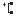</a> | **📂 檔名:** `quickopen-class.svg` ✨ **格式:** `Vector (SVG)` ⚖️ **大小:** `505.00B` 📅 **更新:** `2026-03-04`  🚀 **jsDelivr Markdown:** `` 🔗 **直接連結 (Url):** <code>https://cdn.jsdelivr.net/gh/barry028/materials@main/images/iCons/Pixel/Breeze/Actions%20/16/quickopen-class.svg</code> 📥 [檢視原始檔](quickopen-class.svg) |
|  | **📂 檔名:** `quickopen-file.svg` ✨ **格式:** `Vector (SVG)` ⚖️ **大小:** `493.00B` 📅 **更新:** `2026-03-04`  🚀 **jsDelivr Markdown:** `` 🔗 **直接連結 (Url):** <code>https://cdn.jsdelivr.net/gh/barry028/materials@main/images/iCons/Pixel/Breeze/Actions%20/16/quickopen-file.svg</code> 📥 [檢視原始檔](quickopen-file.svg) |
|  | **📂 檔名:** `quickopen.svg` ✨ **格式:** `Vector (SVG)` ⚖️ **大小:** `357.00B` 📅 **更新:** `2026-03-04`  🚀 **jsDelivr Markdown:** `` 🔗 **直接連結 (Url):** <code>https://cdn.jsdelivr.net/gh/barry028/materials@main/images/iCons/Pixel/Breeze/Actions%20/16/quickopen.svg</code> 📥 [檢視原始檔](quickopen.svg) |
|  | **📂 檔名:** `realization.svg` ✨ **格式:** `Vector (SVG)` ⚖️ **大小:** `637.00B` 📅 **更新:** `2026-03-04`  🚀 **jsDelivr Markdown:** `` 🔗 **直接連結 (Url):** <code>https://cdn.jsdelivr.net/gh/barry028/materials@main/images/iCons/Pixel/Breeze/Actions%20/16/realization.svg</code> 📥 [檢視原始檔](realization.svg) |
|  | **📂 檔名:** `redeyes.svg` ✨ **格式:** `Vector (SVG)` ⚖️ **大小:** `941.00B` 📅 **更新:** `2026-03-04`  🚀 **jsDelivr Markdown:** `` 🔗 **直接連結 (Url):** <code>https://cdn.jsdelivr.net/gh/barry028/materials@main/images/iCons/Pixel/Breeze/Actions%20/16/redeyes.svg</code> 📥 [檢視原始檔](redeyes.svg) |
|  | **📂 檔名:** `repeat.svg` ✨ **格式:** `Vector (SVG)` ⚖️ **大小:** `846.00B` 📅 **更新:** `2026-03-04`  🚀 **jsDelivr Markdown:** `` 🔗 **直接連結 (Url):** <code>https://cdn.jsdelivr.net/gh/barry028/materials@main/images/iCons/Pixel/Breeze/Actions%20/16/repeat.svg</code> 📥 [檢視原始檔](repeat.svg) |
|  | **📂 檔名:** `resizecol.svg` ✨ **格式:** `Vector (SVG)` ⚖️ **大小:** `520.00B` 📅 **更新:** `2026-03-04`  🚀 **jsDelivr Markdown:** `` 🔗 **直接連結 (Url):** <code>https://cdn.jsdelivr.net/gh/barry028/materials@main/images/iCons/Pixel/Breeze/Actions%20/16/resizecol.svg</code> 📥 [檢視原始檔](resizecol.svg) |
| <a href="resizerow.svg">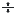</a> | **📂 檔名:** `resizerow.svg` ✨ **格式:** `Vector (SVG)` ⚖️ **大小:** `477.00B` 📅 **更新:** `2026-03-04`  🚀 **jsDelivr Markdown:** `` 🔗 **直接連結 (Url):** <code>https://cdn.jsdelivr.net/gh/barry028/materials@main/images/iCons/Pixel/Breeze/Actions%20/16/resizerow.svg</code> 📥 [檢視原始檔](resizerow.svg) |
|  | **📂 檔名:** `resource-calendar-child-insert.svg` ✨ **格式:** `Vector (SVG)` ⚖️ **大小:** `772.00B` 📅 **更新:** `2026-03-04`  🚀 **jsDelivr Markdown:** `` 🔗 **直接連結 (Url):** <code>https://cdn.jsdelivr.net/gh/barry028/materials@main/images/iCons/Pixel/Breeze/Actions%20/16/resource-calendar-child-insert.svg</code> 📥 [檢視原始檔](resource-calendar-child-insert.svg) |
|  | **📂 檔名:** `resource-calendar-child.svg` ✨ **格式:** `Vector (SVG)` ⚖️ **大小:** `751.00B` 📅 **更新:** `2026-03-04`  🚀 **jsDelivr Markdown:** `` 🔗 **直接連結 (Url):** <code>https://cdn.jsdelivr.net/gh/barry028/materials@main/images/iCons/Pixel/Breeze/Actions%20/16/resource-calendar-child.svg</code> 📥 [檢視原始檔](resource-calendar-child.svg) |
|  | **📂 檔名:** `restoration.svg` ✨ **格式:** `Vector (SVG)` ⚖️ **大小:** `558.00B` 📅 **更新:** `2026-03-04`  🚀 **jsDelivr Markdown:** `` 🔗 **直接連結 (Url):** <code>https://cdn.jsdelivr.net/gh/barry028/materials@main/images/iCons/Pixel/Breeze/Actions%20/16/restoration.svg</code> 📥 [檢視原始檔](restoration.svg) |
|  | **📂 檔名:** `retweet.svg` ✨ **格式:** `Vector (SVG)` ⚖️ **大小:** `556.00B` 📅 **更新:** `2026-03-04`  🚀 **jsDelivr Markdown:** `` 🔗 **直接連結 (Url):** <code>https://cdn.jsdelivr.net/gh/barry028/materials@main/images/iCons/Pixel/Breeze/Actions%20/16/retweet.svg</code> 📥 [檢視原始檔](retweet.svg) |
|  | **📂 檔名:** `roll.svg` ✨ **格式:** `Vector (SVG)` ⚖️ **大小:** `788.00B` 📅 **更新:** `2026-03-04`  🚀 **jsDelivr Markdown:** `` 🔗 **直接連結 (Url):** <code>https://cdn.jsdelivr.net/gh/barry028/materials@main/images/iCons/Pixel/Breeze/Actions%20/16/roll.svg</code> 📥 [檢視原始檔](roll.svg) |
|  | **📂 檔名:** `run-build-clean.svg` ✨ **格式:** `Vector (SVG)` ⚖️ **大小:** `1.49KB` 📅 **更新:** `2026-03-04`  🚀 **jsDelivr Markdown:** `` 🔗 **直接連結 (Url):** <code>https://cdn.jsdelivr.net/gh/barry028/materials@main/images/iCons/Pixel/Breeze/Actions%20/16/run-build-clean.svg</code> 📥 [檢視原始檔](run-build-clean.svg) |
|  | **📂 檔名:** `run-build-configure.svg` ✨ **格式:** `Vector (SVG)` ⚖️ **大小:** `1.12KB` 📅 **更新:** `2026-03-04`  🚀 **jsDelivr Markdown:** `` 🔗 **直接連結 (Url):** <code>https://cdn.jsdelivr.net/gh/barry028/materials@main/images/iCons/Pixel/Breeze/Actions%20/16/run-build-configure.svg</code> 📥 [檢視原始檔](run-build-configure.svg) |
|  | **📂 檔名:** `run-build-file.svg` ✨ **格式:** `Vector (SVG)` ⚖️ **大小:** `1.10KB` 📅 **更新:** `2026-03-04`  🚀 **jsDelivr Markdown:** `` 🔗 **直接連結 (Url):** <code>https://cdn.jsdelivr.net/gh/barry028/materials@main/images/iCons/Pixel/Breeze/Actions%20/16/run-build-file.svg</code> 📥 [檢視原始檔](run-build-file.svg) |
|  | **📂 檔名:** `run-build-install-root.svg` ✨ **格式:** `Vector (SVG)` ⚖️ **大小:** `1.19KB` 📅 **更新:** `2026-03-04`  🚀 **jsDelivr Markdown:** `` 🔗 **直接連結 (Url):** <code>https://cdn.jsdelivr.net/gh/barry028/materials@main/images/iCons/Pixel/Breeze/Actions%20/16/run-build-install-root.svg</code> 📥 [檢視原始檔](run-build-install-root.svg) |
|  | **📂 檔名:** `run-build-install.svg` ✨ **格式:** `Vector (SVG)` ⚖️ **大小:** `1.39KB` 📅 **更新:** `2026-03-04`  🚀 **jsDelivr Markdown:** `` 🔗 **直接連結 (Url):** <code>https://cdn.jsdelivr.net/gh/barry028/materials@main/images/iCons/Pixel/Breeze/Actions%20/16/run-build-install.svg</code> 📥 [檢視原始檔](run-build-install.svg) |
|  | **📂 檔名:** `run-build-prune.svg` ✨ **格式:** `Vector (SVG)` ⚖️ **大小:** `1.23KB` 📅 **更新:** `2026-03-04`  🚀 **jsDelivr Markdown:** `` 🔗 **直接連結 (Url):** <code>https://cdn.jsdelivr.net/gh/barry028/materials@main/images/iCons/Pixel/Breeze/Actions%20/16/run-build-prune.svg</code> 📥 [檢視原始檔](run-build-prune.svg) |
|  | **📂 檔名:** `run-build.svg` ✨ **格式:** `Vector (SVG)` ⚖️ **大小:** `1.14KB` 📅 **更新:** `2026-03-04`  🚀 **jsDelivr Markdown:** `` 🔗 **直接連結 (Url):** <code>https://cdn.jsdelivr.net/gh/barry028/materials@main/images/iCons/Pixel/Breeze/Actions%20/16/run-build.svg</code> 📥 [檢視原始檔](run-build.svg) |
|  | **📂 檔名:** `select-rectangular.svg` ✨ **格式:** `Vector (SVG)` ⚖️ **大小:** `435.00B` 📅 **更新:** `2026-03-04`  🚀 **jsDelivr Markdown:** `` 🔗 **直接連結 (Url):** <code>https://cdn.jsdelivr.net/gh/barry028/materials@main/images/iCons/Pixel/Breeze/Actions%20/16/select-rectangular.svg</code> 📥 [檢視原始檔](select-rectangular.svg) |
|  | **📂 檔名:** `selection-end-symbolic.svg` ✨ **格式:** `Vector (SVG)` ⚖️ **大小:** `3.55KB` 📅 **更新:** `2026-03-04`  🚀 **jsDelivr Markdown:** `` 🔗 **直接連結 (Url):** <code>https://cdn.jsdelivr.net/gh/barry028/materials@main/images/iCons/Pixel/Breeze/Actions%20/16/selection-end-symbolic.svg</code> 📥 [檢視原始檔](selection-end-symbolic.svg) |
|  | **📂 檔名:** `selection-move-to-layer-above.svg` ✨ **格式:** `Vector (SVG)` ⚖️ **大小:** `857.00B` 📅 **更新:** `2026-03-04`  🚀 **jsDelivr Markdown:** `` 🔗 **直接連結 (Url):** <code>https://cdn.jsdelivr.net/gh/barry028/materials@main/images/iCons/Pixel/Breeze/Actions%20/16/selection-move-to-layer-above.svg</code> 📥 [檢視原始檔](selection-move-to-layer-above.svg) |
|  | **📂 檔名:** `selection-move-to-layer-below.svg` ✨ **格式:** `Vector (SVG)` ⚖️ **大小:** `832.00B` 📅 **更新:** `2026-03-04`  🚀 **jsDelivr Markdown:** `` 🔗 **直接連結 (Url):** <code>https://cdn.jsdelivr.net/gh/barry028/materials@main/images/iCons/Pixel/Breeze/Actions%20/16/selection-move-to-layer-below.svg</code> 📥 [檢視原始檔](selection-move-to-layer-below.svg) |
|  | **📂 檔名:** `selection-start-symbolic.svg` ✨ **格式:** `Vector (SVG)` ⚖️ **大小:** `3.55KB` 📅 **更新:** `2026-03-04`  🚀 **jsDelivr Markdown:** `` 🔗 **直接連結 (Url):** <code>https://cdn.jsdelivr.net/gh/barry028/materials@main/images/iCons/Pixel/Breeze/Actions%20/16/selection-start-symbolic.svg</code> 📥 [檢視原始檔](selection-start-symbolic.svg) |
|  | **📂 檔名:** `send_signal.svg` ✨ **格式:** `Vector (SVG)` ⚖️ **大小:** `516.00B` 📅 **更新:** `2026-03-04`  🚀 **jsDelivr Markdown:** `` 🔗 **直接連結 (Url):** <code>https://cdn.jsdelivr.net/gh/barry028/materials@main/images/iCons/Pixel/Breeze/Actions%20/16/send_signal.svg</code> 📥 [檢視原始檔](send_signal.svg) |
|  | **📂 檔名:** `shapes.svg` ✨ **格式:** `Vector (SVG)` ⚖️ **大小:** `1.52KB` 📅 **更新:** `2026-03-04`  🚀 **jsDelivr Markdown:** `` 🔗 **直接連結 (Url):** <code>https://cdn.jsdelivr.net/gh/barry028/materials@main/images/iCons/Pixel/Breeze/Actions%20/16/shapes.svg</code> 📥 [檢視原始檔](shapes.svg) |
|  | **📂 檔名:** `show-menu.svg` ✨ **格式:** `Vector (SVG)` ⚖️ **大小:** `870.00B` 📅 **更新:** `2026-03-04`  🚀 **jsDelivr Markdown:** `` 🔗 **直接連結 (Url):** <code>https://cdn.jsdelivr.net/gh/barry028/materials@main/images/iCons/Pixel/Breeze/Actions%20/16/show-menu.svg</code> 📥 [檢視原始檔](show-menu.svg) |
|  | **📂 檔名:** `show-node-handles.svg` ✨ **格式:** `Vector (SVG)` ⚖️ **大小:** `1.02KB` 📅 **更新:** `2026-03-04`  🚀 **jsDelivr Markdown:** `` 🔗 **直接連結 (Url):** <code>https://cdn.jsdelivr.net/gh/barry028/materials@main/images/iCons/Pixel/Breeze/Actions%20/16/show-node-handles.svg</code> 📥 [檢視原始檔](show-node-handles.svg) |
| <a href="show-path-outline.svg">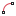</a> | **📂 檔名:** `show-path-outline.svg` ✨ **格式:** `Vector (SVG)` ⚖️ **大小:** `714.00B` 📅 **更新:** `2026-03-04`  🚀 **jsDelivr Markdown:** `` 🔗 **直接連結 (Url):** <code>https://cdn.jsdelivr.net/gh/barry028/materials@main/images/iCons/Pixel/Breeze/Actions%20/16/show-path-outline.svg</code> 📥 [檢視原始檔](show-path-outline.svg) |
|  | **📂 檔名:** `sidebar-collapse-left.svg` ✨ **格式:** `Vector (SVG)` ⚖️ **大小:** `481.00B` 📅 **更新:** `2026-03-04`  🚀 **jsDelivr Markdown:** `` 🔗 **直接連結 (Url):** <code>https://cdn.jsdelivr.net/gh/barry028/materials@main/images/iCons/Pixel/Breeze/Actions%20/16/sidebar-collapse-left.svg</code> 📥 [檢視原始檔](sidebar-collapse-left.svg) |
|  | **📂 檔名:** `sidebar-collapse-right.svg` ✨ **格式:** `Vector (SVG)` ⚖️ **大小:** `447.00B` 📅 **更新:** `2026-03-04`  🚀 **jsDelivr Markdown:** `` 🔗 **直接連結 (Url):** <code>https://cdn.jsdelivr.net/gh/barry028/materials@main/images/iCons/Pixel/Breeze/Actions%20/16/sidebar-collapse-right.svg</code> 📥 [檢視原始檔](sidebar-collapse-right.svg) |
|  | **📂 檔名:** `smiley-add.svg` ✨ **格式:** `Vector (SVG)` ⚖️ **大小:** `768.00B` 📅 **更新:** `2026-03-04`  🚀 **jsDelivr Markdown:** `` 🔗 **直接連結 (Url):** <code>https://cdn.jsdelivr.net/gh/barry028/materials@main/images/iCons/Pixel/Breeze/Actions%20/16/smiley-add.svg</code> 📥 [檢視原始檔](smiley-add.svg) |
|  | **📂 檔名:** `snap-angle.svg` ✨ **格式:** `Vector (SVG)` ⚖️ **大小:** `1.18KB` 📅 **更新:** `2026-03-04`  🚀 **jsDelivr Markdown:** `` 🔗 **直接連結 (Url):** <code>https://cdn.jsdelivr.net/gh/barry028/materials@main/images/iCons/Pixel/Breeze/Actions%20/16/snap-angle.svg</code> 📥 [檢視原始檔](snap-angle.svg) |
|  | **📂 檔名:** `snap-bounding-box-center.svg` ✨ **格式:** `Vector (SVG)` ⚖️ **大小:** `1.22KB` 📅 **更新:** `2026-03-04`  🚀 **jsDelivr Markdown:** `` 🔗 **直接連結 (Url):** <code>https://cdn.jsdelivr.net/gh/barry028/materials@main/images/iCons/Pixel/Breeze/Actions%20/16/snap-bounding-box-center.svg</code> 📥 [檢視原始檔](snap-bounding-box-center.svg) |
|  | **📂 檔名:** `snap-bounding-box-corners.svg` ✨ **格式:** `Vector (SVG)` ⚖️ **大小:** `1.19KB` 📅 **更新:** `2026-03-04`  🚀 **jsDelivr Markdown:** `` 🔗 **直接連結 (Url):** <code>https://cdn.jsdelivr.net/gh/barry028/materials@main/images/iCons/Pixel/Breeze/Actions%20/16/snap-bounding-box-corners.svg</code> 📥 [檢視原始檔](snap-bounding-box-corners.svg) |
|  | **📂 檔名:** `snap-bounding-box-edges.svg` ✨ **格式:** `Vector (SVG)` ⚖️ **大小:** `1.39KB` 📅 **更新:** `2026-03-04`  🚀 **jsDelivr Markdown:** `` 🔗 **直接連結 (Url):** <code>https://cdn.jsdelivr.net/gh/barry028/materials@main/images/iCons/Pixel/Breeze/Actions%20/16/snap-bounding-box-edges.svg</code> 📥 [檢視原始檔](snap-bounding-box-edges.svg) |
|  | **📂 檔名:** `snap-extension.svg` ✨ **格式:** `Vector (SVG)` ⚖️ **大小:** `524.00B` 📅 **更新:** `2026-03-04`  🚀 **jsDelivr Markdown:** `` 🔗 **直接連結 (Url):** <code>https://cdn.jsdelivr.net/gh/barry028/materials@main/images/iCons/Pixel/Breeze/Actions%20/16/snap-extension.svg</code> 📥 [檢視原始檔](snap-extension.svg) |
|  | **📂 檔名:** `snap-grid-guide-intersections.svg` ✨ **格式:** `Vector (SVG)` ⚖️ **大小:** `1.00KB` 📅 **更新:** `2026-03-04`  🚀 **jsDelivr Markdown:** `` 🔗 **直接連結 (Url):** <code>https://cdn.jsdelivr.net/gh/barry028/materials@main/images/iCons/Pixel/Breeze/Actions%20/16/snap-grid-guide-intersections.svg</code> 📥 [檢視原始檔](snap-grid-guide-intersections.svg) |
|  | **📂 檔名:** `snap-guideline.svg` ✨ **格式:** `Vector (SVG)` ⚖️ **大小:** `590.00B` 📅 **更新:** `2026-03-04`  🚀 **jsDelivr Markdown:** `` 🔗 **直接連結 (Url):** <code>https://cdn.jsdelivr.net/gh/barry028/materials@main/images/iCons/Pixel/Breeze/Actions%20/16/snap-guideline.svg</code> 📥 [檢視原始檔](snap-guideline.svg) |
|  | **📂 檔名:** `snap-intersection.svg` ✨ **格式:** `Vector (SVG)` ⚖️ **大小:** `491.00B` 📅 **更新:** `2026-03-04`  🚀 **jsDelivr Markdown:** `` 🔗 **直接連結 (Url):** <code>https://cdn.jsdelivr.net/gh/barry028/materials@main/images/iCons/Pixel/Breeze/Actions%20/16/snap-intersection.svg</code> 📥 [檢視原始檔](snap-intersection.svg) |
|  | **📂 檔名:** `snap-nodes-cusp.svg` ✨ **格式:** `Vector (SVG)` ⚖️ **大小:** `945.00B` 📅 **更新:** `2026-03-04`  🚀 **jsDelivr Markdown:** `` 🔗 **直接連結 (Url):** <code>https://cdn.jsdelivr.net/gh/barry028/materials@main/images/iCons/Pixel/Breeze/Actions%20/16/snap-nodes-cusp.svg</code> 📥 [檢視原始檔](snap-nodes-cusp.svg) |
|  | **📂 檔名:** `snap-nodes-intersection.svg` ✨ **格式:** `Vector (SVG)` ⚖️ **大小:** `726.00B` 📅 **更新:** `2026-03-04`  🚀 **jsDelivr Markdown:** `` 🔗 **直接連結 (Url):** <code>https://cdn.jsdelivr.net/gh/barry028/materials@main/images/iCons/Pixel/Breeze/Actions%20/16/snap-nodes-intersection.svg</code> 📥 [檢視原始檔](snap-nodes-intersection.svg) |
|  | **📂 檔名:** `snap-nodes-midpoint.svg` ✨ **格式:** `Vector (SVG)` ⚖️ **大小:** `634.00B` 📅 **更新:** `2026-03-04`  🚀 **jsDelivr Markdown:** `` 🔗 **直接連結 (Url):** <code>https://cdn.jsdelivr.net/gh/barry028/materials@main/images/iCons/Pixel/Breeze/Actions%20/16/snap-nodes-midpoint.svg</code> 📥 [檢視原始檔](snap-nodes-midpoint.svg) |
|  | **📂 檔名:** `snap-nodes-path.svg` ✨ **格式:** `Vector (SVG)` ⚖️ **大小:** `1.18KB` 📅 **更新:** `2026-03-04`  🚀 **jsDelivr Markdown:** `` 🔗 **直接連結 (Url):** <code>https://cdn.jsdelivr.net/gh/barry028/materials@main/images/iCons/Pixel/Breeze/Actions%20/16/snap-nodes-path.svg</code> 📥 [檢視原始檔](snap-nodes-path.svg) |
|  | **📂 檔名:** `snap-nodes-smooth.svg` ✨ **格式:** `Vector (SVG)` ⚖️ **大小:** `1.28KB` 📅 **更新:** `2026-03-04`  🚀 **jsDelivr Markdown:** `` 🔗 **直接連結 (Url):** <code>https://cdn.jsdelivr.net/gh/barry028/materials@main/images/iCons/Pixel/Breeze/Actions%20/16/snap-nodes-smooth.svg</code> 📥 [檢視原始檔](snap-nodes-smooth.svg) |
|  | **📂 檔名:** `snap-orthogonal.svg` ✨ **格式:** `Vector (SVG)` ⚖️ **大小:** `448.00B` 📅 **更新:** `2026-03-04`  🚀 **jsDelivr Markdown:** `` 🔗 **直接連結 (Url):** <code>https://cdn.jsdelivr.net/gh/barry028/materials@main/images/iCons/Pixel/Breeze/Actions%20/16/snap-orthogonal.svg</code> 📥 [檢視原始檔](snap-orthogonal.svg) |
|  | **📂 檔名:** `snap-page.svg` ✨ **格式:** `Vector (SVG)` ⚖️ **大小:** `364.00B` 📅 **更新:** `2026-03-04`  🚀 **jsDelivr Markdown:** `` 🔗 **直接連結 (Url):** <code>https://cdn.jsdelivr.net/gh/barry028/materials@main/images/iCons/Pixel/Breeze/Actions%20/16/snap-page.svg</code> 📥 [檢視原始檔](snap-page.svg) |
|  | **📂 檔名:** `snap-text-baseline.svg` ✨ **格式:** `Vector (SVG)` ⚖️ **大小:** `751.00B` 📅 **更新:** `2026-03-04`  🚀 **jsDelivr Markdown:** `` 🔗 **直接連結 (Url):** <code>https://cdn.jsdelivr.net/gh/barry028/materials@main/images/iCons/Pixel/Breeze/Actions%20/16/snap-text-baseline.svg</code> 📥 [檢視原始檔](snap-text-baseline.svg) |
|  | **📂 檔名:** `snap.svg` ✨ **格式:** `Vector (SVG)` ⚖️ **大小:** `705.00B` 📅 **更新:** `2026-03-04`  🚀 **jsDelivr Markdown:** `` 🔗 **直接連結 (Url):** <code>https://cdn.jsdelivr.net/gh/barry028/materials@main/images/iCons/Pixel/Breeze/Actions%20/16/snap.svg</code> 📥 [檢視原始檔](snap.svg) |
| <a href="sort-presence.svg">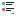</a> | **📂 檔名:** `sort-presence.svg` ✨ **格式:** `Vector (SVG)` ⚖️ **大小:** `1.07KB` 📅 **更新:** `2026-03-04`  🚀 **jsDelivr Markdown:** `` 🔗 **直接連結 (Url):** <code>https://cdn.jsdelivr.net/gh/barry028/materials@main/images/iCons/Pixel/Breeze/Actions%20/16/sort-presence.svg</code> 📥 [檢視原始檔](sort-presence.svg) |
|  | **📂 檔名:** `speaker.svg` ✨ **格式:** `Vector (SVG)` ⚖️ **大小:** `1.22KB` 📅 **更新:** `2026-03-04`  🚀 **jsDelivr Markdown:** `` 🔗 **直接連結 (Url):** <code>https://cdn.jsdelivr.net/gh/barry028/materials@main/images/iCons/Pixel/Breeze/Actions%20/16/speaker.svg</code> 📥 [檢視原始檔](speaker.svg) |
|  | **📂 檔名:** `special_paste.svg` ✨ **格式:** `Vector (SVG)` ⚖️ **大小:** `898.00B` 📅 **更新:** `2026-03-04`  🚀 **jsDelivr Markdown:** `` 🔗 **直接連結 (Url):** <code>https://cdn.jsdelivr.net/gh/barry028/materials@main/images/iCons/Pixel/Breeze/Actions%20/16/special_paste.svg</code> 📥 [檢視原始檔](special_paste.svg) |
|  | **📂 檔名:** `split.svg` ✨ **格式:** `Vector (SVG)` ⚖️ **大小:** `393.00B` 📅 **更新:** `2026-03-04`  🚀 **jsDelivr Markdown:** `` 🔗 **直接連結 (Url):** <code>https://cdn.jsdelivr.net/gh/barry028/materials@main/images/iCons/Pixel/Breeze/Actions%20/16/split.svg</code> 📥 [檢視原始檔](split.svg) |
|  | **📂 檔名:** `sqrt.svg` ✨ **格式:** `Vector (SVG)` ⚖️ **大小:** `831.00B` 📅 **更新:** `2026-03-04`  🚀 **jsDelivr Markdown:** `` 🔗 **直接連結 (Url):** <code>https://cdn.jsdelivr.net/gh/barry028/materials@main/images/iCons/Pixel/Breeze/Actions%20/16/sqrt.svg</code> 📥 [檢視原始檔](sqrt.svg) |
| <a href="standard-connector.svg">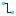</a> | **📂 檔名:** `standard-connector.svg` ✨ **格式:** `Vector (SVG)` ⚖️ **大小:** `1.07KB` 📅 **更新:** `2026-03-04`  🚀 **jsDelivr Markdown:** `` 🔗 **直接連結 (Url):** <code>https://cdn.jsdelivr.net/gh/barry028/materials@main/images/iCons/Pixel/Breeze/Actions%20/16/standard-connector.svg</code> 📥 [檢視原始檔](standard-connector.svg) |
|  | **📂 檔名:** `state-fork.svg` ✨ **格式:** `Vector (SVG)` ⚖️ **大小:** `1.23KB` 📅 **更新:** `2026-03-04`  🚀 **jsDelivr Markdown:** `` 🔗 **直接連結 (Url):** <code>https://cdn.jsdelivr.net/gh/barry028/materials@main/images/iCons/Pixel/Breeze/Actions%20/16/state-fork.svg</code> 📥 [檢視原始檔](state-fork.svg) |
|  | **📂 檔名:** `stateshape.svg` ✨ **格式:** `Vector (SVG)` ⚖️ **大小:** `444.00B` 📅 **更新:** `2026-03-04`  🚀 **jsDelivr Markdown:** `` 🔗 **直接連結 (Url):** <code>https://cdn.jsdelivr.net/gh/barry028/materials@main/images/iCons/Pixel/Breeze/Actions%20/16/stateshape.svg</code> 📥 [檢視原始檔](stateshape.svg) |
|  | **📂 檔名:** `stickers.svg` ✨ **格式:** `Vector (SVG)` ⚖️ **大小:** `964.00B` 📅 **更新:** `2026-03-04`  🚀 **jsDelivr Markdown:** `` 🔗 **直接連結 (Url):** <code>https://cdn.jsdelivr.net/gh/barry028/materials@main/images/iCons/Pixel/Breeze/Actions%20/16/stickers.svg</code> 📥 [檢視原始檔](stickers.svg) |
|  | **📂 檔名:** `story-editor.svg` ✨ **格式:** `Vector (SVG)` ⚖️ **大小:** `756.00B` 📅 **更新:** `2026-03-04`  🚀 **jsDelivr Markdown:** `` 🔗 **直接連結 (Url):** <code>https://cdn.jsdelivr.net/gh/barry028/materials@main/images/iCons/Pixel/Breeze/Actions%20/16/story-editor.svg</code> 📥 [檢視原始檔](story-editor.svg) |
|  | **📂 檔名:** `stroke-cap-butt.svg` ✨ **格式:** `Vector (SVG)` ⚖️ **大小:** `397.00B` 📅 **更新:** `2026-03-04`  🚀 **jsDelivr Markdown:** `` 🔗 **直接連結 (Url):** <code>https://cdn.jsdelivr.net/gh/barry028/materials@main/images/iCons/Pixel/Breeze/Actions%20/16/stroke-cap-butt.svg</code> 📥 [檢視原始檔](stroke-cap-butt.svg) |
|  | **📂 檔名:** `stroke-cap-round.svg` ✨ **格式:** `Vector (SVG)` ⚖️ **大小:** `524.00B` 📅 **更新:** `2026-03-04`  🚀 **jsDelivr Markdown:** `` 🔗 **直接連結 (Url):** <code>https://cdn.jsdelivr.net/gh/barry028/materials@main/images/iCons/Pixel/Breeze/Actions%20/16/stroke-cap-round.svg</code> 📥 [檢視原始檔](stroke-cap-round.svg) |
|  | **📂 檔名:** `stroke-cap-square.svg` ✨ **格式:** `Vector (SVG)` ⚖️ **大小:** `386.00B` 📅 **更新:** `2026-03-04`  🚀 **jsDelivr Markdown:** `` 🔗 **直接連結 (Url):** <code>https://cdn.jsdelivr.net/gh/barry028/materials@main/images/iCons/Pixel/Breeze/Actions%20/16/stroke-cap-square.svg</code> 📥 [檢視原始檔](stroke-cap-square.svg) |
|  | **📂 檔名:** `stroke-join-miter.svg` ✨ **格式:** `Vector (SVG)` ⚖️ **大小:** `416.00B` 📅 **更新:** `2026-03-04`  🚀 **jsDelivr Markdown:** `` 🔗 **直接連結 (Url):** <code>https://cdn.jsdelivr.net/gh/barry028/materials@main/images/iCons/Pixel/Breeze/Actions%20/16/stroke-join-miter.svg</code> 📥 [檢視原始檔](stroke-join-miter.svg) |
|  | **📂 檔名:** `stroke-join-round.svg` ✨ **格式:** `Vector (SVG)` ⚖️ **大小:** `450.00B` 📅 **更新:** `2026-03-04`  🚀 **jsDelivr Markdown:** `` 🔗 **直接連結 (Url):** <code>https://cdn.jsdelivr.net/gh/barry028/materials@main/images/iCons/Pixel/Breeze/Actions%20/16/stroke-join-round.svg</code> 📥 [檢視原始檔](stroke-join-round.svg) |
|  | **📂 檔名:** `stroke-to-path.svg` ✨ **格式:** `Vector (SVG)` ⚖️ **大小:** `1.47KB` 📅 **更新:** `2026-03-04`  🚀 **jsDelivr Markdown:** `` 🔗 **直接連結 (Url):** <code>https://cdn.jsdelivr.net/gh/barry028/materials@main/images/iCons/Pixel/Breeze/Actions%20/16/stroke-to-path.svg</code> 📥 [檢視原始檔](stroke-to-path.svg) |
|  | **📂 檔名:** `swap-panels.svg` ✨ **格式:** `Vector (SVG)` ⚖️ **大小:** `900.00B` 📅 **更新:** `2026-03-04`  🚀 **jsDelivr Markdown:** `` 🔗 **直接連結 (Url):** <code>https://cdn.jsdelivr.net/gh/barry028/materials@main/images/iCons/Pixel/Breeze/Actions%20/16/swap-panels.svg</code> 📥 [檢視原始檔](swap-panels.svg) |
|  | **📂 檔名:** `symbols.svg` ✨ **格式:** `Vector (SVG)` ⚖️ **大小:** `619.00B` 📅 **更新:** `2026-03-04`  🚀 **jsDelivr Markdown:** `` 🔗 **直接連結 (Url):** <code>https://cdn.jsdelivr.net/gh/barry028/materials@main/images/iCons/Pixel/Breeze/Actions%20/16/symbols.svg</code> 📥 [檢視原始檔](symbols.svg) |
|  | **📂 檔名:** `system-log-out-rtl.svg` ✨ **格式:** `Vector (SVG)` ⚖️ **大小:** `498.00B` 📅 **更新:** `2026-03-04`  🚀 **jsDelivr Markdown:** `` 🔗 **直接連結 (Url):** <code>https://cdn.jsdelivr.net/gh/barry028/materials@main/images/iCons/Pixel/Breeze/Actions%20/16/system-log-out-rtl.svg</code> 📥 [檢視原始檔](system-log-out-rtl.svg) |
|  | **📂 檔名:** `system-switch-user.svg` ✨ **格式:** `Vector (SVG)` ⚖️ **大小:** `1.69KB` 📅 **更新:** `2026-03-04`  🚀 **jsDelivr Markdown:** `` 🔗 **直接連結 (Url):** <code>https://cdn.jsdelivr.net/gh/barry028/materials@main/images/iCons/Pixel/Breeze/Actions%20/16/system-switch-user.svg</code> 📥 [檢視原始檔](system-switch-user.svg) |
|  | **📂 檔名:** `tab-duplicate.svg` ✨ **格式:** `Vector (SVG)` ⚖️ **大小:** `470.00B` 📅 **更新:** `2026-03-04`  🚀 **jsDelivr Markdown:** `` 🔗 **直接連結 (Url):** <code>https://cdn.jsdelivr.net/gh/barry028/materials@main/images/iCons/Pixel/Breeze/Actions%20/16/tab-duplicate.svg</code> 📥 [檢視原始檔](tab-duplicate.svg) |
|  | **📂 檔名:** `tab-new.svg` ✨ **格式:** `Vector (SVG)` ⚖️ **大小:** `559.00B` 📅 **更新:** `2026-03-04`  🚀 **jsDelivr Markdown:** `` 🔗 **直接連結 (Url):** <code>https://cdn.jsdelivr.net/gh/barry028/materials@main/images/iCons/Pixel/Breeze/Actions%20/16/tab-new.svg</code> 📥 [檢視原始檔](tab-new.svg) |
|  | **📂 檔名:** `tag-edit.svg` ✨ **格式:** `Vector (SVG)` ⚖️ **大小:** `596.00B` 📅 **更新:** `2026-03-04`  🚀 **jsDelivr Markdown:** `` 🔗 **直接連結 (Url):** <code>https://cdn.jsdelivr.net/gh/barry028/materials@main/images/iCons/Pixel/Breeze/Actions%20/16/tag-edit.svg</code> 📥 [檢視原始檔](tag-edit.svg) |
|  | **📂 檔名:** `tag-new.svg` ✨ **格式:** `Vector (SVG)` ⚖️ **大小:** `660.00B` 📅 **更新:** `2026-03-04`  🚀 **jsDelivr Markdown:** `` 🔗 **直接連結 (Url):** <code>https://cdn.jsdelivr.net/gh/barry028/materials@main/images/iCons/Pixel/Breeze/Actions%20/16/tag-new.svg</code> 📥 [檢視原始檔](tag-new.svg) |
|  | **📂 檔名:** `tag.svg` ✨ **格式:** `Vector (SVG)` ⚖️ **大小:** `478.00B` 📅 **更新:** `2026-03-04`  🚀 **jsDelivr Markdown:** `` 🔗 **直接連結 (Url):** <code>https://cdn.jsdelivr.net/gh/barry028/materials@main/images/iCons/Pixel/Breeze/Actions%20/16/tag.svg</code> 📥 [檢視原始檔](tag.svg) |
|  | **📂 檔名:** `task-new.svg` ✨ **格式:** `Vector (SVG)` ⚖️ **大小:** `686.00B` 📅 **更新:** `2026-03-04`  🚀 **jsDelivr Markdown:** `` 🔗 **直接連結 (Url):** <code>https://cdn.jsdelivr.net/gh/barry028/materials@main/images/iCons/Pixel/Breeze/Actions%20/16/task-new.svg</code> 📥 [檢視原始檔](task-new.svg) |
|  | **📂 檔名:** `taxes-finances.svg` ✨ **格式:** `Vector (SVG)` ⚖️ **大小:** `1.59KB` 📅 **更新:** `2026-03-04`  🚀 **jsDelivr Markdown:** `` 🔗 **直接連結 (Url):** <code>https://cdn.jsdelivr.net/gh/barry028/materials@main/images/iCons/Pixel/Breeze/Actions%20/16/taxes-finances.svg</code> 📥 [檢視原始檔](taxes-finances.svg) |
|  | **📂 檔名:** `text-field-framed.svg` ✨ **格式:** `Vector (SVG)` ⚖️ **大小:** `707.00B` 📅 **更新:** `2026-03-04`  🚀 **jsDelivr Markdown:** `` 🔗 **直接連結 (Url):** <code>https://cdn.jsdelivr.net/gh/barry028/materials@main/images/iCons/Pixel/Breeze/Actions%20/16/text-field-framed.svg</code> 📥 [檢視原始檔](text-field-framed.svg) |
| <a href="text-field.svg">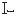</a> | **📂 檔名:** `text-field.svg` ✨ **格式:** `Vector (SVG)` ⚖️ **大小:** `393.00B` 📅 **更新:** `2026-03-04`  🚀 **jsDelivr Markdown:** `` 🔗 **直接連結 (Url):** <code>https://cdn.jsdelivr.net/gh/barry028/materials@main/images/iCons/Pixel/Breeze/Actions%20/16/text-field.svg</code> 📥 [檢視原始檔](text-field.svg) |
|  | **📂 檔名:** `text-flow-into-frame.svg` ✨ **格式:** `Vector (SVG)` ⚖️ **大小:** `739.00B` 📅 **更新:** `2026-03-04`  🚀 **jsDelivr Markdown:** `` 🔗 **直接連結 (Url):** <code>https://cdn.jsdelivr.net/gh/barry028/materials@main/images/iCons/Pixel/Breeze/Actions%20/16/text-flow-into-frame.svg</code> 📥 [檢視原始檔](text-flow-into-frame.svg) |
|  | **📂 檔名:** `text-frame-link.svg` ✨ **格式:** `Vector (SVG)` ⚖️ **大小:** `638.00B` 📅 **更新:** `2026-03-04`  🚀 **jsDelivr Markdown:** `` 🔗 **直接連結 (Url):** <code>https://cdn.jsdelivr.net/gh/barry028/materials@main/images/iCons/Pixel/Breeze/Actions%20/16/text-frame-link.svg</code> 📥 [檢視原始檔](text-frame-link.svg) |
|  | **📂 檔名:** `text-frame-unlink.svg` ✨ **格式:** `Vector (SVG)` ⚖️ **大小:** `691.00B` 📅 **更新:** `2026-03-04`  🚀 **jsDelivr Markdown:** `` 🔗 **直接連結 (Url):** <code>https://cdn.jsdelivr.net/gh/barry028/materials@main/images/iCons/Pixel/Breeze/Actions%20/16/text-frame-unlink.svg</code> 📥 [檢視原始檔](text-frame-unlink.svg) |
|  | **📂 檔名:** `text-put-on-path.svg` ✨ **格式:** `Vector (SVG)` ⚖️ **大小:** `2.06KB` 📅 **更新:** `2026-03-04`  🚀 **jsDelivr Markdown:** `` 🔗 **直接連結 (Url):** <code>https://cdn.jsdelivr.net/gh/barry028/materials@main/images/iCons/Pixel/Breeze/Actions%20/16/text-put-on-path.svg</code> 📥 [檢視原始檔](text-put-on-path.svg) |
|  | **📂 檔名:** `text-remove-from-path.svg` ✨ **格式:** `Vector (SVG)` ⚖️ **大小:** `2.15KB` 📅 **更新:** `2026-03-04`  🚀 **jsDelivr Markdown:** `` 🔗 **直接連結 (Url):** <code>https://cdn.jsdelivr.net/gh/barry028/materials@main/images/iCons/Pixel/Breeze/Actions%20/16/text-remove-from-path.svg</code> 📥 [檢視原始檔](text-remove-from-path.svg) |
|  | **📂 檔名:** `text-unflow.svg` ✨ **格式:** `Vector (SVG)` ⚖️ **大小:** `801.00B` 📅 **更新:** `2026-03-04`  🚀 **jsDelivr Markdown:** `` 🔗 **直接連結 (Url):** <code>https://cdn.jsdelivr.net/gh/barry028/materials@main/images/iCons/Pixel/Breeze/Actions%20/16/text-unflow.svg</code> 📥 [檢視原始檔](text-unflow.svg) |
|  | **📂 檔名:** `text-unkern.svg` ✨ **格式:** `Vector (SVG)` ⚖️ **大小:** `737.00B` 📅 **更新:** `2026-03-04`  🚀 **jsDelivr Markdown:** `` 🔗 **直接連結 (Url):** <code>https://cdn.jsdelivr.net/gh/barry028/materials@main/images/iCons/Pixel/Breeze/Actions%20/16/text-unkern.svg</code> 📥 [檢視原始檔](text-unkern.svg) |
|  | **📂 檔名:** `text-wrap.svg` ✨ **格式:** `Vector (SVG)` ⚖️ **大小:** `704.00B` 📅 **更新:** `2026-03-04`  🚀 **jsDelivr Markdown:** `` 🔗 **直接連結 (Url):** <code>https://cdn.jsdelivr.net/gh/barry028/materials@main/images/iCons/Pixel/Breeze/Actions%20/16/text-wrap.svg</code> 📥 [檢視原始檔](text-wrap.svg) |
| <a href="text_letter_spacing.svg">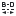</a> | **📂 檔名:** `text_letter_spacing.svg` ✨ **格式:** `Vector (SVG)` ⚖️ **大小:** `1.28KB` 📅 **更新:** `2026-03-04`  🚀 **jsDelivr Markdown:** `` 🔗 **直接連結 (Url):** <code>https://cdn.jsdelivr.net/gh/barry028/materials@main/images/iCons/Pixel/Breeze/Actions%20/16/text_letter_spacing.svg</code> 📥 [檢視原始檔](text_letter_spacing.svg) |
|  | **📂 檔名:** `text_line_spacing.svg` ✨ **格式:** `Vector (SVG)` ⚖️ **大小:** `718.00B` 📅 **更新:** `2026-03-04`  🚀 **jsDelivr Markdown:** `` 🔗 **直接連結 (Url):** <code>https://cdn.jsdelivr.net/gh/barry028/materials@main/images/iCons/Pixel/Breeze/Actions%20/16/text_line_spacing.svg</code> 📥 [檢視原始檔](text_line_spacing.svg) |
|  | **📂 檔名:** `text_vert_kern.svg` ✨ **格式:** `Vector (SVG)` ⚖️ **大小:** `1.05KB` 📅 **更新:** `2026-03-04`  🚀 **jsDelivr Markdown:** `` 🔗 **直接連結 (Url):** <code>https://cdn.jsdelivr.net/gh/barry028/materials@main/images/iCons/Pixel/Breeze/Actions%20/16/text_vert_kern.svg</code> 📥 [檢視原始檔](text_vert_kern.svg) |
|  | **📂 檔名:** `text_word_spacing.svg` ✨ **格式:** `Vector (SVG)` ⚖️ **大小:** `731.00B` 📅 **更新:** `2026-03-04`  🚀 **jsDelivr Markdown:** `` 🔗 **直接連結 (Url):** <code>https://cdn.jsdelivr.net/gh/barry028/materials@main/images/iCons/Pixel/Breeze/Actions%20/16/text_word_spacing.svg</code> 📥 [檢視原始檔](text_word_spacing.svg) |
| <a href="tool-tweak.svg">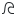</a> | **📂 檔名:** `tool-tweak.svg` ✨ **格式:** `Vector (SVG)` ⚖️ **大小:** `1.79KB` 📅 **更新:** `2026-03-04`  🚀 **jsDelivr Markdown:** `` 🔗 **直接連結 (Url):** <code>https://cdn.jsdelivr.net/gh/barry028/materials@main/images/iCons/Pixel/Breeze/Actions%20/16/tool-tweak.svg</code> 📥 [檢視原始檔](tool-tweak.svg) |
|  | **📂 檔名:** `tool_elliptical_selection.svg` ✨ **格式:** `Vector (SVG)` ⚖️ **大小:** `377.00B` 📅 **更新:** `2026-03-04`  🚀 **jsDelivr Markdown:** `` 🔗 **直接連結 (Url):** <code>https://cdn.jsdelivr.net/gh/barry028/materials@main/images/iCons/Pixel/Breeze/Actions%20/16/tool_elliptical_selection.svg</code> 📥 [檢視原始檔](tool_elliptical_selection.svg) |
|  | **📂 檔名:** `tool_imageeffects.svg` ✨ **格式:** `Vector (SVG)` ⚖️ **大小:** `925.00B` 📅 **更新:** `2026-03-04`  🚀 **jsDelivr Markdown:** `` 🔗 **直接連結 (Url):** <code>https://cdn.jsdelivr.net/gh/barry028/materials@main/images/iCons/Pixel/Breeze/Actions%20/16/tool_imageeffects.svg</code> 📥 [檢視原始檔](tool_imageeffects.svg) |
|  | **📂 檔名:** `tools-check-spelling.svg` ✨ **格式:** `Vector (SVG)` ⚖️ **大小:** `984.00B` 📅 **更新:** `2026-03-04`  🚀 **jsDelivr Markdown:** `` 🔗 **直接連結 (Url):** <code>https://cdn.jsdelivr.net/gh/barry028/materials@main/images/iCons/Pixel/Breeze/Actions%20/16/tools-check-spelling.svg</code> 📥 [檢視原始檔](tools-check-spelling.svg) |
|  | **📂 檔名:** `tools-media-optical-burn-image.svg` ✨ **格式:** `Vector (SVG)` ⚖️ **大小:** `678.00B` 📅 **更新:** `2026-03-04`  🚀 **jsDelivr Markdown:** `` 🔗 **直接連結 (Url):** <code>https://cdn.jsdelivr.net/gh/barry028/materials@main/images/iCons/Pixel/Breeze/Actions%20/16/tools-media-optical-burn-image.svg</code> 📥 [檢視原始檔](tools-media-optical-burn-image.svg) |
|  | **📂 檔名:** `tools-media-optical-burn.svg` ✨ **格式:** `Vector (SVG)` ⚖️ **大小:** `877.00B` 📅 **更新:** `2026-03-04`  🚀 **jsDelivr Markdown:** `` 🔗 **直接連結 (Url):** <code>https://cdn.jsdelivr.net/gh/barry028/materials@main/images/iCons/Pixel/Breeze/Actions%20/16/tools-media-optical-burn.svg</code> 📥 [檢視原始檔](tools-media-optical-burn.svg) |
|  | **📂 檔名:** `tools-media-optical-copy.svg` ✨ **格式:** `Vector (SVG)` ⚖️ **大小:** `925.00B` 📅 **更新:** `2026-03-04`  🚀 **jsDelivr Markdown:** `` 🔗 **直接連結 (Url):** <code>https://cdn.jsdelivr.net/gh/barry028/materials@main/images/iCons/Pixel/Breeze/Actions%20/16/tools-media-optical-copy.svg</code> 📥 [檢視原始檔](tools-media-optical-copy.svg) |
|  | **📂 檔名:** `tools-media-optical-format.svg` ✨ **格式:** `Vector (SVG)` ⚖️ **大小:** `664.00B` 📅 **更新:** `2026-03-04`  🚀 **jsDelivr Markdown:** `` 🔗 **直接連結 (Url):** <code>https://cdn.jsdelivr.net/gh/barry028/materials@main/images/iCons/Pixel/Breeze/Actions%20/16/tools-media-optical-format.svg</code> 📥 [檢視原始檔](tools-media-optical-format.svg) |
|  | **📂 檔名:** `tools-rip-audio-cd.svg` ✨ **格式:** `Vector (SVG)` ⚖️ **大小:** `831.00B` 📅 **更新:** `2026-03-04`  🚀 **jsDelivr Markdown:** `` 🔗 **直接連結 (Url):** <code>https://cdn.jsdelivr.net/gh/barry028/materials@main/images/iCons/Pixel/Breeze/Actions%20/16/tools-rip-audio-cd.svg</code> 📥 [檢視原始檔](tools-rip-audio-cd.svg) |
|  | **📂 檔名:** `tools-rip-video-cd.svg` ✨ **格式:** `Vector (SVG)` ⚖️ **大小:** `908.00B` 📅 **更新:** `2026-03-04`  🚀 **jsDelivr Markdown:** `` 🔗 **直接連結 (Url):** <code>https://cdn.jsdelivr.net/gh/barry028/materials@main/images/iCons/Pixel/Breeze/Actions%20/16/tools-rip-video-cd.svg</code> 📥 [檢視原始檔](tools-rip-video-cd.svg) |
|  | **📂 檔名:** `tools-rip-video-dvd.svg` ✨ **格式:** `Vector (SVG)` ⚖️ **大小:** `689.00B` 📅 **更新:** `2026-03-04`  🚀 **jsDelivr Markdown:** `` 🔗 **直接連結 (Url):** <code>https://cdn.jsdelivr.net/gh/barry028/materials@main/images/iCons/Pixel/Breeze/Actions%20/16/tools-rip-video-dvd.svg</code> 📥 [檢視原始檔](tools-rip-video-dvd.svg) |
|  | **📂 檔名:** `tools-wizard.svg` ✨ **格式:** `Vector (SVG)` ⚖️ **大小:** `497.00B` 📅 **更新:** `2026-03-04`  🚀 **jsDelivr Markdown:** `` 🔗 **直接連結 (Url):** <code>https://cdn.jsdelivr.net/gh/barry028/materials@main/images/iCons/Pixel/Breeze/Actions%20/16/tools-wizard.svg</code> 📥 [檢視原始檔](tools-wizard.svg) |
|  | **📂 檔名:** `tools.svg` ✨ **格式:** `Vector (SVG)` ⚖️ **大小:** `329.00B` 📅 **更新:** `2026-03-04`  🚀 **jsDelivr Markdown:** `` 🔗 **直接連結 (Url):** <code>https://cdn.jsdelivr.net/gh/barry028/materials@main/images/iCons/Pixel/Breeze/Actions%20/16/tools.svg</code> 📥 [檢視原始檔](tools.svg) |
|  | **📂 檔名:** `transform-affect-gradient.svg` ✨ **格式:** `Vector (SVG)` ⚖️ **大小:** `870.00B` 📅 **更新:** `2026-03-04`  🚀 **jsDelivr Markdown:** `` 🔗 **直接連結 (Url):** <code>https://cdn.jsdelivr.net/gh/barry028/materials@main/images/iCons/Pixel/Breeze/Actions%20/16/transform-affect-gradient.svg</code> 📥 [檢視原始檔](transform-affect-gradient.svg) |
|  | **📂 檔名:** `transform-affect-pattern.svg` ✨ **格式:** `Vector (SVG)` ⚖️ **大小:** `844.00B` 📅 **更新:** `2026-03-04`  🚀 **jsDelivr Markdown:** `` 🔗 **直接連結 (Url):** <code>https://cdn.jsdelivr.net/gh/barry028/materials@main/images/iCons/Pixel/Breeze/Actions%20/16/transform-affect-pattern.svg</code> 📥 [檢視原始檔](transform-affect-pattern.svg) |
|  | **📂 檔名:** `transform-affect-rounded-corners.svg` ✨ **格式:** `Vector (SVG)` ⚖️ **大小:** `789.00B` 📅 **更新:** `2026-03-04`  🚀 **jsDelivr Markdown:** `` 🔗 **直接連結 (Url):** <code>https://cdn.jsdelivr.net/gh/barry028/materials@main/images/iCons/Pixel/Breeze/Actions%20/16/transform-affect-rounded-corners.svg</code> 📥 [檢視原始檔](transform-affect-rounded-corners.svg) |
|  | **📂 檔名:** `transform-crop-and-resize.svg` ✨ **格式:** `Vector (SVG)` ⚖️ **大小:** `685.00B` 📅 **更新:** `2026-03-04`  🚀 **jsDelivr Markdown:** `` 🔗 **直接連結 (Url):** <code>https://cdn.jsdelivr.net/gh/barry028/materials@main/images/iCons/Pixel/Breeze/Actions%20/16/transform-crop-and-resize.svg</code> 📥 [檢視原始檔](transform-crop-and-resize.svg) |
|  | **📂 檔名:** `transform-crop.svg` ✨ **格式:** `Vector (SVG)` ⚖️ **大小:** `611.00B` 📅 **更新:** `2026-03-04`  🚀 **jsDelivr Markdown:** `` 🔗 **直接連結 (Url):** <code>https://cdn.jsdelivr.net/gh/barry028/materials@main/images/iCons/Pixel/Breeze/Actions%20/16/transform-crop.svg</code> 📥 [檢視原始檔](transform-crop.svg) |
|  | **📂 檔名:** `transform-move-horizontal.svg` ✨ **格式:** `Vector (SVG)` ⚖️ **大小:** `524.00B` 📅 **更新:** `2026-03-04`  🚀 **jsDelivr Markdown:** `` 🔗 **直接連結 (Url):** <code>https://cdn.jsdelivr.net/gh/barry028/materials@main/images/iCons/Pixel/Breeze/Actions%20/16/transform-move-horizontal.svg</code> 📥 [檢視原始檔](transform-move-horizontal.svg) |
|  | **📂 檔名:** `transform-move.svg` ✨ **格式:** `Vector (SVG)` ⚖️ **大小:** `582.00B` 📅 **更新:** `2026-03-04`  🚀 **jsDelivr Markdown:** `` 🔗 **直接連結 (Url):** <code>https://cdn.jsdelivr.net/gh/barry028/materials@main/images/iCons/Pixel/Breeze/Actions%20/16/transform-move.svg</code> 📥 [檢視原始檔](transform-move.svg) |
|  | **📂 檔名:** `transform-rotate.svg` ✨ **格式:** `Vector (SVG)` ⚖️ **大小:** `516.00B` 📅 **更新:** `2026-03-04`  🚀 **jsDelivr Markdown:** `` 🔗 **直接連結 (Url):** <code>https://cdn.jsdelivr.net/gh/barry028/materials@main/images/iCons/Pixel/Breeze/Actions%20/16/transform-rotate.svg</code> 📥 [檢視原始檔](transform-rotate.svg) |
|  | **📂 檔名:** `transform-scale-textbox-points.svg` ✨ **格式:** `Vector (SVG)` ⚖️ **大小:** `838.00B` 📅 **更新:** `2026-03-04`  🚀 **jsDelivr Markdown:** `` 🔗 **直接連結 (Url):** <code>https://cdn.jsdelivr.net/gh/barry028/materials@main/images/iCons/Pixel/Breeze/Actions%20/16/transform-scale-textbox-points.svg</code> 📥 [檢視原始檔](transform-scale-textbox-points.svg) |
| <a href="transform-scale.svg">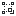</a> | **📂 檔名:** `transform-scale.svg` ✨ **格式:** `Vector (SVG)` ⚖️ **大小:** `930.00B` 📅 **更新:** `2026-03-04`  🚀 **jsDelivr Markdown:** `` 🔗 **直接連結 (Url):** <code>https://cdn.jsdelivr.net/gh/barry028/materials@main/images/iCons/Pixel/Breeze/Actions%20/16/transform-scale.svg</code> 📥 [檢視原始檔](transform-scale.svg) |
|  | **📂 檔名:** `transform-shear-right.svg` ✨ **格式:** `Vector (SVG)` ⚖️ **大小:** `489.00B` 📅 **更新:** `2026-03-04`  🚀 **jsDelivr Markdown:** `` 🔗 **直接連結 (Url):** <code>https://cdn.jsdelivr.net/gh/barry028/materials@main/images/iCons/Pixel/Breeze/Actions%20/16/transform-shear-right.svg</code> 📥 [檢視原始檔](transform-shear-right.svg) |
|  | **📂 檔名:** `transform-shear-up.svg` ✨ **格式:** `Vector (SVG)` ⚖️ **大小:** `490.00B` 📅 **更新:** `2026-03-04`  🚀 **jsDelivr Markdown:** `` 🔗 **直接連結 (Url):** <code>https://cdn.jsdelivr.net/gh/barry028/materials@main/images/iCons/Pixel/Breeze/Actions%20/16/transform-shear-up.svg</code> 📥 [檢視原始檔](transform-shear-up.svg) |
|  | **📂 檔名:** `trash-empty.svg` ✨ **格式:** `Vector (SVG)` ⚖️ **大小:** `394.00B` 📅 **更新:** `2026-03-04`  🚀 **jsDelivr Markdown:** `` 🔗 **直接連結 (Url):** <code>https://cdn.jsdelivr.net/gh/barry028/materials@main/images/iCons/Pixel/Breeze/Actions%20/16/trash-empty.svg</code> 📥 [檢視原始檔](trash-empty.svg) |
|  | **📂 檔名:** `trim-margins.svg` ✨ **格式:** `Vector (SVG)` ⚖️ **大小:** `418.00B` 📅 **更新:** `2026-03-04`  🚀 **jsDelivr Markdown:** `` 🔗 **直接連結 (Url):** <code>https://cdn.jsdelivr.net/gh/barry028/materials@main/images/iCons/Pixel/Breeze/Actions%20/16/trim-margins.svg</code> 📥 [檢視原始檔](trim-margins.svg) |
|  | **📂 檔名:** `trim-to-selection.svg` ✨ **格式:** `Vector (SVG)` ⚖️ **大小:** `463.00B` 📅 **更新:** `2026-03-04`  🚀 **jsDelivr Markdown:** `` 🔗 **直接連結 (Url):** <code>https://cdn.jsdelivr.net/gh/barry028/materials@main/images/iCons/Pixel/Breeze/Actions%20/16/trim-to-selection.svg</code> 📥 [檢視原始檔](trim-to-selection.svg) |
|  | **📂 檔名:** `umbrello_diagram_deployment.svg` ✨ **格式:** `Vector (SVG)` ⚖️ **大小:** `722.00B` 📅 **更新:** `2026-03-04`  🚀 **jsDelivr Markdown:** `` 🔗 **直接連結 (Url):** <code>https://cdn.jsdelivr.net/gh/barry028/materials@main/images/iCons/Pixel/Breeze/Actions%20/16/umbrello_diagram_deployment.svg</code> 📥 [檢視原始檔](umbrello_diagram_deployment.svg) |
|  | **📂 檔名:** `uniassociation.svg` ✨ **格式:** `Vector (SVG)` ⚖️ **大小:** `453.00B` 📅 **更新:** `2026-03-04`  🚀 **jsDelivr Markdown:** `` 🔗 **直接連結 (Url):** <code>https://cdn.jsdelivr.net/gh/barry028/materials@main/images/iCons/Pixel/Breeze/Actions%20/16/uniassociation.svg</code> 📥 [檢視原始檔](uniassociation.svg) |
|  | **📂 檔名:** `unique_constraint.svg` ✨ **格式:** `Vector (SVG)` ⚖️ **大小:** `434.00B` 📅 **更新:** `2026-03-04`  🚀 **jsDelivr Markdown:** `` 🔗 **直接連結 (Url):** <code>https://cdn.jsdelivr.net/gh/barry028/materials@main/images/iCons/Pixel/Breeze/Actions%20/16/unique_constraint.svg</code> 📥 [檢視原始檔](unique_constraint.svg) |
| <a href="unmarkasblank.svg">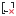</a> | **📂 檔名:** `unmarkasblank.svg` ✨ **格式:** `Vector (SVG)` ⚖️ **大小:** `835.00B` 📅 **更新:** `2026-03-04`  🚀 **jsDelivr Markdown:** `` 🔗 **直接連結 (Url):** <code>https://cdn.jsdelivr.net/gh/barry028/materials@main/images/iCons/Pixel/Breeze/Actions%20/16/unmarkasblank.svg</code> 📥 [檢視原始檔](unmarkasblank.svg) |
|  | **📂 檔名:** `upindicator.svg` ✨ **格式:** `Vector (SVG)` ⚖️ **大小:** `350.00B` 📅 **更新:** `2026-03-04`  🚀 **jsDelivr Markdown:** `` 🔗 **直接連結 (Url):** <code>https://cdn.jsdelivr.net/gh/barry028/materials@main/images/iCons/Pixel/Breeze/Actions%20/16/upindicator.svg</code> 📥 [檢視原始檔](upindicator.svg) |
|  | **📂 檔名:** `upload-later.svg` ✨ **格式:** `Vector (SVG)` ⚖️ **大小:** `743.00B` 📅 **更新:** `2026-03-04`  🚀 **jsDelivr Markdown:** `` 🔗 **直接連結 (Url):** <code>https://cdn.jsdelivr.net/gh/barry028/materials@main/images/iCons/Pixel/Breeze/Actions%20/16/upload-later.svg</code> 📥 [檢視原始檔](upload-later.svg) |
|  | **📂 檔名:** `upload-media.svg` ✨ **格式:** `Vector (SVG)` ⚖️ **大小:** `791.00B` 📅 **更新:** `2026-03-04`  🚀 **jsDelivr Markdown:** `` 🔗 **直接連結 (Url):** <code>https://cdn.jsdelivr.net/gh/barry028/materials@main/images/iCons/Pixel/Breeze/Actions%20/16/upload-media.svg</code> 📥 [檢視原始檔](upload-media.svg) |
|  | **📂 檔名:** `user-group-delete.svg` ✨ **格式:** `Vector (SVG)` ⚖️ **大小:** `968.00B` 📅 **更新:** `2026-03-04`  🚀 **jsDelivr Markdown:** `` 🔗 **直接連結 (Url):** <code>https://cdn.jsdelivr.net/gh/barry028/materials@main/images/iCons/Pixel/Breeze/Actions%20/16/user-group-delete.svg</code> 📥 [檢視原始檔](user-group-delete.svg) |
|  | **📂 檔名:** `user-group-new.svg` ✨ **格式:** `Vector (SVG)` ⚖️ **大小:** `916.00B` 📅 **更新:** `2026-03-04`  🚀 **jsDelivr Markdown:** `` 🔗 **直接連結 (Url):** <code>https://cdn.jsdelivr.net/gh/barry028/materials@main/images/iCons/Pixel/Breeze/Actions%20/16/user-group-new.svg</code> 📥 [檢視原始檔](user-group-new.svg) |
|  | **📂 檔名:** `user-group-properties.svg` ✨ **格式:** `Vector (SVG)` ⚖️ **大小:** `678.00B` 📅 **更新:** `2026-03-04`  🚀 **jsDelivr Markdown:** `` 🔗 **直接連結 (Url):** <code>https://cdn.jsdelivr.net/gh/barry028/materials@main/images/iCons/Pixel/Breeze/Actions%20/16/user-group-properties.svg</code> 📥 [檢視原始檔](user-group-properties.svg) |
|  | **📂 檔名:** `user-others.svg` ✨ **格式:** `Vector (SVG)` ⚖️ **大小:** `953.00B` 📅 **更新:** `2026-03-04`  🚀 **jsDelivr Markdown:** `` 🔗 **直接連結 (Url):** <code>https://cdn.jsdelivr.net/gh/barry028/materials@main/images/iCons/Pixel/Breeze/Actions%20/16/user-others.svg</code> 📥 [檢視原始檔](user-others.svg) |
|  | **📂 檔名:** `vcs-branch-delete.svg` ✨ **格式:** `Vector (SVG)` ⚖️ **大小:** `2.24KB` 📅 **更新:** `2026-03-04`  🚀 **jsDelivr Markdown:** `` 🔗 **直接連結 (Url):** <code>https://cdn.jsdelivr.net/gh/barry028/materials@main/images/iCons/Pixel/Breeze/Actions%20/16/vcs-branch-delete.svg</code> 📥 [檢視原始檔](vcs-branch-delete.svg) |
|  | **📂 檔名:** `vcs-branch.svg` ✨ **格式:** `Vector (SVG)` ⚖️ **大小:** `1.27KB` 📅 **更新:** `2026-03-04`  🚀 **jsDelivr Markdown:** `` 🔗 **直接連結 (Url):** <code>https://cdn.jsdelivr.net/gh/barry028/materials@main/images/iCons/Pixel/Breeze/Actions%20/16/vcs-branch.svg</code> 📥 [檢視原始檔](vcs-branch.svg) |
|  | **📂 檔名:** `vcs-commit.svg` ✨ **格式:** `Vector (SVG)` ⚖️ **大小:** `566.00B` 📅 **更新:** `2026-03-04`  🚀 **jsDelivr Markdown:** `` 🔗 **直接連結 (Url):** <code>https://cdn.jsdelivr.net/gh/barry028/materials@main/images/iCons/Pixel/Breeze/Actions%20/16/vcs-commit.svg</code> 📥 [檢視原始檔](vcs-commit.svg) |
|  | **📂 檔名:** `vcs-diff.svg` ✨ **格式:** `Vector (SVG)` ⚖️ **大小:** `1.62KB` 📅 **更新:** `2026-03-04`  🚀 **jsDelivr Markdown:** `` 🔗 **直接連結 (Url):** <code>https://cdn.jsdelivr.net/gh/barry028/materials@main/images/iCons/Pixel/Breeze/Actions%20/16/vcs-diff.svg</code> 📥 [檢視原始檔](vcs-diff.svg) |
|  | **📂 檔名:** `vcs-merge-request.svg` ✨ **格式:** `Vector (SVG)` ⚖️ **大小:** `1.36KB` 📅 **更新:** `2026-03-04`  🚀 **jsDelivr Markdown:** `` 🔗 **直接連結 (Url):** <code>https://cdn.jsdelivr.net/gh/barry028/materials@main/images/iCons/Pixel/Breeze/Actions%20/16/vcs-merge-request.svg</code> 📥 [檢視原始檔](vcs-merge-request.svg) |
|  | **📂 檔名:** `vcs-merge.svg` ✨ **格式:** `Vector (SVG)` ⚖️ **大小:** `1.08KB` 📅 **更新:** `2026-03-04`  🚀 **jsDelivr Markdown:** `` 🔗 **直接連結 (Url):** <code>https://cdn.jsdelivr.net/gh/barry028/materials@main/images/iCons/Pixel/Breeze/Actions%20/16/vcs-merge.svg</code> 📥 [檢視原始檔](vcs-merge.svg) |
|  | **📂 檔名:** `vcs-pull.svg` ✨ **格式:** `Vector (SVG)` ⚖️ **大小:** `628.00B` 📅 **更新:** `2026-03-04`  🚀 **jsDelivr Markdown:** `` 🔗 **直接連結 (Url):** <code>https://cdn.jsdelivr.net/gh/barry028/materials@main/images/iCons/Pixel/Breeze/Actions%20/16/vcs-pull.svg</code> 📥 [檢視原始檔](vcs-pull.svg) |
|  | **📂 檔名:** `vcs-stash.svg` ✨ **格式:** `Vector (SVG)` ⚖️ **大小:** `876.00B` 📅 **更新:** `2026-03-04`  🚀 **jsDelivr Markdown:** `` 🔗 **直接連結 (Url):** <code>https://cdn.jsdelivr.net/gh/barry028/materials@main/images/iCons/Pixel/Breeze/Actions%20/16/vcs-stash.svg</code> 📥 [檢視原始檔](vcs-stash.svg) |
|  | **📂 檔名:** `view-barcode-add.svg` ✨ **格式:** `Vector (SVG)` ⚖️ **大小:** `645.00B` 📅 **更新:** `2026-03-04`  🚀 **jsDelivr Markdown:** `` 🔗 **直接連結 (Url):** <code>https://cdn.jsdelivr.net/gh/barry028/materials@main/images/iCons/Pixel/Breeze/Actions%20/16/view-barcode-add.svg</code> 📥 [檢視原始檔](view-barcode-add.svg) |
|  | **📂 檔名:** `view-barcode-qr.svg` ✨ **格式:** `Vector (SVG)` ⚖️ **大小:** `1.25KB` 📅 **更新:** `2026-03-04`  🚀 **jsDelivr Markdown:** `` 🔗 **直接連結 (Url):** <code>https://cdn.jsdelivr.net/gh/barry028/materials@main/images/iCons/Pixel/Breeze/Actions%20/16/view-barcode-qr.svg</code> 📥 [檢視原始檔](view-barcode-qr.svg) |
|  | **📂 檔名:** `view-barcode.svg` ✨ **格式:** `Vector (SVG)` ⚖️ **大小:** `546.00B` 📅 **更新:** `2026-03-04`  🚀 **jsDelivr Markdown:** `` 🔗 **直接連結 (Url):** <code>https://cdn.jsdelivr.net/gh/barry028/materials@main/images/iCons/Pixel/Breeze/Actions%20/16/view-barcode.svg</code> 📥 [檢視原始檔](view-barcode.svg) |
|  | **📂 檔名:** `view-calendar-agenda.svg` ✨ **格式:** `Vector (SVG)` ⚖️ **大小:** `726.00B` 📅 **更新:** `2026-03-04`  🚀 **jsDelivr Markdown:** `` 🔗 **直接連結 (Url):** <code>https://cdn.jsdelivr.net/gh/barry028/materials@main/images/iCons/Pixel/Breeze/Actions%20/16/view-calendar-agenda.svg</code> 📥 [檢視原始檔](view-calendar-agenda.svg) |
|  | **📂 檔名:** `view-calendar-birthday.svg` ✨ **格式:** `Vector (SVG)` ⚖️ **大小:** `1.07KB` 📅 **更新:** `2026-03-04`  🚀 **jsDelivr Markdown:** `` 🔗 **直接連結 (Url):** <code>https://cdn.jsdelivr.net/gh/barry028/materials@main/images/iCons/Pixel/Breeze/Actions%20/16/view-calendar-birthday.svg</code> 📥 [檢視原始檔](view-calendar-birthday.svg) |
|  | **📂 檔名:** `view-calendar-journal.svg` ✨ **格式:** `Vector (SVG)` ⚖️ **大小:** `494.00B` 📅 **更新:** `2026-03-04`  🚀 **jsDelivr Markdown:** `` 🔗 **直接連結 (Url):** <code>https://cdn.jsdelivr.net/gh/barry028/materials@main/images/iCons/Pixel/Breeze/Actions%20/16/view-calendar-journal.svg</code> 📥 [檢視原始檔](view-calendar-journal.svg) |
|  | **📂 檔名:** `view-calendar-list.svg` ✨ **格式:** `Vector (SVG)` ⚖️ **大小:** `633.00B` 📅 **更新:** `2026-03-04`  🚀 **jsDelivr Markdown:** `` 🔗 **直接連結 (Url):** <code>https://cdn.jsdelivr.net/gh/barry028/materials@main/images/iCons/Pixel/Breeze/Actions%20/16/view-calendar-list.svg</code> 📥 [檢視原始檔](view-calendar-list.svg) |
|  | **📂 檔名:** `view-calendar-month.svg` ✨ **格式:** `Vector (SVG)` ⚖️ **大小:** `654.00B` 📅 **更新:** `2026-03-04`  🚀 **jsDelivr Markdown:** `` 🔗 **直接連結 (Url):** <code>https://cdn.jsdelivr.net/gh/barry028/materials@main/images/iCons/Pixel/Breeze/Actions%20/16/view-calendar-month.svg</code> 📥 [檢視原始檔](view-calendar-month.svg) |
|  | **📂 檔名:** `view-calendar-special-occasion.svg` ✨ **格式:** `Vector (SVG)` ⚖️ **大小:** `599.00B` 📅 **更新:** `2026-03-04`  🚀 **jsDelivr Markdown:** `` 🔗 **直接連結 (Url):** <code>https://cdn.jsdelivr.net/gh/barry028/materials@main/images/iCons/Pixel/Breeze/Actions%20/16/view-calendar-special-occasion.svg</code> 📥 [檢視原始檔](view-calendar-special-occasion.svg) |
|  | **📂 檔名:** `view-calendar-tasks.svg` ✨ **格式:** `Vector (SVG)` ⚖️ **大小:** `701.00B` 📅 **更新:** `2026-03-04`  🚀 **jsDelivr Markdown:** `` 🔗 **直接連結 (Url):** <code>https://cdn.jsdelivr.net/gh/barry028/materials@main/images/iCons/Pixel/Breeze/Actions%20/16/view-calendar-tasks.svg</code> 📥 [檢視原始檔](view-calendar-tasks.svg) |
|  | **📂 檔名:** `view-calendar-timeline.svg` ✨ **格式:** `Vector (SVG)` ⚖️ **大小:** `638.00B` 📅 **更新:** `2026-03-04`  🚀 **jsDelivr Markdown:** `` 🔗 **直接連結 (Url):** <code>https://cdn.jsdelivr.net/gh/barry028/materials@main/images/iCons/Pixel/Breeze/Actions%20/16/view-calendar-timeline.svg</code> 📥 [檢視原始檔](view-calendar-timeline.svg) |
|  | **📂 檔名:** `view-calendar-upcoming-days.svg` ✨ **格式:** `Vector (SVG)` ⚖️ **大小:** `650.00B` 📅 **更新:** `2026-03-04`  🚀 **jsDelivr Markdown:** `` 🔗 **直接連結 (Url):** <code>https://cdn.jsdelivr.net/gh/barry028/materials@main/images/iCons/Pixel/Breeze/Actions%20/16/view-calendar-upcoming-days.svg</code> 📥 [檢視原始檔](view-calendar-upcoming-days.svg) |
|  | **📂 檔名:** `view-calendar-upcoming-events.svg` ✨ **格式:** `Vector (SVG)` ⚖️ **大小:** `598.00B` 📅 **更新:** `2026-03-04`  🚀 **jsDelivr Markdown:** `` 🔗 **直接連結 (Url):** <code>https://cdn.jsdelivr.net/gh/barry028/materials@main/images/iCons/Pixel/Breeze/Actions%20/16/view-calendar-upcoming-events.svg</code> 📥 [檢視原始檔](view-calendar-upcoming-events.svg) |
|  | **📂 檔名:** `view-calendar-wedding-anniversary.svg` ✨ **格式:** `Vector (SVG)` ⚖️ **大小:** `1.10KB` 📅 **更新:** `2026-03-04`  🚀 **jsDelivr Markdown:** `` 🔗 **直接連結 (Url):** <code>https://cdn.jsdelivr.net/gh/barry028/materials@main/images/iCons/Pixel/Breeze/Actions%20/16/view-calendar-wedding-anniversary.svg</code> 📥 [檢視原始檔](view-calendar-wedding-anniversary.svg) |
|  | **📂 檔名:** `view-calendar-whatsnext.svg` ✨ **格式:** `Vector (SVG)` ⚖️ **大小:** `745.00B` 📅 **更新:** `2026-03-04`  🚀 **jsDelivr Markdown:** `` 🔗 **直接連結 (Url):** <code>https://cdn.jsdelivr.net/gh/barry028/materials@main/images/iCons/Pixel/Breeze/Actions%20/16/view-calendar-whatsnext.svg</code> 📥 [檢視原始檔](view-calendar-whatsnext.svg) |
|  | **📂 檔名:** `view-choose.svg` ✨ **格式:** `Vector (SVG)` ⚖️ **大小:** `578.00B` 📅 **更新:** `2026-03-04`  🚀 **jsDelivr Markdown:** `` 🔗 **直接連結 (Url):** <code>https://cdn.jsdelivr.net/gh/barry028/materials@main/images/iCons/Pixel/Breeze/Actions%20/16/view-choose.svg</code> 📥 [檢視原始檔](view-choose.svg) |
|  | **📂 檔名:** `view-close.svg` ✨ **格式:** `Vector (SVG)` ⚖️ **大小:** `686.00B` 📅 **更新:** `2026-03-04`  🚀 **jsDelivr Markdown:** `` 🔗 **直接連結 (Url):** <code>https://cdn.jsdelivr.net/gh/barry028/materials@main/images/iCons/Pixel/Breeze/Actions%20/16/view-close.svg</code> 📥 [檢視原始檔](view-close.svg) |
| <a href="view-currency-list.svg">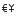</a> | **📂 檔名:** `view-currency-list.svg` ✨ **格式:** `Vector (SVG)` ⚖️ **大小:** `819.00B` 📅 **更新:** `2026-03-04`  🚀 **jsDelivr Markdown:** `` 🔗 **直接連結 (Url):** <code>https://cdn.jsdelivr.net/gh/barry028/materials@main/images/iCons/Pixel/Breeze/Actions%20/16/view-currency-list.svg</code> 📥 [檢視原始檔](view-currency-list.svg) |
|  | **📂 檔名:** `view-filter.svg` ✨ **格式:** `Vector (SVG)` ⚖️ **大小:** `575.00B` 📅 **更新:** `2026-03-04`  🚀 **jsDelivr Markdown:** `` 🔗 **直接連結 (Url):** <code>https://cdn.jsdelivr.net/gh/barry028/materials@main/images/iCons/Pixel/Breeze/Actions%20/16/view-filter.svg</code> 📥 [檢視原始檔](view-filter.svg) |
|  | **📂 檔名:** `view-financial-account-add.svg` ✨ **格式:** `Vector (SVG)` ⚖️ **大小:** `618.00B` 📅 **更新:** `2026-03-04`  🚀 **jsDelivr Markdown:** `` 🔗 **直接連結 (Url):** <code>https://cdn.jsdelivr.net/gh/barry028/materials@main/images/iCons/Pixel/Breeze/Actions%20/16/view-financial-account-add.svg</code> 📥 [檢視原始檔](view-financial-account-add.svg) |
|  | **📂 檔名:** `view-financial-account-asset-closed.svg` ✨ **格式:** `Vector (SVG)` ⚖️ **大小:** `931.00B` 📅 **更新:** `2026-03-04`  🚀 **jsDelivr Markdown:** `` 🔗 **直接連結 (Url):** <code>https://cdn.jsdelivr.net/gh/barry028/materials@main/images/iCons/Pixel/Breeze/Actions%20/16/view-financial-account-asset-closed.svg</code> 📥 [檢視原始檔](view-financial-account-asset-closed.svg) |
|  | **📂 檔名:** `view-financial-account-cash-closed.svg` ✨ **格式:** `Vector (SVG)` ⚖️ **大小:** `791.00B` 📅 **更新:** `2026-03-04`  🚀 **jsDelivr Markdown:** `` 🔗 **直接連結 (Url):** <code>https://cdn.jsdelivr.net/gh/barry028/materials@main/images/iCons/Pixel/Breeze/Actions%20/16/view-financial-account-cash-closed.svg</code> 📥 [檢視原始檔](view-financial-account-cash-closed.svg) |
|  | **📂 檔名:** `view-financial-account-cash.svg` ✨ **格式:** `Vector (SVG)` ⚖️ **大小:** `499.00B` 📅 **更新:** `2026-03-04`  🚀 **jsDelivr Markdown:** `` 🔗 **直接連結 (Url):** <code>https://cdn.jsdelivr.net/gh/barry028/materials@main/images/iCons/Pixel/Breeze/Actions%20/16/view-financial-account-cash.svg</code> 📥 [檢視原始檔](view-financial-account-cash.svg) |
|  | **📂 檔名:** `view-financial-account-checking.svg` ✨ **格式:** `Vector (SVG)` ⚖️ **大小:** `596.00B` 📅 **更新:** `2026-03-04`  🚀 **jsDelivr Markdown:** `` 🔗 **直接連結 (Url):** <code>https://cdn.jsdelivr.net/gh/barry028/materials@main/images/iCons/Pixel/Breeze/Actions%20/16/view-financial-account-checking.svg</code> 📥 [檢視原始檔](view-financial-account-checking.svg) |
|  | **📂 檔名:** `view-financial-account-close.svg` ✨ **格式:** `Vector (SVG)` ⚖️ **大小:** `604.00B` 📅 **更新:** `2026-03-04`  🚀 **jsDelivr Markdown:** `` 🔗 **直接連結 (Url):** <code>https://cdn.jsdelivr.net/gh/barry028/materials@main/images/iCons/Pixel/Breeze/Actions%20/16/view-financial-account-close.svg</code> 📥 [檢視原始檔](view-financial-account-close.svg) |
|  | **📂 檔名:** `view-financial-account-closed.svg` ✨ **格式:** `Vector (SVG)` ⚖️ **大小:** `997.00B` 📅 **更新:** `2026-03-04`  🚀 **jsDelivr Markdown:** `` 🔗 **直接連結 (Url):** <code>https://cdn.jsdelivr.net/gh/barry028/materials@main/images/iCons/Pixel/Breeze/Actions%20/16/view-financial-account-closed.svg</code> 📥 [檢視原始檔](view-financial-account-closed.svg) |
|  | **📂 檔名:** `view-financial-account-delete.svg` ✨ **格式:** `Vector (SVG)` ⚖️ **大小:** `811.00B` 📅 **更新:** `2026-03-04`  🚀 **jsDelivr Markdown:** `` 🔗 **直接連結 (Url):** <code>https://cdn.jsdelivr.net/gh/barry028/materials@main/images/iCons/Pixel/Breeze/Actions%20/16/view-financial-account-delete.svg</code> 📥 [檢視原始檔](view-financial-account-delete.svg) |
|  | **📂 檔名:** `view-financial-account-edit.svg` ✨ **格式:** `Vector (SVG)` ⚖️ **大小:** `729.00B` 📅 **更新:** `2026-03-04`  🚀 **jsDelivr Markdown:** `` 🔗 **直接連結 (Url):** <code>https://cdn.jsdelivr.net/gh/barry028/materials@main/images/iCons/Pixel/Breeze/Actions%20/16/view-financial-account-edit.svg</code> 📥 [檢視原始檔](view-financial-account-edit.svg) |
|  | **📂 檔名:** `view-financial-account-investment-closed.svg` ✨ **格式:** `Vector (SVG)` ⚖️ **大小:** `1.05KB` 📅 **更新:** `2026-03-04`  🚀 **jsDelivr Markdown:** `` 🔗 **直接連結 (Url):** <code>https://cdn.jsdelivr.net/gh/barry028/materials@main/images/iCons/Pixel/Breeze/Actions%20/16/view-financial-account-investment-closed.svg</code> 📥 [檢視原始檔](view-financial-account-investment-closed.svg) |
|  | **📂 檔名:** `view-financial-account-investment-security.svg` ✨ **格式:** `Vector (SVG)` ⚖️ **大小:** `952.00B` 📅 **更新:** `2026-03-04`  🚀 **jsDelivr Markdown:** `` 🔗 **直接連結 (Url):** <code>https://cdn.jsdelivr.net/gh/barry028/materials@main/images/iCons/Pixel/Breeze/Actions%20/16/view-financial-account-investment-security.svg</code> 📥 [檢視原始檔](view-financial-account-investment-security.svg) |
|  | **📂 檔名:** `view-financial-account-investment.svg` ✨ **格式:** `Vector (SVG)` ⚖️ **大小:** `752.00B` 📅 **更新:** `2026-03-04`  🚀 **jsDelivr Markdown:** `` 🔗 **直接連結 (Url):** <code>https://cdn.jsdelivr.net/gh/barry028/materials@main/images/iCons/Pixel/Breeze/Actions%20/16/view-financial-account-investment.svg</code> 📥 [檢視原始檔](view-financial-account-investment.svg) |
|  | **📂 檔名:** `view-financial-account-liability-closed.svg` ✨ **格式:** `Vector (SVG)` ⚖️ **大小:** `1.17KB` 📅 **更新:** `2026-03-04`  🚀 **jsDelivr Markdown:** `` 🔗 **直接連結 (Url):** <code>https://cdn.jsdelivr.net/gh/barry028/materials@main/images/iCons/Pixel/Breeze/Actions%20/16/view-financial-account-liability-closed.svg</code> 📥 [檢視原始檔](view-financial-account-liability-closed.svg) |
|  | **📂 檔名:** `view-financial-account-loan-closed.svg` ✨ **格式:** `Vector (SVG)` ⚖️ **大小:** `634.00B` 📅 **更新:** `2026-03-04`  🚀 **jsDelivr Markdown:** `` 🔗 **直接連結 (Url):** <code>https://cdn.jsdelivr.net/gh/barry028/materials@main/images/iCons/Pixel/Breeze/Actions%20/16/view-financial-account-loan-closed.svg</code> 📥 [檢視原始檔](view-financial-account-loan-closed.svg) |
|  | **📂 檔名:** `view-financial-account-loan.svg` ✨ **格式:** `Vector (SVG)` ⚖️ **大小:** `408.00B` 📅 **更新:** `2026-03-04`  🚀 **jsDelivr Markdown:** `` 🔗 **直接連結 (Url):** <code>https://cdn.jsdelivr.net/gh/barry028/materials@main/images/iCons/Pixel/Breeze/Actions%20/16/view-financial-account-loan.svg</code> 📥 [檢視原始檔](view-financial-account-loan.svg) |
|  | **📂 檔名:** `view-financial-account-reopen.svg` ✨ **格式:** `Vector (SVG)` ⚖️ **大小:** `685.00B` 📅 **更新:** `2026-03-04`  🚀 **jsDelivr Markdown:** `` 🔗 **直接連結 (Url):** <code>https://cdn.jsdelivr.net/gh/barry028/materials@main/images/iCons/Pixel/Breeze/Actions%20/16/view-financial-account-reopen.svg</code> 📥 [檢視原始檔](view-financial-account-reopen.svg) |
|  | **📂 檔名:** `view-financial-account-savings-closed.svg` ✨ **格式:** `Vector (SVG)` ⚖️ **大小:** `774.00B` 📅 **更新:** `2026-03-04`  🚀 **jsDelivr Markdown:** `` 🔗 **直接連結 (Url):** <code>https://cdn.jsdelivr.net/gh/barry028/materials@main/images/iCons/Pixel/Breeze/Actions%20/16/view-financial-account-savings-closed.svg</code> 📥 [檢視原始檔](view-financial-account-savings-closed.svg) |
|  | **📂 檔名:** `view-financial-budget.svg` ✨ **格式:** `Vector (SVG)` ⚖️ **大小:** `1002.00B` 📅 **更新:** `2026-03-04`  🚀 **jsDelivr Markdown:** `` 🔗 **直接連結 (Url):** <code>https://cdn.jsdelivr.net/gh/barry028/materials@main/images/iCons/Pixel/Breeze/Actions%20/16/view-financial-budget.svg</code> 📥 [檢視原始檔](view-financial-budget.svg) |
|  | **📂 檔名:** `view-financial-category-add.svg` ✨ **格式:** `Vector (SVG)` ⚖️ **大小:** `370.00B` 📅 **更新:** `2026-03-04`  🚀 **jsDelivr Markdown:** `` 🔗 **直接連結 (Url):** <code>https://cdn.jsdelivr.net/gh/barry028/materials@main/images/iCons/Pixel/Breeze/Actions%20/16/view-financial-category-add.svg</code> 📥 [檢視原始檔](view-financial-category-add.svg) |
|  | **📂 檔名:** `view-financial-category-income.svg` ✨ **格式:** `Vector (SVG)` ⚖️ **大小:** `549.00B` 📅 **更新:** `2026-03-04`  🚀 **jsDelivr Markdown:** `` 🔗 **直接連結 (Url):** <code>https://cdn.jsdelivr.net/gh/barry028/materials@main/images/iCons/Pixel/Breeze/Actions%20/16/view-financial-category-income.svg</code> 📥 [檢視原始檔](view-financial-category-income.svg) |
|  | **📂 檔名:** `view-financial-transfer-unreconciled.svg` ✨ **格式:** `Vector (SVG)` ⚖️ **大小:** `656.00B` 📅 **更新:** `2026-03-04`  🚀 **jsDelivr Markdown:** `` 🔗 **直接連結 (Url):** <code>https://cdn.jsdelivr.net/gh/barry028/materials@main/images/iCons/Pixel/Breeze/Actions%20/16/view-financial-transfer-unreconciled.svg</code> 📥 [檢視原始檔](view-financial-transfer-unreconciled.svg) |
|  | **📂 檔名:** `view-form.svg` ✨ **格式:** `Vector (SVG)` ⚖️ **大小:** `756.00B` 📅 **更新:** `2026-03-04`  🚀 **jsDelivr Markdown:** `` 🔗 **直接連結 (Url):** <code>https://cdn.jsdelivr.net/gh/barry028/materials@main/images/iCons/Pixel/Breeze/Actions%20/16/view-form.svg</code> 📥 [檢視原始檔](view-form.svg) |
|  | **📂 檔名:** `view-fullscreen.svg` ✨ **格式:** `Vector (SVG)` ⚖️ **大小:** `578.00B` 📅 **更新:** `2026-03-04`  🚀 **jsDelivr Markdown:** `` 🔗 **直接連結 (Url):** <code>https://cdn.jsdelivr.net/gh/barry028/materials@main/images/iCons/Pixel/Breeze/Actions%20/16/view-fullscreen.svg</code> 📥 [檢視原始檔](view-fullscreen.svg) |
|  | **📂 檔名:** `view-grid.svg` ✨ **格式:** `Vector (SVG)` ⚖️ **大小:** `656.00B` 📅 **更新:** `2026-03-04`  🚀 **jsDelivr Markdown:** `` 🔗 **直接連結 (Url):** <code>https://cdn.jsdelivr.net/gh/barry028/materials@main/images/iCons/Pixel/Breeze/Actions%20/16/view-grid.svg</code> 📥 [檢視原始檔](view-grid.svg) |
|  | **📂 檔名:** `view-group.svg` ✨ **格式:** `Vector (SVG)` ⚖️ **大小:** `612.00B` 📅 **更新:** `2026-03-04`  🚀 **jsDelivr Markdown:** `` 🔗 **直接連結 (Url):** <code>https://cdn.jsdelivr.net/gh/barry028/materials@main/images/iCons/Pixel/Breeze/Actions%20/16/view-group.svg</code> 📥 [檢視原始檔](view-group.svg) |
|  | **📂 檔名:** `view-hidden.svg` ✨ **格式:** `Vector (SVG)` ⚖️ **大小:** `1.23KB` 📅 **更新:** `2026-03-04`  🚀 **jsDelivr Markdown:** `` 🔗 **直接連結 (Url):** <code>https://cdn.jsdelivr.net/gh/barry028/materials@main/images/iCons/Pixel/Breeze/Actions%20/16/view-hidden.svg</code> 📥 [檢視原始檔](view-hidden.svg) |
|  | **📂 檔名:** `view-institution-delete.svg` ✨ **格式:** `Vector (SVG)` ⚖️ **大小:** `716.00B` 📅 **更新:** `2026-03-04`  🚀 **jsDelivr Markdown:** `` 🔗 **直接連結 (Url):** <code>https://cdn.jsdelivr.net/gh/barry028/materials@main/images/iCons/Pixel/Breeze/Actions%20/16/view-institution-delete.svg</code> 📥 [檢視原始檔](view-institution-delete.svg) |
|  | **📂 檔名:** `view-institution-edit.svg` ✨ **格式:** `Vector (SVG)` ⚖️ **大小:** `566.00B` 📅 **更新:** `2026-03-04`  🚀 **jsDelivr Markdown:** `` 🔗 **直接連結 (Url):** <code>https://cdn.jsdelivr.net/gh/barry028/materials@main/images/iCons/Pixel/Breeze/Actions%20/16/view-institution-edit.svg</code> 📥 [檢視原始檔](view-institution-edit.svg) |
|  | **📂 檔名:** `view-institution.svg` ✨ **格式:** `Vector (SVG)` ⚖️ **大小:** `503.00B` 📅 **更新:** `2026-03-04`  🚀 **jsDelivr Markdown:** `` 🔗 **直接連結 (Url):** <code>https://cdn.jsdelivr.net/gh/barry028/materials@main/images/iCons/Pixel/Breeze/Actions%20/16/view-institution.svg</code> 📥 [檢視原始檔](view-institution.svg) |
|  | **📂 檔名:** `view-left-close.svg` ✨ **格式:** `Vector (SVG)` ⚖️ **大小:** `1021.00B` 📅 **更新:** `2026-03-04`  🚀 **jsDelivr Markdown:** `` 🔗 **直接連結 (Url):** <code>https://cdn.jsdelivr.net/gh/barry028/materials@main/images/iCons/Pixel/Breeze/Actions%20/16/view-left-close.svg</code> 📥 [檢視原始檔](view-left-close.svg) |
|  | **📂 檔名:** `view-left-new.svg` ✨ **格式:** `Vector (SVG)` ⚖️ **大小:** `360.00B` 📅 **更新:** `2026-03-04`  🚀 **jsDelivr Markdown:** `` 🔗 **直接連結 (Url):** <code>https://cdn.jsdelivr.net/gh/barry028/materials@main/images/iCons/Pixel/Breeze/Actions%20/16/view-left-new.svg</code> 📥 [檢視原始檔](view-left-new.svg) |
|  | **📂 檔名:** `view-list-details.svg` ✨ **格式:** `Vector (SVG)` ⚖️ **大小:** `579.00B` 📅 **更新:** `2026-03-04`  🚀 **jsDelivr Markdown:** `` 🔗 **直接連結 (Url):** <code>https://cdn.jsdelivr.net/gh/barry028/materials@main/images/iCons/Pixel/Breeze/Actions%20/16/view-list-details.svg</code> 📥 [檢視原始檔](view-list-details.svg) |
|  | **📂 檔名:** `view-list-icons.svg` ✨ **格式:** `Vector (SVG)` ⚖️ **大小:** `548.00B` 📅 **更新:** `2026-03-04`  🚀 **jsDelivr Markdown:** `` 🔗 **直接連結 (Url):** <code>https://cdn.jsdelivr.net/gh/barry028/materials@main/images/iCons/Pixel/Breeze/Actions%20/16/view-list-icons.svg</code> 📥 [檢視原始檔](view-list-icons.svg) |
|  | **📂 檔名:** `view-list-text.svg` ✨ **格式:** `Vector (SVG)` ⚖️ **大小:** `553.00B` 📅 **更新:** `2026-03-04`  🚀 **jsDelivr Markdown:** `` 🔗 **直接連結 (Url):** <code>https://cdn.jsdelivr.net/gh/barry028/materials@main/images/iCons/Pixel/Breeze/Actions%20/16/view-list-text.svg</code> 📥 [檢視原始檔](view-list-text.svg) |
|  | **📂 檔名:** `view-media-equalizer.svg` ✨ **格式:** `Vector (SVG)` ⚖️ **大小:** `1.06KB` 📅 **更新:** `2026-03-04`  🚀 **jsDelivr Markdown:** `` 🔗 **直接連結 (Url):** <code>https://cdn.jsdelivr.net/gh/barry028/materials@main/images/iCons/Pixel/Breeze/Actions%20/16/view-media-equalizer.svg</code> 📥 [檢視原始檔](view-media-equalizer.svg) |
|  | **📂 檔名:** `view-media-lyrics.svg` ✨ **格式:** `Vector (SVG)` ⚖️ **大小:** `659.00B` 📅 **更新:** `2026-03-04`  🚀 **jsDelivr Markdown:** `` 🔗 **直接連結 (Url):** <code>https://cdn.jsdelivr.net/gh/barry028/materials@main/images/iCons/Pixel/Breeze/Actions%20/16/view-media-lyrics.svg</code> 📥 [檢視原始檔](view-media-lyrics.svg) |
|  | **📂 檔名:** `view-media-visualization.svg` ✨ **格式:** `Vector (SVG)` ⚖️ **大小:** `701.00B` 📅 **更新:** `2026-03-04`  🚀 **jsDelivr Markdown:** `` 🔗 **直接連結 (Url):** <code>https://cdn.jsdelivr.net/gh/barry028/materials@main/images/iCons/Pixel/Breeze/Actions%20/16/view-media-visualization.svg</code> 📥 [檢視原始檔](view-media-visualization.svg) |
|  | **📂 檔名:** `view-more-horizontal-symbolic.svg` ✨ **格式:** `Vector (SVG)` ⚖️ **大小:** `465.00B` 📅 **更新:** `2026-03-04`  🚀 **jsDelivr Markdown:** `` 🔗 **直接連結 (Url):** <code>https://cdn.jsdelivr.net/gh/barry028/materials@main/images/iCons/Pixel/Breeze/Actions%20/16/view-more-horizontal-symbolic.svg</code> 📥 [檢視原始檔](view-more-horizontal-symbolic.svg) |
|  | **📂 檔名:** `view-object-histogram-linear.svg` ✨ **格式:** `Vector (SVG)` ⚖️ **大小:** `471.00B` 📅 **更新:** `2026-03-04`  🚀 **jsDelivr Markdown:** `` 🔗 **直接連結 (Url):** <code>https://cdn.jsdelivr.net/gh/barry028/materials@main/images/iCons/Pixel/Breeze/Actions%20/16/view-object-histogram-linear.svg</code> 📥 [檢視原始檔](view-object-histogram-linear.svg) |
|  | **📂 檔名:** `view-pages-continuous.svg` ✨ **格式:** `Vector (SVG)` ⚖️ **大小:** `482.00B` 📅 **更新:** `2026-03-04`  🚀 **jsDelivr Markdown:** `` 🔗 **直接連結 (Url):** <code>https://cdn.jsdelivr.net/gh/barry028/materials@main/images/iCons/Pixel/Breeze/Actions%20/16/view-pages-continuous.svg</code> 📥 [檢視原始檔](view-pages-continuous.svg) |
|  | **📂 檔名:** `view-pages-facing.svg` ✨ **格式:** `Vector (SVG)` ⚖️ **大小:** `386.00B` 📅 **更新:** `2026-03-04`  🚀 **jsDelivr Markdown:** `` 🔗 **直接連結 (Url):** <code>https://cdn.jsdelivr.net/gh/barry028/materials@main/images/iCons/Pixel/Breeze/Actions%20/16/view-pages-facing.svg</code> 📥 [檢視原始檔](view-pages-facing.svg) |
|  | **📂 檔名:** `view-pages-overview.svg` ✨ **格式:** `Vector (SVG)` ⚖️ **大小:** `468.00B` 📅 **更新:** `2026-03-04`  🚀 **jsDelivr Markdown:** `` 🔗 **直接連結 (Url):** <code>https://cdn.jsdelivr.net/gh/barry028/materials@main/images/iCons/Pixel/Breeze/Actions%20/16/view-pages-overview.svg</code> 📥 [檢視原始檔](view-pages-overview.svg) |
|  | **📂 檔名:** `view-pim-tasks-pending.svg` ✨ **格式:** `Vector (SVG)` ⚖️ **大小:** `1.04KB` 📅 **更新:** `2026-03-04`  🚀 **jsDelivr Markdown:** `` 🔗 **直接連結 (Url):** <code>https://cdn.jsdelivr.net/gh/barry028/materials@main/images/iCons/Pixel/Breeze/Actions%20/16/view-pim-tasks-pending.svg</code> 📥 [檢視原始檔](view-pim-tasks-pending.svg) |
|  | **📂 檔名:** `view-presentation.svg` ✨ **格式:** `Vector (SVG)` ⚖️ **大小:** `536.00B` 📅 **更新:** `2026-03-04`  🚀 **jsDelivr Markdown:** `` 🔗 **直接連結 (Url):** <code>https://cdn.jsdelivr.net/gh/barry028/materials@main/images/iCons/Pixel/Breeze/Actions%20/16/view-presentation.svg</code> 📥 [檢視原始檔](view-presentation.svg) |
|  | **📂 檔名:** `view-preview.svg` ✨ **格式:** `Vector (SVG)` ⚖️ **大小:** `637.00B` 📅 **更新:** `2026-03-04`  🚀 **jsDelivr Markdown:** `` 🔗 **直接連結 (Url):** <code>https://cdn.jsdelivr.net/gh/barry028/materials@main/images/iCons/Pixel/Breeze/Actions%20/16/view-preview.svg</code> 📥 [檢視原始檔](view-preview.svg) |
|  | **📂 檔名:** `view-private.svg` ✨ **格式:** `Vector (SVG)` ⚖️ **大小:** `1.43KB` 📅 **更新:** `2026-03-04`  🚀 **jsDelivr Markdown:** `` 🔗 **直接連結 (Url):** <code>https://cdn.jsdelivr.net/gh/barry028/materials@main/images/iCons/Pixel/Breeze/Actions%20/16/view-private.svg</code> 📥 [檢視原始檔](view-private.svg) |
|  | **📂 檔名:** `view-refresh.svg` ✨ **格式:** `Vector (SVG)` ⚖️ **大小:** `586.00B` 📅 **更新:** `2026-03-04`  🚀 **jsDelivr Markdown:** `` 🔗 **直接連結 (Url):** <code>https://cdn.jsdelivr.net/gh/barry028/materials@main/images/iCons/Pixel/Breeze/Actions%20/16/view-refresh.svg</code> 📥 [檢視原始檔](view-refresh.svg) |
|  | **📂 檔名:** `view-restore.svg` ✨ **格式:** `Vector (SVG)` ⚖️ **大小:** `552.00B` 📅 **更新:** `2026-03-04`  🚀 **jsDelivr Markdown:** `` 🔗 **直接連結 (Url):** <code>https://cdn.jsdelivr.net/gh/barry028/materials@main/images/iCons/Pixel/Breeze/Actions%20/16/view-restore.svg</code> 📥 [檢視原始檔](view-restore.svg) |
|  | **📂 檔名:** `view-right-new.svg` ✨ **格式:** `Vector (SVG)` ⚖️ **大小:** `532.00B` 📅 **更新:** `2026-03-04`  🚀 **jsDelivr Markdown:** `` 🔗 **直接連結 (Url):** <code>https://cdn.jsdelivr.net/gh/barry028/materials@main/images/iCons/Pixel/Breeze/Actions%20/16/view-right-new.svg</code> 📥 [檢視原始檔](view-right-new.svg) |
|  | **📂 檔名:** `view-sidetree.svg` ✨ **格式:** `Vector (SVG)` ⚖️ **大小:** `629.00B` 📅 **更新:** `2026-03-04`  🚀 **jsDelivr Markdown:** `` 🔗 **直接連結 (Url):** <code>https://cdn.jsdelivr.net/gh/barry028/materials@main/images/iCons/Pixel/Breeze/Actions%20/16/view-sidetree.svg</code> 📥 [檢視原始檔](view-sidetree.svg) |
|  | **📂 檔名:** `view-sort-ascending-name.svg` ✨ **格式:** `Vector (SVG)` ⚖️ **大小:** `1.12KB` 📅 **更新:** `2026-03-04`  🚀 **jsDelivr Markdown:** `` 🔗 **直接連結 (Url):** <code>https://cdn.jsdelivr.net/gh/barry028/materials@main/images/iCons/Pixel/Breeze/Actions%20/16/view-sort-ascending-name.svg</code> 📥 [檢視原始檔](view-sort-ascending-name.svg) |
|  | **📂 檔名:** `view-sort-ascending.svg` ✨ **格式:** `Vector (SVG)` ⚖️ **大小:** `678.00B` 📅 **更新:** `2026-03-04`  🚀 **jsDelivr Markdown:** `` 🔗 **直接連結 (Url):** <code>https://cdn.jsdelivr.net/gh/barry028/materials@main/images/iCons/Pixel/Breeze/Actions%20/16/view-sort-ascending.svg</code> 📥 [檢視原始檔](view-sort-ascending.svg) |
|  | **📂 檔名:** `view-sort-descending-name.svg` ✨ **格式:** `Vector (SVG)` ⚖️ **大小:** `1.14KB` 📅 **更新:** `2026-03-04`  🚀 **jsDelivr Markdown:** `` 🔗 **直接連結 (Url):** <code>https://cdn.jsdelivr.net/gh/barry028/materials@main/images/iCons/Pixel/Breeze/Actions%20/16/view-sort-descending-name.svg</code> 📥 [檢視原始檔](view-sort-descending-name.svg) |
|  | **📂 檔名:** `view-sort-descending.svg` ✨ **格式:** `Vector (SVG)` ⚖️ **大小:** `681.00B` 📅 **更新:** `2026-03-04`  🚀 **jsDelivr Markdown:** `` 🔗 **直接連結 (Url):** <code>https://cdn.jsdelivr.net/gh/barry028/materials@main/images/iCons/Pixel/Breeze/Actions%20/16/view-sort-descending.svg</code> 📥 [檢視原始檔](view-sort-descending.svg) |
|  | **📂 檔名:** `view-sort.svg` ✨ **格式:** `Vector (SVG)` ⚖️ **大小:** `814.00B` 📅 **更新:** `2026-03-04`  🚀 **jsDelivr Markdown:** `` 🔗 **直接連結 (Url):** <code>https://cdn.jsdelivr.net/gh/barry028/materials@main/images/iCons/Pixel/Breeze/Actions%20/16/view-sort.svg</code> 📥 [檢視原始檔](view-sort.svg) |
|  | **📂 檔名:** `view-split-top-bottom.svg` ✨ **格式:** `Vector (SVG)` ⚖️ **大小:** `609.00B` 📅 **更新:** `2026-03-04`  🚀 **jsDelivr Markdown:** `` 🔗 **直接連結 (Url):** <code>https://cdn.jsdelivr.net/gh/barry028/materials@main/images/iCons/Pixel/Breeze/Actions%20/16/view-split-top-bottom.svg</code> 📥 [檢視原始檔](view-split-top-bottom.svg) |
|  | **📂 檔名:** `view-statistics.svg` ✨ **格式:** `Vector (SVG)` ⚖️ **大小:** `445.00B` 📅 **更新:** `2026-03-04`  🚀 **jsDelivr Markdown:** `` 🔗 **直接連結 (Url):** <code>https://cdn.jsdelivr.net/gh/barry028/materials@main/images/iCons/Pixel/Breeze/Actions%20/16/view-statistics.svg</code> 📥 [檢視原始檔](view-statistics.svg) |
|  | **📂 檔名:** `view-task-child.svg` ✨ **格式:** `Vector (SVG)` ⚖️ **大小:** `767.00B` 📅 **更新:** `2026-03-04`  🚀 **jsDelivr Markdown:** `` 🔗 **直接連結 (Url):** <code>https://cdn.jsdelivr.net/gh/barry028/materials@main/images/iCons/Pixel/Breeze/Actions%20/16/view-task-child.svg</code> 📥 [檢視原始檔](view-task-child.svg) |
|  | **📂 檔名:** `view-task.svg` ✨ **格式:** `Vector (SVG)` ⚖️ **大小:** `619.00B` 📅 **更新:** `2026-03-04`  🚀 **jsDelivr Markdown:** `` 🔗 **直接連結 (Url):** <code>https://cdn.jsdelivr.net/gh/barry028/materials@main/images/iCons/Pixel/Breeze/Actions%20/16/view-task.svg</code> 📥 [檢視原始檔](view-task.svg) |
|  | **📂 檔名:** `view-time-schedule-baselined-remove.svg` ✨ **格式:** `Vector (SVG)` ⚖️ **大小:** `1.07KB` 📅 **更新:** `2026-03-04`  🚀 **jsDelivr Markdown:** `` 🔗 **直接連結 (Url):** <code>https://cdn.jsdelivr.net/gh/barry028/materials@main/images/iCons/Pixel/Breeze/Actions%20/16/view-time-schedule-baselined-remove.svg</code> 📥 [檢視原始檔](view-time-schedule-baselined-remove.svg) |
|  | **📂 檔名:** `view-time-schedule-baselined.svg` ✨ **格式:** `Vector (SVG)` ⚖️ **大小:** `996.00B` 📅 **更新:** `2026-03-04`  🚀 **jsDelivr Markdown:** `` 🔗 **直接連結 (Url):** <code>https://cdn.jsdelivr.net/gh/barry028/materials@main/images/iCons/Pixel/Breeze/Actions%20/16/view-time-schedule-baselined.svg</code> 📥 [檢視原始檔](view-time-schedule-baselined.svg) |
|  | **📂 檔名:** `view-time-schedule-calculus.svg` ✨ **格式:** `Vector (SVG)` ⚖️ **大小:** `703.00B` 📅 **更新:** `2026-03-04`  🚀 **jsDelivr Markdown:** `` 🔗 **直接連結 (Url):** <code>https://cdn.jsdelivr.net/gh/barry028/materials@main/images/iCons/Pixel/Breeze/Actions%20/16/view-time-schedule-calculus.svg</code> 📥 [檢視原始檔](view-time-schedule-calculus.svg) |
|  | **📂 檔名:** `view-time-schedule-child-insert.svg` ✨ **格式:** `Vector (SVG)` ⚖️ **大小:** `782.00B` 📅 **更新:** `2026-03-04`  🚀 **jsDelivr Markdown:** `` 🔗 **直接連結 (Url):** <code>https://cdn.jsdelivr.net/gh/barry028/materials@main/images/iCons/Pixel/Breeze/Actions%20/16/view-time-schedule-child-insert.svg</code> 📥 [檢視原始檔](view-time-schedule-child-insert.svg) |
|  | **📂 檔名:** `view-time-schedule-edit.svg` ✨ **格式:** `Vector (SVG)` ⚖️ **大小:** `843.00B` 📅 **更新:** `2026-03-04`  🚀 **jsDelivr Markdown:** `` 🔗 **直接連結 (Url):** <code>https://cdn.jsdelivr.net/gh/barry028/materials@main/images/iCons/Pixel/Breeze/Actions%20/16/view-time-schedule-edit.svg</code> 📥 [檢視原始檔](view-time-schedule-edit.svg) |
|  | **📂 檔名:** `view-web-browser-dom-tree.svg` ✨ **格式:** `Vector (SVG)` ⚖️ **大小:** `9.90KB` 📅 **更新:** `2026-03-04`  🚀 **jsDelivr Markdown:** `` 🔗 **直接連結 (Url):** <code>https://cdn.jsdelivr.net/gh/barry028/materials@main/images/iCons/Pixel/Breeze/Actions%20/16/view-web-browser-dom-tree.svg</code> 📥 [檢視原始檔](view-web-browser-dom-tree.svg) |
|  | **📂 檔名:** `virtual-desktops.svg` ✨ **格式:** `Vector (SVG)` ⚖️ **大小:** `368.00B` 📅 **更新:** `2026-03-04`  🚀 **jsDelivr Markdown:** `` 🔗 **直接連結 (Url):** <code>https://cdn.jsdelivr.net/gh/barry028/materials@main/images/iCons/Pixel/Breeze/Actions%20/16/virtual-desktops.svg</code> 📥 [檢視原始檔](virtual-desktops.svg) |
|  | **📂 檔名:** `widget-alternatives.svg` ✨ **格式:** `Vector (SVG)` ⚖️ **大小:** `595.00B` 📅 **更新:** `2026-03-04`  🚀 **jsDelivr Markdown:** `` 🔗 **直接連結 (Url):** <code>https://cdn.jsdelivr.net/gh/barry028/materials@main/images/iCons/Pixel/Breeze/Actions%20/16/widget-alternatives.svg</code> 📥 [檢視原始檔](widget-alternatives.svg) |
|  | **📂 檔名:** `window-close.svg` ✨ **格式:** `Vector (SVG)` ⚖️ **大小:** `626.00B` 📅 **更新:** `2026-03-04`  🚀 **jsDelivr Markdown:** `` 🔗 **直接連結 (Url):** <code>https://cdn.jsdelivr.net/gh/barry028/materials@main/images/iCons/Pixel/Breeze/Actions%20/16/window-close.svg</code> 📥 [檢視原始檔](window-close.svg) |
|  | **📂 檔名:** `window-new.svg` ✨ **格式:** `Vector (SVG)` ⚖️ **大小:** `541.00B` 📅 **更新:** `2026-03-04`  🚀 **jsDelivr Markdown:** `` 🔗 **直接連結 (Url):** <code>https://cdn.jsdelivr.net/gh/barry028/materials@main/images/iCons/Pixel/Breeze/Actions%20/16/window-new.svg</code> 📥 [檢視原始檔](window-new.svg) |
|  | **📂 檔名:** `window-next.svg` ✨ **格式:** `Vector (SVG)` ⚖️ **大小:** `602.00B` 📅 **更新:** `2026-03-04`  🚀 **jsDelivr Markdown:** `` 🔗 **直接連結 (Url):** <code>https://cdn.jsdelivr.net/gh/barry028/materials@main/images/iCons/Pixel/Breeze/Actions%20/16/window-next.svg</code> 📥 [檢視原始檔](window-next.svg) |
|  | **📂 檔名:** `window-previous.svg` ✨ **格式:** `Vector (SVG)` ⚖️ **大小:** `603.00B` 📅 **更新:** `2026-03-04`  🚀 **jsDelivr Markdown:** `` 🔗 **直接連結 (Url):** <code>https://cdn.jsdelivr.net/gh/barry028/materials@main/images/iCons/Pixel/Breeze/Actions%20/16/window-previous.svg</code> 📥 [檢視原始檔](window-previous.svg) |
|  | **📂 檔名:** `window-restore.svg` ✨ **格式:** `Vector (SVG)` ⚖️ **大小:** `358.00B` 📅 **更新:** `2026-03-04`  🚀 **jsDelivr Markdown:** `` 🔗 **直接連結 (Url):** <code>https://cdn.jsdelivr.net/gh/barry028/materials@main/images/iCons/Pixel/Breeze/Actions%20/16/window-restore.svg</code> 📥 [檢視原始檔](window-restore.svg) |
|  | **📂 檔名:** `window-unpin.svg` ✨ **格式:** `Vector (SVG)` ⚖️ **大小:** `587.00B` 📅 **更新:** `2026-03-04`  🚀 **jsDelivr Markdown:** `` 🔗 **直接連結 (Url):** <code>https://cdn.jsdelivr.net/gh/barry028/materials@main/images/iCons/Pixel/Breeze/Actions%20/16/window-unpin.svg</code> 📥 [檢視原始檔](window-unpin.svg) |
|  | **📂 檔名:** `xml-attribute-delete.svg` ✨ **格式:** `Vector (SVG)` ⚖️ **大小:** `1.60KB` 📅 **更新:** `2026-03-04`  🚀 **jsDelivr Markdown:** `` 🔗 **直接連結 (Url):** <code>https://cdn.jsdelivr.net/gh/barry028/materials@main/images/iCons/Pixel/Breeze/Actions%20/16/xml-attribute-delete.svg</code> 📥 [檢視原始檔](xml-attribute-delete.svg) |
|  | **📂 檔名:** `xml-element-new.svg` ✨ **格式:** `Vector (SVG)` ⚖️ **大小:** `843.00B` 📅 **更新:** `2026-03-04`  🚀 **jsDelivr Markdown:** `` 🔗 **直接連結 (Url):** <code>https://cdn.jsdelivr.net/gh/barry028/materials@main/images/iCons/Pixel/Breeze/Actions%20/16/xml-element-new.svg</code> 📥 [檢視原始檔](xml-element-new.svg) |
|  | **📂 檔名:** `xml-node-delete.svg` ✨ **格式:** `Vector (SVG)` ⚖️ **大小:** `1.25KB` 📅 **更新:** `2026-03-04`  🚀 **jsDelivr Markdown:** `` 🔗 **直接連結 (Url):** <code>https://cdn.jsdelivr.net/gh/barry028/materials@main/images/iCons/Pixel/Breeze/Actions%20/16/xml-node-delete.svg</code> 📥 [檢視原始檔](xml-node-delete.svg) |
| <a href="y-zoom-in.svg">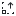</a> | **📂 檔名:** `y-zoom-in.svg` ✨ **格式:** `Vector (SVG)` ⚖️ **大小:** `790.00B` 📅 **更新:** `2026-03-04`  🚀 **jsDelivr Markdown:** `` 🔗 **直接連結 (Url):** <code>https://cdn.jsdelivr.net/gh/barry028/materials@main/images/iCons/Pixel/Breeze/Actions%20/16/y-zoom-in.svg</code> 📥 [檢視原始檔](y-zoom-in.svg) |
|  | **📂 檔名:** `zoom-1-to-2.svg` ✨ **格式:** `Vector (SVG)` ⚖️ **大小:** `695.00B` 📅 **更新:** `2026-03-04`  🚀 **jsDelivr Markdown:** `` 🔗 **直接連結 (Url):** <code>https://cdn.jsdelivr.net/gh/barry028/materials@main/images/iCons/Pixel/Breeze/Actions%20/16/zoom-1-to-2.svg</code> 📥 [檢視原始檔](zoom-1-to-2.svg) |
|  | **📂 檔名:** `zoom-2-to-1.svg` ✨ **格式:** `Vector (SVG)` ⚖️ **大小:** `699.00B` 📅 **更新:** `2026-03-04`  🚀 **jsDelivr Markdown:** `` 🔗 **直接連結 (Url):** <code>https://cdn.jsdelivr.net/gh/barry028/materials@main/images/iCons/Pixel/Breeze/Actions%20/16/zoom-2-to-1.svg</code> 📥 [檢視原始檔](zoom-2-to-1.svg) |
|  | **📂 檔名:** `zoom-fit-best.svg` ✨ **格式:** `Vector (SVG)` ⚖️ **大小:** `758.00B` 📅 **更新:** `2026-03-04`  🚀 **jsDelivr Markdown:** `` 🔗 **直接連結 (Url):** <code>https://cdn.jsdelivr.net/gh/barry028/materials@main/images/iCons/Pixel/Breeze/Actions%20/16/zoom-fit-best.svg</code> 📥 [檢視原始檔](zoom-fit-best.svg) |
|  | **📂 檔名:** `zoom-fit-height.svg` ✨ **格式:** `Vector (SVG)` ⚖️ **大小:** `700.00B` 📅 **更新:** `2026-03-04`  🚀 **jsDelivr Markdown:** `` 🔗 **直接連結 (Url):** <code>https://cdn.jsdelivr.net/gh/barry028/materials@main/images/iCons/Pixel/Breeze/Actions%20/16/zoom-fit-height.svg</code> 📥 [檢視原始檔](zoom-fit-height.svg) |
|  | **📂 檔名:** `zoom-fit-width.svg` ✨ **格式:** `Vector (SVG)` ⚖️ **大小:** `700.00B` 📅 **更新:** `2026-03-04`  🚀 **jsDelivr Markdown:** `` 🔗 **直接連結 (Url):** <code>https://cdn.jsdelivr.net/gh/barry028/materials@main/images/iCons/Pixel/Breeze/Actions%20/16/zoom-fit-width.svg</code> 📥 [檢視原始檔](zoom-fit-width.svg) |
| <a href="zoom-in-x.svg">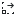</a> | **📂 檔名:** `zoom-in-x.svg` ✨ **格式:** `Vector (SVG)` ⚖️ **大小:** `799.00B` 📅 **更新:** `2026-03-04`  🚀 **jsDelivr Markdown:** `` 🔗 **直接連結 (Url):** <code>https://cdn.jsdelivr.net/gh/barry028/materials@main/images/iCons/Pixel/Breeze/Actions%20/16/zoom-in-x.svg</code> 📥 [檢視原始檔](zoom-in-x.svg) |
| <a href="zoom-in.svg">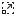</a> | **📂 檔名:** `zoom-in.svg` ✨ **格式:** `Vector (SVG)` ⚖️ **大小:** `842.00B` 📅 **更新:** `2026-03-04`  🚀 **jsDelivr Markdown:** `` 🔗 **直接連結 (Url):** <code>https://cdn.jsdelivr.net/gh/barry028/materials@main/images/iCons/Pixel/Breeze/Actions%20/16/zoom-in.svg</code> 📥 [檢視原始檔](zoom-in.svg) |
| <a href="zoom-next.svg">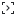</a> | **📂 檔名:** `zoom-next.svg` ✨ **格式:** `Vector (SVG)` ⚖️ **大小:** `794.00B` 📅 **更新:** `2026-03-04`  🚀 **jsDelivr Markdown:** `` 🔗 **直接連結 (Url):** <code>https://cdn.jsdelivr.net/gh/barry028/materials@main/images/iCons/Pixel/Breeze/Actions%20/16/zoom-next.svg</code> 📥 [檢視原始檔](zoom-next.svg) |
|  | **📂 檔名:** `zoom-original.svg` ✨ **格式:** `Vector (SVG)` ⚖️ **大小:** `642.00B` 📅 **更新:** `2026-03-04`  🚀 **jsDelivr Markdown:** `` 🔗 **直接連結 (Url):** <code>https://cdn.jsdelivr.net/gh/barry028/materials@main/images/iCons/Pixel/Breeze/Actions%20/16/zoom-original.svg</code> 📥 [檢視原始檔](zoom-original.svg) |
|  | **📂 檔名:** `zoom-out-x.svg` ✨ **格式:** `Vector (SVG)` ⚖️ **大小:** `788.00B` 📅 **更新:** `2026-03-04`  🚀 **jsDelivr Markdown:** `` 🔗 **直接連結 (Url):** <code>https://cdn.jsdelivr.net/gh/barry028/materials@main/images/iCons/Pixel/Breeze/Actions%20/16/zoom-out-x.svg</code> 📥 [檢視原始檔](zoom-out-x.svg) |
|  | **📂 檔名:** `zoom-out-y.svg` ✨ **格式:** `Vector (SVG)` ⚖️ **大小:** `795.00B` 📅 **更新:** `2026-03-04`  🚀 **jsDelivr Markdown:** `` 🔗 **直接連結 (Url):** <code>https://cdn.jsdelivr.net/gh/barry028/materials@main/images/iCons/Pixel/Breeze/Actions%20/16/zoom-out-y.svg</code> 📥 [檢視原始檔](zoom-out-y.svg) |
|  | **📂 檔名:** `zoom-out.svg` ✨ **格式:** `Vector (SVG)` ⚖️ **大小:** `795.00B` 📅 **更新:** `2026-03-04`  🚀 **jsDelivr Markdown:** `` 🔗 **直接連結 (Url):** <code>https://cdn.jsdelivr.net/gh/barry028/materials@main/images/iCons/Pixel/Breeze/Actions%20/16/zoom-out.svg</code> 📥 [檢視原始檔](zoom-out.svg) |
| <a href="zoom.svg">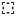</a> | **📂 檔名:** `zoom.svg` ✨ **格式:** `Vector (SVG)` ⚖️ **大小:** `686.00B` 📅 **更新:** `2026-03-04`  🚀 **jsDelivr Markdown:** `` 🔗 **直接連結 (Url):** <code>https://cdn.jsdelivr.net/gh/barry028/materials@main/images/iCons/Pixel/Breeze/Actions%20/16/zoom.svg</code> 📥 [檢視原始檔](zoom.svg) |