# 🖼️ 素材分類：22

> [🏠 主目錄](../../../../../../README.md) / [images](../../../../../README.md) / [iCons](../../../../README.md) / [Pixel](../../../README.md) / [Breeze](../../README.md) / [Actions ](../README.md) / **22**

本目錄共有 `1208` 個檔案

| 🎨 預覽 (點擊放大)  | 📋 檔案詳細資訊與連結 |
| :--- | :--- |
|  | **📂 檔名:** `PrePostCondition.svg` ✨ **格式:** `Vector (SVG)` ⚖️ **大小:** `403.00B` 📅 **更新:** `2026-03-02`  🚀 **jsDelivr Markdown:** `` 🔗 **直接連結 (Url):** <code>https://cdn.jsdelivr.net/gh/barry028/materials@main/images/iCons/Pixel/Breeze/Actions%20/22/PrePostCondition.svg</code> 📥 [檢視原始檔](PrePostCondition.svg) |
|  | **📂 檔名:** `accept_signal.svg` ✨ **格式:** `Vector (SVG)` ⚖️ **大小:** `707.00B` 📅 **更新:** `2026-03-02`  🚀 **jsDelivr Markdown:** `` 🔗 **直接連結 (Url):** <code>https://cdn.jsdelivr.net/gh/barry028/materials@main/images/iCons/Pixel/Breeze/Actions%20/22/accept_signal.svg</code> 📥 [檢視原始檔](accept_signal.svg) |
|  | **📂 檔名:** `acrobat.svg` ✨ **格式:** `Vector (SVG)` ⚖️ **大小:** `413.00B` 📅 **更新:** `2026-03-02`  🚀 **jsDelivr Markdown:** `` 🔗 **直接連結 (Url):** <code>https://cdn.jsdelivr.net/gh/barry028/materials@main/images/iCons/Pixel/Breeze/Actions%20/22/acrobat.svg</code> 📥 [檢視原始檔](acrobat.svg) |
|  | **📂 檔名:** `activities.svg` ✨ **格式:** `Vector (SVG)` ⚖️ **大小:** `431.00B` 📅 **更新:** `2026-03-02`  🚀 **jsDelivr Markdown:** `` 🔗 **直接連結 (Url):** <code>https://cdn.jsdelivr.net/gh/barry028/materials@main/images/iCons/Pixel/Breeze/Actions%20/22/activities.svg</code> 📥 [檢視原始檔](activities.svg) |
|  | **📂 檔名:** `add-subtitle.svg` ✨ **格式:** `Vector (SVG)` ⚖️ **大小:** `527.00B` 📅 **更新:** `2026-03-02`  🚀 **jsDelivr Markdown:** `` 🔗 **直接連結 (Url):** <code>https://cdn.jsdelivr.net/gh/barry028/materials@main/images/iCons/Pixel/Breeze/Actions%20/22/add-subtitle.svg</code> 📥 [檢視原始檔](add-subtitle.svg) |
|  | **📂 檔名:** `address-book-new.svg` ✨ **格式:** `Vector (SVG)` ⚖️ **大小:** `428.00B` 📅 **更新:** `2026-03-02`  🚀 **jsDelivr Markdown:** `` 🔗 **直接連結 (Url):** <code>https://cdn.jsdelivr.net/gh/barry028/materials@main/images/iCons/Pixel/Breeze/Actions%20/22/address-book-new.svg</code> 📥 [檢視原始檔](address-book-new.svg) |
|  | **📂 檔名:** `adjustcurves.svg` ✨ **格式:** `Vector (SVG)` ⚖️ **大小:** `1.11KB` 📅 **更新:** `2026-03-02`  🚀 **jsDelivr Markdown:** `` 🔗 **直接連結 (Url):** <code>https://cdn.jsdelivr.net/gh/barry028/materials@main/images/iCons/Pixel/Breeze/Actions%20/22/adjustcurves.svg</code> 📥 [檢視原始檔](adjustcurves.svg) |
|  | **📂 檔名:** `adjusthsl.svg` ✨ **格式:** `Vector (SVG)` ⚖️ **大小:** `1.19KB` 📅 **更新:** `2026-03-02`  🚀 **jsDelivr Markdown:** `` 🔗 **直接連結 (Url):** <code>https://cdn.jsdelivr.net/gh/barry028/materials@main/images/iCons/Pixel/Breeze/Actions%20/22/adjusthsl.svg</code> 📥 [檢視原始檔](adjusthsl.svg) |
|  | **📂 檔名:** `adjustlevels.svg` ✨ **格式:** `Vector (SVG)` ⚖️ **大小:** `1.45KB` 📅 **更新:** `2026-03-02`  🚀 **jsDelivr Markdown:** `` 🔗 **直接連結 (Url):** <code>https://cdn.jsdelivr.net/gh/barry028/materials@main/images/iCons/Pixel/Breeze/Actions%20/22/adjustlevels.svg</code> 📥 [檢視原始檔](adjustlevels.svg) |
|  | **📂 檔名:** `adjustrgb.svg` ✨ **格式:** `Vector (SVG)` ⚖️ **大小:** `1.02KB` 📅 **更新:** `2026-03-02`  🚀 **jsDelivr Markdown:** `` 🔗 **直接連結 (Url):** <code>https://cdn.jsdelivr.net/gh/barry028/materials@main/images/iCons/Pixel/Breeze/Actions%20/22/adjustrgb.svg</code> 📥 [檢視原始檔](adjustrgb.svg) |
|  | **📂 檔名:** `aggregation.svg` ✨ **格式:** `Vector (SVG)` ⚖️ **大小:** `689.00B` 📅 **更新:** `2026-03-02`  🚀 **jsDelivr Markdown:** `` 🔗 **直接連結 (Url):** <code>https://cdn.jsdelivr.net/gh/barry028/materials@main/images/iCons/Pixel/Breeze/Actions%20/22/aggregation.svg</code> 📥 [檢視原始檔](aggregation.svg) |
|  | **📂 檔名:** `akonadiconsole.svg` ✨ **格式:** `Vector (SVG)` ⚖️ **大小:** `708.00B` 📅 **更新:** `2026-03-02`  🚀 **jsDelivr Markdown:** `` 🔗 **直接連結 (Url):** <code>https://cdn.jsdelivr.net/gh/barry028/materials@main/images/iCons/Pixel/Breeze/Actions%20/22/akonadiconsole.svg</code> 📥 [檢視原始檔](akonadiconsole.svg) |
|  | **📂 檔名:** `align-horizontal-baseline.svg` ✨ **格式:** `Vector (SVG)` ⚖️ **大小:** `1.57KB` 📅 **更新:** `2026-03-02`  🚀 **jsDelivr Markdown:** `` 🔗 **直接連結 (Url):** <code>https://cdn.jsdelivr.net/gh/barry028/materials@main/images/iCons/Pixel/Breeze/Actions%20/22/align-horizontal-baseline.svg</code> 📥 [檢視原始檔](align-horizontal-baseline.svg) |
|  | **📂 檔名:** `align-horizontal-bottom-out.svg` ✨ **格式:** `Vector (SVG)` ⚖️ **大小:** `518.00B` 📅 **更新:** `2026-03-02`  🚀 **jsDelivr Markdown:** `` 🔗 **直接連結 (Url):** <code>https://cdn.jsdelivr.net/gh/barry028/materials@main/images/iCons/Pixel/Breeze/Actions%20/22/align-horizontal-bottom-out.svg</code> 📥 [檢視原始檔](align-horizontal-bottom-out.svg) |
|  | **📂 檔名:** `align-horizontal-center.svg` ✨ **格式:** `Vector (SVG)` ⚖️ **大小:** `476.00B` 📅 **更新:** `2026-03-02`  🚀 **jsDelivr Markdown:** `` 🔗 **直接連結 (Url):** <code>https://cdn.jsdelivr.net/gh/barry028/materials@main/images/iCons/Pixel/Breeze/Actions%20/22/align-horizontal-center.svg</code> 📥 [檢視原始檔](align-horizontal-center.svg) |
|  | **📂 檔名:** `align-horizontal-left-out.svg` ✨ **格式:** `Vector (SVG)` ⚖️ **大小:** `534.00B` 📅 **更新:** `2026-03-02`  🚀 **jsDelivr Markdown:** `` 🔗 **直接連結 (Url):** <code>https://cdn.jsdelivr.net/gh/barry028/materials@main/images/iCons/Pixel/Breeze/Actions%20/22/align-horizontal-left-out.svg</code> 📥 [檢視原始檔](align-horizontal-left-out.svg) |
|  | **📂 檔名:** `align-horizontal-left-to-anchor.svg` ✨ **格式:** `Vector (SVG)` ⚖️ **大小:** `535.00B` 📅 **更新:** `2026-03-02`  🚀 **jsDelivr Markdown:** `` 🔗 **直接連結 (Url):** <code>https://cdn.jsdelivr.net/gh/barry028/materials@main/images/iCons/Pixel/Breeze/Actions%20/22/align-horizontal-left-to-anchor.svg</code> 📥 [檢視原始檔](align-horizontal-left-to-anchor.svg) |
|  | **📂 檔名:** `align-horizontal-left.svg` ✨ **格式:** `Vector (SVG)` ⚖️ **大小:** `494.00B` 📅 **更新:** `2026-03-02`  🚀 **jsDelivr Markdown:** `` 🔗 **直接連結 (Url):** <code>https://cdn.jsdelivr.net/gh/barry028/materials@main/images/iCons/Pixel/Breeze/Actions%20/22/align-horizontal-left.svg</code> 📥 [檢視原始檔](align-horizontal-left.svg) |
| <a href="align-horizontal-node.svg">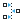</a> | **📂 檔名:** `align-horizontal-node.svg` ✨ **格式:** `Vector (SVG)` ⚖️ **大小:** `642.00B` 📅 **更新:** `2026-03-02`  🚀 **jsDelivr Markdown:** `` 🔗 **直接連結 (Url):** <code>https://cdn.jsdelivr.net/gh/barry028/materials@main/images/iCons/Pixel/Breeze/Actions%20/22/align-horizontal-node.svg</code> 📥 [檢視原始檔](align-horizontal-node.svg) |
|  | **📂 檔名:** `align-horizontal-right-out.svg` ✨ **格式:** `Vector (SVG)` ⚖️ **大小:** `521.00B` 📅 **更新:** `2026-03-02`  🚀 **jsDelivr Markdown:** `` 🔗 **直接連結 (Url):** <code>https://cdn.jsdelivr.net/gh/barry028/materials@main/images/iCons/Pixel/Breeze/Actions%20/22/align-horizontal-right-out.svg</code> 📥 [檢視原始檔](align-horizontal-right-out.svg) |
|  | **📂 檔名:** `align-horizontal-right-to-anchor.svg` ✨ **格式:** `Vector (SVG)` ⚖️ **大小:** `532.00B` 📅 **更新:** `2026-03-02`  🚀 **jsDelivr Markdown:** `` 🔗 **直接連結 (Url):** <code>https://cdn.jsdelivr.net/gh/barry028/materials@main/images/iCons/Pixel/Breeze/Actions%20/22/align-horizontal-right-to-anchor.svg</code> 📥 [檢視原始檔](align-horizontal-right-to-anchor.svg) |
|  | **📂 檔名:** `align-horizontal-right.svg` ✨ **格式:** `Vector (SVG)` ⚖️ **大小:** `494.00B` 📅 **更新:** `2026-03-02`  🚀 **jsDelivr Markdown:** `` 🔗 **直接連結 (Url):** <code>https://cdn.jsdelivr.net/gh/barry028/materials@main/images/iCons/Pixel/Breeze/Actions%20/22/align-horizontal-right.svg</code> 📥 [檢視原始檔](align-horizontal-right.svg) |
|  | **📂 檔名:** `align-horizontal-top-out.svg` ✨ **格式:** `Vector (SVG)` ⚖️ **大小:** `517.00B` 📅 **更新:** `2026-03-02`  🚀 **jsDelivr Markdown:** `` 🔗 **直接連結 (Url):** <code>https://cdn.jsdelivr.net/gh/barry028/materials@main/images/iCons/Pixel/Breeze/Actions%20/22/align-horizontal-top-out.svg</code> 📥 [檢視原始檔](align-horizontal-top-out.svg) |
|  | **📂 檔名:** `align-vertical-baseline.svg` ✨ **格式:** `Vector (SVG)` ⚖️ **大小:** `1.58KB` 📅 **更新:** `2026-03-02`  🚀 **jsDelivr Markdown:** `` 🔗 **直接連結 (Url):** <code>https://cdn.jsdelivr.net/gh/barry028/materials@main/images/iCons/Pixel/Breeze/Actions%20/22/align-vertical-baseline.svg</code> 📥 [檢視原始檔](align-vertical-baseline.svg) |
|  | **📂 檔名:** `align-vertical-bottom-out.svg` ✨ **格式:** `Vector (SVG)` ⚖️ **大小:** `536.00B` 📅 **更新:** `2026-03-02`  🚀 **jsDelivr Markdown:** `` 🔗 **直接連結 (Url):** <code>https://cdn.jsdelivr.net/gh/barry028/materials@main/images/iCons/Pixel/Breeze/Actions%20/22/align-vertical-bottom-out.svg</code> 📥 [檢視原始檔](align-vertical-bottom-out.svg) |
|  | **📂 檔名:** `align-vertical-bottom.svg` ✨ **格式:** `Vector (SVG)` ⚖️ **大小:** `429.00B` 📅 **更新:** `2026-03-02`  🚀 **jsDelivr Markdown:** `` 🔗 **直接連結 (Url):** <code>https://cdn.jsdelivr.net/gh/barry028/materials@main/images/iCons/Pixel/Breeze/Actions%20/22/align-vertical-bottom.svg</code> 📥 [檢視原始檔](align-vertical-bottom.svg) |
|  | **📂 檔名:** `align-vertical-center.svg` ✨ **格式:** `Vector (SVG)` ⚖️ **大小:** `533.00B` 📅 **更新:** `2026-03-02`  🚀 **jsDelivr Markdown:** `` 🔗 **直接連結 (Url):** <code>https://cdn.jsdelivr.net/gh/barry028/materials@main/images/iCons/Pixel/Breeze/Actions%20/22/align-vertical-center.svg</code> 📥 [檢視原始檔](align-vertical-center.svg) |
| <a href="align-vertical-node.svg">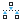</a> | **📂 檔名:** `align-vertical-node.svg` ✨ **格式:** `Vector (SVG)` ⚖️ **大小:** `646.00B` 📅 **更新:** `2026-03-02`  🚀 **jsDelivr Markdown:** `` 🔗 **直接連結 (Url):** <code>https://cdn.jsdelivr.net/gh/barry028/materials@main/images/iCons/Pixel/Breeze/Actions%20/22/align-vertical-node.svg</code> 📥 [檢視原始檔](align-vertical-node.svg) |
|  | **📂 檔名:** `align-vertical-top-out.svg` ✨ **格式:** `Vector (SVG)` ⚖️ **大小:** `533.00B` 📅 **更新:** `2026-03-02`  🚀 **jsDelivr Markdown:** `` 🔗 **直接連結 (Url):** <code>https://cdn.jsdelivr.net/gh/barry028/materials@main/images/iCons/Pixel/Breeze/Actions%20/22/align-vertical-top-out.svg</code> 📥 [檢視原始檔](align-vertical-top-out.svg) |
|  | **📂 檔名:** `align-vertical-top-to-anchor.svg` ✨ **格式:** `Vector (SVG)` ⚖️ **大小:** `453.00B` 📅 **更新:** `2026-03-02`  🚀 **jsDelivr Markdown:** `` 🔗 **直接連結 (Url):** <code>https://cdn.jsdelivr.net/gh/barry028/materials@main/images/iCons/Pixel/Breeze/Actions%20/22/align-vertical-top-to-anchor.svg</code> 📥 [檢視原始檔](align-vertical-top-to-anchor.svg) |
|  | **📂 檔名:** `align-vertical-top.svg` ✨ **格式:** `Vector (SVG)` ⚖️ **大小:** `491.00B` 📅 **更新:** `2026-03-02`  🚀 **jsDelivr Markdown:** `` 🔗 **直接連結 (Url):** <code>https://cdn.jsdelivr.net/gh/barry028/materials@main/images/iCons/Pixel/Breeze/Actions%20/22/align-vertical-top.svg</code> 📥 [檢視原始檔](align-vertical-top.svg) |
|  | **📂 檔名:** `amarok_cart_add.svg` ✨ **格式:** `Vector (SVG)` ⚖️ **大小:** `1.06KB` 📅 **更新:** `2026-03-02`  🚀 **jsDelivr Markdown:** `` 🔗 **直接連結 (Url):** <code>https://cdn.jsdelivr.net/gh/barry028/materials@main/images/iCons/Pixel/Breeze/Actions%20/22/amarok_cart_add.svg</code> 📥 [檢視原始檔](amarok_cart_add.svg) |
|  | **📂 檔名:** `amarok_cart_remove.svg` ✨ **格式:** `Vector (SVG)` ⚖️ **大小:** `1.24KB` 📅 **更新:** `2026-03-02`  🚀 **jsDelivr Markdown:** `` 🔗 **直接連結 (Url):** <code>https://cdn.jsdelivr.net/gh/barry028/materials@main/images/iCons/Pixel/Breeze/Actions%20/22/amarok_cart_remove.svg</code> 📥 [檢視原始檔](amarok_cart_remove.svg) |
|  | **📂 檔名:** `amarok_cart_view.svg` ✨ **格式:** `Vector (SVG)` ⚖️ **大小:** `978.00B` 📅 **更新:** `2026-03-02`  🚀 **jsDelivr Markdown:** `` 🔗 **直接連結 (Url):** <code>https://cdn.jsdelivr.net/gh/barry028/materials@main/images/iCons/Pixel/Breeze/Actions%20/22/amarok_cart_view.svg</code> 📥 [檢視原始檔](amarok_cart_view.svg) |
|  | **📂 檔名:** `amarok_change_language.svg` ✨ **格式:** `Vector (SVG)` ⚖️ **大小:** `556.00B` 📅 **更新:** `2026-03-02`  🚀 **jsDelivr Markdown:** `` 🔗 **直接連結 (Url):** <code>https://cdn.jsdelivr.net/gh/barry028/materials@main/images/iCons/Pixel/Breeze/Actions%20/22/amarok_change_language.svg</code> 📥 [檢視原始檔](amarok_change_language.svg) |
|  | **📂 檔名:** `anchor.svg` ✨ **格式:** `Vector (SVG)` ⚖️ **大小:** `1013.00B` 📅 **更新:** `2026-03-02`  🚀 **jsDelivr Markdown:** `` 🔗 **直接連結 (Url):** <code>https://cdn.jsdelivr.net/gh/barry028/materials@main/images/iCons/Pixel/Breeze/Actions%20/22/anchor.svg</code> 📥 [檢視原始檔](anchor.svg) |
|  | **📂 檔名:** `antivignetting.svg` ✨ **格式:** `Vector (SVG)` ⚖️ **大小:** `1.20KB` 📅 **更新:** `2026-03-02`  🚀 **jsDelivr Markdown:** `` 🔗 **直接連結 (Url):** <code>https://cdn.jsdelivr.net/gh/barry028/materials@main/images/iCons/Pixel/Breeze/Actions%20/22/antivignetting.svg</code> 📥 [檢視原始檔](antivignetting.svg) |
|  | **📂 檔名:** `application-exit.svg` ✨ **格式:** `Vector (SVG)` ⚖️ **大小:** `447.00B` 📅 **更新:** `2026-03-02`  🚀 **jsDelivr Markdown:** `` 🔗 **直接連結 (Url):** <code>https://cdn.jsdelivr.net/gh/barry028/materials@main/images/iCons/Pixel/Breeze/Actions%20/22/application-exit.svg</code> 📥 [檢視原始檔](application-exit.svg) |
|  | **📂 檔名:** `application-menu.svg` ✨ **格式:** `Vector (SVG)` ⚖️ **大小:** `397.00B` 📅 **更新:** `2026-03-02`  🚀 **jsDelivr Markdown:** `` 🔗 **直接連結 (Url):** <code>https://cdn.jsdelivr.net/gh/barry028/materials@main/images/iCons/Pixel/Breeze/Actions%20/22/application-menu.svg</code> 📥 [檢視原始檔](application-menu.svg) |
|  | **📂 檔名:** `appointment-new.svg` ✨ **格式:** `Vector (SVG)` ⚖️ **大小:** `590.00B` 📅 **更新:** `2026-03-02`  🚀 **jsDelivr Markdown:** `` 🔗 **直接連結 (Url):** <code>https://cdn.jsdelivr.net/gh/barry028/materials@main/images/iCons/Pixel/Breeze/Actions%20/22/appointment-new.svg</code> 📥 [檢視原始檔](appointment-new.svg) |
|  | **📂 檔名:** `archive-extract.svg` ✨ **格式:** `Vector (SVG)` ⚖️ **大小:** `517.00B` 📅 **更新:** `2026-03-02`  🚀 **jsDelivr Markdown:** `` 🔗 **直接連結 (Url):** <code>https://cdn.jsdelivr.net/gh/barry028/materials@main/images/iCons/Pixel/Breeze/Actions%20/22/archive-extract.svg</code> 📥 [檢視原始檔](archive-extract.svg) |
|  | **📂 檔名:** `archive-insert.svg` ✨ **格式:** `Vector (SVG)` ⚖️ **大小:** `409.00B` 📅 **更新:** `2026-03-02`  🚀 **jsDelivr Markdown:** `` 🔗 **直接連結 (Url):** <code>https://cdn.jsdelivr.net/gh/barry028/materials@main/images/iCons/Pixel/Breeze/Actions%20/22/archive-insert.svg</code> 📥 [檢視原始檔](archive-insert.svg) |
|  | **📂 檔名:** `archive-remove.svg` ✨ **格式:** `Vector (SVG)` ⚖️ **大小:** `509.00B` 📅 **更新:** `2026-03-02`  🚀 **jsDelivr Markdown:** `` 🔗 **直接連結 (Url):** <code>https://cdn.jsdelivr.net/gh/barry028/materials@main/images/iCons/Pixel/Breeze/Actions%20/22/archive-remove.svg</code> 📥 [檢視原始檔](archive-remove.svg) |
|  | **📂 檔名:** `artifact.svg` ✨ **格式:** `Vector (SVG)` ⚖️ **大小:** `706.00B` 📅 **更新:** `2026-03-02`  🚀 **jsDelivr Markdown:** `` 🔗 **直接連結 (Url):** <code>https://cdn.jsdelivr.net/gh/barry028/materials@main/images/iCons/Pixel/Breeze/Actions%20/22/artifact.svg</code> 📥 [檢視原始檔](artifact.svg) |
|  | **📂 檔名:** `association.svg` ✨ **格式:** `Vector (SVG)` ⚖️ **大小:** `375.00B` 📅 **更新:** `2026-03-02`  🚀 **jsDelivr Markdown:** `` 🔗 **直接連結 (Url):** <code>https://cdn.jsdelivr.net/gh/barry028/materials@main/images/iCons/Pixel/Breeze/Actions%20/22/association.svg</code> 📥 [檢視原始檔](association.svg) |
|  | **📂 檔名:** `atmosphere.svg` ✨ **格式:** `Vector (SVG)` ⚖️ **大小:** `19.63KB` 📅 **更新:** `2026-03-02`  🚀 **jsDelivr Markdown:** `` 🔗 **直接連結 (Url):** <code>https://cdn.jsdelivr.net/gh/barry028/materials@main/images/iCons/Pixel/Breeze/Actions%20/22/atmosphere.svg</code> 📥 [檢視原始檔](atmosphere.svg) |
|  | **📂 檔名:** `auto-transition.svg` ✨ **格式:** `Vector (SVG)` ⚖️ **大小:** `829.00B` 📅 **更新:** `2026-03-02`  🚀 **jsDelivr Markdown:** `` 🔗 **直接連結 (Url):** <code>https://cdn.jsdelivr.net/gh/barry028/materials@main/images/iCons/Pixel/Breeze/Actions%20/22/auto-transition.svg</code> 📥 [檢視原始檔](auto-transition.svg) |
| <a href="auto-type.svg">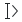</a> | **📂 檔名:** `auto-type.svg` ✨ **格式:** `Vector (SVG)` ⚖️ **大小:** `524.00B` 📅 **更新:** `2026-03-02`  🚀 **jsDelivr Markdown:** `` 🔗 **直接連結 (Url):** <code>https://cdn.jsdelivr.net/gh/barry028/materials@main/images/iCons/Pixel/Breeze/Actions%20/22/auto-type.svg</code> 📥 [檢視原始檔](auto-type.svg) |
|  | **📂 檔名:** `autocorrection.svg` ✨ **格式:** `Vector (SVG)` ⚖️ **大小:** `813.00B` 📅 **更新:** `2026-03-02`  🚀 **jsDelivr Markdown:** `` 🔗 **直接連結 (Url):** <code>https://cdn.jsdelivr.net/gh/barry028/materials@main/images/iCons/Pixel/Breeze/Actions%20/22/autocorrection.svg</code> 📥 [檢視原始檔](autocorrection.svg) |
|  | **📂 檔名:** `backgroundtool.svg` ✨ **格式:** `Vector (SVG)` ⚖️ **大小:** `1.08KB` 📅 **更新:** `2026-03-02`  🚀 **jsDelivr Markdown:** `` 🔗 **直接連結 (Url):** <code>https://cdn.jsdelivr.net/gh/barry028/materials@main/images/iCons/Pixel/Breeze/Actions%20/22/backgroundtool.svg</code> 📥 [檢視原始檔](backgroundtool.svg) |
|  | **📂 檔名:** `backup.svg` ✨ **格式:** `Vector (SVG)` ⚖️ **大小:** `744.00B` 📅 **更新:** `2026-03-02`  🚀 **jsDelivr Markdown:** `` 🔗 **直接連結 (Url):** <code>https://cdn.jsdelivr.net/gh/barry028/materials@main/images/iCons/Pixel/Breeze/Actions%20/22/backup.svg</code> 📥 [檢視原始檔](backup.svg) |
| <a href="bboxnext.svg">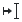</a> | **📂 檔名:** `bboxnext.svg` ✨ **格式:** `Vector (SVG)` ⚖️ **大小:** `465.00B` 📅 **更新:** `2026-03-02`  🚀 **jsDelivr Markdown:** `` 🔗 **直接連結 (Url):** <code>https://cdn.jsdelivr.net/gh/barry028/materials@main/images/iCons/Pixel/Breeze/Actions%20/22/bboxnext.svg</code> 📥 [檢視原始檔](bboxnext.svg) |
| <a href="bboxprev.svg">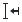</a> | **📂 檔名:** `bboxprev.svg` ✨ **格式:** `Vector (SVG)` ⚖️ **大小:** `485.00B` 📅 **更新:** `2026-03-02`  🚀 **jsDelivr Markdown:** `` 🔗 **直接連結 (Url):** <code>https://cdn.jsdelivr.net/gh/barry028/materials@main/images/iCons/Pixel/Breeze/Actions%20/22/bboxprev.svg</code> 📥 [檢視原始檔](bboxprev.svg) |
|  | **📂 檔名:** `black_sum.svg` ✨ **格式:** `Vector (SVG)` ⚖️ **大小:** `615.00B` 📅 **更新:** `2026-03-02`  🚀 **jsDelivr Markdown:** `` 🔗 **直接連結 (Url):** <code>https://cdn.jsdelivr.net/gh/barry028/materials@main/images/iCons/Pixel/Breeze/Actions%20/22/black_sum.svg</code> 📥 [檢視原始檔](black_sum.svg) |
|  | **📂 檔名:** `blur.svg` ✨ **格式:** `Vector (SVG)` ⚖️ **大小:** `4.25KB` 📅 **更新:** `2026-03-02`  🚀 **jsDelivr Markdown:** `` 🔗 **直接連結 (Url):** <code>https://cdn.jsdelivr.net/gh/barry028/materials@main/images/iCons/Pixel/Breeze/Actions%20/22/blur.svg</code> 📥 [檢視原始檔](blur.svg) |
|  | **📂 檔名:** `blurfx.svg` ✨ **格式:** `Vector (SVG)` ⚖️ **大小:** `1.12KB` 📅 **更新:** `2026-03-02`  🚀 **jsDelivr Markdown:** `` 🔗 **直接連結 (Url):** <code>https://cdn.jsdelivr.net/gh/barry028/materials@main/images/iCons/Pixel/Breeze/Actions%20/22/blurfx.svg</code> 📥 [檢視原始檔](blurfx.svg) |
|  | **📂 檔名:** `blurimage.svg` ✨ **格式:** `Vector (SVG)` ⚖️ **大小:** `869.00B` 📅 **更新:** `2026-03-02`  🚀 **jsDelivr Markdown:** `` 🔗 **直接連結 (Url):** <code>https://cdn.jsdelivr.net/gh/barry028/materials@main/images/iCons/Pixel/Breeze/Actions%20/22/blurimage.svg</code> 📥 [檢視原始檔](blurimage.svg) |
|  | **📂 檔名:** `bookmark-edit.svg` ✨ **格式:** `Vector (SVG)` ⚖️ **大小:** `509.00B` 📅 **更新:** `2026-03-02`  🚀 **jsDelivr Markdown:** `` 🔗 **直接連結 (Url):** <code>https://cdn.jsdelivr.net/gh/barry028/materials@main/images/iCons/Pixel/Breeze/Actions%20/22/bookmark-edit.svg</code> 📥 [檢視原始檔](bookmark-edit.svg) |
|  | **📂 檔名:** `bookmark-new.svg` ✨ **格式:** `Vector (SVG)` ⚖️ **大小:** `443.00B` 📅 **更新:** `2026-03-02`  🚀 **jsDelivr Markdown:** `` 🔗 **直接連結 (Url):** <code>https://cdn.jsdelivr.net/gh/barry028/materials@main/images/iCons/Pixel/Breeze/Actions%20/22/bookmark-new.svg</code> 📥 [檢視原始檔](bookmark-new.svg) |
|  | **📂 檔名:** `bookmark-remove.svg` ✨ **格式:** `Vector (SVG)` ⚖️ **大小:** `641.00B` 📅 **更新:** `2026-03-02`  🚀 **jsDelivr Markdown:** `` 🔗 **直接連結 (Url):** <code>https://cdn.jsdelivr.net/gh/barry028/materials@main/images/iCons/Pixel/Breeze/Actions%20/22/bookmark-remove.svg</code> 📥 [檢視原始檔](bookmark-remove.svg) |
|  | **📂 檔名:** `bookmarks-bookmarked.svg` ✨ **格式:** `Vector (SVG)` ⚖️ **大小:** `342.00B` 📅 **更新:** `2026-03-02`  🚀 **jsDelivr Markdown:** `` 🔗 **直接連結 (Url):** <code>https://cdn.jsdelivr.net/gh/barry028/materials@main/images/iCons/Pixel/Breeze/Actions%20/22/bookmarks-bookmarked.svg</code> 📥 [檢視原始檔](bookmarks-bookmarked.svg) |
|  | **📂 檔名:** `bookmarks.svg` ✨ **格式:** `Vector (SVG)` ⚖️ **大小:** `431.00B` 📅 **更新:** `2026-03-02`  🚀 **jsDelivr Markdown:** `` 🔗 **直接連結 (Url):** <code>https://cdn.jsdelivr.net/gh/barry028/materials@main/images/iCons/Pixel/Breeze/Actions%20/22/bookmarks.svg</code> 📥 [檢視原始檔](bookmarks.svg) |
|  | **📂 檔名:** `bordertool.svg` ✨ **格式:** `Vector (SVG)` ⚖️ **大小:** `602.00B` 📅 **更新:** `2026-03-02`  🚀 **jsDelivr Markdown:** `` 🔗 **直接連結 (Url):** <code>https://cdn.jsdelivr.net/gh/barry028/materials@main/images/iCons/Pixel/Breeze/Actions%20/22/bordertool.svg</code> 📥 [檢視原始檔](bordertool.svg) |
|  | **📂 檔名:** `brightness-high.svg` ✨ **格式:** `Vector (SVG)` ⚖️ **大小:** `2.71KB` 📅 **更新:** `2026-03-02`  🚀 **jsDelivr Markdown:** `` 🔗 **直接連結 (Url):** <code>https://cdn.jsdelivr.net/gh/barry028/materials@main/images/iCons/Pixel/Breeze/Actions%20/22/brightness-high.svg</code> 📥 [檢視原始檔](brightness-high.svg) |
|  | **📂 檔名:** `brightness-low.svg` ✨ **格式:** `Vector (SVG)` ⚖️ **大小:** `2.62KB` 📅 **更新:** `2026-03-02`  🚀 **jsDelivr Markdown:** `` 🔗 **直接連結 (Url):** <code>https://cdn.jsdelivr.net/gh/barry028/materials@main/images/iCons/Pixel/Breeze/Actions%20/22/brightness-low.svg</code> 📥 [檢視原始檔](brightness-low.svg) |
|  | **📂 檔名:** `bwtonal.svg` ✨ **格式:** `Vector (SVG)` ⚖️ **大小:** `605.00B` 📅 **更新:** `2026-03-02`  🚀 **jsDelivr Markdown:** `` 🔗 **直接連結 (Url):** <code>https://cdn.jsdelivr.net/gh/barry028/materials@main/images/iCons/Pixel/Breeze/Actions%20/22/bwtonal.svg</code> 📥 [檢視原始檔](bwtonal.svg) |
|  | **📂 檔名:** `call-start.svg` ✨ **格式:** `Vector (SVG)` ⚖️ **大小:** `853.00B` 📅 **更新:** `2026-03-02`  🚀 **jsDelivr Markdown:** `` 🔗 **直接連結 (Url):** <code>https://cdn.jsdelivr.net/gh/barry028/materials@main/images/iCons/Pixel/Breeze/Actions%20/22/call-start.svg</code> 📥 [檢視原始檔](call-start.svg) |
|  | **📂 檔名:** `call-stop.svg` ✨ **格式:** `Vector (SVG)` ⚖️ **大小:** `743.00B` 📅 **更新:** `2026-03-02`  🚀 **jsDelivr Markdown:** `` 🔗 **直接連結 (Url):** <code>https://cdn.jsdelivr.net/gh/barry028/materials@main/images/iCons/Pixel/Breeze/Actions%20/22/call-stop.svg</code> 📥 [檢視原始檔](call-stop.svg) |
|  | **📂 檔名:** `call-voicemail.svg` ✨ **格式:** `Vector (SVG)` ⚖️ **大小:** `739.00B` 📅 **更新:** `2026-03-02`  🚀 **jsDelivr Markdown:** `` 🔗 **直接連結 (Url):** <code>https://cdn.jsdelivr.net/gh/barry028/materials@main/images/iCons/Pixel/Breeze/Actions%20/22/call-voicemail.svg</code> 📥 [檢視原始檔](call-voicemail.svg) |
|  | **📂 檔名:** `category.svg` ✨ **格式:** `Vector (SVG)` ⚖️ **大小:** `610.00B` 📅 **更新:** `2026-03-02`  🚀 **jsDelivr Markdown:** `` 🔗 **直接連結 (Url):** <code>https://cdn.jsdelivr.net/gh/barry028/materials@main/images/iCons/Pixel/Breeze/Actions%20/22/category.svg</code> 📥 [檢視原始檔](category.svg) |
|  | **📂 檔名:** `category2parent.svg` ✨ **格式:** `Vector (SVG)` ⚖️ **大小:** `966.00B` 📅 **更新:** `2026-03-02`  🚀 **jsDelivr Markdown:** `` 🔗 **直接連結 (Url):** <code>https://cdn.jsdelivr.net/gh/barry028/materials@main/images/iCons/Pixel/Breeze/Actions%20/22/category2parent.svg</code> 📥 [檢視原始檔](category2parent.svg) |
|  | **📂 檔名:** `channelmixer.svg` ✨ **格式:** `Vector (SVG)` ⚖️ **大小:** `358.00B` 📅 **更新:** `2026-03-02`  🚀 **jsDelivr Markdown:** `` 🔗 **直接連結 (Url):** <code>https://cdn.jsdelivr.net/gh/barry028/materials@main/images/iCons/Pixel/Breeze/Actions%20/22/channelmixer.svg</code> 📥 [檢視原始檔](channelmixer.svg) |
|  | **📂 檔名:** `character-set.svg` ✨ **格式:** `Vector (SVG)` ⚖️ **大小:** `551.00B` 📅 **更新:** `2026-03-02`  🚀 **jsDelivr Markdown:** `` 🔗 **直接連結 (Url):** <code>https://cdn.jsdelivr.net/gh/barry028/materials@main/images/iCons/Pixel/Breeze/Actions%20/22/character-set.svg</code> 📥 [檢視原始檔](character-set.svg) |
|  | **📂 檔名:** `charcoaltool.svg` ✨ **格式:** `Vector (SVG)` ⚖️ **大小:** `2.79KB` 📅 **更新:** `2026-03-02`  🚀 **jsDelivr Markdown:** `` 🔗 **直接連結 (Url):** <code>https://cdn.jsdelivr.net/gh/barry028/materials@main/images/iCons/Pixel/Breeze/Actions%20/22/charcoaltool.svg</code> 📥 [檢視原始檔](charcoaltool.svg) |
|  | **📂 檔名:** `check_constraint.svg` ✨ **格式:** `Vector (SVG)` ⚖️ **大小:** `1.08KB` 📅 **更新:** `2026-03-02`  🚀 **jsDelivr Markdown:** `` 🔗 **直接連結 (Url):** <code>https://cdn.jsdelivr.net/gh/barry028/materials@main/images/iCons/Pixel/Breeze/Actions%20/22/check_constraint.svg</code> 📥 [檢視原始檔](check_constraint.svg) |
|  | **📂 檔名:** `child2category.svg` ✨ **格式:** `Vector (SVG)` ⚖️ **大小:** `820.00B` 📅 **更新:** `2026-03-02`  🚀 **jsDelivr Markdown:** `` 🔗 **直接連結 (Url):** <code>https://cdn.jsdelivr.net/gh/barry028/materials@main/images/iCons/Pixel/Breeze/Actions%20/22/child2category.svg</code> 📥 [檢視原始檔](child2category.svg) |
|  | **📂 檔名:** `choice-rhomb.svg` ✨ **格式:** `Vector (SVG)` ⚖️ **大小:** `517.00B` 📅 **更新:** `2026-03-02`  🚀 **jsDelivr Markdown:** `` 🔗 **直接連結 (Url):** <code>https://cdn.jsdelivr.net/gh/barry028/materials@main/images/iCons/Pixel/Breeze/Actions%20/22/choice-rhomb.svg</code> 📥 [檢視原始檔](choice-rhomb.svg) |
|  | **📂 檔名:** `choice-round.svg` ✨ **格式:** `Vector (SVG)` ⚖️ **大小:** `498.00B` 📅 **更新:** `2026-03-02`  🚀 **jsDelivr Markdown:** `` 🔗 **直接連結 (Url):** <code>https://cdn.jsdelivr.net/gh/barry028/materials@main/images/iCons/Pixel/Breeze/Actions%20/22/choice-round.svg</code> 📥 [檢視原始檔](choice-round.svg) |
|  | **📂 檔名:** `chronometer-pause.svg` ✨ **格式:** `Vector (SVG)` ⚖️ **大小:** `1.18KB` 📅 **更新:** `2026-03-02`  🚀 **jsDelivr Markdown:** `` 🔗 **直接連結 (Url):** <code>https://cdn.jsdelivr.net/gh/barry028/materials@main/images/iCons/Pixel/Breeze/Actions%20/22/chronometer-pause.svg</code> 📥 [檢視原始檔](chronometer-pause.svg) |
|  | **📂 檔名:** `chronometer.svg` ✨ **格式:** `Vector (SVG)` ⚖️ **大小:** `1.40KB` 📅 **更新:** `2026-03-02`  🚀 **jsDelivr Markdown:** `` 🔗 **直接連結 (Url):** <code>https://cdn.jsdelivr.net/gh/barry028/materials@main/images/iCons/Pixel/Breeze/Actions%20/22/chronometer.svg</code> 📥 [檢視原始檔](chronometer.svg) |
|  | **📂 檔名:** `circular-arrow-shape.svg` ✨ **格式:** `Vector (SVG)` ⚖️ **大小:** `985.00B` 📅 **更新:** `2026-03-02`  🚀 **jsDelivr Markdown:** `` 🔗 **直接連結 (Url):** <code>https://cdn.jsdelivr.net/gh/barry028/materials@main/images/iCons/Pixel/Breeze/Actions%20/22/circular-arrow-shape.svg</code> 📥 [檢視原始檔](circular-arrow-shape.svg) |
|  | **📂 檔名:** `code-block.svg` ✨ **格式:** `Vector (SVG)` ⚖️ **大小:** `396.00B` 📅 **更新:** `2026-03-02`  🚀 **jsDelivr Markdown:** `` 🔗 **直接連結 (Url):** <code>https://cdn.jsdelivr.net/gh/barry028/materials@main/images/iCons/Pixel/Breeze/Actions%20/22/code-block.svg</code> 📥 [檢視原始檔](code-block.svg) |
|  | **📂 檔名:** `code-class.svg` ✨ **格式:** `Vector (SVG)` ⚖️ **大小:** `442.00B` 📅 **更新:** `2026-03-02`  🚀 **jsDelivr Markdown:** `` 🔗 **直接連結 (Url):** <code>https://cdn.jsdelivr.net/gh/barry028/materials@main/images/iCons/Pixel/Breeze/Actions%20/22/code-class.svg</code> 📥 [檢視原始檔](code-class.svg) |
|  | **📂 檔名:** `code-context.svg` ✨ **格式:** `Vector (SVG)` ⚖️ **大小:** `1.23KB` 📅 **更新:** `2026-03-02`  🚀 **jsDelivr Markdown:** `` 🔗 **直接連結 (Url):** <code>https://cdn.jsdelivr.net/gh/barry028/materials@main/images/iCons/Pixel/Breeze/Actions%20/22/code-context.svg</code> 📥 [檢視原始檔](code-context.svg) |
|  | **📂 檔名:** `code-function.svg` ✨ **格式:** `Vector (SVG)` ⚖️ **大小:** `421.00B` 📅 **更新:** `2026-03-02`  🚀 **jsDelivr Markdown:** `` 🔗 **直接連結 (Url):** <code>https://cdn.jsdelivr.net/gh/barry028/materials@main/images/iCons/Pixel/Breeze/Actions%20/22/code-function.svg</code> 📥 [檢視原始檔](code-function.svg) |
|  | **📂 檔名:** `code-typedef.svg` ✨ **格式:** `Vector (SVG)` ⚖️ **大小:** `580.00B` 📅 **更新:** `2026-03-02`  🚀 **jsDelivr Markdown:** `` 🔗 **直接連結 (Url):** <code>https://cdn.jsdelivr.net/gh/barry028/materials@main/images/iCons/Pixel/Breeze/Actions%20/22/code-typedef.svg</code> 📥 [檢視原始檔](code-typedef.svg) |
|  | **📂 檔名:** `code-variable.svg` ✨ **格式:** `Vector (SVG)` ⚖️ **大小:** `449.00B` 📅 **更新:** `2026-03-02`  🚀 **jsDelivr Markdown:** `` 🔗 **直接連結 (Url):** <code>https://cdn.jsdelivr.net/gh/barry028/materials@main/images/iCons/Pixel/Breeze/Actions%20/22/code-variable.svg</code> 📥 [檢視原始檔](code-variable.svg) |
|  | **📂 檔名:** `collapse-all.svg` ✨ **格式:** `Vector (SVG)` ⚖️ **大小:** `343.00B` 📅 **更新:** `2026-03-02`  🚀 **jsDelivr Markdown:** `` 🔗 **直接連結 (Url):** <code>https://cdn.jsdelivr.net/gh/barry028/materials@main/images/iCons/Pixel/Breeze/Actions%20/22/collapse-all.svg</code> 📥 [檢視原始檔](collapse-all.svg) |
|  | **📂 檔名:** `color-gradient.svg` ✨ **格式:** `Vector (SVG)` ⚖️ **大小:** `4.06KB` 📅 **更新:** `2026-03-02`  🚀 **jsDelivr Markdown:** `` 🔗 **直接連結 (Url):** <code>https://cdn.jsdelivr.net/gh/barry028/materials@main/images/iCons/Pixel/Breeze/Actions%20/22/color-gradient.svg</code> 📥 [檢視原始檔](color-gradient.svg) |
|  | **📂 檔名:** `color-management.svg` ✨ **格式:** `Vector (SVG)` ⚖️ **大小:** `3.53KB` 📅 **更新:** `2026-03-02`  🚀 **jsDelivr Markdown:** `` 🔗 **直接連結 (Url):** <code>https://cdn.jsdelivr.net/gh/barry028/materials@main/images/iCons/Pixel/Breeze/Actions%20/22/color-management.svg</code> 📥 [檢視原始檔](color-management.svg) |
|  | **📂 檔名:** `color-mode-black-white.svg` ✨ **格式:** `Vector (SVG)` ⚖️ **大小:** `1.41KB` 📅 **更新:** `2026-03-02`  🚀 **jsDelivr Markdown:** `` 🔗 **直接連結 (Url):** <code>https://cdn.jsdelivr.net/gh/barry028/materials@main/images/iCons/Pixel/Breeze/Actions%20/22/color-mode-black-white.svg</code> 📥 [檢視原始檔](color-mode-black-white.svg) |
|  | **📂 檔名:** `color-mode-hue-shift-negative.svg` ✨ **格式:** `Vector (SVG)` ⚖️ **大小:** `4.03KB` 📅 **更新:** `2026-03-02`  🚀 **jsDelivr Markdown:** `` 🔗 **直接連結 (Url):** <code>https://cdn.jsdelivr.net/gh/barry028/materials@main/images/iCons/Pixel/Breeze/Actions%20/22/color-mode-hue-shift-negative.svg</code> 📥 [檢視原始檔](color-mode-hue-shift-negative.svg) |
|  | **📂 檔名:** `color-mode-hue-shift-positive.svg` ✨ **格式:** `Vector (SVG)` ⚖️ **大小:** `4.02KB` 📅 **更新:** `2026-03-02`  🚀 **jsDelivr Markdown:** `` 🔗 **直接連結 (Url):** <code>https://cdn.jsdelivr.net/gh/barry028/materials@main/images/iCons/Pixel/Breeze/Actions%20/22/color-mode-hue-shift-positive.svg</code> 📥 [檢視原始檔](color-mode-hue-shift-positive.svg) |
|  | **📂 檔名:** `color-mode-invert-image.svg` ✨ **格式:** `Vector (SVG)` ⚖️ **大小:** `1004.00B` 📅 **更新:** `2026-03-02`  🚀 **jsDelivr Markdown:** `` 🔗 **直接連結 (Url):** <code>https://cdn.jsdelivr.net/gh/barry028/materials@main/images/iCons/Pixel/Breeze/Actions%20/22/color-mode-invert-image.svg</code> 📥 [檢視原始檔](color-mode-invert-image.svg) |
|  | **📂 檔名:** `color-mode-invert-text.svg` ✨ **格式:** `Vector (SVG)` ⚖️ **大小:** `1023.00B` 📅 **更新:** `2026-03-02`  🚀 **jsDelivr Markdown:** `` 🔗 **直接連結 (Url):** <code>https://cdn.jsdelivr.net/gh/barry028/materials@main/images/iCons/Pixel/Breeze/Actions%20/22/color-mode-invert-text.svg</code> 📥 [檢視原始檔](color-mode-invert-text.svg) |
|  | **📂 檔名:** `color-picker-black.svg` ✨ **格式:** `Vector (SVG)` ⚖️ **大小:** `979.00B` 📅 **更新:** `2026-03-02`  🚀 **jsDelivr Markdown:** `` 🔗 **直接連結 (Url):** <code>https://cdn.jsdelivr.net/gh/barry028/materials@main/images/iCons/Pixel/Breeze/Actions%20/22/color-picker-black.svg</code> 📥 [檢視原始檔](color-picker-black.svg) |
|  | **📂 檔名:** `color-picker-grey.svg` ✨ **格式:** `Vector (SVG)` ⚖️ **大小:** `1001.00B` 📅 **更新:** `2026-03-02`  🚀 **jsDelivr Markdown:** `` 🔗 **直接連結 (Url):** <code>https://cdn.jsdelivr.net/gh/barry028/materials@main/images/iCons/Pixel/Breeze/Actions%20/22/color-picker-grey.svg</code> 📥 [檢視原始檔](color-picker-grey.svg) |
|  | **📂 檔名:** `color-picker-white.svg` ✨ **格式:** `Vector (SVG)` ⚖️ **大小:** `998.00B` 📅 **更新:** `2026-03-02`  🚀 **jsDelivr Markdown:** `` 🔗 **直接連結 (Url):** <code>https://cdn.jsdelivr.net/gh/barry028/materials@main/images/iCons/Pixel/Breeze/Actions%20/22/color-picker-white.svg</code> 📥 [檢視原始檔](color-picker-white.svg) |
|  | **📂 檔名:** `color-picker.svg` ✨ **格式:** `Vector (SVG)` ⚖️ **大小:** `739.00B` 📅 **更新:** `2026-03-02`  🚀 **jsDelivr Markdown:** `` 🔗 **直接連結 (Url):** <code>https://cdn.jsdelivr.net/gh/barry028/materials@main/images/iCons/Pixel/Breeze/Actions%20/22/color-picker.svg</code> 📥 [檢視原始檔](color-picker.svg) |
|  | **📂 檔名:** `colorfx.svg` ✨ **格式:** `Vector (SVG)` ⚖️ **大小:** `1.10KB` 📅 **更新:** `2026-03-02`  🚀 **jsDelivr Markdown:** `` 🔗 **直接連結 (Url):** <code>https://cdn.jsdelivr.net/gh/barry028/materials@main/images/iCons/Pixel/Breeze/Actions%20/22/colorfx.svg</code> 📥 [檢視原始檔](colorfx.svg) |
|  | **📂 檔名:** `colorneg.svg` ✨ **格式:** `Vector (SVG)` ⚖️ **大小:** `781.00B` 📅 **更新:** `2026-03-02`  🚀 **jsDelivr Markdown:** `` 🔗 **直接連結 (Url):** <code>https://cdn.jsdelivr.net/gh/barry028/materials@main/images/iCons/Pixel/Breeze/Actions%20/22/colorneg.svg</code> 📥 [檢視原始檔](colorneg.svg) |
|  | **📂 檔名:** `colors-chromablue.svg` ✨ **格式:** `Vector (SVG)` ⚖️ **大小:** `678.00B` 📅 **更新:** `2026-03-02`  🚀 **jsDelivr Markdown:** `` 🔗 **直接連結 (Url):** <code>https://cdn.jsdelivr.net/gh/barry028/materials@main/images/iCons/Pixel/Breeze/Actions%20/22/colors-chromablue.svg</code> 📥 [檢視原始檔](colors-chromablue.svg) |
|  | **📂 檔名:** `colors-chromagreen.svg` ✨ **格式:** `Vector (SVG)` ⚖️ **大小:** `678.00B` 📅 **更新:** `2026-03-02`  🚀 **jsDelivr Markdown:** `` 🔗 **直接連結 (Url):** <code>https://cdn.jsdelivr.net/gh/barry028/materials@main/images/iCons/Pixel/Breeze/Actions%20/22/colors-chromagreen.svg</code> 📥 [檢視原始檔](colors-chromagreen.svg) |
|  | **📂 檔名:** `colors-chromared.svg` ✨ **格式:** `Vector (SVG)` ⚖️ **大小:** `678.00B` 📅 **更新:** `2026-03-02`  🚀 **jsDelivr Markdown:** `` 🔗 **直接連結 (Url):** <code>https://cdn.jsdelivr.net/gh/barry028/materials@main/images/iCons/Pixel/Breeze/Actions%20/22/colors-chromared.svg</code> 📥 [檢視原始檔](colors-chromared.svg) |
|  | **📂 檔名:** `colors-luma.svg` ✨ **格式:** `Vector (SVG)` ⚖️ **大小:** `8.83KB` 📅 **更新:** `2026-03-02`  🚀 **jsDelivr Markdown:** `` 🔗 **直接連結 (Url):** <code>https://cdn.jsdelivr.net/gh/barry028/materials@main/images/iCons/Pixel/Breeze/Actions%20/22/colors-luma.svg</code> 📥 [檢視原始檔](colors-luma.svg) |
|  | **📂 檔名:** `combined_fragment.svg` ✨ **格式:** `Vector (SVG)` ⚖️ **大小:** `474.00B` 📅 **更新:** `2026-03-02`  🚀 **jsDelivr Markdown:** `` 🔗 **直接連結 (Url):** <code>https://cdn.jsdelivr.net/gh/barry028/materials@main/images/iCons/Pixel/Breeze/Actions%20/22/combined_fragment.svg</code> 📥 [檢視原始檔](combined_fragment.svg) |
|  | **📂 檔名:** `compass.svg` ✨ **格式:** `Vector (SVG)` ⚖️ **大小:** `711.00B` 📅 **更新:** `2026-03-02`  🚀 **jsDelivr Markdown:** `` 🔗 **直接連結 (Url):** <code>https://cdn.jsdelivr.net/gh/barry028/materials@main/images/iCons/Pixel/Breeze/Actions%20/22/compass.svg</code> 📥 [檢視原始檔](compass.svg) |
|  | **📂 檔名:** `composite-track-off.svg` ✨ **格式:** `Vector (SVG)` ⚖️ **大小:** `531.00B` 📅 **更新:** `2026-03-02`  🚀 **jsDelivr Markdown:** `` 🔗 **直接連結 (Url):** <code>https://cdn.jsdelivr.net/gh/barry028/materials@main/images/iCons/Pixel/Breeze/Actions%20/22/composite-track-off.svg</code> 📥 [檢視原始檔](composite-track-off.svg) |
|  | **📂 檔名:** `composite-track-on.svg` ✨ **格式:** `Vector (SVG)` ⚖️ **大小:** `566.00B` 📅 **更新:** `2026-03-02`  🚀 **jsDelivr Markdown:** `` 🔗 **直接連結 (Url):** <code>https://cdn.jsdelivr.net/gh/barry028/materials@main/images/iCons/Pixel/Breeze/Actions%20/22/composite-track-on.svg</code> 📥 [檢視原始檔](composite-track-on.svg) |
|  | **📂 檔名:** `composite-track-preview.svg` ✨ **格式:** `Vector (SVG)` ⚖️ **大小:** `593.00B` 📅 **更新:** `2026-03-02`  🚀 **jsDelivr Markdown:** `` 🔗 **直接連結 (Url):** <code>https://cdn.jsdelivr.net/gh/barry028/materials@main/images/iCons/Pixel/Breeze/Actions%20/22/composite-track-preview.svg</code> 📥 [檢視原始檔](composite-track-preview.svg) |
|  | **📂 檔名:** `composition.svg` ✨ **格式:** `Vector (SVG)` ⚖️ **大小:** `496.00B` 📅 **更新:** `2026-03-02`  🚀 **jsDelivr Markdown:** `` 🔗 **直接連結 (Url):** <code>https://cdn.jsdelivr.net/gh/barry028/materials@main/images/iCons/Pixel/Breeze/Actions%20/22/composition.svg</code> 📥 [檢視原始檔](composition.svg) |
| <a href="configure.svg">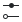</a> | **📂 檔名:** `configure.svg` ✨ **格式:** `Vector (SVG)` ⚖️ **大小:** `904.00B` 📅 **更新:** `2026-03-02`  🚀 **jsDelivr Markdown:** `` 🔗 **直接連結 (Url):** <code>https://cdn.jsdelivr.net/gh/barry028/materials@main/images/iCons/Pixel/Breeze/Actions%20/22/configure.svg</code> 📥 [檢視原始檔](configure.svg) |
|  | **📂 檔名:** `contrast.svg` ✨ **格式:** `Vector (SVG)` ⚖️ **大小:** `947.00B` 📅 **更新:** `2026-03-02`  🚀 **jsDelivr Markdown:** `` 🔗 **直接連結 (Url):** <code>https://cdn.jsdelivr.net/gh/barry028/materials@main/images/iCons/Pixel/Breeze/Actions%20/22/contrast.svg</code> 📥 [檢視原始檔](contrast.svg) |
|  | **📂 檔名:** `coordinate.svg` ✨ **格式:** `Vector (SVG)` ⚖️ **大小:** `529.00B` 📅 **更新:** `2026-03-02`  🚀 **jsDelivr Markdown:** `` 🔗 **直接連結 (Url):** <code>https://cdn.jsdelivr.net/gh/barry028/materials@main/images/iCons/Pixel/Breeze/Actions%20/22/coordinate.svg</code> 📥 [檢視原始檔](coordinate.svg) |
|  | **📂 檔名:** `copy-coordinates.svg` ✨ **格式:** `Vector (SVG)` ⚖️ **大小:** `733.00B` 📅 **更新:** `2026-03-02`  🚀 **jsDelivr Markdown:** `` 🔗 **直接連結 (Url):** <code>https://cdn.jsdelivr.net/gh/barry028/materials@main/images/iCons/Pixel/Breeze/Actions%20/22/copy-coordinates.svg</code> 📥 [檢視原始檔](copy-coordinates.svg) |
|  | **📂 檔名:** `crosshairs.svg` ✨ **格式:** `Vector (SVG)` ⚖️ **大小:** `1.29KB` 📅 **更新:** `2026-03-02`  🚀 **jsDelivr Markdown:** `` 🔗 **直接連結 (Url):** <code>https://cdn.jsdelivr.net/gh/barry028/materials@main/images/iCons/Pixel/Breeze/Actions%20/22/crosshairs.svg</code> 📥 [檢視原始檔](crosshairs.svg) |
|  | **📂 檔名:** `curve-connector.svg` ✨ **格式:** `Vector (SVG)` ⚖️ **大小:** `1.11KB` 📅 **更新:** `2026-03-02`  🚀 **jsDelivr Markdown:** `` 🔗 **直接連結 (Url):** <code>https://cdn.jsdelivr.net/gh/barry028/materials@main/images/iCons/Pixel/Breeze/Actions%20/22/curve-connector.svg</code> 📥 [檢視原始檔](curve-connector.svg) |
|  | **📂 檔名:** `dashboard-show.svg` ✨ **格式:** `Vector (SVG)` ⚖️ **大小:** `938.00B` 📅 **更新:** `2026-03-02`  🚀 **jsDelivr Markdown:** `` 🔗 **直接連結 (Url):** <code>https://cdn.jsdelivr.net/gh/barry028/materials@main/images/iCons/Pixel/Breeze/Actions%20/22/dashboard-show.svg</code> 📥 [檢視原始檔](dashboard-show.svg) |
|  | **📂 檔名:** `database-change-key.svg` ✨ **格式:** `Vector (SVG)` ⚖️ **大小:** `1.16KB` 📅 **更新:** `2026-03-02`  🚀 **jsDelivr Markdown:** `` 🔗 **直接連結 (Url):** <code>https://cdn.jsdelivr.net/gh/barry028/materials@main/images/iCons/Pixel/Breeze/Actions%20/22/database-change-key.svg</code> 📥 [檢視原始檔](database-change-key.svg) |
|  | **📂 檔名:** `database-index.svg` ✨ **格式:** `Vector (SVG)` ⚖️ **大小:** `645.00B` 📅 **更新:** `2026-03-02`  🚀 **jsDelivr Markdown:** `` 🔗 **直接連結 (Url):** <code>https://cdn.jsdelivr.net/gh/barry028/materials@main/images/iCons/Pixel/Breeze/Actions%20/22/database-index.svg</code> 📥 [檢視原始檔](database-index.svg) |
| <a href="debug-execute-from-cursor.svg">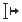</a> | **📂 檔名:** `debug-execute-from-cursor.svg` ✨ **格式:** `Vector (SVG)` ⚖️ **大小:** `420.00B` 📅 **更新:** `2026-03-02`  🚀 **jsDelivr Markdown:** `` 🔗 **直接連結 (Url):** <code>https://cdn.jsdelivr.net/gh/barry028/materials@main/images/iCons/Pixel/Breeze/Actions%20/22/debug-execute-from-cursor.svg</code> 📥 [檢視原始檔](debug-execute-from-cursor.svg) |
|  | **📂 檔名:** `debug-execute-to-cursor.svg` ✨ **格式:** `Vector (SVG)` ⚖️ **大小:** `427.00B` 📅 **更新:** `2026-03-02`  🚀 **jsDelivr Markdown:** `` 🔗 **直接連結 (Url):** <code>https://cdn.jsdelivr.net/gh/barry028/materials@main/images/iCons/Pixel/Breeze/Actions%20/22/debug-execute-to-cursor.svg</code> 📥 [檢視原始檔](debug-execute-to-cursor.svg) |
| <a href="debug-run-cursor.svg">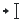</a> | **📂 檔名:** `debug-run-cursor.svg` ✨ **格式:** `Vector (SVG)` ⚖️ **大小:** `408.00B` 📅 **更新:** `2026-03-02`  🚀 **jsDelivr Markdown:** `` 🔗 **直接連結 (Url):** <code>https://cdn.jsdelivr.net/gh/barry028/materials@main/images/iCons/Pixel/Breeze/Actions%20/22/debug-run-cursor.svg</code> 📥 [檢視原始檔](debug-run-cursor.svg) |
|  | **📂 檔名:** `debug-run.svg` ✨ **格式:** `Vector (SVG)` ⚖️ **大小:** `411.00B` 📅 **更新:** `2026-03-02`  🚀 **jsDelivr Markdown:** `` 🔗 **直接連結 (Url):** <code>https://cdn.jsdelivr.net/gh/barry028/materials@main/images/iCons/Pixel/Breeze/Actions%20/22/debug-run.svg</code> 📥 [檢視原始檔](debug-run.svg) |
|  | **📂 檔名:** `debug-step-instruction.svg` ✨ **格式:** `Vector (SVG)` ⚖️ **大小:** `4.11KB` 📅 **更新:** `2026-03-02`  🚀 **jsDelivr Markdown:** `` 🔗 **直接連結 (Url):** <code>https://cdn.jsdelivr.net/gh/barry028/materials@main/images/iCons/Pixel/Breeze/Actions%20/22/debug-step-instruction.svg</code> 📥 [檢視原始檔](debug-step-instruction.svg) |
|  | **📂 檔名:** `debug-step-into-instruction.svg` ✨ **格式:** `Vector (SVG)` ⚖️ **大小:** `3.99KB` 📅 **更新:** `2026-03-02`  🚀 **jsDelivr Markdown:** `` 🔗 **直接連結 (Url):** <code>https://cdn.jsdelivr.net/gh/barry028/materials@main/images/iCons/Pixel/Breeze/Actions%20/22/debug-step-into-instruction.svg</code> 📥 [檢視原始檔](debug-step-into-instruction.svg) |
|  | **📂 檔名:** `debug-step-into.svg` ✨ **格式:** `Vector (SVG)` ⚖️ **大小:** `3.67KB` 📅 **更新:** `2026-03-02`  🚀 **jsDelivr Markdown:** `` 🔗 **直接連結 (Url):** <code>https://cdn.jsdelivr.net/gh/barry028/materials@main/images/iCons/Pixel/Breeze/Actions%20/22/debug-step-into.svg</code> 📥 [檢視原始檔](debug-step-into.svg) |
|  | **📂 檔名:** `debug-step-out.svg` ✨ **格式:** `Vector (SVG)` ⚖️ **大小:** `3.67KB` 📅 **更新:** `2026-03-02`  🚀 **jsDelivr Markdown:** `` 🔗 **直接連結 (Url):** <code>https://cdn.jsdelivr.net/gh/barry028/materials@main/images/iCons/Pixel/Breeze/Actions%20/22/debug-step-out.svg</code> 📥 [檢視原始檔](debug-step-out.svg) |
|  | **📂 檔名:** `debug-step-over.svg` ✨ **格式:** `Vector (SVG)` ⚖️ **大小:** `3.66KB` 📅 **更新:** `2026-03-02`  🚀 **jsDelivr Markdown:** `` 🔗 **直接連結 (Url):** <code>https://cdn.jsdelivr.net/gh/barry028/materials@main/images/iCons/Pixel/Breeze/Actions%20/22/debug-step-over.svg</code> 📥 [檢視原始檔](debug-step-over.svg) |
|  | **📂 檔名:** `deep-history.svg` ✨ **格式:** `Vector (SVG)` ⚖️ **大小:** `1.02KB` 📅 **更新:** `2026-03-02`  🚀 **jsDelivr Markdown:** `` 🔗 **直接連結 (Url):** <code>https://cdn.jsdelivr.net/gh/barry028/materials@main/images/iCons/Pixel/Breeze/Actions%20/22/deep-history.svg</code> 📥 [檢視原始檔](deep-history.svg) |
|  | **📂 檔名:** `delete-comment.svg` ✨ **格式:** `Vector (SVG)` ⚖️ **大小:** `692.00B` 📅 **更新:** `2026-03-02`  🚀 **jsDelivr Markdown:** `` 🔗 **直接連結 (Url):** <code>https://cdn.jsdelivr.net/gh/barry028/materials@main/images/iCons/Pixel/Breeze/Actions%20/22/delete-comment.svg</code> 📥 [檢視原始檔](delete-comment.svg) |
|  | **📂 檔名:** `dependency.svg` ✨ **格式:** `Vector (SVG)` ⚖️ **大小:** `583.00B` 📅 **更新:** `2026-03-02`  🚀 **jsDelivr Markdown:** `` 🔗 **直接連結 (Url):** <code>https://cdn.jsdelivr.net/gh/barry028/materials@main/images/iCons/Pixel/Breeze/Actions%20/22/dependency.svg</code> 📥 [檢視原始檔](dependency.svg) |
|  | **📂 檔名:** `depth16to8.svg` ✨ **格式:** `Vector (SVG)` ⚖️ **大小:** `1.01KB` 📅 **更新:** `2026-03-02`  🚀 **jsDelivr Markdown:** `` 🔗 **直接連結 (Url):** <code>https://cdn.jsdelivr.net/gh/barry028/materials@main/images/iCons/Pixel/Breeze/Actions%20/22/depth16to8.svg</code> 📥 [檢視原始檔](depth16to8.svg) |
|  | **📂 檔名:** `depth8to16.svg` ✨ **格式:** `Vector (SVG)` ⚖️ **大小:** `1.03KB` 📅 **更新:** `2026-03-02`  🚀 **jsDelivr Markdown:** `` 🔗 **直接連結 (Url):** <code>https://cdn.jsdelivr.net/gh/barry028/materials@main/images/iCons/Pixel/Breeze/Actions%20/22/depth8to16.svg</code> 📥 [檢視原始檔](depth8to16.svg) |
|  | **📂 檔名:** `description.svg` ✨ **格式:** `Vector (SVG)` ⚖️ **大小:** `636.00B` 📅 **更新:** `2026-03-02`  🚀 **jsDelivr Markdown:** `` 🔗 **直接連結 (Url):** <code>https://cdn.jsdelivr.net/gh/barry028/materials@main/images/iCons/Pixel/Breeze/Actions%20/22/description.svg</code> 📥 [檢視原始檔](description.svg) |
| <a href="dfrac.svg">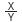</a> | **📂 檔名:** `dfrac.svg` ✨ **格式:** `Vector (SVG)` ⚖️ **大小:** `728.00B` 📅 **更新:** `2026-03-02`  🚀 **jsDelivr Markdown:** `` 🔗 **直接連結 (Url):** <code>https://cdn.jsdelivr.net/gh/barry028/materials@main/images/iCons/Pixel/Breeze/Actions%20/22/dfrac.svg</code> 📥 [檢視原始檔](dfrac.svg) |
|  | **📂 檔名:** `dialog-cancel.svg` ✨ **格式:** `Vector (SVG)` ⚖️ **大小:** `962.00B` 📅 **更新:** `2026-03-02`  🚀 **jsDelivr Markdown:** `` 🔗 **直接連結 (Url):** <code>https://cdn.jsdelivr.net/gh/barry028/materials@main/images/iCons/Pixel/Breeze/Actions%20/22/dialog-cancel.svg</code> 📥 [檢視原始檔](dialog-cancel.svg) |
|  | **📂 檔名:** `dialog-input-devices.svg` ✨ **格式:** `Vector (SVG)` ⚖️ **大小:** `555.00B` 📅 **更新:** `2026-03-02`  🚀 **jsDelivr Markdown:** `` 🔗 **直接連結 (Url):** <code>https://cdn.jsdelivr.net/gh/barry028/materials@main/images/iCons/Pixel/Breeze/Actions%20/22/dialog-input-devices.svg</code> 📥 [檢視原始檔](dialog-input-devices.svg) |
|  | **📂 檔名:** `dialog-messages.svg` ✨ **格式:** `Vector (SVG)` ⚖️ **大小:** `467.00B` 📅 **更新:** `2026-03-02`  🚀 **jsDelivr Markdown:** `` 🔗 **直接連結 (Url):** <code>https://cdn.jsdelivr.net/gh/barry028/materials@main/images/iCons/Pixel/Breeze/Actions%20/22/dialog-messages.svg</code> 📥 [檢視原始檔](dialog-messages.svg) |
|  | **📂 檔名:** `dialog-ok-apply.svg` ✨ **格式:** `Vector (SVG)` ⚖️ **大小:** `567.00B` 📅 **更新:** `2026-03-02`  🚀 **jsDelivr Markdown:** `` 🔗 **直接連結 (Url):** <code>https://cdn.jsdelivr.net/gh/barry028/materials@main/images/iCons/Pixel/Breeze/Actions%20/22/dialog-ok-apply.svg</code> 📥 [檢視原始檔](dialog-ok-apply.svg) |
|  | **📂 檔名:** `dialog-scripts.svg` ✨ **格式:** `Vector (SVG)` ⚖️ **大小:** `607.00B` 📅 **更新:** `2026-03-02`  🚀 **jsDelivr Markdown:** `` 🔗 **直接連結 (Url):** <code>https://cdn.jsdelivr.net/gh/barry028/materials@main/images/iCons/Pixel/Breeze/Actions%20/22/dialog-scripts.svg</code> 📥 [檢視原始檔](dialog-scripts.svg) |
|  | **📂 檔名:** `dialog-xml-editor.svg` ✨ **格式:** `Vector (SVG)` ⚖️ **大小:** `766.00B` 📅 **更新:** `2026-03-02`  🚀 **jsDelivr Markdown:** `` 🔗 **直接連結 (Url):** <code>https://cdn.jsdelivr.net/gh/barry028/materials@main/images/iCons/Pixel/Breeze/Actions%20/22/dialog-xml-editor.svg</code> 📥 [檢視原始檔](dialog-xml-editor.svg) |
|  | **📂 檔名:** `discrete.svg` ✨ **格式:** `Vector (SVG)` ⚖️ **大小:** `416.00B` 📅 **更新:** `2026-03-02`  🚀 **jsDelivr Markdown:** `` 🔗 **直接連結 (Url):** <code>https://cdn.jsdelivr.net/gh/barry028/materials@main/images/iCons/Pixel/Breeze/Actions%20/22/discrete.svg</code> 📥 [檢視原始檔](discrete.svg) |
|  | **📂 檔名:** `distribute-graph-directed.svg` ✨ **格式:** `Vector (SVG)` ⚖️ **大小:** `1.33KB` 📅 **更新:** `2026-03-02`  🚀 **jsDelivr Markdown:** `` 🔗 **直接連結 (Url):** <code>https://cdn.jsdelivr.net/gh/barry028/materials@main/images/iCons/Pixel/Breeze/Actions%20/22/distribute-graph-directed.svg</code> 📥 [檢視原始檔](distribute-graph-directed.svg) |
|  | **📂 檔名:** `distribute-graph.svg` ✨ **格式:** `Vector (SVG)` ⚖️ **大小:** `2.04KB` 📅 **更新:** `2026-03-02`  🚀 **jsDelivr Markdown:** `` 🔗 **直接連結 (Url):** <code>https://cdn.jsdelivr.net/gh/barry028/materials@main/images/iCons/Pixel/Breeze/Actions%20/22/distribute-graph.svg</code> 📥 [檢視原始檔](distribute-graph.svg) |
|  | **📂 檔名:** `distribute-horizontal-baseline.svg` ✨ **格式:** `Vector (SVG)` ⚖️ **大小:** `1.63KB` 📅 **更新:** `2026-03-02`  🚀 **jsDelivr Markdown:** `` 🔗 **直接連結 (Url):** <code>https://cdn.jsdelivr.net/gh/barry028/materials@main/images/iCons/Pixel/Breeze/Actions%20/22/distribute-horizontal-baseline.svg</code> 📥 [檢視原始檔](distribute-horizontal-baseline.svg) |
|  | **📂 檔名:** `distribute-horizontal-center.svg` ✨ **格式:** `Vector (SVG)` ⚖️ **大小:** `475.00B` 📅 **更新:** `2026-03-02`  🚀 **jsDelivr Markdown:** `` 🔗 **直接連結 (Url):** <code>https://cdn.jsdelivr.net/gh/barry028/materials@main/images/iCons/Pixel/Breeze/Actions%20/22/distribute-horizontal-center.svg</code> 📥 [檢視原始檔](distribute-horizontal-center.svg) |
|  | **📂 檔名:** `distribute-horizontal-equal.svg` ✨ **格式:** `Vector (SVG)` ⚖️ **大小:** `463.00B` 📅 **更新:** `2026-03-02`  🚀 **jsDelivr Markdown:** `` 🔗 **直接連結 (Url):** <code>https://cdn.jsdelivr.net/gh/barry028/materials@main/images/iCons/Pixel/Breeze/Actions%20/22/distribute-horizontal-equal.svg</code> 📥 [檢視原始檔](distribute-horizontal-equal.svg) |
|  | **📂 檔名:** `distribute-horizontal-left.svg` ✨ **格式:** `Vector (SVG)` ⚖️ **大小:** `464.00B` 📅 **更新:** `2026-03-02`  🚀 **jsDelivr Markdown:** `` 🔗 **直接連結 (Url):** <code>https://cdn.jsdelivr.net/gh/barry028/materials@main/images/iCons/Pixel/Breeze/Actions%20/22/distribute-horizontal-left.svg</code> 📥 [檢視原始檔](distribute-horizontal-left.svg) |
|  | **📂 檔名:** `distribute-horizontal-margin.svg` ✨ **格式:** `Vector (SVG)` ⚖️ **大小:** `594.00B` 📅 **更新:** `2026-03-02`  🚀 **jsDelivr Markdown:** `` 🔗 **直接連結 (Url):** <code>https://cdn.jsdelivr.net/gh/barry028/materials@main/images/iCons/Pixel/Breeze/Actions%20/22/distribute-horizontal-margin.svg</code> 📥 [檢視原始檔](distribute-horizontal-margin.svg) |
|  | **📂 檔名:** `distribute-horizontal-node.svg` ✨ **格式:** `Vector (SVG)` ⚖️ **大小:** `599.00B` 📅 **更新:** `2026-03-02`  🚀 **jsDelivr Markdown:** `` 🔗 **直接連結 (Url):** <code>https://cdn.jsdelivr.net/gh/barry028/materials@main/images/iCons/Pixel/Breeze/Actions%20/22/distribute-horizontal-node.svg</code> 📥 [檢視原始檔](distribute-horizontal-node.svg) |
|  | **📂 檔名:** `distribute-horizontal-page.svg` ✨ **格式:** `Vector (SVG)` ⚖️ **大小:** `1.05KB` 📅 **更新:** `2026-03-02`  🚀 **jsDelivr Markdown:** `` 🔗 **直接連結 (Url):** <code>https://cdn.jsdelivr.net/gh/barry028/materials@main/images/iCons/Pixel/Breeze/Actions%20/22/distribute-horizontal-page.svg</code> 📥 [檢視原始檔](distribute-horizontal-page.svg) |
|  | **📂 檔名:** `distribute-horizontal-right.svg` ✨ **格式:** `Vector (SVG)` ⚖️ **大小:** `468.00B` 📅 **更新:** `2026-03-02`  🚀 **jsDelivr Markdown:** `` 🔗 **直接連結 (Url):** <code>https://cdn.jsdelivr.net/gh/barry028/materials@main/images/iCons/Pixel/Breeze/Actions%20/22/distribute-horizontal-right.svg</code> 📥 [檢視原始檔](distribute-horizontal-right.svg) |
|  | **📂 檔名:** `distribute-horizontal.svg` ✨ **格式:** `Vector (SVG)` ⚖️ **大小:** `451.00B` 📅 **更新:** `2026-03-02`  🚀 **jsDelivr Markdown:** `` 🔗 **直接連結 (Url):** <code>https://cdn.jsdelivr.net/gh/barry028/materials@main/images/iCons/Pixel/Breeze/Actions%20/22/distribute-horizontal.svg</code> 📥 [檢視原始檔](distribute-horizontal.svg) |
|  | **📂 檔名:** `distribute-randomize.svg` ✨ **格式:** `Vector (SVG)` ⚖️ **大小:** `560.00B` 📅 **更新:** `2026-03-02`  🚀 **jsDelivr Markdown:** `` 🔗 **直接連結 (Url):** <code>https://cdn.jsdelivr.net/gh/barry028/materials@main/images/iCons/Pixel/Breeze/Actions%20/22/distribute-randomize.svg</code> 📥 [檢視原始檔](distribute-randomize.svg) |
|  | **📂 檔名:** `distribute-remove-overlaps.svg` ✨ **格式:** `Vector (SVG)` ⚖️ **大小:** `619.00B` 📅 **更新:** `2026-03-02`  🚀 **jsDelivr Markdown:** `` 🔗 **直接連結 (Url):** <code>https://cdn.jsdelivr.net/gh/barry028/materials@main/images/iCons/Pixel/Breeze/Actions%20/22/distribute-remove-overlaps.svg</code> 📥 [檢視原始檔](distribute-remove-overlaps.svg) |
|  | **📂 檔名:** `distribute-unclump.svg` ✨ **格式:** `Vector (SVG)` ⚖️ **大小:** `578.00B` 📅 **更新:** `2026-03-02`  🚀 **jsDelivr Markdown:** `` 🔗 **直接連結 (Url):** <code>https://cdn.jsdelivr.net/gh/barry028/materials@main/images/iCons/Pixel/Breeze/Actions%20/22/distribute-unclump.svg</code> 📥 [檢視原始檔](distribute-unclump.svg) |
| <a href="distribute-vertical-baseline.svg">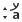</a> | **📂 檔名:** `distribute-vertical-baseline.svg` ✨ **格式:** `Vector (SVG)` ⚖️ **大小:** `1.56KB` 📅 **更新:** `2026-03-02`  🚀 **jsDelivr Markdown:** `` 🔗 **直接連結 (Url):** <code>https://cdn.jsdelivr.net/gh/barry028/materials@main/images/iCons/Pixel/Breeze/Actions%20/22/distribute-vertical-baseline.svg</code> 📥 [檢視原始檔](distribute-vertical-baseline.svg) |
|  | **📂 檔名:** `distribute-vertical-bottom.svg` ✨ **格式:** `Vector (SVG)` ⚖️ **大小:** `531.00B` 📅 **更新:** `2026-03-02`  🚀 **jsDelivr Markdown:** `` 🔗 **直接連結 (Url):** <code>https://cdn.jsdelivr.net/gh/barry028/materials@main/images/iCons/Pixel/Breeze/Actions%20/22/distribute-vertical-bottom.svg</code> 📥 [檢視原始檔](distribute-vertical-bottom.svg) |
|  | **📂 檔名:** `distribute-vertical-center.svg` ✨ **格式:** `Vector (SVG)` ⚖️ **大小:** `1.90KB` 📅 **更新:** `2026-03-02`  🚀 **jsDelivr Markdown:** `` 🔗 **直接連結 (Url):** <code>https://cdn.jsdelivr.net/gh/barry028/materials@main/images/iCons/Pixel/Breeze/Actions%20/22/distribute-vertical-center.svg</code> 📥 [檢視原始檔](distribute-vertical-center.svg) |
|  | **📂 檔名:** `distribute-vertical-equal.svg` ✨ **格式:** `Vector (SVG)` ⚖️ **大小:** `529.00B` 📅 **更新:** `2026-03-02`  🚀 **jsDelivr Markdown:** `` 🔗 **直接連結 (Url):** <code>https://cdn.jsdelivr.net/gh/barry028/materials@main/images/iCons/Pixel/Breeze/Actions%20/22/distribute-vertical-equal.svg</code> 📥 [檢視原始檔](distribute-vertical-equal.svg) |
|  | **📂 檔名:** `distribute-vertical-margin.svg` ✨ **格式:** `Vector (SVG)` ⚖️ **大小:** `517.00B` 📅 **更新:** `2026-03-02`  🚀 **jsDelivr Markdown:** `` 🔗 **直接連結 (Url):** <code>https://cdn.jsdelivr.net/gh/barry028/materials@main/images/iCons/Pixel/Breeze/Actions%20/22/distribute-vertical-margin.svg</code> 📥 [檢視原始檔](distribute-vertical-margin.svg) |
| <a href="distribute-vertical-node.svg">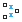</a> | **📂 檔名:** `distribute-vertical-node.svg` ✨ **格式:** `Vector (SVG)` ⚖️ **大小:** `597.00B` 📅 **更新:** `2026-03-02`  🚀 **jsDelivr Markdown:** `` 🔗 **直接連結 (Url):** <code>https://cdn.jsdelivr.net/gh/barry028/materials@main/images/iCons/Pixel/Breeze/Actions%20/22/distribute-vertical-node.svg</code> 📥 [檢視原始檔](distribute-vertical-node.svg) |
|  | **📂 檔名:** `distribute-vertical-page.svg` ✨ **格式:** `Vector (SVG)` ⚖️ **大小:** `1.05KB` 📅 **更新:** `2026-03-02`  🚀 **jsDelivr Markdown:** `` 🔗 **直接連結 (Url):** <code>https://cdn.jsdelivr.net/gh/barry028/materials@main/images/iCons/Pixel/Breeze/Actions%20/22/distribute-vertical-page.svg</code> 📥 [檢視原始檔](distribute-vertical-page.svg) |
|  | **📂 檔名:** `distribute-vertical-top.svg` ✨ **格式:** `Vector (SVG)` ⚖️ **大小:** `525.00B` 📅 **更新:** `2026-03-02`  🚀 **jsDelivr Markdown:** `` 🔗 **直接連結 (Url):** <code>https://cdn.jsdelivr.net/gh/barry028/materials@main/images/iCons/Pixel/Breeze/Actions%20/22/distribute-vertical-top.svg</code> 📥 [檢視原始檔](distribute-vertical-top.svg) |
|  | **📂 檔名:** `distribute-vertical.svg` ✨ **格式:** `Vector (SVG)` ⚖️ **大小:** `508.00B` 📅 **更新:** `2026-03-02`  🚀 **jsDelivr Markdown:** `` 🔗 **直接連結 (Url):** <code>https://cdn.jsdelivr.net/gh/barry028/materials@main/images/iCons/Pixel/Breeze/Actions%20/22/distribute-vertical.svg</code> 📥 [檢視原始檔](distribute-vertical.svg) |
|  | **📂 檔名:** `document-close.svg` ✨ **格式:** `Vector (SVG)` ⚖️ **大小:** `664.00B` 📅 **更新:** `2026-03-02`  🚀 **jsDelivr Markdown:** `` 🔗 **直接連結 (Url):** <code>https://cdn.jsdelivr.net/gh/barry028/materials@main/images/iCons/Pixel/Breeze/Actions%20/22/document-close.svg</code> 📥 [檢視原始檔](document-close.svg) |
|  | **📂 檔名:** `document-decrypt.svg` ✨ **格式:** `Vector (SVG)` ⚖️ **大小:** `505.00B` 📅 **更新:** `2026-03-02`  🚀 **jsDelivr Markdown:** `` 🔗 **直接連結 (Url):** <code>https://cdn.jsdelivr.net/gh/barry028/materials@main/images/iCons/Pixel/Breeze/Actions%20/22/document-decrypt.svg</code> 📥 [檢視原始檔](document-decrypt.svg) |
| <a href="document-edit-decrypt-verify.svg">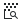</a> | **📂 檔名:** `document-edit-decrypt-verify.svg` ✨ **格式:** `Vector (SVG)` ⚖️ **大小:** `820.00B` 📅 **更新:** `2026-03-02`  🚀 **jsDelivr Markdown:** `` 🔗 **直接連結 (Url):** <code>https://cdn.jsdelivr.net/gh/barry028/materials@main/images/iCons/Pixel/Breeze/Actions%20/22/document-edit-decrypt-verify.svg</code> 📥 [檢視原始檔](document-edit-decrypt-verify.svg) |
|  | **📂 檔名:** `document-edit-decrypt.svg` ✨ **格式:** `Vector (SVG)` ⚖️ **大小:** `828.00B` 📅 **更新:** `2026-03-02`  🚀 **jsDelivr Markdown:** `` 🔗 **直接連結 (Url):** <code>https://cdn.jsdelivr.net/gh/barry028/materials@main/images/iCons/Pixel/Breeze/Actions%20/22/document-edit-decrypt.svg</code> 📥 [檢視原始檔](document-edit-decrypt.svg) |
|  | **📂 檔名:** `document-edit-encrypt.svg` ✨ **格式:** `Vector (SVG)` ⚖️ **大小:** `1.17KB` 📅 **更新:** `2026-03-02`  🚀 **jsDelivr Markdown:** `` 🔗 **直接連結 (Url):** <code>https://cdn.jsdelivr.net/gh/barry028/materials@main/images/iCons/Pixel/Breeze/Actions%20/22/document-edit-encrypt.svg</code> 📥 [檢視原始檔](document-edit-encrypt.svg) |
|  | **📂 檔名:** `document-edit-sign-encrypt.svg` ✨ **格式:** `Vector (SVG)` ⚖️ **大小:** `873.00B` 📅 **更新:** `2026-03-02`  🚀 **jsDelivr Markdown:** `` 🔗 **直接連結 (Url):** <code>https://cdn.jsdelivr.net/gh/barry028/materials@main/images/iCons/Pixel/Breeze/Actions%20/22/document-edit-sign-encrypt.svg</code> 📥 [檢視原始檔](document-edit-sign-encrypt.svg) |
|  | **📂 檔名:** `document-edit-sign.svg` ✨ **格式:** `Vector (SVG)` ⚖️ **大小:** `656.00B` 📅 **更新:** `2026-03-02`  🚀 **jsDelivr Markdown:** `` 🔗 **直接連結 (Url):** <code>https://cdn.jsdelivr.net/gh/barry028/materials@main/images/iCons/Pixel/Breeze/Actions%20/22/document-edit-sign.svg</code> 📥 [檢視原始檔](document-edit-sign.svg) |
|  | **📂 檔名:** `document-edit.svg` ✨ **格式:** `Vector (SVG)` ⚖️ **大小:** `695.00B` 📅 **更新:** `2026-03-02`  🚀 **jsDelivr Markdown:** `` 🔗 **直接連結 (Url):** <code>https://cdn.jsdelivr.net/gh/barry028/materials@main/images/iCons/Pixel/Breeze/Actions%20/22/document-edit.svg</code> 📥 [檢視原始檔](document-edit.svg) |
|  | **📂 檔名:** `document-encrypted.svg` ✨ **格式:** `Vector (SVG)` ⚖️ **大小:** `558.00B` 📅 **更新:** `2026-03-02`  🚀 **jsDelivr Markdown:** `` 🔗 **直接連結 (Url):** <code>https://cdn.jsdelivr.net/gh/barry028/materials@main/images/iCons/Pixel/Breeze/Actions%20/22/document-encrypted.svg</code> 📥 [檢視原始檔](document-encrypted.svg) |
|  | **📂 檔名:** `document-export.svg` ✨ **格式:** `Vector (SVG)` ⚖️ **大小:** `582.00B` 📅 **更新:** `2026-03-02`  🚀 **jsDelivr Markdown:** `` 🔗 **直接連結 (Url):** <code>https://cdn.jsdelivr.net/gh/barry028/materials@main/images/iCons/Pixel/Breeze/Actions%20/22/document-export.svg</code> 📥 [檢視原始檔](document-export.svg) |
|  | **📂 檔名:** `document-import.svg` ✨ **格式:** `Vector (SVG)` ⚖️ **大小:** `555.00B` 📅 **更新:** `2026-03-02`  🚀 **jsDelivr Markdown:** `` 🔗 **直接連結 (Url):** <code>https://cdn.jsdelivr.net/gh/barry028/materials@main/images/iCons/Pixel/Breeze/Actions%20/22/document-import.svg</code> 📥 [檢視原始檔](document-import.svg) |
|  | **📂 檔名:** `document-new-from-template.svg` ✨ **格式:** `Vector (SVG)` ⚖️ **大小:** `826.00B` 📅 **更新:** `2026-03-02`  🚀 **jsDelivr Markdown:** `` 🔗 **直接連結 (Url):** <code>https://cdn.jsdelivr.net/gh/barry028/materials@main/images/iCons/Pixel/Breeze/Actions%20/22/document-new-from-template.svg</code> 📥 [檢視原始檔](document-new-from-template.svg) |
|  | **📂 檔名:** `document-new.svg` ✨ **格式:** `Vector (SVG)` ⚖️ **大小:** `630.00B` 📅 **更新:** `2026-03-02`  🚀 **jsDelivr Markdown:** `` 🔗 **直接連結 (Url):** <code>https://cdn.jsdelivr.net/gh/barry028/materials@main/images/iCons/Pixel/Breeze/Actions%20/22/document-new.svg</code> 📥 [檢視原始檔](document-new.svg) |
|  | **📂 檔名:** `document-open-folder.svg` ✨ **格式:** `Vector (SVG)` ⚖️ **大小:** `472.00B` 📅 **更新:** `2026-03-02`  🚀 **jsDelivr Markdown:** `` 🔗 **直接連結 (Url):** <code>https://cdn.jsdelivr.net/gh/barry028/materials@main/images/iCons/Pixel/Breeze/Actions%20/22/document-open-folder.svg</code> 📥 [檢視原始檔](document-open-folder.svg) |
|  | **📂 檔名:** `document-open-recent.svg` ✨ **格式:** `Vector (SVG)` ⚖️ **大小:** `648.00B` 📅 **更新:** `2026-03-02`  🚀 **jsDelivr Markdown:** `` 🔗 **直接連結 (Url):** <code>https://cdn.jsdelivr.net/gh/barry028/materials@main/images/iCons/Pixel/Breeze/Actions%20/22/document-open-recent.svg</code> 📥 [檢視原始檔](document-open-recent.svg) |
|  | **📂 檔名:** `document-open-remote.svg` ✨ **格式:** `Vector (SVG)` ⚖️ **大小:** `565.00B` 📅 **更新:** `2026-03-02`  🚀 **jsDelivr Markdown:** `` 🔗 **直接連結 (Url):** <code>https://cdn.jsdelivr.net/gh/barry028/materials@main/images/iCons/Pixel/Breeze/Actions%20/22/document-open-remote.svg</code> 📥 [檢視原始檔](document-open-remote.svg) |
|  | **📂 檔名:** `document-open.svg` ✨ **格式:** `Vector (SVG)` ⚖️ **大小:** `595.00B` 📅 **更新:** `2026-03-02`  🚀 **jsDelivr Markdown:** `` 🔗 **直接連結 (Url):** <code>https://cdn.jsdelivr.net/gh/barry028/materials@main/images/iCons/Pixel/Breeze/Actions%20/22/document-open.svg</code> 📥 [檢視原始檔](document-open.svg) |
|  | **📂 檔名:** `document-preview-archive.svg` ✨ **格式:** `Vector (SVG)` ⚖️ **大小:** `807.00B` 📅 **更新:** `2026-03-02`  🚀 **jsDelivr Markdown:** `` 🔗 **直接連結 (Url):** <code>https://cdn.jsdelivr.net/gh/barry028/materials@main/images/iCons/Pixel/Breeze/Actions%20/22/document-preview-archive.svg</code> 📥 [檢視原始檔](document-preview-archive.svg) |
|  | **📂 檔名:** `document-print-direct.svg` ✨ **格式:** `Vector (SVG)` ⚖️ **大小:** `755.00B` 📅 **更新:** `2026-03-02`  🚀 **jsDelivr Markdown:** `` 🔗 **直接連結 (Url):** <code>https://cdn.jsdelivr.net/gh/barry028/materials@main/images/iCons/Pixel/Breeze/Actions%20/22/document-print-direct.svg</code> 📥 [檢視原始檔](document-print-direct.svg) |
|  | **📂 檔名:** `document-print.svg` ✨ **格式:** `Vector (SVG)` ⚖️ **大小:** `498.00B` 📅 **更新:** `2026-03-02`  🚀 **jsDelivr Markdown:** `` 🔗 **直接連結 (Url):** <code>https://cdn.jsdelivr.net/gh/barry028/materials@main/images/iCons/Pixel/Breeze/Actions%20/22/document-print.svg</code> 📥 [檢視原始檔](document-print.svg) |
|  | **📂 檔名:** `document-properties.svg` ✨ **格式:** `Vector (SVG)` ⚖️ **大小:** `450.00B` 📅 **更新:** `2026-03-02`  🚀 **jsDelivr Markdown:** `` 🔗 **直接連結 (Url):** <code>https://cdn.jsdelivr.net/gh/barry028/materials@main/images/iCons/Pixel/Breeze/Actions%20/22/document-properties.svg</code> 📥 [檢視原始檔](document-properties.svg) |
|  | **📂 檔名:** `document-replace.svg` ✨ **格式:** `Vector (SVG)` ⚖️ **大小:** `955.00B` 📅 **更新:** `2026-03-02`  🚀 **jsDelivr Markdown:** `` 🔗 **直接連結 (Url):** <code>https://cdn.jsdelivr.net/gh/barry028/materials@main/images/iCons/Pixel/Breeze/Actions%20/22/document-replace.svg</code> 📥 [檢視原始檔](document-replace.svg) |
|  | **📂 檔名:** `document-revert.svg` ✨ **格式:** `Vector (SVG)` ⚖️ **大小:** `465.00B` 📅 **更新:** `2026-03-02`  🚀 **jsDelivr Markdown:** `` 🔗 **直接連結 (Url):** <code>https://cdn.jsdelivr.net/gh/barry028/materials@main/images/iCons/Pixel/Breeze/Actions%20/22/document-revert.svg</code> 📥 [檢視原始檔](document-revert.svg) |
|  | **📂 檔名:** `document-save-all.svg` ✨ **格式:** `Vector (SVG)` ⚖️ **大小:** `975.00B` 📅 **更新:** `2026-03-02`  🚀 **jsDelivr Markdown:** `` 🔗 **直接連結 (Url):** <code>https://cdn.jsdelivr.net/gh/barry028/materials@main/images/iCons/Pixel/Breeze/Actions%20/22/document-save-all.svg</code> 📥 [檢視原始檔](document-save-all.svg) |
|  | **📂 檔名:** `document-save-as-template.svg` ✨ **格式:** `Vector (SVG)` ⚖️ **大小:** `1.03KB` 📅 **更新:** `2026-03-02`  🚀 **jsDelivr Markdown:** `` 🔗 **直接連結 (Url):** <code>https://cdn.jsdelivr.net/gh/barry028/materials@main/images/iCons/Pixel/Breeze/Actions%20/22/document-save-as-template.svg</code> 📥 [檢視原始檔](document-save-as-template.svg) |
|  | **📂 檔名:** `document-save-as.svg` ✨ **格式:** `Vector (SVG)` ⚖️ **大小:** `1.15KB` 📅 **更新:** `2026-03-02`  🚀 **jsDelivr Markdown:** `` 🔗 **直接連結 (Url):** <code>https://cdn.jsdelivr.net/gh/barry028/materials@main/images/iCons/Pixel/Breeze/Actions%20/22/document-save-as.svg</code> 📥 [檢視原始檔](document-save-as.svg) |
|  | **📂 檔名:** `document-save.svg` ✨ **格式:** `Vector (SVG)` ⚖️ **大小:** `788.00B` 📅 **更新:** `2026-03-02`  🚀 **jsDelivr Markdown:** `` 🔗 **直接連結 (Url):** <code>https://cdn.jsdelivr.net/gh/barry028/materials@main/images/iCons/Pixel/Breeze/Actions%20/22/document-save.svg</code> 📥 [檢視原始檔](document-save.svg) |
|  | **📂 檔名:** `document-scan.svg` ✨ **格式:** `Vector (SVG)` ⚖️ **大小:** `546.00B` 📅 **更新:** `2026-03-02`  🚀 **jsDelivr Markdown:** `` 🔗 **直接連結 (Url):** <code>https://cdn.jsdelivr.net/gh/barry028/materials@main/images/iCons/Pixel/Breeze/Actions%20/22/document-scan.svg</code> 📥 [檢視原始檔](document-scan.svg) |
|  | **📂 檔名:** `document-send.svg` ✨ **格式:** `Vector (SVG)` ⚖️ **大小:** `644.00B` 📅 **更新:** `2026-03-02`  🚀 **jsDelivr Markdown:** `` 🔗 **直接連結 (Url):** <code>https://cdn.jsdelivr.net/gh/barry028/materials@main/images/iCons/Pixel/Breeze/Actions%20/22/document-send.svg</code> 📥 [檢視原始檔](document-send.svg) |
|  | **📂 檔名:** `document-share.svg` ✨ **格式:** `Vector (SVG)` ⚖️ **大小:** `993.00B` 📅 **更新:** `2026-03-02`  🚀 **jsDelivr Markdown:** `` 🔗 **直接連結 (Url):** <code>https://cdn.jsdelivr.net/gh/barry028/materials@main/images/iCons/Pixel/Breeze/Actions%20/22/document-share.svg</code> 📥 [檢視原始檔](document-share.svg) |
|  | **📂 檔名:** `document-swap.svg` ✨ **格式:** `Vector (SVG)` ⚖️ **大小:** `1009.00B` 📅 **更新:** `2026-03-02`  🚀 **jsDelivr Markdown:** `` 🔗 **直接連結 (Url):** <code>https://cdn.jsdelivr.net/gh/barry028/materials@main/images/iCons/Pixel/Breeze/Actions%20/22/document-swap.svg</code> 📥 [檢視原始檔](document-swap.svg) |
|  | **📂 檔名:** `dontknow.svg` ✨ **格式:** `Vector (SVG)` ⚖️ **大小:** `1.31KB` 📅 **更新:** `2026-03-02`  🚀 **jsDelivr Markdown:** `` 🔗 **直接連結 (Url):** <code>https://cdn.jsdelivr.net/gh/barry028/materials@main/images/iCons/Pixel/Breeze/Actions%20/22/dontknow.svg</code> 📥 [檢視原始檔](dontknow.svg) |
|  | **📂 檔名:** `download-later.svg` ✨ **格式:** `Vector (SVG)` ⚖️ **大小:** `831.00B` 📅 **更新:** `2026-03-02`  🚀 **jsDelivr Markdown:** `` 🔗 **直接連結 (Url):** <code>https://cdn.jsdelivr.net/gh/barry028/materials@main/images/iCons/Pixel/Breeze/Actions%20/22/download-later.svg</code> 📥 [檢視原始檔](download-later.svg) |
|  | **📂 檔名:** `drag-surface.svg` ✨ **格式:** `Vector (SVG)` ⚖️ **大小:** `677.00B` 📅 **更新:** `2026-03-02`  🚀 **jsDelivr Markdown:** `` 🔗 **直接連結 (Url):** <code>https://cdn.jsdelivr.net/gh/barry028/materials@main/images/iCons/Pixel/Breeze/Actions%20/22/drag-surface.svg</code> 📥 [檢視原始檔](drag-surface.svg) |
|  | **📂 檔名:** `draw-arrow.svg` ✨ **格式:** `Vector (SVG)` ⚖️ **大小:** `291.00B` 📅 **更新:** `2026-03-02`  🚀 **jsDelivr Markdown:** `` 🔗 **直接連結 (Url):** <code>https://cdn.jsdelivr.net/gh/barry028/materials@main/images/iCons/Pixel/Breeze/Actions%20/22/draw-arrow.svg</code> 📥 [檢視原始檔](draw-arrow.svg) |
|  | **📂 檔名:** `draw-bezier-curves.svg` ✨ **格式:** `Vector (SVG)` ⚖️ **大小:** `1.15KB` 📅 **更新:** `2026-03-02`  🚀 **jsDelivr Markdown:** `` 🔗 **直接連結 (Url):** <code>https://cdn.jsdelivr.net/gh/barry028/materials@main/images/iCons/Pixel/Breeze/Actions%20/22/draw-bezier-curves.svg</code> 📥 [檢視原始檔](draw-bezier-curves.svg) |
|  | **📂 檔名:** `draw-brush.svg` ✨ **格式:** `Vector (SVG)` ⚖️ **大小:** `707.00B` 📅 **更新:** `2026-03-02`  🚀 **jsDelivr Markdown:** `` 🔗 **直接連結 (Url):** <code>https://cdn.jsdelivr.net/gh/barry028/materials@main/images/iCons/Pixel/Breeze/Actions%20/22/draw-brush.svg</code> 📥 [檢視原始檔](draw-brush.svg) |
|  | **📂 檔名:** `draw-calligraphic.svg` ✨ **格式:** `Vector (SVG)` ⚖️ **大小:** `619.00B` 📅 **更新:** `2026-03-02`  🚀 **jsDelivr Markdown:** `` 🔗 **直接連結 (Url):** <code>https://cdn.jsdelivr.net/gh/barry028/materials@main/images/iCons/Pixel/Breeze/Actions%20/22/draw-calligraphic.svg</code> 📥 [檢視原始檔](draw-calligraphic.svg) |
|  | **📂 檔名:** `draw-circle.svg` ✨ **格式:** `Vector (SVG)` ⚖️ **大小:** `1.01KB` 📅 **更新:** `2026-03-02`  🚀 **jsDelivr Markdown:** `` 🔗 **直接連結 (Url):** <code>https://cdn.jsdelivr.net/gh/barry028/materials@main/images/iCons/Pixel/Breeze/Actions%20/22/draw-circle.svg</code> 📥 [檢視原始檔](draw-circle.svg) |
|  | **📂 檔名:** `draw-connector.svg` ✨ **格式:** `Vector (SVG)` ⚖️ **大小:** `748.00B` 📅 **更新:** `2026-03-02`  🚀 **jsDelivr Markdown:** `` 🔗 **直接連結 (Url):** <code>https://cdn.jsdelivr.net/gh/barry028/materials@main/images/iCons/Pixel/Breeze/Actions%20/22/draw-connector.svg</code> 📥 [檢視原始檔](draw-connector.svg) |
|  | **📂 檔名:** `draw-cross.svg` ✨ **格式:** `Vector (SVG)` ⚖️ **大小:** `618.00B` 📅 **更新:** `2026-03-02`  🚀 **jsDelivr Markdown:** `` 🔗 **直接連結 (Url):** <code>https://cdn.jsdelivr.net/gh/barry028/materials@main/images/iCons/Pixel/Breeze/Actions%20/22/draw-cross.svg</code> 📥 [檢視原始檔](draw-cross.svg) |
|  | **📂 檔名:** `draw-cuboid.svg` ✨ **格式:** `Vector (SVG)` ⚖️ **大小:** `1.90KB` 📅 **更新:** `2026-03-02`  🚀 **jsDelivr Markdown:** `` 🔗 **直接連結 (Url):** <code>https://cdn.jsdelivr.net/gh/barry028/materials@main/images/iCons/Pixel/Breeze/Actions%20/22/draw-cuboid.svg</code> 📥 [檢視原始檔](draw-cuboid.svg) |
|  | **📂 檔名:** `draw-donut.svg` ✨ **格式:** `Vector (SVG)` ⚖️ **大小:** `1.30KB` 📅 **更新:** `2026-03-02`  🚀 **jsDelivr Markdown:** `` 🔗 **直接連結 (Url):** <code>https://cdn.jsdelivr.net/gh/barry028/materials@main/images/iCons/Pixel/Breeze/Actions%20/22/draw-donut.svg</code> 📥 [檢視原始檔](draw-donut.svg) |
|  | **📂 檔名:** `draw-ellipse.svg` ✨ **格式:** `Vector (SVG)` ⚖️ **大小:** `904.00B` 📅 **更新:** `2026-03-02`  🚀 **jsDelivr Markdown:** `` 🔗 **直接連結 (Url):** <code>https://cdn.jsdelivr.net/gh/barry028/materials@main/images/iCons/Pixel/Breeze/Actions%20/22/draw-ellipse.svg</code> 📥 [檢視原始檔](draw-ellipse.svg) |
|  | **📂 檔名:** `draw-eraser.svg` ✨ **格式:** `Vector (SVG)` ⚖️ **大小:** `435.00B` 📅 **更新:** `2026-03-02`  🚀 **jsDelivr Markdown:** `` 🔗 **直接連結 (Url):** <code>https://cdn.jsdelivr.net/gh/barry028/materials@main/images/iCons/Pixel/Breeze/Actions%20/22/draw-eraser.svg</code> 📥 [檢視原始檔](draw-eraser.svg) |
|  | **📂 檔名:** `draw-freehand.svg` ✨ **格式:** `Vector (SVG)` ⚖️ **大小:** `2.01KB` 📅 **更新:** `2026-03-02`  🚀 **jsDelivr Markdown:** `` 🔗 **直接連結 (Url):** <code>https://cdn.jsdelivr.net/gh/barry028/materials@main/images/iCons/Pixel/Breeze/Actions%20/22/draw-freehand.svg</code> 📥 [檢視原始檔](draw-freehand.svg) |
|  | **📂 檔名:** `draw-halfcircle1.svg` ✨ **格式:** `Vector (SVG)` ⚖️ **大小:** `840.00B` 📅 **更新:** `2026-03-02`  🚀 **jsDelivr Markdown:** `` 🔗 **直接連結 (Url):** <code>https://cdn.jsdelivr.net/gh/barry028/materials@main/images/iCons/Pixel/Breeze/Actions%20/22/draw-halfcircle1.svg</code> 📥 [檢視原始檔](draw-halfcircle1.svg) |
|  | **📂 檔名:** `draw-halfcircle2.svg` ✨ **格式:** `Vector (SVG)` ⚖️ **大小:** `913.00B` 📅 **更新:** `2026-03-02`  🚀 **jsDelivr Markdown:** `` 🔗 **直接連結 (Url):** <code>https://cdn.jsdelivr.net/gh/barry028/materials@main/images/iCons/Pixel/Breeze/Actions%20/22/draw-halfcircle2.svg</code> 📥 [檢視原始檔](draw-halfcircle2.svg) |
|  | **📂 檔名:** `draw-halfcircle3.svg` ✨ **格式:** `Vector (SVG)` ⚖️ **大小:** `737.00B` 📅 **更新:** `2026-03-02`  🚀 **jsDelivr Markdown:** `` 🔗 **直接連結 (Url):** <code>https://cdn.jsdelivr.net/gh/barry028/materials@main/images/iCons/Pixel/Breeze/Actions%20/22/draw-halfcircle3.svg</code> 📥 [檢視原始檔](draw-halfcircle3.svg) |
|  | **📂 檔名:** `draw-halfcircle4.svg` ✨ **格式:** `Vector (SVG)` ⚖️ **大小:** `1004.00B` 📅 **更新:** `2026-03-02`  🚀 **jsDelivr Markdown:** `` 🔗 **直接連結 (Url):** <code>https://cdn.jsdelivr.net/gh/barry028/materials@main/images/iCons/Pixel/Breeze/Actions%20/22/draw-halfcircle4.svg</code> 📥 [檢視原始檔](draw-halfcircle4.svg) |
|  | **📂 檔名:** `draw-highlight.svg` ✨ **格式:** `Vector (SVG)` ⚖️ **大小:** `373.00B` 📅 **更新:** `2026-03-02`  🚀 **jsDelivr Markdown:** `` 🔗 **直接連結 (Url):** <code>https://cdn.jsdelivr.net/gh/barry028/materials@main/images/iCons/Pixel/Breeze/Actions%20/22/draw-highlight.svg</code> 📥 [檢視原始檔](draw-highlight.svg) |
|  | **📂 檔名:** `draw-line.svg` ✨ **格式:** `Vector (SVG)` ⚖️ **大小:** `460.00B` 📅 **更新:** `2026-03-02`  🚀 **jsDelivr Markdown:** `` 🔗 **直接連結 (Url):** <code>https://cdn.jsdelivr.net/gh/barry028/materials@main/images/iCons/Pixel/Breeze/Actions%20/22/draw-line.svg</code> 📥 [檢視原始檔](draw-line.svg) |
|  | **📂 檔名:** `draw-number.svg` ✨ **格式:** `Vector (SVG)` ⚖️ **大小:** `1009.00B` 📅 **更新:** `2026-03-02`  🚀 **jsDelivr Markdown:** `` 🔗 **直接連結 (Url):** <code>https://cdn.jsdelivr.net/gh/barry028/materials@main/images/iCons/Pixel/Breeze/Actions%20/22/draw-number.svg</code> 📥 [檢視原始檔](draw-number.svg) |
|  | **📂 檔名:** `draw-path.svg` ✨ **格式:** `Vector (SVG)` ⚖️ **大小:** `738.00B` 📅 **更新:** `2026-03-02`  🚀 **jsDelivr Markdown:** `` 🔗 **直接連結 (Url):** <code>https://cdn.jsdelivr.net/gh/barry028/materials@main/images/iCons/Pixel/Breeze/Actions%20/22/draw-path.svg</code> 📥 [檢視原始檔](draw-path.svg) |
|  | **📂 檔名:** `draw-polygon-star.svg` ✨ **格式:** `Vector (SVG)` ⚖️ **大小:** `2.28KB` 📅 **更新:** `2026-03-02`  🚀 **jsDelivr Markdown:** `` 🔗 **直接連結 (Url):** <code>https://cdn.jsdelivr.net/gh/barry028/materials@main/images/iCons/Pixel/Breeze/Actions%20/22/draw-polygon-star.svg</code> 📥 [檢視原始檔](draw-polygon-star.svg) |
|  | **📂 檔名:** `draw-polygon.svg` ✨ **格式:** `Vector (SVG)` ⚖️ **大小:** `907.00B` 📅 **更新:** `2026-03-02`  🚀 **jsDelivr Markdown:** `` 🔗 **直接連結 (Url):** <code>https://cdn.jsdelivr.net/gh/barry028/materials@main/images/iCons/Pixel/Breeze/Actions%20/22/draw-polygon.svg</code> 📥 [檢視原始檔](draw-polygon.svg) |
|  | **📂 檔名:** `draw-polyline.svg` ✨ **格式:** `Vector (SVG)` ⚖️ **大小:** `518.00B` 📅 **更新:** `2026-03-02`  🚀 **jsDelivr Markdown:** `` 🔗 **直接連結 (Url):** <code>https://cdn.jsdelivr.net/gh/barry028/materials@main/images/iCons/Pixel/Breeze/Actions%20/22/draw-polyline.svg</code> 📥 [檢視原始檔](draw-polyline.svg) |
|  | **📂 檔名:** `draw-rectangle-rounded.svg` ✨ **格式:** `Vector (SVG)` ⚖️ **大小:** `1.17KB` 📅 **更新:** `2026-03-02`  🚀 **jsDelivr Markdown:** `` 🔗 **直接連結 (Url):** <code>https://cdn.jsdelivr.net/gh/barry028/materials@main/images/iCons/Pixel/Breeze/Actions%20/22/draw-rectangle-rounded.svg</code> 📥 [檢視原始檔](draw-rectangle-rounded.svg) |
|  | **📂 檔名:** `draw-rectangle.svg` ✨ **格式:** `Vector (SVG)` ⚖️ **大小:** `507.00B` 📅 **更新:** `2026-03-02`  🚀 **jsDelivr Markdown:** `` 🔗 **直接連結 (Url):** <code>https://cdn.jsdelivr.net/gh/barry028/materials@main/images/iCons/Pixel/Breeze/Actions%20/22/draw-rectangle.svg</code> 📥 [檢視原始檔](draw-rectangle.svg) |
|  | **📂 檔名:** `draw-spiral.svg` ✨ **格式:** `Vector (SVG)` ⚖️ **大小:** `948.00B` 📅 **更新:** `2026-03-02`  🚀 **jsDelivr Markdown:** `` 🔗 **直接連結 (Url):** <code>https://cdn.jsdelivr.net/gh/barry028/materials@main/images/iCons/Pixel/Breeze/Actions%20/22/draw-spiral.svg</code> 📥 [檢視原始檔](draw-spiral.svg) |
|  | **📂 檔名:** `draw-square-inverted-corners.svg` ✨ **格式:** `Vector (SVG)` ⚖️ **大小:** `1.54KB` 📅 **更新:** `2026-03-02`  🚀 **jsDelivr Markdown:** `` 🔗 **直接連結 (Url):** <code>https://cdn.jsdelivr.net/gh/barry028/materials@main/images/iCons/Pixel/Breeze/Actions%20/22/draw-square-inverted-corners.svg</code> 📥 [檢視原始檔](draw-square-inverted-corners.svg) |
|  | **📂 檔名:** `draw-star.svg` ✨ **格式:** `Vector (SVG)` ⚖️ **大小:** `1.66KB` 📅 **更新:** `2026-03-02`  🚀 **jsDelivr Markdown:** `` 🔗 **直接連結 (Url):** <code>https://cdn.jsdelivr.net/gh/barry028/materials@main/images/iCons/Pixel/Breeze/Actions%20/22/draw-star.svg</code> 📥 [檢視原始檔](draw-star.svg) |
|  | **📂 檔名:** `draw-text.svg` ✨ **格式:** `Vector (SVG)` ⚖️ **大小:** `533.00B` 📅 **更新:** `2026-03-02`  🚀 **jsDelivr Markdown:** `` 🔗 **直接連結 (Url):** <code>https://cdn.jsdelivr.net/gh/barry028/materials@main/images/iCons/Pixel/Breeze/Actions%20/22/draw-text.svg</code> 📥 [檢視原始檔](draw-text.svg) |
|  | **📂 檔名:** `draw-triangle.svg` ✨ **格式:** `Vector (SVG)` ⚖️ **大小:** `679.00B` 📅 **更新:** `2026-03-02`  🚀 **jsDelivr Markdown:** `` 🔗 **直接連結 (Url):** <code>https://cdn.jsdelivr.net/gh/barry028/materials@main/images/iCons/Pixel/Breeze/Actions%20/22/draw-triangle.svg</code> 📥 [檢視原始檔](draw-triangle.svg) |
|  | **📂 檔名:** `draw-triangle1.svg` ✨ **格式:** `Vector (SVG)` ⚖️ **大小:** `743.00B` 📅 **更新:** `2026-03-02`  🚀 **jsDelivr Markdown:** `` 🔗 **直接連結 (Url):** <code>https://cdn.jsdelivr.net/gh/barry028/materials@main/images/iCons/Pixel/Breeze/Actions%20/22/draw-triangle1.svg</code> 📥 [檢視原始檔](draw-triangle1.svg) |
|  | **📂 檔名:** `draw-triangle2.svg` ✨ **格式:** `Vector (SVG)` ⚖️ **大小:** `767.00B` 📅 **更新:** `2026-03-02`  🚀 **jsDelivr Markdown:** `` 🔗 **直接連結 (Url):** <code>https://cdn.jsdelivr.net/gh/barry028/materials@main/images/iCons/Pixel/Breeze/Actions%20/22/draw-triangle2.svg</code> 📥 [檢視原始檔](draw-triangle2.svg) |
|  | **📂 檔名:** `draw-triangle3.svg` ✨ **格式:** `Vector (SVG)` ⚖️ **大小:** `804.00B` 📅 **更新:** `2026-03-02`  🚀 **jsDelivr Markdown:** `` 🔗 **直接連結 (Url):** <code>https://cdn.jsdelivr.net/gh/barry028/materials@main/images/iCons/Pixel/Breeze/Actions%20/22/draw-triangle3.svg</code> 📥 [檢視原始檔](draw-triangle3.svg) |
|  | **📂 檔名:** `draw-triangle4.svg` ✨ **格式:** `Vector (SVG)` ⚖️ **大小:** `811.00B` 📅 **更新:** `2026-03-02`  🚀 **jsDelivr Markdown:** `` 🔗 **直接連結 (Url):** <code>https://cdn.jsdelivr.net/gh/barry028/materials@main/images/iCons/Pixel/Breeze/Actions%20/22/draw-triangle4.svg</code> 📥 [檢視原始檔](draw-triangle4.svg) |
|  | **📂 檔名:** `draw-watercolor.svg` ✨ **格式:** `Vector (SVG)` ⚖️ **大小:** `1.25KB` 📅 **更新:** `2026-03-02`  🚀 **jsDelivr Markdown:** `` 🔗 **直接連結 (Url):** <code>https://cdn.jsdelivr.net/gh/barry028/materials@main/images/iCons/Pixel/Breeze/Actions%20/22/draw-watercolor.svg</code> 📥 [檢視原始檔](draw-watercolor.svg) |
|  | **📂 檔名:** `earthquake.svg` ✨ **格式:** `Vector (SVG)` ⚖️ **大小:** `704.00B` 📅 **更新:** `2026-03-02`  🚀 **jsDelivr Markdown:** `` 🔗 **直接連結 (Url):** <code>https://cdn.jsdelivr.net/gh/barry028/materials@main/images/iCons/Pixel/Breeze/Actions%20/22/earthquake.svg</code> 📥 [檢視原始檔](earthquake.svg) |
|  | **📂 檔名:** `edit-bomb.svg` ✨ **格式:** `Vector (SVG)` ⚖️ **大小:** `1.09KB` 📅 **更新:** `2026-03-02`  🚀 **jsDelivr Markdown:** `` 🔗 **直接連結 (Url):** <code>https://cdn.jsdelivr.net/gh/barry028/materials@main/images/iCons/Pixel/Breeze/Actions%20/22/edit-bomb.svg</code> 📥 [檢視原始檔](edit-bomb.svg) |
|  | **📂 檔名:** `edit-clear-history.svg` ✨ **格式:** `Vector (SVG)` ⚖️ **大小:** `1.15KB` 📅 **更新:** `2026-03-02`  🚀 **jsDelivr Markdown:** `` 🔗 **直接連結 (Url):** <code>https://cdn.jsdelivr.net/gh/barry028/materials@main/images/iCons/Pixel/Breeze/Actions%20/22/edit-clear-history.svg</code> 📥 [檢視原始檔](edit-clear-history.svg) |
|  | **📂 檔名:** `edit-clear-locationbar-ltr.svg` ✨ **格式:** `Vector (SVG)` ⚖️ **大小:** `1.93KB` 📅 **更新:** `2026-03-02`  🚀 **jsDelivr Markdown:** `` 🔗 **直接連結 (Url):** <code>https://cdn.jsdelivr.net/gh/barry028/materials@main/images/iCons/Pixel/Breeze/Actions%20/22/edit-clear-locationbar-ltr.svg</code> 📥 [檢視原始檔](edit-clear-locationbar-ltr.svg) |
|  | **📂 檔名:** `edit-clear.svg` ✨ **格式:** `Vector (SVG)` ⚖️ **大小:** `663.00B` 📅 **更新:** `2026-03-02`  🚀 **jsDelivr Markdown:** `` 🔗 **直接連結 (Url):** <code>https://cdn.jsdelivr.net/gh/barry028/materials@main/images/iCons/Pixel/Breeze/Actions%20/22/edit-clear.svg</code> 📥 [檢視原始檔](edit-clear.svg) |
|  | **📂 檔名:** `edit-clone-unlink.svg` ✨ **格式:** `Vector (SVG)` ⚖️ **大小:** `785.00B` 📅 **更新:** `2026-03-02`  🚀 **jsDelivr Markdown:** `` 🔗 **直接連結 (Url):** <code>https://cdn.jsdelivr.net/gh/barry028/materials@main/images/iCons/Pixel/Breeze/Actions%20/22/edit-clone-unlink.svg</code> 📥 [檢視原始檔](edit-clone-unlink.svg) |
|  | **📂 檔名:** `edit-clone.svg` ✨ **格式:** `Vector (SVG)` ⚖️ **大小:** `753.00B` 📅 **更新:** `2026-03-02`  🚀 **jsDelivr Markdown:** `` 🔗 **直接連結 (Url):** <code>https://cdn.jsdelivr.net/gh/barry028/materials@main/images/iCons/Pixel/Breeze/Actions%20/22/edit-clone.svg</code> 📥 [檢視原始檔](edit-clone.svg) |
|  | **📂 檔名:** `edit-copy-path.svg` ✨ **格式:** `Vector (SVG)` ⚖️ **大小:** `660.00B` 📅 **更新:** `2026-03-02`  🚀 **jsDelivr Markdown:** `` 🔗 **直接連結 (Url):** <code>https://cdn.jsdelivr.net/gh/barry028/materials@main/images/iCons/Pixel/Breeze/Actions%20/22/edit-copy-path.svg</code> 📥 [檢視原始檔](edit-copy-path.svg) |
|  | **📂 檔名:** `edit-copy.svg` ✨ **格式:** `Vector (SVG)` ⚖️ **大小:** `537.00B` 📅 **更新:** `2026-03-02`  🚀 **jsDelivr Markdown:** `` 🔗 **直接連結 (Url):** <code>https://cdn.jsdelivr.net/gh/barry028/materials@main/images/iCons/Pixel/Breeze/Actions%20/22/edit-copy.svg</code> 📥 [檢視原始檔](edit-copy.svg) |
|  | **📂 檔名:** `edit-cut.svg` ✨ **格式:** `Vector (SVG)` ⚖️ **大小:** `1.20KB` 📅 **更新:** `2026-03-02`  🚀 **jsDelivr Markdown:** `` 🔗 **直接連結 (Url):** <code>https://cdn.jsdelivr.net/gh/barry028/materials@main/images/iCons/Pixel/Breeze/Actions%20/22/edit-cut.svg</code> 📥 [檢視原始檔](edit-cut.svg) |
|  | **📂 檔名:** `edit-delete-shred.svg` ✨ **格式:** `Vector (SVG)` ⚖️ **大小:** `949.00B` 📅 **更新:** `2026-03-02`  🚀 **jsDelivr Markdown:** `` 🔗 **直接連結 (Url):** <code>https://cdn.jsdelivr.net/gh/barry028/materials@main/images/iCons/Pixel/Breeze/Actions%20/22/edit-delete-shred.svg</code> 📥 [檢視原始檔](edit-delete-shred.svg) |
|  | **📂 檔名:** `edit-delete.svg` ✨ **格式:** `Vector (SVG)` ⚖️ **大小:** `432.00B` 📅 **更新:** `2026-03-02`  🚀 **jsDelivr Markdown:** `` 🔗 **直接連結 (Url):** <code>https://cdn.jsdelivr.net/gh/barry028/materials@main/images/iCons/Pixel/Breeze/Actions%20/22/edit-delete.svg</code> 📥 [檢視原始檔](edit-delete.svg) |
|  | **📂 檔名:** `edit-download.svg` ✨ **格式:** `Vector (SVG)` ⚖️ **大小:** `596.00B` 📅 **更新:** `2026-03-02`  🚀 **jsDelivr Markdown:** `` 🔗 **直接連結 (Url):** <code>https://cdn.jsdelivr.net/gh/barry028/materials@main/images/iCons/Pixel/Breeze/Actions%20/22/edit-download.svg</code> 📥 [檢視原始檔](edit-download.svg) |
|  | **📂 檔名:** `edit-find-replace.svg` ✨ **格式:** `Vector (SVG)` ⚖️ **大小:** `1.11KB` 📅 **更新:** `2026-03-02`  🚀 **jsDelivr Markdown:** `` 🔗 **直接連結 (Url):** <code>https://cdn.jsdelivr.net/gh/barry028/materials@main/images/iCons/Pixel/Breeze/Actions%20/22/edit-find-replace.svg</code> 📥 [檢視原始檔](edit-find-replace.svg) |
|  | **📂 檔名:** `edit-find.svg` ✨ **格式:** `Vector (SVG)` ⚖️ **大小:** `716.00B` 📅 **更新:** `2026-03-02`  🚀 **jsDelivr Markdown:** `` 🔗 **直接連結 (Url):** <code>https://cdn.jsdelivr.net/gh/barry028/materials@main/images/iCons/Pixel/Breeze/Actions%20/22/edit-find.svg</code> 📥 [檢視原始檔](edit-find.svg) |
|  | **📂 檔名:** `edit-group.svg` ✨ **格式:** `Vector (SVG)` ⚖️ **大小:** `617.00B` 📅 **更新:** `2026-03-02`  🚀 **jsDelivr Markdown:** `` 🔗 **直接連結 (Url):** <code>https://cdn.jsdelivr.net/gh/barry028/materials@main/images/iCons/Pixel/Breeze/Actions%20/22/edit-group.svg</code> 📥 [檢視原始檔](edit-group.svg) |
|  | **📂 檔名:** `edit-guides.svg` ✨ **格式:** `Vector (SVG)` ⚖️ **大小:** `803.00B` 📅 **更新:** `2026-03-02`  🚀 **jsDelivr Markdown:** `` 🔗 **直接連結 (Url):** <code>https://cdn.jsdelivr.net/gh/barry028/materials@main/images/iCons/Pixel/Breeze/Actions%20/22/edit-guides.svg</code> 📥 [檢視原始檔](edit-guides.svg) |
| <a href="edit-hover.svg">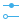</a> | **📂 檔名:** `edit-hover.svg` ✨ **格式:** `Vector (SVG)` ⚖️ **大小:** `2.24KB` 📅 **更新:** `2026-03-02`  🚀 **jsDelivr Markdown:** `` 🔗 **直接連結 (Url):** <code>https://cdn.jsdelivr.net/gh/barry028/materials@main/images/iCons/Pixel/Breeze/Actions%20/22/edit-hover.svg</code> 📥 [檢視原始檔](edit-hover.svg) |
|  | **📂 檔名:** `edit-image-face-add.svg` ✨ **格式:** `Vector (SVG)` ⚖️ **大小:** `832.00B` 📅 **更新:** `2026-03-02`  🚀 **jsDelivr Markdown:** `` 🔗 **直接連結 (Url):** <code>https://cdn.jsdelivr.net/gh/barry028/materials@main/images/iCons/Pixel/Breeze/Actions%20/22/edit-image-face-add.svg</code> 📥 [檢視原始檔](edit-image-face-add.svg) |
|  | **📂 檔名:** `edit-image-face-detect.svg` ✨ **格式:** `Vector (SVG)` ⚖️ **大小:** `896.00B` 📅 **更新:** `2026-03-02`  🚀 **jsDelivr Markdown:** `` 🔗 **直接連結 (Url):** <code>https://cdn.jsdelivr.net/gh/barry028/materials@main/images/iCons/Pixel/Breeze/Actions%20/22/edit-image-face-detect.svg</code> 📥 [檢視原始檔](edit-image-face-detect.svg) |
|  | **📂 檔名:** `edit-image-face-recognize.svg` ✨ **格式:** `Vector (SVG)` ⚖️ **大小:** `966.00B` 📅 **更新:** `2026-03-02`  🚀 **jsDelivr Markdown:** `` 🔗 **直接連結 (Url):** <code>https://cdn.jsdelivr.net/gh/barry028/materials@main/images/iCons/Pixel/Breeze/Actions%20/22/edit-image-face-recognize.svg</code> 📥 [檢視原始檔](edit-image-face-recognize.svg) |
|  | **📂 檔名:** `edit-image-face-show.svg` ✨ **格式:** `Vector (SVG)` ⚖️ **大小:** `883.00B` 📅 **更新:** `2026-03-02`  🚀 **jsDelivr Markdown:** `` 🔗 **直接連結 (Url):** <code>https://cdn.jsdelivr.net/gh/barry028/materials@main/images/iCons/Pixel/Breeze/Actions%20/22/edit-image-face-show.svg</code> 📥 [檢視原始檔](edit-image-face-show.svg) |
|  | **📂 檔名:** `edit-line-width.svg` ✨ **格式:** `Vector (SVG)` ⚖️ **大小:** `410.00B` 📅 **更新:** `2026-03-02`  🚀 **jsDelivr Markdown:** `` 🔗 **直接連結 (Url):** <code>https://cdn.jsdelivr.net/gh/barry028/materials@main/images/iCons/Pixel/Breeze/Actions%20/22/edit-line-width.svg</code> 📥 [檢視原始檔](edit-line-width.svg) |
|  | **📂 檔名:** `edit-move.svg` ✨ **格式:** `Vector (SVG)` ⚖️ **大小:** `625.00B` 📅 **更新:** `2026-03-02`  🚀 **jsDelivr Markdown:** `` 🔗 **直接連結 (Url):** <code>https://cdn.jsdelivr.net/gh/barry028/materials@main/images/iCons/Pixel/Breeze/Actions%20/22/edit-move.svg</code> 📥 [檢視原始檔](edit-move.svg) |
|  | **📂 檔名:** `edit-node.svg` ✨ **格式:** `Vector (SVG)` ⚖️ **大小:** `696.00B` 📅 **更新:** `2026-03-02`  🚀 **jsDelivr Markdown:** `` 🔗 **直接連結 (Url):** <code>https://cdn.jsdelivr.net/gh/barry028/materials@main/images/iCons/Pixel/Breeze/Actions%20/22/edit-node.svg</code> 📥 [檢視原始檔](edit-node.svg) |
|  | **📂 檔名:** `edit-opacity.svg` ✨ **格式:** `Vector (SVG)` ⚖️ **大小:** `884.00B` 📅 **更新:** `2026-03-02`  🚀 **jsDelivr Markdown:** `` 🔗 **直接連結 (Url):** <code>https://cdn.jsdelivr.net/gh/barry028/materials@main/images/iCons/Pixel/Breeze/Actions%20/22/edit-opacity.svg</code> 📥 [檢視原始檔](edit-opacity.svg) |
|  | **📂 檔名:** `edit-paste-in-place.svg` ✨ **格式:** `Vector (SVG)` ⚖️ **大小:** `508.00B` 📅 **更新:** `2026-03-02`  🚀 **jsDelivr Markdown:** `` 🔗 **直接連結 (Url):** <code>https://cdn.jsdelivr.net/gh/barry028/materials@main/images/iCons/Pixel/Breeze/Actions%20/22/edit-paste-in-place.svg</code> 📥 [檢視原始檔](edit-paste-in-place.svg) |
|  | **📂 檔名:** `edit-paste.svg` ✨ **格式:** `Vector (SVG)` ⚖️ **大小:** `608.00B` 📅 **更新:** `2026-03-02`  🚀 **jsDelivr Markdown:** `` 🔗 **直接連結 (Url):** <code>https://cdn.jsdelivr.net/gh/barry028/materials@main/images/iCons/Pixel/Breeze/Actions%20/22/edit-paste.svg</code> 📥 [檢視原始檔](edit-paste.svg) |
|  | **📂 檔名:** `edit-redo.svg` ✨ **格式:** `Vector (SVG)` ⚖️ **大小:** `667.00B` 📅 **更新:** `2026-03-02`  🚀 **jsDelivr Markdown:** `` 🔗 **直接連結 (Url):** <code>https://cdn.jsdelivr.net/gh/barry028/materials@main/images/iCons/Pixel/Breeze/Actions%20/22/edit-redo.svg</code> 📥 [檢視原始檔](edit-redo.svg) |
|  | **📂 檔名:** `edit-reset.svg` ✨ **格式:** `Vector (SVG)` ⚖️ **大小:** `625.00B` 📅 **更新:** `2026-03-02`  🚀 **jsDelivr Markdown:** `` 🔗 **直接連結 (Url):** <code>https://cdn.jsdelivr.net/gh/barry028/materials@main/images/iCons/Pixel/Breeze/Actions%20/22/edit-reset.svg</code> 📥 [檢視原始檔](edit-reset.svg) |
| <a href="edit-select-all.svg">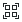</a> | **📂 檔名:** `edit-select-all.svg` ✨ **格式:** `Vector (SVG)` ⚖️ **大小:** `558.00B` 📅 **更新:** `2026-03-02`  🚀 **jsDelivr Markdown:** `` 🔗 **直接連結 (Url):** <code>https://cdn.jsdelivr.net/gh/barry028/materials@main/images/iCons/Pixel/Breeze/Actions%20/22/edit-select-all.svg</code> 📥 [檢視原始檔](edit-select-all.svg) |
|  | **📂 檔名:** `edit-select-invert.svg` ✨ **格式:** `Vector (SVG)` ⚖️ **大小:** `711.00B` 📅 **更新:** `2026-03-02`  🚀 **jsDelivr Markdown:** `` 🔗 **直接連結 (Url):** <code>https://cdn.jsdelivr.net/gh/barry028/materials@main/images/iCons/Pixel/Breeze/Actions%20/22/edit-select-invert.svg</code> 📥 [檢視原始檔](edit-select-invert.svg) |
|  | **📂 檔名:** `edit-select-lasso.svg` ✨ **格式:** `Vector (SVG)` ⚖️ **大小:** `719.00B` 📅 **更新:** `2026-03-02`  🚀 **jsDelivr Markdown:** `` 🔗 **直接連結 (Url):** <code>https://cdn.jsdelivr.net/gh/barry028/materials@main/images/iCons/Pixel/Breeze/Actions%20/22/edit-select-lasso.svg</code> 📥 [檢視原始檔](edit-select-lasso.svg) |
| <a href="edit-select-none.svg">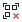</a> | **📂 檔名:** `edit-select-none.svg` ✨ **格式:** `Vector (SVG)` ⚖️ **大小:** `930.00B` 📅 **更新:** `2026-03-02`  🚀 **jsDelivr Markdown:** `` 🔗 **直接連結 (Url):** <code>https://cdn.jsdelivr.net/gh/barry028/materials@main/images/iCons/Pixel/Breeze/Actions%20/22/edit-select-none.svg</code> 📥 [檢視原始檔](edit-select-none.svg) |
| <a href="edit-select-text.svg">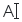</a> | **📂 檔名:** `edit-select-text.svg` ✨ **格式:** `Vector (SVG)` ⚖️ **大小:** `368.00B` 📅 **更新:** `2026-03-02`  🚀 **jsDelivr Markdown:** `` 🔗 **直接連結 (Url):** <code>https://cdn.jsdelivr.net/gh/barry028/materials@main/images/iCons/Pixel/Breeze/Actions%20/22/edit-select-text.svg</code> 📥 [檢視原始檔](edit-select-text.svg) |
|  | **📂 檔名:** `edit-select.svg` ✨ **格式:** `Vector (SVG)` ⚖️ **大小:** `456.00B` 📅 **更新:** `2026-03-02`  🚀 **jsDelivr Markdown:** `` 🔗 **直接連結 (Url):** <code>https://cdn.jsdelivr.net/gh/barry028/materials@main/images/iCons/Pixel/Breeze/Actions%20/22/edit-select.svg</code> 📥 [檢視原始檔](edit-select.svg) |
|  | **📂 檔名:** `edit-table-cell-merge.svg` ✨ **格式:** `Vector (SVG)` ⚖️ **大小:** `1.00KB` 📅 **更新:** `2026-03-02`  🚀 **jsDelivr Markdown:** `` 🔗 **直接連結 (Url):** <code>https://cdn.jsdelivr.net/gh/barry028/materials@main/images/iCons/Pixel/Breeze/Actions%20/22/edit-table-cell-merge.svg</code> 📥 [檢視原始檔](edit-table-cell-merge.svg) |
|  | **📂 檔名:** `edit-table-cell-split.svg` ✨ **格式:** `Vector (SVG)` ⚖️ **大小:** `1.00KB` 📅 **更新:** `2026-03-02`  🚀 **jsDelivr Markdown:** `` 🔗 **直接連結 (Url):** <code>https://cdn.jsdelivr.net/gh/barry028/materials@main/images/iCons/Pixel/Breeze/Actions%20/22/edit-table-cell-split.svg</code> 📥 [檢視原始檔](edit-table-cell-split.svg) |
|  | **📂 檔名:** `edit-table-delete-column.svg` ✨ **格式:** `Vector (SVG)` ⚖️ **大小:** `1.16KB` 📅 **更新:** `2026-03-02`  🚀 **jsDelivr Markdown:** `` 🔗 **直接連結 (Url):** <code>https://cdn.jsdelivr.net/gh/barry028/materials@main/images/iCons/Pixel/Breeze/Actions%20/22/edit-table-delete-column.svg</code> 📥 [檢視原始檔](edit-table-delete-column.svg) |
|  | **📂 檔名:** `edit-table-delete-row.svg` ✨ **格式:** `Vector (SVG)` ⚖️ **大小:** `1.16KB` 📅 **更新:** `2026-03-02`  🚀 **jsDelivr Markdown:** `` 🔗 **直接連結 (Url):** <code>https://cdn.jsdelivr.net/gh/barry028/materials@main/images/iCons/Pixel/Breeze/Actions%20/22/edit-table-delete-row.svg</code> 📥 [檢視原始檔](edit-table-delete-row.svg) |
|  | **📂 檔名:** `edit-table-insert-column-left.svg` ✨ **格式:** `Vector (SVG)` ⚖️ **大小:** `1.25KB` 📅 **更新:** `2026-03-02`  🚀 **jsDelivr Markdown:** `` 🔗 **直接連結 (Url):** <code>https://cdn.jsdelivr.net/gh/barry028/materials@main/images/iCons/Pixel/Breeze/Actions%20/22/edit-table-insert-column-left.svg</code> 📥 [檢視原始檔](edit-table-insert-column-left.svg) |
|  | **📂 檔名:** `edit-table-insert-column-right.svg` ✨ **格式:** `Vector (SVG)` ⚖️ **大小:** `1.25KB` 📅 **更新:** `2026-03-02`  🚀 **jsDelivr Markdown:** `` 🔗 **直接連結 (Url):** <code>https://cdn.jsdelivr.net/gh/barry028/materials@main/images/iCons/Pixel/Breeze/Actions%20/22/edit-table-insert-column-right.svg</code> 📥 [檢視原始檔](edit-table-insert-column-right.svg) |
|  | **📂 檔名:** `edit-table-insert-row-above.svg` ✨ **格式:** `Vector (SVG)` ⚖️ **大小:** `1.26KB` 📅 **更新:** `2026-03-02`  🚀 **jsDelivr Markdown:** `` 🔗 **直接連結 (Url):** <code>https://cdn.jsdelivr.net/gh/barry028/materials@main/images/iCons/Pixel/Breeze/Actions%20/22/edit-table-insert-row-above.svg</code> 📥 [檢視原始檔](edit-table-insert-row-above.svg) |
|  | **📂 檔名:** `edit-table-insert-row-below.svg` ✨ **格式:** `Vector (SVG)` ⚖️ **大小:** `1.12KB` 📅 **更新:** `2026-03-02`  🚀 **jsDelivr Markdown:** `` 🔗 **直接連結 (Url):** <code>https://cdn.jsdelivr.net/gh/barry028/materials@main/images/iCons/Pixel/Breeze/Actions%20/22/edit-table-insert-row-below.svg</code> 📥 [檢視原始檔](edit-table-insert-row-below.svg) |
|  | **📂 檔名:** `edit-table-insert-row-under.svg` ✨ **格式:** `Vector (SVG)` ⚖️ **大小:** `1.25KB` 📅 **更新:** `2026-03-02`  🚀 **jsDelivr Markdown:** `` 🔗 **直接連結 (Url):** <code>https://cdn.jsdelivr.net/gh/barry028/materials@main/images/iCons/Pixel/Breeze/Actions%20/22/edit-table-insert-row-under.svg</code> 📥 [檢視原始檔](edit-table-insert-row-under.svg) |
|  | **📂 檔名:** `edit-text-frame-update.svg` ✨ **格式:** `Vector (SVG)` ⚖️ **大小:** `827.00B` 📅 **更新:** `2026-03-02`  🚀 **jsDelivr Markdown:** `` 🔗 **直接連結 (Url):** <code>https://cdn.jsdelivr.net/gh/barry028/materials@main/images/iCons/Pixel/Breeze/Actions%20/22/edit-text-frame-update.svg</code> 📥 [檢視原始檔](edit-text-frame-update.svg) |
|  | **📂 檔名:** `edit-undo.svg` ✨ **格式:** `Vector (SVG)` ⚖️ **大小:** `663.00B` 📅 **更新:** `2026-03-02`  🚀 **jsDelivr Markdown:** `` 🔗 **直接連結 (Url):** <code>https://cdn.jsdelivr.net/gh/barry028/materials@main/images/iCons/Pixel/Breeze/Actions%20/22/edit-undo.svg</code> 📥 [檢視原始檔](edit-undo.svg) |
|  | **📂 檔名:** `embosstool.svg` ✨ **格式:** `Vector (SVG)` ⚖️ **大小:** `837.00B` 📅 **更新:** `2026-03-02`  🚀 **jsDelivr Markdown:** `` 🔗 **直接連結 (Url):** <code>https://cdn.jsdelivr.net/gh/barry028/materials@main/images/iCons/Pixel/Breeze/Actions%20/22/embosstool.svg</code> 📥 [檢視原始檔](embosstool.svg) |
|  | **📂 檔名:** `entity.svg` ✨ **格式:** `Vector (SVG)` ⚖️ **大小:** `446.00B` 📅 **更新:** `2026-03-02`  🚀 **jsDelivr Markdown:** `` 🔗 **直接連結 (Url):** <code>https://cdn.jsdelivr.net/gh/barry028/materials@main/images/iCons/Pixel/Breeze/Actions%20/22/entity.svg</code> 📥 [檢視原始檔](entity.svg) |
|  | **📂 檔名:** `entrance_animations.svg` ✨ **格式:** `Vector (SVG)` ⚖️ **大小:** `573.00B` 📅 **更新:** `2026-03-02`  🚀 **jsDelivr Markdown:** `` 🔗 **直接連結 (Url):** <code>https://cdn.jsdelivr.net/gh/barry028/materials@main/images/iCons/Pixel/Breeze/Actions%20/22/entrance_animations.svg</code> 📥 [檢視原始檔](entrance_animations.svg) |
| <a href="entry-new.svg">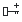</a> | **📂 檔名:** `entry-new.svg` ✨ **格式:** `Vector (SVG)` ⚖️ **大小:** `595.00B` 📅 **更新:** `2026-03-02`  🚀 **jsDelivr Markdown:** `` 🔗 **直接連結 (Url):** <code>https://cdn.jsdelivr.net/gh/barry028/materials@main/images/iCons/Pixel/Breeze/Actions%20/22/entry-new.svg</code> 📥 [檢視原始檔](entry-new.svg) |
|  | **📂 檔名:** `errornext.svg` ✨ **格式:** `Vector (SVG)` ⚖️ **大小:** `612.00B` 📅 **更新:** `2026-03-02`  🚀 **jsDelivr Markdown:** `` 🔗 **直接連結 (Url):** <code>https://cdn.jsdelivr.net/gh/barry028/materials@main/images/iCons/Pixel/Breeze/Actions%20/22/errornext.svg</code> 📥 [檢視原始檔](errornext.svg) |
|  | **📂 檔名:** `errorprev.svg` ✨ **格式:** `Vector (SVG)` ⚖️ **大小:** `622.00B` 📅 **更新:** `2026-03-02`  🚀 **jsDelivr Markdown:** `` 🔗 **直接連結 (Url):** <code>https://cdn.jsdelivr.net/gh/barry028/materials@main/images/iCons/Pixel/Breeze/Actions%20/22/errorprev.svg</code> 📥 [檢視原始檔](errorprev.svg) |
|  | **📂 檔名:** `escape-direction-all.svg` ✨ **格式:** `Vector (SVG)` ⚖️ **大小:** `1.07KB` 📅 **更新:** `2026-03-02`  🚀 **jsDelivr Markdown:** `` 🔗 **直接連結 (Url):** <code>https://cdn.jsdelivr.net/gh/barry028/materials@main/images/iCons/Pixel/Breeze/Actions%20/22/escape-direction-all.svg</code> 📥 [檢視原始檔](escape-direction-all.svg) |
|  | **📂 檔名:** `escape-direction-down.svg` ✨ **格式:** `Vector (SVG)` ⚖️ **大小:** `1011.00B` 📅 **更新:** `2026-03-02`  🚀 **jsDelivr Markdown:** `` 🔗 **直接連結 (Url):** <code>https://cdn.jsdelivr.net/gh/barry028/materials@main/images/iCons/Pixel/Breeze/Actions%20/22/escape-direction-down.svg</code> 📥 [檢視原始檔](escape-direction-down.svg) |
|  | **📂 檔名:** `escape-direction-horizontal.svg` ✨ **格式:** `Vector (SVG)` ⚖️ **大小:** `1.02KB` 📅 **更新:** `2026-03-02`  🚀 **jsDelivr Markdown:** `` 🔗 **直接連結 (Url):** <code>https://cdn.jsdelivr.net/gh/barry028/materials@main/images/iCons/Pixel/Breeze/Actions%20/22/escape-direction-horizontal.svg</code> 📥 [檢視原始檔](escape-direction-horizontal.svg) |
|  | **📂 檔名:** `escape-direction-left.svg` ✨ **格式:** `Vector (SVG)` ⚖️ **大小:** `1006.00B` 📅 **更新:** `2026-03-02`  🚀 **jsDelivr Markdown:** `` 🔗 **直接連結 (Url):** <code>https://cdn.jsdelivr.net/gh/barry028/materials@main/images/iCons/Pixel/Breeze/Actions%20/22/escape-direction-left.svg</code> 📥 [檢視原始檔](escape-direction-left.svg) |
|  | **📂 檔名:** `escape-direction-right.svg` ✨ **格式:** `Vector (SVG)` ⚖️ **大小:** `1011.00B` 📅 **更新:** `2026-03-02`  🚀 **jsDelivr Markdown:** `` 🔗 **直接連結 (Url):** <code>https://cdn.jsdelivr.net/gh/barry028/materials@main/images/iCons/Pixel/Breeze/Actions%20/22/escape-direction-right.svg</code> 📥 [檢視原始檔](escape-direction-right.svg) |
|  | **📂 檔名:** `escape-direction-up.svg` ✨ **格式:** `Vector (SVG)` ⚖️ **大小:** `1006.00B` 📅 **更新:** `2026-03-02`  🚀 **jsDelivr Markdown:** `` 🔗 **直接連結 (Url):** <code>https://cdn.jsdelivr.net/gh/barry028/materials@main/images/iCons/Pixel/Breeze/Actions%20/22/escape-direction-up.svg</code> 📥 [檢視原始檔](escape-direction-up.svg) |
|  | **📂 檔名:** `escape-direction-vertical.svg` ✨ **格式:** `Vector (SVG)` ⚖️ **大小:** `1.02KB` 📅 **更新:** `2026-03-02`  🚀 **jsDelivr Markdown:** `` 🔗 **直接連結 (Url):** <code>https://cdn.jsdelivr.net/gh/barry028/materials@main/images/iCons/Pixel/Breeze/Actions%20/22/escape-direction-vertical.svg</code> 📥 [檢視原始檔](escape-direction-vertical.svg) |
|  | **📂 檔名:** `exception.svg` ✨ **格式:** `Vector (SVG)` ⚖️ **大小:** `425.00B` 📅 **更新:** `2026-03-02`  🚀 **jsDelivr Markdown:** `` 🔗 **直接連結 (Url):** <code>https://cdn.jsdelivr.net/gh/barry028/materials@main/images/iCons/Pixel/Breeze/Actions%20/22/exception.svg</code> 📥 [檢視原始檔](exception.svg) |
|  | **📂 檔名:** `exchange-positions-clockwise.svg` ✨ **格式:** `Vector (SVG)` ⚖️ **大小:** `1.14KB` 📅 **更新:** `2026-03-02`  🚀 **jsDelivr Markdown:** `` 🔗 **直接連結 (Url):** <code>https://cdn.jsdelivr.net/gh/barry028/materials@main/images/iCons/Pixel/Breeze/Actions%20/22/exchange-positions-clockwise.svg</code> 📥 [檢視原始檔](exchange-positions-clockwise.svg) |
|  | **📂 檔名:** `exchange-positions-zorder.svg` ✨ **格式:** `Vector (SVG)` ⚖️ **大小:** `1.25KB` 📅 **更新:** `2026-03-02`  🚀 **jsDelivr Markdown:** `` 🔗 **直接連結 (Url):** <code>https://cdn.jsdelivr.net/gh/barry028/materials@main/images/iCons/Pixel/Breeze/Actions%20/22/exchange-positions-zorder.svg</code> 📥 [檢視原始檔](exchange-positions-zorder.svg) |
|  | **📂 檔名:** `exchange-positions.svg` ✨ **格式:** `Vector (SVG)` ⚖️ **大小:** `671.00B` 📅 **更新:** `2026-03-02`  🚀 **jsDelivr Markdown:** `` 🔗 **直接連結 (Url):** <code>https://cdn.jsdelivr.net/gh/barry028/materials@main/images/iCons/Pixel/Breeze/Actions%20/22/exchange-positions.svg</code> 📥 [檢視原始檔](exchange-positions.svg) |
|  | **📂 檔名:** `expand-all.svg` ✨ **格式:** `Vector (SVG)` ⚖️ **大小:** `344.00B` 📅 **更新:** `2026-03-02`  🚀 **jsDelivr Markdown:** `` 🔗 **直接連結 (Url):** <code>https://cdn.jsdelivr.net/gh/barry028/materials@main/images/iCons/Pixel/Breeze/Actions%20/22/expand-all.svg</code> 📥 [檢視原始檔](expand-all.svg) |
|  | **📂 檔名:** `favorite-genres-amarok.svg` ✨ **格式:** `Vector (SVG)` ⚖️ **大小:** `1.12KB` 📅 **更新:** `2026-03-02`  🚀 **jsDelivr Markdown:** `` 🔗 **直接連結 (Url):** <code>https://cdn.jsdelivr.net/gh/barry028/materials@main/images/iCons/Pixel/Breeze/Actions%20/22/favorite-genres-amarok.svg</code> 📥 [檢視原始檔](favorite-genres-amarok.svg) |
|  | **📂 檔名:** `favorite.svg` ✨ **格式:** `Vector (SVG)` ⚖️ **大小:** `439.00B` 📅 **更新:** `2026-03-02`  🚀 **jsDelivr Markdown:** `` 🔗 **直接連結 (Url):** <code>https://cdn.jsdelivr.net/gh/barry028/materials@main/images/iCons/Pixel/Breeze/Actions%20/22/favorite.svg</code> 📥 [檢視原始檔](favorite.svg) |
|  | **📂 檔名:** `feed-subscribe.svg` ✨ **格式:** `Vector (SVG)` ⚖️ **大小:** `624.00B` 📅 **更新:** `2026-03-02`  🚀 **jsDelivr Markdown:** `` 🔗 **直接連結 (Url):** <code>https://cdn.jsdelivr.net/gh/barry028/materials@main/images/iCons/Pixel/Breeze/Actions%20/22/feed-subscribe.svg</code> 📥 [檢視原始檔](feed-subscribe.svg) |
|  | **📂 檔名:** `filename-and-amarok.svg` ✨ **格式:** `Vector (SVG)` ⚖️ **大小:** `1.62KB` 📅 **更新:** `2026-03-02`  🚀 **jsDelivr Markdown:** `` 🔗 **直接連結 (Url):** <code>https://cdn.jsdelivr.net/gh/barry028/materials@main/images/iCons/Pixel/Breeze/Actions%20/22/filename-and-amarok.svg</code> 📥 [檢視原始檔](filename-and-amarok.svg) |
|  | **📂 檔名:** `filename-bpm-amarok.svg` ✨ **格式:** `Vector (SVG)` ⚖️ **大小:** `1.21KB` 📅 **更新:** `2026-03-02`  🚀 **jsDelivr Markdown:** `` 🔗 **直接連結 (Url):** <code>https://cdn.jsdelivr.net/gh/barry028/materials@main/images/iCons/Pixel/Breeze/Actions%20/22/filename-bpm-amarok.svg</code> 📥 [檢視原始檔](filename-bpm-amarok.svg) |
|  | **📂 檔名:** `filename-dash-amarok.svg` ✨ **格式:** `Vector (SVG)` ⚖️ **大小:** `378.00B` 📅 **更新:** `2026-03-02`  🚀 **jsDelivr Markdown:** `` 🔗 **直接連結 (Url):** <code>https://cdn.jsdelivr.net/gh/barry028/materials@main/images/iCons/Pixel/Breeze/Actions%20/22/filename-dash-amarok.svg</code> 📥 [檢視原始檔](filename-dash-amarok.svg) |
|  | **📂 檔名:** `filename-discnumber-amarok.svg` ✨ **格式:** `Vector (SVG)` ⚖️ **大小:** `4.95KB` 📅 **更新:** `2026-03-02`  🚀 **jsDelivr Markdown:** `` 🔗 **直接連結 (Url):** <code>https://cdn.jsdelivr.net/gh/barry028/materials@main/images/iCons/Pixel/Breeze/Actions%20/22/filename-discnumber-amarok.svg</code> 📥 [檢視原始檔](filename-discnumber-amarok.svg) |
|  | **📂 檔名:** `filename-divider.svg` ✨ **格式:** `Vector (SVG)` ⚖️ **大小:** `380.00B` 📅 **更新:** `2026-03-02`  🚀 **jsDelivr Markdown:** `` 🔗 **直接連結 (Url):** <code>https://cdn.jsdelivr.net/gh/barry028/materials@main/images/iCons/Pixel/Breeze/Actions%20/22/filename-divider.svg</code> 📥 [檢視原始檔](filename-divider.svg) |
|  | **📂 檔名:** `filename-dot-amarok.svg` ✨ **格式:** `Vector (SVG)` ⚖️ **大小:** `422.00B` 📅 **更新:** `2026-03-02`  🚀 **jsDelivr Markdown:** `` 🔗 **直接連結 (Url):** <code>https://cdn.jsdelivr.net/gh/barry028/materials@main/images/iCons/Pixel/Breeze/Actions%20/22/filename-dot-amarok.svg</code> 📥 [檢視原始檔](filename-dot-amarok.svg) |
|  | **📂 檔名:** `filename-filetype-amarok.svg` ✨ **格式:** `Vector (SVG)` ⚖️ **大小:** `655.00B` 📅 **更新:** `2026-03-02`  🚀 **jsDelivr Markdown:** `` 🔗 **直接連結 (Url):** <code>https://cdn.jsdelivr.net/gh/barry028/materials@main/images/iCons/Pixel/Breeze/Actions%20/22/filename-filetype-amarok.svg</code> 📥 [檢視原始檔](filename-filetype-amarok.svg) |
|  | **📂 檔名:** `filename-group-length.svg` ✨ **格式:** `Vector (SVG)` ⚖️ **大小:** `875.00B` 📅 **更新:** `2026-03-02`  🚀 **jsDelivr Markdown:** `` 🔗 **直接連結 (Url):** <code>https://cdn.jsdelivr.net/gh/barry028/materials@main/images/iCons/Pixel/Breeze/Actions%20/22/filename-group-length.svg</code> 📥 [檢視原始檔](filename-group-length.svg) |
|  | **📂 檔名:** `filename-group-tracks.svg` ✨ **格式:** `Vector (SVG)` ⚖️ **大小:** `821.00B` 📅 **更新:** `2026-03-02`  🚀 **jsDelivr Markdown:** `` 🔗 **直接連結 (Url):** <code>https://cdn.jsdelivr.net/gh/barry028/materials@main/images/iCons/Pixel/Breeze/Actions%20/22/filename-group-tracks.svg</code> 📥 [檢視原始檔](filename-group-tracks.svg) |
|  | **📂 檔名:** `filename-initial-amarok.svg` ✨ **格式:** `Vector (SVG)` ⚖️ **大小:** `956.00B` 📅 **更新:** `2026-03-02`  🚀 **jsDelivr Markdown:** `` 🔗 **直接連結 (Url):** <code>https://cdn.jsdelivr.net/gh/barry028/materials@main/images/iCons/Pixel/Breeze/Actions%20/22/filename-initial-amarok.svg</code> 📥 [檢視原始檔](filename-initial-amarok.svg) |
|  | **📂 檔名:** `filename-moodbar.svg` ✨ **格式:** `Vector (SVG)` ⚖️ **大小:** `468.00B` 📅 **更新:** `2026-03-02`  🚀 **jsDelivr Markdown:** `` 🔗 **直接連結 (Url):** <code>https://cdn.jsdelivr.net/gh/barry028/materials@main/images/iCons/Pixel/Breeze/Actions%20/22/filename-moodbar.svg</code> 📥 [檢視原始檔](filename-moodbar.svg) |
|  | **📂 檔名:** `filename-slash-amarok.svg` ✨ **格式:** `Vector (SVG)` ⚖️ **大小:** `449.00B` 📅 **更新:** `2026-03-02`  🚀 **jsDelivr Markdown:** `` 🔗 **直接連結 (Url):** <code>https://cdn.jsdelivr.net/gh/barry028/materials@main/images/iCons/Pixel/Breeze/Actions%20/22/filename-slash-amarok.svg</code> 📥 [檢視原始檔](filename-slash-amarok.svg) |
|  | **📂 檔名:** `filename-space-amarok.svg` ✨ **格式:** `Vector (SVG)` ⚖️ **大小:** `387.00B` 📅 **更新:** `2026-03-02`  🚀 **jsDelivr Markdown:** `` 🔗 **直接連結 (Url):** <code>https://cdn.jsdelivr.net/gh/barry028/materials@main/images/iCons/Pixel/Breeze/Actions%20/22/filename-space-amarok.svg</code> 📥 [檢視原始檔](filename-space-amarok.svg) |
|  | **📂 檔名:** `filename-title-amarok.svg` ✨ **格式:** `Vector (SVG)` ⚖️ **大小:** `680.00B` 📅 **更新:** `2026-03-02`  🚀 **jsDelivr Markdown:** `` 🔗 **直接連結 (Url):** <code>https://cdn.jsdelivr.net/gh/barry028/materials@main/images/iCons/Pixel/Breeze/Actions%20/22/filename-title-amarok.svg</code> 📥 [檢視原始檔](filename-title-amarok.svg) |
|  | **📂 檔名:** `filename-underscore-amarok.svg` ✨ **格式:** `Vector (SVG)` ⚖️ **大小:** `369.00B` 📅 **更新:** `2026-03-02`  🚀 **jsDelivr Markdown:** `` 🔗 **直接連結 (Url):** <code>https://cdn.jsdelivr.net/gh/barry028/materials@main/images/iCons/Pixel/Breeze/Actions%20/22/filename-underscore-amarok.svg</code> 📥 [檢視原始檔](filename-underscore-amarok.svg) |
|  | **📂 檔名:** `fill-color.svg` ✨ **格式:** `Vector (SVG)` ⚖️ **大小:** `754.00B` 📅 **更新:** `2026-03-02`  🚀 **jsDelivr Markdown:** `` 🔗 **直接連結 (Url):** <code>https://cdn.jsdelivr.net/gh/barry028/materials@main/images/iCons/Pixel/Breeze/Actions%20/22/fill-color.svg</code> 📥 [檢視原始檔](fill-color.svg) |
|  | **📂 檔名:** `filmgrain.svg` ✨ **格式:** `Vector (SVG)` ⚖️ **大小:** `646.00B` 📅 **更新:** `2026-03-02`  🚀 **jsDelivr Markdown:** `` 🔗 **直接連結 (Url):** <code>https://cdn.jsdelivr.net/gh/barry028/materials@main/images/iCons/Pixel/Breeze/Actions%20/22/filmgrain.svg</code> 📥 [檢視原始檔](filmgrain.svg) |
|  | **📂 檔名:** `final_activity.svg` ✨ **格式:** `Vector (SVG)` ⚖️ **大小:** `1.58KB` 📅 **更新:** `2026-03-02`  🚀 **jsDelivr Markdown:** `` 🔗 **直接連結 (Url):** <code>https://cdn.jsdelivr.net/gh/barry028/materials@main/images/iCons/Pixel/Breeze/Actions%20/22/final_activity.svg</code> 📥 [檢視原始檔](final_activity.svg) |
|  | **📂 檔名:** `find-location.svg` ✨ **格式:** `Vector (SVG)` ⚖️ **大小:** `1.28KB` 📅 **更新:** `2026-03-02`  🚀 **jsDelivr Markdown:** `` 🔗 **直接連結 (Url):** <code>https://cdn.jsdelivr.net/gh/barry028/materials@main/images/iCons/Pixel/Breeze/Actions%20/22/find-location.svg</code> 📥 [檢視原始檔](find-location.svg) |
|  | **📂 檔名:** `fingerprint.svg` ✨ **格式:** `Vector (SVG)` ⚖️ **大小:** `4.29KB` 📅 **更新:** `2026-03-02`  🚀 **jsDelivr Markdown:** `` 🔗 **直接連結 (Url):** <code>https://cdn.jsdelivr.net/gh/barry028/materials@main/images/iCons/Pixel/Breeze/Actions%20/22/fingerprint.svg</code> 📥 [檢視原始檔](fingerprint.svg) |
|  | **📂 檔名:** `flag-black.svg` ✨ **格式:** `Vector (SVG)` ⚖️ **大小:** `460.00B` 📅 **更新:** `2026-03-02`  🚀 **jsDelivr Markdown:** `` 🔗 **直接連結 (Url):** <code>https://cdn.jsdelivr.net/gh/barry028/materials@main/images/iCons/Pixel/Breeze/Actions%20/22/flag-black.svg</code> 📥 [檢視原始檔](flag-black.svg) |
|  | **📂 檔名:** `flag-blue.svg` ✨ **格式:** `Vector (SVG)` ⚖️ **大小:** `481.00B` 📅 **更新:** `2026-03-02`  🚀 **jsDelivr Markdown:** `` 🔗 **直接連結 (Url):** <code>https://cdn.jsdelivr.net/gh/barry028/materials@main/images/iCons/Pixel/Breeze/Actions%20/22/flag-blue.svg</code> 📥 [檢視原始檔](flag-blue.svg) |
|  | **📂 檔名:** `flag-green.svg` ✨ **格式:** `Vector (SVG)` ⚖️ **大小:** `481.00B` 📅 **更新:** `2026-03-02`  🚀 **jsDelivr Markdown:** `` 🔗 **直接連結 (Url):** <code>https://cdn.jsdelivr.net/gh/barry028/materials@main/images/iCons/Pixel/Breeze/Actions%20/22/flag-green.svg</code> 📥 [檢視原始檔](flag-green.svg) |
|  | **📂 檔名:** `flag-red.svg` ✨ **格式:** `Vector (SVG)` ⚖️ **大小:** `482.00B` 📅 **更新:** `2026-03-02`  🚀 **jsDelivr Markdown:** `` 🔗 **直接連結 (Url):** <code>https://cdn.jsdelivr.net/gh/barry028/materials@main/images/iCons/Pixel/Breeze/Actions%20/22/flag-red.svg</code> 📥 [檢視原始檔](flag-red.svg) |
|  | **📂 檔名:** `flag-yellow.svg` ✨ **格式:** `Vector (SVG)` ⚖️ **大小:** `481.00B` 📅 **更新:** `2026-03-02`  🚀 **jsDelivr Markdown:** `` 🔗 **直接連結 (Url):** <code>https://cdn.jsdelivr.net/gh/barry028/materials@main/images/iCons/Pixel/Breeze/Actions%20/22/flag-yellow.svg</code> 📥 [檢視原始檔](flag-yellow.svg) |
|  | **📂 檔名:** `flag.svg` ✨ **格式:** `Vector (SVG)` ⚖️ **大小:** `437.00B` 📅 **更新:** `2026-03-02`  🚀 **jsDelivr Markdown:** `` 🔗 **直接連結 (Url):** <code>https://cdn.jsdelivr.net/gh/barry028/materials@main/images/iCons/Pixel/Breeze/Actions%20/22/flag.svg</code> 📥 [檢視原始檔](flag.svg) |
|  | **📂 檔名:** `flash.svg` ✨ **格式:** `Vector (SVG)` ⚖️ **大小:** `522.00B` 📅 **更新:** `2026-03-02`  🚀 **jsDelivr Markdown:** `` 🔗 **直接連結 (Url):** <code>https://cdn.jsdelivr.net/gh/barry028/materials@main/images/iCons/Pixel/Breeze/Actions%20/22/flash.svg</code> 📥 [檢視原始檔](flash.svg) |
|  | **📂 檔名:** `flashlight-off.svg` ✨ **格式:** `Vector (SVG)` ⚖️ **大小:** `1.02KB` 📅 **更新:** `2026-03-02`  🚀 **jsDelivr Markdown:** `` 🔗 **直接連結 (Url):** <code>https://cdn.jsdelivr.net/gh/barry028/materials@main/images/iCons/Pixel/Breeze/Actions%20/22/flashlight-off.svg</code> 📥 [檢視原始檔](flashlight-off.svg) |
|  | **📂 檔名:** `flashlight-on.svg` ✨ **格式:** `Vector (SVG)` ⚖️ **大小:** `693.00B` 📅 **更新:** `2026-03-02`  🚀 **jsDelivr Markdown:** `` 🔗 **直接連結 (Url):** <code>https://cdn.jsdelivr.net/gh/barry028/materials@main/images/iCons/Pixel/Breeze/Actions%20/22/flashlight-on.svg</code> 📥 [檢視原始檔](flashlight-on.svg) |
|  | **📂 檔名:** `flower-shape.svg` ✨ **格式:** `Vector (SVG)` ⚖️ **大小:** `1.39KB` 📅 **更新:** `2026-03-02`  🚀 **jsDelivr Markdown:** `` 🔗 **直接連結 (Url):** <code>https://cdn.jsdelivr.net/gh/barry028/materials@main/images/iCons/Pixel/Breeze/Actions%20/22/flower-shape.svg</code> 📥 [檢視原始檔](flower-shape.svg) |
|  | **📂 檔名:** `folder-edit-sign-encrypt.svg` ✨ **格式:** `Vector (SVG)` ⚖️ **大小:** `884.00B` 📅 **更新:** `2026-03-02`  🚀 **jsDelivr Markdown:** `` 🔗 **直接連結 (Url):** <code>https://cdn.jsdelivr.net/gh/barry028/materials@main/images/iCons/Pixel/Breeze/Actions%20/22/folder-edit-sign-encrypt.svg</code> 📥 [檢視原始檔](folder-edit-sign-encrypt.svg) |
|  | **📂 檔名:** `folder-new.svg` ✨ **格式:** `Vector (SVG)` ⚖️ **大小:** `499.00B` 📅 **更新:** `2026-03-02`  🚀 **jsDelivr Markdown:** `` 🔗 **直接連結 (Url):** <code>https://cdn.jsdelivr.net/gh/barry028/materials@main/images/iCons/Pixel/Breeze/Actions%20/22/folder-new.svg</code> 📥 [檢視原始檔](folder-new.svg) |
|  | **📂 檔名:** `folder-open-recent.svg` ✨ **格式:** `Vector (SVG)` ⚖️ **大小:** `653.00B` 📅 **更新:** `2026-03-02`  🚀 **jsDelivr Markdown:** `` 🔗 **直接連結 (Url):** <code>https://cdn.jsdelivr.net/gh/barry028/materials@main/images/iCons/Pixel/Breeze/Actions%20/22/folder-open-recent.svg</code> 📥 [檢視原始檔](folder-open-recent.svg) |
|  | **📂 檔名:** `folder-stash.svg` ✨ **格式:** `Vector (SVG)` ⚖️ **大小:** `866.00B` 📅 **更新:** `2026-03-02`  🚀 **jsDelivr Markdown:** `` 🔗 **直接連結 (Url):** <code>https://cdn.jsdelivr.net/gh/barry028/materials@main/images/iCons/Pixel/Breeze/Actions%20/22/folder-stash.svg</code> 📥 [檢視原始檔](folder-stash.svg) |
|  | **📂 檔名:** `folder-sync.svg` ✨ **格式:** `Vector (SVG)` ⚖️ **大小:** `1003.00B` 📅 **更新:** `2026-03-02`  🚀 **jsDelivr Markdown:** `` 🔗 **直接連結 (Url):** <code>https://cdn.jsdelivr.net/gh/barry028/materials@main/images/iCons/Pixel/Breeze/Actions%20/22/folder-sync.svg</code> 📥 [檢視原始檔](folder-sync.svg) |
|  | **📂 檔名:** `font-disable.svg` ✨ **格式:** `Vector (SVG)` ⚖️ **大小:** `874.00B` 📅 **更新:** `2026-03-02`  🚀 **jsDelivr Markdown:** `` 🔗 **直接連結 (Url):** <code>https://cdn.jsdelivr.net/gh/barry028/materials@main/images/iCons/Pixel/Breeze/Actions%20/22/font-disable.svg</code> 📥 [檢視原始檔](font-disable.svg) |
|  | **📂 檔名:** `font-enable.svg` ✨ **格式:** `Vector (SVG)` ⚖️ **大小:** `508.00B` 📅 **更新:** `2026-03-02`  🚀 **jsDelivr Markdown:** `` 🔗 **直接連結 (Url):** <code>https://cdn.jsdelivr.net/gh/barry028/materials@main/images/iCons/Pixel/Breeze/Actions%20/22/font-enable.svg</code> 📥 [檢視原始檔](font-enable.svg) |
|  | **📂 檔名:** `food.svg` ✨ **格式:** `Vector (SVG)` ⚖️ **大小:** `1.42KB` 📅 **更新:** `2026-03-02`  🚀 **jsDelivr Markdown:** `` 🔗 **直接連結 (Url):** <code>https://cdn.jsdelivr.net/gh/barry028/materials@main/images/iCons/Pixel/Breeze/Actions%20/22/food.svg</code> 📥 [檢視原始檔](food.svg) |
|  | **📂 檔名:** `foreignkey_constraint.svg` ✨ **格式:** `Vector (SVG)` ⚖️ **大小:** `426.00B` 📅 **更新:** `2026-03-02`  🚀 **jsDelivr Markdown:** `` 🔗 **直接連結 (Url):** <code>https://cdn.jsdelivr.net/gh/barry028/materials@main/images/iCons/Pixel/Breeze/Actions%20/22/foreignkey_constraint.svg</code> 📥 [檢視原始檔](foreignkey_constraint.svg) |
|  | **📂 檔名:** `fork.svg` ✨ **格式:** `Vector (SVG)` ⚖️ **大小:** `729.00B` 📅 **更新:** `2026-03-02`  🚀 **jsDelivr Markdown:** `` 🔗 **直接連結 (Url):** <code>https://cdn.jsdelivr.net/gh/barry028/materials@main/images/iCons/Pixel/Breeze/Actions%20/22/fork.svg</code> 📥 [檢視原始檔](fork.svg) |
|  | **📂 檔名:** `format-add-node.svg` ✨ **格式:** `Vector (SVG)` ⚖️ **大小:** `726.00B` 📅 **更新:** `2026-03-02`  🚀 **jsDelivr Markdown:** `` 🔗 **直接連結 (Url):** <code>https://cdn.jsdelivr.net/gh/barry028/materials@main/images/iCons/Pixel/Breeze/Actions%20/22/format-add-node.svg</code> 📥 [檢視原始檔](format-add-node.svg) |
|  | **📂 檔名:** `format-align-vertical-bottom.svg` ✨ **格式:** `Vector (SVG)` ⚖️ **大小:** `499.00B` 📅 **更新:** `2026-03-02`  🚀 **jsDelivr Markdown:** `` 🔗 **直接連結 (Url):** <code>https://cdn.jsdelivr.net/gh/barry028/materials@main/images/iCons/Pixel/Breeze/Actions%20/22/format-align-vertical-bottom.svg</code> 📥 [檢視原始檔](format-align-vertical-bottom.svg) |
| <a href="format-align-vertical-center.svg">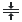</a> | **📂 檔名:** `format-align-vertical-center.svg` ✨ **格式:** `Vector (SVG)` ⚖️ **大小:** `603.00B` 📅 **更新:** `2026-03-02`  🚀 **jsDelivr Markdown:** `` 🔗 **直接連結 (Url):** <code>https://cdn.jsdelivr.net/gh/barry028/materials@main/images/iCons/Pixel/Breeze/Actions%20/22/format-align-vertical-center.svg</code> 📥 [檢視原始檔](format-align-vertical-center.svg) |
|  | **📂 檔名:** `format-align-vertical-top.svg` ✨ **格式:** `Vector (SVG)` ⚖️ **大小:** `495.00B` 📅 **更新:** `2026-03-02`  🚀 **jsDelivr Markdown:** `` 🔗 **直接連結 (Url):** <code>https://cdn.jsdelivr.net/gh/barry028/materials@main/images/iCons/Pixel/Breeze/Actions%20/22/format-align-vertical-top.svg</code> 📥 [檢視原始檔](format-align-vertical-top.svg) |
|  | **📂 檔名:** `format-border-set-all.svg` ✨ **格式:** `Vector (SVG)` ⚖️ **大小:** `873.00B` 📅 **更新:** `2026-03-02`  🚀 **jsDelivr Markdown:** `` 🔗 **直接連結 (Url):** <code>https://cdn.jsdelivr.net/gh/barry028/materials@main/images/iCons/Pixel/Breeze/Actions%20/22/format-border-set-all.svg</code> 📥 [檢視原始檔](format-border-set-all.svg) |
|  | **📂 檔名:** `format-border-set-bottom.svg` ✨ **格式:** `Vector (SVG)` ⚖️ **大小:** `661.00B` 📅 **更新:** `2026-03-02`  🚀 **jsDelivr Markdown:** `` 🔗 **直接連結 (Url):** <code>https://cdn.jsdelivr.net/gh/barry028/materials@main/images/iCons/Pixel/Breeze/Actions%20/22/format-border-set-bottom.svg</code> 📥 [檢視原始檔](format-border-set-bottom.svg) |
|  | **📂 檔名:** `format-border-set-diagonal-bl-tr.svg` ✨ **格式:** `Vector (SVG)` ⚖️ **大小:** `793.00B` 📅 **更新:** `2026-03-02`  🚀 **jsDelivr Markdown:** `` 🔗 **直接連結 (Url):** <code>https://cdn.jsdelivr.net/gh/barry028/materials@main/images/iCons/Pixel/Breeze/Actions%20/22/format-border-set-diagonal-bl-tr.svg</code> 📥 [檢視原始檔](format-border-set-diagonal-bl-tr.svg) |
|  | **📂 檔名:** `format-border-set-diagonal-tl-br.svg` ✨ **格式:** `Vector (SVG)` ⚖️ **大小:** `803.00B` 📅 **更新:** `2026-03-02`  🚀 **jsDelivr Markdown:** `` 🔗 **直接連結 (Url):** <code>https://cdn.jsdelivr.net/gh/barry028/materials@main/images/iCons/Pixel/Breeze/Actions%20/22/format-border-set-diagonal-tl-br.svg</code> 📥 [檢視原始檔](format-border-set-diagonal-tl-br.svg) |
|  | **📂 檔名:** `format-border-set-external.svg` ✨ **格式:** `Vector (SVG)` ⚖️ **大小:** `750.00B` 📅 **更新:** `2026-03-02`  🚀 **jsDelivr Markdown:** `` 🔗 **直接連結 (Url):** <code>https://cdn.jsdelivr.net/gh/barry028/materials@main/images/iCons/Pixel/Breeze/Actions%20/22/format-border-set-external.svg</code> 📥 [檢視原始檔](format-border-set-external.svg) |
|  | **📂 檔名:** `format-border-set-internal-horizontal.svg` ✨ **格式:** `Vector (SVG)` ⚖️ **大小:** `661.00B` 📅 **更新:** `2026-03-02`  🚀 **jsDelivr Markdown:** `` 🔗 **直接連結 (Url):** <code>https://cdn.jsdelivr.net/gh/barry028/materials@main/images/iCons/Pixel/Breeze/Actions%20/22/format-border-set-internal-horizontal.svg</code> 📥 [檢視原始檔](format-border-set-internal-horizontal.svg) |
|  | **📂 檔名:** `format-border-set-internal-vertical.svg` ✨ **格式:** `Vector (SVG)` ⚖️ **大小:** `661.00B` 📅 **更新:** `2026-03-02`  🚀 **jsDelivr Markdown:** `` 🔗 **直接連結 (Url):** <code>https://cdn.jsdelivr.net/gh/barry028/materials@main/images/iCons/Pixel/Breeze/Actions%20/22/format-border-set-internal-vertical.svg</code> 📥 [檢視原始檔](format-border-set-internal-vertical.svg) |
|  | **📂 檔名:** `format-border-set-internal.svg` ✨ **格式:** `Vector (SVG)` ⚖️ **大小:** `723.00B` 📅 **更新:** `2026-03-02`  🚀 **jsDelivr Markdown:** `` 🔗 **直接連結 (Url):** <code>https://cdn.jsdelivr.net/gh/barry028/materials@main/images/iCons/Pixel/Breeze/Actions%20/22/format-border-set-internal.svg</code> 📥 [檢視原始檔](format-border-set-internal.svg) |
|  | **📂 檔名:** `format-border-set-left.svg` ✨ **格式:** `Vector (SVG)` ⚖️ **大小:** `656.00B` 📅 **更新:** `2026-03-02`  🚀 **jsDelivr Markdown:** `` 🔗 **直接連結 (Url):** <code>https://cdn.jsdelivr.net/gh/barry028/materials@main/images/iCons/Pixel/Breeze/Actions%20/22/format-border-set-left.svg</code> 📥 [檢視原始檔](format-border-set-left.svg) |
|  | **📂 檔名:** `format-border-set-none.svg` ✨ **格式:** `Vector (SVG)` ⚖️ **大小:** `526.00B` 📅 **更新:** `2026-03-02`  🚀 **jsDelivr Markdown:** `` 🔗 **直接連結 (Url):** <code>https://cdn.jsdelivr.net/gh/barry028/materials@main/images/iCons/Pixel/Breeze/Actions%20/22/format-border-set-none.svg</code> 📥 [檢視原始檔](format-border-set-none.svg) |
|  | **📂 檔名:** `format-border-set-right.svg` ✨ **格式:** `Vector (SVG)` ⚖️ **大小:** `661.00B` 📅 **更新:** `2026-03-02`  🚀 **jsDelivr Markdown:** `` 🔗 **直接連結 (Url):** <code>https://cdn.jsdelivr.net/gh/barry028/materials@main/images/iCons/Pixel/Breeze/Actions%20/22/format-border-set-right.svg</code> 📥 [檢視原始檔](format-border-set-right.svg) |
|  | **📂 檔名:** `format-border-set-top.svg` ✨ **格式:** `Vector (SVG)` ⚖️ **大小:** `656.00B` 📅 **更新:** `2026-03-02`  🚀 **jsDelivr Markdown:** `` 🔗 **直接連結 (Url):** <code>https://cdn.jsdelivr.net/gh/barry028/materials@main/images/iCons/Pixel/Breeze/Actions%20/22/format-border-set-top.svg</code> 📥 [檢視原始檔](format-border-set-top.svg) |
|  | **📂 檔名:** `format-border-style.svg` ✨ **格式:** `Vector (SVG)` ⚖️ **大小:** `1.07KB` 📅 **更新:** `2026-03-02`  🚀 **jsDelivr Markdown:** `` 🔗 **直接連結 (Url):** <code>https://cdn.jsdelivr.net/gh/barry028/materials@main/images/iCons/Pixel/Breeze/Actions%20/22/format-border-style.svg</code> 📥 [檢視原始檔](format-border-style.svg) |
|  | **📂 檔名:** `format-break-node.svg` ✨ **格式:** `Vector (SVG)` ⚖️ **大小:** `909.00B` 📅 **更新:** `2026-03-02`  🚀 **jsDelivr Markdown:** `` 🔗 **直接連結 (Url):** <code>https://cdn.jsdelivr.net/gh/barry028/materials@main/images/iCons/Pixel/Breeze/Actions%20/22/format-break-node.svg</code> 📥 [檢視原始檔](format-break-node.svg) |
|  | **📂 檔名:** `format-connect-node.svg` ✨ **格式:** `Vector (SVG)` ⚖️ **大小:** `959.00B` 📅 **更新:** `2026-03-02`  🚀 **jsDelivr Markdown:** `` 🔗 **直接連結 (Url):** <code>https://cdn.jsdelivr.net/gh/barry028/materials@main/images/iCons/Pixel/Breeze/Actions%20/22/format-connect-node.svg</code> 📥 [檢視原始檔](format-connect-node.svg) |
|  | **📂 檔名:** `format-convert-to-path.svg` ✨ **格式:** `Vector (SVG)` ⚖️ **大小:** `1.14KB` 📅 **更新:** `2026-03-02`  🚀 **jsDelivr Markdown:** `` 🔗 **直接連結 (Url):** <code>https://cdn.jsdelivr.net/gh/barry028/materials@main/images/iCons/Pixel/Breeze/Actions%20/22/format-convert-to-path.svg</code> 📥 [檢視原始檔](format-convert-to-path.svg) |
|  | **📂 檔名:** `format-currency.svg` ✨ **格式:** `Vector (SVG)` ⚖️ **大小:** `2.16KB` 📅 **更新:** `2026-03-02`  🚀 **jsDelivr Markdown:** `` 🔗 **直接連結 (Url):** <code>https://cdn.jsdelivr.net/gh/barry028/materials@main/images/iCons/Pixel/Breeze/Actions%20/22/format-currency.svg</code> 📥 [檢視原始檔](format-currency.svg) |
|  | **📂 檔名:** `format-disconnect-node.svg` ✨ **格式:** `Vector (SVG)` ⚖️ **大小:** `960.00B` 📅 **更新:** `2026-03-02`  🚀 **jsDelivr Markdown:** `` 🔗 **直接連結 (Url):** <code>https://cdn.jsdelivr.net/gh/barry028/materials@main/images/iCons/Pixel/Breeze/Actions%20/22/format-disconnect-node.svg</code> 📥 [檢視原始檔](format-disconnect-node.svg) |
|  | **📂 檔名:** `format-font-size-less.svg` ✨ **格式:** `Vector (SVG)` ⚖️ **大小:** `762.00B` 📅 **更新:** `2026-03-02`  🚀 **jsDelivr Markdown:** `` 🔗 **直接連結 (Url):** <code>https://cdn.jsdelivr.net/gh/barry028/materials@main/images/iCons/Pixel/Breeze/Actions%20/22/format-font-size-less.svg</code> 📥 [檢視原始檔](format-font-size-less.svg) |
|  | **📂 檔名:** `format-font-size-more.svg` ✨ **格式:** `Vector (SVG)` ⚖️ **大小:** `739.00B` 📅 **更新:** `2026-03-02`  🚀 **jsDelivr Markdown:** `` 🔗 **直接連結 (Url):** <code>https://cdn.jsdelivr.net/gh/barry028/materials@main/images/iCons/Pixel/Breeze/Actions%20/22/format-font-size-more.svg</code> 📥 [檢視原始檔](format-font-size-more.svg) |
|  | **📂 檔名:** `format-indent-less.svg` ✨ **格式:** `Vector (SVG)` ⚖️ **大小:** `540.00B` 📅 **更新:** `2026-03-02`  🚀 **jsDelivr Markdown:** `` 🔗 **直接連結 (Url):** <code>https://cdn.jsdelivr.net/gh/barry028/materials@main/images/iCons/Pixel/Breeze/Actions%20/22/format-indent-less.svg</code> 📥 [檢視原始檔](format-indent-less.svg) |
|  | **📂 檔名:** `format-indent-more.svg` ✨ **格式:** `Vector (SVG)` ⚖️ **大小:** `532.00B` 📅 **更新:** `2026-03-02`  🚀 **jsDelivr Markdown:** `` 🔗 **直接連結 (Url):** <code>https://cdn.jsdelivr.net/gh/barry028/materials@main/images/iCons/Pixel/Breeze/Actions%20/22/format-indent-more.svg</code> 📥 [檢視原始檔](format-indent-more.svg) |
| <a href="format-insert-node.svg">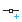</a> | **📂 檔名:** `format-insert-node.svg` ✨ **格式:** `Vector (SVG)` ⚖️ **大小:** `776.00B` 📅 **更新:** `2026-03-02`  🚀 **jsDelivr Markdown:** `` 🔗 **直接連結 (Url):** <code>https://cdn.jsdelivr.net/gh/barry028/materials@main/images/iCons/Pixel/Breeze/Actions%20/22/format-insert-node.svg</code> 📥 [檢視原始檔](format-insert-node.svg) |
|  | **📂 檔名:** `format-join-node.svg` ✨ **格式:** `Vector (SVG)` ⚖️ **大小:** `891.00B` 📅 **更新:** `2026-03-02`  🚀 **jsDelivr Markdown:** `` 🔗 **直接連結 (Url):** <code>https://cdn.jsdelivr.net/gh/barry028/materials@main/images/iCons/Pixel/Breeze/Actions%20/22/format-join-node.svg</code> 📥 [檢視原始檔](format-join-node.svg) |
|  | **📂 檔名:** `format-justify-center.svg` ✨ **格式:** `Vector (SVG)` ⚖️ **大小:** `490.00B` 📅 **更新:** `2026-03-02`  🚀 **jsDelivr Markdown:** `` 🔗 **直接連結 (Url):** <code>https://cdn.jsdelivr.net/gh/barry028/materials@main/images/iCons/Pixel/Breeze/Actions%20/22/format-justify-center.svg</code> 📥 [檢視原始檔](format-justify-center.svg) |
|  | **📂 檔名:** `format-justify-fill.svg` ✨ **格式:** `Vector (SVG)` ⚖️ **大小:** `432.00B` 📅 **更新:** `2026-03-02`  🚀 **jsDelivr Markdown:** `` 🔗 **直接連結 (Url):** <code>https://cdn.jsdelivr.net/gh/barry028/materials@main/images/iCons/Pixel/Breeze/Actions%20/22/format-justify-fill.svg</code> 📥 [檢視原始檔](format-justify-fill.svg) |
|  | **📂 檔名:** `format-justify-left.svg` ✨ **格式:** `Vector (SVG)` ⚖️ **大小:** `601.00B` 📅 **更新:** `2026-03-02`  🚀 **jsDelivr Markdown:** `` 🔗 **直接連結 (Url):** <code>https://cdn.jsdelivr.net/gh/barry028/materials@main/images/iCons/Pixel/Breeze/Actions%20/22/format-justify-left.svg</code> 📥 [檢視原始檔](format-justify-left.svg) |
|  | **📂 檔名:** `format-justify-right.svg` ✨ **格式:** `Vector (SVG)` ⚖️ **大小:** `491.00B` 📅 **更新:** `2026-03-02`  🚀 **jsDelivr Markdown:** `` 🔗 **直接連結 (Url):** <code>https://cdn.jsdelivr.net/gh/barry028/materials@main/images/iCons/Pixel/Breeze/Actions%20/22/format-justify-right.svg</code> 📥 [檢視原始檔](format-justify-right.svg) |
|  | **📂 檔名:** `format-line-spacing-double.svg` ✨ **格式:** `Vector (SVG)` ⚖️ **大小:** `414.00B` 📅 **更新:** `2026-03-02`  🚀 **jsDelivr Markdown:** `` 🔗 **直接連結 (Url):** <code>https://cdn.jsdelivr.net/gh/barry028/materials@main/images/iCons/Pixel/Breeze/Actions%20/22/format-line-spacing-double.svg</code> 📥 [檢視原始檔](format-line-spacing-double.svg) |
|  | **📂 檔名:** `format-line-spacing-normal.svg` ✨ **格式:** `Vector (SVG)` ⚖️ **大小:** `420.00B` 📅 **更新:** `2026-03-02`  🚀 **jsDelivr Markdown:** `` 🔗 **直接連結 (Url):** <code>https://cdn.jsdelivr.net/gh/barry028/materials@main/images/iCons/Pixel/Breeze/Actions%20/22/format-line-spacing-normal.svg</code> 📥 [檢視原始檔](format-line-spacing-normal.svg) |
|  | **📂 檔名:** `format-line-spacing-triple.svg` ✨ **格式:** `Vector (SVG)` ⚖️ **大小:** `417.00B` 📅 **更新:** `2026-03-02`  🚀 **jsDelivr Markdown:** `` 🔗 **直接連結 (Url):** <code>https://cdn.jsdelivr.net/gh/barry028/materials@main/images/iCons/Pixel/Breeze/Actions%20/22/format-line-spacing-triple.svg</code> 📥 [檢視原始檔](format-line-spacing-triple.svg) |
|  | **📂 檔名:** `format-list-ordered.svg` ✨ **格式:** `Vector (SVG)` ⚖️ **大小:** `828.00B` 📅 **更新:** `2026-03-02`  🚀 **jsDelivr Markdown:** `` 🔗 **直接連結 (Url):** <code>https://cdn.jsdelivr.net/gh/barry028/materials@main/images/iCons/Pixel/Breeze/Actions%20/22/format-list-ordered.svg</code> 📥 [檢視原始檔](format-list-ordered.svg) |
|  | **📂 檔名:** `format-list-unordered.svg` ✨ **格式:** `Vector (SVG)` ⚖️ **大小:** `1019.00B` 📅 **更新:** `2026-03-02`  🚀 **jsDelivr Markdown:** `` 🔗 **直接連結 (Url):** <code>https://cdn.jsdelivr.net/gh/barry028/materials@main/images/iCons/Pixel/Breeze/Actions%20/22/format-list-unordered.svg</code> 📥 [檢視原始檔](format-list-unordered.svg) |
| <a href="format-node-corner.svg">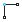</a> | **📂 檔名:** `format-node-corner.svg` ✨ **格式:** `Vector (SVG)` ⚖️ **大小:** `1.10KB` 📅 **更新:** `2026-03-02`  🚀 **jsDelivr Markdown:** `` 🔗 **直接連結 (Url):** <code>https://cdn.jsdelivr.net/gh/barry028/materials@main/images/iCons/Pixel/Breeze/Actions%20/22/format-node-corner.svg</code> 📥 [檢視原始檔](format-node-corner.svg) |
|  | **📂 檔名:** `format-node-curve.svg` ✨ **格式:** `Vector (SVG)` ⚖️ **大小:** `889.00B` 📅 **更新:** `2026-03-02`  🚀 **jsDelivr Markdown:** `` 🔗 **直接連結 (Url):** <code>https://cdn.jsdelivr.net/gh/barry028/materials@main/images/iCons/Pixel/Breeze/Actions%20/22/format-node-curve.svg</code> 📥 [檢視原始檔](format-node-curve.svg) |
|  | **📂 檔名:** `format-node-line.svg` ✨ **格式:** `Vector (SVG)` ⚖️ **大小:** `889.00B` 📅 **更新:** `2026-03-02`  🚀 **jsDelivr Markdown:** `` 🔗 **直接連結 (Url):** <code>https://cdn.jsdelivr.net/gh/barry028/materials@main/images/iCons/Pixel/Breeze/Actions%20/22/format-node-line.svg</code> 📥 [檢視原始檔](format-node-line.svg) |
|  | **📂 檔名:** `format-node-smooth.svg` ✨ **格式:** `Vector (SVG)` ⚖️ **大小:** `808.00B` 📅 **更新:** `2026-03-02`  🚀 **jsDelivr Markdown:** `` 🔗 **直接連結 (Url):** <code>https://cdn.jsdelivr.net/gh/barry028/materials@main/images/iCons/Pixel/Breeze/Actions%20/22/format-node-smooth.svg</code> 📥 [檢視原始檔](format-node-smooth.svg) |
|  | **📂 檔名:** `format-node-symmetric.svg` ✨ **格式:** `Vector (SVG)` ⚖️ **大小:** `811.00B` 📅 **更新:** `2026-03-02`  🚀 **jsDelivr Markdown:** `` 🔗 **直接連結 (Url):** <code>https://cdn.jsdelivr.net/gh/barry028/materials@main/images/iCons/Pixel/Breeze/Actions%20/22/format-node-symmetric.svg</code> 📥 [檢視原始檔](format-node-symmetric.svg) |
|  | **📂 檔名:** `format-number-percent.svg` ✨ **格式:** `Vector (SVG)` ⚖️ **大小:** `1.35KB` 📅 **更新:** `2026-03-02`  🚀 **jsDelivr Markdown:** `` 🔗 **直接連結 (Url):** <code>https://cdn.jsdelivr.net/gh/barry028/materials@main/images/iCons/Pixel/Breeze/Actions%20/22/format-number-percent.svg</code> 📥 [檢視原始檔](format-number-percent.svg) |
| <a href="format-precision-less.svg">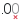</a> | **📂 檔名:** `format-precision-less.svg` ✨ **格式:** `Vector (SVG)` ⚖️ **大小:** `1.41KB` 📅 **更新:** `2026-03-02`  🚀 **jsDelivr Markdown:** `` 🔗 **直接連結 (Url):** <code>https://cdn.jsdelivr.net/gh/barry028/materials@main/images/iCons/Pixel/Breeze/Actions%20/22/format-precision-less.svg</code> 📥 [檢視原始檔](format-precision-less.svg) |
|  | **📂 檔名:** `format-precision-more.svg` ✨ **格式:** `Vector (SVG)` ⚖️ **大小:** `1.22KB` 📅 **更新:** `2026-03-02`  🚀 **jsDelivr Markdown:** `` 🔗 **直接連結 (Url):** <code>https://cdn.jsdelivr.net/gh/barry028/materials@main/images/iCons/Pixel/Breeze/Actions%20/22/format-precision-more.svg</code> 📥 [檢視原始檔](format-precision-more.svg) |
| <a href="format-remove-node.svg">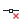</a> | **📂 檔名:** `format-remove-node.svg` ✨ **格式:** `Vector (SVG)` ⚖️ **大小:** `766.00B` 📅 **更新:** `2026-03-02`  🚀 **jsDelivr Markdown:** `` 🔗 **直接連結 (Url):** <code>https://cdn.jsdelivr.net/gh/barry028/materials@main/images/iCons/Pixel/Breeze/Actions%20/22/format-remove-node.svg</code> 📥 [檢視原始檔](format-remove-node.svg) |
|  | **📂 檔名:** `format-segment-curve.svg` ✨ **格式:** `Vector (SVG)` ⚖️ **大小:** `637.00B` 📅 **更新:** `2026-03-02`  🚀 **jsDelivr Markdown:** `` 🔗 **直接連結 (Url):** <code>https://cdn.jsdelivr.net/gh/barry028/materials@main/images/iCons/Pixel/Breeze/Actions%20/22/format-segment-curve.svg</code> 📥 [檢視原始檔](format-segment-curve.svg) |
|  | **📂 檔名:** `format-segment-line.svg` ✨ **格式:** `Vector (SVG)` ⚖️ **大小:** `776.00B` 📅 **更新:** `2026-03-02`  🚀 **jsDelivr Markdown:** `` 🔗 **直接連結 (Url):** <code>https://cdn.jsdelivr.net/gh/barry028/materials@main/images/iCons/Pixel/Breeze/Actions%20/22/format-segment-line.svg</code> 📥 [檢視原始檔](format-segment-line.svg) |
|  | **📂 檔名:** `format-text-blockquote.svg` ✨ **格式:** `Vector (SVG)` ⚖️ **大小:** `523.00B` 📅 **更新:** `2026-03-02`  🚀 **jsDelivr Markdown:** `` 🔗 **直接連結 (Url):** <code>https://cdn.jsdelivr.net/gh/barry028/materials@main/images/iCons/Pixel/Breeze/Actions%20/22/format-text-blockquote.svg</code> 📥 [檢視原始檔](format-text-blockquote.svg) |
|  | **📂 檔名:** `format-text-bold.svg` ✨ **格式:** `Vector (SVG)` ⚖️ **大小:** `874.00B` 📅 **更新:** `2026-03-02`  🚀 **jsDelivr Markdown:** `` 🔗 **直接連結 (Url):** <code>https://cdn.jsdelivr.net/gh/barry028/materials@main/images/iCons/Pixel/Breeze/Actions%20/22/format-text-bold.svg</code> 📥 [檢視原始檔](format-text-bold.svg) |
|  | **📂 檔名:** `format-text-capitalize.svg` ✨ **格式:** `Vector (SVG)` ⚖️ **大小:** `1.05KB` 📅 **更新:** `2026-03-02`  🚀 **jsDelivr Markdown:** `` 🔗 **直接連結 (Url):** <code>https://cdn.jsdelivr.net/gh/barry028/materials@main/images/iCons/Pixel/Breeze/Actions%20/22/format-text-capitalize.svg</code> 📥 [檢視原始檔](format-text-capitalize.svg) |
|  | **📂 檔名:** `format-text-code.svg` ✨ **格式:** `Vector (SVG)` ⚖️ **大小:** `683.00B` 📅 **更新:** `2026-03-02`  🚀 **jsDelivr Markdown:** `` 🔗 **直接連結 (Url):** <code>https://cdn.jsdelivr.net/gh/barry028/materials@main/images/iCons/Pixel/Breeze/Actions%20/22/format-text-code.svg</code> 📥 [檢視原始檔](format-text-code.svg) |
|  | **📂 檔名:** `format-text-color.svg` ✨ **格式:** `Vector (SVG)` ⚖️ **大小:** `667.00B` 📅 **更新:** `2026-03-02`  🚀 **jsDelivr Markdown:** `` 🔗 **直接連結 (Url):** <code>https://cdn.jsdelivr.net/gh/barry028/materials@main/images/iCons/Pixel/Breeze/Actions%20/22/format-text-color.svg</code> 📥 [檢視原始檔](format-text-color.svg) |
|  | **📂 檔名:** `format-text-direction-horizontal.svg` ✨ **格式:** `Vector (SVG)` ⚖️ **大小:** `878.00B` 📅 **更新:** `2026-03-02`  🚀 **jsDelivr Markdown:** `` 🔗 **直接連結 (Url):** <code>https://cdn.jsdelivr.net/gh/barry028/materials@main/images/iCons/Pixel/Breeze/Actions%20/22/format-text-direction-horizontal.svg</code> 📥 [檢視原始檔](format-text-direction-horizontal.svg) |
|  | **📂 檔名:** `format-text-direction-ltr.svg` ✨ **格式:** `Vector (SVG)` ⚖️ **大小:** `633.00B` 📅 **更新:** `2026-03-02`  🚀 **jsDelivr Markdown:** `` 🔗 **直接連結 (Url):** <code>https://cdn.jsdelivr.net/gh/barry028/materials@main/images/iCons/Pixel/Breeze/Actions%20/22/format-text-direction-ltr.svg</code> 📥 [檢視原始檔](format-text-direction-ltr.svg) |
|  | **📂 檔名:** `format-text-direction-rtl.svg` ✨ **格式:** `Vector (SVG)` ⚖️ **大小:** `646.00B` 📅 **更新:** `2026-03-02`  🚀 **jsDelivr Markdown:** `` 🔗 **直接連結 (Url):** <code>https://cdn.jsdelivr.net/gh/barry028/materials@main/images/iCons/Pixel/Breeze/Actions%20/22/format-text-direction-rtl.svg</code> 📥 [檢視原始檔](format-text-direction-rtl.svg) |
|  | **📂 檔名:** `format-text-direction-vertical.svg` ✨ **格式:** `Vector (SVG)` ⚖️ **大小:** `881.00B` 📅 **更新:** `2026-03-02`  🚀 **jsDelivr Markdown:** `` 🔗 **直接連結 (Url):** <code>https://cdn.jsdelivr.net/gh/barry028/materials@main/images/iCons/Pixel/Breeze/Actions%20/22/format-text-direction-vertical.svg</code> 📥 [檢視原始檔](format-text-direction-vertical.svg) |
|  | **📂 檔名:** `format-text-italic.svg` ✨ **格式:** `Vector (SVG)` ⚖️ **大小:** `432.00B` 📅 **更新:** `2026-03-02`  🚀 **jsDelivr Markdown:** `` 🔗 **直接連結 (Url):** <code>https://cdn.jsdelivr.net/gh/barry028/materials@main/images/iCons/Pixel/Breeze/Actions%20/22/format-text-italic.svg</code> 📥 [檢視原始檔](format-text-italic.svg) |
|  | **📂 檔名:** `format-text-lowercase.svg` ✨ **格式:** `Vector (SVG)` ⚖️ **大小:** `982.00B` 📅 **更新:** `2026-03-02`  🚀 **jsDelivr Markdown:** `` 🔗 **直接連結 (Url):** <code>https://cdn.jsdelivr.net/gh/barry028/materials@main/images/iCons/Pixel/Breeze/Actions%20/22/format-text-lowercase.svg</code> 📥 [檢視原始檔](format-text-lowercase.svg) |
|  | **📂 檔名:** `format-text-strikethrough.svg` ✨ **格式:** `Vector (SVG)` ⚖️ **大小:** `779.00B` 📅 **更新:** `2026-03-02`  🚀 **jsDelivr Markdown:** `` 🔗 **直接連結 (Url):** <code>https://cdn.jsdelivr.net/gh/barry028/materials@main/images/iCons/Pixel/Breeze/Actions%20/22/format-text-strikethrough.svg</code> 📥 [檢視原始檔](format-text-strikethrough.svg) |
|  | **📂 檔名:** `format-text-subscript.svg` ✨ **格式:** `Vector (SVG)` ⚖️ **大小:** `991.00B` 📅 **更新:** `2026-03-02`  🚀 **jsDelivr Markdown:** `` 🔗 **直接連結 (Url):** <code>https://cdn.jsdelivr.net/gh/barry028/materials@main/images/iCons/Pixel/Breeze/Actions%20/22/format-text-subscript.svg</code> 📥 [檢視原始檔](format-text-subscript.svg) |
|  | **📂 檔名:** `format-text-superscript.svg` ✨ **格式:** `Vector (SVG)` ⚖️ **大小:** `959.00B` 📅 **更新:** `2026-03-02`  🚀 **jsDelivr Markdown:** `` 🔗 **直接連結 (Url):** <code>https://cdn.jsdelivr.net/gh/barry028/materials@main/images/iCons/Pixel/Breeze/Actions%20/22/format-text-superscript.svg</code> 📥 [檢視原始檔](format-text-superscript.svg) |
|  | **📂 檔名:** `format-text-symbol.svg` ✨ **格式:** `Vector (SVG)` ⚖️ **大小:** `686.00B` 📅 **更新:** `2026-03-02`  🚀 **jsDelivr Markdown:** `` 🔗 **直接連結 (Url):** <code>https://cdn.jsdelivr.net/gh/barry028/materials@main/images/iCons/Pixel/Breeze/Actions%20/22/format-text-symbol.svg</code> 📥 [檢視原始檔](format-text-symbol.svg) |
|  | **📂 檔名:** `format-text-underline-squiggle.svg` ✨ **格式:** `Vector (SVG)` ⚖️ **大小:** `992.00B` 📅 **更新:** `2026-03-02`  🚀 **jsDelivr Markdown:** `` 🔗 **直接連結 (Url):** <code>https://cdn.jsdelivr.net/gh/barry028/materials@main/images/iCons/Pixel/Breeze/Actions%20/22/format-text-underline-squiggle.svg</code> 📥 [檢視原始檔](format-text-underline-squiggle.svg) |
|  | **📂 檔名:** `format-text-underline.svg` ✨ **格式:** `Vector (SVG)` ⚖️ **大小:** `535.00B` 📅 **更新:** `2026-03-02`  🚀 **jsDelivr Markdown:** `` 🔗 **直接連結 (Url):** <code>https://cdn.jsdelivr.net/gh/barry028/materials@main/images/iCons/Pixel/Breeze/Actions%20/22/format-text-underline.svg</code> 📥 [檢視原始檔](format-text-underline.svg) |
|  | **📂 檔名:** `format-text-uppercase.svg` ✨ **格式:** `Vector (SVG)` ⚖️ **大小:** `1.12KB` 📅 **更新:** `2026-03-02`  🚀 **jsDelivr Markdown:** `` 🔗 **直接連結 (Url):** <code>https://cdn.jsdelivr.net/gh/barry028/materials@main/images/iCons/Pixel/Breeze/Actions%20/22/format-text-uppercase.svg</code> 📥 [檢視原始檔](format-text-uppercase.svg) |
|  | **📂 檔名:** `formula.svg` ✨ **格式:** `Vector (SVG)` ⚖️ **大小:** `515.00B` 📅 **更新:** `2026-03-02`  🚀 **jsDelivr Markdown:** `` 🔗 **直接連結 (Url):** <code>https://cdn.jsdelivr.net/gh/barry028/materials@main/images/iCons/Pixel/Breeze/Actions%20/22/formula.svg</code> 📥 [檢視原始檔](formula.svg) |
|  | **📂 檔名:** `games-achievements.svg` ✨ **格式:** `Vector (SVG)` ⚖️ **大小:** `794.00B` 📅 **更新:** `2026-03-02`  🚀 **jsDelivr Markdown:** `` 🔗 **直接連結 (Url):** <code>https://cdn.jsdelivr.net/gh/barry028/materials@main/images/iCons/Pixel/Breeze/Actions%20/22/games-achievements.svg</code> 📥 [檢視原始檔](games-achievements.svg) |
|  | **📂 檔名:** `games-config-board.svg` ✨ **格式:** `Vector (SVG)` ⚖️ **大小:** `1.31KB` 📅 **更新:** `2026-03-02`  🚀 **jsDelivr Markdown:** `` 🔗 **直接連結 (Url):** <code>https://cdn.jsdelivr.net/gh/barry028/materials@main/images/iCons/Pixel/Breeze/Actions%20/22/games-config-board.svg</code> 📥 [檢視原始檔](games-config-board.svg) |
|  | **📂 檔名:** `games-config-tiles.svg` ✨ **格式:** `Vector (SVG)` ⚖️ **大小:** `756.00B` 📅 **更新:** `2026-03-02`  🚀 **jsDelivr Markdown:** `` 🔗 **直接連結 (Url):** <code>https://cdn.jsdelivr.net/gh/barry028/materials@main/images/iCons/Pixel/Breeze/Actions%20/22/games-config-tiles.svg</code> 📥 [檢視原始檔](games-config-tiles.svg) |
|  | **📂 檔名:** `games-difficult.svg` ✨ **格式:** `Vector (SVG)` ⚖️ **大小:** `567.00B` 📅 **更新:** `2026-03-02`  🚀 **jsDelivr Markdown:** `` 🔗 **直接連結 (Url):** <code>https://cdn.jsdelivr.net/gh/barry028/materials@main/images/iCons/Pixel/Breeze/Actions%20/22/games-difficult.svg</code> 📥 [檢視原始檔](games-difficult.svg) |
|  | **📂 檔名:** `games-highscores.svg` ✨ **格式:** `Vector (SVG)` ⚖️ **大小:** `1.67KB` 📅 **更新:** `2026-03-02`  🚀 **jsDelivr Markdown:** `` 🔗 **直接連結 (Url):** <code>https://cdn.jsdelivr.net/gh/barry028/materials@main/images/iCons/Pixel/Breeze/Actions%20/22/games-highscores.svg</code> 📥 [檢視原始檔](games-highscores.svg) |
|  | **📂 檔名:** `games-hint.svg` ✨ **格式:** `Vector (SVG)` ⚖️ **大小:** `937.00B` 📅 **更新:** `2026-03-02`  🚀 **jsDelivr Markdown:** `` 🔗 **直接連結 (Url):** <code>https://cdn.jsdelivr.net/gh/barry028/materials@main/images/iCons/Pixel/Breeze/Actions%20/22/games-hint.svg</code> 📥 [檢視原始檔](games-hint.svg) |
|  | **📂 檔名:** `games-solve.svg` ✨ **格式:** `Vector (SVG)` ⚖️ **大小:** `669.00B` 📅 **更新:** `2026-03-02`  🚀 **jsDelivr Markdown:** `` 🔗 **直接連結 (Url):** <code>https://cdn.jsdelivr.net/gh/barry028/materials@main/images/iCons/Pixel/Breeze/Actions%20/22/games-solve.svg</code> 📥 [檢視原始檔](games-solve.svg) |
|  | **📂 檔名:** `generalise.svg` ✨ **格式:** `Vector (SVG)` ⚖️ **大小:** `699.00B` 📅 **更新:** `2026-03-02`  🚀 **jsDelivr Markdown:** `` 🔗 **直接連結 (Url):** <code>https://cdn.jsdelivr.net/gh/barry028/materials@main/images/iCons/Pixel/Breeze/Actions%20/22/generalise.svg</code> 📥 [檢視原始檔](generalise.svg) |
|  | **📂 檔名:** `globe.svg` ✨ **格式:** `Vector (SVG)` ⚖️ **大小:** `23.43KB` 📅 **更新:** `2026-03-02`  🚀 **jsDelivr Markdown:** `` 🔗 **直接連結 (Url):** <code>https://cdn.jsdelivr.net/gh/barry028/materials@main/images/iCons/Pixel/Breeze/Actions%20/22/globe.svg</code> 📥 [檢視原始檔](globe.svg) |
|  | **📂 檔名:** `gnumeric-autofilter-delete.svg` ✨ **格式:** `Vector (SVG)` ⚖️ **大小:** `736.00B` 📅 **更新:** `2026-03-02`  🚀 **jsDelivr Markdown:** `` 🔗 **直接連結 (Url):** <code>https://cdn.jsdelivr.net/gh/barry028/materials@main/images/iCons/Pixel/Breeze/Actions%20/22/gnumeric-autofilter-delete.svg</code> 📥 [檢視原始檔](gnumeric-autofilter-delete.svg) |
|  | **📂 檔名:** `gnumeric-autosum.svg` ✨ **格式:** `Vector (SVG)` ⚖️ **大小:** `384.00B` 📅 **更新:** `2026-03-02`  🚀 **jsDelivr Markdown:** `` 🔗 **直接連結 (Url):** <code>https://cdn.jsdelivr.net/gh/barry028/materials@main/images/iCons/Pixel/Breeze/Actions%20/22/gnumeric-autosum.svg</code> 📥 [檢視原始檔](gnumeric-autosum.svg) |
|  | **📂 檔名:** `gnumeric-bucket.svg` ✨ **格式:** `Vector (SVG)` ⚖️ **大小:** `1.10KB` 📅 **更新:** `2026-03-02`  🚀 **jsDelivr Markdown:** `` 🔗 **直接連結 (Url):** <code>https://cdn.jsdelivr.net/gh/barry028/materials@main/images/iCons/Pixel/Breeze/Actions%20/22/gnumeric-bucket.svg</code> 📥 [檢視原始檔](gnumeric-bucket.svg) |
|  | **📂 檔名:** `gnumeric-cells-merge.svg` ✨ **格式:** `Vector (SVG)` ⚖️ **大小:** `534.00B` 📅 **更新:** `2026-03-02`  🚀 **jsDelivr Markdown:** `` 🔗 **直接連結 (Url):** <code>https://cdn.jsdelivr.net/gh/barry028/materials@main/images/iCons/Pixel/Breeze/Actions%20/22/gnumeric-cells-merge.svg</code> 📥 [檢視原始檔](gnumeric-cells-merge.svg) |
|  | **📂 檔名:** `gnumeric-column-size.svg` ✨ **格式:** `Vector (SVG)` ⚖️ **大小:** `435.00B` 📅 **更新:** `2026-03-02`  🚀 **jsDelivr Markdown:** `` 🔗 **直接連結 (Url):** <code>https://cdn.jsdelivr.net/gh/barry028/materials@main/images/iCons/Pixel/Breeze/Actions%20/22/gnumeric-column-size.svg</code> 📥 [檢視原始檔](gnumeric-column-size.svg) |
|  | **📂 檔名:** `gnumeric-component-insert-shaped.svg` ✨ **格式:** `Vector (SVG)` ⚖️ **大小:** `823.00B` 📅 **更新:** `2026-03-02`  🚀 **jsDelivr Markdown:** `` 🔗 **直接連結 (Url):** <code>https://cdn.jsdelivr.net/gh/barry028/materials@main/images/iCons/Pixel/Breeze/Actions%20/22/gnumeric-component-insert-shaped.svg</code> 📥 [檢視原始檔](gnumeric-component-insert-shaped.svg) |
|  | **📂 檔名:** `gnumeric-data-slicer.svg` ✨ **格式:** `Vector (SVG)` ⚖️ **大小:** `637.00B` 📅 **更新:** `2026-03-02`  🚀 **jsDelivr Markdown:** `` 🔗 **直接連結 (Url):** <code>https://cdn.jsdelivr.net/gh/barry028/materials@main/images/iCons/Pixel/Breeze/Actions%20/22/gnumeric-data-slicer.svg</code> 📥 [檢視原始檔](gnumeric-data-slicer.svg) |
|  | **📂 檔名:** `gnumeric-font.svg` ✨ **格式:** `Vector (SVG)` ⚖️ **大小:** `534.00B` 📅 **更新:** `2026-03-02`  🚀 **jsDelivr Markdown:** `` 🔗 **直接連結 (Url):** <code>https://cdn.jsdelivr.net/gh/barry028/materials@main/images/iCons/Pixel/Breeze/Actions%20/22/gnumeric-font.svg</code> 📥 [檢視原始檔](gnumeric-font.svg) |
|  | **📂 檔名:** `gnumeric-format-accounting.svg` ✨ **格式:** `Vector (SVG)` ⚖️ **大小:** `1.99KB` 📅 **更新:** `2026-03-02`  🚀 **jsDelivr Markdown:** `` 🔗 **直接連結 (Url):** <code>https://cdn.jsdelivr.net/gh/barry028/materials@main/images/iCons/Pixel/Breeze/Actions%20/22/gnumeric-format-accounting.svg</code> 📥 [檢視原始檔](gnumeric-format-accounting.svg) |
|  | **📂 檔名:** `gnumeric-format-border-double-bottom.svg` ✨ **格式:** `Vector (SVG)` ⚖️ **大小:** `686.00B` 📅 **更新:** `2026-03-02`  🚀 **jsDelivr Markdown:** `` 🔗 **直接連結 (Url):** <code>https://cdn.jsdelivr.net/gh/barry028/materials@main/images/iCons/Pixel/Breeze/Actions%20/22/gnumeric-format-border-double-bottom.svg</code> 📥 [檢視原始檔](gnumeric-format-border-double-bottom.svg) |
|  | **📂 檔名:** `gnumeric-format-border-thick-bottom.svg` ✨ **格式:** `Vector (SVG)` ⚖️ **大小:** `673.00B` 📅 **更新:** `2026-03-02`  🚀 **jsDelivr Markdown:** `` 🔗 **直接連結 (Url):** <code>https://cdn.jsdelivr.net/gh/barry028/materials@main/images/iCons/Pixel/Breeze/Actions%20/22/gnumeric-format-border-thick-bottom.svg</code> 📥 [檢視原始檔](gnumeric-format-border-thick-bottom.svg) |
|  | **📂 檔名:** `gnumeric-format-border-thick-outside.svg` ✨ **格式:** `Vector (SVG)` ⚖️ **大小:** `666.00B` 📅 **更新:** `2026-03-02`  🚀 **jsDelivr Markdown:** `` 🔗 **直接連結 (Url):** <code>https://cdn.jsdelivr.net/gh/barry028/materials@main/images/iCons/Pixel/Breeze/Actions%20/22/gnumeric-format-border-thick-outside.svg</code> 📥 [檢視原始檔](gnumeric-format-border-thick-outside.svg) |
|  | **📂 檔名:** `gnumeric-format-border-top-n-bottom.svg` ✨ **格式:** `Vector (SVG)` ⚖️ **大小:** `686.00B` 📅 **更新:** `2026-03-02`  🚀 **jsDelivr Markdown:** `` 🔗 **直接連結 (Url):** <code>https://cdn.jsdelivr.net/gh/barry028/materials@main/images/iCons/Pixel/Breeze/Actions%20/22/gnumeric-format-border-top-n-bottom.svg</code> 📥 [檢視原始檔](gnumeric-format-border-top-n-bottom.svg) |
|  | **📂 檔名:** `gnumeric-format-border-top-n-double-bottom.svg` ✨ **格式:** `Vector (SVG)` ⚖️ **大小:** `699.00B` 📅 **更新:** `2026-03-02`  🚀 **jsDelivr Markdown:** `` 🔗 **直接連結 (Url):** <code>https://cdn.jsdelivr.net/gh/barry028/materials@main/images/iCons/Pixel/Breeze/Actions%20/22/gnumeric-format-border-top-n-double-bottom.svg</code> 📥 [檢視原始檔](gnumeric-format-border-top-n-double-bottom.svg) |
|  | **📂 檔名:** `gnumeric-format-border-top-n-thick-bottom.svg` ✨ **格式:** `Vector (SVG)` ⚖️ **大小:** `686.00B` 📅 **更新:** `2026-03-02`  🚀 **jsDelivr Markdown:** `` 🔗 **直接連結 (Url):** <code>https://cdn.jsdelivr.net/gh/barry028/materials@main/images/iCons/Pixel/Breeze/Actions%20/22/gnumeric-format-border-top-n-thick-bottom.svg</code> 📥 [檢視原始檔](gnumeric-format-border-top-n-thick-bottom.svg) |
|  | **📂 檔名:** `gnumeric-format-percentage.svg` ✨ **格式:** `Vector (SVG)` ⚖️ **大小:** `920.00B` 📅 **更新:** `2026-03-02`  🚀 **jsDelivr Markdown:** `` 🔗 **直接連結 (Url):** <code>https://cdn.jsdelivr.net/gh/barry028/materials@main/images/iCons/Pixel/Breeze/Actions%20/22/gnumeric-format-percentage.svg</code> 📥 [檢視原始檔](gnumeric-format-percentage.svg) |
| <a href="gnumeric-format-precision-decrease.svg">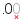</a> | **📂 檔名:** `gnumeric-format-precision-decrease.svg` ✨ **格式:** `Vector (SVG)` ⚖️ **大小:** `1.07KB` 📅 **更新:** `2026-03-02`  🚀 **jsDelivr Markdown:** `` 🔗 **直接連結 (Url):** <code>https://cdn.jsdelivr.net/gh/barry028/materials@main/images/iCons/Pixel/Breeze/Actions%20/22/gnumeric-format-precision-decrease.svg</code> 📥 [檢視原始檔](gnumeric-format-precision-decrease.svg) |
| <a href="gnumeric-format-precision-increase.svg">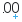</a> | **📂 檔名:** `gnumeric-format-precision-increase.svg` ✨ **格式:** `Vector (SVG)` ⚖️ **大小:** `1.10KB` 📅 **更新:** `2026-03-02`  🚀 **jsDelivr Markdown:** `` 🔗 **直接連結 (Url):** <code>https://cdn.jsdelivr.net/gh/barry028/materials@main/images/iCons/Pixel/Breeze/Actions%20/22/gnumeric-format-precision-increase.svg</code> 📥 [檢視原始檔](gnumeric-format-precision-increase.svg) |
| <a href="gnumeric-format-thousand-separator.svg">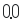</a> | **📂 檔名:** `gnumeric-format-thousand-separator.svg` ✨ **格式:** `Vector (SVG)` ⚖️ **大小:** `772.00B` 📅 **更新:** `2026-03-02`  🚀 **jsDelivr Markdown:** `` 🔗 **直接連結 (Url):** <code>https://cdn.jsdelivr.net/gh/barry028/materials@main/images/iCons/Pixel/Breeze/Actions%20/22/gnumeric-format-thousand-separator.svg</code> 📥 [檢視原始檔](gnumeric-format-thousand-separator.svg) |
|  | **📂 檔名:** `gnumeric-formulaguru.svg` ✨ **格式:** `Vector (SVG)` ⚖️ **大小:** `621.00B` 📅 **更新:** `2026-03-02`  🚀 **jsDelivr Markdown:** `` 🔗 **直接連結 (Url):** <code>https://cdn.jsdelivr.net/gh/barry028/materials@main/images/iCons/Pixel/Breeze/Actions%20/22/gnumeric-formulaguru.svg</code> 📥 [檢視原始檔](gnumeric-formulaguru.svg) |
| <a href="gnumeric-link-external.svg">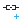</a> | **📂 檔名:** `gnumeric-link-external.svg` ✨ **格式:** `Vector (SVG)` ⚖️ **大小:** `833.00B` 📅 **更新:** `2026-03-02`  🚀 **jsDelivr Markdown:** `` 🔗 **直接連結 (Url):** <code>https://cdn.jsdelivr.net/gh/barry028/materials@main/images/iCons/Pixel/Breeze/Actions%20/22/gnumeric-link-external.svg</code> 📥 [檢視原始檔](gnumeric-link-external.svg) |
|  | **📂 檔名:** `gnumeric-link-internal.svg` ✨ **格式:** `Vector (SVG)` ⚖️ **大小:** `915.00B` 📅 **更新:** `2026-03-02`  🚀 **jsDelivr Markdown:** `` 🔗 **直接連結 (Url):** <code>https://cdn.jsdelivr.net/gh/barry028/materials@main/images/iCons/Pixel/Breeze/Actions%20/22/gnumeric-link-internal.svg</code> 📥 [檢視原始檔](gnumeric-link-internal.svg) |
|  | **📂 檔名:** `gnumeric-link-url.svg` ✨ **格式:** `Vector (SVG)` ⚖️ **大小:** `17.79KB` 📅 **更新:** `2026-03-02`  🚀 **jsDelivr Markdown:** `` 🔗 **直接連結 (Url):** <code>https://cdn.jsdelivr.net/gh/barry028/materials@main/images/iCons/Pixel/Breeze/Actions%20/22/gnumeric-link-url.svg</code> 📥 [檢視原始檔](gnumeric-link-url.svg) |
|  | **📂 檔名:** `gnumeric-object-arrow.svg` ✨ **格式:** `Vector (SVG)` ⚖️ **大小:** `359.00B` 📅 **更新:** `2026-03-02`  🚀 **jsDelivr Markdown:** `` 🔗 **直接連結 (Url):** <code>https://cdn.jsdelivr.net/gh/barry028/materials@main/images/iCons/Pixel/Breeze/Actions%20/22/gnumeric-object-arrow.svg</code> 📥 [檢視原始檔](gnumeric-object-arrow.svg) |
|  | **📂 檔名:** `gnumeric-object-button.svg` ✨ **格式:** `Vector (SVG)` ⚖️ **大小:** `871.00B` 📅 **更新:** `2026-03-02`  🚀 **jsDelivr Markdown:** `` 🔗 **直接連結 (Url):** <code>https://cdn.jsdelivr.net/gh/barry028/materials@main/images/iCons/Pixel/Breeze/Actions%20/22/gnumeric-object-button.svg</code> 📥 [檢視原始檔](gnumeric-object-button.svg) |
|  | **📂 檔名:** `gnumeric-object-checkbox.svg` ✨ **格式:** `Vector (SVG)` ⚖️ **大小:** `626.00B` 📅 **更新:** `2026-03-02`  🚀 **jsDelivr Markdown:** `` 🔗 **直接連結 (Url):** <code>https://cdn.jsdelivr.net/gh/barry028/materials@main/images/iCons/Pixel/Breeze/Actions%20/22/gnumeric-object-checkbox.svg</code> 📥 [檢視原始檔](gnumeric-object-checkbox.svg) |
|  | **📂 檔名:** `gnumeric-object-combo.svg` ✨ **格式:** `Vector (SVG)` ⚖️ **大小:** `529.00B` 📅 **更新:** `2026-03-02`  🚀 **jsDelivr Markdown:** `` 🔗 **直接連結 (Url):** <code>https://cdn.jsdelivr.net/gh/barry028/materials@main/images/iCons/Pixel/Breeze/Actions%20/22/gnumeric-object-combo.svg</code> 📥 [檢視原始檔](gnumeric-object-combo.svg) |
|  | **📂 檔名:** `gnumeric-object-ellipse.svg` ✨ **格式:** `Vector (SVG)` ⚖️ **大小:** `380.00B` 📅 **更新:** `2026-03-02`  🚀 **jsDelivr Markdown:** `` 🔗 **直接連結 (Url):** <code>https://cdn.jsdelivr.net/gh/barry028/materials@main/images/iCons/Pixel/Breeze/Actions%20/22/gnumeric-object-ellipse.svg</code> 📥 [檢視原始檔](gnumeric-object-ellipse.svg) |
|  | **📂 檔名:** `gnumeric-object-list.svg` ✨ **格式:** `Vector (SVG)` ⚖️ **大小:** `609.00B` 📅 **更新:** `2026-03-02`  🚀 **jsDelivr Markdown:** `` 🔗 **直接連結 (Url):** <code>https://cdn.jsdelivr.net/gh/barry028/materials@main/images/iCons/Pixel/Breeze/Actions%20/22/gnumeric-object-list.svg</code> 📥 [檢視原始檔](gnumeric-object-list.svg) |
|  | **📂 檔名:** `gnumeric-object-rectangle.svg` ✨ **格式:** `Vector (SVG)` ⚖️ **大小:** `333.00B` 📅 **更新:** `2026-03-02`  🚀 **jsDelivr Markdown:** `` 🔗 **直接連結 (Url):** <code>https://cdn.jsdelivr.net/gh/barry028/materials@main/images/iCons/Pixel/Breeze/Actions%20/22/gnumeric-object-rectangle.svg</code> 📥 [檢視原始檔](gnumeric-object-rectangle.svg) |
|  | **📂 檔名:** `gnumeric-object-scrollbar.svg` ✨ **格式:** `Vector (SVG)` ⚖️ **大小:** `797.00B` 📅 **更新:** `2026-03-02`  🚀 **jsDelivr Markdown:** `` 🔗 **直接連結 (Url):** <code>https://cdn.jsdelivr.net/gh/barry028/materials@main/images/iCons/Pixel/Breeze/Actions%20/22/gnumeric-object-scrollbar.svg</code> 📥 [檢視原始檔](gnumeric-object-scrollbar.svg) |
|  | **📂 檔名:** `gnumeric-object-spinbutton.svg` ✨ **格式:** `Vector (SVG)` ⚖️ **大小:** `581.00B` 📅 **更新:** `2026-03-02`  🚀 **jsDelivr Markdown:** `` 🔗 **直接連結 (Url):** <code>https://cdn.jsdelivr.net/gh/barry028/materials@main/images/iCons/Pixel/Breeze/Actions%20/22/gnumeric-object-spinbutton.svg</code> 📥 [檢視原始檔](gnumeric-object-spinbutton.svg) |
|  | **📂 檔名:** `gnumeric-pagesetup-hf-page.svg` ✨ **格式:** `Vector (SVG)` ⚖️ **大小:** `843.00B` 📅 **更新:** `2026-03-02`  🚀 **jsDelivr Markdown:** `` 🔗 **直接連結 (Url):** <code>https://cdn.jsdelivr.net/gh/barry028/materials@main/images/iCons/Pixel/Breeze/Actions%20/22/gnumeric-pagesetup-hf-page.svg</code> 📥 [檢視原始檔](gnumeric-pagesetup-hf-page.svg) |
|  | **📂 檔名:** `gnumeric-pagesetup-hf-pages.svg` ✨ **格式:** `Vector (SVG)` ⚖️ **大小:** `1.15KB` 📅 **更新:** `2026-03-02`  🚀 **jsDelivr Markdown:** `` 🔗 **直接連結 (Url):** <code>https://cdn.jsdelivr.net/gh/barry028/materials@main/images/iCons/Pixel/Breeze/Actions%20/22/gnumeric-pagesetup-hf-pages.svg</code> 📥 [檢視原始檔](gnumeric-pagesetup-hf-pages.svg) |
|  | **📂 檔名:** `gnumeric-protection-no.svg` ✨ **格式:** `Vector (SVG)` ⚖️ **大小:** `448.00B` 📅 **更新:** `2026-03-02`  🚀 **jsDelivr Markdown:** `` 🔗 **直接連結 (Url):** <code>https://cdn.jsdelivr.net/gh/barry028/materials@main/images/iCons/Pixel/Breeze/Actions%20/22/gnumeric-protection-no.svg</code> 📥 [檢視原始檔](gnumeric-protection-no.svg) |
|  | **📂 檔名:** `gnumeric-protection-yes.svg` ✨ **格式:** `Vector (SVG)` ⚖️ **大小:** `462.00B` 📅 **更新:** `2026-03-02`  🚀 **jsDelivr Markdown:** `` 🔗 **直接連結 (Url):** <code>https://cdn.jsdelivr.net/gh/barry028/materials@main/images/iCons/Pixel/Breeze/Actions%20/22/gnumeric-protection-yes.svg</code> 📥 [檢視原始檔](gnumeric-protection-yes.svg) |
|  | **📂 檔名:** `gnumeric-row-size.svg` ✨ **格式:** `Vector (SVG)` ⚖️ **大小:** `432.00B` 📅 **更新:** `2026-03-02`  🚀 **jsDelivr Markdown:** `` 🔗 **直接連結 (Url):** <code>https://cdn.jsdelivr.net/gh/barry028/materials@main/images/iCons/Pixel/Breeze/Actions%20/22/gnumeric-row-size.svg</code> 📥 [檢視原始檔](gnumeric-row-size.svg) |
|  | **📂 檔名:** `go-bottom.svg` ✨ **格式:** `Vector (SVG)` ⚖️ **大小:** `436.00B` 📅 **更新:** `2026-03-02`  🚀 **jsDelivr Markdown:** `` 🔗 **直接連結 (Url):** <code>https://cdn.jsdelivr.net/gh/barry028/materials@main/images/iCons/Pixel/Breeze/Actions%20/22/go-bottom.svg</code> 📥 [檢視原始檔](go-bottom.svg) |
|  | **📂 檔名:** `go-down-skip.svg` ✨ **格式:** `Vector (SVG)` ⚖️ **大小:** `362.00B` 📅 **更新:** `2026-03-02`  🚀 **jsDelivr Markdown:** `` 🔗 **直接連結 (Url):** <code>https://cdn.jsdelivr.net/gh/barry028/materials@main/images/iCons/Pixel/Breeze/Actions%20/22/go-down-skip.svg</code> 📥 [檢視原始檔](go-down-skip.svg) |
|  | **📂 檔名:** `go-down.svg` ✨ **格式:** `Vector (SVG)` ⚖️ **大小:** `502.00B` 📅 **更新:** `2026-03-02`  🚀 **jsDelivr Markdown:** `` 🔗 **直接連結 (Url):** <code>https://cdn.jsdelivr.net/gh/barry028/materials@main/images/iCons/Pixel/Breeze/Actions%20/22/go-down.svg</code> 📥 [檢視原始檔](go-down.svg) |
|  | **📂 檔名:** `go-first.svg` ✨ **格式:** `Vector (SVG)` ⚖️ **大小:** `434.00B` 📅 **更新:** `2026-03-02`  🚀 **jsDelivr Markdown:** `` 🔗 **直接連結 (Url):** <code>https://cdn.jsdelivr.net/gh/barry028/materials@main/images/iCons/Pixel/Breeze/Actions%20/22/go-first.svg</code> 📥 [檢視原始檔](go-first.svg) |
|  | **📂 檔名:** `go-home.svg` ✨ **格式:** `Vector (SVG)` ⚖️ **大小:** `591.00B` 📅 **更新:** `2026-03-02`  🚀 **jsDelivr Markdown:** `` 🔗 **直接連結 (Url):** <code>https://cdn.jsdelivr.net/gh/barry028/materials@main/images/iCons/Pixel/Breeze/Actions%20/22/go-home.svg</code> 📥 [檢視原始檔](go-home.svg) |
|  | **📂 檔名:** `go-jump-declaration.svg` ✨ **格式:** `Vector (SVG)` ⚖️ **大小:** `634.00B` 📅 **更新:** `2026-03-02`  🚀 **jsDelivr Markdown:** `` 🔗 **直接連結 (Url):** <code>https://cdn.jsdelivr.net/gh/barry028/materials@main/images/iCons/Pixel/Breeze/Actions%20/22/go-jump-declaration.svg</code> 📥 [檢視原始檔](go-jump-declaration.svg) |
|  | **📂 檔名:** `go-jump-definition.svg` ✨ **格式:** `Vector (SVG)` ⚖️ **大小:** `650.00B` 📅 **更新:** `2026-03-02`  🚀 **jsDelivr Markdown:** `` 🔗 **直接連結 (Url):** <code>https://cdn.jsdelivr.net/gh/barry028/materials@main/images/iCons/Pixel/Breeze/Actions%20/22/go-jump-definition.svg</code> 📥 [檢視原始檔](go-jump-definition.svg) |
|  | **📂 檔名:** `go-jump.svg` ✨ **格式:** `Vector (SVG)` ⚖️ **大小:** `640.00B` 📅 **更新:** `2026-03-02`  🚀 **jsDelivr Markdown:** `` 🔗 **直接連結 (Url):** <code>https://cdn.jsdelivr.net/gh/barry028/materials@main/images/iCons/Pixel/Breeze/Actions%20/22/go-jump.svg</code> 📥 [檢視原始檔](go-jump.svg) |
|  | **📂 檔名:** `go-last.svg` ✨ **格式:** `Vector (SVG)` ⚖️ **大小:** `437.00B` 📅 **更新:** `2026-03-02`  🚀 **jsDelivr Markdown:** `` 🔗 **直接連結 (Url):** <code>https://cdn.jsdelivr.net/gh/barry028/materials@main/images/iCons/Pixel/Breeze/Actions%20/22/go-last.svg</code> 📥 [檢視原始檔](go-last.svg) |
|  | **📂 檔名:** `go-next-context.svg` ✨ **格式:** `Vector (SVG)` ⚖️ **大小:** `1.21KB` 📅 **更新:** `2026-03-02`  🚀 **jsDelivr Markdown:** `` 🔗 **直接連結 (Url):** <code>https://cdn.jsdelivr.net/gh/barry028/materials@main/images/iCons/Pixel/Breeze/Actions%20/22/go-next-context.svg</code> 📥 [檢視原始檔](go-next-context.svg) |
|  | **📂 檔名:** `go-next-skip.svg` ✨ **格式:** `Vector (SVG)` ⚖️ **大小:** `362.00B` 📅 **更新:** `2026-03-02`  🚀 **jsDelivr Markdown:** `` 🔗 **直接連結 (Url):** <code>https://cdn.jsdelivr.net/gh/barry028/materials@main/images/iCons/Pixel/Breeze/Actions%20/22/go-next-skip.svg</code> 📥 [檢視原始檔](go-next-skip.svg) |
|  | **📂 檔名:** `go-next-use.svg` ✨ **格式:** `Vector (SVG)` ⚖️ **大小:** `557.00B` 📅 **更新:** `2026-03-02`  🚀 **jsDelivr Markdown:** `` 🔗 **直接連結 (Url):** <code>https://cdn.jsdelivr.net/gh/barry028/materials@main/images/iCons/Pixel/Breeze/Actions%20/22/go-next-use.svg</code> 📥 [檢視原始檔](go-next-use.svg) |
|  | **📂 檔名:** `go-next.svg` ✨ **格式:** `Vector (SVG)` ⚖️ **大小:** `500.00B` 📅 **更新:** `2026-03-02`  🚀 **jsDelivr Markdown:** `` 🔗 **直接連結 (Url):** <code>https://cdn.jsdelivr.net/gh/barry028/materials@main/images/iCons/Pixel/Breeze/Actions%20/22/go-next.svg</code> 📥 [檢視原始檔](go-next.svg) |
|  | **📂 檔名:** `go-parent-folder.svg` ✨ **格式:** `Vector (SVG)` ⚖️ **大小:** `734.00B` 📅 **更新:** `2026-03-02`  🚀 **jsDelivr Markdown:** `` 🔗 **直接連結 (Url):** <code>https://cdn.jsdelivr.net/gh/barry028/materials@main/images/iCons/Pixel/Breeze/Actions%20/22/go-parent-folder.svg</code> 📥 [檢視原始檔](go-parent-folder.svg) |
|  | **📂 檔名:** `go-previous-context.svg` ✨ **格式:** `Vector (SVG)` ⚖️ **大小:** `1.18KB` 📅 **更新:** `2026-03-02`  🚀 **jsDelivr Markdown:** `` 🔗 **直接連結 (Url):** <code>https://cdn.jsdelivr.net/gh/barry028/materials@main/images/iCons/Pixel/Breeze/Actions%20/22/go-previous-context.svg</code> 📥 [檢視原始檔](go-previous-context.svg) |
|  | **📂 檔名:** `go-previous-skip.svg` ✨ **格式:** `Vector (SVG)` ⚖️ **大小:** `369.00B` 📅 **更新:** `2026-03-02`  🚀 **jsDelivr Markdown:** `` 🔗 **直接連結 (Url):** <code>https://cdn.jsdelivr.net/gh/barry028/materials@main/images/iCons/Pixel/Breeze/Actions%20/22/go-previous-skip.svg</code> 📥 [檢視原始檔](go-previous-skip.svg) |
|  | **📂 檔名:** `go-previous-use.svg` ✨ **格式:** `Vector (SVG)` ⚖️ **大小:** `556.00B` 📅 **更新:** `2026-03-02`  🚀 **jsDelivr Markdown:** `` 🔗 **直接連結 (Url):** <code>https://cdn.jsdelivr.net/gh/barry028/materials@main/images/iCons/Pixel/Breeze/Actions%20/22/go-previous-use.svg</code> 📥 [檢視原始檔](go-previous-use.svg) |
|  | **📂 檔名:** `go-previous.svg` ✨ **格式:** `Vector (SVG)` ⚖️ **大小:** `503.00B` 📅 **更新:** `2026-03-02`  🚀 **jsDelivr Markdown:** `` 🔗 **直接連結 (Url):** <code>https://cdn.jsdelivr.net/gh/barry028/materials@main/images/iCons/Pixel/Breeze/Actions%20/22/go-previous.svg</code> 📥 [檢視原始檔](go-previous.svg) |
|  | **📂 檔名:** `go-top.svg` ✨ **格式:** `Vector (SVG)` ⚖️ **大小:** `441.00B` 📅 **更新:** `2026-03-02`  🚀 **jsDelivr Markdown:** `` 🔗 **直接連結 (Url):** <code>https://cdn.jsdelivr.net/gh/barry028/materials@main/images/iCons/Pixel/Breeze/Actions%20/22/go-top.svg</code> 📥 [檢視原始檔](go-top.svg) |
|  | **📂 檔名:** `go-up-skip.svg` ✨ **格式:** `Vector (SVG)` ⚖️ **大小:** `364.00B` 📅 **更新:** `2026-03-02`  🚀 **jsDelivr Markdown:** `` 🔗 **直接連結 (Url):** <code>https://cdn.jsdelivr.net/gh/barry028/materials@main/images/iCons/Pixel/Breeze/Actions%20/22/go-up-skip.svg</code> 📥 [檢視原始檔](go-up-skip.svg) |
|  | **📂 檔名:** `go-up.svg` ✨ **格式:** `Vector (SVG)` ⚖️ **大小:** `391.00B` 📅 **更新:** `2026-03-02`  🚀 **jsDelivr Markdown:** `` 🔗 **直接連結 (Url):** <code>https://cdn.jsdelivr.net/gh/barry028/materials@main/images/iCons/Pixel/Breeze/Actions%20/22/go-up.svg</code> 📥 [檢視原始檔](go-up.svg) |
|  | **📂 檔名:** `gtk-index.svg` ✨ **格式:** `Vector (SVG)` ⚖️ **大小:** `1.38KB` 📅 **更新:** `2026-03-02`  🚀 **jsDelivr Markdown:** `` 🔗 **直接連結 (Url):** <code>https://cdn.jsdelivr.net/gh/barry028/materials@main/images/iCons/Pixel/Breeze/Actions%20/22/gtk-index.svg</code> 📥 [檢視原始檔](gtk-index.svg) |
|  | **📂 檔名:** `gtk-select-font.svg` ✨ **格式:** `Vector (SVG)` ⚖️ **大小:** `1.11KB` 📅 **更新:** `2026-03-02`  🚀 **jsDelivr Markdown:** `` 🔗 **直接連結 (Url):** <code>https://cdn.jsdelivr.net/gh/barry028/materials@main/images/iCons/Pixel/Breeze/Actions%20/22/gtk-select-font.svg</code> 📥 [檢視原始檔](gtk-select-font.svg) |
|  | **📂 檔名:** `handle-move.svg` ✨ **格式:** `Vector (SVG)` ⚖️ **大小:** `1.27KB` 📅 **更新:** `2026-03-02`  🚀 **jsDelivr Markdown:** `` 🔗 **直接連結 (Url):** <code>https://cdn.jsdelivr.net/gh/barry028/materials@main/images/iCons/Pixel/Breeze/Actions%20/22/handle-move.svg</code> 📥 [檢視原始檔](handle-move.svg) |
|  | **📂 檔名:** `handle-sort.svg` ✨ **格式:** `Vector (SVG)` ⚖️ **大小:** `1.08KB` 📅 **更新:** `2026-03-02`  🚀 **jsDelivr Markdown:** `` 🔗 **直接連結 (Url):** <code>https://cdn.jsdelivr.net/gh/barry028/materials@main/images/iCons/Pixel/Breeze/Actions%20/22/handle-sort.svg</code> 📥 [檢視原始檔](handle-sort.svg) |
|  | **📂 檔名:** `help-about.svg` ✨ **格式:** `Vector (SVG)` ⚖️ **大小:** `640.00B` 📅 **更新:** `2026-03-02`  🚀 **jsDelivr Markdown:** `` 🔗 **直接連結 (Url):** <code>https://cdn.jsdelivr.net/gh/barry028/materials@main/images/iCons/Pixel/Breeze/Actions%20/22/help-about.svg</code> 📥 [檢視原始檔](help-about.svg) |
|  | **📂 檔名:** `help-contents.svg` ✨ **格式:** `Vector (SVG)` ⚖️ **大小:** `4.16KB` 📅 **更新:** `2026-03-02`  🚀 **jsDelivr Markdown:** `` 🔗 **直接連結 (Url):** <code>https://cdn.jsdelivr.net/gh/barry028/materials@main/images/iCons/Pixel/Breeze/Actions%20/22/help-contents.svg</code> 📥 [檢視原始檔](help-contents.svg) |
|  | **📂 檔名:** `help-whatsthis.svg` ✨ **格式:** `Vector (SVG)` ⚖️ **大小:** `859.00B` 📅 **更新:** `2026-03-02`  🚀 **jsDelivr Markdown:** `` 🔗 **直接連結 (Url):** <code>https://cdn.jsdelivr.net/gh/barry028/materials@main/images/iCons/Pixel/Breeze/Actions%20/22/help-whatsthis.svg</code> 📥 [檢視原始檔](help-whatsthis.svg) |
|  | **📂 檔名:** `hexagon-shape.svg` ✨ **格式:** `Vector (SVG)` ⚖️ **大小:** `695.00B` 📅 **更新:** `2026-03-02`  🚀 **jsDelivr Markdown:** `` 🔗 **直接連結 (Url):** <code>https://cdn.jsdelivr.net/gh/barry028/materials@main/images/iCons/Pixel/Breeze/Actions%20/22/hexagon-shape.svg</code> 📥 [檢視原始檔](hexagon-shape.svg) |
|  | **📂 檔名:** `hotpixels.svg` ✨ **格式:** `Vector (SVG)` ⚖️ **大小:** `537.00B` 📅 **更新:** `2026-03-02`  🚀 **jsDelivr Markdown:** `` 🔗 **直接連結 (Url):** <code>https://cdn.jsdelivr.net/gh/barry028/materials@main/images/iCons/Pixel/Breeze/Actions%20/22/hotpixels.svg</code> 📥 [檢視原始檔](hotpixels.svg) |
|  | **📂 檔名:** `im-aim.svg` ✨ **格式:** `Vector (SVG)` ⚖️ **大小:** `2.63KB` 📅 **更新:** `2026-03-02`  🚀 **jsDelivr Markdown:** `` 🔗 **直接連結 (Url):** <code>https://cdn.jsdelivr.net/gh/barry028/materials@main/images/iCons/Pixel/Breeze/Actions%20/22/im-aim.svg</code> 📥 [檢視原始檔](im-aim.svg) |
|  | **📂 檔名:** `im-ban-kick-user.svg` ✨ **格式:** `Vector (SVG)` ⚖️ **大小:** `871.00B` 📅 **更新:** `2026-03-02`  🚀 **jsDelivr Markdown:** `` 🔗 **直接連結 (Url):** <code>https://cdn.jsdelivr.net/gh/barry028/materials@main/images/iCons/Pixel/Breeze/Actions%20/22/im-ban-kick-user.svg</code> 📥 [檢視原始檔](im-ban-kick-user.svg) |
|  | **📂 檔名:** `im-facebook.svg` ✨ **格式:** `Vector (SVG)` ⚖️ **大小:** `727.00B` 📅 **更新:** `2026-03-02`  🚀 **jsDelivr Markdown:** `` 🔗 **直接連結 (Url):** <code>https://cdn.jsdelivr.net/gh/barry028/materials@main/images/iCons/Pixel/Breeze/Actions%20/22/im-facebook.svg</code> 📥 [檢視原始檔](im-facebook.svg) |
|  | **📂 檔名:** `im-gadugadu.svg` ✨ **格式:** `Vector (SVG)` ⚖️ **大小:** `2.00KB` 📅 **更新:** `2026-03-02`  🚀 **jsDelivr Markdown:** `` 🔗 **直接連結 (Url):** <code>https://cdn.jsdelivr.net/gh/barry028/materials@main/images/iCons/Pixel/Breeze/Actions%20/22/im-gadugadu.svg</code> 📥 [檢視原始檔](im-gadugadu.svg) |
|  | **📂 檔名:** `im-google-talk.svg` ✨ **格式:** `Vector (SVG)` ⚖️ **大小:** `1.29KB` 📅 **更新:** `2026-03-02`  🚀 **jsDelivr Markdown:** `` 🔗 **直接連結 (Url):** <code>https://cdn.jsdelivr.net/gh/barry028/materials@main/images/iCons/Pixel/Breeze/Actions%20/22/im-google-talk.svg</code> 📥 [檢視原始檔](im-google-talk.svg) |
|  | **📂 檔名:** `im-google.svg` ✨ **格式:** `Vector (SVG)` ⚖️ **大小:** `1.74KB` 📅 **更新:** `2026-03-02`  🚀 **jsDelivr Markdown:** `` 🔗 **直接連結 (Url):** <code>https://cdn.jsdelivr.net/gh/barry028/materials@main/images/iCons/Pixel/Breeze/Actions%20/22/im-google.svg</code> 📥 [檢視原始檔](im-google.svg) |
|  | **📂 檔名:** `im-icq.svg` ✨ **格式:** `Vector (SVG)` ⚖️ **大小:** `2.14KB` 📅 **更新:** `2026-03-02`  🚀 **jsDelivr Markdown:** `` 🔗 **直接連結 (Url):** <code>https://cdn.jsdelivr.net/gh/barry028/materials@main/images/iCons/Pixel/Breeze/Actions%20/22/im-icq.svg</code> 📥 [檢視原始檔](im-icq.svg) |
|  | **📂 檔名:** `im-identi.ca.svg` ✨ **格式:** `Vector (SVG)` ⚖️ **大小:** `1.14KB` 📅 **更新:** `2026-03-02`  🚀 **jsDelivr Markdown:** `` 🔗 **直接連結 (Url):** <code>https://cdn.jsdelivr.net/gh/barry028/materials@main/images/iCons/Pixel/Breeze/Actions%20/22/im-identi.ca.svg</code> 📥 [檢視原始檔](im-identi.ca.svg) |
|  | **📂 檔名:** `im-invisible-user.svg` ✨ **格式:** `Vector (SVG)` ⚖️ **大小:** `1.11KB` 📅 **更新:** `2026-03-02`  🚀 **jsDelivr Markdown:** `` 🔗 **直接連結 (Url):** <code>https://cdn.jsdelivr.net/gh/barry028/materials@main/images/iCons/Pixel/Breeze/Actions%20/22/im-invisible-user.svg</code> 📥 [檢視原始檔](im-invisible-user.svg) |
|  | **📂 檔名:** `im-kick-user.svg` ✨ **格式:** `Vector (SVG)` ⚖️ **大小:** `750.00B` 📅 **更新:** `2026-03-02`  🚀 **jsDelivr Markdown:** `` 🔗 **直接連結 (Url):** <code>https://cdn.jsdelivr.net/gh/barry028/materials@main/images/iCons/Pixel/Breeze/Actions%20/22/im-kick-user.svg</code> 📥 [檢視原始檔](im-kick-user.svg) |
|  | **📂 檔名:** `im-msn.svg` ✨ **格式:** `Vector (SVG)` ⚖️ **大小:** `410.00B` 📅 **更新:** `2026-03-02`  🚀 **jsDelivr Markdown:** `` 🔗 **直接連結 (Url):** <code>https://cdn.jsdelivr.net/gh/barry028/materials@main/images/iCons/Pixel/Breeze/Actions%20/22/im-msn.svg</code> 📥 [檢視原始檔](im-msn.svg) |
|  | **📂 檔名:** `im-qq.svg` ✨ **格式:** `Vector (SVG)` ⚖️ **大小:** `804.00B` 📅 **更新:** `2026-03-02`  🚀 **jsDelivr Markdown:** `` 🔗 **直接連結 (Url):** <code>https://cdn.jsdelivr.net/gh/barry028/materials@main/images/iCons/Pixel/Breeze/Actions%20/22/im-qq.svg</code> 📥 [檢視原始檔](im-qq.svg) |
|  | **📂 檔名:** `im-skype.svg` ✨ **格式:** `Vector (SVG)` ⚖️ **大小:** `3.61KB` 📅 **更新:** `2026-03-02`  🚀 **jsDelivr Markdown:** `` 🔗 **直接連結 (Url):** <code>https://cdn.jsdelivr.net/gh/barry028/materials@main/images/iCons/Pixel/Breeze/Actions%20/22/im-skype.svg</code> 📥 [檢視原始檔](im-skype.svg) |
|  | **📂 檔名:** `im-twitter.svg` ✨ **格式:** `Vector (SVG)` ⚖️ **大小:** `1.55KB` 📅 **更新:** `2026-03-02`  🚀 **jsDelivr Markdown:** `` 🔗 **直接連結 (Url):** <code>https://cdn.jsdelivr.net/gh/barry028/materials@main/images/iCons/Pixel/Breeze/Actions%20/22/im-twitter.svg</code> 📥 [檢視原始檔](im-twitter.svg) |
|  | **📂 檔名:** `im-user-away.svg` ✨ **格式:** `Vector (SVG)` ⚖️ **大小:** `667.00B` 📅 **更新:** `2026-03-02`  🚀 **jsDelivr Markdown:** `` 🔗 **直接連結 (Url):** <code>https://cdn.jsdelivr.net/gh/barry028/materials@main/images/iCons/Pixel/Breeze/Actions%20/22/im-user-away.svg</code> 📥 [檢視原始檔](im-user-away.svg) |
| <a href="im-user-busy.svg">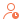</a> | **📂 檔名:** `im-user-busy.svg` ✨ **格式:** `Vector (SVG)` ⚖️ **大小:** `768.00B` 📅 **更新:** `2026-03-02`  🚀 **jsDelivr Markdown:** `` 🔗 **直接連結 (Url):** <code>https://cdn.jsdelivr.net/gh/barry028/materials@main/images/iCons/Pixel/Breeze/Actions%20/22/im-user-busy.svg</code> 📥 [檢視原始檔](im-user-busy.svg) |
| <a href="im-user-offline.svg">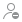</a> | **📂 檔名:** `im-user-offline.svg` ✨ **格式:** `Vector (SVG)` ⚖️ **大小:** `1.08KB` 📅 **更新:** `2026-03-02`  🚀 **jsDelivr Markdown:** `` 🔗 **直接連結 (Url):** <code>https://cdn.jsdelivr.net/gh/barry028/materials@main/images/iCons/Pixel/Breeze/Actions%20/22/im-user-offline.svg</code> 📥 [檢視原始檔](im-user-offline.svg) |
|  | **📂 檔名:** `im-user-online.svg` ✨ **格式:** `Vector (SVG)` ⚖️ **大小:** `749.00B` 📅 **更新:** `2026-03-02`  🚀 **jsDelivr Markdown:** `` 🔗 **直接連結 (Url):** <code>https://cdn.jsdelivr.net/gh/barry028/materials@main/images/iCons/Pixel/Breeze/Actions%20/22/im-user-online.svg</code> 📥 [檢視原始檔](im-user-online.svg) |
|  | **📂 檔名:** `im-user.svg` ✨ **格式:** `Vector (SVG)` ⚖️ **大小:** `782.00B` 📅 **更新:** `2026-03-02`  🚀 **jsDelivr Markdown:** `` 🔗 **直接連結 (Url):** <code>https://cdn.jsdelivr.net/gh/barry028/materials@main/images/iCons/Pixel/Breeze/Actions%20/22/im-user.svg</code> 📥 [檢視原始檔](im-user.svg) |
|  | **📂 檔名:** `im-yahoo.svg` ✨ **格式:** `Vector (SVG)` ⚖️ **大小:** `1.30KB` 📅 **更新:** `2026-03-02`  🚀 **jsDelivr Markdown:** `` 🔗 **直接連結 (Url):** <code>https://cdn.jsdelivr.net/gh/barry028/materials@main/images/iCons/Pixel/Breeze/Actions%20/22/im-yahoo.svg</code> 📥 [檢視原始檔](im-yahoo.svg) |
|  | **📂 檔名:** `im-youtube.svg` ✨ **格式:** `Vector (SVG)` ⚖️ **大小:** `507.00B` 📅 **更新:** `2026-03-02`  🚀 **jsDelivr Markdown:** `` 🔗 **直接連結 (Url):** <code>https://cdn.jsdelivr.net/gh/barry028/materials@main/images/iCons/Pixel/Breeze/Actions%20/22/im-youtube.svg</code> 📥 [檢視原始檔](im-youtube.svg) |
|  | **📂 檔名:** `input-keyboard-virtual-hide.svg` ✨ **格式:** `Vector (SVG)` ⚖️ **大小:** `639.00B` 📅 **更新:** `2026-03-02`  🚀 **jsDelivr Markdown:** `` 🔗 **直接連結 (Url):** <code>https://cdn.jsdelivr.net/gh/barry028/materials@main/images/iCons/Pixel/Breeze/Actions%20/22/input-keyboard-virtual-hide.svg</code> 📥 [檢視原始檔](input-keyboard-virtual-hide.svg) |
|  | **📂 檔名:** `input-keyboard-virtual-show.svg` ✨ **格式:** `Vector (SVG)` ⚖️ **大小:** `629.00B` 📅 **更新:** `2026-03-02`  🚀 **jsDelivr Markdown:** `` 🔗 **直接連結 (Url):** <code>https://cdn.jsdelivr.net/gh/barry028/materials@main/images/iCons/Pixel/Breeze/Actions%20/22/input-keyboard-virtual-show.svg</code> 📥 [檢視原始檔](input-keyboard-virtual-show.svg) |
|  | **📂 檔名:** `input-mouse-click-left.svg` ✨ **格式:** `Vector (SVG)` ⚖️ **大小:** `575.00B` 📅 **更新:** `2026-03-02`  🚀 **jsDelivr Markdown:** `` 🔗 **直接連結 (Url):** <code>https://cdn.jsdelivr.net/gh/barry028/materials@main/images/iCons/Pixel/Breeze/Actions%20/22/input-mouse-click-left.svg</code> 📥 [檢視原始檔](input-mouse-click-left.svg) |
|  | **📂 檔名:** `input-mouse-click-middle.svg` ✨ **格式:** `Vector (SVG)` ⚖️ **大小:** `588.00B` 📅 **更新:** `2026-03-02`  🚀 **jsDelivr Markdown:** `` 🔗 **直接連結 (Url):** <code>https://cdn.jsdelivr.net/gh/barry028/materials@main/images/iCons/Pixel/Breeze/Actions%20/22/input-mouse-click-middle.svg</code> 📥 [檢視原始檔](input-mouse-click-middle.svg) |
|  | **📂 檔名:** `input-mouse-click-right.svg` ✨ **格式:** `Vector (SVG)` ⚖️ **大小:** `577.00B` 📅 **更新:** `2026-03-02`  🚀 **jsDelivr Markdown:** `` 🔗 **直接連結 (Url):** <code>https://cdn.jsdelivr.net/gh/barry028/materials@main/images/iCons/Pixel/Breeze/Actions%20/22/input-mouse-click-right.svg</code> 📥 [檢視原始檔](input-mouse-click-right.svg) |
|  | **📂 檔名:** `insert-button.svg` ✨ **格式:** `Vector (SVG)` ⚖️ **大小:** `1.07KB` 📅 **更新:** `2026-03-02`  🚀 **jsDelivr Markdown:** `` 🔗 **直接連結 (Url):** <code>https://cdn.jsdelivr.net/gh/barry028/materials@main/images/iCons/Pixel/Breeze/Actions%20/22/insert-button.svg</code> 📥 [檢視原始檔](insert-button.svg) |
|  | **📂 檔名:** `insert-endnote.svg` ✨ **格式:** `Vector (SVG)` ⚖️ **大小:** `1.08KB` 📅 **更新:** `2026-03-02`  🚀 **jsDelivr Markdown:** `` 🔗 **直接連結 (Url):** <code>https://cdn.jsdelivr.net/gh/barry028/materials@main/images/iCons/Pixel/Breeze/Actions%20/22/insert-endnote.svg</code> 📥 [檢視原始檔](insert-endnote.svg) |
|  | **📂 檔名:** `insert-footnote.svg` ✨ **格式:** `Vector (SVG)` ⚖️ **大小:** `828.00B` 📅 **更新:** `2026-03-02`  🚀 **jsDelivr Markdown:** `` 🔗 **直接連結 (Url):** <code>https://cdn.jsdelivr.net/gh/barry028/materials@main/images/iCons/Pixel/Breeze/Actions%20/22/insert-footnote.svg</code> 📥 [檢視原始檔](insert-footnote.svg) |
|  | **📂 檔名:** `insert-horizontal-rule.svg` ✨ **格式:** `Vector (SVG)` ⚖️ **大小:** `623.00B` 📅 **更新:** `2026-03-02`  🚀 **jsDelivr Markdown:** `` 🔗 **直接連結 (Url):** <code>https://cdn.jsdelivr.net/gh/barry028/materials@main/images/iCons/Pixel/Breeze/Actions%20/22/insert-horizontal-rule.svg</code> 📥 [檢視原始檔](insert-horizontal-rule.svg) |
|  | **📂 檔名:** `insert-image.svg` ✨ **格式:** `Vector (SVG)` ⚖️ **大小:** `719.00B` 📅 **更新:** `2026-03-02`  🚀 **jsDelivr Markdown:** `` 🔗 **直接連結 (Url):** <code>https://cdn.jsdelivr.net/gh/barry028/materials@main/images/iCons/Pixel/Breeze/Actions%20/22/insert-image.svg</code> 📥 [檢視原始檔](insert-image.svg) |
| <a href="insert-link.svg">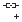</a> | **📂 檔名:** `insert-link.svg` ✨ **格式:** `Vector (SVG)` ⚖️ **大小:** `662.00B` 📅 **更新:** `2026-03-02`  🚀 **jsDelivr Markdown:** `` 🔗 **直接連結 (Url):** <code>https://cdn.jsdelivr.net/gh/barry028/materials@main/images/iCons/Pixel/Breeze/Actions%20/22/insert-link.svg</code> 📥 [檢視原始檔](insert-link.svg) |
|  | **📂 檔名:** `insert-math-expression.svg` ✨ **格式:** `Vector (SVG)` ⚖️ **大小:** `733.00B` 📅 **更新:** `2026-03-02`  🚀 **jsDelivr Markdown:** `` 🔗 **直接連結 (Url):** <code>https://cdn.jsdelivr.net/gh/barry028/materials@main/images/iCons/Pixel/Breeze/Actions%20/22/insert-math-expression.svg</code> 📥 [檢視原始檔](insert-math-expression.svg) |
|  | **📂 檔名:** `insert-more-mark.svg` ✨ **格式:** `Vector (SVG)` ⚖️ **大小:** `751.00B` 📅 **更新:** `2026-03-02`  🚀 **jsDelivr Markdown:** `` 🔗 **直接連結 (Url):** <code>https://cdn.jsdelivr.net/gh/barry028/materials@main/images/iCons/Pixel/Breeze/Actions%20/22/insert-more-mark.svg</code> 📥 [檢視原始檔](insert-more-mark.svg) |
|  | **📂 檔名:** `insert-page-break.svg` ✨ **格式:** `Vector (SVG)` ⚖️ **大小:** `842.00B` 📅 **更新:** `2026-03-02`  🚀 **jsDelivr Markdown:** `` 🔗 **直接連結 (Url):** <code>https://cdn.jsdelivr.net/gh/barry028/materials@main/images/iCons/Pixel/Breeze/Actions%20/22/insert-page-break.svg</code> 📥 [檢視原始檔](insert-page-break.svg) |
|  | **📂 檔名:** `insert-table-of-contents.svg` ✨ **格式:** `Vector (SVG)` ⚖️ **大小:** `1.55KB` 📅 **更新:** `2026-03-02`  🚀 **jsDelivr Markdown:** `` 🔗 **直接連結 (Url):** <code>https://cdn.jsdelivr.net/gh/barry028/materials@main/images/iCons/Pixel/Breeze/Actions%20/22/insert-table-of-contents.svg</code> 📥 [檢視原始檔](insert-table-of-contents.svg) |
|  | **📂 檔名:** `insert-table.svg` ✨ **格式:** `Vector (SVG)` ⚖️ **大小:** `1.36KB` 📅 **更新:** `2026-03-02`  🚀 **jsDelivr Markdown:** `` 🔗 **直接連結 (Url):** <code>https://cdn.jsdelivr.net/gh/barry028/materials@main/images/iCons/Pixel/Breeze/Actions%20/22/insert-table.svg</code> 📥 [檢視原始檔](insert-table.svg) |
|  | **📂 檔名:** `insert-text-frame.svg` ✨ **格式:** `Vector (SVG)` ⚖️ **大小:** `712.00B` 📅 **更新:** `2026-03-02`  🚀 **jsDelivr Markdown:** `` 🔗 **直接連結 (Url):** <code>https://cdn.jsdelivr.net/gh/barry028/materials@main/images/iCons/Pixel/Breeze/Actions%20/22/insert-text-frame.svg</code> 📥 [檢視原始檔](insert-text-frame.svg) |
| <a href="insert-text.svg">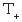</a> | **📂 檔名:** `insert-text.svg` ✨ **格式:** `Vector (SVG)` ⚖️ **大小:** `576.00B` 📅 **更新:** `2026-03-02`  🚀 **jsDelivr Markdown:** `` 🔗 **直接連結 (Url):** <code>https://cdn.jsdelivr.net/gh/barry028/materials@main/images/iCons/Pixel/Breeze/Actions%20/22/insert-text.svg</code> 📥 [檢視原始檔](insert-text.svg) |
|  | **📂 檔名:** `irc-channel-active.svg` ✨ **格式:** `Vector (SVG)` ⚖️ **大小:** `755.00B` 📅 **更新:** `2026-03-02`  🚀 **jsDelivr Markdown:** `` 🔗 **直接連結 (Url):** <code>https://cdn.jsdelivr.net/gh/barry028/materials@main/images/iCons/Pixel/Breeze/Actions%20/22/irc-channel-active.svg</code> 📥 [檢視原始檔](irc-channel-active.svg) |
|  | **📂 檔名:** `irc-channel-inactive.svg` ✨ **格式:** `Vector (SVG)` ⚖️ **大小:** `792.00B` 📅 **更新:** `2026-03-02`  🚀 **jsDelivr Markdown:** `` 🔗 **直接連結 (Url):** <code>https://cdn.jsdelivr.net/gh/barry028/materials@main/images/iCons/Pixel/Breeze/Actions%20/22/irc-channel-inactive.svg</code> 📥 [檢視原始檔](irc-channel-inactive.svg) |
|  | **📂 檔名:** `irc-operator.svg` ✨ **格式:** `Vector (SVG)` ⚖️ **大小:** `582.00B` 📅 **更新:** `2026-03-02`  🚀 **jsDelivr Markdown:** `` 🔗 **直接連結 (Url):** <code>https://cdn.jsdelivr.net/gh/barry028/materials@main/images/iCons/Pixel/Breeze/Actions%20/22/irc-operator.svg</code> 📥 [檢視原始檔](irc-operator.svg) |
|  | **📂 檔名:** `irc-remove-operator.svg` ✨ **格式:** `Vector (SVG)` ⚖️ **大小:** `474.00B` 📅 **更新:** `2026-03-02`  🚀 **jsDelivr Markdown:** `` 🔗 **直接連結 (Url):** <code>https://cdn.jsdelivr.net/gh/barry028/materials@main/images/iCons/Pixel/Breeze/Actions%20/22/irc-remove-operator.svg</code> 📥 [檢視原始檔](irc-remove-operator.svg) |
|  | **📂 檔名:** `irc-unvoice.svg` ✨ **格式:** `Vector (SVG)` ⚖️ **大小:** `575.00B` 📅 **更新:** `2026-03-02`  🚀 **jsDelivr Markdown:** `` 🔗 **直接連結 (Url):** <code>https://cdn.jsdelivr.net/gh/barry028/materials@main/images/iCons/Pixel/Breeze/Actions%20/22/irc-unvoice.svg</code> 📥 [檢視原始檔](irc-unvoice.svg) |
|  | **📂 檔名:** `irc-voice.svg` ✨ **格式:** `Vector (SVG)` ⚖️ **大小:** `1.34KB` 📅 **更新:** `2026-03-02`  🚀 **jsDelivr Markdown:** `` 🔗 **直接連結 (Url):** <code>https://cdn.jsdelivr.net/gh/barry028/materials@main/images/iCons/Pixel/Breeze/Actions%20/22/irc-voice.svg</code> 📥 [檢視原始檔](irc-voice.svg) |
|  | **📂 檔名:** `item.svg` ✨ **格式:** `Vector (SVG)` ⚖️ **大小:** `1.14KB` 📅 **更新:** `2026-03-02`  🚀 **jsDelivr Markdown:** `` 🔗 **直接連結 (Url):** <code>https://cdn.jsdelivr.net/gh/barry028/materials@main/images/iCons/Pixel/Breeze/Actions%20/22/item.svg</code> 📥 [檢視原始檔](item.svg) |
|  | **📂 檔名:** `join.svg` ✨ **格式:** `Vector (SVG)` ⚖️ **大小:** `1.15KB` 📅 **更新:** `2026-03-02`  🚀 **jsDelivr Markdown:** `` 🔗 **直接連結 (Url):** <code>https://cdn.jsdelivr.net/gh/barry028/materials@main/images/iCons/Pixel/Breeze/Actions%20/22/join.svg</code> 📥 [檢視原始檔](join.svg) |
|  | **📂 檔名:** `journal-new.svg` ✨ **格式:** `Vector (SVG)` ⚖️ **大小:** `634.00B` 📅 **更新:** `2026-03-02`  🚀 **jsDelivr Markdown:** `` 🔗 **直接連結 (Url):** <code>https://cdn.jsdelivr.net/gh/barry028/materials@main/images/iCons/Pixel/Breeze/Actions%20/22/journal-new.svg</code> 📥 [檢視原始檔](journal-new.svg) |
|  | **📂 檔名:** `junction.svg` ✨ **格式:** `Vector (SVG)` ⚖️ **大小:** `1.48KB` 📅 **更新:** `2026-03-02`  🚀 **jsDelivr Markdown:** `` 🔗 **直接連結 (Url):** <code>https://cdn.jsdelivr.net/gh/barry028/materials@main/images/iCons/Pixel/Breeze/Actions%20/22/junction.svg</code> 📥 [檢視原始檔](junction.svg) |
|  | **📂 檔名:** `kdenlive-add-clip.svg` ✨ **格式:** `Vector (SVG)` ⚖️ **大小:** `938.00B` 📅 **更新:** `2026-03-02`  🚀 **jsDelivr Markdown:** `` 🔗 **直接連結 (Url):** <code>https://cdn.jsdelivr.net/gh/barry028/materials@main/images/iCons/Pixel/Breeze/Actions%20/22/kdenlive-add-clip.svg</code> 📥 [檢視原始檔](kdenlive-add-clip.svg) |
|  | **📂 檔名:** `kdenlive-add-color-clip.svg` ✨ **格式:** `Vector (SVG)` ⚖️ **大小:** `714.00B` 📅 **更新:** `2026-03-02`  🚀 **jsDelivr Markdown:** `` 🔗 **直接連結 (Url):** <code>https://cdn.jsdelivr.net/gh/barry028/materials@main/images/iCons/Pixel/Breeze/Actions%20/22/kdenlive-add-color-clip.svg</code> 📥 [檢視原始檔](kdenlive-add-color-clip.svg) |
|  | **📂 檔名:** `kdenlive-align-none.svg` ✨ **格式:** `Vector (SVG)` ⚖️ **大小:** `568.00B` 📅 **更新:** `2026-03-02`  🚀 **jsDelivr Markdown:** `` 🔗 **直接連結 (Url):** <code>https://cdn.jsdelivr.net/gh/barry028/materials@main/images/iCons/Pixel/Breeze/Actions%20/22/kdenlive-align-none.svg</code> 📥 [檢視原始檔](kdenlive-align-none.svg) |
|  | **📂 檔名:** `kdenlive-custom-effect.svg` ✨ **格式:** `Vector (SVG)` ⚖️ **大小:** `616.00B` 📅 **更新:** `2026-03-02`  🚀 **jsDelivr Markdown:** `` 🔗 **直接連結 (Url):** <code>https://cdn.jsdelivr.net/gh/barry028/materials@main/images/iCons/Pixel/Breeze/Actions%20/22/kdenlive-custom-effect.svg</code> 📥 [檢視原始檔](kdenlive-custom-effect.svg) |
|  | **📂 檔名:** `kdenlive-hide-video.svg` ✨ **格式:** `Vector (SVG)` ⚖️ **大小:** `1.02KB` 📅 **更新:** `2026-03-02`  🚀 **jsDelivr Markdown:** `` 🔗 **直接連結 (Url):** <code>https://cdn.jsdelivr.net/gh/barry028/materials@main/images/iCons/Pixel/Breeze/Actions%20/22/kdenlive-hide-video.svg</code> 📥 [檢視原始檔](kdenlive-hide-video.svg) |
|  | **📂 檔名:** `kdenlive-insert-edit.svg` ✨ **格式:** `Vector (SVG)` ⚖️ **大小:** `639.00B` 📅 **更新:** `2026-03-02`  🚀 **jsDelivr Markdown:** `` 🔗 **直接連結 (Url):** <code>https://cdn.jsdelivr.net/gh/barry028/materials@main/images/iCons/Pixel/Breeze/Actions%20/22/kdenlive-insert-edit.svg</code> 📥 [檢視原始檔](kdenlive-insert-edit.svg) |
|  | **📂 檔名:** `kdenlive-insert-rect.svg` ✨ **格式:** `Vector (SVG)` ⚖️ **大小:** `580.00B` 📅 **更新:** `2026-03-02`  🚀 **jsDelivr Markdown:** `` 🔗 **直接連結 (Url):** <code>https://cdn.jsdelivr.net/gh/barry028/materials@main/images/iCons/Pixel/Breeze/Actions%20/22/kdenlive-insert-rect.svg</code> 📥 [檢視原始檔](kdenlive-insert-rect.svg) |
|  | **📂 檔名:** `kdenlive-insert-unicode.svg` ✨ **格式:** `Vector (SVG)` ⚖️ **大小:** `637.00B` 📅 **更新:** `2026-03-02`  🚀 **jsDelivr Markdown:** `` 🔗 **直接連結 (Url):** <code>https://cdn.jsdelivr.net/gh/barry028/materials@main/images/iCons/Pixel/Breeze/Actions%20/22/kdenlive-insert-unicode.svg</code> 📥 [檢視原始檔](kdenlive-insert-unicode.svg) |
|  | **📂 檔名:** `kdenlive-normal-edit.svg` ✨ **格式:** `Vector (SVG)` ⚖️ **大小:** `597.00B` 📅 **更新:** `2026-03-02`  🚀 **jsDelivr Markdown:** `` 🔗 **直接連結 (Url):** <code>https://cdn.jsdelivr.net/gh/barry028/materials@main/images/iCons/Pixel/Breeze/Actions%20/22/kdenlive-normal-edit.svg</code> 📥 [檢視原始檔](kdenlive-normal-edit.svg) |
|  | **📂 檔名:** `kdenlive-object-height.svg` ✨ **格式:** `Vector (SVG)` ⚖️ **大小:** `720.00B` 📅 **更新:** `2026-03-02`  🚀 **jsDelivr Markdown:** `` 🔗 **直接連結 (Url):** <code>https://cdn.jsdelivr.net/gh/barry028/materials@main/images/iCons/Pixel/Breeze/Actions%20/22/kdenlive-object-height.svg</code> 📥 [檢視原始檔](kdenlive-object-height.svg) |
|  | **📂 檔名:** `kdenlive-object-width.svg` ✨ **格式:** `Vector (SVG)` ⚖️ **大小:** `719.00B` 📅 **更新:** `2026-03-02`  🚀 **jsDelivr Markdown:** `` 🔗 **直接連結 (Url):** <code>https://cdn.jsdelivr.net/gh/barry028/materials@main/images/iCons/Pixel/Breeze/Actions%20/22/kdenlive-object-width.svg</code> 📥 [檢視原始檔](kdenlive-object-width.svg) |
|  | **📂 檔名:** `kdenlive-overwrite-edit.svg` ✨ **格式:** `Vector (SVG)` ⚖️ **大小:** `599.00B` 📅 **更新:** `2026-03-02`  🚀 **jsDelivr Markdown:** `` 🔗 **直接連結 (Url):** <code>https://cdn.jsdelivr.net/gh/barry028/materials@main/images/iCons/Pixel/Breeze/Actions%20/22/kdenlive-overwrite-edit.svg</code> 📥 [檢視原始檔](kdenlive-overwrite-edit.svg) |
|  | **📂 檔名:** `kdenlive-ripple.svg` ✨ **格式:** `Vector (SVG)` ⚖️ **大小:** `410.00B` 📅 **更新:** `2026-03-02`  🚀 **jsDelivr Markdown:** `` 🔗 **直接連結 (Url):** <code>https://cdn.jsdelivr.net/gh/barry028/materials@main/images/iCons/Pixel/Breeze/Actions%20/22/kdenlive-ripple.svg</code> 📥 [檢視原始檔](kdenlive-ripple.svg) |
|  | **📂 檔名:** `kdenlive-rolling.svg` ✨ **格式:** `Vector (SVG)` ⚖️ **大小:** `424.00B` 📅 **更新:** `2026-03-02`  🚀 **jsDelivr Markdown:** `` 🔗 **直接連結 (Url):** <code>https://cdn.jsdelivr.net/gh/barry028/materials@main/images/iCons/Pixel/Breeze/Actions%20/22/kdenlive-rolling.svg</code> 📥 [檢視原始檔](kdenlive-rolling.svg) |
|  | **📂 檔名:** `kdenlive-select-images.svg` ✨ **格式:** `Vector (SVG)` ⚖️ **大小:** `808.00B` 📅 **更新:** `2026-03-02`  🚀 **jsDelivr Markdown:** `` 🔗 **直接連結 (Url):** <code>https://cdn.jsdelivr.net/gh/barry028/materials@main/images/iCons/Pixel/Breeze/Actions%20/22/kdenlive-select-images.svg</code> 📥 [檢視原始檔](kdenlive-select-images.svg) |
|  | **📂 檔名:** `kdenlive-select-texts.svg` ✨ **格式:** `Vector (SVG)` ⚖️ **大小:** `560.00B` 📅 **更新:** `2026-03-02`  🚀 **jsDelivr Markdown:** `` 🔗 **直接連結 (Url):** <code>https://cdn.jsdelivr.net/gh/barry028/materials@main/images/iCons/Pixel/Breeze/Actions%20/22/kdenlive-select-texts.svg</code> 📥 [檢視原始檔](kdenlive-select-texts.svg) |
|  | **📂 檔名:** `kdenlive-show-markers.svg` ✨ **格式:** `Vector (SVG)` ⚖️ **大小:** `487.00B` 📅 **更新:** `2026-03-02`  🚀 **jsDelivr Markdown:** `` 🔗 **直接連結 (Url):** <code>https://cdn.jsdelivr.net/gh/barry028/materials@main/images/iCons/Pixel/Breeze/Actions%20/22/kdenlive-show-markers.svg</code> 📥 [檢視原始檔](kdenlive-show-markers.svg) |
|  | **📂 檔名:** `kdenlive-show-video.svg` ✨ **格式:** `Vector (SVG)` ⚖️ **大小:** `953.00B` 📅 **更新:** `2026-03-02`  🚀 **jsDelivr Markdown:** `` 🔗 **直接連結 (Url):** <code>https://cdn.jsdelivr.net/gh/barry028/materials@main/images/iCons/Pixel/Breeze/Actions%20/22/kdenlive-show-video.svg</code> 📥 [檢視原始檔](kdenlive-show-video.svg) |
|  | **📂 檔名:** `kdenlive-slide.svg` ✨ **格式:** `Vector (SVG)` ⚖️ **大小:** `582.00B` 📅 **更新:** `2026-03-02`  🚀 **jsDelivr Markdown:** `` 🔗 **直接連結 (Url):** <code>https://cdn.jsdelivr.net/gh/barry028/materials@main/images/iCons/Pixel/Breeze/Actions%20/22/kdenlive-slide.svg</code> 📥 [檢視原始檔](kdenlive-slide.svg) |
|  | **📂 檔名:** `kdenlive-slip.svg` ✨ **格式:** `Vector (SVG)` ⚖️ **大小:** `425.00B` 📅 **更新:** `2026-03-02`  🚀 **jsDelivr Markdown:** `` 🔗 **直接連結 (Url):** <code>https://cdn.jsdelivr.net/gh/barry028/materials@main/images/iCons/Pixel/Breeze/Actions%20/22/kdenlive-slip.svg</code> 📥 [檢視原始檔](kdenlive-slip.svg) |
|  | **📂 檔名:** `kdenlive-split-audio.svg` ✨ **格式:** `Vector (SVG)` ⚖️ **大小:** `1.20KB` 📅 **更新:** `2026-03-02`  🚀 **jsDelivr Markdown:** `` 🔗 **直接連結 (Url):** <code>https://cdn.jsdelivr.net/gh/barry028/materials@main/images/iCons/Pixel/Breeze/Actions%20/22/kdenlive-split-audio.svg</code> 📥 [檢視原始檔](kdenlive-split-audio.svg) |
|  | **📂 檔名:** `kdenlive-track_has_effect.svg` ✨ **格式:** `Vector (SVG)` ⚖️ **大小:** `701.00B` 📅 **更新:** `2026-03-02`  🚀 **jsDelivr Markdown:** `` 🔗 **直接連結 (Url):** <code>https://cdn.jsdelivr.net/gh/barry028/materials@main/images/iCons/Pixel/Breeze/Actions%20/22/kdenlive-track_has_effect.svg</code> 📥 [檢視原始檔](kdenlive-track_has_effect.svg) |
|  | **📂 檔名:** `key-enter.svg` ✨ **格式:** `Vector (SVG)` ⚖️ **大小:** `575.00B` 📅 **更新:** `2026-03-02`  🚀 **jsDelivr Markdown:** `` 🔗 **直接連結 (Url):** <code>https://cdn.jsdelivr.net/gh/barry028/materials@main/images/iCons/Pixel/Breeze/Actions%20/22/key-enter.svg</code> 📥 [檢視原始檔](key-enter.svg) |
|  | **📂 檔名:** `keyframe-add.svg` ✨ **格式:** `Vector (SVG)` ⚖️ **大小:** `845.00B` 📅 **更新:** `2026-03-02`  🚀 **jsDelivr Markdown:** `` 🔗 **直接連結 (Url):** <code>https://cdn.jsdelivr.net/gh/barry028/materials@main/images/iCons/Pixel/Breeze/Actions%20/22/keyframe-add.svg</code> 📥 [檢視原始檔](keyframe-add.svg) |
|  | **📂 檔名:** `keyframe-disable.svg` ✨ **格式:** `Vector (SVG)` ⚖️ **大小:** `1.18KB` 📅 **更新:** `2026-03-02`  🚀 **jsDelivr Markdown:** `` 🔗 **直接連結 (Url):** <code>https://cdn.jsdelivr.net/gh/barry028/materials@main/images/iCons/Pixel/Breeze/Actions%20/22/keyframe-disable.svg</code> 📥 [檢視原始檔](keyframe-disable.svg) |
|  | **📂 檔名:** `keyframe-duplicate.svg` ✨ **格式:** `Vector (SVG)` ⚖️ **大小:** `1.32KB` 📅 **更新:** `2026-03-02`  🚀 **jsDelivr Markdown:** `` 🔗 **直接連結 (Url):** <code>https://cdn.jsdelivr.net/gh/barry028/materials@main/images/iCons/Pixel/Breeze/Actions%20/22/keyframe-duplicate.svg</code> 📥 [檢視原始檔](keyframe-duplicate.svg) |
|  | **📂 檔名:** `keyframe-next.svg` ✨ **格式:** `Vector (SVG)` ⚖️ **大小:** `853.00B` 📅 **更新:** `2026-03-02`  🚀 **jsDelivr Markdown:** `` 🔗 **直接連結 (Url):** <code>https://cdn.jsdelivr.net/gh/barry028/materials@main/images/iCons/Pixel/Breeze/Actions%20/22/keyframe-next.svg</code> 📥 [檢視原始檔](keyframe-next.svg) |
|  | **📂 檔名:** `keyframe-previous.svg` ✨ **格式:** `Vector (SVG)` ⚖️ **大小:** `826.00B` 📅 **更新:** `2026-03-02`  🚀 **jsDelivr Markdown:** `` 🔗 **直接連結 (Url):** <code>https://cdn.jsdelivr.net/gh/barry028/materials@main/images/iCons/Pixel/Breeze/Actions%20/22/keyframe-previous.svg</code> 📥 [檢視原始檔](keyframe-previous.svg) |
|  | **📂 檔名:** `keyframe-record.svg` ✨ **格式:** `Vector (SVG)` ⚖️ **大小:** `1.21KB` 📅 **更新:** `2026-03-02`  🚀 **jsDelivr Markdown:** `` 🔗 **直接連結 (Url):** <code>https://cdn.jsdelivr.net/gh/barry028/materials@main/images/iCons/Pixel/Breeze/Actions%20/22/keyframe-record.svg</code> 📥 [檢視原始檔](keyframe-record.svg) |
|  | **📂 檔名:** `keyframe-remove.svg` ✨ **格式:** `Vector (SVG)` ⚖️ **大小:** `826.00B` 📅 **更新:** `2026-03-02`  🚀 **jsDelivr Markdown:** `` 🔗 **直接連結 (Url):** <code>https://cdn.jsdelivr.net/gh/barry028/materials@main/images/iCons/Pixel/Breeze/Actions%20/22/keyframe-remove.svg</code> 📥 [檢視原始檔](keyframe-remove.svg) |
|  | **📂 檔名:** `keyframe.svg` ✨ **格式:** `Vector (SVG)` ⚖️ **大小:** `860.00B` 📅 **更新:** `2026-03-02`  🚀 **jsDelivr Markdown:** `` 🔗 **直接連結 (Url):** <code>https://cdn.jsdelivr.net/gh/barry028/materials@main/images/iCons/Pixel/Breeze/Actions%20/22/keyframe.svg</code> 📥 [檢視原始檔](keyframe.svg) |
|  | **📂 檔名:** `kmouth-phrase-new.svg` ✨ **格式:** `Vector (SVG)` ⚖️ **大小:** `432.00B` 📅 **更新:** `2026-03-02`  🚀 **jsDelivr Markdown:** `` 🔗 **直接連結 (Url):** <code>https://cdn.jsdelivr.net/gh/barry028/materials@main/images/iCons/Pixel/Breeze/Actions%20/22/kmouth-phrase-new.svg</code> 📥 [檢視原始檔](kmouth-phrase-new.svg) |
|  | **📂 檔名:** `kmouth-phrasebook.svg` ✨ **格式:** `Vector (SVG)` ⚖️ **大小:** `550.00B` 📅 **更新:** `2026-03-02`  🚀 **jsDelivr Markdown:** `` 🔗 **直接連結 (Url):** <code>https://cdn.jsdelivr.net/gh/barry028/materials@main/images/iCons/Pixel/Breeze/Actions%20/22/kmouth-phrasebook.svg</code> 📥 [檢視原始檔](kmouth-phrasebook.svg) |
|  | **📂 檔名:** `kmouth-phresebook-new.svg` ✨ **格式:** `Vector (SVG)` ⚖️ **大小:** `628.00B` 📅 **更新:** `2026-03-02`  🚀 **jsDelivr Markdown:** `` 🔗 **直接連結 (Url):** <code>https://cdn.jsdelivr.net/gh/barry028/materials@main/images/iCons/Pixel/Breeze/Actions%20/22/kmouth-phresebook-new.svg</code> 📥 [檢視原始檔](kmouth-phresebook-new.svg) |
|  | **📂 檔名:** `know.svg` ✨ **格式:** `Vector (SVG)` ⚖️ **大小:** `1.66KB` 📅 **更新:** `2026-03-02`  🚀 **jsDelivr Markdown:** `` 🔗 **直接連結 (Url):** <code>https://cdn.jsdelivr.net/gh/barry028/materials@main/images/iCons/Pixel/Breeze/Actions%20/22/know.svg</code> 📥 [檢視原始檔](know.svg) |
|  | **📂 檔名:** `kontact-import-wizard.svg` ✨ **格式:** `Vector (SVG)` ⚖️ **大小:** `593.00B` 📅 **更新:** `2026-03-02`  🚀 **jsDelivr Markdown:** `` 🔗 **直接連結 (Url):** <code>https://cdn.jsdelivr.net/gh/barry028/materials@main/images/iCons/Pixel/Breeze/Actions%20/22/kontact-import-wizard.svg</code> 📥 [檢視原始檔](kontact-import-wizard.svg) |
|  | **📂 檔名:** `kr_combine.svg` ✨ **格式:** `Vector (SVG)` ⚖️ **大小:** `512.00B` 📅 **更新:** `2026-03-02`  🚀 **jsDelivr Markdown:** `` 🔗 **直接連結 (Url):** <code>https://cdn.jsdelivr.net/gh/barry028/materials@main/images/iCons/Pixel/Breeze/Actions%20/22/kr_combine.svg</code> 📥 [檢視原始檔](kr_combine.svg) |
|  | **📂 檔名:** `kr_comparedirs.svg` ✨ **格式:** `Vector (SVG)` ⚖️ **大小:** `1.02KB` 📅 **更新:** `2026-03-02`  🚀 **jsDelivr Markdown:** `` 🔗 **直接連結 (Url):** <code>https://cdn.jsdelivr.net/gh/barry028/materials@main/images/iCons/Pixel/Breeze/Actions%20/22/kr_comparedirs.svg</code> 📥 [檢視原始檔](kr_comparedirs.svg) |
|  | **📂 檔名:** `kr_diskusage.svg` ✨ **格式:** `Vector (SVG)` ⚖️ **大小:** `1.50KB` 📅 **更新:** `2026-03-02`  🚀 **jsDelivr Markdown:** `` 🔗 **直接連結 (Url):** <code>https://cdn.jsdelivr.net/gh/barry028/materials@main/images/iCons/Pixel/Breeze/Actions%20/22/kr_diskusage.svg</code> 📥 [檢視原始檔](kr_diskusage.svg) |
|  | **📂 檔名:** `kr_mountman.svg` ✨ **格式:** `Vector (SVG)` ⚖️ **大小:** `929.00B` 📅 **更新:** `2026-03-02`  🚀 **jsDelivr Markdown:** `` 🔗 **直接連結 (Url):** <code>https://cdn.jsdelivr.net/gh/barry028/materials@main/images/iCons/Pixel/Breeze/Actions%20/22/kr_mountman.svg</code> 📥 [檢視原始檔](kr_mountman.svg) |
|  | **📂 檔名:** `kr_syncbrowse_off.svg` ✨ **格式:** `Vector (SVG)` ⚖️ **大小:** `1.22KB` 📅 **更新:** `2026-03-02`  🚀 **jsDelivr Markdown:** `` 🔗 **直接連結 (Url):** <code>https://cdn.jsdelivr.net/gh/barry028/materials@main/images/iCons/Pixel/Breeze/Actions%20/22/kr_syncbrowse_off.svg</code> 📥 [檢視原始檔](kr_syncbrowse_off.svg) |
|  | **📂 檔名:** `kr_syncbrowse_on.svg` ✨ **格式:** `Vector (SVG)` ⚖️ **大小:** `1.22KB` 📅 **更新:** `2026-03-02`  🚀 **jsDelivr Markdown:** `` 🔗 **直接連結 (Url):** <code>https://cdn.jsdelivr.net/gh/barry028/materials@main/images/iCons/Pixel/Breeze/Actions%20/22/kr_syncbrowse_on.svg</code> 📥 [檢視原始檔](kr_syncbrowse_on.svg) |
|  | **📂 檔名:** `kr_unselect.svg` ✨ **格式:** `Vector (SVG)` ⚖️ **大小:** `752.00B` 📅 **更新:** `2026-03-02`  🚀 **jsDelivr Markdown:** `` 🔗 **直接連結 (Url):** <code>https://cdn.jsdelivr.net/gh/barry028/materials@main/images/iCons/Pixel/Breeze/Actions%20/22/kr_unselect.svg</code> 📥 [檢視原始檔](kr_unselect.svg) |
|  | **📂 檔名:** `kstars_cbound.svg` ✨ **格式:** `Vector (SVG)` ⚖️ **大小:** `2.21KB` 📅 **更新:** `2026-03-02`  🚀 **jsDelivr Markdown:** `` 🔗 **直接連結 (Url):** <code>https://cdn.jsdelivr.net/gh/barry028/materials@main/images/iCons/Pixel/Breeze/Actions%20/22/kstars_cbound.svg</code> 📥 [檢視原始檔](kstars_cbound.svg) |
|  | **📂 檔名:** `kstars_clines.svg` ✨ **格式:** `Vector (SVG)` ⚖️ **大小:** `682.00B` 📅 **更新:** `2026-03-02`  🚀 **jsDelivr Markdown:** `` 🔗 **直接連結 (Url):** <code>https://cdn.jsdelivr.net/gh/barry028/materials@main/images/iCons/Pixel/Breeze/Actions%20/22/kstars_clines.svg</code> 📥 [檢視原始檔](kstars_clines.svg) |
|  | **📂 檔名:** `kstars_cnames.svg` ✨ **格式:** `Vector (SVG)` ⚖️ **大小:** `736.00B` 📅 **更新:** `2026-03-02`  🚀 **jsDelivr Markdown:** `` 🔗 **直接連結 (Url):** <code>https://cdn.jsdelivr.net/gh/barry028/materials@main/images/iCons/Pixel/Breeze/Actions%20/22/kstars_cnames.svg</code> 📥 [檢視原始檔](kstars_cnames.svg) |
|  | **📂 檔名:** `kstars_constellationart.svg` ✨ **格式:** `Vector (SVG)` ⚖️ **大小:** `2.32KB` 📅 **更新:** `2026-03-02`  🚀 **jsDelivr Markdown:** `` 🔗 **直接連結 (Url):** <code>https://cdn.jsdelivr.net/gh/barry028/materials@main/images/iCons/Pixel/Breeze/Actions%20/22/kstars_constellationart.svg</code> 📥 [檢視原始檔](kstars_constellationart.svg) |
|  | **📂 檔名:** `kstars_deepsky.svg` ✨ **格式:** `Vector (SVG)` ⚖️ **大小:** `779.00B` 📅 **更新:** `2026-03-02`  🚀 **jsDelivr Markdown:** `` 🔗 **直接連結 (Url):** <code>https://cdn.jsdelivr.net/gh/barry028/materials@main/images/iCons/Pixel/Breeze/Actions%20/22/kstars_deepsky.svg</code> 📥 [檢視原始檔](kstars_deepsky.svg) |
|  | **📂 檔名:** `kstars_ekos.svg` ✨ **格式:** `Vector (SVG)` ⚖️ **大小:** `1.37KB` 📅 **更新:** `2026-03-02`  🚀 **jsDelivr Markdown:** `` 🔗 **直接連結 (Url):** <code>https://cdn.jsdelivr.net/gh/barry028/materials@main/images/iCons/Pixel/Breeze/Actions%20/22/kstars_ekos.svg</code> 📥 [檢視原始檔](kstars_ekos.svg) |
|  | **📂 檔名:** `kstars_fitsviewer.svg` ✨ **格式:** `Vector (SVG)` ⚖️ **大小:** `1.25KB` 📅 **更新:** `2026-03-02`  🚀 **jsDelivr Markdown:** `` 🔗 **直接連結 (Url):** <code>https://cdn.jsdelivr.net/gh/barry028/materials@main/images/iCons/Pixel/Breeze/Actions%20/22/kstars_fitsviewer.svg</code> 📥 [檢視原始檔](kstars_fitsviewer.svg) |
|  | **📂 檔名:** `kstars_grid.svg` ✨ **格式:** `Vector (SVG)` ⚖️ **大小:** `2.27KB` 📅 **更新:** `2026-03-02`  🚀 **jsDelivr Markdown:** `` 🔗 **直接連結 (Url):** <code>https://cdn.jsdelivr.net/gh/barry028/materials@main/images/iCons/Pixel/Breeze/Actions%20/22/kstars_grid.svg</code> 📥 [檢視原始檔](kstars_grid.svg) |
|  | **📂 檔名:** `kstars_hgrid.svg` ✨ **格式:** `Vector (SVG)` ⚖️ **大小:** `2.14KB` 📅 **更新:** `2026-03-02`  🚀 **jsDelivr Markdown:** `` 🔗 **直接連結 (Url):** <code>https://cdn.jsdelivr.net/gh/barry028/materials@main/images/iCons/Pixel/Breeze/Actions%20/22/kstars_hgrid.svg</code> 📥 [檢視原始檔](kstars_hgrid.svg) |
|  | **📂 檔名:** `kstars_horizon.svg` ✨ **格式:** `Vector (SVG)` ⚖️ **大小:** `923.00B` 📅 **更新:** `2026-03-02`  🚀 **jsDelivr Markdown:** `` 🔗 **直接連結 (Url):** <code>https://cdn.jsdelivr.net/gh/barry028/materials@main/images/iCons/Pixel/Breeze/Actions%20/22/kstars_horizon.svg</code> 📥 [檢視原始檔](kstars_horizon.svg) |
|  | **📂 檔名:** `kstars_indi.svg` ✨ **格式:** `Vector (SVG)` ⚖️ **大小:** `2.55KB` 📅 **更新:** `2026-03-02`  🚀 **jsDelivr Markdown:** `` 🔗 **直接連結 (Url):** <code>https://cdn.jsdelivr.net/gh/barry028/materials@main/images/iCons/Pixel/Breeze/Actions%20/22/kstars_indi.svg</code> 📥 [檢視原始檔](kstars_indi.svg) |
|  | **📂 檔名:** `kstars_mw.svg` ✨ **格式:** `Vector (SVG)` ⚖️ **大小:** `1.18KB` 📅 **更新:** `2026-03-02`  🚀 **jsDelivr Markdown:** `` 🔗 **直接連結 (Url):** <code>https://cdn.jsdelivr.net/gh/barry028/materials@main/images/iCons/Pixel/Breeze/Actions%20/22/kstars_mw.svg</code> 📥 [檢視原始檔](kstars_mw.svg) |
|  | **📂 檔名:** `kstars_satellites.svg` ✨ **格式:** `Vector (SVG)` ⚖️ **大小:** `1.55KB` 📅 **更新:** `2026-03-02`  🚀 **jsDelivr Markdown:** `` 🔗 **直接連結 (Url):** <code>https://cdn.jsdelivr.net/gh/barry028/materials@main/images/iCons/Pixel/Breeze/Actions%20/22/kstars_satellites.svg</code> 📥 [檢視原始檔](kstars_satellites.svg) |
|  | **📂 檔名:** `kstars_solarsystem.svg` ✨ **格式:** `Vector (SVG)` ⚖️ **大小:** `1.14KB` 📅 **更新:** `2026-03-02`  🚀 **jsDelivr Markdown:** `` 🔗 **直接連結 (Url):** <code>https://cdn.jsdelivr.net/gh/barry028/materials@main/images/iCons/Pixel/Breeze/Actions%20/22/kstars_solarsystem.svg</code> 📥 [檢視原始檔](kstars_solarsystem.svg) |
|  | **📂 檔名:** `kstars_stars.svg` ✨ **格式:** `Vector (SVG)` ⚖️ **大小:** `1.11KB` 📅 **更新:** `2026-03-02`  🚀 **jsDelivr Markdown:** `` 🔗 **直接連結 (Url):** <code>https://cdn.jsdelivr.net/gh/barry028/materials@main/images/iCons/Pixel/Breeze/Actions%20/22/kstars_stars.svg</code> 📥 [檢視原始檔](kstars_stars.svg) |
|  | **📂 檔名:** `kstars_supernovae.svg` ✨ **格式:** `Vector (SVG)` ⚖️ **大小:** `2.20KB` 📅 **更新:** `2026-03-02`  🚀 **jsDelivr Markdown:** `` 🔗 **直接連結 (Url):** <code>https://cdn.jsdelivr.net/gh/barry028/materials@main/images/iCons/Pixel/Breeze/Actions%20/22/kstars_supernovae.svg</code> 📥 [檢視原始檔](kstars_supernovae.svg) |
|  | **📂 檔名:** `kt-add-feeds.svg` ✨ **格式:** `Vector (SVG)` ⚖️ **大小:** `817.00B` 📅 **更新:** `2026-03-02`  🚀 **jsDelivr Markdown:** `` 🔗 **直接連結 (Url):** <code>https://cdn.jsdelivr.net/gh/barry028/materials@main/images/iCons/Pixel/Breeze/Actions%20/22/kt-add-feeds.svg</code> 📥 [檢視原始檔](kt-add-feeds.svg) |
|  | **📂 檔名:** `kt-add-filters.svg` ✨ **格式:** `Vector (SVG)` ⚖️ **大小:** `795.00B` 📅 **更新:** `2026-03-02`  🚀 **jsDelivr Markdown:** `` 🔗 **直接連結 (Url):** <code>https://cdn.jsdelivr.net/gh/barry028/materials@main/images/iCons/Pixel/Breeze/Actions%20/22/kt-add-filters.svg</code> 📥 [檢視原始檔](kt-add-filters.svg) |
|  | **📂 檔名:** `kt-chunks.svg` ✨ **格式:** `Vector (SVG)` ⚖️ **大小:** `563.00B` 📅 **更新:** `2026-03-02`  🚀 **jsDelivr Markdown:** `` 🔗 **直接連結 (Url):** <code>https://cdn.jsdelivr.net/gh/barry028/materials@main/images/iCons/Pixel/Breeze/Actions%20/22/kt-chunks.svg</code> 📥 [檢視原始檔](kt-chunks.svg) |
|  | **📂 檔名:** `kt-magnet.svg` ✨ **格式:** `Vector (SVG)` ⚖️ **大小:** `560.00B` 📅 **更新:** `2026-03-02`  🚀 **jsDelivr Markdown:** `` 🔗 **直接連結 (Url):** <code>https://cdn.jsdelivr.net/gh/barry028/materials@main/images/iCons/Pixel/Breeze/Actions%20/22/kt-magnet.svg</code> 📥 [檢視原始檔](kt-magnet.svg) |
|  | **📂 檔名:** `kt-queue-manager.svg` ✨ **格式:** `Vector (SVG)` ⚖️ **大小:** `1012.00B` 📅 **更新:** `2026-03-02`  🚀 **jsDelivr Markdown:** `` 🔗 **直接連結 (Url):** <code>https://cdn.jsdelivr.net/gh/barry028/materials@main/images/iCons/Pixel/Breeze/Actions%20/22/kt-queue-manager.svg</code> 📥 [檢視原始檔](kt-queue-manager.svg) |
|  | **📂 檔名:** `kt-remove-feeds.svg` ✨ **格式:** `Vector (SVG)` ⚖️ **大小:** `834.00B` 📅 **更新:** `2026-03-02`  🚀 **jsDelivr Markdown:** `` 🔗 **直接連結 (Url):** <code>https://cdn.jsdelivr.net/gh/barry028/materials@main/images/iCons/Pixel/Breeze/Actions%20/22/kt-remove-feeds.svg</code> 📥 [檢視原始檔](kt-remove-feeds.svg) |
|  | **📂 檔名:** `kt-remove-filters.svg` ✨ **格式:** `Vector (SVG)` ⚖️ **大小:** `812.00B` 📅 **更新:** `2026-03-02`  🚀 **jsDelivr Markdown:** `` 🔗 **直接連結 (Url):** <code>https://cdn.jsdelivr.net/gh/barry028/materials@main/images/iCons/Pixel/Breeze/Actions%20/22/kt-remove-filters.svg</code> 📥 [檢視原始檔](kt-remove-filters.svg) |
|  | **📂 檔名:** `kt-set-max-upload-speed.svg` ✨ **格式:** `Vector (SVG)` ⚖️ **大小:** `589.00B` 📅 **更新:** `2026-03-02`  🚀 **jsDelivr Markdown:** `` 🔗 **直接連結 (Url):** <code>https://cdn.jsdelivr.net/gh/barry028/materials@main/images/iCons/Pixel/Breeze/Actions%20/22/kt-set-max-upload-speed.svg</code> 📥 [檢視原始檔](kt-set-max-upload-speed.svg) |
|  | **📂 檔名:** `kt-start-all.svg` ✨ **格式:** `Vector (SVG)` ⚖️ **大小:** `869.00B` 📅 **更新:** `2026-03-02`  🚀 **jsDelivr Markdown:** `` 🔗 **直接連結 (Url):** <code>https://cdn.jsdelivr.net/gh/barry028/materials@main/images/iCons/Pixel/Breeze/Actions%20/22/kt-start-all.svg</code> 📥 [檢視原始檔](kt-start-all.svg) |
|  | **📂 檔名:** `kt-stop-all.svg` ✨ **格式:** `Vector (SVG)` ⚖️ **大小:** `876.00B` 📅 **更新:** `2026-03-02`  🚀 **jsDelivr Markdown:** `` 🔗 **直接連結 (Url):** <code>https://cdn.jsdelivr.net/gh/barry028/materials@main/images/iCons/Pixel/Breeze/Actions%20/22/kt-stop-all.svg</code> 📥 [檢視原始檔](kt-stop-all.svg) |
| <a href="labplot-1x-zoom.svg">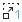</a> | **📂 檔名:** `labplot-1x-zoom.svg` ✨ **格式:** `Vector (SVG)` ⚖️ **大小:** `915.00B` 📅 **更新:** `2026-03-02`  🚀 **jsDelivr Markdown:** `` 🔗 **直接連結 (Url):** <code>https://cdn.jsdelivr.net/gh/barry028/materials@main/images/iCons/Pixel/Breeze/Actions%20/22/labplot-1x-zoom.svg</code> 📥 [檢視原始檔](labplot-1x-zoom.svg) |
|  | **📂 檔名:** `labplot-2x-zoom.svg` ✨ **格式:** `Vector (SVG)` ⚖️ **大小:** `1.38KB` 📅 **更新:** `2026-03-02`  🚀 **jsDelivr Markdown:** `` 🔗 **直接連結 (Url):** <code>https://cdn.jsdelivr.net/gh/barry028/materials@main/images/iCons/Pixel/Breeze/Actions%20/22/labplot-2x-zoom.svg</code> 📥 [檢視原始檔](labplot-2x-zoom.svg) |
| <a href="labplot-3x-zoom.svg">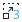</a> | **📂 檔名:** `labplot-3x-zoom.svg` ✨ **格式:** `Vector (SVG)` ⚖️ **大小:** `1.64KB` 📅 **更新:** `2026-03-02`  🚀 **jsDelivr Markdown:** `` 🔗 **直接連結 (Url):** <code>https://cdn.jsdelivr.net/gh/barry028/materials@main/images/iCons/Pixel/Breeze/Actions%20/22/labplot-3x-zoom.svg</code> 📥 [檢視原始檔](labplot-3x-zoom.svg) |
|  | **📂 檔名:** `labplot-4x-zoom.svg` ✨ **格式:** `Vector (SVG)` ⚖️ **大小:** `1.12KB` 📅 **更新:** `2026-03-02`  🚀 **jsDelivr Markdown:** `` 🔗 **直接連結 (Url):** <code>https://cdn.jsdelivr.net/gh/barry028/materials@main/images/iCons/Pixel/Breeze/Actions%20/22/labplot-4x-zoom.svg</code> 📥 [檢視原始檔](labplot-4x-zoom.svg) |
|  | **📂 檔名:** `labplot-5x-zoom.svg` ✨ **格式:** `Vector (SVG)` ⚖️ **大小:** `1.53KB` 📅 **更新:** `2026-03-02`  🚀 **jsDelivr Markdown:** `` 🔗 **直接連結 (Url):** <code>https://cdn.jsdelivr.net/gh/barry028/materials@main/images/iCons/Pixel/Breeze/Actions%20/22/labplot-5x-zoom.svg</code> 📥 [檢視原始檔](labplot-5x-zoom.svg) |
|  | **📂 檔名:** `labplot-TeX-logo.svg` ✨ **格式:** `Vector (SVG)` ⚖️ **大小:** `847.00B` 📅 **更新:** `2026-03-02`  🚀 **jsDelivr Markdown:** `` 🔗 **直接連結 (Url):** <code>https://cdn.jsdelivr.net/gh/barry028/materials@main/images/iCons/Pixel/Breeze/Actions%20/22/labplot-TeX-logo.svg</code> 📥 [檢視原始檔](labplot-TeX-logo.svg) |
| <a href="labplot-axis-horizontal.svg">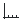</a> | **📂 檔名:** `labplot-axis-horizontal.svg` ✨ **格式:** `Vector (SVG)` ⚖️ **大小:** `526.00B` 📅 **更新:** `2026-03-02`  🚀 **jsDelivr Markdown:** `` 🔗 **直接連結 (Url):** <code>https://cdn.jsdelivr.net/gh/barry028/materials@main/images/iCons/Pixel/Breeze/Actions%20/22/labplot-axis-horizontal.svg</code> 📥 [檢視原始檔](labplot-axis-horizontal.svg) |
|  | **📂 檔名:** `labplot-axis-vertical.svg` ✨ **格式:** `Vector (SVG)` ⚖️ **大小:** `620.00B` 📅 **更新:** `2026-03-02`  🚀 **jsDelivr Markdown:** `` 🔗 **直接連結 (Url):** <code>https://cdn.jsdelivr.net/gh/barry028/materials@main/images/iCons/Pixel/Breeze/Actions%20/22/labplot-axis-vertical.svg</code> 📥 [檢視原始檔](labplot-axis-vertical.svg) |
|  | **📂 檔名:** `labplot-editbreaklayout.svg` ✨ **格式:** `Vector (SVG)` ⚖️ **大小:** `1.25KB` 📅 **更新:** `2026-03-02`  🚀 **jsDelivr Markdown:** `` 🔗 **直接連結 (Url):** <code>https://cdn.jsdelivr.net/gh/barry028/materials@main/images/iCons/Pixel/Breeze/Actions%20/22/labplot-editbreaklayout.svg</code> 📥 [檢視原始檔](labplot-editbreaklayout.svg) |
|  | **📂 檔名:** `labplot-editgrid.svg` ✨ **格式:** `Vector (SVG)` ⚖️ **大小:** `849.00B` 📅 **更新:** `2026-03-02`  🚀 **jsDelivr Markdown:** `` 🔗 **直接連結 (Url):** <code>https://cdn.jsdelivr.net/gh/barry028/materials@main/images/iCons/Pixel/Breeze/Actions%20/22/labplot-editgrid.svg</code> 📥 [檢視原始檔](labplot-editgrid.svg) |
|  | **📂 檔名:** `labplot-edithlayout.svg` ✨ **格式:** `Vector (SVG)` ⚖️ **大小:** `798.00B` 📅 **更新:** `2026-03-02`  🚀 **jsDelivr Markdown:** `` 🔗 **直接連結 (Url):** <code>https://cdn.jsdelivr.net/gh/barry028/materials@main/images/iCons/Pixel/Breeze/Actions%20/22/labplot-edithlayout.svg</code> 📥 [檢視原始檔](labplot-edithlayout.svg) |
|  | **📂 檔名:** `labplot-editvlayout.svg` ✨ **格式:** `Vector (SVG)` ⚖️ **大小:** `798.00B` 📅 **更新:** `2026-03-02`  🚀 **jsDelivr Markdown:** `` 🔗 **直接連結 (Url):** <code>https://cdn.jsdelivr.net/gh/barry028/materials@main/images/iCons/Pixel/Breeze/Actions%20/22/labplot-editvlayout.svg</code> 📥 [檢視原始檔](labplot-editvlayout.svg) |
|  | **📂 檔名:** `labplot-matrix-new.svg` ✨ **格式:** `Vector (SVG)` ⚖️ **大小:** `821.00B` 📅 **更新:** `2026-03-02`  🚀 **jsDelivr Markdown:** `` 🔗 **直接連結 (Url):** <code>https://cdn.jsdelivr.net/gh/barry028/materials@main/images/iCons/Pixel/Breeze/Actions%20/22/labplot-matrix-new.svg</code> 📥 [檢視原始檔](labplot-matrix-new.svg) |
|  | **📂 檔名:** `labplot-matrix.svg` ✨ **格式:** `Vector (SVG)` ⚖️ **大小:** `985.00B` 📅 **更新:** `2026-03-02`  🚀 **jsDelivr Markdown:** `` 🔗 **直接連結 (Url):** <code>https://cdn.jsdelivr.net/gh/barry028/materials@main/images/iCons/Pixel/Breeze/Actions%20/22/labplot-matrix.svg</code> 📥 [檢視原始檔](labplot-matrix.svg) |
|  | **📂 檔名:** `labplot-plot-axis-points.svg` ✨ **格式:** `Vector (SVG)` ⚖️ **大小:** `790.00B` 📅 **更新:** `2026-03-02`  🚀 **jsDelivr Markdown:** `` 🔗 **直接連結 (Url):** <code>https://cdn.jsdelivr.net/gh/barry028/materials@main/images/iCons/Pixel/Breeze/Actions%20/22/labplot-plot-axis-points.svg</code> 📥 [檢視原始檔](labplot-plot-axis-points.svg) |
| <a href="labplot-shift-down-y.svg">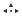</a> | **📂 檔名:** `labplot-shift-down-y.svg` ✨ **格式:** `Vector (SVG)` ⚖️ **大小:** `473.00B` 📅 **更新:** `2026-03-02`  🚀 **jsDelivr Markdown:** `` 🔗 **直接連結 (Url):** <code>https://cdn.jsdelivr.net/gh/barry028/materials@main/images/iCons/Pixel/Breeze/Actions%20/22/labplot-shift-down-y.svg</code> 📥 [檢視原始檔](labplot-shift-down-y.svg) |
| <a href="labplot-shift-left-x.svg">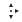</a> | **📂 檔名:** `labplot-shift-left-x.svg` ✨ **格式:** `Vector (SVG)` ⚖️ **大小:** `472.00B` 📅 **更新:** `2026-03-02`  🚀 **jsDelivr Markdown:** `` 🔗 **直接連結 (Url):** <code>https://cdn.jsdelivr.net/gh/barry028/materials@main/images/iCons/Pixel/Breeze/Actions%20/22/labplot-shift-left-x.svg</code> 📥 [檢視原始檔](labplot-shift-left-x.svg) |
| <a href="labplot-shift-right-x.svg">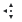</a> | **📂 檔名:** `labplot-shift-right-x.svg` ✨ **格式:** `Vector (SVG)` ⚖️ **大小:** `474.00B` 📅 **更新:** `2026-03-02`  🚀 **jsDelivr Markdown:** `` 🔗 **直接連結 (Url):** <code>https://cdn.jsdelivr.net/gh/barry028/materials@main/images/iCons/Pixel/Breeze/Actions%20/22/labplot-shift-right-x.svg</code> 📥 [檢視原始檔](labplot-shift-right-x.svg) |
| <a href="labplot-shift-up-y.svg">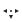</a> | **📂 檔名:** `labplot-shift-up-y.svg` ✨ **格式:** `Vector (SVG)` ⚖️ **大小:** `471.00B` 📅 **更新:** `2026-03-02`  🚀 **jsDelivr Markdown:** `` 🔗 **直接連結 (Url):** <code>https://cdn.jsdelivr.net/gh/barry028/materials@main/images/iCons/Pixel/Breeze/Actions%20/22/labplot-shift-up-y.svg</code> 📥 [檢視原始檔](labplot-shift-up-y.svg) |
|  | **📂 檔名:** `labplot-workbook-new.svg` ✨ **格式:** `Vector (SVG)` ⚖️ **大小:** `998.00B` 📅 **更新:** `2026-03-02`  🚀 **jsDelivr Markdown:** `` 🔗 **直接連結 (Url):** <code>https://cdn.jsdelivr.net/gh/barry028/materials@main/images/iCons/Pixel/Breeze/Actions%20/22/labplot-workbook-new.svg</code> 📥 [檢視原始檔](labplot-workbook-new.svg) |
|  | **📂 檔名:** `labplot-workbook.svg` ✨ **格式:** `Vector (SVG)` ⚖️ **大小:** `888.00B` 📅 **更新:** `2026-03-02`  🚀 **jsDelivr Markdown:** `` 🔗 **直接連結 (Url):** <code>https://cdn.jsdelivr.net/gh/barry028/materials@main/images/iCons/Pixel/Breeze/Actions%20/22/labplot-workbook.svg</code> 📥 [檢視原始檔](labplot-workbook.svg) |
|  | **📂 檔名:** `labplot-worksheet-new.svg` ✨ **格式:** `Vector (SVG)` ⚖️ **大小:** `1.03KB` 📅 **更新:** `2026-03-02`  🚀 **jsDelivr Markdown:** `` 🔗 **直接連結 (Url):** <code>https://cdn.jsdelivr.net/gh/barry028/materials@main/images/iCons/Pixel/Breeze/Actions%20/22/labplot-worksheet-new.svg</code> 📥 [檢視原始檔](labplot-worksheet-new.svg) |
|  | **📂 檔名:** `labplot-worksheet.svg` ✨ **格式:** `Vector (SVG)` ⚖️ **大小:** `1.08KB` 📅 **更新:** `2026-03-02`  🚀 **jsDelivr Markdown:** `` 🔗 **直接連結 (Url):** <code>https://cdn.jsdelivr.net/gh/barry028/materials@main/images/iCons/Pixel/Breeze/Actions%20/22/labplot-worksheet.svg</code> 📥 [檢視原始檔](labplot-worksheet.svg) |
|  | **📂 檔名:** `labplot-xy-curve-segments.svg` ✨ **格式:** `Vector (SVG)` ⚖️ **大小:** `590.00B` 📅 **更新:** `2026-03-02`  🚀 **jsDelivr Markdown:** `` 🔗 **直接連結 (Url):** <code>https://cdn.jsdelivr.net/gh/barry028/materials@main/images/iCons/Pixel/Breeze/Actions%20/22/labplot-xy-curve-segments.svg</code> 📥 [檢視原始檔](labplot-xy-curve-segments.svg) |
|  | **📂 檔名:** `labplot-xy-curve.svg` ✨ **格式:** `Vector (SVG)` ⚖️ **大小:** `808.00B` 📅 **更新:** `2026-03-02`  🚀 **jsDelivr Markdown:** `` 🔗 **直接連結 (Url):** <code>https://cdn.jsdelivr.net/gh/barry028/materials@main/images/iCons/Pixel/Breeze/Actions%20/22/labplot-xy-curve.svg</code> 📥 [檢視原始檔](labplot-xy-curve.svg) |
|  | **📂 檔名:** `labplot-xy-equation-curve.svg` ✨ **格式:** `Vector (SVG)` ⚖️ **大小:** `4.88KB` 📅 **更新:** `2026-03-02`  🚀 **jsDelivr Markdown:** `` 🔗 **直接連結 (Url):** <code>https://cdn.jsdelivr.net/gh/barry028/materials@main/images/iCons/Pixel/Breeze/Actions%20/22/labplot-xy-equation-curve.svg</code> 📥 [檢視原始檔](labplot-xy-equation-curve.svg) |
|  | **📂 檔名:** `labplot-xy-fit-curve.svg` ✨ **格式:** `Vector (SVG)` ⚖️ **大小:** `1.45KB` 📅 **更新:** `2026-03-02`  🚀 **jsDelivr Markdown:** `` 🔗 **直接連結 (Url):** <code>https://cdn.jsdelivr.net/gh/barry028/materials@main/images/iCons/Pixel/Breeze/Actions%20/22/labplot-xy-fit-curve.svg</code> 📥 [檢視原始檔](labplot-xy-fit-curve.svg) |
|  | **📂 檔名:** `labplot-xy-fourier-filter-curve.svg` ✨ **格式:** `Vector (SVG)` ⚖️ **大小:** `1.72KB` 📅 **更新:** `2026-03-02`  🚀 **jsDelivr Markdown:** `` 🔗 **直接連結 (Url):** <code>https://cdn.jsdelivr.net/gh/barry028/materials@main/images/iCons/Pixel/Breeze/Actions%20/22/labplot-xy-fourier-filter-curve.svg</code> 📥 [檢視原始檔](labplot-xy-fourier-filter-curve.svg) |
|  | **📂 檔名:** `labplot-xy-fourier-transform-curve.svg` ✨ **格式:** `Vector (SVG)` ⚖️ **大小:** `2.10KB` 📅 **更新:** `2026-03-02`  🚀 **jsDelivr Markdown:** `` 🔗 **直接連結 (Url):** <code>https://cdn.jsdelivr.net/gh/barry028/materials@main/images/iCons/Pixel/Breeze/Actions%20/22/labplot-xy-fourier-transform-curve.svg</code> 📥 [檢視原始檔](labplot-xy-fourier-transform-curve.svg) |
|  | **📂 檔名:** `labplot-xy-interpolation-curve.svg` ✨ **格式:** `Vector (SVG)` ⚖️ **大小:** `1.18KB` 📅 **更新:** `2026-03-02`  🚀 **jsDelivr Markdown:** `` 🔗 **直接連結 (Url):** <code>https://cdn.jsdelivr.net/gh/barry028/materials@main/images/iCons/Pixel/Breeze/Actions%20/22/labplot-xy-interpolation-curve.svg</code> 📥 [檢視原始檔](labplot-xy-interpolation-curve.svg) |
|  | **📂 檔名:** `labplot-xy-plot-four-axes.svg` ✨ **格式:** `Vector (SVG)` ⚖️ **大小:** `1.10KB` 📅 **更新:** `2026-03-02`  🚀 **jsDelivr Markdown:** `` 🔗 **直接連結 (Url):** <code>https://cdn.jsdelivr.net/gh/barry028/materials@main/images/iCons/Pixel/Breeze/Actions%20/22/labplot-xy-plot-four-axes.svg</code> 📥 [檢視原始檔](labplot-xy-plot-four-axes.svg) |
| <a href="labplot-xy-plot-two-axes-centered-origin.svg">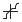</a> | **📂 檔名:** `labplot-xy-plot-two-axes-centered-origin.svg` ✨ **格式:** `Vector (SVG)` ⚖️ **大小:** `839.00B` 📅 **更新:** `2026-03-02`  🚀 **jsDelivr Markdown:** `` 🔗 **直接連結 (Url):** <code>https://cdn.jsdelivr.net/gh/barry028/materials@main/images/iCons/Pixel/Breeze/Actions%20/22/labplot-xy-plot-two-axes-centered-origin.svg</code> 📥 [檢視原始檔](labplot-xy-plot-two-axes-centered-origin.svg) |
|  | **📂 檔名:** `labplot-xy-plot-two-axes-centered.svg` ✨ **格式:** `Vector (SVG)` ⚖️ **大小:** `709.00B` 📅 **更新:** `2026-03-02`  🚀 **jsDelivr Markdown:** `` 🔗 **直接連結 (Url):** <code>https://cdn.jsdelivr.net/gh/barry028/materials@main/images/iCons/Pixel/Breeze/Actions%20/22/labplot-xy-plot-two-axes-centered.svg</code> 📥 [檢視原始檔](labplot-xy-plot-two-axes-centered.svg) |
|  | **📂 檔名:** `labplot-xy-plot-two-axes.svg` ✨ **格式:** `Vector (SVG)` ⚖️ **大小:** `1.12KB` 📅 **更新:** `2026-03-02`  🚀 **jsDelivr Markdown:** `` 🔗 **直接連結 (Url):** <code>https://cdn.jsdelivr.net/gh/barry028/materials@main/images/iCons/Pixel/Breeze/Actions%20/22/labplot-xy-plot-two-axes.svg</code> 📥 [檢視原始檔](labplot-xy-plot-two-axes.svg) |
|  | **📂 檔名:** `labplot-xy-smoothing-curve.svg` ✨ **格式:** `Vector (SVG)` ⚖️ **大小:** `1.16KB` 📅 **更新:** `2026-03-02`  🚀 **jsDelivr Markdown:** `` 🔗 **直接連結 (Url):** <code>https://cdn.jsdelivr.net/gh/barry028/materials@main/images/iCons/Pixel/Breeze/Actions%20/22/labplot-xy-smoothing-curve.svg</code> 📥 [檢視原始檔](labplot-xy-smoothing-curve.svg) |
| <a href="labplot-zoom-in-x.svg">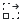</a> | **📂 檔名:** `labplot-zoom-in-x.svg` ✨ **格式:** `Vector (SVG)` ⚖️ **大小:** `868.00B` 📅 **更新:** `2026-03-02`  🚀 **jsDelivr Markdown:** `` 🔗 **直接連結 (Url):** <code>https://cdn.jsdelivr.net/gh/barry028/materials@main/images/iCons/Pixel/Breeze/Actions%20/22/labplot-zoom-in-x.svg</code> 📥 [檢視原始檔](labplot-zoom-in-x.svg) |
| <a href="labplot-zoom-in-y.svg">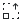</a> | **📂 檔名:** `labplot-zoom-in-y.svg` ✨ **格式:** `Vector (SVG)` ⚖️ **大小:** `872.00B` 📅 **更新:** `2026-03-02`  🚀 **jsDelivr Markdown:** `` 🔗 **直接連結 (Url):** <code>https://cdn.jsdelivr.net/gh/barry028/materials@main/images/iCons/Pixel/Breeze/Actions%20/22/labplot-zoom-in-y.svg</code> 📥 [檢視原始檔](labplot-zoom-in-y.svg) |
|  | **📂 檔名:** `labplot-zoom-out-x.svg` ✨ **格式:** `Vector (SVG)` ⚖️ **大小:** `867.00B` 📅 **更新:** `2026-03-02`  🚀 **jsDelivr Markdown:** `` 🔗 **直接連結 (Url):** <code>https://cdn.jsdelivr.net/gh/barry028/materials@main/images/iCons/Pixel/Breeze/Actions%20/22/labplot-zoom-out-x.svg</code> 📥 [檢視原始檔](labplot-zoom-out-x.svg) |
|  | **📂 檔名:** `labplot-zoom-out-y.svg` ✨ **格式:** `Vector (SVG)` ⚖️ **大小:** `875.00B` 📅 **更新:** `2026-03-02`  🚀 **jsDelivr Markdown:** `` 🔗 **直接連結 (Url):** <code>https://cdn.jsdelivr.net/gh/barry028/materials@main/images/iCons/Pixel/Breeze/Actions%20/22/labplot-zoom-out-y.svg</code> 📥 [檢視原始檔](labplot-zoom-out-y.svg) |
|  | **📂 檔名:** `layer-visible-off.svg` ✨ **格式:** `Vector (SVG)` ⚖️ **大小:** `563.00B` 📅 **更新:** `2026-03-02`  🚀 **jsDelivr Markdown:** `` 🔗 **直接連結 (Url):** <code>https://cdn.jsdelivr.net/gh/barry028/materials@main/images/iCons/Pixel/Breeze/Actions%20/22/layer-visible-off.svg</code> 📥 [檢視原始檔](layer-visible-off.svg) |
|  | **📂 檔名:** `layer-visible-on.svg` ✨ **格式:** `Vector (SVG)` ⚖️ **大小:** `451.00B` 📅 **更新:** `2026-03-02`  🚀 **jsDelivr Markdown:** `` 🔗 **直接連結 (Url):** <code>https://cdn.jsdelivr.net/gh/barry028/materials@main/images/iCons/Pixel/Breeze/Actions%20/22/layer-visible-on.svg</code> 📥 [檢視原始檔](layer-visible-on.svg) |
|  | **📂 檔名:** `lensautofix.svg` ✨ **格式:** `Vector (SVG)` ⚖️ **大小:** `1.52KB` 📅 **更新:** `2026-03-02`  🚀 **jsDelivr Markdown:** `` 🔗 **直接連結 (Url):** <code>https://cdn.jsdelivr.net/gh/barry028/materials@main/images/iCons/Pixel/Breeze/Actions%20/22/lensautofix.svg</code> 📥 [檢視原始檔](lensautofix.svg) |
|  | **📂 檔名:** `lensdistortion.svg` ✨ **格式:** `Vector (SVG)` ⚖️ **大小:** `993.00B` 📅 **更新:** `2026-03-02`  🚀 **jsDelivr Markdown:** `` 🔗 **直接連結 (Url):** <code>https://cdn.jsdelivr.net/gh/barry028/materials@main/images/iCons/Pixel/Breeze/Actions%20/22/lensdistortion.svg</code> 📥 [檢視原始檔](lensdistortion.svg) |
|  | **📂 檔名:** `license.svg` ✨ **格式:** `Vector (SVG)` ⚖️ **大小:** `751.00B` 📅 **更新:** `2026-03-02`  🚀 **jsDelivr Markdown:** `` 🔗 **直接連結 (Url):** <code>https://cdn.jsdelivr.net/gh/barry028/materials@main/images/iCons/Pixel/Breeze/Actions%20/22/license.svg</code> 📥 [檢視原始檔](license.svg) |
|  | **📂 檔名:** `lighttable.svg` ✨ **格式:** `Vector (SVG)` ⚖️ **大小:** `1.53KB` 📅 **更新:** `2026-03-02`  🚀 **jsDelivr Markdown:** `` 🔗 **直接連結 (Url):** <code>https://cdn.jsdelivr.net/gh/barry028/materials@main/images/iCons/Pixel/Breeze/Actions%20/22/lighttable.svg</code> 📥 [檢視原始檔](lighttable.svg) |
|  | **📂 檔名:** `linear.svg` ✨ **格式:** `Vector (SVG)` ⚖️ **大小:** `364.00B` 📅 **更新:** `2026-03-02`  🚀 **jsDelivr Markdown:** `` 🔗 **直接連結 (Url):** <code>https://cdn.jsdelivr.net/gh/barry028/materials@main/images/iCons/Pixel/Breeze/Actions%20/22/linear.svg</code> 📥 [檢視原始檔](linear.svg) |
|  | **📂 檔名:** `lines-connector.svg` ✨ **格式:** `Vector (SVG)` ⚖️ **大小:** `850.00B` 📅 **更新:** `2026-03-02`  🚀 **jsDelivr Markdown:** `` 🔗 **直接連結 (Url):** <code>https://cdn.jsdelivr.net/gh/barry028/materials@main/images/iCons/Pixel/Breeze/Actions%20/22/lines-connector.svg</code> 📥 [檢視原始檔](lines-connector.svg) |
|  | **📂 檔名:** `link.svg` ✨ **格式:** `Vector (SVG)` ⚖️ **大小:** `994.00B` 📅 **更新:** `2026-03-02`  🚀 **jsDelivr Markdown:** `` 🔗 **直接連結 (Url):** <code>https://cdn.jsdelivr.net/gh/barry028/materials@main/images/iCons/Pixel/Breeze/Actions%20/22/link.svg</code> 📥 [檢視原始檔](link.svg) |
|  | **📂 檔名:** `list-add-font.svg` ✨ **格式:** `Vector (SVG)` ⚖️ **大小:** `424.00B` 📅 **更新:** `2026-03-02`  🚀 **jsDelivr Markdown:** `` 🔗 **直接連結 (Url):** <code>https://cdn.jsdelivr.net/gh/barry028/materials@main/images/iCons/Pixel/Breeze/Actions%20/22/list-add-font.svg</code> 📥 [檢視原始檔](list-add-font.svg) |
|  | **📂 檔名:** `list-add-user.svg` ✨ **格式:** `Vector (SVG)` ⚖️ **大小:** `766.00B` 📅 **更新:** `2026-03-02`  🚀 **jsDelivr Markdown:** `` 🔗 **直接連結 (Url):** <code>https://cdn.jsdelivr.net/gh/barry028/materials@main/images/iCons/Pixel/Breeze/Actions%20/22/list-add-user.svg</code> 📥 [檢視原始檔](list-add-user.svg) |
|  | **📂 檔名:** `list-add.svg` ✨ **格式:** `Vector (SVG)` ⚖️ **大小:** `441.00B` 📅 **更新:** `2026-03-02`  🚀 **jsDelivr Markdown:** `` 🔗 **直接連結 (Url):** <code>https://cdn.jsdelivr.net/gh/barry028/materials@main/images/iCons/Pixel/Breeze/Actions%20/22/list-add.svg</code> 📥 [檢視原始檔](list-add.svg) |
|  | **📂 檔名:** `list-remove-user.svg` ✨ **格式:** `Vector (SVG)` ⚖️ **大小:** `792.00B` 📅 **更新:** `2026-03-02`  🚀 **jsDelivr Markdown:** `` 🔗 **直接連結 (Url):** <code>https://cdn.jsdelivr.net/gh/barry028/materials@main/images/iCons/Pixel/Breeze/Actions%20/22/list-remove-user.svg</code> 📥 [檢視原始檔](list-remove-user.svg) |
|  | **📂 檔名:** `list-remove.svg` ✨ **格式:** `Vector (SVG)` ⚖️ **大小:** `355.00B` 📅 **更新:** `2026-03-02`  🚀 **jsDelivr Markdown:** `` 🔗 **直接連結 (Url):** <code>https://cdn.jsdelivr.net/gh/barry028/materials@main/images/iCons/Pixel/Breeze/Actions%20/22/list-remove.svg</code> 📥 [檢視原始檔](list-remove.svg) |
|  | **📂 檔名:** `love-amarok.svg` ✨ **格式:** `Vector (SVG)` ⚖️ **大小:** `916.00B` 📅 **更新:** `2026-03-02`  🚀 **jsDelivr Markdown:** `` 🔗 **直接連結 (Url):** <code>https://cdn.jsdelivr.net/gh/barry028/materials@main/images/iCons/Pixel/Breeze/Actions%20/22/love-amarok.svg</code> 📥 [檢視原始檔](love-amarok.svg) |
|  | **📂 檔名:** `mail-attachment.svg` ✨ **格式:** `Vector (SVG)` ⚖️ **大小:** `1.35KB` 📅 **更新:** `2026-03-02`  🚀 **jsDelivr Markdown:** `` 🔗 **直接連結 (Url):** <code>https://cdn.jsdelivr.net/gh/barry028/materials@main/images/iCons/Pixel/Breeze/Actions%20/22/mail-attachment.svg</code> 📥 [檢視原始檔](mail-attachment.svg) |
|  | **📂 檔名:** `mail-encrypted-full.svg` ✨ **格式:** `Vector (SVG)` ⚖️ **大小:** `1.14KB` 📅 **更新:** `2026-03-02`  🚀 **jsDelivr Markdown:** `` 🔗 **直接連結 (Url):** <code>https://cdn.jsdelivr.net/gh/barry028/materials@main/images/iCons/Pixel/Breeze/Actions%20/22/mail-encrypted-full.svg</code> 📥 [檢視原始檔](mail-encrypted-full.svg) |
|  | **📂 檔名:** `mail-encrypted-part.svg` ✨ **格式:** `Vector (SVG)` ⚖️ **大小:** `1.18KB` 📅 **更新:** `2026-03-02`  🚀 **jsDelivr Markdown:** `` 🔗 **直接連結 (Url):** <code>https://cdn.jsdelivr.net/gh/barry028/materials@main/images/iCons/Pixel/Breeze/Actions%20/22/mail-encrypted-part.svg</code> 📥 [檢視原始檔](mail-encrypted-part.svg) |
|  | **📂 檔名:** `mail-flag.svg` ✨ **格式:** `Vector (SVG)` ⚖️ **大小:** `1.01KB` 📅 **更新:** `2026-03-02`  🚀 **jsDelivr Markdown:** `` 🔗 **直接連結 (Url):** <code>https://cdn.jsdelivr.net/gh/barry028/materials@main/images/iCons/Pixel/Breeze/Actions%20/22/mail-flag.svg</code> 📥 [檢視原始檔](mail-flag.svg) |
|  | **📂 檔名:** `mail-forward.svg` ✨ **格式:** `Vector (SVG)` ⚖️ **大小:** `1.08KB` 📅 **更新:** `2026-03-02`  🚀 **jsDelivr Markdown:** `` 🔗 **直接連結 (Url):** <code>https://cdn.jsdelivr.net/gh/barry028/materials@main/images/iCons/Pixel/Breeze/Actions%20/22/mail-forward.svg</code> 📥 [檢視原始檔](mail-forward.svg) |
|  | **📂 檔名:** `mail-forwarded-replied.svg` ✨ **格式:** `Vector (SVG)` ⚖️ **大小:** `1.11KB` 📅 **更新:** `2026-03-02`  🚀 **jsDelivr Markdown:** `` 🔗 **直接連結 (Url):** <code>https://cdn.jsdelivr.net/gh/barry028/materials@main/images/iCons/Pixel/Breeze/Actions%20/22/mail-forwarded-replied.svg</code> 📥 [檢視原始檔](mail-forwarded-replied.svg) |
|  | **📂 檔名:** `mail-forwarded.svg` ✨ **格式:** `Vector (SVG)` ⚖️ **大小:** `1.06KB` 📅 **更新:** `2026-03-02`  🚀 **jsDelivr Markdown:** `` 🔗 **直接連結 (Url):** <code>https://cdn.jsdelivr.net/gh/barry028/materials@main/images/iCons/Pixel/Breeze/Actions%20/22/mail-forwarded.svg</code> 📥 [檢視原始檔](mail-forwarded.svg) |
|  | **📂 檔名:** `mail-invitation.svg` ✨ **格式:** `Vector (SVG)` ⚖️ **大小:** `1.12KB` 📅 **更新:** `2026-03-02`  🚀 **jsDelivr Markdown:** `` 🔗 **直接連結 (Url):** <code>https://cdn.jsdelivr.net/gh/barry028/materials@main/images/iCons/Pixel/Breeze/Actions%20/22/mail-invitation.svg</code> 📥 [檢視原始檔](mail-invitation.svg) |
|  | **📂 檔名:** `mail-mark-important.svg` ✨ **格式:** `Vector (SVG)` ⚖️ **大小:** `1.09KB` 📅 **更新:** `2026-03-02`  🚀 **jsDelivr Markdown:** `` 🔗 **直接連結 (Url):** <code>https://cdn.jsdelivr.net/gh/barry028/materials@main/images/iCons/Pixel/Breeze/Actions%20/22/mail-mark-important.svg</code> 📥 [檢視原始檔](mail-mark-important.svg) |
|  | **📂 檔名:** `mail-mark-junk.svg` ✨ **格式:** `Vector (SVG)` ⚖️ **大小:** `1.15KB` 📅 **更新:** `2026-03-02`  🚀 **jsDelivr Markdown:** `` 🔗 **直接連結 (Url):** <code>https://cdn.jsdelivr.net/gh/barry028/materials@main/images/iCons/Pixel/Breeze/Actions%20/22/mail-mark-junk.svg</code> 📥 [檢視原始檔](mail-mark-junk.svg) |
|  | **📂 檔名:** `mail-mark-notjunk.svg` ✨ **格式:** `Vector (SVG)` ⚖️ **大小:** `1.08KB` 📅 **更新:** `2026-03-02`  🚀 **jsDelivr Markdown:** `` 🔗 **直接連結 (Url):** <code>https://cdn.jsdelivr.net/gh/barry028/materials@main/images/iCons/Pixel/Breeze/Actions%20/22/mail-mark-notjunk.svg</code> 📥 [檢視原始檔](mail-mark-notjunk.svg) |
|  | **📂 檔名:** `mail-mark-read.svg` ✨ **格式:** `Vector (SVG)` ⚖️ **大小:** `957.00B` 📅 **更新:** `2026-03-02`  🚀 **jsDelivr Markdown:** `` 🔗 **直接連結 (Url):** <code>https://cdn.jsdelivr.net/gh/barry028/materials@main/images/iCons/Pixel/Breeze/Actions%20/22/mail-mark-read.svg</code> 📥 [檢視原始檔](mail-mark-read.svg) |
|  | **📂 檔名:** `mail-mark-task.svg` ✨ **格式:** `Vector (SVG)` ⚖️ **大小:** `779.00B` 📅 **更新:** `2026-03-02`  🚀 **jsDelivr Markdown:** `` 🔗 **直接連結 (Url):** <code>https://cdn.jsdelivr.net/gh/barry028/materials@main/images/iCons/Pixel/Breeze/Actions%20/22/mail-mark-task.svg</code> 📥 [檢視原始檔](mail-mark-task.svg) |
|  | **📂 檔名:** `mail-mark-unread-new.svg` ✨ **格式:** `Vector (SVG)` ⚖️ **大小:** `1.22KB` 📅 **更新:** `2026-03-02`  🚀 **jsDelivr Markdown:** `` 🔗 **直接連結 (Url):** <code>https://cdn.jsdelivr.net/gh/barry028/materials@main/images/iCons/Pixel/Breeze/Actions%20/22/mail-mark-unread-new.svg</code> 📥 [檢視原始檔](mail-mark-unread-new.svg) |
|  | **📂 檔名:** `mail-mark-unread.svg` ✨ **格式:** `Vector (SVG)` ⚖️ **大小:** `836.00B` 📅 **更新:** `2026-03-02`  🚀 **jsDelivr Markdown:** `` 🔗 **直接連結 (Url):** <code>https://cdn.jsdelivr.net/gh/barry028/materials@main/images/iCons/Pixel/Breeze/Actions%20/22/mail-mark-unread.svg</code> 📥 [檢視原始檔](mail-mark-unread.svg) |
|  | **📂 檔名:** `mail-meeting-request-reply.svg` ✨ **格式:** `Vector (SVG)` ⚖️ **大小:** `1.08KB` 📅 **更新:** `2026-03-02`  🚀 **jsDelivr Markdown:** `` 🔗 **直接連結 (Url):** <code>https://cdn.jsdelivr.net/gh/barry028/materials@main/images/iCons/Pixel/Breeze/Actions%20/22/mail-meeting-request-reply.svg</code> 📥 [檢視原始檔](mail-meeting-request-reply.svg) |
|  | **📂 檔名:** `mail-message-new-list.svg` ✨ **格式:** `Vector (SVG)` ⚖️ **大小:** `1.04KB` 📅 **更新:** `2026-03-02`  🚀 **jsDelivr Markdown:** `` 🔗 **直接連結 (Url):** <code>https://cdn.jsdelivr.net/gh/barry028/materials@main/images/iCons/Pixel/Breeze/Actions%20/22/mail-message-new-list.svg</code> 📥 [檢視原始檔](mail-message-new-list.svg) |
|  | **📂 檔名:** `mail-message-new.svg` ✨ **格式:** `Vector (SVG)` ⚖️ **大小:** `1.02KB` 📅 **更新:** `2026-03-02`  🚀 **jsDelivr Markdown:** `` 🔗 **直接連結 (Url):** <code>https://cdn.jsdelivr.net/gh/barry028/materials@main/images/iCons/Pixel/Breeze/Actions%20/22/mail-message-new.svg</code> 📥 [檢視原始檔](mail-message-new.svg) |
|  | **📂 檔名:** `mail-queue.svg` ✨ **格式:** `Vector (SVG)` ⚖️ **大小:** `1.22KB` 📅 **更新:** `2026-03-02`  🚀 **jsDelivr Markdown:** `` 🔗 **直接連結 (Url):** <code>https://cdn.jsdelivr.net/gh/barry028/materials@main/images/iCons/Pixel/Breeze/Actions%20/22/mail-queue.svg</code> 📥 [檢視原始檔](mail-queue.svg) |
|  | **📂 檔名:** `mail-receive.svg` ✨ **格式:** `Vector (SVG)` ⚖️ **大小:** `807.00B` 📅 **更新:** `2026-03-02`  🚀 **jsDelivr Markdown:** `` 🔗 **直接連結 (Url):** <code>https://cdn.jsdelivr.net/gh/barry028/materials@main/images/iCons/Pixel/Breeze/Actions%20/22/mail-receive.svg</code> 📥 [檢視原始檔](mail-receive.svg) |
|  | **📂 檔名:** `mail-replied.svg` ✨ **格式:** `Vector (SVG)` ⚖️ **大小:** `957.00B` 📅 **更新:** `2026-03-02`  🚀 **jsDelivr Markdown:** `` 🔗 **直接連結 (Url):** <code>https://cdn.jsdelivr.net/gh/barry028/materials@main/images/iCons/Pixel/Breeze/Actions%20/22/mail-replied.svg</code> 📥 [檢視原始檔](mail-replied.svg) |
|  | **📂 檔名:** `mail-reply-all.svg` ✨ **格式:** `Vector (SVG)` ⚖️ **大小:** `1.05KB` 📅 **更新:** `2026-03-02`  🚀 **jsDelivr Markdown:** `` 🔗 **直接連結 (Url):** <code>https://cdn.jsdelivr.net/gh/barry028/materials@main/images/iCons/Pixel/Breeze/Actions%20/22/mail-reply-all.svg</code> 📥 [檢視原始檔](mail-reply-all.svg) |
|  | **📂 檔名:** `mail-reply-custom-all.svg` ✨ **格式:** `Vector (SVG)` ⚖️ **大小:** `795.00B` 📅 **更新:** `2026-03-02`  🚀 **jsDelivr Markdown:** `` 🔗 **直接連結 (Url):** <code>https://cdn.jsdelivr.net/gh/barry028/materials@main/images/iCons/Pixel/Breeze/Actions%20/22/mail-reply-custom-all.svg</code> 📥 [檢視原始檔](mail-reply-custom-all.svg) |
|  | **📂 檔名:** `mail-reply-custom.svg` ✨ **格式:** `Vector (SVG)` ⚖️ **大小:** `749.00B` 📅 **更新:** `2026-03-02`  🚀 **jsDelivr Markdown:** `` 🔗 **直接連結 (Url):** <code>https://cdn.jsdelivr.net/gh/barry028/materials@main/images/iCons/Pixel/Breeze/Actions%20/22/mail-reply-custom.svg</code> 📥 [檢視原始檔](mail-reply-custom.svg) |
|  | **📂 檔名:** `mail-reply-list.svg` ✨ **格式:** `Vector (SVG)` ⚖️ **大小:** `1.05KB` 📅 **更新:** `2026-03-02`  🚀 **jsDelivr Markdown:** `` 🔗 **直接連結 (Url):** <code>https://cdn.jsdelivr.net/gh/barry028/materials@main/images/iCons/Pixel/Breeze/Actions%20/22/mail-reply-list.svg</code> 📥 [檢視原始檔](mail-reply-list.svg) |
|  | **📂 檔名:** `mail-reply-sender.svg` ✨ **格式:** `Vector (SVG)` ⚖️ **大小:** `1.00KB` 📅 **更新:** `2026-03-02`  🚀 **jsDelivr Markdown:** `` 🔗 **直接連結 (Url):** <code>https://cdn.jsdelivr.net/gh/barry028/materials@main/images/iCons/Pixel/Breeze/Actions%20/22/mail-reply-sender.svg</code> 📥 [檢視原始檔](mail-reply-sender.svg) |
|  | **📂 檔名:** `mail-send.svg` ✨ **格式:** `Vector (SVG)` ⚖️ **大小:** `783.00B` 📅 **更新:** `2026-03-02`  🚀 **jsDelivr Markdown:** `` 🔗 **直接連結 (Url):** <code>https://cdn.jsdelivr.net/gh/barry028/materials@main/images/iCons/Pixel/Breeze/Actions%20/22/mail-send.svg</code> 📥 [檢視原始檔](mail-send.svg) |
|  | **📂 檔名:** `mail-signature-unknown.svg` ✨ **格式:** `Vector (SVG)` ⚖️ **大小:** `1.42KB` 📅 **更新:** `2026-03-02`  🚀 **jsDelivr Markdown:** `` 🔗 **直接連結 (Url):** <code>https://cdn.jsdelivr.net/gh/barry028/materials@main/images/iCons/Pixel/Breeze/Actions%20/22/mail-signature-unknown.svg</code> 📥 [檢視原始檔](mail-signature-unknown.svg) |
|  | **📂 檔名:** `mail-signed-full.svg` ✨ **格式:** `Vector (SVG)` ⚖️ **大小:** `1.42KB` 📅 **更新:** `2026-03-02`  🚀 **jsDelivr Markdown:** `` 🔗 **直接連結 (Url):** <code>https://cdn.jsdelivr.net/gh/barry028/materials@main/images/iCons/Pixel/Breeze/Actions%20/22/mail-signed-full.svg</code> 📥 [檢視原始檔](mail-signed-full.svg) |
|  | **📂 檔名:** `mail-signed-part.svg` ✨ **格式:** `Vector (SVG)` ⚖️ **大小:** `1.42KB` 📅 **更新:** `2026-03-02`  🚀 **jsDelivr Markdown:** `` 🔗 **直接連結 (Url):** <code>https://cdn.jsdelivr.net/gh/barry028/materials@main/images/iCons/Pixel/Breeze/Actions%20/22/mail-signed-part.svg</code> 📥 [檢視原始檔](mail-signed-part.svg) |
|  | **📂 檔名:** `mail-signed-verified.svg` ✨ **格式:** `Vector (SVG)` ⚖️ **大小:** `1.16KB` 📅 **更新:** `2026-03-02`  🚀 **jsDelivr Markdown:** `` 🔗 **直接連結 (Url):** <code>https://cdn.jsdelivr.net/gh/barry028/materials@main/images/iCons/Pixel/Breeze/Actions%20/22/mail-signed-verified.svg</code> 📥 [檢視原始檔](mail-signed-verified.svg) |
|  | **📂 檔名:** `mail-tagged.svg` ✨ **格式:** `Vector (SVG)` ⚖️ **大小:** `1.10KB` 📅 **更新:** `2026-03-02`  🚀 **jsDelivr Markdown:** `` 🔗 **直接連結 (Url):** <code>https://cdn.jsdelivr.net/gh/barry028/materials@main/images/iCons/Pixel/Breeze/Actions%20/22/mail-tagged.svg</code> 📥 [檢視原始檔](mail-tagged.svg) |
|  | **📂 檔名:** `map-flat.svg` ✨ **格式:** `Vector (SVG)` ⚖️ **大小:** `706.00B` 📅 **更新:** `2026-03-02`  🚀 **jsDelivr Markdown:** `` 🔗 **直接連結 (Url):** <code>https://cdn.jsdelivr.net/gh/barry028/materials@main/images/iCons/Pixel/Breeze/Actions%20/22/map-flat.svg</code> 📥 [檢視原始檔](map-flat.svg) |
|  | **📂 檔名:** `map-globe.svg` ✨ **格式:** `Vector (SVG)` ⚖️ **大小:** `1.39KB` 📅 **更新:** `2026-03-02`  🚀 **jsDelivr Markdown:** `` 🔗 **直接連結 (Url):** <code>https://cdn.jsdelivr.net/gh/barry028/materials@main/images/iCons/Pixel/Breeze/Actions%20/22/map-globe.svg</code> 📥 [檢視原始檔](map-globe.svg) |
|  | **📂 檔名:** `map-gnomonic.svg` ✨ **格式:** `Vector (SVG)` ⚖️ **大小:** `1.28KB` 📅 **更新:** `2026-03-02`  🚀 **jsDelivr Markdown:** `` 🔗 **直接連結 (Url):** <code>https://cdn.jsdelivr.net/gh/barry028/materials@main/images/iCons/Pixel/Breeze/Actions%20/22/map-gnomonic.svg</code> 📥 [檢視原始檔](map-gnomonic.svg) |
|  | **📂 檔名:** `map-mercator.svg` ✨ **格式:** `Vector (SVG)` ⚖️ **大小:** `854.00B` 📅 **更新:** `2026-03-02`  🚀 **jsDelivr Markdown:** `` 🔗 **直接連結 (Url):** <code>https://cdn.jsdelivr.net/gh/barry028/materials@main/images/iCons/Pixel/Breeze/Actions%20/22/map-mercator.svg</code> 📥 [檢視原始檔](map-mercator.svg) |
|  | **📂 檔名:** `markasblank.svg` ✨ **格式:** `Vector (SVG)` ⚖️ **大小:** `583.00B` 📅 **更新:** `2026-03-02`  🚀 **jsDelivr Markdown:** `` 🔗 **直接連結 (Url):** <code>https://cdn.jsdelivr.net/gh/barry028/materials@main/images/iCons/Pixel/Breeze/Actions%20/22/markasblank.svg</code> 📥 [檢視原始檔](markasblank.svg) |
|  | **📂 檔名:** `media-album-cover-manager-amarok.svg` ✨ **格式:** `Vector (SVG)` ⚖️ **大小:** `895.00B` 📅 **更新:** `2026-03-02`  🚀 **jsDelivr Markdown:** `` 🔗 **直接連結 (Url):** <code>https://cdn.jsdelivr.net/gh/barry028/materials@main/images/iCons/Pixel/Breeze/Actions%20/22/media-album-cover-manager-amarok.svg</code> 📥 [檢視原始檔](media-album-cover-manager-amarok.svg) |
|  | **📂 檔名:** `media-album-track.svg` ✨ **格式:** `Vector (SVG)` ⚖️ **大小:** `956.00B` 📅 **更新:** `2026-03-02`  🚀 **jsDelivr Markdown:** `` 🔗 **直接連結 (Url):** <code>https://cdn.jsdelivr.net/gh/barry028/materials@main/images/iCons/Pixel/Breeze/Actions%20/22/media-album-track.svg</code> 📥 [檢視原始檔](media-album-track.svg) |
|  | **📂 檔名:** `media-eject.svg` ✨ **格式:** `Vector (SVG)` ⚖️ **大小:** `352.00B` 📅 **更新:** `2026-03-02`  🚀 **jsDelivr Markdown:** `` 🔗 **直接連結 (Url):** <code>https://cdn.jsdelivr.net/gh/barry028/materials@main/images/iCons/Pixel/Breeze/Actions%20/22/media-eject.svg</code> 📥 [檢視原始檔](media-eject.svg) |
|  | **📂 檔名:** `media-mount.svg` ✨ **格式:** `Vector (SVG)` ⚖️ **大小:** `333.00B` 📅 **更新:** `2026-03-02`  🚀 **jsDelivr Markdown:** `` 🔗 **直接連結 (Url):** <code>https://cdn.jsdelivr.net/gh/barry028/materials@main/images/iCons/Pixel/Breeze/Actions%20/22/media-mount.svg</code> 📥 [檢視原始檔](media-mount.svg) |
|  | **📂 檔名:** `media-playback-pause.svg` ✨ **格式:** `Vector (SVG)` ⚖️ **大小:** `291.00B` 📅 **更新:** `2026-03-02`  🚀 **jsDelivr Markdown:** `` 🔗 **直接連結 (Url):** <code>https://cdn.jsdelivr.net/gh/barry028/materials@main/images/iCons/Pixel/Breeze/Actions%20/22/media-playback-pause.svg</code> 📥 [檢視原始檔](media-playback-pause.svg) |
|  | **📂 檔名:** `media-playback-start.svg` ✨ **格式:** `Vector (SVG)` ⚖️ **大小:** `275.00B` 📅 **更新:** `2026-03-02`  🚀 **jsDelivr Markdown:** `` 🔗 **直接連結 (Url):** <code>https://cdn.jsdelivr.net/gh/barry028/materials@main/images/iCons/Pixel/Breeze/Actions%20/22/media-playback-start.svg</code> 📥 [檢視原始檔](media-playback-start.svg) |
|  | **📂 檔名:** `media-playback-stop.svg` ✨ **格式:** `Vector (SVG)` ⚖️ **大小:** `277.00B` 📅 **更新:** `2026-03-02`  🚀 **jsDelivr Markdown:** `` 🔗 **直接連結 (Url):** <code>https://cdn.jsdelivr.net/gh/barry028/materials@main/images/iCons/Pixel/Breeze/Actions%20/22/media-playback-stop.svg</code> 📥 [檢視原始檔](media-playback-stop.svg) |
| <a href="media-playlist-append.svg">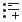</a> | **📂 檔名:** `media-playlist-append.svg` ✨ **格式:** `Vector (SVG)` ⚖️ **大小:** `739.00B` 📅 **更新:** `2026-03-02`  🚀 **jsDelivr Markdown:** `` 🔗 **直接連結 (Url):** <code>https://cdn.jsdelivr.net/gh/barry028/materials@main/images/iCons/Pixel/Breeze/Actions%20/22/media-playlist-append.svg</code> 📥 [檢視原始檔](media-playlist-append.svg) |
|  | **📂 檔名:** `media-playlist-normal.svg` ✨ **格式:** `Vector (SVG)` ⚖️ **大小:** `465.00B` 📅 **更新:** `2026-03-02`  🚀 **jsDelivr Markdown:** `` 🔗 **直接連結 (Url):** <code>https://cdn.jsdelivr.net/gh/barry028/materials@main/images/iCons/Pixel/Breeze/Actions%20/22/media-playlist-normal.svg</code> 📥 [檢視原始檔](media-playlist-normal.svg) |
|  | **📂 檔名:** `media-playlist-play.svg` ✨ **格式:** `Vector (SVG)` ⚖️ **大小:** `838.00B` 📅 **更新:** `2026-03-02`  🚀 **jsDelivr Markdown:** `` 🔗 **直接連結 (Url):** <code>https://cdn.jsdelivr.net/gh/barry028/materials@main/images/iCons/Pixel/Breeze/Actions%20/22/media-playlist-play.svg</code> 📥 [檢視原始檔](media-playlist-play.svg) |
|  | **📂 檔名:** `media-playlist-repeat.svg` ✨ **格式:** `Vector (SVG)` ⚖️ **大小:** `464.00B` 📅 **更新:** `2026-03-02`  🚀 **jsDelivr Markdown:** `` 🔗 **直接連結 (Url):** <code>https://cdn.jsdelivr.net/gh/barry028/materials@main/images/iCons/Pixel/Breeze/Actions%20/22/media-playlist-repeat.svg</code> 📥 [檢視原始檔](media-playlist-repeat.svg) |
|  | **📂 檔名:** `media-playlist-shuffle.svg` ✨ **格式:** `Vector (SVG)` ⚖️ **大小:** `914.00B` 📅 **更新:** `2026-03-02`  🚀 **jsDelivr Markdown:** `` 🔗 **直接連結 (Url):** <code>https://cdn.jsdelivr.net/gh/barry028/materials@main/images/iCons/Pixel/Breeze/Actions%20/22/media-playlist-shuffle.svg</code> 📥 [檢視原始檔](media-playlist-shuffle.svg) |
|  | **📂 檔名:** `media-random-albums-amarok.svg` ✨ **格式:** `Vector (SVG)` ⚖️ **大小:** `1.53KB` 📅 **更新:** `2026-03-02`  🚀 **jsDelivr Markdown:** `` 🔗 **直接連結 (Url):** <code>https://cdn.jsdelivr.net/gh/barry028/materials@main/images/iCons/Pixel/Breeze/Actions%20/22/media-random-albums-amarok.svg</code> 📥 [檢視原始檔](media-random-albums-amarok.svg) |
|  | **📂 檔名:** `media-random-tracks-amarok.svg` ✨ **格式:** `Vector (SVG)` ⚖️ **大小:** `1.09KB` 📅 **更新:** `2026-03-02`  🚀 **jsDelivr Markdown:** `` 🔗 **直接連結 (Url):** <code>https://cdn.jsdelivr.net/gh/barry028/materials@main/images/iCons/Pixel/Breeze/Actions%20/22/media-random-tracks-amarok.svg</code> 📥 [檢視原始檔](media-random-tracks-amarok.svg) |
|  | **📂 檔名:** `media-record.svg` ✨ **格式:** `Vector (SVG)` ⚖️ **大小:** `165.00B` 📅 **更新:** `2026-03-02`  🚀 **jsDelivr Markdown:** `` 🔗 **直接連結 (Url):** <code>https://cdn.jsdelivr.net/gh/barry028/materials@main/images/iCons/Pixel/Breeze/Actions%20/22/media-record.svg</code> 📥 [檢視原始檔](media-record.svg) |
|  | **📂 檔名:** `media-repeat-album-amarok.svg` ✨ **格式:** `Vector (SVG)` ⚖️ **大小:** `1.28KB` 📅 **更新:** `2026-03-02`  🚀 **jsDelivr Markdown:** `` 🔗 **直接連結 (Url):** <code>https://cdn.jsdelivr.net/gh/barry028/materials@main/images/iCons/Pixel/Breeze/Actions%20/22/media-repeat-album-amarok.svg</code> 📥 [檢視原始檔](media-repeat-album-amarok.svg) |
| <a href="media-repeat-none.svg">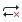</a> | **📂 檔名:** `media-repeat-none.svg` ✨ **格式:** `Vector (SVG)` ⚖️ **大小:** `628.00B` 📅 **更新:** `2026-03-02`  🚀 **jsDelivr Markdown:** `` 🔗 **直接連結 (Url):** <code>https://cdn.jsdelivr.net/gh/barry028/materials@main/images/iCons/Pixel/Breeze/Actions%20/22/media-repeat-none.svg</code> 📥 [檢視原始檔](media-repeat-none.svg) |
|  | **📂 檔名:** `media-repeat-playlist-amarok.svg` ✨ **格式:** `Vector (SVG)` ⚖️ **大小:** `838.00B` 📅 **更新:** `2026-03-02`  🚀 **jsDelivr Markdown:** `` 🔗 **直接連結 (Url):** <code>https://cdn.jsdelivr.net/gh/barry028/materials@main/images/iCons/Pixel/Breeze/Actions%20/22/media-repeat-playlist-amarok.svg</code> 📥 [檢視原始檔](media-repeat-playlist-amarok.svg) |
|  | **📂 檔名:** `media-repeat-single.svg` ✨ **格式:** `Vector (SVG)` ⚖️ **大小:** `517.00B` 📅 **更新:** `2026-03-02`  🚀 **jsDelivr Markdown:** `` 🔗 **直接連結 (Url):** <code>https://cdn.jsdelivr.net/gh/barry028/materials@main/images/iCons/Pixel/Breeze/Actions%20/22/media-repeat-single.svg</code> 📥 [檢視原始檔](media-repeat-single.svg) |
|  | **📂 檔名:** `media-seek-backward.svg` ✨ **格式:** `Vector (SVG)` ⚖️ **大小:** `305.00B` 📅 **更新:** `2026-03-02`  🚀 **jsDelivr Markdown:** `` 🔗 **直接連結 (Url):** <code>https://cdn.jsdelivr.net/gh/barry028/materials@main/images/iCons/Pixel/Breeze/Actions%20/22/media-seek-backward.svg</code> 📥 [檢視原始檔](media-seek-backward.svg) |
|  | **📂 檔名:** `media-seek-forward.svg` ✨ **格式:** `Vector (SVG)` ⚖️ **大小:** `303.00B` 📅 **更新:** `2026-03-02`  🚀 **jsDelivr Markdown:** `` 🔗 **直接連結 (Url):** <code>https://cdn.jsdelivr.net/gh/barry028/materials@main/images/iCons/Pixel/Breeze/Actions%20/22/media-seek-forward.svg</code> 📥 [檢視原始檔](media-seek-forward.svg) |
|  | **📂 檔名:** `media-skip-backward.svg` ✨ **格式:** `Vector (SVG)` ⚖️ **大小:** `315.00B` 📅 **更新:** `2026-03-02`  🚀 **jsDelivr Markdown:** `` 🔗 **直接連結 (Url):** <code>https://cdn.jsdelivr.net/gh/barry028/materials@main/images/iCons/Pixel/Breeze/Actions%20/22/media-skip-backward.svg</code> 📥 [檢視原始檔](media-skip-backward.svg) |
|  | **📂 檔名:** `media-skip-forward.svg` ✨ **格式:** `Vector (SVG)` ⚖️ **大小:** `320.00B` 📅 **更新:** `2026-03-02`  🚀 **jsDelivr Markdown:** `` 🔗 **直接連結 (Url):** <code>https://cdn.jsdelivr.net/gh/barry028/materials@main/images/iCons/Pixel/Breeze/Actions%20/22/media-skip-forward.svg</code> 📥 [檢視原始檔](media-skip-forward.svg) |
|  | **📂 檔名:** `media-track-queue-amarok.svg` ✨ **格式:** `Vector (SVG)` ⚖️ **大小:** `1.02KB` 📅 **更新:** `2026-03-02`  🚀 **jsDelivr Markdown:** `` 🔗 **直接連結 (Url):** <code>https://cdn.jsdelivr.net/gh/barry028/materials@main/images/iCons/Pixel/Breeze/Actions%20/22/media-track-queue-amarok.svg</code> 📥 [檢視原始檔](media-track-queue-amarok.svg) |
|  | **📂 檔名:** `media-track-show-active.svg` ✨ **格式:** `Vector (SVG)` ⚖️ **大小:** `972.00B` 📅 **更新:** `2026-03-02`  🚀 **jsDelivr Markdown:** `` 🔗 **直接連結 (Url):** <code>https://cdn.jsdelivr.net/gh/barry028/materials@main/images/iCons/Pixel/Breeze/Actions%20/22/media-track-show-active.svg</code> 📥 [檢視原始檔](media-track-show-active.svg) |
| <a href="meeting-participant-no-response.svg">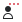</a> | **📂 檔名:** `meeting-participant-no-response.svg` ✨ **格式:** `Vector (SVG)` ⚖️ **大小:** `1.03KB` 📅 **更新:** `2026-03-02`  🚀 **jsDelivr Markdown:** `` 🔗 **直接連結 (Url):** <code>https://cdn.jsdelivr.net/gh/barry028/materials@main/images/iCons/Pixel/Breeze/Actions%20/22/meeting-participant-no-response.svg</code> 📥 [檢視原始檔](meeting-participant-no-response.svg) |
| <a href="meeting-participant-request-response.svg">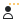</a> | **📂 檔名:** `meeting-participant-request-response.svg` ✨ **格式:** `Vector (SVG)` ⚖️ **大小:** `1.03KB` 📅 **更新:** `2026-03-02`  🚀 **jsDelivr Markdown:** `` 🔗 **直接連結 (Url):** <code>https://cdn.jsdelivr.net/gh/barry028/materials@main/images/iCons/Pixel/Breeze/Actions%20/22/meeting-participant-request-response.svg</code> 📥 [檢視原始檔](meeting-participant-request-response.svg) |
|  | **📂 檔名:** `menu_new_sep.svg` ✨ **格式:** `Vector (SVG)` ⚖️ **大小:** `370.00B` 📅 **更新:** `2026-03-02`  🚀 **jsDelivr Markdown:** `` 🔗 **直接連結 (Url):** <code>https://cdn.jsdelivr.net/gh/barry028/materials@main/images/iCons/Pixel/Breeze/Actions%20/22/menu_new_sep.svg</code> 📥 [檢視原始檔](menu_new_sep.svg) |
|  | **📂 檔名:** `merge.svg` ✨ **格式:** `Vector (SVG)` ⚖️ **大小:** `851.00B` 📅 **更新:** `2026-03-02`  🚀 **jsDelivr Markdown:** `` 🔗 **直接連結 (Url):** <code>https://cdn.jsdelivr.net/gh/barry028/materials@main/images/iCons/Pixel/Breeze/Actions%20/22/merge.svg</code> 📥 [檢視原始檔](merge.svg) |
|  | **📂 檔名:** `messagebox_warning.svg` ✨ **格式:** `Vector (SVG)` ⚖️ **大小:** `637.00B` 📅 **更新:** `2026-03-02`  🚀 **jsDelivr Markdown:** `` 🔗 **直接連結 (Url):** <code>https://cdn.jsdelivr.net/gh/barry028/materials@main/images/iCons/Pixel/Breeze/Actions%20/22/messagebox_warning.svg</code> 📥 [檢視原始檔](messagebox_warning.svg) |
|  | **📂 檔名:** `milestone.svg` ✨ **格式:** `Vector (SVG)` ⚖️ **大小:** `614.00B` 📅 **更新:** `2026-03-02`  🚀 **jsDelivr Markdown:** `` 🔗 **直接連結 (Url):** <code>https://cdn.jsdelivr.net/gh/barry028/materials@main/images/iCons/Pixel/Breeze/Actions%20/22/milestone.svg</code> 📥 [檢視原始檔](milestone.svg) |
|  | **📂 檔名:** `minuet-chords.svg` ✨ **格式:** `Vector (SVG)` ⚖️ **大小:** `1.93KB` 📅 **更新:** `2026-03-02`  🚀 **jsDelivr Markdown:** `` 🔗 **直接連結 (Url):** <code>https://cdn.jsdelivr.net/gh/barry028/materials@main/images/iCons/Pixel/Breeze/Actions%20/22/minuet-chords.svg</code> 📥 [檢視原始檔](minuet-chords.svg) |
|  | **📂 檔名:** `minuet-intervals.svg` ✨ **格式:** `Vector (SVG)` ⚖️ **大小:** `1.83KB` 📅 **更新:** `2026-03-02`  🚀 **jsDelivr Markdown:** `` 🔗 **直接連結 (Url):** <code>https://cdn.jsdelivr.net/gh/barry028/materials@main/images/iCons/Pixel/Breeze/Actions%20/22/minuet-intervals.svg</code> 📥 [檢視原始檔](minuet-intervals.svg) |
|  | **📂 檔名:** `minuet-rhythms.svg` ✨ **格式:** `Vector (SVG)` ⚖️ **大小:** `770.00B` 📅 **更新:** `2026-03-02`  🚀 **jsDelivr Markdown:** `` 🔗 **直接連結 (Url):** <code>https://cdn.jsdelivr.net/gh/barry028/materials@main/images/iCons/Pixel/Breeze/Actions%20/22/minuet-rhythms.svg</code> 📥 [檢視原始檔](minuet-rhythms.svg) |
|  | **📂 檔名:** `minuet-scales.svg` ✨ **格式:** `Vector (SVG)` ⚖️ **大小:** `1.78KB` 📅 **更新:** `2026-03-02`  🚀 **jsDelivr Markdown:** `` 🔗 **直接連結 (Url):** <code>https://cdn.jsdelivr.net/gh/barry028/materials@main/images/iCons/Pixel/Breeze/Actions%20/22/minuet-scales.svg</code> 📥 [檢視原始檔](minuet-scales.svg) |
|  | **📂 檔名:** `mode1.svg` ✨ **格式:** `Vector (SVG)` ⚖️ **大小:** `1.05KB` 📅 **更新:** `2026-03-02`  🚀 **jsDelivr Markdown:** `` 🔗 **直接連結 (Url):** <code>https://cdn.jsdelivr.net/gh/barry028/materials@main/images/iCons/Pixel/Breeze/Actions%20/22/mode1.svg</code> 📥 [檢視原始檔](mode1.svg) |
|  | **📂 檔名:** `mode2.svg` ✨ **格式:** `Vector (SVG)` ⚖️ **大小:** `1.05KB` 📅 **更新:** `2026-03-02`  🚀 **jsDelivr Markdown:** `` 🔗 **直接連結 (Url):** <code>https://cdn.jsdelivr.net/gh/barry028/materials@main/images/iCons/Pixel/Breeze/Actions%20/22/mode2.svg</code> 📥 [檢視原始檔](mode2.svg) |
|  | **📂 檔名:** `mode3.svg` ✨ **格式:** `Vector (SVG)` ⚖️ **大小:** `1.64KB` 📅 **更新:** `2026-03-02`  🚀 **jsDelivr Markdown:** `` 🔗 **直接連結 (Url):** <code>https://cdn.jsdelivr.net/gh/barry028/materials@main/images/iCons/Pixel/Breeze/Actions%20/22/mode3.svg</code> 📥 [檢視原始檔](mode3.svg) |
|  | **📂 檔名:** `mode4.svg` ✨ **格式:** `Vector (SVG)` ⚖️ **大小:** `1.48KB` 📅 **更新:** `2026-03-02`  🚀 **jsDelivr Markdown:** `` 🔗 **直接連結 (Url):** <code>https://cdn.jsdelivr.net/gh/barry028/materials@main/images/iCons/Pixel/Breeze/Actions%20/22/mode4.svg</code> 📥 [檢視原始檔](mode4.svg) |
|  | **📂 檔名:** `mode5.svg` ✨ **格式:** `Vector (SVG)` ⚖️ **大小:** `1.52KB` 📅 **更新:** `2026-03-02`  🚀 **jsDelivr Markdown:** `` 🔗 **直接連結 (Url):** <code>https://cdn.jsdelivr.net/gh/barry028/materials@main/images/iCons/Pixel/Breeze/Actions%20/22/mode5.svg</code> 📥 [檢視原始檔](mode5.svg) |
|  | **📂 檔名:** `motion_path_animations.svg` ✨ **格式:** `Vector (SVG)` ⚖️ **大小:** `1.16KB` 📅 **更新:** `2026-03-02`  🚀 **jsDelivr Markdown:** `` 🔗 **直接連結 (Url):** <code>https://cdn.jsdelivr.net/gh/barry028/materials@main/images/iCons/Pixel/Breeze/Actions%20/22/motion_path_animations.svg</code> 📥 [檢視原始檔](motion_path_animations.svg) |
|  | **📂 檔名:** `music-note-16th.svg` ✨ **格式:** `Vector (SVG)` ⚖️ **大小:** `938.00B` 📅 **更新:** `2026-03-02`  🚀 **jsDelivr Markdown:** `` 🔗 **直接連結 (Url):** <code>https://cdn.jsdelivr.net/gh/barry028/materials@main/images/iCons/Pixel/Breeze/Actions%20/22/music-note-16th.svg</code> 📥 [檢視原始檔](music-note-16th.svg) |
|  | **📂 檔名:** `network-connect.svg` ✨ **格式:** `Vector (SVG)` ⚖️ **大小:** `598.00B` 📅 **更新:** `2026-03-02`  🚀 **jsDelivr Markdown:** `` 🔗 **直接連結 (Url):** <code>https://cdn.jsdelivr.net/gh/barry028/materials@main/images/iCons/Pixel/Breeze/Actions%20/22/network-connect.svg</code> 📥 [檢視原始檔](network-connect.svg) |
|  | **📂 檔名:** `network-disconnect.svg` ✨ **格式:** `Vector (SVG)` ⚖️ **大小:** `1.11KB` 📅 **更新:** `2026-03-02`  🚀 **jsDelivr Markdown:** `` 🔗 **直接連結 (Url):** <code>https://cdn.jsdelivr.net/gh/barry028/materials@main/images/iCons/Pixel/Breeze/Actions%20/22/network-disconnect.svg</code> 📥 [檢視原始檔](network-disconnect.svg) |
|  | **📂 檔名:** `new-audio-alarm.svg` ✨ **格式:** `Vector (SVG)` ⚖️ **大小:** `655.00B` 📅 **更新:** `2026-03-02`  🚀 **jsDelivr Markdown:** `` 🔗 **直接連結 (Url):** <code>https://cdn.jsdelivr.net/gh/barry028/materials@main/images/iCons/Pixel/Breeze/Actions%20/22/new-audio-alarm.svg</code> 📥 [檢視原始檔](new-audio-alarm.svg) |
|  | **📂 檔名:** `newline.svg` ✨ **格式:** `Vector (SVG)` ⚖️ **大小:** `452.00B` 📅 **更新:** `2026-03-02`  🚀 **jsDelivr Markdown:** `` 🔗 **直接連結 (Url):** <code>https://cdn.jsdelivr.net/gh/barry028/materials@main/images/iCons/Pixel/Breeze/Actions%20/22/newline.svg</code> 📥 [檢視原始檔](newline.svg) |
|  | **📂 檔名:** `news-subscribe.svg` ✨ **格式:** `Vector (SVG)` ⚖️ **大小:** `660.00B` 📅 **更新:** `2026-03-02`  🚀 **jsDelivr Markdown:** `` 🔗 **直接連結 (Url):** <code>https://cdn.jsdelivr.net/gh/barry028/materials@main/images/iCons/Pixel/Breeze/Actions%20/22/news-subscribe.svg</code> 📥 [檢視原始檔](news-subscribe.svg) |
|  | **📂 檔名:** `news-unsubscribe.svg` ✨ **格式:** `Vector (SVG)` ⚖️ **大小:** `539.00B` 📅 **更新:** `2026-03-02`  🚀 **jsDelivr Markdown:** `` 🔗 **直接連結 (Url):** <code>https://cdn.jsdelivr.net/gh/barry028/materials@main/images/iCons/Pixel/Breeze/Actions%20/22/news-unsubscribe.svg</code> 📥 [檢視原始檔](news-unsubscribe.svg) |
|  | **📂 檔名:** `nextfuzzy.svg` ✨ **格式:** `Vector (SVG)` ⚖️ **大小:** `1.32KB` 📅 **更新:** `2026-03-02`  🚀 **jsDelivr Markdown:** `` 🔗 **直接連結 (Url):** <code>https://cdn.jsdelivr.net/gh/barry028/materials@main/images/iCons/Pixel/Breeze/Actions%20/22/nextfuzzy.svg</code> 📥 [檢視原始檔](nextfuzzy.svg) |
| <a href="nextfuzzyuntrans.svg">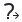</a> | **📂 檔名:** `nextfuzzyuntrans.svg` ✨ **格式:** `Vector (SVG)` ⚖️ **大小:** `1.47KB` 📅 **更新:** `2026-03-02`  🚀 **jsDelivr Markdown:** `` 🔗 **直接連結 (Url):** <code>https://cdn.jsdelivr.net/gh/barry028/materials@main/images/iCons/Pixel/Breeze/Actions%20/22/nextfuzzyuntrans.svg</code> 📥 [檢視原始檔](nextfuzzyuntrans.svg) |
|  | **📂 檔名:** `nextuntranslated.svg` ✨ **格式:** `Vector (SVG)` ⚖️ **大小:** `590.00B` 📅 **更新:** `2026-03-02`  🚀 **jsDelivr Markdown:** `` 🔗 **直接連結 (Url):** <code>https://cdn.jsdelivr.net/gh/barry028/materials@main/images/iCons/Pixel/Breeze/Actions%20/22/nextuntranslated.svg</code> 📥 [檢視原始檔](nextuntranslated.svg) |
|  | **📂 檔名:** `node-segment-curve.svg` ✨ **格式:** `Vector (SVG)` ⚖️ **大小:** `733.00B` 📅 **更新:** `2026-03-02`  🚀 **jsDelivr Markdown:** `` 🔗 **直接連結 (Url):** <code>https://cdn.jsdelivr.net/gh/barry028/materials@main/images/iCons/Pixel/Breeze/Actions%20/22/node-segment-curve.svg</code> 📥 [檢視原始檔](node-segment-curve.svg) |
|  | **📂 檔名:** `node-segment-line.svg` ✨ **格式:** `Vector (SVG)` ⚖️ **大小:** `784.00B` 📅 **更新:** `2026-03-02`  🚀 **jsDelivr Markdown:** `` 🔗 **直接連結 (Url):** <code>https://cdn.jsdelivr.net/gh/barry028/materials@main/images/iCons/Pixel/Breeze/Actions%20/22/node-segment-line.svg</code> 📥 [檢視原始檔](node-segment-line.svg) |
| <a href="node-transform.svg">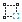</a> | **📂 檔名:** `node-transform.svg` ✨ **格式:** `Vector (SVG)` ⚖️ **大小:** `1.42KB` 📅 **更新:** `2026-03-02`  🚀 **jsDelivr Markdown:** `` 🔗 **直接連結 (Url):** <code>https://cdn.jsdelivr.net/gh/barry028/materials@main/images/iCons/Pixel/Breeze/Actions%20/22/node-transform.svg</code> 📥 [檢視原始檔](node-transform.svg) |
|  | **📂 檔名:** `node-type-auto-smooth.svg` ✨ **格式:** `Vector (SVG)` ⚖️ **大小:** `1.15KB` 📅 **更新:** `2026-03-02`  🚀 **jsDelivr Markdown:** `` 🔗 **直接連結 (Url):** <code>https://cdn.jsdelivr.net/gh/barry028/materials@main/images/iCons/Pixel/Breeze/Actions%20/22/node-type-auto-smooth.svg</code> 📥 [檢視原始檔](node-type-auto-smooth.svg) |
|  | **📂 檔名:** `node-type-cusp.svg` ✨ **格式:** `Vector (SVG)` ⚖️ **大小:** `1.54KB` 📅 **更新:** `2026-03-02`  🚀 **jsDelivr Markdown:** `` 🔗 **直接連結 (Url):** <code>https://cdn.jsdelivr.net/gh/barry028/materials@main/images/iCons/Pixel/Breeze/Actions%20/22/node-type-cusp.svg</code> 📥 [檢視原始檔](node-type-cusp.svg) |
|  | **📂 檔名:** `node-type-smooth.svg` ✨ **格式:** `Vector (SVG)` ⚖️ **大小:** `1.00KB` 📅 **更新:** `2026-03-02`  🚀 **jsDelivr Markdown:** `` 🔗 **直接連結 (Url):** <code>https://cdn.jsdelivr.net/gh/barry028/materials@main/images/iCons/Pixel/Breeze/Actions%20/22/node-type-smooth.svg</code> 📥 [檢視原始檔](node-type-smooth.svg) |
|  | **📂 檔名:** `node-type-symmetric.svg` ✨ **格式:** `Vector (SVG)` ⚖️ **大小:** `1.03KB` 📅 **更新:** `2026-03-02`  🚀 **jsDelivr Markdown:** `` 🔗 **直接連結 (Url):** <code>https://cdn.jsdelivr.net/gh/barry028/materials@main/images/iCons/Pixel/Breeze/Actions%20/22/node-type-symmetric.svg</code> 📥 [檢視原始檔](node-type-symmetric.svg) |
|  | **📂 檔名:** `node.svg` ✨ **格式:** `Vector (SVG)` ⚖️ **大小:** `955.00B` 📅 **更新:** `2026-03-02`  🚀 **jsDelivr Markdown:** `` 🔗 **直接連結 (Url):** <code>https://cdn.jsdelivr.net/gh/barry028/materials@main/images/iCons/Pixel/Breeze/Actions%20/22/node.svg</code> 📥 [檢視原始檔](node.svg) |
|  | **📂 檔名:** `noisereduction.svg` ✨ **格式:** `Vector (SVG)` ⚖️ **大小:** `995.00B` 📅 **更新:** `2026-03-02`  🚀 **jsDelivr Markdown:** `` 🔗 **直接連結 (Url):** <code>https://cdn.jsdelivr.net/gh/barry028/materials@main/images/iCons/Pixel/Breeze/Actions%20/22/noisereduction.svg</code> 📥 [檢視原始檔](noisereduction.svg) |
|  | **📂 檔名:** `notification-active.svg` ✨ **格式:** `Vector (SVG)` ⚖️ **大小:** `1.74KB` 📅 **更新:** `2026-03-02`  🚀 **jsDelivr Markdown:** `` 🔗 **直接連結 (Url):** <code>https://cdn.jsdelivr.net/gh/barry028/materials@main/images/iCons/Pixel/Breeze/Actions%20/22/notification-active.svg</code> 📥 [檢視原始檔](notification-active.svg) |
|  | **📂 檔名:** `notification-disabled.svg` ✨ **格式:** `Vector (SVG)` ⚖️ **大小:** `1.57KB` 📅 **更新:** `2026-03-02`  🚀 **jsDelivr Markdown:** `` 🔗 **直接連結 (Url):** <code>https://cdn.jsdelivr.net/gh/barry028/materials@main/images/iCons/Pixel/Breeze/Actions%20/22/notification-disabled.svg</code> 📥 [檢視原始檔](notification-disabled.svg) |
|  | **📂 檔名:** `notification-empty.svg` ✨ **格式:** `Vector (SVG)` ⚖️ **大小:** `1.03KB` 📅 **更新:** `2026-03-02`  🚀 **jsDelivr Markdown:** `` 🔗 **直接連結 (Url):** <code>https://cdn.jsdelivr.net/gh/barry028/materials@main/images/iCons/Pixel/Breeze/Actions%20/22/notification-empty.svg</code> 📥 [檢視原始檔](notification-empty.svg) |
|  | **📂 檔名:** `notification-inactive.svg` ✨ **格式:** `Vector (SVG)` ⚖️ **大小:** `1.28KB` 📅 **更新:** `2026-03-02`  🚀 **jsDelivr Markdown:** `` 🔗 **直接連結 (Url):** <code>https://cdn.jsdelivr.net/gh/barry028/materials@main/images/iCons/Pixel/Breeze/Actions%20/22/notification-inactive.svg</code> 📥 [檢視原始檔](notification-inactive.svg) |
|  | **📂 檔名:** `notification-progress-active.svg` ✨ **格式:** `Vector (SVG)` ⚖️ **大小:** `976.00B` 📅 **更新:** `2026-03-02`  🚀 **jsDelivr Markdown:** `` 🔗 **直接連結 (Url):** <code>https://cdn.jsdelivr.net/gh/barry028/materials@main/images/iCons/Pixel/Breeze/Actions%20/22/notification-progress-active.svg</code> 📥 [檢視原始檔](notification-progress-active.svg) |
|  | **📂 檔名:** `notification-progress-inactive.svg` ✨ **格式:** `Vector (SVG)` ⚖️ **大小:** `984.00B` 📅 **更新:** `2026-03-02`  🚀 **jsDelivr Markdown:** `` 🔗 **直接連結 (Url):** <code>https://cdn.jsdelivr.net/gh/barry028/materials@main/images/iCons/Pixel/Breeze/Actions%20/22/notification-progress-inactive.svg</code> 📥 [檢視原始檔](notification-progress-inactive.svg) |
|  | **📂 檔名:** `notifications-disabled.svg` ✨ **格式:** `Vector (SVG)` ⚖️ **大小:** `1.01KB` 📅 **更新:** `2026-03-02`  🚀 **jsDelivr Markdown:** `` 🔗 **直接連結 (Url):** <code>https://cdn.jsdelivr.net/gh/barry028/materials@main/images/iCons/Pixel/Breeze/Actions%20/22/notifications-disabled.svg</code> 📥 [檢視原始檔](notifications-disabled.svg) |
|  | **📂 檔名:** `notifications.svg` ✨ **格式:** `Vector (SVG)` ⚖️ **大小:** `687.00B` 📅 **更新:** `2026-03-02`  🚀 **jsDelivr Markdown:** `` 🔗 **直接連結 (Url):** <code>https://cdn.jsdelivr.net/gh/barry028/materials@main/images/iCons/Pixel/Breeze/Actions%20/22/notifications.svg</code> 📥 [檢視原始檔](notifications.svg) |
|  | **📂 檔名:** `nroot.svg` ✨ **格式:** `Vector (SVG)` ⚖️ **大小:** `744.00B` 📅 **更新:** `2026-03-02`  🚀 **jsDelivr Markdown:** `` 🔗 **直接連結 (Url):** <code>https://cdn.jsdelivr.net/gh/barry028/materials@main/images/iCons/Pixel/Breeze/Actions%20/22/nroot.svg</code> 📥 [檢視原始檔](nroot.svg) |
|  | **📂 檔名:** `object-columns.svg` ✨ **格式:** `Vector (SVG)` ⚖️ **大小:** `560.00B` 📅 **更新:** `2026-03-02`  🚀 **jsDelivr Markdown:** `` 🔗 **直接連結 (Url):** <code>https://cdn.jsdelivr.net/gh/barry028/materials@main/images/iCons/Pixel/Breeze/Actions%20/22/object-columns.svg</code> 📥 [檢視原始檔](object-columns.svg) |
|  | **📂 檔名:** `object-flip-horizontal.svg` ✨ **格式:** `Vector (SVG)` ⚖️ **大小:** `849.00B` 📅 **更新:** `2026-03-02`  🚀 **jsDelivr Markdown:** `` 🔗 **直接連結 (Url):** <code>https://cdn.jsdelivr.net/gh/barry028/materials@main/images/iCons/Pixel/Breeze/Actions%20/22/object-flip-horizontal.svg</code> 📥 [檢視原始檔](object-flip-horizontal.svg) |
|  | **📂 檔名:** `object-flip-vertical.svg` ✨ **格式:** `Vector (SVG)` ⚖️ **大小:** `849.00B` 📅 **更新:** `2026-03-02`  🚀 **jsDelivr Markdown:** `` 🔗 **直接連結 (Url):** <code>https://cdn.jsdelivr.net/gh/barry028/materials@main/images/iCons/Pixel/Breeze/Actions%20/22/object-flip-vertical.svg</code> 📥 [檢視原始檔](object-flip-vertical.svg) |
|  | **📂 檔名:** `object-group.svg` ✨ **格式:** `Vector (SVG)` ⚖️ **大小:** `703.00B` 📅 **更新:** `2026-03-02`  🚀 **jsDelivr Markdown:** `` 🔗 **直接連結 (Url):** <code>https://cdn.jsdelivr.net/gh/barry028/materials@main/images/iCons/Pixel/Breeze/Actions%20/22/object-group.svg</code> 📥 [檢視原始檔](object-group.svg) |
|  | **📂 檔名:** `object-order-back.svg` ✨ **格式:** `Vector (SVG)` ⚖️ **大小:** `916.00B` 📅 **更新:** `2026-03-02`  🚀 **jsDelivr Markdown:** `` 🔗 **直接連結 (Url):** <code>https://cdn.jsdelivr.net/gh/barry028/materials@main/images/iCons/Pixel/Breeze/Actions%20/22/object-order-back.svg</code> 📥 [檢視原始檔](object-order-back.svg) |
|  | **📂 檔名:** `object-order-front.svg` ✨ **格式:** `Vector (SVG)` ⚖️ **大小:** `916.00B` 📅 **更新:** `2026-03-02`  🚀 **jsDelivr Markdown:** `` 🔗 **直接連結 (Url):** <code>https://cdn.jsdelivr.net/gh/barry028/materials@main/images/iCons/Pixel/Breeze/Actions%20/22/object-order-front.svg</code> 📥 [檢視原始檔](object-order-front.svg) |
|  | **📂 檔名:** `object-order-lower.svg` ✨ **格式:** `Vector (SVG)` ⚖️ **大小:** `916.00B` 📅 **更新:** `2026-03-02`  🚀 **jsDelivr Markdown:** `` 🔗 **直接連結 (Url):** <code>https://cdn.jsdelivr.net/gh/barry028/materials@main/images/iCons/Pixel/Breeze/Actions%20/22/object-order-lower.svg</code> 📥 [檢視原始檔](object-order-lower.svg) |
|  | **📂 檔名:** `object-order-raise.svg` ✨ **格式:** `Vector (SVG)` ⚖️ **大小:** `916.00B` 📅 **更新:** `2026-03-02`  🚀 **jsDelivr Markdown:** `` 🔗 **直接連結 (Url):** <code>https://cdn.jsdelivr.net/gh/barry028/materials@main/images/iCons/Pixel/Breeze/Actions%20/22/object-order-raise.svg</code> 📥 [檢視原始檔](object-order-raise.svg) |
|  | **📂 檔名:** `object-rotate-left.svg` ✨ **格式:** `Vector (SVG)` ⚖️ **大小:** `1.41KB` 📅 **更新:** `2026-03-02`  🚀 **jsDelivr Markdown:** `` 🔗 **直接連結 (Url):** <code>https://cdn.jsdelivr.net/gh/barry028/materials@main/images/iCons/Pixel/Breeze/Actions%20/22/object-rotate-left.svg</code> 📥 [檢視原始檔](object-rotate-left.svg) |
|  | **📂 檔名:** `object-rotate-right.svg` ✨ **格式:** `Vector (SVG)` ⚖️ **大小:** `1.28KB` 📅 **更新:** `2026-03-02`  🚀 **jsDelivr Markdown:** `` 🔗 **直接連結 (Url):** <code>https://cdn.jsdelivr.net/gh/barry028/materials@main/images/iCons/Pixel/Breeze/Actions%20/22/object-rotate-right.svg</code> 📥 [檢視原始檔](object-rotate-right.svg) |
|  | **📂 檔名:** `object-rows.svg` ✨ **格式:** `Vector (SVG)` ⚖️ **大小:** `622.00B` 📅 **更新:** `2026-03-02`  🚀 **jsDelivr Markdown:** `` 🔗 **直接連結 (Url):** <code>https://cdn.jsdelivr.net/gh/barry028/materials@main/images/iCons/Pixel/Breeze/Actions%20/22/object-rows.svg</code> 📥 [檢視原始檔](object-rows.svg) |
|  | **📂 檔名:** `object-to-path.svg` ✨ **格式:** `Vector (SVG)` ⚖️ **大小:** `1.25KB` 📅 **更新:** `2026-03-02`  🚀 **jsDelivr Markdown:** `` 🔗 **直接連結 (Url):** <code>https://cdn.jsdelivr.net/gh/barry028/materials@main/images/iCons/Pixel/Breeze/Actions%20/22/object-to-path.svg</code> 📥 [檢視原始檔](object-to-path.svg) |
|  | **📂 檔名:** `object-ungroup.svg` ✨ **格式:** `Vector (SVG)` ⚖️ **大小:** `822.00B` 📅 **更新:** `2026-03-02`  🚀 **jsDelivr Markdown:** `` 🔗 **直接連結 (Url):** <code>https://cdn.jsdelivr.net/gh/barry028/materials@main/images/iCons/Pixel/Breeze/Actions%20/22/object-ungroup.svg</code> 📥 [檢視原始檔](object-ungroup.svg) |
|  | **📂 檔名:** `office-chart-area-focus-peak-node.svg` ✨ **格式:** `Vector (SVG)` ⚖️ **大小:** `1.60KB` 📅 **更新:** `2026-03-02`  🚀 **jsDelivr Markdown:** `` 🔗 **直接連結 (Url):** <code>https://cdn.jsdelivr.net/gh/barry028/materials@main/images/iCons/Pixel/Breeze/Actions%20/22/office-chart-area-focus-peak-node.svg</code> 📥 [檢視原始檔](office-chart-area-focus-peak-node.svg) |
|  | **📂 檔名:** `office-chart-area-percentage.svg` ✨ **格式:** `Vector (SVG)` ⚖️ **大小:** `2.56KB` 📅 **更新:** `2026-03-02`  🚀 **jsDelivr Markdown:** `` 🔗 **直接連結 (Url):** <code>https://cdn.jsdelivr.net/gh/barry028/materials@main/images/iCons/Pixel/Breeze/Actions%20/22/office-chart-area-percentage.svg</code> 📥 [檢視原始檔](office-chart-area-percentage.svg) |
|  | **📂 檔名:** `office-chart-area-stacked.svg` ✨ **格式:** `Vector (SVG)` ⚖️ **大小:** `1.84KB` 📅 **更新:** `2026-03-02`  🚀 **jsDelivr Markdown:** `` 🔗 **直接連結 (Url):** <code>https://cdn.jsdelivr.net/gh/barry028/materials@main/images/iCons/Pixel/Breeze/Actions%20/22/office-chart-area-stacked.svg</code> 📥 [檢視原始檔](office-chart-area-stacked.svg) |
|  | **📂 檔名:** `office-chart-area.svg` ✨ **格式:** `Vector (SVG)` ⚖️ **大小:** `2.72KB` 📅 **更新:** `2026-03-02`  🚀 **jsDelivr Markdown:** `` 🔗 **直接連結 (Url):** <code>https://cdn.jsdelivr.net/gh/barry028/materials@main/images/iCons/Pixel/Breeze/Actions%20/22/office-chart-area.svg</code> 📥 [檢視原始檔](office-chart-area.svg) |
|  | **📂 檔名:** `office-chart-bar-percentage.svg` ✨ **格式:** `Vector (SVG)` ⚖️ **大小:** `1.32KB` 📅 **更新:** `2026-03-02`  🚀 **jsDelivr Markdown:** `` 🔗 **直接連結 (Url):** <code>https://cdn.jsdelivr.net/gh/barry028/materials@main/images/iCons/Pixel/Breeze/Actions%20/22/office-chart-bar-percentage.svg</code> 📥 [檢視原始檔](office-chart-bar-percentage.svg) |
|  | **📂 檔名:** `office-chart-bar-stacked.svg` ✨ **格式:** `Vector (SVG)` ⚖️ **大小:** `604.00B` 📅 **更新:** `2026-03-02`  🚀 **jsDelivr Markdown:** `` 🔗 **直接連結 (Url):** <code>https://cdn.jsdelivr.net/gh/barry028/materials@main/images/iCons/Pixel/Breeze/Actions%20/22/office-chart-bar-stacked.svg</code> 📥 [檢視原始檔](office-chart-bar-stacked.svg) |
|  | **📂 檔名:** `office-chart-bar.svg` ✨ **格式:** `Vector (SVG)` ⚖️ **大小:** `677.00B` 📅 **更新:** `2026-03-02`  🚀 **jsDelivr Markdown:** `` 🔗 **直接連結 (Url):** <code>https://cdn.jsdelivr.net/gh/barry028/materials@main/images/iCons/Pixel/Breeze/Actions%20/22/office-chart-bar.svg</code> 📥 [檢視原始檔](office-chart-bar.svg) |
|  | **📂 檔名:** `office-chart-line-forecast.svg` ✨ **格式:** `Vector (SVG)` ⚖️ **大小:** `649.00B` 📅 **更新:** `2026-03-02`  🚀 **jsDelivr Markdown:** `` 🔗 **直接連結 (Url):** <code>https://cdn.jsdelivr.net/gh/barry028/materials@main/images/iCons/Pixel/Breeze/Actions%20/22/office-chart-line-forecast.svg</code> 📥 [檢視原始檔](office-chart-line-forecast.svg) |
|  | **📂 檔名:** `office-chart-line-percentage.svg` ✨ **格式:** `Vector (SVG)` ⚖️ **大小:** `1.87KB` 📅 **更新:** `2026-03-02`  🚀 **jsDelivr Markdown:** `` 🔗 **直接連結 (Url):** <code>https://cdn.jsdelivr.net/gh/barry028/materials@main/images/iCons/Pixel/Breeze/Actions%20/22/office-chart-line-percentage.svg</code> 📥 [檢視原始檔](office-chart-line-percentage.svg) |
|  | **📂 檔名:** `office-chart-line-stacked.svg` ✨ **格式:** `Vector (SVG)` ⚖️ **大小:** `1.28KB` 📅 **更新:** `2026-03-02`  🚀 **jsDelivr Markdown:** `` 🔗 **直接連結 (Url):** <code>https://cdn.jsdelivr.net/gh/barry028/materials@main/images/iCons/Pixel/Breeze/Actions%20/22/office-chart-line-stacked.svg</code> 📥 [檢視原始檔](office-chart-line-stacked.svg) |
|  | **📂 檔名:** `office-chart-line.svg` ✨ **格式:** `Vector (SVG)` ⚖️ **大小:** `1.66KB` 📅 **更新:** `2026-03-02`  🚀 **jsDelivr Markdown:** `` 🔗 **直接連結 (Url):** <code>https://cdn.jsdelivr.net/gh/barry028/materials@main/images/iCons/Pixel/Breeze/Actions%20/22/office-chart-line.svg</code> 📥 [檢視原始檔](office-chart-line.svg) |
|  | **📂 檔名:** `office-chart-pie.svg` ✨ **格式:** `Vector (SVG)` ⚖️ **大小:** `537.00B` 📅 **更新:** `2026-03-02`  🚀 **jsDelivr Markdown:** `` 🔗 **直接連結 (Url):** <code>https://cdn.jsdelivr.net/gh/barry028/materials@main/images/iCons/Pixel/Breeze/Actions%20/22/office-chart-pie.svg</code> 📥 [檢視原始檔](office-chart-pie.svg) |
|  | **📂 檔名:** `office-chart-polar-stacked.svg` ✨ **格式:** `Vector (SVG)` ⚖️ **大小:** `1.07KB` 📅 **更新:** `2026-03-02`  🚀 **jsDelivr Markdown:** `` 🔗 **直接連結 (Url):** <code>https://cdn.jsdelivr.net/gh/barry028/materials@main/images/iCons/Pixel/Breeze/Actions%20/22/office-chart-polar-stacked.svg</code> 📥 [檢視原始檔](office-chart-polar-stacked.svg) |
|  | **📂 檔名:** `office-chart-polar.svg` ✨ **格式:** `Vector (SVG)` ⚖️ **大小:** `3.88KB` 📅 **更新:** `2026-03-02`  🚀 **jsDelivr Markdown:** `` 🔗 **直接連結 (Url):** <code>https://cdn.jsdelivr.net/gh/barry028/materials@main/images/iCons/Pixel/Breeze/Actions%20/22/office-chart-polar.svg</code> 📥 [檢視原始檔](office-chart-polar.svg) |
|  | **📂 檔名:** `office-chart-ring.svg` ✨ **格式:** `Vector (SVG)` ⚖️ **大小:** `1.58KB` 📅 **更新:** `2026-03-02`  🚀 **jsDelivr Markdown:** `` 🔗 **直接連結 (Url):** <code>https://cdn.jsdelivr.net/gh/barry028/materials@main/images/iCons/Pixel/Breeze/Actions%20/22/office-chart-ring.svg</code> 📥 [檢視原始檔](office-chart-ring.svg) |
|  | **📂 檔名:** `office-chart-scatter.svg` ✨ **格式:** `Vector (SVG)` ⚖️ **大小:** `1.24KB` 📅 **更新:** `2026-03-02`  🚀 **jsDelivr Markdown:** `` 🔗 **直接連結 (Url):** <code>https://cdn.jsdelivr.net/gh/barry028/materials@main/images/iCons/Pixel/Breeze/Actions%20/22/office-chart-scatter.svg</code> 📥 [檢視原始檔](office-chart-scatter.svg) |
|  | **📂 檔名:** `oilpaint.svg` ✨ **格式:** `Vector (SVG)` ⚖️ **大小:** `872.00B` 📅 **更新:** `2026-03-02`  🚀 **jsDelivr Markdown:** `` 🔗 **直接連結 (Url):** <code>https://cdn.jsdelivr.net/gh/barry028/materials@main/images/iCons/Pixel/Breeze/Actions%20/22/oilpaint.svg</code> 📥 [檢視原始檔](oilpaint.svg) |
|  | **📂 檔名:** `overexposure.svg` ✨ **格式:** `Vector (SVG)` ⚖️ **大小:** `702.00B` 📅 **更新:** `2026-03-02`  🚀 **jsDelivr Markdown:** `` 🔗 **直接連結 (Url):** <code>https://cdn.jsdelivr.net/gh/barry028/materials@main/images/iCons/Pixel/Breeze/Actions%20/22/overexposure.svg</code> 📥 [檢視原始檔](overexposure.svg) |
| <a href="overflow-menu-left.svg">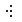</a> | **📂 檔名:** `overflow-menu-left.svg` ✨ **格式:** `Vector (SVG)` ⚖️ **大小:** `552.00B` 📅 **更新:** `2026-03-02`  🚀 **jsDelivr Markdown:** `` 🔗 **直接連結 (Url):** <code>https://cdn.jsdelivr.net/gh/barry028/materials@main/images/iCons/Pixel/Breeze/Actions%20/22/overflow-menu-left.svg</code> 📥 [檢視原始檔](overflow-menu-left.svg) |
| <a href="overflow-menu-right.svg">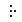</a> | **📂 檔名:** `overflow-menu-right.svg` ✨ **格式:** `Vector (SVG)` ⚖️ **大小:** `480.00B` 📅 **更新:** `2026-03-02`  🚀 **jsDelivr Markdown:** `` 🔗 **直接連結 (Url):** <code>https://cdn.jsdelivr.net/gh/barry028/materials@main/images/iCons/Pixel/Breeze/Actions%20/22/overflow-menu-right.svg</code> 📥 [檢視原始檔](overflow-menu-right.svg) |
|  | **📂 檔名:** `overflow-menu.svg` ✨ **格式:** `Vector (SVG)` ⚖️ **大小:** `1.93KB` 📅 **更新:** `2026-03-02`  🚀 **jsDelivr Markdown:** `` 🔗 **直接連結 (Url):** <code>https://cdn.jsdelivr.net/gh/barry028/materials@main/images/iCons/Pixel/Breeze/Actions%20/22/overflow-menu.svg</code> 📥 [檢視原始檔](overflow-menu.svg) |
|  | **📂 檔名:** `page-2sides.svg` ✨ **格式:** `Vector (SVG)` ⚖️ **大小:** `465.00B` 📅 **更新:** `2026-03-02`  🚀 **jsDelivr Markdown:** `` 🔗 **直接連結 (Url):** <code>https://cdn.jsdelivr.net/gh/barry028/materials@main/images/iCons/Pixel/Breeze/Actions%20/22/page-2sides.svg</code> 📥 [檢視原始檔](page-2sides.svg) |
|  | **📂 檔名:** `page-3sides.svg` ✨ **格式:** `Vector (SVG)` ⚖️ **大小:** `498.00B` 📅 **更新:** `2026-03-02`  🚀 **jsDelivr Markdown:** `` 🔗 **直接連結 (Url):** <code>https://cdn.jsdelivr.net/gh/barry028/materials@main/images/iCons/Pixel/Breeze/Actions%20/22/page-3sides.svg</code> 📥 [檢視原始檔](page-3sides.svg) |
|  | **📂 檔名:** `page-4sides.svg` ✨ **格式:** `Vector (SVG)` ⚖️ **大小:** `553.00B` 📅 **更新:** `2026-03-02`  🚀 **jsDelivr Markdown:** `` 🔗 **直接連結 (Url):** <code>https://cdn.jsdelivr.net/gh/barry028/materials@main/images/iCons/Pixel/Breeze/Actions%20/22/page-4sides.svg</code> 📥 [檢視原始檔](page-4sides.svg) |
|  | **📂 檔名:** `page-simple.svg` ✨ **格式:** `Vector (SVG)` ⚖️ **大小:** `439.00B` 📅 **更新:** `2026-03-02`  🚀 **jsDelivr Markdown:** `` 🔗 **直接連結 (Url):** <code>https://cdn.jsdelivr.net/gh/barry028/materials@main/images/iCons/Pixel/Breeze/Actions%20/22/page-simple.svg</code> 📥 [檢視原始檔](page-simple.svg) |
|  | **📂 檔名:** `paint-none.svg` ✨ **格式:** `Vector (SVG)` ⚖️ **大小:** `570.00B` 📅 **更新:** `2026-03-02`  🚀 **jsDelivr Markdown:** `` 🔗 **直接連結 (Url):** <code>https://cdn.jsdelivr.net/gh/barry028/materials@main/images/iCons/Pixel/Breeze/Actions%20/22/paint-none.svg</code> 📥 [檢視原始檔](paint-none.svg) |
|  | **📂 檔名:** `panel-fit-height.svg` ✨ **格式:** `Vector (SVG)` ⚖️ **大小:** `2.86KB` 📅 **更新:** `2026-03-02`  🚀 **jsDelivr Markdown:** `` 🔗 **直接連結 (Url):** <code>https://cdn.jsdelivr.net/gh/barry028/materials@main/images/iCons/Pixel/Breeze/Actions%20/22/panel-fit-height.svg</code> 📥 [檢視原始檔](panel-fit-height.svg) |
|  | **📂 檔名:** `panel-fit-width.svg` ✨ **格式:** `Vector (SVG)` ⚖️ **大小:** `2.86KB` 📅 **更新:** `2026-03-02`  🚀 **jsDelivr Markdown:** `` 🔗 **直接連結 (Url):** <code>https://cdn.jsdelivr.net/gh/barry028/materials@main/images/iCons/Pixel/Breeze/Actions%20/22/panel-fit-width.svg</code> 📥 [檢視原始檔](panel-fit-width.svg) |
|  | **📂 檔名:** `paper-color.svg` ✨ **格式:** `Vector (SVG)` ⚖️ **大小:** `995.00B` 📅 **更新:** `2026-03-02`  🚀 **jsDelivr Markdown:** `` 🔗 **直接連結 (Url):** <code>https://cdn.jsdelivr.net/gh/barry028/materials@main/images/iCons/Pixel/Breeze/Actions%20/22/paper-color.svg</code> 📥 [檢視原始檔](paper-color.svg) |
|  | **📂 檔名:** `password-copy.svg` ✨ **格式:** `Vector (SVG)` ⚖️ **大小:** `835.00B` 📅 **更新:** `2026-03-02`  🚀 **jsDelivr Markdown:** `` 🔗 **直接連結 (Url):** <code>https://cdn.jsdelivr.net/gh/barry028/materials@main/images/iCons/Pixel/Breeze/Actions%20/22/password-copy.svg</code> 📥 [檢視原始檔](password-copy.svg) |
|  | **📂 檔名:** `path-clip-edit.svg` ✨ **格式:** `Vector (SVG)` ⚖️ **大小:** `583.00B` 📅 **更新:** `2026-03-02`  🚀 **jsDelivr Markdown:** `` 🔗 **直接連結 (Url):** <code>https://cdn.jsdelivr.net/gh/barry028/materials@main/images/iCons/Pixel/Breeze/Actions%20/22/path-clip-edit.svg</code> 📥 [檢視原始檔](path-clip-edit.svg) |
|  | **📂 檔名:** `path-effect-parameter-next.svg` ✨ **格式:** `Vector (SVG)` ⚖️ **大小:** `915.00B` 📅 **更新:** `2026-03-02`  🚀 **jsDelivr Markdown:** `` 🔗 **直接連結 (Url):** <code>https://cdn.jsdelivr.net/gh/barry028/materials@main/images/iCons/Pixel/Breeze/Actions%20/22/path-effect-parameter-next.svg</code> 📥 [檢視原始檔](path-effect-parameter-next.svg) |
|  | **📂 檔名:** `path-mask-edit.svg` ✨ **格式:** `Vector (SVG)` ⚖️ **大小:** `1.75KB` 📅 **更新:** `2026-03-02`  🚀 **jsDelivr Markdown:** `` 🔗 **直接連結 (Url):** <code>https://cdn.jsdelivr.net/gh/barry028/materials@main/images/iCons/Pixel/Breeze/Actions%20/22/path-mask-edit.svg</code> 📥 [檢視原始檔](path-mask-edit.svg) |
|  | **📂 檔名:** `path-mode-polyline-paraxial.svg` ✨ **格式:** `Vector (SVG)` ⚖️ **大小:** `754.00B` 📅 **更新:** `2026-03-02`  🚀 **jsDelivr Markdown:** `` 🔗 **直接連結 (Url):** <code>https://cdn.jsdelivr.net/gh/barry028/materials@main/images/iCons/Pixel/Breeze/Actions%20/22/path-mode-polyline-paraxial.svg</code> 📥 [檢視原始檔](path-mode-polyline-paraxial.svg) |
| <a href="path-mode-polyline.svg">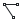</a> | **📂 檔名:** `path-mode-polyline.svg` ✨ **格式:** `Vector (SVG)` ⚖️ **大小:** `677.00B` 📅 **更新:** `2026-03-02`  🚀 **jsDelivr Markdown:** `` 🔗 **直接連結 (Url):** <code>https://cdn.jsdelivr.net/gh/barry028/materials@main/images/iCons/Pixel/Breeze/Actions%20/22/path-mode-polyline.svg</code> 📥 [檢視原始檔](path-mode-polyline.svg) |
|  | **📂 檔名:** `path-reverse.svg` ✨ **格式:** `Vector (SVG)` ⚖️ **大小:** `956.00B` 📅 **更新:** `2026-03-02`  🚀 **jsDelivr Markdown:** `` 🔗 **直接連結 (Url):** <code>https://cdn.jsdelivr.net/gh/barry028/materials@main/images/iCons/Pixel/Breeze/Actions%20/22/path-reverse.svg</code> 📥 [檢視原始檔](path-reverse.svg) |
|  | **📂 檔名:** `path-simplify.svg` ✨ **格式:** `Vector (SVG)` ⚖️ **大小:** `4.71KB` 📅 **更新:** `2026-03-02`  🚀 **jsDelivr Markdown:** `` 🔗 **直接連結 (Url):** <code>https://cdn.jsdelivr.net/gh/barry028/materials@main/images/iCons/Pixel/Breeze/Actions%20/22/path-simplify.svg</code> 📥 [檢視原始檔](path-simplify.svg) |
|  | **📂 檔名:** `pathshape.svg` ✨ **格式:** `Vector (SVG)` ⚖️ **大小:** `681.00B` 📅 **更新:** `2026-03-02`  🚀 **jsDelivr Markdown:** `` 🔗 **直接連結 (Url):** <code>https://cdn.jsdelivr.net/gh/barry028/materials@main/images/iCons/Pixel/Breeze/Actions%20/22/pathshape.svg</code> 📥 [檢視原始檔](pathshape.svg) |
|  | **📂 檔名:** `perspective.svg` ✨ **格式:** `Vector (SVG)` ⚖️ **大小:** `888.00B` 📅 **更新:** `2026-03-02`  🚀 **jsDelivr Markdown:** `` 🔗 **直接連結 (Url):** <code>https://cdn.jsdelivr.net/gh/barry028/materials@main/images/iCons/Pixel/Breeze/Actions%20/22/perspective.svg</code> 📥 [檢視原始檔](perspective.svg) |
|  | **📂 檔名:** `pixelate.svg` ✨ **格式:** `Vector (SVG)` ⚖️ **大小:** `516.00B` 📅 **更新:** `2026-03-02`  🚀 **jsDelivr Markdown:** `` 🔗 **直接連結 (Url):** <code>https://cdn.jsdelivr.net/gh/barry028/materials@main/images/iCons/Pixel/Breeze/Actions%20/22/pixelate.svg</code> 📥 [檢視原始檔](pixelate.svg) |
|  | **📂 檔名:** `player-time.svg` ✨ **格式:** `Vector (SVG)` ⚖️ **大小:** `1.06KB` 📅 **更新:** `2026-03-02`  🚀 **jsDelivr Markdown:** `` 🔗 **直接連結 (Url):** <code>https://cdn.jsdelivr.net/gh/barry028/materials@main/images/iCons/Pixel/Breeze/Actions%20/22/player-time.svg</code> 📥 [檢視原始檔](player-time.svg) |
|  | **📂 檔名:** `plugins.svg` ✨ **格式:** `Vector (SVG)` ⚖️ **大小:** `392.00B` 📅 **更新:** `2026-03-02`  🚀 **jsDelivr Markdown:** `` 🔗 **直接連結 (Url):** <code>https://cdn.jsdelivr.net/gh/barry028/materials@main/images/iCons/Pixel/Breeze/Actions%20/22/plugins.svg</code> 📥 [檢視原始檔](plugins.svg) |
|  | **📂 檔名:** `podcast-amarok.svg` ✨ **格式:** `Vector (SVG)` ⚖️ **大小:** `910.00B` 📅 **更新:** `2026-03-02`  🚀 **jsDelivr Markdown:** `` 🔗 **直接連結 (Url):** <code>https://cdn.jsdelivr.net/gh/barry028/materials@main/images/iCons/Pixel/Breeze/Actions%20/22/podcast-amarok.svg</code> 📥 [檢視原始檔](podcast-amarok.svg) |
|  | **📂 檔名:** `precondition.svg` ✨ **格式:** `Vector (SVG)` ⚖️ **大小:** `498.00B` 📅 **更新:** `2026-03-02`  🚀 **jsDelivr Markdown:** `` 🔗 **直接連結 (Url):** <code>https://cdn.jsdelivr.net/gh/barry028/materials@main/images/iCons/Pixel/Breeze/Actions%20/22/precondition.svg</code> 📥 [檢視原始檔](precondition.svg) |
|  | **📂 檔名:** `preflight-verifier.svg` ✨ **格式:** `Vector (SVG)` ⚖️ **大小:** `851.00B` 📅 **更新:** `2026-03-02`  🚀 **jsDelivr Markdown:** `` 🔗 **直接連結 (Url):** <code>https://cdn.jsdelivr.net/gh/barry028/materials@main/images/iCons/Pixel/Breeze/Actions%20/22/preflight-verifier.svg</code> 📥 [檢視原始檔](preflight-verifier.svg) |
|  | **📂 檔名:** `prevfuzzy.svg` ✨ **格式:** `Vector (SVG)` ⚖️ **大小:** `1.35KB` 📅 **更新:** `2026-03-02`  🚀 **jsDelivr Markdown:** `` 🔗 **直接連結 (Url):** <code>https://cdn.jsdelivr.net/gh/barry028/materials@main/images/iCons/Pixel/Breeze/Actions%20/22/prevfuzzy.svg</code> 📥 [檢視原始檔](prevfuzzy.svg) |
|  | **📂 檔名:** `prevfuzzyuntrans.svg` ✨ **格式:** `Vector (SVG)` ⚖️ **大小:** `1.47KB` 📅 **更新:** `2026-03-02`  🚀 **jsDelivr Markdown:** `` 🔗 **直接連結 (Url):** <code>https://cdn.jsdelivr.net/gh/barry028/materials@main/images/iCons/Pixel/Breeze/Actions%20/22/prevfuzzyuntrans.svg</code> 📥 [檢視原始檔](prevfuzzyuntrans.svg) |
|  | **📂 檔名:** `preview-add-zone.svg` ✨ **格式:** `Vector (SVG)` ⚖️ **大小:** `1.14KB` 📅 **更新:** `2026-03-02`  🚀 **jsDelivr Markdown:** `` 🔗 **直接連結 (Url):** <code>https://cdn.jsdelivr.net/gh/barry028/materials@main/images/iCons/Pixel/Breeze/Actions%20/22/preview-add-zone.svg</code> 📥 [檢視原始檔](preview-add-zone.svg) |
|  | **📂 檔名:** `preview-remove-all.svg` ✨ **格式:** `Vector (SVG)` ⚖️ **大小:** `772.00B` 📅 **更新:** `2026-03-02`  🚀 **jsDelivr Markdown:** `` 🔗 **直接連結 (Url):** <code>https://cdn.jsdelivr.net/gh/barry028/materials@main/images/iCons/Pixel/Breeze/Actions%20/22/preview-remove-all.svg</code> 📥 [檢視原始檔](preview-remove-all.svg) |
|  | **📂 檔名:** `preview-remove-zone.svg` ✨ **格式:** `Vector (SVG)` ⚖️ **大小:** `1.38KB` 📅 **更新:** `2026-03-02`  🚀 **jsDelivr Markdown:** `` 🔗 **直接連結 (Url):** <code>https://cdn.jsdelivr.net/gh/barry028/materials@main/images/iCons/Pixel/Breeze/Actions%20/22/preview-remove-zone.svg</code> 📥 [檢視原始檔](preview-remove-zone.svg) |
|  | **📂 檔名:** `preview-render-off.svg` ✨ **格式:** `Vector (SVG)` ⚖️ **大小:** `1.12KB` 📅 **更新:** `2026-03-02`  🚀 **jsDelivr Markdown:** `` 🔗 **直接連結 (Url):** <code>https://cdn.jsdelivr.net/gh/barry028/materials@main/images/iCons/Pixel/Breeze/Actions%20/22/preview-render-off.svg</code> 📥 [檢視原始檔](preview-render-off.svg) |
|  | **📂 檔名:** `preview-render-on.svg` ✨ **格式:** `Vector (SVG)` ⚖️ **大小:** `691.00B` 📅 **更新:** `2026-03-02`  🚀 **jsDelivr Markdown:** `` 🔗 **直接連結 (Url):** <code>https://cdn.jsdelivr.net/gh/barry028/materials@main/images/iCons/Pixel/Breeze/Actions%20/22/preview-render-on.svg</code> 📥 [檢視原始檔](preview-render-on.svg) |
|  | **📂 檔名:** `prevuntranslated.svg` ✨ **格式:** `Vector (SVG)` ⚖️ **大小:** `586.00B` 📅 **更新:** `2026-03-02`  🚀 **jsDelivr Markdown:** `` 🔗 **直接連結 (Url):** <code>https://cdn.jsdelivr.net/gh/barry028/materials@main/images/iCons/Pixel/Breeze/Actions%20/22/prevuntranslated.svg</code> 📥 [檢視原始檔](prevuntranslated.svg) |
|  | **📂 檔名:** `primarykey_constraint.svg` ✨ **格式:** `Vector (SVG)` ⚖️ **大小:** `506.00B` 📅 **更新:** `2026-03-02`  🚀 **jsDelivr Markdown:** `` 🔗 **直接連結 (Url):** <code>https://cdn.jsdelivr.net/gh/barry028/materials@main/images/iCons/Pixel/Breeze/Actions%20/22/primarykey_constraint.svg</code> 📥 [檢視原始檔](primarykey_constraint.svg) |
|  | **📂 檔名:** `process-stop.svg` ✨ **格式:** `Vector (SVG)` ⚖️ **大小:** `776.00B` 📅 **更新:** `2026-03-02`  🚀 **jsDelivr Markdown:** `` 🔗 **直接連結 (Url):** <code>https://cdn.jsdelivr.net/gh/barry028/materials@main/images/iCons/Pixel/Breeze/Actions%20/22/process-stop.svg</code> 📥 [檢視原始檔](process-stop.svg) |
|  | **📂 檔名:** `project-defaults.svg` ✨ **格式:** `Vector (SVG)` ⚖️ **大小:** `1.27KB` 📅 **更新:** `2026-03-02`  🚀 **jsDelivr Markdown:** `` 🔗 **直接連結 (Url):** <code>https://cdn.jsdelivr.net/gh/barry028/materials@main/images/iCons/Pixel/Breeze/Actions%20/22/project-defaults.svg</code> 📥 [檢視原始檔](project-defaults.svg) |
|  | **📂 檔名:** `project-development-close.svg` ✨ **格式:** `Vector (SVG)` ⚖️ **大小:** `734.00B` 📅 **更新:** `2026-03-02`  🚀 **jsDelivr Markdown:** `` 🔗 **直接連結 (Url):** <code>https://cdn.jsdelivr.net/gh/barry028/materials@main/images/iCons/Pixel/Breeze/Actions%20/22/project-development-close.svg</code> 📥 [檢視原始檔](project-development-close.svg) |
|  | **📂 檔名:** `project-development-new-template.svg` ✨ **格式:** `Vector (SVG)` ⚖️ **大小:** `753.00B` 📅 **更新:** `2026-03-02`  🚀 **jsDelivr Markdown:** `` 🔗 **直接連結 (Url):** <code>https://cdn.jsdelivr.net/gh/barry028/materials@main/images/iCons/Pixel/Breeze/Actions%20/22/project-development-new-template.svg</code> 📥 [檢視原始檔](project-development-new-template.svg) |
|  | **📂 檔名:** `project-development.svg` ✨ **格式:** `Vector (SVG)` ⚖️ **大小:** `487.00B` 📅 **更新:** `2026-03-02`  🚀 **jsDelivr Markdown:** `` 🔗 **直接連結 (Url):** <code>https://cdn.jsdelivr.net/gh/barry028/materials@main/images/iCons/Pixel/Breeze/Actions%20/22/project-development.svg</code> 📥 [檢視原始檔](project-development.svg) |
|  | **📂 檔名:** `project-open.svg` ✨ **格式:** `Vector (SVG)` ⚖️ **大小:** `561.00B` 📅 **更新:** `2026-03-02`  🚀 **jsDelivr Markdown:** `` 🔗 **直接連結 (Url):** <code>https://cdn.jsdelivr.net/gh/barry028/materials@main/images/iCons/Pixel/Breeze/Actions%20/22/project-open.svg</code> 📥 [檢視原始檔](project-open.svg) |
|  | **📂 檔名:** `question.svg` ✨ **格式:** `Vector (SVG)` ⚖️ **大小:** `1.31KB` 📅 **更新:** `2026-03-02`  🚀 **jsDelivr Markdown:** `` 🔗 **直接連結 (Url):** <code>https://cdn.jsdelivr.net/gh/barry028/materials@main/images/iCons/Pixel/Breeze/Actions%20/22/question.svg</code> 📥 [檢視原始檔](question.svg) |
|  | **📂 檔名:** `quickopen-class.svg` ✨ **格式:** `Vector (SVG)` ⚖️ **大小:** `531.00B` 📅 **更新:** `2026-03-02`  🚀 **jsDelivr Markdown:** `` 🔗 **直接連結 (Url):** <code>https://cdn.jsdelivr.net/gh/barry028/materials@main/images/iCons/Pixel/Breeze/Actions%20/22/quickopen-class.svg</code> 📥 [檢視原始檔](quickopen-class.svg) |
|  | **📂 檔名:** `quickopen-file.svg` ✨ **格式:** `Vector (SVG)` ⚖️ **大小:** `601.00B` 📅 **更新:** `2026-03-02`  🚀 **jsDelivr Markdown:** `` 🔗 **直接連結 (Url):** <code>https://cdn.jsdelivr.net/gh/barry028/materials@main/images/iCons/Pixel/Breeze/Actions%20/22/quickopen-file.svg</code> 📥 [檢視原始檔](quickopen-file.svg) |
|  | **📂 檔名:** `quickopen-function.svg` ✨ **格式:** `Vector (SVG)` ⚖️ **大小:** `505.00B` 📅 **更新:** `2026-03-02`  🚀 **jsDelivr Markdown:** `` 🔗 **直接連結 (Url):** <code>https://cdn.jsdelivr.net/gh/barry028/materials@main/images/iCons/Pixel/Breeze/Actions%20/22/quickopen-function.svg</code> 📥 [檢視原始檔](quickopen-function.svg) |
|  | **📂 檔名:** `quickopen.svg` ✨ **格式:** `Vector (SVG)` ⚖️ **大小:** `395.00B` 📅 **更新:** `2026-03-02`  🚀 **jsDelivr Markdown:** `` 🔗 **直接連結 (Url):** <code>https://cdn.jsdelivr.net/gh/barry028/materials@main/images/iCons/Pixel/Breeze/Actions%20/22/quickopen.svg</code> 📥 [檢視原始檔](quickopen.svg) |
|  | **📂 檔名:** `raindrop.svg` ✨ **格式:** `Vector (SVG)` ⚖️ **大小:** `1.05KB` 📅 **更新:** `2026-03-02`  🚀 **jsDelivr Markdown:** `` 🔗 **直接連結 (Url):** <code>https://cdn.jsdelivr.net/gh/barry028/materials@main/images/iCons/Pixel/Breeze/Actions%20/22/raindrop.svg</code> 📥 [檢視原始檔](raindrop.svg) |
|  | **📂 檔名:** `realization.svg` ✨ **格式:** `Vector (SVG)` ⚖️ **大小:** `785.00B` 📅 **更新:** `2026-03-02`  🚀 **jsDelivr Markdown:** `` 🔗 **直接連結 (Url):** <code>https://cdn.jsdelivr.net/gh/barry028/materials@main/images/iCons/Pixel/Breeze/Actions%20/22/realization.svg</code> 📥 [檢視原始檔](realization.svg) |
|  | **📂 檔名:** `redeyes.svg` ✨ **格式:** `Vector (SVG)` ⚖️ **大小:** `1.11KB` 📅 **更新:** `2026-03-02`  🚀 **jsDelivr Markdown:** `` 🔗 **直接連結 (Url):** <code>https://cdn.jsdelivr.net/gh/barry028/materials@main/images/iCons/Pixel/Breeze/Actions%20/22/redeyes.svg</code> 📥 [檢視原始檔](redeyes.svg) |
| <a href="remove-link.svg">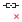</a> | **📂 檔名:** `remove-link.svg` ✨ **格式:** `Vector (SVG)` ⚖️ **大小:** `886.00B` 📅 **更新:** `2026-03-02`  🚀 **jsDelivr Markdown:** `` 🔗 **直接連結 (Url):** <code>https://cdn.jsdelivr.net/gh/barry028/materials@main/images/iCons/Pixel/Breeze/Actions%20/22/remove-link.svg</code> 📥 [檢視原始檔](remove-link.svg) |
|  | **📂 檔名:** `repeat.svg` ✨ **格式:** `Vector (SVG)` ⚖️ **大小:** `966.00B` 📅 **更新:** `2026-03-02`  🚀 **jsDelivr Markdown:** `` 🔗 **直接連結 (Url):** <code>https://cdn.jsdelivr.net/gh/barry028/materials@main/images/iCons/Pixel/Breeze/Actions%20/22/repeat.svg</code> 📥 [檢視原始檔](repeat.svg) |
|  | **📂 檔名:** `resource-calendar-child-insert.svg` ✨ **格式:** `Vector (SVG)` ⚖️ **大小:** `1.13KB` 📅 **更新:** `2026-03-02`  🚀 **jsDelivr Markdown:** `` 🔗 **直接連結 (Url):** <code>https://cdn.jsdelivr.net/gh/barry028/materials@main/images/iCons/Pixel/Breeze/Actions%20/22/resource-calendar-child-insert.svg</code> 📥 [檢視原始檔](resource-calendar-child-insert.svg) |
|  | **📂 檔名:** `resource-calendar-child.svg` ✨ **格式:** `Vector (SVG)` ⚖️ **大小:** `1.02KB` 📅 **更新:** `2026-03-02`  🚀 **jsDelivr Markdown:** `` 🔗 **直接連結 (Url):** <code>https://cdn.jsdelivr.net/gh/barry028/materials@main/images/iCons/Pixel/Breeze/Actions%20/22/resource-calendar-child.svg</code> 📥 [檢視原始檔](resource-calendar-child.svg) |
|  | **📂 檔名:** `resource-calendar-insert.svg` ✨ **格式:** `Vector (SVG)` ⚖️ **大小:** `962.00B` 📅 **更新:** `2026-03-02`  🚀 **jsDelivr Markdown:** `` 🔗 **直接連結 (Url):** <code>https://cdn.jsdelivr.net/gh/barry028/materials@main/images/iCons/Pixel/Breeze/Actions%20/22/resource-calendar-insert.svg</code> 📥 [檢視原始檔](resource-calendar-insert.svg) |
|  | **📂 檔名:** `resource-group-new.svg` ✨ **格式:** `Vector (SVG)` ⚖️ **大小:** `1.07KB` 📅 **更新:** `2026-03-02`  🚀 **jsDelivr Markdown:** `` 🔗 **直接連結 (Url):** <code>https://cdn.jsdelivr.net/gh/barry028/materials@main/images/iCons/Pixel/Breeze/Actions%20/22/resource-group-new.svg</code> 📥 [檢視原始檔](resource-group-new.svg) |
|  | **📂 檔名:** `restoration.svg` ✨ **格式:** `Vector (SVG)` ⚖️ **大小:** `692.00B` 📅 **更新:** `2026-03-02`  🚀 **jsDelivr Markdown:** `` 🔗 **直接連結 (Url):** <code>https://cdn.jsdelivr.net/gh/barry028/materials@main/images/iCons/Pixel/Breeze/Actions%20/22/restoration.svg</code> 📥 [檢視原始檔](restoration.svg) |
|  | **📂 檔名:** `reverse.svg` ✨ **格式:** `Vector (SVG)` ⚖️ **大小:** `745.00B` 📅 **更新:** `2026-03-02`  🚀 **jsDelivr Markdown:** `` 🔗 **直接連結 (Url):** <code>https://cdn.jsdelivr.net/gh/barry028/materials@main/images/iCons/Pixel/Breeze/Actions%20/22/reverse.svg</code> 📥 [檢視原始檔](reverse.svg) |
|  | **📂 檔名:** `roll.svg` ✨ **格式:** `Vector (SVG)` ⚖️ **大小:** `1.03KB` 📅 **更新:** `2026-03-02`  🚀 **jsDelivr Markdown:** `` 🔗 **直接連結 (Url):** <code>https://cdn.jsdelivr.net/gh/barry028/materials@main/images/iCons/Pixel/Breeze/Actions%20/22/roll.svg</code> 📥 [檢視原始檔](roll.svg) |
|  | **📂 檔名:** `rss.svg` ✨ **格式:** `Vector (SVG)` ⚖️ **大小:** `1.33KB` 📅 **更新:** `2026-03-02`  🚀 **jsDelivr Markdown:** `` 🔗 **直接連結 (Url):** <code>https://cdn.jsdelivr.net/gh/barry028/materials@main/images/iCons/Pixel/Breeze/Actions%20/22/rss.svg</code> 📥 [檢視原始檔](rss.svg) |
|  | **📂 檔名:** `run-build-clean.svg` ✨ **格式:** `Vector (SVG)` ⚖️ **大小:** `3.12KB` 📅 **更新:** `2026-03-02`  🚀 **jsDelivr Markdown:** `` 🔗 **直接連結 (Url):** <code>https://cdn.jsdelivr.net/gh/barry028/materials@main/images/iCons/Pixel/Breeze/Actions%20/22/run-build-clean.svg</code> 📥 [檢視原始檔](run-build-clean.svg) |
|  | **📂 檔名:** `run-build-configure.svg` ✨ **格式:** `Vector (SVG)` ⚖️ **大小:** `3.01KB` 📅 **更新:** `2026-03-02`  🚀 **jsDelivr Markdown:** `` 🔗 **直接連結 (Url):** <code>https://cdn.jsdelivr.net/gh/barry028/materials@main/images/iCons/Pixel/Breeze/Actions%20/22/run-build-configure.svg</code> 📥 [檢視原始檔](run-build-configure.svg) |
|  | **📂 檔名:** `run-build-file.svg` ✨ **格式:** `Vector (SVG)` ⚖️ **大小:** `3.05KB` 📅 **更新:** `2026-03-02`  🚀 **jsDelivr Markdown:** `` 🔗 **直接連結 (Url):** <code>https://cdn.jsdelivr.net/gh/barry028/materials@main/images/iCons/Pixel/Breeze/Actions%20/22/run-build-file.svg</code> 📥 [檢視原始檔](run-build-file.svg) |
|  | **📂 檔名:** `run-build-install-root.svg` ✨ **格式:** `Vector (SVG)` ⚖️ **大小:** `2.94KB` 📅 **更新:** `2026-03-02`  🚀 **jsDelivr Markdown:** `` 🔗 **直接連結 (Url):** <code>https://cdn.jsdelivr.net/gh/barry028/materials@main/images/iCons/Pixel/Breeze/Actions%20/22/run-build-install-root.svg</code> 📥 [檢視原始檔](run-build-install-root.svg) |
|  | **📂 檔名:** `run-build-install.svg` ✨ **格式:** `Vector (SVG)` ⚖️ **大小:** `2.97KB` 📅 **更新:** `2026-03-02`  🚀 **jsDelivr Markdown:** `` 🔗 **直接連結 (Url):** <code>https://cdn.jsdelivr.net/gh/barry028/materials@main/images/iCons/Pixel/Breeze/Actions%20/22/run-build-install.svg</code> 📥 [檢視原始檔](run-build-install.svg) |
|  | **📂 檔名:** `run-build-prune.svg` ✨ **格式:** `Vector (SVG)` ⚖️ **大小:** `3.09KB` 📅 **更新:** `2026-03-02`  🚀 **jsDelivr Markdown:** `` 🔗 **直接連結 (Url):** <code>https://cdn.jsdelivr.net/gh/barry028/materials@main/images/iCons/Pixel/Breeze/Actions%20/22/run-build-prune.svg</code> 📥 [檢視原始檔](run-build-prune.svg) |
|  | **📂 檔名:** `run-build.svg` ✨ **格式:** `Vector (SVG)` ⚖️ **大小:** `3.38KB` 📅 **更新:** `2026-03-02`  🚀 **jsDelivr Markdown:** `` 🔗 **直接連結 (Url):** <code>https://cdn.jsdelivr.net/gh/barry028/materials@main/images/iCons/Pixel/Breeze/Actions%20/22/run-build.svg</code> 📥 [檢視原始檔](run-build.svg) |
|  | **📂 檔名:** `select-rectangular.svg` ✨ **格式:** `Vector (SVG)` ⚖️ **大小:** `449.00B` 📅 **更新:** `2026-03-02`  🚀 **jsDelivr Markdown:** `` 🔗 **直接連結 (Url):** <code>https://cdn.jsdelivr.net/gh/barry028/materials@main/images/iCons/Pixel/Breeze/Actions%20/22/select-rectangular.svg</code> 📥 [檢視原始檔](select-rectangular.svg) |
|  | **📂 檔名:** `send_signal.svg` ✨ **格式:** `Vector (SVG)` ⚖️ **大小:** `589.00B` 📅 **更新:** `2026-03-02`  🚀 **jsDelivr Markdown:** `` 🔗 **直接連結 (Url):** <code>https://cdn.jsdelivr.net/gh/barry028/materials@main/images/iCons/Pixel/Breeze/Actions%20/22/send_signal.svg</code> 📥 [檢視原始檔](send_signal.svg) |
|  | **📂 檔名:** `shapes.svg` ✨ **格式:** `Vector (SVG)` ⚖️ **大小:** `1.73KB` 📅 **更新:** `2026-03-02`  🚀 **jsDelivr Markdown:** `` 🔗 **直接連結 (Url):** <code>https://cdn.jsdelivr.net/gh/barry028/materials@main/images/iCons/Pixel/Breeze/Actions%20/22/shapes.svg</code> 📥 [檢視原始檔](shapes.svg) |
|  | **📂 檔名:** `sharpenimage.svg` ✨ **格式:** `Vector (SVG)` ⚖️ **大小:** `498.00B` 📅 **更新:** `2026-03-02`  🚀 **jsDelivr Markdown:** `` 🔗 **直接連結 (Url):** <code>https://cdn.jsdelivr.net/gh/barry028/materials@main/images/iCons/Pixel/Breeze/Actions%20/22/sharpenimage.svg</code> 📥 [檢視原始檔](sharpenimage.svg) |
|  | **📂 檔名:** `show-all-effects.svg` ✨ **格式:** `Vector (SVG)` ⚖️ **大小:** `678.00B` 📅 **更新:** `2026-03-02`  🚀 **jsDelivr Markdown:** `` 🔗 **直接連結 (Url):** <code>https://cdn.jsdelivr.net/gh/barry028/materials@main/images/iCons/Pixel/Breeze/Actions%20/22/show-all-effects.svg</code> 📥 [檢視原始檔](show-all-effects.svg) |
|  | **📂 檔名:** `show-gpu-effects.svg` ✨ **格式:** `Vector (SVG)` ⚖️ **大小:** `832.00B` 📅 **更新:** `2026-03-02`  🚀 **jsDelivr Markdown:** `` 🔗 **直接連結 (Url):** <code>https://cdn.jsdelivr.net/gh/barry028/materials@main/images/iCons/Pixel/Breeze/Actions%20/22/show-gpu-effects.svg</code> 📥 [檢視原始檔](show-gpu-effects.svg) |
|  | **📂 檔名:** `show-menu.svg` ✨ **格式:** `Vector (SVG)` ⚖️ **大小:** `888.00B` 📅 **更新:** `2026-03-02`  🚀 **jsDelivr Markdown:** `` 🔗 **直接連結 (Url):** <code>https://cdn.jsdelivr.net/gh/barry028/materials@main/images/iCons/Pixel/Breeze/Actions%20/22/show-menu.svg</code> 📥 [檢視原始檔](show-menu.svg) |
|  | **📂 檔名:** `show-node-handles.svg` ✨ **格式:** `Vector (SVG)` ⚖️ **大小:** `1.13KB` 📅 **更新:** `2026-03-02`  🚀 **jsDelivr Markdown:** `` 🔗 **直接連結 (Url):** <code>https://cdn.jsdelivr.net/gh/barry028/materials@main/images/iCons/Pixel/Breeze/Actions%20/22/show-node-handles.svg</code> 📥 [檢視原始檔](show-node-handles.svg) |
|  | **📂 檔名:** `show-offline.svg` ✨ **格式:** `Vector (SVG)` ⚖️ **大小:** `986.00B` 📅 **更新:** `2026-03-02`  🚀 **jsDelivr Markdown:** `` 🔗 **直接連結 (Url):** <code>https://cdn.jsdelivr.net/gh/barry028/materials@main/images/iCons/Pixel/Breeze/Actions%20/22/show-offline.svg</code> 📥 [檢視原始檔](show-offline.svg) |
|  | **📂 檔名:** `show-path-outline.svg` ✨ **格式:** `Vector (SVG)` ⚖️ **大小:** `693.00B` 📅 **更新:** `2026-03-02`  🚀 **jsDelivr Markdown:** `` 🔗 **直接連結 (Url):** <code>https://cdn.jsdelivr.net/gh/barry028/materials@main/images/iCons/Pixel/Breeze/Actions%20/22/show-path-outline.svg</code> 📥 [檢視原始檔](show-path-outline.svg) |
|  | **📂 檔名:** `sidebar-collapse-left.svg` ✨ **格式:** `Vector (SVG)` ⚖️ **大小:** `492.00B` 📅 **更新:** `2026-03-02`  🚀 **jsDelivr Markdown:** `` 🔗 **直接連結 (Url):** <code>https://cdn.jsdelivr.net/gh/barry028/materials@main/images/iCons/Pixel/Breeze/Actions%20/22/sidebar-collapse-left.svg</code> 📥 [檢視原始檔](sidebar-collapse-left.svg) |
|  | **📂 檔名:** `sidebar-collapse-right.svg` ✨ **格式:** `Vector (SVG)` ⚖️ **大小:** `495.00B` 📅 **更新:** `2026-03-02`  🚀 **jsDelivr Markdown:** `` 🔗 **直接連結 (Url):** <code>https://cdn.jsdelivr.net/gh/barry028/materials@main/images/iCons/Pixel/Breeze/Actions%20/22/sidebar-collapse-right.svg</code> 📥 [檢視原始檔](sidebar-collapse-right.svg) |
|  | **📂 檔名:** `sidebar-expand-left.svg` ✨ **格式:** `Vector (SVG)` ⚖️ **大小:** `493.00B` 📅 **更新:** `2026-03-02`  🚀 **jsDelivr Markdown:** `` 🔗 **直接連結 (Url):** <code>https://cdn.jsdelivr.net/gh/barry028/materials@main/images/iCons/Pixel/Breeze/Actions%20/22/sidebar-expand-left.svg</code> 📥 [檢視原始檔](sidebar-expand-left.svg) |
|  | **📂 檔名:** `sidebar-expand-right.svg` ✨ **格式:** `Vector (SVG)` ⚖️ **大小:** `499.00B` 📅 **更新:** `2026-03-02`  🚀 **jsDelivr Markdown:** `` 🔗 **直接連結 (Url):** <code>https://cdn.jsdelivr.net/gh/barry028/materials@main/images/iCons/Pixel/Breeze/Actions%20/22/sidebar-expand-right.svg</code> 📥 [檢視原始檔](sidebar-expand-right.svg) |
|  | **📂 檔名:** `similarartists-amarok.svg` ✨ **格式:** `Vector (SVG)` ⚖️ **大小:** `1.14KB` 📅 **更新:** `2026-03-02`  🚀 **jsDelivr Markdown:** `` 🔗 **直接連結 (Url):** <code>https://cdn.jsdelivr.net/gh/barry028/materials@main/images/iCons/Pixel/Breeze/Actions%20/22/similarartists-amarok.svg</code> 📥 [檢視原始檔](similarartists-amarok.svg) |
|  | **📂 檔名:** `skg-chart-bubble.svg` ✨ **格式:** `Vector (SVG)` ⚖️ **大小:** `1.30KB` 📅 **更新:** `2026-03-02`  🚀 **jsDelivr Markdown:** `` 🔗 **直接連結 (Url):** <code>https://cdn.jsdelivr.net/gh/barry028/materials@main/images/iCons/Pixel/Breeze/Actions%20/22/skg-chart-bubble.svg</code> 📥 [檢視原始檔](skg-chart-bubble.svg) |
|  | **📂 檔名:** `skrooge_less.svg` ✨ **格式:** `Vector (SVG)` ⚖️ **大小:** `431.00B` 📅 **更新:** `2026-03-02`  🚀 **jsDelivr Markdown:** `` 🔗 **直接連結 (Url):** <code>https://cdn.jsdelivr.net/gh/barry028/materials@main/images/iCons/Pixel/Breeze/Actions%20/22/skrooge_less.svg</code> 📥 [檢視原始檔](skrooge_less.svg) |
|  | **📂 檔名:** `skrooge_more.svg` ✨ **格式:** `Vector (SVG)` ⚖️ **大小:** `488.00B` 📅 **更新:** `2026-03-02`  🚀 **jsDelivr Markdown:** `` 🔗 **直接連結 (Url):** <code>https://cdn.jsdelivr.net/gh/barry028/materials@main/images/iCons/Pixel/Breeze/Actions%20/22/skrooge_more.svg</code> 📥 [檢視原始檔](skrooge_more.svg) |
|  | **📂 檔名:** `skrooge_much_less.svg` ✨ **格式:** `Vector (SVG)` ⚖️ **大小:** `463.00B` 📅 **更新:** `2026-03-02`  🚀 **jsDelivr Markdown:** `` 🔗 **直接連結 (Url):** <code>https://cdn.jsdelivr.net/gh/barry028/materials@main/images/iCons/Pixel/Breeze/Actions%20/22/skrooge_much_less.svg</code> 📥 [檢視原始檔](skrooge_much_less.svg) |
|  | **📂 檔名:** `skrooge_much_more.svg` ✨ **格式:** `Vector (SVG)` ⚖️ **大小:** `408.00B` 📅 **更新:** `2026-03-02`  🚀 **jsDelivr Markdown:** `` 🔗 **直接連結 (Url):** <code>https://cdn.jsdelivr.net/gh/barry028/materials@main/images/iCons/Pixel/Breeze/Actions%20/22/skrooge_much_more.svg</code> 📥 [檢視原始檔](skrooge_much_more.svg) |
|  | **📂 檔名:** `skrooge_type.svg` ✨ **格式:** `Vector (SVG)` ⚖️ **大小:** `628.00B` 📅 **更新:** `2026-03-02`  🚀 **jsDelivr Markdown:** `` 🔗 **直接連結 (Url):** <code>https://cdn.jsdelivr.net/gh/barry028/materials@main/images/iCons/Pixel/Breeze/Actions%20/22/skrooge_type.svg</code> 📥 [檢視原始檔](skrooge_type.svg) |
|  | **📂 檔名:** `smiley-add.svg` ✨ **格式:** `Vector (SVG)` ⚖️ **大小:** `2.10KB` 📅 **更新:** `2026-03-02`  🚀 **jsDelivr Markdown:** `` 🔗 **直接連結 (Url):** <code>https://cdn.jsdelivr.net/gh/barry028/materials@main/images/iCons/Pixel/Breeze/Actions%20/22/smiley-add.svg</code> 📥 [檢視原始檔](smiley-add.svg) |
|  | **📂 檔名:** `smiley-shape.svg` ✨ **格式:** `Vector (SVG)` ⚖️ **大小:** `2.56KB` 📅 **更新:** `2026-03-02`  🚀 **jsDelivr Markdown:** `` 🔗 **直接連結 (Url):** <code>https://cdn.jsdelivr.net/gh/barry028/materials@main/images/iCons/Pixel/Breeze/Actions%20/22/smiley-shape.svg</code> 📥 [檢視原始檔](smiley-shape.svg) |
|  | **📂 檔名:** `smiley.svg` ✨ **格式:** `Vector (SVG)` ⚖️ **大小:** `1.90KB` 📅 **更新:** `2026-03-02`  🚀 **jsDelivr Markdown:** `` 🔗 **直接連結 (Url):** <code>https://cdn.jsdelivr.net/gh/barry028/materials@main/images/iCons/Pixel/Breeze/Actions%20/22/smiley.svg</code> 📥 [檢視原始檔](smiley.svg) |
|  | **📂 檔名:** `smooth.svg` ✨ **格式:** `Vector (SVG)` ⚖️ **大小:** `403.00B` 📅 **更新:** `2026-03-02`  🚀 **jsDelivr Markdown:** `` 🔗 **直接連結 (Url):** <code>https://cdn.jsdelivr.net/gh/barry028/materials@main/images/iCons/Pixel/Breeze/Actions%20/22/smooth.svg</code> 📥 [檢視原始檔](smooth.svg) |
|  | **📂 檔名:** `snap-angle.svg` ✨ **格式:** `Vector (SVG)` ⚖️ **大小:** `1.22KB` 📅 **更新:** `2026-03-02`  🚀 **jsDelivr Markdown:** `` 🔗 **直接連結 (Url):** <code>https://cdn.jsdelivr.net/gh/barry028/materials@main/images/iCons/Pixel/Breeze/Actions%20/22/snap-angle.svg</code> 📥 [檢視原始檔](snap-angle.svg) |
|  | **📂 檔名:** `snap-bounding-box-center.svg` ✨ **格式:** `Vector (SVG)` ⚖️ **大小:** `1.47KB` 📅 **更新:** `2026-03-02`  🚀 **jsDelivr Markdown:** `` 🔗 **直接連結 (Url):** <code>https://cdn.jsdelivr.net/gh/barry028/materials@main/images/iCons/Pixel/Breeze/Actions%20/22/snap-bounding-box-center.svg</code> 📥 [檢視原始檔](snap-bounding-box-center.svg) |
|  | **📂 檔名:** `snap-bounding-box-corners.svg` ✨ **格式:** `Vector (SVG)` ⚖️ **大小:** `1.25KB` 📅 **更新:** `2026-03-02`  🚀 **jsDelivr Markdown:** `` 🔗 **直接連結 (Url):** <code>https://cdn.jsdelivr.net/gh/barry028/materials@main/images/iCons/Pixel/Breeze/Actions%20/22/snap-bounding-box-corners.svg</code> 📥 [檢視原始檔](snap-bounding-box-corners.svg) |
|  | **📂 檔名:** `snap-bounding-box-edges.svg` ✨ **格式:** `Vector (SVG)` ⚖️ **大小:** `1.56KB` 📅 **更新:** `2026-03-02`  🚀 **jsDelivr Markdown:** `` 🔗 **直接連結 (Url):** <code>https://cdn.jsdelivr.net/gh/barry028/materials@main/images/iCons/Pixel/Breeze/Actions%20/22/snap-bounding-box-edges.svg</code> 📥 [檢視原始檔](snap-bounding-box-edges.svg) |
|  | **📂 檔名:** `snap-bounding-box-midpoints.svg` ✨ **格式:** `Vector (SVG)` ⚖️ **大小:** `1.32KB` 📅 **更新:** `2026-03-02`  🚀 **jsDelivr Markdown:** `` 🔗 **直接連結 (Url):** <code>https://cdn.jsdelivr.net/gh/barry028/materials@main/images/iCons/Pixel/Breeze/Actions%20/22/snap-bounding-box-midpoints.svg</code> 📥 [檢視原始檔](snap-bounding-box-midpoints.svg) |
|  | **📂 檔名:** `snap-extension.svg` ✨ **格式:** `Vector (SVG)` ⚖️ **大小:** `579.00B` 📅 **更新:** `2026-03-02`  🚀 **jsDelivr Markdown:** `` 🔗 **直接連結 (Url):** <code>https://cdn.jsdelivr.net/gh/barry028/materials@main/images/iCons/Pixel/Breeze/Actions%20/22/snap-extension.svg</code> 📥 [檢視原始檔](snap-extension.svg) |
|  | **📂 檔名:** `snap-grid-guide-intersections.svg` ✨ **格式:** `Vector (SVG)` ⚖️ **大小:** `1.12KB` 📅 **更新:** `2026-03-02`  🚀 **jsDelivr Markdown:** `` 🔗 **直接連結 (Url):** <code>https://cdn.jsdelivr.net/gh/barry028/materials@main/images/iCons/Pixel/Breeze/Actions%20/22/snap-grid-guide-intersections.svg</code> 📥 [檢視原始檔](snap-grid-guide-intersections.svg) |
|  | **📂 檔名:** `snap-guideline.svg` ✨ **格式:** `Vector (SVG)` ⚖️ **大小:** `684.00B` 📅 **更新:** `2026-03-02`  🚀 **jsDelivr Markdown:** `` 🔗 **直接連結 (Url):** <code>https://cdn.jsdelivr.net/gh/barry028/materials@main/images/iCons/Pixel/Breeze/Actions%20/22/snap-guideline.svg</code> 📥 [檢視原始檔](snap-guideline.svg) |
|  | **📂 檔名:** `snap-intersection.svg` ✨ **格式:** `Vector (SVG)` ⚖️ **大小:** `707.00B` 📅 **更新:** `2026-03-02`  🚀 **jsDelivr Markdown:** `` 🔗 **直接連結 (Url):** <code>https://cdn.jsdelivr.net/gh/barry028/materials@main/images/iCons/Pixel/Breeze/Actions%20/22/snap-intersection.svg</code> 📥 [檢視原始檔](snap-intersection.svg) |
|  | **📂 檔名:** `snap-node.svg` ✨ **格式:** `Vector (SVG)` ⚖️ **大小:** `605.00B` 📅 **更新:** `2026-03-02`  🚀 **jsDelivr Markdown:** `` 🔗 **直接連結 (Url):** <code>https://cdn.jsdelivr.net/gh/barry028/materials@main/images/iCons/Pixel/Breeze/Actions%20/22/snap-node.svg</code> 📥 [檢視原始檔](snap-node.svg) |
|  | **📂 檔名:** `snap-nodes-center.svg` ✨ **格式:** `Vector (SVG)` ⚖️ **大小:** `843.00B` 📅 **更新:** `2026-03-02`  🚀 **jsDelivr Markdown:** `` 🔗 **直接連結 (Url):** <code>https://cdn.jsdelivr.net/gh/barry028/materials@main/images/iCons/Pixel/Breeze/Actions%20/22/snap-nodes-center.svg</code> 📥 [檢視原始檔](snap-nodes-center.svg) |
|  | **📂 檔名:** `snap-nodes-cusp.svg` ✨ **格式:** `Vector (SVG)` ⚖️ **大小:** `624.00B` 📅 **更新:** `2026-03-02`  🚀 **jsDelivr Markdown:** `` 🔗 **直接連結 (Url):** <code>https://cdn.jsdelivr.net/gh/barry028/materials@main/images/iCons/Pixel/Breeze/Actions%20/22/snap-nodes-cusp.svg</code> 📥 [檢視原始檔](snap-nodes-cusp.svg) |
|  | **📂 檔名:** `snap-nodes-intersection.svg` ✨ **格式:** `Vector (SVG)` ⚖️ **大小:** `986.00B` 📅 **更新:** `2026-03-02`  🚀 **jsDelivr Markdown:** `` 🔗 **直接連結 (Url):** <code>https://cdn.jsdelivr.net/gh/barry028/materials@main/images/iCons/Pixel/Breeze/Actions%20/22/snap-nodes-intersection.svg</code> 📥 [檢視原始檔](snap-nodes-intersection.svg) |
|  | **📂 檔名:** `snap-nodes-midpoint.svg` ✨ **格式:** `Vector (SVG)` ⚖️ **大小:** `535.00B` 📅 **更新:** `2026-03-02`  🚀 **jsDelivr Markdown:** `` 🔗 **直接連結 (Url):** <code>https://cdn.jsdelivr.net/gh/barry028/materials@main/images/iCons/Pixel/Breeze/Actions%20/22/snap-nodes-midpoint.svg</code> 📥 [檢視原始檔](snap-nodes-midpoint.svg) |
|  | **📂 檔名:** `snap-nodes-path.svg` ✨ **格式:** `Vector (SVG)` ⚖️ **大小:** `746.00B` 📅 **更新:** `2026-03-02`  🚀 **jsDelivr Markdown:** `` 🔗 **直接連結 (Url):** <code>https://cdn.jsdelivr.net/gh/barry028/materials@main/images/iCons/Pixel/Breeze/Actions%20/22/snap-nodes-path.svg</code> 📥 [檢視原始檔](snap-nodes-path.svg) |
|  | **📂 檔名:** `snap-nodes-rotation-center.svg` ✨ **格式:** `Vector (SVG)` ⚖️ **大小:** `1.88KB` 📅 **更新:** `2026-03-02`  🚀 **jsDelivr Markdown:** `` 🔗 **直接連結 (Url):** <code>https://cdn.jsdelivr.net/gh/barry028/materials@main/images/iCons/Pixel/Breeze/Actions%20/22/snap-nodes-rotation-center.svg</code> 📥 [檢視原始檔](snap-nodes-rotation-center.svg) |
|  | **📂 檔名:** `snap-nodes-smooth.svg` ✨ **格式:** `Vector (SVG)` ⚖️ **大小:** `877.00B` 📅 **更新:** `2026-03-02`  🚀 **jsDelivr Markdown:** `` 🔗 **直接連結 (Url):** <code>https://cdn.jsdelivr.net/gh/barry028/materials@main/images/iCons/Pixel/Breeze/Actions%20/22/snap-nodes-smooth.svg</code> 📥 [檢視原始檔](snap-nodes-smooth.svg) |
|  | **📂 檔名:** `snap-orthogonal.svg` ✨ **格式:** `Vector (SVG)` ⚖️ **大小:** `770.00B` 📅 **更新:** `2026-03-02`  🚀 **jsDelivr Markdown:** `` 🔗 **直接連結 (Url):** <code>https://cdn.jsdelivr.net/gh/barry028/materials@main/images/iCons/Pixel/Breeze/Actions%20/22/snap-orthogonal.svg</code> 📥 [檢視原始檔](snap-orthogonal.svg) |
|  | **📂 檔名:** `snap-page.svg` ✨ **格式:** `Vector (SVG)` ⚖️ **大小:** `368.00B` 📅 **更新:** `2026-03-02`  🚀 **jsDelivr Markdown:** `` 🔗 **直接連結 (Url):** <code>https://cdn.jsdelivr.net/gh/barry028/materials@main/images/iCons/Pixel/Breeze/Actions%20/22/snap-page.svg</code> 📥 [檢視原始檔](snap-page.svg) |
|  | **📂 檔名:** `snap-text-baseline.svg` ✨ **格式:** `Vector (SVG)` ⚖️ **大小:** `925.00B` 📅 **更新:** `2026-03-02`  🚀 **jsDelivr Markdown:** `` 🔗 **直接連結 (Url):** <code>https://cdn.jsdelivr.net/gh/barry028/materials@main/images/iCons/Pixel/Breeze/Actions%20/22/snap-text-baseline.svg</code> 📥 [檢視原始檔](snap-text-baseline.svg) |
|  | **📂 檔名:** `snap.svg` ✨ **格式:** `Vector (SVG)` ⚖️ **大小:** `768.00B` 📅 **更新:** `2026-03-02`  🚀 **jsDelivr Markdown:** `` 🔗 **直接連結 (Url):** <code>https://cdn.jsdelivr.net/gh/barry028/materials@main/images/iCons/Pixel/Breeze/Actions%20/22/snap.svg</code> 📥 [檢視原始檔](snap.svg) |
|  | **📂 檔名:** `sort-presence.svg` ✨ **格式:** `Vector (SVG)` ⚖️ **大小:** `1.17KB` 📅 **更新:** `2026-03-02`  🚀 **jsDelivr Markdown:** `` 🔗 **直接連結 (Url):** <code>https://cdn.jsdelivr.net/gh/barry028/materials@main/images/iCons/Pixel/Breeze/Actions%20/22/sort-presence.svg</code> 📥 [檢視原始檔](sort-presence.svg) |
|  | **📂 檔名:** `speaker.svg` ✨ **格式:** `Vector (SVG)` ⚖️ **大小:** `1.50KB` 📅 **更新:** `2026-03-02`  🚀 **jsDelivr Markdown:** `` 🔗 **直接連結 (Url):** <code>https://cdn.jsdelivr.net/gh/barry028/materials@main/images/iCons/Pixel/Breeze/Actions%20/22/speaker.svg</code> 📥 [檢視原始檔](speaker.svg) |
|  | **📂 檔名:** `special_paste.svg` ✨ **格式:** `Vector (SVG)` ⚖️ **大小:** `908.00B` 📅 **更新:** `2026-03-02`  🚀 **jsDelivr Markdown:** `` 🔗 **直接連結 (Url):** <code>https://cdn.jsdelivr.net/gh/barry028/materials@main/images/iCons/Pixel/Breeze/Actions%20/22/special_paste.svg</code> 📥 [檢視原始檔](special_paste.svg) |
|  | **📂 檔名:** `split.svg` ✨ **格式:** `Vector (SVG)` ⚖️ **大小:** `508.00B` 📅 **更新:** `2026-03-02`  🚀 **jsDelivr Markdown:** `` 🔗 **直接連結 (Url):** <code>https://cdn.jsdelivr.net/gh/barry028/materials@main/images/iCons/Pixel/Breeze/Actions%20/22/split.svg</code> 📥 [檢視原始檔](split.svg) |
|  | **📂 檔名:** `sqrt.svg` ✨ **格式:** `Vector (SVG)` ⚖️ **大小:** `885.00B` 📅 **更新:** `2026-03-02`  🚀 **jsDelivr Markdown:** `` 🔗 **直接連結 (Url):** <code>https://cdn.jsdelivr.net/gh/barry028/materials@main/images/iCons/Pixel/Breeze/Actions%20/22/sqrt.svg</code> 📥 [檢視原始檔](sqrt.svg) |
|  | **📂 檔名:** `standard-connector.svg` ✨ **格式:** `Vector (SVG)` ⚖️ **大小:** `1.04KB` 📅 **更新:** `2026-03-02`  🚀 **jsDelivr Markdown:** `` 🔗 **直接連結 (Url):** <code>https://cdn.jsdelivr.net/gh/barry028/materials@main/images/iCons/Pixel/Breeze/Actions%20/22/standard-connector.svg</code> 📥 [檢視原始檔](standard-connector.svg) |
|  | **📂 檔名:** `state-fork.svg` ✨ **格式:** `Vector (SVG)` ⚖️ **大小:** `1.25KB` 📅 **更新:** `2026-03-02`  🚀 **jsDelivr Markdown:** `` 🔗 **直接連結 (Url):** <code>https://cdn.jsdelivr.net/gh/barry028/materials@main/images/iCons/Pixel/Breeze/Actions%20/22/state-fork.svg</code> 📥 [檢視原始檔](state-fork.svg) |
|  | **📂 檔名:** `stateshape.svg` ✨ **格式:** `Vector (SVG)` ⚖️ **大小:** `763.00B` 📅 **更新:** `2026-03-02`  🚀 **jsDelivr Markdown:** `` 🔗 **直接連結 (Url):** <code>https://cdn.jsdelivr.net/gh/barry028/materials@main/images/iCons/Pixel/Breeze/Actions%20/22/stateshape.svg</code> 📥 [檢視原始檔](stateshape.svg) |
|  | **📂 檔名:** `step_object_ChargedParticle.svg` ✨ **格式:** `Vector (SVG)` ⚖️ **大小:** `1.12KB` 📅 **更新:** `2026-03-02`  🚀 **jsDelivr Markdown:** `` 🔗 **直接連結 (Url):** <code>https://cdn.jsdelivr.net/gh/barry028/materials@main/images/iCons/Pixel/Breeze/Actions%20/22/step_object_ChargedParticle.svg</code> 📥 [檢視原始檔](step_object_ChargedParticle.svg) |
|  | **📂 檔名:** `step_object_CircularMotor.svg` ✨ **格式:** `Vector (SVG)` ⚖️ **大小:** `3.36KB` 📅 **更新:** `2026-03-02`  🚀 **jsDelivr Markdown:** `` 🔗 **直接連結 (Url):** <code>https://cdn.jsdelivr.net/gh/barry028/materials@main/images/iCons/Pixel/Breeze/Actions%20/22/step_object_CircularMotor.svg</code> 📥 [檢視原始檔](step_object_CircularMotor.svg) |
|  | **📂 檔名:** `step_object_CoulombForce.svg` ✨ **格式:** `Vector (SVG)` ⚖️ **大小:** `1.02KB` 📅 **更新:** `2026-03-02`  🚀 **jsDelivr Markdown:** `` 🔗 **直接連結 (Url):** <code>https://cdn.jsdelivr.net/gh/barry028/materials@main/images/iCons/Pixel/Breeze/Actions%20/22/step_object_CoulombForce.svg</code> 📥 [檢視原始檔](step_object_CoulombForce.svg) |
|  | **📂 檔名:** `step_object_GravitationForce.svg` ✨ **格式:** `Vector (SVG)` ⚖️ **大小:** `1.11KB` 📅 **更新:** `2026-03-02`  🚀 **jsDelivr Markdown:** `` 🔗 **直接連結 (Url):** <code>https://cdn.jsdelivr.net/gh/barry028/materials@main/images/iCons/Pixel/Breeze/Actions%20/22/step_object_GravitationForce.svg</code> 📥 [檢視原始檔](step_object_GravitationForce.svg) |
|  | **📂 檔名:** `step_object_LinearMotor.svg` ✨ **格式:** `Vector (SVG)` ⚖️ **大小:** `3.06KB` 📅 **更新:** `2026-03-02`  🚀 **jsDelivr Markdown:** `` 🔗 **直接連結 (Url):** <code>https://cdn.jsdelivr.net/gh/barry028/materials@main/images/iCons/Pixel/Breeze/Actions%20/22/step_object_LinearMotor.svg</code> 📥 [檢視原始檔](step_object_LinearMotor.svg) |
|  | **📂 檔名:** `step_object_SoftBody.svg` ✨ **格式:** `Vector (SVG)` ⚖️ **大小:** `3.18KB` 📅 **更新:** `2026-03-02`  🚀 **jsDelivr Markdown:** `` 🔗 **直接連結 (Url):** <code>https://cdn.jsdelivr.net/gh/barry028/materials@main/images/iCons/Pixel/Breeze/Actions%20/22/step_object_SoftBody.svg</code> 📥 [檢視原始檔](step_object_SoftBody.svg) |
|  | **📂 檔名:** `step_object_Spring.svg` ✨ **格式:** `Vector (SVG)` ⚖️ **大小:** `693.00B` 📅 **更新:** `2026-03-02`  🚀 **jsDelivr Markdown:** `` 🔗 **直接連結 (Url):** <code>https://cdn.jsdelivr.net/gh/barry028/materials@main/images/iCons/Pixel/Breeze/Actions%20/22/step_object_Spring.svg</code> 📥 [檢視原始檔](step_object_Spring.svg) |
|  | **📂 檔名:** `step_object_WeightForce.svg` ✨ **格式:** `Vector (SVG)` ⚖️ **大小:** `981.00B` 📅 **更新:** `2026-03-02`  🚀 **jsDelivr Markdown:** `` 🔗 **直接連結 (Url):** <code>https://cdn.jsdelivr.net/gh/barry028/materials@main/images/iCons/Pixel/Breeze/Actions%20/22/step_object_WeightForce.svg</code> 📥 [檢視原始檔](step_object_WeightForce.svg) |
|  | **📂 檔名:** `stickers.svg` ✨ **格式:** `Vector (SVG)` ⚖️ **大小:** `1.06KB` 📅 **更新:** `2026-03-02`  🚀 **jsDelivr Markdown:** `` 🔗 **直接連結 (Url):** <code>https://cdn.jsdelivr.net/gh/barry028/materials@main/images/iCons/Pixel/Breeze/Actions%20/22/stickers.svg</code> 📥 [檢視原始檔](stickers.svg) |
|  | **📂 檔名:** `story-editor.svg` ✨ **格式:** `Vector (SVG)` ⚖️ **大小:** `1.08KB` 📅 **更新:** `2026-03-02`  🚀 **jsDelivr Markdown:** `` 🔗 **直接連結 (Url):** <code>https://cdn.jsdelivr.net/gh/barry028/materials@main/images/iCons/Pixel/Breeze/Actions%20/22/story-editor.svg</code> 📥 [檢視原始檔](story-editor.svg) |
|  | **📂 檔名:** `stroke-cap-butt.svg` ✨ **格式:** `Vector (SVG)` ⚖️ **大小:** `547.00B` 📅 **更新:** `2026-03-02`  🚀 **jsDelivr Markdown:** `` 🔗 **直接連結 (Url):** <code>https://cdn.jsdelivr.net/gh/barry028/materials@main/images/iCons/Pixel/Breeze/Actions%20/22/stroke-cap-butt.svg</code> 📥 [檢視原始檔](stroke-cap-butt.svg) |
|  | **📂 檔名:** `stroke-cap-round.svg` ✨ **格式:** `Vector (SVG)` ⚖️ **大小:** `706.00B` 📅 **更新:** `2026-03-02`  🚀 **jsDelivr Markdown:** `` 🔗 **直接連結 (Url):** <code>https://cdn.jsdelivr.net/gh/barry028/materials@main/images/iCons/Pixel/Breeze/Actions%20/22/stroke-cap-round.svg</code> 📥 [檢視原始檔](stroke-cap-round.svg) |
|  | **📂 檔名:** `stroke-cap-square.svg` ✨ **格式:** `Vector (SVG)` ⚖️ **大小:** `428.00B` 📅 **更新:** `2026-03-02`  🚀 **jsDelivr Markdown:** `` 🔗 **直接連結 (Url):** <code>https://cdn.jsdelivr.net/gh/barry028/materials@main/images/iCons/Pixel/Breeze/Actions%20/22/stroke-cap-square.svg</code> 📥 [檢視原始檔](stroke-cap-square.svg) |
|  | **📂 檔名:** `stroke-join-bevel.svg` ✨ **格式:** `Vector (SVG)` ⚖️ **大小:** `665.00B` 📅 **更新:** `2026-03-02`  🚀 **jsDelivr Markdown:** `` 🔗 **直接連結 (Url):** <code>https://cdn.jsdelivr.net/gh/barry028/materials@main/images/iCons/Pixel/Breeze/Actions%20/22/stroke-join-bevel.svg</code> 📥 [檢視原始檔](stroke-join-bevel.svg) |
|  | **📂 檔名:** `stroke-join-miter.svg` ✨ **格式:** `Vector (SVG)` ⚖️ **大小:** `482.00B` 📅 **更新:** `2026-03-02`  🚀 **jsDelivr Markdown:** `` 🔗 **直接連結 (Url):** <code>https://cdn.jsdelivr.net/gh/barry028/materials@main/images/iCons/Pixel/Breeze/Actions%20/22/stroke-join-miter.svg</code> 📥 [檢視原始檔](stroke-join-miter.svg) |
|  | **📂 檔名:** `stroke-join-round.svg` ✨ **格式:** `Vector (SVG)` ⚖️ **大小:** `546.00B` 📅 **更新:** `2026-03-02`  🚀 **jsDelivr Markdown:** `` 🔗 **直接連結 (Url):** <code>https://cdn.jsdelivr.net/gh/barry028/materials@main/images/iCons/Pixel/Breeze/Actions%20/22/stroke-join-round.svg</code> 📥 [檢視原始檔](stroke-join-round.svg) |
|  | **📂 檔名:** `stroke-to-path.svg` ✨ **格式:** `Vector (SVG)` ⚖️ **大小:** `1.49KB` 📅 **更新:** `2026-03-02`  🚀 **jsDelivr Markdown:** `` 🔗 **直接連結 (Url):** <code>https://cdn.jsdelivr.net/gh/barry028/materials@main/images/iCons/Pixel/Breeze/Actions%20/22/stroke-to-path.svg</code> 📥 [檢視原始檔](stroke-to-path.svg) |
|  | **📂 檔名:** `swap-panels.svg` ✨ **格式:** `Vector (SVG)` ⚖️ **大小:** `884.00B` 📅 **更新:** `2026-03-02`  🚀 **jsDelivr Markdown:** `` 🔗 **直接連結 (Url):** <code>https://cdn.jsdelivr.net/gh/barry028/materials@main/images/iCons/Pixel/Breeze/Actions%20/22/swap-panels.svg</code> 📥 [檢視原始檔](swap-panels.svg) |
|  | **📂 檔名:** `system-lock-screen.svg` ✨ **格式:** `Vector (SVG)` ⚖️ **大小:** `832.00B` 📅 **更新:** `2026-03-02`  🚀 **jsDelivr Markdown:** `` 🔗 **直接連結 (Url):** <code>https://cdn.jsdelivr.net/gh/barry028/materials@main/images/iCons/Pixel/Breeze/Actions%20/22/system-lock-screen.svg</code> 📥 [檢視原始檔](system-lock-screen.svg) |
|  | **📂 檔名:** `system-log-out-rtl.svg` ✨ **格式:** `Vector (SVG)` ⚖️ **大小:** `600.00B` 📅 **更新:** `2026-03-02`  🚀 **jsDelivr Markdown:** `` 🔗 **直接連結 (Url):** <code>https://cdn.jsdelivr.net/gh/barry028/materials@main/images/iCons/Pixel/Breeze/Actions%20/22/system-log-out-rtl.svg</code> 📥 [檢視原始檔](system-log-out-rtl.svg) |
|  | **📂 檔名:** `system-log-out.svg` ✨ **格式:** `Vector (SVG)` ⚖️ **大小:** `701.00B` 📅 **更新:** `2026-03-02`  🚀 **jsDelivr Markdown:** `` 🔗 **直接連結 (Url):** <code>https://cdn.jsdelivr.net/gh/barry028/materials@main/images/iCons/Pixel/Breeze/Actions%20/22/system-log-out.svg</code> 📥 [檢視原始檔](system-log-out.svg) |
|  | **📂 檔名:** `system-run.svg` ✨ **格式:** `Vector (SVG)` ⚖️ **大小:** `502.00B` 📅 **更新:** `2026-03-02`  🚀 **jsDelivr Markdown:** `` 🔗 **直接連結 (Url):** <code>https://cdn.jsdelivr.net/gh/barry028/materials@main/images/iCons/Pixel/Breeze/Actions%20/22/system-run.svg</code> 📥 [檢視原始檔](system-run.svg) |
|  | **📂 檔名:** `system-shutdown.svg` ✨ **格式:** `Vector (SVG)` ⚖️ **大小:** `714.00B` 📅 **更新:** `2026-03-02`  🚀 **jsDelivr Markdown:** `` 🔗 **直接連結 (Url):** <code>https://cdn.jsdelivr.net/gh/barry028/materials@main/images/iCons/Pixel/Breeze/Actions%20/22/system-shutdown.svg</code> 📥 [檢視原始檔](system-shutdown.svg) |
|  | **📂 檔名:** `system-suspend-hibernate.svg` ✨ **格式:** `Vector (SVG)` ⚖️ **大小:** `961.00B` 📅 **更新:** `2026-03-02`  🚀 **jsDelivr Markdown:** `` 🔗 **直接連結 (Url):** <code>https://cdn.jsdelivr.net/gh/barry028/materials@main/images/iCons/Pixel/Breeze/Actions%20/22/system-suspend-hibernate.svg</code> 📥 [檢視原始檔](system-suspend-hibernate.svg) |
|  | **📂 檔名:** `system-suspend.svg` ✨ **格式:** `Vector (SVG)` ⚖️ **大小:** `801.00B` 📅 **更新:** `2026-03-02`  🚀 **jsDelivr Markdown:** `` 🔗 **直接連結 (Url):** <code>https://cdn.jsdelivr.net/gh/barry028/materials@main/images/iCons/Pixel/Breeze/Actions%20/22/system-suspend.svg</code> 📥 [檢視原始檔](system-suspend.svg) |
|  | **📂 檔名:** `system-switch-user.svg` ✨ **格式:** `Vector (SVG)` ⚖️ **大小:** `1.82KB` 📅 **更新:** `2026-03-02`  🚀 **jsDelivr Markdown:** `` 🔗 **直接連結 (Url):** <code>https://cdn.jsdelivr.net/gh/barry028/materials@main/images/iCons/Pixel/Breeze/Actions%20/22/system-switch-user.svg</code> 📥 [檢視原始檔](system-switch-user.svg) |
|  | **📂 檔名:** `system-user-list.svg` ✨ **格式:** `Vector (SVG)` ⚖️ **大小:** `3.48KB` 📅 **更新:** `2026-03-02`  🚀 **jsDelivr Markdown:** `` 🔗 **直接連結 (Url):** <code>https://cdn.jsdelivr.net/gh/barry028/materials@main/images/iCons/Pixel/Breeze/Actions%20/22/system-user-list.svg</code> 📥 [檢視原始檔](system-user-list.svg) |
|  | **📂 檔名:** `system-user-prompt.svg` ✨ **格式:** `Vector (SVG)` ⚖️ **大小:** `2.65KB` 📅 **更新:** `2026-03-02`  🚀 **jsDelivr Markdown:** `` 🔗 **直接連結 (Url):** <code>https://cdn.jsdelivr.net/gh/barry028/materials@main/images/iCons/Pixel/Breeze/Actions%20/22/system-user-prompt.svg</code> 📥 [檢視原始檔](system-user-prompt.svg) |
|  | **📂 檔名:** `tab-detach.svg` ✨ **格式:** `Vector (SVG)` ⚖️ **大小:** `423.00B` 📅 **更新:** `2026-03-02`  🚀 **jsDelivr Markdown:** `` 🔗 **直接連結 (Url):** <code>https://cdn.jsdelivr.net/gh/barry028/materials@main/images/iCons/Pixel/Breeze/Actions%20/22/tab-detach.svg</code> 📥 [檢視原始檔](tab-detach.svg) |
|  | **📂 檔名:** `tab-duplicate.svg` ✨ **格式:** `Vector (SVG)` ⚖️ **大小:** `432.00B` 📅 **更新:** `2026-03-02`  🚀 **jsDelivr Markdown:** `` 🔗 **直接連結 (Url):** <code>https://cdn.jsdelivr.net/gh/barry028/materials@main/images/iCons/Pixel/Breeze/Actions%20/22/tab-duplicate.svg</code> 📥 [檢視原始檔](tab-duplicate.svg) |
|  | **📂 檔名:** `tab-new-background.svg` ✨ **格式:** `Vector (SVG)` ⚖️ **大小:** `790.00B` 📅 **更新:** `2026-03-02`  🚀 **jsDelivr Markdown:** `` 🔗 **直接連結 (Url):** <code>https://cdn.jsdelivr.net/gh/barry028/materials@main/images/iCons/Pixel/Breeze/Actions%20/22/tab-new-background.svg</code> 📥 [檢視原始檔](tab-new-background.svg) |
|  | **📂 檔名:** `tab-new.svg` ✨ **格式:** `Vector (SVG)` ⚖️ **大小:** `590.00B` 📅 **更新:** `2026-03-02`  🚀 **jsDelivr Markdown:** `` 🔗 **直接連結 (Url):** <code>https://cdn.jsdelivr.net/gh/barry028/materials@main/images/iCons/Pixel/Breeze/Actions%20/22/tab-new.svg</code> 📥 [檢視原始檔](tab-new.svg) |
|  | **📂 檔名:** `table.svg` ✨ **格式:** `Vector (SVG)` ⚖️ **大小:** `1.48KB` 📅 **更新:** `2026-03-02`  🚀 **jsDelivr Markdown:** `` 🔗 **直接連結 (Url):** <code>https://cdn.jsdelivr.net/gh/barry028/materials@main/images/iCons/Pixel/Breeze/Actions%20/22/table.svg</code> 📥 [檢視原始檔](table.svg) |
|  | **📂 檔名:** `tag-edit.svg` ✨ **格式:** `Vector (SVG)` ⚖️ **大小:** `571.00B` 📅 **更新:** `2026-03-02`  🚀 **jsDelivr Markdown:** `` 🔗 **直接連結 (Url):** <code>https://cdn.jsdelivr.net/gh/barry028/materials@main/images/iCons/Pixel/Breeze/Actions%20/22/tag-edit.svg</code> 📥 [檢視原始檔](tag-edit.svg) |
|  | **📂 檔名:** `tag-new.svg` ✨ **格式:** `Vector (SVG)` ⚖️ **大小:** `735.00B` 📅 **更新:** `2026-03-02`  🚀 **jsDelivr Markdown:** `` 🔗 **直接連結 (Url):** <code>https://cdn.jsdelivr.net/gh/barry028/materials@main/images/iCons/Pixel/Breeze/Actions%20/22/tag-new.svg</code> 📥 [檢視原始檔](tag-new.svg) |
|  | **📂 檔名:** `tag-recents.svg` ✨ **格式:** `Vector (SVG)` ⚖️ **大小:** `947.00B` 📅 **更新:** `2026-03-02`  🚀 **jsDelivr Markdown:** `` 🔗 **直接連結 (Url):** <code>https://cdn.jsdelivr.net/gh/barry028/materials@main/images/iCons/Pixel/Breeze/Actions%20/22/tag-recents.svg</code> 📥 [檢視原始檔](tag-recents.svg) |
|  | **📂 檔名:** `tag.svg` ✨ **格式:** `Vector (SVG)` ⚖️ **大小:** `610.00B` 📅 **更新:** `2026-03-02`  🚀 **jsDelivr Markdown:** `` 🔗 **直接連結 (Url):** <code>https://cdn.jsdelivr.net/gh/barry028/materials@main/images/iCons/Pixel/Breeze/Actions%20/22/tag.svg</code> 📥 [檢視原始檔](tag.svg) |
|  | **📂 檔名:** `task-new.svg` ✨ **格式:** `Vector (SVG)` ⚖️ **大小:** `740.00B` 📅 **更新:** `2026-03-02`  🚀 **jsDelivr Markdown:** `` 🔗 **直接連結 (Url):** <code>https://cdn.jsdelivr.net/gh/barry028/materials@main/images/iCons/Pixel/Breeze/Actions%20/22/task-new.svg</code> 📥 [檢視原始檔](task-new.svg) |
|  | **📂 檔名:** `taxes-finances.svg` ✨ **格式:** `Vector (SVG)` ⚖️ **大小:** `1.26KB` 📅 **更新:** `2026-03-02`  🚀 **jsDelivr Markdown:** `` 🔗 **直接連結 (Url):** <code>https://cdn.jsdelivr.net/gh/barry028/materials@main/images/iCons/Pixel/Breeze/Actions%20/22/taxes-finances.svg</code> 📥 [檢視原始檔](taxes-finances.svg) |
|  | **📂 檔名:** `texlion.svg` ✨ **格式:** `Vector (SVG)` ⚖️ **大小:** `6.14KB` 📅 **更新:** `2026-03-02`  🚀 **jsDelivr Markdown:** `` 🔗 **直接連結 (Url):** <code>https://cdn.jsdelivr.net/gh/barry028/materials@main/images/iCons/Pixel/Breeze/Actions%20/22/texlion.svg</code> 📥 [檢視原始檔](texlion.svg) |
|  | **📂 檔名:** `text-field-framed.svg` ✨ **格式:** `Vector (SVG)` ⚖️ **大小:** `736.00B` 📅 **更新:** `2026-03-02`  🚀 **jsDelivr Markdown:** `` 🔗 **直接連結 (Url):** <code>https://cdn.jsdelivr.net/gh/barry028/materials@main/images/iCons/Pixel/Breeze/Actions%20/22/text-field-framed.svg</code> 📥 [檢視原始檔](text-field-framed.svg) |
|  | **📂 檔名:** `text-field.svg` ✨ **格式:** `Vector (SVG)` ⚖️ **大小:** `517.00B` 📅 **更新:** `2026-03-02`  🚀 **jsDelivr Markdown:** `` 🔗 **直接連結 (Url):** <code>https://cdn.jsdelivr.net/gh/barry028/materials@main/images/iCons/Pixel/Breeze/Actions%20/22/text-field.svg</code> 📥 [檢視原始檔](text-field.svg) |
|  | **📂 檔名:** `text-flow-into-frame.svg` ✨ **格式:** `Vector (SVG)` ⚖️ **大小:** `1.09KB` 📅 **更新:** `2026-03-02`  🚀 **jsDelivr Markdown:** `` 🔗 **直接連結 (Url):** <code>https://cdn.jsdelivr.net/gh/barry028/materials@main/images/iCons/Pixel/Breeze/Actions%20/22/text-flow-into-frame.svg</code> 📥 [檢視原始檔](text-flow-into-frame.svg) |
|  | **📂 檔名:** `text-frame-link.svg` ✨ **格式:** `Vector (SVG)` ⚖️ **大小:** `703.00B` 📅 **更新:** `2026-03-02`  🚀 **jsDelivr Markdown:** `` 🔗 **直接連結 (Url):** <code>https://cdn.jsdelivr.net/gh/barry028/materials@main/images/iCons/Pixel/Breeze/Actions%20/22/text-frame-link.svg</code> 📥 [檢視原始檔](text-frame-link.svg) |
|  | **📂 檔名:** `text-frame-unlink.svg` ✨ **格式:** `Vector (SVG)` ⚖️ **大小:** `785.00B` 📅 **更新:** `2026-03-02`  🚀 **jsDelivr Markdown:** `` 🔗 **直接連結 (Url):** <code>https://cdn.jsdelivr.net/gh/barry028/materials@main/images/iCons/Pixel/Breeze/Actions%20/22/text-frame-unlink.svg</code> 📥 [檢視原始檔](text-frame-unlink.svg) |
|  | **📂 檔名:** `text-speak.svg` ✨ **格式:** `Vector (SVG)` ⚖️ **大小:** `518.00B` 📅 **更新:** `2026-03-02`  🚀 **jsDelivr Markdown:** `` 🔗 **直接連結 (Url):** <code>https://cdn.jsdelivr.net/gh/barry028/materials@main/images/iCons/Pixel/Breeze/Actions%20/22/text-speak.svg</code> 📥 [檢視原始檔](text-speak.svg) |
|  | **📂 檔名:** `text-unflow.svg` ✨ **格式:** `Vector (SVG)` ⚖️ **大小:** `965.00B` 📅 **更新:** `2026-03-02`  🚀 **jsDelivr Markdown:** `` 🔗 **直接連結 (Url):** <code>https://cdn.jsdelivr.net/gh/barry028/materials@main/images/iCons/Pixel/Breeze/Actions%20/22/text-unflow.svg</code> 📥 [檢視原始檔](text-unflow.svg) |
|  | **📂 檔名:** `text-wrap.svg` ✨ **格式:** `Vector (SVG)` ⚖️ **大小:** `1.05KB` 📅 **更新:** `2026-03-02`  🚀 **jsDelivr Markdown:** `` 🔗 **直接連結 (Url):** <code>https://cdn.jsdelivr.net/gh/barry028/materials@main/images/iCons/Pixel/Breeze/Actions%20/22/text-wrap.svg</code> 📥 [檢視原始檔](text-wrap.svg) |
|  | **📂 檔名:** `text_horz_kern.svg` ✨ **格式:** `Vector (SVG)` ⚖️ **大小:** `1014.00B` 📅 **更新:** `2026-03-02`  🚀 **jsDelivr Markdown:** `` 🔗 **直接連結 (Url):** <code>https://cdn.jsdelivr.net/gh/barry028/materials@main/images/iCons/Pixel/Breeze/Actions%20/22/text_horz_kern.svg</code> 📥 [檢視原始檔](text_horz_kern.svg) |
|  | **📂 檔名:** `text_letter_spacing.svg` ✨ **格式:** `Vector (SVG)` ⚖️ **大小:** `1.32KB` 📅 **更新:** `2026-03-02`  🚀 **jsDelivr Markdown:** `` 🔗 **直接連結 (Url):** <code>https://cdn.jsdelivr.net/gh/barry028/materials@main/images/iCons/Pixel/Breeze/Actions%20/22/text_letter_spacing.svg</code> 📥 [檢視原始檔](text_letter_spacing.svg) |
|  | **📂 檔名:** `text_line_spacing.svg` ✨ **格式:** `Vector (SVG)` ⚖️ **大小:** `903.00B` 📅 **更新:** `2026-03-02`  🚀 **jsDelivr Markdown:** `` 🔗 **直接連結 (Url):** <code>https://cdn.jsdelivr.net/gh/barry028/materials@main/images/iCons/Pixel/Breeze/Actions%20/22/text_line_spacing.svg</code> 📥 [檢視原始檔](text_line_spacing.svg) |
|  | **📂 檔名:** `text_remove_kerns.svg` ✨ **格式:** `Vector (SVG)` ⚖️ **大小:** `1.22KB` 📅 **更新:** `2026-03-02`  🚀 **jsDelivr Markdown:** `` 🔗 **直接連結 (Url):** <code>https://cdn.jsdelivr.net/gh/barry028/materials@main/images/iCons/Pixel/Breeze/Actions%20/22/text_remove_kerns.svg</code> 📥 [檢視原始檔](text_remove_kerns.svg) |
|  | **📂 檔名:** `text_rotation.svg` ✨ **格式:** `Vector (SVG)` ⚖️ **大小:** `1.34KB` 📅 **更新:** `2026-03-02`  🚀 **jsDelivr Markdown:** `` 🔗 **直接連結 (Url):** <code>https://cdn.jsdelivr.net/gh/barry028/materials@main/images/iCons/Pixel/Breeze/Actions%20/22/text_rotation.svg</code> 📥 [檢視原始檔](text_rotation.svg) |
|  | **📂 檔名:** `text_subscript.svg` ✨ **格式:** `Vector (SVG)` ⚖️ **大小:** `1.03KB` 📅 **更新:** `2026-03-02`  🚀 **jsDelivr Markdown:** `` 🔗 **直接連結 (Url):** <code>https://cdn.jsdelivr.net/gh/barry028/materials@main/images/iCons/Pixel/Breeze/Actions%20/22/text_subscript.svg</code> 📥 [檢視原始檔](text_subscript.svg) |
|  | **📂 檔名:** `text_superscript.svg` ✨ **格式:** `Vector (SVG)` ⚖️ **大小:** `1019.00B` 📅 **更新:** `2026-03-02`  🚀 **jsDelivr Markdown:** `` 🔗 **直接連結 (Url):** <code>https://cdn.jsdelivr.net/gh/barry028/materials@main/images/iCons/Pixel/Breeze/Actions%20/22/text_superscript.svg</code> 📥 [檢視原始檔](text_superscript.svg) |
|  | **📂 檔名:** `text_vert_kern.svg` ✨ **格式:** `Vector (SVG)` ⚖️ **大小:** `1017.00B` 📅 **更新:** `2026-03-02`  🚀 **jsDelivr Markdown:** `` 🔗 **直接連結 (Url):** <code>https://cdn.jsdelivr.net/gh/barry028/materials@main/images/iCons/Pixel/Breeze/Actions%20/22/text_vert_kern.svg</code> 📥 [檢視原始檔](text_vert_kern.svg) |
|  | **📂 檔名:** `text_word_spacing.svg` ✨ **格式:** `Vector (SVG)` ⚖️ **大小:** `895.00B` 📅 **更新:** `2026-03-02`  🚀 **jsDelivr Markdown:** `` 🔗 **直接連結 (Url):** <code>https://cdn.jsdelivr.net/gh/barry028/materials@main/images/iCons/Pixel/Breeze/Actions%20/22/text_word_spacing.svg</code> 📥 [檢視原始檔](text_word_spacing.svg) |
|  | **📂 檔名:** `texture.svg` ✨ **格式:** `Vector (SVG)` ⚖️ **大小:** `717.00B` 📅 **更新:** `2026-03-02`  🚀 **jsDelivr Markdown:** `` 🔗 **直接連結 (Url):** <code>https://cdn.jsdelivr.net/gh/barry028/materials@main/images/iCons/Pixel/Breeze/Actions%20/22/texture.svg</code> 📥 [檢視原始檔](texture.svg) |
|  | **📂 檔名:** `timeline-extract.svg` ✨ **格式:** `Vector (SVG)` ⚖️ **大小:** `701.00B` 📅 **更新:** `2026-03-02`  🚀 **jsDelivr Markdown:** `` 🔗 **直接連結 (Url):** <code>https://cdn.jsdelivr.net/gh/barry028/materials@main/images/iCons/Pixel/Breeze/Actions%20/22/timeline-extract.svg</code> 📥 [檢視原始檔](timeline-extract.svg) |
|  | **📂 檔名:** `timeline-insert.svg` ✨ **格式:** `Vector (SVG)` ⚖️ **大小:** `851.00B` 📅 **更新:** `2026-03-02`  🚀 **jsDelivr Markdown:** `` 🔗 **直接連結 (Url):** <code>https://cdn.jsdelivr.net/gh/barry028/materials@main/images/iCons/Pixel/Breeze/Actions%20/22/timeline-insert.svg</code> 📥 [檢視原始檔](timeline-insert.svg) |
|  | **📂 檔名:** `timeline-lift.svg` ✨ **格式:** `Vector (SVG)` ⚖️ **大小:** `731.00B` 📅 **更新:** `2026-03-02`  🚀 **jsDelivr Markdown:** `` 🔗 **直接連結 (Url):** <code>https://cdn.jsdelivr.net/gh/barry028/materials@main/images/iCons/Pixel/Breeze/Actions%20/22/timeline-lift.svg</code> 📥 [檢視原始檔](timeline-lift.svg) |
|  | **📂 檔名:** `timeline-overwrite.svg` ✨ **格式:** `Vector (SVG)` ⚖️ **大小:** `698.00B` 📅 **更新:** `2026-03-02`  🚀 **jsDelivr Markdown:** `` 🔗 **直接連結 (Url):** <code>https://cdn.jsdelivr.net/gh/barry028/materials@main/images/iCons/Pixel/Breeze/Actions%20/22/timeline-overwrite.svg</code> 📥 [檢視原始檔](timeline-overwrite.svg) |
|  | **📂 檔名:** `timeline-use-zone-off.svg` ✨ **格式:** `Vector (SVG)` ⚖️ **大小:** `1.06KB` 📅 **更新:** `2026-03-02`  🚀 **jsDelivr Markdown:** `` 🔗 **直接連結 (Url):** <code>https://cdn.jsdelivr.net/gh/barry028/materials@main/images/iCons/Pixel/Breeze/Actions%20/22/timeline-use-zone-off.svg</code> 📥 [檢視原始檔](timeline-use-zone-off.svg) |
|  | **📂 檔名:** `timeline-use-zone-on.svg` ✨ **格式:** `Vector (SVG)` ⚖️ **大小:** `1.08KB` 📅 **更新:** `2026-03-02`  🚀 **jsDelivr Markdown:** `` 🔗 **直接連結 (Url):** <code>https://cdn.jsdelivr.net/gh/barry028/materials@main/images/iCons/Pixel/Breeze/Actions%20/22/timeline-use-zone-on.svg</code> 📥 [檢視原始檔](timeline-use-zone-on.svg) |
|  | **📂 檔名:** `tool-animator.svg` ✨ **格式:** `Vector (SVG)` ⚖️ **大小:** `763.00B` 📅 **更新:** `2026-03-02`  🚀 **jsDelivr Markdown:** `` 🔗 **直接連結 (Url):** <code>https://cdn.jsdelivr.net/gh/barry028/materials@main/images/iCons/Pixel/Breeze/Actions%20/22/tool-animator.svg</code> 📥 [檢視原始檔](tool-animator.svg) |
|  | **📂 檔名:** `tool-measure.svg` ✨ **格式:** `Vector (SVG)` ⚖️ **大小:** `684.00B` 📅 **更新:** `2026-03-02`  🚀 **jsDelivr Markdown:** `` 🔗 **直接連結 (Url):** <code>https://cdn.jsdelivr.net/gh/barry028/materials@main/images/iCons/Pixel/Breeze/Actions%20/22/tool-measure.svg</code> 📥 [檢視原始檔](tool-measure.svg) |
|  | **📂 檔名:** `tool-spray.svg` ✨ **格式:** `Vector (SVG)` ⚖️ **大小:** `1.00KB` 📅 **更新:** `2026-03-02`  🚀 **jsDelivr Markdown:** `` 🔗 **直接連結 (Url):** <code>https://cdn.jsdelivr.net/gh/barry028/materials@main/images/iCons/Pixel/Breeze/Actions%20/22/tool-spray.svg</code> 📥 [檢視原始檔](tool-spray.svg) |
|  | **📂 檔名:** `tool-tweak.svg` ✨ **格式:** `Vector (SVG)` ⚖️ **大小:** `1.72KB` 📅 **更新:** `2026-03-02`  🚀 **jsDelivr Markdown:** `` 🔗 **直接連結 (Url):** <code>https://cdn.jsdelivr.net/gh/barry028/materials@main/images/iCons/Pixel/Breeze/Actions%20/22/tool-tweak.svg</code> 📥 [檢視原始檔](tool-tweak.svg) |
|  | **📂 檔名:** `tool_color_eraser.svg` ✨ **格式:** `Vector (SVG)` ⚖️ **大小:** `748.00B` 📅 **更新:** `2026-03-02`  🚀 **jsDelivr Markdown:** `` 🔗 **直接連結 (Url):** <code>https://cdn.jsdelivr.net/gh/barry028/materials@main/images/iCons/Pixel/Breeze/Actions%20/22/tool_color_eraser.svg</code> 📥 [檢視原始檔](tool_color_eraser.svg) |
|  | **📂 檔名:** `tool_curve.svg` ✨ **格式:** `Vector (SVG)` ⚖️ **大小:** `595.00B` 📅 **更新:** `2026-03-02`  🚀 **jsDelivr Markdown:** `` 🔗 **直接連結 (Url):** <code>https://cdn.jsdelivr.net/gh/barry028/materials@main/images/iCons/Pixel/Breeze/Actions%20/22/tool_curve.svg</code> 📥 [檢視原始檔](tool_curve.svg) |
|  | **📂 檔名:** `tool_elliptical_selection.svg` ✨ **格式:** `Vector (SVG)` ⚖️ **大小:** `428.00B` 📅 **更新:** `2026-03-02`  🚀 **jsDelivr Markdown:** `` 🔗 **直接連結 (Url):** <code>https://cdn.jsdelivr.net/gh/barry028/materials@main/images/iCons/Pixel/Breeze/Actions%20/22/tool_elliptical_selection.svg</code> 📥 [檢視原始檔](tool_elliptical_selection.svg) |
|  | **📂 檔名:** `tool_polygon.svg` ✨ **格式:** `Vector (SVG)` ⚖️ **大小:** `819.00B` 📅 **更新:** `2026-03-02`  🚀 **jsDelivr Markdown:** `` 🔗 **直接連結 (Url):** <code>https://cdn.jsdelivr.net/gh/barry028/materials@main/images/iCons/Pixel/Breeze/Actions%20/22/tool_polygon.svg</code> 📥 [檢視原始檔](tool_polygon.svg) |
|  | **📂 檔名:** `tools-check-spelling.svg` ✨ **格式:** `Vector (SVG)` ⚖️ **大小:** `699.00B` 📅 **更新:** `2026-03-02`  🚀 **jsDelivr Markdown:** `` 🔗 **直接連結 (Url):** <code>https://cdn.jsdelivr.net/gh/barry028/materials@main/images/iCons/Pixel/Breeze/Actions%20/22/tools-check-spelling.svg</code> 📥 [檢視原始檔](tools-check-spelling.svg) |
|  | **📂 檔名:** `tools-media-optical-burn-image.svg` ✨ **格式:** `Vector (SVG)` ⚖️ **大小:** `985.00B` 📅 **更新:** `2026-03-02`  🚀 **jsDelivr Markdown:** `` 🔗 **直接連結 (Url):** <code>https://cdn.jsdelivr.net/gh/barry028/materials@main/images/iCons/Pixel/Breeze/Actions%20/22/tools-media-optical-burn-image.svg</code> 📥 [檢視原始檔](tools-media-optical-burn-image.svg) |
|  | **📂 檔名:** `tools-media-optical-burn.svg` ✨ **格式:** `Vector (SVG)` ⚖️ **大小:** `1.62KB` 📅 **更新:** `2026-03-02`  🚀 **jsDelivr Markdown:** `` 🔗 **直接連結 (Url):** <code>https://cdn.jsdelivr.net/gh/barry028/materials@main/images/iCons/Pixel/Breeze/Actions%20/22/tools-media-optical-burn.svg</code> 📥 [檢視原始檔](tools-media-optical-burn.svg) |
|  | **📂 檔名:** `tools-media-optical-copy.svg` ✨ **格式:** `Vector (SVG)` ⚖️ **大小:** `1.65KB` 📅 **更新:** `2026-03-02`  🚀 **jsDelivr Markdown:** `` 🔗 **直接連結 (Url):** <code>https://cdn.jsdelivr.net/gh/barry028/materials@main/images/iCons/Pixel/Breeze/Actions%20/22/tools-media-optical-copy.svg</code> 📥 [檢視原始檔](tools-media-optical-copy.svg) |
|  | **📂 檔名:** `tools-media-optical-erase.svg` ✨ **格式:** `Vector (SVG)` ⚖️ **大小:** `1.38KB` 📅 **更新:** `2026-03-02`  🚀 **jsDelivr Markdown:** `` 🔗 **直接連結 (Url):** <code>https://cdn.jsdelivr.net/gh/barry028/materials@main/images/iCons/Pixel/Breeze/Actions%20/22/tools-media-optical-erase.svg</code> 📥 [檢視原始檔](tools-media-optical-erase.svg) |
|  | **📂 檔名:** `tools-media-optical-format.svg` ✨ **格式:** `Vector (SVG)` ⚖️ **大小:** `847.00B` 📅 **更新:** `2026-03-02`  🚀 **jsDelivr Markdown:** `` 🔗 **直接連結 (Url):** <code>https://cdn.jsdelivr.net/gh/barry028/materials@main/images/iCons/Pixel/Breeze/Actions%20/22/tools-media-optical-format.svg</code> 📥 [檢視原始檔](tools-media-optical-format.svg) |
|  | **📂 檔名:** `tools-report-bug.svg` ✨ **格式:** `Vector (SVG)` ⚖️ **大小:** `982.00B` 📅 **更新:** `2026-03-02`  🚀 **jsDelivr Markdown:** `` 🔗 **直接連結 (Url):** <code>https://cdn.jsdelivr.net/gh/barry028/materials@main/images/iCons/Pixel/Breeze/Actions%20/22/tools-report-bug.svg</code> 📥 [檢視原始檔](tools-report-bug.svg) |
|  | **📂 檔名:** `tools-rip-audio-cd.svg` ✨ **格式:** `Vector (SVG)` ⚖️ **大小:** `955.00B` 📅 **更新:** `2026-03-02`  🚀 **jsDelivr Markdown:** `` 🔗 **直接連結 (Url):** <code>https://cdn.jsdelivr.net/gh/barry028/materials@main/images/iCons/Pixel/Breeze/Actions%20/22/tools-rip-audio-cd.svg</code> 📥 [檢視原始檔](tools-rip-audio-cd.svg) |
|  | **📂 檔名:** `tools-rip-video-cd.svg` ✨ **格式:** `Vector (SVG)` ⚖️ **大小:** `1.11KB` 📅 **更新:** `2026-03-02`  🚀 **jsDelivr Markdown:** `` 🔗 **直接連結 (Url):** <code>https://cdn.jsdelivr.net/gh/barry028/materials@main/images/iCons/Pixel/Breeze/Actions%20/22/tools-rip-video-cd.svg</code> 📥 [檢視原始檔](tools-rip-video-cd.svg) |
|  | **📂 檔名:** `tools-rip-video-dvd.svg` ✨ **格式:** `Vector (SVG)` ⚖️ **大小:** `1.04KB` 📅 **更新:** `2026-03-02`  🚀 **jsDelivr Markdown:** `` 🔗 **直接連結 (Url):** <code>https://cdn.jsdelivr.net/gh/barry028/materials@main/images/iCons/Pixel/Breeze/Actions%20/22/tools-rip-video-dvd.svg</code> 📥 [檢視原始檔](tools-rip-video-dvd.svg) |
|  | **📂 檔名:** `tools-wizard.svg` ✨ **格式:** `Vector (SVG)` ⚖️ **大小:** `870.00B` 📅 **更新:** `2026-03-02`  🚀 **jsDelivr Markdown:** `` 🔗 **直接連結 (Url):** <code>https://cdn.jsdelivr.net/gh/barry028/materials@main/images/iCons/Pixel/Breeze/Actions%20/22/tools-wizard.svg</code> 📥 [檢視原始檔](tools-wizard.svg) |
|  | **📂 檔名:** `tools.svg` ✨ **格式:** `Vector (SVG)` ⚖️ **大小:** `333.00B` 📅 **更新:** `2026-03-02`  🚀 **jsDelivr Markdown:** `` 🔗 **直接連結 (Url):** <code>https://cdn.jsdelivr.net/gh/barry028/materials@main/images/iCons/Pixel/Breeze/Actions%20/22/tools.svg</code> 📥 [檢視原始檔](tools.svg) |
|  | **📂 檔名:** `torrents.svg` ✨ **格式:** `Vector (SVG)` ⚖️ **大小:** `1.08KB` 📅 **更新:** `2026-03-02`  🚀 **jsDelivr Markdown:** `` 🔗 **直接連結 (Url):** <code>https://cdn.jsdelivr.net/gh/barry028/materials@main/images/iCons/Pixel/Breeze/Actions%20/22/torrents.svg</code> 📥 [檢視原始檔](torrents.svg) |
|  | **📂 檔名:** `transform-browse.svg` ✨ **格式:** `Vector (SVG)` ⚖️ **大小:** `2.50KB` 📅 **更新:** `2026-03-02`  🚀 **jsDelivr Markdown:** `` 🔗 **直接連結 (Url):** <code>https://cdn.jsdelivr.net/gh/barry028/materials@main/images/iCons/Pixel/Breeze/Actions%20/22/transform-browse.svg</code> 📥 [檢視原始檔](transform-browse.svg) |
|  | **📂 檔名:** `transform-crop-and-resize.svg` ✨ **格式:** `Vector (SVG)` ⚖️ **大小:** `1.20KB` 📅 **更新:** `2026-03-02`  🚀 **jsDelivr Markdown:** `` 🔗 **直接連結 (Url):** <code>https://cdn.jsdelivr.net/gh/barry028/materials@main/images/iCons/Pixel/Breeze/Actions%20/22/transform-crop-and-resize.svg</code> 📥 [檢視原始檔](transform-crop-and-resize.svg) |
|  | **📂 檔名:** `transform-crop.svg` ✨ **格式:** `Vector (SVG)` ⚖️ **大小:** `1.20KB` 📅 **更新:** `2026-03-02`  🚀 **jsDelivr Markdown:** `` 🔗 **直接連結 (Url):** <code>https://cdn.jsdelivr.net/gh/barry028/materials@main/images/iCons/Pixel/Breeze/Actions%20/22/transform-crop.svg</code> 📥 [檢視原始檔](transform-crop.svg) |
|  | **📂 檔名:** `transform-move-horizontal.svg` ✨ **格式:** `Vector (SVG)` ⚖️ **大小:** `519.00B` 📅 **更新:** `2026-03-02`  🚀 **jsDelivr Markdown:** `` 🔗 **直接連結 (Url):** <code>https://cdn.jsdelivr.net/gh/barry028/materials@main/images/iCons/Pixel/Breeze/Actions%20/22/transform-move-horizontal.svg</code> 📥 [檢視原始檔](transform-move-horizontal.svg) |
|  | **📂 檔名:** `transform-move-vertical.svg` ✨ **格式:** `Vector (SVG)` ⚖️ **大小:** `520.00B` 📅 **更新:** `2026-03-02`  🚀 **jsDelivr Markdown:** `` 🔗 **直接連結 (Url):** <code>https://cdn.jsdelivr.net/gh/barry028/materials@main/images/iCons/Pixel/Breeze/Actions%20/22/transform-move-vertical.svg</code> 📥 [檢視原始檔](transform-move-vertical.svg) |
|  | **📂 檔名:** `transform-move.svg` ✨ **格式:** `Vector (SVG)` ⚖️ **大小:** `580.00B` 📅 **更新:** `2026-03-02`  🚀 **jsDelivr Markdown:** `` 🔗 **直接連結 (Url):** <code>https://cdn.jsdelivr.net/gh/barry028/materials@main/images/iCons/Pixel/Breeze/Actions%20/22/transform-move.svg</code> 📥 [檢視原始檔](transform-move.svg) |
|  | **📂 檔名:** `transform-rotate.svg` ✨ **格式:** `Vector (SVG)` ⚖️ **大小:** `675.00B` 📅 **更新:** `2026-03-02`  🚀 **jsDelivr Markdown:** `` 🔗 **直接連結 (Url):** <code>https://cdn.jsdelivr.net/gh/barry028/materials@main/images/iCons/Pixel/Breeze/Actions%20/22/transform-rotate.svg</code> 📥 [檢視原始檔](transform-rotate.svg) |
|  | **📂 檔名:** `transform-scale-textbox-points.svg` ✨ **格式:** `Vector (SVG)` ⚖️ **大小:** `1.05KB` 📅 **更新:** `2026-03-02`  🚀 **jsDelivr Markdown:** `` 🔗 **直接連結 (Url):** <code>https://cdn.jsdelivr.net/gh/barry028/materials@main/images/iCons/Pixel/Breeze/Actions%20/22/transform-scale-textbox-points.svg</code> 📥 [檢視原始檔](transform-scale-textbox-points.svg) |
|  | **📂 檔名:** `transform-scale.svg` ✨ **格式:** `Vector (SVG)` ⚖️ **大小:** `1.09KB` 📅 **更新:** `2026-03-02`  🚀 **jsDelivr Markdown:** `` 🔗 **直接連結 (Url):** <code>https://cdn.jsdelivr.net/gh/barry028/materials@main/images/iCons/Pixel/Breeze/Actions%20/22/transform-scale.svg</code> 📥 [檢視原始檔](transform-scale.svg) |
|  | **📂 檔名:** `transform-shear-down.svg` ✨ **格式:** `Vector (SVG)` ⚖️ **大小:** `616.00B` 📅 **更新:** `2026-03-02`  🚀 **jsDelivr Markdown:** `` 🔗 **直接連結 (Url):** <code>https://cdn.jsdelivr.net/gh/barry028/materials@main/images/iCons/Pixel/Breeze/Actions%20/22/transform-shear-down.svg</code> 📥 [檢視原始檔](transform-shear-down.svg) |
|  | **📂 檔名:** `transform-shear-left.svg` ✨ **格式:** `Vector (SVG)` ⚖️ **大小:** `612.00B` 📅 **更新:** `2026-03-02`  🚀 **jsDelivr Markdown:** `` 🔗 **直接連結 (Url):** <code>https://cdn.jsdelivr.net/gh/barry028/materials@main/images/iCons/Pixel/Breeze/Actions%20/22/transform-shear-left.svg</code> 📥 [檢視原始檔](transform-shear-left.svg) |
|  | **📂 檔名:** `transform-shear-right.svg` ✨ **格式:** `Vector (SVG)` ⚖️ **大小:** `615.00B` 📅 **更新:** `2026-03-02`  🚀 **jsDelivr Markdown:** `` 🔗 **直接連結 (Url):** <code>https://cdn.jsdelivr.net/gh/barry028/materials@main/images/iCons/Pixel/Breeze/Actions%20/22/transform-shear-right.svg</code> 📥 [檢視原始檔](transform-shear-right.svg) |
|  | **📂 檔名:** `transform-shear-up.svg` ✨ **格式:** `Vector (SVG)` ⚖️ **大小:** `611.00B` 📅 **更新:** `2026-03-02`  🚀 **jsDelivr Markdown:** `` 🔗 **直接連結 (Url):** <code>https://cdn.jsdelivr.net/gh/barry028/materials@main/images/iCons/Pixel/Breeze/Actions%20/22/transform-shear-up.svg</code> 📥 [檢視原始檔](transform-shear-up.svg) |
|  | **📂 檔名:** `trash-empty.svg` ✨ **格式:** `Vector (SVG)` ⚖️ **大小:** `523.00B` 📅 **更新:** `2026-03-02`  🚀 **jsDelivr Markdown:** `` 🔗 **直接連結 (Url):** <code>https://cdn.jsdelivr.net/gh/barry028/materials@main/images/iCons/Pixel/Breeze/Actions%20/22/trash-empty.svg</code> 📥 [檢視原始檔](trash-empty.svg) |
|  | **📂 檔名:** `trim-margins.svg` ✨ **格式:** `Vector (SVG)` ⚖️ **大小:** `441.00B` 📅 **更新:** `2026-03-02`  🚀 **jsDelivr Markdown:** `` 🔗 **直接連結 (Url):** <code>https://cdn.jsdelivr.net/gh/barry028/materials@main/images/iCons/Pixel/Breeze/Actions%20/22/trim-margins.svg</code> 📥 [檢視原始檔](trim-margins.svg) |
|  | **📂 檔名:** `trim-to-selection.svg` ✨ **格式:** `Vector (SVG)` ⚖️ **大小:** `506.00B` 📅 **更新:** `2026-03-02`  🚀 **jsDelivr Markdown:** `` 🔗 **直接連結 (Url):** <code>https://cdn.jsdelivr.net/gh/barry028/materials@main/images/iCons/Pixel/Breeze/Actions%20/22/trim-to-selection.svg</code> 📥 [檢視原始檔](trim-to-selection.svg) |
|  | **📂 檔名:** `typewriter.svg` ✨ **格式:** `Vector (SVG)` ⚖️ **大小:** `487.00B` 📅 **更新:** `2026-03-02`  🚀 **jsDelivr Markdown:** `` 🔗 **直接連結 (Url):** <code>https://cdn.jsdelivr.net/gh/barry028/materials@main/images/iCons/Pixel/Breeze/Actions%20/22/typewriter.svg</code> 📥 [檢視原始檔](typewriter.svg) |
|  | **📂 檔名:** `umbrello_diagram_deployment.svg` ✨ **格式:** `Vector (SVG)` ⚖️ **大小:** `738.00B` 📅 **更新:** `2026-03-02`  🚀 **jsDelivr Markdown:** `` 🔗 **直接連結 (Url):** <code>https://cdn.jsdelivr.net/gh/barry028/materials@main/images/iCons/Pixel/Breeze/Actions%20/22/umbrello_diagram_deployment.svg</code> 📥 [檢視原始檔](umbrello_diagram_deployment.svg) |
|  | **📂 檔名:** `underexposure.svg` ✨ **格式:** `Vector (SVG)` ⚖️ **大小:** `524.00B` 📅 **更新:** `2026-03-02`  🚀 **jsDelivr Markdown:** `` 🔗 **直接連結 (Url):** <code>https://cdn.jsdelivr.net/gh/barry028/materials@main/images/iCons/Pixel/Breeze/Actions%20/22/underexposure.svg</code> 📥 [檢視原始檔](underexposure.svg) |
|  | **📂 檔名:** `uniassociation.svg` ✨ **格式:** `Vector (SVG)` ⚖️ **大小:** `462.00B` 📅 **更新:** `2026-03-02`  🚀 **jsDelivr Markdown:** `` 🔗 **直接連結 (Url):** <code>https://cdn.jsdelivr.net/gh/barry028/materials@main/images/iCons/Pixel/Breeze/Actions%20/22/uniassociation.svg</code> 📥 [檢視原始檔](uniassociation.svg) |
|  | **📂 檔名:** `unique_constraint.svg` ✨ **格式:** `Vector (SVG)` ⚖️ **大小:** `457.00B` 📅 **更新:** `2026-03-02`  🚀 **jsDelivr Markdown:** `` 🔗 **直接連結 (Url):** <code>https://cdn.jsdelivr.net/gh/barry028/materials@main/images/iCons/Pixel/Breeze/Actions%20/22/unique_constraint.svg</code> 📥 [檢視原始檔](unique_constraint.svg) |
|  | **📂 檔名:** `unmarkasblank.svg` ✨ **格式:** `Vector (SVG)` ⚖️ **大小:** `882.00B` 📅 **更新:** `2026-03-02`  🚀 **jsDelivr Markdown:** `` 🔗 **直接連結 (Url):** <code>https://cdn.jsdelivr.net/gh/barry028/materials@main/images/iCons/Pixel/Breeze/Actions%20/22/unmarkasblank.svg</code> 📥 [檢視原始檔](unmarkasblank.svg) |
|  | **📂 檔名:** `upindicator.svg` ✨ **格式:** `Vector (SVG)` ⚖️ **大小:** `370.00B` 📅 **更新:** `2026-03-02`  🚀 **jsDelivr Markdown:** `` 🔗 **直接連結 (Url):** <code>https://cdn.jsdelivr.net/gh/barry028/materials@main/images/iCons/Pixel/Breeze/Actions%20/22/upindicator.svg</code> 📥 [檢視原始檔](upindicator.svg) |
|  | **📂 檔名:** `upload-later.svg` ✨ **格式:** `Vector (SVG)` ⚖️ **大小:** `832.00B` 📅 **更新:** `2026-03-02`  🚀 **jsDelivr Markdown:** `` 🔗 **直接連結 (Url):** <code>https://cdn.jsdelivr.net/gh/barry028/materials@main/images/iCons/Pixel/Breeze/Actions%20/22/upload-later.svg</code> 📥 [檢視原始檔](upload-later.svg) |
|  | **📂 檔名:** `upload-media.svg` ✨ **格式:** `Vector (SVG)` ⚖️ **大小:** `1.10KB` 📅 **更新:** `2026-03-02`  🚀 **jsDelivr Markdown:** `` 🔗 **直接連結 (Url):** <code>https://cdn.jsdelivr.net/gh/barry028/materials@main/images/iCons/Pixel/Breeze/Actions%20/22/upload-media.svg</code> 📥 [檢視原始檔](upload-media.svg) |
|  | **📂 檔名:** `user-group-delete.svg` ✨ **格式:** `Vector (SVG)` ⚖️ **大小:** `1.10KB` 📅 **更新:** `2026-03-02`  🚀 **jsDelivr Markdown:** `` 🔗 **直接連結 (Url):** <code>https://cdn.jsdelivr.net/gh/barry028/materials@main/images/iCons/Pixel/Breeze/Actions%20/22/user-group-delete.svg</code> 📥 [檢視原始檔](user-group-delete.svg) |
|  | **📂 檔名:** `user-group-new.svg` ✨ **格式:** `Vector (SVG)` ⚖️ **大小:** `953.00B` 📅 **更新:** `2026-03-02`  🚀 **jsDelivr Markdown:** `` 🔗 **直接連結 (Url):** <code>https://cdn.jsdelivr.net/gh/barry028/materials@main/images/iCons/Pixel/Breeze/Actions%20/22/user-group-new.svg</code> 📥 [檢視原始檔](user-group-new.svg) |
|  | **📂 檔名:** `user-group-properties.svg` ✨ **格式:** `Vector (SVG)` ⚖️ **大小:** `734.00B` 📅 **更新:** `2026-03-02`  🚀 **jsDelivr Markdown:** `` 🔗 **直接連結 (Url):** <code>https://cdn.jsdelivr.net/gh/barry028/materials@main/images/iCons/Pixel/Breeze/Actions%20/22/user-group-properties.svg</code> 📥 [檢視原始檔](user-group-properties.svg) |
|  | **📂 檔名:** `user-others.svg` ✨ **格式:** `Vector (SVG)` ⚖️ **大小:** `827.00B` 📅 **更新:** `2026-03-02`  🚀 **jsDelivr Markdown:** `` 🔗 **直接連結 (Url):** <code>https://cdn.jsdelivr.net/gh/barry028/materials@main/images/iCons/Pixel/Breeze/Actions%20/22/user-others.svg</code> 📥 [檢視原始檔](user-others.svg) |
|  | **📂 檔名:** `username-copy.svg` ✨ **格式:** `Vector (SVG)` ⚖️ **大小:** `867.00B` 📅 **更新:** `2026-03-02`  🚀 **jsDelivr Markdown:** `` 🔗 **直接連結 (Url):** <code>https://cdn.jsdelivr.net/gh/barry028/materials@main/images/iCons/Pixel/Breeze/Actions%20/22/username-copy.svg</code> 📥 [檢視原始檔](username-copy.svg) |
|  | **📂 檔名:** `vcs-branch-delete.svg` ✨ **格式:** `Vector (SVG)` ⚖️ **大小:** `2.54KB` 📅 **更新:** `2026-03-02`  🚀 **jsDelivr Markdown:** `` 🔗 **直接連結 (Url):** <code>https://cdn.jsdelivr.net/gh/barry028/materials@main/images/iCons/Pixel/Breeze/Actions%20/22/vcs-branch-delete.svg</code> 📥 [檢視原始檔](vcs-branch-delete.svg) |
|  | **📂 檔名:** `vcs-branch.svg` ✨ **格式:** `Vector (SVG)` ⚖️ **大小:** `1.25KB` 📅 **更新:** `2026-03-02`  🚀 **jsDelivr Markdown:** `` 🔗 **直接連結 (Url):** <code>https://cdn.jsdelivr.net/gh/barry028/materials@main/images/iCons/Pixel/Breeze/Actions%20/22/vcs-branch.svg</code> 📥 [檢視原始檔](vcs-branch.svg) |
|  | **📂 檔名:** `vcs-commit-cvs-cervisia.svg` ✨ **格式:** `Vector (SVG)` ⚖️ **大小:** `1.41KB` 📅 **更新:** `2026-03-02`  🚀 **jsDelivr Markdown:** `` 🔗 **直接連結 (Url):** <code>https://cdn.jsdelivr.net/gh/barry028/materials@main/images/iCons/Pixel/Breeze/Actions%20/22/vcs-commit-cvs-cervisia.svg</code> 📥 [檢視原始檔](vcs-commit-cvs-cervisia.svg) |
|  | **📂 檔名:** `vcs-commit.svg` ✨ **格式:** `Vector (SVG)` ⚖️ **大小:** `545.00B` 📅 **更新:** `2026-03-02`  🚀 **jsDelivr Markdown:** `` 🔗 **直接連結 (Url):** <code>https://cdn.jsdelivr.net/gh/barry028/materials@main/images/iCons/Pixel/Breeze/Actions%20/22/vcs-commit.svg</code> 📥 [檢視原始檔](vcs-commit.svg) |
|  | **📂 檔名:** `vcs-diff-cvs-cervisia.svg` ✨ **格式:** `Vector (SVG)` ⚖️ **大小:** `1.42KB` 📅 **更新:** `2026-03-02`  🚀 **jsDelivr Markdown:** `` 🔗 **直接連結 (Url):** <code>https://cdn.jsdelivr.net/gh/barry028/materials@main/images/iCons/Pixel/Breeze/Actions%20/22/vcs-diff-cvs-cervisia.svg</code> 📥 [檢視原始檔](vcs-diff-cvs-cervisia.svg) |
|  | **📂 檔名:** `vcs-diff.svg` ✨ **格式:** `Vector (SVG)` ⚖️ **大小:** `1.58KB` 📅 **更新:** `2026-03-02`  🚀 **jsDelivr Markdown:** `` 🔗 **直接連結 (Url):** <code>https://cdn.jsdelivr.net/gh/barry028/materials@main/images/iCons/Pixel/Breeze/Actions%20/22/vcs-diff.svg</code> 📥 [檢視原始檔](vcs-diff.svg) |
|  | **📂 檔名:** `vcs-merge-request.svg` ✨ **格式:** `Vector (SVG)` ⚖️ **大小:** `1.36KB` 📅 **更新:** `2026-03-02`  🚀 **jsDelivr Markdown:** `` 🔗 **直接連結 (Url):** <code>https://cdn.jsdelivr.net/gh/barry028/materials@main/images/iCons/Pixel/Breeze/Actions%20/22/vcs-merge-request.svg</code> 📥 [檢視原始檔](vcs-merge-request.svg) |
|  | **📂 檔名:** `vcs-merge.svg` ✨ **格式:** `Vector (SVG)` ⚖️ **大小:** `1.05KB` 📅 **更新:** `2026-03-02`  🚀 **jsDelivr Markdown:** `` 🔗 **直接連結 (Url):** <code>https://cdn.jsdelivr.net/gh/barry028/materials@main/images/iCons/Pixel/Breeze/Actions%20/22/vcs-merge.svg</code> 📥 [檢視原始檔](vcs-merge.svg) |
|  | **📂 檔名:** `vcs-pull.svg` ✨ **格式:** `Vector (SVG)` ⚖️ **大小:** `660.00B` 📅 **更新:** `2026-03-02`  🚀 **jsDelivr Markdown:** `` 🔗 **直接連結 (Url):** <code>https://cdn.jsdelivr.net/gh/barry028/materials@main/images/iCons/Pixel/Breeze/Actions%20/22/vcs-pull.svg</code> 📥 [檢視原始檔](vcs-pull.svg) |
|  | **📂 檔名:** `vcs-push.svg` ✨ **格式:** `Vector (SVG)` ⚖️ **大小:** `683.00B` 📅 **更新:** `2026-03-02`  🚀 **jsDelivr Markdown:** `` 🔗 **直接連結 (Url):** <code>https://cdn.jsdelivr.net/gh/barry028/materials@main/images/iCons/Pixel/Breeze/Actions%20/22/vcs-push.svg</code> 📥 [檢視原始檔](vcs-push.svg) |
|  | **📂 檔名:** `vcs-remove-cvs-cervisia.svg` ✨ **格式:** `Vector (SVG)` ⚖️ **大小:** `1.35KB` 📅 **更新:** `2026-03-02`  🚀 **jsDelivr Markdown:** `` 🔗 **直接連結 (Url):** <code>https://cdn.jsdelivr.net/gh/barry028/materials@main/images/iCons/Pixel/Breeze/Actions%20/22/vcs-remove-cvs-cervisia.svg</code> 📥 [檢視原始檔](vcs-remove-cvs-cervisia.svg) |
|  | **📂 檔名:** `vcs-stash-pop.svg` ✨ **格式:** `Vector (SVG)` ⚖️ **大小:** `1020.00B` 📅 **更新:** `2026-03-02`  🚀 **jsDelivr Markdown:** `` 🔗 **直接連結 (Url):** <code>https://cdn.jsdelivr.net/gh/barry028/materials@main/images/iCons/Pixel/Breeze/Actions%20/22/vcs-stash-pop.svg</code> 📥 [檢視原始檔](vcs-stash-pop.svg) |
|  | **📂 檔名:** `vcs-stash.svg` ✨ **格式:** `Vector (SVG)` ⚖️ **大小:** `918.00B` 📅 **更新:** `2026-03-02`  🚀 **jsDelivr Markdown:** `` 🔗 **直接連結 (Url):** <code>https://cdn.jsdelivr.net/gh/barry028/materials@main/images/iCons/Pixel/Breeze/Actions%20/22/vcs-stash.svg</code> 📥 [檢視原始檔](vcs-stash.svg) |
|  | **📂 檔名:** `vcs-status-cvs-cervisia.svg` ✨ **格式:** `Vector (SVG)` ⚖️ **大小:** `1.60KB` 📅 **更新:** `2026-03-02`  🚀 **jsDelivr Markdown:** `` 🔗 **直接連結 (Url):** <code>https://cdn.jsdelivr.net/gh/barry028/materials@main/images/iCons/Pixel/Breeze/Actions%20/22/vcs-status-cvs-cervisia.svg</code> 📥 [檢視原始檔](vcs-status-cvs-cervisia.svg) |
|  | **📂 檔名:** `vcs-update-cvs-cervisia.svg` ✨ **格式:** `Vector (SVG)` ⚖️ **大小:** `1002.00B` 📅 **更新:** `2026-03-02`  🚀 **jsDelivr Markdown:** `` 🔗 **直接連結 (Url):** <code>https://cdn.jsdelivr.net/gh/barry028/materials@main/images/iCons/Pixel/Breeze/Actions%20/22/vcs-update-cvs-cervisia.svg</code> 📥 [檢視原始檔](vcs-update-cvs-cervisia.svg) |
|  | **📂 檔名:** `view-barcode-add.svg` ✨ **格式:** `Vector (SVG)` ⚖️ **大小:** `714.00B` 📅 **更新:** `2026-03-02`  🚀 **jsDelivr Markdown:** `` 🔗 **直接連結 (Url):** <code>https://cdn.jsdelivr.net/gh/barry028/materials@main/images/iCons/Pixel/Breeze/Actions%20/22/view-barcode-add.svg</code> 📥 [檢視原始檔](view-barcode-add.svg) |
|  | **📂 檔名:** `view-barcode-qr.svg` ✨ **格式:** `Vector (SVG)` ⚖️ **大小:** `1.04KB` 📅 **更新:** `2026-03-02`  🚀 **jsDelivr Markdown:** `` 🔗 **直接連結 (Url):** <code>https://cdn.jsdelivr.net/gh/barry028/materials@main/images/iCons/Pixel/Breeze/Actions%20/22/view-barcode-qr.svg</code> 📥 [檢視原始檔](view-barcode-qr.svg) |
|  | **📂 檔名:** `view-barcode.svg` ✨ **格式:** `Vector (SVG)` ⚖️ **大小:** `592.00B` 📅 **更新:** `2026-03-02`  🚀 **jsDelivr Markdown:** `` 🔗 **直接連結 (Url):** <code>https://cdn.jsdelivr.net/gh/barry028/materials@main/images/iCons/Pixel/Breeze/Actions%20/22/view-barcode.svg</code> 📥 [檢視原始檔](view-barcode.svg) |
|  | **📂 檔名:** `view-calendar-agenda.svg` ✨ **格式:** `Vector (SVG)` ⚖️ **大小:** `873.00B` 📅 **更新:** `2026-03-02`  🚀 **jsDelivr Markdown:** `` 🔗 **直接連結 (Url):** <code>https://cdn.jsdelivr.net/gh/barry028/materials@main/images/iCons/Pixel/Breeze/Actions%20/22/view-calendar-agenda.svg</code> 📥 [檢視原始檔](view-calendar-agenda.svg) |
|  | **📂 檔名:** `view-calendar-birthday.svg` ✨ **格式:** `Vector (SVG)` ⚖️ **大小:** `2.92KB` 📅 **更新:** `2026-03-02`  🚀 **jsDelivr Markdown:** `` 🔗 **直接連結 (Url):** <code>https://cdn.jsdelivr.net/gh/barry028/materials@main/images/iCons/Pixel/Breeze/Actions%20/22/view-calendar-birthday.svg</code> 📥 [檢視原始檔](view-calendar-birthday.svg) |
|  | **📂 檔名:** `view-calendar-journal.svg` ✨ **格式:** `Vector (SVG)` ⚖️ **大小:** `787.00B` 📅 **更新:** `2026-03-02`  🚀 **jsDelivr Markdown:** `` 🔗 **直接連結 (Url):** <code>https://cdn.jsdelivr.net/gh/barry028/materials@main/images/iCons/Pixel/Breeze/Actions%20/22/view-calendar-journal.svg</code> 📥 [檢視原始檔](view-calendar-journal.svg) |
|  | **📂 檔名:** `view-calendar-list.svg` ✨ **格式:** `Vector (SVG)` ⚖️ **大小:** `788.00B` 📅 **更新:** `2026-03-02`  🚀 **jsDelivr Markdown:** `` 🔗 **直接連結 (Url):** <code>https://cdn.jsdelivr.net/gh/barry028/materials@main/images/iCons/Pixel/Breeze/Actions%20/22/view-calendar-list.svg</code> 📥 [檢視原始檔](view-calendar-list.svg) |
|  | **📂 檔名:** `view-calendar-month.svg` ✨ **格式:** `Vector (SVG)` ⚖️ **大小:** `980.00B` 📅 **更新:** `2026-03-02`  🚀 **jsDelivr Markdown:** `` 🔗 **直接連結 (Url):** <code>https://cdn.jsdelivr.net/gh/barry028/materials@main/images/iCons/Pixel/Breeze/Actions%20/22/view-calendar-month.svg</code> 📥 [檢視原始檔](view-calendar-month.svg) |
|  | **📂 檔名:** `view-calendar-special-occasion.svg` ✨ **格式:** `Vector (SVG)` ⚖️ **大小:** `799.00B` 📅 **更新:** `2026-03-02`  🚀 **jsDelivr Markdown:** `` 🔗 **直接連結 (Url):** <code>https://cdn.jsdelivr.net/gh/barry028/materials@main/images/iCons/Pixel/Breeze/Actions%20/22/view-calendar-special-occasion.svg</code> 📥 [檢視原始檔](view-calendar-special-occasion.svg) |
|  | **📂 檔名:** `view-calendar-tasks.svg` ✨ **格式:** `Vector (SVG)` ⚖️ **大小:** `909.00B` 📅 **更新:** `2026-03-02`  🚀 **jsDelivr Markdown:** `` 🔗 **直接連結 (Url):** <code>https://cdn.jsdelivr.net/gh/barry028/materials@main/images/iCons/Pixel/Breeze/Actions%20/22/view-calendar-tasks.svg</code> 📥 [檢視原始檔](view-calendar-tasks.svg) |
|  | **📂 檔名:** `view-calendar-time-spent.svg` ✨ **格式:** `Vector (SVG)` ⚖️ **大小:** `738.00B` 📅 **更新:** `2026-03-02`  🚀 **jsDelivr Markdown:** `` 🔗 **直接連結 (Url):** <code>https://cdn.jsdelivr.net/gh/barry028/materials@main/images/iCons/Pixel/Breeze/Actions%20/22/view-calendar-time-spent.svg</code> 📥 [檢視原始檔](view-calendar-time-spent.svg) |
|  | **📂 檔名:** `view-calendar-timeline.svg` ✨ **格式:** `Vector (SVG)` ⚖️ **大小:** `818.00B` 📅 **更新:** `2026-03-02`  🚀 **jsDelivr Markdown:** `` 🔗 **直接連結 (Url):** <code>https://cdn.jsdelivr.net/gh/barry028/materials@main/images/iCons/Pixel/Breeze/Actions%20/22/view-calendar-timeline.svg</code> 📥 [檢視原始檔](view-calendar-timeline.svg) |
|  | **📂 檔名:** `view-calendar-upcoming-days.svg` ✨ **格式:** `Vector (SVG)` ⚖️ **大小:** `980.00B` 📅 **更新:** `2026-03-02`  🚀 **jsDelivr Markdown:** `` 🔗 **直接連結 (Url):** <code>https://cdn.jsdelivr.net/gh/barry028/materials@main/images/iCons/Pixel/Breeze/Actions%20/22/view-calendar-upcoming-days.svg</code> 📥 [檢視原始檔](view-calendar-upcoming-days.svg) |
|  | **📂 檔名:** `view-calendar-upcoming-events.svg` ✨ **格式:** `Vector (SVG)` ⚖️ **大小:** `976.00B` 📅 **更新:** `2026-03-02`  🚀 **jsDelivr Markdown:** `` 🔗 **直接連結 (Url):** <code>https://cdn.jsdelivr.net/gh/barry028/materials@main/images/iCons/Pixel/Breeze/Actions%20/22/view-calendar-upcoming-events.svg</code> 📥 [檢視原始檔](view-calendar-upcoming-events.svg) |
|  | **📂 檔名:** `view-calendar-wedding-anniversary.svg` ✨ **格式:** `Vector (SVG)` ⚖️ **大小:** `1.67KB` 📅 **更新:** `2026-03-02`  🚀 **jsDelivr Markdown:** `` 🔗 **直接連結 (Url):** <code>https://cdn.jsdelivr.net/gh/barry028/materials@main/images/iCons/Pixel/Breeze/Actions%20/22/view-calendar-wedding-anniversary.svg</code> 📥 [檢視原始檔](view-calendar-wedding-anniversary.svg) |
|  | **📂 檔名:** `view-calendar-week.svg` ✨ **格式:** `Vector (SVG)` ⚖️ **大小:** `980.00B` 📅 **更新:** `2026-03-02`  🚀 **jsDelivr Markdown:** `` 🔗 **直接連結 (Url):** <code>https://cdn.jsdelivr.net/gh/barry028/materials@main/images/iCons/Pixel/Breeze/Actions%20/22/view-calendar-week.svg</code> 📥 [檢視原始檔](view-calendar-week.svg) |
|  | **📂 檔名:** `view-calendar-whatsnext.svg` ✨ **格式:** `Vector (SVG)` ⚖️ **大小:** `816.00B` 📅 **更新:** `2026-03-02`  🚀 **jsDelivr Markdown:** `` 🔗 **直接連結 (Url):** <code>https://cdn.jsdelivr.net/gh/barry028/materials@main/images/iCons/Pixel/Breeze/Actions%20/22/view-calendar-whatsnext.svg</code> 📥 [檢視原始檔](view-calendar-whatsnext.svg) |
|  | **📂 檔名:** `view-calendar.svg` ✨ **格式:** `Vector (SVG)` ⚖️ **大小:** `895.00B` 📅 **更新:** `2026-03-02`  🚀 **jsDelivr Markdown:** `` 🔗 **直接連結 (Url):** <code>https://cdn.jsdelivr.net/gh/barry028/materials@main/images/iCons/Pixel/Breeze/Actions%20/22/view-calendar.svg</code> 📥 [檢視原始檔](view-calendar.svg) |
|  | **📂 檔名:** `view-catalog.svg` ✨ **格式:** `Vector (SVG)` ⚖️ **大小:** `901.00B` 📅 **更新:** `2026-03-02`  🚀 **jsDelivr Markdown:** `` 🔗 **直接連結 (Url):** <code>https://cdn.jsdelivr.net/gh/barry028/materials@main/images/iCons/Pixel/Breeze/Actions%20/22/view-catalog.svg</code> 📥 [檢視原始檔](view-catalog.svg) |
|  | **📂 檔名:** `view-certificate-add.svg` ✨ **格式:** `Vector (SVG)` ⚖️ **大小:** `834.00B` 📅 **更新:** `2026-03-02`  🚀 **jsDelivr Markdown:** `` 🔗 **直接連結 (Url):** <code>https://cdn.jsdelivr.net/gh/barry028/materials@main/images/iCons/Pixel/Breeze/Actions%20/22/view-certificate-add.svg</code> 📥 [檢視原始檔](view-certificate-add.svg) |
|  | **📂 檔名:** `view-certificate-export-secret.svg` ✨ **格式:** `Vector (SVG)` ⚖️ **大小:** `1.02KB` 📅 **更新:** `2026-03-02`  🚀 **jsDelivr Markdown:** `` 🔗 **直接連結 (Url):** <code>https://cdn.jsdelivr.net/gh/barry028/materials@main/images/iCons/Pixel/Breeze/Actions%20/22/view-certificate-export-secret.svg</code> 📥 [檢視原始檔](view-certificate-export-secret.svg) |
|  | **📂 檔名:** `view-certificate-export-server.svg` ✨ **格式:** `Vector (SVG)` ⚖️ **大小:** `1.03KB` 📅 **更新:** `2026-03-02`  🚀 **jsDelivr Markdown:** `` 🔗 **直接連結 (Url):** <code>https://cdn.jsdelivr.net/gh/barry028/materials@main/images/iCons/Pixel/Breeze/Actions%20/22/view-certificate-export-server.svg</code> 📥 [檢視原始檔](view-certificate-export-server.svg) |
|  | **📂 檔名:** `view-certificate-export.svg` ✨ **格式:** `Vector (SVG)` ⚖️ **大小:** `919.00B` 📅 **更新:** `2026-03-02`  🚀 **jsDelivr Markdown:** `` 🔗 **直接連結 (Url):** <code>https://cdn.jsdelivr.net/gh/barry028/materials@main/images/iCons/Pixel/Breeze/Actions%20/22/view-certificate-export.svg</code> 📥 [檢視原始檔](view-certificate-export.svg) |
|  | **📂 檔名:** `view-certificate-import.svg` ✨ **格式:** `Vector (SVG)` ⚖️ **大小:** `919.00B` 📅 **更新:** `2026-03-02`  🚀 **jsDelivr Markdown:** `` 🔗 **直接連結 (Url):** <code>https://cdn.jsdelivr.net/gh/barry028/materials@main/images/iCons/Pixel/Breeze/Actions%20/22/view-certificate-import.svg</code> 📥 [檢視原始檔](view-certificate-import.svg) |
|  | **📂 檔名:** `view-certificate-server-configure.svg` ✨ **格式:** `Vector (SVG)` ⚖️ **大小:** `988.00B` 📅 **更新:** `2026-03-02`  🚀 **jsDelivr Markdown:** `` 🔗 **直接連結 (Url):** <code>https://cdn.jsdelivr.net/gh/barry028/materials@main/images/iCons/Pixel/Breeze/Actions%20/22/view-certificate-server-configure.svg</code> 📥 [檢視原始檔](view-certificate-server-configure.svg) |
|  | **📂 檔名:** `view-certificate-sign.svg` ✨ **格式:** `Vector (SVG)` ⚖️ **大小:** `1.21KB` 📅 **更新:** `2026-03-02`  🚀 **jsDelivr Markdown:** `` 🔗 **直接連結 (Url):** <code>https://cdn.jsdelivr.net/gh/barry028/materials@main/images/iCons/Pixel/Breeze/Actions%20/22/view-certificate-sign.svg</code> 📥 [檢視原始檔](view-certificate-sign.svg) |
|  | **📂 檔名:** `view-certificate.svg` ✨ **格式:** `Vector (SVG)` ⚖️ **大小:** `720.00B` 📅 **更新:** `2026-03-02`  🚀 **jsDelivr Markdown:** `` 🔗 **直接連結 (Url):** <code>https://cdn.jsdelivr.net/gh/barry028/materials@main/images/iCons/Pixel/Breeze/Actions%20/22/view-certificate.svg</code> 📥 [檢視原始檔](view-certificate.svg) |
|  | **📂 檔名:** `view-close.svg` ✨ **格式:** `Vector (SVG)` ⚖️ **大小:** `748.00B` 📅 **更新:** `2026-03-02`  🚀 **jsDelivr Markdown:** `` 🔗 **直接連結 (Url):** <code>https://cdn.jsdelivr.net/gh/barry028/materials@main/images/iCons/Pixel/Breeze/Actions%20/22/view-close.svg</code> 📥 [檢視原始檔](view-close.svg) |
|  | **📂 檔名:** `view-currency-list.svg` ✨ **格式:** `Vector (SVG)` ⚖️ **大小:** `644.00B` 📅 **更新:** `2026-03-02`  🚀 **jsDelivr Markdown:** `` 🔗 **直接連結 (Url):** <code>https://cdn.jsdelivr.net/gh/barry028/materials@main/images/iCons/Pixel/Breeze/Actions%20/22/view-currency-list.svg</code> 📥 [檢視原始檔](view-currency-list.svg) |
|  | **📂 檔名:** `view-file-columns.svg` ✨ **格式:** `Vector (SVG)` ⚖️ **大小:** `485.00B` 📅 **更新:** `2026-03-02`  🚀 **jsDelivr Markdown:** `` 🔗 **直接連結 (Url):** <code>https://cdn.jsdelivr.net/gh/barry028/materials@main/images/iCons/Pixel/Breeze/Actions%20/22/view-file-columns.svg</code> 📥 [檢視原始檔](view-file-columns.svg) |
|  | **📂 檔名:** `view-filter.svg` ✨ **格式:** `Vector (SVG)` ⚖️ **大小:** `684.00B` 📅 **更新:** `2026-03-02`  🚀 **jsDelivr Markdown:** `` 🔗 **直接連結 (Url):** <code>https://cdn.jsdelivr.net/gh/barry028/materials@main/images/iCons/Pixel/Breeze/Actions%20/22/view-filter.svg</code> 📥 [檢視原始檔](view-filter.svg) |
|  | **📂 檔名:** `view-financial-account-add.svg` ✨ **格式:** `Vector (SVG)` ⚖️ **大小:** `669.00B` 📅 **更新:** `2026-03-02`  🚀 **jsDelivr Markdown:** `` 🔗 **直接連結 (Url):** <code>https://cdn.jsdelivr.net/gh/barry028/materials@main/images/iCons/Pixel/Breeze/Actions%20/22/view-financial-account-add.svg</code> 📥 [檢視原始檔](view-financial-account-add.svg) |
|  | **📂 檔名:** `view-financial-account-asset-closed.svg` ✨ **格式:** `Vector (SVG)` ⚖️ **大小:** `1.04KB` 📅 **更新:** `2026-03-02`  🚀 **jsDelivr Markdown:** `` 🔗 **直接連結 (Url):** <code>https://cdn.jsdelivr.net/gh/barry028/materials@main/images/iCons/Pixel/Breeze/Actions%20/22/view-financial-account-asset-closed.svg</code> 📥 [檢視原始檔](view-financial-account-asset-closed.svg) |
|  | **📂 檔名:** `view-financial-account-cash-closed.svg` ✨ **格式:** `Vector (SVG)` ⚖️ **大小:** `1.04KB` 📅 **更新:** `2026-03-02`  🚀 **jsDelivr Markdown:** `` 🔗 **直接連結 (Url):** <code>https://cdn.jsdelivr.net/gh/barry028/materials@main/images/iCons/Pixel/Breeze/Actions%20/22/view-financial-account-cash-closed.svg</code> 📥 [檢視原始檔](view-financial-account-cash-closed.svg) |
|  | **📂 檔名:** `view-financial-account-cash.svg` ✨ **格式:** `Vector (SVG)` ⚖️ **大小:** `575.00B` 📅 **更新:** `2026-03-02`  🚀 **jsDelivr Markdown:** `` 🔗 **直接連結 (Url):** <code>https://cdn.jsdelivr.net/gh/barry028/materials@main/images/iCons/Pixel/Breeze/Actions%20/22/view-financial-account-cash.svg</code> 📥 [檢視原始檔](view-financial-account-cash.svg) |
|  | **📂 檔名:** `view-financial-account-checking-closed.svg` ✨ **格式:** `Vector (SVG)` ⚖️ **大小:** `2.82KB` 📅 **更新:** `2026-03-02`  🚀 **jsDelivr Markdown:** `` 🔗 **直接連結 (Url):** <code>https://cdn.jsdelivr.net/gh/barry028/materials@main/images/iCons/Pixel/Breeze/Actions%20/22/view-financial-account-checking-closed.svg</code> 📥 [檢視原始檔](view-financial-account-checking-closed.svg) |
|  | **📂 檔名:** `view-financial-account-checking.svg` ✨ **格式:** `Vector (SVG)` ⚖️ **大小:** `2.22KB` 📅 **更新:** `2026-03-02`  🚀 **jsDelivr Markdown:** `` 🔗 **直接連結 (Url):** <code>https://cdn.jsdelivr.net/gh/barry028/materials@main/images/iCons/Pixel/Breeze/Actions%20/22/view-financial-account-checking.svg</code> 📥 [檢視原始檔](view-financial-account-checking.svg) |
|  | **📂 檔名:** `view-financial-account-close.svg` ✨ **格式:** `Vector (SVG)` ⚖️ **大小:** `581.00B` 📅 **更新:** `2026-03-02`  🚀 **jsDelivr Markdown:** `` 🔗 **直接連結 (Url):** <code>https://cdn.jsdelivr.net/gh/barry028/materials@main/images/iCons/Pixel/Breeze/Actions%20/22/view-financial-account-close.svg</code> 📥 [檢視原始檔](view-financial-account-close.svg) |
|  | **📂 檔名:** `view-financial-account-closed.svg` ✨ **格式:** `Vector (SVG)` ⚖️ **大小:** `1.05KB` 📅 **更新:** `2026-03-02`  🚀 **jsDelivr Markdown:** `` 🔗 **直接連結 (Url):** <code>https://cdn.jsdelivr.net/gh/barry028/materials@main/images/iCons/Pixel/Breeze/Actions%20/22/view-financial-account-closed.svg</code> 📥 [檢視原始檔](view-financial-account-closed.svg) |
|  | **📂 檔名:** `view-financial-account-credit-card-closed.svg` ✨ **格式:** `Vector (SVG)` ⚖️ **大小:** `783.00B` 📅 **更新:** `2026-03-02`  🚀 **jsDelivr Markdown:** `` 🔗 **直接連結 (Url):** <code>https://cdn.jsdelivr.net/gh/barry028/materials@main/images/iCons/Pixel/Breeze/Actions%20/22/view-financial-account-credit-card-closed.svg</code> 📥 [檢視原始檔](view-financial-account-credit-card-closed.svg) |
|  | **📂 檔名:** `view-financial-account-credit-card.svg` ✨ **格式:** `Vector (SVG)` ⚖️ **大小:** `514.00B` 📅 **更新:** `2026-03-02`  🚀 **jsDelivr Markdown:** `` 🔗 **直接連結 (Url):** <code>https://cdn.jsdelivr.net/gh/barry028/materials@main/images/iCons/Pixel/Breeze/Actions%20/22/view-financial-account-credit-card.svg</code> 📥 [檢視原始檔](view-financial-account-credit-card.svg) |
|  | **📂 檔名:** `view-financial-account-delete.svg` ✨ **格式:** `Vector (SVG)` ⚖️ **大小:** `656.00B` 📅 **更新:** `2026-03-02`  🚀 **jsDelivr Markdown:** `` 🔗 **直接連結 (Url):** <code>https://cdn.jsdelivr.net/gh/barry028/materials@main/images/iCons/Pixel/Breeze/Actions%20/22/view-financial-account-delete.svg</code> 📥 [檢視原始檔](view-financial-account-delete.svg) |
|  | **📂 檔名:** `view-financial-account-edit.svg` ✨ **格式:** `Vector (SVG)` ⚖️ **大小:** `779.00B` 📅 **更新:** `2026-03-02`  🚀 **jsDelivr Markdown:** `` 🔗 **直接連結 (Url):** <code>https://cdn.jsdelivr.net/gh/barry028/materials@main/images/iCons/Pixel/Breeze/Actions%20/22/view-financial-account-edit.svg</code> 📥 [檢視原始檔](view-financial-account-edit.svg) |
|  | **📂 檔名:** `view-financial-account-investment-closed.svg` ✨ **格式:** `Vector (SVG)` ⚖️ **大小:** `1.12KB` 📅 **更新:** `2026-03-02`  🚀 **jsDelivr Markdown:** `` 🔗 **直接連結 (Url):** <code>https://cdn.jsdelivr.net/gh/barry028/materials@main/images/iCons/Pixel/Breeze/Actions%20/22/view-financial-account-investment-closed.svg</code> 📥 [檢視原始檔](view-financial-account-investment-closed.svg) |
|  | **📂 檔名:** `view-financial-account-investment-security-closed.svg` ✨ **格式:** `Vector (SVG)` ⚖️ **大小:** `901.00B` 📅 **更新:** `2026-03-02`  🚀 **jsDelivr Markdown:** `` 🔗 **直接連結 (Url):** <code>https://cdn.jsdelivr.net/gh/barry028/materials@main/images/iCons/Pixel/Breeze/Actions%20/22/view-financial-account-investment-security-closed.svg</code> 📥 [檢視原始檔](view-financial-account-investment-security-closed.svg) |
|  | **📂 檔名:** `view-financial-account-investment-security.svg` ✨ **格式:** `Vector (SVG)` ⚖️ **大小:** `835.00B` 📅 **更新:** `2026-03-02`  🚀 **jsDelivr Markdown:** `` 🔗 **直接連結 (Url):** <code>https://cdn.jsdelivr.net/gh/barry028/materials@main/images/iCons/Pixel/Breeze/Actions%20/22/view-financial-account-investment-security.svg</code> 📥 [檢視原始檔](view-financial-account-investment-security.svg) |
|  | **📂 檔名:** `view-financial-account-investment.svg` ✨ **格式:** `Vector (SVG)` ⚖️ **大小:** `872.00B` 📅 **更新:** `2026-03-02`  🚀 **jsDelivr Markdown:** `` 🔗 **直接連結 (Url):** <code>https://cdn.jsdelivr.net/gh/barry028/materials@main/images/iCons/Pixel/Breeze/Actions%20/22/view-financial-account-investment.svg</code> 📥 [檢視原始檔](view-financial-account-investment.svg) |
|  | **📂 檔名:** `view-financial-account-liability-closed.svg` ✨ **格式:** `Vector (SVG)` ⚖️ **大小:** `1.11KB` 📅 **更新:** `2026-03-02`  🚀 **jsDelivr Markdown:** `` 🔗 **直接連結 (Url):** <code>https://cdn.jsdelivr.net/gh/barry028/materials@main/images/iCons/Pixel/Breeze/Actions%20/22/view-financial-account-liability-closed.svg</code> 📥 [檢視原始檔](view-financial-account-liability-closed.svg) |
|  | **📂 檔名:** `view-financial-account-liability.svg` ✨ **格式:** `Vector (SVG)` ⚖️ **大小:** `879.00B` 📅 **更新:** `2026-03-02`  🚀 **jsDelivr Markdown:** `` 🔗 **直接連結 (Url):** <code>https://cdn.jsdelivr.net/gh/barry028/materials@main/images/iCons/Pixel/Breeze/Actions%20/22/view-financial-account-liability.svg</code> 📥 [檢視原始檔](view-financial-account-liability.svg) |
|  | **📂 檔名:** `view-financial-account-loan-closed.svg` ✨ **格式:** `Vector (SVG)` ⚖️ **大小:** `624.00B` 📅 **更新:** `2026-03-02`  🚀 **jsDelivr Markdown:** `` 🔗 **直接連結 (Url):** <code>https://cdn.jsdelivr.net/gh/barry028/materials@main/images/iCons/Pixel/Breeze/Actions%20/22/view-financial-account-loan-closed.svg</code> 📥 [檢視原始檔](view-financial-account-loan-closed.svg) |
|  | **📂 檔名:** `view-financial-account-loan.svg` ✨ **格式:** `Vector (SVG)` ⚖️ **大小:** `417.00B` 📅 **更新:** `2026-03-02`  🚀 **jsDelivr Markdown:** `` 🔗 **直接連結 (Url):** <code>https://cdn.jsdelivr.net/gh/barry028/materials@main/images/iCons/Pixel/Breeze/Actions%20/22/view-financial-account-loan.svg</code> 📥 [檢視原始檔](view-financial-account-loan.svg) |
|  | **📂 檔名:** `view-financial-account-reopen.svg` ✨ **格式:** `Vector (SVG)` ⚖️ **大小:** `831.00B` 📅 **更新:** `2026-03-02`  🚀 **jsDelivr Markdown:** `` 🔗 **直接連結 (Url):** <code>https://cdn.jsdelivr.net/gh/barry028/materials@main/images/iCons/Pixel/Breeze/Actions%20/22/view-financial-account-reopen.svg</code> 📥 [檢視原始檔](view-financial-account-reopen.svg) |
|  | **📂 檔名:** `view-financial-account-savings-closed.svg` ✨ **格式:** `Vector (SVG)` ⚖️ **大小:** `1020.00B` 📅 **更新:** `2026-03-02`  🚀 **jsDelivr Markdown:** `` 🔗 **直接連結 (Url):** <code>https://cdn.jsdelivr.net/gh/barry028/materials@main/images/iCons/Pixel/Breeze/Actions%20/22/view-financial-account-savings-closed.svg</code> 📥 [檢視原始檔](view-financial-account-savings-closed.svg) |
|  | **📂 檔名:** `view-financial-account-savings.svg` ✨ **格式:** `Vector (SVG)` ⚖️ **大小:** `821.00B` 📅 **更新:** `2026-03-02`  🚀 **jsDelivr Markdown:** `` 🔗 **直接連結 (Url):** <code>https://cdn.jsdelivr.net/gh/barry028/materials@main/images/iCons/Pixel/Breeze/Actions%20/22/view-financial-account-savings.svg</code> 📥 [檢視原始檔](view-financial-account-savings.svg) |
|  | **📂 檔名:** `view-financial-account.svg` ✨ **格式:** `Vector (SVG)` ⚖️ **大小:** `652.00B` 📅 **更新:** `2026-03-02`  🚀 **jsDelivr Markdown:** `` 🔗 **直接連結 (Url):** <code>https://cdn.jsdelivr.net/gh/barry028/materials@main/images/iCons/Pixel/Breeze/Actions%20/22/view-financial-account.svg</code> 📥 [檢視原始檔](view-financial-account.svg) |
|  | **📂 檔名:** `view-financial-budget.svg` ✨ **格式:** `Vector (SVG)` ⚖️ **大小:** `797.00B` 📅 **更新:** `2026-03-02`  🚀 **jsDelivr Markdown:** `` 🔗 **直接連結 (Url):** <code>https://cdn.jsdelivr.net/gh/barry028/materials@main/images/iCons/Pixel/Breeze/Actions%20/22/view-financial-budget.svg</code> 📥 [檢視原始檔](view-financial-budget.svg) |
|  | **📂 檔名:** `view-financial-category-add.svg` ✨ **格式:** `Vector (SVG)` ⚖️ **大小:** `431.00B` 📅 **更新:** `2026-03-02`  🚀 **jsDelivr Markdown:** `` 🔗 **直接連結 (Url):** <code>https://cdn.jsdelivr.net/gh/barry028/materials@main/images/iCons/Pixel/Breeze/Actions%20/22/view-financial-category-add.svg</code> 📥 [檢視原始檔](view-financial-category-add.svg) |
|  | **📂 檔名:** `view-financial-category-delete.svg` ✨ **格式:** `Vector (SVG)` ⚖️ **大小:** `522.00B` 📅 **更新:** `2026-03-02`  🚀 **jsDelivr Markdown:** `` 🔗 **直接連結 (Url):** <code>https://cdn.jsdelivr.net/gh/barry028/materials@main/images/iCons/Pixel/Breeze/Actions%20/22/view-financial-category-delete.svg</code> 📥 [檢視原始檔](view-financial-category-delete.svg) |
|  | **📂 檔名:** `view-financial-category-edit.svg` ✨ **格式:** `Vector (SVG)` ⚖️ **大小:** `496.00B` 📅 **更新:** `2026-03-02`  🚀 **jsDelivr Markdown:** `` 🔗 **直接連結 (Url):** <code>https://cdn.jsdelivr.net/gh/barry028/materials@main/images/iCons/Pixel/Breeze/Actions%20/22/view-financial-category-edit.svg</code> 📥 [檢視原始檔](view-financial-category-edit.svg) |
|  | **📂 檔名:** `view-financial-category-expense.svg` ✨ **格式:** `Vector (SVG)` ⚖️ **大小:** `992.00B` 📅 **更新:** `2026-03-02`  🚀 **jsDelivr Markdown:** `` 🔗 **直接連結 (Url):** <code>https://cdn.jsdelivr.net/gh/barry028/materials@main/images/iCons/Pixel/Breeze/Actions%20/22/view-financial-category-expense.svg</code> 📥 [檢視原始檔](view-financial-category-expense.svg) |
|  | **📂 檔名:** `view-financial-category-income.svg` ✨ **格式:** `Vector (SVG)` ⚖️ **大小:** `930.00B` 📅 **更新:** `2026-03-02`  🚀 **jsDelivr Markdown:** `` 🔗 **直接連結 (Url):** <code>https://cdn.jsdelivr.net/gh/barry028/materials@main/images/iCons/Pixel/Breeze/Actions%20/22/view-financial-category-income.svg</code> 📥 [檢視原始檔](view-financial-category-income.svg) |
|  | **📂 檔名:** `view-financial-category.svg` ✨ **格式:** `Vector (SVG)` ⚖️ **大小:** `845.00B` 📅 **更新:** `2026-03-02`  🚀 **jsDelivr Markdown:** `` 🔗 **直接連結 (Url):** <code>https://cdn.jsdelivr.net/gh/barry028/materials@main/images/iCons/Pixel/Breeze/Actions%20/22/view-financial-category.svg</code> 📥 [檢視原始檔](view-financial-category.svg) |
|  | **📂 檔名:** `view-financial-list.svg` ✨ **格式:** `Vector (SVG)` ⚖️ **大小:** `907.00B` 📅 **更新:** `2026-03-02`  🚀 **jsDelivr Markdown:** `` 🔗 **直接連結 (Url):** <code>https://cdn.jsdelivr.net/gh/barry028/materials@main/images/iCons/Pixel/Breeze/Actions%20/22/view-financial-list.svg</code> 📥 [檢視原始檔](view-financial-list.svg) |
|  | **📂 檔名:** `view-financial-transfer-reconcile.svg` ✨ **格式:** `Vector (SVG)` ⚖️ **大小:** `712.00B` 📅 **更新:** `2026-03-02`  🚀 **jsDelivr Markdown:** `` 🔗 **直接連結 (Url):** <code>https://cdn.jsdelivr.net/gh/barry028/materials@main/images/iCons/Pixel/Breeze/Actions%20/22/view-financial-transfer-reconcile.svg</code> 📥 [檢視原始檔](view-financial-transfer-reconcile.svg) |
|  | **📂 檔名:** `view-financial-transfer-reconciled.svg` ✨ **格式:** `Vector (SVG)` ⚖️ **大小:** `746.00B` 📅 **更新:** `2026-03-02`  🚀 **jsDelivr Markdown:** `` 🔗 **直接連結 (Url):** <code>https://cdn.jsdelivr.net/gh/barry028/materials@main/images/iCons/Pixel/Breeze/Actions%20/22/view-financial-transfer-reconciled.svg</code> 📥 [檢視原始檔](view-financial-transfer-reconciled.svg) |
|  | **📂 檔名:** `view-financial-transfer-unreconciled.svg` ✨ **格式:** `Vector (SVG)` ⚖️ **大小:** `695.00B` 📅 **更新:** `2026-03-02`  🚀 **jsDelivr Markdown:** `` 🔗 **直接連結 (Url):** <code>https://cdn.jsdelivr.net/gh/barry028/materials@main/images/iCons/Pixel/Breeze/Actions%20/22/view-financial-transfer-unreconciled.svg</code> 📥 [檢視原始檔](view-financial-transfer-unreconciled.svg) |
|  | **📂 檔名:** `view-form-action.svg` ✨ **格式:** `Vector (SVG)` ⚖️ **大小:** `1.04KB` 📅 **更新:** `2026-03-02`  🚀 **jsDelivr Markdown:** `` 🔗 **直接連結 (Url):** <code>https://cdn.jsdelivr.net/gh/barry028/materials@main/images/iCons/Pixel/Breeze/Actions%20/22/view-form-action.svg</code> 📥 [檢視原始檔](view-form-action.svg) |
|  | **📂 檔名:** `view-form.svg` ✨ **格式:** `Vector (SVG)` ⚖️ **大小:** `1.01KB` 📅 **更新:** `2026-03-02`  🚀 **jsDelivr Markdown:** `` 🔗 **直接連結 (Url):** <code>https://cdn.jsdelivr.net/gh/barry028/materials@main/images/iCons/Pixel/Breeze/Actions%20/22/view-form.svg</code> 📥 [檢視原始檔](view-form.svg) |
|  | **📂 檔名:** `view-fullscreen.svg` ✨ **格式:** `Vector (SVG)` ⚖️ **大小:** `556.00B` 📅 **更新:** `2026-03-02`  🚀 **jsDelivr Markdown:** `` 🔗 **直接連結 (Url):** <code>https://cdn.jsdelivr.net/gh/barry028/materials@main/images/iCons/Pixel/Breeze/Actions%20/22/view-fullscreen.svg</code> 📥 [檢視原始檔](view-fullscreen.svg) |
|  | **📂 檔名:** `view-grid.svg` ✨ **格式:** `Vector (SVG)` ⚖️ **大小:** `1.21KB` 📅 **更新:** `2026-03-02`  🚀 **jsDelivr Markdown:** `` 🔗 **直接連結 (Url):** <code>https://cdn.jsdelivr.net/gh/barry028/materials@main/images/iCons/Pixel/Breeze/Actions%20/22/view-grid.svg</code> 📥 [檢視原始檔](view-grid.svg) |
|  | **📂 檔名:** `view-group.svg` ✨ **格式:** `Vector (SVG)` ⚖️ **大小:** `717.00B` 📅 **更新:** `2026-03-02`  🚀 **jsDelivr Markdown:** `` 🔗 **直接連結 (Url):** <code>https://cdn.jsdelivr.net/gh/barry028/materials@main/images/iCons/Pixel/Breeze/Actions%20/22/view-group.svg</code> 📥 [檢視原始檔](view-group.svg) |
|  | **📂 檔名:** `view-hidden.svg` ✨ **格式:** `Vector (SVG)` ⚖️ **大小:** `1.30KB` 📅 **更新:** `2026-03-02`  🚀 **jsDelivr Markdown:** `` 🔗 **直接連結 (Url):** <code>https://cdn.jsdelivr.net/gh/barry028/materials@main/images/iCons/Pixel/Breeze/Actions%20/22/view-hidden.svg</code> 📥 [檢視原始檔](view-hidden.svg) |
|  | **📂 檔名:** `view-institution-add.svg` ✨ **格式:** `Vector (SVG)` ⚖️ **大小:** `580.00B` 📅 **更新:** `2026-03-02`  🚀 **jsDelivr Markdown:** `` 🔗 **直接連結 (Url):** <code>https://cdn.jsdelivr.net/gh/barry028/materials@main/images/iCons/Pixel/Breeze/Actions%20/22/view-institution-add.svg</code> 📥 [檢視原始檔](view-institution-add.svg) |
|  | **📂 檔名:** `view-institution-delete.svg` ✨ **格式:** `Vector (SVG)` ⚖️ **大小:** `698.00B` 📅 **更新:** `2026-03-02`  🚀 **jsDelivr Markdown:** `` 🔗 **直接連結 (Url):** <code>https://cdn.jsdelivr.net/gh/barry028/materials@main/images/iCons/Pixel/Breeze/Actions%20/22/view-institution-delete.svg</code> 📥 [檢視原始檔](view-institution-delete.svg) |
|  | **📂 檔名:** `view-institution-edit.svg` ✨ **格式:** `Vector (SVG)` ⚖️ **大小:** `572.00B` 📅 **更新:** `2026-03-02`  🚀 **jsDelivr Markdown:** `` 🔗 **直接連結 (Url):** <code>https://cdn.jsdelivr.net/gh/barry028/materials@main/images/iCons/Pixel/Breeze/Actions%20/22/view-institution-edit.svg</code> 📥 [檢視原始檔](view-institution-edit.svg) |
|  | **📂 檔名:** `view-institution.svg` ✨ **格式:** `Vector (SVG)` ⚖️ **大小:** `753.00B` 📅 **更新:** `2026-03-02`  🚀 **jsDelivr Markdown:** `` 🔗 **直接連結 (Url):** <code>https://cdn.jsdelivr.net/gh/barry028/materials@main/images/iCons/Pixel/Breeze/Actions%20/22/view-institution.svg</code> 📥 [檢視原始檔](view-institution.svg) |
|  | **📂 檔名:** `view-left-close.svg` ✨ **格式:** `Vector (SVG)` ⚖️ **大小:** `902.00B` 📅 **更新:** `2026-03-02`  🚀 **jsDelivr Markdown:** `` 🔗 **直接連結 (Url):** <code>https://cdn.jsdelivr.net/gh/barry028/materials@main/images/iCons/Pixel/Breeze/Actions%20/22/view-left-close.svg</code> 📥 [檢視原始檔](view-left-close.svg) |
|  | **📂 檔名:** `view-left-new.svg` ✨ **格式:** `Vector (SVG)` ⚖️ **大小:** `362.00B` 📅 **更新:** `2026-03-02`  🚀 **jsDelivr Markdown:** `` 🔗 **直接連結 (Url):** <code>https://cdn.jsdelivr.net/gh/barry028/materials@main/images/iCons/Pixel/Breeze/Actions%20/22/view-left-new.svg</code> 📥 [檢視原始檔](view-left-new.svg) |
|  | **📂 檔名:** `view-list-details.svg` ✨ **格式:** `Vector (SVG)` ⚖️ **大小:** `604.00B` 📅 **更新:** `2026-03-02`  🚀 **jsDelivr Markdown:** `` 🔗 **直接連結 (Url):** <code>https://cdn.jsdelivr.net/gh/barry028/materials@main/images/iCons/Pixel/Breeze/Actions%20/22/view-list-details.svg</code> 📥 [檢視原始檔](view-list-details.svg) |
|  | **📂 檔名:** `view-list-icons.svg` ✨ **格式:** `Vector (SVG)` ⚖️ **大小:** `569.00B` 📅 **更新:** `2026-03-02`  🚀 **jsDelivr Markdown:** `` 🔗 **直接連結 (Url):** <code>https://cdn.jsdelivr.net/gh/barry028/materials@main/images/iCons/Pixel/Breeze/Actions%20/22/view-list-icons.svg</code> 📥 [檢視原始檔](view-list-icons.svg) |
|  | **📂 檔名:** `view-list-text.svg` ✨ **格式:** `Vector (SVG)` ⚖️ **大小:** `600.00B` 📅 **更新:** `2026-03-02`  🚀 **jsDelivr Markdown:** `` 🔗 **直接連結 (Url):** <code>https://cdn.jsdelivr.net/gh/barry028/materials@main/images/iCons/Pixel/Breeze/Actions%20/22/view-list-text.svg</code> 📥 [檢視原始檔](view-list-text.svg) |
|  | **📂 檔名:** `view-list-tree.svg` ✨ **格式:** `Vector (SVG)` ⚖️ **大小:** `578.00B` 📅 **更新:** `2026-03-02`  🚀 **jsDelivr Markdown:** `` 🔗 **直接連結 (Url):** <code>https://cdn.jsdelivr.net/gh/barry028/materials@main/images/iCons/Pixel/Breeze/Actions%20/22/view-list-tree.svg</code> 📥 [檢視原始檔](view-list-tree.svg) |
|  | **📂 檔名:** `view-media-equalizer.svg` ✨ **格式:** `Vector (SVG)` ⚖️ **大小:** `813.00B` 📅 **更新:** `2026-03-02`  🚀 **jsDelivr Markdown:** `` 🔗 **直接連結 (Url):** <code>https://cdn.jsdelivr.net/gh/barry028/materials@main/images/iCons/Pixel/Breeze/Actions%20/22/view-media-equalizer.svg</code> 📥 [檢視原始檔](view-media-equalizer.svg) |
|  | **📂 檔名:** `view-media-lyrics.svg` ✨ **格式:** `Vector (SVG)` ⚖️ **大小:** `825.00B` 📅 **更新:** `2026-03-02`  🚀 **jsDelivr Markdown:** `` 🔗 **直接連結 (Url):** <code>https://cdn.jsdelivr.net/gh/barry028/materials@main/images/iCons/Pixel/Breeze/Actions%20/22/view-media-lyrics.svg</code> 📥 [檢視原始檔](view-media-lyrics.svg) |
|  | **📂 檔名:** `view-media-playlist.svg` ✨ **格式:** `Vector (SVG)` ⚖️ **大小:** `1002.00B` 📅 **更新:** `2026-03-02`  🚀 **jsDelivr Markdown:** `` 🔗 **直接連結 (Url):** <code>https://cdn.jsdelivr.net/gh/barry028/materials@main/images/iCons/Pixel/Breeze/Actions%20/22/view-media-playlist.svg</code> 📥 [檢視原始檔](view-media-playlist.svg) |
|  | **📂 檔名:** `view-media-title.svg` ✨ **格式:** `Vector (SVG)` ⚖️ **大小:** `537.00B` 📅 **更新:** `2026-03-02`  🚀 **jsDelivr Markdown:** `` 🔗 **直接連結 (Url):** <code>https://cdn.jsdelivr.net/gh/barry028/materials@main/images/iCons/Pixel/Breeze/Actions%20/22/view-media-title.svg</code> 📥 [檢視原始檔](view-media-title.svg) |
|  | **📂 檔名:** `view-media-visualization.svg` ✨ **格式:** `Vector (SVG)` ⚖️ **大小:** `781.00B` 📅 **更新:** `2026-03-02`  🚀 **jsDelivr Markdown:** `` 🔗 **直接連結 (Url):** <code>https://cdn.jsdelivr.net/gh/barry028/materials@main/images/iCons/Pixel/Breeze/Actions%20/22/view-media-visualization.svg</code> 📥 [檢視原始檔](view-media-visualization.svg) |
|  | **📂 檔名:** `view-multiple-objects.svg` ✨ **格式:** `Vector (SVG)` ⚖️ **大小:** `526.00B` 📅 **更新:** `2026-03-02`  🚀 **jsDelivr Markdown:** `` 🔗 **直接連結 (Url):** <code>https://cdn.jsdelivr.net/gh/barry028/materials@main/images/iCons/Pixel/Breeze/Actions%20/22/view-multiple-objects.svg</code> 📥 [檢視原始檔](view-multiple-objects.svg) |
|  | **📂 檔名:** `view-object-histogram-linear.svg` ✨ **格式:** `Vector (SVG)` ⚖️ **大小:** `605.00B` 📅 **更新:** `2026-03-02`  🚀 **jsDelivr Markdown:** `` 🔗 **直接連結 (Url):** <code>https://cdn.jsdelivr.net/gh/barry028/materials@main/images/iCons/Pixel/Breeze/Actions%20/22/view-object-histogram-linear.svg</code> 📥 [檢視原始檔](view-object-histogram-linear.svg) |
|  | **📂 檔名:** `view-object-histogram-logarithmic.svg` ✨ **格式:** `Vector (SVG)` ⚖️ **大小:** `616.00B` 📅 **更新:** `2026-03-02`  🚀 **jsDelivr Markdown:** `` 🔗 **直接連結 (Url):** <code>https://cdn.jsdelivr.net/gh/barry028/materials@main/images/iCons/Pixel/Breeze/Actions%20/22/view-object-histogram-logarithmic.svg</code> 📥 [檢視原始檔](view-object-histogram-logarithmic.svg) |
|  | **📂 檔名:** `view-pages-continuous.svg` ✨ **格式:** `Vector (SVG)` ⚖️ **大小:** `480.00B` 📅 **更新:** `2026-03-02`  🚀 **jsDelivr Markdown:** `` 🔗 **直接連結 (Url):** <code>https://cdn.jsdelivr.net/gh/barry028/materials@main/images/iCons/Pixel/Breeze/Actions%20/22/view-pages-continuous.svg</code> 📥 [檢視原始檔](view-pages-continuous.svg) |
|  | **📂 檔名:** `view-pages-facing-first-centered.svg` ✨ **格式:** `Vector (SVG)` ⚖️ **大小:** `390.00B` 📅 **更新:** `2026-03-02`  🚀 **jsDelivr Markdown:** `` 🔗 **直接連結 (Url):** <code>https://cdn.jsdelivr.net/gh/barry028/materials@main/images/iCons/Pixel/Breeze/Actions%20/22/view-pages-facing-first-centered.svg</code> 📥 [檢視原始檔](view-pages-facing-first-centered.svg) |
|  | **📂 檔名:** `view-pages-facing.svg` ✨ **格式:** `Vector (SVG)` ⚖️ **大小:** `411.00B` 📅 **更新:** `2026-03-02`  🚀 **jsDelivr Markdown:** `` 🔗 **直接連結 (Url):** <code>https://cdn.jsdelivr.net/gh/barry028/materials@main/images/iCons/Pixel/Breeze/Actions%20/22/view-pages-facing.svg</code> 📥 [檢視原始檔](view-pages-facing.svg) |
|  | **📂 檔名:** `view-pages-overview.svg` ✨ **格式:** `Vector (SVG)` ⚖️ **大小:** `472.00B` 📅 **更新:** `2026-03-02`  🚀 **jsDelivr Markdown:** `` 🔗 **直接連結 (Url):** <code>https://cdn.jsdelivr.net/gh/barry028/materials@main/images/iCons/Pixel/Breeze/Actions%20/22/view-pages-overview.svg</code> 📥 [檢視原始檔](view-pages-overview.svg) |
|  | **📂 檔名:** `view-pim-notes.svg` ✨ **格式:** `Vector (SVG)` ⚖️ **大小:** `863.00B` 📅 **更新:** `2026-03-02`  🚀 **jsDelivr Markdown:** `` 🔗 **直接連結 (Url):** <code>https://cdn.jsdelivr.net/gh/barry028/materials@main/images/iCons/Pixel/Breeze/Actions%20/22/view-pim-notes.svg</code> 📥 [檢視原始檔](view-pim-notes.svg) |
|  | **📂 檔名:** `view-pim-tasks-pending.svg` ✨ **格式:** `Vector (SVG)` ⚖️ **大小:** `895.00B` 📅 **更新:** `2026-03-02`  🚀 **jsDelivr Markdown:** `` 🔗 **直接連結 (Url):** <code>https://cdn.jsdelivr.net/gh/barry028/materials@main/images/iCons/Pixel/Breeze/Actions%20/22/view-pim-tasks-pending.svg</code> 📥 [檢視原始檔](view-pim-tasks-pending.svg) |
|  | **📂 檔名:** `view-presentation.svg` ✨ **格式:** `Vector (SVG)` ⚖️ **大小:** `538.00B` 📅 **更新:** `2026-03-02`  🚀 **jsDelivr Markdown:** `` 🔗 **直接連結 (Url):** <code>https://cdn.jsdelivr.net/gh/barry028/materials@main/images/iCons/Pixel/Breeze/Actions%20/22/view-presentation.svg</code> 📥 [檢視原始檔](view-presentation.svg) |
|  | **📂 檔名:** `view-preview.svg` ✨ **格式:** `Vector (SVG)` ⚖️ **大小:** `930.00B` 📅 **更新:** `2026-03-02`  🚀 **jsDelivr Markdown:** `` 🔗 **直接連結 (Url):** <code>https://cdn.jsdelivr.net/gh/barry028/materials@main/images/iCons/Pixel/Breeze/Actions%20/22/view-preview.svg</code> 📥 [檢視原始檔](view-preview.svg) |
|  | **📂 檔名:** `view-refresh.svg` ✨ **格式:** `Vector (SVG)` ⚖️ **大小:** `524.00B` 📅 **更新:** `2026-03-02`  🚀 **jsDelivr Markdown:** `` 🔗 **直接連結 (Url):** <code>https://cdn.jsdelivr.net/gh/barry028/materials@main/images/iCons/Pixel/Breeze/Actions%20/22/view-refresh.svg</code> 📥 [檢視原始檔](view-refresh.svg) |
|  | **📂 檔名:** `view-restore.svg` ✨ **格式:** `Vector (SVG)` ⚖️ **大小:** `557.00B` 📅 **更新:** `2026-03-02`  🚀 **jsDelivr Markdown:** `` 🔗 **直接連結 (Url):** <code>https://cdn.jsdelivr.net/gh/barry028/materials@main/images/iCons/Pixel/Breeze/Actions%20/22/view-restore.svg</code> 📥 [檢視原始檔](view-restore.svg) |
|  | **📂 檔名:** `view-right-close.svg` ✨ **格式:** `Vector (SVG)` ⚖️ **大小:** `893.00B` 📅 **更新:** `2026-03-02`  🚀 **jsDelivr Markdown:** `` 🔗 **直接連結 (Url):** <code>https://cdn.jsdelivr.net/gh/barry028/materials@main/images/iCons/Pixel/Breeze/Actions%20/22/view-right-close.svg</code> 📥 [檢視原始檔](view-right-close.svg) |
|  | **📂 檔名:** `view-right-new.svg` ✨ **格式:** `Vector (SVG)` ⚖️ **大小:** `549.00B` 📅 **更新:** `2026-03-02`  🚀 **jsDelivr Markdown:** `` 🔗 **直接連結 (Url):** <code>https://cdn.jsdelivr.net/gh/barry028/materials@main/images/iCons/Pixel/Breeze/Actions%20/22/view-right-new.svg</code> 📥 [檢視原始檔](view-right-new.svg) |
|  | **📂 檔名:** `view-sidetree.svg` ✨ **格式:** `Vector (SVG)` ⚖️ **大小:** `707.00B` 📅 **更新:** `2026-03-02`  🚀 **jsDelivr Markdown:** `` 🔗 **直接連結 (Url):** <code>https://cdn.jsdelivr.net/gh/barry028/materials@main/images/iCons/Pixel/Breeze/Actions%20/22/view-sidetree.svg</code> 📥 [檢視原始檔](view-sidetree.svg) |
|  | **📂 檔名:** `view-sort-ascending-name.svg` ✨ **格式:** `Vector (SVG)` ⚖️ **大小:** `1.48KB` 📅 **更新:** `2026-03-02`  🚀 **jsDelivr Markdown:** `` 🔗 **直接連結 (Url):** <code>https://cdn.jsdelivr.net/gh/barry028/materials@main/images/iCons/Pixel/Breeze/Actions%20/22/view-sort-ascending-name.svg</code> 📥 [檢視原始檔](view-sort-ascending-name.svg) |
|  | **📂 檔名:** `view-sort-ascending.svg` ✨ **格式:** `Vector (SVG)` ⚖️ **大小:** `982.00B` 📅 **更新:** `2026-03-02`  🚀 **jsDelivr Markdown:** `` 🔗 **直接連結 (Url):** <code>https://cdn.jsdelivr.net/gh/barry028/materials@main/images/iCons/Pixel/Breeze/Actions%20/22/view-sort-ascending.svg</code> 📥 [檢視原始檔](view-sort-ascending.svg) |
|  | **📂 檔名:** `view-sort-descending-name.svg` ✨ **格式:** `Vector (SVG)` ⚖️ **大小:** `1.52KB` 📅 **更新:** `2026-03-02`  🚀 **jsDelivr Markdown:** `` 🔗 **直接連結 (Url):** <code>https://cdn.jsdelivr.net/gh/barry028/materials@main/images/iCons/Pixel/Breeze/Actions%20/22/view-sort-descending-name.svg</code> 📥 [檢視原始檔](view-sort-descending-name.svg) |
|  | **📂 檔名:** `view-sort-descending.svg` ✨ **格式:** `Vector (SVG)` ⚖️ **大小:** `982.00B` 📅 **更新:** `2026-03-02`  🚀 **jsDelivr Markdown:** `` 🔗 **直接連結 (Url):** <code>https://cdn.jsdelivr.net/gh/barry028/materials@main/images/iCons/Pixel/Breeze/Actions%20/22/view-sort-descending.svg</code> 📥 [檢視原始檔](view-sort-descending.svg) |
|  | **📂 檔名:** `view-sort.svg` ✨ **格式:** `Vector (SVG)` ⚖️ **大小:** `1.14KB` 📅 **更新:** `2026-03-02`  🚀 **jsDelivr Markdown:** `` 🔗 **直接連結 (Url):** <code>https://cdn.jsdelivr.net/gh/barry028/materials@main/images/iCons/Pixel/Breeze/Actions%20/22/view-sort.svg</code> 📥 [檢視原始檔](view-sort.svg) |
|  | **📂 檔名:** `view-split-effect.svg` ✨ **格式:** `Vector (SVG)` ⚖️ **大小:** `927.00B` 📅 **更新:** `2026-03-02`  🚀 **jsDelivr Markdown:** `` 🔗 **直接連結 (Url):** <code>https://cdn.jsdelivr.net/gh/barry028/materials@main/images/iCons/Pixel/Breeze/Actions%20/22/view-split-effect.svg</code> 📥 [檢視原始檔](view-split-effect.svg) |
|  | **📂 檔名:** `view-split-left-right.svg` ✨ **格式:** `Vector (SVG)` ⚖️ **大小:** `432.00B` 📅 **更新:** `2026-03-02`  🚀 **jsDelivr Markdown:** `` 🔗 **直接連結 (Url):** <code>https://cdn.jsdelivr.net/gh/barry028/materials@main/images/iCons/Pixel/Breeze/Actions%20/22/view-split-left-right.svg</code> 📥 [檢視原始檔](view-split-left-right.svg) |
|  | **📂 檔名:** `view-split-top-bottom.svg` ✨ **格式:** `Vector (SVG)` ⚖️ **大小:** `455.00B` 📅 **更新:** `2026-03-02`  🚀 **jsDelivr Markdown:** `` 🔗 **直接連結 (Url):** <code>https://cdn.jsdelivr.net/gh/barry028/materials@main/images/iCons/Pixel/Breeze/Actions%20/22/view-split-top-bottom.svg</code> 📥 [檢視原始檔](view-split-top-bottom.svg) |
|  | **📂 檔名:** `view-statistics.svg` ✨ **格式:** `Vector (SVG)` ⚖️ **大小:** `452.00B` 📅 **更新:** `2026-03-02`  🚀 **jsDelivr Markdown:** `` 🔗 **直接連結 (Url):** <code>https://cdn.jsdelivr.net/gh/barry028/materials@main/images/iCons/Pixel/Breeze/Actions%20/22/view-statistics.svg</code> 📥 [檢視原始檔](view-statistics.svg) |
|  | **📂 檔名:** `view-table-of-contents-rtl.svg` ✨ **格式:** `Vector (SVG)` ⚖️ **大小:** `1.91KB` 📅 **更新:** `2026-03-02`  🚀 **jsDelivr Markdown:** `` 🔗 **直接連結 (Url):** <code>https://cdn.jsdelivr.net/gh/barry028/materials@main/images/iCons/Pixel/Breeze/Actions%20/22/view-table-of-contents-rtl.svg</code> 📥 [檢視原始檔](view-table-of-contents-rtl.svg) |
|  | **📂 檔名:** `view-task-child.svg` ✨ **格式:** `Vector (SVG)` ⚖️ **大小:** `796.00B` 📅 **更新:** `2026-03-02`  🚀 **jsDelivr Markdown:** `` 🔗 **直接連結 (Url):** <code>https://cdn.jsdelivr.net/gh/barry028/materials@main/images/iCons/Pixel/Breeze/Actions%20/22/view-task-child.svg</code> 📥 [檢視原始檔](view-task-child.svg) |
|  | **📂 檔名:** `view-task.svg` ✨ **格式:** `Vector (SVG)` ⚖️ **大小:** `561.00B` 📅 **更新:** `2026-03-02`  🚀 **jsDelivr Markdown:** `` 🔗 **直接連結 (Url):** <code>https://cdn.jsdelivr.net/gh/barry028/materials@main/images/iCons/Pixel/Breeze/Actions%20/22/view-task.svg</code> 📥 [檢視原始檔](view-task.svg) |
|  | **📂 檔名:** `view-time-schedule-baselined-add.svg` ✨ **格式:** `Vector (SVG)` ⚖️ **大小:** `1.18KB` 📅 **更新:** `2026-03-02`  🚀 **jsDelivr Markdown:** `` 🔗 **直接連結 (Url):** <code>https://cdn.jsdelivr.net/gh/barry028/materials@main/images/iCons/Pixel/Breeze/Actions%20/22/view-time-schedule-baselined-add.svg</code> 📥 [檢視原始檔](view-time-schedule-baselined-add.svg) |
|  | **📂 檔名:** `view-time-schedule-baselined-remove.svg` ✨ **格式:** `Vector (SVG)` ⚖️ **大小:** `1012.00B` 📅 **更新:** `2026-03-02`  🚀 **jsDelivr Markdown:** `` 🔗 **直接連結 (Url):** <code>https://cdn.jsdelivr.net/gh/barry028/materials@main/images/iCons/Pixel/Breeze/Actions%20/22/view-time-schedule-baselined-remove.svg</code> 📥 [檢視原始檔](view-time-schedule-baselined-remove.svg) |
|  | **📂 檔名:** `view-time-schedule-baselined.svg` ✨ **格式:** `Vector (SVG)` ⚖️ **大小:** `1.07KB` 📅 **更新:** `2026-03-02`  🚀 **jsDelivr Markdown:** `` 🔗 **直接連結 (Url):** <code>https://cdn.jsdelivr.net/gh/barry028/materials@main/images/iCons/Pixel/Breeze/Actions%20/22/view-time-schedule-baselined.svg</code> 📥 [檢視原始檔](view-time-schedule-baselined.svg) |
|  | **📂 檔名:** `view-time-schedule-calculus.svg` ✨ **格式:** `Vector (SVG)` ⚖️ **大小:** `843.00B` 📅 **更新:** `2026-03-02`  🚀 **jsDelivr Markdown:** `` 🔗 **直接連結 (Url):** <code>https://cdn.jsdelivr.net/gh/barry028/materials@main/images/iCons/Pixel/Breeze/Actions%20/22/view-time-schedule-calculus.svg</code> 📥 [檢視原始檔](view-time-schedule-calculus.svg) |
|  | **📂 檔名:** `view-time-schedule-child-insert.svg` ✨ **格式:** `Vector (SVG)` ⚖️ **大小:** `846.00B` 📅 **更新:** `2026-03-02`  🚀 **jsDelivr Markdown:** `` 🔗 **直接連結 (Url):** <code>https://cdn.jsdelivr.net/gh/barry028/materials@main/images/iCons/Pixel/Breeze/Actions%20/22/view-time-schedule-child-insert.svg</code> 📥 [檢視原始檔](view-time-schedule-child-insert.svg) |
|  | **📂 檔名:** `view-time-schedule-edit.svg` ✨ **格式:** `Vector (SVG)` ⚖️ **大小:** `1003.00B` 📅 **更新:** `2026-03-02`  🚀 **jsDelivr Markdown:** `` 🔗 **直接連結 (Url):** <code>https://cdn.jsdelivr.net/gh/barry028/materials@main/images/iCons/Pixel/Breeze/Actions%20/22/view-time-schedule-edit.svg</code> 📥 [檢視原始檔](view-time-schedule-edit.svg) |
|  | **📂 檔名:** `view-time-schedule-insert.svg` ✨ **格式:** `Vector (SVG)` ⚖️ **大小:** `660.00B` 📅 **更新:** `2026-03-02`  🚀 **jsDelivr Markdown:** `` 🔗 **直接連結 (Url):** <code>https://cdn.jsdelivr.net/gh/barry028/materials@main/images/iCons/Pixel/Breeze/Actions%20/22/view-time-schedule-insert.svg</code> 📥 [檢視原始檔](view-time-schedule-insert.svg) |
|  | **📂 檔名:** `view-unsplit-effect.svg` ✨ **格式:** `Vector (SVG)` ⚖️ **大小:** `1.11KB` 📅 **更新:** `2026-03-02`  🚀 **jsDelivr Markdown:** `` 🔗 **直接連結 (Url):** <code>https://cdn.jsdelivr.net/gh/barry028/materials@main/images/iCons/Pixel/Breeze/Actions%20/22/view-unsplit-effect.svg</code> 📥 [檢視原始檔](view-unsplit-effect.svg) |
|  | **📂 檔名:** `view-visible.svg` ✨ **格式:** `Vector (SVG)` ⚖️ **大小:** `1.04KB` 📅 **更新:** `2026-03-02`  🚀 **jsDelivr Markdown:** `` 🔗 **直接連結 (Url):** <code>https://cdn.jsdelivr.net/gh/barry028/materials@main/images/iCons/Pixel/Breeze/Actions%20/22/view-visible.svg</code> 📥 [檢視原始檔](view-visible.svg) |
|  | **📂 檔名:** `view-web-browser-dom-tree.svg` ✨ **格式:** `Vector (SVG)` ⚖️ **大小:** `29.28KB` 📅 **更新:** `2026-03-02`  🚀 **jsDelivr Markdown:** `` 🔗 **直接連結 (Url):** <code>https://cdn.jsdelivr.net/gh/barry028/materials@main/images/iCons/Pixel/Breeze/Actions%20/22/view-web-browser-dom-tree.svg</code> 📥 [檢視原始檔](view-web-browser-dom-tree.svg) |
|  | **📂 檔名:** `virtual-desktops.svg` ✨ **格式:** `Vector (SVG)` ⚖️ **大小:** `350.00B` 📅 **更新:** `2026-03-02`  🚀 **jsDelivr Markdown:** `` 🔗 **直接連結 (Url):** <code>https://cdn.jsdelivr.net/gh/barry028/materials@main/images/iCons/Pixel/Breeze/Actions%20/22/virtual-desktops.svg</code> 📥 [檢視原始檔](virtual-desktops.svg) |
|  | **📂 檔名:** `wallet-closed.svg` ✨ **格式:** `Vector (SVG)` ⚖️ **大小:** `647.00B` 📅 **更新:** `2026-03-02`  🚀 **jsDelivr Markdown:** `` 🔗 **直接連結 (Url):** <code>https://cdn.jsdelivr.net/gh/barry028/materials@main/images/iCons/Pixel/Breeze/Actions%20/22/wallet-closed.svg</code> 📥 [檢視原始檔](wallet-closed.svg) |
|  | **📂 檔名:** `wallet-open.svg` ✨ **格式:** `Vector (SVG)` ⚖️ **大小:** `945.00B` 📅 **更新:** `2026-03-02`  🚀 **jsDelivr Markdown:** `` 🔗 **直接連結 (Url):** <code>https://cdn.jsdelivr.net/gh/barry028/materials@main/images/iCons/Pixel/Breeze/Actions%20/22/wallet-open.svg</code> 📥 [檢視原始檔](wallet-open.svg) |
|  | **📂 檔名:** `warnnext.svg` ✨ **格式:** `Vector (SVG)` ⚖️ **大小:** `1.09KB` 📅 **更新:** `2026-03-02`  🚀 **jsDelivr Markdown:** `` 🔗 **直接連結 (Url):** <code>https://cdn.jsdelivr.net/gh/barry028/materials@main/images/iCons/Pixel/Breeze/Actions%20/22/warnnext.svg</code> 📥 [檢視原始檔](warnnext.svg) |
|  | **📂 檔名:** `warnprev.svg` ✨ **格式:** `Vector (SVG)` ⚖️ **大小:** `1.07KB` 📅 **更新:** `2026-03-02`  🚀 **jsDelivr Markdown:** `` 🔗 **直接連結 (Url):** <code>https://cdn.jsdelivr.net/gh/barry028/materials@main/images/iCons/Pixel/Breeze/Actions%20/22/warnprev.svg</code> 📥 [檢視原始檔](warnprev.svg) |
|  | **📂 檔名:** `whitebalance.svg` ✨ **格式:** `Vector (SVG)` ⚖️ **大小:** `1.10KB` 📅 **更新:** `2026-03-02`  🚀 **jsDelivr Markdown:** `` 🔗 **直接連結 (Url):** <code>https://cdn.jsdelivr.net/gh/barry028/materials@main/images/iCons/Pixel/Breeze/Actions%20/22/whitebalance.svg</code> 📥 [檢視原始檔](whitebalance.svg) |
|  | **📂 檔名:** `widget-alternatives.svg` ✨ **格式:** `Vector (SVG)` ⚖️ **大小:** `555.00B` 📅 **更新:** `2026-03-02`  🚀 **jsDelivr Markdown:** `` 🔗 **直接連結 (Url):** <code>https://cdn.jsdelivr.net/gh/barry028/materials@main/images/iCons/Pixel/Breeze/Actions%20/22/widget-alternatives.svg</code> 📥 [檢視原始檔](widget-alternatives.svg) |
|  | **📂 檔名:** `window-close.svg` ✨ **格式:** `Vector (SVG)` ⚖️ **大小:** `487.00B` 📅 **更新:** `2026-03-02`  🚀 **jsDelivr Markdown:** `` 🔗 **直接連結 (Url):** <code>https://cdn.jsdelivr.net/gh/barry028/materials@main/images/iCons/Pixel/Breeze/Actions%20/22/window-close.svg</code> 📥 [檢視原始檔](window-close.svg) |
|  | **📂 檔名:** `window-duplicate.svg` ✨ **格式:** `Vector (SVG)` ⚖️ **大小:** `598.00B` 📅 **更新:** `2026-03-02`  🚀 **jsDelivr Markdown:** `` 🔗 **直接連結 (Url):** <code>https://cdn.jsdelivr.net/gh/barry028/materials@main/images/iCons/Pixel/Breeze/Actions%20/22/window-duplicate.svg</code> 📥 [檢視原始檔](window-duplicate.svg) |
|  | **📂 檔名:** `window-new.svg` ✨ **格式:** `Vector (SVG)` ⚖️ **大小:** `424.00B` 📅 **更新:** `2026-03-02`  🚀 **jsDelivr Markdown:** `` 🔗 **直接連結 (Url):** <code>https://cdn.jsdelivr.net/gh/barry028/materials@main/images/iCons/Pixel/Breeze/Actions%20/22/window-new.svg</code> 📥 [檢視原始檔](window-new.svg) |
|  | **📂 檔名:** `window-pin.svg` ✨ **格式:** `Vector (SVG)` ⚖️ **大小:** `390.00B` 📅 **更新:** `2026-03-02`  🚀 **jsDelivr Markdown:** `` 🔗 **直接連結 (Url):** <code>https://cdn.jsdelivr.net/gh/barry028/materials@main/images/iCons/Pixel/Breeze/Actions%20/22/window-pin.svg</code> 📥 [檢視原始檔](window-pin.svg) |
|  | **📂 檔名:** `window-restore.svg` ✨ **格式:** `Vector (SVG)` ⚖️ **大小:** `358.00B` 📅 **更新:** `2026-03-02`  🚀 **jsDelivr Markdown:** `` 🔗 **直接連結 (Url):** <code>https://cdn.jsdelivr.net/gh/barry028/materials@main/images/iCons/Pixel/Breeze/Actions%20/22/window-restore.svg</code> 📥 [檢視原始檔](window-restore.svg) |
|  | **📂 檔名:** `window-unpin.svg` ✨ **格式:** `Vector (SVG)` ⚖️ **大小:** `561.00B` 📅 **更新:** `2026-03-02`  🚀 **jsDelivr Markdown:** `` 🔗 **直接連結 (Url):** <code>https://cdn.jsdelivr.net/gh/barry028/materials@main/images/iCons/Pixel/Breeze/Actions%20/22/window-unpin.svg</code> 📥 [檢視原始檔](window-unpin.svg) |
|  | **📂 檔名:** `window.svg` ✨ **格式:** `Vector (SVG)` ⚖️ **大小:** `481.00B` 📅 **更新:** `2026-03-02`  🚀 **jsDelivr Markdown:** `` 🔗 **直接連結 (Url):** <code>https://cdn.jsdelivr.net/gh/barry028/materials@main/images/iCons/Pixel/Breeze/Actions%20/22/window.svg</code> 📥 [檢視原始檔](window.svg) |
|  | **📂 檔名:** `xml-attribute-delete.svg` ✨ **格式:** `Vector (SVG)` ⚖️ **大小:** `876.00B` 📅 **更新:** `2026-03-02`  🚀 **jsDelivr Markdown:** `` 🔗 **直接連結 (Url):** <code>https://cdn.jsdelivr.net/gh/barry028/materials@main/images/iCons/Pixel/Breeze/Actions%20/22/xml-attribute-delete.svg</code> 📥 [檢視原始檔](xml-attribute-delete.svg) |
|  | **📂 檔名:** `xml-element-new.svg` ✨ **格式:** `Vector (SVG)` ⚖️ **大小:** `787.00B` 📅 **更新:** `2026-03-02`  🚀 **jsDelivr Markdown:** `` 🔗 **直接連結 (Url):** <code>https://cdn.jsdelivr.net/gh/barry028/materials@main/images/iCons/Pixel/Breeze/Actions%20/22/xml-element-new.svg</code> 📥 [檢視原始檔](xml-element-new.svg) |
|  | **📂 檔名:** `xml-node-delete.svg` ✨ **格式:** `Vector (SVG)` ⚖️ **大小:** `973.00B` 📅 **更新:** `2026-03-02`  🚀 **jsDelivr Markdown:** `` 🔗 **直接連結 (Url):** <code>https://cdn.jsdelivr.net/gh/barry028/materials@main/images/iCons/Pixel/Breeze/Actions%20/22/xml-node-delete.svg</code> 📥 [檢視原始檔](xml-node-delete.svg) |
|  | **📂 檔名:** `xml-node-duplicate.svg` ✨ **格式:** `Vector (SVG)` ⚖️ **大小:** `593.00B` 📅 **更新:** `2026-03-02`  🚀 **jsDelivr Markdown:** `` 🔗 **直接連結 (Url):** <code>https://cdn.jsdelivr.net/gh/barry028/materials@main/images/iCons/Pixel/Breeze/Actions%20/22/xml-node-duplicate.svg</code> 📥 [檢視原始檔](xml-node-duplicate.svg) |
|  | **📂 檔名:** `xml-text-new.svg` ✨ **格式:** `Vector (SVG)` ⚖️ **大小:** `734.00B` 📅 **更新:** `2026-03-02`  🚀 **jsDelivr Markdown:** `` 🔗 **直接連結 (Url):** <code>https://cdn.jsdelivr.net/gh/barry028/materials@main/images/iCons/Pixel/Breeze/Actions%20/22/xml-text-new.svg</code> 📥 [檢視原始檔](xml-text-new.svg) |
|  | **📂 檔名:** `y-zoom-in.svg` ✨ **格式:** `Vector (SVG)` ⚖️ **大小:** `584.00B` 📅 **更新:** `2026-03-02`  🚀 **jsDelivr Markdown:** `` 🔗 **直接連結 (Url):** <code>https://cdn.jsdelivr.net/gh/barry028/materials@main/images/iCons/Pixel/Breeze/Actions%20/22/y-zoom-in.svg</code> 📥 [檢視原始檔](y-zoom-in.svg) |
|  | **📂 檔名:** `zone-in.svg` ✨ **格式:** `Vector (SVG)` ⚖️ **大小:** `748.00B` 📅 **更新:** `2026-03-02`  🚀 **jsDelivr Markdown:** `` 🔗 **直接連結 (Url):** <code>https://cdn.jsdelivr.net/gh/barry028/materials@main/images/iCons/Pixel/Breeze/Actions%20/22/zone-in.svg</code> 📥 [檢視原始檔](zone-in.svg) |
|  | **📂 檔名:** `zone-out.svg` ✨ **格式:** `Vector (SVG)` ⚖️ **大小:** `711.00B` 📅 **更新:** `2026-03-02`  🚀 **jsDelivr Markdown:** `` 🔗 **直接連結 (Url):** <code>https://cdn.jsdelivr.net/gh/barry028/materials@main/images/iCons/Pixel/Breeze/Actions%20/22/zone-out.svg</code> 📥 [檢視原始檔](zone-out.svg) |
|  | **📂 檔名:** `zoom-1-to-2.svg` ✨ **格式:** `Vector (SVG)` ⚖️ **大小:** `678.00B` 📅 **更新:** `2026-03-02`  🚀 **jsDelivr Markdown:** `` 🔗 **直接連結 (Url):** <code>https://cdn.jsdelivr.net/gh/barry028/materials@main/images/iCons/Pixel/Breeze/Actions%20/22/zoom-1-to-2.svg</code> 📥 [檢視原始檔](zoom-1-to-2.svg) |
|  | **📂 檔名:** `zoom-2-to-1.svg` ✨ **格式:** `Vector (SVG)` ⚖️ **大小:** `683.00B` 📅 **更新:** `2026-03-02`  🚀 **jsDelivr Markdown:** `` 🔗 **直接連結 (Url):** <code>https://cdn.jsdelivr.net/gh/barry028/materials@main/images/iCons/Pixel/Breeze/Actions%20/22/zoom-2-to-1.svg</code> 📥 [檢視原始檔](zoom-2-to-1.svg) |
|  | **📂 檔名:** `zoom-fit-best.svg` ✨ **格式:** `Vector (SVG)` ⚖️ **大小:** `772.00B` 📅 **更新:** `2026-03-02`  🚀 **jsDelivr Markdown:** `` 🔗 **直接連結 (Url):** <code>https://cdn.jsdelivr.net/gh/barry028/materials@main/images/iCons/Pixel/Breeze/Actions%20/22/zoom-fit-best.svg</code> 📥 [檢視原始檔](zoom-fit-best.svg) |
|  | **📂 檔名:** `zoom-fit-height.svg` ✨ **格式:** `Vector (SVG)` ⚖️ **大小:** `445.00B` 📅 **更新:** `2026-03-02`  🚀 **jsDelivr Markdown:** `` 🔗 **直接連結 (Url):** <code>https://cdn.jsdelivr.net/gh/barry028/materials@main/images/iCons/Pixel/Breeze/Actions%20/22/zoom-fit-height.svg</code> 📥 [檢視原始檔](zoom-fit-height.svg) |
|  | **📂 檔名:** `zoom-fit-width.svg` ✨ **格式:** `Vector (SVG)` ⚖️ **大小:** `448.00B` 📅 **更新:** `2026-03-02`  🚀 **jsDelivr Markdown:** `` 🔗 **直接連結 (Url):** <code>https://cdn.jsdelivr.net/gh/barry028/materials@main/images/iCons/Pixel/Breeze/Actions%20/22/zoom-fit-width.svg</code> 📥 [檢視原始檔](zoom-fit-width.svg) |
|  | **📂 檔名:** `zoom-in-x.svg` ✨ **格式:** `Vector (SVG)` ⚖️ **大小:** `599.00B` 📅 **更新:** `2026-03-02`  🚀 **jsDelivr Markdown:** `` 🔗 **直接連結 (Url):** <code>https://cdn.jsdelivr.net/gh/barry028/materials@main/images/iCons/Pixel/Breeze/Actions%20/22/zoom-in-x.svg</code> 📥 [檢視原始檔](zoom-in-x.svg) |
|  | **📂 檔名:** `zoom-in.svg` ✨ **格式:** `Vector (SVG)` ⚖️ **大小:** `859.00B` 📅 **更新:** `2026-03-02`  🚀 **jsDelivr Markdown:** `` 🔗 **直接連結 (Url):** <code>https://cdn.jsdelivr.net/gh/barry028/materials@main/images/iCons/Pixel/Breeze/Actions%20/22/zoom-in.svg</code> 📥 [檢視原始檔](zoom-in.svg) |
|  | **📂 檔名:** `zoom-next.svg` ✨ **格式:** `Vector (SVG)` ⚖️ **大小:** `796.00B` 📅 **更新:** `2026-03-02`  🚀 **jsDelivr Markdown:** `` 🔗 **直接連結 (Url):** <code>https://cdn.jsdelivr.net/gh/barry028/materials@main/images/iCons/Pixel/Breeze/Actions%20/22/zoom-next.svg</code> 📥 [檢視原始檔](zoom-next.svg) |
|  | **📂 檔名:** `zoom-original.svg` ✨ **格式:** `Vector (SVG)` ⚖️ **大小:** `643.00B` 📅 **更新:** `2026-03-02`  🚀 **jsDelivr Markdown:** `` 🔗 **直接連結 (Url):** <code>https://cdn.jsdelivr.net/gh/barry028/materials@main/images/iCons/Pixel/Breeze/Actions%20/22/zoom-original.svg</code> 📥 [檢視原始檔](zoom-original.svg) |
|  | **📂 檔名:** `zoom-out-x.svg` ✨ **格式:** `Vector (SVG)` ⚖️ **大小:** `570.00B` 📅 **更新:** `2026-03-02`  🚀 **jsDelivr Markdown:** `` 🔗 **直接連結 (Url):** <code>https://cdn.jsdelivr.net/gh/barry028/materials@main/images/iCons/Pixel/Breeze/Actions%20/22/zoom-out-x.svg</code> 📥 [檢視原始檔](zoom-out-x.svg) |
|  | **📂 檔名:** `zoom-out-y.svg` ✨ **格式:** `Vector (SVG)` ⚖️ **大小:** `568.00B` 📅 **更新:** `2026-03-02`  🚀 **jsDelivr Markdown:** `` 🔗 **直接連結 (Url):** <code>https://cdn.jsdelivr.net/gh/barry028/materials@main/images/iCons/Pixel/Breeze/Actions%20/22/zoom-out-y.svg</code> 📥 [檢視原始檔](zoom-out-y.svg) |
|  | **📂 檔名:** `zoom-out.svg` ✨ **格式:** `Vector (SVG)` ⚖️ **大小:** `765.00B` 📅 **更新:** `2026-03-02`  🚀 **jsDelivr Markdown:** `` 🔗 **直接連結 (Url):** <code>https://cdn.jsdelivr.net/gh/barry028/materials@main/images/iCons/Pixel/Breeze/Actions%20/22/zoom-out.svg</code> 📥 [檢視原始檔](zoom-out.svg) |
|  | **📂 檔名:** `zoom-pixels.svg` ✨ **格式:** `Vector (SVG)` ⚖️ **大小:** `639.00B` 📅 **更新:** `2026-03-02`  🚀 **jsDelivr Markdown:** `` 🔗 **直接連結 (Url):** <code>https://cdn.jsdelivr.net/gh/barry028/materials@main/images/iCons/Pixel/Breeze/Actions%20/22/zoom-pixels.svg</code> 📥 [檢視原始檔](zoom-pixels.svg) |
|  | **📂 檔名:** `zoom-previous.svg` ✨ **格式:** `Vector (SVG)` ⚖️ **大小:** `796.00B` 📅 **更新:** `2026-03-02`  🚀 **jsDelivr Markdown:** `` 🔗 **直接連結 (Url):** <code>https://cdn.jsdelivr.net/gh/barry028/materials@main/images/iCons/Pixel/Breeze/Actions%20/22/zoom-previous.svg</code> 📥 [檢視原始檔](zoom-previous.svg) |
|  | **📂 檔名:** `zoom.svg` ✨ **格式:** `Vector (SVG)` ⚖️ **大小:** `698.00B` 📅 **更新:** `2026-03-02`  🚀 **jsDelivr Markdown:** `` 🔗 **直接連結 (Url):** <code>https://cdn.jsdelivr.net/gh/barry028/materials@main/images/iCons/Pixel/Breeze/Actions%20/22/zoom.svg</code> 📥 [檢視原始檔](zoom.svg) |