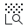
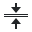
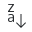

# 🖼️ 素材分類：32

> [🏠 主目錄](../../../../../../README.md) / [images](../../../../../README.md) / [iCons](../../../../README.md) / [Pixel](../../../README.md) / [Breeze](../../README.md) / [Actions ](../README.md) / **32**

本目錄共有 `221` 個檔案

| 🎨 預覽 (點擊放大)  | 📋 檔案詳細資訊與連結 |
| :--- | :--- |
|  | **📂 檔名:** `acrobat.svg` ✨ **格式:** `Vector (SVG)` ⚖️ **大小:** `378.00B` 📅 **更新:** `2026-03-01`  🚀 **jsDelivr Markdown:** `` 🔗 **直接連結 (Url):** <code>https://cdn.jsdelivr.net/gh/barry028/materials@main/images/iCons/Pixel/Breeze/Actions%20/32/acrobat.svg</code> 📥 [檢視原始檔](acrobat.svg) |
|  | **📂 檔名:** `address-book-new.svg` ✨ **格式:** `Vector (SVG)` ⚖️ **大小:** `402.00B` 📅 **更新:** `2026-03-01`  🚀 **jsDelivr Markdown:** `` 🔗 **直接連結 (Url):** <code>https://cdn.jsdelivr.net/gh/barry028/materials@main/images/iCons/Pixel/Breeze/Actions%20/32/address-book-new.svg</code> 📥 [檢視原始檔](address-book-new.svg) |
|  | **📂 檔名:** `align-horizontal-bottom-out.svg` ✨ **格式:** `Vector (SVG)` ⚖️ **大小:** `603.00B` 📅 **更新:** `2026-03-01`  🚀 **jsDelivr Markdown:** `` 🔗 **直接連結 (Url):** <code>https://cdn.jsdelivr.net/gh/barry028/materials@main/images/iCons/Pixel/Breeze/Actions%20/32/align-horizontal-bottom-out.svg</code> 📥 [檢視原始檔](align-horizontal-bottom-out.svg) |
|  | **📂 檔名:** `align-horizontal-center.svg` ✨ **格式:** `Vector (SVG)` ⚖️ **大小:** `420.00B` 📅 **更新:** `2026-03-01`  🚀 **jsDelivr Markdown:** `` 🔗 **直接連結 (Url):** <code>https://cdn.jsdelivr.net/gh/barry028/materials@main/images/iCons/Pixel/Breeze/Actions%20/32/align-horizontal-center.svg</code> 📥 [檢視原始檔](align-horizontal-center.svg) |
|  | **📂 檔名:** `align-horizontal-left-out.svg` ✨ **格式:** `Vector (SVG)` ⚖️ **大小:** `408.00B` 📅 **更新:** `2026-03-01`  🚀 **jsDelivr Markdown:** `` 🔗 **直接連結 (Url):** <code>https://cdn.jsdelivr.net/gh/barry028/materials@main/images/iCons/Pixel/Breeze/Actions%20/32/align-horizontal-left-out.svg</code> 📥 [檢視原始檔](align-horizontal-left-out.svg) |
|  | **📂 檔名:** `align-horizontal-left-to-anchor.svg` ✨ **格式:** `Vector (SVG)` ⚖️ **大小:** `428.00B` 📅 **更新:** `2026-03-01`  🚀 **jsDelivr Markdown:** `` 🔗 **直接連結 (Url):** <code>https://cdn.jsdelivr.net/gh/barry028/materials@main/images/iCons/Pixel/Breeze/Actions%20/32/align-horizontal-left-to-anchor.svg</code> 📥 [檢視原始檔](align-horizontal-left-to-anchor.svg) |
|  | **📂 檔名:** `align-horizontal-left.svg` ✨ **格式:** `Vector (SVG)` ⚖️ **大小:** `564.00B` 📅 **更新:** `2026-03-01`  🚀 **jsDelivr Markdown:** `` 🔗 **直接連結 (Url):** <code>https://cdn.jsdelivr.net/gh/barry028/materials@main/images/iCons/Pixel/Breeze/Actions%20/32/align-horizontal-left.svg</code> 📥 [檢視原始檔](align-horizontal-left.svg) |
|  | **📂 檔名:** `align-horizontal-right-out.svg` ✨ **格式:** `Vector (SVG)` ⚖️ **大小:** `609.00B` 📅 **更新:** `2026-03-01`  🚀 **jsDelivr Markdown:** `` 🔗 **直接連結 (Url):** <code>https://cdn.jsdelivr.net/gh/barry028/materials@main/images/iCons/Pixel/Breeze/Actions%20/32/align-horizontal-right-out.svg</code> 📥 [檢視原始檔](align-horizontal-right-out.svg) |
|  | **📂 檔名:** `align-horizontal-right-to-anchor.svg` ✨ **格式:** `Vector (SVG)` ⚖️ **大小:** `606.00B` 📅 **更新:** `2026-03-01`  🚀 **jsDelivr Markdown:** `` 🔗 **直接連結 (Url):** <code>https://cdn.jsdelivr.net/gh/barry028/materials@main/images/iCons/Pixel/Breeze/Actions%20/32/align-horizontal-right-to-anchor.svg</code> 📥 [檢視原始檔](align-horizontal-right-to-anchor.svg) |
|  | **📂 檔名:** `align-horizontal-right.svg` ✨ **格式:** `Vector (SVG)` ⚖️ **大小:** `573.00B` 📅 **更新:** `2026-03-01`  🚀 **jsDelivr Markdown:** `` 🔗 **直接連結 (Url):** <code>https://cdn.jsdelivr.net/gh/barry028/materials@main/images/iCons/Pixel/Breeze/Actions%20/32/align-horizontal-right.svg</code> 📥 [檢視原始檔](align-horizontal-right.svg) |
|  | **📂 檔名:** `align-horizontal-top-out.svg` ✨ **格式:** `Vector (SVG)` ⚖️ **大小:** `618.00B` 📅 **更新:** `2026-03-01`  🚀 **jsDelivr Markdown:** `` 🔗 **直接連結 (Url):** <code>https://cdn.jsdelivr.net/gh/barry028/materials@main/images/iCons/Pixel/Breeze/Actions%20/32/align-horizontal-top-out.svg</code> 📥 [檢視原始檔](align-horizontal-top-out.svg) |
|  | **📂 檔名:** `align-vertical-bottom-out.svg` ✨ **格式:** `Vector (SVG)` ⚖️ **大小:** `609.00B` 📅 **更新:** `2026-03-01`  🚀 **jsDelivr Markdown:** `` 🔗 **直接連結 (Url):** <code>https://cdn.jsdelivr.net/gh/barry028/materials@main/images/iCons/Pixel/Breeze/Actions%20/32/align-vertical-bottom-out.svg</code> 📥 [檢視原始檔](align-vertical-bottom-out.svg) |
|  | **📂 檔名:** `align-vertical-bottom-to-anchor.svg` ✨ **格式:** `Vector (SVG)` ⚖️ **大小:** `609.00B` 📅 **更新:** `2026-03-01`  🚀 **jsDelivr Markdown:** `` 🔗 **直接連結 (Url):** <code>https://cdn.jsdelivr.net/gh/barry028/materials@main/images/iCons/Pixel/Breeze/Actions%20/32/align-vertical-bottom-to-anchor.svg</code> 📥 [檢視原始檔](align-vertical-bottom-to-anchor.svg) |
|  | **📂 檔名:** `align-vertical-bottom.svg` ✨ **格式:** `Vector (SVG)` ⚖️ **大小:** `573.00B` 📅 **更新:** `2026-03-01`  🚀 **jsDelivr Markdown:** `` 🔗 **直接連結 (Url):** <code>https://cdn.jsdelivr.net/gh/barry028/materials@main/images/iCons/Pixel/Breeze/Actions%20/32/align-vertical-bottom.svg</code> 📥 [檢視原始檔](align-vertical-bottom.svg) |
|  | **📂 檔名:** `align-vertical-center.svg` ✨ **格式:** `Vector (SVG)` ⚖️ **大小:** `616.00B` 📅 **更新:** `2026-03-01`  🚀 **jsDelivr Markdown:** `` 🔗 **直接連結 (Url):** <code>https://cdn.jsdelivr.net/gh/barry028/materials@main/images/iCons/Pixel/Breeze/Actions%20/32/align-vertical-center.svg</code> 📥 [檢視原始檔](align-vertical-center.svg) |
|  | **📂 檔名:** `align-vertical-top-out.svg` ✨ **格式:** `Vector (SVG)` ⚖️ **大小:** `618.00B` 📅 **更新:** `2026-03-01`  🚀 **jsDelivr Markdown:** `` 🔗 **直接連結 (Url):** <code>https://cdn.jsdelivr.net/gh/barry028/materials@main/images/iCons/Pixel/Breeze/Actions%20/32/align-vertical-top-out.svg</code> 📥 [檢視原始檔](align-vertical-top-out.svg) |
|  | **📂 檔名:** `align-vertical-top.svg` ✨ **格式:** `Vector (SVG)` ⚖️ **大小:** `562.00B` 📅 **更新:** `2026-03-01`  🚀 **jsDelivr Markdown:** `` 🔗 **直接連結 (Url):** <code>https://cdn.jsdelivr.net/gh/barry028/materials@main/images/iCons/Pixel/Breeze/Actions%20/32/align-vertical-top.svg</code> 📥 [檢視原始檔](align-vertical-top.svg) |
|  | **📂 檔名:** `application-exit.svg` ✨ **格式:** `Vector (SVG)` ⚖️ **大小:** `421.00B` 📅 **更新:** `2026-03-01`  🚀 **jsDelivr Markdown:** `` 🔗 **直接連結 (Url):** <code>https://cdn.jsdelivr.net/gh/barry028/materials@main/images/iCons/Pixel/Breeze/Actions%20/32/application-exit.svg</code> 📥 [檢視原始檔](application-exit.svg) |
|  | **📂 檔名:** `application-menu.svg` ✨ **格式:** `Vector (SVG)` ⚖️ **大小:** `486.00B` 📅 **更新:** `2026-03-01`  🚀 **jsDelivr Markdown:** `` 🔗 **直接連結 (Url):** <code>https://cdn.jsdelivr.net/gh/barry028/materials@main/images/iCons/Pixel/Breeze/Actions%20/32/application-menu.svg</code> 📥 [檢視原始檔](application-menu.svg) |
|  | **📂 檔名:** `appointment-new.svg` ✨ **格式:** `Vector (SVG)` ⚖️ **大小:** `608.00B` 📅 **更新:** `2026-03-01`  🚀 **jsDelivr Markdown:** `` 🔗 **直接連結 (Url):** <code>https://cdn.jsdelivr.net/gh/barry028/materials@main/images/iCons/Pixel/Breeze/Actions%20/32/appointment-new.svg</code> 📥 [檢視原始檔](appointment-new.svg) |
|  | **📂 檔名:** `archive-extract.svg` ✨ **格式:** `Vector (SVG)` ⚖️ **大小:** `492.00B` 📅 **更新:** `2026-03-01`  🚀 **jsDelivr Markdown:** `` 🔗 **直接連結 (Url):** <code>https://cdn.jsdelivr.net/gh/barry028/materials@main/images/iCons/Pixel/Breeze/Actions%20/32/archive-extract.svg</code> 📥 [檢視原始檔](archive-extract.svg) |
|  | **📂 檔名:** `archive-insert.svg` ✨ **格式:** `Vector (SVG)` ⚖️ **大小:** `414.00B` 📅 **更新:** `2026-03-01`  🚀 **jsDelivr Markdown:** `` 🔗 **直接連結 (Url):** <code>https://cdn.jsdelivr.net/gh/barry028/materials@main/images/iCons/Pixel/Breeze/Actions%20/32/archive-insert.svg</code> 📥 [檢視原始檔](archive-insert.svg) |
|  | **📂 檔名:** `archive-remove.svg` ✨ **格式:** `Vector (SVG)` ⚖️ **大小:** `515.00B` 📅 **更新:** `2026-03-01`  🚀 **jsDelivr Markdown:** `` 🔗 **直接連結 (Url):** <code>https://cdn.jsdelivr.net/gh/barry028/materials@main/images/iCons/Pixel/Breeze/Actions%20/32/archive-remove.svg</code> 📥 [檢視原始檔](archive-remove.svg) |
|  | **📂 檔名:** `autocorrection.svg` ✨ **格式:** `Vector (SVG)` ⚖️ **大小:** `1017.00B` 📅 **更新:** `2026-03-01`  🚀 **jsDelivr Markdown:** `` 🔗 **直接連結 (Url):** <code>https://cdn.jsdelivr.net/gh/barry028/materials@main/images/iCons/Pixel/Breeze/Actions%20/32/autocorrection.svg</code> 📥 [檢視原始檔](autocorrection.svg) |
|  | **📂 檔名:** `bookmark-new.svg` ✨ **格式:** `Vector (SVG)` ⚖️ **大小:** `423.00B` 📅 **更新:** `2026-03-01`  🚀 **jsDelivr Markdown:** `` 🔗 **直接連結 (Url):** <code>https://cdn.jsdelivr.net/gh/barry028/materials@main/images/iCons/Pixel/Breeze/Actions%20/32/bookmark-new.svg</code> 📥 [檢視原始檔](bookmark-new.svg) |
|  | **📂 檔名:** `bookmark-remove.svg` ✨ **格式:** `Vector (SVG)` ⚖️ **大小:** `667.00B` 📅 **更新:** `2026-03-01`  🚀 **jsDelivr Markdown:** `` 🔗 **直接連結 (Url):** <code>https://cdn.jsdelivr.net/gh/barry028/materials@main/images/iCons/Pixel/Breeze/Actions%20/32/bookmark-remove.svg</code> 📥 [檢視原始檔](bookmark-remove.svg) |
|  | **📂 檔名:** `bookmarks-bookmarked.svg` ✨ **格式:** `Vector (SVG)` ⚖️ **大小:** `339.00B` 📅 **更新:** `2026-03-01`  🚀 **jsDelivr Markdown:** `` 🔗 **直接連結 (Url):** <code>https://cdn.jsdelivr.net/gh/barry028/materials@main/images/iCons/Pixel/Breeze/Actions%20/32/bookmarks-bookmarked.svg</code> 📥 [檢視原始檔](bookmarks-bookmarked.svg) |
|  | **📂 檔名:** `bookmarks.svg` ✨ **格式:** `Vector (SVG)` ⚖️ **大小:** `390.00B` 📅 **更新:** `2026-03-01`  🚀 **jsDelivr Markdown:** `` 🔗 **直接連結 (Url):** <code>https://cdn.jsdelivr.net/gh/barry028/materials@main/images/iCons/Pixel/Breeze/Actions%20/32/bookmarks.svg</code> 📥 [檢視原始檔](bookmarks.svg) |
|  | **📂 檔名:** `bordertool.svg` ✨ **格式:** `Vector (SVG)` ⚖️ **大小:** `424.00B` 📅 **更新:** `2026-03-01`  🚀 **jsDelivr Markdown:** `` 🔗 **直接連結 (Url):** <code>https://cdn.jsdelivr.net/gh/barry028/materials@main/images/iCons/Pixel/Breeze/Actions%20/32/bordertool.svg</code> 📥 [檢視原始檔](bordertool.svg) |
|  | **📂 檔名:** `call-start.svg` ✨ **格式:** `Vector (SVG)` ⚖️ **大小:** `668.00B` 📅 **更新:** `2026-03-01`  🚀 **jsDelivr Markdown:** `` 🔗 **直接連結 (Url):** <code>https://cdn.jsdelivr.net/gh/barry028/materials@main/images/iCons/Pixel/Breeze/Actions%20/32/call-start.svg</code> 📥 [檢視原始檔](call-start.svg) |
|  | **📂 檔名:** `call-stop.svg` ✨ **格式:** `Vector (SVG)` ⚖️ **大小:** `630.00B` 📅 **更新:** `2026-03-01`  🚀 **jsDelivr Markdown:** `` 🔗 **直接連結 (Url):** <code>https://cdn.jsdelivr.net/gh/barry028/materials@main/images/iCons/Pixel/Breeze/Actions%20/32/call-stop.svg</code> 📥 [檢視原始檔](call-stop.svg) |
|  | **📂 檔名:** `collapse-all.svg` ✨ **格式:** `Vector (SVG)` ⚖️ **大小:** `346.00B` 📅 **更新:** `2026-03-01`  🚀 **jsDelivr Markdown:** `` 🔗 **直接連結 (Url):** <code>https://cdn.jsdelivr.net/gh/barry028/materials@main/images/iCons/Pixel/Breeze/Actions%20/32/collapse-all.svg</code> 📥 [檢視原始檔](collapse-all.svg) |
|  | **📂 檔名:** `color-management.svg` ✨ **格式:** `Vector (SVG)` ⚖️ **大小:** `8.06KB` 📅 **更新:** `2026-03-01`  🚀 **jsDelivr Markdown:** `` 🔗 **直接連結 (Url):** <code>https://cdn.jsdelivr.net/gh/barry028/materials@main/images/iCons/Pixel/Breeze/Actions%20/32/color-management.svg</code> 📥 [檢視原始檔](color-management.svg) |
|  | **📂 檔名:** `color-picker-black.svg` ✨ **格式:** `Vector (SVG)` ⚖️ **大小:** `1.37KB` 📅 **更新:** `2026-03-01`  🚀 **jsDelivr Markdown:** `` 🔗 **直接連結 (Url):** <code>https://cdn.jsdelivr.net/gh/barry028/materials@main/images/iCons/Pixel/Breeze/Actions%20/32/color-picker-black.svg</code> 📥 [檢視原始檔](color-picker-black.svg) |
|  | **📂 檔名:** `color-picker-grey.svg` ✨ **格式:** `Vector (SVG)` ⚖️ **大小:** `1.48KB` 📅 **更新:** `2026-03-01`  🚀 **jsDelivr Markdown:** `` 🔗 **直接連結 (Url):** <code>https://cdn.jsdelivr.net/gh/barry028/materials@main/images/iCons/Pixel/Breeze/Actions%20/32/color-picker-grey.svg</code> 📥 [檢視原始檔](color-picker-grey.svg) |
|  | **📂 檔名:** `color-picker-white.svg` ✨ **格式:** `Vector (SVG)` ⚖️ **大小:** `1.40KB` 📅 **更新:** `2026-03-01`  🚀 **jsDelivr Markdown:** `` 🔗 **直接連結 (Url):** <code>https://cdn.jsdelivr.net/gh/barry028/materials@main/images/iCons/Pixel/Breeze/Actions%20/32/color-picker-white.svg</code> 📥 [檢視原始檔](color-picker-white.svg) |
|  | **📂 檔名:** `color-picker.svg` ✨ **格式:** `Vector (SVG)` ⚖️ **大小:** `798.00B` 📅 **更新:** `2026-03-01`  🚀 **jsDelivr Markdown:** `` 🔗 **直接連結 (Url):** <code>https://cdn.jsdelivr.net/gh/barry028/materials@main/images/iCons/Pixel/Breeze/Actions%20/32/color-picker.svg</code> 📥 [檢視原始檔](color-picker.svg) |
|  | **📂 檔名:** `colors-chromablue.svg` ✨ **格式:** `Vector (SVG)` ⚖️ **大小:** `473.00B` 📅 **更新:** `2026-03-01`  🚀 **jsDelivr Markdown:** `` 🔗 **直接連結 (Url):** <code>https://cdn.jsdelivr.net/gh/barry028/materials@main/images/iCons/Pixel/Breeze/Actions%20/32/colors-chromablue.svg</code> 📥 [檢視原始檔](colors-chromablue.svg) |
|  | **📂 檔名:** `colors-chromagreen.svg` ✨ **格式:** `Vector (SVG)` ⚖️ **大小:** `473.00B` 📅 **更新:** `2026-03-01`  🚀 **jsDelivr Markdown:** `` 🔗 **直接連結 (Url):** <code>https://cdn.jsdelivr.net/gh/barry028/materials@main/images/iCons/Pixel/Breeze/Actions%20/32/colors-chromagreen.svg</code> 📥 [檢視原始檔](colors-chromagreen.svg) |
|  | **📂 檔名:** `colors-chromared.svg` ✨ **格式:** `Vector (SVG)` ⚖️ **大小:** `473.00B` 📅 **更新:** `2026-03-01`  🚀 **jsDelivr Markdown:** `` 🔗 **直接連結 (Url):** <code>https://cdn.jsdelivr.net/gh/barry028/materials@main/images/iCons/Pixel/Breeze/Actions%20/32/colors-chromared.svg</code> 📥 [檢視原始檔](colors-chromared.svg) |
|  | **📂 檔名:** `colors-luma.svg` ✨ **格式:** `Vector (SVG)` ⚖️ **大小:** `3.34KB` 📅 **更新:** `2026-03-01`  🚀 **jsDelivr Markdown:** `` 🔗 **直接連結 (Url):** <code>https://cdn.jsdelivr.net/gh/barry028/materials@main/images/iCons/Pixel/Breeze/Actions%20/32/colors-luma.svg</code> 📥 [檢視原始檔](colors-luma.svg) |
|  | **📂 檔名:** `compass.svg` ✨ **格式:** `Vector (SVG)` ⚖️ **大小:** `728.00B` 📅 **更新:** `2026-03-01`  🚀 **jsDelivr Markdown:** `` 🔗 **直接連結 (Url):** <code>https://cdn.jsdelivr.net/gh/barry028/materials@main/images/iCons/Pixel/Breeze/Actions%20/32/compass.svg</code> 📥 [檢視原始檔](compass.svg) |
|  | **📂 檔名:** `configure.svg` ✨ **格式:** `Vector (SVG)` ⚖️ **大小:** `728.00B` 📅 **更新:** `2026-03-01`  🚀 **jsDelivr Markdown:** `` 🔗 **直接連結 (Url):** <code>https://cdn.jsdelivr.net/gh/barry028/materials@main/images/iCons/Pixel/Breeze/Actions%20/32/configure.svg</code> 📥 [檢視原始檔](configure.svg) |
|  | **📂 檔名:** `cursor-cross.svg` ✨ **格式:** `Vector (SVG)` ⚖️ **大小:** `462.00B` 📅 **更新:** `2026-03-01`  🚀 **jsDelivr Markdown:** `` 🔗 **直接連結 (Url):** <code>https://cdn.jsdelivr.net/gh/barry028/materials@main/images/iCons/Pixel/Breeze/Actions%20/32/cursor-cross.svg</code> 📥 [檢視原始檔](cursor-cross.svg) |
|  | **📂 檔名:** `dialog-cancel.svg` ✨ **格式:** `Vector (SVG)` ⚖️ **大小:** `733.00B` 📅 **更新:** `2026-03-01`  🚀 **jsDelivr Markdown:** `` 🔗 **直接連結 (Url):** <code>https://cdn.jsdelivr.net/gh/barry028/materials@main/images/iCons/Pixel/Breeze/Actions%20/32/dialog-cancel.svg</code> 📥 [檢視原始檔](dialog-cancel.svg) |
|  | **📂 檔名:** `dialog-messages.svg` ✨ **格式:** `Vector (SVG)` ⚖️ **大小:** `375.00B` 📅 **更新:** `2026-03-01`  🚀 **jsDelivr Markdown:** `` 🔗 **直接連結 (Url):** <code>https://cdn.jsdelivr.net/gh/barry028/materials@main/images/iCons/Pixel/Breeze/Actions%20/32/dialog-messages.svg</code> 📥 [檢視原始檔](dialog-messages.svg) |
|  | **📂 檔名:** `dialog-ok-apply.svg` ✨ **格式:** `Vector (SVG)` ⚖️ **大小:** `355.00B` 📅 **更新:** `2026-03-01`  🚀 **jsDelivr Markdown:** `` 🔗 **直接連結 (Url):** <code>https://cdn.jsdelivr.net/gh/barry028/materials@main/images/iCons/Pixel/Breeze/Actions%20/32/dialog-ok-apply.svg</code> 📥 [檢視原始檔](dialog-ok-apply.svg) |
|  | **📂 檔名:** `document-close.svg` ✨ **格式:** `Vector (SVG)` ⚖️ **大小:** `569.00B` 📅 **更新:** `2026-03-01`  🚀 **jsDelivr Markdown:** `` 🔗 **直接連結 (Url):** <code>https://cdn.jsdelivr.net/gh/barry028/materials@main/images/iCons/Pixel/Breeze/Actions%20/32/document-close.svg</code> 📥 [檢視原始檔](document-close.svg) |
|  | **📂 檔名:** `document-decrypt.svg` ✨ **格式:** `Vector (SVG)` ⚖️ **大小:** `735.00B` 📅 **更新:** `2026-03-01`  🚀 **jsDelivr Markdown:** `` 🔗 **直接連結 (Url):** <code>https://cdn.jsdelivr.net/gh/barry028/materials@main/images/iCons/Pixel/Breeze/Actions%20/32/document-decrypt.svg</code> 📥 [檢視原始檔](document-decrypt.svg) |
|  | **📂 檔名:** `document-edit-decrypt-verify.svg` ✨ **格式:** `Vector (SVG)` ⚖️ **大小:** `1.33KB` 📅 **更新:** `2026-03-01`  🚀 **jsDelivr Markdown:** `` 🔗 **直接連結 (Url):** <code>https://cdn.jsdelivr.net/gh/barry028/materials@main/images/iCons/Pixel/Breeze/Actions%20/32/document-edit-decrypt-verify.svg</code> 📥 [檢視原始檔](document-edit-decrypt-verify.svg) |
|  | **📂 檔名:** `document-edit-decrypt.svg` ✨ **格式:** `Vector (SVG)` ⚖️ **大小:** `974.00B` 📅 **更新:** `2026-03-01`  🚀 **jsDelivr Markdown:** `` 🔗 **直接連結 (Url):** <code>https://cdn.jsdelivr.net/gh/barry028/materials@main/images/iCons/Pixel/Breeze/Actions%20/32/document-edit-decrypt.svg</code> 📥 [檢視原始檔](document-edit-decrypt.svg) |
|  | **📂 檔名:** `document-edit-encrypt.svg` ✨ **格式:** `Vector (SVG)` ⚖️ **大小:** `1.00KB` 📅 **更新:** `2026-03-01`  🚀 **jsDelivr Markdown:** `` 🔗 **直接連結 (Url):** <code>https://cdn.jsdelivr.net/gh/barry028/materials@main/images/iCons/Pixel/Breeze/Actions%20/32/document-edit-encrypt.svg</code> 📥 [檢視原始檔](document-edit-encrypt.svg) |
|  | **📂 檔名:** `document-edit-sign-encrypt.svg` ✨ **格式:** `Vector (SVG)` ⚖️ **大小:** `904.00B` 📅 **更新:** `2026-03-01`  🚀 **jsDelivr Markdown:** `` 🔗 **直接連結 (Url):** <code>https://cdn.jsdelivr.net/gh/barry028/materials@main/images/iCons/Pixel/Breeze/Actions%20/32/document-edit-sign-encrypt.svg</code> 📥 [檢視原始檔](document-edit-sign-encrypt.svg) |
|  | **📂 檔名:** `document-edit-sign.svg` ✨ **格式:** `Vector (SVG)` ⚖️ **大小:** `996.00B` 📅 **更新:** `2026-03-01`  🚀 **jsDelivr Markdown:** `` 🔗 **直接連結 (Url):** <code>https://cdn.jsdelivr.net/gh/barry028/materials@main/images/iCons/Pixel/Breeze/Actions%20/32/document-edit-sign.svg</code> 📥 [檢視原始檔](document-edit-sign.svg) |
|  | **📂 檔名:** `document-edit.svg` ✨ **格式:** `Vector (SVG)` ⚖️ **大小:** `523.00B` 📅 **更新:** `2026-03-01`  🚀 **jsDelivr Markdown:** `` 🔗 **直接連結 (Url):** <code>https://cdn.jsdelivr.net/gh/barry028/materials@main/images/iCons/Pixel/Breeze/Actions%20/32/document-edit.svg</code> 📥 [檢視原始檔](document-edit.svg) |
|  | **📂 檔名:** `document-encrypted.svg` ✨ **格式:** `Vector (SVG)` ⚖️ **大小:** `659.00B` 📅 **更新:** `2026-03-01`  🚀 **jsDelivr Markdown:** `` 🔗 **直接連結 (Url):** <code>https://cdn.jsdelivr.net/gh/barry028/materials@main/images/iCons/Pixel/Breeze/Actions%20/32/document-encrypted.svg</code> 📥 [檢視原始檔](document-encrypted.svg) |
|  | **📂 檔名:** `document-export.svg` ✨ **格式:** `Vector (SVG)` ⚖️ **大小:** `605.00B` 📅 **更新:** `2026-03-01`  🚀 **jsDelivr Markdown:** `` 🔗 **直接連結 (Url):** <code>https://cdn.jsdelivr.net/gh/barry028/materials@main/images/iCons/Pixel/Breeze/Actions%20/32/document-export.svg</code> 📥 [檢視原始檔](document-export.svg) |
|  | **📂 檔名:** `document-import.svg` ✨ **格式:** `Vector (SVG)` ⚖️ **大小:** `605.00B` 📅 **更新:** `2026-03-01`  🚀 **jsDelivr Markdown:** `` 🔗 **直接連結 (Url):** <code>https://cdn.jsdelivr.net/gh/barry028/materials@main/images/iCons/Pixel/Breeze/Actions%20/32/document-import.svg</code> 📥 [檢視原始檔](document-import.svg) |
|  | **📂 檔名:** `document-new-from-template.svg` ✨ **格式:** `Vector (SVG)` ⚖️ **大小:** `795.00B` 📅 **更新:** `2026-03-01`  🚀 **jsDelivr Markdown:** `` 🔗 **直接連結 (Url):** <code>https://cdn.jsdelivr.net/gh/barry028/materials@main/images/iCons/Pixel/Breeze/Actions%20/32/document-new-from-template.svg</code> 📥 [檢視原始檔](document-new-from-template.svg) |
|  | **📂 檔名:** `document-new.svg` ✨ **格式:** `Vector (SVG)` ⚖️ **大小:** `1.95KB` 📅 **更新:** `2026-03-01`  🚀 **jsDelivr Markdown:** `` 🔗 **直接連結 (Url):** <code>https://cdn.jsdelivr.net/gh/barry028/materials@main/images/iCons/Pixel/Breeze/Actions%20/32/document-new.svg</code> 📥 [檢視原始檔](document-new.svg) |
|  | **📂 檔名:** `document-open-recent.svg` ✨ **格式:** `Vector (SVG)` ⚖️ **大小:** `1.72KB` 📅 **更新:** `2026-03-01`  🚀 **jsDelivr Markdown:** `` 🔗 **直接連結 (Url):** <code>https://cdn.jsdelivr.net/gh/barry028/materials@main/images/iCons/Pixel/Breeze/Actions%20/32/document-open-recent.svg</code> 📥 [檢視原始檔](document-open-recent.svg) |
|  | **📂 檔名:** `document-open-remote.svg` ✨ **格式:** `Vector (SVG)` ⚖️ **大小:** `685.00B` 📅 **更新:** `2026-03-01`  🚀 **jsDelivr Markdown:** `` 🔗 **直接連結 (Url):** <code>https://cdn.jsdelivr.net/gh/barry028/materials@main/images/iCons/Pixel/Breeze/Actions%20/32/document-open-remote.svg</code> 📥 [檢視原始檔](document-open-remote.svg) |
|  | **📂 檔名:** `document-open.svg` ✨ **格式:** `Vector (SVG)` ⚖️ **大小:** `705.00B` 📅 **更新:** `2026-03-01`  🚀 **jsDelivr Markdown:** `` 🔗 **直接連結 (Url):** <code>https://cdn.jsdelivr.net/gh/barry028/materials@main/images/iCons/Pixel/Breeze/Actions%20/32/document-open.svg</code> 📥 [檢視原始檔](document-open.svg) |
|  | **📂 檔名:** `document-preview-archive.svg` ✨ **格式:** `Vector (SVG)` ⚖️ **大小:** `878.00B` 📅 **更新:** `2026-03-01`  🚀 **jsDelivr Markdown:** `` 🔗 **直接連結 (Url):** <code>https://cdn.jsdelivr.net/gh/barry028/materials@main/images/iCons/Pixel/Breeze/Actions%20/32/document-preview-archive.svg</code> 📥 [檢視原始檔](document-preview-archive.svg) |
|  | **📂 檔名:** `document-print-direct.svg` ✨ **格式:** `Vector (SVG)` ⚖️ **大小:** `798.00B` 📅 **更新:** `2026-03-01`  🚀 **jsDelivr Markdown:** `` 🔗 **直接連結 (Url):** <code>https://cdn.jsdelivr.net/gh/barry028/materials@main/images/iCons/Pixel/Breeze/Actions%20/32/document-print-direct.svg</code> 📥 [檢視原始檔](document-print-direct.svg) |
|  | **📂 檔名:** `document-print.svg` ✨ **格式:** `Vector (SVG)` ⚖️ **大小:** `531.00B` 📅 **更新:** `2026-03-01`  🚀 **jsDelivr Markdown:** `` 🔗 **直接連結 (Url):** <code>https://cdn.jsdelivr.net/gh/barry028/materials@main/images/iCons/Pixel/Breeze/Actions%20/32/document-print.svg</code> 📥 [檢視原始檔](document-print.svg) |
|  | **📂 檔名:** `document-properties.svg` ✨ **格式:** `Vector (SVG)` ⚖️ **大小:** `616.00B` 📅 **更新:** `2026-03-01`  🚀 **jsDelivr Markdown:** `` 🔗 **直接連結 (Url):** <code>https://cdn.jsdelivr.net/gh/barry028/materials@main/images/iCons/Pixel/Breeze/Actions%20/32/document-properties.svg</code> 📥 [檢視原始檔](document-properties.svg) |
|  | **📂 檔名:** `document-replace.svg` ✨ **格式:** `Vector (SVG)` ⚖️ **大小:** `973.00B` 📅 **更新:** `2026-03-01`  🚀 **jsDelivr Markdown:** `` 🔗 **直接連結 (Url):** <code>https://cdn.jsdelivr.net/gh/barry028/materials@main/images/iCons/Pixel/Breeze/Actions%20/32/document-replace.svg</code> 📥 [檢視原始檔](document-replace.svg) |
|  | **📂 檔名:** `document-revert.svg` ✨ **格式:** `Vector (SVG)` ⚖️ **大小:** `496.00B` 📅 **更新:** `2026-03-01`  🚀 **jsDelivr Markdown:** `` 🔗 **直接連結 (Url):** <code>https://cdn.jsdelivr.net/gh/barry028/materials@main/images/iCons/Pixel/Breeze/Actions%20/32/document-revert.svg</code> 📥 [檢視原始檔](document-revert.svg) |
|  | **📂 檔名:** `document-save-all.svg` ✨ **格式:** `Vector (SVG)` ⚖️ **大小:** `1.02KB` 📅 **更新:** `2026-03-01`  🚀 **jsDelivr Markdown:** `` 🔗 **直接連結 (Url):** <code>https://cdn.jsdelivr.net/gh/barry028/materials@main/images/iCons/Pixel/Breeze/Actions%20/32/document-save-all.svg</code> 📥 [檢視原始檔](document-save-all.svg) |
|  | **📂 檔名:** `document-save-as.svg` ✨ **格式:** `Vector (SVG)` ⚖️ **大小:** `1.09KB` 📅 **更新:** `2026-03-01`  🚀 **jsDelivr Markdown:** `` 🔗 **直接連結 (Url):** <code>https://cdn.jsdelivr.net/gh/barry028/materials@main/images/iCons/Pixel/Breeze/Actions%20/32/document-save-as.svg</code> 📥 [檢視原始檔](document-save-as.svg) |
|  | **📂 檔名:** `document-save.svg` ✨ **格式:** `Vector (SVG)` ⚖️ **大小:** `665.00B` 📅 **更新:** `2026-03-01`  🚀 **jsDelivr Markdown:** `` 🔗 **直接連結 (Url):** <code>https://cdn.jsdelivr.net/gh/barry028/materials@main/images/iCons/Pixel/Breeze/Actions%20/32/document-save.svg</code> 📥 [檢視原始檔](document-save.svg) |
|  | **📂 檔名:** `document-share.svg` ✨ **格式:** `Vector (SVG)` ⚖️ **大小:** `1.38KB` 📅 **更新:** `2026-03-01`  🚀 **jsDelivr Markdown:** `` 🔗 **直接連結 (Url):** <code>https://cdn.jsdelivr.net/gh/barry028/materials@main/images/iCons/Pixel/Breeze/Actions%20/32/document-share.svg</code> 📥 [檢視原始檔](document-share.svg) |
|  | **📂 檔名:** `edit-delete-shred.svg` ✨ **格式:** `Vector (SVG)` ⚖️ **大小:** `949.00B` 📅 **更新:** `2026-03-01`  🚀 **jsDelivr Markdown:** `` 🔗 **直接連結 (Url):** <code>https://cdn.jsdelivr.net/gh/barry028/materials@main/images/iCons/Pixel/Breeze/Actions%20/32/edit-delete-shred.svg</code> 📥 [檢視原始檔](edit-delete-shred.svg) |
|  | **📂 檔名:** `edit-delete.svg` ✨ **格式:** `Vector (SVG)` ⚖️ **大小:** `331.00B` 📅 **更新:** `2026-03-01`  🚀 **jsDelivr Markdown:** `` 🔗 **直接連結 (Url):** <code>https://cdn.jsdelivr.net/gh/barry028/materials@main/images/iCons/Pixel/Breeze/Actions%20/32/edit-delete.svg</code> 📥 [檢視原始檔](edit-delete.svg) |
|  | **📂 檔名:** `edit-redo.svg` ✨ **格式:** `Vector (SVG)` ⚖️ **大小:** `482.00B` 📅 **更新:** `2026-03-01`  🚀 **jsDelivr Markdown:** `` 🔗 **直接連結 (Url):** <code>https://cdn.jsdelivr.net/gh/barry028/materials@main/images/iCons/Pixel/Breeze/Actions%20/32/edit-redo.svg</code> 📥 [檢視原始檔](edit-redo.svg) |
|  | **📂 檔名:** `edit-reset.svg` ✨ **格式:** `Vector (SVG)` ⚖️ **大小:** `710.00B` 📅 **更新:** `2026-03-01`  🚀 **jsDelivr Markdown:** `` 🔗 **直接連結 (Url):** <code>https://cdn.jsdelivr.net/gh/barry028/materials@main/images/iCons/Pixel/Breeze/Actions%20/32/edit-reset.svg</code> 📥 [檢視原始檔](edit-reset.svg) |
|  | **📂 檔名:** `edit-select.svg` ✨ **格式:** `Vector (SVG)` ⚖️ **大小:** `541.00B` 📅 **更新:** `2026-03-01`  🚀 **jsDelivr Markdown:** `` 🔗 **直接連結 (Url):** <code>https://cdn.jsdelivr.net/gh/barry028/materials@main/images/iCons/Pixel/Breeze/Actions%20/32/edit-select.svg</code> 📥 [檢視原始檔](edit-select.svg) |
|  | **📂 檔名:** `edit-undo.svg` ✨ **格式:** `Vector (SVG)` ⚖️ **大小:** `497.00B` 📅 **更新:** `2026-03-01`  🚀 **jsDelivr Markdown:** `` 🔗 **直接連結 (Url):** <code>https://cdn.jsdelivr.net/gh/barry028/materials@main/images/iCons/Pixel/Breeze/Actions%20/32/edit-undo.svg</code> 📥 [檢視原始檔](edit-undo.svg) |
|  | **📂 檔名:** `expand-all.svg` ✨ **格式:** `Vector (SVG)` ⚖️ **大小:** `348.00B` 📅 **更新:** `2026-03-01`  🚀 **jsDelivr Markdown:** `` 🔗 **直接連結 (Url):** <code>https://cdn.jsdelivr.net/gh/barry028/materials@main/images/iCons/Pixel/Breeze/Actions%20/32/expand-all.svg</code> 📥 [檢視原始檔](expand-all.svg) |
|  | **📂 檔名:** `financial-account.svg` ✨ **格式:** `Vector (SVG)` ⚖️ **大小:** `2.99KB` 📅 **更新:** `2026-03-01`  🚀 **jsDelivr Markdown:** `` 🔗 **直接連結 (Url):** <code>https://cdn.jsdelivr.net/gh/barry028/materials@main/images/iCons/Pixel/Breeze/Actions%20/32/financial-account.svg</code> 📥 [檢視原始檔](financial-account.svg) |
|  | **📂 檔名:** `financial-list.svg` ✨ **格式:** `Vector (SVG)` ⚖️ **大小:** `2.33KB` 📅 **更新:** `2026-03-01`  🚀 **jsDelivr Markdown:** `` 🔗 **直接連結 (Url):** <code>https://cdn.jsdelivr.net/gh/barry028/materials@main/images/iCons/Pixel/Breeze/Actions%20/32/financial-list.svg</code> 📥 [檢視原始檔](financial-list.svg) |
|  | **📂 檔名:** `flash.svg` ✨ **格式:** `Vector (SVG)` ⚖️ **大小:** `561.00B` 📅 **更新:** `2026-03-01`  🚀 **jsDelivr Markdown:** `` 🔗 **直接連結 (Url):** <code>https://cdn.jsdelivr.net/gh/barry028/materials@main/images/iCons/Pixel/Breeze/Actions%20/32/flash.svg</code> 📥 [檢視原始檔](flash.svg) |
|  | **📂 檔名:** `flashlight-off.svg` ✨ **格式:** `Vector (SVG)` ⚖️ **大小:** `985.00B` 📅 **更新:** `2026-03-01`  🚀 **jsDelivr Markdown:** `` 🔗 **直接連結 (Url):** <code>https://cdn.jsdelivr.net/gh/barry028/materials@main/images/iCons/Pixel/Breeze/Actions%20/32/flashlight-off.svg</code> 📥 [檢視原始檔](flashlight-off.svg) |
|  | **📂 檔名:** `flashlight-on.svg` ✨ **格式:** `Vector (SVG)` ⚖️ **大小:** `768.00B` 📅 **更新:** `2026-03-01`  🚀 **jsDelivr Markdown:** `` 🔗 **直接連結 (Url):** <code>https://cdn.jsdelivr.net/gh/barry028/materials@main/images/iCons/Pixel/Breeze/Actions%20/32/flashlight-on.svg</code> 📥 [檢視原始檔](flashlight-on.svg) |
|  | **📂 檔名:** `folder-edit-sign-encrypt.svg` ✨ **格式:** `Vector (SVG)` ⚖️ **大小:** `790.00B` 📅 **更新:** `2026-03-01`  🚀 **jsDelivr Markdown:** `` 🔗 **直接連結 (Url):** <code>https://cdn.jsdelivr.net/gh/barry028/materials@main/images/iCons/Pixel/Breeze/Actions%20/32/folder-edit-sign-encrypt.svg</code> 📥 [檢視原始檔](folder-edit-sign-encrypt.svg) |
|  | **📂 檔名:** `folder-new.svg` ✨ **格式:** `Vector (SVG)` ⚖️ **大小:** `597.00B` 📅 **更新:** `2026-03-01`  🚀 **jsDelivr Markdown:** `` 🔗 **直接連結 (Url):** <code>https://cdn.jsdelivr.net/gh/barry028/materials@main/images/iCons/Pixel/Breeze/Actions%20/32/folder-new.svg</code> 📥 [檢視原始檔](folder-new.svg) |
|  | **📂 檔名:** `folder-symbolic.svg` ✨ **格式:** `Vector (SVG)` ⚖️ **大小:** `391.00B` 📅 **更新:** `2026-03-01`  🚀 **jsDelivr Markdown:** `` 🔗 **直接連結 (Url):** <code>https://cdn.jsdelivr.net/gh/barry028/materials@main/images/iCons/Pixel/Breeze/Actions%20/32/folder-symbolic.svg</code> 📥 [檢視原始檔](folder-symbolic.svg) |
|  | **📂 檔名:** `folder-sync.svg` ✨ **格式:** `Vector (SVG)` ⚖️ **大小:** `907.00B` 📅 **更新:** `2026-03-01`  🚀 **jsDelivr Markdown:** `` 🔗 **直接連結 (Url):** <code>https://cdn.jsdelivr.net/gh/barry028/materials@main/images/iCons/Pixel/Breeze/Actions%20/32/folder-sync.svg</code> 📥 [檢視原始檔](folder-sync.svg) |
|  | **📂 檔名:** `gnumeric-format-halign-distributed.svg` ✨ **格式:** `Vector (SVG)` ⚖️ **大小:** `588.00B` 📅 **更新:** `2026-03-01`  🚀 **jsDelivr Markdown:** `` 🔗 **直接連結 (Url):** <code>https://cdn.jsdelivr.net/gh/barry028/materials@main/images/iCons/Pixel/Breeze/Actions%20/32/gnumeric-format-halign-distributed.svg</code> 📥 [檢視原始檔](gnumeric-format-halign-distributed.svg) |
|  | **📂 檔名:** `gnumeric-format-valign-bottom.svg` ✨ **格式:** `Vector (SVG)` ⚖️ **大小:** `463.00B` 📅 **更新:** `2026-03-01`  🚀 **jsDelivr Markdown:** `` 🔗 **直接連結 (Url):** <code>https://cdn.jsdelivr.net/gh/barry028/materials@main/images/iCons/Pixel/Breeze/Actions%20/32/gnumeric-format-valign-bottom.svg</code> 📥 [檢視原始檔](gnumeric-format-valign-bottom.svg) |
|  | **📂 檔名:** `gnumeric-format-valign-center.svg` ✨ **格式:** `Vector (SVG)` ⚖️ **大小:** `564.00B` 📅 **更新:** `2026-03-01`  🚀 **jsDelivr Markdown:** `` 🔗 **直接連結 (Url):** <code>https://cdn.jsdelivr.net/gh/barry028/materials@main/images/iCons/Pixel/Breeze/Actions%20/32/gnumeric-format-valign-center.svg</code> 📥 [檢視原始檔](gnumeric-format-valign-center.svg) |
|  | **📂 檔名:** `gnumeric-format-valign-distributed.svg` ✨ **格式:** `Vector (SVG)` ⚖️ **大小:** `627.00B` 📅 **更新:** `2026-03-01`  🚀 **jsDelivr Markdown:** `` 🔗 **直接連結 (Url):** <code>https://cdn.jsdelivr.net/gh/barry028/materials@main/images/iCons/Pixel/Breeze/Actions%20/32/gnumeric-format-valign-distributed.svg</code> 📥 [檢視原始檔](gnumeric-format-valign-distributed.svg) |
|  | **📂 檔名:** `gnumeric-format-valign-justify.svg` ✨ **格式:** `Vector (SVG)` ⚖️ **大小:** `585.00B` 📅 **更新:** `2026-03-01`  🚀 **jsDelivr Markdown:** `` 🔗 **直接連結 (Url):** <code>https://cdn.jsdelivr.net/gh/barry028/materials@main/images/iCons/Pixel/Breeze/Actions%20/32/gnumeric-format-valign-justify.svg</code> 📥 [檢視原始檔](gnumeric-format-valign-justify.svg) |
|  | **📂 檔名:** `gnumeric-format-valign-top.svg` ✨ **格式:** `Vector (SVG)` ⚖️ **大小:** `459.00B` 📅 **更新:** `2026-03-01`  🚀 **jsDelivr Markdown:** `` 🔗 **直接連結 (Url):** <code>https://cdn.jsdelivr.net/gh/barry028/materials@main/images/iCons/Pixel/Breeze/Actions%20/32/gnumeric-format-valign-top.svg</code> 📥 [檢視原始檔](gnumeric-format-valign-top.svg) |
|  | **📂 檔名:** `go-bottom.svg` ✨ **格式:** `Vector (SVG)` ⚖️ **大小:** `442.00B` 📅 **更新:** `2026-03-01`  🚀 **jsDelivr Markdown:** `` 🔗 **直接連結 (Url):** <code>https://cdn.jsdelivr.net/gh/barry028/materials@main/images/iCons/Pixel/Breeze/Actions%20/32/go-bottom.svg</code> 📥 [檢視原始檔](go-bottom.svg) |
|  | **📂 檔名:** `go-down-skip.svg` ✨ **格式:** `Vector (SVG)` ⚖️ **大小:** `372.00B` 📅 **更新:** `2026-03-01`  🚀 **jsDelivr Markdown:** `` 🔗 **直接連結 (Url):** <code>https://cdn.jsdelivr.net/gh/barry028/materials@main/images/iCons/Pixel/Breeze/Actions%20/32/go-down-skip.svg</code> 📥 [檢視原始檔](go-down-skip.svg) |
|  | **📂 檔名:** `go-down.svg` ✨ **格式:** `Vector (SVG)` ⚖️ **大小:** `332.00B` 📅 **更新:** `2026-03-01`  🚀 **jsDelivr Markdown:** `` 🔗 **直接連結 (Url):** <code>https://cdn.jsdelivr.net/gh/barry028/materials@main/images/iCons/Pixel/Breeze/Actions%20/32/go-down.svg</code> 📥 [檢視原始檔](go-down.svg) |
|  | **📂 檔名:** `go-first.svg` ✨ **格式:** `Vector (SVG)` ⚖️ **大小:** `440.00B` 📅 **更新:** `2026-03-01`  🚀 **jsDelivr Markdown:** `` 🔗 **直接連結 (Url):** <code>https://cdn.jsdelivr.net/gh/barry028/materials@main/images/iCons/Pixel/Breeze/Actions%20/32/go-first.svg</code> 📥 [檢視原始檔](go-first.svg) |
|  | **📂 檔名:** `go-jump.svg` ✨ **格式:** `Vector (SVG)` ⚖️ **大小:** `394.00B` 📅 **更新:** `2026-03-01`  🚀 **jsDelivr Markdown:** `` 🔗 **直接連結 (Url):** <code>https://cdn.jsdelivr.net/gh/barry028/materials@main/images/iCons/Pixel/Breeze/Actions%20/32/go-jump.svg</code> 📥 [檢視原始檔](go-jump.svg) |
|  | **📂 檔名:** `go-last.svg` ✨ **格式:** `Vector (SVG)` ⚖️ **大小:** `443.00B` 📅 **更新:** `2026-03-01`  🚀 **jsDelivr Markdown:** `` 🔗 **直接連結 (Url):** <code>https://cdn.jsdelivr.net/gh/barry028/materials@main/images/iCons/Pixel/Breeze/Actions%20/32/go-last.svg</code> 📥 [檢視原始檔](go-last.svg) |
|  | **📂 檔名:** `go-next-skip.svg` ✨ **格式:** `Vector (SVG)` ⚖️ **大小:** `372.00B` 📅 **更新:** `2026-03-01`  🚀 **jsDelivr Markdown:** `` 🔗 **直接連結 (Url):** <code>https://cdn.jsdelivr.net/gh/barry028/materials@main/images/iCons/Pixel/Breeze/Actions%20/32/go-next-skip.svg</code> 📥 [檢視原始檔](go-next-skip.svg) |
|  | **📂 檔名:** `go-next.svg` ✨ **格式:** `Vector (SVG)` ⚖️ **大小:** `332.00B` 📅 **更新:** `2026-03-01`  🚀 **jsDelivr Markdown:** `` 🔗 **直接連結 (Url):** <code>https://cdn.jsdelivr.net/gh/barry028/materials@main/images/iCons/Pixel/Breeze/Actions%20/32/go-next.svg</code> 📥 [檢視原始檔](go-next.svg) |
|  | **📂 檔名:** `go-parent-folder.svg` ✨ **格式:** `Vector (SVG)` ⚖️ **大小:** `645.00B` 📅 **更新:** `2026-03-01`  🚀 **jsDelivr Markdown:** `` 🔗 **直接連結 (Url):** <code>https://cdn.jsdelivr.net/gh/barry028/materials@main/images/iCons/Pixel/Breeze/Actions%20/32/go-parent-folder.svg</code> 📥 [檢視原始檔](go-parent-folder.svg) |
|  | **📂 檔名:** `go-previous-skip.svg` ✨ **格式:** `Vector (SVG)` ⚖️ **大小:** `377.00B` 📅 **更新:** `2026-03-01`  🚀 **jsDelivr Markdown:** `` 🔗 **直接連結 (Url):** <code>https://cdn.jsdelivr.net/gh/barry028/materials@main/images/iCons/Pixel/Breeze/Actions%20/32/go-previous-skip.svg</code> 📥 [檢視原始檔](go-previous-skip.svg) |
|  | **📂 檔名:** `go-previous.svg` ✨ **格式:** `Vector (SVG)` ⚖️ **大小:** `331.00B` 📅 **更新:** `2026-03-01`  🚀 **jsDelivr Markdown:** `` 🔗 **直接連結 (Url):** <code>https://cdn.jsdelivr.net/gh/barry028/materials@main/images/iCons/Pixel/Breeze/Actions%20/32/go-previous.svg</code> 📥 [檢視原始檔](go-previous.svg) |
|  | **📂 檔名:** `go-top.svg` ✨ **格式:** `Vector (SVG)` ⚖️ **大小:** `443.00B` 📅 **更新:** `2026-03-01`  🚀 **jsDelivr Markdown:** `` 🔗 **直接連結 (Url):** <code>https://cdn.jsdelivr.net/gh/barry028/materials@main/images/iCons/Pixel/Breeze/Actions%20/32/go-top.svg</code> 📥 [檢視原始檔](go-top.svg) |
|  | **📂 檔名:** `go-up-skip.svg` ✨ **格式:** `Vector (SVG)` ⚖️ **大小:** `372.00B` 📅 **更新:** `2026-03-01`  🚀 **jsDelivr Markdown:** `` 🔗 **直接連結 (Url):** <code>https://cdn.jsdelivr.net/gh/barry028/materials@main/images/iCons/Pixel/Breeze/Actions%20/32/go-up-skip.svg</code> 📥 [檢視原始檔](go-up-skip.svg) |
|  | **📂 檔名:** `go-up.svg` ✨ **格式:** `Vector (SVG)` ⚖️ **大小:** `333.00B` 📅 **更新:** `2026-03-01`  🚀 **jsDelivr Markdown:** `` 🔗 **直接連結 (Url):** <code>https://cdn.jsdelivr.net/gh/barry028/materials@main/images/iCons/Pixel/Breeze/Actions%20/32/go-up.svg</code> 📥 [檢視原始檔](go-up.svg) |
|  | **📂 檔名:** `help-about.svg` ✨ **格式:** `Vector (SVG)` ⚖️ **大小:** `2.54KB` 📅 **更新:** `2026-03-01`  🚀 **jsDelivr Markdown:** `` 🔗 **直接連結 (Url):** <code>https://cdn.jsdelivr.net/gh/barry028/materials@main/images/iCons/Pixel/Breeze/Actions%20/32/help-about.svg</code> 📥 [檢視原始檔](help-about.svg) |
|  | **📂 檔名:** `help-whatsthis.svg` ✨ **格式:** `Vector (SVG)` ⚖️ **大小:** `779.00B` 📅 **更新:** `2026-03-01`  🚀 **jsDelivr Markdown:** `` 🔗 **直接連結 (Url):** <code>https://cdn.jsdelivr.net/gh/barry028/materials@main/images/iCons/Pixel/Breeze/Actions%20/32/help-whatsthis.svg</code> 📥 [檢視原始檔](help-whatsthis.svg) |
|  | **📂 檔名:** `home.svg` ✨ **格式:** `Vector (SVG)` ⚖️ **大小:** `2.20KB` 📅 **更新:** `2026-03-01`  🚀 **jsDelivr Markdown:** `` 🔗 **直接連結 (Url):** <code>https://cdn.jsdelivr.net/gh/barry028/materials@main/images/iCons/Pixel/Breeze/Actions%20/32/home.svg</code> 📥 [檢視原始檔](home.svg) |
|  | **📂 檔名:** `institution.svg` ✨ **格式:** `Vector (SVG)` ⚖️ **大小:** `6.67KB` 📅 **更新:** `2026-03-01`  🚀 **jsDelivr Markdown:** `` 🔗 **直接連結 (Url):** <code>https://cdn.jsdelivr.net/gh/barry028/materials@main/images/iCons/Pixel/Breeze/Actions%20/32/institution.svg</code> 📥 [檢視原始檔](institution.svg) |
|  | **📂 檔名:** `labplot-zoom-in-x.svg` ✨ **格式:** `Vector (SVG)` ⚖️ **大小:** `916.00B` 📅 **更新:** `2026-03-01`  🚀 **jsDelivr Markdown:** `` 🔗 **直接連結 (Url):** <code>https://cdn.jsdelivr.net/gh/barry028/materials@main/images/iCons/Pixel/Breeze/Actions%20/32/labplot-zoom-in-x.svg</code> 📥 [檢視原始檔](labplot-zoom-in-x.svg) |
|  | **📂 檔名:** `labplot-zoom-in-y.svg` ✨ **格式:** `Vector (SVG)` ⚖️ **大小:** `918.00B` 📅 **更新:** `2026-03-01`  🚀 **jsDelivr Markdown:** `` 🔗 **直接連結 (Url):** <code>https://cdn.jsdelivr.net/gh/barry028/materials@main/images/iCons/Pixel/Breeze/Actions%20/32/labplot-zoom-in-y.svg</code> 📥 [檢視原始檔](labplot-zoom-in-y.svg) |
|  | **📂 檔名:** `labplot-zoom-out-x.svg` ✨ **格式:** `Vector (SVG)` ⚖️ **大小:** `790.00B` 📅 **更新:** `2026-03-01`  🚀 **jsDelivr Markdown:** `` 🔗 **直接連結 (Url):** <code>https://cdn.jsdelivr.net/gh/barry028/materials@main/images/iCons/Pixel/Breeze/Actions%20/32/labplot-zoom-out-x.svg</code> 📥 [檢視原始檔](labplot-zoom-out-x.svg) |
|  | **📂 檔名:** `labplot-zoom-out-y.svg` ✨ **格式:** `Vector (SVG)` ⚖️ **大小:** `825.00B` 📅 **更新:** `2026-03-01`  🚀 **jsDelivr Markdown:** `` 🔗 **直接連結 (Url):** <code>https://cdn.jsdelivr.net/gh/barry028/materials@main/images/iCons/Pixel/Breeze/Actions%20/32/labplot-zoom-out-y.svg</code> 📥 [檢視原始檔](labplot-zoom-out-y.svg) |
|  | **📂 檔名:** `mail-attachment.svg` ✨ **格式:** `Vector (SVG)` ⚖️ **大小:** `1.70KB` 📅 **更新:** `2026-03-01`  🚀 **jsDelivr Markdown:** `` 🔗 **直接連結 (Url):** <code>https://cdn.jsdelivr.net/gh/barry028/materials@main/images/iCons/Pixel/Breeze/Actions%20/32/mail-attachment.svg</code> 📥 [檢視原始檔](mail-attachment.svg) |
|  | **📂 檔名:** `mail-deleted.svg` ✨ **格式:** `Vector (SVG)` ⚖️ **大小:** `871.00B` 📅 **更新:** `2026-03-01`  🚀 **jsDelivr Markdown:** `` 🔗 **直接連結 (Url):** <code>https://cdn.jsdelivr.net/gh/barry028/materials@main/images/iCons/Pixel/Breeze/Actions%20/32/mail-deleted.svg</code> 📥 [檢視原始檔](mail-deleted.svg) |
|  | **📂 檔名:** `mail-encrypted-full.svg` ✨ **格式:** `Vector (SVG)` ⚖️ **大小:** `924.00B` 📅 **更新:** `2026-03-01`  🚀 **jsDelivr Markdown:** `` 🔗 **直接連結 (Url):** <code>https://cdn.jsdelivr.net/gh/barry028/materials@main/images/iCons/Pixel/Breeze/Actions%20/32/mail-encrypted-full.svg</code> 📥 [檢視原始檔](mail-encrypted-full.svg) |
|  | **📂 檔名:** `mail-encrypted-part.svg` ✨ **格式:** `Vector (SVG)` ⚖️ **大小:** `966.00B` 📅 **更新:** `2026-03-01`  🚀 **jsDelivr Markdown:** `` 🔗 **直接連結 (Url):** <code>https://cdn.jsdelivr.net/gh/barry028/materials@main/images/iCons/Pixel/Breeze/Actions%20/32/mail-encrypted-part.svg</code> 📥 [檢視原始檔](mail-encrypted-part.svg) |
|  | **📂 檔名:** `mail-flag.svg` ✨ **格式:** `Vector (SVG)` ⚖️ **大小:** `642.00B` 📅 **更新:** `2026-03-01`  🚀 **jsDelivr Markdown:** `` 🔗 **直接連結 (Url):** <code>https://cdn.jsdelivr.net/gh/barry028/materials@main/images/iCons/Pixel/Breeze/Actions%20/32/mail-flag.svg</code> 📥 [檢視原始檔](mail-flag.svg) |
|  | **📂 檔名:** `mail-forward.svg` ✨ **格式:** `Vector (SVG)` ⚖️ **大小:** `873.00B` 📅 **更新:** `2026-03-01`  🚀 **jsDelivr Markdown:** `` 🔗 **直接連結 (Url):** <code>https://cdn.jsdelivr.net/gh/barry028/materials@main/images/iCons/Pixel/Breeze/Actions%20/32/mail-forward.svg</code> 📥 [檢視原始檔](mail-forward.svg) |
|  | **📂 檔名:** `mail-forwarded-replied.svg` ✨ **格式:** `Vector (SVG)` ⚖️ **大小:** `939.00B` 📅 **更新:** `2026-03-01`  🚀 **jsDelivr Markdown:** `` 🔗 **直接連結 (Url):** <code>https://cdn.jsdelivr.net/gh/barry028/materials@main/images/iCons/Pixel/Breeze/Actions%20/32/mail-forwarded-replied.svg</code> 📥 [檢視原始檔](mail-forwarded-replied.svg) |
|  | **📂 檔名:** `mail-forwarded.svg` ✨ **格式:** `Vector (SVG)` ⚖️ **大小:** `811.00B` 📅 **更新:** `2026-03-01`  🚀 **jsDelivr Markdown:** `` 🔗 **直接連結 (Url):** <code>https://cdn.jsdelivr.net/gh/barry028/materials@main/images/iCons/Pixel/Breeze/Actions%20/32/mail-forwarded.svg</code> 📥 [檢視原始檔](mail-forwarded.svg) |
|  | **📂 檔名:** `mail-invitation.svg` ✨ **格式:** `Vector (SVG)` ⚖️ **大小:** `1.01KB` 📅 **更新:** `2026-03-01`  🚀 **jsDelivr Markdown:** `` 🔗 **直接連結 (Url):** <code>https://cdn.jsdelivr.net/gh/barry028/materials@main/images/iCons/Pixel/Breeze/Actions%20/32/mail-invitation.svg</code> 📥 [檢視原始檔](mail-invitation.svg) |
|  | **📂 檔名:** `mail-mark-important.svg` ✨ **格式:** `Vector (SVG)` ⚖️ **大小:** `901.00B` 📅 **更新:** `2026-03-01`  🚀 **jsDelivr Markdown:** `` 🔗 **直接連結 (Url):** <code>https://cdn.jsdelivr.net/gh/barry028/materials@main/images/iCons/Pixel/Breeze/Actions%20/32/mail-mark-important.svg</code> 📥 [檢視原始檔](mail-mark-important.svg) |
|  | **📂 檔名:** `mail-mark-junk.svg` ✨ **格式:** `Vector (SVG)` ⚖️ **大小:** `961.00B` 📅 **更新:** `2026-03-01`  🚀 **jsDelivr Markdown:** `` 🔗 **直接連結 (Url):** <code>https://cdn.jsdelivr.net/gh/barry028/materials@main/images/iCons/Pixel/Breeze/Actions%20/32/mail-mark-junk.svg</code> 📥 [檢視原始檔](mail-mark-junk.svg) |
|  | **📂 檔名:** `mail-mark-notjunk.svg` ✨ **格式:** `Vector (SVG)` ⚖️ **大小:** `803.00B` 📅 **更新:** `2026-03-01`  🚀 **jsDelivr Markdown:** `` 🔗 **直接連結 (Url):** <code>https://cdn.jsdelivr.net/gh/barry028/materials@main/images/iCons/Pixel/Breeze/Actions%20/32/mail-mark-notjunk.svg</code> 📥 [檢視原始檔](mail-mark-notjunk.svg) |
|  | **📂 檔名:** `mail-mark-read.svg` ✨ **格式:** `Vector (SVG)` ⚖️ **大小:** `643.00B` 📅 **更新:** `2026-03-01`  🚀 **jsDelivr Markdown:** `` 🔗 **直接連結 (Url):** <code>https://cdn.jsdelivr.net/gh/barry028/materials@main/images/iCons/Pixel/Breeze/Actions%20/32/mail-mark-read.svg</code> 📥 [檢視原始檔](mail-mark-read.svg) |
|  | **📂 檔名:** `mail-mark-unread-new.svg` ✨ **格式:** `Vector (SVG)` ⚖️ **大小:** `944.00B` 📅 **更新:** `2026-03-01`  🚀 **jsDelivr Markdown:** `` 🔗 **直接連結 (Url):** <code>https://cdn.jsdelivr.net/gh/barry028/materials@main/images/iCons/Pixel/Breeze/Actions%20/32/mail-mark-unread-new.svg</code> 📥 [檢視原始檔](mail-mark-unread-new.svg) |
|  | **📂 檔名:** `mail-mark-unread.svg` ✨ **格式:** `Vector (SVG)` ⚖️ **大小:** `773.00B` 📅 **更新:** `2026-03-01`  🚀 **jsDelivr Markdown:** `` 🔗 **直接連結 (Url):** <code>https://cdn.jsdelivr.net/gh/barry028/materials@main/images/iCons/Pixel/Breeze/Actions%20/32/mail-mark-unread.svg</code> 📥 [檢視原始檔](mail-mark-unread.svg) |
|  | **📂 檔名:** `mail-meeting-request-reply.svg` ✨ **格式:** `Vector (SVG)` ⚖️ **大小:** `803.00B` 📅 **更新:** `2026-03-01`  🚀 **jsDelivr Markdown:** `` 🔗 **直接連結 (Url):** <code>https://cdn.jsdelivr.net/gh/barry028/materials@main/images/iCons/Pixel/Breeze/Actions%20/32/mail-meeting-request-reply.svg</code> 📥 [檢視原始檔](mail-meeting-request-reply.svg) |
|  | **📂 檔名:** `mail-message-new-list.svg` ✨ **格式:** `Vector (SVG)` ⚖️ **大小:** `838.00B` 📅 **更新:** `2026-03-01`  🚀 **jsDelivr Markdown:** `` 🔗 **直接連結 (Url):** <code>https://cdn.jsdelivr.net/gh/barry028/materials@main/images/iCons/Pixel/Breeze/Actions%20/32/mail-message-new-list.svg</code> 📥 [檢視原始檔](mail-message-new-list.svg) |
|  | **📂 檔名:** `mail-message-new.svg` ✨ **格式:** `Vector (SVG)` ⚖️ **大小:** `818.00B` 📅 **更新:** `2026-03-01`  🚀 **jsDelivr Markdown:** `` 🔗 **直接連結 (Url):** <code>https://cdn.jsdelivr.net/gh/barry028/materials@main/images/iCons/Pixel/Breeze/Actions%20/32/mail-message-new.svg</code> 📥 [檢視原始檔](mail-message-new.svg) |
|  | **📂 檔名:** `mail-queue.svg` ✨ **格式:** `Vector (SVG)` ⚖️ **大小:** `880.00B` 📅 **更新:** `2026-03-01`  🚀 **jsDelivr Markdown:** `` 🔗 **直接連結 (Url):** <code>https://cdn.jsdelivr.net/gh/barry028/materials@main/images/iCons/Pixel/Breeze/Actions%20/32/mail-queue.svg</code> 📥 [檢視原始檔](mail-queue.svg) |
|  | **📂 檔名:** `mail-replied.svg` ✨ **格式:** `Vector (SVG)` ⚖️ **大小:** `760.00B` 📅 **更新:** `2026-03-01`  🚀 **jsDelivr Markdown:** `` 🔗 **直接連結 (Url):** <code>https://cdn.jsdelivr.net/gh/barry028/materials@main/images/iCons/Pixel/Breeze/Actions%20/32/mail-replied.svg</code> 📥 [檢視原始檔](mail-replied.svg) |
|  | **📂 檔名:** `mail-reply-all.svg` ✨ **格式:** `Vector (SVG)` ⚖️ **大小:** `867.00B` 📅 **更新:** `2026-03-01`  🚀 **jsDelivr Markdown:** `` 🔗 **直接連結 (Url):** <code>https://cdn.jsdelivr.net/gh/barry028/materials@main/images/iCons/Pixel/Breeze/Actions%20/32/mail-reply-all.svg</code> 📥 [檢視原始檔](mail-reply-all.svg) |
|  | **📂 檔名:** `mail-reply-custom-all.svg` ✨ **格式:** `Vector (SVG)` ⚖️ **大小:** `662.00B` 📅 **更新:** `2026-03-01`  🚀 **jsDelivr Markdown:** `` 🔗 **直接連結 (Url):** <code>https://cdn.jsdelivr.net/gh/barry028/materials@main/images/iCons/Pixel/Breeze/Actions%20/32/mail-reply-custom-all.svg</code> 📥 [檢視原始檔](mail-reply-custom-all.svg) |
|  | **📂 檔名:** `mail-reply-custom.svg` ✨ **格式:** `Vector (SVG)` ⚖️ **大小:** `562.00B` 📅 **更新:** `2026-03-01`  🚀 **jsDelivr Markdown:** `` 🔗 **直接連結 (Url):** <code>https://cdn.jsdelivr.net/gh/barry028/materials@main/images/iCons/Pixel/Breeze/Actions%20/32/mail-reply-custom.svg</code> 📥 [檢視原始檔](mail-reply-custom.svg) |
|  | **📂 檔名:** `mail-reply-list.svg` ✨ **格式:** `Vector (SVG)` ⚖️ **大小:** `882.00B` 📅 **更新:** `2026-03-01`  🚀 **jsDelivr Markdown:** `` 🔗 **直接連結 (Url):** <code>https://cdn.jsdelivr.net/gh/barry028/materials@main/images/iCons/Pixel/Breeze/Actions%20/32/mail-reply-list.svg</code> 📥 [檢視原始檔](mail-reply-list.svg) |
|  | **📂 檔名:** `mail-reply-sender.svg` ✨ **格式:** `Vector (SVG)` ⚖️ **大小:** `783.00B` 📅 **更新:** `2026-03-01`  🚀 **jsDelivr Markdown:** `` 🔗 **直接連結 (Url):** <code>https://cdn.jsdelivr.net/gh/barry028/materials@main/images/iCons/Pixel/Breeze/Actions%20/32/mail-reply-sender.svg</code> 📥 [檢視原始檔](mail-reply-sender.svg) |
|  | **📂 檔名:** `mail-send.svg` ✨ **格式:** `Vector (SVG)` ⚖️ **大小:** `802.00B` 📅 **更新:** `2026-03-01`  🚀 **jsDelivr Markdown:** `` 🔗 **直接連結 (Url):** <code>https://cdn.jsdelivr.net/gh/barry028/materials@main/images/iCons/Pixel/Breeze/Actions%20/32/mail-send.svg</code> 📥 [檢視原始檔](mail-send.svg) |
|  | **📂 檔名:** `mail-signature-unknown.svg` ✨ **格式:** `Vector (SVG)` ⚖️ **大小:** `771.00B` 📅 **更新:** `2026-03-01`  🚀 **jsDelivr Markdown:** `` 🔗 **直接連結 (Url):** <code>https://cdn.jsdelivr.net/gh/barry028/materials@main/images/iCons/Pixel/Breeze/Actions%20/32/mail-signature-unknown.svg</code> 📥 [檢視原始檔](mail-signature-unknown.svg) |
|  | **📂 檔名:** `mail-signed-full.svg` ✨ **格式:** `Vector (SVG)` ⚖️ **大小:** `734.00B` 📅 **更新:** `2026-03-01`  🚀 **jsDelivr Markdown:** `` 🔗 **直接連結 (Url):** <code>https://cdn.jsdelivr.net/gh/barry028/materials@main/images/iCons/Pixel/Breeze/Actions%20/32/mail-signed-full.svg</code> 📥 [檢視原始檔](mail-signed-full.svg) |
|  | **📂 檔名:** `mail-signed-part.svg` ✨ **格式:** `Vector (SVG)` ⚖️ **大小:** `771.00B` 📅 **更新:** `2026-03-01`  🚀 **jsDelivr Markdown:** `` 🔗 **直接連結 (Url):** <code>https://cdn.jsdelivr.net/gh/barry028/materials@main/images/iCons/Pixel/Breeze/Actions%20/32/mail-signed-part.svg</code> 📥 [檢視原始檔](mail-signed-part.svg) |
|  | **📂 檔名:** `mail-signed-verified.svg` ✨ **格式:** `Vector (SVG)` ⚖️ **大小:** `800.00B` 📅 **更新:** `2026-03-01`  🚀 **jsDelivr Markdown:** `` 🔗 **直接連結 (Url):** <code>https://cdn.jsdelivr.net/gh/barry028/materials@main/images/iCons/Pixel/Breeze/Actions%20/32/mail-signed-verified.svg</code> 📥 [檢視原始檔](mail-signed-verified.svg) |
|  | **📂 檔名:** `mail-tagged.svg` ✨ **格式:** `Vector (SVG)` ⚖️ **大小:** `988.00B` 📅 **更新:** `2026-03-01`  🚀 **jsDelivr Markdown:** `` 🔗 **直接連結 (Url):** <code>https://cdn.jsdelivr.net/gh/barry028/materials@main/images/iCons/Pixel/Breeze/Actions%20/32/mail-tagged.svg</code> 📥 [檢視原始檔](mail-tagged.svg) |
|  | **📂 檔名:** `mail-thread-watch.svg` ✨ **格式:** `Vector (SVG)` ⚖️ **大小:** `1.48KB` 📅 **更新:** `2026-03-01`  🚀 **jsDelivr Markdown:** `` 🔗 **直接連結 (Url):** <code>https://cdn.jsdelivr.net/gh/barry028/materials@main/images/iCons/Pixel/Breeze/Actions%20/32/mail-thread-watch.svg</code> 📥 [檢視原始檔](mail-thread-watch.svg) |
|  | **📂 檔名:** `media-eject.svg` ✨ **格式:** `Vector (SVG)` ⚖️ **大小:** `449.00B` 📅 **更新:** `2026-03-01`  🚀 **jsDelivr Markdown:** `` 🔗 **直接連結 (Url):** <code>https://cdn.jsdelivr.net/gh/barry028/materials@main/images/iCons/Pixel/Breeze/Actions%20/32/media-eject.svg</code> 📥 [檢視原始檔](media-eject.svg) |
|  | **📂 檔名:** `media-playback-pause.svg` ✨ **格式:** `Vector (SVG)` ⚖️ **大小:** `422.00B` 📅 **更新:** `2026-03-01`  🚀 **jsDelivr Markdown:** `` 🔗 **直接連結 (Url):** <code>https://cdn.jsdelivr.net/gh/barry028/materials@main/images/iCons/Pixel/Breeze/Actions%20/32/media-playback-pause.svg</code> 📥 [檢視原始檔](media-playback-pause.svg) |
|  | **📂 檔名:** `media-playback-start.svg` ✨ **格式:** `Vector (SVG)` ⚖️ **大小:** `398.00B` 📅 **更新:** `2026-03-01`  🚀 **jsDelivr Markdown:** `` 🔗 **直接連結 (Url):** <code>https://cdn.jsdelivr.net/gh/barry028/materials@main/images/iCons/Pixel/Breeze/Actions%20/32/media-playback-start.svg</code> 📥 [檢視原始檔](media-playback-start.svg) |
|  | **📂 檔名:** `media-playback-stop.svg` ✨ **格式:** `Vector (SVG)` ⚖️ **大小:** `400.00B` 📅 **更新:** `2026-03-01`  🚀 **jsDelivr Markdown:** `` 🔗 **直接連結 (Url):** <code>https://cdn.jsdelivr.net/gh/barry028/materials@main/images/iCons/Pixel/Breeze/Actions%20/32/media-playback-stop.svg</code> 📥 [檢視原始檔](media-playback-stop.svg) |
|  | **📂 檔名:** `media-playlist-normal.svg` ✨ **格式:** `Vector (SVG)` ⚖️ **大小:** `477.00B` 📅 **更新:** `2026-03-01`  🚀 **jsDelivr Markdown:** `` 🔗 **直接連結 (Url):** <code>https://cdn.jsdelivr.net/gh/barry028/materials@main/images/iCons/Pixel/Breeze/Actions%20/32/media-playlist-normal.svg</code> 📥 [檢視原始檔](media-playlist-normal.svg) |
|  | **📂 檔名:** `media-playlist-repeat.svg` ✨ **格式:** `Vector (SVG)` ⚖️ **大小:** `697.00B` 📅 **更新:** `2026-03-01`  🚀 **jsDelivr Markdown:** `` 🔗 **直接連結 (Url):** <code>https://cdn.jsdelivr.net/gh/barry028/materials@main/images/iCons/Pixel/Breeze/Actions%20/32/media-playlist-repeat.svg</code> 📥 [檢視原始檔](media-playlist-repeat.svg) |
|  | **📂 檔名:** `media-playlist-shuffle.svg` ✨ **格式:** `Vector (SVG)` ⚖️ **大小:** `962.00B` 📅 **更新:** `2026-03-01`  🚀 **jsDelivr Markdown:** `` 🔗 **直接連結 (Url):** <code>https://cdn.jsdelivr.net/gh/barry028/materials@main/images/iCons/Pixel/Breeze/Actions%20/32/media-playlist-shuffle.svg</code> 📥 [檢視原始檔](media-playlist-shuffle.svg) |
|  | **📂 檔名:** `media-record.svg` ✨ **格式:** `Vector (SVG)` ⚖️ **大小:** `393.00B` 📅 **更新:** `2026-03-01`  🚀 **jsDelivr Markdown:** `` 🔗 **直接連結 (Url):** <code>https://cdn.jsdelivr.net/gh/barry028/materials@main/images/iCons/Pixel/Breeze/Actions%20/32/media-record.svg</code> 📥 [檢視原始檔](media-record.svg) |
|  | **📂 檔名:** `media-repeat-none.svg` ✨ **格式:** `Vector (SVG)` ⚖️ **大小:** `816.00B` 📅 **更新:** `2026-03-01`  🚀 **jsDelivr Markdown:** `` 🔗 **直接連結 (Url):** <code>https://cdn.jsdelivr.net/gh/barry028/materials@main/images/iCons/Pixel/Breeze/Actions%20/32/media-repeat-none.svg</code> 📥 [檢視原始檔](media-repeat-none.svg) |
|  | **📂 檔名:** `media-repeat-single.svg` ✨ **格式:** `Vector (SVG)` ⚖️ **大小:** `601.00B` 📅 **更新:** `2026-03-01`  🚀 **jsDelivr Markdown:** `` 🔗 **直接連結 (Url):** <code>https://cdn.jsdelivr.net/gh/barry028/materials@main/images/iCons/Pixel/Breeze/Actions%20/32/media-repeat-single.svg</code> 📥 [檢視原始檔](media-repeat-single.svg) |
|  | **📂 檔名:** `media-seek-backward.svg` ✨ **格式:** `Vector (SVG)` ⚖️ **大小:** `307.00B` 📅 **更新:** `2026-03-01`  🚀 **jsDelivr Markdown:** `` 🔗 **直接連結 (Url):** <code>https://cdn.jsdelivr.net/gh/barry028/materials@main/images/iCons/Pixel/Breeze/Actions%20/32/media-seek-backward.svg</code> 📥 [檢視原始檔](media-seek-backward.svg) |
|  | **📂 檔名:** `media-seek-forward.svg` ✨ **格式:** `Vector (SVG)` ⚖️ **大小:** `306.00B` 📅 **更新:** `2026-03-01`  🚀 **jsDelivr Markdown:** `` 🔗 **直接連結 (Url):** <code>https://cdn.jsdelivr.net/gh/barry028/materials@main/images/iCons/Pixel/Breeze/Actions%20/32/media-seek-forward.svg</code> 📥 [檢視原始檔](media-seek-forward.svg) |
|  | **📂 檔名:** `media-skip-backward.svg` ✨ **格式:** `Vector (SVG)` ⚖️ **大小:** `319.00B` 📅 **更新:** `2026-03-01`  🚀 **jsDelivr Markdown:** `` 🔗 **直接連結 (Url):** <code>https://cdn.jsdelivr.net/gh/barry028/materials@main/images/iCons/Pixel/Breeze/Actions%20/32/media-skip-backward.svg</code> 📥 [檢視原始檔](media-skip-backward.svg) |
|  | **📂 檔名:** `media-skip-forward.svg` ✨ **格式:** `Vector (SVG)` ⚖️ **大小:** `320.00B` 📅 **更新:** `2026-03-01`  🚀 **jsDelivr Markdown:** `` 🔗 **直接連結 (Url):** <code>https://cdn.jsdelivr.net/gh/barry028/materials@main/images/iCons/Pixel/Breeze/Actions%20/32/media-skip-forward.svg</code> 📥 [檢視原始檔](media-skip-forward.svg) |
|  | **📂 檔名:** `multiple.svg` ✨ **格式:** `Vector (SVG)` ⚖️ **大小:** `969.00B` 📅 **更新:** `2026-03-01`  🚀 **jsDelivr Markdown:** `` 🔗 **直接連結 (Url):** <code>https://cdn.jsdelivr.net/gh/barry028/materials@main/images/iCons/Pixel/Breeze/Actions%20/32/multiple.svg</code> 📥 [檢視原始檔](multiple.svg) |
|  | **📂 檔名:** `object-order-back.svg` ✨ **格式:** `Vector (SVG)` ⚖️ **大小:** `920.00B` 📅 **更新:** `2026-03-01`  🚀 **jsDelivr Markdown:** `` 🔗 **直接連結 (Url):** <code>https://cdn.jsdelivr.net/gh/barry028/materials@main/images/iCons/Pixel/Breeze/Actions%20/32/object-order-back.svg</code> 📥 [檢視原始檔](object-order-back.svg) |
|  | **📂 檔名:** `object-order-front.svg` ✨ **格式:** `Vector (SVG)` ⚖️ **大小:** `908.00B` 📅 **更新:** `2026-03-01`  🚀 **jsDelivr Markdown:** `` 🔗 **直接連結 (Url):** <code>https://cdn.jsdelivr.net/gh/barry028/materials@main/images/iCons/Pixel/Breeze/Actions%20/32/object-order-front.svg</code> 📥 [檢視原始檔](object-order-front.svg) |
|  | **📂 檔名:** `object-order-lower.svg` ✨ **格式:** `Vector (SVG)` ⚖️ **大小:** `918.00B` 📅 **更新:** `2026-03-01`  🚀 **jsDelivr Markdown:** `` 🔗 **直接連結 (Url):** <code>https://cdn.jsdelivr.net/gh/barry028/materials@main/images/iCons/Pixel/Breeze/Actions%20/32/object-order-lower.svg</code> 📥 [檢視原始檔](object-order-lower.svg) |
|  | **📂 檔名:** `object-order-raise.svg` ✨ **格式:** `Vector (SVG)` ⚖️ **大小:** `909.00B` 📅 **更新:** `2026-03-01`  🚀 **jsDelivr Markdown:** `` 🔗 **直接連結 (Url):** <code>https://cdn.jsdelivr.net/gh/barry028/materials@main/images/iCons/Pixel/Breeze/Actions%20/32/object-order-raise.svg</code> 📥 [檢視原始檔](object-order-raise.svg) |
|  | **📂 檔名:** `office-chart-pie.svg` ✨ **格式:** `Vector (SVG)` ⚖️ **大小:** `2.45KB` 📅 **更新:** `2026-03-01`  🚀 **jsDelivr Markdown:** `` 🔗 **直接連結 (Url):** <code>https://cdn.jsdelivr.net/gh/barry028/materials@main/images/iCons/Pixel/Breeze/Actions%20/32/office-chart-pie.svg</code> 📥 [檢視原始檔](office-chart-pie.svg) |
|  | **📂 檔名:** `overflow-menu.svg` ✨ **格式:** `Vector (SVG)` ⚖️ **大小:** `1.91KB` 📅 **更新:** `2026-03-01`  🚀 **jsDelivr Markdown:** `` 🔗 **直接連結 (Url):** <code>https://cdn.jsdelivr.net/gh/barry028/materials@main/images/iCons/Pixel/Breeze/Actions%20/32/overflow-menu.svg</code> 📥 [檢視原始檔](overflow-menu.svg) |
|  | **📂 檔名:** `percent.svg` ✨ **格式:** `Vector (SVG)` ⚖️ **大小:** `951.00B` 📅 **更新:** `2026-03-01`  🚀 **jsDelivr Markdown:** `` 🔗 **直接連結 (Url):** <code>https://cdn.jsdelivr.net/gh/barry028/materials@main/images/iCons/Pixel/Breeze/Actions%20/32/percent.svg</code> 📥 [檢視原始檔](percent.svg) |
|  | **📂 檔名:** `qa.svg` ✨ **格式:** `Vector (SVG)` ⚖️ **大小:** `573.00B` 📅 **更新:** `2026-03-01`  🚀 **jsDelivr Markdown:** `` 🔗 **直接連結 (Url):** <code>https://cdn.jsdelivr.net/gh/barry028/materials@main/images/iCons/Pixel/Breeze/Actions%20/32/qa.svg</code> 📥 [檢視原始檔](qa.svg) |
|  | **📂 檔名:** `system-lock-screen.svg` ✨ **格式:** `Vector (SVG)` ⚖️ **大小:** `626.00B` 📅 **更新:** `2026-03-01`  🚀 **jsDelivr Markdown:** `` 🔗 **直接連結 (Url):** <code>https://cdn.jsdelivr.net/gh/barry028/materials@main/images/iCons/Pixel/Breeze/Actions%20/32/system-lock-screen.svg</code> 📥 [檢視原始檔](system-lock-screen.svg) |
|  | **📂 檔名:** `system-log-out-rtl.svg` ✨ **格式:** `Vector (SVG)` ⚖️ **大小:** `602.00B` 📅 **更新:** `2026-03-01`  🚀 **jsDelivr Markdown:** `` 🔗 **直接連結 (Url):** <code>https://cdn.jsdelivr.net/gh/barry028/materials@main/images/iCons/Pixel/Breeze/Actions%20/32/system-log-out-rtl.svg</code> 📥 [檢視原始檔](system-log-out-rtl.svg) |
|  | **📂 檔名:** `system-log-out.svg` ✨ **格式:** `Vector (SVG)` ⚖️ **大小:** `577.00B` 📅 **更新:** `2026-03-01`  🚀 **jsDelivr Markdown:** `` 🔗 **直接連結 (Url):** <code>https://cdn.jsdelivr.net/gh/barry028/materials@main/images/iCons/Pixel/Breeze/Actions%20/32/system-log-out.svg</code> 📥 [檢視原始檔](system-log-out.svg) |
|  | **📂 檔名:** `system-save-session.svg` ✨ **格式:** `Vector (SVG)` ⚖️ **大小:** `568.00B` 📅 **更新:** `2026-03-01`  🚀 **jsDelivr Markdown:** `` 🔗 **直接連結 (Url):** <code>https://cdn.jsdelivr.net/gh/barry028/materials@main/images/iCons/Pixel/Breeze/Actions%20/32/system-save-session.svg</code> 📥 [檢視原始檔](system-save-session.svg) |
|  | **📂 檔名:** `system-search.svg` ✨ **格式:** `Vector (SVG)` ⚖️ **大小:** `997.00B` 📅 **更新:** `2026-03-01`  🚀 **jsDelivr Markdown:** `` 🔗 **直接連結 (Url):** <code>https://cdn.jsdelivr.net/gh/barry028/materials@main/images/iCons/Pixel/Breeze/Actions%20/32/system-search.svg</code> 📥 [檢視原始檔](system-search.svg) |
|  | **📂 檔名:** `system-shutdown.svg` ✨ **格式:** `Vector (SVG)` ⚖️ **大小:** `641.00B` 📅 **更新:** `2026-03-01`  🚀 **jsDelivr Markdown:** `` 🔗 **直接連結 (Url):** <code>https://cdn.jsdelivr.net/gh/barry028/materials@main/images/iCons/Pixel/Breeze/Actions%20/32/system-shutdown.svg</code> 📥 [檢視原始檔](system-shutdown.svg) |
|  | **📂 檔名:** `system-suspend-hibernate.svg` ✨ **格式:** `Vector (SVG)` ⚖️ **大小:** `1021.00B` 📅 **更新:** `2026-03-01`  🚀 **jsDelivr Markdown:** `` 🔗 **直接連結 (Url):** <code>https://cdn.jsdelivr.net/gh/barry028/materials@main/images/iCons/Pixel/Breeze/Actions%20/32/system-suspend-hibernate.svg</code> 📥 [檢視原始檔](system-suspend-hibernate.svg) |
|  | **📂 檔名:** `system-suspend.svg` ✨ **格式:** `Vector (SVG)` ⚖️ **大小:** `825.00B` 📅 **更新:** `2026-03-01`  🚀 **jsDelivr Markdown:** `` 🔗 **直接連結 (Url):** <code>https://cdn.jsdelivr.net/gh/barry028/materials@main/images/iCons/Pixel/Breeze/Actions%20/32/system-suspend.svg</code> 📥 [檢視原始檔](system-suspend.svg) |
|  | **📂 檔名:** `system-switch-user.svg` ✨ **格式:** `Vector (SVG)` ⚖️ **大小:** `2.26KB` 📅 **更新:** `2026-03-01`  🚀 **jsDelivr Markdown:** `` 🔗 **直接連結 (Url):** <code>https://cdn.jsdelivr.net/gh/barry028/materials@main/images/iCons/Pixel/Breeze/Actions%20/32/system-switch-user.svg</code> 📥 [檢視原始檔](system-switch-user.svg) |
|  | **📂 檔名:** `system-user-list.svg` ✨ **格式:** `Vector (SVG)` ⚖️ **大小:** `2.66KB` 📅 **更新:** `2026-03-01`  🚀 **jsDelivr Markdown:** `` 🔗 **直接連結 (Url):** <code>https://cdn.jsdelivr.net/gh/barry028/materials@main/images/iCons/Pixel/Breeze/Actions%20/32/system-user-list.svg</code> 📥 [檢視原始檔](system-user-list.svg) |
|  | **📂 檔名:** `system-user-prompt.svg` ✨ **格式:** `Vector (SVG)` ⚖️ **大小:** `1.26KB` 📅 **更新:** `2026-03-01`  🚀 **jsDelivr Markdown:** `` 🔗 **直接連結 (Url):** <code>https://cdn.jsdelivr.net/gh/barry028/materials@main/images/iCons/Pixel/Breeze/Actions%20/32/system-user-prompt.svg</code> 📥 [檢視原始檔](system-user-prompt.svg) |
|  | **📂 檔名:** `system-users.svg` ✨ **格式:** `Vector (SVG)` ⚖️ **大小:** `1.22KB` 📅 **更新:** `2026-03-01`  🚀 **jsDelivr Markdown:** `` 🔗 **直接連結 (Url):** <code>https://cdn.jsdelivr.net/gh/barry028/materials@main/images/iCons/Pixel/Breeze/Actions%20/32/system-users.svg</code> 📥 [檢視原始檔](system-users.svg) |
|  | **📂 檔名:** `tag.svg` ✨ **格式:** `Vector (SVG)` ⚖️ **大小:** `4.27KB` 📅 **更新:** `2026-03-01`  🚀 **jsDelivr Markdown:** `` 🔗 **直接連結 (Url):** <code>https://cdn.jsdelivr.net/gh/barry028/materials@main/images/iCons/Pixel/Breeze/Actions%20/32/tag.svg</code> 📥 [檢視原始檔](tag.svg) |
|  | **📂 檔名:** `taxes-finances.svg` ✨ **格式:** `Vector (SVG)` ⚖️ **大小:** `675.00B` 📅 **更新:** `2026-03-01`  🚀 **jsDelivr Markdown:** `` 🔗 **直接連結 (Url):** <code>https://cdn.jsdelivr.net/gh/barry028/materials@main/images/iCons/Pixel/Breeze/Actions%20/32/taxes-finances.svg</code> 📥 [檢視原始檔](taxes-finances.svg) |
|  | **📂 檔名:** `tools.svg` ✨ **格式:** `Vector (SVG)` ⚖️ **大小:** `339.00B` 📅 **更新:** `2026-03-01`  🚀 **jsDelivr Markdown:** `` 🔗 **直接連結 (Url):** <code>https://cdn.jsdelivr.net/gh/barry028/materials@main/images/iCons/Pixel/Breeze/Actions%20/32/tools.svg</code> 📥 [檢視原始檔](tools.svg) |
|  | **📂 檔名:** `trim-margins.svg` ✨ **格式:** `Vector (SVG)` ⚖️ **大小:** `523.00B` 📅 **更新:** `2026-03-01`  🚀 **jsDelivr Markdown:** `` 🔗 **直接連結 (Url):** <code>https://cdn.jsdelivr.net/gh/barry028/materials@main/images/iCons/Pixel/Breeze/Actions%20/32/trim-margins.svg</code> 📥 [檢視原始檔](trim-margins.svg) |
|  | **📂 檔名:** `trim-to-selection.svg` ✨ **格式:** `Vector (SVG)` ⚖️ **大小:** `598.00B` 📅 **更新:** `2026-03-01`  🚀 **jsDelivr Markdown:** `` 🔗 **直接連結 (Url):** <code>https://cdn.jsdelivr.net/gh/barry028/materials@main/images/iCons/Pixel/Breeze/Actions%20/32/trim-to-selection.svg</code> 📥 [檢視原始檔](trim-to-selection.svg) |
|  | **📂 檔名:** `view-barcode-qr.svg` ✨ **格式:** `Vector (SVG)` ⚖️ **大小:** `1.48KB` 📅 **更新:** `2026-03-01`  🚀 **jsDelivr Markdown:** `` 🔗 **直接連結 (Url):** <code>https://cdn.jsdelivr.net/gh/barry028/materials@main/images/iCons/Pixel/Breeze/Actions%20/32/view-barcode-qr.svg</code> 📥 [檢視原始檔](view-barcode-qr.svg) |
|  | **📂 檔名:** `view-filter.svg` ✨ **格式:** `Vector (SVG)` ⚖️ **大小:** `820.00B` 📅 **更新:** `2026-03-01`  🚀 **jsDelivr Markdown:** `` 🔗 **直接連結 (Url):** <code>https://cdn.jsdelivr.net/gh/barry028/materials@main/images/iCons/Pixel/Breeze/Actions%20/32/view-filter.svg</code> 📥 [檢視原始檔](view-filter.svg) |
|  | **📂 檔名:** `view-group.svg` ✨ **格式:** `Vector (SVG)` ⚖️ **大小:** `775.00B` 📅 **更新:** `2026-03-01`  🚀 **jsDelivr Markdown:** `` 🔗 **直接連結 (Url):** <code>https://cdn.jsdelivr.net/gh/barry028/materials@main/images/iCons/Pixel/Breeze/Actions%20/32/view-group.svg</code> 📥 [檢視原始檔](view-group.svg) |
|  | **📂 檔名:** `view-history.svg` ✨ **格式:** `Vector (SVG)` ⚖️ **大小:** `975.00B` 📅 **更新:** `2026-03-01`  🚀 **jsDelivr Markdown:** `` 🔗 **直接連結 (Url):** <code>https://cdn.jsdelivr.net/gh/barry028/materials@main/images/iCons/Pixel/Breeze/Actions%20/32/view-history.svg</code> 📥 [檢視原始檔](view-history.svg) |
|  | **📂 檔名:** `view-left-close.svg` ✨ **格式:** `Vector (SVG)` ⚖️ **大小:** `723.00B` 📅 **更新:** `2026-03-01`  🚀 **jsDelivr Markdown:** `` 🔗 **直接連結 (Url):** <code>https://cdn.jsdelivr.net/gh/barry028/materials@main/images/iCons/Pixel/Breeze/Actions%20/32/view-left-close.svg</code> 📥 [檢視原始檔](view-left-close.svg) |
|  | **📂 檔名:** `view-left-new.svg` ✨ **格式:** `Vector (SVG)` ⚖️ **大小:** `368.00B` 📅 **更新:** `2026-03-01`  🚀 **jsDelivr Markdown:** `` 🔗 **直接連結 (Url):** <code>https://cdn.jsdelivr.net/gh/barry028/materials@main/images/iCons/Pixel/Breeze/Actions%20/32/view-left-new.svg</code> 📥 [檢視原始檔](view-left-new.svg) |
|  | **📂 檔名:** `view-list-details.svg` ✨ **格式:** `Vector (SVG)` ⚖️ **大小:** `653.00B` 📅 **更新:** `2026-03-01`  🚀 **jsDelivr Markdown:** `` 🔗 **直接連結 (Url):** <code>https://cdn.jsdelivr.net/gh/barry028/materials@main/images/iCons/Pixel/Breeze/Actions%20/32/view-list-details.svg</code> 📥 [檢視原始檔](view-list-details.svg) |
|  | **📂 檔名:** `view-list-icons.svg` ✨ **格式:** `Vector (SVG)` ⚖️ **大小:** `613.00B` 📅 **更新:** `2026-03-01`  🚀 **jsDelivr Markdown:** `` 🔗 **直接連結 (Url):** <code>https://cdn.jsdelivr.net/gh/barry028/materials@main/images/iCons/Pixel/Breeze/Actions%20/32/view-list-icons.svg</code> 📥 [檢視原始檔](view-list-icons.svg) |
|  | **📂 檔名:** `view-list-text.svg` ✨ **格式:** `Vector (SVG)` ⚖️ **大小:** `571.00B` 📅 **更新:** `2026-03-01`  🚀 **jsDelivr Markdown:** `` 🔗 **直接連結 (Url):** <code>https://cdn.jsdelivr.net/gh/barry028/materials@main/images/iCons/Pixel/Breeze/Actions%20/32/view-list-text.svg</code> 📥 [檢視原始檔](view-list-text.svg) |
|  | **📂 檔名:** `view-list-tree.svg` ✨ **格式:** `Vector (SVG)` ⚖️ **大小:** `625.00B` 📅 **更新:** `2026-03-01`  🚀 **jsDelivr Markdown:** `` 🔗 **直接連結 (Url):** <code>https://cdn.jsdelivr.net/gh/barry028/materials@main/images/iCons/Pixel/Breeze/Actions%20/32/view-list-tree.svg</code> 📥 [檢視原始檔](view-list-tree.svg) |
|  | **📂 檔名:** `view-preview.svg` ✨ **格式:** `Vector (SVG)` ⚖️ **大小:** `570.00B` 📅 **更新:** `2026-03-01`  🚀 **jsDelivr Markdown:** `` 🔗 **直接連結 (Url):** <code>https://cdn.jsdelivr.net/gh/barry028/materials@main/images/iCons/Pixel/Breeze/Actions%20/32/view-preview.svg</code> 📥 [檢視原始檔](view-preview.svg) |
|  | **📂 檔名:** `view-refresh.svg` ✨ **格式:** `Vector (SVG)` ⚖️ **大小:** `674.00B` 📅 **更新:** `2026-03-01`  🚀 **jsDelivr Markdown:** `` 🔗 **直接連結 (Url):** <code>https://cdn.jsdelivr.net/gh/barry028/materials@main/images/iCons/Pixel/Breeze/Actions%20/32/view-refresh.svg</code> 📥 [檢視原始檔](view-refresh.svg) |
|  | **📂 檔名:** `view-right-close.svg` ✨ **格式:** `Vector (SVG)` ⚖️ **大小:** `723.00B` 📅 **更新:** `2026-03-01`  🚀 **jsDelivr Markdown:** `` 🔗 **直接連結 (Url):** <code>https://cdn.jsdelivr.net/gh/barry028/materials@main/images/iCons/Pixel/Breeze/Actions%20/32/view-right-close.svg</code> 📥 [檢視原始檔](view-right-close.svg) |
|  | **📂 檔名:** `view-right-new.svg` ✨ **格式:** `Vector (SVG)` ⚖️ **大小:** `647.00B` 📅 **更新:** `2026-03-01`  🚀 **jsDelivr Markdown:** `` 🔗 **直接連結 (Url):** <code>https://cdn.jsdelivr.net/gh/barry028/materials@main/images/iCons/Pixel/Breeze/Actions%20/32/view-right-new.svg</code> 📥 [檢視原始檔](view-right-new.svg) |
|  | **📂 檔名:** `view-sort-ascending-name.svg` ✨ **格式:** `Vector (SVG)` ⚖️ **大小:** `2.13KB` 📅 **更新:** `2026-03-01`  🚀 **jsDelivr Markdown:** `` 🔗 **直接連結 (Url):** <code>https://cdn.jsdelivr.net/gh/barry028/materials@main/images/iCons/Pixel/Breeze/Actions%20/32/view-sort-ascending-name.svg</code> 📥 [檢視原始檔](view-sort-ascending-name.svg) |
|  | **📂 檔名:** `view-sort-ascending.svg` ✨ **格式:** `Vector (SVG)` ⚖️ **大小:** `911.00B` 📅 **更新:** `2026-03-01`  🚀 **jsDelivr Markdown:** `` 🔗 **直接連結 (Url):** <code>https://cdn.jsdelivr.net/gh/barry028/materials@main/images/iCons/Pixel/Breeze/Actions%20/32/view-sort-ascending.svg</code> 📥 [檢視原始檔](view-sort-ascending.svg) |
|  | **📂 檔名:** `view-sort-descending-name.svg` ✨ **格式:** `Vector (SVG)` ⚖️ **大小:** `2.14KB` 📅 **更新:** `2026-03-01`  🚀 **jsDelivr Markdown:** `` 🔗 **直接連結 (Url):** <code>https://cdn.jsdelivr.net/gh/barry028/materials@main/images/iCons/Pixel/Breeze/Actions%20/32/view-sort-descending-name.svg</code> 📥 [檢視原始檔](view-sort-descending-name.svg) |
|  | **📂 檔名:** `view-sort-descending.svg` ✨ **格式:** `Vector (SVG)` ⚖️ **大小:** `916.00B` 📅 **更新:** `2026-03-01`  🚀 **jsDelivr Markdown:** `` 🔗 **直接連結 (Url):** <code>https://cdn.jsdelivr.net/gh/barry028/materials@main/images/iCons/Pixel/Breeze/Actions%20/32/view-sort-descending.svg</code> 📥 [檢視原始檔](view-sort-descending.svg) |
|  | **📂 檔名:** `view-sort.svg` ✨ **格式:** `Vector (SVG)` ⚖️ **大小:** `1.07KB` 📅 **更新:** `2026-03-01`  🚀 **jsDelivr Markdown:** `` 🔗 **直接連結 (Url):** <code>https://cdn.jsdelivr.net/gh/barry028/materials@main/images/iCons/Pixel/Breeze/Actions%20/32/view-sort.svg</code> 📥 [檢視原始檔](view-sort.svg) |
|  | **📂 檔名:** `window-close.svg` ✨ **格式:** `Vector (SVG)` ⚖️ **大小:** `550.00B` 📅 **更新:** `2026-03-01`  🚀 **jsDelivr Markdown:** `` 🔗 **直接連結 (Url):** <code>https://cdn.jsdelivr.net/gh/barry028/materials@main/images/iCons/Pixel/Breeze/Actions%20/32/window-close.svg</code> 📥 [檢視原始檔](window-close.svg) |
|  | **📂 檔名:** `window-list.svg` ✨ **格式:** `Vector (SVG)` ⚖️ **大小:** `1.24KB` 📅 **更新:** `2026-03-01`  🚀 **jsDelivr Markdown:** `` 🔗 **直接連結 (Url):** <code>https://cdn.jsdelivr.net/gh/barry028/materials@main/images/iCons/Pixel/Breeze/Actions%20/32/window-list.svg</code> 📥 [檢視原始檔](window-list.svg) |
|  | **📂 檔名:** `zoom-1-to-2.svg` ✨ **格式:** `Vector (SVG)` ⚖️ **大小:** `654.00B` 📅 **更新:** `2026-03-01`  🚀 **jsDelivr Markdown:** `` 🔗 **直接連結 (Url):** <code>https://cdn.jsdelivr.net/gh/barry028/materials@main/images/iCons/Pixel/Breeze/Actions%20/32/zoom-1-to-2.svg</code> 📥 [檢視原始檔](zoom-1-to-2.svg) |
|  | **📂 檔名:** `zoom-2-to-1.svg` ✨ **格式:** `Vector (SVG)` ⚖️ **大小:** `654.00B` 📅 **更新:** `2026-03-01`  🚀 **jsDelivr Markdown:** `` 🔗 **直接連結 (Url):** <code>https://cdn.jsdelivr.net/gh/barry028/materials@main/images/iCons/Pixel/Breeze/Actions%20/32/zoom-2-to-1.svg</code> 📥 [檢視原始檔](zoom-2-to-1.svg) |
|  | **📂 檔名:** `zoom-fit-best.svg` ✨ **格式:** `Vector (SVG)` ⚖️ **大小:** `576.00B` 📅 **更新:** `2026-03-01`  🚀 **jsDelivr Markdown:** `` 🔗 **直接連結 (Url):** <code>https://cdn.jsdelivr.net/gh/barry028/materials@main/images/iCons/Pixel/Breeze/Actions%20/32/zoom-fit-best.svg</code> 📥 [檢視原始檔](zoom-fit-best.svg) |
|  | **📂 檔名:** `zoom-fit-height.svg` ✨ **格式:** `Vector (SVG)` ⚖️ **大小:** `539.00B` 📅 **更新:** `2026-03-01`  🚀 **jsDelivr Markdown:** `` 🔗 **直接連結 (Url):** <code>https://cdn.jsdelivr.net/gh/barry028/materials@main/images/iCons/Pixel/Breeze/Actions%20/32/zoom-fit-height.svg</code> 📥 [檢視原始檔](zoom-fit-height.svg) |
|  | **📂 檔名:** `zoom-fit-width.svg` ✨ **格式:** `Vector (SVG)` ⚖️ **大小:** `674.00B` 📅 **更新:** `2026-03-01`  🚀 **jsDelivr Markdown:** `` 🔗 **直接連結 (Url):** <code>https://cdn.jsdelivr.net/gh/barry028/materials@main/images/iCons/Pixel/Breeze/Actions%20/32/zoom-fit-width.svg</code> 📥 [檢視原始檔](zoom-fit-width.svg) |
|  | **📂 檔名:** `zoom-in.svg` ✨ **格式:** `Vector (SVG)` ⚖️ **大小:** `1.08KB` 📅 **更新:** `2026-03-01`  🚀 **jsDelivr Markdown:** `` 🔗 **直接連結 (Url):** <code>https://cdn.jsdelivr.net/gh/barry028/materials@main/images/iCons/Pixel/Breeze/Actions%20/32/zoom-in.svg</code> 📥 [檢視原始檔](zoom-in.svg) |
|  | **📂 檔名:** `zoom-next.svg` ✨ **格式:** `Vector (SVG)` ⚖️ **大小:** `663.00B` 📅 **更新:** `2026-03-01`  🚀 **jsDelivr Markdown:** `` 🔗 **直接連結 (Url):** <code>https://cdn.jsdelivr.net/gh/barry028/materials@main/images/iCons/Pixel/Breeze/Actions%20/32/zoom-next.svg</code> 📥 [檢視原始檔](zoom-next.svg) |
|  | **📂 檔名:** `zoom-original.svg` ✨ **格式:** `Vector (SVG)` ⚖️ **大小:** `610.00B` 📅 **更新:** `2026-03-01`  🚀 **jsDelivr Markdown:** `` 🔗 **直接連結 (Url):** <code>https://cdn.jsdelivr.net/gh/barry028/materials@main/images/iCons/Pixel/Breeze/Actions%20/32/zoom-original.svg</code> 📥 [檢視原始檔](zoom-original.svg) |
|  | **📂 檔名:** `zoom-out.svg` ✨ **格式:** `Vector (SVG)` ⚖️ **大小:** `866.00B` 📅 **更新:** `2026-03-01`  🚀 **jsDelivr Markdown:** `` 🔗 **直接連結 (Url):** <code>https://cdn.jsdelivr.net/gh/barry028/materials@main/images/iCons/Pixel/Breeze/Actions%20/32/zoom-out.svg</code> 📥 [檢視原始檔](zoom-out.svg) |
|  | **📂 檔名:** `zoom-previous.svg` ✨ **格式:** `Vector (SVG)` ⚖️ **大小:** `663.00B` 📅 **更新:** `2026-03-01`  🚀 **jsDelivr Markdown:** `` 🔗 **直接連結 (Url):** <code>https://cdn.jsdelivr.net/gh/barry028/materials@main/images/iCons/Pixel/Breeze/Actions%20/32/zoom-previous.svg</code> 📥 [檢視原始檔](zoom-previous.svg) |
|  | **📂 檔名:** `zoom.svg` ✨ **格式:** `Vector (SVG)` ⚖️ **大小:** `533.00B` 📅 **更新:** `2026-03-01`  🚀 **jsDelivr Markdown:** `` 🔗 **直接連結 (Url):** <code>https://cdn.jsdelivr.net/gh/barry028/materials@main/images/iCons/Pixel/Breeze/Actions%20/32/zoom.svg</code> 📥 [檢視原始檔](zoom.svg) |