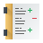

# 🖼️ 素材分類：48

> [🏠 主目錄](../../../../../../README.md) / [images](../../../../../README.md) / [iCons](../../../../README.md) / [Pixel](../../../README.md) / [Breeze](../../README.md) / [Actions ](../README.md) / **48**

本目錄共有 `4` 個檔案

| 🎨 預覽 (點擊放大)  | 📋 檔案詳細資訊與連結 |
| :--- | :--- |
|  | **📂 檔名:** `financial-account.svg` ✨ **格式:** `Vector (SVG)` ⚖️ **大小:** `2.57KB` 📅 **更新:** `2026-03-04`  🚀 **jsDelivr Markdown:** `` 🔗 **直接連結 (Url):** <code>https://cdn.jsdelivr.net/gh/barry028/materials@main/images/iCons/Pixel/Breeze/Actions%20/48/financial-account.svg</code> 📥 [檢視原始檔](financial-account.svg) |
|  | **📂 檔名:** `financial-list.svg` ✨ **格式:** `Vector (SVG)` ⚖️ **大小:** `2.19KB` 📅 **更新:** `2026-03-04`  🚀 **jsDelivr Markdown:** `` 🔗 **直接連結 (Url):** <code>https://cdn.jsdelivr.net/gh/barry028/materials@main/images/iCons/Pixel/Breeze/Actions%20/48/financial-list.svg</code> 📥 [檢視原始檔](financial-list.svg) |
|  | **📂 檔名:** `home.svg` ✨ **格式:** `Vector (SVG)` ⚖️ **大小:** `2.27KB` 📅 **更新:** `2026-03-04`  🚀 **jsDelivr Markdown:** `` 🔗 **直接連結 (Url):** <code>https://cdn.jsdelivr.net/gh/barry028/materials@main/images/iCons/Pixel/Breeze/Actions%20/48/home.svg</code> 📥 [檢視原始檔](home.svg) |
|  | **📂 檔名:** `institution.svg` ✨ **格式:** `Vector (SVG)` ⚖️ **大小:** `7.61KB` 📅 **更新:** `2026-03-04`  🚀 **jsDelivr Markdown:** `` 🔗 **直接連結 (Url):** <code>https://cdn.jsdelivr.net/gh/barry028/materials@main/images/iCons/Pixel/Breeze/Actions%20/48/institution.svg</code> 📥 [檢視原始檔](institution.svg) |