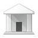

# 🖼️ 素材分類：64

> [🏠 主目錄](../../../../../../README.md) / [images](../../../../../README.md) / [iCons](../../../../README.md) / [Pixel](../../../README.md) / [Breeze](../../README.md) / [Actions ](../README.md) / **64**

本目錄共有 `4` 個檔案

| 🎨 預覽 (點擊放大)  | 📋 檔案詳細資訊與連結 |
| :--- | :--- |
|  | **📂 檔名:** `go-home.svg` ✨ **格式:** `Vector (SVG)` ⚖️ **大小:** `2.24KB` 📅 **更新:** `2026-03-01`  🚀 **jsDelivr Markdown:** `` 🔗 **直接連結 (Url):** <code>https://cdn.jsdelivr.net/gh/barry028/materials@main/images/iCons/Pixel/Breeze/Actions%20/64/go-home.svg</code> 📥 [檢視原始檔](go-home.svg) |
|  | **📂 檔名:** `media-default-album.svg` ✨ **格式:** `Vector (SVG)` ⚖️ **大小:** `12.44KB` 📅 **更新:** `2026-03-01`  🚀 **jsDelivr Markdown:** `` 🔗 **直接連結 (Url):** <code>https://cdn.jsdelivr.net/gh/barry028/materials@main/images/iCons/Pixel/Breeze/Actions%20/64/media-default-album.svg</code> 📥 [檢視原始檔](media-default-album.svg) |
|  | **📂 檔名:** `media-default-track.svg` ✨ **格式:** `Vector (SVG)` ⚖️ **大小:** `12.36KB` 📅 **更新:** `2026-03-01`  🚀 **jsDelivr Markdown:** `` 🔗 **直接連結 (Url):** <code>https://cdn.jsdelivr.net/gh/barry028/materials@main/images/iCons/Pixel/Breeze/Actions%20/64/media-default-track.svg</code> 📥 [檢視原始檔](media-default-track.svg) |
|  | **📂 檔名:** `view-institution.svg` ✨ **格式:** `Vector (SVG)` ⚖️ **大小:** `8.26KB` 📅 **更新:** `2026-03-01`  🚀 **jsDelivr Markdown:** `` 🔗 **直接連結 (Url):** <code>https://cdn.jsdelivr.net/gh/barry028/materials@main/images/iCons/Pixel/Breeze/Actions%20/64/view-institution.svg</code> 📥 [檢視原始檔](view-institution.svg) |