# 🖼️ 素材分類：256

> [🏠 主目錄](../../../../../../README.md) / [images](../../../../../README.md) / [iCons](../../../../README.md) / [Pixel](../../../README.md) / [Breeze](../../README.md) / [Applets ](../README.md) / **256**

本目錄共有 `44` 個檔案

| 🎨 預覽 (點擊放大)  | 📋 檔案詳細資訊與連結 |
| :--- | :--- |
| <a href="applets-template.svg">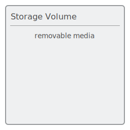</a> | **📂 檔名:** `applets-template.svg` ✨ **格式:** `Vector (SVG)` ⚖️ **大小:** `3.04KB` 📅 **更新:** `2026-03-03`  🚀 **jsDelivr Markdown:** `` 🔗 **直接連結 (Url):** <code>https://cdn.jsdelivr.net/gh/barry028/materials@main/images/iCons/Pixel/Breeze/Applets%20/256/applets-template.svg</code> 📥 [檢視原始檔](applets-template.svg) |
|  | **📂 檔名:** `empty.svg` ✨ **格式:** `Vector (SVG)` ⚖️ **大小:** `1.21KB` 📅 **更新:** `2026-03-03`  🚀 **jsDelivr Markdown:** `` 🔗 **直接連結 (Url):** <code>https://cdn.jsdelivr.net/gh/barry028/materials@main/images/iCons/Pixel/Breeze/Applets%20/256/empty.svg</code> 📥 [檢視原始檔](empty.svg) |
|  | **📂 檔名:** `org.kde.ktpcontactlist.svg` ✨ **格式:** `Vector (SVG)` ⚖️ **大小:** `64.57KB` 📅 **更新:** `2026-03-03`  🚀 **jsDelivr Markdown:** `` 🔗 **直接連結 (Url):** <code>https://cdn.jsdelivr.net/gh/barry028/materials@main/images/iCons/Pixel/Breeze/Applets%20/256/org.kde.ktpcontactlist.svg</code> 📥 [檢視原始檔](org.kde.ktpcontactlist.svg) |
| <a href="org.kde.muonnotifier.svg">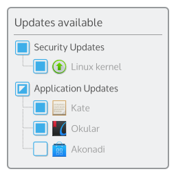</a> | **📂 檔名:** `org.kde.muonnotifier.svg` ✨ **格式:** `Vector (SVG)` ⚖️ **大小:** `95.88KB` 📅 **更新:** `2026-03-03`  🚀 **jsDelivr Markdown:** `` 🔗 **直接連結 (Url):** <code>https://cdn.jsdelivr.net/gh/barry028/materials@main/images/iCons/Pixel/Breeze/Applets%20/256/org.kde.muonnotifier.svg</code> 📥 [檢視原始檔](org.kde.muonnotifier.svg) |
| <a href="org.kde.plasma.activitybar.svg">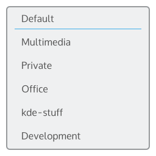</a> | **📂 檔名:** `org.kde.plasma.activitybar.svg` ✨ **格式:** `Vector (SVG)` ⚖️ **大小:** `37.02KB` 📅 **更新:** `2026-03-03`  🚀 **jsDelivr Markdown:** `` 🔗 **直接連結 (Url):** <code>https://cdn.jsdelivr.net/gh/barry028/materials@main/images/iCons/Pixel/Breeze/Applets%20/256/org.kde.plasma.activitybar.svg</code> 📥 [檢視原始檔](org.kde.plasma.activitybar.svg) |
| <a href="org.kde.plasma.analogclock.svg">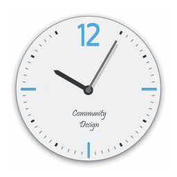</a> | **📂 檔名:** `org.kde.plasma.analogclock.svg` ✨ **格式:** `Vector (SVG)` ⚖️ **大小:** `23.38KB` 📅 **更新:** `2026-03-03`  🚀 **jsDelivr Markdown:** `` 🔗 **直接連結 (Url):** <code>https://cdn.jsdelivr.net/gh/barry028/materials@main/images/iCons/Pixel/Breeze/Applets%20/256/org.kde.plasma.analogclock.svg</code> 📥 [檢視原始檔](org.kde.plasma.analogclock.svg) |
| <a href="org.kde.plasma.battery.svg">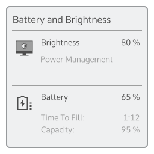</a> | **📂 檔名:** `org.kde.plasma.battery.svg` ✨ **格式:** `Vector (SVG)` ⚖️ **大小:** `73.24KB` 📅 **更新:** `2026-03-03`  🚀 **jsDelivr Markdown:** `` 🔗 **直接連結 (Url):** <code>https://cdn.jsdelivr.net/gh/barry028/materials@main/images/iCons/Pixel/Breeze/Applets%20/256/org.kde.plasma.battery.svg</code> 📥 [檢視原始檔](org.kde.plasma.battery.svg) |
| <a href="org.kde.plasma.binaryclock.svg">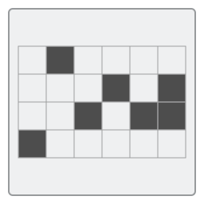</a> | **📂 檔名:** `org.kde.plasma.binaryclock.svg` ✨ **格式:** `Vector (SVG)` ⚖️ **大小:** `2.63KB` 📅 **更新:** `2026-03-03`  🚀 **jsDelivr Markdown:** `` 🔗 **直接連結 (Url):** <code>https://cdn.jsdelivr.net/gh/barry028/materials@main/images/iCons/Pixel/Breeze/Applets%20/256/org.kde.plasma.binaryclock.svg</code> 📥 [檢視原始檔](org.kde.plasma.binaryclock.svg) |
|  | **📂 檔名:** `org.kde.plasma.calculator.svg` ✨ **格式:** `Vector (SVG)` ⚖️ **大小:** `16.67KB` 📅 **更新:** `2026-03-03`  🚀 **jsDelivr Markdown:** `` 🔗 **直接連結 (Url):** <code>https://cdn.jsdelivr.net/gh/barry028/materials@main/images/iCons/Pixel/Breeze/Applets%20/256/org.kde.plasma.calculator.svg</code> 📥 [檢視原始檔](org.kde.plasma.calculator.svg) |
| <a href="org.kde.plasma.calendar.svg">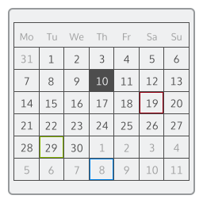</a> | **📂 檔名:** `org.kde.plasma.calendar.svg` ✨ **格式:** `Vector (SVG)` ⚖️ **大小:** `109.45KB` 📅 **更新:** `2026-03-03`  🚀 **jsDelivr Markdown:** `` 🔗 **直接連結 (Url):** <code>https://cdn.jsdelivr.net/gh/barry028/materials@main/images/iCons/Pixel/Breeze/Applets%20/256/org.kde.plasma.calendar.svg</code> 📥 [檢視原始檔](org.kde.plasma.calendar.svg) |
| <a href="org.kde.plasma.clipboard.svg">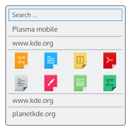</a> | **📂 檔名:** `org.kde.plasma.clipboard.svg` ✨ **格式:** `Vector (SVG)` ⚖️ **大小:** `80.76KB` 📅 **更新:** `2026-03-03`  🚀 **jsDelivr Markdown:** `` 🔗 **直接連結 (Url):** <code>https://cdn.jsdelivr.net/gh/barry028/materials@main/images/iCons/Pixel/Breeze/Applets%20/256/org.kde.plasma.clipboard.svg</code> 📥 [檢視原始檔](org.kde.plasma.clipboard.svg) |
| <a href="org.kde.plasma.colorpicker.svg">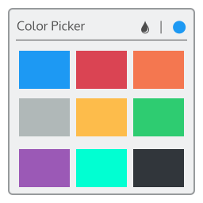</a> | **📂 檔名:** `org.kde.plasma.colorpicker.svg` ✨ **格式:** `Vector (SVG)` ⚖️ **大小:** `12.92KB` 📅 **更新:** `2026-03-03`  🚀 **jsDelivr Markdown:** `` 🔗 **直接連結 (Url):** <code>https://cdn.jsdelivr.net/gh/barry028/materials@main/images/iCons/Pixel/Breeze/Applets%20/256/org.kde.plasma.colorpicker.svg</code> 📥 [檢視原始檔](org.kde.plasma.colorpicker.svg) |
|  | **📂 檔名:** `org.kde.plasma.comic.svg` ✨ **格式:** `Vector (SVG)` ⚖️ **大小:** `124.58KB` 📅 **更新:** `2026-03-03`  🚀 **jsDelivr Markdown:** `` 🔗 **直接連結 (Url):** <code>https://cdn.jsdelivr.net/gh/barry028/materials@main/images/iCons/Pixel/Breeze/Applets%20/256/org.kde.plasma.comic.svg</code> 📥 [檢視原始檔](org.kde.plasma.comic.svg) |
| <a href="org.kde.plasma.devicenotifier.svg">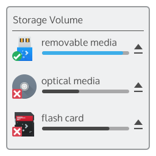</a> | **📂 檔名:** `org.kde.plasma.devicenotifier.svg` ✨ **格式:** `Vector (SVG)` ⚖️ **大小:** `62.69KB` 📅 **更新:** `2026-03-03`  🚀 **jsDelivr Markdown:** `` 🔗 **直接連結 (Url):** <code>https://cdn.jsdelivr.net/gh/barry028/materials@main/images/iCons/Pixel/Breeze/Applets%20/256/org.kde.plasma.devicenotifier.svg</code> 📥 [檢視原始檔](org.kde.plasma.devicenotifier.svg) |
| <a href="org.kde.plasma.digitalclock.svg">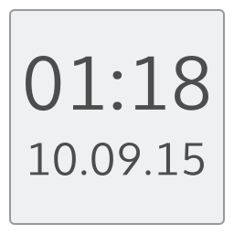</a> | **📂 檔名:** `org.kde.plasma.digitalclock.svg` ✨ **格式:** `Vector (SVG)` ⚖️ **大小:** `11.62KB` 📅 **更新:** `2026-03-03`  🚀 **jsDelivr Markdown:** `` 🔗 **直接連結 (Url):** <code>https://cdn.jsdelivr.net/gh/barry028/materials@main/images/iCons/Pixel/Breeze/Applets%20/256/org.kde.plasma.digitalclock.svg</code> 📥 [檢視原始檔](org.kde.plasma.digitalclock.svg) |
| <a href="org.kde.plasma.diskquota.svg">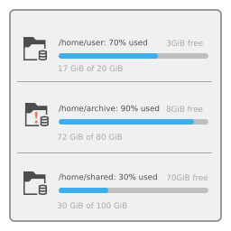</a> | **📂 檔名:** `org.kde.plasma.diskquota.svg` ✨ **格式:** `Vector (SVG)` ⚖️ **大小:** `91.67KB` 📅 **更新:** `2026-03-03`  🚀 **jsDelivr Markdown:** `` 🔗 **直接連結 (Url):** <code>https://cdn.jsdelivr.net/gh/barry028/materials@main/images/iCons/Pixel/Breeze/Applets%20/256/org.kde.plasma.diskquota.svg</code> 📥 [檢視原始檔](org.kde.plasma.diskquota.svg) |
| <a href="org.kde.plasma.fifteenpuzzle.svg">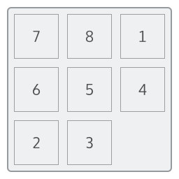</a> | **📂 檔名:** `org.kde.plasma.fifteenpuzzle.svg` ✨ **格式:** `Vector (SVG)` ⚖️ **大小:** `8.93KB` 📅 **更新:** `2026-03-03`  🚀 **jsDelivr Markdown:** `` 🔗 **直接連結 (Url):** <code>https://cdn.jsdelivr.net/gh/barry028/materials@main/images/iCons/Pixel/Breeze/Applets%20/256/org.kde.plasma.fifteenpuzzle.svg</code> 📥 [檢視原始檔](org.kde.plasma.fifteenpuzzle.svg) |
| <a href="org.kde.plasma.folder.svg">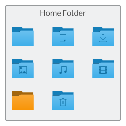</a> | **📂 檔名:** `org.kde.plasma.folder.svg` ✨ **格式:** `Vector (SVG)` ⚖️ **大小:** `32.93KB` 📅 **更新:** `2026-03-03`  🚀 **jsDelivr Markdown:** `` 🔗 **直接連結 (Url):** <code>https://cdn.jsdelivr.net/gh/barry028/materials@main/images/iCons/Pixel/Breeze/Applets%20/256/org.kde.plasma.folder.svg</code> 📥 [檢視原始檔](org.kde.plasma.folder.svg) |
| <a href="org.kde.plasma.frame.svg">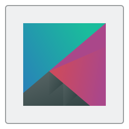</a> | **📂 檔名:** `org.kde.plasma.frame.svg` ✨ **格式:** `Vector (SVG)` ⚖️ **大小:** `6.66KB` 📅 **更新:** `2026-03-03`  🚀 **jsDelivr Markdown:** `` 🔗 **直接連結 (Url):** <code>https://cdn.jsdelivr.net/gh/barry028/materials@main/images/iCons/Pixel/Breeze/Applets%20/256/org.kde.plasma.frame.svg</code> 📥 [檢視原始檔](org.kde.plasma.frame.svg) |
|  | **📂 檔名:** `org.kde.plasma.fuzzyclock.svg` ✨ **格式:** `Vector (SVG)` ⚖️ **大小:** `8.16KB` 📅 **更新:** `2026-03-03`  🚀 **jsDelivr Markdown:** `` 🔗 **直接連結 (Url):** <code>https://cdn.jsdelivr.net/gh/barry028/materials@main/images/iCons/Pixel/Breeze/Applets%20/256/org.kde.plasma.fuzzyclock.svg</code> 📥 [檢視原始檔](org.kde.plasma.fuzzyclock.svg) |
| <a href="org.kde.plasma.icontasks.svg">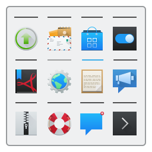</a> | **📂 檔名:** `org.kde.plasma.icontasks.svg` ✨ **格式:** `Vector (SVG)` ⚖️ **大小:** `94.09KB` 📅 **更新:** `2026-03-03`  🚀 **jsDelivr Markdown:** `` 🔗 **直接連結 (Url):** <code>https://cdn.jsdelivr.net/gh/barry028/materials@main/images/iCons/Pixel/Breeze/Applets%20/256/org.kde.plasma.icontasks.svg</code> 📥 [檢視原始檔](org.kde.plasma.icontasks.svg) |
| <a href="org.kde.plasma.kicker.svg">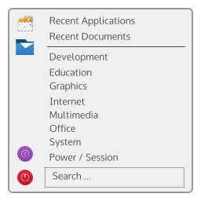</a> | **📂 檔名:** `org.kde.plasma.kicker.svg` ✨ **格式:** `Vector (SVG)` ⚖️ **大小:** `138.04KB` 📅 **更新:** `2026-03-03`  🚀 **jsDelivr Markdown:** `` 🔗 **直接連結 (Url):** <code>https://cdn.jsdelivr.net/gh/barry028/materials@main/images/iCons/Pixel/Breeze/Applets%20/256/org.kde.plasma.kicker.svg</code> 📥 [檢視原始檔](org.kde.plasma.kicker.svg) |
| <a href="org.kde.plasma.kickerdash.svg">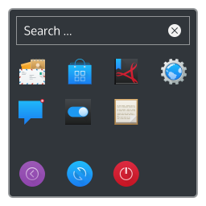</a> | **📂 檔名:** `org.kde.plasma.kickerdash.svg` ✨ **格式:** `Vector (SVG)` ⚖️ **大小:** `99.31KB` 📅 **更新:** `2026-03-03`  🚀 **jsDelivr Markdown:** `` 🔗 **直接連結 (Url):** <code>https://cdn.jsdelivr.net/gh/barry028/materials@main/images/iCons/Pixel/Breeze/Applets%20/256/org.kde.plasma.kickerdash.svg</code> 📥 [檢視原始檔](org.kde.plasma.kickerdash.svg) |
| <a href="org.kde.plasma.kickoff.svg">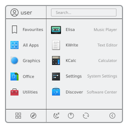</a> | **📂 檔名:** `org.kde.plasma.kickoff.svg` ✨ **格式:** `Vector (SVG)` ⚖️ **大小:** `160.37KB` 📅 **更新:** `2026-03-03`  🚀 **jsDelivr Markdown:** `` 🔗 **直接連結 (Url):** <code>https://cdn.jsdelivr.net/gh/barry028/materials@main/images/iCons/Pixel/Breeze/Applets%20/256/org.kde.plasma.kickoff.svg</code> 📥 [檢視原始檔](org.kde.plasma.kickoff.svg) |
| <a href="org.kde.plasma.kickofflegacy.svg">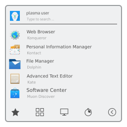</a> | **📂 檔名:** `org.kde.plasma.kickofflegacy.svg` ✨ **格式:** `Vector (SVG)` ⚖️ **大小:** `158.14KB` 📅 **更新:** `2026-03-03`  🚀 **jsDelivr Markdown:** `` 🔗 **直接連結 (Url):** <code>https://cdn.jsdelivr.net/gh/barry028/materials@main/images/iCons/Pixel/Breeze/Applets%20/256/org.kde.plasma.kickofflegacy.svg</code> 📥 [檢視原始檔](org.kde.plasma.kickofflegacy.svg) |
|  | **📂 檔名:** `org.kde.plasma.mediacontroller.svg` ✨ **格式:** `Vector (SVG)` ⚖️ **大小:** `31.70KB` 📅 **更新:** `2026-03-03`  🚀 **jsDelivr Markdown:** `` 🔗 **直接連結 (Url):** <code>https://cdn.jsdelivr.net/gh/barry028/materials@main/images/iCons/Pixel/Breeze/Applets%20/256/org.kde.plasma.mediacontroller.svg</code> 📥 [檢視原始檔](org.kde.plasma.mediacontroller.svg) |
|  | **📂 檔名:** `org.kde.plasma.networkmanagement.svg` ✨ **格式:** `Vector (SVG)` ⚖️ **大小:** `89.18KB` 📅 **更新:** `2026-03-03`  🚀 **jsDelivr Markdown:** `` 🔗 **直接連結 (Url):** <code>https://cdn.jsdelivr.net/gh/barry028/materials@main/images/iCons/Pixel/Breeze/Applets%20/256/org.kde.plasma.networkmanagement.svg</code> 📥 [檢視原始檔](org.kde.plasma.networkmanagement.svg) |
| <a href="org.kde.plasma.notes.svg">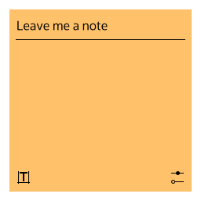</a> | **📂 檔名:** `org.kde.plasma.notes.svg` ✨ **格式:** `Vector (SVG)` ⚖️ **大小:** `5.53KB` 📅 **更新:** `2026-03-03`  🚀 **jsDelivr Markdown:** `` 🔗 **直接連結 (Url):** <code>https://cdn.jsdelivr.net/gh/barry028/materials@main/images/iCons/Pixel/Breeze/Applets%20/256/org.kde.plasma.notes.svg</code> 📥 [檢視原始檔](org.kde.plasma.notes.svg) |
| <a href="org.kde.plasma.pager.svg">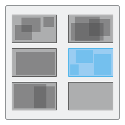</a> | **📂 檔名:** `org.kde.plasma.pager.svg` ✨ **格式:** `Vector (SVG)` ⚖️ **大小:** `6.12KB` 📅 **更新:** `2026-03-03`  🚀 **jsDelivr Markdown:** `` 🔗 **直接連結 (Url):** <code>https://cdn.jsdelivr.net/gh/barry028/materials@main/images/iCons/Pixel/Breeze/Applets%20/256/org.kde.plasma.pager.svg</code> 📥 [檢視原始檔](org.kde.plasma.pager.svg) |
| <a href="org.kde.plasma.quicklaunch.svg">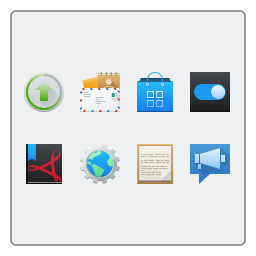</a> | **📂 檔名:** `org.kde.plasma.quicklaunch.svg` ✨ **格式:** `Vector (SVG)` ⚖️ **大小:** `70.21KB` 📅 **更新:** `2026-03-03`  🚀 **jsDelivr Markdown:** `` 🔗 **直接連結 (Url):** <code>https://cdn.jsdelivr.net/gh/barry028/materials@main/images/iCons/Pixel/Breeze/Applets%20/256/org.kde.plasma.quicklaunch.svg</code> 📥 [檢視原始檔](org.kde.plasma.quicklaunch.svg) |
| <a href="org.kde.plasma.showActivityManager.svg">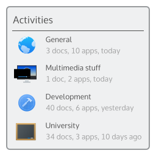</a> | **📂 檔名:** `org.kde.plasma.showActivityManager.svg` ✨ **格式:** `Vector (SVG)` ⚖️ **大小:** `128.64KB` 📅 **更新:** `2026-03-03`  🚀 **jsDelivr Markdown:** `` 🔗 **直接連結 (Url):** <code>https://cdn.jsdelivr.net/gh/barry028/materials@main/images/iCons/Pixel/Breeze/Applets%20/256/org.kde.plasma.showActivityManager.svg</code> 📥 [檢視原始檔](org.kde.plasma.showActivityManager.svg) |
| <a href="org.kde.plasma.systemloadviewer.svg">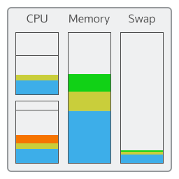</a> | **📂 檔名:** `org.kde.plasma.systemloadviewer.svg` ✨ **格式:** `Vector (SVG)` ⚖️ **大小:** `17.17KB` 📅 **更新:** `2026-03-03`  🚀 **jsDelivr Markdown:** `` 🔗 **直接連結 (Url):** <code>https://cdn.jsdelivr.net/gh/barry028/materials@main/images/iCons/Pixel/Breeze/Applets%20/256/org.kde.plasma.systemloadviewer.svg</code> 📥 [檢視原始檔](org.kde.plasma.systemloadviewer.svg) |
| <a href="org.kde.plasma.systemmonitor.cpu.svg">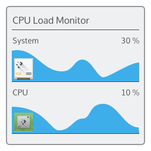</a> | **📂 檔名:** `org.kde.plasma.systemmonitor.cpu.svg` ✨ **格式:** `Vector (SVG)` ⚖️ **大小:** `54.55KB` 📅 **更新:** `2026-03-03`  🚀 **jsDelivr Markdown:** `` 🔗 **直接連結 (Url):** <code>https://cdn.jsdelivr.net/gh/barry028/materials@main/images/iCons/Pixel/Breeze/Applets%20/256/org.kde.plasma.systemmonitor.cpu.svg</code> 📥 [檢視原始檔](org.kde.plasma.systemmonitor.cpu.svg) |
| <a href="org.kde.plasma.systemmonitor.diskactivity.svg">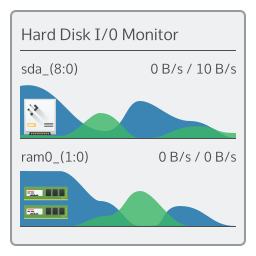</a> | **📂 檔名:** `org.kde.plasma.systemmonitor.diskactivity.svg` ✨ **格式:** `Vector (SVG)` ⚖️ **大小:** `68.71KB` 📅 **更新:** `2026-03-03`  🚀 **jsDelivr Markdown:** `` 🔗 **直接連結 (Url):** <code>https://cdn.jsdelivr.net/gh/barry028/materials@main/images/iCons/Pixel/Breeze/Applets%20/256/org.kde.plasma.systemmonitor.diskactivity.svg</code> 📥 [檢視原始檔](org.kde.plasma.systemmonitor.diskactivity.svg) |
| <a href="org.kde.plasma.systemmonitor.diskusage.svg">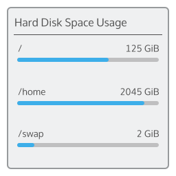</a> | **📂 檔名:** `org.kde.plasma.systemmonitor.diskusage.svg` ✨ **格式:** `Vector (SVG)` ⚖️ **大小:** `42.50KB` 📅 **更新:** `2026-03-03`  🚀 **jsDelivr Markdown:** `` 🔗 **直接連結 (Url):** <code>https://cdn.jsdelivr.net/gh/barry028/materials@main/images/iCons/Pixel/Breeze/Applets%20/256/org.kde.plasma.systemmonitor.diskusage.svg</code> 📥 [檢視原始檔](org.kde.plasma.systemmonitor.diskusage.svg) |
| <a href="org.kde.plasma.systemmonitor.memory.svg">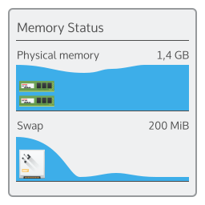</a> | **📂 檔名:** `org.kde.plasma.systemmonitor.memory.svg` ✨ **格式:** `Vector (SVG)` ⚖️ **大小:** `67.17KB` 📅 **更新:** `2026-03-03`  🚀 **jsDelivr Markdown:** `` 🔗 **直接連結 (Url):** <code>https://cdn.jsdelivr.net/gh/barry028/materials@main/images/iCons/Pixel/Breeze/Applets%20/256/org.kde.plasma.systemmonitor.memory.svg</code> 📥 [檢視原始檔](org.kde.plasma.systemmonitor.memory.svg) |
| <a href="org.kde.plasma.systemmonitor.net.svg">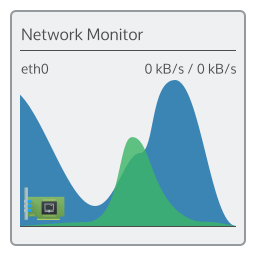</a> | **📂 檔名:** `org.kde.plasma.systemmonitor.net.svg` ✨ **格式:** `Vector (SVG)` ⚖️ **大小:** `33.06KB` 📅 **更新:** `2026-03-03`  🚀 **jsDelivr Markdown:** `` 🔗 **直接連結 (Url):** <code>https://cdn.jsdelivr.net/gh/barry028/materials@main/images/iCons/Pixel/Breeze/Applets%20/256/org.kde.plasma.systemmonitor.net.svg</code> 📥 [檢視原始檔](org.kde.plasma.systemmonitor.net.svg) |
| <a href="org.kde.plasma.systemtray.svg">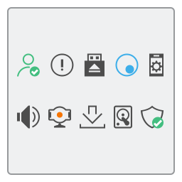</a> | **📂 檔名:** `org.kde.plasma.systemtray.svg` ✨ **格式:** `Vector (SVG)` ⚖️ **大小:** `12.87KB` 📅 **更新:** `2026-03-03`  🚀 **jsDelivr Markdown:** `` 🔗 **直接連結 (Url):** <code>https://cdn.jsdelivr.net/gh/barry028/materials@main/images/iCons/Pixel/Breeze/Applets%20/256/org.kde.plasma.systemtray.svg</code> 📥 [檢視原始檔](org.kde.plasma.systemtray.svg) |
| <a href="org.kde.plasma.taskmanager.svg">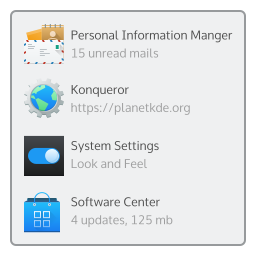</a> | **📂 檔名:** `org.kde.plasma.taskmanager.svg` ✨ **格式:** `Vector (SVG)` ⚖️ **大小:** `129.57KB` 📅 **更新:** `2026-03-03`  🚀 **jsDelivr Markdown:** `` 🔗 **直接連結 (Url):** <code>https://cdn.jsdelivr.net/gh/barry028/materials@main/images/iCons/Pixel/Breeze/Applets%20/256/org.kde.plasma.taskmanager.svg</code> 📥 [檢視原始檔](org.kde.plasma.taskmanager.svg) |
| <a href="org.kde.plasma.timer.svg">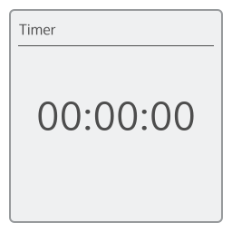</a> | **📂 檔名:** `org.kde.plasma.timer.svg` ✨ **格式:** `Vector (SVG)` ⚖️ **大小:** `12.49KB` 📅 **更新:** `2026-03-03`  🚀 **jsDelivr Markdown:** `` 🔗 **直接連結 (Url):** <code>https://cdn.jsdelivr.net/gh/barry028/materials@main/images/iCons/Pixel/Breeze/Applets%20/256/org.kde.plasma.timer.svg</code> 📥 [檢視原始檔](org.kde.plasma.timer.svg) |
| <a href="org.kde.plasma.userswitcher.svg">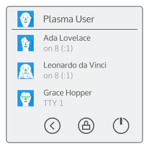</a> | **📂 檔名:** `org.kde.plasma.userswitcher.svg` ✨ **格式:** `Vector (SVG)` ⚖️ **大小:** `73.43KB` 📅 **更新:** `2026-03-03`  🚀 **jsDelivr Markdown:** `` 🔗 **直接連結 (Url):** <code>https://cdn.jsdelivr.net/gh/barry028/materials@main/images/iCons/Pixel/Breeze/Applets%20/256/org.kde.plasma.userswitcher.svg</code> 📥 [檢視原始檔](org.kde.plasma.userswitcher.svg) |
|  | **📂 檔名:** `org.kde.plasma.vault.svg` ✨ **格式:** `Vector (SVG)` ⚖️ **大小:** `73.32KB` 📅 **更新:** `2026-03-03`  🚀 **jsDelivr Markdown:** `` 🔗 **直接連結 (Url):** <code>https://cdn.jsdelivr.net/gh/barry028/materials@main/images/iCons/Pixel/Breeze/Applets%20/256/org.kde.plasma.vault.svg</code> 📥 [檢視原始檔](org.kde.plasma.vault.svg) |
| <a href="org.kde.plasma.volume.svg">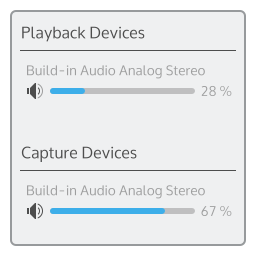</a> | **📂 檔名:** `org.kde.plasma.volume.svg` ✨ **格式:** `Vector (SVG)` ⚖️ **大小:** `68.39KB` 📅 **更新:** `2026-03-03`  🚀 **jsDelivr Markdown:** `` 🔗 **直接連結 (Url):** <code>https://cdn.jsdelivr.net/gh/barry028/materials@main/images/iCons/Pixel/Breeze/Applets%20/256/org.kde.plasma.volume.svg</code> 📥 [檢視原始檔](org.kde.plasma.volume.svg) |
| <a href="org.kde.plasma.windowlist.svg">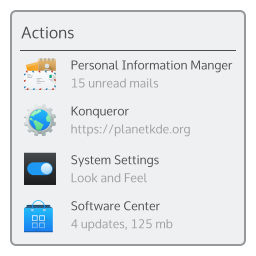</a> | **📂 檔名:** `org.kde.plasma.windowlist.svg` ✨ **格式:** `Vector (SVG)` ⚖️ **大小:** `133.03KB` 📅 **更新:** `2026-03-03`  🚀 **jsDelivr Markdown:** `` 🔗 **直接連結 (Url):** <code>https://cdn.jsdelivr.net/gh/barry028/materials@main/images/iCons/Pixel/Breeze/Applets%20/256/org.kde.plasma.windowlist.svg</code> 📥 [檢視原始檔](org.kde.plasma.windowlist.svg) |