# 🖼️ 素材分類：48

> [🏠 主目錄](../../../../../../README.md) / [images](../../../../../README.md) / [iCons](../../../../README.md) / [Pixel](../../../README.md) / [Breeze](../../README.md) / [Applets ](../README.md) / **48**

本目錄共有 `117` 個檔案

| 🎨 預覽 (點擊放大)  | 📋 檔案詳細資訊與連結 |
| :--- | :--- |
|  | **📂 檔名:** `osd-duplicate.svg` ✨ **格式:** `Vector (SVG)` ⚖️ **大小:** `2.34KB` 📅 **更新:** `2026-03-04`  🚀 **jsDelivr Markdown:** `` 🔗 **直接連結 (Url):** <code>https://cdn.jsdelivr.net/gh/barry028/materials@main/images/iCons/Pixel/Breeze/Applets%20/48/osd-duplicate.svg</code> 📥 [檢視原始檔](osd-duplicate.svg) |
|  | **📂 檔名:** `osd-rotate-ccw.svg` ✨ **格式:** `Vector (SVG)` ⚖️ **大小:** `2.08KB` 📅 **更新:** `2026-03-04`  🚀 **jsDelivr Markdown:** `` 🔗 **直接連結 (Url):** <code>https://cdn.jsdelivr.net/gh/barry028/materials@main/images/iCons/Pixel/Breeze/Applets%20/48/osd-rotate-ccw.svg</code> 📥 [檢視原始檔](osd-rotate-ccw.svg) |
|  | **📂 檔名:** `osd-rotate-cw.svg` ✨ **格式:** `Vector (SVG)` ⚖️ **大小:** `2.08KB` 📅 **更新:** `2026-03-04`  🚀 **jsDelivr Markdown:** `` 🔗 **直接連結 (Url):** <code>https://cdn.jsdelivr.net/gh/barry028/materials@main/images/iCons/Pixel/Breeze/Applets%20/48/osd-rotate-cw.svg</code> 📥 [檢視原始檔](osd-rotate-cw.svg) |
|  | **📂 檔名:** `osd-rotate-flip.svg` ✨ **格式:** `Vector (SVG)` ⚖️ **大小:** `1.92KB` 📅 **更新:** `2026-03-04`  🚀 **jsDelivr Markdown:** `` 🔗 **直接連結 (Url):** <code>https://cdn.jsdelivr.net/gh/barry028/materials@main/images/iCons/Pixel/Breeze/Applets%20/48/osd-rotate-flip.svg</code> 📥 [檢視原始檔](osd-rotate-flip.svg) |
|  | **📂 檔名:** `osd-rotate-normal.svg` ✨ **格式:** `Vector (SVG)` ⚖️ **大小:** `2.24KB` 📅 **更新:** `2026-03-04`  🚀 **jsDelivr Markdown:** `` 🔗 **直接連結 (Url):** <code>https://cdn.jsdelivr.net/gh/barry028/materials@main/images/iCons/Pixel/Breeze/Applets%20/48/osd-rotate-normal.svg</code> 📥 [檢視原始檔](osd-rotate-normal.svg) |
|  | **📂 檔名:** `osd-sbs-left.svg` ✨ **格式:** `Vector (SVG)` ⚖️ **大小:** `2.18KB` 📅 **更新:** `2026-03-04`  🚀 **jsDelivr Markdown:** `` 🔗 **直接連結 (Url):** <code>https://cdn.jsdelivr.net/gh/barry028/materials@main/images/iCons/Pixel/Breeze/Applets%20/48/osd-sbs-left.svg</code> 📥 [檢視原始檔](osd-sbs-left.svg) |
|  | **📂 檔名:** `osd-sbs-sright.svg` ✨ **格式:** `Vector (SVG)` ⚖️ **大小:** `2.19KB` 📅 **更新:** `2026-03-04`  🚀 **jsDelivr Markdown:** `` 🔗 **直接連結 (Url):** <code>https://cdn.jsdelivr.net/gh/barry028/materials@main/images/iCons/Pixel/Breeze/Applets%20/48/osd-sbs-sright.svg</code> 📥 [檢視原始檔](osd-sbs-sright.svg) |
|  | **📂 檔名:** `osd-shutd-laptop.svg` ✨ **格式:** `Vector (SVG)` ⚖️ **大小:** `2.43KB` 📅 **更新:** `2026-03-04`  🚀 **jsDelivr Markdown:** `` 🔗 **直接連結 (Url):** <code>https://cdn.jsdelivr.net/gh/barry028/materials@main/images/iCons/Pixel/Breeze/Applets%20/48/osd-shutd-laptop.svg</code> 📥 [檢視原始檔](osd-shutd-laptop.svg) |
|  | **📂 檔名:** `osd-shutd-screen.svg` ✨ **格式:** `Vector (SVG)` ⚖️ **大小:** `2.45KB` 📅 **更新:** `2026-03-04`  🚀 **jsDelivr Markdown:** `` 🔗 **直接連結 (Url):** <code>https://cdn.jsdelivr.net/gh/barry028/materials@main/images/iCons/Pixel/Breeze/Applets%20/48/osd-shutd-screen.svg</code> 📥 [檢視原始檔](osd-shutd-screen.svg) |
|  | **📂 檔名:** `weather-clear-night-symbolic.svg` ✨ **格式:** `Vector (SVG)` ⚖️ **大小:** `529.00B` 📅 **更新:** `2026-03-04`  🚀 **jsDelivr Markdown:** `` 🔗 **直接連結 (Url):** <code>https://cdn.jsdelivr.net/gh/barry028/materials@main/images/iCons/Pixel/Breeze/Applets%20/48/weather-clear-night-symbolic.svg</code> 📥 [檢視原始檔](weather-clear-night-symbolic.svg) |
|  | **📂 檔名:** `weather-clear-night.svg` ✨ **格式:** `Vector (SVG)` ⚖️ **大小:** `2.37KB` 📅 **更新:** `2026-03-04`  🚀 **jsDelivr Markdown:** `` 🔗 **直接連結 (Url):** <code>https://cdn.jsdelivr.net/gh/barry028/materials@main/images/iCons/Pixel/Breeze/Applets%20/48/weather-clear-night.svg</code> 📥 [檢視原始檔](weather-clear-night.svg) |
|  | **📂 檔名:** `weather-clear-symbolic.svg` ✨ **格式:** `Vector (SVG)` ⚖️ **大小:** `1.04KB` 📅 **更新:** `2026-03-04`  🚀 **jsDelivr Markdown:** `` 🔗 **直接連結 (Url):** <code>https://cdn.jsdelivr.net/gh/barry028/materials@main/images/iCons/Pixel/Breeze/Applets%20/48/weather-clear-symbolic.svg</code> 📥 [檢視原始檔](weather-clear-symbolic.svg) |
|  | **📂 檔名:** `weather-clear-wind-night-symbolic.svg` ✨ **格式:** `Vector (SVG)` ⚖️ **大小:** `925.00B` 📅 **更新:** `2026-03-04`  🚀 **jsDelivr Markdown:** `` 🔗 **直接連結 (Url):** <code>https://cdn.jsdelivr.net/gh/barry028/materials@main/images/iCons/Pixel/Breeze/Applets%20/48/weather-clear-wind-night-symbolic.svg</code> 📥 [檢視原始檔](weather-clear-wind-night-symbolic.svg) |
|  | **📂 檔名:** `weather-clear-wind-night.svg` ✨ **格式:** `Vector (SVG)` ⚖️ **大小:** `5.96KB` 📅 **更新:** `2026-03-04`  🚀 **jsDelivr Markdown:** `` 🔗 **直接連結 (Url):** <code>https://cdn.jsdelivr.net/gh/barry028/materials@main/images/iCons/Pixel/Breeze/Applets%20/48/weather-clear-wind-night.svg</code> 📥 [檢視原始檔](weather-clear-wind-night.svg) |
| <a href="weather-clear-wind-symbolic.svg">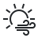</a> | **📂 檔名:** `weather-clear-wind-symbolic.svg` ✨ **格式:** `Vector (SVG)` ⚖️ **大小:** `1.41KB` 📅 **更新:** `2026-03-04`  🚀 **jsDelivr Markdown:** `` 🔗 **直接連結 (Url):** <code>https://cdn.jsdelivr.net/gh/barry028/materials@main/images/iCons/Pixel/Breeze/Applets%20/48/weather-clear-wind-symbolic.svg</code> 📥 [檢視原始檔](weather-clear-wind-symbolic.svg) |
|  | **📂 檔名:** `weather-clear-wind.svg` ✨ **格式:** `Vector (SVG)` ⚖️ **大小:** `5.00KB` 📅 **更新:** `2026-03-04`  🚀 **jsDelivr Markdown:** `` 🔗 **直接連結 (Url):** <code>https://cdn.jsdelivr.net/gh/barry028/materials@main/images/iCons/Pixel/Breeze/Applets%20/48/weather-clear-wind.svg</code> 📥 [檢視原始檔](weather-clear-wind.svg) |
|  | **📂 檔名:** `weather-clear.svg` ✨ **格式:** `Vector (SVG)` ⚖️ **大小:** `953.00B` 📅 **更新:** `2026-03-04`  🚀 **jsDelivr Markdown:** `` 🔗 **直接連結 (Url):** <code>https://cdn.jsdelivr.net/gh/barry028/materials@main/images/iCons/Pixel/Breeze/Applets%20/48/weather-clear.svg</code> 📥 [檢視原始檔](weather-clear.svg) |
|  | **📂 檔名:** `weather-clouds-night-symbolic.svg` ✨ **格式:** `Vector (SVG)` ⚖️ **大小:** `738.00B` 📅 **更新:** `2026-03-04`  🚀 **jsDelivr Markdown:** `` 🔗 **直接連結 (Url):** <code>https://cdn.jsdelivr.net/gh/barry028/materials@main/images/iCons/Pixel/Breeze/Applets%20/48/weather-clouds-night-symbolic.svg</code> 📥 [檢視原始檔](weather-clouds-night-symbolic.svg) |
|  | **📂 檔名:** `weather-clouds-night.svg` ✨ **格式:** `Vector (SVG)` ⚖️ **大小:** `3.12KB` 📅 **更新:** `2026-03-04`  🚀 **jsDelivr Markdown:** `` 🔗 **直接連結 (Url):** <code>https://cdn.jsdelivr.net/gh/barry028/materials@main/images/iCons/Pixel/Breeze/Applets%20/48/weather-clouds-night.svg</code> 📥 [檢視原始檔](weather-clouds-night.svg) |
| <a href="weather-clouds-symbolic.svg">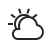</a> | **📂 檔名:** `weather-clouds-symbolic.svg` ✨ **格式:** `Vector (SVG)` ⚖️ **大小:** `1.04KB` 📅 **更新:** `2026-03-04`  🚀 **jsDelivr Markdown:** `` 🔗 **直接連結 (Url):** <code>https://cdn.jsdelivr.net/gh/barry028/materials@main/images/iCons/Pixel/Breeze/Applets%20/48/weather-clouds-symbolic.svg</code> 📥 [檢視原始檔](weather-clouds-symbolic.svg) |
|  | **📂 檔名:** `weather-clouds-wind-night-symbolic.svg` ✨ **格式:** `Vector (SVG)` ⚖️ **大小:** `1.11KB` 📅 **更新:** `2026-03-04`  🚀 **jsDelivr Markdown:** `` 🔗 **直接連結 (Url):** <code>https://cdn.jsdelivr.net/gh/barry028/materials@main/images/iCons/Pixel/Breeze/Applets%20/48/weather-clouds-wind-night-symbolic.svg</code> 📥 [檢視原始檔](weather-clouds-wind-night-symbolic.svg) |
|  | **📂 檔名:** `weather-clouds-wind-night.svg` ✨ **格式:** `Vector (SVG)` ⚖️ **大小:** `6.73KB` 📅 **更新:** `2026-03-04`  🚀 **jsDelivr Markdown:** `` 🔗 **直接連結 (Url):** <code>https://cdn.jsdelivr.net/gh/barry028/materials@main/images/iCons/Pixel/Breeze/Applets%20/48/weather-clouds-wind-night.svg</code> 📥 [檢視原始檔](weather-clouds-wind-night.svg) |
|  | **📂 檔名:** `weather-clouds-wind-symbolic.svg` ✨ **格式:** `Vector (SVG)` ⚖️ **大小:** `1.41KB` 📅 **更新:** `2026-03-04`  🚀 **jsDelivr Markdown:** `` 🔗 **直接連結 (Url):** <code>https://cdn.jsdelivr.net/gh/barry028/materials@main/images/iCons/Pixel/Breeze/Applets%20/48/weather-clouds-wind-symbolic.svg</code> 📥 [檢視原始檔](weather-clouds-wind-symbolic.svg) |
| <a href="weather-clouds-wind.svg">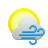</a> | **📂 檔名:** `weather-clouds-wind.svg` ✨ **格式:** `Vector (SVG)` ⚖️ **大小:** `6.28KB` 📅 **更新:** `2026-03-04`  🚀 **jsDelivr Markdown:** `` 🔗 **直接連結 (Url):** <code>https://cdn.jsdelivr.net/gh/barry028/materials@main/images/iCons/Pixel/Breeze/Applets%20/48/weather-clouds-wind.svg</code> 📥 [檢視原始檔](weather-clouds-wind.svg) |
|  | **📂 檔名:** `weather-clouds.svg` ✨ **格式:** `Vector (SVG)` ⚖️ **大小:** `2.40KB` 📅 **更新:** `2026-03-04`  🚀 **jsDelivr Markdown:** `` 🔗 **直接連結 (Url):** <code>https://cdn.jsdelivr.net/gh/barry028/materials@main/images/iCons/Pixel/Breeze/Applets%20/48/weather-clouds.svg</code> 📥 [檢視原始檔](weather-clouds.svg) |
|  | **📂 檔名:** `weather-few-clouds-night-symbolic.svg` ✨ **格式:** `Vector (SVG)` ⚖️ **大小:** `873.00B` 📅 **更新:** `2026-03-04`  🚀 **jsDelivr Markdown:** `` 🔗 **直接連結 (Url):** <code>https://cdn.jsdelivr.net/gh/barry028/materials@main/images/iCons/Pixel/Breeze/Applets%20/48/weather-few-clouds-night-symbolic.svg</code> 📥 [檢視原始檔](weather-few-clouds-night-symbolic.svg) |
|  | **📂 檔名:** `weather-few-clouds-night.svg` ✨ **格式:** `Vector (SVG)` ⚖️ **大小:** `3.01KB` 📅 **更新:** `2026-03-04`  🚀 **jsDelivr Markdown:** `` 🔗 **直接連結 (Url):** <code>https://cdn.jsdelivr.net/gh/barry028/materials@main/images/iCons/Pixel/Breeze/Applets%20/48/weather-few-clouds-night.svg</code> 📥 [檢視原始檔](weather-few-clouds-night.svg) |
|  | **📂 檔名:** `weather-few-clouds-symbolic.svg` ✨ **格式:** `Vector (SVG)` ⚖️ **大小:** `1.18KB` 📅 **更新:** `2026-03-04`  🚀 **jsDelivr Markdown:** `` 🔗 **直接連結 (Url):** <code>https://cdn.jsdelivr.net/gh/barry028/materials@main/images/iCons/Pixel/Breeze/Applets%20/48/weather-few-clouds-symbolic.svg</code> 📥 [檢視原始檔](weather-few-clouds-symbolic.svg) |
|  | **📂 檔名:** `weather-few-clouds-wind-night-symbolic.svg` ✨ **格式:** `Vector (SVG)` ⚖️ **大小:** `1.07KB` 📅 **更新:** `2026-03-04`  🚀 **jsDelivr Markdown:** `` 🔗 **直接連結 (Url):** <code>https://cdn.jsdelivr.net/gh/barry028/materials@main/images/iCons/Pixel/Breeze/Applets%20/48/weather-few-clouds-wind-night-symbolic.svg</code> 📥 [檢視原始檔](weather-few-clouds-wind-night-symbolic.svg) |
|  | **📂 檔名:** `weather-few-clouds-wind-night.svg` ✨ **格式:** `Vector (SVG)` ⚖️ **大小:** `6.42KB` 📅 **更新:** `2026-03-04`  🚀 **jsDelivr Markdown:** `` 🔗 **直接連結 (Url):** <code>https://cdn.jsdelivr.net/gh/barry028/materials@main/images/iCons/Pixel/Breeze/Applets%20/48/weather-few-clouds-wind-night.svg</code> 📥 [檢視原始檔](weather-few-clouds-wind-night.svg) |
|  | **📂 檔名:** `weather-few-clouds-wind-symbolic.svg` ✨ **格式:** `Vector (SVG)` ⚖️ **大小:** `1.39KB` 📅 **更新:** `2026-03-04`  🚀 **jsDelivr Markdown:** `` 🔗 **直接連結 (Url):** <code>https://cdn.jsdelivr.net/gh/barry028/materials@main/images/iCons/Pixel/Breeze/Applets%20/48/weather-few-clouds-wind-symbolic.svg</code> 📥 [檢視原始檔](weather-few-clouds-wind-symbolic.svg) |
|  | **📂 檔名:** `weather-few-clouds-wind.svg` ✨ **格式:** `Vector (SVG)` ⚖️ **大小:** `5.75KB` 📅 **更新:** `2026-03-04`  🚀 **jsDelivr Markdown:** `` 🔗 **直接連結 (Url):** <code>https://cdn.jsdelivr.net/gh/barry028/materials@main/images/iCons/Pixel/Breeze/Applets%20/48/weather-few-clouds-wind.svg</code> 📥 [檢視原始檔](weather-few-clouds-wind.svg) |
|  | **📂 檔名:** `weather-few-clouds.svg` ✨ **格式:** `Vector (SVG)` ⚖️ **大小:** `2.28KB` 📅 **更新:** `2026-03-04`  🚀 **jsDelivr Markdown:** `` 🔗 **直接連結 (Url):** <code>https://cdn.jsdelivr.net/gh/barry028/materials@main/images/iCons/Pixel/Breeze/Applets%20/48/weather-few-clouds.svg</code> 📥 [檢視原始檔](weather-few-clouds.svg) |
| <a href="weather-freezing-rain-day-symbolic.svg">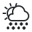</a> | **📂 檔名:** `weather-freezing-rain-day-symbolic.svg` ✨ **格式:** `Vector (SVG)` ⚖️ **大小:** `1.73KB` 📅 **更新:** `2026-03-04`  🚀 **jsDelivr Markdown:** `` 🔗 **直接連結 (Url):** <code>https://cdn.jsdelivr.net/gh/barry028/materials@main/images/iCons/Pixel/Breeze/Applets%20/48/weather-freezing-rain-day-symbolic.svg</code> 📥 [檢視原始檔](weather-freezing-rain-day-symbolic.svg) |
| <a href="weather-freezing-rain-day.svg">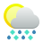</a> | **📂 檔名:** `weather-freezing-rain-day.svg` ✨ **格式:** `Vector (SVG)` ⚖️ **大小:** `3.21KB` 📅 **更新:** `2026-03-04`  🚀 **jsDelivr Markdown:** `` 🔗 **直接連結 (Url):** <code>https://cdn.jsdelivr.net/gh/barry028/materials@main/images/iCons/Pixel/Breeze/Applets%20/48/weather-freezing-rain-day.svg</code> 📥 [檢視原始檔](weather-freezing-rain-day.svg) |
|  | **📂 檔名:** `weather-freezing-rain-night-symbolic.svg` ✨ **格式:** `Vector (SVG)` ⚖️ **大小:** `1.42KB` 📅 **更新:** `2026-03-04`  🚀 **jsDelivr Markdown:** `` 🔗 **直接連結 (Url):** <code>https://cdn.jsdelivr.net/gh/barry028/materials@main/images/iCons/Pixel/Breeze/Applets%20/48/weather-freezing-rain-night-symbolic.svg</code> 📥 [檢視原始檔](weather-freezing-rain-night-symbolic.svg) |
|  | **📂 檔名:** `weather-freezing-rain-night.svg` ✨ **格式:** `Vector (SVG)` ⚖️ **大小:** `3.93KB` 📅 **更新:** `2026-03-04`  🚀 **jsDelivr Markdown:** `` 🔗 **直接連結 (Url):** <code>https://cdn.jsdelivr.net/gh/barry028/materials@main/images/iCons/Pixel/Breeze/Applets%20/48/weather-freezing-rain-night.svg</code> 📥 [檢視原始檔](weather-freezing-rain-night.svg) |
| <a href="weather-freezing-rain-symbolic.svg">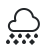</a> | **📂 檔名:** `weather-freezing-rain-symbolic.svg` ✨ **格式:** `Vector (SVG)` ⚖️ **大小:** `1.21KB` 📅 **更新:** `2026-03-04`  🚀 **jsDelivr Markdown:** `` 🔗 **直接連結 (Url):** <code>https://cdn.jsdelivr.net/gh/barry028/materials@main/images/iCons/Pixel/Breeze/Applets%20/48/weather-freezing-rain-symbolic.svg</code> 📥 [檢視原始檔](weather-freezing-rain-symbolic.svg) |
| <a href="weather-freezing-rain.svg">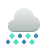</a> | **📂 檔名:** `weather-freezing-rain.svg` ✨ **格式:** `Vector (SVG)` ⚖️ **大小:** `2.38KB` 📅 **更新:** `2026-03-04`  🚀 **jsDelivr Markdown:** `` 🔗 **直接連結 (Url):** <code>https://cdn.jsdelivr.net/gh/barry028/materials@main/images/iCons/Pixel/Breeze/Applets%20/48/weather-freezing-rain.svg</code> 📥 [檢視原始檔](weather-freezing-rain.svg) |
| <a href="weather-freezing-scattered-rain-day-symbolic.svg">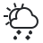</a> | **📂 檔名:** `weather-freezing-scattered-rain-day-symbolic.svg` ✨ **格式:** `Vector (SVG)` ⚖️ **大小:** `1.36KB` 📅 **更新:** `2026-03-04`  🚀 **jsDelivr Markdown:** `` 🔗 **直接連結 (Url):** <code>https://cdn.jsdelivr.net/gh/barry028/materials@main/images/iCons/Pixel/Breeze/Applets%20/48/weather-freezing-scattered-rain-day-symbolic.svg</code> 📥 [檢視原始檔](weather-freezing-scattered-rain-day-symbolic.svg) |
|  | **📂 檔名:** `weather-freezing-scattered-rain-day.svg` ✨ **格式:** `Vector (SVG)` ⚖️ **大小:** `2.82KB` 📅 **更新:** `2026-03-04`  🚀 **jsDelivr Markdown:** `` 🔗 **直接連結 (Url):** <code>https://cdn.jsdelivr.net/gh/barry028/materials@main/images/iCons/Pixel/Breeze/Applets%20/48/weather-freezing-scattered-rain-day.svg</code> 📥 [檢視原始檔](weather-freezing-scattered-rain-day.svg) |
| <a href="weather-freezing-scattered-rain-night-symbolic.svg">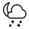</a> | **📂 檔名:** `weather-freezing-scattered-rain-night-symbolic.svg` ✨ **格式:** `Vector (SVG)` ⚖️ **大小:** `1.02KB` 📅 **更新:** `2026-03-04`  🚀 **jsDelivr Markdown:** `` 🔗 **直接連結 (Url):** <code>https://cdn.jsdelivr.net/gh/barry028/materials@main/images/iCons/Pixel/Breeze/Applets%20/48/weather-freezing-scattered-rain-night-symbolic.svg</code> 📥 [檢視原始檔](weather-freezing-scattered-rain-night-symbolic.svg) |
|  | **📂 檔名:** `weather-freezing-scattered-rain-night.svg` ✨ **格式:** `Vector (SVG)` ⚖️ **大小:** `3.54KB` 📅 **更新:** `2026-03-04`  🚀 **jsDelivr Markdown:** `` 🔗 **直接連結 (Url):** <code>https://cdn.jsdelivr.net/gh/barry028/materials@main/images/iCons/Pixel/Breeze/Applets%20/48/weather-freezing-scattered-rain-night.svg</code> 📥 [檢視原始檔](weather-freezing-scattered-rain-night.svg) |
|  | **📂 檔名:** `weather-freezing-scattered-rain-storm-day-symbolic.svg` ✨ **格式:** `Vector (SVG)` ⚖️ **大小:** `1.60KB` 📅 **更新:** `2026-03-04`  🚀 **jsDelivr Markdown:** `` 🔗 **直接連結 (Url):** <code>https://cdn.jsdelivr.net/gh/barry028/materials@main/images/iCons/Pixel/Breeze/Applets%20/48/weather-freezing-scattered-rain-storm-day-symbolic.svg</code> 📥 [檢視原始檔](weather-freezing-scattered-rain-storm-day-symbolic.svg) |
| <a href="weather-freezing-scattered-rain-storm-day.svg">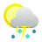</a> | **📂 檔名:** `weather-freezing-scattered-rain-storm-day.svg` ✨ **格式:** `Vector (SVG)` ⚖️ **大小:** `4.62KB` 📅 **更新:** `2026-03-04`  🚀 **jsDelivr Markdown:** `` 🔗 **直接連結 (Url):** <code>https://cdn.jsdelivr.net/gh/barry028/materials@main/images/iCons/Pixel/Breeze/Applets%20/48/weather-freezing-scattered-rain-storm-day.svg</code> 📥 [檢視原始檔](weather-freezing-scattered-rain-storm-day.svg) |
|  | **📂 檔名:** `weather-freezing-scattered-rain-storm-night-symbolic.svg` ✨ **格式:** `Vector (SVG)` ⚖️ **大小:** `1.23KB` 📅 **更新:** `2026-03-04`  🚀 **jsDelivr Markdown:** `` 🔗 **直接連結 (Url):** <code>https://cdn.jsdelivr.net/gh/barry028/materials@main/images/iCons/Pixel/Breeze/Applets%20/48/weather-freezing-scattered-rain-storm-night-symbolic.svg</code> 📥 [檢視原始檔](weather-freezing-scattered-rain-storm-night-symbolic.svg) |
| <a href="weather-freezing-scattered-rain-storm-night.svg">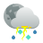</a> | **📂 檔名:** `weather-freezing-scattered-rain-storm-night.svg` ✨ **格式:** `Vector (SVG)` ⚖️ **大小:** `5.34KB` 📅 **更新:** `2026-03-04`  🚀 **jsDelivr Markdown:** `` 🔗 **直接連結 (Url):** <code>https://cdn.jsdelivr.net/gh/barry028/materials@main/images/iCons/Pixel/Breeze/Applets%20/48/weather-freezing-scattered-rain-storm-night.svg</code> 📥 [檢視原始檔](weather-freezing-scattered-rain-storm-night.svg) |
|  | **📂 檔名:** `weather-freezing-scattered-rain-storm-symbolic.svg` ✨ **格式:** `Vector (SVG)` ⚖️ **大小:** `1.24KB` 📅 **更新:** `2026-03-04`  🚀 **jsDelivr Markdown:** `` 🔗 **直接連結 (Url):** <code>https://cdn.jsdelivr.net/gh/barry028/materials@main/images/iCons/Pixel/Breeze/Applets%20/48/weather-freezing-scattered-rain-storm-symbolic.svg</code> 📥 [檢視原始檔](weather-freezing-scattered-rain-storm-symbolic.svg) |
| <a href="weather-freezing-scattered-rain-storm.svg">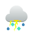</a> | **📂 檔名:** `weather-freezing-scattered-rain-storm.svg` ✨ **格式:** `Vector (SVG)` ⚖️ **大小:** `3.97KB` 📅 **更新:** `2026-03-04`  🚀 **jsDelivr Markdown:** `` 🔗 **直接連結 (Url):** <code>https://cdn.jsdelivr.net/gh/barry028/materials@main/images/iCons/Pixel/Breeze/Applets%20/48/weather-freezing-scattered-rain-storm.svg</code> 📥 [檢視原始檔](weather-freezing-scattered-rain-storm.svg) |
|  | **📂 檔名:** `weather-freezing-scattered-rain-symbolic.svg` ✨ **格式:** `Vector (SVG)` ⚖️ **大小:** `935.00B` 📅 **更新:** `2026-03-04`  🚀 **jsDelivr Markdown:** `` 🔗 **直接連結 (Url):** <code>https://cdn.jsdelivr.net/gh/barry028/materials@main/images/iCons/Pixel/Breeze/Applets%20/48/weather-freezing-scattered-rain-symbolic.svg</code> 📥 [檢視原始檔](weather-freezing-scattered-rain-symbolic.svg) |
|  | **📂 檔名:** `weather-freezing-scattered-rain.svg` ✨ **格式:** `Vector (SVG)` ⚖️ **大小:** `2.05KB` 📅 **更新:** `2026-03-04`  🚀 **jsDelivr Markdown:** `` 🔗 **直接連結 (Url):** <code>https://cdn.jsdelivr.net/gh/barry028/materials@main/images/iCons/Pixel/Breeze/Applets%20/48/weather-freezing-scattered-rain.svg</code> 📥 [檢視原始檔](weather-freezing-scattered-rain.svg) |
|  | **📂 檔名:** `weather-freezing-storm-day-symbolic.svg` ✨ **格式:** `Vector (SVG)` ⚖️ **大小:** `2.20KB` 📅 **更新:** `2026-03-04`  🚀 **jsDelivr Markdown:** `` 🔗 **直接連結 (Url):** <code>https://cdn.jsdelivr.net/gh/barry028/materials@main/images/iCons/Pixel/Breeze/Applets%20/48/weather-freezing-storm-day-symbolic.svg</code> 📥 [檢視原始檔](weather-freezing-storm-day-symbolic.svg) |
| <a href="weather-freezing-storm-day.svg">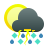</a> | **📂 檔名:** `weather-freezing-storm-day.svg` ✨ **格式:** `Vector (SVG)` ⚖️ **大小:** `4.35KB` 📅 **更新:** `2026-03-04`  🚀 **jsDelivr Markdown:** `` 🔗 **直接連結 (Url):** <code>https://cdn.jsdelivr.net/gh/barry028/materials@main/images/iCons/Pixel/Breeze/Applets%20/48/weather-freezing-storm-day.svg</code> 📥 [檢視原始檔](weather-freezing-storm-day.svg) |
|  | **📂 檔名:** `weather-freezing-storm-night-symbolic.svg` ✨ **格式:** `Vector (SVG)` ⚖️ **大小:** `1.73KB` 📅 **更新:** `2026-03-04`  🚀 **jsDelivr Markdown:** `` 🔗 **直接連結 (Url):** <code>https://cdn.jsdelivr.net/gh/barry028/materials@main/images/iCons/Pixel/Breeze/Applets%20/48/weather-freezing-storm-night-symbolic.svg</code> 📥 [檢視原始檔](weather-freezing-storm-night-symbolic.svg) |
| <a href="weather-freezing-storm-night.svg">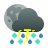</a> | **📂 檔名:** `weather-freezing-storm-night.svg` ✨ **格式:** `Vector (SVG)` ⚖️ **大小:** `4.91KB` 📅 **更新:** `2026-03-04`  🚀 **jsDelivr Markdown:** `` 🔗 **直接連結 (Url):** <code>https://cdn.jsdelivr.net/gh/barry028/materials@main/images/iCons/Pixel/Breeze/Applets%20/48/weather-freezing-storm-night.svg</code> 📥 [檢視原始檔](weather-freezing-storm-night.svg) |
|  | **📂 檔名:** `weather-freezing-storm-symbolic.svg` ✨ **格式:** `Vector (SVG)` ⚖️ **大小:** `2.12KB` 📅 **更新:** `2026-03-04`  🚀 **jsDelivr Markdown:** `` 🔗 **直接連結 (Url):** <code>https://cdn.jsdelivr.net/gh/barry028/materials@main/images/iCons/Pixel/Breeze/Applets%20/48/weather-freezing-storm-symbolic.svg</code> 📥 [檢視原始檔](weather-freezing-storm-symbolic.svg) |
| <a href="weather-freezing-storm.svg">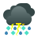</a> | **📂 檔名:** `weather-freezing-storm.svg` ✨ **格式:** `Vector (SVG)` ⚖️ **大小:** `4.46KB` 📅 **更新:** `2026-03-04`  🚀 **jsDelivr Markdown:** `` 🔗 **直接連結 (Url):** <code>https://cdn.jsdelivr.net/gh/barry028/materials@main/images/iCons/Pixel/Breeze/Applets%20/48/weather-freezing-storm.svg</code> 📥 [檢視原始檔](weather-freezing-storm.svg) |
| <a href="weather-hail-symbolic.svg">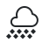</a> | **📂 檔名:** `weather-hail-symbolic.svg` ✨ **格式:** `Vector (SVG)` ⚖️ **大小:** `1016.00B` 📅 **更新:** `2026-03-04`  🚀 **jsDelivr Markdown:** `` 🔗 **直接連結 (Url):** <code>https://cdn.jsdelivr.net/gh/barry028/materials@main/images/iCons/Pixel/Breeze/Applets%20/48/weather-hail-symbolic.svg</code> 📥 [檢視原始檔](weather-hail-symbolic.svg) |
| <a href="weather-hail.svg">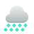</a> | **📂 檔名:** `weather-hail.svg` ✨ **格式:** `Vector (SVG)` ⚖️ **大小:** `1.98KB` 📅 **更新:** `2026-03-04`  🚀 **jsDelivr Markdown:** `` 🔗 **直接連結 (Url):** <code>https://cdn.jsdelivr.net/gh/barry028/materials@main/images/iCons/Pixel/Breeze/Applets%20/48/weather-hail.svg</code> 📥 [檢視原始檔](weather-hail.svg) |
|  | **📂 檔名:** `weather-many-clouds-symbolic.svg` ✨ **格式:** `Vector (SVG)` ⚖️ **大小:** `945.00B` 📅 **更新:** `2026-03-04`  🚀 **jsDelivr Markdown:** `` 🔗 **直接連結 (Url):** <code>https://cdn.jsdelivr.net/gh/barry028/materials@main/images/iCons/Pixel/Breeze/Applets%20/48/weather-many-clouds-symbolic.svg</code> 📥 [檢視原始檔](weather-many-clouds-symbolic.svg) |
|  | **📂 檔名:** `weather-many-clouds-wind-symbolic.svg` ✨ **格式:** `Vector (SVG)` ⚖️ **大小:** `1.03KB` 📅 **更新:** `2026-03-04`  🚀 **jsDelivr Markdown:** `` 🔗 **直接連結 (Url):** <code>https://cdn.jsdelivr.net/gh/barry028/materials@main/images/iCons/Pixel/Breeze/Applets%20/48/weather-many-clouds-wind-symbolic.svg</code> 📥 [檢視原始檔](weather-many-clouds-wind-symbolic.svg) |
|  | **📂 檔名:** `weather-many-clouds-wind.svg` ✨ **格式:** `Vector (SVG)` ⚖️ **大小:** `6.18KB` 📅 **更新:** `2026-03-04`  🚀 **jsDelivr Markdown:** `` 🔗 **直接連結 (Url):** <code>https://cdn.jsdelivr.net/gh/barry028/materials@main/images/iCons/Pixel/Breeze/Applets%20/48/weather-many-clouds-wind.svg</code> 📥 [檢視原始檔](weather-many-clouds-wind.svg) |
|  | **📂 檔名:** `weather-many-clouds.svg` ✨ **格式:** `Vector (SVG)` ⚖️ **大小:** `2.20KB` 📅 **更新:** `2026-03-04`  🚀 **jsDelivr Markdown:** `` 🔗 **直接連結 (Url):** <code>https://cdn.jsdelivr.net/gh/barry028/materials@main/images/iCons/Pixel/Breeze/Applets%20/48/weather-many-clouds.svg</code> 📥 [檢視原始檔](weather-many-clouds.svg) |
|  | **📂 檔名:** `weather-mist-symbolic.svg` ✨ **格式:** `Vector (SVG)` ⚖️ **大小:** `2.03KB` 📅 **更新:** `2026-03-04`  🚀 **jsDelivr Markdown:** `` 🔗 **直接連結 (Url):** <code>https://cdn.jsdelivr.net/gh/barry028/materials@main/images/iCons/Pixel/Breeze/Applets%20/48/weather-mist-symbolic.svg</code> 📥 [檢視原始檔](weather-mist-symbolic.svg) |
|  | **📂 檔名:** `weather-mist.svg` ✨ **格式:** `Vector (SVG)` ⚖️ **大小:** `2.85KB` 📅 **更新:** `2026-03-04`  🚀 **jsDelivr Markdown:** `` 🔗 **直接連結 (Url):** <code>https://cdn.jsdelivr.net/gh/barry028/materials@main/images/iCons/Pixel/Breeze/Applets%20/48/weather-mist.svg</code> 📥 [檢視原始檔](weather-mist.svg) |
|  | **📂 檔名:** `weather-none-available-symbolic.svg` ✨ **格式:** `Vector (SVG)` ⚖️ **大小:** `1.30KB` 📅 **更新:** `2026-03-04`  🚀 **jsDelivr Markdown:** `` 🔗 **直接連結 (Url):** <code>https://cdn.jsdelivr.net/gh/barry028/materials@main/images/iCons/Pixel/Breeze/Applets%20/48/weather-none-available-symbolic.svg</code> 📥 [檢視原始檔](weather-none-available-symbolic.svg) |
|  | **📂 檔名:** `weather-none-available.svg` ✨ **格式:** `Vector (SVG)` ⚖️ **大小:** `2.50KB` 📅 **更新:** `2026-03-04`  🚀 **jsDelivr Markdown:** `` 🔗 **直接連結 (Url):** <code>https://cdn.jsdelivr.net/gh/barry028/materials@main/images/iCons/Pixel/Breeze/Applets%20/48/weather-none-available.svg</code> 📥 [檢視原始檔](weather-none-available.svg) |
| <a href="weather-showers-day-symbolic.svg">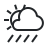</a> | **📂 檔名:** `weather-showers-day-symbolic.svg` ✨ **格式:** `Vector (SVG)` ⚖️ **大小:** `1.25KB` 📅 **更新:** `2026-03-04`  🚀 **jsDelivr Markdown:** `` 🔗 **直接連結 (Url):** <code>https://cdn.jsdelivr.net/gh/barry028/materials@main/images/iCons/Pixel/Breeze/Applets%20/48/weather-showers-day-symbolic.svg</code> 📥 [檢視原始檔](weather-showers-day-symbolic.svg) |
| <a href="weather-showers-day.svg">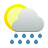</a> | **📂 檔名:** `weather-showers-day.svg` ✨ **格式:** `Vector (SVG)` ⚖️ **大小:** `3.50KB` 📅 **更新:** `2026-03-04`  🚀 **jsDelivr Markdown:** `` 🔗 **直接連結 (Url):** <code>https://cdn.jsdelivr.net/gh/barry028/materials@main/images/iCons/Pixel/Breeze/Applets%20/48/weather-showers-day.svg</code> 📥 [檢視原始檔](weather-showers-day.svg) |
| <a href="weather-showers-night-symbolic.svg">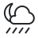</a> | **📂 檔名:** `weather-showers-night-symbolic.svg` ✨ **格式:** `Vector (SVG)` ⚖️ **大小:** `955.00B` 📅 **更新:** `2026-03-04`  🚀 **jsDelivr Markdown:** `` 🔗 **直接連結 (Url):** <code>https://cdn.jsdelivr.net/gh/barry028/materials@main/images/iCons/Pixel/Breeze/Applets%20/48/weather-showers-night-symbolic.svg</code> 📥 [檢視原始檔](weather-showers-night-symbolic.svg) |
| <a href="weather-showers-night.svg">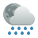</a> | **📂 檔名:** `weather-showers-night.svg` ✨ **格式:** `Vector (SVG)` ⚖️ **大小:** `4.22KB` 📅 **更新:** `2026-03-04`  🚀 **jsDelivr Markdown:** `` 🔗 **直接連結 (Url):** <code>https://cdn.jsdelivr.net/gh/barry028/materials@main/images/iCons/Pixel/Breeze/Applets%20/48/weather-showers-night.svg</code> 📥 [檢視原始檔](weather-showers-night.svg) |
| <a href="weather-showers-scattered-day-symbolic.svg">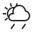</a> | **📂 檔名:** `weather-showers-scattered-day-symbolic.svg` ✨ **格式:** `Vector (SVG)` ⚖️ **大小:** `1.13KB` 📅 **更新:** `2026-03-04`  🚀 **jsDelivr Markdown:** `` 🔗 **直接連結 (Url):** <code>https://cdn.jsdelivr.net/gh/barry028/materials@main/images/iCons/Pixel/Breeze/Applets%20/48/weather-showers-scattered-day-symbolic.svg</code> 📥 [檢視原始檔](weather-showers-scattered-day-symbolic.svg) |
| <a href="weather-showers-scattered-day.svg">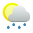</a> | **📂 檔名:** `weather-showers-scattered-day.svg` ✨ **格式:** `Vector (SVG)` ⚖️ **大小:** `2.95KB` 📅 **更新:** `2026-03-04`  🚀 **jsDelivr Markdown:** `` 🔗 **直接連結 (Url):** <code>https://cdn.jsdelivr.net/gh/barry028/materials@main/images/iCons/Pixel/Breeze/Applets%20/48/weather-showers-scattered-day.svg</code> 📥 [檢視原始檔](weather-showers-scattered-day.svg) |
|  | **📂 檔名:** `weather-showers-scattered-night-symbolic.svg` ✨ **格式:** `Vector (SVG)` ⚖️ **大小:** `916.00B` 📅 **更新:** `2026-03-04`  🚀 **jsDelivr Markdown:** `` 🔗 **直接連結 (Url):** <code>https://cdn.jsdelivr.net/gh/barry028/materials@main/images/iCons/Pixel/Breeze/Applets%20/48/weather-showers-scattered-night-symbolic.svg</code> 📥 [檢視原始檔](weather-showers-scattered-night-symbolic.svg) |
|  | **📂 檔名:** `weather-showers-scattered-night.svg` ✨ **格式:** `Vector (SVG)` ⚖️ **大小:** `3.67KB` 📅 **更新:** `2026-03-04`  🚀 **jsDelivr Markdown:** `` 🔗 **直接連結 (Url):** <code>https://cdn.jsdelivr.net/gh/barry028/materials@main/images/iCons/Pixel/Breeze/Applets%20/48/weather-showers-scattered-night.svg</code> 📥 [檢視原始檔](weather-showers-scattered-night.svg) |
|  | **📂 檔名:** `weather-showers-scattered-storm-day-symbolic.svg` ✨ **格式:** `Vector (SVG)` ⚖️ **大小:** `1.25KB` 📅 **更新:** `2026-03-04`  🚀 **jsDelivr Markdown:** `` 🔗 **直接連結 (Url):** <code>https://cdn.jsdelivr.net/gh/barry028/materials@main/images/iCons/Pixel/Breeze/Applets%20/48/weather-showers-scattered-storm-day-symbolic.svg</code> 📥 [檢視原始檔](weather-showers-scattered-storm-day-symbolic.svg) |
| <a href="weather-showers-scattered-storm-day.svg">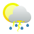</a> | **📂 檔名:** `weather-showers-scattered-storm-day.svg` ✨ **格式:** `Vector (SVG)` ⚖️ **大小:** `4.74KB` 📅 **更新:** `2026-03-04`  🚀 **jsDelivr Markdown:** `` 🔗 **直接連結 (Url):** <code>https://cdn.jsdelivr.net/gh/barry028/materials@main/images/iCons/Pixel/Breeze/Applets%20/48/weather-showers-scattered-storm-day.svg</code> 📥 [檢視原始檔](weather-showers-scattered-storm-day.svg) |
|  | **📂 檔名:** `weather-showers-scattered-storm-night-symbolic.svg` ✨ **格式:** `Vector (SVG)` ⚖️ **大小:** `1000.00B` 📅 **更新:** `2026-03-04`  🚀 **jsDelivr Markdown:** `` 🔗 **直接連結 (Url):** <code>https://cdn.jsdelivr.net/gh/barry028/materials@main/images/iCons/Pixel/Breeze/Applets%20/48/weather-showers-scattered-storm-night-symbolic.svg</code> 📥 [檢視原始檔](weather-showers-scattered-storm-night-symbolic.svg) |
| <a href="weather-showers-scattered-storm-night.svg">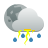</a> | **📂 檔名:** `weather-showers-scattered-storm-night.svg` ✨ **格式:** `Vector (SVG)` ⚖️ **大小:** `5.46KB` 📅 **更新:** `2026-03-04`  🚀 **jsDelivr Markdown:** `` 🔗 **直接連結 (Url):** <code>https://cdn.jsdelivr.net/gh/barry028/materials@main/images/iCons/Pixel/Breeze/Applets%20/48/weather-showers-scattered-storm-night.svg</code> 📥 [檢視原始檔](weather-showers-scattered-storm-night.svg) |
| <a href="weather-showers-scattered-storm-symbolic.svg">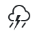</a> | **📂 檔名:** `weather-showers-scattered-storm-symbolic.svg` ✨ **格式:** `Vector (SVG)` ⚖️ **大小:** `873.00B` 📅 **更新:** `2026-03-04`  🚀 **jsDelivr Markdown:** `` 🔗 **直接連結 (Url):** <code>https://cdn.jsdelivr.net/gh/barry028/materials@main/images/iCons/Pixel/Breeze/Applets%20/48/weather-showers-scattered-storm-symbolic.svg</code> 📥 [檢視原始檔](weather-showers-scattered-storm-symbolic.svg) |
| <a href="weather-showers-scattered-storm.svg">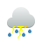</a> | **📂 檔名:** `weather-showers-scattered-storm.svg` ✨ **格式:** `Vector (SVG)` ⚖️ **大小:** `4.10KB` 📅 **更新:** `2026-03-04`  🚀 **jsDelivr Markdown:** `` 🔗 **直接連結 (Url):** <code>https://cdn.jsdelivr.net/gh/barry028/materials@main/images/iCons/Pixel/Breeze/Applets%20/48/weather-showers-scattered-storm.svg</code> 📥 [檢視原始檔](weather-showers-scattered-storm.svg) |
|  | **📂 檔名:** `weather-showers-scattered-symbolic.svg` ✨ **格式:** `Vector (SVG)` ⚖️ **大小:** `754.00B` 📅 **更新:** `2026-03-04`  🚀 **jsDelivr Markdown:** `` 🔗 **直接連結 (Url):** <code>https://cdn.jsdelivr.net/gh/barry028/materials@main/images/iCons/Pixel/Breeze/Applets%20/48/weather-showers-scattered-symbolic.svg</code> 📥 [檢視原始檔](weather-showers-scattered-symbolic.svg) |
| <a href="weather-showers-scattered.svg">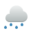</a> | **📂 檔名:** `weather-showers-scattered.svg` ✨ **格式:** `Vector (SVG)` ⚖️ **大小:** `2.07KB` 📅 **更新:** `2026-03-04`  🚀 **jsDelivr Markdown:** `` 🔗 **直接連結 (Url):** <code>https://cdn.jsdelivr.net/gh/barry028/materials@main/images/iCons/Pixel/Breeze/Applets%20/48/weather-showers-scattered.svg</code> 📥 [檢視原始檔](weather-showers-scattered.svg) |
| <a href="weather-showers-symbolic.svg">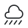</a> | **📂 檔名:** `weather-showers-symbolic.svg` ✨ **格式:** `Vector (SVG)` ⚖️ **大小:** `857.00B` 📅 **更新:** `2026-03-04`  🚀 **jsDelivr Markdown:** `` 🔗 **直接連結 (Url):** <code>https://cdn.jsdelivr.net/gh/barry028/materials@main/images/iCons/Pixel/Breeze/Applets%20/48/weather-showers-symbolic.svg</code> 📥 [檢視原始檔](weather-showers-symbolic.svg) |
| <a href="weather-showers.svg">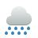</a> | **📂 檔名:** `weather-showers.svg` ✨ **格式:** `Vector (SVG)` ⚖️ **大小:** `2.62KB` 📅 **更新:** `2026-03-04`  🚀 **jsDelivr Markdown:** `` 🔗 **直接連結 (Url):** <code>https://cdn.jsdelivr.net/gh/barry028/materials@main/images/iCons/Pixel/Breeze/Applets%20/48/weather-showers.svg</code> 📥 [檢視原始檔](weather-showers.svg) |
|  | **📂 檔名:** `weather-snow-day-symbolic.svg` ✨ **格式:** `Vector (SVG)` ⚖️ **大小:** `1.61KB` 📅 **更新:** `2026-03-04`  🚀 **jsDelivr Markdown:** `` 🔗 **直接連結 (Url):** <code>https://cdn.jsdelivr.net/gh/barry028/materials@main/images/iCons/Pixel/Breeze/Applets%20/48/weather-snow-day-symbolic.svg</code> 📥 [檢視原始檔](weather-snow-day-symbolic.svg) |
| <a href="weather-snow-day.svg">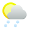</a> | **📂 檔名:** `weather-snow-day.svg` ✨ **格式:** `Vector (SVG)` ⚖️ **大小:** `4.43KB` 📅 **更新:** `2026-03-04`  🚀 **jsDelivr Markdown:** `` 🔗 **直接連結 (Url):** <code>https://cdn.jsdelivr.net/gh/barry028/materials@main/images/iCons/Pixel/Breeze/Applets%20/48/weather-snow-day.svg</code> 📥 [檢視原始檔](weather-snow-day.svg) |
|  | **📂 檔名:** `weather-snow-night-symbolic.svg` ✨ **格式:** `Vector (SVG)` ⚖️ **大小:** `1.34KB` 📅 **更新:** `2026-03-04`  🚀 **jsDelivr Markdown:** `` 🔗 **直接連結 (Url):** <code>https://cdn.jsdelivr.net/gh/barry028/materials@main/images/iCons/Pixel/Breeze/Applets%20/48/weather-snow-night-symbolic.svg</code> 📥 [檢視原始檔](weather-snow-night-symbolic.svg) |
| <a href="weather-snow-night.svg">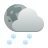</a> | **📂 檔名:** `weather-snow-night.svg` ✨ **格式:** `Vector (SVG)` ⚖️ **大小:** `5.15KB` 📅 **更新:** `2026-03-04`  🚀 **jsDelivr Markdown:** `` 🔗 **直接連結 (Url):** <code>https://cdn.jsdelivr.net/gh/barry028/materials@main/images/iCons/Pixel/Breeze/Applets%20/48/weather-snow-night.svg</code> 📥 [檢視原始檔](weather-snow-night.svg) |
| <a href="weather-snow-rain-symbolic.svg">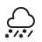</a> | **📂 檔名:** `weather-snow-rain-symbolic.svg` ✨ **格式:** `Vector (SVG)` ⚖️ **大小:** `1.04KB` 📅 **更新:** `2026-03-04`  🚀 **jsDelivr Markdown:** `` 🔗 **直接連結 (Url):** <code>https://cdn.jsdelivr.net/gh/barry028/materials@main/images/iCons/Pixel/Breeze/Applets%20/48/weather-snow-rain-symbolic.svg</code> 📥 [檢視原始檔](weather-snow-rain-symbolic.svg) |
| <a href="weather-snow-rain.svg">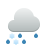</a> | **📂 檔名:** `weather-snow-rain.svg` ✨ **格式:** `Vector (SVG)` ⚖️ **大小:** `3.33KB` 📅 **更新:** `2026-03-04`  🚀 **jsDelivr Markdown:** `` 🔗 **直接連結 (Url):** <code>https://cdn.jsdelivr.net/gh/barry028/materials@main/images/iCons/Pixel/Breeze/Applets%20/48/weather-snow-rain.svg</code> 📥 [檢視原始檔](weather-snow-rain.svg) |
|  | **📂 檔名:** `weather-snow-scattered-day-symbolic.svg` ✨ **格式:** `Vector (SVG)` ⚖️ **大小:** `1.29KB` 📅 **更新:** `2026-03-04`  🚀 **jsDelivr Markdown:** `` 🔗 **直接連結 (Url):** <code>https://cdn.jsdelivr.net/gh/barry028/materials@main/images/iCons/Pixel/Breeze/Applets%20/48/weather-snow-scattered-day-symbolic.svg</code> 📥 [檢視原始檔](weather-snow-scattered-day-symbolic.svg) |
| <a href="weather-snow-scattered-day.svg">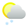</a> | **📂 檔名:** `weather-snow-scattered-day.svg` ✨ **格式:** `Vector (SVG)` ⚖️ **大小:** `3.67KB` 📅 **更新:** `2026-03-04`  🚀 **jsDelivr Markdown:** `` 🔗 **直接連結 (Url):** <code>https://cdn.jsdelivr.net/gh/barry028/materials@main/images/iCons/Pixel/Breeze/Applets%20/48/weather-snow-scattered-day.svg</code> 📥 [檢視原始檔](weather-snow-scattered-day.svg) |
|  | **📂 檔名:** `weather-snow-scattered-night-symbolic.svg` ✨ **格式:** `Vector (SVG)` ⚖️ **大小:** `1.08KB` 📅 **更新:** `2026-03-04`  🚀 **jsDelivr Markdown:** `` 🔗 **直接連結 (Url):** <code>https://cdn.jsdelivr.net/gh/barry028/materials@main/images/iCons/Pixel/Breeze/Applets%20/48/weather-snow-scattered-night-symbolic.svg</code> 📥 [檢視原始檔](weather-snow-scattered-night-symbolic.svg) |
|  | **📂 檔名:** `weather-snow-scattered-night.svg` ✨ **格式:** `Vector (SVG)` ⚖️ **大小:** `4.40KB` 📅 **更新:** `2026-03-04`  🚀 **jsDelivr Markdown:** `` 🔗 **直接連結 (Url):** <code>https://cdn.jsdelivr.net/gh/barry028/materials@main/images/iCons/Pixel/Breeze/Applets%20/48/weather-snow-scattered-night.svg</code> 📥 [檢視原始檔](weather-snow-scattered-night.svg) |
|  | **📂 檔名:** `weather-snow-scattered-storm-day-symbolic.svg` ✨ **格式:** `Vector (SVG)` ⚖️ **大小:** `1.54KB` 📅 **更新:** `2026-03-04`  🚀 **jsDelivr Markdown:** `` 🔗 **直接連結 (Url):** <code>https://cdn.jsdelivr.net/gh/barry028/materials@main/images/iCons/Pixel/Breeze/Applets%20/48/weather-snow-scattered-storm-day-symbolic.svg</code> 📥 [檢視原始檔](weather-snow-scattered-storm-day-symbolic.svg) |
|  | **📂 檔名:** `weather-snow-scattered-storm-day.svg` ✨ **格式:** `Vector (SVG)` ⚖️ **大小:** `5.46KB` 📅 **更新:** `2026-03-04`  🚀 **jsDelivr Markdown:** `` 🔗 **直接連結 (Url):** <code>https://cdn.jsdelivr.net/gh/barry028/materials@main/images/iCons/Pixel/Breeze/Applets%20/48/weather-snow-scattered-storm-day.svg</code> 📥 [檢視原始檔](weather-snow-scattered-storm-day.svg) |
|  | **📂 檔名:** `weather-snow-scattered-storm-night-symbolic.svg` ✨ **格式:** `Vector (SVG)` ⚖️ **大小:** `1.22KB` 📅 **更新:** `2026-03-04`  🚀 **jsDelivr Markdown:** `` 🔗 **直接連結 (Url):** <code>https://cdn.jsdelivr.net/gh/barry028/materials@main/images/iCons/Pixel/Breeze/Applets%20/48/weather-snow-scattered-storm-night-symbolic.svg</code> 📥 [檢視原始檔](weather-snow-scattered-storm-night-symbolic.svg) |
| <a href="weather-snow-scattered-storm-night.svg">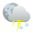</a> | **📂 檔名:** `weather-snow-scattered-storm-night.svg` ✨ **格式:** `Vector (SVG)` ⚖️ **大小:** `6.03KB` 📅 **更新:** `2026-03-04`  🚀 **jsDelivr Markdown:** `` 🔗 **直接連結 (Url):** <code>https://cdn.jsdelivr.net/gh/barry028/materials@main/images/iCons/Pixel/Breeze/Applets%20/48/weather-snow-scattered-storm-night.svg</code> 📥 [檢視原始檔](weather-snow-scattered-storm-night.svg) |
| <a href="weather-snow-scattered-storm-symbolic.svg">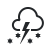</a> | **📂 檔名:** `weather-snow-scattered-storm-symbolic.svg` ✨ **格式:** `Vector (SVG)` ⚖️ **大小:** `1.08KB` 📅 **更新:** `2026-03-04`  🚀 **jsDelivr Markdown:** `` 🔗 **直接連結 (Url):** <code>https://cdn.jsdelivr.net/gh/barry028/materials@main/images/iCons/Pixel/Breeze/Applets%20/48/weather-snow-scattered-storm-symbolic.svg</code> 📥 [檢視原始檔](weather-snow-scattered-storm-symbolic.svg) |
| <a href="weather-snow-scattered-storm.svg">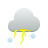</a> | **📂 檔名:** `weather-snow-scattered-storm.svg` ✨ **格式:** `Vector (SVG)` ⚖️ **大小:** `4.89KB` 📅 **更新:** `2026-03-04`  🚀 **jsDelivr Markdown:** `` 🔗 **直接連結 (Url):** <code>https://cdn.jsdelivr.net/gh/barry028/materials@main/images/iCons/Pixel/Breeze/Applets%20/48/weather-snow-scattered-storm.svg</code> 📥 [檢視原始檔](weather-snow-scattered-storm.svg) |
|  | **📂 檔名:** `weather-snow-scattered-symbolic.svg` ✨ **格式:** `Vector (SVG)` ⚖️ **大小:** `1007.00B` 📅 **更新:** `2026-03-04`  🚀 **jsDelivr Markdown:** `` 🔗 **直接連結 (Url):** <code>https://cdn.jsdelivr.net/gh/barry028/materials@main/images/iCons/Pixel/Breeze/Applets%20/48/weather-snow-scattered-symbolic.svg</code> 📥 [檢視原始檔](weather-snow-scattered-symbolic.svg) |
| <a href="weather-snow-scattered.svg">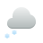</a> | **📂 檔名:** `weather-snow-scattered.svg` ✨ **格式:** `Vector (SVG)` ⚖️ **大小:** `2.79KB` 📅 **更新:** `2026-03-04`  🚀 **jsDelivr Markdown:** `` 🔗 **直接連結 (Url):** <code>https://cdn.jsdelivr.net/gh/barry028/materials@main/images/iCons/Pixel/Breeze/Applets%20/48/weather-snow-scattered.svg</code> 📥 [檢視原始檔](weather-snow-scattered.svg) |
|  | **📂 檔名:** `weather-snow-storm-day-symbolic.svg` ✨ **格式:** `Vector (SVG)` ⚖️ **大小:** `1.94KB` 📅 **更新:** `2026-03-04`  🚀 **jsDelivr Markdown:** `` 🔗 **直接連結 (Url):** <code>https://cdn.jsdelivr.net/gh/barry028/materials@main/images/iCons/Pixel/Breeze/Applets%20/48/weather-snow-storm-day-symbolic.svg</code> 📥 [檢視原始檔](weather-snow-storm-day-symbolic.svg) |
| <a href="weather-snow-storm-day.svg">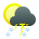</a> | **📂 檔名:** `weather-snow-storm-day.svg` ✨ **格式:** `Vector (SVG)` ⚖️ **大小:** `5.35KB` 📅 **更新:** `2026-03-04`  🚀 **jsDelivr Markdown:** `` 🔗 **直接連結 (Url):** <code>https://cdn.jsdelivr.net/gh/barry028/materials@main/images/iCons/Pixel/Breeze/Applets%20/48/weather-snow-storm-day.svg</code> 📥 [檢視原始檔](weather-snow-storm-day.svg) |
|  | **📂 檔名:** `weather-snow-storm-night-symbolic.svg` ✨ **格式:** `Vector (SVG)` ⚖️ **大小:** `1.62KB` 📅 **更新:** `2026-03-04`  🚀 **jsDelivr Markdown:** `` 🔗 **直接連結 (Url):** <code>https://cdn.jsdelivr.net/gh/barry028/materials@main/images/iCons/Pixel/Breeze/Applets%20/48/weather-snow-storm-night-symbolic.svg</code> 📥 [檢視原始檔](weather-snow-storm-night-symbolic.svg) |
| <a href="weather-snow-storm-night.svg">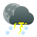</a> | **📂 檔名:** `weather-snow-storm-night.svg` ✨ **格式:** `Vector (SVG)` ⚖️ **大小:** `5.92KB` 📅 **更新:** `2026-03-04`  🚀 **jsDelivr Markdown:** `` 🔗 **直接連結 (Url):** <code>https://cdn.jsdelivr.net/gh/barry028/materials@main/images/iCons/Pixel/Breeze/Applets%20/48/weather-snow-storm-night.svg</code> 📥 [檢視原始檔](weather-snow-storm-night.svg) |
|  | **📂 檔名:** `weather-snow-storm-symbolic.svg` ✨ **格式:** `Vector (SVG)` ⚖️ **大小:** `1.85KB` 📅 **更新:** `2026-03-04`  🚀 **jsDelivr Markdown:** `` 🔗 **直接連結 (Url):** <code>https://cdn.jsdelivr.net/gh/barry028/materials@main/images/iCons/Pixel/Breeze/Applets%20/48/weather-snow-storm-symbolic.svg</code> 📥 [檢視原始檔](weather-snow-storm-symbolic.svg) |
| <a href="weather-snow-storm.svg">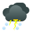</a> | **📂 檔名:** `weather-snow-storm.svg` ✨ **格式:** `Vector (SVG)` ⚖️ **大小:** `5.88KB` 📅 **更新:** `2026-03-04`  🚀 **jsDelivr Markdown:** `` 🔗 **直接連結 (Url):** <code>https://cdn.jsdelivr.net/gh/barry028/materials@main/images/iCons/Pixel/Breeze/Applets%20/48/weather-snow-storm.svg</code> 📥 [檢視原始檔](weather-snow-storm.svg) |
|  | **📂 檔名:** `weather-snow-symbolic.svg` ✨ **格式:** `Vector (SVG)` ⚖️ **大小:** `1.13KB` 📅 **更新:** `2026-03-04`  🚀 **jsDelivr Markdown:** `` 🔗 **直接連結 (Url):** <code>https://cdn.jsdelivr.net/gh/barry028/materials@main/images/iCons/Pixel/Breeze/Applets%20/48/weather-snow-symbolic.svg</code> 📥 [檢視原始檔](weather-snow-symbolic.svg) |
| <a href="weather-snow.svg">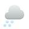</a> | **📂 檔名:** `weather-snow.svg` ✨ **格式:** `Vector (SVG)` ⚖️ **大小:** `3.63KB` 📅 **更新:** `2026-03-04`  🚀 **jsDelivr Markdown:** `` 🔗 **直接連結 (Url):** <code>https://cdn.jsdelivr.net/gh/barry028/materials@main/images/iCons/Pixel/Breeze/Applets%20/48/weather-snow.svg</code> 📥 [檢視原始檔](weather-snow.svg) |
|  | **📂 檔名:** `weather-storm-day-symbolic.svg` ✨ **格式:** `Vector (SVG)` ⚖️ **大小:** `1.54KB` 📅 **更新:** `2026-03-04`  🚀 **jsDelivr Markdown:** `` 🔗 **直接連結 (Url):** <code>https://cdn.jsdelivr.net/gh/barry028/materials@main/images/iCons/Pixel/Breeze/Applets%20/48/weather-storm-day-symbolic.svg</code> 📥 [檢視原始檔](weather-storm-day-symbolic.svg) |
| <a href="weather-storm-day.svg">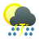</a> | **📂 檔名:** `weather-storm-day.svg` ✨ **格式:** `Vector (SVG)` ⚖️ **大小:** `4.57KB` 📅 **更新:** `2026-03-04`  🚀 **jsDelivr Markdown:** `` 🔗 **直接連結 (Url):** <code>https://cdn.jsdelivr.net/gh/barry028/materials@main/images/iCons/Pixel/Breeze/Applets%20/48/weather-storm-day.svg</code> 📥 [檢視原始檔](weather-storm-day.svg) |
|  | **📂 檔名:** `weather-storm-night-symbolic.svg` ✨ **格式:** `Vector (SVG)` ⚖️ **大小:** `1.23KB` 📅 **更新:** `2026-03-04`  🚀 **jsDelivr Markdown:** `` 🔗 **直接連結 (Url):** <code>https://cdn.jsdelivr.net/gh/barry028/materials@main/images/iCons/Pixel/Breeze/Applets%20/48/weather-storm-night-symbolic.svg</code> 📥 [檢視原始檔](weather-storm-night-symbolic.svg) |
| <a href="weather-storm-night.svg">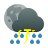</a> | **📂 檔名:** `weather-storm-night.svg` ✨ **格式:** `Vector (SVG)` ⚖️ **大小:** `5.13KB` 📅 **更新:** `2026-03-04`  🚀 **jsDelivr Markdown:** `` 🔗 **直接連結 (Url):** <code>https://cdn.jsdelivr.net/gh/barry028/materials@main/images/iCons/Pixel/Breeze/Applets%20/48/weather-storm-night.svg</code> 📥 [檢視原始檔](weather-storm-night.svg) |
| <a href="weather-storm-symbolic.svg">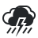</a> | **📂 檔名:** `weather-storm-symbolic.svg` ✨ **格式:** `Vector (SVG)` ⚖️ **大小:** `1.52KB` 📅 **更新:** `2026-03-04`  🚀 **jsDelivr Markdown:** `` 🔗 **直接連結 (Url):** <code>https://cdn.jsdelivr.net/gh/barry028/materials@main/images/iCons/Pixel/Breeze/Applets%20/48/weather-storm-symbolic.svg</code> 📥 [檢視原始檔](weather-storm-symbolic.svg) |
| <a href="weather-storm.svg">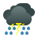</a> | **📂 檔名:** `weather-storm.svg` ✨ **格式:** `Vector (SVG)` ⚖️ **大小:** `4.74KB` 📅 **更新:** `2026-03-04`  🚀 **jsDelivr Markdown:** `` 🔗 **直接連結 (Url):** <code>https://cdn.jsdelivr.net/gh/barry028/materials@main/images/iCons/Pixel/Breeze/Applets%20/48/weather-storm.svg</code> 📥 [檢視原始檔](weather-storm.svg) |