# 🖼️ 素材分類：64

> [🏠 主目錄](../../../../../../README.md) / [images](../../../../../README.md) / [iCons](../../../../README.md) / [Pixel](../../../README.md) / [Breeze](../../README.md) / [Applets ](../README.md) / **64**

本目錄共有 `50` 個檔案

| 🎨 預覽 (點擊放大)  | 📋 檔案詳細資訊與連結 |
| :--- | :--- |
|  | **📂 檔名:** `osd-duplicate.svg` ✨ **格式:** `Vector (SVG)` ⚖️ **大小:** `2.38KB` 📅 **更新:** `2026-03-03`  🚀 **jsDelivr Markdown:** `` 🔗 **直接連結 (Url):** <code>https://cdn.jsdelivr.net/gh/barry028/materials@main/images/iCons/Pixel/Breeze/Applets%20/64/osd-duplicate.svg</code> 📥 [檢視原始檔](osd-duplicate.svg) |
|  | **📂 檔名:** `osd-rotate-ccw.svg` ✨ **格式:** `Vector (SVG)` ⚖️ **大小:** `2.87KB` 📅 **更新:** `2026-03-03`  🚀 **jsDelivr Markdown:** `` 🔗 **直接連結 (Url):** <code>https://cdn.jsdelivr.net/gh/barry028/materials@main/images/iCons/Pixel/Breeze/Applets%20/64/osd-rotate-ccw.svg</code> 📥 [檢視原始檔](osd-rotate-ccw.svg) |
|  | **📂 檔名:** `osd-rotate-cw.svg` ✨ **格式:** `Vector (SVG)` ⚖️ **大小:** `2.91KB` 📅 **更新:** `2026-03-03`  🚀 **jsDelivr Markdown:** `` 🔗 **直接連結 (Url):** <code>https://cdn.jsdelivr.net/gh/barry028/materials@main/images/iCons/Pixel/Breeze/Applets%20/64/osd-rotate-cw.svg</code> 📥 [檢視原始檔](osd-rotate-cw.svg) |
|  | **📂 檔名:** `osd-rotate-flip.svg` ✨ **格式:** `Vector (SVG)` ⚖️ **大小:** `1.98KB` 📅 **更新:** `2026-03-03`  🚀 **jsDelivr Markdown:** `` 🔗 **直接連結 (Url):** <code>https://cdn.jsdelivr.net/gh/barry028/materials@main/images/iCons/Pixel/Breeze/Applets%20/64/osd-rotate-flip.svg</code> 📥 [檢視原始檔](osd-rotate-flip.svg) |
|  | **📂 檔名:** `osd-rotate-normal.svg` ✨ **格式:** `Vector (SVG)` ⚖️ **大小:** `2.25KB` 📅 **更新:** `2026-03-03`  🚀 **jsDelivr Markdown:** `` 🔗 **直接連結 (Url):** <code>https://cdn.jsdelivr.net/gh/barry028/materials@main/images/iCons/Pixel/Breeze/Applets%20/64/osd-rotate-normal.svg</code> 📥 [檢視原始檔](osd-rotate-normal.svg) |
| <a href="osd-sbs-left.svg">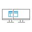</a> | **📂 檔名:** `osd-sbs-left.svg` ✨ **格式:** `Vector (SVG)` ⚖️ **大小:** `2.18KB` 📅 **更新:** `2026-03-03`  🚀 **jsDelivr Markdown:** `` 🔗 **直接連結 (Url):** <code>https://cdn.jsdelivr.net/gh/barry028/materials@main/images/iCons/Pixel/Breeze/Applets%20/64/osd-sbs-left.svg</code> 📥 [檢視原始檔](osd-sbs-left.svg) |
| <a href="osd-sbs-sright.svg">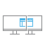</a> | **📂 檔名:** `osd-sbs-sright.svg` ✨ **格式:** `Vector (SVG)` ⚖️ **大小:** `2.18KB` 📅 **更新:** `2026-03-03`  🚀 **jsDelivr Markdown:** `` 🔗 **直接連結 (Url):** <code>https://cdn.jsdelivr.net/gh/barry028/materials@main/images/iCons/Pixel/Breeze/Applets%20/64/osd-sbs-sright.svg</code> 📥 [檢視原始檔](osd-sbs-sright.svg) |
|  | **📂 檔名:** `osd-shutd-laptop.svg` ✨ **格式:** `Vector (SVG)` ⚖️ **大小:** `2.55KB` 📅 **更新:** `2026-03-03`  🚀 **jsDelivr Markdown:** `` 🔗 **直接連結 (Url):** <code>https://cdn.jsdelivr.net/gh/barry028/materials@main/images/iCons/Pixel/Breeze/Applets%20/64/osd-shutd-laptop.svg</code> 📥 [檢視原始檔](osd-shutd-laptop.svg) |
|  | **📂 檔名:** `osd-shutd-screen.svg` ✨ **格式:** `Vector (SVG)` ⚖️ **大小:** `2.63KB` 📅 **更新:** `2026-03-03`  🚀 **jsDelivr Markdown:** `` 🔗 **直接連結 (Url):** <code>https://cdn.jsdelivr.net/gh/barry028/materials@main/images/iCons/Pixel/Breeze/Applets%20/64/osd-shutd-screen.svg</code> 📥 [檢視原始檔](osd-shutd-screen.svg) |
| <a href="preferences-system-windows-effect-blur.svg">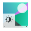</a> | **📂 檔名:** `preferences-system-windows-effect-blur.svg` ✨ **格式:** `Vector (SVG)` ⚖️ **大小:** `19.42KB` 📅 **更新:** `2026-03-03`  🚀 **jsDelivr Markdown:** `` 🔗 **直接連結 (Url):** <code>https://cdn.jsdelivr.net/gh/barry028/materials@main/images/iCons/Pixel/Breeze/Applets%20/64/preferences-system-windows-effect-blur.svg</code> 📥 [檢視原始檔](preferences-system-windows-effect-blur.svg) |
| <a href="preferences-system-windows-effect-contrast.svg">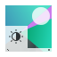</a> | **📂 檔名:** `preferences-system-windows-effect-contrast.svg` ✨ **格式:** `Vector (SVG)` ⚖️ **大小:** `19.53KB` 📅 **更新:** `2026-03-03`  🚀 **jsDelivr Markdown:** `` 🔗 **直接連結 (Url):** <code>https://cdn.jsdelivr.net/gh/barry028/materials@main/images/iCons/Pixel/Breeze/Applets%20/64/preferences-system-windows-effect-contrast.svg</code> 📥 [檢視原始檔](preferences-system-windows-effect-contrast.svg) |
| <a href="preferences-system-windows-effect-coverswitch.svg">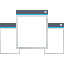</a> | **📂 檔名:** `preferences-system-windows-effect-coverswitch.svg` ✨ **格式:** `Vector (SVG)` ⚖️ **大小:** `9.50KB` 📅 **更新:** `2026-03-03`  🚀 **jsDelivr Markdown:** `` 🔗 **直接連結 (Url):** <code>https://cdn.jsdelivr.net/gh/barry028/materials@main/images/iCons/Pixel/Breeze/Applets%20/64/preferences-system-windows-effect-coverswitch.svg</code> 📥 [檢視原始檔](preferences-system-windows-effect-coverswitch.svg) |
| <a href="preferences-system-windows-effect-cubeslide.svg">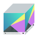</a> | **📂 檔名:** `preferences-system-windows-effect-cubeslide.svg` ✨ **格式:** `Vector (SVG)` ⚖️ **大小:** `13.87KB` 📅 **更新:** `2026-03-03`  🚀 **jsDelivr Markdown:** `` 🔗 **直接連結 (Url):** <code>https://cdn.jsdelivr.net/gh/barry028/materials@main/images/iCons/Pixel/Breeze/Applets%20/64/preferences-system-windows-effect-cubeslide.svg</code> 📥 [檢視原始檔](preferences-system-windows-effect-cubeslide.svg) |
| <a href="preferences-system-windows-effect-desktopgrid.svg">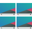</a> | **📂 檔名:** `preferences-system-windows-effect-desktopgrid.svg` ✨ **格式:** `Vector (SVG)` ⚖️ **大小:** `19.29KB` 📅 **更新:** `2026-03-03`  🚀 **jsDelivr Markdown:** `` 🔗 **直接連結 (Url):** <code>https://cdn.jsdelivr.net/gh/barry028/materials@main/images/iCons/Pixel/Breeze/Applets%20/64/preferences-system-windows-effect-desktopgrid.svg</code> 📥 [檢視原始檔](preferences-system-windows-effect-desktopgrid.svg) |
|  | **📂 檔名:** `preferences-system-windows-effect-dialog-parent.svg` ✨ **格式:** `Vector (SVG)` ⚖️ **大小:** `8.95KB` 📅 **更新:** `2026-03-03`  🚀 **jsDelivr Markdown:** `` 🔗 **直接連結 (Url):** <code>https://cdn.jsdelivr.net/gh/barry028/materials@main/images/iCons/Pixel/Breeze/Applets%20/64/preferences-system-windows-effect-dialog-parent.svg</code> 📥 [檢視原始檔](preferences-system-windows-effect-dialog-parent.svg) |
| <a href="preferences-system-windows-effect-diminactive.svg">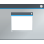</a> | **📂 檔名:** `preferences-system-windows-effect-diminactive.svg` ✨ **格式:** `Vector (SVG)` ⚖️ **大小:** `5.88KB` 📅 **更新:** `2026-03-03`  🚀 **jsDelivr Markdown:** `` 🔗 **直接連結 (Url):** <code>https://cdn.jsdelivr.net/gh/barry028/materials@main/images/iCons/Pixel/Breeze/Applets%20/64/preferences-system-windows-effect-diminactive.svg</code> 📥 [檢視原始檔](preferences-system-windows-effect-diminactive.svg) |
|  | **📂 檔名:** `preferences-system-windows-effect-dimscreen.svg` ✨ **格式:** `Vector (SVG)` ⚖️ **大小:** `7.50KB` 📅 **更新:** `2026-03-03`  🚀 **jsDelivr Markdown:** `` 🔗 **直接連結 (Url):** <code>https://cdn.jsdelivr.net/gh/barry028/materials@main/images/iCons/Pixel/Breeze/Applets%20/64/preferences-system-windows-effect-dimscreen.svg</code> 📥 [檢視原始檔](preferences-system-windows-effect-dimscreen.svg) |
|  | **📂 檔名:** `preferences-system-windows-effect-fade.svg` ✨ **格式:** `Vector (SVG)` ⚖️ **大小:** `5.41KB` 📅 **更新:** `2026-03-03`  🚀 **jsDelivr Markdown:** `` 🔗 **直接連結 (Url):** <code>https://cdn.jsdelivr.net/gh/barry028/materials@main/images/iCons/Pixel/Breeze/Applets%20/64/preferences-system-windows-effect-fade.svg</code> 📥 [檢視原始檔](preferences-system-windows-effect-fade.svg) |
| <a href="preferences-system-windows-effect-fadedesktop.svg">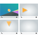</a> | **📂 檔名:** `preferences-system-windows-effect-fadedesktop.svg` ✨ **格式:** `Vector (SVG)` ⚖️ **大小:** `12.90KB` 📅 **更新:** `2026-03-03`  🚀 **jsDelivr Markdown:** `` 🔗 **直接連結 (Url):** <code>https://cdn.jsdelivr.net/gh/barry028/materials@main/images/iCons/Pixel/Breeze/Applets%20/64/preferences-system-windows-effect-fadedesktop.svg</code> 📥 [檢視原始檔](preferences-system-windows-effect-fadedesktop.svg) |
|  | **📂 檔名:** `preferences-system-windows-effect-fallapart.svg` ✨ **格式:** `Vector (SVG)` ⚖️ **大小:** `19.44KB` 📅 **更新:** `2026-03-03`  🚀 **jsDelivr Markdown:** `` 🔗 **直接連結 (Url):** <code>https://cdn.jsdelivr.net/gh/barry028/materials@main/images/iCons/Pixel/Breeze/Applets%20/64/preferences-system-windows-effect-fallapart.svg</code> 📥 [檢視原始檔](preferences-system-windows-effect-fallapart.svg) |
|  | **📂 檔名:** `preferences-system-windows-effect-flipswitch.svg` ✨ **格式:** `Vector (SVG)` ⚖️ **大小:** `8.84KB` 📅 **更新:** `2026-03-03`  🚀 **jsDelivr Markdown:** `` 🔗 **直接連結 (Url):** <code>https://cdn.jsdelivr.net/gh/barry028/materials@main/images/iCons/Pixel/Breeze/Applets%20/64/preferences-system-windows-effect-flipswitch.svg</code> 📥 [檢視原始檔](preferences-system-windows-effect-flipswitch.svg) |
|  | **📂 檔名:** `preferences-system-windows-effect-glide.svg` ✨ **格式:** `Vector (SVG)` ⚖️ **大小:** `8.24KB` 📅 **更新:** `2026-03-03`  🚀 **jsDelivr Markdown:** `` 🔗 **直接連結 (Url):** <code>https://cdn.jsdelivr.net/gh/barry028/materials@main/images/iCons/Pixel/Breeze/Applets%20/64/preferences-system-windows-effect-glide.svg</code> 📥 [檢視原始檔](preferences-system-windows-effect-glide.svg) |
|  | **📂 檔名:** `preferences-system-windows-effect-highlightwindow.svg` ✨ **格式:** `Vector (SVG)` ⚖️ **大小:** `14.06KB` 📅 **更新:** `2026-03-03`  🚀 **jsDelivr Markdown:** `` 🔗 **直接連結 (Url):** <code>https://cdn.jsdelivr.net/gh/barry028/materials@main/images/iCons/Pixel/Breeze/Applets%20/64/preferences-system-windows-effect-highlightwindow.svg</code> 📥 [檢視原始檔](preferences-system-windows-effect-highlightwindow.svg) |
| <a href="preferences-system-windows-effect-invert.svg">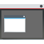</a> | **📂 檔名:** `preferences-system-windows-effect-invert.svg` ✨ **格式:** `Vector (SVG)` ⚖️ **大小:** `6.44KB` 📅 **更新:** `2026-03-03`  🚀 **jsDelivr Markdown:** `` 🔗 **直接連結 (Url):** <code>https://cdn.jsdelivr.net/gh/barry028/materials@main/images/iCons/Pixel/Breeze/Applets%20/64/preferences-system-windows-effect-invert.svg</code> 📥 [檢視原始檔](preferences-system-windows-effect-invert.svg) |
| <a href="preferences-system-windows-effect-kscreen.svg">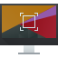</a> | **📂 檔名:** `preferences-system-windows-effect-kscreen.svg` ✨ **格式:** `Vector (SVG)` ⚖️ **大小:** `12.81KB` 📅 **更新:** `2026-03-03`  🚀 **jsDelivr Markdown:** `` 🔗 **直接連結 (Url):** <code>https://cdn.jsdelivr.net/gh/barry028/materials@main/images/iCons/Pixel/Breeze/Applets%20/64/preferences-system-windows-effect-kscreen.svg</code> 📥 [檢視原始檔](preferences-system-windows-effect-kscreen.svg) |
|  | **📂 檔名:** `preferences-system-windows-effect-login.svg` ✨ **格式:** `Vector (SVG)` ⚖️ **大小:** `11.80KB` 📅 **更新:** `2026-03-03`  🚀 **jsDelivr Markdown:** `` 🔗 **直接連結 (Url):** <code>https://cdn.jsdelivr.net/gh/barry028/materials@main/images/iCons/Pixel/Breeze/Applets%20/64/preferences-system-windows-effect-login.svg</code> 📥 [檢視原始檔](preferences-system-windows-effect-login.svg) |
|  | **📂 檔名:** `preferences-system-windows-effect-logout.svg` ✨ **格式:** `Vector (SVG)` ⚖️ **大小:** `12.54KB` 📅 **更新:** `2026-03-03`  🚀 **jsDelivr Markdown:** `` 🔗 **直接連結 (Url):** <code>https://cdn.jsdelivr.net/gh/barry028/materials@main/images/iCons/Pixel/Breeze/Applets%20/64/preferences-system-windows-effect-logout.svg</code> 📥 [檢視原始檔](preferences-system-windows-effect-logout.svg) |
|  | **📂 檔名:** `preferences-system-windows-effect-magiclamp.svg` ✨ **格式:** `Vector (SVG)` ⚖️ **大小:** `5.77KB` 📅 **更新:** `2026-03-03`  🚀 **jsDelivr Markdown:** `` 🔗 **直接連結 (Url):** <code>https://cdn.jsdelivr.net/gh/barry028/materials@main/images/iCons/Pixel/Breeze/Applets%20/64/preferences-system-windows-effect-magiclamp.svg</code> 📥 [檢視原始檔](preferences-system-windows-effect-magiclamp.svg) |
|  | **📂 檔名:** `preferences-system-windows-effect-magnifier.svg` ✨ **格式:** `Vector (SVG)` ⚖️ **大小:** `9.27KB` 📅 **更新:** `2026-03-03`  🚀 **jsDelivr Markdown:** `` 🔗 **直接連結 (Url):** <code>https://cdn.jsdelivr.net/gh/barry028/materials@main/images/iCons/Pixel/Breeze/Applets%20/64/preferences-system-windows-effect-magnifier.svg</code> 📥 [檢視原始檔](preferences-system-windows-effect-magnifier.svg) |
| <a href="preferences-system-windows-effect-maximize.svg">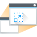</a> | **📂 檔名:** `preferences-system-windows-effect-maximize.svg` ✨ **格式:** `Vector (SVG)` ⚖️ **大小:** `9.03KB` 📅 **更新:** `2026-03-03`  🚀 **jsDelivr Markdown:** `` 🔗 **直接連結 (Url):** <code>https://cdn.jsdelivr.net/gh/barry028/materials@main/images/iCons/Pixel/Breeze/Applets%20/64/preferences-system-windows-effect-maximize.svg</code> 📥 [檢視原始檔](preferences-system-windows-effect-maximize.svg) |
| <a href="preferences-system-windows-effect-minimize.svg">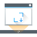</a> | **📂 檔名:** `preferences-system-windows-effect-minimize.svg` ✨ **格式:** `Vector (SVG)` ⚖️ **大小:** `8.28KB` 📅 **更新:** `2026-03-03`  🚀 **jsDelivr Markdown:** `` 🔗 **直接連結 (Url):** <code>https://cdn.jsdelivr.net/gh/barry028/materials@main/images/iCons/Pixel/Breeze/Applets%20/64/preferences-system-windows-effect-minimize.svg</code> 📥 [檢視原始檔](preferences-system-windows-effect-minimize.svg) |
|  | **📂 檔名:** `preferences-system-windows-effect-mouseclick.svg` ✨ **格式:** `Vector (SVG)` ⚖️ **大小:** `7.28KB` 📅 **更新:** `2026-03-03`  🚀 **jsDelivr Markdown:** `` 🔗 **直接連結 (Url):** <code>https://cdn.jsdelivr.net/gh/barry028/materials@main/images/iCons/Pixel/Breeze/Applets%20/64/preferences-system-windows-effect-mouseclick.svg</code> 📥 [檢視原始檔](preferences-system-windows-effect-mouseclick.svg) |
|  | **📂 檔名:** `preferences-system-windows-effect-mousemark.svg` ✨ **格式:** `Vector (SVG)` ⚖️ **大小:** `5.81KB` 📅 **更新:** `2026-03-03`  🚀 **jsDelivr Markdown:** `` 🔗 **直接連結 (Url):** <code>https://cdn.jsdelivr.net/gh/barry028/materials@main/images/iCons/Pixel/Breeze/Applets%20/64/preferences-system-windows-effect-mousemark.svg</code> 📥 [檢視原始檔](preferences-system-windows-effect-mousemark.svg) |
| <a href="preferences-system-windows-effect-presentwindows.svg">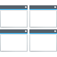</a> | **📂 檔名:** `preferences-system-windows-effect-presentwindows.svg` ✨ **格式:** `Vector (SVG)` ⚖️ **大小:** `10.08KB` 📅 **更新:** `2026-03-03`  🚀 **jsDelivr Markdown:** `` 🔗 **直接連結 (Url):** <code>https://cdn.jsdelivr.net/gh/barry028/materials@main/images/iCons/Pixel/Breeze/Applets%20/64/preferences-system-windows-effect-presentwindows.svg</code> 📥 [檢視原始檔](preferences-system-windows-effect-presentwindows.svg) |
|  | **📂 檔名:** `preferences-system-windows-effect-resize.svg` ✨ **格式:** `Vector (SVG)` ⚖️ **大小:** `5.64KB` 📅 **更新:** `2026-03-03`  🚀 **jsDelivr Markdown:** `` 🔗 **直接連結 (Url):** <code>https://cdn.jsdelivr.net/gh/barry028/materials@main/images/iCons/Pixel/Breeze/Applets%20/64/preferences-system-windows-effect-resize.svg</code> 📥 [檢視原始檔](preferences-system-windows-effect-resize.svg) |
| <a href="preferences-system-windows-effect-scale-in.svg">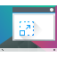</a> | **📂 檔名:** `preferences-system-windows-effect-scale-in.svg` ✨ **格式:** `Vector (SVG)` ⚖️ **大小:** `12.89KB` 📅 **更新:** `2026-03-03`  🚀 **jsDelivr Markdown:** `` 🔗 **直接連結 (Url):** <code>https://cdn.jsdelivr.net/gh/barry028/materials@main/images/iCons/Pixel/Breeze/Applets%20/64/preferences-system-windows-effect-scale-in.svg</code> 📥 [檢視原始檔](preferences-system-windows-effect-scale-in.svg) |
| <a href="preferences-system-windows-effect-screenedge.svg">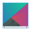</a> | **📂 檔名:** `preferences-system-windows-effect-screenedge.svg` ✨ **格式:** `Vector (SVG)` ⚖️ **大小:** `12.79KB` 📅 **更新:** `2026-03-03`  🚀 **jsDelivr Markdown:** `` 🔗 **直接連結 (Url):** <code>https://cdn.jsdelivr.net/gh/barry028/materials@main/images/iCons/Pixel/Breeze/Applets%20/64/preferences-system-windows-effect-screenedge.svg</code> 📥 [檢視原始檔](preferences-system-windows-effect-screenedge.svg) |
|  | **📂 檔名:** `preferences-system-windows-effect-screenshot.svg` ✨ **格式:** `Vector (SVG)` ⚖️ **大小:** `9.42KB` 📅 **更新:** `2026-03-03`  🚀 **jsDelivr Markdown:** `` 🔗 **直接連結 (Url):** <code>https://cdn.jsdelivr.net/gh/barry028/materials@main/images/iCons/Pixel/Breeze/Applets%20/64/preferences-system-windows-effect-screenshot.svg</code> 📥 [檢視原始檔](preferences-system-windows-effect-screenshot.svg) |
|  | **📂 檔名:** `preferences-system-windows-effect-showfps.svg` ✨ **格式:** `Vector (SVG)` ⚖️ **大小:** `21.48KB` 📅 **更新:** `2026-03-03`  🚀 **jsDelivr Markdown:** `` 🔗 **直接連結 (Url):** <code>https://cdn.jsdelivr.net/gh/barry028/materials@main/images/iCons/Pixel/Breeze/Applets%20/64/preferences-system-windows-effect-showfps.svg</code> 📥 [檢視原始檔](preferences-system-windows-effect-showfps.svg) |
| <a href="preferences-system-windows-effect-showpaint.svg">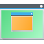</a> | **📂 檔名:** `preferences-system-windows-effect-showpaint.svg` ✨ **格式:** `Vector (SVG)` ⚖️ **大小:** `7.49KB` 📅 **更新:** `2026-03-03`  🚀 **jsDelivr Markdown:** `` 🔗 **直接連結 (Url):** <code>https://cdn.jsdelivr.net/gh/barry028/materials@main/images/iCons/Pixel/Breeze/Applets%20/64/preferences-system-windows-effect-showpaint.svg</code> 📥 [檢視原始檔](preferences-system-windows-effect-showpaint.svg) |
| <a href="preferences-system-windows-effect-slide.svg">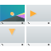</a> | **📂 檔名:** `preferences-system-windows-effect-slide.svg` ✨ **格式:** `Vector (SVG)` ⚖️ **大小:** `12.75KB` 📅 **更新:** `2026-03-03`  🚀 **jsDelivr Markdown:** `` 🔗 **直接連結 (Url):** <code>https://cdn.jsdelivr.net/gh/barry028/materials@main/images/iCons/Pixel/Breeze/Applets%20/64/preferences-system-windows-effect-slide.svg</code> 📥 [檢視原始檔](preferences-system-windows-effect-slide.svg) |
|  | **📂 檔名:** `preferences-system-windows-effect-slideback.svg` ✨ **格式:** `Vector (SVG)` ⚖️ **大小:** `8.86KB` 📅 **更新:** `2026-03-03`  🚀 **jsDelivr Markdown:** `` 🔗 **直接連結 (Url):** <code>https://cdn.jsdelivr.net/gh/barry028/materials@main/images/iCons/Pixel/Breeze/Applets%20/64/preferences-system-windows-effect-slideback.svg</code> 📥 [檢視原始檔](preferences-system-windows-effect-slideback.svg) |
| <a href="preferences-system-windows-effect-slidingpopups.svg">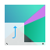</a> | **📂 檔名:** `preferences-system-windows-effect-slidingpopups.svg` ✨ **格式:** `Vector (SVG)` ⚖️ **大小:** `9.98KB` 📅 **更新:** `2026-03-03`  🚀 **jsDelivr Markdown:** `` 🔗 **直接連結 (Url):** <code>https://cdn.jsdelivr.net/gh/barry028/materials@main/images/iCons/Pixel/Breeze/Applets%20/64/preferences-system-windows-effect-slidingpopups.svg</code> 📥 [檢視原始檔](preferences-system-windows-effect-slidingpopups.svg) |
|  | **📂 檔名:** `preferences-system-windows-effect-startupfeedback.svg` ✨ **格式:** `Vector (SVG)` ⚖️ **大小:** `25.76KB` 📅 **更新:** `2026-03-03`  🚀 **jsDelivr Markdown:** `` 🔗 **直接連結 (Url):** <code>https://cdn.jsdelivr.net/gh/barry028/materials@main/images/iCons/Pixel/Breeze/Applets%20/64/preferences-system-windows-effect-startupfeedback.svg</code> 📥 [檢視原始檔](preferences-system-windows-effect-startupfeedback.svg) |
| <a href="preferences-system-windows-effect-thumbnailaside.svg">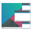</a> | **📂 檔名:** `preferences-system-windows-effect-thumbnailaside.svg` ✨ **格式:** `Vector (SVG)` ⚖️ **大小:** `14.40KB` 📅 **更新:** `2026-03-03`  🚀 **jsDelivr Markdown:** `` 🔗 **直接連結 (Url):** <code>https://cdn.jsdelivr.net/gh/barry028/materials@main/images/iCons/Pixel/Breeze/Applets%20/64/preferences-system-windows-effect-thumbnailaside.svg</code> 📥 [檢視原始檔](preferences-system-windows-effect-thumbnailaside.svg) |
|  | **📂 檔名:** `preferences-system-windows-effect-trackmouse.svg` ✨ **格式:** `Vector (SVG)` ⚖️ **大小:** `10.78KB` 📅 **更新:** `2026-03-03`  🚀 **jsDelivr Markdown:** `` 🔗 **直接連結 (Url):** <code>https://cdn.jsdelivr.net/gh/barry028/materials@main/images/iCons/Pixel/Breeze/Applets%20/64/preferences-system-windows-effect-trackmouse.svg</code> 📥 [檢視原始檔](preferences-system-windows-effect-trackmouse.svg) |
|  | **📂 檔名:** `preferences-system-windows-effect-translucency.svg` ✨ **格式:** `Vector (SVG)` ⚖️ **大小:** `11.32KB` 📅 **更新:** `2026-03-03`  🚀 **jsDelivr Markdown:** `` 🔗 **直接連結 (Url):** <code>https://cdn.jsdelivr.net/gh/barry028/materials@main/images/iCons/Pixel/Breeze/Applets%20/64/preferences-system-windows-effect-translucency.svg</code> 📥 [檢視原始檔](preferences-system-windows-effect-translucency.svg) |
|  | **📂 檔名:** `preferences-system-windows-effect-windowaperture.svg` ✨ **格式:** `Vector (SVG)` ⚖️ **大小:** `17.03KB` 📅 **更新:** `2026-03-03`  🚀 **jsDelivr Markdown:** `` 🔗 **直接連結 (Url):** <code>https://cdn.jsdelivr.net/gh/barry028/materials@main/images/iCons/Pixel/Breeze/Applets%20/64/preferences-system-windows-effect-windowaperture.svg</code> 📥 [檢視原始檔](preferences-system-windows-effect-windowaperture.svg) |
|  | **📂 檔名:** `preferences-system-windows-effect-wobblywindows.svg` ✨ **格式:** `Vector (SVG)` ⚖️ **大小:** `8.28KB` 📅 **更新:** `2026-03-03`  🚀 **jsDelivr Markdown:** `` 🔗 **直接連結 (Url):** <code>https://cdn.jsdelivr.net/gh/barry028/materials@main/images/iCons/Pixel/Breeze/Applets%20/64/preferences-system-windows-effect-wobblywindows.svg</code> 📥 [檢視原始檔](preferences-system-windows-effect-wobblywindows.svg) |
|  | **📂 檔名:** `preferences-system-windows-effect-zoom.svg` ✨ **格式:** `Vector (SVG)` ⚖️ **大小:** `8.92KB` 📅 **更新:** `2026-03-03`  🚀 **jsDelivr Markdown:** `` 🔗 **直接連結 (Url):** <code>https://cdn.jsdelivr.net/gh/barry028/materials@main/images/iCons/Pixel/Breeze/Applets%20/64/preferences-system-windows-effect-zoom.svg</code> 📥 [檢視原始檔](preferences-system-windows-effect-zoom.svg) |