# 🖼️ 素材分類：48

> [🏠 主目錄](../../../../../../README.md) / [images](../../../../../README.md) / [iCons](../../../../README.md) / [Pixel](../../../README.md) / [Breeze](../../README.md) / [Apps ](../README.md) / **48**

本目錄共有 `335` 個檔案

| 🎨 預覽 (點擊放大)  | 📋 檔案詳細資訊與連結 |
| :--- | :--- |
|  | **📂 檔名:** `QOwnNotes.svg` ✨ **格式:** `Vector (SVG)` ⚖️ **大小:** `4.63KB` 📅 **更新:** `2026-03-03`  🚀 **jsDelivr Markdown:** `` 🔗 **直接連結 (Url):** <code>https://cdn.jsdelivr.net/gh/barry028/materials@main/images/iCons/Pixel/Breeze/Apps%20/48/QOwnNotes.svg</code> 📥 [檢視原始檔](QOwnNotes.svg) |
|  | **📂 檔名:** `QtProject-designer.svg` ✨ **格式:** `Vector (SVG)` ⚖️ **大小:** `3.07KB` 📅 **更新:** `2026-03-03`  🚀 **jsDelivr Markdown:** `` 🔗 **直接連結 (Url):** <code>https://cdn.jsdelivr.net/gh/barry028/materials@main/images/iCons/Pixel/Breeze/Apps%20/48/QtProject-designer.svg</code> 📥 [檢視原始檔](QtProject-designer.svg) |
| <a href="accessories-calculator.svg">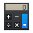</a> | **📂 檔名:** `accessories-calculator.svg` ✨ **格式:** `Vector (SVG)` ⚖️ **大小:** `3.84KB` 📅 **更新:** `2026-03-03`  🚀 **jsDelivr Markdown:** `` 🔗 **直接連結 (Url):** <code>https://cdn.jsdelivr.net/gh/barry028/materials@main/images/iCons/Pixel/Breeze/Apps%20/48/accessories-calculator.svg</code> 📥 [檢視原始檔](accessories-calculator.svg) |
| <a href="accessories-character-map.svg">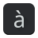</a> | **📂 檔名:** `accessories-character-map.svg` ✨ **格式:** `Vector (SVG)` ⚖️ **大小:** `3.51KB` 📅 **更新:** `2026-03-03`  🚀 **jsDelivr Markdown:** `` 🔗 **直接連結 (Url):** <code>https://cdn.jsdelivr.net/gh/barry028/materials@main/images/iCons/Pixel/Breeze/Apps%20/48/accessories-character-map.svg</code> 📥 [檢視原始檔](accessories-character-map.svg) |
|  | **📂 檔名:** `acroread.svg` ✨ **格式:** `Vector (SVG)` ⚖️ **大小:** `3.19KB` 📅 **更新:** `2026-03-03`  🚀 **jsDelivr Markdown:** `` 🔗 **直接連結 (Url):** <code>https://cdn.jsdelivr.net/gh/barry028/materials@main/images/iCons/Pixel/Breeze/Apps%20/48/acroread.svg</code> 📥 [檢視原始檔](acroread.svg) |
|  | **📂 檔名:** `akregator.svg` ✨ **格式:** `Vector (SVG)` ⚖️ **大小:** `1.37KB` 📅 **更新:** `2026-03-03`  🚀 **jsDelivr Markdown:** `` 🔗 **直接連結 (Url):** <code>https://cdn.jsdelivr.net/gh/barry028/materials@main/images/iCons/Pixel/Breeze/Apps%20/48/akregator.svg</code> 📥 [檢視原始檔](akregator.svg) |
|  | **📂 檔名:** `alienarena.svg` ✨ **格式:** `Vector (SVG)` ⚖️ **大小:** `3.55KB` 📅 **更新:** `2026-03-03`  🚀 **jsDelivr Markdown:** `` 🔗 **直接連結 (Url):** <code>https://cdn.jsdelivr.net/gh/barry028/materials@main/images/iCons/Pixel/Breeze/Apps%20/48/alienarena.svg</code> 📥 [檢視原始檔](alienarena.svg) |
|  | **📂 檔名:** `alligator.svg` ✨ **格式:** `Vector (SVG)` ⚖️ **大小:** `7.47KB` 📅 **更新:** `2026-03-03`  🚀 **jsDelivr Markdown:** `` 🔗 **直接連結 (Url):** <code>https://cdn.jsdelivr.net/gh/barry028/materials@main/images/iCons/Pixel/Breeze/Apps%20/48/alligator.svg</code> 📥 [檢視原始檔](alligator.svg) |
|  | **📂 檔名:** `amarok.svg` ✨ **格式:** `Vector (SVG)` ⚖️ **大小:** `4.54KB` 📅 **更新:** `2026-03-03`  🚀 **jsDelivr Markdown:** `` 🔗 **直接連結 (Url):** <code>https://cdn.jsdelivr.net/gh/barry028/materials@main/images/iCons/Pixel/Breeze/Apps%20/48/amarok.svg</code> 📥 [檢視原始檔](amarok.svg) |
|  | **📂 檔名:** `android-file-transfer.svg` ✨ **格式:** `Vector (SVG)` ⚖️ **大小:** `4.26KB` 📅 **更新:** `2026-03-03`  🚀 **jsDelivr Markdown:** `` 🔗 **直接連結 (Url):** <code>https://cdn.jsdelivr.net/gh/barry028/materials@main/images/iCons/Pixel/Breeze/Apps%20/48/android-file-transfer.svg</code> 📥 [檢視原始檔](android-file-transfer.svg) |
|  | **📂 檔名:** `android-studio.svg` ✨ **格式:** `Vector (SVG)` ⚖️ **大小:** `4.62KB` 📅 **更新:** `2026-03-03`  🚀 **jsDelivr Markdown:** `` 🔗 **直接連結 (Url):** <code>https://cdn.jsdelivr.net/gh/barry028/materials@main/images/iCons/Pixel/Breeze/Apps%20/48/android-studio.svg</code> 📥 [檢視原始檔](android-studio.svg) |
|  | **📂 檔名:** `anjuta.svg` ✨ **格式:** `Vector (SVG)` ⚖️ **大小:** `3.24KB` 📅 **更新:** `2026-03-03`  🚀 **jsDelivr Markdown:** `` 🔗 **直接連結 (Url):** <code>https://cdn.jsdelivr.net/gh/barry028/materials@main/images/iCons/Pixel/Breeze/Apps%20/48/anjuta.svg</code> 📥 [檢視原始檔](anjuta.svg) |
|  | **📂 檔名:** `anydesk.svg` ✨ **格式:** `Vector (SVG)` ⚖️ **大小:** `1.10KB` 📅 **更新:** `2026-03-03`  🚀 **jsDelivr Markdown:** `` 🔗 **直接連結 (Url):** <code>https://cdn.jsdelivr.net/gh/barry028/materials@main/images/iCons/Pixel/Breeze/Apps%20/48/anydesk.svg</code> 📥 [檢視原始檔](anydesk.svg) |
|  | **📂 檔名:** `application-x-clementine.svg` ✨ **格式:** `Vector (SVG)` ⚖️ **大小:** `2.96KB` 📅 **更新:** `2026-03-03`  🚀 **jsDelivr Markdown:** `` 🔗 **直接連結 (Url):** <code>https://cdn.jsdelivr.net/gh/barry028/materials@main/images/iCons/Pixel/Breeze/Apps%20/48/application-x-clementine.svg</code> 📥 [檢視原始檔](application-x-clementine.svg) |
|  | **📂 檔名:** `aptana.svg` ✨ **格式:** `Vector (SVG)` ⚖️ **大小:** `4.07KB` 📅 **更新:** `2026-03-03`  🚀 **jsDelivr Markdown:** `` 🔗 **直接連結 (Url):** <code>https://cdn.jsdelivr.net/gh/barry028/materials@main/images/iCons/Pixel/Breeze/Apps%20/48/aptana.svg</code> 📥 [檢視原始檔](aptana.svg) |
|  | **📂 檔名:** `ardour.svg` ✨ **格式:** `Vector (SVG)` ⚖️ **大小:** `2.03KB` 📅 **更新:** `2026-03-03`  🚀 **jsDelivr Markdown:** `` 🔗 **直接連結 (Url):** <code>https://cdn.jsdelivr.net/gh/barry028/materials@main/images/iCons/Pixel/Breeze/Apps%20/48/ardour.svg</code> 📥 [檢視原始檔](ardour.svg) |
|  | **📂 檔名:** `ark.svg` ✨ **格式:** `Vector (SVG)` ⚖️ **大小:** `2.92KB` 📅 **更新:** `2026-03-03`  🚀 **jsDelivr Markdown:** `` 🔗 **直接連結 (Url):** <code>https://cdn.jsdelivr.net/gh/barry028/materials@main/images/iCons/Pixel/Breeze/Apps%20/48/ark.svg</code> 📥 [檢視原始檔](ark.svg) |
|  | **📂 檔名:** `artikulate.svg` ✨ **格式:** `Vector (SVG)` ⚖️ **大小:** `11.06KB` 📅 **更新:** `2026-03-03`  🚀 **jsDelivr Markdown:** `` 🔗 **直接連結 (Url):** <code>https://cdn.jsdelivr.net/gh/barry028/materials@main/images/iCons/Pixel/Breeze/Apps%20/48/artikulate.svg</code> 📥 [檢視原始檔](artikulate.svg) |
|  | **📂 檔名:** `assistant.svg` ✨ **格式:** `Vector (SVG)` ⚖️ **大小:** `4.12KB` 📅 **更新:** `2026-03-03`  🚀 **jsDelivr Markdown:** `` 🔗 **直接連結 (Url):** <code>https://cdn.jsdelivr.net/gh/barry028/materials@main/images/iCons/Pixel/Breeze/Apps%20/48/assistant.svg</code> 📥 [檢視原始檔](assistant.svg) |
|  | **📂 檔名:** `atom.svg` ✨ **格式:** `Vector (SVG)` ⚖️ **大小:** `2.01KB` 📅 **更新:** `2026-03-03`  🚀 **jsDelivr Markdown:** `` 🔗 **直接連結 (Url):** <code>https://cdn.jsdelivr.net/gh/barry028/materials@main/images/iCons/Pixel/Breeze/Apps%20/48/atom.svg</code> 📥 [檢視原始檔](atom.svg) |
|  | **📂 檔名:** `audacity.svg` ✨ **格式:** `Vector (SVG)` ⚖️ **大小:** `7.72KB` 📅 **更新:** `2026-03-03`  🚀 **jsDelivr Markdown:** `` 🔗 **直接連結 (Url):** <code>https://cdn.jsdelivr.net/gh/barry028/materials@main/images/iCons/Pixel/Breeze/Apps%20/48/audacity.svg</code> 📥 [檢視原始檔](audacity.svg) |
|  | **📂 檔名:** `author.svg` ✨ **格式:** `Vector (SVG)` ⚖️ **大小:** `4.82KB` 📅 **更新:** `2026-03-03`  🚀 **jsDelivr Markdown:** `` 🔗 **直接連結 (Url):** <code>https://cdn.jsdelivr.net/gh/barry028/materials@main/images/iCons/Pixel/Breeze/Apps%20/48/author.svg</code> 📥 [檢視原始檔](author.svg) |
|  | **📂 檔名:** `babe.svg` ✨ **格式:** `Vector (SVG)` ⚖️ **大小:** `3.73KB` 📅 **更新:** `2026-03-03`  🚀 **jsDelivr Markdown:** `` 🔗 **直接連結 (Url):** <code>https://cdn.jsdelivr.net/gh/barry028/materials@main/images/iCons/Pixel/Breeze/Apps%20/48/babe.svg</code> 📥 [檢視原始檔](babe.svg) |
|  | **📂 檔名:** `baloo.svg` ✨ **格式:** `Vector (SVG)` ⚖️ **大小:** `3.18KB` 📅 **更新:** `2026-03-03`  🚀 **jsDelivr Markdown:** `` 🔗 **直接連結 (Url):** <code>https://cdn.jsdelivr.net/gh/barry028/materials@main/images/iCons/Pixel/Breeze/Apps%20/48/baloo.svg</code> 📥 [檢視原始檔](baloo.svg) |
|  | **📂 檔名:** `bitcoin128.svg` ✨ **格式:** `Vector (SVG)` ⚖️ **大小:** `2.46KB` 📅 **更新:** `2026-03-03`  🚀 **jsDelivr Markdown:** `` 🔗 **直接連結 (Url):** <code>https://cdn.jsdelivr.net/gh/barry028/materials@main/images/iCons/Pixel/Breeze/Apps%20/48/bitcoin128.svg</code> 📥 [檢視原始檔](bitcoin128.svg) |
|  | **📂 檔名:** `bittorrent-sync.svg` ✨ **格式:** `Vector (SVG)` ⚖️ **大小:** `2.32KB` 📅 **更新:** `2026-03-03`  🚀 **jsDelivr Markdown:** `` 🔗 **直接連結 (Url):** <code>https://cdn.jsdelivr.net/gh/barry028/materials@main/images/iCons/Pixel/Breeze/Apps%20/48/bittorrent-sync.svg</code> 📥 [檢視原始檔](bittorrent-sync.svg) |
|  | **📂 檔名:** `bleachbit.svg` ✨ **格式:** `Vector (SVG)` ⚖️ **大小:** `5.74KB` 📅 **更新:** `2026-03-03`  🚀 **jsDelivr Markdown:** `` 🔗 **直接連結 (Url):** <code>https://cdn.jsdelivr.net/gh/barry028/materials@main/images/iCons/Pixel/Breeze/Apps%20/48/bleachbit.svg</code> 📥 [檢視原始檔](bleachbit.svg) |
|  | **📂 檔名:** `blender.svg` ✨ **格式:** `Vector (SVG)` ⚖️ **大小:** `2.93KB` 📅 **更新:** `2026-03-03`  🚀 **jsDelivr Markdown:** `` 🔗 **直接連結 (Url):** <code>https://cdn.jsdelivr.net/gh/barry028/materials@main/images/iCons/Pixel/Breeze/Apps%20/48/blender.svg</code> 📥 [檢視原始檔](blender.svg) |
|  | **📂 檔名:** `blinken.svg` ✨ **格式:** `Vector (SVG)` ⚖️ **大小:** `6.12KB` 📅 **更新:** `2026-03-03`  🚀 **jsDelivr Markdown:** `` 🔗 **直接連結 (Url):** <code>https://cdn.jsdelivr.net/gh/barry028/materials@main/images/iCons/Pixel/Breeze/Apps%20/48/blinken.svg</code> 📥 [檢視原始檔](blinken.svg) |
|  | **📂 檔名:** `blogilo.svg` ✨ **格式:** `Vector (SVG)` ⚖️ **大小:** `11.12KB` 📅 **更新:** `2026-03-03`  🚀 **jsDelivr Markdown:** `` 🔗 **直接連結 (Url):** <code>https://cdn.jsdelivr.net/gh/barry028/materials@main/images/iCons/Pixel/Breeze/Apps%20/48/blogilo.svg</code> 📥 [檢視原始檔](blogilo.svg) |
|  | **📂 檔名:** `bluefish.svg` ✨ **格式:** `Vector (SVG)` ⚖️ **大小:** `5.58KB` 📅 **更新:** `2026-03-03`  🚀 **jsDelivr Markdown:** `` 🔗 **直接連結 (Url):** <code>https://cdn.jsdelivr.net/gh/barry028/materials@main/images/iCons/Pixel/Breeze/Apps%20/48/bluefish.svg</code> 📥 [檢視原始檔](bluefish.svg) |
|  | **📂 檔名:** `bluegriffon.svg` ✨ **格式:** `Vector (SVG)` ⚖️ **大小:** `3.34KB` 📅 **更新:** `2026-03-03`  🚀 **jsDelivr Markdown:** `` 🔗 **直接連結 (Url):** <code>https://cdn.jsdelivr.net/gh/barry028/materials@main/images/iCons/Pixel/Breeze/Apps%20/48/bluegriffon.svg</code> 📥 [檢視原始檔](bluegriffon.svg) |
|  | **📂 檔名:** `bomber.svg` ✨ **格式:** `Vector (SVG)` ⚖️ **大小:** `4.58KB` 📅 **更新:** `2026-03-03`  🚀 **jsDelivr Markdown:** `` 🔗 **直接連結 (Url):** <code>https://cdn.jsdelivr.net/gh/barry028/materials@main/images/iCons/Pixel/Breeze/Apps%20/48/bomber.svg</code> 📥 [檢視原始檔](bomber.svg) |
|  | **📂 檔名:** `bomi.svg` ✨ **格式:** `Vector (SVG)` ⚖️ **大小:** `1.48KB` 📅 **更新:** `2026-03-03`  🚀 **jsDelivr Markdown:** `` 🔗 **直接連結 (Url):** <code>https://cdn.jsdelivr.net/gh/barry028/materials@main/images/iCons/Pixel/Breeze/Apps%20/48/bomi.svg</code> 📥 [檢視原始檔](bomi.svg) |
|  | **📂 檔名:** `bovo.svg` ✨ **格式:** `Vector (SVG)` ⚖️ **大小:** `3.79KB` 📅 **更新:** `2026-03-03`  🚀 **jsDelivr Markdown:** `` 🔗 **直接連結 (Url):** <code>https://cdn.jsdelivr.net/gh/barry028/materials@main/images/iCons/Pixel/Breeze/Apps%20/48/bovo.svg</code> 📥 [檢視原始檔](bovo.svg) |
|  | **📂 檔名:** `brackets.svg` ✨ **格式:** `Vector (SVG)` ⚖️ **大小:** `2.50KB` 📅 **更新:** `2026-03-03`  🚀 **jsDelivr Markdown:** `` 🔗 **直接連結 (Url):** <code>https://cdn.jsdelivr.net/gh/barry028/materials@main/images/iCons/Pixel/Breeze/Apps%20/48/brackets.svg</code> 📥 [檢視原始檔](brackets.svg) |
|  | **📂 檔名:** `braindump.svg` ✨ **格式:** `Vector (SVG)` ⚖️ **大小:** `3.66KB` 📅 **更新:** `2026-03-03`  🚀 **jsDelivr Markdown:** `` 🔗 **直接連結 (Url):** <code>https://cdn.jsdelivr.net/gh/barry028/materials@main/images/iCons/Pixel/Breeze/Apps%20/48/braindump.svg</code> 📥 [檢視原始檔](braindump.svg) |
|  | **📂 檔名:** `breeze-settings.svg` ✨ **格式:** `Vector (SVG)` ⚖️ **大小:** `6.65KB` 📅 **更新:** `2026-03-03`  🚀 **jsDelivr Markdown:** `` 🔗 **直接連結 (Url):** <code>https://cdn.jsdelivr.net/gh/barry028/materials@main/images/iCons/Pixel/Breeze/Apps%20/48/breeze-settings.svg</code> 📥 [檢視原始檔](breeze-settings.svg) |
|  | **📂 檔名:** `buho.svg` ✨ **格式:** `Vector (SVG)` ⚖️ **大小:** `5.65KB` 📅 **更新:** `2026-03-03`  🚀 **jsDelivr Markdown:** `` 🔗 **直接連結 (Url):** <code>https://cdn.jsdelivr.net/gh/barry028/materials@main/images/iCons/Pixel/Breeze/Apps%20/48/buho.svg</code> 📥 [檢視原始檔](buho.svg) |
|  | **📂 檔名:** `calamares.svg` ✨ **格式:** `Vector (SVG)` ⚖️ **大小:** `2.11KB` 📅 **更新:** `2026-03-03`  🚀 **jsDelivr Markdown:** `` 🔗 **直接連結 (Url):** <code>https://cdn.jsdelivr.net/gh/barry028/materials@main/images/iCons/Pixel/Breeze/Apps%20/48/calamares.svg</code> 📥 [檢視原始檔](calamares.svg) |
|  | **📂 檔名:** `calibre-ebook-edit.svg` ✨ **格式:** `Vector (SVG)` ⚖️ **大小:** `2.79KB` 📅 **更新:** `2026-03-03`  🚀 **jsDelivr Markdown:** `` 🔗 **直接連結 (Url):** <code>https://cdn.jsdelivr.net/gh/barry028/materials@main/images/iCons/Pixel/Breeze/Apps%20/48/calibre-ebook-edit.svg</code> 📥 [檢視原始檔](calibre-ebook-edit.svg) |
|  | **📂 檔名:** `calibre-viewer.svg` ✨ **格式:** `Vector (SVG)` ⚖️ **大小:** `2.95KB` 📅 **更新:** `2026-03-03`  🚀 **jsDelivr Markdown:** `` 🔗 **直接連結 (Url):** <code>https://cdn.jsdelivr.net/gh/barry028/materials@main/images/iCons/Pixel/Breeze/Apps%20/48/calibre-viewer.svg</code> 📥 [檢視原始檔](calibre-viewer.svg) |
|  | **📂 檔名:** `calindori.svg` ✨ **格式:** `Vector (SVG)` ⚖️ **大小:** `17.21KB` 📅 **更新:** `2026-03-03`  🚀 **jsDelivr Markdown:** `` 🔗 **直接連結 (Url):** <code>https://cdn.jsdelivr.net/gh/barry028/materials@main/images/iCons/Pixel/Breeze/Apps%20/48/calindori.svg</code> 📥 [檢視原始檔](calindori.svg) |
|  | **📂 檔名:** `cantata.svg` ✨ **格式:** `Vector (SVG)` ⚖️ **大小:** `1.86KB` 📅 **更新:** `2026-03-03`  🚀 **jsDelivr Markdown:** `` 🔗 **直接連結 (Url):** <code>https://cdn.jsdelivr.net/gh/barry028/materials@main/images/iCons/Pixel/Breeze/Apps%20/48/cantata.svg</code> 📥 [檢視原始檔](cantata.svg) |
|  | **📂 檔名:** `cantor.svg` ✨ **格式:** `Vector (SVG)` ⚖️ **大小:** `1.87KB` 📅 **更新:** `2026-03-03`  🚀 **jsDelivr Markdown:** `` 🔗 **直接連結 (Url):** <code>https://cdn.jsdelivr.net/gh/barry028/materials@main/images/iCons/Pixel/Breeze/Apps%20/48/cantor.svg</code> 📥 [檢視原始檔](cantor.svg) |
|  | **📂 檔名:** `cervisia.svg` ✨ **格式:** `Vector (SVG)` ⚖️ **大小:** `2.60KB` 📅 **更新:** `2026-03-03`  🚀 **jsDelivr Markdown:** `` 🔗 **直接連結 (Url):** <code>https://cdn.jsdelivr.net/gh/barry028/materials@main/images/iCons/Pixel/Breeze/Apps%20/48/cervisia.svg</code> 📥 [檢視原始檔](cervisia.svg) |
|  | **📂 檔名:** `choqok.svg` ✨ **格式:** `Vector (SVG)` ⚖️ **大小:** `3.92KB` 📅 **更新:** `2026-03-03`  🚀 **jsDelivr Markdown:** `` 🔗 **直接連結 (Url):** <code>https://cdn.jsdelivr.net/gh/barry028/materials@main/images/iCons/Pixel/Breeze/Apps%20/48/choqok.svg</code> 📥 [檢視原始檔](choqok.svg) |
|  | **📂 檔名:** `claws-mail.svg` ✨ **格式:** `Vector (SVG)` ⚖️ **大小:** `15.15KB` 📅 **更新:** `2026-03-03`  🚀 **jsDelivr Markdown:** `` 🔗 **直接連結 (Url):** <code>https://cdn.jsdelivr.net/gh/barry028/materials@main/images/iCons/Pixel/Breeze/Apps%20/48/claws-mail.svg</code> 📥 [檢視原始檔](claws-mail.svg) |
|  | **📂 檔名:** `cmake.svg` ✨ **格式:** `Vector (SVG)` ⚖️ **大小:** `1.25KB` 📅 **更新:** `2026-03-03`  🚀 **jsDelivr Markdown:** `` 🔗 **直接連結 (Url):** <code>https://cdn.jsdelivr.net/gh/barry028/materials@main/images/iCons/Pixel/Breeze/Apps%20/48/cmake.svg</code> 📥 [檢視原始檔](cmake.svg) |
|  | **📂 檔名:** `codeblocks.svg` ✨ **格式:** `Vector (SVG)` ⚖️ **大小:** `3.04KB` 📅 **更新:** `2026-03-03`  🚀 **jsDelivr Markdown:** `` 🔗 **直接連結 (Url):** <code>https://cdn.jsdelivr.net/gh/barry028/materials@main/images/iCons/Pixel/Breeze/Apps%20/48/codeblocks.svg</code> 📥 [檢視原始檔](codeblocks.svg) |
|  | **📂 檔名:** `com.visualstudio.code.svg` ✨ **格式:** `Vector (SVG)` ⚖️ **大小:** `2.47KB` 📅 **更新:** `2026-03-03`  🚀 **jsDelivr Markdown:** `` 🔗 **直接連結 (Url):** <code>https://cdn.jsdelivr.net/gh/barry028/materials@main/images/iCons/Pixel/Breeze/Apps%20/48/com.visualstudio.code.svg</code> 📥 [檢視原始檔](com.visualstudio.code.svg) |
|  | **📂 檔名:** `converseen.svg` ✨ **格式:** `Vector (SVG)` ⚖️ **大小:** `2.13KB` 📅 **更新:** `2026-03-03`  🚀 **jsDelivr Markdown:** `` 🔗 **直接連結 (Url):** <code>https://cdn.jsdelivr.net/gh/barry028/materials@main/images/iCons/Pixel/Breeze/Apps%20/48/converseen.svg</code> 📥 [檢視原始檔](converseen.svg) |
|  | **📂 檔名:** `crow-translate.svg` ✨ **格式:** `Vector (SVG)` ⚖️ **大小:** `4.40KB` 📅 **更新:** `2026-03-03`  🚀 **jsDelivr Markdown:** `` 🔗 **直接連結 (Url):** <code>https://cdn.jsdelivr.net/gh/barry028/materials@main/images/iCons/Pixel/Breeze/Apps%20/48/crow-translate.svg</code> 📥 [檢視原始檔](crow-translate.svg) |
|  | **📂 檔名:** `cuttlefish.svg` ✨ **格式:** `Vector (SVG)` ⚖️ **大小:** `9.34KB` 📅 **更新:** `2026-03-03`  🚀 **jsDelivr Markdown:** `` 🔗 **直接連結 (Url):** <code>https://cdn.jsdelivr.net/gh/barry028/materials@main/images/iCons/Pixel/Breeze/Apps%20/48/cuttlefish.svg</code> 📥 [檢視原始檔](cuttlefish.svg) |
|  | **📂 檔名:** `darktable.svg` ✨ **格式:** `Vector (SVG)` ⚖️ **大小:** `5.95KB` 📅 **更新:** `2026-03-03`  🚀 **jsDelivr Markdown:** `` 🔗 **直接連結 (Url):** <code>https://cdn.jsdelivr.net/gh/barry028/materials@main/images/iCons/Pixel/Breeze/Apps%20/48/darktable.svg</code> 📥 [檢視原始檔](darktable.svg) |
|  | **📂 檔名:** `diaspora.svg` ✨ **格式:** `Vector (SVG)` ⚖️ **大小:** `3.10KB` 📅 **更新:** `2026-03-03`  🚀 **jsDelivr Markdown:** `` 🔗 **直接連結 (Url):** <code>https://cdn.jsdelivr.net/gh/barry028/materials@main/images/iCons/Pixel/Breeze/Apps%20/48/diaspora.svg</code> 📥 [檢視原始檔](diaspora.svg) |
|  | **📂 檔名:** `diffuse.svg` ✨ **格式:** `Vector (SVG)` ⚖️ **大小:** `1.16KB` 📅 **更新:** `2026-03-03`  🚀 **jsDelivr Markdown:** `` 🔗 **直接連結 (Url):** <code>https://cdn.jsdelivr.net/gh/barry028/materials@main/images/iCons/Pixel/Breeze/Apps%20/48/diffuse.svg</code> 📥 [檢視原始檔](diffuse.svg) |
|  | **📂 檔名:** `digikam.svg` ✨ **格式:** `Vector (SVG)` ⚖️ **大小:** `3.67KB` 📅 **更新:** `2026-03-03`  🚀 **jsDelivr Markdown:** `` 🔗 **直接連結 (Url):** <code>https://cdn.jsdelivr.net/gh/barry028/materials@main/images/iCons/Pixel/Breeze/Apps%20/48/digikam.svg</code> 📥 [檢視原始檔](digikam.svg) |
|  | **📂 檔名:** `dragonplayer.svg` ✨ **格式:** `Vector (SVG)` ⚖️ **大小:** `4.77KB` 📅 **更新:** `2026-03-03`  🚀 **jsDelivr Markdown:** `` 🔗 **直接連結 (Url):** <code>https://cdn.jsdelivr.net/gh/barry028/materials@main/images/iCons/Pixel/Breeze/Apps%20/48/dragonplayer.svg</code> 📥 [檢視原始檔](dragonplayer.svg) |
|  | **📂 檔名:** `elisa.svg` ✨ **格式:** `Vector (SVG)` ⚖️ **大小:** `4.29KB` 📅 **更新:** `2026-03-03`  🚀 **jsDelivr Markdown:** `` 🔗 **直接連結 (Url):** <code>https://cdn.jsdelivr.net/gh/barry028/materials@main/images/iCons/Pixel/Breeze/Apps%20/48/elisa.svg</code> 📥 [檢視原始檔](elisa.svg) |
|  | **📂 檔名:** `emacs.svg` ✨ **格式:** `Vector (SVG)` ⚖️ **大小:** `7.09KB` 📅 **更新:** `2026-03-03`  🚀 **jsDelivr Markdown:** `` 🔗 **直接連結 (Url):** <code>https://cdn.jsdelivr.net/gh/barry028/materials@main/images/iCons/Pixel/Breeze/Apps%20/48/emacs.svg</code> 📥 [檢視原始檔](emacs.svg) |
|  | **📂 檔名:** `falkon.svg` ✨ **格式:** `Vector (SVG)` ⚖️ **大小:** `3.38KB` 📅 **更新:** `2026-03-03`  🚀 **jsDelivr Markdown:** `` 🔗 **直接連結 (Url):** <code>https://cdn.jsdelivr.net/gh/barry028/materials@main/images/iCons/Pixel/Breeze/Apps%20/48/falkon.svg</code> 📥 [檢視原始檔](falkon.svg) |
|  | **📂 檔名:** `ffmulticonverter.svg` ✨ **格式:** `Vector (SVG)` ⚖️ **大小:** `4.06KB` 📅 **更新:** `2026-03-03`  🚀 **jsDelivr Markdown:** `` 🔗 **直接連結 (Url):** <code>https://cdn.jsdelivr.net/gh/barry028/materials@main/images/iCons/Pixel/Breeze/Apps%20/48/ffmulticonverter.svg</code> 📥 [檢視原始檔](ffmulticonverter.svg) |
|  | **📂 檔名:** `filelight.svg` ✨ **格式:** `Vector (SVG)` ⚖️ **大小:** `1.94KB` 📅 **更新:** `2026-03-03`  🚀 **jsDelivr Markdown:** `` 🔗 **直接連結 (Url):** <code>https://cdn.jsdelivr.net/gh/barry028/materials@main/images/iCons/Pixel/Breeze/Apps%20/48/filelight.svg</code> 📥 [檢視原始檔](filelight.svg) |
|  | **📂 檔名:** `filezilla.svg` ✨ **格式:** `Vector (SVG)` ⚖️ **大小:** `1.55KB` 📅 **更新:** `2026-03-03`  🚀 **jsDelivr Markdown:** `` 🔗 **直接連結 (Url):** <code>https://cdn.jsdelivr.net/gh/barry028/materials@main/images/iCons/Pixel/Breeze/Apps%20/48/filezilla.svg</code> 📥 [檢視原始檔](filezilla.svg) |
|  | **📂 檔名:** `fingerprint-gui.svg` ✨ **格式:** `Vector (SVG)` ⚖️ **大小:** `5.86KB` 📅 **更新:** `2026-03-03`  🚀 **jsDelivr Markdown:** `` 🔗 **直接連結 (Url):** <code>https://cdn.jsdelivr.net/gh/barry028/materials@main/images/iCons/Pixel/Breeze/Apps%20/48/fingerprint-gui.svg</code> 📥 [檢視原始檔](fingerprint-gui.svg) |
|  | **📂 檔名:** `firewall-config.svg` ✨ **格式:** `Vector (SVG)` ⚖️ **大小:** `2.41KB` 📅 **更新:** `2026-03-03`  🚀 **jsDelivr Markdown:** `` 🔗 **直接連結 (Url):** <code>https://cdn.jsdelivr.net/gh/barry028/materials@main/images/iCons/Pixel/Breeze/Apps%20/48/firewall-config.svg</code> 📥 [檢視原始檔](firewall-config.svg) |
|  | **📂 檔名:** `flow.svg` ✨ **格式:** `Vector (SVG)` ⚖️ **大小:** `2.77KB` 📅 **更新:** `2026-03-03`  🚀 **jsDelivr Markdown:** `` 🔗 **直接連結 (Url):** <code>https://cdn.jsdelivr.net/gh/barry028/materials@main/images/iCons/Pixel/Breeze/Apps%20/48/flow.svg</code> 📥 [檢視原始檔](flow.svg) |
|  | **📂 檔名:** `fluid.svg` ✨ **格式:** `Vector (SVG)` ⚖️ **大小:** `15.95KB` 📅 **更新:** `2026-03-03`  🚀 **jsDelivr Markdown:** `` 🔗 **直接連結 (Url):** <code>https://cdn.jsdelivr.net/gh/barry028/materials@main/images/iCons/Pixel/Breeze/Apps%20/48/fluid.svg</code> 📥 [檢視原始檔](fluid.svg) |
|  | **📂 檔名:** `fontforge.svg` ✨ **格式:** `Vector (SVG)` ⚖️ **大小:** `2.12KB` 📅 **更新:** `2026-03-03`  🚀 **jsDelivr Markdown:** `` 🔗 **直接連結 (Url):** <code>https://cdn.jsdelivr.net/gh/barry028/materials@main/images/iCons/Pixel/Breeze/Apps%20/48/fontforge.svg</code> 📥 [檢視原始檔](fontforge.svg) |
|  | **📂 檔名:** `freemind.svg` ✨ **格式:** `Vector (SVG)` ⚖️ **大小:** `12.26KB` 📅 **更新:** `2026-03-03`  🚀 **jsDelivr Markdown:** `` 🔗 **直接連結 (Url):** <code>https://cdn.jsdelivr.net/gh/barry028/materials@main/images/iCons/Pixel/Breeze/Apps%20/48/freemind.svg</code> 📥 [檢視原始檔](freemind.svg) |
|  | **📂 檔名:** `frostwire.svg` ✨ **格式:** `Vector (SVG)` ⚖️ **大小:** `10.08KB` 📅 **更新:** `2026-03-03`  🚀 **jsDelivr Markdown:** `` 🔗 **直接連結 (Url):** <code>https://cdn.jsdelivr.net/gh/barry028/materials@main/images/iCons/Pixel/Breeze/Apps%20/48/frostwire.svg</code> 📥 [檢視原始檔](frostwire.svg) |
|  | **📂 檔名:** `gcompris-qt.svg` ✨ **格式:** `Vector (SVG)` ⚖️ **大小:** `24.75KB` 📅 **更新:** `2026-03-03`  🚀 **jsDelivr Markdown:** `` 🔗 **直接連結 (Url):** <code>https://cdn.jsdelivr.net/gh/barry028/materials@main/images/iCons/Pixel/Breeze/Apps%20/48/gcompris-qt.svg</code> 📥 [檢視原始檔](gcompris-qt.svg) |
|  | **📂 檔名:** `gimp.svg` ✨ **格式:** `Vector (SVG)` ⚖️ **大小:** `17.38KB` 📅 **更新:** `2026-03-03`  🚀 **jsDelivr Markdown:** `` 🔗 **直接連結 (Url):** <code>https://cdn.jsdelivr.net/gh/barry028/materials@main/images/iCons/Pixel/Breeze/Apps%20/48/gimp.svg</code> 📥 [檢視原始檔](gimp.svg) |
|  | **📂 檔名:** `git-cola.svg` ✨ **格式:** `Vector (SVG)` ⚖️ **大小:** `5.10KB` 📅 **更新:** `2026-03-03`  🚀 **jsDelivr Markdown:** `` 🔗 **直接連結 (Url):** <code>https://cdn.jsdelivr.net/gh/barry028/materials@main/images/iCons/Pixel/Breeze/Apps%20/48/git-cola.svg</code> 📥 [檢視原始檔](git-cola.svg) |
|  | **📂 檔名:** `git-gui.svg` ✨ **格式:** `Vector (SVG)` ⚖️ **大小:** `4.04KB` 📅 **更新:** `2026-03-03`  🚀 **jsDelivr Markdown:** `` 🔗 **直接連結 (Url):** <code>https://cdn.jsdelivr.net/gh/barry028/materials@main/images/iCons/Pixel/Breeze/Apps%20/48/git-gui.svg</code> 📥 [檢視原始檔](git-gui.svg) |
|  | **📂 檔名:** `goodvibes.svg` ✨ **格式:** `Vector (SVG)` ⚖️ **大小:** `9.76KB` 📅 **更新:** `2026-03-03`  🚀 **jsDelivr Markdown:** `` 🔗 **直接連結 (Url):** <code>https://cdn.jsdelivr.net/gh/barry028/materials@main/images/iCons/Pixel/Breeze/Apps%20/48/goodvibes.svg</code> 📥 [檢視原始檔](goodvibes.svg) |
|  | **📂 檔名:** `gpick.svg` ✨ **格式:** `Vector (SVG)` ⚖️ **大小:** `6.02KB` 📅 **更新:** `2026-03-03`  🚀 **jsDelivr Markdown:** `` 🔗 **直接連結 (Url):** <code>https://cdn.jsdelivr.net/gh/barry028/materials@main/images/iCons/Pixel/Breeze/Apps%20/48/gpick.svg</code> 📥 [檢視原始檔](gpick.svg) |
|  | **📂 檔名:** `gpodder.svg` ✨ **格式:** `Vector (SVG)` ⚖️ **大小:** `11.39KB` 📅 **更新:** `2026-03-03`  🚀 **jsDelivr Markdown:** `` 🔗 **直接連結 (Url):** <code>https://cdn.jsdelivr.net/gh/barry028/materials@main/images/iCons/Pixel/Breeze/Apps%20/48/gpodder.svg</code> 📥 [檢視原始檔](gpodder.svg) |
|  | **📂 檔名:** `granatier.svg` ✨ **格式:** `Vector (SVG)` ⚖️ **大小:** `3.98KB` 📅 **更新:** `2026-03-03`  🚀 **jsDelivr Markdown:** `` 🔗 **直接連結 (Url):** <code>https://cdn.jsdelivr.net/gh/barry028/materials@main/images/iCons/Pixel/Breeze/Apps%20/48/granatier.svg</code> 📥 [檢視原始檔](granatier.svg) |
|  | **📂 檔名:** `grub-customizer.svg` ✨ **格式:** `Vector (SVG)` ⚖️ **大小:** `1.11KB` 📅 **更新:** `2026-03-03`  🚀 **jsDelivr Markdown:** `` 🔗 **直接連結 (Url):** <code>https://cdn.jsdelivr.net/gh/barry028/materials@main/images/iCons/Pixel/Breeze/Apps%20/48/grub-customizer.svg</code> 📥 [檢視原始檔](grub-customizer.svg) |
|  | **📂 檔名:** `gtkhash.svg` ✨ **格式:** `Vector (SVG)` ⚖️ **大小:** `1.48KB` 📅 **更新:** `2026-03-03`  🚀 **jsDelivr Markdown:** `` 🔗 **直接連結 (Url):** <code>https://cdn.jsdelivr.net/gh/barry028/materials@main/images/iCons/Pixel/Breeze/Apps%20/48/gtkhash.svg</code> 📥 [檢視原始檔](gtkhash.svg) |
|  | **📂 檔名:** `gwenview.svg` ✨ **格式:** `Vector (SVG)` ⚖️ **大小:** `10.04KB` 📅 **更新:** `2026-03-03`  🚀 **jsDelivr Markdown:** `` 🔗 **直接連結 (Url):** <code>https://cdn.jsdelivr.net/gh/barry028/materials@main/images/iCons/Pixel/Breeze/Apps%20/48/gwenview.svg</code> 📥 [檢視原始檔](gwenview.svg) |
|  | **📂 檔名:** `haguichi.svg` ✨ **格式:** `Vector (SVG)` ⚖️ **大小:** `2.79KB` 📅 **更新:** `2026-03-03`  🚀 **jsDelivr Markdown:** `` 🔗 **直接連結 (Url):** <code>https://cdn.jsdelivr.net/gh/barry028/materials@main/images/iCons/Pixel/Breeze/Apps%20/48/haguichi.svg</code> 📥 [檢視原始檔](haguichi.svg) |
|  | **📂 檔名:** `handbrake.svg` ✨ **格式:** `Vector (SVG)` ⚖️ **大小:** `28.60KB` 📅 **更新:** `2026-03-03`  🚀 **jsDelivr Markdown:** `` 🔗 **直接連結 (Url):** <code>https://cdn.jsdelivr.net/gh/barry028/materials@main/images/iCons/Pixel/Breeze/Apps%20/48/handbrake.svg</code> 📥 [檢視原始檔](handbrake.svg) |
|  | **📂 檔名:** `homebank.svg` ✨ **格式:** `Vector (SVG)` ⚖️ **大小:** `4.21KB` 📅 **更新:** `2026-03-03`  🚀 **jsDelivr Markdown:** `` 🔗 **直接連結 (Url):** <code>https://cdn.jsdelivr.net/gh/barry028/materials@main/images/iCons/Pixel/Breeze/Apps%20/48/homebank.svg</code> 📥 [檢視原始檔](homebank.svg) |
|  | **📂 檔名:** `homerun.svg` ✨ **格式:** `Vector (SVG)` ⚖️ **大小:** `4.54KB` 📅 **更新:** `2026-03-03`  🚀 **jsDelivr Markdown:** `` 🔗 **直接連結 (Url):** <code>https://cdn.jsdelivr.net/gh/barry028/materials@main/images/iCons/Pixel/Breeze/Apps%20/48/homerun.svg</code> 📥 [檢視原始檔](homerun.svg) |
|  | **📂 檔名:** `hotspot.svg` ✨ **格式:** `Vector (SVG)` ⚖️ **大小:** `8.34KB` 📅 **更新:** `2026-03-03`  🚀 **jsDelivr Markdown:** `` 🔗 **直接連結 (Url):** <code>https://cdn.jsdelivr.net/gh/barry028/materials@main/images/iCons/Pixel/Breeze/Apps%20/48/hotspot.svg</code> 📥 [檢視原始檔](hotspot.svg) |
| <a href="htop.svg">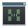</a> | **📂 檔名:** `htop.svg` ✨ **格式:** `Vector (SVG)` ⚖️ **大小:** `2.36KB` 📅 **更新:** `2026-03-03`  🚀 **jsDelivr Markdown:** `` 🔗 **直接連結 (Url):** <code>https://cdn.jsdelivr.net/gh/barry028/materials@main/images/iCons/Pixel/Breeze/Apps%20/48/htop.svg</code> 📥 [檢視原始檔](htop.svg) |
|  | **📂 檔名:** `hwinfo.svg` ✨ **格式:** `Vector (SVG)` ⚖️ **大小:** `3.00KB` 📅 **更新:** `2026-03-03`  🚀 **jsDelivr Markdown:** `` 🔗 **直接連結 (Url):** <code>https://cdn.jsdelivr.net/gh/barry028/materials@main/images/iCons/Pixel/Breeze/Apps%20/48/hwinfo.svg</code> 📥 [檢視原始檔](hwinfo.svg) |
|  | **📂 檔名:** `im.vector.svg` ✨ **格式:** `Vector (SVG)` ⚖️ **大小:** `13.74KB` 📅 **更新:** `2026-03-03`  🚀 **jsDelivr Markdown:** `` 🔗 **直接連結 (Url):** <code>https://cdn.jsdelivr.net/gh/barry028/materials@main/images/iCons/Pixel/Breeze/Apps%20/48/im.vector.svg</code> 📥 [檢視原始檔](im.vector.svg) |
|  | **📂 檔名:** `imagewriter.svg` ✨ **格式:** `Vector (SVG)` ⚖️ **大小:** `11.03KB` 📅 **更新:** `2026-03-03`  🚀 **jsDelivr Markdown:** `` 🔗 **直接連結 (Url):** <code>https://cdn.jsdelivr.net/gh/barry028/materials@main/images/iCons/Pixel/Breeze/Apps%20/48/imagewriter.svg</code> 📥 [檢視原始檔](imagewriter.svg) |
|  | **📂 檔名:** `inkscape.svg` ✨ **格式:** `Vector (SVG)` ⚖️ **大小:** `1.59KB` 📅 **更新:** `2026-03-03`  🚀 **jsDelivr Markdown:** `` 🔗 **直接連結 (Url):** <code>https://cdn.jsdelivr.net/gh/barry028/materials@main/images/iCons/Pixel/Breeze/Apps%20/48/inkscape.svg</code> 📥 [檢視原始檔](inkscape.svg) |
|  | **📂 檔名:** `internet-web-browser.svg` ✨ **格式:** `Vector (SVG)` ⚖️ **大小:** `2.58KB` 📅 **更新:** `2026-03-03`  🚀 **jsDelivr Markdown:** `` 🔗 **直接連結 (Url):** <code>https://cdn.jsdelivr.net/gh/barry028/materials@main/images/iCons/Pixel/Breeze/Apps%20/48/internet-web-browser.svg</code> 📥 [檢視原始檔](internet-web-browser.svg) |
|  | **📂 檔名:** `jdownloader.svg` ✨ **格式:** `Vector (SVG)` ⚖️ **大小:** `2.83KB` 📅 **更新:** `2026-03-03`  🚀 **jsDelivr Markdown:** `` 🔗 **直接連結 (Url):** <code>https://cdn.jsdelivr.net/gh/barry028/materials@main/images/iCons/Pixel/Breeze/Apps%20/48/jdownloader.svg</code> 📥 [檢視原始檔](jdownloader.svg) |
|  | **📂 檔名:** `joplin.svg` ✨ **格式:** `Vector (SVG)` ⚖️ **大小:** `2.83KB` 📅 **更新:** `2026-03-03`  🚀 **jsDelivr Markdown:** `` 🔗 **直接連結 (Url):** <code>https://cdn.jsdelivr.net/gh/barry028/materials@main/images/iCons/Pixel/Breeze/Apps%20/48/joplin.svg</code> 📥 [檢視原始檔](joplin.svg) |
|  | **📂 檔名:** `juk.svg` ✨ **格式:** `Vector (SVG)` ⚖️ **大小:** `2.79KB` 📅 **更新:** `2026-03-03`  🚀 **jsDelivr Markdown:** `` 🔗 **直接連結 (Url):** <code>https://cdn.jsdelivr.net/gh/barry028/materials@main/images/iCons/Pixel/Breeze/Apps%20/48/juk.svg</code> 📥 [檢視原始檔](juk.svg) |
|  | **📂 檔名:** `juliabackend.svg` ✨ **格式:** `Vector (SVG)` ⚖️ **大小:** `8.09KB` 📅 **更新:** `2026-03-03`  🚀 **jsDelivr Markdown:** `` 🔗 **直接連結 (Url):** <code>https://cdn.jsdelivr.net/gh/barry028/materials@main/images/iCons/Pixel/Breeze/Apps%20/48/juliabackend.svg</code> 📥 [檢視原始檔](juliabackend.svg) |
|  | **📂 檔名:** `k3b.svg` ✨ **格式:** `Vector (SVG)` ⚖️ **大小:** `8.14KB` 📅 **更新:** `2026-03-03`  🚀 **jsDelivr Markdown:** `` 🔗 **直接連結 (Url):** <code>https://cdn.jsdelivr.net/gh/barry028/materials@main/images/iCons/Pixel/Breeze/Apps%20/48/k3b.svg</code> 📥 [檢視原始檔](k3b.svg) |
|  | **📂 檔名:** `kaffeine.svg` ✨ **格式:** `Vector (SVG)` ⚖️ **大小:** `6.62KB` 📅 **更新:** `2026-03-03`  🚀 **jsDelivr Markdown:** `` 🔗 **直接連結 (Url):** <code>https://cdn.jsdelivr.net/gh/barry028/materials@main/images/iCons/Pixel/Breeze/Apps%20/48/kaffeine.svg</code> 📥 [檢視原始檔](kaffeine.svg) |
|  | **📂 檔名:** `kajongg.svg` ✨ **格式:** `Vector (SVG)` ⚖️ **大小:** `10.91KB` 📅 **更新:** `2026-03-03`  🚀 **jsDelivr Markdown:** `` 🔗 **直接連結 (Url):** <code>https://cdn.jsdelivr.net/gh/barry028/materials@main/images/iCons/Pixel/Breeze/Apps%20/48/kajongg.svg</code> 📥 [檢視原始檔](kajongg.svg) |
|  | **📂 檔名:** `kalarm.svg` ✨ **格式:** `Vector (SVG)` ⚖️ **大小:** `2.49KB` 📅 **更新:** `2026-03-03`  🚀 **jsDelivr Markdown:** `` 🔗 **直接連結 (Url):** <code>https://cdn.jsdelivr.net/gh/barry028/materials@main/images/iCons/Pixel/Breeze/Apps%20/48/kalarm.svg</code> 📥 [檢視原始檔](kalarm.svg) |
|  | **📂 檔名:** `kalgebra.svg` ✨ **格式:** `Vector (SVG)` ⚖️ **大小:** `2.00KB` 📅 **更新:** `2026-03-03`  🚀 **jsDelivr Markdown:** `` 🔗 **直接連結 (Url):** <code>https://cdn.jsdelivr.net/gh/barry028/materials@main/images/iCons/Pixel/Breeze/Apps%20/48/kalgebra.svg</code> 📥 [檢視原始檔](kalgebra.svg) |
| <a href="kalzium.svg">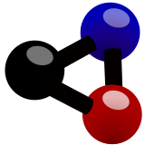</a> | **📂 檔名:** `kalzium.svg` ✨ **格式:** `Vector (SVG)` ⚖️ **大小:** `5.15KB` 📅 **更新:** `2026-03-03`  🚀 **jsDelivr Markdown:** `` 🔗 **直接連結 (Url):** <code>https://cdn.jsdelivr.net/gh/barry028/materials@main/images/iCons/Pixel/Breeze/Apps%20/48/kalzium.svg</code> 📥 [檢視原始檔](kalzium.svg) |
|  | **📂 檔名:** `kamoso.svg` ✨ **格式:** `Vector (SVG)` ⚖️ **大小:** `4.15KB` 📅 **更新:** `2026-03-03`  🚀 **jsDelivr Markdown:** `` 🔗 **直接連結 (Url):** <code>https://cdn.jsdelivr.net/gh/barry028/materials@main/images/iCons/Pixel/Breeze/Apps%20/48/kamoso.svg</code> 📥 [檢視原始檔](kamoso.svg) |
|  | **📂 檔名:** `kanagram.svg` ✨ **格式:** `Vector (SVG)` ⚖️ **大小:** `6.50KB` 📅 **更新:** `2026-03-03`  🚀 **jsDelivr Markdown:** `` 🔗 **直接連結 (Url):** <code>https://cdn.jsdelivr.net/gh/barry028/materials@main/images/iCons/Pixel/Breeze/Apps%20/48/kanagram.svg</code> 📥 [檢視原始檔](kanagram.svg) |
|  | **📂 檔名:** `kapman.svg` ✨ **格式:** `Vector (SVG)` ⚖️ **大小:** `3.07KB` 📅 **更新:** `2026-03-03`  🚀 **jsDelivr Markdown:** `` 🔗 **直接連結 (Url):** <code>https://cdn.jsdelivr.net/gh/barry028/materials@main/images/iCons/Pixel/Breeze/Apps%20/48/kapman.svg</code> 📥 [檢視原始檔](kapman.svg) |
|  | **📂 檔名:** `kapptemplate.svg` ✨ **格式:** `Vector (SVG)` ⚖️ **大小:** `3.12KB` 📅 **更新:** `2026-03-03`  🚀 **jsDelivr Markdown:** `` 🔗 **直接連結 (Url):** <code>https://cdn.jsdelivr.net/gh/barry028/materials@main/images/iCons/Pixel/Breeze/Apps%20/48/kapptemplate.svg</code> 📥 [檢視原始檔](kapptemplate.svg) |
|  | **📂 檔名:** `karbon.svg` ✨ **格式:** `Vector (SVG)` ⚖️ **大小:** `3.61KB` 📅 **更新:** `2026-03-03`  🚀 **jsDelivr Markdown:** `` 🔗 **直接連結 (Url):** <code>https://cdn.jsdelivr.net/gh/barry028/materials@main/images/iCons/Pixel/Breeze/Apps%20/48/karbon.svg</code> 📥 [檢視原始檔](karbon.svg) |
|  | **📂 檔名:** `kate.svg` ✨ **格式:** `Vector (SVG)` ⚖️ **大小:** `5.83KB` 📅 **更新:** `2026-03-03`  🚀 **jsDelivr Markdown:** `` 🔗 **直接連結 (Url):** <code>https://cdn.jsdelivr.net/gh/barry028/materials@main/images/iCons/Pixel/Breeze/Apps%20/48/kate.svg</code> 📥 [檢視原始檔](kate.svg) |
|  | **📂 檔名:** `katomic.svg` ✨ **格式:** `Vector (SVG)` ⚖️ **大小:** `2.43KB` 📅 **更新:** `2026-03-03`  🚀 **jsDelivr Markdown:** `` 🔗 **直接連結 (Url):** <code>https://cdn.jsdelivr.net/gh/barry028/materials@main/images/iCons/Pixel/Breeze/Apps%20/48/katomic.svg</code> 📥 [檢視原始檔](katomic.svg) |
|  | **📂 檔名:** `kblackbox.svg` ✨ **格式:** `Vector (SVG)` ⚖️ **大小:** `5.65KB` 📅 **更新:** `2026-03-03`  🚀 **jsDelivr Markdown:** `` 🔗 **直接連結 (Url):** <code>https://cdn.jsdelivr.net/gh/barry028/materials@main/images/iCons/Pixel/Breeze/Apps%20/48/kblackbox.svg</code> 📥 [檢視原始檔](kblackbox.svg) |
|  | **📂 檔名:** `kblocks.svg` ✨ **格式:** `Vector (SVG)` ⚖️ **大小:** `5.41KB` 📅 **更新:** `2026-03-03`  🚀 **jsDelivr Markdown:** `` 🔗 **直接連結 (Url):** <code>https://cdn.jsdelivr.net/gh/barry028/materials@main/images/iCons/Pixel/Breeze/Apps%20/48/kblocks.svg</code> 📥 [檢視原始檔](kblocks.svg) |
|  | **📂 檔名:** `kblogger.svg` ✨ **格式:** `Vector (SVG)` ⚖️ **大小:** `1.34KB` 📅 **更新:** `2026-03-03`  🚀 **jsDelivr Markdown:** `` 🔗 **直接連結 (Url):** <code>https://cdn.jsdelivr.net/gh/barry028/materials@main/images/iCons/Pixel/Breeze/Apps%20/48/kblogger.svg</code> 📥 [檢視原始檔](kblogger.svg) |
|  | **📂 檔名:** `kbreakout.svg` ✨ **格式:** `Vector (SVG)` ⚖️ **大小:** `6.31KB` 📅 **更新:** `2026-03-03`  🚀 **jsDelivr Markdown:** `` 🔗 **直接連結 (Url):** <code>https://cdn.jsdelivr.net/gh/barry028/materials@main/images/iCons/Pixel/Breeze/Apps%20/48/kbreakout.svg</code> 📥 [檢視原始檔](kbreakout.svg) |
| <a href="kbruch.svg">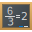</a> | **📂 檔名:** `kbruch.svg` ✨ **格式:** `Vector (SVG)` ⚖️ **大小:** `4.00KB` 📅 **更新:** `2026-03-03`  🚀 **jsDelivr Markdown:** `` 🔗 **直接連結 (Url):** <code>https://cdn.jsdelivr.net/gh/barry028/materials@main/images/iCons/Pixel/Breeze/Apps%20/48/kbruch.svg</code> 📥 [檢視原始檔](kbruch.svg) |
|  | **📂 檔名:** `kcachegrind.svg` ✨ **格式:** `Vector (SVG)` ⚖️ **大小:** `6.56KB` 📅 **更新:** `2026-03-03`  🚀 **jsDelivr Markdown:** `` 🔗 **直接連結 (Url):** <code>https://cdn.jsdelivr.net/gh/barry028/materials@main/images/iCons/Pixel/Breeze/Apps%20/48/kcachegrind.svg</code> 📥 [檢視原始檔](kcachegrind.svg) |
|  | **📂 檔名:** `kde-frameworks.svg` ✨ **格式:** `Vector (SVG)` ⚖️ **大小:** `4.10KB` 📅 **更新:** `2026-03-03`  🚀 **jsDelivr Markdown:** `` 🔗 **直接連結 (Url):** <code>https://cdn.jsdelivr.net/gh/barry028/materials@main/images/iCons/Pixel/Breeze/Apps%20/48/kde-frameworks.svg</code> 📥 [檢視原始檔](kde-frameworks.svg) |
|  | **📂 檔名:** `kde-im-log-viewer.svg` ✨ **格式:** `Vector (SVG)` ⚖️ **大小:** `3.35KB` 📅 **更新:** `2026-03-03`  🚀 **jsDelivr Markdown:** `` 🔗 **直接連結 (Url):** <code>https://cdn.jsdelivr.net/gh/barry028/materials@main/images/iCons/Pixel/Breeze/Apps%20/48/kde-im-log-viewer.svg</code> 📥 [檢視原始檔](kde-im-log-viewer.svg) |
|  | **📂 檔名:** `kdeapp.svg` ✨ **格式:** `Vector (SVG)` ⚖️ **大小:** `4.19KB` 📅 **更新:** `2026-03-03`  🚀 **jsDelivr Markdown:** `` 🔗 **直接連結 (Url):** <code>https://cdn.jsdelivr.net/gh/barry028/materials@main/images/iCons/Pixel/Breeze/Apps%20/48/kdeapp.svg</code> 📥 [檢視原始檔](kdeapp.svg) |
|  | **📂 檔名:** `kdenlive.svg` ✨ **格式:** `Vector (SVG)` ⚖️ **大小:** `6.48KB` 📅 **更新:** `2026-03-03`  🚀 **jsDelivr Markdown:** `` 🔗 **直接連結 (Url):** <code>https://cdn.jsdelivr.net/gh/barry028/materials@main/images/iCons/Pixel/Breeze/Apps%20/48/kdenlive.svg</code> 📥 [檢視原始檔](kdenlive.svg) |
|  | **📂 檔名:** `kdesrc-build.svg` ✨ **格式:** `Vector (SVG)` ⚖️ **大小:** `12.75KB` 📅 **更新:** `2026-03-03`  🚀 **jsDelivr Markdown:** `` 🔗 **直接連結 (Url):** <code>https://cdn.jsdelivr.net/gh/barry028/materials@main/images/iCons/Pixel/Breeze/Apps%20/48/kdesrc-build.svg</code> 📥 [檢視原始檔](kdesrc-build.svg) |
| <a href="kdesvn.svg">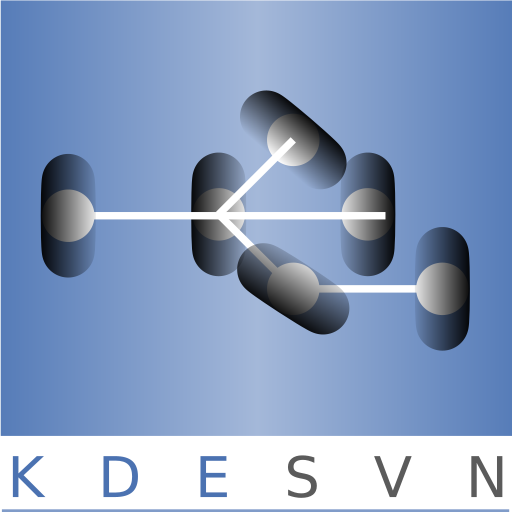</a> | **📂 檔名:** `kdesvn.svg` ✨ **格式:** `Vector (SVG)` ⚖️ **大小:** `13.48KB` 📅 **更新:** `2026-03-03`  🚀 **jsDelivr Markdown:** `` 🔗 **直接連結 (Url):** <code>https://cdn.jsdelivr.net/gh/barry028/materials@main/images/iCons/Pixel/Breeze/Apps%20/48/kdesvn.svg</code> 📥 [檢視原始檔](kdesvn.svg) |
|  | **📂 檔名:** `kdevelop.svg` ✨ **格式:** `Vector (SVG)` ⚖️ **大小:** `5.33KB` 📅 **更新:** `2026-03-03`  🚀 **jsDelivr Markdown:** `` 🔗 **直接連結 (Url):** <code>https://cdn.jsdelivr.net/gh/barry028/materials@main/images/iCons/Pixel/Breeze/Apps%20/48/kdevelop.svg</code> 📥 [檢視原始檔](kdevelop.svg) |
|  | **📂 檔名:** `kdiamond.svg` ✨ **格式:** `Vector (SVG)` ⚖️ **大小:** `5.75KB` 📅 **更新:** `2026-03-03`  🚀 **jsDelivr Markdown:** `` 🔗 **直接連結 (Url):** <code>https://cdn.jsdelivr.net/gh/barry028/materials@main/images/iCons/Pixel/Breeze/Apps%20/48/kdiamond.svg</code> 📥 [檢視原始檔](kdiamond.svg) |
| <a href="kdiff3.svg">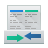</a> | **📂 檔名:** `kdiff3.svg` ✨ **格式:** `Vector (SVG)` ⚖️ **大小:** `3.88KB` 📅 **更新:** `2026-03-03`  🚀 **jsDelivr Markdown:** `` 🔗 **直接連結 (Url):** <code>https://cdn.jsdelivr.net/gh/barry028/materials@main/images/iCons/Pixel/Breeze/Apps%20/48/kdiff3.svg</code> 📥 [檢視原始檔](kdiff3.svg) |
|  | **📂 檔名:** `kdots.svg` ✨ **格式:** `Vector (SVG)` ⚖️ **大小:** `5.46KB` 📅 **更新:** `2026-03-03`  🚀 **jsDelivr Markdown:** `` 🔗 **直接連結 (Url):** <code>https://cdn.jsdelivr.net/gh/barry028/materials@main/images/iCons/Pixel/Breeze/Apps%20/48/kdots.svg</code> 📥 [檢視原始檔](kdots.svg) |
|  | **📂 檔名:** `keepass.svg` ✨ **格式:** `Vector (SVG)` ⚖️ **大小:** `6.75KB` 📅 **更新:** `2026-03-03`  🚀 **jsDelivr Markdown:** `` 🔗 **直接連結 (Url):** <code>https://cdn.jsdelivr.net/gh/barry028/materials@main/images/iCons/Pixel/Breeze/Apps%20/48/keepass.svg</code> 📥 [檢視原始檔](keepass.svg) |
|  | **📂 檔名:** `kexi.svg` ✨ **格式:** `Vector (SVG)` ⚖️ **大小:** `2.06KB` 📅 **更新:** `2026-03-03`  🚀 **jsDelivr Markdown:** `` 🔗 **直接連結 (Url):** <code>https://cdn.jsdelivr.net/gh/barry028/materials@main/images/iCons/Pixel/Breeze/Apps%20/48/kexi.svg</code> 📥 [檢視原始檔](kexi.svg) |
|  | **📂 檔名:** `kfind.svg` ✨ **格式:** `Vector (SVG)` ⚖️ **大小:** `2.13KB` 📅 **更新:** `2026-03-03`  🚀 **jsDelivr Markdown:** `` 🔗 **直接連結 (Url):** <code>https://cdn.jsdelivr.net/gh/barry028/materials@main/images/iCons/Pixel/Breeze/Apps%20/48/kfind.svg</code> 📥 [檢視原始檔](kfind.svg) |
|  | **📂 檔名:** `kfloppy.svg` ✨ **格式:** `Vector (SVG)` ⚖️ **大小:** `1.82KB` 📅 **更新:** `2026-03-03`  🚀 **jsDelivr Markdown:** `` 🔗 **直接連結 (Url):** <code>https://cdn.jsdelivr.net/gh/barry028/materials@main/images/iCons/Pixel/Breeze/Apps%20/48/kfloppy.svg</code> 📥 [檢視原始檔](kfloppy.svg) |
|  | **📂 檔名:** `kfontview.svg` ✨ **格式:** `Vector (SVG)` ⚖️ **大小:** `2.09KB` 📅 **更新:** `2026-03-03`  🚀 **jsDelivr Markdown:** `` 🔗 **直接連結 (Url):** <code>https://cdn.jsdelivr.net/gh/barry028/materials@main/images/iCons/Pixel/Breeze/Apps%20/48/kfontview.svg</code> 📥 [檢視原始檔](kfontview.svg) |
|  | **📂 檔名:** `kfourinline.svg` ✨ **格式:** `Vector (SVG)` ⚖️ **大小:** `6.24KB` 📅 **更新:** `2026-03-03`  🚀 **jsDelivr Markdown:** `` 🔗 **直接連結 (Url):** <code>https://cdn.jsdelivr.net/gh/barry028/materials@main/images/iCons/Pixel/Breeze/Apps%20/48/kfourinline.svg</code> 📥 [檢視原始檔](kfourinline.svg) |
|  | **📂 檔名:** `kgeography.svg` ✨ **格式:** `Vector (SVG)` ⚖️ **大小:** `227.25KB` 📅 **更新:** `2026-03-03`  🚀 **jsDelivr Markdown:** `` 🔗 **直接連結 (Url):** <code>https://cdn.jsdelivr.net/gh/barry028/materials@main/images/iCons/Pixel/Breeze/Apps%20/48/kgeography.svg</code> 📥 [檢視原始檔](kgeography.svg) |
|  | **📂 檔名:** `kget.svg` ✨ **格式:** `Vector (SVG)` ⚖️ **大小:** `1.63KB` 📅 **更新:** `2026-03-03`  🚀 **jsDelivr Markdown:** `` 🔗 **直接連結 (Url):** <code>https://cdn.jsdelivr.net/gh/barry028/materials@main/images/iCons/Pixel/Breeze/Apps%20/48/kget.svg</code> 📥 [檢視原始檔](kget.svg) |
| <a href="khangman.svg"></a> | **📂 檔名:** `khangman.svg` ✨ **格式:** `Vector (SVG)` ⚖️ **大小:** `101.81KB` 📅 **更新:** `2026-03-03`  🚀 **jsDelivr Markdown:** `` 🔗 **直接連結 (Url):** <code>https://cdn.jsdelivr.net/gh/barry028/materials@main/images/iCons/Pixel/Breeze/Apps%20/48/khangman.svg</code> 📥 [檢視原始檔](khangman.svg) |
|  | **📂 檔名:** `kig.svg` ✨ **格式:** `Vector (SVG)` ⚖️ **大小:** `13.78KB` 📅 **更新:** `2026-03-03`  🚀 **jsDelivr Markdown:** `` 🔗 **直接連結 (Url):** <code>https://cdn.jsdelivr.net/gh/barry028/materials@main/images/iCons/Pixel/Breeze/Apps%20/48/kig.svg</code> 📥 [檢視原始檔](kig.svg) |
|  | **📂 檔名:** `kile.svg` ✨ **格式:** `Vector (SVG)` ⚖️ **大小:** `2.67KB` 📅 **更新:** `2026-03-03`  🚀 **jsDelivr Markdown:** `` 🔗 **直接連結 (Url):** <code>https://cdn.jsdelivr.net/gh/barry028/materials@main/images/iCons/Pixel/Breeze/Apps%20/48/kile.svg</code> 📥 [檢視原始檔](kile.svg) |
|  | **📂 檔名:** `kimagemapeditor.svg` ✨ **格式:** `Vector (SVG)` ⚖️ **大小:** `2.48KB` 📅 **更新:** `2026-03-03`  🚀 **jsDelivr Markdown:** `` 🔗 **直接連結 (Url):** <code>https://cdn.jsdelivr.net/gh/barry028/materials@main/images/iCons/Pixel/Breeze/Apps%20/48/kimagemapeditor.svg</code> 📥 [檢視原始檔](kimagemapeditor.svg) |
|  | **📂 檔名:** `kipi-dngconverter.svg` ✨ **格式:** `Vector (SVG)` ⚖️ **大小:** `1.88KB` 📅 **更新:** `2026-03-03`  🚀 **jsDelivr Markdown:** `` 🔗 **直接連結 (Url):** <code>https://cdn.jsdelivr.net/gh/barry028/materials@main/images/iCons/Pixel/Breeze/Apps%20/48/kipi-dngconverter.svg</code> 📥 [檢視原始檔](kipi-dngconverter.svg) |
|  | **📂 檔名:** `kipi-expoblending.svg` ✨ **格式:** `Vector (SVG)` ⚖️ **大小:** `2.03KB` 📅 **更新:** `2026-03-03`  🚀 **jsDelivr Markdown:** `` 🔗 **直接連結 (Url):** <code>https://cdn.jsdelivr.net/gh/barry028/materials@main/images/iCons/Pixel/Breeze/Apps%20/48/kipi-expoblending.svg</code> 📥 [檢視原始檔](kipi-expoblending.svg) |
|  | **📂 檔名:** `kipi-panorama.svg` ✨ **格式:** `Vector (SVG)` ⚖️ **大小:** `1.92KB` 📅 **更新:** `2026-03-03`  🚀 **jsDelivr Markdown:** `` 🔗 **直接連結 (Url):** <code>https://cdn.jsdelivr.net/gh/barry028/materials@main/images/iCons/Pixel/Breeze/Apps%20/48/kipi-panorama.svg</code> 📥 [檢視原始檔](kipi-panorama.svg) |
|  | **📂 檔名:** `kirigami-gallery.svg` ✨ **格式:** `Vector (SVG)` ⚖️ **大小:** `2.12KB` 📅 **更新:** `2026-03-03`  🚀 **jsDelivr Markdown:** `` 🔗 **直接連結 (Url):** <code>https://cdn.jsdelivr.net/gh/barry028/materials@main/images/iCons/Pixel/Breeze/Apps%20/48/kirigami-gallery.svg</code> 📥 [檢視原始檔](kirigami-gallery.svg) |
|  | **📂 檔名:** `kiriki.svg` ✨ **格式:** `Vector (SVG)` ⚖️ **大小:** `5.06KB` 📅 **更新:** `2026-03-03`  🚀 **jsDelivr Markdown:** `` 🔗 **直接連結 (Url):** <code>https://cdn.jsdelivr.net/gh/barry028/materials@main/images/iCons/Pixel/Breeze/Apps%20/48/kiriki.svg</code> 📥 [檢視原始檔](kiriki.svg) |
|  | **📂 檔名:** `kirogi.svg` ✨ **格式:** `Vector (SVG)` ⚖️ **大小:** `5.56KB` 📅 **更新:** `2026-03-03`  🚀 **jsDelivr Markdown:** `` 🔗 **直接連結 (Url):** <code>https://cdn.jsdelivr.net/gh/barry028/materials@main/images/iCons/Pixel/Breeze/Apps%20/48/kirogi.svg</code> 📥 [檢視原始檔](kirogi.svg) |
|  | **📂 檔名:** `kiten.svg` ✨ **格式:** `Vector (SVG)` ⚖️ **大小:** `99.33KB` 📅 **更新:** `2026-03-03`  🚀 **jsDelivr Markdown:** `` 🔗 **直接連結 (Url):** <code>https://cdn.jsdelivr.net/gh/barry028/materials@main/images/iCons/Pixel/Breeze/Apps%20/48/kiten.svg</code> 📥 [檢視原始檔](kiten.svg) |
|  | **📂 檔名:** `kjumpingcube.svg` ✨ **格式:** `Vector (SVG)` ⚖️ **大小:** `5.64KB` 📅 **更新:** `2026-03-03`  🚀 **jsDelivr Markdown:** `` 🔗 **直接連結 (Url):** <code>https://cdn.jsdelivr.net/gh/barry028/materials@main/images/iCons/Pixel/Breeze/Apps%20/48/kjumpingcube.svg</code> 📥 [檢視原始檔](kjumpingcube.svg) |
| <a href="kleopatra.svg">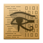</a> | **📂 檔名:** `kleopatra.svg` ✨ **格式:** `Vector (SVG)` ⚖️ **大小:** `49.75KB` 📅 **更新:** `2026-03-03`  🚀 **jsDelivr Markdown:** `` 🔗 **直接連結 (Url):** <code>https://cdn.jsdelivr.net/gh/barry028/materials@main/images/iCons/Pixel/Breeze/Apps%20/48/kleopatra.svg</code> 📥 [檢視原始檔](kleopatra.svg) |
|  | **📂 檔名:** `klines.svg` ✨ **格式:** `Vector (SVG)` ⚖️ **大小:** `6.43KB` 📅 **更新:** `2026-03-03`  🚀 **jsDelivr Markdown:** `` 🔗 **直接連結 (Url):** <code>https://cdn.jsdelivr.net/gh/barry028/materials@main/images/iCons/Pixel/Breeze/Apps%20/48/klines.svg</code> 📥 [檢視原始檔](klines.svg) |
|  | **📂 檔名:** `klipper.svg` ✨ **格式:** `Vector (SVG)` ⚖️ **大小:** `2.12KB` 📅 **更新:** `2026-03-03`  🚀 **jsDelivr Markdown:** `` 🔗 **直接連結 (Url):** <code>https://cdn.jsdelivr.net/gh/barry028/materials@main/images/iCons/Pixel/Breeze/Apps%20/48/klipper.svg</code> 📥 [檢視原始檔](klipper.svg) |
|  | **📂 檔名:** `kmag.svg` ✨ **格式:** `Vector (SVG)` ⚖️ **大小:** `3.47KB` 📅 **更新:** `2026-03-03`  🚀 **jsDelivr Markdown:** `` 🔗 **直接連結 (Url):** <code>https://cdn.jsdelivr.net/gh/barry028/materials@main/images/iCons/Pixel/Breeze/Apps%20/48/kmag.svg</code> 📥 [檢視原始檔](kmag.svg) |
|  | **📂 檔名:** `kmahjongg.svg` ✨ **格式:** `Vector (SVG)` ⚖️ **大小:** `57.35KB` 📅 **更新:** `2026-03-03`  🚀 **jsDelivr Markdown:** `` 🔗 **直接連結 (Url):** <code>https://cdn.jsdelivr.net/gh/barry028/materials@main/images/iCons/Pixel/Breeze/Apps%20/48/kmahjongg.svg</code> 📥 [檢視原始檔](kmahjongg.svg) |
|  | **📂 檔名:** `kmenuedit.svg` ✨ **格式:** `Vector (SVG)` ⚖️ **大小:** `9.08KB` 📅 **更新:** `2026-03-03`  🚀 **jsDelivr Markdown:** `` 🔗 **直接連結 (Url):** <code>https://cdn.jsdelivr.net/gh/barry028/materials@main/images/iCons/Pixel/Breeze/Apps%20/48/kmenuedit.svg</code> 📥 [檢視原始檔](kmenuedit.svg) |
|  | **📂 檔名:** `kmix.svg` ✨ **格式:** `Vector (SVG)` ⚖️ **大小:** `2.38KB` 📅 **更新:** `2026-03-03`  🚀 **jsDelivr Markdown:** `` 🔗 **直接連結 (Url):** <code>https://cdn.jsdelivr.net/gh/barry028/materials@main/images/iCons/Pixel/Breeze/Apps%20/48/kmix.svg</code> 📥 [檢視原始檔](kmix.svg) |
|  | **📂 檔名:** `kmouth.svg` ✨ **格式:** `Vector (SVG)` ⚖️ **大小:** `1.44KB` 📅 **更新:** `2026-03-03`  🚀 **jsDelivr Markdown:** `` 🔗 **直接連結 (Url):** <code>https://cdn.jsdelivr.net/gh/barry028/materials@main/images/iCons/Pixel/Breeze/Apps%20/48/kmouth.svg</code> 📥 [檢視原始檔](kmouth.svg) |
|  | **📂 檔名:** `kmplayer.svg` ✨ **格式:** `Vector (SVG)` ⚖️ **大小:** `14.75KB` 📅 **更新:** `2026-03-03`  🚀 **jsDelivr Markdown:** `` 🔗 **直接連結 (Url):** <code>https://cdn.jsdelivr.net/gh/barry028/materials@main/images/iCons/Pixel/Breeze/Apps%20/48/kmplayer.svg</code> 📥 [檢視原始檔](kmplayer.svg) |
| <a href="kmplot.svg">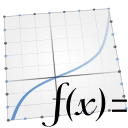</a> | **📂 檔名:** `kmplot.svg` ✨ **格式:** `Vector (SVG)` ⚖️ **大小:** `244.17KB` 📅 **更新:** `2026-03-03`  🚀 **jsDelivr Markdown:** `` 🔗 **直接連結 (Url):** <code>https://cdn.jsdelivr.net/gh/barry028/materials@main/images/iCons/Pixel/Breeze/Apps%20/48/kmplot.svg</code> 📥 [檢視原始檔](kmplot.svg) |
|  | **📂 檔名:** `kmymoney.svg` ✨ **格式:** `Vector (SVG)` ⚖️ **大小:** `14.11KB` 📅 **更新:** `2026-03-03`  🚀 **jsDelivr Markdown:** `` 🔗 **直接連結 (Url):** <code>https://cdn.jsdelivr.net/gh/barry028/materials@main/images/iCons/Pixel/Breeze/Apps%20/48/kmymoney.svg</code> 📥 [檢視原始檔](kmymoney.svg) |
|  | **📂 檔名:** `knetattach.svg` ✨ **格式:** `Vector (SVG)` ⚖️ **大小:** `1.89KB` 📅 **更新:** `2026-03-03`  🚀 **jsDelivr Markdown:** `` 🔗 **直接連結 (Url):** <code>https://cdn.jsdelivr.net/gh/barry028/materials@main/images/iCons/Pixel/Breeze/Apps%20/48/knetattach.svg</code> 📥 [檢視原始檔](knetattach.svg) |
|  | **📂 檔名:** `knights.svg` ✨ **格式:** `Vector (SVG)` ⚖️ **大小:** `3.50KB` 📅 **更新:** `2026-03-03`  🚀 **jsDelivr Markdown:** `` 🔗 **直接連結 (Url):** <code>https://cdn.jsdelivr.net/gh/barry028/materials@main/images/iCons/Pixel/Breeze/Apps%20/48/knights.svg</code> 📥 [檢視原始檔](knights.svg) |
|  | **📂 檔名:** `knotes.svg` ✨ **格式:** `Vector (SVG)` ⚖️ **大小:** `2.89KB` 📅 **更新:** `2026-03-03`  🚀 **jsDelivr Markdown:** `` 🔗 **直接連結 (Url):** <code>https://cdn.jsdelivr.net/gh/barry028/materials@main/images/iCons/Pixel/Breeze/Apps%20/48/knotes.svg</code> 📥 [檢視原始檔](knotes.svg) |
|  | **📂 檔名:** `kolf.svg` ✨ **格式:** `Vector (SVG)` ⚖️ **大小:** `9.35KB` 📅 **更新:** `2026-03-03`  🚀 **jsDelivr Markdown:** `` 🔗 **直接連結 (Url):** <code>https://cdn.jsdelivr.net/gh/barry028/materials@main/images/iCons/Pixel/Breeze/Apps%20/48/kolf.svg</code> 📥 [檢視原始檔](kolf.svg) |
|  | **📂 檔名:** `kolourpaint.svg` ✨ **格式:** `Vector (SVG)` ⚖️ **大小:** `7.67KB` 📅 **更新:** `2026-03-03`  🚀 **jsDelivr Markdown:** `` 🔗 **直接連結 (Url):** <code>https://cdn.jsdelivr.net/gh/barry028/materials@main/images/iCons/Pixel/Breeze/Apps%20/48/kolourpaint.svg</code> 📥 [檢視原始檔](kolourpaint.svg) |
|  | **📂 檔名:** `konqueror.svg` ✨ **格式:** `Vector (SVG)` ⚖️ **大小:** `5.43KB` 📅 **更新:** `2026-03-03`  🚀 **jsDelivr Markdown:** `` 🔗 **直接連結 (Url):** <code>https://cdn.jsdelivr.net/gh/barry028/materials@main/images/iCons/Pixel/Breeze/Apps%20/48/konqueror.svg</code> 📥 [檢視原始檔](konqueror.svg) |
|  | **📂 檔名:** `kontact.svg` ✨ **格式:** `Vector (SVG)` ⚖️ **大小:** `4.72KB` 📅 **更新:** `2026-03-03`  🚀 **jsDelivr Markdown:** `` 🔗 **直接連結 (Url):** <code>https://cdn.jsdelivr.net/gh/barry028/materials@main/images/iCons/Pixel/Breeze/Apps%20/48/kontact.svg</code> 📥 [檢視原始檔](kontact.svg) |
|  | **📂 檔名:** `konversation.svg` ✨ **格式:** `Vector (SVG)` ⚖️ **大小:** `1.28KB` 📅 **更新:** `2026-03-03`  🚀 **jsDelivr Markdown:** `` 🔗 **直接連結 (Url):** <code>https://cdn.jsdelivr.net/gh/barry028/materials@main/images/iCons/Pixel/Breeze/Apps%20/48/konversation.svg</code> 📥 [檢視原始檔](konversation.svg) |
|  | **📂 檔名:** `kopete.svg` ✨ **格式:** `Vector (SVG)` ⚖️ **大小:** `1.60KB` 📅 **更新:** `2026-03-03`  🚀 **jsDelivr Markdown:** `` 🔗 **直接連結 (Url):** <code>https://cdn.jsdelivr.net/gh/barry028/materials@main/images/iCons/Pixel/Breeze/Apps%20/48/kopete.svg</code> 📥 [檢視原始檔](kopete.svg) |
|  | **📂 檔名:** `korg-todo.svg` ✨ **格式:** `Vector (SVG)` ⚖️ **大小:** `5.84KB` 📅 **更新:** `2026-03-03`  🚀 **jsDelivr Markdown:** `` 🔗 **直接連結 (Url):** <code>https://cdn.jsdelivr.net/gh/barry028/materials@main/images/iCons/Pixel/Breeze/Apps%20/48/korg-todo.svg</code> 📥 [檢視原始檔](korg-todo.svg) |
|  | **📂 檔名:** `kpat.svg` ✨ **格式:** `Vector (SVG)` ⚖️ **大小:** `12.73KB` 📅 **更新:** `2026-03-03`  🚀 **jsDelivr Markdown:** `` 🔗 **直接連結 (Url):** <code>https://cdn.jsdelivr.net/gh/barry028/materials@main/images/iCons/Pixel/Breeze/Apps%20/48/kpat.svg</code> 📥 [檢視原始檔](kpat.svg) |
|  | **📂 檔名:** `kphotoalbum.svg` ✨ **格式:** `Vector (SVG)` ⚖️ **大小:** `1.57KB` 📅 **更新:** `2026-03-03`  🚀 **jsDelivr Markdown:** `` 🔗 **直接連結 (Url):** <code>https://cdn.jsdelivr.net/gh/barry028/materials@main/images/iCons/Pixel/Breeze/Apps%20/48/kphotoalbum.svg</code> 📥 [檢視原始檔](kphotoalbum.svg) |
|  | **📂 檔名:** `krdc.svg` ✨ **格式:** `Vector (SVG)` ⚖️ **大小:** `5.69KB` 📅 **更新:** `2026-03-03`  🚀 **jsDelivr Markdown:** `` 🔗 **直接連結 (Url):** <code>https://cdn.jsdelivr.net/gh/barry028/materials@main/images/iCons/Pixel/Breeze/Apps%20/48/krdc.svg</code> 📥 [檢視原始檔](krdc.svg) |
|  | **📂 檔名:** `krename.svg` ✨ **格式:** `Vector (SVG)` ⚖️ **大小:** `2.16KB` 📅 **更新:** `2026-03-03`  🚀 **jsDelivr Markdown:** `` 🔗 **直接連結 (Url):** <code>https://cdn.jsdelivr.net/gh/barry028/materials@main/images/iCons/Pixel/Breeze/Apps%20/48/krename.svg</code> 📥 [檢視原始檔](krename.svg) |
|  | **📂 檔名:** `krfb.svg` ✨ **格式:** `Vector (SVG)` ⚖️ **大小:** `2.85KB` 📅 **更新:** `2026-03-03`  🚀 **jsDelivr Markdown:** `` 🔗 **直接連結 (Url):** <code>https://cdn.jsdelivr.net/gh/barry028/materials@main/images/iCons/Pixel/Breeze/Apps%20/48/krfb.svg</code> 📥 [檢視原始檔](krfb.svg) |
|  | **📂 檔名:** `kronometer.svg` ✨ **格式:** `Vector (SVG)` ⚖️ **大小:** `12.71KB` 📅 **更新:** `2026-03-03`  🚀 **jsDelivr Markdown:** `` 🔗 **直接連結 (Url):** <code>https://cdn.jsdelivr.net/gh/barry028/materials@main/images/iCons/Pixel/Breeze/Apps%20/48/kronometer.svg</code> 📥 [檢視原始檔](kronometer.svg) |
|  | **📂 檔名:** `kruler.svg` ✨ **格式:** `Vector (SVG)` ⚖️ **大小:** `2.32KB` 📅 **更新:** `2026-03-03`  🚀 **jsDelivr Markdown:** `` 🔗 **直接連結 (Url):** <code>https://cdn.jsdelivr.net/gh/barry028/materials@main/images/iCons/Pixel/Breeze/Apps%20/48/kruler.svg</code> 📥 [檢視原始檔](kruler.svg) |
|  | **📂 檔名:** `krusader_root.svg` ✨ **格式:** `Vector (SVG)` ⚖️ **大小:** `2.29KB` 📅 **更新:** `2026-03-03`  🚀 **jsDelivr Markdown:** `` 🔗 **直接連結 (Url):** <code>https://cdn.jsdelivr.net/gh/barry028/materials@main/images/iCons/Pixel/Breeze/Apps%20/48/krusader_root.svg</code> 📥 [檢視原始檔](krusader_root.svg) |
|  | **📂 檔名:** `krusader_user.svg` ✨ **格式:** `Vector (SVG)` ⚖️ **大小:** `2.39KB` 📅 **更新:** `2026-03-03`  🚀 **jsDelivr Markdown:** `` 🔗 **直接連結 (Url):** <code>https://cdn.jsdelivr.net/gh/barry028/materials@main/images/iCons/Pixel/Breeze/Apps%20/48/krusader_user.svg</code> 📥 [檢視原始檔](krusader_user.svg) |
| <a href="kshisen.svg">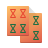</a> | **📂 檔名:** `kshisen.svg` ✨ **格式:** `Vector (SVG)` ⚖️ **大小:** `4.32KB` 📅 **更新:** `2026-03-03`  🚀 **jsDelivr Markdown:** `` 🔗 **直接連結 (Url):** <code>https://cdn.jsdelivr.net/gh/barry028/materials@main/images/iCons/Pixel/Breeze/Apps%20/48/kshisen.svg</code> 📥 [檢視原始檔](kshisen.svg) |
|  | **📂 檔名:** `ksirk.svg` ✨ **格式:** `Vector (SVG)` ⚖️ **大小:** `44.18KB` 📅 **更新:** `2026-03-03`  🚀 **jsDelivr Markdown:** `` 🔗 **直接連結 (Url):** <code>https://cdn.jsdelivr.net/gh/barry028/materials@main/images/iCons/Pixel/Breeze/Apps%20/48/ksirk.svg</code> 📥 [檢視原始檔](ksirk.svg) |
|  | **📂 檔名:** `ksnapshot.svg` ✨ **格式:** `Vector (SVG)` ⚖️ **大小:** `3.48KB` 📅 **更新:** `2026-03-03`  🚀 **jsDelivr Markdown:** `` 🔗 **直接連結 (Url):** <code>https://cdn.jsdelivr.net/gh/barry028/materials@main/images/iCons/Pixel/Breeze/Apps%20/48/ksnapshot.svg</code> 📥 [檢視原始檔](ksnapshot.svg) |
|  | **📂 檔名:** `kstars.svg` ✨ **格式:** `Vector (SVG)` ⚖️ **大小:** `69.26KB` 📅 **更新:** `2026-03-03`  🚀 **jsDelivr Markdown:** `` 🔗 **直接連結 (Url):** <code>https://cdn.jsdelivr.net/gh/barry028/materials@main/images/iCons/Pixel/Breeze/Apps%20/48/kstars.svg</code> 📥 [檢視原始檔](kstars.svg) |
|  | **📂 檔名:** `kteatime.svg` ✨ **格式:** `Vector (SVG)` ⚖️ **大小:** `65.64KB` 📅 **更新:** `2026-03-03`  🚀 **jsDelivr Markdown:** `` 🔗 **直接連結 (Url):** <code>https://cdn.jsdelivr.net/gh/barry028/materials@main/images/iCons/Pixel/Breeze/Apps%20/48/kteatime.svg</code> 📥 [檢視原始檔](kteatime.svg) |
|  | **📂 檔名:** `ktimetracker.svg` ✨ **格式:** `Vector (SVG)` ⚖️ **大小:** `3.30KB` 📅 **更新:** `2026-03-03`  🚀 **jsDelivr Markdown:** `` 🔗 **直接連結 (Url):** <code>https://cdn.jsdelivr.net/gh/barry028/materials@main/images/iCons/Pixel/Breeze/Apps%20/48/ktimetracker.svg</code> 📥 [檢視原始檔](ktimetracker.svg) |
|  | **📂 檔名:** `ktip.svg` ✨ **格式:** `Vector (SVG)` ⚖️ **大小:** `1.16KB` 📅 **更新:** `2026-03-03`  🚀 **jsDelivr Markdown:** `` 🔗 **直接連結 (Url):** <code>https://cdn.jsdelivr.net/gh/barry028/materials@main/images/iCons/Pixel/Breeze/Apps%20/48/ktip.svg</code> 📥 [檢視原始檔](ktip.svg) |
|  | **📂 檔名:** `ktnef.svg` ✨ **格式:** `Vector (SVG)` ⚖️ **大小:** `2.80KB` 📅 **更新:** `2026-03-03`  🚀 **jsDelivr Markdown:** `` 🔗 **直接連結 (Url):** <code>https://cdn.jsdelivr.net/gh/barry028/materials@main/images/iCons/Pixel/Breeze/Apps%20/48/ktnef.svg</code> 📥 [檢視原始檔](ktnef.svg) |
|  | **📂 檔名:** `ktorrent.svg` ✨ **格式:** `Vector (SVG)` ⚖️ **大小:** `3.31KB` 📅 **更新:** `2026-03-03`  🚀 **jsDelivr Markdown:** `` 🔗 **直接連結 (Url):** <code>https://cdn.jsdelivr.net/gh/barry028/materials@main/images/iCons/Pixel/Breeze/Apps%20/48/ktorrent.svg</code> 📥 [檢視原始檔](ktorrent.svg) |
|  | **📂 檔名:** `ktouch.svg` ✨ **格式:** `Vector (SVG)` ⚖️ **大小:** `37.48KB` 📅 **更新:** `2026-03-03`  🚀 **jsDelivr Markdown:** `` 🔗 **直接連結 (Url):** <code>https://cdn.jsdelivr.net/gh/barry028/materials@main/images/iCons/Pixel/Breeze/Apps%20/48/ktouch.svg</code> 📥 [檢視原始檔](ktouch.svg) |
|  | **📂 檔名:** `ktrip.svg` ✨ **格式:** `Vector (SVG)` ⚖️ **大小:** `8.51KB` 📅 **更新:** `2026-03-03`  🚀 **jsDelivr Markdown:** `` 🔗 **直接連結 (Url):** <code>https://cdn.jsdelivr.net/gh/barry028/materials@main/images/iCons/Pixel/Breeze/Apps%20/48/ktrip.svg</code> 📥 [檢視原始檔](ktrip.svg) |
|  | **📂 檔名:** `kube-mail.svg` ✨ **格式:** `Vector (SVG)` ⚖️ **大小:** `5.91KB` 📅 **更新:** `2026-03-03`  🚀 **jsDelivr Markdown:** `` 🔗 **直接連結 (Url):** <code>https://cdn.jsdelivr.net/gh/barry028/materials@main/images/iCons/Pixel/Breeze/Apps%20/48/kube-mail.svg</code> 📥 [檢視原始檔](kube-mail.svg) |
|  | **📂 檔名:** `kuiviewer.svg` ✨ **格式:** `Vector (SVG)` ⚖️ **大小:** `2.01KB` 📅 **更新:** `2026-03-03`  🚀 **jsDelivr Markdown:** `` 🔗 **直接連結 (Url):** <code>https://cdn.jsdelivr.net/gh/barry028/materials@main/images/iCons/Pixel/Breeze/Apps%20/48/kuiviewer.svg</code> 📥 [檢視原始檔](kuiviewer.svg) |
|  | **📂 檔名:** `kuser.svg` ✨ **格式:** `Vector (SVG)` ⚖️ **大小:** `1.90KB` 📅 **更新:** `2026-03-03`  🚀 **jsDelivr Markdown:** `` 🔗 **直接連結 (Url):** <code>https://cdn.jsdelivr.net/gh/barry028/materials@main/images/iCons/Pixel/Breeze/Apps%20/48/kuser.svg</code> 📥 [檢視原始檔](kuser.svg) |
|  | **📂 檔名:** `kwalletmanager.svg` ✨ **格式:** `Vector (SVG)` ⚖️ **大小:** `4.07KB` 📅 **更新:** `2026-03-03`  🚀 **jsDelivr Markdown:** `` 🔗 **直接連結 (Url):** <code>https://cdn.jsdelivr.net/gh/barry028/materials@main/images/iCons/Pixel/Breeze/Apps%20/48/kwalletmanager.svg</code> 📥 [檢視原始檔](kwalletmanager.svg) |
|  | **📂 檔名:** `kwave.svg` ✨ **格式:** `Vector (SVG)` ⚖️ **大小:** `9.06KB` 📅 **更新:** `2026-03-03`  🚀 **jsDelivr Markdown:** `` 🔗 **直接連結 (Url):** <code>https://cdn.jsdelivr.net/gh/barry028/materials@main/images/iCons/Pixel/Breeze/Apps%20/48/kwave.svg</code> 📥 [檢視原始檔](kwave.svg) |
|  | **📂 檔名:** `kwin.svg` ✨ **格式:** `Vector (SVG)` ⚖️ **大小:** `5.10KB` 📅 **更新:** `2026-03-03`  🚀 **jsDelivr Markdown:** `` 🔗 **直接連結 (Url):** <code>https://cdn.jsdelivr.net/gh/barry028/materials@main/images/iCons/Pixel/Breeze/Apps%20/48/kwin.svg</code> 📥 [檢視原始檔](kwin.svg) |
| <a href="kwrite.svg">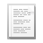</a> | **📂 檔名:** `kwrite.svg` ✨ **格式:** `Vector (SVG)` ⚖️ **大小:** `7.03KB` 📅 **更新:** `2026-03-03`  🚀 **jsDelivr Markdown:** `` 🔗 **直接連結 (Url):** <code>https://cdn.jsdelivr.net/gh/barry028/materials@main/images/iCons/Pixel/Breeze/Apps%20/48/kwrite.svg</code> 📥 [檢視原始檔](kwrite.svg) |
| <a href="kxstitch.svg">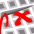</a> | **📂 檔名:** `kxstitch.svg` ✨ **格式:** `Vector (SVG)` ⚖️ **大小:** `21.91KB` 📅 **更新:** `2026-03-03`  🚀 **jsDelivr Markdown:** `` 🔗 **直接連結 (Url):** <code>https://cdn.jsdelivr.net/gh/barry028/materials@main/images/iCons/Pixel/Breeze/Apps%20/48/kxstitch.svg</code> 📥 [檢視原始檔](kxstitch.svg) |
| <a href="labplot.svg">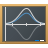</a> | **📂 檔名:** `labplot.svg` ✨ **格式:** `Vector (SVG)` ⚖️ **大小:** `2.74KB` 📅 **更新:** `2026-03-03`  🚀 **jsDelivr Markdown:** `` 🔗 **直接連結 (Url):** <code>https://cdn.jsdelivr.net/gh/barry028/materials@main/images/iCons/Pixel/Breeze/Apps%20/48/labplot.svg</code> 📥 [檢視原始檔](labplot.svg) |
|  | **📂 檔名:** `lastpass.svg` ✨ **格式:** `Vector (SVG)` ⚖️ **大小:** `2.95KB` 📅 **更新:** `2026-03-03`  🚀 **jsDelivr Markdown:** `` 🔗 **直接連結 (Url):** <code>https://cdn.jsdelivr.net/gh/barry028/materials@main/images/iCons/Pixel/Breeze/Apps%20/48/lastpass.svg</code> 📥 [檢視原始檔](lastpass.svg) |
|  | **📂 檔名:** `latte-dock.svg` ✨ **格式:** `Vector (SVG)` ⚖️ **大小:** `11.01KB` 📅 **更新:** `2026-03-03`  🚀 **jsDelivr Markdown:** `` 🔗 **直接連結 (Url):** <code>https://cdn.jsdelivr.net/gh/barry028/materials@main/images/iCons/Pixel/Breeze/Apps%20/48/latte-dock.svg</code> 📥 [檢視原始檔](latte-dock.svg) |
|  | **📂 檔名:** `leocad.svg` ✨ **格式:** `Vector (SVG)` ⚖️ **大小:** `4.41KB` 📅 **更新:** `2026-03-03`  🚀 **jsDelivr Markdown:** `` 🔗 **直接連結 (Url):** <code>https://cdn.jsdelivr.net/gh/barry028/materials@main/images/iCons/Pixel/Breeze/Apps%20/48/leocad.svg</code> 📥 [檢視原始檔](leocad.svg) |
|  | **📂 檔名:** `libreoffice-base.svg` ✨ **格式:** `Vector (SVG)` ⚖️ **大小:** `1.84KB` 📅 **更新:** `2026-03-03`  🚀 **jsDelivr Markdown:** `` 🔗 **直接連結 (Url):** <code>https://cdn.jsdelivr.net/gh/barry028/materials@main/images/iCons/Pixel/Breeze/Apps%20/48/libreoffice-base.svg</code> 📥 [檢視原始檔](libreoffice-base.svg) |
|  | **📂 檔名:** `libreoffice-calc.svg` ✨ **格式:** `Vector (SVG)` ⚖️ **大小:** `1.47KB` 📅 **更新:** `2026-03-03`  🚀 **jsDelivr Markdown:** `` 🔗 **直接連結 (Url):** <code>https://cdn.jsdelivr.net/gh/barry028/materials@main/images/iCons/Pixel/Breeze/Apps%20/48/libreoffice-calc.svg</code> 📥 [檢視原始檔](libreoffice-calc.svg) |
|  | **📂 檔名:** `libreoffice-draw.svg` ✨ **格式:** `Vector (SVG)` ⚖️ **大小:** `1.48KB` 📅 **更新:** `2026-03-03`  🚀 **jsDelivr Markdown:** `` 🔗 **直接連結 (Url):** <code>https://cdn.jsdelivr.net/gh/barry028/materials@main/images/iCons/Pixel/Breeze/Apps%20/48/libreoffice-draw.svg</code> 📥 [檢視原始檔](libreoffice-draw.svg) |
|  | **📂 檔名:** `libreoffice-impress.svg` ✨ **格式:** `Vector (SVG)` ⚖️ **大小:** `1.54KB` 📅 **更新:** `2026-03-03`  🚀 **jsDelivr Markdown:** `` 🔗 **直接連結 (Url):** <code>https://cdn.jsdelivr.net/gh/barry028/materials@main/images/iCons/Pixel/Breeze/Apps%20/48/libreoffice-impress.svg</code> 📥 [檢視原始檔](libreoffice-impress.svg) |
|  | **📂 檔名:** `libreoffice-main.svg` ✨ **格式:** `Vector (SVG)` ⚖️ **大小:** `1.37KB` 📅 **更新:** `2026-03-03`  🚀 **jsDelivr Markdown:** `` 🔗 **直接連結 (Url):** <code>https://cdn.jsdelivr.net/gh/barry028/materials@main/images/iCons/Pixel/Breeze/Apps%20/48/libreoffice-main.svg</code> 📥 [檢視原始檔](libreoffice-main.svg) |
|  | **📂 檔名:** `libreoffice-math.svg` ✨ **格式:** `Vector (SVG)` ⚖️ **大小:** `1.81KB` 📅 **更新:** `2026-03-03`  🚀 **jsDelivr Markdown:** `` 🔗 **直接連結 (Url):** <code>https://cdn.jsdelivr.net/gh/barry028/materials@main/images/iCons/Pixel/Breeze/Apps%20/48/libreoffice-math.svg</code> 📥 [檢視原始檔](libreoffice-math.svg) |
|  | **📂 檔名:** `libreoffice-writer.svg` ✨ **格式:** `Vector (SVG)` ⚖️ **大小:** `1.40KB` 📅 **更新:** `2026-03-03`  🚀 **jsDelivr Markdown:** `` 🔗 **直接連結 (Url):** <code>https://cdn.jsdelivr.net/gh/barry028/materials@main/images/iCons/Pixel/Breeze/Apps%20/48/libreoffice-writer.svg</code> 📥 [檢視原始檔](libreoffice-writer.svg) |
|  | **📂 檔名:** `linguist.svg` ✨ **格式:** `Vector (SVG)` ⚖️ **大小:** `2.85KB` 📅 **更新:** `2026-03-03`  🚀 **jsDelivr Markdown:** `` 🔗 **直接連結 (Url):** <code>https://cdn.jsdelivr.net/gh/barry028/materials@main/images/iCons/Pixel/Breeze/Apps%20/48/linguist.svg</code> 📥 [檢視原始檔](linguist.svg) |
|  | **📂 檔名:** `logisim.svg` ✨ **格式:** `Vector (SVG)` ⚖️ **大小:** `3.45KB` 📅 **更新:** `2026-03-03`  🚀 **jsDelivr Markdown:** `` 🔗 **直接連結 (Url):** <code>https://cdn.jsdelivr.net/gh/barry028/materials@main/images/iCons/Pixel/Breeze/Apps%20/48/logisim.svg</code> 📥 [檢視原始檔](logisim.svg) |
| <a href="lokalize.svg">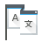</a> | **📂 檔名:** `lokalize.svg` ✨ **格式:** `Vector (SVG)` ⚖️ **大小:** `3.75KB` 📅 **更新:** `2026-03-03`  🚀 **jsDelivr Markdown:** `` 🔗 **直接連結 (Url):** <code>https://cdn.jsdelivr.net/gh/barry028/materials@main/images/iCons/Pixel/Breeze/Apps%20/48/lokalize.svg</code> 📥 [檢視原始檔](lokalize.svg) |
|  | **📂 檔名:** `luabackend.svg` ✨ **格式:** `Vector (SVG)` ⚖️ **大小:** `8.47KB` 📅 **更新:** `2026-03-03`  🚀 **jsDelivr Markdown:** `` 🔗 **直接連結 (Url):** <code>https://cdn.jsdelivr.net/gh/barry028/materials@main/images/iCons/Pixel/Breeze/Apps%20/48/luabackend.svg</code> 📥 [檢視原始檔](luabackend.svg) |
|  | **📂 檔名:** `mail-client.svg` ✨ **格式:** `Vector (SVG)` ⚖️ **大小:** `2.49KB` 📅 **更新:** `2026-03-03`  🚀 **jsDelivr Markdown:** `` 🔗 **直接連結 (Url):** <code>https://cdn.jsdelivr.net/gh/barry028/materials@main/images/iCons/Pixel/Breeze/Apps%20/48/mail-client.svg</code> 📥 [檢視原始檔](mail-client.svg) |
| <a href="massif-visualizer.svg">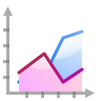</a> | **📂 檔名:** `massif-visualizer.svg` ✨ **格式:** `Vector (SVG)` ⚖️ **大小:** `13.00KB` 📅 **更新:** `2026-03-03`  🚀 **jsDelivr Markdown:** `` 🔗 **直接連結 (Url):** <code>https://cdn.jsdelivr.net/gh/barry028/materials@main/images/iCons/Pixel/Breeze/Apps%20/48/massif-visualizer.svg</code> 📥 [檢視原始檔](massif-visualizer.svg) |
|  | **📂 檔名:** `masterpdfeditor.svg` ✨ **格式:** `Vector (SVG)` ⚖️ **大小:** `7.76KB` 📅 **更新:** `2026-03-03`  🚀 **jsDelivr Markdown:** `` 🔗 **直接連結 (Url):** <code>https://cdn.jsdelivr.net/gh/barry028/materials@main/images/iCons/Pixel/Breeze/Apps%20/48/masterpdfeditor.svg</code> 📥 [檢視原始檔](masterpdfeditor.svg) |
|  | **📂 檔名:** `mathematica.svg` ✨ **格式:** `Vector (SVG)` ⚖️ **大小:** `8.21KB` 📅 **更新:** `2026-03-03`  🚀 **jsDelivr Markdown:** `` 🔗 **直接連結 (Url):** <code>https://cdn.jsdelivr.net/gh/barry028/materials@main/images/iCons/Pixel/Breeze/Apps%20/48/mathematica.svg</code> 📥 [檢視原始檔](mathematica.svg) |
|  | **📂 檔名:** `matlab.svg` ✨ **格式:** `Vector (SVG)` ⚖️ **大小:** `20.90KB` 📅 **更新:** `2026-03-03`  🚀 **jsDelivr Markdown:** `` 🔗 **直接連結 (Url):** <code>https://cdn.jsdelivr.net/gh/barry028/materials@main/images/iCons/Pixel/Breeze/Apps%20/48/matlab.svg</code> 📥 [檢視原始檔](matlab.svg) |
|  | **📂 檔名:** `maximabackend.svg` ✨ **格式:** `Vector (SVG)` ⚖️ **大小:** `12.11KB` 📅 **更新:** `2026-03-03`  🚀 **jsDelivr Markdown:** `` 🔗 **直接連結 (Url):** <code>https://cdn.jsdelivr.net/gh/barry028/materials@main/images/iCons/Pixel/Breeze/Apps%20/48/maximabackend.svg</code> 📥 [檢視原始檔](maximabackend.svg) |
|  | **📂 檔名:** `mendeleydesktop.svg` ✨ **格式:** `Vector (SVG)` ⚖️ **大小:** `5.76KB` 📅 **更新:** `2026-03-03`  🚀 **jsDelivr Markdown:** `` 🔗 **直接連結 (Url):** <code>https://cdn.jsdelivr.net/gh/barry028/materials@main/images/iCons/Pixel/Breeze/Apps%20/48/mendeleydesktop.svg</code> 📥 [檢視原始檔](mendeleydesktop.svg) |
|  | **📂 檔名:** `minitube.svg` ✨ **格式:** `Vector (SVG)` ⚖️ **大小:** `2.26KB` 📅 **更新:** `2026-03-03`  🚀 **jsDelivr Markdown:** `` 🔗 **直接連結 (Url):** <code>https://cdn.jsdelivr.net/gh/barry028/materials@main/images/iCons/Pixel/Breeze/Apps%20/48/minitube.svg</code> 📥 [檢視原始檔](minitube.svg) |
|  | **📂 檔名:** `minuet.svg` ✨ **格式:** `Vector (SVG)` ⚖️ **大小:** `34.25KB` 📅 **更新:** `2026-03-03`  🚀 **jsDelivr Markdown:** `` 🔗 **直接連結 (Url):** <code>https://cdn.jsdelivr.net/gh/barry028/materials@main/images/iCons/Pixel/Breeze/Apps%20/48/minuet.svg</code> 📥 [檢視原始檔](minuet.svg) |
|  | **📂 檔名:** `mixxx.svg` ✨ **格式:** `Vector (SVG)` ⚖️ **大小:** `7.77KB` 📅 **更新:** `2026-03-03`  🚀 **jsDelivr Markdown:** `` 🔗 **直接連結 (Url):** <code>https://cdn.jsdelivr.net/gh/barry028/materials@main/images/iCons/Pixel/Breeze/Apps%20/48/mixxx.svg</code> 📥 [檢視原始檔](mixxx.svg) |
|  | **📂 檔名:** `mpv.svg` ✨ **格式:** `Vector (SVG)` ⚖️ **大小:** `3.54KB` 📅 **更新:** `2026-03-03`  🚀 **jsDelivr Markdown:** `` 🔗 **直接連結 (Url):** <code>https://cdn.jsdelivr.net/gh/barry028/materials@main/images/iCons/Pixel/Breeze/Apps%20/48/mpv.svg</code> 📥 [檢視原始檔](mpv.svg) |
|  | **📂 檔名:** `multimedia-volume-control.svg` ✨ **格式:** `Vector (SVG)` ⚖️ **大小:** `2.32KB` 📅 **更新:** `2026-03-03`  🚀 **jsDelivr Markdown:** `` 🔗 **直接連結 (Url):** <code>https://cdn.jsdelivr.net/gh/barry028/materials@main/images/iCons/Pixel/Breeze/Apps%20/48/multimedia-volume-control.svg</code> 📥 [檢視原始檔](multimedia-volume-control.svg) |
|  | **📂 檔名:** `muon.svg` ✨ **格式:** `Vector (SVG)` ⚖️ **大小:** `1.79KB` 📅 **更新:** `2026-03-03`  🚀 **jsDelivr Markdown:** `` 🔗 **直接連結 (Url):** <code>https://cdn.jsdelivr.net/gh/barry028/materials@main/images/iCons/Pixel/Breeze/Apps%20/48/muon.svg</code> 📥 [檢視原始檔](muon.svg) |
|  | **📂 檔名:** `muondiscover.svg` ✨ **格式:** `Vector (SVG)` ⚖️ **大小:** `3.25KB` 📅 **更新:** `2026-03-03`  🚀 **jsDelivr Markdown:** `` 🔗 **直接連結 (Url):** <code>https://cdn.jsdelivr.net/gh/barry028/materials@main/images/iCons/Pixel/Breeze/Apps%20/48/muondiscover.svg</code> 📥 [檢視原始檔](muondiscover.svg) |
|  | **📂 檔名:** `nota.svg` ✨ **格式:** `Vector (SVG)` ⚖️ **大小:** `12.59KB` 📅 **更新:** `2026-03-03`  🚀 **jsDelivr Markdown:** `` 🔗 **直接連結 (Url):** <code>https://cdn.jsdelivr.net/gh/barry028/materials@main/images/iCons/Pixel/Breeze/Apps%20/48/nota.svg</code> 📥 [檢視原始檔](nota.svg) |
|  | **📂 檔名:** `ntfs-config.svg` ✨ **格式:** `Vector (SVG)` ⚖️ **大小:** `2.61KB` 📅 **更新:** `2026-03-03`  🚀 **jsDelivr Markdown:** `` 🔗 **直接連結 (Url):** <code>https://cdn.jsdelivr.net/gh/barry028/materials@main/images/iCons/Pixel/Breeze/Apps%20/48/ntfs-config.svg</code> 📥 [檢視原始檔](ntfs-config.svg) |
|  | **📂 檔名:** `nylas.svg` ✨ **格式:** `Vector (SVG)` ⚖️ **大小:** `6.35KB` 📅 **更新:** `2026-03-03`  🚀 **jsDelivr Markdown:** `` 🔗 **直接連結 (Url):** <code>https://cdn.jsdelivr.net/gh/barry028/materials@main/images/iCons/Pixel/Breeze/Apps%20/48/nylas.svg</code> 📥 [檢視原始檔](nylas.svg) |
|  | **📂 檔名:** `octave.svg` ✨ **格式:** `Vector (SVG)` ⚖️ **大小:** `3.58KB` 📅 **更新:** `2026-03-03`  🚀 **jsDelivr Markdown:** `` 🔗 **直接連結 (Url):** <code>https://cdn.jsdelivr.net/gh/barry028/materials@main/images/iCons/Pixel/Breeze/Apps%20/48/octave.svg</code> 📥 [檢視原始檔](octave.svg) |
|  | **📂 檔名:** `office-address-book.svg` ✨ **格式:** `Vector (SVG)` ⚖️ **大小:** `2.24KB` 📅 **更新:** `2026-03-03`  🚀 **jsDelivr Markdown:** `` 🔗 **直接連結 (Url):** <code>https://cdn.jsdelivr.net/gh/barry028/materials@main/images/iCons/Pixel/Breeze/Apps%20/48/office-address-book.svg</code> 📥 [檢視原始檔](office-address-book.svg) |
| <a href="okteta.svg">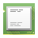</a> | **📂 檔名:** `okteta.svg` ✨ **格式:** `Vector (SVG)` ⚖️ **大小:** `3.00KB` 📅 **更新:** `2026-03-03`  🚀 **jsDelivr Markdown:** `` 🔗 **直接連結 (Url):** <code>https://cdn.jsdelivr.net/gh/barry028/materials@main/images/iCons/Pixel/Breeze/Apps%20/48/okteta.svg</code> 📥 [檢視原始檔](okteta.svg) |
| <a href="okular.svg">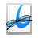</a> | **📂 檔名:** `okular.svg` ✨ **格式:** `Vector (SVG)` ⚖️ **大小:** `18.96KB` 📅 **更新:** `2026-03-03`  🚀 **jsDelivr Markdown:** `` 🔗 **直接連結 (Url):** <code>https://cdn.jsdelivr.net/gh/barry028/materials@main/images/iCons/Pixel/Breeze/Apps%20/48/okular.svg</code> 📥 [檢視原始檔](okular.svg) |
|  | **📂 檔名:** `openbravo-erp.svg` ✨ **格式:** `Vector (SVG)` ⚖️ **大小:** `2.35KB` 📅 **更新:** `2026-03-03`  🚀 **jsDelivr Markdown:** `` 🔗 **直接連結 (Url):** <code>https://cdn.jsdelivr.net/gh/barry028/materials@main/images/iCons/Pixel/Breeze/Apps%20/48/openbravo-erp.svg</code> 📥 [檢視原始檔](openbravo-erp.svg) |
|  | **📂 檔名:** `org.fedoraproject.AnacondaInstaller.svg` ✨ **格式:** `Vector (SVG)` ⚖️ **大小:** `3.62KB` 📅 **更新:** `2026-03-03`  🚀 **jsDelivr Markdown:** `` 🔗 **直接連結 (Url):** <code>https://cdn.jsdelivr.net/gh/barry028/materials@main/images/iCons/Pixel/Breeze/Apps%20/48/org.fedoraproject.AnacondaInstaller.svg</code> 📥 [檢視原始檔](org.fedoraproject.AnacondaInstaller.svg) |
|  | **📂 檔名:** `org.gajim.Gajim.svg` ✨ **格式:** `Vector (SVG)` ⚖️ **大小:** `2.72KB` 📅 **更新:** `2026-03-03`  🚀 **jsDelivr Markdown:** `` 🔗 **直接連結 (Url):** <code>https://cdn.jsdelivr.net/gh/barry028/materials@main/images/iCons/Pixel/Breeze/Apps%20/48/org.gajim.Gajim.svg</code> 📥 [檢視原始檔](org.gajim.Gajim.svg) |
|  | **📂 檔名:** `org.kde.Ikona.svg` ✨ **格式:** `Vector (SVG)` ⚖️ **大小:** `11.18KB` 📅 **更新:** `2026-03-03`  🚀 **jsDelivr Markdown:** `` 🔗 **直接連結 (Url):** <code>https://cdn.jsdelivr.net/gh/barry028/materials@main/images/iCons/Pixel/Breeze/Apps%20/48/org.kde.Ikona.svg</code> 📥 [檢視原始檔](org.kde.Ikona.svg) |
|  | **📂 檔名:** `org.kde.kongress.svg` ✨ **格式:** `Vector (SVG)` ⚖️ **大小:** `5.80KB` 📅 **更新:** `2026-03-03`  🚀 **jsDelivr Markdown:** `` 🔗 **直接連結 (Url):** <code>https://cdn.jsdelivr.net/gh/barry028/materials@main/images/iCons/Pixel/Breeze/Apps%20/48/org.kde.kongress.svg</code> 📥 [檢視原始檔](org.kde.kongress.svg) |
|  | **📂 檔名:** `org.kde.kontrast.svg` ✨ **格式:** `Vector (SVG)` ⚖️ **大小:** `1.96KB` 📅 **更新:** `2026-03-03`  🚀 **jsDelivr Markdown:** `` 🔗 **直接連結 (Url):** <code>https://cdn.jsdelivr.net/gh/barry028/materials@main/images/iCons/Pixel/Breeze/Apps%20/48/org.kde.kontrast.svg</code> 📥 [檢視原始檔](org.kde.kontrast.svg) |
|  | **📂 檔名:** `org.kde.neochat.svg` ✨ **格式:** `Vector (SVG)` ⚖️ **大小:** `3.12KB` 📅 **更新:** `2026-03-03`  🚀 **jsDelivr Markdown:** `` 🔗 **直接連結 (Url):** <code>https://cdn.jsdelivr.net/gh/barry028/materials@main/images/iCons/Pixel/Breeze/Apps%20/48/org.kde.neochat.svg</code> 📥 [檢視原始檔](org.kde.neochat.svg) |
| <a href="parley.svg">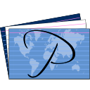</a> | **📂 檔名:** `parley.svg` ✨ **格式:** `Vector (SVG)` ⚖️ **大小:** `78.83KB` 📅 **更新:** `2026-03-03`  🚀 **jsDelivr Markdown:** `` 🔗 **直接連結 (Url):** <code>https://cdn.jsdelivr.net/gh/barry028/materials@main/images/iCons/Pixel/Breeze/Apps%20/48/parley.svg</code> 📥 [檢視原始檔](parley.svg) |
|  | **📂 檔名:** `partitionmanager.svg` ✨ **格式:** `Vector (SVG)` ⚖️ **大小:** `9.26KB` 📅 **更新:** `2026-03-03`  🚀 **jsDelivr Markdown:** `` 🔗 **直接連結 (Url):** <code>https://cdn.jsdelivr.net/gh/barry028/materials@main/images/iCons/Pixel/Breeze/Apps%20/48/partitionmanager.svg</code> 📥 [檢視原始檔](partitionmanager.svg) |
|  | **📂 檔名:** `phonon-gstreamer.svg` ✨ **格式:** `Vector (SVG)` ⚖️ **大小:** `3.32KB` 📅 **更新:** `2026-03-03`  🚀 **jsDelivr Markdown:** `` 🔗 **直接連結 (Url):** <code>https://cdn.jsdelivr.net/gh/barry028/materials@main/images/iCons/Pixel/Breeze/Apps%20/48/phonon-gstreamer.svg</code> 📥 [檢視原始檔](phonon-gstreamer.svg) |
|  | **📂 檔名:** `photolayoutseditor.svg` ✨ **格式:** `Vector (SVG)` ⚖️ **大小:** `1.66KB` 📅 **更新:** `2026-03-03`  🚀 **jsDelivr Markdown:** `` 🔗 **直接連結 (Url):** <code>https://cdn.jsdelivr.net/gh/barry028/materials@main/images/iCons/Pixel/Breeze/Apps%20/48/photolayoutseditor.svg</code> 📥 [檢視原始檔](photolayoutseditor.svg) |
|  | **📂 檔名:** `picmi.svg` ✨ **格式:** `Vector (SVG)` ⚖️ **大小:** `6.44KB` 📅 **更新:** `2026-03-03`  🚀 **jsDelivr Markdown:** `` 🔗 **直接連結 (Url):** <code>https://cdn.jsdelivr.net/gh/barry028/materials@main/images/iCons/Pixel/Breeze/Apps%20/48/picmi.svg</code> 📥 [檢視原始檔](picmi.svg) |
|  | **📂 檔名:** `plan.svg` ✨ **格式:** `Vector (SVG)` ⚖️ **大小:** `2.70KB` 📅 **更新:** `2026-03-03`  🚀 **jsDelivr Markdown:** `` 🔗 **直接連結 (Url):** <code>https://cdn.jsdelivr.net/gh/barry028/materials@main/images/iCons/Pixel/Breeze/Apps%20/48/plan.svg</code> 📥 [檢視原始檔](plan.svg) |
|  | **📂 檔名:** `planetkde.svg` ✨ **格式:** `Vector (SVG)` ⚖️ **大小:** `3.00KB` 📅 **更新:** `2026-03-03`  🚀 **jsDelivr Markdown:** `` 🔗 **直接連結 (Url):** <code>https://cdn.jsdelivr.net/gh/barry028/materials@main/images/iCons/Pixel/Breeze/Apps%20/48/planetkde.svg</code> 📥 [檢視原始檔](planetkde.svg) |
|  | **📂 檔名:** `plank.svg` ✨ **格式:** `Vector (SVG)` ⚖️ **大小:** `2.35KB` 📅 **更新:** `2026-03-03`  🚀 **jsDelivr Markdown:** `` 🔗 **直接連結 (Url):** <code>https://cdn.jsdelivr.net/gh/barry028/materials@main/images/iCons/Pixel/Breeze/Apps%20/48/plank.svg</code> 📥 [檢視原始檔](plank.svg) |
|  | **📂 檔名:** `planwork.svg` ✨ **格式:** `Vector (SVG)` ⚖️ **大小:** `2.70KB` 📅 **更新:** `2026-03-03`  🚀 **jsDelivr Markdown:** `` 🔗 **直接連結 (Url):** <code>https://cdn.jsdelivr.net/gh/barry028/materials@main/images/iCons/Pixel/Breeze/Apps%20/48/planwork.svg</code> 📥 [檢視原始檔](planwork.svg) |
|  | **📂 檔名:** `plasma-media-center.svg` ✨ **格式:** `Vector (SVG)` ⚖️ **大小:** `3.71KB` 📅 **更新:** `2026-03-03`  🚀 **jsDelivr Markdown:** `` 🔗 **直接連結 (Url):** <code>https://cdn.jsdelivr.net/gh/barry028/materials@main/images/iCons/Pixel/Breeze/Apps%20/48/plasma-media-center.svg</code> 📥 [檢視原始檔](plasma-media-center.svg) |
|  | **📂 檔名:** `plasma-mobile-phone.svg` ✨ **格式:** `Vector (SVG)` ⚖️ **大小:** `1.99KB` 📅 **更新:** `2026-03-03`  🚀 **jsDelivr Markdown:** `` 🔗 **直接連結 (Url):** <code>https://cdn.jsdelivr.net/gh/barry028/materials@main/images/iCons/Pixel/Breeze/Apps%20/48/plasma-mobile-phone.svg</code> 📥 [檢視原始檔](plasma-mobile-phone.svg) |
|  | **📂 檔名:** `plasma-nano.svg` ✨ **格式:** `Vector (SVG)` ⚖️ **大小:** `4.53KB` 📅 **更新:** `2026-03-03`  🚀 **jsDelivr Markdown:** `` 🔗 **直接連結 (Url):** <code>https://cdn.jsdelivr.net/gh/barry028/materials@main/images/iCons/Pixel/Breeze/Apps%20/48/plasma-nano.svg</code> 📥 [檢視原始檔](plasma-nano.svg) |
|  | **📂 檔名:** `plasmavault.svg` ✨ **格式:** `Vector (SVG)` ⚖️ **大小:** `14.49KB` 📅 **更新:** `2026-03-03`  🚀 **jsDelivr Markdown:** `` 🔗 **直接連結 (Url):** <code>https://cdn.jsdelivr.net/gh/barry028/materials@main/images/iCons/Pixel/Breeze/Apps%20/48/plasmavault.svg</code> 📥 [檢視原始檔](plasmavault.svg) |
|  | **📂 檔名:** `preferences-desktop-font-installer.svg` ✨ **格式:** `Vector (SVG)` ⚖️ **大小:** `2.37KB` 📅 **更新:** `2026-03-03`  🚀 **jsDelivr Markdown:** `` 🔗 **直接連結 (Url):** <code>https://cdn.jsdelivr.net/gh/barry028/materials@main/images/iCons/Pixel/Breeze/Apps%20/48/preferences-desktop-font-installer.svg</code> 📥 [檢視原始檔](preferences-desktop-font-installer.svg) |
|  | **📂 檔名:** `puremaps.svg` ✨ **格式:** `Vector (SVG)` ⚖️ **大小:** `10.69KB` 📅 **更新:** `2026-03-03`  🚀 **jsDelivr Markdown:** `` 🔗 **直接連結 (Url):** <code>https://cdn.jsdelivr.net/gh/barry028/materials@main/images/iCons/Pixel/Breeze/Apps%20/48/puremaps.svg</code> 📥 [檢視原始檔](puremaps.svg) |
|  | **📂 檔名:** `pythonbackend.svg` ✨ **格式:** `Vector (SVG)` ⚖️ **大小:** `26.51KB` 📅 **更新:** `2026-03-03`  🚀 **jsDelivr Markdown:** `` 🔗 **直接連結 (Url):** <code>https://cdn.jsdelivr.net/gh/barry028/materials@main/images/iCons/Pixel/Breeze/Apps%20/48/pythonbackend.svg</code> 📥 [檢視原始檔](pythonbackend.svg) |
|  | **📂 檔名:** `q4wine.svg` ✨ **格式:** `Vector (SVG)` ⚖️ **大小:** `22.59KB` 📅 **更新:** `2026-03-03`  🚀 **jsDelivr Markdown:** `` 🔗 **直接連結 (Url):** <code>https://cdn.jsdelivr.net/gh/barry028/materials@main/images/iCons/Pixel/Breeze/Apps%20/48/q4wine.svg</code> 📥 [檢視原始檔](q4wine.svg) |
| <a href="qalculate.svg">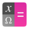</a> | **📂 檔名:** `qalculate.svg` ✨ **格式:** `Vector (SVG)` ⚖️ **大小:** `11.18KB` 📅 **更新:** `2026-03-03`  🚀 **jsDelivr Markdown:** `` 🔗 **直接連結 (Url):** <code>https://cdn.jsdelivr.net/gh/barry028/materials@main/images/iCons/Pixel/Breeze/Apps%20/48/qalculate.svg</code> 📥 [檢視原始檔](qalculate.svg) |
|  | **📂 檔名:** `qbittorrent.svg` ✨ **格式:** `Vector (SVG)` ⚖️ **大小:** `2.05KB` 📅 **更新:** `2026-03-03`  🚀 **jsDelivr Markdown:** `` 🔗 **直接連結 (Url):** <code>https://cdn.jsdelivr.net/gh/barry028/materials@main/images/iCons/Pixel/Breeze/Apps%20/48/qbittorrent.svg</code> 📥 [檢視原始檔](qbittorrent.svg) |
|  | **📂 檔名:** `qdbusviewer.svg` ✨ **格式:** `Vector (SVG)` ⚖️ **大小:** `3.33KB` 📅 **更新:** `2026-03-03`  🚀 **jsDelivr Markdown:** `` 🔗 **直接連結 (Url):** <code>https://cdn.jsdelivr.net/gh/barry028/materials@main/images/iCons/Pixel/Breeze/Apps%20/48/qdbusviewer.svg</code> 📥 [檢視原始檔](qdbusviewer.svg) |
|  | **📂 檔名:** `qelectrotech.svg` ✨ **格式:** `Vector (SVG)` ⚖️ **大小:** `2.37KB` 📅 **更新:** `2026-03-03`  🚀 **jsDelivr Markdown:** `` 🔗 **直接連結 (Url):** <code>https://cdn.jsdelivr.net/gh/barry028/materials@main/images/iCons/Pixel/Breeze/Apps%20/48/qelectrotech.svg</code> 📥 [檢視原始檔](qelectrotech.svg) |
|  | **📂 檔名:** `qtcreator.svg` ✨ **格式:** `Vector (SVG)` ⚖️ **大小:** `3.04KB` 📅 **更新:** `2026-03-03`  🚀 **jsDelivr Markdown:** `` 🔗 **直接連結 (Url):** <code>https://cdn.jsdelivr.net/gh/barry028/materials@main/images/iCons/Pixel/Breeze/Apps%20/48/qtcreator.svg</code> 📥 [檢視原始檔](qtcreator.svg) |
|  | **📂 檔名:** `quassel.svg` ✨ **格式:** `Vector (SVG)` ⚖️ **大小:** `1.96KB` 📅 **更新:** `2026-03-03`  🚀 **jsDelivr Markdown:** `` 🔗 **直接連結 (Url):** <code>https://cdn.jsdelivr.net/gh/barry028/materials@main/images/iCons/Pixel/Breeze/Apps%20/48/quassel.svg</code> 📥 [檢視原始檔](quassel.svg) |
|  | **📂 檔名:** `quiterss.svg` ✨ **格式:** `Vector (SVG)` ⚖️ **大小:** `2.92KB` 📅 **更新:** `2026-03-03`  🚀 **jsDelivr Markdown:** `` 🔗 **直接連結 (Url):** <code>https://cdn.jsdelivr.net/gh/barry028/materials@main/images/iCons/Pixel/Breeze/Apps%20/48/quiterss.svg</code> 📥 [檢視原始檔](quiterss.svg) |
|  | **📂 檔名:** `qupzilla.svg` ✨ **格式:** `Vector (SVG)` ⚖️ **大小:** `2.13KB` 📅 **更新:** `2026-03-03`  🚀 **jsDelivr Markdown:** `` 🔗 **直接連結 (Url):** <code>https://cdn.jsdelivr.net/gh/barry028/materials@main/images/iCons/Pixel/Breeze/Apps%20/48/qupzilla.svg</code> 📥 [檢視原始檔](qupzilla.svg) |
|  | **📂 檔名:** `r.svg` ✨ **格式:** `Vector (SVG)` ⚖️ **大小:** `8.18KB` 📅 **更新:** `2026-03-03`  🚀 **jsDelivr Markdown:** `` 🔗 **直接連結 (Url):** <code>https://cdn.jsdelivr.net/gh/barry028/materials@main/images/iCons/Pixel/Breeze/Apps%20/48/r.svg</code> 📥 [檢視原始檔](r.svg) |
|  | **📂 檔名:** `rekonq.svg` ✨ **格式:** `Vector (SVG)` ⚖️ **大小:** `7.46KB` 📅 **更新:** `2026-03-03`  🚀 **jsDelivr Markdown:** `` 🔗 **直接連結 (Url):** <code>https://cdn.jsdelivr.net/gh/barry028/materials@main/images/iCons/Pixel/Breeze/Apps%20/48/rekonq.svg</code> 📥 [檢視原始檔](rekonq.svg) |
|  | **📂 檔名:** `ring.svg` ✨ **格式:** `Vector (SVG)` ⚖️ **大小:** `2.89KB` 📅 **更新:** `2026-03-03`  🚀 **jsDelivr Markdown:** `` 🔗 **直接連結 (Url):** <code>https://cdn.jsdelivr.net/gh/barry028/materials@main/images/iCons/Pixel/Breeze/Apps%20/48/ring.svg</code> 📥 [檢視原始檔](ring.svg) |
| <a href="rocs.svg">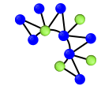</a> | **📂 檔名:** `rocs.svg` ✨ **格式:** `Vector (SVG)` ⚖️ **大小:** `200.85KB` 📅 **更新:** `2026-03-03`  🚀 **jsDelivr Markdown:** `` 🔗 **直接連結 (Url):** <code>https://cdn.jsdelivr.net/gh/barry028/materials@main/images/iCons/Pixel/Breeze/Apps%20/48/rocs.svg</code> 📥 [檢視原始檔](rocs.svg) |
|  | **📂 檔名:** `rosegarden.svg` ✨ **格式:** `Vector (SVG)` ⚖️ **大小:** `8.39KB` 📅 **更新:** `2026-03-03`  🚀 **jsDelivr Markdown:** `` 🔗 **直接連結 (Url):** <code>https://cdn.jsdelivr.net/gh/barry028/materials@main/images/iCons/Pixel/Breeze/Apps%20/48/rosegarden.svg</code> 📥 [檢視原始檔](rosegarden.svg) |
|  | **📂 檔名:** `sage-notebook.svg` ✨ **格式:** `Vector (SVG)` ⚖️ **大小:** `6.63KB` 📅 **更新:** `2026-03-03`  🚀 **jsDelivr Markdown:** `` 🔗 **直接連結 (Url):** <code>https://cdn.jsdelivr.net/gh/barry028/materials@main/images/iCons/Pixel/Breeze/Apps%20/48/sage-notebook.svg</code> 📥 [檢視原始檔](sage-notebook.svg) |
|  | **📂 檔名:** `sagebackend.svg` ✨ **格式:** `Vector (SVG)` ⚖️ **大小:** `9.74KB` 📅 **更新:** `2026-03-03`  🚀 **jsDelivr Markdown:** `` 🔗 **直接連結 (Url):** <code>https://cdn.jsdelivr.net/gh/barry028/materials@main/images/iCons/Pixel/Breeze/Apps%20/48/sagebackend.svg</code> 📥 [檢視原始檔](sagebackend.svg) |
|  | **📂 檔名:** `scribus.svg` ✨ **格式:** `Vector (SVG)` ⚖️ **大小:** `6.22KB` 📅 **更新:** `2026-03-03`  🚀 **jsDelivr Markdown:** `` 🔗 **直接連結 (Url):** <code>https://cdn.jsdelivr.net/gh/barry028/materials@main/images/iCons/Pixel/Breeze/Apps%20/48/scribus.svg</code> 📥 [檢視原始檔](scribus.svg) |
|  | **📂 檔名:** `sheets.svg` ✨ **格式:** `Vector (SVG)` ⚖️ **大小:** `4.30KB` 📅 **更新:** `2026-03-03`  🚀 **jsDelivr Markdown:** `` 🔗 **直接連結 (Url):** <code>https://cdn.jsdelivr.net/gh/barry028/materials@main/images/iCons/Pixel/Breeze/Apps%20/48/sheets.svg</code> 📥 [檢視原始檔](sheets.svg) |
|  | **📂 檔名:** `showfoto.svg` ✨ **格式:** `Vector (SVG)` ⚖️ **大小:** `3.67KB` 📅 **更新:** `2026-03-03`  🚀 **jsDelivr Markdown:** `` 🔗 **直接連結 (Url):** <code>https://cdn.jsdelivr.net/gh/barry028/materials@main/images/iCons/Pixel/Breeze/Apps%20/48/showfoto.svg</code> 📥 [檢視原始檔](showfoto.svg) |
|  | **📂 檔名:** `skanlite.svg` ✨ **格式:** `Vector (SVG)` ⚖️ **大小:** `3.31KB` 📅 **更新:** `2026-03-03`  🚀 **jsDelivr Markdown:** `` 🔗 **直接連結 (Url):** <code>https://cdn.jsdelivr.net/gh/barry028/materials@main/images/iCons/Pixel/Breeze/Apps%20/48/skanlite.svg</code> 📥 [檢視原始檔](skanlite.svg) |
|  | **📂 檔名:** `skanpage.svg` ✨ **格式:** `Vector (SVG)` ⚖️ **大小:** `3.33KB` 📅 **更新:** `2026-03-03`  🚀 **jsDelivr Markdown:** `` 🔗 **直接連結 (Url):** <code>https://cdn.jsdelivr.net/gh/barry028/materials@main/images/iCons/Pixel/Breeze/Apps%20/48/skanpage.svg</code> 📥 [檢視原始檔](skanpage.svg) |
|  | **📂 檔名:** `skrooge-black.svg` ✨ **格式:** `Vector (SVG)` ⚖️ **大小:** `4.10KB` 📅 **更新:** `2026-03-03`  🚀 **jsDelivr Markdown:** `` 🔗 **直接連結 (Url):** <code>https://cdn.jsdelivr.net/gh/barry028/materials@main/images/iCons/Pixel/Breeze/Apps%20/48/skrooge-black.svg</code> 📥 [檢視原始檔](skrooge-black.svg) |
|  | **📂 檔名:** `skrooge.svg` ✨ **格式:** `Vector (SVG)` ⚖️ **大小:** `4.19KB` 📅 **更新:** `2026-03-03`  🚀 **jsDelivr Markdown:** `` 🔗 **直接連結 (Url):** <code>https://cdn.jsdelivr.net/gh/barry028/materials@main/images/iCons/Pixel/Breeze/Apps%20/48/skrooge.svg</code> 📥 [檢視原始檔](skrooge.svg) |
|  | **📂 檔名:** `smartgit.svg` ✨ **格式:** `Vector (SVG)` ⚖️ **大小:** `1.62KB` 📅 **更新:** `2026-03-03`  🚀 **jsDelivr Markdown:** `` 🔗 **直接連結 (Url):** <code>https://cdn.jsdelivr.net/gh/barry028/materials@main/images/iCons/Pixel/Breeze/Apps%20/48/smartgit.svg</code> 📥 [檢視原始檔](smartgit.svg) |
|  | **📂 檔名:** `smb4k.svg` ✨ **格式:** `Vector (SVG)` ⚖️ **大小:** `19.27KB` 📅 **更新:** `2026-03-03`  🚀 **jsDelivr Markdown:** `` 🔗 **直接連結 (Url):** <code>https://cdn.jsdelivr.net/gh/barry028/materials@main/images/iCons/Pixel/Breeze/Apps%20/48/smb4k.svg</code> 📥 [檢視原始檔](smb4k.svg) |
|  | **📂 檔名:** `smplayer.svg` ✨ **格式:** `Vector (SVG)` ⚖️ **大小:** `5.54KB` 📅 **更新:** `2026-03-03`  🚀 **jsDelivr Markdown:** `` 🔗 **直接連結 (Url):** <code>https://cdn.jsdelivr.net/gh/barry028/materials@main/images/iCons/Pixel/Breeze/Apps%20/48/smplayer.svg</code> 📥 [檢視原始檔](smplayer.svg) |
|  | **📂 檔名:** `smtube.svg` ✨ **格式:** `Vector (SVG)` ⚖️ **大小:** `6.40KB` 📅 **更新:** `2026-03-03`  🚀 **jsDelivr Markdown:** `` 🔗 **直接連結 (Url):** <code>https://cdn.jsdelivr.net/gh/barry028/materials@main/images/iCons/Pixel/Breeze/Apps%20/48/smtube.svg</code> 📥 [檢視原始檔](smtube.svg) |
|  | **📂 檔名:** `stage.svg` ✨ **格式:** `Vector (SVG)` ⚖️ **大小:** `2.29KB` 📅 **更新:** `2026-03-03`  🚀 **jsDelivr Markdown:** `` 🔗 **直接連結 (Url):** <code>https://cdn.jsdelivr.net/gh/barry028/materials@main/images/iCons/Pixel/Breeze/Apps%20/48/stage.svg</code> 📥 [檢視原始檔](stage.svg) |
|  | **📂 檔名:** `steam.svg` ✨ **格式:** `Vector (SVG)` ⚖️ **大小:** `7.29KB` 📅 **更新:** `2026-03-03`  🚀 **jsDelivr Markdown:** `` 🔗 **直接連結 (Url):** <code>https://cdn.jsdelivr.net/gh/barry028/materials@main/images/iCons/Pixel/Breeze/Apps%20/48/steam.svg</code> 📥 [檢視原始檔](steam.svg) |
|  | **📂 檔名:** `step.svg` ✨ **格式:** `Vector (SVG)` ⚖️ **大小:** `3.61KB` 📅 **更新:** `2026-03-03`  🚀 **jsDelivr Markdown:** `` 🔗 **直接連結 (Url):** <code>https://cdn.jsdelivr.net/gh/barry028/materials@main/images/iCons/Pixel/Breeze/Apps%20/48/step.svg</code> 📥 [檢視原始檔](step.svg) |
|  | **📂 檔名:** `sublime-merge.svg` ✨ **格式:** `Vector (SVG)` ⚖️ **大小:** `1.64KB` 📅 **更新:** `2026-03-03`  🚀 **jsDelivr Markdown:** `` 🔗 **直接連結 (Url):** <code>https://cdn.jsdelivr.net/gh/barry028/materials@main/images/iCons/Pixel/Breeze/Apps%20/48/sublime-merge.svg</code> 📥 [檢視原始檔](sublime-merge.svg) |
|  | **📂 檔名:** `sublime-text.svg` ✨ **格式:** `Vector (SVG)` ⚖️ **大小:** `1.57KB` 📅 **更新:** `2026-03-03`  🚀 **jsDelivr Markdown:** `` 🔗 **直接連結 (Url):** <code>https://cdn.jsdelivr.net/gh/barry028/materials@main/images/iCons/Pixel/Breeze/Apps%20/48/sublime-text.svg</code> 📥 [檢視原始檔](sublime-text.svg) |
|  | **📂 檔名:** `subtitlecomposer.svg` ✨ **格式:** `Vector (SVG)` ⚖️ **大小:** `13.90KB` 📅 **更新:** `2026-03-03`  🚀 **jsDelivr Markdown:** `` 🔗 **直接連結 (Url):** <code>https://cdn.jsdelivr.net/gh/barry028/materials@main/images/iCons/Pixel/Breeze/Apps%20/48/subtitlecomposer.svg</code> 📥 [檢視原始檔](subtitlecomposer.svg) |
|  | **📂 檔名:** `sweeper.svg` ✨ **格式:** `Vector (SVG)` ⚖️ **大小:** `5.75KB` 📅 **更新:** `2026-03-03`  🚀 **jsDelivr Markdown:** `` 🔗 **直接連結 (Url):** <code>https://cdn.jsdelivr.net/gh/barry028/materials@main/images/iCons/Pixel/Breeze/Apps%20/48/sweeper.svg</code> 📥 [檢視原始檔](sweeper.svg) |
|  | **📂 檔名:** `symboleditor.svg` ✨ **格式:** `Vector (SVG)` ⚖️ **大小:** `1.32KB` 📅 **更新:** `2026-03-03`  🚀 **jsDelivr Markdown:** `` 🔗 **直接連結 (Url):** <code>https://cdn.jsdelivr.net/gh/barry028/materials@main/images/iCons/Pixel/Breeze/Apps%20/48/symboleditor.svg</code> 📥 [檢視原始檔](symboleditor.svg) |
|  | **📂 檔名:** `syncthing.svg` ✨ **格式:** `Vector (SVG)` ⚖️ **大小:** `6.58KB` 📅 **更新:** `2026-03-03`  🚀 **jsDelivr Markdown:** `` 🔗 **直接連結 (Url):** <code>https://cdn.jsdelivr.net/gh/barry028/materials@main/images/iCons/Pixel/Breeze/Apps%20/48/syncthing.svg</code> 📥 [檢視原始檔](syncthing.svg) |
|  | **📂 檔名:** `synfig_icon.svg` ✨ **格式:** `Vector (SVG)` ⚖️ **大小:** `5.16KB` 📅 **更新:** `2026-03-03`  🚀 **jsDelivr Markdown:** `` 🔗 **直接連結 (Url):** <code>https://cdn.jsdelivr.net/gh/barry028/materials@main/images/iCons/Pixel/Breeze/Apps%20/48/synfig_icon.svg</code> 📥 [檢視原始檔](synfig_icon.svg) |
|  | **📂 檔名:** `system-file-manager.svg` ✨ **格式:** `Vector (SVG)` ⚖️ **大小:** `8.27KB` 📅 **更新:** `2026-03-03`  🚀 **jsDelivr Markdown:** `` 🔗 **直接連結 (Url):** <code>https://cdn.jsdelivr.net/gh/barry028/materials@main/images/iCons/Pixel/Breeze/Apps%20/48/system-file-manager.svg</code> 📥 [檢視原始檔](system-file-manager.svg) |
|  | **📂 檔名:** `system-help.svg` ✨ **格式:** `Vector (SVG)` ⚖️ **大小:** `4.02KB` 📅 **更新:** `2026-03-03`  🚀 **jsDelivr Markdown:** `` 🔗 **直接連結 (Url):** <code>https://cdn.jsdelivr.net/gh/barry028/materials@main/images/iCons/Pixel/Breeze/Apps%20/48/system-help.svg</code> 📥 [檢視原始檔](system-help.svg) |
|  | **📂 檔名:** `system-run.svg` ✨ **格式:** `Vector (SVG)` ⚖️ **大小:** `5.07KB` 📅 **更新:** `2026-03-03`  🚀 **jsDelivr Markdown:** `` 🔗 **直接連結 (Url):** <code>https://cdn.jsdelivr.net/gh/barry028/materials@main/images/iCons/Pixel/Breeze/Apps%20/48/system-run.svg</code> 📥 [檢視原始檔](system-run.svg) |
|  | **📂 檔名:** `system-software-install.svg` ✨ **格式:** `Vector (SVG)` ⚖️ **大小:** `2.30KB` 📅 **更新:** `2026-03-03`  🚀 **jsDelivr Markdown:** `` 🔗 **直接連結 (Url):** <code>https://cdn.jsdelivr.net/gh/barry028/materials@main/images/iCons/Pixel/Breeze/Apps%20/48/system-software-install.svg</code> 📥 [檢視原始檔](system-software-install.svg) |
|  | **📂 檔名:** `system-software-update.svg` ✨ **格式:** `Vector (SVG)` ⚖️ **大小:** `2.19KB` 📅 **更新:** `2026-03-03`  🚀 **jsDelivr Markdown:** `` 🔗 **直接連結 (Url):** <code>https://cdn.jsdelivr.net/gh/barry028/materials@main/images/iCons/Pixel/Breeze/Apps%20/48/system-software-update.svg</code> 📥 [檢視原始檔](system-software-update.svg) |
|  | **📂 檔名:** `systemsettings.svg` ✨ **格式:** `Vector (SVG)` ⚖️ **大小:** `10.19KB` 📅 **更新:** `2026-03-03`  🚀 **jsDelivr Markdown:** `` 🔗 **直接連結 (Url):** <code>https://cdn.jsdelivr.net/gh/barry028/materials@main/images/iCons/Pixel/Breeze/Apps%20/48/systemsettings.svg</code> 📥 [檢視原始檔](systemsettings.svg) |
|  | **📂 檔名:** `teamviewer.svg` ✨ **格式:** `Vector (SVG)` ⚖️ **大小:** `2.46KB` 📅 **更新:** `2026-03-03`  🚀 **jsDelivr Markdown:** `` 🔗 **直接連結 (Url):** <code>https://cdn.jsdelivr.net/gh/barry028/materials@main/images/iCons/Pixel/Breeze/Apps%20/48/teamviewer.svg</code> 📥 [檢視原始檔](teamviewer.svg) |
|  | **📂 檔名:** `telegram.svg` ✨ **格式:** `Vector (SVG)` ⚖️ **大小:** `1.37KB` 📅 **更新:** `2026-03-03`  🚀 **jsDelivr Markdown:** `` 🔗 **直接連結 (Url):** <code>https://cdn.jsdelivr.net/gh/barry028/materials@main/images/iCons/Pixel/Breeze/Apps%20/48/telegram.svg</code> 📥 [檢視原始檔](telegram.svg) |
|  | **📂 檔名:** `telepathy-kde.svg` ✨ **格式:** `Vector (SVG)` ⚖️ **大小:** `2.16KB` 📅 **更新:** `2026-03-03`  🚀 **jsDelivr Markdown:** `` 🔗 **直接連結 (Url):** <code>https://cdn.jsdelivr.net/gh/barry028/materials@main/images/iCons/Pixel/Breeze/Apps%20/48/telepathy-kde.svg</code> 📥 [檢視原始檔](telepathy-kde.svg) |
|  | **📂 檔名:** `texstudio.svg` ✨ **格式:** `Vector (SVG)` ⚖️ **大小:** `11.65KB` 📅 **更新:** `2026-03-03`  🚀 **jsDelivr Markdown:** `` 🔗 **直接連結 (Url):** <code>https://cdn.jsdelivr.net/gh/barry028/materials@main/images/iCons/Pixel/Breeze/Apps%20/48/texstudio.svg</code> 📥 [檢視原始檔](texstudio.svg) |
|  | **📂 檔名:** `truecrypt.svg` ✨ **格式:** `Vector (SVG)` ⚖️ **大小:** `40.91KB` 📅 **更新:** `2026-03-03`  🚀 **jsDelivr Markdown:** `` 🔗 **直接連結 (Url):** <code>https://cdn.jsdelivr.net/gh/barry028/materials@main/images/iCons/Pixel/Breeze/Apps%20/48/truecrypt.svg</code> 📥 [檢視原始檔](truecrypt.svg) |
|  | **📂 檔名:** `ubiquity-kde.svg` ✨ **格式:** `Vector (SVG)` ⚖️ **大小:** `2.23KB` 📅 **更新:** `2026-03-03`  🚀 **jsDelivr Markdown:** `` 🔗 **直接連結 (Url):** <code>https://cdn.jsdelivr.net/gh/barry028/materials@main/images/iCons/Pixel/Breeze/Apps%20/48/ubiquity-kde.svg</code> 📥 [檢視原始檔](ubiquity-kde.svg) |
|  | **📂 檔名:** `ubiquity.svg` ✨ **格式:** `Vector (SVG)` ⚖️ **大小:** `2.23KB` 📅 **更新:** `2026-03-03`  🚀 **jsDelivr Markdown:** `` 🔗 **直接連結 (Url):** <code>https://cdn.jsdelivr.net/gh/barry028/materials@main/images/iCons/Pixel/Breeze/Apps%20/48/ubiquity.svg</code> 📥 [檢視原始檔](ubiquity.svg) |
| <a href="umbrello.svg">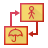</a> | **📂 檔名:** `umbrello.svg` ✨ **格式:** `Vector (SVG)` ⚖️ **大小:** `3.23KB` 📅 **更新:** `2026-03-03`  🚀 **jsDelivr Markdown:** `` 🔗 **直接連結 (Url):** <code>https://cdn.jsdelivr.net/gh/barry028/materials@main/images/iCons/Pixel/Breeze/Apps%20/48/umbrello.svg</code> 📥 [檢視原始檔](umbrello.svg) |
|  | **📂 檔名:** `unetbootin.svg` ✨ **格式:** `Vector (SVG)` ⚖️ **大小:** `1.88KB` 📅 **更新:** `2026-03-03`  🚀 **jsDelivr Markdown:** `` 🔗 **直接連結 (Url):** <code>https://cdn.jsdelivr.net/gh/barry028/materials@main/images/iCons/Pixel/Breeze/Apps%20/48/unetbootin.svg</code> 📥 [檢視原始檔](unetbootin.svg) |
|  | **📂 檔名:** `usb-creator-kde.svg` ✨ **格式:** `Vector (SVG)` ⚖️ **大小:** `2.18KB` 📅 **更新:** `2026-03-03`  🚀 **jsDelivr Markdown:** `` 🔗 **直接連結 (Url):** <code>https://cdn.jsdelivr.net/gh/barry028/materials@main/images/iCons/Pixel/Breeze/Apps%20/48/usb-creator-kde.svg</code> 📥 [檢視原始檔](usb-creator-kde.svg) |
|  | **📂 檔名:** `utilities-energy-monitor.svg` ✨ **格式:** `Vector (SVG)` ⚖️ **大小:** `2.62KB` 📅 **更新:** `2026-03-03`  🚀 **jsDelivr Markdown:** `` 🔗 **直接連結 (Url):** <code>https://cdn.jsdelivr.net/gh/barry028/materials@main/images/iCons/Pixel/Breeze/Apps%20/48/utilities-energy-monitor.svg</code> 📥 [檢視原始檔](utilities-energy-monitor.svg) |
| <a href="utilities-log-viewer.svg">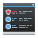</a> | **📂 檔名:** `utilities-log-viewer.svg` ✨ **格式:** `Vector (SVG)` ⚖️ **大小:** `3.52KB` 📅 **更新:** `2026-03-03`  🚀 **jsDelivr Markdown:** `` 🔗 **直接連結 (Url):** <code>https://cdn.jsdelivr.net/gh/barry028/materials@main/images/iCons/Pixel/Breeze/Apps%20/48/utilities-log-viewer.svg</code> 📥 [檢視原始檔](utilities-log-viewer.svg) |
|  | **📂 檔名:** `utilities-system-monitor.svg` ✨ **格式:** `Vector (SVG)` ⚖️ **大小:** `6.94KB` 📅 **更新:** `2026-03-03`  🚀 **jsDelivr Markdown:** `` 🔗 **直接連結 (Url):** <code>https://cdn.jsdelivr.net/gh/barry028/materials@main/images/iCons/Pixel/Breeze/Apps%20/48/utilities-system-monitor.svg</code> 📥 [檢視原始檔](utilities-system-monitor.svg) |
|  | **📂 檔名:** `utilities-terminal.svg` ✨ **格式:** `Vector (SVG)` ⚖️ **大小:** `1.70KB` 📅 **更新:** `2026-03-03`  🚀 **jsDelivr Markdown:** `` 🔗 **直接連結 (Url):** <code>https://cdn.jsdelivr.net/gh/barry028/materials@main/images/iCons/Pixel/Breeze/Apps%20/48/utilities-terminal.svg</code> 📥 [檢視原始檔](utilities-terminal.svg) |
|  | **📂 檔名:** `veracrypt.svg` ✨ **格式:** `Vector (SVG)` ⚖️ **大小:** `18.94KB` 📅 **更新:** `2026-03-03`  🚀 **jsDelivr Markdown:** `` 🔗 **直接連結 (Url):** <code>https://cdn.jsdelivr.net/gh/barry028/materials@main/images/iCons/Pixel/Breeze/Apps%20/48/veracrypt.svg</code> 📥 [檢視原始檔](veracrypt.svg) |
|  | **📂 檔名:** `viber.svg` ✨ **格式:** `Vector (SVG)` ⚖️ **大小:** `5.77KB` 📅 **更新:** `2026-03-03`  🚀 **jsDelivr Markdown:** `` 🔗 **直接連結 (Url):** <code>https://cdn.jsdelivr.net/gh/barry028/materials@main/images/iCons/Pixel/Breeze/Apps%20/48/viber.svg</code> 📥 [檢視原始檔](viber.svg) |
|  | **📂 檔名:** `virt-manager.svg` ✨ **格式:** `Vector (SVG)` ⚖️ **大小:** `2.59KB` 📅 **更新:** `2026-03-03`  🚀 **jsDelivr Markdown:** `` 🔗 **直接連結 (Url):** <code>https://cdn.jsdelivr.net/gh/barry028/materials@main/images/iCons/Pixel/Breeze/Apps%20/48/virt-manager.svg</code> 📥 [檢視原始檔](virt-manager.svg) |
|  | **📂 檔名:** `virtualbox.svg` ✨ **格式:** `Vector (SVG)` ⚖️ **大小:** `7.66KB` 📅 **更新:** `2026-03-03`  🚀 **jsDelivr Markdown:** `` 🔗 **直接連結 (Url):** <code>https://cdn.jsdelivr.net/gh/barry028/materials@main/images/iCons/Pixel/Breeze/Apps%20/48/virtualbox.svg</code> 📥 [檢視原始檔](virtualbox.svg) |
|  | **📂 檔名:** `vlc.svg` ✨ **格式:** `Vector (SVG)` ⚖️ **大小:** `2.56KB` 📅 **更新:** `2026-03-03`  🚀 **jsDelivr Markdown:** `` 🔗 **直接連結 (Url):** <code>https://cdn.jsdelivr.net/gh/barry028/materials@main/images/iCons/Pixel/Breeze/Apps%20/48/vlc.svg</code> 📥 [檢視原始檔](vlc.svg) |
|  | **📂 檔名:** `vokoscreen.svg` ✨ **格式:** `Vector (SVG)` ⚖️ **大小:** `2.85KB` 📅 **更新:** `2026-03-03`  🚀 **jsDelivr Markdown:** `` 🔗 **直接連結 (Url):** <code>https://cdn.jsdelivr.net/gh/barry028/materials@main/images/iCons/Pixel/Breeze/Apps%20/48/vokoscreen.svg</code> 📥 [檢視原始檔](vokoscreen.svg) |
|  | **📂 檔名:** `vvave.svg` ✨ **格式:** `Vector (SVG)` ⚖️ **大小:** `4.34KB` 📅 **更新:** `2026-03-03`  🚀 **jsDelivr Markdown:** `` 🔗 **直接連結 (Url):** <code>https://cdn.jsdelivr.net/gh/barry028/materials@main/images/iCons/Pixel/Breeze/Apps%20/48/vvave.svg</code> 📥 [檢視原始檔](vvave.svg) |
|  | **📂 檔名:** `wayland.svg` ✨ **格式:** `Vector (SVG)` ⚖️ **大小:** `7.59KB` 📅 **更新:** `2026-03-03`  🚀 **jsDelivr Markdown:** `` 🔗 **直接連結 (Url):** <code>https://cdn.jsdelivr.net/gh/barry028/materials@main/images/iCons/Pixel/Breeze/Apps%20/48/wayland.svg</code> 📥 [檢視原始檔](wayland.svg) |
|  | **📂 檔名:** `wine.svg` ✨ **格式:** `Vector (SVG)` ⚖️ **大小:** `26.99KB` 📅 **更新:** `2026-03-03`  🚀 **jsDelivr Markdown:** `` 🔗 **直接連結 (Url):** <code>https://cdn.jsdelivr.net/gh/barry028/materials@main/images/iCons/Pixel/Breeze/Apps%20/48/wine.svg</code> 📥 [檢視原始檔](wine.svg) |
|  | **📂 檔名:** `words.svg` ✨ **格式:** `Vector (SVG)` ⚖️ **大小:** `3.09KB` 📅 **更新:** `2026-03-03`  🚀 **jsDelivr Markdown:** `` 🔗 **直接連結 (Url):** <code>https://cdn.jsdelivr.net/gh/barry028/materials@main/images/iCons/Pixel/Breeze/Apps%20/48/words.svg</code> 📥 [檢視原始檔](words.svg) |
|  | **📂 檔名:** `xchat.svg` ✨ **格式:** `Vector (SVG)` ⚖️ **大小:** `995.00B` 📅 **更新:** `2026-03-03`  🚀 **jsDelivr Markdown:** `` 🔗 **直接連結 (Url):** <code>https://cdn.jsdelivr.net/gh/barry028/materials@main/images/iCons/Pixel/Breeze/Apps%20/48/xchat.svg</code> 📥 [檢視原始檔](xchat.svg) |
|  | **📂 檔名:** `xine.svg` ✨ **格式:** `Vector (SVG)` ⚖️ **大小:** `6.25KB` 📅 **更新:** `2026-03-03`  🚀 **jsDelivr Markdown:** `` 🔗 **直接連結 (Url):** <code>https://cdn.jsdelivr.net/gh/barry028/materials@main/images/iCons/Pixel/Breeze/Apps%20/48/xine.svg</code> 📥 [檢視原始檔](xine.svg) |
|  | **📂 檔名:** `xmind.svg` ✨ **格式:** `Vector (SVG)` ⚖️ **大小:** `4.45KB` 📅 **更新:** `2026-03-03`  🚀 **jsDelivr Markdown:** `` 🔗 **直接連結 (Url):** <code>https://cdn.jsdelivr.net/gh/barry028/materials@main/images/iCons/Pixel/Breeze/Apps%20/48/xmind.svg</code> 📥 [檢視原始檔](xmind.svg) |
|  | **📂 檔名:** `xorg.svg` ✨ **格式:** `Vector (SVG)` ⚖️ **大小:** `3.81KB` 📅 **更新:** `2026-03-03`  🚀 **jsDelivr Markdown:** `` 🔗 **直接連結 (Url):** <code>https://cdn.jsdelivr.net/gh/barry028/materials@main/images/iCons/Pixel/Breeze/Apps%20/48/xorg.svg</code> 📥 [檢視原始檔](xorg.svg) |
|  | **📂 檔名:** `xterm-color.svg` ✨ **格式:** `Vector (SVG)` ⚖️ **大小:** `1.52KB` 📅 **更新:** `2026-03-03`  🚀 **jsDelivr Markdown:** `` 🔗 **直接連結 (Url):** <code>https://cdn.jsdelivr.net/gh/barry028/materials@main/images/iCons/Pixel/Breeze/Apps%20/48/xterm-color.svg</code> 📥 [檢視原始檔](xterm-color.svg) |
|  | **📂 檔名:** `xterm.svg` ✨ **格式:** `Vector (SVG)` ⚖️ **大小:** `1.52KB` 📅 **更新:** `2026-03-03`  🚀 **jsDelivr Markdown:** `` 🔗 **直接連結 (Url):** <code>https://cdn.jsdelivr.net/gh/barry028/materials@main/images/iCons/Pixel/Breeze/Apps%20/48/xterm.svg</code> 📥 [檢視原始檔](xterm.svg) |
|  | **📂 檔名:** `yakuake.svg` ✨ **格式:** `Vector (SVG)` ⚖️ **大小:** `4.94KB` 📅 **更新:** `2026-03-03`  🚀 **jsDelivr Markdown:** `` 🔗 **直接連結 (Url):** <code>https://cdn.jsdelivr.net/gh/barry028/materials@main/images/iCons/Pixel/Breeze/Apps%20/48/yakuake.svg</code> 📥 [檢視原始檔](yakuake.svg) |
|  | **📂 檔名:** `yandex-browser.svg` ✨ **格式:** `Vector (SVG)` ⚖️ **大小:** `2.57KB` 📅 **更新:** `2026-03-03`  🚀 **jsDelivr Markdown:** `` 🔗 **直接連結 (Url):** <code>https://cdn.jsdelivr.net/gh/barry028/materials@main/images/iCons/Pixel/Breeze/Apps%20/48/yandex-browser.svg</code> 📥 [檢視原始檔](yandex-browser.svg) |
|  | **📂 檔名:** `yast-installation.svg` ✨ **格式:** `Vector (SVG)` ⚖️ **大小:** `2.23KB` 📅 **更新:** `2026-03-03`  🚀 **jsDelivr Markdown:** `` 🔗 **直接連結 (Url):** <code>https://cdn.jsdelivr.net/gh/barry028/materials@main/images/iCons/Pixel/Breeze/Apps%20/48/yast-installation.svg</code> 📥 [檢視原始檔](yast-installation.svg) |
|  | **📂 檔名:** `yast-sw_single.svg` ✨ **格式:** `Vector (SVG)` ⚖️ **大小:** `5.49KB` 📅 **更新:** `2026-03-03`  🚀 **jsDelivr Markdown:** `` 🔗 **直接連結 (Url):** <code>https://cdn.jsdelivr.net/gh/barry028/materials@main/images/iCons/Pixel/Breeze/Apps%20/48/yast-sw_single.svg</code> 📥 [檢視原始檔](yast-sw_single.svg) |
|  | **📂 檔名:** `yast-upgrade.svg` ✨ **格式:** `Vector (SVG)` ⚖️ **大小:** `2.26KB` 📅 **更新:** `2026-03-03`  🚀 **jsDelivr Markdown:** `` 🔗 **直接連結 (Url):** <code>https://cdn.jsdelivr.net/gh/barry028/materials@main/images/iCons/Pixel/Breeze/Apps%20/48/yast-upgrade.svg</code> 📥 [檢視原始檔](yast-upgrade.svg) |
|  | **📂 檔名:** `yast.svg` ✨ **格式:** `Vector (SVG)` ⚖️ **大小:** `12.12KB` 📅 **更新:** `2026-03-03`  🚀 **jsDelivr Markdown:** `` 🔗 **直接連結 (Url):** <code>https://cdn.jsdelivr.net/gh/barry028/materials@main/images/iCons/Pixel/Breeze/Apps%20/48/yast.svg</code> 📥 [檢視原始檔](yast.svg) |
| <a href="zanshin.svg">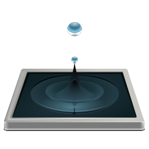</a> | **📂 檔名:** `zanshin.svg` ✨ **格式:** `Vector (SVG)` ⚖️ **大小:** `43.58KB` 📅 **更新:** `2026-03-03`  🚀 **jsDelivr Markdown:** `` 🔗 **直接連結 (Url):** <code>https://cdn.jsdelivr.net/gh/barry028/materials@main/images/iCons/Pixel/Breeze/Apps%20/48/zanshin.svg</code> 📥 [檢視原始檔](zanshin.svg) |