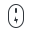
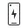

# 🖼️ 素材分類：32

> [🏠 主目錄](../../../../../../README.md) / [images](../../../../../README.md) / [iCons](../../../../README.md) / [Pixel](../../../README.md) / [Breeze](../../README.md) / [Devices ](../README.md) / **32**

本目錄共有 `7` 個檔案

| 🎨 預覽 (點擊放大)  | 📋 檔案詳細資訊與連結 |
| :--- | :--- |
|  | **📂 檔名:** `drive-harddisk-symbolic.svg` ✨ **格式:** `Vector (SVG)` ⚖️ **大小:** `1.06KB` 📅 **更新:** `2026-03-04`  🚀 **jsDelivr Markdown:** `` 🔗 **直接連結 (Url):** <code>https://cdn.jsdelivr.net/gh/barry028/materials@main/images/iCons/Pixel/Breeze/Devices%20/32/drive-harddisk-symbolic.svg</code> 📥 [檢視原始檔](drive-harddisk-symbolic.svg) |
|  | **📂 檔名:** `input-keyboard-symbolic.svg` ✨ **格式:** `Vector (SVG)` ⚖️ **大小:** `3.21KB` 📅 **更新:** `2026-03-04`  🚀 **jsDelivr Markdown:** `` 🔗 **直接連結 (Url):** <code>https://cdn.jsdelivr.net/gh/barry028/materials@main/images/iCons/Pixel/Breeze/Devices%20/32/input-keyboard-symbolic.svg</code> 📥 [檢視原始檔](input-keyboard-symbolic.svg) |
|  | **📂 檔名:** `input-mouse-battery-symbolic.svg` ✨ **格式:** `Vector (SVG)` ⚖️ **大小:** `1.61KB` 📅 **更新:** `2026-03-04`  🚀 **jsDelivr Markdown:** `` 🔗 **直接連結 (Url):** <code>https://cdn.jsdelivr.net/gh/barry028/materials@main/images/iCons/Pixel/Breeze/Devices%20/32/input-mouse-battery-symbolic.svg</code> 📥 [檢視原始檔](input-mouse-battery-symbolic.svg) |
|  | **📂 檔名:** `phone-apple-iphone-symbolic.svg` ✨ **格式:** `Vector (SVG)` ⚖️ **大小:** `829.00B` 📅 **更新:** `2026-03-04`  🚀 **jsDelivr Markdown:** `` 🔗 **直接連結 (Url):** <code>https://cdn.jsdelivr.net/gh/barry028/materials@main/images/iCons/Pixel/Breeze/Devices%20/32/phone-apple-iphone-symbolic.svg</code> 📥 [檢視原始檔](phone-apple-iphone-symbolic.svg) |
|  | **📂 檔名:** `phone-battery.svg` ✨ **格式:** `Vector (SVG)` ⚖️ **大小:** `742.00B` 📅 **更新:** `2026-03-04`  🚀 **jsDelivr Markdown:** `` 🔗 **直接連結 (Url):** <code>https://cdn.jsdelivr.net/gh/barry028/materials@main/images/iCons/Pixel/Breeze/Devices%20/32/phone-battery.svg</code> 📥 [檢視原始檔](phone-battery.svg) |
|  | **📂 檔名:** `phone-symbolic.svg` ✨ **格式:** `Vector (SVG)` ⚖️ **大小:** `1.32KB` 📅 **更新:** `2026-03-04`  🚀 **jsDelivr Markdown:** `` 🔗 **直接連結 (Url):** <code>https://cdn.jsdelivr.net/gh/barry028/materials@main/images/iCons/Pixel/Breeze/Devices%20/32/phone-symbolic.svg</code> 📥 [檢視原始檔](phone-symbolic.svg) |
|  | **📂 檔名:** `video-display-brightness-symbolic.svg` ✨ **格式:** `Vector (SVG)` ⚖️ **大小:** `3.76KB` 📅 **更新:** `2026-03-04`  🚀 **jsDelivr Markdown:** `` 🔗 **直接連結 (Url):** <code>https://cdn.jsdelivr.net/gh/barry028/materials@main/images/iCons/Pixel/Breeze/Devices%20/32/video-display-brightness-symbolic.svg</code> 📥 [檢視原始檔](video-display-brightness-symbolic.svg) |