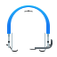
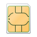
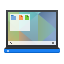
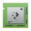
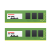
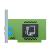
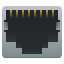
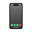
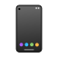

# 🖼️ 素材分類：64

> [🏠 主目錄](../../../../../../README.md) / [images](../../../../../README.md) / [iCons](../../../../README.md) / [Pixel](../../../README.md) / [Breeze](../../README.md) / [Devices ](../README.md) / **64**

本目錄共有 `47` 個檔案

| 🎨 預覽 (點擊放大)  | 📋 檔案詳細資訊與連結 |
| :--- | :--- |
|  | **📂 檔名:** `audio-card.svg` ✨ **格式:** `Vector (SVG)` ⚖️ **大小:** `9.53KB` 📅 **更新:** `2026-03-02`  🚀 **jsDelivr Markdown:** `` 🔗 **直接連結 (Url):** <code>https://cdn.jsdelivr.net/gh/barry028/materials@main/images/iCons/Pixel/Breeze/Devices%20/64/audio-card.svg</code> 📥 [檢視原始檔](audio-card.svg) |
|  | **📂 檔名:** `audio-headphones.svg` ✨ **格式:** `Vector (SVG)` ⚖️ **大小:** `4.43KB` 📅 **更新:** `2026-03-02`  🚀 **jsDelivr Markdown:** `` 🔗 **直接連結 (Url):** <code>https://cdn.jsdelivr.net/gh/barry028/materials@main/images/iCons/Pixel/Breeze/Devices%20/64/audio-headphones.svg</code> 📥 [檢視原始檔](audio-headphones.svg) |
|  | **📂 檔名:** `audio-headset.svg` ✨ **格式:** `Vector (SVG)` ⚖️ **大小:** `5.47KB` 📅 **更新:** `2026-03-02`  🚀 **jsDelivr Markdown:** `` 🔗 **直接連結 (Url):** <code>https://cdn.jsdelivr.net/gh/barry028/materials@main/images/iCons/Pixel/Breeze/Devices%20/64/audio-headset.svg</code> 📥 [檢視原始檔](audio-headset.svg) |
|  | **📂 檔名:** `auth-sim.svg` ✨ **格式:** `Vector (SVG)` ⚖️ **大小:** `5.87KB` 📅 **更新:** `2026-03-02`  🚀 **jsDelivr Markdown:** `` 🔗 **直接連結 (Url):** <code>https://cdn.jsdelivr.net/gh/barry028/materials@main/images/iCons/Pixel/Breeze/Devices%20/64/auth-sim.svg</code> 📥 [檢視原始檔](auth-sim.svg) |
|  | **📂 檔名:** `battery.svg` ✨ **格式:** `Vector (SVG)` ⚖️ **大小:** `6.15KB` 📅 **更新:** `2026-03-02`  🚀 **jsDelivr Markdown:** `` 🔗 **直接連結 (Url):** <code>https://cdn.jsdelivr.net/gh/barry028/materials@main/images/iCons/Pixel/Breeze/Devices%20/64/battery.svg</code> 📥 [檢視原始檔](battery.svg) |
|  | **📂 檔名:** `camera-photo.svg` ✨ **格式:** `Vector (SVG)` ⚖️ **大小:** `10.05KB` 📅 **更新:** `2026-03-02`  🚀 **jsDelivr Markdown:** `` 🔗 **直接連結 (Url):** <code>https://cdn.jsdelivr.net/gh/barry028/materials@main/images/iCons/Pixel/Breeze/Devices%20/64/camera-photo.svg</code> 📥 [檢視原始檔](camera-photo.svg) |
|  | **📂 檔名:** `camera-video.svg` ✨ **格式:** `Vector (SVG)` ⚖️ **大小:** `3.20KB` 📅 **更新:** `2026-03-02`  🚀 **jsDelivr Markdown:** `` 🔗 **直接連結 (Url):** <code>https://cdn.jsdelivr.net/gh/barry028/materials@main/images/iCons/Pixel/Breeze/Devices%20/64/camera-video.svg</code> 📥 [檢視原始檔](camera-video.svg) |
|  | **📂 檔名:** `camera-web.svg` ✨ **格式:** `Vector (SVG)` ⚖️ **大小:** `9.17KB` 📅 **更新:** `2026-03-02`  🚀 **jsDelivr Markdown:** `` 🔗 **直接連結 (Url):** <code>https://cdn.jsdelivr.net/gh/barry028/materials@main/images/iCons/Pixel/Breeze/Devices%20/64/camera-web.svg</code> 📥 [檢視原始檔](camera-web.svg) |
|  | **📂 檔名:** `computer-laptop.svg` ✨ **格式:** `Vector (SVG)` ⚖️ **大小:** `17.48KB` 📅 **更新:** `2026-03-02`  🚀 **jsDelivr Markdown:** `` 🔗 **直接連結 (Url):** <code>https://cdn.jsdelivr.net/gh/barry028/materials@main/images/iCons/Pixel/Breeze/Devices%20/64/computer-laptop.svg</code> 📥 [檢視原始檔](computer-laptop.svg) |
|  | **📂 檔名:** `computer.svg` ✨ **格式:** `Vector (SVG)` ⚖️ **大小:** `9.89KB` 📅 **更新:** `2026-03-02`  🚀 **jsDelivr Markdown:** `` 🔗 **直接連結 (Url):** <code>https://cdn.jsdelivr.net/gh/barry028/materials@main/images/iCons/Pixel/Breeze/Devices%20/64/computer.svg</code> 📥 [檢視原始檔](computer.svg) |
|  | **📂 檔名:** `cpu.svg` ✨ **格式:** `Vector (SVG)` ⚖️ **大小:** `6.74KB` 📅 **更新:** `2026-03-02`  🚀 **jsDelivr Markdown:** `` 🔗 **直接連結 (Url):** <code>https://cdn.jsdelivr.net/gh/barry028/materials@main/images/iCons/Pixel/Breeze/Devices%20/64/cpu.svg</code> 📥 [檢視原始檔](cpu.svg) |
|  | **📂 檔名:** `drive-harddisk-encrypted.svg` ✨ **格式:** `Vector (SVG)` ⚖️ **大小:** `2.09KB` 📅 **更新:** `2026-03-02`  🚀 **jsDelivr Markdown:** `` 🔗 **直接連結 (Url):** <code>https://cdn.jsdelivr.net/gh/barry028/materials@main/images/iCons/Pixel/Breeze/Devices%20/64/drive-harddisk-encrypted.svg</code> 📥 [檢視原始檔](drive-harddisk-encrypted.svg) |
|  | **📂 檔名:** `drive-harddisk-root.svg` ✨ **格式:** `Vector (SVG)` ⚖️ **大小:** `1.98KB` 📅 **更新:** `2026-03-02`  🚀 **jsDelivr Markdown:** `` 🔗 **直接連結 (Url):** <code>https://cdn.jsdelivr.net/gh/barry028/materials@main/images/iCons/Pixel/Breeze/Devices%20/64/drive-harddisk-root.svg</code> 📥 [檢視原始檔](drive-harddisk-root.svg) |
|  | **📂 檔名:** `drive-harddisk.svg` ✨ **格式:** `Vector (SVG)` ⚖️ **大小:** `1.31KB` 📅 **更新:** `2026-03-02`  🚀 **jsDelivr Markdown:** `` 🔗 **直接連結 (Url):** <code>https://cdn.jsdelivr.net/gh/barry028/materials@main/images/iCons/Pixel/Breeze/Devices%20/64/drive-harddisk.svg</code> 📥 [檢視原始檔](drive-harddisk.svg) |
|  | **📂 檔名:** `drive-multidisk.svg` ✨ **格式:** `Vector (SVG)` ⚖️ **大小:** `2.01KB` 📅 **更新:** `2026-03-02`  🚀 **jsDelivr Markdown:** `` 🔗 **直接連結 (Url):** <code>https://cdn.jsdelivr.net/gh/barry028/materials@main/images/iCons/Pixel/Breeze/Devices%20/64/drive-multidisk.svg</code> 📥 [檢視原始檔](drive-multidisk.svg) |
|  | **📂 檔名:** `drive-multipartition.svg` ✨ **格式:** `Vector (SVG)` ⚖️ **大小:** `5.92KB` 📅 **更新:** `2026-03-02`  🚀 **jsDelivr Markdown:** `` 🔗 **直接連結 (Url):** <code>https://cdn.jsdelivr.net/gh/barry028/materials@main/images/iCons/Pixel/Breeze/Devices%20/64/drive-multipartition.svg</code> 📥 [檢視原始檔](drive-multipartition.svg) |
|  | **📂 檔名:** `drive-partition.svg` ✨ **格式:** `Vector (SVG)` ⚖️ **大小:** `4.52KB` 📅 **更新:** `2026-03-02`  🚀 **jsDelivr Markdown:** `` 🔗 **直接連結 (Url):** <code>https://cdn.jsdelivr.net/gh/barry028/materials@main/images/iCons/Pixel/Breeze/Devices%20/64/drive-partition.svg</code> 📥 [檢視原始檔](drive-partition.svg) |
|  | **📂 檔名:** `drive-removable-media.svg` ✨ **格式:** `Vector (SVG)` ⚖️ **大小:** `4.56KB` 📅 **更新:** `2026-03-02`  🚀 **jsDelivr Markdown:** `` 🔗 **直接連結 (Url):** <code>https://cdn.jsdelivr.net/gh/barry028/materials@main/images/iCons/Pixel/Breeze/Devices%20/64/drive-removable-media.svg</code> 📥 [檢視原始檔](drive-removable-media.svg) |
|  | **📂 檔名:** `input-gaming.svg` ✨ **格式:** `Vector (SVG)` ⚖️ **大小:** `3.85KB` 📅 **更新:** `2026-03-02`  🚀 **jsDelivr Markdown:** `` 🔗 **直接連結 (Url):** <code>https://cdn.jsdelivr.net/gh/barry028/materials@main/images/iCons/Pixel/Breeze/Devices%20/64/input-gaming.svg</code> 📥 [檢視原始檔](input-gaming.svg) |
|  | **📂 檔名:** `input-keyboard.svg` ✨ **格式:** `Vector (SVG)` ⚖️ **大小:** `5.53KB` 📅 **更新:** `2026-03-02`  🚀 **jsDelivr Markdown:** `` 🔗 **直接連結 (Url):** <code>https://cdn.jsdelivr.net/gh/barry028/materials@main/images/iCons/Pixel/Breeze/Devices%20/64/input-keyboard.svg</code> 📥 [檢視原始檔](input-keyboard.svg) |
|  | **📂 檔名:** `input-mouse.svg` ✨ **格式:** `Vector (SVG)` ⚖️ **大小:** `4.01KB` 📅 **更新:** `2026-03-02`  🚀 **jsDelivr Markdown:** `` 🔗 **直接連結 (Url):** <code>https://cdn.jsdelivr.net/gh/barry028/materials@main/images/iCons/Pixel/Breeze/Devices%20/64/input-mouse.svg</code> 📥 [檢視原始檔](input-mouse.svg) |
|  | **📂 檔名:** `input-tablet.svg` ✨ **格式:** `Vector (SVG)` ⚖️ **大小:** `7.38KB` 📅 **更新:** `2026-03-02`  🚀 **jsDelivr Markdown:** `` 🔗 **直接連結 (Url):** <code>https://cdn.jsdelivr.net/gh/barry028/materials@main/images/iCons/Pixel/Breeze/Devices%20/64/input-tablet.svg</code> 📥 [檢視原始檔](input-tablet.svg) |
|  | **📂 檔名:** `input-touchpad.svg` ✨ **格式:** `Vector (SVG)` ⚖️ **大小:** `4.58KB` 📅 **更新:** `2026-03-02`  🚀 **jsDelivr Markdown:** `` 🔗 **直接連結 (Url):** <code>https://cdn.jsdelivr.net/gh/barry028/materials@main/images/iCons/Pixel/Breeze/Devices%20/64/input-touchpad.svg</code> 📥 [檢視原始檔](input-touchpad.svg) |
|  | **📂 檔名:** `input-touchscreen.svg` ✨ **格式:** `Vector (SVG)` ⚖️ **大小:** `6.28KB` 📅 **更新:** `2026-03-02`  🚀 **jsDelivr Markdown:** `` 🔗 **直接連結 (Url):** <code>https://cdn.jsdelivr.net/gh/barry028/materials@main/images/iCons/Pixel/Breeze/Devices%20/64/input-touchscreen.svg</code> 📥 [檢視原始檔](input-touchscreen.svg) |
|  | **📂 檔名:** `input-tvremote.svg` ✨ **格式:** `Vector (SVG)` ⚖️ **大小:** `3.36KB` 📅 **更新:** `2026-03-02`  🚀 **jsDelivr Markdown:** `` 🔗 **直接連結 (Url):** <code>https://cdn.jsdelivr.net/gh/barry028/materials@main/images/iCons/Pixel/Breeze/Devices%20/64/input-tvremote.svg</code> 📥 [檢視原始檔](input-tvremote.svg) |
|  | **📂 檔名:** `media-flash-memory-stick.svg` ✨ **格式:** `Vector (SVG)` ⚖️ **大小:** `3.40KB` 📅 **更新:** `2026-03-02`  🚀 **jsDelivr Markdown:** `` 🔗 **直接連結 (Url):** <code>https://cdn.jsdelivr.net/gh/barry028/materials@main/images/iCons/Pixel/Breeze/Devices%20/64/media-flash-memory-stick.svg</code> 📥 [檢視原始檔](media-flash-memory-stick.svg) |
|  | **📂 檔名:** `media-flash-sd-mmc.svg` ✨ **格式:** `Vector (SVG)` ⚖️ **大小:** `4.77KB` 📅 **更新:** `2026-03-02`  🚀 **jsDelivr Markdown:** `` 🔗 **直接連結 (Url):** <code>https://cdn.jsdelivr.net/gh/barry028/materials@main/images/iCons/Pixel/Breeze/Devices%20/64/media-flash-sd-mmc.svg</code> 📥 [檢視原始檔](media-flash-sd-mmc.svg) |
|  | **📂 檔名:** `media-optical-audio.svg` ✨ **格式:** `Vector (SVG)` ⚖️ **大小:** `5.62KB` 📅 **更新:** `2026-03-02`  🚀 **jsDelivr Markdown:** `` 🔗 **直接連結 (Url):** <code>https://cdn.jsdelivr.net/gh/barry028/materials@main/images/iCons/Pixel/Breeze/Devices%20/64/media-optical-audio.svg</code> 📥 [檢視原始檔](media-optical-audio.svg) |
|  | **📂 檔名:** `media-optical-blu-ray.svg` ✨ **格式:** `Vector (SVG)` ⚖️ **大小:** `3.71KB` 📅 **更新:** `2026-03-02`  🚀 **jsDelivr Markdown:** `` 🔗 **直接連結 (Url):** <code>https://cdn.jsdelivr.net/gh/barry028/materials@main/images/iCons/Pixel/Breeze/Devices%20/64/media-optical-blu-ray.svg</code> 📥 [檢視原始檔](media-optical-blu-ray.svg) |
|  | **📂 檔名:** `media-optical-data.svg` ✨ **格式:** `Vector (SVG)` ⚖️ **大小:** `5.35KB` 📅 **更新:** `2026-03-02`  🚀 **jsDelivr Markdown:** `` 🔗 **直接連結 (Url):** <code>https://cdn.jsdelivr.net/gh/barry028/materials@main/images/iCons/Pixel/Breeze/Devices%20/64/media-optical-data.svg</code> 📥 [檢視原始檔](media-optical-data.svg) |
|  | **📂 檔名:** `media-optical-dvd.svg` ✨ **格式:** `Vector (SVG)` ⚖️ **大小:** `4.07KB` 📅 **更新:** `2026-03-02`  🚀 **jsDelivr Markdown:** `` 🔗 **直接連結 (Url):** <code>https://cdn.jsdelivr.net/gh/barry028/materials@main/images/iCons/Pixel/Breeze/Devices%20/64/media-optical-dvd.svg</code> 📥 [檢視原始檔](media-optical-dvd.svg) |
|  | **📂 檔名:** `media-optical-recordable.svg` ✨ **格式:** `Vector (SVG)` ⚖️ **大小:** `5.72KB` 📅 **更新:** `2026-03-02`  🚀 **jsDelivr Markdown:** `` 🔗 **直接連結 (Url):** <code>https://cdn.jsdelivr.net/gh/barry028/materials@main/images/iCons/Pixel/Breeze/Devices%20/64/media-optical-recordable.svg</code> 📥 [檢視原始檔](media-optical-recordable.svg) |
|  | **📂 檔名:** `media-optical-video.svg` ✨ **格式:** `Vector (SVG)` ⚖️ **大小:** `7.42KB` 📅 **更新:** `2026-03-02`  🚀 **jsDelivr Markdown:** `` 🔗 **直接連結 (Url):** <code>https://cdn.jsdelivr.net/gh/barry028/materials@main/images/iCons/Pixel/Breeze/Devices%20/64/media-optical-video.svg</code> 📥 [檢視原始檔](media-optical-video.svg) |
|  | **📂 檔名:** `media-optical.svg` ✨ **格式:** `Vector (SVG)` ⚖️ **大小:** `4.07KB` 📅 **更新:** `2026-03-02`  🚀 **jsDelivr Markdown:** `` 🔗 **直接連結 (Url):** <code>https://cdn.jsdelivr.net/gh/barry028/materials@main/images/iCons/Pixel/Breeze/Devices%20/64/media-optical.svg</code> 📥 [檢視原始檔](media-optical.svg) |
|  | **📂 檔名:** `media-write-cd.svg` ✨ **格式:** `Vector (SVG)` ⚖️ **大小:** `2.38KB` 📅 **更新:** `2026-03-02`  🚀 **jsDelivr Markdown:** `` 🔗 **直接連結 (Url):** <code>https://cdn.jsdelivr.net/gh/barry028/materials@main/images/iCons/Pixel/Breeze/Devices%20/64/media-write-cd.svg</code> 📥 [檢視原始檔](media-write-cd.svg) |
|  | **📂 檔名:** `media-write-dvd.svg` ✨ **格式:** `Vector (SVG)` ⚖️ **大小:** `2.01KB` 📅 **更新:** `2026-03-02`  🚀 **jsDelivr Markdown:** `` 🔗 **直接連結 (Url):** <code>https://cdn.jsdelivr.net/gh/barry028/materials@main/images/iCons/Pixel/Breeze/Devices%20/64/media-write-dvd.svg</code> 📥 [檢視原始檔](media-write-dvd.svg) |
|  | **📂 檔名:** `memory.svg` ✨ **格式:** `Vector (SVG)` ⚖️ **大小:** `9.49KB` 📅 **更新:** `2026-03-02`  🚀 **jsDelivr Markdown:** `` 🔗 **直接連結 (Url):** <code>https://cdn.jsdelivr.net/gh/barry028/materials@main/images/iCons/Pixel/Breeze/Devices%20/64/memory.svg</code> 📥 [檢視原始檔](memory.svg) |
|  | **📂 檔名:** `multimedia-player.svg` ✨ **格式:** `Vector (SVG)` ⚖️ **大小:** `5.07KB` 📅 **更新:** `2026-03-02`  🚀 **jsDelivr Markdown:** `` 🔗 **直接連結 (Url):** <code>https://cdn.jsdelivr.net/gh/barry028/materials@main/images/iCons/Pixel/Breeze/Devices%20/64/multimedia-player.svg</code> 📥 [檢視原始檔](multimedia-player.svg) |
|  | **📂 檔名:** `network-card.svg` ✨ **格式:** `Vector (SVG)` ⚖️ **大小:** `6.63KB` 📅 **更新:** `2026-03-02`  🚀 **jsDelivr Markdown:** `` 🔗 **直接連結 (Url):** <code>https://cdn.jsdelivr.net/gh/barry028/materials@main/images/iCons/Pixel/Breeze/Devices%20/64/network-card.svg</code> 📥 [檢視原始檔](network-card.svg) |
|  | **📂 檔名:** `network-rj11-female.svg` ✨ **格式:** `Vector (SVG)` ⚖️ **大小:** `3.81KB` 📅 **更新:** `2026-03-02`  🚀 **jsDelivr Markdown:** `` 🔗 **直接連結 (Url):** <code>https://cdn.jsdelivr.net/gh/barry028/materials@main/images/iCons/Pixel/Breeze/Devices%20/64/network-rj11-female.svg</code> 📥 [檢視原始檔](network-rj11-female.svg) |
|  | **📂 檔名:** `network-rj45-female.svg` ✨ **格式:** `Vector (SVG)` ⚖️ **大小:** `3.83KB` 📅 **更新:** `2026-03-02`  🚀 **jsDelivr Markdown:** `` 🔗 **直接連結 (Url):** <code>https://cdn.jsdelivr.net/gh/barry028/materials@main/images/iCons/Pixel/Breeze/Devices%20/64/network-rj45-female.svg</code> 📥 [檢視原始檔](network-rj45-female.svg) |
|  | **📂 檔名:** `phone-apple-iphone.svg` ✨ **格式:** `Vector (SVG)` ⚖️ **大小:** `2.14KB` 📅 **更新:** `2026-03-02`  🚀 **jsDelivr Markdown:** `` 🔗 **直接連結 (Url):** <code>https://cdn.jsdelivr.net/gh/barry028/materials@main/images/iCons/Pixel/Breeze/Devices%20/64/phone-apple-iphone.svg</code> 📥 [檢視原始檔](phone-apple-iphone.svg) |
|  | **📂 檔名:** `printer.svg` ✨ **格式:** `Vector (SVG)` ⚖️ **大小:** `18.11KB` 📅 **更新:** `2026-03-02`  🚀 **jsDelivr Markdown:** `` 🔗 **直接連結 (Url):** <code>https://cdn.jsdelivr.net/gh/barry028/materials@main/images/iCons/Pixel/Breeze/Devices%20/64/printer.svg</code> 📥 [檢視原始檔](printer.svg) |
|  | **📂 檔名:** `scanner.svg` ✨ **格式:** `Vector (SVG)` ⚖️ **大小:** `6.47KB` 📅 **更新:** `2026-03-02`  🚀 **jsDelivr Markdown:** `` 🔗 **直接連結 (Url):** <code>https://cdn.jsdelivr.net/gh/barry028/materials@main/images/iCons/Pixel/Breeze/Devices%20/64/scanner.svg</code> 📥 [檢視原始檔](scanner.svg) |
|  | **📂 檔名:** `smartphone.svg` ✨ **格式:** `Vector (SVG)` ⚖️ **大小:** `3.23KB` 📅 **更新:** `2026-03-02`  🚀 **jsDelivr Markdown:** `` 🔗 **直接連結 (Url):** <code>https://cdn.jsdelivr.net/gh/barry028/materials@main/images/iCons/Pixel/Breeze/Devices%20/64/smartphone.svg</code> 📥 [檢視原始檔](smartphone.svg) |
|  | **📂 檔名:** `video-display.svg` ✨ **格式:** `Vector (SVG)` ⚖️ **大小:** `8.60KB` 📅 **更新:** `2026-03-02`  🚀 **jsDelivr Markdown:** `` 🔗 **直接連結 (Url):** <code>https://cdn.jsdelivr.net/gh/barry028/materials@main/images/iCons/Pixel/Breeze/Devices%20/64/video-display.svg</code> 📥 [檢視原始檔](video-display.svg) |
|  | **📂 檔名:** `video-television.svg` ✨ **格式:** `Vector (SVG)` ⚖️ **大小:** `6.13KB` 📅 **更新:** `2026-03-02`  🚀 **jsDelivr Markdown:** `` 🔗 **直接連結 (Url):** <code>https://cdn.jsdelivr.net/gh/barry028/materials@main/images/iCons/Pixel/Breeze/Devices%20/64/video-television.svg</code> 📥 [檢視原始檔](video-television.svg) |