# 🖼️ 素材分類：32

> [🏠 主目錄](../../../../../../README.md) / [images](../../../../../README.md) / [iCons](../../../../README.md) / [Pixel](../../../README.md) / [Breeze](../../README.md) / [Preferences ](../README.md) / **32**

本目錄共有 `134` 個檔案

| 🎨 預覽 (點擊放大)  | 📋 檔案詳細資訊與連結 |
| :--- | :--- |
|  | **📂 檔名:** `device-notifier.svg` ✨ **格式:** `Vector (SVG)` ⚖️ **大小:** `4.12KB` 📅 **更新:** `2026-03-01`  🚀 **jsDelivr Markdown:** `` 🔗 **直接連結 (Url):** <code>https://cdn.jsdelivr.net/gh/barry028/materials@main/images/iCons/Pixel/Breeze/Preferences%20/32/device-notifier.svg</code> 📥 [檢視原始檔](device-notifier.svg) |
|  | **📂 檔名:** `drive-removable-media.svg` ✨ **格式:** `Vector (SVG)` ⚖️ **大小:** `4.53KB` 📅 **更新:** `2026-03-01`  🚀 **jsDelivr Markdown:** `` 🔗 **直接連結 (Url):** <code>https://cdn.jsdelivr.net/gh/barry028/materials@main/images/iCons/Pixel/Breeze/Preferences%20/32/drive-removable-media.svg</code> 📥 [檢視原始檔](drive-removable-media.svg) |
|  | **📂 檔名:** `plasma-search.svg` ✨ **格式:** `Vector (SVG)` ⚖️ **大小:** `6.35KB` 📅 **更新:** `2026-03-01`  🚀 **jsDelivr Markdown:** `` 🔗 **直接連結 (Url):** <code>https://cdn.jsdelivr.net/gh/barry028/materials@main/images/iCons/Pixel/Breeze/Preferences%20/32/plasma-search.svg</code> 📥 [檢視原始檔](plasma-search.svg) |
|  | **📂 檔名:** `podcast-amarok.svg` ✨ **格式:** `Vector (SVG)` ⚖️ **大小:** `5.04KB` 📅 **更新:** `2026-03-01`  🚀 **jsDelivr Markdown:** `` 🔗 **直接連結 (Url):** <code>https://cdn.jsdelivr.net/gh/barry028/materials@main/images/iCons/Pixel/Breeze/Preferences%20/32/podcast-amarok.svg</code> 📥 [檢視原始檔](podcast-amarok.svg) |
|  | **📂 檔名:** `preferences-desktop-accessibility.svg` ✨ **格式:** `Vector (SVG)` ⚖️ **大小:** `3.29KB` 📅 **更新:** `2026-03-01`  🚀 **jsDelivr Markdown:** `` 🔗 **直接連結 (Url):** <code>https://cdn.jsdelivr.net/gh/barry028/materials@main/images/iCons/Pixel/Breeze/Preferences%20/32/preferences-desktop-accessibility.svg</code> 📥 [檢視原始檔](preferences-desktop-accessibility.svg) |
|  | **📂 檔名:** `preferences-desktop-activities.svg` ✨ **格式:** `Vector (SVG)` ⚖️ **大小:** `8.88KB` 📅 **更新:** `2026-03-01`  🚀 **jsDelivr Markdown:** `` 🔗 **直接連結 (Url):** <code>https://cdn.jsdelivr.net/gh/barry028/materials@main/images/iCons/Pixel/Breeze/Preferences%20/32/preferences-desktop-activities.svg</code> 📥 [檢視原始檔](preferences-desktop-activities.svg) |
|  | **📂 檔名:** `preferences-desktop-baloo.svg` ✨ **格式:** `Vector (SVG)` ⚖️ **大小:** `3.12KB` 📅 **更新:** `2026-03-01`  🚀 **jsDelivr Markdown:** `` 🔗 **直接連結 (Url):** <code>https://cdn.jsdelivr.net/gh/barry028/materials@main/images/iCons/Pixel/Breeze/Preferences%20/32/preferences-desktop-baloo.svg</code> 📥 [檢視原始檔](preferences-desktop-baloo.svg) |
|  | **📂 檔名:** `preferences-desktop-color.svg` ✨ **格式:** `Vector (SVG)` ⚖️ **大小:** `12.13KB` 📅 **更新:** `2026-03-01`  🚀 **jsDelivr Markdown:** `` 🔗 **直接連結 (Url):** <code>https://cdn.jsdelivr.net/gh/barry028/materials@main/images/iCons/Pixel/Breeze/Preferences%20/32/preferences-desktop-color.svg</code> 📥 [檢視原始檔](preferences-desktop-color.svg) |
|  | **📂 檔名:** `preferences-desktop-cryptography.svg` ✨ **格式:** `Vector (SVG)` ⚖️ **大小:** `2.38KB` 📅 **更新:** `2026-03-01`  🚀 **jsDelivr Markdown:** `` 🔗 **直接連結 (Url):** <code>https://cdn.jsdelivr.net/gh/barry028/materials@main/images/iCons/Pixel/Breeze/Preferences%20/32/preferences-desktop-cryptography.svg</code> 📥 [檢視原始檔](preferences-desktop-cryptography.svg) |
|  | **📂 檔名:** `preferences-desktop-cursors.svg` ✨ **格式:** `Vector (SVG)` ⚖️ **大小:** `2.07KB` 📅 **更新:** `2026-03-01`  🚀 **jsDelivr Markdown:** `` 🔗 **直接連結 (Url):** <code>https://cdn.jsdelivr.net/gh/barry028/materials@main/images/iCons/Pixel/Breeze/Preferences%20/32/preferences-desktop-cursors.svg</code> 📥 [檢視原始檔](preferences-desktop-cursors.svg) |
|  | **📂 檔名:** `preferences-desktop-default-applications.svg` ✨ **格式:** `Vector (SVG)` ⚖️ **大小:** `1.19KB` 📅 **更新:** `2026-03-01`  🚀 **jsDelivr Markdown:** `` 🔗 **直接連結 (Url):** <code>https://cdn.jsdelivr.net/gh/barry028/materials@main/images/iCons/Pixel/Breeze/Preferences%20/32/preferences-desktop-default-applications.svg</code> 📥 [檢視原始檔](preferences-desktop-default-applications.svg) |
|  | **📂 檔名:** `preferences-desktop-display-color.svg` ✨ **格式:** `Vector (SVG)` ⚖️ **大小:** `20.45KB` 📅 **更新:** `2026-03-01`  🚀 **jsDelivr Markdown:** `` 🔗 **直接連結 (Url):** <code>https://cdn.jsdelivr.net/gh/barry028/materials@main/images/iCons/Pixel/Breeze/Preferences%20/32/preferences-desktop-display-color.svg</code> 📥 [檢視原始檔](preferences-desktop-display-color.svg) |
|  | **📂 檔名:** `preferences-desktop-display-randr.svg` ✨ **格式:** `Vector (SVG)` ⚖️ **大小:** `1.48KB` 📅 **更新:** `2026-03-01`  🚀 **jsDelivr Markdown:** `` 🔗 **直接連結 (Url):** <code>https://cdn.jsdelivr.net/gh/barry028/materials@main/images/iCons/Pixel/Breeze/Preferences%20/32/preferences-desktop-display-randr.svg</code> 📥 [檢視原始檔](preferences-desktop-display-randr.svg) |
|  | **📂 檔名:** `preferences-desktop-display.svg` ✨ **格式:** `Vector (SVG)` ⚖️ **大小:** `2.84KB` 📅 **更新:** `2026-03-01`  🚀 **jsDelivr Markdown:** `` 🔗 **直接連結 (Url):** <code>https://cdn.jsdelivr.net/gh/barry028/materials@main/images/iCons/Pixel/Breeze/Preferences%20/32/preferences-desktop-display.svg</code> 📥 [檢視原始檔](preferences-desktop-display.svg) |
|  | **📂 檔名:** `preferences-desktop-effects.svg` ✨ **格式:** `Vector (SVG)` ⚖️ **大小:** `4.57KB` 📅 **更新:** `2026-03-01`  🚀 **jsDelivr Markdown:** `` 🔗 **直接連結 (Url):** <code>https://cdn.jsdelivr.net/gh/barry028/materials@main/images/iCons/Pixel/Breeze/Preferences%20/32/preferences-desktop-effects.svg</code> 📥 [檢視原始檔](preferences-desktop-effects.svg) |
|  | **📂 檔名:** `preferences-desktop-emoticons.svg` ✨ **格式:** `Vector (SVG)` ⚖️ **大小:** `2.20KB` 📅 **更新:** `2026-03-01`  🚀 **jsDelivr Markdown:** `` 🔗 **直接連結 (Url):** <code>https://cdn.jsdelivr.net/gh/barry028/materials@main/images/iCons/Pixel/Breeze/Preferences%20/32/preferences-desktop-emoticons.svg</code> 📥 [檢視原始檔](preferences-desktop-emoticons.svg) |
|  | **📂 檔名:** `preferences-desktop-feedback.svg` ✨ **格式:** `Vector (SVG)` ⚖️ **大小:** `1.47KB` 📅 **更新:** `2026-03-01`  🚀 **jsDelivr Markdown:** `` 🔗 **直接連結 (Url):** <code>https://cdn.jsdelivr.net/gh/barry028/materials@main/images/iCons/Pixel/Breeze/Preferences%20/32/preferences-desktop-feedback.svg</code> 📥 [檢視原始檔](preferences-desktop-feedback.svg) |
|  | **📂 檔名:** `preferences-desktop-filetype-association.svg` ✨ **格式:** `Vector (SVG)` ⚖️ **大小:** `3.68KB` 📅 **更新:** `2026-03-01`  🚀 **jsDelivr Markdown:** `` 🔗 **直接連結 (Url):** <code>https://cdn.jsdelivr.net/gh/barry028/materials@main/images/iCons/Pixel/Breeze/Preferences%20/32/preferences-desktop-filetype-association.svg</code> 📥 [檢視原始檔](preferences-desktop-filetype-association.svg) |
|  | **📂 檔名:** `preferences-desktop-filter.svg` ✨ **格式:** `Vector (SVG)` ⚖️ **大小:** `1.28KB` 📅 **更新:** `2026-03-01`  🚀 **jsDelivr Markdown:** `` 🔗 **直接連結 (Url):** <code>https://cdn.jsdelivr.net/gh/barry028/materials@main/images/iCons/Pixel/Breeze/Preferences%20/32/preferences-desktop-filter.svg</code> 📥 [檢視原始檔](preferences-desktop-filter.svg) |
|  | **📂 檔名:** `preferences-desktop-font.svg` ✨ **格式:** `Vector (SVG)` ⚖️ **大小:** `3.09KB` 📅 **更新:** `2026-03-01`  🚀 **jsDelivr Markdown:** `` 🔗 **直接連結 (Url):** <code>https://cdn.jsdelivr.net/gh/barry028/materials@main/images/iCons/Pixel/Breeze/Preferences%20/32/preferences-desktop-font.svg</code> 📥 [檢視原始檔](preferences-desktop-font.svg) |
|  | **📂 檔名:** `preferences-desktop-gestures-screenedges.svg` ✨ **格式:** `Vector (SVG)` ⚖️ **大小:** `2.82KB` 📅 **更新:** `2026-03-01`  🚀 **jsDelivr Markdown:** `` 🔗 **直接連結 (Url):** <code>https://cdn.jsdelivr.net/gh/barry028/materials@main/images/iCons/Pixel/Breeze/Preferences%20/32/preferences-desktop-gestures-screenedges.svg</code> 📥 [檢視原始檔](preferences-desktop-gestures-screenedges.svg) |
|  | **📂 檔名:** `preferences-desktop-gestures-touch.svg` ✨ **格式:** `Vector (SVG)` ⚖️ **大小:** `3.75KB` 📅 **更新:** `2026-03-01`  🚀 **jsDelivr Markdown:** `` 🔗 **直接連結 (Url):** <code>https://cdn.jsdelivr.net/gh/barry028/materials@main/images/iCons/Pixel/Breeze/Preferences%20/32/preferences-desktop-gestures-touch.svg</code> 📥 [檢視原始檔](preferences-desktop-gestures-touch.svg) |
|  | **📂 檔名:** `preferences-desktop-icons.svg` ✨ **格式:** `Vector (SVG)` ⚖️ **大小:** `3.37KB` 📅 **更新:** `2026-03-01`  🚀 **jsDelivr Markdown:** `` 🔗 **直接連結 (Url):** <code>https://cdn.jsdelivr.net/gh/barry028/materials@main/images/iCons/Pixel/Breeze/Preferences%20/32/preferences-desktop-icons.svg</code> 📥 [檢視原始檔](preferences-desktop-icons.svg) |
| <a href="preferences-desktop-keyboard.svg">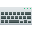</a> | **📂 檔名:** `preferences-desktop-keyboard.svg` ✨ **格式:** `Vector (SVG)` ⚖️ **大小:** `2.77KB` 📅 **更新:** `2026-03-01`  🚀 **jsDelivr Markdown:** `` 🔗 **直接連結 (Url):** <code>https://cdn.jsdelivr.net/gh/barry028/materials@main/images/iCons/Pixel/Breeze/Preferences%20/32/preferences-desktop-keyboard.svg</code> 📥 [檢視原始檔](preferences-desktop-keyboard.svg) |
|  | **📂 檔名:** `preferences-desktop-launch-feedback.svg` ✨ **格式:** `Vector (SVG)` ⚖️ **大小:** `4.39KB` 📅 **更新:** `2026-03-01`  🚀 **jsDelivr Markdown:** `` 🔗 **直接連結 (Url):** <code>https://cdn.jsdelivr.net/gh/barry028/materials@main/images/iCons/Pixel/Breeze/Preferences%20/32/preferences-desktop-launch-feedback.svg</code> 📥 [檢視原始檔](preferences-desktop-launch-feedback.svg) |
|  | **📂 檔名:** `preferences-desktop-locale.svg` ✨ **格式:** `Vector (SVG)` ⚖️ **大小:** `2.33KB` 📅 **更新:** `2026-03-01`  🚀 **jsDelivr Markdown:** `` 🔗 **直接連結 (Url):** <code>https://cdn.jsdelivr.net/gh/barry028/materials@main/images/iCons/Pixel/Breeze/Preferences%20/32/preferences-desktop-locale.svg</code> 📥 [檢視原始檔](preferences-desktop-locale.svg) |
|  | **📂 檔名:** `preferences-desktop-multimedia.svg` ✨ **格式:** `Vector (SVG)` ⚖️ **大小:** `4.42KB` 📅 **更新:** `2026-03-01`  🚀 **jsDelivr Markdown:** `` 🔗 **直接連結 (Url):** <code>https://cdn.jsdelivr.net/gh/barry028/materials@main/images/iCons/Pixel/Breeze/Preferences%20/32/preferences-desktop-multimedia.svg</code> 📥 [檢視原始檔](preferences-desktop-multimedia.svg) |
|  | **📂 檔名:** `preferences-desktop-navigation.svg` ✨ **格式:** `Vector (SVG)` ⚖️ **大小:** `3.30KB` 📅 **更新:** `2026-03-01`  🚀 **jsDelivr Markdown:** `` 🔗 **直接連結 (Url):** <code>https://cdn.jsdelivr.net/gh/barry028/materials@main/images/iCons/Pixel/Breeze/Preferences%20/32/preferences-desktop-navigation.svg</code> 📥 [檢視原始檔](preferences-desktop-navigation.svg) |
|  | **📂 檔名:** `preferences-desktop-notification-bell.svg` ✨ **格式:** `Vector (SVG)` ⚖️ **大小:** `1.49KB` 📅 **更新:** `2026-03-01`  🚀 **jsDelivr Markdown:** `` 🔗 **直接連結 (Url):** <code>https://cdn.jsdelivr.net/gh/barry028/materials@main/images/iCons/Pixel/Breeze/Preferences%20/32/preferences-desktop-notification-bell.svg</code> 📥 [檢視原始檔](preferences-desktop-notification-bell.svg) |
|  | **📂 檔名:** `preferences-desktop-plasma-theme.svg` ✨ **格式:** `Vector (SVG)` ⚖️ **大小:** `4.42KB` 📅 **更新:** `2026-03-01`  🚀 **jsDelivr Markdown:** `` 🔗 **直接連結 (Url):** <code>https://cdn.jsdelivr.net/gh/barry028/materials@main/images/iCons/Pixel/Breeze/Preferences%20/32/preferences-desktop-plasma-theme.svg</code> 📥 [檢視原始檔](preferences-desktop-plasma-theme.svg) |
|  | **📂 檔名:** `preferences-desktop-plasma.svg` ✨ **格式:** `Vector (SVG)` ⚖️ **大小:** `7.72KB` 📅 **更新:** `2026-03-01`  🚀 **jsDelivr Markdown:** `` 🔗 **直接連結 (Url):** <code>https://cdn.jsdelivr.net/gh/barry028/materials@main/images/iCons/Pixel/Breeze/Preferences%20/32/preferences-desktop-plasma.svg</code> 📥 [檢視原始檔](preferences-desktop-plasma.svg) |
|  | **📂 檔名:** `preferences-desktop-screensaver.svg` ✨ **格式:** `Vector (SVG)` ⚖️ **大小:** `11.24KB` 📅 **更新:** `2026-03-01`  🚀 **jsDelivr Markdown:** `` 🔗 **直接連結 (Url):** <code>https://cdn.jsdelivr.net/gh/barry028/materials@main/images/iCons/Pixel/Breeze/Preferences%20/32/preferences-desktop-screensaver.svg</code> 📥 [檢視原始檔](preferences-desktop-screensaver.svg) |
|  | **📂 檔名:** `preferences-desktop-search.svg` ✨ **格式:** `Vector (SVG)` ⚖️ **大小:** `1.84KB` 📅 **更新:** `2026-03-01`  🚀 **jsDelivr Markdown:** `` 🔗 **直接連結 (Url):** <code>https://cdn.jsdelivr.net/gh/barry028/materials@main/images/iCons/Pixel/Breeze/Preferences%20/32/preferences-desktop-search.svg</code> 📥 [檢視原始檔](preferences-desktop-search.svg) |
|  | **📂 檔名:** `preferences-desktop-sound.svg` ✨ **格式:** `Vector (SVG)` ⚖️ **大小:** `4.39KB` 📅 **更新:** `2026-03-01`  🚀 **jsDelivr Markdown:** `` 🔗 **直接連結 (Url):** <code>https://cdn.jsdelivr.net/gh/barry028/materials@main/images/iCons/Pixel/Breeze/Preferences%20/32/preferences-desktop-sound.svg</code> 📥 [檢視原始檔](preferences-desktop-sound.svg) |
| <a href="preferences-desktop-tablet.svg">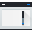</a> | **📂 檔名:** `preferences-desktop-tablet.svg` ✨ **格式:** `Vector (SVG)` ⚖️ **大小:** `1.38KB` 📅 **更新:** `2026-03-01`  🚀 **jsDelivr Markdown:** `` 🔗 **直接連結 (Url):** <code>https://cdn.jsdelivr.net/gh/barry028/materials@main/images/iCons/Pixel/Breeze/Preferences%20/32/preferences-desktop-tablet.svg</code> 📥 [檢視原始檔](preferences-desktop-tablet.svg) |
|  | **📂 檔名:** `preferences-desktop-text-to-speech.svg` ✨ **格式:** `Vector (SVG)` ⚖️ **大小:** `2.48KB` 📅 **更新:** `2026-03-01`  🚀 **jsDelivr Markdown:** `` 🔗 **直接連結 (Url):** <code>https://cdn.jsdelivr.net/gh/barry028/materials@main/images/iCons/Pixel/Breeze/Preferences%20/32/preferences-desktop-text-to-speech.svg</code> 📥 [檢視原始檔](preferences-desktop-text-to-speech.svg) |
|  | **📂 檔名:** `preferences-desktop-theme-applications.svg` ✨ **格式:** `Vector (SVG)` ⚖️ **大小:** `2.21KB` 📅 **更新:** `2026-03-01`  🚀 **jsDelivr Markdown:** `` 🔗 **直接連結 (Url):** <code>https://cdn.jsdelivr.net/gh/barry028/materials@main/images/iCons/Pixel/Breeze/Preferences%20/32/preferences-desktop-theme-applications.svg</code> 📥 [檢視原始檔](preferences-desktop-theme-applications.svg) |
|  | **📂 檔名:** `preferences-desktop-theme-global.svg` ✨ **格式:** `Vector (SVG)` ⚖️ **大小:** `6.63KB` 📅 **更新:** `2026-03-01`  🚀 **jsDelivr Markdown:** `` 🔗 **直接連結 (Url):** <code>https://cdn.jsdelivr.net/gh/barry028/materials@main/images/iCons/Pixel/Breeze/Preferences%20/32/preferences-desktop-theme-global.svg</code> 📥 [檢視原始檔](preferences-desktop-theme-global.svg) |
|  | **📂 檔名:** `preferences-desktop-theme-windowdecorations.svg` ✨ **格式:** `Vector (SVG)` ⚖️ **大小:** `986.00B` 📅 **更新:** `2026-03-01`  🚀 **jsDelivr Markdown:** `` 🔗 **直接連結 (Url):** <code>https://cdn.jsdelivr.net/gh/barry028/materials@main/images/iCons/Pixel/Breeze/Preferences%20/32/preferences-desktop-theme-windowdecorations.svg</code> 📥 [檢視原始檔](preferences-desktop-theme-windowdecorations.svg) |
|  | **📂 檔名:** `preferences-desktop-thunderbolt.svg` ✨ **格式:** `Vector (SVG)` ⚖️ **大小:** `2.18KB` 📅 **更新:** `2026-03-01`  🚀 **jsDelivr Markdown:** `` 🔗 **直接連結 (Url):** <code>https://cdn.jsdelivr.net/gh/barry028/materials@main/images/iCons/Pixel/Breeze/Preferences%20/32/preferences-desktop-thunderbolt.svg</code> 📥 [檢視原始檔](preferences-desktop-thunderbolt.svg) |
|  | **📂 檔名:** `preferences-desktop-touchpad.svg` ✨ **格式:** `Vector (SVG)` ⚖️ **大小:** `6.01KB` 📅 **更新:** `2026-03-01`  🚀 **jsDelivr Markdown:** `` 🔗 **直接連結 (Url):** <code>https://cdn.jsdelivr.net/gh/barry028/materials@main/images/iCons/Pixel/Breeze/Preferences%20/32/preferences-desktop-touchpad.svg</code> 📥 [檢視原始檔](preferences-desktop-touchpad.svg) |
|  | **📂 檔名:** `preferences-desktop-touchscreen.svg` ✨ **格式:** `Vector (SVG)` ⚖️ **大小:** `6.08KB` 📅 **更新:** `2026-03-01`  🚀 **jsDelivr Markdown:** `` 🔗 **直接連結 (Url):** <code>https://cdn.jsdelivr.net/gh/barry028/materials@main/images/iCons/Pixel/Breeze/Preferences%20/32/preferences-desktop-touchscreen.svg</code> 📥 [檢視原始檔](preferences-desktop-touchscreen.svg) |
|  | **📂 檔名:** `preferences-desktop-user-password.svg` ✨ **格式:** `Vector (SVG)` ⚖️ **大小:** `4.26KB` 📅 **更新:** `2026-03-01`  🚀 **jsDelivr Markdown:** `` 🔗 **直接連結 (Url):** <code>https://cdn.jsdelivr.net/gh/barry028/materials@main/images/iCons/Pixel/Breeze/Preferences%20/32/preferences-desktop-user-password.svg</code> 📥 [檢視原始檔](preferences-desktop-user-password.svg) |
|  | **📂 檔名:** `preferences-desktop-user.svg` ✨ **格式:** `Vector (SVG)` ⚖️ **大小:** `4.32KB` 📅 **更新:** `2026-03-01`  🚀 **jsDelivr Markdown:** `` 🔗 **直接連結 (Url):** <code>https://cdn.jsdelivr.net/gh/barry028/materials@main/images/iCons/Pixel/Breeze/Preferences%20/32/preferences-desktop-user.svg</code> 📥 [檢視原始檔](preferences-desktop-user.svg) |
|  | **📂 檔名:** `preferences-desktop-virtual.svg` ✨ **格式:** `Vector (SVG)` ⚖️ **大小:** `1.88KB` 📅 **更新:** `2026-03-01`  🚀 **jsDelivr Markdown:** `` 🔗 **直接連結 (Url):** <code>https://cdn.jsdelivr.net/gh/barry028/materials@main/images/iCons/Pixel/Breeze/Preferences%20/32/preferences-desktop-virtual.svg</code> 📥 [檢視原始檔](preferences-desktop-virtual.svg) |
|  | **📂 檔名:** `preferences-desktop-wallpaper.svg` ✨ **格式:** `Vector (SVG)` ⚖️ **大小:** `9.54KB` 📅 **更新:** `2026-03-01`  🚀 **jsDelivr Markdown:** `` 🔗 **直接連結 (Url):** <code>https://cdn.jsdelivr.net/gh/barry028/materials@main/images/iCons/Pixel/Breeze/Preferences%20/32/preferences-desktop-wallpaper.svg</code> 📥 [檢視原始檔](preferences-desktop-wallpaper.svg) |
|  | **📂 檔名:** `preferences-desktop.svg` ✨ **格式:** `Vector (SVG)` ⚖️ **大小:** `9.62KB` 📅 **更新:** `2026-03-01`  🚀 **jsDelivr Markdown:** `` 🔗 **直接連結 (Url):** <code>https://cdn.jsdelivr.net/gh/barry028/materials@main/images/iCons/Pixel/Breeze/Preferences%20/32/preferences-desktop.svg</code> 📥 [檢視原始檔](preferences-desktop.svg) |
|  | **📂 檔名:** `preferences-devices-cpu.svg` ✨ **格式:** `Vector (SVG)` ⚖️ **大小:** `2.53KB` 📅 **更新:** `2026-03-01`  🚀 **jsDelivr Markdown:** `` 🔗 **直接連結 (Url):** <code>https://cdn.jsdelivr.net/gh/barry028/materials@main/images/iCons/Pixel/Breeze/Preferences%20/32/preferences-devices-cpu.svg</code> 📥 [檢視原始檔](preferences-devices-cpu.svg) |
|  | **📂 檔名:** `preferences-devices-drive-optical-check.svg` ✨ **格式:** `Vector (SVG)` ⚖️ **大小:** `1.95KB` 📅 **更新:** `2026-03-01`  🚀 **jsDelivr Markdown:** `` 🔗 **直接連結 (Url):** <code>https://cdn.jsdelivr.net/gh/barry028/materials@main/images/iCons/Pixel/Breeze/Preferences%20/32/preferences-devices-drive-optical-check.svg</code> 📥 [檢視原始檔](preferences-devices-drive-optical-check.svg) |
|  | **📂 檔名:** `preferences-devices-printer.svg` ✨ **格式:** `Vector (SVG)` ⚖️ **大小:** `4.09KB` 📅 **更新:** `2026-03-01`  🚀 **jsDelivr Markdown:** `` 🔗 **直接連結 (Url):** <code>https://cdn.jsdelivr.net/gh/barry028/materials@main/images/iCons/Pixel/Breeze/Preferences%20/32/preferences-devices-printer.svg</code> 📥 [檢視原始檔](preferences-devices-printer.svg) |
|  | **📂 檔名:** `preferences-devices-scanner.svg` ✨ **格式:** `Vector (SVG)` ⚖️ **大小:** `3.31KB` 📅 **更新:** `2026-03-01`  🚀 **jsDelivr Markdown:** `` 🔗 **直接連結 (Url):** <code>https://cdn.jsdelivr.net/gh/barry028/materials@main/images/iCons/Pixel/Breeze/Preferences%20/32/preferences-devices-scanner.svg</code> 📥 [檢視原始檔](preferences-devices-scanner.svg) |
|  | **📂 檔名:** `preferences-devices-tree.svg` ✨ **格式:** `Vector (SVG)` ⚖️ **大小:** `3.70KB` 📅 **更新:** `2026-03-01`  🚀 **jsDelivr Markdown:** `` 🔗 **直接連結 (Url):** <code>https://cdn.jsdelivr.net/gh/barry028/materials@main/images/iCons/Pixel/Breeze/Preferences%20/32/preferences-devices-tree.svg</code> 📥 [檢視原始檔](preferences-devices-tree.svg) |
|  | **📂 檔名:** `preferences-document.svg` ✨ **格式:** `Vector (SVG)` ⚖️ **大小:** `1.00KB` 📅 **更新:** `2026-03-01`  🚀 **jsDelivr Markdown:** `` 🔗 **直接連結 (Url):** <code>https://cdn.jsdelivr.net/gh/barry028/materials@main/images/iCons/Pixel/Breeze/Preferences%20/32/preferences-document.svg</code> 📥 [檢視原始檔](preferences-document.svg) |
|  | **📂 檔名:** `preferences-git.svg` ✨ **格式:** `Vector (SVG)` ⚖️ **大小:** `2.94KB` 📅 **更新:** `2026-03-01`  🚀 **jsDelivr Markdown:** `` 🔗 **直接連結 (Url):** <code>https://cdn.jsdelivr.net/gh/barry028/materials@main/images/iCons/Pixel/Breeze/Preferences%20/32/preferences-git.svg</code> 📥 [檢視原始檔](preferences-git.svg) |
|  | **📂 檔名:** `preferences-gtk-config.svg` ✨ **格式:** `Vector (SVG)` ⚖️ **大小:** `4.56KB` 📅 **更新:** `2026-03-01`  🚀 **jsDelivr Markdown:** `` 🔗 **直接連結 (Url):** <code>https://cdn.jsdelivr.net/gh/barry028/materials@main/images/iCons/Pixel/Breeze/Preferences%20/32/preferences-gtk-config.svg</code> 📥 [檢視原始檔](preferences-gtk-config.svg) |
|  | **📂 檔名:** `preferences-kde-connect.svg` ✨ **格式:** `Vector (SVG)` ⚖️ **大小:** `3.90KB` 📅 **更新:** `2026-03-01`  🚀 **jsDelivr Markdown:** `` 🔗 **直接連結 (Url):** <code>https://cdn.jsdelivr.net/gh/barry028/materials@main/images/iCons/Pixel/Breeze/Preferences%20/32/preferences-kde-connect.svg</code> 📥 [檢視原始檔](preferences-kde-connect.svg) |
| <a href="preferences-log.svg">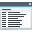</a> | **📂 檔名:** `preferences-log.svg` ✨ **格式:** `Vector (SVG)` ⚖️ **大小:** `1.81KB` 📅 **更新:** `2026-03-01`  🚀 **jsDelivr Markdown:** `` 🔗 **直接連結 (Url):** <code>https://cdn.jsdelivr.net/gh/barry028/materials@main/images/iCons/Pixel/Breeze/Preferences%20/32/preferences-log.svg</code> 📥 [檢視原始檔](preferences-log.svg) |
|  | **📂 檔名:** `preferences-online-accounts.svg` ✨ **格式:** `Vector (SVG)` ⚖️ **大小:** `3.57KB` 📅 **更新:** `2026-03-01`  🚀 **jsDelivr Markdown:** `` 🔗 **直接連結 (Url):** <code>https://cdn.jsdelivr.net/gh/barry028/materials@main/images/iCons/Pixel/Breeze/Preferences%20/32/preferences-online-accounts.svg</code> 📥 [檢視原始檔](preferences-online-accounts.svg) |
|  | **📂 檔名:** `preferences-other.svg` ✨ **格式:** `Vector (SVG)` ⚖️ **大小:** `2.61KB` 📅 **更新:** `2026-03-01`  🚀 **jsDelivr Markdown:** `` 🔗 **直接連結 (Url):** <code>https://cdn.jsdelivr.net/gh/barry028/materials@main/images/iCons/Pixel/Breeze/Preferences%20/32/preferences-other.svg</code> 📥 [檢視原始檔](preferences-other.svg) |
|  | **📂 檔名:** `preferences-plugin.svg` ✨ **格式:** `Vector (SVG)` ⚖️ **大小:** `7.15KB` 📅 **更新:** `2026-03-01`  🚀 **jsDelivr Markdown:** `` 🔗 **直接連結 (Url):** <code>https://cdn.jsdelivr.net/gh/barry028/materials@main/images/iCons/Pixel/Breeze/Preferences%20/32/preferences-plugin.svg</code> 📥 [檢視原始檔](preferences-plugin.svg) |
|  | **📂 檔名:** `preferences-releasenotes.svg` ✨ **格式:** `Vector (SVG)` ⚖️ **大小:** `2.06KB` 📅 **更新:** `2026-03-01`  🚀 **jsDelivr Markdown:** `` 🔗 **直接連結 (Url):** <code>https://cdn.jsdelivr.net/gh/barry028/materials@main/images/iCons/Pixel/Breeze/Preferences%20/32/preferences-releasenotes.svg</code> 📥 [檢視原始檔](preferences-releasenotes.svg) |
|  | **📂 檔名:** `preferences-scroll.svg` ✨ **格式:** `Vector (SVG)` ⚖️ **大小:** `4.01KB` 📅 **更新:** `2026-03-01`  🚀 **jsDelivr Markdown:** `` 🔗 **直接連結 (Url):** <code>https://cdn.jsdelivr.net/gh/barry028/materials@main/images/iCons/Pixel/Breeze/Preferences%20/32/preferences-scroll.svg</code> 📥 [檢視原始檔](preferences-scroll.svg) |
|  | **📂 檔名:** `preferences-security-apparmor.svg` ✨ **格式:** `Vector (SVG)` ⚖️ **大小:** `3.26KB` 📅 **更新:** `2026-03-01`  🚀 **jsDelivr Markdown:** `` 🔗 **直接連結 (Url):** <code>https://cdn.jsdelivr.net/gh/barry028/materials@main/images/iCons/Pixel/Breeze/Preferences%20/32/preferences-security-apparmor.svg</code> 📥 [檢視原始檔](preferences-security-apparmor.svg) |
|  | **📂 檔名:** `preferences-security-firewall.svg` ✨ **格式:** `Vector (SVG)` ⚖️ **大小:** `2.35KB` 📅 **更新:** `2026-03-01`  🚀 **jsDelivr Markdown:** `` 🔗 **直接連結 (Url):** <code>https://cdn.jsdelivr.net/gh/barry028/materials@main/images/iCons/Pixel/Breeze/Preferences%20/32/preferences-security-firewall.svg</code> 📥 [檢視原始檔](preferences-security-firewall.svg) |
|  | **📂 檔名:** `preferences-security-kerberos.svg` ✨ **格式:** `Vector (SVG)` ⚖️ **大小:** `5.92KB` 📅 **更新:** `2026-03-01`  🚀 **jsDelivr Markdown:** `` 🔗 **直接連結 (Url):** <code>https://cdn.jsdelivr.net/gh/barry028/materials@main/images/iCons/Pixel/Breeze/Preferences%20/32/preferences-security-kerberos.svg</code> 📥 [檢視原始檔](preferences-security-kerberos.svg) |
|  | **📂 檔名:** `preferences-security.svg` ✨ **格式:** `Vector (SVG)` ⚖️ **大小:** `1.16KB` 📅 **更新:** `2026-03-01`  🚀 **jsDelivr Markdown:** `` 🔗 **直接連結 (Url):** <code>https://cdn.jsdelivr.net/gh/barry028/materials@main/images/iCons/Pixel/Breeze/Preferences%20/32/preferences-security.svg</code> 📥 [檢視原始檔](preferences-security.svg) |
|  | **📂 檔名:** `preferences-smart-status.svg` ✨ **格式:** `Vector (SVG)` ⚖️ **大小:** `3.78KB` 📅 **更新:** `2026-03-01`  🚀 **jsDelivr Markdown:** `` 🔗 **直接連結 (Url):** <code>https://cdn.jsdelivr.net/gh/barry028/materials@main/images/iCons/Pixel/Breeze/Preferences%20/32/preferences-smart-status.svg</code> 📥 [檢視原始檔](preferences-smart-status.svg) |
|  | **📂 檔名:** `preferences-system-backup.svg` ✨ **格式:** `Vector (SVG)` ⚖️ **大小:** `1.98KB` 📅 **更新:** `2026-03-01`  🚀 **jsDelivr Markdown:** `` 🔗 **直接連結 (Url):** <code>https://cdn.jsdelivr.net/gh/barry028/materials@main/images/iCons/Pixel/Breeze/Preferences%20/32/preferences-system-backup.svg</code> 📥 [檢視原始檔](preferences-system-backup.svg) |
|  | **📂 檔名:** `preferences-system-bluetooth-activated-symbolic.svg` ✨ **格式:** `Vector (SVG)` ⚖️ **大小:** `1.82KB` 📅 **更新:** `2026-03-01`  🚀 **jsDelivr Markdown:** `` 🔗 **直接連結 (Url):** <code>https://cdn.jsdelivr.net/gh/barry028/materials@main/images/iCons/Pixel/Breeze/Preferences%20/32/preferences-system-bluetooth-activated-symbolic.svg</code> 📥 [檢視原始檔](preferences-system-bluetooth-activated-symbolic.svg) |
|  | **📂 檔名:** `preferences-system-bluetooth-battery-symbolic.svg` ✨ **格式:** `Vector (SVG)` ⚖️ **大小:** `1.52KB` 📅 **更新:** `2026-03-01`  🚀 **jsDelivr Markdown:** `` 🔗 **直接連結 (Url):** <code>https://cdn.jsdelivr.net/gh/barry028/materials@main/images/iCons/Pixel/Breeze/Preferences%20/32/preferences-system-bluetooth-battery-symbolic.svg</code> 📥 [檢視原始檔](preferences-system-bluetooth-battery-symbolic.svg) |
|  | **📂 檔名:** `preferences-system-bluetooth-inactive-symbolic.svg` ✨ **格式:** `Vector (SVG)` ⚖️ **大小:** `1.57KB` 📅 **更新:** `2026-03-01`  🚀 **jsDelivr Markdown:** `` 🔗 **直接連結 (Url):** <code>https://cdn.jsdelivr.net/gh/barry028/materials@main/images/iCons/Pixel/Breeze/Preferences%20/32/preferences-system-bluetooth-inactive-symbolic.svg</code> 📥 [檢視原始檔](preferences-system-bluetooth-inactive-symbolic.svg) |
|  | **📂 檔名:** `preferences-system-bluetooth-symbolic.svg` ✨ **格式:** `Vector (SVG)` ⚖️ **大小:** `1.55KB` 📅 **更新:** `2026-03-01`  🚀 **jsDelivr Markdown:** `` 🔗 **直接連結 (Url):** <code>https://cdn.jsdelivr.net/gh/barry028/materials@main/images/iCons/Pixel/Breeze/Preferences%20/32/preferences-system-bluetooth-symbolic.svg</code> 📥 [檢視原始檔](preferences-system-bluetooth-symbolic.svg) |
|  | **📂 檔名:** `preferences-system-bluetooth.svg` ✨ **格式:** `Vector (SVG)` ⚖️ **大小:** `2.77KB` 📅 **更新:** `2026-03-01`  🚀 **jsDelivr Markdown:** `` 🔗 **直接連結 (Url):** <code>https://cdn.jsdelivr.net/gh/barry028/materials@main/images/iCons/Pixel/Breeze/Preferences%20/32/preferences-system-bluetooth.svg</code> 📥 [檢視原始檔](preferences-system-bluetooth.svg) |
|  | **📂 檔名:** `preferences-system-disks.svg` ✨ **格式:** `Vector (SVG)` ⚖️ **大小:** `1.64KB` 📅 **更新:** `2026-03-01`  🚀 **jsDelivr Markdown:** `` 🔗 **直接連結 (Url):** <code>https://cdn.jsdelivr.net/gh/barry028/materials@main/images/iCons/Pixel/Breeze/Preferences%20/32/preferences-system-disks.svg</code> 📥 [檢視原始檔](preferences-system-disks.svg) |
|  | **📂 檔名:** `preferences-system-linux.svg` ✨ **格式:** `Vector (SVG)` ⚖️ **大小:** `4.46KB` 📅 **更新:** `2026-03-01`  🚀 **jsDelivr Markdown:** `` 🔗 **直接連結 (Url):** <code>https://cdn.jsdelivr.net/gh/barry028/materials@main/images/iCons/Pixel/Breeze/Preferences%20/32/preferences-system-linux.svg</code> 📥 [檢視原始檔](preferences-system-linux.svg) |
|  | **📂 檔名:** `preferences-system-login.svg` ✨ **格式:** `Vector (SVG)` ⚖️ **大小:** `7.65KB` 📅 **更新:** `2026-03-01`  🚀 **jsDelivr Markdown:** `` 🔗 **直接連結 (Url):** <code>https://cdn.jsdelivr.net/gh/barry028/materials@main/images/iCons/Pixel/Breeze/Preferences%20/32/preferences-system-login.svg</code> 📥 [檢視原始檔](preferences-system-login.svg) |
|  | **📂 檔名:** `preferences-system-network-dsl.svg` ✨ **格式:** `Vector (SVG)` ⚖️ **大小:** `3.77KB` 📅 **更新:** `2026-03-01`  🚀 **jsDelivr Markdown:** `` 🔗 **直接連結 (Url):** <code>https://cdn.jsdelivr.net/gh/barry028/materials@main/images/iCons/Pixel/Breeze/Preferences%20/32/preferences-system-network-dsl.svg</code> 📥 [檢視原始檔](preferences-system-network-dsl.svg) |
| <a href="preferences-system-network-ethernet.svg">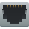</a> | **📂 檔名:** `preferences-system-network-ethernet.svg` ✨ **格式:** `Vector (SVG)` ⚖️ **大小:** `3.68KB` 📅 **更新:** `2026-03-01`  🚀 **jsDelivr Markdown:** `` 🔗 **直接連結 (Url):** <code>https://cdn.jsdelivr.net/gh/barry028/materials@main/images/iCons/Pixel/Breeze/Preferences%20/32/preferences-system-network-ethernet.svg</code> 📥 [檢視原始檔](preferences-system-network-ethernet.svg) |
|  | **📂 檔名:** `preferences-system-network-iscsi.svg` ✨ **格式:** `Vector (SVG)` ⚖️ **大小:** `16.03KB` 📅 **更新:** `2026-03-01`  🚀 **jsDelivr Markdown:** `` 🔗 **直接連結 (Url):** <code>https://cdn.jsdelivr.net/gh/barry028/materials@main/images/iCons/Pixel/Breeze/Preferences%20/32/preferences-system-network-iscsi.svg</code> 📥 [檢視原始檔](preferences-system-network-iscsi.svg) |
|  | **📂 檔名:** `preferences-system-network-ldap.svg` ✨ **格式:** `Vector (SVG)` ⚖️ **大小:** `3.24KB` 📅 **更新:** `2026-03-01`  🚀 **jsDelivr Markdown:** `` 🔗 **直接連結 (Url):** <code>https://cdn.jsdelivr.net/gh/barry028/materials@main/images/iCons/Pixel/Breeze/Preferences%20/32/preferences-system-network-ldap.svg</code> 📥 [檢視原始檔](preferences-system-network-ldap.svg) |
|  | **📂 檔名:** `preferences-system-network-nis.svg` ✨ **格式:** `Vector (SVG)` ⚖️ **大小:** `1.67KB` 📅 **更新:** `2026-03-01`  🚀 **jsDelivr Markdown:** `` 🔗 **直接連結 (Url):** <code>https://cdn.jsdelivr.net/gh/barry028/materials@main/images/iCons/Pixel/Breeze/Preferences%20/32/preferences-system-network-nis.svg</code> 📥 [檢視原始檔](preferences-system-network-nis.svg) |
|  | **📂 檔名:** `preferences-system-network-ntp.svg` ✨ **格式:** `Vector (SVG)` ⚖️ **大小:** `2.37KB` 📅 **更新:** `2026-03-01`  🚀 **jsDelivr Markdown:** `` 🔗 **直接連結 (Url):** <code>https://cdn.jsdelivr.net/gh/barry028/materials@main/images/iCons/Pixel/Breeze/Preferences%20/32/preferences-system-network-ntp.svg</code> 📥 [檢視原始檔](preferences-system-network-ntp.svg) |
|  | **📂 檔名:** `preferences-system-network-proxy.svg` ✨ **格式:** `Vector (SVG)` ⚖️ **大小:** `3.76KB` 📅 **更新:** `2026-03-01`  🚀 **jsDelivr Markdown:** `` 🔗 **直接連結 (Url):** <code>https://cdn.jsdelivr.net/gh/barry028/materials@main/images/iCons/Pixel/Breeze/Preferences%20/32/preferences-system-network-proxy.svg</code> 📥 [檢視原始檔](preferences-system-network-proxy.svg) |
|  | **📂 檔名:** `preferences-system-network-remote.svg` ✨ **格式:** `Vector (SVG)` ⚖️ **大小:** `1.82KB` 📅 **更新:** `2026-03-01`  🚀 **jsDelivr Markdown:** `` 🔗 **直接連結 (Url):** <code>https://cdn.jsdelivr.net/gh/barry028/materials@main/images/iCons/Pixel/Breeze/Preferences%20/32/preferences-system-network-remote.svg</code> 📥 [檢視原始檔](preferences-system-network-remote.svg) |
| <a href="preferences-system-network-server-boot.svg">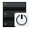</a> | **📂 檔名:** `preferences-system-network-server-boot.svg` ✨ **格式:** `Vector (SVG)` ⚖️ **大小:** `1.48KB` 📅 **更新:** `2026-03-01`  🚀 **jsDelivr Markdown:** `` 🔗 **直接連結 (Url):** <code>https://cdn.jsdelivr.net/gh/barry028/materials@main/images/iCons/Pixel/Breeze/Preferences%20/32/preferences-system-network-server-boot.svg</code> 📥 [檢視原始檔](preferences-system-network-server-boot.svg) |
| <a href="preferences-system-network-server-dhcp.svg">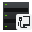</a> | **📂 檔名:** `preferences-system-network-server-dhcp.svg` ✨ **格式:** `Vector (SVG)` ⚖️ **大小:** `1.44KB` 📅 **更新:** `2026-03-01`  🚀 **jsDelivr Markdown:** `` 🔗 **直接連結 (Url):** <code>https://cdn.jsdelivr.net/gh/barry028/materials@main/images/iCons/Pixel/Breeze/Preferences%20/32/preferences-system-network-server-dhcp.svg</code> 📥 [檢視原始檔](preferences-system-network-server-dhcp.svg) |
|  | **📂 檔名:** `preferences-system-network-server-dns.svg` ✨ **格式:** `Vector (SVG)` ⚖️ **大小:** `1.65KB` 📅 **更新:** `2026-03-01`  🚀 **jsDelivr Markdown:** `` 🔗 **直接連結 (Url):** <code>https://cdn.jsdelivr.net/gh/barry028/materials@main/images/iCons/Pixel/Breeze/Preferences%20/32/preferences-system-network-server-dns.svg</code> 📥 [檢視原始檔](preferences-system-network-server-dns.svg) |
| <a href="preferences-system-network-server-ftp.svg">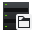</a> | **📂 檔名:** `preferences-system-network-server-ftp.svg` ✨ **格式:** `Vector (SVG)` ⚖️ **大小:** `1.43KB` 📅 **更新:** `2026-03-01`  🚀 **jsDelivr Markdown:** `` 🔗 **直接連結 (Url):** <code>https://cdn.jsdelivr.net/gh/barry028/materials@main/images/iCons/Pixel/Breeze/Preferences%20/32/preferences-system-network-server-ftp.svg</code> 📥 [檢視原始檔](preferences-system-network-server-ftp.svg) |
| <a href="preferences-system-network-server-installation.svg">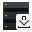</a> | **📂 檔名:** `preferences-system-network-server-installation.svg` ✨ **格式:** `Vector (SVG)` ⚖️ **大小:** `1.46KB` 📅 **更新:** `2026-03-01`  🚀 **jsDelivr Markdown:** `` 🔗 **直接連結 (Url):** <code>https://cdn.jsdelivr.net/gh/barry028/materials@main/images/iCons/Pixel/Breeze/Preferences%20/32/preferences-system-network-server-installation.svg</code> 📥 [檢視原始檔](preferences-system-network-server-installation.svg) |
| <a href="preferences-system-network-server-iscsi.svg">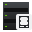</a> | **📂 檔名:** `preferences-system-network-server-iscsi.svg` ✨ **格式:** `Vector (SVG)` ⚖️ **大小:** `1.45KB` 📅 **更新:** `2026-03-01`  🚀 **jsDelivr Markdown:** `` 🔗 **直接連結 (Url):** <code>https://cdn.jsdelivr.net/gh/barry028/materials@main/images/iCons/Pixel/Breeze/Preferences%20/32/preferences-system-network-server-iscsi.svg</code> 📥 [檢視原始檔](preferences-system-network-server-iscsi.svg) |
|  | **📂 檔名:** `preferences-system-network-server-kerberos.svg` ✨ **格式:** `Vector (SVG)` ⚖️ **大小:** `1.53KB` 📅 **更新:** `2026-03-01`  🚀 **jsDelivr Markdown:** `` 🔗 **直接連結 (Url):** <code>https://cdn.jsdelivr.net/gh/barry028/materials@main/images/iCons/Pixel/Breeze/Preferences%20/32/preferences-system-network-server-kerberos.svg</code> 📥 [檢視原始檔](preferences-system-network-server-kerberos.svg) |
| <a href="preferences-system-network-server-ldap.svg">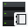</a> | **📂 檔名:** `preferences-system-network-server-ldap.svg` ✨ **格式:** `Vector (SVG)` ⚖️ **大小:** `1.55KB` 📅 **更新:** `2026-03-01`  🚀 **jsDelivr Markdown:** `` 🔗 **直接連結 (Url):** <code>https://cdn.jsdelivr.net/gh/barry028/materials@main/images/iCons/Pixel/Breeze/Preferences%20/32/preferences-system-network-server-ldap.svg</code> 📥 [檢視原始檔](preferences-system-network-server-ldap.svg) |
|  | **📂 檔名:** `preferences-system-network-server-mail.svg` ✨ **格式:** `Vector (SVG)` ⚖️ **大小:** `1.48KB` 📅 **更新:** `2026-03-01`  🚀 **jsDelivr Markdown:** `` 🔗 **直接連結 (Url):** <code>https://cdn.jsdelivr.net/gh/barry028/materials@main/images/iCons/Pixel/Breeze/Preferences%20/32/preferences-system-network-server-mail.svg</code> 📥 [檢視原始檔](preferences-system-network-server-mail.svg) |
| <a href="preferences-system-network-server-nis.svg">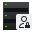</a> | **📂 檔名:** `preferences-system-network-server-nis.svg` ✨ **格式:** `Vector (SVG)` ⚖️ **大小:** `1.65KB` 📅 **更新:** `2026-03-01`  🚀 **jsDelivr Markdown:** `` 🔗 **直接連結 (Url):** <code>https://cdn.jsdelivr.net/gh/barry028/materials@main/images/iCons/Pixel/Breeze/Preferences%20/32/preferences-system-network-server-nis.svg</code> 📥 [檢視原始檔](preferences-system-network-server-nis.svg) |
| <a href="preferences-system-network-server-share-windows.svg">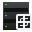</a> | **📂 檔名:** `preferences-system-network-server-share-windows.svg` ✨ **格式:** `Vector (SVG)` ⚖️ **大小:** `1.91KB` 📅 **更新:** `2026-03-01`  🚀 **jsDelivr Markdown:** `` 🔗 **直接連結 (Url):** <code>https://cdn.jsdelivr.net/gh/barry028/materials@main/images/iCons/Pixel/Breeze/Preferences%20/32/preferences-system-network-server-share-windows.svg</code> 📥 [檢視原始檔](preferences-system-network-server-share-windows.svg) |
| <a href="preferences-system-network-server-share.svg">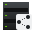</a> | **📂 檔名:** `preferences-system-network-server-share.svg` ✨ **格式:** `Vector (SVG)` ⚖️ **大小:** `1.67KB` 📅 **更新:** `2026-03-01`  🚀 **jsDelivr Markdown:** `` 🔗 **直接連結 (Url):** <code>https://cdn.jsdelivr.net/gh/barry028/materials@main/images/iCons/Pixel/Breeze/Preferences%20/32/preferences-system-network-server-share.svg</code> 📥 [檢視原始檔](preferences-system-network-server-share.svg) |
|  | **📂 檔名:** `preferences-system-network-server-slp.svg` ✨ **格式:** `Vector (SVG)` ⚖️ **大小:** `1.57KB` 📅 **更新:** `2026-03-01`  🚀 **jsDelivr Markdown:** `` 🔗 **直接連結 (Url):** <code>https://cdn.jsdelivr.net/gh/barry028/materials@main/images/iCons/Pixel/Breeze/Preferences%20/32/preferences-system-network-server-slp.svg</code> 📥 [檢視原始檔](preferences-system-network-server-slp.svg) |
| <a href="preferences-system-network-server-web.svg">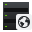</a> | **📂 檔名:** `preferences-system-network-server-web.svg` ✨ **格式:** `Vector (SVG)` ⚖️ **大小:** `11.32KB` 📅 **更新:** `2026-03-01`  🚀 **jsDelivr Markdown:** `` 🔗 **直接連結 (Url):** <code>https://cdn.jsdelivr.net/gh/barry028/materials@main/images/iCons/Pixel/Breeze/Preferences%20/32/preferences-system-network-server-web.svg</code> 📥 [檢視原始檔](preferences-system-network-server-web.svg) |
|  | **📂 檔名:** `preferences-system-network-server.svg` ✨ **格式:** `Vector (SVG)` ⚖️ **大小:** `1.24KB` 📅 **更新:** `2026-03-01`  🚀 **jsDelivr Markdown:** `` 🔗 **直接連結 (Url):** <code>https://cdn.jsdelivr.net/gh/barry028/materials@main/images/iCons/Pixel/Breeze/Preferences%20/32/preferences-system-network-server.svg</code> 📥 [檢視原始檔](preferences-system-network-server.svg) |
|  | **📂 檔名:** `preferences-system-network-share-windows.svg` ✨ **格式:** `Vector (SVG)` ⚖️ **大小:** `2.72KB` 📅 **更新:** `2026-03-01`  🚀 **jsDelivr Markdown:** `` 🔗 **直接連結 (Url):** <code>https://cdn.jsdelivr.net/gh/barry028/materials@main/images/iCons/Pixel/Breeze/Preferences%20/32/preferences-system-network-share-windows.svg</code> 📥 [檢視原始檔](preferences-system-network-share-windows.svg) |
|  | **📂 檔名:** `preferences-system-network-sharing.svg` ✨ **格式:** `Vector (SVG)` ⚖️ **大小:** `3.84KB` 📅 **更新:** `2026-03-01`  🚀 **jsDelivr Markdown:** `` 🔗 **直接連結 (Url):** <code>https://cdn.jsdelivr.net/gh/barry028/materials@main/images/iCons/Pixel/Breeze/Preferences%20/32/preferences-system-network-sharing.svg</code> 📥 [檢視原始檔](preferences-system-network-sharing.svg) |
|  | **📂 檔名:** `preferences-system-network-vpn.svg` ✨ **格式:** `Vector (SVG)` ⚖️ **大小:** `3.09KB` 📅 **更新:** `2026-03-01`  🚀 **jsDelivr Markdown:** `` 🔗 **直接連結 (Url):** <code>https://cdn.jsdelivr.net/gh/barry028/materials@main/images/iCons/Pixel/Breeze/Preferences%20/32/preferences-system-network-vpn.svg</code> 📥 [檢視原始檔](preferences-system-network-vpn.svg) |
|  | **📂 檔名:** `preferences-system-network-wakeonlan.svg` ✨ **格式:** `Vector (SVG)` ⚖️ **大小:** `2.55KB` 📅 **更新:** `2026-03-01`  🚀 **jsDelivr Markdown:** `` 🔗 **直接連結 (Url):** <code>https://cdn.jsdelivr.net/gh/barry028/materials@main/images/iCons/Pixel/Breeze/Preferences%20/32/preferences-system-network-wakeonlan.svg</code> 📥 [檢視原始檔](preferences-system-network-wakeonlan.svg) |
|  | **📂 檔名:** `preferences-system-power-management.svg` ✨ **格式:** `Vector (SVG)` ⚖️ **大小:** `2.57KB` 📅 **更新:** `2026-03-01`  🚀 **jsDelivr Markdown:** `` 🔗 **直接連結 (Url):** <code>https://cdn.jsdelivr.net/gh/barry028/materials@main/images/iCons/Pixel/Breeze/Preferences%20/32/preferences-system-power-management.svg</code> 📥 [檢視原始檔](preferences-system-power-management.svg) |
|  | **📂 檔名:** `preferences-system-services.svg` ✨ **格式:** `Vector (SVG)` ⚖️ **大小:** `2.73KB` 📅 **更新:** `2026-03-01`  🚀 **jsDelivr Markdown:** `` 🔗 **直接連結 (Url):** <code>https://cdn.jsdelivr.net/gh/barry028/materials@main/images/iCons/Pixel/Breeze/Preferences%20/32/preferences-system-services.svg</code> 📥 [檢視原始檔](preferences-system-services.svg) |
|  | **📂 檔名:** `preferences-system-session-services.svg` ✨ **格式:** `Vector (SVG)` ⚖️ **大小:** `3.79KB` 📅 **更新:** `2026-03-01`  🚀 **jsDelivr Markdown:** `` 🔗 **直接連結 (Url):** <code>https://cdn.jsdelivr.net/gh/barry028/materials@main/images/iCons/Pixel/Breeze/Preferences%20/32/preferences-system-session-services.svg</code> 📥 [檢視原始檔](preferences-system-session-services.svg) |
|  | **📂 檔名:** `preferences-system-splash.svg` ✨ **格式:** `Vector (SVG)` ⚖️ **大小:** `5.00KB` 📅 **更新:** `2026-03-01`  🚀 **jsDelivr Markdown:** `` 🔗 **直接連結 (Url):** <code>https://cdn.jsdelivr.net/gh/barry028/materials@main/images/iCons/Pixel/Breeze/Preferences%20/32/preferences-system-splash.svg</code> 📥 [檢視原始檔](preferences-system-splash.svg) |
| <a href="preferences-system-startup.svg">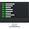</a> | **📂 檔名:** `preferences-system-startup.svg` ✨ **格式:** `Vector (SVG)` ⚖️ **大小:** `5.37KB` 📅 **更新:** `2026-03-01`  🚀 **jsDelivr Markdown:** `` 🔗 **直接連結 (Url):** <code>https://cdn.jsdelivr.net/gh/barry028/materials@main/images/iCons/Pixel/Breeze/Preferences%20/32/preferences-system-startup.svg</code> 📥 [檢視原始檔](preferences-system-startup.svg) |
|  | **📂 檔名:** `preferences-system-time.svg` ✨ **格式:** `Vector (SVG)` ⚖️ **大小:** `1.62KB` 📅 **更新:** `2026-03-01`  🚀 **jsDelivr Markdown:** `` 🔗 **直接連結 (Url):** <code>https://cdn.jsdelivr.net/gh/barry028/materials@main/images/iCons/Pixel/Breeze/Preferences%20/32/preferences-system-time.svg</code> 📥 [檢視原始檔](preferences-system-time.svg) |
|  | **📂 檔名:** `preferences-system-user-sudo.svg` ✨ **格式:** `Vector (SVG)` ⚖️ **大小:** `1.80KB` 📅 **更新:** `2026-03-01`  🚀 **jsDelivr Markdown:** `` 🔗 **直接連結 (Url):** <code>https://cdn.jsdelivr.net/gh/barry028/materials@main/images/iCons/Pixel/Breeze/Preferences%20/32/preferences-system-user-sudo.svg</code> 📥 [檢視原始檔](preferences-system-user-sudo.svg) |
|  | **📂 檔名:** `preferences-system-windows-actions.svg` ✨ **格式:** `Vector (SVG)` ⚖️ **大小:** `3.05KB` 📅 **更新:** `2026-03-01`  🚀 **jsDelivr Markdown:** `` 🔗 **直接連結 (Url):** <code>https://cdn.jsdelivr.net/gh/barry028/materials@main/images/iCons/Pixel/Breeze/Preferences%20/32/preferences-system-windows-actions.svg</code> 📥 [檢視原始檔](preferences-system-windows-actions.svg) |
|  | **📂 檔名:** `preferences-system-windows-behavior.svg` ✨ **格式:** `Vector (SVG)` ⚖️ **大小:** `2.38KB` 📅 **更新:** `2026-03-01`  🚀 **jsDelivr Markdown:** `` 🔗 **直接連結 (Url):** <code>https://cdn.jsdelivr.net/gh/barry028/materials@main/images/iCons/Pixel/Breeze/Preferences%20/32/preferences-system-windows-behavior.svg</code> 📥 [檢視原始檔](preferences-system-windows-behavior.svg) |
|  | **📂 檔名:** `preferences-system-windows-move.svg` ✨ **格式:** `Vector (SVG)` ⚖️ **大小:** `3.18KB` 📅 **更新:** `2026-03-01`  🚀 **jsDelivr Markdown:** `` 🔗 **直接連結 (Url):** <code>https://cdn.jsdelivr.net/gh/barry028/materials@main/images/iCons/Pixel/Breeze/Preferences%20/32/preferences-system-windows-move.svg</code> 📥 [檢視原始檔](preferences-system-windows-move.svg) |
|  | **📂 檔名:** `preferences-system-windows.svg` ✨ **格式:** `Vector (SVG)` ⚖️ **大小:** `2.05KB` 📅 **更新:** `2026-03-01`  🚀 **jsDelivr Markdown:** `` 🔗 **直接連結 (Url):** <code>https://cdn.jsdelivr.net/gh/barry028/materials@main/images/iCons/Pixel/Breeze/Preferences%20/32/preferences-system-windows.svg</code> 📥 [檢視原始檔](preferences-system-windows.svg) |
|  | **📂 檔名:** `preferences-tabs.svg` ✨ **格式:** `Vector (SVG)` ⚖️ **大小:** `959.00B` 📅 **更新:** `2026-03-01`  🚀 **jsDelivr Markdown:** `` 🔗 **直接連結 (Url):** <code>https://cdn.jsdelivr.net/gh/barry028/materials@main/images/iCons/Pixel/Breeze/Preferences%20/32/preferences-tabs.svg</code> 📥 [檢視原始檔](preferences-tabs.svg) |
|  | **📂 檔名:** `preferences-virtualization-container.svg` ✨ **格式:** `Vector (SVG)` ⚖️ **大小:** `5.65KB` 📅 **更新:** `2026-03-01`  🚀 **jsDelivr Markdown:** `` 🔗 **直接連結 (Url):** <code>https://cdn.jsdelivr.net/gh/barry028/materials@main/images/iCons/Pixel/Breeze/Preferences%20/32/preferences-virtualization-container.svg</code> 📥 [檢視原始檔](preferences-virtualization-container.svg) |
|  | **📂 檔名:** `preferences-virtualization-vm-install.svg` ✨ **格式:** `Vector (SVG)` ⚖️ **大小:** `2.98KB` 📅 **更新:** `2026-03-01`  🚀 **jsDelivr Markdown:** `` 🔗 **直接連結 (Url):** <code>https://cdn.jsdelivr.net/gh/barry028/materials@main/images/iCons/Pixel/Breeze/Preferences%20/32/preferences-virtualization-vm-install.svg</code> 📥 [檢視原始檔](preferences-virtualization-vm-install.svg) |
|  | **📂 檔名:** `preferences-virtualization-vm-migrate.svg` ✨ **格式:** `Vector (SVG)` ⚖️ **大小:** `3.06KB` 📅 **更新:** `2026-03-01`  🚀 **jsDelivr Markdown:** `` 🔗 **直接連結 (Url):** <code>https://cdn.jsdelivr.net/gh/barry028/materials@main/images/iCons/Pixel/Breeze/Preferences%20/32/preferences-virtualization-vm-migrate.svg</code> 📥 [檢視原始檔](preferences-virtualization-vm-migrate.svg) |
|  | **📂 檔名:** `preferences-virtualization-vm-new.svg` ✨ **格式:** `Vector (SVG)` ⚖️ **大小:** `3.00KB` 📅 **更新:** `2026-03-01`  🚀 **jsDelivr Markdown:** `` 🔗 **直接連結 (Url):** <code>https://cdn.jsdelivr.net/gh/barry028/materials@main/images/iCons/Pixel/Breeze/Preferences%20/32/preferences-virtualization-vm-new.svg</code> 📥 [檢視原始檔](preferences-virtualization-vm-new.svg) |
|  | **📂 檔名:** `preferences-virtualization-vm.svg` ✨ **格式:** `Vector (SVG)` ⚖️ **大小:** `2.94KB` 📅 **更新:** `2026-03-01`  🚀 **jsDelivr Markdown:** `` 🔗 **直接連結 (Url):** <code>https://cdn.jsdelivr.net/gh/barry028/materials@main/images/iCons/Pixel/Breeze/Preferences%20/32/preferences-virtualization-vm.svg</code> 📥 [檢視原始檔](preferences-virtualization-vm.svg) |
| <a href="preferences-web-browser-adblock.svg">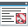</a> | **📂 檔名:** `preferences-web-browser-adblock.svg` ✨ **格式:** `Vector (SVG)` ⚖️ **大小:** `4.88KB` 📅 **更新:** `2026-03-01`  🚀 **jsDelivr Markdown:** `` 🔗 **直接連結 (Url):** <code>https://cdn.jsdelivr.net/gh/barry028/materials@main/images/iCons/Pixel/Breeze/Preferences%20/32/preferences-web-browser-adblock.svg</code> 📥 [檢視原始檔](preferences-web-browser-adblock.svg) |
|  | **📂 檔名:** `preferences-web-browser-cache.svg` ✨ **格式:** `Vector (SVG)` ⚖️ **大小:** `2.38KB` 📅 **更新:** `2026-03-01`  🚀 **jsDelivr Markdown:** `` 🔗 **直接連結 (Url):** <code>https://cdn.jsdelivr.net/gh/barry028/materials@main/images/iCons/Pixel/Breeze/Preferences%20/32/preferences-web-browser-cache.svg</code> 📥 [檢視原始檔](preferences-web-browser-cache.svg) |
|  | **📂 檔名:** `preferences-web-browser-cookies.svg` ✨ **格式:** `Vector (SVG)` ⚖️ **大小:** `5.48KB` 📅 **更新:** `2026-03-01`  🚀 **jsDelivr Markdown:** `` 🔗 **直接連結 (Url):** <code>https://cdn.jsdelivr.net/gh/barry028/materials@main/images/iCons/Pixel/Breeze/Preferences%20/32/preferences-web-browser-cookies.svg</code> 📥 [檢視原始檔](preferences-web-browser-cookies.svg) |
|  | **📂 檔名:** `preferences-web-browser-identification.svg` ✨ **格式:** `Vector (SVG)` ⚖️ **大小:** `2.77KB` 📅 **更新:** `2026-03-01`  🚀 **jsDelivr Markdown:** `` 🔗 **直接連結 (Url):** <code>https://cdn.jsdelivr.net/gh/barry028/materials@main/images/iCons/Pixel/Breeze/Preferences%20/32/preferences-web-browser-identification.svg</code> 📥 [檢視原始檔](preferences-web-browser-identification.svg) |
|  | **📂 檔名:** `preferences-web-browser-shortcuts.svg` ✨ **格式:** `Vector (SVG)` ⚖️ **大小:** `2.53KB` 📅 **更新:** `2026-03-01`  🚀 **jsDelivr Markdown:** `` 🔗 **直接連結 (Url):** <code>https://cdn.jsdelivr.net/gh/barry028/materials@main/images/iCons/Pixel/Breeze/Preferences%20/32/preferences-web-browser-shortcuts.svg</code> 📥 [檢視原始檔](preferences-web-browser-shortcuts.svg) |
|  | **📂 檔名:** `preferences-web-browser-ssl.svg` ✨ **格式:** `Vector (SVG)` ⚖️ **大小:** `2.51KB` 📅 **更新:** `2026-03-01`  🚀 **jsDelivr Markdown:** `` 🔗 **直接連結 (Url):** <code>https://cdn.jsdelivr.net/gh/barry028/materials@main/images/iCons/Pixel/Breeze/Preferences%20/32/preferences-web-browser-ssl.svg</code> 📥 [檢視原始檔](preferences-web-browser-ssl.svg) |
|  | **📂 檔名:** `preferences-web-browser-stylesheets.svg` ✨ **格式:** `Vector (SVG)` ⚖️ **大小:** `3.08KB` 📅 **更新:** `2026-03-01`  🚀 **jsDelivr Markdown:** `` 🔗 **直接連結 (Url):** <code>https://cdn.jsdelivr.net/gh/barry028/materials@main/images/iCons/Pixel/Breeze/Preferences%20/32/preferences-web-browser-stylesheets.svg</code> 📥 [檢視原始檔](preferences-web-browser-stylesheets.svg) |
|  | **📂 檔名:** `system-users.svg` ✨ **格式:** `Vector (SVG)` ⚖️ **大小:** `3.43KB` 📅 **更新:** `2026-03-01`  🚀 **jsDelivr Markdown:** `` 🔗 **直接連結 (Url):** <code>https://cdn.jsdelivr.net/gh/barry028/materials@main/images/iCons/Pixel/Breeze/Preferences%20/32/system-users.svg</code> 📥 [檢視原始檔](system-users.svg) |
|  | **📂 檔名:** `window-duplicate.svg` ✨ **格式:** `Vector (SVG)` ⚖️ **大小:** `3.42KB` 📅 **更新:** `2026-03-01`  🚀 **jsDelivr Markdown:** `` 🔗 **直接連結 (Url):** <code>https://cdn.jsdelivr.net/gh/barry028/materials@main/images/iCons/Pixel/Breeze/Preferences%20/32/window-duplicate.svg</code> 📥 [檢視原始檔](window-duplicate.svg) |
|  | **📂 檔名:** `yast-autoyast.svg` ✨ **格式:** `Vector (SVG)` ⚖️ **大小:** `2.68KB` 📅 **更新:** `2026-03-01`  🚀 **jsDelivr Markdown:** `` 🔗 **直接連結 (Url):** <code>https://cdn.jsdelivr.net/gh/barry028/materials@main/images/iCons/Pixel/Breeze/Preferences%20/32/yast-autoyast.svg</code> 📥 [檢視原始檔](yast-autoyast.svg) |
|  | **📂 檔名:** `yast-disk.svg` ✨ **格式:** `Vector (SVG)` ⚖️ **大小:** `2.92KB` 📅 **更新:** `2026-03-01`  🚀 **jsDelivr Markdown:** `` 🔗 **直接連結 (Url):** <code>https://cdn.jsdelivr.net/gh/barry028/materials@main/images/iCons/Pixel/Breeze/Preferences%20/32/yast-disk.svg</code> 📥 [檢視原始檔](yast-disk.svg) |
|  | **📂 檔名:** `yast-software-group.svg` ✨ **格式:** `Vector (SVG)` ⚖️ **大小:** `2.07KB` 📅 **更新:** `2026-03-01`  🚀 **jsDelivr Markdown:** `` 🔗 **直接連結 (Url):** <code>https://cdn.jsdelivr.net/gh/barry028/materials@main/images/iCons/Pixel/Breeze/Preferences%20/32/yast-software-group.svg</code> 📥 [檢視原始檔](yast-software-group.svg) |
|  | **📂 檔名:** `yast-sw_source.svg` ✨ **格式:** `Vector (SVG)` ⚖️ **大小:** `12.30KB` 📅 **更新:** `2026-03-01`  🚀 **jsDelivr Markdown:** `` 🔗 **直接連結 (Url):** <code>https://cdn.jsdelivr.net/gh/barry028/materials@main/images/iCons/Pixel/Breeze/Preferences%20/32/yast-sw_source.svg</code> 📥 [檢視原始檔](yast-sw_source.svg) |
|  | **📂 檔名:** `yast-update.svg` ✨ **格式:** `Vector (SVG)` ⚖️ **大小:** `3.55KB` 📅 **更新:** `2026-03-01`  🚀 **jsDelivr Markdown:** `` 🔗 **直接連結 (Url):** <code>https://cdn.jsdelivr.net/gh/barry028/materials@main/images/iCons/Pixel/Breeze/Preferences%20/32/yast-update.svg</code> 📥 [檢視原始檔](yast-update.svg) |