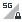
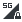
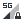
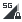
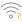

# 🖼️ 素材分類：22

> [🏠 主目錄](../../../../../../README.md) / [images](../../../../../README.md) / [iCons](../../../../README.md) / [Pixel](../../../README.md) / [Breeze](../../README.md) / [Status ](../README.md) / **22**

本目錄共有 `382` 個檔案

| 🎨 預覽 (點擊放大)  | 📋 檔案詳細資訊與連結 |
| :--- | :--- |
|  | **📂 檔名:** `apport.svg` ✨ **格式:** `Vector (SVG)` ⚖️ **大小:** `1.48KB` 📅 **更新:** `2026-03-04`  🚀 **jsDelivr Markdown:** `` 🔗 **直接連結 (Url):** <code>https://cdn.jsdelivr.net/gh/barry028/materials@main/images/iCons/Pixel/Breeze/Status%20/22/apport.svg</code> 📥 [檢視原始檔](apport.svg) |
|  | **📂 檔名:** `audio-on.svg` ✨ **格式:** `Vector (SVG)` ⚖️ **大小:** `783.00B` 📅 **更新:** `2026-03-04`  🚀 **jsDelivr Markdown:** `` 🔗 **直接連結 (Url):** <code>https://cdn.jsdelivr.net/gh/barry028/materials@main/images/iCons/Pixel/Breeze/Status%20/22/audio-on.svg</code> 📥 [檢視原始檔](audio-on.svg) |
|  | **📂 檔名:** `audio-ready.svg` ✨ **格式:** `Vector (SVG)` ⚖️ **大小:** `541.00B` 📅 **更新:** `2026-03-04`  🚀 **jsDelivr Markdown:** `` 🔗 **直接連結 (Url):** <code>https://cdn.jsdelivr.net/gh/barry028/materials@main/images/iCons/Pixel/Breeze/Status%20/22/audio-ready.svg</code> 📥 [檢視原始檔](audio-ready.svg) |
|  | **📂 檔名:** `audio-volume-high-danger.svg` ✨ **格式:** `Vector (SVG)` ⚖️ **大小:** `875.00B` 📅 **更新:** `2026-03-04`  🚀 **jsDelivr Markdown:** `` 🔗 **直接連結 (Url):** <code>https://cdn.jsdelivr.net/gh/barry028/materials@main/images/iCons/Pixel/Breeze/Status%20/22/audio-volume-high-danger.svg</code> 📥 [檢視原始檔](audio-volume-high-danger.svg) |
|  | **📂 檔名:** `audio-volume-high-warning.svg` ✨ **格式:** `Vector (SVG)` ⚖️ **大小:** `873.00B` 📅 **更新:** `2026-03-04`  🚀 **jsDelivr Markdown:** `` 🔗 **直接連結 (Url):** <code>https://cdn.jsdelivr.net/gh/barry028/materials@main/images/iCons/Pixel/Breeze/Status%20/22/audio-volume-high-warning.svg</code> 📥 [檢視原始檔](audio-volume-high-warning.svg) |
|  | **📂 檔名:** `audio-volume-high.svg` ✨ **格式:** `Vector (SVG)` ⚖️ **大小:** `732.00B` 📅 **更新:** `2026-03-04`  🚀 **jsDelivr Markdown:** `` 🔗 **直接連結 (Url):** <code>https://cdn.jsdelivr.net/gh/barry028/materials@main/images/iCons/Pixel/Breeze/Status%20/22/audio-volume-high.svg</code> 📥 [檢視原始檔](audio-volume-high.svg) |
|  | **📂 檔名:** `audio-volume-low.svg` ✨ **格式:** `Vector (SVG)` ⚖️ **大小:** `730.00B` 📅 **更新:** `2026-03-04`  🚀 **jsDelivr Markdown:** `` 🔗 **直接連結 (Url):** <code>https://cdn.jsdelivr.net/gh/barry028/materials@main/images/iCons/Pixel/Breeze/Status%20/22/audio-volume-low.svg</code> 📥 [檢視原始檔](audio-volume-low.svg) |
|  | **📂 檔名:** `audio-volume-medium.svg` ✨ **格式:** `Vector (SVG)` ⚖️ **大小:** `789.00B` 📅 **更新:** `2026-03-04`  🚀 **jsDelivr Markdown:** `` 🔗 **直接連結 (Url):** <code>https://cdn.jsdelivr.net/gh/barry028/materials@main/images/iCons/Pixel/Breeze/Status%20/22/audio-volume-medium.svg</code> 📥 [檢視原始檔](audio-volume-medium.svg) |
|  | **📂 檔名:** `audio-volume-muted.svg` ✨ **格式:** `Vector (SVG)` ⚖️ **大小:** `1.12KB` 📅 **更新:** `2026-03-04`  🚀 **jsDelivr Markdown:** `` 🔗 **直接連結 (Url):** <code>https://cdn.jsdelivr.net/gh/barry028/materials@main/images/iCons/Pixel/Breeze/Status%20/22/audio-volume-muted.svg</code> 📥 [檢視原始檔](audio-volume-muted.svg) |
|  | **📂 檔名:** `auth-sim-locked.svg` ✨ **格式:** `Vector (SVG)` ⚖️ **大小:** `783.00B` 📅 **更新:** `2026-03-04`  🚀 **jsDelivr Markdown:** `` 🔗 **直接連結 (Url):** <code>https://cdn.jsdelivr.net/gh/barry028/materials@main/images/iCons/Pixel/Breeze/Status%20/22/auth-sim-locked.svg</code> 📥 [檢視原始檔](auth-sim-locked.svg) |
|  | **📂 檔名:** `auth-sim-missing.svg` ✨ **格式:** `Vector (SVG)` ⚖️ **大小:** `1.10KB` 📅 **更新:** `2026-03-04`  🚀 **jsDelivr Markdown:** `` 🔗 **直接連結 (Url):** <code>https://cdn.jsdelivr.net/gh/barry028/materials@main/images/iCons/Pixel/Breeze/Status%20/22/auth-sim-missing.svg</code> 📥 [檢視原始檔](auth-sim-missing.svg) |
|  | **📂 檔名:** `battery-000-charging.svg` ✨ **格式:** `Vector (SVG)` ⚖️ **大小:** `671.00B` 📅 **更新:** `2026-03-04`  🚀 **jsDelivr Markdown:** `` 🔗 **直接連結 (Url):** <code>https://cdn.jsdelivr.net/gh/barry028/materials@main/images/iCons/Pixel/Breeze/Status%20/22/battery-000-charging.svg</code> 📥 [檢視原始檔](battery-000-charging.svg) |
|  | **📂 檔名:** `battery-000.svg` ✨ **格式:** `Vector (SVG)` ⚖️ **大小:** `450.00B` 📅 **更新:** `2026-03-04`  🚀 **jsDelivr Markdown:** `` 🔗 **直接連結 (Url):** <code>https://cdn.jsdelivr.net/gh/barry028/materials@main/images/iCons/Pixel/Breeze/Status%20/22/battery-000.svg</code> 📥 [檢視原始檔](battery-000.svg) |
|  | **📂 檔名:** `battery-010-charging.svg` ✨ **格式:** `Vector (SVG)` ⚖️ **大小:** `682.00B` 📅 **更新:** `2026-03-04`  🚀 **jsDelivr Markdown:** `` 🔗 **直接連結 (Url):** <code>https://cdn.jsdelivr.net/gh/barry028/materials@main/images/iCons/Pixel/Breeze/Status%20/22/battery-010-charging.svg</code> 📥 [檢視原始檔](battery-010-charging.svg) |
|  | **📂 檔名:** `battery-010.svg` ✨ **格式:** `Vector (SVG)` ⚖️ **大小:** `461.00B` 📅 **更新:** `2026-03-04`  🚀 **jsDelivr Markdown:** `` 🔗 **直接連結 (Url):** <code>https://cdn.jsdelivr.net/gh/barry028/materials@main/images/iCons/Pixel/Breeze/Status%20/22/battery-010.svg</code> 📥 [檢視原始檔](battery-010.svg) |
|  | **📂 檔名:** `battery-020-charging.svg` ✨ **格式:** `Vector (SVG)` ⚖️ **大小:** `664.00B` 📅 **更新:** `2026-03-04`  🚀 **jsDelivr Markdown:** `` 🔗 **直接連結 (Url):** <code>https://cdn.jsdelivr.net/gh/barry028/materials@main/images/iCons/Pixel/Breeze/Status%20/22/battery-020-charging.svg</code> 📥 [檢視原始檔](battery-020-charging.svg) |
|  | **📂 檔名:** `battery-020.svg` ✨ **格式:** `Vector (SVG)` ⚖️ **大小:** `443.00B` 📅 **更新:** `2026-03-04`  🚀 **jsDelivr Markdown:** `` 🔗 **直接連結 (Url):** <code>https://cdn.jsdelivr.net/gh/barry028/materials@main/images/iCons/Pixel/Breeze/Status%20/22/battery-020.svg</code> 📥 [檢視原始檔](battery-020.svg) |
|  | **📂 檔名:** `battery-030-charging.svg` ✨ **格式:** `Vector (SVG)` ⚖️ **大小:** `686.00B` 📅 **更新:** `2026-03-04`  🚀 **jsDelivr Markdown:** `` 🔗 **直接連結 (Url):** <code>https://cdn.jsdelivr.net/gh/barry028/materials@main/images/iCons/Pixel/Breeze/Status%20/22/battery-030-charging.svg</code> 📥 [檢視原始檔](battery-030-charging.svg) |
|  | **📂 檔名:** `battery-030.svg` ✨ **格式:** `Vector (SVG)` ⚖️ **大小:** `465.00B` 📅 **更新:** `2026-03-04`  🚀 **jsDelivr Markdown:** `` 🔗 **直接連結 (Url):** <code>https://cdn.jsdelivr.net/gh/barry028/materials@main/images/iCons/Pixel/Breeze/Status%20/22/battery-030.svg</code> 📥 [檢視原始檔](battery-030.svg) |
|  | **📂 檔名:** `battery-040-charging.svg` ✨ **格式:** `Vector (SVG)` ⚖️ **大小:** `684.00B` 📅 **更新:** `2026-03-04`  🚀 **jsDelivr Markdown:** `` 🔗 **直接連結 (Url):** <code>https://cdn.jsdelivr.net/gh/barry028/materials@main/images/iCons/Pixel/Breeze/Status%20/22/battery-040-charging.svg</code> 📥 [檢視原始檔](battery-040-charging.svg) |
|  | **📂 檔名:** `battery-040.svg` ✨ **格式:** `Vector (SVG)` ⚖️ **大小:** `463.00B` 📅 **更新:** `2026-03-04`  🚀 **jsDelivr Markdown:** `` 🔗 **直接連結 (Url):** <code>https://cdn.jsdelivr.net/gh/barry028/materials@main/images/iCons/Pixel/Breeze/Status%20/22/battery-040.svg</code> 📥 [檢視原始檔](battery-040.svg) |
|  | **📂 檔名:** `battery-050-charging.svg` ✨ **格式:** `Vector (SVG)` ⚖️ **大小:** `687.00B` 📅 **更新:** `2026-03-04`  🚀 **jsDelivr Markdown:** `` 🔗 **直接連結 (Url):** <code>https://cdn.jsdelivr.net/gh/barry028/materials@main/images/iCons/Pixel/Breeze/Status%20/22/battery-050-charging.svg</code> 📥 [檢視原始檔](battery-050-charging.svg) |
|  | **📂 檔名:** `battery-050.svg` ✨ **格式:** `Vector (SVG)` ⚖️ **大小:** `466.00B` 📅 **更新:** `2026-03-04`  🚀 **jsDelivr Markdown:** `` 🔗 **直接連結 (Url):** <code>https://cdn.jsdelivr.net/gh/barry028/materials@main/images/iCons/Pixel/Breeze/Status%20/22/battery-050.svg</code> 📥 [檢視原始檔](battery-050.svg) |
|  | **📂 檔名:** `battery-060-charging.svg` ✨ **格式:** `Vector (SVG)` ⚖️ **大小:** `684.00B` 📅 **更新:** `2026-03-04`  🚀 **jsDelivr Markdown:** `` 🔗 **直接連結 (Url):** <code>https://cdn.jsdelivr.net/gh/barry028/materials@main/images/iCons/Pixel/Breeze/Status%20/22/battery-060-charging.svg</code> 📥 [檢視原始檔](battery-060-charging.svg) |
|  | **📂 檔名:** `battery-060.svg` ✨ **格式:** `Vector (SVG)` ⚖️ **大小:** `463.00B` 📅 **更新:** `2026-03-04`  🚀 **jsDelivr Markdown:** `` 🔗 **直接連結 (Url):** <code>https://cdn.jsdelivr.net/gh/barry028/materials@main/images/iCons/Pixel/Breeze/Status%20/22/battery-060.svg</code> 📥 [檢視原始檔](battery-060.svg) |
|  | **📂 檔名:** `battery-070-charging.svg` ✨ **格式:** `Vector (SVG)` ⚖️ **大小:** `688.00B` 📅 **更新:** `2026-03-04`  🚀 **jsDelivr Markdown:** `` 🔗 **直接連結 (Url):** <code>https://cdn.jsdelivr.net/gh/barry028/materials@main/images/iCons/Pixel/Breeze/Status%20/22/battery-070-charging.svg</code> 📥 [檢視原始檔](battery-070-charging.svg) |
|  | **📂 檔名:** `battery-070.svg` ✨ **格式:** `Vector (SVG)` ⚖️ **大小:** `467.00B` 📅 **更新:** `2026-03-04`  🚀 **jsDelivr Markdown:** `` 🔗 **直接連結 (Url):** <code>https://cdn.jsdelivr.net/gh/barry028/materials@main/images/iCons/Pixel/Breeze/Status%20/22/battery-070.svg</code> 📥 [檢視原始檔](battery-070.svg) |
|  | **📂 檔名:** `battery-080-charging.svg` ✨ **格式:** `Vector (SVG)` ⚖️ **大小:** `685.00B` 📅 **更新:** `2026-03-04`  🚀 **jsDelivr Markdown:** `` 🔗 **直接連結 (Url):** <code>https://cdn.jsdelivr.net/gh/barry028/materials@main/images/iCons/Pixel/Breeze/Status%20/22/battery-080-charging.svg</code> 📥 [檢視原始檔](battery-080-charging.svg) |
|  | **📂 檔名:** `battery-080.svg` ✨ **格式:** `Vector (SVG)` ⚖️ **大小:** `464.00B` 📅 **更新:** `2026-03-04`  🚀 **jsDelivr Markdown:** `` 🔗 **直接連結 (Url):** <code>https://cdn.jsdelivr.net/gh/barry028/materials@main/images/iCons/Pixel/Breeze/Status%20/22/battery-080.svg</code> 📥 [檢視原始檔](battery-080.svg) |
|  | **📂 檔名:** `battery-090-charging.svg` ✨ **格式:** `Vector (SVG)` ⚖️ **大小:** `688.00B` 📅 **更新:** `2026-03-04`  🚀 **jsDelivr Markdown:** `` 🔗 **直接連結 (Url):** <code>https://cdn.jsdelivr.net/gh/barry028/materials@main/images/iCons/Pixel/Breeze/Status%20/22/battery-090-charging.svg</code> 📥 [檢視原始檔](battery-090-charging.svg) |
|  | **📂 檔名:** `battery-090.svg` ✨ **格式:** `Vector (SVG)` ⚖️ **大小:** `467.00B` 📅 **更新:** `2026-03-04`  🚀 **jsDelivr Markdown:** `` 🔗 **直接連結 (Url):** <code>https://cdn.jsdelivr.net/gh/barry028/materials@main/images/iCons/Pixel/Breeze/Status%20/22/battery-090.svg</code> 📥 [檢視原始檔](battery-090.svg) |
|  | **📂 檔名:** `battery-100-charging.svg` ✨ **格式:** `Vector (SVG)` ⚖️ **大小:** `672.00B` 📅 **更新:** `2026-03-04`  🚀 **jsDelivr Markdown:** `` 🔗 **直接連結 (Url):** <code>https://cdn.jsdelivr.net/gh/barry028/materials@main/images/iCons/Pixel/Breeze/Status%20/22/battery-100-charging.svg</code> 📥 [檢視原始檔](battery-100-charging.svg) |
|  | **📂 檔名:** `battery-100.svg` ✨ **格式:** `Vector (SVG)` ⚖️ **大小:** `446.00B` 📅 **更新:** `2026-03-04`  🚀 **jsDelivr Markdown:** `` 🔗 **直接連結 (Url):** <code>https://cdn.jsdelivr.net/gh/barry028/materials@main/images/iCons/Pixel/Breeze/Status%20/22/battery-100.svg</code> 📥 [檢視原始檔](battery-100.svg) |
|  | **📂 檔名:** `battery-missing.svg` ✨ **格式:** `Vector (SVG)` ⚖️ **大小:** `861.00B` 📅 **更新:** `2026-03-04`  🚀 **jsDelivr Markdown:** `` 🔗 **直接連結 (Url):** <code>https://cdn.jsdelivr.net/gh/barry028/materials@main/images/iCons/Pixel/Breeze/Status%20/22/battery-missing.svg</code> 📥 [檢視原始檔](battery-missing.svg) |
|  | **📂 檔名:** `battery-profile-performance.svg` ✨ **格式:** `Vector (SVG)` ⚖️ **大小:** `560.00B` 📅 **更新:** `2026-03-04`  🚀 **jsDelivr Markdown:** `` 🔗 **直接連結 (Url):** <code>https://cdn.jsdelivr.net/gh/barry028/materials@main/images/iCons/Pixel/Breeze/Status%20/22/battery-profile-performance.svg</code> 📥 [檢視原始檔](battery-profile-performance.svg) |
|  | **📂 檔名:** `battery-profile-powersave.svg` ✨ **格式:** `Vector (SVG)` ⚖️ **大小:** `1.46KB` 📅 **更新:** `2026-03-04`  🚀 **jsDelivr Markdown:** `` 🔗 **直接連結 (Url):** <code>https://cdn.jsdelivr.net/gh/barry028/materials@main/images/iCons/Pixel/Breeze/Status%20/22/battery-profile-powersave.svg</code> 📥 [檢視原始檔](battery-profile-powersave.svg) |
|  | **📂 檔名:** `call-incoming.svg` ✨ **格式:** `Vector (SVG)` ⚖️ **大小:** `859.00B` 📅 **更新:** `2026-03-04`  🚀 **jsDelivr Markdown:** `` 🔗 **直接連結 (Url):** <code>https://cdn.jsdelivr.net/gh/barry028/materials@main/images/iCons/Pixel/Breeze/Status%20/22/call-incoming.svg</code> 📥 [檢視原始檔](call-incoming.svg) |
|  | **📂 檔名:** `call-missed.svg` ✨ **格式:** `Vector (SVG)` ⚖️ **大小:** `801.00B` 📅 **更新:** `2026-03-04`  🚀 **jsDelivr Markdown:** `` 🔗 **直接連結 (Url):** <code>https://cdn.jsdelivr.net/gh/barry028/materials@main/images/iCons/Pixel/Breeze/Status%20/22/call-missed.svg</code> 📥 [檢視原始檔](call-missed.svg) |
|  | **📂 檔名:** `call-outgoing.svg` ✨ **格式:** `Vector (SVG)` ⚖️ **大小:** `864.00B` 📅 **更新:** `2026-03-04`  🚀 **jsDelivr Markdown:** `` 🔗 **直接連結 (Url):** <code>https://cdn.jsdelivr.net/gh/barry028/materials@main/images/iCons/Pixel/Breeze/Status%20/22/call-outgoing.svg</code> 📥 [檢視原始檔](call-outgoing.svg) |
|  | **📂 檔名:** `camera-off.svg` ✨ **格式:** `Vector (SVG)` ⚖️ **大小:** `1.58KB` 📅 **更新:** `2026-03-04`  🚀 **jsDelivr Markdown:** `` 🔗 **直接連結 (Url):** <code>https://cdn.jsdelivr.net/gh/barry028/materials@main/images/iCons/Pixel/Breeze/Status%20/22/camera-off.svg</code> 📥 [檢視原始檔](camera-off.svg) |
|  | **📂 檔名:** `camera-on.svg` ✨ **格式:** `Vector (SVG)` ⚖️ **大小:** `1.79KB` 📅 **更新:** `2026-03-04`  🚀 **jsDelivr Markdown:** `` 🔗 **直接連結 (Url):** <code>https://cdn.jsdelivr.net/gh/barry028/materials@main/images/iCons/Pixel/Breeze/Status%20/22/camera-on.svg</code> 📥 [檢視原始檔](camera-on.svg) |
|  | **📂 檔名:** `camera-ready.svg` ✨ **格式:** `Vector (SVG)` ⚖️ **大小:** `1.94KB` 📅 **更新:** `2026-03-04`  🚀 **jsDelivr Markdown:** `` 🔗 **直接連結 (Url):** <code>https://cdn.jsdelivr.net/gh/barry028/materials@main/images/iCons/Pixel/Breeze/Status%20/22/camera-ready.svg</code> 📥 [檢視原始檔](camera-ready.svg) |
|  | **📂 檔名:** `data-error.svg` ✨ **格式:** `Vector (SVG)` ⚖️ **大小:** `471.00B` 📅 **更新:** `2026-03-04`  🚀 **jsDelivr Markdown:** `` 🔗 **直接連結 (Url):** <code>https://cdn.jsdelivr.net/gh/barry028/materials@main/images/iCons/Pixel/Breeze/Status%20/22/data-error.svg</code> 📥 [檢視原始檔](data-error.svg) |
|  | **📂 檔名:** `data-information.svg` ✨ **格式:** `Vector (SVG)` ⚖️ **大小:** `377.00B` 📅 **更新:** `2026-03-04`  🚀 **jsDelivr Markdown:** `` 🔗 **直接連結 (Url):** <code>https://cdn.jsdelivr.net/gh/barry028/materials@main/images/iCons/Pixel/Breeze/Status%20/22/data-information.svg</code> 📥 [檢視原始檔](data-information.svg) |
|  | **📂 檔名:** `data-success.svg` ✨ **格式:** `Vector (SVG)` ⚖️ **大小:** `534.00B` 📅 **更新:** `2026-03-04`  🚀 **jsDelivr Markdown:** `` 🔗 **直接連結 (Url):** <code>https://cdn.jsdelivr.net/gh/barry028/materials@main/images/iCons/Pixel/Breeze/Status%20/22/data-success.svg</code> 📥 [檢視原始檔](data-success.svg) |
|  | **📂 檔名:** `data-warning.svg` ✨ **格式:** `Vector (SVG)` ⚖️ **大小:** `602.00B` 📅 **更新:** `2026-03-04`  🚀 **jsDelivr Markdown:** `` 🔗 **直接連結 (Url):** <code>https://cdn.jsdelivr.net/gh/barry028/materials@main/images/iCons/Pixel/Breeze/Status%20/22/data-warning.svg</code> 📥 [檢視原始檔](data-warning.svg) |
|  | **📂 檔名:** `dialog-error.svg` ✨ **格式:** `Vector (SVG)` ⚖️ **大小:** `525.00B` 📅 **更新:** `2026-03-04`  🚀 **jsDelivr Markdown:** `` 🔗 **直接連結 (Url):** <code>https://cdn.jsdelivr.net/gh/barry028/materials@main/images/iCons/Pixel/Breeze/Status%20/22/dialog-error.svg</code> 📥 [檢視原始檔](dialog-error.svg) |
|  | **📂 檔名:** `dialog-information.svg` ✨ **格式:** `Vector (SVG)` ⚖️ **大小:** `473.00B` 📅 **更新:** `2026-03-04`  🚀 **jsDelivr Markdown:** `` 🔗 **直接連結 (Url):** <code>https://cdn.jsdelivr.net/gh/barry028/materials@main/images/iCons/Pixel/Breeze/Status%20/22/dialog-information.svg</code> 📥 [檢視原始檔](dialog-information.svg) |
|  | **📂 檔名:** `dialog-password.svg` ✨ **格式:** `Vector (SVG)` ⚖️ **大小:** `604.00B` 📅 **更新:** `2026-03-04`  🚀 **jsDelivr Markdown:** `` 🔗 **直接連結 (Url):** <code>https://cdn.jsdelivr.net/gh/barry028/materials@main/images/iCons/Pixel/Breeze/Status%20/22/dialog-password.svg</code> 📥 [檢視原始檔](dialog-password.svg) |
|  | **📂 檔名:** `dialog-positive.svg` ✨ **格式:** `Vector (SVG)` ⚖️ **大小:** `488.00B` 📅 **更新:** `2026-03-04`  🚀 **jsDelivr Markdown:** `` 🔗 **直接連結 (Url):** <code>https://cdn.jsdelivr.net/gh/barry028/materials@main/images/iCons/Pixel/Breeze/Status%20/22/dialog-positive.svg</code> 📥 [檢視原始檔](dialog-positive.svg) |
|  | **📂 檔名:** `dialog-question.svg` ✨ **格式:** `Vector (SVG)` ⚖️ **大小:** `680.00B` 📅 **更新:** `2026-03-04`  🚀 **jsDelivr Markdown:** `` 🔗 **直接連結 (Url):** <code>https://cdn.jsdelivr.net/gh/barry028/materials@main/images/iCons/Pixel/Breeze/Status%20/22/dialog-question.svg</code> 📥 [檢視原始檔](dialog-question.svg) |
|  | **📂 檔名:** `dialog-warning.svg` ✨ **格式:** `Vector (SVG)` ⚖️ **大小:** `329.00B` 📅 **更新:** `2026-03-04`  🚀 **jsDelivr Markdown:** `` 🔗 **直接連結 (Url):** <code>https://cdn.jsdelivr.net/gh/barry028/materials@main/images/iCons/Pixel/Breeze/Status%20/22/dialog-warning.svg</code> 📥 [檢視原始檔](dialog-warning.svg) |
|  | **📂 檔名:** `disk-quota-critical.svg` ✨ **格式:** `Vector (SVG)` ⚖️ **大小:** `1.32KB` 📅 **更新:** `2026-03-04`  🚀 **jsDelivr Markdown:** `` 🔗 **直接連結 (Url):** <code>https://cdn.jsdelivr.net/gh/barry028/materials@main/images/iCons/Pixel/Breeze/Status%20/22/disk-quota-critical.svg</code> 📥 [檢視原始檔](disk-quota-critical.svg) |
|  | **📂 檔名:** `disk-quota-high.svg` ✨ **格式:** `Vector (SVG)` ⚖️ **大小:** `1.22KB` 📅 **更新:** `2026-03-04`  🚀 **jsDelivr Markdown:** `` 🔗 **直接連結 (Url):** <code>https://cdn.jsdelivr.net/gh/barry028/materials@main/images/iCons/Pixel/Breeze/Status%20/22/disk-quota-high.svg</code> 📥 [檢視原始檔](disk-quota-high.svg) |
|  | **📂 檔名:** `disk-quota-low.svg` ✨ **格式:** `Vector (SVG)` ⚖️ **大小:** `1.34KB` 📅 **更新:** `2026-03-04`  🚀 **jsDelivr Markdown:** `` 🔗 **直接連結 (Url):** <code>https://cdn.jsdelivr.net/gh/barry028/materials@main/images/iCons/Pixel/Breeze/Status%20/22/disk-quota-low.svg</code> 📥 [檢視原始檔](disk-quota-low.svg) |
|  | **📂 檔名:** `disk-quota.svg` ✨ **格式:** `Vector (SVG)` ⚖️ **大小:** `1.12KB` 📅 **更新:** `2026-03-04`  🚀 **jsDelivr Markdown:** `` 🔗 **直接連結 (Url):** <code>https://cdn.jsdelivr.net/gh/barry028/materials@main/images/iCons/Pixel/Breeze/Status%20/22/disk-quota.svg</code> 📥 [檢視原始檔](disk-quota.svg) |
|  | **📂 檔名:** `dropboxstatus-busy.svg` ✨ **格式:** `Vector (SVG)` ⚖️ **大小:** `1.82KB` 📅 **更新:** `2026-03-04`  🚀 **jsDelivr Markdown:** `` 🔗 **直接連結 (Url):** <code>https://cdn.jsdelivr.net/gh/barry028/materials@main/images/iCons/Pixel/Breeze/Status%20/22/dropboxstatus-busy.svg</code> 📥 [檢視原始檔](dropboxstatus-busy.svg) |
|  | **📂 檔名:** `dropboxstatus-idle.svg` ✨ **格式:** `Vector (SVG)` ⚖️ **大小:** `1.41KB` 📅 **更新:** `2026-03-04`  🚀 **jsDelivr Markdown:** `` 🔗 **直接連結 (Url):** <code>https://cdn.jsdelivr.net/gh/barry028/materials@main/images/iCons/Pixel/Breeze/Status%20/22/dropboxstatus-idle.svg</code> 📥 [檢視原始檔](dropboxstatus-idle.svg) |
|  | **📂 檔名:** `dropboxstatus-logo.svg` ✨ **格式:** `Vector (SVG)` ⚖️ **大小:** `1.05KB` 📅 **更新:** `2026-03-04`  🚀 **jsDelivr Markdown:** `` 🔗 **直接連結 (Url):** <code>https://cdn.jsdelivr.net/gh/barry028/materials@main/images/iCons/Pixel/Breeze/Status%20/22/dropboxstatus-logo.svg</code> 📥 [檢視原始檔](dropboxstatus-logo.svg) |
|  | **📂 檔名:** `dropboxstatus-x.svg` ✨ **格式:** `Vector (SVG)` ⚖️ **大小:** `1.48KB` 📅 **更新:** `2026-03-04`  🚀 **jsDelivr Markdown:** `` 🔗 **直接連結 (Url):** <code>https://cdn.jsdelivr.net/gh/barry028/materials@main/images/iCons/Pixel/Breeze/Status%20/22/dropboxstatus-x.svg</code> 📥 [檢視原始檔](dropboxstatus-x.svg) |
|  | **📂 檔名:** `fcitx-anthy.svg` ✨ **格式:** `Vector (SVG)` ⚖️ **大小:** `3.95KB` 📅 **更新:** `2026-03-04`  🚀 **jsDelivr Markdown:** `` 🔗 **直接連結 (Url):** <code>https://cdn.jsdelivr.net/gh/barry028/materials@main/images/iCons/Pixel/Breeze/Status%20/22/fcitx-anthy.svg</code> 📥 [檢視原始檔](fcitx-anthy.svg) |
|  | **📂 檔名:** `fcitx-bopomofo-libpinyin.svg` ✨ **格式:** `Vector (SVG)` ⚖️ **大小:** `2.55KB` 📅 **更新:** `2026-03-04`  🚀 **jsDelivr Markdown:** `` 🔗 **直接連結 (Url):** <code>https://cdn.jsdelivr.net/gh/barry028/materials@main/images/iCons/Pixel/Breeze/Status%20/22/fcitx-bopomofo-libpinyin.svg</code> 📥 [檢視原始檔](fcitx-bopomofo-libpinyin.svg) |
|  | **📂 檔名:** `fcitx-bopomofo.svg` ✨ **格式:** `Vector (SVG)` ⚖️ **大小:** `2.03KB` 📅 **更新:** `2026-03-04`  🚀 **jsDelivr Markdown:** `` 🔗 **直接連結 (Url):** <code>https://cdn.jsdelivr.net/gh/barry028/materials@main/images/iCons/Pixel/Breeze/Status%20/22/fcitx-bopomofo.svg</code> 📥 [檢視原始檔](fcitx-bopomofo.svg) |
|  | **📂 檔名:** `fcitx-cangjie.svg` ✨ **格式:** `Vector (SVG)` ⚖️ **大小:** `2.42KB` 📅 **更新:** `2026-03-04`  🚀 **jsDelivr Markdown:** `` 🔗 **直接連結 (Url):** <code>https://cdn.jsdelivr.net/gh/barry028/materials@main/images/iCons/Pixel/Breeze/Status%20/22/fcitx-cangjie.svg</code> 📥 [檢視原始檔](fcitx-cangjie.svg) |
|  | **📂 檔名:** `fcitx-chewing-libpinyin.svg` ✨ **格式:** `Vector (SVG)` ⚖️ **大小:** `2.04KB` 📅 **更新:** `2026-03-04`  🚀 **jsDelivr Markdown:** `` 🔗 **直接連結 (Url):** <code>https://cdn.jsdelivr.net/gh/barry028/materials@main/images/iCons/Pixel/Breeze/Status%20/22/fcitx-chewing-libpinyin.svg</code> 📥 [檢視原始檔](fcitx-chewing-libpinyin.svg) |
|  | **📂 檔名:** `fcitx-chewing.svg` ✨ **格式:** `Vector (SVG)` ⚖️ **大小:** `2.06KB` 📅 **更新:** `2026-03-04`  🚀 **jsDelivr Markdown:** `` 🔗 **直接連結 (Url):** <code>https://cdn.jsdelivr.net/gh/barry028/materials@main/images/iCons/Pixel/Breeze/Status%20/22/fcitx-chewing.svg</code> 📥 [檢視原始檔](fcitx-chewing.svg) |
|  | **📂 檔名:** `fcitx-chttrans-active.svg` ✨ **格式:** `Vector (SVG)` ⚖️ **大小:** `4.40KB` 📅 **更新:** `2026-03-04`  🚀 **jsDelivr Markdown:** `` 🔗 **直接連結 (Url):** <code>https://cdn.jsdelivr.net/gh/barry028/materials@main/images/iCons/Pixel/Breeze/Status%20/22/fcitx-chttrans-active.svg</code> 📥 [檢視原始檔](fcitx-chttrans-active.svg) |
|  | **📂 檔名:** `fcitx-chttrans-inactive.svg` ✨ **格式:** `Vector (SVG)` ⚖️ **大小:** `2.93KB` 📅 **更新:** `2026-03-04`  🚀 **jsDelivr Markdown:** `` 🔗 **直接連結 (Url):** <code>https://cdn.jsdelivr.net/gh/barry028/materials@main/images/iCons/Pixel/Breeze/Status%20/22/fcitx-chttrans-inactive.svg</code> 📥 [檢視原始檔](fcitx-chttrans-inactive.svg) |
|  | **📂 檔名:** `fcitx-emoji.svg` ✨ **格式:** `Vector (SVG)` ⚖️ **大小:** `2.71KB` 📅 **更新:** `2026-03-04`  🚀 **jsDelivr Markdown:** `` 🔗 **直接連結 (Url):** <code>https://cdn.jsdelivr.net/gh/barry028/materials@main/images/iCons/Pixel/Breeze/Status%20/22/fcitx-emoji.svg</code> 📥 [檢視原始檔](fcitx-emoji.svg) |
|  | **📂 檔名:** `fcitx-erbi.svg` ✨ **格式:** `Vector (SVG)` ⚖️ **大小:** `1.59KB` 📅 **更新:** `2026-03-04`  🚀 **jsDelivr Markdown:** `` 🔗 **直接連結 (Url):** <code>https://cdn.jsdelivr.net/gh/barry028/materials@main/images/iCons/Pixel/Breeze/Status%20/22/fcitx-erbi.svg</code> 📥 [檢視原始檔](fcitx-erbi.svg) |
|  | **📂 檔名:** `fcitx-fullwidth-active.svg` ✨ **格式:** `Vector (SVG)` ⚖️ **大小:** `1.52KB` 📅 **更新:** `2026-03-04`  🚀 **jsDelivr Markdown:** `` 🔗 **直接連結 (Url):** <code>https://cdn.jsdelivr.net/gh/barry028/materials@main/images/iCons/Pixel/Breeze/Status%20/22/fcitx-fullwidth-active.svg</code> 📥 [檢視原始檔](fcitx-fullwidth-active.svg) |
|  | **📂 檔名:** `fcitx-fullwidth-inactive.svg` ✨ **格式:** `Vector (SVG)` ⚖️ **大小:** `1.73KB` 📅 **更新:** `2026-03-04`  🚀 **jsDelivr Markdown:** `` 🔗 **直接連結 (Url):** <code>https://cdn.jsdelivr.net/gh/barry028/materials@main/images/iCons/Pixel/Breeze/Status%20/22/fcitx-fullwidth-inactive.svg</code> 📥 [檢視原始檔](fcitx-fullwidth-inactive.svg) |
|  | **📂 檔名:** `fcitx-googlepinyin.svg` ✨ **格式:** `Vector (SVG)` ⚖️ **大小:** `1.14KB` 📅 **更新:** `2026-03-04`  🚀 **jsDelivr Markdown:** `` 🔗 **直接連結 (Url):** <code>https://cdn.jsdelivr.net/gh/barry028/materials@main/images/iCons/Pixel/Breeze/Status%20/22/fcitx-googlepinyin.svg</code> 📥 [檢視原始檔](fcitx-googlepinyin.svg) |
|  | **📂 檔名:** `fcitx-handwriting-active.svg` ✨ **格式:** `Vector (SVG)` ⚖️ **大小:** `4.95KB` 📅 **更新:** `2026-03-04`  🚀 **jsDelivr Markdown:** `` 🔗 **直接連結 (Url):** <code>https://cdn.jsdelivr.net/gh/barry028/materials@main/images/iCons/Pixel/Breeze/Status%20/22/fcitx-handwriting-active.svg</code> 📥 [檢視原始檔](fcitx-handwriting-active.svg) |
|  | **📂 檔名:** `fcitx-handwriting-inactive.svg` ✨ **格式:** `Vector (SVG)` ⚖️ **大小:** `4.88KB` 📅 **更新:** `2026-03-04`  🚀 **jsDelivr Markdown:** `` 🔗 **直接連結 (Url):** <code>https://cdn.jsdelivr.net/gh/barry028/materials@main/images/iCons/Pixel/Breeze/Status%20/22/fcitx-handwriting-inactive.svg</code> 📥 [檢視原始檔](fcitx-handwriting-inactive.svg) |
|  | **📂 檔名:** `fcitx-hangul.svg` ✨ **格式:** `Vector (SVG)` ⚖️ **大小:** `1.96KB` 📅 **更新:** `2026-03-04`  🚀 **jsDelivr Markdown:** `` 🔗 **直接連結 (Url):** <code>https://cdn.jsdelivr.net/gh/barry028/materials@main/images/iCons/Pixel/Breeze/Status%20/22/fcitx-hangul.svg</code> 📥 [檢視原始檔](fcitx-hangul.svg) |
|  | **📂 檔名:** `fcitx-kbd.svg` ✨ **格式:** `Vector (SVG)` ⚖️ **大小:** `2.13KB` 📅 **更新:** `2026-03-04`  🚀 **jsDelivr Markdown:** `` 🔗 **直接連結 (Url):** <code>https://cdn.jsdelivr.net/gh/barry028/materials@main/images/iCons/Pixel/Breeze/Status%20/22/fcitx-kbd.svg</code> 📥 [檢視原始檔](fcitx-kbd.svg) |
|  | **📂 檔名:** `fcitx-libkkc.svg` ✨ **格式:** `Vector (SVG)` ⚖️ **大小:** `2.56KB` 📅 **更新:** `2026-03-04`  🚀 **jsDelivr Markdown:** `` 🔗 **直接連結 (Url):** <code>https://cdn.jsdelivr.net/gh/barry028/materials@main/images/iCons/Pixel/Breeze/Status%20/22/fcitx-libkkc.svg</code> 📥 [檢視原始檔](fcitx-libkkc.svg) |
|  | **📂 檔名:** `fcitx-libskk.svg` ✨ **格式:** `Vector (SVG)` ⚖️ **大小:** `2.95KB` 📅 **更新:** `2026-03-04`  🚀 **jsDelivr Markdown:** `` 🔗 **直接連結 (Url):** <code>https://cdn.jsdelivr.net/gh/barry028/materials@main/images/iCons/Pixel/Breeze/Status%20/22/fcitx-libskk.svg</code> 📥 [檢視原始檔](fcitx-libskk.svg) |
|  | **📂 檔名:** `fcitx-pinyin-libpinyin.svg` ✨ **格式:** `Vector (SVG)` ⚖️ **大小:** `1.25KB` 📅 **更新:** `2026-03-04`  🚀 **jsDelivr Markdown:** `` 🔗 **直接連結 (Url):** <code>https://cdn.jsdelivr.net/gh/barry028/materials@main/images/iCons/Pixel/Breeze/Status%20/22/fcitx-pinyin-libpinyin.svg</code> 📥 [檢視原始檔](fcitx-pinyin-libpinyin.svg) |
|  | **📂 檔名:** `fcitx-pinyin.svg` ✨ **格式:** `Vector (SVG)` ⚖️ **大小:** `1.31KB` 📅 **更新:** `2026-03-04`  🚀 **jsDelivr Markdown:** `` 🔗 **直接連結 (Url):** <code>https://cdn.jsdelivr.net/gh/barry028/materials@main/images/iCons/Pixel/Breeze/Status%20/22/fcitx-pinyin.svg</code> 📥 [檢視原始檔](fcitx-pinyin.svg) |
|  | **📂 檔名:** `fcitx-punc-active.svg` ✨ **格式:** `Vector (SVG)` ⚖️ **大小:** `2.39KB` 📅 **更新:** `2026-03-04`  🚀 **jsDelivr Markdown:** `` 🔗 **直接連結 (Url):** <code>https://cdn.jsdelivr.net/gh/barry028/materials@main/images/iCons/Pixel/Breeze/Status%20/22/fcitx-punc-active.svg</code> 📥 [檢視原始檔](fcitx-punc-active.svg) |
|  | **📂 檔名:** `fcitx-punc-inactive.svg` ✨ **格式:** `Vector (SVG)` ⚖️ **大小:** `1.87KB` 📅 **更新:** `2026-03-04`  🚀 **jsDelivr Markdown:** `` 🔗 **直接連結 (Url):** <code>https://cdn.jsdelivr.net/gh/barry028/materials@main/images/iCons/Pixel/Breeze/Status%20/22/fcitx-punc-inactive.svg</code> 📥 [檢視原始檔](fcitx-punc-inactive.svg) |
|  | **📂 檔名:** `fcitx-quanpin-libpinyin.svg` ✨ **格式:** `Vector (SVG)` ⚖️ **大小:** `2.28KB` 📅 **更新:** `2026-03-04`  🚀 **jsDelivr Markdown:** `` 🔗 **直接連結 (Url):** <code>https://cdn.jsdelivr.net/gh/barry028/materials@main/images/iCons/Pixel/Breeze/Status%20/22/fcitx-quanpin-libpinyin.svg</code> 📥 [檢視原始檔](fcitx-quanpin-libpinyin.svg) |
|  | **📂 檔名:** `fcitx-quanpin.svg` ✨ **格式:** `Vector (SVG)` ⚖️ **大小:** `2.24KB` 📅 **更新:** `2026-03-04`  🚀 **jsDelivr Markdown:** `` 🔗 **直接連結 (Url):** <code>https://cdn.jsdelivr.net/gh/barry028/materials@main/images/iCons/Pixel/Breeze/Status%20/22/fcitx-quanpin.svg</code> 📥 [檢視原始檔](fcitx-quanpin.svg) |
|  | **📂 檔名:** `fcitx-remind-active.svg` ✨ **格式:** `Vector (SVG)` ⚖️ **大小:** `2.48KB` 📅 **更新:** `2026-03-04`  🚀 **jsDelivr Markdown:** `` 🔗 **直接連結 (Url):** <code>https://cdn.jsdelivr.net/gh/barry028/materials@main/images/iCons/Pixel/Breeze/Status%20/22/fcitx-remind-active.svg</code> 📥 [檢視原始檔](fcitx-remind-active.svg) |
|  | **📂 檔名:** `fcitx-remind-inactive.svg` ✨ **格式:** `Vector (SVG)` ⚖️ **大小:** `2.37KB` 📅 **更新:** `2026-03-04`  🚀 **jsDelivr Markdown:** `` 🔗 **直接連結 (Url):** <code>https://cdn.jsdelivr.net/gh/barry028/materials@main/images/iCons/Pixel/Breeze/Status%20/22/fcitx-remind-inactive.svg</code> 📥 [檢視原始檔](fcitx-remind-inactive.svg) |
|  | **📂 檔名:** `fcitx-rime.svg` ✨ **格式:** `Vector (SVG)` ⚖️ **大小:** `2.05KB` 📅 **更新:** `2026-03-04`  🚀 **jsDelivr Markdown:** `` 🔗 **直接連結 (Url):** <code>https://cdn.jsdelivr.net/gh/barry028/materials@main/images/iCons/Pixel/Breeze/Status%20/22/fcitx-rime.svg</code> 📥 [檢視原始檔](fcitx-rime.svg) |
|  | **📂 檔名:** `fcitx-shuangpin-libpinyin.svg` ✨ **格式:** `Vector (SVG)` ⚖️ **大小:** `1.78KB` 📅 **更新:** `2026-03-04`  🚀 **jsDelivr Markdown:** `` 🔗 **直接連結 (Url):** <code>https://cdn.jsdelivr.net/gh/barry028/materials@main/images/iCons/Pixel/Breeze/Status%20/22/fcitx-shuangpin-libpinyin.svg</code> 📥 [檢視原始檔](fcitx-shuangpin-libpinyin.svg) |
|  | **📂 檔名:** `fcitx-shuangpin.svg` ✨ **格式:** `Vector (SVG)` ⚖️ **大小:** `1.84KB` 📅 **更新:** `2026-03-04`  🚀 **jsDelivr Markdown:** `` 🔗 **直接連結 (Url):** <code>https://cdn.jsdelivr.net/gh/barry028/materials@main/images/iCons/Pixel/Breeze/Status%20/22/fcitx-shuangpin.svg</code> 📥 [檢視原始檔](fcitx-shuangpin.svg) |
|  | **📂 檔名:** `fcitx-sunpinyin.svg` ✨ **格式:** `Vector (SVG)` ⚖️ **大小:** `1.87KB` 📅 **更新:** `2026-03-04`  🚀 **jsDelivr Markdown:** `` 🔗 **直接連結 (Url):** <code>https://cdn.jsdelivr.net/gh/barry028/materials@main/images/iCons/Pixel/Breeze/Status%20/22/fcitx-sunpinyin.svg</code> 📥 [檢視原始檔](fcitx-sunpinyin.svg) |
|  | **📂 檔名:** `fcitx-unikey.svg` ✨ **格式:** `Vector (SVG)` ⚖️ **大小:** `2.11KB` 📅 **更新:** `2026-03-04`  🚀 **jsDelivr Markdown:** `` 🔗 **直接連結 (Url):** <code>https://cdn.jsdelivr.net/gh/barry028/materials@main/images/iCons/Pixel/Breeze/Status%20/22/fcitx-unikey.svg</code> 📥 [檢視原始檔](fcitx-unikey.svg) |
|  | **📂 檔名:** `fcitx-vk-active.svg` ✨ **格式:** `Vector (SVG)` ⚖️ **大小:** `2.14KB` 📅 **更新:** `2026-03-04`  🚀 **jsDelivr Markdown:** `` 🔗 **直接連結 (Url):** <code>https://cdn.jsdelivr.net/gh/barry028/materials@main/images/iCons/Pixel/Breeze/Status%20/22/fcitx-vk-active.svg</code> 📥 [檢視原始檔](fcitx-vk-active.svg) |
|  | **📂 檔名:** `fcitx-vk-inactive.svg` ✨ **格式:** `Vector (SVG)` ⚖️ **大小:** `1.88KB` 📅 **更新:** `2026-03-04`  🚀 **jsDelivr Markdown:** `` 🔗 **直接連結 (Url):** <code>https://cdn.jsdelivr.net/gh/barry028/materials@main/images/iCons/Pixel/Breeze/Status%20/22/fcitx-vk-inactive.svg</code> 📥 [檢視原始檔](fcitx-vk-inactive.svg) |
|  | **📂 檔名:** `fcitx-wbpy.svg` ✨ **格式:** `Vector (SVG)` ⚖️ **大小:** `2.38KB` 📅 **更新:** `2026-03-04`  🚀 **jsDelivr Markdown:** `` 🔗 **直接連結 (Url):** <code>https://cdn.jsdelivr.net/gh/barry028/materials@main/images/iCons/Pixel/Breeze/Status%20/22/fcitx-wbpy.svg</code> 📥 [檢視原始檔](fcitx-wbpy.svg) |
|  | **📂 檔名:** `fcitx-wubi.svg` ✨ **格式:** `Vector (SVG)` ⚖️ **大小:** `700.00B` 📅 **更新:** `2026-03-04`  🚀 **jsDelivr Markdown:** `` 🔗 **直接連結 (Url):** <code>https://cdn.jsdelivr.net/gh/barry028/materials@main/images/iCons/Pixel/Breeze/Status%20/22/fcitx-wubi.svg</code> 📥 [檢視原始檔](fcitx-wubi.svg) |
|  | **📂 檔名:** `fcitx-ziranma.svg` ✨ **格式:** `Vector (SVG)` ⚖️ **大小:** `1.71KB` 📅 **更新:** `2026-03-04`  🚀 **jsDelivr Markdown:** `` 🔗 **直接連結 (Url):** <code>https://cdn.jsdelivr.net/gh/barry028/materials@main/images/iCons/Pixel/Breeze/Status%20/22/fcitx-ziranma.svg</code> 📥 [檢視原始檔](fcitx-ziranma.svg) |
|  | **📂 檔名:** `fcitx.svg` ✨ **格式:** `Vector (SVG)` ⚖️ **大小:** `12.13KB` 📅 **更新:** `2026-03-04`  🚀 **jsDelivr Markdown:** `` 🔗 **直接連結 (Url):** <code>https://cdn.jsdelivr.net/gh/barry028/materials@main/images/iCons/Pixel/Breeze/Status%20/22/fcitx.svg</code> 📥 [檢視原始檔](fcitx.svg) |
|  | **📂 檔名:** `firewall-applet-error.svg` ✨ **格式:** `Vector (SVG)` ⚖️ **大小:** `624.00B` 📅 **更新:** `2026-03-04`  🚀 **jsDelivr Markdown:** `` 🔗 **直接連結 (Url):** <code>https://cdn.jsdelivr.net/gh/barry028/materials@main/images/iCons/Pixel/Breeze/Status%20/22/firewall-applet-error.svg</code> 📥 [檢視原始檔](firewall-applet-error.svg) |
|  | **📂 檔名:** `firewall-applet-panic.svg` ✨ **格式:** `Vector (SVG)` ⚖️ **大小:** `843.00B` 📅 **更新:** `2026-03-04`  🚀 **jsDelivr Markdown:** `` 🔗 **直接連結 (Url):** <code>https://cdn.jsdelivr.net/gh/barry028/materials@main/images/iCons/Pixel/Breeze/Status%20/22/firewall-applet-panic.svg</code> 📥 [檢視原始檔](firewall-applet-panic.svg) |
|  | **📂 檔名:** `firewall-applet-shields_up.svg` ✨ **格式:** `Vector (SVG)` ⚖️ **大小:** `966.00B` 📅 **更新:** `2026-03-04`  🚀 **jsDelivr Markdown:** `` 🔗 **直接連結 (Url):** <code>https://cdn.jsdelivr.net/gh/barry028/materials@main/images/iCons/Pixel/Breeze/Status%20/22/firewall-applet-shields_up.svg</code> 📥 [檢視原始檔](firewall-applet-shields_up.svg) |
|  | **📂 檔名:** `firewall-applet.svg` ✨ **格式:** `Vector (SVG)` ⚖️ **大小:** `466.00B` 📅 **更新:** `2026-03-04`  🚀 **jsDelivr Markdown:** `` 🔗 **直接連結 (Url):** <code>https://cdn.jsdelivr.net/gh/barry028/materials@main/images/iCons/Pixel/Breeze/Status%20/22/firewall-applet.svg</code> 📥 [檢視原始檔](firewall-applet.svg) |
|  | **📂 檔名:** `flameshot-tray.svg` ✨ **格式:** `Vector (SVG)` ⚖️ **大小:** `2.41KB` 📅 **更新:** `2026-03-04`  🚀 **jsDelivr Markdown:** `` 🔗 **直接連結 (Url):** <code>https://cdn.jsdelivr.net/gh/barry028/materials@main/images/iCons/Pixel/Breeze/Status%20/22/flameshot-tray.svg</code> 📥 [檢視原始檔](flameshot-tray.svg) |
|  | **📂 檔名:** `flightmode-off.svg` ✨ **格式:** `Vector (SVG)` ⚖️ **大小:** `3.04KB` 📅 **更新:** `2026-03-04`  🚀 **jsDelivr Markdown:** `` 🔗 **直接連結 (Url):** <code>https://cdn.jsdelivr.net/gh/barry028/materials@main/images/iCons/Pixel/Breeze/Status%20/22/flightmode-off.svg</code> 📥 [檢視原始檔](flightmode-off.svg) |
|  | **📂 檔名:** `flightmode-on.svg` ✨ **格式:** `Vector (SVG)` ⚖️ **大小:** `2.91KB` 📅 **更新:** `2026-03-04`  🚀 **jsDelivr Markdown:** `` 🔗 **直接連結 (Url):** <code>https://cdn.jsdelivr.net/gh/barry028/materials@main/images/iCons/Pixel/Breeze/Status%20/22/flightmode-on.svg</code> 📥 [檢視原始檔](flightmode-on.svg) |
|  | **📂 檔名:** `haguichi-connected.svg` ✨ **格式:** `Vector (SVG)` ⚖️ **大小:** `574.00B` 📅 **更新:** `2026-03-04`  🚀 **jsDelivr Markdown:** `` 🔗 **直接連結 (Url):** <code>https://cdn.jsdelivr.net/gh/barry028/materials@main/images/iCons/Pixel/Breeze/Status%20/22/haguichi-connected.svg</code> 📥 [檢視原始檔](haguichi-connected.svg) |
|  | **📂 檔名:** `haguichi-connecting-1.svg` ✨ **格式:** `Vector (SVG)` ⚖️ **大小:** `486.00B` 📅 **更新:** `2026-03-04`  🚀 **jsDelivr Markdown:** `` 🔗 **直接連結 (Url):** <code>https://cdn.jsdelivr.net/gh/barry028/materials@main/images/iCons/Pixel/Breeze/Status%20/22/haguichi-connecting-1.svg</code> 📥 [檢視原始檔](haguichi-connecting-1.svg) |
|  | **📂 檔名:** `haguichi-connecting-2.svg` ✨ **格式:** `Vector (SVG)` ⚖️ **大小:** `493.00B` 📅 **更新:** `2026-03-04`  🚀 **jsDelivr Markdown:** `` 🔗 **直接連結 (Url):** <code>https://cdn.jsdelivr.net/gh/barry028/materials@main/images/iCons/Pixel/Breeze/Status%20/22/haguichi-connecting-2.svg</code> 📥 [檢視原始檔](haguichi-connecting-2.svg) |
|  | **📂 檔名:** `haguichi-connecting-3.svg` ✨ **格式:** `Vector (SVG)` ⚖️ **大小:** `558.00B` 📅 **更新:** `2026-03-04`  🚀 **jsDelivr Markdown:** `` 🔗 **直接連結 (Url):** <code>https://cdn.jsdelivr.net/gh/barry028/materials@main/images/iCons/Pixel/Breeze/Status%20/22/haguichi-connecting-3.svg</code> 📥 [檢視原始檔](haguichi-connecting-3.svg) |
|  | **📂 檔名:** `haguichi-disconnected.svg` ✨ **格式:** `Vector (SVG)` ⚖️ **大小:** `559.00B` 📅 **更新:** `2026-03-04`  🚀 **jsDelivr Markdown:** `` 🔗 **直接連結 (Url):** <code>https://cdn.jsdelivr.net/gh/barry028/materials@main/images/iCons/Pixel/Breeze/Status%20/22/haguichi-disconnected.svg</code> 📥 [檢視原始檔](haguichi-disconnected.svg) |
|  | **📂 檔名:** `image-missing.svg` ✨ **格式:** `Vector (SVG)` ⚖️ **大小:** `936.00B` 📅 **更新:** `2026-03-04`  🚀 **jsDelivr Markdown:** `` 🔗 **直接連結 (Url):** <code>https://cdn.jsdelivr.net/gh/barry028/materials@main/images/iCons/Pixel/Breeze/Status%20/22/image-missing.svg</code> 📥 [檢視原始檔](image-missing.svg) |
|  | **📂 檔名:** `ime-anthy.svg` ✨ **格式:** `Vector (SVG)` ⚖️ **大小:** `3.95KB` 📅 **更新:** `2026-03-04`  🚀 **jsDelivr Markdown:** `` 🔗 **直接連結 (Url):** <code>https://cdn.jsdelivr.net/gh/barry028/materials@main/images/iCons/Pixel/Breeze/Status%20/22/ime-anthy.svg</code> 📥 [檢視原始檔](ime-anthy.svg) |
|  | **📂 檔名:** `ime-bopomofo.svg` ✨ **格式:** `Vector (SVG)` ⚖️ **大小:** `2.03KB` 📅 **更新:** `2026-03-04`  🚀 **jsDelivr Markdown:** `` 🔗 **直接連結 (Url):** <code>https://cdn.jsdelivr.net/gh/barry028/materials@main/images/iCons/Pixel/Breeze/Status%20/22/ime-bopomofo.svg</code> 📥 [檢視原始檔](ime-bopomofo.svg) |
|  | **📂 檔名:** `ime-cangjie.svg` ✨ **格式:** `Vector (SVG)` ⚖️ **大小:** `2.41KB` 📅 **更新:** `2026-03-04`  🚀 **jsDelivr Markdown:** `` 🔗 **直接連結 (Url):** <code>https://cdn.jsdelivr.net/gh/barry028/materials@main/images/iCons/Pixel/Breeze/Status%20/22/ime-cangjie.svg</code> 📥 [檢視原始檔](ime-cangjie.svg) |
|  | **📂 檔名:** `ime-chewing.svg` ✨ **格式:** `Vector (SVG)` ⚖️ **大小:** `2.06KB` 📅 **更新:** `2026-03-04`  🚀 **jsDelivr Markdown:** `` 🔗 **直接連結 (Url):** <code>https://cdn.jsdelivr.net/gh/barry028/materials@main/images/iCons/Pixel/Breeze/Status%20/22/ime-chewing.svg</code> 📥 [檢視原始檔](ime-chewing.svg) |
|  | **📂 檔名:** `ime-chinese-simplified.svg` ✨ **格式:** `Vector (SVG)` ⚖️ **大小:** `2.92KB` 📅 **更新:** `2026-03-04`  🚀 **jsDelivr Markdown:** `` 🔗 **直接連結 (Url):** <code>https://cdn.jsdelivr.net/gh/barry028/materials@main/images/iCons/Pixel/Breeze/Status%20/22/ime-chinese-simplified.svg</code> 📥 [檢視原始檔](ime-chinese-simplified.svg) |
|  | **📂 檔名:** `ime-chinese-traditional.svg` ✨ **格式:** `Vector (SVG)` ⚖️ **大小:** `4.40KB` 📅 **更新:** `2026-03-04`  🚀 **jsDelivr Markdown:** `` 🔗 **直接連結 (Url):** <code>https://cdn.jsdelivr.net/gh/barry028/materials@main/images/iCons/Pixel/Breeze/Status%20/22/ime-chinese-traditional.svg</code> 📥 [檢視原始檔](ime-chinese-traditional.svg) |
|  | **📂 檔名:** `ime-emoji.svg` ✨ **格式:** `Vector (SVG)` ⚖️ **大小:** `2.70KB` 📅 **更新:** `2026-03-04`  🚀 **jsDelivr Markdown:** `` 🔗 **直接連結 (Url):** <code>https://cdn.jsdelivr.net/gh/barry028/materials@main/images/iCons/Pixel/Breeze/Status%20/22/ime-emoji.svg</code> 📥 [檢視原始檔](ime-emoji.svg) |
|  | **📂 檔名:** `ime-erbi.svg` ✨ **格式:** `Vector (SVG)` ⚖️ **大小:** `1.58KB` 📅 **更新:** `2026-03-04`  🚀 **jsDelivr Markdown:** `` 🔗 **直接連結 (Url):** <code>https://cdn.jsdelivr.net/gh/barry028/materials@main/images/iCons/Pixel/Breeze/Status%20/22/ime-erbi.svg</code> 📥 [檢視原始檔](ime-erbi.svg) |
|  | **📂 檔名:** `ime-fullwidth.svg` ✨ **格式:** `Vector (SVG)` ⚖️ **大小:** `1.51KB` 📅 **更新:** `2026-03-04`  🚀 **jsDelivr Markdown:** `` 🔗 **直接連結 (Url):** <code>https://cdn.jsdelivr.net/gh/barry028/materials@main/images/iCons/Pixel/Breeze/Status%20/22/ime-fullwidth.svg</code> 📥 [檢視原始檔](ime-fullwidth.svg) |
|  | **📂 檔名:** `ime-googlepinyin.svg` ✨ **格式:** `Vector (SVG)` ⚖️ **大小:** `2.17KB` 📅 **更新:** `2026-03-04`  🚀 **jsDelivr Markdown:** `` 🔗 **直接連結 (Url):** <code>https://cdn.jsdelivr.net/gh/barry028/materials@main/images/iCons/Pixel/Breeze/Status%20/22/ime-googlepinyin.svg</code> 📥 [檢視原始檔](ime-googlepinyin.svg) |
|  | **📂 檔名:** `ime-halfwidth.svg` ✨ **格式:** `Vector (SVG)` ⚖️ **大小:** `1.72KB` 📅 **更新:** `2026-03-04`  🚀 **jsDelivr Markdown:** `` 🔗 **直接連結 (Url):** <code>https://cdn.jsdelivr.net/gh/barry028/materials@main/images/iCons/Pixel/Breeze/Status%20/22/ime-halfwidth.svg</code> 📥 [檢視原始檔](ime-halfwidth.svg) |
|  | **📂 檔名:** `ime-handwriting-off.svg` ✨ **格式:** `Vector (SVG)` ⚖️ **大小:** `4.87KB` 📅 **更新:** `2026-03-04`  🚀 **jsDelivr Markdown:** `` 🔗 **直接連結 (Url):** <code>https://cdn.jsdelivr.net/gh/barry028/materials@main/images/iCons/Pixel/Breeze/Status%20/22/ime-handwriting-off.svg</code> 📥 [檢視原始檔](ime-handwriting-off.svg) |
|  | **📂 檔名:** `ime-handwriting-on.svg` ✨ **格式:** `Vector (SVG)` ⚖️ **大小:** `4.30KB` 📅 **更新:** `2026-03-04`  🚀 **jsDelivr Markdown:** `` 🔗 **直接連結 (Url):** <code>https://cdn.jsdelivr.net/gh/barry028/materials@main/images/iCons/Pixel/Breeze/Status%20/22/ime-handwriting-on.svg</code> 📥 [檢視原始檔](ime-handwriting-on.svg) |
|  | **📂 檔名:** `ime-hangul.svg` ✨ **格式:** `Vector (SVG)` ⚖️ **大小:** `1.96KB` 📅 **更新:** `2026-03-04`  🚀 **jsDelivr Markdown:** `` 🔗 **直接連結 (Url):** <code>https://cdn.jsdelivr.net/gh/barry028/materials@main/images/iCons/Pixel/Breeze/Status%20/22/ime-hangul.svg</code> 📥 [檢視原始檔](ime-hangul.svg) |
|  | **📂 檔名:** `ime-libkkc.svg` ✨ **格式:** `Vector (SVG)` ⚖️ **大小:** `2.55KB` 📅 **更新:** `2026-03-04`  🚀 **jsDelivr Markdown:** `` 🔗 **直接連結 (Url):** <code>https://cdn.jsdelivr.net/gh/barry028/materials@main/images/iCons/Pixel/Breeze/Status%20/22/ime-libkkc.svg</code> 📥 [檢視原始檔](ime-libkkc.svg) |
|  | **📂 檔名:** `ime-libpinyin-bopomofo.svg` ✨ **格式:** `Vector (SVG)` ⚖️ **大小:** `3.05KB` 📅 **更新:** `2026-03-04`  🚀 **jsDelivr Markdown:** `` 🔗 **直接連結 (Url):** <code>https://cdn.jsdelivr.net/gh/barry028/materials@main/images/iCons/Pixel/Breeze/Status%20/22/ime-libpinyin-bopomofo.svg</code> 📥 [檢視原始檔](ime-libpinyin-bopomofo.svg) |
|  | **📂 檔名:** `ime-libpinyin-chewing.svg` ✨ **格式:** `Vector (SVG)` ⚖️ **大小:** `2.04KB` 📅 **更新:** `2026-03-04`  🚀 **jsDelivr Markdown:** `` 🔗 **直接連結 (Url):** <code>https://cdn.jsdelivr.net/gh/barry028/materials@main/images/iCons/Pixel/Breeze/Status%20/22/ime-libpinyin-chewing.svg</code> 📥 [檢視原始檔](ime-libpinyin-chewing.svg) |
|  | **📂 檔名:** `ime-libpinyin-pinyin.svg` ✨ **格式:** `Vector (SVG)` ⚖️ **大小:** `2.19KB` 📅 **更新:** `2026-03-04`  🚀 **jsDelivr Markdown:** `` 🔗 **直接連結 (Url):** <code>https://cdn.jsdelivr.net/gh/barry028/materials@main/images/iCons/Pixel/Breeze/Status%20/22/ime-libpinyin-pinyin.svg</code> 📥 [檢視原始檔](ime-libpinyin-pinyin.svg) |
|  | **📂 檔名:** `ime-libpinyin-quanpin.svg` ✨ **格式:** `Vector (SVG)` ⚖️ **大小:** `2.28KB` 📅 **更新:** `2026-03-04`  🚀 **jsDelivr Markdown:** `` 🔗 **直接連結 (Url):** <code>https://cdn.jsdelivr.net/gh/barry028/materials@main/images/iCons/Pixel/Breeze/Status%20/22/ime-libpinyin-quanpin.svg</code> 📥 [檢視原始檔](ime-libpinyin-quanpin.svg) |
|  | **📂 檔名:** `ime-libpinyin-shuangpin.svg` ✨ **格式:** `Vector (SVG)` ⚖️ **大小:** `2.74KB` 📅 **更新:** `2026-03-04`  🚀 **jsDelivr Markdown:** `` 🔗 **直接連結 (Url):** <code>https://cdn.jsdelivr.net/gh/barry028/materials@main/images/iCons/Pixel/Breeze/Status%20/22/ime-libpinyin-shuangpin.svg</code> 📥 [檢視原始檔](ime-libpinyin-shuangpin.svg) |
|  | **📂 檔名:** `ime-libskk.svg` ✨ **格式:** `Vector (SVG)` ⚖️ **大小:** `2.95KB` 📅 **更新:** `2026-03-04`  🚀 **jsDelivr Markdown:** `` 🔗 **直接連結 (Url):** <code>https://cdn.jsdelivr.net/gh/barry028/materials@main/images/iCons/Pixel/Breeze/Status%20/22/ime-libskk.svg</code> 📥 [檢視原始檔](ime-libskk.svg) |
|  | **📂 檔名:** `ime-pinyin.svg` ✨ **格式:** `Vector (SVG)` ⚖️ **大小:** `2.23KB` 📅 **更新:** `2026-03-04`  🚀 **jsDelivr Markdown:** `` 🔗 **直接連結 (Url):** <code>https://cdn.jsdelivr.net/gh/barry028/materials@main/images/iCons/Pixel/Breeze/Status%20/22/ime-pinyin.svg</code> 📥 [檢視原始檔](ime-pinyin.svg) |
|  | **📂 檔名:** `ime-punctuation-fullwidth.svg` ✨ **格式:** `Vector (SVG)` ⚖️ **大小:** `4.18KB` 📅 **更新:** `2026-03-04`  🚀 **jsDelivr Markdown:** `` 🔗 **直接連結 (Url):** <code>https://cdn.jsdelivr.net/gh/barry028/materials@main/images/iCons/Pixel/Breeze/Status%20/22/ime-punctuation-fullwidth.svg</code> 📥 [檢視原始檔](ime-punctuation-fullwidth.svg) |
|  | **📂 檔名:** `ime-punctuation-halfwidth.svg` ✨ **格式:** `Vector (SVG)` ⚖️ **大小:** `1.87KB` 📅 **更新:** `2026-03-04`  🚀 **jsDelivr Markdown:** `` 🔗 **直接連結 (Url):** <code>https://cdn.jsdelivr.net/gh/barry028/materials@main/images/iCons/Pixel/Breeze/Status%20/22/ime-punctuation-halfwidth.svg</code> 📥 [檢視原始檔](ime-punctuation-halfwidth.svg) |
|  | **📂 檔名:** `ime-quanpin.svg` ✨ **格式:** `Vector (SVG)` ⚖️ **大小:** `2.24KB` 📅 **更新:** `2026-03-04`  🚀 **jsDelivr Markdown:** `` 🔗 **直接連結 (Url):** <code>https://cdn.jsdelivr.net/gh/barry028/materials@main/images/iCons/Pixel/Breeze/Status%20/22/ime-quanpin.svg</code> 📥 [檢視原始檔](ime-quanpin.svg) |
|  | **📂 檔名:** `ime-remind-off.svg` ✨ **格式:** `Vector (SVG)` ⚖️ **大小:** `2.36KB` 📅 **更新:** `2026-03-04`  🚀 **jsDelivr Markdown:** `` 🔗 **直接連結 (Url):** <code>https://cdn.jsdelivr.net/gh/barry028/materials@main/images/iCons/Pixel/Breeze/Status%20/22/ime-remind-off.svg</code> 📥 [檢視原始檔](ime-remind-off.svg) |
|  | **📂 檔名:** `ime-remind-on.svg` ✨ **格式:** `Vector (SVG)` ⚖️ **大小:** `2.47KB` 📅 **更新:** `2026-03-04`  🚀 **jsDelivr Markdown:** `` 🔗 **直接連結 (Url):** <code>https://cdn.jsdelivr.net/gh/barry028/materials@main/images/iCons/Pixel/Breeze/Status%20/22/ime-remind-on.svg</code> 📥 [檢視原始檔](ime-remind-on.svg) |
|  | **📂 檔名:** `ime-rime.svg` ✨ **格式:** `Vector (SVG)` ⚖️ **大小:** `2.04KB` 📅 **更新:** `2026-03-04`  🚀 **jsDelivr Markdown:** `` 🔗 **直接連結 (Url):** <code>https://cdn.jsdelivr.net/gh/barry028/materials@main/images/iCons/Pixel/Breeze/Status%20/22/ime-rime.svg</code> 📥 [檢視原始檔](ime-rime.svg) |
|  | **📂 檔名:** `ime-shuangpin.svg` ✨ **格式:** `Vector (SVG)` ⚖️ **大小:** `2.80KB` 📅 **更新:** `2026-03-04`  🚀 **jsDelivr Markdown:** `` 🔗 **直接連結 (Url):** <code>https://cdn.jsdelivr.net/gh/barry028/materials@main/images/iCons/Pixel/Breeze/Status%20/22/ime-shuangpin.svg</code> 📥 [檢視原始檔](ime-shuangpin.svg) |
|  | **📂 檔名:** `ime-sunpinyin.svg` ✨ **格式:** `Vector (SVG)` ⚖️ **大小:** `2.75KB` 📅 **更新:** `2026-03-04`  🚀 **jsDelivr Markdown:** `` 🔗 **直接連結 (Url):** <code>https://cdn.jsdelivr.net/gh/barry028/materials@main/images/iCons/Pixel/Breeze/Status%20/22/ime-sunpinyin.svg</code> 📥 [檢視原始檔](ime-sunpinyin.svg) |
|  | **📂 檔名:** `ime-unikey.svg` ✨ **格式:** `Vector (SVG)` ⚖️ **大小:** `2.11KB` 📅 **更新:** `2026-03-04`  🚀 **jsDelivr Markdown:** `` 🔗 **直接連結 (Url):** <code>https://cdn.jsdelivr.net/gh/barry028/materials@main/images/iCons/Pixel/Breeze/Status%20/22/ime-unikey.svg</code> 📥 [檢視原始檔](ime-unikey.svg) |
|  | **📂 檔名:** `ime-wubi.svg` ✨ **格式:** `Vector (SVG)` ⚖️ **大小:** `1.69KB` 📅 **更新:** `2026-03-04`  🚀 **jsDelivr Markdown:** `` 🔗 **直接連結 (Url):** <code>https://cdn.jsdelivr.net/gh/barry028/materials@main/images/iCons/Pixel/Breeze/Status%20/22/ime-wubi.svg</code> 📥 [檢視原始檔](ime-wubi.svg) |
|  | **📂 檔名:** `ime-wubipinyin.svg` ✨ **格式:** `Vector (SVG)` ⚖️ **大小:** `2.43KB` 📅 **更新:** `2026-03-04`  🚀 **jsDelivr Markdown:** `` 🔗 **直接連結 (Url):** <code>https://cdn.jsdelivr.net/gh/barry028/materials@main/images/iCons/Pixel/Breeze/Status%20/22/ime-wubipinyin.svg</code> 📥 [檢視原始檔](ime-wubipinyin.svg) |
|  | **📂 檔名:** `ime-ziranma.svg` ✨ **格式:** `Vector (SVG)` ⚖️ **大小:** `1.71KB` 📅 **更新:** `2026-03-04`  🚀 **jsDelivr Markdown:** `` 🔗 **直接連結 (Url):** <code>https://cdn.jsdelivr.net/gh/barry028/materials@main/images/iCons/Pixel/Breeze/Status%20/22/ime-ziranma.svg</code> 📥 [檢視原始檔](ime-ziranma.svg) |
|  | **📂 檔名:** `input-caps-on.svg` ✨ **格式:** `Vector (SVG)` ⚖️ **大小:** `1.61KB` 📅 **更新:** `2026-03-04`  🚀 **jsDelivr Markdown:** `` 🔗 **直接連結 (Url):** <code>https://cdn.jsdelivr.net/gh/barry028/materials@main/images/iCons/Pixel/Breeze/Status%20/22/input-caps-on.svg</code> 📥 [檢視原始檔](input-caps-on.svg) |
|  | **📂 檔名:** `input-combo-on.svg` ✨ **格式:** `Vector (SVG)` ⚖️ **大小:** `1.62KB` 📅 **更新:** `2026-03-04`  🚀 **jsDelivr Markdown:** `` 🔗 **直接連結 (Url):** <code>https://cdn.jsdelivr.net/gh/barry028/materials@main/images/iCons/Pixel/Breeze/Status%20/22/input-combo-on.svg</code> 📥 [檢視原始檔](input-combo-on.svg) |
|  | **📂 檔名:** `input-keyboard-battery.svg` ✨ **格式:** `Vector (SVG)` ⚖️ **大小:** `1.67KB` 📅 **更新:** `2026-03-04`  🚀 **jsDelivr Markdown:** `` 🔗 **直接連結 (Url):** <code>https://cdn.jsdelivr.net/gh/barry028/materials@main/images/iCons/Pixel/Breeze/Status%20/22/input-keyboard-battery.svg</code> 📥 [檢視原始檔](input-keyboard-battery.svg) |
|  | **📂 檔名:** `input-keyboard-brightness.svg` ✨ **格式:** `Vector (SVG)` ⚖️ **大小:** `1.78KB` 📅 **更新:** `2026-03-04`  🚀 **jsDelivr Markdown:** `` 🔗 **直接連結 (Url):** <code>https://cdn.jsdelivr.net/gh/barry028/materials@main/images/iCons/Pixel/Breeze/Status%20/22/input-keyboard-brightness.svg</code> 📥 [檢視原始檔](input-keyboard-brightness.svg) |
|  | **📂 檔名:** `input-keyboard-virtual-off.svg` ✨ **格式:** `Vector (SVG)` ⚖️ **大小:** `1.61KB` 📅 **更新:** `2026-03-04`  🚀 **jsDelivr Markdown:** `` 🔗 **直接連結 (Url):** <code>https://cdn.jsdelivr.net/gh/barry028/materials@main/images/iCons/Pixel/Breeze/Status%20/22/input-keyboard-virtual-off.svg</code> 📥 [檢視原始檔](input-keyboard-virtual-off.svg) |
|  | **📂 檔名:** `input-keyboard-virtual-on.svg` ✨ **格式:** `Vector (SVG)` ⚖️ **大小:** `1.78KB` 📅 **更新:** `2026-03-04`  🚀 **jsDelivr Markdown:** `` 🔗 **直接連結 (Url):** <code>https://cdn.jsdelivr.net/gh/barry028/materials@main/images/iCons/Pixel/Breeze/Status%20/22/input-keyboard-virtual-on.svg</code> 📥 [檢視原始檔](input-keyboard-virtual-on.svg) |
|  | **📂 檔名:** `input-num-on.svg` ✨ **格式:** `Vector (SVG)` ⚖️ **大小:** `1.46KB` 📅 **更新:** `2026-03-04`  🚀 **jsDelivr Markdown:** `` 🔗 **直接連結 (Url):** <code>https://cdn.jsdelivr.net/gh/barry028/materials@main/images/iCons/Pixel/Breeze/Status%20/22/input-num-on.svg</code> 📥 [檢視原始檔](input-num-on.svg) |
|  | **📂 檔名:** `input-touchpad-off.svg` ✨ **格式:** `Vector (SVG)` ⚖️ **大小:** `649.00B` 📅 **更新:** `2026-03-04`  🚀 **jsDelivr Markdown:** `` 🔗 **直接連結 (Url):** <code>https://cdn.jsdelivr.net/gh/barry028/materials@main/images/iCons/Pixel/Breeze/Status%20/22/input-touchpad-off.svg</code> 📥 [檢視原始檔](input-touchpad-off.svg) |
|  | **📂 檔名:** `input-touchpad-on.svg` ✨ **格式:** `Vector (SVG)` ⚖️ **大小:** `950.00B` 📅 **更新:** `2026-03-04`  🚀 **jsDelivr Markdown:** `` 🔗 **直接連結 (Url):** <code>https://cdn.jsdelivr.net/gh/barry028/materials@main/images/iCons/Pixel/Breeze/Status%20/22/input-touchpad-on.svg</code> 📥 [檢視原始檔](input-touchpad-on.svg) |
|  | **📂 檔名:** `kalarm-disabled.svg` ✨ **格式:** `Vector (SVG)` ⚖️ **大小:** `2.24KB` 📅 **更新:** `2026-03-04`  🚀 **jsDelivr Markdown:** `` 🔗 **直接連結 (Url):** <code>https://cdn.jsdelivr.net/gh/barry028/materials@main/images/iCons/Pixel/Breeze/Status%20/22/kalarm-disabled.svg</code> 📥 [檢視原始檔](kalarm-disabled.svg) |
|  | **📂 檔名:** `kalarm-partdisabled.svg` ✨ **格式:** `Vector (SVG)` ⚖️ **大小:** `2.37KB` 📅 **更新:** `2026-03-04`  🚀 **jsDelivr Markdown:** `` 🔗 **直接連結 (Url):** <code>https://cdn.jsdelivr.net/gh/barry028/materials@main/images/iCons/Pixel/Breeze/Status%20/22/kalarm-partdisabled.svg</code> 📥 [檢視原始檔](kalarm-partdisabled.svg) |
|  | **📂 檔名:** `kdeconnect-tray.svg` ✨ **格式:** `Vector (SVG)` ⚖️ **大小:** `1.58KB` 📅 **更新:** `2026-03-04`  🚀 **jsDelivr Markdown:** `` 🔗 **直接連結 (Url):** <code>https://cdn.jsdelivr.net/gh/barry028/materials@main/images/iCons/Pixel/Breeze/Status%20/22/kdeconnect-tray.svg</code> 📥 [檢視原始檔](kdeconnect-tray.svg) |
|  | **📂 檔名:** `keyboard-layout.svg` ✨ **格式:** `Vector (SVG)` ⚖️ **大小:** `2.14KB` 📅 **更新:** `2026-03-04`  🚀 **jsDelivr Markdown:** `` 🔗 **直接連結 (Url):** <code>https://cdn.jsdelivr.net/gh/barry028/materials@main/images/iCons/Pixel/Breeze/Status%20/22/keyboard-layout.svg</code> 📥 [檢視原始檔](keyboard-layout.svg) |
|  | **📂 檔名:** `klipper-symbolic.svg` ✨ **格式:** `Vector (SVG)` ⚖️ **大小:** `1.83KB` 📅 **更新:** `2026-03-04`  🚀 **jsDelivr Markdown:** `` 🔗 **直接連結 (Url):** <code>https://cdn.jsdelivr.net/gh/barry028/materials@main/images/iCons/Pixel/Breeze/Status%20/22/klipper-symbolic.svg</code> 📥 [檢視原始檔](klipper-symbolic.svg) |
|  | **📂 檔名:** `konv_message.svg` ✨ **格式:** `Vector (SVG)` ⚖️ **大小:** `3.15KB` 📅 **更新:** `2026-03-04`  🚀 **jsDelivr Markdown:** `` 🔗 **直接連結 (Url):** <code>https://cdn.jsdelivr.net/gh/barry028/materials@main/images/iCons/Pixel/Breeze/Status%20/22/konv_message.svg</code> 📥 [檢視原始檔](konv_message.svg) |
|  | **📂 檔名:** `kpackagekit-important.svg` ✨ **格式:** `Vector (SVG)` ⚖️ **大小:** `2.03KB` 📅 **更新:** `2026-03-04`  🚀 **jsDelivr Markdown:** `` 🔗 **直接連結 (Url):** <code>https://cdn.jsdelivr.net/gh/barry028/materials@main/images/iCons/Pixel/Breeze/Status%20/22/kpackagekit-important.svg</code> 📥 [檢視原始檔](kpackagekit-important.svg) |
|  | **📂 檔名:** `kpackagekit-inactive.svg` ✨ **格式:** `Vector (SVG)` ⚖️ **大小:** `1.78KB` 📅 **更新:** `2026-03-04`  🚀 **jsDelivr Markdown:** `` 🔗 **直接連結 (Url):** <code>https://cdn.jsdelivr.net/gh/barry028/materials@main/images/iCons/Pixel/Breeze/Status%20/22/kpackagekit-inactive.svg</code> 📥 [檢視原始檔](kpackagekit-inactive.svg) |
|  | **📂 檔名:** `kpackagekit-security.svg` ✨ **格式:** `Vector (SVG)` ⚖️ **大小:** `2.10KB` 📅 **更新:** `2026-03-04`  🚀 **jsDelivr Markdown:** `` 🔗 **直接連結 (Url):** <code>https://cdn.jsdelivr.net/gh/barry028/materials@main/images/iCons/Pixel/Breeze/Status%20/22/kpackagekit-security.svg</code> 📥 [檢視原始檔](kpackagekit-security.svg) |
|  | **📂 檔名:** `kpackagekit-updates.svg` ✨ **格式:** `Vector (SVG)` ⚖️ **大小:** `2.20KB` 📅 **更新:** `2026-03-04`  🚀 **jsDelivr Markdown:** `` 🔗 **直接連結 (Url):** <code>https://cdn.jsdelivr.net/gh/barry028/materials@main/images/iCons/Pixel/Breeze/Status%20/22/kpackagekit-updates.svg</code> 📥 [檢視原始檔](kpackagekit-updates.svg) |
|  | **📂 檔名:** `mail-unread-new.svg` ✨ **格式:** `Vector (SVG)` ⚖️ **大小:** `2.18KB` 📅 **更新:** `2026-03-04`  🚀 **jsDelivr Markdown:** `` 🔗 **直接連結 (Url):** <code>https://cdn.jsdelivr.net/gh/barry028/materials@main/images/iCons/Pixel/Breeze/Status%20/22/mail-unread-new.svg</code> 📥 [檢視原始檔](mail-unread-new.svg) |
|  | **📂 檔名:** `mail-unread.svg` ✨ **格式:** `Vector (SVG)` ⚖️ **大小:** `2.13KB` 📅 **更新:** `2026-03-04`  🚀 **jsDelivr Markdown:** `` 🔗 **直接連結 (Url):** <code>https://cdn.jsdelivr.net/gh/barry028/materials@main/images/iCons/Pixel/Breeze/Status%20/22/mail-unread.svg</code> 📥 [檢視原始檔](mail-unread.svg) |
|  | **📂 檔名:** `media-playback-paused.svg` ✨ **格式:** `Vector (SVG)` ⚖️ **大小:** `1014.00B` 📅 **更新:** `2026-03-04`  🚀 **jsDelivr Markdown:** `` 🔗 **直接連結 (Url):** <code>https://cdn.jsdelivr.net/gh/barry028/materials@main/images/iCons/Pixel/Breeze/Status%20/22/media-playback-paused.svg</code> 📥 [檢視原始檔](media-playback-paused.svg) |
|  | **📂 檔名:** `media-playback-playing.svg` ✨ **格式:** `Vector (SVG)` ⚖️ **大小:** `930.00B` 📅 **更新:** `2026-03-04`  🚀 **jsDelivr Markdown:** `` 🔗 **直接連結 (Url):** <code>https://cdn.jsdelivr.net/gh/barry028/materials@main/images/iCons/Pixel/Breeze/Status%20/22/media-playback-playing.svg</code> 📥 [檢視原始檔](media-playback-playing.svg) |
|  | **📂 檔名:** `media-playback-stopped.svg` ✨ **格式:** `Vector (SVG)` ⚖️ **大小:** `973.00B` 📅 **更新:** `2026-03-04`  🚀 **jsDelivr Markdown:** `` 🔗 **直接連結 (Url):** <code>https://cdn.jsdelivr.net/gh/barry028/materials@main/images/iCons/Pixel/Breeze/Status%20/22/media-playback-stopped.svg</code> 📥 [檢視原始檔](media-playback-stopped.svg) |
|  | **📂 檔名:** `meeting-organizer.svg` ✨ **格式:** `Vector (SVG)` ⚖️ **大小:** `616.00B` 📅 **更新:** `2026-03-04`  🚀 **jsDelivr Markdown:** `` 🔗 **直接連結 (Url):** <code>https://cdn.jsdelivr.net/gh/barry028/materials@main/images/iCons/Pixel/Breeze/Status%20/22/meeting-organizer.svg</code> 📥 [檢視原始檔](meeting-organizer.svg) |
|  | **📂 檔名:** `mic-off.svg` ✨ **格式:** `Vector (SVG)` ⚖️ **大小:** `1.03KB` 📅 **更新:** `2026-03-04`  🚀 **jsDelivr Markdown:** `` 🔗 **直接連結 (Url):** <code>https://cdn.jsdelivr.net/gh/barry028/materials@main/images/iCons/Pixel/Breeze/Status%20/22/mic-off.svg</code> 📥 [檢視原始檔](mic-off.svg) |
|  | **📂 檔名:** `mic-on.svg` ✨ **格式:** `Vector (SVG)` ⚖️ **大小:** `1.33KB` 📅 **更新:** `2026-03-04`  🚀 **jsDelivr Markdown:** `` 🔗 **直接連結 (Url):** <code>https://cdn.jsdelivr.net/gh/barry028/materials@main/images/iCons/Pixel/Breeze/Status%20/22/mic-on.svg</code> 📥 [檢視原始檔](mic-on.svg) |
|  | **📂 檔名:** `mic-ready.svg` ✨ **格式:** `Vector (SVG)` ⚖️ **大小:** `1.04KB` 📅 **更新:** `2026-03-04`  🚀 **jsDelivr Markdown:** `` 🔗 **直接連結 (Url):** <code>https://cdn.jsdelivr.net/gh/barry028/materials@main/images/iCons/Pixel/Breeze/Status%20/22/mic-ready.svg</code> 📥 [檢視原始檔](mic-ready.svg) |
|  | **📂 檔名:** `microphone-sensitivity-high.svg` ✨ **格式:** `Vector (SVG)` ⚖️ **大小:** `1.39KB` 📅 **更新:** `2026-03-04`  🚀 **jsDelivr Markdown:** `` 🔗 **直接連結 (Url):** <code>https://cdn.jsdelivr.net/gh/barry028/materials@main/images/iCons/Pixel/Breeze/Status%20/22/microphone-sensitivity-high.svg</code> 📥 [檢視原始檔](microphone-sensitivity-high.svg) |
|  | **📂 檔名:** `microphone-sensitivity-low.svg` ✨ **格式:** `Vector (SVG)` ⚖️ **大小:** `1.43KB` 📅 **更新:** `2026-03-04`  🚀 **jsDelivr Markdown:** `` 🔗 **直接連結 (Url):** <code>https://cdn.jsdelivr.net/gh/barry028/materials@main/images/iCons/Pixel/Breeze/Status%20/22/microphone-sensitivity-low.svg</code> 📥 [檢視原始檔](microphone-sensitivity-low.svg) |
|  | **📂 檔名:** `microphone-sensitivity-medium.svg` ✨ **格式:** `Vector (SVG)` ⚖️ **大小:** `1.45KB` 📅 **更新:** `2026-03-04`  🚀 **jsDelivr Markdown:** `` 🔗 **直接連結 (Url):** <code>https://cdn.jsdelivr.net/gh/barry028/materials@main/images/iCons/Pixel/Breeze/Status%20/22/microphone-sensitivity-medium.svg</code> 📥 [檢視原始檔](microphone-sensitivity-medium.svg) |
|  | **📂 檔名:** `microphone-sensitivity-muted.svg` ✨ **格式:** `Vector (SVG)` ⚖️ **大小:** `1.94KB` 📅 **更新:** `2026-03-04`  🚀 **jsDelivr Markdown:** `` 🔗 **直接連結 (Url):** <code>https://cdn.jsdelivr.net/gh/barry028/materials@main/images/iCons/Pixel/Breeze/Status%20/22/microphone-sensitivity-muted.svg</code> 📥 [檢視原始檔](microphone-sensitivity-muted.svg) |
|  | **📂 檔名:** `network-bluetooth-activated-locked.svg` ✨ **格式:** `Vector (SVG)` ⚖️ **大小:** `1.10KB` 📅 **更新:** `2026-03-04`  🚀 **jsDelivr Markdown:** `` 🔗 **直接連結 (Url):** <code>https://cdn.jsdelivr.net/gh/barry028/materials@main/images/iCons/Pixel/Breeze/Status%20/22/network-bluetooth-activated-locked.svg</code> 📥 [檢視原始檔](network-bluetooth-activated-locked.svg) |
|  | **📂 檔名:** `network-bluetooth-activated.svg` ✨ **格式:** `Vector (SVG)` ⚖️ **大小:** `1.47KB` 📅 **更新:** `2026-03-04`  🚀 **jsDelivr Markdown:** `` 🔗 **直接連結 (Url):** <code>https://cdn.jsdelivr.net/gh/barry028/materials@main/images/iCons/Pixel/Breeze/Status%20/22/network-bluetooth-activated.svg</code> 📥 [檢視原始檔](network-bluetooth-activated.svg) |
|  | **📂 檔名:** `network-bluetooth-inactive-symbolic.svg` ✨ **格式:** `Vector (SVG)` ⚖️ **大小:** `1.60KB` 📅 **更新:** `2026-03-04`  🚀 **jsDelivr Markdown:** `` 🔗 **直接連結 (Url):** <code>https://cdn.jsdelivr.net/gh/barry028/materials@main/images/iCons/Pixel/Breeze/Status%20/22/network-bluetooth-inactive-symbolic.svg</code> 📥 [檢視原始檔](network-bluetooth-inactive-symbolic.svg) |
|  | **📂 檔名:** `network-bluetooth.svg` ✨ **格式:** `Vector (SVG)` ⚖️ **大小:** `1.19KB` 📅 **更新:** `2026-03-04`  🚀 **jsDelivr Markdown:** `` 🔗 **直接連結 (Url):** <code>https://cdn.jsdelivr.net/gh/barry028/materials@main/images/iCons/Pixel/Breeze/Status%20/22/network-bluetooth.svg</code> 📥 [檢視原始檔](network-bluetooth.svg) |
|  | **📂 檔名:** `network-flightmode-off.svg` ✨ **格式:** `Vector (SVG)` ⚖️ **大小:** `1.67KB` 📅 **更新:** `2026-03-04`  🚀 **jsDelivr Markdown:** `` 🔗 **直接連結 (Url):** <code>https://cdn.jsdelivr.net/gh/barry028/materials@main/images/iCons/Pixel/Breeze/Status%20/22/network-flightmode-off.svg</code> 📥 [檢視原始檔](network-flightmode-off.svg) |
|  | **📂 檔名:** `network-flightmode-on.svg` ✨ **格式:** `Vector (SVG)` ⚖️ **大小:** `1.33KB` 📅 **更新:** `2026-03-04`  🚀 **jsDelivr Markdown:** `` 🔗 **直接連結 (Url):** <code>https://cdn.jsdelivr.net/gh/barry028/materials@main/images/iCons/Pixel/Breeze/Status%20/22/network-flightmode-on.svg</code> 📥 [檢視原始檔](network-flightmode-on.svg) |
|  | **📂 檔名:** `network-limited.svg` ✨ **格式:** `Vector (SVG)` ⚖️ **大小:** `598.00B` 📅 **更新:** `2026-03-04`  🚀 **jsDelivr Markdown:** `` 🔗 **直接連結 (Url):** <code>https://cdn.jsdelivr.net/gh/barry028/materials@main/images/iCons/Pixel/Breeze/Status%20/22/network-limited.svg</code> 📥 [檢視原始檔](network-limited.svg) |
|  | **📂 檔名:** `network-mobile-0-5g-locked.svg` ✨ **格式:** `Vector (SVG)` ⚖️ **大小:** `2.62KB` 📅 **更新:** `2026-03-04`  🚀 **jsDelivr Markdown:** `` 🔗 **直接連結 (Url):** <code>https://cdn.jsdelivr.net/gh/barry028/materials@main/images/iCons/Pixel/Breeze/Status%20/22/network-mobile-0-5g-locked.svg</code> 📥 [檢視原始檔](network-mobile-0-5g-locked.svg) |
|  | **📂 檔名:** `network-mobile-0-5g.svg` ✨ **格式:** `Vector (SVG)` ⚖️ **大小:** `2.25KB` 📅 **更新:** `2026-03-04`  🚀 **jsDelivr Markdown:** `` 🔗 **直接連結 (Url):** <code>https://cdn.jsdelivr.net/gh/barry028/materials@main/images/iCons/Pixel/Breeze/Status%20/22/network-mobile-0-5g.svg</code> 📥 [檢視原始檔](network-mobile-0-5g.svg) |
|  | **📂 檔名:** `network-mobile-0-edge-locked.svg` ✨ **格式:** `Vector (SVG)` ⚖️ **大小:** `1007.00B` 📅 **更新:** `2026-03-04`  🚀 **jsDelivr Markdown:** `` 🔗 **直接連結 (Url):** <code>https://cdn.jsdelivr.net/gh/barry028/materials@main/images/iCons/Pixel/Breeze/Status%20/22/network-mobile-0-edge-locked.svg</code> 📥 [檢視原始檔](network-mobile-0-edge-locked.svg) |
|  | **📂 檔名:** `network-mobile-0-edge.svg` ✨ **格式:** `Vector (SVG)` ⚖️ **大小:** `629.00B` 📅 **更新:** `2026-03-04`  🚀 **jsDelivr Markdown:** `` 🔗 **直接連結 (Url):** <code>https://cdn.jsdelivr.net/gh/barry028/materials@main/images/iCons/Pixel/Breeze/Status%20/22/network-mobile-0-edge.svg</code> 📥 [檢視原始檔](network-mobile-0-edge.svg) |
|  | **📂 檔名:** `network-mobile-0-gprs-locked.svg` ✨ **格式:** `Vector (SVG)` ⚖️ **大小:** `1012.00B` 📅 **更新:** `2026-03-04`  🚀 **jsDelivr Markdown:** `` 🔗 **直接連結 (Url):** <code>https://cdn.jsdelivr.net/gh/barry028/materials@main/images/iCons/Pixel/Breeze/Status%20/22/network-mobile-0-gprs-locked.svg</code> 📥 [檢視原始檔](network-mobile-0-gprs-locked.svg) |
|  | **📂 檔名:** `network-mobile-0-gprs.svg` ✨ **格式:** `Vector (SVG)` ⚖️ **大小:** `633.00B` 📅 **更新:** `2026-03-04`  🚀 **jsDelivr Markdown:** `` 🔗 **直接連結 (Url):** <code>https://cdn.jsdelivr.net/gh/barry028/materials@main/images/iCons/Pixel/Breeze/Status%20/22/network-mobile-0-gprs.svg</code> 📥 [檢視原始檔](network-mobile-0-gprs.svg) |
|  | **📂 檔名:** `network-mobile-0-hsdpa-locked.svg` ✨ **格式:** `Vector (SVG)` ⚖️ **大小:** `1023.00B` 📅 **更新:** `2026-03-04`  🚀 **jsDelivr Markdown:** `` 🔗 **直接連結 (Url):** <code>https://cdn.jsdelivr.net/gh/barry028/materials@main/images/iCons/Pixel/Breeze/Status%20/22/network-mobile-0-hsdpa-locked.svg</code> 📥 [檢視原始檔](network-mobile-0-hsdpa-locked.svg) |
|  | **📂 檔名:** `network-mobile-0-hsdpa.svg` ✨ **格式:** `Vector (SVG)` ⚖️ **大小:** `644.00B` 📅 **更新:** `2026-03-04`  🚀 **jsDelivr Markdown:** `` 🔗 **直接連結 (Url):** <code>https://cdn.jsdelivr.net/gh/barry028/materials@main/images/iCons/Pixel/Breeze/Status%20/22/network-mobile-0-hsdpa.svg</code> 📥 [檢視原始檔](network-mobile-0-hsdpa.svg) |
|  | **📂 檔名:** `network-mobile-0-hspa-locked.svg` ✨ **格式:** `Vector (SVG)` ⚖️ **大小:** `1001.00B` 📅 **更新:** `2026-03-04`  🚀 **jsDelivr Markdown:** `` 🔗 **直接連結 (Url):** <code>https://cdn.jsdelivr.net/gh/barry028/materials@main/images/iCons/Pixel/Breeze/Status%20/22/network-mobile-0-hspa-locked.svg</code> 📥 [檢視原始檔](network-mobile-0-hspa-locked.svg) |
|  | **📂 檔名:** `network-mobile-0-hspa.svg` ✨ **格式:** `Vector (SVG)` ⚖️ **大小:** `622.00B` 📅 **更新:** `2026-03-04`  🚀 **jsDelivr Markdown:** `` 🔗 **直接連結 (Url):** <code>https://cdn.jsdelivr.net/gh/barry028/materials@main/images/iCons/Pixel/Breeze/Status%20/22/network-mobile-0-hspa.svg</code> 📥 [檢視原始檔](network-mobile-0-hspa.svg) |
|  | **📂 檔名:** `network-mobile-0-hsupa-locked.svg` ✨ **格式:** `Vector (SVG)` ⚖️ **大小:** `1017.00B` 📅 **更新:** `2026-03-04`  🚀 **jsDelivr Markdown:** `` 🔗 **直接連結 (Url):** <code>https://cdn.jsdelivr.net/gh/barry028/materials@main/images/iCons/Pixel/Breeze/Status%20/22/network-mobile-0-hsupa-locked.svg</code> 📥 [檢視原始檔](network-mobile-0-hsupa-locked.svg) |
|  | **📂 檔名:** `network-mobile-0-hsupa.svg` ✨ **格式:** `Vector (SVG)` ⚖️ **大小:** `638.00B` 📅 **更新:** `2026-03-04`  🚀 **jsDelivr Markdown:** `` 🔗 **直接連結 (Url):** <code>https://cdn.jsdelivr.net/gh/barry028/materials@main/images/iCons/Pixel/Breeze/Status%20/22/network-mobile-0-hsupa.svg</code> 📥 [檢視原始檔](network-mobile-0-hsupa.svg) |
|  | **📂 檔名:** `network-mobile-0-locked.svg` ✨ **格式:** `Vector (SVG)` ⚖️ **大小:** `851.00B` 📅 **更新:** `2026-03-04`  🚀 **jsDelivr Markdown:** `` 🔗 **直接連結 (Url):** <code>https://cdn.jsdelivr.net/gh/barry028/materials@main/images/iCons/Pixel/Breeze/Status%20/22/network-mobile-0-locked.svg</code> 📥 [檢視原始檔](network-mobile-0-locked.svg) |
|  | **📂 檔名:** `network-mobile-0-lte-locked.svg` ✨ **格式:** `Vector (SVG)` ⚖️ **大小:** `979.00B` 📅 **更新:** `2026-03-04`  🚀 **jsDelivr Markdown:** `` 🔗 **直接連結 (Url):** <code>https://cdn.jsdelivr.net/gh/barry028/materials@main/images/iCons/Pixel/Breeze/Status%20/22/network-mobile-0-lte-locked.svg</code> 📥 [檢視原始檔](network-mobile-0-lte-locked.svg) |
|  | **📂 檔名:** `network-mobile-0-lte.svg` ✨ **格式:** `Vector (SVG)` ⚖️ **大小:** `600.00B` 📅 **更新:** `2026-03-04`  🚀 **jsDelivr Markdown:** `` 🔗 **直接連結 (Url):** <code>https://cdn.jsdelivr.net/gh/barry028/materials@main/images/iCons/Pixel/Breeze/Status%20/22/network-mobile-0-lte.svg</code> 📥 [檢視原始檔](network-mobile-0-lte.svg) |
|  | **📂 檔名:** `network-mobile-0-umts-locked.svg` ✨ **格式:** `Vector (SVG)` ⚖️ **大小:** `989.00B` 📅 **更新:** `2026-03-04`  🚀 **jsDelivr Markdown:** `` 🔗 **直接連結 (Url):** <code>https://cdn.jsdelivr.net/gh/barry028/materials@main/images/iCons/Pixel/Breeze/Status%20/22/network-mobile-0-umts-locked.svg</code> 📥 [檢視原始檔](network-mobile-0-umts-locked.svg) |
|  | **📂 檔名:** `network-mobile-0-umts.svg` ✨ **格式:** `Vector (SVG)` ⚖️ **大小:** `610.00B` 📅 **更新:** `2026-03-04`  🚀 **jsDelivr Markdown:** `` 🔗 **直接連結 (Url):** <code>https://cdn.jsdelivr.net/gh/barry028/materials@main/images/iCons/Pixel/Breeze/Status%20/22/network-mobile-0-umts.svg</code> 📥 [檢視原始檔](network-mobile-0-umts.svg) |
|  | **📂 檔名:** `network-mobile-0.svg` ✨ **格式:** `Vector (SVG)` ⚖️ **大小:** `463.00B` 📅 **更新:** `2026-03-04`  🚀 **jsDelivr Markdown:** `` 🔗 **直接連結 (Url):** <code>https://cdn.jsdelivr.net/gh/barry028/materials@main/images/iCons/Pixel/Breeze/Status%20/22/network-mobile-0.svg</code> 📥 [檢視原始檔](network-mobile-0.svg) |
|  | **📂 檔名:** `network-mobile-100-5g-locked.svg` ✨ **格式:** `Vector (SVG)` ⚖️ **大小:** `2.63KB` 📅 **更新:** `2026-03-04`  🚀 **jsDelivr Markdown:** `` 🔗 **直接連結 (Url):** <code>https://cdn.jsdelivr.net/gh/barry028/materials@main/images/iCons/Pixel/Breeze/Status%20/22/network-mobile-100-5g-locked.svg</code> 📥 [檢視原始檔](network-mobile-100-5g-locked.svg) |
|  | **📂 檔名:** `network-mobile-100-5g.svg` ✨ **格式:** `Vector (SVG)` ⚖️ **大小:** `2.24KB` 📅 **更新:** `2026-03-04`  🚀 **jsDelivr Markdown:** `` 🔗 **直接連結 (Url):** <code>https://cdn.jsdelivr.net/gh/barry028/materials@main/images/iCons/Pixel/Breeze/Status%20/22/network-mobile-100-5g.svg</code> 📥 [檢視原始檔](network-mobile-100-5g.svg) |
|  | **📂 檔名:** `network-mobile-100-edge-locked.svg` ✨ **格式:** `Vector (SVG)` ⚖️ **大小:** `1.23KB` 📅 **更新:** `2026-03-04`  🚀 **jsDelivr Markdown:** `` 🔗 **直接連結 (Url):** <code>https://cdn.jsdelivr.net/gh/barry028/materials@main/images/iCons/Pixel/Breeze/Status%20/22/network-mobile-100-edge-locked.svg</code> 📥 [檢視原始檔](network-mobile-100-edge-locked.svg) |
|  | **📂 檔名:** `network-mobile-100-edge.svg` ✨ **格式:** `Vector (SVG)` ⚖️ **大小:** `849.00B` 📅 **更新:** `2026-03-04`  🚀 **jsDelivr Markdown:** `` 🔗 **直接連結 (Url):** <code>https://cdn.jsdelivr.net/gh/barry028/materials@main/images/iCons/Pixel/Breeze/Status%20/22/network-mobile-100-edge.svg</code> 📥 [檢視原始檔](network-mobile-100-edge.svg) |
|  | **📂 檔名:** `network-mobile-100-gprs-locked.svg` ✨ **格式:** `Vector (SVG)` ⚖️ **大小:** `1.23KB` 📅 **更新:** `2026-03-04`  🚀 **jsDelivr Markdown:** `` 🔗 **直接連結 (Url):** <code>https://cdn.jsdelivr.net/gh/barry028/materials@main/images/iCons/Pixel/Breeze/Status%20/22/network-mobile-100-gprs-locked.svg</code> 📥 [檢視原始檔](network-mobile-100-gprs-locked.svg) |
|  | **📂 檔名:** `network-mobile-100-gprs.svg` ✨ **格式:** `Vector (SVG)` ⚖️ **大小:** `619.00B` 📅 **更新:** `2026-03-04`  🚀 **jsDelivr Markdown:** `` 🔗 **直接連結 (Url):** <code>https://cdn.jsdelivr.net/gh/barry028/materials@main/images/iCons/Pixel/Breeze/Status%20/22/network-mobile-100-gprs.svg</code> 📥 [檢視原始檔](network-mobile-100-gprs.svg) |
|  | **📂 檔名:** `network-mobile-100-hsdpa-locked.svg` ✨ **格式:** `Vector (SVG)` ⚖️ **大小:** `1.25KB` 📅 **更新:** `2026-03-04`  🚀 **jsDelivr Markdown:** `` 🔗 **直接連結 (Url):** <code>https://cdn.jsdelivr.net/gh/barry028/materials@main/images/iCons/Pixel/Breeze/Status%20/22/network-mobile-100-hsdpa-locked.svg</code> 📥 [檢視原始檔](network-mobile-100-hsdpa-locked.svg) |
|  | **📂 檔名:** `network-mobile-100-hsdpa.svg` ✨ **格式:** `Vector (SVG)` ⚖️ **大小:** `630.00B` 📅 **更新:** `2026-03-04`  🚀 **jsDelivr Markdown:** `` 🔗 **直接連結 (Url):** <code>https://cdn.jsdelivr.net/gh/barry028/materials@main/images/iCons/Pixel/Breeze/Status%20/22/network-mobile-100-hsdpa.svg</code> 📥 [檢視原始檔](network-mobile-100-hsdpa.svg) |
|  | **📂 檔名:** `network-mobile-100-hspa-locked.svg` ✨ **格式:** `Vector (SVG)` ⚖️ **大小:** `1.22KB` 📅 **更新:** `2026-03-04`  🚀 **jsDelivr Markdown:** `` 🔗 **直接連結 (Url):** <code>https://cdn.jsdelivr.net/gh/barry028/materials@main/images/iCons/Pixel/Breeze/Status%20/22/network-mobile-100-hspa-locked.svg</code> 📥 [檢視原始檔](network-mobile-100-hspa-locked.svg) |
|  | **📂 檔名:** `network-mobile-100-hspa.svg` ✨ **格式:** `Vector (SVG)` ⚖️ **大小:** `609.00B` 📅 **更新:** `2026-03-04`  🚀 **jsDelivr Markdown:** `` 🔗 **直接連結 (Url):** <code>https://cdn.jsdelivr.net/gh/barry028/materials@main/images/iCons/Pixel/Breeze/Status%20/22/network-mobile-100-hspa.svg</code> 📥 [檢視原始檔](network-mobile-100-hspa.svg) |
|  | **📂 檔名:** `network-mobile-100-hsupa-locked.svg` ✨ **格式:** `Vector (SVG)` ⚖️ **大小:** `1.24KB` 📅 **更新:** `2026-03-04`  🚀 **jsDelivr Markdown:** `` 🔗 **直接連結 (Url):** <code>https://cdn.jsdelivr.net/gh/barry028/materials@main/images/iCons/Pixel/Breeze/Status%20/22/network-mobile-100-hsupa-locked.svg</code> 📥 [檢視原始檔](network-mobile-100-hsupa-locked.svg) |
|  | **📂 檔名:** `network-mobile-100-hsupa.svg` ✨ **格式:** `Vector (SVG)` ⚖️ **大小:** `625.00B` 📅 **更新:** `2026-03-04`  🚀 **jsDelivr Markdown:** `` 🔗 **直接連結 (Url):** <code>https://cdn.jsdelivr.net/gh/barry028/materials@main/images/iCons/Pixel/Breeze/Status%20/22/network-mobile-100-hsupa.svg</code> 📥 [檢視原始檔](network-mobile-100-hsupa.svg) |
|  | **📂 檔名:** `network-mobile-100-locked.svg` ✨ **格式:** `Vector (SVG)` ⚖️ **大小:** `1.07KB` 📅 **更新:** `2026-03-04`  🚀 **jsDelivr Markdown:** `` 🔗 **直接連結 (Url):** <code>https://cdn.jsdelivr.net/gh/barry028/materials@main/images/iCons/Pixel/Breeze/Status%20/22/network-mobile-100-locked.svg</code> 📥 [檢視原始檔](network-mobile-100-locked.svg) |
|  | **📂 檔名:** `network-mobile-100-lte-locked.svg` ✨ **格式:** `Vector (SVG)` ⚖️ **大小:** `1.20KB` 📅 **更新:** `2026-03-04`  🚀 **jsDelivr Markdown:** `` 🔗 **直接連結 (Url):** <code>https://cdn.jsdelivr.net/gh/barry028/materials@main/images/iCons/Pixel/Breeze/Status%20/22/network-mobile-100-lte-locked.svg</code> 📥 [檢視原始檔](network-mobile-100-lte-locked.svg) |
|  | **📂 檔名:** `network-mobile-100-lte.svg` ✨ **格式:** `Vector (SVG)` ⚖️ **大小:** `587.00B` 📅 **更新:** `2026-03-04`  🚀 **jsDelivr Markdown:** `` 🔗 **直接連結 (Url):** <code>https://cdn.jsdelivr.net/gh/barry028/materials@main/images/iCons/Pixel/Breeze/Status%20/22/network-mobile-100-lte.svg</code> 📥 [檢視原始檔](network-mobile-100-lte.svg) |
|  | **📂 檔名:** `network-mobile-100-umts-locked.svg` ✨ **格式:** `Vector (SVG)` ⚖️ **大小:** `1.21KB` 📅 **更新:** `2026-03-04`  🚀 **jsDelivr Markdown:** `` 🔗 **直接連結 (Url):** <code>https://cdn.jsdelivr.net/gh/barry028/materials@main/images/iCons/Pixel/Breeze/Status%20/22/network-mobile-100-umts-locked.svg</code> 📥 [檢視原始檔](network-mobile-100-umts-locked.svg) |
|  | **📂 檔名:** `network-mobile-100-umts.svg` ✨ **格式:** `Vector (SVG)` ⚖️ **大小:** `597.00B` 📅 **更新:** `2026-03-04`  🚀 **jsDelivr Markdown:** `` 🔗 **直接連結 (Url):** <code>https://cdn.jsdelivr.net/gh/barry028/materials@main/images/iCons/Pixel/Breeze/Status%20/22/network-mobile-100-umts.svg</code> 📥 [檢視原始檔](network-mobile-100-umts.svg) |
|  | **📂 檔名:** `network-mobile-100.svg` ✨ **格式:** `Vector (SVG)` ⚖️ **大小:** `451.00B` 📅 **更新:** `2026-03-04`  🚀 **jsDelivr Markdown:** `` 🔗 **直接連結 (Url):** <code>https://cdn.jsdelivr.net/gh/barry028/materials@main/images/iCons/Pixel/Breeze/Status%20/22/network-mobile-100.svg</code> 📥 [檢視原始檔](network-mobile-100.svg) |
|  | **📂 檔名:** `network-mobile-20-5g-locked.svg` ✨ **格式:** `Vector (SVG)` ⚖️ **大小:** `2.86KB` 📅 **更新:** `2026-03-04`  🚀 **jsDelivr Markdown:** `` 🔗 **直接連結 (Url):** <code>https://cdn.jsdelivr.net/gh/barry028/materials@main/images/iCons/Pixel/Breeze/Status%20/22/network-mobile-20-5g-locked.svg</code> 📥 [檢視原始檔](network-mobile-20-5g-locked.svg) |
|  | **📂 檔名:** `network-mobile-20-5g.svg` ✨ **格式:** `Vector (SVG)` ⚖️ **大小:** `2.47KB` 📅 **更新:** `2026-03-04`  🚀 **jsDelivr Markdown:** `` 🔗 **直接連結 (Url):** <code>https://cdn.jsdelivr.net/gh/barry028/materials@main/images/iCons/Pixel/Breeze/Status%20/22/network-mobile-20-5g.svg</code> 📥 [檢視原始檔](network-mobile-20-5g.svg) |
|  | **📂 檔名:** `network-mobile-20-edge-locked.svg` ✨ **格式:** `Vector (SVG)` ⚖️ **大小:** `1.05KB` 📅 **更新:** `2026-03-04`  🚀 **jsDelivr Markdown:** `` 🔗 **直接連結 (Url):** <code>https://cdn.jsdelivr.net/gh/barry028/materials@main/images/iCons/Pixel/Breeze/Status%20/22/network-mobile-20-edge-locked.svg</code> 📥 [檢視原始檔](network-mobile-20-edge-locked.svg) |
|  | **📂 檔名:** `network-mobile-20-edge.svg` ✨ **格式:** `Vector (SVG)` ⚖️ **大小:** `858.00B` 📅 **更新:** `2026-03-04`  🚀 **jsDelivr Markdown:** `` 🔗 **直接連結 (Url):** <code>https://cdn.jsdelivr.net/gh/barry028/materials@main/images/iCons/Pixel/Breeze/Status%20/22/network-mobile-20-edge.svg</code> 📥 [檢視原始檔](network-mobile-20-edge.svg) |
|  | **📂 檔名:** `network-mobile-20-gprs-locked.svg` ✨ **格式:** `Vector (SVG)` ⚖️ **大小:** `1.20KB` 📅 **更新:** `2026-03-04`  🚀 **jsDelivr Markdown:** `` 🔗 **直接連結 (Url):** <code>https://cdn.jsdelivr.net/gh/barry028/materials@main/images/iCons/Pixel/Breeze/Status%20/22/network-mobile-20-gprs-locked.svg</code> 📥 [檢視原始檔](network-mobile-20-gprs-locked.svg) |
|  | **📂 檔名:** `network-mobile-20-gprs.svg` ✨ **格式:** `Vector (SVG)` ⚖️ **大小:** `852.00B` 📅 **更新:** `2026-03-04`  🚀 **jsDelivr Markdown:** `` 🔗 **直接連結 (Url):** <code>https://cdn.jsdelivr.net/gh/barry028/materials@main/images/iCons/Pixel/Breeze/Status%20/22/network-mobile-20-gprs.svg</code> 📥 [檢視原始檔](network-mobile-20-gprs.svg) |
|  | **📂 檔名:** `network-mobile-20-hsdpa-locked.svg` ✨ **格式:** `Vector (SVG)` ⚖️ **大小:** `1.21KB` 📅 **更新:** `2026-03-04`  🚀 **jsDelivr Markdown:** `` 🔗 **直接連結 (Url):** <code>https://cdn.jsdelivr.net/gh/barry028/materials@main/images/iCons/Pixel/Breeze/Status%20/22/network-mobile-20-hsdpa-locked.svg</code> 📥 [檢視原始檔](network-mobile-20-hsdpa-locked.svg) |
|  | **📂 檔名:** `network-mobile-20-hsdpa.svg` ✨ **格式:** `Vector (SVG)` ⚖️ **大小:** `863.00B` 📅 **更新:** `2026-03-04`  🚀 **jsDelivr Markdown:** `` 🔗 **直接連結 (Url):** <code>https://cdn.jsdelivr.net/gh/barry028/materials@main/images/iCons/Pixel/Breeze/Status%20/22/network-mobile-20-hsdpa.svg</code> 📥 [檢視原始檔](network-mobile-20-hsdpa.svg) |
|  | **📂 檔名:** `network-mobile-20-hspa-locked.svg` ✨ **格式:** `Vector (SVG)` ⚖️ **大小:** `1.19KB` 📅 **更新:** `2026-03-04`  🚀 **jsDelivr Markdown:** `` 🔗 **直接連結 (Url):** <code>https://cdn.jsdelivr.net/gh/barry028/materials@main/images/iCons/Pixel/Breeze/Status%20/22/network-mobile-20-hspa-locked.svg</code> 📥 [檢視原始檔](network-mobile-20-hspa-locked.svg) |
|  | **📂 檔名:** `network-mobile-20-hspa.svg` ✨ **格式:** `Vector (SVG)` ⚖️ **大小:** `842.00B` 📅 **更新:** `2026-03-04`  🚀 **jsDelivr Markdown:** `` 🔗 **直接連結 (Url):** <code>https://cdn.jsdelivr.net/gh/barry028/materials@main/images/iCons/Pixel/Breeze/Status%20/22/network-mobile-20-hspa.svg</code> 📥 [檢視原始檔](network-mobile-20-hspa.svg) |
|  | **📂 檔名:** `network-mobile-20-hsupa-locked.svg` ✨ **格式:** `Vector (SVG)` ⚖️ **大小:** `1.21KB` 📅 **更新:** `2026-03-04`  🚀 **jsDelivr Markdown:** `` 🔗 **直接連結 (Url):** <code>https://cdn.jsdelivr.net/gh/barry028/materials@main/images/iCons/Pixel/Breeze/Status%20/22/network-mobile-20-hsupa-locked.svg</code> 📥 [檢視原始檔](network-mobile-20-hsupa-locked.svg) |
|  | **📂 檔名:** `network-mobile-20-hsupa.svg` ✨ **格式:** `Vector (SVG)` ⚖️ **大小:** `858.00B` 📅 **更新:** `2026-03-04`  🚀 **jsDelivr Markdown:** `` 🔗 **直接連結 (Url):** <code>https://cdn.jsdelivr.net/gh/barry028/materials@main/images/iCons/Pixel/Breeze/Status%20/22/network-mobile-20-hsupa.svg</code> 📥 [檢視原始檔](network-mobile-20-hsupa.svg) |
|  | **📂 檔名:** `network-mobile-20-locked.svg` ✨ **格式:** `Vector (SVG)` ⚖️ **大小:** `1.05KB` 📅 **更新:** `2026-03-04`  🚀 **jsDelivr Markdown:** `` 🔗 **直接連結 (Url):** <code>https://cdn.jsdelivr.net/gh/barry028/materials@main/images/iCons/Pixel/Breeze/Status%20/22/network-mobile-20-locked.svg</code> 📥 [檢視原始檔](network-mobile-20-locked.svg) |
|  | **📂 檔名:** `network-mobile-20-lte-locked.svg` ✨ **格式:** `Vector (SVG)` ⚖️ **大小:** `1.17KB` 📅 **更新:** `2026-03-04`  🚀 **jsDelivr Markdown:** `` 🔗 **直接連結 (Url):** <code>https://cdn.jsdelivr.net/gh/barry028/materials@main/images/iCons/Pixel/Breeze/Status%20/22/network-mobile-20-lte-locked.svg</code> 📥 [檢視原始檔](network-mobile-20-lte-locked.svg) |
|  | **📂 檔名:** `network-mobile-20-lte.svg` ✨ **格式:** `Vector (SVG)` ⚖️ **大小:** `820.00B` 📅 **更新:** `2026-03-04`  🚀 **jsDelivr Markdown:** `` 🔗 **直接連結 (Url):** <code>https://cdn.jsdelivr.net/gh/barry028/materials@main/images/iCons/Pixel/Breeze/Status%20/22/network-mobile-20-lte.svg</code> 📥 [檢視原始檔](network-mobile-20-lte.svg) |
|  | **📂 檔名:** `network-mobile-20-umts-locked.svg` ✨ **格式:** `Vector (SVG)` ⚖️ **大小:** `1.18KB` 📅 **更新:** `2026-03-04`  🚀 **jsDelivr Markdown:** `` 🔗 **直接連結 (Url):** <code>https://cdn.jsdelivr.net/gh/barry028/materials@main/images/iCons/Pixel/Breeze/Status%20/22/network-mobile-20-umts-locked.svg</code> 📥 [檢視原始檔](network-mobile-20-umts-locked.svg) |
|  | **📂 檔名:** `network-mobile-20-umts.svg` ✨ **格式:** `Vector (SVG)` ⚖️ **大小:** `830.00B` 📅 **更新:** `2026-03-04`  🚀 **jsDelivr Markdown:** `` 🔗 **直接連結 (Url):** <code>https://cdn.jsdelivr.net/gh/barry028/materials@main/images/iCons/Pixel/Breeze/Status%20/22/network-mobile-20-umts.svg</code> 📥 [檢視原始檔](network-mobile-20-umts.svg) |
|  | **📂 檔名:** `network-mobile-20.svg` ✨ **格式:** `Vector (SVG)` ⚖️ **大小:** `683.00B` 📅 **更新:** `2026-03-04`  🚀 **jsDelivr Markdown:** `` 🔗 **直接連結 (Url):** <code>https://cdn.jsdelivr.net/gh/barry028/materials@main/images/iCons/Pixel/Breeze/Status%20/22/network-mobile-20.svg</code> 📥 [檢視原始檔](network-mobile-20.svg) |
|  | **📂 檔名:** `network-mobile-40-5g-locked.svg` ✨ **格式:** `Vector (SVG)` ⚖️ **大小:** `2.87KB` 📅 **更新:** `2026-03-04`  🚀 **jsDelivr Markdown:** `` 🔗 **直接連結 (Url):** <code>https://cdn.jsdelivr.net/gh/barry028/materials@main/images/iCons/Pixel/Breeze/Status%20/22/network-mobile-40-5g-locked.svg</code> 📥 [檢視原始檔](network-mobile-40-5g-locked.svg) |
|  | **📂 檔名:** `network-mobile-40-5g.svg` ✨ **格式:** `Vector (SVG)` ⚖️ **大小:** `2.47KB` 📅 **更新:** `2026-03-04`  🚀 **jsDelivr Markdown:** `` 🔗 **直接連結 (Url):** <code>https://cdn.jsdelivr.net/gh/barry028/materials@main/images/iCons/Pixel/Breeze/Status%20/22/network-mobile-40-5g.svg</code> 📥 [檢視原始檔](network-mobile-40-5g.svg) |
|  | **📂 檔名:** `network-mobile-40-edge-locked.svg` ✨ **格式:** `Vector (SVG)` ⚖️ **大小:** `1.20KB` 📅 **更新:** `2026-03-04`  🚀 **jsDelivr Markdown:** `` 🔗 **直接連結 (Url):** <code>https://cdn.jsdelivr.net/gh/barry028/materials@main/images/iCons/Pixel/Breeze/Status%20/22/network-mobile-40-edge-locked.svg</code> 📥 [檢視原始檔](network-mobile-40-edge-locked.svg) |
|  | **📂 檔名:** `network-mobile-40-edge.svg` ✨ **格式:** `Vector (SVG)` ⚖️ **大小:** `848.00B` 📅 **更新:** `2026-03-04`  🚀 **jsDelivr Markdown:** `` 🔗 **直接連結 (Url):** <code>https://cdn.jsdelivr.net/gh/barry028/materials@main/images/iCons/Pixel/Breeze/Status%20/22/network-mobile-40-edge.svg</code> 📥 [檢視原始檔](network-mobile-40-edge.svg) |
|  | **📂 檔名:** `network-mobile-40-gprs-locked.svg` ✨ **格式:** `Vector (SVG)` ⚖️ **大小:** `1.20KB` 📅 **更新:** `2026-03-04`  🚀 **jsDelivr Markdown:** `` 🔗 **直接連結 (Url):** <code>https://cdn.jsdelivr.net/gh/barry028/materials@main/images/iCons/Pixel/Breeze/Status%20/22/network-mobile-40-gprs-locked.svg</code> 📥 [檢視原始檔](network-mobile-40-gprs-locked.svg) |
|  | **📂 檔名:** `network-mobile-40-gprs.svg` ✨ **格式:** `Vector (SVG)` ⚖️ **大小:** `852.00B` 📅 **更新:** `2026-03-04`  🚀 **jsDelivr Markdown:** `` 🔗 **直接連結 (Url):** <code>https://cdn.jsdelivr.net/gh/barry028/materials@main/images/iCons/Pixel/Breeze/Status%20/22/network-mobile-40-gprs.svg</code> 📥 [檢視原始檔](network-mobile-40-gprs.svg) |
|  | **📂 檔名:** `network-mobile-40-hsdpa-locked.svg` ✨ **格式:** `Vector (SVG)` ⚖️ **大小:** `1.21KB` 📅 **更新:** `2026-03-04`  🚀 **jsDelivr Markdown:** `` 🔗 **直接連結 (Url):** <code>https://cdn.jsdelivr.net/gh/barry028/materials@main/images/iCons/Pixel/Breeze/Status%20/22/network-mobile-40-hsdpa-locked.svg</code> 📥 [檢視原始檔](network-mobile-40-hsdpa-locked.svg) |
|  | **📂 檔名:** `network-mobile-40-hsdpa.svg` ✨ **格式:** `Vector (SVG)` ⚖️ **大小:** `863.00B` 📅 **更新:** `2026-03-04`  🚀 **jsDelivr Markdown:** `` 🔗 **直接連結 (Url):** <code>https://cdn.jsdelivr.net/gh/barry028/materials@main/images/iCons/Pixel/Breeze/Status%20/22/network-mobile-40-hsdpa.svg</code> 📥 [檢視原始檔](network-mobile-40-hsdpa.svg) |
|  | **📂 檔名:** `network-mobile-40-hspa-locked.svg` ✨ **格式:** `Vector (SVG)` ⚖️ **大小:** `1.19KB` 📅 **更新:** `2026-03-04`  🚀 **jsDelivr Markdown:** `` 🔗 **直接連結 (Url):** <code>https://cdn.jsdelivr.net/gh/barry028/materials@main/images/iCons/Pixel/Breeze/Status%20/22/network-mobile-40-hspa-locked.svg</code> 📥 [檢視原始檔](network-mobile-40-hspa-locked.svg) |
|  | **📂 檔名:** `network-mobile-40-hspa.svg` ✨ **格式:** `Vector (SVG)` ⚖️ **大小:** `842.00B` 📅 **更新:** `2026-03-04`  🚀 **jsDelivr Markdown:** `` 🔗 **直接連結 (Url):** <code>https://cdn.jsdelivr.net/gh/barry028/materials@main/images/iCons/Pixel/Breeze/Status%20/22/network-mobile-40-hspa.svg</code> 📥 [檢視原始檔](network-mobile-40-hspa.svg) |
|  | **📂 檔名:** `network-mobile-40-hsupa-locked.svg` ✨ **格式:** `Vector (SVG)` ⚖️ **大小:** `1.21KB` 📅 **更新:** `2026-03-04`  🚀 **jsDelivr Markdown:** `` 🔗 **直接連結 (Url):** <code>https://cdn.jsdelivr.net/gh/barry028/materials@main/images/iCons/Pixel/Breeze/Status%20/22/network-mobile-40-hsupa-locked.svg</code> 📥 [檢視原始檔](network-mobile-40-hsupa-locked.svg) |
|  | **📂 檔名:** `network-mobile-40-hsupa.svg` ✨ **格式:** `Vector (SVG)` ⚖️ **大小:** `858.00B` 📅 **更新:** `2026-03-04`  🚀 **jsDelivr Markdown:** `` 🔗 **直接連結 (Url):** <code>https://cdn.jsdelivr.net/gh/barry028/materials@main/images/iCons/Pixel/Breeze/Status%20/22/network-mobile-40-hsupa.svg</code> 📥 [檢視原始檔](network-mobile-40-hsupa.svg) |
|  | **📂 檔名:** `network-mobile-40-locked.svg` ✨ **格式:** `Vector (SVG)` ⚖️ **大小:** `1.04KB` 📅 **更新:** `2026-03-04`  🚀 **jsDelivr Markdown:** `` 🔗 **直接連結 (Url):** <code>https://cdn.jsdelivr.net/gh/barry028/materials@main/images/iCons/Pixel/Breeze/Status%20/22/network-mobile-40-locked.svg</code> 📥 [檢視原始檔](network-mobile-40-locked.svg) |
|  | **📂 檔名:** `network-mobile-40-lte-locked.svg` ✨ **格式:** `Vector (SVG)` ⚖️ **大小:** `1.17KB` 📅 **更新:** `2026-03-04`  🚀 **jsDelivr Markdown:** `` 🔗 **直接連結 (Url):** <code>https://cdn.jsdelivr.net/gh/barry028/materials@main/images/iCons/Pixel/Breeze/Status%20/22/network-mobile-40-lte-locked.svg</code> 📥 [檢視原始檔](network-mobile-40-lte-locked.svg) |
|  | **📂 檔名:** `network-mobile-40-lte.svg` ✨ **格式:** `Vector (SVG)` ⚖️ **大小:** `820.00B` 📅 **更新:** `2026-03-04`  🚀 **jsDelivr Markdown:** `` 🔗 **直接連結 (Url):** <code>https://cdn.jsdelivr.net/gh/barry028/materials@main/images/iCons/Pixel/Breeze/Status%20/22/network-mobile-40-lte.svg</code> 📥 [檢視原始檔](network-mobile-40-lte.svg) |
|  | **📂 檔名:** `network-mobile-40-umts-locked.svg` ✨ **格式:** `Vector (SVG)` ⚖️ **大小:** `1.18KB` 📅 **更新:** `2026-03-04`  🚀 **jsDelivr Markdown:** `` 🔗 **直接連結 (Url):** <code>https://cdn.jsdelivr.net/gh/barry028/materials@main/images/iCons/Pixel/Breeze/Status%20/22/network-mobile-40-umts-locked.svg</code> 📥 [檢視原始檔](network-mobile-40-umts-locked.svg) |
|  | **📂 檔名:** `network-mobile-40-umts.svg` ✨ **格式:** `Vector (SVG)` ⚖️ **大小:** `830.00B` 📅 **更新:** `2026-03-04`  🚀 **jsDelivr Markdown:** `` 🔗 **直接連結 (Url):** <code>https://cdn.jsdelivr.net/gh/barry028/materials@main/images/iCons/Pixel/Breeze/Status%20/22/network-mobile-40-umts.svg</code> 📥 [檢視原始檔](network-mobile-40-umts.svg) |
|  | **📂 檔名:** `network-mobile-40.svg` ✨ **格式:** `Vector (SVG)` ⚖️ **大小:** `683.00B` 📅 **更新:** `2026-03-04`  🚀 **jsDelivr Markdown:** `` 🔗 **直接連結 (Url):** <code>https://cdn.jsdelivr.net/gh/barry028/materials@main/images/iCons/Pixel/Breeze/Status%20/22/network-mobile-40.svg</code> 📥 [檢視原始檔](network-mobile-40.svg) |
|  | **📂 檔名:** `network-mobile-60-5g-locked.svg` ✨ **格式:** `Vector (SVG)` ⚖️ **大小:** `2.88KB` 📅 **更新:** `2026-03-04`  🚀 **jsDelivr Markdown:** `` 🔗 **直接連結 (Url):** <code>https://cdn.jsdelivr.net/gh/barry028/materials@main/images/iCons/Pixel/Breeze/Status%20/22/network-mobile-60-5g-locked.svg</code> 📥 [檢視原始檔](network-mobile-60-5g-locked.svg) |
|  | **📂 檔名:** `network-mobile-60-5g.svg` ✨ **格式:** `Vector (SVG)` ⚖️ **大小:** `2.50KB` 📅 **更新:** `2026-03-04`  🚀 **jsDelivr Markdown:** `` 🔗 **直接連結 (Url):** <code>https://cdn.jsdelivr.net/gh/barry028/materials@main/images/iCons/Pixel/Breeze/Status%20/22/network-mobile-60-5g.svg</code> 📥 [檢視原始檔](network-mobile-60-5g.svg) |
|  | **📂 檔名:** `network-mobile-60-edge-locked.svg` ✨ **格式:** `Vector (SVG)` ⚖️ **大小:** `1.21KB` 📅 **更新:** `2026-03-04`  🚀 **jsDelivr Markdown:** `` 🔗 **直接連結 (Url):** <code>https://cdn.jsdelivr.net/gh/barry028/materials@main/images/iCons/Pixel/Breeze/Status%20/22/network-mobile-60-edge-locked.svg</code> 📥 [檢視原始檔](network-mobile-60-edge-locked.svg) |
|  | **📂 檔名:** `network-mobile-60-edge.svg` ✨ **格式:** `Vector (SVG)` ⚖️ **大小:** `684.00B` 📅 **更新:** `2026-03-04`  🚀 **jsDelivr Markdown:** `` 🔗 **直接連結 (Url):** <code>https://cdn.jsdelivr.net/gh/barry028/materials@main/images/iCons/Pixel/Breeze/Status%20/22/network-mobile-60-edge.svg</code> 📥 [檢視原始檔](network-mobile-60-edge.svg) |
|  | **📂 檔名:** `network-mobile-60-gprs-locked.svg` ✨ **格式:** `Vector (SVG)` ⚖️ **大小:** `1.22KB` 📅 **更新:** `2026-03-04`  🚀 **jsDelivr Markdown:** `` 🔗 **直接連結 (Url):** <code>https://cdn.jsdelivr.net/gh/barry028/materials@main/images/iCons/Pixel/Breeze/Status%20/22/network-mobile-60-gprs-locked.svg</code> 📥 [檢視原始檔](network-mobile-60-gprs-locked.svg) |
|  | **📂 檔名:** `network-mobile-60-gprs.svg` ✨ **格式:** `Vector (SVG)` ⚖️ **大小:** `852.00B` 📅 **更新:** `2026-03-04`  🚀 **jsDelivr Markdown:** `` 🔗 **直接連結 (Url):** <code>https://cdn.jsdelivr.net/gh/barry028/materials@main/images/iCons/Pixel/Breeze/Status%20/22/network-mobile-60-gprs.svg</code> 📥 [檢視原始檔](network-mobile-60-gprs.svg) |
|  | **📂 檔名:** `network-mobile-60-hsdpa-locked.svg` ✨ **格式:** `Vector (SVG)` ⚖️ **大小:** `1.23KB` 📅 **更新:** `2026-03-04`  🚀 **jsDelivr Markdown:** `` 🔗 **直接連結 (Url):** <code>https://cdn.jsdelivr.net/gh/barry028/materials@main/images/iCons/Pixel/Breeze/Status%20/22/network-mobile-60-hsdpa-locked.svg</code> 📥 [檢視原始檔](network-mobile-60-hsdpa-locked.svg) |
|  | **📂 檔名:** `network-mobile-60-hsdpa.svg` ✨ **格式:** `Vector (SVG)` ⚖️ **大小:** `863.00B` 📅 **更新:** `2026-03-04`  🚀 **jsDelivr Markdown:** `` 🔗 **直接連結 (Url):** <code>https://cdn.jsdelivr.net/gh/barry028/materials@main/images/iCons/Pixel/Breeze/Status%20/22/network-mobile-60-hsdpa.svg</code> 📥 [檢視原始檔](network-mobile-60-hsdpa.svg) |
|  | **📂 檔名:** `network-mobile-60-hspa-locked.svg` ✨ **格式:** `Vector (SVG)` ⚖️ **大小:** `1.21KB` 📅 **更新:** `2026-03-04`  🚀 **jsDelivr Markdown:** `` 🔗 **直接連結 (Url):** <code>https://cdn.jsdelivr.net/gh/barry028/materials@main/images/iCons/Pixel/Breeze/Status%20/22/network-mobile-60-hspa-locked.svg</code> 📥 [檢視原始檔](network-mobile-60-hspa-locked.svg) |
|  | **📂 檔名:** `network-mobile-60-hspa.svg` ✨ **格式:** `Vector (SVG)` ⚖️ **大小:** `843.00B` 📅 **更新:** `2026-03-04`  🚀 **jsDelivr Markdown:** `` 🔗 **直接連結 (Url):** <code>https://cdn.jsdelivr.net/gh/barry028/materials@main/images/iCons/Pixel/Breeze/Status%20/22/network-mobile-60-hspa.svg</code> 📥 [檢視原始檔](network-mobile-60-hspa.svg) |
|  | **📂 檔名:** `network-mobile-60-hsupa-locked.svg` ✨ **格式:** `Vector (SVG)` ⚖️ **大小:** `1.22KB` 📅 **更新:** `2026-03-04`  🚀 **jsDelivr Markdown:** `` 🔗 **直接連結 (Url):** <code>https://cdn.jsdelivr.net/gh/barry028/materials@main/images/iCons/Pixel/Breeze/Status%20/22/network-mobile-60-hsupa-locked.svg</code> 📥 [檢視原始檔](network-mobile-60-hsupa-locked.svg) |
|  | **📂 檔名:** `network-mobile-60-hsupa.svg` ✨ **格式:** `Vector (SVG)` ⚖️ **大小:** `858.00B` 📅 **更新:** `2026-03-04`  🚀 **jsDelivr Markdown:** `` 🔗 **直接連結 (Url):** <code>https://cdn.jsdelivr.net/gh/barry028/materials@main/images/iCons/Pixel/Breeze/Status%20/22/network-mobile-60-hsupa.svg</code> 📥 [檢視原始檔](network-mobile-60-hsupa.svg) |
|  | **📂 檔名:** `network-mobile-60-locked.svg` ✨ **格式:** `Vector (SVG)` ⚖️ **大小:** `1.05KB` 📅 **更新:** `2026-03-04`  🚀 **jsDelivr Markdown:** `` 🔗 **直接連結 (Url):** <code>https://cdn.jsdelivr.net/gh/barry028/materials@main/images/iCons/Pixel/Breeze/Status%20/22/network-mobile-60-locked.svg</code> 📥 [檢視原始檔](network-mobile-60-locked.svg) |
|  | **📂 檔名:** `network-mobile-60-lte-locked.svg` ✨ **格式:** `Vector (SVG)` ⚖️ **大小:** `1.19KB` 📅 **更新:** `2026-03-04`  🚀 **jsDelivr Markdown:** `` 🔗 **直接連結 (Url):** <code>https://cdn.jsdelivr.net/gh/barry028/materials@main/images/iCons/Pixel/Breeze/Status%20/22/network-mobile-60-lte-locked.svg</code> 📥 [檢視原始檔](network-mobile-60-lte-locked.svg) |
|  | **📂 檔名:** `network-mobile-60-lte.svg` ✨ **格式:** `Vector (SVG)` ⚖️ **大小:** `820.00B` 📅 **更新:** `2026-03-04`  🚀 **jsDelivr Markdown:** `` 🔗 **直接連結 (Url):** <code>https://cdn.jsdelivr.net/gh/barry028/materials@main/images/iCons/Pixel/Breeze/Status%20/22/network-mobile-60-lte.svg</code> 📥 [檢視原始檔](network-mobile-60-lte.svg) |
|  | **📂 檔名:** `network-mobile-60-umts-locked.svg` ✨ **格式:** `Vector (SVG)` ⚖️ **大小:** `1.20KB` 📅 **更新:** `2026-03-04`  🚀 **jsDelivr Markdown:** `` 🔗 **直接連結 (Url):** <code>https://cdn.jsdelivr.net/gh/barry028/materials@main/images/iCons/Pixel/Breeze/Status%20/22/network-mobile-60-umts-locked.svg</code> 📥 [檢視原始檔](network-mobile-60-umts-locked.svg) |
|  | **📂 檔名:** `network-mobile-60-umts.svg` ✨ **格式:** `Vector (SVG)` ⚖️ **大小:** `830.00B` 📅 **更新:** `2026-03-04`  🚀 **jsDelivr Markdown:** `` 🔗 **直接連結 (Url):** <code>https://cdn.jsdelivr.net/gh/barry028/materials@main/images/iCons/Pixel/Breeze/Status%20/22/network-mobile-60-umts.svg</code> 📥 [檢視原始檔](network-mobile-60-umts.svg) |
|  | **📂 檔名:** `network-mobile-60.svg` ✨ **格式:** `Vector (SVG)` ⚖️ **大小:** `683.00B` 📅 **更新:** `2026-03-04`  🚀 **jsDelivr Markdown:** `` 🔗 **直接連結 (Url):** <code>https://cdn.jsdelivr.net/gh/barry028/materials@main/images/iCons/Pixel/Breeze/Status%20/22/network-mobile-60.svg</code> 📥 [檢視原始檔](network-mobile-60.svg) |
|  | **📂 檔名:** `network-mobile-80-5g-locked.svg` ✨ **格式:** `Vector (SVG)` ⚖️ **大小:** `2.88KB` 📅 **更新:** `2026-03-04`  🚀 **jsDelivr Markdown:** `` 🔗 **直接連結 (Url):** <code>https://cdn.jsdelivr.net/gh/barry028/materials@main/images/iCons/Pixel/Breeze/Status%20/22/network-mobile-80-5g-locked.svg</code> 📥 [檢視原始檔](network-mobile-80-5g-locked.svg) |
|  | **📂 檔名:** `network-mobile-80-5g.svg` ✨ **格式:** `Vector (SVG)` ⚖️ **大小:** `2.46KB` 📅 **更新:** `2026-03-04`  🚀 **jsDelivr Markdown:** `` 🔗 **直接連結 (Url):** <code>https://cdn.jsdelivr.net/gh/barry028/materials@main/images/iCons/Pixel/Breeze/Status%20/22/network-mobile-80-5g.svg</code> 📥 [檢視原始檔](network-mobile-80-5g.svg) |
|  | **📂 檔名:** `network-mobile-80-edge-locked.svg` ✨ **格式:** `Vector (SVG)` ⚖️ **大小:** `1.22KB` 📅 **更新:** `2026-03-04`  🚀 **jsDelivr Markdown:** `` 🔗 **直接連結 (Url):** <code>https://cdn.jsdelivr.net/gh/barry028/materials@main/images/iCons/Pixel/Breeze/Status%20/22/network-mobile-80-edge-locked.svg</code> 📥 [檢視原始檔](network-mobile-80-edge-locked.svg) |
|  | **📂 檔名:** `network-mobile-80-edge.svg` ✨ **格式:** `Vector (SVG)` ⚖️ **大小:** `848.00B` 📅 **更新:** `2026-03-04`  🚀 **jsDelivr Markdown:** `` 🔗 **直接連結 (Url):** <code>https://cdn.jsdelivr.net/gh/barry028/materials@main/images/iCons/Pixel/Breeze/Status%20/22/network-mobile-80-edge.svg</code> 📥 [檢視原始檔](network-mobile-80-edge.svg) |
|  | **📂 檔名:** `network-mobile-80-gprs-locked.svg` ✨ **格式:** `Vector (SVG)` ⚖️ **大小:** `1.23KB` 📅 **更新:** `2026-03-04`  🚀 **jsDelivr Markdown:** `` 🔗 **直接連結 (Url):** <code>https://cdn.jsdelivr.net/gh/barry028/materials@main/images/iCons/Pixel/Breeze/Status%20/22/network-mobile-80-gprs-locked.svg</code> 📥 [檢視原始檔](network-mobile-80-gprs-locked.svg) |
|  | **📂 檔名:** `network-mobile-80-gprs.svg` ✨ **格式:** `Vector (SVG)` ⚖️ **大小:** `852.00B` 📅 **更新:** `2026-03-04`  🚀 **jsDelivr Markdown:** `` 🔗 **直接連結 (Url):** <code>https://cdn.jsdelivr.net/gh/barry028/materials@main/images/iCons/Pixel/Breeze/Status%20/22/network-mobile-80-gprs.svg</code> 📥 [檢視原始檔](network-mobile-80-gprs.svg) |
|  | **📂 檔名:** `network-mobile-80-hsdpa-locked.svg` ✨ **格式:** `Vector (SVG)` ⚖️ **大小:** `1.24KB` 📅 **更新:** `2026-03-04`  🚀 **jsDelivr Markdown:** `` 🔗 **直接連結 (Url):** <code>https://cdn.jsdelivr.net/gh/barry028/materials@main/images/iCons/Pixel/Breeze/Status%20/22/network-mobile-80-hsdpa-locked.svg</code> 📥 [檢視原始檔](network-mobile-80-hsdpa-locked.svg) |
|  | **📂 檔名:** `network-mobile-80-hsdpa.svg` ✨ **格式:** `Vector (SVG)` ⚖️ **大小:** `863.00B` 📅 **更新:** `2026-03-04`  🚀 **jsDelivr Markdown:** `` 🔗 **直接連結 (Url):** <code>https://cdn.jsdelivr.net/gh/barry028/materials@main/images/iCons/Pixel/Breeze/Status%20/22/network-mobile-80-hsdpa.svg</code> 📥 [檢視原始檔](network-mobile-80-hsdpa.svg) |
|  | **📂 檔名:** `network-mobile-80-hspa-locked.svg` ✨ **格式:** `Vector (SVG)` ⚖️ **大小:** `1.22KB` 📅 **更新:** `2026-03-04`  🚀 **jsDelivr Markdown:** `` 🔗 **直接連結 (Url):** <code>https://cdn.jsdelivr.net/gh/barry028/materials@main/images/iCons/Pixel/Breeze/Status%20/22/network-mobile-80-hspa-locked.svg</code> 📥 [檢視原始檔](network-mobile-80-hspa-locked.svg) |
|  | **📂 檔名:** `network-mobile-80-hspa.svg` ✨ **格式:** `Vector (SVG)` ⚖️ **大小:** `842.00B` 📅 **更新:** `2026-03-04`  🚀 **jsDelivr Markdown:** `` 🔗 **直接連結 (Url):** <code>https://cdn.jsdelivr.net/gh/barry028/materials@main/images/iCons/Pixel/Breeze/Status%20/22/network-mobile-80-hspa.svg</code> 📥 [檢視原始檔](network-mobile-80-hspa.svg) |
|  | **📂 檔名:** `network-mobile-80-hsupa-locked.svg` ✨ **格式:** `Vector (SVG)` ⚖️ **大小:** `1.24KB` 📅 **更新:** `2026-03-04`  🚀 **jsDelivr Markdown:** `` 🔗 **直接連結 (Url):** <code>https://cdn.jsdelivr.net/gh/barry028/materials@main/images/iCons/Pixel/Breeze/Status%20/22/network-mobile-80-hsupa-locked.svg</code> 📥 [檢視原始檔](network-mobile-80-hsupa-locked.svg) |
|  | **📂 檔名:** `network-mobile-80-hsupa.svg` ✨ **格式:** `Vector (SVG)` ⚖️ **大小:** `858.00B` 📅 **更新:** `2026-03-04`  🚀 **jsDelivr Markdown:** `` 🔗 **直接連結 (Url):** <code>https://cdn.jsdelivr.net/gh/barry028/materials@main/images/iCons/Pixel/Breeze/Status%20/22/network-mobile-80-hsupa.svg</code> 📥 [檢視原始檔](network-mobile-80-hsupa.svg) |
|  | **📂 檔名:** `network-mobile-80-locked.svg` ✨ **格式:** `Vector (SVG)` ⚖️ **大小:** `1.07KB` 📅 **更新:** `2026-03-04`  🚀 **jsDelivr Markdown:** `` 🔗 **直接連結 (Url):** <code>https://cdn.jsdelivr.net/gh/barry028/materials@main/images/iCons/Pixel/Breeze/Status%20/22/network-mobile-80-locked.svg</code> 📥 [檢視原始檔](network-mobile-80-locked.svg) |
|  | **📂 檔名:** `network-mobile-80-lte-locked.svg` ✨ **格式:** `Vector (SVG)` ⚖️ **大小:** `1.20KB` 📅 **更新:** `2026-03-04`  🚀 **jsDelivr Markdown:** `` 🔗 **直接連結 (Url):** <code>https://cdn.jsdelivr.net/gh/barry028/materials@main/images/iCons/Pixel/Breeze/Status%20/22/network-mobile-80-lte-locked.svg</code> 📥 [檢視原始檔](network-mobile-80-lte-locked.svg) |
|  | **📂 檔名:** `network-mobile-80-lte.svg` ✨ **格式:** `Vector (SVG)` ⚖️ **大小:** `820.00B` 📅 **更新:** `2026-03-04`  🚀 **jsDelivr Markdown:** `` 🔗 **直接連結 (Url):** <code>https://cdn.jsdelivr.net/gh/barry028/materials@main/images/iCons/Pixel/Breeze/Status%20/22/network-mobile-80-lte.svg</code> 📥 [檢視原始檔](network-mobile-80-lte.svg) |
|  | **📂 檔名:** `network-mobile-80-umts-locked.svg` ✨ **格式:** `Vector (SVG)` ⚖️ **大小:** `1.21KB` 📅 **更新:** `2026-03-04`  🚀 **jsDelivr Markdown:** `` 🔗 **直接連結 (Url):** <code>https://cdn.jsdelivr.net/gh/barry028/materials@main/images/iCons/Pixel/Breeze/Status%20/22/network-mobile-80-umts-locked.svg</code> 📥 [檢視原始檔](network-mobile-80-umts-locked.svg) |
|  | **📂 檔名:** `network-mobile-80-umts.svg` ✨ **格式:** `Vector (SVG)` ⚖️ **大小:** `830.00B` 📅 **更新:** `2026-03-04`  🚀 **jsDelivr Markdown:** `` 🔗 **直接連結 (Url):** <code>https://cdn.jsdelivr.net/gh/barry028/materials@main/images/iCons/Pixel/Breeze/Status%20/22/network-mobile-80-umts.svg</code> 📥 [檢視原始檔](network-mobile-80-umts.svg) |
|  | **📂 檔名:** `network-mobile-80.svg` ✨ **格式:** `Vector (SVG)` ⚖️ **大小:** `683.00B` 📅 **更新:** `2026-03-04`  🚀 **jsDelivr Markdown:** `` 🔗 **直接連結 (Url):** <code>https://cdn.jsdelivr.net/gh/barry028/materials@main/images/iCons/Pixel/Breeze/Status%20/22/network-mobile-80.svg</code> 📥 [檢視原始檔](network-mobile-80.svg) |
|  | **📂 檔名:** `network-mobile-available.svg` ✨ **格式:** `Vector (SVG)` ⚖️ **大小:** `465.00B` 📅 **更新:** `2026-03-04`  🚀 **jsDelivr Markdown:** `` 🔗 **直接連結 (Url):** <code>https://cdn.jsdelivr.net/gh/barry028/materials@main/images/iCons/Pixel/Breeze/Status%20/22/network-mobile-available.svg</code> 📥 [檢視原始檔](network-mobile-available.svg) |
|  | **📂 檔名:** `network-mobile-off.svg` ✨ **格式:** `Vector (SVG)` ⚖️ **大小:** `1009.00B` 📅 **更新:** `2026-03-04`  🚀 **jsDelivr Markdown:** `` 🔗 **直接連結 (Url):** <code>https://cdn.jsdelivr.net/gh/barry028/materials@main/images/iCons/Pixel/Breeze/Status%20/22/network-mobile-off.svg</code> 📥 [檢視原始檔](network-mobile-off.svg) |
|  | **📂 檔名:** `network-unavailable.svg` ✨ **格式:** `Vector (SVG)` ⚖️ **大小:** `2.25KB` 📅 **更新:** `2026-03-04`  🚀 **jsDelivr Markdown:** `` 🔗 **直接連結 (Url):** <code>https://cdn.jsdelivr.net/gh/barry028/materials@main/images/iCons/Pixel/Breeze/Status%20/22/network-unavailable.svg</code> 📥 [檢視原始檔](network-unavailable.svg) |
|  | **📂 檔名:** `network-vpn.svg` ✨ **格式:** `Vector (SVG)` ⚖️ **大小:** `2.29KB` 📅 **更新:** `2026-03-04`  🚀 **jsDelivr Markdown:** `` 🔗 **直接連結 (Url):** <code>https://cdn.jsdelivr.net/gh/barry028/materials@main/images/iCons/Pixel/Breeze/Status%20/22/network-vpn.svg</code> 📥 [檢視原始檔](network-vpn.svg) |
|  | **📂 檔名:** `network-wired-activated-limited.svg` ✨ **格式:** `Vector (SVG)` ⚖️ **大小:** `2.00KB` 📅 **更新:** `2026-03-04`  🚀 **jsDelivr Markdown:** `` 🔗 **直接連結 (Url):** <code>https://cdn.jsdelivr.net/gh/barry028/materials@main/images/iCons/Pixel/Breeze/Status%20/22/network-wired-activated-limited.svg</code> 📥 [檢視原始檔](network-wired-activated-limited.svg) |
|  | **📂 檔名:** `network-wired-activated-locked.svg` ✨ **格式:** `Vector (SVG)` ⚖️ **大小:** `1.96KB` 📅 **更新:** `2026-03-04`  🚀 **jsDelivr Markdown:** `` 🔗 **直接連結 (Url):** <code>https://cdn.jsdelivr.net/gh/barry028/materials@main/images/iCons/Pixel/Breeze/Status%20/22/network-wired-activated-locked.svg</code> 📥 [檢視原始檔](network-wired-activated-locked.svg) |
|  | **📂 檔名:** `network-wired-activated.svg` ✨ **格式:** `Vector (SVG)` ⚖️ **大小:** `675.00B` 📅 **更新:** `2026-03-04`  🚀 **jsDelivr Markdown:** `` 🔗 **直接連結 (Url):** <code>https://cdn.jsdelivr.net/gh/barry028/materials@main/images/iCons/Pixel/Breeze/Status%20/22/network-wired-activated.svg</code> 📥 [檢視原始檔](network-wired-activated.svg) |
|  | **📂 檔名:** `network-wired-available.svg` ✨ **格式:** `Vector (SVG)` ⚖️ **大小:** `630.00B` 📅 **更新:** `2026-03-04`  🚀 **jsDelivr Markdown:** `` 🔗 **直接連結 (Url):** <code>https://cdn.jsdelivr.net/gh/barry028/materials@main/images/iCons/Pixel/Breeze/Status%20/22/network-wired-available.svg</code> 📥 [檢視原始檔](network-wired-available.svg) |
|  | **📂 檔名:** `network-wired-unavailable.svg` ✨ **格式:** `Vector (SVG)` ⚖️ **大小:** `810.00B` 📅 **更新:** `2026-03-04`  🚀 **jsDelivr Markdown:** `` 🔗 **直接連結 (Url):** <code>https://cdn.jsdelivr.net/gh/barry028/materials@main/images/iCons/Pixel/Breeze/Status%20/22/network-wired-unavailable.svg</code> 📥 [檢視原始檔](network-wired-unavailable.svg) |
|  | **📂 檔名:** `network-wired.svg` ✨ **格式:** `Vector (SVG)` ⚖️ **大小:** `1.79KB` 📅 **更新:** `2026-03-04`  🚀 **jsDelivr Markdown:** `` 🔗 **直接連結 (Url):** <code>https://cdn.jsdelivr.net/gh/barry028/materials@main/images/iCons/Pixel/Breeze/Status%20/22/network-wired.svg</code> 📥 [檢視原始檔](network-wired.svg) |
|  | **📂 檔名:** `network-wireless-0-limited.svg` ✨ **格式:** `Vector (SVG)` ⚖️ **大小:** `3.04KB` 📅 **更新:** `2026-03-04`  🚀 **jsDelivr Markdown:** `` 🔗 **直接連結 (Url):** <code>https://cdn.jsdelivr.net/gh/barry028/materials@main/images/iCons/Pixel/Breeze/Status%20/22/network-wireless-0-limited.svg</code> 📥 [檢視原始檔](network-wireless-0-limited.svg) |
|  | **📂 檔名:** `network-wireless-0-locked.svg` ✨ **格式:** `Vector (SVG)` ⚖️ **大小:** `3.31KB` 📅 **更新:** `2026-03-04`  🚀 **jsDelivr Markdown:** `` 🔗 **直接連結 (Url):** <code>https://cdn.jsdelivr.net/gh/barry028/materials@main/images/iCons/Pixel/Breeze/Status%20/22/network-wireless-0-locked.svg</code> 📥 [檢視原始檔](network-wireless-0-locked.svg) |
|  | **📂 檔名:** `network-wireless-0.svg` ✨ **格式:** `Vector (SVG)` ⚖️ **大小:** `2.85KB` 📅 **更新:** `2026-03-04`  🚀 **jsDelivr Markdown:** `` 🔗 **直接連結 (Url):** <code>https://cdn.jsdelivr.net/gh/barry028/materials@main/images/iCons/Pixel/Breeze/Status%20/22/network-wireless-0.svg</code> 📥 [檢視原始檔](network-wireless-0.svg) |
|  | **📂 檔名:** `network-wireless-100-limited.svg` ✨ **格式:** `Vector (SVG)` ⚖️ **大小:** `3.25KB` 📅 **更新:** `2026-03-04`  🚀 **jsDelivr Markdown:** `` 🔗 **直接連結 (Url):** <code>https://cdn.jsdelivr.net/gh/barry028/materials@main/images/iCons/Pixel/Breeze/Status%20/22/network-wireless-100-limited.svg</code> 📥 [檢視原始檔](network-wireless-100-limited.svg) |
|  | **📂 檔名:** `network-wireless-100-locked.svg` ✨ **格式:** `Vector (SVG)` ⚖️ **大小:** `3.29KB` 📅 **更新:** `2026-03-04`  🚀 **jsDelivr Markdown:** `` 🔗 **直接連結 (Url):** <code>https://cdn.jsdelivr.net/gh/barry028/materials@main/images/iCons/Pixel/Breeze/Status%20/22/network-wireless-100-locked.svg</code> 📥 [檢視原始檔](network-wireless-100-locked.svg) |
|  | **📂 檔名:** `network-wireless-100.svg` ✨ **格式:** `Vector (SVG)` ⚖️ **大小:** `2.85KB` 📅 **更新:** `2026-03-04`  🚀 **jsDelivr Markdown:** `` 🔗 **直接連結 (Url):** <code>https://cdn.jsdelivr.net/gh/barry028/materials@main/images/iCons/Pixel/Breeze/Status%20/22/network-wireless-100.svg</code> 📥 [檢視原始檔](network-wireless-100.svg) |
|  | **📂 檔名:** `network-wireless-20-limited.svg` ✨ **格式:** `Vector (SVG)` ⚖️ **大小:** `3.04KB` 📅 **更新:** `2026-03-04`  🚀 **jsDelivr Markdown:** `` 🔗 **直接連結 (Url):** <code>https://cdn.jsdelivr.net/gh/barry028/materials@main/images/iCons/Pixel/Breeze/Status%20/22/network-wireless-20-limited.svg</code> 📥 [檢視原始檔](network-wireless-20-limited.svg) |
|  | **📂 檔名:** `network-wireless-20-locked.svg` ✨ **格式:** `Vector (SVG)` ⚖️ **大小:** `3.29KB` 📅 **更新:** `2026-03-04`  🚀 **jsDelivr Markdown:** `` 🔗 **直接連結 (Url):** <code>https://cdn.jsdelivr.net/gh/barry028/materials@main/images/iCons/Pixel/Breeze/Status%20/22/network-wireless-20-locked.svg</code> 📥 [檢視原始檔](network-wireless-20-locked.svg) |
|  | **📂 檔名:** `network-wireless-20.svg` ✨ **格式:** `Vector (SVG)` ⚖️ **大小:** `2.85KB` 📅 **更新:** `2026-03-04`  🚀 **jsDelivr Markdown:** `` 🔗 **直接連結 (Url):** <code>https://cdn.jsdelivr.net/gh/barry028/materials@main/images/iCons/Pixel/Breeze/Status%20/22/network-wireless-20.svg</code> 📥 [檢視原始檔](network-wireless-20.svg) |
|  | **📂 檔名:** `network-wireless-40-limited.svg` ✨ **格式:** `Vector (SVG)` ⚖️ **大小:** `3.04KB` 📅 **更新:** `2026-03-04`  🚀 **jsDelivr Markdown:** `` 🔗 **直接連結 (Url):** <code>https://cdn.jsdelivr.net/gh/barry028/materials@main/images/iCons/Pixel/Breeze/Status%20/22/network-wireless-40-limited.svg</code> 📥 [檢視原始檔](network-wireless-40-limited.svg) |
|  | **📂 檔名:** `network-wireless-40-locked.svg` ✨ **格式:** `Vector (SVG)` ⚖️ **大小:** `3.29KB` 📅 **更新:** `2026-03-04`  🚀 **jsDelivr Markdown:** `` 🔗 **直接連結 (Url):** <code>https://cdn.jsdelivr.net/gh/barry028/materials@main/images/iCons/Pixel/Breeze/Status%20/22/network-wireless-40-locked.svg</code> 📥 [檢視原始檔](network-wireless-40-locked.svg) |
|  | **📂 檔名:** `network-wireless-40.svg` ✨ **格式:** `Vector (SVG)` ⚖️ **大小:** `2.84KB` 📅 **更新:** `2026-03-04`  🚀 **jsDelivr Markdown:** `` 🔗 **直接連結 (Url):** <code>https://cdn.jsdelivr.net/gh/barry028/materials@main/images/iCons/Pixel/Breeze/Status%20/22/network-wireless-40.svg</code> 📥 [檢視原始檔](network-wireless-40.svg) |
|  | **📂 檔名:** `network-wireless-60-limited.svg` ✨ **格式:** `Vector (SVG)` ⚖️ **大小:** `3.04KB` 📅 **更新:** `2026-03-04`  🚀 **jsDelivr Markdown:** `` 🔗 **直接連結 (Url):** <code>https://cdn.jsdelivr.net/gh/barry028/materials@main/images/iCons/Pixel/Breeze/Status%20/22/network-wireless-60-limited.svg</code> 📥 [檢視原始檔](network-wireless-60-limited.svg) |
|  | **📂 檔名:** `network-wireless-60-locked.svg` ✨ **格式:** `Vector (SVG)` ⚖️ **大小:** `3.28KB` 📅 **更新:** `2026-03-04`  🚀 **jsDelivr Markdown:** `` 🔗 **直接連結 (Url):** <code>https://cdn.jsdelivr.net/gh/barry028/materials@main/images/iCons/Pixel/Breeze/Status%20/22/network-wireless-60-locked.svg</code> 📥 [檢視原始檔](network-wireless-60-locked.svg) |
|  | **📂 檔名:** `network-wireless-60.svg` ✨ **格式:** `Vector (SVG)` ⚖️ **大小:** `2.83KB` 📅 **更新:** `2026-03-04`  🚀 **jsDelivr Markdown:** `` 🔗 **直接連結 (Url):** <code>https://cdn.jsdelivr.net/gh/barry028/materials@main/images/iCons/Pixel/Breeze/Status%20/22/network-wireless-60.svg</code> 📥 [檢視原始檔](network-wireless-60.svg) |
|  | **📂 檔名:** `network-wireless-80-limited.svg` ✨ **格式:** `Vector (SVG)` ⚖️ **大小:** `3.02KB` 📅 **更新:** `2026-03-04`  🚀 **jsDelivr Markdown:** `` 🔗 **直接連結 (Url):** <code>https://cdn.jsdelivr.net/gh/barry028/materials@main/images/iCons/Pixel/Breeze/Status%20/22/network-wireless-80-limited.svg</code> 📥 [檢視原始檔](network-wireless-80-limited.svg) |
|  | **📂 檔名:** `network-wireless-80-locked.svg` ✨ **格式:** `Vector (SVG)` ⚖️ **大小:** `3.27KB` 📅 **更新:** `2026-03-04`  🚀 **jsDelivr Markdown:** `` 🔗 **直接連結 (Url):** <code>https://cdn.jsdelivr.net/gh/barry028/materials@main/images/iCons/Pixel/Breeze/Status%20/22/network-wireless-80-locked.svg</code> 📥 [檢視原始檔](network-wireless-80-locked.svg) |
|  | **📂 檔名:** `network-wireless-80.svg` ✨ **格式:** `Vector (SVG)` ⚖️ **大小:** `2.82KB` 📅 **更新:** `2026-03-04`  🚀 **jsDelivr Markdown:** `` 🔗 **直接連結 (Url):** <code>https://cdn.jsdelivr.net/gh/barry028/materials@main/images/iCons/Pixel/Breeze/Status%20/22/network-wireless-80.svg</code> 📥 [檢視原始檔](network-wireless-80.svg) |
|  | **📂 檔名:** `network-wireless-acquiring.svg` ✨ **格式:** `Vector (SVG)` ⚖️ **大小:** `1.97KB` 📅 **更新:** `2026-03-04`  🚀 **jsDelivr Markdown:** `` 🔗 **直接連結 (Url):** <code>https://cdn.jsdelivr.net/gh/barry028/materials@main/images/iCons/Pixel/Breeze/Status%20/22/network-wireless-acquiring.svg</code> 📥 [檢視原始檔](network-wireless-acquiring.svg) |
|  | **📂 檔名:** `network-wireless-available.svg` ✨ **格式:** `Vector (SVG)` ⚖️ **大小:** `3.72KB` 📅 **更新:** `2026-03-04`  🚀 **jsDelivr Markdown:** `` 🔗 **直接連結 (Url):** <code>https://cdn.jsdelivr.net/gh/barry028/materials@main/images/iCons/Pixel/Breeze/Status%20/22/network-wireless-available.svg</code> 📥 [檢視原始檔](network-wireless-available.svg) |
|  | **📂 檔名:** `network-wireless-bluetooth-symbolic.svg` ✨ **格式:** `Vector (SVG)` ⚖️ **大小:** `2.58KB` 📅 **更新:** `2026-03-04`  🚀 **jsDelivr Markdown:** `` 🔗 **直接連結 (Url):** <code>https://cdn.jsdelivr.net/gh/barry028/materials@main/images/iCons/Pixel/Breeze/Status%20/22/network-wireless-bluetooth-symbolic.svg</code> 📥 [檢視原始檔](network-wireless-bluetooth-symbolic.svg) |
|  | **📂 檔名:** `network-wireless-connected-00.svg` ✨ **格式:** `Vector (SVG)` ⚖️ **大小:** `1.39KB` 📅 **更新:** `2026-03-04`  🚀 **jsDelivr Markdown:** `` 🔗 **直接連結 (Url):** <code>https://cdn.jsdelivr.net/gh/barry028/materials@main/images/iCons/Pixel/Breeze/Status%20/22/network-wireless-connected-00.svg</code> 📥 [檢視原始檔](network-wireless-connected-00.svg) |
|  | **📂 檔名:** `network-wireless-connected-100.svg` ✨ **格式:** `Vector (SVG)` ⚖️ **大小:** `1.32KB` 📅 **更新:** `2026-03-04`  🚀 **jsDelivr Markdown:** `` 🔗 **直接連結 (Url):** <code>https://cdn.jsdelivr.net/gh/barry028/materials@main/images/iCons/Pixel/Breeze/Status%20/22/network-wireless-connected-100.svg</code> 📥 [檢視原始檔](network-wireless-connected-100.svg) |
|  | **📂 檔名:** `network-wireless-connected-20.svg` ✨ **格式:** `Vector (SVG)` ⚖️ **大小:** `2.87KB` 📅 **更新:** `2026-03-04`  🚀 **jsDelivr Markdown:** `` 🔗 **直接連結 (Url):** <code>https://cdn.jsdelivr.net/gh/barry028/materials@main/images/iCons/Pixel/Breeze/Status%20/22/network-wireless-connected-20.svg</code> 📥 [檢視原始檔](network-wireless-connected-20.svg) |
|  | **📂 檔名:** `network-wireless-connected-25.svg` ✨ **格式:** `Vector (SVG)` ⚖️ **大小:** `1.62KB` 📅 **更新:** `2026-03-04`  🚀 **jsDelivr Markdown:** `` 🔗 **直接連結 (Url):** <code>https://cdn.jsdelivr.net/gh/barry028/materials@main/images/iCons/Pixel/Breeze/Status%20/22/network-wireless-connected-25.svg</code> 📥 [檢視原始檔](network-wireless-connected-25.svg) |
|  | **📂 檔名:** `network-wireless-connected-40.svg` ✨ **格式:** `Vector (SVG)` ⚖️ **大小:** `2.86KB` 📅 **更新:** `2026-03-04`  🚀 **jsDelivr Markdown:** `` 🔗 **直接連結 (Url):** <code>https://cdn.jsdelivr.net/gh/barry028/materials@main/images/iCons/Pixel/Breeze/Status%20/22/network-wireless-connected-40.svg</code> 📥 [檢視原始檔](network-wireless-connected-40.svg) |
|  | **📂 檔名:** `network-wireless-connected-50.svg` ✨ **格式:** `Vector (SVG)` ⚖️ **大小:** `1.47KB` 📅 **更新:** `2026-03-04`  🚀 **jsDelivr Markdown:** `` 🔗 **直接連結 (Url):** <code>https://cdn.jsdelivr.net/gh/barry028/materials@main/images/iCons/Pixel/Breeze/Status%20/22/network-wireless-connected-50.svg</code> 📥 [檢視原始檔](network-wireless-connected-50.svg) |
|  | **📂 檔名:** `network-wireless-connected-60.svg` ✨ **格式:** `Vector (SVG)` ⚖️ **大小:** `2.86KB` 📅 **更新:** `2026-03-04`  🚀 **jsDelivr Markdown:** `` 🔗 **直接連結 (Url):** <code>https://cdn.jsdelivr.net/gh/barry028/materials@main/images/iCons/Pixel/Breeze/Status%20/22/network-wireless-connected-60.svg</code> 📥 [檢視原始檔](network-wireless-connected-60.svg) |
|  | **📂 檔名:** `network-wireless-connected-75.svg` ✨ **格式:** `Vector (SVG)` ⚖️ **大小:** `1.59KB` 📅 **更新:** `2026-03-04`  🚀 **jsDelivr Markdown:** `` 🔗 **直接連結 (Url):** <code>https://cdn.jsdelivr.net/gh/barry028/materials@main/images/iCons/Pixel/Breeze/Status%20/22/network-wireless-connected-75.svg</code> 📥 [檢視原始檔](network-wireless-connected-75.svg) |
|  | **📂 檔名:** `network-wireless-connected-80.svg` ✨ **格式:** `Vector (SVG)` ⚖️ **大小:** `2.85KB` 📅 **更新:** `2026-03-04`  🚀 **jsDelivr Markdown:** `` 🔗 **直接連結 (Url):** <code>https://cdn.jsdelivr.net/gh/barry028/materials@main/images/iCons/Pixel/Breeze/Status%20/22/network-wireless-connected-80.svg</code> 📥 [檢視原始檔](network-wireless-connected-80.svg) |
|  | **📂 檔名:** `network-wireless-disconnected.svg` ✨ **格式:** `Vector (SVG)` ⚖️ **大小:** `1.71KB` 📅 **更新:** `2026-03-04`  🚀 **jsDelivr Markdown:** `` 🔗 **直接連結 (Url):** <code>https://cdn.jsdelivr.net/gh/barry028/materials@main/images/iCons/Pixel/Breeze/Status%20/22/network-wireless-disconnected.svg</code> 📥 [檢視原始檔](network-wireless-disconnected.svg) |
|  | **📂 檔名:** `network-wireless-off.svg` ✨ **格式:** `Vector (SVG)` ⚖️ **大小:** `3.79KB` 📅 **更新:** `2026-03-04`  🚀 **jsDelivr Markdown:** `` 🔗 **直接連結 (Url):** <code>https://cdn.jsdelivr.net/gh/barry028/materials@main/images/iCons/Pixel/Breeze/Status%20/22/network-wireless-off.svg</code> 📥 [檢視原始檔](network-wireless-off.svg) |
|  | **📂 檔名:** `network-wireless-on.svg` ✨ **格式:** `Vector (SVG)` ⚖️ **大小:** `2.86KB` 📅 **更新:** `2026-03-04`  🚀 **jsDelivr Markdown:** `` 🔗 **直接連結 (Url):** <code>https://cdn.jsdelivr.net/gh/barry028/materials@main/images/iCons/Pixel/Breeze/Status%20/22/network-wireless-on.svg</code> 📥 [檢視原始檔](network-wireless-on.svg) |
|  | **📂 檔名:** `plasmavault_error.svg` ✨ **格式:** `Vector (SVG)` ⚖️ **大小:** `1.01KB` 📅 **更新:** `2026-03-04`  🚀 **jsDelivr Markdown:** `` 🔗 **直接連結 (Url):** <code>https://cdn.jsdelivr.net/gh/barry028/materials@main/images/iCons/Pixel/Breeze/Status%20/22/plasmavault_error.svg</code> 📥 [檢視原始檔](plasmavault_error.svg) |
|  | **📂 檔名:** `redshift-status-day.svg` ✨ **格式:** `Vector (SVG)` ⚖️ **大小:** `2.97KB` 📅 **更新:** `2026-03-04`  🚀 **jsDelivr Markdown:** `` 🔗 **直接連結 (Url):** <code>https://cdn.jsdelivr.net/gh/barry028/materials@main/images/iCons/Pixel/Breeze/Status%20/22/redshift-status-day.svg</code> 📥 [檢視原始檔](redshift-status-day.svg) |
|  | **📂 檔名:** `redshift-status-off.svg` ✨ **格式:** `Vector (SVG)` ⚖️ **大小:** `2.57KB` 📅 **更新:** `2026-03-04`  🚀 **jsDelivr Markdown:** `` 🔗 **直接連結 (Url):** <code>https://cdn.jsdelivr.net/gh/barry028/materials@main/images/iCons/Pixel/Breeze/Status%20/22/redshift-status-off.svg</code> 📥 [檢視原始檔](redshift-status-off.svg) |
|  | **📂 檔名:** `redshift-status-on.svg` ✨ **格式:** `Vector (SVG)` ⚖️ **大小:** `2.57KB` 📅 **更新:** `2026-03-04`  🚀 **jsDelivr Markdown:** `` 🔗 **直接連結 (Url):** <code>https://cdn.jsdelivr.net/gh/barry028/materials@main/images/iCons/Pixel/Breeze/Status%20/22/redshift-status-on.svg</code> 📥 [檢視原始檔](redshift-status-on.svg) |
|  | **📂 檔名:** `rotation-allowed.svg` ✨ **格式:** `Vector (SVG)` ⚖️ **大小:** `1007.00B` 📅 **更新:** `2026-03-04`  🚀 **jsDelivr Markdown:** `` 🔗 **直接連結 (Url):** <code>https://cdn.jsdelivr.net/gh/barry028/materials@main/images/iCons/Pixel/Breeze/Status%20/22/rotation-allowed.svg</code> 📥 [檢視原始檔](rotation-allowed.svg) |
|  | **📂 檔名:** `rotation-locked-landscape.svg` ✨ **格式:** `Vector (SVG)` ⚖️ **大小:** `511.00B` 📅 **更新:** `2026-03-04`  🚀 **jsDelivr Markdown:** `` 🔗 **直接連結 (Url):** <code>https://cdn.jsdelivr.net/gh/barry028/materials@main/images/iCons/Pixel/Breeze/Status%20/22/rotation-locked-landscape.svg</code> 📥 [檢視原始檔](rotation-locked-landscape.svg) |
|  | **📂 檔名:** `rotation-locked-portrait.svg` ✨ **格式:** `Vector (SVG)` ⚖️ **大小:** `510.00B` 📅 **更新:** `2026-03-04`  🚀 **jsDelivr Markdown:** `` 🔗 **直接連結 (Url):** <code>https://cdn.jsdelivr.net/gh/barry028/materials@main/images/iCons/Pixel/Breeze/Status%20/22/rotation-locked-portrait.svg</code> 📥 [檢視原始檔](rotation-locked-portrait.svg) |
|  | **📂 檔名:** `security-high.svg` ✨ **格式:** `Vector (SVG)` ⚖️ **大小:** `1.80KB` 📅 **更新:** `2026-03-04`  🚀 **jsDelivr Markdown:** `` 🔗 **直接連結 (Url):** <code>https://cdn.jsdelivr.net/gh/barry028/materials@main/images/iCons/Pixel/Breeze/Status%20/22/security-high.svg</code> 📥 [檢視原始檔](security-high.svg) |
|  | **📂 檔名:** `security-low.svg` ✨ **格式:** `Vector (SVG)` ⚖️ **大小:** `1.45KB` 📅 **更新:** `2026-03-04`  🚀 **jsDelivr Markdown:** `` 🔗 **直接連結 (Url):** <code>https://cdn.jsdelivr.net/gh/barry028/materials@main/images/iCons/Pixel/Breeze/Status%20/22/security-low.svg</code> 📥 [檢視原始檔](security-low.svg) |
|  | **📂 檔名:** `security-medium.svg` ✨ **格式:** `Vector (SVG)` ⚖️ **大小:** `1.96KB` 📅 **更新:** `2026-03-04`  🚀 **jsDelivr Markdown:** `` 🔗 **直接連結 (Url):** <code>https://cdn.jsdelivr.net/gh/barry028/materials@main/images/iCons/Pixel/Breeze/Status%20/22/security-medium.svg</code> 📥 [檢視原始檔](security-medium.svg) |
|  | **📂 檔名:** `showinfo-hover.svg` ✨ **格式:** `Vector (SVG)` ⚖️ **大小:** `2.16KB` 📅 **更新:** `2026-03-04`  🚀 **jsDelivr Markdown:** `` 🔗 **直接連結 (Url):** <code>https://cdn.jsdelivr.net/gh/barry028/materials@main/images/iCons/Pixel/Breeze/Status%20/22/showinfo-hover.svg</code> 📥 [檢視原始檔](showinfo-hover.svg) |
|  | **📂 檔名:** `showinfo.svg` ✨ **格式:** `Vector (SVG)` ⚖️ **大小:** `2.13KB` 📅 **更新:** `2026-03-04`  🚀 **jsDelivr Markdown:** `` 🔗 **直接連結 (Url):** <code>https://cdn.jsdelivr.net/gh/barry028/materials@main/images/iCons/Pixel/Breeze/Status%20/22/showinfo.svg</code> 📥 [檢視原始檔](showinfo.svg) |
|  | **📂 檔名:** `smartphoneconnected.svg` ✨ **格式:** `Vector (SVG)` ⚖️ **大小:** `927.00B` 📅 **更新:** `2026-03-04`  🚀 **jsDelivr Markdown:** `` 🔗 **直接連結 (Url):** <code>https://cdn.jsdelivr.net/gh/barry028/materials@main/images/iCons/Pixel/Breeze/Status%20/22/smartphoneconnected.svg</code> 📥 [檢視原始檔](smartphoneconnected.svg) |
|  | **📂 檔名:** `smartphonedisconnected.svg` ✨ **格式:** `Vector (SVG)` ⚖️ **大小:** `1.24KB` 📅 **更新:** `2026-03-04`  🚀 **jsDelivr Markdown:** `` 🔗 **直接連結 (Url):** <code>https://cdn.jsdelivr.net/gh/barry028/materials@main/images/iCons/Pixel/Breeze/Status%20/22/smartphonedisconnected.svg</code> 📥 [檢視原始檔](smartphonedisconnected.svg) |
|  | **📂 檔名:** `smartphonetrusted.svg` ✨ **格式:** `Vector (SVG)` ⚖️ **大小:** `1.38KB` 📅 **更新:** `2026-03-04`  🚀 **jsDelivr Markdown:** `` 🔗 **直接連結 (Url):** <code>https://cdn.jsdelivr.net/gh/barry028/materials@main/images/iCons/Pixel/Breeze/Status%20/22/smartphonetrusted.svg</code> 📥 [檢視原始檔](smartphonetrusted.svg) |
|  | **📂 檔名:** `state-download.svg` ✨ **格式:** `Vector (SVG)` ⚖️ **大小:** `1.23KB` 📅 **更新:** `2026-03-04`  🚀 **jsDelivr Markdown:** `` 🔗 **直接連結 (Url):** <code>https://cdn.jsdelivr.net/gh/barry028/materials@main/images/iCons/Pixel/Breeze/Status%20/22/state-download.svg</code> 📥 [檢視原始檔](state-download.svg) |
|  | **📂 檔名:** `state-error.svg` ✨ **格式:** `Vector (SVG)` ⚖️ **大小:** `1.26KB` 📅 **更新:** `2026-03-04`  🚀 **jsDelivr Markdown:** `` 🔗 **直接連結 (Url):** <code>https://cdn.jsdelivr.net/gh/barry028/materials@main/images/iCons/Pixel/Breeze/Status%20/22/state-error.svg</code> 📥 [檢視原始檔](state-error.svg) |
|  | **📂 檔名:** `state-information.svg` ✨ **格式:** `Vector (SVG)` ⚖️ **大小:** `1.46KB` 📅 **更新:** `2026-03-04`  🚀 **jsDelivr Markdown:** `` 🔗 **直接連結 (Url):** <code>https://cdn.jsdelivr.net/gh/barry028/materials@main/images/iCons/Pixel/Breeze/Status%20/22/state-information.svg</code> 📥 [檢視原始檔](state-information.svg) |
|  | **📂 檔名:** `state-offline.svg` ✨ **格式:** `Vector (SVG)` ⚖️ **大小:** `1.41KB` 📅 **更新:** `2026-03-04`  🚀 **jsDelivr Markdown:** `` 🔗 **直接連結 (Url):** <code>https://cdn.jsdelivr.net/gh/barry028/materials@main/images/iCons/Pixel/Breeze/Status%20/22/state-offline.svg</code> 📥 [檢視原始檔](state-offline.svg) |
|  | **📂 檔名:** `state-ok.svg` ✨ **格式:** `Vector (SVG)` ⚖️ **大小:** `1.12KB` 📅 **更新:** `2026-03-04`  🚀 **jsDelivr Markdown:** `` 🔗 **直接連結 (Url):** <code>https://cdn.jsdelivr.net/gh/barry028/materials@main/images/iCons/Pixel/Breeze/Status%20/22/state-ok.svg</code> 📥 [檢視原始檔](state-ok.svg) |
|  | **📂 檔名:** `state-pause.svg` ✨ **格式:** `Vector (SVG)` ⚖️ **大小:** `1.47KB` 📅 **更新:** `2026-03-04`  🚀 **jsDelivr Markdown:** `` 🔗 **直接連結 (Url):** <code>https://cdn.jsdelivr.net/gh/barry028/materials@main/images/iCons/Pixel/Breeze/Status%20/22/state-pause.svg</code> 📥 [檢視原始檔](state-pause.svg) |
|  | **📂 檔名:** `state-sync.svg` ✨ **格式:** `Vector (SVG)` ⚖️ **大小:** `1.59KB` 📅 **更新:** `2026-03-04`  🚀 **jsDelivr Markdown:** `` 🔗 **直接連結 (Url):** <code>https://cdn.jsdelivr.net/gh/barry028/materials@main/images/iCons/Pixel/Breeze/Status%20/22/state-sync.svg</code> 📥 [檢視原始檔](state-sync.svg) |
|  | **📂 檔名:** `state-warning.svg` ✨ **格式:** `Vector (SVG)` ⚖️ **大小:** `1.62KB` 📅 **更新:** `2026-03-04`  🚀 **jsDelivr Markdown:** `` 🔗 **直接連結 (Url):** <code>https://cdn.jsdelivr.net/gh/barry028/materials@main/images/iCons/Pixel/Breeze/Status%20/22/state-warning.svg</code> 📥 [檢視原始檔](state-warning.svg) |
|  | **📂 檔名:** `task-complete.svg` ✨ **格式:** `Vector (SVG)` ⚖️ **大小:** `631.00B` 📅 **更新:** `2026-03-04`  🚀 **jsDelivr Markdown:** `` 🔗 **直接連結 (Url):** <code>https://cdn.jsdelivr.net/gh/barry028/materials@main/images/iCons/Pixel/Breeze/Status%20/22/task-complete.svg</code> 📥 [檢視原始檔](task-complete.svg) |
|  | **📂 檔名:** `task-process-0.svg` ✨ **格式:** `Vector (SVG)` ⚖️ **大小:** `491.00B` 📅 **更新:** `2026-03-04`  🚀 **jsDelivr Markdown:** `` 🔗 **直接連結 (Url):** <code>https://cdn.jsdelivr.net/gh/barry028/materials@main/images/iCons/Pixel/Breeze/Status%20/22/task-process-0.svg</code> 📥 [檢視原始檔](task-process-0.svg) |
|  | **📂 檔名:** `task-process-1.svg` ✨ **格式:** `Vector (SVG)` ⚖️ **大小:** `531.00B` 📅 **更新:** `2026-03-04`  🚀 **jsDelivr Markdown:** `` 🔗 **直接連結 (Url):** <code>https://cdn.jsdelivr.net/gh/barry028/materials@main/images/iCons/Pixel/Breeze/Status%20/22/task-process-1.svg</code> 📥 [檢視原始檔](task-process-1.svg) |
|  | **📂 檔名:** `task-process-2.svg` ✨ **格式:** `Vector (SVG)` ⚖️ **大小:** `463.00B` 📅 **更新:** `2026-03-04`  🚀 **jsDelivr Markdown:** `` 🔗 **直接連結 (Url):** <code>https://cdn.jsdelivr.net/gh/barry028/materials@main/images/iCons/Pixel/Breeze/Status%20/22/task-process-2.svg</code> 📥 [檢視原始檔](task-process-2.svg) |
|  | **📂 檔名:** `task-process-3.svg` ✨ **格式:** `Vector (SVG)` ⚖️ **大小:** `452.00B` 📅 **更新:** `2026-03-04`  🚀 **jsDelivr Markdown:** `` 🔗 **直接連結 (Url):** <code>https://cdn.jsdelivr.net/gh/barry028/materials@main/images/iCons/Pixel/Breeze/Status%20/22/task-process-3.svg</code> 📥 [檢視原始檔](task-process-3.svg) |
|  | **📂 檔名:** `task-process-4.svg` ✨ **格式:** `Vector (SVG)` ⚖️ **大小:** `428.00B` 📅 **更新:** `2026-03-04`  🚀 **jsDelivr Markdown:** `` 🔗 **直接連結 (Url):** <code>https://cdn.jsdelivr.net/gh/barry028/materials@main/images/iCons/Pixel/Breeze/Status%20/22/task-process-4.svg</code> 📥 [檢視原始檔](task-process-4.svg) |
|  | **📂 檔名:** `telegram-attention-panel.svg` ✨ **格式:** `Vector (SVG)` ⚖️ **大小:** `2.09KB` 📅 **更新:** `2026-03-04`  🚀 **jsDelivr Markdown:** `` 🔗 **直接連結 (Url):** <code>https://cdn.jsdelivr.net/gh/barry028/materials@main/images/iCons/Pixel/Breeze/Status%20/22/telegram-attention-panel.svg</code> 📥 [檢視原始檔](telegram-attention-panel.svg) |
|  | **📂 檔名:** `telegram-mute-panel.svg` ✨ **格式:** `Vector (SVG)` ⚖️ **大小:** `2.04KB` 📅 **更新:** `2026-03-04`  🚀 **jsDelivr Markdown:** `` 🔗 **直接連結 (Url):** <code>https://cdn.jsdelivr.net/gh/barry028/materials@main/images/iCons/Pixel/Breeze/Status%20/22/telegram-mute-panel.svg</code> 📥 [檢視原始檔](telegram-mute-panel.svg) |
|  | **📂 檔名:** `telegram-panel.svg` ✨ **格式:** `Vector (SVG)` ⚖️ **大小:** `2.01KB` 📅 **更新:** `2026-03-04`  🚀 **jsDelivr Markdown:** `` 🔗 **直接連結 (Url):** <code>https://cdn.jsdelivr.net/gh/barry028/materials@main/images/iCons/Pixel/Breeze/Status%20/22/telegram-panel.svg</code> 📥 [檢視原始檔](telegram-panel.svg) |
|  | **📂 檔名:** `temperature-cold.svg` ✨ **格式:** `Vector (SVG)` ⚖️ **大小:** `900.00B` 📅 **更新:** `2026-03-04`  🚀 **jsDelivr Markdown:** `` 🔗 **直接連結 (Url):** <code>https://cdn.jsdelivr.net/gh/barry028/materials@main/images/iCons/Pixel/Breeze/Status%20/22/temperature-cold.svg</code> 📥 [檢視原始檔](temperature-cold.svg) |
|  | **📂 檔名:** `temperature-normal.svg` ✨ **格式:** `Vector (SVG)` ⚖️ **大小:** `912.00B` 📅 **更新:** `2026-03-04`  🚀 **jsDelivr Markdown:** `` 🔗 **直接連結 (Url):** <code>https://cdn.jsdelivr.net/gh/barry028/materials@main/images/iCons/Pixel/Breeze/Status%20/22/temperature-normal.svg</code> 📥 [檢視原始檔](temperature-normal.svg) |
|  | **📂 檔名:** `temperature-warm.svg` ✨ **格式:** `Vector (SVG)` ⚖️ **大小:** `908.00B` 📅 **更新:** `2026-03-04`  🚀 **jsDelivr Markdown:** `` 🔗 **直接連結 (Url):** <code>https://cdn.jsdelivr.net/gh/barry028/materials@main/images/iCons/Pixel/Breeze/Status%20/22/temperature-warm.svg</code> 📥 [檢視原始檔](temperature-warm.svg) |
|  | **📂 檔名:** `touchpad_disabled.svg` ✨ **格式:** `Vector (SVG)` ⚖️ **大小:** `2.02KB` 📅 **更新:** `2026-03-04`  🚀 **jsDelivr Markdown:** `` 🔗 **直接連結 (Url):** <code>https://cdn.jsdelivr.net/gh/barry028/materials@main/images/iCons/Pixel/Breeze/Status%20/22/touchpad_disabled.svg</code> 📥 [檢視原始檔](touchpad_disabled.svg) |
|  | **📂 檔名:** `touchpad_enabled.svg` ✨ **格式:** `Vector (SVG)` ⚖️ **大小:** `1.72KB` 📅 **更新:** `2026-03-04`  🚀 **jsDelivr Markdown:** `` 🔗 **直接連結 (Url):** <code>https://cdn.jsdelivr.net/gh/barry028/materials@main/images/iCons/Pixel/Breeze/Status%20/22/touchpad_enabled.svg</code> 📥 [檢視原始檔](touchpad_enabled.svg) |
|  | **📂 檔名:** `transmission-tray-icon.svg` ✨ **格式:** `Vector (SVG)` ⚖️ **大小:** `872.00B` 📅 **更新:** `2026-03-04`  🚀 **jsDelivr Markdown:** `` 🔗 **直接連結 (Url):** <code>https://cdn.jsdelivr.net/gh/barry028/materials@main/images/iCons/Pixel/Breeze/Status%20/22/transmission-tray-icon.svg</code> 📥 [檢視原始檔](transmission-tray-icon.svg) |
|  | **📂 檔名:** `uninstall.svg` ✨ **格式:** `Vector (SVG)` ⚖️ **大小:** `1.25KB` 📅 **更新:** `2026-03-04`  🚀 **jsDelivr Markdown:** `` 🔗 **直接連結 (Url):** <code>https://cdn.jsdelivr.net/gh/barry028/materials@main/images/iCons/Pixel/Breeze/Status%20/22/uninstall.svg</code> 📥 [檢視原始檔](uninstall.svg) |
|  | **📂 檔名:** `update-high.svg` ✨ **格式:** `Vector (SVG)` ⚖️ **大小:** `1.09KB` 📅 **更新:** `2026-03-04`  🚀 **jsDelivr Markdown:** `` 🔗 **直接連結 (Url):** <code>https://cdn.jsdelivr.net/gh/barry028/materials@main/images/iCons/Pixel/Breeze/Status%20/22/update-high.svg</code> 📥 [檢視原始檔](update-high.svg) |
|  | **📂 檔名:** `update-low.svg` ✨ **格式:** `Vector (SVG)` ⚖️ **大小:** `1.07KB` 📅 **更新:** `2026-03-04`  🚀 **jsDelivr Markdown:** `` 🔗 **直接連結 (Url):** <code>https://cdn.jsdelivr.net/gh/barry028/materials@main/images/iCons/Pixel/Breeze/Status%20/22/update-low.svg</code> 📥 [檢視原始檔](update-low.svg) |
|  | **📂 檔名:** `update-medium.svg` ✨ **格式:** `Vector (SVG)` ⚖️ **大小:** `1.07KB` 📅 **更新:** `2026-03-04`  🚀 **jsDelivr Markdown:** `` 🔗 **直接連結 (Url):** <code>https://cdn.jsdelivr.net/gh/barry028/materials@main/images/iCons/Pixel/Breeze/Status%20/22/update-medium.svg</code> 📥 [檢視原始檔](update-medium.svg) |
|  | **📂 檔名:** `update-none.svg` ✨ **格式:** `Vector (SVG)` ⚖️ **大小:** `614.00B` 📅 **更新:** `2026-03-04`  🚀 **jsDelivr Markdown:** `` 🔗 **直接連結 (Url):** <code>https://cdn.jsdelivr.net/gh/barry028/materials@main/images/iCons/Pixel/Breeze/Status%20/22/update-none.svg</code> 📥 [檢視原始檔](update-none.svg) |
|  | **📂 檔名:** `user-idle.svg` ✨ **格式:** `Vector (SVG)` ⚖️ **大小:** `5.07KB` 📅 **更新:** `2026-03-04`  🚀 **jsDelivr Markdown:** `` 🔗 **直接連結 (Url):** <code>https://cdn.jsdelivr.net/gh/barry028/materials@main/images/iCons/Pixel/Breeze/Status%20/22/user-idle.svg</code> 📥 [檢視原始檔](user-idle.svg) |
|  | **📂 檔名:** `video-card-inactive.svg` ✨ **格式:** `Vector (SVG)` ⚖️ **大小:** `1.54KB` 📅 **更新:** `2026-03-04`  🚀 **jsDelivr Markdown:** `` 🔗 **直接連結 (Url):** <code>https://cdn.jsdelivr.net/gh/barry028/materials@main/images/iCons/Pixel/Breeze/Status%20/22/video-card-inactive.svg</code> 📥 [檢視原始檔](video-card-inactive.svg) |
|  | **📂 檔名:** `wallet-closed.svg` ✨ **格式:** `Vector (SVG)` ⚖️ **大小:** `1.83KB` 📅 **更新:** `2026-03-04`  🚀 **jsDelivr Markdown:** `` 🔗 **直接連結 (Url):** <code>https://cdn.jsdelivr.net/gh/barry028/materials@main/images/iCons/Pixel/Breeze/Status%20/22/wallet-closed.svg</code> 📥 [檢視原始檔](wallet-closed.svg) |
|  | **📂 檔名:** `wallet-open.svg` ✨ **格式:** `Vector (SVG)` ⚖️ **大小:** `2.00KB` 📅 **更新:** `2026-03-04`  🚀 **jsDelivr Markdown:** `` 🔗 **直接連結 (Url):** <code>https://cdn.jsdelivr.net/gh/barry028/materials@main/images/iCons/Pixel/Breeze/Status%20/22/wallet-open.svg</code> 📥 [檢視原始檔](wallet-open.svg) |