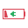
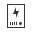

# 🖼️ 素材分類：32

> [🏠 主目錄](../../../../../../README.md) / [images](../../../../../README.md) / [iCons](../../../../README.md) / [Pixel](../../../README.md) / [Breeze](../../README.md) / [Status ](../README.md) / **32**

本目錄共有 `54` 個檔案

| 🎨 預覽 (點擊放大)  | 📋 檔案詳細資訊與連結 |
| :--- | :--- |
|  | **📂 檔名:** `apport.svg` ✨ **格式:** `Vector (SVG)` ⚖️ **大小:** `1.46KB` 📅 **更新:** `2026-03-03`  🚀 **jsDelivr Markdown:** `` 🔗 **直接連結 (Url):** <code>https://cdn.jsdelivr.net/gh/barry028/materials@main/images/iCons/Pixel/Breeze/Status%20/32/apport.svg</code> 📥 [檢視原始檔](apport.svg) |
|  | **📂 檔名:** `battery-000-charging.svg` ✨ **格式:** `Vector (SVG)` ⚖️ **大小:** `584.00B` 📅 **更新:** `2026-03-03`  🚀 **jsDelivr Markdown:** `` 🔗 **直接連結 (Url):** <code>https://cdn.jsdelivr.net/gh/barry028/materials@main/images/iCons/Pixel/Breeze/Status%20/32/battery-000-charging.svg</code> 📥 [檢視原始檔](battery-000-charging.svg) |
|  | **📂 檔名:** `battery-000.svg` ✨ **格式:** `Vector (SVG)` ⚖️ **大小:** `367.00B` 📅 **更新:** `2026-03-03`  🚀 **jsDelivr Markdown:** `` 🔗 **直接連結 (Url):** <code>https://cdn.jsdelivr.net/gh/barry028/materials@main/images/iCons/Pixel/Breeze/Status%20/32/battery-000.svg</code> 📥 [檢視原始檔](battery-000.svg) |
|  | **📂 檔名:** `battery-010-charging.svg` ✨ **格式:** `Vector (SVG)` ⚖️ **大小:** `640.00B` 📅 **更新:** `2026-03-03`  🚀 **jsDelivr Markdown:** `` 🔗 **直接連結 (Url):** <code>https://cdn.jsdelivr.net/gh/barry028/materials@main/images/iCons/Pixel/Breeze/Status%20/32/battery-010-charging.svg</code> 📥 [檢視原始檔](battery-010-charging.svg) |
|  | **📂 檔名:** `battery-010.svg` ✨ **格式:** `Vector (SVG)` ⚖️ **大小:** `423.00B` 📅 **更新:** `2026-03-03`  🚀 **jsDelivr Markdown:** `` 🔗 **直接連結 (Url):** <code>https://cdn.jsdelivr.net/gh/barry028/materials@main/images/iCons/Pixel/Breeze/Status%20/32/battery-010.svg</code> 📥 [檢視原始檔](battery-010.svg) |
|  | **📂 檔名:** `battery-020-charging.svg` ✨ **格式:** `Vector (SVG)` ⚖️ **大小:** `608.00B` 📅 **更新:** `2026-03-03`  🚀 **jsDelivr Markdown:** `` 🔗 **直接連結 (Url):** <code>https://cdn.jsdelivr.net/gh/barry028/materials@main/images/iCons/Pixel/Breeze/Status%20/32/battery-020-charging.svg</code> 📥 [檢視原始檔](battery-020-charging.svg) |
|  | **📂 檔名:** `battery-020.svg` ✨ **格式:** `Vector (SVG)` ⚖️ **大小:** `391.00B` 📅 **更新:** `2026-03-03`  🚀 **jsDelivr Markdown:** `` 🔗 **直接連結 (Url):** <code>https://cdn.jsdelivr.net/gh/barry028/materials@main/images/iCons/Pixel/Breeze/Status%20/32/battery-020.svg</code> 📥 [檢視原始檔](battery-020.svg) |
|  | **📂 檔名:** `battery-030-charging.svg` ✨ **格式:** `Vector (SVG)` ⚖️ **大小:** `608.00B` 📅 **更新:** `2026-03-03`  🚀 **jsDelivr Markdown:** `` 🔗 **直接連結 (Url):** <code>https://cdn.jsdelivr.net/gh/barry028/materials@main/images/iCons/Pixel/Breeze/Status%20/32/battery-030-charging.svg</code> 📥 [檢視原始檔](battery-030-charging.svg) |
|  | **📂 檔名:** `battery-030.svg` ✨ **格式:** `Vector (SVG)` ⚖️ **大小:** `391.00B` 📅 **更新:** `2026-03-03`  🚀 **jsDelivr Markdown:** `` 🔗 **直接連結 (Url):** <code>https://cdn.jsdelivr.net/gh/barry028/materials@main/images/iCons/Pixel/Breeze/Status%20/32/battery-030.svg</code> 📥 [檢視原始檔](battery-030.svg) |
|  | **📂 檔名:** `battery-040-charging.svg` ✨ **格式:** `Vector (SVG)` ⚖️ **大小:** `608.00B` 📅 **更新:** `2026-03-03`  🚀 **jsDelivr Markdown:** `` 🔗 **直接連結 (Url):** <code>https://cdn.jsdelivr.net/gh/barry028/materials@main/images/iCons/Pixel/Breeze/Status%20/32/battery-040-charging.svg</code> 📥 [檢視原始檔](battery-040-charging.svg) |
|  | **📂 檔名:** `battery-040.svg` ✨ **格式:** `Vector (SVG)` ⚖️ **大小:** `391.00B` 📅 **更新:** `2026-03-03`  🚀 **jsDelivr Markdown:** `` 🔗 **直接連結 (Url):** <code>https://cdn.jsdelivr.net/gh/barry028/materials@main/images/iCons/Pixel/Breeze/Status%20/32/battery-040.svg</code> 📥 [檢視原始檔](battery-040.svg) |
|  | **📂 檔名:** `battery-050-charging.svg` ✨ **格式:** `Vector (SVG)` ⚖️ **大小:** `609.00B` 📅 **更新:** `2026-03-03`  🚀 **jsDelivr Markdown:** `` 🔗 **直接連結 (Url):** <code>https://cdn.jsdelivr.net/gh/barry028/materials@main/images/iCons/Pixel/Breeze/Status%20/32/battery-050-charging.svg</code> 📥 [檢視原始檔](battery-050-charging.svg) |
|  | **📂 檔名:** `battery-050.svg` ✨ **格式:** `Vector (SVG)` ⚖️ **大小:** `392.00B` 📅 **更新:** `2026-03-03`  🚀 **jsDelivr Markdown:** `` 🔗 **直接連結 (Url):** <code>https://cdn.jsdelivr.net/gh/barry028/materials@main/images/iCons/Pixel/Breeze/Status%20/32/battery-050.svg</code> 📥 [檢視原始檔](battery-050.svg) |
|  | **📂 檔名:** `battery-060-charging.svg` ✨ **格式:** `Vector (SVG)` ⚖️ **大小:** `609.00B` 📅 **更新:** `2026-03-03`  🚀 **jsDelivr Markdown:** `` 🔗 **直接連結 (Url):** <code>https://cdn.jsdelivr.net/gh/barry028/materials@main/images/iCons/Pixel/Breeze/Status%20/32/battery-060-charging.svg</code> 📥 [檢視原始檔](battery-060-charging.svg) |
|  | **📂 檔名:** `battery-060.svg` ✨ **格式:** `Vector (SVG)` ⚖️ **大小:** `392.00B` 📅 **更新:** `2026-03-03`  🚀 **jsDelivr Markdown:** `` 🔗 **直接連結 (Url):** <code>https://cdn.jsdelivr.net/gh/barry028/materials@main/images/iCons/Pixel/Breeze/Status%20/32/battery-060.svg</code> 📥 [檢視原始檔](battery-060.svg) |
|  | **📂 檔名:** `battery-070-charging.svg` ✨ **格式:** `Vector (SVG)` ⚖️ **大小:** `609.00B` 📅 **更新:** `2026-03-03`  🚀 **jsDelivr Markdown:** `` 🔗 **直接連結 (Url):** <code>https://cdn.jsdelivr.net/gh/barry028/materials@main/images/iCons/Pixel/Breeze/Status%20/32/battery-070-charging.svg</code> 📥 [檢視原始檔](battery-070-charging.svg) |
|  | **📂 檔名:** `battery-070.svg` ✨ **格式:** `Vector (SVG)` ⚖️ **大小:** `392.00B` 📅 **更新:** `2026-03-03`  🚀 **jsDelivr Markdown:** `` 🔗 **直接連結 (Url):** <code>https://cdn.jsdelivr.net/gh/barry028/materials@main/images/iCons/Pixel/Breeze/Status%20/32/battery-070.svg</code> 📥 [檢視原始檔](battery-070.svg) |
|  | **📂 檔名:** `battery-080-charging.svg` ✨ **格式:** `Vector (SVG)` ⚖️ **大小:** `609.00B` 📅 **更新:** `2026-03-03`  🚀 **jsDelivr Markdown:** `` 🔗 **直接連結 (Url):** <code>https://cdn.jsdelivr.net/gh/barry028/materials@main/images/iCons/Pixel/Breeze/Status%20/32/battery-080-charging.svg</code> 📥 [檢視原始檔](battery-080-charging.svg) |
|  | **📂 檔名:** `battery-080.svg` ✨ **格式:** `Vector (SVG)` ⚖️ **大小:** `392.00B` 📅 **更新:** `2026-03-03`  🚀 **jsDelivr Markdown:** `` 🔗 **直接連結 (Url):** <code>https://cdn.jsdelivr.net/gh/barry028/materials@main/images/iCons/Pixel/Breeze/Status%20/32/battery-080.svg</code> 📥 [檢視原始檔](battery-080.svg) |
|  | **📂 檔名:** `battery-090-charging.svg` ✨ **格式:** `Vector (SVG)` ⚖️ **大小:** `609.00B` 📅 **更新:** `2026-03-03`  🚀 **jsDelivr Markdown:** `` 🔗 **直接連結 (Url):** <code>https://cdn.jsdelivr.net/gh/barry028/materials@main/images/iCons/Pixel/Breeze/Status%20/32/battery-090-charging.svg</code> 📥 [檢視原始檔](battery-090-charging.svg) |
|  | **📂 檔名:** `battery-090.svg` ✨ **格式:** `Vector (SVG)` ⚖️ **大小:** `392.00B` 📅 **更新:** `2026-03-03`  🚀 **jsDelivr Markdown:** `` 🔗 **直接連結 (Url):** <code>https://cdn.jsdelivr.net/gh/barry028/materials@main/images/iCons/Pixel/Breeze/Status%20/32/battery-090.svg</code> 📥 [檢視原始檔](battery-090.svg) |
|  | **📂 檔名:** `battery-100-charging.svg` ✨ **格式:** `Vector (SVG)` ⚖️ **大小:** `607.00B` 📅 **更新:** `2026-03-03`  🚀 **jsDelivr Markdown:** `` 🔗 **直接連結 (Url):** <code>https://cdn.jsdelivr.net/gh/barry028/materials@main/images/iCons/Pixel/Breeze/Status%20/32/battery-100-charging.svg</code> 📥 [檢視原始檔](battery-100-charging.svg) |
|  | **📂 檔名:** `battery-100.svg` ✨ **格式:** `Vector (SVG)` ⚖️ **大小:** `390.00B` 📅 **更新:** `2026-03-03`  🚀 **jsDelivr Markdown:** `` 🔗 **直接連結 (Url):** <code>https://cdn.jsdelivr.net/gh/barry028/materials@main/images/iCons/Pixel/Breeze/Status%20/32/battery-100.svg</code> 📥 [檢視原始檔](battery-100.svg) |
|  | **📂 檔名:** `battery-missing.svg` ✨ **格式:** `Vector (SVG)` ⚖️ **大小:** `724.00B` 📅 **更新:** `2026-03-03`  🚀 **jsDelivr Markdown:** `` 🔗 **直接連結 (Url):** <code>https://cdn.jsdelivr.net/gh/barry028/materials@main/images/iCons/Pixel/Breeze/Status%20/32/battery-missing.svg</code> 📥 [檢視原始檔](battery-missing.svg) |
|  | **📂 檔名:** `battery-ups.svg` ✨ **格式:** `Vector (SVG)` ⚖️ **大小:** `2.50KB` 📅 **更新:** `2026-03-03`  🚀 **jsDelivr Markdown:** `` 🔗 **直接連結 (Url):** <code>https://cdn.jsdelivr.net/gh/barry028/materials@main/images/iCons/Pixel/Breeze/Status%20/32/battery-ups.svg</code> 📥 [檢視原始檔](battery-ups.svg) |
|  | **📂 檔名:** `call-incoming.svg` ✨ **格式:** `Vector (SVG)` ⚖️ **大小:** `708.00B` 📅 **更新:** `2026-03-03`  🚀 **jsDelivr Markdown:** `` 🔗 **直接連結 (Url):** <code>https://cdn.jsdelivr.net/gh/barry028/materials@main/images/iCons/Pixel/Breeze/Status%20/32/call-incoming.svg</code> 📥 [檢視原始檔](call-incoming.svg) |
|  | **📂 檔名:** `call-missed.svg` ✨ **格式:** `Vector (SVG)` ⚖️ **大小:** `775.00B` 📅 **更新:** `2026-03-03`  🚀 **jsDelivr Markdown:** `` 🔗 **直接連結 (Url):** <code>https://cdn.jsdelivr.net/gh/barry028/materials@main/images/iCons/Pixel/Breeze/Status%20/32/call-missed.svg</code> 📥 [檢視原始檔](call-missed.svg) |
|  | **📂 檔名:** `call-outgoing.svg` ✨ **格式:** `Vector (SVG)` ⚖️ **大小:** `701.00B` 📅 **更新:** `2026-03-03`  🚀 **jsDelivr Markdown:** `` 🔗 **直接連結 (Url):** <code>https://cdn.jsdelivr.net/gh/barry028/materials@main/images/iCons/Pixel/Breeze/Status%20/32/call-outgoing.svg</code> 📥 [檢視原始檔](call-outgoing.svg) |
|  | **📂 檔名:** `dialog-warning.svg` ✨ **格式:** `Vector (SVG)` ⚖️ **大小:** `1.30KB` 📅 **更新:** `2026-03-03`  🚀 **jsDelivr Markdown:** `` 🔗 **直接連結 (Url):** <code>https://cdn.jsdelivr.net/gh/barry028/materials@main/images/iCons/Pixel/Breeze/Status%20/32/dialog-warning.svg</code> 📥 [檢視原始檔](dialog-warning.svg) |
|  | **📂 檔名:** `input-caps-on.svg` ✨ **格式:** `Vector (SVG)` ⚖️ **大小:** `1.55KB` 📅 **更新:** `2026-03-03`  🚀 **jsDelivr Markdown:** `` 🔗 **直接連結 (Url):** <code>https://cdn.jsdelivr.net/gh/barry028/materials@main/images/iCons/Pixel/Breeze/Status%20/32/input-caps-on.svg</code> 📥 [檢視原始檔](input-caps-on.svg) |
|  | **📂 檔名:** `input-combo-on.svg` ✨ **格式:** `Vector (SVG)` ⚖️ **大小:** `1.60KB` 📅 **更新:** `2026-03-03`  🚀 **jsDelivr Markdown:** `` 🔗 **直接連結 (Url):** <code>https://cdn.jsdelivr.net/gh/barry028/materials@main/images/iCons/Pixel/Breeze/Status%20/32/input-combo-on.svg</code> 📥 [檢視原始檔](input-combo-on.svg) |
|  | **📂 檔名:** `input-keyboard-battery.svg` ✨ **格式:** `Vector (SVG)` ⚖️ **大小:** `1.64KB` 📅 **更新:** `2026-03-03`  🚀 **jsDelivr Markdown:** `` 🔗 **直接連結 (Url):** <code>https://cdn.jsdelivr.net/gh/barry028/materials@main/images/iCons/Pixel/Breeze/Status%20/32/input-keyboard-battery.svg</code> 📥 [檢視原始檔](input-keyboard-battery.svg) |
|  | **📂 檔名:** `input-keyboard-brightness.svg` ✨ **格式:** `Vector (SVG)` ⚖️ **大小:** `3.40KB` 📅 **更新:** `2026-03-03`  🚀 **jsDelivr Markdown:** `` 🔗 **直接連結 (Url):** <code>https://cdn.jsdelivr.net/gh/barry028/materials@main/images/iCons/Pixel/Breeze/Status%20/32/input-keyboard-brightness.svg</code> 📥 [檢視原始檔](input-keyboard-brightness.svg) |
|  | **📂 檔名:** `input-keyboard-virtual-off.svg` ✨ **格式:** `Vector (SVG)` ⚖️ **大小:** `2.60KB` 📅 **更新:** `2026-03-03`  🚀 **jsDelivr Markdown:** `` 🔗 **直接連結 (Url):** <code>https://cdn.jsdelivr.net/gh/barry028/materials@main/images/iCons/Pixel/Breeze/Status%20/32/input-keyboard-virtual-off.svg</code> 📥 [檢視原始檔](input-keyboard-virtual-off.svg) |
|  | **📂 檔名:** `input-keyboard-virtual-on.svg` ✨ **格式:** `Vector (SVG)` ⚖️ **大小:** `2.85KB` 📅 **更新:** `2026-03-03`  🚀 **jsDelivr Markdown:** `` 🔗 **直接連結 (Url):** <code>https://cdn.jsdelivr.net/gh/barry028/materials@main/images/iCons/Pixel/Breeze/Status%20/32/input-keyboard-virtual-on.svg</code> 📥 [檢視原始檔](input-keyboard-virtual-on.svg) |
|  | **📂 檔名:** `input-num-on.svg` ✨ **格式:** `Vector (SVG)` ⚖️ **大小:** `1.46KB` 📅 **更新:** `2026-03-03`  🚀 **jsDelivr Markdown:** `` 🔗 **直接連結 (Url):** <code>https://cdn.jsdelivr.net/gh/barry028/materials@main/images/iCons/Pixel/Breeze/Status%20/32/input-num-on.svg</code> 📥 [檢視原始檔](input-num-on.svg) |
|  | **📂 檔名:** `keyboard-layout.svg` ✨ **格式:** `Vector (SVG)` ⚖️ **大小:** `3.35KB` 📅 **更新:** `2026-03-03`  🚀 **jsDelivr Markdown:** `` 🔗 **直接連結 (Url):** <code>https://cdn.jsdelivr.net/gh/barry028/materials@main/images/iCons/Pixel/Breeze/Status%20/32/keyboard-layout.svg</code> 📥 [檢視原始檔](keyboard-layout.svg) |
|  | **📂 檔名:** `plasmavault_error.svg` ✨ **格式:** `Vector (SVG)` ⚖️ **大小:** `988.00B` 📅 **更新:** `2026-03-03`  🚀 **jsDelivr Markdown:** `` 🔗 **直接連結 (Url):** <code>https://cdn.jsdelivr.net/gh/barry028/materials@main/images/iCons/Pixel/Breeze/Status%20/32/plasmavault_error.svg</code> 📥 [檢視原始檔](plasmavault_error.svg) |
|  | **📂 檔名:** `quassel_inactive.svg` ✨ **格式:** `Vector (SVG)` ⚖️ **大小:** `1.89KB` 📅 **更新:** `2026-03-03`  🚀 **jsDelivr Markdown:** `` 🔗 **直接連結 (Url):** <code>https://cdn.jsdelivr.net/gh/barry028/materials@main/images/iCons/Pixel/Breeze/Status%20/32/quassel_inactive.svg</code> 📥 [檢視原始檔](quassel_inactive.svg) |
|  | **📂 檔名:** `quassel_message.svg` ✨ **格式:** `Vector (SVG)` ⚖️ **大小:** `1.88KB` 📅 **更新:** `2026-03-03`  🚀 **jsDelivr Markdown:** `` 🔗 **直接連結 (Url):** <code>https://cdn.jsdelivr.net/gh/barry028/materials@main/images/iCons/Pixel/Breeze/Status%20/32/quassel_message.svg</code> 📥 [檢視原始檔](quassel_message.svg) |
|  | **📂 檔名:** `rotation-allowed.svg` ✨ **格式:** `Vector (SVG)` ⚖️ **大小:** `958.00B` 📅 **更新:** `2026-03-03`  🚀 **jsDelivr Markdown:** `` 🔗 **直接連結 (Url):** <code>https://cdn.jsdelivr.net/gh/barry028/materials@main/images/iCons/Pixel/Breeze/Status%20/32/rotation-allowed.svg</code> 📥 [檢視原始檔](rotation-allowed.svg) |
|  | **📂 檔名:** `rotation-locked-landscape.svg` ✨ **格式:** `Vector (SVG)` ⚖️ **大小:** `494.00B` 📅 **更新:** `2026-03-03`  🚀 **jsDelivr Markdown:** `` 🔗 **直接連結 (Url):** <code>https://cdn.jsdelivr.net/gh/barry028/materials@main/images/iCons/Pixel/Breeze/Status%20/32/rotation-locked-landscape.svg</code> 📥 [檢視原始檔](rotation-locked-landscape.svg) |
|  | **📂 檔名:** `rotation-locked-portrait.svg` ✨ **格式:** `Vector (SVG)` ⚖️ **大小:** `493.00B` 📅 **更新:** `2026-03-03`  🚀 **jsDelivr Markdown:** `` 🔗 **直接連結 (Url):** <code>https://cdn.jsdelivr.net/gh/barry028/materials@main/images/iCons/Pixel/Breeze/Status%20/32/rotation-locked-portrait.svg</code> 📥 [檢視原始檔](rotation-locked-portrait.svg) |
|  | **📂 檔名:** `smartphoneconnected.svg` ✨ **格式:** `Vector (SVG)` ⚖️ **大小:** `820.00B` 📅 **更新:** `2026-03-03`  🚀 **jsDelivr Markdown:** `` 🔗 **直接連結 (Url):** <code>https://cdn.jsdelivr.net/gh/barry028/materials@main/images/iCons/Pixel/Breeze/Status%20/32/smartphoneconnected.svg</code> 📥 [檢視原始檔](smartphoneconnected.svg) |
|  | **📂 檔名:** `smartphonedisconnected.svg` ✨ **格式:** `Vector (SVG)` ⚖️ **大小:** `1.46KB` 📅 **更新:** `2026-03-03`  🚀 **jsDelivr Markdown:** `` 🔗 **直接連結 (Url):** <code>https://cdn.jsdelivr.net/gh/barry028/materials@main/images/iCons/Pixel/Breeze/Status%20/32/smartphonedisconnected.svg</code> 📥 [檢視原始檔](smartphonedisconnected.svg) |
|  | **📂 檔名:** `smartphonetrusted.svg` ✨ **格式:** `Vector (SVG)` ⚖️ **大小:** `1.40KB` 📅 **更新:** `2026-03-03`  🚀 **jsDelivr Markdown:** `` 🔗 **直接連結 (Url):** <code>https://cdn.jsdelivr.net/gh/barry028/materials@main/images/iCons/Pixel/Breeze/Status%20/32/smartphonetrusted.svg</code> 📥 [檢視原始檔](smartphonetrusted.svg) |
|  | **📂 檔名:** `software-updates-additional.svg` ✨ **格式:** `Vector (SVG)` ⚖️ **大小:** `2.24KB` 📅 **更新:** `2026-03-03`  🚀 **jsDelivr Markdown:** `` 🔗 **直接連結 (Url):** <code>https://cdn.jsdelivr.net/gh/barry028/materials@main/images/iCons/Pixel/Breeze/Status%20/32/software-updates-additional.svg</code> 📥 [檢視原始檔](software-updates-additional.svg) |
|  | **📂 檔名:** `software-updates-important.svg` ✨ **格式:** `Vector (SVG)` ⚖️ **大小:** `2.01KB` 📅 **更新:** `2026-03-03`  🚀 **jsDelivr Markdown:** `` 🔗 **直接連結 (Url):** <code>https://cdn.jsdelivr.net/gh/barry028/materials@main/images/iCons/Pixel/Breeze/Status%20/32/software-updates-important.svg</code> 📥 [檢視原始檔](software-updates-important.svg) |
|  | **📂 檔名:** `software-updates-inactive.svg` ✨ **格式:** `Vector (SVG)` ⚖️ **大小:** `1.79KB` 📅 **更新:** `2026-03-03`  🚀 **jsDelivr Markdown:** `` 🔗 **直接連結 (Url):** <code>https://cdn.jsdelivr.net/gh/barry028/materials@main/images/iCons/Pixel/Breeze/Status%20/32/software-updates-inactive.svg</code> 📥 [檢視原始檔](software-updates-inactive.svg) |
|  | **📂 檔名:** `software-updates-release.svg` ✨ **格式:** `Vector (SVG)` ⚖️ **大小:** `2.16KB` 📅 **更新:** `2026-03-03`  🚀 **jsDelivr Markdown:** `` 🔗 **直接連結 (Url):** <code>https://cdn.jsdelivr.net/gh/barry028/materials@main/images/iCons/Pixel/Breeze/Status%20/32/software-updates-release.svg</code> 📥 [檢視原始檔](software-updates-release.svg) |
|  | **📂 檔名:** `software-updates-security.svg` ✨ **格式:** `Vector (SVG)` ⚖️ **大小:** `2.07KB` 📅 **更新:** `2026-03-03`  🚀 **jsDelivr Markdown:** `` 🔗 **直接連結 (Url):** <code>https://cdn.jsdelivr.net/gh/barry028/materials@main/images/iCons/Pixel/Breeze/Status%20/32/software-updates-security.svg</code> 📥 [檢視原始檔](software-updates-security.svg) |
|  | **📂 檔名:** `software-updates-updates.svg` ✨ **格式:** `Vector (SVG)` ⚖️ **大小:** `2.17KB` 📅 **更新:** `2026-03-03`  🚀 **jsDelivr Markdown:** `` 🔗 **直接連結 (Url):** <code>https://cdn.jsdelivr.net/gh/barry028/materials@main/images/iCons/Pixel/Breeze/Status%20/32/software-updates-updates.svg</code> 📥 [檢視原始檔](software-updates-updates.svg) |
|  | **📂 檔名:** `touchpad_disabled.svg` ✨ **格式:** `Vector (SVG)` ⚖️ **大小:** `2.05KB` 📅 **更新:** `2026-03-03`  🚀 **jsDelivr Markdown:** `` 🔗 **直接連結 (Url):** <code>https://cdn.jsdelivr.net/gh/barry028/materials@main/images/iCons/Pixel/Breeze/Status%20/32/touchpad_disabled.svg</code> 📥 [檢視原始檔](touchpad_disabled.svg) |
|  | **📂 檔名:** `touchpad_enabled.svg` ✨ **格式:** `Vector (SVG)` ⚖️ **大小:** `1.80KB` 📅 **更新:** `2026-03-03`  🚀 **jsDelivr Markdown:** `` 🔗 **直接連結 (Url):** <code>https://cdn.jsdelivr.net/gh/barry028/materials@main/images/iCons/Pixel/Breeze/Status%20/32/touchpad_enabled.svg</code> 📥 [檢視原始檔](touchpad_enabled.svg) |