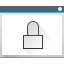

# 🖼️ 素材分類：64

> [🏠 主目錄](../../../../../../README.md) / [images](../../../../../README.md) / [iCons](../../../../README.md) / [Pixel](../../../README.md) / [Breeze](../../README.md) / [Status ](../README.md) / **64**

本目錄共有 `13` 個檔案

| 🎨 預覽 (點擊放大)  | 📋 檔案詳細資訊與連結 |
| :--- | :--- |
|  | **📂 檔名:** `dialog-error.svg` ✨ **格式:** `Vector (SVG)` ⚖️ **大小:** `2.92KB` 📅 **更新:** `2026-03-02`  🚀 **jsDelivr Markdown:** `` 🔗 **直接連結 (Url):** <code>https://cdn.jsdelivr.net/gh/barry028/materials@main/images/iCons/Pixel/Breeze/Status%20/64/dialog-error.svg</code> 📥 [檢視原始檔](dialog-error.svg) |
|  | **📂 檔名:** `dialog-information.svg` ✨ **格式:** `Vector (SVG)` ⚖️ **大小:** `2.66KB` 📅 **更新:** `2026-03-02`  🚀 **jsDelivr Markdown:** `` 🔗 **直接連結 (Url):** <code>https://cdn.jsdelivr.net/gh/barry028/materials@main/images/iCons/Pixel/Breeze/Status%20/64/dialog-information.svg</code> 📥 [檢視原始檔](dialog-information.svg) |
|  | **📂 檔名:** `dialog-password.svg` ✨ **格式:** `Vector (SVG)` ⚖️ **大小:** `3.35KB` 📅 **更新:** `2026-03-02`  🚀 **jsDelivr Markdown:** `` 🔗 **直接連結 (Url):** <code>https://cdn.jsdelivr.net/gh/barry028/materials@main/images/iCons/Pixel/Breeze/Status%20/64/dialog-password.svg</code> 📥 [檢視原始檔](dialog-password.svg) |
|  | **📂 檔名:** `dialog-positive.svg` ✨ **格式:** `Vector (SVG)` ⚖️ **大小:** `1.36KB` 📅 **更新:** `2026-03-02`  🚀 **jsDelivr Markdown:** `` 🔗 **直接連結 (Url):** <code>https://cdn.jsdelivr.net/gh/barry028/materials@main/images/iCons/Pixel/Breeze/Status%20/64/dialog-positive.svg</code> 📥 [檢視原始檔](dialog-positive.svg) |
|  | **📂 檔名:** `dialog-question.svg` ✨ **格式:** `Vector (SVG)` ⚖️ **大小:** `3.56KB` 📅 **更新:** `2026-03-02`  🚀 **jsDelivr Markdown:** `` 🔗 **直接連結 (Url):** <code>https://cdn.jsdelivr.net/gh/barry028/materials@main/images/iCons/Pixel/Breeze/Status%20/64/dialog-question.svg</code> 📥 [檢視原始檔](dialog-question.svg) |
|  | **📂 檔名:** `dialog-warning.svg` ✨ **格式:** `Vector (SVG)` ⚖️ **大小:** `2.82KB` 📅 **更新:** `2026-03-02`  🚀 **jsDelivr Markdown:** `` 🔗 **直接連結 (Url):** <code>https://cdn.jsdelivr.net/gh/barry028/materials@main/images/iCons/Pixel/Breeze/Status%20/64/dialog-warning.svg</code> 📥 [檢視原始檔](dialog-warning.svg) |
|  | **📂 檔名:** `image-missing.svg` ✨ **格式:** `Vector (SVG)` ⚖️ **大小:** `1.87KB` 📅 **更新:** `2026-03-02`  🚀 **jsDelivr Markdown:** `` 🔗 **直接連結 (Url):** <code>https://cdn.jsdelivr.net/gh/barry028/materials@main/images/iCons/Pixel/Breeze/Status%20/64/image-missing.svg</code> 📥 [檢視原始檔](image-missing.svg) |
|  | **📂 檔名:** `security-high.svg` ✨ **格式:** `Vector (SVG)` ⚖️ **大小:** `2.88KB` 📅 **更新:** `2026-03-02`  🚀 **jsDelivr Markdown:** `` 🔗 **直接連結 (Url):** <code>https://cdn.jsdelivr.net/gh/barry028/materials@main/images/iCons/Pixel/Breeze/Status%20/64/security-high.svg</code> 📥 [檢視原始檔](security-high.svg) |
|  | **📂 檔名:** `security-low.svg` ✨ **格式:** `Vector (SVG)` ⚖️ **大小:** `2.90KB` 📅 **更新:** `2026-03-02`  🚀 **jsDelivr Markdown:** `` 🔗 **直接連結 (Url):** <code>https://cdn.jsdelivr.net/gh/barry028/materials@main/images/iCons/Pixel/Breeze/Status%20/64/security-low.svg</code> 📥 [檢視原始檔](security-low.svg) |
|  | **📂 檔名:** `security-medium.svg` ✨ **格式:** `Vector (SVG)` ⚖️ **大小:** `2.68KB` 📅 **更新:** `2026-03-02`  🚀 **jsDelivr Markdown:** `` 🔗 **直接連結 (Url):** <code>https://cdn.jsdelivr.net/gh/barry028/materials@main/images/iCons/Pixel/Breeze/Status%20/64/security-medium.svg</code> 📥 [檢視原始檔](security-medium.svg) |
|  | **📂 檔名:** `smartphoneconnected.svg` ✨ **格式:** `Vector (SVG)` ⚖️ **大小:** `811.00B` 📅 **更新:** `2026-03-02`  🚀 **jsDelivr Markdown:** `` 🔗 **直接連結 (Url):** <code>https://cdn.jsdelivr.net/gh/barry028/materials@main/images/iCons/Pixel/Breeze/Status%20/64/smartphoneconnected.svg</code> 📥 [檢視原始檔](smartphoneconnected.svg) |
|  | **📂 檔名:** `smartphonedisconnected.svg` ✨ **格式:** `Vector (SVG)` ⚖️ **大小:** `1.41KB` 📅 **更新:** `2026-03-02`  🚀 **jsDelivr Markdown:** `` 🔗 **直接連結 (Url):** <code>https://cdn.jsdelivr.net/gh/barry028/materials@main/images/iCons/Pixel/Breeze/Status%20/64/smartphonedisconnected.svg</code> 📥 [檢視原始檔](smartphonedisconnected.svg) |
|  | **📂 檔名:** `smartphonetrusted.svg` ✨ **格式:** `Vector (SVG)` ⚖️ **大小:** `1.38KB` 📅 **更新:** `2026-03-02`  🚀 **jsDelivr Markdown:** `` 🔗 **直接連結 (Url):** <code>https://cdn.jsdelivr.net/gh/barry028/materials@main/images/iCons/Pixel/Breeze/Status%20/64/smartphonetrusted.svg</code> 📥 [檢視原始檔](smartphonetrusted.svg) |