# 🖼️ 素材分類：Cursor

> [🏠 主目錄](../../../../README.md) / [images](../../../README.md) / [iCons](../../README.md) / [Pixel](../README.md) / **Cursor**

本目錄共有 `40` 個檔案

| 🎨 預覽 (點擊放大)  | 📋 檔案詳細資訊與連結 |
| :--- | :--- |
|  | **📂 檔名:** `Group 1.svg` ✨ **格式:** `Vector (SVG)` ⚖️ **大小:** `5.88KB` 📅 **更新:** `2026-03-03`  🚀 **jsDelivr Markdown:** `` 🔗 **直接連結 (Url):** <code>https://cdn.jsdelivr.net/gh/barry028/materials@main/images/iCons/Pixel/Cursor/Group%201.svg</code> 📥 [檢視原始檔](Group%201.svg) |
| <a href="Mail.svg">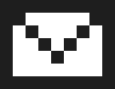</a> | **📂 檔名:** `Mail.svg` ✨ **格式:** `Vector (SVG)` ⚖️ **大小:** `2.06KB` 📅 **更新:** `2026-03-03`  🚀 **jsDelivr Markdown:** `` 🔗 **直接連結 (Url):** <code>https://cdn.jsdelivr.net/gh/barry028/materials@main/images/iCons/Pixel/Cursor/Mail.svg</code> 📥 [檢視原始檔](Mail.svg) |
|  | **📂 檔名:** `add Mail.svg` ✨ **格式:** `Vector (SVG)` ⚖️ **大小:** `2.00KB` 📅 **更新:** `2026-03-03`  🚀 **jsDelivr Markdown:** `` 🔗 **直接連結 (Url):** <code>https://cdn.jsdelivr.net/gh/barry028/materials@main/images/iCons/Pixel/Cursor/add%20Mail.svg</code> 📥 [檢視原始檔](add%20Mail.svg) |
| <a href="add.svg">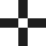</a> | **📂 檔名:** `add.svg` ✨ **格式:** `Vector (SVG)` ⚖️ **大小:** `627.00B` 📅 **更新:** `2026-03-03`  🚀 **jsDelivr Markdown:** `` 🔗 **直接連結 (Url):** <code>https://cdn.jsdelivr.net/gh/barry028/materials@main/images/iCons/Pixel/Cursor/add.svg</code> 📥 [檢視原始檔](add.svg) |
| <a href="check.svg">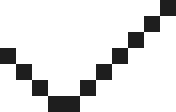</a> | **📂 檔名:** `check.svg` ✨ **格式:** `Vector (SVG)` ⚖️ **大小:** `757.00B` 📅 **更新:** `2026-03-03`  🚀 **jsDelivr Markdown:** `` 🔗 **直接連結 (Url):** <code>https://cdn.jsdelivr.net/gh/barry028/materials@main/images/iCons/Pixel/Cursor/check.svg</code> 📥 [檢視原始檔](check.svg) |
| <a href="comment.svg">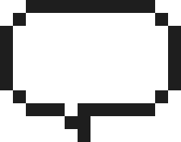</a> | **📂 檔名:** `comment.svg` ✨ **格式:** `Vector (SVG)` ⚖️ **大小:** `2.14KB` 📅 **更新:** `2026-03-03`  🚀 **jsDelivr Markdown:** `` 🔗 **直接連結 (Url):** <code>https://cdn.jsdelivr.net/gh/barry028/materials@main/images/iCons/Pixel/Cursor/comment.svg</code> 📥 [檢視原始檔](comment.svg) |
| <a href="dislike.svg">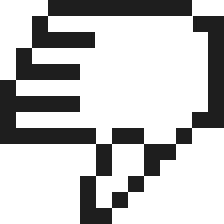</a> | **📂 檔名:** `dislike.svg` ✨ **格式:** `Vector (SVG)` ⚖️ **大小:** `4.91KB` 📅 **更新:** `2026-03-03`  🚀 **jsDelivr Markdown:** `` 🔗 **直接連結 (Url):** <code>https://cdn.jsdelivr.net/gh/barry028/materials@main/images/iCons/Pixel/Cursor/dislike.svg</code> 📥 [檢視原始檔](dislike.svg) |
|  | **📂 檔名:** `down arrow.svg` ✨ **格式:** `Vector (SVG)` ⚖️ **大小:** `1.15KB` 📅 **更新:** `2026-03-03`  🚀 **jsDelivr Markdown:** `` 🔗 **直接連結 (Url):** <code>https://cdn.jsdelivr.net/gh/barry028/materials@main/images/iCons/Pixel/Cursor/down%20arrow.svg</code> 📥 [檢視原始檔](down%20arrow.svg) |
|  | **📂 檔名:** `down.svg` ✨ **格式:** `Vector (SVG)` ⚖️ **大小:** `626.00B` 📅 **更新:** `2026-03-03`  🚀 **jsDelivr Markdown:** `` 🔗 **直接連結 (Url):** <code>https://cdn.jsdelivr.net/gh/barry028/materials@main/images/iCons/Pixel/Cursor/down.svg</code> 📥 [檢視原始檔](down.svg) |
| <a href="download.svg">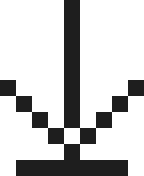</a> | **📂 檔名:** `download.svg` ✨ **格式:** `Vector (SVG)` ⚖️ **大小:** `1.51KB` 📅 **更新:** `2026-03-03`  🚀 **jsDelivr Markdown:** `` 🔗 **直接連結 (Url):** <code>https://cdn.jsdelivr.net/gh/barry028/materials@main/images/iCons/Pixel/Cursor/download.svg</code> 📥 [檢視原始檔](download.svg) |
|  | **📂 檔名:** `folder.svg` ✨ **格式:** `Vector (SVG)` ⚖️ **大小:** `3.76KB` 📅 **更新:** `2026-03-03`  🚀 **jsDelivr Markdown:** `` 🔗 **直接連結 (Url):** <code>https://cdn.jsdelivr.net/gh/barry028/materials@main/images/iCons/Pixel/Cursor/folder.svg</code> 📥 [檢視原始檔](folder.svg) |
|  | **📂 檔名:** `left arrow.svg` ✨ **格式:** `Vector (SVG)` ⚖️ **大小:** `1.92KB` 📅 **更新:** `2026-03-03`  🚀 **jsDelivr Markdown:** `` 🔗 **直接連結 (Url):** <code>https://cdn.jsdelivr.net/gh/barry028/materials@main/images/iCons/Pixel/Cursor/left%20arrow.svg</code> 📥 [檢視原始檔](left%20arrow.svg) |
|  | **📂 檔名:** `left search.svg` ✨ **格式:** `Vector (SVG)` ⚖️ **大小:** `1.77KB` 📅 **更新:** `2026-03-03`  🚀 **jsDelivr Markdown:** `` 🔗 **直接連結 (Url):** <code>https://cdn.jsdelivr.net/gh/barry028/materials@main/images/iCons/Pixel/Cursor/left%20search.svg</code> 📥 [檢視原始檔](left%20search.svg) |
|  | **📂 檔名:** `left.svg` ✨ **格式:** `Vector (SVG)` ⚖️ **大小:** `902.00B` 📅 **更新:** `2026-03-03`  🚀 **jsDelivr Markdown:** `` 🔗 **直接連結 (Url):** <code>https://cdn.jsdelivr.net/gh/barry028/materials@main/images/iCons/Pixel/Cursor/left.svg</code> 📥 [檢視原始檔](left.svg) |
|  | **📂 檔名:** `like - heart.svg` ✨ **格式:** `Vector (SVG)` ⚖️ **大小:** `1.46KB` 📅 **更新:** `2026-03-03`  🚀 **jsDelivr Markdown:** `` 🔗 **直接連結 (Url):** <code>https://cdn.jsdelivr.net/gh/barry028/materials@main/images/iCons/Pixel/Cursor/like%20-%20heart.svg</code> 📥 [檢視原始檔](like%20-%20heart.svg) |
| <a href="like.svg">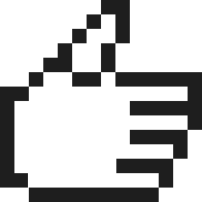</a> | **📂 檔名:** `like.svg` ✨ **格式:** `Vector (SVG)` ⚖️ **大小:** `3.62KB` 📅 **更新:** `2026-03-03`  🚀 **jsDelivr Markdown:** `` 🔗 **直接連結 (Url):** <code>https://cdn.jsdelivr.net/gh/barry028/materials@main/images/iCons/Pixel/Cursor/like.svg</code> 📥 [檢視原始檔](like.svg) |
| <a href="loading.svg">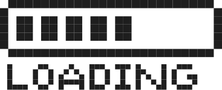</a> | **📂 檔名:** `loading.svg` ✨ **格式:** `Vector (SVG)` ⚖️ **大小:** `12.78KB` 📅 **更新:** `2026-03-03`  🚀 **jsDelivr Markdown:** `` 🔗 **直接連結 (Url):** <code>https://cdn.jsdelivr.net/gh/barry028/materials@main/images/iCons/Pixel/Cursor/loading.svg</code> 📥 [檢視原始檔](loading.svg) |
| <a href="lock.svg">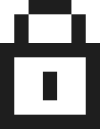</a> | **📂 檔名:** `lock.svg` ✨ **格式:** `Vector (SVG)` ⚖️ **大小:** `1.87KB` 📅 **更新:** `2026-03-03`  🚀 **jsDelivr Markdown:** `` 🔗 **直接連結 (Url):** <code>https://cdn.jsdelivr.net/gh/barry028/materials@main/images/iCons/Pixel/Cursor/lock.svg</code> 📥 [檢視原始檔](lock.svg) |
|  | **📂 檔名:** `loud voice.svg` ✨ **格式:** `Vector (SVG)` ⚖️ **大小:** `2.13KB` 📅 **更新:** `2026-03-03`  🚀 **jsDelivr Markdown:** `` 🔗 **直接連結 (Url):** <code>https://cdn.jsdelivr.net/gh/barry028/materials@main/images/iCons/Pixel/Cursor/loud%20voice.svg</code> 📥 [檢視原始檔](loud%20voice.svg) |
| <a href="love.svg">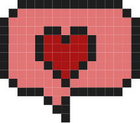</a> | **📂 檔名:** `love.svg` ✨ **格式:** `Vector (SVG)` ⚖️ **大小:** `13.07KB` 📅 **更新:** `2026-03-03`  🚀 **jsDelivr Markdown:** `` 🔗 **直接連結 (Url):** <code>https://cdn.jsdelivr.net/gh/barry028/materials@main/images/iCons/Pixel/Cursor/love.svg</code> 📥 [檢視原始檔](love.svg) |
|  | **📂 檔名:** `no comment.svg` ✨ **格式:** `Vector (SVG)` ⚖️ **大小:** `2.38KB` 📅 **更新:** `2026-03-03`  🚀 **jsDelivr Markdown:** `` 🔗 **直接連結 (Url):** <code>https://cdn.jsdelivr.net/gh/barry028/materials@main/images/iCons/Pixel/Cursor/no%20comment.svg</code> 📥 [檢視原始檔](no%20comment.svg) |
|  | **📂 檔名:** `no voice.svg` ✨ **格式:** `Vector (SVG)` ⚖️ **大小:** `2.09KB` 📅 **更新:** `2026-03-03`  🚀 **jsDelivr Markdown:** `` 🔗 **直接連結 (Url):** <code>https://cdn.jsdelivr.net/gh/barry028/materials@main/images/iCons/Pixel/Cursor/no%20voice.svg</code> 📥 [檢視原始檔](no%20voice.svg) |
|  | **📂 檔名:** `not sent mail.svg` ✨ **格式:** `Vector (SVG)` ⚖️ **大小:** `2.06KB` 📅 **更新:** `2026-03-03`  🚀 **jsDelivr Markdown:** `` 🔗 **直接連結 (Url):** <code>https://cdn.jsdelivr.net/gh/barry028/materials@main/images/iCons/Pixel/Cursor/not%20sent%20mail.svg</code> 📥 [檢視原始檔](not%20sent%20mail.svg) |
| <a href="play.svg">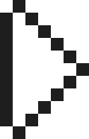</a> | **📂 檔名:** `play.svg` ✨ **格式:** `Vector (SVG)` ⚖️ **大小:** `1.21KB` 📅 **更新:** `2026-03-03`  🚀 **jsDelivr Markdown:** `` 🔗 **直接連結 (Url):** <code>https://cdn.jsdelivr.net/gh/barry028/materials@main/images/iCons/Pixel/Cursor/play.svg</code> 📥 [檢視原始檔](play.svg) |
| <a href="pointer.svg">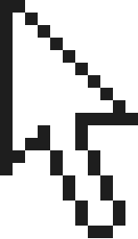</a> | **📂 檔名:** `pointer.svg` ✨ **格式:** `Vector (SVG)` ⚖️ **大小:** `3.65KB` 📅 **更新:** `2026-03-03`  🚀 **jsDelivr Markdown:** `` 🔗 **直接連結 (Url):** <code>https://cdn.jsdelivr.net/gh/barry028/materials@main/images/iCons/Pixel/Cursor/pointer.svg</code> 📥 [檢視原始檔](pointer.svg) |
|  | **📂 檔名:** `right arrow.svg` ✨ **格式:** `Vector (SVG)` ⚖️ **大小:** `1.52KB` 📅 **更新:** `2026-03-03`  🚀 **jsDelivr Markdown:** `` 🔗 **直接連結 (Url):** <code>https://cdn.jsdelivr.net/gh/barry028/materials@main/images/iCons/Pixel/Cursor/right%20arrow.svg</code> 📥 [檢視原始檔](right%20arrow.svg) |
|  | **📂 檔名:** `right search.svg` ✨ **格式:** `Vector (SVG)` ⚖️ **大小:** `2.42KB` 📅 **更新:** `2026-03-03`  🚀 **jsDelivr Markdown:** `` 🔗 **直接連結 (Url):** <code>https://cdn.jsdelivr.net/gh/barry028/materials@main/images/iCons/Pixel/Cursor/right%20search.svg</code> 📥 [檢視原始檔](right%20search.svg) |
|  | **📂 檔名:** `right.svg` ✨ **格式:** `Vector (SVG)` ⚖️ **大小:** `905.00B` 📅 **更新:** `2026-03-03`  🚀 **jsDelivr Markdown:** `` 🔗 **直接連結 (Url):** <code>https://cdn.jsdelivr.net/gh/barry028/materials@main/images/iCons/Pixel/Cursor/right.svg</code> 📥 [檢視原始檔](right.svg) |
| <a href="sad.svg">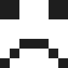</a> | **📂 檔名:** `sad.svg` ✨ **格式:** `Vector (SVG)` ⚖️ **大小:** `958.00B` 📅 **更新:** `2026-03-03`  🚀 **jsDelivr Markdown:** `` 🔗 **直接連結 (Url):** <code>https://cdn.jsdelivr.net/gh/barry028/materials@main/images/iCons/Pixel/Cursor/sad.svg</code> 📥 [檢視原始檔](sad.svg) |
|  | **📂 檔名:** `sand glass.svg` ✨ **格式:** `Vector (SVG)` ⚖️ **大小:** `8.16KB` 📅 **更新:** `2026-03-03`  🚀 **jsDelivr Markdown:** `` 🔗 **直接連結 (Url):** <code>https://cdn.jsdelivr.net/gh/barry028/materials@main/images/iCons/Pixel/Cursor/sand%20glass.svg</code> 📥 [檢視原始檔](sand%20glass.svg) |
|  | **📂 檔名:** `sent mail.svg` ✨ **格式:** `Vector (SVG)` ⚖️ **大小:** `2.00KB` 📅 **更新:** `2026-03-03`  🚀 **jsDelivr Markdown:** `` 🔗 **直接連結 (Url):** <code>https://cdn.jsdelivr.net/gh/barry028/materials@main/images/iCons/Pixel/Cursor/sent%20mail.svg</code> 📥 [檢視原始檔](sent%20mail.svg) |
|  | **📂 檔名:** `setting.svg` ✨ **格式:** `Vector (SVG)` ⚖️ **大小:** `1.53KB` 📅 **更新:** `2026-03-03`  🚀 **jsDelivr Markdown:** `` 🔗 **直接連結 (Url):** <code>https://cdn.jsdelivr.net/gh/barry028/materials@main/images/iCons/Pixel/Cursor/setting.svg</code> 📥 [檢視原始檔](setting.svg) |
|  | **📂 檔名:** `shocked.svg` ✨ **格式:** `Vector (SVG)` ⚖️ **大小:** `843.00B` 📅 **更新:** `2026-03-03`  🚀 **jsDelivr Markdown:** `` 🔗 **直接連結 (Url):** <code>https://cdn.jsdelivr.net/gh/barry028/materials@main/images/iCons/Pixel/Cursor/shocked.svg</code> 📥 [檢視原始檔](shocked.svg) |
| <a href="smile.svg">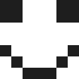</a> | **📂 檔名:** `smile.svg` ✨ **格式:** `Vector (SVG)` ⚖️ **大小:** `958.00B` 📅 **更新:** `2026-03-03`  🚀 **jsDelivr Markdown:** `` 🔗 **直接連結 (Url):** <code>https://cdn.jsdelivr.net/gh/barry028/materials@main/images/iCons/Pixel/Cursor/smile.svg</code> 📥 [檢視原始檔](smile.svg) |
| <a href="trash.svg">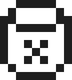</a> | **📂 檔名:** `trash.svg` ✨ **格式:** `Vector (SVG)` ⚖️ **大小:** `2.28KB` 📅 **更新:** `2026-03-03`  🚀 **jsDelivr Markdown:** `` 🔗 **直接連結 (Url):** <code>https://cdn.jsdelivr.net/gh/barry028/materials@main/images/iCons/Pixel/Cursor/trash.svg</code> 📥 [檢視原始檔](trash.svg) |
|  | **📂 檔名:** `up arrow.svg` ✨ **格式:** `Vector (SVG)` ⚖️ **大小:** `1.53KB` 📅 **更新:** `2026-03-03`  🚀 **jsDelivr Markdown:** `` 🔗 **直接連結 (Url):** <code>https://cdn.jsdelivr.net/gh/barry028/materials@main/images/iCons/Pixel/Cursor/up%20arrow.svg</code> 📥 [檢視原始檔](up%20arrow.svg) |
|  | **📂 檔名:** `up.svg` ✨ **格式:** `Vector (SVG)` ⚖️ **大小:** `921.00B` 📅 **更新:** `2026-03-03`  🚀 **jsDelivr Markdown:** `` 🔗 **直接連結 (Url):** <code>https://cdn.jsdelivr.net/gh/barry028/materials@main/images/iCons/Pixel/Cursor/up.svg</code> 📥 [檢視原始檔](up.svg) |
| <a href="upload.svg">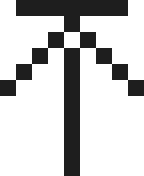</a> | **📂 檔名:** `upload.svg` ✨ **格式:** `Vector (SVG)` ⚖️ **大小:** `2.26KB` 📅 **更新:** `2026-03-03`  🚀 **jsDelivr Markdown:** `` 🔗 **直接連結 (Url):** <code>https://cdn.jsdelivr.net/gh/barry028/materials@main/images/iCons/Pixel/Cursor/upload.svg</code> 📥 [檢視原始檔](upload.svg) |
|  | **📂 檔名:** `waiting.svg` ✨ **格式:** `Vector (SVG)` ⚖️ **大小:** `771.00B` 📅 **更新:** `2026-03-03`  🚀 **jsDelivr Markdown:** `` 🔗 **直接連結 (Url):** <code>https://cdn.jsdelivr.net/gh/barry028/materials@main/images/iCons/Pixel/Cursor/waiting.svg</code> 📥 [檢視原始檔](waiting.svg) |
| <a href="wrong.svg">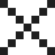</a> | **📂 檔名:** `wrong.svg` ✨ **格式:** `Vector (SVG)` ⚖️ **大小:** `859.00B` 📅 **更新:** `2026-03-03`  🚀 **jsDelivr Markdown:** `` 🔗 **直接連結 (Url):** <code>https://cdn.jsdelivr.net/gh/barry028/materials@main/images/iCons/Pixel/Cursor/wrong.svg</code> 📥 [檢視原始檔](wrong.svg) |