# 🖼️ 素材分類：Emoji 1997

> [🏠 主目錄](../../../../README.md) / [images](../../../README.md) / [iCons](../../README.md) / [Pixel](../README.md) / **Emoji 1997**

本目錄共有 `180` 個檔案

| 🎨 預覽 (點擊放大)  | 📋 檔案詳細資訊與連結 |
| :--- | :--- |
| <a href="airplane-dark.svg">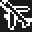</a> | **📂 檔名:** `airplane-dark.svg` ✨ **格式:** `Vector (SVG)` ⚖️ **大小:** `1.40KB` 📅 **更新:** `2026-02-27`  🚀 **jsDelivr Markdown:** `` 🔗 **直接連結 (Url):** <code>https://cdn.jsdelivr.net/gh/barry028/materials@main/images/iCons/Pixel/Emoji%201997/airplane-dark.svg</code> 📥 [檢視原始檔](airplane-dark.svg) |
| <a href="airplane-light.svg">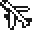</a> | **📂 檔名:** `airplane-light.svg` ✨ **格式:** `Vector (SVG)` ⚖️ **大小:** `1.42KB` 📅 **更新:** `2026-02-27`  🚀 **jsDelivr Markdown:** `` 🔗 **直接連結 (Url):** <code>https://cdn.jsdelivr.net/gh/barry028/materials@main/images/iCons/Pixel/Emoji%201997/airplane-light.svg</code> 📥 [檢視原始檔](airplane-light.svg) |
| <a href="angryface-dark.svg">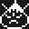</a> | **📂 檔名:** `angryface-dark.svg` ✨ **格式:** `Vector (SVG)` ⚖️ **大小:** `1.80KB` 📅 **更新:** `2026-02-27`  🚀 **jsDelivr Markdown:** `` 🔗 **直接連結 (Url):** <code>https://cdn.jsdelivr.net/gh/barry028/materials@main/images/iCons/Pixel/Emoji%201997/angryface-dark.svg</code> 📥 [檢視原始檔](angryface-dark.svg) |
| <a href="angryface-light.svg">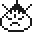</a> | **📂 檔名:** `angryface-light.svg` ✨ **格式:** `Vector (SVG)` ⚖️ **大小:** `1.84KB` 📅 **更新:** `2026-02-27`  🚀 **jsDelivr Markdown:** `` 🔗 **直接連結 (Url):** <code>https://cdn.jsdelivr.net/gh/barry028/materials@main/images/iCons/Pixel/Emoji%201997/angryface-light.svg</code> 📥 [檢視原始檔](angryface-light.svg) |
|  | **📂 檔名:** `athleticshoe-dark.svg` ✨ **格式:** `Vector (SVG)` ⚖️ **大小:** `530.00B` 📅 **更新:** `2026-02-27`  🚀 **jsDelivr Markdown:** `` 🔗 **直接連結 (Url):** <code>https://cdn.jsdelivr.net/gh/barry028/materials@main/images/iCons/Pixel/Emoji%201997/athleticshoe-dark.svg</code> 📥 [檢視原始檔](athleticshoe-dark.svg) |
| <a href="athleticshoe-light.svg">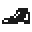</a> | **📂 檔名:** `athleticshoe-light.svg` ✨ **格式:** `Vector (SVG)` ⚖️ **大小:** `522.00B` 📅 **更新:** `2026-02-27`  🚀 **jsDelivr Markdown:** `` 🔗 **直接連結 (Url):** <code>https://cdn.jsdelivr.net/gh/barry028/materials@main/images/iCons/Pixel/Emoji%201997/athleticshoe-light.svg</code> 📥 [檢視原始檔](athleticshoe-light.svg) |
| <a href="automobile-dark.svg">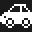</a> | **📂 檔名:** `automobile-dark.svg` ✨ **格式:** `Vector (SVG)` ⚖️ **大小:** `1.41KB` 📅 **更新:** `2026-02-27`  🚀 **jsDelivr Markdown:** `` 🔗 **直接連結 (Url):** <code>https://cdn.jsdelivr.net/gh/barry028/materials@main/images/iCons/Pixel/Emoji%201997/automobile-dark.svg</code> 📥 [檢視原始檔](automobile-dark.svg) |
| <a href="automobile-light.svg">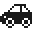</a> | **📂 檔名:** `automobile-light.svg` ✨ **格式:** `Vector (SVG)` ⚖️ **大小:** `1.41KB` 📅 **更新:** `2026-02-27`  🚀 **jsDelivr Markdown:** `` 🔗 **直接連結 (Url):** <code>https://cdn.jsdelivr.net/gh/barry028/materials@main/images/iCons/Pixel/Emoji%201997/automobile-light.svg</code> 📥 [檢視原始檔](automobile-light.svg) |
| <a href="babyangel-dark.svg">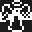</a> | **📂 檔名:** `babyangel-dark.svg` ✨ **格式:** `Vector (SVG)` ⚖️ **大小:** `1.89KB` 📅 **更新:** `2026-02-27`  🚀 **jsDelivr Markdown:** `` 🔗 **直接連結 (Url):** <code>https://cdn.jsdelivr.net/gh/barry028/materials@main/images/iCons/Pixel/Emoji%201997/babyangel-dark.svg</code> 📥 [檢視原始檔](babyangel-dark.svg) |
| <a href="babyangel-light.svg">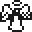</a> | **📂 檔名:** `babyangel-light.svg` ✨ **格式:** `Vector (SVG)` ⚖️ **大小:** `1.90KB` 📅 **更新:** `2026-02-27`  🚀 **jsDelivr Markdown:** `` 🔗 **直接連結 (Url):** <code>https://cdn.jsdelivr.net/gh/barry028/materials@main/images/iCons/Pixel/Emoji%201997/babyangel-light.svg</code> 📥 [檢視原始檔](babyangel-light.svg) |
| <a href="baseball-dark.svg">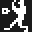</a> | **📂 檔名:** `baseball-dark.svg` ✨ **格式:** `Vector (SVG)` ⚖️ **大小:** `733.00B` 📅 **更新:** `2026-02-27`  🚀 **jsDelivr Markdown:** `` 🔗 **直接連結 (Url):** <code>https://cdn.jsdelivr.net/gh/barry028/materials@main/images/iCons/Pixel/Emoji%201997/baseball-dark.svg</code> 📥 [檢視原始檔](baseball-dark.svg) |
| <a href="baseball-light.svg">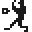</a> | **📂 檔名:** `baseball-light.svg` ✨ **格式:** `Vector (SVG)` ⚖️ **大小:** `733.00B` 📅 **更新:** `2026-02-27`  🚀 **jsDelivr Markdown:** `` 🔗 **直接連結 (Url):** <code>https://cdn.jsdelivr.net/gh/barry028/materials@main/images/iCons/Pixel/Emoji%201997/baseball-light.svg</code> 📥 [檢視原始檔](baseball-light.svg) |
| <a href="bearface-dark.svg">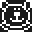</a> | **📂 檔名:** `bearface-dark.svg` ✨ **格式:** `Vector (SVG)` ⚖️ **大小:** `1.90KB` 📅 **更新:** `2026-02-27`  🚀 **jsDelivr Markdown:** `` 🔗 **直接連結 (Url):** <code>https://cdn.jsdelivr.net/gh/barry028/materials@main/images/iCons/Pixel/Emoji%201997/bearface-dark.svg</code> 📥 [檢視原始檔](bearface-dark.svg) |
|  | **📂 檔名:** `bearface-light.svg` ✨ **格式:** `Vector (SVG)` ⚖️ **大小:** `1.94KB` 📅 **更新:** `2026-02-27`  🚀 **jsDelivr Markdown:** `` 🔗 **直接連結 (Url):** <code>https://cdn.jsdelivr.net/gh/barry028/materials@main/images/iCons/Pixel/Emoji%201997/bearface-light.svg</code> 📥 [檢視原始檔](bearface-light.svg) |
|  | **📂 檔名:** `beermug-dark.svg` ✨ **格式:** `Vector (SVG)` ⚖️ **大小:** `1.04KB` 📅 **更新:** `2026-02-27`  🚀 **jsDelivr Markdown:** `` 🔗 **直接連結 (Url):** <code>https://cdn.jsdelivr.net/gh/barry028/materials@main/images/iCons/Pixel/Emoji%201997/beermug-dark.svg</code> 📥 [檢視原始檔](beermug-dark.svg) |
|  | **📂 檔名:** `beermug-light.svg` ✨ **格式:** `Vector (SVG)` ⚖️ **大小:** `1.07KB` 📅 **更新:** `2026-02-27`  🚀 **jsDelivr Markdown:** `` 🔗 **直接連結 (Url):** <code>https://cdn.jsdelivr.net/gh/barry028/materials@main/images/iCons/Pixel/Emoji%201997/beermug-light.svg</code> 📥 [檢視原始檔](beermug-light.svg) |
|  | **📂 檔名:** `blackquestionmark-dark.svg` ✨ **格式:** `Vector (SVG)` ⚖️ **大小:** `870.00B` 📅 **更新:** `2026-02-27`  🚀 **jsDelivr Markdown:** `` 🔗 **直接連結 (Url):** <code>https://cdn.jsdelivr.net/gh/barry028/materials@main/images/iCons/Pixel/Emoji%201997/blackquestionmark-dark.svg</code> 📥 [檢視原始檔](blackquestionmark-dark.svg) |
| <a href="blackquestionmark-light.svg">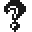</a> | **📂 檔名:** `blackquestionmark-light.svg` ✨ **格式:** `Vector (SVG)` ⚖️ **大小:** `862.00B` 📅 **更新:** `2026-02-27`  🚀 **jsDelivr Markdown:** `` 🔗 **直接連結 (Url):** <code>https://cdn.jsdelivr.net/gh/barry028/materials@main/images/iCons/Pixel/Emoji%201997/blackquestionmark-light.svg</code> 📥 [檢視原始檔](blackquestionmark-light.svg) |
| <a href="blacksunwithrays-dark.svg">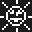</a> | **📂 檔名:** `blacksunwithrays-dark.svg` ✨ **格式:** `Vector (SVG)` ⚖️ **大小:** `1.79KB` 📅 **更新:** `2026-02-27`  🚀 **jsDelivr Markdown:** `` 🔗 **直接連結 (Url):** <code>https://cdn.jsdelivr.net/gh/barry028/materials@main/images/iCons/Pixel/Emoji%201997/blacksunwithrays-dark.svg</code> 📥 [檢視原始檔](blacksunwithrays-dark.svg) |
| <a href="blacksunwithrays-light.svg">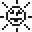</a> | **📂 檔名:** `blacksunwithrays-light.svg` ✨ **格式:** `Vector (SVG)` ⚖️ **大小:** `1.84KB` 📅 **更新:** `2026-02-27`  🚀 **jsDelivr Markdown:** `` 🔗 **直接連結 (Url):** <code>https://cdn.jsdelivr.net/gh/barry028/materials@main/images/iCons/Pixel/Emoji%201997/blacksunwithrays-light.svg</code> 📥 [檢視原始檔](blacksunwithrays-light.svg) |
|  | **📂 檔名:** `blacktelephone-dark.svg` ✨ **格式:** `Vector (SVG)` ⚖️ **大小:** `1.02KB` 📅 **更新:** `2026-02-27`  🚀 **jsDelivr Markdown:** `` 🔗 **直接連結 (Url):** <code>https://cdn.jsdelivr.net/gh/barry028/materials@main/images/iCons/Pixel/Emoji%201997/blacktelephone-dark.svg</code> 📥 [檢視原始檔](blacktelephone-dark.svg) |
|  | **📂 檔名:** `blacktelephone-light.svg` ✨ **格式:** `Vector (SVG)` ⚖️ **大小:** `1019.00B` 📅 **更新:** `2026-02-27`  🚀 **jsDelivr Markdown:** `` 🔗 **直接連結 (Url):** <code>https://cdn.jsdelivr.net/gh/barry028/materials@main/images/iCons/Pixel/Emoji%201997/blacktelephone-light.svg</code> 📥 [檢視原始檔](blacktelephone-light.svg) |
|  | **📂 檔名:** `boy-dark.svg` ✨ **格式:** `Vector (SVG)` ⚖️ **大小:** `892.00B` 📅 **更新:** `2026-02-27`  🚀 **jsDelivr Markdown:** `` 🔗 **直接連結 (Url):** <code>https://cdn.jsdelivr.net/gh/barry028/materials@main/images/iCons/Pixel/Emoji%201997/boy-dark.svg</code> 📥 [檢視原始檔](boy-dark.svg) |
|  | **📂 檔名:** `boy-light.svg` ✨ **格式:** `Vector (SVG)` ⚖️ **大小:** `892.00B` 📅 **更新:** `2026-02-27`  🚀 **jsDelivr Markdown:** `` 🔗 **直接連結 (Url):** <code>https://cdn.jsdelivr.net/gh/barry028/materials@main/images/iCons/Pixel/Emoji%201997/boy-light.svg</code> 📥 [檢視原始檔](boy-light.svg) |
|  | **📂 檔名:** `brokenheart-dark.svg` ✨ **格式:** `Vector (SVG)` ⚖️ **大小:** `401.00B` 📅 **更新:** `2026-02-27`  🚀 **jsDelivr Markdown:** `` 🔗 **直接連結 (Url):** <code>https://cdn.jsdelivr.net/gh/barry028/materials@main/images/iCons/Pixel/Emoji%201997/brokenheart-dark.svg</code> 📥 [檢視原始檔](brokenheart-dark.svg) |
| <a href="brokenheart-light.svg">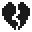</a> | **📂 檔名:** `brokenheart-light.svg` ✨ **格式:** `Vector (SVG)` ⚖️ **大小:** `403.00B` 📅 **更新:** `2026-02-27`  🚀 **jsDelivr Markdown:** `` 🔗 **直接連結 (Url):** <code>https://cdn.jsdelivr.net/gh/barry028/materials@main/images/iCons/Pixel/Emoji%201997/brokenheart-light.svg</code> 📥 [檢視原始檔](brokenheart-light.svg) |
| <a href="camera-dark.svg">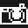</a> | **📂 檔名:** `camera-dark.svg` ✨ **格式:** `Vector (SVG)` ⚖️ **大小:** `1.03KB` 📅 **更新:** `2026-02-27`  🚀 **jsDelivr Markdown:** `` 🔗 **直接連結 (Url):** <code>https://cdn.jsdelivr.net/gh/barry028/materials@main/images/iCons/Pixel/Emoji%201997/camera-dark.svg</code> 📥 [檢視原始檔](camera-dark.svg) |
|  | **📂 檔名:** `camera-light.svg` ✨ **格式:** `Vector (SVG)` ⚖️ **大小:** `1.03KB` 📅 **更新:** `2026-02-27`  🚀 **jsDelivr Markdown:** `` 🔗 **直接連結 (Url):** <code>https://cdn.jsdelivr.net/gh/barry028/materials@main/images/iCons/Pixel/Emoji%201997/camera-light.svg</code> 📥 [檢視原始檔](camera-light.svg) |
| <a href="catface-dark.svg">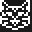</a> | **📂 檔名:** `catface-dark.svg` ✨ **格式:** `Vector (SVG)` ⚖️ **大小:** `1.95KB` 📅 **更新:** `2026-02-27`  🚀 **jsDelivr Markdown:** `` 🔗 **直接連結 (Url):** <code>https://cdn.jsdelivr.net/gh/barry028/materials@main/images/iCons/Pixel/Emoji%201997/catface-dark.svg</code> 📥 [檢視原始檔](catface-dark.svg) |
| <a href="catface-light.svg">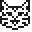</a> | **📂 檔名:** `catface-light.svg` ✨ **格式:** `Vector (SVG)` ⚖️ **大小:** `1.98KB` 📅 **更新:** `2026-02-27`  🚀 **jsDelivr Markdown:** `` 🔗 **直接連結 (Url):** <code>https://cdn.jsdelivr.net/gh/barry028/materials@main/images/iCons/Pixel/Emoji%201997/catface-light.svg</code> 📥 [檢視原始檔](catface-light.svg) |
| <a href="cherryblossom-dark.svg">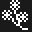</a> | **📂 檔名:** `cherryblossom-dark.svg` ✨ **格式:** `Vector (SVG)` ⚖️ **大小:** `2.44KB` 📅 **更新:** `2026-02-27`  🚀 **jsDelivr Markdown:** `` 🔗 **直接連結 (Url):** <code>https://cdn.jsdelivr.net/gh/barry028/materials@main/images/iCons/Pixel/Emoji%201997/cherryblossom-dark.svg</code> 📥 [檢視原始檔](cherryblossom-dark.svg) |
| <a href="cherryblossom-light.svg">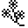</a> | **📂 檔名:** `cherryblossom-light.svg` ✨ **格式:** `Vector (SVG)` ⚖️ **大小:** `2.47KB` 📅 **更新:** `2026-02-27`  🚀 **jsDelivr Markdown:** `` 🔗 **直接連結 (Url):** <code>https://cdn.jsdelivr.net/gh/barry028/materials@main/images/iCons/Pixel/Emoji%201997/cherryblossom-light.svg</code> 📥 [檢視原始檔](cherryblossom-light.svg) |
| <a href="christmastree-dark.svg">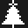</a> | **📂 檔名:** `christmastree-dark.svg` ✨ **格式:** `Vector (SVG)` ⚖️ **大小:** `670.00B` 📅 **更新:** `2026-02-27`  🚀 **jsDelivr Markdown:** `` 🔗 **直接連結 (Url):** <code>https://cdn.jsdelivr.net/gh/barry028/materials@main/images/iCons/Pixel/Emoji%201997/christmastree-dark.svg</code> 📥 [檢視原始檔](christmastree-dark.svg) |
| <a href="christmastree-light.svg">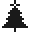</a> | **📂 檔名:** `christmastree-light.svg` ✨ **格式:** `Vector (SVG)` ⚖️ **大小:** `672.00B` 📅 **更新:** `2026-02-27`  🚀 **jsDelivr Markdown:** `` 🔗 **直接連結 (Url):** <code>https://cdn.jsdelivr.net/gh/barry028/materials@main/images/iCons/Pixel/Emoji%201997/christmastree-light.svg</code> 📥 [檢視原始檔](christmastree-light.svg) |
|  | **📂 檔名:** `church-dark.svg` ✨ **格式:** `Vector (SVG)` ⚖️ **大小:** `1009.00B` 📅 **更新:** `2026-02-27`  🚀 **jsDelivr Markdown:** `` 🔗 **直接連結 (Url):** <code>https://cdn.jsdelivr.net/gh/barry028/materials@main/images/iCons/Pixel/Emoji%201997/church-dark.svg</code> 📥 [檢視原始檔](church-dark.svg) |
| <a href="church-light.svg">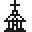</a> | **📂 檔名:** `church-light.svg` ✨ **格式:** `Vector (SVG)` ⚖️ **大小:** `997.00B` 📅 **更新:** `2026-02-27`  🚀 **jsDelivr Markdown:** `` 🔗 **直接連結 (Url):** <code>https://cdn.jsdelivr.net/gh/barry028/materials@main/images/iCons/Pixel/Emoji%201997/church-light.svg</code> 📥 [檢視原始檔](church-light.svg) |
|  | **📂 檔名:** `clockfaceeightoclock-dark.svg` ✨ **格式:** `Vector (SVG)` ⚖️ **大小:** `1.29KB` 📅 **更新:** `2026-02-27`  🚀 **jsDelivr Markdown:** `` 🔗 **直接連結 (Url):** <code>https://cdn.jsdelivr.net/gh/barry028/materials@main/images/iCons/Pixel/Emoji%201997/clockfaceeightoclock-dark.svg</code> 📥 [檢視原始檔](clockfaceeightoclock-dark.svg) |
| <a href="clockfaceeightoclock-light.svg">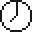</a> | **📂 檔名:** `clockfaceeightoclock-light.svg` ✨ **格式:** `Vector (SVG)` ⚖️ **大小:** `1.32KB` 📅 **更新:** `2026-02-27`  🚀 **jsDelivr Markdown:** `` 🔗 **直接連結 (Url):** <code>https://cdn.jsdelivr.net/gh/barry028/materials@main/images/iCons/Pixel/Emoji%201997/clockfaceeightoclock-light.svg</code> 📥 [檢視原始檔](clockfaceeightoclock-light.svg) |
|  | **📂 檔名:** `clockfaceelevenoclock-dark.svg` ✨ **格式:** `Vector (SVG)` ⚖️ **大小:** `1.25KB` 📅 **更新:** `2026-02-27`  🚀 **jsDelivr Markdown:** `` 🔗 **直接連結 (Url):** <code>https://cdn.jsdelivr.net/gh/barry028/materials@main/images/iCons/Pixel/Emoji%201997/clockfaceelevenoclock-dark.svg</code> 📥 [檢視原始檔](clockfaceelevenoclock-dark.svg) |
| <a href="clockfaceelevenoclock-light.svg">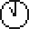</a> | **📂 檔名:** `clockfaceelevenoclock-light.svg` ✨ **格式:** `Vector (SVG)` ⚖️ **大小:** `1.27KB` 📅 **更新:** `2026-02-27`  🚀 **jsDelivr Markdown:** `` 🔗 **直接連結 (Url):** <code>https://cdn.jsdelivr.net/gh/barry028/materials@main/images/iCons/Pixel/Emoji%201997/clockfaceelevenoclock-light.svg</code> 📥 [檢視原始檔](clockfaceelevenoclock-light.svg) |
| <a href="clockfacefiveoclock-dark.svg">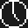</a> | **📂 檔名:** `clockfacefiveoclock-dark.svg` ✨ **格式:** `Vector (SVG)` ⚖️ **大小:** `1.29KB` 📅 **更新:** `2026-02-27`  🚀 **jsDelivr Markdown:** `` 🔗 **直接連結 (Url):** <code>https://cdn.jsdelivr.net/gh/barry028/materials@main/images/iCons/Pixel/Emoji%201997/clockfacefiveoclock-dark.svg</code> 📥 [檢視原始檔](clockfacefiveoclock-dark.svg) |
|  | **📂 檔名:** `clockfacefiveoclock-light.svg` ✨ **格式:** `Vector (SVG)` ⚖️ **大小:** `1.32KB` 📅 **更新:** `2026-02-27`  🚀 **jsDelivr Markdown:** `` 🔗 **直接連結 (Url):** <code>https://cdn.jsdelivr.net/gh/barry028/materials@main/images/iCons/Pixel/Emoji%201997/clockfacefiveoclock-light.svg</code> 📥 [檢視原始檔](clockfacefiveoclock-light.svg) |
| <a href="clockfacefouroclock-dark.svg">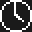</a> | **📂 檔名:** `clockfacefouroclock-dark.svg` ✨ **格式:** `Vector (SVG)` ⚖️ **大小:** `1.24KB` 📅 **更新:** `2026-02-27`  🚀 **jsDelivr Markdown:** `` 🔗 **直接連結 (Url):** <code>https://cdn.jsdelivr.net/gh/barry028/materials@main/images/iCons/Pixel/Emoji%201997/clockfacefouroclock-dark.svg</code> 📥 [檢視原始檔](clockfacefouroclock-dark.svg) |
| <a href="clockfacefouroclock-light.svg">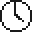</a> | **📂 檔名:** `clockfacefouroclock-light.svg` ✨ **格式:** `Vector (SVG)` ⚖️ **大小:** `1.27KB` 📅 **更新:** `2026-02-27`  🚀 **jsDelivr Markdown:** `` 🔗 **直接連結 (Url):** <code>https://cdn.jsdelivr.net/gh/barry028/materials@main/images/iCons/Pixel/Emoji%201997/clockfacefouroclock-light.svg</code> 📥 [檢視原始檔](clockfacefouroclock-light.svg) |
|  | **📂 檔名:** `clockfacenineoclock-dark.svg` ✨ **格式:** `Vector (SVG)` ⚖️ **大小:** `1.18KB` 📅 **更新:** `2026-02-27`  🚀 **jsDelivr Markdown:** `` 🔗 **直接連結 (Url):** <code>https://cdn.jsdelivr.net/gh/barry028/materials@main/images/iCons/Pixel/Emoji%201997/clockfacenineoclock-dark.svg</code> 📥 [檢視原始檔](clockfacenineoclock-dark.svg) |
|  | **📂 檔名:** `clockfacenineoclock-light.svg` ✨ **格式:** `Vector (SVG)` ⚖️ **大小:** `1.20KB` 📅 **更新:** `2026-02-27`  🚀 **jsDelivr Markdown:** `` 🔗 **直接連結 (Url):** <code>https://cdn.jsdelivr.net/gh/barry028/materials@main/images/iCons/Pixel/Emoji%201997/clockfacenineoclock-light.svg</code> 📥 [檢視原始檔](clockfacenineoclock-light.svg) |
|  | **📂 檔名:** `clockfaceoneoclock-dark.svg` ✨ **格式:** `Vector (SVG)` ⚖️ **大小:** `1.24KB` 📅 **更新:** `2026-02-27`  🚀 **jsDelivr Markdown:** `` 🔗 **直接連結 (Url):** <code>https://cdn.jsdelivr.net/gh/barry028/materials@main/images/iCons/Pixel/Emoji%201997/clockfaceoneoclock-dark.svg</code> 📥 [檢視原始檔](clockfaceoneoclock-dark.svg) |
| <a href="clockfaceoneoclock-light.svg">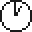</a> | **📂 檔名:** `clockfaceoneoclock-light.svg` ✨ **格式:** `Vector (SVG)` ⚖️ **大小:** `1.27KB` 📅 **更新:** `2026-02-27`  🚀 **jsDelivr Markdown:** `` 🔗 **直接連結 (Url):** <code>https://cdn.jsdelivr.net/gh/barry028/materials@main/images/iCons/Pixel/Emoji%201997/clockfaceoneoclock-light.svg</code> 📥 [檢視原始檔](clockfaceoneoclock-light.svg) |
|  | **📂 檔名:** `clockfacesevenoclock-dark.svg` ✨ **格式:** `Vector (SVG)` ⚖️ **大小:** `1.24KB` 📅 **更新:** `2026-02-27`  🚀 **jsDelivr Markdown:** `` 🔗 **直接連結 (Url):** <code>https://cdn.jsdelivr.net/gh/barry028/materials@main/images/iCons/Pixel/Emoji%201997/clockfacesevenoclock-dark.svg</code> 📥 [檢視原始檔](clockfacesevenoclock-dark.svg) |
| <a href="clockfacesevenoclock-light.svg">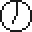</a> | **📂 檔名:** `clockfacesevenoclock-light.svg` ✨ **格式:** `Vector (SVG)` ⚖️ **大小:** `1.26KB` 📅 **更新:** `2026-02-27`  🚀 **jsDelivr Markdown:** `` 🔗 **直接連結 (Url):** <code>https://cdn.jsdelivr.net/gh/barry028/materials@main/images/iCons/Pixel/Emoji%201997/clockfacesevenoclock-light.svg</code> 📥 [檢視原始檔](clockfacesevenoclock-light.svg) |
|  | **📂 檔名:** `clockfacesixoclock-dark.svg` ✨ **格式:** `Vector (SVG)` ⚖️ **大小:** `1.15KB` 📅 **更新:** `2026-02-27`  🚀 **jsDelivr Markdown:** `` 🔗 **直接連結 (Url):** <code>https://cdn.jsdelivr.net/gh/barry028/materials@main/images/iCons/Pixel/Emoji%201997/clockfacesixoclock-dark.svg</code> 📥 [檢視原始檔](clockfacesixoclock-dark.svg) |
| <a href="clockfacesixoclock-light.svg">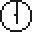</a> | **📂 檔名:** `clockfacesixoclock-light.svg` ✨ **格式:** `Vector (SVG)` ⚖️ **大小:** `1.17KB` 📅 **更新:** `2026-02-27`  🚀 **jsDelivr Markdown:** `` 🔗 **直接連結 (Url):** <code>https://cdn.jsdelivr.net/gh/barry028/materials@main/images/iCons/Pixel/Emoji%201997/clockfacesixoclock-light.svg</code> 📥 [檢視原始檔](clockfacesixoclock-light.svg) |
|  | **📂 檔名:** `clockfacetenoclock-dark.svg` ✨ **格式:** `Vector (SVG)` ⚖️ **大小:** `1.25KB` 📅 **更新:** `2026-02-27`  🚀 **jsDelivr Markdown:** `` 🔗 **直接連結 (Url):** <code>https://cdn.jsdelivr.net/gh/barry028/materials@main/images/iCons/Pixel/Emoji%201997/clockfacetenoclock-dark.svg</code> 📥 [檢視原始檔](clockfacetenoclock-dark.svg) |
| <a href="clockfacetenoclock-light.svg">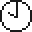</a> | **📂 檔名:** `clockfacetenoclock-light.svg` ✨ **格式:** `Vector (SVG)` ⚖️ **大小:** `1.27KB` 📅 **更新:** `2026-02-27`  🚀 **jsDelivr Markdown:** `` 🔗 **直接連結 (Url):** <code>https://cdn.jsdelivr.net/gh/barry028/materials@main/images/iCons/Pixel/Emoji%201997/clockfacetenoclock-light.svg</code> 📥 [檢視原始檔](clockfacetenoclock-light.svg) |
|  | **📂 檔名:** `clockfacethreeoclock-dark.svg` ✨ **格式:** `Vector (SVG)` ⚖️ **大小:** `1.14KB` 📅 **更新:** `2026-02-27`  🚀 **jsDelivr Markdown:** `` 🔗 **直接連結 (Url):** <code>https://cdn.jsdelivr.net/gh/barry028/materials@main/images/iCons/Pixel/Emoji%201997/clockfacethreeoclock-dark.svg</code> 📥 [檢視原始檔](clockfacethreeoclock-dark.svg) |
| <a href="clockfacethreeoclock-light.svg">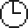</a> | **📂 檔名:** `clockfacethreeoclock-light.svg` ✨ **格式:** `Vector (SVG)` ⚖️ **大小:** `1.16KB` 📅 **更新:** `2026-02-27`  🚀 **jsDelivr Markdown:** `` 🔗 **直接連結 (Url):** <code>https://cdn.jsdelivr.net/gh/barry028/materials@main/images/iCons/Pixel/Emoji%201997/clockfacethreeoclock-light.svg</code> 📥 [檢視原始檔](clockfacethreeoclock-light.svg) |
|  | **📂 檔名:** `clockfacetwelveoclock-dark.svg` ✨ **格式:** `Vector (SVG)` ⚖️ **大小:** `1.14KB` 📅 **更新:** `2026-02-27`  🚀 **jsDelivr Markdown:** `` 🔗 **直接連結 (Url):** <code>https://cdn.jsdelivr.net/gh/barry028/materials@main/images/iCons/Pixel/Emoji%201997/clockfacetwelveoclock-dark.svg</code> 📥 [檢視原始檔](clockfacetwelveoclock-dark.svg) |
|  | **📂 檔名:** `clockfacetwelveoclock-light.svg` ✨ **格式:** `Vector (SVG)` ⚖️ **大小:** `1.16KB` 📅 **更新:** `2026-02-27`  🚀 **jsDelivr Markdown:** `` 🔗 **直接連結 (Url):** <code>https://cdn.jsdelivr.net/gh/barry028/materials@main/images/iCons/Pixel/Emoji%201997/clockfacetwelveoclock-light.svg</code> 📥 [檢視原始檔](clockfacetwelveoclock-light.svg) |
|  | **📂 檔名:** `clockfacetwooclock-dark.svg` ✨ **格式:** `Vector (SVG)` ⚖️ **大小:** `1.30KB` 📅 **更新:** `2026-02-27`  🚀 **jsDelivr Markdown:** `` 🔗 **直接連結 (Url):** <code>https://cdn.jsdelivr.net/gh/barry028/materials@main/images/iCons/Pixel/Emoji%201997/clockfacetwooclock-dark.svg</code> 📥 [檢視原始檔](clockfacetwooclock-dark.svg) |
| <a href="clockfacetwooclock-light.svg">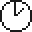</a> | **📂 檔名:** `clockfacetwooclock-light.svg` ✨ **格式:** `Vector (SVG)` ⚖️ **大小:** `1.33KB` 📅 **更新:** `2026-02-27`  🚀 **jsDelivr Markdown:** `` 🔗 **直接連結 (Url):** <code>https://cdn.jsdelivr.net/gh/barry028/materials@main/images/iCons/Pixel/Emoji%201997/clockfacetwooclock-light.svg</code> 📥 [檢視原始檔](clockfacetwooclock-light.svg) |
|  | **📂 檔名:** `cloud-dark.svg` ✨ **格式:** `Vector (SVG)` ⚖️ **大小:** `1.17KB` 📅 **更新:** `2026-02-27`  🚀 **jsDelivr Markdown:** `` 🔗 **直接連結 (Url):** <code>https://cdn.jsdelivr.net/gh/barry028/materials@main/images/iCons/Pixel/Emoji%201997/cloud-dark.svg</code> 📥 [檢視原始檔](cloud-dark.svg) |
|  | **📂 檔名:** `cloud-light.svg` ✨ **格式:** `Vector (SVG)` ⚖️ **大小:** `1.20KB` 📅 **更新:** `2026-02-27`  🚀 **jsDelivr Markdown:** `` 🔗 **直接連結 (Url):** <code>https://cdn.jsdelivr.net/gh/barry028/materials@main/images/iCons/Pixel/Emoji%201997/cloud-light.svg</code> 📥 [檢視原始檔](cloud-light.svg) |
| <a href="cocktailglass-dark.svg">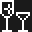</a> | **📂 檔名:** `cocktailglass-dark.svg` ✨ **格式:** `Vector (SVG)` ⚖️ **大小:** `1.13KB` 📅 **更新:** `2026-02-27`  🚀 **jsDelivr Markdown:** `` 🔗 **直接連結 (Url):** <code>https://cdn.jsdelivr.net/gh/barry028/materials@main/images/iCons/Pixel/Emoji%201997/cocktailglass-dark.svg</code> 📥 [檢視原始檔](cocktailglass-dark.svg) |
| <a href="cocktailglass-light.svg">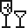</a> | **📂 檔名:** `cocktailglass-light.svg` ✨ **格式:** `Vector (SVG)` ⚖️ **大小:** `1.14KB` 📅 **更新:** `2026-02-27`  🚀 **jsDelivr Markdown:** `` 🔗 **直接連結 (Url):** <code>https://cdn.jsdelivr.net/gh/barry028/materials@main/images/iCons/Pixel/Emoji%201997/cocktailglass-light.svg</code> 📥 [檢視原始檔](cocktailglass-light.svg) |
| <a href="crescentmoon-dark.svg">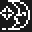</a> | **📂 檔名:** `crescentmoon-dark.svg` ✨ **格式:** `Vector (SVG)` ⚖️ **大小:** `1.59KB` 📅 **更新:** `2026-02-27`  🚀 **jsDelivr Markdown:** `` 🔗 **直接連結 (Url):** <code>https://cdn.jsdelivr.net/gh/barry028/materials@main/images/iCons/Pixel/Emoji%201997/crescentmoon-dark.svg</code> 📥 [檢視原始檔](crescentmoon-dark.svg) |
| <a href="crescentmoon-light.svg">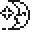</a> | **📂 檔名:** `crescentmoon-light.svg` ✨ **格式:** `Vector (SVG)` ⚖️ **大小:** `1.63KB` 📅 **更新:** `2026-02-27`  🚀 **jsDelivr Markdown:** `` 🔗 **直接連結 (Url):** <code>https://cdn.jsdelivr.net/gh/barry028/materials@main/images/iCons/Pixel/Emoji%201997/crescentmoon-light.svg</code> 📥 [檢視原始檔](crescentmoon-light.svg) |
| <a href="disappointedface-dark.svg">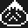</a> | **📂 檔名:** `disappointedface-dark.svg` ✨ **格式:** `Vector (SVG)` ⚖️ **大小:** `1.56KB` 📅 **更新:** `2026-02-27`  🚀 **jsDelivr Markdown:** `` 🔗 **直接連結 (Url):** <code>https://cdn.jsdelivr.net/gh/barry028/materials@main/images/iCons/Pixel/Emoji%201997/disappointedface-dark.svg</code> 📥 [檢視原始檔](disappointedface-dark.svg) |
| <a href="disappointedface-light.svg">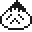</a> | **📂 檔名:** `disappointedface-light.svg` ✨ **格式:** `Vector (SVG)` ⚖️ **大小:** `1.60KB` 📅 **更新:** `2026-02-27`  🚀 **jsDelivr Markdown:** `` 🔗 **直接連結 (Url):** <code>https://cdn.jsdelivr.net/gh/barry028/materials@main/images/iCons/Pixel/Emoji%201997/disappointedface-light.svg</code> 📥 [檢視原始檔](disappointedface-light.svg) |
|  | **📂 檔名:** `dogface-dark.svg` ✨ **格式:** `Vector (SVG)` ⚖️ **大小:** `2.12KB` 📅 **更新:** `2026-02-27`  🚀 **jsDelivr Markdown:** `` 🔗 **直接連結 (Url):** <code>https://cdn.jsdelivr.net/gh/barry028/materials@main/images/iCons/Pixel/Emoji%201997/dogface-dark.svg</code> 📥 [檢視原始檔](dogface-dark.svg) |
|  | **📂 檔名:** `dogface-light.svg` ✨ **格式:** `Vector (SVG)` ⚖️ **大小:** `2.16KB` 📅 **更新:** `2026-02-27`  🚀 **jsDelivr Markdown:** `` 🔗 **直接連結 (Url):** <code>https://cdn.jsdelivr.net/gh/barry028/materials@main/images/iCons/Pixel/Emoji%201997/dogface-light.svg</code> 📥 [檢視原始檔](dogface-light.svg) |
| <a href="faxmachine-dark.svg">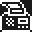</a> | **📂 檔名:** `faxmachine-dark.svg` ✨ **格式:** `Vector (SVG)` ⚖️ **大小:** `1.73KB` 📅 **更新:** `2026-02-27`  🚀 **jsDelivr Markdown:** `` 🔗 **直接連結 (Url):** <code>https://cdn.jsdelivr.net/gh/barry028/materials@main/images/iCons/Pixel/Emoji%201997/faxmachine-dark.svg</code> 📥 [檢視原始檔](faxmachine-dark.svg) |
|  | **📂 檔名:** `faxmachine-light.svg` ✨ **格式:** `Vector (SVG)` ⚖️ **大小:** `1.76KB` 📅 **更新:** `2026-02-27`  🚀 **jsDelivr Markdown:** `` 🔗 **直接連結 (Url):** <code>https://cdn.jsdelivr.net/gh/barry028/materials@main/images/iCons/Pixel/Emoji%201997/faxmachine-light.svg</code> 📥 [檢視原始檔](faxmachine-light.svg) |
| <a href="fish-dark.svg">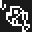</a> | **📂 檔名:** `fish-dark.svg` ✨ **格式:** `Vector (SVG)` ⚖️ **大小:** `1.23KB` 📅 **更新:** `2026-02-27`  🚀 **jsDelivr Markdown:** `` 🔗 **直接連結 (Url):** <code>https://cdn.jsdelivr.net/gh/barry028/materials@main/images/iCons/Pixel/Emoji%201997/fish-dark.svg</code> 📥 [檢視原始檔](fish-dark.svg) |
| <a href="fish-light.svg">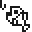</a> | **📂 檔名:** `fish-light.svg` ✨ **格式:** `Vector (SVG)` ⚖️ **大小:** `1.24KB` 📅 **更新:** `2026-02-27`  🚀 **jsDelivr Markdown:** `` 🔗 **直接連結 (Url):** <code>https://cdn.jsdelivr.net/gh/barry028/materials@main/images/iCons/Pixel/Emoji%201997/fish-light.svg</code> 📥 [檢視原始檔](fish-light.svg) |
| <a href="fistedhandsign-dark.svg">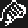</a> | **📂 檔名:** `fistedhandsign-dark.svg` ✨ **格式:** `Vector (SVG)` ⚖️ **大小:** `1.53KB` 📅 **更新:** `2026-02-27`  🚀 **jsDelivr Markdown:** `` 🔗 **直接連結 (Url):** <code>https://cdn.jsdelivr.net/gh/barry028/materials@main/images/iCons/Pixel/Emoji%201997/fistedhandsign-dark.svg</code> 📥 [檢視原始檔](fistedhandsign-dark.svg) |
| <a href="fistedhandsign-light.svg">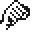</a> | **📂 檔名:** `fistedhandsign-light.svg` ✨ **格式:** `Vector (SVG)` ⚖️ **大小:** `1.57KB` 📅 **更新:** `2026-02-27`  🚀 **jsDelivr Markdown:** `` 🔗 **直接連結 (Url):** <code>https://cdn.jsdelivr.net/gh/barry028/materials@main/images/iCons/Pixel/Emoji%201997/fistedhandsign-light.svg</code> 📥 [檢視原始檔](fistedhandsign-light.svg) |
| <a href="flaginhole-dark.svg">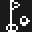</a> | **📂 檔名:** `flaginhole-dark.svg` ✨ **格式:** `Vector (SVG)` ⚖️ **大小:** `875.00B` 📅 **更新:** `2026-02-27`  🚀 **jsDelivr Markdown:** `` 🔗 **直接連結 (Url):** <code>https://cdn.jsdelivr.net/gh/barry028/materials@main/images/iCons/Pixel/Emoji%201997/flaginhole-dark.svg</code> 📥 [檢視原始檔](flaginhole-dark.svg) |
| <a href="flaginhole-light.svg">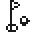</a> | **📂 檔名:** `flaginhole-light.svg` ✨ **格式:** `Vector (SVG)` ⚖️ **大小:** `879.00B` 📅 **更新:** `2026-02-27`  🚀 **jsDelivr Markdown:** `` 🔗 **直接連結 (Url):** <code>https://cdn.jsdelivr.net/gh/barry028/materials@main/images/iCons/Pixel/Emoji%201997/flaginhole-light.svg</code> 📥 [檢視原始檔](flaginhole-light.svg) |
| <a href="forkandknife-dark.svg">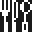</a> | **📂 檔名:** `forkandknife-dark.svg` ✨ **格式:** `Vector (SVG)` ⚖️ **大小:** `1.11KB` 📅 **更新:** `2026-02-27`  🚀 **jsDelivr Markdown:** `` 🔗 **直接連結 (Url):** <code>https://cdn.jsdelivr.net/gh/barry028/materials@main/images/iCons/Pixel/Emoji%201997/forkandknife-dark.svg</code> 📥 [檢視原始檔](forkandknife-dark.svg) |
| <a href="forkandknife-light.svg">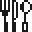</a> | **📂 檔名:** `forkandknife-light.svg` ✨ **格式:** `Vector (SVG)` ⚖️ **大小:** `1.11KB` 📅 **更新:** `2026-02-27`  🚀 **jsDelivr Markdown:** `` 🔗 **直接連結 (Url):** <code>https://cdn.jsdelivr.net/gh/barry028/materials@main/images/iCons/Pixel/Emoji%201997/forkandknife-light.svg</code> 📥 [檢視原始檔](forkandknife-light.svg) |
|  | **📂 檔名:** `fuelpump-dark.svg` ✨ **格式:** `Vector (SVG)` ⚖️ **大小:** `716.00B` 📅 **更新:** `2026-02-27`  🚀 **jsDelivr Markdown:** `` 🔗 **直接連結 (Url):** <code>https://cdn.jsdelivr.net/gh/barry028/materials@main/images/iCons/Pixel/Emoji%201997/fuelpump-dark.svg</code> 📥 [檢視原始檔](fuelpump-dark.svg) |
|  | **📂 檔名:** `fuelpump-light.svg` ✨ **格式:** `Vector (SVG)` ⚖️ **大小:** `704.00B` 📅 **更新:** `2026-02-27`  🚀 **jsDelivr Markdown:** `` 🔗 **直接連結 (Url):** <code>https://cdn.jsdelivr.net/gh/barry028/materials@main/images/iCons/Pixel/Emoji%201997/fuelpump-light.svg</code> 📥 [檢視原始檔](fuelpump-light.svg) |
|  | **📂 檔名:** `gemstone-dark.svg` ✨ **格式:** `Vector (SVG)` ⚖️ **大小:** `1.97KB` 📅 **更新:** `2026-02-27`  🚀 **jsDelivr Markdown:** `` 🔗 **直接連結 (Url):** <code>https://cdn.jsdelivr.net/gh/barry028/materials@main/images/iCons/Pixel/Emoji%201997/gemstone-dark.svg</code> 📥 [檢視原始檔](gemstone-dark.svg) |
|  | **📂 檔名:** `gemstone-light.svg` ✨ **格式:** `Vector (SVG)` ⚖️ **大小:** `1.96KB` 📅 **更新:** `2026-02-27`  🚀 **jsDelivr Markdown:** `` 🔗 **直接連結 (Url):** <code>https://cdn.jsdelivr.net/gh/barry028/materials@main/images/iCons/Pixel/Emoji%201997/gemstone-light.svg</code> 📥 [檢視原始檔](gemstone-light.svg) |
|  | **📂 檔名:** `girl-dark.svg` ✨ **格式:** `Vector (SVG)` ⚖️ **大小:** `1.21KB` 📅 **更新:** `2026-02-27`  🚀 **jsDelivr Markdown:** `` 🔗 **直接連結 (Url):** <code>https://cdn.jsdelivr.net/gh/barry028/materials@main/images/iCons/Pixel/Emoji%201997/girl-dark.svg</code> 📥 [檢視原始檔](girl-dark.svg) |
|  | **📂 檔名:** `girl-light.svg` ✨ **格式:** `Vector (SVG)` ⚖️ **大小:** `1.21KB` 📅 **更新:** `2026-02-27`  🚀 **jsDelivr Markdown:** `` 🔗 **直接連結 (Url):** <code>https://cdn.jsdelivr.net/gh/barry028/materials@main/images/iCons/Pixel/Emoji%201997/girl-light.svg</code> 📥 [檢視原始檔](girl-light.svg) |
|  | **📂 檔名:** `guitar-dark.svg` ✨ **格式:** `Vector (SVG)` ⚖️ **大小:** `1.62KB` 📅 **更新:** `2026-02-27`  🚀 **jsDelivr Markdown:** `` 🔗 **直接連結 (Url):** <code>https://cdn.jsdelivr.net/gh/barry028/materials@main/images/iCons/Pixel/Emoji%201997/guitar-dark.svg</code> 📥 [檢視原始檔](guitar-dark.svg) |
|  | **📂 檔名:** `guitar-light.svg` ✨ **格式:** `Vector (SVG)` ⚖️ **大小:** `1.62KB` 📅 **更新:** `2026-02-27`  🚀 **jsDelivr Markdown:** `` 🔗 **直接連結 (Url):** <code>https://cdn.jsdelivr.net/gh/barry028/materials@main/images/iCons/Pixel/Emoji%201997/guitar-light.svg</code> 📥 [檢視原始檔](guitar-light.svg) |
|  | **📂 檔名:** `heavyblackheart-dark.svg` ✨ **格式:** `Vector (SVG)` ⚖️ **大小:** `1.17KB` 📅 **更新:** `2026-02-27`  🚀 **jsDelivr Markdown:** `` 🔗 **直接連結 (Url):** <code>https://cdn.jsdelivr.net/gh/barry028/materials@main/images/iCons/Pixel/Emoji%201997/heavyblackheart-dark.svg</code> 📥 [檢視原始檔](heavyblackheart-dark.svg) |
|  | **📂 檔名:** `heavyblackheart-light.svg` ✨ **格式:** `Vector (SVG)` ⚖️ **大小:** `1.19KB` 📅 **更新:** `2026-02-27`  🚀 **jsDelivr Markdown:** `` 🔗 **直接連結 (Url):** <code>https://cdn.jsdelivr.net/gh/barry028/materials@main/images/iCons/Pixel/Emoji%201997/heavyblackheart-light.svg</code> 📥 [檢視原始檔](heavyblackheart-light.svg) |
|  | **📂 檔名:** `heavyexclamationmarksymbol-dark.svg` ✨ **格式:** `Vector (SVG)` ⚖️ **大小:** `784.00B` 📅 **更新:** `2026-02-27`  🚀 **jsDelivr Markdown:** `` 🔗 **直接連結 (Url):** <code>https://cdn.jsdelivr.net/gh/barry028/materials@main/images/iCons/Pixel/Emoji%201997/heavyexclamationmarksymbol-dark.svg</code> 📥 [檢視原始檔](heavyexclamationmarksymbol-dark.svg) |
|  | **📂 檔名:** `heavyexclamationmarksymbol-light.svg` ✨ **格式:** `Vector (SVG)` ⚖️ **大小:** `786.00B` 📅 **更新:** `2026-02-27`  🚀 **jsDelivr Markdown:** `` 🔗 **直接連結 (Url):** <code>https://cdn.jsdelivr.net/gh/barry028/materials@main/images/iCons/Pixel/Emoji%201997/heavyexclamationmarksymbol-light.svg</code> 📥 [檢視原始檔](heavyexclamationmarksymbol-light.svg) |
|  | **📂 檔名:** `highspeedtrain-dark.svg` ✨ **格式:** `Vector (SVG)` ⚖️ **大小:** `1.56KB` 📅 **更新:** `2026-02-27`  🚀 **jsDelivr Markdown:** `` 🔗 **直接連結 (Url):** <code>https://cdn.jsdelivr.net/gh/barry028/materials@main/images/iCons/Pixel/Emoji%201997/highspeedtrain-dark.svg</code> 📥 [檢視原始檔](highspeedtrain-dark.svg) |
|  | **📂 檔名:** `highspeedtrain-light.svg` ✨ **格式:** `Vector (SVG)` ⚖️ **大小:** `1.56KB` 📅 **更新:** `2026-02-27`  🚀 **jsDelivr Markdown:** `` 🔗 **直接連結 (Url):** <code>https://cdn.jsdelivr.net/gh/barry028/materials@main/images/iCons/Pixel/Emoji%201997/highspeedtrain-light.svg</code> 📥 [檢視原始檔](highspeedtrain-light.svg) |
|  | **📂 檔名:** `horseface-dark.svg` ✨ **格式:** `Vector (SVG)` ⚖️ **大小:** `896.00B` 📅 **更新:** `2026-02-27`  🚀 **jsDelivr Markdown:** `` 🔗 **直接連結 (Url):** <code>https://cdn.jsdelivr.net/gh/barry028/materials@main/images/iCons/Pixel/Emoji%201997/horseface-dark.svg</code> 📥 [檢視原始檔](horseface-dark.svg) |
|  | **📂 檔名:** `horseface-light.svg` ✨ **格式:** `Vector (SVG)` ⚖️ **大小:** `898.00B` 📅 **更新:** `2026-02-27`  🚀 **jsDelivr Markdown:** `` 🔗 **直接連結 (Url):** <code>https://cdn.jsdelivr.net/gh/barry028/materials@main/images/iCons/Pixel/Emoji%201997/horseface-light.svg</code> 📥 [檢視原始檔](horseface-light.svg) |
|  | **📂 檔名:** `hotbeverage-dark.svg` ✨ **格式:** `Vector (SVG)` ⚖️ **大小:** `1.54KB` 📅 **更新:** `2026-02-27`  🚀 **jsDelivr Markdown:** `` 🔗 **直接連結 (Url):** <code>https://cdn.jsdelivr.net/gh/barry028/materials@main/images/iCons/Pixel/Emoji%201997/hotbeverage-dark.svg</code> 📥 [檢視原始檔](hotbeverage-dark.svg) |
|  | **📂 檔名:** `hotbeverage-light.svg` ✨ **格式:** `Vector (SVG)` ⚖️ **大小:** `1.56KB` 📅 **更新:** `2026-02-27`  🚀 **jsDelivr Markdown:** `` 🔗 **直接連結 (Url):** <code>https://cdn.jsdelivr.net/gh/barry028/materials@main/images/iCons/Pixel/Emoji%201997/hotbeverage-light.svg</code> 📥 [檢視原始檔](hotbeverage-light.svg) |
|  | **📂 檔名:** `housebuilding-dark.svg` ✨ **格式:** `Vector (SVG)` ⚖️ **大小:** `1.10KB` 📅 **更新:** `2026-02-27`  🚀 **jsDelivr Markdown:** `` 🔗 **直接連結 (Url):** <code>https://cdn.jsdelivr.net/gh/barry028/materials@main/images/iCons/Pixel/Emoji%201997/housebuilding-dark.svg</code> 📥 [檢視原始檔](housebuilding-dark.svg) |
|  | **📂 檔名:** `housebuilding-light.svg` ✨ **格式:** `Vector (SVG)` ⚖️ **大小:** `1.08KB` 📅 **更新:** `2026-02-27`  🚀 **jsDelivr Markdown:** `` 🔗 **直接連結 (Url):** <code>https://cdn.jsdelivr.net/gh/barry028/materials@main/images/iCons/Pixel/Emoji%201997/housebuilding-light.svg</code> 📥 [檢視原始檔](housebuilding-light.svg) |
|  | **📂 檔名:** `key-dark.svg` ✨ **格式:** `Vector (SVG)` ⚖️ **大小:** `375.00B` 📅 **更新:** `2026-02-27`  🚀 **jsDelivr Markdown:** `` 🔗 **直接連結 (Url):** <code>https://cdn.jsdelivr.net/gh/barry028/materials@main/images/iCons/Pixel/Emoji%201997/key-dark.svg</code> 📥 [檢視原始檔](key-dark.svg) |
|  | **📂 檔名:** `key-light.svg` ✨ **格式:** `Vector (SVG)` ⚖️ **大小:** `371.00B` 📅 **更新:** `2026-02-27`  🚀 **jsDelivr Markdown:** `` 🔗 **直接連結 (Url):** <code>https://cdn.jsdelivr.net/gh/barry028/materials@main/images/iCons/Pixel/Emoji%201997/key-light.svg</code> 📥 [檢視原始檔](key-light.svg) |
|  | **📂 檔名:** `kissmark-dark.svg` ✨ **格式:** `Vector (SVG)` ⚖️ **大小:** `372.00B` 📅 **更新:** `2026-02-27`  🚀 **jsDelivr Markdown:** `` 🔗 **直接連結 (Url):** <code>https://cdn.jsdelivr.net/gh/barry028/materials@main/images/iCons/Pixel/Emoji%201997/kissmark-dark.svg</code> 📥 [檢視原始檔](kissmark-dark.svg) |
|  | **📂 檔名:** `kissmark-light.svg` ✨ **格式:** `Vector (SVG)` ⚖️ **大小:** `370.00B` 📅 **更新:** `2026-02-27`  🚀 **jsDelivr Markdown:** `` 🔗 **直接連結 (Url):** <code>https://cdn.jsdelivr.net/gh/barry028/materials@main/images/iCons/Pixel/Emoji%201997/kissmark-light.svg</code> 📥 [檢視原始檔](kissmark-light.svg) |
|  | **📂 檔名:** `man-dark.svg` ✨ **格式:** `Vector (SVG)` ⚖️ **大小:** `1.40KB` 📅 **更新:** `2026-02-27`  🚀 **jsDelivr Markdown:** `` 🔗 **直接連結 (Url):** <code>https://cdn.jsdelivr.net/gh/barry028/materials@main/images/iCons/Pixel/Emoji%201997/man-dark.svg</code> 📥 [檢視原始檔](man-dark.svg) |
|  | **📂 檔名:** `man-light.svg` ✨ **格式:** `Vector (SVG)` ⚖️ **大小:** `1.41KB` 📅 **更新:** `2026-02-27`  🚀 **jsDelivr Markdown:** `` 🔗 **直接連結 (Url):** <code>https://cdn.jsdelivr.net/gh/barry028/materials@main/images/iCons/Pixel/Emoji%201997/man-light.svg</code> 📥 [檢視原始檔](man-light.svg) |
|  | **📂 檔名:** `microphone-dark.svg` ✨ **格式:** `Vector (SVG)` ⚖️ **大小:** `1.83KB` 📅 **更新:** `2026-02-27`  🚀 **jsDelivr Markdown:** `` 🔗 **直接連結 (Url):** <code>https://cdn.jsdelivr.net/gh/barry028/materials@main/images/iCons/Pixel/Emoji%201997/microphone-dark.svg</code> 📥 [檢視原始檔](microphone-dark.svg) |
|  | **📂 檔名:** `microphone-light.svg` ✨ **格式:** `Vector (SVG)` ⚖️ **大小:** `1.85KB` 📅 **更新:** `2026-02-27`  🚀 **jsDelivr Markdown:** `` 🔗 **直接連結 (Url):** <code>https://cdn.jsdelivr.net/gh/barry028/materials@main/images/iCons/Pixel/Emoji%201997/microphone-light.svg</code> 📥 [檢視原始檔](microphone-light.svg) |
|  | **📂 檔名:** `mobilephone-dark.svg` ✨ **格式:** `Vector (SVG)` ⚖️ **大小:** `722.00B` 📅 **更新:** `2026-02-27`  🚀 **jsDelivr Markdown:** `` 🔗 **直接連結 (Url):** <code>https://cdn.jsdelivr.net/gh/barry028/materials@main/images/iCons/Pixel/Emoji%201997/mobilephone-dark.svg</code> 📥 [檢視原始檔](mobilephone-dark.svg) |
|  | **📂 檔名:** `mobilephone-light.svg` ✨ **格式:** `Vector (SVG)` ⚖️ **大小:** `700.00B` 📅 **更新:** `2026-02-27`  🚀 **jsDelivr Markdown:** `` 🔗 **直接連結 (Url):** <code>https://cdn.jsdelivr.net/gh/barry028/materials@main/images/iCons/Pixel/Emoji%201997/mobilephone-light.svg</code> 📥 [檢視原始檔](mobilephone-light.svg) |
|  | **📂 檔名:** `mountfuji-dark.svg` ✨ **格式:** `Vector (SVG)` ⚖️ **大小:** `1.72KB` 📅 **更新:** `2026-02-27`  🚀 **jsDelivr Markdown:** `` 🔗 **直接連結 (Url):** <code>https://cdn.jsdelivr.net/gh/barry028/materials@main/images/iCons/Pixel/Emoji%201997/mountfuji-dark.svg</code> 📥 [檢視原始檔](mountfuji-dark.svg) |
|  | **📂 檔名:** `mountfuji-light.svg` ✨ **格式:** `Vector (SVG)` ⚖️ **大小:** `1.72KB` 📅 **更新:** `2026-02-27`  🚀 **jsDelivr Markdown:** `` 🔗 **直接連結 (Url):** <code>https://cdn.jsdelivr.net/gh/barry028/materials@main/images/iCons/Pixel/Emoji%201997/mountfuji-light.svg</code> 📥 [檢視原始檔](mountfuji-light.svg) |
|  | **📂 檔名:** `mouseface-dark.svg` ✨ **格式:** `Vector (SVG)` ⚖️ **大小:** `1.56KB` 📅 **更新:** `2026-02-27`  🚀 **jsDelivr Markdown:** `` 🔗 **直接連結 (Url):** <code>https://cdn.jsdelivr.net/gh/barry028/materials@main/images/iCons/Pixel/Emoji%201997/mouseface-dark.svg</code> 📥 [檢視原始檔](mouseface-dark.svg) |
|  | **📂 檔名:** `mouseface-light.svg` ✨ **格式:** `Vector (SVG)` ⚖️ **大小:** `1.60KB` 📅 **更新:** `2026-02-27`  🚀 **jsDelivr Markdown:** `` 🔗 **直接連結 (Url):** <code>https://cdn.jsdelivr.net/gh/barry028/materials@main/images/iCons/Pixel/Emoji%201997/mouseface-light.svg</code> 📥 [檢視原始檔](mouseface-light.svg) |
|  | **📂 檔名:** `moviecamera-dark.svg` ✨ **格式:** `Vector (SVG)` ⚖️ **大小:** `1.28KB` 📅 **更新:** `2026-02-27`  🚀 **jsDelivr Markdown:** `` 🔗 **直接連結 (Url):** <code>https://cdn.jsdelivr.net/gh/barry028/materials@main/images/iCons/Pixel/Emoji%201997/moviecamera-dark.svg</code> 📥 [檢視原始檔](moviecamera-dark.svg) |
|  | **📂 檔名:** `moviecamera-light.svg` ✨ **格式:** `Vector (SVG)` ⚖️ **大小:** `1.29KB` 📅 **更新:** `2026-02-27`  🚀 **jsDelivr Markdown:** `` 🔗 **直接連結 (Url):** <code>https://cdn.jsdelivr.net/gh/barry028/materials@main/images/iCons/Pixel/Emoji%201997/moviecamera-light.svg</code> 📥 [檢視原始檔](moviecamera-light.svg) |
|  | **📂 檔名:** `musicalnote-dark.svg` ✨ **格式:** `Vector (SVG)` ⚖️ **大小:** `782.00B` 📅 **更新:** `2026-02-27`  🚀 **jsDelivr Markdown:** `` 🔗 **直接連結 (Url):** <code>https://cdn.jsdelivr.net/gh/barry028/materials@main/images/iCons/Pixel/Emoji%201997/musicalnote-dark.svg</code> 📥 [檢視原始檔](musicalnote-dark.svg) |
|  | **📂 檔名:** `musicalnote-light.svg` ✨ **格式:** `Vector (SVG)` ⚖️ **大小:** `778.00B` 📅 **更新:** `2026-02-27`  🚀 **jsDelivr Markdown:** `` 🔗 **直接連結 (Url):** <code>https://cdn.jsdelivr.net/gh/barry028/materials@main/images/iCons/Pixel/Emoji%201997/musicalnote-light.svg</code> 📥 [檢視原始檔](musicalnote-light.svg) |
|  | **📂 檔名:** `officebuilding-dark.svg` ✨ **格式:** `Vector (SVG)` ⚖️ **大小:** `1.12KB` 📅 **更新:** `2026-02-27`  🚀 **jsDelivr Markdown:** `` 🔗 **直接連結 (Url):** <code>https://cdn.jsdelivr.net/gh/barry028/materials@main/images/iCons/Pixel/Emoji%201997/officebuilding-dark.svg</code> 📥 [檢視原始檔](officebuilding-dark.svg) |
|  | **📂 檔名:** `officebuilding-light.svg` ✨ **格式:** `Vector (SVG)` ⚖️ **大小:** `1.08KB` 📅 **更新:** `2026-02-27`  🚀 **jsDelivr Markdown:** `` 🔗 **直接連結 (Url):** <code>https://cdn.jsdelivr.net/gh/barry028/materials@main/images/iCons/Pixel/Emoji%201997/officebuilding-light.svg</code> 📥 [檢視原始檔](officebuilding-light.svg) |
|  | **📂 檔名:** `penguin-dark.svg` ✨ **格式:** `Vector (SVG)` ⚖️ **大小:** `1.18KB` 📅 **更新:** `2026-02-27`  🚀 **jsDelivr Markdown:** `` 🔗 **直接連結 (Url):** <code>https://cdn.jsdelivr.net/gh/barry028/materials@main/images/iCons/Pixel/Emoji%201997/penguin-dark.svg</code> 📥 [檢視原始檔](penguin-dark.svg) |
|  | **📂 檔名:** `penguin-light.svg` ✨ **格式:** `Vector (SVG)` ⚖️ **大小:** `1.20KB` 📅 **更新:** `2026-02-27`  🚀 **jsDelivr Markdown:** `` 🔗 **直接連結 (Url):** <code>https://cdn.jsdelivr.net/gh/barry028/materials@main/images/iCons/Pixel/Emoji%201997/penguin-light.svg</code> 📥 [檢視原始檔](penguin-light.svg) |
|  | **📂 檔名:** `personalcomputer-dark.svg` ✨ **格式:** `Vector (SVG)` ⚖️ **大小:** `583.00B` 📅 **更新:** `2026-02-27`  🚀 **jsDelivr Markdown:** `` 🔗 **直接連結 (Url):** <code>https://cdn.jsdelivr.net/gh/barry028/materials@main/images/iCons/Pixel/Emoji%201997/personalcomputer-dark.svg</code> 📥 [檢視原始檔](personalcomputer-dark.svg) |
|  | **📂 檔名:** `personalcomputer-light.svg` ✨ **格式:** `Vector (SVG)` ⚖️ **大小:** `577.00B` 📅 **更新:** `2026-02-27`  🚀 **jsDelivr Markdown:** `` 🔗 **直接連結 (Url):** <code>https://cdn.jsdelivr.net/gh/barry028/materials@main/images/iCons/Pixel/Emoji%201997/personalcomputer-light.svg</code> 📥 [檢視原始檔](personalcomputer-light.svg) |
|  | **📂 檔名:** `poo-dark.svg` ✨ **格式:** `Vector (SVG)` ⚖️ **大小:** `1.35KB` 📅 **更新:** `2026-02-27`  🚀 **jsDelivr Markdown:** `` 🔗 **直接連結 (Url):** <code>https://cdn.jsdelivr.net/gh/barry028/materials@main/images/iCons/Pixel/Emoji%201997/poo-dark.svg</code> 📥 [檢視原始檔](poo-dark.svg) |
|  | **📂 檔名:** `poo-light.svg` ✨ **格式:** `Vector (SVG)` ⚖️ **大小:** `1.36KB` 📅 **更新:** `2026-02-27`  🚀 **jsDelivr Markdown:** `` 🔗 **直接連結 (Url):** <code>https://cdn.jsdelivr.net/gh/barry028/materials@main/images/iCons/Pixel/Emoji%201997/poo-light.svg</code> 📥 [檢視原始檔](poo-light.svg) |
|  | **📂 檔名:** `railwaycar-dark.svg` ✨ **格式:** `Vector (SVG)` ⚖️ **大小:** `1.21KB` 📅 **更新:** `2026-02-27`  🚀 **jsDelivr Markdown:** `` 🔗 **直接連結 (Url):** <code>https://cdn.jsdelivr.net/gh/barry028/materials@main/images/iCons/Pixel/Emoji%201997/railwaycar-dark.svg</code> 📥 [檢視原始檔](railwaycar-dark.svg) |
|  | **📂 檔名:** `railwaycar-light.svg` ✨ **格式:** `Vector (SVG)` ⚖️ **大小:** `1.22KB` 📅 **更新:** `2026-02-27`  🚀 **jsDelivr Markdown:** `` 🔗 **直接連結 (Url):** <code>https://cdn.jsdelivr.net/gh/barry028/materials@main/images/iCons/Pixel/Emoji%201997/railwaycar-light.svg</code> 📥 [檢視原始檔](railwaycar-light.svg) |
|  | **📂 檔名:** `raisedfist-dark.svg` ✨ **格式:** `Vector (SVG)` ⚖️ **大小:** `1.04KB` 📅 **更新:** `2026-02-27`  🚀 **jsDelivr Markdown:** `` 🔗 **直接連結 (Url):** <code>https://cdn.jsdelivr.net/gh/barry028/materials@main/images/iCons/Pixel/Emoji%201997/raisedfist-dark.svg</code> 📥 [檢視原始檔](raisedfist-dark.svg) |
|  | **📂 檔名:** `raisedfist-light.svg` ✨ **格式:** `Vector (SVG)` ⚖️ **大小:** `1.05KB` 📅 **更新:** `2026-02-27`  🚀 **jsDelivr Markdown:** `` 🔗 **直接連結 (Url):** <code>https://cdn.jsdelivr.net/gh/barry028/materials@main/images/iCons/Pixel/Emoji%201997/raisedfist-light.svg</code> 📥 [檢視原始檔](raisedfist-light.svg) |
|  | **📂 檔名:** `raisedhand-dark.svg` ✨ **格式:** `Vector (SVG)` ⚖️ **大小:** `1.43KB` 📅 **更新:** `2026-02-27`  🚀 **jsDelivr Markdown:** `` 🔗 **直接連結 (Url):** <code>https://cdn.jsdelivr.net/gh/barry028/materials@main/images/iCons/Pixel/Emoji%201997/raisedhand-dark.svg</code> 📥 [檢視原始檔](raisedhand-dark.svg) |
|  | **📂 檔名:** `raisedhand-light.svg` ✨ **格式:** `Vector (SVG)` ⚖️ **大小:** `1.45KB` 📅 **更新:** `2026-02-27`  🚀 **jsDelivr Markdown:** `` 🔗 **直接連結 (Url):** <code>https://cdn.jsdelivr.net/gh/barry028/materials@main/images/iCons/Pixel/Emoji%201997/raisedhand-light.svg</code> 📥 [檢視原始檔](raisedhand-light.svg) |
|  | **📂 檔名:** `ring-dark.svg` ✨ **格式:** `Vector (SVG)` ⚖️ **大小:** `2.04KB` 📅 **更新:** `2026-02-27`  🚀 **jsDelivr Markdown:** `` 🔗 **直接連結 (Url):** <code>https://cdn.jsdelivr.net/gh/barry028/materials@main/images/iCons/Pixel/Emoji%201997/ring-dark.svg</code> 📥 [檢視原始檔](ring-dark.svg) |
|  | **📂 檔名:** `ring-light.svg` ✨ **格式:** `Vector (SVG)` ⚖️ **大小:** `2.07KB` 📅 **更新:** `2026-02-27`  🚀 **jsDelivr Markdown:** `` 🔗 **直接連結 (Url):** <code>https://cdn.jsdelivr.net/gh/barry028/materials@main/images/iCons/Pixel/Emoji%201997/ring-light.svg</code> 📥 [檢視原始檔](ring-light.svg) |
|  | **📂 檔名:** `rose-dark.svg` ✨ **格式:** `Vector (SVG)` ⚖️ **大小:** `1.71KB` 📅 **更新:** `2026-02-27`  🚀 **jsDelivr Markdown:** `` 🔗 **直接連結 (Url):** <code>https://cdn.jsdelivr.net/gh/barry028/materials@main/images/iCons/Pixel/Emoji%201997/rose-dark.svg</code> 📥 [檢視原始檔](rose-dark.svg) |
|  | **📂 檔名:** `rose-light.svg` ✨ **格式:** `Vector (SVG)` ⚖️ **大小:** `1.72KB` 📅 **更新:** `2026-02-27`  🚀 **jsDelivr Markdown:** `` 🔗 **直接連結 (Url):** <code>https://cdn.jsdelivr.net/gh/barry028/materials@main/images/iCons/Pixel/Emoji%201997/rose-light.svg</code> 📥 [檢視原始檔](rose-light.svg) |
|  | **📂 檔名:** `sailboat-dark.svg` ✨ **格式:** `Vector (SVG)` ⚖️ **大小:** `1.14KB` 📅 **更新:** `2026-02-27`  🚀 **jsDelivr Markdown:** `` 🔗 **直接連結 (Url):** <code>https://cdn.jsdelivr.net/gh/barry028/materials@main/images/iCons/Pixel/Emoji%201997/sailboat-dark.svg</code> 📥 [檢視原始檔](sailboat-dark.svg) |
|  | **📂 檔名:** `sailboat-light.svg` ✨ **格式:** `Vector (SVG)` ⚖️ **大小:** `1.13KB` 📅 **更新:** `2026-02-27`  🚀 **jsDelivr Markdown:** `` 🔗 **直接連結 (Url):** <code>https://cdn.jsdelivr.net/gh/barry028/materials@main/images/iCons/Pixel/Emoji%201997/sailboat-light.svg</code> 📥 [檢視原始檔](sailboat-light.svg) |
|  | **📂 檔名:** `saxophone-dark.svg` ✨ **格式:** `Vector (SVG)` ⚖️ **大小:** `1.01KB` 📅 **更新:** `2026-02-27`  🚀 **jsDelivr Markdown:** `` 🔗 **直接連結 (Url):** <code>https://cdn.jsdelivr.net/gh/barry028/materials@main/images/iCons/Pixel/Emoji%201997/saxophone-dark.svg</code> 📥 [檢視原始檔](saxophone-dark.svg) |
|  | **📂 檔名:** `saxophone-light.svg` ✨ **格式:** `Vector (SVG)` ⚖️ **大小:** `1.02KB` 📅 **更新:** `2026-02-27`  🚀 **jsDelivr Markdown:** `` 🔗 **直接連結 (Url):** <code>https://cdn.jsdelivr.net/gh/barry028/materials@main/images/iCons/Pixel/Emoji%201997/saxophone-light.svg</code> 📥 [檢視原始檔](saxophone-light.svg) |
|  | **📂 檔名:** `shortcake-dark.svg` ✨ **格式:** `Vector (SVG)` ⚖️ **大小:** `1.82KB` 📅 **更新:** `2026-02-27`  🚀 **jsDelivr Markdown:** `` 🔗 **直接連結 (Url):** <code>https://cdn.jsdelivr.net/gh/barry028/materials@main/images/iCons/Pixel/Emoji%201997/shortcake-dark.svg</code> 📥 [檢視原始檔](shortcake-dark.svg) |
|  | **📂 檔名:** `shortcake-light.svg` ✨ **格式:** `Vector (SVG)` ⚖️ **大小:** `1.83KB` 📅 **更新:** `2026-02-27`  🚀 **jsDelivr Markdown:** `` 🔗 **直接連結 (Url):** <code>https://cdn.jsdelivr.net/gh/barry028/materials@main/images/iCons/Pixel/Emoji%201997/shortcake-light.svg</code> 📥 [檢視原始檔](shortcake-light.svg) |
|  | **📂 檔名:** `skiandskiboot-dark.svg` ✨ **格式:** `Vector (SVG)` ⚖️ **大小:** `1.60KB` 📅 **更新:** `2026-02-27`  🚀 **jsDelivr Markdown:** `` 🔗 **直接連結 (Url):** <code>https://cdn.jsdelivr.net/gh/barry028/materials@main/images/iCons/Pixel/Emoji%201997/skiandskiboot-dark.svg</code> 📥 [檢視原始檔](skiandskiboot-dark.svg) |
|  | **📂 檔名:** `skiandskiboot-light.svg` ✨ **格式:** `Vector (SVG)` ⚖️ **大小:** `1.61KB` 📅 **更新:** `2026-02-27`  🚀 **jsDelivr Markdown:** `` 🔗 **直接連結 (Url):** <code>https://cdn.jsdelivr.net/gh/barry028/materials@main/images/iCons/Pixel/Emoji%201997/skiandskiboot-light.svg</code> 📥 [檢視原始檔](skiandskiboot-light.svg) |
|  | **📂 檔名:** `smilingfacewithopenmouth-dark.svg` ✨ **格式:** `Vector (SVG)` ⚖️ **大小:** `1.39KB` 📅 **更新:** `2026-02-27`  🚀 **jsDelivr Markdown:** `` 🔗 **直接連結 (Url):** <code>https://cdn.jsdelivr.net/gh/barry028/materials@main/images/iCons/Pixel/Emoji%201997/smilingfacewithopenmouth-dark.svg</code> 📥 [檢視原始檔](smilingfacewithopenmouth-dark.svg) |
|  | **📂 檔名:** `smilingfacewithopenmouth-light.svg` ✨ **格式:** `Vector (SVG)` ⚖️ **大小:** `1.42KB` 📅 **更新:** `2026-02-27`  🚀 **jsDelivr Markdown:** `` 🔗 **直接連結 (Url):** <code>https://cdn.jsdelivr.net/gh/barry028/materials@main/images/iCons/Pixel/Emoji%201997/smilingfacewithopenmouth-light.svg</code> 📥 [檢視原始檔](smilingfacewithopenmouth-light.svg) |
|  | **📂 檔名:** `smilingfacewithsmilingeyes-dark.svg` ✨ **格式:** `Vector (SVG)` ⚖️ **大小:** `1.43KB` 📅 **更新:** `2026-02-27`  🚀 **jsDelivr Markdown:** `` 🔗 **直接連結 (Url):** <code>https://cdn.jsdelivr.net/gh/barry028/materials@main/images/iCons/Pixel/Emoji%201997/smilingfacewithsmilingeyes-dark.svg</code> 📥 [檢視原始檔](smilingfacewithsmilingeyes-dark.svg) |
|  | **📂 檔名:** `smilingfacewithsmilingeyes-light.svg` ✨ **格式:** `Vector (SVG)` ⚖️ **大小:** `1.46KB` 📅 **更新:** `2026-02-27`  🚀 **jsDelivr Markdown:** `` 🔗 **直接連結 (Url):** <code>https://cdn.jsdelivr.net/gh/barry028/materials@main/images/iCons/Pixel/Emoji%201997/smilingfacewithsmilingeyes-light.svg</code> 📥 [檢視原始檔](smilingfacewithsmilingeyes-light.svg) |
|  | **📂 檔名:** `snowman-dark.svg` ✨ **格式:** `Vector (SVG)` ⚖️ **大小:** `1.50KB` 📅 **更新:** `2026-02-27`  🚀 **jsDelivr Markdown:** `` 🔗 **直接連結 (Url):** <code>https://cdn.jsdelivr.net/gh/barry028/materials@main/images/iCons/Pixel/Emoji%201997/snowman-dark.svg</code> 📥 [檢視原始檔](snowman-dark.svg) |
|  | **📂 檔名:** `snowman-light.svg` ✨ **格式:** `Vector (SVG)` ⚖️ **大小:** `1.53KB` 📅 **更新:** `2026-02-27`  🚀 **jsDelivr Markdown:** `` 🔗 **直接連結 (Url):** <code>https://cdn.jsdelivr.net/gh/barry028/materials@main/images/iCons/Pixel/Emoji%201997/snowman-light.svg</code> 📥 [檢視原始檔](snowman-light.svg) |
|  | **📂 檔名:** `soccerball-dark.svg` ✨ **格式:** `Vector (SVG)` ⚖️ **大小:** `687.00B` 📅 **更新:** `2026-02-27`  🚀 **jsDelivr Markdown:** `` 🔗 **直接連結 (Url):** <code>https://cdn.jsdelivr.net/gh/barry028/materials@main/images/iCons/Pixel/Emoji%201997/soccerball-dark.svg</code> 📥 [檢視原始檔](soccerball-dark.svg) |
|  | **📂 檔名:** `soccerball-light.svg` ✨ **格式:** `Vector (SVG)` ⚖️ **大小:** `689.00B` 📅 **更新:** `2026-02-27`  🚀 **jsDelivr Markdown:** `` 🔗 **直接連結 (Url):** <code>https://cdn.jsdelivr.net/gh/barry028/materials@main/images/iCons/Pixel/Emoji%201997/soccerball-light.svg</code> 📥 [檢視原始檔](soccerball-light.svg) |
|  | **📂 檔名:** `spoutingwhale-dark.svg` ✨ **格式:** `Vector (SVG)` ⚖️ **大小:** `1.29KB` 📅 **更新:** `2026-02-27`  🚀 **jsDelivr Markdown:** `` 🔗 **直接連結 (Url):** <code>https://cdn.jsdelivr.net/gh/barry028/materials@main/images/iCons/Pixel/Emoji%201997/spoutingwhale-dark.svg</code> 📥 [檢視原始檔](spoutingwhale-dark.svg) |
|  | **📂 檔名:** `spoutingwhale-light.svg` ✨ **格式:** `Vector (SVG)` ⚖️ **大小:** `1.32KB` 📅 **更新:** `2026-02-27`  🚀 **jsDelivr Markdown:** `` 🔗 **直接連結 (Url):** <code>https://cdn.jsdelivr.net/gh/barry028/materials@main/images/iCons/Pixel/Emoji%201997/spoutingwhale-light.svg</code> 📥 [檢視原始檔](spoutingwhale-light.svg) |
|  | **📂 檔名:** `station-dark.svg` ✨ **格式:** `Vector (SVG)` ⚖️ **大小:** `1.38KB` 📅 **更新:** `2026-02-27`  🚀 **jsDelivr Markdown:** `` 🔗 **直接連結 (Url):** <code>https://cdn.jsdelivr.net/gh/barry028/materials@main/images/iCons/Pixel/Emoji%201997/station-dark.svg</code> 📥 [檢視原始檔](station-dark.svg) |
|  | **📂 檔名:** `station-light.svg` ✨ **格式:** `Vector (SVG)` ⚖️ **大小:** `1.36KB` 📅 **更新:** `2026-02-27`  🚀 **jsDelivr Markdown:** `` 🔗 **直接連結 (Url):** <code>https://cdn.jsdelivr.net/gh/barry028/materials@main/images/iCons/Pixel/Emoji%201997/station-light.svg</code> 📥 [檢視原始檔](station-light.svg) |
|  | **📂 檔名:** `sunriseovermountains-dark.svg` ✨ **格式:** `Vector (SVG)` ⚖️ **大小:** `2.58KB` 📅 **更新:** `2026-02-27`  🚀 **jsDelivr Markdown:** `` 🔗 **直接連結 (Url):** <code>https://cdn.jsdelivr.net/gh/barry028/materials@main/images/iCons/Pixel/Emoji%201997/sunriseovermountains-dark.svg</code> 📥 [檢視原始檔](sunriseovermountains-dark.svg) |
|  | **📂 檔名:** `sunriseovermountains-light.svg` ✨ **格式:** `Vector (SVG)` ⚖️ **大小:** `2.59KB` 📅 **更新:** `2026-02-27`  🚀 **jsDelivr Markdown:** `` 🔗 **直接連結 (Url):** <code>https://cdn.jsdelivr.net/gh/barry028/materials@main/images/iCons/Pixel/Emoji%201997/sunriseovermountains-light.svg</code> 📥 [檢視原始檔](sunriseovermountains-light.svg) |
|  | **📂 檔名:** `surfer-dark.svg` ✨ **格式:** `Vector (SVG)` ⚖️ **大小:** `1.57KB` 📅 **更新:** `2026-02-27`  🚀 **jsDelivr Markdown:** `` 🔗 **直接連結 (Url):** <code>https://cdn.jsdelivr.net/gh/barry028/materials@main/images/iCons/Pixel/Emoji%201997/surfer-dark.svg</code> 📥 [檢視原始檔](surfer-dark.svg) |
|  | **📂 檔名:** `surfer-light.svg` ✨ **格式:** `Vector (SVG)` ⚖️ **大小:** `1.58KB` 📅 **更新:** `2026-02-27`  🚀 **jsDelivr Markdown:** `` 🔗 **直接連結 (Url):** <code>https://cdn.jsdelivr.net/gh/barry028/materials@main/images/iCons/Pixel/Emoji%201997/surfer-light.svg</code> 📥 [檢視原始檔](surfer-light.svg) |
|  | **📂 檔名:** `tennis-dark.svg` ✨ **格式:** `Vector (SVG)` ⚖️ **大小:** `2.79KB` 📅 **更新:** `2026-02-27`  🚀 **jsDelivr Markdown:** `` 🔗 **直接連結 (Url):** <code>https://cdn.jsdelivr.net/gh/barry028/materials@main/images/iCons/Pixel/Emoji%201997/tennis-dark.svg</code> 📥 [檢視原始檔](tennis-dark.svg) |
|  | **📂 檔名:** `tennis-light.svg` ✨ **格式:** `Vector (SVG)` ⚖️ **大小:** `2.80KB` 📅 **更新:** `2026-02-27`  🚀 **jsDelivr Markdown:** `` 🔗 **直接連結 (Url):** <code>https://cdn.jsdelivr.net/gh/barry028/materials@main/images/iCons/Pixel/Emoji%201997/tennis-light.svg</code> 📥 [檢視原始檔](tennis-light.svg) |
|  | **📂 檔名:** `thumbsupsign-dark.svg` ✨ **格式:** `Vector (SVG)` ⚖️ **大小:** `1.15KB` 📅 **更新:** `2026-02-27`  🚀 **jsDelivr Markdown:** `` 🔗 **直接連結 (Url):** <code>https://cdn.jsdelivr.net/gh/barry028/materials@main/images/iCons/Pixel/Emoji%201997/thumbsupsign-dark.svg</code> 📥 [檢視原始檔](thumbsupsign-dark.svg) |
|  | **📂 檔名:** `thumbsupsign-light.svg` ✨ **格式:** `Vector (SVG)` ⚖️ **大小:** `1.15KB` 📅 **更新:** `2026-02-27`  🚀 **jsDelivr Markdown:** `` 🔗 **直接連結 (Url):** <code>https://cdn.jsdelivr.net/gh/barry028/materials@main/images/iCons/Pixel/Emoji%201997/thumbsupsign-light.svg</code> 📥 [檢視原始檔](thumbsupsign-light.svg) |
|  | **📂 檔名:** `tigerface-dark.svg` ✨ **格式:** `Vector (SVG)` ⚖️ **大小:** `2.04KB` 📅 **更新:** `2026-02-27`  🚀 **jsDelivr Markdown:** `` 🔗 **直接連結 (Url):** <code>https://cdn.jsdelivr.net/gh/barry028/materials@main/images/iCons/Pixel/Emoji%201997/tigerface-dark.svg</code> 📥 [檢視原始檔](tigerface-dark.svg) |
|  | **📂 檔名:** `tigerface-light.svg` ✨ **格式:** `Vector (SVG)` ⚖️ **大小:** `2.08KB` 📅 **更新:** `2026-02-27`  🚀 **jsDelivr Markdown:** `` 🔗 **直接連結 (Url):** <code>https://cdn.jsdelivr.net/gh/barry028/materials@main/images/iCons/Pixel/Emoji%201997/tigerface-light.svg</code> 📥 [檢視原始檔](tigerface-light.svg) |
|  | **📂 檔名:** `trident-dark.svg` ✨ **格式:** `Vector (SVG)` ⚖️ **大小:** `1.81KB` 📅 **更新:** `2026-02-27`  🚀 **jsDelivr Markdown:** `` 🔗 **直接連結 (Url):** <code>https://cdn.jsdelivr.net/gh/barry028/materials@main/images/iCons/Pixel/Emoji%201997/trident-dark.svg</code> 📥 [檢視原始檔](trident-dark.svg) |
|  | **📂 檔名:** `trident-light.svg` ✨ **格式:** `Vector (SVG)` ⚖️ **大小:** `1.83KB` 📅 **更新:** `2026-02-27`  🚀 **jsDelivr Markdown:** `` 🔗 **直接連結 (Url):** <code>https://cdn.jsdelivr.net/gh/barry028/materials@main/images/iCons/Pixel/Emoji%201997/trident-light.svg</code> 📥 [檢視原始檔](trident-light.svg) |
|  | **📂 檔名:** `trumpet-dark.svg` ✨ **格式:** `Vector (SVG)` ⚖️ **大小:** `519.00B` 📅 **更新:** `2026-02-27`  🚀 **jsDelivr Markdown:** `` 🔗 **直接連結 (Url):** <code>https://cdn.jsdelivr.net/gh/barry028/materials@main/images/iCons/Pixel/Emoji%201997/trumpet-dark.svg</code> 📥 [檢視原始檔](trumpet-dark.svg) |
|  | **📂 檔名:** `trumpet-light.svg` ✨ **格式:** `Vector (SVG)` ⚖️ **大小:** `513.00B` 📅 **更新:** `2026-02-27`  🚀 **jsDelivr Markdown:** `` 🔗 **直接連結 (Url):** <code>https://cdn.jsdelivr.net/gh/barry028/materials@main/images/iCons/Pixel/Emoji%201997/trumpet-light.svg</code> 📥 [檢視原始檔](trumpet-light.svg) |
|  | **📂 檔名:** `tshirt-dark.svg` ✨ **格式:** `Vector (SVG)` ⚖️ **大小:** `1.38KB` 📅 **更新:** `2026-02-27`  🚀 **jsDelivr Markdown:** `` 🔗 **直接連結 (Url):** <code>https://cdn.jsdelivr.net/gh/barry028/materials@main/images/iCons/Pixel/Emoji%201997/tshirt-dark.svg</code> 📥 [檢視原始檔](tshirt-dark.svg) |
|  | **📂 檔名:** `tshirt-light.svg` ✨ **格式:** `Vector (SVG)` ⚖️ **大小:** `1.42KB` 📅 **更新:** `2026-02-27`  🚀 **jsDelivr Markdown:** `` 🔗 **直接連結 (Url):** <code>https://cdn.jsdelivr.net/gh/barry028/materials@main/images/iCons/Pixel/Emoji%201997/tshirt-light.svg</code> 📥 [檢視原始檔](tshirt-light.svg) |
|  | **📂 檔名:** `umbrellawithraindrops-dark.svg` ✨ **格式:** `Vector (SVG)` ⚖️ **大小:** `2.73KB` 📅 **更新:** `2026-02-27`  🚀 **jsDelivr Markdown:** `` 🔗 **直接連結 (Url):** <code>https://cdn.jsdelivr.net/gh/barry028/materials@main/images/iCons/Pixel/Emoji%201997/umbrellawithraindrops-dark.svg</code> 📥 [檢視原始檔](umbrellawithraindrops-dark.svg) |
|  | **📂 檔名:** `umbrellawithraindrops-light.svg` ✨ **格式:** `Vector (SVG)` ⚖️ **大小:** `2.78KB` 📅 **更新:** `2026-02-27`  🚀 **jsDelivr Markdown:** `` 🔗 **直接連結 (Url):** <code>https://cdn.jsdelivr.net/gh/barry028/materials@main/images/iCons/Pixel/Emoji%201997/umbrellawithraindrops-light.svg</code> 📥 [檢視原始檔](umbrellawithraindrops-light.svg) |
|  | **📂 檔名:** `victoryhand-dark.svg` ✨ **格式:** `Vector (SVG)` ⚖️ **大小:** `1.03KB` 📅 **更新:** `2026-02-27`  🚀 **jsDelivr Markdown:** `` 🔗 **直接連結 (Url):** <code>https://cdn.jsdelivr.net/gh/barry028/materials@main/images/iCons/Pixel/Emoji%201997/victoryhand-dark.svg</code> 📥 [檢視原始檔](victoryhand-dark.svg) |
|  | **📂 檔名:** `victoryhand-light.svg` ✨ **格式:** `Vector (SVG)` ⚖️ **大小:** `1.04KB` 📅 **更新:** `2026-02-27`  🚀 **jsDelivr Markdown:** `` 🔗 **直接連結 (Url):** <code>https://cdn.jsdelivr.net/gh/barry028/materials@main/images/iCons/Pixel/Emoji%201997/victoryhand-light.svg</code> 📥 [檢視原始檔](victoryhand-light.svg) |
|  | **📂 檔名:** `whiteuppointingindex-dark.svg` ✨ **格式:** `Vector (SVG)` ⚖️ **大小:** `1.41KB` 📅 **更新:** `2026-02-27`  🚀 **jsDelivr Markdown:** `` 🔗 **直接連結 (Url):** <code>https://cdn.jsdelivr.net/gh/barry028/materials@main/images/iCons/Pixel/Emoji%201997/whiteuppointingindex-dark.svg</code> 📥 [檢視原始檔](whiteuppointingindex-dark.svg) |
|  | **📂 檔名:** `whiteuppointingindex-light.svg` ✨ **格式:** `Vector (SVG)` ⚖️ **大小:** `1.43KB` 📅 **更新:** `2026-02-27`  🚀 **jsDelivr Markdown:** `` 🔗 **直接連結 (Url):** <code>https://cdn.jsdelivr.net/gh/barry028/materials@main/images/iCons/Pixel/Emoji%201997/whiteuppointingindex-light.svg</code> 📥 [檢視原始檔](whiteuppointingindex-light.svg) |
|  | **📂 檔名:** `woman-dark.svg` ✨ **格式:** `Vector (SVG)` ⚖️ **大小:** `1.13KB` 📅 **更新:** `2026-02-27`  🚀 **jsDelivr Markdown:** `` 🔗 **直接連結 (Url):** <code>https://cdn.jsdelivr.net/gh/barry028/materials@main/images/iCons/Pixel/Emoji%201997/woman-dark.svg</code> 📥 [檢視原始檔](woman-dark.svg) |
|  | **📂 檔名:** `woman-light.svg` ✨ **格式:** `Vector (SVG)` ⚖️ **大小:** `1.15KB` 📅 **更新:** `2026-02-27`  🚀 **jsDelivr Markdown:** `` 🔗 **直接連結 (Url):** <code>https://cdn.jsdelivr.net/gh/barry028/materials@main/images/iCons/Pixel/Emoji%201997/woman-light.svg</code> 📥 [檢視原始檔](woman-light.svg) |